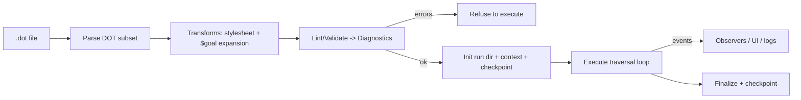
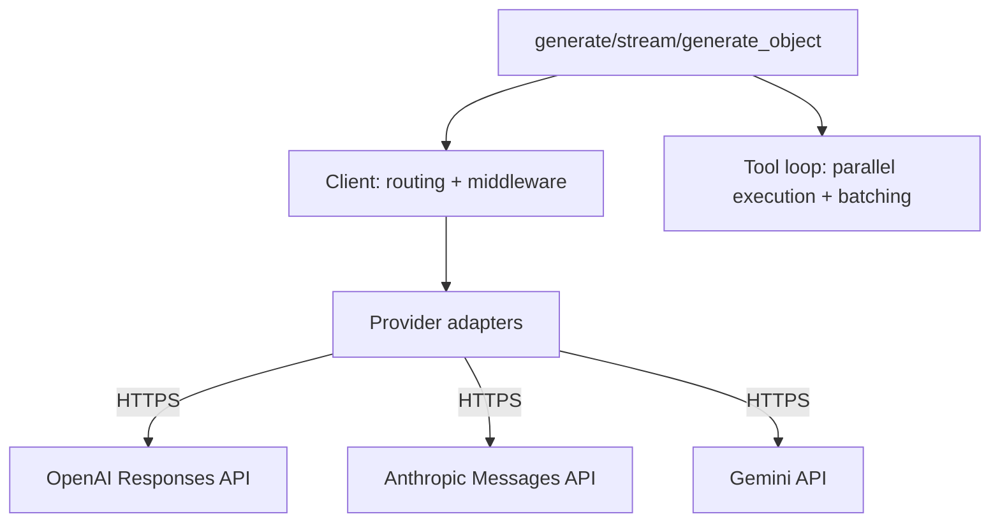
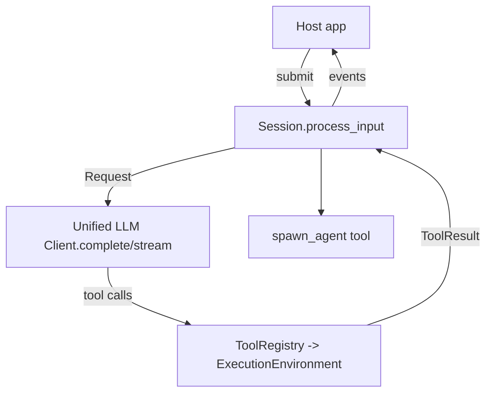
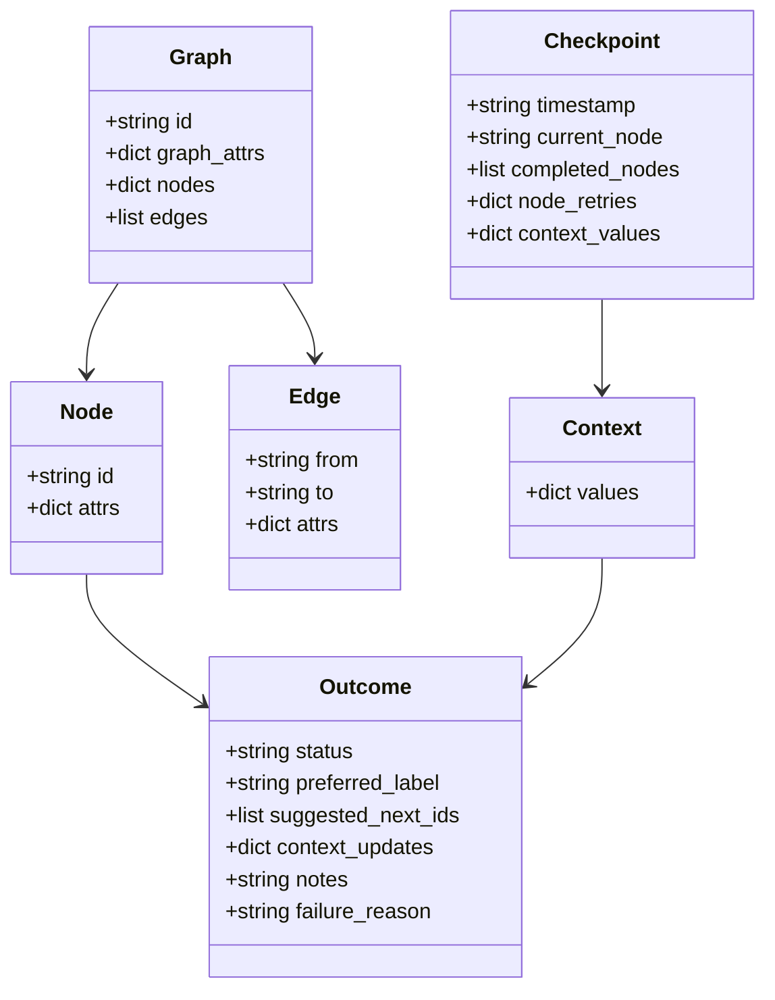
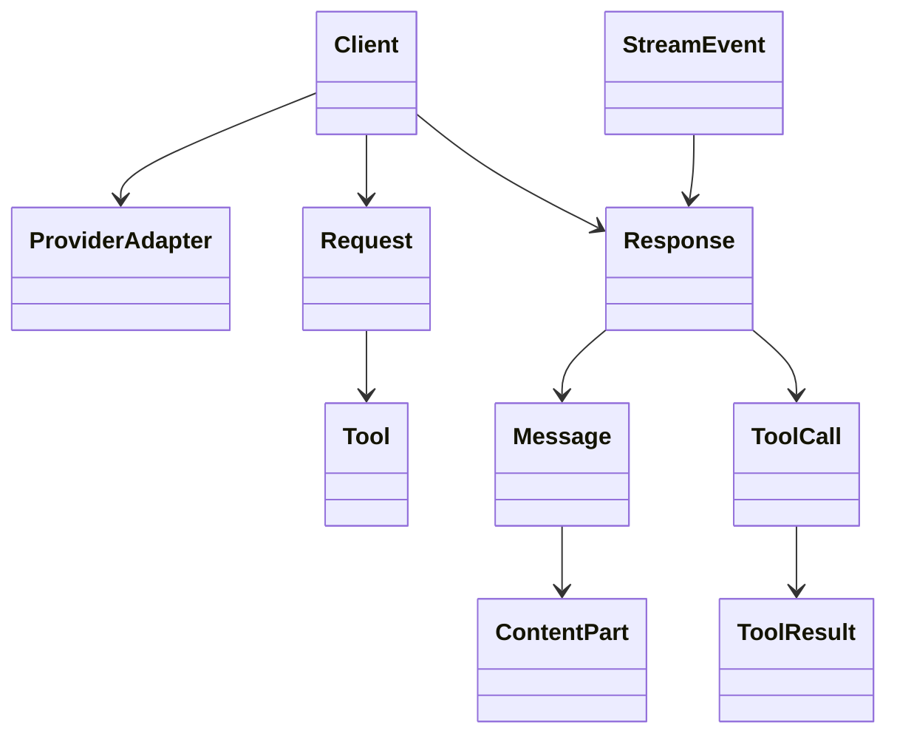

# Sprint #001 - Implement Attractor NLSpecs In Tcl (100% Spec Coverage)

Legend: `[ ]` Incomplete, `[X]` Complete

Evidence bar (copied from the golden sample): every checked item MUST include:
- The exact verification command(s) wrapped in backticks
- The exit code(s)
- References to artifacts (logs, `.scratch` transcripts, captured outputs) stored under `.scratch/verification/SPRINT-001/...`

## Objective
Implement all NLSpecs in this repository in Tcl:
- [attractor-spec.md](../../attractor-spec.md)
- [coding-agent-loop-spec.md](../../coding-agent-loop-spec.md)
- [unified-llm-spec.md](../../unified-llm-spec.md)

Success means:
- 100% coverage of each spec's "Definition of Done" checklist (Attractor: Section 11, Agent Loop: Section 9, Unified LLM: Section 8).
- A traceable spec-to-tests matrix proving coverage (not just high unit test line coverage).
- A runnable, documented Tcl implementation with deterministic tests.

## Current State Snapshot
This repository currently contains NLSpecs only (no Tcl implementation yet). The sprint delivers the initial Tcl implementation from scratch, plus tests and examples.

## Constraints, Assumptions, And Targets
- **Language/runtime target:** Tcl 8.5+ (current environment shows `tclsh 8.5.9`; no TclOO). Prefer pure Tcl + tcllib; use `snit` if OO helps.
- **Available deps (already present in this environment):** `http`, `tls`, `json`, `yaml`, `base64`, `sha1`, `md5`, `snit`, `Thread`, and CLI tools `curl`, `jq`, `rg`, `dot`.
- **Async model mapping:** Specs use "async iterator" language. In Tcl, implement streaming as:
  - Callback/event-driven streaming APIs (push), plus
  - A "pull" test harness that buffers events for deterministic assertions.
- **Provider networking:** Use TLS-enabled `http` for HTTPS calls.
- **Spec coverage definition:** "100%" means every checkbox in each spec's DoD section is green with evidence, and every MUST/SHALL requirement is either implemented or explicitly documented as out-of-scope only where the spec itself marks it optional (e.g., Attractor HTTP server mode: "if implemented").

## Golden Sample Review (SPRINT-047-google-oauth.md)
This sprint plan should match the quality bar demonstrated by `~/src/ai-digital-twin2/docs/sprints/SPRINT-047-google-oauth.md`.

What the golden sample does well (copy these patterns):
- **Execution order + dependency-aware tracks.** It explicitly sequences tracks (A->B->C...), preventing churn.
- **Checklist items with verifiable evidence.** Each item defines positive + negative tests and where logs live.
- **Clear "scope per item".** Items state touched components and expected behavior, which makes parallel work safe.
- **Artifacts discipline.** It standardizes `.scratch/verification/...` as the source of truth for completion.
- **Acceptance matrices.** Parity matrices force coverage across multiple variants (providers, paths, failure cases).
- **Non-happy-path emphasis.** Negative tests are first-class deliverables, not afterthoughts.

Potential improvements to the golden sample (avoid these pitfalls here):
- Keep critical checklists **untruncated** and easy to grep (avoid burying key requirements inside long prose).
- Prefer "why this matters" notes only where they prevent mistakes; otherwise keep items crisp.
- Ensure any "current models" references are **data-driven** (a catalog file) to avoid staleness.

## Proposed Repository Layout
Create three Tcl packages plus a small shared core:
- `lib/attractor/` (Attractor pipeline runner)
- `lib/unified_llm/` (Unified LLM client SDK)
- `lib/coding_agent_loop/` (Coding Agent Loop library)
- `lib/attractor_core/` (shared utils: logging, JSON helpers, schema validation, SSE parsing)

Top-level:
- `bin/attractor` CLI entrypoint
- `tests/` unit + integration + e2e tests
- `examples/` DOT pipelines and agent loop examples
- `docs/` additional usage docs as needed

## High-Level Architecture

### Attractor (Pipeline Runner)

### Unified LLM Client (SDK)

### Coding Agent Loop

## Domain Model (Mermaid)

### Attractor Core Types

### Unified LLM Core Types

## Spec Coverage Strategy (Non-Negotiable)
To claim 100% NLSpec coverage, we will build a traceability system:
- Extract each spec's DoD checkbox into a stable requirement ID (e.g., `ATR-DOD-11.3-EdgeSelection`, `CAL-DOD-9.5-TruncationOrder`, `ULLM-DOD-8.7-ParallelTools`).
- Extract all `MUST` / `MUST NOT` / `REQUIRED` statements into requirement IDs (e.g., `ULLM-REQ-2.7-NativeAPI`, `CAL-REQ-5.3-CharTruncFirst`).
- Maintain `docs/spec-coverage/traceability.md` mapping:
  - Requirement ID -> implementation file(s) -> test file(s) -> verification command(s).
- Add a `tools/spec_coverage.tcl` script that:
  - Parses the traceability file
  - Fails CI if any requirement is missing tests
  - Emits a coverage report summary

## Execution Order (Tracks)
This plan is dependency-ordered to minimize rewrites:
1. Track A - Scaffolding and shared utilities
2. Track B - Unified LLM Client (foundation for the agent loop)
3. Track C - Coding Agent Loop
4. Track D - Attractor pipeline runner
5. Track E - Integration, e2e, and coverage closure

## Track A - Project Scaffolding (Tcl Packages + Test Harness)
- [ ] **A1 - Package scaffolding**
  - Deliverables:
    - `pkgIndex.tcl` at repo root
    - `lib/{attractor,unified_llm,coding_agent_loop,attractor_core}/...` with `package provide`
    - `tests/all.tcl` driving `tcltest` across all test files
  - Verification:
    - `tclsh tests/all.tcl` (exit 0)

- [ ] **A2 - Shared utilities**
  - Deliverables (in `lib/attractor_core/`):
    - JSON encode/decode helpers (wrapping `::json::*`)
    - Minimal JSON Schema validator (object/properties/required/type/enum) for tool args + structured output
    - SSE parser (for provider streaming)
    - Cross-platform process exec helper (timeout + kill semantics)
  - Verification:
    - `tclsh tests/all.tcl -match attractor_core-*` (exit 0)

- [ ] **A3 - `.scratch` evidence scaffolding**
  - Deliverables:
    - `.scratch/verification/SPRINT-001/README.md` describing evidence rules
  - Verification:
    - `test -f .scratch/verification/SPRINT-001/README.md` (exit 0)

## Track B - Unified LLM Client (unified-llm-spec.md)

### B0 - Requirements Indexing
- [ ] **B0.1 - Build ULLM traceability map**
  - Deliverables:
    - Requirement IDs for ULLM DoD 8.1-8.10 + MUST statements
    - Initial `docs/spec-coverage/traceability.md` skeleton
  - Verification:
    - `rg "ULLM-" docs/spec-coverage/traceability.md` (exit 0)

### B1 - Core Client + Data Model
- [ ] **B1.1 - Data model types (Message/ContentPart/Request/Response/etc.)**
  - Notes:
    - Use Tcl dicts as records; provide constructors/accessors mirroring spec (e.g., `Message.system`, `Response.text`).
    - Ensure role mapping is explicit (SYSTEM/USER/ASSISTANT/TOOL/DEVELOPER).
  - Tests:
    - Round-trip tests for tool calls/results and thinking blocks.

- [ ] **B1.2 - Error hierarchy**
  - Deliverables:
    - `SDKError` base + all subclasses in spec (ProviderError and children, NetworkError, AbortError, etc.)
    - HTTP status -> error mapping + retryable flags + Retry-After parsing.

- [ ] **B1.3 - Client routing + middleware**
  - Deliverables:
    - `Client.from_env`
    - Adapter registry + default provider resolution (never guess)
    - Middleware chain order (request forward, response reverse), including streaming middleware wrapping.

### B2 - Provider Utilities
- [ ] **B2.1 - HTTP helper**
  - Requirements:
    - TLS
    - timeouts (connect/request/stream_read) mapped to Tcl http behaviors
    - header capture for rate limit fields

- [ ] **B2.2 - SSE parser + stream accumulator**
  - Requirements:
    - Correct SSE framing (event/data/retry/comments/blank lines)
    - StreamEvent normalization: start/delta/end pattern; FINISH includes usage + response.

### B3 - Provider Adapters (Native APIs)
- [ ] **B3.1 - OpenAI adapter**
  - Hard requirement:
    - Use Responses API shape (not Chat Completions) for reasoning token support.
  - Deliverables:
    - Message translation (instructions extraction, input items)
    - Tool call + tool result translation
    - Streaming translation of Responses SSE events

- [ ] **B3.2 - Anthropic adapter**
  - Hard requirements:
    - Messages API shape, strict alternation handling, thinking signature round-tripping
    - Prompt caching injection via `cache_control` and beta headers when needed

- [ ] **B3.3 - Gemini adapter**
  - Hard requirements:
    - Native Gemini API shape, synthetic tool call IDs mapping to function names
    - Streaming translation (JSON chunk or SSE alt)

### B4 - High-Level APIs + Tool Loop
- [ ] **B4.1 - generate()/stream() wrappers**
  - Requirements:
    - prompt vs messages exclusivity
    - timeouts (total + per-step) and abort signals
    - usage aggregation across steps

- [ ] **B4.2 - Tool calling loop**
  - Requirements:
    - Active vs passive tools
    - max_tool_rounds semantics (`0` disables)
    - Parallel tool calls: execute concurrently, batch results into a single continuation request, preserve ordering
    - Unknown tool calls become error ToolResult (not thrown)

- [ ] **B4.3 - generate_object()/stream_object()**
  - Requirements:
    - Provider-specific structured output where supported
    - Validation with JSON schema; errors raise NoObjectGeneratedError

### B5 - Model Catalog
- [ ] **B5.1 - Model catalog data file**
  - Deliverables:
    - `lib/unified_llm/models.json` or similar, loaded by SDK
    - `get_model_info`, `list_models`, `get_latest_model`

### B6 - ULLM Parity Matrix + Smoke Tests
- [ ] **B6.1 - Cross-provider parity matrix (ULLM DoD 8.9)**
  - Tests:
    - Use a local mock HTTP server for deterministic unit tests where possible
    - Gate real-provider tests behind env vars (OPENAI_API_KEY, ANTHROPIC_API_KEY, GEMINI_API_KEY)

- [ ] **B6.2 - Integration smoke test (ULLM DoD 8.10)**
  - Evidence:
    - Logs under `.scratch/verification/SPRINT-001/unified_llm/smoke/...`

## Track C - Coding Agent Loop (coding-agent-loop-spec.md)

### C0 - Requirements Indexing
- [ ] **C0.1 - Build CAL traceability map**

### C1 - Tool Registry + Execution Environment
- [ ] **C1.1 - ToolRegistry**
  - Requirements:
    - argument JSON validation against schema
    - unknown tools return error result, not exception

- [ ] **C1.2 - LocalExecutionEnvironment**
  - Requirements:
    - read/write/edit/apply_patch support per profile needs
    - shell with timeouts and process group kill semantics
    - env var filtering defaults (exclude `*_API_KEY`, `*_SECRET`, etc.)
    - grep/glob implementations (prefer `rg` when present)

### C2 - Truncation + Context Awareness
- [ ] **C2.1 - Tool output truncation**
  - Hard requirements:
    - character truncation runs FIRST
    - line truncation runs SECOND (shell/grep/glob defaults)
    - truncation marker includes removed size and instructions
    - TOOL_CALL_END event always carries full untruncated output

- [ ] **C2.2 - Context window awareness warning events**

### C3 - Provider Profiles (Provider-Aligned Toolsets)
- [ ] **C3.1 - OpenAI profile (codex-rs-aligned)**
  - Requirements:
    - apply_patch tool (v4a) + system prompt topics

- [ ] **C3.2 - Anthropic profile (Claude Code-aligned)**
  - Requirements:
    - edit_file old_string/new_string semantics + system prompt topics

- [ ] **C3.3 - Gemini profile (gemini-cli-aligned)**

### C4 - Session Core Loop + Events + Steering
- [ ] **C4.1 - Session + process_input core loop**
  - Requirements:
    - natural completion (text-only response)
    - max_tool_rounds_per_input + max_turns enforcement
    - abort signal -> graceful shutdown
    - loop detection -> SteeringTurn warning
    - multiple sequential inputs

- [ ] **C4.2 - Event system**
  - Requirements:
    - all event kinds emitted at correct times
    - async-ish consumption (callback or queue)

- [ ] **C4.3 - System prompt assembly**
  - Requirements:
    - layered prompt construction
    - environment context block
    - git context snapshot
    - project doc discovery rules (AGENTS.md + provider-specific)

### C5 - Subagents
- [ ] **C5.1 - Subagent spawning tools**
  - Requirements:
    - depth limiting (default 1)
    - independent history but shared filesystem/execution env
    - tools: spawn_agent/send_input/wait/close_agent

### C6 - CAL Parity Matrix + Smoke Test
- [ ] **C6.1 - Cross-provider parity matrix (CAL DoD 9.12)**
- [ ] **C6.2 - Integration smoke test (CAL DoD 9.13)**

## Track D - Attractor (attractor-spec.md)

### D0 - Requirements Indexing
- [ ] **D0.1 - Build ATR traceability map**

### D1 - DOT Parser (Subset)
- [ ] **D1.1 - Comment stripping + tokenizer**
- [ ] **D1.2 - Parser: digraph subset + typed attributes**
- [ ] **D1.3 - Defaults (graph/node/edge), chained edges, subgraphs flattening**

### D2 - Stylesheet + Transforms
- [ ] **D2.1 - Stylesheet parser + specificity rules**
- [ ] **D2.2 - Transform registry + built-in transforms ($goal expansion, stylesheet apply)**

### D3 - Validation / Linting
- [ ] **D3.1 - Diagnostic model**
- [ ] **D3.2 - Built-in lint rules + validate_or_raise**
- [ ] **D3.3 - Custom rule extension point**

### D4 - State: Context / Outcome / Checkpoint / Artifacts
- [ ] **D4.1 - Context (thread-safe)**
- [ ] **D4.2 - Outcome model + status.json contract**
- [ ] **D4.3 - Checkpoint save/load + resume behavior (fidelity degrade hop)**
- [ ] **D4.4 - Artifact store + run directory layout**

### D5 - Condition Expression Language
- [ ] **D5.1 - Condition parser + evaluator**

### D6 - Execution Engine
- [ ] **D6.1 - Core traversal loop**
- [ ] **D6.2 - Edge selection algorithm (5-step)**
- [ ] **D6.3 - Goal gates + retry_target routing**
- [ ] **D6.4 - Retry policy + backoff + jitter**
- [ ] **D6.5 - Failure routing + loop_restart**

### D7 - Handlers
- [ ] **D7.1 - Handler registry + custom handlers**
- [ ] **D7.2 - start + exit**
- [ ] **D7.3 - codergen + CodergenBackend interface**
  - Integration plan:
    - Provide a CodergenBackend implementation backed by Unified LLM `generate()` for basic LLM calls.
    - Provide an optional CodergenBackend backed by Coding Agent Loop Session for tool-using coding tasks.
- [ ] **D7.4 - wait.human + interviewer integration**
- [ ] **D7.5 - conditional**
- [ ] **D7.6 - parallel fan-out + fan-in (Thread package, isolated cloned contexts)**
- [ ] **D7.7 - tool handler (shell/exec)**
- [ ] **D7.8 - stack.manager_loop handler (child pipeline supervision)**

### D8 - Human-in-the-Loop (Interviewers)
- [ ] **D8.1 - Interviewer interface**
- [ ] **D8.2 - AutoApprove/Console/Callback/Queue/Recording implementations**
- [ ] **D8.3 - Timeout behavior + defaults**

### D9 - Events / Observability / Hooks
- [ ] **D9.1 - Event model and delivery**
- [ ] **D9.2 - Tool call hooks (pre/post)**

### D10 - CLI (Minimum Required UX)
- [ ] **D10.1 - `bin/attractor run pipeline.dot`**
  - Requirements:
    - parse -> validate -> execute
    - emits events to console
    - writes run dir structure with checkpoint/status/prompt/response
- [ ] **D10.2 - Resume from checkpoint**
- [ ] **D10.3 - Optional: render SVG via `dot`**

### D11 - Optional HTTP Server Mode
- [ ] **D11.1 - HTTP server mode (only if we choose to implement)**
  - Note: This is marked optional by the spec ("if implemented"). Decide explicitly during execution whether to include it in this sprint.

### D12 - ATR Parity Matrix + Smoke Test
- [ ] **D12.1 - Cross-feature parity matrix (ATR DoD 11.12)**
- [ ] **D12.2 - Integration smoke test (ATR DoD 11.13)**

## Track E - Cross-Spec Integration + Coverage Closure
- [ ] **E1 - Attractor codergen backend uses Unified LLM**
  - Demonstrate an Attractor pipeline that:
    - runs codergen nodes with model stylesheet defaults
    - uses $goal expansion
    - writes prompt.md/response.md

- [ ] **E2 - Attractor codergen backend uses Coding Agent Loop**
  - Demonstrate a pipeline node that runs a tool-using coding task (read/edit/shell) via Session.

- [ ] **E3 - End-to-end examples**
  - Deliverables:
    - `examples/` DOT pipelines for: linear, branching, retries, goal gates, human gate, parallel, tool handler, manager loop.

- [ ] **E4 - Spec coverage report is green**
  - Verification:
    - `tclsh tools/spec_coverage.tcl` (exit 0)

## Test Strategy (By Layer)
- Unit tests:
  - DOT parser/validator edge cases (comments, multiline attrs, chained edges, defaults, subgraphs).
  - Condition evaluator truth table.
  - Truncation behavior (char first, line second; marker correctness).
  - JSON schema validator (tool args + structured output).
  - Provider request translation (golden JSON fixtures) without needing network.
- Integration tests:
  - Local mock servers for OpenAI/Anthropic/Gemini HTTP + SSE streaming to validate adapters deterministically.
  - Tool execution end-to-end (shell timeouts, env filtering).
- End-to-end tests:
  - Run Attractor CLI against example DOT and assert run dir outputs + deterministic checkpoint/resume.
  - (Optional/gated) live-provider smoke tests with real keys.

## Risks And Mitigations
- Risk: **Tcl 8.5 lacks coroutines/TclOO**, making "async iterator" semantics awkward.
  - Mitigation: callback-based streaming + buffered event streams for tests; document API mapping precisely.
- Risk: Provider APIs and beta headers evolve.
  - Mitigation: keep provider adapters isolated; keep model catalog data-driven; implement `provider_options` escape hatch fully.
- Risk: True 100% spec coverage is large.
  - Mitigation: enforce traceability early (Track A/B0/C0/D0) so we never "lose" requirements.

## Definition Of Done (Sprint-Level)
- [ ] All three spec DoD checklists are satisfied with evidence.
- [ ] `tclsh tests/all.tcl` passes from a clean checkout.
- [ ] `docs/spec-coverage/traceability.md` + `tools/spec_coverage.tcl` prove no uncovered requirements remain.
- [ ] At least one end-to-end Attractor pipeline runs using:
  - Unified LLM backend (mocked by default, live gated by env)
  - Coding Agent Loop backend for a tool-using node

