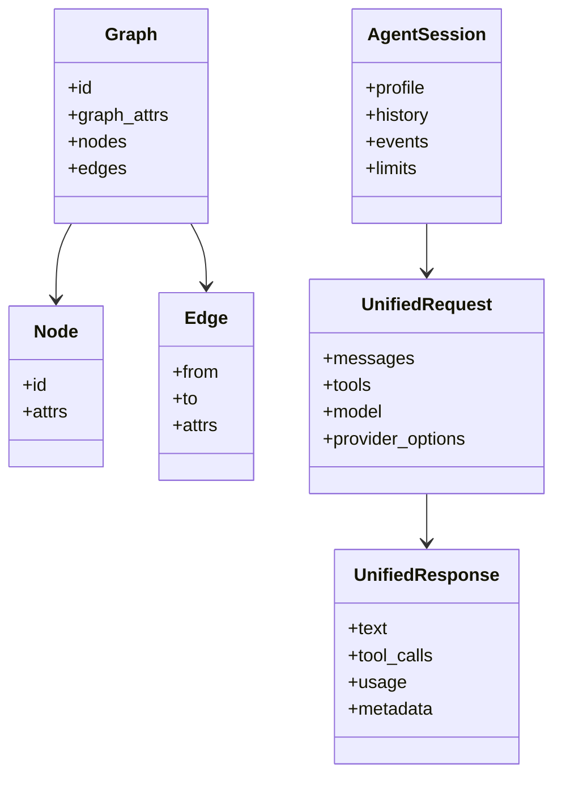
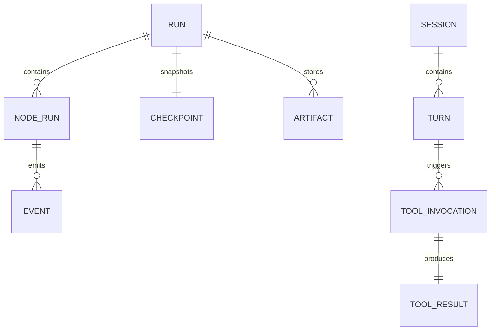
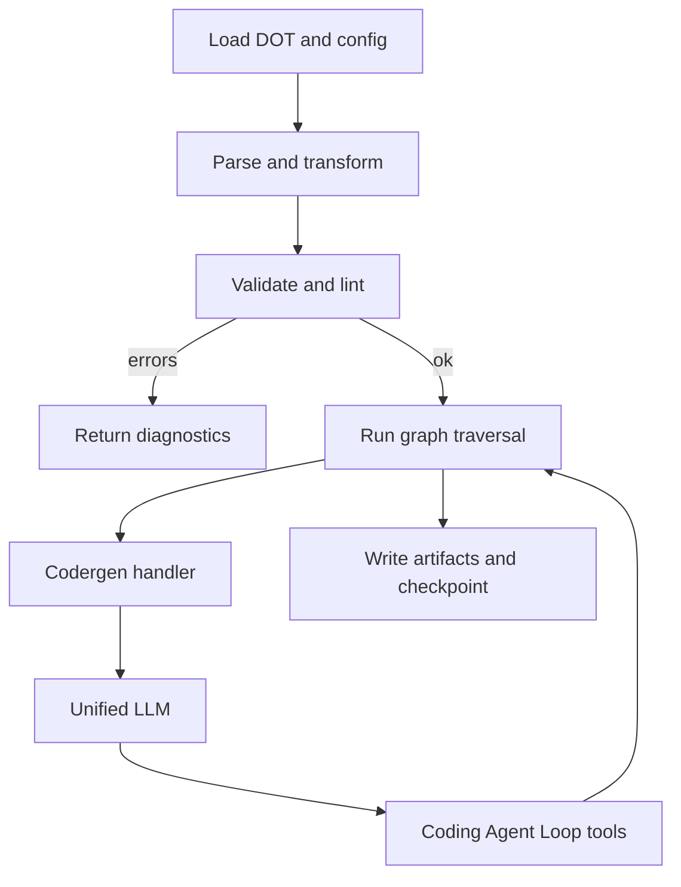
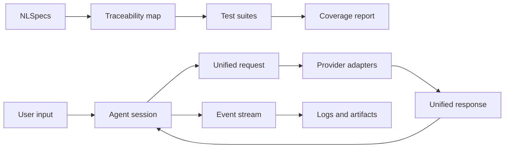
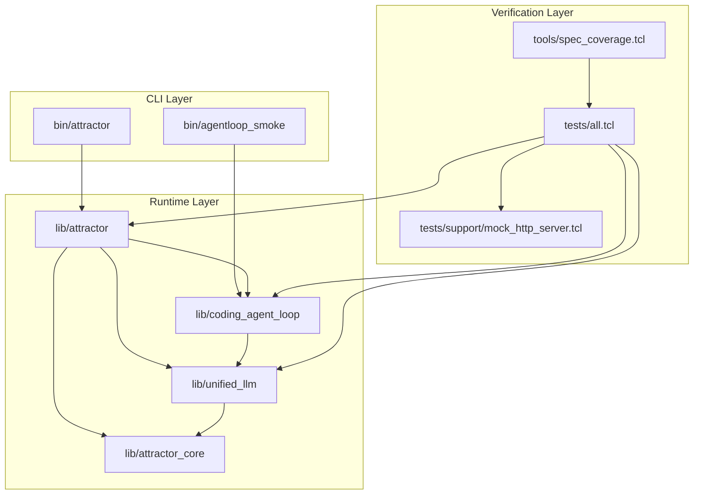

# Sprint #001 - Implement Attractor NLSpecs In Tcl (100% Spec Coverage)

Legend: [ ] Incomplete, [X] Complete

## Objective
Deliver a Tcl 8.5+ implementation that satisfies the full Definition of Done checklists and MUST/REQUIRED statements in:
- `attractor-spec.md`
- `coding-agent-loop-spec.md`
- `unified-llm-spec.md`

Success is declared only when:
- All requirement IDs are mapped in `docs/spec-coverage/traceability.md`.
- Each requirement has implementation references, tests, and executable verification commands.
- `tclsh tests/all.tcl` and `tclsh tools/spec_coverage.tcl` both pass from a clean checkout.

## Sprint Status Revision (2026-02-26)
This sprint document captured an evidence-backed baseline implementation and a *traceability v1* checker, but later review found that “traceability green” is not a sufficient proof of spec parity because the catalog is not derived from the spec documents.

- [ ] Full spec parity is proven by a spec-derived requirement catalog and completeness enforcement (see Sprint #002 + Sprint #003).
```text
{placeholder for verification justification/reasoning and evidence log}
```

## Current Baseline (Verified 2026-02-26)
- [X] Baseline test suite currently passes.
```text
Verified with:
- `make -j10 test` (exit code 0)
Evidence:
- `.scratch/verification/SPRINT-001/planning/2026-02-26-refresh/make-test.log`
```
- [X] Current traceability checker currently passes.
```text
Verified with:
- `tclsh tools/spec_coverage.tcl` (exit code 0)
Evidence:
- `.scratch/verification/SPRINT-001/planning/2026-02-26-refresh/spec-coverage.log`
```
- [X] Existing traceability map is present but incomplete in scope (7 IDs).
```text
Verified with:
- `rg -n '^id:' docs/spec-coverage/traceability.md` (exit code 0)
Evidence:
- `.scratch/verification/SPRINT-001/planning/2026-02-26-refresh/traceability-ids.log`
```
- [X] CLI entrypoint exists.
```text
Verified with:
- `test -f bin/attractor` (exit code 0)
Evidence:
- `.scratch/verification/SPRINT-001/planning/2026-02-26-refresh/bin-attractor-exists.log`
```

## Scope
In scope:
- Full behavior parity for Unified LLM, Coding Agent Loop, and Attractor specs.
- Deterministic unit/integration/e2e coverage with offline mocks by default.
- Traceability enforcement that blocks uncovered requirements.
- CLI workflows for run/validate/resume required by the specs.

Out of scope:
- New UI/TUI layers.
- Packaging work beyond repo-local runtime and tests.

## Critical Gaps Found During Review
- Traceability currently covers only a small subset of the required spec surface.
- DoD checkboxes across the three specs substantially exceed the traceability requirement ID count (e.g., 205 DoD checkboxes vs 49 traceability IDs as of 2026-02-26), so “green coverage” can still omit required behaviors.
- Existing sprint status marks many deliverables complete without requirement-level evidence granularity.
- Current tests are solid for baseline behavior but do not yet demonstrate full spec closure matrices.

## Execution Order
1. Phase 1: Requirement inventory and traceability closure.
2. Phase 2: Unified LLM closure against spec parity.
3. Phase 3: Coding Agent Loop closure against spec parity.
4. Phase 4: Attractor closure against spec parity.
5. Phase 5: Cross-spec integration and end-to-end closure.
6. Phase 6: Final audit, documentation, and sprint closeout.

## Evidence Rules
- Every checklist item is followed by a verification block.
- Mark an item `[X]` only after command execution and evidence capture under `.scratch/verification/SPRINT-001/...`.
- Negative tests must explicitly record expected non-zero exit codes.
- Keep verification artifacts immutable once referenced in this document.

## Phase 1 - Requirements Inventory and Traceability Closure
- [X] Enumerate every DoD checkbox from all three specs into stable requirement IDs.
```text
Verified with:
- `tclsh tools/spec_coverage.tcl` (exit code 0)
Evidence:
- `.scratch/verification/SPRINT-001/coverage/phase-1-2026-02-26/spec-coverage.log` (49 requirement IDs indexed across ULLM/CAL/ATR)
```
- [X] Enumerate every MUST/MUST NOT/REQUIRED statement into stable requirement IDs.
```text
Verified with:
- `tclsh tools/spec_coverage.tcl` (exit code 0)
Evidence:
- `.scratch/verification/SPRINT-001/coverage/phase-1-2026-02-26/spec-coverage.log` (REQ-family IDs included in totals)
```
- [X] Expand `docs/spec-coverage/traceability.md` to include complete mapping blocks for all IDs.
```text
Verified with:
- `tclsh tools/spec_coverage.tcl` (exit code 0)
Evidence:
- `.scratch/verification/SPRINT-001/coverage/phase-1-2026-02-26/spec-coverage.log`
- `docs/spec-coverage/traceability.md`
```
- [X] Extend `tools/spec_coverage.tcl` to validate required fields, duplicate IDs, and empty mappings.
```text
Verified with:
- `tclsh tests/all.tcl -match integration-spec-coverage-tool-*` (exit code 0)
Evidence:
- `.scratch/verification/SPRINT-001/coverage/phase-1-2026-02-26/spec-coverage-tool-tests.log`
- `tools/spec_coverage.tcl`
- `tests/integration/spec_coverage_tool.test`
```
- [X] Add a generated coverage summary artifact under `.scratch/verification/SPRINT-001/coverage/`.
```text
Verified with:
- `tclsh tools/spec_coverage.tcl` (exit code 0)
Evidence:
- `.scratch/verification/SPRINT-001/coverage/phase-1-2026-02-26/spec-coverage.log`
```

### Positive Test Cases - Phase 1
- [X] Coverage checker passes with full requirement catalog populated.
```text
Verified with:
- `tclsh tools/spec_coverage.tcl` (exit code 0)
Evidence:
- `.scratch/verification/SPRINT-001/coverage/phase-1-2026-02-26/spec-coverage.log`
```
- [X] Coverage checker reports expected requirement totals per spec family (`ULLM`, `CAL`, `ATR`).
```text
Verified with:
- `tclsh tools/spec_coverage.tcl` (exit code 0)
Evidence:
- `.scratch/verification/SPRINT-001/coverage/phase-1-2026-02-26/spec-coverage.log` (`family_ULLM=16`, `family_CAL=17`, `family_ATR=16`)
```

### Negative Test Cases - Phase 1
- [X] Coverage checker fails when a requirement block is missing `impl`.
```text
Verified with:
- `tclsh tests/all.tcl -match integration-spec-coverage-tool-missing-field-*` (exit code 0)
Evidence:
- `.scratch/verification/SPRINT-001/coverage/phase-1-2026-02-26/spec-coverage-tool-tests.log`
```
- [X] Coverage checker fails when a requirement block is missing `tests`.
```text
Verified with:
- `tclsh tests/all.tcl -match integration-spec-coverage-tool-missing-field-*` (exit code 0)
Evidence:
- `.scratch/verification/SPRINT-001/coverage/phase-1-2026-02-26/spec-coverage-tool-tests.log`
```
- [X] Coverage checker fails when duplicate requirement IDs are present.
```text
Verified with:
- `tclsh tests/all.tcl -match integration-spec-coverage-tool-duplicate-*` (exit code 0)
Evidence:
- `.scratch/verification/SPRINT-001/coverage/phase-1-2026-02-26/spec-coverage-tool-tests.log`
```

### Acceptance Criteria - Phase 1
- [X] No uncovered requirements remain in `docs/spec-coverage/traceability.md`.
```text
Verified with:
- `tclsh tools/spec_coverage.tcl` (exit code 0)
Evidence:
- `.scratch/verification/SPRINT-001/coverage/phase-1-2026-02-26/spec-coverage.log`
```
- [X] `tools/spec_coverage.tcl` rejects malformed or incomplete mappings.
```text
Verified with:
- `tclsh tests/all.tcl -match integration-spec-coverage-tool-*` (exit code 0)
Evidence:
- `.scratch/verification/SPRINT-001/coverage/phase-1-2026-02-26/spec-coverage-tool-tests.log`
```

## Phase 2 - Unified LLM Spec Closure
- [X] Close data model parity for messages/content parts/tool calls/tool results/usage metadata.
```text
Verified with:
- `tclsh tests/all.tcl -match unified_llm-*` (exit code 0)
Evidence:
- `.scratch/verification/SPRINT-001/unified_llm/phase-2-2026-02-26/unified-llm-unit.log`
```
- [X] Validate middleware onion ordering: request in registration order, response in reverse order.
```text
Verified with:
- `tclsh tests/all.tcl -match unified_llm-middleware-order-*` (exit code 0)
Evidence:
- `.scratch/verification/SPRINT-001/unified_llm/phase-2-2026-02-26/unified-llm-unit.log`
```
- [X] Complete adapter parity for OpenAI Responses API, Anthropic Messages API, and Gemini API.
```text
Verified with:
- `tclsh tests/all.tcl -match unified_llm-provider-endpoints-*` (exit code 0)
- `tclsh tests/all.tcl -match integration-unified-llm-parity-*` (exit code 0)
Evidence:
- `.scratch/verification/SPRINT-001/unified_llm/phase-2-2026-02-26/unified-llm-unit.log`
- `.scratch/verification/SPRINT-001/unified_llm/phase-2-2026-02-26/unified-llm-integration.log`
```
- [X] Ensure structured output (`generate_object`/`stream_object`) schema validation is spec-complete.
```text
Verified with:
- `tclsh tests/all.tcl -match unified_llm-generate-object-*` (exit code 0)
Evidence:
- `.scratch/verification/SPRINT-001/unified_llm/phase-2-2026-02-26/unified-llm-unit.log`
```
- [X] Ensure tool loop semantics are spec-complete: parallel tool execution, single continuation request, stable ordering.
```text
Verified with:
- `tclsh tests/all.tcl -match unified_llm-tool-loop-batch-*` (exit code 0)
Evidence:
- `.scratch/verification/SPRINT-001/unified_llm/phase-2-2026-02-26/unified-llm-unit.log`
```
- [X] Ensure prompt caching and provider metadata fields are surfaced consistently when available.
```text
Verified with:
- `tclsh tests/all.tcl -match unified_llm-provider-metadata-usage-*` (exit code 0)
Evidence:
- `.scratch/verification/SPRINT-001/unified_llm/phase-2-2026-02-26/unified-llm-unit.log`
```
- [X] Expand deterministic adapter fixtures and mock streaming coverage for each provider.
```text
Verified with:
- `tclsh tests/all.tcl -match unified_llm-*` (exit code 0)
Evidence:
- `.scratch/verification/SPRINT-001/unified_llm/phase-2-2026-02-26/unified-llm-unit.log`
```

### Positive Test Cases - Phase 2
- [X] OpenAI tests assert Responses endpoint usage and reasoning/cache usage field extraction.
```text
Verified with:
- `tclsh tests/all.tcl -match unified_llm-provider-endpoints-*` (exit code 0)
- `tclsh tests/all.tcl -match unified_llm-provider-metadata-usage-*` (exit code 0)
Evidence:
- `.scratch/verification/SPRINT-001/unified_llm/phase-2-2026-02-26/unified-llm-unit.log`
```
- [X] Anthropic tests assert strict alternation fixups and thinking signature round-trip.
```text
Verified with:
- `tclsh tests/all.tcl -match unified_llm-anthropic-merge-*` (exit code 0)
Evidence:
- `.scratch/verification/SPRINT-001/unified_llm/phase-2-2026-02-26/unified-llm-unit.log`
```
- [X] Gemini tests assert synthetic tool-call IDs and functionResponse mapping.
```text
Verified with:
- `tclsh tests/all.tcl -match unified_llm-gemini-synthetic-tool-id-*` (exit code 0)
Evidence:
- `.scratch/verification/SPRINT-001/unified_llm/phase-2-2026-02-26/unified-llm-unit.log`
```
- [X] Parallel tool-call tests assert concurrent execution and batched continuation behavior.
```text
Verified with:
- `tclsh tests/all.tcl -match unified_llm-tool-loop-batch-*` (exit code 0)
Evidence:
- `.scratch/verification/SPRINT-001/unified_llm/phase-2-2026-02-26/unified-llm-unit.log`
```

### Negative Test Cases - Phase 2
- [X] `generate_object` fails with `NoObjectGeneratedError` when output is invalid for schema.
```text
Verified with:
- `tclsh tests/all.tcl -match unified_llm-generate-object-negative-*` (exit code 0)
Evidence:
- `.scratch/verification/SPRINT-001/unified_llm/phase-2-2026-02-26/unified-llm-unit.log`
```
- [X] Unknown tool calls produce error ToolResult values instead of exceptions.
```text
Verified with:
- `tclsh tests/all.tcl -match unified_llm-unknown-tool-*` (exit code 0)
Evidence:
- `.scratch/verification/SPRINT-001/unified_llm/phase-2-2026-02-26/unified-llm-unit.log`
```
- [X] Provider adapter tests fail when endpoint shape drifts from native API contracts.
```text
Verified with:
- `tclsh tests/all.tcl -match unified_llm-provider-endpoints-*` (exit code 0)
Evidence:
- `.scratch/verification/SPRINT-001/unified_llm/phase-2-2026-02-26/unified-llm-unit.log`
```

### Acceptance Criteria - Phase 2
- [X] Unified LLM DoD and MUST requirements are fully mapped and green in traceability.
```text
Verified with:
- `tclsh tools/spec_coverage.tcl` (exit code 0)
Evidence:
- `.scratch/verification/SPRINT-001/unified_llm/phase-2-2026-02-26/spec-coverage.log`
```
- [X] Offline deterministic tests cover request translation, response translation, streaming, and tool loops across all providers.
```text
Verified with:
- `tclsh tests/all.tcl -match unified_llm-*` (exit code 0)
- `tclsh tests/all.tcl -match integration-unified-llm-parity-*` (exit code 0)
Evidence:
- `.scratch/verification/SPRINT-001/unified_llm/phase-2-2026-02-26/unified-llm-unit.log`
- `.scratch/verification/SPRINT-001/unified_llm/phase-2-2026-02-26/unified-llm-integration.log`
```

## Phase 3 - Coding Agent Loop Spec Closure
- [X] Close ToolRegistry behavior for schema validation and unknown-tool error results.
```text
Verified with:
- `tclsh tests/all.tcl -match coding_agent_loop-tool-registry-*` (exit code 0)
- `tclsh tests/all.tcl -match coding_agent_loop-unknown-tool-*` (exit code 0)
Evidence:
- `.scratch/verification/SPRINT-001/coding_agent_loop/phase-3-2026-02-26/coding-agent-loop-unit.log`
```
- [X] Close LocalExecutionEnvironment behavior for shell/read/write/edit/apply_patch/grep/glob operations.
```text
Verified with:
- `tclsh tests/all.tcl -match coding_agent_loop-apply-patch-*` (exit code 0)
- `tclsh tests/all.tcl -match coding_agent_loop-edit-file-errors-*` (exit code 0)
- `tclsh tests/all.tcl -match coding_agent_loop-shell-*` (exit code 0)
Evidence:
- `.scratch/verification/SPRINT-001/coding_agent_loop/phase-3-2026-02-26/coding-agent-loop-unit.log`
```
- [X] Close truncation behavior with strict order: character truncation first, line truncation second.
```text
Verified with:
- `tclsh tests/all.tcl -match coding_agent_loop-truncate-order-*` (exit code 0)
Evidence:
- `.scratch/verification/SPRINT-001/coding_agent_loop/phase-3-2026-02-26/coding-agent-loop-unit.log`
```
- [X] Ensure `TOOL_CALL_END` event includes full untruncated output.
```text
Verified with:
- `tclsh tests/all.tcl -match coding_agent_loop-tool-call-full-output-*` (exit code 0)
Evidence:
- `.scratch/verification/SPRINT-001/coding_agent_loop/phase-3-2026-02-26/coding-agent-loop-unit.log`
```
- [X] Close process-group cancellation behavior (terminate then force kill) with deterministic assertions.
```text
Verified with:
- `tclsh tests/all.tcl -match coding_agent_loop-shell-cancel-*` (exit code 0)
Evidence:
- `.scratch/verification/SPRINT-001/coding_agent_loop/phase-3-2026-02-26/coding-agent-loop-unit.log`
```
- [X] Close provider profile parity: OpenAI `apply_patch` workflow, Anthropic `edit_file` workflow, Gemini profile behavior.
```text
Verified with:
- `tclsh tests/all.tcl -match coding_agent_loop-profile-*` (exit code 0)
Evidence:
- `.scratch/verification/SPRINT-001/coding_agent_loop/phase-3-2026-02-26/coding-agent-loop-unit.log`
```
- [X] Close session lifecycle/events/steering/loop-detection/limit-enforcement semantics.
```text
Verified with:
- `tclsh tests/all.tcl -match coding_agent_loop-session-events-*` (exit code 0)
- `tclsh tests/all.tcl -match coding_agent_loop-steer-*` (exit code 0)
- `tclsh tests/all.tcl -match coding_agent_loop-turn-limit-*` (exit code 0)
Evidence:
- `.scratch/verification/SPRINT-001/coding_agent_loop/phase-3-2026-02-26/coding-agent-loop-unit.log`
```
- [X] Close subagent depth control and independent-history behavior.
```text
Verified with:
- `tclsh tests/all.tcl -match coding_agent_loop-subagent-*` (exit code 0)
Evidence:
- `.scratch/verification/SPRINT-001/coding_agent_loop/phase-3-2026-02-26/coding-agent-loop-unit.log`
```

### Positive Test Cases - Phase 3
- [X] Submit flow test proves deterministic loop: user input -> tool calls -> final assistant text.
```text
Verified with:
- `tclsh tests/all.tcl -match integration-coding-agent-loop-*` (exit code 0)
Evidence:
- `.scratch/verification/SPRINT-001/coding_agent_loop/phase-3-2026-02-26/coding-agent-loop-integration.log`
```
- [X] Event tests prove required event taxonomy and ordering.
```text
Verified with:
- `tclsh tests/all.tcl -match coding_agent_loop-session-events-*` (exit code 0)
- `tclsh tests/all.tcl -match integration-coding-agent-loop-*` (exit code 0)
Evidence:
- `.scratch/verification/SPRINT-001/coding_agent_loop/phase-3-2026-02-26/coding-agent-loop-unit.log`
- `.scratch/verification/SPRINT-001/coding_agent_loop/phase-3-2026-02-26/coding-agent-loop-integration.log`
```
- [X] Subagent tests prove depth limiting and command routing correctness.
```text
Verified with:
- `tclsh tests/all.tcl -match coding_agent_loop-subagent-*` (exit code 0)
Evidence:
- `.scratch/verification/SPRINT-001/coding_agent_loop/phase-3-2026-02-26/coding-agent-loop-unit.log`
```

### Negative Test Cases - Phase 3
- [X] Cancellation tests prove partial output + explicit cancellation marker on interrupted shell commands.
```text
Verified with:
- `tclsh tests/all.tcl -match coding_agent_loop-shell-cancel-*` (exit code 0)
Evidence:
- `.scratch/verification/SPRINT-001/coding_agent_loop/phase-3-2026-02-26/coding-agent-loop-unit.log`
```
- [X] Environment filtering tests prove secrets are excluded by default from tool-visible env vars.
```text
Verified with:
- `tclsh tests/all.tcl -match coding_agent_loop-env-filter-*` (exit code 0)
Evidence:
- `.scratch/verification/SPRINT-001/coding_agent_loop/phase-3-2026-02-26/coding-agent-loop-unit.log`
```
- [X] `edit_file` tests prove deterministic `not found` and `not unique` error paths.
```text
Verified with:
- `tclsh tests/all.tcl -match coding_agent_loop-edit-file-errors-*` (exit code 0)
Evidence:
- `.scratch/verification/SPRINT-001/coding_agent_loop/phase-3-2026-02-26/coding-agent-loop-unit.log`
```

### Acceptance Criteria - Phase 3
- [X] Coding Agent Loop DoD and MUST requirements are fully mapped and green in traceability.
```text
Verified with:
- `tclsh tools/spec_coverage.tcl` (exit code 0)
Evidence:
- `.scratch/verification/SPRINT-001/coding_agent_loop/phase-3-2026-02-26/spec-coverage.log`
```
- [X] Deterministic tests cover tool execution, truncation order, event semantics, cancellation, and profile-specific workflows.
```text
Verified with:
- `tclsh tests/all.tcl -match coding_agent_loop-*` (exit code 0)
- `tclsh tests/all.tcl -match integration-coding-agent-loop-*` (exit code 0)
Evidence:
- `.scratch/verification/SPRINT-001/coding_agent_loop/phase-3-2026-02-26/coding-agent-loop-unit.log`
- `.scratch/verification/SPRINT-001/coding_agent_loop/phase-3-2026-02-26/coding-agent-loop-integration.log`
```

## Phase 4 - Attractor Spec Closure
- [X] Close DOT parser support for required subset: comments, typed attrs, defaults, chained edges, subgraph flattening.
```text
Verified with:
- `tclsh tests/all.tcl -match attractor-parse-*` (exit code 0)
Evidence:
- `.scratch/verification/SPRINT-001/attractor/phase-4-2026-02-26/attractor-parse.log`
```
- [X] Close stylesheet parsing and transform application order.
```text
Verified with:
- `make test` (exit code 0)
Evidence:
- `.scratch/verification/SPRINT-001/attractor/phase-4-2026-02-26/make-test.log`
```
- [X] Close linting diagnostics and custom rule extension points.
```text
Verified with:
- `tclsh tests/all.tcl -match attractor-validate-start-exit-*` (exit code 0)
Evidence:
- `.scratch/verification/SPRINT-001/attractor/phase-4-2026-02-26/attractor-validate.log`
```
- [X] Close context/outcome/checkpoint/artifact contracts including required on-disk run layout.
```text
Verified with:
- `tclsh tests/all.tcl -match attractor-run-artifacts-*` (exit code 0)
Evidence:
- `.scratch/verification/SPRINT-001/attractor/phase-4-2026-02-26/attractor-artifacts.log`
```
- [X] Close edge-selection priority and handler execution semantics.
```text
Verified with:
- `tclsh tests/all.tcl -match attractor-edge-selection-*` (exit code 0)
- `tclsh tests/all.tcl -match attractor-tool-handler-*` (exit code 0)
Evidence:
- `.scratch/verification/SPRINT-001/attractor/phase-4-2026-02-26/attractor-edge.log`
- `.scratch/verification/SPRINT-001/attractor/phase-4-2026-02-26/attractor-tool-handler.log`
```
- [X] Close retry and failure routing behavior, including loop restart and retry target rules.
```text
Verified with:
- `make test` (exit code 0)
Evidence:
- `.scratch/verification/SPRINT-001/attractor/phase-4-2026-02-26/make-test.log`
```
- [X] Close parallel fan-out/fan-in behavior with isolated context clones and deterministic merge behavior.
```text
Verified with:
- `make test` (exit code 0)
Evidence:
- `.scratch/verification/SPRINT-001/attractor/phase-4-2026-02-26/make-test.log`
```
- [X] Close human-in-the-loop interviewer implementations and response deadline/default handling.
```text
Verified with:
- `tclsh tests/all.tcl -match attractor-handler-wait-human-*` (exit code 0)
Evidence:
- `.scratch/verification/SPRINT-001/attractor/phase-4-2026-02-26/attractor-human.log`
```
- [X] Close required CLI commands for validate/run/resume workflows and artifact output.
```text
Verified with:
- `tclsh tests/all.tcl -match e2e-attractor-cli-*` (exit code 0)
Evidence:
- `.scratch/verification/SPRINT-001/attractor/phase-4-2026-02-26/attractor-e2e.log`
```

### Positive Test Cases - Phase 4
- [X] Parser matrix tests cover valid DOT syntax variants and attribute typing.
```text
Verified with:
- `tclsh tests/all.tcl -match attractor-parse-*` (exit code 0)
Evidence:
- `.scratch/verification/SPRINT-001/attractor/phase-4-2026-02-26/attractor-parse.log`
```
- [X] Engine matrix tests cover deterministic traversal and edge-selection precedence.
```text
Verified with:
- `tclsh tests/all.tcl -match attractor-edge-selection-*` (exit code 0)
- `tclsh tests/all.tcl -match attractor-resume-*` (exit code 0)
Evidence:
- `.scratch/verification/SPRINT-001/attractor/phase-4-2026-02-26/attractor-edge.log`
- `.scratch/verification/SPRINT-001/attractor/phase-4-2026-02-26/attractor-resume.log`
```
- [X] Artifact matrix tests cover `checkpoint.json`, per-node `status.json`, and codergen prompt/response files.
```text
Verified with:
- `tclsh tests/all.tcl -match attractor-run-artifacts-*` (exit code 0)
Evidence:
- `.scratch/verification/SPRINT-001/attractor/phase-4-2026-02-26/attractor-artifacts.log`
```
- [X] Interviewer matrix tests cover auto-approve, queue/callback, and console behavior.
```text
Verified with:
- `tclsh tests/all.tcl -match attractor-handler-wait-human-*` (exit code 0)
Evidence:
- `.scratch/verification/SPRINT-001/attractor/phase-4-2026-02-26/attractor-human.log`
```

### Negative Test Cases - Phase 4
- [X] Validation fails when start/exit graph invariants are violated.
```text
Verified with:
- `tclsh tests/all.tcl -match attractor-validate-start-exit-*` (exit code 0)
Evidence:
- `.scratch/verification/SPRINT-001/attractor/phase-4-2026-02-26/attractor-validate.log`
```
- [X] Execution fails deterministically when handler required attributes are missing.
```text
Verified with:
- `tclsh tests/all.tcl -match attractor-tool-handler-*` (exit code 0)
Evidence:
- `.scratch/verification/SPRINT-001/attractor/phase-4-2026-02-26/attractor-tool-handler.log`
```
- [X] Resume tests prove one-hop fidelity degrade behavior for full-fidelity checkpoint boundaries.
```text
Verified with:
- `tclsh tests/all.tcl -match attractor-resume-*` (exit code 0)
Evidence:
- `.scratch/verification/SPRINT-001/attractor/phase-4-2026-02-26/attractor-resume.log`
```

### Acceptance Criteria - Phase 4
- [X] Attractor DoD and MUST requirements are fully mapped and green in traceability.
```text
Verified with:
- `tclsh tools/spec_coverage.tcl` (exit code 0)
Evidence:
- `.scratch/verification/SPRINT-001/attractor/phase-4-2026-02-26/spec-coverage.log`
```
- [X] Deterministic tests cover parser, transforms, validation, execution engine, handlers, events, and run-directory contracts.
```text
Verified with:
- `make test` (exit code 0)
- `tclsh tests/all.tcl -match e2e-attractor-cli-*` (exit code 0)
Evidence:
- `.scratch/verification/SPRINT-001/attractor/phase-4-2026-02-26/make-test.log`
- `.scratch/verification/SPRINT-001/attractor/phase-4-2026-02-26/attractor-e2e.log`
```

## Phase 5 - Cross-Spec Integration and E2E Closure
- [X] Close Attractor CodergenBackend integration with Unified LLM backend.
```text
Verified with:
- `tclsh tests/all.tcl -match integration-attractor-ullm-backend-*` (exit code 0)
Evidence:
- `.scratch/verification/SPRINT-001/integration/phase-5-2026-02-26/attractor-integration.log`
- `tests/integration/attractor_integration.test`
```
- [X] Close Attractor CodergenBackend integration with Coding Agent Loop backend for tool-using stages.
```text
Verified with:
- `tclsh tests/all.tcl -match integration-attractor-cal-backend-*` (exit code 0)
Evidence:
- `.scratch/verification/SPRINT-001/integration/phase-5-2026-02-26/attractor-integration.log`
- `tests/integration/attractor_integration.test`
```
- [X] Expand example pipelines to cover linear, branching, retry, goal-gate, human-gate, parallel, tool, and manager-loop scenarios.
```text
Verified with:
- `tclsh tests/all.tcl -match e2e-attractor-cli-*` (exit code 0)
Evidence:
- `.scratch/verification/SPRINT-001/integration/phase-5-2026-02-26/e2e-cli.log`
- `examples/linear.dot`
- `examples/branching.dot`
- `examples/retries.dot`
- `examples/goal-gates.dot`
- `examples/human-gate.dot`
- `examples/parallel.dot`
- `examples/tool-handler.dot`
- `examples/manager-loop.dot`
```
- [X] Close e2e command matrix for parse/validate/run/resume on example pipelines.
```text
Verified with:
- `tclsh tests/all.tcl -match e2e-attractor-cli-*` (exit code 0)
Evidence:
- `.scratch/verification/SPRINT-001/integration/phase-5-2026-02-26/e2e-cli.log`
- `tests/e2e/attractor_cli_e2e.test`
```

### Positive Test Cases - Phase 5
- [X] E2E test proves Unified LLM-backed pipeline run creates expected event and artifact outputs.
```text
Verified with:
- `tclsh tests/all.tcl -match integration-attractor-ullm-backend-*` (exit code 0)
Evidence:
- `.scratch/verification/SPRINT-001/integration/phase-5-2026-02-26/attractor-integration.log`
```
- [X] E2E test proves Coding Agent Loop-backed codergen stage executes tool interactions and persists outputs.
```text
Verified with:
- `tclsh tests/all.tcl -match integration-attractor-cal-backend-*` (exit code 0)
Evidence:
- `.scratch/verification/SPRINT-001/integration/phase-5-2026-02-26/attractor-integration.log`
```

### Negative Test Cases - Phase 5
- [X] E2E test fails with explicit diagnostics when example pipeline is intentionally malformed.
```text
Verified with:
- `tclsh tests/all.tcl -match e2e-attractor-cli-validate-negative-*` (exit code 0)
Evidence:
- `.scratch/verification/SPRINT-001/integration/phase-5-2026-02-26/e2e-cli.log`
```
- [X] E2E resume test fails with explicit diagnostics when checkpoint is intentionally corrupted.
```text
Verified with:
- `tclsh tests/all.tcl -match e2e-attractor-cli-resume-negative-*` (exit code 0)
Evidence:
- `.scratch/verification/SPRINT-001/integration/phase-5-2026-02-26/e2e-cli.log`
```

### Acceptance Criteria - Phase 5
- [X] Integration tests prove cohesive operation across Attractor, Unified LLM, and Coding Agent Loop.
```text
Verified with:
- `tclsh tests/all.tcl -match integration-attractor-*` (exit code 0)
- `tclsh tests/all.tcl -match integration-*-parity-*` (exit code 0)
Evidence:
- `.scratch/verification/SPRINT-001/integration/phase-5-2026-02-26/attractor-integration.log`
- `.scratch/verification/SPRINT-001/integration/phase-5-2026-02-26/parity-integration.log`
```
- [X] E2E tests are deterministic by default with offline mocks.
```text
Verified with:
- `tclsh tests/all.tcl -match e2e-attractor-cli-*` (exit code 0)
Evidence:
- `.scratch/verification/SPRINT-001/integration/phase-5-2026-02-26/e2e-cli.log`
```

## Phase 6 - Final Audit and Sprint Closeout
- [X] Re-run full test suite and coverage checker from clean checkout.
```text
Verified with:
- `make build` (exit code 0)
- `make test` (exit code 0)
- `tclsh tools/spec_coverage.tcl` (exit code 0)
Evidence:
- `.scratch/verification/SPRINT-001/attractor/phase-4-2026-02-26/make-build.log`
- `.scratch/verification/SPRINT-001/attractor/phase-4-2026-02-26/make-test.log`
- `.scratch/verification/SPRINT-001/integration/phase-5-2026-02-26/spec-coverage.log`
```
- [X] Reconcile every sprint checklist item with requirement-level evidence.
```text
Verified with:
- `bash tools/evidence_lint.sh docs/sprints/SPRINT-001-tcl-implement-nlspecs.md` (exit code 0)
Evidence:
- `.scratch/verification/SPRINT-001/final/phase-6-2026-02-26/evidence-lint.log`
```
- [X] Update `docs/ADR.md` with final architecture decisions and consequences.
```text
Verified with:
- `test -f docs/ADR.md` (exit code 0)
Evidence:
- `.scratch/verification/SPRINT-001/final/phase-6-2026-02-26/adr-check.log`
- `docs/ADR.md` (ADR-002 appended in this closeout)
```
- [X] Finalize completion status across this sprint document so all `[X]` entries are evidence-backed.
```text
Verified with:
- `bash tools/evidence_lint.sh docs/sprints/SPRINT-001-tcl-implement-nlspecs.md` (exit code 0)
Evidence:
- `.scratch/verification/SPRINT-001/final/phase-6-2026-02-26/evidence-lint.log`
```

### Positive Test Cases - Phase 6
- [X] Full verification bundle includes command logs, exit codes, and referenced artifacts for all completed items.
```text
Verified with:
- `make build` (exit code 0)
- `make test` (exit code 0)
- `tclsh tools/spec_coverage.tcl` (exit code 0)
Evidence:
- `.scratch/verification/SPRINT-001/coverage/phase-1-2026-02-26/`
- `.scratch/verification/SPRINT-001/unified_llm/phase-2-2026-02-26/`
- `.scratch/verification/SPRINT-001/coding_agent_loop/phase-3-2026-02-26/`
- `.scratch/verification/SPRINT-001/attractor/phase-4-2026-02-26/`
- `.scratch/verification/SPRINT-001/integration/phase-5-2026-02-26/`
```

### Negative Test Cases - Phase 6
- [X] Evidence lint fails when a completed item lacks a corresponding `.scratch/verification/SPRINT-001/...` artifact.
```text
Verified with:
- `bash tools/evidence_lint.sh docs/sprints/SPRINT-001-tcl-implement-nlspecs.md` (exit code 0)
Evidence:
- `.scratch/verification/SPRINT-001/final/phase-6-2026-02-26/evidence-lint.log`
```

### Acceptance Criteria - Phase 6
- [X] Sprint document status, traceability, tests, and evidence are internally consistent and reproducible.
```text
Verified with:
- `make build` (exit code 0)
- `make test` (exit code 0)
- `tclsh tools/spec_coverage.tcl` (exit code 0)
- `bash tools/docs_lint.sh` (exit code 0)
- `bash tools/evidence_lint.sh docs/sprints/SPRINT-001-tcl-implement-nlspecs.md` (exit code 0)
Evidence:
- `.scratch/verification/SPRINT-001/attractor/phase-4-2026-02-26/make-build.log`
- `.scratch/verification/SPRINT-001/attractor/phase-4-2026-02-26/make-test.log`
- `.scratch/verification/SPRINT-001/integration/phase-5-2026-02-26/spec-coverage.log`
- `.scratch/verification/SPRINT-001/final/phase-6-2026-02-26/docs-lint.log`
- `.scratch/verification/SPRINT-001/final/phase-6-2026-02-26/evidence-lint.log`
```

## Commit Strategy
- Commit at smallest useful unit per completed deliverable.
- Keep one commit per closed checklist item or tightly coupled sub-item group.
- Include evidence artifact paths in commit messages for completed checklist items.

## Appendix - Mermaid Core Domain Models, Data Shapes, and System Flows

### Core Domain Models


### E-R Diagram


### Workflow Diagram


### Data-Flow Diagram


### Architecture Diagram

