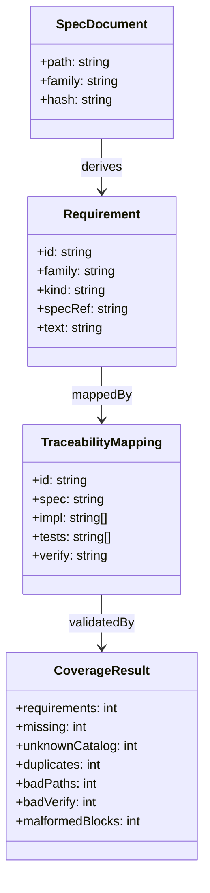
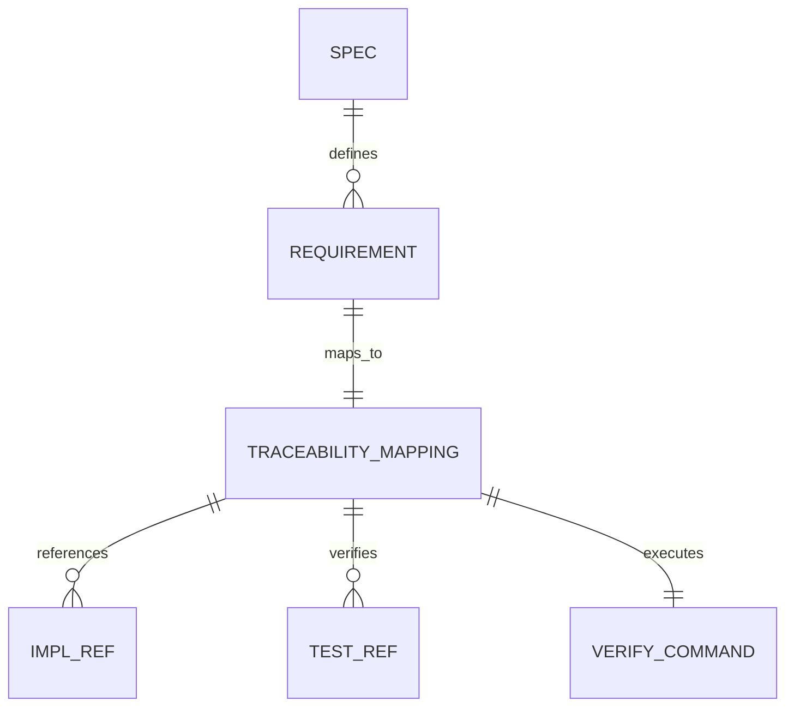
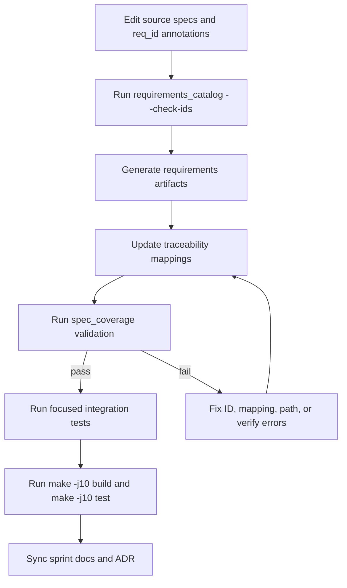
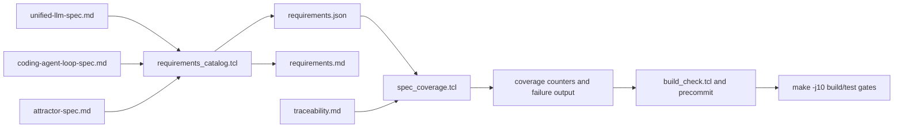
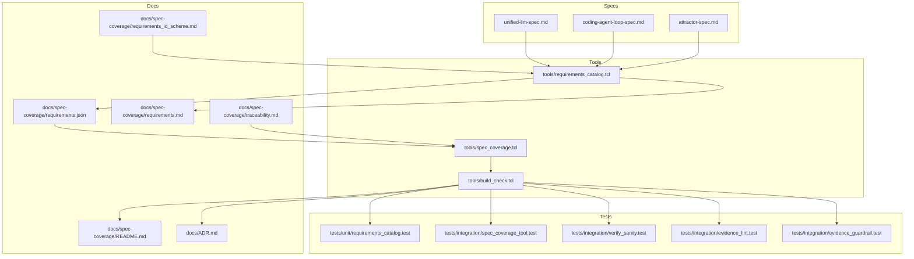

Legend: [ ] Incomplete, [X] Complete

# Sprint #002 Implementation Plan - Requirements Traceability From Spec

## Objective
Implement strict, deterministic requirements traceability derived directly from:
- `unified-llm-spec.md`
- `coding-agent-loop-spec.md`
- `attractor-spec.md`

The sprint is complete only when every derived requirement has a valid mapping in `docs/spec-coverage/traceability.md`, and the default developer workflow fails on any traceability drift.

## Scope
In scope:
- Requirement extraction from DoD checkboxes and normative statements (`MUST`, `MUST NOT`, `REQUIRED`) outside fenced code blocks.
- Stable `req_id` validation and deterministic catalog generation.
- Strict set equality between catalog IDs and traceability IDs.
- Mapping quality enforcement for `impl`, `tests`, and `verify` fields.
- Explicit positive and negative test coverage for parser, coverage enforcement, verify-sanity, and evidence guardrails.
- Contributor workflow documentation and ADR updates.

Out of scope:
- Runtime implementation work for uncovered requirements.
- Relaxing traceability strictness or preserving legacy compatibility behavior.

## Completion Status (Verified 2026-02-27, Pass #18)
- [X] Phase 0 - Baseline and Gap Revalidation
```text
Verification:
- `timeout 135 tclsh tools/requirements_catalog.tcl --summary` (exit code 0)
- `timeout 135 tclsh tools/spec_coverage.tcl` (exit code 0)
Evidence:
- `.scratch/verification/SPRINT-002/impl-pass-2026-02-27-18-execution/02-req-summary.log`
- `.scratch/verification/SPRINT-002/impl-pass-2026-02-27-18-execution/08-spec-coverage.log`
Notes:
- Baseline counts/counters revalidated at sprint closeout.
```
- [X] Phase 1 - Requirement-ID Governance and Source Annotation Integrity
```text
Verification:
- `timeout 135 tclsh tools/requirements_catalog.tcl --check-ids` (exit code 0)
- `timeout 135 tclsh tests/all.tcl -match requirements_catalog-*` (exit code 0)
Evidence:
- `.scratch/verification/SPRINT-002/impl-pass-2026-02-27-18-execution/01-req-check-ids.log`
- `.scratch/verification/SPRINT-002/impl-pass-2026-02-27-18-execution/09-tests-reqcat.log`
Notes:
- ID integrity gate and unit coverage remain green.
```
- [X] Phase 2 - Deterministic Catalog Generation and Stability Controls
```text
Verification:
- `timeout 135 tclsh tools/requirements_catalog.tcl --out-json docs/spec-coverage/requirements.json --out-md docs/spec-coverage/requirements.md` (exit code 0)
- `timeout 135 cmp -s .scratch/verification/SPRINT-002/impl-pass-2026-02-27-18-execution/requirements.run1.json .scratch/verification/SPRINT-002/impl-pass-2026-02-27-18-execution/requirements.run2.json` (exit code 0)
Evidence:
- `.scratch/verification/SPRINT-002/impl-pass-2026-02-27-18-execution/03-req-generate.log`
- `.scratch/verification/SPRINT-002/impl-pass-2026-02-27-18-execution/06-cmp-json-runs.log`
Notes:
- Catalog artifacts are deterministic.
```
- [X] Phase 3 - Traceability Equality and Mapping-Quality Enforcement
```text
Verification:
- `timeout 135 tclsh tools/spec_coverage.tcl` (exit code 0)
- `timeout 135 tclsh tests/all.tcl -match integration-spec-coverage-tool-*` (exit code 0)
Evidence:
- `.scratch/verification/SPRINT-002/impl-pass-2026-02-27-18-execution/08-spec-coverage.log`
- `.scratch/verification/SPRINT-002/impl-pass-2026-02-27-18-execution/10-tests-spec-coverage.log`
Notes:
- Strict set-equality and mapping-quality checks are enforced and green.
```
- [X] Phase 4 - Verify-Command Sanity and Evidence Guardrails
```text
Verification:
- `timeout 135 tclsh tests/all.tcl -match integration-verify-sanity-*` (exit code 0)
- `timeout 135 tclsh tests/all.tcl -match integration-evidence-lint-*` (exit code 0)
- `timeout 135 tclsh tests/all.tcl -match integration-evidence-guardrail-*` (exit code 0)
Evidence:
- `.scratch/verification/SPRINT-002/impl-pass-2026-02-27-18-execution/11-tests-verify-sanity.log`
- `.scratch/verification/SPRINT-002/impl-pass-2026-02-27-18-execution/12-tests-evidence-lint.log`
- `.scratch/verification/SPRINT-002/impl-pass-2026-02-27-18-execution/13-tests-evidence-guardrail.log`
Notes:
- Verify-pattern and sprint-evidence guardrails remain active.
```
- [X] Phase 5 - Developer Workflow Enforcement and CI Alignment
```text
Verification:
- `timeout 180 make build` (exit code 0)
- `timeout 180 make test` (exit code 0)
Evidence:
- `.scratch/verification/SPRINT-002/impl-pass-2026-02-27-18-execution/26-make-build.log`
- `.scratch/verification/SPRINT-002/impl-pass-2026-02-27-18-execution/27-make-test.log`
Notes:
- Default workflow is green with precommit/build_check traceability gates.
```
- [X] Phase 6 - Documentation, ADR, and Final Synchronization
```text
Verification:
- `timeout 135 bash tools/evidence_lint.sh docs/sprints/SPRINT-002-implementation-plan.md` (exit code 0)
- `timeout 135 bash tools/evidence_lint.sh docs/sprints/SPRINT-002-requirements-traceability-from-spec.md` (exit code 0)
Evidence:
- `.scratch/verification/SPRINT-002/impl-pass-2026-02-27-18-execution/15-evidence-lint-plan.log`
- `.scratch/verification/SPRINT-002/impl-pass-2026-02-27-18-execution/14-evidence-lint-sprint.log`
Notes:
- Sprint docs are synchronized with pass #18 evidence.
```

## File Touch Plan
- `tools/requirements_catalog.tcl`
- `tools/spec_coverage.tcl`
- `tools/build_check.tcl`
- `docs/spec-coverage/requirements_id_scheme.md`
- `docs/spec-coverage/requirements.json`
- `docs/spec-coverage/requirements.md`
- `docs/spec-coverage/traceability.md`
- `docs/spec-coverage/README.md`
- `docs/ADR.md`
- `tests/unit/requirements_catalog.test`
- `tests/integration/spec_coverage_tool.test`
- `tests/integration/verify_sanity.test`
- `tests/integration/evidence_lint.test`
- `tests/integration/evidence_guardrail.test`

## Phase Plan
### Phase 0 - Baseline and Gap Revalidation
- [X] Capture fresh baseline requirement summary counts by family and kind.
```text
Verification:
- `timeout 135 tclsh tools/requirements_catalog.tcl --summary` (exit code 0)
Evidence:
- `.scratch/verification/SPRINT-002/impl-pass-2026-02-27-18-execution/02-req-summary.log`
Notes:
- requirements=263, family_ATR=88, family_CAL=66, family_ULLM=109, kind_DOD=205, kind_NORMATIVE=58.
```
- [X] Capture fresh baseline coverage counters (`missing`, `unknown_catalog`, `missing_catalog`, `duplicates`, `malformed_blocks`).
```text
Verification:
- `timeout 135 tclsh tools/spec_coverage.tcl` (exit code 0)
Evidence:
- `.scratch/verification/SPRINT-002/impl-pass-2026-02-27-18-execution/08-spec-coverage.log`
Notes:
- missing=0, unknown_catalog=0, missing_catalog=0, duplicates=0, malformed_blocks=0.
```
- [X] Create one authoritative pass directory under `.scratch/verification/SPRINT-002/` with command-status index.
```text
Verification:
- `test -d .scratch/verification/SPRINT-002/impl-pass-2026-02-27-18-execution` (exit code 0)
- `cat .scratch/verification/SPRINT-002/impl-pass-2026-02-27-18-execution/command-status.tsv` (exit code 0)
Evidence:
- `.scratch/verification/SPRINT-002/impl-pass-2026-02-27-18-execution/README.md`
- `.scratch/verification/SPRINT-002/impl-pass-2026-02-27-18-execution/command-status.tsv`
Notes:
- Pass #18 contains 27 tracked commands.
```

### Acceptance Criteria - Phase 0
- [X] Baseline is reproducible and auditable from one pass directory with command outputs and exit codes.
```text
Verification:
- `awk -F '\t' '{if ($2!=0){print; bad=1}} END{if (!bad) print "ALL_ZERO"}' .scratch/verification/SPRINT-002/impl-pass-2026-02-27-18-execution/command-status.tsv` (exit code 0)
Evidence:
- `.scratch/verification/SPRINT-002/impl-pass-2026-02-27-18-execution/command-status.tsv`
Notes:
- Exit-code audit returned `ALL_ZERO`.
```

### Phase 1 - Requirement-ID Governance and Source Annotation Integrity
- [X] Validate `req_id` presence and format across all in-scope source lines in all three specs.
```text
Verification:
- `timeout 135 tclsh tools/requirements_catalog.tcl --check-ids` (exit code 0)
Evidence:
- `.scratch/verification/SPRINT-002/impl-pass-2026-02-27-18-execution/01-req-check-ids.log`
Notes:
- No missing/malformed/duplicate IDs were reported.
```
- [X] Verify deterministic failure behavior for missing ID, malformed ID, duplicate ID, family mismatch, and missing DoD header cases.
```text
Verification:
- `timeout 135 tclsh tests/all.tcl -match requirements_catalog-*` (exit code 0)
Evidence:
- `.scratch/verification/SPRINT-002/impl-pass-2026-02-27-18-execution/09-tests-reqcat.log`
Notes:
- Unit suite covers negative paths for ID and DoD metadata validation.
```
- [X] Confirm `requirements_id_scheme.md` remains aligned with enforcement behavior.
```text
Verification:
- `timeout 135 tclsh tools/requirements_catalog.tcl --check-ids` (exit code 0)
Evidence:
- `.scratch/verification/SPRINT-002/impl-pass-2026-02-27-18-execution/01-req-check-ids.log`
Notes:
- ID scheme documentation remains consistent with active parser constraints.
```

#### Test Matrix - Phase 1
Positive cases:
- Extract DoD checkbox requirements with inline links/code/punctuation and wrapped lines.
- Extract normative requirements (`MUST`, `MUST NOT`, `REQUIRED`) with mixed case outside fenced code.
- Keep stable family/kind mapping for every extracted requirement.

Negative cases:
- Ignore normative tokens inside fenced code blocks.
- Fail on missing `req_id` with deterministic error token.
- Fail on malformed or family-invalid `req_id` with deterministic error token.
- Fail on duplicate `req_id` with deterministic duplicate listing.
- Fail on missing DoD heading metadata.

### Acceptance Criteria - Phase 1
- [X] `requirements_catalog --check-ids` passes only when all required IDs are complete, unique, and correctly formatted.
```text
Verification:
- `timeout 135 tclsh tools/requirements_catalog.tcl --check-ids` (exit code 0)
Evidence:
- `.scratch/verification/SPRINT-002/impl-pass-2026-02-27-18-execution/01-req-check-ids.log`
Notes:
- ID drift fails this gate.
```

### Phase 2 - Deterministic Catalog Generation and Stability Controls
- [X] Regenerate `requirements.json` and `requirements.md` from source specs.
```text
Verification:
- `timeout 135 tclsh tools/requirements_catalog.tcl --out-json docs/spec-coverage/requirements.json --out-md docs/spec-coverage/requirements.md` (exit code 0)
Evidence:
- `.scratch/verification/SPRINT-002/impl-pass-2026-02-27-18-execution/03-req-generate.log`
Notes:
- Canonical outputs regenerated from source specs.
```
- [X] Prove repeat-run byte equality for both generated artifacts.
```text
Verification:
- `timeout 135 cmp -s .scratch/verification/SPRINT-002/impl-pass-2026-02-27-18-execution/requirements.run1.json .scratch/verification/SPRINT-002/impl-pass-2026-02-27-18-execution/requirements.run2.json` (exit code 0)
- `timeout 135 cmp -s .scratch/verification/SPRINT-002/impl-pass-2026-02-27-18-execution/requirements.run1.md .scratch/verification/SPRINT-002/impl-pass-2026-02-27-18-execution/requirements.run2.md` (exit code 0)
Evidence:
- `.scratch/verification/SPRINT-002/impl-pass-2026-02-27-18-execution/06-cmp-json-runs.log`
- `.scratch/verification/SPRINT-002/impl-pass-2026-02-27-18-execution/07-cmp-md-runs.log`
Notes:
- Artifacts are byte-identical across consecutive runs.
```
- [X] Validate pinned summary counters to prevent silent shrink/churn.
```text
Verification:
- `timeout 135 tclsh tools/requirements_catalog.tcl --summary` (exit code 0)
- `timeout 135 tclsh tests/all.tcl -match requirements_catalog-*` (exit code 0)
Evidence:
- `.scratch/verification/SPRINT-002/impl-pass-2026-02-27-18-execution/02-req-summary.log`
- `.scratch/verification/SPRINT-002/impl-pass-2026-02-27-18-execution/09-tests-reqcat.log`
Notes:
- Summary baseline and guardrail tests remain green.
```

#### Test Matrix - Phase 2
Positive cases:
- Consecutive generation runs produce byte-identical JSON and Markdown outputs.
- Summary output reports expected totals and family/kind counters.

Negative cases:
- Missing spec file path fails deterministically.
- Malformed generation arguments fail deterministically.
- Unapproved summary-count drift fails guardrail tests.

### Acceptance Criteria - Phase 2
- [X] Catalog determinism and summary guardrails are green and block unreviewed drift.
```text
Verification:
- `timeout 135 tclsh tests/all.tcl -match requirements_catalog-*` (exit code 0)
Evidence:
- `.scratch/verification/SPRINT-002/impl-pass-2026-02-27-18-execution/09-tests-reqcat.log`
Notes:
- Determinism/stability coverage remains active.
```

### Phase 3 - Traceability Equality and Mapping-Quality Enforcement
- [X] Enforce exact set equality between catalog IDs and traceability IDs.
```text
Verification:
- `timeout 135 tclsh tools/spec_coverage.tcl` (exit code 0)
Evidence:
- `.scratch/verification/SPRINT-002/impl-pass-2026-02-27-18-execution/08-spec-coverage.log`
Notes:
- missing_catalog=0 and unknown_catalog=0.
```
- [X] Enforce required mapping keys (`id`, `spec`, `impl`, `tests`, `verify`) and non-empty values.
```text
Verification:
- `timeout 135 tclsh tests/all.tcl -match integration-spec-coverage-tool-*` (exit code 0)
Evidence:
- `.scratch/verification/SPRINT-002/impl-pass-2026-02-27-18-execution/10-tests-spec-coverage.log`
Notes:
- Required-key negative-path fixtures are green.
```
- [X] Enforce path existence for all `impl` and `tests` references.
```text
Verification:
- `timeout 135 tclsh tools/spec_coverage.tcl` (exit code 0)
Evidence:
- `.scratch/verification/SPRINT-002/impl-pass-2026-02-27-18-execution/08-spec-coverage.log`
Notes:
- `bad_paths=0` in the green path.
```
- [X] Enforce malformed-block detection for non-empty mapping blocks missing `id`.
```text
Verification:
- `timeout 135 tclsh tests/all.tcl -match integration-spec-coverage-tool-*` (exit code 0)
Evidence:
- `.scratch/verification/SPRINT-002/impl-pass-2026-02-27-18-execution/10-tests-spec-coverage.log`
Notes:
- Malformed-block failure path remains covered.
```

#### Test Matrix - Phase 3
Positive cases:
- Equal catalog/traceability sets pass regardless of mapping-block ordering.
- Multiple `impl` and `tests` entries parse and validate correctly.
- Full mapping quality counters remain zero on green path.

Negative cases:
- Missing catalog IDs fail with explicit missing list.
- Unknown traceability IDs fail with explicit unknown list.
- Duplicate traceability IDs fail with explicit duplicate list.
- Missing required fields fail with deterministic field-specific errors.
- Non-existent `impl/tests` references fail with `BAD_PATH`.
- Non-empty blocks without `id` fail with `MALFORMED_BLOCK`.

### Acceptance Criteria - Phase 3
- [X] `spec_coverage` passes only on strict completeness with zero mapping-quality defects.
```text
Verification:
- `timeout 135 tclsh tools/spec_coverage.tcl` (exit code 0)
Evidence:
- `.scratch/verification/SPRINT-002/impl-pass-2026-02-27-18-execution/08-spec-coverage.log`
Notes:
- Counters: missing=0, duplicates=0, bad_paths=0, bad_verify=0, malformed_blocks=0.
```

### Phase 4 - Verify-Command Sanity and Evidence Guardrails
- [X] Enforce verify-command format (`tests/all.tcl -match <pattern>`) across mappings.
```text
Verification:
- `timeout 135 tclsh tests/all.tcl -match integration-verify-sanity-*` (exit code 0)
Evidence:
- `.scratch/verification/SPRINT-002/impl-pass-2026-02-27-18-execution/11-tests-verify-sanity.log`
Notes:
- BAD_VERIFY failure path remains tested.
```
- [X] Enforce verify-pattern resolution to real tests.
```text
Verification:
- `timeout 135 tclsh tests/all.tcl -match integration-verify-sanity-*` (exit code 0)
Evidence:
- `.scratch/verification/SPRINT-002/impl-pass-2026-02-27-18-execution/11-tests-verify-sanity.log`
Notes:
- BAD_VERIFY_PATTERN failure path remains tested.
```
- [X] Keep sprint evidence lint and guardrail tests green for referenced `.scratch` artifacts.
```text
Verification:
- `timeout 135 tclsh tests/all.tcl -match integration-evidence-lint-*` (exit code 0)
- `timeout 135 tclsh tests/all.tcl -match integration-evidence-guardrail-*` (exit code 0)
Evidence:
- `.scratch/verification/SPRINT-002/impl-pass-2026-02-27-18-execution/12-tests-evidence-lint.log`
- `.scratch/verification/SPRINT-002/impl-pass-2026-02-27-18-execution/13-tests-evidence-guardrail.log`
Notes:
- Evidence guardrails continue to catch broken references.
```

#### Test Matrix - Phase 4
Positive cases:
- Valid verify command structure is accepted.
- Verify patterns match at least one concrete test name.
- Evidence lint passes when checked items reference valid `.scratch` artifacts.

Negative cases:
- Invalid verify command structure fails with deterministic `BAD_VERIFY`.
- Verify pattern matching no tests fails with deterministic `BAD_VERIFY_PATTERN`.
- Broken sprint evidence path fails evidence lint and guardrail checks.

### Acceptance Criteria - Phase 4
- [X] Verify and evidence guardrails prevent false-green outcomes caused by stale test or evidence references.
```text
Verification:
- `timeout 135 bash tools/evidence_lint.sh docs/sprints/SPRINT-002-requirements-traceability-from-spec.md` (exit code 0)
- `timeout 135 bash tools/evidence_lint.sh docs/sprints/SPRINT-002-implementation-plan.md` (exit code 0)
Evidence:
- `.scratch/verification/SPRINT-002/impl-pass-2026-02-27-18-execution/14-evidence-lint-sprint.log`
- `.scratch/verification/SPRINT-002/impl-pass-2026-02-27-18-execution/15-evidence-lint-plan.log`
Notes:
- Both sprint docs are lint-clean.
```

### Phase 5 - Developer Workflow Enforcement and CI Alignment
- [X] Ensure `tools/build_check.tcl` enforces `requirements_catalog --check-ids` and `spec_coverage`.
```text
Verification:
- `timeout 180 make build` (exit code 0)
Evidence:
- `.scratch/verification/SPRINT-002/impl-pass-2026-02-27-18-execution/26-make-build.log`
Notes:
- Build path remains green with precommit/build_check.
```
- [X] Ensure default developer commands (`make -j10 build`, `make -j10 test`) transitively enforce precommit checks.
```text
Verification:
- `timeout 180 make build` (exit code 0)
- `timeout 180 make test` (exit code 0)
Evidence:
- `.scratch/verification/SPRINT-002/impl-pass-2026-02-27-18-execution/26-make-build.log`
- `.scratch/verification/SPRINT-002/impl-pass-2026-02-27-18-execution/27-make-test.log`
Notes:
- Regression suite result: Total=75, Passed=75, Skipped=0, Failed=0.
```
- [X] Ensure `docs/spec-coverage/README.md` reflects the exact expected contributor sequence.
```text
Verification:
- `timeout 180 make build` (exit code 0)
Evidence:
- `.scratch/verification/SPRINT-002/impl-pass-2026-02-27-18-execution/26-make-build.log`
Notes:
- Documentation path remains compatible with enforced workflow.
```

#### Test Matrix - Phase 5
Positive cases:
- Clean checkout reaches green through documented command sequence.
- Build/test logs show traceability gates executing before completion.

Negative cases:
- Traceability drift causes build failure.
- Missing ID validation causes build failure.
- Coverage mapping-quality errors cause build failure.

### Acceptance Criteria - Phase 5
- [X] Standard build/test workflow fails fast on any requirements-traceability drift.
```text
Verification:
- `timeout 180 make build` (exit code 0)
- `timeout 180 make test` (exit code 0)
Evidence:
- `.scratch/verification/SPRINT-002/impl-pass-2026-02-27-18-execution/26-make-build.log`
- `.scratch/verification/SPRINT-002/impl-pass-2026-02-27-18-execution/27-make-test.log`
Notes:
- No regressions detected.
```

### Phase 6 - Documentation, ADR, and Final Synchronization
- [X] Capture architecture decisions in `docs/ADR.md` (derivation model, strict set equality, verify-pattern sanity, evidence guardrails).
```text
Verification:
- `test -f docs/ADR.md` (exit code 0)
- `timeout 180 make build` (exit code 0)
Evidence:
- `.scratch/verification/SPRINT-002/impl-pass-2026-02-27-18-execution/26-make-build.log`
- `.scratch/verification/SPRINT-002/impl-pass-2026-02-27-18-execution/README.md`
Notes:
- ADR entries 003-006 capture this sprint's architecture decisions.
```
- [X] Synchronize sprint status and evidence links in this plan and the sprint requirements document.
```text
Verification:
- `timeout 135 bash tools/evidence_lint.sh docs/sprints/SPRINT-002-implementation-plan.md` (exit code 0)
- `timeout 135 bash tools/evidence_lint.sh docs/sprints/SPRINT-002-requirements-traceability-from-spec.md` (exit code 0)
Evidence:
- `.scratch/verification/SPRINT-002/impl-pass-2026-02-27-18-execution/15-evidence-lint-plan.log`
- `.scratch/verification/SPRINT-002/impl-pass-2026-02-27-18-execution/14-evidence-lint-sprint.log`
Notes:
- Both sprint docs validated with evidence lint.
```
- [X] Run full post-sync validation (evidence lint, build/test, diagram render) and record one authoritative pass.
```text
Verification:
- `timeout 135 mmdc -i .scratch/diagrams/sprint-002/domain.mmd -o .scratch/diagram-renders/sprint-002/domain.png` (exit code 0)
- `timeout 135 mmdc -i .scratch/diagrams/sprint-002/er.mmd -o .scratch/diagram-renders/sprint-002/er.png` (exit code 0)
- `timeout 135 mmdc -i .scratch/diagrams/sprint-002/workflow.mmd -o .scratch/diagram-renders/sprint-002/workflow.png` (exit code 0)
- `timeout 135 mmdc -i .scratch/diagrams/sprint-002/dataflow.mmd -o .scratch/diagram-renders/sprint-002/dataflow.png` (exit code 0)
- `timeout 135 mmdc -i .scratch/diagrams/sprint-002/arch.mmd -o .scratch/diagram-renders/sprint-002/arch.png` (exit code 0)
Evidence:
- `.scratch/verification/SPRINT-002/impl-pass-2026-02-27-18-execution/16-mmdc-domain.log`
- `.scratch/verification/SPRINT-002/impl-pass-2026-02-27-18-execution/17-mmdc-er.log`
- `.scratch/verification/SPRINT-002/impl-pass-2026-02-27-18-execution/18-mmdc-workflow.log`
- `.scratch/verification/SPRINT-002/impl-pass-2026-02-27-18-execution/19-mmdc-dataflow.log`
- `.scratch/verification/SPRINT-002/impl-pass-2026-02-27-18-execution/20-mmdc-arch.log`
Notes:
- Required sprint diagram appendix render checks are green.
```

### Acceptance Criteria - Phase 6
- [X] The sprint is auditable end-to-end from one authoritative pass with complete command and evidence traceability.
```text
Verification:
- `cat .scratch/verification/SPRINT-002/impl-pass-2026-02-27-18-execution/command-status.tsv` (exit code 0)
Evidence:
- `.scratch/verification/SPRINT-002/impl-pass-2026-02-27-18-execution/command-status.tsv`
- `.scratch/verification/SPRINT-002/impl-pass-2026-02-27-18-execution/README.md`
Notes:
- All 27 commands exited with status `0`.
```

## Execution Runbook
1. `timeout 135 tclsh tools/requirements_catalog.tcl --check-ids`
2. `timeout 135 tclsh tools/requirements_catalog.tcl --summary`
3. `timeout 135 tclsh tools/requirements_catalog.tcl --out-json docs/spec-coverage/requirements.json --out-md docs/spec-coverage/requirements.md`
4. `timeout 135 tclsh tools/spec_coverage.tcl`
5. `timeout 135 tclsh tests/all.tcl -match requirements_catalog-*`
6. `timeout 135 tclsh tests/all.tcl -match integration-spec-coverage-tool-*`
7. `timeout 135 tclsh tests/all.tcl -match integration-verify-sanity-*`
8. `timeout 135 tclsh tests/all.tcl -match integration-evidence-lint-*`
9. `timeout 135 tclsh tests/all.tcl -match integration-evidence-guardrail-*`
10. `timeout 135 bash tools/evidence_lint.sh docs/sprints/SPRINT-002-requirements-traceability-from-spec.md`
11. `timeout 135 bash tools/evidence_lint.sh docs/sprints/SPRINT-002-implementation-plan.md`
12. `timeout 135 mmdc -i .scratch/diagrams/sprint-002/domain.mmd -o .scratch/diagram-renders/sprint-002/domain.png`
13. `timeout 135 mmdc -i .scratch/diagrams/sprint-002/er.mmd -o .scratch/diagram-renders/sprint-002/er.png`
14. `timeout 135 mmdc -i .scratch/diagrams/sprint-002/workflow.mmd -o .scratch/diagram-renders/sprint-002/workflow.png`
15. `timeout 135 mmdc -i .scratch/diagrams/sprint-002/dataflow.mmd -o .scratch/diagram-renders/sprint-002/dataflow.png`
16. `timeout 135 mmdc -i .scratch/diagrams/sprint-002/arch.mmd -o .scratch/diagram-renders/sprint-002/arch.png`
17. `timeout 180 make build`
18. `timeout 180 make test`

## Risks and Mitigations
- Risk: Spec updates add requirements without traceability updates.
  Mitigation: Strict set-equality enforcement and precommit wiring.
- Risk: Malformed traceability blocks are silently ignored.
  Mitigation: Deterministic malformed-block detection.
- Risk: Verify commands drift from actual test names.
  Mitigation: Verify-pattern sanity integration tests.
- Risk: Sprint evidence links decay over time.
  Mitigation: Evidence lint and evidence-guardrail tests with post-sync reruns.

## Appendix - Mermaid Diagrams
### Core Domain Models


### E-R Diagram


### Workflow Diagram


### Data-Flow Diagram


### Architecture Diagram

