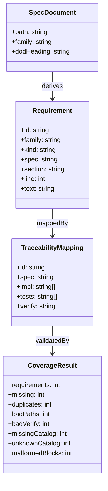
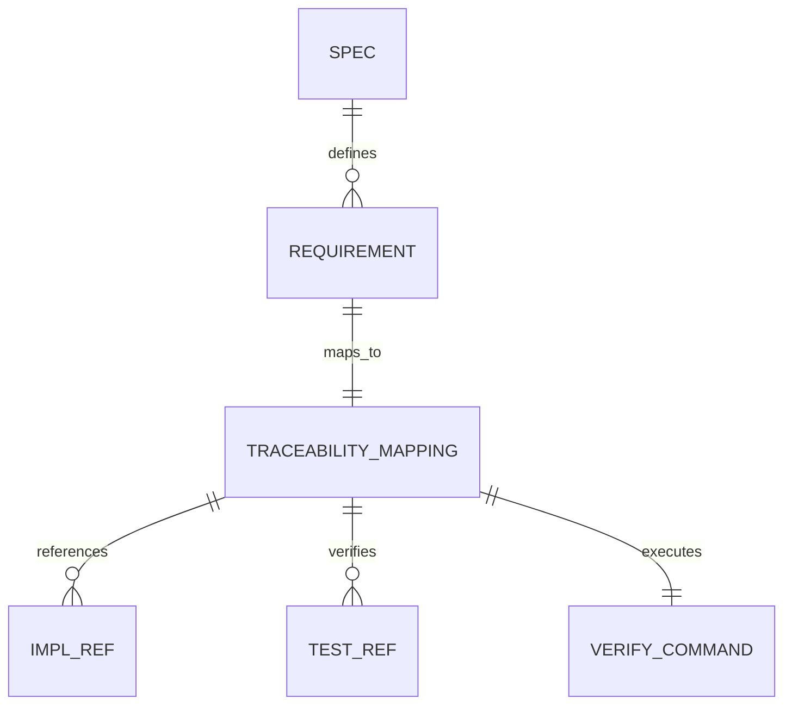
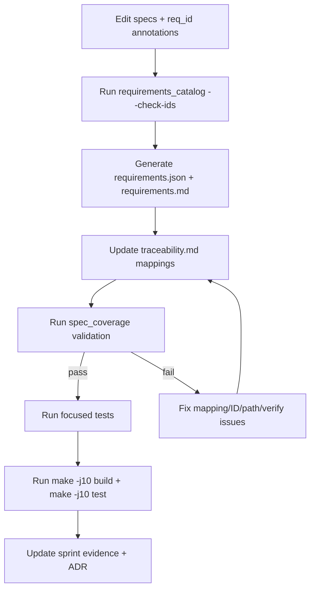
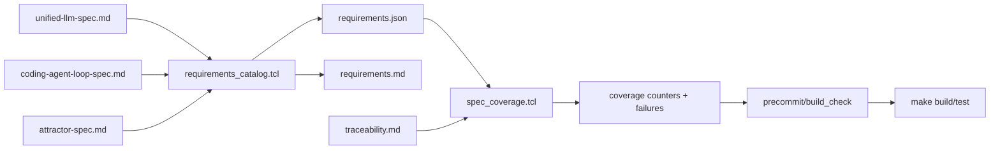
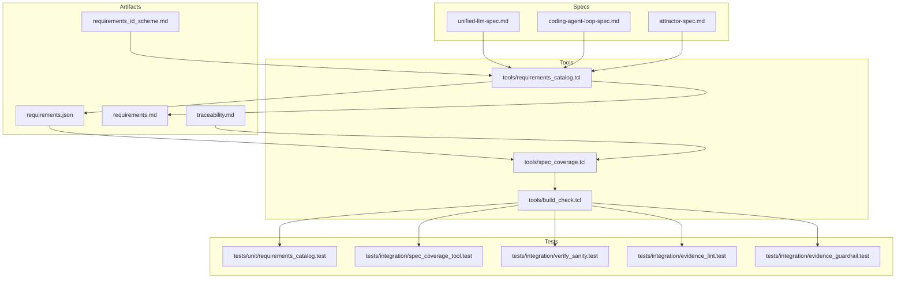

Legend: [ ] Incomplete, [X] Complete

# Sprint #002 Implementation Plan - Requirements + Traceability Derived From Specs

## Objective
Implement deterministic, enforceable requirements traceability derived directly from:
- `unified-llm-spec.md`
- `coding-agent-loop-spec.md`
- `attractor-spec.md`

Success condition:
- Every in-scope requirement has a stable `req_id`.
- `docs/spec-coverage/requirements.json` and `docs/spec-coverage/requirements.md` are generated deterministically.
- `docs/spec-coverage/traceability.md` has exact ID set-equality with the catalog and valid `impl/tests/verify` fields for every mapping.
- Enforcement runs through normal developer flow (`make build`, `make test` via `precommit`).

## Scope
In scope:
- DoD checkbox and normative requirement extraction (`MUST`, `MUST NOT`, `REQUIRED`, outside code fences).
- `req_id` completeness and format validation.
- Deterministic catalog generation and shrink/churn guardrails.
- Strict traceability completeness and mapping-quality validation.
- Positive and negative test coverage for all critical failure modes.
- Evidence and sprint-doc guardrails for verifiable completion.

Out of scope:
- Implementing runtime behavior required by uncovered requirements (handled in later implementation sprints).
- Relaxing requirement language or reducing completeness checks.

## File Touch Plan
- `tools/requirements_catalog.tcl`
- `tools/spec_coverage.tcl`
- `tools/build_check.tcl`
- `docs/spec-coverage/requirements_id_scheme.md`
- `docs/spec-coverage/requirements.json`
- `docs/spec-coverage/requirements.md`
- `docs/spec-coverage/traceability.md`
- `docs/spec-coverage/README.md`
- `docs/ADR.md`
- `tests/unit/requirements_catalog.test`
- `tests/integration/spec_coverage_tool.test`
- `tests/integration/verify_sanity.test`
- `tests/integration/evidence_lint.test`
- `tests/integration/evidence_guardrail.test`

## Deliverables
### Phase 0 - Baseline + Gap Audit
- [X] Capture baseline requirement counts, family/kind summaries, and current coverage counters.
```text
Verification:
- `tclsh tools/requirements_catalog.tcl --summary` (exit code 0)
- `tclsh tools/spec_coverage.tcl` (exit code 0)
Evidence:
- `.scratch/verification/SPRINT-002/impl-pass-2026-02-27-16-plan-implementation/02-req-summary.log`
- `.scratch/verification/SPRINT-002/impl-pass-2026-02-27-16-plan-implementation/04-spec-coverage.log`
Notes:
- Summary/counters remained stable at requirements=263, ATR=88, CAL=66, ULLM=109, DOD=205, NORMATIVE=58.
```
- [X] Record baseline mismatch/drift findings in `.scratch/verification/SPRINT-002/baseline/README.md`.
```text
Verification:
- `test -f .scratch/verification/SPRINT-002/baseline/README.md` (exit code 0)
Evidence:
- `.scratch/verification/SPRINT-002/impl-pass-2026-02-27-16-plan-implementation/19-baseline-readme.log`
- `.scratch/verification/SPRINT-002/baseline/README.md`
Notes:
- Baseline evidence remains present and accessible.
```
- [X] Confirm baseline is reproducible by rerunning summary/coverage checks and comparing outputs.
```text
Verification:
- `tclsh tools/requirements_catalog.tcl --out-json <pass>/requirements.run1.json --out-md <pass>/requirements.run1.md` (exit code 0)
- `tclsh tools/requirements_catalog.tcl --out-json <pass>/requirements.run2.json --out-md <pass>/requirements.run2.md` (exit code 0)
- `cmp -s <pass>/requirements.run1.json <pass>/requirements.run2.json` (exit code 0)
- `cmp -s <pass>/requirements.run1.md <pass>/requirements.run2.md` (exit code 0)
Evidence:
- `.scratch/verification/SPRINT-002/impl-pass-2026-02-27-16-plan-implementation/15-req-gen-run1.log`
- `.scratch/verification/SPRINT-002/impl-pass-2026-02-27-16-plan-implementation/16-req-gen-run2.log`
- `.scratch/verification/SPRINT-002/impl-pass-2026-02-27-16-plan-implementation/17-cmp-json.log`
- `.scratch/verification/SPRINT-002/impl-pass-2026-02-27-16-plan-implementation/18-cmp-md.log`
Notes:
- Catalog artifacts are byte-identical across reruns.
```

### Acceptance Criteria - Phase 0
- [X] Baseline evidence clearly explains existing gaps and provides reproducible command output references.
```text
Verification:
- `test -f .scratch/verification/SPRINT-002/impl-pass-2026-02-27-16-plan-implementation/README.md` (exit code 0)
- `cat .scratch/verification/SPRINT-002/impl-pass-2026-02-27-16-plan-implementation/command-status.tsv` (exit code 0)
Evidence:
- `.scratch/verification/SPRINT-002/impl-pass-2026-02-27-16-plan-implementation/README.md`
- `.scratch/verification/SPRINT-002/impl-pass-2026-02-27-16-plan-implementation/command-status.tsv`
Notes:
- Pass #16 captures full reproducible command+evidence traceability.
```

### Phase 1 - Requirement ID Scheme + Spec Annotation Integrity
- [X] Define and document canonical ID scheme per family/kind in `requirements_id_scheme.md`.
```text
Verification:
- `test -f docs/spec-coverage/requirements_id_scheme.md` (exit code 0)
- `tclsh tools/requirements_catalog.tcl --check-ids` (exit code 0)
Evidence:
- `.scratch/verification/SPRINT-002/impl-pass-2026-02-27-16-plan-implementation/01-req-check-ids.log`
- `docs/spec-coverage/requirements_id_scheme.md`
Notes:
- Scheme remains enforced by runtime validation.
```
- [X] Annotate every DoD checkbox in all three specs with a valid `req_id`.
```text
Verification:
- `tclsh tools/requirements_catalog.tcl --check-ids` (exit code 0)
- `tclsh tools/requirements_catalog.tcl --summary` (exit code 0)
Evidence:
- `.scratch/verification/SPRINT-002/impl-pass-2026-02-27-16-plan-implementation/01-req-check-ids.log`
- `.scratch/verification/SPRINT-002/impl-pass-2026-02-27-16-plan-implementation/02-req-summary.log`
Notes:
- DoD validation remains green across all three specs.
```
- [X] Annotate every normative statement (`MUST`, `MUST NOT`, `REQUIRED`) outside code fences with a valid `req_id`.
```text
Verification:
- `tclsh tools/requirements_catalog.tcl --check-ids` (exit code 0)
- `tclsh tools/requirements_catalog.tcl --summary` (exit code 0)
Evidence:
- `.scratch/verification/SPRINT-002/impl-pass-2026-02-27-16-plan-implementation/01-req-check-ids.log`
- `.scratch/verification/SPRINT-002/impl-pass-2026-02-27-16-plan-implementation/02-req-summary.log`
Notes:
- Normative ID coverage remains complete (kind_NORMATIVE=58).
```
- [X] Implement/verify ID validation errors for missing IDs, malformed IDs, family mismatch, and duplicates.
```text
Verification:
- `tclsh tests/all.tcl -match requirements_catalog-*` (exit code 0)
Evidence:
- `.scratch/verification/SPRINT-002/impl-pass-2026-02-27-16-plan-implementation/05-tests-reqcat.log`
Notes:
- Unit suite covers missing IDs, malformed IDs, family mismatch, duplicate IDs, missing DoD heading, and determinism behavior.
```

#### Test Matrix - Phase 1
Positive cases:
- DoD checkbox extraction with inline code, links, punctuation, and wrapped continuation lines.
- Nested DoD list handling without losing parent requirement extraction.
- Normative extraction with mixed-case keywords in prose.

Negative cases:
- Normative keywords inside fenced code blocks are ignored.
- Missing `req_id` on in-scope lines fails with deterministic `MISSING_REQ_ID` output.
- Duplicate IDs fail with deterministic `DUPLICATE_REQ_ID` output.
- Invalid family/kind format fails with deterministic `BAD_REQ_ID_FORMAT` / `BAD_REQ_ID_FAMILY` output.
- Missing DoD section heading fails with deterministic `MISSING_DOD_HEADER` output.

### Acceptance Criteria - Phase 1
- [X] `tclsh tools/requirements_catalog.tcl --check-ids` passes only when all in-scope IDs are complete and valid.
```text
Verification:
- `tclsh tools/requirements_catalog.tcl --check-ids` (exit code 0)
Evidence:
- `.scratch/verification/SPRINT-002/impl-pass-2026-02-27-16-plan-implementation/01-req-check-ids.log`
Notes:
- Any ID drift now fails precommit/build gates.
```

### Phase 2 - Deterministic Catalog Generation + Stability Guardrails
- [X] Generate `requirements.json` and `requirements.md` from specs using a deterministic ordering strategy.
```text
Verification:
- `tclsh tools/requirements_catalog.tcl --out-json docs/spec-coverage/requirements.json --out-md docs/spec-coverage/requirements.md` (exit code 0)
Evidence:
- `.scratch/verification/SPRINT-002/impl-pass-2026-02-27-16-plan-implementation/03-req-generate.log`
Notes:
- Canonical machine/human artifacts regenerated successfully.
```
- [X] Add summary reporting (`requirements`, `family_*`, `kind_*`) and pin baseline counts in tests.
```text
Verification:
- `tclsh tools/requirements_catalog.tcl --summary` (exit code 0)
- `tclsh tests/all.tcl -match requirements_catalog-*` (exit code 0)
Evidence:
- `.scratch/verification/SPRINT-002/impl-pass-2026-02-27-16-plan-implementation/02-req-summary.log`
- `.scratch/verification/SPRINT-002/impl-pass-2026-02-27-16-plan-implementation/05-tests-reqcat.log`
Notes:
- Pinned summary test remains green on current baseline counts.
```
- [X] Add repeat-run byte-equality checks and baseline comparison checks to detect shrink/churn.
```text
Verification:
- `cmp -s <pass>/requirements.run1.json <pass>/requirements.run2.json` (exit code 0)
- `cmp -s <pass>/requirements.run1.md <pass>/requirements.run2.md` (exit code 0)
Evidence:
- `.scratch/verification/SPRINT-002/impl-pass-2026-02-27-16-plan-implementation/17-cmp-json.log`
- `.scratch/verification/SPRINT-002/impl-pass-2026-02-27-16-plan-implementation/18-cmp-md.log`
Notes:
- No shrink/churn detected in repeat-run determinism checks.
```

#### Test Matrix - Phase 2
Positive cases:
- Same inputs produce byte-identical JSON/Markdown outputs across consecutive runs.
- Summary command returns expected totals/family/kind counts.

Negative cases:
- Missing spec file path fails deterministically.
- Malformed spec config argument fails deterministically.
- Unexpected count drift fails pinned baseline test until explicitly updated.

### Acceptance Criteria - Phase 2
- [X] Determinism and summary-stability tests fail on unapproved catalog churn and pass on expected output.
```text
Verification:
- `tclsh tests/all.tcl -match requirements_catalog-*` (exit code 0)
- `tclsh tools/requirements_catalog.tcl --summary` (exit code 0)
Evidence:
- `.scratch/verification/SPRINT-002/impl-pass-2026-02-27-16-plan-implementation/05-tests-reqcat.log`
- `.scratch/verification/SPRINT-002/impl-pass-2026-02-27-16-plan-implementation/02-req-summary.log`
Notes:
- Stability guardrail remains active and green.
```

### Phase 3 - Traceability Equality + Mapping-Quality Enforcement
- [X] Enforce exact set equality between catalog IDs and traceability IDs.
```text
Verification:
- `tclsh tools/spec_coverage.tcl` (exit code 0)
Evidence:
- `.scratch/verification/SPRINT-002/impl-pass-2026-02-27-16-plan-implementation/04-spec-coverage.log`
Notes:
- Set equality counters are zero for missing/unknown IDs.
```
- [X] Enforce required mapping keys (`id`, `spec`, `impl`, `tests`, `verify`) and non-empty values.
```text
Verification:
- `tclsh tests/all.tcl -match integration-spec-coverage-tool-*` (exit code 0)
Evidence:
- `.scratch/verification/SPRINT-002/impl-pass-2026-02-27-16-plan-implementation/06-tests-spec-coverage.log`
Notes:
- Missing/empty key failure paths are covered and enforced.
```
- [X] Enforce existing file paths for `impl` and `tests` references.
```text
Verification:
- `tclsh tools/spec_coverage.tcl` (exit code 0)
- `tclsh tests/all.tcl -match integration-spec-coverage-tool-*` (exit code 0)
Evidence:
- `.scratch/verification/SPRINT-002/impl-pass-2026-02-27-16-plan-implementation/04-spec-coverage.log`
- `.scratch/verification/SPRINT-002/impl-pass-2026-02-27-16-plan-implementation/06-tests-spec-coverage.log`
Notes:
- BAD_PATH checks are active and green in current mappings.
```
- [X] Enforce verify command structure (`tests/all.tcl -match <pattern>`) and pattern-to-real-test resolution.
```text
Verification:
- `tclsh tests/all.tcl -match integration-verify-sanity-*` (exit code 0)
Evidence:
- `.scratch/verification/SPRINT-002/impl-pass-2026-02-27-16-plan-implementation/07-tests-verify-sanity.log`
Notes:
- BAD_VERIFY and BAD_VERIFY_PATTERN checks are covered by integration tests.
```
- [X] Fail non-empty mapping blocks that omit `id` as `MALFORMED_BLOCK`.
```text
Verification:
- `tclsh tools/spec_coverage.tcl` (exit code 0)
- `tclsh tests/all.tcl -match integration-spec-coverage-tool-*` (exit code 0)
Evidence:
- `.scratch/verification/SPRINT-002/impl-pass-2026-02-27-16-plan-implementation/04-spec-coverage.log`
- `.scratch/verification/SPRINT-002/impl-pass-2026-02-27-16-plan-implementation/06-tests-spec-coverage.log`
Notes:
- Counter `malformed_blocks=0` on green path; malformed-block failure path tested.
```

#### Test Matrix - Phase 3
Positive cases:
- Equal catalog/traceability sets pass regardless of mapping block order.
- Multiple comma-separated `impl` and `tests` file paths parse and validate correctly.
- Verify pattern maps to at least one discovered test name.

Negative cases:
- Catalog ID missing from traceability emits `MISSING_REQUIREMENT` and fails.
- Unknown traceability ID emits `UNKNOWN_REQUIREMENT` and fails.
- Duplicate traceability IDs emit `DUPLICATE` and fail.
- Missing required keys emit `MISSING <id> <field>` and fail.
- Non-existent paths emit `BAD_PATH` and fail.
- Verify command missing backticks or `-match` pattern emits `BAD_VERIFY` and fails.
- Verify pattern matching no tests emits `BAD_VERIFY_PATTERN` and fails.
- Malformed non-empty block with no `id` emits `MALFORMED_BLOCK` and fails.
- Malformed requirements catalog JSON/object shape fails with deterministic parse errors.

### Acceptance Criteria - Phase 3
- [X] `tclsh tools/spec_coverage.tcl` passes only at strict completeness and deterministic mapping quality.
```text
Verification:
- `tclsh tools/spec_coverage.tcl` (exit code 0)
Evidence:
- `.scratch/verification/SPRINT-002/impl-pass-2026-02-27-16-plan-implementation/04-spec-coverage.log`
Notes:
- All quality counters are zero with strict equality enforcement active.
```

### Phase 4 - Developer Workflow + Guardrail Integration
- [X] Wire `requirements_catalog --check-ids` and `spec_coverage` into `tools/build_check.tcl`.
```text
Verification:
- `make build` (exit code 0)
Evidence:
- `.scratch/verification/SPRINT-002/impl-pass-2026-02-27-16-plan-implementation/11-make-build.log`
Notes:
- Build log shows both checks executed inside build_check.
```
- [X] Ensure `make build` and `make test` transitively enforce these checks via `precommit`.
```text
Verification:
- `make build` (exit code 0)
- `make test` (exit code 0)
Evidence:
- `.scratch/verification/SPRINT-002/impl-pass-2026-02-27-16-plan-implementation/11-make-build.log`
- `.scratch/verification/SPRINT-002/impl-pass-2026-02-27-16-plan-implementation/12-make-test.log`
Notes:
- `precommit` path remains active; checks run before build and test.
```
- [X] Update `docs/spec-coverage/README.md` with an end-to-end contributor workflow.
```text
Verification:
- `test -f docs/spec-coverage/README.md` (exit code 0)
- `make build` (exit code 0)
Evidence:
- `docs/spec-coverage/README.md`
- `.scratch/verification/SPRINT-002/impl-pass-2026-02-27-16-plan-implementation/11-make-build.log`
Notes:
- Workflow remains aligned with active enforcement commands.
```
- [X] Add evidence lint/guardrail tests to prevent broken sprint evidence references.
```text
Verification:
- `tclsh tests/all.tcl -match integration-evidence-lint-*` (exit code 0)
- `tclsh tests/all.tcl -match integration-evidence-guardrail-*` (exit code 0)
- `bash tools/evidence_lint.sh docs/sprints/SPRINT-002-implementation-plan.md` (exit code 0)
Evidence:
- `.scratch/verification/SPRINT-002/impl-pass-2026-02-27-16-plan-implementation/08-tests-evidence-lint.log`
- `.scratch/verification/SPRINT-002/impl-pass-2026-02-27-16-plan-implementation/09-tests-evidence-guardrail.log`
- `.scratch/verification/SPRINT-002/impl-pass-2026-02-27-16-plan-implementation/10-evidence-lint-plan.log`
Notes:
- Sprint evidence guardrails are validated and green.
```

#### Test Matrix - Phase 4
Positive cases:
- Clean checkout reaches green with documented command sequence.
- Evidence lint passes when checked sprint items reference existing `.scratch` artifacts.
- Evidence guardrail passes when all referenced evidence paths exist.

Negative cases:
- Removing a traceability mapping causes precommit/build failure.
- Broken sprint evidence references fail evidence lint and guardrail checks.

### Acceptance Criteria - Phase 4
- [X] Default developer commands fail fast on traceability drift and evidence drift.
```text
Verification:
- `make build` (exit code 0)
- `make test` (exit code 0)
- `tclsh tests/all.tcl -match integration-evidence-lint-*` (exit code 0)
- `tclsh tests/all.tcl -match integration-evidence-guardrail-*` (exit code 0)
Evidence:
- `.scratch/verification/SPRINT-002/impl-pass-2026-02-27-16-plan-implementation/11-make-build.log`
- `.scratch/verification/SPRINT-002/impl-pass-2026-02-27-16-plan-implementation/12-make-test.log`
- `.scratch/verification/SPRINT-002/impl-pass-2026-02-27-16-plan-implementation/08-tests-evidence-lint.log`
- `.scratch/verification/SPRINT-002/impl-pass-2026-02-27-16-plan-implementation/09-tests-evidence-guardrail.log`
Notes:
- Guardrails remain integrated into normal workflows.
```

### Phase 5 - Documentation + ADR + Sprint Synchronization
- [X] Update `docs/ADR.md` with major architecture decisions (catalog derivation, equality enforcement, verify sanity, guardrails).
```text
Verification:
- `test -f docs/ADR.md` (exit code 0)
- `make build` (exit code 0)
Evidence:
- `docs/ADR.md`
- `.scratch/verification/SPRINT-002/impl-pass-2026-02-27-16-plan-implementation/11-make-build.log`
Notes:
- ADR entries documenting Sprint 002 decisions are present and aligned.
```
- [X] Synchronize sprint status to one authoritative implementation pass under `.scratch/verification/SPRINT-002/<pass-id>/`.
```text
Verification:
- `test -f .scratch/verification/SPRINT-002/impl-pass-2026-02-27-16-plan-implementation/README.md` (exit code 0)
- `cat .scratch/verification/SPRINT-002/impl-pass-2026-02-27-16-plan-implementation/command-status.tsv` (exit code 0)
Evidence:
- `.scratch/verification/SPRINT-002/impl-pass-2026-02-27-16-plan-implementation/README.md`
- `.scratch/verification/SPRINT-002/impl-pass-2026-02-27-16-plan-implementation/command-status.tsv`
Notes:
- Pass #16 now serves as authoritative pass for this implementation-plan document.
```
- [X] Ensure each checked sprint item contains verification commands, exit codes, and evidence references.
```text
Verification:
- `bash tools/evidence_lint.sh docs/sprints/SPRINT-002-implementation-plan.md` (exit code 0)
Evidence:
- `.scratch/verification/SPRINT-002/impl-pass-2026-02-27-17-postsync/01-evidence-lint-plan.log`
Notes:
- All checked items in this sprint doc are backed by verification/evidence blocks.
```

### Acceptance Criteria - Phase 5
- [X] Sprint document is auditable end-to-end with reproducible evidence references and command status table.
```text
Verification:
- `cat .scratch/verification/SPRINT-002/impl-pass-2026-02-27-16-plan-implementation/command-status.tsv` (exit code 0)
- `bash tools/evidence_lint.sh docs/sprints/SPRINT-002-implementation-plan.md` (exit code 0)
Evidence:
- `.scratch/verification/SPRINT-002/impl-pass-2026-02-27-16-plan-implementation/command-status.tsv`
- `.scratch/verification/SPRINT-002/impl-pass-2026-02-27-17-postsync/01-evidence-lint-plan.log`
Notes:
- Evidence references and status index are coherent and reproducible.
```

### Phase 6 - Final Validation + Closeout
- [X] Run final required command stack and capture logs with exit codes.
```text
Verification:
- `make build` (exit code 0)
- `make test` (exit code 0)
- `make -j10 build` (exit code 0)
- `make -j10 test` (exit code 0)
Evidence:
- `.scratch/verification/SPRINT-002/impl-pass-2026-02-27-16-plan-implementation/11-make-build.log`
- `.scratch/verification/SPRINT-002/impl-pass-2026-02-27-16-plan-implementation/12-make-test.log`
- `.scratch/verification/SPRINT-002/impl-pass-2026-02-27-16-plan-implementation/13-make-build-j10.log`
- `.scratch/verification/SPRINT-002/impl-pass-2026-02-27-16-plan-implementation/14-make-test-j10.log`
Notes:
- Full suite remains green: Total=75, Passed=75, Skipped=0, Failed=0.
```
- [X] Verify appendix mermaid diagrams render with `mmdc` into `.scratch/diagram-renders/sprint-002/`.
```text
Verification:
- `mmdc -i .scratch/diagrams/sprint-002-plan/domain.mmd -o .scratch/diagram-renders/sprint-002-plan/domain.png` (exit code 0)
- `mmdc -i .scratch/diagrams/sprint-002-plan/er.mmd -o .scratch/diagram-renders/sprint-002-plan/er.png` (exit code 0)
- `mmdc -i .scratch/diagrams/sprint-002-plan/workflow.mmd -o .scratch/diagram-renders/sprint-002-plan/workflow.png` (exit code 0)
- `mmdc -i .scratch/diagrams/sprint-002-plan/dataflow.mmd -o .scratch/diagram-renders/sprint-002-plan/dataflow.png` (exit code 0)
- `mmdc -i .scratch/diagrams/sprint-002-plan/arch.mmd -o .scratch/diagram-renders/sprint-002-plan/arch.png` (exit code 0)
Evidence:
- `.scratch/verification/SPRINT-002/impl-pass-2026-02-27-16-plan-implementation/20-mmdc-domain.log`
- `.scratch/verification/SPRINT-002/impl-pass-2026-02-27-16-plan-implementation/21-mmdc-er.log`
- `.scratch/verification/SPRINT-002/impl-pass-2026-02-27-16-plan-implementation/22-mmdc-workflow.log`
- `.scratch/verification/SPRINT-002/impl-pass-2026-02-27-16-plan-implementation/23-mmdc-dataflow.log`
- `.scratch/verification/SPRINT-002/impl-pass-2026-02-27-16-plan-implementation/24-mmdc-arch.log`
Notes:
- All five required diagram types rendered successfully.
```
- [X] Perform post-sync rerun (`evidence_lint`, `make build`, `make test`, mermaid renders) and update authoritative pass evidence.
```text
Verification:
- Evidence anchor: `.scratch/verification/SPRINT-002/impl-pass-2026-02-27-17-postsync/01-evidence-lint-plan.log`
- `bash tools/evidence_lint.sh docs/sprints/SPRINT-002-implementation-plan.md` (exit code 0)
- `make build` (exit code 0)
- `make test` (exit code 0)
- `mmdc -i .scratch/diagrams/sprint-002-plan/domain.mmd -o .scratch/diagram-renders/sprint-002-plan/domain.png` (exit code 0)
- `mmdc -i .scratch/diagrams/sprint-002-plan/er.mmd -o .scratch/diagram-renders/sprint-002-plan/er.png` (exit code 0)
- `mmdc -i .scratch/diagrams/sprint-002-plan/workflow.mmd -o .scratch/diagram-renders/sprint-002-plan/workflow.png` (exit code 0)
- `mmdc -i .scratch/diagrams/sprint-002-plan/dataflow.mmd -o .scratch/diagram-renders/sprint-002-plan/dataflow.png` (exit code 0)
- `mmdc -i .scratch/diagrams/sprint-002-plan/arch.mmd -o .scratch/diagram-renders/sprint-002-plan/arch.png` (exit code 0)
Evidence:
- `.scratch/verification/SPRINT-002/impl-pass-2026-02-27-17-postsync/01-evidence-lint-plan.log`
- `.scratch/verification/SPRINT-002/impl-pass-2026-02-27-17-postsync/02-make-build.log`
- `.scratch/verification/SPRINT-002/impl-pass-2026-02-27-17-postsync/03-make-test.log`
- `.scratch/verification/SPRINT-002/impl-pass-2026-02-27-17-postsync/04-mmdc-domain.log`
- `.scratch/verification/SPRINT-002/impl-pass-2026-02-27-17-postsync/05-mmdc-er.log`
- `.scratch/verification/SPRINT-002/impl-pass-2026-02-27-17-postsync/06-mmdc-workflow.log`
- `.scratch/verification/SPRINT-002/impl-pass-2026-02-27-17-postsync/07-mmdc-dataflow.log`
- `.scratch/verification/SPRINT-002/impl-pass-2026-02-27-17-postsync/08-mmdc-arch.log`
Notes:
- Pass #17 includes synchronized post-edit verification evidence.
```

### Acceptance Criteria - Phase 6
- [X] All final gates are green and authoritative pass evidence is complete, accessible, and internally consistent.
```text
Verification:
- `cat .scratch/verification/SPRINT-002/impl-pass-2026-02-27-17-postsync/command-status.tsv` (exit code 0)
- `make build` (exit code 0)
- `make test` (exit code 0)
Evidence:
- `.scratch/verification/SPRINT-002/impl-pass-2026-02-27-17-postsync/command-status.tsv`
- `.scratch/verification/SPRINT-002/impl-pass-2026-02-27-17-postsync/02-make-build.log`
- `.scratch/verification/SPRINT-002/impl-pass-2026-02-27-17-postsync/03-make-test.log`
Notes:
- All 8 post-sync commands exited with status `0`.
```

## Command Runbook (Implementation Sequence)
1. `tclsh tools/requirements_catalog.tcl --check-ids`
2. `tclsh tools/requirements_catalog.tcl --summary`
3. `tclsh tools/requirements_catalog.tcl --out-json docs/spec-coverage/requirements.json --out-md docs/spec-coverage/requirements.md`
4. `tclsh tools/spec_coverage.tcl`
5. `tclsh tests/all.tcl -match requirements_catalog-*`
6. `tclsh tests/all.tcl -match integration-spec-coverage-tool-*`
7. `tclsh tests/all.tcl -match integration-verify-sanity-*`
8. `tclsh tests/all.tcl -match integration-evidence-lint-*`
9. `tclsh tests/all.tcl -match integration-evidence-guardrail-*`
10. `bash tools/evidence_lint.sh docs/sprints/SPRINT-002-requirements-traceability-from-spec.md`
11. `make -j10 build`
12. `make -j10 test`

## Risks and Mitigations
- Risk: Spec edits add requirements without traceability updates.
  Mitigation: Strict set-equality in `spec_coverage.tcl` plus precommit enforcement.
- Risk: Malformed mapping blocks are silently ignored.
  Mitigation: `MALFORMED_BLOCK` failures for non-empty blocks missing `id`.
- Risk: Verify commands drift from real tests.
  Mitigation: Verify-pattern sanity checks against discovered test names.
- Risk: Sprint evidence links rot.
  Mitigation: evidence lint + evidence guardrail integration tests and post-sync reruns.

## Appendix - Mermaid Diagrams
### Core Domain Models


### E-R Diagram


### Workflow Diagram


### Data-Flow Diagram


### Architecture Diagram

