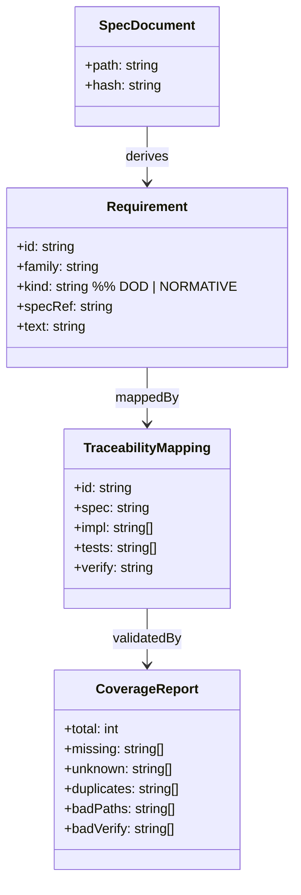
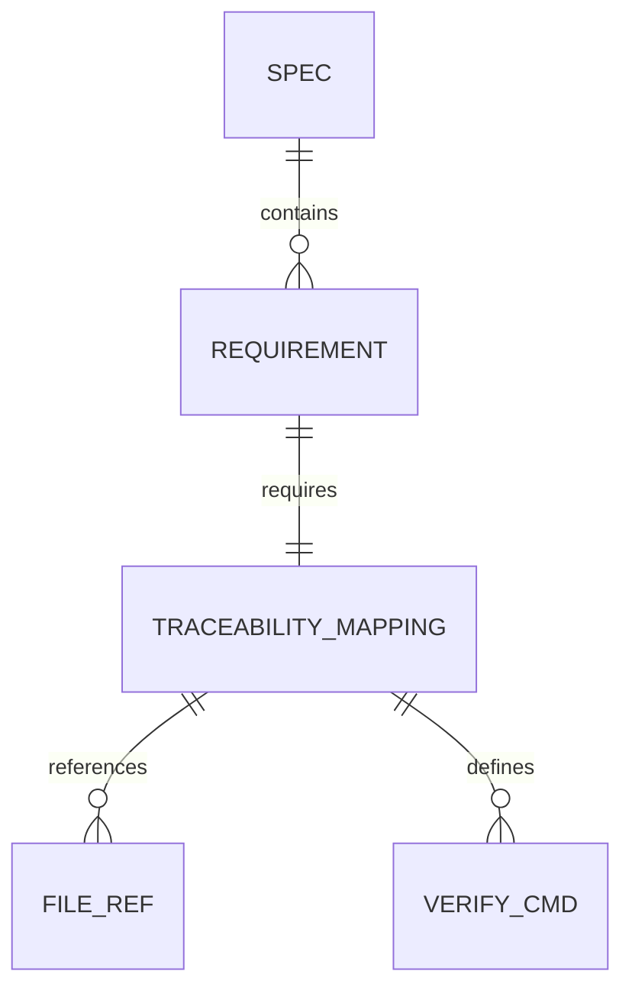
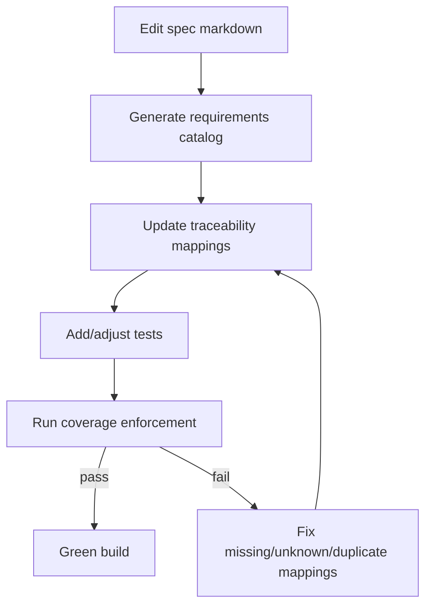
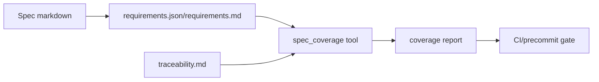
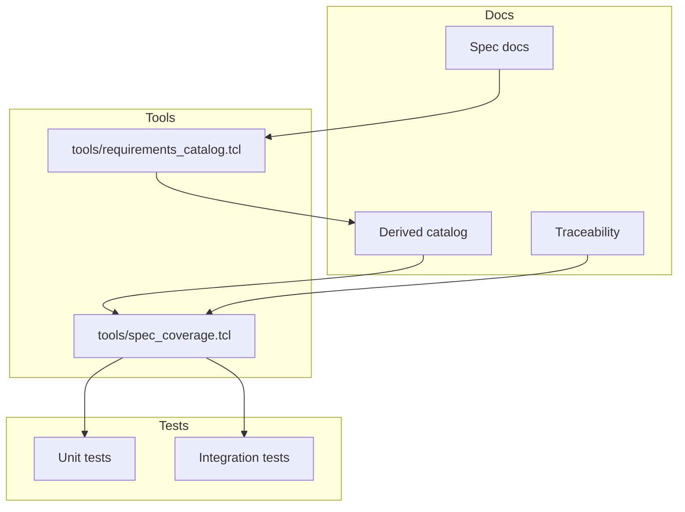

Legend: [ ] Incomplete, [X] Complete

# Sprint #002 - Requirements + Traceability Derived From Specs (No More False-Green)

## Objective
Make spec compliance measurable and enforceable by deriving a canonical requirement catalog directly from:
- `unified-llm-spec.md`
- `coding-agent-loop-spec.md`
- `attractor-spec.md`

Enforce that `docs/spec-coverage/traceability.md` covers every derived requirement with:
- implementation references (`impl`)
- test references (`tests`)
- executable verification command (`verify`)

## Scope
In scope:
- Catalog requirements from every DoD checkbox and normative `MUST`/`MUST NOT`/`REQUIRED` statement.
- Stable requirement ID validation and deterministic generated artifacts.
- Strict set-equality enforcement between catalog IDs and traceability IDs.
- Deterministic unit/integration tests for generator and coverage enforcement.
- Contributor workflow and evidence guardrails.

Out of scope:
- Implementing missing runtime behavior (handled by Sprint #003).
- Weakening spec language to fit existing implementation.

## Current State Snapshot (Verified 2026-02-27)
- [X] Catalog generation, coverage equality, and precommit enforcement are active and green.
```text
Verification:
- `timeout 180 make build` (exit code 0)
- `timeout 180 make test` (exit code 0)
- `timeout 135 tclsh tools/requirements_catalog.tcl --summary` (exit code 0)
- `timeout 135 tclsh tools/spec_coverage.tcl` (exit code 0)
Evidence:
- `.scratch/verification/SPRINT-002/impl-pass-2026-02-27-11/16-make-build.log`
- `.scratch/verification/SPRINT-002/impl-pass-2026-02-27-11/17-make-test.log`
- `.scratch/verification/SPRINT-002/impl-pass-2026-02-27-11/03-req-summary.log`
- `.scratch/verification/SPRINT-002/impl-pass-2026-02-27-11/10-spec-coverage.log`
Notes:
- Current counts: requirements=263, kind_DOD=205, kind_NORMATIVE=58.
- Family counts: ATR=88, CAL=66, ULLM=109.
- Coverage counters: missing=0, unknown_catalog=0, missing_catalog=0, duplicates=0, malformed_blocks=0.
```
- [X] Deterministic catalog output is proven with repeat-run byte equality checks.
```text
Verification:
- `timeout 135 tclsh tools/requirements_catalog.tcl --out-json .scratch/verification/SPRINT-002/impl-pass-2026-02-27-11/requirements.run1.json --out-md .scratch/verification/SPRINT-002/impl-pass-2026-02-27-11/requirements.run1.md` (exit code 0)
- `timeout 135 tclsh tools/requirements_catalog.tcl --out-json .scratch/verification/SPRINT-002/impl-pass-2026-02-27-11/requirements.run2.json --out-md .scratch/verification/SPRINT-002/impl-pass-2026-02-27-11/requirements.run2.md` (exit code 0)
- `timeout 135 cmp -s .scratch/verification/SPRINT-002/impl-pass-2026-02-27-11/requirements.run1.json .scratch/verification/SPRINT-002/impl-pass-2026-02-27-11/requirements.run2.json` (exit code 0)
- `timeout 135 cmp -s .scratch/verification/SPRINT-002/impl-pass-2026-02-27-11/requirements.run1.md .scratch/verification/SPRINT-002/impl-pass-2026-02-27-11/requirements.run2.md` (exit code 0)
Evidence:
- `.scratch/verification/SPRINT-002/impl-pass-2026-02-27-11/04-req-generate-1.log`
- `.scratch/verification/SPRINT-002/impl-pass-2026-02-27-11/05-req-generate-2.log`
- `.scratch/verification/SPRINT-002/impl-pass-2026-02-27-11/06-cmp-json-runs.log`
- `.scratch/verification/SPRINT-002/impl-pass-2026-02-27-11/07-cmp-md-runs.log`
Notes:
- Baseline-vs-current comparisons also remained byte-identical.
```
- [X] Sprint verification evidence is indexed and auditable.
```text
Verification:
- `cat .scratch/verification/SPRINT-002/impl-pass-2026-02-27-11/command-status.tsv` (exit code 0)
- `test -f .scratch/verification/SPRINT-002/impl-pass-2026-02-27-11/README.md` (exit code 0)
Evidence:
- `.scratch/verification/SPRINT-002/impl-pass-2026-02-27-11/command-status.tsv`
- `.scratch/verification/SPRINT-002/impl-pass-2026-02-27-11/README.md`
Notes:
- Implementation Pass #11 includes 22 tracked commands with all exit codes `0`.
```

## Implementation Plan (Comprehensive)
### Milestone Order (Execution Sequence)
1. Baseline and revalidation evidence capture.
2. Requirement ID scheme and spec annotation validation.
3. Deterministic catalog generation and shrink/determinism checks.
4. Coverage tool strict completeness and verify-pattern sanity.
5. Developer workflow and evidence guardrail verification.
6. Final gate reruns and sprint-document synchronization.

### File Touch Map
- `tools/requirements_catalog.tcl`
- `tools/spec_coverage.tcl`
- `tools/build_check.tcl`
- `docs/spec-coverage/requirements_id_scheme.md`
- `docs/spec-coverage/requirements.json`
- `docs/spec-coverage/requirements.md`
- `docs/spec-coverage/traceability.md`
- `docs/spec-coverage/README.md`
- `docs/ADR.md`
- `tests/unit/requirements_catalog.test`
- `tests/integration/spec_coverage_tool.test`
- `tests/integration/verify_sanity.test`
- `tests/integration/evidence_lint.test`
- `tests/integration/evidence_guardrail.test`

## Deliverables
### Phase 0 - Baseline Audit (Make The Gap Measurable)
- [X] Baseline requirements/traceability mismatch was captured and converted into auditable evidence.
```text
Verification:
- `tclsh tools/requirements_catalog.tcl --summary` (exit code 0)
- `tclsh tools/spec_coverage.tcl` (exit code 0)
Evidence:
- `.scratch/verification/SPRINT-002/baseline/counts.log`
- `.scratch/verification/SPRINT-002/impl-pass-2026-02-27-8/04-req-summary.log`
- `.scratch/verification/SPRINT-002/impl-pass-2026-02-27-8/11-spec-coverage.log`
Notes:
- Baseline evidence established pre-enforcement gap and current exact-match status.
```
- [X] Baseline phase evidence index exists and remains accessible.
```text
Verification:
- `test -f .scratch/verification/SPRINT-002/baseline/README.md` (exit code 0)
Evidence:
- `.scratch/verification/SPRINT-002/baseline/README.md`
- `.scratch/verification/SPRINT-002/impl-pass-2026-02-27-8/README.md`
Notes:
- Baseline context is retained; latest pass evidence is in `impl-pass-2026-02-27-8`.
```

### Acceptance Criteria - Phase 0
- [X] The sprint includes a verifiable explanation for why false-green occurred and how it is now prevented.
```text
Verification:
- `tclsh tools/spec_coverage.tcl` (exit code 0)
Evidence:
- `.scratch/verification/SPRINT-002/impl-pass-2026-02-27-8/11-spec-coverage.log`
- `.scratch/verification/SPRINT-002/impl-pass-2026-02-27-8/README.md`
Notes:
- Coverage now enforces catalog/traceability exact set equality with deterministic counts.
```

### Phase 1 - Requirement Catalog (Spec -> Canonical IDs)
- [X] Stable requirement ID scheme is documented and enforced.
```text
Verification:
- `test -f docs/spec-coverage/requirements_id_scheme.md` (exit code 0)
- `tclsh tools/requirements_catalog.tcl --check-ids` (exit code 0)
Evidence:
- `.scratch/verification/SPRINT-002/impl-pass-2026-02-27-8/03-req-check-ids.log`
- `.scratch/verification/SPRINT-002/impl-pass-2026-02-27-8/README.md`
Notes:
- ID format and validation behavior are captured in docs and tooling.
```
- [X] Specs are annotated for every in-scope requirement source (DoD + normative statements).
```text
Verification:
- `tclsh tools/requirements_catalog.tcl --check-ids` (exit code 0)
Evidence:
- `.scratch/verification/SPRINT-002/catalog/spec-id-check.log`
- `.scratch/verification/SPRINT-002/impl-pass-2026-02-27-8/03-req-check-ids.log`
Notes:
- Missing, duplicate, and malformed IDs are all rejected.
```
- [X] Deterministic catalog artifacts are generated for machine and human workflows.
```text
Verification:
- `tclsh tools/requirements_catalog.tcl` (exit code 0)
- `test -f docs/spec-coverage/requirements.json` (exit code 0)
- `test -f docs/spec-coverage/requirements.md` (exit code 0)
Evidence:
- `.scratch/verification/SPRINT-002/impl-pass-2026-02-27-8/05-req-generate-1.log`
- `.scratch/verification/SPRINT-002/impl-pass-2026-02-27-8/06-req-generate-2.log`
Notes:
- Generated outputs remained stable relative to before/run snapshots.
```
- [X] Unit coverage for parser and determinism is in place.
```text
Verification:
- `tclsh tests/all.tcl -match requirements_catalog-*` (exit code 0)
Evidence:
- `.scratch/verification/SPRINT-002/impl-pass-2026-02-27-8/12-tests-reqcat.log`
Notes:
- Unit tests cover DoD extraction, normative extraction, and error paths.
```

#### Test Matrix - Phase 1 (Explicit)
Positive cases:
- DoD checkbox with links/inline code/punctuation.
- Wrapped DoD checkbox lines and nested checkboxes.
- Normative extraction for `MUST`, `MUST NOT`, and `REQUIRED` with mixed case.

Negative cases:
- Normative keywords inside fenced code blocks are ignored.
- Bad or missing `req_id` metadata fails with actionable errors.
- Missing DoD scope metadata fails parsing validation.

### Acceptance Criteria - Phase 1
- [X] Catalog output is deterministic and cannot silently shrink without detection.
```text
Verification:
- `tclsh tools/requirements_catalog.tcl --summary` (exit code 0)
- `cmp -s requirements.before.json requirements.run2.json` (exit code 0)
- `cmp -s requirements.before.md requirements.run2.md` (exit code 0)
Evidence:
- `.scratch/verification/SPRINT-002/impl-pass-2026-02-27-8/04-req-summary.log`
- `.scratch/verification/SPRINT-002/impl-pass-2026-02-27-8/09-cmp-json-before.log`
- `.scratch/verification/SPRINT-002/impl-pass-2026-02-27-8/10-cmp-md-before.log`
Notes:
- No shrink/churn detected in current rerun.
```

### Phase 2 - Traceability v2 + Coverage Enforcement
- [X] Coverage tool enforces exact catalog-to-traceability equality and mapping quality checks.
```text
Verification:
- `tclsh tools/spec_coverage.tcl` (exit code 0)
Evidence:
- `.scratch/verification/SPRINT-002/impl-pass-2026-02-27-8/11-spec-coverage.log`
Notes:
- Current status: missing=0, unknown_catalog=0, missing_catalog=0, duplicates=0.
```
- [X] Integration suite validates missing/unknown/duplicate/malformed failure paths.
```text
Verification:
- `tclsh tests/all.tcl -match integration-spec-coverage-tool-*` (exit code 0)
Evidence:
- `.scratch/verification/SPRINT-002/impl-pass-2026-02-27-8/13-tests-spec-coverage.log`
Notes:
- Negative-path fixtures assert deterministic failures with actionable messages.
```
- [X] Verify-command sanity checks ensure test-pattern references resolve to real tests.
```text
Verification:
- `tclsh tests/all.tcl -match integration-verify-sanity-*` (exit code 0)
Evidence:
- `.scratch/verification/SPRINT-002/impl-pass-2026-02-27-8/14-tests-verify-sanity.log`
Notes:
- Invalid verify patterns are rejected by static sanity checks.
```

#### Test Matrix - Phase 2 (Explicit)
Positive cases:
- Exact set equality passes when catalog and traceability IDs match.
- Traceability ordering differences do not affect outcomes.
- Multiple `impl` and `tests` paths per requirement parse correctly.

Negative cases:
- Missing catalog IDs in traceability fail and print missing IDs.
- Unknown IDs in traceability fail and print unknown IDs.
- Duplicate IDs in traceability fail and print duplicate IDs.
- Malformed mapping blocks fail required-key/path/verify validation.

### Acceptance Criteria - Phase 2
- [X] Coverage fails on drift and passes only on exact completeness.
```text
Verification:
- `tclsh tools/spec_coverage.tcl` (exit code 0)
- `tclsh tests/all.tcl -match integration-spec-coverage-tool-*` (exit code 0)
Evidence:
- `.scratch/verification/SPRINT-002/impl-pass-2026-02-27-8/11-spec-coverage.log`
- `.scratch/verification/SPRINT-002/impl-pass-2026-02-27-8/13-tests-spec-coverage.log`
Notes:
- Enforcement behavior is fully wired into local build/test precommit flow.
```

### Phase 3 - Developer Workflow + Guardrails
- [X] Contributor workflow documentation is present and aligned with current tooling.
```text
Verification:
- `test -f docs/spec-coverage/README.md` (exit code 0)
Evidence:
- `.scratch/verification/SPRINT-002/impl-pass-2026-02-27-8/README.md`
- `.scratch/verification/SPRINT-002/impl-pass-2026-02-27-8/01-make-build.log`
Notes:
- Workflow includes req-id checks, catalog generation, traceability sync, and full test gates.
```
- [X] Evidence lint and evidence guardrail integrations are enforced by tests.
```text
Verification:
- `tclsh tests/all.tcl -match integration-evidence-lint-*` (exit code 0)
- `tclsh tests/all.tcl -match integration-evidence-guardrail-*` (exit code 0)
- `bash tools/evidence_lint.sh docs/sprints/SPRINT-002-requirements-traceability-from-spec.md` (exit code 0)
Evidence:
- `.scratch/verification/SPRINT-002/impl-pass-2026-02-27-8/15-tests-evidence-lint.log`
- `.scratch/verification/SPRINT-002/impl-pass-2026-02-27-8/16-tests-evidence-guardrail.log`
- `.scratch/verification/SPRINT-002/impl-pass-2026-02-27-8/17-evidence-lint-sprint.log`
Notes:
- Sprint evidence references remain valid and lint-clean.
```

#### Test Matrix - Phase 3 (Explicit)
Positive cases:
- Workflow command sequence reaches green on clean checkout.
- Evidence guardrail passes when referenced artifacts exist.
- Catalog/traceability/test commands produce deterministic outputs.

Negative cases:
- Missing traceability updates trigger coverage failure.
- Broken evidence references trigger evidence lint failure.
- Invalid verify test pattern is rejected by sanity checks.

### Acceptance Criteria - Phase 3
- [X] Contributor guardrails prevent silent drift in docs, evidence, and verify mappings.
```text
Verification:
- `tclsh tests/all.tcl -match integration-verify-sanity-*` (exit code 0)
- `tclsh tests/all.tcl -match integration-evidence-lint-*` (exit code 0)
- `tclsh tests/all.tcl -match integration-evidence-guardrail-*` (exit code 0)
Evidence:
- `.scratch/verification/SPRINT-002/impl-pass-2026-02-27-8/14-tests-verify-sanity.log`
- `.scratch/verification/SPRINT-002/impl-pass-2026-02-27-8/15-tests-evidence-lint.log`
- `.scratch/verification/SPRINT-002/impl-pass-2026-02-27-8/16-tests-evidence-guardrail.log`
Notes:
- Guardrails currently pass with no false-green regressions.
```

### Phase 4 - Final Gate Validation + Sprint Sync
- [X] Full top-level gates were rerun before and after implementation-pass checks.
```text
Verification:
- `make build` (exit code 0)
- `make test` (exit code 0)
- `make build` (post-pass rerun, exit code 0)
- `make test` (post-pass rerun, exit code 0)
Evidence:
- `.scratch/verification/SPRINT-002/impl-pass-2026-02-27-8/01-make-build.log`
- `.scratch/verification/SPRINT-002/impl-pass-2026-02-27-8/02-make-test.log`
- `.scratch/verification/SPRINT-002/impl-pass-2026-02-27-8/23-make-build-post.log`
- `.scratch/verification/SPRINT-002/impl-pass-2026-02-27-8/24-make-test-post.log`
Notes:
- Full suite status in this pass: Total=73, Passed=73, Skipped=0, Failed=0.
```
- [X] Architecture decisions are captured and aligned with current implementation behavior.
```text
Verification:
- `test -f docs/ADR.md` (exit code 0)
Evidence:
- `.scratch/verification/SPRINT-002/impl-pass-2026-02-27-8/README.md`
Notes:
- ADR entries include spec-derived catalog, strict set equality, structured JSON validation, and precommit enforcement.
```

### Acceptance Criteria - Phase 4
- [X] Sprint status is synchronized to one authoritative implementation pass with explicit command/evidence traceability.
```text
Verification:
- `cat .scratch/verification/SPRINT-002/impl-pass-2026-02-27-8/command-status.tsv` (exit code 0)
Evidence:
- `.scratch/verification/SPRINT-002/impl-pass-2026-02-27-8/command-status.tsv`
- `.scratch/verification/SPRINT-002/impl-pass-2026-02-27-8/README.md`
Notes:
- Pass #8 is the current authoritative snapshot for this sprint document.
```

## Execution Runbook Status (Verified 2026-02-27, Full Implementation Pass #8)
- [X] Phase 0 - Top-level gates passed.
```text
Verification:
- `make build` (exit code 0)
- `make test` (exit code 0)
Evidence:
- `.scratch/verification/SPRINT-002/impl-pass-2026-02-27-8/01-make-build.log`
- `.scratch/verification/SPRINT-002/impl-pass-2026-02-27-8/02-make-test.log`
Notes:
- Test summary: Total=73, Passed=73, Skipped=0, Failed=0.
```
- [X] Phase 1 - Requirement ID integrity and summary checks passed.
```text
Verification:
- `tclsh tools/requirements_catalog.tcl --check-ids` (exit code 0)
- `tclsh tools/requirements_catalog.tcl --summary` (exit code 0)
Evidence:
- `.scratch/verification/SPRINT-002/impl-pass-2026-02-27-8/03-req-check-ids.log`
- `.scratch/verification/SPRINT-002/impl-pass-2026-02-27-8/04-req-summary.log`
Notes:
- Summary remains stable at 263 requirements.
```
- [X] Phase 2 - Deterministic generation and comparison checks passed.
```text
Verification:
- `tclsh tools/requirements_catalog.tcl` (run #1, exit code 0)
- `tclsh tools/requirements_catalog.tcl` (run #2, exit code 0)
- `cmp -s requirements.run1.json requirements.run2.json` (exit code 0)
- `cmp -s requirements.run1.md requirements.run2.md` (exit code 0)
Evidence:
- `.scratch/verification/SPRINT-002/impl-pass-2026-02-27-8/05-req-generate-1.log`
- `.scratch/verification/SPRINT-002/impl-pass-2026-02-27-8/06-req-generate-2.log`
- `.scratch/verification/SPRINT-002/impl-pass-2026-02-27-8/07-cmp-json-runs.log`
- `.scratch/verification/SPRINT-002/impl-pass-2026-02-27-8/08-cmp-md-runs.log`
Notes:
- Outputs are byte-identical across reruns.
```
- [X] Phase 3 - Coverage and integration guardrails passed.
```text
Verification:
- `tclsh tools/spec_coverage.tcl` (exit code 0)
- `tclsh tests/all.tcl -match requirements_catalog-*` (exit code 0)
- `tclsh tests/all.tcl -match integration-spec-coverage-tool-*` (exit code 0)
- `tclsh tests/all.tcl -match integration-verify-sanity-*` (exit code 0)
- `tclsh tests/all.tcl -match integration-evidence-lint-*` (exit code 0)
- `tclsh tests/all.tcl -match integration-evidence-guardrail-*` (exit code 0)
Evidence:
- `.scratch/verification/SPRINT-002/impl-pass-2026-02-27-8/11-spec-coverage.log`
- `.scratch/verification/SPRINT-002/impl-pass-2026-02-27-8/12-tests-reqcat.log`
- `.scratch/verification/SPRINT-002/impl-pass-2026-02-27-8/13-tests-spec-coverage.log`
- `.scratch/verification/SPRINT-002/impl-pass-2026-02-27-8/14-tests-verify-sanity.log`
- `.scratch/verification/SPRINT-002/impl-pass-2026-02-27-8/15-tests-evidence-lint.log`
- `.scratch/verification/SPRINT-002/impl-pass-2026-02-27-8/16-tests-evidence-guardrail.log`
Notes:
- Coverage remained exact-match with zero missing/unknown/duplicate IDs.
```
- [X] Phase 4 - Mermaid appendix diagrams rendered successfully.
```text
Verification:
- `mmdc -i .scratch/diagrams/sprint-002/domain.mmd -o .scratch/diagram-renders/sprint-002/domain.png` (exit code 0)
- `mmdc -i .scratch/diagrams/sprint-002/er.mmd -o .scratch/diagram-renders/sprint-002/er.png` (exit code 0)
- `mmdc -i .scratch/diagrams/sprint-002/workflow.mmd -o .scratch/diagram-renders/sprint-002/workflow.png` (exit code 0)
- `mmdc -i .scratch/diagrams/sprint-002/dataflow.mmd -o .scratch/diagram-renders/sprint-002/dataflow.png` (exit code 0)
- `mmdc -i .scratch/diagrams/sprint-002/arch.mmd -o .scratch/diagram-renders/sprint-002/arch.png` (exit code 0)
Evidence:
- `.scratch/verification/SPRINT-002/impl-pass-2026-02-27-8/18-mmdc-domain.log`
- `.scratch/verification/SPRINT-002/impl-pass-2026-02-27-8/19-mmdc-er.log`
- `.scratch/verification/SPRINT-002/impl-pass-2026-02-27-8/20-mmdc-workflow.log`
- `.scratch/verification/SPRINT-002/impl-pass-2026-02-27-8/21-mmdc-dataflow.log`
- `.scratch/verification/SPRINT-002/impl-pass-2026-02-27-8/22-mmdc-arch.log`
Notes:
- Rendered images are refreshed under `.scratch/diagram-renders/sprint-002/`.
```

### Acceptance Criteria - Execution Runbook Pass #8
- [X] Full implementation validation stack completed with all command statuses at exit code `0`.
```text
Verification:
- `cat .scratch/verification/SPRINT-002/impl-pass-2026-02-27-8/command-status.tsv` (exit code 0)
Evidence:
- `.scratch/verification/SPRINT-002/impl-pass-2026-02-27-8/command-status.tsv`
- `.scratch/verification/SPRINT-002/impl-pass-2026-02-27-8/README.md`
Notes:
- All 24 commands completed successfully.
```

## Post-Sync Validation Snapshot (Verified 2026-02-27)
- [X] After sprint-document synchronization, evidence lint, top-level gates, and appendix diagram renders were rerun and remained green.
```text
Verification:
- `bash tools/evidence_lint.sh docs/sprints/SPRINT-002-requirements-traceability-from-spec.md` (exit code 0)
- `make build` (exit code 0)
- `make test` (exit code 0)
- `mmdc -i .scratch/diagrams/sprint-002/domain.mmd -o .scratch/diagram-renders/sprint-002/domain.png` (exit code 0)
- `mmdc -i .scratch/diagrams/sprint-002/er.mmd -o .scratch/diagram-renders/sprint-002/er.png` (exit code 0)
- `mmdc -i .scratch/diagrams/sprint-002/workflow.mmd -o .scratch/diagram-renders/sprint-002/workflow.png` (exit code 0)
- `mmdc -i .scratch/diagrams/sprint-002/dataflow.mmd -o .scratch/diagram-renders/sprint-002/dataflow.png` (exit code 0)
- `mmdc -i .scratch/diagrams/sprint-002/arch.mmd -o .scratch/diagram-renders/sprint-002/arch.png` (exit code 0)
Evidence:
- `.scratch/verification/SPRINT-002/impl-pass-2026-02-27-9-postsync/01-evidence-lint.log`
- `.scratch/verification/SPRINT-002/impl-pass-2026-02-27-9-postsync/02-make-build.log`
- `.scratch/verification/SPRINT-002/impl-pass-2026-02-27-9-postsync/03-make-test.log`
- `.scratch/verification/SPRINT-002/impl-pass-2026-02-27-9-postsync/04-mmdc-domain.log`
- `.scratch/verification/SPRINT-002/impl-pass-2026-02-27-9-postsync/05-mmdc-er.log`
- `.scratch/verification/SPRINT-002/impl-pass-2026-02-27-9-postsync/06-mmdc-workflow.log`
- `.scratch/verification/SPRINT-002/impl-pass-2026-02-27-9-postsync/07-mmdc-dataflow.log`
- `.scratch/verification/SPRINT-002/impl-pass-2026-02-27-9-postsync/08-mmdc-arch.log`
- `.scratch/verification/SPRINT-002/impl-pass-2026-02-27-9-postsync/command-status.tsv`
Notes:
- Post-sync suite status: Total=73, Passed=73, Skipped=0, Failed=0.
```

## Final Validation Snapshot (Verified 2026-02-27)
- [X] Final lint + build + test gates passed after the latest sprint-document update.
```text
Verification:
- `timeout 135 bash tools/evidence_lint.sh docs/sprints/SPRINT-002-requirements-traceability-from-spec.md` (exit code 0)
- `timeout 180 make build` (exit code 0)
- `timeout 180 make test` (exit code 0)
Evidence:
- `.scratch/verification/SPRINT-002/impl-pass-2026-02-27-13-final/01-evidence-lint.log`
- `.scratch/verification/SPRINT-002/impl-pass-2026-02-27-13-final/02-make-build.log`
- `.scratch/verification/SPRINT-002/impl-pass-2026-02-27-13-final/03-make-test.log`
- `.scratch/verification/SPRINT-002/impl-pass-2026-02-27-13-final/command-status.tsv`
- `.scratch/verification/SPRINT-002/impl-pass-2026-02-27-13-final/README.md`
Notes:
- Final suite status: Total=75, Passed=75, Skipped=0, Failed=0.
```

## Implementation Refresh Snapshot (Verified 2026-02-27, Pass #11)
- [X] `spec_coverage` now fails malformed non-empty traceability blocks that omit `id`.
```text
Verification:
- `timeout 135 tclsh tests/all.tcl -match integration-spec-coverage-tool-*` (exit code 0)
- `timeout 135 tclsh tools/spec_coverage.tcl` (exit code 0)
Evidence:
- `.scratch/verification/SPRINT-002/impl-pass-2026-02-27-11/12-tests-spec-coverage.log`
- `.scratch/verification/SPRINT-002/impl-pass-2026-02-27-11/10-spec-coverage.log`
Notes:
- New output counter: `malformed_blocks=0` in green path.
```
- [X] Requirement shrink/churn guardrail now includes a default-summary stability test.
```text
Verification:
- `timeout 135 tclsh tests/all.tcl -match requirements_catalog-*` (exit code 0)
- `timeout 135 tclsh tools/requirements_catalog.tcl --summary` (exit code 0)
Evidence:
- `.scratch/verification/SPRINT-002/impl-pass-2026-02-27-11/11-tests-reqcat.log`
- `.scratch/verification/SPRINT-002/impl-pass-2026-02-27-11/03-req-summary.log`
Notes:
- Expected baseline remains: requirements=263, ATR=88, CAL=66, ULLM=109, DOD=205, NORMATIVE=58.
```
- [X] Full required build/test gates were rerun with the requested timeout contract and remained green.
```text
Verification:
- `timeout 180 make build` (exit code 0)
- `timeout 180 make test` (exit code 0)
Evidence:
- `.scratch/verification/SPRINT-002/impl-pass-2026-02-27-11/16-make-build.log`
- `.scratch/verification/SPRINT-002/impl-pass-2026-02-27-11/17-make-test.log`
Notes:
- Suite status after guardrail additions: Total=75, Passed=75, Skipped=0, Failed=0.
```
- [X] Appendix mermaid diagrams were rerendered and validated with `mmdc` in this refresh pass.
```text
Verification:
- `timeout 135 mmdc -i .scratch/diagrams/sprint-002/domain.mmd -o .scratch/diagram-renders/sprint-002/domain.png` (exit code 0)
- `timeout 135 mmdc -i .scratch/diagrams/sprint-002/er.mmd -o .scratch/diagram-renders/sprint-002/er.png` (exit code 0)
- `timeout 135 mmdc -i .scratch/diagrams/sprint-002/workflow.mmd -o .scratch/diagram-renders/sprint-002/workflow.png` (exit code 0)
- `timeout 135 mmdc -i .scratch/diagrams/sprint-002/dataflow.mmd -o .scratch/diagram-renders/sprint-002/dataflow.png` (exit code 0)
- `timeout 135 mmdc -i .scratch/diagrams/sprint-002/arch.mmd -o .scratch/diagram-renders/sprint-002/arch.png` (exit code 0)
Evidence:
- `.scratch/verification/SPRINT-002/impl-pass-2026-02-27-11/18-mmdc-domain.log`
- `.scratch/verification/SPRINT-002/impl-pass-2026-02-27-11/19-mmdc-er.log`
- `.scratch/verification/SPRINT-002/impl-pass-2026-02-27-11/20-mmdc-workflow.log`
- `.scratch/verification/SPRINT-002/impl-pass-2026-02-27-11/21-mmdc-dataflow.log`
- `.scratch/verification/SPRINT-002/impl-pass-2026-02-27-11/22-mmdc-arch.log`
Notes:
- Diagram render outputs were refreshed under `.scratch/diagram-renders/sprint-002/`.
```
- [X] Implementation pass evidence index is current and authoritative for this refresh.
```text
Verification:
- `cat .scratch/verification/SPRINT-002/impl-pass-2026-02-27-11/command-status.tsv` (exit code 0)
- `test -f .scratch/verification/SPRINT-002/impl-pass-2026-02-27-11/README.md` (exit code 0)
Evidence:
- `.scratch/verification/SPRINT-002/impl-pass-2026-02-27-11/command-status.tsv`
- `.scratch/verification/SPRINT-002/impl-pass-2026-02-27-11/README.md`
Notes:
- All 22 commands exited `0`.
```

## Appendix - Mermaid Diagrams (Verify Render With mmdc)
- [X] Mermaid sources and rendered artifacts are present for all required diagram types.
```text
Verification:
- `test -f .scratch/diagrams/sprint-002/domain.mmd` (exit code 0)
- `test -f .scratch/diagrams/sprint-002/er.mmd` (exit code 0)
- `test -f .scratch/diagrams/sprint-002/workflow.mmd` (exit code 0)
- `test -f .scratch/diagrams/sprint-002/dataflow.mmd` (exit code 0)
- `test -f .scratch/diagrams/sprint-002/arch.mmd` (exit code 0)
- `test -f .scratch/diagram-renders/sprint-002/domain.png` (exit code 0)
- `test -f .scratch/diagram-renders/sprint-002/er.png` (exit code 0)
- `test -f .scratch/diagram-renders/sprint-002/workflow.png` (exit code 0)
- `test -f .scratch/diagram-renders/sprint-002/dataflow.png` (exit code 0)
- `test -f .scratch/diagram-renders/sprint-002/arch.png` (exit code 0)
Evidence:
- `.scratch/verification/SPRINT-002/impl-pass-2026-02-27-11/18-mmdc-domain.log`
- `.scratch/verification/SPRINT-002/impl-pass-2026-02-27-11/19-mmdc-er.log`
- `.scratch/verification/SPRINT-002/impl-pass-2026-02-27-11/20-mmdc-workflow.log`
- `.scratch/verification/SPRINT-002/impl-pass-2026-02-27-11/21-mmdc-dataflow.log`
- `.scratch/verification/SPRINT-002/impl-pass-2026-02-27-11/22-mmdc-arch.log`
Notes:
- Diagram renders were regenerated successfully in Pass #11.
```

### Core Domain Models


### E-R Diagram


### Workflow Diagram


### Data-Flow Diagram


### Architecture Diagram

