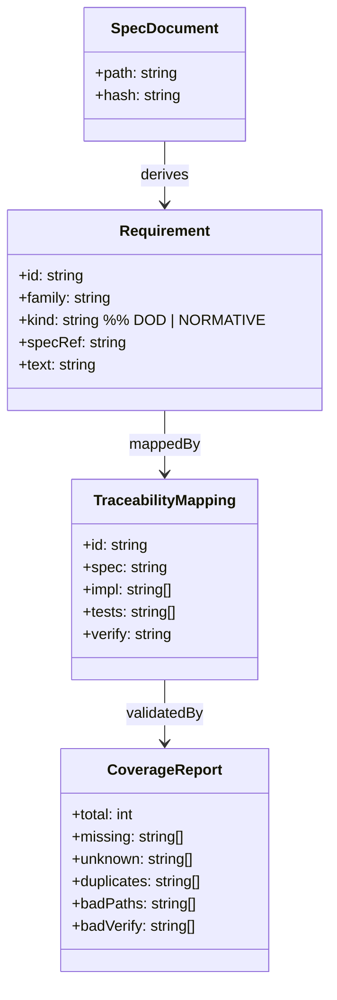
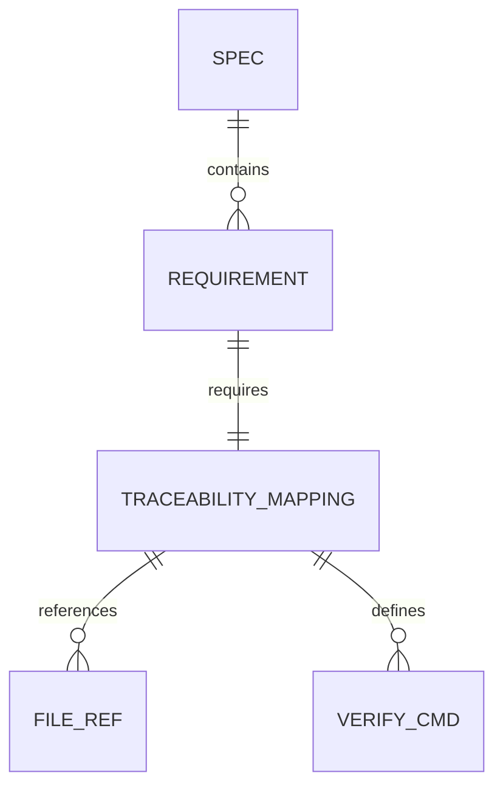
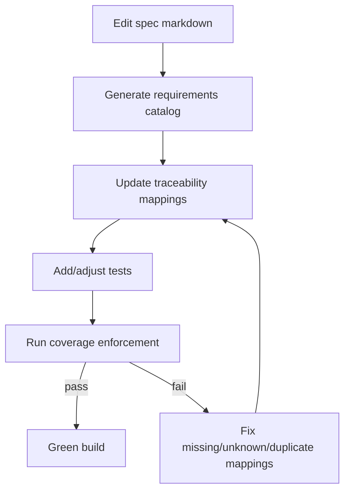
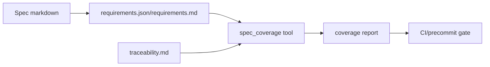
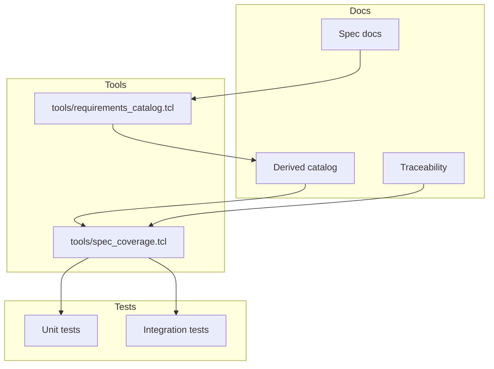

Legend: [ ] Incomplete, [X] Complete

# Sprint #002 - Requirements + Traceability Derived From Specs (No More False-Green)

## Objective
Make spec compliance measurable and enforceable by deriving a canonical requirement catalog directly from:
- `unified-llm-spec.md`
- `coding-agent-loop-spec.md`
- `attractor-spec.md`

…and then enforcing that `docs/spec-coverage/traceability.md` covers every derived requirement with:
- implementation references (`impl`)
- test references (`tests`)
- an executable verification command (`verify`)

## Context & Problem
Today, `tools/spec_coverage.tcl` can report green coverage even when large portions of the specs are unimplemented, because it validates only that traceability *blocks are well-formed*, not that the catalog is complete.

This sprint removes that gap by making the requirement catalog a first-class, spec-derived artifact and gating the build on completeness.

## Current State Snapshot (Verified 2026-02-26)
- [ ] `make -j10 test` passes on a clean checkout.
```text
{placeholder for verification justification/reasoning and evidence log}
```
- [ ] `tclsh tools/spec_coverage.tcl` reports green (but is not completeness-proof).
```text
{placeholder for verification justification/reasoning and evidence log}
```
- [ ] Spec DoD checkboxes materially exceed the current traceability ID count (signals under-inventory).
```text
{placeholder for verification justification/reasoning and evidence log}
```

## Scope
In scope:
- A spec-derived requirement catalog covering:
  - every DoD checkbox in each spec’s “Definition of Done” section
  - every normative statement containing MUST / MUST NOT / REQUIRED (case-insensitive)
- A stable requirement ID scheme that survives small spec edits with minimal churn
- A coverage tool that validates:
  - every catalog requirement has exactly one traceability mapping
  - every mapping block is well-formed (existing checks stay)
  - mapping references point at real files
- Deterministic unit/integration tests for the catalog generator and coverage enforcement

Out of scope:
- Implementing missing runtime behavior (that is Sprint #003)
- Any changes that weaken the specs to match the current implementation

## Deliverables
### Phase 0 - Baseline Audit (Make The Gap Measurable)
- [ ] Record baseline counts: DoD checkbox totals per spec, normative statement totals per spec, and current traceability ID count.
```text
{placeholder for verification justification/reasoning and evidence log}
```
- [ ] Add a human-readable audit report under `.scratch/verification/SPRINT-002/baseline/` summarizing the deltas and listing the largest missing spec areas.
```text
{placeholder for verification justification/reasoning and evidence log}
```

### Acceptance Criteria - Phase 0
- [ ] The repo contains an auditable baseline report that explains why “traceability green” can still be incomplete today.
```text
{placeholder for verification justification/reasoning and evidence log}
```

### Phase 1 - Requirement Catalog (Spec -> Canonical IDs)
- [ ] Define a stable requirement ID scheme and document it (examples for ULLM/CAL/ATR, DoD + normative requirements).
```text
{placeholder for verification justification/reasoning and evidence log}
```
- [ ] Implement a deterministic catalog generator: `tools/requirements_catalog.tcl`.
```text
{placeholder for verification justification/reasoning and evidence log}
```
- [ ] Emit a machine-readable catalog artifact under `docs/spec-coverage/requirements.json` (generated) and a human-readable summary under `docs/spec-coverage/requirements.md` (generated).
```text
{placeholder for verification justification/reasoning and evidence log}
```
- [ ] Add unit tests proving stable extraction for DoD checkbox bullets, normative MUST/MUST NOT/REQUIRED statements, and DoD-section scoping.
```text
{placeholder for verification justification/reasoning and evidence log}
```
Details to cover in tests:
- DoD checkbox bullets (including nested lists)
- normative MUST/MUST NOT/REQUIRED statements
- section scoping (only DoD checkboxes, not every random checklist elsewhere)

#### Test Matrix - Phase 1 (Explicit)
Positive cases to cover (must be represented in tests):
- DoD checkbox line with inline code, links, and punctuation
- DoD checkbox with wrapped text across multiple lines (markdown hard-wrap)
- Nested DoD checkbox (sub-bullet checkbox under a parent checkbox)
- Normative statements:
  - “MUST …”
  - “MUST NOT …”
  - “REQUIRED …”
  - mixed case (“Must”, “required”)

Negative cases to cover (must be represented in tests):
- “must” in a code block should not be treated as normative
- “required” inside a URL or markdown link text should not be treated as normative
- DoD section missing header should fail fast with a descriptive error

### Acceptance Criteria - Phase 1
- [ ] The catalog generator produces deterministic output (no ordering churn) and fails with actionable errors when spec parsing fails.
```text
{placeholder for verification justification/reasoning and evidence log}
```

### Phase 2 - Traceability v2 + Coverage Enforcement
- [ ] Extend `tools/spec_coverage.tcl` to load the derived catalog and enforce “no missing requirements” (catalog completeness), while preserving current well-formedness checks.
```text
{placeholder for verification justification/reasoning and evidence log}
```
- [ ] Update `docs/spec-coverage/traceability.md` to include a mapping block for every catalog requirement ID.
```text
{placeholder for verification justification/reasoning and evidence log}
```
- [ ] Add integration tests covering missing/unknown/duplicate requirement IDs and malformed mapping blocks.
```text
{placeholder for verification justification/reasoning and evidence log}
```
Details to cover in tests:
- catalog requirement missing from traceability
- traceability contains an unknown/unlisted requirement ID
- duplicate mappings for the same requirement ID
- malformed mapping blocks (missing keys, missing paths, bad verify formatting)

#### Test Matrix - Phase 2 (Explicit)
Positive cases:
- “catalog == traceability” exact set match passes
- traceability ordering changes do not affect results
- multiple `impl` paths and multiple `tests` paths parse correctly

Negative cases:
- missing ID fails and prints the missing ID(s)
- unknown ID fails and prints the unknown ID(s)
- duplicate ID fails and prints the duplicate ID(s)

### Acceptance Criteria - Phase 2
- [ ] Running the coverage tool fails whenever the specs change in a way that introduces new requirements without corresponding traceability updates.
```text
{placeholder for verification justification/reasoning and evidence log}
```

### Phase 3 - Developer Workflow + Guardrails
- [ ] Add a short developer guide under `docs/spec-coverage/README.md` describing how to update specs, regenerate catalogs, update traceability, and add tests.
```text
{placeholder for verification justification/reasoning and evidence log}
```
- [ ] Add an “evidence reference guardrail” tool that checks sprint docs for referenced artifacts and fails if links point to non-existent files (opt-in, not required for every commit).
```text
{placeholder for verification justification/reasoning and evidence log}
```

### Acceptance Criteria - Phase 3
- [ ] A new contributor can follow the guide to add one new spec requirement and get to green coverage with a test and mapping update.
```text
{placeholder for verification justification/reasoning and evidence log}
```

## Appendix - Mermaid Diagrams (Verify Render With mmdc)

### Core Domain Models


### E-R Diagram


### Workflow Diagram


### Data-Flow Diagram


### Architecture Diagram

