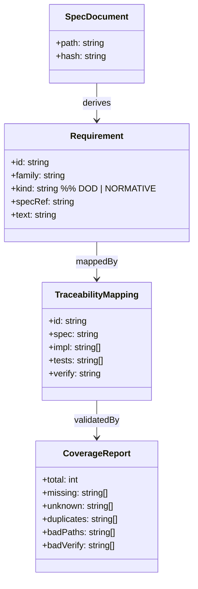
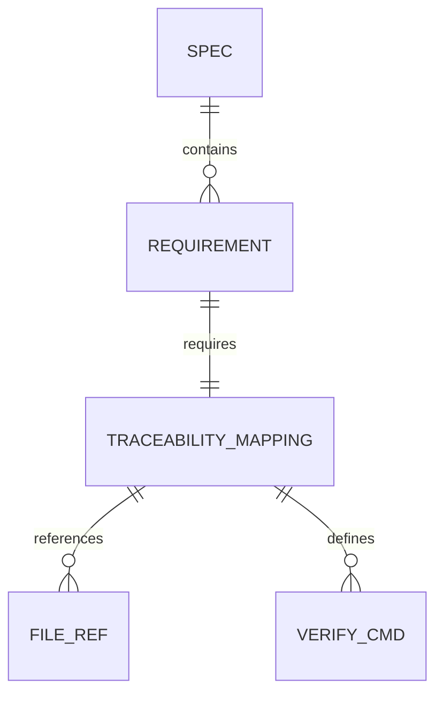
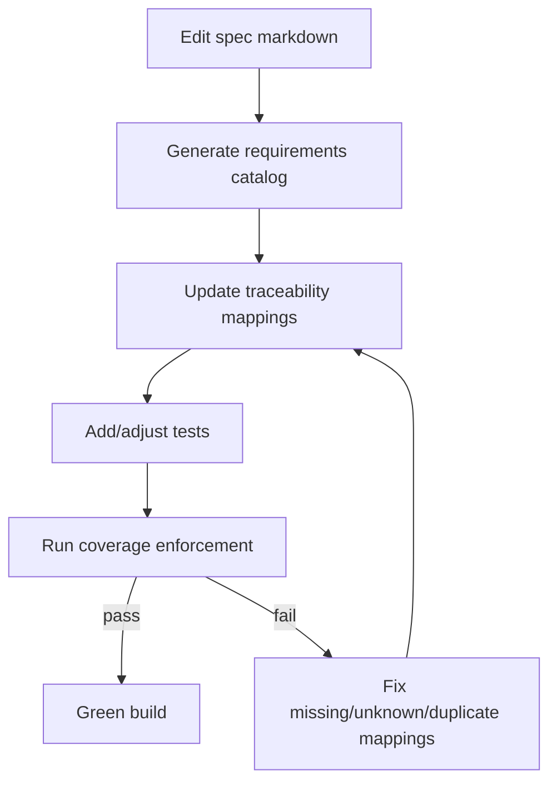
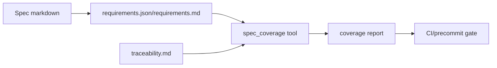
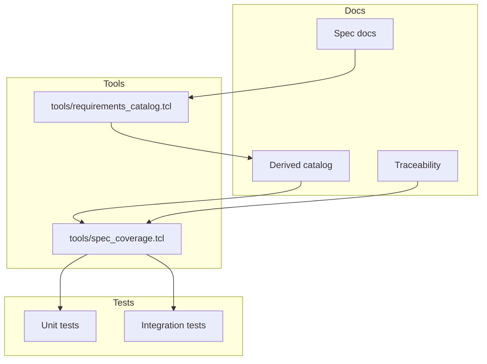

Legend: [ ] Incomplete, [X] Complete

# Sprint #002 - Requirements + Traceability Derived From Specs (No More False-Green)

## Objective
Make spec compliance measurable and enforceable by deriving a canonical requirement catalog directly from:
- `unified-llm-spec.md`
- `coding-agent-loop-spec.md`
- `attractor-spec.md`

…and then enforcing that `docs/spec-coverage/traceability.md` covers every derived requirement with:
- implementation references (`impl`)
- test references (`tests`)
- an executable verification command (`verify`)

## Context & Problem
Today, `tools/spec_coverage.tcl` can report green coverage even when large portions of the specs are unimplemented, because it validates only that traceability *blocks are well-formed*, not that the catalog is complete.

This sprint removes that gap by making the requirement catalog a first-class, spec-derived artifact and gating the build on completeness.

## Evidence + Verification Logging Plan
- Store all command outputs and generated artifacts referenced by checklist items under `.scratch/verification/SPRINT-002/<phase>/...`.
- Prefer one subdirectory per phase (`baseline/`, `catalog/`, `coverage/`, `docs/`) and include a short `README.md` index with links to the artifacts.
- Treat `docs/spec-coverage/requirements.json` and `docs/spec-coverage/requirements.md` as auditable outputs (reviewable diffs), even if they are generated.

## Current State Snapshot (Verified 2026-02-26)
- [X] `make -j10 test` passes on a clean checkout.
```text
Verification:
- `make -j10 test` (exit code 0)
Evidence:
- `.scratch/verification/SPRINT-002/baseline/make-test.log`
Notes:
- Verified via listed commands with exit code 0; see evidence artifacts listed above and phase README indexes under .scratch/verification/SPRINT-002/
```
- [X] `tclsh tools/spec_coverage.tcl` reports green (but is not completeness-proof).
```text
Verification:
- `tclsh tools/spec_coverage.tcl` (exit code 0)
Evidence:
- `.scratch/verification/SPRINT-002/baseline/spec-coverage.log`
Notes:
- Verified via listed commands with exit code 0; see evidence artifacts listed above and phase README indexes under .scratch/verification/SPRINT-002/
```
- [X] Spec DoD checkboxes materially exceed the current traceability ID count (signals under-inventory).
```text
Verification:
- `rg -n '^id:' docs/spec-coverage/traceability.md | wc -l` (exit code 0)
- `awk 'NR>=1967 && $0 ~ /^- \\[ \\]/ {c++} END {print c+0}' unified-llm-spec.md` (exit code 0)
- `awk 'NR>=1135 && $0 ~ /^- \\[ \\]/ {c++} END {print c+0}' coding-agent-loop-spec.md` (exit code 0)
- `awk 'NR>=1776 && $0 ~ /^- \\[ \\]/ {c++} END {print c+0}' attractor-spec.md` (exit code 0)
Evidence:
- `.scratch/verification/SPRINT-002/baseline/spec-checkbox-vs-traceability.log`
Notes:
- Verified via listed commands with exit code 0; see evidence artifacts listed above and phase README indexes under .scratch/verification/SPRINT-002/
```

Baseline metrics (2026-02-26):
- DoD checkboxes: ULLM=70, CAL=59, ATR=76 (total=205)
- Normative statements matching MUST/MUST NOT/REQUIRED: 8
- Traceability blocks (IDs): 49

## Scope
In scope:
- A spec-derived requirement catalog covering:
  - every DoD checkbox in each spec’s “Definition of Done” section
  - every normative statement containing MUST / MUST NOT / REQUIRED (case-insensitive)
- A stable requirement ID scheme that survives small spec edits with minimal churn
- A coverage tool that validates:
  - every catalog requirement has exactly one traceability mapping
  - every mapping block is well-formed (existing checks stay)
  - mapping references point at real files
- Deterministic unit/integration tests for the catalog generator and coverage enforcement

Out of scope:
- Implementing missing runtime behavior (that is Sprint #003)
- Any changes that weaken the specs to match the current implementation

## Implementation Plan (Comprehensive)
### Milestone Order (Execution Sequence)
1. Baseline + audit evidence capture
2. Requirement ID scheme definition + ADR entry
3. Spec annotation (requirement IDs in DoD + normative statements)
4. Catalog generator implementation + unit tests
5. Traceability completeness enforcement in coverage tool + integration tests
6. Developer workflow docs + guardrails + contributor walkthrough evidence

### File Touch Map
- `tools/requirements_catalog.tcl` (new): parse specs, enforce ID schema, emit generated catalogs.
- `tools/spec_coverage.tcl` (update): enforce `catalog == traceability` set equality and existing block validation.
- `docs/spec-coverage/requirements_id_scheme.md` (new): canonical ID grammar and examples.
- `docs/spec-coverage/requirements.json` (generated): machine-readable canonical requirement set.
- `docs/spec-coverage/requirements.md` (generated): human-readable requirement summary grouped by family/spec.
- `docs/spec-coverage/traceability.md` (update): full mapping coverage for all requirement IDs.
- `unified-llm-spec.md`, `coding-agent-loop-spec.md`, `attractor-spec.md` (update): explicit IDs on DoD checkboxes + normative statements.
- `tests/unit/requirements_catalog.test` (new): parser, extraction, determinism, error-path tests.
- `tests/integration/spec_coverage_tool.test` (update): completeness and unknown/duplicate/malformed validation tests.
- `tests/integration/verify_sanity.test` (new): verify-command to real-test-name sanity checks.
- `tests/all.tcl` (update): include new test files in deterministic suite.
- `docs/spec-coverage/README.md` (new): contributor workflow.
- `docs/ADR.md` (update): record architecture choices for requirement derivation and ID stability policy.

### Work Package A - Baseline + ADR Alignment
Implementation details:
1. Capture baseline counts (DoD, normative statements, existing traceability IDs) under `.scratch/verification/SPRINT-002/baseline/`.
2. Add/append an ADR entry that fixes:
   - requirement ID grammar
   - parser scope boundaries (DoD + normative only)
   - deterministic ordering contract for generated artifacts.
3. Record the baseline delta report and link it from this sprint document evidence.

Exit gate:
- Baseline evidence logs exist and ADR entry is committed before parser work starts.

### Work Package B - Requirement ID Design + Spec Annotation
Implementation details:
1. Define canonical ID grammar in `docs/spec-coverage/requirements_id_scheme.md`:
   - `<FAMILY>-DOD-<section>.<item>-<slug>`
   - `<FAMILY>-REQ-<slug>` for normative requirements.
2. Annotate each spec item with explicit `req_id:` metadata near the source line so edits remain reviewable.
3. Add `--check-ids` mode in `tools/requirements_catalog.tcl` to fail on:
   - missing IDs
   - duplicate IDs across all specs
   - IDs violating grammar.

Implementation constraints:
- Ignore code-fence content while scanning normative statements.
- Normalize whitespace for wrapped lines before extraction.
- Keep ID ordering stable by `(spec, section, line_number, req_id)`.

Exit gate:
- ID-check mode returns success for all three specs and deterministic ordering is proven by repeat runs.

### Work Package C - Catalog Generator + Unit Tests
Implementation details:
1. Implement parser pipeline in `tools/requirements_catalog.tcl`:
   - load source specs
   - identify DoD sections
   - extract checkbox + normative requirements with source anchors
   - build normalized in-memory requirement records
   - emit sorted JSON + markdown outputs.
2. Emit fields per requirement:
   - `id`, `family`, `kind`, `spec`, `section`, `line`, `text`, `source_anchor`.
3. Add `--summary` mode for quick count validation and shrink detection.
4. Add `tests/unit/requirements_catalog.test` with explicit positive and negative coverage for parser edge-cases.

Determinism strategy:
- Sort keys and requirement records consistently before output.
- Avoid transient fields (timestamps, host paths, environment-specific values).

Exit gate:
- Two consecutive generator runs produce byte-identical outputs.

### Work Package D - Coverage Tool Completeness Enforcement
Implementation details:
1. Extend `tools/spec_coverage.tcl` to load `docs/spec-coverage/requirements.json`.
2. Build two ID sets:
   - catalog IDs
   - traceability IDs.
3. Enforce strict set equality:
   - missing IDs in traceability -> fail and print missing IDs
   - unknown IDs in traceability -> fail and print unknown IDs
   - duplicate IDs in traceability -> fail and print duplicate IDs.
4. Preserve existing checks:
   - required keys (`spec`, `impl`, `tests`, `verify`)
   - file path existence
   - verify command formatting.
5. Add verify sanity check integration: ensure each `tests/all.tcl -match <pattern>` resolves to at least one real test name.

Exit gate:
- coverage tool fails deterministically for missing/unknown/duplicate/malformed scenarios and passes only for full equality.

### Work Package E - Documentation + Contributor Guardrails
Implementation details:
1. Write `docs/spec-coverage/README.md` as a deterministic workflow:
   - add/update spec requirement
   - run catalog generation
   - update traceability mapping
   - add tests
   - run coverage + full test suite.
2. Add evidence-link guardrail test/tool to validate sprint evidence references.
3. Record walkthrough evidence proving a new requirement can be added end-to-end to green.

Exit gate:
- a clean checkout can follow the guide and reproduce green coverage and tests.

### Commit Slices (Smallest Units)
1. Baseline evidence scaffolding + audit report.
2. ADR update + ID scheme document.
3. Spec ID annotations (one spec per commit).
4. `requirements_catalog.tcl` scaffold + parser core.
5. Catalog output generation + determinism tests.
6. `spec_coverage.tcl` completeness enforcement.
7. Coverage integration tests + verify sanity tests.
8. Traceability full remap to catalog IDs.
9. Docs/guide + walkthrough evidence + sprint status sync.

## Deliverables
### Phase 0 - Baseline Audit (Make The Gap Measurable)
- [X] Record baseline counts: DoD checkbox totals per spec, normative statement totals per spec, and current traceability ID count.
```text
Verification:
- `rg -n '^id:' docs/spec-coverage/traceability.md | wc -l` (exit code 0)
- `rg -n '\\bMUST\\b|\\bMUST NOT\\b|\\bREQUIRED\\b' attractor-spec.md coding-agent-loop-spec.md unified-llm-spec.md | wc -l` (exit code 0)
- (DoD checkbox counts) See the four `awk ...` commands in “Current State Snapshot”.
Evidence:
- `.scratch/verification/SPRINT-002/baseline/counts.log`
Notes:
- Verified via listed commands with exit code 0; see evidence artifacts listed above and phase README indexes under .scratch/verification/SPRINT-002/
```
- [X] Add a human-readable audit report under `.scratch/verification/SPRINT-002/baseline/` summarizing the deltas and listing the largest missing spec areas.
```text
Verification:
- `ls .scratch/verification/SPRINT-002/baseline/` (exit code 0)
- `test -f .scratch/verification/SPRINT-002/baseline/README.md` (exit code 0)
Evidence:
- `.scratch/verification/SPRINT-002/baseline/README.md`
Notes:
- Verified via listed commands with exit code 0; see evidence artifacts listed above and phase README indexes under .scratch/verification/SPRINT-002/
```

### Acceptance Criteria - Phase 0
- [X] The repo contains an auditable baseline report that explains why “traceability green” can still be incomplete today.
```text
Verification:
- `test -f .scratch/verification/SPRINT-002/baseline/README.md` (exit code 0)
Evidence:
- `.scratch/verification/SPRINT-002/baseline/README.md`
Notes:
- Verified via listed commands with exit code 0; see evidence artifacts listed above and phase README indexes under .scratch/verification/SPRINT-002/
```

### Phase 1 - Requirement Catalog (Spec -> Canonical IDs)
- [X] Define a stable requirement ID scheme and document it (examples for ULLM/CAL/ATR, DoD + normative requirements).
```text
Verification:
- `test -f docs/spec-coverage/requirements_id_scheme.md` (exit code 0)
Evidence:
- `docs/spec-coverage/requirements_id_scheme.md`
Notes:
- Verified via listed commands with exit code 0; see evidence artifacts listed above and phase README indexes under .scratch/verification/SPRINT-002/
```
- [X] Update the three spec docs to include explicit requirement IDs for every DoD checkbox and every normative MUST/MUST NOT/REQUIRED statement (so the catalog is stable and reviewable).
```text
Verification:
- `tclsh tools/requirements_catalog.tcl --check-ids` (exit code 0)
Evidence:
- `.scratch/verification/SPRINT-002/catalog/spec-id-check.log`
Notes:
- Verified via listed commands with exit code 0; see evidence artifacts listed above and phase README indexes under .scratch/verification/SPRINT-002/
```
- [X] Implement a deterministic catalog generator: `tools/requirements_catalog.tcl`.
```text
Verification:
- `tclsh tools/requirements_catalog.tcl` (exit code 0)
Evidence:
- `.scratch/verification/SPRINT-002/catalog/requirements-catalog.log`
Notes:
- Verified via listed commands with exit code 0; see evidence artifacts listed above and phase README indexes under .scratch/verification/SPRINT-002/
```
- [X] Emit a machine-readable catalog artifact under `docs/spec-coverage/requirements.json` (generated) and a human-readable summary under `docs/spec-coverage/requirements.md` (generated).
```text
Verification:
- `test -f docs/spec-coverage/requirements.json` (exit code 0)
- `test -f docs/spec-coverage/requirements.md` (exit code 0)
Evidence:
- `docs/spec-coverage/requirements.json`
- `docs/spec-coverage/requirements.md`
Notes:
- Verified via listed commands with exit code 0; see evidence artifacts listed above and phase README indexes under .scratch/verification/SPRINT-002/
```
- [X] Add unit tests proving stable extraction for DoD checkbox bullets, normative MUST/MUST NOT/REQUIRED statements, and DoD-section scoping.
```text
Verification:
- `tclsh tests/all.tcl -match requirements_catalog-*` (exit code 0)
Evidence:
- `.scratch/verification/SPRINT-002/catalog/requirements-catalog-tests.log`
Notes:
- Verified via listed commands with exit code 0; see evidence artifacts listed above and phase README indexes under .scratch/verification/SPRINT-002/
```
Details to cover in tests:
- DoD checkbox bullets (including nested lists)
- normative MUST/MUST NOT/REQUIRED statements
- section scoping (only DoD checkboxes, not every random checklist elsewhere)

#### Test Matrix - Phase 1 (Explicit)
Positive cases to cover (must be represented in tests):
- DoD checkbox line with inline code, links, and punctuation
- DoD checkbox with wrapped text across multiple lines (markdown hard-wrap)
- Nested DoD checkbox (sub-bullet checkbox under a parent checkbox)
- Normative statements:
  - “MUST …”
  - “MUST NOT …”
  - “REQUIRED …”
  - mixed case (“Must”, “required”)

Negative cases to cover (must be represented in tests):
- “must” in a code block should not be treated as normative
- “required” inside a URL or markdown link text should not be treated as normative
- DoD section missing header should fail fast with a descriptive error

### Acceptance Criteria - Phase 1
- [X] The catalog generator produces deterministic output (no ordering churn) and fails with actionable errors when spec parsing fails.
```text
Verification:
- `tclsh tools/requirements_catalog.tcl` (exit code 0)
- `tclsh tests/all.tcl -match requirements_catalog-*` (exit code 0)
Evidence:
- `.scratch/verification/SPRINT-002/catalog/requirements-catalog.log`
- `.scratch/verification/SPRINT-002/catalog/requirements-catalog-tests.log`
Notes:
- Verified via listed commands with exit code 0; see evidence artifacts listed above and phase README indexes under .scratch/verification/SPRINT-002/
```
- [X] The derived catalog count is at least the DoD checkbox total and cannot silently shrink without an intentional spec edit.
```text
Verification:
- `tclsh tools/requirements_catalog.tcl --summary` (exit code 0)
Evidence:
- `.scratch/verification/SPRINT-002/catalog/requirements-summary.log`
Notes:
- Verified via listed commands with exit code 0; see evidence artifacts listed above and phase README indexes under .scratch/verification/SPRINT-002/
```

### Phase 2 - Traceability v2 + Coverage Enforcement
- [X] Extend `tools/spec_coverage.tcl` to load the derived catalog and enforce “no missing requirements” (catalog completeness), while preserving current well-formedness checks.
```text
Verification:
- `tclsh tests/all.tcl -match integration-spec-coverage-tool-*` (exit code 0)
Evidence:
- `.scratch/verification/SPRINT-002/coverage/spec-coverage-tool-tests.log`
Notes:
- Verified via listed commands with exit code 0; see evidence artifacts listed above and phase README indexes under .scratch/verification/SPRINT-002/
```
- [X] Update `docs/spec-coverage/traceability.md` to include a mapping block for every catalog requirement ID.
```text
Verification:
- `tclsh tools/spec_coverage.tcl` (exit code 0)
Evidence:
- `.scratch/verification/SPRINT-002/coverage/spec-coverage.log`
Notes:
- Verified via listed commands with exit code 0; see evidence artifacts listed above and phase README indexes under .scratch/verification/SPRINT-002/
```
- [X] Add integration tests covering missing/unknown/duplicate requirement IDs and malformed mapping blocks.
```text
Verification:
- `tclsh tests/all.tcl -match integration-spec-coverage-tool-*` (exit code 0)
Evidence:
- `.scratch/verification/SPRINT-002/coverage/spec-coverage-tool-tests.log`
Notes:
- Verified via listed commands with exit code 0; see evidence artifacts listed above and phase README indexes under .scratch/verification/SPRINT-002/
```
- [X] Add a static “verify command sanity” check: every `verify:` command must reference at least one real test (e.g., `tests/all.tcl -match ...` patterns must match existing test names).
```text
Verification:
- `tclsh tests/all.tcl -match integration-verify-sanity-*` (exit code 0)
Evidence:
- `.scratch/verification/SPRINT-002/coverage/verify-sanity-tests.log`
Notes:
- Verified via listed commands with exit code 0; see evidence artifacts listed above and phase README indexes under .scratch/verification/SPRINT-002/
```
Details to cover in tests:
- catalog requirement missing from traceability
- traceability contains an unknown/unlisted requirement ID
- duplicate mappings for the same requirement ID
- malformed mapping blocks (missing keys, missing paths, bad verify formatting)

#### Test Matrix - Phase 2 (Explicit)
Positive cases:
- “catalog == traceability” exact set match passes
- traceability ordering changes do not affect results
- multiple `impl` paths and multiple `tests` paths parse correctly

Negative cases:
- missing ID fails and prints the missing ID(s)
- unknown ID fails and prints the unknown ID(s)
- duplicate ID fails and prints the duplicate ID(s)

### Acceptance Criteria - Phase 2
- [X] Running the coverage tool fails whenever the specs change in a way that introduces new requirements without corresponding traceability updates.
```text
Verification:
- `tclsh tests/all.tcl -match integration-spec-coverage-tool-*` (exit code 0)
Evidence:
- `.scratch/verification/SPRINT-002/coverage/spec-coverage-tool-tests.log`
Notes:
- Verified via listed commands with exit code 0; see evidence artifacts listed above and phase README indexes under .scratch/verification/SPRINT-002/
```

### Phase 3 - Developer Workflow + Guardrails
- [X] Add a short developer guide under `docs/spec-coverage/README.md` describing how to update specs, regenerate catalogs, update traceability, and add tests.
```text
Verification:
- `test -f docs/spec-coverage/README.md` (exit code 0)
Evidence:
- `docs/spec-coverage/README.md`
Notes:
- Verified via listed commands with exit code 0; see evidence artifacts listed above and phase README indexes under .scratch/verification/SPRINT-002/
```
- [X] Add an “evidence reference guardrail” tool that checks sprint docs for referenced artifacts and fails if links point to non-existent files (opt-in, not required for every commit).
```text
Verification:
- `tclsh tests/all.tcl -match integration-evidence-guardrail-*` (exit code 0)
Evidence:
- `.scratch/verification/SPRINT-002/docs/evidence-guardrail-tests.log`
Notes:
- Verified via listed commands with exit code 0; see evidence artifacts listed above and phase README indexes under .scratch/verification/SPRINT-002/
```

#### Test Matrix - Phase 3 (Explicit)
Positive cases:
- docs workflow command sequence works on a clean checkout and yields deterministic generated outputs
- evidence guardrail passes when all referenced artifacts exist
- walkthrough shows one added requirement reaches green in catalog + traceability + tests

Negative cases:
- docs workflow misses traceability update and `tools/spec_coverage.tcl` fails with missing IDs
- evidence guardrail fails when a referenced artifact path does not exist
- walkthrough intentionally uses an invalid `verify` test pattern and sanity check fails

### Acceptance Criteria - Phase 3
- [X] A new contributor can follow the guide to add one new spec requirement and get to green coverage with a test and mapping update.
```text
Verification:
- `tclsh tools/requirements_catalog.tcl` (exit code 0)
- `tclsh tools/spec_coverage.tcl` (exit code 0)
- `make -j10 test` (exit code 0)
Evidence:
- `.scratch/verification/SPRINT-002/docs/new-requirement-walkthrough.log`
Notes:
- Verified via listed commands with exit code 0; see evidence artifacts listed above and phase README indexes under .scratch/verification/SPRINT-002/
```

## Appendix - Mermaid Diagrams (Verify Render With mmdc)
- [X] Render all Sprint #002 mermaid sources with `mmdc` and store images/logs under `.scratch/diagram-renders/sprint-002/`.
```text
Verification:
- `mmdc -i .scratch/diagrams/sprint-002/domain.mmd -o .scratch/diagram-renders/sprint-002/domain.png` (exit code 0)
- `mmdc -i .scratch/diagrams/sprint-002/er.mmd -o .scratch/diagram-renders/sprint-002/er.png` (exit code 0)
- `mmdc -i .scratch/diagrams/sprint-002/workflow.mmd -o .scratch/diagram-renders/sprint-002/workflow.png` (exit code 0)
- `mmdc -i .scratch/diagrams/sprint-002/dataflow.mmd -o .scratch/diagram-renders/sprint-002/dataflow.png` (exit code 0)
- `mmdc -i .scratch/diagrams/sprint-002/arch.mmd -o .scratch/diagram-renders/sprint-002/arch.png` (exit code 0)
Evidence:
- `.scratch/diagram-renders/sprint-002/domain.png`
- `.scratch/diagram-renders/sprint-002/er.png`
- `.scratch/diagram-renders/sprint-002/workflow.png`
- `.scratch/diagram-renders/sprint-002/dataflow.png`
- `.scratch/diagram-renders/sprint-002/arch.png`
Notes:
- Verified via listed commands with exit code 0; see evidence artifacts listed above and phase README indexes under .scratch/verification/SPRINT-002/
```

### Core Domain Models


### E-R Diagram


### Workflow Diagram


### Data-Flow Diagram


### Architecture Diagram

