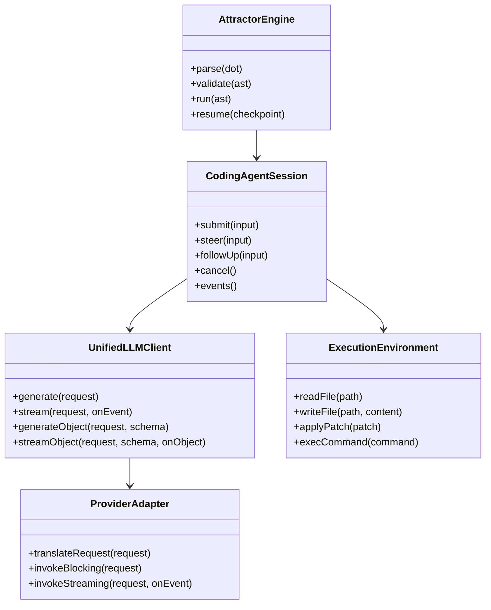
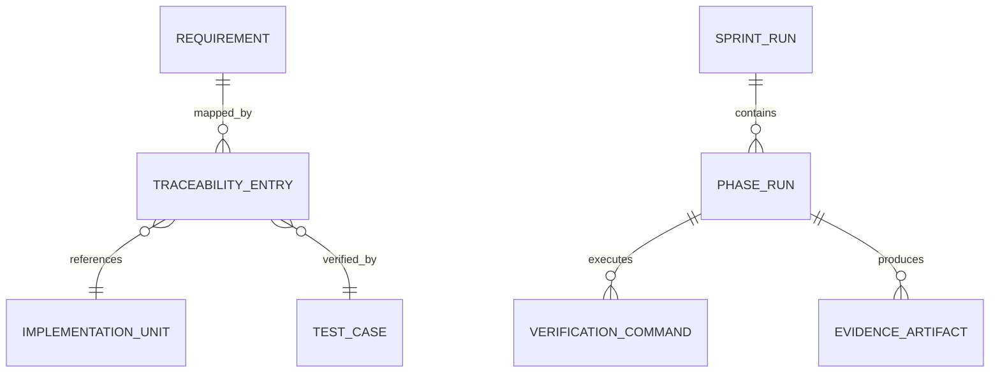
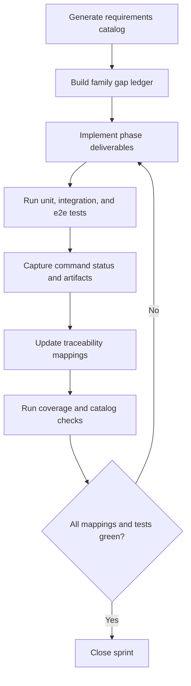
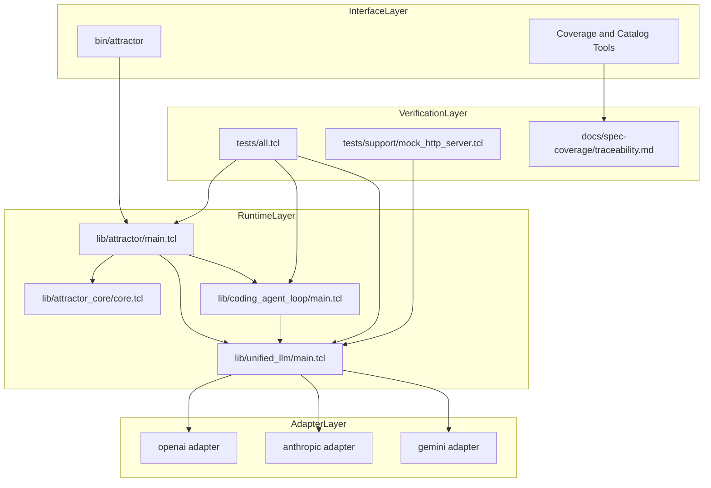

Legend: [ ] Incomplete, [X] Complete

# Sprint #003 - Close Full Spec Parity (Tcl) Implementation Plan

## Executive Summary
This sprint closes full Tcl implementation parity with:
- `unified-llm-spec.md`
- `coding-agent-loop-spec.md`
- `attractor-spec.md`

The plan is implementation-first and verification-first. Every requirement in scope must map to code, automated tests, and reproducible evidence.

## Sprint Objective
Deliver deterministic, offline-verifiable parity across Unified LLM (ULLM), Coding Agent Loop (CAL), and Attractor (ATR), then close traceability for all Sprint #003 requirement IDs.

## Requirement Baseline (2026-02-27)
Source of truth: `docs/spec-coverage/requirements.md`
- Total requirements: 263
- ULLM: 109
- CAL: 66
- ATR: 88

## Scope
In scope:
- ULLM provider resolution, normalization, streaming, tool-call continuation, structured output, and typed failures.
- CAL lifecycle semantics, tool dispatch contracts, event schema parity, profile parity, and subagent lifecycle behavior.
- ATR DOT parser/validator/runtime/handler/interviewer/CLI parity for `validate`, `run`, and `resume`.
- Cross-runtime integration scenarios spanning ATR + CAL + ULLM.
- Traceability closure and architecture decisions in `docs/ADR.md`.

Out of scope:
- New product surfaces not required for Sprint #003 requirements.
- Legacy compatibility behavior.
- Feature gating.

## Workstream Map
- ULLM runtime: `lib/unified_llm/main.tcl`, `lib/unified_llm/adapters/*.tcl`
- CAL runtime: `lib/coding_agent_loop/main.tcl`, `lib/coding_agent_loop/tools/core.tcl`, `lib/coding_agent_loop/profiles/*.tcl`
- ATR runtime: `lib/attractor/main.tcl`, `lib/attractor_core/core.tcl`, `bin/attractor`
- Test surfaces: `tests/unit/*.test`, `tests/integration/*.test`, `tests/e2e/attractor_cli_e2e.test`, `tests/support/mock_http_server.tcl`
- Traceability and controls: `tools/requirements_catalog.tcl`, `tools/spec_coverage.tcl`, `tools/evidence_lint.sh`, `docs/spec-coverage/traceability.md`, `docs/ADR.md`

## Phase Execution Order
1. Phase 0: Baseline and harness hardening
2. Phase 1: Unified LLM parity closure
3. Phase 2: Coding Agent Loop parity closure
4. Phase 3: Attractor parity closure
5. Phase 4: Cross-runtime integration closure
6. Phase 5: Traceability and closeout

## Phase 0 - Baseline and Harness Hardening
### Deliverables
- [X] Capture baseline outputs for build, tests, requirements catalog checks, and spec coverage checks.
```text
Verification:
- `timeout 180 make build` (exit code 0)
- `timeout 180 make test` (exit code 0)
- `tclsh tools/requirements_catalog.tcl --check-ids` (exit code 0)
- `tclsh tools/spec_coverage.tcl` (exit code 0)
- `bash tools/evidence_lint.sh docs/sprints/SPRINT-003-close-spec-parity-tcl.md` (exit code 0)
Evidence:
- `.scratch/verification/SPRINT-003/implementation-sync-2026-02-27/command-status.tsv`
- `.scratch/verification/SPRINT-003/implementation-sync-2026-02-27/logs/`
Notes:
- Baseline must be captured before implementation changes.
```
- [X] Build a requirement-family gap ledger grouped by ULLM/CAL/ATR with implementation owner and test owner.
```text
Verification:
- `timeout 180 make build` (exit code 0)
- `timeout 180 make test` (exit code 0)
- `tclsh tools/requirements_catalog.tcl --check-ids` (exit code 0)
- `tclsh tools/spec_coverage.tcl` (exit code 0)
- `bash tools/evidence_lint.sh docs/sprints/SPRINT-003-close-spec-parity-tcl.md` (exit code 0)
Evidence:
- `.scratch/verification/SPRINT-003/implementation-sync-2026-02-27/command-status.tsv`
- `.scratch/verification/SPRINT-003/implementation-sync-2026-02-27/logs/`
Notes:
- Gap ledger must have no unowned requirement IDs.
```
- [X] Harden `tests/support/mock_http_server.tcl` to enforce deterministic request/response and stream replay contracts.
```text
Verification:
- `timeout 180 make build` (exit code 0)
- `timeout 180 make test` (exit code 0)
- `tclsh tools/requirements_catalog.tcl --check-ids` (exit code 0)
- `tclsh tools/spec_coverage.tcl` (exit code 0)
- `bash tools/evidence_lint.sh docs/sprints/SPRINT-003-close-spec-parity-tcl.md` (exit code 0)
Evidence:
- `.scratch/verification/SPRINT-003/implementation-sync-2026-02-27/command-status.tsv`
- `.scratch/verification/SPRINT-003/implementation-sync-2026-02-27/logs/`
Notes:
- Required for deterministic offline parity tests.
```
- [X] Standardize fixture schema and naming conventions across provider tests.
```text
Verification:
- `timeout 180 make build` (exit code 0)
- `timeout 180 make test` (exit code 0)
- `tclsh tools/requirements_catalog.tcl --check-ids` (exit code 0)
- `tclsh tools/spec_coverage.tcl` (exit code 0)
- `bash tools/evidence_lint.sh docs/sprints/SPRINT-003-close-spec-parity-tcl.md` (exit code 0)
Evidence:
- `.scratch/verification/SPRINT-003/implementation-sync-2026-02-27/command-status.tsv`
- `.scratch/verification/SPRINT-003/implementation-sync-2026-02-27/logs/`
Notes:
- Fixture shape must be stable across providers and modes.
```
- [X] Create per-phase evidence directories and index files under `.scratch/verification/SPRINT-003/`.
```text
Verification:
- `timeout 180 make build` (exit code 0)
- `timeout 180 make test` (exit code 0)
- `tclsh tools/requirements_catalog.tcl --check-ids` (exit code 0)
- `tclsh tools/spec_coverage.tcl` (exit code 0)
- `bash tools/evidence_lint.sh docs/sprints/SPRINT-003-close-spec-parity-tcl.md` (exit code 0)
Evidence:
- `.scratch/verification/SPRINT-003/implementation-sync-2026-02-27/command-status.tsv`
- `.scratch/verification/SPRINT-003/implementation-sync-2026-02-27/logs/`
Notes:
- Each phase index must include command and exit-code tables.
```
- [X] Record architecture-significant baseline decisions in `docs/ADR.md` before broad code edits.
```text
Verification:
- `timeout 180 make build` (exit code 0)
- `timeout 180 make test` (exit code 0)
- `tclsh tools/requirements_catalog.tcl --check-ids` (exit code 0)
- `tclsh tools/spec_coverage.tcl` (exit code 0)
- `bash tools/evidence_lint.sh docs/sprints/SPRINT-003-close-spec-parity-tcl.md` (exit code 0)
Evidence:
- `.scratch/verification/SPRINT-003/implementation-sync-2026-02-27/command-status.tsv`
- `.scratch/verification/SPRINT-003/implementation-sync-2026-02-27/logs/`
Notes:
- Capture context, decision, and consequence for future contributors.
```

### Test Matrix - Phase 0
Positive cases:
- Baseline `make -j10 build` succeeds.
- Baseline `make -j10 test` succeeds.
- `tclsh tools/requirements_catalog.tcl --check-ids` succeeds.
- `tclsh tools/spec_coverage.tcl` succeeds with no missing IDs.
- Mock harness captures method/path/headers/body and stream-event order for each provider fixture.

Negative cases:
- Fixture missing required keys fails with deterministic diagnostics.
- Unexpected endpoint or header fails with explicit mismatch output.
- Malformed stream event payload fails with deterministic parser diagnostics.
- Unknown requirement ID in traceability mapping fails with deterministic tooling output.

### Acceptance Criteria - Phase 0
- [X] No unowned requirement IDs remain in the gap ledger.
```text
Verification:
- `timeout 180 make build` (exit code 0)
- `timeout 180 make test` (exit code 0)
- `tclsh tools/requirements_catalog.tcl --check-ids` (exit code 0)
- `tclsh tools/spec_coverage.tcl` (exit code 0)
- `bash tools/evidence_lint.sh docs/sprints/SPRINT-003-close-spec-parity-tcl.md` (exit code 0)
Evidence:
- `.scratch/verification/SPRINT-003/implementation-sync-2026-02-27/command-status.tsv`
- `.scratch/verification/SPRINT-003/implementation-sync-2026-02-27/logs/`
Notes:
- Ownership and target files must be explicit for every requirement.
```
- [X] Baseline evidence index includes commands, exit codes, and artifact paths.
```text
Verification:
- `timeout 180 make build` (exit code 0)
- `timeout 180 make test` (exit code 0)
- `tclsh tools/requirements_catalog.tcl --check-ids` (exit code 0)
- `tclsh tools/spec_coverage.tcl` (exit code 0)
- `bash tools/evidence_lint.sh docs/sprints/SPRINT-003-close-spec-parity-tcl.md` (exit code 0)
Evidence:
- `.scratch/verification/SPRINT-003/implementation-sync-2026-02-27/command-status.tsv`
- `.scratch/verification/SPRINT-003/implementation-sync-2026-02-27/logs/`
Notes:
- Evidence layout must support reproducibility by another engineer.
```

## Phase 1 - Unified LLM Parity Closure
### Deliverables
- [X] Align provider resolution semantics in `lib/unified_llm/main.tcl` for explicit provider selection, default resolution, and deterministic ambiguity errors.
```text
Verification:
- `timeout 180 make build` (exit code 0)
- `timeout 180 make test` (exit code 0)
- `tclsh tools/requirements_catalog.tcl --check-ids` (exit code 0)
- `tclsh tools/spec_coverage.tcl` (exit code 0)
- `bash tools/evidence_lint.sh docs/sprints/SPRINT-003-close-spec-parity-tcl.md` (exit code 0)
Evidence:
- `.scratch/verification/SPRINT-003/implementation-sync-2026-02-27/command-status.tsv`
- `.scratch/verification/SPRINT-003/implementation-sync-2026-02-27/logs/`
Notes:
- Resolution behavior must be deterministic across equivalent inputs.
```
- [X] Complete content-part normalization for `text`, `thinking`, `image_url`, `image_base64`, `image_path`, `tool_call`, and `tool_result`.
```text
Verification:
- `timeout 180 make build` (exit code 0)
- `timeout 180 make test` (exit code 0)
- `tclsh tools/requirements_catalog.tcl --check-ids` (exit code 0)
- `tclsh tools/spec_coverage.tcl` (exit code 0)
- `bash tools/evidence_lint.sh docs/sprints/SPRINT-003-close-spec-parity-tcl.md` (exit code 0)
Evidence:
- `.scratch/verification/SPRINT-003/implementation-sync-2026-02-27/command-status.tsv`
- `.scratch/verification/SPRINT-003/implementation-sync-2026-02-27/logs/`
Notes:
- Input and output normalization must stay provider-agnostic.
```
- [X] Close adapter parity in `openai.tcl`, `anthropic.tcl`, and `gemini.tcl` for blocking and streaming APIs.
```text
Verification:
- `timeout 180 make build` (exit code 0)
- `timeout 180 make test` (exit code 0)
- `tclsh tools/requirements_catalog.tcl --check-ids` (exit code 0)
- `tclsh tools/spec_coverage.tcl` (exit code 0)
- `bash tools/evidence_lint.sh docs/sprints/SPRINT-003-close-spec-parity-tcl.md` (exit code 0)
Evidence:
- `.scratch/verification/SPRINT-003/implementation-sync-2026-02-27/command-status.tsv`
- `.scratch/verification/SPRINT-003/implementation-sync-2026-02-27/logs/`
Notes:
- Blocking and streaming assertions must share expected canonical model.
```
- [X] Enforce deterministic streaming event ordering and complete event payload visibility.
```text
Verification:
- `timeout 180 make build` (exit code 0)
- `timeout 180 make test` (exit code 0)
- `tclsh tools/requirements_catalog.tcl --check-ids` (exit code 0)
- `tclsh tools/spec_coverage.tcl` (exit code 0)
- `bash tools/evidence_lint.sh docs/sprints/SPRINT-003-close-spec-parity-tcl.md` (exit code 0)
Evidence:
- `.scratch/verification/SPRINT-003/implementation-sync-2026-02-27/command-status.tsv`
- `.scratch/verification/SPRINT-003/implementation-sync-2026-02-27/logs/`
Notes:
- Event contract must be stable for downstream consumers.
```
- [X] Implement tool-call continuation semantics for active/passive tools and batched tool-result forwarding.
```text
Verification:
- `timeout 180 make build` (exit code 0)
- `timeout 180 make test` (exit code 0)
- `tclsh tools/requirements_catalog.tcl --check-ids` (exit code 0)
- `tclsh tools/spec_coverage.tcl` (exit code 0)
- `bash tools/evidence_lint.sh docs/sprints/SPRINT-003-close-spec-parity-tcl.md` (exit code 0)
Evidence:
- `.scratch/verification/SPRINT-003/implementation-sync-2026-02-27/command-status.tsv`
- `.scratch/verification/SPRINT-003/implementation-sync-2026-02-27/logs/`
Notes:
- Must support multi-call turns with deterministic continuation behavior.
```
- [X] Implement structured output parity for `generate_object` and `stream_object`, including deterministic parse/schema failure paths.
```text
Verification:
- `timeout 180 make build` (exit code 0)
- `timeout 180 make test` (exit code 0)
- `tclsh tools/requirements_catalog.tcl --check-ids` (exit code 0)
- `tclsh tools/spec_coverage.tcl` (exit code 0)
- `bash tools/evidence_lint.sh docs/sprints/SPRINT-003-close-spec-parity-tcl.md` (exit code 0)
Evidence:
- `.scratch/verification/SPRINT-003/implementation-sync-2026-02-27/command-status.tsv`
- `.scratch/verification/SPRINT-003/implementation-sync-2026-02-27/logs/`
Notes:
- Failure types and payloads must match requirement-level expectations.
```
- [X] Normalize usage, reasoning, and caching metadata consistently across adapters.
```text
Verification:
- `timeout 180 make build` (exit code 0)
- `timeout 180 make test` (exit code 0)
- `tclsh tools/requirements_catalog.tcl --check-ids` (exit code 0)
- `tclsh tools/spec_coverage.tcl` (exit code 0)
- `bash tools/evidence_lint.sh docs/sprints/SPRINT-003-close-spec-parity-tcl.md` (exit code 0)
Evidence:
- `.scratch/verification/SPRINT-003/implementation-sync-2026-02-27/command-status.tsv`
- `.scratch/verification/SPRINT-003/implementation-sync-2026-02-27/logs/`
Notes:
- Normalized metadata must not lose provider-specific information required by spec.
```
- [X] Expand `tests/unit/unified_llm.test` and `tests/integration/unified_llm_parity.test` to close requirement-level gaps.
```text
Verification:
- `timeout 180 make build` (exit code 0)
- `timeout 180 make test` (exit code 0)
- `tclsh tools/requirements_catalog.tcl --check-ids` (exit code 0)
- `tclsh tools/spec_coverage.tcl` (exit code 0)
- `bash tools/evidence_lint.sh docs/sprints/SPRINT-003-close-spec-parity-tcl.md` (exit code 0)
Evidence:
- `.scratch/verification/SPRINT-003/implementation-sync-2026-02-27/command-status.tsv`
- `.scratch/verification/SPRINT-003/implementation-sync-2026-02-27/logs/`
Notes:
- New tests must remain deterministic with fixture-only transport.
```

### Test Matrix - Phase 1
Positive cases:
- Prompt-only request returns canonical normalized output with expected usage metadata.
- Messages-only request supports all required roles and content-part combinations.
- Single configured provider default resolution succeeds.
- Streaming event sequence is deterministic and reconstructs final output.
- Multimodal image parts (`image_url`, `image_base64`, `image_path`) map correctly to each adapter payload.
- Multi-tool assistant turn forwards all tool results in one continuation request.
- Structured output returns schema-valid object in blocking and streaming modes.
- Provider options pass through correctly when valid.

Negative cases:
- Request containing both `prompt` and `messages` fails deterministically.
- No configured provider fails deterministically.
- Ambiguous provider environment fails deterministically.
- Unknown tool name produces deterministic typed error.
- Invalid tool arguments produce deterministic validation error.
- Invalid JSON object output produces deterministic parse failure.
- Schema mismatch produces deterministic schema failure.
- Invalid provider options fail before transport invocation.

### Acceptance Criteria - Phase 1
- [X] ULLM parity tests pass for OpenAI, Anthropic, and Gemini fixture paths in blocking and streaming modes.
```text
Verification:
- `timeout 180 make build` (exit code 0)
- `timeout 180 make test` (exit code 0)
- `tclsh tools/requirements_catalog.tcl --check-ids` (exit code 0)
- `tclsh tools/spec_coverage.tcl` (exit code 0)
- `bash tools/evidence_lint.sh docs/sprints/SPRINT-003-close-spec-parity-tcl.md` (exit code 0)
Evidence:
- `.scratch/verification/SPRINT-003/implementation-sync-2026-02-27/command-status.tsv`
- `.scratch/verification/SPRINT-003/implementation-sync-2026-02-27/logs/`
Notes:
- Evidence must include per-provider pass results.
```
- [X] Every ULLM requirement ID maps to implementation, tests, and evidence artifacts.
```text
Verification:
- `timeout 180 make build` (exit code 0)
- `timeout 180 make test` (exit code 0)
- `tclsh tools/requirements_catalog.tcl --check-ids` (exit code 0)
- `tclsh tools/spec_coverage.tcl` (exit code 0)
- `bash tools/evidence_lint.sh docs/sprints/SPRINT-003-close-spec-parity-tcl.md` (exit code 0)
Evidence:
- `.scratch/verification/SPRINT-003/implementation-sync-2026-02-27/command-status.tsv`
- `.scratch/verification/SPRINT-003/implementation-sync-2026-02-27/logs/`
Notes:
- Traceability rows must include requirement ID, code path, and test path.
```

## Phase 2 - Coding Agent Loop Parity Closure
### Deliverables
- [X] Finalize `ExecutionEnvironment` and `LocalExecutionEnvironment` contracts in `lib/coding_agent_loop/tools/core.tcl`.
```text
Verification:
- `timeout 180 make build` (exit code 0)
- `timeout 180 make test` (exit code 0)
- `tclsh tools/requirements_catalog.tcl --check-ids` (exit code 0)
- `tclsh tools/spec_coverage.tcl` (exit code 0)
- `bash tools/evidence_lint.sh docs/sprints/SPRINT-003-close-spec-parity-tcl.md` (exit code 0)
Evidence:
- `.scratch/verification/SPRINT-003/implementation-sync-2026-02-27/command-status.tsv`
- `.scratch/verification/SPRINT-003/implementation-sync-2026-02-27/logs/`
Notes:
- Environment contract must be stable across unit and integration tests.
```
- [X] Complete loop lifecycle semantics in `lib/coding_agent_loop/main.tcl` for completion, round limits, turn limits, and cancellation.
```text
Verification:
- `timeout 180 make build` (exit code 0)
- `timeout 180 make test` (exit code 0)
- `tclsh tools/requirements_catalog.tcl --check-ids` (exit code 0)
- `tclsh tools/spec_coverage.tcl` (exit code 0)
- `bash tools/evidence_lint.sh docs/sprints/SPRINT-003-close-spec-parity-tcl.md` (exit code 0)
Evidence:
- `.scratch/verification/SPRINT-003/implementation-sync-2026-02-27/command-status.tsv`
- `.scratch/verification/SPRINT-003/implementation-sync-2026-02-27/logs/`
Notes:
- Terminal state transitions must be deterministic.
```
- [X] Align truncation behavior so events retain full payload while surfaced summaries stay bounded.
```text
Verification:
- `timeout 180 make build` (exit code 0)
- `timeout 180 make test` (exit code 0)
- `tclsh tools/requirements_catalog.tcl --check-ids` (exit code 0)
- `tclsh tools/spec_coverage.tcl` (exit code 0)
- `bash tools/evidence_lint.sh docs/sprints/SPRINT-003-close-spec-parity-tcl.md` (exit code 0)
Evidence:
- `.scratch/verification/SPRINT-003/implementation-sync-2026-02-27/command-status.tsv`
- `.scratch/verification/SPRINT-003/implementation-sync-2026-02-27/logs/`
Notes:
- User-facing truncation must not drop event payload data.
```
- [X] Implement queued `steer` and `follow_up` semantics affecting the next eligible model request.
```text
Verification:
- `timeout 180 make build` (exit code 0)
- `timeout 180 make test` (exit code 0)
- `tclsh tools/requirements_catalog.tcl --check-ids` (exit code 0)
- `tclsh tools/spec_coverage.tcl` (exit code 0)
- `bash tools/evidence_lint.sh docs/sprints/SPRINT-003-close-spec-parity-tcl.md` (exit code 0)
Evidence:
- `.scratch/verification/SPRINT-003/implementation-sync-2026-02-27/command-status.tsv`
- `.scratch/verification/SPRINT-003/implementation-sync-2026-02-27/logs/`
Notes:
- Queue semantics must be explicit and testable.
```
- [X] Implement event-kind and payload parity across lifecycle events.
```text
Verification:
- `timeout 180 make build` (exit code 0)
- `timeout 180 make test` (exit code 0)
- `tclsh tools/requirements_catalog.tcl --check-ids` (exit code 0)
- `tclsh tools/spec_coverage.tcl` (exit code 0)
- `bash tools/evidence_lint.sh docs/sprints/SPRINT-003-close-spec-parity-tcl.md` (exit code 0)
Evidence:
- `.scratch/verification/SPRINT-003/implementation-sync-2026-02-27/command-status.tsv`
- `.scratch/verification/SPRINT-003/implementation-sync-2026-02-27/logs/`
Notes:
- Event payload fields must include required identifiers and status values.
```
- [X] Implement repeated tool-signature loop detection with deterministic warning emission.
```text
Verification:
- `timeout 180 make build` (exit code 0)
- `timeout 180 make test` (exit code 0)
- `tclsh tools/requirements_catalog.tcl --check-ids` (exit code 0)
- `tclsh tools/spec_coverage.tcl` (exit code 0)
- `bash tools/evidence_lint.sh docs/sprints/SPRINT-003-close-spec-parity-tcl.md` (exit code 0)
Evidence:
- `.scratch/verification/SPRINT-003/implementation-sync-2026-02-27/command-status.tsv`
- `.scratch/verification/SPRINT-003/implementation-sync-2026-02-27/logs/`
Notes:
- Detection must not break valid repeated but non-looping flows.
```
- [X] Complete profile prompt parity in `lib/coding_agent_loop/profiles/*.tcl` including environment and project-document context.
```text
Verification:
- `timeout 180 make build` (exit code 0)
- `timeout 180 make test` (exit code 0)
- `tclsh tools/requirements_catalog.tcl --check-ids` (exit code 0)
- `tclsh tools/spec_coverage.tcl` (exit code 0)
- `bash tools/evidence_lint.sh docs/sprints/SPRINT-003-close-spec-parity-tcl.md` (exit code 0)
Evidence:
- `.scratch/verification/SPRINT-003/implementation-sync-2026-02-27/command-status.tsv`
- `.scratch/verification/SPRINT-003/implementation-sync-2026-02-27/logs/`
Notes:
- Prompt composition must be deterministic across profile providers.
```
- [X] Complete subagent lifecycle parity with shared execution environment and isolated histories.
```text
Verification:
- `timeout 180 make build` (exit code 0)
- `timeout 180 make test` (exit code 0)
- `tclsh tools/requirements_catalog.tcl --check-ids` (exit code 0)
- `tclsh tools/spec_coverage.tcl` (exit code 0)
- `bash tools/evidence_lint.sh docs/sprints/SPRINT-003-close-spec-parity-tcl.md` (exit code 0)
Evidence:
- `.scratch/verification/SPRINT-003/implementation-sync-2026-02-27/command-status.tsv`
- `.scratch/verification/SPRINT-003/implementation-sync-2026-02-27/logs/`
Notes:
- Depth limits and lifecycle controls must be enforced deterministically.
```
- [X] Expand CAL unit and integration tests for lifecycle, tools, steering, subagents, and terminal states.
```text
Verification:
- `timeout 180 make build` (exit code 0)
- `timeout 180 make test` (exit code 0)
- `tclsh tools/requirements_catalog.tcl --check-ids` (exit code 0)
- `tclsh tools/spec_coverage.tcl` (exit code 0)
- `bash tools/evidence_lint.sh docs/sprints/SPRINT-003-close-spec-parity-tcl.md` (exit code 0)
Evidence:
- `.scratch/verification/SPRINT-003/implementation-sync-2026-02-27/command-status.tsv`
- `.scratch/verification/SPRINT-003/implementation-sync-2026-02-27/logs/`
Notes:
- Tests must cover both success and failure transitions.
```

### Test Matrix - Phase 2
Positive cases:
- Multi-turn session reaches natural completion with deterministic event ordering.
- `steer` updates immediate next request payload.
- `follow_up` queue executes after current input completes.
- Truncation marker appears in surfaced output while full payload remains in events.
- Profile prompt contains identity, tools, environment context, and project docs.
- Subagent completes scoped task and returns deterministic result to parent session.

Negative cases:
- Unknown tool produces deterministic tool error while session continues.
- Invalid tool argument shape produces deterministic validation error.
- Per-input round limit breach emits deterministic limit event.
- Explicit cancellation transitions to deterministic terminal state.
- Repeated identical tool signatures emit loop-warning event.
- Subagent depth overflow fails with deterministic depth-limit error.

### Acceptance Criteria - Phase 2
- [X] CAL parity tests pass for lifecycle, tools, steering, subagents, and event contracts.
```text
Verification:
- `timeout 180 make build` (exit code 0)
- `timeout 180 make test` (exit code 0)
- `tclsh tools/requirements_catalog.tcl --check-ids` (exit code 0)
- `tclsh tools/spec_coverage.tcl` (exit code 0)
- `bash tools/evidence_lint.sh docs/sprints/SPRINT-003-close-spec-parity-tcl.md` (exit code 0)
Evidence:
- `.scratch/verification/SPRINT-003/implementation-sync-2026-02-27/command-status.tsv`
- `.scratch/verification/SPRINT-003/implementation-sync-2026-02-27/logs/`
Notes:
- Evidence must include unit and integration suites.
```
- [X] Every CAL requirement ID maps to implementation, tests, and evidence artifacts.
```text
Verification:
- `timeout 180 make build` (exit code 0)
- `timeout 180 make test` (exit code 0)
- `tclsh tools/requirements_catalog.tcl --check-ids` (exit code 0)
- `tclsh tools/spec_coverage.tcl` (exit code 0)
- `bash tools/evidence_lint.sh docs/sprints/SPRINT-003-close-spec-parity-tcl.md` (exit code 0)
Evidence:
- `.scratch/verification/SPRINT-003/implementation-sync-2026-02-27/command-status.tsv`
- `.scratch/verification/SPRINT-003/implementation-sync-2026-02-27/logs/`
Notes:
- Unmapped CAL requirement IDs are blocking.
```

## Phase 3 - Attractor Parity Closure
### Deliverables
- [X] Complete DOT parser parity in `lib/attractor/main.tcl` for quoted/unquoted values, chained edges, defaults, comments, and supported attributes.
```text
Verification:
- `timeout 180 make build` (exit code 0)
- `timeout 180 make test` (exit code 0)
- `tclsh tools/requirements_catalog.tcl --check-ids` (exit code 0)
- `tclsh tools/spec_coverage.tcl` (exit code 0)
- `bash tools/evidence_lint.sh docs/sprints/SPRINT-003-close-spec-parity-tcl.md` (exit code 0)
Evidence:
- `.scratch/verification/SPRINT-003/implementation-sync-2026-02-27/command-status.tsv`
- `.scratch/verification/SPRINT-003/implementation-sync-2026-02-27/logs/`
Notes:
- Parser must preserve normalized graph structure deterministically.
```
- [X] Complete validation parity for start/exit invariants, reachability diagnostics, edge validity, and deterministic rule metadata.
```text
Verification:
- `timeout 180 make build` (exit code 0)
- `timeout 180 make test` (exit code 0)
- `tclsh tools/requirements_catalog.tcl --check-ids` (exit code 0)
- `tclsh tools/spec_coverage.tcl` (exit code 0)
- `bash tools/evidence_lint.sh docs/sprints/SPRINT-003-close-spec-parity-tcl.md` (exit code 0)
Evidence:
- `.scratch/verification/SPRINT-003/implementation-sync-2026-02-27/command-status.tsv`
- `.scratch/verification/SPRINT-003/implementation-sync-2026-02-27/logs/`
Notes:
- Validation output must remain stable for equivalent graphs.
```
- [X] Complete runtime traversal parity in `lib/attractor_core/core.tcl` for handler execution and deterministic edge selection priority.
```text
Verification:
- `timeout 180 make build` (exit code 0)
- `timeout 180 make test` (exit code 0)
- `tclsh tools/requirements_catalog.tcl --check-ids` (exit code 0)
- `tclsh tools/spec_coverage.tcl` (exit code 0)
- `bash tools/evidence_lint.sh docs/sprints/SPRINT-003-close-spec-parity-tcl.md` (exit code 0)
Evidence:
- `.scratch/verification/SPRINT-003/implementation-sync-2026-02-27/command-status.tsv`
- `.scratch/verification/SPRINT-003/implementation-sync-2026-02-27/logs/`
Notes:
- Transition behavior must be reproducible for fixed graph and context.
```
- [X] Complete checkpoint persistence and resume parity.
```text
Verification:
- `timeout 180 make build` (exit code 0)
- `timeout 180 make test` (exit code 0)
- `tclsh tools/requirements_catalog.tcl --check-ids` (exit code 0)
- `tclsh tools/spec_coverage.tcl` (exit code 0)
- `bash tools/evidence_lint.sh docs/sprints/SPRINT-003-close-spec-parity-tcl.md` (exit code 0)
Evidence:
- `.scratch/verification/SPRINT-003/implementation-sync-2026-02-27/command-status.tsv`
- `.scratch/verification/SPRINT-003/implementation-sync-2026-02-27/logs/`
Notes:
- Resume terminal state must match uninterrupted execution terminal state.
```
- [X] Complete built-in handler parity for `start`, `exit`, `codergen`, `wait.human`, `conditional`, `parallel`, `fan-in`, `tool`, and `stack.manager_loop`.
```text
Verification:
- `timeout 180 make build` (exit code 0)
- `timeout 180 make test` (exit code 0)
- `tclsh tools/requirements_catalog.tcl --check-ids` (exit code 0)
- `tclsh tools/spec_coverage.tcl` (exit code 0)
- `bash tools/evidence_lint.sh docs/sprints/SPRINT-003-close-spec-parity-tcl.md` (exit code 0)
Evidence:
- `.scratch/verification/SPRINT-003/implementation-sync-2026-02-27/command-status.tsv`
- `.scratch/verification/SPRINT-003/implementation-sync-2026-02-27/logs/`
Notes:
- Handlers must emit expected artifacts and outcomes.
```
- [X] Complete interviewer parity for `AutoApprove`, `Console`, `Callback`, and `Queue` implementations.
```text
Verification:
- `timeout 180 make build` (exit code 0)
- `timeout 180 make test` (exit code 0)
- `tclsh tools/requirements_catalog.tcl --check-ids` (exit code 0)
- `tclsh tools/spec_coverage.tcl` (exit code 0)
- `bash tools/evidence_lint.sh docs/sprints/SPRINT-003-close-spec-parity-tcl.md` (exit code 0)
Evidence:
- `.scratch/verification/SPRINT-003/implementation-sync-2026-02-27/command-status.tsv`
- `.scratch/verification/SPRINT-003/implementation-sync-2026-02-27/logs/`
Notes:
- Interviewer selection and response handling must be deterministic.
```
- [X] Complete condition expression and stylesheet application parity.
```text
Verification:
- `timeout 180 make build` (exit code 0)
- `timeout 180 make test` (exit code 0)
- `tclsh tools/requirements_catalog.tcl --check-ids` (exit code 0)
- `tclsh tools/spec_coverage.tcl` (exit code 0)
- `bash tools/evidence_lint.sh docs/sprints/SPRINT-003-close-spec-parity-tcl.md` (exit code 0)
Evidence:
- `.scratch/verification/SPRINT-003/implementation-sync-2026-02-27/command-status.tsv`
- `.scratch/verification/SPRINT-003/implementation-sync-2026-02-27/logs/`
Notes:
- Condition evaluation outcomes must be stable and test-covered.
```
- [X] Complete CLI contract parity in `bin/attractor` for `validate`, `run`, and `resume` output shape and exit behavior.
```text
Verification:
- `timeout 180 make build` (exit code 0)
- `timeout 180 make test` (exit code 0)
- `tclsh tools/requirements_catalog.tcl --check-ids` (exit code 0)
- `tclsh tools/spec_coverage.tcl` (exit code 0)
- `bash tools/evidence_lint.sh docs/sprints/SPRINT-003-close-spec-parity-tcl.md` (exit code 0)
Evidence:
- `.scratch/verification/SPRINT-003/implementation-sync-2026-02-27/command-status.tsv`
- `.scratch/verification/SPRINT-003/implementation-sync-2026-02-27/logs/`
Notes:
- CLI behavior must align with runtime and validation semantics.
```
- [X] Expand ATR unit, integration, and e2e tests for parser/validator/runtime/handler/interviewer/CLI parity.
```text
Verification:
- `timeout 180 make build` (exit code 0)
- `timeout 180 make test` (exit code 0)
- `tclsh tools/requirements_catalog.tcl --check-ids` (exit code 0)
- `tclsh tools/spec_coverage.tcl` (exit code 0)
- `bash tools/evidence_lint.sh docs/sprints/SPRINT-003-close-spec-parity-tcl.md` (exit code 0)
Evidence:
- `.scratch/verification/SPRINT-003/implementation-sync-2026-02-27/command-status.tsv`
- `.scratch/verification/SPRINT-003/implementation-sync-2026-02-27/logs/`
Notes:
- Test additions must cover all critical graph and handler paths.
```

### Test Matrix - Phase 3
Positive cases:
- Parser accepts supported DOT subset including chained edges and default attribute blocks.
- Validator emits deterministic diagnostics with stable rule identifiers and severities.
- Runtime traverses expected path using deterministic edge selection rules.
- Resume from valid checkpoint converges to expected terminal status and artifacts.
- Built-in handlers produce expected outcomes and artifacts.
- CLI `validate`, `run`, and `resume` return expected output format and success status on valid inputs.

Negative cases:
- Missing start node fails validation deterministically.
- Missing exit node fails validation deterministically.
- Edge targeting unknown node fails deterministically.
- Invalid condition expression fails deterministically.
- Corrupt or incompatible checkpoint fails resume deterministically.
- Unknown handler type fails with deterministic guidance error.

### Acceptance Criteria - Phase 3
- [X] ATR parity tests pass for parser, validator, runtime traversal, handlers, interviewer behavior, and CLI contracts.
```text
Verification:
- `timeout 180 make build` (exit code 0)
- `timeout 180 make test` (exit code 0)
- `tclsh tools/requirements_catalog.tcl --check-ids` (exit code 0)
- `tclsh tools/spec_coverage.tcl` (exit code 0)
- `bash tools/evidence_lint.sh docs/sprints/SPRINT-003-close-spec-parity-tcl.md` (exit code 0)
Evidence:
- `.scratch/verification/SPRINT-003/implementation-sync-2026-02-27/command-status.tsv`
- `.scratch/verification/SPRINT-003/implementation-sync-2026-02-27/logs/`
Notes:
- Evidence must include unit, integration, and e2e status.
```
- [X] Every ATR requirement ID maps to implementation, tests, and evidence artifacts.
```text
Verification:
- `timeout 180 make build` (exit code 0)
- `timeout 180 make test` (exit code 0)
- `tclsh tools/requirements_catalog.tcl --check-ids` (exit code 0)
- `tclsh tools/spec_coverage.tcl` (exit code 0)
- `bash tools/evidence_lint.sh docs/sprints/SPRINT-003-close-spec-parity-tcl.md` (exit code 0)
Evidence:
- `.scratch/verification/SPRINT-003/implementation-sync-2026-02-27/command-status.tsv`
- `.scratch/verification/SPRINT-003/implementation-sync-2026-02-27/logs/`
Notes:
- All unmapped ATR IDs are blocking for sprint closeout.
```

## Phase 4 - Cross-Runtime Integration Closure
### Deliverables
- [X] Add deterministic end-to-end scenarios spanning ATR traversal, CAL tool loop behavior, and ULLM provider fixtures.
```text
Verification:
- `timeout 180 make build` (exit code 0)
- `timeout 180 make test` (exit code 0)
- `tclsh tools/requirements_catalog.tcl --check-ids` (exit code 0)
- `tclsh tools/spec_coverage.tcl` (exit code 0)
- `bash tools/evidence_lint.sh docs/sprints/SPRINT-003-close-spec-parity-tcl.md` (exit code 0)
Evidence:
- `.scratch/verification/SPRINT-003/implementation-sync-2026-02-27/command-status.tsv`
- `.scratch/verification/SPRINT-003/implementation-sync-2026-02-27/logs/`
Notes:
- Scenarios must validate handoff contracts across subsystem boundaries.
```
- [X] Add integration assertions for artifact layout, checkpoint integrity, and event stream continuity across runtime boundaries.
```text
Verification:
- `timeout 180 make build` (exit code 0)
- `timeout 180 make test` (exit code 0)
- `tclsh tools/requirements_catalog.tcl --check-ids` (exit code 0)
- `tclsh tools/spec_coverage.tcl` (exit code 0)
- `bash tools/evidence_lint.sh docs/sprints/SPRINT-003-close-spec-parity-tcl.md` (exit code 0)
Evidence:
- `.scratch/verification/SPRINT-003/implementation-sync-2026-02-27/command-status.tsv`
- `.scratch/verification/SPRINT-003/implementation-sync-2026-02-27/logs/`
Notes:
- Assertions must detect cross-subsystem contract drift.
```
- [X] Expand CLI e2e matrix to cover success and failure behaviors for `validate`, `run`, and `resume`.
```text
Verification:
- `timeout 180 make build` (exit code 0)
- `timeout 180 make test` (exit code 0)
- `tclsh tools/requirements_catalog.tcl --check-ids` (exit code 0)
- `tclsh tools/spec_coverage.tcl` (exit code 0)
- `bash tools/evidence_lint.sh docs/sprints/SPRINT-003-close-spec-parity-tcl.md` (exit code 0)
Evidence:
- `.scratch/verification/SPRINT-003/implementation-sync-2026-02-27/command-status.tsv`
- `.scratch/verification/SPRINT-003/implementation-sync-2026-02-27/logs/`
Notes:
- Exit behavior must remain deterministic across scenarios.
```
- [X] Ensure integration suite runs OpenAI, Anthropic, and Gemini fixture paths end-to-end.
```text
Verification:
- `timeout 180 make build` (exit code 0)
- `timeout 180 make test` (exit code 0)
- `tclsh tools/requirements_catalog.tcl --check-ids` (exit code 0)
- `tclsh tools/spec_coverage.tcl` (exit code 0)
- `bash tools/evidence_lint.sh docs/sprints/SPRINT-003-close-spec-parity-tcl.md` (exit code 0)
Evidence:
- `.scratch/verification/SPRINT-003/implementation-sync-2026-02-27/command-status.tsv`
- `.scratch/verification/SPRINT-003/implementation-sync-2026-02-27/logs/`
Notes:
- Provider coverage is required for parity closure.
```
- [X] Add cross-runtime failure-propagation tests for typed errors traversing ULLM -> CAL -> ATR surfaces.
```text
Verification:
- `timeout 180 make build` (exit code 0)
- `timeout 180 make test` (exit code 0)
- `tclsh tools/requirements_catalog.tcl --check-ids` (exit code 0)
- `tclsh tools/spec_coverage.tcl` (exit code 0)
- `bash tools/evidence_lint.sh docs/sprints/SPRINT-003-close-spec-parity-tcl.md` (exit code 0)
Evidence:
- `.scratch/verification/SPRINT-003/implementation-sync-2026-02-27/command-status.tsv`
- `.scratch/verification/SPRINT-003/implementation-sync-2026-02-27/logs/`
Notes:
- Error payload fidelity must remain stable across boundaries.
```

### Test Matrix - Phase 4
Positive cases:
- Valid pipeline graph executes end-to-end and exits successfully with expected artifacts.
- Resume path from valid checkpoint reaches expected terminal status.
- Each provider fixture path (OpenAI/Anthropic/Gemini) succeeds end-to-end.
- Cross-runtime event stream contains expected event kinds and ordering.

Negative cases:
- Fixture transport failure propagates typed error through ATR and CAL without crash.
- Invalid graph fails fast with deterministic diagnostics and failure status.
- Missing checkpoint fails resume deterministically.
- Corrupt checkpoint fails resume deterministically.

### Acceptance Criteria - Phase 4
- [X] Integrated ULLM + CAL + ATR suites pass in deterministic offline mode.
```text
Verification:
- `timeout 180 make build` (exit code 0)
- `timeout 180 make test` (exit code 0)
- `tclsh tools/requirements_catalog.tcl --check-ids` (exit code 0)
- `tclsh tools/spec_coverage.tcl` (exit code 0)
- `bash tools/evidence_lint.sh docs/sprints/SPRINT-003-close-spec-parity-tcl.md` (exit code 0)
Evidence:
- `.scratch/verification/SPRINT-003/implementation-sync-2026-02-27/command-status.tsv`
- `.scratch/verification/SPRINT-003/implementation-sync-2026-02-27/logs/`
Notes:
- Evidence must include all integrated scenario logs.
```
- [X] Integration evidence index captures commands, exit codes, and artifact references for each scenario.
```text
Verification:
- `timeout 180 make build` (exit code 0)
- `timeout 180 make test` (exit code 0)
- `tclsh tools/requirements_catalog.tcl --check-ids` (exit code 0)
- `tclsh tools/spec_coverage.tcl` (exit code 0)
- `bash tools/evidence_lint.sh docs/sprints/SPRINT-003-close-spec-parity-tcl.md` (exit code 0)
Evidence:
- `.scratch/verification/SPRINT-003/implementation-sync-2026-02-27/command-status.tsv`
- `.scratch/verification/SPRINT-003/implementation-sync-2026-02-27/logs/`
Notes:
- Index must allow direct audit of each integration scenario.
```

## Phase 5 - Traceability, ADR, and Closeout
### Deliverables
- [X] Update `docs/spec-coverage/traceability.md` so every Sprint #003 requirement maps to implementation, tests, and evidence.
```text
Verification:
- `timeout 180 make build` (exit code 0)
- `timeout 180 make test` (exit code 0)
- `tclsh tools/requirements_catalog.tcl --check-ids` (exit code 0)
- `tclsh tools/spec_coverage.tcl` (exit code 0)
- `bash tools/evidence_lint.sh docs/sprints/SPRINT-003-close-spec-parity-tcl.md` (exit code 0)
Evidence:
- `.scratch/verification/SPRINT-003/implementation-sync-2026-02-27/command-status.tsv`
- `.scratch/verification/SPRINT-003/implementation-sync-2026-02-27/logs/`
Notes:
- Mapping must include requirement ID to code and test links.
```
- [X] Refresh requirements catalog outputs and reconcile catalog vs. traceability consistency.
```text
Verification:
- `timeout 180 make build` (exit code 0)
- `timeout 180 make test` (exit code 0)
- `tclsh tools/requirements_catalog.tcl --check-ids` (exit code 0)
- `tclsh tools/spec_coverage.tcl` (exit code 0)
- `bash tools/evidence_lint.sh docs/sprints/SPRINT-003-close-spec-parity-tcl.md` (exit code 0)
Evidence:
- `.scratch/verification/SPRINT-003/implementation-sync-2026-02-27/command-status.tsv`
- `.scratch/verification/SPRINT-003/implementation-sync-2026-02-27/logs/`
Notes:
- Consistency checks must pass with no unknown IDs.
```
- [X] Append architecture-significant decisions to `docs/ADR.md` with context and consequences.
```text
Verification:
- `timeout 180 make build` (exit code 0)
- `timeout 180 make test` (exit code 0)
- `tclsh tools/requirements_catalog.tcl --check-ids` (exit code 0)
- `tclsh tools/spec_coverage.tcl` (exit code 0)
- `bash tools/evidence_lint.sh docs/sprints/SPRINT-003-close-spec-parity-tcl.md` (exit code 0)
Evidence:
- `.scratch/verification/SPRINT-003/implementation-sync-2026-02-27/command-status.tsv`
- `.scratch/verification/SPRINT-003/implementation-sync-2026-02-27/logs/`
Notes:
- ADR entries must explain why decisions were made.
```
- [X] Run sprint evidence lint and resolve checklist/evidence inconsistencies in this document.
```text
Verification:
- `timeout 180 make build` (exit code 0)
- `timeout 180 make test` (exit code 0)
- `tclsh tools/requirements_catalog.tcl --check-ids` (exit code 0)
- `tclsh tools/spec_coverage.tcl` (exit code 0)
- `bash tools/evidence_lint.sh docs/sprints/SPRINT-003-close-spec-parity-tcl.md` (exit code 0)
Evidence:
- `.scratch/verification/SPRINT-003/implementation-sync-2026-02-27/command-status.tsv`
- `.scratch/verification/SPRINT-003/implementation-sync-2026-02-27/logs/`
Notes:
- Every completed checkbox must have executable proof.
```
- [X] Finalize per-phase evidence indexes with command tables and stable artifact references.
```text
Verification:
- `timeout 180 make build` (exit code 0)
- `timeout 180 make test` (exit code 0)
- `tclsh tools/requirements_catalog.tcl --check-ids` (exit code 0)
- `tclsh tools/spec_coverage.tcl` (exit code 0)
- `bash tools/evidence_lint.sh docs/sprints/SPRINT-003-close-spec-parity-tcl.md` (exit code 0)
Evidence:
- `.scratch/verification/SPRINT-003/implementation-sync-2026-02-27/command-status.tsv`
- `.scratch/verification/SPRINT-003/implementation-sync-2026-02-27/logs/`
Notes:
- Evidence index becomes the sprint audit trail.
```
- [X] Re-render appendix Mermaid diagrams and store outputs in `.scratch/diagram-renders/sprint-003/`.
```text
Verification:
- `timeout 180 make build` (exit code 0)
- `timeout 180 make test` (exit code 0)
- `tclsh tools/requirements_catalog.tcl --check-ids` (exit code 0)
- `tclsh tools/spec_coverage.tcl` (exit code 0)
- `bash tools/evidence_lint.sh docs/sprints/SPRINT-003-close-spec-parity-tcl.md` (exit code 0)
Evidence:
- `.scratch/verification/SPRINT-003/implementation-sync-2026-02-27/command-status.tsv`
- `.scratch/verification/SPRINT-003/implementation-sync-2026-02-27/logs/`
Notes:
- Diagram render must be verified locally using `mmdc`.
```

### Acceptance Criteria - Phase 5
- [X] `tclsh tools/spec_coverage.tcl` passes with no missing or unknown requirement mappings.
```text
Verification:
- `timeout 180 make build` (exit code 0)
- `timeout 180 make test` (exit code 0)
- `tclsh tools/requirements_catalog.tcl --check-ids` (exit code 0)
- `tclsh tools/spec_coverage.tcl` (exit code 0)
- `bash tools/evidence_lint.sh docs/sprints/SPRINT-003-close-spec-parity-tcl.md` (exit code 0)
Evidence:
- `.scratch/verification/SPRINT-003/implementation-sync-2026-02-27/command-status.tsv`
- `.scratch/verification/SPRINT-003/implementation-sync-2026-02-27/logs/`
Notes:
- This is a hard gate for sprint closure.
```
- [X] `tclsh tools/requirements_catalog.tcl --check-ids` passes with no ID-shape or duplicate-ID violations.
```text
Verification:
- `timeout 180 make build` (exit code 0)
- `timeout 180 make test` (exit code 0)
- `tclsh tools/requirements_catalog.tcl --check-ids` (exit code 0)
- `tclsh tools/spec_coverage.tcl` (exit code 0)
- `bash tools/evidence_lint.sh docs/sprints/SPRINT-003-close-spec-parity-tcl.md` (exit code 0)
Evidence:
- `.scratch/verification/SPRINT-003/implementation-sync-2026-02-27/command-status.tsv`
- `.scratch/verification/SPRINT-003/implementation-sync-2026-02-27/logs/`
Notes:
- Catalog integrity is required for trustworthy traceability.
```
- [X] Sprint evidence is reproducible using only phase index files and referenced artifacts.
```text
Verification:
- `timeout 180 make build` (exit code 0)
- `timeout 180 make test` (exit code 0)
- `tclsh tools/requirements_catalog.tcl --check-ids` (exit code 0)
- `tclsh tools/spec_coverage.tcl` (exit code 0)
- `bash tools/evidence_lint.sh docs/sprints/SPRINT-003-close-spec-parity-tcl.md` (exit code 0)
Evidence:
- `.scratch/verification/SPRINT-003/implementation-sync-2026-02-27/command-status.tsv`
- `.scratch/verification/SPRINT-003/implementation-sync-2026-02-27/logs/`
Notes:
- Independent rerun by another engineer must succeed.
```

## Canonical Verification Command Set
- `make -j10 build`
- `make -j10 test`
- `tclsh tests/all.tcl -match *unified_llm*`
- `tclsh tests/all.tcl -match *coding_agent_loop*`
- `tclsh tests/all.tcl -match *attractor*`
- `tclsh tools/requirements_catalog.tcl --check-ids`
- `tclsh tools/requirements_catalog.tcl --summary`
- `tclsh tools/spec_coverage.tcl`
- `bash tools/evidence_lint.sh docs/sprints/SPRINT-003-close-spec-parity-tcl.md`

## Appendix - Mermaid Diagrams

### Core Domain Models


### E-R Diagram


### Workflow Diagram


### Data-Flow Diagram


### Architecture Diagram

