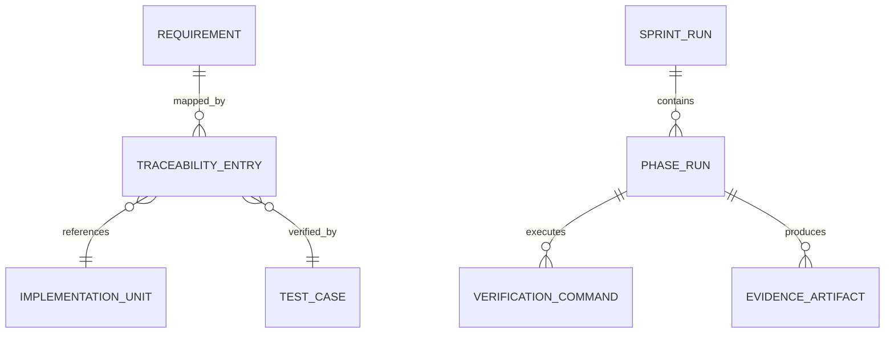
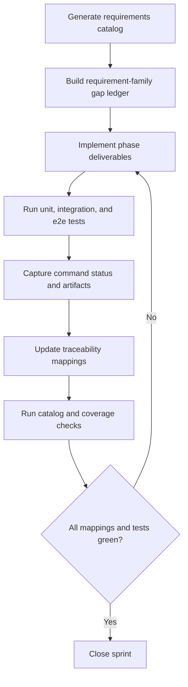
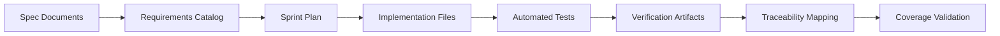
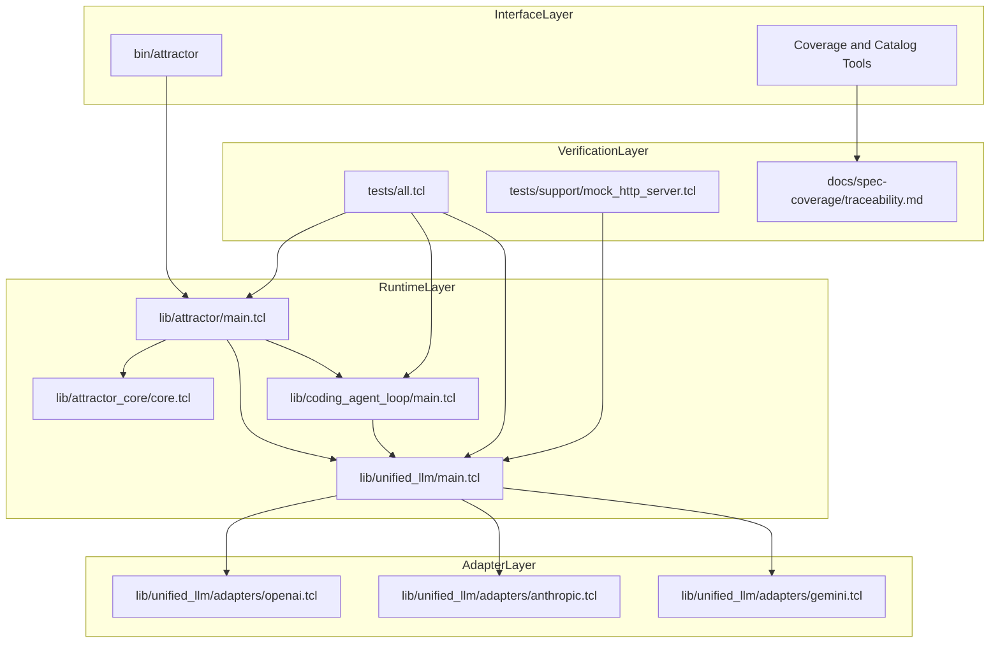

Legend: [ ] Incomplete, [X] Complete

# Sprint #003 - Close Full Spec Parity (Tcl) Comprehensive Implementation Plan

## Executive Summary
Sprint #003 closes Tcl implementation parity against:
- `unified-llm-spec.md`
- `coding-agent-loop-spec.md`
- `attractor-spec.md`

This plan is implementation-first and verification-first. Every requirement in scope must be mapped to implementation files, automated tests, and reproducible evidence.

## Sprint Objective
Deliver deterministic, offline-verifiable parity across Unified LLM (ULLM), Coding Agent Loop (CAL), and Attractor (ATR), and close traceability for all Sprint #003 requirement IDs.

## Requirement Baseline
Source of truth: `docs/spec-coverage/requirements.md`
- Total requirements: 263
- ULLM: 109
- CAL: 66
- ATR: 88

## Scope
In scope:
- ULLM provider resolution, request/response normalization, streaming parity, tool-call continuation, structured output, typed failures.
- CAL lifecycle semantics, tool dispatch contracts, event schema parity, profile parity, subagent lifecycle behavior.
- ATR DOT parser, validator, runtime traversal, built-in handlers, interviewer implementations, CLI contract parity for `validate`, `run`, and `resume`.
- Cross-runtime integration scenarios spanning ATR + CAL + ULLM.
- Traceability closure and architecture decisions in `docs/ADR.md`.

Out of scope:
- New product surfaces not required for Sprint #003 requirements.
- Feature gating.
- Legacy compatibility behavior.

## Implementation Rules
- Requirement IDs are the primary planning and verification unit.
- No checkbox is marked complete until supporting evidence is captured.
- Each completed checkbox must include command logs, exit status, and artifact paths under `.scratch/verification/SPRINT-003/`.
- All diagrams in this document must be rendered locally using `mmdc` with artifacts stored under `.scratch/diagram-renders/sprint-003/`.
- Significant architecture choices must be logged in `docs/ADR.md` before or at the same time as implementation.

## Workstream Map
- ULLM runtime: `lib/unified_llm/main.tcl`, `lib/unified_llm/adapters/*.tcl`
- CAL runtime: `lib/coding_agent_loop/main.tcl`, `lib/coding_agent_loop/tools/core.tcl`, `lib/coding_agent_loop/profiles/*.tcl`
- ATR runtime: `lib/attractor/main.tcl`, `lib/attractor_core/core.tcl`, `bin/attractor`
- Test surfaces: `tests/unit/*.test`, `tests/integration/*.test`, `tests/e2e/attractor_cli_e2e.test`, `tests/support/mock_http_server.tcl`
- Traceability and controls: `tools/requirements_catalog.tcl`, `tools/spec_coverage.tcl`, `tools/evidence_lint.sh`, `docs/spec-coverage/traceability.md`, `docs/ADR.md`

## Phase Execution Order
1. Phase 0: Baseline and harness hardening
2. Phase 1: Unified LLM parity closure
3. Phase 2: Coding Agent Loop parity closure
4. Phase 3: Attractor parity closure
5. Phase 4: Cross-runtime integration closure
6. Phase 5: Traceability and closeout

## Phase 0 - Baseline and Harness Hardening
### Deliverables
- [ ] Capture baseline outputs for build, full test suite, requirements catalog checks, and spec coverage checks.
```text
{placeholder for verification justification/reasoning and evidence log}
```
- [ ] Build a requirement-family gap ledger grouped by ULLM/CAL/ATR with implementation owner and test owner per requirement slice.
```text
{placeholder for verification justification/reasoning and evidence log}
```
- [ ] Harden `tests/support/mock_http_server.tcl` contracts for deterministic request/response and stream replay behavior.
```text
{placeholder for verification justification/reasoning and evidence log}
```
- [ ] Standardize fixture schema and naming conventions across provider parity tests.
```text
{placeholder for verification justification/reasoning and evidence log}
```
- [ ] Create per-phase evidence directories and index files under `.scratch/verification/SPRINT-003/`.
```text
{placeholder for verification justification/reasoning and evidence log}
```
- [ ] Record baseline architecture decisions and assumptions in `docs/ADR.md`.
```text
{placeholder for verification justification/reasoning and evidence log}
```

### Test Matrix - Phase 0
Positive cases:
- Catalog generation produces stable requirement counts by family and by requirement type.
- `make -j10 build` passes from a clean working tree state.
- `make -j10 test` passes from a clean working tree state.
- Mock harness replays deterministic blocking and streaming fixtures for OpenAI, Anthropic, and Gemini.
- Fixture validator accepts canonical fixture bundles with required fields and stable ordering.

Negative cases:
- Missing fixture keys fail with deterministic diagnostics and explicit key names.
- Unexpected endpoint, method, or headers fail with deterministic mismatch output.
- Malformed stream events fail with deterministic parser diagnostics.
- Unknown requirement IDs in traceability mappings fail catalog/coverage validation.
- Duplicate requirement IDs fail requirement catalog checks.

### Acceptance Criteria - Phase 0
- [ ] Gap ledger has no unowned requirement IDs.
```text
{placeholder for verification justification/reasoning and evidence log}
```
- [ ] Baseline evidence index includes command, exit-code, and artifact references for reproducibility.
```text
{placeholder for verification justification/reasoning and evidence log}
```

## Phase 1 - Unified LLM Parity Closure
### Deliverables
- [ ] Align provider resolution semantics in `lib/unified_llm/main.tcl` for explicit provider selection, default resolution, and deterministic ambiguity errors.
```text
{placeholder for verification justification/reasoning and evidence log}
```
- [ ] Complete request validation and normalized content-part handling for `text`, `thinking`, `image_url`, `image_base64`, `image_path`, `tool_call`, and `tool_result`.
```text
{placeholder for verification justification/reasoning and evidence log}
```
- [ ] Close adapter parity in `lib/unified_llm/adapters/openai.tcl`, `lib/unified_llm/adapters/anthropic.tcl`, and `lib/unified_llm/adapters/gemini.tcl` for blocking and streaming interfaces.
```text
{placeholder for verification justification/reasoning and evidence log}
```
- [ ] Enforce deterministic streaming event ordering and payload visibility guarantees required by downstream CAL consumers.
```text
{placeholder for verification justification/reasoning and evidence log}
```
- [ ] Implement tool-call continuation semantics for active/passive tools and batched tool-result forwarding.
```text
{placeholder for verification justification/reasoning and evidence log}
```
- [ ] Implement structured output parity for `generate_object` and `stream_object`, including deterministic parse and schema failure behavior.
```text
{placeholder for verification justification/reasoning and evidence log}
```
- [ ] Normalize usage, reasoning, and caching metadata consistently across adapters.
```text
{placeholder for verification justification/reasoning and evidence log}
```
- [ ] Expand `tests/unit/unified_llm.test` and `tests/integration/unified_llm_parity.test` to close requirement-level gaps for all three providers.
```text
{placeholder for verification justification/reasoning and evidence log}
```

### Test Matrix - Phase 1
Positive cases:
- Prompt-only request returns canonical normalized output with expected usage metadata.
- Messages-only request supports required roles and all supported content-part combinations.
- Single configured provider default resolution succeeds for each provider path.
- Streaming event sequence is deterministic and reconstructs final output equivalently to blocking mode.
- Multimodal image parts map correctly into each provider payload shape.
- Multi-tool assistant turn forwards all tool results in one continuation request.
- Structured output returns schema-valid object in blocking and streaming modes.
- Valid provider options pass through with deterministic adapter behavior.

Negative cases:
- Request containing both `prompt` and `messages` fails before transport invocation.
- No configured provider fails with deterministic config error.
- Ambiguous provider environment fails with deterministic ambiguity error.
- Unknown tool name produces deterministic typed error.
- Invalid tool arguments produce deterministic validation error.
- Invalid JSON object output produces deterministic parse failure.
- Schema mismatch produces deterministic schema failure.
- Invalid provider options fail validation before adapter transport.

### Acceptance Criteria - Phase 1
- [ ] ULLM parity tests pass for OpenAI, Anthropic, and Gemini fixture paths in blocking and streaming modes.
```text
{placeholder for verification justification/reasoning and evidence log}
```
- [ ] Every ULLM requirement ID maps to implementation, tests, and evidence artifacts.
```text
{placeholder for verification justification/reasoning and evidence log}
```

## Phase 2 - Coding Agent Loop Parity Closure
### Deliverables
- [ ] Finalize `ExecutionEnvironment` and `LocalExecutionEnvironment` contracts in `lib/coding_agent_loop/tools/core.tcl`.
```text
{placeholder for verification justification/reasoning and evidence log}
```
- [ ] Complete loop lifecycle semantics in `lib/coding_agent_loop/main.tcl` for completion, round limits, turn limits, and cancellation.
```text
{placeholder for verification justification/reasoning and evidence log}
```
- [ ] Align truncation behavior so events retain full payload while surfaced summaries remain bounded.
```text
{placeholder for verification justification/reasoning and evidence log}
```
- [ ] Implement queued `steer` and `follow_up` semantics affecting the next eligible model request.
```text
{placeholder for verification justification/reasoning and evidence log}
```
- [ ] Implement lifecycle event-kind and payload parity, including deterministic warning/event emission for loop detection.
```text
{placeholder for verification justification/reasoning and evidence log}
```
- [ ] Complete profile prompt parity in `lib/coding_agent_loop/profiles/*.tcl`, including environment and project-document context behavior.
```text
{placeholder for verification justification/reasoning and evidence log}
```
- [ ] Complete subagent lifecycle parity with shared execution environment and isolated histories.
```text
{placeholder for verification justification/reasoning and evidence log}
```
- [ ] Expand CAL unit and integration tests for lifecycle, tool execution, steering queue semantics, subagent depth, and terminal states.
```text
{placeholder for verification justification/reasoning and evidence log}
```

### Test Matrix - Phase 2
Positive cases:
- Multi-turn session reaches natural completion with deterministic event ordering.
- `steer` mutates the immediate next request payload and then clears.
- `follow_up` queue executes only after the current input processing completes.
- Truncation marker appears in surfaced output while full payload remains in emitted events.
- Profile prompt contains identity, tools, environment context, and project docs.
- Subagent completes scoped task and returns deterministic result to parent session.

Negative cases:
- Unknown tool returns deterministic tool error and session remains usable.
- Invalid tool argument shape returns deterministic validation error.
- Per-input round limit breach emits deterministic limit event and terminal state.
- Explicit cancellation transitions to deterministic terminal state with no extra turns.
- Repeated identical tool signatures emit deterministic loop-warning event.
- Subagent depth overflow fails with deterministic depth-limit error.

### Acceptance Criteria - Phase 2
- [ ] CAL parity tests pass for lifecycle, tools, steering, subagents, and event contracts.
```text
{placeholder for verification justification/reasoning and evidence log}
```
- [ ] Every CAL requirement ID maps to implementation, tests, and evidence artifacts.
```text
{placeholder for verification justification/reasoning and evidence log}
```

## Phase 3 - Attractor Parity Closure
### Deliverables
- [ ] Complete DOT parser parity in `lib/attractor/main.tcl` for quoted/unquoted values, chained edges, defaults, comments, and supported attributes.
```text
{placeholder for verification justification/reasoning and evidence log}
```
- [ ] Complete validator parity for start/exit invariants, reachability diagnostics, edge validity, and deterministic rule metadata.
```text
{placeholder for verification justification/reasoning and evidence log}
```
- [ ] Complete runtime traversal parity in `lib/attractor_core/core.tcl` for handler execution and deterministic edge selection priority.
```text
{placeholder for verification justification/reasoning and evidence log}
```
- [ ] Complete checkpoint persistence and resume parity across interrupted and resumed runs.
```text
{placeholder for verification justification/reasoning and evidence log}
```
- [ ] Complete built-in handler parity for `start`, `exit`, `codergen`, `wait.human`, `conditional`, `parallel`, `fan-in`, `tool`, and `stack.manager_loop`.
```text
{placeholder for verification justification/reasoning and evidence log}
```
- [ ] Complete interviewer parity for `AutoApprove`, `Console`, `Callback`, and `Queue` implementations.
```text
{placeholder for verification justification/reasoning and evidence log}
```
- [ ] Complete condition-expression and stylesheet application parity.
```text
{placeholder for verification justification/reasoning and evidence log}
```
- [ ] Complete CLI contract parity in `bin/attractor` for `validate`, `run`, and `resume` output shape and exit behavior.
```text
{placeholder for verification justification/reasoning and evidence log}
```
- [ ] Expand ATR unit, integration, and e2e tests for parser, validator, runtime, handlers, interviewer behavior, and CLI parity.
```text
{placeholder for verification justification/reasoning and evidence log}
```

### Test Matrix - Phase 3
Positive cases:
- Parser accepts supported DOT subset including chained edges and default attribute blocks.
- Validator emits deterministic diagnostics with stable rule identifiers and severities.
- Runtime traverses expected path using deterministic edge-selection rules.
- Resume from valid checkpoint converges to expected terminal status and artifacts.
- Built-in handlers produce expected outcomes and output artifacts.
- CLI `validate`, `run`, and `resume` return expected output format and success status on valid inputs.

Negative cases:
- Missing start node fails validation deterministically.
- Missing exit node fails validation deterministically.
- Edge targeting unknown node fails deterministically.
- Invalid condition expression fails deterministically.
- Corrupt or incompatible checkpoint fails resume deterministically.
- Unknown handler type fails with deterministic guidance error.
- Invalid interviewer selection fails with deterministic configuration error.

### Acceptance Criteria - Phase 3
- [ ] ATR parity tests pass for parser, validator, runtime traversal, handlers, interviewer behavior, and CLI contracts.
```text
{placeholder for verification justification/reasoning and evidence log}
```
- [ ] Every ATR requirement ID maps to implementation, tests, and evidence artifacts.
```text
{placeholder for verification justification/reasoning and evidence log}
```

## Phase 4 - Cross-Runtime Integration Closure
### Deliverables
- [ ] Add deterministic end-to-end scenarios spanning ATR traversal, CAL tool loop behavior, and ULLM provider fixtures.
```text
{placeholder for verification justification/reasoning and evidence log}
```
- [ ] Add integration assertions for artifact layout, checkpoint integrity, and event-stream continuity across runtime boundaries.
```text
{placeholder for verification justification/reasoning and evidence log}
```
- [ ] Expand CLI e2e matrix to cover success and failure behavior for `validate`, `run`, and `resume`.
```text
{placeholder for verification justification/reasoning and evidence log}
```
- [ ] Ensure integration suite runs OpenAI, Anthropic, and Gemini fixture paths end-to-end.
```text
{placeholder for verification justification/reasoning and evidence log}
```
- [ ] Add cross-runtime failure-propagation tests for typed errors traversing ULLM -> CAL -> ATR surfaces.
```text
{placeholder for verification justification/reasoning and evidence log}
```

### Test Matrix - Phase 4
Positive cases:
- Valid pipeline graph executes end-to-end and exits successfully with expected artifacts.
- Resume path from valid checkpoint reaches expected terminal status and artifact completeness.
- Each provider fixture path (OpenAI, Anthropic, Gemini) succeeds end-to-end with canonical event ordering.
- Cross-runtime event stream contains expected event kinds and correlation IDs.

Negative cases:
- Fixture transport failure propagates typed error through CAL and ATR without process crash.
- Invalid graph fails fast with deterministic diagnostics and failure status.
- Missing checkpoint fails resume deterministically.
- Corrupt checkpoint fails resume deterministically.
- CLI invalid argument combinations fail deterministically with stable error output.

### Acceptance Criteria - Phase 4
- [ ] Integrated ULLM + CAL + ATR suites pass in deterministic offline mode.
```text
{placeholder for verification justification/reasoning and evidence log}
```
- [ ] Integration evidence index captures commands, exit codes, and artifact references per scenario.
```text
{placeholder for verification justification/reasoning and evidence log}
```

## Phase 5 - Traceability, ADR, and Closeout
### Deliverables
- [ ] Update `docs/spec-coverage/traceability.md` so every Sprint #003 requirement maps to implementation, tests, and evidence.
```text
{placeholder for verification justification/reasoning and evidence log}
```
- [ ] Refresh requirement catalog outputs and reconcile catalog versus traceability consistency.
```text
{placeholder for verification justification/reasoning and evidence log}
```
- [ ] Append architecture-significant decisions to `docs/ADR.md` with context and consequences.
```text
{placeholder for verification justification/reasoning and evidence log}
```
- [ ] Run sprint evidence lint and resolve checklist/evidence inconsistencies in this document.
```text
{placeholder for verification justification/reasoning and evidence log}
```
- [ ] Finalize per-phase evidence indexes with command tables and stable artifact references.
```text
{placeholder for verification justification/reasoning and evidence log}
```
- [ ] Re-render appendix Mermaid diagrams and store outputs in `.scratch/diagram-renders/sprint-003/`.
```text
{placeholder for verification justification/reasoning and evidence log}
```
- [ ] Produce final Sprint #003 closeout summary with unresolved risks and follow-up actions.
```text
{placeholder for verification justification/reasoning and evidence log}
```

### Test Matrix - Phase 5
Positive cases:
- `tools/requirements_catalog.tcl --check-ids` passes with no shape or duplicate violations.
- `tools/spec_coverage.tcl` reports zero missing and zero unknown requirement mappings.
- Evidence lint passes for all completed checkboxes.
- Mermaid diagrams render successfully and generated files are readable.

Negative cases:
- Missing traceability blocks fail coverage checks.
- Unknown requirement IDs in traceability fail coverage checks.
- Completed checkboxes without evidence references fail evidence lint.
- Broken Mermaid syntax fails local rendering and blocks closeout.

### Acceptance Criteria - Phase 5
- [ ] Requirement catalog and spec coverage checks pass with no missing, unknown, duplicate, or malformed mapping failures.
```text
{placeholder for verification justification/reasoning and evidence log}
```
- [ ] Sprint evidence is reproducible using only phase index files and referenced artifacts.
```text
{placeholder for verification justification/reasoning and evidence log}
```

## Canonical Verification Commands
- `make -j10 build`
- `make -j10 test`
- `tclsh tests/all.tcl -match *unified_llm*`
- `tclsh tests/all.tcl -match *coding_agent_loop*`
- `tclsh tests/all.tcl -match *attractor*`
- `tclsh tools/requirements_catalog.tcl --check-ids`
- `tclsh tools/requirements_catalog.tcl --summary`
- `tclsh tools/spec_coverage.tcl`
- `bash tools/evidence_lint.sh docs/sprints/SPRINT-003-close-spec-parity-tcl.md`

## Appendix - Mermaid Diagrams

### Core Domain Models


### E-R Diagram


### Workflow Diagram


### Data-Flow Diagram


### Architecture Diagram

