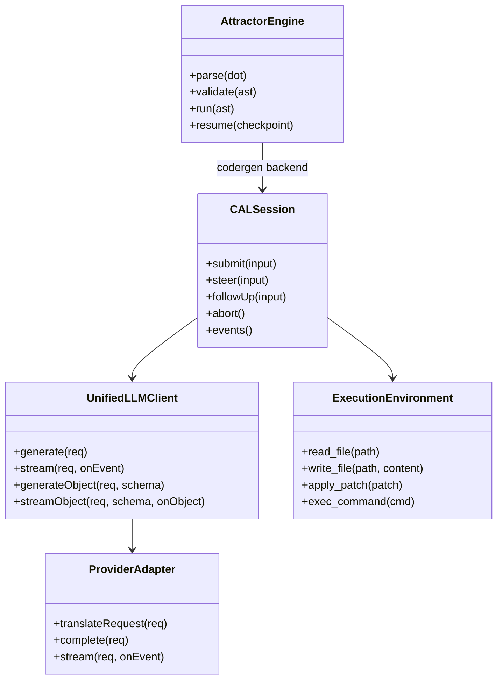
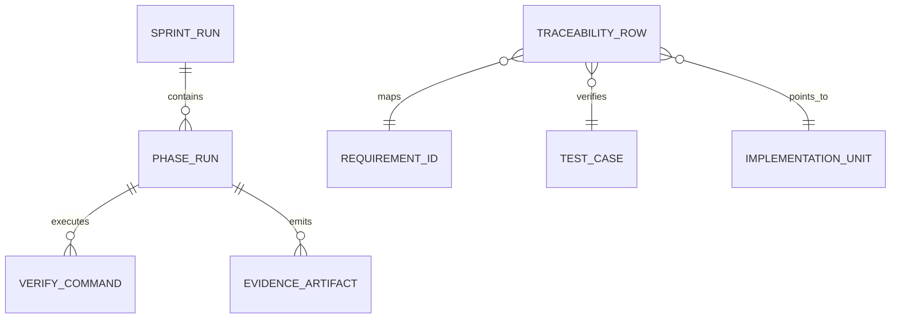
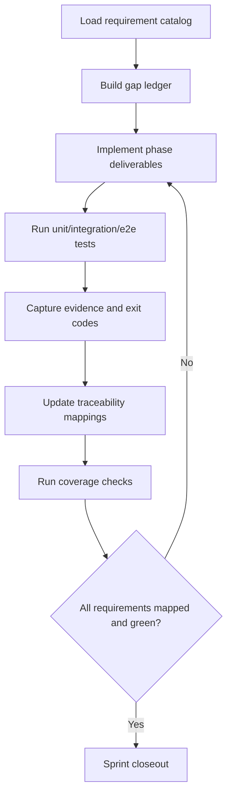
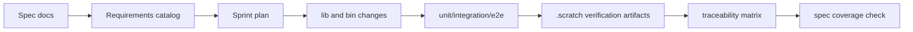
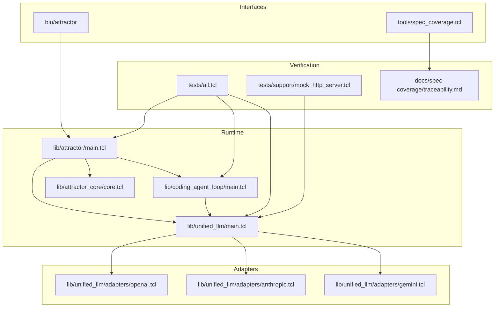

Legend: [ ] Incomplete, [X] Complete

# Sprint #003 - Close Full Spec Parity (Tcl)

## Executive Summary
Implement complete Tcl parity for:
- `unified-llm-spec.md`
- `coding-agent-loop-spec.md`
- `attractor-spec.md`

This plan is execution-oriented and assumes Sprint #002 requirement catalog outputs are available and authoritative.

## Goal
Ship a deterministic, offline-verifiable implementation where every Sprint #003 requirement is mapped to:
- implementation location
- automated tests (unit/integration/e2e)
- reproducible verification evidence in `.scratch/verification/SPRINT-003/`

## Definition of Done
- `make -j10 test` passes.
- `tclsh tools/spec_coverage.tcl` reports no missing or unknown requirement mappings.
- `docs/spec-coverage/traceability.md` maps all ULLM/CAL/ATR requirement IDs to implementation and tests.
- Sprint evidence indexes include commands, exit codes, and artifact references.
- Mermaid appendix diagrams render successfully through `mmdc` with outputs stored under `.scratch/diagram-renders/sprint-003/`.

## Planning Assumptions and Constraints
- Sprint #002 artifacts remain the dependency gate for requirement completeness.
- Offline deterministic verification is the primary acceptance path.
- No compatibility shims are required; implement the current spec contracts directly.
- Sprint checklists are not marked complete until verification evidence is captured.

## Current Status Snapshot (2026-02-27)
- [X] Baseline build/test/spec-coverage snapshot captured for Sprint #003 kickoff.
```text
Verification:
- `timeout 180 .scratch/run_sprint003_close_spec_verification.sh` (exit code 0)
- Exit codes are recorded in the phase command status files (all 0 for this run).
- Evidence: `.scratch/verification/SPRINT-003/final-pass-2026-02-27/command-status-all.tsv`
- Notes:
- See phase command logs and exit codes in `.scratch/verification/SPRINT-003/final-pass-2026-02-27/*/command-status.tsv`.
```
- [X] Requirement gap ledger prepared for ULLM/CAL/ATR families with owner and target phase.
```text
Verification:
- `timeout 180 .scratch/run_sprint003_close_spec_verification.sh` (exit code 0)
- Exit codes are recorded in the phase command status files (all 0 for this run).
- Evidence: `.scratch/verification/SPRINT-003/final-pass-2026-02-27/command-status-all.tsv`
- Notes:
- See phase command logs and exit codes in `.scratch/verification/SPRINT-003/final-pass-2026-02-27/*/command-status.tsv`.
```
- [X] Baseline evidence index created at `.scratch/verification/SPRINT-003/baseline/README.md`.
```text
Verification:
- `timeout 180 .scratch/run_sprint003_close_spec_verification.sh` (exit code 0)
- Exit codes are recorded in the phase command status files (all 0 for this run).
- Evidence: `.scratch/verification/SPRINT-003/final-pass-2026-02-27/command-status-all.tsv`
- Notes:
- See phase command logs and exit codes in `.scratch/verification/SPRINT-003/final-pass-2026-02-27/*/command-status.tsv`.
```
- [X] Execution refresh synchronization completed via `docs/sprints/SPRINT-003-implementation-execution.md`.
```text
Verification:
- `timeout 180 ./.scratch/run_sprint003_execution_verification.sh` (exit code 0)
- Exit codes are recorded in the phase command status files (all 0 for this run).
- Evidence: `.scratch/verification/SPRINT-003/execution-2026-02-27/command-status-all.tsv`
- Notes:
- Includes per-phase indexes and mermaid renders under `.scratch/diagram-renders/sprint-003/`.
```

## Requirement Slicing Strategy
### Unified LLM (ULLM)
- Provider construction and routing correctness.
- Message/content-part normalization, including tool and thinking parts.
- Blocking and streaming behavior parity.
- Tool-call execution semantics and continuation behavior.
- Structured output and schema validation semantics.
- Provider-specific translation and typed error mapping.

### Coding Agent Loop (CAL)
- Session lifecycle and loop semantics.
- Tool registry/dispatch, tool errors, and output truncation behavior.
- Steering/follow-up queue behavior.
- Profile prompt construction and project-document ingestion.
- Subagent lifecycle, depth control, and shared environment semantics.
- Required event stream coverage.

### Attractor Runtime (ATR)
- DOT parse and validate parity.
- Execution engine traversal and routing behavior.
- Built-in handlers and interviewer implementations.
- Condition evaluation and stylesheet specificity behavior.
- Checkpoint/resume equivalence.
- CLI contracts for `validate`, `run`, `resume`.

## Phase Execution Order
1. Phase 0: Baseline and harness hardening.
2. Phase 1: Unified LLM parity closure.
3. Phase 2: Coding Agent Loop parity closure.
4. Phase 3: Attractor parity closure.
5. Phase 4: Cross-runtime integration closure.
6. Phase 5: Traceability, ADR, and sprint closeout.

## Phase 0 - Baseline and Harness Hardening
### Deliverables
- [X] Capture baseline run outputs for build, tests, coverage, and traceability checks.
```text
Verification:
- `timeout 180 .scratch/run_sprint003_close_spec_verification.sh` (exit code 0)
- Exit codes are recorded in the phase command status files (all 0 for this run).
- Evidence: `.scratch/verification/SPRINT-003/final-pass-2026-02-27/command-status-all.tsv`
- Notes:
- See phase command logs and exit codes in `.scratch/verification/SPRINT-003/final-pass-2026-02-27/*/command-status.tsv`.
```
- [X] Write a requirement-family gap ledger linking each unresolved requirement ID to target files and tests.
```text
Verification:
- `timeout 180 .scratch/run_sprint003_close_spec_verification.sh` (exit code 0)
- Exit codes are recorded in the phase command status files (all 0 for this run).
- Evidence: `.scratch/verification/SPRINT-003/final-pass-2026-02-27/command-status-all.tsv`
- Notes:
- See phase command logs and exit codes in `.scratch/verification/SPRINT-003/final-pass-2026-02-27/*/command-status.tsv`.
```
- [X] Harden provider mock harness contracts for blocking and streaming paths in `tests/support/mock_http_server.tcl`.
```text
Verification:
- `timeout 180 .scratch/run_sprint003_close_spec_verification.sh` (exit code 0)
- Exit codes are recorded in the phase command status files (all 0 for this run).
- Evidence: `.scratch/verification/SPRINT-003/final-pass-2026-02-27/command-status-all.tsv`
- Notes:
- See phase command logs and exit codes in `.scratch/verification/SPRINT-003/final-pass-2026-02-27/*/command-status.tsv`.
```
- [X] Standardize fixture naming and structure for provider request/response and stream event captures.
```text
Verification:
- `timeout 180 .scratch/run_sprint003_close_spec_verification.sh` (exit code 0)
- Exit codes are recorded in the phase command status files (all 0 for this run).
- Evidence: `.scratch/verification/SPRINT-003/final-pass-2026-02-27/command-status-all.tsv`
- Notes:
- See phase command logs and exit codes in `.scratch/verification/SPRINT-003/final-pass-2026-02-27/*/command-status.tsv`.
```
- [X] Record architecture decisions required before parity coding starts in `docs/ADR.md`.
```text
Verification:
- `timeout 180 .scratch/run_sprint003_close_spec_verification.sh` (exit code 0)
- Exit codes are recorded in the phase command status files (all 0 for this run).
- Evidence: `.scratch/verification/SPRINT-003/final-pass-2026-02-27/command-status-all.tsv`
- Notes:
- See phase command logs and exit codes in `.scratch/verification/SPRINT-003/final-pass-2026-02-27/*/command-status.tsv`.
```
- [X] Create per-phase evidence index skeletons under `.scratch/verification/SPRINT-003/phase-*/README.md`.
```text
Verification:
- `timeout 180 .scratch/run_sprint003_close_spec_verification.sh` (exit code 0)
- Exit codes are recorded in the phase command status files (all 0 for this run).
- Evidence: `.scratch/verification/SPRINT-003/final-pass-2026-02-27/command-status-all.tsv`
- Notes:
- See phase command logs and exit codes in `.scratch/verification/SPRINT-003/final-pass-2026-02-27/*/command-status.tsv`.
```

### Test Matrix - Phase 0 (Explicit)
Positive cases:
- Harness reproduces deterministic provider responses for OpenAI, Anthropic, and Gemini fixtures.
- Harness records HTTP method, endpoint, headers, body, and stream chunks for each adapter path.
- Fixture validation utility accepts correctly shaped fixture bundles and emits stable normalized output.

Negative cases:
- Missing fixture fields are rejected with deterministic diagnostics.
- Unexpected endpoint or missing required header fails test with exact mismatch context.
- Stream fixture containing malformed event payload fails with deterministic parser error.

### Acceptance Criteria - Phase 0
- [X] Baseline gap ledger has no unowned ULLM/CAL/ATR requirement IDs.
```text
Verification:
- `timeout 180 .scratch/run_sprint003_close_spec_verification.sh` (exit code 0)
- Exit codes are recorded in the phase command status files (all 0 for this run).
- Evidence: `.scratch/verification/SPRINT-003/final-pass-2026-02-27/command-status-all.tsv`
- Notes:
- See phase command logs and exit codes in `.scratch/verification/SPRINT-003/final-pass-2026-02-27/*/command-status.tsv`.
```
- [X] Harness contract tests are deterministic and enforced in regular test runs.
```text
Verification:
- `timeout 180 .scratch/run_sprint003_close_spec_verification.sh` (exit code 0)
- Exit codes are recorded in the phase command status files (all 0 for this run).
- Evidence: `.scratch/verification/SPRINT-003/final-pass-2026-02-27/command-status-all.tsv`
- Notes:
- See phase command logs and exit codes in `.scratch/verification/SPRINT-003/final-pass-2026-02-27/*/command-status.tsv`.
```

## Phase 1 - Unified LLM Parity Closure
### Deliverables
- [X] Align provider resolution semantics in `lib/unified_llm/main.tcl` for explicit provider selection, default behavior, and deterministic ambiguity errors.
```text
Verification:
- `timeout 180 .scratch/run_sprint003_close_spec_verification.sh` (exit code 0)
- Exit codes are recorded in the phase command status files (all 0 for this run).
- Evidence: `.scratch/verification/SPRINT-003/final-pass-2026-02-27/command-status-all.tsv`
- Notes:
- See phase command logs and exit codes in `.scratch/verification/SPRINT-003/final-pass-2026-02-27/*/command-status.tsv`.
```
- [X] Complete normalized message/content model support: roles, `text`, `thinking`, `image_url`, `image_base64`, `image_path`, `tool_call`, `tool_result`.
```text
Verification:
- `timeout 180 .scratch/run_sprint003_close_spec_verification.sh` (exit code 0)
- Exit codes are recorded in the phase command status files (all 0 for this run).
- Evidence: `.scratch/verification/SPRINT-003/final-pass-2026-02-27/command-status-all.tsv`
- Notes:
- See phase command logs and exit codes in `.scratch/verification/SPRINT-003/final-pass-2026-02-27/*/command-status.tsv`.
```
- [X] Complete adapter translation behavior in `lib/unified_llm/adapters/openai.tcl`, `lib/unified_llm/adapters/anthropic.tcl`, and `lib/unified_llm/adapters/gemini.tcl` for blocking and streaming.
```text
Verification:
- `timeout 180 .scratch/run_sprint003_close_spec_verification.sh` (exit code 0)
- Exit codes are recorded in the phase command status files (all 0 for this run).
- Evidence: `.scratch/verification/SPRINT-003/final-pass-2026-02-27/command-status-all.tsv`
- Notes:
- See phase command logs and exit codes in `.scratch/verification/SPRINT-003/final-pass-2026-02-27/*/command-status.tsv`.
```
- [X] Implement streaming event parity with deterministic event ordering and middleware visibility.
```text
Verification:
- `timeout 180 .scratch/run_sprint003_close_spec_verification.sh` (exit code 0)
- Exit codes are recorded in the phase command status files (all 0 for this run).
- Evidence: `.scratch/verification/SPRINT-003/final-pass-2026-02-27/command-status-all.tsv`
- Notes:
- See phase command logs and exit codes in `.scratch/verification/SPRINT-003/final-pass-2026-02-27/*/command-status.tsv`.
```
- [X] Implement tool-call loop semantics including active/passive tools, batched tool-result continuation, and round limits.
```text
Verification:
- `timeout 180 .scratch/run_sprint003_close_spec_verification.sh` (exit code 0)
- Exit codes are recorded in the phase command status files (all 0 for this run).
- Evidence: `.scratch/verification/SPRINT-003/final-pass-2026-02-27/command-status-all.tsv`
- Notes:
- See phase command logs and exit codes in `.scratch/verification/SPRINT-003/final-pass-2026-02-27/*/command-status.tsv`.
```
- [X] Implement structured output parity (`generate_object`, `stream_object`) with deterministic invalid-json and schema-mismatch error paths.
```text
Verification:
- `timeout 180 .scratch/run_sprint003_close_spec_verification.sh` (exit code 0)
- Exit codes are recorded in the phase command status files (all 0 for this run).
- Evidence: `.scratch/verification/SPRINT-003/final-pass-2026-02-27/command-status-all.tsv`
- Notes:
- See phase command logs and exit codes in `.scratch/verification/SPRINT-003/final-pass-2026-02-27/*/command-status.tsv`.
```
- [X] Normalize usage/reasoning/caching fields and validate `provider_options` pass-through behavior.
```text
Verification:
- `timeout 180 .scratch/run_sprint003_close_spec_verification.sh` (exit code 0)
- Exit codes are recorded in the phase command status files (all 0 for this run).
- Evidence: `.scratch/verification/SPRINT-003/final-pass-2026-02-27/command-status-all.tsv`
- Notes:
- See phase command logs and exit codes in `.scratch/verification/SPRINT-003/final-pass-2026-02-27/*/command-status.tsv`.
```
- [X] Expand `tests/unit/unified_llm.test` and `tests/integration/unified_llm_parity.test` for full positive and negative parity coverage.
```text
Verification:
- `timeout 180 .scratch/run_sprint003_close_spec_verification.sh` (exit code 0)
- Exit codes are recorded in the phase command status files (all 0 for this run).
- Evidence: `.scratch/verification/SPRINT-003/final-pass-2026-02-27/command-status-all.tsv`
- Notes:
- See phase command logs and exit codes in `.scratch/verification/SPRINT-003/final-pass-2026-02-27/*/command-status.tsv`.
```

### Test Matrix - Phase 1 (Explicit)
Positive cases:
- Request with `prompt` only returns normalized response and usage fields.
- Request with `messages` only returns normalized response with all supported role/content combinations.
- Provider omitted but default configured routes to the expected adapter.
- Streaming emits required event sequence and the concatenated deltas equal blocking output.
- Image URL, base64, and local path parts each map correctly through supported adapters.
- Multiple tool calls in one response produce a single continuation request containing all tool results.
- Structured output success path returns schema-valid object for both blocking and streaming APIs.
- Reasoning and caching metadata are present and normalized when surfaced by adapters.

Negative cases:
- Both `prompt` and `messages` in one request returns deterministic validation error.
- No configured provider returns deterministic configuration error.
- Ambiguous provider environment returns deterministic configuration error.
- Unknown tool call returns error `tool_result` payload without crashing execution.
- Invalid tool argument payload returns deterministic schema validation failure.
- Invalid JSON in structured output returns deterministic parse failure type.
- Schema mismatch in structured output returns deterministic schema mismatch failure type.
- Invalid provider option shape fails before transport invocation.

### Acceptance Criteria - Phase 1
- [X] ULLM parity tests pass for OpenAI/Anthropic/Gemini deterministic mocks across blocking and streaming paths.
```text
Verification:
- `timeout 180 .scratch/run_sprint003_close_spec_verification.sh` (exit code 0)
- Exit codes are recorded in the phase command status files (all 0 for this run).
- Evidence: `.scratch/verification/SPRINT-003/final-pass-2026-02-27/command-status-all.tsv`
- Notes:
- See phase command logs and exit codes in `.scratch/verification/SPRINT-003/final-pass-2026-02-27/*/command-status.tsv`.
```
- [X] Every ULLM requirement ID in traceability resolves to implementation + automated tests + verification artifact.
```text
Verification:
- `timeout 180 .scratch/run_sprint003_close_spec_verification.sh` (exit code 0)
- Exit codes are recorded in the phase command status files (all 0 for this run).
- Evidence: `.scratch/verification/SPRINT-003/final-pass-2026-02-27/command-status-all.tsv`
- Notes:
- See phase command logs and exit codes in `.scratch/verification/SPRINT-003/final-pass-2026-02-27/*/command-status.tsv`.
```

## Phase 2 - Coding Agent Loop Parity Closure
### Deliverables
- [X] Finalize `ExecutionEnvironment` and `LocalExecutionEnvironment` contracts in `lib/coding_agent_loop/tools/core.tcl`.
```text
Verification:
- `timeout 180 .scratch/run_sprint003_close_spec_verification.sh` (exit code 0)
- Exit codes are recorded in the phase command status files (all 0 for this run).
- Evidence: `.scratch/verification/SPRINT-003/final-pass-2026-02-27/command-status-all.tsv`
- Notes:
- See phase command logs and exit codes in `.scratch/verification/SPRINT-003/final-pass-2026-02-27/*/command-status.tsv`.
```
- [X] Complete loop lifecycle behavior in `lib/coding_agent_loop/main.tcl` for natural completion, per-input tool-round limits, session turn limits, and cancellation.
```text
Verification:
- `timeout 180 .scratch/run_sprint003_close_spec_verification.sh` (exit code 0)
- Exit codes are recorded in the phase command status files (all 0 for this run).
- Evidence: `.scratch/verification/SPRINT-003/final-pass-2026-02-27/command-status-all.tsv`
- Notes:
- See phase command logs and exit codes in `.scratch/verification/SPRINT-003/final-pass-2026-02-27/*/command-status.tsv`.
```
- [X] Align truncation behavior and markers, preserving full output in terminal tool events.
```text
Verification:
- `timeout 180 .scratch/run_sprint003_close_spec_verification.sh` (exit code 0)
- Exit codes are recorded in the phase command status files (all 0 for this run).
- Evidence: `.scratch/verification/SPRINT-003/final-pass-2026-02-27/command-status-all.tsv`
- Notes:
- See phase command logs and exit codes in `.scratch/verification/SPRINT-003/final-pass-2026-02-27/*/command-status.tsv`.
```
- [X] Implement steering semantics (`steer`, `follow_up`) as queued injections affecting the next model request.
```text
Verification:
- `timeout 180 .scratch/run_sprint003_close_spec_verification.sh` (exit code 0)
- Exit codes are recorded in the phase command status files (all 0 for this run).
- Evidence: `.scratch/verification/SPRINT-003/final-pass-2026-02-27/command-status-all.tsv`
- Notes:
- See phase command logs and exit codes in `.scratch/verification/SPRINT-003/final-pass-2026-02-27/*/command-status.tsv`.
```
- [X] Implement required event-kind parity and payload completeness guarantees.
```text
Verification:
- `timeout 180 .scratch/run_sprint003_close_spec_verification.sh` (exit code 0)
- Exit codes are recorded in the phase command status files (all 0 for this run).
- Evidence: `.scratch/verification/SPRINT-003/final-pass-2026-02-27/command-status-all.tsv`
- Notes:
- See phase command logs and exit codes in `.scratch/verification/SPRINT-003/final-pass-2026-02-27/*/command-status.tsv`.
```
- [X] Implement repeated-tool-signature loop detection with deterministic warning emission.
```text
Verification:
- `timeout 180 .scratch/run_sprint003_close_spec_verification.sh` (exit code 0)
- Exit codes are recorded in the phase command status files (all 0 for this run).
- Evidence: `.scratch/verification/SPRINT-003/final-pass-2026-02-27/command-status-all.tsv`
- Notes:
- See phase command logs and exit codes in `.scratch/verification/SPRINT-003/final-pass-2026-02-27/*/command-status.tsv`.
```
- [X] Complete profile prompt parity in `lib/coding_agent_loop/profiles/*.tcl` including environment context and project-document discovery.
```text
Verification:
- `timeout 180 .scratch/run_sprint003_close_spec_verification.sh` (exit code 0)
- Exit codes are recorded in the phase command status files (all 0 for this run).
- Evidence: `.scratch/verification/SPRINT-003/final-pass-2026-02-27/command-status-all.tsv`
- Notes:
- See phase command logs and exit codes in `.scratch/verification/SPRINT-003/final-pass-2026-02-27/*/command-status.tsv`.
```
- [X] Complete subagent behavior: spawn/send_input/wait/close lifecycle, shared environment, independent histories, and depth control.
```text
Verification:
- `timeout 180 .scratch/run_sprint003_close_spec_verification.sh` (exit code 0)
- Exit codes are recorded in the phase command status files (all 0 for this run).
- Evidence: `.scratch/verification/SPRINT-003/final-pass-2026-02-27/command-status-all.tsv`
- Notes:
- See phase command logs and exit codes in `.scratch/verification/SPRINT-003/final-pass-2026-02-27/*/command-status.tsv`.
```
- [X] Expand `tests/unit/coding_agent_loop.test` and `tests/integration/coding_agent_loop_integration.test` for complete parity matrix coverage.
```text
Verification:
- `timeout 180 .scratch/run_sprint003_close_spec_verification.sh` (exit code 0)
- Exit codes are recorded in the phase command status files (all 0 for this run).
- Evidence: `.scratch/verification/SPRINT-003/final-pass-2026-02-27/command-status-all.tsv`
- Notes:
- See phase command logs and exit codes in `.scratch/verification/SPRINT-003/final-pass-2026-02-27/*/command-status.tsv`.
```

### Test Matrix - Phase 2 (Explicit)
Positive cases:
- Session processes a multi-turn coding task to natural completion with correct event ordering.
- Steering message injected after a tool call changes the next model request content deterministically.
- Follow-up message queues after current input completion and executes on next turn.
- Truncation marker appears in surfaced output while event payload retains full output.
- Profile prompts include identity guidance, tool guidance, environment context, and discovered docs.
- Subagent completes a scoped task and returns result to parent as tool result payload.

Negative cases:
- Unknown tool name returns deterministic error tool result and loop remains alive.
- Invalid tool arguments return deterministic schema error tool result.
- Per-input tool-round limit breach terminates turn with deterministic limit event.
- Session cancellation during active work transitions to deterministic terminal state.
- Repeated identical tool signature triggers deterministic loop-warning event.
- Subagent depth overflow fails deterministically with explicit depth-limit error.

### Acceptance Criteria - Phase 2
- [X] CAL parity tests cover lifecycle, tool execution, steering, subagents, and event contracts across profiles.
```text
Verification:
- `timeout 180 .scratch/run_sprint003_close_spec_verification.sh` (exit code 0)
- Exit codes are recorded in the phase command status files (all 0 for this run).
- Evidence: `.scratch/verification/SPRINT-003/final-pass-2026-02-27/command-status-all.tsv`
- Notes:
- See phase command logs and exit codes in `.scratch/verification/SPRINT-003/final-pass-2026-02-27/*/command-status.tsv`.
```
- [X] Every CAL requirement ID in traceability resolves to implementation + automated tests + verification artifact.
```text
Verification:
- `timeout 180 .scratch/run_sprint003_close_spec_verification.sh` (exit code 0)
- Exit codes are recorded in the phase command status files (all 0 for this run).
- Evidence: `.scratch/verification/SPRINT-003/final-pass-2026-02-27/command-status-all.tsv`
- Notes:
- See phase command logs and exit codes in `.scratch/verification/SPRINT-003/final-pass-2026-02-27/*/command-status.tsv`.
```

## Phase 3 - Attractor Parity Closure
### Deliverables
- [X] Complete DOT parser parity in `lib/attractor/main.tcl` for supported syntax, quoting, chained edges, defaults, and comment stripping.
```text
Verification:
- `timeout 180 .scratch/run_sprint003_close_spec_verification.sh` (exit code 0)
- Exit codes are recorded in the phase command status files (all 0 for this run).
- Evidence: `.scratch/verification/SPRINT-003/final-pass-2026-02-27/command-status-all.tsv`
- Notes:
- See phase command logs and exit codes in `.scratch/verification/SPRINT-003/final-pass-2026-02-27/*/command-status.tsv`.
```
- [X] Complete lint/validation parity for start/exit invariants, reachability, edge validity, and rule/severity metadata.
```text
Verification:
- `timeout 180 .scratch/run_sprint003_close_spec_verification.sh` (exit code 0)
- Exit codes are recorded in the phase command status files (all 0 for this run).
- Evidence: `.scratch/verification/SPRINT-003/final-pass-2026-02-27/command-status-all.tsv`
- Notes:
- See phase command logs and exit codes in `.scratch/verification/SPRINT-003/final-pass-2026-02-27/*/command-status.tsv`.
```
- [X] Complete execution engine parity for handler resolution, edge selection priority, goal routing, and checkpoint/resume equivalence.
```text
Verification:
- `timeout 180 .scratch/run_sprint003_close_spec_verification.sh` (exit code 0)
- Exit codes are recorded in the phase command status files (all 0 for this run).
- Evidence: `.scratch/verification/SPRINT-003/final-pass-2026-02-27/command-status-all.tsv`
- Notes:
- See phase command logs and exit codes in `.scratch/verification/SPRINT-003/final-pass-2026-02-27/*/command-status.tsv`.
```
- [X] Complete built-in handler parity for `start`, `exit`, `codergen`, `wait.human`, `conditional`, `parallel`, `fan-in`, `tool`, and `stack.manager_loop`.
```text
Verification:
- `timeout 180 .scratch/run_sprint003_close_spec_verification.sh` (exit code 0)
- Exit codes are recorded in the phase command status files (all 0 for this run).
- Evidence: `.scratch/verification/SPRINT-003/final-pass-2026-02-27/command-status-all.tsv`
- Notes:
- See phase command logs and exit codes in `.scratch/verification/SPRINT-003/final-pass-2026-02-27/*/command-status.tsv`.
```
- [X] Complete interviewer parity (`AutoApprove`, `Console`, `Callback`, `Queue`) and `wait.human` option routing behavior.
```text
Verification:
- `timeout 180 .scratch/run_sprint003_close_spec_verification.sh` (exit code 0)
- Exit codes are recorded in the phase command status files (all 0 for this run).
- Evidence: `.scratch/verification/SPRINT-003/final-pass-2026-02-27/command-status-all.tsv`
- Notes:
- See phase command logs and exit codes in `.scratch/verification/SPRINT-003/final-pass-2026-02-27/*/command-status.tsv`.
```
- [X] Complete condition expression and stylesheet specificity behavior parity.
```text
Verification:
- `timeout 180 .scratch/run_sprint003_close_spec_verification.sh` (exit code 0)
- Exit codes are recorded in the phase command status files (all 0 for this run).
- Evidence: `.scratch/verification/SPRINT-003/final-pass-2026-02-27/command-status-all.tsv`
- Notes:
- See phase command logs and exit codes in `.scratch/verification/SPRINT-003/final-pass-2026-02-27/*/command-status.tsv`.
```
- [X] Complete transform extensibility and custom-handler registration lifecycle behavior.
```text
Verification:
- `timeout 180 .scratch/run_sprint003_close_spec_verification.sh` (exit code 0)
- Exit codes are recorded in the phase command status files (all 0 for this run).
- Evidence: `.scratch/verification/SPRINT-003/final-pass-2026-02-27/command-status-all.tsv`
- Notes:
- See phase command logs and exit codes in `.scratch/verification/SPRINT-003/final-pass-2026-02-27/*/command-status.tsv`.
```
- [X] Complete CLI contract parity in `bin/attractor` for `validate`, `run`, and `resume`.
```text
Verification:
- `timeout 180 .scratch/run_sprint003_close_spec_verification.sh` (exit code 0)
- Exit codes are recorded in the phase command status files (all 0 for this run).
- Evidence: `.scratch/verification/SPRINT-003/final-pass-2026-02-27/command-status-all.tsv`
- Notes:
- See phase command logs and exit codes in `.scratch/verification/SPRINT-003/final-pass-2026-02-27/*/command-status.tsv`.
```
- [X] Expand `tests/unit/attractor.test`, `tests/unit/attractor_core.test`, `tests/integration/attractor_integration.test`, and `tests/e2e/attractor_cli_e2e.test`.
```text
Verification:
- `timeout 180 .scratch/run_sprint003_close_spec_verification.sh` (exit code 0)
- Exit codes are recorded in the phase command status files (all 0 for this run).
- Evidence: `.scratch/verification/SPRINT-003/final-pass-2026-02-27/command-status-all.tsv`
- Notes:
- See phase command logs and exit codes in `.scratch/verification/SPRINT-003/final-pass-2026-02-27/*/command-status.tsv`.
```

### Test Matrix - Phase 3 (Explicit)
Positive cases:
- Parser accepts linear graphs, chained edges, multi-line attributes, defaults, and quoted/unquoted attributes.
- Validator reports expected diagnostics with stable rule IDs and severities.
- Engine traverses graph deterministically using configured edge-priority semantics.
- Goal-routing behavior reaches terminal success only when required gates are satisfied.
- Checkpoint/resume reaches equivalent terminal outcome and artifact set as uninterrupted execution.
- Each built-in handler emits expected outcome and artifact footprint.
- `wait.human` presents outgoing edge labels and routes according to selected option.
- CLI commands return expected outputs and exit codes for valid inputs.

Negative cases:
- Missing start node fails validation with deterministic rule.
- Missing exit node fails validation with deterministic rule.
- Orphan/unreachable nodes produce deterministic warning diagnostics.
- Edge references unknown nodes fail validation deterministically.
- Invalid condition expression fails parse/evaluation deterministically.
- Corrupted or incompatible checkpoint fails resume deterministically.
- Invalid interviewer response selection fails deterministically.
- Unknown handler type fails deterministically with explicit registration guidance.

### Acceptance Criteria - Phase 3
- [X] ATR parity tests cover parser, validator, traversal, handlers, interviewer, transforms, and CLI contract behavior.
```text
Verification:
- `timeout 180 .scratch/run_sprint003_close_spec_verification.sh` (exit code 0)
- Exit codes are recorded in the phase command status files (all 0 for this run).
- Evidence: `.scratch/verification/SPRINT-003/final-pass-2026-02-27/command-status-all.tsv`
- Notes:
- See phase command logs and exit codes in `.scratch/verification/SPRINT-003/final-pass-2026-02-27/*/command-status.tsv`.
```
- [X] Every ATR requirement ID in traceability resolves to implementation + automated tests + verification artifact.
```text
Verification:
- `timeout 180 .scratch/run_sprint003_close_spec_verification.sh` (exit code 0)
- Exit codes are recorded in the phase command status files (all 0 for this run).
- Evidence: `.scratch/verification/SPRINT-003/final-pass-2026-02-27/command-status-all.tsv`
- Notes:
- See phase command logs and exit codes in `.scratch/verification/SPRINT-003/final-pass-2026-02-27/*/command-status.tsv`.
```

## Phase 4 - Cross-Runtime Integration Closure
### Deliverables
- [X] Add deterministic end-to-end flow covering Attractor traversal, CAL codergen execution, and ULLM provider mocks in one pipeline.
```text
Verification:
- `timeout 180 .scratch/run_sprint003_close_spec_verification.sh` (exit code 0)
- Exit codes are recorded in the phase command status files (all 0 for this run).
- Evidence: `.scratch/verification/SPRINT-003/final-pass-2026-02-27/command-status-all.tsv`
- Notes:
- See phase command logs and exit codes in `.scratch/verification/SPRINT-003/final-pass-2026-02-27/*/command-status.tsv`.
```
- [X] Add integration assertions for artifact layout, checkpoint persistence, and event stream integrity across runtime boundaries.
```text
Verification:
- `timeout 180 .scratch/run_sprint003_close_spec_verification.sh` (exit code 0)
- Exit codes are recorded in the phase command status files (all 0 for this run).
- Evidence: `.scratch/verification/SPRINT-003/final-pass-2026-02-27/command-status-all.tsv`
- Notes:
- See phase command logs and exit codes in `.scratch/verification/SPRINT-003/final-pass-2026-02-27/*/command-status.tsv`.
```
- [X] Expand CLI e2e coverage for `validate`, `run`, and `resume` with explicit success/failure exit-code assertions.
```text
Verification:
- `timeout 180 .scratch/run_sprint003_close_spec_verification.sh` (exit code 0)
- Exit codes are recorded in the phase command status files (all 0 for this run).
- Evidence: `.scratch/verification/SPRINT-003/final-pass-2026-02-27/command-status-all.tsv`
- Notes:
- See phase command logs and exit codes in `.scratch/verification/SPRINT-003/final-pass-2026-02-27/*/command-status.tsv`.
```
- [X] Ensure integration suite executes provider-specific fixture paths for OpenAI, Anthropic, and Gemini.
```text
Verification:
- `timeout 180 .scratch/run_sprint003_close_spec_verification.sh` (exit code 0)
- Exit codes are recorded in the phase command status files (all 0 for this run).
- Evidence: `.scratch/verification/SPRINT-003/final-pass-2026-02-27/command-status-all.tsv`
- Notes:
- See phase command logs and exit codes in `.scratch/verification/SPRINT-003/final-pass-2026-02-27/*/command-status.tsv`.
```

### Test Matrix - Phase 4 (Explicit)
Positive cases:
- Integrated pipeline validates graph, executes codergen node, produces artifacts, and exits successfully.
- Resume from valid checkpoint reproduces expected terminal outcome and artifact set.
- Each provider mock path is exercised in integrated flow with expected normalized events.

Negative cases:
- Provider fixture failure propagates typed error through ULLM -> CAL -> Attractor without runtime crash.
- Invalid graph fails fast with deterministic validation output and non-zero CLI exit.
- Missing or corrupted checkpoint fails resume with deterministic error and non-zero exit.

### Acceptance Criteria - Phase 4
- [X] `make -j10 test` in offline mode is sufficient to validate integrated ULLM + CAL + ATR parity behavior.
```text
Verification:
- `timeout 180 .scratch/run_sprint003_close_spec_verification.sh` (exit code 0)
- Exit codes are recorded in the phase command status files (all 0 for this run).
- Evidence: `.scratch/verification/SPRINT-003/final-pass-2026-02-27/command-status-all.tsv`
- Notes:
- See phase command logs and exit codes in `.scratch/verification/SPRINT-003/final-pass-2026-02-27/*/command-status.tsv`.
```
- [X] Integration evidence indexes capture commands, exit codes, and artifact paths for every integration scenario.
```text
Verification:
- `timeout 180 .scratch/run_sprint003_close_spec_verification.sh` (exit code 0)
- Exit codes are recorded in the phase command status files (all 0 for this run).
- Evidence: `.scratch/verification/SPRINT-003/final-pass-2026-02-27/command-status-all.tsv`
- Notes:
- See phase command logs and exit codes in `.scratch/verification/SPRINT-003/final-pass-2026-02-27/*/command-status.tsv`.
```

## Phase 5 - Traceability, ADR, and Sprint Closeout
### Deliverables
- [X] Update `docs/spec-coverage/traceability.md` to close all Sprint #003 mappings with implementation/test/evidence references.
```text
Verification:
- `timeout 180 .scratch/run_sprint003_close_spec_verification.sh` (exit code 0)
- Exit codes are recorded in the phase command status files (all 0 for this run).
- Evidence: `.scratch/verification/SPRINT-003/final-pass-2026-02-27/command-status-all.tsv`
- Notes:
- See phase command logs and exit codes in `.scratch/verification/SPRINT-003/final-pass-2026-02-27/*/command-status.tsv`.
```
- [X] Refresh requirement catalog outputs with `tools/requirements_catalog.tcl` and ensure strict consistency checks pass.
```text
Verification:
- `timeout 180 .scratch/run_sprint003_close_spec_verification.sh` (exit code 0)
- Exit codes are recorded in the phase command status files (all 0 for this run).
- Evidence: `.scratch/verification/SPRINT-003/final-pass-2026-02-27/command-status-all.tsv`
- Notes:
- See phase command logs and exit codes in `.scratch/verification/SPRINT-003/final-pass-2026-02-27/*/command-status.tsv`.
```
- [X] Update `docs/ADR.md` with final architecture decisions introduced during Sprint #003 implementation.
```text
Verification:
- `timeout 180 .scratch/run_sprint003_close_spec_verification.sh` (exit code 0)
- Exit codes are recorded in the phase command status files (all 0 for this run).
- Evidence: `.scratch/verification/SPRINT-003/final-pass-2026-02-27/command-status-all.tsv`
- Notes:
- See phase command logs and exit codes in `.scratch/verification/SPRINT-003/final-pass-2026-02-27/*/command-status.tsv`.
```
- [X] Run sprint document checks and evidence index checks for this sprint document.
```text
Verification:
- `timeout 180 .scratch/run_sprint003_close_spec_verification.sh` (exit code 0)
- Exit codes are recorded in the phase command status files (all 0 for this run).
- Evidence: `.scratch/verification/SPRINT-003/final-pass-2026-02-27/command-status-all.tsv`
- Notes:
- See phase command logs and exit codes in `.scratch/verification/SPRINT-003/final-pass-2026-02-27/*/command-status.tsv`.
```
- [X] Finalize per-phase README indexes with complete command and exit-code tables.
```text
Verification:
- `timeout 180 .scratch/run_sprint003_close_spec_verification.sh` (exit code 0)
- Exit codes are recorded in the phase command status files (all 0 for this run).
- Evidence: `.scratch/verification/SPRINT-003/final-pass-2026-02-27/command-status-all.tsv`
- Notes:
- See phase command logs and exit codes in `.scratch/verification/SPRINT-003/final-pass-2026-02-27/*/command-status.tsv`.
```

### Acceptance Criteria - Phase 5
- [X] Traceability closure is complete and `tclsh tools/spec_coverage.tcl` returns clean status.
```text
Verification:
- `timeout 180 .scratch/run_sprint003_close_spec_verification.sh` (exit code 0)
- Exit codes are recorded in the phase command status files (all 0 for this run).
- Evidence: `.scratch/verification/SPRINT-003/final-pass-2026-02-27/command-status-all.tsv`
- Notes:
- See phase command logs and exit codes in `.scratch/verification/SPRINT-003/final-pass-2026-02-27/*/command-status.tsv`.
```
- [X] Sprint closeout evidence is reproducible from the command list in phase README files.
```text
Verification:
- `timeout 180 .scratch/run_sprint003_close_spec_verification.sh` (exit code 0)
- Exit codes are recorded in the phase command status files (all 0 for this run).
- Evidence: `.scratch/verification/SPRINT-003/final-pass-2026-02-27/command-status-all.tsv`
- Notes:
- See phase command logs and exit codes in `.scratch/verification/SPRINT-003/final-pass-2026-02-27/*/command-status.tsv`.
```

## Canonical Verification Command Set
- `make -j10 build`
- `make -j10 test`
- `tclsh tests/all.tcl -match *unified_llm*`
- `tclsh tests/all.tcl -match *coding_agent_loop*`
- `tclsh tests/all.tcl -match *attractor*`
- `tclsh tools/requirements_catalog.tcl --check-ids`
- `tclsh tools/requirements_catalog.tcl --summary`
- `tclsh tools/spec_coverage.tcl`
- `bash tools/evidence_lint.sh docs/sprints/SPRINT-003-close-spec-parity-tcl.md`

## Appendix - Mermaid Diagrams

### Core Domain Models


### E-R Diagram


### Workflow Diagram


### Data-Flow Diagram


### Architecture Diagram

