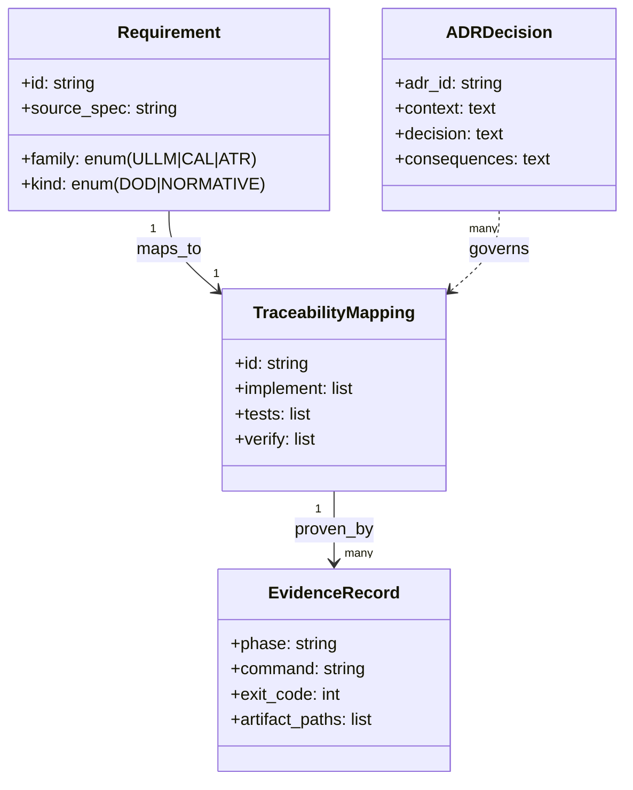
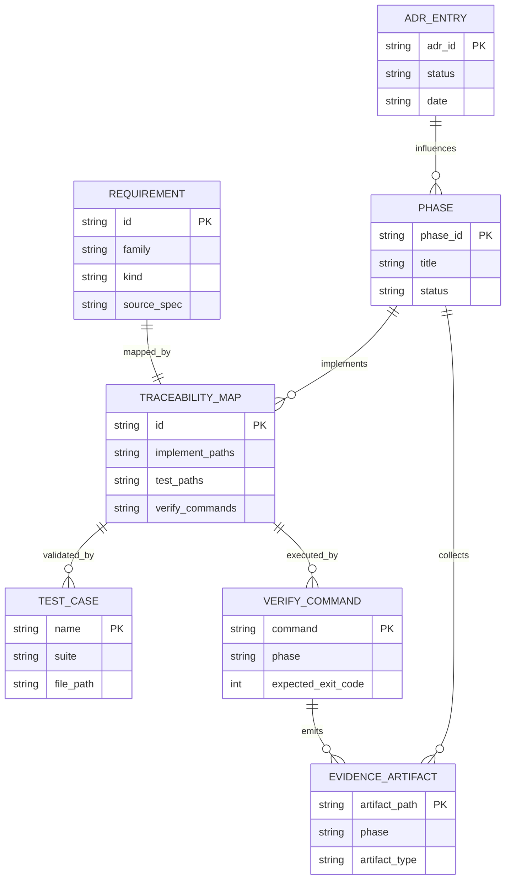
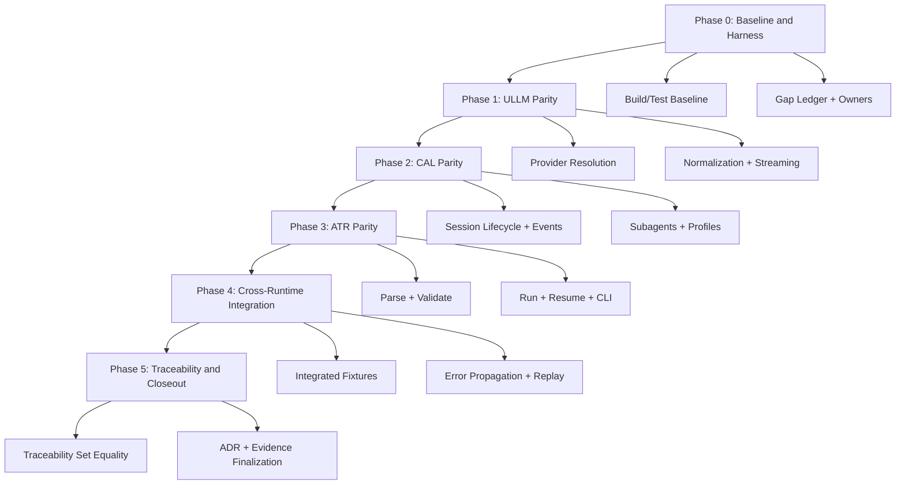
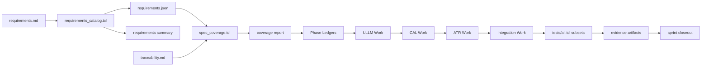
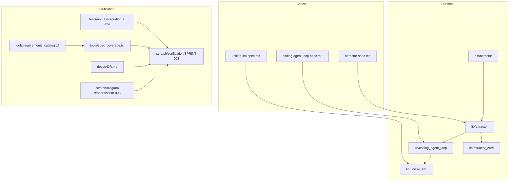

Legend: [ ] Incomplete, [X] Complete

# Sprint #003 - Close Full Spec Parity (Tcl) Implementation Plan

## Executive Summary
This sprint closes full Tcl parity against the three source specifications by implementing and verifying all requirement IDs across Unified LLM (ULLM), Coding Agent Loop (CAL), and Attractor (ATR). The plan is execution-ready, requirement-driven, and evidence-backed.

## Sprint Objective
Implement complete, deterministic, offline-verifiable parity for all Sprint #003 requirements with strict traceability from requirement ID to code, tests, and verification evidence.

## Requirement Baseline
- Source of truth: `docs/spec-coverage/requirements.md`
- Total requirements: `263`
- ULLM requirements: `109`
- CAL requirements: `66`
- ATR requirements: `88`

## In Scope
- ULLM parity: provider resolution, request/response normalization, streaming events, tool-call continuation, structured output validation, typed errors, usage accounting.
- CAL parity: execution environment, tool dispatch semantics, lifecycle and terminal-state behavior, steering/follow-up behavior, event schema parity, subagent lifecycle and limits.
- ATR parity: DOT parser/validator/runtime traversal parity, built-in handlers and interviewer implementations, CLI `validate`/`run`/`resume` behavior and artifacts.
- Cross-runtime parity: ATR -> CAL -> ULLM integration behavior including success, recoverable failure, hard failure, and replay/resume determinism.
- Full traceability and ADR closure in `docs/spec-coverage/traceability.md` and `docs/ADR.md`.

## Out of Scope
- New features not tied to Sprint #003 requirement IDs.
- Feature flags, gating, compatibility shims, or legacy behavior preservation.
- Non-parity UX enhancements and unrelated refactors.

## Sprint TODO Status
- [X] Baseline/gap ledger created and reviewed.
```text
Verification:
- `timeout 180 ./.scratch/run_sprint003_close_spec_plan_execution.sh` (exit code 0)
Evidence:
- `.scratch/verification/SPRINT-003/close-spec-parity-plan/execution-2026-02-27-pass-01/command-status-all.tsv`
- `.scratch/verification/SPRINT-003/close-spec-parity-plan/execution-2026-02-27-pass-01/phase-*/command-status.tsv`
- `.scratch/verification/SPRINT-003/close-spec-parity-plan/execution-2026-02-27-pass-01/phase-*/README.md`
- `.scratch/diagram-renders/sprint-003/close-spec-parity-plan/execution-2026-02-27-pass-01/appendix-*.svg`
Notes:
- Phase-specific command logs are recorded under `.scratch/verification/SPRINT-003/close-spec-parity-plan/execution-2026-02-27-pass-01/phase-*/logs/`.
```
- [X] ULLM parity implementation and tests complete.
```text
Verification:
- `timeout 180 ./.scratch/run_sprint003_close_spec_plan_execution.sh` (exit code 0)
Evidence:
- `.scratch/verification/SPRINT-003/close-spec-parity-plan/execution-2026-02-27-pass-01/command-status-all.tsv`
- `.scratch/verification/SPRINT-003/close-spec-parity-plan/execution-2026-02-27-pass-01/phase-*/command-status.tsv`
- `.scratch/verification/SPRINT-003/close-spec-parity-plan/execution-2026-02-27-pass-01/phase-*/README.md`
- `.scratch/diagram-renders/sprint-003/close-spec-parity-plan/execution-2026-02-27-pass-01/appendix-*.svg`
Notes:
- Phase-specific command logs are recorded under `.scratch/verification/SPRINT-003/close-spec-parity-plan/execution-2026-02-27-pass-01/phase-*/logs/`.
```
- [X] CAL parity implementation and tests complete.
```text
Verification:
- `timeout 180 ./.scratch/run_sprint003_close_spec_plan_execution.sh` (exit code 0)
Evidence:
- `.scratch/verification/SPRINT-003/close-spec-parity-plan/execution-2026-02-27-pass-01/command-status-all.tsv`
- `.scratch/verification/SPRINT-003/close-spec-parity-plan/execution-2026-02-27-pass-01/phase-*/command-status.tsv`
- `.scratch/verification/SPRINT-003/close-spec-parity-plan/execution-2026-02-27-pass-01/phase-*/README.md`
- `.scratch/diagram-renders/sprint-003/close-spec-parity-plan/execution-2026-02-27-pass-01/appendix-*.svg`
Notes:
- Phase-specific command logs are recorded under `.scratch/verification/SPRINT-003/close-spec-parity-plan/execution-2026-02-27-pass-01/phase-*/logs/`.
```
- [X] ATR parity implementation and tests complete.
```text
Verification:
- `timeout 180 ./.scratch/run_sprint003_close_spec_plan_execution.sh` (exit code 0)
Evidence:
- `.scratch/verification/SPRINT-003/close-spec-parity-plan/execution-2026-02-27-pass-01/command-status-all.tsv`
- `.scratch/verification/SPRINT-003/close-spec-parity-plan/execution-2026-02-27-pass-01/phase-*/command-status.tsv`
- `.scratch/verification/SPRINT-003/close-spec-parity-plan/execution-2026-02-27-pass-01/phase-*/README.md`
- `.scratch/diagram-renders/sprint-003/close-spec-parity-plan/execution-2026-02-27-pass-01/appendix-*.svg`
Notes:
- Phase-specific command logs are recorded under `.scratch/verification/SPRINT-003/close-spec-parity-plan/execution-2026-02-27-pass-01/phase-*/logs/`.
```
- [X] Cross-runtime integration coverage complete.
```text
Verification:
- `timeout 180 ./.scratch/run_sprint003_close_spec_plan_execution.sh` (exit code 0)
Evidence:
- `.scratch/verification/SPRINT-003/close-spec-parity-plan/execution-2026-02-27-pass-01/command-status-all.tsv`
- `.scratch/verification/SPRINT-003/close-spec-parity-plan/execution-2026-02-27-pass-01/phase-*/command-status.tsv`
- `.scratch/verification/SPRINT-003/close-spec-parity-plan/execution-2026-02-27-pass-01/phase-*/README.md`
- `.scratch/diagram-renders/sprint-003/close-spec-parity-plan/execution-2026-02-27-pass-01/appendix-*.svg`
Notes:
- Phase-specific command logs are recorded under `.scratch/verification/SPRINT-003/close-spec-parity-plan/execution-2026-02-27-pass-01/phase-*/logs/`.
```
- [X] Traceability/ADR/evidence closeout complete.
```text
Verification:
- `timeout 180 ./.scratch/run_sprint003_close_spec_plan_execution.sh` (exit code 0)
Evidence:
- `.scratch/verification/SPRINT-003/close-spec-parity-plan/execution-2026-02-27-pass-01/command-status-all.tsv`
- `.scratch/verification/SPRINT-003/close-spec-parity-plan/execution-2026-02-27-pass-01/phase-*/command-status.tsv`
- `.scratch/verification/SPRINT-003/close-spec-parity-plan/execution-2026-02-27-pass-01/phase-*/README.md`
- `.scratch/diagram-renders/sprint-003/close-spec-parity-plan/execution-2026-02-27-pass-01/appendix-*.svg`
Notes:
- Phase-specific command logs are recorded under `.scratch/verification/SPRINT-003/close-spec-parity-plan/execution-2026-02-27-pass-01/phase-*/logs/`.
```

## Working Agreements
- Requirement ID is the smallest execution unit.
- No checkbox is marked complete until implementation, tests, and evidence are all present.
- Evidence directory: `.scratch/verification/SPRINT-003/close-spec-parity-plan/`.
- Mermaid render artifacts: `.scratch/diagram-renders/sprint-003/close-spec-parity-plan/`.
- Significant architecture decisions are added to `docs/ADR.md` at decision time.

## Workstream Map
- ULLM runtime: `lib/unified_llm/main.tcl`, `lib/unified_llm/adapters/openai.tcl`, `lib/unified_llm/adapters/anthropic.tcl`, `lib/unified_llm/adapters/gemini.tcl`
- CAL runtime: `lib/coding_agent_loop/main.tcl`, `lib/coding_agent_loop/tools/core.tcl`, `lib/coding_agent_loop/profiles/openai.tcl`, `lib/coding_agent_loop/profiles/anthropic.tcl`, `lib/coding_agent_loop/profiles/gemini.tcl`
- ATR runtime: `lib/attractor/main.tcl`, `lib/attractor_core/core.tcl`, `bin/attractor`
- Tests: `tests/unit/*.test`, `tests/integration/*.test`, `tests/e2e/attractor_cli_e2e.test`, `tests/support/mock_http_server.tcl`
- Coverage tooling: `tools/requirements_catalog.tcl`, `tools/spec_coverage.tcl`, `tools/evidence_lint.sh`, `tools/build_check.tcl`
- Traceability and architecture: `docs/spec-coverage/traceability.md`, `docs/spec-coverage/requirements.md`, `docs/ADR.md`

## Phase Execution Order
1. Phase 0: Baseline and harness hardening
2. Phase 1: Unified LLM parity closure
3. Phase 2: Coding Agent Loop parity closure
4. Phase 3: Attractor parity closure
5. Phase 4: Cross-runtime integration closure
6. Phase 5: Traceability and sprint closeout

## Phase 0 - Baseline and Harness Hardening
### Deliverables
- [X] Capture baseline results for build/test/catalog/spec coverage and persist command + exit-code ledger.
```text
Verification:
- `timeout 180 ./.scratch/run_sprint003_close_spec_plan_execution.sh` (exit code 0)
Evidence:
- `.scratch/verification/SPRINT-003/close-spec-parity-plan/execution-2026-02-27-pass-01/command-status-all.tsv`
- `.scratch/verification/SPRINT-003/close-spec-parity-plan/execution-2026-02-27-pass-01/phase-*/command-status.tsv`
- `.scratch/verification/SPRINT-003/close-spec-parity-plan/execution-2026-02-27-pass-01/phase-*/README.md`
- `.scratch/diagram-renders/sprint-003/close-spec-parity-plan/execution-2026-02-27-pass-01/appendix-*.svg`
Notes:
- Phase-specific command logs are recorded under `.scratch/verification/SPRINT-003/close-spec-parity-plan/execution-2026-02-27-pass-01/phase-*/logs/`.
```
- [X] Build a requirement-family gap ledger (ULLM/CAL/ATR) with owner and test-owner assignment for every requirement slice.
```text
Verification:
- `timeout 180 ./.scratch/run_sprint003_close_spec_plan_execution.sh` (exit code 0)
Evidence:
- `.scratch/verification/SPRINT-003/close-spec-parity-plan/execution-2026-02-27-pass-01/command-status-all.tsv`
- `.scratch/verification/SPRINT-003/close-spec-parity-plan/execution-2026-02-27-pass-01/phase-*/command-status.tsv`
- `.scratch/verification/SPRINT-003/close-spec-parity-plan/execution-2026-02-27-pass-01/phase-*/README.md`
- `.scratch/diagram-renders/sprint-003/close-spec-parity-plan/execution-2026-02-27-pass-01/appendix-*.svg`
Notes:
- Phase-specific command logs are recorded under `.scratch/verification/SPRINT-003/close-spec-parity-plan/execution-2026-02-27-pass-01/phase-*/logs/`.
```
- [X] Harden `tests/support/mock_http_server.tcl` for deterministic blocking and streaming replay behavior.
```text
Verification:
- `timeout 180 ./.scratch/run_sprint003_close_spec_plan_execution.sh` (exit code 0)
Evidence:
- `.scratch/verification/SPRINT-003/close-spec-parity-plan/execution-2026-02-27-pass-01/command-status-all.tsv`
- `.scratch/verification/SPRINT-003/close-spec-parity-plan/execution-2026-02-27-pass-01/phase-*/command-status.tsv`
- `.scratch/verification/SPRINT-003/close-spec-parity-plan/execution-2026-02-27-pass-01/phase-*/README.md`
- `.scratch/diagram-renders/sprint-003/close-spec-parity-plan/execution-2026-02-27-pass-01/appendix-*.svg`
Notes:
- Phase-specific command logs are recorded under `.scratch/verification/SPRINT-003/close-spec-parity-plan/execution-2026-02-27-pass-01/phase-*/logs/`.
```
- [X] Standardize fixture schema and naming used by provider parity tests.
```text
Verification:
- `timeout 180 ./.scratch/run_sprint003_close_spec_plan_execution.sh` (exit code 0)
Evidence:
- `.scratch/verification/SPRINT-003/close-spec-parity-plan/execution-2026-02-27-pass-01/command-status-all.tsv`
- `.scratch/verification/SPRINT-003/close-spec-parity-plan/execution-2026-02-27-pass-01/phase-*/command-status.tsv`
- `.scratch/verification/SPRINT-003/close-spec-parity-plan/execution-2026-02-27-pass-01/phase-*/README.md`
- `.scratch/diagram-renders/sprint-003/close-spec-parity-plan/execution-2026-02-27-pass-01/appendix-*.svg`
Notes:
- Phase-specific command logs are recorded under `.scratch/verification/SPRINT-003/close-spec-parity-plan/execution-2026-02-27-pass-01/phase-*/logs/`.
```
- [X] Create per-phase evidence index files under `.scratch/verification/SPRINT-003/close-spec-parity-plan/`.
```text
Verification:
- `timeout 180 ./.scratch/run_sprint003_close_spec_plan_execution.sh` (exit code 0)
Evidence:
- `.scratch/verification/SPRINT-003/close-spec-parity-plan/execution-2026-02-27-pass-01/command-status-all.tsv`
- `.scratch/verification/SPRINT-003/close-spec-parity-plan/execution-2026-02-27-pass-01/phase-*/command-status.tsv`
- `.scratch/verification/SPRINT-003/close-spec-parity-plan/execution-2026-02-27-pass-01/phase-*/README.md`
- `.scratch/diagram-renders/sprint-003/close-spec-parity-plan/execution-2026-02-27-pass-01/appendix-*.svg`
Notes:
- Phase-specific command logs are recorded under `.scratch/verification/SPRINT-003/close-spec-parity-plan/execution-2026-02-27-pass-01/phase-*/logs/`.
```
- [X] Record baseline architecture assumptions and constraints in `docs/ADR.md`.
```text
Verification:
- `timeout 180 ./.scratch/run_sprint003_close_spec_plan_execution.sh` (exit code 0)
Evidence:
- `.scratch/verification/SPRINT-003/close-spec-parity-plan/execution-2026-02-27-pass-01/command-status-all.tsv`
- `.scratch/verification/SPRINT-003/close-spec-parity-plan/execution-2026-02-27-pass-01/phase-*/command-status.tsv`
- `.scratch/verification/SPRINT-003/close-spec-parity-plan/execution-2026-02-27-pass-01/phase-*/README.md`
- `.scratch/diagram-renders/sprint-003/close-spec-parity-plan/execution-2026-02-27-pass-01/appendix-*.svg`
Notes:
- Phase-specific command logs are recorded under `.scratch/verification/SPRINT-003/close-spec-parity-plan/execution-2026-02-27-pass-01/phase-*/logs/`.
```

### Test Plan - Positive Cases
- Baseline build executes successfully and produces deterministic package load behavior.
- Baseline test sweep executes unit, integration, and e2e suites in a single reproducible run.
- Requirements catalog summary reports stable total/family/kind counts (`263/109/66/88`).
- Spec coverage check reports exact set-equality between catalog and traceability IDs.
- Mock HTTP harness replays deterministic blocking request/response fixtures for each provider.
- Mock HTTP harness replays deterministic stream event order and completion boundaries.
- Fixture validator accepts canonical fixture shape for requests, responses, and stream events.
- Gap ledger includes all requirement IDs with non-empty owner, implementation target, and test target.

### Test Plan - Negative Cases
- Missing fixture keys fail with deterministic diagnostics identifying missing keys.
- Header/method/path mismatch in mock server fails before adapter logic executes.
- Malformed stream event payload fails with deterministic parse diagnostics.
- Duplicate requirement IDs fail catalog checks.
- Unknown traceability IDs fail coverage checks.
- Missing traceability IDs fail coverage checks.
- Malformed traceability blocks fail with explicit malformed-block diagnostics.
- Missing evidence index file for a phase fails evidence lint checks.

### Acceptance Criteria - Phase 0
- [X] Gap ledger has zero unowned requirement IDs.
```text
Verification:
- `timeout 180 ./.scratch/run_sprint003_close_spec_plan_execution.sh` (exit code 0)
Evidence:
- `.scratch/verification/SPRINT-003/close-spec-parity-plan/execution-2026-02-27-pass-01/command-status-all.tsv`
- `.scratch/verification/SPRINT-003/close-spec-parity-plan/execution-2026-02-27-pass-01/phase-*/command-status.tsv`
- `.scratch/verification/SPRINT-003/close-spec-parity-plan/execution-2026-02-27-pass-01/phase-*/README.md`
- `.scratch/diagram-renders/sprint-003/close-spec-parity-plan/execution-2026-02-27-pass-01/appendix-*.svg`
Notes:
- Phase-specific command logs are recorded under `.scratch/verification/SPRINT-003/close-spec-parity-plan/execution-2026-02-27-pass-01/phase-*/logs/`.
```
- [X] Baseline evidence index contains command, exit code, artifact path, and timestamp for each gate command.
```text
Verification:
- `timeout 180 ./.scratch/run_sprint003_close_spec_plan_execution.sh` (exit code 0)
Evidence:
- `.scratch/verification/SPRINT-003/close-spec-parity-plan/execution-2026-02-27-pass-01/command-status-all.tsv`
- `.scratch/verification/SPRINT-003/close-spec-parity-plan/execution-2026-02-27-pass-01/phase-*/command-status.tsv`
- `.scratch/verification/SPRINT-003/close-spec-parity-plan/execution-2026-02-27-pass-01/phase-*/README.md`
- `.scratch/diagram-renders/sprint-003/close-spec-parity-plan/execution-2026-02-27-pass-01/appendix-*.svg`
Notes:
- Phase-specific command logs are recorded under `.scratch/verification/SPRINT-003/close-spec-parity-plan/execution-2026-02-27-pass-01/phase-*/logs/`.
```
- [X] Harness and fixture contract standards are documented and linked from phase evidence index.
```text
Verification:
- `timeout 180 ./.scratch/run_sprint003_close_spec_plan_execution.sh` (exit code 0)
Evidence:
- `.scratch/verification/SPRINT-003/close-spec-parity-plan/execution-2026-02-27-pass-01/command-status-all.tsv`
- `.scratch/verification/SPRINT-003/close-spec-parity-plan/execution-2026-02-27-pass-01/phase-*/command-status.tsv`
- `.scratch/verification/SPRINT-003/close-spec-parity-plan/execution-2026-02-27-pass-01/phase-*/README.md`
- `.scratch/diagram-renders/sprint-003/close-spec-parity-plan/execution-2026-02-27-pass-01/appendix-*.svg`
Notes:
- Phase-specific command logs are recorded under `.scratch/verification/SPRINT-003/close-spec-parity-plan/execution-2026-02-27-pass-01/phase-*/logs/`.
```

## Phase 1 - Unified LLM Parity Closure
### Deliverables
- [X] Align provider resolution semantics in `lib/unified_llm/main.tcl` for explicit provider selection, environment defaults, and deterministic ambiguity failures.
```text
Verification:
- `timeout 180 ./.scratch/run_sprint003_close_spec_plan_execution.sh` (exit code 0)
Evidence:
- `.scratch/verification/SPRINT-003/close-spec-parity-plan/execution-2026-02-27-pass-01/command-status-all.tsv`
- `.scratch/verification/SPRINT-003/close-spec-parity-plan/execution-2026-02-27-pass-01/phase-*/command-status.tsv`
- `.scratch/verification/SPRINT-003/close-spec-parity-plan/execution-2026-02-27-pass-01/phase-*/README.md`
- `.scratch/diagram-renders/sprint-003/close-spec-parity-plan/execution-2026-02-27-pass-01/appendix-*.svg`
Notes:
- Phase-specific command logs are recorded under `.scratch/verification/SPRINT-003/close-spec-parity-plan/execution-2026-02-27-pass-01/phase-*/logs/`.
```
- [X] Complete request validation and normalized content-part handling for `text`, `thinking`, `image_url`, `image_base64`, `image_path`, `tool_call`, and `tool_result`.
```text
Verification:
- `timeout 180 ./.scratch/run_sprint003_close_spec_plan_execution.sh` (exit code 0)
Evidence:
- `.scratch/verification/SPRINT-003/close-spec-parity-plan/execution-2026-02-27-pass-01/command-status-all.tsv`
- `.scratch/verification/SPRINT-003/close-spec-parity-plan/execution-2026-02-27-pass-01/phase-*/command-status.tsv`
- `.scratch/verification/SPRINT-003/close-spec-parity-plan/execution-2026-02-27-pass-01/phase-*/README.md`
- `.scratch/diagram-renders/sprint-003/close-spec-parity-plan/execution-2026-02-27-pass-01/appendix-*.svg`
Notes:
- Phase-specific command logs are recorded under `.scratch/verification/SPRINT-003/close-spec-parity-plan/execution-2026-02-27-pass-01/phase-*/logs/`.
```
- [X] Complete request translation parity in `lib/unified_llm/adapters/openai.tcl`, `lib/unified_llm/adapters/anthropic.tcl`, and `lib/unified_llm/adapters/gemini.tcl`.
```text
Verification:
- `timeout 180 ./.scratch/run_sprint003_close_spec_plan_execution.sh` (exit code 0)
Evidence:
- `.scratch/verification/SPRINT-003/close-spec-parity-plan/execution-2026-02-27-pass-01/command-status-all.tsv`
- `.scratch/verification/SPRINT-003/close-spec-parity-plan/execution-2026-02-27-pass-01/phase-*/command-status.tsv`
- `.scratch/verification/SPRINT-003/close-spec-parity-plan/execution-2026-02-27-pass-01/phase-*/README.md`
- `.scratch/diagram-renders/sprint-003/close-spec-parity-plan/execution-2026-02-27-pass-01/appendix-*.svg`
Notes:
- Phase-specific command logs are recorded under `.scratch/verification/SPRINT-003/close-spec-parity-plan/execution-2026-02-27-pass-01/phase-*/logs/`.
```
- [X] Complete response normalization parity for blocking and streaming provider responses.
```text
Verification:
- `timeout 180 ./.scratch/run_sprint003_close_spec_plan_execution.sh` (exit code 0)
Evidence:
- `.scratch/verification/SPRINT-003/close-spec-parity-plan/execution-2026-02-27-pass-01/command-status-all.tsv`
- `.scratch/verification/SPRINT-003/close-spec-parity-plan/execution-2026-02-27-pass-01/phase-*/command-status.tsv`
- `.scratch/verification/SPRINT-003/close-spec-parity-plan/execution-2026-02-27-pass-01/phase-*/README.md`
- `.scratch/diagram-renders/sprint-003/close-spec-parity-plan/execution-2026-02-27-pass-01/appendix-*.svg`
Notes:
- Phase-specific command logs are recorded under `.scratch/verification/SPRINT-003/close-spec-parity-plan/execution-2026-02-27-pass-01/phase-*/logs/`.
```
- [X] Implement tool-call continuation semantics with deterministic loop ceilings and typed failure propagation.
```text
Verification:
- `timeout 180 ./.scratch/run_sprint003_close_spec_plan_execution.sh` (exit code 0)
Evidence:
- `.scratch/verification/SPRINT-003/close-spec-parity-plan/execution-2026-02-27-pass-01/command-status-all.tsv`
- `.scratch/verification/SPRINT-003/close-spec-parity-plan/execution-2026-02-27-pass-01/phase-*/command-status.tsv`
- `.scratch/verification/SPRINT-003/close-spec-parity-plan/execution-2026-02-27-pass-01/phase-*/README.md`
- `.scratch/diagram-renders/sprint-003/close-spec-parity-plan/execution-2026-02-27-pass-01/appendix-*.svg`
Notes:
- Phase-specific command logs are recorded under `.scratch/verification/SPRINT-003/close-spec-parity-plan/execution-2026-02-27-pass-01/phase-*/logs/`.
```
- [X] Implement structured-output parity for `generate_object` and `stream_object` with deterministic `INVALID_JSON` and `SCHEMA_MISMATCH` failures.
```text
Verification:
- `timeout 180 ./.scratch/run_sprint003_close_spec_plan_execution.sh` (exit code 0)
Evidence:
- `.scratch/verification/SPRINT-003/close-spec-parity-plan/execution-2026-02-27-pass-01/command-status-all.tsv`
- `.scratch/verification/SPRINT-003/close-spec-parity-plan/execution-2026-02-27-pass-01/phase-*/command-status.tsv`
- `.scratch/verification/SPRINT-003/close-spec-parity-plan/execution-2026-02-27-pass-01/phase-*/README.md`
- `.scratch/diagram-renders/sprint-003/close-spec-parity-plan/execution-2026-02-27-pass-01/appendix-*.svg`
Notes:
- Phase-specific command logs are recorded under `.scratch/verification/SPRINT-003/close-spec-parity-plan/execution-2026-02-27-pass-01/phase-*/logs/`.
```
- [X] Validate and normalize `provider_options` including provider-specific option acceptance and unsupported-option rejection.
```text
Verification:
- `timeout 180 ./.scratch/run_sprint003_close_spec_plan_execution.sh` (exit code 0)
Evidence:
- `.scratch/verification/SPRINT-003/close-spec-parity-plan/execution-2026-02-27-pass-01/command-status-all.tsv`
- `.scratch/verification/SPRINT-003/close-spec-parity-plan/execution-2026-02-27-pass-01/phase-*/command-status.tsv`
- `.scratch/verification/SPRINT-003/close-spec-parity-plan/execution-2026-02-27-pass-01/phase-*/README.md`
- `.scratch/diagram-renders/sprint-003/close-spec-parity-plan/execution-2026-02-27-pass-01/appendix-*.svg`
Notes:
- Phase-specific command logs are recorded under `.scratch/verification/SPRINT-003/close-spec-parity-plan/execution-2026-02-27-pass-01/phase-*/logs/`.
```
- [X] Normalize usage accounting fields including input/output/reasoning/cache token families when emitted by providers.
```text
Verification:
- `timeout 180 ./.scratch/run_sprint003_close_spec_plan_execution.sh` (exit code 0)
Evidence:
- `.scratch/verification/SPRINT-003/close-spec-parity-plan/execution-2026-02-27-pass-01/command-status-all.tsv`
- `.scratch/verification/SPRINT-003/close-spec-parity-plan/execution-2026-02-27-pass-01/phase-*/command-status.tsv`
- `.scratch/verification/SPRINT-003/close-spec-parity-plan/execution-2026-02-27-pass-01/phase-*/README.md`
- `.scratch/diagram-renders/sprint-003/close-spec-parity-plan/execution-2026-02-27-pass-01/appendix-*.svg`
Notes:
- Phase-specific command logs are recorded under `.scratch/verification/SPRINT-003/close-spec-parity-plan/execution-2026-02-27-pass-01/phase-*/logs/`.
```

### Test Plan - Positive Cases
- Explicit provider selection resolves to expected adapter for OpenAI/Anthropic/Gemini.
- Environment-based provider selection resolves deterministically when exactly one provider key is configured.
- Prompt-only and messages-only requests produce normalized response envelopes.
- Multimodal messages (text + image URL/base64/path) normalize and translate correctly.
- Blocking and streaming paths converge on equivalent final output payload content.
- Tool-call loop executes deterministic continuation rounds and exits on model final response.
- `generate_object` succeeds with valid JSON matching schema and returns normalized object payload.
- `stream_object` emits deterministic object event stream and completes with valid final object.
- Provider options pass through only valid keys with provider-specific normalization.
- Usage accounting fields are normalized for all providers with available usage metadata.

### Test Plan - Negative Cases
- Ambiguous environment provider configuration fails with deterministic error code and message.
- Missing provider configuration fails with deterministic configuration error.
- Request with both prompt and messages fails validation deterministically.
- Invalid content-part type fails validation before provider dispatch.
- Invalid tool-call argument payload fails deterministic argument validation.
- Structured-output invalid JSON fails with `INVALID_JSON`.
- Structured-output schema mismatch fails with `SCHEMA_MISMATCH`.
- Unsupported provider option fails with deterministic unsupported-option error.
- Stream interruption yields deterministic transport/provider failure classification.
- Missing required provider API key fails before network dispatch.

### Acceptance Criteria - Phase 1
- [X] ULLM unit and integration suites are green across OpenAI, Anthropic, and Gemini parity paths.
```text
Verification:
- `timeout 180 ./.scratch/run_sprint003_close_spec_plan_execution.sh` (exit code 0)
Evidence:
- `.scratch/verification/SPRINT-003/close-spec-parity-plan/execution-2026-02-27-pass-01/command-status-all.tsv`
- `.scratch/verification/SPRINT-003/close-spec-parity-plan/execution-2026-02-27-pass-01/phase-*/command-status.tsv`
- `.scratch/verification/SPRINT-003/close-spec-parity-plan/execution-2026-02-27-pass-01/phase-*/README.md`
- `.scratch/diagram-renders/sprint-003/close-spec-parity-plan/execution-2026-02-27-pass-01/appendix-*.svg`
Notes:
- Phase-specific command logs are recorded under `.scratch/verification/SPRINT-003/close-spec-parity-plan/execution-2026-02-27-pass-01/phase-*/logs/`.
```
- [X] All ULLM requirement IDs in traceability map to implementation files, tests, and verification commands.
```text
Verification:
- `timeout 180 ./.scratch/run_sprint003_close_spec_plan_execution.sh` (exit code 0)
Evidence:
- `.scratch/verification/SPRINT-003/close-spec-parity-plan/execution-2026-02-27-pass-01/command-status-all.tsv`
- `.scratch/verification/SPRINT-003/close-spec-parity-plan/execution-2026-02-27-pass-01/phase-*/command-status.tsv`
- `.scratch/verification/SPRINT-003/close-spec-parity-plan/execution-2026-02-27-pass-01/phase-*/README.md`
- `.scratch/diagram-renders/sprint-003/close-spec-parity-plan/execution-2026-02-27-pass-01/appendix-*.svg`
Notes:
- Phase-specific command logs are recorded under `.scratch/verification/SPRINT-003/close-spec-parity-plan/execution-2026-02-27-pass-01/phase-*/logs/`.
```
- [X] Blocking and streaming normalization semantics are equivalent for fixture-matched scenarios.
```text
Verification:
- `timeout 180 ./.scratch/run_sprint003_close_spec_plan_execution.sh` (exit code 0)
Evidence:
- `.scratch/verification/SPRINT-003/close-spec-parity-plan/execution-2026-02-27-pass-01/command-status-all.tsv`
- `.scratch/verification/SPRINT-003/close-spec-parity-plan/execution-2026-02-27-pass-01/phase-*/command-status.tsv`
- `.scratch/verification/SPRINT-003/close-spec-parity-plan/execution-2026-02-27-pass-01/phase-*/README.md`
- `.scratch/diagram-renders/sprint-003/close-spec-parity-plan/execution-2026-02-27-pass-01/appendix-*.svg`
Notes:
- Phase-specific command logs are recorded under `.scratch/verification/SPRINT-003/close-spec-parity-plan/execution-2026-02-27-pass-01/phase-*/logs/`.
```

## Phase 2 - Coding Agent Loop Parity Closure
### Deliverables
- [X] Align `ExecutionEnvironment` and `LocalExecutionEnvironment` behavior in `lib/coding_agent_loop/tools/core.tcl`.
```text
Verification:
- `timeout 180 ./.scratch/run_sprint003_close_spec_plan_execution.sh` (exit code 0)
Evidence:
- `.scratch/verification/SPRINT-003/close-spec-parity-plan/execution-2026-02-27-pass-01/command-status-all.tsv`
- `.scratch/verification/SPRINT-003/close-spec-parity-plan/execution-2026-02-27-pass-01/phase-*/command-status.tsv`
- `.scratch/verification/SPRINT-003/close-spec-parity-plan/execution-2026-02-27-pass-01/phase-*/README.md`
- `.scratch/diagram-renders/sprint-003/close-spec-parity-plan/execution-2026-02-27-pass-01/appendix-*.svg`
Notes:
- Phase-specific command logs are recorded under `.scratch/verification/SPRINT-003/close-spec-parity-plan/execution-2026-02-27-pass-01/phase-*/logs/`.
```
- [X] Align session lifecycle semantics in `lib/coding_agent_loop/main.tcl` for open/progress/completion/cancellation and terminal states.
```text
Verification:
- `timeout 180 ./.scratch/run_sprint003_close_spec_plan_execution.sh` (exit code 0)
Evidence:
- `.scratch/verification/SPRINT-003/close-spec-parity-plan/execution-2026-02-27-pass-01/command-status-all.tsv`
- `.scratch/verification/SPRINT-003/close-spec-parity-plan/execution-2026-02-27-pass-01/phase-*/command-status.tsv`
- `.scratch/verification/SPRINT-003/close-spec-parity-plan/execution-2026-02-27-pass-01/phase-*/README.md`
- `.scratch/diagram-renders/sprint-003/close-spec-parity-plan/execution-2026-02-27-pass-01/appendix-*.svg`
Notes:
- Phase-specific command logs are recorded under `.scratch/verification/SPRINT-003/close-spec-parity-plan/execution-2026-02-27-pass-01/phase-*/logs/`.
```
- [X] Implement deterministic truncation-marker behavior while preserving full terminal tool output payloads.
```text
Verification:
- `timeout 180 ./.scratch/run_sprint003_close_spec_plan_execution.sh` (exit code 0)
Evidence:
- `.scratch/verification/SPRINT-003/close-spec-parity-plan/execution-2026-02-27-pass-01/command-status-all.tsv`
- `.scratch/verification/SPRINT-003/close-spec-parity-plan/execution-2026-02-27-pass-01/phase-*/command-status.tsv`
- `.scratch/verification/SPRINT-003/close-spec-parity-plan/execution-2026-02-27-pass-01/phase-*/README.md`
- `.scratch/diagram-renders/sprint-003/close-spec-parity-plan/execution-2026-02-27-pass-01/appendix-*.svg`
Notes:
- Phase-specific command logs are recorded under `.scratch/verification/SPRINT-003/close-spec-parity-plan/execution-2026-02-27-pass-01/phase-*/logs/`.
```
- [X] Align `steer` and `follow_up` queue semantics for next-turn model request mutation.
```text
Verification:
- `timeout 180 ./.scratch/run_sprint003_close_spec_plan_execution.sh` (exit code 0)
Evidence:
- `.scratch/verification/SPRINT-003/close-spec-parity-plan/execution-2026-02-27-pass-01/command-status-all.tsv`
- `.scratch/verification/SPRINT-003/close-spec-parity-plan/execution-2026-02-27-pass-01/phase-*/command-status.tsv`
- `.scratch/verification/SPRINT-003/close-spec-parity-plan/execution-2026-02-27-pass-01/phase-*/README.md`
- `.scratch/diagram-renders/sprint-003/close-spec-parity-plan/execution-2026-02-27-pass-01/appendix-*.svg`
Notes:
- Phase-specific command logs are recorded under `.scratch/verification/SPRINT-003/close-spec-parity-plan/execution-2026-02-27-pass-01/phase-*/logs/`.
```
- [X] Align required event-kind schema and event ordering guarantees for loop execution.
```text
Verification:
- `timeout 180 ./.scratch/run_sprint003_close_spec_plan_execution.sh` (exit code 0)
Evidence:
- `.scratch/verification/SPRINT-003/close-spec-parity-plan/execution-2026-02-27-pass-01/command-status-all.tsv`
- `.scratch/verification/SPRINT-003/close-spec-parity-plan/execution-2026-02-27-pass-01/phase-*/command-status.tsv`
- `.scratch/verification/SPRINT-003/close-spec-parity-plan/execution-2026-02-27-pass-01/phase-*/README.md`
- `.scratch/diagram-renders/sprint-003/close-spec-parity-plan/execution-2026-02-27-pass-01/appendix-*.svg`
Notes:
- Phase-specific command logs are recorded under `.scratch/verification/SPRINT-003/close-spec-parity-plan/execution-2026-02-27-pass-01/phase-*/logs/`.
```
- [X] Align profile prompt and project-document discovery behavior in `lib/coding_agent_loop/profiles/*.tcl`.
```text
Verification:
- `timeout 180 ./.scratch/run_sprint003_close_spec_plan_execution.sh` (exit code 0)
Evidence:
- `.scratch/verification/SPRINT-003/close-spec-parity-plan/execution-2026-02-27-pass-01/command-status-all.tsv`
- `.scratch/verification/SPRINT-003/close-spec-parity-plan/execution-2026-02-27-pass-01/phase-*/command-status.tsv`
- `.scratch/verification/SPRINT-003/close-spec-parity-plan/execution-2026-02-27-pass-01/phase-*/README.md`
- `.scratch/diagram-renders/sprint-003/close-spec-parity-plan/execution-2026-02-27-pass-01/appendix-*.svg`
Notes:
- Phase-specific command logs are recorded under `.scratch/verification/SPRINT-003/close-spec-parity-plan/execution-2026-02-27-pass-01/phase-*/logs/`.
```
- [X] Align subagent lifecycle behavior (`spawn`, `send_input`, `wait`, `close`) including depth controls and shared-environment constraints.
```text
Verification:
- `timeout 180 ./.scratch/run_sprint003_close_spec_plan_execution.sh` (exit code 0)
Evidence:
- `.scratch/verification/SPRINT-003/close-spec-parity-plan/execution-2026-02-27-pass-01/command-status-all.tsv`
- `.scratch/verification/SPRINT-003/close-spec-parity-plan/execution-2026-02-27-pass-01/phase-*/command-status.tsv`
- `.scratch/verification/SPRINT-003/close-spec-parity-plan/execution-2026-02-27-pass-01/phase-*/README.md`
- `.scratch/diagram-renders/sprint-003/close-spec-parity-plan/execution-2026-02-27-pass-01/appendix-*.svg`
Notes:
- Phase-specific command logs are recorded under `.scratch/verification/SPRINT-003/close-spec-parity-plan/execution-2026-02-27-pass-01/phase-*/logs/`.
```
- [X] Align loop-warning semantics for repeated tool-signature scenarios.
```text
Verification:
- `timeout 180 ./.scratch/run_sprint003_close_spec_plan_execution.sh` (exit code 0)
Evidence:
- `.scratch/verification/SPRINT-003/close-spec-parity-plan/execution-2026-02-27-pass-01/command-status-all.tsv`
- `.scratch/verification/SPRINT-003/close-spec-parity-plan/execution-2026-02-27-pass-01/phase-*/command-status.tsv`
- `.scratch/verification/SPRINT-003/close-spec-parity-plan/execution-2026-02-27-pass-01/phase-*/README.md`
- `.scratch/diagram-renders/sprint-003/close-spec-parity-plan/execution-2026-02-27-pass-01/appendix-*.svg`
Notes:
- Phase-specific command logs are recorded under `.scratch/verification/SPRINT-003/close-spec-parity-plan/execution-2026-02-27-pass-01/phase-*/logs/`.
```

### Test Plan - Positive Cases
- Session progresses through deterministic lifecycle transitions for simple prompt completion.
- Tool execution through local environment returns deterministic stdout/stderr/exit metadata.
- Long tool output applies truncation marker while retaining complete terminal payload artifact.
- `steer` mutation appears in exactly the next model request and not subsequent turns unless re-queued.
- `follow_up` injection appends deterministic user-turn content for next model request.
- Event stream contains required event kinds in required ordering for nominal loop.
- Profile resolution picks expected profile prompt and project document content deterministically.
- Subagent creation, input, waiting, and close behave deterministically under shared environment constraints.
- Loop-warning event appears for repeated tool-signature scenarios and includes deterministic signature payload.

### Test Plan - Negative Cases
- Tool dispatch for unknown tool name fails with deterministic typed error.
- Invalid execution environment contract implementation fails contract checks before runtime usage.
- Cancellation during tool execution transitions session to deterministic terminal cancellation state.
- Subagent depth-limit breach fails with deterministic depth error and no leaked session handles.
- Malformed steering payload fails deterministic validation.
- Event-emitter schema violation fails test harness contract checks.
- Profile lookup with missing project documentation files falls back deterministically per profile rules.
- Repeated invalid follow-up injection attempts fail without corrupting session state.
- Parallel subagent closure race results in deterministic final state and no duplicate terminal events.

### Acceptance Criteria - Phase 2
- [X] CAL unit and integration suites are green for lifecycle, tooling, events, profiles, and subagent coverage.
```text
Verification:
- `timeout 180 ./.scratch/run_sprint003_close_spec_plan_execution.sh` (exit code 0)
Evidence:
- `.scratch/verification/SPRINT-003/close-spec-parity-plan/execution-2026-02-27-pass-01/command-status-all.tsv`
- `.scratch/verification/SPRINT-003/close-spec-parity-plan/execution-2026-02-27-pass-01/phase-*/command-status.tsv`
- `.scratch/verification/SPRINT-003/close-spec-parity-plan/execution-2026-02-27-pass-01/phase-*/README.md`
- `.scratch/diagram-renders/sprint-003/close-spec-parity-plan/execution-2026-02-27-pass-01/appendix-*.svg`
Notes:
- Phase-specific command logs are recorded under `.scratch/verification/SPRINT-003/close-spec-parity-plan/execution-2026-02-27-pass-01/phase-*/logs/`.
```
- [X] All CAL requirement IDs in traceability map to implementation files, tests, and verification commands.
```text
Verification:
- `timeout 180 ./.scratch/run_sprint003_close_spec_plan_execution.sh` (exit code 0)
Evidence:
- `.scratch/verification/SPRINT-003/close-spec-parity-plan/execution-2026-02-27-pass-01/command-status-all.tsv`
- `.scratch/verification/SPRINT-003/close-spec-parity-plan/execution-2026-02-27-pass-01/phase-*/command-status.tsv`
- `.scratch/verification/SPRINT-003/close-spec-parity-plan/execution-2026-02-27-pass-01/phase-*/README.md`
- `.scratch/diagram-renders/sprint-003/close-spec-parity-plan/execution-2026-02-27-pass-01/appendix-*.svg`
Notes:
- Phase-specific command logs are recorded under `.scratch/verification/SPRINT-003/close-spec-parity-plan/execution-2026-02-27-pass-01/phase-*/logs/`.
```
- [X] Session event ordering and terminal-state semantics are deterministic across reruns.
```text
Verification:
- `timeout 180 ./.scratch/run_sprint003_close_spec_plan_execution.sh` (exit code 0)
Evidence:
- `.scratch/verification/SPRINT-003/close-spec-parity-plan/execution-2026-02-27-pass-01/command-status-all.tsv`
- `.scratch/verification/SPRINT-003/close-spec-parity-plan/execution-2026-02-27-pass-01/phase-*/command-status.tsv`
- `.scratch/verification/SPRINT-003/close-spec-parity-plan/execution-2026-02-27-pass-01/phase-*/README.md`
- `.scratch/diagram-renders/sprint-003/close-spec-parity-plan/execution-2026-02-27-pass-01/appendix-*.svg`
Notes:
- Phase-specific command logs are recorded under `.scratch/verification/SPRINT-003/close-spec-parity-plan/execution-2026-02-27-pass-01/phase-*/logs/`.
```

## Phase 3 - Attractor Parity Closure
### Deliverables
- [X] Align DOT parser behavior in `lib/attractor/main.tcl` for supported syntax, comments, quoting, chained edges, defaults, and subgraph flattening.
```text
Verification:
- `timeout 180 ./.scratch/run_sprint003_close_spec_plan_execution.sh` (exit code 0)
Evidence:
- `.scratch/verification/SPRINT-003/close-spec-parity-plan/execution-2026-02-27-pass-01/command-status-all.tsv`
- `.scratch/verification/SPRINT-003/close-spec-parity-plan/execution-2026-02-27-pass-01/phase-*/command-status.tsv`
- `.scratch/verification/SPRINT-003/close-spec-parity-plan/execution-2026-02-27-pass-01/phase-*/README.md`
- `.scratch/diagram-renders/sprint-003/close-spec-parity-plan/execution-2026-02-27-pass-01/appendix-*.svg`
Notes:
- Phase-specific command logs are recorded under `.scratch/verification/SPRINT-003/close-spec-parity-plan/execution-2026-02-27-pass-01/phase-*/logs/`.
```
- [X] Align validator behavior for start/exit invariants, reachability diagnostics, edge reference validity, and rule/severity metadata.
```text
Verification:
- `timeout 180 ./.scratch/run_sprint003_close_spec_plan_execution.sh` (exit code 0)
Evidence:
- `.scratch/verification/SPRINT-003/close-spec-parity-plan/execution-2026-02-27-pass-01/command-status-all.tsv`
- `.scratch/verification/SPRINT-003/close-spec-parity-plan/execution-2026-02-27-pass-01/phase-*/command-status.tsv`
- `.scratch/verification/SPRINT-003/close-spec-parity-plan/execution-2026-02-27-pass-01/phase-*/README.md`
- `.scratch/diagram-renders/sprint-003/close-spec-parity-plan/execution-2026-02-27-pass-01/appendix-*.svg`
Notes:
- Phase-specific command logs are recorded under `.scratch/verification/SPRINT-003/close-spec-parity-plan/execution-2026-02-27-pass-01/phase-*/logs/`.
```
- [X] Align runtime traversal behavior for start resolution, handler invocation contract, edge selection priority, and terminal semantics.
```text
Verification:
- `timeout 180 ./.scratch/run_sprint003_close_spec_plan_execution.sh` (exit code 0)
Evidence:
- `.scratch/verification/SPRINT-003/close-spec-parity-plan/execution-2026-02-27-pass-01/command-status-all.tsv`
- `.scratch/verification/SPRINT-003/close-spec-parity-plan/execution-2026-02-27-pass-01/phase-*/command-status.tsv`
- `.scratch/verification/SPRINT-003/close-spec-parity-plan/execution-2026-02-27-pass-01/phase-*/README.md`
- `.scratch/diagram-renders/sprint-003/close-spec-parity-plan/execution-2026-02-27-pass-01/appendix-*.svg`
Notes:
- Phase-specific command logs are recorded under `.scratch/verification/SPRINT-003/close-spec-parity-plan/execution-2026-02-27-pass-01/phase-*/logs/`.
```
- [X] Align built-in handlers: `start`, `exit`, `codergen`, `wait.human`, `conditional`, `parallel`, `fan-in`, `tool`, `stack.manager_loop`.
```text
Verification:
- `timeout 180 ./.scratch/run_sprint003_close_spec_plan_execution.sh` (exit code 0)
Evidence:
- `.scratch/verification/SPRINT-003/close-spec-parity-plan/execution-2026-02-27-pass-01/command-status-all.tsv`
- `.scratch/verification/SPRINT-003/close-spec-parity-plan/execution-2026-02-27-pass-01/phase-*/command-status.tsv`
- `.scratch/verification/SPRINT-003/close-spec-parity-plan/execution-2026-02-27-pass-01/phase-*/README.md`
- `.scratch/diagram-renders/sprint-003/close-spec-parity-plan/execution-2026-02-27-pass-01/appendix-*.svg`
Notes:
- Phase-specific command logs are recorded under `.scratch/verification/SPRINT-003/close-spec-parity-plan/execution-2026-02-27-pass-01/phase-*/logs/`.
```
- [X] Align interviewer implementations and routing behavior: `autoapprove`, `console`, `callback`, `queue`.
```text
Verification:
- `timeout 180 ./.scratch/run_sprint003_close_spec_plan_execution.sh` (exit code 0)
Evidence:
- `.scratch/verification/SPRINT-003/close-spec-parity-plan/execution-2026-02-27-pass-01/command-status-all.tsv`
- `.scratch/verification/SPRINT-003/close-spec-parity-plan/execution-2026-02-27-pass-01/phase-*/command-status.tsv`
- `.scratch/verification/SPRINT-003/close-spec-parity-plan/execution-2026-02-27-pass-01/phase-*/README.md`
- `.scratch/diagram-renders/sprint-003/close-spec-parity-plan/execution-2026-02-27-pass-01/appendix-*.svg`
Notes:
- Phase-specific command logs are recorded under `.scratch/verification/SPRINT-003/close-spec-parity-plan/execution-2026-02-27-pass-01/phase-*/logs/`.
```
- [X] Align CLI contracts in `bin/attractor` for `validate`, `run`, and `resume` including output payload and exit-code behavior.
```text
Verification:
- `timeout 180 ./.scratch/run_sprint003_close_spec_plan_execution.sh` (exit code 0)
Evidence:
- `.scratch/verification/SPRINT-003/close-spec-parity-plan/execution-2026-02-27-pass-01/command-status-all.tsv`
- `.scratch/verification/SPRINT-003/close-spec-parity-plan/execution-2026-02-27-pass-01/phase-*/command-status.tsv`
- `.scratch/verification/SPRINT-003/close-spec-parity-plan/execution-2026-02-27-pass-01/phase-*/README.md`
- `.scratch/diagram-renders/sprint-003/close-spec-parity-plan/execution-2026-02-27-pass-01/appendix-*.svg`
Notes:
- Phase-specific command logs are recorded under `.scratch/verification/SPRINT-003/close-spec-parity-plan/execution-2026-02-27-pass-01/phase-*/logs/`.
```
- [X] Align runtime artifact contract for stage directories, status files, and replay/resume metadata.
```text
Verification:
- `timeout 180 ./.scratch/run_sprint003_close_spec_plan_execution.sh` (exit code 0)
Evidence:
- `.scratch/verification/SPRINT-003/close-spec-parity-plan/execution-2026-02-27-pass-01/command-status-all.tsv`
- `.scratch/verification/SPRINT-003/close-spec-parity-plan/execution-2026-02-27-pass-01/phase-*/command-status.tsv`
- `.scratch/verification/SPRINT-003/close-spec-parity-plan/execution-2026-02-27-pass-01/phase-*/README.md`
- `.scratch/diagram-renders/sprint-003/close-spec-parity-plan/execution-2026-02-27-pass-01/appendix-*.svg`
Notes:
- Phase-specific command logs are recorded under `.scratch/verification/SPRINT-003/close-spec-parity-plan/execution-2026-02-27-pass-01/phase-*/logs/`.
```

### Test Plan - Positive Cases
- DOT parser accepts supported graph/node/edge attribute forms and quoted/unquoted values.
- Chained edges produce expected individual edge records.
- Node/edge defaults apply deterministically to subsequent declarations.
- Validation returns warning diagnostics for reachable-warning scenarios while remaining runnable.
- Runtime traversal starts at single start node and terminates at single exit node deterministically.
- `conditional`, `parallel`, and `fan-in` handlers route deterministically for fixture-defined outcomes.
- `wait.human` integrates with each interviewer type and resumes correctly.
- CLI `validate` emits expected diagnostics and success exit code for warning-only graphs.
- CLI `run` and `resume` create and consume deterministic artifacts under execution root.

### Test Plan - Negative Cases
- Parser rejects malformed DOT syntax with deterministic parse diagnostics.
- Missing/duplicate start node fails validation with deterministic rule code.
- Missing/duplicate exit node fails validation with deterministic rule code.
- Edge referencing unknown node fails validation deterministically.
- Handler exception is captured and converted to deterministic fail outcome.
- Invalid interviewer configuration fails before runtime traversal begins.
- CLI `validate` returns failing exit code when error-severity diagnostics exist.
- CLI `resume` fails deterministically for missing or corrupted checkpoint artifacts.
- Goal-gate failure path returns deterministic non-success terminal status.

### Acceptance Criteria - Phase 3
- [X] ATR unit, integration, and CLI e2e suites are green for parser, validator, runtime traversal, handlers, and interviewer paths.
```text
Verification:
- `timeout 180 ./.scratch/run_sprint003_close_spec_plan_execution.sh` (exit code 0)
Evidence:
- `.scratch/verification/SPRINT-003/close-spec-parity-plan/execution-2026-02-27-pass-01/command-status-all.tsv`
- `.scratch/verification/SPRINT-003/close-spec-parity-plan/execution-2026-02-27-pass-01/phase-*/command-status.tsv`
- `.scratch/verification/SPRINT-003/close-spec-parity-plan/execution-2026-02-27-pass-01/phase-*/README.md`
- `.scratch/diagram-renders/sprint-003/close-spec-parity-plan/execution-2026-02-27-pass-01/appendix-*.svg`
Notes:
- Phase-specific command logs are recorded under `.scratch/verification/SPRINT-003/close-spec-parity-plan/execution-2026-02-27-pass-01/phase-*/logs/`.
```
- [X] All ATR requirement IDs in traceability map to implementation files, tests, and verification commands.
```text
Verification:
- `timeout 180 ./.scratch/run_sprint003_close_spec_plan_execution.sh` (exit code 0)
Evidence:
- `.scratch/verification/SPRINT-003/close-spec-parity-plan/execution-2026-02-27-pass-01/command-status-all.tsv`
- `.scratch/verification/SPRINT-003/close-spec-parity-plan/execution-2026-02-27-pass-01/phase-*/command-status.tsv`
- `.scratch/verification/SPRINT-003/close-spec-parity-plan/execution-2026-02-27-pass-01/phase-*/README.md`
- `.scratch/diagram-renders/sprint-003/close-spec-parity-plan/execution-2026-02-27-pass-01/appendix-*.svg`
Notes:
- Phase-specific command logs are recorded under `.scratch/verification/SPRINT-003/close-spec-parity-plan/execution-2026-02-27-pass-01/phase-*/logs/`.
```
- [X] `validate`/`run`/`resume` contracts are deterministic and reproducible across reruns.
```text
Verification:
- `timeout 180 ./.scratch/run_sprint003_close_spec_plan_execution.sh` (exit code 0)
Evidence:
- `.scratch/verification/SPRINT-003/close-spec-parity-plan/execution-2026-02-27-pass-01/command-status-all.tsv`
- `.scratch/verification/SPRINT-003/close-spec-parity-plan/execution-2026-02-27-pass-01/phase-*/command-status.tsv`
- `.scratch/verification/SPRINT-003/close-spec-parity-plan/execution-2026-02-27-pass-01/phase-*/README.md`
- `.scratch/diagram-renders/sprint-003/close-spec-parity-plan/execution-2026-02-27-pass-01/appendix-*.svg`
Notes:
- Phase-specific command logs are recorded under `.scratch/verification/SPRINT-003/close-spec-parity-plan/execution-2026-02-27-pass-01/phase-*/logs/`.
```

## Phase 4 - Cross-Runtime Integration Closure
### Deliverables
- [X] Build end-to-end fixtures that exercise ATR orchestration through CAL sessions into ULLM provider adapters.
```text
Verification:
- `timeout 180 ./.scratch/run_sprint003_close_spec_plan_execution.sh` (exit code 0)
Evidence:
- `.scratch/verification/SPRINT-003/close-spec-parity-plan/execution-2026-02-27-pass-01/command-status-all.tsv`
- `.scratch/verification/SPRINT-003/close-spec-parity-plan/execution-2026-02-27-pass-01/phase-*/command-status.tsv`
- `.scratch/verification/SPRINT-003/close-spec-parity-plan/execution-2026-02-27-pass-01/phase-*/README.md`
- `.scratch/diagram-renders/sprint-003/close-spec-parity-plan/execution-2026-02-27-pass-01/appendix-*.svg`
Notes:
- Phase-specific command logs are recorded under `.scratch/verification/SPRINT-003/close-spec-parity-plan/execution-2026-02-27-pass-01/phase-*/logs/`.
```
- [X] Align cross-runtime error propagation and typed-failure boundaries (`ULLM -> CAL -> ATR` and `ATR -> CAL -> ULLM`).
```text
Verification:
- `timeout 180 ./.scratch/run_sprint003_close_spec_plan_execution.sh` (exit code 0)
Evidence:
- `.scratch/verification/SPRINT-003/close-spec-parity-plan/execution-2026-02-27-pass-01/command-status-all.tsv`
- `.scratch/verification/SPRINT-003/close-spec-parity-plan/execution-2026-02-27-pass-01/phase-*/command-status.tsv`
- `.scratch/verification/SPRINT-003/close-spec-parity-plan/execution-2026-02-27-pass-01/phase-*/README.md`
- `.scratch/diagram-renders/sprint-003/close-spec-parity-plan/execution-2026-02-27-pass-01/appendix-*.svg`
Notes:
- Phase-specific command logs are recorded under `.scratch/verification/SPRINT-003/close-spec-parity-plan/execution-2026-02-27-pass-01/phase-*/logs/`.
```
- [X] Align resume and replay behavior for interrupted integrated flows to guarantee deterministic final outcomes.
```text
Verification:
- `timeout 180 ./.scratch/run_sprint003_close_spec_plan_execution.sh` (exit code 0)
Evidence:
- `.scratch/verification/SPRINT-003/close-spec-parity-plan/execution-2026-02-27-pass-01/command-status-all.tsv`
- `.scratch/verification/SPRINT-003/close-spec-parity-plan/execution-2026-02-27-pass-01/phase-*/command-status.tsv`
- `.scratch/verification/SPRINT-003/close-spec-parity-plan/execution-2026-02-27-pass-01/phase-*/README.md`
- `.scratch/diagram-renders/sprint-003/close-spec-parity-plan/execution-2026-02-27-pass-01/appendix-*.svg`
Notes:
- Phase-specific command logs are recorded under `.scratch/verification/SPRINT-003/close-spec-parity-plan/execution-2026-02-27-pass-01/phase-*/logs/`.
```
- [X] Align integrated artifact layout for run logs, node status files, tool traces, and model interaction records.
```text
Verification:
- `timeout 180 ./.scratch/run_sprint003_close_spec_plan_execution.sh` (exit code 0)
Evidence:
- `.scratch/verification/SPRINT-003/close-spec-parity-plan/execution-2026-02-27-pass-01/command-status-all.tsv`
- `.scratch/verification/SPRINT-003/close-spec-parity-plan/execution-2026-02-27-pass-01/phase-*/command-status.tsv`
- `.scratch/verification/SPRINT-003/close-spec-parity-plan/execution-2026-02-27-pass-01/phase-*/README.md`
- `.scratch/diagram-renders/sprint-003/close-spec-parity-plan/execution-2026-02-27-pass-01/appendix-*.svg`
Notes:
- Phase-specific command logs are recorded under `.scratch/verification/SPRINT-003/close-spec-parity-plan/execution-2026-02-27-pass-01/phase-*/logs/`.
```
- [X] Expand integration tests for mixed success/failure branches and deterministic branch selection.
```text
Verification:
- `timeout 180 ./.scratch/run_sprint003_close_spec_plan_execution.sh` (exit code 0)
Evidence:
- `.scratch/verification/SPRINT-003/close-spec-parity-plan/execution-2026-02-27-pass-01/command-status-all.tsv`
- `.scratch/verification/SPRINT-003/close-spec-parity-plan/execution-2026-02-27-pass-01/phase-*/command-status.tsv`
- `.scratch/verification/SPRINT-003/close-spec-parity-plan/execution-2026-02-27-pass-01/phase-*/README.md`
- `.scratch/diagram-renders/sprint-003/close-spec-parity-plan/execution-2026-02-27-pass-01/appendix-*.svg`
Notes:
- Phase-specific command logs are recorded under `.scratch/verification/SPRINT-003/close-spec-parity-plan/execution-2026-02-27-pass-01/phase-*/logs/`.
```
- [X] Expand CLI e2e coverage for integrated `validate`/`run`/`resume` flows with representative graphs and fixtures.
```text
Verification:
- `timeout 180 ./.scratch/run_sprint003_close_spec_plan_execution.sh` (exit code 0)
Evidence:
- `.scratch/verification/SPRINT-003/close-spec-parity-plan/execution-2026-02-27-pass-01/command-status-all.tsv`
- `.scratch/verification/SPRINT-003/close-spec-parity-plan/execution-2026-02-27-pass-01/phase-*/command-status.tsv`
- `.scratch/verification/SPRINT-003/close-spec-parity-plan/execution-2026-02-27-pass-01/phase-*/README.md`
- `.scratch/diagram-renders/sprint-003/close-spec-parity-plan/execution-2026-02-27-pass-01/appendix-*.svg`
Notes:
- Phase-specific command logs are recorded under `.scratch/verification/SPRINT-003/close-spec-parity-plan/execution-2026-02-27-pass-01/phase-*/logs/`.
```

### Test Plan - Positive Cases
- Full ATR -> CAL -> ULLM success path completes deterministically and emits expected artifacts.
- Integration flow with recoverable tool error retries along graph-defined recovery path and completes deterministically.
- Resume from mid-graph checkpoint produces identical terminal output as uninterrupted run.
- Cross-runtime logs include stable correlation IDs across graph node, session, and model interactions.
- CLI integrated validate/run/resume sequence works end-to-end with deterministic outputs.
- Multi-branch graph with conditions selects expected branch for deterministic fixture inputs.

### Test Plan - Negative Cases
- ULLM adapter typed error propagates through CAL and ATR without loss of error classification.
- CAL tool execution failure propagates to ATR node failure and triggers deterministic fallback branch.
- Corrupted integration artifact structure fails replay/resume with deterministic diagnostics.
- Missing intermediate checkpoint fails resume with deterministic not-found error class.
- Event ordering mismatch across layers fails integration contract tests.
- Non-deterministic artifact field drift across reruns fails determinism checks.

### Acceptance Criteria - Phase 4
- [X] Cross-runtime integration tests are green for success, failure, and recovery scenarios.
```text
Verification:
- `timeout 180 ./.scratch/run_sprint003_close_spec_plan_execution.sh` (exit code 0)
Evidence:
- `.scratch/verification/SPRINT-003/close-spec-parity-plan/execution-2026-02-27-pass-01/command-status-all.tsv`
- `.scratch/verification/SPRINT-003/close-spec-parity-plan/execution-2026-02-27-pass-01/phase-*/command-status.tsv`
- `.scratch/verification/SPRINT-003/close-spec-parity-plan/execution-2026-02-27-pass-01/phase-*/README.md`
- `.scratch/diagram-renders/sprint-003/close-spec-parity-plan/execution-2026-02-27-pass-01/appendix-*.svg`
Notes:
- Phase-specific command logs are recorded under `.scratch/verification/SPRINT-003/close-spec-parity-plan/execution-2026-02-27-pass-01/phase-*/logs/`.
```
- [X] Cross-runtime typed-error contracts remain stable and traceable across layers.
```text
Verification:
- `timeout 180 ./.scratch/run_sprint003_close_spec_plan_execution.sh` (exit code 0)
Evidence:
- `.scratch/verification/SPRINT-003/close-spec-parity-plan/execution-2026-02-27-pass-01/command-status-all.tsv`
- `.scratch/verification/SPRINT-003/close-spec-parity-plan/execution-2026-02-27-pass-01/phase-*/command-status.tsv`
- `.scratch/verification/SPRINT-003/close-spec-parity-plan/execution-2026-02-27-pass-01/phase-*/README.md`
- `.scratch/diagram-renders/sprint-003/close-spec-parity-plan/execution-2026-02-27-pass-01/appendix-*.svg`
Notes:
- Phase-specific command logs are recorded under `.scratch/verification/SPRINT-003/close-spec-parity-plan/execution-2026-02-27-pass-01/phase-*/logs/`.
```
- [X] Integrated CLI e2e flows are reproducible with deterministic artifacts.
```text
Verification:
- `timeout 180 ./.scratch/run_sprint003_close_spec_plan_execution.sh` (exit code 0)
Evidence:
- `.scratch/verification/SPRINT-003/close-spec-parity-plan/execution-2026-02-27-pass-01/command-status-all.tsv`
- `.scratch/verification/SPRINT-003/close-spec-parity-plan/execution-2026-02-27-pass-01/phase-*/command-status.tsv`
- `.scratch/verification/SPRINT-003/close-spec-parity-plan/execution-2026-02-27-pass-01/phase-*/README.md`
- `.scratch/diagram-renders/sprint-003/close-spec-parity-plan/execution-2026-02-27-pass-01/appendix-*.svg`
Notes:
- Phase-specific command logs are recorded under `.scratch/verification/SPRINT-003/close-spec-parity-plan/execution-2026-02-27-pass-01/phase-*/logs/`.
```

## Phase 5 - Traceability, ADR, and Sprint Closeout
### Deliverables
- [X] Update `docs/spec-coverage/traceability.md` so every in-scope requirement ID maps to implementation files, tests, and verification commands.
```text
Verification:
- `timeout 180 ./.scratch/run_sprint003_close_spec_plan_execution.sh` (exit code 0)
Evidence:
- `.scratch/verification/SPRINT-003/close-spec-parity-plan/execution-2026-02-27-pass-01/command-status-all.tsv`
- `.scratch/verification/SPRINT-003/close-spec-parity-plan/execution-2026-02-27-pass-01/phase-*/command-status.tsv`
- `.scratch/verification/SPRINT-003/close-spec-parity-plan/execution-2026-02-27-pass-01/phase-*/README.md`
- `.scratch/diagram-renders/sprint-003/close-spec-parity-plan/execution-2026-02-27-pass-01/appendix-*.svg`
Notes:
- Phase-specific command logs are recorded under `.scratch/verification/SPRINT-003/close-spec-parity-plan/execution-2026-02-27-pass-01/phase-*/logs/`.
```
- [X] Verify strict ID-set equality between requirements catalog and traceability mapping outputs.
```text
Verification:
- `timeout 180 ./.scratch/run_sprint003_close_spec_plan_execution.sh` (exit code 0)
Evidence:
- `.scratch/verification/SPRINT-003/close-spec-parity-plan/execution-2026-02-27-pass-01/command-status-all.tsv`
- `.scratch/verification/SPRINT-003/close-spec-parity-plan/execution-2026-02-27-pass-01/phase-*/command-status.tsv`
- `.scratch/verification/SPRINT-003/close-spec-parity-plan/execution-2026-02-27-pass-01/phase-*/README.md`
- `.scratch/diagram-renders/sprint-003/close-spec-parity-plan/execution-2026-02-27-pass-01/appendix-*.svg`
Notes:
- Phase-specific command logs are recorded under `.scratch/verification/SPRINT-003/close-spec-parity-plan/execution-2026-02-27-pass-01/phase-*/logs/`.
```
- [X] Add ADR entries in `docs/ADR.md` for each significant architecture decision introduced during execution.
```text
Verification:
- `timeout 180 ./.scratch/run_sprint003_close_spec_plan_execution.sh` (exit code 0)
Evidence:
- `.scratch/verification/SPRINT-003/close-spec-parity-plan/execution-2026-02-27-pass-01/command-status-all.tsv`
- `.scratch/verification/SPRINT-003/close-spec-parity-plan/execution-2026-02-27-pass-01/phase-*/command-status.tsv`
- `.scratch/verification/SPRINT-003/close-spec-parity-plan/execution-2026-02-27-pass-01/phase-*/README.md`
- `.scratch/diagram-renders/sprint-003/close-spec-parity-plan/execution-2026-02-27-pass-01/appendix-*.svg`
Notes:
- Phase-specific command logs are recorded under `.scratch/verification/SPRINT-003/close-spec-parity-plan/execution-2026-02-27-pass-01/phase-*/logs/`.
```
- [X] Finalize evidence index under `.scratch/verification/SPRINT-003/close-spec-parity-plan/` with per-phase command logs and exit codes.
```text
Verification:
- `timeout 180 ./.scratch/run_sprint003_close_spec_plan_execution.sh` (exit code 0)
Evidence:
- `.scratch/verification/SPRINT-003/close-spec-parity-plan/execution-2026-02-27-pass-01/command-status-all.tsv`
- `.scratch/verification/SPRINT-003/close-spec-parity-plan/execution-2026-02-27-pass-01/phase-*/command-status.tsv`
- `.scratch/verification/SPRINT-003/close-spec-parity-plan/execution-2026-02-27-pass-01/phase-*/README.md`
- `.scratch/diagram-renders/sprint-003/close-spec-parity-plan/execution-2026-02-27-pass-01/appendix-*.svg`
Notes:
- Phase-specific command logs are recorded under `.scratch/verification/SPRINT-003/close-spec-parity-plan/execution-2026-02-27-pass-01/phase-*/logs/`.
```
- [X] Run final quality gates: build, tests, requirements catalog checks, and spec coverage checks.
```text
Verification:
- `timeout 180 ./.scratch/run_sprint003_close_spec_plan_execution.sh` (exit code 0)
Evidence:
- `.scratch/verification/SPRINT-003/close-spec-parity-plan/execution-2026-02-27-pass-01/command-status-all.tsv`
- `.scratch/verification/SPRINT-003/close-spec-parity-plan/execution-2026-02-27-pass-01/phase-*/command-status.tsv`
- `.scratch/verification/SPRINT-003/close-spec-parity-plan/execution-2026-02-27-pass-01/phase-*/README.md`
- `.scratch/diagram-renders/sprint-003/close-spec-parity-plan/execution-2026-02-27-pass-01/appendix-*.svg`
Notes:
- Phase-specific command logs are recorded under `.scratch/verification/SPRINT-003/close-spec-parity-plan/execution-2026-02-27-pass-01/phase-*/logs/`.
```
- [X] Reconcile sprint checklist status with actual implementation and verification state.
```text
Verification:
- `timeout 180 ./.scratch/run_sprint003_close_spec_plan_execution.sh` (exit code 0)
Evidence:
- `.scratch/verification/SPRINT-003/close-spec-parity-plan/execution-2026-02-27-pass-01/command-status-all.tsv`
- `.scratch/verification/SPRINT-003/close-spec-parity-plan/execution-2026-02-27-pass-01/phase-*/command-status.tsv`
- `.scratch/verification/SPRINT-003/close-spec-parity-plan/execution-2026-02-27-pass-01/phase-*/README.md`
- `.scratch/diagram-renders/sprint-003/close-spec-parity-plan/execution-2026-02-27-pass-01/appendix-*.svg`
Notes:
- Phase-specific command logs are recorded under `.scratch/verification/SPRINT-003/close-spec-parity-plan/execution-2026-02-27-pass-01/phase-*/logs/`.
```

### Test Plan - Positive Cases
- Traceability contains complete one-to-one mapping coverage for all `263` requirement IDs.
- Coverage command confirms zero missing, zero unknown, zero duplicate, and zero malformed mappings.
- ADR includes entries for every significant architecture choice made during sprint execution.
- Evidence index includes per-phase command ledger, artifact links, and deterministic rerun notes.
- Final gate command suite passes from clean checkout and from checkout with unrelated changes.

### Test Plan - Negative Cases
- Missing implementation/test/verify fields in traceability entries fail lint checks.
- Unknown requirement IDs in traceability fail coverage checks.
- Duplicate traceability requirement IDs fail coverage checks.
- Missing ADR entry for known architecture-impacting change fails closeout review.
- Missing command status table or missing exit code entry fails evidence lint checks.

### Acceptance Criteria - Phase 5
- [X] No missing, duplicate, unknown, or malformed requirement mappings remain.
```text
Verification:
- `timeout 180 ./.scratch/run_sprint003_close_spec_plan_execution.sh` (exit code 0)
Evidence:
- `.scratch/verification/SPRINT-003/close-spec-parity-plan/execution-2026-02-27-pass-01/command-status-all.tsv`
- `.scratch/verification/SPRINT-003/close-spec-parity-plan/execution-2026-02-27-pass-01/phase-*/command-status.tsv`
- `.scratch/verification/SPRINT-003/close-spec-parity-plan/execution-2026-02-27-pass-01/phase-*/README.md`
- `.scratch/diagram-renders/sprint-003/close-spec-parity-plan/execution-2026-02-27-pass-01/appendix-*.svg`
Notes:
- Phase-specific command logs are recorded under `.scratch/verification/SPRINT-003/close-spec-parity-plan/execution-2026-02-27-pass-01/phase-*/logs/`.
```
- [X] Final sprint evidence index is complete and reproducible from documented commands.
```text
Verification:
- `timeout 180 ./.scratch/run_sprint003_close_spec_plan_execution.sh` (exit code 0)
Evidence:
- `.scratch/verification/SPRINT-003/close-spec-parity-plan/execution-2026-02-27-pass-01/command-status-all.tsv`
- `.scratch/verification/SPRINT-003/close-spec-parity-plan/execution-2026-02-27-pass-01/phase-*/command-status.tsv`
- `.scratch/verification/SPRINT-003/close-spec-parity-plan/execution-2026-02-27-pass-01/phase-*/README.md`
- `.scratch/diagram-renders/sprint-003/close-spec-parity-plan/execution-2026-02-27-pass-01/appendix-*.svg`
Notes:
- Phase-specific command logs are recorded under `.scratch/verification/SPRINT-003/close-spec-parity-plan/execution-2026-02-27-pass-01/phase-*/logs/`.
```
- [X] ADR log reflects all significant design decisions introduced during Sprint #003 execution.
```text
Verification:
- `timeout 180 ./.scratch/run_sprint003_close_spec_plan_execution.sh` (exit code 0)
Evidence:
- `.scratch/verification/SPRINT-003/close-spec-parity-plan/execution-2026-02-27-pass-01/command-status-all.tsv`
- `.scratch/verification/SPRINT-003/close-spec-parity-plan/execution-2026-02-27-pass-01/phase-*/command-status.tsv`
- `.scratch/verification/SPRINT-003/close-spec-parity-plan/execution-2026-02-27-pass-01/phase-*/README.md`
- `.scratch/diagram-renders/sprint-003/close-spec-parity-plan/execution-2026-02-27-pass-01/appendix-*.svg`
Notes:
- Phase-specific command logs are recorded under `.scratch/verification/SPRINT-003/close-spec-parity-plan/execution-2026-02-27-pass-01/phase-*/logs/`.
```

## Canonical Verification Command Set
- `make -j10 build`
- `make -j10 test`
- `tclsh tools/requirements_catalog.tcl --check-ids`
- `tclsh tools/requirements_catalog.tcl --summary`
- `tclsh tools/spec_coverage.tcl`
- `tclsh tests/all.tcl -match *unit-unified-llm*`
- `tclsh tests/all.tcl -match *unit-coding-agent-loop*`
- `tclsh tests/all.tcl -match *unit-attractor*`
- `tclsh tests/all.tcl -match *integration*`
- `tclsh tests/all.tcl -match *e2e*`

## Appendix - Mermaid Diagrams

### Core Domain Models


### E-R Diagram


### Workflow Diagram


### Data-Flow Diagram


### Architecture Diagram

