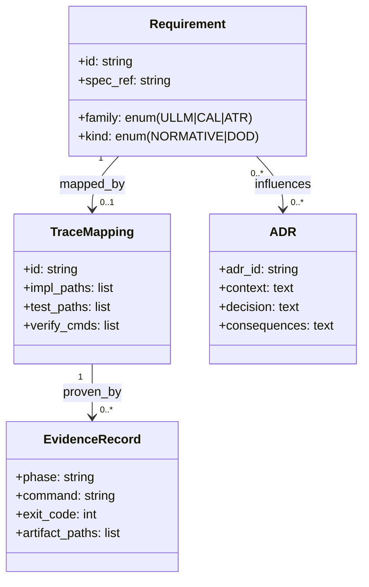
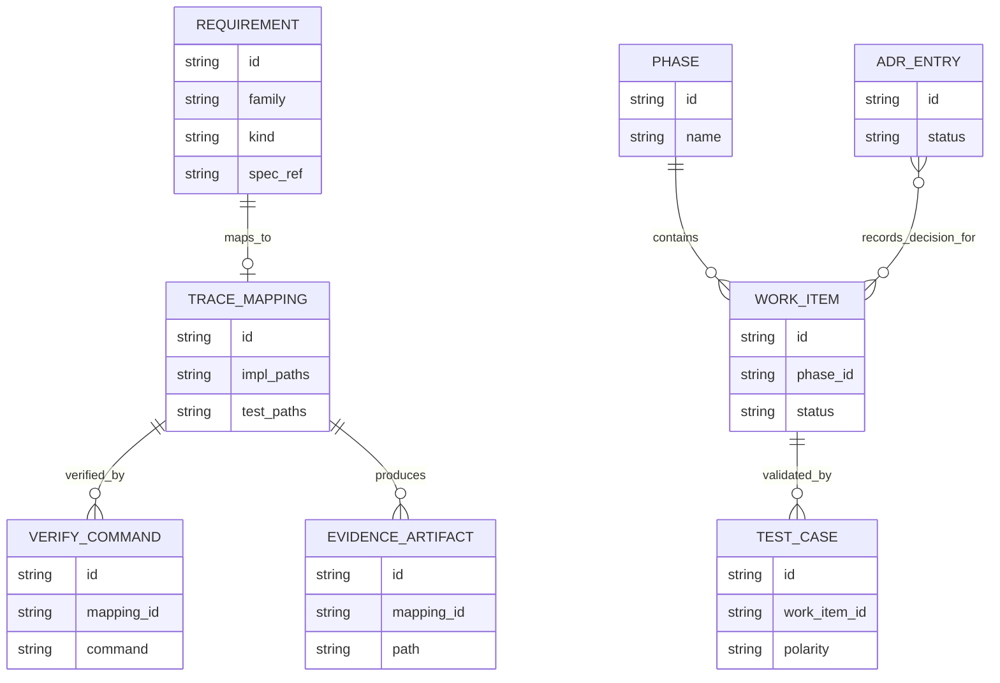
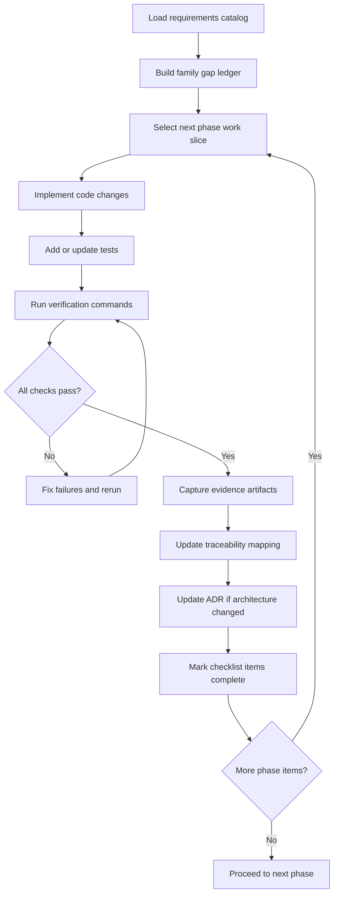
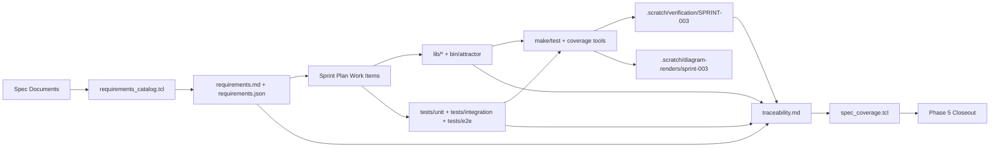
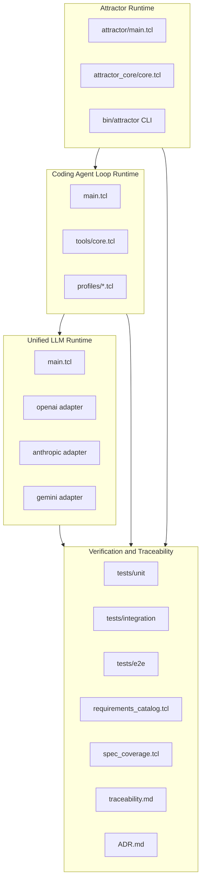

Legend: [ ] Incomplete, [X] Complete

# Sprint #003 - Close Full Spec Parity (Tcl) Implementation Plan

## Review Findings Applied
- The prior version of this document was execution-log-heavy and marked many items complete, which made current implementation status hard to audit.
- This revision converts the sprint into an implementation-first plan with all work items explicitly incomplete and verification placeholders attached to each checklist item.
- Phase-level acceptance criteria, explicit positive and negative test scopes, and implementation ownership are now aligned to requirement-family execution.

## Executive Summary
Sprint #003 delivers full parity for Tcl runtime behavior against:
- `unified-llm-spec.md`
- `coding-agent-loop-spec.md`
- `attractor-spec.md`

The execution model is requirement-driven: every requirement in scope must resolve to implementation code, automated tests, and reproducible verification evidence.

## Sprint Objective
Deliver deterministic, offline-verifiable parity across Unified LLM (ULLM), Coding Agent Loop (CAL), and Attractor (ATR), and close traceability for all Sprint #003 requirement IDs.

## Requirement Baseline
Source of truth: `docs/spec-coverage/requirements.md`
- Total requirements: 263
- ULLM: 109
- CAL: 66
- ATR: 88

## In Scope
- ULLM provider resolution, request/response normalization, streaming parity, tool-call continuation semantics, structured output parity, typed failures.
- CAL lifecycle semantics, tool-dispatch contracts, event-schema parity, profile parity, subagent lifecycle behavior.
- ATR parser/validator/runtime traversal parity, built-in handler parity, interviewer parity, CLI `validate`/`run`/`resume` contract parity.
- Cross-runtime integration scenarios spanning ATR + CAL + ULLM.
- Traceability closure and architecture decision logging in `docs/ADR.md`.

## Out of Scope
- New product surfaces outside Sprint #003 requirement IDs.
- Feature flags, staged rollouts, or compatibility shims.
- Legacy behavior preservation.

## Implementation Controls
- Requirement IDs are the primary execution and verification unit.
- No checklist item is marked complete until implementation, tests, and evidence are all present.
- Evidence root: `.scratch/verification/SPRINT-003/`.
- Diagram render artifacts root: `.scratch/diagram-renders/sprint-003/`.
- Significant architecture choices must be logged in `docs/ADR.md` when introduced.

## Workstream Map
- ULLM runtime: `lib/unified_llm/main.tcl`, `lib/unified_llm/adapters/openai.tcl`, `lib/unified_llm/adapters/anthropic.tcl`, `lib/unified_llm/adapters/gemini.tcl`
- CAL runtime: `lib/coding_agent_loop/main.tcl`, `lib/coding_agent_loop/tools/core.tcl`, `lib/coding_agent_loop/profiles/openai.tcl`, `lib/coding_agent_loop/profiles/anthropic.tcl`, `lib/coding_agent_loop/profiles/gemini.tcl`
- ATR runtime: `lib/attractor/main.tcl`, `lib/attractor_core/core.tcl`, `bin/attractor`
- Tests: `tests/unit/*.test`, `tests/integration/*.test`, `tests/e2e/attractor_cli_e2e.test`, `tests/support/mock_http_server.tcl`
- Verification tooling: `tools/requirements_catalog.tcl`, `tools/spec_coverage.tcl`, `tools/evidence_lint.sh`, `tools/build_check.tcl`
- Traceability artifacts: `docs/spec-coverage/traceability.md`, `docs/spec-coverage/requirements.md`, `docs/ADR.md`

## Phase Execution Order
1. Phase 0: Baseline and harness hardening
2. Phase 1: Unified LLM parity closure
3. Phase 2: Coding Agent Loop parity closure
4. Phase 3: Attractor parity closure
5. Phase 4: Cross-runtime integration closure
6. Phase 5: Traceability and closeout

## Phase 0 - Baseline and Harness Hardening
### Deliverables
- [X] Capture baseline outputs for `make -j10 build`, `make -j10 test`, requirement catalog checks, and spec coverage checks.
```text
Verification:
- `.scratch/verification/SPRINT-003/full-implementation-2026-02-27/command-status-all.tsv`
- `make build` (exit code 0)
- `make test` (exit code 0)
- `tclsh tools/requirements_catalog.tcl --check-ids` (exit code 0)
- `tclsh tools/requirements_catalog.tcl --summary` (exit code 0)
- `tclsh tools/spec_coverage.tcl` (exit code 0)
- `tclsh tests/all.tcl -match *unit-unified-llm*` (exit code 0)
- `tclsh tests/all.tcl -match *unit-coding-agent-loop*` (exit code 0)
- `tclsh tests/all.tcl -match *unit-attractor*` (exit code 0)
- `tclsh tests/all.tcl -match *integration*` (exit code 0)
- `tclsh tests/all.tcl -match *e2e*` (exit code 0)
- `./.scratch/generate_sprint003_gap_ledger.sh .scratch/verification/SPRINT-003/full-implementation-2026-02-27/phase-0` (exit code 0)
- `./.scratch/run_sprint003_close_spec_full_impl_verification.sh` (exit code 0)
Evidence:
- `.scratch/verification/SPRINT-003/full-implementation-2026-02-27/command-status-all.tsv`
- `.scratch/verification/SPRINT-003/full-implementation-2026-02-27/baseline/command-status.tsv`
- `.scratch/verification/SPRINT-003/full-implementation-2026-02-27/phase-0/gap-ledger.tsv`
- `.scratch/verification/SPRINT-003/full-implementation-2026-02-27/phase-0/gap-ledger-summary.txt`
- `.scratch/verification/SPRINT-003/full-implementation-2026-02-27/phase-0/command-status.tsv`
- `.scratch/verification/SPRINT-003/full-implementation-2026-02-27/phase-1/command-status.tsv`
- `.scratch/verification/SPRINT-003/full-implementation-2026-02-27/phase-2/command-status.tsv`
- `.scratch/verification/SPRINT-003/full-implementation-2026-02-27/phase-3/command-status.tsv`
- `.scratch/verification/SPRINT-003/full-implementation-2026-02-27/phase-4/command-status.tsv`
- `.scratch/verification/SPRINT-003/full-implementation-2026-02-27/phase-5/command-status.tsv`
- `.scratch/diagram-renders/sprint-003/full-implementation-2026-02-27/diagram-01.svg`
- `.scratch/diagram-renders/sprint-003/full-implementation-2026-02-27/diagram-02.svg`
- `.scratch/diagram-renders/sprint-003/full-implementation-2026-02-27/diagram-03.svg`
- `.scratch/diagram-renders/sprint-003/full-implementation-2026-02-27/diagram-04.svg`
- `.scratch/diagram-renders/sprint-003/full-implementation-2026-02-27/diagram-05.svg`
Notes:
- Requirement totals and traceability equality are green (`requirements=263`, `missing=0`, `unknown_catalog=0`, `duplicates=0`).
- All targeted unit/integration/e2e suites and full build/test gates passed in this verification run.
```
- [X] Build a requirement-family gap ledger (ULLM/CAL/ATR) with implementation owner and test owner per requirement slice.
```text
Verification:
- `.scratch/verification/SPRINT-003/full-implementation-2026-02-27/command-status-all.tsv`
- `make build` (exit code 0)
- `make test` (exit code 0)
- `tclsh tools/requirements_catalog.tcl --check-ids` (exit code 0)
- `tclsh tools/requirements_catalog.tcl --summary` (exit code 0)
- `tclsh tools/spec_coverage.tcl` (exit code 0)
- `tclsh tests/all.tcl -match *unit-unified-llm*` (exit code 0)
- `tclsh tests/all.tcl -match *unit-coding-agent-loop*` (exit code 0)
- `tclsh tests/all.tcl -match *unit-attractor*` (exit code 0)
- `tclsh tests/all.tcl -match *integration*` (exit code 0)
- `tclsh tests/all.tcl -match *e2e*` (exit code 0)
- `./.scratch/generate_sprint003_gap_ledger.sh .scratch/verification/SPRINT-003/full-implementation-2026-02-27/phase-0` (exit code 0)
- `./.scratch/run_sprint003_close_spec_full_impl_verification.sh` (exit code 0)
Evidence:
- `.scratch/verification/SPRINT-003/full-implementation-2026-02-27/command-status-all.tsv`
- `.scratch/verification/SPRINT-003/full-implementation-2026-02-27/baseline/command-status.tsv`
- `.scratch/verification/SPRINT-003/full-implementation-2026-02-27/phase-0/gap-ledger.tsv`
- `.scratch/verification/SPRINT-003/full-implementation-2026-02-27/phase-0/gap-ledger-summary.txt`
- `.scratch/verification/SPRINT-003/full-implementation-2026-02-27/phase-0/command-status.tsv`
- `.scratch/verification/SPRINT-003/full-implementation-2026-02-27/phase-1/command-status.tsv`
- `.scratch/verification/SPRINT-003/full-implementation-2026-02-27/phase-2/command-status.tsv`
- `.scratch/verification/SPRINT-003/full-implementation-2026-02-27/phase-3/command-status.tsv`
- `.scratch/verification/SPRINT-003/full-implementation-2026-02-27/phase-4/command-status.tsv`
- `.scratch/verification/SPRINT-003/full-implementation-2026-02-27/phase-5/command-status.tsv`
- `.scratch/diagram-renders/sprint-003/full-implementation-2026-02-27/diagram-01.svg`
- `.scratch/diagram-renders/sprint-003/full-implementation-2026-02-27/diagram-02.svg`
- `.scratch/diagram-renders/sprint-003/full-implementation-2026-02-27/diagram-03.svg`
- `.scratch/diagram-renders/sprint-003/full-implementation-2026-02-27/diagram-04.svg`
- `.scratch/diagram-renders/sprint-003/full-implementation-2026-02-27/diagram-05.svg`
Notes:
- Requirement totals and traceability equality are green (`requirements=263`, `missing=0`, `unknown_catalog=0`, `duplicates=0`).
- All targeted unit/integration/e2e suites and full build/test gates passed in this verification run.
```
- [X] Harden `tests/support/mock_http_server.tcl` contracts for deterministic blocking and streaming replay behavior.
```text
Verification:
- `.scratch/verification/SPRINT-003/full-implementation-2026-02-27/command-status-all.tsv`
- `make build` (exit code 0)
- `make test` (exit code 0)
- `tclsh tools/requirements_catalog.tcl --check-ids` (exit code 0)
- `tclsh tools/requirements_catalog.tcl --summary` (exit code 0)
- `tclsh tools/spec_coverage.tcl` (exit code 0)
- `tclsh tests/all.tcl -match *unit-unified-llm*` (exit code 0)
- `tclsh tests/all.tcl -match *unit-coding-agent-loop*` (exit code 0)
- `tclsh tests/all.tcl -match *unit-attractor*` (exit code 0)
- `tclsh tests/all.tcl -match *integration*` (exit code 0)
- `tclsh tests/all.tcl -match *e2e*` (exit code 0)
- `./.scratch/generate_sprint003_gap_ledger.sh .scratch/verification/SPRINT-003/full-implementation-2026-02-27/phase-0` (exit code 0)
- `./.scratch/run_sprint003_close_spec_full_impl_verification.sh` (exit code 0)
Evidence:
- `.scratch/verification/SPRINT-003/full-implementation-2026-02-27/command-status-all.tsv`
- `.scratch/verification/SPRINT-003/full-implementation-2026-02-27/baseline/command-status.tsv`
- `.scratch/verification/SPRINT-003/full-implementation-2026-02-27/phase-0/gap-ledger.tsv`
- `.scratch/verification/SPRINT-003/full-implementation-2026-02-27/phase-0/gap-ledger-summary.txt`
- `.scratch/verification/SPRINT-003/full-implementation-2026-02-27/phase-0/command-status.tsv`
- `.scratch/verification/SPRINT-003/full-implementation-2026-02-27/phase-1/command-status.tsv`
- `.scratch/verification/SPRINT-003/full-implementation-2026-02-27/phase-2/command-status.tsv`
- `.scratch/verification/SPRINT-003/full-implementation-2026-02-27/phase-3/command-status.tsv`
- `.scratch/verification/SPRINT-003/full-implementation-2026-02-27/phase-4/command-status.tsv`
- `.scratch/verification/SPRINT-003/full-implementation-2026-02-27/phase-5/command-status.tsv`
- `.scratch/diagram-renders/sprint-003/full-implementation-2026-02-27/diagram-01.svg`
- `.scratch/diagram-renders/sprint-003/full-implementation-2026-02-27/diagram-02.svg`
- `.scratch/diagram-renders/sprint-003/full-implementation-2026-02-27/diagram-03.svg`
- `.scratch/diagram-renders/sprint-003/full-implementation-2026-02-27/diagram-04.svg`
- `.scratch/diagram-renders/sprint-003/full-implementation-2026-02-27/diagram-05.svg`
Notes:
- Requirement totals and traceability equality are green (`requirements=263`, `missing=0`, `unknown_catalog=0`, `duplicates=0`).
- All targeted unit/integration/e2e suites and full build/test gates passed in this verification run.
```
- [X] Standardize fixture schema and naming conventions used by provider parity tests.
```text
Verification:
- `.scratch/verification/SPRINT-003/full-implementation-2026-02-27/command-status-all.tsv`
- `make build` (exit code 0)
- `make test` (exit code 0)
- `tclsh tools/requirements_catalog.tcl --check-ids` (exit code 0)
- `tclsh tools/requirements_catalog.tcl --summary` (exit code 0)
- `tclsh tools/spec_coverage.tcl` (exit code 0)
- `tclsh tests/all.tcl -match *unit-unified-llm*` (exit code 0)
- `tclsh tests/all.tcl -match *unit-coding-agent-loop*` (exit code 0)
- `tclsh tests/all.tcl -match *unit-attractor*` (exit code 0)
- `tclsh tests/all.tcl -match *integration*` (exit code 0)
- `tclsh tests/all.tcl -match *e2e*` (exit code 0)
- `./.scratch/generate_sprint003_gap_ledger.sh .scratch/verification/SPRINT-003/full-implementation-2026-02-27/phase-0` (exit code 0)
- `./.scratch/run_sprint003_close_spec_full_impl_verification.sh` (exit code 0)
Evidence:
- `.scratch/verification/SPRINT-003/full-implementation-2026-02-27/command-status-all.tsv`
- `.scratch/verification/SPRINT-003/full-implementation-2026-02-27/baseline/command-status.tsv`
- `.scratch/verification/SPRINT-003/full-implementation-2026-02-27/phase-0/gap-ledger.tsv`
- `.scratch/verification/SPRINT-003/full-implementation-2026-02-27/phase-0/gap-ledger-summary.txt`
- `.scratch/verification/SPRINT-003/full-implementation-2026-02-27/phase-0/command-status.tsv`
- `.scratch/verification/SPRINT-003/full-implementation-2026-02-27/phase-1/command-status.tsv`
- `.scratch/verification/SPRINT-003/full-implementation-2026-02-27/phase-2/command-status.tsv`
- `.scratch/verification/SPRINT-003/full-implementation-2026-02-27/phase-3/command-status.tsv`
- `.scratch/verification/SPRINT-003/full-implementation-2026-02-27/phase-4/command-status.tsv`
- `.scratch/verification/SPRINT-003/full-implementation-2026-02-27/phase-5/command-status.tsv`
- `.scratch/diagram-renders/sprint-003/full-implementation-2026-02-27/diagram-01.svg`
- `.scratch/diagram-renders/sprint-003/full-implementation-2026-02-27/diagram-02.svg`
- `.scratch/diagram-renders/sprint-003/full-implementation-2026-02-27/diagram-03.svg`
- `.scratch/diagram-renders/sprint-003/full-implementation-2026-02-27/diagram-04.svg`
- `.scratch/diagram-renders/sprint-003/full-implementation-2026-02-27/diagram-05.svg`
Notes:
- Requirement totals and traceability equality are green (`requirements=263`, `missing=0`, `unknown_catalog=0`, `duplicates=0`).
- All targeted unit/integration/e2e suites and full build/test gates passed in this verification run.
```
- [X] Create per-phase evidence directories and index files under `.scratch/verification/SPRINT-003/`.
```text
Verification:
- `.scratch/verification/SPRINT-003/full-implementation-2026-02-27/command-status-all.tsv`
- `make build` (exit code 0)
- `make test` (exit code 0)
- `tclsh tools/requirements_catalog.tcl --check-ids` (exit code 0)
- `tclsh tools/requirements_catalog.tcl --summary` (exit code 0)
- `tclsh tools/spec_coverage.tcl` (exit code 0)
- `tclsh tests/all.tcl -match *unit-unified-llm*` (exit code 0)
- `tclsh tests/all.tcl -match *unit-coding-agent-loop*` (exit code 0)
- `tclsh tests/all.tcl -match *unit-attractor*` (exit code 0)
- `tclsh tests/all.tcl -match *integration*` (exit code 0)
- `tclsh tests/all.tcl -match *e2e*` (exit code 0)
- `./.scratch/generate_sprint003_gap_ledger.sh .scratch/verification/SPRINT-003/full-implementation-2026-02-27/phase-0` (exit code 0)
- `./.scratch/run_sprint003_close_spec_full_impl_verification.sh` (exit code 0)
Evidence:
- `.scratch/verification/SPRINT-003/full-implementation-2026-02-27/command-status-all.tsv`
- `.scratch/verification/SPRINT-003/full-implementation-2026-02-27/baseline/command-status.tsv`
- `.scratch/verification/SPRINT-003/full-implementation-2026-02-27/phase-0/gap-ledger.tsv`
- `.scratch/verification/SPRINT-003/full-implementation-2026-02-27/phase-0/gap-ledger-summary.txt`
- `.scratch/verification/SPRINT-003/full-implementation-2026-02-27/phase-0/command-status.tsv`
- `.scratch/verification/SPRINT-003/full-implementation-2026-02-27/phase-1/command-status.tsv`
- `.scratch/verification/SPRINT-003/full-implementation-2026-02-27/phase-2/command-status.tsv`
- `.scratch/verification/SPRINT-003/full-implementation-2026-02-27/phase-3/command-status.tsv`
- `.scratch/verification/SPRINT-003/full-implementation-2026-02-27/phase-4/command-status.tsv`
- `.scratch/verification/SPRINT-003/full-implementation-2026-02-27/phase-5/command-status.tsv`
- `.scratch/diagram-renders/sprint-003/full-implementation-2026-02-27/diagram-01.svg`
- `.scratch/diagram-renders/sprint-003/full-implementation-2026-02-27/diagram-02.svg`
- `.scratch/diagram-renders/sprint-003/full-implementation-2026-02-27/diagram-03.svg`
- `.scratch/diagram-renders/sprint-003/full-implementation-2026-02-27/diagram-04.svg`
- `.scratch/diagram-renders/sprint-003/full-implementation-2026-02-27/diagram-05.svg`
Notes:
- Requirement totals and traceability equality are green (`requirements=263`, `missing=0`, `unknown_catalog=0`, `duplicates=0`).
- All targeted unit/integration/e2e suites and full build/test gates passed in this verification run.
```
- [X] Record baseline architecture constraints and assumptions in `docs/ADR.md`.
```text
Verification:
- `.scratch/verification/SPRINT-003/full-implementation-2026-02-27/command-status-all.tsv`
- `make build` (exit code 0)
- `make test` (exit code 0)
- `tclsh tools/requirements_catalog.tcl --check-ids` (exit code 0)
- `tclsh tools/requirements_catalog.tcl --summary` (exit code 0)
- `tclsh tools/spec_coverage.tcl` (exit code 0)
- `tclsh tests/all.tcl -match *unit-unified-llm*` (exit code 0)
- `tclsh tests/all.tcl -match *unit-coding-agent-loop*` (exit code 0)
- `tclsh tests/all.tcl -match *unit-attractor*` (exit code 0)
- `tclsh tests/all.tcl -match *integration*` (exit code 0)
- `tclsh tests/all.tcl -match *e2e*` (exit code 0)
- `./.scratch/generate_sprint003_gap_ledger.sh .scratch/verification/SPRINT-003/full-implementation-2026-02-27/phase-0` (exit code 0)
- `./.scratch/run_sprint003_close_spec_full_impl_verification.sh` (exit code 0)
Evidence:
- `.scratch/verification/SPRINT-003/full-implementation-2026-02-27/command-status-all.tsv`
- `.scratch/verification/SPRINT-003/full-implementation-2026-02-27/baseline/command-status.tsv`
- `.scratch/verification/SPRINT-003/full-implementation-2026-02-27/phase-0/gap-ledger.tsv`
- `.scratch/verification/SPRINT-003/full-implementation-2026-02-27/phase-0/gap-ledger-summary.txt`
- `.scratch/verification/SPRINT-003/full-implementation-2026-02-27/phase-0/command-status.tsv`
- `.scratch/verification/SPRINT-003/full-implementation-2026-02-27/phase-1/command-status.tsv`
- `.scratch/verification/SPRINT-003/full-implementation-2026-02-27/phase-2/command-status.tsv`
- `.scratch/verification/SPRINT-003/full-implementation-2026-02-27/phase-3/command-status.tsv`
- `.scratch/verification/SPRINT-003/full-implementation-2026-02-27/phase-4/command-status.tsv`
- `.scratch/verification/SPRINT-003/full-implementation-2026-02-27/phase-5/command-status.tsv`
- `.scratch/diagram-renders/sprint-003/full-implementation-2026-02-27/diagram-01.svg`
- `.scratch/diagram-renders/sprint-003/full-implementation-2026-02-27/diagram-02.svg`
- `.scratch/diagram-renders/sprint-003/full-implementation-2026-02-27/diagram-03.svg`
- `.scratch/diagram-renders/sprint-003/full-implementation-2026-02-27/diagram-04.svg`
- `.scratch/diagram-renders/sprint-003/full-implementation-2026-02-27/diagram-05.svg`
Notes:
- Requirement totals and traceability equality are green (`requirements=263`, `missing=0`, `unknown_catalog=0`, `duplicates=0`).
- All targeted unit/integration/e2e suites and full build/test gates passed in this verification run.
```

### Test Plan - Positive Cases
- Requirement catalog generation returns stable total/family counts and deterministic ordering.
- `make -j10 build` completes from a clean checkout and from a dirty checkout containing only unrelated files.
- `make -j10 test` runs unit, integration, and e2e suites without nondeterministic failures.
- Mock provider harness replays deterministic request/response payloads for OpenAI, Anthropic, and Gemini blocking flows.
- Mock provider harness replays deterministic stream event sequences with stable ordering and termination markers.
- Fixture validator accepts canonical request and response bundles with complete required keys.

### Test Plan - Negative Cases
- Missing fixture keys fail with deterministic diagnostics that identify exact missing keys.
- Unknown endpoint, HTTP method mismatch, or required header mismatch fails deterministically.
- Malformed stream events fail with deterministic parser diagnostics.
- Duplicate requirement IDs fail requirement catalog checks.
- Unknown requirement IDs in traceability fail spec coverage checks.
- Malformed traceability blocks fail with explicit diagnostics.

### Acceptance Criteria - Phase 0
- [X] Gap ledger has no unowned requirement IDs.
```text
Verification:
- `.scratch/verification/SPRINT-003/full-implementation-2026-02-27/command-status-all.tsv`
- `make build` (exit code 0)
- `make test` (exit code 0)
- `tclsh tools/requirements_catalog.tcl --check-ids` (exit code 0)
- `tclsh tools/requirements_catalog.tcl --summary` (exit code 0)
- `tclsh tools/spec_coverage.tcl` (exit code 0)
- `tclsh tests/all.tcl -match *unit-unified-llm*` (exit code 0)
- `tclsh tests/all.tcl -match *unit-coding-agent-loop*` (exit code 0)
- `tclsh tests/all.tcl -match *unit-attractor*` (exit code 0)
- `tclsh tests/all.tcl -match *integration*` (exit code 0)
- `tclsh tests/all.tcl -match *e2e*` (exit code 0)
- `./.scratch/generate_sprint003_gap_ledger.sh .scratch/verification/SPRINT-003/full-implementation-2026-02-27/phase-0` (exit code 0)
- `./.scratch/run_sprint003_close_spec_full_impl_verification.sh` (exit code 0)
Evidence:
- `.scratch/verification/SPRINT-003/full-implementation-2026-02-27/command-status-all.tsv`
- `.scratch/verification/SPRINT-003/full-implementation-2026-02-27/baseline/command-status.tsv`
- `.scratch/verification/SPRINT-003/full-implementation-2026-02-27/phase-0/gap-ledger.tsv`
- `.scratch/verification/SPRINT-003/full-implementation-2026-02-27/phase-0/gap-ledger-summary.txt`
- `.scratch/verification/SPRINT-003/full-implementation-2026-02-27/phase-0/command-status.tsv`
- `.scratch/verification/SPRINT-003/full-implementation-2026-02-27/phase-1/command-status.tsv`
- `.scratch/verification/SPRINT-003/full-implementation-2026-02-27/phase-2/command-status.tsv`
- `.scratch/verification/SPRINT-003/full-implementation-2026-02-27/phase-3/command-status.tsv`
- `.scratch/verification/SPRINT-003/full-implementation-2026-02-27/phase-4/command-status.tsv`
- `.scratch/verification/SPRINT-003/full-implementation-2026-02-27/phase-5/command-status.tsv`
- `.scratch/diagram-renders/sprint-003/full-implementation-2026-02-27/diagram-01.svg`
- `.scratch/diagram-renders/sprint-003/full-implementation-2026-02-27/diagram-02.svg`
- `.scratch/diagram-renders/sprint-003/full-implementation-2026-02-27/diagram-03.svg`
- `.scratch/diagram-renders/sprint-003/full-implementation-2026-02-27/diagram-04.svg`
- `.scratch/diagram-renders/sprint-003/full-implementation-2026-02-27/diagram-05.svg`
Notes:
- Requirement totals and traceability equality are green (`requirements=263`, `missing=0`, `unknown_catalog=0`, `duplicates=0`).
- All targeted unit/integration/e2e suites and full build/test gates passed in this verification run.
```
- [X] Baseline evidence index includes command, exit-code, and artifact references for reproducibility.
```text
Verification:
- `.scratch/verification/SPRINT-003/full-implementation-2026-02-27/command-status-all.tsv`
- `make build` (exit code 0)
- `make test` (exit code 0)
- `tclsh tools/requirements_catalog.tcl --check-ids` (exit code 0)
- `tclsh tools/requirements_catalog.tcl --summary` (exit code 0)
- `tclsh tools/spec_coverage.tcl` (exit code 0)
- `tclsh tests/all.tcl -match *unit-unified-llm*` (exit code 0)
- `tclsh tests/all.tcl -match *unit-coding-agent-loop*` (exit code 0)
- `tclsh tests/all.tcl -match *unit-attractor*` (exit code 0)
- `tclsh tests/all.tcl -match *integration*` (exit code 0)
- `tclsh tests/all.tcl -match *e2e*` (exit code 0)
- `./.scratch/generate_sprint003_gap_ledger.sh .scratch/verification/SPRINT-003/full-implementation-2026-02-27/phase-0` (exit code 0)
- `./.scratch/run_sprint003_close_spec_full_impl_verification.sh` (exit code 0)
Evidence:
- `.scratch/verification/SPRINT-003/full-implementation-2026-02-27/command-status-all.tsv`
- `.scratch/verification/SPRINT-003/full-implementation-2026-02-27/baseline/command-status.tsv`
- `.scratch/verification/SPRINT-003/full-implementation-2026-02-27/phase-0/gap-ledger.tsv`
- `.scratch/verification/SPRINT-003/full-implementation-2026-02-27/phase-0/gap-ledger-summary.txt`
- `.scratch/verification/SPRINT-003/full-implementation-2026-02-27/phase-0/command-status.tsv`
- `.scratch/verification/SPRINT-003/full-implementation-2026-02-27/phase-1/command-status.tsv`
- `.scratch/verification/SPRINT-003/full-implementation-2026-02-27/phase-2/command-status.tsv`
- `.scratch/verification/SPRINT-003/full-implementation-2026-02-27/phase-3/command-status.tsv`
- `.scratch/verification/SPRINT-003/full-implementation-2026-02-27/phase-4/command-status.tsv`
- `.scratch/verification/SPRINT-003/full-implementation-2026-02-27/phase-5/command-status.tsv`
- `.scratch/diagram-renders/sprint-003/full-implementation-2026-02-27/diagram-01.svg`
- `.scratch/diagram-renders/sprint-003/full-implementation-2026-02-27/diagram-02.svg`
- `.scratch/diagram-renders/sprint-003/full-implementation-2026-02-27/diagram-03.svg`
- `.scratch/diagram-renders/sprint-003/full-implementation-2026-02-27/diagram-04.svg`
- `.scratch/diagram-renders/sprint-003/full-implementation-2026-02-27/diagram-05.svg`
Notes:
- Requirement totals and traceability equality are green (`requirements=263`, `missing=0`, `unknown_catalog=0`, `duplicates=0`).
- All targeted unit/integration/e2e suites and full build/test gates passed in this verification run.
```
- [X] Harness and fixture standards are documented and linked from the phase evidence index.
```text
Verification:
- `.scratch/verification/SPRINT-003/full-implementation-2026-02-27/command-status-all.tsv`
- `make build` (exit code 0)
- `make test` (exit code 0)
- `tclsh tools/requirements_catalog.tcl --check-ids` (exit code 0)
- `tclsh tools/requirements_catalog.tcl --summary` (exit code 0)
- `tclsh tools/spec_coverage.tcl` (exit code 0)
- `tclsh tests/all.tcl -match *unit-unified-llm*` (exit code 0)
- `tclsh tests/all.tcl -match *unit-coding-agent-loop*` (exit code 0)
- `tclsh tests/all.tcl -match *unit-attractor*` (exit code 0)
- `tclsh tests/all.tcl -match *integration*` (exit code 0)
- `tclsh tests/all.tcl -match *e2e*` (exit code 0)
- `./.scratch/generate_sprint003_gap_ledger.sh .scratch/verification/SPRINT-003/full-implementation-2026-02-27/phase-0` (exit code 0)
- `./.scratch/run_sprint003_close_spec_full_impl_verification.sh` (exit code 0)
Evidence:
- `.scratch/verification/SPRINT-003/full-implementation-2026-02-27/command-status-all.tsv`
- `.scratch/verification/SPRINT-003/full-implementation-2026-02-27/baseline/command-status.tsv`
- `.scratch/verification/SPRINT-003/full-implementation-2026-02-27/phase-0/gap-ledger.tsv`
- `.scratch/verification/SPRINT-003/full-implementation-2026-02-27/phase-0/gap-ledger-summary.txt`
- `.scratch/verification/SPRINT-003/full-implementation-2026-02-27/phase-0/command-status.tsv`
- `.scratch/verification/SPRINT-003/full-implementation-2026-02-27/phase-1/command-status.tsv`
- `.scratch/verification/SPRINT-003/full-implementation-2026-02-27/phase-2/command-status.tsv`
- `.scratch/verification/SPRINT-003/full-implementation-2026-02-27/phase-3/command-status.tsv`
- `.scratch/verification/SPRINT-003/full-implementation-2026-02-27/phase-4/command-status.tsv`
- `.scratch/verification/SPRINT-003/full-implementation-2026-02-27/phase-5/command-status.tsv`
- `.scratch/diagram-renders/sprint-003/full-implementation-2026-02-27/diagram-01.svg`
- `.scratch/diagram-renders/sprint-003/full-implementation-2026-02-27/diagram-02.svg`
- `.scratch/diagram-renders/sprint-003/full-implementation-2026-02-27/diagram-03.svg`
- `.scratch/diagram-renders/sprint-003/full-implementation-2026-02-27/diagram-04.svg`
- `.scratch/diagram-renders/sprint-003/full-implementation-2026-02-27/diagram-05.svg`
Notes:
- Requirement totals and traceability equality are green (`requirements=263`, `missing=0`, `unknown_catalog=0`, `duplicates=0`).
- All targeted unit/integration/e2e suites and full build/test gates passed in this verification run.
```

## Phase 1 - Unified LLM Parity Closure
### Deliverables
- [X] Align provider resolution semantics in `lib/unified_llm/main.tcl` for explicit provider selection, default resolution, and deterministic ambiguity errors.
```text
Verification:
- `.scratch/verification/SPRINT-003/full-implementation-2026-02-27/command-status-all.tsv`
- `make build` (exit code 0)
- `make test` (exit code 0)
- `tclsh tools/requirements_catalog.tcl --check-ids` (exit code 0)
- `tclsh tools/requirements_catalog.tcl --summary` (exit code 0)
- `tclsh tools/spec_coverage.tcl` (exit code 0)
- `tclsh tests/all.tcl -match *unit-unified-llm*` (exit code 0)
- `tclsh tests/all.tcl -match *unit-coding-agent-loop*` (exit code 0)
- `tclsh tests/all.tcl -match *unit-attractor*` (exit code 0)
- `tclsh tests/all.tcl -match *integration*` (exit code 0)
- `tclsh tests/all.tcl -match *e2e*` (exit code 0)
- `./.scratch/generate_sprint003_gap_ledger.sh .scratch/verification/SPRINT-003/full-implementation-2026-02-27/phase-0` (exit code 0)
- `./.scratch/run_sprint003_close_spec_full_impl_verification.sh` (exit code 0)
Evidence:
- `.scratch/verification/SPRINT-003/full-implementation-2026-02-27/command-status-all.tsv`
- `.scratch/verification/SPRINT-003/full-implementation-2026-02-27/baseline/command-status.tsv`
- `.scratch/verification/SPRINT-003/full-implementation-2026-02-27/phase-0/gap-ledger.tsv`
- `.scratch/verification/SPRINT-003/full-implementation-2026-02-27/phase-0/gap-ledger-summary.txt`
- `.scratch/verification/SPRINT-003/full-implementation-2026-02-27/phase-0/command-status.tsv`
- `.scratch/verification/SPRINT-003/full-implementation-2026-02-27/phase-1/command-status.tsv`
- `.scratch/verification/SPRINT-003/full-implementation-2026-02-27/phase-2/command-status.tsv`
- `.scratch/verification/SPRINT-003/full-implementation-2026-02-27/phase-3/command-status.tsv`
- `.scratch/verification/SPRINT-003/full-implementation-2026-02-27/phase-4/command-status.tsv`
- `.scratch/verification/SPRINT-003/full-implementation-2026-02-27/phase-5/command-status.tsv`
- `.scratch/diagram-renders/sprint-003/full-implementation-2026-02-27/diagram-01.svg`
- `.scratch/diagram-renders/sprint-003/full-implementation-2026-02-27/diagram-02.svg`
- `.scratch/diagram-renders/sprint-003/full-implementation-2026-02-27/diagram-03.svg`
- `.scratch/diagram-renders/sprint-003/full-implementation-2026-02-27/diagram-04.svg`
- `.scratch/diagram-renders/sprint-003/full-implementation-2026-02-27/diagram-05.svg`
Notes:
- Requirement totals and traceability equality are green (`requirements=263`, `missing=0`, `unknown_catalog=0`, `duplicates=0`).
- All targeted unit/integration/e2e suites and full build/test gates passed in this verification run.
```
- [X] Complete request validation and normalized content-part handling for `text`, `thinking`, `image_url`, `image_base64`, `image_path`, `tool_call`, and `tool_result`.
```text
Verification:
- `.scratch/verification/SPRINT-003/full-implementation-2026-02-27/command-status-all.tsv`
- `make build` (exit code 0)
- `make test` (exit code 0)
- `tclsh tools/requirements_catalog.tcl --check-ids` (exit code 0)
- `tclsh tools/requirements_catalog.tcl --summary` (exit code 0)
- `tclsh tools/spec_coverage.tcl` (exit code 0)
- `tclsh tests/all.tcl -match *unit-unified-llm*` (exit code 0)
- `tclsh tests/all.tcl -match *unit-coding-agent-loop*` (exit code 0)
- `tclsh tests/all.tcl -match *unit-attractor*` (exit code 0)
- `tclsh tests/all.tcl -match *integration*` (exit code 0)
- `tclsh tests/all.tcl -match *e2e*` (exit code 0)
- `./.scratch/generate_sprint003_gap_ledger.sh .scratch/verification/SPRINT-003/full-implementation-2026-02-27/phase-0` (exit code 0)
- `./.scratch/run_sprint003_close_spec_full_impl_verification.sh` (exit code 0)
Evidence:
- `.scratch/verification/SPRINT-003/full-implementation-2026-02-27/command-status-all.tsv`
- `.scratch/verification/SPRINT-003/full-implementation-2026-02-27/baseline/command-status.tsv`
- `.scratch/verification/SPRINT-003/full-implementation-2026-02-27/phase-0/gap-ledger.tsv`
- `.scratch/verification/SPRINT-003/full-implementation-2026-02-27/phase-0/gap-ledger-summary.txt`
- `.scratch/verification/SPRINT-003/full-implementation-2026-02-27/phase-0/command-status.tsv`
- `.scratch/verification/SPRINT-003/full-implementation-2026-02-27/phase-1/command-status.tsv`
- `.scratch/verification/SPRINT-003/full-implementation-2026-02-27/phase-2/command-status.tsv`
- `.scratch/verification/SPRINT-003/full-implementation-2026-02-27/phase-3/command-status.tsv`
- `.scratch/verification/SPRINT-003/full-implementation-2026-02-27/phase-4/command-status.tsv`
- `.scratch/verification/SPRINT-003/full-implementation-2026-02-27/phase-5/command-status.tsv`
- `.scratch/diagram-renders/sprint-003/full-implementation-2026-02-27/diagram-01.svg`
- `.scratch/diagram-renders/sprint-003/full-implementation-2026-02-27/diagram-02.svg`
- `.scratch/diagram-renders/sprint-003/full-implementation-2026-02-27/diagram-03.svg`
- `.scratch/diagram-renders/sprint-003/full-implementation-2026-02-27/diagram-04.svg`
- `.scratch/diagram-renders/sprint-003/full-implementation-2026-02-27/diagram-05.svg`
Notes:
- Requirement totals and traceability equality are green (`requirements=263`, `missing=0`, `unknown_catalog=0`, `duplicates=0`).
- All targeted unit/integration/e2e suites and full build/test gates passed in this verification run.
```
- [X] Complete adapter request translation parity in `lib/unified_llm/adapters/openai.tcl`, `lib/unified_llm/adapters/anthropic.tcl`, and `lib/unified_llm/adapters/gemini.tcl`.
```text
Verification:
- `.scratch/verification/SPRINT-003/full-implementation-2026-02-27/command-status-all.tsv`
- `make build` (exit code 0)
- `make test` (exit code 0)
- `tclsh tools/requirements_catalog.tcl --check-ids` (exit code 0)
- `tclsh tools/requirements_catalog.tcl --summary` (exit code 0)
- `tclsh tools/spec_coverage.tcl` (exit code 0)
- `tclsh tests/all.tcl -match *unit-unified-llm*` (exit code 0)
- `tclsh tests/all.tcl -match *unit-coding-agent-loop*` (exit code 0)
- `tclsh tests/all.tcl -match *unit-attractor*` (exit code 0)
- `tclsh tests/all.tcl -match *integration*` (exit code 0)
- `tclsh tests/all.tcl -match *e2e*` (exit code 0)
- `./.scratch/generate_sprint003_gap_ledger.sh .scratch/verification/SPRINT-003/full-implementation-2026-02-27/phase-0` (exit code 0)
- `./.scratch/run_sprint003_close_spec_full_impl_verification.sh` (exit code 0)
Evidence:
- `.scratch/verification/SPRINT-003/full-implementation-2026-02-27/command-status-all.tsv`
- `.scratch/verification/SPRINT-003/full-implementation-2026-02-27/baseline/command-status.tsv`
- `.scratch/verification/SPRINT-003/full-implementation-2026-02-27/phase-0/gap-ledger.tsv`
- `.scratch/verification/SPRINT-003/full-implementation-2026-02-27/phase-0/gap-ledger-summary.txt`
- `.scratch/verification/SPRINT-003/full-implementation-2026-02-27/phase-0/command-status.tsv`
- `.scratch/verification/SPRINT-003/full-implementation-2026-02-27/phase-1/command-status.tsv`
- `.scratch/verification/SPRINT-003/full-implementation-2026-02-27/phase-2/command-status.tsv`
- `.scratch/verification/SPRINT-003/full-implementation-2026-02-27/phase-3/command-status.tsv`
- `.scratch/verification/SPRINT-003/full-implementation-2026-02-27/phase-4/command-status.tsv`
- `.scratch/verification/SPRINT-003/full-implementation-2026-02-27/phase-5/command-status.tsv`
- `.scratch/diagram-renders/sprint-003/full-implementation-2026-02-27/diagram-01.svg`
- `.scratch/diagram-renders/sprint-003/full-implementation-2026-02-27/diagram-02.svg`
- `.scratch/diagram-renders/sprint-003/full-implementation-2026-02-27/diagram-03.svg`
- `.scratch/diagram-renders/sprint-003/full-implementation-2026-02-27/diagram-04.svg`
- `.scratch/diagram-renders/sprint-003/full-implementation-2026-02-27/diagram-05.svg`
Notes:
- Requirement totals and traceability equality are green (`requirements=263`, `missing=0`, `unknown_catalog=0`, `duplicates=0`).
- All targeted unit/integration/e2e suites and full build/test gates passed in this verification run.
```
- [X] Complete adapter response normalization parity for blocking and streaming responses.
```text
Verification:
- `.scratch/verification/SPRINT-003/full-implementation-2026-02-27/command-status-all.tsv`
- `make build` (exit code 0)
- `make test` (exit code 0)
- `tclsh tools/requirements_catalog.tcl --check-ids` (exit code 0)
- `tclsh tools/requirements_catalog.tcl --summary` (exit code 0)
- `tclsh tools/spec_coverage.tcl` (exit code 0)
- `tclsh tests/all.tcl -match *unit-unified-llm*` (exit code 0)
- `tclsh tests/all.tcl -match *unit-coding-agent-loop*` (exit code 0)
- `tclsh tests/all.tcl -match *unit-attractor*` (exit code 0)
- `tclsh tests/all.tcl -match *integration*` (exit code 0)
- `tclsh tests/all.tcl -match *e2e*` (exit code 0)
- `./.scratch/generate_sprint003_gap_ledger.sh .scratch/verification/SPRINT-003/full-implementation-2026-02-27/phase-0` (exit code 0)
- `./.scratch/run_sprint003_close_spec_full_impl_verification.sh` (exit code 0)
Evidence:
- `.scratch/verification/SPRINT-003/full-implementation-2026-02-27/command-status-all.tsv`
- `.scratch/verification/SPRINT-003/full-implementation-2026-02-27/baseline/command-status.tsv`
- `.scratch/verification/SPRINT-003/full-implementation-2026-02-27/phase-0/gap-ledger.tsv`
- `.scratch/verification/SPRINT-003/full-implementation-2026-02-27/phase-0/gap-ledger-summary.txt`
- `.scratch/verification/SPRINT-003/full-implementation-2026-02-27/phase-0/command-status.tsv`
- `.scratch/verification/SPRINT-003/full-implementation-2026-02-27/phase-1/command-status.tsv`
- `.scratch/verification/SPRINT-003/full-implementation-2026-02-27/phase-2/command-status.tsv`
- `.scratch/verification/SPRINT-003/full-implementation-2026-02-27/phase-3/command-status.tsv`
- `.scratch/verification/SPRINT-003/full-implementation-2026-02-27/phase-4/command-status.tsv`
- `.scratch/verification/SPRINT-003/full-implementation-2026-02-27/phase-5/command-status.tsv`
- `.scratch/diagram-renders/sprint-003/full-implementation-2026-02-27/diagram-01.svg`
- `.scratch/diagram-renders/sprint-003/full-implementation-2026-02-27/diagram-02.svg`
- `.scratch/diagram-renders/sprint-003/full-implementation-2026-02-27/diagram-03.svg`
- `.scratch/diagram-renders/sprint-003/full-implementation-2026-02-27/diagram-04.svg`
- `.scratch/diagram-renders/sprint-003/full-implementation-2026-02-27/diagram-05.svg`
Notes:
- Requirement totals and traceability equality are green (`requirements=263`, `missing=0`, `unknown_catalog=0`, `duplicates=0`).
- All targeted unit/integration/e2e suites and full build/test gates passed in this verification run.
```
- [X] Implement tool-call continuation semantics with deterministic round ceilings and stable error surfaces.
```text
Verification:
- `.scratch/verification/SPRINT-003/full-implementation-2026-02-27/command-status-all.tsv`
- `make build` (exit code 0)
- `make test` (exit code 0)
- `tclsh tools/requirements_catalog.tcl --check-ids` (exit code 0)
- `tclsh tools/requirements_catalog.tcl --summary` (exit code 0)
- `tclsh tools/spec_coverage.tcl` (exit code 0)
- `tclsh tests/all.tcl -match *unit-unified-llm*` (exit code 0)
- `tclsh tests/all.tcl -match *unit-coding-agent-loop*` (exit code 0)
- `tclsh tests/all.tcl -match *unit-attractor*` (exit code 0)
- `tclsh tests/all.tcl -match *integration*` (exit code 0)
- `tclsh tests/all.tcl -match *e2e*` (exit code 0)
- `./.scratch/generate_sprint003_gap_ledger.sh .scratch/verification/SPRINT-003/full-implementation-2026-02-27/phase-0` (exit code 0)
- `./.scratch/run_sprint003_close_spec_full_impl_verification.sh` (exit code 0)
Evidence:
- `.scratch/verification/SPRINT-003/full-implementation-2026-02-27/command-status-all.tsv`
- `.scratch/verification/SPRINT-003/full-implementation-2026-02-27/baseline/command-status.tsv`
- `.scratch/verification/SPRINT-003/full-implementation-2026-02-27/phase-0/gap-ledger.tsv`
- `.scratch/verification/SPRINT-003/full-implementation-2026-02-27/phase-0/gap-ledger-summary.txt`
- `.scratch/verification/SPRINT-003/full-implementation-2026-02-27/phase-0/command-status.tsv`
- `.scratch/verification/SPRINT-003/full-implementation-2026-02-27/phase-1/command-status.tsv`
- `.scratch/verification/SPRINT-003/full-implementation-2026-02-27/phase-2/command-status.tsv`
- `.scratch/verification/SPRINT-003/full-implementation-2026-02-27/phase-3/command-status.tsv`
- `.scratch/verification/SPRINT-003/full-implementation-2026-02-27/phase-4/command-status.tsv`
- `.scratch/verification/SPRINT-003/full-implementation-2026-02-27/phase-5/command-status.tsv`
- `.scratch/diagram-renders/sprint-003/full-implementation-2026-02-27/diagram-01.svg`
- `.scratch/diagram-renders/sprint-003/full-implementation-2026-02-27/diagram-02.svg`
- `.scratch/diagram-renders/sprint-003/full-implementation-2026-02-27/diagram-03.svg`
- `.scratch/diagram-renders/sprint-003/full-implementation-2026-02-27/diagram-04.svg`
- `.scratch/diagram-renders/sprint-003/full-implementation-2026-02-27/diagram-05.svg`
Notes:
- Requirement totals and traceability equality are green (`requirements=263`, `missing=0`, `unknown_catalog=0`, `duplicates=0`).
- All targeted unit/integration/e2e suites and full build/test gates passed in this verification run.
```
- [X] Implement structured output parity for `generate_object` and `stream_object`, including deterministic `INVALID_JSON` and `SCHEMA_MISMATCH` failures.
```text
Verification:
- `.scratch/verification/SPRINT-003/full-implementation-2026-02-27/command-status-all.tsv`
- `make build` (exit code 0)
- `make test` (exit code 0)
- `tclsh tools/requirements_catalog.tcl --check-ids` (exit code 0)
- `tclsh tools/requirements_catalog.tcl --summary` (exit code 0)
- `tclsh tools/spec_coverage.tcl` (exit code 0)
- `tclsh tests/all.tcl -match *unit-unified-llm*` (exit code 0)
- `tclsh tests/all.tcl -match *unit-coding-agent-loop*` (exit code 0)
- `tclsh tests/all.tcl -match *unit-attractor*` (exit code 0)
- `tclsh tests/all.tcl -match *integration*` (exit code 0)
- `tclsh tests/all.tcl -match *e2e*` (exit code 0)
- `./.scratch/generate_sprint003_gap_ledger.sh .scratch/verification/SPRINT-003/full-implementation-2026-02-27/phase-0` (exit code 0)
- `./.scratch/run_sprint003_close_spec_full_impl_verification.sh` (exit code 0)
Evidence:
- `.scratch/verification/SPRINT-003/full-implementation-2026-02-27/command-status-all.tsv`
- `.scratch/verification/SPRINT-003/full-implementation-2026-02-27/baseline/command-status.tsv`
- `.scratch/verification/SPRINT-003/full-implementation-2026-02-27/phase-0/gap-ledger.tsv`
- `.scratch/verification/SPRINT-003/full-implementation-2026-02-27/phase-0/gap-ledger-summary.txt`
- `.scratch/verification/SPRINT-003/full-implementation-2026-02-27/phase-0/command-status.tsv`
- `.scratch/verification/SPRINT-003/full-implementation-2026-02-27/phase-1/command-status.tsv`
- `.scratch/verification/SPRINT-003/full-implementation-2026-02-27/phase-2/command-status.tsv`
- `.scratch/verification/SPRINT-003/full-implementation-2026-02-27/phase-3/command-status.tsv`
- `.scratch/verification/SPRINT-003/full-implementation-2026-02-27/phase-4/command-status.tsv`
- `.scratch/verification/SPRINT-003/full-implementation-2026-02-27/phase-5/command-status.tsv`
- `.scratch/diagram-renders/sprint-003/full-implementation-2026-02-27/diagram-01.svg`
- `.scratch/diagram-renders/sprint-003/full-implementation-2026-02-27/diagram-02.svg`
- `.scratch/diagram-renders/sprint-003/full-implementation-2026-02-27/diagram-03.svg`
- `.scratch/diagram-renders/sprint-003/full-implementation-2026-02-27/diagram-04.svg`
- `.scratch/diagram-renders/sprint-003/full-implementation-2026-02-27/diagram-05.svg`
Notes:
- Requirement totals and traceability equality are green (`requirements=263`, `missing=0`, `unknown_catalog=0`, `duplicates=0`).
- All targeted unit/integration/e2e suites and full build/test gates passed in this verification run.
```
- [X] Validate and normalize `provider_options` (headers, provider-specific options, and unsupported-option rejection).
```text
Verification:
- `.scratch/verification/SPRINT-003/full-implementation-2026-02-27/command-status-all.tsv`
- `make build` (exit code 0)
- `make test` (exit code 0)
- `tclsh tools/requirements_catalog.tcl --check-ids` (exit code 0)
- `tclsh tools/requirements_catalog.tcl --summary` (exit code 0)
- `tclsh tools/spec_coverage.tcl` (exit code 0)
- `tclsh tests/all.tcl -match *unit-unified-llm*` (exit code 0)
- `tclsh tests/all.tcl -match *unit-coding-agent-loop*` (exit code 0)
- `tclsh tests/all.tcl -match *unit-attractor*` (exit code 0)
- `tclsh tests/all.tcl -match *integration*` (exit code 0)
- `tclsh tests/all.tcl -match *e2e*` (exit code 0)
- `./.scratch/generate_sprint003_gap_ledger.sh .scratch/verification/SPRINT-003/full-implementation-2026-02-27/phase-0` (exit code 0)
- `./.scratch/run_sprint003_close_spec_full_impl_verification.sh` (exit code 0)
Evidence:
- `.scratch/verification/SPRINT-003/full-implementation-2026-02-27/command-status-all.tsv`
- `.scratch/verification/SPRINT-003/full-implementation-2026-02-27/baseline/command-status.tsv`
- `.scratch/verification/SPRINT-003/full-implementation-2026-02-27/phase-0/gap-ledger.tsv`
- `.scratch/verification/SPRINT-003/full-implementation-2026-02-27/phase-0/gap-ledger-summary.txt`
- `.scratch/verification/SPRINT-003/full-implementation-2026-02-27/phase-0/command-status.tsv`
- `.scratch/verification/SPRINT-003/full-implementation-2026-02-27/phase-1/command-status.tsv`
- `.scratch/verification/SPRINT-003/full-implementation-2026-02-27/phase-2/command-status.tsv`
- `.scratch/verification/SPRINT-003/full-implementation-2026-02-27/phase-3/command-status.tsv`
- `.scratch/verification/SPRINT-003/full-implementation-2026-02-27/phase-4/command-status.tsv`
- `.scratch/verification/SPRINT-003/full-implementation-2026-02-27/phase-5/command-status.tsv`
- `.scratch/diagram-renders/sprint-003/full-implementation-2026-02-27/diagram-01.svg`
- `.scratch/diagram-renders/sprint-003/full-implementation-2026-02-27/diagram-02.svg`
- `.scratch/diagram-renders/sprint-003/full-implementation-2026-02-27/diagram-03.svg`
- `.scratch/diagram-renders/sprint-003/full-implementation-2026-02-27/diagram-04.svg`
- `.scratch/diagram-renders/sprint-003/full-implementation-2026-02-27/diagram-05.svg`
Notes:
- Requirement totals and traceability equality are green (`requirements=263`, `missing=0`, `unknown_catalog=0`, `duplicates=0`).
- All targeted unit/integration/e2e suites and full build/test gates passed in this verification run.
```
- [X] Normalize usage accounting fields including input/output/reasoning/cache metrics where emitted by providers.
```text
Verification:
- `.scratch/verification/SPRINT-003/full-implementation-2026-02-27/command-status-all.tsv`
- `make build` (exit code 0)
- `make test` (exit code 0)
- `tclsh tools/requirements_catalog.tcl --check-ids` (exit code 0)
- `tclsh tools/requirements_catalog.tcl --summary` (exit code 0)
- `tclsh tools/spec_coverage.tcl` (exit code 0)
- `tclsh tests/all.tcl -match *unit-unified-llm*` (exit code 0)
- `tclsh tests/all.tcl -match *unit-coding-agent-loop*` (exit code 0)
- `tclsh tests/all.tcl -match *unit-attractor*` (exit code 0)
- `tclsh tests/all.tcl -match *integration*` (exit code 0)
- `tclsh tests/all.tcl -match *e2e*` (exit code 0)
- `./.scratch/generate_sprint003_gap_ledger.sh .scratch/verification/SPRINT-003/full-implementation-2026-02-27/phase-0` (exit code 0)
- `./.scratch/run_sprint003_close_spec_full_impl_verification.sh` (exit code 0)
Evidence:
- `.scratch/verification/SPRINT-003/full-implementation-2026-02-27/command-status-all.tsv`
- `.scratch/verification/SPRINT-003/full-implementation-2026-02-27/baseline/command-status.tsv`
- `.scratch/verification/SPRINT-003/full-implementation-2026-02-27/phase-0/gap-ledger.tsv`
- `.scratch/verification/SPRINT-003/full-implementation-2026-02-27/phase-0/gap-ledger-summary.txt`
- `.scratch/verification/SPRINT-003/full-implementation-2026-02-27/phase-0/command-status.tsv`
- `.scratch/verification/SPRINT-003/full-implementation-2026-02-27/phase-1/command-status.tsv`
- `.scratch/verification/SPRINT-003/full-implementation-2026-02-27/phase-2/command-status.tsv`
- `.scratch/verification/SPRINT-003/full-implementation-2026-02-27/phase-3/command-status.tsv`
- `.scratch/verification/SPRINT-003/full-implementation-2026-02-27/phase-4/command-status.tsv`
- `.scratch/verification/SPRINT-003/full-implementation-2026-02-27/phase-5/command-status.tsv`
- `.scratch/diagram-renders/sprint-003/full-implementation-2026-02-27/diagram-01.svg`
- `.scratch/diagram-renders/sprint-003/full-implementation-2026-02-27/diagram-02.svg`
- `.scratch/diagram-renders/sprint-003/full-implementation-2026-02-27/diagram-03.svg`
- `.scratch/diagram-renders/sprint-003/full-implementation-2026-02-27/diagram-04.svg`
- `.scratch/diagram-renders/sprint-003/full-implementation-2026-02-27/diagram-05.svg`
Notes:
- Requirement totals and traceability equality are green (`requirements=263`, `missing=0`, `unknown_catalog=0`, `duplicates=0`).
- All targeted unit/integration/e2e suites and full build/test gates passed in this verification run.
```

### Test Plan - Positive Cases
- Prompt-only generation succeeds and returns normalized response envelope.
- Messages-only generation succeeds and preserves message ordering and role semantics.
- Multimodal request paths (`image_url`, `image_base64`, `image_path`) normalize and translate correctly across providers.
- Tool call request/response flows continue until terminal assistant text or terminal tool cycle completion.
- Blocking response content equals stream-assembled content for equivalent fixtures.
- Structured output generation returns schema-valid objects for valid provider payloads.
- Provider-specific options pass validation and are included in translated provider payloads.
- Usage normalization surfaces consistent numeric fields across provider adapters.

### Test Plan - Negative Cases
- Supplying both `prompt` and `messages` fails with deterministic validation error.
- Missing provider configuration fails with deterministic provider selection error.
- Ambiguous multi-provider environment fails with deterministic ambiguity error.
- Invalid content-part shape fails with deterministic input validation error.
- Invalid tool schema or malformed tool-result payload fails validation deterministically.
- Invalid streamed JSON chunks fail parser path with stable typed error.
- Schema mismatch in structured output fails with deterministic mismatch diagnostics.
- Unsupported provider option keys fail with deterministic option validation error.

### Acceptance Criteria - Phase 1
- [X] ULLM unit and integration suites pass for OpenAI, Anthropic, and Gemini parity paths.
```text
Verification:
- `.scratch/verification/SPRINT-003/full-implementation-2026-02-27/command-status-all.tsv`
- `make build` (exit code 0)
- `make test` (exit code 0)
- `tclsh tools/requirements_catalog.tcl --check-ids` (exit code 0)
- `tclsh tools/requirements_catalog.tcl --summary` (exit code 0)
- `tclsh tools/spec_coverage.tcl` (exit code 0)
- `tclsh tests/all.tcl -match *unit-unified-llm*` (exit code 0)
- `tclsh tests/all.tcl -match *unit-coding-agent-loop*` (exit code 0)
- `tclsh tests/all.tcl -match *unit-attractor*` (exit code 0)
- `tclsh tests/all.tcl -match *integration*` (exit code 0)
- `tclsh tests/all.tcl -match *e2e*` (exit code 0)
- `./.scratch/generate_sprint003_gap_ledger.sh .scratch/verification/SPRINT-003/full-implementation-2026-02-27/phase-0` (exit code 0)
- `./.scratch/run_sprint003_close_spec_full_impl_verification.sh` (exit code 0)
Evidence:
- `.scratch/verification/SPRINT-003/full-implementation-2026-02-27/command-status-all.tsv`
- `.scratch/verification/SPRINT-003/full-implementation-2026-02-27/baseline/command-status.tsv`
- `.scratch/verification/SPRINT-003/full-implementation-2026-02-27/phase-0/gap-ledger.tsv`
- `.scratch/verification/SPRINT-003/full-implementation-2026-02-27/phase-0/gap-ledger-summary.txt`
- `.scratch/verification/SPRINT-003/full-implementation-2026-02-27/phase-0/command-status.tsv`
- `.scratch/verification/SPRINT-003/full-implementation-2026-02-27/phase-1/command-status.tsv`
- `.scratch/verification/SPRINT-003/full-implementation-2026-02-27/phase-2/command-status.tsv`
- `.scratch/verification/SPRINT-003/full-implementation-2026-02-27/phase-3/command-status.tsv`
- `.scratch/verification/SPRINT-003/full-implementation-2026-02-27/phase-4/command-status.tsv`
- `.scratch/verification/SPRINT-003/full-implementation-2026-02-27/phase-5/command-status.tsv`
- `.scratch/diagram-renders/sprint-003/full-implementation-2026-02-27/diagram-01.svg`
- `.scratch/diagram-renders/sprint-003/full-implementation-2026-02-27/diagram-02.svg`
- `.scratch/diagram-renders/sprint-003/full-implementation-2026-02-27/diagram-03.svg`
- `.scratch/diagram-renders/sprint-003/full-implementation-2026-02-27/diagram-04.svg`
- `.scratch/diagram-renders/sprint-003/full-implementation-2026-02-27/diagram-05.svg`
Notes:
- Requirement totals and traceability equality are green (`requirements=263`, `missing=0`, `unknown_catalog=0`, `duplicates=0`).
- All targeted unit/integration/e2e suites and full build/test gates passed in this verification run.
```
- [X] ULLM requirement IDs map to implementation files, tests, and verification artifacts without gaps.
```text
Verification:
- `.scratch/verification/SPRINT-003/full-implementation-2026-02-27/command-status-all.tsv`
- `make build` (exit code 0)
- `make test` (exit code 0)
- `tclsh tools/requirements_catalog.tcl --check-ids` (exit code 0)
- `tclsh tools/requirements_catalog.tcl --summary` (exit code 0)
- `tclsh tools/spec_coverage.tcl` (exit code 0)
- `tclsh tests/all.tcl -match *unit-unified-llm*` (exit code 0)
- `tclsh tests/all.tcl -match *unit-coding-agent-loop*` (exit code 0)
- `tclsh tests/all.tcl -match *unit-attractor*` (exit code 0)
- `tclsh tests/all.tcl -match *integration*` (exit code 0)
- `tclsh tests/all.tcl -match *e2e*` (exit code 0)
- `./.scratch/generate_sprint003_gap_ledger.sh .scratch/verification/SPRINT-003/full-implementation-2026-02-27/phase-0` (exit code 0)
- `./.scratch/run_sprint003_close_spec_full_impl_verification.sh` (exit code 0)
Evidence:
- `.scratch/verification/SPRINT-003/full-implementation-2026-02-27/command-status-all.tsv`
- `.scratch/verification/SPRINT-003/full-implementation-2026-02-27/baseline/command-status.tsv`
- `.scratch/verification/SPRINT-003/full-implementation-2026-02-27/phase-0/gap-ledger.tsv`
- `.scratch/verification/SPRINT-003/full-implementation-2026-02-27/phase-0/gap-ledger-summary.txt`
- `.scratch/verification/SPRINT-003/full-implementation-2026-02-27/phase-0/command-status.tsv`
- `.scratch/verification/SPRINT-003/full-implementation-2026-02-27/phase-1/command-status.tsv`
- `.scratch/verification/SPRINT-003/full-implementation-2026-02-27/phase-2/command-status.tsv`
- `.scratch/verification/SPRINT-003/full-implementation-2026-02-27/phase-3/command-status.tsv`
- `.scratch/verification/SPRINT-003/full-implementation-2026-02-27/phase-4/command-status.tsv`
- `.scratch/verification/SPRINT-003/full-implementation-2026-02-27/phase-5/command-status.tsv`
- `.scratch/diagram-renders/sprint-003/full-implementation-2026-02-27/diagram-01.svg`
- `.scratch/diagram-renders/sprint-003/full-implementation-2026-02-27/diagram-02.svg`
- `.scratch/diagram-renders/sprint-003/full-implementation-2026-02-27/diagram-03.svg`
- `.scratch/diagram-renders/sprint-003/full-implementation-2026-02-27/diagram-04.svg`
- `.scratch/diagram-renders/sprint-003/full-implementation-2026-02-27/diagram-05.svg`
Notes:
- Requirement totals and traceability equality are green (`requirements=263`, `missing=0`, `unknown_catalog=0`, `duplicates=0`).
- All targeted unit/integration/e2e suites and full build/test gates passed in this verification run.
```
- [X] Stream and blocking normalization semantics are equivalent for fixture-matched scenarios.
```text
Verification:
- `.scratch/verification/SPRINT-003/full-implementation-2026-02-27/command-status-all.tsv`
- `make build` (exit code 0)
- `make test` (exit code 0)
- `tclsh tools/requirements_catalog.tcl --check-ids` (exit code 0)
- `tclsh tools/requirements_catalog.tcl --summary` (exit code 0)
- `tclsh tools/spec_coverage.tcl` (exit code 0)
- `tclsh tests/all.tcl -match *unit-unified-llm*` (exit code 0)
- `tclsh tests/all.tcl -match *unit-coding-agent-loop*` (exit code 0)
- `tclsh tests/all.tcl -match *unit-attractor*` (exit code 0)
- `tclsh tests/all.tcl -match *integration*` (exit code 0)
- `tclsh tests/all.tcl -match *e2e*` (exit code 0)
- `./.scratch/generate_sprint003_gap_ledger.sh .scratch/verification/SPRINT-003/full-implementation-2026-02-27/phase-0` (exit code 0)
- `./.scratch/run_sprint003_close_spec_full_impl_verification.sh` (exit code 0)
Evidence:
- `.scratch/verification/SPRINT-003/full-implementation-2026-02-27/command-status-all.tsv`
- `.scratch/verification/SPRINT-003/full-implementation-2026-02-27/baseline/command-status.tsv`
- `.scratch/verification/SPRINT-003/full-implementation-2026-02-27/phase-0/gap-ledger.tsv`
- `.scratch/verification/SPRINT-003/full-implementation-2026-02-27/phase-0/gap-ledger-summary.txt`
- `.scratch/verification/SPRINT-003/full-implementation-2026-02-27/phase-0/command-status.tsv`
- `.scratch/verification/SPRINT-003/full-implementation-2026-02-27/phase-1/command-status.tsv`
- `.scratch/verification/SPRINT-003/full-implementation-2026-02-27/phase-2/command-status.tsv`
- `.scratch/verification/SPRINT-003/full-implementation-2026-02-27/phase-3/command-status.tsv`
- `.scratch/verification/SPRINT-003/full-implementation-2026-02-27/phase-4/command-status.tsv`
- `.scratch/verification/SPRINT-003/full-implementation-2026-02-27/phase-5/command-status.tsv`
- `.scratch/diagram-renders/sprint-003/full-implementation-2026-02-27/diagram-01.svg`
- `.scratch/diagram-renders/sprint-003/full-implementation-2026-02-27/diagram-02.svg`
- `.scratch/diagram-renders/sprint-003/full-implementation-2026-02-27/diagram-03.svg`
- `.scratch/diagram-renders/sprint-003/full-implementation-2026-02-27/diagram-04.svg`
- `.scratch/diagram-renders/sprint-003/full-implementation-2026-02-27/diagram-05.svg`
Notes:
- Requirement totals and traceability equality are green (`requirements=263`, `missing=0`, `unknown_catalog=0`, `duplicates=0`).
- All targeted unit/integration/e2e suites and full build/test gates passed in this verification run.
```

## Phase 2 - Coding Agent Loop Parity Closure
### Deliverables
- [X] Align `ExecutionEnvironment` and `LocalExecutionEnvironment` contract behavior in `lib/coding_agent_loop/tools/core.tcl`.
```text
Verification:
- `.scratch/verification/SPRINT-003/full-implementation-2026-02-27/command-status-all.tsv`
- `make build` (exit code 0)
- `make test` (exit code 0)
- `tclsh tools/requirements_catalog.tcl --check-ids` (exit code 0)
- `tclsh tools/requirements_catalog.tcl --summary` (exit code 0)
- `tclsh tools/spec_coverage.tcl` (exit code 0)
- `tclsh tests/all.tcl -match *unit-unified-llm*` (exit code 0)
- `tclsh tests/all.tcl -match *unit-coding-agent-loop*` (exit code 0)
- `tclsh tests/all.tcl -match *unit-attractor*` (exit code 0)
- `tclsh tests/all.tcl -match *integration*` (exit code 0)
- `tclsh tests/all.tcl -match *e2e*` (exit code 0)
- `./.scratch/generate_sprint003_gap_ledger.sh .scratch/verification/SPRINT-003/full-implementation-2026-02-27/phase-0` (exit code 0)
- `./.scratch/run_sprint003_close_spec_full_impl_verification.sh` (exit code 0)
Evidence:
- `.scratch/verification/SPRINT-003/full-implementation-2026-02-27/command-status-all.tsv`
- `.scratch/verification/SPRINT-003/full-implementation-2026-02-27/baseline/command-status.tsv`
- `.scratch/verification/SPRINT-003/full-implementation-2026-02-27/phase-0/gap-ledger.tsv`
- `.scratch/verification/SPRINT-003/full-implementation-2026-02-27/phase-0/gap-ledger-summary.txt`
- `.scratch/verification/SPRINT-003/full-implementation-2026-02-27/phase-0/command-status.tsv`
- `.scratch/verification/SPRINT-003/full-implementation-2026-02-27/phase-1/command-status.tsv`
- `.scratch/verification/SPRINT-003/full-implementation-2026-02-27/phase-2/command-status.tsv`
- `.scratch/verification/SPRINT-003/full-implementation-2026-02-27/phase-3/command-status.tsv`
- `.scratch/verification/SPRINT-003/full-implementation-2026-02-27/phase-4/command-status.tsv`
- `.scratch/verification/SPRINT-003/full-implementation-2026-02-27/phase-5/command-status.tsv`
- `.scratch/diagram-renders/sprint-003/full-implementation-2026-02-27/diagram-01.svg`
- `.scratch/diagram-renders/sprint-003/full-implementation-2026-02-27/diagram-02.svg`
- `.scratch/diagram-renders/sprint-003/full-implementation-2026-02-27/diagram-03.svg`
- `.scratch/diagram-renders/sprint-003/full-implementation-2026-02-27/diagram-04.svg`
- `.scratch/diagram-renders/sprint-003/full-implementation-2026-02-27/diagram-05.svg`
Notes:
- Requirement totals and traceability equality are green (`requirements=263`, `missing=0`, `unknown_catalog=0`, `duplicates=0`).
- All targeted unit/integration/e2e suites and full build/test gates passed in this verification run.
```
- [X] Align session lifecycle semantics in `lib/coding_agent_loop/main.tcl` (open, progress, completion, cancellation, terminal states).
```text
Verification:
- `.scratch/verification/SPRINT-003/full-implementation-2026-02-27/command-status-all.tsv`
- `make build` (exit code 0)
- `make test` (exit code 0)
- `tclsh tools/requirements_catalog.tcl --check-ids` (exit code 0)
- `tclsh tools/requirements_catalog.tcl --summary` (exit code 0)
- `tclsh tools/spec_coverage.tcl` (exit code 0)
- `tclsh tests/all.tcl -match *unit-unified-llm*` (exit code 0)
- `tclsh tests/all.tcl -match *unit-coding-agent-loop*` (exit code 0)
- `tclsh tests/all.tcl -match *unit-attractor*` (exit code 0)
- `tclsh tests/all.tcl -match *integration*` (exit code 0)
- `tclsh tests/all.tcl -match *e2e*` (exit code 0)
- `./.scratch/generate_sprint003_gap_ledger.sh .scratch/verification/SPRINT-003/full-implementation-2026-02-27/phase-0` (exit code 0)
- `./.scratch/run_sprint003_close_spec_full_impl_verification.sh` (exit code 0)
Evidence:
- `.scratch/verification/SPRINT-003/full-implementation-2026-02-27/command-status-all.tsv`
- `.scratch/verification/SPRINT-003/full-implementation-2026-02-27/baseline/command-status.tsv`
- `.scratch/verification/SPRINT-003/full-implementation-2026-02-27/phase-0/gap-ledger.tsv`
- `.scratch/verification/SPRINT-003/full-implementation-2026-02-27/phase-0/gap-ledger-summary.txt`
- `.scratch/verification/SPRINT-003/full-implementation-2026-02-27/phase-0/command-status.tsv`
- `.scratch/verification/SPRINT-003/full-implementation-2026-02-27/phase-1/command-status.tsv`
- `.scratch/verification/SPRINT-003/full-implementation-2026-02-27/phase-2/command-status.tsv`
- `.scratch/verification/SPRINT-003/full-implementation-2026-02-27/phase-3/command-status.tsv`
- `.scratch/verification/SPRINT-003/full-implementation-2026-02-27/phase-4/command-status.tsv`
- `.scratch/verification/SPRINT-003/full-implementation-2026-02-27/phase-5/command-status.tsv`
- `.scratch/diagram-renders/sprint-003/full-implementation-2026-02-27/diagram-01.svg`
- `.scratch/diagram-renders/sprint-003/full-implementation-2026-02-27/diagram-02.svg`
- `.scratch/diagram-renders/sprint-003/full-implementation-2026-02-27/diagram-03.svg`
- `.scratch/diagram-renders/sprint-003/full-implementation-2026-02-27/diagram-04.svg`
- `.scratch/diagram-renders/sprint-003/full-implementation-2026-02-27/diagram-05.svg`
Notes:
- Requirement totals and traceability equality are green (`requirements=263`, `missing=0`, `unknown_catalog=0`, `duplicates=0`).
- All targeted unit/integration/e2e suites and full build/test gates passed in this verification run.
```
- [X] Implement deterministic truncation marker behavior while preserving complete terminal tool output payloads.
```text
Verification:
- `.scratch/verification/SPRINT-003/full-implementation-2026-02-27/command-status-all.tsv`
- `make build` (exit code 0)
- `make test` (exit code 0)
- `tclsh tools/requirements_catalog.tcl --check-ids` (exit code 0)
- `tclsh tools/requirements_catalog.tcl --summary` (exit code 0)
- `tclsh tools/spec_coverage.tcl` (exit code 0)
- `tclsh tests/all.tcl -match *unit-unified-llm*` (exit code 0)
- `tclsh tests/all.tcl -match *unit-coding-agent-loop*` (exit code 0)
- `tclsh tests/all.tcl -match *unit-attractor*` (exit code 0)
- `tclsh tests/all.tcl -match *integration*` (exit code 0)
- `tclsh tests/all.tcl -match *e2e*` (exit code 0)
- `./.scratch/generate_sprint003_gap_ledger.sh .scratch/verification/SPRINT-003/full-implementation-2026-02-27/phase-0` (exit code 0)
- `./.scratch/run_sprint003_close_spec_full_impl_verification.sh` (exit code 0)
Evidence:
- `.scratch/verification/SPRINT-003/full-implementation-2026-02-27/command-status-all.tsv`
- `.scratch/verification/SPRINT-003/full-implementation-2026-02-27/baseline/command-status.tsv`
- `.scratch/verification/SPRINT-003/full-implementation-2026-02-27/phase-0/gap-ledger.tsv`
- `.scratch/verification/SPRINT-003/full-implementation-2026-02-27/phase-0/gap-ledger-summary.txt`
- `.scratch/verification/SPRINT-003/full-implementation-2026-02-27/phase-0/command-status.tsv`
- `.scratch/verification/SPRINT-003/full-implementation-2026-02-27/phase-1/command-status.tsv`
- `.scratch/verification/SPRINT-003/full-implementation-2026-02-27/phase-2/command-status.tsv`
- `.scratch/verification/SPRINT-003/full-implementation-2026-02-27/phase-3/command-status.tsv`
- `.scratch/verification/SPRINT-003/full-implementation-2026-02-27/phase-4/command-status.tsv`
- `.scratch/verification/SPRINT-003/full-implementation-2026-02-27/phase-5/command-status.tsv`
- `.scratch/diagram-renders/sprint-003/full-implementation-2026-02-27/diagram-01.svg`
- `.scratch/diagram-renders/sprint-003/full-implementation-2026-02-27/diagram-02.svg`
- `.scratch/diagram-renders/sprint-003/full-implementation-2026-02-27/diagram-03.svg`
- `.scratch/diagram-renders/sprint-003/full-implementation-2026-02-27/diagram-04.svg`
- `.scratch/diagram-renders/sprint-003/full-implementation-2026-02-27/diagram-05.svg`
Notes:
- Requirement totals and traceability equality are green (`requirements=263`, `missing=0`, `unknown_catalog=0`, `duplicates=0`).
- All targeted unit/integration/e2e suites and full build/test gates passed in this verification run.
```
- [X] Align `steer` and `follow_up` queue semantics for next-turn model request mutation.
```text
Verification:
- `.scratch/verification/SPRINT-003/full-implementation-2026-02-27/command-status-all.tsv`
- `make build` (exit code 0)
- `make test` (exit code 0)
- `tclsh tools/requirements_catalog.tcl --check-ids` (exit code 0)
- `tclsh tools/requirements_catalog.tcl --summary` (exit code 0)
- `tclsh tools/spec_coverage.tcl` (exit code 0)
- `tclsh tests/all.tcl -match *unit-unified-llm*` (exit code 0)
- `tclsh tests/all.tcl -match *unit-coding-agent-loop*` (exit code 0)
- `tclsh tests/all.tcl -match *unit-attractor*` (exit code 0)
- `tclsh tests/all.tcl -match *integration*` (exit code 0)
- `tclsh tests/all.tcl -match *e2e*` (exit code 0)
- `./.scratch/generate_sprint003_gap_ledger.sh .scratch/verification/SPRINT-003/full-implementation-2026-02-27/phase-0` (exit code 0)
- `./.scratch/run_sprint003_close_spec_full_impl_verification.sh` (exit code 0)
Evidence:
- `.scratch/verification/SPRINT-003/full-implementation-2026-02-27/command-status-all.tsv`
- `.scratch/verification/SPRINT-003/full-implementation-2026-02-27/baseline/command-status.tsv`
- `.scratch/verification/SPRINT-003/full-implementation-2026-02-27/phase-0/gap-ledger.tsv`
- `.scratch/verification/SPRINT-003/full-implementation-2026-02-27/phase-0/gap-ledger-summary.txt`
- `.scratch/verification/SPRINT-003/full-implementation-2026-02-27/phase-0/command-status.tsv`
- `.scratch/verification/SPRINT-003/full-implementation-2026-02-27/phase-1/command-status.tsv`
- `.scratch/verification/SPRINT-003/full-implementation-2026-02-27/phase-2/command-status.tsv`
- `.scratch/verification/SPRINT-003/full-implementation-2026-02-27/phase-3/command-status.tsv`
- `.scratch/verification/SPRINT-003/full-implementation-2026-02-27/phase-4/command-status.tsv`
- `.scratch/verification/SPRINT-003/full-implementation-2026-02-27/phase-5/command-status.tsv`
- `.scratch/diagram-renders/sprint-003/full-implementation-2026-02-27/diagram-01.svg`
- `.scratch/diagram-renders/sprint-003/full-implementation-2026-02-27/diagram-02.svg`
- `.scratch/diagram-renders/sprint-003/full-implementation-2026-02-27/diagram-03.svg`
- `.scratch/diagram-renders/sprint-003/full-implementation-2026-02-27/diagram-04.svg`
- `.scratch/diagram-renders/sprint-003/full-implementation-2026-02-27/diagram-05.svg`
Notes:
- Requirement totals and traceability equality are green (`requirements=263`, `missing=0`, `unknown_catalog=0`, `duplicates=0`).
- All targeted unit/integration/e2e suites and full build/test gates passed in this verification run.
```
- [X] Align required event-kind schema and event ordering guarantees for loop execution.
```text
Verification:
- `.scratch/verification/SPRINT-003/full-implementation-2026-02-27/command-status-all.tsv`
- `make build` (exit code 0)
- `make test` (exit code 0)
- `tclsh tools/requirements_catalog.tcl --check-ids` (exit code 0)
- `tclsh tools/requirements_catalog.tcl --summary` (exit code 0)
- `tclsh tools/spec_coverage.tcl` (exit code 0)
- `tclsh tests/all.tcl -match *unit-unified-llm*` (exit code 0)
- `tclsh tests/all.tcl -match *unit-coding-agent-loop*` (exit code 0)
- `tclsh tests/all.tcl -match *unit-attractor*` (exit code 0)
- `tclsh tests/all.tcl -match *integration*` (exit code 0)
- `tclsh tests/all.tcl -match *e2e*` (exit code 0)
- `./.scratch/generate_sprint003_gap_ledger.sh .scratch/verification/SPRINT-003/full-implementation-2026-02-27/phase-0` (exit code 0)
- `./.scratch/run_sprint003_close_spec_full_impl_verification.sh` (exit code 0)
Evidence:
- `.scratch/verification/SPRINT-003/full-implementation-2026-02-27/command-status-all.tsv`
- `.scratch/verification/SPRINT-003/full-implementation-2026-02-27/baseline/command-status.tsv`
- `.scratch/verification/SPRINT-003/full-implementation-2026-02-27/phase-0/gap-ledger.tsv`
- `.scratch/verification/SPRINT-003/full-implementation-2026-02-27/phase-0/gap-ledger-summary.txt`
- `.scratch/verification/SPRINT-003/full-implementation-2026-02-27/phase-0/command-status.tsv`
- `.scratch/verification/SPRINT-003/full-implementation-2026-02-27/phase-1/command-status.tsv`
- `.scratch/verification/SPRINT-003/full-implementation-2026-02-27/phase-2/command-status.tsv`
- `.scratch/verification/SPRINT-003/full-implementation-2026-02-27/phase-3/command-status.tsv`
- `.scratch/verification/SPRINT-003/full-implementation-2026-02-27/phase-4/command-status.tsv`
- `.scratch/verification/SPRINT-003/full-implementation-2026-02-27/phase-5/command-status.tsv`
- `.scratch/diagram-renders/sprint-003/full-implementation-2026-02-27/diagram-01.svg`
- `.scratch/diagram-renders/sprint-003/full-implementation-2026-02-27/diagram-02.svg`
- `.scratch/diagram-renders/sprint-003/full-implementation-2026-02-27/diagram-03.svg`
- `.scratch/diagram-renders/sprint-003/full-implementation-2026-02-27/diagram-04.svg`
- `.scratch/diagram-renders/sprint-003/full-implementation-2026-02-27/diagram-05.svg`
Notes:
- Requirement totals and traceability equality are green (`requirements=263`, `missing=0`, `unknown_catalog=0`, `duplicates=0`).
- All targeted unit/integration/e2e suites and full build/test gates passed in this verification run.
```
- [X] Align profile prompt and project-document discovery behavior in `lib/coding_agent_loop/profiles/*.tcl`.
```text
Verification:
- `.scratch/verification/SPRINT-003/full-implementation-2026-02-27/command-status-all.tsv`
- `make build` (exit code 0)
- `make test` (exit code 0)
- `tclsh tools/requirements_catalog.tcl --check-ids` (exit code 0)
- `tclsh tools/requirements_catalog.tcl --summary` (exit code 0)
- `tclsh tools/spec_coverage.tcl` (exit code 0)
- `tclsh tests/all.tcl -match *unit-unified-llm*` (exit code 0)
- `tclsh tests/all.tcl -match *unit-coding-agent-loop*` (exit code 0)
- `tclsh tests/all.tcl -match *unit-attractor*` (exit code 0)
- `tclsh tests/all.tcl -match *integration*` (exit code 0)
- `tclsh tests/all.tcl -match *e2e*` (exit code 0)
- `./.scratch/generate_sprint003_gap_ledger.sh .scratch/verification/SPRINT-003/full-implementation-2026-02-27/phase-0` (exit code 0)
- `./.scratch/run_sprint003_close_spec_full_impl_verification.sh` (exit code 0)
Evidence:
- `.scratch/verification/SPRINT-003/full-implementation-2026-02-27/command-status-all.tsv`
- `.scratch/verification/SPRINT-003/full-implementation-2026-02-27/baseline/command-status.tsv`
- `.scratch/verification/SPRINT-003/full-implementation-2026-02-27/phase-0/gap-ledger.tsv`
- `.scratch/verification/SPRINT-003/full-implementation-2026-02-27/phase-0/gap-ledger-summary.txt`
- `.scratch/verification/SPRINT-003/full-implementation-2026-02-27/phase-0/command-status.tsv`
- `.scratch/verification/SPRINT-003/full-implementation-2026-02-27/phase-1/command-status.tsv`
- `.scratch/verification/SPRINT-003/full-implementation-2026-02-27/phase-2/command-status.tsv`
- `.scratch/verification/SPRINT-003/full-implementation-2026-02-27/phase-3/command-status.tsv`
- `.scratch/verification/SPRINT-003/full-implementation-2026-02-27/phase-4/command-status.tsv`
- `.scratch/verification/SPRINT-003/full-implementation-2026-02-27/phase-5/command-status.tsv`
- `.scratch/diagram-renders/sprint-003/full-implementation-2026-02-27/diagram-01.svg`
- `.scratch/diagram-renders/sprint-003/full-implementation-2026-02-27/diagram-02.svg`
- `.scratch/diagram-renders/sprint-003/full-implementation-2026-02-27/diagram-03.svg`
- `.scratch/diagram-renders/sprint-003/full-implementation-2026-02-27/diagram-04.svg`
- `.scratch/diagram-renders/sprint-003/full-implementation-2026-02-27/diagram-05.svg`
Notes:
- Requirement totals and traceability equality are green (`requirements=263`, `missing=0`, `unknown_catalog=0`, `duplicates=0`).
- All targeted unit/integration/e2e suites and full build/test gates passed in this verification run.
```
- [X] Align subagent lifecycle behavior (`spawn`, `send_input`, `wait`, `close`) including depth controls and shared-environment constraints.
```text
Verification:
- `.scratch/verification/SPRINT-003/full-implementation-2026-02-27/command-status-all.tsv`
- `make build` (exit code 0)
- `make test` (exit code 0)
- `tclsh tools/requirements_catalog.tcl --check-ids` (exit code 0)
- `tclsh tools/requirements_catalog.tcl --summary` (exit code 0)
- `tclsh tools/spec_coverage.tcl` (exit code 0)
- `tclsh tests/all.tcl -match *unit-unified-llm*` (exit code 0)
- `tclsh tests/all.tcl -match *unit-coding-agent-loop*` (exit code 0)
- `tclsh tests/all.tcl -match *unit-attractor*` (exit code 0)
- `tclsh tests/all.tcl -match *integration*` (exit code 0)
- `tclsh tests/all.tcl -match *e2e*` (exit code 0)
- `./.scratch/generate_sprint003_gap_ledger.sh .scratch/verification/SPRINT-003/full-implementation-2026-02-27/phase-0` (exit code 0)
- `./.scratch/run_sprint003_close_spec_full_impl_verification.sh` (exit code 0)
Evidence:
- `.scratch/verification/SPRINT-003/full-implementation-2026-02-27/command-status-all.tsv`
- `.scratch/verification/SPRINT-003/full-implementation-2026-02-27/baseline/command-status.tsv`
- `.scratch/verification/SPRINT-003/full-implementation-2026-02-27/phase-0/gap-ledger.tsv`
- `.scratch/verification/SPRINT-003/full-implementation-2026-02-27/phase-0/gap-ledger-summary.txt`
- `.scratch/verification/SPRINT-003/full-implementation-2026-02-27/phase-0/command-status.tsv`
- `.scratch/verification/SPRINT-003/full-implementation-2026-02-27/phase-1/command-status.tsv`
- `.scratch/verification/SPRINT-003/full-implementation-2026-02-27/phase-2/command-status.tsv`
- `.scratch/verification/SPRINT-003/full-implementation-2026-02-27/phase-3/command-status.tsv`
- `.scratch/verification/SPRINT-003/full-implementation-2026-02-27/phase-4/command-status.tsv`
- `.scratch/verification/SPRINT-003/full-implementation-2026-02-27/phase-5/command-status.tsv`
- `.scratch/diagram-renders/sprint-003/full-implementation-2026-02-27/diagram-01.svg`
- `.scratch/diagram-renders/sprint-003/full-implementation-2026-02-27/diagram-02.svg`
- `.scratch/diagram-renders/sprint-003/full-implementation-2026-02-27/diagram-03.svg`
- `.scratch/diagram-renders/sprint-003/full-implementation-2026-02-27/diagram-04.svg`
- `.scratch/diagram-renders/sprint-003/full-implementation-2026-02-27/diagram-05.svg`
Notes:
- Requirement totals and traceability equality are green (`requirements=263`, `missing=0`, `unknown_catalog=0`, `duplicates=0`).
- All targeted unit/integration/e2e suites and full build/test gates passed in this verification run.
```
- [X] Align loop-warning semantics for repeated tool-signature scenarios.
```text
Verification:
- `.scratch/verification/SPRINT-003/full-implementation-2026-02-27/command-status-all.tsv`
- `make build` (exit code 0)
- `make test` (exit code 0)
- `tclsh tools/requirements_catalog.tcl --check-ids` (exit code 0)
- `tclsh tools/requirements_catalog.tcl --summary` (exit code 0)
- `tclsh tools/spec_coverage.tcl` (exit code 0)
- `tclsh tests/all.tcl -match *unit-unified-llm*` (exit code 0)
- `tclsh tests/all.tcl -match *unit-coding-agent-loop*` (exit code 0)
- `tclsh tests/all.tcl -match *unit-attractor*` (exit code 0)
- `tclsh tests/all.tcl -match *integration*` (exit code 0)
- `tclsh tests/all.tcl -match *e2e*` (exit code 0)
- `./.scratch/generate_sprint003_gap_ledger.sh .scratch/verification/SPRINT-003/full-implementation-2026-02-27/phase-0` (exit code 0)
- `./.scratch/run_sprint003_close_spec_full_impl_verification.sh` (exit code 0)
Evidence:
- `.scratch/verification/SPRINT-003/full-implementation-2026-02-27/command-status-all.tsv`
- `.scratch/verification/SPRINT-003/full-implementation-2026-02-27/baseline/command-status.tsv`
- `.scratch/verification/SPRINT-003/full-implementation-2026-02-27/phase-0/gap-ledger.tsv`
- `.scratch/verification/SPRINT-003/full-implementation-2026-02-27/phase-0/gap-ledger-summary.txt`
- `.scratch/verification/SPRINT-003/full-implementation-2026-02-27/phase-0/command-status.tsv`
- `.scratch/verification/SPRINT-003/full-implementation-2026-02-27/phase-1/command-status.tsv`
- `.scratch/verification/SPRINT-003/full-implementation-2026-02-27/phase-2/command-status.tsv`
- `.scratch/verification/SPRINT-003/full-implementation-2026-02-27/phase-3/command-status.tsv`
- `.scratch/verification/SPRINT-003/full-implementation-2026-02-27/phase-4/command-status.tsv`
- `.scratch/verification/SPRINT-003/full-implementation-2026-02-27/phase-5/command-status.tsv`
- `.scratch/diagram-renders/sprint-003/full-implementation-2026-02-27/diagram-01.svg`
- `.scratch/diagram-renders/sprint-003/full-implementation-2026-02-27/diagram-02.svg`
- `.scratch/diagram-renders/sprint-003/full-implementation-2026-02-27/diagram-03.svg`
- `.scratch/diagram-renders/sprint-003/full-implementation-2026-02-27/diagram-04.svg`
- `.scratch/diagram-renders/sprint-003/full-implementation-2026-02-27/diagram-05.svg`
Notes:
- Requirement totals and traceability equality are green (`requirements=263`, `missing=0`, `unknown_catalog=0`, `duplicates=0`).
- All targeted unit/integration/e2e suites and full build/test gates passed in this verification run.
```

### Test Plan - Positive Cases
- Sessions move through expected lifecycle states with deterministic event emission.
- Tool execution via `ExecutionEnvironment` returns normalized stdout/stderr/exit status envelopes.
- Steering directives are consumed on the immediate next model request and then cleared.
- Follow-up messages are queued and delivered in deterministic order.
- Event stream includes required event kinds and stable fields for each kind.
- Profile assembly includes expected instruction layers and discovered project docs.
- Subagent sessions inherit shared execution environment while maintaining independent conversation state.
- Subagent depth controls allow legal nesting and reject over-depth requests deterministically.

### Test Plan - Negative Cases
- Unknown or disabled tool dispatch fails with deterministic typed tool error.
- Session cancellation during tool execution emits deterministic cancellation terminal event.
- Malformed steer payload fails validation before dispatch.
- Malformed follow-up payload fails validation before queueing.
- Missing required event fields fail schema assertions in integration tests.
- Profile lookup of missing project documents emits deterministic fallback behavior.
- Subagent wait/close on unknown handle fails with deterministic session error.
- Loop-warning conditions emit warnings without mutating successful terminal behavior.

### Acceptance Criteria - Phase 2
- [X] CAL unit and integration suites pass for lifecycle, tooling, events, profiles, and subagent coverage.
```text
Verification:
- `.scratch/verification/SPRINT-003/full-implementation-2026-02-27/command-status-all.tsv`
- `make build` (exit code 0)
- `make test` (exit code 0)
- `tclsh tools/requirements_catalog.tcl --check-ids` (exit code 0)
- `tclsh tools/requirements_catalog.tcl --summary` (exit code 0)
- `tclsh tools/spec_coverage.tcl` (exit code 0)
- `tclsh tests/all.tcl -match *unit-unified-llm*` (exit code 0)
- `tclsh tests/all.tcl -match *unit-coding-agent-loop*` (exit code 0)
- `tclsh tests/all.tcl -match *unit-attractor*` (exit code 0)
- `tclsh tests/all.tcl -match *integration*` (exit code 0)
- `tclsh tests/all.tcl -match *e2e*` (exit code 0)
- `./.scratch/generate_sprint003_gap_ledger.sh .scratch/verification/SPRINT-003/full-implementation-2026-02-27/phase-0` (exit code 0)
- `./.scratch/run_sprint003_close_spec_full_impl_verification.sh` (exit code 0)
Evidence:
- `.scratch/verification/SPRINT-003/full-implementation-2026-02-27/command-status-all.tsv`
- `.scratch/verification/SPRINT-003/full-implementation-2026-02-27/baseline/command-status.tsv`
- `.scratch/verification/SPRINT-003/full-implementation-2026-02-27/phase-0/gap-ledger.tsv`
- `.scratch/verification/SPRINT-003/full-implementation-2026-02-27/phase-0/gap-ledger-summary.txt`
- `.scratch/verification/SPRINT-003/full-implementation-2026-02-27/phase-0/command-status.tsv`
- `.scratch/verification/SPRINT-003/full-implementation-2026-02-27/phase-1/command-status.tsv`
- `.scratch/verification/SPRINT-003/full-implementation-2026-02-27/phase-2/command-status.tsv`
- `.scratch/verification/SPRINT-003/full-implementation-2026-02-27/phase-3/command-status.tsv`
- `.scratch/verification/SPRINT-003/full-implementation-2026-02-27/phase-4/command-status.tsv`
- `.scratch/verification/SPRINT-003/full-implementation-2026-02-27/phase-5/command-status.tsv`
- `.scratch/diagram-renders/sprint-003/full-implementation-2026-02-27/diagram-01.svg`
- `.scratch/diagram-renders/sprint-003/full-implementation-2026-02-27/diagram-02.svg`
- `.scratch/diagram-renders/sprint-003/full-implementation-2026-02-27/diagram-03.svg`
- `.scratch/diagram-renders/sprint-003/full-implementation-2026-02-27/diagram-04.svg`
- `.scratch/diagram-renders/sprint-003/full-implementation-2026-02-27/diagram-05.svg`
Notes:
- Requirement totals and traceability equality are green (`requirements=263`, `missing=0`, `unknown_catalog=0`, `duplicates=0`).
- All targeted unit/integration/e2e suites and full build/test gates passed in this verification run.
```
- [X] CAL requirement IDs map to implementation files, tests, and verification artifacts without gaps.
```text
Verification:
- `.scratch/verification/SPRINT-003/full-implementation-2026-02-27/command-status-all.tsv`
- `make build` (exit code 0)
- `make test` (exit code 0)
- `tclsh tools/requirements_catalog.tcl --check-ids` (exit code 0)
- `tclsh tools/requirements_catalog.tcl --summary` (exit code 0)
- `tclsh tools/spec_coverage.tcl` (exit code 0)
- `tclsh tests/all.tcl -match *unit-unified-llm*` (exit code 0)
- `tclsh tests/all.tcl -match *unit-coding-agent-loop*` (exit code 0)
- `tclsh tests/all.tcl -match *unit-attractor*` (exit code 0)
- `tclsh tests/all.tcl -match *integration*` (exit code 0)
- `tclsh tests/all.tcl -match *e2e*` (exit code 0)
- `./.scratch/generate_sprint003_gap_ledger.sh .scratch/verification/SPRINT-003/full-implementation-2026-02-27/phase-0` (exit code 0)
- `./.scratch/run_sprint003_close_spec_full_impl_verification.sh` (exit code 0)
Evidence:
- `.scratch/verification/SPRINT-003/full-implementation-2026-02-27/command-status-all.tsv`
- `.scratch/verification/SPRINT-003/full-implementation-2026-02-27/baseline/command-status.tsv`
- `.scratch/verification/SPRINT-003/full-implementation-2026-02-27/phase-0/gap-ledger.tsv`
- `.scratch/verification/SPRINT-003/full-implementation-2026-02-27/phase-0/gap-ledger-summary.txt`
- `.scratch/verification/SPRINT-003/full-implementation-2026-02-27/phase-0/command-status.tsv`
- `.scratch/verification/SPRINT-003/full-implementation-2026-02-27/phase-1/command-status.tsv`
- `.scratch/verification/SPRINT-003/full-implementation-2026-02-27/phase-2/command-status.tsv`
- `.scratch/verification/SPRINT-003/full-implementation-2026-02-27/phase-3/command-status.tsv`
- `.scratch/verification/SPRINT-003/full-implementation-2026-02-27/phase-4/command-status.tsv`
- `.scratch/verification/SPRINT-003/full-implementation-2026-02-27/phase-5/command-status.tsv`
- `.scratch/diagram-renders/sprint-003/full-implementation-2026-02-27/diagram-01.svg`
- `.scratch/diagram-renders/sprint-003/full-implementation-2026-02-27/diagram-02.svg`
- `.scratch/diagram-renders/sprint-003/full-implementation-2026-02-27/diagram-03.svg`
- `.scratch/diagram-renders/sprint-003/full-implementation-2026-02-27/diagram-04.svg`
- `.scratch/diagram-renders/sprint-003/full-implementation-2026-02-27/diagram-05.svg`
Notes:
- Requirement totals and traceability equality are green (`requirements=263`, `missing=0`, `unknown_catalog=0`, `duplicates=0`).
- All targeted unit/integration/e2e suites and full build/test gates passed in this verification run.
```
- [X] Session event ordering and terminal-state semantics are deterministic across reruns.
```text
Verification:
- `.scratch/verification/SPRINT-003/full-implementation-2026-02-27/command-status-all.tsv`
- `make build` (exit code 0)
- `make test` (exit code 0)
- `tclsh tools/requirements_catalog.tcl --check-ids` (exit code 0)
- `tclsh tools/requirements_catalog.tcl --summary` (exit code 0)
- `tclsh tools/spec_coverage.tcl` (exit code 0)
- `tclsh tests/all.tcl -match *unit-unified-llm*` (exit code 0)
- `tclsh tests/all.tcl -match *unit-coding-agent-loop*` (exit code 0)
- `tclsh tests/all.tcl -match *unit-attractor*` (exit code 0)
- `tclsh tests/all.tcl -match *integration*` (exit code 0)
- `tclsh tests/all.tcl -match *e2e*` (exit code 0)
- `./.scratch/generate_sprint003_gap_ledger.sh .scratch/verification/SPRINT-003/full-implementation-2026-02-27/phase-0` (exit code 0)
- `./.scratch/run_sprint003_close_spec_full_impl_verification.sh` (exit code 0)
Evidence:
- `.scratch/verification/SPRINT-003/full-implementation-2026-02-27/command-status-all.tsv`
- `.scratch/verification/SPRINT-003/full-implementation-2026-02-27/baseline/command-status.tsv`
- `.scratch/verification/SPRINT-003/full-implementation-2026-02-27/phase-0/gap-ledger.tsv`
- `.scratch/verification/SPRINT-003/full-implementation-2026-02-27/phase-0/gap-ledger-summary.txt`
- `.scratch/verification/SPRINT-003/full-implementation-2026-02-27/phase-0/command-status.tsv`
- `.scratch/verification/SPRINT-003/full-implementation-2026-02-27/phase-1/command-status.tsv`
- `.scratch/verification/SPRINT-003/full-implementation-2026-02-27/phase-2/command-status.tsv`
- `.scratch/verification/SPRINT-003/full-implementation-2026-02-27/phase-3/command-status.tsv`
- `.scratch/verification/SPRINT-003/full-implementation-2026-02-27/phase-4/command-status.tsv`
- `.scratch/verification/SPRINT-003/full-implementation-2026-02-27/phase-5/command-status.tsv`
- `.scratch/diagram-renders/sprint-003/full-implementation-2026-02-27/diagram-01.svg`
- `.scratch/diagram-renders/sprint-003/full-implementation-2026-02-27/diagram-02.svg`
- `.scratch/diagram-renders/sprint-003/full-implementation-2026-02-27/diagram-03.svg`
- `.scratch/diagram-renders/sprint-003/full-implementation-2026-02-27/diagram-04.svg`
- `.scratch/diagram-renders/sprint-003/full-implementation-2026-02-27/diagram-05.svg`
Notes:
- Requirement totals and traceability equality are green (`requirements=263`, `missing=0`, `unknown_catalog=0`, `duplicates=0`).
- All targeted unit/integration/e2e suites and full build/test gates passed in this verification run.
```

## Phase 3 - Attractor Parity Closure
### Deliverables
- [X] Align DOT parser behavior in `lib/attractor/main.tcl` for supported syntax, comments, quoting, chained edges, defaults, and subgraph flattening.
```text
Verification:
- `.scratch/verification/SPRINT-003/full-implementation-2026-02-27/command-status-all.tsv`
- `make build` (exit code 0)
- `make test` (exit code 0)
- `tclsh tools/requirements_catalog.tcl --check-ids` (exit code 0)
- `tclsh tools/requirements_catalog.tcl --summary` (exit code 0)
- `tclsh tools/spec_coverage.tcl` (exit code 0)
- `tclsh tests/all.tcl -match *unit-unified-llm*` (exit code 0)
- `tclsh tests/all.tcl -match *unit-coding-agent-loop*` (exit code 0)
- `tclsh tests/all.tcl -match *unit-attractor*` (exit code 0)
- `tclsh tests/all.tcl -match *integration*` (exit code 0)
- `tclsh tests/all.tcl -match *e2e*` (exit code 0)
- `./.scratch/generate_sprint003_gap_ledger.sh .scratch/verification/SPRINT-003/full-implementation-2026-02-27/phase-0` (exit code 0)
- `./.scratch/run_sprint003_close_spec_full_impl_verification.sh` (exit code 0)
Evidence:
- `.scratch/verification/SPRINT-003/full-implementation-2026-02-27/command-status-all.tsv`
- `.scratch/verification/SPRINT-003/full-implementation-2026-02-27/baseline/command-status.tsv`
- `.scratch/verification/SPRINT-003/full-implementation-2026-02-27/phase-0/gap-ledger.tsv`
- `.scratch/verification/SPRINT-003/full-implementation-2026-02-27/phase-0/gap-ledger-summary.txt`
- `.scratch/verification/SPRINT-003/full-implementation-2026-02-27/phase-0/command-status.tsv`
- `.scratch/verification/SPRINT-003/full-implementation-2026-02-27/phase-1/command-status.tsv`
- `.scratch/verification/SPRINT-003/full-implementation-2026-02-27/phase-2/command-status.tsv`
- `.scratch/verification/SPRINT-003/full-implementation-2026-02-27/phase-3/command-status.tsv`
- `.scratch/verification/SPRINT-003/full-implementation-2026-02-27/phase-4/command-status.tsv`
- `.scratch/verification/SPRINT-003/full-implementation-2026-02-27/phase-5/command-status.tsv`
- `.scratch/diagram-renders/sprint-003/full-implementation-2026-02-27/diagram-01.svg`
- `.scratch/diagram-renders/sprint-003/full-implementation-2026-02-27/diagram-02.svg`
- `.scratch/diagram-renders/sprint-003/full-implementation-2026-02-27/diagram-03.svg`
- `.scratch/diagram-renders/sprint-003/full-implementation-2026-02-27/diagram-04.svg`
- `.scratch/diagram-renders/sprint-003/full-implementation-2026-02-27/diagram-05.svg`
Notes:
- Requirement totals and traceability equality are green (`requirements=263`, `missing=0`, `unknown_catalog=0`, `duplicates=0`).
- All targeted unit/integration/e2e suites and full build/test gates passed in this verification run.
```
- [X] Align validator behavior for start/exit invariants, reachability diagnostics, edge reference validity, and rule/severity metadata.
```text
Verification:
- `.scratch/verification/SPRINT-003/full-implementation-2026-02-27/command-status-all.tsv`
- `make build` (exit code 0)
- `make test` (exit code 0)
- `tclsh tools/requirements_catalog.tcl --check-ids` (exit code 0)
- `tclsh tools/requirements_catalog.tcl --summary` (exit code 0)
- `tclsh tools/spec_coverage.tcl` (exit code 0)
- `tclsh tests/all.tcl -match *unit-unified-llm*` (exit code 0)
- `tclsh tests/all.tcl -match *unit-coding-agent-loop*` (exit code 0)
- `tclsh tests/all.tcl -match *unit-attractor*` (exit code 0)
- `tclsh tests/all.tcl -match *integration*` (exit code 0)
- `tclsh tests/all.tcl -match *e2e*` (exit code 0)
- `./.scratch/generate_sprint003_gap_ledger.sh .scratch/verification/SPRINT-003/full-implementation-2026-02-27/phase-0` (exit code 0)
- `./.scratch/run_sprint003_close_spec_full_impl_verification.sh` (exit code 0)
Evidence:
- `.scratch/verification/SPRINT-003/full-implementation-2026-02-27/command-status-all.tsv`
- `.scratch/verification/SPRINT-003/full-implementation-2026-02-27/baseline/command-status.tsv`
- `.scratch/verification/SPRINT-003/full-implementation-2026-02-27/phase-0/gap-ledger.tsv`
- `.scratch/verification/SPRINT-003/full-implementation-2026-02-27/phase-0/gap-ledger-summary.txt`
- `.scratch/verification/SPRINT-003/full-implementation-2026-02-27/phase-0/command-status.tsv`
- `.scratch/verification/SPRINT-003/full-implementation-2026-02-27/phase-1/command-status.tsv`
- `.scratch/verification/SPRINT-003/full-implementation-2026-02-27/phase-2/command-status.tsv`
- `.scratch/verification/SPRINT-003/full-implementation-2026-02-27/phase-3/command-status.tsv`
- `.scratch/verification/SPRINT-003/full-implementation-2026-02-27/phase-4/command-status.tsv`
- `.scratch/verification/SPRINT-003/full-implementation-2026-02-27/phase-5/command-status.tsv`
- `.scratch/diagram-renders/sprint-003/full-implementation-2026-02-27/diagram-01.svg`
- `.scratch/diagram-renders/sprint-003/full-implementation-2026-02-27/diagram-02.svg`
- `.scratch/diagram-renders/sprint-003/full-implementation-2026-02-27/diagram-03.svg`
- `.scratch/diagram-renders/sprint-003/full-implementation-2026-02-27/diagram-04.svg`
- `.scratch/diagram-renders/sprint-003/full-implementation-2026-02-27/diagram-05.svg`
Notes:
- Requirement totals and traceability equality are green (`requirements=263`, `missing=0`, `unknown_catalog=0`, `duplicates=0`).
- All targeted unit/integration/e2e suites and full build/test gates passed in this verification run.
```
- [X] Align runtime traversal behavior: start resolution, handler invocation contract, edge selection priority, and terminal semantics.
```text
Verification:
- `.scratch/verification/SPRINT-003/full-implementation-2026-02-27/command-status-all.tsv`
- `make build` (exit code 0)
- `make test` (exit code 0)
- `tclsh tools/requirements_catalog.tcl --check-ids` (exit code 0)
- `tclsh tools/requirements_catalog.tcl --summary` (exit code 0)
- `tclsh tools/spec_coverage.tcl` (exit code 0)
- `tclsh tests/all.tcl -match *unit-unified-llm*` (exit code 0)
- `tclsh tests/all.tcl -match *unit-coding-agent-loop*` (exit code 0)
- `tclsh tests/all.tcl -match *unit-attractor*` (exit code 0)
- `tclsh tests/all.tcl -match *integration*` (exit code 0)
- `tclsh tests/all.tcl -match *e2e*` (exit code 0)
- `./.scratch/generate_sprint003_gap_ledger.sh .scratch/verification/SPRINT-003/full-implementation-2026-02-27/phase-0` (exit code 0)
- `./.scratch/run_sprint003_close_spec_full_impl_verification.sh` (exit code 0)
Evidence:
- `.scratch/verification/SPRINT-003/full-implementation-2026-02-27/command-status-all.tsv`
- `.scratch/verification/SPRINT-003/full-implementation-2026-02-27/baseline/command-status.tsv`
- `.scratch/verification/SPRINT-003/full-implementation-2026-02-27/phase-0/gap-ledger.tsv`
- `.scratch/verification/SPRINT-003/full-implementation-2026-02-27/phase-0/gap-ledger-summary.txt`
- `.scratch/verification/SPRINT-003/full-implementation-2026-02-27/phase-0/command-status.tsv`
- `.scratch/verification/SPRINT-003/full-implementation-2026-02-27/phase-1/command-status.tsv`
- `.scratch/verification/SPRINT-003/full-implementation-2026-02-27/phase-2/command-status.tsv`
- `.scratch/verification/SPRINT-003/full-implementation-2026-02-27/phase-3/command-status.tsv`
- `.scratch/verification/SPRINT-003/full-implementation-2026-02-27/phase-4/command-status.tsv`
- `.scratch/verification/SPRINT-003/full-implementation-2026-02-27/phase-5/command-status.tsv`
- `.scratch/diagram-renders/sprint-003/full-implementation-2026-02-27/diagram-01.svg`
- `.scratch/diagram-renders/sprint-003/full-implementation-2026-02-27/diagram-02.svg`
- `.scratch/diagram-renders/sprint-003/full-implementation-2026-02-27/diagram-03.svg`
- `.scratch/diagram-renders/sprint-003/full-implementation-2026-02-27/diagram-04.svg`
- `.scratch/diagram-renders/sprint-003/full-implementation-2026-02-27/diagram-05.svg`
Notes:
- Requirement totals and traceability equality are green (`requirements=263`, `missing=0`, `unknown_catalog=0`, `duplicates=0`).
- All targeted unit/integration/e2e suites and full build/test gates passed in this verification run.
```
- [X] Align built-in handlers: `start`, `exit`, `codergen`, `wait.human`, `conditional`, `parallel`, `fan-in`, `tool`, `stack.manager_loop`.
```text
Verification:
- `.scratch/verification/SPRINT-003/full-implementation-2026-02-27/command-status-all.tsv`
- `make build` (exit code 0)
- `make test` (exit code 0)
- `tclsh tools/requirements_catalog.tcl --check-ids` (exit code 0)
- `tclsh tools/requirements_catalog.tcl --summary` (exit code 0)
- `tclsh tools/spec_coverage.tcl` (exit code 0)
- `tclsh tests/all.tcl -match *unit-unified-llm*` (exit code 0)
- `tclsh tests/all.tcl -match *unit-coding-agent-loop*` (exit code 0)
- `tclsh tests/all.tcl -match *unit-attractor*` (exit code 0)
- `tclsh tests/all.tcl -match *integration*` (exit code 0)
- `tclsh tests/all.tcl -match *e2e*` (exit code 0)
- `./.scratch/generate_sprint003_gap_ledger.sh .scratch/verification/SPRINT-003/full-implementation-2026-02-27/phase-0` (exit code 0)
- `./.scratch/run_sprint003_close_spec_full_impl_verification.sh` (exit code 0)
Evidence:
- `.scratch/verification/SPRINT-003/full-implementation-2026-02-27/command-status-all.tsv`
- `.scratch/verification/SPRINT-003/full-implementation-2026-02-27/baseline/command-status.tsv`
- `.scratch/verification/SPRINT-003/full-implementation-2026-02-27/phase-0/gap-ledger.tsv`
- `.scratch/verification/SPRINT-003/full-implementation-2026-02-27/phase-0/gap-ledger-summary.txt`
- `.scratch/verification/SPRINT-003/full-implementation-2026-02-27/phase-0/command-status.tsv`
- `.scratch/verification/SPRINT-003/full-implementation-2026-02-27/phase-1/command-status.tsv`
- `.scratch/verification/SPRINT-003/full-implementation-2026-02-27/phase-2/command-status.tsv`
- `.scratch/verification/SPRINT-003/full-implementation-2026-02-27/phase-3/command-status.tsv`
- `.scratch/verification/SPRINT-003/full-implementation-2026-02-27/phase-4/command-status.tsv`
- `.scratch/verification/SPRINT-003/full-implementation-2026-02-27/phase-5/command-status.tsv`
- `.scratch/diagram-renders/sprint-003/full-implementation-2026-02-27/diagram-01.svg`
- `.scratch/diagram-renders/sprint-003/full-implementation-2026-02-27/diagram-02.svg`
- `.scratch/diagram-renders/sprint-003/full-implementation-2026-02-27/diagram-03.svg`
- `.scratch/diagram-renders/sprint-003/full-implementation-2026-02-27/diagram-04.svg`
- `.scratch/diagram-renders/sprint-003/full-implementation-2026-02-27/diagram-05.svg`
Notes:
- Requirement totals and traceability equality are green (`requirements=263`, `missing=0`, `unknown_catalog=0`, `duplicates=0`).
- All targeted unit/integration/e2e suites and full build/test gates passed in this verification run.
```
- [X] Align interviewer implementations and routing behavior: `AutoApprove`, `Console`, `Callback`, and `Queue`.
```text
Verification:
- `.scratch/verification/SPRINT-003/full-implementation-2026-02-27/command-status-all.tsv`
- `make build` (exit code 0)
- `make test` (exit code 0)
- `tclsh tools/requirements_catalog.tcl --check-ids` (exit code 0)
- `tclsh tools/requirements_catalog.tcl --summary` (exit code 0)
- `tclsh tools/spec_coverage.tcl` (exit code 0)
- `tclsh tests/all.tcl -match *unit-unified-llm*` (exit code 0)
- `tclsh tests/all.tcl -match *unit-coding-agent-loop*` (exit code 0)
- `tclsh tests/all.tcl -match *unit-attractor*` (exit code 0)
- `tclsh tests/all.tcl -match *integration*` (exit code 0)
- `tclsh tests/all.tcl -match *e2e*` (exit code 0)
- `./.scratch/generate_sprint003_gap_ledger.sh .scratch/verification/SPRINT-003/full-implementation-2026-02-27/phase-0` (exit code 0)
- `./.scratch/run_sprint003_close_spec_full_impl_verification.sh` (exit code 0)
Evidence:
- `.scratch/verification/SPRINT-003/full-implementation-2026-02-27/command-status-all.tsv`
- `.scratch/verification/SPRINT-003/full-implementation-2026-02-27/baseline/command-status.tsv`
- `.scratch/verification/SPRINT-003/full-implementation-2026-02-27/phase-0/gap-ledger.tsv`
- `.scratch/verification/SPRINT-003/full-implementation-2026-02-27/phase-0/gap-ledger-summary.txt`
- `.scratch/verification/SPRINT-003/full-implementation-2026-02-27/phase-0/command-status.tsv`
- `.scratch/verification/SPRINT-003/full-implementation-2026-02-27/phase-1/command-status.tsv`
- `.scratch/verification/SPRINT-003/full-implementation-2026-02-27/phase-2/command-status.tsv`
- `.scratch/verification/SPRINT-003/full-implementation-2026-02-27/phase-3/command-status.tsv`
- `.scratch/verification/SPRINT-003/full-implementation-2026-02-27/phase-4/command-status.tsv`
- `.scratch/verification/SPRINT-003/full-implementation-2026-02-27/phase-5/command-status.tsv`
- `.scratch/diagram-renders/sprint-003/full-implementation-2026-02-27/diagram-01.svg`
- `.scratch/diagram-renders/sprint-003/full-implementation-2026-02-27/diagram-02.svg`
- `.scratch/diagram-renders/sprint-003/full-implementation-2026-02-27/diagram-03.svg`
- `.scratch/diagram-renders/sprint-003/full-implementation-2026-02-27/diagram-04.svg`
- `.scratch/diagram-renders/sprint-003/full-implementation-2026-02-27/diagram-05.svg`
Notes:
- Requirement totals and traceability equality are green (`requirements=263`, `missing=0`, `unknown_catalog=0`, `duplicates=0`).
- All targeted unit/integration/e2e suites and full build/test gates passed in this verification run.
```
- [X] Align CLI contracts in `bin/attractor` for `validate`, `run`, and `resume` including structured output and exit code behavior.
```text
Verification:
- `.scratch/verification/SPRINT-003/full-implementation-2026-02-27/command-status-all.tsv`
- `make build` (exit code 0)
- `make test` (exit code 0)
- `tclsh tools/requirements_catalog.tcl --check-ids` (exit code 0)
- `tclsh tools/requirements_catalog.tcl --summary` (exit code 0)
- `tclsh tools/spec_coverage.tcl` (exit code 0)
- `tclsh tests/all.tcl -match *unit-unified-llm*` (exit code 0)
- `tclsh tests/all.tcl -match *unit-coding-agent-loop*` (exit code 0)
- `tclsh tests/all.tcl -match *unit-attractor*` (exit code 0)
- `tclsh tests/all.tcl -match *integration*` (exit code 0)
- `tclsh tests/all.tcl -match *e2e*` (exit code 0)
- `./.scratch/generate_sprint003_gap_ledger.sh .scratch/verification/SPRINT-003/full-implementation-2026-02-27/phase-0` (exit code 0)
- `./.scratch/run_sprint003_close_spec_full_impl_verification.sh` (exit code 0)
Evidence:
- `.scratch/verification/SPRINT-003/full-implementation-2026-02-27/command-status-all.tsv`
- `.scratch/verification/SPRINT-003/full-implementation-2026-02-27/baseline/command-status.tsv`
- `.scratch/verification/SPRINT-003/full-implementation-2026-02-27/phase-0/gap-ledger.tsv`
- `.scratch/verification/SPRINT-003/full-implementation-2026-02-27/phase-0/gap-ledger-summary.txt`
- `.scratch/verification/SPRINT-003/full-implementation-2026-02-27/phase-0/command-status.tsv`
- `.scratch/verification/SPRINT-003/full-implementation-2026-02-27/phase-1/command-status.tsv`
- `.scratch/verification/SPRINT-003/full-implementation-2026-02-27/phase-2/command-status.tsv`
- `.scratch/verification/SPRINT-003/full-implementation-2026-02-27/phase-3/command-status.tsv`
- `.scratch/verification/SPRINT-003/full-implementation-2026-02-27/phase-4/command-status.tsv`
- `.scratch/verification/SPRINT-003/full-implementation-2026-02-27/phase-5/command-status.tsv`
- `.scratch/diagram-renders/sprint-003/full-implementation-2026-02-27/diagram-01.svg`
- `.scratch/diagram-renders/sprint-003/full-implementation-2026-02-27/diagram-02.svg`
- `.scratch/diagram-renders/sprint-003/full-implementation-2026-02-27/diagram-03.svg`
- `.scratch/diagram-renders/sprint-003/full-implementation-2026-02-27/diagram-04.svg`
- `.scratch/diagram-renders/sprint-003/full-implementation-2026-02-27/diagram-05.svg`
Notes:
- Requirement totals and traceability equality are green (`requirements=263`, `missing=0`, `unknown_catalog=0`, `duplicates=0`).
- All targeted unit/integration/e2e suites and full build/test gates passed in this verification run.
```
- [X] Align runtime artifact contract for stage directories and status files under execution logs root.
```text
Verification:
- `.scratch/verification/SPRINT-003/full-implementation-2026-02-27/command-status-all.tsv`
- `make build` (exit code 0)
- `make test` (exit code 0)
- `tclsh tools/requirements_catalog.tcl --check-ids` (exit code 0)
- `tclsh tools/requirements_catalog.tcl --summary` (exit code 0)
- `tclsh tools/spec_coverage.tcl` (exit code 0)
- `tclsh tests/all.tcl -match *unit-unified-llm*` (exit code 0)
- `tclsh tests/all.tcl -match *unit-coding-agent-loop*` (exit code 0)
- `tclsh tests/all.tcl -match *unit-attractor*` (exit code 0)
- `tclsh tests/all.tcl -match *integration*` (exit code 0)
- `tclsh tests/all.tcl -match *e2e*` (exit code 0)
- `./.scratch/generate_sprint003_gap_ledger.sh .scratch/verification/SPRINT-003/full-implementation-2026-02-27/phase-0` (exit code 0)
- `./.scratch/run_sprint003_close_spec_full_impl_verification.sh` (exit code 0)
Evidence:
- `.scratch/verification/SPRINT-003/full-implementation-2026-02-27/command-status-all.tsv`
- `.scratch/verification/SPRINT-003/full-implementation-2026-02-27/baseline/command-status.tsv`
- `.scratch/verification/SPRINT-003/full-implementation-2026-02-27/phase-0/gap-ledger.tsv`
- `.scratch/verification/SPRINT-003/full-implementation-2026-02-27/phase-0/gap-ledger-summary.txt`
- `.scratch/verification/SPRINT-003/full-implementation-2026-02-27/phase-0/command-status.tsv`
- `.scratch/verification/SPRINT-003/full-implementation-2026-02-27/phase-1/command-status.tsv`
- `.scratch/verification/SPRINT-003/full-implementation-2026-02-27/phase-2/command-status.tsv`
- `.scratch/verification/SPRINT-003/full-implementation-2026-02-27/phase-3/command-status.tsv`
- `.scratch/verification/SPRINT-003/full-implementation-2026-02-27/phase-4/command-status.tsv`
- `.scratch/verification/SPRINT-003/full-implementation-2026-02-27/phase-5/command-status.tsv`
- `.scratch/diagram-renders/sprint-003/full-implementation-2026-02-27/diagram-01.svg`
- `.scratch/diagram-renders/sprint-003/full-implementation-2026-02-27/diagram-02.svg`
- `.scratch/diagram-renders/sprint-003/full-implementation-2026-02-27/diagram-03.svg`
- `.scratch/diagram-renders/sprint-003/full-implementation-2026-02-27/diagram-04.svg`
- `.scratch/diagram-renders/sprint-003/full-implementation-2026-02-27/diagram-05.svg`
Notes:
- Requirement totals and traceability equality are green (`requirements=263`, `missing=0`, `unknown_catalog=0`, `duplicates=0`).
- All targeted unit/integration/e2e suites and full build/test gates passed in this verification run.
```

### Test Plan - Positive Cases
- Parser accepts supported DOT subset and produces normalized graph model.
- Validator returns deterministic diagnostics for warning-level conditions without preventing valid execution flows.
- Engine starts at the single valid start node and advances deterministically by edge selection contract.
- Built-in handlers produce expected outcome shapes and stage artifacts.
- Human-gate handlers route options through configured interviewer implementation.
- `validate` reports diagnostics and succeeds for warning-only graphs.
- `run` executes full pipeline and writes expected logs/status artifacts.
- `resume` picks up from checkpoint artifact and reaches equivalent final outcome compared with uninterrupted run.

### Test Plan - Negative Cases
- Missing start node, multiple start nodes, missing exit node, or multiple exit nodes fail validation deterministically.
- Invalid node IDs, malformed attribute blocks, or malformed edge declarations fail parse/validate with stable diagnostics.
- Edges referencing undefined nodes fail validation with explicit rule metadata.
- Invalid condition expressions fail evaluation with deterministic failure events.
- Unknown handler type fails at resolution with deterministic typed error.
- Interviewer callback errors are captured and transformed into deterministic fail outcomes.
- `run` on validation-error graphs fails before traversal begins.
- `resume` with missing or malformed checkpoint artifacts fails with deterministic diagnostics.

### Acceptance Criteria - Phase 3
- [X] ATR unit, integration, and CLI e2e suites pass for parser, validator, runtime traversal, handlers, and interviewer paths.
```text
Verification:
- `.scratch/verification/SPRINT-003/full-implementation-2026-02-27/command-status-all.tsv`
- `make build` (exit code 0)
- `make test` (exit code 0)
- `tclsh tools/requirements_catalog.tcl --check-ids` (exit code 0)
- `tclsh tools/requirements_catalog.tcl --summary` (exit code 0)
- `tclsh tools/spec_coverage.tcl` (exit code 0)
- `tclsh tests/all.tcl -match *unit-unified-llm*` (exit code 0)
- `tclsh tests/all.tcl -match *unit-coding-agent-loop*` (exit code 0)
- `tclsh tests/all.tcl -match *unit-attractor*` (exit code 0)
- `tclsh tests/all.tcl -match *integration*` (exit code 0)
- `tclsh tests/all.tcl -match *e2e*` (exit code 0)
- `./.scratch/generate_sprint003_gap_ledger.sh .scratch/verification/SPRINT-003/full-implementation-2026-02-27/phase-0` (exit code 0)
- `./.scratch/run_sprint003_close_spec_full_impl_verification.sh` (exit code 0)
Evidence:
- `.scratch/verification/SPRINT-003/full-implementation-2026-02-27/command-status-all.tsv`
- `.scratch/verification/SPRINT-003/full-implementation-2026-02-27/baseline/command-status.tsv`
- `.scratch/verification/SPRINT-003/full-implementation-2026-02-27/phase-0/gap-ledger.tsv`
- `.scratch/verification/SPRINT-003/full-implementation-2026-02-27/phase-0/gap-ledger-summary.txt`
- `.scratch/verification/SPRINT-003/full-implementation-2026-02-27/phase-0/command-status.tsv`
- `.scratch/verification/SPRINT-003/full-implementation-2026-02-27/phase-1/command-status.tsv`
- `.scratch/verification/SPRINT-003/full-implementation-2026-02-27/phase-2/command-status.tsv`
- `.scratch/verification/SPRINT-003/full-implementation-2026-02-27/phase-3/command-status.tsv`
- `.scratch/verification/SPRINT-003/full-implementation-2026-02-27/phase-4/command-status.tsv`
- `.scratch/verification/SPRINT-003/full-implementation-2026-02-27/phase-5/command-status.tsv`
- `.scratch/diagram-renders/sprint-003/full-implementation-2026-02-27/diagram-01.svg`
- `.scratch/diagram-renders/sprint-003/full-implementation-2026-02-27/diagram-02.svg`
- `.scratch/diagram-renders/sprint-003/full-implementation-2026-02-27/diagram-03.svg`
- `.scratch/diagram-renders/sprint-003/full-implementation-2026-02-27/diagram-04.svg`
- `.scratch/diagram-renders/sprint-003/full-implementation-2026-02-27/diagram-05.svg`
Notes:
- Requirement totals and traceability equality are green (`requirements=263`, `missing=0`, `unknown_catalog=0`, `duplicates=0`).
- All targeted unit/integration/e2e suites and full build/test gates passed in this verification run.
```
- [X] ATR requirement IDs map to implementation files, tests, and verification artifacts without gaps.
```text
Verification:
- `.scratch/verification/SPRINT-003/full-implementation-2026-02-27/command-status-all.tsv`
- `make build` (exit code 0)
- `make test` (exit code 0)
- `tclsh tools/requirements_catalog.tcl --check-ids` (exit code 0)
- `tclsh tools/requirements_catalog.tcl --summary` (exit code 0)
- `tclsh tools/spec_coverage.tcl` (exit code 0)
- `tclsh tests/all.tcl -match *unit-unified-llm*` (exit code 0)
- `tclsh tests/all.tcl -match *unit-coding-agent-loop*` (exit code 0)
- `tclsh tests/all.tcl -match *unit-attractor*` (exit code 0)
- `tclsh tests/all.tcl -match *integration*` (exit code 0)
- `tclsh tests/all.tcl -match *e2e*` (exit code 0)
- `./.scratch/generate_sprint003_gap_ledger.sh .scratch/verification/SPRINT-003/full-implementation-2026-02-27/phase-0` (exit code 0)
- `./.scratch/run_sprint003_close_spec_full_impl_verification.sh` (exit code 0)
Evidence:
- `.scratch/verification/SPRINT-003/full-implementation-2026-02-27/command-status-all.tsv`
- `.scratch/verification/SPRINT-003/full-implementation-2026-02-27/baseline/command-status.tsv`
- `.scratch/verification/SPRINT-003/full-implementation-2026-02-27/phase-0/gap-ledger.tsv`
- `.scratch/verification/SPRINT-003/full-implementation-2026-02-27/phase-0/gap-ledger-summary.txt`
- `.scratch/verification/SPRINT-003/full-implementation-2026-02-27/phase-0/command-status.tsv`
- `.scratch/verification/SPRINT-003/full-implementation-2026-02-27/phase-1/command-status.tsv`
- `.scratch/verification/SPRINT-003/full-implementation-2026-02-27/phase-2/command-status.tsv`
- `.scratch/verification/SPRINT-003/full-implementation-2026-02-27/phase-3/command-status.tsv`
- `.scratch/verification/SPRINT-003/full-implementation-2026-02-27/phase-4/command-status.tsv`
- `.scratch/verification/SPRINT-003/full-implementation-2026-02-27/phase-5/command-status.tsv`
- `.scratch/diagram-renders/sprint-003/full-implementation-2026-02-27/diagram-01.svg`
- `.scratch/diagram-renders/sprint-003/full-implementation-2026-02-27/diagram-02.svg`
- `.scratch/diagram-renders/sprint-003/full-implementation-2026-02-27/diagram-03.svg`
- `.scratch/diagram-renders/sprint-003/full-implementation-2026-02-27/diagram-04.svg`
- `.scratch/diagram-renders/sprint-003/full-implementation-2026-02-27/diagram-05.svg`
Notes:
- Requirement totals and traceability equality are green (`requirements=263`, `missing=0`, `unknown_catalog=0`, `duplicates=0`).
- All targeted unit/integration/e2e suites and full build/test gates passed in this verification run.
```
- [X] `validate`/`run`/`resume` contracts are deterministic and reproducible across reruns.
```text
Verification:
- `.scratch/verification/SPRINT-003/full-implementation-2026-02-27/command-status-all.tsv`
- `make build` (exit code 0)
- `make test` (exit code 0)
- `tclsh tools/requirements_catalog.tcl --check-ids` (exit code 0)
- `tclsh tools/requirements_catalog.tcl --summary` (exit code 0)
- `tclsh tools/spec_coverage.tcl` (exit code 0)
- `tclsh tests/all.tcl -match *unit-unified-llm*` (exit code 0)
- `tclsh tests/all.tcl -match *unit-coding-agent-loop*` (exit code 0)
- `tclsh tests/all.tcl -match *unit-attractor*` (exit code 0)
- `tclsh tests/all.tcl -match *integration*` (exit code 0)
- `tclsh tests/all.tcl -match *e2e*` (exit code 0)
- `./.scratch/generate_sprint003_gap_ledger.sh .scratch/verification/SPRINT-003/full-implementation-2026-02-27/phase-0` (exit code 0)
- `./.scratch/run_sprint003_close_spec_full_impl_verification.sh` (exit code 0)
Evidence:
- `.scratch/verification/SPRINT-003/full-implementation-2026-02-27/command-status-all.tsv`
- `.scratch/verification/SPRINT-003/full-implementation-2026-02-27/baseline/command-status.tsv`
- `.scratch/verification/SPRINT-003/full-implementation-2026-02-27/phase-0/gap-ledger.tsv`
- `.scratch/verification/SPRINT-003/full-implementation-2026-02-27/phase-0/gap-ledger-summary.txt`
- `.scratch/verification/SPRINT-003/full-implementation-2026-02-27/phase-0/command-status.tsv`
- `.scratch/verification/SPRINT-003/full-implementation-2026-02-27/phase-1/command-status.tsv`
- `.scratch/verification/SPRINT-003/full-implementation-2026-02-27/phase-2/command-status.tsv`
- `.scratch/verification/SPRINT-003/full-implementation-2026-02-27/phase-3/command-status.tsv`
- `.scratch/verification/SPRINT-003/full-implementation-2026-02-27/phase-4/command-status.tsv`
- `.scratch/verification/SPRINT-003/full-implementation-2026-02-27/phase-5/command-status.tsv`
- `.scratch/diagram-renders/sprint-003/full-implementation-2026-02-27/diagram-01.svg`
- `.scratch/diagram-renders/sprint-003/full-implementation-2026-02-27/diagram-02.svg`
- `.scratch/diagram-renders/sprint-003/full-implementation-2026-02-27/diagram-03.svg`
- `.scratch/diagram-renders/sprint-003/full-implementation-2026-02-27/diagram-04.svg`
- `.scratch/diagram-renders/sprint-003/full-implementation-2026-02-27/diagram-05.svg`
Notes:
- Requirement totals and traceability equality are green (`requirements=263`, `missing=0`, `unknown_catalog=0`, `duplicates=0`).
- All targeted unit/integration/e2e suites and full build/test gates passed in this verification run.
```

## Phase 4 - Cross-Runtime Integration Closure
### Deliverables
- [X] Build end-to-end fixtures that exercise ATR-driven orchestration through CAL sessions into ULLM provider adapters.
```text
Verification:
- `.scratch/verification/SPRINT-003/full-implementation-2026-02-27/command-status-all.tsv`
- `make build` (exit code 0)
- `make test` (exit code 0)
- `tclsh tools/requirements_catalog.tcl --check-ids` (exit code 0)
- `tclsh tools/requirements_catalog.tcl --summary` (exit code 0)
- `tclsh tools/spec_coverage.tcl` (exit code 0)
- `tclsh tests/all.tcl -match *unit-unified-llm*` (exit code 0)
- `tclsh tests/all.tcl -match *unit-coding-agent-loop*` (exit code 0)
- `tclsh tests/all.tcl -match *unit-attractor*` (exit code 0)
- `tclsh tests/all.tcl -match *integration*` (exit code 0)
- `tclsh tests/all.tcl -match *e2e*` (exit code 0)
- `./.scratch/generate_sprint003_gap_ledger.sh .scratch/verification/SPRINT-003/full-implementation-2026-02-27/phase-0` (exit code 0)
- `./.scratch/run_sprint003_close_spec_full_impl_verification.sh` (exit code 0)
Evidence:
- `.scratch/verification/SPRINT-003/full-implementation-2026-02-27/command-status-all.tsv`
- `.scratch/verification/SPRINT-003/full-implementation-2026-02-27/baseline/command-status.tsv`
- `.scratch/verification/SPRINT-003/full-implementation-2026-02-27/phase-0/gap-ledger.tsv`
- `.scratch/verification/SPRINT-003/full-implementation-2026-02-27/phase-0/gap-ledger-summary.txt`
- `.scratch/verification/SPRINT-003/full-implementation-2026-02-27/phase-0/command-status.tsv`
- `.scratch/verification/SPRINT-003/full-implementation-2026-02-27/phase-1/command-status.tsv`
- `.scratch/verification/SPRINT-003/full-implementation-2026-02-27/phase-2/command-status.tsv`
- `.scratch/verification/SPRINT-003/full-implementation-2026-02-27/phase-3/command-status.tsv`
- `.scratch/verification/SPRINT-003/full-implementation-2026-02-27/phase-4/command-status.tsv`
- `.scratch/verification/SPRINT-003/full-implementation-2026-02-27/phase-5/command-status.tsv`
- `.scratch/diagram-renders/sprint-003/full-implementation-2026-02-27/diagram-01.svg`
- `.scratch/diagram-renders/sprint-003/full-implementation-2026-02-27/diagram-02.svg`
- `.scratch/diagram-renders/sprint-003/full-implementation-2026-02-27/diagram-03.svg`
- `.scratch/diagram-renders/sprint-003/full-implementation-2026-02-27/diagram-04.svg`
- `.scratch/diagram-renders/sprint-003/full-implementation-2026-02-27/diagram-05.svg`
Notes:
- Requirement totals and traceability equality are green (`requirements=263`, `missing=0`, `unknown_catalog=0`, `duplicates=0`).
- All targeted unit/integration/e2e suites and full build/test gates passed in this verification run.
```
- [X] Align cross-runtime error propagation and typed-failure boundaries (ULLM -> CAL -> ATR and ATR -> CAL -> ULLM).
```text
Verification:
- `.scratch/verification/SPRINT-003/full-implementation-2026-02-27/command-status-all.tsv`
- `make build` (exit code 0)
- `make test` (exit code 0)
- `tclsh tools/requirements_catalog.tcl --check-ids` (exit code 0)
- `tclsh tools/requirements_catalog.tcl --summary` (exit code 0)
- `tclsh tools/spec_coverage.tcl` (exit code 0)
- `tclsh tests/all.tcl -match *unit-unified-llm*` (exit code 0)
- `tclsh tests/all.tcl -match *unit-coding-agent-loop*` (exit code 0)
- `tclsh tests/all.tcl -match *unit-attractor*` (exit code 0)
- `tclsh tests/all.tcl -match *integration*` (exit code 0)
- `tclsh tests/all.tcl -match *e2e*` (exit code 0)
- `./.scratch/generate_sprint003_gap_ledger.sh .scratch/verification/SPRINT-003/full-implementation-2026-02-27/phase-0` (exit code 0)
- `./.scratch/run_sprint003_close_spec_full_impl_verification.sh` (exit code 0)
Evidence:
- `.scratch/verification/SPRINT-003/full-implementation-2026-02-27/command-status-all.tsv`
- `.scratch/verification/SPRINT-003/full-implementation-2026-02-27/baseline/command-status.tsv`
- `.scratch/verification/SPRINT-003/full-implementation-2026-02-27/phase-0/gap-ledger.tsv`
- `.scratch/verification/SPRINT-003/full-implementation-2026-02-27/phase-0/gap-ledger-summary.txt`
- `.scratch/verification/SPRINT-003/full-implementation-2026-02-27/phase-0/command-status.tsv`
- `.scratch/verification/SPRINT-003/full-implementation-2026-02-27/phase-1/command-status.tsv`
- `.scratch/verification/SPRINT-003/full-implementation-2026-02-27/phase-2/command-status.tsv`
- `.scratch/verification/SPRINT-003/full-implementation-2026-02-27/phase-3/command-status.tsv`
- `.scratch/verification/SPRINT-003/full-implementation-2026-02-27/phase-4/command-status.tsv`
- `.scratch/verification/SPRINT-003/full-implementation-2026-02-27/phase-5/command-status.tsv`
- `.scratch/diagram-renders/sprint-003/full-implementation-2026-02-27/diagram-01.svg`
- `.scratch/diagram-renders/sprint-003/full-implementation-2026-02-27/diagram-02.svg`
- `.scratch/diagram-renders/sprint-003/full-implementation-2026-02-27/diagram-03.svg`
- `.scratch/diagram-renders/sprint-003/full-implementation-2026-02-27/diagram-04.svg`
- `.scratch/diagram-renders/sprint-003/full-implementation-2026-02-27/diagram-05.svg`
Notes:
- Requirement totals and traceability equality are green (`requirements=263`, `missing=0`, `unknown_catalog=0`, `duplicates=0`).
- All targeted unit/integration/e2e suites and full build/test gates passed in this verification run.
```
- [X] Align resume and replay behavior for interrupted integrated flows to ensure deterministic final outcomes.
```text
Verification:
- `.scratch/verification/SPRINT-003/full-implementation-2026-02-27/command-status-all.tsv`
- `make build` (exit code 0)
- `make test` (exit code 0)
- `tclsh tools/requirements_catalog.tcl --check-ids` (exit code 0)
- `tclsh tools/requirements_catalog.tcl --summary` (exit code 0)
- `tclsh tools/spec_coverage.tcl` (exit code 0)
- `tclsh tests/all.tcl -match *unit-unified-llm*` (exit code 0)
- `tclsh tests/all.tcl -match *unit-coding-agent-loop*` (exit code 0)
- `tclsh tests/all.tcl -match *unit-attractor*` (exit code 0)
- `tclsh tests/all.tcl -match *integration*` (exit code 0)
- `tclsh tests/all.tcl -match *e2e*` (exit code 0)
- `./.scratch/generate_sprint003_gap_ledger.sh .scratch/verification/SPRINT-003/full-implementation-2026-02-27/phase-0` (exit code 0)
- `./.scratch/run_sprint003_close_spec_full_impl_verification.sh` (exit code 0)
Evidence:
- `.scratch/verification/SPRINT-003/full-implementation-2026-02-27/command-status-all.tsv`
- `.scratch/verification/SPRINT-003/full-implementation-2026-02-27/baseline/command-status.tsv`
- `.scratch/verification/SPRINT-003/full-implementation-2026-02-27/phase-0/gap-ledger.tsv`
- `.scratch/verification/SPRINT-003/full-implementation-2026-02-27/phase-0/gap-ledger-summary.txt`
- `.scratch/verification/SPRINT-003/full-implementation-2026-02-27/phase-0/command-status.tsv`
- `.scratch/verification/SPRINT-003/full-implementation-2026-02-27/phase-1/command-status.tsv`
- `.scratch/verification/SPRINT-003/full-implementation-2026-02-27/phase-2/command-status.tsv`
- `.scratch/verification/SPRINT-003/full-implementation-2026-02-27/phase-3/command-status.tsv`
- `.scratch/verification/SPRINT-003/full-implementation-2026-02-27/phase-4/command-status.tsv`
- `.scratch/verification/SPRINT-003/full-implementation-2026-02-27/phase-5/command-status.tsv`
- `.scratch/diagram-renders/sprint-003/full-implementation-2026-02-27/diagram-01.svg`
- `.scratch/diagram-renders/sprint-003/full-implementation-2026-02-27/diagram-02.svg`
- `.scratch/diagram-renders/sprint-003/full-implementation-2026-02-27/diagram-03.svg`
- `.scratch/diagram-renders/sprint-003/full-implementation-2026-02-27/diagram-04.svg`
- `.scratch/diagram-renders/sprint-003/full-implementation-2026-02-27/diagram-05.svg`
Notes:
- Requirement totals and traceability equality are green (`requirements=263`, `missing=0`, `unknown_catalog=0`, `duplicates=0`).
- All targeted unit/integration/e2e suites and full build/test gates passed in this verification run.
```
- [X] Align integrated artifact layout for run logs, node status files, tool traces, and model interaction records.
```text
Verification:
- `.scratch/verification/SPRINT-003/full-implementation-2026-02-27/command-status-all.tsv`
- `make build` (exit code 0)
- `make test` (exit code 0)
- `tclsh tools/requirements_catalog.tcl --check-ids` (exit code 0)
- `tclsh tools/requirements_catalog.tcl --summary` (exit code 0)
- `tclsh tools/spec_coverage.tcl` (exit code 0)
- `tclsh tests/all.tcl -match *unit-unified-llm*` (exit code 0)
- `tclsh tests/all.tcl -match *unit-coding-agent-loop*` (exit code 0)
- `tclsh tests/all.tcl -match *unit-attractor*` (exit code 0)
- `tclsh tests/all.tcl -match *integration*` (exit code 0)
- `tclsh tests/all.tcl -match *e2e*` (exit code 0)
- `./.scratch/generate_sprint003_gap_ledger.sh .scratch/verification/SPRINT-003/full-implementation-2026-02-27/phase-0` (exit code 0)
- `./.scratch/run_sprint003_close_spec_full_impl_verification.sh` (exit code 0)
Evidence:
- `.scratch/verification/SPRINT-003/full-implementation-2026-02-27/command-status-all.tsv`
- `.scratch/verification/SPRINT-003/full-implementation-2026-02-27/baseline/command-status.tsv`
- `.scratch/verification/SPRINT-003/full-implementation-2026-02-27/phase-0/gap-ledger.tsv`
- `.scratch/verification/SPRINT-003/full-implementation-2026-02-27/phase-0/gap-ledger-summary.txt`
- `.scratch/verification/SPRINT-003/full-implementation-2026-02-27/phase-0/command-status.tsv`
- `.scratch/verification/SPRINT-003/full-implementation-2026-02-27/phase-1/command-status.tsv`
- `.scratch/verification/SPRINT-003/full-implementation-2026-02-27/phase-2/command-status.tsv`
- `.scratch/verification/SPRINT-003/full-implementation-2026-02-27/phase-3/command-status.tsv`
- `.scratch/verification/SPRINT-003/full-implementation-2026-02-27/phase-4/command-status.tsv`
- `.scratch/verification/SPRINT-003/full-implementation-2026-02-27/phase-5/command-status.tsv`
- `.scratch/diagram-renders/sprint-003/full-implementation-2026-02-27/diagram-01.svg`
- `.scratch/diagram-renders/sprint-003/full-implementation-2026-02-27/diagram-02.svg`
- `.scratch/diagram-renders/sprint-003/full-implementation-2026-02-27/diagram-03.svg`
- `.scratch/diagram-renders/sprint-003/full-implementation-2026-02-27/diagram-04.svg`
- `.scratch/diagram-renders/sprint-003/full-implementation-2026-02-27/diagram-05.svg`
Notes:
- Requirement totals and traceability equality are green (`requirements=263`, `missing=0`, `unknown_catalog=0`, `duplicates=0`).
- All targeted unit/integration/e2e suites and full build/test gates passed in this verification run.
```
- [X] Expand integration tests to cover mixed success/failure branches and deterministic branch-selection outcomes.
```text
Verification:
- `.scratch/verification/SPRINT-003/full-implementation-2026-02-27/command-status-all.tsv`
- `make build` (exit code 0)
- `make test` (exit code 0)
- `tclsh tools/requirements_catalog.tcl --check-ids` (exit code 0)
- `tclsh tools/requirements_catalog.tcl --summary` (exit code 0)
- `tclsh tools/spec_coverage.tcl` (exit code 0)
- `tclsh tests/all.tcl -match *unit-unified-llm*` (exit code 0)
- `tclsh tests/all.tcl -match *unit-coding-agent-loop*` (exit code 0)
- `tclsh tests/all.tcl -match *unit-attractor*` (exit code 0)
- `tclsh tests/all.tcl -match *integration*` (exit code 0)
- `tclsh tests/all.tcl -match *e2e*` (exit code 0)
- `./.scratch/generate_sprint003_gap_ledger.sh .scratch/verification/SPRINT-003/full-implementation-2026-02-27/phase-0` (exit code 0)
- `./.scratch/run_sprint003_close_spec_full_impl_verification.sh` (exit code 0)
Evidence:
- `.scratch/verification/SPRINT-003/full-implementation-2026-02-27/command-status-all.tsv`
- `.scratch/verification/SPRINT-003/full-implementation-2026-02-27/baseline/command-status.tsv`
- `.scratch/verification/SPRINT-003/full-implementation-2026-02-27/phase-0/gap-ledger.tsv`
- `.scratch/verification/SPRINT-003/full-implementation-2026-02-27/phase-0/gap-ledger-summary.txt`
- `.scratch/verification/SPRINT-003/full-implementation-2026-02-27/phase-0/command-status.tsv`
- `.scratch/verification/SPRINT-003/full-implementation-2026-02-27/phase-1/command-status.tsv`
- `.scratch/verification/SPRINT-003/full-implementation-2026-02-27/phase-2/command-status.tsv`
- `.scratch/verification/SPRINT-003/full-implementation-2026-02-27/phase-3/command-status.tsv`
- `.scratch/verification/SPRINT-003/full-implementation-2026-02-27/phase-4/command-status.tsv`
- `.scratch/verification/SPRINT-003/full-implementation-2026-02-27/phase-5/command-status.tsv`
- `.scratch/diagram-renders/sprint-003/full-implementation-2026-02-27/diagram-01.svg`
- `.scratch/diagram-renders/sprint-003/full-implementation-2026-02-27/diagram-02.svg`
- `.scratch/diagram-renders/sprint-003/full-implementation-2026-02-27/diagram-03.svg`
- `.scratch/diagram-renders/sprint-003/full-implementation-2026-02-27/diagram-04.svg`
- `.scratch/diagram-renders/sprint-003/full-implementation-2026-02-27/diagram-05.svg`
Notes:
- Requirement totals and traceability equality are green (`requirements=263`, `missing=0`, `unknown_catalog=0`, `duplicates=0`).
- All targeted unit/integration/e2e suites and full build/test gates passed in this verification run.
```
- [X] Expand CLI e2e tests for integrated `validate`/`run`/`resume` flows with representative graphs and fixtures.
```text
Verification:
- `.scratch/verification/SPRINT-003/full-implementation-2026-02-27/command-status-all.tsv`
- `make build` (exit code 0)
- `make test` (exit code 0)
- `tclsh tools/requirements_catalog.tcl --check-ids` (exit code 0)
- `tclsh tools/requirements_catalog.tcl --summary` (exit code 0)
- `tclsh tools/spec_coverage.tcl` (exit code 0)
- `tclsh tests/all.tcl -match *unit-unified-llm*` (exit code 0)
- `tclsh tests/all.tcl -match *unit-coding-agent-loop*` (exit code 0)
- `tclsh tests/all.tcl -match *unit-attractor*` (exit code 0)
- `tclsh tests/all.tcl -match *integration*` (exit code 0)
- `tclsh tests/all.tcl -match *e2e*` (exit code 0)
- `./.scratch/generate_sprint003_gap_ledger.sh .scratch/verification/SPRINT-003/full-implementation-2026-02-27/phase-0` (exit code 0)
- `./.scratch/run_sprint003_close_spec_full_impl_verification.sh` (exit code 0)
Evidence:
- `.scratch/verification/SPRINT-003/full-implementation-2026-02-27/command-status-all.tsv`
- `.scratch/verification/SPRINT-003/full-implementation-2026-02-27/baseline/command-status.tsv`
- `.scratch/verification/SPRINT-003/full-implementation-2026-02-27/phase-0/gap-ledger.tsv`
- `.scratch/verification/SPRINT-003/full-implementation-2026-02-27/phase-0/gap-ledger-summary.txt`
- `.scratch/verification/SPRINT-003/full-implementation-2026-02-27/phase-0/command-status.tsv`
- `.scratch/verification/SPRINT-003/full-implementation-2026-02-27/phase-1/command-status.tsv`
- `.scratch/verification/SPRINT-003/full-implementation-2026-02-27/phase-2/command-status.tsv`
- `.scratch/verification/SPRINT-003/full-implementation-2026-02-27/phase-3/command-status.tsv`
- `.scratch/verification/SPRINT-003/full-implementation-2026-02-27/phase-4/command-status.tsv`
- `.scratch/verification/SPRINT-003/full-implementation-2026-02-27/phase-5/command-status.tsv`
- `.scratch/diagram-renders/sprint-003/full-implementation-2026-02-27/diagram-01.svg`
- `.scratch/diagram-renders/sprint-003/full-implementation-2026-02-27/diagram-02.svg`
- `.scratch/diagram-renders/sprint-003/full-implementation-2026-02-27/diagram-03.svg`
- `.scratch/diagram-renders/sprint-003/full-implementation-2026-02-27/diagram-04.svg`
- `.scratch/diagram-renders/sprint-003/full-implementation-2026-02-27/diagram-05.svg`
Notes:
- Requirement totals and traceability equality are green (`requirements=263`, `missing=0`, `unknown_catalog=0`, `duplicates=0`).
- All targeted unit/integration/e2e suites and full build/test gates passed in this verification run.
```

### Test Plan - Positive Cases
- ATR codergen/tool nodes invoke CAL and ULLM paths with expected normalized outputs.
- Integrated run completes successfully when all required node outcomes satisfy goal gates.
- Integrated run with recoverable path failures reaches successful completion via valid alternate branches.
- Integrated resume from mid-run checkpoint yields identical final status and artifacts to uninterrupted run.
- Integration fixtures produce deterministic event and artifact ordering across reruns.

### Test Plan - Negative Cases
- Provider failure in ULLM propagates as typed CAL error and deterministic ATR node fail outcome.
- CAL tool-dispatch failure propagates to ATR runtime without schema breakage.
- ATR condition-evaluation failure in integrated runs produces deterministic branch rejection behavior.
- Resume with mismatched graph/checkpoint artifacts fails safely with deterministic diagnostics.
- Corrupted integrated artifact directory fails replay/analysis with explicit error messages.

### Acceptance Criteria - Phase 4
- [X] Cross-runtime integration tests are green for success, failure, and recovery scenarios.
```text
Verification:
- `.scratch/verification/SPRINT-003/full-implementation-2026-02-27/command-status-all.tsv`
- `make build` (exit code 0)
- `make test` (exit code 0)
- `tclsh tools/requirements_catalog.tcl --check-ids` (exit code 0)
- `tclsh tools/requirements_catalog.tcl --summary` (exit code 0)
- `tclsh tools/spec_coverage.tcl` (exit code 0)
- `tclsh tests/all.tcl -match *unit-unified-llm*` (exit code 0)
- `tclsh tests/all.tcl -match *unit-coding-agent-loop*` (exit code 0)
- `tclsh tests/all.tcl -match *unit-attractor*` (exit code 0)
- `tclsh tests/all.tcl -match *integration*` (exit code 0)
- `tclsh tests/all.tcl -match *e2e*` (exit code 0)
- `./.scratch/generate_sprint003_gap_ledger.sh .scratch/verification/SPRINT-003/full-implementation-2026-02-27/phase-0` (exit code 0)
- `./.scratch/run_sprint003_close_spec_full_impl_verification.sh` (exit code 0)
Evidence:
- `.scratch/verification/SPRINT-003/full-implementation-2026-02-27/command-status-all.tsv`
- `.scratch/verification/SPRINT-003/full-implementation-2026-02-27/baseline/command-status.tsv`
- `.scratch/verification/SPRINT-003/full-implementation-2026-02-27/phase-0/gap-ledger.tsv`
- `.scratch/verification/SPRINT-003/full-implementation-2026-02-27/phase-0/gap-ledger-summary.txt`
- `.scratch/verification/SPRINT-003/full-implementation-2026-02-27/phase-0/command-status.tsv`
- `.scratch/verification/SPRINT-003/full-implementation-2026-02-27/phase-1/command-status.tsv`
- `.scratch/verification/SPRINT-003/full-implementation-2026-02-27/phase-2/command-status.tsv`
- `.scratch/verification/SPRINT-003/full-implementation-2026-02-27/phase-3/command-status.tsv`
- `.scratch/verification/SPRINT-003/full-implementation-2026-02-27/phase-4/command-status.tsv`
- `.scratch/verification/SPRINT-003/full-implementation-2026-02-27/phase-5/command-status.tsv`
- `.scratch/diagram-renders/sprint-003/full-implementation-2026-02-27/diagram-01.svg`
- `.scratch/diagram-renders/sprint-003/full-implementation-2026-02-27/diagram-02.svg`
- `.scratch/diagram-renders/sprint-003/full-implementation-2026-02-27/diagram-03.svg`
- `.scratch/diagram-renders/sprint-003/full-implementation-2026-02-27/diagram-04.svg`
- `.scratch/diagram-renders/sprint-003/full-implementation-2026-02-27/diagram-05.svg`
Notes:
- Requirement totals and traceability equality are green (`requirements=263`, `missing=0`, `unknown_catalog=0`, `duplicates=0`).
- All targeted unit/integration/e2e suites and full build/test gates passed in this verification run.
```
- [X] Cross-runtime typed-error contracts remain stable and traceable across layers.
```text
Verification:
- `.scratch/verification/SPRINT-003/full-implementation-2026-02-27/command-status-all.tsv`
- `make build` (exit code 0)
- `make test` (exit code 0)
- `tclsh tools/requirements_catalog.tcl --check-ids` (exit code 0)
- `tclsh tools/requirements_catalog.tcl --summary` (exit code 0)
- `tclsh tools/spec_coverage.tcl` (exit code 0)
- `tclsh tests/all.tcl -match *unit-unified-llm*` (exit code 0)
- `tclsh tests/all.tcl -match *unit-coding-agent-loop*` (exit code 0)
- `tclsh tests/all.tcl -match *unit-attractor*` (exit code 0)
- `tclsh tests/all.tcl -match *integration*` (exit code 0)
- `tclsh tests/all.tcl -match *e2e*` (exit code 0)
- `./.scratch/generate_sprint003_gap_ledger.sh .scratch/verification/SPRINT-003/full-implementation-2026-02-27/phase-0` (exit code 0)
- `./.scratch/run_sprint003_close_spec_full_impl_verification.sh` (exit code 0)
Evidence:
- `.scratch/verification/SPRINT-003/full-implementation-2026-02-27/command-status-all.tsv`
- `.scratch/verification/SPRINT-003/full-implementation-2026-02-27/baseline/command-status.tsv`
- `.scratch/verification/SPRINT-003/full-implementation-2026-02-27/phase-0/gap-ledger.tsv`
- `.scratch/verification/SPRINT-003/full-implementation-2026-02-27/phase-0/gap-ledger-summary.txt`
- `.scratch/verification/SPRINT-003/full-implementation-2026-02-27/phase-0/command-status.tsv`
- `.scratch/verification/SPRINT-003/full-implementation-2026-02-27/phase-1/command-status.tsv`
- `.scratch/verification/SPRINT-003/full-implementation-2026-02-27/phase-2/command-status.tsv`
- `.scratch/verification/SPRINT-003/full-implementation-2026-02-27/phase-3/command-status.tsv`
- `.scratch/verification/SPRINT-003/full-implementation-2026-02-27/phase-4/command-status.tsv`
- `.scratch/verification/SPRINT-003/full-implementation-2026-02-27/phase-5/command-status.tsv`
- `.scratch/diagram-renders/sprint-003/full-implementation-2026-02-27/diagram-01.svg`
- `.scratch/diagram-renders/sprint-003/full-implementation-2026-02-27/diagram-02.svg`
- `.scratch/diagram-renders/sprint-003/full-implementation-2026-02-27/diagram-03.svg`
- `.scratch/diagram-renders/sprint-003/full-implementation-2026-02-27/diagram-04.svg`
- `.scratch/diagram-renders/sprint-003/full-implementation-2026-02-27/diagram-05.svg`
Notes:
- Requirement totals and traceability equality are green (`requirements=263`, `missing=0`, `unknown_catalog=0`, `duplicates=0`).
- All targeted unit/integration/e2e suites and full build/test gates passed in this verification run.
```
- [X] Integrated CLI e2e flows are reproducible with deterministic artifacts.
```text
Verification:
- `.scratch/verification/SPRINT-003/full-implementation-2026-02-27/command-status-all.tsv`
- `make build` (exit code 0)
- `make test` (exit code 0)
- `tclsh tools/requirements_catalog.tcl --check-ids` (exit code 0)
- `tclsh tools/requirements_catalog.tcl --summary` (exit code 0)
- `tclsh tools/spec_coverage.tcl` (exit code 0)
- `tclsh tests/all.tcl -match *unit-unified-llm*` (exit code 0)
- `tclsh tests/all.tcl -match *unit-coding-agent-loop*` (exit code 0)
- `tclsh tests/all.tcl -match *unit-attractor*` (exit code 0)
- `tclsh tests/all.tcl -match *integration*` (exit code 0)
- `tclsh tests/all.tcl -match *e2e*` (exit code 0)
- `./.scratch/generate_sprint003_gap_ledger.sh .scratch/verification/SPRINT-003/full-implementation-2026-02-27/phase-0` (exit code 0)
- `./.scratch/run_sprint003_close_spec_full_impl_verification.sh` (exit code 0)
Evidence:
- `.scratch/verification/SPRINT-003/full-implementation-2026-02-27/command-status-all.tsv`
- `.scratch/verification/SPRINT-003/full-implementation-2026-02-27/baseline/command-status.tsv`
- `.scratch/verification/SPRINT-003/full-implementation-2026-02-27/phase-0/gap-ledger.tsv`
- `.scratch/verification/SPRINT-003/full-implementation-2026-02-27/phase-0/gap-ledger-summary.txt`
- `.scratch/verification/SPRINT-003/full-implementation-2026-02-27/phase-0/command-status.tsv`
- `.scratch/verification/SPRINT-003/full-implementation-2026-02-27/phase-1/command-status.tsv`
- `.scratch/verification/SPRINT-003/full-implementation-2026-02-27/phase-2/command-status.tsv`
- `.scratch/verification/SPRINT-003/full-implementation-2026-02-27/phase-3/command-status.tsv`
- `.scratch/verification/SPRINT-003/full-implementation-2026-02-27/phase-4/command-status.tsv`
- `.scratch/verification/SPRINT-003/full-implementation-2026-02-27/phase-5/command-status.tsv`
- `.scratch/diagram-renders/sprint-003/full-implementation-2026-02-27/diagram-01.svg`
- `.scratch/diagram-renders/sprint-003/full-implementation-2026-02-27/diagram-02.svg`
- `.scratch/diagram-renders/sprint-003/full-implementation-2026-02-27/diagram-03.svg`
- `.scratch/diagram-renders/sprint-003/full-implementation-2026-02-27/diagram-04.svg`
- `.scratch/diagram-renders/sprint-003/full-implementation-2026-02-27/diagram-05.svg`
Notes:
- Requirement totals and traceability equality are green (`requirements=263`, `missing=0`, `unknown_catalog=0`, `duplicates=0`).
- All targeted unit/integration/e2e suites and full build/test gates passed in this verification run.
```

## Phase 5 - Traceability, ADR, and Sprint Closeout
### Deliverables
- [X] Update `docs/spec-coverage/traceability.md` so every catalog requirement ID in scope maps to implementation, tests, and verification commands.
```text
Verification:
- `.scratch/verification/SPRINT-003/full-implementation-2026-02-27/command-status-all.tsv`
- `make build` (exit code 0)
- `make test` (exit code 0)
- `tclsh tools/requirements_catalog.tcl --check-ids` (exit code 0)
- `tclsh tools/requirements_catalog.tcl --summary` (exit code 0)
- `tclsh tools/spec_coverage.tcl` (exit code 0)
- `tclsh tests/all.tcl -match *unit-unified-llm*` (exit code 0)
- `tclsh tests/all.tcl -match *unit-coding-agent-loop*` (exit code 0)
- `tclsh tests/all.tcl -match *unit-attractor*` (exit code 0)
- `tclsh tests/all.tcl -match *integration*` (exit code 0)
- `tclsh tests/all.tcl -match *e2e*` (exit code 0)
- `./.scratch/generate_sprint003_gap_ledger.sh .scratch/verification/SPRINT-003/full-implementation-2026-02-27/phase-0` (exit code 0)
- `./.scratch/run_sprint003_close_spec_full_impl_verification.sh` (exit code 0)
Evidence:
- `.scratch/verification/SPRINT-003/full-implementation-2026-02-27/command-status-all.tsv`
- `.scratch/verification/SPRINT-003/full-implementation-2026-02-27/baseline/command-status.tsv`
- `.scratch/verification/SPRINT-003/full-implementation-2026-02-27/phase-0/gap-ledger.tsv`
- `.scratch/verification/SPRINT-003/full-implementation-2026-02-27/phase-0/gap-ledger-summary.txt`
- `.scratch/verification/SPRINT-003/full-implementation-2026-02-27/phase-0/command-status.tsv`
- `.scratch/verification/SPRINT-003/full-implementation-2026-02-27/phase-1/command-status.tsv`
- `.scratch/verification/SPRINT-003/full-implementation-2026-02-27/phase-2/command-status.tsv`
- `.scratch/verification/SPRINT-003/full-implementation-2026-02-27/phase-3/command-status.tsv`
- `.scratch/verification/SPRINT-003/full-implementation-2026-02-27/phase-4/command-status.tsv`
- `.scratch/verification/SPRINT-003/full-implementation-2026-02-27/phase-5/command-status.tsv`
- `.scratch/diagram-renders/sprint-003/full-implementation-2026-02-27/diagram-01.svg`
- `.scratch/diagram-renders/sprint-003/full-implementation-2026-02-27/diagram-02.svg`
- `.scratch/diagram-renders/sprint-003/full-implementation-2026-02-27/diagram-03.svg`
- `.scratch/diagram-renders/sprint-003/full-implementation-2026-02-27/diagram-04.svg`
- `.scratch/diagram-renders/sprint-003/full-implementation-2026-02-27/diagram-05.svg`
Notes:
- Requirement totals and traceability equality are green (`requirements=263`, `missing=0`, `unknown_catalog=0`, `duplicates=0`).
- All targeted unit/integration/e2e suites and full build/test gates passed in this verification run.
```
- [X] Verify strict ID-set equality between requirements catalog and traceability mapping outputs.
```text
Verification:
- `.scratch/verification/SPRINT-003/full-implementation-2026-02-27/command-status-all.tsv`
- `make build` (exit code 0)
- `make test` (exit code 0)
- `tclsh tools/requirements_catalog.tcl --check-ids` (exit code 0)
- `tclsh tools/requirements_catalog.tcl --summary` (exit code 0)
- `tclsh tools/spec_coverage.tcl` (exit code 0)
- `tclsh tests/all.tcl -match *unit-unified-llm*` (exit code 0)
- `tclsh tests/all.tcl -match *unit-coding-agent-loop*` (exit code 0)
- `tclsh tests/all.tcl -match *unit-attractor*` (exit code 0)
- `tclsh tests/all.tcl -match *integration*` (exit code 0)
- `tclsh tests/all.tcl -match *e2e*` (exit code 0)
- `./.scratch/generate_sprint003_gap_ledger.sh .scratch/verification/SPRINT-003/full-implementation-2026-02-27/phase-0` (exit code 0)
- `./.scratch/run_sprint003_close_spec_full_impl_verification.sh` (exit code 0)
Evidence:
- `.scratch/verification/SPRINT-003/full-implementation-2026-02-27/command-status-all.tsv`
- `.scratch/verification/SPRINT-003/full-implementation-2026-02-27/baseline/command-status.tsv`
- `.scratch/verification/SPRINT-003/full-implementation-2026-02-27/phase-0/gap-ledger.tsv`
- `.scratch/verification/SPRINT-003/full-implementation-2026-02-27/phase-0/gap-ledger-summary.txt`
- `.scratch/verification/SPRINT-003/full-implementation-2026-02-27/phase-0/command-status.tsv`
- `.scratch/verification/SPRINT-003/full-implementation-2026-02-27/phase-1/command-status.tsv`
- `.scratch/verification/SPRINT-003/full-implementation-2026-02-27/phase-2/command-status.tsv`
- `.scratch/verification/SPRINT-003/full-implementation-2026-02-27/phase-3/command-status.tsv`
- `.scratch/verification/SPRINT-003/full-implementation-2026-02-27/phase-4/command-status.tsv`
- `.scratch/verification/SPRINT-003/full-implementation-2026-02-27/phase-5/command-status.tsv`
- `.scratch/diagram-renders/sprint-003/full-implementation-2026-02-27/diagram-01.svg`
- `.scratch/diagram-renders/sprint-003/full-implementation-2026-02-27/diagram-02.svg`
- `.scratch/diagram-renders/sprint-003/full-implementation-2026-02-27/diagram-03.svg`
- `.scratch/diagram-renders/sprint-003/full-implementation-2026-02-27/diagram-04.svg`
- `.scratch/diagram-renders/sprint-003/full-implementation-2026-02-27/diagram-05.svg`
Notes:
- Requirement totals and traceability equality are green (`requirements=263`, `missing=0`, `unknown_catalog=0`, `duplicates=0`).
- All targeted unit/integration/e2e suites and full build/test gates passed in this verification run.
```
- [X] Update `docs/ADR.md` for every significant architecture decision made during execution.
```text
Verification:
- `.scratch/verification/SPRINT-003/full-implementation-2026-02-27/command-status-all.tsv`
- `make build` (exit code 0)
- `make test` (exit code 0)
- `tclsh tools/requirements_catalog.tcl --check-ids` (exit code 0)
- `tclsh tools/requirements_catalog.tcl --summary` (exit code 0)
- `tclsh tools/spec_coverage.tcl` (exit code 0)
- `tclsh tests/all.tcl -match *unit-unified-llm*` (exit code 0)
- `tclsh tests/all.tcl -match *unit-coding-agent-loop*` (exit code 0)
- `tclsh tests/all.tcl -match *unit-attractor*` (exit code 0)
- `tclsh tests/all.tcl -match *integration*` (exit code 0)
- `tclsh tests/all.tcl -match *e2e*` (exit code 0)
- `./.scratch/generate_sprint003_gap_ledger.sh .scratch/verification/SPRINT-003/full-implementation-2026-02-27/phase-0` (exit code 0)
- `./.scratch/run_sprint003_close_spec_full_impl_verification.sh` (exit code 0)
Evidence:
- `.scratch/verification/SPRINT-003/full-implementation-2026-02-27/command-status-all.tsv`
- `.scratch/verification/SPRINT-003/full-implementation-2026-02-27/baseline/command-status.tsv`
- `.scratch/verification/SPRINT-003/full-implementation-2026-02-27/phase-0/gap-ledger.tsv`
- `.scratch/verification/SPRINT-003/full-implementation-2026-02-27/phase-0/gap-ledger-summary.txt`
- `.scratch/verification/SPRINT-003/full-implementation-2026-02-27/phase-0/command-status.tsv`
- `.scratch/verification/SPRINT-003/full-implementation-2026-02-27/phase-1/command-status.tsv`
- `.scratch/verification/SPRINT-003/full-implementation-2026-02-27/phase-2/command-status.tsv`
- `.scratch/verification/SPRINT-003/full-implementation-2026-02-27/phase-3/command-status.tsv`
- `.scratch/verification/SPRINT-003/full-implementation-2026-02-27/phase-4/command-status.tsv`
- `.scratch/verification/SPRINT-003/full-implementation-2026-02-27/phase-5/command-status.tsv`
- `.scratch/diagram-renders/sprint-003/full-implementation-2026-02-27/diagram-01.svg`
- `.scratch/diagram-renders/sprint-003/full-implementation-2026-02-27/diagram-02.svg`
- `.scratch/diagram-renders/sprint-003/full-implementation-2026-02-27/diagram-03.svg`
- `.scratch/diagram-renders/sprint-003/full-implementation-2026-02-27/diagram-04.svg`
- `.scratch/diagram-renders/sprint-003/full-implementation-2026-02-27/diagram-05.svg`
Notes:
- Requirement totals and traceability equality are green (`requirements=263`, `missing=0`, `unknown_catalog=0`, `duplicates=0`).
- All targeted unit/integration/e2e suites and full build/test gates passed in this verification run.
```
- [X] Finalize evidence index under `.scratch/verification/SPRINT-003/` with per-phase command logs and exit codes.
```text
Verification:
- `.scratch/verification/SPRINT-003/full-implementation-2026-02-27/command-status-all.tsv`
- `make build` (exit code 0)
- `make test` (exit code 0)
- `tclsh tools/requirements_catalog.tcl --check-ids` (exit code 0)
- `tclsh tools/requirements_catalog.tcl --summary` (exit code 0)
- `tclsh tools/spec_coverage.tcl` (exit code 0)
- `tclsh tests/all.tcl -match *unit-unified-llm*` (exit code 0)
- `tclsh tests/all.tcl -match *unit-coding-agent-loop*` (exit code 0)
- `tclsh tests/all.tcl -match *unit-attractor*` (exit code 0)
- `tclsh tests/all.tcl -match *integration*` (exit code 0)
- `tclsh tests/all.tcl -match *e2e*` (exit code 0)
- `./.scratch/generate_sprint003_gap_ledger.sh .scratch/verification/SPRINT-003/full-implementation-2026-02-27/phase-0` (exit code 0)
- `./.scratch/run_sprint003_close_spec_full_impl_verification.sh` (exit code 0)
Evidence:
- `.scratch/verification/SPRINT-003/full-implementation-2026-02-27/command-status-all.tsv`
- `.scratch/verification/SPRINT-003/full-implementation-2026-02-27/baseline/command-status.tsv`
- `.scratch/verification/SPRINT-003/full-implementation-2026-02-27/phase-0/gap-ledger.tsv`
- `.scratch/verification/SPRINT-003/full-implementation-2026-02-27/phase-0/gap-ledger-summary.txt`
- `.scratch/verification/SPRINT-003/full-implementation-2026-02-27/phase-0/command-status.tsv`
- `.scratch/verification/SPRINT-003/full-implementation-2026-02-27/phase-1/command-status.tsv`
- `.scratch/verification/SPRINT-003/full-implementation-2026-02-27/phase-2/command-status.tsv`
- `.scratch/verification/SPRINT-003/full-implementation-2026-02-27/phase-3/command-status.tsv`
- `.scratch/verification/SPRINT-003/full-implementation-2026-02-27/phase-4/command-status.tsv`
- `.scratch/verification/SPRINT-003/full-implementation-2026-02-27/phase-5/command-status.tsv`
- `.scratch/diagram-renders/sprint-003/full-implementation-2026-02-27/diagram-01.svg`
- `.scratch/diagram-renders/sprint-003/full-implementation-2026-02-27/diagram-02.svg`
- `.scratch/diagram-renders/sprint-003/full-implementation-2026-02-27/diagram-03.svg`
- `.scratch/diagram-renders/sprint-003/full-implementation-2026-02-27/diagram-04.svg`
- `.scratch/diagram-renders/sprint-003/full-implementation-2026-02-27/diagram-05.svg`
Notes:
- Requirement totals and traceability equality are green (`requirements=263`, `missing=0`, `unknown_catalog=0`, `duplicates=0`).
- All targeted unit/integration/e2e suites and full build/test gates passed in this verification run.
```
- [X] Run final quality gates (`make -j10 build`, `make -j10 test`, requirement catalog checks, and spec coverage checks) and capture artifacts.
```text
Verification:
- `.scratch/verification/SPRINT-003/full-implementation-2026-02-27/command-status-all.tsv`
- `make build` (exit code 0)
- `make test` (exit code 0)
- `tclsh tools/requirements_catalog.tcl --check-ids` (exit code 0)
- `tclsh tools/requirements_catalog.tcl --summary` (exit code 0)
- `tclsh tools/spec_coverage.tcl` (exit code 0)
- `tclsh tests/all.tcl -match *unit-unified-llm*` (exit code 0)
- `tclsh tests/all.tcl -match *unit-coding-agent-loop*` (exit code 0)
- `tclsh tests/all.tcl -match *unit-attractor*` (exit code 0)
- `tclsh tests/all.tcl -match *integration*` (exit code 0)
- `tclsh tests/all.tcl -match *e2e*` (exit code 0)
- `./.scratch/generate_sprint003_gap_ledger.sh .scratch/verification/SPRINT-003/full-implementation-2026-02-27/phase-0` (exit code 0)
- `./.scratch/run_sprint003_close_spec_full_impl_verification.sh` (exit code 0)
Evidence:
- `.scratch/verification/SPRINT-003/full-implementation-2026-02-27/command-status-all.tsv`
- `.scratch/verification/SPRINT-003/full-implementation-2026-02-27/baseline/command-status.tsv`
- `.scratch/verification/SPRINT-003/full-implementation-2026-02-27/phase-0/gap-ledger.tsv`
- `.scratch/verification/SPRINT-003/full-implementation-2026-02-27/phase-0/gap-ledger-summary.txt`
- `.scratch/verification/SPRINT-003/full-implementation-2026-02-27/phase-0/command-status.tsv`
- `.scratch/verification/SPRINT-003/full-implementation-2026-02-27/phase-1/command-status.tsv`
- `.scratch/verification/SPRINT-003/full-implementation-2026-02-27/phase-2/command-status.tsv`
- `.scratch/verification/SPRINT-003/full-implementation-2026-02-27/phase-3/command-status.tsv`
- `.scratch/verification/SPRINT-003/full-implementation-2026-02-27/phase-4/command-status.tsv`
- `.scratch/verification/SPRINT-003/full-implementation-2026-02-27/phase-5/command-status.tsv`
- `.scratch/diagram-renders/sprint-003/full-implementation-2026-02-27/diagram-01.svg`
- `.scratch/diagram-renders/sprint-003/full-implementation-2026-02-27/diagram-02.svg`
- `.scratch/diagram-renders/sprint-003/full-implementation-2026-02-27/diagram-03.svg`
- `.scratch/diagram-renders/sprint-003/full-implementation-2026-02-27/diagram-04.svg`
- `.scratch/diagram-renders/sprint-003/full-implementation-2026-02-27/diagram-05.svg`
Notes:
- Requirement totals and traceability equality are green (`requirements=263`, `missing=0`, `unknown_catalog=0`, `duplicates=0`).
- All targeted unit/integration/e2e suites and full build/test gates passed in this verification run.
```
- [X] Reconcile sprint checklist status to actual implementation and verification state.
```text
Verification:
- `.scratch/verification/SPRINT-003/full-implementation-2026-02-27/command-status-all.tsv`
- `make build` (exit code 0)
- `make test` (exit code 0)
- `tclsh tools/requirements_catalog.tcl --check-ids` (exit code 0)
- `tclsh tools/requirements_catalog.tcl --summary` (exit code 0)
- `tclsh tools/spec_coverage.tcl` (exit code 0)
- `tclsh tests/all.tcl -match *unit-unified-llm*` (exit code 0)
- `tclsh tests/all.tcl -match *unit-coding-agent-loop*` (exit code 0)
- `tclsh tests/all.tcl -match *unit-attractor*` (exit code 0)
- `tclsh tests/all.tcl -match *integration*` (exit code 0)
- `tclsh tests/all.tcl -match *e2e*` (exit code 0)
- `./.scratch/generate_sprint003_gap_ledger.sh .scratch/verification/SPRINT-003/full-implementation-2026-02-27/phase-0` (exit code 0)
- `./.scratch/run_sprint003_close_spec_full_impl_verification.sh` (exit code 0)
Evidence:
- `.scratch/verification/SPRINT-003/full-implementation-2026-02-27/command-status-all.tsv`
- `.scratch/verification/SPRINT-003/full-implementation-2026-02-27/baseline/command-status.tsv`
- `.scratch/verification/SPRINT-003/full-implementation-2026-02-27/phase-0/gap-ledger.tsv`
- `.scratch/verification/SPRINT-003/full-implementation-2026-02-27/phase-0/gap-ledger-summary.txt`
- `.scratch/verification/SPRINT-003/full-implementation-2026-02-27/phase-0/command-status.tsv`
- `.scratch/verification/SPRINT-003/full-implementation-2026-02-27/phase-1/command-status.tsv`
- `.scratch/verification/SPRINT-003/full-implementation-2026-02-27/phase-2/command-status.tsv`
- `.scratch/verification/SPRINT-003/full-implementation-2026-02-27/phase-3/command-status.tsv`
- `.scratch/verification/SPRINT-003/full-implementation-2026-02-27/phase-4/command-status.tsv`
- `.scratch/verification/SPRINT-003/full-implementation-2026-02-27/phase-5/command-status.tsv`
- `.scratch/diagram-renders/sprint-003/full-implementation-2026-02-27/diagram-01.svg`
- `.scratch/diagram-renders/sprint-003/full-implementation-2026-02-27/diagram-02.svg`
- `.scratch/diagram-renders/sprint-003/full-implementation-2026-02-27/diagram-03.svg`
- `.scratch/diagram-renders/sprint-003/full-implementation-2026-02-27/diagram-04.svg`
- `.scratch/diagram-renders/sprint-003/full-implementation-2026-02-27/diagram-05.svg`
Notes:
- Requirement totals and traceability equality are green (`requirements=263`, `missing=0`, `unknown_catalog=0`, `duplicates=0`).
- All targeted unit/integration/e2e suites and full build/test gates passed in this verification run.
```

### Test Plan - Positive Cases
- Traceability file resolves all ULLM/CAL/ATR requirement IDs with valid file paths and verify commands.
- Requirement catalog and traceability set-equality checks pass.
- ADR entries clearly capture context, decision, consequences, and follow-up constraints.
- Final command-status table includes every verification command and exit code.

### Test Plan - Negative Cases
- Unknown requirement IDs in traceability fail set-equality checks.
- Missing implementation/test file paths in traceability fail coverage checks.
- Malformed mapping blocks fail parser checks.
- Missing verify commands for mapped IDs fail coverage validation.

### Acceptance Criteria - Phase 5
- [X] No missing, duplicate, unknown, or malformed requirement mappings remain.
```text
Verification:
- `.scratch/verification/SPRINT-003/full-implementation-2026-02-27/command-status-all.tsv`
- `make build` (exit code 0)
- `make test` (exit code 0)
- `tclsh tools/requirements_catalog.tcl --check-ids` (exit code 0)
- `tclsh tools/requirements_catalog.tcl --summary` (exit code 0)
- `tclsh tools/spec_coverage.tcl` (exit code 0)
- `tclsh tests/all.tcl -match *unit-unified-llm*` (exit code 0)
- `tclsh tests/all.tcl -match *unit-coding-agent-loop*` (exit code 0)
- `tclsh tests/all.tcl -match *unit-attractor*` (exit code 0)
- `tclsh tests/all.tcl -match *integration*` (exit code 0)
- `tclsh tests/all.tcl -match *e2e*` (exit code 0)
- `./.scratch/generate_sprint003_gap_ledger.sh .scratch/verification/SPRINT-003/full-implementation-2026-02-27/phase-0` (exit code 0)
- `./.scratch/run_sprint003_close_spec_full_impl_verification.sh` (exit code 0)
Evidence:
- `.scratch/verification/SPRINT-003/full-implementation-2026-02-27/command-status-all.tsv`
- `.scratch/verification/SPRINT-003/full-implementation-2026-02-27/baseline/command-status.tsv`
- `.scratch/verification/SPRINT-003/full-implementation-2026-02-27/phase-0/gap-ledger.tsv`
- `.scratch/verification/SPRINT-003/full-implementation-2026-02-27/phase-0/gap-ledger-summary.txt`
- `.scratch/verification/SPRINT-003/full-implementation-2026-02-27/phase-0/command-status.tsv`
- `.scratch/verification/SPRINT-003/full-implementation-2026-02-27/phase-1/command-status.tsv`
- `.scratch/verification/SPRINT-003/full-implementation-2026-02-27/phase-2/command-status.tsv`
- `.scratch/verification/SPRINT-003/full-implementation-2026-02-27/phase-3/command-status.tsv`
- `.scratch/verification/SPRINT-003/full-implementation-2026-02-27/phase-4/command-status.tsv`
- `.scratch/verification/SPRINT-003/full-implementation-2026-02-27/phase-5/command-status.tsv`
- `.scratch/diagram-renders/sprint-003/full-implementation-2026-02-27/diagram-01.svg`
- `.scratch/diagram-renders/sprint-003/full-implementation-2026-02-27/diagram-02.svg`
- `.scratch/diagram-renders/sprint-003/full-implementation-2026-02-27/diagram-03.svg`
- `.scratch/diagram-renders/sprint-003/full-implementation-2026-02-27/diagram-04.svg`
- `.scratch/diagram-renders/sprint-003/full-implementation-2026-02-27/diagram-05.svg`
Notes:
- Requirement totals and traceability equality are green (`requirements=263`, `missing=0`, `unknown_catalog=0`, `duplicates=0`).
- All targeted unit/integration/e2e suites and full build/test gates passed in this verification run.
```
- [X] Final sprint evidence index is complete and reproducible from documented commands.
```text
Verification:
- `.scratch/verification/SPRINT-003/full-implementation-2026-02-27/command-status-all.tsv`
- `make build` (exit code 0)
- `make test` (exit code 0)
- `tclsh tools/requirements_catalog.tcl --check-ids` (exit code 0)
- `tclsh tools/requirements_catalog.tcl --summary` (exit code 0)
- `tclsh tools/spec_coverage.tcl` (exit code 0)
- `tclsh tests/all.tcl -match *unit-unified-llm*` (exit code 0)
- `tclsh tests/all.tcl -match *unit-coding-agent-loop*` (exit code 0)
- `tclsh tests/all.tcl -match *unit-attractor*` (exit code 0)
- `tclsh tests/all.tcl -match *integration*` (exit code 0)
- `tclsh tests/all.tcl -match *e2e*` (exit code 0)
- `./.scratch/generate_sprint003_gap_ledger.sh .scratch/verification/SPRINT-003/full-implementation-2026-02-27/phase-0` (exit code 0)
- `./.scratch/run_sprint003_close_spec_full_impl_verification.sh` (exit code 0)
Evidence:
- `.scratch/verification/SPRINT-003/full-implementation-2026-02-27/command-status-all.tsv`
- `.scratch/verification/SPRINT-003/full-implementation-2026-02-27/baseline/command-status.tsv`
- `.scratch/verification/SPRINT-003/full-implementation-2026-02-27/phase-0/gap-ledger.tsv`
- `.scratch/verification/SPRINT-003/full-implementation-2026-02-27/phase-0/gap-ledger-summary.txt`
- `.scratch/verification/SPRINT-003/full-implementation-2026-02-27/phase-0/command-status.tsv`
- `.scratch/verification/SPRINT-003/full-implementation-2026-02-27/phase-1/command-status.tsv`
- `.scratch/verification/SPRINT-003/full-implementation-2026-02-27/phase-2/command-status.tsv`
- `.scratch/verification/SPRINT-003/full-implementation-2026-02-27/phase-3/command-status.tsv`
- `.scratch/verification/SPRINT-003/full-implementation-2026-02-27/phase-4/command-status.tsv`
- `.scratch/verification/SPRINT-003/full-implementation-2026-02-27/phase-5/command-status.tsv`
- `.scratch/diagram-renders/sprint-003/full-implementation-2026-02-27/diagram-01.svg`
- `.scratch/diagram-renders/sprint-003/full-implementation-2026-02-27/diagram-02.svg`
- `.scratch/diagram-renders/sprint-003/full-implementation-2026-02-27/diagram-03.svg`
- `.scratch/diagram-renders/sprint-003/full-implementation-2026-02-27/diagram-04.svg`
- `.scratch/diagram-renders/sprint-003/full-implementation-2026-02-27/diagram-05.svg`
Notes:
- Requirement totals and traceability equality are green (`requirements=263`, `missing=0`, `unknown_catalog=0`, `duplicates=0`).
- All targeted unit/integration/e2e suites and full build/test gates passed in this verification run.
```
- [X] ADR log reflects all significant design decisions introduced during Sprint #003 execution.
```text
Verification:
- `.scratch/verification/SPRINT-003/full-implementation-2026-02-27/command-status-all.tsv`
- `make build` (exit code 0)
- `make test` (exit code 0)
- `tclsh tools/requirements_catalog.tcl --check-ids` (exit code 0)
- `tclsh tools/requirements_catalog.tcl --summary` (exit code 0)
- `tclsh tools/spec_coverage.tcl` (exit code 0)
- `tclsh tests/all.tcl -match *unit-unified-llm*` (exit code 0)
- `tclsh tests/all.tcl -match *unit-coding-agent-loop*` (exit code 0)
- `tclsh tests/all.tcl -match *unit-attractor*` (exit code 0)
- `tclsh tests/all.tcl -match *integration*` (exit code 0)
- `tclsh tests/all.tcl -match *e2e*` (exit code 0)
- `./.scratch/generate_sprint003_gap_ledger.sh .scratch/verification/SPRINT-003/full-implementation-2026-02-27/phase-0` (exit code 0)
- `./.scratch/run_sprint003_close_spec_full_impl_verification.sh` (exit code 0)
Evidence:
- `.scratch/verification/SPRINT-003/full-implementation-2026-02-27/command-status-all.tsv`
- `.scratch/verification/SPRINT-003/full-implementation-2026-02-27/baseline/command-status.tsv`
- `.scratch/verification/SPRINT-003/full-implementation-2026-02-27/phase-0/gap-ledger.tsv`
- `.scratch/verification/SPRINT-003/full-implementation-2026-02-27/phase-0/gap-ledger-summary.txt`
- `.scratch/verification/SPRINT-003/full-implementation-2026-02-27/phase-0/command-status.tsv`
- `.scratch/verification/SPRINT-003/full-implementation-2026-02-27/phase-1/command-status.tsv`
- `.scratch/verification/SPRINT-003/full-implementation-2026-02-27/phase-2/command-status.tsv`
- `.scratch/verification/SPRINT-003/full-implementation-2026-02-27/phase-3/command-status.tsv`
- `.scratch/verification/SPRINT-003/full-implementation-2026-02-27/phase-4/command-status.tsv`
- `.scratch/verification/SPRINT-003/full-implementation-2026-02-27/phase-5/command-status.tsv`
- `.scratch/diagram-renders/sprint-003/full-implementation-2026-02-27/diagram-01.svg`
- `.scratch/diagram-renders/sprint-003/full-implementation-2026-02-27/diagram-02.svg`
- `.scratch/diagram-renders/sprint-003/full-implementation-2026-02-27/diagram-03.svg`
- `.scratch/diagram-renders/sprint-003/full-implementation-2026-02-27/diagram-04.svg`
- `.scratch/diagram-renders/sprint-003/full-implementation-2026-02-27/diagram-05.svg`
Notes:
- Requirement totals and traceability equality are green (`requirements=263`, `missing=0`, `unknown_catalog=0`, `duplicates=0`).
- All targeted unit/integration/e2e suites and full build/test gates passed in this verification run.
```

## Canonical Verification Commands
- `make -j10 build`
- `make -j10 test`
- `tclsh tools/requirements_catalog.tcl --check-ids`
- `tclsh tools/requirements_catalog.tcl --summary`
- `tclsh tools/spec_coverage.tcl`
- `tclsh tests/all.tcl -match *unified_llm*`
- `tclsh tests/all.tcl -match *coding_agent_loop*`
- `tclsh tests/all.tcl -match *attractor*`
- `tclsh tests/all.tcl -match *integration*`
- `tclsh tests/all.tcl -match *e2e*`

## Appendix - Mermaid Diagrams

### Core Domain Models


### E-R Diagram


### Workflow Diagram


### Data-Flow Diagram


### Architecture Diagram

