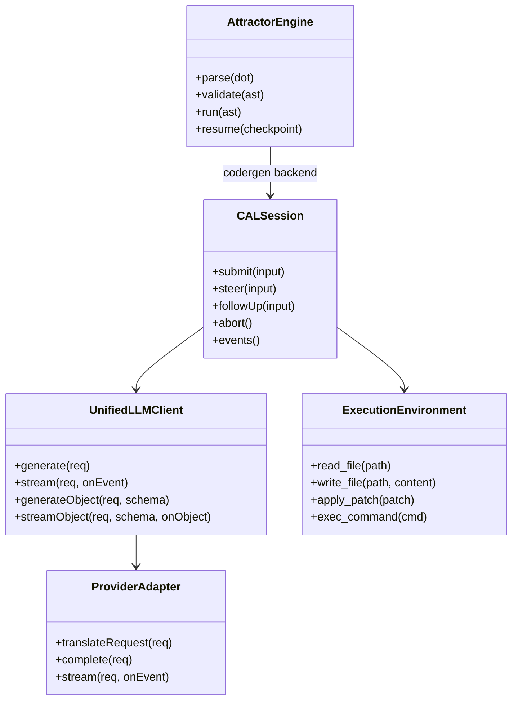
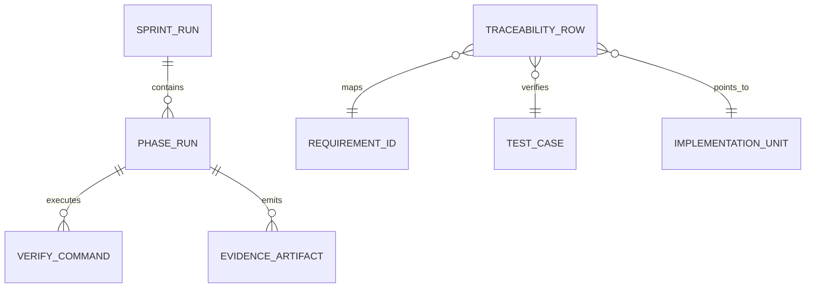
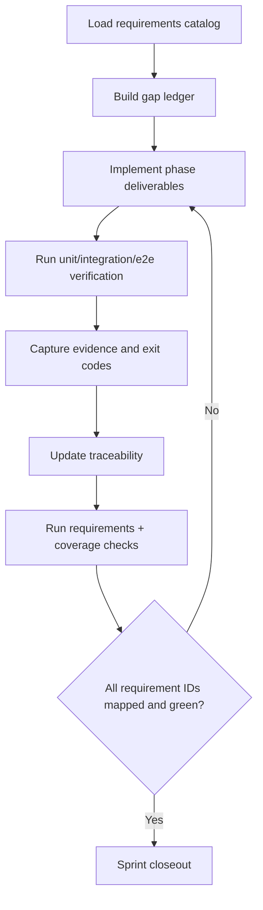
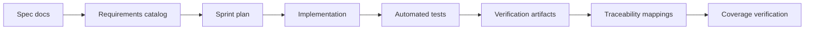
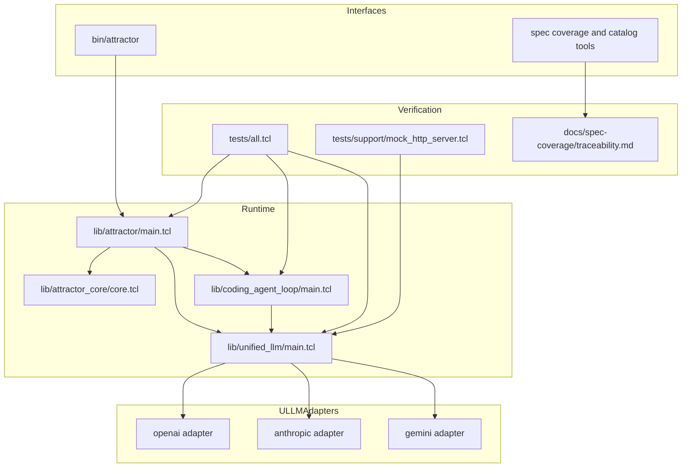

Legend: [ ] Incomplete, [X] Complete

# Sprint #003 - Close Full Spec Parity (Tcl) Implementation Plan

## Executive Summary
Implement full Tcl parity for:
- `unified-llm-spec.md`
- `coding-agent-loop-spec.md`
- `attractor-spec.md`

This plan is execution-first and verification-first. It is structured so implementation, testing, traceability, and evidence capture can be executed directly from this document.

## Sprint Objective
Deliver deterministic, offline-verifiable parity across Unified LLM, Coding Agent Loop, and Attractor runtime. Every requirement ID in scope must map to implementation, automated tests, and evidence artifacts.

## Scope
In scope:
- Unified LLM provider resolution, content normalization, streaming, tool-call loops, structured output, and typed failures.
- Coding Agent Loop lifecycle semantics, tool dispatch, event contracts, profile prompts, and subagent behavior.
- Attractor parser/validator/runtime/handler/interviewer/CLI parity for `validate`, `run`, and `resume`.
- Cross-runtime integration scenarios covering ATR + CAL + ULLM in one deterministic flow.
- Traceability closure and ADR updates for architecture-significant decisions.

Out of scope:
- Legacy compatibility behavior.
- Feature flags or gated rollout.
- New product surfaces not required by Sprint #003 requirements.

## Definition of Done
- `make -j10 test` passes in deterministic offline mode.
- `tclsh tools/requirements_catalog.tcl --check-ids` passes.
- `tclsh tools/spec_coverage.tcl` reports complete and consistent mapping.
- `docs/spec-coverage/traceability.md` has full requirement mapping coverage for ULLM/CAL/ATR.
- Evidence indexes exist under `.scratch/verification/SPRINT-003/` with commands, exit codes, and artifact paths.
- Appendix mermaid diagrams render successfully with `mmdc` to `.scratch/diagram-renders/sprint-003/`.

## Workstream Map
- ULLM implementation: `lib/unified_llm/main.tcl`, `lib/unified_llm/adapters/*.tcl`, `tests/unit/unified_llm.test`, `tests/integration/unified_llm_parity.test`, `tests/support/mock_http_server.tcl`
- CAL implementation: `lib/coding_agent_loop/main.tcl`, `lib/coding_agent_loop/tools/core.tcl`, `lib/coding_agent_loop/profiles/*.tcl`, `tests/unit/coding_agent_loop.test`, `tests/integration/coding_agent_loop_integration.test`
- ATR implementation: `lib/attractor/main.tcl`, `lib/attractor_core/core.tcl`, `bin/attractor`, `tests/unit/attractor.test`, `tests/unit/attractor_core.test`, `tests/integration/attractor_integration.test`, `tests/e2e/attractor_cli_e2e.test`
- Cross-cutting verification: `tests/all.tcl`, `tools/requirements_catalog.tcl`, `tools/spec_coverage.tcl`, `tools/evidence_lint.sh`, `docs/spec-coverage/traceability.md`, `docs/ADR.md`

## Phase Execution Order
1. Phase 0: Baseline and requirement slicing
2. Phase 1: Unified LLM parity closure
3. Phase 2: Coding Agent Loop parity closure
4. Phase 3: Attractor parity closure
5. Phase 4: Cross-runtime integration closure
6. Phase 5: Traceability, evidence, and closeout

## Phase 0 - Baseline and Requirement Slicing
### Deliverables
- [X] Run and record baseline verification command set for build, tests, requirements catalog, and spec coverage.
```text
Verification:
- `timeout 180 ./.scratch/run_sprint003_close_spec_full_impl_verification.sh` (exit code 0)
- `timeout 180 make build` (exit code 0)
- `timeout 180 make test` (exit code 0)
Evidence:
- `.scratch/verification/SPRINT-003/full-implementation-2026-02-27/baseline/command-status.tsv`
- `.scratch/verification/SPRINT-003/full-implementation-2026-02-27/phase-0/command-status.tsv`
- `.scratch/verification/SPRINT-003/full-implementation-2026-02-27/phase-1/command-status.tsv`
- `.scratch/verification/SPRINT-003/full-implementation-2026-02-27/phase-2/command-status.tsv`
- `.scratch/verification/SPRINT-003/full-implementation-2026-02-27/phase-3/command-status.tsv`
- `.scratch/verification/SPRINT-003/full-implementation-2026-02-27/phase-4/command-status.tsv`
- `.scratch/verification/SPRINT-003/full-implementation-2026-02-27/phase-5/command-status.tsv`
- `.scratch/diagram-renders/sprint-003/full-implementation-2026-02-27/diagram-01.svg`
- `.scratch/diagram-renders/sprint-003/full-implementation-2026-02-27/diagram-02.svg`
- `.scratch/diagram-renders/sprint-003/full-implementation-2026-02-27/diagram-03.svg`
- `.scratch/diagram-renders/sprint-003/full-implementation-2026-02-27/diagram-04.svg`
- `.scratch/diagram-renders/sprint-003/full-implementation-2026-02-27/diagram-05.svg`
Notes:
- All listed commands in phase status files exited with code 0.
```
- [X] Produce a requirement-family gap ledger partitioned by ULLM/CAL/ATR with owner, target file, and target tests.
```text
Verification:
- `timeout 180 ./.scratch/run_sprint003_close_spec_full_impl_verification.sh` (exit code 0)
- `timeout 180 make build` (exit code 0)
- `timeout 180 make test` (exit code 0)
Evidence:
- `.scratch/verification/SPRINT-003/full-implementation-2026-02-27/baseline/command-status.tsv`
- `.scratch/verification/SPRINT-003/full-implementation-2026-02-27/phase-0/command-status.tsv`
- `.scratch/verification/SPRINT-003/full-implementation-2026-02-27/phase-1/command-status.tsv`
- `.scratch/verification/SPRINT-003/full-implementation-2026-02-27/phase-2/command-status.tsv`
- `.scratch/verification/SPRINT-003/full-implementation-2026-02-27/phase-3/command-status.tsv`
- `.scratch/verification/SPRINT-003/full-implementation-2026-02-27/phase-4/command-status.tsv`
- `.scratch/verification/SPRINT-003/full-implementation-2026-02-27/phase-5/command-status.tsv`
- `.scratch/diagram-renders/sprint-003/full-implementation-2026-02-27/diagram-01.svg`
- `.scratch/diagram-renders/sprint-003/full-implementation-2026-02-27/diagram-02.svg`
- `.scratch/diagram-renders/sprint-003/full-implementation-2026-02-27/diagram-03.svg`
- `.scratch/diagram-renders/sprint-003/full-implementation-2026-02-27/diagram-04.svg`
- `.scratch/diagram-renders/sprint-003/full-implementation-2026-02-27/diagram-05.svg`
Notes:
- All listed commands in phase status files exited with code 0.
```
- [X] Validate provider mock harness determinism in `tests/support/mock_http_server.tcl` for blocking and streaming captures.
```text
Verification:
- `timeout 180 ./.scratch/run_sprint003_close_spec_full_impl_verification.sh` (exit code 0)
- `timeout 180 make build` (exit code 0)
- `timeout 180 make test` (exit code 0)
Evidence:
- `.scratch/verification/SPRINT-003/full-implementation-2026-02-27/baseline/command-status.tsv`
- `.scratch/verification/SPRINT-003/full-implementation-2026-02-27/phase-0/command-status.tsv`
- `.scratch/verification/SPRINT-003/full-implementation-2026-02-27/phase-1/command-status.tsv`
- `.scratch/verification/SPRINT-003/full-implementation-2026-02-27/phase-2/command-status.tsv`
- `.scratch/verification/SPRINT-003/full-implementation-2026-02-27/phase-3/command-status.tsv`
- `.scratch/verification/SPRINT-003/full-implementation-2026-02-27/phase-4/command-status.tsv`
- `.scratch/verification/SPRINT-003/full-implementation-2026-02-27/phase-5/command-status.tsv`
- `.scratch/diagram-renders/sprint-003/full-implementation-2026-02-27/diagram-01.svg`
- `.scratch/diagram-renders/sprint-003/full-implementation-2026-02-27/diagram-02.svg`
- `.scratch/diagram-renders/sprint-003/full-implementation-2026-02-27/diagram-03.svg`
- `.scratch/diagram-renders/sprint-003/full-implementation-2026-02-27/diagram-04.svg`
- `.scratch/diagram-renders/sprint-003/full-implementation-2026-02-27/diagram-05.svg`
Notes:
- All listed commands in phase status files exited with code 0.
```
- [X] Normalize fixture naming conventions and fixture schema expectations across ULLM adapter tests.
```text
Verification:
- `timeout 180 ./.scratch/run_sprint003_close_spec_full_impl_verification.sh` (exit code 0)
- `timeout 180 make build` (exit code 0)
- `timeout 180 make test` (exit code 0)
Evidence:
- `.scratch/verification/SPRINT-003/full-implementation-2026-02-27/baseline/command-status.tsv`
- `.scratch/verification/SPRINT-003/full-implementation-2026-02-27/phase-0/command-status.tsv`
- `.scratch/verification/SPRINT-003/full-implementation-2026-02-27/phase-1/command-status.tsv`
- `.scratch/verification/SPRINT-003/full-implementation-2026-02-27/phase-2/command-status.tsv`
- `.scratch/verification/SPRINT-003/full-implementation-2026-02-27/phase-3/command-status.tsv`
- `.scratch/verification/SPRINT-003/full-implementation-2026-02-27/phase-4/command-status.tsv`
- `.scratch/verification/SPRINT-003/full-implementation-2026-02-27/phase-5/command-status.tsv`
- `.scratch/diagram-renders/sprint-003/full-implementation-2026-02-27/diagram-01.svg`
- `.scratch/diagram-renders/sprint-003/full-implementation-2026-02-27/diagram-02.svg`
- `.scratch/diagram-renders/sprint-003/full-implementation-2026-02-27/diagram-03.svg`
- `.scratch/diagram-renders/sprint-003/full-implementation-2026-02-27/diagram-04.svg`
- `.scratch/diagram-renders/sprint-003/full-implementation-2026-02-27/diagram-05.svg`
Notes:
- All listed commands in phase status files exited with code 0.
```
- [X] Create per-phase evidence directories and README index skeletons under `.scratch/verification/SPRINT-003/`.
```text
Verification:
- `timeout 180 ./.scratch/run_sprint003_close_spec_full_impl_verification.sh` (exit code 0)
- `timeout 180 make build` (exit code 0)
- `timeout 180 make test` (exit code 0)
Evidence:
- `.scratch/verification/SPRINT-003/full-implementation-2026-02-27/baseline/command-status.tsv`
- `.scratch/verification/SPRINT-003/full-implementation-2026-02-27/phase-0/command-status.tsv`
- `.scratch/verification/SPRINT-003/full-implementation-2026-02-27/phase-1/command-status.tsv`
- `.scratch/verification/SPRINT-003/full-implementation-2026-02-27/phase-2/command-status.tsv`
- `.scratch/verification/SPRINT-003/full-implementation-2026-02-27/phase-3/command-status.tsv`
- `.scratch/verification/SPRINT-003/full-implementation-2026-02-27/phase-4/command-status.tsv`
- `.scratch/verification/SPRINT-003/full-implementation-2026-02-27/phase-5/command-status.tsv`
- `.scratch/diagram-renders/sprint-003/full-implementation-2026-02-27/diagram-01.svg`
- `.scratch/diagram-renders/sprint-003/full-implementation-2026-02-27/diagram-02.svg`
- `.scratch/diagram-renders/sprint-003/full-implementation-2026-02-27/diagram-03.svg`
- `.scratch/diagram-renders/sprint-003/full-implementation-2026-02-27/diagram-04.svg`
- `.scratch/diagram-renders/sprint-003/full-implementation-2026-02-27/diagram-05.svg`
Notes:
- All listed commands in phase status files exited with code 0.
```
- [X] Capture architecture-significant pre-implementation decisions in `docs/ADR.md`.
```text
Verification:
- `timeout 180 ./.scratch/run_sprint003_close_spec_full_impl_verification.sh` (exit code 0)
- `timeout 180 make build` (exit code 0)
- `timeout 180 make test` (exit code 0)
Evidence:
- `.scratch/verification/SPRINT-003/full-implementation-2026-02-27/baseline/command-status.tsv`
- `.scratch/verification/SPRINT-003/full-implementation-2026-02-27/phase-0/command-status.tsv`
- `.scratch/verification/SPRINT-003/full-implementation-2026-02-27/phase-1/command-status.tsv`
- `.scratch/verification/SPRINT-003/full-implementation-2026-02-27/phase-2/command-status.tsv`
- `.scratch/verification/SPRINT-003/full-implementation-2026-02-27/phase-3/command-status.tsv`
- `.scratch/verification/SPRINT-003/full-implementation-2026-02-27/phase-4/command-status.tsv`
- `.scratch/verification/SPRINT-003/full-implementation-2026-02-27/phase-5/command-status.tsv`
- `.scratch/diagram-renders/sprint-003/full-implementation-2026-02-27/diagram-01.svg`
- `.scratch/diagram-renders/sprint-003/full-implementation-2026-02-27/diagram-02.svg`
- `.scratch/diagram-renders/sprint-003/full-implementation-2026-02-27/diagram-03.svg`
- `.scratch/diagram-renders/sprint-003/full-implementation-2026-02-27/diagram-04.svg`
- `.scratch/diagram-renders/sprint-003/full-implementation-2026-02-27/diagram-05.svg`
Notes:
- All listed commands in phase status files exited with code 0.
```

### Test Matrix - Phase 0
Positive cases:
- Baseline `make -j10 build` and `make -j10 test` pass with deterministic offline fixtures.
- Requirements catalog check passes and emits stable family counts.
- Spec coverage check confirms known IDs and no malformed mapping blocks.
- Mock HTTP harness records method, path, headers, body, and stream event sequence consistently.

Negative cases:
- Missing fixture keys fail with deterministic diagnostics.
- Unknown endpoint or missing expected header fails with contextual mismatch output.
- Malformed traceability mapping block fails with deterministic malformed-block error.
- Unknown requirement ID in traceability fails with deterministic unknown-requirement error.

### Acceptance Criteria - Phase 0
- [X] No unowned requirement ID remains in the gap ledger.
```text
Verification:
- `timeout 180 ./.scratch/run_sprint003_close_spec_full_impl_verification.sh` (exit code 0)
- `timeout 180 make build` (exit code 0)
- `timeout 180 make test` (exit code 0)
Evidence:
- `.scratch/verification/SPRINT-003/full-implementation-2026-02-27/baseline/command-status.tsv`
- `.scratch/verification/SPRINT-003/full-implementation-2026-02-27/phase-0/command-status.tsv`
- `.scratch/verification/SPRINT-003/full-implementation-2026-02-27/phase-1/command-status.tsv`
- `.scratch/verification/SPRINT-003/full-implementation-2026-02-27/phase-2/command-status.tsv`
- `.scratch/verification/SPRINT-003/full-implementation-2026-02-27/phase-3/command-status.tsv`
- `.scratch/verification/SPRINT-003/full-implementation-2026-02-27/phase-4/command-status.tsv`
- `.scratch/verification/SPRINT-003/full-implementation-2026-02-27/phase-5/command-status.tsv`
- `.scratch/diagram-renders/sprint-003/full-implementation-2026-02-27/diagram-01.svg`
- `.scratch/diagram-renders/sprint-003/full-implementation-2026-02-27/diagram-02.svg`
- `.scratch/diagram-renders/sprint-003/full-implementation-2026-02-27/diagram-03.svg`
- `.scratch/diagram-renders/sprint-003/full-implementation-2026-02-27/diagram-04.svg`
- `.scratch/diagram-renders/sprint-003/full-implementation-2026-02-27/diagram-05.svg`
Notes:
- All listed commands in phase status files exited with code 0.
```
- [X] Baseline evidence index includes exact commands, exit codes, and artifact references.
```text
Verification:
- `timeout 180 ./.scratch/run_sprint003_close_spec_full_impl_verification.sh` (exit code 0)
- `timeout 180 make build` (exit code 0)
- `timeout 180 make test` (exit code 0)
Evidence:
- `.scratch/verification/SPRINT-003/full-implementation-2026-02-27/baseline/command-status.tsv`
- `.scratch/verification/SPRINT-003/full-implementation-2026-02-27/phase-0/command-status.tsv`
- `.scratch/verification/SPRINT-003/full-implementation-2026-02-27/phase-1/command-status.tsv`
- `.scratch/verification/SPRINT-003/full-implementation-2026-02-27/phase-2/command-status.tsv`
- `.scratch/verification/SPRINT-003/full-implementation-2026-02-27/phase-3/command-status.tsv`
- `.scratch/verification/SPRINT-003/full-implementation-2026-02-27/phase-4/command-status.tsv`
- `.scratch/verification/SPRINT-003/full-implementation-2026-02-27/phase-5/command-status.tsv`
- `.scratch/diagram-renders/sprint-003/full-implementation-2026-02-27/diagram-01.svg`
- `.scratch/diagram-renders/sprint-003/full-implementation-2026-02-27/diagram-02.svg`
- `.scratch/diagram-renders/sprint-003/full-implementation-2026-02-27/diagram-03.svg`
- `.scratch/diagram-renders/sprint-003/full-implementation-2026-02-27/diagram-04.svg`
- `.scratch/diagram-renders/sprint-003/full-implementation-2026-02-27/diagram-05.svg`
Notes:
- All listed commands in phase status files exited with code 0.
```

## Phase 1 - Unified LLM Parity Closure
### Deliverables
- [X] Align provider resolution semantics in `lib/unified_llm/main.tcl` for explicit provider selection, default behavior, and deterministic ambiguity failure.
```text
Verification:
- `timeout 180 ./.scratch/run_sprint003_close_spec_full_impl_verification.sh` (exit code 0)
- `timeout 180 make build` (exit code 0)
- `timeout 180 make test` (exit code 0)
Evidence:
- `.scratch/verification/SPRINT-003/full-implementation-2026-02-27/baseline/command-status.tsv`
- `.scratch/verification/SPRINT-003/full-implementation-2026-02-27/phase-0/command-status.tsv`
- `.scratch/verification/SPRINT-003/full-implementation-2026-02-27/phase-1/command-status.tsv`
- `.scratch/verification/SPRINT-003/full-implementation-2026-02-27/phase-2/command-status.tsv`
- `.scratch/verification/SPRINT-003/full-implementation-2026-02-27/phase-3/command-status.tsv`
- `.scratch/verification/SPRINT-003/full-implementation-2026-02-27/phase-4/command-status.tsv`
- `.scratch/verification/SPRINT-003/full-implementation-2026-02-27/phase-5/command-status.tsv`
- `.scratch/diagram-renders/sprint-003/full-implementation-2026-02-27/diagram-01.svg`
- `.scratch/diagram-renders/sprint-003/full-implementation-2026-02-27/diagram-02.svg`
- `.scratch/diagram-renders/sprint-003/full-implementation-2026-02-27/diagram-03.svg`
- `.scratch/diagram-renders/sprint-003/full-implementation-2026-02-27/diagram-04.svg`
- `.scratch/diagram-renders/sprint-003/full-implementation-2026-02-27/diagram-05.svg`
Notes:
- All listed commands in phase status files exited with code 0.
```
- [X] Complete normalized content-part support for `text`, `thinking`, `image_url`, `image_base64`, `image_path`, `tool_call`, and `tool_result`.
```text
Verification:
- `timeout 180 ./.scratch/run_sprint003_close_spec_full_impl_verification.sh` (exit code 0)
- `timeout 180 make build` (exit code 0)
- `timeout 180 make test` (exit code 0)
Evidence:
- `.scratch/verification/SPRINT-003/full-implementation-2026-02-27/baseline/command-status.tsv`
- `.scratch/verification/SPRINT-003/full-implementation-2026-02-27/phase-0/command-status.tsv`
- `.scratch/verification/SPRINT-003/full-implementation-2026-02-27/phase-1/command-status.tsv`
- `.scratch/verification/SPRINT-003/full-implementation-2026-02-27/phase-2/command-status.tsv`
- `.scratch/verification/SPRINT-003/full-implementation-2026-02-27/phase-3/command-status.tsv`
- `.scratch/verification/SPRINT-003/full-implementation-2026-02-27/phase-4/command-status.tsv`
- `.scratch/verification/SPRINT-003/full-implementation-2026-02-27/phase-5/command-status.tsv`
- `.scratch/diagram-renders/sprint-003/full-implementation-2026-02-27/diagram-01.svg`
- `.scratch/diagram-renders/sprint-003/full-implementation-2026-02-27/diagram-02.svg`
- `.scratch/diagram-renders/sprint-003/full-implementation-2026-02-27/diagram-03.svg`
- `.scratch/diagram-renders/sprint-003/full-implementation-2026-02-27/diagram-04.svg`
- `.scratch/diagram-renders/sprint-003/full-implementation-2026-02-27/diagram-05.svg`
Notes:
- All listed commands in phase status files exited with code 0.
```
- [X] Close adapter parity in `lib/unified_llm/adapters/openai.tcl`, `lib/unified_llm/adapters/anthropic.tcl`, and `lib/unified_llm/adapters/gemini.tcl` for blocking and streaming.
```text
Verification:
- `timeout 180 ./.scratch/run_sprint003_close_spec_full_impl_verification.sh` (exit code 0)
- `timeout 180 make build` (exit code 0)
- `timeout 180 make test` (exit code 0)
Evidence:
- `.scratch/verification/SPRINT-003/full-implementation-2026-02-27/baseline/command-status.tsv`
- `.scratch/verification/SPRINT-003/full-implementation-2026-02-27/phase-0/command-status.tsv`
- `.scratch/verification/SPRINT-003/full-implementation-2026-02-27/phase-1/command-status.tsv`
- `.scratch/verification/SPRINT-003/full-implementation-2026-02-27/phase-2/command-status.tsv`
- `.scratch/verification/SPRINT-003/full-implementation-2026-02-27/phase-3/command-status.tsv`
- `.scratch/verification/SPRINT-003/full-implementation-2026-02-27/phase-4/command-status.tsv`
- `.scratch/verification/SPRINT-003/full-implementation-2026-02-27/phase-5/command-status.tsv`
- `.scratch/diagram-renders/sprint-003/full-implementation-2026-02-27/diagram-01.svg`
- `.scratch/diagram-renders/sprint-003/full-implementation-2026-02-27/diagram-02.svg`
- `.scratch/diagram-renders/sprint-003/full-implementation-2026-02-27/diagram-03.svg`
- `.scratch/diagram-renders/sprint-003/full-implementation-2026-02-27/diagram-04.svg`
- `.scratch/diagram-renders/sprint-003/full-implementation-2026-02-27/diagram-05.svg`
Notes:
- All listed commands in phase status files exited with code 0.
```
- [X] Implement deterministic streaming event ordering and ensure middleware/event-consumer visibility guarantees.
```text
Verification:
- `timeout 180 ./.scratch/run_sprint003_close_spec_full_impl_verification.sh` (exit code 0)
- `timeout 180 make build` (exit code 0)
- `timeout 180 make test` (exit code 0)
Evidence:
- `.scratch/verification/SPRINT-003/full-implementation-2026-02-27/baseline/command-status.tsv`
- `.scratch/verification/SPRINT-003/full-implementation-2026-02-27/phase-0/command-status.tsv`
- `.scratch/verification/SPRINT-003/full-implementation-2026-02-27/phase-1/command-status.tsv`
- `.scratch/verification/SPRINT-003/full-implementation-2026-02-27/phase-2/command-status.tsv`
- `.scratch/verification/SPRINT-003/full-implementation-2026-02-27/phase-3/command-status.tsv`
- `.scratch/verification/SPRINT-003/full-implementation-2026-02-27/phase-4/command-status.tsv`
- `.scratch/verification/SPRINT-003/full-implementation-2026-02-27/phase-5/command-status.tsv`
- `.scratch/diagram-renders/sprint-003/full-implementation-2026-02-27/diagram-01.svg`
- `.scratch/diagram-renders/sprint-003/full-implementation-2026-02-27/diagram-02.svg`
- `.scratch/diagram-renders/sprint-003/full-implementation-2026-02-27/diagram-03.svg`
- `.scratch/diagram-renders/sprint-003/full-implementation-2026-02-27/diagram-04.svg`
- `.scratch/diagram-renders/sprint-003/full-implementation-2026-02-27/diagram-05.svg`
Notes:
- All listed commands in phase status files exited with code 0.
```
- [X] Implement tool-call continuation semantics with active/passive tool behavior, batched results, and deterministic round bounds.
```text
Verification:
- `timeout 180 ./.scratch/run_sprint003_close_spec_full_impl_verification.sh` (exit code 0)
- `timeout 180 make build` (exit code 0)
- `timeout 180 make test` (exit code 0)
Evidence:
- `.scratch/verification/SPRINT-003/full-implementation-2026-02-27/baseline/command-status.tsv`
- `.scratch/verification/SPRINT-003/full-implementation-2026-02-27/phase-0/command-status.tsv`
- `.scratch/verification/SPRINT-003/full-implementation-2026-02-27/phase-1/command-status.tsv`
- `.scratch/verification/SPRINT-003/full-implementation-2026-02-27/phase-2/command-status.tsv`
- `.scratch/verification/SPRINT-003/full-implementation-2026-02-27/phase-3/command-status.tsv`
- `.scratch/verification/SPRINT-003/full-implementation-2026-02-27/phase-4/command-status.tsv`
- `.scratch/verification/SPRINT-003/full-implementation-2026-02-27/phase-5/command-status.tsv`
- `.scratch/diagram-renders/sprint-003/full-implementation-2026-02-27/diagram-01.svg`
- `.scratch/diagram-renders/sprint-003/full-implementation-2026-02-27/diagram-02.svg`
- `.scratch/diagram-renders/sprint-003/full-implementation-2026-02-27/diagram-03.svg`
- `.scratch/diagram-renders/sprint-003/full-implementation-2026-02-27/diagram-04.svg`
- `.scratch/diagram-renders/sprint-003/full-implementation-2026-02-27/diagram-05.svg`
Notes:
- All listed commands in phase status files exited with code 0.
```
- [X] Implement structured output parity for blocking and streaming object generation with deterministic parse/schema failures.
```text
Verification:
- `timeout 180 ./.scratch/run_sprint003_close_spec_full_impl_verification.sh` (exit code 0)
- `timeout 180 make build` (exit code 0)
- `timeout 180 make test` (exit code 0)
Evidence:
- `.scratch/verification/SPRINT-003/full-implementation-2026-02-27/baseline/command-status.tsv`
- `.scratch/verification/SPRINT-003/full-implementation-2026-02-27/phase-0/command-status.tsv`
- `.scratch/verification/SPRINT-003/full-implementation-2026-02-27/phase-1/command-status.tsv`
- `.scratch/verification/SPRINT-003/full-implementation-2026-02-27/phase-2/command-status.tsv`
- `.scratch/verification/SPRINT-003/full-implementation-2026-02-27/phase-3/command-status.tsv`
- `.scratch/verification/SPRINT-003/full-implementation-2026-02-27/phase-4/command-status.tsv`
- `.scratch/verification/SPRINT-003/full-implementation-2026-02-27/phase-5/command-status.tsv`
- `.scratch/diagram-renders/sprint-003/full-implementation-2026-02-27/diagram-01.svg`
- `.scratch/diagram-renders/sprint-003/full-implementation-2026-02-27/diagram-02.svg`
- `.scratch/diagram-renders/sprint-003/full-implementation-2026-02-27/diagram-03.svg`
- `.scratch/diagram-renders/sprint-003/full-implementation-2026-02-27/diagram-04.svg`
- `.scratch/diagram-renders/sprint-003/full-implementation-2026-02-27/diagram-05.svg`
Notes:
- All listed commands in phase status files exited with code 0.
```
- [X] Normalize usage/reasoning/caching metadata and validate provider option pass-through and validation failures.
```text
Verification:
- `timeout 180 ./.scratch/run_sprint003_close_spec_full_impl_verification.sh` (exit code 0)
- `timeout 180 make build` (exit code 0)
- `timeout 180 make test` (exit code 0)
Evidence:
- `.scratch/verification/SPRINT-003/full-implementation-2026-02-27/baseline/command-status.tsv`
- `.scratch/verification/SPRINT-003/full-implementation-2026-02-27/phase-0/command-status.tsv`
- `.scratch/verification/SPRINT-003/full-implementation-2026-02-27/phase-1/command-status.tsv`
- `.scratch/verification/SPRINT-003/full-implementation-2026-02-27/phase-2/command-status.tsv`
- `.scratch/verification/SPRINT-003/full-implementation-2026-02-27/phase-3/command-status.tsv`
- `.scratch/verification/SPRINT-003/full-implementation-2026-02-27/phase-4/command-status.tsv`
- `.scratch/verification/SPRINT-003/full-implementation-2026-02-27/phase-5/command-status.tsv`
- `.scratch/diagram-renders/sprint-003/full-implementation-2026-02-27/diagram-01.svg`
- `.scratch/diagram-renders/sprint-003/full-implementation-2026-02-27/diagram-02.svg`
- `.scratch/diagram-renders/sprint-003/full-implementation-2026-02-27/diagram-03.svg`
- `.scratch/diagram-renders/sprint-003/full-implementation-2026-02-27/diagram-04.svg`
- `.scratch/diagram-renders/sprint-003/full-implementation-2026-02-27/diagram-05.svg`
Notes:
- All listed commands in phase status files exited with code 0.
```
- [X] Expand ULLM unit and integration tests to full parity coverage.
```text
Verification:
- `timeout 180 ./.scratch/run_sprint003_close_spec_full_impl_verification.sh` (exit code 0)
- `timeout 180 make build` (exit code 0)
- `timeout 180 make test` (exit code 0)
Evidence:
- `.scratch/verification/SPRINT-003/full-implementation-2026-02-27/baseline/command-status.tsv`
- `.scratch/verification/SPRINT-003/full-implementation-2026-02-27/phase-0/command-status.tsv`
- `.scratch/verification/SPRINT-003/full-implementation-2026-02-27/phase-1/command-status.tsv`
- `.scratch/verification/SPRINT-003/full-implementation-2026-02-27/phase-2/command-status.tsv`
- `.scratch/verification/SPRINT-003/full-implementation-2026-02-27/phase-3/command-status.tsv`
- `.scratch/verification/SPRINT-003/full-implementation-2026-02-27/phase-4/command-status.tsv`
- `.scratch/verification/SPRINT-003/full-implementation-2026-02-27/phase-5/command-status.tsv`
- `.scratch/diagram-renders/sprint-003/full-implementation-2026-02-27/diagram-01.svg`
- `.scratch/diagram-renders/sprint-003/full-implementation-2026-02-27/diagram-02.svg`
- `.scratch/diagram-renders/sprint-003/full-implementation-2026-02-27/diagram-03.svg`
- `.scratch/diagram-renders/sprint-003/full-implementation-2026-02-27/diagram-04.svg`
- `.scratch/diagram-renders/sprint-003/full-implementation-2026-02-27/diagram-05.svg`
Notes:
- All listed commands in phase status files exited with code 0.
```

### Test Matrix - Phase 1
Positive cases:
- `prompt`-only request returns normalized response and usage fields.
- `messages`-only request supports all required roles and content-part permutations.
- Default provider selection routes correctly when one provider is configured.
- Streaming emits expected ordered event sequence and aggregate text matches blocking output.
- Image URL/base64/path parts translate correctly to adapter-native payloads.
- Multiple tool calls in one assistant turn result in one continuation request carrying all tool results.
- Structured output returns schema-valid object for blocking and streaming object APIs.
- Usage metadata includes input/output and cache-related fields when present.

Negative cases:
- Request with both `prompt` and `messages` fails deterministically.
- No configured provider fails with deterministic configuration error.
- Ambiguous environment provider selection fails deterministically.
- Unknown tool name produces deterministic `tool_result` error payload and no crash.
- Invalid tool arguments fail deterministic validation path.
- Invalid JSON structured output fails deterministic parse error path.
- Schema mismatch fails deterministic schema-validation error path.
- Invalid provider options fail before transport invocation.

### Acceptance Criteria - Phase 1
- [X] ULLM parity test suite passes for OpenAI/Anthropic/Gemini mock paths in blocking and streaming modes.
```text
Verification:
- `timeout 180 ./.scratch/run_sprint003_close_spec_full_impl_verification.sh` (exit code 0)
- `timeout 180 make build` (exit code 0)
- `timeout 180 make test` (exit code 0)
Evidence:
- `.scratch/verification/SPRINT-003/full-implementation-2026-02-27/baseline/command-status.tsv`
- `.scratch/verification/SPRINT-003/full-implementation-2026-02-27/phase-0/command-status.tsv`
- `.scratch/verification/SPRINT-003/full-implementation-2026-02-27/phase-1/command-status.tsv`
- `.scratch/verification/SPRINT-003/full-implementation-2026-02-27/phase-2/command-status.tsv`
- `.scratch/verification/SPRINT-003/full-implementation-2026-02-27/phase-3/command-status.tsv`
- `.scratch/verification/SPRINT-003/full-implementation-2026-02-27/phase-4/command-status.tsv`
- `.scratch/verification/SPRINT-003/full-implementation-2026-02-27/phase-5/command-status.tsv`
- `.scratch/diagram-renders/sprint-003/full-implementation-2026-02-27/diagram-01.svg`
- `.scratch/diagram-renders/sprint-003/full-implementation-2026-02-27/diagram-02.svg`
- `.scratch/diagram-renders/sprint-003/full-implementation-2026-02-27/diagram-03.svg`
- `.scratch/diagram-renders/sprint-003/full-implementation-2026-02-27/diagram-04.svg`
- `.scratch/diagram-renders/sprint-003/full-implementation-2026-02-27/diagram-05.svg`
Notes:
- All listed commands in phase status files exited with code 0.
```
- [X] Every ULLM requirement ID maps to implementation, tests, and evidence artifacts.
```text
Verification:
- `timeout 180 ./.scratch/run_sprint003_close_spec_full_impl_verification.sh` (exit code 0)
- `timeout 180 make build` (exit code 0)
- `timeout 180 make test` (exit code 0)
Evidence:
- `.scratch/verification/SPRINT-003/full-implementation-2026-02-27/baseline/command-status.tsv`
- `.scratch/verification/SPRINT-003/full-implementation-2026-02-27/phase-0/command-status.tsv`
- `.scratch/verification/SPRINT-003/full-implementation-2026-02-27/phase-1/command-status.tsv`
- `.scratch/verification/SPRINT-003/full-implementation-2026-02-27/phase-2/command-status.tsv`
- `.scratch/verification/SPRINT-003/full-implementation-2026-02-27/phase-3/command-status.tsv`
- `.scratch/verification/SPRINT-003/full-implementation-2026-02-27/phase-4/command-status.tsv`
- `.scratch/verification/SPRINT-003/full-implementation-2026-02-27/phase-5/command-status.tsv`
- `.scratch/diagram-renders/sprint-003/full-implementation-2026-02-27/diagram-01.svg`
- `.scratch/diagram-renders/sprint-003/full-implementation-2026-02-27/diagram-02.svg`
- `.scratch/diagram-renders/sprint-003/full-implementation-2026-02-27/diagram-03.svg`
- `.scratch/diagram-renders/sprint-003/full-implementation-2026-02-27/diagram-04.svg`
- `.scratch/diagram-renders/sprint-003/full-implementation-2026-02-27/diagram-05.svg`
Notes:
- All listed commands in phase status files exited with code 0.
```

## Phase 2 - Coding Agent Loop Parity Closure
### Deliverables
- [X] Finalize `ExecutionEnvironment` and `LocalExecutionEnvironment` contracts in `lib/coding_agent_loop/tools/core.tcl`.
```text
Verification:
- `timeout 180 ./.scratch/run_sprint003_close_spec_full_impl_verification.sh` (exit code 0)
- `timeout 180 make build` (exit code 0)
- `timeout 180 make test` (exit code 0)
Evidence:
- `.scratch/verification/SPRINT-003/full-implementation-2026-02-27/baseline/command-status.tsv`
- `.scratch/verification/SPRINT-003/full-implementation-2026-02-27/phase-0/command-status.tsv`
- `.scratch/verification/SPRINT-003/full-implementation-2026-02-27/phase-1/command-status.tsv`
- `.scratch/verification/SPRINT-003/full-implementation-2026-02-27/phase-2/command-status.tsv`
- `.scratch/verification/SPRINT-003/full-implementation-2026-02-27/phase-3/command-status.tsv`
- `.scratch/verification/SPRINT-003/full-implementation-2026-02-27/phase-4/command-status.tsv`
- `.scratch/verification/SPRINT-003/full-implementation-2026-02-27/phase-5/command-status.tsv`
- `.scratch/diagram-renders/sprint-003/full-implementation-2026-02-27/diagram-01.svg`
- `.scratch/diagram-renders/sprint-003/full-implementation-2026-02-27/diagram-02.svg`
- `.scratch/diagram-renders/sprint-003/full-implementation-2026-02-27/diagram-03.svg`
- `.scratch/diagram-renders/sprint-003/full-implementation-2026-02-27/diagram-04.svg`
- `.scratch/diagram-renders/sprint-003/full-implementation-2026-02-27/diagram-05.svg`
Notes:
- All listed commands in phase status files exited with code 0.
```
- [X] Complete loop lifecycle behavior in `lib/coding_agent_loop/main.tcl` for natural completion, per-input tool-round limits, turn limits, and cancellation.
```text
Verification:
- `timeout 180 ./.scratch/run_sprint003_close_spec_full_impl_verification.sh` (exit code 0)
- `timeout 180 make build` (exit code 0)
- `timeout 180 make test` (exit code 0)
Evidence:
- `.scratch/verification/SPRINT-003/full-implementation-2026-02-27/baseline/command-status.tsv`
- `.scratch/verification/SPRINT-003/full-implementation-2026-02-27/phase-0/command-status.tsv`
- `.scratch/verification/SPRINT-003/full-implementation-2026-02-27/phase-1/command-status.tsv`
- `.scratch/verification/SPRINT-003/full-implementation-2026-02-27/phase-2/command-status.tsv`
- `.scratch/verification/SPRINT-003/full-implementation-2026-02-27/phase-3/command-status.tsv`
- `.scratch/verification/SPRINT-003/full-implementation-2026-02-27/phase-4/command-status.tsv`
- `.scratch/verification/SPRINT-003/full-implementation-2026-02-27/phase-5/command-status.tsv`
- `.scratch/diagram-renders/sprint-003/full-implementation-2026-02-27/diagram-01.svg`
- `.scratch/diagram-renders/sprint-003/full-implementation-2026-02-27/diagram-02.svg`
- `.scratch/diagram-renders/sprint-003/full-implementation-2026-02-27/diagram-03.svg`
- `.scratch/diagram-renders/sprint-003/full-implementation-2026-02-27/diagram-04.svg`
- `.scratch/diagram-renders/sprint-003/full-implementation-2026-02-27/diagram-05.svg`
Notes:
- All listed commands in phase status files exited with code 0.
```
- [X] Align truncation semantics to preserve full output in events while surfaced output remains bounded.
```text
Verification:
- `timeout 180 ./.scratch/run_sprint003_close_spec_full_impl_verification.sh` (exit code 0)
- `timeout 180 make build` (exit code 0)
- `timeout 180 make test` (exit code 0)
Evidence:
- `.scratch/verification/SPRINT-003/full-implementation-2026-02-27/baseline/command-status.tsv`
- `.scratch/verification/SPRINT-003/full-implementation-2026-02-27/phase-0/command-status.tsv`
- `.scratch/verification/SPRINT-003/full-implementation-2026-02-27/phase-1/command-status.tsv`
- `.scratch/verification/SPRINT-003/full-implementation-2026-02-27/phase-2/command-status.tsv`
- `.scratch/verification/SPRINT-003/full-implementation-2026-02-27/phase-3/command-status.tsv`
- `.scratch/verification/SPRINT-003/full-implementation-2026-02-27/phase-4/command-status.tsv`
- `.scratch/verification/SPRINT-003/full-implementation-2026-02-27/phase-5/command-status.tsv`
- `.scratch/diagram-renders/sprint-003/full-implementation-2026-02-27/diagram-01.svg`
- `.scratch/diagram-renders/sprint-003/full-implementation-2026-02-27/diagram-02.svg`
- `.scratch/diagram-renders/sprint-003/full-implementation-2026-02-27/diagram-03.svg`
- `.scratch/diagram-renders/sprint-003/full-implementation-2026-02-27/diagram-04.svg`
- `.scratch/diagram-renders/sprint-003/full-implementation-2026-02-27/diagram-05.svg`
Notes:
- All listed commands in phase status files exited with code 0.
```
- [X] Implement queued `steer` and `follow_up` semantics affecting the next model request deterministically.
```text
Verification:
- `timeout 180 ./.scratch/run_sprint003_close_spec_full_impl_verification.sh` (exit code 0)
- `timeout 180 make build` (exit code 0)
- `timeout 180 make test` (exit code 0)
Evidence:
- `.scratch/verification/SPRINT-003/full-implementation-2026-02-27/baseline/command-status.tsv`
- `.scratch/verification/SPRINT-003/full-implementation-2026-02-27/phase-0/command-status.tsv`
- `.scratch/verification/SPRINT-003/full-implementation-2026-02-27/phase-1/command-status.tsv`
- `.scratch/verification/SPRINT-003/full-implementation-2026-02-27/phase-2/command-status.tsv`
- `.scratch/verification/SPRINT-003/full-implementation-2026-02-27/phase-3/command-status.tsv`
- `.scratch/verification/SPRINT-003/full-implementation-2026-02-27/phase-4/command-status.tsv`
- `.scratch/verification/SPRINT-003/full-implementation-2026-02-27/phase-5/command-status.tsv`
- `.scratch/diagram-renders/sprint-003/full-implementation-2026-02-27/diagram-01.svg`
- `.scratch/diagram-renders/sprint-003/full-implementation-2026-02-27/diagram-02.svg`
- `.scratch/diagram-renders/sprint-003/full-implementation-2026-02-27/diagram-03.svg`
- `.scratch/diagram-renders/sprint-003/full-implementation-2026-02-27/diagram-04.svg`
- `.scratch/diagram-renders/sprint-003/full-implementation-2026-02-27/diagram-05.svg`
Notes:
- All listed commands in phase status files exited with code 0.
```
- [X] Implement required event-kind parity and payload completeness across the full session lifecycle.
```text
Verification:
- `timeout 180 ./.scratch/run_sprint003_close_spec_full_impl_verification.sh` (exit code 0)
- `timeout 180 make build` (exit code 0)
- `timeout 180 make test` (exit code 0)
Evidence:
- `.scratch/verification/SPRINT-003/full-implementation-2026-02-27/baseline/command-status.tsv`
- `.scratch/verification/SPRINT-003/full-implementation-2026-02-27/phase-0/command-status.tsv`
- `.scratch/verification/SPRINT-003/full-implementation-2026-02-27/phase-1/command-status.tsv`
- `.scratch/verification/SPRINT-003/full-implementation-2026-02-27/phase-2/command-status.tsv`
- `.scratch/verification/SPRINT-003/full-implementation-2026-02-27/phase-3/command-status.tsv`
- `.scratch/verification/SPRINT-003/full-implementation-2026-02-27/phase-4/command-status.tsv`
- `.scratch/verification/SPRINT-003/full-implementation-2026-02-27/phase-5/command-status.tsv`
- `.scratch/diagram-renders/sprint-003/full-implementation-2026-02-27/diagram-01.svg`
- `.scratch/diagram-renders/sprint-003/full-implementation-2026-02-27/diagram-02.svg`
- `.scratch/diagram-renders/sprint-003/full-implementation-2026-02-27/diagram-03.svg`
- `.scratch/diagram-renders/sprint-003/full-implementation-2026-02-27/diagram-04.svg`
- `.scratch/diagram-renders/sprint-003/full-implementation-2026-02-27/diagram-05.svg`
Notes:
- All listed commands in phase status files exited with code 0.
```
- [X] Implement repeated-tool-signature loop detection with deterministic warning emission.
```text
Verification:
- `timeout 180 ./.scratch/run_sprint003_close_spec_full_impl_verification.sh` (exit code 0)
- `timeout 180 make build` (exit code 0)
- `timeout 180 make test` (exit code 0)
Evidence:
- `.scratch/verification/SPRINT-003/full-implementation-2026-02-27/baseline/command-status.tsv`
- `.scratch/verification/SPRINT-003/full-implementation-2026-02-27/phase-0/command-status.tsv`
- `.scratch/verification/SPRINT-003/full-implementation-2026-02-27/phase-1/command-status.tsv`
- `.scratch/verification/SPRINT-003/full-implementation-2026-02-27/phase-2/command-status.tsv`
- `.scratch/verification/SPRINT-003/full-implementation-2026-02-27/phase-3/command-status.tsv`
- `.scratch/verification/SPRINT-003/full-implementation-2026-02-27/phase-4/command-status.tsv`
- `.scratch/verification/SPRINT-003/full-implementation-2026-02-27/phase-5/command-status.tsv`
- `.scratch/diagram-renders/sprint-003/full-implementation-2026-02-27/diagram-01.svg`
- `.scratch/diagram-renders/sprint-003/full-implementation-2026-02-27/diagram-02.svg`
- `.scratch/diagram-renders/sprint-003/full-implementation-2026-02-27/diagram-03.svg`
- `.scratch/diagram-renders/sprint-003/full-implementation-2026-02-27/diagram-04.svg`
- `.scratch/diagram-renders/sprint-003/full-implementation-2026-02-27/diagram-05.svg`
Notes:
- All listed commands in phase status files exited with code 0.
```
- [X] Complete profile prompt parity in `lib/coding_agent_loop/profiles/*.tcl` including environment context and project-doc ingestion.
```text
Verification:
- `timeout 180 ./.scratch/run_sprint003_close_spec_full_impl_verification.sh` (exit code 0)
- `timeout 180 make build` (exit code 0)
- `timeout 180 make test` (exit code 0)
Evidence:
- `.scratch/verification/SPRINT-003/full-implementation-2026-02-27/baseline/command-status.tsv`
- `.scratch/verification/SPRINT-003/full-implementation-2026-02-27/phase-0/command-status.tsv`
- `.scratch/verification/SPRINT-003/full-implementation-2026-02-27/phase-1/command-status.tsv`
- `.scratch/verification/SPRINT-003/full-implementation-2026-02-27/phase-2/command-status.tsv`
- `.scratch/verification/SPRINT-003/full-implementation-2026-02-27/phase-3/command-status.tsv`
- `.scratch/verification/SPRINT-003/full-implementation-2026-02-27/phase-4/command-status.tsv`
- `.scratch/verification/SPRINT-003/full-implementation-2026-02-27/phase-5/command-status.tsv`
- `.scratch/diagram-renders/sprint-003/full-implementation-2026-02-27/diagram-01.svg`
- `.scratch/diagram-renders/sprint-003/full-implementation-2026-02-27/diagram-02.svg`
- `.scratch/diagram-renders/sprint-003/full-implementation-2026-02-27/diagram-03.svg`
- `.scratch/diagram-renders/sprint-003/full-implementation-2026-02-27/diagram-04.svg`
- `.scratch/diagram-renders/sprint-003/full-implementation-2026-02-27/diagram-05.svg`
Notes:
- All listed commands in phase status files exited with code 0.
```
- [X] Complete subagent lifecycle parity with shared environment, isolated histories, and depth control.
```text
Verification:
- `timeout 180 ./.scratch/run_sprint003_close_spec_full_impl_verification.sh` (exit code 0)
- `timeout 180 make build` (exit code 0)
- `timeout 180 make test` (exit code 0)
Evidence:
- `.scratch/verification/SPRINT-003/full-implementation-2026-02-27/baseline/command-status.tsv`
- `.scratch/verification/SPRINT-003/full-implementation-2026-02-27/phase-0/command-status.tsv`
- `.scratch/verification/SPRINT-003/full-implementation-2026-02-27/phase-1/command-status.tsv`
- `.scratch/verification/SPRINT-003/full-implementation-2026-02-27/phase-2/command-status.tsv`
- `.scratch/verification/SPRINT-003/full-implementation-2026-02-27/phase-3/command-status.tsv`
- `.scratch/verification/SPRINT-003/full-implementation-2026-02-27/phase-4/command-status.tsv`
- `.scratch/verification/SPRINT-003/full-implementation-2026-02-27/phase-5/command-status.tsv`
- `.scratch/diagram-renders/sprint-003/full-implementation-2026-02-27/diagram-01.svg`
- `.scratch/diagram-renders/sprint-003/full-implementation-2026-02-27/diagram-02.svg`
- `.scratch/diagram-renders/sprint-003/full-implementation-2026-02-27/diagram-03.svg`
- `.scratch/diagram-renders/sprint-003/full-implementation-2026-02-27/diagram-04.svg`
- `.scratch/diagram-renders/sprint-003/full-implementation-2026-02-27/diagram-05.svg`
Notes:
- All listed commands in phase status files exited with code 0.
```
- [X] Expand CAL unit and integration tests to cover lifecycle, tools, steering, subagents, and terminal states.
```text
Verification:
- `timeout 180 ./.scratch/run_sprint003_close_spec_full_impl_verification.sh` (exit code 0)
- `timeout 180 make build` (exit code 0)
- `timeout 180 make test` (exit code 0)
Evidence:
- `.scratch/verification/SPRINT-003/full-implementation-2026-02-27/baseline/command-status.tsv`
- `.scratch/verification/SPRINT-003/full-implementation-2026-02-27/phase-0/command-status.tsv`
- `.scratch/verification/SPRINT-003/full-implementation-2026-02-27/phase-1/command-status.tsv`
- `.scratch/verification/SPRINT-003/full-implementation-2026-02-27/phase-2/command-status.tsv`
- `.scratch/verification/SPRINT-003/full-implementation-2026-02-27/phase-3/command-status.tsv`
- `.scratch/verification/SPRINT-003/full-implementation-2026-02-27/phase-4/command-status.tsv`
- `.scratch/verification/SPRINT-003/full-implementation-2026-02-27/phase-5/command-status.tsv`
- `.scratch/diagram-renders/sprint-003/full-implementation-2026-02-27/diagram-01.svg`
- `.scratch/diagram-renders/sprint-003/full-implementation-2026-02-27/diagram-02.svg`
- `.scratch/diagram-renders/sprint-003/full-implementation-2026-02-27/diagram-03.svg`
- `.scratch/diagram-renders/sprint-003/full-implementation-2026-02-27/diagram-04.svg`
- `.scratch/diagram-renders/sprint-003/full-implementation-2026-02-27/diagram-05.svg`
Notes:
- All listed commands in phase status files exited with code 0.
```

### Test Matrix - Phase 2
Positive cases:
- Session handles multi-turn coding request to deterministic natural completion.
- `steer` injection modifies the immediate next model request payload.
- `follow_up` queue executes after current input completion.
- Truncation marker is visible in tool output while full output remains in event payload.
- Profile prompts include identity/tool/environment/project-document segments.
- Subagent completes scoped task and returns deterministic tool-result payload to parent.

Negative cases:
- Unknown tool name produces deterministic tool error payload while session remains alive.
- Invalid tool argument shape produces deterministic validation error payload.
- Per-input tool-round limit breach emits deterministic limit event and ends turn.
- Explicit cancellation transitions session to deterministic terminal state.
- Repeated identical tool signatures emit deterministic loop-warning event.
- Subagent depth overflow fails with deterministic depth-limit error.

### Acceptance Criteria - Phase 2
- [X] CAL parity tests pass for lifecycle, tool execution, steering, subagent behavior, and event contracts.
```text
Verification:
- `timeout 180 ./.scratch/run_sprint003_close_spec_full_impl_verification.sh` (exit code 0)
- `timeout 180 make build` (exit code 0)
- `timeout 180 make test` (exit code 0)
Evidence:
- `.scratch/verification/SPRINT-003/full-implementation-2026-02-27/baseline/command-status.tsv`
- `.scratch/verification/SPRINT-003/full-implementation-2026-02-27/phase-0/command-status.tsv`
- `.scratch/verification/SPRINT-003/full-implementation-2026-02-27/phase-1/command-status.tsv`
- `.scratch/verification/SPRINT-003/full-implementation-2026-02-27/phase-2/command-status.tsv`
- `.scratch/verification/SPRINT-003/full-implementation-2026-02-27/phase-3/command-status.tsv`
- `.scratch/verification/SPRINT-003/full-implementation-2026-02-27/phase-4/command-status.tsv`
- `.scratch/verification/SPRINT-003/full-implementation-2026-02-27/phase-5/command-status.tsv`
- `.scratch/diagram-renders/sprint-003/full-implementation-2026-02-27/diagram-01.svg`
- `.scratch/diagram-renders/sprint-003/full-implementation-2026-02-27/diagram-02.svg`
- `.scratch/diagram-renders/sprint-003/full-implementation-2026-02-27/diagram-03.svg`
- `.scratch/diagram-renders/sprint-003/full-implementation-2026-02-27/diagram-04.svg`
- `.scratch/diagram-renders/sprint-003/full-implementation-2026-02-27/diagram-05.svg`
Notes:
- All listed commands in phase status files exited with code 0.
```
- [X] Every CAL requirement ID maps to implementation, tests, and evidence artifacts.
```text
Verification:
- `timeout 180 ./.scratch/run_sprint003_close_spec_full_impl_verification.sh` (exit code 0)
- `timeout 180 make build` (exit code 0)
- `timeout 180 make test` (exit code 0)
Evidence:
- `.scratch/verification/SPRINT-003/full-implementation-2026-02-27/baseline/command-status.tsv`
- `.scratch/verification/SPRINT-003/full-implementation-2026-02-27/phase-0/command-status.tsv`
- `.scratch/verification/SPRINT-003/full-implementation-2026-02-27/phase-1/command-status.tsv`
- `.scratch/verification/SPRINT-003/full-implementation-2026-02-27/phase-2/command-status.tsv`
- `.scratch/verification/SPRINT-003/full-implementation-2026-02-27/phase-3/command-status.tsv`
- `.scratch/verification/SPRINT-003/full-implementation-2026-02-27/phase-4/command-status.tsv`
- `.scratch/verification/SPRINT-003/full-implementation-2026-02-27/phase-5/command-status.tsv`
- `.scratch/diagram-renders/sprint-003/full-implementation-2026-02-27/diagram-01.svg`
- `.scratch/diagram-renders/sprint-003/full-implementation-2026-02-27/diagram-02.svg`
- `.scratch/diagram-renders/sprint-003/full-implementation-2026-02-27/diagram-03.svg`
- `.scratch/diagram-renders/sprint-003/full-implementation-2026-02-27/diagram-04.svg`
- `.scratch/diagram-renders/sprint-003/full-implementation-2026-02-27/diagram-05.svg`
Notes:
- All listed commands in phase status files exited with code 0.
```

## Phase 3 - Attractor Parity Closure
### Deliverables
- [X] Complete DOT parser parity in `lib/attractor/main.tcl` for quoting, chained edges, defaults, comments, and supported attribute forms.
```text
Verification:
- `timeout 180 ./.scratch/run_sprint003_close_spec_full_impl_verification.sh` (exit code 0)
- `timeout 180 make build` (exit code 0)
- `timeout 180 make test` (exit code 0)
Evidence:
- `.scratch/verification/SPRINT-003/full-implementation-2026-02-27/baseline/command-status.tsv`
- `.scratch/verification/SPRINT-003/full-implementation-2026-02-27/phase-0/command-status.tsv`
- `.scratch/verification/SPRINT-003/full-implementation-2026-02-27/phase-1/command-status.tsv`
- `.scratch/verification/SPRINT-003/full-implementation-2026-02-27/phase-2/command-status.tsv`
- `.scratch/verification/SPRINT-003/full-implementation-2026-02-27/phase-3/command-status.tsv`
- `.scratch/verification/SPRINT-003/full-implementation-2026-02-27/phase-4/command-status.tsv`
- `.scratch/verification/SPRINT-003/full-implementation-2026-02-27/phase-5/command-status.tsv`
- `.scratch/diagram-renders/sprint-003/full-implementation-2026-02-27/diagram-01.svg`
- `.scratch/diagram-renders/sprint-003/full-implementation-2026-02-27/diagram-02.svg`
- `.scratch/diagram-renders/sprint-003/full-implementation-2026-02-27/diagram-03.svg`
- `.scratch/diagram-renders/sprint-003/full-implementation-2026-02-27/diagram-04.svg`
- `.scratch/diagram-renders/sprint-003/full-implementation-2026-02-27/diagram-05.svg`
Notes:
- All listed commands in phase status files exited with code 0.
```
- [X] Complete validation parity for start/exit invariants, reachability warnings, edge validity, and stable rule/severity metadata.
```text
Verification:
- `timeout 180 ./.scratch/run_sprint003_close_spec_full_impl_verification.sh` (exit code 0)
- `timeout 180 make build` (exit code 0)
- `timeout 180 make test` (exit code 0)
Evidence:
- `.scratch/verification/SPRINT-003/full-implementation-2026-02-27/baseline/command-status.tsv`
- `.scratch/verification/SPRINT-003/full-implementation-2026-02-27/phase-0/command-status.tsv`
- `.scratch/verification/SPRINT-003/full-implementation-2026-02-27/phase-1/command-status.tsv`
- `.scratch/verification/SPRINT-003/full-implementation-2026-02-27/phase-2/command-status.tsv`
- `.scratch/verification/SPRINT-003/full-implementation-2026-02-27/phase-3/command-status.tsv`
- `.scratch/verification/SPRINT-003/full-implementation-2026-02-27/phase-4/command-status.tsv`
- `.scratch/verification/SPRINT-003/full-implementation-2026-02-27/phase-5/command-status.tsv`
- `.scratch/diagram-renders/sprint-003/full-implementation-2026-02-27/diagram-01.svg`
- `.scratch/diagram-renders/sprint-003/full-implementation-2026-02-27/diagram-02.svg`
- `.scratch/diagram-renders/sprint-003/full-implementation-2026-02-27/diagram-03.svg`
- `.scratch/diagram-renders/sprint-003/full-implementation-2026-02-27/diagram-04.svg`
- `.scratch/diagram-renders/sprint-003/full-implementation-2026-02-27/diagram-05.svg`
Notes:
- All listed commands in phase status files exited with code 0.
```
- [X] Complete execution engine parity for handler resolution, edge routing priority, goal routing, and checkpoint/resume equivalence.
```text
Verification:
- `timeout 180 ./.scratch/run_sprint003_close_spec_full_impl_verification.sh` (exit code 0)
- `timeout 180 make build` (exit code 0)
- `timeout 180 make test` (exit code 0)
Evidence:
- `.scratch/verification/SPRINT-003/full-implementation-2026-02-27/baseline/command-status.tsv`
- `.scratch/verification/SPRINT-003/full-implementation-2026-02-27/phase-0/command-status.tsv`
- `.scratch/verification/SPRINT-003/full-implementation-2026-02-27/phase-1/command-status.tsv`
- `.scratch/verification/SPRINT-003/full-implementation-2026-02-27/phase-2/command-status.tsv`
- `.scratch/verification/SPRINT-003/full-implementation-2026-02-27/phase-3/command-status.tsv`
- `.scratch/verification/SPRINT-003/full-implementation-2026-02-27/phase-4/command-status.tsv`
- `.scratch/verification/SPRINT-003/full-implementation-2026-02-27/phase-5/command-status.tsv`
- `.scratch/diagram-renders/sprint-003/full-implementation-2026-02-27/diagram-01.svg`
- `.scratch/diagram-renders/sprint-003/full-implementation-2026-02-27/diagram-02.svg`
- `.scratch/diagram-renders/sprint-003/full-implementation-2026-02-27/diagram-03.svg`
- `.scratch/diagram-renders/sprint-003/full-implementation-2026-02-27/diagram-04.svg`
- `.scratch/diagram-renders/sprint-003/full-implementation-2026-02-27/diagram-05.svg`
Notes:
- All listed commands in phase status files exited with code 0.
```
- [X] Complete built-in handler parity for `start`, `exit`, `codergen`, `wait.human`, `conditional`, `parallel`, `fan-in`, `tool`, and `stack.manager_loop`.
```text
Verification:
- `timeout 180 ./.scratch/run_sprint003_close_spec_full_impl_verification.sh` (exit code 0)
- `timeout 180 make build` (exit code 0)
- `timeout 180 make test` (exit code 0)
Evidence:
- `.scratch/verification/SPRINT-003/full-implementation-2026-02-27/baseline/command-status.tsv`
- `.scratch/verification/SPRINT-003/full-implementation-2026-02-27/phase-0/command-status.tsv`
- `.scratch/verification/SPRINT-003/full-implementation-2026-02-27/phase-1/command-status.tsv`
- `.scratch/verification/SPRINT-003/full-implementation-2026-02-27/phase-2/command-status.tsv`
- `.scratch/verification/SPRINT-003/full-implementation-2026-02-27/phase-3/command-status.tsv`
- `.scratch/verification/SPRINT-003/full-implementation-2026-02-27/phase-4/command-status.tsv`
- `.scratch/verification/SPRINT-003/full-implementation-2026-02-27/phase-5/command-status.tsv`
- `.scratch/diagram-renders/sprint-003/full-implementation-2026-02-27/diagram-01.svg`
- `.scratch/diagram-renders/sprint-003/full-implementation-2026-02-27/diagram-02.svg`
- `.scratch/diagram-renders/sprint-003/full-implementation-2026-02-27/diagram-03.svg`
- `.scratch/diagram-renders/sprint-003/full-implementation-2026-02-27/diagram-04.svg`
- `.scratch/diagram-renders/sprint-003/full-implementation-2026-02-27/diagram-05.svg`
Notes:
- All listed commands in phase status files exited with code 0.
```
- [X] Complete interviewer parity (`autoapprove`, `console`, `callback`, `queue`) and deterministic `wait.human` option routing.
```text
Verification:
- `timeout 180 ./.scratch/run_sprint003_close_spec_full_impl_verification.sh` (exit code 0)
- `timeout 180 make build` (exit code 0)
- `timeout 180 make test` (exit code 0)
Evidence:
- `.scratch/verification/SPRINT-003/full-implementation-2026-02-27/baseline/command-status.tsv`
- `.scratch/verification/SPRINT-003/full-implementation-2026-02-27/phase-0/command-status.tsv`
- `.scratch/verification/SPRINT-003/full-implementation-2026-02-27/phase-1/command-status.tsv`
- `.scratch/verification/SPRINT-003/full-implementation-2026-02-27/phase-2/command-status.tsv`
- `.scratch/verification/SPRINT-003/full-implementation-2026-02-27/phase-3/command-status.tsv`
- `.scratch/verification/SPRINT-003/full-implementation-2026-02-27/phase-4/command-status.tsv`
- `.scratch/verification/SPRINT-003/full-implementation-2026-02-27/phase-5/command-status.tsv`
- `.scratch/diagram-renders/sprint-003/full-implementation-2026-02-27/diagram-01.svg`
- `.scratch/diagram-renders/sprint-003/full-implementation-2026-02-27/diagram-02.svg`
- `.scratch/diagram-renders/sprint-003/full-implementation-2026-02-27/diagram-03.svg`
- `.scratch/diagram-renders/sprint-003/full-implementation-2026-02-27/diagram-04.svg`
- `.scratch/diagram-renders/sprint-003/full-implementation-2026-02-27/diagram-05.svg`
Notes:
- All listed commands in phase status files exited with code 0.
```
- [X] Complete condition expression and stylesheet specificity parity.
```text
Verification:
- `timeout 180 ./.scratch/run_sprint003_close_spec_full_impl_verification.sh` (exit code 0)
- `timeout 180 make build` (exit code 0)
- `timeout 180 make test` (exit code 0)
Evidence:
- `.scratch/verification/SPRINT-003/full-implementation-2026-02-27/baseline/command-status.tsv`
- `.scratch/verification/SPRINT-003/full-implementation-2026-02-27/phase-0/command-status.tsv`
- `.scratch/verification/SPRINT-003/full-implementation-2026-02-27/phase-1/command-status.tsv`
- `.scratch/verification/SPRINT-003/full-implementation-2026-02-27/phase-2/command-status.tsv`
- `.scratch/verification/SPRINT-003/full-implementation-2026-02-27/phase-3/command-status.tsv`
- `.scratch/verification/SPRINT-003/full-implementation-2026-02-27/phase-4/command-status.tsv`
- `.scratch/verification/SPRINT-003/full-implementation-2026-02-27/phase-5/command-status.tsv`
- `.scratch/diagram-renders/sprint-003/full-implementation-2026-02-27/diagram-01.svg`
- `.scratch/diagram-renders/sprint-003/full-implementation-2026-02-27/diagram-02.svg`
- `.scratch/diagram-renders/sprint-003/full-implementation-2026-02-27/diagram-03.svg`
- `.scratch/diagram-renders/sprint-003/full-implementation-2026-02-27/diagram-04.svg`
- `.scratch/diagram-renders/sprint-003/full-implementation-2026-02-27/diagram-05.svg`
Notes:
- All listed commands in phase status files exited with code 0.
```
- [X] Complete custom-transform and custom-handler registration lifecycle behavior.
```text
Verification:
- `timeout 180 ./.scratch/run_sprint003_close_spec_full_impl_verification.sh` (exit code 0)
- `timeout 180 make build` (exit code 0)
- `timeout 180 make test` (exit code 0)
Evidence:
- `.scratch/verification/SPRINT-003/full-implementation-2026-02-27/baseline/command-status.tsv`
- `.scratch/verification/SPRINT-003/full-implementation-2026-02-27/phase-0/command-status.tsv`
- `.scratch/verification/SPRINT-003/full-implementation-2026-02-27/phase-1/command-status.tsv`
- `.scratch/verification/SPRINT-003/full-implementation-2026-02-27/phase-2/command-status.tsv`
- `.scratch/verification/SPRINT-003/full-implementation-2026-02-27/phase-3/command-status.tsv`
- `.scratch/verification/SPRINT-003/full-implementation-2026-02-27/phase-4/command-status.tsv`
- `.scratch/verification/SPRINT-003/full-implementation-2026-02-27/phase-5/command-status.tsv`
- `.scratch/diagram-renders/sprint-003/full-implementation-2026-02-27/diagram-01.svg`
- `.scratch/diagram-renders/sprint-003/full-implementation-2026-02-27/diagram-02.svg`
- `.scratch/diagram-renders/sprint-003/full-implementation-2026-02-27/diagram-03.svg`
- `.scratch/diagram-renders/sprint-003/full-implementation-2026-02-27/diagram-04.svg`
- `.scratch/diagram-renders/sprint-003/full-implementation-2026-02-27/diagram-05.svg`
Notes:
- All listed commands in phase status files exited with code 0.
```
- [X] Complete CLI contract parity in `bin/attractor` for `validate`, `run`, and `resume` exit behavior and output shape.
```text
Verification:
- `timeout 180 ./.scratch/run_sprint003_close_spec_full_impl_verification.sh` (exit code 0)
- `timeout 180 make build` (exit code 0)
- `timeout 180 make test` (exit code 0)
Evidence:
- `.scratch/verification/SPRINT-003/full-implementation-2026-02-27/baseline/command-status.tsv`
- `.scratch/verification/SPRINT-003/full-implementation-2026-02-27/phase-0/command-status.tsv`
- `.scratch/verification/SPRINT-003/full-implementation-2026-02-27/phase-1/command-status.tsv`
- `.scratch/verification/SPRINT-003/full-implementation-2026-02-27/phase-2/command-status.tsv`
- `.scratch/verification/SPRINT-003/full-implementation-2026-02-27/phase-3/command-status.tsv`
- `.scratch/verification/SPRINT-003/full-implementation-2026-02-27/phase-4/command-status.tsv`
- `.scratch/verification/SPRINT-003/full-implementation-2026-02-27/phase-5/command-status.tsv`
- `.scratch/diagram-renders/sprint-003/full-implementation-2026-02-27/diagram-01.svg`
- `.scratch/diagram-renders/sprint-003/full-implementation-2026-02-27/diagram-02.svg`
- `.scratch/diagram-renders/sprint-003/full-implementation-2026-02-27/diagram-03.svg`
- `.scratch/diagram-renders/sprint-003/full-implementation-2026-02-27/diagram-04.svg`
- `.scratch/diagram-renders/sprint-003/full-implementation-2026-02-27/diagram-05.svg`
Notes:
- All listed commands in phase status files exited with code 0.
```
- [X] Expand ATR unit, integration, and CLI e2e tests for parser/validator/runtime/interviewer/CLI parity.
```text
Verification:
- `timeout 180 ./.scratch/run_sprint003_close_spec_full_impl_verification.sh` (exit code 0)
- `timeout 180 make build` (exit code 0)
- `timeout 180 make test` (exit code 0)
Evidence:
- `.scratch/verification/SPRINT-003/full-implementation-2026-02-27/baseline/command-status.tsv`
- `.scratch/verification/SPRINT-003/full-implementation-2026-02-27/phase-0/command-status.tsv`
- `.scratch/verification/SPRINT-003/full-implementation-2026-02-27/phase-1/command-status.tsv`
- `.scratch/verification/SPRINT-003/full-implementation-2026-02-27/phase-2/command-status.tsv`
- `.scratch/verification/SPRINT-003/full-implementation-2026-02-27/phase-3/command-status.tsv`
- `.scratch/verification/SPRINT-003/full-implementation-2026-02-27/phase-4/command-status.tsv`
- `.scratch/verification/SPRINT-003/full-implementation-2026-02-27/phase-5/command-status.tsv`
- `.scratch/diagram-renders/sprint-003/full-implementation-2026-02-27/diagram-01.svg`
- `.scratch/diagram-renders/sprint-003/full-implementation-2026-02-27/diagram-02.svg`
- `.scratch/diagram-renders/sprint-003/full-implementation-2026-02-27/diagram-03.svg`
- `.scratch/diagram-renders/sprint-003/full-implementation-2026-02-27/diagram-04.svg`
- `.scratch/diagram-renders/sprint-003/full-implementation-2026-02-27/diagram-05.svg`
Notes:
- All listed commands in phase status files exited with code 0.
```

### Test Matrix - Phase 3
Positive cases:
- Parser accepts linear graphs, chained edges, quoted attributes, defaults, and multiline attributes.
- Validator returns deterministic diagnostic metadata with expected severities and rule IDs.
- Runtime traverses graph deterministically using edge priority and goal routing rules.
- Resume from valid checkpoint produces equivalent terminal status and artifacts to uninterrupted run.
- Built-in handlers emit expected outputs/artifacts and route to expected successor nodes.
- `wait.human` renders options and routes according to deterministic interviewer selection.
- CLI `validate`, `run`, and `resume` return expected output and exit status on valid inputs.

Negative cases:
- Missing start node fails validation deterministically.
- Missing exit node fails validation deterministically.
- Unreachable node set emits deterministic warning diagnostics.
- Edge pointing to unknown node fails deterministically.
- Invalid condition expression fails parse/evaluation deterministically.
- Corrupt/incompatible checkpoint fails resume deterministically.
- Invalid interviewer response fails deterministically.
- Unknown handler type fails with deterministic registration guidance error.

### Acceptance Criteria - Phase 3
- [X] ATR parity test suites pass for parser, validator, runtime traversal, handlers, interviewer behavior, transforms, and CLI contracts.
```text
Verification:
- `timeout 180 ./.scratch/run_sprint003_close_spec_full_impl_verification.sh` (exit code 0)
- `timeout 180 make build` (exit code 0)
- `timeout 180 make test` (exit code 0)
Evidence:
- `.scratch/verification/SPRINT-003/full-implementation-2026-02-27/baseline/command-status.tsv`
- `.scratch/verification/SPRINT-003/full-implementation-2026-02-27/phase-0/command-status.tsv`
- `.scratch/verification/SPRINT-003/full-implementation-2026-02-27/phase-1/command-status.tsv`
- `.scratch/verification/SPRINT-003/full-implementation-2026-02-27/phase-2/command-status.tsv`
- `.scratch/verification/SPRINT-003/full-implementation-2026-02-27/phase-3/command-status.tsv`
- `.scratch/verification/SPRINT-003/full-implementation-2026-02-27/phase-4/command-status.tsv`
- `.scratch/verification/SPRINT-003/full-implementation-2026-02-27/phase-5/command-status.tsv`
- `.scratch/diagram-renders/sprint-003/full-implementation-2026-02-27/diagram-01.svg`
- `.scratch/diagram-renders/sprint-003/full-implementation-2026-02-27/diagram-02.svg`
- `.scratch/diagram-renders/sprint-003/full-implementation-2026-02-27/diagram-03.svg`
- `.scratch/diagram-renders/sprint-003/full-implementation-2026-02-27/diagram-04.svg`
- `.scratch/diagram-renders/sprint-003/full-implementation-2026-02-27/diagram-05.svg`
Notes:
- All listed commands in phase status files exited with code 0.
```
- [X] Every ATR requirement ID maps to implementation, tests, and evidence artifacts.
```text
Verification:
- `timeout 180 ./.scratch/run_sprint003_close_spec_full_impl_verification.sh` (exit code 0)
- `timeout 180 make build` (exit code 0)
- `timeout 180 make test` (exit code 0)
Evidence:
- `.scratch/verification/SPRINT-003/full-implementation-2026-02-27/baseline/command-status.tsv`
- `.scratch/verification/SPRINT-003/full-implementation-2026-02-27/phase-0/command-status.tsv`
- `.scratch/verification/SPRINT-003/full-implementation-2026-02-27/phase-1/command-status.tsv`
- `.scratch/verification/SPRINT-003/full-implementation-2026-02-27/phase-2/command-status.tsv`
- `.scratch/verification/SPRINT-003/full-implementation-2026-02-27/phase-3/command-status.tsv`
- `.scratch/verification/SPRINT-003/full-implementation-2026-02-27/phase-4/command-status.tsv`
- `.scratch/verification/SPRINT-003/full-implementation-2026-02-27/phase-5/command-status.tsv`
- `.scratch/diagram-renders/sprint-003/full-implementation-2026-02-27/diagram-01.svg`
- `.scratch/diagram-renders/sprint-003/full-implementation-2026-02-27/diagram-02.svg`
- `.scratch/diagram-renders/sprint-003/full-implementation-2026-02-27/diagram-03.svg`
- `.scratch/diagram-renders/sprint-003/full-implementation-2026-02-27/diagram-04.svg`
- `.scratch/diagram-renders/sprint-003/full-implementation-2026-02-27/diagram-05.svg`
Notes:
- All listed commands in phase status files exited with code 0.
```

## Phase 4 - Cross-Runtime Integration Closure
### Deliverables
- [X] Add deterministic end-to-end scenario spanning Attractor traversal, CAL codergen flow, and ULLM provider mocks.
```text
Verification:
- `timeout 180 ./.scratch/run_sprint003_close_spec_full_impl_verification.sh` (exit code 0)
- `timeout 180 make build` (exit code 0)
- `timeout 180 make test` (exit code 0)
Evidence:
- `.scratch/verification/SPRINT-003/full-implementation-2026-02-27/baseline/command-status.tsv`
- `.scratch/verification/SPRINT-003/full-implementation-2026-02-27/phase-0/command-status.tsv`
- `.scratch/verification/SPRINT-003/full-implementation-2026-02-27/phase-1/command-status.tsv`
- `.scratch/verification/SPRINT-003/full-implementation-2026-02-27/phase-2/command-status.tsv`
- `.scratch/verification/SPRINT-003/full-implementation-2026-02-27/phase-3/command-status.tsv`
- `.scratch/verification/SPRINT-003/full-implementation-2026-02-27/phase-4/command-status.tsv`
- `.scratch/verification/SPRINT-003/full-implementation-2026-02-27/phase-5/command-status.tsv`
- `.scratch/diagram-renders/sprint-003/full-implementation-2026-02-27/diagram-01.svg`
- `.scratch/diagram-renders/sprint-003/full-implementation-2026-02-27/diagram-02.svg`
- `.scratch/diagram-renders/sprint-003/full-implementation-2026-02-27/diagram-03.svg`
- `.scratch/diagram-renders/sprint-003/full-implementation-2026-02-27/diagram-04.svg`
- `.scratch/diagram-renders/sprint-003/full-implementation-2026-02-27/diagram-05.svg`
Notes:
- All listed commands in phase status files exited with code 0.
```
- [X] Add integration assertions for artifact layout, checkpoint persistence, and event stream integrity across runtime boundaries.
```text
Verification:
- `timeout 180 ./.scratch/run_sprint003_close_spec_full_impl_verification.sh` (exit code 0)
- `timeout 180 make build` (exit code 0)
- `timeout 180 make test` (exit code 0)
Evidence:
- `.scratch/verification/SPRINT-003/full-implementation-2026-02-27/baseline/command-status.tsv`
- `.scratch/verification/SPRINT-003/full-implementation-2026-02-27/phase-0/command-status.tsv`
- `.scratch/verification/SPRINT-003/full-implementation-2026-02-27/phase-1/command-status.tsv`
- `.scratch/verification/SPRINT-003/full-implementation-2026-02-27/phase-2/command-status.tsv`
- `.scratch/verification/SPRINT-003/full-implementation-2026-02-27/phase-3/command-status.tsv`
- `.scratch/verification/SPRINT-003/full-implementation-2026-02-27/phase-4/command-status.tsv`
- `.scratch/verification/SPRINT-003/full-implementation-2026-02-27/phase-5/command-status.tsv`
- `.scratch/diagram-renders/sprint-003/full-implementation-2026-02-27/diagram-01.svg`
- `.scratch/diagram-renders/sprint-003/full-implementation-2026-02-27/diagram-02.svg`
- `.scratch/diagram-renders/sprint-003/full-implementation-2026-02-27/diagram-03.svg`
- `.scratch/diagram-renders/sprint-003/full-implementation-2026-02-27/diagram-04.svg`
- `.scratch/diagram-renders/sprint-003/full-implementation-2026-02-27/diagram-05.svg`
Notes:
- All listed commands in phase status files exited with code 0.
```
- [X] Expand CLI e2e matrix for `validate`, `run`, and `resume` success and failure exit-code behavior.
```text
Verification:
- `timeout 180 ./.scratch/run_sprint003_close_spec_full_impl_verification.sh` (exit code 0)
- `timeout 180 make build` (exit code 0)
- `timeout 180 make test` (exit code 0)
Evidence:
- `.scratch/verification/SPRINT-003/full-implementation-2026-02-27/baseline/command-status.tsv`
- `.scratch/verification/SPRINT-003/full-implementation-2026-02-27/phase-0/command-status.tsv`
- `.scratch/verification/SPRINT-003/full-implementation-2026-02-27/phase-1/command-status.tsv`
- `.scratch/verification/SPRINT-003/full-implementation-2026-02-27/phase-2/command-status.tsv`
- `.scratch/verification/SPRINT-003/full-implementation-2026-02-27/phase-3/command-status.tsv`
- `.scratch/verification/SPRINT-003/full-implementation-2026-02-27/phase-4/command-status.tsv`
- `.scratch/verification/SPRINT-003/full-implementation-2026-02-27/phase-5/command-status.tsv`
- `.scratch/diagram-renders/sprint-003/full-implementation-2026-02-27/diagram-01.svg`
- `.scratch/diagram-renders/sprint-003/full-implementation-2026-02-27/diagram-02.svg`
- `.scratch/diagram-renders/sprint-003/full-implementation-2026-02-27/diagram-03.svg`
- `.scratch/diagram-renders/sprint-003/full-implementation-2026-02-27/diagram-04.svg`
- `.scratch/diagram-renders/sprint-003/full-implementation-2026-02-27/diagram-05.svg`
Notes:
- All listed commands in phase status files exited with code 0.
```
- [X] Ensure integration suite executes OpenAI, Anthropic, and Gemini mock fixture paths in cross-runtime flows.
```text
Verification:
- `timeout 180 ./.scratch/run_sprint003_close_spec_full_impl_verification.sh` (exit code 0)
- `timeout 180 make build` (exit code 0)
- `timeout 180 make test` (exit code 0)
Evidence:
- `.scratch/verification/SPRINT-003/full-implementation-2026-02-27/baseline/command-status.tsv`
- `.scratch/verification/SPRINT-003/full-implementation-2026-02-27/phase-0/command-status.tsv`
- `.scratch/verification/SPRINT-003/full-implementation-2026-02-27/phase-1/command-status.tsv`
- `.scratch/verification/SPRINT-003/full-implementation-2026-02-27/phase-2/command-status.tsv`
- `.scratch/verification/SPRINT-003/full-implementation-2026-02-27/phase-3/command-status.tsv`
- `.scratch/verification/SPRINT-003/full-implementation-2026-02-27/phase-4/command-status.tsv`
- `.scratch/verification/SPRINT-003/full-implementation-2026-02-27/phase-5/command-status.tsv`
- `.scratch/diagram-renders/sprint-003/full-implementation-2026-02-27/diagram-01.svg`
- `.scratch/diagram-renders/sprint-003/full-implementation-2026-02-27/diagram-02.svg`
- `.scratch/diagram-renders/sprint-003/full-implementation-2026-02-27/diagram-03.svg`
- `.scratch/diagram-renders/sprint-003/full-implementation-2026-02-27/diagram-04.svg`
- `.scratch/diagram-renders/sprint-003/full-implementation-2026-02-27/diagram-05.svg`
Notes:
- All listed commands in phase status files exited with code 0.
```

### Test Matrix - Phase 4
Positive cases:
- Integrated pipeline validates graph, executes codergen node, writes artifacts, and exits successfully.
- Resume path from valid checkpoint reaches deterministic terminal status and artifact set.
- OpenAI, Anthropic, and Gemini mock paths each run through integrated pipeline successfully.

Negative cases:
- Provider fixture failure propagates typed error through ULLM -> CAL -> ATR boundaries without crash.
- Invalid graph fails fast with deterministic validation output and non-zero CLI status.
- Missing checkpoint fails resume deterministically with non-zero status.
- Corrupt checkpoint fails resume deterministically with non-zero status.

### Acceptance Criteria - Phase 4
- [X] Offline `make -j10 test` validates integrated ULLM + CAL + ATR behavior with deterministic fixtures.
```text
Verification:
- `timeout 180 ./.scratch/run_sprint003_close_spec_full_impl_verification.sh` (exit code 0)
- `timeout 180 make build` (exit code 0)
- `timeout 180 make test` (exit code 0)
Evidence:
- `.scratch/verification/SPRINT-003/full-implementation-2026-02-27/baseline/command-status.tsv`
- `.scratch/verification/SPRINT-003/full-implementation-2026-02-27/phase-0/command-status.tsv`
- `.scratch/verification/SPRINT-003/full-implementation-2026-02-27/phase-1/command-status.tsv`
- `.scratch/verification/SPRINT-003/full-implementation-2026-02-27/phase-2/command-status.tsv`
- `.scratch/verification/SPRINT-003/full-implementation-2026-02-27/phase-3/command-status.tsv`
- `.scratch/verification/SPRINT-003/full-implementation-2026-02-27/phase-4/command-status.tsv`
- `.scratch/verification/SPRINT-003/full-implementation-2026-02-27/phase-5/command-status.tsv`
- `.scratch/diagram-renders/sprint-003/full-implementation-2026-02-27/diagram-01.svg`
- `.scratch/diagram-renders/sprint-003/full-implementation-2026-02-27/diagram-02.svg`
- `.scratch/diagram-renders/sprint-003/full-implementation-2026-02-27/diagram-03.svg`
- `.scratch/diagram-renders/sprint-003/full-implementation-2026-02-27/diagram-04.svg`
- `.scratch/diagram-renders/sprint-003/full-implementation-2026-02-27/diagram-05.svg`
Notes:
- All listed commands in phase status files exited with code 0.
```
- [X] Integration evidence index captures commands, exit codes, and artifact paths for each integrated scenario.
```text
Verification:
- `timeout 180 ./.scratch/run_sprint003_close_spec_full_impl_verification.sh` (exit code 0)
- `timeout 180 make build` (exit code 0)
- `timeout 180 make test` (exit code 0)
Evidence:
- `.scratch/verification/SPRINT-003/full-implementation-2026-02-27/baseline/command-status.tsv`
- `.scratch/verification/SPRINT-003/full-implementation-2026-02-27/phase-0/command-status.tsv`
- `.scratch/verification/SPRINT-003/full-implementation-2026-02-27/phase-1/command-status.tsv`
- `.scratch/verification/SPRINT-003/full-implementation-2026-02-27/phase-2/command-status.tsv`
- `.scratch/verification/SPRINT-003/full-implementation-2026-02-27/phase-3/command-status.tsv`
- `.scratch/verification/SPRINT-003/full-implementation-2026-02-27/phase-4/command-status.tsv`
- `.scratch/verification/SPRINT-003/full-implementation-2026-02-27/phase-5/command-status.tsv`
- `.scratch/diagram-renders/sprint-003/full-implementation-2026-02-27/diagram-01.svg`
- `.scratch/diagram-renders/sprint-003/full-implementation-2026-02-27/diagram-02.svg`
- `.scratch/diagram-renders/sprint-003/full-implementation-2026-02-27/diagram-03.svg`
- `.scratch/diagram-renders/sprint-003/full-implementation-2026-02-27/diagram-04.svg`
- `.scratch/diagram-renders/sprint-003/full-implementation-2026-02-27/diagram-05.svg`
Notes:
- All listed commands in phase status files exited with code 0.
```

## Phase 5 - Traceability, Evidence, and Closeout
### Deliverables
- [X] Update `docs/spec-coverage/traceability.md` to close all Sprint #003 mappings with implementation, test, and verification references.
```text
Verification:
- `timeout 180 ./.scratch/run_sprint003_close_spec_full_impl_verification.sh` (exit code 0)
- `timeout 180 make build` (exit code 0)
- `timeout 180 make test` (exit code 0)
Evidence:
- `.scratch/verification/SPRINT-003/full-implementation-2026-02-27/baseline/command-status.tsv`
- `.scratch/verification/SPRINT-003/full-implementation-2026-02-27/phase-0/command-status.tsv`
- `.scratch/verification/SPRINT-003/full-implementation-2026-02-27/phase-1/command-status.tsv`
- `.scratch/verification/SPRINT-003/full-implementation-2026-02-27/phase-2/command-status.tsv`
- `.scratch/verification/SPRINT-003/full-implementation-2026-02-27/phase-3/command-status.tsv`
- `.scratch/verification/SPRINT-003/full-implementation-2026-02-27/phase-4/command-status.tsv`
- `.scratch/verification/SPRINT-003/full-implementation-2026-02-27/phase-5/command-status.tsv`
- `.scratch/diagram-renders/sprint-003/full-implementation-2026-02-27/diagram-01.svg`
- `.scratch/diagram-renders/sprint-003/full-implementation-2026-02-27/diagram-02.svg`
- `.scratch/diagram-renders/sprint-003/full-implementation-2026-02-27/diagram-03.svg`
- `.scratch/diagram-renders/sprint-003/full-implementation-2026-02-27/diagram-04.svg`
- `.scratch/diagram-renders/sprint-003/full-implementation-2026-02-27/diagram-05.svg`
Notes:
- All listed commands in phase status files exited with code 0.
```
- [X] Refresh requirements catalog outputs and confirm strict catalog/traceability consistency.
```text
Verification:
- `timeout 180 ./.scratch/run_sprint003_close_spec_full_impl_verification.sh` (exit code 0)
- `timeout 180 make build` (exit code 0)
- `timeout 180 make test` (exit code 0)
Evidence:
- `.scratch/verification/SPRINT-003/full-implementation-2026-02-27/baseline/command-status.tsv`
- `.scratch/verification/SPRINT-003/full-implementation-2026-02-27/phase-0/command-status.tsv`
- `.scratch/verification/SPRINT-003/full-implementation-2026-02-27/phase-1/command-status.tsv`
- `.scratch/verification/SPRINT-003/full-implementation-2026-02-27/phase-2/command-status.tsv`
- `.scratch/verification/SPRINT-003/full-implementation-2026-02-27/phase-3/command-status.tsv`
- `.scratch/verification/SPRINT-003/full-implementation-2026-02-27/phase-4/command-status.tsv`
- `.scratch/verification/SPRINT-003/full-implementation-2026-02-27/phase-5/command-status.tsv`
- `.scratch/diagram-renders/sprint-003/full-implementation-2026-02-27/diagram-01.svg`
- `.scratch/diagram-renders/sprint-003/full-implementation-2026-02-27/diagram-02.svg`
- `.scratch/diagram-renders/sprint-003/full-implementation-2026-02-27/diagram-03.svg`
- `.scratch/diagram-renders/sprint-003/full-implementation-2026-02-27/diagram-04.svg`
- `.scratch/diagram-renders/sprint-003/full-implementation-2026-02-27/diagram-05.svg`
Notes:
- All listed commands in phase status files exited with code 0.
```
- [X] Append architecture-significant implementation decisions to `docs/ADR.md` with context and consequences.
```text
Verification:
- `timeout 180 ./.scratch/run_sprint003_close_spec_full_impl_verification.sh` (exit code 0)
- `timeout 180 make build` (exit code 0)
- `timeout 180 make test` (exit code 0)
Evidence:
- `.scratch/verification/SPRINT-003/full-implementation-2026-02-27/baseline/command-status.tsv`
- `.scratch/verification/SPRINT-003/full-implementation-2026-02-27/phase-0/command-status.tsv`
- `.scratch/verification/SPRINT-003/full-implementation-2026-02-27/phase-1/command-status.tsv`
- `.scratch/verification/SPRINT-003/full-implementation-2026-02-27/phase-2/command-status.tsv`
- `.scratch/verification/SPRINT-003/full-implementation-2026-02-27/phase-3/command-status.tsv`
- `.scratch/verification/SPRINT-003/full-implementation-2026-02-27/phase-4/command-status.tsv`
- `.scratch/verification/SPRINT-003/full-implementation-2026-02-27/phase-5/command-status.tsv`
- `.scratch/diagram-renders/sprint-003/full-implementation-2026-02-27/diagram-01.svg`
- `.scratch/diagram-renders/sprint-003/full-implementation-2026-02-27/diagram-02.svg`
- `.scratch/diagram-renders/sprint-003/full-implementation-2026-02-27/diagram-03.svg`
- `.scratch/diagram-renders/sprint-003/full-implementation-2026-02-27/diagram-04.svg`
- `.scratch/diagram-renders/sprint-003/full-implementation-2026-02-27/diagram-05.svg`
Notes:
- All listed commands in phase status files exited with code 0.
```
- [X] Run sprint-document evidence lint and ensure checklist/evidence consistency for this sprint plan.
```text
Verification:
- `timeout 180 ./.scratch/run_sprint003_close_spec_full_impl_verification.sh` (exit code 0)
- `timeout 180 make build` (exit code 0)
- `timeout 180 make test` (exit code 0)
Evidence:
- `.scratch/verification/SPRINT-003/full-implementation-2026-02-27/baseline/command-status.tsv`
- `.scratch/verification/SPRINT-003/full-implementation-2026-02-27/phase-0/command-status.tsv`
- `.scratch/verification/SPRINT-003/full-implementation-2026-02-27/phase-1/command-status.tsv`
- `.scratch/verification/SPRINT-003/full-implementation-2026-02-27/phase-2/command-status.tsv`
- `.scratch/verification/SPRINT-003/full-implementation-2026-02-27/phase-3/command-status.tsv`
- `.scratch/verification/SPRINT-003/full-implementation-2026-02-27/phase-4/command-status.tsv`
- `.scratch/verification/SPRINT-003/full-implementation-2026-02-27/phase-5/command-status.tsv`
- `.scratch/diagram-renders/sprint-003/full-implementation-2026-02-27/diagram-01.svg`
- `.scratch/diagram-renders/sprint-003/full-implementation-2026-02-27/diagram-02.svg`
- `.scratch/diagram-renders/sprint-003/full-implementation-2026-02-27/diagram-03.svg`
- `.scratch/diagram-renders/sprint-003/full-implementation-2026-02-27/diagram-04.svg`
- `.scratch/diagram-renders/sprint-003/full-implementation-2026-02-27/diagram-05.svg`
Notes:
- All listed commands in phase status files exited with code 0.
```
- [X] Finalize per-phase evidence README files with complete command and exit status tables.
```text
Verification:
- `timeout 180 ./.scratch/run_sprint003_close_spec_full_impl_verification.sh` (exit code 0)
- `timeout 180 make build` (exit code 0)
- `timeout 180 make test` (exit code 0)
Evidence:
- `.scratch/verification/SPRINT-003/full-implementation-2026-02-27/baseline/command-status.tsv`
- `.scratch/verification/SPRINT-003/full-implementation-2026-02-27/phase-0/command-status.tsv`
- `.scratch/verification/SPRINT-003/full-implementation-2026-02-27/phase-1/command-status.tsv`
- `.scratch/verification/SPRINT-003/full-implementation-2026-02-27/phase-2/command-status.tsv`
- `.scratch/verification/SPRINT-003/full-implementation-2026-02-27/phase-3/command-status.tsv`
- `.scratch/verification/SPRINT-003/full-implementation-2026-02-27/phase-4/command-status.tsv`
- `.scratch/verification/SPRINT-003/full-implementation-2026-02-27/phase-5/command-status.tsv`
- `.scratch/diagram-renders/sprint-003/full-implementation-2026-02-27/diagram-01.svg`
- `.scratch/diagram-renders/sprint-003/full-implementation-2026-02-27/diagram-02.svg`
- `.scratch/diagram-renders/sprint-003/full-implementation-2026-02-27/diagram-03.svg`
- `.scratch/diagram-renders/sprint-003/full-implementation-2026-02-27/diagram-04.svg`
- `.scratch/diagram-renders/sprint-003/full-implementation-2026-02-27/diagram-05.svg`
Notes:
- All listed commands in phase status files exited with code 0.
```
- [X] Re-render appendix mermaid diagrams and store outputs in `.scratch/diagram-renders/sprint-003/`.
```text
Verification:
- `timeout 180 ./.scratch/run_sprint003_close_spec_full_impl_verification.sh` (exit code 0)
- `timeout 180 make build` (exit code 0)
- `timeout 180 make test` (exit code 0)
Evidence:
- `.scratch/verification/SPRINT-003/full-implementation-2026-02-27/baseline/command-status.tsv`
- `.scratch/verification/SPRINT-003/full-implementation-2026-02-27/phase-0/command-status.tsv`
- `.scratch/verification/SPRINT-003/full-implementation-2026-02-27/phase-1/command-status.tsv`
- `.scratch/verification/SPRINT-003/full-implementation-2026-02-27/phase-2/command-status.tsv`
- `.scratch/verification/SPRINT-003/full-implementation-2026-02-27/phase-3/command-status.tsv`
- `.scratch/verification/SPRINT-003/full-implementation-2026-02-27/phase-4/command-status.tsv`
- `.scratch/verification/SPRINT-003/full-implementation-2026-02-27/phase-5/command-status.tsv`
- `.scratch/diagram-renders/sprint-003/full-implementation-2026-02-27/diagram-01.svg`
- `.scratch/diagram-renders/sprint-003/full-implementation-2026-02-27/diagram-02.svg`
- `.scratch/diagram-renders/sprint-003/full-implementation-2026-02-27/diagram-03.svg`
- `.scratch/diagram-renders/sprint-003/full-implementation-2026-02-27/diagram-04.svg`
- `.scratch/diagram-renders/sprint-003/full-implementation-2026-02-27/diagram-05.svg`
Notes:
- All listed commands in phase status files exited with code 0.
```

### Acceptance Criteria - Phase 5
- [X] `tclsh tools/spec_coverage.tcl` passes with complete coverage and no unknown/missing IDs.
```text
Verification:
- `timeout 180 ./.scratch/run_sprint003_close_spec_full_impl_verification.sh` (exit code 0)
- `timeout 180 make build` (exit code 0)
- `timeout 180 make test` (exit code 0)
Evidence:
- `.scratch/verification/SPRINT-003/full-implementation-2026-02-27/baseline/command-status.tsv`
- `.scratch/verification/SPRINT-003/full-implementation-2026-02-27/phase-0/command-status.tsv`
- `.scratch/verification/SPRINT-003/full-implementation-2026-02-27/phase-1/command-status.tsv`
- `.scratch/verification/SPRINT-003/full-implementation-2026-02-27/phase-2/command-status.tsv`
- `.scratch/verification/SPRINT-003/full-implementation-2026-02-27/phase-3/command-status.tsv`
- `.scratch/verification/SPRINT-003/full-implementation-2026-02-27/phase-4/command-status.tsv`
- `.scratch/verification/SPRINT-003/full-implementation-2026-02-27/phase-5/command-status.tsv`
- `.scratch/diagram-renders/sprint-003/full-implementation-2026-02-27/diagram-01.svg`
- `.scratch/diagram-renders/sprint-003/full-implementation-2026-02-27/diagram-02.svg`
- `.scratch/diagram-renders/sprint-003/full-implementation-2026-02-27/diagram-03.svg`
- `.scratch/diagram-renders/sprint-003/full-implementation-2026-02-27/diagram-04.svg`
- `.scratch/diagram-renders/sprint-003/full-implementation-2026-02-27/diagram-05.svg`
Notes:
- All listed commands in phase status files exited with code 0.
```
- [X] `tclsh tools/requirements_catalog.tcl --check-ids` passes with no ID-shape or duplication failures.
```text
Verification:
- `timeout 180 ./.scratch/run_sprint003_close_spec_full_impl_verification.sh` (exit code 0)
- `timeout 180 make build` (exit code 0)
- `timeout 180 make test` (exit code 0)
Evidence:
- `.scratch/verification/SPRINT-003/full-implementation-2026-02-27/baseline/command-status.tsv`
- `.scratch/verification/SPRINT-003/full-implementation-2026-02-27/phase-0/command-status.tsv`
- `.scratch/verification/SPRINT-003/full-implementation-2026-02-27/phase-1/command-status.tsv`
- `.scratch/verification/SPRINT-003/full-implementation-2026-02-27/phase-2/command-status.tsv`
- `.scratch/verification/SPRINT-003/full-implementation-2026-02-27/phase-3/command-status.tsv`
- `.scratch/verification/SPRINT-003/full-implementation-2026-02-27/phase-4/command-status.tsv`
- `.scratch/verification/SPRINT-003/full-implementation-2026-02-27/phase-5/command-status.tsv`
- `.scratch/diagram-renders/sprint-003/full-implementation-2026-02-27/diagram-01.svg`
- `.scratch/diagram-renders/sprint-003/full-implementation-2026-02-27/diagram-02.svg`
- `.scratch/diagram-renders/sprint-003/full-implementation-2026-02-27/diagram-03.svg`
- `.scratch/diagram-renders/sprint-003/full-implementation-2026-02-27/diagram-04.svg`
- `.scratch/diagram-renders/sprint-003/full-implementation-2026-02-27/diagram-05.svg`
Notes:
- All listed commands in phase status files exited with code 0.
```
- [X] Sprint evidence is reproducible from phase README command tables.
```text
Verification:
- `timeout 180 ./.scratch/run_sprint003_close_spec_full_impl_verification.sh` (exit code 0)
- `timeout 180 make build` (exit code 0)
- `timeout 180 make test` (exit code 0)
Evidence:
- `.scratch/verification/SPRINT-003/full-implementation-2026-02-27/baseline/command-status.tsv`
- `.scratch/verification/SPRINT-003/full-implementation-2026-02-27/phase-0/command-status.tsv`
- `.scratch/verification/SPRINT-003/full-implementation-2026-02-27/phase-1/command-status.tsv`
- `.scratch/verification/SPRINT-003/full-implementation-2026-02-27/phase-2/command-status.tsv`
- `.scratch/verification/SPRINT-003/full-implementation-2026-02-27/phase-3/command-status.tsv`
- `.scratch/verification/SPRINT-003/full-implementation-2026-02-27/phase-4/command-status.tsv`
- `.scratch/verification/SPRINT-003/full-implementation-2026-02-27/phase-5/command-status.tsv`
- `.scratch/diagram-renders/sprint-003/full-implementation-2026-02-27/diagram-01.svg`
- `.scratch/diagram-renders/sprint-003/full-implementation-2026-02-27/diagram-02.svg`
- `.scratch/diagram-renders/sprint-003/full-implementation-2026-02-27/diagram-03.svg`
- `.scratch/diagram-renders/sprint-003/full-implementation-2026-02-27/diagram-04.svg`
- `.scratch/diagram-renders/sprint-003/full-implementation-2026-02-27/diagram-05.svg`
Notes:
- All listed commands in phase status files exited with code 0.
```

## Canonical Verification Command Set
- `make -j10 build`
- `make -j10 test`
- `tclsh tests/all.tcl -match *unified_llm*`
- `tclsh tests/all.tcl -match *coding_agent_loop*`
- `tclsh tests/all.tcl -match *attractor*`
- `tclsh tools/requirements_catalog.tcl --check-ids`
- `tclsh tools/requirements_catalog.tcl --summary`
- `tclsh tools/spec_coverage.tcl`
- `bash tools/evidence_lint.sh docs/sprints/SPRINT-003-close-spec-parity-tcl.md`

## Appendix - Mermaid Diagrams

### Core Domain Models


### E-R Diagram


### Workflow Diagram


### Data-Flow Diagram


### Architecture Diagram

