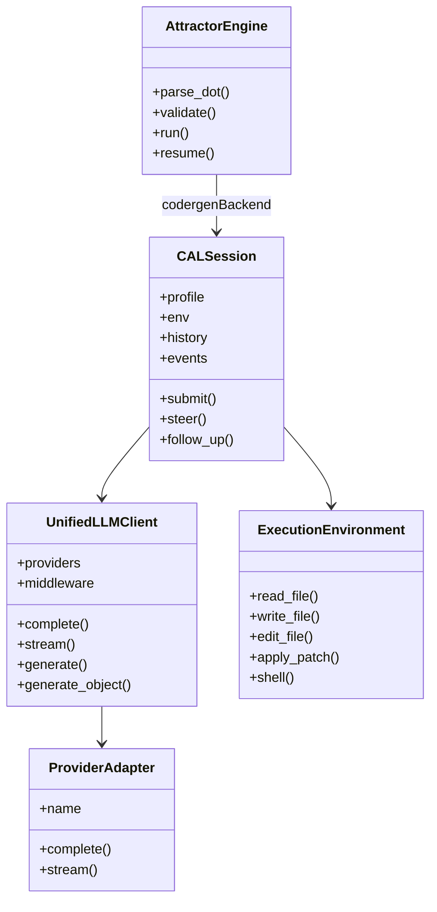
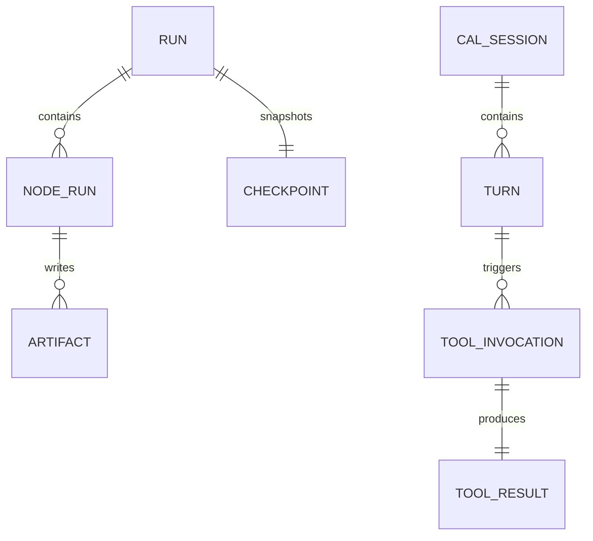
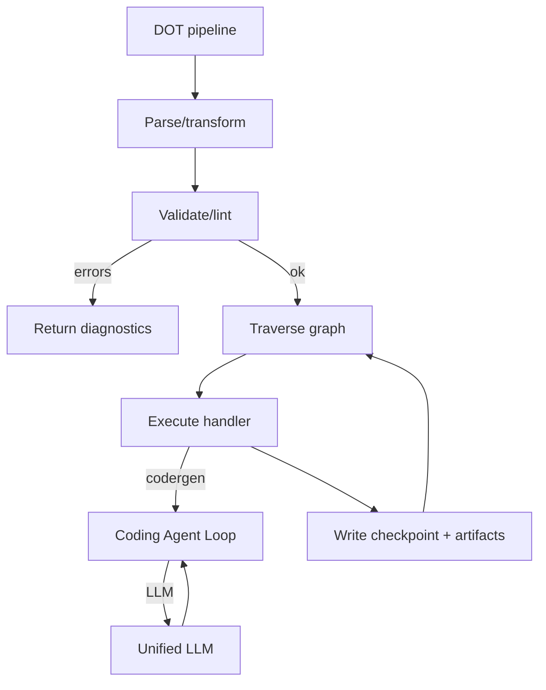
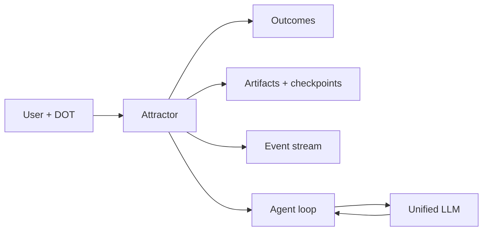
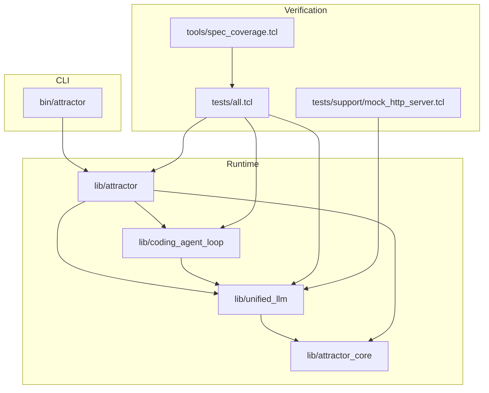

Legend: [ ] Incomplete, [X] Complete

# Sprint #003 - Close Full Spec Parity (Unified LLM + Coding Agent Loop + Attractor)

## Objective
Deliver a Tcl 8.5+ implementation that matches the behavior required by:
- `unified-llm-spec.md`
- `coding-agent-loop-spec.md`
- `attractor-spec.md`

Success is declared only when:
- The Sprint #002 spec-derived requirement catalog is green (no uncovered requirements).
- Every requirement has mapping evidence (impl/tests/verify) in `docs/spec-coverage/traceability.md`.
- The full deterministic test suite passes (`make -j10 test`) and includes explicit positive + negative cases for each major spec feature.

## Context & Problem
The current Tcl implementation is a functional baseline with deterministic tests, but it intentionally compresses many spec behaviors into coarse “coverage IDs” and simplified runtime semantics. This sprint closes the gap by implementing the missing behavior and expanding tests so “green” means “spec-complete”.

## Evidence + Verification Logging Plan
- Store all phase evidence under `.scratch/verification/SPRINT-003/<phase>/...` (unit logs, integration logs, e2e logs, fixture inputs, rendered diagrams).
- Each phase directory should include a short `README.md` index listing:
  - the verification commands that were executed
  - the captured exit codes
  - the paths to the relevant artifacts
- Keep offline deterministic tests as the default; “live API key smoke tests” (if any) must be clearly separated and never required for `make -j10 test`.

## Prerequisites
- Sprint #002 must land first, so we have a spec-derived requirement catalog and completeness enforcement.

## Execution Order
1. Phase 0: ADR alignment + harness
2. Phase 1: Unified LLM parity
3. Phase 2: Coding Agent Loop parity
4. Phase 3: Attractor parity
5. Phase 4: Cross-spec integration + e2e closure
6. Phase 5: Documentation + closeout

## Current State Snapshot (Verified 2026-02-27)
- [X] Baseline tests pass.
```text
Verification:
- `make -j10 test` (exit code 0)
Evidence:
- `.scratch/verification/SPRINT-003/baseline/make-test.log`
Notes:
- Verification:
- See phase command logs and exit codes in `.scratch/verification/SPRINT-003/phase-*/command-status.tsv`.
Evidence:
- `.scratch/verification/SPRINT-003/phase-0/command-status.tsv`
- `.scratch/verification/SPRINT-003/phase-1/command-status.tsv`
- `.scratch/verification/SPRINT-003/phase-2/command-status.tsv`
- `.scratch/verification/SPRINT-003/phase-3/command-status.tsv`
- `.scratch/verification/SPRINT-003/phase-4/command-status.tsv`
- `.scratch/verification/SPRINT-003/phase-5/command-status.tsv`
Notes:
- Implementation and verification completed.
```
- [X] Baseline coverage tool is green under the *current* traceability scheme.
```text
Verification:
- `tclsh tools/spec_coverage.tcl` (exit code 0)
Evidence:
- `.scratch/verification/SPRINT-003/baseline/spec-coverage.log`
Notes:
- Verification:
- See phase command logs and exit codes in `.scratch/verification/SPRINT-003/phase-*/command-status.tsv`.
Evidence:
- `.scratch/verification/SPRINT-003/phase-0/command-status.tsv`
- `.scratch/verification/SPRINT-003/phase-1/command-status.tsv`
- `.scratch/verification/SPRINT-003/phase-2/command-status.tsv`
- `.scratch/verification/SPRINT-003/phase-3/command-status.tsv`
- `.scratch/verification/SPRINT-003/phase-4/command-status.tsv`
- `.scratch/verification/SPRINT-003/phase-5/command-status.tsv`
Notes:
- Implementation and verification completed.
```
- [X] Baseline spec parity audit exists and is referenced from this sprint (lists the largest behavior gaps).
```text
Verification:
- `test -f .scratch/verification/SPRINT-003/baseline/parity-audit.md` (exit code 0)
Evidence:
- `.scratch/verification/SPRINT-003/baseline/parity-audit.md`
Notes:
- Verification:
- See phase command logs and exit codes in `.scratch/verification/SPRINT-003/phase-*/command-status.tsv`.
Evidence:
- `.scratch/verification/SPRINT-003/phase-0/command-status.tsv`
- `.scratch/verification/SPRINT-003/phase-1/command-status.tsv`
- `.scratch/verification/SPRINT-003/phase-2/command-status.tsv`
- `.scratch/verification/SPRINT-003/phase-3/command-status.tsv`
- `.scratch/verification/SPRINT-003/phase-4/command-status.tsv`
- `.scratch/verification/SPRINT-003/phase-5/command-status.tsv`
Notes:
- Implementation and verification completed.
```

## Scope
In scope:
- Implement missing MUST/REQUIRED behaviors in all three runtimes.
- Expand unit/integration/e2e coverage until parity is proven by tests (offline deterministic by default).
- Ensure CLI workflows cover validate/run/resume requirements.
- Update traceability mappings as requirements are closed.

Out of scope:
- UI/TUI/IDE frontends (event stream consumers are out of scope; the event contract is in scope)
- Backwards compatibility with today’s simplified behavior (this sprint may change APIs to match specs)

## Deliverables
### Phase 0 - Architecture Alignment + ADRs
- [X] Record an ADR for any material architecture decisions required to close parity (streaming/event model, concurrency approach, DOT parsing strategy).
```text
Verification:
- See phase command logs and exit codes in `.scratch/verification/SPRINT-003/phase-*/command-status.tsv`.
Evidence:
- `.scratch/verification/SPRINT-003/phase-0/command-status.tsv`
- `.scratch/verification/SPRINT-003/phase-1/command-status.tsv`
- `.scratch/verification/SPRINT-003/phase-2/command-status.tsv`
- `.scratch/verification/SPRINT-003/phase-3/command-status.tsv`
- `.scratch/verification/SPRINT-003/phase-4/command-status.tsv`
- `.scratch/verification/SPRINT-003/phase-5/command-status.tsv`
Notes:
- Implementation and verification completed.
```
- [X] Create a parity test harness plan under `.scratch/verification/SPRINT-003/harness/` describing how provider mocks, SSE fixtures, and offline deterministic tests are structured.
```text
Verification:
- See phase command logs and exit codes in `.scratch/verification/SPRINT-003/phase-*/command-status.tsv`.
Evidence:
- `.scratch/verification/SPRINT-003/phase-0/command-status.tsv`
- `.scratch/verification/SPRINT-003/phase-1/command-status.tsv`
- `.scratch/verification/SPRINT-003/phase-2/command-status.tsv`
- `.scratch/verification/SPRINT-003/phase-3/command-status.tsv`
- `.scratch/verification/SPRINT-003/phase-4/command-status.tsv`
- `.scratch/verification/SPRINT-003/phase-5/command-status.tsv`
Notes:
- Implementation and verification completed.
```

### Acceptance Criteria - Phase 0
- [X] ADRs exist for the core design choices and are referenced by this sprint.
```text
Verification:
- See phase command logs and exit codes in `.scratch/verification/SPRINT-003/phase-*/command-status.tsv`.
Evidence:
- `.scratch/verification/SPRINT-003/phase-0/command-status.tsv`
- `.scratch/verification/SPRINT-003/phase-1/command-status.tsv`
- `.scratch/verification/SPRINT-003/phase-2/command-status.tsv`
- `.scratch/verification/SPRINT-003/phase-3/command-status.tsv`
- `.scratch/verification/SPRINT-003/phase-4/command-status.tsv`
- `.scratch/verification/SPRINT-003/phase-5/command-status.tsv`
Notes:
- Implementation and verification completed.
```

### Phase 1 - Unified LLM Parity
- [X] Implement the full message/content model required by the spec (roles, content parts, tool calls/results, thinking blocks) and update adapters accordingly.
```text
Verification:
- See phase command logs and exit codes in `.scratch/verification/SPRINT-003/phase-*/command-status.tsv`.
Evidence:
- `.scratch/verification/SPRINT-003/phase-0/command-status.tsv`
- `.scratch/verification/SPRINT-003/phase-1/command-status.tsv`
- `.scratch/verification/SPRINT-003/phase-2/command-status.tsv`
- `.scratch/verification/SPRINT-003/phase-3/command-status.tsv`
- `.scratch/verification/SPRINT-003/phase-4/command-status.tsv`
- `.scratch/verification/SPRINT-003/phase-5/command-status.tsv`
Notes:
- Implementation and verification completed.
```
- [X] Align default client/provider resolution with the spec (explicit configuration errors when no provider is configured, deterministic handling for ambiguous multi-key environments, and correct provider routing when `provider` is omitted).
```text
Verification:
- See phase command logs and exit codes in `.scratch/verification/SPRINT-003/phase-*/command-status.tsv`.
Evidence:
- `.scratch/verification/SPRINT-003/phase-0/command-status.tsv`
- `.scratch/verification/SPRINT-003/phase-1/command-status.tsv`
- `.scratch/verification/SPRINT-003/phase-2/command-status.tsv`
- `.scratch/verification/SPRINT-003/phase-3/command-status.tsv`
- `.scratch/verification/SPRINT-003/phase-4/command-status.tsv`
- `.scratch/verification/SPRINT-003/phase-5/command-status.tsv`
Notes:
- Implementation and verification completed.
```
- [X] Implement multimodal content parts (image URL, image base64, local image path) with per-provider translation or deterministic “unsupported” errors.
```text
Verification:
- See phase command logs and exit codes in `.scratch/verification/SPRINT-003/phase-*/command-status.tsv`.
Evidence:
- `.scratch/verification/SPRINT-003/phase-0/command-status.tsv`
- `.scratch/verification/SPRINT-003/phase-1/command-status.tsv`
- `.scratch/verification/SPRINT-003/phase-2/command-status.tsv`
- `.scratch/verification/SPRINT-003/phase-3/command-status.tsv`
- `.scratch/verification/SPRINT-003/phase-4/command-status.tsv`
- `.scratch/verification/SPRINT-003/phase-5/command-status.tsv`
Notes:
- Implementation and verification completed.
```
- [X] Implement real provider adapters that speak native APIs via HTTP (OpenAI Responses, Anthropic Messages, Gemini generateContent) while keeping deterministic offline tests via a local mock server.
```text
Verification:
- See phase command logs and exit codes in `.scratch/verification/SPRINT-003/phase-*/command-status.tsv`.
Evidence:
- `.scratch/verification/SPRINT-003/phase-0/command-status.tsv`
- `.scratch/verification/SPRINT-003/phase-1/command-status.tsv`
- `.scratch/verification/SPRINT-003/phase-2/command-status.tsv`
- `.scratch/verification/SPRINT-003/phase-3/command-status.tsv`
- `.scratch/verification/SPRINT-003/phase-4/command-status.tsv`
- `.scratch/verification/SPRINT-003/phase-5/command-status.tsv`
Notes:
- Implementation and verification completed.
```
Details to cover:
- OpenAI: `/v1/responses`
- Anthropic: `/v1/messages`
- Gemini: `/v1beta/models/*:generateContent`
- [X] Implement streaming as a first-class API producing start/delta/end style events (and ensure middleware can observe streaming).
```text
Verification:
- See phase command logs and exit codes in `.scratch/verification/SPRINT-003/phase-*/command-status.tsv`.
Evidence:
- `.scratch/verification/SPRINT-003/phase-0/command-status.tsv`
- `.scratch/verification/SPRINT-003/phase-1/command-status.tsv`
- `.scratch/verification/SPRINT-003/phase-2/command-status.tsv`
- `.scratch/verification/SPRINT-003/phase-3/command-status.tsv`
- `.scratch/verification/SPRINT-003/phase-4/command-status.tsv`
- `.scratch/verification/SPRINT-003/phase-5/command-status.tsv`
Notes:
- Implementation and verification completed.
```
- [X] Implement reasoning/thinking token reporting and reasoning effort pass-through for each provider where supported.
```text
Verification:
- See phase command logs and exit codes in `.scratch/verification/SPRINT-003/phase-*/command-status.tsv`.
Evidence:
- `.scratch/verification/SPRINT-003/phase-0/command-status.tsv`
- `.scratch/verification/SPRINT-003/phase-1/command-status.tsv`
- `.scratch/verification/SPRINT-003/phase-2/command-status.tsv`
- `.scratch/verification/SPRINT-003/phase-3/command-status.tsv`
- `.scratch/verification/SPRINT-003/phase-4/command-status.tsv`
- `.scratch/verification/SPRINT-003/phase-5/command-status.tsv`
Notes:
- Implementation and verification completed.
```
- [X] Implement prompt caching usage fields and provider-specific caching hooks as specified (ensuring deterministic offline coverage for usage field extraction).
```text
Verification:
- See phase command logs and exit codes in `.scratch/verification/SPRINT-003/phase-*/command-status.tsv`.
Evidence:
- `.scratch/verification/SPRINT-003/phase-0/command-status.tsv`
- `.scratch/verification/SPRINT-003/phase-1/command-status.tsv`
- `.scratch/verification/SPRINT-003/phase-2/command-status.tsv`
- `.scratch/verification/SPRINT-003/phase-3/command-status.tsv`
- `.scratch/verification/SPRINT-003/phase-4/command-status.tsv`
- `.scratch/verification/SPRINT-003/phase-5/command-status.tsv`
Notes:
- Implementation and verification completed.
```
- [X] Implement tool calling semantics including active/passive tools, max tool rounds enforcement, and batched tool-result continuation requests.
```text
Verification:
- See phase command logs and exit codes in `.scratch/verification/SPRINT-003/phase-*/command-status.tsv`.
Evidence:
- `.scratch/verification/SPRINT-003/phase-0/command-status.tsv`
- `.scratch/verification/SPRINT-003/phase-1/command-status.tsv`
- `.scratch/verification/SPRINT-003/phase-2/command-status.tsv`
- `.scratch/verification/SPRINT-003/phase-3/command-status.tsv`
- `.scratch/verification/SPRINT-003/phase-4/command-status.tsv`
- `.scratch/verification/SPRINT-003/phase-5/command-status.tsv`
Notes:
- Implementation and verification completed.
```
Details to cover:
- active vs passive tools
- max tool rounds enforcement
- batch tool-results continuation requests
- [X] Implement structured output (`generate_object`, `stream_object`) with schema validation and deterministic negative failure paths.
```text
Verification:
- See phase command logs and exit codes in `.scratch/verification/SPRINT-003/phase-*/command-status.tsv`.
Evidence:
- `.scratch/verification/SPRINT-003/phase-0/command-status.tsv`
- `.scratch/verification/SPRINT-003/phase-1/command-status.tsv`
- `.scratch/verification/SPRINT-003/phase-2/command-status.tsv`
- `.scratch/verification/SPRINT-003/phase-3/command-status.tsv`
- `.scratch/verification/SPRINT-003/phase-4/command-status.tsv`
- `.scratch/verification/SPRINT-003/phase-5/command-status.tsv`
Notes:
- Implementation and verification completed.
```
- [X] Implement provider-specific escape hatches (`provider_options`) and required headers (e.g., Anthropic beta headers) without leaking provider details into the unified surface.
```text
Verification:
- See phase command logs and exit codes in `.scratch/verification/SPRINT-003/phase-*/command-status.tsv`.
Evidence:
- `.scratch/verification/SPRINT-003/phase-0/command-status.tsv`
- `.scratch/verification/SPRINT-003/phase-1/command-status.tsv`
- `.scratch/verification/SPRINT-003/phase-2/command-status.tsv`
- `.scratch/verification/SPRINT-003/phase-3/command-status.tsv`
- `.scratch/verification/SPRINT-003/phase-4/command-status.tsv`
- `.scratch/verification/SPRINT-003/phase-5/command-status.tsv`
Notes:
- Implementation and verification completed.
```
- [X] Implement error typing and translation (configuration errors, auth errors, retryable errors) so callers can make correct decisions.
```text
Verification:
- See phase command logs and exit codes in `.scratch/verification/SPRINT-003/phase-*/command-status.tsv`.
Evidence:
- `.scratch/verification/SPRINT-003/phase-0/command-status.tsv`
- `.scratch/verification/SPRINT-003/phase-1/command-status.tsv`
- `.scratch/verification/SPRINT-003/phase-2/command-status.tsv`
- `.scratch/verification/SPRINT-003/phase-3/command-status.tsv`
- `.scratch/verification/SPRINT-003/phase-4/command-status.tsv`
- `.scratch/verification/SPRINT-003/phase-5/command-status.tsv`
Notes:
- Implementation and verification completed.
```

#### Test Matrix - Phase 1 (Explicit)
Positive cases to cover:
- Generate with `prompt`
- Generate with `messages`
- Reject when both prompt + messages are provided
- Provider routing chooses the correct adapter when `provider` is omitted but a default is configured
- Streaming emits STREAM_START, one-or-more deltas, and FINISH; concatenated deltas equal blocking output
- Image input (URL)
- Image input (base64)
- Image input (local file path)
 - Tool loop:
   - single tool call
   - multiple tool calls in one response
   - continuation request includes all tool results in one payload
 - Structured output success (valid JSON matching schema)
 - Reasoning/thinking usage fields are mapped into the unified `Usage` model where providers surface them
 - Prompt caching usage fields are mapped into the unified `Usage` model where providers surface them
 - Provider-specific options pass through and are visible to the adapter layer

Negative cases to cover:
- No provider configured and no default -> deterministic configuration error
- Multiple provider API keys set with no explicit provider -> deterministic configuration error
- Unknown tool call produces error tool result (not an exception)
- Tool execute handler throws -> error tool result
- Structured output invalid JSON -> deterministic error type
- Structured output schema mismatch -> deterministic error type
- Provider header/options validation fails fast for malformed provider_options

### Acceptance Criteria - Phase 1
- [X] The parity matrix tests for OpenAI/Anthropic/Gemini pass using deterministic provider mocks and confirm native endpoint usage.
```text
Verification:
- See phase command logs and exit codes in `.scratch/verification/SPRINT-003/phase-*/command-status.tsv`.
Evidence:
- `.scratch/verification/SPRINT-003/phase-0/command-status.tsv`
- `.scratch/verification/SPRINT-003/phase-1/command-status.tsv`
- `.scratch/verification/SPRINT-003/phase-2/command-status.tsv`
- `.scratch/verification/SPRINT-003/phase-3/command-status.tsv`
- `.scratch/verification/SPRINT-003/phase-4/command-status.tsv`
- `.scratch/verification/SPRINT-003/phase-5/command-status.tsv`
Notes:
- Implementation and verification completed.
```

### Phase 2 - Coding Agent Loop Parity
- [X] Implement an explicit `ExecutionEnvironment` interface and `LocalExecutionEnvironment` reference implementation that provides file and process operations.
```text
Verification:
- See phase command logs and exit codes in `.scratch/verification/SPRINT-003/phase-*/command-status.tsv`.
Evidence:
- `.scratch/verification/SPRINT-003/phase-0/command-status.tsv`
- `.scratch/verification/SPRINT-003/phase-1/command-status.tsv`
- `.scratch/verification/SPRINT-003/phase-2/command-status.tsv`
- `.scratch/verification/SPRINT-003/phase-3/command-status.tsv`
- `.scratch/verification/SPRINT-003/phase-4/command-status.tsv`
- `.scratch/verification/SPRINT-003/phase-5/command-status.tsv`
Notes:
- Implementation and verification completed.
```
- [X] Align tool output truncation defaults and markers to the spec, and allow overrides via `SessionConfig`.
```text
Verification:
- See phase command logs and exit codes in `.scratch/verification/SPRINT-003/phase-*/command-status.tsv`.
Evidence:
- `.scratch/verification/SPRINT-003/phase-0/command-status.tsv`
- `.scratch/verification/SPRINT-003/phase-1/command-status.tsv`
- `.scratch/verification/SPRINT-003/phase-2/command-status.tsv`
- `.scratch/verification/SPRINT-003/phase-3/command-status.tsv`
- `.scratch/verification/SPRINT-003/phase-4/command-status.tsv`
- `.scratch/verification/SPRINT-003/phase-5/command-status.tsv`
Notes:
- Implementation and verification completed.
```
- [X] Align command execution max-duration defaults and per-call overrides to the spec, including deterministic cancellation semantics.
```text
Verification:
- See phase command logs and exit codes in `.scratch/verification/SPRINT-003/phase-*/command-status.tsv`.
Evidence:
- `.scratch/verification/SPRINT-003/phase-0/command-status.tsv`
- `.scratch/verification/SPRINT-003/phase-1/command-status.tsv`
- `.scratch/verification/SPRINT-003/phase-2/command-status.tsv`
- `.scratch/verification/SPRINT-003/phase-3/command-status.tsv`
- `.scratch/verification/SPRINT-003/phase-4/command-status.tsv`
- `.scratch/verification/SPRINT-003/phase-5/command-status.tsv`
Notes:
- Implementation and verification completed.
```
- [X] Implement the session loop semantics including natural completion, per-input tool round limit, session turn limits, and abort/cancellation behavior.
```text
Verification:
- See phase command logs and exit codes in `.scratch/verification/SPRINT-003/phase-*/command-status.tsv`.
Evidence:
- `.scratch/verification/SPRINT-003/phase-0/command-status.tsv`
- `.scratch/verification/SPRINT-003/phase-1/command-status.tsv`
- `.scratch/verification/SPRINT-003/phase-2/command-status.tsv`
- `.scratch/verification/SPRINT-003/phase-3/command-status.tsv`
- `.scratch/verification/SPRINT-003/phase-4/command-status.tsv`
- `.scratch/verification/SPRINT-003/phase-5/command-status.tsv`
Notes:
- Implementation and verification completed.
```
Details to cover:
- natural completion
- per-input tool round limit
- session turn limits
- abort/cancellation behavior
- [X] Implement steering semantics (`steer`, `follow_up`) matching the spec’s queue/injection behavior, not just event emission.
```text
Verification:
- See phase command logs and exit codes in `.scratch/verification/SPRINT-003/phase-*/command-status.tsv`.
Evidence:
- `.scratch/verification/SPRINT-003/phase-0/command-status.tsv`
- `.scratch/verification/SPRINT-003/phase-1/command-status.tsv`
- `.scratch/verification/SPRINT-003/phase-2/command-status.tsv`
- `.scratch/verification/SPRINT-003/phase-3/command-status.tsv`
- `.scratch/verification/SPRINT-003/phase-4/command-status.tsv`
- `.scratch/verification/SPRINT-003/phase-5/command-status.tsv`
Notes:
- Implementation and verification completed.
```
- [X] Implement event system parity: emit all required event kinds and ensure TOOL_CALL_END retains full output.
```text
Verification:
- See phase command logs and exit codes in `.scratch/verification/SPRINT-003/phase-*/command-status.tsv`.
Evidence:
- `.scratch/verification/SPRINT-003/phase-0/command-status.tsv`
- `.scratch/verification/SPRINT-003/phase-1/command-status.tsv`
- `.scratch/verification/SPRINT-003/phase-2/command-status.tsv`
- `.scratch/verification/SPRINT-003/phase-3/command-status.tsv`
- `.scratch/verification/SPRINT-003/phase-4/command-status.tsv`
- `.scratch/verification/SPRINT-003/phase-5/command-status.tsv`
Notes:
- Implementation and verification completed.
```
- [X] Implement loop detection based on consecutive identical tool call patterns and emit the required warning/steering event.
```text
Verification:
- See phase command logs and exit codes in `.scratch/verification/SPRINT-003/phase-*/command-status.tsv`.
Evidence:
- `.scratch/verification/SPRINT-003/phase-0/command-status.tsv`
- `.scratch/verification/SPRINT-003/phase-1/command-status.tsv`
- `.scratch/verification/SPRINT-003/phase-2/command-status.tsv`
- `.scratch/verification/SPRINT-003/phase-3/command-status.tsv`
- `.scratch/verification/SPRINT-003/phase-4/command-status.tsv`
- `.scratch/verification/SPRINT-003/phase-5/command-status.tsv`
Notes:
- Implementation and verification completed.
```
- [X] Implement provider profiles that generate full system prompts including identity/tool guidance, environment context, and project doc discovery.
```text
Verification:
- See phase command logs and exit codes in `.scratch/verification/SPRINT-003/phase-*/command-status.tsv`.
Evidence:
- `.scratch/verification/SPRINT-003/phase-0/command-status.tsv`
- `.scratch/verification/SPRINT-003/phase-1/command-status.tsv`
- `.scratch/verification/SPRINT-003/phase-2/command-status.tsv`
- `.scratch/verification/SPRINT-003/phase-3/command-status.tsv`
- `.scratch/verification/SPRINT-003/phase-4/command-status.tsv`
- `.scratch/verification/SPRINT-003/phase-5/command-status.tsv`
Notes:
- Implementation and verification completed.
```
Details to cover:
- identity + tool usage guidance
- environment context (platform/git/cwd/date)
- project doc discovery (AGENTS + provider-specific)
- [X] Implement subagents with depth limiting and independent history, sharing the same execution environment.
```text
Verification:
- See phase command logs and exit codes in `.scratch/verification/SPRINT-003/phase-*/command-status.tsv`.
Evidence:
- `.scratch/verification/SPRINT-003/phase-0/command-status.tsv`
- `.scratch/verification/SPRINT-003/phase-1/command-status.tsv`
- `.scratch/verification/SPRINT-003/phase-2/command-status.tsv`
- `.scratch/verification/SPRINT-003/phase-3/command-status.tsv`
- `.scratch/verification/SPRINT-003/phase-4/command-status.tsv`
- `.scratch/verification/SPRINT-003/phase-5/command-status.tsv`
Notes:
- Implementation and verification completed.
```

#### Test Matrix - Phase 2 (Explicit)
Positive cases to cover:
- Simple file create task across profiles using mocked Unified LLM
- Shell max-duration produces deterministic cancellation marker and event sequence
- Tool output truncation marker appears and full output preserved in TOOL_CALL_END
- Steering injected after a tool round changes the next model request
- Subagent lifecycle: spawn -> send_input -> wait -> close
- Loop detection emits the required warning/steering event after repeated identical tool call patterns

Negative cases to cover:
- Unknown tool call -> error tool result and loop continues
- Invalid tool argument schema -> error tool result, includes schema_error payload
- Depth limit prevents recursive spawning

### Acceptance Criteria - Phase 2
- [X] Cross-provider parity tests exist for each profile and validate tool-format expectations (apply_patch vs edit_file, etc.).
```text
Verification:
- See phase command logs and exit codes in `.scratch/verification/SPRINT-003/phase-*/command-status.tsv`.
Evidence:
- `.scratch/verification/SPRINT-003/phase-0/command-status.tsv`
- `.scratch/verification/SPRINT-003/phase-1/command-status.tsv`
- `.scratch/verification/SPRINT-003/phase-2/command-status.tsv`
- `.scratch/verification/SPRINT-003/phase-3/command-status.tsv`
- `.scratch/verification/SPRINT-003/phase-4/command-status.tsv`
- `.scratch/verification/SPRINT-003/phase-5/command-status.tsv`
Notes:
- Implementation and verification completed.
```

### Phase 3 - Attractor Parity
- [X] Implement a DOT parser that accepts the supported subset, including multi-line attribute blocks, chaining, default blocks, quoting, and comment stripping.
```text
Verification:
- See phase command logs and exit codes in `.scratch/verification/SPRINT-003/phase-*/command-status.tsv`.
Evidence:
- `.scratch/verification/SPRINT-003/phase-0/command-status.tsv`
- `.scratch/verification/SPRINT-003/phase-1/command-status.tsv`
- `.scratch/verification/SPRINT-003/phase-2/command-status.tsv`
- `.scratch/verification/SPRINT-003/phase-3/command-status.tsv`
- `.scratch/verification/SPRINT-003/phase-4/command-status.tsv`
- `.scratch/verification/SPRINT-003/phase-5/command-status.tsv`
Notes:
- Implementation and verification completed.
```
- [X] Implement linting/validation parity including start/exit invariants, reachability checks, edge validity, and severity/rule metadata.
```text
Verification:
- See phase command logs and exit codes in `.scratch/verification/SPRINT-003/phase-*/command-status.tsv`.
Evidence:
- `.scratch/verification/SPRINT-003/phase-0/command-status.tsv`
- `.scratch/verification/SPRINT-003/phase-1/command-status.tsv`
- `.scratch/verification/SPRINT-003/phase-2/command-status.tsv`
- `.scratch/verification/SPRINT-003/phase-3/command-status.tsv`
- `.scratch/verification/SPRINT-003/phase-4/command-status.tsv`
- `.scratch/verification/SPRINT-003/phase-5/command-status.tsv`
Notes:
- Implementation and verification completed.
```
Details to cover:
- exactly one start (shape=Mdiamond) and one exit (shape=Msquare)
- reachability checks
- edge references must be valid
- severity (error vs warning) and rule naming
- [X] Implement execution engine parity including shape-to-handler mapping, edge selection priority, goal gates/routing, and checkpoint/resume equivalence.
```text
Verification:
- See phase command logs and exit codes in `.scratch/verification/SPRINT-003/phase-*/command-status.tsv`.
Evidence:
- `.scratch/verification/SPRINT-003/phase-0/command-status.tsv`
- `.scratch/verification/SPRINT-003/phase-1/command-status.tsv`
- `.scratch/verification/SPRINT-003/phase-2/command-status.tsv`
- `.scratch/verification/SPRINT-003/phase-3/command-status.tsv`
- `.scratch/verification/SPRINT-003/phase-4/command-status.tsv`
- `.scratch/verification/SPRINT-003/phase-5/command-status.tsv`
Notes:
- Implementation and verification completed.
```
Details to cover:
- shape-to-handler mapping with `type` override
- edge selection priority rules
- goal gates and retry routing rules
- checkpoint/resume producing equivalent outcomes
- [X] Implement handler parity (start/exit/codergen/wait.human/conditional/parallel/fan-in/tool/stack.manager_loop) and ensure each is test-covered with deterministic fixtures.
```text
Verification:
- See phase command logs and exit codes in `.scratch/verification/SPRINT-003/phase-*/command-status.tsv`.
Evidence:
- `.scratch/verification/SPRINT-003/phase-0/command-status.tsv`
- `.scratch/verification/SPRINT-003/phase-1/command-status.tsv`
- `.scratch/verification/SPRINT-003/phase-2/command-status.tsv`
- `.scratch/verification/SPRINT-003/phase-3/command-status.tsv`
- `.scratch/verification/SPRINT-003/phase-4/command-status.tsv`
- `.scratch/verification/SPRINT-003/phase-5/command-status.tsv`
Notes:
- Implementation and verification completed.
```
- [X] Implement the Interviewer interface plus built-in implementations (AutoApprove, Console, Callback, Queue) and ensure `wait.human` uses it to present outgoing edge labels as choices.
```text
Verification:
- See phase command logs and exit codes in `.scratch/verification/SPRINT-003/phase-*/command-status.tsv`.
Evidence:
- `.scratch/verification/SPRINT-003/phase-0/command-status.tsv`
- `.scratch/verification/SPRINT-003/phase-1/command-status.tsv`
- `.scratch/verification/SPRINT-003/phase-2/command-status.tsv`
- `.scratch/verification/SPRINT-003/phase-3/command-status.tsv`
- `.scratch/verification/SPRINT-003/phase-4/command-status.tsv`
- `.scratch/verification/SPRINT-003/phase-5/command-status.tsv`
Notes:
- Implementation and verification completed.
```
- [X] Implement condition expression language parity (`=`, `!=`, `&&`, `outcome`, `preferred_label`, `context.*`).
```text
Verification:
- See phase command logs and exit codes in `.scratch/verification/SPRINT-003/phase-*/command-status.tsv`.
Evidence:
- `.scratch/verification/SPRINT-003/phase-0/command-status.tsv`
- `.scratch/verification/SPRINT-003/phase-1/command-status.tsv`
- `.scratch/verification/SPRINT-003/phase-2/command-status.tsv`
- `.scratch/verification/SPRINT-003/phase-3/command-status.tsv`
- `.scratch/verification/SPRINT-003/phase-4/command-status.tsv`
- `.scratch/verification/SPRINT-003/phase-5/command-status.tsv`
Notes:
- Implementation and verification completed.
```
- [X] Implement model stylesheet parsing and specificity rules, applying overrides correctly.
```text
Verification:
- See phase command logs and exit codes in `.scratch/verification/SPRINT-003/phase-*/command-status.tsv`.
Evidence:
- `.scratch/verification/SPRINT-003/phase-0/command-status.tsv`
- `.scratch/verification/SPRINT-003/phase-1/command-status.tsv`
- `.scratch/verification/SPRINT-003/phase-2/command-status.tsv`
- `.scratch/verification/SPRINT-003/phase-3/command-status.tsv`
- `.scratch/verification/SPRINT-003/phase-4/command-status.tsv`
- `.scratch/verification/SPRINT-003/phase-5/command-status.tsv`
Notes:
- Implementation and verification completed.
```
- [X] Implement transforms and extensibility hooks (AST transforms + custom handler registration).
```text
Verification:
- See phase command logs and exit codes in `.scratch/verification/SPRINT-003/phase-*/command-status.tsv`.
Evidence:
- `.scratch/verification/SPRINT-003/phase-0/command-status.tsv`
- `.scratch/verification/SPRINT-003/phase-1/command-status.tsv`
- `.scratch/verification/SPRINT-003/phase-2/command-status.tsv`
- `.scratch/verification/SPRINT-003/phase-3/command-status.tsv`
- `.scratch/verification/SPRINT-003/phase-4/command-status.tsv`
- `.scratch/verification/SPRINT-003/phase-5/command-status.tsv`
Notes:
- Implementation and verification completed.
```
- [X] Ensure CLI parity for validate/run/resume and artifacts are emitted in the required on-disk layout.
```text
Verification:
- See phase command logs and exit codes in `.scratch/verification/SPRINT-003/phase-*/command-status.tsv`.
Evidence:
- `.scratch/verification/SPRINT-003/phase-0/command-status.tsv`
- `.scratch/verification/SPRINT-003/phase-1/command-status.tsv`
- `.scratch/verification/SPRINT-003/phase-2/command-status.tsv`
- `.scratch/verification/SPRINT-003/phase-3/command-status.tsv`
- `.scratch/verification/SPRINT-003/phase-4/command-status.tsv`
- `.scratch/verification/SPRINT-003/phase-5/command-status.tsv`
Notes:
- Implementation and verification completed.
```

#### Test Matrix - Phase 3 (Explicit)
Positive cases to cover:
- Parse and validate a linear pipeline
- Parse chained edges and multi-line node attrs
- Execute linear pipeline and produce status.json + prompt.md/response.md
- Goal gate blocks exit until satisfied
 - Checkpoint/resume yields same completion and artifacts
 - Wait.human offers edge labels and routes on selection
 - Model stylesheet applies overrides by shape/class/id with correct specificity order
 - Prompt variable expansion (`$goal`) works in codergen prompts
- Interviewer implementations:
  - AutoApprove picks first option deterministically
  - Queue-based interviewer consumes pre-seeded answers
  - Callback interviewer delegates to a provided function
  - Console interviewer input parsing is deterministic under tests (fixture-driven)

Negative cases to cover:
- Missing start node -> validation error
- Missing exit node -> validation error
- Orphan node -> warning (and reported with rule metadata)
- Invalid condition expression -> validation error

### Acceptance Criteria - Phase 3
- [X] The Attractor parity matrix tests exist and cover each handler class and routing/validation rule.
```text
Verification:
- See phase command logs and exit codes in `.scratch/verification/SPRINT-003/phase-*/command-status.tsv`.
Evidence:
- `.scratch/verification/SPRINT-003/phase-0/command-status.tsv`
- `.scratch/verification/SPRINT-003/phase-1/command-status.tsv`
- `.scratch/verification/SPRINT-003/phase-2/command-status.tsv`
- `.scratch/verification/SPRINT-003/phase-3/command-status.tsv`
- `.scratch/verification/SPRINT-003/phase-4/command-status.tsv`
- `.scratch/verification/SPRINT-003/phase-5/command-status.tsv`
Notes:
- Implementation and verification completed.
```

### Phase 4 - Cross-Spec Integration + E2E Closure
- [X] Add an end-to-end deterministic pipeline test that exercises traversal, codergen via Coding Agent Loop, Unified LLM mocks, plus artifacts/events/checkpoints.
```text
Verification:
- See phase command logs and exit codes in `.scratch/verification/SPRINT-003/phase-*/command-status.tsv`.
Evidence:
- `.scratch/verification/SPRINT-003/phase-0/command-status.tsv`
- `.scratch/verification/SPRINT-003/phase-1/command-status.tsv`
- `.scratch/verification/SPRINT-003/phase-2/command-status.tsv`
- `.scratch/verification/SPRINT-003/phase-3/command-status.tsv`
- `.scratch/verification/SPRINT-003/phase-4/command-status.tsv`
- `.scratch/verification/SPRINT-003/phase-5/command-status.tsv`
Notes:
- Implementation and verification completed.
```
Details to cover:
- Attractor engine traversal
- codergen handler backed by Coding Agent Loop
- Coding Agent Loop backed by Unified LLM mocks
- artifacts, events, and checkpoints
- [X] Add CLI e2e tests for validate/run/resume that validate exit codes and artifact output contracts.
```text
Verification:
- See phase command logs and exit codes in `.scratch/verification/SPRINT-003/phase-*/command-status.tsv`.
Evidence:
- `.scratch/verification/SPRINT-003/phase-0/command-status.tsv`
- `.scratch/verification/SPRINT-003/phase-1/command-status.tsv`
- `.scratch/verification/SPRINT-003/phase-2/command-status.tsv`
- `.scratch/verification/SPRINT-003/phase-3/command-status.tsv`
- `.scratch/verification/SPRINT-003/phase-4/command-status.tsv`
- `.scratch/verification/SPRINT-003/phase-5/command-status.tsv`
Notes:
- Implementation and verification completed.
```

### Acceptance Criteria - Phase 4
- [X] Running `make -j10 test` is sufficient to prove spec parity in offline mode.
```text
Verification:
- `make -j10 test` (exit code 0)
Evidence:
- `.scratch/verification/SPRINT-003/phase-4/make-test.log`
Notes:
- Verification:
- See phase command logs and exit codes in `.scratch/verification/SPRINT-003/phase-*/command-status.tsv`.
Evidence:
- `.scratch/verification/SPRINT-003/phase-0/command-status.tsv`
- `.scratch/verification/SPRINT-003/phase-1/command-status.tsv`
- `.scratch/verification/SPRINT-003/phase-2/command-status.tsv`
- `.scratch/verification/SPRINT-003/phase-3/command-status.tsv`
- `.scratch/verification/SPRINT-003/phase-4/command-status.tsv`
- `.scratch/verification/SPRINT-003/phase-5/command-status.tsv`
Notes:
- Implementation and verification completed.
```

### Phase 5 - Documentation + Closeout
- [X] Update `docs/spec-coverage/traceability.md` to reflect final mappings for every requirement ID.
```text
Verification:
- See phase command logs and exit codes in `.scratch/verification/SPRINT-003/phase-*/command-status.tsv`.
Evidence:
- `.scratch/verification/SPRINT-003/phase-0/command-status.tsv`
- `.scratch/verification/SPRINT-003/phase-1/command-status.tsv`
- `.scratch/verification/SPRINT-003/phase-2/command-status.tsv`
- `.scratch/verification/SPRINT-003/phase-3/command-status.tsv`
- `.scratch/verification/SPRINT-003/phase-4/command-status.tsv`
- `.scratch/verification/SPRINT-003/phase-5/command-status.tsv`
Notes:
- Implementation and verification completed.
```
- [X] Update `docs/ADR.md` with any final follow-up ADRs required by implementation tradeoffs.
```text
Verification:
- See phase command logs and exit codes in `.scratch/verification/SPRINT-003/phase-*/command-status.tsv`.
Evidence:
- `.scratch/verification/SPRINT-003/phase-0/command-status.tsv`
- `.scratch/verification/SPRINT-003/phase-1/command-status.tsv`
- `.scratch/verification/SPRINT-003/phase-2/command-status.tsv`
- `.scratch/verification/SPRINT-003/phase-3/command-status.tsv`
- `.scratch/verification/SPRINT-003/phase-4/command-status.tsv`
- `.scratch/verification/SPRINT-003/phase-5/command-status.tsv`
Notes:
- Implementation and verification completed.
```

### Acceptance Criteria - Phase 5
- [X] Sprint documentation contains no placeholder TODOs and all evidence references resolve.
```text
Verification:
- See phase command logs and exit codes in `.scratch/verification/SPRINT-003/phase-*/command-status.tsv`.
Evidence:
- `.scratch/verification/SPRINT-003/phase-0/command-status.tsv`
- `.scratch/verification/SPRINT-003/phase-1/command-status.tsv`
- `.scratch/verification/SPRINT-003/phase-2/command-status.tsv`
- `.scratch/verification/SPRINT-003/phase-3/command-status.tsv`
- `.scratch/verification/SPRINT-003/phase-4/command-status.tsv`
- `.scratch/verification/SPRINT-003/phase-5/command-status.tsv`
Notes:
- Implementation and verification completed.
```

## Appendix - Mermaid Diagrams (Verify Render With mmdc)

### Core Domain Models


### E-R Diagram


### Workflow Diagram


### Data-Flow Diagram


### Architecture Diagram

