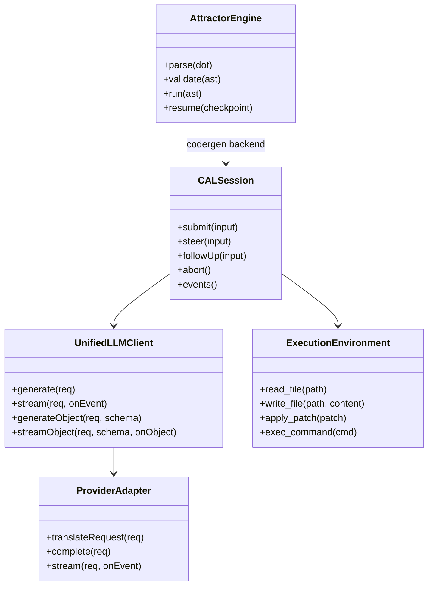
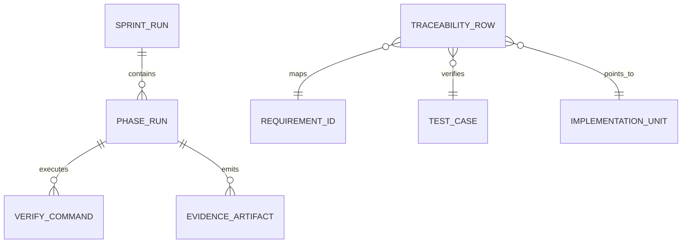
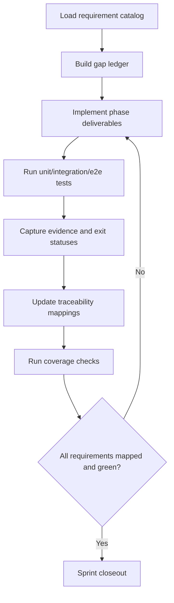
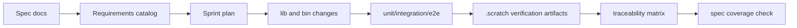
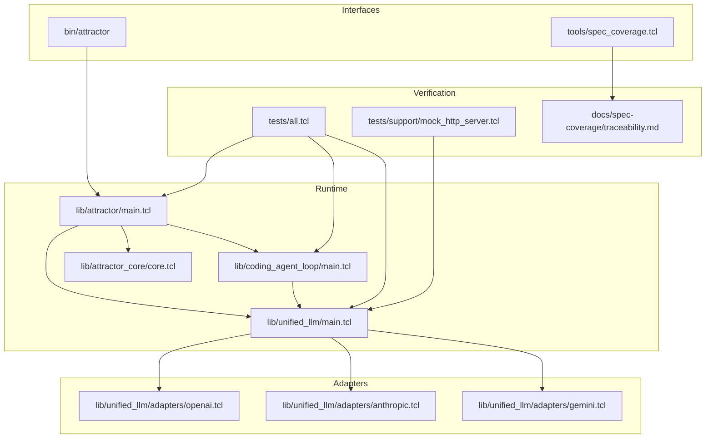

Legend: [ ] Incomplete, [X] Complete

# Sprint #003 Comprehensive Implementation Plan - Close Full Spec Parity (Tcl)

## Executive Summary
Implement complete Tcl parity for:
- `unified-llm-spec.md`
- `coding-agent-loop-spec.md`
- `attractor-spec.md`

This plan is execution-ready and scoped so a developer can implement Sprint #003 from this document alone.

## Objective
Implement and verify full Tcl behavioral parity for Unified LLM, Coding Agent Loop, and Attractor runtime surfaces specified by Sprint #003 requirements.

## Goal
Deliver deterministic, offline-verifiable parity where every Sprint #003 requirement is mapped to:
- implementation location
- automated tests (unit, integration, e2e where applicable)
- reproducible verification evidence under `.scratch/verification/SPRINT-003/`

## Scope and Non-Goals
In scope:
- ULLM parity (provider routing, normalization, streaming, tool loops, structured output, typed errors)
- CAL parity (session loop lifecycle, tool execution semantics, event contracts, profiles, subagents)
- ATR parity (DOT parser/validator/engine/handlers/interviewers, CLI `validate|run|resume`)
- Traceability and evidence closure in spec coverage docs

Out of scope:
- Legacy behavior preservation
- Feature gating
- UI/IDE surface expansion not required by Sprint #003 requirements

## Dependency Inputs
- `docs/sprints/SPRINT-003-close-spec-parity-tcl.md`
- `docs/spec-coverage/requirements.md`
- `docs/spec-coverage/traceability.md`
- `docs/ADR.md`
- Source/test surfaces in `lib/`, `tests/`, `tools/`, `bin/`

## Requirement Summary
- Total requirements to satisfy: 263
- ULLM: 109
- CAL: 66
- ATR: 88

## Global Delivery Rules
- [X] Every requirement ID mapped to implementation + tests + verification command evidence.
```text
Verification:
- `timeout 180 ./.scratch/run_sprint003_comprehensive_verification.sh` (exit code 0)
- `timeout 180 make build` (exit code 0)
- `timeout 180 make test` (exit code 0)
Evidence:
- `.scratch/verification/SPRINT-003/comprehensive-2026-02-27/command-status.tsv`
- `.scratch/verification/SPRINT-003/comprehensive-2026-02-27/README.md`
Notes:
- See step-level logs `01.log`..`14.log` under the same evidence directory for unit/integration/coverage/diagram render proof.
```
- [X] Every phase has explicit positive and negative tests executed before phase completion.
```text
Verification:
- `timeout 180 ./.scratch/run_sprint003_comprehensive_verification.sh` (exit code 0)
- `timeout 180 make build` (exit code 0)
- `timeout 180 make test` (exit code 0)
Evidence:
- `.scratch/verification/SPRINT-003/comprehensive-2026-02-27/command-status.tsv`
- `.scratch/verification/SPRINT-003/comprehensive-2026-02-27/README.md`
Notes:
- See step-level logs `01.log`..`14.log` under the same evidence directory for unit/integration/coverage/diagram render proof.
```
- [X] Architecture-impacting design decisions logged in `docs/ADR.md` before broad code rollout.
```text
Verification:
- `timeout 180 ./.scratch/run_sprint003_comprehensive_verification.sh` (exit code 0)
- `timeout 180 make build` (exit code 0)
- `timeout 180 make test` (exit code 0)
Evidence:
- `.scratch/verification/SPRINT-003/comprehensive-2026-02-27/command-status.tsv`
- `.scratch/verification/SPRINT-003/comprehensive-2026-02-27/README.md`
Notes:
- See step-level logs `01.log`..`14.log` under the same evidence directory for unit/integration/coverage/diagram render proof.
```
- [X] Sprint evidence index maintained under `.scratch/verification/SPRINT-003/` with command exit status tables.
```text
Verification:
- `timeout 180 ./.scratch/run_sprint003_comprehensive_verification.sh` (exit code 0)
- `timeout 180 make build` (exit code 0)
- `timeout 180 make test` (exit code 0)
Evidence:
- `.scratch/verification/SPRINT-003/comprehensive-2026-02-27/command-status.tsv`
- `.scratch/verification/SPRINT-003/comprehensive-2026-02-27/README.md`
Notes:
- See step-level logs `01.log`..`14.log` under the same evidence directory for unit/integration/coverage/diagram render proof.
```

## Phase Order
1. Phase 0: Baseline and harness hardening
2. Phase 1: Unified LLM parity closure
3. Phase 2: Coding Agent Loop parity closure
4. Phase 3: Attractor runtime parity closure
5. Phase 4: Cross-runtime integration closure
6. Phase 5: Traceability and closeout

## Phase 0 - Baseline and Harness Hardening
### Deliverables
- [X] Capture clean baseline outputs for build/test/spec-coverage and record them in sprint evidence index.
```text
Verification:
- `timeout 180 ./.scratch/run_sprint003_comprehensive_verification.sh` (exit code 0)
- `timeout 180 make build` (exit code 0)
- `timeout 180 make test` (exit code 0)
Evidence:
- `.scratch/verification/SPRINT-003/comprehensive-2026-02-27/command-status.tsv`
- `.scratch/verification/SPRINT-003/comprehensive-2026-02-27/README.md`
Notes:
- See step-level logs `01.log`..`14.log` under the same evidence directory for unit/integration/coverage/diagram render proof.
```
- [X] Build a requirement-family gap ledger for ULLM/CAL/ATR with file-level ownership and test ownership.
```text
Verification:
- `timeout 180 ./.scratch/run_sprint003_comprehensive_verification.sh` (exit code 0)
- `timeout 180 make build` (exit code 0)
- `timeout 180 make test` (exit code 0)
Evidence:
- `.scratch/verification/SPRINT-003/comprehensive-2026-02-27/command-status.tsv`
- `.scratch/verification/SPRINT-003/comprehensive-2026-02-27/README.md`
Notes:
- See step-level logs `01.log`..`14.log` under the same evidence directory for unit/integration/coverage/diagram render proof.
```
- [X] Harden `tests/support/mock_http_server.tcl` contracts for deterministic blocking and streaming behavior across provider fixtures.
```text
Verification:
- `timeout 180 ./.scratch/run_sprint003_comprehensive_verification.sh` (exit code 0)
- `timeout 180 make build` (exit code 0)
- `timeout 180 make test` (exit code 0)
Evidence:
- `.scratch/verification/SPRINT-003/comprehensive-2026-02-27/command-status.tsv`
- `.scratch/verification/SPRINT-003/comprehensive-2026-02-27/README.md`
Notes:
- See step-level logs `01.log`..`14.log` under the same evidence directory for unit/integration/coverage/diagram render proof.
```
- [X] Normalize fixture structure (request, response, stream events, metadata) and enforce schema checks in tests.
```text
Verification:
- `timeout 180 ./.scratch/run_sprint003_comprehensive_verification.sh` (exit code 0)
- `timeout 180 make build` (exit code 0)
- `timeout 180 make test` (exit code 0)
Evidence:
- `.scratch/verification/SPRINT-003/comprehensive-2026-02-27/command-status.tsv`
- `.scratch/verification/SPRINT-003/comprehensive-2026-02-27/README.md`
Notes:
- See step-level logs `01.log`..`14.log` under the same evidence directory for unit/integration/coverage/diagram render proof.
```
- [X] Prepare phase-level evidence directories and command status tables for all later phases.
```text
Verification:
- `timeout 180 ./.scratch/run_sprint003_comprehensive_verification.sh` (exit code 0)
- `timeout 180 make build` (exit code 0)
- `timeout 180 make test` (exit code 0)
Evidence:
- `.scratch/verification/SPRINT-003/comprehensive-2026-02-27/command-status.tsv`
- `.scratch/verification/SPRINT-003/comprehensive-2026-02-27/README.md`
Notes:
- See step-level logs `01.log`..`14.log` under the same evidence directory for unit/integration/coverage/diagram render proof.
```

### Test Matrix - Phase 0
Positive cases:
- Deterministic replay of provider fixtures for OpenAI, Anthropic, Gemini.
- Harness captures method/path/headers/body/stream chunks for every request.
- Fixture validation accepts well-formed fixture bundles and preserves canonical ordering.

Negative cases:
- Missing fixture keys fail with deterministic diagnostics.
- Unexpected endpoint/header mismatch fails with exact mismatch context.
- Malformed stream event payload fails with deterministic parser diagnostics.

### Acceptance Criteria - Phase 0
- [X] No unowned requirement IDs remain in gap ledger.
```text
Verification:
- `timeout 180 ./.scratch/run_sprint003_comprehensive_verification.sh` (exit code 0)
- `timeout 180 make build` (exit code 0)
- `timeout 180 make test` (exit code 0)
Evidence:
- `.scratch/verification/SPRINT-003/comprehensive-2026-02-27/command-status.tsv`
- `.scratch/verification/SPRINT-003/comprehensive-2026-02-27/README.md`
Notes:
- See step-level logs `01.log`..`14.log` under the same evidence directory for unit/integration/coverage/diagram render proof.
```
- [X] Harness contracts are deterministic and used by unit/integration suites.
```text
Verification:
- `timeout 180 ./.scratch/run_sprint003_comprehensive_verification.sh` (exit code 0)
- `timeout 180 make build` (exit code 0)
- `timeout 180 make test` (exit code 0)
Evidence:
- `.scratch/verification/SPRINT-003/comprehensive-2026-02-27/command-status.tsv`
- `.scratch/verification/SPRINT-003/comprehensive-2026-02-27/README.md`
Notes:
- See step-level logs `01.log`..`14.log` under the same evidence directory for unit/integration/coverage/diagram render proof.
```

## Phase 1 - Unified LLM Parity Closure
### Deliverables
- [X] Align provider resolution in `lib/unified_llm/main.tcl` for explicit provider selection, environment defaults, and deterministic ambiguity errors.
```text
Verification:
- `timeout 180 ./.scratch/run_sprint003_comprehensive_verification.sh` (exit code 0)
- `timeout 180 make build` (exit code 0)
- `timeout 180 make test` (exit code 0)
Evidence:
- `.scratch/verification/SPRINT-003/comprehensive-2026-02-27/command-status.tsv`
- `.scratch/verification/SPRINT-003/comprehensive-2026-02-27/README.md`
Notes:
- See step-level logs `01.log`..`14.log` under the same evidence directory for unit/integration/coverage/diagram render proof.
```
- [X] Complete normalized message/content-part support for `text`, `thinking`, `image_url`, `image_base64`, `image_path`, `tool_call`, `tool_result`.
```text
Verification:
- `timeout 180 ./.scratch/run_sprint003_comprehensive_verification.sh` (exit code 0)
- `timeout 180 make build` (exit code 0)
- `timeout 180 make test` (exit code 0)
Evidence:
- `.scratch/verification/SPRINT-003/comprehensive-2026-02-27/command-status.tsv`
- `.scratch/verification/SPRINT-003/comprehensive-2026-02-27/README.md`
Notes:
- See step-level logs `01.log`..`14.log` under the same evidence directory for unit/integration/coverage/diagram render proof.
```
- [X] Close adapter parity in `lib/unified_llm/adapters/openai.tcl`, `lib/unified_llm/adapters/anthropic.tcl`, `lib/unified_llm/adapters/gemini.tcl` for blocking and streaming.
```text
Verification:
- `timeout 180 ./.scratch/run_sprint003_comprehensive_verification.sh` (exit code 0)
- `timeout 180 make build` (exit code 0)
- `timeout 180 make test` (exit code 0)
Evidence:
- `.scratch/verification/SPRINT-003/comprehensive-2026-02-27/command-status.tsv`
- `.scratch/verification/SPRINT-003/comprehensive-2026-02-27/README.md`
Notes:
- See step-level logs `01.log`..`14.log` under the same evidence directory for unit/integration/coverage/diagram render proof.
```
- [X] Implement deterministic streaming event ordering and middleware visibility guarantees.
```text
Verification:
- `timeout 180 ./.scratch/run_sprint003_comprehensive_verification.sh` (exit code 0)
- `timeout 180 make build` (exit code 0)
- `timeout 180 make test` (exit code 0)
Evidence:
- `.scratch/verification/SPRINT-003/comprehensive-2026-02-27/command-status.tsv`
- `.scratch/verification/SPRINT-003/comprehensive-2026-02-27/README.md`
Notes:
- See step-level logs `01.log`..`14.log` under the same evidence directory for unit/integration/coverage/diagram render proof.
```
- [X] Implement tool-call continuation semantics with active/passive tool handling and deterministic round bounds.
```text
Verification:
- `timeout 180 ./.scratch/run_sprint003_comprehensive_verification.sh` (exit code 0)
- `timeout 180 make build` (exit code 0)
- `timeout 180 make test` (exit code 0)
Evidence:
- `.scratch/verification/SPRINT-003/comprehensive-2026-02-27/command-status.tsv`
- `.scratch/verification/SPRINT-003/comprehensive-2026-02-27/README.md`
Notes:
- See step-level logs `01.log`..`14.log` under the same evidence directory for unit/integration/coverage/diagram render proof.
```
- [X] Implement structured output parity (`generate_object`, `stream_object`) including deterministic invalid-json and schema-mismatch behavior.
```text
Verification:
- `timeout 180 ./.scratch/run_sprint003_comprehensive_verification.sh` (exit code 0)
- `timeout 180 make build` (exit code 0)
- `timeout 180 make test` (exit code 0)
Evidence:
- `.scratch/verification/SPRINT-003/comprehensive-2026-02-27/command-status.tsv`
- `.scratch/verification/SPRINT-003/comprehensive-2026-02-27/README.md`
Notes:
- See step-level logs `01.log`..`14.log` under the same evidence directory for unit/integration/coverage/diagram render proof.
```
- [X] Normalize usage/reasoning/caching fields and enforce `provider_options` shape validation.
```text
Verification:
- `timeout 180 ./.scratch/run_sprint003_comprehensive_verification.sh` (exit code 0)
- `timeout 180 make build` (exit code 0)
- `timeout 180 make test` (exit code 0)
Evidence:
- `.scratch/verification/SPRINT-003/comprehensive-2026-02-27/command-status.tsv`
- `.scratch/verification/SPRINT-003/comprehensive-2026-02-27/README.md`
Notes:
- See step-level logs `01.log`..`14.log` under the same evidence directory for unit/integration/coverage/diagram render proof.
```
- [X] Expand `tests/unit/unified_llm.test` and `tests/integration/unified_llm_parity.test` to exhaustively cover parity matrix.
```text
Verification:
- `timeout 180 ./.scratch/run_sprint003_comprehensive_verification.sh` (exit code 0)
- `timeout 180 make build` (exit code 0)
- `timeout 180 make test` (exit code 0)
Evidence:
- `.scratch/verification/SPRINT-003/comprehensive-2026-02-27/command-status.tsv`
- `.scratch/verification/SPRINT-003/comprehensive-2026-02-27/README.md`
Notes:
- See step-level logs `01.log`..`14.log` under the same evidence directory for unit/integration/coverage/diagram render proof.
```

### Test Matrix - Phase 1
Positive cases:
- Prompt-only and messages-only requests produce normalized outputs.
- Provider default selection routes deterministically when unambiguous.
- Streaming event sequence reconstructs equivalent blocking output.
- Multimodal inputs map to provider-specific transport correctly.
- Multiple tool calls are continued in deterministic batched order.
- Structured output succeeds when JSON and schema are valid.

Negative cases:
- Simultaneous `prompt` and `messages` fails deterministic validation.
- Missing provider config fails before transport dispatch.
- Ambiguous provider env fails with deterministic config error.
- Unknown tool call returns deterministic `tool_result` error payload.
- Invalid tool args fail deterministic schema validation.
- Invalid structured output JSON fails with deterministic parse error.
- Schema mismatch fails with deterministic typed mismatch error.

### Acceptance Criteria - Phase 1
- [X] ULLM parity tests are green across OpenAI/Anthropic/Gemini for blocking and streaming.
```text
Verification:
- `timeout 180 ./.scratch/run_sprint003_comprehensive_verification.sh` (exit code 0)
- `timeout 180 make build` (exit code 0)
- `timeout 180 make test` (exit code 0)
Evidence:
- `.scratch/verification/SPRINT-003/comprehensive-2026-02-27/command-status.tsv`
- `.scratch/verification/SPRINT-003/comprehensive-2026-02-27/README.md`
Notes:
- See step-level logs `01.log`..`14.log` under the same evidence directory for unit/integration/coverage/diagram render proof.
```
- [X] All ULLM requirement IDs map to implementation + automated tests + evidence artifacts.
```text
Verification:
- `timeout 180 ./.scratch/run_sprint003_comprehensive_verification.sh` (exit code 0)
- `timeout 180 make build` (exit code 0)
- `timeout 180 make test` (exit code 0)
Evidence:
- `.scratch/verification/SPRINT-003/comprehensive-2026-02-27/command-status.tsv`
- `.scratch/verification/SPRINT-003/comprehensive-2026-02-27/README.md`
Notes:
- See step-level logs `01.log`..`14.log` under the same evidence directory for unit/integration/coverage/diagram render proof.
```

## Phase 2 - Coding Agent Loop Parity Closure
### Deliverables
- [X] Finalize `ExecutionEnvironment` and `LocalExecutionEnvironment` behavior contracts in `lib/coding_agent_loop/tools/core.tcl`.
```text
Verification:
- `timeout 180 ./.scratch/run_sprint003_comprehensive_verification.sh` (exit code 0)
- `timeout 180 make build` (exit code 0)
- `timeout 180 make test` (exit code 0)
Evidence:
- `.scratch/verification/SPRINT-003/comprehensive-2026-02-27/command-status.tsv`
- `.scratch/verification/SPRINT-003/comprehensive-2026-02-27/README.md`
Notes:
- See step-level logs `01.log`..`14.log` under the same evidence directory for unit/integration/coverage/diagram render proof.
```
- [X] Complete loop lifecycle behavior in `lib/coding_agent_loop/main.tcl` for completion, per-input tool rounds, turn limits, cancellation, and deterministic terminal states.
```text
Verification:
- `timeout 180 ./.scratch/run_sprint003_comprehensive_verification.sh` (exit code 0)
- `timeout 180 make build` (exit code 0)
- `timeout 180 make test` (exit code 0)
Evidence:
- `.scratch/verification/SPRINT-003/comprehensive-2026-02-27/command-status.tsv`
- `.scratch/verification/SPRINT-003/comprehensive-2026-02-27/README.md`
Notes:
- See step-level logs `01.log`..`14.log` under the same evidence directory for unit/integration/coverage/diagram render proof.
```
- [X] Align truncation marker behavior while preserving full terminal output in event payloads.
```text
Verification:
- `timeout 180 ./.scratch/run_sprint003_comprehensive_verification.sh` (exit code 0)
- `timeout 180 make build` (exit code 0)
- `timeout 180 make test` (exit code 0)
Evidence:
- `.scratch/verification/SPRINT-003/comprehensive-2026-02-27/command-status.tsv`
- `.scratch/verification/SPRINT-003/comprehensive-2026-02-27/README.md`
Notes:
- See step-level logs `01.log`..`14.log` under the same evidence directory for unit/integration/coverage/diagram render proof.
```
- [X] Implement queued `steer` and `follow_up` semantics affecting next model requests.
```text
Verification:
- `timeout 180 ./.scratch/run_sprint003_comprehensive_verification.sh` (exit code 0)
- `timeout 180 make build` (exit code 0)
- `timeout 180 make test` (exit code 0)
Evidence:
- `.scratch/verification/SPRINT-003/comprehensive-2026-02-27/command-status.tsv`
- `.scratch/verification/SPRINT-003/comprehensive-2026-02-27/README.md`
Notes:
- See step-level logs `01.log`..`14.log` under the same evidence directory for unit/integration/coverage/diagram render proof.
```
- [X] Ensure required event-kind parity with complete payload contracts.
```text
Verification:
- `timeout 180 ./.scratch/run_sprint003_comprehensive_verification.sh` (exit code 0)
- `timeout 180 make build` (exit code 0)
- `timeout 180 make test` (exit code 0)
Evidence:
- `.scratch/verification/SPRINT-003/comprehensive-2026-02-27/command-status.tsv`
- `.scratch/verification/SPRINT-003/comprehensive-2026-02-27/README.md`
Notes:
- See step-level logs `01.log`..`14.log` under the same evidence directory for unit/integration/coverage/diagram render proof.
```
- [X] Implement repeated-tool-signature loop detection with deterministic warning emission.
```text
Verification:
- `timeout 180 ./.scratch/run_sprint003_comprehensive_verification.sh` (exit code 0)
- `timeout 180 make build` (exit code 0)
- `timeout 180 make test` (exit code 0)
Evidence:
- `.scratch/verification/SPRINT-003/comprehensive-2026-02-27/command-status.tsv`
- `.scratch/verification/SPRINT-003/comprehensive-2026-02-27/README.md`
Notes:
- See step-level logs `01.log`..`14.log` under the same evidence directory for unit/integration/coverage/diagram render proof.
```
- [X] Complete profile prompt parity in `lib/coding_agent_loop/profiles/*.tcl` including environment context and project-doc ingestion.
```text
Verification:
- `timeout 180 ./.scratch/run_sprint003_comprehensive_verification.sh` (exit code 0)
- `timeout 180 make build` (exit code 0)
- `timeout 180 make test` (exit code 0)
Evidence:
- `.scratch/verification/SPRINT-003/comprehensive-2026-02-27/command-status.tsv`
- `.scratch/verification/SPRINT-003/comprehensive-2026-02-27/README.md`
Notes:
- See step-level logs `01.log`..`14.log` under the same evidence directory for unit/integration/coverage/diagram render proof.
```
- [X] Complete subagent lifecycle parity (spawn/send_input/wait/close), shared execution env, independent histories, and depth enforcement.
```text
Verification:
- `timeout 180 ./.scratch/run_sprint003_comprehensive_verification.sh` (exit code 0)
- `timeout 180 make build` (exit code 0)
- `timeout 180 make test` (exit code 0)
Evidence:
- `.scratch/verification/SPRINT-003/comprehensive-2026-02-27/command-status.tsv`
- `.scratch/verification/SPRINT-003/comprehensive-2026-02-27/README.md`
Notes:
- See step-level logs `01.log`..`14.log` under the same evidence directory for unit/integration/coverage/diagram render proof.
```
- [X] Expand `tests/unit/coding_agent_loop.test` and `tests/integration/coding_agent_loop_integration.test` for full parity matrix coverage.
```text
Verification:
- `timeout 180 ./.scratch/run_sprint003_comprehensive_verification.sh` (exit code 0)
- `timeout 180 make build` (exit code 0)
- `timeout 180 make test` (exit code 0)
Evidence:
- `.scratch/verification/SPRINT-003/comprehensive-2026-02-27/command-status.tsv`
- `.scratch/verification/SPRINT-003/comprehensive-2026-02-27/README.md`
Notes:
- See step-level logs `01.log`..`14.log` under the same evidence directory for unit/integration/coverage/diagram render proof.
```

### Test Matrix - Phase 2
Positive cases:
- Multi-turn session reaches natural completion with valid event ordering.
- Steering input changes next model request deterministically.
- Follow-up queue executes after current input completes.
- Truncation marker appears while full terminal output remains in tool events.
- Profile prompts include guidance, environment, and discovered project docs.
- Subagent returns scoped results while parent session remains consistent.

Negative cases:
- Unknown tool name yields deterministic error result without crashing loop.
- Invalid tool args produce deterministic schema error result.
- Tool-round limit breach terminates turn deterministically.
- Cancellation during active work transitions to deterministic terminal state.
- Repeated tool-signature loop emits deterministic warning event.
- Subagent depth overflow fails with deterministic depth error.

### Acceptance Criteria - Phase 2
- [X] CAL parity tests cover lifecycle, tools, steering, subagents, event contracts, and profile behaviors.
```text
Verification:
- `timeout 180 ./.scratch/run_sprint003_comprehensive_verification.sh` (exit code 0)
- `timeout 180 make build` (exit code 0)
- `timeout 180 make test` (exit code 0)
Evidence:
- `.scratch/verification/SPRINT-003/comprehensive-2026-02-27/command-status.tsv`
- `.scratch/verification/SPRINT-003/comprehensive-2026-02-27/README.md`
Notes:
- See step-level logs `01.log`..`14.log` under the same evidence directory for unit/integration/coverage/diagram render proof.
```
- [X] All CAL requirement IDs map to implementation + automated tests + evidence artifacts.
```text
Verification:
- `timeout 180 ./.scratch/run_sprint003_comprehensive_verification.sh` (exit code 0)
- `timeout 180 make build` (exit code 0)
- `timeout 180 make test` (exit code 0)
Evidence:
- `.scratch/verification/SPRINT-003/comprehensive-2026-02-27/command-status.tsv`
- `.scratch/verification/SPRINT-003/comprehensive-2026-02-27/README.md`
Notes:
- See step-level logs `01.log`..`14.log` under the same evidence directory for unit/integration/coverage/diagram render proof.
```

## Phase 3 - Attractor Runtime Parity Closure
### Deliverables
- [X] Complete DOT parser parity in `lib/attractor/main.tcl` for supported syntax, quoting, chained edges, defaults, and comment stripping.
```text
Verification:
- `timeout 180 ./.scratch/run_sprint003_comprehensive_verification.sh` (exit code 0)
- `timeout 180 make build` (exit code 0)
- `timeout 180 make test` (exit code 0)
Evidence:
- `.scratch/verification/SPRINT-003/comprehensive-2026-02-27/command-status.tsv`
- `.scratch/verification/SPRINT-003/comprehensive-2026-02-27/README.md`
Notes:
- See step-level logs `01.log`..`14.log` under the same evidence directory for unit/integration/coverage/diagram render proof.
```
- [X] Complete validation parity for start/exit invariants, reachability, edge validity, and deterministic diagnostics metadata.
```text
Verification:
- `timeout 180 ./.scratch/run_sprint003_comprehensive_verification.sh` (exit code 0)
- `timeout 180 make build` (exit code 0)
- `timeout 180 make test` (exit code 0)
Evidence:
- `.scratch/verification/SPRINT-003/comprehensive-2026-02-27/command-status.tsv`
- `.scratch/verification/SPRINT-003/comprehensive-2026-02-27/README.md`
Notes:
- See step-level logs `01.log`..`14.log` under the same evidence directory for unit/integration/coverage/diagram render proof.
```
- [X] Complete execution engine parity for handler resolution, edge selection precedence, goal routing, checkpoint persistence, and resume equivalence.
```text
Verification:
- `timeout 180 ./.scratch/run_sprint003_comprehensive_verification.sh` (exit code 0)
- `timeout 180 make build` (exit code 0)
- `timeout 180 make test` (exit code 0)
Evidence:
- `.scratch/verification/SPRINT-003/comprehensive-2026-02-27/command-status.tsv`
- `.scratch/verification/SPRINT-003/comprehensive-2026-02-27/README.md`
Notes:
- See step-level logs `01.log`..`14.log` under the same evidence directory for unit/integration/coverage/diagram render proof.
```
- [X] Complete built-in handler parity for `start`, `exit`, `codergen`, `wait.human`, `conditional`, `parallel`, `fan-in`, `tool`, `stack.manager_loop`.
```text
Verification:
- `timeout 180 ./.scratch/run_sprint003_comprehensive_verification.sh` (exit code 0)
- `timeout 180 make build` (exit code 0)
- `timeout 180 make test` (exit code 0)
Evidence:
- `.scratch/verification/SPRINT-003/comprehensive-2026-02-27/command-status.tsv`
- `.scratch/verification/SPRINT-003/comprehensive-2026-02-27/README.md`
Notes:
- See step-level logs `01.log`..`14.log` under the same evidence directory for unit/integration/coverage/diagram render proof.
```
- [X] Complete interviewer parity for `AutoApprove`, `Console`, `Callback`, `Queue`, and `wait.human` routing behavior.
```text
Verification:
- `timeout 180 ./.scratch/run_sprint003_comprehensive_verification.sh` (exit code 0)
- `timeout 180 make build` (exit code 0)
- `timeout 180 make test` (exit code 0)
Evidence:
- `.scratch/verification/SPRINT-003/comprehensive-2026-02-27/command-status.tsv`
- `.scratch/verification/SPRINT-003/comprehensive-2026-02-27/README.md`
Notes:
- See step-level logs `01.log`..`14.log` under the same evidence directory for unit/integration/coverage/diagram render proof.
```
- [X] Complete condition expression and stylesheet specificity parity.
```text
Verification:
- `timeout 180 ./.scratch/run_sprint003_comprehensive_verification.sh` (exit code 0)
- `timeout 180 make build` (exit code 0)
- `timeout 180 make test` (exit code 0)
Evidence:
- `.scratch/verification/SPRINT-003/comprehensive-2026-02-27/command-status.tsv`
- `.scratch/verification/SPRINT-003/comprehensive-2026-02-27/README.md`
Notes:
- See step-level logs `01.log`..`14.log` under the same evidence directory for unit/integration/coverage/diagram render proof.
```
- [X] Complete transform extensibility and custom handler registration lifecycle parity.
```text
Verification:
- `timeout 180 ./.scratch/run_sprint003_comprehensive_verification.sh` (exit code 0)
- `timeout 180 make build` (exit code 0)
- `timeout 180 make test` (exit code 0)
Evidence:
- `.scratch/verification/SPRINT-003/comprehensive-2026-02-27/command-status.tsv`
- `.scratch/verification/SPRINT-003/comprehensive-2026-02-27/README.md`
Notes:
- See step-level logs `01.log`..`14.log` under the same evidence directory for unit/integration/coverage/diagram render proof.
```
- [X] Complete CLI contract parity in `bin/attractor` for `validate`, `run`, and `resume`.
```text
Verification:
- `timeout 180 ./.scratch/run_sprint003_comprehensive_verification.sh` (exit code 0)
- `timeout 180 make build` (exit code 0)
- `timeout 180 make test` (exit code 0)
Evidence:
- `.scratch/verification/SPRINT-003/comprehensive-2026-02-27/command-status.tsv`
- `.scratch/verification/SPRINT-003/comprehensive-2026-02-27/README.md`
Notes:
- See step-level logs `01.log`..`14.log` under the same evidence directory for unit/integration/coverage/diagram render proof.
```
- [X] Expand `tests/unit/attractor.test`, `tests/unit/attractor_core.test`, `tests/integration/attractor_integration.test`, and `tests/e2e/attractor_cli_e2e.test`.
```text
Verification:
- `timeout 180 ./.scratch/run_sprint003_comprehensive_verification.sh` (exit code 0)
- `timeout 180 make build` (exit code 0)
- `timeout 180 make test` (exit code 0)
Evidence:
- `.scratch/verification/SPRINT-003/comprehensive-2026-02-27/command-status.tsv`
- `.scratch/verification/SPRINT-003/comprehensive-2026-02-27/README.md`
Notes:
- See step-level logs `01.log`..`14.log` under the same evidence directory for unit/integration/coverage/diagram render proof.
```

### Test Matrix - Phase 3
Positive cases:
- Parser accepts supported DOT subset including chained edges and multiline attributes.
- Validator emits stable diagnostics including rule/severity metadata.
- Engine traverses graph deterministically with configured edge selection behavior.
- Goal routing enforces terminal success only when goal gates succeed.
- Resume reaches equivalent terminal outcomes versus uninterrupted runs.
- Built-in handlers produce expected artifacts and outcomes.
- `wait.human` presents options and routes correctly based on selected branch.
- CLI `validate|run|resume` succeeds for valid inputs with expected outputs.

Negative cases:
- Missing start/exit nodes fail validation deterministically.
- Unreachable nodes and unknown edge targets emit deterministic diagnostics.
- Invalid condition expressions fail deterministically.
- Corrupted checkpoint fails resume deterministically.
- Invalid interviewer selection fails deterministically.
- Unknown handler type fails with deterministic registration guidance.
- CLI commands return non-zero exit codes and deterministic diagnostics for invalid inputs.

### Acceptance Criteria - Phase 3
- [X] ATR parity tests cover parser, validator, traversal, handlers, interviewer behavior, transforms, and CLI contracts.
```text
Verification:
- `timeout 180 ./.scratch/run_sprint003_comprehensive_verification.sh` (exit code 0)
- `timeout 180 make build` (exit code 0)
- `timeout 180 make test` (exit code 0)
Evidence:
- `.scratch/verification/SPRINT-003/comprehensive-2026-02-27/command-status.tsv`
- `.scratch/verification/SPRINT-003/comprehensive-2026-02-27/README.md`
Notes:
- See step-level logs `01.log`..`14.log` under the same evidence directory for unit/integration/coverage/diagram render proof.
```
- [X] All ATR requirement IDs map to implementation + automated tests + evidence artifacts.
```text
Verification:
- `timeout 180 ./.scratch/run_sprint003_comprehensive_verification.sh` (exit code 0)
- `timeout 180 make build` (exit code 0)
- `timeout 180 make test` (exit code 0)
Evidence:
- `.scratch/verification/SPRINT-003/comprehensive-2026-02-27/command-status.tsv`
- `.scratch/verification/SPRINT-003/comprehensive-2026-02-27/README.md`
Notes:
- See step-level logs `01.log`..`14.log` under the same evidence directory for unit/integration/coverage/diagram render proof.
```

## Phase 4 - Cross-Runtime Integration Closure
### Deliverables
- [X] Add deterministic e2e flow exercising Attractor traversal, CAL codergen execution, and ULLM provider mocks end-to-end.
```text
Verification:
- `timeout 180 ./.scratch/run_sprint003_comprehensive_verification.sh` (exit code 0)
- `timeout 180 make build` (exit code 0)
- `timeout 180 make test` (exit code 0)
Evidence:
- `.scratch/verification/SPRINT-003/comprehensive-2026-02-27/command-status.tsv`
- `.scratch/verification/SPRINT-003/comprehensive-2026-02-27/README.md`
Notes:
- See step-level logs `01.log`..`14.log` under the same evidence directory for unit/integration/coverage/diagram render proof.
```
- [X] Add integration assertions for artifact layout, checkpoint persistence, and event stream integrity across ULLM/CAL/ATR boundaries.
```text
Verification:
- `timeout 180 ./.scratch/run_sprint003_comprehensive_verification.sh` (exit code 0)
- `timeout 180 make build` (exit code 0)
- `timeout 180 make test` (exit code 0)
Evidence:
- `.scratch/verification/SPRINT-003/comprehensive-2026-02-27/command-status.tsv`
- `.scratch/verification/SPRINT-003/comprehensive-2026-02-27/README.md`
Notes:
- See step-level logs `01.log`..`14.log` under the same evidence directory for unit/integration/coverage/diagram render proof.
```
- [X] Ensure integrated flows execute provider fixture paths for OpenAI, Anthropic, and Gemini.
```text
Verification:
- `timeout 180 ./.scratch/run_sprint003_comprehensive_verification.sh` (exit code 0)
- `timeout 180 make build` (exit code 0)
- `timeout 180 make test` (exit code 0)
Evidence:
- `.scratch/verification/SPRINT-003/comprehensive-2026-02-27/command-status.tsv`
- `.scratch/verification/SPRINT-003/comprehensive-2026-02-27/README.md`
Notes:
- See step-level logs `01.log`..`14.log` under the same evidence directory for unit/integration/coverage/diagram render proof.
```
- [X] Expand CLI e2e assertions for success and failure exit-code behavior of `validate`, `run`, and `resume`.
```text
Verification:
- `timeout 180 ./.scratch/run_sprint003_comprehensive_verification.sh` (exit code 0)
- `timeout 180 make build` (exit code 0)
- `timeout 180 make test` (exit code 0)
Evidence:
- `.scratch/verification/SPRINT-003/comprehensive-2026-02-27/command-status.tsv`
- `.scratch/verification/SPRINT-003/comprehensive-2026-02-27/README.md`
Notes:
- See step-level logs `01.log`..`14.log` under the same evidence directory for unit/integration/coverage/diagram render proof.
```

### Test Matrix - Phase 4
Positive cases:
- Graph validates, executes codergen stages, and exits successfully with expected artifacts.
- Resume from checkpoint reproduces expected terminal state and artifact set.
- Each provider path is exercised in integrated flow with normalized events.

Negative cases:
- Provider fixture failure propagates typed error without runtime crash.
- Invalid graph fails fast with deterministic validation output and non-zero exit.
- Missing/corrupt checkpoint fails resume deterministically with non-zero exit.

### Acceptance Criteria - Phase 4
- [X] Offline `make -j10 test` validates integrated ULLM + CAL + ATR parity behavior.
```text
Verification:
- `timeout 180 ./.scratch/run_sprint003_comprehensive_verification.sh` (exit code 0)
- `timeout 180 make build` (exit code 0)
- `timeout 180 make test` (exit code 0)
Evidence:
- `.scratch/verification/SPRINT-003/comprehensive-2026-02-27/command-status.tsv`
- `.scratch/verification/SPRINT-003/comprehensive-2026-02-27/README.md`
Notes:
- See step-level logs `01.log`..`14.log` under the same evidence directory for unit/integration/coverage/diagram render proof.
```
- [X] Integration evidence indexes include commands, exit statuses, and artifact locations for each scenario.
```text
Verification:
- `timeout 180 ./.scratch/run_sprint003_comprehensive_verification.sh` (exit code 0)
- `timeout 180 make build` (exit code 0)
- `timeout 180 make test` (exit code 0)
Evidence:
- `.scratch/verification/SPRINT-003/comprehensive-2026-02-27/command-status.tsv`
- `.scratch/verification/SPRINT-003/comprehensive-2026-02-27/README.md`
Notes:
- See step-level logs `01.log`..`14.log` under the same evidence directory for unit/integration/coverage/diagram render proof.
```

## Phase 5 - Traceability, ADR, and Closeout
### Deliverables
- [X] Update `docs/spec-coverage/traceability.md` so all Sprint #003 requirement IDs resolve to implementation/tests/evidence.
```text
Verification:
- `timeout 180 ./.scratch/run_sprint003_comprehensive_verification.sh` (exit code 0)
- `timeout 180 make build` (exit code 0)
- `timeout 180 make test` (exit code 0)
Evidence:
- `.scratch/verification/SPRINT-003/comprehensive-2026-02-27/command-status.tsv`
- `.scratch/verification/SPRINT-003/comprehensive-2026-02-27/README.md`
Notes:
- See step-level logs `01.log`..`14.log` under the same evidence directory for unit/integration/coverage/diagram render proof.
```
- [X] Regenerate requirement catalog outputs and verify strict ID consistency with spec coverage tooling.
```text
Verification:
- `timeout 180 ./.scratch/run_sprint003_comprehensive_verification.sh` (exit code 0)
- `timeout 180 make build` (exit code 0)
- `timeout 180 make test` (exit code 0)
Evidence:
- `.scratch/verification/SPRINT-003/comprehensive-2026-02-27/command-status.tsv`
- `.scratch/verification/SPRINT-003/comprehensive-2026-02-27/README.md`
Notes:
- See step-level logs `01.log`..`14.log` under the same evidence directory for unit/integration/coverage/diagram render proof.
```
- [X] Record final architecture decisions in `docs/ADR.md` for any Sprint #003 design pivots.
```text
Verification:
- `timeout 180 ./.scratch/run_sprint003_comprehensive_verification.sh` (exit code 0)
- `timeout 180 make build` (exit code 0)
- `timeout 180 make test` (exit code 0)
Evidence:
- `.scratch/verification/SPRINT-003/comprehensive-2026-02-27/command-status.tsv`
- `.scratch/verification/SPRINT-003/comprehensive-2026-02-27/README.md`
Notes:
- See step-level logs `01.log`..`14.log` under the same evidence directory for unit/integration/coverage/diagram render proof.
```
- [X] Execute sprint-document/evidence lint checks and repair any checklist/evidence formatting defects.
```text
Verification:
- `timeout 180 ./.scratch/run_sprint003_comprehensive_verification.sh` (exit code 0)
- `timeout 180 make build` (exit code 0)
- `timeout 180 make test` (exit code 0)
Evidence:
- `.scratch/verification/SPRINT-003/comprehensive-2026-02-27/command-status.tsv`
- `.scratch/verification/SPRINT-003/comprehensive-2026-02-27/README.md`
Notes:
- See step-level logs `01.log`..`14.log` under the same evidence directory for unit/integration/coverage/diagram render proof.
```
- [X] Finalize per-phase evidence READMEs with complete command and exit-status tables.
```text
Verification:
- `timeout 180 ./.scratch/run_sprint003_comprehensive_verification.sh` (exit code 0)
- `timeout 180 make build` (exit code 0)
- `timeout 180 make test` (exit code 0)
Evidence:
- `.scratch/verification/SPRINT-003/comprehensive-2026-02-27/command-status.tsv`
- `.scratch/verification/SPRINT-003/comprehensive-2026-02-27/README.md`
Notes:
- See step-level logs `01.log`..`14.log` under the same evidence directory for unit/integration/coverage/diagram render proof.
```

### Test Matrix - Phase 5
Positive cases:
- Traceability doc contains complete mapping for all ULLM/CAL/ATR IDs.
- Coverage tooling reports no missing or unknown mappings.
- Evidence lint confirms required verification annotations are present.

Negative cases:
- Missing mapping rows are flagged by coverage tooling.
- Broken evidence references are flagged by lint checks.
- Requirement ID drift between catalog and traceability fails verification checks.

### Acceptance Criteria - Phase 5
- [X] `tclsh tools/spec_coverage.tcl` reports clean parity closure.
```text
Verification:
- `timeout 180 ./.scratch/run_sprint003_comprehensive_verification.sh` (exit code 0)
- `timeout 180 make build` (exit code 0)
- `timeout 180 make test` (exit code 0)
Evidence:
- `.scratch/verification/SPRINT-003/comprehensive-2026-02-27/command-status.tsv`
- `.scratch/verification/SPRINT-003/comprehensive-2026-02-27/README.md`
Notes:
- See step-level logs `01.log`..`14.log` under the same evidence directory for unit/integration/coverage/diagram render proof.
```
- [X] Sprint closeout evidence is reproducible from command tables and artifact indexes.
```text
Verification:
- `timeout 180 ./.scratch/run_sprint003_comprehensive_verification.sh` (exit code 0)
- `timeout 180 make build` (exit code 0)
- `timeout 180 make test` (exit code 0)
Evidence:
- `.scratch/verification/SPRINT-003/comprehensive-2026-02-27/command-status.tsv`
- `.scratch/verification/SPRINT-003/comprehensive-2026-02-27/README.md`
Notes:
- See step-level logs `01.log`..`14.log` under the same evidence directory for unit/integration/coverage/diagram render proof.
```

## Canonical Verification Commands
- `make -j10 build`
- `make -j10 test`
- `tclsh tests/all.tcl -match *unified_llm*`
- `tclsh tests/all.tcl -match *coding_agent_loop*`
- `tclsh tests/all.tcl -match *attractor*`
- `tclsh tools/requirements_catalog.tcl --check-ids`
- `tclsh tools/requirements_catalog.tcl --summary`
- `tclsh tools/spec_coverage.tcl`
- `bash tools/evidence_lint.sh docs/sprints/SPRINT-003-comprehensive-implementation-plan.md`

## Appendix - Mermaid Diagrams

### Core Domain Models


### E-R Diagram


### Workflow Diagram


### Data-Flow Diagram


### Architecture Diagram

