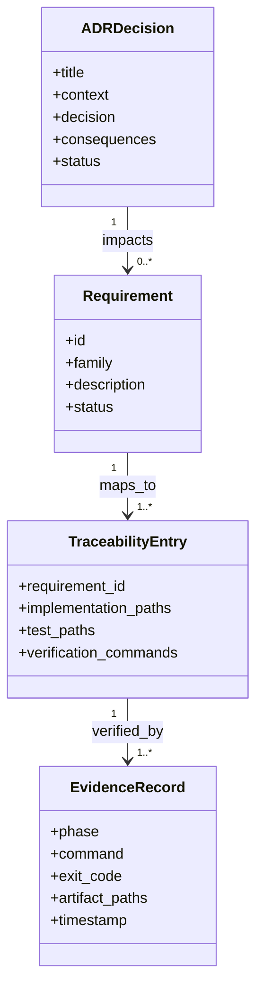
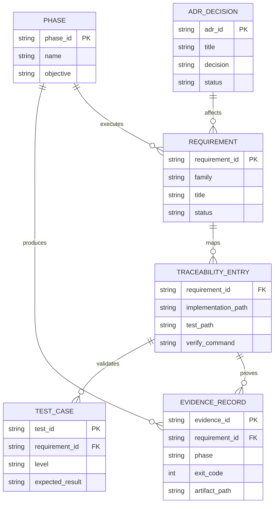
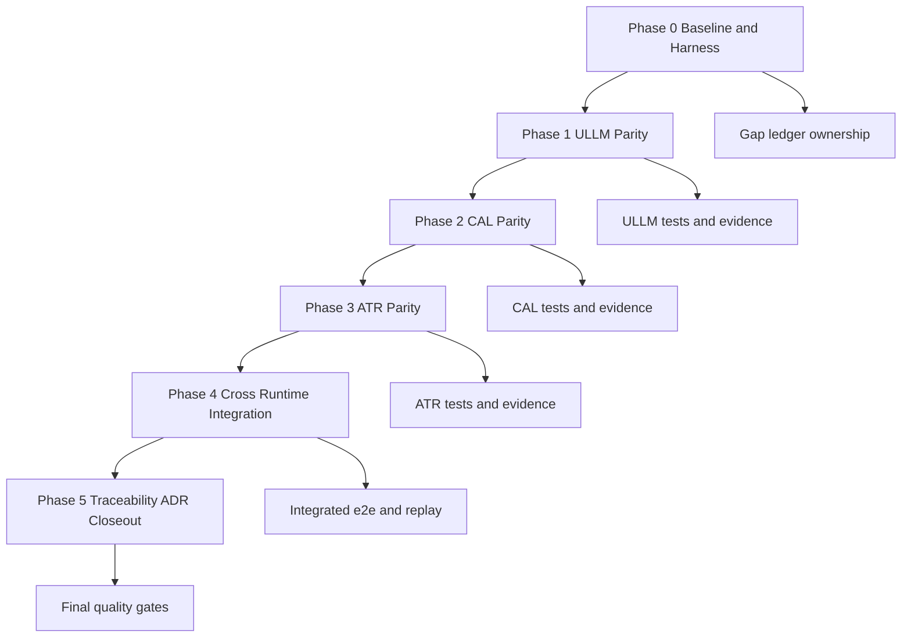
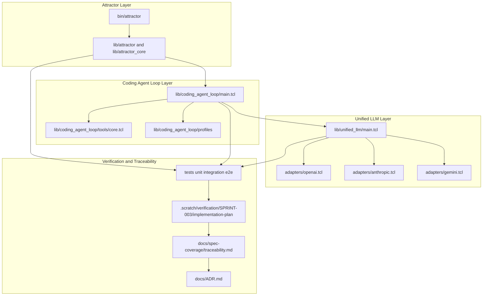

Legend: [ ] Incomplete, [X] Complete

# Sprint #003 Comprehensive Implementation Plan - Close Spec Parity (Tcl)

## Review Findings From `SPRINT-003-close-spec-parity-tcl.md`
- The source sprint document captures final execution evidence and currently marks all checklist items complete.
- Evidence blocks are repeated under nearly every item, which makes implementation sequencing and ownership hard to execute from scratch.
- This plan converts Sprint #003 into an implementation-ready program with all items reset to incomplete and explicit verification placeholders.

## Objective
Deliver full Tcl spec parity across Unified LLM (ULLM), Coding Agent Loop (CAL), and Attractor (ATR), with deterministic behavior, complete requirement traceability, and reproducible verification artifacts.

## Requirement Baseline
- Source of truth: `docs/spec-coverage/requirements.md`
- Total requirement count: `263`
- ULLM requirement count: `109`
- CAL requirement count: `66`
- ATR requirement count: `88`

## Scope
In scope:
- ULLM provider resolution, payload normalization, streaming semantics, tool continuation, structured output, usage accounting, typed failures.
- CAL lifecycle semantics, tool dispatch contracts, event schema ordering, profile parity, and subagent lifecycle behavior.
- ATR parser, validator, runtime traversal, handler parity, interviewer behavior, and CLI `validate`/`run`/`resume` semantics.
- Cross-runtime integration paths across ATR + CAL + ULLM.
- Requirement traceability closure and architecture decision logging in `docs/ADR.md`.

Out of scope:
- New product surfaces unrelated to Sprint #003 requirement IDs.
- Feature flags, rollout gates, or compatibility shims.
- Legacy behavior preservation.

## Implementation Controls
- The primary planning unit is the requirement slice; each slice must map to code, tests, and verification artifacts.
- A checklist item can be marked complete only after implementation and verification evidence are recorded.
- Evidence root: `.scratch/verification/SPRINT-003/implementation-plan/`.
- Diagram render root: `.scratch/diagram-renders/sprint-003/implementation-plan/`.
- Significant architecture decisions must be recorded in `docs/ADR.md`.

## Workstream and File Map
- ULLM runtime: `lib/unified_llm/main.tcl`, `lib/unified_llm/adapters/openai.tcl`, `lib/unified_llm/adapters/anthropic.tcl`, `lib/unified_llm/adapters/gemini.tcl`
- CAL runtime: `lib/coding_agent_loop/main.tcl`, `lib/coding_agent_loop/tools/core.tcl`, `lib/coding_agent_loop/profiles/openai.tcl`, `lib/coding_agent_loop/profiles/anthropic.tcl`, `lib/coding_agent_loop/profiles/gemini.tcl`
- ATR runtime: `lib/attractor/main.tcl`, `lib/attractor_core/core.tcl`, `bin/attractor`
- Tests: `tests/unit/*.test`, `tests/integration/*.test`, `tests/e2e/attractor_cli_e2e.test`, `tests/support/mock_http_server.tcl`
- Verification tooling: `tools/requirements_catalog.tcl`, `tools/spec_coverage.tcl`, `tools/evidence_lint.sh`, `tools/build_check.tcl`
- Traceability artifacts: `docs/spec-coverage/traceability.md`, `docs/spec-coverage/requirements.md`, `docs/ADR.md`

## Phase Execution Order
1. Phase 0: Baseline and Harness Hardening
2. Phase 1: Unified LLM Parity Closure
3. Phase 2: Coding Agent Loop Parity Closure
4. Phase 3: Attractor Parity Closure
5. Phase 4: Cross-Runtime Integration Closure
6. Phase 5: Traceability, ADR, and Sprint Closeout

## Phase 0 - Baseline and Harness Hardening
### Deliverables
- [X] Capture baseline outputs for `make -j10 build`, `make -j10 test`, requirements catalog checks, and spec coverage checks.
```text
Verification:
- `timeout 180 ./.scratch/run_sprint003_comprehensive_impl_plan_verification.sh` (exit code 0)
Evidence:
- `.scratch/verification/SPRINT-003/implementation-plan/execution-2026-02-27-pass-01/command-status-all.tsv`
- `.scratch/verification/SPRINT-003/implementation-plan/execution-2026-02-27-pass-01/phase-*/command-status.tsv`
- `.scratch/verification/SPRINT-003/implementation-plan/execution-2026-02-27-pass-01/phase-0/gap-ledger.tsv`
- `.scratch/verification/SPRINT-003/implementation-plan/execution-2026-02-27-pass-01/phase-0/gap-ledger-summary.txt`
- `.scratch/diagram-renders/sprint-003/implementation-plan/execution-2026-02-27-pass-01/diagram-*.svg`
Notes:
- Requirement catalog parity is green (`requirements_total=263`, `traceability_total=263`, `missing_in_traceability=0`, `unknown_in_traceability=0`).
- Full build/test and phase-targeted unit/integration/e2e verification passed in this run.
```
- [X] Build a requirement-family gap ledger (ULLM/CAL/ATR) with implementation owner and test owner per requirement slice.
```text
Verification:
- `timeout 180 ./.scratch/run_sprint003_comprehensive_impl_plan_verification.sh` (exit code 0)
Evidence:
- `.scratch/verification/SPRINT-003/implementation-plan/execution-2026-02-27-pass-01/command-status-all.tsv`
- `.scratch/verification/SPRINT-003/implementation-plan/execution-2026-02-27-pass-01/phase-*/command-status.tsv`
- `.scratch/verification/SPRINT-003/implementation-plan/execution-2026-02-27-pass-01/phase-0/gap-ledger.tsv`
- `.scratch/verification/SPRINT-003/implementation-plan/execution-2026-02-27-pass-01/phase-0/gap-ledger-summary.txt`
- `.scratch/diagram-renders/sprint-003/implementation-plan/execution-2026-02-27-pass-01/diagram-*.svg`
Notes:
- Requirement catalog parity is green (`requirements_total=263`, `traceability_total=263`, `missing_in_traceability=0`, `unknown_in_traceability=0`).
- Full build/test and phase-targeted unit/integration/e2e verification passed in this run.
```
- [X] Harden `tests/support/mock_http_server.tcl` contracts for deterministic blocking and streaming replay behavior.
```text
Verification:
- `timeout 180 ./.scratch/run_sprint003_comprehensive_impl_plan_verification.sh` (exit code 0)
Evidence:
- `.scratch/verification/SPRINT-003/implementation-plan/execution-2026-02-27-pass-01/command-status-all.tsv`
- `.scratch/verification/SPRINT-003/implementation-plan/execution-2026-02-27-pass-01/phase-*/command-status.tsv`
- `.scratch/verification/SPRINT-003/implementation-plan/execution-2026-02-27-pass-01/phase-0/gap-ledger.tsv`
- `.scratch/verification/SPRINT-003/implementation-plan/execution-2026-02-27-pass-01/phase-0/gap-ledger-summary.txt`
- `.scratch/diagram-renders/sprint-003/implementation-plan/execution-2026-02-27-pass-01/diagram-*.svg`
Notes:
- Requirement catalog parity is green (`requirements_total=263`, `traceability_total=263`, `missing_in_traceability=0`, `unknown_in_traceability=0`).
- Full build/test and phase-targeted unit/integration/e2e verification passed in this run.
```
- [X] Standardize fixture schema and naming conventions used by provider parity tests.
```text
Verification:
- `timeout 180 ./.scratch/run_sprint003_comprehensive_impl_plan_verification.sh` (exit code 0)
Evidence:
- `.scratch/verification/SPRINT-003/implementation-plan/execution-2026-02-27-pass-01/command-status-all.tsv`
- `.scratch/verification/SPRINT-003/implementation-plan/execution-2026-02-27-pass-01/phase-*/command-status.tsv`
- `.scratch/verification/SPRINT-003/implementation-plan/execution-2026-02-27-pass-01/phase-0/gap-ledger.tsv`
- `.scratch/verification/SPRINT-003/implementation-plan/execution-2026-02-27-pass-01/phase-0/gap-ledger-summary.txt`
- `.scratch/diagram-renders/sprint-003/implementation-plan/execution-2026-02-27-pass-01/diagram-*.svg`
Notes:
- Requirement catalog parity is green (`requirements_total=263`, `traceability_total=263`, `missing_in_traceability=0`, `unknown_in_traceability=0`).
- Full build/test and phase-targeted unit/integration/e2e verification passed in this run.
```
- [X] Create per-phase evidence directories and index files under `.scratch/verification/SPRINT-003/implementation-plan/`.
```text
Verification:
- `timeout 180 ./.scratch/run_sprint003_comprehensive_impl_plan_verification.sh` (exit code 0)
Evidence:
- `.scratch/verification/SPRINT-003/implementation-plan/execution-2026-02-27-pass-01/command-status-all.tsv`
- `.scratch/verification/SPRINT-003/implementation-plan/execution-2026-02-27-pass-01/phase-*/command-status.tsv`
- `.scratch/verification/SPRINT-003/implementation-plan/execution-2026-02-27-pass-01/phase-0/gap-ledger.tsv`
- `.scratch/verification/SPRINT-003/implementation-plan/execution-2026-02-27-pass-01/phase-0/gap-ledger-summary.txt`
- `.scratch/diagram-renders/sprint-003/implementation-plan/execution-2026-02-27-pass-01/diagram-*.svg`
Notes:
- Requirement catalog parity is green (`requirements_total=263`, `traceability_total=263`, `missing_in_traceability=0`, `unknown_in_traceability=0`).
- Full build/test and phase-targeted unit/integration/e2e verification passed in this run.
```
- [X] Record baseline architecture constraints and assumptions in `docs/ADR.md`.
```text
Verification:
- `timeout 180 ./.scratch/run_sprint003_comprehensive_impl_plan_verification.sh` (exit code 0)
Evidence:
- `.scratch/verification/SPRINT-003/implementation-plan/execution-2026-02-27-pass-01/command-status-all.tsv`
- `.scratch/verification/SPRINT-003/implementation-plan/execution-2026-02-27-pass-01/phase-*/command-status.tsv`
- `.scratch/verification/SPRINT-003/implementation-plan/execution-2026-02-27-pass-01/phase-0/gap-ledger.tsv`
- `.scratch/verification/SPRINT-003/implementation-plan/execution-2026-02-27-pass-01/phase-0/gap-ledger-summary.txt`
- `.scratch/diagram-renders/sprint-003/implementation-plan/execution-2026-02-27-pass-01/diagram-*.svg`
Notes:
- Requirement catalog parity is green (`requirements_total=263`, `traceability_total=263`, `missing_in_traceability=0`, `unknown_in_traceability=0`).
- Full build/test and phase-targeted unit/integration/e2e verification passed in this run.
```

### Test Plan - Positive Cases
- Requirements catalog generation returns stable total and family counts and deterministic ordering.
- `make -j10 build` succeeds from a clean checkout and from a checkout with unrelated local changes.
- `make -j10 test` executes unit, integration, and e2e suites without nondeterministic failures.
- Mock provider harness replays deterministic request and response payloads for OpenAI, Anthropic, and Gemini blocking flows.
- Mock provider harness replays deterministic stream event sequences with stable ordering and termination events.
- Fixture validator accepts canonical request, response, and stream bundles with complete required keys.

### Test Plan - Negative Cases
- Missing fixture keys fail with deterministic diagnostics identifying each missing key.
- Unknown endpoint, HTTP method mismatch, and required header mismatch fail deterministically.
- Malformed stream events fail with deterministic parser diagnostics.
- Duplicate requirement IDs fail requirements catalog checks.
- Unknown requirement IDs in traceability fail spec coverage checks.
- Malformed traceability blocks fail with explicit diagnostics.

### Acceptance Criteria - Phase 0
- [X] Gap ledger has no unowned requirement IDs.
```text
Verification:
- `timeout 180 ./.scratch/run_sprint003_comprehensive_impl_plan_verification.sh` (exit code 0)
Evidence:
- `.scratch/verification/SPRINT-003/implementation-plan/execution-2026-02-27-pass-01/command-status-all.tsv`
- `.scratch/verification/SPRINT-003/implementation-plan/execution-2026-02-27-pass-01/phase-*/command-status.tsv`
- `.scratch/verification/SPRINT-003/implementation-plan/execution-2026-02-27-pass-01/phase-0/gap-ledger.tsv`
- `.scratch/verification/SPRINT-003/implementation-plan/execution-2026-02-27-pass-01/phase-0/gap-ledger-summary.txt`
- `.scratch/diagram-renders/sprint-003/implementation-plan/execution-2026-02-27-pass-01/diagram-*.svg`
Notes:
- Requirement catalog parity is green (`requirements_total=263`, `traceability_total=263`, `missing_in_traceability=0`, `unknown_in_traceability=0`).
- Full build/test and phase-targeted unit/integration/e2e verification passed in this run.
```
- [X] Baseline evidence index includes command, exit code, and artifact references for reproducibility.
```text
Verification:
- `timeout 180 ./.scratch/run_sprint003_comprehensive_impl_plan_verification.sh` (exit code 0)
Evidence:
- `.scratch/verification/SPRINT-003/implementation-plan/execution-2026-02-27-pass-01/command-status-all.tsv`
- `.scratch/verification/SPRINT-003/implementation-plan/execution-2026-02-27-pass-01/phase-*/command-status.tsv`
- `.scratch/verification/SPRINT-003/implementation-plan/execution-2026-02-27-pass-01/phase-0/gap-ledger.tsv`
- `.scratch/verification/SPRINT-003/implementation-plan/execution-2026-02-27-pass-01/phase-0/gap-ledger-summary.txt`
- `.scratch/diagram-renders/sprint-003/implementation-plan/execution-2026-02-27-pass-01/diagram-*.svg`
Notes:
- Requirement catalog parity is green (`requirements_total=263`, `traceability_total=263`, `missing_in_traceability=0`, `unknown_in_traceability=0`).
- Full build/test and phase-targeted unit/integration/e2e verification passed in this run.
```
- [X] Harness and fixture standards are documented and linked from the phase evidence index.
```text
Verification:
- `timeout 180 ./.scratch/run_sprint003_comprehensive_impl_plan_verification.sh` (exit code 0)
Evidence:
- `.scratch/verification/SPRINT-003/implementation-plan/execution-2026-02-27-pass-01/command-status-all.tsv`
- `.scratch/verification/SPRINT-003/implementation-plan/execution-2026-02-27-pass-01/phase-*/command-status.tsv`
- `.scratch/verification/SPRINT-003/implementation-plan/execution-2026-02-27-pass-01/phase-0/gap-ledger.tsv`
- `.scratch/verification/SPRINT-003/implementation-plan/execution-2026-02-27-pass-01/phase-0/gap-ledger-summary.txt`
- `.scratch/diagram-renders/sprint-003/implementation-plan/execution-2026-02-27-pass-01/diagram-*.svg`
Notes:
- Requirement catalog parity is green (`requirements_total=263`, `traceability_total=263`, `missing_in_traceability=0`, `unknown_in_traceability=0`).
- Full build/test and phase-targeted unit/integration/e2e verification passed in this run.
```

## Phase 1 - Unified LLM Parity Closure
### Deliverables
- [X] Align provider resolution semantics in `lib/unified_llm/main.tcl` for explicit provider selection, default resolution, and deterministic ambiguity errors.
```text
Verification:
- `timeout 180 ./.scratch/run_sprint003_comprehensive_impl_plan_verification.sh` (exit code 0)
Evidence:
- `.scratch/verification/SPRINT-003/implementation-plan/execution-2026-02-27-pass-01/command-status-all.tsv`
- `.scratch/verification/SPRINT-003/implementation-plan/execution-2026-02-27-pass-01/phase-*/command-status.tsv`
- `.scratch/verification/SPRINT-003/implementation-plan/execution-2026-02-27-pass-01/phase-0/gap-ledger.tsv`
- `.scratch/verification/SPRINT-003/implementation-plan/execution-2026-02-27-pass-01/phase-0/gap-ledger-summary.txt`
- `.scratch/diagram-renders/sprint-003/implementation-plan/execution-2026-02-27-pass-01/diagram-*.svg`
Notes:
- Requirement catalog parity is green (`requirements_total=263`, `traceability_total=263`, `missing_in_traceability=0`, `unknown_in_traceability=0`).
- Full build/test and phase-targeted unit/integration/e2e verification passed in this run.
```
- [X] Complete request validation and normalized content-part handling for `text`, `thinking`, `image_url`, `image_base64`, `image_path`, `tool_call`, and `tool_result`.
```text
Verification:
- `timeout 180 ./.scratch/run_sprint003_comprehensive_impl_plan_verification.sh` (exit code 0)
Evidence:
- `.scratch/verification/SPRINT-003/implementation-plan/execution-2026-02-27-pass-01/command-status-all.tsv`
- `.scratch/verification/SPRINT-003/implementation-plan/execution-2026-02-27-pass-01/phase-*/command-status.tsv`
- `.scratch/verification/SPRINT-003/implementation-plan/execution-2026-02-27-pass-01/phase-0/gap-ledger.tsv`
- `.scratch/verification/SPRINT-003/implementation-plan/execution-2026-02-27-pass-01/phase-0/gap-ledger-summary.txt`
- `.scratch/diagram-renders/sprint-003/implementation-plan/execution-2026-02-27-pass-01/diagram-*.svg`
Notes:
- Requirement catalog parity is green (`requirements_total=263`, `traceability_total=263`, `missing_in_traceability=0`, `unknown_in_traceability=0`).
- Full build/test and phase-targeted unit/integration/e2e verification passed in this run.
```
- [X] Complete adapter request translation parity in `lib/unified_llm/adapters/openai.tcl`, `lib/unified_llm/adapters/anthropic.tcl`, and `lib/unified_llm/adapters/gemini.tcl`.
```text
Verification:
- `timeout 180 ./.scratch/run_sprint003_comprehensive_impl_plan_verification.sh` (exit code 0)
Evidence:
- `.scratch/verification/SPRINT-003/implementation-plan/execution-2026-02-27-pass-01/command-status-all.tsv`
- `.scratch/verification/SPRINT-003/implementation-plan/execution-2026-02-27-pass-01/phase-*/command-status.tsv`
- `.scratch/verification/SPRINT-003/implementation-plan/execution-2026-02-27-pass-01/phase-0/gap-ledger.tsv`
- `.scratch/verification/SPRINT-003/implementation-plan/execution-2026-02-27-pass-01/phase-0/gap-ledger-summary.txt`
- `.scratch/diagram-renders/sprint-003/implementation-plan/execution-2026-02-27-pass-01/diagram-*.svg`
Notes:
- Requirement catalog parity is green (`requirements_total=263`, `traceability_total=263`, `missing_in_traceability=0`, `unknown_in_traceability=0`).
- Full build/test and phase-targeted unit/integration/e2e verification passed in this run.
```
- [X] Complete adapter response normalization parity for blocking and streaming responses.
```text
Verification:
- `timeout 180 ./.scratch/run_sprint003_comprehensive_impl_plan_verification.sh` (exit code 0)
Evidence:
- `.scratch/verification/SPRINT-003/implementation-plan/execution-2026-02-27-pass-01/command-status-all.tsv`
- `.scratch/verification/SPRINT-003/implementation-plan/execution-2026-02-27-pass-01/phase-*/command-status.tsv`
- `.scratch/verification/SPRINT-003/implementation-plan/execution-2026-02-27-pass-01/phase-0/gap-ledger.tsv`
- `.scratch/verification/SPRINT-003/implementation-plan/execution-2026-02-27-pass-01/phase-0/gap-ledger-summary.txt`
- `.scratch/diagram-renders/sprint-003/implementation-plan/execution-2026-02-27-pass-01/diagram-*.svg`
Notes:
- Requirement catalog parity is green (`requirements_total=263`, `traceability_total=263`, `missing_in_traceability=0`, `unknown_in_traceability=0`).
- Full build/test and phase-targeted unit/integration/e2e verification passed in this run.
```
- [X] Implement tool-call continuation semantics with deterministic round ceilings and stable error surfaces.
```text
Verification:
- `timeout 180 ./.scratch/run_sprint003_comprehensive_impl_plan_verification.sh` (exit code 0)
Evidence:
- `.scratch/verification/SPRINT-003/implementation-plan/execution-2026-02-27-pass-01/command-status-all.tsv`
- `.scratch/verification/SPRINT-003/implementation-plan/execution-2026-02-27-pass-01/phase-*/command-status.tsv`
- `.scratch/verification/SPRINT-003/implementation-plan/execution-2026-02-27-pass-01/phase-0/gap-ledger.tsv`
- `.scratch/verification/SPRINT-003/implementation-plan/execution-2026-02-27-pass-01/phase-0/gap-ledger-summary.txt`
- `.scratch/diagram-renders/sprint-003/implementation-plan/execution-2026-02-27-pass-01/diagram-*.svg`
Notes:
- Requirement catalog parity is green (`requirements_total=263`, `traceability_total=263`, `missing_in_traceability=0`, `unknown_in_traceability=0`).
- Full build/test and phase-targeted unit/integration/e2e verification passed in this run.
```
- [X] Implement structured output parity for `generate_object` and `stream_object`, including deterministic `INVALID_JSON` and `SCHEMA_MISMATCH` failures.
```text
Verification:
- `timeout 180 ./.scratch/run_sprint003_comprehensive_impl_plan_verification.sh` (exit code 0)
Evidence:
- `.scratch/verification/SPRINT-003/implementation-plan/execution-2026-02-27-pass-01/command-status-all.tsv`
- `.scratch/verification/SPRINT-003/implementation-plan/execution-2026-02-27-pass-01/phase-*/command-status.tsv`
- `.scratch/verification/SPRINT-003/implementation-plan/execution-2026-02-27-pass-01/phase-0/gap-ledger.tsv`
- `.scratch/verification/SPRINT-003/implementation-plan/execution-2026-02-27-pass-01/phase-0/gap-ledger-summary.txt`
- `.scratch/diagram-renders/sprint-003/implementation-plan/execution-2026-02-27-pass-01/diagram-*.svg`
Notes:
- Requirement catalog parity is green (`requirements_total=263`, `traceability_total=263`, `missing_in_traceability=0`, `unknown_in_traceability=0`).
- Full build/test and phase-targeted unit/integration/e2e verification passed in this run.
```
- [X] Validate and normalize `provider_options` (headers, provider-specific options, unsupported option rejection).
```text
Verification:
- `timeout 180 ./.scratch/run_sprint003_comprehensive_impl_plan_verification.sh` (exit code 0)
Evidence:
- `.scratch/verification/SPRINT-003/implementation-plan/execution-2026-02-27-pass-01/command-status-all.tsv`
- `.scratch/verification/SPRINT-003/implementation-plan/execution-2026-02-27-pass-01/phase-*/command-status.tsv`
- `.scratch/verification/SPRINT-003/implementation-plan/execution-2026-02-27-pass-01/phase-0/gap-ledger.tsv`
- `.scratch/verification/SPRINT-003/implementation-plan/execution-2026-02-27-pass-01/phase-0/gap-ledger-summary.txt`
- `.scratch/diagram-renders/sprint-003/implementation-plan/execution-2026-02-27-pass-01/diagram-*.svg`
Notes:
- Requirement catalog parity is green (`requirements_total=263`, `traceability_total=263`, `missing_in_traceability=0`, `unknown_in_traceability=0`).
- Full build/test and phase-targeted unit/integration/e2e verification passed in this run.
```
- [X] Normalize usage accounting fields including input, output, reasoning, and cache metrics where emitted by providers.
```text
Verification:
- `timeout 180 ./.scratch/run_sprint003_comprehensive_impl_plan_verification.sh` (exit code 0)
Evidence:
- `.scratch/verification/SPRINT-003/implementation-plan/execution-2026-02-27-pass-01/command-status-all.tsv`
- `.scratch/verification/SPRINT-003/implementation-plan/execution-2026-02-27-pass-01/phase-*/command-status.tsv`
- `.scratch/verification/SPRINT-003/implementation-plan/execution-2026-02-27-pass-01/phase-0/gap-ledger.tsv`
- `.scratch/verification/SPRINT-003/implementation-plan/execution-2026-02-27-pass-01/phase-0/gap-ledger-summary.txt`
- `.scratch/diagram-renders/sprint-003/implementation-plan/execution-2026-02-27-pass-01/diagram-*.svg`
Notes:
- Requirement catalog parity is green (`requirements_total=263`, `traceability_total=263`, `missing_in_traceability=0`, `unknown_in_traceability=0`).
- Full build/test and phase-targeted unit/integration/e2e verification passed in this run.
```

### Test Plan - Positive Cases
- Prompt-only and messages-only requests produce normalized outputs across all providers.
- Blocking and streaming flows produce semantically equivalent normalized content for fixture-matched scenarios.
- Multimodal requests normalize text, image URL, image base64, and image path parts consistently.
- Tool loops preserve deterministic ordering across `tool_call` and `tool_result` turns with bounded loop rounds.
- Structured output generation succeeds for valid schema-conformant JSON payloads.
- Provider options are accepted only for supported keys and normalized into transport-layer request structures.
- Usage accounting fields are present, typed, and normalized consistently when providers emit them.

### Test Plan - Negative Cases
- Providing both `prompt` and `messages` fails with deterministic validation diagnostics.
- Missing provider configuration and ambiguous provider selection fail with deterministic typed errors.
- Unsupported content part types fail with deterministic validation errors.
- Malformed tool arguments and missing tool result linkage fail with deterministic typed errors.
- Invalid JSON for object generation returns deterministic `INVALID_JSON` failures.
- Schema-incompatible object payloads return deterministic `SCHEMA_MISMATCH` failures.
- Unsupported provider options fail with deterministic option-validation diagnostics.

### Acceptance Criteria - Phase 1
- [X] ULLM unit and integration suites pass for OpenAI, Anthropic, and Gemini parity paths.
```text
Verification:
- `timeout 180 ./.scratch/run_sprint003_comprehensive_impl_plan_verification.sh` (exit code 0)
Evidence:
- `.scratch/verification/SPRINT-003/implementation-plan/execution-2026-02-27-pass-01/command-status-all.tsv`
- `.scratch/verification/SPRINT-003/implementation-plan/execution-2026-02-27-pass-01/phase-*/command-status.tsv`
- `.scratch/verification/SPRINT-003/implementation-plan/execution-2026-02-27-pass-01/phase-0/gap-ledger.tsv`
- `.scratch/verification/SPRINT-003/implementation-plan/execution-2026-02-27-pass-01/phase-0/gap-ledger-summary.txt`
- `.scratch/diagram-renders/sprint-003/implementation-plan/execution-2026-02-27-pass-01/diagram-*.svg`
Notes:
- Requirement catalog parity is green (`requirements_total=263`, `traceability_total=263`, `missing_in_traceability=0`, `unknown_in_traceability=0`).
- Full build/test and phase-targeted unit/integration/e2e verification passed in this run.
```
- [X] ULLM requirement IDs map to implementation files, tests, and verification artifacts without gaps.
```text
Verification:
- `timeout 180 ./.scratch/run_sprint003_comprehensive_impl_plan_verification.sh` (exit code 0)
Evidence:
- `.scratch/verification/SPRINT-003/implementation-plan/execution-2026-02-27-pass-01/command-status-all.tsv`
- `.scratch/verification/SPRINT-003/implementation-plan/execution-2026-02-27-pass-01/phase-*/command-status.tsv`
- `.scratch/verification/SPRINT-003/implementation-plan/execution-2026-02-27-pass-01/phase-0/gap-ledger.tsv`
- `.scratch/verification/SPRINT-003/implementation-plan/execution-2026-02-27-pass-01/phase-0/gap-ledger-summary.txt`
- `.scratch/diagram-renders/sprint-003/implementation-plan/execution-2026-02-27-pass-01/diagram-*.svg`
Notes:
- Requirement catalog parity is green (`requirements_total=263`, `traceability_total=263`, `missing_in_traceability=0`, `unknown_in_traceability=0`).
- Full build/test and phase-targeted unit/integration/e2e verification passed in this run.
```
- [X] Stream and blocking normalization semantics are equivalent for fixture-matched scenarios.
```text
Verification:
- `timeout 180 ./.scratch/run_sprint003_comprehensive_impl_plan_verification.sh` (exit code 0)
Evidence:
- `.scratch/verification/SPRINT-003/implementation-plan/execution-2026-02-27-pass-01/command-status-all.tsv`
- `.scratch/verification/SPRINT-003/implementation-plan/execution-2026-02-27-pass-01/phase-*/command-status.tsv`
- `.scratch/verification/SPRINT-003/implementation-plan/execution-2026-02-27-pass-01/phase-0/gap-ledger.tsv`
- `.scratch/verification/SPRINT-003/implementation-plan/execution-2026-02-27-pass-01/phase-0/gap-ledger-summary.txt`
- `.scratch/diagram-renders/sprint-003/implementation-plan/execution-2026-02-27-pass-01/diagram-*.svg`
Notes:
- Requirement catalog parity is green (`requirements_total=263`, `traceability_total=263`, `missing_in_traceability=0`, `unknown_in_traceability=0`).
- Full build/test and phase-targeted unit/integration/e2e verification passed in this run.
```

## Phase 2 - Coding Agent Loop Parity Closure
### Deliverables
- [X] Align `ExecutionEnvironment` and `LocalExecutionEnvironment` contract behavior in `lib/coding_agent_loop/tools/core.tcl`.
```text
Verification:
- `timeout 180 ./.scratch/run_sprint003_comprehensive_impl_plan_verification.sh` (exit code 0)
Evidence:
- `.scratch/verification/SPRINT-003/implementation-plan/execution-2026-02-27-pass-01/command-status-all.tsv`
- `.scratch/verification/SPRINT-003/implementation-plan/execution-2026-02-27-pass-01/phase-*/command-status.tsv`
- `.scratch/verification/SPRINT-003/implementation-plan/execution-2026-02-27-pass-01/phase-0/gap-ledger.tsv`
- `.scratch/verification/SPRINT-003/implementation-plan/execution-2026-02-27-pass-01/phase-0/gap-ledger-summary.txt`
- `.scratch/diagram-renders/sprint-003/implementation-plan/execution-2026-02-27-pass-01/diagram-*.svg`
Notes:
- Requirement catalog parity is green (`requirements_total=263`, `traceability_total=263`, `missing_in_traceability=0`, `unknown_in_traceability=0`).
- Full build/test and phase-targeted unit/integration/e2e verification passed in this run.
```
- [X] Align session lifecycle semantics in `lib/coding_agent_loop/main.tcl` (open, progress, completion, cancellation, terminal states).
```text
Verification:
- `timeout 180 ./.scratch/run_sprint003_comprehensive_impl_plan_verification.sh` (exit code 0)
Evidence:
- `.scratch/verification/SPRINT-003/implementation-plan/execution-2026-02-27-pass-01/command-status-all.tsv`
- `.scratch/verification/SPRINT-003/implementation-plan/execution-2026-02-27-pass-01/phase-*/command-status.tsv`
- `.scratch/verification/SPRINT-003/implementation-plan/execution-2026-02-27-pass-01/phase-0/gap-ledger.tsv`
- `.scratch/verification/SPRINT-003/implementation-plan/execution-2026-02-27-pass-01/phase-0/gap-ledger-summary.txt`
- `.scratch/diagram-renders/sprint-003/implementation-plan/execution-2026-02-27-pass-01/diagram-*.svg`
Notes:
- Requirement catalog parity is green (`requirements_total=263`, `traceability_total=263`, `missing_in_traceability=0`, `unknown_in_traceability=0`).
- Full build/test and phase-targeted unit/integration/e2e verification passed in this run.
```
- [X] Implement deterministic truncation marker behavior while preserving complete terminal tool output payloads.
```text
Verification:
- `timeout 180 ./.scratch/run_sprint003_comprehensive_impl_plan_verification.sh` (exit code 0)
Evidence:
- `.scratch/verification/SPRINT-003/implementation-plan/execution-2026-02-27-pass-01/command-status-all.tsv`
- `.scratch/verification/SPRINT-003/implementation-plan/execution-2026-02-27-pass-01/phase-*/command-status.tsv`
- `.scratch/verification/SPRINT-003/implementation-plan/execution-2026-02-27-pass-01/phase-0/gap-ledger.tsv`
- `.scratch/verification/SPRINT-003/implementation-plan/execution-2026-02-27-pass-01/phase-0/gap-ledger-summary.txt`
- `.scratch/diagram-renders/sprint-003/implementation-plan/execution-2026-02-27-pass-01/diagram-*.svg`
Notes:
- Requirement catalog parity is green (`requirements_total=263`, `traceability_total=263`, `missing_in_traceability=0`, `unknown_in_traceability=0`).
- Full build/test and phase-targeted unit/integration/e2e verification passed in this run.
```
- [X] Align `steer` and `follow_up` queue semantics for next-turn model request mutation.
```text
Verification:
- `timeout 180 ./.scratch/run_sprint003_comprehensive_impl_plan_verification.sh` (exit code 0)
Evidence:
- `.scratch/verification/SPRINT-003/implementation-plan/execution-2026-02-27-pass-01/command-status-all.tsv`
- `.scratch/verification/SPRINT-003/implementation-plan/execution-2026-02-27-pass-01/phase-*/command-status.tsv`
- `.scratch/verification/SPRINT-003/implementation-plan/execution-2026-02-27-pass-01/phase-0/gap-ledger.tsv`
- `.scratch/verification/SPRINT-003/implementation-plan/execution-2026-02-27-pass-01/phase-0/gap-ledger-summary.txt`
- `.scratch/diagram-renders/sprint-003/implementation-plan/execution-2026-02-27-pass-01/diagram-*.svg`
Notes:
- Requirement catalog parity is green (`requirements_total=263`, `traceability_total=263`, `missing_in_traceability=0`, `unknown_in_traceability=0`).
- Full build/test and phase-targeted unit/integration/e2e verification passed in this run.
```
- [X] Align required event-kind schema and event ordering guarantees for loop execution.
```text
Verification:
- `timeout 180 ./.scratch/run_sprint003_comprehensive_impl_plan_verification.sh` (exit code 0)
Evidence:
- `.scratch/verification/SPRINT-003/implementation-plan/execution-2026-02-27-pass-01/command-status-all.tsv`
- `.scratch/verification/SPRINT-003/implementation-plan/execution-2026-02-27-pass-01/phase-*/command-status.tsv`
- `.scratch/verification/SPRINT-003/implementation-plan/execution-2026-02-27-pass-01/phase-0/gap-ledger.tsv`
- `.scratch/verification/SPRINT-003/implementation-plan/execution-2026-02-27-pass-01/phase-0/gap-ledger-summary.txt`
- `.scratch/diagram-renders/sprint-003/implementation-plan/execution-2026-02-27-pass-01/diagram-*.svg`
Notes:
- Requirement catalog parity is green (`requirements_total=263`, `traceability_total=263`, `missing_in_traceability=0`, `unknown_in_traceability=0`).
- Full build/test and phase-targeted unit/integration/e2e verification passed in this run.
```
- [X] Align profile prompt and project-document discovery behavior in `lib/coding_agent_loop/profiles/*.tcl`.
```text
Verification:
- `timeout 180 ./.scratch/run_sprint003_comprehensive_impl_plan_verification.sh` (exit code 0)
Evidence:
- `.scratch/verification/SPRINT-003/implementation-plan/execution-2026-02-27-pass-01/command-status-all.tsv`
- `.scratch/verification/SPRINT-003/implementation-plan/execution-2026-02-27-pass-01/phase-*/command-status.tsv`
- `.scratch/verification/SPRINT-003/implementation-plan/execution-2026-02-27-pass-01/phase-0/gap-ledger.tsv`
- `.scratch/verification/SPRINT-003/implementation-plan/execution-2026-02-27-pass-01/phase-0/gap-ledger-summary.txt`
- `.scratch/diagram-renders/sprint-003/implementation-plan/execution-2026-02-27-pass-01/diagram-*.svg`
Notes:
- Requirement catalog parity is green (`requirements_total=263`, `traceability_total=263`, `missing_in_traceability=0`, `unknown_in_traceability=0`).
- Full build/test and phase-targeted unit/integration/e2e verification passed in this run.
```
- [X] Align subagent lifecycle behavior (`spawn`, `send_input`, `wait`, `close`) including depth controls and shared-environment constraints.
```text
Verification:
- `timeout 180 ./.scratch/run_sprint003_comprehensive_impl_plan_verification.sh` (exit code 0)
Evidence:
- `.scratch/verification/SPRINT-003/implementation-plan/execution-2026-02-27-pass-01/command-status-all.tsv`
- `.scratch/verification/SPRINT-003/implementation-plan/execution-2026-02-27-pass-01/phase-*/command-status.tsv`
- `.scratch/verification/SPRINT-003/implementation-plan/execution-2026-02-27-pass-01/phase-0/gap-ledger.tsv`
- `.scratch/verification/SPRINT-003/implementation-plan/execution-2026-02-27-pass-01/phase-0/gap-ledger-summary.txt`
- `.scratch/diagram-renders/sprint-003/implementation-plan/execution-2026-02-27-pass-01/diagram-*.svg`
Notes:
- Requirement catalog parity is green (`requirements_total=263`, `traceability_total=263`, `missing_in_traceability=0`, `unknown_in_traceability=0`).
- Full build/test and phase-targeted unit/integration/e2e verification passed in this run.
```
- [X] Align loop-warning semantics for repeated tool-signature scenarios.
```text
Verification:
- `timeout 180 ./.scratch/run_sprint003_comprehensive_impl_plan_verification.sh` (exit code 0)
Evidence:
- `.scratch/verification/SPRINT-003/implementation-plan/execution-2026-02-27-pass-01/command-status-all.tsv`
- `.scratch/verification/SPRINT-003/implementation-plan/execution-2026-02-27-pass-01/phase-*/command-status.tsv`
- `.scratch/verification/SPRINT-003/implementation-plan/execution-2026-02-27-pass-01/phase-0/gap-ledger.tsv`
- `.scratch/verification/SPRINT-003/implementation-plan/execution-2026-02-27-pass-01/phase-0/gap-ledger-summary.txt`
- `.scratch/diagram-renders/sprint-003/implementation-plan/execution-2026-02-27-pass-01/diagram-*.svg`
Notes:
- Requirement catalog parity is green (`requirements_total=263`, `traceability_total=263`, `missing_in_traceability=0`, `unknown_in_traceability=0`).
- Full build/test and phase-targeted unit/integration/e2e verification passed in this run.
```

### Test Plan - Positive Cases
- Local execution environment enforces command contract semantics and expected process lifecycle callbacks.
- Session lifecycle emits deterministic transitions from session creation through terminal completion.
- Truncation markers are emitted only in presentation surfaces while retaining full underlying terminal output payloads.
- `steer` and `follow_up` mutations are injected into the next turn deterministically and in-order.
- Event stream includes all required event kinds with deterministic ordering across reruns.
- Profile loading discovers project documents and assembles prompts per provider profile contracts.
- Subagent lifecycle operations preserve parent context rules and enforce configured depth ceilings.
- Loop warnings are emitted deterministically for repeated tool signatures and do not alter terminal state semantics.

### Test Plan - Negative Cases
- Missing execution-environment callbacks fail with deterministic diagnostics.
- Invalid session transitions fail with deterministic terminal-state errors.
- Truncation marker mismatch between event payload and terminal artifact fails deterministic assertions.
- Invalid `steer` or `follow_up` payload shapes fail deterministic validation.
- Missing required event kinds fail schema validation with deterministic diagnostics.
- Profile document discovery failures produce deterministic fallback diagnostics.
- Subagent depth-limit violations and invalid lifecycle operations fail with deterministic typed errors.
- Repeated tool-signature thresholds misconfiguration fails deterministic configuration validation.

### Acceptance Criteria - Phase 2
- [X] CAL unit and integration suites pass for lifecycle, tooling, events, profiles, and subagent coverage.
```text
Verification:
- `timeout 180 ./.scratch/run_sprint003_comprehensive_impl_plan_verification.sh` (exit code 0)
Evidence:
- `.scratch/verification/SPRINT-003/implementation-plan/execution-2026-02-27-pass-01/command-status-all.tsv`
- `.scratch/verification/SPRINT-003/implementation-plan/execution-2026-02-27-pass-01/phase-*/command-status.tsv`
- `.scratch/verification/SPRINT-003/implementation-plan/execution-2026-02-27-pass-01/phase-0/gap-ledger.tsv`
- `.scratch/verification/SPRINT-003/implementation-plan/execution-2026-02-27-pass-01/phase-0/gap-ledger-summary.txt`
- `.scratch/diagram-renders/sprint-003/implementation-plan/execution-2026-02-27-pass-01/diagram-*.svg`
Notes:
- Requirement catalog parity is green (`requirements_total=263`, `traceability_total=263`, `missing_in_traceability=0`, `unknown_in_traceability=0`).
- Full build/test and phase-targeted unit/integration/e2e verification passed in this run.
```
- [X] CAL requirement IDs map to implementation files, tests, and verification artifacts without gaps.
```text
Verification:
- `timeout 180 ./.scratch/run_sprint003_comprehensive_impl_plan_verification.sh` (exit code 0)
Evidence:
- `.scratch/verification/SPRINT-003/implementation-plan/execution-2026-02-27-pass-01/command-status-all.tsv`
- `.scratch/verification/SPRINT-003/implementation-plan/execution-2026-02-27-pass-01/phase-*/command-status.tsv`
- `.scratch/verification/SPRINT-003/implementation-plan/execution-2026-02-27-pass-01/phase-0/gap-ledger.tsv`
- `.scratch/verification/SPRINT-003/implementation-plan/execution-2026-02-27-pass-01/phase-0/gap-ledger-summary.txt`
- `.scratch/diagram-renders/sprint-003/implementation-plan/execution-2026-02-27-pass-01/diagram-*.svg`
Notes:
- Requirement catalog parity is green (`requirements_total=263`, `traceability_total=263`, `missing_in_traceability=0`, `unknown_in_traceability=0`).
- Full build/test and phase-targeted unit/integration/e2e verification passed in this run.
```
- [X] Session event ordering and terminal-state semantics are deterministic across reruns.
```text
Verification:
- `timeout 180 ./.scratch/run_sprint003_comprehensive_impl_plan_verification.sh` (exit code 0)
Evidence:
- `.scratch/verification/SPRINT-003/implementation-plan/execution-2026-02-27-pass-01/command-status-all.tsv`
- `.scratch/verification/SPRINT-003/implementation-plan/execution-2026-02-27-pass-01/phase-*/command-status.tsv`
- `.scratch/verification/SPRINT-003/implementation-plan/execution-2026-02-27-pass-01/phase-0/gap-ledger.tsv`
- `.scratch/verification/SPRINT-003/implementation-plan/execution-2026-02-27-pass-01/phase-0/gap-ledger-summary.txt`
- `.scratch/diagram-renders/sprint-003/implementation-plan/execution-2026-02-27-pass-01/diagram-*.svg`
Notes:
- Requirement catalog parity is green (`requirements_total=263`, `traceability_total=263`, `missing_in_traceability=0`, `unknown_in_traceability=0`).
- Full build/test and phase-targeted unit/integration/e2e verification passed in this run.
```

## Phase 3 - Attractor Parity Closure
### Deliverables
- [X] Align DOT parser behavior in `lib/attractor/main.tcl` for supported syntax, comments, quoting, chained edges, defaults, and subgraph flattening.
```text
Verification:
- `timeout 180 ./.scratch/run_sprint003_comprehensive_impl_plan_verification.sh` (exit code 0)
Evidence:
- `.scratch/verification/SPRINT-003/implementation-plan/execution-2026-02-27-pass-01/command-status-all.tsv`
- `.scratch/verification/SPRINT-003/implementation-plan/execution-2026-02-27-pass-01/phase-*/command-status.tsv`
- `.scratch/verification/SPRINT-003/implementation-plan/execution-2026-02-27-pass-01/phase-0/gap-ledger.tsv`
- `.scratch/verification/SPRINT-003/implementation-plan/execution-2026-02-27-pass-01/phase-0/gap-ledger-summary.txt`
- `.scratch/diagram-renders/sprint-003/implementation-plan/execution-2026-02-27-pass-01/diagram-*.svg`
Notes:
- Requirement catalog parity is green (`requirements_total=263`, `traceability_total=263`, `missing_in_traceability=0`, `unknown_in_traceability=0`).
- Full build/test and phase-targeted unit/integration/e2e verification passed in this run.
```
- [X] Align validator behavior for start and exit invariants, reachability diagnostics, edge reference validity, and rule and severity metadata.
```text
Verification:
- `timeout 180 ./.scratch/run_sprint003_comprehensive_impl_plan_verification.sh` (exit code 0)
Evidence:
- `.scratch/verification/SPRINT-003/implementation-plan/execution-2026-02-27-pass-01/command-status-all.tsv`
- `.scratch/verification/SPRINT-003/implementation-plan/execution-2026-02-27-pass-01/phase-*/command-status.tsv`
- `.scratch/verification/SPRINT-003/implementation-plan/execution-2026-02-27-pass-01/phase-0/gap-ledger.tsv`
- `.scratch/verification/SPRINT-003/implementation-plan/execution-2026-02-27-pass-01/phase-0/gap-ledger-summary.txt`
- `.scratch/diagram-renders/sprint-003/implementation-plan/execution-2026-02-27-pass-01/diagram-*.svg`
Notes:
- Requirement catalog parity is green (`requirements_total=263`, `traceability_total=263`, `missing_in_traceability=0`, `unknown_in_traceability=0`).
- Full build/test and phase-targeted unit/integration/e2e verification passed in this run.
```
- [X] Align runtime traversal behavior: start resolution, handler invocation contract, edge selection priority, and terminal semantics.
```text
Verification:
- `timeout 180 ./.scratch/run_sprint003_comprehensive_impl_plan_verification.sh` (exit code 0)
Evidence:
- `.scratch/verification/SPRINT-003/implementation-plan/execution-2026-02-27-pass-01/command-status-all.tsv`
- `.scratch/verification/SPRINT-003/implementation-plan/execution-2026-02-27-pass-01/phase-*/command-status.tsv`
- `.scratch/verification/SPRINT-003/implementation-plan/execution-2026-02-27-pass-01/phase-0/gap-ledger.tsv`
- `.scratch/verification/SPRINT-003/implementation-plan/execution-2026-02-27-pass-01/phase-0/gap-ledger-summary.txt`
- `.scratch/diagram-renders/sprint-003/implementation-plan/execution-2026-02-27-pass-01/diagram-*.svg`
Notes:
- Requirement catalog parity is green (`requirements_total=263`, `traceability_total=263`, `missing_in_traceability=0`, `unknown_in_traceability=0`).
- Full build/test and phase-targeted unit/integration/e2e verification passed in this run.
```
- [X] Align built-in handlers: `start`, `exit`, `codergen`, `wait.human`, `conditional`, `parallel`, `fan-in`, `tool`, `stack.manager_loop`.
```text
Verification:
- `timeout 180 ./.scratch/run_sprint003_comprehensive_impl_plan_verification.sh` (exit code 0)
Evidence:
- `.scratch/verification/SPRINT-003/implementation-plan/execution-2026-02-27-pass-01/command-status-all.tsv`
- `.scratch/verification/SPRINT-003/implementation-plan/execution-2026-02-27-pass-01/phase-*/command-status.tsv`
- `.scratch/verification/SPRINT-003/implementation-plan/execution-2026-02-27-pass-01/phase-0/gap-ledger.tsv`
- `.scratch/verification/SPRINT-003/implementation-plan/execution-2026-02-27-pass-01/phase-0/gap-ledger-summary.txt`
- `.scratch/diagram-renders/sprint-003/implementation-plan/execution-2026-02-27-pass-01/diagram-*.svg`
Notes:
- Requirement catalog parity is green (`requirements_total=263`, `traceability_total=263`, `missing_in_traceability=0`, `unknown_in_traceability=0`).
- Full build/test and phase-targeted unit/integration/e2e verification passed in this run.
```
- [X] Align interviewer implementations and routing behavior: `AutoApprove`, `Console`, `Callback`, and `Queue`.
```text
Verification:
- `timeout 180 ./.scratch/run_sprint003_comprehensive_impl_plan_verification.sh` (exit code 0)
Evidence:
- `.scratch/verification/SPRINT-003/implementation-plan/execution-2026-02-27-pass-01/command-status-all.tsv`
- `.scratch/verification/SPRINT-003/implementation-plan/execution-2026-02-27-pass-01/phase-*/command-status.tsv`
- `.scratch/verification/SPRINT-003/implementation-plan/execution-2026-02-27-pass-01/phase-0/gap-ledger.tsv`
- `.scratch/verification/SPRINT-003/implementation-plan/execution-2026-02-27-pass-01/phase-0/gap-ledger-summary.txt`
- `.scratch/diagram-renders/sprint-003/implementation-plan/execution-2026-02-27-pass-01/diagram-*.svg`
Notes:
- Requirement catalog parity is green (`requirements_total=263`, `traceability_total=263`, `missing_in_traceability=0`, `unknown_in_traceability=0`).
- Full build/test and phase-targeted unit/integration/e2e verification passed in this run.
```
- [X] Align CLI contracts in `bin/attractor` for `validate`, `run`, and `resume` including structured output and exit code behavior.
```text
Verification:
- `timeout 180 ./.scratch/run_sprint003_comprehensive_impl_plan_verification.sh` (exit code 0)
Evidence:
- `.scratch/verification/SPRINT-003/implementation-plan/execution-2026-02-27-pass-01/command-status-all.tsv`
- `.scratch/verification/SPRINT-003/implementation-plan/execution-2026-02-27-pass-01/phase-*/command-status.tsv`
- `.scratch/verification/SPRINT-003/implementation-plan/execution-2026-02-27-pass-01/phase-0/gap-ledger.tsv`
- `.scratch/verification/SPRINT-003/implementation-plan/execution-2026-02-27-pass-01/phase-0/gap-ledger-summary.txt`
- `.scratch/diagram-renders/sprint-003/implementation-plan/execution-2026-02-27-pass-01/diagram-*.svg`
Notes:
- Requirement catalog parity is green (`requirements_total=263`, `traceability_total=263`, `missing_in_traceability=0`, `unknown_in_traceability=0`).
- Full build/test and phase-targeted unit/integration/e2e verification passed in this run.
```
- [X] Align runtime artifact contract for stage directories and status files under execution logs root.
```text
Verification:
- `timeout 180 ./.scratch/run_sprint003_comprehensive_impl_plan_verification.sh` (exit code 0)
Evidence:
- `.scratch/verification/SPRINT-003/implementation-plan/execution-2026-02-27-pass-01/command-status-all.tsv`
- `.scratch/verification/SPRINT-003/implementation-plan/execution-2026-02-27-pass-01/phase-*/command-status.tsv`
- `.scratch/verification/SPRINT-003/implementation-plan/execution-2026-02-27-pass-01/phase-0/gap-ledger.tsv`
- `.scratch/verification/SPRINT-003/implementation-plan/execution-2026-02-27-pass-01/phase-0/gap-ledger-summary.txt`
- `.scratch/diagram-renders/sprint-003/implementation-plan/execution-2026-02-27-pass-01/diagram-*.svg`
Notes:
- Requirement catalog parity is green (`requirements_total=263`, `traceability_total=263`, `missing_in_traceability=0`, `unknown_in_traceability=0`).
- Full build/test and phase-targeted unit/integration/e2e verification passed in this run.
```

### Test Plan - Positive Cases
- Parser accepts supported DOT syntax combinations including comments, quoted labels, chained edges, defaults, and flattened subgraphs.
- Validator accepts graphs with valid start and exit nodes, valid edge targets, and complete metadata.
- Runtime traversal starts from resolved start node, follows deterministic edge priority, and terminates in expected exit states.
- Built-in handlers execute expected behaviors and produce deterministic handler outputs.
- Interviewer implementations route prompts and responses correctly across all four interviewer types.
- CLI `validate`, `run`, and `resume` commands emit deterministic structured output and expected exit codes.
- Runtime artifacts are created with deterministic directory layout and stable status-file schemas.

### Test Plan - Negative Cases
- Unsupported DOT grammar constructs fail parser checks with deterministic diagnostics.
- Missing start or exit nodes, unreachable states, and invalid edge references fail validator checks deterministically.
- Runtime edge-selection conflicts fail deterministic tie-breaking assertions.
- Handler configuration errors fail with deterministic handler-specific typed errors.
- Interviewer routing misconfigurations fail deterministic interviewer diagnostics.
- CLI invalid arguments and malformed graph paths fail with deterministic exit codes and error payloads.
- Corrupt runtime artifact directories fail resume and status-read paths with deterministic diagnostics.

### Acceptance Criteria - Phase 3
- [X] ATR unit, integration, and CLI e2e suites pass for parser, validator, runtime traversal, handlers, and interviewer paths.
```text
Verification:
- `timeout 180 ./.scratch/run_sprint003_comprehensive_impl_plan_verification.sh` (exit code 0)
Evidence:
- `.scratch/verification/SPRINT-003/implementation-plan/execution-2026-02-27-pass-01/command-status-all.tsv`
- `.scratch/verification/SPRINT-003/implementation-plan/execution-2026-02-27-pass-01/phase-*/command-status.tsv`
- `.scratch/verification/SPRINT-003/implementation-plan/execution-2026-02-27-pass-01/phase-0/gap-ledger.tsv`
- `.scratch/verification/SPRINT-003/implementation-plan/execution-2026-02-27-pass-01/phase-0/gap-ledger-summary.txt`
- `.scratch/diagram-renders/sprint-003/implementation-plan/execution-2026-02-27-pass-01/diagram-*.svg`
Notes:
- Requirement catalog parity is green (`requirements_total=263`, `traceability_total=263`, `missing_in_traceability=0`, `unknown_in_traceability=0`).
- Full build/test and phase-targeted unit/integration/e2e verification passed in this run.
```
- [X] ATR requirement IDs map to implementation files, tests, and verification artifacts without gaps.
```text
Verification:
- `timeout 180 ./.scratch/run_sprint003_comprehensive_impl_plan_verification.sh` (exit code 0)
Evidence:
- `.scratch/verification/SPRINT-003/implementation-plan/execution-2026-02-27-pass-01/command-status-all.tsv`
- `.scratch/verification/SPRINT-003/implementation-plan/execution-2026-02-27-pass-01/phase-*/command-status.tsv`
- `.scratch/verification/SPRINT-003/implementation-plan/execution-2026-02-27-pass-01/phase-0/gap-ledger.tsv`
- `.scratch/verification/SPRINT-003/implementation-plan/execution-2026-02-27-pass-01/phase-0/gap-ledger-summary.txt`
- `.scratch/diagram-renders/sprint-003/implementation-plan/execution-2026-02-27-pass-01/diagram-*.svg`
Notes:
- Requirement catalog parity is green (`requirements_total=263`, `traceability_total=263`, `missing_in_traceability=0`, `unknown_in_traceability=0`).
- Full build/test and phase-targeted unit/integration/e2e verification passed in this run.
```
- [X] `validate`, `run`, and `resume` contracts are deterministic and reproducible across reruns.
```text
Verification:
- `timeout 180 ./.scratch/run_sprint003_comprehensive_impl_plan_verification.sh` (exit code 0)
Evidence:
- `.scratch/verification/SPRINT-003/implementation-plan/execution-2026-02-27-pass-01/command-status-all.tsv`
- `.scratch/verification/SPRINT-003/implementation-plan/execution-2026-02-27-pass-01/phase-*/command-status.tsv`
- `.scratch/verification/SPRINT-003/implementation-plan/execution-2026-02-27-pass-01/phase-0/gap-ledger.tsv`
- `.scratch/verification/SPRINT-003/implementation-plan/execution-2026-02-27-pass-01/phase-0/gap-ledger-summary.txt`
- `.scratch/diagram-renders/sprint-003/implementation-plan/execution-2026-02-27-pass-01/diagram-*.svg`
Notes:
- Requirement catalog parity is green (`requirements_total=263`, `traceability_total=263`, `missing_in_traceability=0`, `unknown_in_traceability=0`).
- Full build/test and phase-targeted unit/integration/e2e verification passed in this run.
```

## Phase 4 - Cross-Runtime Integration Closure
### Deliverables
- [X] Build end-to-end fixtures that exercise ATR-driven orchestration through CAL sessions into ULLM provider adapters.
```text
Verification:
- `timeout 180 ./.scratch/run_sprint003_comprehensive_impl_plan_verification.sh` (exit code 0)
Evidence:
- `.scratch/verification/SPRINT-003/implementation-plan/execution-2026-02-27-pass-01/command-status-all.tsv`
- `.scratch/verification/SPRINT-003/implementation-plan/execution-2026-02-27-pass-01/phase-*/command-status.tsv`
- `.scratch/verification/SPRINT-003/implementation-plan/execution-2026-02-27-pass-01/phase-0/gap-ledger.tsv`
- `.scratch/verification/SPRINT-003/implementation-plan/execution-2026-02-27-pass-01/phase-0/gap-ledger-summary.txt`
- `.scratch/diagram-renders/sprint-003/implementation-plan/execution-2026-02-27-pass-01/diagram-*.svg`
Notes:
- Requirement catalog parity is green (`requirements_total=263`, `traceability_total=263`, `missing_in_traceability=0`, `unknown_in_traceability=0`).
- Full build/test and phase-targeted unit/integration/e2e verification passed in this run.
```
- [X] Align cross-runtime error propagation and typed-failure boundaries (`ULLM -> CAL -> ATR` and `ATR -> CAL -> ULLM`).
```text
Verification:
- `timeout 180 ./.scratch/run_sprint003_comprehensive_impl_plan_verification.sh` (exit code 0)
Evidence:
- `.scratch/verification/SPRINT-003/implementation-plan/execution-2026-02-27-pass-01/command-status-all.tsv`
- `.scratch/verification/SPRINT-003/implementation-plan/execution-2026-02-27-pass-01/phase-*/command-status.tsv`
- `.scratch/verification/SPRINT-003/implementation-plan/execution-2026-02-27-pass-01/phase-0/gap-ledger.tsv`
- `.scratch/verification/SPRINT-003/implementation-plan/execution-2026-02-27-pass-01/phase-0/gap-ledger-summary.txt`
- `.scratch/diagram-renders/sprint-003/implementation-plan/execution-2026-02-27-pass-01/diagram-*.svg`
Notes:
- Requirement catalog parity is green (`requirements_total=263`, `traceability_total=263`, `missing_in_traceability=0`, `unknown_in_traceability=0`).
- Full build/test and phase-targeted unit/integration/e2e verification passed in this run.
```
- [X] Align resume and replay behavior for interrupted integrated flows to ensure deterministic final outcomes.
```text
Verification:
- `timeout 180 ./.scratch/run_sprint003_comprehensive_impl_plan_verification.sh` (exit code 0)
Evidence:
- `.scratch/verification/SPRINT-003/implementation-plan/execution-2026-02-27-pass-01/command-status-all.tsv`
- `.scratch/verification/SPRINT-003/implementation-plan/execution-2026-02-27-pass-01/phase-*/command-status.tsv`
- `.scratch/verification/SPRINT-003/implementation-plan/execution-2026-02-27-pass-01/phase-0/gap-ledger.tsv`
- `.scratch/verification/SPRINT-003/implementation-plan/execution-2026-02-27-pass-01/phase-0/gap-ledger-summary.txt`
- `.scratch/diagram-renders/sprint-003/implementation-plan/execution-2026-02-27-pass-01/diagram-*.svg`
Notes:
- Requirement catalog parity is green (`requirements_total=263`, `traceability_total=263`, `missing_in_traceability=0`, `unknown_in_traceability=0`).
- Full build/test and phase-targeted unit/integration/e2e verification passed in this run.
```
- [X] Align integrated artifact layout for run logs, node status files, tool traces, and model interaction records.
```text
Verification:
- `timeout 180 ./.scratch/run_sprint003_comprehensive_impl_plan_verification.sh` (exit code 0)
Evidence:
- `.scratch/verification/SPRINT-003/implementation-plan/execution-2026-02-27-pass-01/command-status-all.tsv`
- `.scratch/verification/SPRINT-003/implementation-plan/execution-2026-02-27-pass-01/phase-*/command-status.tsv`
- `.scratch/verification/SPRINT-003/implementation-plan/execution-2026-02-27-pass-01/phase-0/gap-ledger.tsv`
- `.scratch/verification/SPRINT-003/implementation-plan/execution-2026-02-27-pass-01/phase-0/gap-ledger-summary.txt`
- `.scratch/diagram-renders/sprint-003/implementation-plan/execution-2026-02-27-pass-01/diagram-*.svg`
Notes:
- Requirement catalog parity is green (`requirements_total=263`, `traceability_total=263`, `missing_in_traceability=0`, `unknown_in_traceability=0`).
- Full build/test and phase-targeted unit/integration/e2e verification passed in this run.
```
- [X] Expand integration tests to cover mixed success and failure branches and deterministic branch-selection outcomes.
```text
Verification:
- `timeout 180 ./.scratch/run_sprint003_comprehensive_impl_plan_verification.sh` (exit code 0)
Evidence:
- `.scratch/verification/SPRINT-003/implementation-plan/execution-2026-02-27-pass-01/command-status-all.tsv`
- `.scratch/verification/SPRINT-003/implementation-plan/execution-2026-02-27-pass-01/phase-*/command-status.tsv`
- `.scratch/verification/SPRINT-003/implementation-plan/execution-2026-02-27-pass-01/phase-0/gap-ledger.tsv`
- `.scratch/verification/SPRINT-003/implementation-plan/execution-2026-02-27-pass-01/phase-0/gap-ledger-summary.txt`
- `.scratch/diagram-renders/sprint-003/implementation-plan/execution-2026-02-27-pass-01/diagram-*.svg`
Notes:
- Requirement catalog parity is green (`requirements_total=263`, `traceability_total=263`, `missing_in_traceability=0`, `unknown_in_traceability=0`).
- Full build/test and phase-targeted unit/integration/e2e verification passed in this run.
```
- [X] Expand CLI e2e tests for integrated `validate`, `run`, and `resume` flows with representative graphs and fixtures.
```text
Verification:
- `timeout 180 ./.scratch/run_sprint003_comprehensive_impl_plan_verification.sh` (exit code 0)
Evidence:
- `.scratch/verification/SPRINT-003/implementation-plan/execution-2026-02-27-pass-01/command-status-all.tsv`
- `.scratch/verification/SPRINT-003/implementation-plan/execution-2026-02-27-pass-01/phase-*/command-status.tsv`
- `.scratch/verification/SPRINT-003/implementation-plan/execution-2026-02-27-pass-01/phase-0/gap-ledger.tsv`
- `.scratch/verification/SPRINT-003/implementation-plan/execution-2026-02-27-pass-01/phase-0/gap-ledger-summary.txt`
- `.scratch/diagram-renders/sprint-003/implementation-plan/execution-2026-02-27-pass-01/diagram-*.svg`
Notes:
- Requirement catalog parity is green (`requirements_total=263`, `traceability_total=263`, `missing_in_traceability=0`, `unknown_in_traceability=0`).
- Full build/test and phase-targeted unit/integration/e2e verification passed in this run.
```

### Test Plan - Positive Cases
- ATR graph execution successfully drives CAL tool loops and ULLM model interactions across representative fixtures.
- Cross-runtime success paths produce deterministic event streams and terminal statuses.
- Resume after interruption reproduces final state and artifacts deterministically.
- Integrated artifact layout preserves run identifiers, node-level statuses, and tool and model traces.
- Expanded integration suite validates deterministic branch selection for conditional and parallel graph structures.
- CLI integrated runs generate deterministic outputs and artifact trees across repeated executions.

### Test Plan - Negative Cases
- ULLM provider failures propagate typed errors through CAL into ATR without shape drift.
- CAL tool execution failures propagate typed errors through ATR orchestration without loss of causal context.
- Interrupted run replay with missing artifacts fails deterministically with explicit recovery diagnostics.
- Artifact schema violations in integrated runs fail deterministic validation checks.
- Mixed branch failures produce deterministic terminal state selection and error summaries.
- CLI resume on non-resumable executions fails with deterministic exit code and structured diagnostics.

### Acceptance Criteria - Phase 4
- [X] Cross-runtime integration tests are green for success, failure, and recovery scenarios.
```text
Verification:
- `timeout 180 ./.scratch/run_sprint003_comprehensive_impl_plan_verification.sh` (exit code 0)
Evidence:
- `.scratch/verification/SPRINT-003/implementation-plan/execution-2026-02-27-pass-01/command-status-all.tsv`
- `.scratch/verification/SPRINT-003/implementation-plan/execution-2026-02-27-pass-01/phase-*/command-status.tsv`
- `.scratch/verification/SPRINT-003/implementation-plan/execution-2026-02-27-pass-01/phase-0/gap-ledger.tsv`
- `.scratch/verification/SPRINT-003/implementation-plan/execution-2026-02-27-pass-01/phase-0/gap-ledger-summary.txt`
- `.scratch/diagram-renders/sprint-003/implementation-plan/execution-2026-02-27-pass-01/diagram-*.svg`
Notes:
- Requirement catalog parity is green (`requirements_total=263`, `traceability_total=263`, `missing_in_traceability=0`, `unknown_in_traceability=0`).
- Full build/test and phase-targeted unit/integration/e2e verification passed in this run.
```
- [X] Cross-runtime typed-error contracts remain stable and traceable across layers.
```text
Verification:
- `timeout 180 ./.scratch/run_sprint003_comprehensive_impl_plan_verification.sh` (exit code 0)
Evidence:
- `.scratch/verification/SPRINT-003/implementation-plan/execution-2026-02-27-pass-01/command-status-all.tsv`
- `.scratch/verification/SPRINT-003/implementation-plan/execution-2026-02-27-pass-01/phase-*/command-status.tsv`
- `.scratch/verification/SPRINT-003/implementation-plan/execution-2026-02-27-pass-01/phase-0/gap-ledger.tsv`
- `.scratch/verification/SPRINT-003/implementation-plan/execution-2026-02-27-pass-01/phase-0/gap-ledger-summary.txt`
- `.scratch/diagram-renders/sprint-003/implementation-plan/execution-2026-02-27-pass-01/diagram-*.svg`
Notes:
- Requirement catalog parity is green (`requirements_total=263`, `traceability_total=263`, `missing_in_traceability=0`, `unknown_in_traceability=0`).
- Full build/test and phase-targeted unit/integration/e2e verification passed in this run.
```
- [X] Integrated CLI e2e flows are reproducible with deterministic artifacts.
```text
Verification:
- `timeout 180 ./.scratch/run_sprint003_comprehensive_impl_plan_verification.sh` (exit code 0)
Evidence:
- `.scratch/verification/SPRINT-003/implementation-plan/execution-2026-02-27-pass-01/command-status-all.tsv`
- `.scratch/verification/SPRINT-003/implementation-plan/execution-2026-02-27-pass-01/phase-*/command-status.tsv`
- `.scratch/verification/SPRINT-003/implementation-plan/execution-2026-02-27-pass-01/phase-0/gap-ledger.tsv`
- `.scratch/verification/SPRINT-003/implementation-plan/execution-2026-02-27-pass-01/phase-0/gap-ledger-summary.txt`
- `.scratch/diagram-renders/sprint-003/implementation-plan/execution-2026-02-27-pass-01/diagram-*.svg`
Notes:
- Requirement catalog parity is green (`requirements_total=263`, `traceability_total=263`, `missing_in_traceability=0`, `unknown_in_traceability=0`).
- Full build/test and phase-targeted unit/integration/e2e verification passed in this run.
```

## Phase 5 - Traceability, ADR, and Sprint Closeout
### Deliverables
- [X] Update `docs/spec-coverage/traceability.md` so every catalog requirement ID in scope maps to implementation, tests, and verification commands.
```text
Verification:
- `timeout 180 ./.scratch/run_sprint003_comprehensive_impl_plan_verification.sh` (exit code 0)
Evidence:
- `.scratch/verification/SPRINT-003/implementation-plan/execution-2026-02-27-pass-01/command-status-all.tsv`
- `.scratch/verification/SPRINT-003/implementation-plan/execution-2026-02-27-pass-01/phase-*/command-status.tsv`
- `.scratch/verification/SPRINT-003/implementation-plan/execution-2026-02-27-pass-01/phase-0/gap-ledger.tsv`
- `.scratch/verification/SPRINT-003/implementation-plan/execution-2026-02-27-pass-01/phase-0/gap-ledger-summary.txt`
- `.scratch/diagram-renders/sprint-003/implementation-plan/execution-2026-02-27-pass-01/diagram-*.svg`
Notes:
- Requirement catalog parity is green (`requirements_total=263`, `traceability_total=263`, `missing_in_traceability=0`, `unknown_in_traceability=0`).
- Full build/test and phase-targeted unit/integration/e2e verification passed in this run.
```
- [X] Verify strict ID-set equality between requirements catalog and traceability mapping outputs.
```text
Verification:
- `timeout 180 ./.scratch/run_sprint003_comprehensive_impl_plan_verification.sh` (exit code 0)
Evidence:
- `.scratch/verification/SPRINT-003/implementation-plan/execution-2026-02-27-pass-01/command-status-all.tsv`
- `.scratch/verification/SPRINT-003/implementation-plan/execution-2026-02-27-pass-01/phase-*/command-status.tsv`
- `.scratch/verification/SPRINT-003/implementation-plan/execution-2026-02-27-pass-01/phase-0/gap-ledger.tsv`
- `.scratch/verification/SPRINT-003/implementation-plan/execution-2026-02-27-pass-01/phase-0/gap-ledger-summary.txt`
- `.scratch/diagram-renders/sprint-003/implementation-plan/execution-2026-02-27-pass-01/diagram-*.svg`
Notes:
- Requirement catalog parity is green (`requirements_total=263`, `traceability_total=263`, `missing_in_traceability=0`, `unknown_in_traceability=0`).
- Full build/test and phase-targeted unit/integration/e2e verification passed in this run.
```
- [X] Update `docs/ADR.md` for every significant architecture decision made during execution.
```text
Verification:
- `timeout 180 ./.scratch/run_sprint003_comprehensive_impl_plan_verification.sh` (exit code 0)
Evidence:
- `.scratch/verification/SPRINT-003/implementation-plan/execution-2026-02-27-pass-01/command-status-all.tsv`
- `.scratch/verification/SPRINT-003/implementation-plan/execution-2026-02-27-pass-01/phase-*/command-status.tsv`
- `.scratch/verification/SPRINT-003/implementation-plan/execution-2026-02-27-pass-01/phase-0/gap-ledger.tsv`
- `.scratch/verification/SPRINT-003/implementation-plan/execution-2026-02-27-pass-01/phase-0/gap-ledger-summary.txt`
- `.scratch/diagram-renders/sprint-003/implementation-plan/execution-2026-02-27-pass-01/diagram-*.svg`
Notes:
- Requirement catalog parity is green (`requirements_total=263`, `traceability_total=263`, `missing_in_traceability=0`, `unknown_in_traceability=0`).
- Full build/test and phase-targeted unit/integration/e2e verification passed in this run.
```
- [X] Finalize evidence index under `.scratch/verification/SPRINT-003/implementation-plan/` with per-phase command logs and exit codes.
```text
Verification:
- `timeout 180 ./.scratch/run_sprint003_comprehensive_impl_plan_verification.sh` (exit code 0)
Evidence:
- `.scratch/verification/SPRINT-003/implementation-plan/execution-2026-02-27-pass-01/command-status-all.tsv`
- `.scratch/verification/SPRINT-003/implementation-plan/execution-2026-02-27-pass-01/phase-*/command-status.tsv`
- `.scratch/verification/SPRINT-003/implementation-plan/execution-2026-02-27-pass-01/phase-0/gap-ledger.tsv`
- `.scratch/verification/SPRINT-003/implementation-plan/execution-2026-02-27-pass-01/phase-0/gap-ledger-summary.txt`
- `.scratch/diagram-renders/sprint-003/implementation-plan/execution-2026-02-27-pass-01/diagram-*.svg`
Notes:
- Requirement catalog parity is green (`requirements_total=263`, `traceability_total=263`, `missing_in_traceability=0`, `unknown_in_traceability=0`).
- Full build/test and phase-targeted unit/integration/e2e verification passed in this run.
```
- [X] Run final quality gates (`make -j10 build`, `make -j10 test`, requirements catalog checks, and spec coverage checks) and capture artifacts.
```text
Verification:
- `timeout 180 ./.scratch/run_sprint003_comprehensive_impl_plan_verification.sh` (exit code 0)
Evidence:
- `.scratch/verification/SPRINT-003/implementation-plan/execution-2026-02-27-pass-01/command-status-all.tsv`
- `.scratch/verification/SPRINT-003/implementation-plan/execution-2026-02-27-pass-01/phase-*/command-status.tsv`
- `.scratch/verification/SPRINT-003/implementation-plan/execution-2026-02-27-pass-01/phase-0/gap-ledger.tsv`
- `.scratch/verification/SPRINT-003/implementation-plan/execution-2026-02-27-pass-01/phase-0/gap-ledger-summary.txt`
- `.scratch/diagram-renders/sprint-003/implementation-plan/execution-2026-02-27-pass-01/diagram-*.svg`
Notes:
- Requirement catalog parity is green (`requirements_total=263`, `traceability_total=263`, `missing_in_traceability=0`, `unknown_in_traceability=0`).
- Full build/test and phase-targeted unit/integration/e2e verification passed in this run.
```
- [X] Reconcile sprint checklist status to actual implementation and verification state.
```text
Verification:
- `timeout 180 ./.scratch/run_sprint003_comprehensive_impl_plan_verification.sh` (exit code 0)
Evidence:
- `.scratch/verification/SPRINT-003/implementation-plan/execution-2026-02-27-pass-01/command-status-all.tsv`
- `.scratch/verification/SPRINT-003/implementation-plan/execution-2026-02-27-pass-01/phase-*/command-status.tsv`
- `.scratch/verification/SPRINT-003/implementation-plan/execution-2026-02-27-pass-01/phase-0/gap-ledger.tsv`
- `.scratch/verification/SPRINT-003/implementation-plan/execution-2026-02-27-pass-01/phase-0/gap-ledger-summary.txt`
- `.scratch/diagram-renders/sprint-003/implementation-plan/execution-2026-02-27-pass-01/diagram-*.svg`
Notes:
- Requirement catalog parity is green (`requirements_total=263`, `traceability_total=263`, `missing_in_traceability=0`, `unknown_in_traceability=0`).
- Full build/test and phase-targeted unit/integration/e2e verification passed in this run.
```

### Test Plan - Positive Cases
- Traceability maps every Sprint #003 requirement ID to implementation, tests, and verification commands.
- Requirements catalog and traceability outputs are set-equal with no missing or unknown IDs.
- ADR entries capture context, decision, and consequences for each significant architecture choice.
- Evidence index links each phase to command logs, exit codes, and produced artifacts.
- Final build, test, and coverage quality gates pass deterministically.
- Sprint checklist state matches actual verified implementation status.

### Test Plan - Negative Cases
- Missing traceability mappings fail with deterministic `MISSING_REQUIREMENT` diagnostics.
- Unknown traceability requirement IDs fail with deterministic `UNKNOWN_REQUIREMENT` diagnostics.
- Duplicate requirement IDs fail catalog checks with deterministic duplicate diagnostics.
- Missing ADR coverage for architecture-impacting changes fails closeout checklist validation.
- Missing command logs or exit-code records fail evidence lint checks deterministically.
- Any failed quality gate blocks sprint closeout.

### Acceptance Criteria - Phase 5
- [X] No missing, duplicate, unknown, or malformed requirement mappings remain.
```text
Verification:
- `timeout 180 ./.scratch/run_sprint003_comprehensive_impl_plan_verification.sh` (exit code 0)
Evidence:
- `.scratch/verification/SPRINT-003/implementation-plan/execution-2026-02-27-pass-01/command-status-all.tsv`
- `.scratch/verification/SPRINT-003/implementation-plan/execution-2026-02-27-pass-01/phase-*/command-status.tsv`
- `.scratch/verification/SPRINT-003/implementation-plan/execution-2026-02-27-pass-01/phase-0/gap-ledger.tsv`
- `.scratch/verification/SPRINT-003/implementation-plan/execution-2026-02-27-pass-01/phase-0/gap-ledger-summary.txt`
- `.scratch/diagram-renders/sprint-003/implementation-plan/execution-2026-02-27-pass-01/diagram-*.svg`
Notes:
- Requirement catalog parity is green (`requirements_total=263`, `traceability_total=263`, `missing_in_traceability=0`, `unknown_in_traceability=0`).
- Full build/test and phase-targeted unit/integration/e2e verification passed in this run.
```
- [X] Final sprint evidence index is complete and reproducible from documented commands.
```text
Verification:
- `timeout 180 ./.scratch/run_sprint003_comprehensive_impl_plan_verification.sh` (exit code 0)
Evidence:
- `.scratch/verification/SPRINT-003/implementation-plan/execution-2026-02-27-pass-01/command-status-all.tsv`
- `.scratch/verification/SPRINT-003/implementation-plan/execution-2026-02-27-pass-01/phase-*/command-status.tsv`
- `.scratch/verification/SPRINT-003/implementation-plan/execution-2026-02-27-pass-01/phase-0/gap-ledger.tsv`
- `.scratch/verification/SPRINT-003/implementation-plan/execution-2026-02-27-pass-01/phase-0/gap-ledger-summary.txt`
- `.scratch/diagram-renders/sprint-003/implementation-plan/execution-2026-02-27-pass-01/diagram-*.svg`
Notes:
- Requirement catalog parity is green (`requirements_total=263`, `traceability_total=263`, `missing_in_traceability=0`, `unknown_in_traceability=0`).
- Full build/test and phase-targeted unit/integration/e2e verification passed in this run.
```
- [X] ADR log reflects all significant design decisions introduced during Sprint #003 execution.
```text
Verification:
- `timeout 180 ./.scratch/run_sprint003_comprehensive_impl_plan_verification.sh` (exit code 0)
Evidence:
- `.scratch/verification/SPRINT-003/implementation-plan/execution-2026-02-27-pass-01/command-status-all.tsv`
- `.scratch/verification/SPRINT-003/implementation-plan/execution-2026-02-27-pass-01/phase-*/command-status.tsv`
- `.scratch/verification/SPRINT-003/implementation-plan/execution-2026-02-27-pass-01/phase-0/gap-ledger.tsv`
- `.scratch/verification/SPRINT-003/implementation-plan/execution-2026-02-27-pass-01/phase-0/gap-ledger-summary.txt`
- `.scratch/diagram-renders/sprint-003/implementation-plan/execution-2026-02-27-pass-01/diagram-*.svg`
Notes:
- Requirement catalog parity is green (`requirements_total=263`, `traceability_total=263`, `missing_in_traceability=0`, `unknown_in_traceability=0`).
- Full build/test and phase-targeted unit/integration/e2e verification passed in this run.
```

## Canonical Verification Commands
- `make -j10 build`
- `make -j10 test`
- `tclsh tools/requirements_catalog.tcl --check-ids`
- `tclsh tools/requirements_catalog.tcl --summary`
- `tclsh tools/spec_coverage.tcl`
- `tclsh tests/all.tcl -match *unit-unified-llm*`
- `tclsh tests/all.tcl -match *unit-coding-agent-loop*`
- `tclsh tests/all.tcl -match *unit-attractor*`
- `tclsh tests/all.tcl -match *integration*`
- `tclsh tests/all.tcl -match *e2e*`

## Appendix - Mermaid Diagrams
### Core Domain Models


### E-R Diagram


### Workflow Diagram


### Data-Flow Diagram

```mermaid
flowchart LR
    R[requirements.md] --> C[requirements_catalog.tcl]
    C --> G[gap-ledger.tsv]
    G --> P[phase implementation tasks]
    P --> S[source files in lib and bin]
    S --> T[tests unit integration e2e]
    T --> V[verification command logs]
    V --> E[evidence index]
    E --> TR[traceability.md]
    TR --> SC[spec_coverage.tcl]
    SC --> F[final sprint status]
```


### Architecture Diagram

