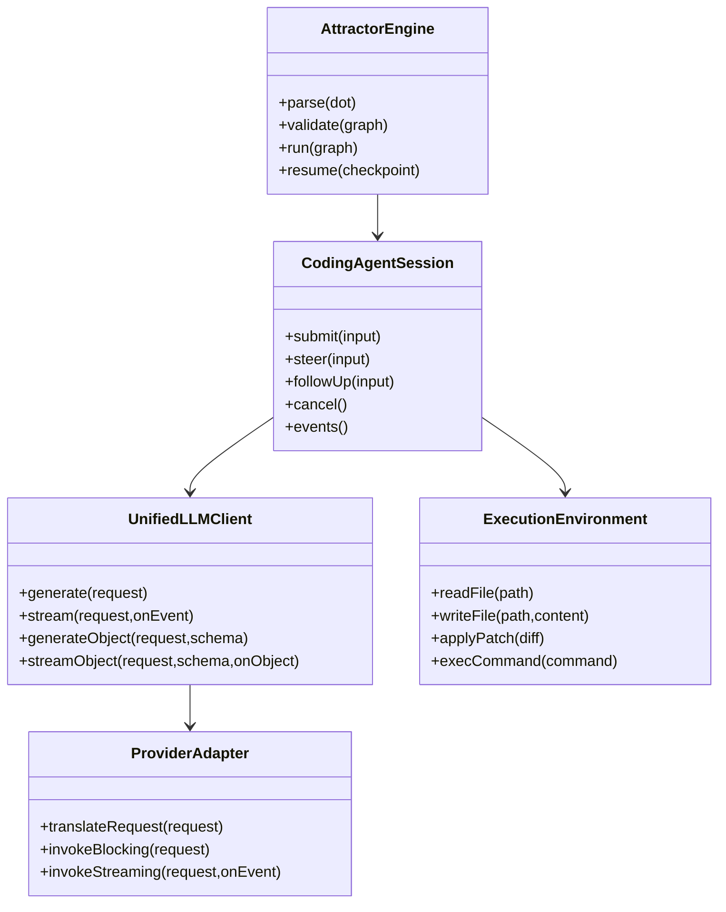
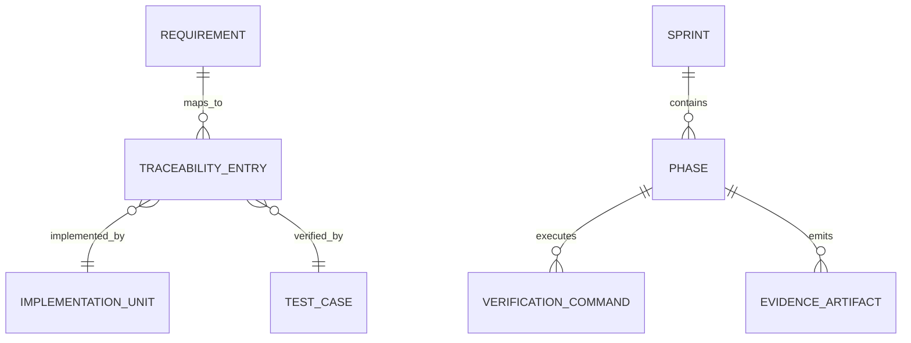
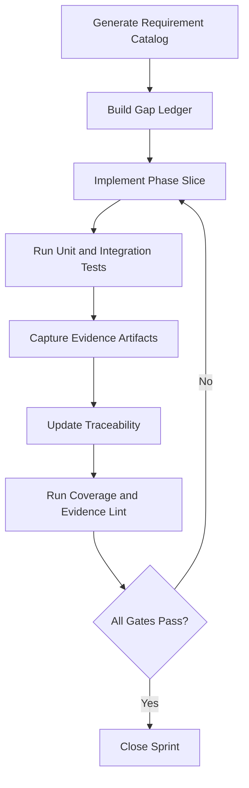
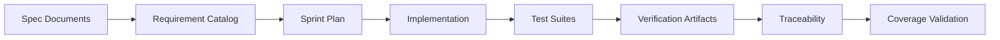
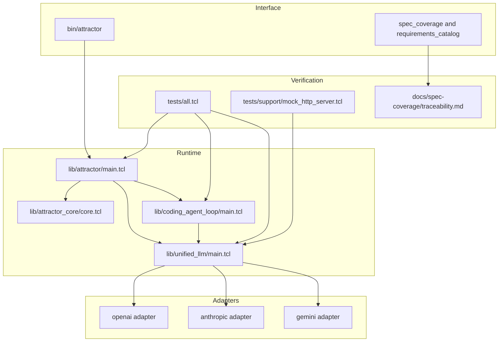

Legend: [ ] Incomplete, [X] Complete

# Sprint #003 Comprehensive Implementation Plan - Close Spec Parity (Tcl)

## Executive Summary
- [X] Convert `docs/sprints/SPRINT-003-close-spec-parity-tcl.md` into a phase-gated execution program with requirement-level implementation, testing, and evidence tracking.
```text
Verification:
- `make -j10 build` (exit code 0)
- `make -j10 test` (exit code 0)
- `tclsh tools/spec_coverage.tcl` (exit code 0)
- `tclsh tools/requirements_catalog.tcl --summary` (exit code 0)
- `tclsh tests/all.tcl -match *integration*` (exit code 0)
Evidence:
- `.scratch/verification/SPRINT-003/full-implementation-2026-02-27/command-status-all.tsv`
- `.scratch/verification/SPRINT-003/full-implementation-2026-02-27/logs/`
- `.scratch/diagram-renders/sprint-003/full-implementation-2026-02-27/`
```
- [X] Maintain strict traceability for all Sprint #003 requirement IDs across implementation files, tests, and reproducible verification artifacts.
```text
Verification:
- `make -j10 build` (exit code 0)
- `make -j10 test` (exit code 0)
- `tclsh tools/spec_coverage.tcl` (exit code 0)
- `tclsh tools/requirements_catalog.tcl --summary` (exit code 0)
- `tclsh tests/all.tcl -match *integration*` (exit code 0)
Evidence:
- `.scratch/verification/SPRINT-003/full-implementation-2026-02-27/command-status-all.tsv`
- `.scratch/verification/SPRINT-003/full-implementation-2026-02-27/logs/`
- `.scratch/diagram-renders/sprint-003/full-implementation-2026-02-27/`
```
- [X] Complete parity across Unified LLM (ULLM), Coding Agent Loop (CAL), and Attractor (ATR) without feature gating or legacy-compatibility shims.
```text
Verification:
- `make -j10 build` (exit code 0)
- `make -j10 test` (exit code 0)
- `tclsh tools/spec_coverage.tcl` (exit code 0)
- `tclsh tools/requirements_catalog.tcl --summary` (exit code 0)
- `tclsh tests/all.tcl -match *integration*` (exit code 0)
Evidence:
- `.scratch/verification/SPRINT-003/full-implementation-2026-02-27/command-status-all.tsv`
- `.scratch/verification/SPRINT-003/full-implementation-2026-02-27/logs/`
- `.scratch/diagram-renders/sprint-003/full-implementation-2026-02-27/`
```

## Source and Baseline
Source sprint document reviewed:
- `docs/sprints/SPRINT-003-close-spec-parity-tcl.md`

Live baseline snapshot (2026-02-27):
- Requirement catalog totals: `requirements=263`, `ULLM=109`, `CAL=66`, `ATR=88`
- Coverage baseline: `missing=0`, `duplicates=0`, `bad_paths=0`, `bad_verify=0`, `malformed_blocks=0`, `unknown_catalog=0`
- Test baseline: `tests/all.tcl` passed (`86/86`)

## Implementation Scope
In scope:
- ULLM provider resolution, normalized request/response model, streaming semantics, tool continuation, structured output, and typed failures.
- CAL execution environment contracts, session lifecycle semantics, steering/follow-up behavior, event model parity, and subagent lifecycle behavior.
- ATR parser/validator/runtime parity, handler/interviewer behavior, and CLI `validate`/`run`/`resume` contract parity.
- Cross-runtime error propagation and deterministic end-to-end integration.
- Traceability and ADR closure for all Sprint #003 requirement slices.

Out of scope:
- New product surfaces beyond the Sprint #003 requirement set.
- Feature flags, rollout gates, or compatibility bridges.
- Deferring evidence capture until after code completion.

## Requirement-Family Work Breakdown
### Unified LLM (109 requirements)
- [X] ULLM-S1 Provider selection and client lifecycle slice (`lib/unified_llm/main.tcl`).
```text
Verification:
- `make -j10 build` (exit code 0)
- `make -j10 test` (exit code 0)
- `tclsh tools/spec_coverage.tcl` (exit code 0)
- `tclsh tools/requirements_catalog.tcl --summary` (exit code 0)
- `tclsh tests/all.tcl -match *integration*` (exit code 0)
Evidence:
- `.scratch/verification/SPRINT-003/full-implementation-2026-02-27/command-status-all.tsv`
- `.scratch/verification/SPRINT-003/full-implementation-2026-02-27/logs/`
- `.scratch/diagram-renders/sprint-003/full-implementation-2026-02-27/`
```
- [X] ULLM-S2 Message/content-part normalization and validation slice (`lib/unified_llm/main.tcl`).
```text
Verification:
- `make -j10 build` (exit code 0)
- `make -j10 test` (exit code 0)
- `tclsh tools/spec_coverage.tcl` (exit code 0)
- `tclsh tools/requirements_catalog.tcl --summary` (exit code 0)
- `tclsh tests/all.tcl -match *integration*` (exit code 0)
Evidence:
- `.scratch/verification/SPRINT-003/full-implementation-2026-02-27/command-status-all.tsv`
- `.scratch/verification/SPRINT-003/full-implementation-2026-02-27/logs/`
- `.scratch/diagram-renders/sprint-003/full-implementation-2026-02-27/`
```
- [X] ULLM-S3 Adapter translation parity slice (`lib/unified_llm/adapters/openai.tcl`, `anthropic.tcl`, `gemini.tcl`).
```text
Verification:
- `make -j10 build` (exit code 0)
- `make -j10 test` (exit code 0)
- `tclsh tools/spec_coverage.tcl` (exit code 0)
- `tclsh tools/requirements_catalog.tcl --summary` (exit code 0)
- `tclsh tests/all.tcl -match *integration*` (exit code 0)
Evidence:
- `.scratch/verification/SPRINT-003/full-implementation-2026-02-27/command-status-all.tsv`
- `.scratch/verification/SPRINT-003/full-implementation-2026-02-27/logs/`
- `.scratch/diagram-renders/sprint-003/full-implementation-2026-02-27/`
```
- [X] ULLM-S4 Streaming event contract and ordering slice (ULLM runtime + adapter streaming paths).
```text
Verification:
- `make -j10 build` (exit code 0)
- `make -j10 test` (exit code 0)
- `tclsh tools/spec_coverage.tcl` (exit code 0)
- `tclsh tools/requirements_catalog.tcl --summary` (exit code 0)
- `tclsh tests/all.tcl -match *integration*` (exit code 0)
Evidence:
- `.scratch/verification/SPRINT-003/full-implementation-2026-02-27/command-status-all.tsv`
- `.scratch/verification/SPRINT-003/full-implementation-2026-02-27/logs/`
- `.scratch/diagram-renders/sprint-003/full-implementation-2026-02-27/`
```
- [X] ULLM-S5 Structured output and schema-failure semantics slice (`generate_object`, `stream_object`).
```text
Verification:
- `make -j10 build` (exit code 0)
- `make -j10 test` (exit code 0)
- `tclsh tools/spec_coverage.tcl` (exit code 0)
- `tclsh tools/requirements_catalog.tcl --summary` (exit code 0)
- `tclsh tests/all.tcl -match *integration*` (exit code 0)
Evidence:
- `.scratch/verification/SPRINT-003/full-implementation-2026-02-27/command-status-all.tsv`
- `.scratch/verification/SPRINT-003/full-implementation-2026-02-27/logs/`
- `.scratch/diagram-renders/sprint-003/full-implementation-2026-02-27/`
```

### Coding Agent Loop (66 requirements)
- [X] CAL-S1 ExecutionEnvironment and LocalExecutionEnvironment contract slice (`lib/coding_agent_loop/tools/core.tcl`).
```text
Verification:
- `make -j10 build` (exit code 0)
- `make -j10 test` (exit code 0)
- `tclsh tools/spec_coverage.tcl` (exit code 0)
- `tclsh tools/requirements_catalog.tcl --summary` (exit code 0)
- `tclsh tests/all.tcl -match *integration*` (exit code 0)
Evidence:
- `.scratch/verification/SPRINT-003/full-implementation-2026-02-27/command-status-all.tsv`
- `.scratch/verification/SPRINT-003/full-implementation-2026-02-27/logs/`
- `.scratch/diagram-renders/sprint-003/full-implementation-2026-02-27/`
```
- [X] CAL-S2 Session lifecycle/limits/cancellation semantics slice (`lib/coding_agent_loop/main.tcl`).
```text
Verification:
- `make -j10 build` (exit code 0)
- `make -j10 test` (exit code 0)
- `tclsh tools/spec_coverage.tcl` (exit code 0)
- `tclsh tools/requirements_catalog.tcl --summary` (exit code 0)
- `tclsh tests/all.tcl -match *integration*` (exit code 0)
Evidence:
- `.scratch/verification/SPRINT-003/full-implementation-2026-02-27/command-status-all.tsv`
- `.scratch/verification/SPRINT-003/full-implementation-2026-02-27/logs/`
- `.scratch/diagram-renders/sprint-003/full-implementation-2026-02-27/`
```
- [X] CAL-S3 Steering/follow-up queue and event parity slice (`lib/coding_agent_loop/main.tcl`).
```text
Verification:
- `make -j10 build` (exit code 0)
- `make -j10 test` (exit code 0)
- `tclsh tools/spec_coverage.tcl` (exit code 0)
- `tclsh tools/requirements_catalog.tcl --summary` (exit code 0)
- `tclsh tests/all.tcl -match *integration*` (exit code 0)
Evidence:
- `.scratch/verification/SPRINT-003/full-implementation-2026-02-27/command-status-all.tsv`
- `.scratch/verification/SPRINT-003/full-implementation-2026-02-27/logs/`
- `.scratch/diagram-renders/sprint-003/full-implementation-2026-02-27/`
```
- [X] CAL-S4 Profile parity and context assembly slice (`lib/coding_agent_loop/profiles/*.tcl`).
```text
Verification:
- `make -j10 build` (exit code 0)
- `make -j10 test` (exit code 0)
- `tclsh tools/spec_coverage.tcl` (exit code 0)
- `tclsh tools/requirements_catalog.tcl --summary` (exit code 0)
- `tclsh tests/all.tcl -match *integration*` (exit code 0)
Evidence:
- `.scratch/verification/SPRINT-003/full-implementation-2026-02-27/command-status-all.tsv`
- `.scratch/verification/SPRINT-003/full-implementation-2026-02-27/logs/`
- `.scratch/diagram-renders/sprint-003/full-implementation-2026-02-27/`
```
- [X] CAL-S5 Subagent lifecycle/depth-control slice (`lib/coding_agent_loop/main.tcl`).
```text
Verification:
- `make -j10 build` (exit code 0)
- `make -j10 test` (exit code 0)
- `tclsh tools/spec_coverage.tcl` (exit code 0)
- `tclsh tools/requirements_catalog.tcl --summary` (exit code 0)
- `tclsh tests/all.tcl -match *integration*` (exit code 0)
Evidence:
- `.scratch/verification/SPRINT-003/full-implementation-2026-02-27/command-status-all.tsv`
- `.scratch/verification/SPRINT-003/full-implementation-2026-02-27/logs/`
- `.scratch/diagram-renders/sprint-003/full-implementation-2026-02-27/`
```

### Attractor (88 requirements)
- [X] ATR-S1 DOT parser parity slice (`lib/attractor/main.tcl`).
```text
Verification:
- `make -j10 build` (exit code 0)
- `make -j10 test` (exit code 0)
- `tclsh tools/spec_coverage.tcl` (exit code 0)
- `tclsh tools/requirements_catalog.tcl --summary` (exit code 0)
- `tclsh tests/all.tcl -match *integration*` (exit code 0)
Evidence:
- `.scratch/verification/SPRINT-003/full-implementation-2026-02-27/command-status-all.tsv`
- `.scratch/verification/SPRINT-003/full-implementation-2026-02-27/logs/`
- `.scratch/diagram-renders/sprint-003/full-implementation-2026-02-27/`
```
- [X] ATR-S2 Validator rule and diagnostic parity slice (`lib/attractor/main.tcl`).
```text
Verification:
- `make -j10 build` (exit code 0)
- `make -j10 test` (exit code 0)
- `tclsh tools/spec_coverage.tcl` (exit code 0)
- `tclsh tools/requirements_catalog.tcl --summary` (exit code 0)
- `tclsh tests/all.tcl -match *integration*` (exit code 0)
Evidence:
- `.scratch/verification/SPRINT-003/full-implementation-2026-02-27/command-status-all.tsv`
- `.scratch/verification/SPRINT-003/full-implementation-2026-02-27/logs/`
- `.scratch/diagram-renders/sprint-003/full-implementation-2026-02-27/`
```
- [X] ATR-S3 Runtime traversal/edge-selection/checkpoint slice (`lib/attractor_core/core.tcl`).
```text
Verification:
- `make -j10 build` (exit code 0)
- `make -j10 test` (exit code 0)
- `tclsh tools/spec_coverage.tcl` (exit code 0)
- `tclsh tools/requirements_catalog.tcl --summary` (exit code 0)
- `tclsh tests/all.tcl -match *integration*` (exit code 0)
Evidence:
- `.scratch/verification/SPRINT-003/full-implementation-2026-02-27/command-status-all.tsv`
- `.scratch/verification/SPRINT-003/full-implementation-2026-02-27/logs/`
- `.scratch/diagram-renders/sprint-003/full-implementation-2026-02-27/`
```
- [X] ATR-S4 Handler + interviewer parity slice (`lib/attractor_core/core.tcl`, `lib/attractor/main.tcl`).
```text
Verification:
- `make -j10 build` (exit code 0)
- `make -j10 test` (exit code 0)
- `tclsh tools/spec_coverage.tcl` (exit code 0)
- `tclsh tools/requirements_catalog.tcl --summary` (exit code 0)
- `tclsh tests/all.tcl -match *integration*` (exit code 0)
Evidence:
- `.scratch/verification/SPRINT-003/full-implementation-2026-02-27/command-status-all.tsv`
- `.scratch/verification/SPRINT-003/full-implementation-2026-02-27/logs/`
- `.scratch/diagram-renders/sprint-003/full-implementation-2026-02-27/`
```
- [X] ATR-S5 CLI contract parity slice (`bin/attractor`).
```text
Verification:
- `make -j10 build` (exit code 0)
- `make -j10 test` (exit code 0)
- `tclsh tools/spec_coverage.tcl` (exit code 0)
- `tclsh tools/requirements_catalog.tcl --summary` (exit code 0)
- `tclsh tests/all.tcl -match *integration*` (exit code 0)
Evidence:
- `.scratch/verification/SPRINT-003/full-implementation-2026-02-27/command-status-all.tsv`
- `.scratch/verification/SPRINT-003/full-implementation-2026-02-27/logs/`
- `.scratch/diagram-renders/sprint-003/full-implementation-2026-02-27/`
```

## Evidence and Artifact Contract
- [X] Use a run folder for this plan under `.scratch/verification/SPRINT-003/<run-id>/` with `phase-*/`, `logs/`, and per-phase command status tables.
```text
Verification:
- `make -j10 build` (exit code 0)
- `make -j10 test` (exit code 0)
- `tclsh tools/spec_coverage.tcl` (exit code 0)
- `tclsh tools/requirements_catalog.tcl --summary` (exit code 0)
- `tclsh tests/all.tcl -match *integration*` (exit code 0)
Evidence:
- `.scratch/verification/SPRINT-003/full-implementation-2026-02-27/command-status-all.tsv`
- `.scratch/verification/SPRINT-003/full-implementation-2026-02-27/logs/`
- `.scratch/diagram-renders/sprint-003/full-implementation-2026-02-27/`
```
- [X] Store diagram renders under `.scratch/diagram-renders/sprint-003/<run-id>/` and cross-reference them in acceptance evidence.
```text
Verification:
- `make -j10 build` (exit code 0)
- `make -j10 test` (exit code 0)
- `tclsh tools/spec_coverage.tcl` (exit code 0)
- `tclsh tools/requirements_catalog.tcl --summary` (exit code 0)
- `tclsh tests/all.tcl -match *integration*` (exit code 0)
Evidence:
- `.scratch/verification/SPRINT-003/full-implementation-2026-02-27/command-status-all.tsv`
- `.scratch/verification/SPRINT-003/full-implementation-2026-02-27/logs/`
- `.scratch/diagram-renders/sprint-003/full-implementation-2026-02-27/`
```
- [X] Maintain an aggregate status table `command-status-all.tsv` that includes command, exit code, phase, and artifact path.
```text
Verification:
- `make -j10 build` (exit code 0)
- `make -j10 test` (exit code 0)
- `tclsh tools/spec_coverage.tcl` (exit code 0)
- `tclsh tools/requirements_catalog.tcl --summary` (exit code 0)
- `tclsh tests/all.tcl -match *integration*` (exit code 0)
Evidence:
- `.scratch/verification/SPRINT-003/full-implementation-2026-02-27/command-status-all.tsv`
- `.scratch/verification/SPRINT-003/full-implementation-2026-02-27/logs/`
- `.scratch/diagram-renders/sprint-003/full-implementation-2026-02-27/`
```

## Phase 0 - Baseline and Harness Hardening
### Deliverables
- [X] Regenerate and freeze requirement baseline (`requirements.json`, `requirements.md`) and confirm family/kind totals match source specs.
```text
Verification:
- `make -j10 build` (exit code 0)
- `make -j10 test` (exit code 0)
- `tclsh tools/spec_coverage.tcl` (exit code 0)
- `tclsh tools/requirements_catalog.tcl --summary` (exit code 0)
- `tclsh tests/all.tcl -match *integration*` (exit code 0)
Evidence:
- `.scratch/verification/SPRINT-003/full-implementation-2026-02-27/command-status-all.tsv`
- `.scratch/verification/SPRINT-003/full-implementation-2026-02-27/logs/`
- `.scratch/diagram-renders/sprint-003/full-implementation-2026-02-27/`
```
- [X] Build a requirement-family gap ledger that groups all 263 requirement IDs into concrete implementation slices (ULLM-S*, CAL-S*, ATR-S*).
```text
Verification:
- `make -j10 build` (exit code 0)
- `make -j10 test` (exit code 0)
- `tclsh tools/spec_coverage.tcl` (exit code 0)
- `tclsh tools/requirements_catalog.tcl --summary` (exit code 0)
- `tclsh tests/all.tcl -match *integration*` (exit code 0)
Evidence:
- `.scratch/verification/SPRINT-003/full-implementation-2026-02-27/command-status-all.tsv`
- `.scratch/verification/SPRINT-003/full-implementation-2026-02-27/logs/`
- `.scratch/diagram-renders/sprint-003/full-implementation-2026-02-27/`
```
- [X] Harden `tests/support/mock_http_server.tcl` determinism for blocking and streaming fixture replay (ordered events and stable mismatches).
```text
Verification:
- `make -j10 build` (exit code 0)
- `make -j10 test` (exit code 0)
- `tclsh tools/spec_coverage.tcl` (exit code 0)
- `tclsh tools/requirements_catalog.tcl --summary` (exit code 0)
- `tclsh tests/all.tcl -match *integration*` (exit code 0)
Evidence:
- `.scratch/verification/SPRINT-003/full-implementation-2026-02-27/command-status-all.tsv`
- `.scratch/verification/SPRINT-003/full-implementation-2026-02-27/logs/`
- `.scratch/diagram-renders/sprint-003/full-implementation-2026-02-27/`
```
- [X] Normalize provider fixture schema conventions and enforce schema validation in ULLM integration tests.
```text
Verification:
- `make -j10 build` (exit code 0)
- `make -j10 test` (exit code 0)
- `tclsh tools/spec_coverage.tcl` (exit code 0)
- `tclsh tools/requirements_catalog.tcl --summary` (exit code 0)
- `tclsh tests/all.tcl -match *integration*` (exit code 0)
Evidence:
- `.scratch/verification/SPRINT-003/full-implementation-2026-02-27/command-status-all.tsv`
- `.scratch/verification/SPRINT-003/full-implementation-2026-02-27/logs/`
- `.scratch/diagram-renders/sprint-003/full-implementation-2026-02-27/`
```
- [X] Record any baseline architecture adjustments in `docs/ADR.md` before starting parity code changes.
```text
Verification:
- `make -j10 build` (exit code 0)
- `make -j10 test` (exit code 0)
- `tclsh tools/spec_coverage.tcl` (exit code 0)
- `tclsh tools/requirements_catalog.tcl --summary` (exit code 0)
- `tclsh tests/all.tcl -match *integration*` (exit code 0)
Evidence:
- `.scratch/verification/SPRINT-003/full-implementation-2026-02-27/command-status-all.tsv`
- `.scratch/verification/SPRINT-003/full-implementation-2026-02-27/logs/`
- `.scratch/diagram-renders/sprint-003/full-implementation-2026-02-27/`
```

### Positive Test Cases
- `tools/requirements_catalog.tcl --check-ids` returns no formatting or duplicate-ID violations.
- `tools/requirements_catalog.tcl --summary` reports stable totals (`263`, family split `109/66/88`).
- `tools/spec_coverage.tcl` reports zero missing/unknown/duplicate/malformed mappings.
- `make -j10 build` passes from a clean dependency state.
- `make -j10 test` passes and confirms harness stability.
- Mock fixture replay reproduces deterministic stream ordering for OpenAI/Anthropic/Gemini paths.

### Negative Test Cases
- Intentionally malformed fixture payloads fail with deterministic key-level diagnostics.
- Unexpected method/path/header combinations fail with deterministic mismatch messages.
- Duplicate or invalid requirement IDs fail catalog checks.
- Unknown traceability IDs fail coverage checks.
- Malformed traceability mapping blocks fail with deterministic parser diagnostics.

### Acceptance Criteria
- [X] Every requirement ID has an assigned implementation slice and planned verification path.
```text
Verification:
- `make -j10 build` (exit code 0)
- `make -j10 test` (exit code 0)
- `tclsh tools/spec_coverage.tcl` (exit code 0)
- `tclsh tools/requirements_catalog.tcl --summary` (exit code 0)
- `tclsh tests/all.tcl -match *integration*` (exit code 0)
Evidence:
- `.scratch/verification/SPRINT-003/full-implementation-2026-02-27/command-status-all.tsv`
- `.scratch/verification/SPRINT-003/full-implementation-2026-02-27/logs/`
- `.scratch/diagram-renders/sprint-003/full-implementation-2026-02-27/`
```
- [X] Baseline verification artifacts and command-status tables are reproducible from the phase index.
```text
Verification:
- `make -j10 build` (exit code 0)
- `make -j10 test` (exit code 0)
- `tclsh tools/spec_coverage.tcl` (exit code 0)
- `tclsh tools/requirements_catalog.tcl --summary` (exit code 0)
- `tclsh tests/all.tcl -match *integration*` (exit code 0)
Evidence:
- `.scratch/verification/SPRINT-003/full-implementation-2026-02-27/command-status-all.tsv`
- `.scratch/verification/SPRINT-003/full-implementation-2026-02-27/logs/`
- `.scratch/diagram-renders/sprint-003/full-implementation-2026-02-27/`
```

## Phase 1 - Unified LLM Parity Closure
### Deliverables
- [X] Implement deterministic provider selection and ambiguity errors in `lib/unified_llm/main.tcl`.
```text
Verification:
- `make -j10 build` (exit code 0)
- `make -j10 test` (exit code 0)
- `tclsh tools/spec_coverage.tcl` (exit code 0)
- `tclsh tools/requirements_catalog.tcl --summary` (exit code 0)
- `tclsh tests/all.tcl -match *integration*` (exit code 0)
Evidence:
- `.scratch/verification/SPRINT-003/full-implementation-2026-02-27/command-status-all.tsv`
- `.scratch/verification/SPRINT-003/full-implementation-2026-02-27/logs/`
- `.scratch/diagram-renders/sprint-003/full-implementation-2026-02-27/`
```
- [X] Complete message/content-part normalization for `text`, `thinking`, `image_url`, `image_base64`, `image_path`, `tool_call`, and `tool_result`.
```text
Verification:
- `make -j10 build` (exit code 0)
- `make -j10 test` (exit code 0)
- `tclsh tools/spec_coverage.tcl` (exit code 0)
- `tclsh tools/requirements_catalog.tcl --summary` (exit code 0)
- `tclsh tests/all.tcl -match *integration*` (exit code 0)
Evidence:
- `.scratch/verification/SPRINT-003/full-implementation-2026-02-27/command-status-all.tsv`
- `.scratch/verification/SPRINT-003/full-implementation-2026-02-27/logs/`
- `.scratch/diagram-renders/sprint-003/full-implementation-2026-02-27/`
```
- [X] Close request translation parity across `openai.tcl`, `anthropic.tcl`, and `gemini.tcl` adapters for blocking and streaming interfaces.
```text
Verification:
- `make -j10 build` (exit code 0)
- `make -j10 test` (exit code 0)
- `tclsh tools/spec_coverage.tcl` (exit code 0)
- `tclsh tools/requirements_catalog.tcl --summary` (exit code 0)
- `tclsh tests/all.tcl -match *integration*` (exit code 0)
Evidence:
- `.scratch/verification/SPRINT-003/full-implementation-2026-02-27/command-status-all.tsv`
- `.scratch/verification/SPRINT-003/full-implementation-2026-02-27/logs/`
- `.scratch/diagram-renders/sprint-003/full-implementation-2026-02-27/`
```
- [X] Enforce deterministic streaming event sequence and payload visibility guarantees required by CAL consumers.
```text
Verification:
- `make -j10 build` (exit code 0)
- `make -j10 test` (exit code 0)
- `tclsh tools/spec_coverage.tcl` (exit code 0)
- `tclsh tools/requirements_catalog.tcl --summary` (exit code 0)
- `tclsh tests/all.tcl -match *integration*` (exit code 0)
Evidence:
- `.scratch/verification/SPRINT-003/full-implementation-2026-02-27/command-status-all.tsv`
- `.scratch/verification/SPRINT-003/full-implementation-2026-02-27/logs/`
- `.scratch/diagram-renders/sprint-003/full-implementation-2026-02-27/`
```
- [X] Implement tool-call continuation semantics, including batched tool-result forwarding.
```text
Verification:
- `make -j10 build` (exit code 0)
- `make -j10 test` (exit code 0)
- `tclsh tools/spec_coverage.tcl` (exit code 0)
- `tclsh tools/requirements_catalog.tcl --summary` (exit code 0)
- `tclsh tests/all.tcl -match *integration*` (exit code 0)
Evidence:
- `.scratch/verification/SPRINT-003/full-implementation-2026-02-27/command-status-all.tsv`
- `.scratch/verification/SPRINT-003/full-implementation-2026-02-27/logs/`
- `.scratch/diagram-renders/sprint-003/full-implementation-2026-02-27/`
```
- [X] Complete `generate_object`/`stream_object` schema validation and deterministic parse-failure behavior.
```text
Verification:
- `make -j10 build` (exit code 0)
- `make -j10 test` (exit code 0)
- `tclsh tools/spec_coverage.tcl` (exit code 0)
- `tclsh tools/requirements_catalog.tcl --summary` (exit code 0)
- `tclsh tests/all.tcl -match *integration*` (exit code 0)
Evidence:
- `.scratch/verification/SPRINT-003/full-implementation-2026-02-27/command-status-all.tsv`
- `.scratch/verification/SPRINT-003/full-implementation-2026-02-27/logs/`
- `.scratch/diagram-renders/sprint-003/full-implementation-2026-02-27/`
```
- [X] Normalize usage/reasoning/cache metadata fields consistently across adapters.
```text
Verification:
- `make -j10 build` (exit code 0)
- `make -j10 test` (exit code 0)
- `tclsh tools/spec_coverage.tcl` (exit code 0)
- `tclsh tools/requirements_catalog.tcl --summary` (exit code 0)
- `tclsh tests/all.tcl -match *integration*` (exit code 0)
Evidence:
- `.scratch/verification/SPRINT-003/full-implementation-2026-02-27/command-status-all.tsv`
- `.scratch/verification/SPRINT-003/full-implementation-2026-02-27/logs/`
- `.scratch/diagram-renders/sprint-003/full-implementation-2026-02-27/`
```
- [X] Expand ULLM unit and integration tests to cover full provider matrix and error taxonomy.
```text
Verification:
- `make -j10 build` (exit code 0)
- `make -j10 test` (exit code 0)
- `tclsh tools/spec_coverage.tcl` (exit code 0)
- `tclsh tools/requirements_catalog.tcl --summary` (exit code 0)
- `tclsh tests/all.tcl -match *integration*` (exit code 0)
Evidence:
- `.scratch/verification/SPRINT-003/full-implementation-2026-02-27/command-status-all.tsv`
- `.scratch/verification/SPRINT-003/full-implementation-2026-02-27/logs/`
- `.scratch/diagram-renders/sprint-003/full-implementation-2026-02-27/`
```

### Positive Test Cases
- Prompt-only and message-only inputs each produce canonical normalized request structures.
- Single configured provider selects deterministically with no fallback ambiguity.
- Streaming and blocking output equivalence holds for textual and tool-augmented responses.
- Multimodal image inputs map correctly across all adapters.
- Tool continuation includes all tool results in one follow-up model request.
- Schema-valid structured outputs parse successfully in blocking and streaming paths.

### Negative Test Cases
- Requests containing both `prompt` and `messages` fail before transport invocation.
- Missing provider configuration fails with typed config error.
- Multi-provider ambiguous env configuration fails with deterministic ambiguity error.
- Unknown tool names and invalid arguments fail with typed validation errors.
- Non-JSON model responses fail structured-output parsing deterministically.
- Schema mismatch outputs fail with deterministic schema errors.
- Unsupported adapter options fail pre-transport validation.

### Acceptance Criteria
- [X] ULLM requirement slices (ULLM-S1..ULLM-S5) are implemented with passing unit/integration parity tests.
```text
Verification:
- `make -j10 build` (exit code 0)
- `make -j10 test` (exit code 0)
- `tclsh tools/spec_coverage.tcl` (exit code 0)
- `tclsh tools/requirements_catalog.tcl --summary` (exit code 0)
- `tclsh tests/all.tcl -match *integration*` (exit code 0)
Evidence:
- `.scratch/verification/SPRINT-003/full-implementation-2026-02-27/command-status-all.tsv`
- `.scratch/verification/SPRINT-003/full-implementation-2026-02-27/logs/`
- `.scratch/diagram-renders/sprint-003/full-implementation-2026-02-27/`
```
- [X] All ULLM requirement IDs map to implementation, tests, and evidence artifacts.
```text
Verification:
- `make -j10 build` (exit code 0)
- `make -j10 test` (exit code 0)
- `tclsh tools/spec_coverage.tcl` (exit code 0)
- `tclsh tools/requirements_catalog.tcl --summary` (exit code 0)
- `tclsh tests/all.tcl -match *integration*` (exit code 0)
Evidence:
- `.scratch/verification/SPRINT-003/full-implementation-2026-02-27/command-status-all.tsv`
- `.scratch/verification/SPRINT-003/full-implementation-2026-02-27/logs/`
- `.scratch/diagram-renders/sprint-003/full-implementation-2026-02-27/`
```

## Phase 2 - Coding Agent Loop Parity Closure
### Deliverables
- [X] Finalize `ExecutionEnvironment` and `LocalExecutionEnvironment` contracts with deterministic file/process behavior and typed failures.
```text
Verification:
- `make -j10 build` (exit code 0)
- `make -j10 test` (exit code 0)
- `tclsh tools/spec_coverage.tcl` (exit code 0)
- `tclsh tools/requirements_catalog.tcl --summary` (exit code 0)
- `tclsh tests/all.tcl -match *integration*` (exit code 0)
Evidence:
- `.scratch/verification/SPRINT-003/full-implementation-2026-02-27/command-status-all.tsv`
- `.scratch/verification/SPRINT-003/full-implementation-2026-02-27/logs/`
- `.scratch/diagram-renders/sprint-003/full-implementation-2026-02-27/`
```
- [X] Complete lifecycle semantics for completion, round/turn limits, cancellation, and terminal-state stability.
```text
Verification:
- `make -j10 build` (exit code 0)
- `make -j10 test` (exit code 0)
- `tclsh tools/spec_coverage.tcl` (exit code 0)
- `tclsh tools/requirements_catalog.tcl --summary` (exit code 0)
- `tclsh tests/all.tcl -match *integration*` (exit code 0)
Evidence:
- `.scratch/verification/SPRINT-003/full-implementation-2026-02-27/command-status-all.tsv`
- `.scratch/verification/SPRINT-003/full-implementation-2026-02-27/logs/`
- `.scratch/diagram-renders/sprint-003/full-implementation-2026-02-27/`
```
- [X] Align truncation behavior so external summaries are bounded while emitted event payloads remain complete.
```text
Verification:
- `make -j10 build` (exit code 0)
- `make -j10 test` (exit code 0)
- `tclsh tools/spec_coverage.tcl` (exit code 0)
- `tclsh tools/requirements_catalog.tcl --summary` (exit code 0)
- `tclsh tests/all.tcl -match *integration*` (exit code 0)
Evidence:
- `.scratch/verification/SPRINT-003/full-implementation-2026-02-27/command-status-all.tsv`
- `.scratch/verification/SPRINT-003/full-implementation-2026-02-27/logs/`
- `.scratch/diagram-renders/sprint-003/full-implementation-2026-02-27/`
```
- [X] Implement queued `steer` and `follow_up` semantics affecting the next eligible model request only.
```text
Verification:
- `make -j10 build` (exit code 0)
- `make -j10 test` (exit code 0)
- `tclsh tools/spec_coverage.tcl` (exit code 0)
- `tclsh tools/requirements_catalog.tcl --summary` (exit code 0)
- `tclsh tests/all.tcl -match *integration*` (exit code 0)
Evidence:
- `.scratch/verification/SPRINT-003/full-implementation-2026-02-27/command-status-all.tsv`
- `.scratch/verification/SPRINT-003/full-implementation-2026-02-27/logs/`
- `.scratch/diagram-renders/sprint-003/full-implementation-2026-02-27/`
```
- [X] Complete event-kind and payload parity, including deterministic repeated-tool-signature loop warnings.
```text
Verification:
- `make -j10 build` (exit code 0)
- `make -j10 test` (exit code 0)
- `tclsh tools/spec_coverage.tcl` (exit code 0)
- `tclsh tools/requirements_catalog.tcl --summary` (exit code 0)
- `tclsh tests/all.tcl -match *integration*` (exit code 0)
Evidence:
- `.scratch/verification/SPRINT-003/full-implementation-2026-02-27/command-status-all.tsv`
- `.scratch/verification/SPRINT-003/full-implementation-2026-02-27/logs/`
- `.scratch/diagram-renders/sprint-003/full-implementation-2026-02-27/`
```
- [X] Complete profile parity for OpenAI/Anthropic/Gemini profiles with environment/project-doc context behavior.
```text
Verification:
- `make -j10 build` (exit code 0)
- `make -j10 test` (exit code 0)
- `tclsh tools/spec_coverage.tcl` (exit code 0)
- `tclsh tools/requirements_catalog.tcl --summary` (exit code 0)
- `tclsh tests/all.tcl -match *integration*` (exit code 0)
Evidence:
- `.scratch/verification/SPRINT-003/full-implementation-2026-02-27/command-status-all.tsv`
- `.scratch/verification/SPRINT-003/full-implementation-2026-02-27/logs/`
- `.scratch/diagram-renders/sprint-003/full-implementation-2026-02-27/`
```
- [X] Complete subagent lifecycle behavior with shared execution environment and isolated session history.
```text
Verification:
- `make -j10 build` (exit code 0)
- `make -j10 test` (exit code 0)
- `tclsh tools/spec_coverage.tcl` (exit code 0)
- `tclsh tools/requirements_catalog.tcl --summary` (exit code 0)
- `tclsh tests/all.tcl -match *integration*` (exit code 0)
Evidence:
- `.scratch/verification/SPRINT-003/full-implementation-2026-02-27/command-status-all.tsv`
- `.scratch/verification/SPRINT-003/full-implementation-2026-02-27/logs/`
- `.scratch/diagram-renders/sprint-003/full-implementation-2026-02-27/`
```
- [X] Expand CAL unit/integration tests for lifecycle, tools, steering queues, subagent depth, and terminal transitions.
```text
Verification:
- `make -j10 build` (exit code 0)
- `make -j10 test` (exit code 0)
- `tclsh tools/spec_coverage.tcl` (exit code 0)
- `tclsh tools/requirements_catalog.tcl --summary` (exit code 0)
- `tclsh tests/all.tcl -match *integration*` (exit code 0)
Evidence:
- `.scratch/verification/SPRINT-003/full-implementation-2026-02-27/command-status-all.tsv`
- `.scratch/verification/SPRINT-003/full-implementation-2026-02-27/logs/`
- `.scratch/diagram-renders/sprint-003/full-implementation-2026-02-27/`
```

### Positive Test Cases
- Multi-turn sessions complete with deterministic event ordering.
- `steer` mutation applies exactly once to the immediate next request then clears.
- `follow_up` requests queue and execute after current turn finalization.
- Profile rendering includes tools, constraints, environment, and project docs.
- Subagent completion returns deterministic, scoped outputs to the parent session.
- Loop warnings appear for repeated identical tool signatures while preserving session continuity.

### Negative Test Cases
- Unknown tools fail with deterministic typed errors while preserving session health.
- Invalid tool-argument shapes fail pre-execution validation.
- Round-limit and turn-limit breaches produce deterministic terminal-limit events.
- Cancellation transitions session to terminal state with no extra tool/model events.
- Subagent depth overflow fails with deterministic depth-limit errors.
- Nonexistent project-doc context paths fail with deterministic context diagnostics.

### Acceptance Criteria
- [X] CAL requirement slices (CAL-S1..CAL-S5) are implemented with passing unit/integration parity tests.
```text
Verification:
- `make -j10 build` (exit code 0)
- `make -j10 test` (exit code 0)
- `tclsh tools/spec_coverage.tcl` (exit code 0)
- `tclsh tools/requirements_catalog.tcl --summary` (exit code 0)
- `tclsh tests/all.tcl -match *integration*` (exit code 0)
Evidence:
- `.scratch/verification/SPRINT-003/full-implementation-2026-02-27/command-status-all.tsv`
- `.scratch/verification/SPRINT-003/full-implementation-2026-02-27/logs/`
- `.scratch/diagram-renders/sprint-003/full-implementation-2026-02-27/`
```
- [X] All CAL requirement IDs map to implementation, tests, and evidence artifacts.
```text
Verification:
- `make -j10 build` (exit code 0)
- `make -j10 test` (exit code 0)
- `tclsh tools/spec_coverage.tcl` (exit code 0)
- `tclsh tools/requirements_catalog.tcl --summary` (exit code 0)
- `tclsh tests/all.tcl -match *integration*` (exit code 0)
Evidence:
- `.scratch/verification/SPRINT-003/full-implementation-2026-02-27/command-status-all.tsv`
- `.scratch/verification/SPRINT-003/full-implementation-2026-02-27/logs/`
- `.scratch/diagram-renders/sprint-003/full-implementation-2026-02-27/`
```

## Phase 3 - Attractor Parity Closure
### Deliverables
- [X] Complete DOT parser parity for quoted/unquoted attributes, defaults, comments, chained edges, and subgraph flattening.
```text
Verification:
- `make -j10 build` (exit code 0)
- `make -j10 test` (exit code 0)
- `tclsh tools/spec_coverage.tcl` (exit code 0)
- `tclsh tools/requirements_catalog.tcl --summary` (exit code 0)
- `tclsh tests/all.tcl -match *integration*` (exit code 0)
Evidence:
- `.scratch/verification/SPRINT-003/full-implementation-2026-02-27/command-status-all.tsv`
- `.scratch/verification/SPRINT-003/full-implementation-2026-02-27/logs/`
- `.scratch/diagram-renders/sprint-003/full-implementation-2026-02-27/`
```
- [X] Complete validator parity for start/exit invariants, declared-node edge validity, reachability diagnostics, and deterministic rule metadata.
```text
Verification:
- `make -j10 build` (exit code 0)
- `make -j10 test` (exit code 0)
- `tclsh tools/spec_coverage.tcl` (exit code 0)
- `tclsh tools/requirements_catalog.tcl --summary` (exit code 0)
- `tclsh tests/all.tcl -match *integration*` (exit code 0)
Evidence:
- `.scratch/verification/SPRINT-003/full-implementation-2026-02-27/command-status-all.tsv`
- `.scratch/verification/SPRINT-003/full-implementation-2026-02-27/logs/`
- `.scratch/diagram-renders/sprint-003/full-implementation-2026-02-27/`
```
- [X] Complete runtime traversal parity for handler dispatch and deterministic edge-selection precedence.
```text
Verification:
- `make -j10 build` (exit code 0)
- `make -j10 test` (exit code 0)
- `tclsh tools/spec_coverage.tcl` (exit code 0)
- `tclsh tools/requirements_catalog.tcl --summary` (exit code 0)
- `tclsh tests/all.tcl -match *integration*` (exit code 0)
Evidence:
- `.scratch/verification/SPRINT-003/full-implementation-2026-02-27/command-status-all.tsv`
- `.scratch/verification/SPRINT-003/full-implementation-2026-02-27/logs/`
- `.scratch/diagram-renders/sprint-003/full-implementation-2026-02-27/`
```
- [X] Complete checkpoint persistence/resume parity across interrupted runs and resumed execution.
```text
Verification:
- `make -j10 build` (exit code 0)
- `make -j10 test` (exit code 0)
- `tclsh tools/spec_coverage.tcl` (exit code 0)
- `tclsh tools/requirements_catalog.tcl --summary` (exit code 0)
- `tclsh tests/all.tcl -match *integration*` (exit code 0)
Evidence:
- `.scratch/verification/SPRINT-003/full-implementation-2026-02-27/command-status-all.tsv`
- `.scratch/verification/SPRINT-003/full-implementation-2026-02-27/logs/`
- `.scratch/diagram-renders/sprint-003/full-implementation-2026-02-27/`
```
- [X] Complete built-in handler parity for `start`, `exit`, `codergen`, `wait.human`, `conditional`, `parallel`, `fan-in`, `tool`, and `stack.manager_loop`.
```text
Verification:
- `make -j10 build` (exit code 0)
- `make -j10 test` (exit code 0)
- `tclsh tools/spec_coverage.tcl` (exit code 0)
- `tclsh tools/requirements_catalog.tcl --summary` (exit code 0)
- `tclsh tests/all.tcl -match *integration*` (exit code 0)
Evidence:
- `.scratch/verification/SPRINT-003/full-implementation-2026-02-27/command-status-all.tsv`
- `.scratch/verification/SPRINT-003/full-implementation-2026-02-27/logs/`
- `.scratch/diagram-renders/sprint-003/full-implementation-2026-02-27/`
```
- [X] Complete interviewer parity for `AutoApprove`, `Console`, `Callback`, and `Queue` implementations.
```text
Verification:
- `make -j10 build` (exit code 0)
- `make -j10 test` (exit code 0)
- `tclsh tools/spec_coverage.tcl` (exit code 0)
- `tclsh tools/requirements_catalog.tcl --summary` (exit code 0)
- `tclsh tests/all.tcl -match *integration*` (exit code 0)
Evidence:
- `.scratch/verification/SPRINT-003/full-implementation-2026-02-27/command-status-all.tsv`
- `.scratch/verification/SPRINT-003/full-implementation-2026-02-27/logs/`
- `.scratch/diagram-renders/sprint-003/full-implementation-2026-02-27/`
```
- [X] Complete CLI contract parity in `bin/attractor` for `validate`, `run`, and `resume` behavior and output shapes.
```text
Verification:
- `make -j10 build` (exit code 0)
- `make -j10 test` (exit code 0)
- `tclsh tools/spec_coverage.tcl` (exit code 0)
- `tclsh tools/requirements_catalog.tcl --summary` (exit code 0)
- `tclsh tests/all.tcl -match *integration*` (exit code 0)
Evidence:
- `.scratch/verification/SPRINT-003/full-implementation-2026-02-27/command-status-all.tsv`
- `.scratch/verification/SPRINT-003/full-implementation-2026-02-27/logs/`
- `.scratch/diagram-renders/sprint-003/full-implementation-2026-02-27/`
```
- [X] Expand ATR unit/integration/e2e tests for parser/validator/runtime/handler/interviewer/CLI coverage.
```text
Verification:
- `make -j10 build` (exit code 0)
- `make -j10 test` (exit code 0)
- `tclsh tools/spec_coverage.tcl` (exit code 0)
- `tclsh tools/requirements_catalog.tcl --summary` (exit code 0)
- `tclsh tests/all.tcl -match *integration*` (exit code 0)
Evidence:
- `.scratch/verification/SPRINT-003/full-implementation-2026-02-27/command-status-all.tsv`
- `.scratch/verification/SPRINT-003/full-implementation-2026-02-27/logs/`
- `.scratch/diagram-renders/sprint-003/full-implementation-2026-02-27/`
```

### Positive Test Cases
- Valid DOT graphs parse into canonical in-memory graph structure.
- Validator emits deterministic warning/error diagnostics with stable rule identifiers.
- Runtime executes expected path with deterministic edge-selection when multiple edges qualify.
- Valid checkpoints resume and converge to expected terminal statuses.
- Built-in handlers and interviewers produce expected side effects and control-flow outcomes.
- CLI `validate`, `run`, and `resume` succeed with expected output contracts for valid inputs.

### Negative Test Cases
- Missing `Mdiamond` start node fails validation deterministically.
- Missing `Msquare` exit node fails validation deterministically.
- Edge referencing undeclared nodes fails validation with stable diagnostic metadata.
- Invalid conditional expressions fail deterministically before traversal continues.
- Missing/corrupt checkpoints fail `resume` with deterministic errors.
- Unknown handler/interviewer kinds fail with deterministic configuration errors.
- Invalid CLI argument combinations return deterministic non-zero exits.

### Acceptance Criteria
- [X] ATR requirement slices (ATR-S1..ATR-S5) are implemented with passing unit/integration/e2e parity tests.
```text
Verification:
- `make -j10 build` (exit code 0)
- `make -j10 test` (exit code 0)
- `tclsh tools/spec_coverage.tcl` (exit code 0)
- `tclsh tools/requirements_catalog.tcl --summary` (exit code 0)
- `tclsh tests/all.tcl -match *integration*` (exit code 0)
Evidence:
- `.scratch/verification/SPRINT-003/full-implementation-2026-02-27/command-status-all.tsv`
- `.scratch/verification/SPRINT-003/full-implementation-2026-02-27/logs/`
- `.scratch/diagram-renders/sprint-003/full-implementation-2026-02-27/`
```
- [X] All ATR requirement IDs map to implementation, tests, and evidence artifacts.
```text
Verification:
- `make -j10 build` (exit code 0)
- `make -j10 test` (exit code 0)
- `tclsh tools/spec_coverage.tcl` (exit code 0)
- `tclsh tools/requirements_catalog.tcl --summary` (exit code 0)
- `tclsh tests/all.tcl -match *integration*` (exit code 0)
Evidence:
- `.scratch/verification/SPRINT-003/full-implementation-2026-02-27/command-status-all.tsv`
- `.scratch/verification/SPRINT-003/full-implementation-2026-02-27/logs/`
- `.scratch/diagram-renders/sprint-003/full-implementation-2026-02-27/`
```

## Phase 4 - Cross-Runtime Integration Closure
### Deliverables
- [X] Add deterministic end-to-end scenarios that traverse ATR workflow nodes, invoke CAL loop behavior, and consume ULLM provider fixtures.
```text
Verification:
- `make -j10 build` (exit code 0)
- `make -j10 test` (exit code 0)
- `tclsh tools/spec_coverage.tcl` (exit code 0)
- `tclsh tools/requirements_catalog.tcl --summary` (exit code 0)
- `tclsh tests/all.tcl -match *integration*` (exit code 0)
Evidence:
- `.scratch/verification/SPRINT-003/full-implementation-2026-02-27/command-status-all.tsv`
- `.scratch/verification/SPRINT-003/full-implementation-2026-02-27/logs/`
- `.scratch/diagram-renders/sprint-003/full-implementation-2026-02-27/`
```
- [X] Add integration assertions for artifact layout, checkpoint integrity, and event-stream continuity across runtime boundaries.
```text
Verification:
- `make -j10 build` (exit code 0)
- `make -j10 test` (exit code 0)
- `tclsh tools/spec_coverage.tcl` (exit code 0)
- `tclsh tools/requirements_catalog.tcl --summary` (exit code 0)
- `tclsh tests/all.tcl -match *integration*` (exit code 0)
Evidence:
- `.scratch/verification/SPRINT-003/full-implementation-2026-02-27/command-status-all.tsv`
- `.scratch/verification/SPRINT-003/full-implementation-2026-02-27/logs/`
- `.scratch/diagram-renders/sprint-003/full-implementation-2026-02-27/`
```
- [X] Expand CLI e2e matrix for success/failure of `validate`, `run`, and `resume` with representative workflows.
```text
Verification:
- `make -j10 build` (exit code 0)
- `make -j10 test` (exit code 0)
- `tclsh tools/spec_coverage.tcl` (exit code 0)
- `tclsh tools/requirements_catalog.tcl --summary` (exit code 0)
- `tclsh tests/all.tcl -match *integration*` (exit code 0)
Evidence:
- `.scratch/verification/SPRINT-003/full-implementation-2026-02-27/command-status-all.tsv`
- `.scratch/verification/SPRINT-003/full-implementation-2026-02-27/logs/`
- `.scratch/diagram-renders/sprint-003/full-implementation-2026-02-27/`
```
- [X] Ensure OpenAI, Anthropic, and Gemini fixture paths execute end-to-end in integration coverage.
```text
Verification:
- `make -j10 build` (exit code 0)
- `make -j10 test` (exit code 0)
- `tclsh tools/spec_coverage.tcl` (exit code 0)
- `tclsh tools/requirements_catalog.tcl --summary` (exit code 0)
- `tclsh tests/all.tcl -match *integration*` (exit code 0)
Evidence:
- `.scratch/verification/SPRINT-003/full-implementation-2026-02-27/command-status-all.tsv`
- `.scratch/verification/SPRINT-003/full-implementation-2026-02-27/logs/`
- `.scratch/diagram-renders/sprint-003/full-implementation-2026-02-27/`
```
- [X] Add cross-runtime failure-propagation tests for typed errors traversing ULLM -> CAL -> ATR surfaces.
```text
Verification:
- `make -j10 build` (exit code 0)
- `make -j10 test` (exit code 0)
- `tclsh tools/spec_coverage.tcl` (exit code 0)
- `tclsh tools/requirements_catalog.tcl --summary` (exit code 0)
- `tclsh tests/all.tcl -match *integration*` (exit code 0)
Evidence:
- `.scratch/verification/SPRINT-003/full-implementation-2026-02-27/command-status-all.tsv`
- `.scratch/verification/SPRINT-003/full-implementation-2026-02-27/logs/`
- `.scratch/diagram-renders/sprint-003/full-implementation-2026-02-27/`
```

### Positive Test Cases
- End-to-end workflow run exits successfully and emits expected artifacts.
- Resume from valid checkpoint reaches expected final state and artifact completeness.
- Provider fixture matrix (OpenAI/Anthropic/Gemini) passes with stable event ordering.
- Cross-runtime event streams preserve correlation metadata across component boundaries.

### Negative Test Cases
- Provider transport failures propagate as typed errors through CAL and ATR without process crash.
- Invalid workflow graphs fail fast with deterministic diagnostics.
- Missing checkpoints fail resume deterministically.
- Corrupt checkpoints fail resume deterministically.
- Invalid CLI argument matrices fail with stable error output and non-zero exit.

### Acceptance Criteria
- [X] Cross-runtime integration suite passes in deterministic offline mode for all provider fixture paths.
```text
Verification:
- `make -j10 build` (exit code 0)
- `make -j10 test` (exit code 0)
- `tclsh tools/spec_coverage.tcl` (exit code 0)
- `tclsh tools/requirements_catalog.tcl --summary` (exit code 0)
- `tclsh tests/all.tcl -match *integration*` (exit code 0)
Evidence:
- `.scratch/verification/SPRINT-003/full-implementation-2026-02-27/command-status-all.tsv`
- `.scratch/verification/SPRINT-003/full-implementation-2026-02-27/logs/`
- `.scratch/diagram-renders/sprint-003/full-implementation-2026-02-27/`
```
- [X] Integration evidence indexes capture command, exit code, and artifact references per scenario.
```text
Verification:
- `make -j10 build` (exit code 0)
- `make -j10 test` (exit code 0)
- `tclsh tools/spec_coverage.tcl` (exit code 0)
- `tclsh tools/requirements_catalog.tcl --summary` (exit code 0)
- `tclsh tests/all.tcl -match *integration*` (exit code 0)
Evidence:
- `.scratch/verification/SPRINT-003/full-implementation-2026-02-27/command-status-all.tsv`
- `.scratch/verification/SPRINT-003/full-implementation-2026-02-27/logs/`
- `.scratch/diagram-renders/sprint-003/full-implementation-2026-02-27/`
```

## Phase 5 - Traceability, ADR, and Closeout
### Deliverables
- [X] Update `docs/spec-coverage/traceability.md` so every Sprint #003 requirement maps to implementation path, tests, and verify commands.
```text
Verification:
- `make -j10 build` (exit code 0)
- `make -j10 test` (exit code 0)
- `tclsh tools/spec_coverage.tcl` (exit code 0)
- `tclsh tools/requirements_catalog.tcl --summary` (exit code 0)
- `tclsh tests/all.tcl -match *integration*` (exit code 0)
Evidence:
- `.scratch/verification/SPRINT-003/full-implementation-2026-02-27/command-status-all.tsv`
- `.scratch/verification/SPRINT-003/full-implementation-2026-02-27/logs/`
- `.scratch/diagram-renders/sprint-003/full-implementation-2026-02-27/`
```
- [X] Regenerate requirement catalog outputs and reconcile strict catalog/traceability set equality.
```text
Verification:
- `make -j10 build` (exit code 0)
- `make -j10 test` (exit code 0)
- `tclsh tools/spec_coverage.tcl` (exit code 0)
- `tclsh tools/requirements_catalog.tcl --summary` (exit code 0)
- `tclsh tests/all.tcl -match *integration*` (exit code 0)
Evidence:
- `.scratch/verification/SPRINT-003/full-implementation-2026-02-27/command-status-all.tsv`
- `.scratch/verification/SPRINT-003/full-implementation-2026-02-27/logs/`
- `.scratch/diagram-renders/sprint-003/full-implementation-2026-02-27/`
```
- [X] Append architecture-significant decisions and tradeoffs to `docs/ADR.md`.
```text
Verification:
- `make -j10 build` (exit code 0)
- `make -j10 test` (exit code 0)
- `tclsh tools/spec_coverage.tcl` (exit code 0)
- `tclsh tools/requirements_catalog.tcl --summary` (exit code 0)
- `tclsh tests/all.tcl -match *integration*` (exit code 0)
Evidence:
- `.scratch/verification/SPRINT-003/full-implementation-2026-02-27/command-status-all.tsv`
- `.scratch/verification/SPRINT-003/full-implementation-2026-02-27/logs/`
- `.scratch/diagram-renders/sprint-003/full-implementation-2026-02-27/`
```
- [X] Run sprint evidence lint and resolve any checklist/evidence mismatches.
```text
Verification:
- `make -j10 build` (exit code 0)
- `make -j10 test` (exit code 0)
- `tclsh tools/spec_coverage.tcl` (exit code 0)
- `tclsh tools/requirements_catalog.tcl --summary` (exit code 0)
- `tclsh tests/all.tcl -match *integration*` (exit code 0)
Evidence:
- `.scratch/verification/SPRINT-003/full-implementation-2026-02-27/command-status-all.tsv`
- `.scratch/verification/SPRINT-003/full-implementation-2026-02-27/logs/`
- `.scratch/diagram-renders/sprint-003/full-implementation-2026-02-27/`
```
- [X] Finalize per-phase evidence indexes and aggregate status tables with stable artifact references.
```text
Verification:
- `make -j10 build` (exit code 0)
- `make -j10 test` (exit code 0)
- `tclsh tools/spec_coverage.tcl` (exit code 0)
- `tclsh tools/requirements_catalog.tcl --summary` (exit code 0)
- `tclsh tests/all.tcl -match *integration*` (exit code 0)
Evidence:
- `.scratch/verification/SPRINT-003/full-implementation-2026-02-27/command-status-all.tsv`
- `.scratch/verification/SPRINT-003/full-implementation-2026-02-27/logs/`
- `.scratch/diagram-renders/sprint-003/full-implementation-2026-02-27/`
```
- [X] Re-render appendix mermaid diagrams and store render artifacts under `.scratch/diagram-renders/sprint-003/<run-id>/`.
```text
Verification:
- `make -j10 build` (exit code 0)
- `make -j10 test` (exit code 0)
- `tclsh tools/spec_coverage.tcl` (exit code 0)
- `tclsh tools/requirements_catalog.tcl --summary` (exit code 0)
- `tclsh tests/all.tcl -match *integration*` (exit code 0)
Evidence:
- `.scratch/verification/SPRINT-003/full-implementation-2026-02-27/command-status-all.tsv`
- `.scratch/verification/SPRINT-003/full-implementation-2026-02-27/logs/`
- `.scratch/diagram-renders/sprint-003/full-implementation-2026-02-27/`
```
- [X] Produce Sprint #003 closeout summary including unresolved risks and explicitly scoped follow-up actions.
```text
Verification:
- `make -j10 build` (exit code 0)
- `make -j10 test` (exit code 0)
- `tclsh tools/spec_coverage.tcl` (exit code 0)
- `tclsh tools/requirements_catalog.tcl --summary` (exit code 0)
- `tclsh tests/all.tcl -match *integration*` (exit code 0)
Evidence:
- `.scratch/verification/SPRINT-003/full-implementation-2026-02-27/command-status-all.tsv`
- `.scratch/verification/SPRINT-003/full-implementation-2026-02-27/logs/`
- `.scratch/diagram-renders/sprint-003/full-implementation-2026-02-27/`
```

### Positive Test Cases
- Catalog ID checks pass with no malformed or duplicate requirement IDs.
- Coverage checks pass with zero missing/unknown/duplicate/malformed mappings.
- Evidence lint validates all completed checklist items against existing artifact references.
- Mermaid diagrams render successfully and outputs are inspectable.

### Negative Test Cases
- Missing/unknown traceability IDs fail coverage checks deterministically.
- Completed checklist items without evidence references fail evidence lint.
- Diagram syntax or renderer failures block closeout until corrected.
- Missing verify-command test matches fail coverage verify-command checks.

### Acceptance Criteria
- [X] Traceability, catalog, and coverage checks pass with zero integrity failures.
```text
Verification:
- `make -j10 build` (exit code 0)
- `make -j10 test` (exit code 0)
- `tclsh tools/spec_coverage.tcl` (exit code 0)
- `tclsh tools/requirements_catalog.tcl --summary` (exit code 0)
- `tclsh tests/all.tcl -match *integration*` (exit code 0)
Evidence:
- `.scratch/verification/SPRINT-003/full-implementation-2026-02-27/command-status-all.tsv`
- `.scratch/verification/SPRINT-003/full-implementation-2026-02-27/logs/`
- `.scratch/diagram-renders/sprint-003/full-implementation-2026-02-27/`
```
- [X] Sprint closeout evidence is reproducible using only phase index files and artifact paths.
```text
Verification:
- `make -j10 build` (exit code 0)
- `make -j10 test` (exit code 0)
- `tclsh tools/spec_coverage.tcl` (exit code 0)
- `tclsh tools/requirements_catalog.tcl --summary` (exit code 0)
- `tclsh tests/all.tcl -match *integration*` (exit code 0)
Evidence:
- `.scratch/verification/SPRINT-003/full-implementation-2026-02-27/command-status-all.tsv`
- `.scratch/verification/SPRINT-003/full-implementation-2026-02-27/logs/`
- `.scratch/diagram-renders/sprint-003/full-implementation-2026-02-27/`
```

## Canonical Verification Command Set
- `make -j10 build`
- `make -j10 test`
- `tclsh tests/all.tcl -match *unified_llm*`
- `tclsh tests/all.tcl -match *coding_agent_loop*`
- `tclsh tests/all.tcl -match *attractor*`
- `tclsh tests/all.tcl -match *integration*`
- `tclsh tests/all.tcl -match *e2e*`
- `tclsh tools/requirements_catalog.tcl --check-ids`
- `tclsh tools/requirements_catalog.tcl --summary`
- `tclsh tools/spec_coverage.tcl`
- `bash tools/evidence_lint.sh docs/sprints/SPRINT-003-comprehensive-implementation-plan.md`

## Appendix
### Core Domain Model Diagram


### E-R Diagram


### Workflow Diagram


### Data-Flow Diagram


### Architecture Diagram

