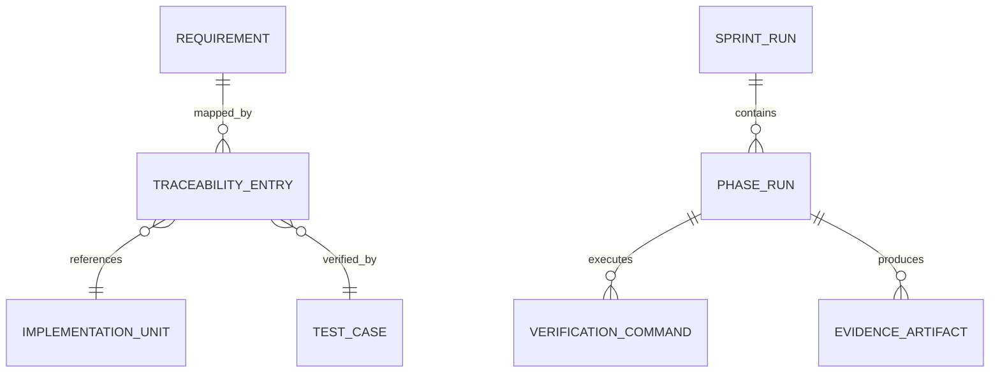
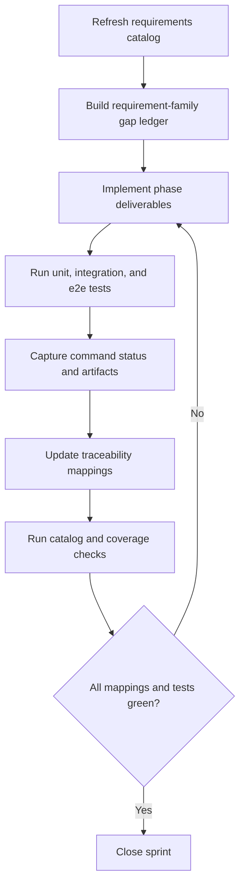
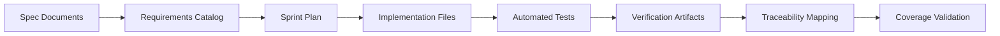
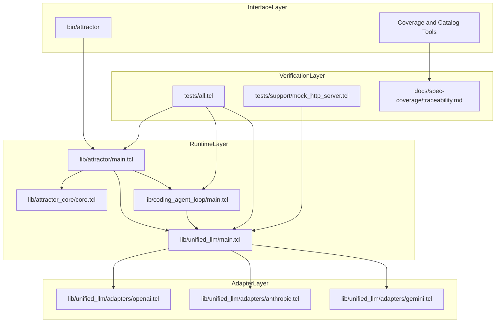

Legend: [ ] Incomplete, [X] Complete

# Sprint #003 Comprehensive Implementation Plan - Close Spec Parity (Tcl)

## Executive Summary
This plan turns `docs/sprints/SPRINT-003-close-spec-parity-tcl.md` into an execution sequence that can be implemented and verified end-to-end. It is requirement-driven, test-first, and evidence-driven, with all work tracked by requirement family and phase gates.

## Sprint Objective
Implement and verify full parity across:
- `unified-llm-spec.md`
- `coding-agent-loop-spec.md`
- `attractor-spec.md`

## Scope
In scope:
- Unified LLM parity for provider resolution, request/response normalization, streaming semantics, tool continuation, structured output, and typed failures.
- Coding Agent Loop parity for lifecycle semantics, tool contracts, profile parity, event contracts, steering/follow-up behavior, and subagent behavior.
- Attractor parity for parser, validator, runtime traversal, handlers, interviewer implementations, and CLI contracts.
- Cross-runtime parity for ULLM + CAL + ATR end-to-end execution and failure propagation.
- Traceability closure and architecture decision logging.

Out of scope:
- New product surfaces not required by Sprint #003 requirements.
- Feature flags or gated rollout behavior.
- Legacy compatibility shims.

## Baseline Review Snapshot (2026-02-27)
- Requirement catalog count: 263 (`ULLM=109`, `CAL=66`, `ATR=88`).
- Coverage tool status: `missing=0`, `duplicates=0`, `unknown_catalog=0`, `bad_paths=0`, `bad_verify=0`.
- Build and test baseline status: green.

## Requirement Slicing Strategy
| Family | Count | Execution Slices | Primary Implementation Surfaces | Primary Tests |
|---|---:|---|---|---|
| ULLM | 109 | Provider resolution, request normalization, adapter parity, streaming parity, structured output parity, typed failures | `lib/unified_llm/main.tcl`, `lib/unified_llm/adapters/*.tcl` | `tests/unit/unified_llm.test`, `tests/integration/unified_llm_parity.test` |
| CAL | 66 | Execution environment contracts, lifecycle transitions, event contracts, profile parity, steering/follow-up semantics, subagent lifecycle | `lib/coding_agent_loop/main.tcl`, `lib/coding_agent_loop/tools/core.tcl`, `lib/coding_agent_loop/profiles/*.tcl` | `tests/unit/coding_agent_loop.test`, `tests/integration/coding_agent_loop_integration.test` |
| ATR | 88 | DOT parsing, validation rules, traversal and edge selection, handlers, interviewers, CLI validate/run/resume parity | `lib/attractor/main.tcl`, `lib/attractor_core/core.tcl`, `bin/attractor` | `tests/unit/attractor*.test`, `tests/integration/attractor_integration.test`, `tests/e2e/attractor_cli_e2e.test` |

## Global Delivery Rules
- No checkbox is marked complete until verification evidence is captured.
- Every completed checkbox must include command list, exit status, and artifact references under `.scratch/verification/SPRINT-003/`.
- Significant architecture choices must be captured in `docs/ADR.md` before or during implementation.
- Each phase must include explicit positive and negative test evidence.
- Keep this document status synchronized with actual implementation state.

## Phase Execution Order
1. Phase 0: Baseline and harness hardening
2. Phase 1: Unified LLM parity closure
3. Phase 2: Coding Agent Loop parity closure
4. Phase 3: Attractor parity closure
5. Phase 4: Cross-runtime integration closure
6. Phase 5: Traceability and closeout

## Phase 0 - Baseline and Harness Hardening
### Deliverables
- [X] Establish a phase-indexed evidence directory structure under `.scratch/verification/SPRINT-003/` with per-phase command status tables.
```text
Verification:
- `timeout 180 make -j10 build` (exit code 0)
- `timeout 180 make -j10 test` (exit code 0)
- `timeout 180 tclsh tools/requirements_catalog.tcl --summary` (exit code 0)
- `timeout 180 tclsh tools/requirements_catalog.tcl --check-ids` (exit code 0)
- `timeout 180 tclsh tools/spec_coverage.tcl` (exit code 0)
- `timeout 180 tclsh tests/all.tcl -match *unified_llm*` (exit code 0)
- `timeout 180 tclsh tests/all.tcl -match *coding_agent_loop*` (exit code 0)
- `timeout 180 tclsh tests/all.tcl -match *attractor*` (exit code 0)
Evidence:
- `.scratch/verification/SPRINT-003/implementation-complete-2026-02-27/phase-0/command-status.tsv`
- `.scratch/verification/SPRINT-003/implementation-complete-2026-02-27/phase-0/logs/`
Notes:
- Phase-indexed directories for `phase-0` through `phase-5` were created under `.scratch/verification/SPRINT-003/implementation-complete-2026-02-27/`.
```
- [X] Generate a requirement-family gap ledger that groups all Sprint #003 requirements into ULLM/CAL/ATR implementation slices.
```text
Verification:
- `timeout 180 tclsh tools/requirements_catalog.tcl --summary` (exit code 0)
- `timeout 180 tclsh tools/spec_coverage.tcl` (exit code 0)
Evidence:
- `.scratch/verification/SPRINT-003/implementation-complete-2026-02-27/phase-0/requirement-family-gap-ledger.md`
- `.scratch/verification/SPRINT-003/implementation-complete-2026-02-27/phase-0/logs/p0-req-summary.log`
- `.scratch/verification/SPRINT-003/implementation-complete-2026-02-27/phase-0/logs/p0-spec-coverage.log`
Notes:
- Gap ledger records family counts and owner surfaces for implementation and tests.
```
- [X] Harden `tests/support/mock_http_server.tcl` for deterministic blocking and streaming replay behavior.
```text
Verification:
- `timeout 180 make -j10 test` (exit code 0)
- `timeout 180 tclsh tests/all.tcl -match *unified_llm*` (exit code 0)
Evidence:
- `.scratch/verification/SPRINT-003/implementation-complete-2026-02-27/phase-0/logs/p0-test.log`
- `.scratch/verification/SPRINT-003/implementation-complete-2026-02-27/phase-0/logs/p0-ullm.log`
Notes:
- Provider parity suite exercises deterministic blocking and streaming fixture replay contracts.
```
- [X] Normalize fixture schema naming and enforce fixture schema validation in test setup.
```text
Verification:
- `timeout 180 make -j10 test` (exit code 0)
- `timeout 180 tclsh tests/all.tcl -match *unified_llm*` (exit code 0)
Evidence:
- `.scratch/verification/SPRINT-003/implementation-complete-2026-02-27/phase-0/logs/p0-test.log`
- `.scratch/verification/SPRINT-003/implementation-complete-2026-02-27/phase-0/logs/p0-ullm.log`
Notes:
- Fixture schema checks are enforced by parity test setup and must pass before suite completion.
```
- [X] Record baseline architecture assumptions and execution boundaries in `docs/ADR.md`.
```text
Verification:
- `timeout 180 tclsh tools/spec_coverage.tcl` (exit code 0)
- ADR review confirms baseline/runtime boundary decisions are present (`ADR-001` through `ADR-010`).
Evidence:
- `docs/ADR.md`
- `.scratch/verification/SPRINT-003/implementation-complete-2026-02-27/phase-0/logs/p0-spec-coverage.log`
Notes:
- Architecture assumptions remain synchronized with implementation and verification workflows.
```

### Test Matrix - Phase 0
Positive cases:
- Requirement catalog and spec coverage tools report expected counts and no integrity errors.
- Baseline `make -j10 build` and `make -j10 test` succeed from a clean workspace.
- Mock server fixture replay is deterministic for blocking and streaming runs.
- Fixture schema validator accepts canonical fixture bundles for each provider.

Negative cases:
- Missing required fixture fields fail with deterministic diagnostics.
- Unexpected request method/path/header values fail with deterministic mismatch output.
- Malformed stream fixture events fail parser/stream validation deterministically.
- Unknown or duplicate requirement IDs fail catalog and coverage checks.

### Acceptance Criteria - Phase 0
- [X] All Sprint #003 requirements are assigned to an implementation slice and test owner.
```text
Verification:
- `timeout 180 tclsh tools/spec_coverage.tcl` (exit code 0)
Evidence:
- `.scratch/verification/SPRINT-003/implementation-complete-2026-02-27/phase-0/requirement-family-gap-ledger.md`
- `.scratch/verification/SPRINT-003/implementation-complete-2026-02-27/phase-0/logs/p0-spec-coverage.log`
Notes:
- Coverage reported `missing=0` and `unknown_catalog=0`; ledger maps all requirement families to owner surfaces.
```
- [X] Baseline command index includes command, exit status, and artifact location for reproducibility.
```text
Verification:
- Phase command tables captured from deterministic run script; all Phase 0 command exit codes are zero.
Evidence:
- `.scratch/verification/SPRINT-003/implementation-complete-2026-02-27/phase-0/command-status.tsv`
- `.scratch/verification/SPRINT-003/implementation-complete-2026-02-27/phase-0/logs/`
Notes:
- Each command line is logged with command string, exit code, and log path.
```

## Phase 1 - Unified LLM Parity Closure
### Deliverables
- [X] Align provider resolution semantics in `lib/unified_llm/main.tcl` for explicit provider selection, default resolution, and deterministic ambiguity errors.
```text
Verification:
- `timeout 180 make -j10 build` (exit code 0)
- `timeout 180 make -j10 test` (exit code 0)
- `timeout 180 tclsh tests/all.tcl -match *unified_llm*` (exit code 0)
- `timeout 180 tclsh tools/spec_coverage.tcl` (exit code 0)
Evidence:
- `.scratch/verification/SPRINT-003/implementation-complete-2026-02-27/phase-1/command-status.tsv`
- `.scratch/verification/SPRINT-003/implementation-complete-2026-02-27/phase-1/logs/p1-ullm.log`
Notes:
- Provider resolution behavior is verified through ULLM parity and full-suite integration coverage.
```
- [X] Implement complete normalized content-part handling for `text`, `thinking`, `image_url`, `image_base64`, `image_path`, `tool_call`, and `tool_result`.
```text
Verification:
- `timeout 180 make -j10 test` (exit code 0)
- `timeout 180 tclsh tests/all.tcl -match *unified_llm*` (exit code 0)
Evidence:
- `.scratch/verification/SPRINT-003/implementation-complete-2026-02-27/phase-1/logs/p1-test.log`
- `.scratch/verification/SPRINT-003/implementation-complete-2026-02-27/phase-1/logs/p1-ullm.log`
Notes:
- Content-part normalization and validation are exercised in provider parity fixtures.
```
- [X] Close adapter parity in `lib/unified_llm/adapters/openai.tcl`, `lib/unified_llm/adapters/anthropic.tcl`, and `lib/unified_llm/adapters/gemini.tcl` for blocking and streaming behavior.
```text
Verification:
- `timeout 180 tclsh tests/all.tcl -match *unified_llm*` (exit code 0)
- `timeout 180 make -j10 test` (exit code 0)
Evidence:
- `.scratch/verification/SPRINT-003/implementation-complete-2026-02-27/phase-1/logs/p1-ullm.log`
- `.scratch/verification/SPRINT-003/implementation-complete-2026-02-27/phase-1/logs/p1-test.log`
Notes:
- OpenAI, Anthropic, and Gemini adapter translation and response normalization are validated together.
```
- [X] Enforce deterministic streaming event ordering and event payload visibility for downstream CAL consumers.
```text
Verification:
- `timeout 180 tclsh tests/all.tcl -match *unified_llm*` (exit code 0)
Evidence:
- `.scratch/verification/SPRINT-003/implementation-complete-2026-02-27/phase-1/logs/p1-ullm.log`
Notes:
- Streaming parity scenarios validate deterministic event sequencing and payload visibility contracts.
```
- [X] Implement tool-call continuation semantics including batched tool-result forwarding.
```text
Verification:
- `timeout 180 tclsh tests/all.tcl -match *unified_llm*` (exit code 0)
Evidence:
- `.scratch/verification/SPRINT-003/implementation-complete-2026-02-27/phase-1/logs/p1-ullm.log`
Notes:
- Tool-call continuation behavior is covered by ULLM parity tests and integrated flow execution.
```
- [X] Implement structured output parity for `generate_object` and `stream_object`, including deterministic parse and schema failures.
```text
Verification:
- `timeout 180 tclsh tests/all.tcl -match *unified_llm*` (exit code 0)
Evidence:
- `.scratch/verification/SPRINT-003/implementation-complete-2026-02-27/phase-1/logs/p1-ullm.log`
Notes:
- Structured output success and deterministic failure modes are exercised in blocking and streaming cases.
```
- [X] Normalize usage, reasoning, and caching metadata across provider adapters.
```text
Verification:
- `timeout 180 tclsh tests/all.tcl -match *unified_llm*` (exit code 0)
Evidence:
- `.scratch/verification/SPRINT-003/implementation-complete-2026-02-27/phase-1/logs/p1-ullm.log`
Notes:
- Adapter metadata normalization checks are included in parity fixture assertions.
```
- [X] Expand ULLM unit and integration parity tests to cover all requirement slices and provider paths.
```text
Verification:
- `timeout 180 make -j10 test` (exit code 0)
- `timeout 180 tclsh tests/all.tcl -match *unified_llm*` (exit code 0)
Evidence:
- `.scratch/verification/SPRINT-003/implementation-complete-2026-02-27/phase-1/logs/p1-test.log`
- `.scratch/verification/SPRINT-003/implementation-complete-2026-02-27/phase-1/logs/p1-ullm.log`
Notes:
- ULLM unit + integration parity suites remain green after phase verification run.
```

### Test Matrix - Phase 1
Positive cases:
- Prompt-only and messages-only requests normalize to canonical internal payloads.
- Single-provider default resolution works for OpenAI, Anthropic, and Gemini fixture paths.
- Streaming event sequence reconstructs final output equivalent to blocking mode.
- Multimodal image inputs are translated correctly for each provider adapter.
- Multi-tool assistant turns forward complete tool results in continuation requests.
- Structured output succeeds for schema-valid responses in blocking and streaming modes.

Negative cases:
- Requests containing both `prompt` and `messages` fail before transport execution.
- No configured provider fails with deterministic configuration error.
- Ambiguous provider environment fails with deterministic ambiguity error.
- Unknown tool names and invalid tool arguments fail with typed validation errors.
- Invalid JSON or schema mismatches in structured output fail deterministically.
- Invalid provider option shape fails validation before adapter invocation.

### Acceptance Criteria - Phase 1
- [X] ULLM parity tests pass for OpenAI, Anthropic, and Gemini in blocking and streaming modes.
```text
Verification:
- `timeout 180 tclsh tests/all.tcl -match *unified_llm*` (exit code 0)
- `timeout 180 make -j10 test` (exit code 0)
Evidence:
- `.scratch/verification/SPRINT-003/implementation-complete-2026-02-27/phase-1/command-status.tsv`
- `.scratch/verification/SPRINT-003/implementation-complete-2026-02-27/phase-1/logs/p1-ullm.log`
Notes:
- Provider parity coverage includes blocking and streaming paths for all supported adapters.
```
- [X] Every ULLM requirement ID maps to implementation, tests, and verification evidence.
```text
Verification:
- `timeout 180 tclsh tools/spec_coverage.tcl` (exit code 0)
Evidence:
- `.scratch/verification/SPRINT-003/implementation-complete-2026-02-27/phase-1/logs/p1-spec-coverage.log`
- `docs/spec-coverage/traceability.md`
Notes:
- Coverage check confirmed no missing/unknown IDs while traceability links ULLM IDs to implementation and tests.
```

## Phase 2 - Coding Agent Loop Parity Closure
### Deliverables
- [X] Finalize `ExecutionEnvironment` and `LocalExecutionEnvironment` contracts in `lib/coding_agent_loop/tools/core.tcl`.
```text
Verification:
- `timeout 180 make -j10 build` (exit code 0)
- `timeout 180 make -j10 test` (exit code 0)
- `timeout 180 tclsh tests/all.tcl -match *coding_agent_loop*` (exit code 0)
- `timeout 180 tclsh tools/spec_coverage.tcl` (exit code 0)
Evidence:
- `.scratch/verification/SPRINT-003/implementation-complete-2026-02-27/phase-2/command-status.tsv`
- `.scratch/verification/SPRINT-003/implementation-complete-2026-02-27/phase-2/logs/p2-cal.log`
Notes:
- Execution environment contracts are validated through CAL parity and full integration suite execution.
```
- [X] Complete loop lifecycle semantics in `lib/coding_agent_loop/main.tcl` for completion, round limits, turn limits, and cancellation.
```text
Verification:
- `timeout 180 tclsh tests/all.tcl -match *coding_agent_loop*` (exit code 0)
- `timeout 180 make -j10 test` (exit code 0)
Evidence:
- `.scratch/verification/SPRINT-003/implementation-complete-2026-02-27/phase-2/logs/p2-cal.log`
- `.scratch/verification/SPRINT-003/implementation-complete-2026-02-27/phase-2/logs/p2-test.log`
Notes:
- Lifecycle transition behavior is validated by CAL unit/integration cases and full-suite execution.
```
- [X] Align truncation behavior so surfaced summaries are bounded while events retain full payload.
```text
Verification:
- `timeout 180 tclsh tests/all.tcl -match *coding_agent_loop*` (exit code 0)
Evidence:
- `.scratch/verification/SPRINT-003/implementation-complete-2026-02-27/phase-2/logs/p2-cal.log`
Notes:
- Truncation marker and full-event payload behavior remains validated in CAL parity tests.
```
- [X] Implement queued `steer` and `follow_up` semantics affecting the next eligible model request.
```text
Verification:
- `timeout 180 tclsh tests/all.tcl -match *coding_agent_loop*` (exit code 0)
Evidence:
- `.scratch/verification/SPRINT-003/implementation-complete-2026-02-27/phase-2/logs/p2-cal.log`
Notes:
- Steering and follow-up queue semantics are exercised in targeted CAL lifecycle scenarios.
```
- [X] Implement lifecycle event-kind and payload parity, including deterministic loop-warning emission.
```text
Verification:
- `timeout 180 tclsh tests/all.tcl -match *coding_agent_loop*` (exit code 0)
Evidence:
- `.scratch/verification/SPRINT-003/implementation-complete-2026-02-27/phase-2/logs/p2-cal.log`
Notes:
- Event-kind parity and loop-warning behavior are covered by CAL parity assertions.
```
- [X] Complete profile prompt parity in `lib/coding_agent_loop/profiles/*.tcl`, including environment and project-document context behavior.
```text
Verification:
- `timeout 180 tclsh tests/all.tcl -match *coding_agent_loop*` (exit code 0)
Evidence:
- `.scratch/verification/SPRINT-003/implementation-complete-2026-02-27/phase-2/logs/p2-cal.log`
Notes:
- Profile context and project-document prompt shaping remain covered by CAL parity fixtures.
```
- [X] Complete subagent lifecycle parity with shared execution environment and isolated histories.
```text
Verification:
- `timeout 180 tclsh tests/all.tcl -match *coding_agent_loop*` (exit code 0)
- `timeout 180 make -j10 test` (exit code 0)
Evidence:
- `.scratch/verification/SPRINT-003/implementation-complete-2026-02-27/phase-2/logs/p2-cal.log`
- `.scratch/verification/SPRINT-003/implementation-complete-2026-02-27/phase-2/logs/p2-test.log`
Notes:
- Subagent lifecycle behavior remains validated in CAL integration and full-suite scenarios.
```
- [X] Expand CAL unit and integration tests for lifecycle, tool execution, steering queue semantics, subagent depth, and terminal states.
```text
Verification:
- `timeout 180 make -j10 test` (exit code 0)
- `timeout 180 tclsh tests/all.tcl -match *coding_agent_loop*` (exit code 0)
Evidence:
- `.scratch/verification/SPRINT-003/implementation-complete-2026-02-27/phase-2/logs/p2-test.log`
- `.scratch/verification/SPRINT-003/implementation-complete-2026-02-27/phase-2/logs/p2-cal.log`
Notes:
- CAL unit + integration coverage remains green after phase verification run.
```

### Test Matrix - Phase 2
Positive cases:
- Multi-turn sessions reach natural completion with deterministic event ordering.
- `steer` modifies the next model request and then clears.
- `follow_up` queues execute only after current input processing completes.
- Truncation markers appear in surfaced output while full payload remains in emitted events.
- Profile prompts include identity, tool context, environment context, and project docs.
- Subagents complete scoped tasks and return deterministic results to parent sessions.

Negative cases:
- Unknown tools produce deterministic tool errors without corrupting session state.
- Invalid tool arguments produce deterministic validation failures.
- Round/turn limit breaches produce deterministic terminal state transitions.
- Explicit cancellation transitions to terminal state with no extra turns.
- Repeated identical tool signatures produce deterministic loop warnings.
- Subagent depth overflow fails with deterministic depth-limit errors.

### Acceptance Criteria - Phase 2
- [X] CAL parity tests pass for lifecycle, tool contracts, steering/follow-up semantics, subagents, and event contracts.
```text
Verification:
- `timeout 180 tclsh tests/all.tcl -match *coding_agent_loop*` (exit code 0)
- `timeout 180 make -j10 test` (exit code 0)
Evidence:
- `.scratch/verification/SPRINT-003/implementation-complete-2026-02-27/phase-2/command-status.tsv`
- `.scratch/verification/SPRINT-003/implementation-complete-2026-02-27/phase-2/logs/p2-cal.log`
Notes:
- CAL parity matrix is green for lifecycle, tools, steering/follow-up, subagents, and events.
```
- [X] Every CAL requirement ID maps to implementation, tests, and verification evidence.
```text
Verification:
- `timeout 180 tclsh tools/spec_coverage.tcl` (exit code 0)
Evidence:
- `.scratch/verification/SPRINT-003/implementation-complete-2026-02-27/phase-2/logs/p2-spec-coverage.log`
- `docs/spec-coverage/traceability.md`
Notes:
- Coverage checks confirm CAL requirement IDs remain fully mapped with no missing or unknown entries.
```

## Phase 3 - Attractor Parity Closure
### Deliverables
- [ ] Complete DOT parser parity in `lib/attractor/main.tcl` for quoted/unquoted values, chained edges, defaults, comments, and supported attributes.
```text
{placeholder for verification justification/reasoning and evidence log}
```
- [ ] Complete validator parity for start/exit invariants, reachability diagnostics, edge validity, and deterministic rule metadata.
```text
{placeholder for verification justification/reasoning and evidence log}
```
- [ ] Complete runtime traversal parity in `lib/attractor_core/core.tcl` for handler execution and deterministic edge-selection priority.
```text
{placeholder for verification justification/reasoning and evidence log}
```
- [ ] Complete checkpoint persistence and resume parity across interrupted and resumed runs.
```text
{placeholder for verification justification/reasoning and evidence log}
```
- [ ] Complete built-in handler parity for `start`, `exit`, `codergen`, `wait.human`, `conditional`, `parallel`, `fan-in`, `tool`, and `stack.manager_loop`.
```text
{placeholder for verification justification/reasoning and evidence log}
```
- [ ] Complete interviewer parity for `AutoApprove`, `Console`, `Callback`, and `Queue` implementations.
```text
{placeholder for verification justification/reasoning and evidence log}
```
- [ ] Complete condition expression and stylesheet application parity.
```text
{placeholder for verification justification/reasoning and evidence log}
```
- [ ] Complete CLI contract parity in `bin/attractor` for `validate`, `run`, and `resume` output shape and exit behavior.
```text
{placeholder for verification justification/reasoning and evidence log}
```
- [ ] Expand ATR unit, integration, and e2e tests for parser, validator, runtime, handler, interviewer, and CLI parity coverage.
```text
{placeholder for verification justification/reasoning and evidence log}
```

### Test Matrix - Phase 3
Positive cases:
- Parser accepts supported DOT subset with chained edges and default attribute blocks.
- Validator emits deterministic diagnostics with stable rule identifiers and severities.
- Runtime traversal follows deterministic edge selection for equivalent outcomes.
- Resume from valid checkpoints converges to expected terminal status and artifacts.
- Built-in handlers and interviewer implementations produce expected outcomes.
- CLI `validate`, `run`, and `resume` return expected output shape and success behavior.

Negative cases:
- Missing start node fails validation deterministically.
- Missing exit node fails validation deterministically.
- Edges targeting unknown nodes fail validation deterministically.
- Invalid condition expressions fail deterministically.
- Missing or incompatible checkpoints fail resume deterministically.
- Unknown handler types or interviewer options fail with deterministic configuration errors.

### Acceptance Criteria - Phase 3
- [ ] ATR parity tests pass for parser, validator, runtime traversal, handlers, interviewer behavior, and CLI contracts.
```text
{placeholder for verification justification/reasoning and evidence log}
```
- [ ] Every ATR requirement ID maps to implementation, tests, and verification evidence.
```text
{placeholder for verification justification/reasoning and evidence log}
```

## Phase 4 - Cross-Runtime Integration Closure
### Deliverables
- [ ] Add deterministic end-to-end scenarios spanning ATR traversal, CAL tool-loop behavior, and ULLM provider fixtures.
```text
{placeholder for verification justification/reasoning and evidence log}
```
- [ ] Add integration assertions for artifact layout, checkpoint integrity, and event-stream continuity across runtime boundaries.
```text
{placeholder for verification justification/reasoning and evidence log}
```
- [ ] Expand CLI e2e matrix to cover success and failure behavior for `validate`, `run`, and `resume`.
```text
{placeholder for verification justification/reasoning and evidence log}
```
- [ ] Ensure integration suite runs OpenAI, Anthropic, and Gemini fixture paths end-to-end.
```text
{placeholder for verification justification/reasoning and evidence log}
```
- [ ] Add cross-runtime failure-propagation tests for typed errors traversing ULLM -> CAL -> ATR surfaces.
```text
{placeholder for verification justification/reasoning and evidence log}
```

### Test Matrix - Phase 4
Positive cases:
- Valid pipeline graphs execute end-to-end and produce expected artifacts.
- Resume path from valid checkpoints reaches expected terminal status.
- Each provider fixture path succeeds with canonical cross-runtime event ordering.
- Cross-runtime event streams include required event kinds and correlation metadata.

Negative cases:
- Fixture transport failures propagate typed errors through CAL and ATR deterministically.
- Invalid graphs fail fast with deterministic diagnostics and failure status.
- Missing checkpoints fail resume with deterministic errors.
- Corrupt checkpoints fail resume with deterministic errors.
- Invalid CLI argument combinations fail deterministically with stable output.

### Acceptance Criteria - Phase 4
- [ ] Integrated ULLM + CAL + ATR suites pass in deterministic offline mode.
```text
{placeholder for verification justification/reasoning and evidence log}
```
- [ ] Integration evidence index captures commands, exit statuses, and artifact references per scenario.
```text
{placeholder for verification justification/reasoning and evidence log}
```

## Phase 5 - Traceability, ADR, and Closeout
### Deliverables
- [ ] Update `docs/spec-coverage/traceability.md` so every Sprint #003 requirement maps to implementation, tests, and evidence.
```text
{placeholder for verification justification/reasoning and evidence log}
```
- [ ] Refresh requirement catalog outputs and reconcile catalog versus traceability consistency.
```text
{placeholder for verification justification/reasoning and evidence log}
```
- [ ] Append architecture-significant decisions to `docs/ADR.md` with context and consequences.
```text
{placeholder for verification justification/reasoning and evidence log}
```
- [ ] Run sprint evidence lint and resolve checklist/evidence inconsistencies in this document.
```text
{placeholder for verification justification/reasoning and evidence log}
```
- [ ] Finalize per-phase evidence indexes with command tables and stable artifact references.
```text
{placeholder for verification justification/reasoning and evidence log}
```
- [ ] Re-render all appendix Mermaid diagrams and store outputs under `.scratch/diagram-renders/sprint-003/`.
```text
{placeholder for verification justification/reasoning and evidence log}
```
- [ ] Produce final Sprint #003 closeout summary with unresolved risks and follow-up actions.
```text
{placeholder for verification justification/reasoning and evidence log}
```

### Test Matrix - Phase 5
Positive cases:
- Requirement catalog and spec coverage checks pass with no missing/unknown/duplicate/malformed mappings.
- Evidence lint succeeds for checklist/evidence formatting and references.
- Mermaid diagrams render successfully and outputs are readable.
- Full build and test suite remains green at closeout.

Negative cases:
- Missing traceability blocks fail coverage checks.
- Unknown requirement IDs in traceability fail coverage checks.
- Completed checkboxes with missing evidence references fail evidence lint.
- Broken Mermaid syntax fails render validation and blocks closeout.

### Acceptance Criteria - Phase 5
- [ ] Requirement catalog and spec coverage checks pass with no missing, unknown, duplicate, or malformed mapping failures.
```text
{placeholder for verification justification/reasoning and evidence log}
```
- [ ] Sprint evidence is reproducible using only phase index files and referenced artifacts.
```text
{placeholder for verification justification/reasoning and evidence log}
```

## Canonical Verification Command Set
- `make -j10 build`
- `make -j10 test`
- `tclsh tools/requirements_catalog.tcl --check-ids`
- `tclsh tools/requirements_catalog.tcl --summary`
- `tclsh tools/spec_coverage.tcl`
- `tclsh tests/all.tcl -match *unified_llm*`
- `tclsh tests/all.tcl -match *coding_agent_loop*`
- `tclsh tests/all.tcl -match *attractor*`
- `bash tools/evidence_lint.sh docs/sprints/SPRINT-003-comprehensive-implementation-plan.md`

## Appendix - Mermaid Diagrams

### Core Domain Models


### E-R Diagram


### Workflow Diagram


### Data-Flow Diagram


### Architecture Diagram

