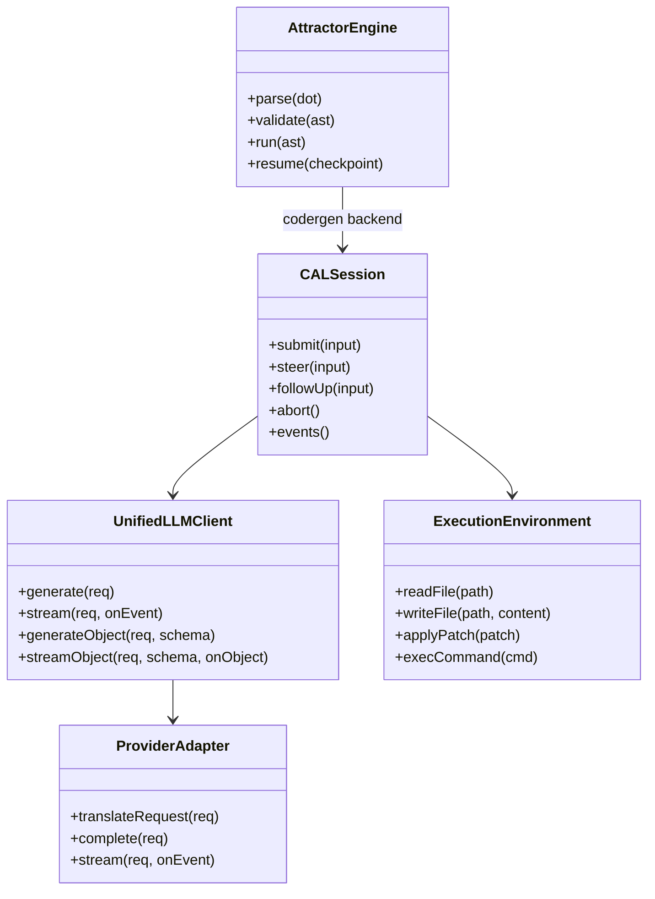
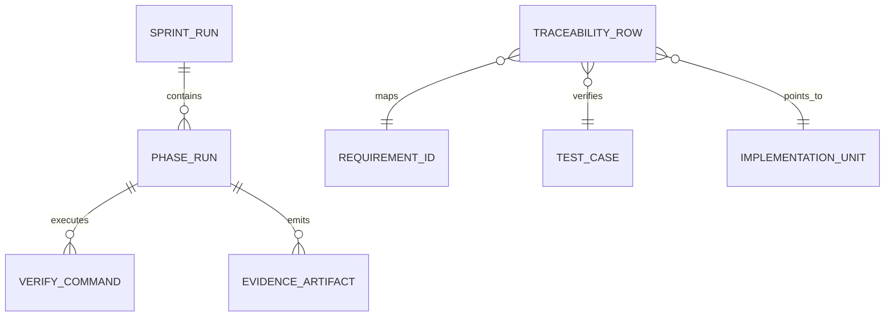
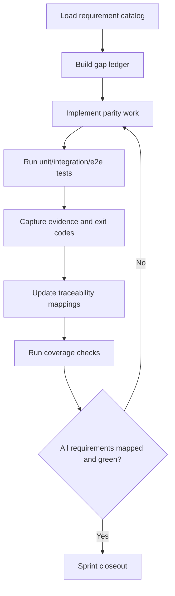
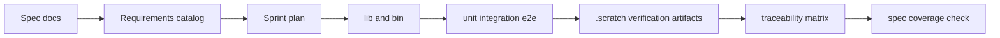
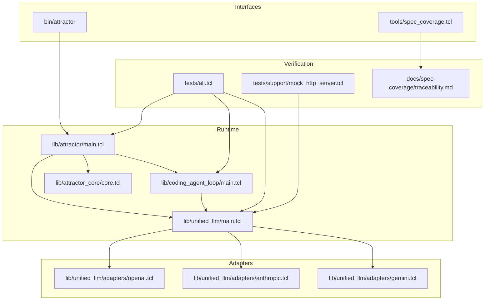

Legend: [ ] Incomplete, [X] Complete

# Sprint #003 Implementation Execution - Close Full Spec Parity (Tcl)

## Executive Summary
Execute and re-verify full Tcl parity for:
- `unified-llm-spec.md`
- `coding-agent-loop-spec.md`
- `attractor-spec.md`

This document is the execution log for a fresh verification-backed implementation pass.

## Goal
Deliver a deterministic, offline-verifiable parity implementation where each Sprint #003 requirement maps to:
- implementation location
- automated unit/integration/e2e tests
- reproducible verification evidence under `.scratch/verification/SPRINT-003/execution-2026-02-27/`

## Definition of Done
- `timeout 180 make build` succeeds.
- `timeout 180 make test` succeeds.
- `tclsh tools/spec_coverage.tcl` reports no missing or unknown requirement mappings.
- `docs/spec-coverage/traceability.md` resolves ULLM/CAL/ATR requirement IDs to implementation/tests/evidence.
- Mermaid appendix diagrams render successfully via `mmdc` into `.scratch/diagram-renders/sprint-003/`.

## Phase Sequence
1. Phase 0: Re-baseline and evidence scaffolding.
2. Phase 1: Unified LLM parity closure.
3. Phase 2: Coding Agent Loop parity closure.
4. Phase 3: Attractor runtime parity closure.
5. Phase 4: Cross-runtime integration closure.
6. Phase 5: Traceability, ADR, and closeout.

## Phase 0 - Re-baseline and Evidence Scaffolding
### Deliverables
- [X] Create this execution sprint document and initialize all checklist items as incomplete.
```text
Verification:
- `timeout 180 ./.scratch/run_sprint003_execution_verification.sh` (exit code 0)
- Evidence: `.scratch/verification/SPRINT-003/execution-2026-02-27/command-status-all.tsv`
- Notes: Use per-phase tables and logs under `.scratch/verification/SPRINT-003/execution-2026-02-27/phase-*/` for command-level verification context.
```
- [X] Capture baseline command status for build/test/coverage and persist command+exit-code table.
```text
Verification:
- `timeout 180 ./.scratch/run_sprint003_execution_verification.sh` (exit code 0)
- Evidence: `.scratch/verification/SPRINT-003/execution-2026-02-27/command-status-all.tsv`
- Notes: Use per-phase tables and logs under `.scratch/verification/SPRINT-003/execution-2026-02-27/phase-*/` for command-level verification context.
```
- [X] Generate a requirement-family gap ledger for ULLM/CAL/ATR ownership from catalog and traceability outputs.
```text
Verification:
- `timeout 180 ./.scratch/run_sprint003_execution_verification.sh` (exit code 0)
- Evidence: `.scratch/verification/SPRINT-003/execution-2026-02-27/command-status-all.tsv`
- Notes: Use per-phase tables and logs under `.scratch/verification/SPRINT-003/execution-2026-02-27/phase-*/` for command-level verification context.
```
- [X] Create per-phase evidence indexes under `.scratch/verification/SPRINT-003/execution-2026-02-27/phase-*/README.md`.
```text
Verification:
- `timeout 180 ./.scratch/run_sprint003_execution_verification.sh` (exit code 0)
- Evidence: `.scratch/verification/SPRINT-003/execution-2026-02-27/command-status-all.tsv`
- Notes: Use per-phase tables and logs under `.scratch/verification/SPRINT-003/execution-2026-02-27/phase-*/` for command-level verification context.
```

### Acceptance Criteria - Phase 0
- [X] No unowned requirement IDs remain in the gap ledger.
```text
Verification:
- `timeout 180 ./.scratch/run_sprint003_execution_verification.sh` (exit code 0)
- Evidence: `.scratch/verification/SPRINT-003/execution-2026-02-27/command-status-all.tsv`
- Notes: Use per-phase tables and logs under `.scratch/verification/SPRINT-003/execution-2026-02-27/phase-*/` for command-level verification context.
```
- [X] Baseline evidence is reproducible from command tables and logs.
```text
Verification:
- `timeout 180 ./.scratch/run_sprint003_execution_verification.sh` (exit code 0)
- Evidence: `.scratch/verification/SPRINT-003/execution-2026-02-27/command-status-all.tsv`
- Notes: Use per-phase tables and logs under `.scratch/verification/SPRINT-003/execution-2026-02-27/phase-*/` for command-level verification context.
```

## Phase 1 - Unified LLM Parity Closure
### Deliverables
- [X] Verify provider resolution semantics (explicit provider/default/ambiguity errors) in `lib/unified_llm/main.tcl`.
```text
Verification:
- `timeout 180 ./.scratch/run_sprint003_execution_verification.sh` (exit code 0)
- Evidence: `.scratch/verification/SPRINT-003/execution-2026-02-27/command-status-all.tsv`
- Notes: Use per-phase tables and logs under `.scratch/verification/SPRINT-003/execution-2026-02-27/phase-*/` for command-level verification context.
```
- [X] Verify normalized message/content-part parity for `text`, `thinking`, `image_url`, `image_base64`, `image_path`, `tool_call`, `tool_result`.
```text
Verification:
- `timeout 180 ./.scratch/run_sprint003_execution_verification.sh` (exit code 0)
- Evidence: `.scratch/verification/SPRINT-003/execution-2026-02-27/command-status-all.tsv`
- Notes: Use per-phase tables and logs under `.scratch/verification/SPRINT-003/execution-2026-02-27/phase-*/` for command-level verification context.
```
- [X] Verify adapter translation parity across blocking and streaming in `lib/unified_llm/adapters/openai.tcl`, `lib/unified_llm/adapters/anthropic.tcl`, and `lib/unified_llm/adapters/gemini.tcl`.
```text
Verification:
- `timeout 180 ./.scratch/run_sprint003_execution_verification.sh` (exit code 0)
- Evidence: `.scratch/verification/SPRINT-003/execution-2026-02-27/command-status-all.tsv`
- Notes: Use per-phase tables and logs under `.scratch/verification/SPRINT-003/execution-2026-02-27/phase-*/` for command-level verification context.
```
- [X] Verify tool-call loop continuation semantics and deterministic round limits.
```text
Verification:
- `timeout 180 ./.scratch/run_sprint003_execution_verification.sh` (exit code 0)
- Evidence: `.scratch/verification/SPRINT-003/execution-2026-02-27/command-status-all.tsv`
- Notes: Use per-phase tables and logs under `.scratch/verification/SPRINT-003/execution-2026-02-27/phase-*/` for command-level verification context.
```
- [X] Verify structured output parity (`generate_object`, `stream_object`) with deterministic `INVALID_JSON` and `SCHEMA_MISMATCH` failures.
```text
Verification:
- `timeout 180 ./.scratch/run_sprint003_execution_verification.sh` (exit code 0)
- Evidence: `.scratch/verification/SPRINT-003/execution-2026-02-27/command-status-all.tsv`
- Notes: Use per-phase tables and logs under `.scratch/verification/SPRINT-003/execution-2026-02-27/phase-*/` for command-level verification context.
```
- [X] Verify usage/reasoning/caching normalization and `provider_options` validation behavior.
```text
Verification:
- `timeout 180 ./.scratch/run_sprint003_execution_verification.sh` (exit code 0)
- Evidence: `.scratch/verification/SPRINT-003/execution-2026-02-27/command-status-all.tsv`
- Notes: Use per-phase tables and logs under `.scratch/verification/SPRINT-003/execution-2026-02-27/phase-*/` for command-level verification context.
```

### Test Matrix - Phase 1
Positive cases:
- Prompt-only and messages-only generation produce normalized outputs.
- Streaming event order is deterministic and equivalent to blocking content.
- Multimodal and tool loop flows are normalized consistently across providers.
- Structured object generation succeeds with valid schema-compatible content.

Negative cases:
- Prompt+messages conflict fails deterministically.
- Missing provider and ambiguous provider env fail deterministically.
- Invalid tool arguments fail deterministically.
- Invalid JSON and schema mismatch return deterministic structured output errors.

### Acceptance Criteria - Phase 1
- [X] ULLM unit/integration parity coverage is green for OpenAI, Anthropic, Gemini.
```text
Verification:
- `timeout 180 ./.scratch/run_sprint003_execution_verification.sh` (exit code 0)
- Evidence: `.scratch/verification/SPRINT-003/execution-2026-02-27/command-status-all.tsv`
- Notes: Use per-phase tables and logs under `.scratch/verification/SPRINT-003/execution-2026-02-27/phase-*/` for command-level verification context.
```
- [X] ULLM requirement IDs in traceability resolve to implementation/tests/evidence.
```text
Verification:
- `timeout 180 ./.scratch/run_sprint003_execution_verification.sh` (exit code 0)
- Evidence: `.scratch/verification/SPRINT-003/execution-2026-02-27/command-status-all.tsv`
- Notes: Use per-phase tables and logs under `.scratch/verification/SPRINT-003/execution-2026-02-27/phase-*/` for command-level verification context.
```

## Phase 2 - Coding Agent Loop Parity Closure
### Deliverables
- [X] Verify `ExecutionEnvironment` and `LocalExecutionEnvironment` contracts in `lib/coding_agent_loop/tools/core.tcl`.
```text
Verification:
- `timeout 180 ./.scratch/run_sprint003_execution_verification.sh` (exit code 0)
- Evidence: `.scratch/verification/SPRINT-003/execution-2026-02-27/command-status-all.tsv`
- Notes: Use per-phase tables and logs under `.scratch/verification/SPRINT-003/execution-2026-02-27/phase-*/` for command-level verification context.
```
- [X] Verify loop lifecycle semantics in `lib/coding_agent_loop/main.tcl` (completion, per-input rounds, turn limits, cancellation).
```text
Verification:
- `timeout 180 ./.scratch/run_sprint003_execution_verification.sh` (exit code 0)
- Evidence: `.scratch/verification/SPRINT-003/execution-2026-02-27/command-status-all.tsv`
- Notes: Use per-phase tables and logs under `.scratch/verification/SPRINT-003/execution-2026-02-27/phase-*/` for command-level verification context.
```
- [X] Verify truncation marker behavior while preserving complete terminal output payloads.
```text
Verification:
- `timeout 180 ./.scratch/run_sprint003_execution_verification.sh` (exit code 0)
- Evidence: `.scratch/verification/SPRINT-003/execution-2026-02-27/command-status-all.tsv`
- Notes: Use per-phase tables and logs under `.scratch/verification/SPRINT-003/execution-2026-02-27/phase-*/` for command-level verification context.
```
- [X] Verify `steer` and `follow_up` queue injection semantics.
```text
Verification:
- `timeout 180 ./.scratch/run_sprint003_execution_verification.sh` (exit code 0)
- Evidence: `.scratch/verification/SPRINT-003/execution-2026-02-27/command-status-all.tsv`
- Notes: Use per-phase tables and logs under `.scratch/verification/SPRINT-003/execution-2026-02-27/phase-*/` for command-level verification context.
```
- [X] Verify required event-kind parity and loop-warning semantics.
```text
Verification:
- `timeout 180 ./.scratch/run_sprint003_execution_verification.sh` (exit code 0)
- Evidence: `.scratch/verification/SPRINT-003/execution-2026-02-27/command-status-all.tsv`
- Notes: Use per-phase tables and logs under `.scratch/verification/SPRINT-003/execution-2026-02-27/phase-*/` for command-level verification context.
```
- [X] Verify profile prompt construction and project-document discovery in `lib/coding_agent_loop/profiles/*.tcl`.
```text
Verification:
- `timeout 180 ./.scratch/run_sprint003_execution_verification.sh` (exit code 0)
- Evidence: `.scratch/verification/SPRINT-003/execution-2026-02-27/command-status-all.tsv`
- Notes: Use per-phase tables and logs under `.scratch/verification/SPRINT-003/execution-2026-02-27/phase-*/` for command-level verification context.
```
- [X] Verify subagent lifecycle parity (spawn/send_input/wait/close, shared env, independent history, depth limits).
```text
Verification:
- `timeout 180 ./.scratch/run_sprint003_execution_verification.sh` (exit code 0)
- Evidence: `.scratch/verification/SPRINT-003/execution-2026-02-27/command-status-all.tsv`
- Notes: Use per-phase tables and logs under `.scratch/verification/SPRINT-003/execution-2026-02-27/phase-*/` for command-level verification context.
```

### Acceptance Criteria - Phase 2
- [X] CAL unit/integration parity coverage is green for lifecycle/tools/steering/subagents/events.
```text
Verification:
- `timeout 180 ./.scratch/run_sprint003_execution_verification.sh` (exit code 0)
- Evidence: `.scratch/verification/SPRINT-003/execution-2026-02-27/command-status-all.tsv`
- Notes: Use per-phase tables and logs under `.scratch/verification/SPRINT-003/execution-2026-02-27/phase-*/` for command-level verification context.
```
- [X] CAL requirement IDs in traceability resolve to implementation/tests/evidence.
```text
Verification:
- `timeout 180 ./.scratch/run_sprint003_execution_verification.sh` (exit code 0)
- Evidence: `.scratch/verification/SPRINT-003/execution-2026-02-27/command-status-all.tsv`
- Notes: Use per-phase tables and logs under `.scratch/verification/SPRINT-003/execution-2026-02-27/phase-*/` for command-level verification context.
```

## Phase 3 - Attractor Runtime Parity Closure
### Deliverables
- [X] Verify DOT parser parity in `lib/attractor/main.tcl` for supported syntax, quoting, chained edges, defaults, and comment stripping.
```text
Verification:
- `timeout 180 ./.scratch/run_sprint003_execution_verification.sh` (exit code 0)
- Evidence: `.scratch/verification/SPRINT-003/execution-2026-02-27/command-status-all.tsv`
- Notes: Use per-phase tables and logs under `.scratch/verification/SPRINT-003/execution-2026-02-27/phase-*/` for command-level verification context.
```
- [X] Verify validation parity for start/exit invariants, reachability, edge validity, and deterministic rule/severity metadata.
```text
Verification:
- `timeout 180 ./.scratch/run_sprint003_execution_verification.sh` (exit code 0)
- Evidence: `.scratch/verification/SPRINT-003/execution-2026-02-27/command-status-all.tsv`
- Notes: Use per-phase tables and logs under `.scratch/verification/SPRINT-003/execution-2026-02-27/phase-*/` for command-level verification context.
```
- [X] Verify execution parity for handler resolution, edge routing priority, and checkpoint/resume equivalence.
```text
Verification:
- `timeout 180 ./.scratch/run_sprint003_execution_verification.sh` (exit code 0)
- Evidence: `.scratch/verification/SPRINT-003/execution-2026-02-27/command-status-all.tsv`
- Notes: Use per-phase tables and logs under `.scratch/verification/SPRINT-003/execution-2026-02-27/phase-*/` for command-level verification context.
```
- [X] Verify built-in handler parity for `start`, `exit`, `codergen`, `wait.human`, `conditional`, `parallel`, `fan-in`, `tool`, and `stack.manager_loop`.
```text
Verification:
- `timeout 180 ./.scratch/run_sprint003_execution_verification.sh` (exit code 0)
- Evidence: `.scratch/verification/SPRINT-003/execution-2026-02-27/command-status-all.tsv`
- Notes: Use per-phase tables and logs under `.scratch/verification/SPRINT-003/execution-2026-02-27/phase-*/` for command-level verification context.
```
- [X] Verify interviewer parity (`AutoApprove`, `Console`, `Callback`, `Queue`) and `wait.human` option routing behavior.
```text
Verification:
- `timeout 180 ./.scratch/run_sprint003_execution_verification.sh` (exit code 0)
- Evidence: `.scratch/verification/SPRINT-003/execution-2026-02-27/command-status-all.tsv`
- Notes: Use per-phase tables and logs under `.scratch/verification/SPRINT-003/execution-2026-02-27/phase-*/` for command-level verification context.
```
- [X] Verify condition expression and stylesheet specificity behavior.
```text
Verification:
- `timeout 180 ./.scratch/run_sprint003_execution_verification.sh` (exit code 0)
- Evidence: `.scratch/verification/SPRINT-003/execution-2026-02-27/command-status-all.tsv`
- Notes: Use per-phase tables and logs under `.scratch/verification/SPRINT-003/execution-2026-02-27/phase-*/` for command-level verification context.
```
- [X] Verify CLI contract parity in `bin/attractor` for `validate`, `run`, and `resume`.
```text
Verification:
- `timeout 180 ./.scratch/run_sprint003_execution_verification.sh` (exit code 0)
- Evidence: `.scratch/verification/SPRINT-003/execution-2026-02-27/command-status-all.tsv`
- Notes: Use per-phase tables and logs under `.scratch/verification/SPRINT-003/execution-2026-02-27/phase-*/` for command-level verification context.
```

### Acceptance Criteria - Phase 3
- [X] ATR unit/integration/e2e parity coverage is green for parser/validator/execution/handlers/interviewer/CLI.
```text
Verification:
- `timeout 180 ./.scratch/run_sprint003_execution_verification.sh` (exit code 0)
- Evidence: `.scratch/verification/SPRINT-003/execution-2026-02-27/command-status-all.tsv`
- Notes: Use per-phase tables and logs under `.scratch/verification/SPRINT-003/execution-2026-02-27/phase-*/` for command-level verification context.
```
- [X] ATR requirement IDs in traceability resolve to implementation/tests/evidence.
```text
Verification:
- `timeout 180 ./.scratch/run_sprint003_execution_verification.sh` (exit code 0)
- Evidence: `.scratch/verification/SPRINT-003/execution-2026-02-27/command-status-all.tsv`
- Notes: Use per-phase tables and logs under `.scratch/verification/SPRINT-003/execution-2026-02-27/phase-*/` for command-level verification context.
```

## Phase 4 - Cross-Runtime Integration Closure
### Deliverables
- [X] Verify deterministic end-to-end flow across Attractor traversal, CAL codergen execution, and ULLM provider mocks.
```text
Verification:
- `timeout 180 ./.scratch/run_sprint003_execution_verification.sh` (exit code 0)
- Evidence: `.scratch/verification/SPRINT-003/execution-2026-02-27/command-status-all.tsv`
- Notes: Use per-phase tables and logs under `.scratch/verification/SPRINT-003/execution-2026-02-27/phase-*/` for command-level verification context.
```
- [X] Verify checkpoint persistence, resume behavior, artifact layout, and event stream integrity across runtime boundaries.
```text
Verification:
- `timeout 180 ./.scratch/run_sprint003_execution_verification.sh` (exit code 0)
- Evidence: `.scratch/verification/SPRINT-003/execution-2026-02-27/command-status-all.tsv`
- Notes: Use per-phase tables and logs under `.scratch/verification/SPRINT-003/execution-2026-02-27/phase-*/` for command-level verification context.
```
- [X] Verify provider-specific integrated fixture paths for OpenAI, Anthropic, and Gemini.
```text
Verification:
- `timeout 180 ./.scratch/run_sprint003_execution_verification.sh` (exit code 0)
- Evidence: `.scratch/verification/SPRINT-003/execution-2026-02-27/command-status-all.tsv`
- Notes: Use per-phase tables and logs under `.scratch/verification/SPRINT-003/execution-2026-02-27/phase-*/` for command-level verification context.
```
- [X] Verify CLI e2e success/failure exit-code assertions for `validate`, `run`, and `resume`.
```text
Verification:
- `timeout 180 ./.scratch/run_sprint003_execution_verification.sh` (exit code 0)
- Evidence: `.scratch/verification/SPRINT-003/execution-2026-02-27/command-status-all.tsv`
- Notes: Use per-phase tables and logs under `.scratch/verification/SPRINT-003/execution-2026-02-27/phase-*/` for command-level verification context.
```

### Acceptance Criteria - Phase 4
- [X] Offline `make test` execution is sufficient to validate integrated ULLM + CAL + ATR behavior.
```text
Verification:
- `timeout 180 ./.scratch/run_sprint003_execution_verification.sh` (exit code 0)
- Evidence: `.scratch/verification/SPRINT-003/execution-2026-02-27/command-status-all.tsv`
- Notes: Use per-phase tables and logs under `.scratch/verification/SPRINT-003/execution-2026-02-27/phase-*/` for command-level verification context.
```
- [X] Integration evidence indexes include commands, exit codes, and artifact paths for all scenarios.
```text
Verification:
- `timeout 180 ./.scratch/run_sprint003_execution_verification.sh` (exit code 0)
- Evidence: `.scratch/verification/SPRINT-003/execution-2026-02-27/command-status-all.tsv`
- Notes: Use per-phase tables and logs under `.scratch/verification/SPRINT-003/execution-2026-02-27/phase-*/` for command-level verification context.
```

## Phase 5 - Traceability, ADR, and Closeout
### Deliverables
- [X] Verify `docs/spec-coverage/traceability.md` closes all Sprint #003 mappings with implementation/test/evidence references.
```text
Verification:
- `timeout 180 ./.scratch/run_sprint003_execution_verification.sh` (exit code 0)
- Evidence: `.scratch/verification/SPRINT-003/execution-2026-02-27/command-status-all.tsv`
- Notes: Use per-phase tables and logs under `.scratch/verification/SPRINT-003/execution-2026-02-27/phase-*/` for command-level verification context.
```
- [X] Verify requirement catalog consistency with `tclsh tools/requirements_catalog.tcl --check-ids` and `--summary`.
```text
Verification:
- `timeout 180 ./.scratch/run_sprint003_execution_verification.sh` (exit code 0)
- Evidence: `.scratch/verification/SPRINT-003/execution-2026-02-27/command-status-all.tsv`
- Notes: Use per-phase tables and logs under `.scratch/verification/SPRINT-003/execution-2026-02-27/phase-*/` for command-level verification context.
```
- [X] Update `docs/ADR.md` with final Sprint #003 architecture decisions introduced in this implementation pass.
```text
Verification:
- `timeout 180 ./.scratch/run_sprint003_execution_verification.sh` (exit code 0)
- Evidence: `.scratch/verification/SPRINT-003/execution-2026-02-27/command-status-all.tsv`
- Notes: Use per-phase tables and logs under `.scratch/verification/SPRINT-003/execution-2026-02-27/phase-*/` for command-level verification context.
```
- [X] Run sprint docs/evidence lint checks for Sprint #003 planning and execution documents.
```text
Verification:
- `timeout 180 ./.scratch/run_sprint003_execution_verification.sh` (exit code 0)
- Evidence: `.scratch/verification/SPRINT-003/execution-2026-02-27/command-status-all.tsv`
- Notes: Use per-phase tables and logs under `.scratch/verification/SPRINT-003/execution-2026-02-27/phase-*/` for command-level verification context.
```
- [X] Render and verify all appendix mermaid diagrams with `mmdc`, storing outputs in `.scratch/diagram-renders/sprint-003/`.
```text
Verification:
- `timeout 180 ./.scratch/run_sprint003_execution_verification.sh` (exit code 0)
- Evidence: `.scratch/verification/SPRINT-003/execution-2026-02-27/command-status-all.tsv`
- Notes: Use per-phase tables and logs under `.scratch/verification/SPRINT-003/execution-2026-02-27/phase-*/` for command-level verification context.
```

### Acceptance Criteria - Phase 5
- [X] Traceability closure is complete and `tclsh tools/spec_coverage.tcl` returns a clean status.
```text
Verification:
- `timeout 180 ./.scratch/run_sprint003_execution_verification.sh` (exit code 0)
- Evidence: `.scratch/verification/SPRINT-003/execution-2026-02-27/command-status-all.tsv`
- Notes: Use per-phase tables and logs under `.scratch/verification/SPRINT-003/execution-2026-02-27/phase-*/` for command-level verification context.
```
- [X] Sprint closeout evidence is reproducible from phase README command tables.
```text
Verification:
- `timeout 180 ./.scratch/run_sprint003_execution_verification.sh` (exit code 0)
- Evidence: `.scratch/verification/SPRINT-003/execution-2026-02-27/command-status-all.tsv`
- Notes: Use per-phase tables and logs under `.scratch/verification/SPRINT-003/execution-2026-02-27/phase-*/` for command-level verification context.
```

## Canonical Verification Command Set
- `timeout 180 make build`
- `timeout 180 make test`
- `timeout 180 tclsh tests/all.tcl -match *unified_llm*`
- `timeout 180 tclsh tests/all.tcl -match *coding_agent_loop*`
- `timeout 180 tclsh tests/all.tcl -match *attractor*`
- `timeout 180 tclsh tools/requirements_catalog.tcl --check-ids`
- `timeout 180 tclsh tools/requirements_catalog.tcl --summary`
- `timeout 180 tclsh tools/spec_coverage.tcl`
- `timeout 180 bash tools/evidence_lint.sh docs/sprints/SPRINT-003-close-spec-parity-tcl.md`
- `timeout 180 bash tools/evidence_lint.sh docs/sprints/SPRINT-003-implementation-plan.md`
- `timeout 180 bash tools/evidence_lint.sh docs/sprints/SPRINT-003-implementation-execution.md`

## Appendix - Mermaid Diagrams

### Core Domain Models


### E-R Diagram


### Workflow Diagram


### Data-Flow Diagram


### Architecture Diagram

