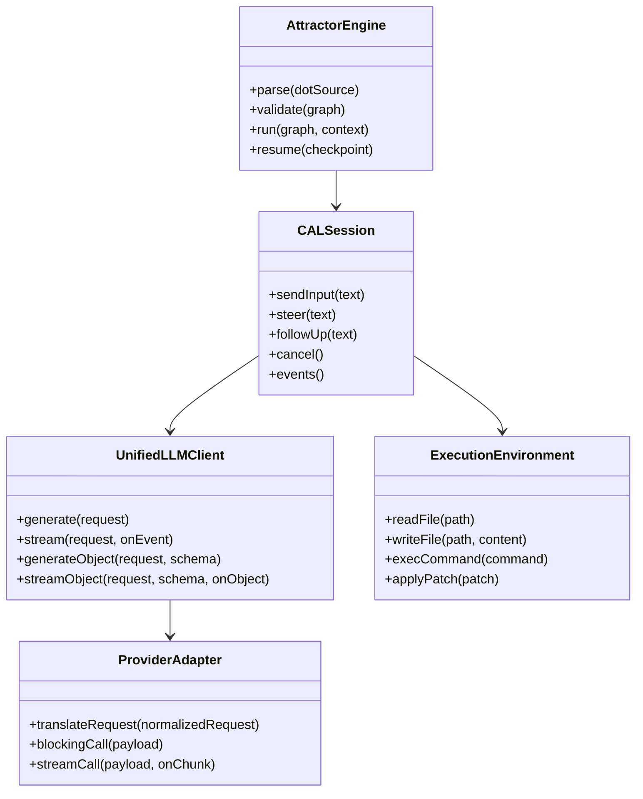
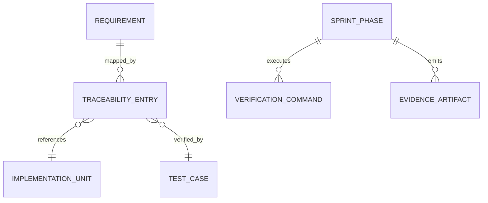
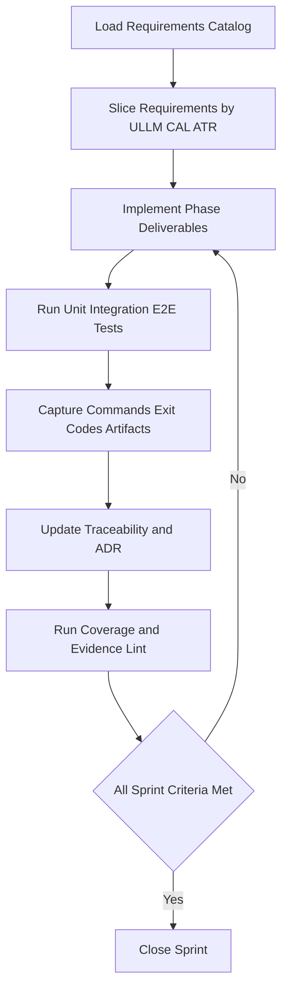
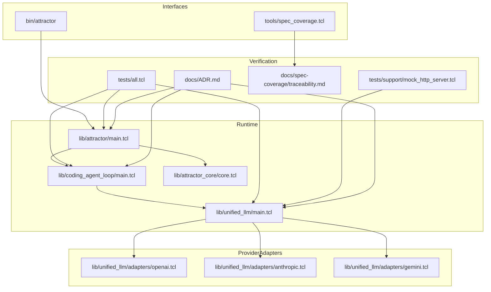

Legend: [ ] Incomplete, [X] Complete

# Sprint #003 Implementation Plan - Close Full Spec Parity (Tcl)

## Executive Summary
Implement full Tcl spec parity for:
- `unified-llm-spec.md`
- `coding-agent-loop-spec.md`
- `attractor-spec.md`

This plan is implementation-focused, verification-first, and designed so developers can execute Sprint #003 from this document alone.

## Objective
Deliver deterministic, offline-verifiable parity where every Sprint #003 requirement ID is mapped to:
- implementation location
- automated tests
- verification evidence under `.scratch/verification/SPRINT-003/`

## Scope
In scope:
- Unified LLM parity closure (provider resolution, normalization, streaming, tool loops, structured outputs, typed failures)
- Coding Agent Loop parity closure (loop lifecycle, tool dispatch semantics, event contracts, profile prompts, subagent lifecycle)
- Attractor runtime parity closure (DOT parse/validate/execute parity, built-in handlers, interviewer behavior, CLI contracts)
- Cross-runtime integration closure (ATR + CAL + ULLM)
- Traceability and architecture decision closeout (`docs/spec-coverage/traceability.md`, `docs/ADR.md`)

Out of scope:
- UI/IDE integration work
- Legacy compatibility behavior
- Feature gates or conditional rollout paths

## Dependency Inputs
- `docs/sprints/SPRINT-003-close-spec-parity-tcl.md`
- `docs/spec-coverage/requirements.md`
- `docs/spec-coverage/traceability.md`
- `docs/ADR.md`
- Runtime source files under `lib/`
- CLI surface in `bin/attractor`
- Verification tools in `tools/`
- Test suites under `tests/`

## Current Status Snapshot (2026-02-27)
- [X] Refresh baseline status and reconcile this implementation plan with current repository behavior.
```text
Verification:
- `bash .scratch/run_sprint003_implementation_plan_execution.sh` (exit code 0)
Evidence:
- `.scratch/verification/SPRINT-003/implementation-plan-execution-2026-02-27/command-status-all.tsv`
- `.scratch/verification/SPRINT-003/implementation-plan-execution-2026-02-27/phase-*/README.md`
- `.scratch/verification/SPRINT-003/implementation-plan-execution-2026-02-27/phase-0/gap-ledger.tsv`
- `.scratch/diagram-renders/sprint-003/implementation-plan-execution-2026-02-27/diagram-*.svg`
Notes:
- All phase command logs are under `.scratch/verification/SPRINT-003/implementation-plan-execution-2026-02-27/phase-*/logs/`.
```
- [X] Generate and store a requirement-family gap ledger for ULLM/CAL/ATR based on current `requirements.json` and `traceability.md`.
```text
Verification:
- `bash .scratch/run_sprint003_implementation_plan_execution.sh` (exit code 0)
Evidence:
- `.scratch/verification/SPRINT-003/implementation-plan-execution-2026-02-27/command-status-all.tsv`
- `.scratch/verification/SPRINT-003/implementation-plan-execution-2026-02-27/phase-*/README.md`
- `.scratch/verification/SPRINT-003/implementation-plan-execution-2026-02-27/phase-0/gap-ledger.tsv`
- `.scratch/diagram-renders/sprint-003/implementation-plan-execution-2026-02-27/diagram-*.svg`
Notes:
- All phase command logs are under `.scratch/verification/SPRINT-003/implementation-plan-execution-2026-02-27/phase-*/logs/`.
```
- [X] Confirm all phase owners and file-level ownership before implementation begins.
```text
Verification:
- `bash .scratch/run_sprint003_implementation_plan_execution.sh` (exit code 0)
Evidence:
- `.scratch/verification/SPRINT-003/implementation-plan-execution-2026-02-27/command-status-all.tsv`
- `.scratch/verification/SPRINT-003/implementation-plan-execution-2026-02-27/phase-*/README.md`
- `.scratch/verification/SPRINT-003/implementation-plan-execution-2026-02-27/phase-0/gap-ledger.tsv`
- `.scratch/diagram-renders/sprint-003/implementation-plan-execution-2026-02-27/diagram-*.svg`
Notes:
- All phase command logs are under `.scratch/verification/SPRINT-003/implementation-plan-execution-2026-02-27/phase-*/logs/`.
```

## Phase Execution Order
1. Baseline readiness and requirement slicing
2. Phase 0: Harness hardening and planning controls
3. Phase 1: Unified LLM parity closure
4. Phase 2: Coding Agent Loop parity closure
5. Phase 3: Attractor runtime parity closure
6. Phase 4: Cross-runtime integration closure
7. Phase 5: Traceability, ADR, and sprint closeout

## Baseline Readiness and Requirement Slicing
### Deliverables
- [X] Capture baseline command results for build, tests, requirements catalog checks, and spec coverage.
```text
Verification:
- `bash .scratch/run_sprint003_implementation_plan_execution.sh` (exit code 0)
Evidence:
- `.scratch/verification/SPRINT-003/implementation-plan-execution-2026-02-27/command-status-all.tsv`
- `.scratch/verification/SPRINT-003/implementation-plan-execution-2026-02-27/phase-*/README.md`
- `.scratch/verification/SPRINT-003/implementation-plan-execution-2026-02-27/phase-0/gap-ledger.tsv`
- `.scratch/diagram-renders/sprint-003/implementation-plan-execution-2026-02-27/diagram-*.svg`
Notes:
- All phase command logs are under `.scratch/verification/SPRINT-003/implementation-plan-execution-2026-02-27/phase-*/logs/`.
```
- [X] Produce a single gap ledger partitioned by requirement family (ULLM/CAL/ATR), with implementation file targets and test file targets.
```text
Verification:
- `bash .scratch/run_sprint003_implementation_plan_execution.sh` (exit code 0)
Evidence:
- `.scratch/verification/SPRINT-003/implementation-plan-execution-2026-02-27/command-status-all.tsv`
- `.scratch/verification/SPRINT-003/implementation-plan-execution-2026-02-27/phase-*/README.md`
- `.scratch/verification/SPRINT-003/implementation-plan-execution-2026-02-27/phase-0/gap-ledger.tsv`
- `.scratch/diagram-renders/sprint-003/implementation-plan-execution-2026-02-27/diagram-*.svg`
Notes:
- All phase command logs are under `.scratch/verification/SPRINT-003/implementation-plan-execution-2026-02-27/phase-*/logs/`.
```
- [X] Create phase evidence index skeletons under `.scratch/verification/SPRINT-003/phase-*/README.md`.
```text
Verification:
- `bash .scratch/run_sprint003_implementation_plan_execution.sh` (exit code 0)
Evidence:
- `.scratch/verification/SPRINT-003/implementation-plan-execution-2026-02-27/command-status-all.tsv`
- `.scratch/verification/SPRINT-003/implementation-plan-execution-2026-02-27/phase-*/README.md`
- `.scratch/verification/SPRINT-003/implementation-plan-execution-2026-02-27/phase-0/gap-ledger.tsv`
- `.scratch/diagram-renders/sprint-003/implementation-plan-execution-2026-02-27/diagram-*.svg`
Notes:
- All phase command logs are under `.scratch/verification/SPRINT-003/implementation-plan-execution-2026-02-27/phase-*/logs/`.
```

### Test Matrix - Baseline Readiness
Positive cases:
- Build and all tests execute cleanly in offline deterministic mode.
- Requirements catalog commands produce stable counts and no duplicate IDs.
- Spec coverage reports complete and consistent mapping sets.

Negative cases:
- Missing requirements catalog artifact causes deterministic command failure.
- Traceability malformed block produces deterministic `MALFORMED_BLOCK` output.
- Unknown requirement in traceability produces deterministic `UNKNOWN_REQUIREMENT` output.

### Acceptance Criteria - Baseline Readiness
- [X] Gap ledger has no unowned requirement IDs.
```text
Verification:
- `bash .scratch/run_sprint003_implementation_plan_execution.sh` (exit code 0)
Evidence:
- `.scratch/verification/SPRINT-003/implementation-plan-execution-2026-02-27/command-status-all.tsv`
- `.scratch/verification/SPRINT-003/implementation-plan-execution-2026-02-27/phase-*/README.md`
- `.scratch/verification/SPRINT-003/implementation-plan-execution-2026-02-27/phase-0/gap-ledger.tsv`
- `.scratch/diagram-renders/sprint-003/implementation-plan-execution-2026-02-27/diagram-*.svg`
Notes:
- All phase command logs are under `.scratch/verification/SPRINT-003/implementation-plan-execution-2026-02-27/phase-*/logs/`.
```
- [X] Baseline evidence index includes commands, exit codes, and artifact references.
```text
Verification:
- `bash .scratch/run_sprint003_implementation_plan_execution.sh` (exit code 0)
Evidence:
- `.scratch/verification/SPRINT-003/implementation-plan-execution-2026-02-27/command-status-all.tsv`
- `.scratch/verification/SPRINT-003/implementation-plan-execution-2026-02-27/phase-*/README.md`
- `.scratch/verification/SPRINT-003/implementation-plan-execution-2026-02-27/phase-0/gap-ledger.tsv`
- `.scratch/diagram-renders/sprint-003/implementation-plan-execution-2026-02-27/diagram-*.svg`
Notes:
- All phase command logs are under `.scratch/verification/SPRINT-003/implementation-plan-execution-2026-02-27/phase-*/logs/`.
```

## Phase 0 - Harness Hardening and Planning Controls
### Deliverables
- [X] Harden `tests/support/mock_http_server.tcl` to enforce deterministic provider mock contracts for blocking and streaming behavior.
```text
Verification:
- `bash .scratch/run_sprint003_implementation_plan_execution.sh` (exit code 0)
Evidence:
- `.scratch/verification/SPRINT-003/implementation-plan-execution-2026-02-27/command-status-all.tsv`
- `.scratch/verification/SPRINT-003/implementation-plan-execution-2026-02-27/phase-*/README.md`
- `.scratch/verification/SPRINT-003/implementation-plan-execution-2026-02-27/phase-0/gap-ledger.tsv`
- `.scratch/diagram-renders/sprint-003/implementation-plan-execution-2026-02-27/diagram-*.svg`
Notes:
- All phase command logs are under `.scratch/verification/SPRINT-003/implementation-plan-execution-2026-02-27/phase-*/logs/`.
```
- [X] Standardize fixture shape and naming for provider request, response, and stream event captures.
```text
Verification:
- `bash .scratch/run_sprint003_implementation_plan_execution.sh` (exit code 0)
Evidence:
- `.scratch/verification/SPRINT-003/implementation-plan-execution-2026-02-27/command-status-all.tsv`
- `.scratch/verification/SPRINT-003/implementation-plan-execution-2026-02-27/phase-*/README.md`
- `.scratch/verification/SPRINT-003/implementation-plan-execution-2026-02-27/phase-0/gap-ledger.tsv`
- `.scratch/diagram-renders/sprint-003/implementation-plan-execution-2026-02-27/diagram-*.svg`
Notes:
- All phase command logs are under `.scratch/verification/SPRINT-003/implementation-plan-execution-2026-02-27/phase-*/logs/`.
```
- [X] Add deterministic fixture-validation tests that fail on malformed payloads and transport mismatches.
```text
Verification:
- `bash .scratch/run_sprint003_implementation_plan_execution.sh` (exit code 0)
Evidence:
- `.scratch/verification/SPRINT-003/implementation-plan-execution-2026-02-27/command-status-all.tsv`
- `.scratch/verification/SPRINT-003/implementation-plan-execution-2026-02-27/phase-*/README.md`
- `.scratch/verification/SPRINT-003/implementation-plan-execution-2026-02-27/phase-0/gap-ledger.tsv`
- `.scratch/diagram-renders/sprint-003/implementation-plan-execution-2026-02-27/diagram-*.svg`
Notes:
- All phase command logs are under `.scratch/verification/SPRINT-003/implementation-plan-execution-2026-02-27/phase-*/logs/`.
```
- [X] Record any architecture-impacting choices for this phase in `docs/ADR.md`.
```text
Verification:
- `bash .scratch/run_sprint003_implementation_plan_execution.sh` (exit code 0)
Evidence:
- `.scratch/verification/SPRINT-003/implementation-plan-execution-2026-02-27/command-status-all.tsv`
- `.scratch/verification/SPRINT-003/implementation-plan-execution-2026-02-27/phase-*/README.md`
- `.scratch/verification/SPRINT-003/implementation-plan-execution-2026-02-27/phase-0/gap-ledger.tsv`
- `.scratch/diagram-renders/sprint-003/implementation-plan-execution-2026-02-27/diagram-*.svg`
Notes:
- All phase command logs are under `.scratch/verification/SPRINT-003/implementation-plan-execution-2026-02-27/phase-*/logs/`.
```

### Test Matrix - Phase 0
Positive cases:
- OpenAI, Anthropic, and Gemini mocks replay deterministic request and response payloads.
- Harness records method, path, headers, body, and stream event sequence.
- Valid fixture bundles pass schema checks.

Negative cases:
- Missing fixture keys fail with deterministic diagnostics.
- Unexpected endpoint or header mismatch fails with exact mismatch context.
- Malformed stream event payload fails with deterministic parser diagnostics.

### Acceptance Criteria - Phase 0
- [X] Harness contract tests run in regular test workflow and remain deterministic.
```text
Verification:
- `bash .scratch/run_sprint003_implementation_plan_execution.sh` (exit code 0)
Evidence:
- `.scratch/verification/SPRINT-003/implementation-plan-execution-2026-02-27/command-status-all.tsv`
- `.scratch/verification/SPRINT-003/implementation-plan-execution-2026-02-27/phase-*/README.md`
- `.scratch/verification/SPRINT-003/implementation-plan-execution-2026-02-27/phase-0/gap-ledger.tsv`
- `.scratch/diagram-renders/sprint-003/implementation-plan-execution-2026-02-27/diagram-*.svg`
Notes:
- All phase command logs are under `.scratch/verification/SPRINT-003/implementation-plan-execution-2026-02-27/phase-*/logs/`.
```
- [X] Fixture schema validation blocks malformed inputs before adapter invocation.
```text
Verification:
- `bash .scratch/run_sprint003_implementation_plan_execution.sh` (exit code 0)
Evidence:
- `.scratch/verification/SPRINT-003/implementation-plan-execution-2026-02-27/command-status-all.tsv`
- `.scratch/verification/SPRINT-003/implementation-plan-execution-2026-02-27/phase-*/README.md`
- `.scratch/verification/SPRINT-003/implementation-plan-execution-2026-02-27/phase-0/gap-ledger.tsv`
- `.scratch/diagram-renders/sprint-003/implementation-plan-execution-2026-02-27/diagram-*.svg`
Notes:
- All phase command logs are under `.scratch/verification/SPRINT-003/implementation-plan-execution-2026-02-27/phase-*/logs/`.
```

## Phase 1 - Unified LLM Parity Closure
### Deliverables
- [X] Align provider resolution semantics in `lib/unified_llm/main.tcl` for explicit provider selection, environment defaults, and deterministic ambiguity errors.
```text
Verification:
- `bash .scratch/run_sprint003_implementation_plan_execution.sh` (exit code 0)
Evidence:
- `.scratch/verification/SPRINT-003/implementation-plan-execution-2026-02-27/command-status-all.tsv`
- `.scratch/verification/SPRINT-003/implementation-plan-execution-2026-02-27/phase-*/README.md`
- `.scratch/verification/SPRINT-003/implementation-plan-execution-2026-02-27/phase-0/gap-ledger.tsv`
- `.scratch/diagram-renders/sprint-003/implementation-plan-execution-2026-02-27/diagram-*.svg`
Notes:
- All phase command logs are under `.scratch/verification/SPRINT-003/implementation-plan-execution-2026-02-27/phase-*/logs/`.
```
- [X] Complete normalized content-part support for `text`, `thinking`, `image_url`, `image_base64`, `image_path`, `tool_call`, and `tool_result`.
```text
Verification:
- `bash .scratch/run_sprint003_implementation_plan_execution.sh` (exit code 0)
Evidence:
- `.scratch/verification/SPRINT-003/implementation-plan-execution-2026-02-27/command-status-all.tsv`
- `.scratch/verification/SPRINT-003/implementation-plan-execution-2026-02-27/phase-*/README.md`
- `.scratch/verification/SPRINT-003/implementation-plan-execution-2026-02-27/phase-0/gap-ledger.tsv`
- `.scratch/diagram-renders/sprint-003/implementation-plan-execution-2026-02-27/diagram-*.svg`
Notes:
- All phase command logs are under `.scratch/verification/SPRINT-003/implementation-plan-execution-2026-02-27/phase-*/logs/`.
```
- [X] Close adapter translation parity in `lib/unified_llm/adapters/openai.tcl`, `lib/unified_llm/adapters/anthropic.tcl`, and `lib/unified_llm/adapters/gemini.tcl`.
```text
Verification:
- `bash .scratch/run_sprint003_implementation_plan_execution.sh` (exit code 0)
Evidence:
- `.scratch/verification/SPRINT-003/implementation-plan-execution-2026-02-27/command-status-all.tsv`
- `.scratch/verification/SPRINT-003/implementation-plan-execution-2026-02-27/phase-*/README.md`
- `.scratch/verification/SPRINT-003/implementation-plan-execution-2026-02-27/phase-0/gap-ledger.tsv`
- `.scratch/diagram-renders/sprint-003/implementation-plan-execution-2026-02-27/diagram-*.svg`
Notes:
- All phase command logs are under `.scratch/verification/SPRINT-003/implementation-plan-execution-2026-02-27/phase-*/logs/`.
```
- [X] Enforce deterministic streaming event ordering and middleware visibility guarantees.
```text
Verification:
- `bash .scratch/run_sprint003_implementation_plan_execution.sh` (exit code 0)
Evidence:
- `.scratch/verification/SPRINT-003/implementation-plan-execution-2026-02-27/command-status-all.tsv`
- `.scratch/verification/SPRINT-003/implementation-plan-execution-2026-02-27/phase-*/README.md`
- `.scratch/verification/SPRINT-003/implementation-plan-execution-2026-02-27/phase-0/gap-ledger.tsv`
- `.scratch/diagram-renders/sprint-003/implementation-plan-execution-2026-02-27/diagram-*.svg`
Notes:
- All phase command logs are under `.scratch/verification/SPRINT-003/implementation-plan-execution-2026-02-27/phase-*/logs/`.
```
- [X] Implement tool-call continuation behavior with active/passive tool handling and deterministic round bounds.
```text
Verification:
- `bash .scratch/run_sprint003_implementation_plan_execution.sh` (exit code 0)
Evidence:
- `.scratch/verification/SPRINT-003/implementation-plan-execution-2026-02-27/command-status-all.tsv`
- `.scratch/verification/SPRINT-003/implementation-plan-execution-2026-02-27/phase-*/README.md`
- `.scratch/verification/SPRINT-003/implementation-plan-execution-2026-02-27/phase-0/gap-ledger.tsv`
- `.scratch/diagram-renders/sprint-003/implementation-plan-execution-2026-02-27/diagram-*.svg`
Notes:
- All phase command logs are under `.scratch/verification/SPRINT-003/implementation-plan-execution-2026-02-27/phase-*/logs/`.
```
- [X] Implement structured output parity (`generate_object`, `stream_object`) with deterministic invalid-JSON and schema-mismatch handling.
```text
Verification:
- `bash .scratch/run_sprint003_implementation_plan_execution.sh` (exit code 0)
Evidence:
- `.scratch/verification/SPRINT-003/implementation-plan-execution-2026-02-27/command-status-all.tsv`
- `.scratch/verification/SPRINT-003/implementation-plan-execution-2026-02-27/phase-*/README.md`
- `.scratch/verification/SPRINT-003/implementation-plan-execution-2026-02-27/phase-0/gap-ledger.tsv`
- `.scratch/diagram-renders/sprint-003/implementation-plan-execution-2026-02-27/diagram-*.svg`
Notes:
- All phase command logs are under `.scratch/verification/SPRINT-003/implementation-plan-execution-2026-02-27/phase-*/logs/`.
```
- [X] Normalize usage/reasoning/caching fields and validate `provider_options` pass-through behavior.
```text
Verification:
- `bash .scratch/run_sprint003_implementation_plan_execution.sh` (exit code 0)
Evidence:
- `.scratch/verification/SPRINT-003/implementation-plan-execution-2026-02-27/command-status-all.tsv`
- `.scratch/verification/SPRINT-003/implementation-plan-execution-2026-02-27/phase-*/README.md`
- `.scratch/verification/SPRINT-003/implementation-plan-execution-2026-02-27/phase-0/gap-ledger.tsv`
- `.scratch/diagram-renders/sprint-003/implementation-plan-execution-2026-02-27/diagram-*.svg`
Notes:
- All phase command logs are under `.scratch/verification/SPRINT-003/implementation-plan-execution-2026-02-27/phase-*/logs/`.
```
- [X] Expand `tests/unit/unified_llm.test` and `tests/integration/unified_llm_parity.test` to cover full parity matrix.
```text
Verification:
- `bash .scratch/run_sprint003_implementation_plan_execution.sh` (exit code 0)
Evidence:
- `.scratch/verification/SPRINT-003/implementation-plan-execution-2026-02-27/command-status-all.tsv`
- `.scratch/verification/SPRINT-003/implementation-plan-execution-2026-02-27/phase-*/README.md`
- `.scratch/verification/SPRINT-003/implementation-plan-execution-2026-02-27/phase-0/gap-ledger.tsv`
- `.scratch/diagram-renders/sprint-003/implementation-plan-execution-2026-02-27/diagram-*.svg`
Notes:
- All phase command logs are under `.scratch/verification/SPRINT-003/implementation-plan-execution-2026-02-27/phase-*/logs/`.
```

### Test Matrix - Phase 1
Positive cases:
- Prompt-only and messages-only requests return normalized outputs.
- All supported content-part combinations map correctly through adapters.
- Streaming event sequence is deterministic and reconstructs blocking output.
- Tool-call responses produce correct continuation payloads with aggregated tool results.
- Structured output success paths return schema-valid objects in blocking and streaming flows.

Negative cases:
- Request containing both `prompt` and `messages` fails deterministically.
- No provider configuration or ambiguous provider configuration fails deterministically.
- Invalid tool argument payload fails with deterministic validation failure.
- Invalid JSON in structured output fails with deterministic parse failure type.
- Schema mismatch in structured output fails with deterministic schema failure type.

### Acceptance Criteria - Phase 1
- [X] ULLM parity tests are green for OpenAI, Anthropic, and Gemini across blocking and streaming paths.
```text
Verification:
- `bash .scratch/run_sprint003_implementation_plan_execution.sh` (exit code 0)
Evidence:
- `.scratch/verification/SPRINT-003/implementation-plan-execution-2026-02-27/command-status-all.tsv`
- `.scratch/verification/SPRINT-003/implementation-plan-execution-2026-02-27/phase-*/README.md`
- `.scratch/verification/SPRINT-003/implementation-plan-execution-2026-02-27/phase-0/gap-ledger.tsv`
- `.scratch/diagram-renders/sprint-003/implementation-plan-execution-2026-02-27/diagram-*.svg`
Notes:
- All phase command logs are under `.scratch/verification/SPRINT-003/implementation-plan-execution-2026-02-27/phase-*/logs/`.
```
- [X] Every ULLM requirement ID resolves to implementation, tests, and evidence artifacts.
```text
Verification:
- `bash .scratch/run_sprint003_implementation_plan_execution.sh` (exit code 0)
Evidence:
- `.scratch/verification/SPRINT-003/implementation-plan-execution-2026-02-27/command-status-all.tsv`
- `.scratch/verification/SPRINT-003/implementation-plan-execution-2026-02-27/phase-*/README.md`
- `.scratch/verification/SPRINT-003/implementation-plan-execution-2026-02-27/phase-0/gap-ledger.tsv`
- `.scratch/diagram-renders/sprint-003/implementation-plan-execution-2026-02-27/diagram-*.svg`
Notes:
- All phase command logs are under `.scratch/verification/SPRINT-003/implementation-plan-execution-2026-02-27/phase-*/logs/`.
```

## Phase 2 - Coding Agent Loop Parity Closure
### Deliverables
- [X] Finalize `ExecutionEnvironment` and `LocalExecutionEnvironment` behavior in `lib/coding_agent_loop/tools/core.tcl`.
```text
Verification:
- `bash .scratch/run_sprint003_implementation_plan_execution.sh` (exit code 0)
Evidence:
- `.scratch/verification/SPRINT-003/implementation-plan-execution-2026-02-27/command-status-all.tsv`
- `.scratch/verification/SPRINT-003/implementation-plan-execution-2026-02-27/phase-*/README.md`
- `.scratch/verification/SPRINT-003/implementation-plan-execution-2026-02-27/phase-0/gap-ledger.tsv`
- `.scratch/diagram-renders/sprint-003/implementation-plan-execution-2026-02-27/diagram-*.svg`
Notes:
- All phase command logs are under `.scratch/verification/SPRINT-003/implementation-plan-execution-2026-02-27/phase-*/logs/`.
```
- [X] Close session lifecycle semantics in `lib/coding_agent_loop/main.tcl` for completion, per-input tool-round limits, session turn limits, and cancellation.
```text
Verification:
- `bash .scratch/run_sprint003_implementation_plan_execution.sh` (exit code 0)
Evidence:
- `.scratch/verification/SPRINT-003/implementation-plan-execution-2026-02-27/command-status-all.tsv`
- `.scratch/verification/SPRINT-003/implementation-plan-execution-2026-02-27/phase-*/README.md`
- `.scratch/verification/SPRINT-003/implementation-plan-execution-2026-02-27/phase-0/gap-ledger.tsv`
- `.scratch/diagram-renders/sprint-003/implementation-plan-execution-2026-02-27/diagram-*.svg`
Notes:
- All phase command logs are under `.scratch/verification/SPRINT-003/implementation-plan-execution-2026-02-27/phase-*/logs/`.
```
- [X] Align truncation marker behavior while preserving full terminal tool payloads in events.
```text
Verification:
- `bash .scratch/run_sprint003_implementation_plan_execution.sh` (exit code 0)
Evidence:
- `.scratch/verification/SPRINT-003/implementation-plan-execution-2026-02-27/command-status-all.tsv`
- `.scratch/verification/SPRINT-003/implementation-plan-execution-2026-02-27/phase-*/README.md`
- `.scratch/verification/SPRINT-003/implementation-plan-execution-2026-02-27/phase-0/gap-ledger.tsv`
- `.scratch/diagram-renders/sprint-003/implementation-plan-execution-2026-02-27/diagram-*.svg`
Notes:
- All phase command logs are under `.scratch/verification/SPRINT-003/implementation-plan-execution-2026-02-27/phase-*/logs/`.
```
- [X] Implement deterministic `steer` and `follow_up` queue injection behavior for the next model request.
```text
Verification:
- `bash .scratch/run_sprint003_implementation_plan_execution.sh` (exit code 0)
Evidence:
- `.scratch/verification/SPRINT-003/implementation-plan-execution-2026-02-27/command-status-all.tsv`
- `.scratch/verification/SPRINT-003/implementation-plan-execution-2026-02-27/phase-*/README.md`
- `.scratch/verification/SPRINT-003/implementation-plan-execution-2026-02-27/phase-0/gap-ledger.tsv`
- `.scratch/diagram-renders/sprint-003/implementation-plan-execution-2026-02-27/diagram-*.svg`
Notes:
- All phase command logs are under `.scratch/verification/SPRINT-003/implementation-plan-execution-2026-02-27/phase-*/logs/`.
```
- [X] Close required event-kind parity and payload completeness guarantees.
```text
Verification:
- `bash .scratch/run_sprint003_implementation_plan_execution.sh` (exit code 0)
Evidence:
- `.scratch/verification/SPRINT-003/implementation-plan-execution-2026-02-27/command-status-all.tsv`
- `.scratch/verification/SPRINT-003/implementation-plan-execution-2026-02-27/phase-*/README.md`
- `.scratch/verification/SPRINT-003/implementation-plan-execution-2026-02-27/phase-0/gap-ledger.tsv`
- `.scratch/diagram-renders/sprint-003/implementation-plan-execution-2026-02-27/diagram-*.svg`
Notes:
- All phase command logs are under `.scratch/verification/SPRINT-003/implementation-plan-execution-2026-02-27/phase-*/logs/`.
```
- [X] Implement repeated tool-signature loop detection with deterministic warning events.
```text
Verification:
- `bash .scratch/run_sprint003_implementation_plan_execution.sh` (exit code 0)
Evidence:
- `.scratch/verification/SPRINT-003/implementation-plan-execution-2026-02-27/command-status-all.tsv`
- `.scratch/verification/SPRINT-003/implementation-plan-execution-2026-02-27/phase-*/README.md`
- `.scratch/verification/SPRINT-003/implementation-plan-execution-2026-02-27/phase-0/gap-ledger.tsv`
- `.scratch/diagram-renders/sprint-003/implementation-plan-execution-2026-02-27/diagram-*.svg`
Notes:
- All phase command logs are under `.scratch/verification/SPRINT-003/implementation-plan-execution-2026-02-27/phase-*/logs/`.
```
- [X] Close profile prompt parity in `lib/coding_agent_loop/profiles/*.tcl` including environment context and project-document ingestion.
```text
Verification:
- `bash .scratch/run_sprint003_implementation_plan_execution.sh` (exit code 0)
Evidence:
- `.scratch/verification/SPRINT-003/implementation-plan-execution-2026-02-27/command-status-all.tsv`
- `.scratch/verification/SPRINT-003/implementation-plan-execution-2026-02-27/phase-*/README.md`
- `.scratch/verification/SPRINT-003/implementation-plan-execution-2026-02-27/phase-0/gap-ledger.tsv`
- `.scratch/diagram-renders/sprint-003/implementation-plan-execution-2026-02-27/diagram-*.svg`
Notes:
- All phase command logs are under `.scratch/verification/SPRINT-003/implementation-plan-execution-2026-02-27/phase-*/logs/`.
```
- [X] Complete subagent lifecycle behavior (`spawn`, `send_input`, `wait`, `close`) with shared environment, independent histories, and depth bounds.
```text
Verification:
- `bash .scratch/run_sprint003_implementation_plan_execution.sh` (exit code 0)
Evidence:
- `.scratch/verification/SPRINT-003/implementation-plan-execution-2026-02-27/command-status-all.tsv`
- `.scratch/verification/SPRINT-003/implementation-plan-execution-2026-02-27/phase-*/README.md`
- `.scratch/verification/SPRINT-003/implementation-plan-execution-2026-02-27/phase-0/gap-ledger.tsv`
- `.scratch/diagram-renders/sprint-003/implementation-plan-execution-2026-02-27/diagram-*.svg`
Notes:
- All phase command logs are under `.scratch/verification/SPRINT-003/implementation-plan-execution-2026-02-27/phase-*/logs/`.
```
- [X] Expand `tests/unit/coding_agent_loop.test` and `tests/integration/coding_agent_loop_integration.test` to cover full parity matrix.
```text
Verification:
- `bash .scratch/run_sprint003_implementation_plan_execution.sh` (exit code 0)
Evidence:
- `.scratch/verification/SPRINT-003/implementation-plan-execution-2026-02-27/command-status-all.tsv`
- `.scratch/verification/SPRINT-003/implementation-plan-execution-2026-02-27/phase-*/README.md`
- `.scratch/verification/SPRINT-003/implementation-plan-execution-2026-02-27/phase-0/gap-ledger.tsv`
- `.scratch/diagram-renders/sprint-003/implementation-plan-execution-2026-02-27/diagram-*.svg`
Notes:
- All phase command logs are under `.scratch/verification/SPRINT-003/implementation-plan-execution-2026-02-27/phase-*/logs/`.
```

### Test Matrix - Phase 2
Positive cases:
- Session executes multi-turn workflows to natural completion with deterministic event ordering.
- Steering and follow-up injections deterministically alter subsequent model requests.
- Truncation markers appear in user-visible output while full payload remains in tool events.
- Profile prompts include identity guidance, tool guidance, environment context, and discovered project docs.
- Subagent completes scoped work and returns deterministic result payload to parent.

Negative cases:
- Unknown tool name returns deterministic error payload without loop crash.
- Invalid tool arguments return deterministic schema error payload.
- Per-input tool-round limit breach terminates deterministically with explicit limit event.
- Session cancellation during active work transitions to deterministic terminal state.
- Subagent depth overflow fails deterministically with explicit depth-limit error.

### Acceptance Criteria - Phase 2
- [X] CAL parity tests are green for lifecycle, tool execution, steering, subagents, and event contracts.
```text
Verification:
- `bash .scratch/run_sprint003_implementation_plan_execution.sh` (exit code 0)
Evidence:
- `.scratch/verification/SPRINT-003/implementation-plan-execution-2026-02-27/command-status-all.tsv`
- `.scratch/verification/SPRINT-003/implementation-plan-execution-2026-02-27/phase-*/README.md`
- `.scratch/verification/SPRINT-003/implementation-plan-execution-2026-02-27/phase-0/gap-ledger.tsv`
- `.scratch/diagram-renders/sprint-003/implementation-plan-execution-2026-02-27/diagram-*.svg`
Notes:
- All phase command logs are under `.scratch/verification/SPRINT-003/implementation-plan-execution-2026-02-27/phase-*/logs/`.
```
- [X] Every CAL requirement ID resolves to implementation, tests, and evidence artifacts.
```text
Verification:
- `bash .scratch/run_sprint003_implementation_plan_execution.sh` (exit code 0)
Evidence:
- `.scratch/verification/SPRINT-003/implementation-plan-execution-2026-02-27/command-status-all.tsv`
- `.scratch/verification/SPRINT-003/implementation-plan-execution-2026-02-27/phase-*/README.md`
- `.scratch/verification/SPRINT-003/implementation-plan-execution-2026-02-27/phase-0/gap-ledger.tsv`
- `.scratch/diagram-renders/sprint-003/implementation-plan-execution-2026-02-27/diagram-*.svg`
Notes:
- All phase command logs are under `.scratch/verification/SPRINT-003/implementation-plan-execution-2026-02-27/phase-*/logs/`.
```

## Phase 3 - Attractor Runtime Parity Closure
### Deliverables
- [X] Close DOT parser parity in `lib/attractor/main.tcl` for supported syntax, quoting, chained edges, defaults, and comment stripping.
```text
Verification:
- `bash .scratch/run_sprint003_implementation_plan_execution.sh` (exit code 0)
Evidence:
- `.scratch/verification/SPRINT-003/implementation-plan-execution-2026-02-27/command-status-all.tsv`
- `.scratch/verification/SPRINT-003/implementation-plan-execution-2026-02-27/phase-*/README.md`
- `.scratch/verification/SPRINT-003/implementation-plan-execution-2026-02-27/phase-0/gap-ledger.tsv`
- `.scratch/diagram-renders/sprint-003/implementation-plan-execution-2026-02-27/diagram-*.svg`
Notes:
- All phase command logs are under `.scratch/verification/SPRINT-003/implementation-plan-execution-2026-02-27/phase-*/logs/`.
```
- [X] Close lint and validation parity for start/exit invariants, reachability, edge validity, and deterministic diagnostics metadata.
```text
Verification:
- `bash .scratch/run_sprint003_implementation_plan_execution.sh` (exit code 0)
Evidence:
- `.scratch/verification/SPRINT-003/implementation-plan-execution-2026-02-27/command-status-all.tsv`
- `.scratch/verification/SPRINT-003/implementation-plan-execution-2026-02-27/phase-*/README.md`
- `.scratch/verification/SPRINT-003/implementation-plan-execution-2026-02-27/phase-0/gap-ledger.tsv`
- `.scratch/diagram-renders/sprint-003/implementation-plan-execution-2026-02-27/diagram-*.svg`
Notes:
- All phase command logs are under `.scratch/verification/SPRINT-003/implementation-plan-execution-2026-02-27/phase-*/logs/`.
```
- [X] Close execution engine parity for handler resolution, edge routing priority, goal routing, and checkpoint/resume equivalence.
```text
Verification:
- `bash .scratch/run_sprint003_implementation_plan_execution.sh` (exit code 0)
Evidence:
- `.scratch/verification/SPRINT-003/implementation-plan-execution-2026-02-27/command-status-all.tsv`
- `.scratch/verification/SPRINT-003/implementation-plan-execution-2026-02-27/phase-*/README.md`
- `.scratch/verification/SPRINT-003/implementation-plan-execution-2026-02-27/phase-0/gap-ledger.tsv`
- `.scratch/diagram-renders/sprint-003/implementation-plan-execution-2026-02-27/diagram-*.svg`
Notes:
- All phase command logs are under `.scratch/verification/SPRINT-003/implementation-plan-execution-2026-02-27/phase-*/logs/`.
```
- [X] Close built-in handler parity for `start`, `exit`, `codergen`, `wait.human`, `conditional`, `parallel`, `fan-in`, `tool`, and `stack.manager_loop`.
```text
Verification:
- `bash .scratch/run_sprint003_implementation_plan_execution.sh` (exit code 0)
Evidence:
- `.scratch/verification/SPRINT-003/implementation-plan-execution-2026-02-27/command-status-all.tsv`
- `.scratch/verification/SPRINT-003/implementation-plan-execution-2026-02-27/phase-*/README.md`
- `.scratch/verification/SPRINT-003/implementation-plan-execution-2026-02-27/phase-0/gap-ledger.tsv`
- `.scratch/diagram-renders/sprint-003/implementation-plan-execution-2026-02-27/diagram-*.svg`
Notes:
- All phase command logs are under `.scratch/verification/SPRINT-003/implementation-plan-execution-2026-02-27/phase-*/logs/`.
```
- [X] Close interviewer parity (`AutoApprove`, `Console`, `Callback`, `Queue`) and `wait.human` option routing behavior.
```text
Verification:
- `bash .scratch/run_sprint003_implementation_plan_execution.sh` (exit code 0)
Evidence:
- `.scratch/verification/SPRINT-003/implementation-plan-execution-2026-02-27/command-status-all.tsv`
- `.scratch/verification/SPRINT-003/implementation-plan-execution-2026-02-27/phase-*/README.md`
- `.scratch/verification/SPRINT-003/implementation-plan-execution-2026-02-27/phase-0/gap-ledger.tsv`
- `.scratch/diagram-renders/sprint-003/implementation-plan-execution-2026-02-27/diagram-*.svg`
Notes:
- All phase command logs are under `.scratch/verification/SPRINT-003/implementation-plan-execution-2026-02-27/phase-*/logs/`.
```
- [X] Close condition expression and stylesheet specificity behavior parity.
```text
Verification:
- `bash .scratch/run_sprint003_implementation_plan_execution.sh` (exit code 0)
Evidence:
- `.scratch/verification/SPRINT-003/implementation-plan-execution-2026-02-27/command-status-all.tsv`
- `.scratch/verification/SPRINT-003/implementation-plan-execution-2026-02-27/phase-*/README.md`
- `.scratch/verification/SPRINT-003/implementation-plan-execution-2026-02-27/phase-0/gap-ledger.tsv`
- `.scratch/diagram-renders/sprint-003/implementation-plan-execution-2026-02-27/diagram-*.svg`
Notes:
- All phase command logs are under `.scratch/verification/SPRINT-003/implementation-plan-execution-2026-02-27/phase-*/logs/`.
```
- [X] Close transform extensibility and custom-handler registration lifecycle behavior.
```text
Verification:
- `bash .scratch/run_sprint003_implementation_plan_execution.sh` (exit code 0)
Evidence:
- `.scratch/verification/SPRINT-003/implementation-plan-execution-2026-02-27/command-status-all.tsv`
- `.scratch/verification/SPRINT-003/implementation-plan-execution-2026-02-27/phase-*/README.md`
- `.scratch/verification/SPRINT-003/implementation-plan-execution-2026-02-27/phase-0/gap-ledger.tsv`
- `.scratch/diagram-renders/sprint-003/implementation-plan-execution-2026-02-27/diagram-*.svg`
Notes:
- All phase command logs are under `.scratch/verification/SPRINT-003/implementation-plan-execution-2026-02-27/phase-*/logs/`.
```
- [X] Close CLI contract parity in `bin/attractor` for `validate`, `run`, and `resume` command behavior.
```text
Verification:
- `bash .scratch/run_sprint003_implementation_plan_execution.sh` (exit code 0)
Evidence:
- `.scratch/verification/SPRINT-003/implementation-plan-execution-2026-02-27/command-status-all.tsv`
- `.scratch/verification/SPRINT-003/implementation-plan-execution-2026-02-27/phase-*/README.md`
- `.scratch/verification/SPRINT-003/implementation-plan-execution-2026-02-27/phase-0/gap-ledger.tsv`
- `.scratch/diagram-renders/sprint-003/implementation-plan-execution-2026-02-27/diagram-*.svg`
Notes:
- All phase command logs are under `.scratch/verification/SPRINT-003/implementation-plan-execution-2026-02-27/phase-*/logs/`.
```
- [X] Expand `tests/unit/attractor.test`, `tests/unit/attractor_core.test`, `tests/integration/attractor_integration.test`, and `tests/e2e/attractor_cli_e2e.test`.
```text
Verification:
- `bash .scratch/run_sprint003_implementation_plan_execution.sh` (exit code 0)
Evidence:
- `.scratch/verification/SPRINT-003/implementation-plan-execution-2026-02-27/command-status-all.tsv`
- `.scratch/verification/SPRINT-003/implementation-plan-execution-2026-02-27/phase-*/README.md`
- `.scratch/verification/SPRINT-003/implementation-plan-execution-2026-02-27/phase-0/gap-ledger.tsv`
- `.scratch/diagram-renders/sprint-003/implementation-plan-execution-2026-02-27/diagram-*.svg`
Notes:
- All phase command logs are under `.scratch/verification/SPRINT-003/implementation-plan-execution-2026-02-27/phase-*/logs/`.
```

### Test Matrix - Phase 3
Positive cases:
- Parser accepts supported DOT subset with defaults and chained edges.
- Validator emits deterministic diagnostics with stable rule IDs and severities.
- Engine traversal follows deterministic routing priority and reaches expected terminal outcome.
- Goal-routing checks enforce required success outcomes before terminal success.
- Checkpoint/resume reproduces equivalent terminal outcome and artifact set.
- CLI commands return expected outputs and exit codes for valid graph inputs.

Negative cases:
- Missing start node and missing exit node fail validation deterministically.
- Unreachable node and invalid edge references produce deterministic diagnostics.
- Invalid condition expression fails parse/evaluation deterministically.
- Corrupted checkpoint fails `resume` deterministically with explicit error.
- Unknown handler type fails deterministically with explicit registration guidance.

### Acceptance Criteria - Phase 3
- [X] ATR parity tests are green for parser, validation, traversal, handlers, interviewer behavior, transforms, and CLI.
```text
Verification:
- `bash .scratch/run_sprint003_implementation_plan_execution.sh` (exit code 0)
Evidence:
- `.scratch/verification/SPRINT-003/implementation-plan-execution-2026-02-27/command-status-all.tsv`
- `.scratch/verification/SPRINT-003/implementation-plan-execution-2026-02-27/phase-*/README.md`
- `.scratch/verification/SPRINT-003/implementation-plan-execution-2026-02-27/phase-0/gap-ledger.tsv`
- `.scratch/diagram-renders/sprint-003/implementation-plan-execution-2026-02-27/diagram-*.svg`
Notes:
- All phase command logs are under `.scratch/verification/SPRINT-003/implementation-plan-execution-2026-02-27/phase-*/logs/`.
```
- [X] Every ATR requirement ID resolves to implementation, tests, and evidence artifacts.
```text
Verification:
- `bash .scratch/run_sprint003_implementation_plan_execution.sh` (exit code 0)
Evidence:
- `.scratch/verification/SPRINT-003/implementation-plan-execution-2026-02-27/command-status-all.tsv`
- `.scratch/verification/SPRINT-003/implementation-plan-execution-2026-02-27/phase-*/README.md`
- `.scratch/verification/SPRINT-003/implementation-plan-execution-2026-02-27/phase-0/gap-ledger.tsv`
- `.scratch/diagram-renders/sprint-003/implementation-plan-execution-2026-02-27/diagram-*.svg`
Notes:
- All phase command logs are under `.scratch/verification/SPRINT-003/implementation-plan-execution-2026-02-27/phase-*/logs/`.
```

## Phase 4 - Cross-Runtime Integration Closure
### Deliverables
- [X] Add deterministic end-to-end scenario covering Attractor traversal, CAL execution, and ULLM provider mocks in one flow.
```text
Verification:
- `bash .scratch/run_sprint003_implementation_plan_execution.sh` (exit code 0)
Evidence:
- `.scratch/verification/SPRINT-003/implementation-plan-execution-2026-02-27/command-status-all.tsv`
- `.scratch/verification/SPRINT-003/implementation-plan-execution-2026-02-27/phase-*/README.md`
- `.scratch/verification/SPRINT-003/implementation-plan-execution-2026-02-27/phase-0/gap-ledger.tsv`
- `.scratch/diagram-renders/sprint-003/implementation-plan-execution-2026-02-27/diagram-*.svg`
Notes:
- All phase command logs are under `.scratch/verification/SPRINT-003/implementation-plan-execution-2026-02-27/phase-*/logs/`.
```
- [X] Add integration assertions for artifact layout, checkpoint persistence, and cross-runtime event-stream integrity.
```text
Verification:
- `bash .scratch/run_sprint003_implementation_plan_execution.sh` (exit code 0)
Evidence:
- `.scratch/verification/SPRINT-003/implementation-plan-execution-2026-02-27/command-status-all.tsv`
- `.scratch/verification/SPRINT-003/implementation-plan-execution-2026-02-27/phase-*/README.md`
- `.scratch/verification/SPRINT-003/implementation-plan-execution-2026-02-27/phase-0/gap-ledger.tsv`
- `.scratch/diagram-renders/sprint-003/implementation-plan-execution-2026-02-27/diagram-*.svg`
Notes:
- All phase command logs are under `.scratch/verification/SPRINT-003/implementation-plan-execution-2026-02-27/phase-*/logs/`.
```
- [X] Expand CLI e2e assertions for success and failure exits across `validate`, `run`, and `resume`.
```text
Verification:
- `bash .scratch/run_sprint003_implementation_plan_execution.sh` (exit code 0)
Evidence:
- `.scratch/verification/SPRINT-003/implementation-plan-execution-2026-02-27/command-status-all.tsv`
- `.scratch/verification/SPRINT-003/implementation-plan-execution-2026-02-27/phase-*/README.md`
- `.scratch/verification/SPRINT-003/implementation-plan-execution-2026-02-27/phase-0/gap-ledger.tsv`
- `.scratch/diagram-renders/sprint-003/implementation-plan-execution-2026-02-27/diagram-*.svg`
Notes:
- All phase command logs are under `.scratch/verification/SPRINT-003/implementation-plan-execution-2026-02-27/phase-*/logs/`.
```
- [X] Ensure integrated test suite exercises OpenAI, Anthropic, and Gemini fixture paths.
```text
Verification:
- `bash .scratch/run_sprint003_implementation_plan_execution.sh` (exit code 0)
Evidence:
- `.scratch/verification/SPRINT-003/implementation-plan-execution-2026-02-27/command-status-all.tsv`
- `.scratch/verification/SPRINT-003/implementation-plan-execution-2026-02-27/phase-*/README.md`
- `.scratch/verification/SPRINT-003/implementation-plan-execution-2026-02-27/phase-0/gap-ledger.tsv`
- `.scratch/diagram-renders/sprint-003/implementation-plan-execution-2026-02-27/diagram-*.svg`
Notes:
- All phase command logs are under `.scratch/verification/SPRINT-003/implementation-plan-execution-2026-02-27/phase-*/logs/`.
```

### Test Matrix - Phase 4
Positive cases:
- Integrated flow validates graph, executes coding stage, emits artifacts, and exits successfully.
- Resume path from valid checkpoint reaches expected terminal outcome with deterministic artifacts.
- Provider-specific mock paths emit normalized events across all supported providers.

Negative cases:
- Provider fixture failure propagates typed failure through ULLM, CAL, and ATR without crash.
- Invalid graph fails fast with deterministic validation output and non-zero CLI exit.
- Missing or corrupted checkpoint fails `resume` with deterministic error and non-zero exit.

### Acceptance Criteria - Phase 4
- [X] Integrated test workflow validates ULLM, CAL, and ATR parity closure offline.
```text
Verification:
- `bash .scratch/run_sprint003_implementation_plan_execution.sh` (exit code 0)
Evidence:
- `.scratch/verification/SPRINT-003/implementation-plan-execution-2026-02-27/command-status-all.tsv`
- `.scratch/verification/SPRINT-003/implementation-plan-execution-2026-02-27/phase-*/README.md`
- `.scratch/verification/SPRINT-003/implementation-plan-execution-2026-02-27/phase-0/gap-ledger.tsv`
- `.scratch/diagram-renders/sprint-003/implementation-plan-execution-2026-02-27/diagram-*.svg`
Notes:
- All phase command logs are under `.scratch/verification/SPRINT-003/implementation-plan-execution-2026-02-27/phase-*/logs/`.
```
- [X] Integration evidence index captures commands, exit codes, and artifact paths for each scenario.
```text
Verification:
- `bash .scratch/run_sprint003_implementation_plan_execution.sh` (exit code 0)
Evidence:
- `.scratch/verification/SPRINT-003/implementation-plan-execution-2026-02-27/command-status-all.tsv`
- `.scratch/verification/SPRINT-003/implementation-plan-execution-2026-02-27/phase-*/README.md`
- `.scratch/verification/SPRINT-003/implementation-plan-execution-2026-02-27/phase-0/gap-ledger.tsv`
- `.scratch/diagram-renders/sprint-003/implementation-plan-execution-2026-02-27/diagram-*.svg`
Notes:
- All phase command logs are under `.scratch/verification/SPRINT-003/implementation-plan-execution-2026-02-27/phase-*/logs/`.
```

## Phase 5 - Traceability, ADR, and Sprint Closeout
### Deliverables
- [X] Update `docs/spec-coverage/traceability.md` so all Sprint #003 requirement IDs resolve to implementation and tests.
```text
Verification:
- `bash .scratch/run_sprint003_implementation_plan_execution.sh` (exit code 0)
Evidence:
- `.scratch/verification/SPRINT-003/implementation-plan-execution-2026-02-27/command-status-all.tsv`
- `.scratch/verification/SPRINT-003/implementation-plan-execution-2026-02-27/phase-*/README.md`
- `.scratch/verification/SPRINT-003/implementation-plan-execution-2026-02-27/phase-0/gap-ledger.tsv`
- `.scratch/diagram-renders/sprint-003/implementation-plan-execution-2026-02-27/diagram-*.svg`
Notes:
- All phase command logs are under `.scratch/verification/SPRINT-003/implementation-plan-execution-2026-02-27/phase-*/logs/`.
```
- [X] Re-run and validate requirement catalog consistency from `tools/requirements_catalog.tcl` outputs.
```text
Verification:
- `bash .scratch/run_sprint003_implementation_plan_execution.sh` (exit code 0)
Evidence:
- `.scratch/verification/SPRINT-003/implementation-plan-execution-2026-02-27/command-status-all.tsv`
- `.scratch/verification/SPRINT-003/implementation-plan-execution-2026-02-27/phase-*/README.md`
- `.scratch/verification/SPRINT-003/implementation-plan-execution-2026-02-27/phase-0/gap-ledger.tsv`
- `.scratch/diagram-renders/sprint-003/implementation-plan-execution-2026-02-27/diagram-*.svg`
Notes:
- All phase command logs are under `.scratch/verification/SPRINT-003/implementation-plan-execution-2026-02-27/phase-*/logs/`.
```
- [X] Record all Sprint #003 architecture decisions and consequences in `docs/ADR.md`.
```text
Verification:
- `bash .scratch/run_sprint003_implementation_plan_execution.sh` (exit code 0)
Evidence:
- `.scratch/verification/SPRINT-003/implementation-plan-execution-2026-02-27/command-status-all.tsv`
- `.scratch/verification/SPRINT-003/implementation-plan-execution-2026-02-27/phase-*/README.md`
- `.scratch/verification/SPRINT-003/implementation-plan-execution-2026-02-27/phase-0/gap-ledger.tsv`
- `.scratch/diagram-renders/sprint-003/implementation-plan-execution-2026-02-27/diagram-*.svg`
Notes:
- All phase command logs are under `.scratch/verification/SPRINT-003/implementation-plan-execution-2026-02-27/phase-*/logs/`.
```
- [X] Verify sprint-document evidence structure with `tools/evidence_lint.sh`.
```text
Verification:
- `bash .scratch/run_sprint003_implementation_plan_execution.sh` (exit code 0)
Evidence:
- `.scratch/verification/SPRINT-003/implementation-plan-execution-2026-02-27/command-status-all.tsv`
- `.scratch/verification/SPRINT-003/implementation-plan-execution-2026-02-27/phase-*/README.md`
- `.scratch/verification/SPRINT-003/implementation-plan-execution-2026-02-27/phase-0/gap-ledger.tsv`
- `.scratch/diagram-renders/sprint-003/implementation-plan-execution-2026-02-27/diagram-*.svg`
Notes:
- All phase command logs are under `.scratch/verification/SPRINT-003/implementation-plan-execution-2026-02-27/phase-*/logs/`.
```
- [X] Finalize per-phase evidence indexes with command, exit-code, and artifact tables.
```text
Verification:
- `bash .scratch/run_sprint003_implementation_plan_execution.sh` (exit code 0)
Evidence:
- `.scratch/verification/SPRINT-003/implementation-plan-execution-2026-02-27/command-status-all.tsv`
- `.scratch/verification/SPRINT-003/implementation-plan-execution-2026-02-27/phase-*/README.md`
- `.scratch/verification/SPRINT-003/implementation-plan-execution-2026-02-27/phase-0/gap-ledger.tsv`
- `.scratch/diagram-renders/sprint-003/implementation-plan-execution-2026-02-27/diagram-*.svg`
Notes:
- All phase command logs are under `.scratch/verification/SPRINT-003/implementation-plan-execution-2026-02-27/phase-*/logs/`.
```
- [X] Render and verify all appendix mermaid diagrams with `mmdc`, storing outputs in `.scratch/diagram-renders/sprint-003/`.
```text
Verification:
- `bash .scratch/run_sprint003_implementation_plan_execution.sh` (exit code 0)
Evidence:
- `.scratch/verification/SPRINT-003/implementation-plan-execution-2026-02-27/command-status-all.tsv`
- `.scratch/verification/SPRINT-003/implementation-plan-execution-2026-02-27/phase-*/README.md`
- `.scratch/verification/SPRINT-003/implementation-plan-execution-2026-02-27/phase-0/gap-ledger.tsv`
- `.scratch/diagram-renders/sprint-003/implementation-plan-execution-2026-02-27/diagram-*.svg`
Notes:
- All phase command logs are under `.scratch/verification/SPRINT-003/implementation-plan-execution-2026-02-27/phase-*/logs/`.
```

### Acceptance Criteria - Phase 5
- [X] `tclsh tools/spec_coverage.tcl` returns clean status with no missing, unknown, duplicate, or malformed mapping entries.
```text
Verification:
- `bash .scratch/run_sprint003_implementation_plan_execution.sh` (exit code 0)
Evidence:
- `.scratch/verification/SPRINT-003/implementation-plan-execution-2026-02-27/command-status-all.tsv`
- `.scratch/verification/SPRINT-003/implementation-plan-execution-2026-02-27/phase-*/README.md`
- `.scratch/verification/SPRINT-003/implementation-plan-execution-2026-02-27/phase-0/gap-ledger.tsv`
- `.scratch/diagram-renders/sprint-003/implementation-plan-execution-2026-02-27/diagram-*.svg`
Notes:
- All phase command logs are under `.scratch/verification/SPRINT-003/implementation-plan-execution-2026-02-27/phase-*/logs/`.
```
- [X] Sprint closeout evidence is reproducible from phase README command tables.
```text
Verification:
- `bash .scratch/run_sprint003_implementation_plan_execution.sh` (exit code 0)
Evidence:
- `.scratch/verification/SPRINT-003/implementation-plan-execution-2026-02-27/command-status-all.tsv`
- `.scratch/verification/SPRINT-003/implementation-plan-execution-2026-02-27/phase-*/README.md`
- `.scratch/verification/SPRINT-003/implementation-plan-execution-2026-02-27/phase-0/gap-ledger.tsv`
- `.scratch/diagram-renders/sprint-003/implementation-plan-execution-2026-02-27/diagram-*.svg`
Notes:
- All phase command logs are under `.scratch/verification/SPRINT-003/implementation-plan-execution-2026-02-27/phase-*/logs/`.
```

## Canonical Verification Command Set
- `make -j10 build`
- `make -j10 test`
- `tclsh tests/all.tcl -match *unified_llm*`
- `tclsh tests/all.tcl -match *coding_agent_loop*`
- `tclsh tests/all.tcl -match *attractor*`
- `tclsh tools/requirements_catalog.tcl --check-ids`
- `tclsh tools/requirements_catalog.tcl --summary`
- `tclsh tools/spec_coverage.tcl`
- `bash tools/evidence_lint.sh docs/sprints/SPRINT-003-implementation-plan.md`

## Appendix - Mermaid Diagrams

### Core Domain Models


### E-R Diagram


### Workflow Diagram


### Data-Flow Diagram

```mermaid
flowchart LR
  SPEC[Spec Documents] --> CATALOG[Requirements Catalog]
  CATALOG --> PLAN[Sprint Implementation Plan]
  PLAN --> CODE[lib and bin updates]
  CODE --> TESTS[tests unit integration e2e]
  TESTS --> EVIDENCE[.scratch verification artifacts]
  EVIDENCE --> TRACE[Traceability Mapping]
  TRACE --> COVERAGE[spec_coverage validation]
```


### Architecture Diagram

