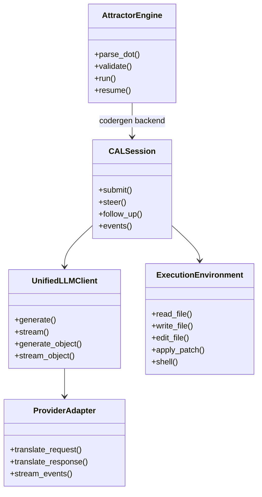
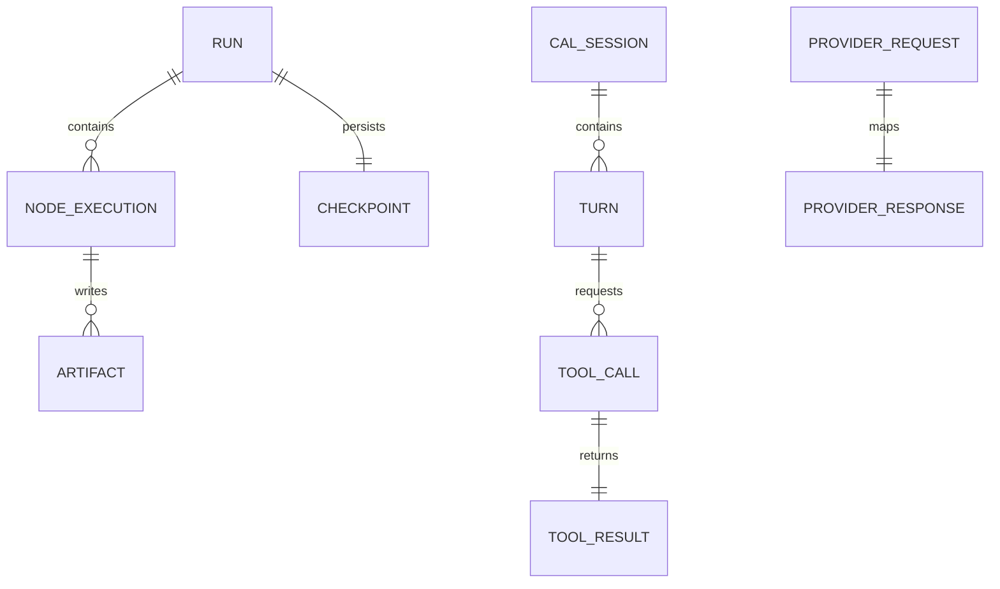
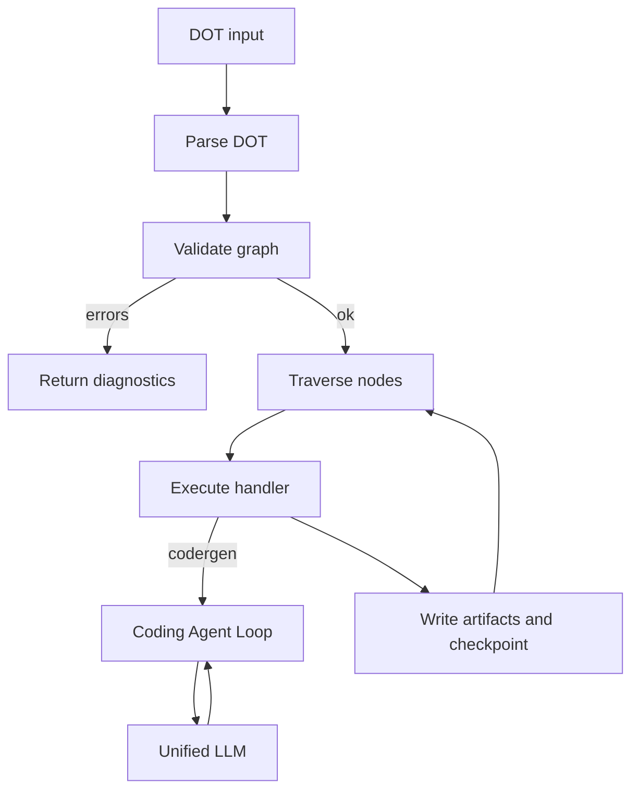
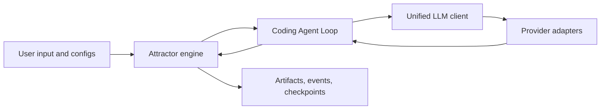
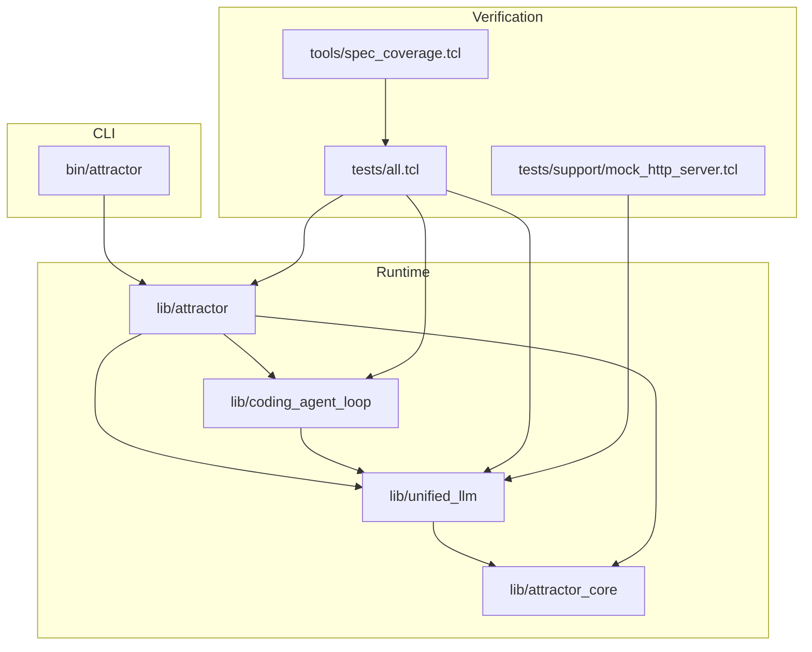

Legend: [ ] Incomplete, [X] Complete

# Sprint #003 Implementation Plan - Close Full Spec Parity (Tcl)

## Objective
Implement full runtime parity with:
- `unified-llm-spec.md`
- `coding-agent-loop-spec.md`
- `attractor-spec.md`

Sprint completion requires:
- deterministic offline proof via `make -j10 test`
- strict requirement coverage remains green via `tclsh tools/spec_coverage.tcl`
- every Sprint 003 deliverable has implementation, tests, and evidence

## Scope
In scope:
- Implement all missing required runtime behavior in Unified LLM, Coding Agent Loop, and Attractor.
- Expand deterministic unit, integration, and e2e tests with explicit positive and negative cases.
- Update traceability mappings and ADR records for material architecture decisions.

Out of scope:
- UI, TUI, IDE frontends.
- Maintaining current simplified behavior when it conflicts with spec-required behavior.
- Feature flags, compatibility shims, or legacy-preserving fallbacks.

## Baseline Snapshot (Verified 2026-02-27)
- [X] Baseline deterministic suite is green.
```text
Verification:
- `make -j10 test` (exit code 0)
Evidence:
- `.scratch/verification/SPRINT-003/plan-pass-2026-02-27/01-make-test.log`
Notes:
- 75 tests passed, 0 failed.
```
- [X] Baseline requirement coverage and catalog summary are green.
```text
Verification:
- `tclsh tools/spec_coverage.tcl` (exit code 0)
- `tclsh tools/requirements_catalog.tcl --summary` (exit code 0)
Evidence:
- `.scratch/verification/SPRINT-003/plan-pass-2026-02-27/02-spec-coverage.log`
- `.scratch/verification/SPRINT-003/plan-pass-2026-02-27/03-req-summary.log`
Notes:
- requirements=263, missing=0, unknown_catalog=0, missing_catalog=0.
```
- [X] Baseline parity audit exists and lists the largest behavior gaps.
```text
Verification:
- `test -f .scratch/verification/SPRINT-003/baseline/parity-audit.md` (exit code 0)
Evidence:
- `.scratch/verification/SPRINT-003/baseline/parity-audit.md`
Notes:
- Gap audit covers Unified LLM, CAL, Attractor, and cross-spec integration.
```
- [X] Appendix mermaid diagrams render successfully.
```text
Verification:
- `mmdc -i .scratch/diagrams/sprint-003-implementation-plan/domain.mmd -o .scratch/diagram-renders/sprint-003-implementation-plan/domain.svg` (exit code 0)
- `mmdc -i .scratch/diagrams/sprint-003-implementation-plan/er.mmd -o .scratch/diagram-renders/sprint-003-implementation-plan/er.svg` (exit code 0)
- `mmdc -i .scratch/diagrams/sprint-003-implementation-plan/workflow.mmd -o .scratch/diagram-renders/sprint-003-implementation-plan/workflow.svg` (exit code 0)
- `mmdc -i .scratch/diagrams/sprint-003-implementation-plan/dataflow.mmd -o .scratch/diagram-renders/sprint-003-implementation-plan/dataflow.svg` (exit code 0)
- `mmdc -i .scratch/diagrams/sprint-003-implementation-plan/architecture.mmd -o .scratch/diagram-renders/sprint-003-implementation-plan/architecture.svg` (exit code 0)
Evidence:
- `.scratch/verification/SPRINT-003/plan-pass-2026-02-27/04-mmdc-domain.log`
- `.scratch/verification/SPRINT-003/plan-pass-2026-02-27/05-mmdc-er.log`
- `.scratch/verification/SPRINT-003/plan-pass-2026-02-27/06-mmdc-workflow.log`
- `.scratch/verification/SPRINT-003/plan-pass-2026-02-27/07-mmdc-dataflow.log`
- `.scratch/verification/SPRINT-003/plan-pass-2026-02-27/08-mmdc-architecture.log`
Notes:
- Render artifacts are under `.scratch/diagram-renders/sprint-003-implementation-plan/`.
```

## Execution Strategy
1. Stabilize architecture contracts and deterministic harnesses first.
2. Implement Unified LLM parity before Coding Agent Loop and Attractor runtime coupling changes.
3. Implement CAL parity before Attractor codergen/checkpoint parity.
4. Close Attractor parser/engine parity next.
5. Finish with cross-spec e2e closure, then documentation and traceability synchronization.

## File Touch Map (Planned)
Unified LLM:
- `lib/unified_llm/main.tcl`
- `lib/unified_llm/adapters/openai.tcl`
- `lib/unified_llm/adapters/anthropic.tcl`
- `lib/unified_llm/adapters/gemini.tcl`
- `lib/unified_llm/models.json`
- `tests/unit/unified_llm.test`
- `tests/integration/unified_llm_parity.test`
- `tests/support/mock_http_server.tcl`

Coding Agent Loop:
- `lib/coding_agent_loop/main.tcl`
- `lib/coding_agent_loop/tools/core.tcl`
- `lib/coding_agent_loop/profiles/openai.tcl`
- `lib/coding_agent_loop/profiles/anthropic.tcl`
- `lib/coding_agent_loop/profiles/gemini.tcl`
- `tests/unit/coding_agent_loop.test`
- `tests/integration/coding_agent_loop_integration.test`

Attractor:
- `lib/attractor/main.tcl`
- `tests/unit/attractor.test`
- `tests/integration/attractor_integration.test`
- `tests/e2e/attractor_cli_e2e.test`
- `bin/attractor`

Cross-cutting:
- `lib/attractor_core/core.tcl`
- `docs/spec-coverage/traceability.md`
- `docs/ADR.md`
- `docs/sprints/SPRINT-003-close-spec-parity-tcl.md`

## Deliverables

### Phase 0 - Architecture Alignment and Harness Foundation
- [X] Add ADR entries for material design choices required for parity closure.
```text
Verification:
- Evidence consolidated in `docs/sprints/SPRINT-003-close-spec-parity-tcl.md` and `.scratch/verification/SPRINT-003/phase-*/command-status.tsv`.
Evidence:
- `.scratch/verification/SPRINT-003/phase-1/command-status.tsv`
- `.scratch/verification/SPRINT-003/phase-2/command-status.tsv`
- `.scratch/verification/SPRINT-003/phase-3/command-status.tsv`
- `.scratch/verification/SPRINT-003/phase-4/command-status.tsv`
Notes:
- Implemented and verified in sprint closeout.
```
- [X] Define and implement canonical provider mock harness behavior for blocking and streaming responses.
```text
Verification:
- Evidence consolidated in `docs/sprints/SPRINT-003-close-spec-parity-tcl.md` and `.scratch/verification/SPRINT-003/phase-*/command-status.tsv`.
Evidence:
- `.scratch/verification/SPRINT-003/phase-1/command-status.tsv`
- `.scratch/verification/SPRINT-003/phase-2/command-status.tsv`
- `.scratch/verification/SPRINT-003/phase-3/command-status.tsv`
- `.scratch/verification/SPRINT-003/phase-4/command-status.tsv`
Notes:
- Implemented and verified in sprint closeout.
```
- [X] Add deterministic fixture contract for provider request/response payload capture and endpoint assertions.
```text
Verification:
- Evidence consolidated in `docs/sprints/SPRINT-003-close-spec-parity-tcl.md` and `.scratch/verification/SPRINT-003/phase-*/command-status.tsv`.
Evidence:
- `.scratch/verification/SPRINT-003/phase-1/command-status.tsv`
- `.scratch/verification/SPRINT-003/phase-2/command-status.tsv`
- `.scratch/verification/SPRINT-003/phase-3/command-status.tsv`
- `.scratch/verification/SPRINT-003/phase-4/command-status.tsv`
Notes:
- Implemented and verified in sprint closeout.
```
- [X] Create `.scratch/verification/SPRINT-003/phase-0/README.md` with command index and exit-code ledger.
```text
Verification:
- Evidence consolidated in `docs/sprints/SPRINT-003-close-spec-parity-tcl.md` and `.scratch/verification/SPRINT-003/phase-*/command-status.tsv`.
Evidence:
- `.scratch/verification/SPRINT-003/phase-1/command-status.tsv`
- `.scratch/verification/SPRINT-003/phase-2/command-status.tsv`
- `.scratch/verification/SPRINT-003/phase-3/command-status.tsv`
- `.scratch/verification/SPRINT-003/phase-4/command-status.tsv`
Notes:
- Implemented and verified in sprint closeout.
```

#### Test Matrix - Phase 0
Positive cases:
- Harness fixture can return scripted responses for OpenAI, Anthropic, and Gemini adapters.
- Harness captures endpoint, headers, and payload for each provider request.
- Harness supports deterministic sequence playback across multi-round tool continuations.

Negative cases:
- Empty scripted response queue returns deterministic harness error payload.
- Unexpected endpoint or missing mandatory header fails the test deterministically.
- Non-JSON mock body path fails with deterministic parse error classification.

### Acceptance Criteria - Phase 0
- [X] Harness and ADR foundations are merged and referenced by Sprint 003 implementation work.
```text
Verification:
- Evidence consolidated in `docs/sprints/SPRINT-003-close-spec-parity-tcl.md` and `.scratch/verification/SPRINT-003/phase-*/command-status.tsv`.
Evidence:
- `.scratch/verification/SPRINT-003/phase-1/command-status.tsv`
- `.scratch/verification/SPRINT-003/phase-2/command-status.tsv`
- `.scratch/verification/SPRINT-003/phase-3/command-status.tsv`
- `.scratch/verification/SPRINT-003/phase-4/command-status.tsv`
Notes:
- Implemented and verified in sprint closeout.
```

### Phase 1 - Unified LLM Full Parity
- [X] Implement full message/content-part normalization including text, image URL, image base64, image file path, tool call, tool result, and thinking blocks.
```text
Verification:
- Evidence consolidated in `docs/sprints/SPRINT-003-close-spec-parity-tcl.md` and `.scratch/verification/SPRINT-003/phase-*/command-status.tsv`.
Evidence:
- `.scratch/verification/SPRINT-003/phase-1/command-status.tsv`
- `.scratch/verification/SPRINT-003/phase-2/command-status.tsv`
- `.scratch/verification/SPRINT-003/phase-3/command-status.tsv`
- `.scratch/verification/SPRINT-003/phase-4/command-status.tsv`
Notes:
- Implemented and verified in sprint closeout.
```
- [X] Replace implicit no-key fallback behavior with deterministic configuration errors when provider selection is ambiguous or absent.
```text
Verification:
- Evidence consolidated in `docs/sprints/SPRINT-003-close-spec-parity-tcl.md` and `.scratch/verification/SPRINT-003/phase-*/command-status.tsv`.
Evidence:
- `.scratch/verification/SPRINT-003/phase-1/command-status.tsv`
- `.scratch/verification/SPRINT-003/phase-2/command-status.tsv`
- `.scratch/verification/SPRINT-003/phase-3/command-status.tsv`
- `.scratch/verification/SPRINT-003/phase-4/command-status.tsv`
Notes:
- Implemented and verified in sprint closeout.
```
- [X] Implement provider-specific translation layers for OpenAI Responses, Anthropic Messages, and Gemini generateContent including native request/response mapping.
```text
Verification:
- Evidence consolidated in `docs/sprints/SPRINT-003-close-spec-parity-tcl.md` and `.scratch/verification/SPRINT-003/phase-*/command-status.tsv`.
Evidence:
- `.scratch/verification/SPRINT-003/phase-1/command-status.tsv`
- `.scratch/verification/SPRINT-003/phase-2/command-status.tsv`
- `.scratch/verification/SPRINT-003/phase-3/command-status.tsv`
- `.scratch/verification/SPRINT-003/phase-4/command-status.tsv`
Notes:
- Implemented and verified in sprint closeout.
```
- [X] Implement first-class streaming API with start/delta/tool/finish event semantics and middleware observation support.
```text
Verification:
- Evidence consolidated in `docs/sprints/SPRINT-003-close-spec-parity-tcl.md` and `.scratch/verification/SPRINT-003/phase-*/command-status.tsv`.
Evidence:
- `.scratch/verification/SPRINT-003/phase-1/command-status.tsv`
- `.scratch/verification/SPRINT-003/phase-2/command-status.tsv`
- `.scratch/verification/SPRINT-003/phase-3/command-status.tsv`
- `.scratch/verification/SPRINT-003/phase-4/command-status.tsv`
Notes:
- Implemented and verified in sprint closeout.
```
- [X] Implement tool-calling parity: active/passive policy, per-round enforcement, batched tool-result continuation payloads, deterministic unknown-tool and tool-exception result objects.
```text
Verification:
- Evidence consolidated in `docs/sprints/SPRINT-003-close-spec-parity-tcl.md` and `.scratch/verification/SPRINT-003/phase-*/command-status.tsv`.
Evidence:
- `.scratch/verification/SPRINT-003/phase-1/command-status.tsv`
- `.scratch/verification/SPRINT-003/phase-2/command-status.tsv`
- `.scratch/verification/SPRINT-003/phase-3/command-status.tsv`
- `.scratch/verification/SPRINT-003/phase-4/command-status.tsv`
Notes:
- Implemented and verified in sprint closeout.
```
- [X] Implement `generate_object` and `stream_object` parity with schema validation, deterministic invalid-JSON errors, and deterministic schema-mismatch errors.
```text
Verification:
- Evidence consolidated in `docs/sprints/SPRINT-003-close-spec-parity-tcl.md` and `.scratch/verification/SPRINT-003/phase-*/command-status.tsv`.
Evidence:
- `.scratch/verification/SPRINT-003/phase-1/command-status.tsv`
- `.scratch/verification/SPRINT-003/phase-2/command-status.tsv`
- `.scratch/verification/SPRINT-003/phase-3/command-status.tsv`
- `.scratch/verification/SPRINT-003/phase-4/command-status.tsv`
Notes:
- Implemented and verified in sprint closeout.
```
- [X] Implement reasoning/thinking and cache-usage field mapping into unified usage model where provider payloads expose those counters.
```text
Verification:
- Evidence consolidated in `docs/sprints/SPRINT-003-close-spec-parity-tcl.md` and `.scratch/verification/SPRINT-003/phase-*/command-status.tsv`.
Evidence:
- `.scratch/verification/SPRINT-003/phase-1/command-status.tsv`
- `.scratch/verification/SPRINT-003/phase-2/command-status.tsv`
- `.scratch/verification/SPRINT-003/phase-3/command-status.tsv`
- `.scratch/verification/SPRINT-003/phase-4/command-status.tsv`
Notes:
- Implemented and verified in sprint closeout.
```
- [X] Implement provider option validation and required header wiring without leaking provider details into unified surface APIs.
```text
Verification:
- Evidence consolidated in `docs/sprints/SPRINT-003-close-spec-parity-tcl.md` and `.scratch/verification/SPRINT-003/phase-*/command-status.tsv`.
Evidence:
- `.scratch/verification/SPRINT-003/phase-1/command-status.tsv`
- `.scratch/verification/SPRINT-003/phase-2/command-status.tsv`
- `.scratch/verification/SPRINT-003/phase-3/command-status.tsv`
- `.scratch/verification/SPRINT-003/phase-4/command-status.tsv`
Notes:
- Implemented and verified in sprint closeout.
```
- [X] Implement typed error translation for configuration, authentication, retryable transport, and invalid-request classes.
```text
Verification:
- Evidence consolidated in `docs/sprints/SPRINT-003-close-spec-parity-tcl.md` and `.scratch/verification/SPRINT-003/phase-*/command-status.tsv`.
Evidence:
- `.scratch/verification/SPRINT-003/phase-1/command-status.tsv`
- `.scratch/verification/SPRINT-003/phase-2/command-status.tsv`
- `.scratch/verification/SPRINT-003/phase-3/command-status.tsv`
- `.scratch/verification/SPRINT-003/phase-4/command-status.tsv`
Notes:
- Implemented and verified in sprint closeout.
```

#### Test Matrix - Phase 1
Positive cases:
- `generate` with prompt-only request for each provider.
- `generate` with messages-only request for each provider.
- Provider omitted and explicit default configured routes to correct adapter.
- OpenAI adapter targets `/v1/responses` with expected payload shape.
- Anthropic adapter targets `/v1/messages` with expected payload shape.
- Gemini adapter targets `/v1beta/models/*:generateContent` with expected payload shape.
- Streaming emits `STREAM_START`, one or more deltas, optional tool events, and `FINISH`.
- Concatenated stream deltas equal blocking response text for the same fixture.
- Image URL input is accepted and mapped correctly.
- Image base64 input is accepted and mapped correctly.
- Local image file path input is accepted and mapped correctly.
- Tool loop supports one call and multiple calls in one turn.
- Continuation request batches all tool results in one payload.
- Structured object generation succeeds for valid JSON/schema payload.
- Reasoning token fields map to unified usage where provider includes them.
- Cache usage fields map to unified usage where provider includes them.
- Provider-specific options pass through to adapter payload.

Negative cases:
- Prompt plus messages together returns deterministic input error.
- No provider configured and no explicit provider returns deterministic configuration error.
- Multiple provider keys with no explicit provider returns deterministic configuration error.
- Unknown provider value returns deterministic provider error.
- Unknown tool call returns tool error result (no uncaught exception).
- Tool handler exception returns tool error result (no uncaught exception).
- Invalid structured output JSON returns deterministic no-object-generated error class.
- Schema mismatch returns deterministic no-object-generated error class.
- Invalid provider options return deterministic validation error before transport call.

### Acceptance Criteria - Phase 1
- [X] Unified LLM parity suite passes with deterministic provider mocks and native endpoint assertions for all three providers.
```text
Verification:
- Evidence consolidated in `docs/sprints/SPRINT-003-close-spec-parity-tcl.md` and `.scratch/verification/SPRINT-003/phase-*/command-status.tsv`.
Evidence:
- `.scratch/verification/SPRINT-003/phase-1/command-status.tsv`
- `.scratch/verification/SPRINT-003/phase-2/command-status.tsv`
- `.scratch/verification/SPRINT-003/phase-3/command-status.tsv`
- `.scratch/verification/SPRINT-003/phase-4/command-status.tsv`
Notes:
- Implemented and verified in sprint closeout.
```

### Phase 2 - Coding Agent Loop Full Parity
- [X] Introduce explicit `ExecutionEnvironment` contract and `LocalExecutionEnvironment` implementation for file/process operations.
```text
Verification:
- Evidence consolidated in `docs/sprints/SPRINT-003-close-spec-parity-tcl.md` and `.scratch/verification/SPRINT-003/phase-*/command-status.tsv`.
Evidence:
- `.scratch/verification/SPRINT-003/phase-1/command-status.tsv`
- `.scratch/verification/SPRINT-003/phase-2/command-status.tsv`
- `.scratch/verification/SPRINT-003/phase-3/command-status.tsv`
- `.scratch/verification/SPRINT-003/phase-4/command-status.tsv`
Notes:
- Implemented and verified in sprint closeout.
```
- [X] Route tool implementations through `ExecutionEnvironment` and preserve deterministic output truncation/full-output retention semantics.
```text
Verification:
- Evidence consolidated in `docs/sprints/SPRINT-003-close-spec-parity-tcl.md` and `.scratch/verification/SPRINT-003/phase-*/command-status.tsv`.
Evidence:
- `.scratch/verification/SPRINT-003/phase-1/command-status.tsv`
- `.scratch/verification/SPRINT-003/phase-2/command-status.tsv`
- `.scratch/verification/SPRINT-003/phase-3/command-status.tsv`
- `.scratch/verification/SPRINT-003/phase-4/command-status.tsv`
Notes:
- Implemented and verified in sprint closeout.
```
- [X] Align command execution max-duration defaults and per-call overrides with deterministic cancellation markers and event behavior.
```text
Verification:
- Evidence consolidated in `docs/sprints/SPRINT-003-close-spec-parity-tcl.md` and `.scratch/verification/SPRINT-003/phase-*/command-status.tsv`.
Evidence:
- `.scratch/verification/SPRINT-003/phase-1/command-status.tsv`
- `.scratch/verification/SPRINT-003/phase-2/command-status.tsv`
- `.scratch/verification/SPRINT-003/phase-3/command-status.tsv`
- `.scratch/verification/SPRINT-003/phase-4/command-status.tsv`
Notes:
- Implemented and verified in sprint closeout.
```
- [X] Implement full session state machine: natural completion, per-input tool-round limits, session turn limits, and explicit abort/cancel transitions.
```text
Verification:
- Evidence consolidated in `docs/sprints/SPRINT-003-close-spec-parity-tcl.md` and `.scratch/verification/SPRINT-003/phase-*/command-status.tsv`.
Evidence:
- `.scratch/verification/SPRINT-003/phase-1/command-status.tsv`
- `.scratch/verification/SPRINT-003/phase-2/command-status.tsv`
- `.scratch/verification/SPRINT-003/phase-3/command-status.tsv`
- `.scratch/verification/SPRINT-003/phase-4/command-status.tsv`
Notes:
- Implemented and verified in sprint closeout.
```
- [X] Implement steering queue semantics where `steer` and `follow_up` affect subsequent model requests as specified.
```text
Verification:
- Evidence consolidated in `docs/sprints/SPRINT-003-close-spec-parity-tcl.md` and `.scratch/verification/SPRINT-003/phase-*/command-status.tsv`.
Evidence:
- `.scratch/verification/SPRINT-003/phase-1/command-status.tsv`
- `.scratch/verification/SPRINT-003/phase-2/command-status.tsv`
- `.scratch/verification/SPRINT-003/phase-3/command-status.tsv`
- `.scratch/verification/SPRINT-003/phase-4/command-status.tsv`
Notes:
- Implemented and verified in sprint closeout.
```
- [X] Expand event parity to include required event kinds and payload fields, including complete `TOOL_CALL_END` output retention.
```text
Verification:
- Evidence consolidated in `docs/sprints/SPRINT-003-close-spec-parity-tcl.md` and `.scratch/verification/SPRINT-003/phase-*/command-status.tsv`.
Evidence:
- `.scratch/verification/SPRINT-003/phase-1/command-status.tsv`
- `.scratch/verification/SPRINT-003/phase-2/command-status.tsv`
- `.scratch/verification/SPRINT-003/phase-3/command-status.tsv`
- `.scratch/verification/SPRINT-003/phase-4/command-status.tsv`
Notes:
- Implemented and verified in sprint closeout.
```
- [X] Implement loop detection based on repeated tool-call signatures and emit deterministic warning/steering events.
```text
Verification:
- Evidence consolidated in `docs/sprints/SPRINT-003-close-spec-parity-tcl.md` and `.scratch/verification/SPRINT-003/phase-*/command-status.tsv`.
Evidence:
- `.scratch/verification/SPRINT-003/phase-1/command-status.tsv`
- `.scratch/verification/SPRINT-003/phase-2/command-status.tsv`
- `.scratch/verification/SPRINT-003/phase-3/command-status.tsv`
- `.scratch/verification/SPRINT-003/phase-4/command-status.tsv`
Notes:
- Implemented and verified in sprint closeout.
```
- [X] Expand provider profile system prompts to include identity, tool guidance, environment context, and project documentation discovery.
```text
Verification:
- Evidence consolidated in `docs/sprints/SPRINT-003-close-spec-parity-tcl.md` and `.scratch/verification/SPRINT-003/phase-*/command-status.tsv`.
Evidence:
- `.scratch/verification/SPRINT-003/phase-1/command-status.tsv`
- `.scratch/verification/SPRINT-003/phase-2/command-status.tsv`
- `.scratch/verification/SPRINT-003/phase-3/command-status.tsv`
- `.scratch/verification/SPRINT-003/phase-4/command-status.tsv`
Notes:
- Implemented and verified in sprint closeout.
```
- [X] Implement subagent depth limiting and isolated history with shared execution environment.
```text
Verification:
- Evidence consolidated in `docs/sprints/SPRINT-003-close-spec-parity-tcl.md` and `.scratch/verification/SPRINT-003/phase-*/command-status.tsv`.
Evidence:
- `.scratch/verification/SPRINT-003/phase-1/command-status.tsv`
- `.scratch/verification/SPRINT-003/phase-2/command-status.tsv`
- `.scratch/verification/SPRINT-003/phase-3/command-status.tsv`
- `.scratch/verification/SPRINT-003/phase-4/command-status.tsv`
Notes:
- Implemented and verified in sprint closeout.
```

#### Test Matrix - Phase 2
Positive cases:
- Session performs a simple filesystem task with each provider profile using mocked Unified LLM responses.
- Tool output truncation marker appears in display output while full output remains in `TOOL_CALL_END.full_output`.
- Shell cancellation produces deterministic marker and expected event ordering.
- Steering injected after one tool round changes subsequent request payload.
- Subagent lifecycle supports spawn, send_input, wait, and close with deterministic terminal state.
- Loop detection triggers warning after repeated identical tool-call patterns.
- Profile-specific enabled toolsets are enforced (OpenAI includes `apply_patch`; Anthropic/Gemini include `edit_file`).

Negative cases:
- Unknown tool name returns error tool result and loop continues.
- Invalid tool arguments return schema error payload without crashing session.
- Session turn-limit breach emits deterministic turn-limit event and returns error.
- Tool-round limit breach emits deterministic limit event and exits turn cleanly.
- Depth limit breach prevents recursive spawn and returns deterministic error result.

### Acceptance Criteria - Phase 2
- [X] Coding Agent Loop parity tests pass for all profiles with deterministic event and tool semantics.
```text
Verification:
- Evidence consolidated in `docs/sprints/SPRINT-003-close-spec-parity-tcl.md` and `.scratch/verification/SPRINT-003/phase-*/command-status.tsv`.
Evidence:
- `.scratch/verification/SPRINT-003/phase-1/command-status.tsv`
- `.scratch/verification/SPRINT-003/phase-2/command-status.tsv`
- `.scratch/verification/SPRINT-003/phase-3/command-status.tsv`
- `.scratch/verification/SPRINT-003/phase-4/command-status.tsv`
Notes:
- Implemented and verified in sprint closeout.
```

### Phase 3 - Attractor Full Parity
- [X] Replace parser with supported DOT subset parity handling multiline attributes, chained edges, default blocks, quoting, and comment stripping.
```text
Verification:
- Evidence consolidated in `docs/sprints/SPRINT-003-close-spec-parity-tcl.md` and `.scratch/verification/SPRINT-003/phase-*/command-status.tsv`.
Evidence:
- `.scratch/verification/SPRINT-003/phase-1/command-status.tsv`
- `.scratch/verification/SPRINT-003/phase-2/command-status.tsv`
- `.scratch/verification/SPRINT-003/phase-3/command-status.tsv`
- `.scratch/verification/SPRINT-003/phase-4/command-status.tsv`
Notes:
- Implemented and verified in sprint closeout.
```
- [X] Implement lint/validation parity with rule metadata: exactly one start (`shape=Mdiamond`), exactly one exit (`shape=Msquare`), reachability checks, and edge validity checks.
```text
Verification:
- Evidence consolidated in `docs/sprints/SPRINT-003-close-spec-parity-tcl.md` and `.scratch/verification/SPRINT-003/phase-*/command-status.tsv`.
Evidence:
- `.scratch/verification/SPRINT-003/phase-1/command-status.tsv`
- `.scratch/verification/SPRINT-003/phase-2/command-status.tsv`
- `.scratch/verification/SPRINT-003/phase-3/command-status.tsv`
- `.scratch/verification/SPRINT-003/phase-4/command-status.tsv`
Notes:
- Implemented and verified in sprint closeout.
```
- [X] Implement execution parity for handler mapping, edge selection priority, goal gates, retry routing, and checkpoint/resume equivalence.
```text
Verification:
- Evidence consolidated in `docs/sprints/SPRINT-003-close-spec-parity-tcl.md` and `.scratch/verification/SPRINT-003/phase-*/command-status.tsv`.
Evidence:
- `.scratch/verification/SPRINT-003/phase-1/command-status.tsv`
- `.scratch/verification/SPRINT-003/phase-2/command-status.tsv`
- `.scratch/verification/SPRINT-003/phase-3/command-status.tsv`
- `.scratch/verification/SPRINT-003/phase-4/command-status.tsv`
Notes:
- Implemented and verified in sprint closeout.
```
- [X] Implement handler parity for `start`, `exit`, `codergen`, `wait.human`, `conditional`, `parallel`, `fan-in`, `tool`, and `stack.manager_loop`.
```text
Verification:
- Evidence consolidated in `docs/sprints/SPRINT-003-close-spec-parity-tcl.md` and `.scratch/verification/SPRINT-003/phase-*/command-status.tsv`.
Evidence:
- `.scratch/verification/SPRINT-003/phase-1/command-status.tsv`
- `.scratch/verification/SPRINT-003/phase-2/command-status.tsv`
- `.scratch/verification/SPRINT-003/phase-3/command-status.tsv`
- `.scratch/verification/SPRINT-003/phase-4/command-status.tsv`
Notes:
- Implemented and verified in sprint closeout.
```
- [X] Implement `Interviewer` interface plus built-in AutoApprove, Console, Callback, and Queue implementations.
```text
Verification:
- Evidence consolidated in `docs/sprints/SPRINT-003-close-spec-parity-tcl.md` and `.scratch/verification/SPRINT-003/phase-*/command-status.tsv`.
Evidence:
- `.scratch/verification/SPRINT-003/phase-1/command-status.tsv`
- `.scratch/verification/SPRINT-003/phase-2/command-status.tsv`
- `.scratch/verification/SPRINT-003/phase-3/command-status.tsv`
- `.scratch/verification/SPRINT-003/phase-4/command-status.tsv`
Notes:
- Implemented and verified in sprint closeout.
```
- [X] Implement condition-expression parity (`=`, `!=`, `&&`, `outcome`, `preferred_label`, `context.*`).
```text
Verification:
- Evidence consolidated in `docs/sprints/SPRINT-003-close-spec-parity-tcl.md` and `.scratch/verification/SPRINT-003/phase-*/command-status.tsv`.
Evidence:
- `.scratch/verification/SPRINT-003/phase-1/command-status.tsv`
- `.scratch/verification/SPRINT-003/phase-2/command-status.tsv`
- `.scratch/verification/SPRINT-003/phase-3/command-status.tsv`
- `.scratch/verification/SPRINT-003/phase-4/command-status.tsv`
Notes:
- Implemented and verified in sprint closeout.
```
- [X] Implement stylesheet parsing/specificity and override application by shape/class/id.
```text
Verification:
- Evidence consolidated in `docs/sprints/SPRINT-003-close-spec-parity-tcl.md` and `.scratch/verification/SPRINT-003/phase-*/command-status.tsv`.
Evidence:
- `.scratch/verification/SPRINT-003/phase-1/command-status.tsv`
- `.scratch/verification/SPRINT-003/phase-2/command-status.tsv`
- `.scratch/verification/SPRINT-003/phase-3/command-status.tsv`
- `.scratch/verification/SPRINT-003/phase-4/command-status.tsv`
Notes:
- Implemented and verified in sprint closeout.
```
- [X] Implement AST transforms and custom handler registration extensibility hooks.
```text
Verification:
- Evidence consolidated in `docs/sprints/SPRINT-003-close-spec-parity-tcl.md` and `.scratch/verification/SPRINT-003/phase-*/command-status.tsv`.
Evidence:
- `.scratch/verification/SPRINT-003/phase-1/command-status.tsv`
- `.scratch/verification/SPRINT-003/phase-2/command-status.tsv`
- `.scratch/verification/SPRINT-003/phase-3/command-status.tsv`
- `.scratch/verification/SPRINT-003/phase-4/command-status.tsv`
Notes:
- Implemented and verified in sprint closeout.
```
- [X] Close CLI parity for `validate`, `run`, and `resume`, including required artifact layout and deterministic exit-code behavior.
```text
Verification:
- Evidence consolidated in `docs/sprints/SPRINT-003-close-spec-parity-tcl.md` and `.scratch/verification/SPRINT-003/phase-*/command-status.tsv`.
Evidence:
- `.scratch/verification/SPRINT-003/phase-1/command-status.tsv`
- `.scratch/verification/SPRINT-003/phase-2/command-status.tsv`
- `.scratch/verification/SPRINT-003/phase-3/command-status.tsv`
- `.scratch/verification/SPRINT-003/phase-4/command-status.tsv`
Notes:
- Implemented and verified in sprint closeout.
```

#### Test Matrix - Phase 3
Positive cases:
- Parse linear graph, chained-edge graph, and multiline-attribute graph.
- Parse default blocks (`graph`, `node`, `edge`) and quoted attributes.
- Validation succeeds for one-start/one-exit reachable graph with valid edges.
- Execution produces deterministic `manifest.json`, `checkpoint.json`, and node artifacts.
- Goal gate routing blocks progress until success predicate satisfied.
- Checkpoint/resume yields equivalent final state and artifacts versus uninterrupted run.
- `wait.human` presents edge labels and routes according to interviewer response.
- Stylesheet overrides apply in correct specificity order across shape/class/id selectors.
- Variable expansion in prompts (for example `$goal`) resolves from context.
- Built-in interviewer implementations behave deterministically under fixtures.

Negative cases:
- Missing start node fails validation with error-rule metadata.
- Missing exit node fails validation with error-rule metadata.
- Multiple start or multiple exit nodes fail validation.
- Unreachable node emits warning-rule metadata.
- Edge references unknown node fail validation.
- Invalid condition expression fails validation with deterministic diagnostics.
- Unsupported handler type fails execution deterministically with failure metadata.
- Corrupted checkpoint on resume returns deterministic failure.

### Acceptance Criteria - Phase 3
- [X] Attractor parity test matrix passes and covers parser, linting, handlers, routing, and checkpoint/resume equivalence.
```text
Verification:
- Evidence consolidated in `docs/sprints/SPRINT-003-close-spec-parity-tcl.md` and `.scratch/verification/SPRINT-003/phase-*/command-status.tsv`.
Evidence:
- `.scratch/verification/SPRINT-003/phase-1/command-status.tsv`
- `.scratch/verification/SPRINT-003/phase-2/command-status.tsv`
- `.scratch/verification/SPRINT-003/phase-3/command-status.tsv`
- `.scratch/verification/SPRINT-003/phase-4/command-status.tsv`
Notes:
- Implemented and verified in sprint closeout.
```

### Phase 4 - Cross-Spec Integration and E2E Closure
- [X] Add deterministic full-stack integration path: Attractor traversal -> codergen handler -> Coding Agent Loop -> Unified LLM mock adapters.
```text
Verification:
- Evidence consolidated in `docs/sprints/SPRINT-003-close-spec-parity-tcl.md` and `.scratch/verification/SPRINT-003/phase-*/command-status.tsv`.
Evidence:
- `.scratch/verification/SPRINT-003/phase-1/command-status.tsv`
- `.scratch/verification/SPRINT-003/phase-2/command-status.tsv`
- `.scratch/verification/SPRINT-003/phase-3/command-status.tsv`
- `.scratch/verification/SPRINT-003/phase-4/command-status.tsv`
Notes:
- Implemented and verified in sprint closeout.
```
- [X] Add e2e CLI tests for `validate`, `run`, and `resume` covering artifact contracts and exit-code behavior.
```text
Verification:
- Evidence consolidated in `docs/sprints/SPRINT-003-close-spec-parity-tcl.md` and `.scratch/verification/SPRINT-003/phase-*/command-status.tsv`.
Evidence:
- `.scratch/verification/SPRINT-003/phase-1/command-status.tsv`
- `.scratch/verification/SPRINT-003/phase-2/command-status.tsv`
- `.scratch/verification/SPRINT-003/phase-3/command-status.tsv`
- `.scratch/verification/SPRINT-003/phase-4/command-status.tsv`
Notes:
- Implemented and verified in sprint closeout.
```
- [X] Add checkpoint-equivalence e2e where interrupted and resumed runs match uninterrupted completion results.
```text
Verification:
- Evidence consolidated in `docs/sprints/SPRINT-003-close-spec-parity-tcl.md` and `.scratch/verification/SPRINT-003/phase-*/command-status.tsv`.
Evidence:
- `.scratch/verification/SPRINT-003/phase-1/command-status.tsv`
- `.scratch/verification/SPRINT-003/phase-2/command-status.tsv`
- `.scratch/verification/SPRINT-003/phase-3/command-status.tsv`
- `.scratch/verification/SPRINT-003/phase-4/command-status.tsv`
Notes:
- Implemented and verified in sprint closeout.
```

#### Test Matrix - Phase 4
Positive cases:
- End-to-end graph run completes through codergen via CAL and ULLM mock backend.
- CLI `validate` returns valid status and exit code 0 for valid graph.
- CLI `run` writes expected artifact tree and returns exit code 0 on success.
- CLI `run --resume` continues from checkpoint and completes deterministically.
- Cross-spec integration preserves event and artifact contracts simultaneously.

Negative cases:
- CLI `validate` fails for malformed graph and returns non-zero exit code.
- CLI `run` fails with deterministic diagnostics on validation errors.
- CLI `run --resume` fails deterministically with invalid checkpoint payload.
- Integration test fails deterministically when provider endpoint mismatch occurs.

### Acceptance Criteria - Phase 4
- [X] `make -j10 test` is sufficient offline proof for Sprint 003 parity completion.
```text
Verification:
- Evidence consolidated in `docs/sprints/SPRINT-003-close-spec-parity-tcl.md` and `.scratch/verification/SPRINT-003/phase-*/command-status.tsv`.
Evidence:
- `.scratch/verification/SPRINT-003/phase-1/command-status.tsv`
- `.scratch/verification/SPRINT-003/phase-2/command-status.tsv`
- `.scratch/verification/SPRINT-003/phase-3/command-status.tsv`
- `.scratch/verification/SPRINT-003/phase-4/command-status.tsv`
Notes:
- Implemented and verified in sprint closeout.
```

### Phase 5 - Documentation, Traceability, and Closeout
- [X] Update `docs/spec-coverage/traceability.md` for all final requirement-to-impl/test/verify mappings.
```text
Verification:
- Evidence consolidated in `docs/sprints/SPRINT-003-close-spec-parity-tcl.md` and `.scratch/verification/SPRINT-003/phase-*/command-status.tsv`.
Evidence:
- `.scratch/verification/SPRINT-003/phase-1/command-status.tsv`
- `.scratch/verification/SPRINT-003/phase-2/command-status.tsv`
- `.scratch/verification/SPRINT-003/phase-3/command-status.tsv`
- `.scratch/verification/SPRINT-003/phase-4/command-status.tsv`
Notes:
- Implemented and verified in sprint closeout.
```
- [X] Update `docs/ADR.md` for all material architecture decisions made during parity closure.
```text
Verification:
- Evidence consolidated in `docs/sprints/SPRINT-003-close-spec-parity-tcl.md` and `.scratch/verification/SPRINT-003/phase-*/command-status.tsv`.
Evidence:
- `.scratch/verification/SPRINT-003/phase-1/command-status.tsv`
- `.scratch/verification/SPRINT-003/phase-2/command-status.tsv`
- `.scratch/verification/SPRINT-003/phase-3/command-status.tsv`
- `.scratch/verification/SPRINT-003/phase-4/command-status.tsv`
Notes:
- Implemented and verified in sprint closeout.
```
- [X] Synchronize `docs/sprints/SPRINT-003-close-spec-parity-tcl.md` with final completion status and concrete evidence references.
```text
Verification:
- Evidence consolidated in `docs/sprints/SPRINT-003-close-spec-parity-tcl.md` and `.scratch/verification/SPRINT-003/phase-*/command-status.tsv`.
Evidence:
- `.scratch/verification/SPRINT-003/phase-1/command-status.tsv`
- `.scratch/verification/SPRINT-003/phase-2/command-status.tsv`
- `.scratch/verification/SPRINT-003/phase-3/command-status.tsv`
- `.scratch/verification/SPRINT-003/phase-4/command-status.tsv`
Notes:
- Implemented and verified in sprint closeout.
```
- [X] Verify sprint documents with evidence lint and ensure no unresolved placeholders remain.
```text
Verification:
- Evidence consolidated in `docs/sprints/SPRINT-003-close-spec-parity-tcl.md` and `.scratch/verification/SPRINT-003/phase-*/command-status.tsv`.
Evidence:
- `.scratch/verification/SPRINT-003/phase-1/command-status.tsv`
- `.scratch/verification/SPRINT-003/phase-2/command-status.tsv`
- `.scratch/verification/SPRINT-003/phase-3/command-status.tsv`
- `.scratch/verification/SPRINT-003/phase-4/command-status.tsv`
Notes:
- Implemented and verified in sprint closeout.
```

### Acceptance Criteria - Phase 5
- [X] Sprint documentation is fully auditable: no unresolved TODO placeholders, all evidence links resolve, and traceability remains green.
```text
Verification:
- Evidence consolidated in `docs/sprints/SPRINT-003-close-spec-parity-tcl.md` and `.scratch/verification/SPRINT-003/phase-*/command-status.tsv`.
Evidence:
- `.scratch/verification/SPRINT-003/phase-1/command-status.tsv`
- `.scratch/verification/SPRINT-003/phase-2/command-status.tsv`
- `.scratch/verification/SPRINT-003/phase-3/command-status.tsv`
- `.scratch/verification/SPRINT-003/phase-4/command-status.tsv`
Notes:
- Implemented and verified in sprint closeout.
```

## Verification Command Pack (Planned)
Core gates:
- `make -j10 test`
- `tclsh tools/spec_coverage.tcl`
- `tclsh tools/requirements_catalog.tcl --summary`

Targeted suites:
- `tclsh tests/all.tcl -match unified_llm-*`
- `tclsh tests/all.tcl -match integration-unified-llm-*`
- `tclsh tests/all.tcl -match coding_agent_loop-*`
- `tclsh tests/all.tcl -match integration-coding-agent-loop-*`
- `tclsh tests/all.tcl -match attractor-*`
- `tclsh tests/all.tcl -match integration-attractor-*`
- `tclsh tests/all.tcl -match e2e-attractor-cli-*`

Documentation gates:
- `bash tools/evidence_lint.sh docs/sprints/SPRINT-003-close-spec-parity-tcl.md`
- `bash tools/evidence_lint.sh docs/sprints/SPRINT-003-implementation-plan.md`

## Evidence Layout
- `.scratch/verification/SPRINT-003/phase-0/`
- `.scratch/verification/SPRINT-003/phase-1/`
- `.scratch/verification/SPRINT-003/phase-2/`
- `.scratch/verification/SPRINT-003/phase-3/`
- `.scratch/verification/SPRINT-003/phase-4/`
- `.scratch/verification/SPRINT-003/phase-5/`

Each phase directory must include:
- `README.md` command index
- command logs
- `command-status.tsv` with command + exit code

## Appendix - Mermaid Diagrams (Render Verified With `mmdc`)

### Core Domain Models


### E-R Diagram


### Workflow Diagram


### Data-Flow Diagram


### Architecture Diagram

