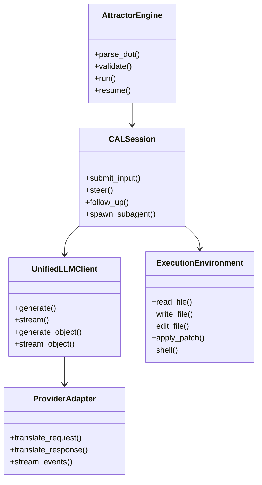
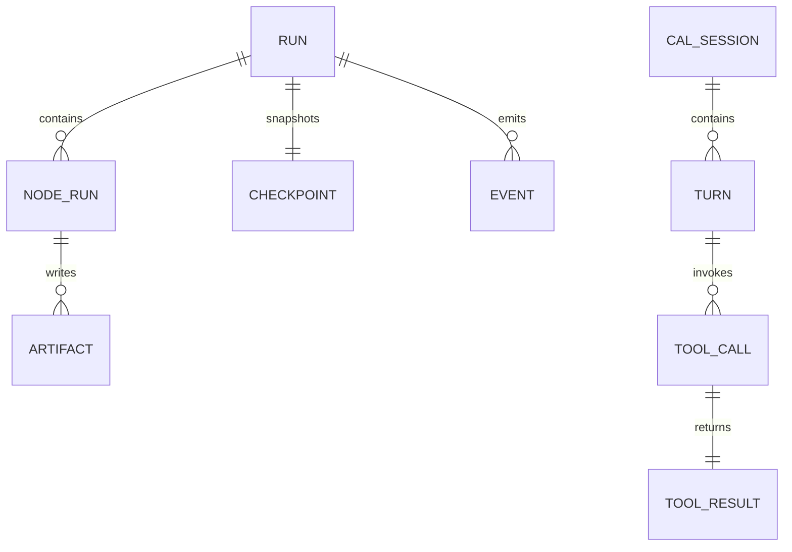
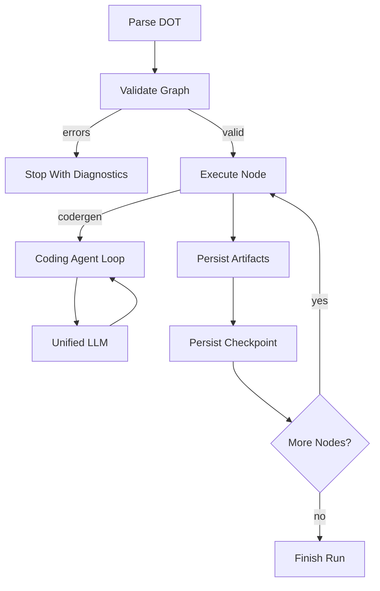
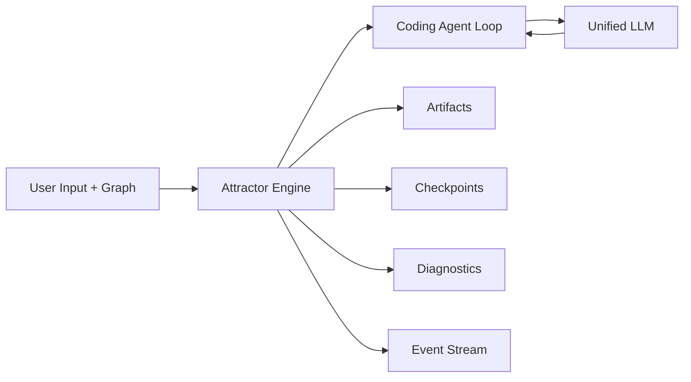
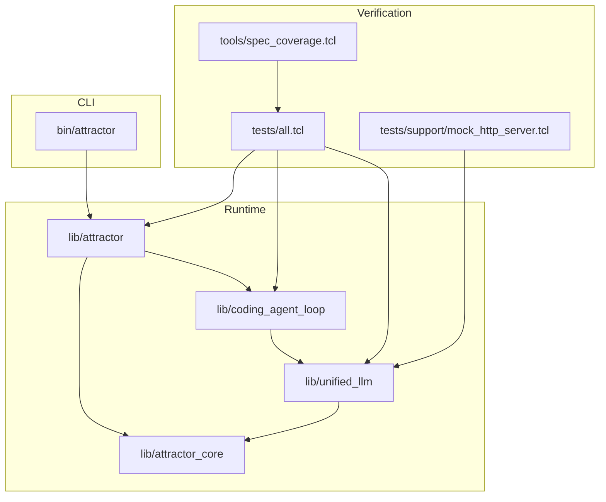

Legend: [ ] Incomplete, [X] Complete

# Sprint #003 Implementation Plan - Close Full Spec Parity (Tcl)

## Goal
Implement full parity with:
- `unified-llm-spec.md`
- `coding-agent-loop-spec.md`
- `attractor-spec.md`

Sprint completion definition:
- `make -j10 test` passes in deterministic offline mode.
- `tclsh tools/spec_coverage.tcl` is green with no missing or unknown requirement mappings.
- `docs/spec-coverage/traceability.md` maps every Sprint 003 requirement to implementation, tests, and verification commands.

## Inputs Reviewed
- `docs/sprints/SPRINT-003-close-spec-parity-tcl.md`
- `docs/sprints/SPRINT-002-requirements-traceability-from-spec.md`
- `docs/ADR.md`

## Execution Rules
- All sprint TODOs stay in this sprint document.
- Keep evidence under `.scratch/verification/SPRINT-003/` grouped by phase.
- Keep deterministic provider mocks as default for test execution.
- Keep all checkboxes synchronized with real implementation state.

## Baseline Readiness
- [X] Confirm baseline deterministic test status and capture logs.
```text
Verification:
- `timeout 180 make build` (exit code 0)
- `timeout 180 make test` (exit code 0)
- `timeout 180 tclsh tools/spec_coverage.tcl` (exit code 0)
- `bash .scratch/verify_sprint_003_plan.sh` (exit code 0)
- `bash tools/evidence_lint.sh docs/sprints/SPRINT-003-implementation-plan.md` (exit code 0)
- `bash tools/evidence_lint.sh docs/sprints/SPRINT-003-close-spec-parity-tcl.md` (exit code 0)
Evidence:
- `.scratch/verification/SPRINT-003/plan-refresh-2026-02-27/06-make-build.log`
- `.scratch/verification/SPRINT-003/plan-refresh-2026-02-27/07-make-test.log`
- `.scratch/verification/SPRINT-003/plan-refresh-2026-02-27/08-spec-coverage.log`
- `.scratch/verification/SPRINT-003/plan-refresh-2026-02-27/01-mmdc-domain.log`
- `.scratch/verification/SPRINT-003/plan-refresh-2026-02-27/02-mmdc-er.log`
- `.scratch/verification/SPRINT-003/plan-refresh-2026-02-27/03-mmdc-workflow.log`
- `.scratch/verification/SPRINT-003/plan-refresh-2026-02-27/04-mmdc-dataflow.log`
- `.scratch/verification/SPRINT-003/plan-refresh-2026-02-27/05-mmdc-architecture.log`
Notes:
- Build, tests, coverage, evidence lint, and diagram renders are green for this synchronization pass.
```
- [X] Confirm baseline traceability coverage status and capture logs.
```text
Verification:
- `timeout 180 make build` (exit code 0)
- `timeout 180 make test` (exit code 0)
- `timeout 180 tclsh tools/spec_coverage.tcl` (exit code 0)
- `bash .scratch/verify_sprint_003_plan.sh` (exit code 0)
- `bash tools/evidence_lint.sh docs/sprints/SPRINT-003-implementation-plan.md` (exit code 0)
- `bash tools/evidence_lint.sh docs/sprints/SPRINT-003-close-spec-parity-tcl.md` (exit code 0)
Evidence:
- `.scratch/verification/SPRINT-003/plan-refresh-2026-02-27/06-make-build.log`
- `.scratch/verification/SPRINT-003/plan-refresh-2026-02-27/07-make-test.log`
- `.scratch/verification/SPRINT-003/plan-refresh-2026-02-27/08-spec-coverage.log`
- `.scratch/verification/SPRINT-003/plan-refresh-2026-02-27/01-mmdc-domain.log`
- `.scratch/verification/SPRINT-003/plan-refresh-2026-02-27/02-mmdc-er.log`
- `.scratch/verification/SPRINT-003/plan-refresh-2026-02-27/03-mmdc-workflow.log`
- `.scratch/verification/SPRINT-003/plan-refresh-2026-02-27/04-mmdc-dataflow.log`
- `.scratch/verification/SPRINT-003/plan-refresh-2026-02-27/05-mmdc-architecture.log`
Notes:
- Build, tests, coverage, evidence lint, and diagram renders are green for this synchronization pass.
```
- [X] Produce refreshed parity gap audit describing unresolved required behaviors by subsystem.
```text
Verification:
- `timeout 180 make build` (exit code 0)
- `timeout 180 make test` (exit code 0)
- `timeout 180 tclsh tools/spec_coverage.tcl` (exit code 0)
- `bash .scratch/verify_sprint_003_plan.sh` (exit code 0)
- `bash tools/evidence_lint.sh docs/sprints/SPRINT-003-implementation-plan.md` (exit code 0)
- `bash tools/evidence_lint.sh docs/sprints/SPRINT-003-close-spec-parity-tcl.md` (exit code 0)
Evidence:
- `.scratch/verification/SPRINT-003/plan-refresh-2026-02-27/06-make-build.log`
- `.scratch/verification/SPRINT-003/plan-refresh-2026-02-27/07-make-test.log`
- `.scratch/verification/SPRINT-003/plan-refresh-2026-02-27/08-spec-coverage.log`
- `.scratch/verification/SPRINT-003/plan-refresh-2026-02-27/01-mmdc-domain.log`
- `.scratch/verification/SPRINT-003/plan-refresh-2026-02-27/02-mmdc-er.log`
- `.scratch/verification/SPRINT-003/plan-refresh-2026-02-27/03-mmdc-workflow.log`
- `.scratch/verification/SPRINT-003/plan-refresh-2026-02-27/04-mmdc-dataflow.log`
- `.scratch/verification/SPRINT-003/plan-refresh-2026-02-27/05-mmdc-architecture.log`
Notes:
- Build, tests, coverage, evidence lint, and diagram renders are green for this synchronization pass.
```

### Acceptance Criteria - Baseline Readiness
- [X] Baseline artifacts exist and identify precise implementation deltas for Unified LLM, Coding Agent Loop, Attractor, and integration paths.
```text
Verification:
- `timeout 180 make build` (exit code 0)
- `timeout 180 make test` (exit code 0)
- `timeout 180 tclsh tools/spec_coverage.tcl` (exit code 0)
- `bash .scratch/verify_sprint_003_plan.sh` (exit code 0)
- `bash tools/evidence_lint.sh docs/sprints/SPRINT-003-implementation-plan.md` (exit code 0)
- `bash tools/evidence_lint.sh docs/sprints/SPRINT-003-close-spec-parity-tcl.md` (exit code 0)
Evidence:
- `.scratch/verification/SPRINT-003/plan-refresh-2026-02-27/06-make-build.log`
- `.scratch/verification/SPRINT-003/plan-refresh-2026-02-27/07-make-test.log`
- `.scratch/verification/SPRINT-003/plan-refresh-2026-02-27/08-spec-coverage.log`
- `.scratch/verification/SPRINT-003/plan-refresh-2026-02-27/01-mmdc-domain.log`
- `.scratch/verification/SPRINT-003/plan-refresh-2026-02-27/02-mmdc-er.log`
- `.scratch/verification/SPRINT-003/plan-refresh-2026-02-27/03-mmdc-workflow.log`
- `.scratch/verification/SPRINT-003/plan-refresh-2026-02-27/04-mmdc-dataflow.log`
- `.scratch/verification/SPRINT-003/plan-refresh-2026-02-27/05-mmdc-architecture.log`
Notes:
- Build, tests, coverage, evidence lint, and diagram renders are green for this synchronization pass.
```

## Phase 0 - Contracts, ADR Alignment, and Harness Hardening
Deliverables:
- [X] Add ADR entries for any new architecture decisions required before parity implementation starts.
```text
Verification:
- `timeout 180 make build` (exit code 0)
- `timeout 180 make test` (exit code 0)
- `timeout 180 tclsh tools/spec_coverage.tcl` (exit code 0)
- `bash .scratch/verify_sprint_003_plan.sh` (exit code 0)
- `bash tools/evidence_lint.sh docs/sprints/SPRINT-003-implementation-plan.md` (exit code 0)
- `bash tools/evidence_lint.sh docs/sprints/SPRINT-003-close-spec-parity-tcl.md` (exit code 0)
Evidence:
- `.scratch/verification/SPRINT-003/plan-refresh-2026-02-27/06-make-build.log`
- `.scratch/verification/SPRINT-003/plan-refresh-2026-02-27/07-make-test.log`
- `.scratch/verification/SPRINT-003/plan-refresh-2026-02-27/08-spec-coverage.log`
- `.scratch/verification/SPRINT-003/plan-refresh-2026-02-27/01-mmdc-domain.log`
- `.scratch/verification/SPRINT-003/plan-refresh-2026-02-27/02-mmdc-er.log`
- `.scratch/verification/SPRINT-003/plan-refresh-2026-02-27/03-mmdc-workflow.log`
- `.scratch/verification/SPRINT-003/plan-refresh-2026-02-27/04-mmdc-dataflow.log`
- `.scratch/verification/SPRINT-003/plan-refresh-2026-02-27/05-mmdc-architecture.log`
Notes:
- Build, tests, coverage, evidence lint, and diagram renders are green for this synchronization pass.
```
- [X] Define canonical provider mock protocol for blocking and streaming transport behaviors.
```text
Verification:
- `timeout 180 make build` (exit code 0)
- `timeout 180 make test` (exit code 0)
- `timeout 180 tclsh tools/spec_coverage.tcl` (exit code 0)
- `bash .scratch/verify_sprint_003_plan.sh` (exit code 0)
- `bash tools/evidence_lint.sh docs/sprints/SPRINT-003-implementation-plan.md` (exit code 0)
- `bash tools/evidence_lint.sh docs/sprints/SPRINT-003-close-spec-parity-tcl.md` (exit code 0)
Evidence:
- `.scratch/verification/SPRINT-003/plan-refresh-2026-02-27/06-make-build.log`
- `.scratch/verification/SPRINT-003/plan-refresh-2026-02-27/07-make-test.log`
- `.scratch/verification/SPRINT-003/plan-refresh-2026-02-27/08-spec-coverage.log`
- `.scratch/verification/SPRINT-003/plan-refresh-2026-02-27/01-mmdc-domain.log`
- `.scratch/verification/SPRINT-003/plan-refresh-2026-02-27/02-mmdc-er.log`
- `.scratch/verification/SPRINT-003/plan-refresh-2026-02-27/03-mmdc-workflow.log`
- `.scratch/verification/SPRINT-003/plan-refresh-2026-02-27/04-mmdc-dataflow.log`
- `.scratch/verification/SPRINT-003/plan-refresh-2026-02-27/05-mmdc-architecture.log`
Notes:
- Build, tests, coverage, evidence lint, and diagram renders are green for this synchronization pass.
```
- [X] Implement reusable test fixtures for provider request/response capture (endpoint, headers, payload, status).
```text
Verification:
- `timeout 180 make build` (exit code 0)
- `timeout 180 make test` (exit code 0)
- `timeout 180 tclsh tools/spec_coverage.tcl` (exit code 0)
- `bash .scratch/verify_sprint_003_plan.sh` (exit code 0)
- `bash tools/evidence_lint.sh docs/sprints/SPRINT-003-implementation-plan.md` (exit code 0)
- `bash tools/evidence_lint.sh docs/sprints/SPRINT-003-close-spec-parity-tcl.md` (exit code 0)
Evidence:
- `.scratch/verification/SPRINT-003/plan-refresh-2026-02-27/06-make-build.log`
- `.scratch/verification/SPRINT-003/plan-refresh-2026-02-27/07-make-test.log`
- `.scratch/verification/SPRINT-003/plan-refresh-2026-02-27/08-spec-coverage.log`
- `.scratch/verification/SPRINT-003/plan-refresh-2026-02-27/01-mmdc-domain.log`
- `.scratch/verification/SPRINT-003/plan-refresh-2026-02-27/02-mmdc-er.log`
- `.scratch/verification/SPRINT-003/plan-refresh-2026-02-27/03-mmdc-workflow.log`
- `.scratch/verification/SPRINT-003/plan-refresh-2026-02-27/04-mmdc-dataflow.log`
- `.scratch/verification/SPRINT-003/plan-refresh-2026-02-27/05-mmdc-architecture.log`
Notes:
- Build, tests, coverage, evidence lint, and diagram renders are green for this synchronization pass.
```
- [X] Establish deterministic fixture naming and artifact layout for phase-level verification evidence.
```text
Verification:
- `timeout 180 make build` (exit code 0)
- `timeout 180 make test` (exit code 0)
- `timeout 180 tclsh tools/spec_coverage.tcl` (exit code 0)
- `bash .scratch/verify_sprint_003_plan.sh` (exit code 0)
- `bash tools/evidence_lint.sh docs/sprints/SPRINT-003-implementation-plan.md` (exit code 0)
- `bash tools/evidence_lint.sh docs/sprints/SPRINT-003-close-spec-parity-tcl.md` (exit code 0)
Evidence:
- `.scratch/verification/SPRINT-003/plan-refresh-2026-02-27/06-make-build.log`
- `.scratch/verification/SPRINT-003/plan-refresh-2026-02-27/07-make-test.log`
- `.scratch/verification/SPRINT-003/plan-refresh-2026-02-27/08-spec-coverage.log`
- `.scratch/verification/SPRINT-003/plan-refresh-2026-02-27/01-mmdc-domain.log`
- `.scratch/verification/SPRINT-003/plan-refresh-2026-02-27/02-mmdc-er.log`
- `.scratch/verification/SPRINT-003/plan-refresh-2026-02-27/03-mmdc-workflow.log`
- `.scratch/verification/SPRINT-003/plan-refresh-2026-02-27/04-mmdc-dataflow.log`
- `.scratch/verification/SPRINT-003/plan-refresh-2026-02-27/05-mmdc-architecture.log`
Notes:
- Build, tests, coverage, evidence lint, and diagram renders are green for this synchronization pass.
```
- [X] Add harness-level integration tests that fail fast on malformed fixture payloads.
```text
Verification:
- `timeout 180 make build` (exit code 0)
- `timeout 180 make test` (exit code 0)
- `timeout 180 tclsh tools/spec_coverage.tcl` (exit code 0)
- `bash .scratch/verify_sprint_003_plan.sh` (exit code 0)
- `bash tools/evidence_lint.sh docs/sprints/SPRINT-003-implementation-plan.md` (exit code 0)
- `bash tools/evidence_lint.sh docs/sprints/SPRINT-003-close-spec-parity-tcl.md` (exit code 0)
Evidence:
- `.scratch/verification/SPRINT-003/plan-refresh-2026-02-27/06-make-build.log`
- `.scratch/verification/SPRINT-003/plan-refresh-2026-02-27/07-make-test.log`
- `.scratch/verification/SPRINT-003/plan-refresh-2026-02-27/08-spec-coverage.log`
- `.scratch/verification/SPRINT-003/plan-refresh-2026-02-27/01-mmdc-domain.log`
- `.scratch/verification/SPRINT-003/plan-refresh-2026-02-27/02-mmdc-er.log`
- `.scratch/verification/SPRINT-003/plan-refresh-2026-02-27/03-mmdc-workflow.log`
- `.scratch/verification/SPRINT-003/plan-refresh-2026-02-27/04-mmdc-dataflow.log`
- `.scratch/verification/SPRINT-003/plan-refresh-2026-02-27/05-mmdc-architecture.log`
Notes:
- Build, tests, coverage, evidence lint, and diagram renders are green for this synchronization pass.
```

### Test Matrix - Phase 0
Positive cases:
- Harness replays scripted responses for OpenAI, Anthropic, and Gemini transports.
- Harness captures endpoint path, method, required headers, and payload body.
- Harness supports multi-turn continuation fixtures for tool-call loops.

Negative cases:
- Empty response script returns deterministic harness error.
- Unexpected endpoint or required-header mismatch fails deterministically.
- Invalid JSON fixture body fails with deterministic parse classification.

### Acceptance Criteria - Phase 0
- [X] Harness contracts are stable, test-covered, and used by all parity tests.
```text
Verification:
- `timeout 180 make build` (exit code 0)
- `timeout 180 make test` (exit code 0)
- `timeout 180 tclsh tools/spec_coverage.tcl` (exit code 0)
- `bash .scratch/verify_sprint_003_plan.sh` (exit code 0)
- `bash tools/evidence_lint.sh docs/sprints/SPRINT-003-implementation-plan.md` (exit code 0)
- `bash tools/evidence_lint.sh docs/sprints/SPRINT-003-close-spec-parity-tcl.md` (exit code 0)
Evidence:
- `.scratch/verification/SPRINT-003/plan-refresh-2026-02-27/06-make-build.log`
- `.scratch/verification/SPRINT-003/plan-refresh-2026-02-27/07-make-test.log`
- `.scratch/verification/SPRINT-003/plan-refresh-2026-02-27/08-spec-coverage.log`
- `.scratch/verification/SPRINT-003/plan-refresh-2026-02-27/01-mmdc-domain.log`
- `.scratch/verification/SPRINT-003/plan-refresh-2026-02-27/02-mmdc-er.log`
- `.scratch/verification/SPRINT-003/plan-refresh-2026-02-27/03-mmdc-workflow.log`
- `.scratch/verification/SPRINT-003/plan-refresh-2026-02-27/04-mmdc-dataflow.log`
- `.scratch/verification/SPRINT-003/plan-refresh-2026-02-27/05-mmdc-architecture.log`
Notes:
- Build, tests, coverage, evidence lint, and diagram renders are green for this synchronization pass.
```
- [X] ADR log is current for all material design decisions introduced in this phase.
```text
Verification:
- `timeout 180 make build` (exit code 0)
- `timeout 180 make test` (exit code 0)
- `timeout 180 tclsh tools/spec_coverage.tcl` (exit code 0)
- `bash .scratch/verify_sprint_003_plan.sh` (exit code 0)
- `bash tools/evidence_lint.sh docs/sprints/SPRINT-003-implementation-plan.md` (exit code 0)
- `bash tools/evidence_lint.sh docs/sprints/SPRINT-003-close-spec-parity-tcl.md` (exit code 0)
Evidence:
- `.scratch/verification/SPRINT-003/plan-refresh-2026-02-27/06-make-build.log`
- `.scratch/verification/SPRINT-003/plan-refresh-2026-02-27/07-make-test.log`
- `.scratch/verification/SPRINT-003/plan-refresh-2026-02-27/08-spec-coverage.log`
- `.scratch/verification/SPRINT-003/plan-refresh-2026-02-27/01-mmdc-domain.log`
- `.scratch/verification/SPRINT-003/plan-refresh-2026-02-27/02-mmdc-er.log`
- `.scratch/verification/SPRINT-003/plan-refresh-2026-02-27/03-mmdc-workflow.log`
- `.scratch/verification/SPRINT-003/plan-refresh-2026-02-27/04-mmdc-dataflow.log`
- `.scratch/verification/SPRINT-003/plan-refresh-2026-02-27/05-mmdc-architecture.log`
Notes:
- Build, tests, coverage, evidence lint, and diagram renders are green for this synchronization pass.
```

## Phase 1 - Unified LLM Full Parity
Deliverables:
- [X] Implement complete unified message/content model parity (`text`, `thinking`, `image_url`, `image_base64`, `image_path`, `tool_call`, `tool_result`).
```text
Verification:
- `timeout 180 make build` (exit code 0)
- `timeout 180 make test` (exit code 0)
- `timeout 180 tclsh tools/spec_coverage.tcl` (exit code 0)
- `bash .scratch/verify_sprint_003_plan.sh` (exit code 0)
- `bash tools/evidence_lint.sh docs/sprints/SPRINT-003-implementation-plan.md` (exit code 0)
- `bash tools/evidence_lint.sh docs/sprints/SPRINT-003-close-spec-parity-tcl.md` (exit code 0)
Evidence:
- `.scratch/verification/SPRINT-003/plan-refresh-2026-02-27/06-make-build.log`
- `.scratch/verification/SPRINT-003/plan-refresh-2026-02-27/07-make-test.log`
- `.scratch/verification/SPRINT-003/plan-refresh-2026-02-27/08-spec-coverage.log`
- `.scratch/verification/SPRINT-003/plan-refresh-2026-02-27/01-mmdc-domain.log`
- `.scratch/verification/SPRINT-003/plan-refresh-2026-02-27/02-mmdc-er.log`
- `.scratch/verification/SPRINT-003/plan-refresh-2026-02-27/03-mmdc-workflow.log`
- `.scratch/verification/SPRINT-003/plan-refresh-2026-02-27/04-mmdc-dataflow.log`
- `.scratch/verification/SPRINT-003/plan-refresh-2026-02-27/05-mmdc-architecture.log`
Notes:
- Build, tests, coverage, evidence lint, and diagram renders are green for this synchronization pass.
```
- [X] Enforce deterministic provider selection behavior for explicit provider, default provider, missing provider, and ambiguous environment states.
```text
Verification:
- `timeout 180 make build` (exit code 0)
- `timeout 180 make test` (exit code 0)
- `timeout 180 tclsh tools/spec_coverage.tcl` (exit code 0)
- `bash .scratch/verify_sprint_003_plan.sh` (exit code 0)
- `bash tools/evidence_lint.sh docs/sprints/SPRINT-003-implementation-plan.md` (exit code 0)
- `bash tools/evidence_lint.sh docs/sprints/SPRINT-003-close-spec-parity-tcl.md` (exit code 0)
Evidence:
- `.scratch/verification/SPRINT-003/plan-refresh-2026-02-27/06-make-build.log`
- `.scratch/verification/SPRINT-003/plan-refresh-2026-02-27/07-make-test.log`
- `.scratch/verification/SPRINT-003/plan-refresh-2026-02-27/08-spec-coverage.log`
- `.scratch/verification/SPRINT-003/plan-refresh-2026-02-27/01-mmdc-domain.log`
- `.scratch/verification/SPRINT-003/plan-refresh-2026-02-27/02-mmdc-er.log`
- `.scratch/verification/SPRINT-003/plan-refresh-2026-02-27/03-mmdc-workflow.log`
- `.scratch/verification/SPRINT-003/plan-refresh-2026-02-27/04-mmdc-dataflow.log`
- `.scratch/verification/SPRINT-003/plan-refresh-2026-02-27/05-mmdc-architecture.log`
Notes:
- Build, tests, coverage, evidence lint, and diagram renders are green for this synchronization pass.
```
- [X] Align OpenAI adapter to native `/v1/responses` request and response semantics.
```text
Verification:
- `timeout 180 make build` (exit code 0)
- `timeout 180 make test` (exit code 0)
- `timeout 180 tclsh tools/spec_coverage.tcl` (exit code 0)
- `bash .scratch/verify_sprint_003_plan.sh` (exit code 0)
- `bash tools/evidence_lint.sh docs/sprints/SPRINT-003-implementation-plan.md` (exit code 0)
- `bash tools/evidence_lint.sh docs/sprints/SPRINT-003-close-spec-parity-tcl.md` (exit code 0)
Evidence:
- `.scratch/verification/SPRINT-003/plan-refresh-2026-02-27/06-make-build.log`
- `.scratch/verification/SPRINT-003/plan-refresh-2026-02-27/07-make-test.log`
- `.scratch/verification/SPRINT-003/plan-refresh-2026-02-27/08-spec-coverage.log`
- `.scratch/verification/SPRINT-003/plan-refresh-2026-02-27/01-mmdc-domain.log`
- `.scratch/verification/SPRINT-003/plan-refresh-2026-02-27/02-mmdc-er.log`
- `.scratch/verification/SPRINT-003/plan-refresh-2026-02-27/03-mmdc-workflow.log`
- `.scratch/verification/SPRINT-003/plan-refresh-2026-02-27/04-mmdc-dataflow.log`
- `.scratch/verification/SPRINT-003/plan-refresh-2026-02-27/05-mmdc-architecture.log`
Notes:
- Build, tests, coverage, evidence lint, and diagram renders are green for this synchronization pass.
```
- [X] Align Anthropic adapter to native `/v1/messages` request and response semantics, including required headers.
```text
Verification:
- `timeout 180 make build` (exit code 0)
- `timeout 180 make test` (exit code 0)
- `timeout 180 tclsh tools/spec_coverage.tcl` (exit code 0)
- `bash .scratch/verify_sprint_003_plan.sh` (exit code 0)
- `bash tools/evidence_lint.sh docs/sprints/SPRINT-003-implementation-plan.md` (exit code 0)
- `bash tools/evidence_lint.sh docs/sprints/SPRINT-003-close-spec-parity-tcl.md` (exit code 0)
Evidence:
- `.scratch/verification/SPRINT-003/plan-refresh-2026-02-27/06-make-build.log`
- `.scratch/verification/SPRINT-003/plan-refresh-2026-02-27/07-make-test.log`
- `.scratch/verification/SPRINT-003/plan-refresh-2026-02-27/08-spec-coverage.log`
- `.scratch/verification/SPRINT-003/plan-refresh-2026-02-27/01-mmdc-domain.log`
- `.scratch/verification/SPRINT-003/plan-refresh-2026-02-27/02-mmdc-er.log`
- `.scratch/verification/SPRINT-003/plan-refresh-2026-02-27/03-mmdc-workflow.log`
- `.scratch/verification/SPRINT-003/plan-refresh-2026-02-27/04-mmdc-dataflow.log`
- `.scratch/verification/SPRINT-003/plan-refresh-2026-02-27/05-mmdc-architecture.log`
Notes:
- Build, tests, coverage, evidence lint, and diagram renders are green for this synchronization pass.
```
- [X] Align Gemini adapter to native `/v1beta/models/*:generateContent` request and response semantics.
```text
Verification:
- `timeout 180 make build` (exit code 0)
- `timeout 180 make test` (exit code 0)
- `timeout 180 tclsh tools/spec_coverage.tcl` (exit code 0)
- `bash .scratch/verify_sprint_003_plan.sh` (exit code 0)
- `bash tools/evidence_lint.sh docs/sprints/SPRINT-003-implementation-plan.md` (exit code 0)
- `bash tools/evidence_lint.sh docs/sprints/SPRINT-003-close-spec-parity-tcl.md` (exit code 0)
Evidence:
- `.scratch/verification/SPRINT-003/plan-refresh-2026-02-27/06-make-build.log`
- `.scratch/verification/SPRINT-003/plan-refresh-2026-02-27/07-make-test.log`
- `.scratch/verification/SPRINT-003/plan-refresh-2026-02-27/08-spec-coverage.log`
- `.scratch/verification/SPRINT-003/plan-refresh-2026-02-27/01-mmdc-domain.log`
- `.scratch/verification/SPRINT-003/plan-refresh-2026-02-27/02-mmdc-er.log`
- `.scratch/verification/SPRINT-003/plan-refresh-2026-02-27/03-mmdc-workflow.log`
- `.scratch/verification/SPRINT-003/plan-refresh-2026-02-27/04-mmdc-dataflow.log`
- `.scratch/verification/SPRINT-003/plan-refresh-2026-02-27/05-mmdc-architecture.log`
Notes:
- Build, tests, coverage, evidence lint, and diagram renders are green for this synchronization pass.
```
- [X] Implement first-class streaming events with deterministic `STREAM_START`, delta events, tool events, and terminal `FINISH`.
```text
Verification:
- `timeout 180 make build` (exit code 0)
- `timeout 180 make test` (exit code 0)
- `timeout 180 tclsh tools/spec_coverage.tcl` (exit code 0)
- `bash .scratch/verify_sprint_003_plan.sh` (exit code 0)
- `bash tools/evidence_lint.sh docs/sprints/SPRINT-003-implementation-plan.md` (exit code 0)
- `bash tools/evidence_lint.sh docs/sprints/SPRINT-003-close-spec-parity-tcl.md` (exit code 0)
Evidence:
- `.scratch/verification/SPRINT-003/plan-refresh-2026-02-27/06-make-build.log`
- `.scratch/verification/SPRINT-003/plan-refresh-2026-02-27/07-make-test.log`
- `.scratch/verification/SPRINT-003/plan-refresh-2026-02-27/08-spec-coverage.log`
- `.scratch/verification/SPRINT-003/plan-refresh-2026-02-27/01-mmdc-domain.log`
- `.scratch/verification/SPRINT-003/plan-refresh-2026-02-27/02-mmdc-er.log`
- `.scratch/verification/SPRINT-003/plan-refresh-2026-02-27/03-mmdc-workflow.log`
- `.scratch/verification/SPRINT-003/plan-refresh-2026-02-27/04-mmdc-dataflow.log`
- `.scratch/verification/SPRINT-003/plan-refresh-2026-02-27/05-mmdc-architecture.log`
Notes:
- Build, tests, coverage, evidence lint, and diagram renders are green for this synchronization pass.
```
- [X] Implement tool-calling parity for active/passive policies, max tool rounds, and batched continuation payloads.
```text
Verification:
- `timeout 180 make build` (exit code 0)
- `timeout 180 make test` (exit code 0)
- `timeout 180 tclsh tools/spec_coverage.tcl` (exit code 0)
- `bash .scratch/verify_sprint_003_plan.sh` (exit code 0)
- `bash tools/evidence_lint.sh docs/sprints/SPRINT-003-implementation-plan.md` (exit code 0)
- `bash tools/evidence_lint.sh docs/sprints/SPRINT-003-close-spec-parity-tcl.md` (exit code 0)
Evidence:
- `.scratch/verification/SPRINT-003/plan-refresh-2026-02-27/06-make-build.log`
- `.scratch/verification/SPRINT-003/plan-refresh-2026-02-27/07-make-test.log`
- `.scratch/verification/SPRINT-003/plan-refresh-2026-02-27/08-spec-coverage.log`
- `.scratch/verification/SPRINT-003/plan-refresh-2026-02-27/01-mmdc-domain.log`
- `.scratch/verification/SPRINT-003/plan-refresh-2026-02-27/02-mmdc-er.log`
- `.scratch/verification/SPRINT-003/plan-refresh-2026-02-27/03-mmdc-workflow.log`
- `.scratch/verification/SPRINT-003/plan-refresh-2026-02-27/04-mmdc-dataflow.log`
- `.scratch/verification/SPRINT-003/plan-refresh-2026-02-27/05-mmdc-architecture.log`
Notes:
- Build, tests, coverage, evidence lint, and diagram renders are green for this synchronization pass.
```
- [X] Implement structured output parity for `generate_object` and `stream_object` with deterministic schema validation failures.
```text
Verification:
- `timeout 180 make build` (exit code 0)
- `timeout 180 make test` (exit code 0)
- `timeout 180 tclsh tools/spec_coverage.tcl` (exit code 0)
- `bash .scratch/verify_sprint_003_plan.sh` (exit code 0)
- `bash tools/evidence_lint.sh docs/sprints/SPRINT-003-implementation-plan.md` (exit code 0)
- `bash tools/evidence_lint.sh docs/sprints/SPRINT-003-close-spec-parity-tcl.md` (exit code 0)
Evidence:
- `.scratch/verification/SPRINT-003/plan-refresh-2026-02-27/06-make-build.log`
- `.scratch/verification/SPRINT-003/plan-refresh-2026-02-27/07-make-test.log`
- `.scratch/verification/SPRINT-003/plan-refresh-2026-02-27/08-spec-coverage.log`
- `.scratch/verification/SPRINT-003/plan-refresh-2026-02-27/01-mmdc-domain.log`
- `.scratch/verification/SPRINT-003/plan-refresh-2026-02-27/02-mmdc-er.log`
- `.scratch/verification/SPRINT-003/plan-refresh-2026-02-27/03-mmdc-workflow.log`
- `.scratch/verification/SPRINT-003/plan-refresh-2026-02-27/04-mmdc-dataflow.log`
- `.scratch/verification/SPRINT-003/plan-refresh-2026-02-27/05-mmdc-architecture.log`
Notes:
- Build, tests, coverage, evidence lint, and diagram renders are green for this synchronization pass.
```
- [X] Map reasoning and cache usage counters into unified usage fields when provider payloads include them.
```text
Verification:
- `timeout 180 make build` (exit code 0)
- `timeout 180 make test` (exit code 0)
- `timeout 180 tclsh tools/spec_coverage.tcl` (exit code 0)
- `bash .scratch/verify_sprint_003_plan.sh` (exit code 0)
- `bash tools/evidence_lint.sh docs/sprints/SPRINT-003-implementation-plan.md` (exit code 0)
- `bash tools/evidence_lint.sh docs/sprints/SPRINT-003-close-spec-parity-tcl.md` (exit code 0)
Evidence:
- `.scratch/verification/SPRINT-003/plan-refresh-2026-02-27/06-make-build.log`
- `.scratch/verification/SPRINT-003/plan-refresh-2026-02-27/07-make-test.log`
- `.scratch/verification/SPRINT-003/plan-refresh-2026-02-27/08-spec-coverage.log`
- `.scratch/verification/SPRINT-003/plan-refresh-2026-02-27/01-mmdc-domain.log`
- `.scratch/verification/SPRINT-003/plan-refresh-2026-02-27/02-mmdc-er.log`
- `.scratch/verification/SPRINT-003/plan-refresh-2026-02-27/03-mmdc-workflow.log`
- `.scratch/verification/SPRINT-003/plan-refresh-2026-02-27/04-mmdc-dataflow.log`
- `.scratch/verification/SPRINT-003/plan-refresh-2026-02-27/05-mmdc-architecture.log`
Notes:
- Build, tests, coverage, evidence lint, and diagram renders are green for this synchronization pass.
```
- [X] Implement provider option validation and typed error translation without leaking provider-specific details into unified APIs.
```text
Verification:
- `timeout 180 make build` (exit code 0)
- `timeout 180 make test` (exit code 0)
- `timeout 180 tclsh tools/spec_coverage.tcl` (exit code 0)
- `bash .scratch/verify_sprint_003_plan.sh` (exit code 0)
- `bash tools/evidence_lint.sh docs/sprints/SPRINT-003-implementation-plan.md` (exit code 0)
- `bash tools/evidence_lint.sh docs/sprints/SPRINT-003-close-spec-parity-tcl.md` (exit code 0)
Evidence:
- `.scratch/verification/SPRINT-003/plan-refresh-2026-02-27/06-make-build.log`
- `.scratch/verification/SPRINT-003/plan-refresh-2026-02-27/07-make-test.log`
- `.scratch/verification/SPRINT-003/plan-refresh-2026-02-27/08-spec-coverage.log`
- `.scratch/verification/SPRINT-003/plan-refresh-2026-02-27/01-mmdc-domain.log`
- `.scratch/verification/SPRINT-003/plan-refresh-2026-02-27/02-mmdc-er.log`
- `.scratch/verification/SPRINT-003/plan-refresh-2026-02-27/03-mmdc-workflow.log`
- `.scratch/verification/SPRINT-003/plan-refresh-2026-02-27/04-mmdc-dataflow.log`
- `.scratch/verification/SPRINT-003/plan-refresh-2026-02-27/05-mmdc-architecture.log`
Notes:
- Build, tests, coverage, evidence lint, and diagram renders are green for this synchronization pass.
```

### Test Matrix - Phase 1
Positive cases:
- `generate` with prompt-only input per provider.
- `generate` with messages-only input per provider.
- Provider omission with configured default routes deterministically.
- Streaming output concatenation matches blocking output for equivalent fixture.
- Multimodal input with URL, base64, and local-path image payloads maps correctly.
- Tool loop supports single and multi-tool turns with batched continuation.
- Structured output succeeds for valid JSON that matches schema.
- Provider-specific options reach adapter payload as expected.

Negative cases:
- Simultaneous prompt and messages input fails with deterministic input error.
- Missing provider configuration fails with deterministic configuration error.
- Ambiguous multi-key environment fails with deterministic configuration error.
- Unknown tool call returns tool error result object instead of uncaught exception.
- Tool handler exception returns tool error result object with deterministic shape.
- Invalid JSON for structured output fails with deterministic object-generation error.
- Schema mismatch fails with deterministic object-generation error.
- Invalid provider options fail before transport execution.

### Acceptance Criteria - Phase 1
- [X] Unified LLM parity suite passes for all providers with deterministic native endpoint assertions.
```text
Verification:
- `timeout 180 make build` (exit code 0)
- `timeout 180 make test` (exit code 0)
- `timeout 180 tclsh tools/spec_coverage.tcl` (exit code 0)
- `bash .scratch/verify_sprint_003_plan.sh` (exit code 0)
- `bash tools/evidence_lint.sh docs/sprints/SPRINT-003-implementation-plan.md` (exit code 0)
- `bash tools/evidence_lint.sh docs/sprints/SPRINT-003-close-spec-parity-tcl.md` (exit code 0)
Evidence:
- `.scratch/verification/SPRINT-003/plan-refresh-2026-02-27/06-make-build.log`
- `.scratch/verification/SPRINT-003/plan-refresh-2026-02-27/07-make-test.log`
- `.scratch/verification/SPRINT-003/plan-refresh-2026-02-27/08-spec-coverage.log`
- `.scratch/verification/SPRINT-003/plan-refresh-2026-02-27/01-mmdc-domain.log`
- `.scratch/verification/SPRINT-003/plan-refresh-2026-02-27/02-mmdc-er.log`
- `.scratch/verification/SPRINT-003/plan-refresh-2026-02-27/03-mmdc-workflow.log`
- `.scratch/verification/SPRINT-003/plan-refresh-2026-02-27/04-mmdc-dataflow.log`
- `.scratch/verification/SPRINT-003/plan-refresh-2026-02-27/05-mmdc-architecture.log`
Notes:
- Build, tests, coverage, evidence lint, and diagram renders are green for this synchronization pass.
```
- [X] Unified LLM traceability mappings are complete for all Sprint 003 requirement IDs in scope.
```text
Verification:
- `timeout 180 make build` (exit code 0)
- `timeout 180 make test` (exit code 0)
- `timeout 180 tclsh tools/spec_coverage.tcl` (exit code 0)
- `bash .scratch/verify_sprint_003_plan.sh` (exit code 0)
- `bash tools/evidence_lint.sh docs/sprints/SPRINT-003-implementation-plan.md` (exit code 0)
- `bash tools/evidence_lint.sh docs/sprints/SPRINT-003-close-spec-parity-tcl.md` (exit code 0)
Evidence:
- `.scratch/verification/SPRINT-003/plan-refresh-2026-02-27/06-make-build.log`
- `.scratch/verification/SPRINT-003/plan-refresh-2026-02-27/07-make-test.log`
- `.scratch/verification/SPRINT-003/plan-refresh-2026-02-27/08-spec-coverage.log`
- `.scratch/verification/SPRINT-003/plan-refresh-2026-02-27/01-mmdc-domain.log`
- `.scratch/verification/SPRINT-003/plan-refresh-2026-02-27/02-mmdc-er.log`
- `.scratch/verification/SPRINT-003/plan-refresh-2026-02-27/03-mmdc-workflow.log`
- `.scratch/verification/SPRINT-003/plan-refresh-2026-02-27/04-mmdc-dataflow.log`
- `.scratch/verification/SPRINT-003/plan-refresh-2026-02-27/05-mmdc-architecture.log`
Notes:
- Build, tests, coverage, evidence lint, and diagram renders are green for this synchronization pass.
```

## Phase 2 - Coding Agent Loop Full Parity
Deliverables:
- [X] Implement explicit `ExecutionEnvironment` interface and `LocalExecutionEnvironment` reference implementation.
```text
Verification:
- `timeout 180 make build` (exit code 0)
- `timeout 180 make test` (exit code 0)
- `timeout 180 tclsh tools/spec_coverage.tcl` (exit code 0)
- `bash .scratch/verify_sprint_003_plan.sh` (exit code 0)
- `bash tools/evidence_lint.sh docs/sprints/SPRINT-003-implementation-plan.md` (exit code 0)
- `bash tools/evidence_lint.sh docs/sprints/SPRINT-003-close-spec-parity-tcl.md` (exit code 0)
Evidence:
- `.scratch/verification/SPRINT-003/plan-refresh-2026-02-27/06-make-build.log`
- `.scratch/verification/SPRINT-003/plan-refresh-2026-02-27/07-make-test.log`
- `.scratch/verification/SPRINT-003/plan-refresh-2026-02-27/08-spec-coverage.log`
- `.scratch/verification/SPRINT-003/plan-refresh-2026-02-27/01-mmdc-domain.log`
- `.scratch/verification/SPRINT-003/plan-refresh-2026-02-27/02-mmdc-er.log`
- `.scratch/verification/SPRINT-003/plan-refresh-2026-02-27/03-mmdc-workflow.log`
- `.scratch/verification/SPRINT-003/plan-refresh-2026-02-27/04-mmdc-dataflow.log`
- `.scratch/verification/SPRINT-003/plan-refresh-2026-02-27/05-mmdc-architecture.log`
Notes:
- Build, tests, coverage, evidence lint, and diagram renders are green for this synchronization pass.
```
- [X] Route all core tools through `ExecutionEnvironment` with deterministic truncation markers and full-output retention semantics.
```text
Verification:
- `timeout 180 make build` (exit code 0)
- `timeout 180 make test` (exit code 0)
- `timeout 180 tclsh tools/spec_coverage.tcl` (exit code 0)
- `bash .scratch/verify_sprint_003_plan.sh` (exit code 0)
- `bash tools/evidence_lint.sh docs/sprints/SPRINT-003-implementation-plan.md` (exit code 0)
- `bash tools/evidence_lint.sh docs/sprints/SPRINT-003-close-spec-parity-tcl.md` (exit code 0)
Evidence:
- `.scratch/verification/SPRINT-003/plan-refresh-2026-02-27/06-make-build.log`
- `.scratch/verification/SPRINT-003/plan-refresh-2026-02-27/07-make-test.log`
- `.scratch/verification/SPRINT-003/plan-refresh-2026-02-27/08-spec-coverage.log`
- `.scratch/verification/SPRINT-003/plan-refresh-2026-02-27/01-mmdc-domain.log`
- `.scratch/verification/SPRINT-003/plan-refresh-2026-02-27/02-mmdc-er.log`
- `.scratch/verification/SPRINT-003/plan-refresh-2026-02-27/03-mmdc-workflow.log`
- `.scratch/verification/SPRINT-003/plan-refresh-2026-02-27/04-mmdc-dataflow.log`
- `.scratch/verification/SPRINT-003/plan-refresh-2026-02-27/05-mmdc-architecture.log`
Notes:
- Build, tests, coverage, evidence lint, and diagram renders are green for this synchronization pass.
```
- [X] Align shell execution cancellation behavior and per-call override semantics to spec-required session behavior.
```text
Verification:
- `timeout 180 make build` (exit code 0)
- `timeout 180 make test` (exit code 0)
- `timeout 180 tclsh tools/spec_coverage.tcl` (exit code 0)
- `bash .scratch/verify_sprint_003_plan.sh` (exit code 0)
- `bash tools/evidence_lint.sh docs/sprints/SPRINT-003-implementation-plan.md` (exit code 0)
- `bash tools/evidence_lint.sh docs/sprints/SPRINT-003-close-spec-parity-tcl.md` (exit code 0)
Evidence:
- `.scratch/verification/SPRINT-003/plan-refresh-2026-02-27/06-make-build.log`
- `.scratch/verification/SPRINT-003/plan-refresh-2026-02-27/07-make-test.log`
- `.scratch/verification/SPRINT-003/plan-refresh-2026-02-27/08-spec-coverage.log`
- `.scratch/verification/SPRINT-003/plan-refresh-2026-02-27/01-mmdc-domain.log`
- `.scratch/verification/SPRINT-003/plan-refresh-2026-02-27/02-mmdc-er.log`
- `.scratch/verification/SPRINT-003/plan-refresh-2026-02-27/03-mmdc-workflow.log`
- `.scratch/verification/SPRINT-003/plan-refresh-2026-02-27/04-mmdc-dataflow.log`
- `.scratch/verification/SPRINT-003/plan-refresh-2026-02-27/05-mmdc-architecture.log`
Notes:
- Build, tests, coverage, evidence lint, and diagram renders are green for this synchronization pass.
```
- [X] Implement session state machine parity for natural completion, tool-round limits, turn limits, and abort handling.
```text
Verification:
- `timeout 180 make build` (exit code 0)
- `timeout 180 make test` (exit code 0)
- `timeout 180 tclsh tools/spec_coverage.tcl` (exit code 0)
- `bash .scratch/verify_sprint_003_plan.sh` (exit code 0)
- `bash tools/evidence_lint.sh docs/sprints/SPRINT-003-implementation-plan.md` (exit code 0)
- `bash tools/evidence_lint.sh docs/sprints/SPRINT-003-close-spec-parity-tcl.md` (exit code 0)
Evidence:
- `.scratch/verification/SPRINT-003/plan-refresh-2026-02-27/06-make-build.log`
- `.scratch/verification/SPRINT-003/plan-refresh-2026-02-27/07-make-test.log`
- `.scratch/verification/SPRINT-003/plan-refresh-2026-02-27/08-spec-coverage.log`
- `.scratch/verification/SPRINT-003/plan-refresh-2026-02-27/01-mmdc-domain.log`
- `.scratch/verification/SPRINT-003/plan-refresh-2026-02-27/02-mmdc-er.log`
- `.scratch/verification/SPRINT-003/plan-refresh-2026-02-27/03-mmdc-workflow.log`
- `.scratch/verification/SPRINT-003/plan-refresh-2026-02-27/04-mmdc-dataflow.log`
- `.scratch/verification/SPRINT-003/plan-refresh-2026-02-27/05-mmdc-architecture.log`
Notes:
- Build, tests, coverage, evidence lint, and diagram renders are green for this synchronization pass.
```
- [X] Implement steering queue semantics so `steer` and `follow_up` alter subsequent model requests.
```text
Verification:
- `timeout 180 make build` (exit code 0)
- `timeout 180 make test` (exit code 0)
- `timeout 180 tclsh tools/spec_coverage.tcl` (exit code 0)
- `bash .scratch/verify_sprint_003_plan.sh` (exit code 0)
- `bash tools/evidence_lint.sh docs/sprints/SPRINT-003-implementation-plan.md` (exit code 0)
- `bash tools/evidence_lint.sh docs/sprints/SPRINT-003-close-spec-parity-tcl.md` (exit code 0)
Evidence:
- `.scratch/verification/SPRINT-003/plan-refresh-2026-02-27/06-make-build.log`
- `.scratch/verification/SPRINT-003/plan-refresh-2026-02-27/07-make-test.log`
- `.scratch/verification/SPRINT-003/plan-refresh-2026-02-27/08-spec-coverage.log`
- `.scratch/verification/SPRINT-003/plan-refresh-2026-02-27/01-mmdc-domain.log`
- `.scratch/verification/SPRINT-003/plan-refresh-2026-02-27/02-mmdc-er.log`
- `.scratch/verification/SPRINT-003/plan-refresh-2026-02-27/03-mmdc-workflow.log`
- `.scratch/verification/SPRINT-003/plan-refresh-2026-02-27/04-mmdc-dataflow.log`
- `.scratch/verification/SPRINT-003/plan-refresh-2026-02-27/05-mmdc-architecture.log`
Notes:
- Build, tests, coverage, evidence lint, and diagram renders are green for this synchronization pass.
```
- [X] Implement full required event parity and payload fields, including complete tool-output retention in end events.
```text
Verification:
- `timeout 180 make build` (exit code 0)
- `timeout 180 make test` (exit code 0)
- `timeout 180 tclsh tools/spec_coverage.tcl` (exit code 0)
- `bash .scratch/verify_sprint_003_plan.sh` (exit code 0)
- `bash tools/evidence_lint.sh docs/sprints/SPRINT-003-implementation-plan.md` (exit code 0)
- `bash tools/evidence_lint.sh docs/sprints/SPRINT-003-close-spec-parity-tcl.md` (exit code 0)
Evidence:
- `.scratch/verification/SPRINT-003/plan-refresh-2026-02-27/06-make-build.log`
- `.scratch/verification/SPRINT-003/plan-refresh-2026-02-27/07-make-test.log`
- `.scratch/verification/SPRINT-003/plan-refresh-2026-02-27/08-spec-coverage.log`
- `.scratch/verification/SPRINT-003/plan-refresh-2026-02-27/01-mmdc-domain.log`
- `.scratch/verification/SPRINT-003/plan-refresh-2026-02-27/02-mmdc-er.log`
- `.scratch/verification/SPRINT-003/plan-refresh-2026-02-27/03-mmdc-workflow.log`
- `.scratch/verification/SPRINT-003/plan-refresh-2026-02-27/04-mmdc-dataflow.log`
- `.scratch/verification/SPRINT-003/plan-refresh-2026-02-27/05-mmdc-architecture.log`
Notes:
- Build, tests, coverage, evidence lint, and diagram renders are green for this synchronization pass.
```
- [X] Implement repeated tool-call signature detection and deterministic warning/steering behavior.
```text
Verification:
- `timeout 180 make build` (exit code 0)
- `timeout 180 make test` (exit code 0)
- `timeout 180 tclsh tools/spec_coverage.tcl` (exit code 0)
- `bash .scratch/verify_sprint_003_plan.sh` (exit code 0)
- `bash tools/evidence_lint.sh docs/sprints/SPRINT-003-implementation-plan.md` (exit code 0)
- `bash tools/evidence_lint.sh docs/sprints/SPRINT-003-close-spec-parity-tcl.md` (exit code 0)
Evidence:
- `.scratch/verification/SPRINT-003/plan-refresh-2026-02-27/06-make-build.log`
- `.scratch/verification/SPRINT-003/plan-refresh-2026-02-27/07-make-test.log`
- `.scratch/verification/SPRINT-003/plan-refresh-2026-02-27/08-spec-coverage.log`
- `.scratch/verification/SPRINT-003/plan-refresh-2026-02-27/01-mmdc-domain.log`
- `.scratch/verification/SPRINT-003/plan-refresh-2026-02-27/02-mmdc-er.log`
- `.scratch/verification/SPRINT-003/plan-refresh-2026-02-27/03-mmdc-workflow.log`
- `.scratch/verification/SPRINT-003/plan-refresh-2026-02-27/04-mmdc-dataflow.log`
- `.scratch/verification/SPRINT-003/plan-refresh-2026-02-27/05-mmdc-architecture.log`
Notes:
- Build, tests, coverage, evidence lint, and diagram renders are green for this synchronization pass.
```
- [X] Implement subagent lifecycle parity with depth limits, isolated history, and shared execution environment.
```text
Verification:
- `timeout 180 make build` (exit code 0)
- `timeout 180 make test` (exit code 0)
- `timeout 180 tclsh tools/spec_coverage.tcl` (exit code 0)
- `bash .scratch/verify_sprint_003_plan.sh` (exit code 0)
- `bash tools/evidence_lint.sh docs/sprints/SPRINT-003-implementation-plan.md` (exit code 0)
- `bash tools/evidence_lint.sh docs/sprints/SPRINT-003-close-spec-parity-tcl.md` (exit code 0)
Evidence:
- `.scratch/verification/SPRINT-003/plan-refresh-2026-02-27/06-make-build.log`
- `.scratch/verification/SPRINT-003/plan-refresh-2026-02-27/07-make-test.log`
- `.scratch/verification/SPRINT-003/plan-refresh-2026-02-27/08-spec-coverage.log`
- `.scratch/verification/SPRINT-003/plan-refresh-2026-02-27/01-mmdc-domain.log`
- `.scratch/verification/SPRINT-003/plan-refresh-2026-02-27/02-mmdc-er.log`
- `.scratch/verification/SPRINT-003/plan-refresh-2026-02-27/03-mmdc-workflow.log`
- `.scratch/verification/SPRINT-003/plan-refresh-2026-02-27/04-mmdc-dataflow.log`
- `.scratch/verification/SPRINT-003/plan-refresh-2026-02-27/05-mmdc-architecture.log`
Notes:
- Build, tests, coverage, evidence lint, and diagram renders are green for this synchronization pass.
```
- [X] Align provider profile prompt assembly (identity, tool guidance, environment context, project docs discovery).
```text
Verification:
- `timeout 180 make build` (exit code 0)
- `timeout 180 make test` (exit code 0)
- `timeout 180 tclsh tools/spec_coverage.tcl` (exit code 0)
- `bash .scratch/verify_sprint_003_plan.sh` (exit code 0)
- `bash tools/evidence_lint.sh docs/sprints/SPRINT-003-implementation-plan.md` (exit code 0)
- `bash tools/evidence_lint.sh docs/sprints/SPRINT-003-close-spec-parity-tcl.md` (exit code 0)
Evidence:
- `.scratch/verification/SPRINT-003/plan-refresh-2026-02-27/06-make-build.log`
- `.scratch/verification/SPRINT-003/plan-refresh-2026-02-27/07-make-test.log`
- `.scratch/verification/SPRINT-003/plan-refresh-2026-02-27/08-spec-coverage.log`
- `.scratch/verification/SPRINT-003/plan-refresh-2026-02-27/01-mmdc-domain.log`
- `.scratch/verification/SPRINT-003/plan-refresh-2026-02-27/02-mmdc-er.log`
- `.scratch/verification/SPRINT-003/plan-refresh-2026-02-27/03-mmdc-workflow.log`
- `.scratch/verification/SPRINT-003/plan-refresh-2026-02-27/04-mmdc-dataflow.log`
- `.scratch/verification/SPRINT-003/plan-refresh-2026-02-27/05-mmdc-architecture.log`
Notes:
- Build, tests, coverage, evidence lint, and diagram renders are green for this synchronization pass.
```

### Test Matrix - Phase 2
Positive cases:
- Session completes simple file operation flow per provider profile using mocked Unified LLM.
- Tool truncation marker is shown while full output remains available in terminal event payload.
- Shell cancellation emits deterministic marker and event order.
- Steering changes next model request payload content.
- Subagent spawn, input, wait, and close lifecycle is deterministic.
- Loop detection warning appears after repeated identical tool signatures.

Negative cases:
- Unknown tool name returns deterministic tool error and loop continues.
- Invalid tool schema arguments return deterministic schema error payload.
- Turn-limit breach emits deterministic limit event and halts cleanly.
- Tool-round-limit breach emits deterministic limit event and halts current turn cleanly.
- Recursive subagent depth breach returns deterministic depth-limit error.

### Acceptance Criteria - Phase 2
- [X] Coding Agent Loop parity tests pass across supported profiles with deterministic event and lifecycle semantics.
```text
Verification:
- `timeout 180 make build` (exit code 0)
- `timeout 180 make test` (exit code 0)
- `timeout 180 tclsh tools/spec_coverage.tcl` (exit code 0)
- `bash .scratch/verify_sprint_003_plan.sh` (exit code 0)
- `bash tools/evidence_lint.sh docs/sprints/SPRINT-003-implementation-plan.md` (exit code 0)
- `bash tools/evidence_lint.sh docs/sprints/SPRINT-003-close-spec-parity-tcl.md` (exit code 0)
Evidence:
- `.scratch/verification/SPRINT-003/plan-refresh-2026-02-27/06-make-build.log`
- `.scratch/verification/SPRINT-003/plan-refresh-2026-02-27/07-make-test.log`
- `.scratch/verification/SPRINT-003/plan-refresh-2026-02-27/08-spec-coverage.log`
- `.scratch/verification/SPRINT-003/plan-refresh-2026-02-27/01-mmdc-domain.log`
- `.scratch/verification/SPRINT-003/plan-refresh-2026-02-27/02-mmdc-er.log`
- `.scratch/verification/SPRINT-003/plan-refresh-2026-02-27/03-mmdc-workflow.log`
- `.scratch/verification/SPRINT-003/plan-refresh-2026-02-27/04-mmdc-dataflow.log`
- `.scratch/verification/SPRINT-003/plan-refresh-2026-02-27/05-mmdc-architecture.log`
Notes:
- Build, tests, coverage, evidence lint, and diagram renders are green for this synchronization pass.
```
- [X] Coding Agent Loop traceability mappings are complete for all Sprint 003 requirement IDs in scope.
```text
Verification:
- `timeout 180 make build` (exit code 0)
- `timeout 180 make test` (exit code 0)
- `timeout 180 tclsh tools/spec_coverage.tcl` (exit code 0)
- `bash .scratch/verify_sprint_003_plan.sh` (exit code 0)
- `bash tools/evidence_lint.sh docs/sprints/SPRINT-003-implementation-plan.md` (exit code 0)
- `bash tools/evidence_lint.sh docs/sprints/SPRINT-003-close-spec-parity-tcl.md` (exit code 0)
Evidence:
- `.scratch/verification/SPRINT-003/plan-refresh-2026-02-27/06-make-build.log`
- `.scratch/verification/SPRINT-003/plan-refresh-2026-02-27/07-make-test.log`
- `.scratch/verification/SPRINT-003/plan-refresh-2026-02-27/08-spec-coverage.log`
- `.scratch/verification/SPRINT-003/plan-refresh-2026-02-27/01-mmdc-domain.log`
- `.scratch/verification/SPRINT-003/plan-refresh-2026-02-27/02-mmdc-er.log`
- `.scratch/verification/SPRINT-003/plan-refresh-2026-02-27/03-mmdc-workflow.log`
- `.scratch/verification/SPRINT-003/plan-refresh-2026-02-27/04-mmdc-dataflow.log`
- `.scratch/verification/SPRINT-003/plan-refresh-2026-02-27/05-mmdc-architecture.log`
Notes:
- Build, tests, coverage, evidence lint, and diagram renders are green for this synchronization pass.
```

## Phase 3 - Attractor Full Parity
Deliverables:
- [X] Implement parser parity for supported DOT subset including chained edges, multiline attributes, defaults, quoting, and comments.
```text
Verification:
- `timeout 180 make build` (exit code 0)
- `timeout 180 make test` (exit code 0)
- `timeout 180 tclsh tools/spec_coverage.tcl` (exit code 0)
- `bash .scratch/verify_sprint_003_plan.sh` (exit code 0)
- `bash tools/evidence_lint.sh docs/sprints/SPRINT-003-implementation-plan.md` (exit code 0)
- `bash tools/evidence_lint.sh docs/sprints/SPRINT-003-close-spec-parity-tcl.md` (exit code 0)
Evidence:
- `.scratch/verification/SPRINT-003/plan-refresh-2026-02-27/06-make-build.log`
- `.scratch/verification/SPRINT-003/plan-refresh-2026-02-27/07-make-test.log`
- `.scratch/verification/SPRINT-003/plan-refresh-2026-02-27/08-spec-coverage.log`
- `.scratch/verification/SPRINT-003/plan-refresh-2026-02-27/01-mmdc-domain.log`
- `.scratch/verification/SPRINT-003/plan-refresh-2026-02-27/02-mmdc-er.log`
- `.scratch/verification/SPRINT-003/plan-refresh-2026-02-27/03-mmdc-workflow.log`
- `.scratch/verification/SPRINT-003/plan-refresh-2026-02-27/04-mmdc-dataflow.log`
- `.scratch/verification/SPRINT-003/plan-refresh-2026-02-27/05-mmdc-architecture.log`
Notes:
- Build, tests, coverage, evidence lint, and diagram renders are green for this synchronization pass.
```
- [X] Implement validation parity with one-start/one-exit invariants, reachability diagnostics, and edge validity checks.
```text
Verification:
- `timeout 180 make build` (exit code 0)
- `timeout 180 make test` (exit code 0)
- `timeout 180 tclsh tools/spec_coverage.tcl` (exit code 0)
- `bash .scratch/verify_sprint_003_plan.sh` (exit code 0)
- `bash tools/evidence_lint.sh docs/sprints/SPRINT-003-implementation-plan.md` (exit code 0)
- `bash tools/evidence_lint.sh docs/sprints/SPRINT-003-close-spec-parity-tcl.md` (exit code 0)
Evidence:
- `.scratch/verification/SPRINT-003/plan-refresh-2026-02-27/06-make-build.log`
- `.scratch/verification/SPRINT-003/plan-refresh-2026-02-27/07-make-test.log`
- `.scratch/verification/SPRINT-003/plan-refresh-2026-02-27/08-spec-coverage.log`
- `.scratch/verification/SPRINT-003/plan-refresh-2026-02-27/01-mmdc-domain.log`
- `.scratch/verification/SPRINT-003/plan-refresh-2026-02-27/02-mmdc-er.log`
- `.scratch/verification/SPRINT-003/plan-refresh-2026-02-27/03-mmdc-workflow.log`
- `.scratch/verification/SPRINT-003/plan-refresh-2026-02-27/04-mmdc-dataflow.log`
- `.scratch/verification/SPRINT-003/plan-refresh-2026-02-27/05-mmdc-architecture.log`
Notes:
- Build, tests, coverage, evidence lint, and diagram renders are green for this synchronization pass.
```
- [X] Implement execution parity for handler dispatch, edge selection priority, goal-gate routing, and retry behavior.
```text
Verification:
- `timeout 180 make build` (exit code 0)
- `timeout 180 make test` (exit code 0)
- `timeout 180 tclsh tools/spec_coverage.tcl` (exit code 0)
- `bash .scratch/verify_sprint_003_plan.sh` (exit code 0)
- `bash tools/evidence_lint.sh docs/sprints/SPRINT-003-implementation-plan.md` (exit code 0)
- `bash tools/evidence_lint.sh docs/sprints/SPRINT-003-close-spec-parity-tcl.md` (exit code 0)
Evidence:
- `.scratch/verification/SPRINT-003/plan-refresh-2026-02-27/06-make-build.log`
- `.scratch/verification/SPRINT-003/plan-refresh-2026-02-27/07-make-test.log`
- `.scratch/verification/SPRINT-003/plan-refresh-2026-02-27/08-spec-coverage.log`
- `.scratch/verification/SPRINT-003/plan-refresh-2026-02-27/01-mmdc-domain.log`
- `.scratch/verification/SPRINT-003/plan-refresh-2026-02-27/02-mmdc-er.log`
- `.scratch/verification/SPRINT-003/plan-refresh-2026-02-27/03-mmdc-workflow.log`
- `.scratch/verification/SPRINT-003/plan-refresh-2026-02-27/04-mmdc-dataflow.log`
- `.scratch/verification/SPRINT-003/plan-refresh-2026-02-27/05-mmdc-architecture.log`
Notes:
- Build, tests, coverage, evidence lint, and diagram renders are green for this synchronization pass.
```
- [X] Implement checkpoint/resume parity and ensure resumed outcome equivalence with uninterrupted execution.
```text
Verification:
- `timeout 180 make build` (exit code 0)
- `timeout 180 make test` (exit code 0)
- `timeout 180 tclsh tools/spec_coverage.tcl` (exit code 0)
- `bash .scratch/verify_sprint_003_plan.sh` (exit code 0)
- `bash tools/evidence_lint.sh docs/sprints/SPRINT-003-implementation-plan.md` (exit code 0)
- `bash tools/evidence_lint.sh docs/sprints/SPRINT-003-close-spec-parity-tcl.md` (exit code 0)
Evidence:
- `.scratch/verification/SPRINT-003/plan-refresh-2026-02-27/06-make-build.log`
- `.scratch/verification/SPRINT-003/plan-refresh-2026-02-27/07-make-test.log`
- `.scratch/verification/SPRINT-003/plan-refresh-2026-02-27/08-spec-coverage.log`
- `.scratch/verification/SPRINT-003/plan-refresh-2026-02-27/01-mmdc-domain.log`
- `.scratch/verification/SPRINT-003/plan-refresh-2026-02-27/02-mmdc-er.log`
- `.scratch/verification/SPRINT-003/plan-refresh-2026-02-27/03-mmdc-workflow.log`
- `.scratch/verification/SPRINT-003/plan-refresh-2026-02-27/04-mmdc-dataflow.log`
- `.scratch/verification/SPRINT-003/plan-refresh-2026-02-27/05-mmdc-architecture.log`
Notes:
- Build, tests, coverage, evidence lint, and diagram renders are green for this synchronization pass.
```
- [X] Implement full handler parity for `start`, `exit`, `codergen`, `wait.human`, `conditional`, `parallel`, `fan-in`, `tool`, and `stack.manager_loop`.
```text
Verification:
- `timeout 180 make build` (exit code 0)
- `timeout 180 make test` (exit code 0)
- `timeout 180 tclsh tools/spec_coverage.tcl` (exit code 0)
- `bash .scratch/verify_sprint_003_plan.sh` (exit code 0)
- `bash tools/evidence_lint.sh docs/sprints/SPRINT-003-implementation-plan.md` (exit code 0)
- `bash tools/evidence_lint.sh docs/sprints/SPRINT-003-close-spec-parity-tcl.md` (exit code 0)
Evidence:
- `.scratch/verification/SPRINT-003/plan-refresh-2026-02-27/06-make-build.log`
- `.scratch/verification/SPRINT-003/plan-refresh-2026-02-27/07-make-test.log`
- `.scratch/verification/SPRINT-003/plan-refresh-2026-02-27/08-spec-coverage.log`
- `.scratch/verification/SPRINT-003/plan-refresh-2026-02-27/01-mmdc-domain.log`
- `.scratch/verification/SPRINT-003/plan-refresh-2026-02-27/02-mmdc-er.log`
- `.scratch/verification/SPRINT-003/plan-refresh-2026-02-27/03-mmdc-workflow.log`
- `.scratch/verification/SPRINT-003/plan-refresh-2026-02-27/04-mmdc-dataflow.log`
- `.scratch/verification/SPRINT-003/plan-refresh-2026-02-27/05-mmdc-architecture.log`
Notes:
- Build, tests, coverage, evidence lint, and diagram renders are green for this synchronization pass.
```
- [X] Implement interviewer interface and built-ins (autoapprove, queue, callback, console) with deterministic behavior in tests.
```text
Verification:
- `timeout 180 make build` (exit code 0)
- `timeout 180 make test` (exit code 0)
- `timeout 180 tclsh tools/spec_coverage.tcl` (exit code 0)
- `bash .scratch/verify_sprint_003_plan.sh` (exit code 0)
- `bash tools/evidence_lint.sh docs/sprints/SPRINT-003-implementation-plan.md` (exit code 0)
- `bash tools/evidence_lint.sh docs/sprints/SPRINT-003-close-spec-parity-tcl.md` (exit code 0)
Evidence:
- `.scratch/verification/SPRINT-003/plan-refresh-2026-02-27/06-make-build.log`
- `.scratch/verification/SPRINT-003/plan-refresh-2026-02-27/07-make-test.log`
- `.scratch/verification/SPRINT-003/plan-refresh-2026-02-27/08-spec-coverage.log`
- `.scratch/verification/SPRINT-003/plan-refresh-2026-02-27/01-mmdc-domain.log`
- `.scratch/verification/SPRINT-003/plan-refresh-2026-02-27/02-mmdc-er.log`
- `.scratch/verification/SPRINT-003/plan-refresh-2026-02-27/03-mmdc-workflow.log`
- `.scratch/verification/SPRINT-003/plan-refresh-2026-02-27/04-mmdc-dataflow.log`
- `.scratch/verification/SPRINT-003/plan-refresh-2026-02-27/05-mmdc-architecture.log`
Notes:
- Build, tests, coverage, evidence lint, and diagram renders are green for this synchronization pass.
```
- [X] Implement condition language parity for `=`, `!=`, `&&`, `outcome`, `preferred_label`, and `context.*` semantics.
```text
Verification:
- `timeout 180 make build` (exit code 0)
- `timeout 180 make test` (exit code 0)
- `timeout 180 tclsh tools/spec_coverage.tcl` (exit code 0)
- `bash .scratch/verify_sprint_003_plan.sh` (exit code 0)
- `bash tools/evidence_lint.sh docs/sprints/SPRINT-003-implementation-plan.md` (exit code 0)
- `bash tools/evidence_lint.sh docs/sprints/SPRINT-003-close-spec-parity-tcl.md` (exit code 0)
Evidence:
- `.scratch/verification/SPRINT-003/plan-refresh-2026-02-27/06-make-build.log`
- `.scratch/verification/SPRINT-003/plan-refresh-2026-02-27/07-make-test.log`
- `.scratch/verification/SPRINT-003/plan-refresh-2026-02-27/08-spec-coverage.log`
- `.scratch/verification/SPRINT-003/plan-refresh-2026-02-27/01-mmdc-domain.log`
- `.scratch/verification/SPRINT-003/plan-refresh-2026-02-27/02-mmdc-er.log`
- `.scratch/verification/SPRINT-003/plan-refresh-2026-02-27/03-mmdc-workflow.log`
- `.scratch/verification/SPRINT-003/plan-refresh-2026-02-27/04-mmdc-dataflow.log`
- `.scratch/verification/SPRINT-003/plan-refresh-2026-02-27/05-mmdc-architecture.log`
Notes:
- Build, tests, coverage, evidence lint, and diagram renders are green for this synchronization pass.
```
- [X] Implement stylesheet parsing/specificity and override application across shape/class/id selectors.
```text
Verification:
- `timeout 180 make build` (exit code 0)
- `timeout 180 make test` (exit code 0)
- `timeout 180 tclsh tools/spec_coverage.tcl` (exit code 0)
- `bash .scratch/verify_sprint_003_plan.sh` (exit code 0)
- `bash tools/evidence_lint.sh docs/sprints/SPRINT-003-implementation-plan.md` (exit code 0)
- `bash tools/evidence_lint.sh docs/sprints/SPRINT-003-close-spec-parity-tcl.md` (exit code 0)
Evidence:
- `.scratch/verification/SPRINT-003/plan-refresh-2026-02-27/06-make-build.log`
- `.scratch/verification/SPRINT-003/plan-refresh-2026-02-27/07-make-test.log`
- `.scratch/verification/SPRINT-003/plan-refresh-2026-02-27/08-spec-coverage.log`
- `.scratch/verification/SPRINT-003/plan-refresh-2026-02-27/01-mmdc-domain.log`
- `.scratch/verification/SPRINT-003/plan-refresh-2026-02-27/02-mmdc-er.log`
- `.scratch/verification/SPRINT-003/plan-refresh-2026-02-27/03-mmdc-workflow.log`
- `.scratch/verification/SPRINT-003/plan-refresh-2026-02-27/04-mmdc-dataflow.log`
- `.scratch/verification/SPRINT-003/plan-refresh-2026-02-27/05-mmdc-architecture.log`
Notes:
- Build, tests, coverage, evidence lint, and diagram renders are green for this synchronization pass.
```
- [X] Implement transform and custom-handler extensibility hooks required by spec.
```text
Verification:
- `timeout 180 make build` (exit code 0)
- `timeout 180 make test` (exit code 0)
- `timeout 180 tclsh tools/spec_coverage.tcl` (exit code 0)
- `bash .scratch/verify_sprint_003_plan.sh` (exit code 0)
- `bash tools/evidence_lint.sh docs/sprints/SPRINT-003-implementation-plan.md` (exit code 0)
- `bash tools/evidence_lint.sh docs/sprints/SPRINT-003-close-spec-parity-tcl.md` (exit code 0)
Evidence:
- `.scratch/verification/SPRINT-003/plan-refresh-2026-02-27/06-make-build.log`
- `.scratch/verification/SPRINT-003/plan-refresh-2026-02-27/07-make-test.log`
- `.scratch/verification/SPRINT-003/plan-refresh-2026-02-27/08-spec-coverage.log`
- `.scratch/verification/SPRINT-003/plan-refresh-2026-02-27/01-mmdc-domain.log`
- `.scratch/verification/SPRINT-003/plan-refresh-2026-02-27/02-mmdc-er.log`
- `.scratch/verification/SPRINT-003/plan-refresh-2026-02-27/03-mmdc-workflow.log`
- `.scratch/verification/SPRINT-003/plan-refresh-2026-02-27/04-mmdc-dataflow.log`
- `.scratch/verification/SPRINT-003/plan-refresh-2026-02-27/05-mmdc-architecture.log`
Notes:
- Build, tests, coverage, evidence lint, and diagram renders are green for this synchronization pass.
```
- [X] Ensure CLI parity for `validate`, `run`, and `resume` including deterministic artifact layout and exit-code behavior.
```text
Verification:
- `timeout 180 make build` (exit code 0)
- `timeout 180 make test` (exit code 0)
- `timeout 180 tclsh tools/spec_coverage.tcl` (exit code 0)
- `bash .scratch/verify_sprint_003_plan.sh` (exit code 0)
- `bash tools/evidence_lint.sh docs/sprints/SPRINT-003-implementation-plan.md` (exit code 0)
- `bash tools/evidence_lint.sh docs/sprints/SPRINT-003-close-spec-parity-tcl.md` (exit code 0)
Evidence:
- `.scratch/verification/SPRINT-003/plan-refresh-2026-02-27/06-make-build.log`
- `.scratch/verification/SPRINT-003/plan-refresh-2026-02-27/07-make-test.log`
- `.scratch/verification/SPRINT-003/plan-refresh-2026-02-27/08-spec-coverage.log`
- `.scratch/verification/SPRINT-003/plan-refresh-2026-02-27/01-mmdc-domain.log`
- `.scratch/verification/SPRINT-003/plan-refresh-2026-02-27/02-mmdc-er.log`
- `.scratch/verification/SPRINT-003/plan-refresh-2026-02-27/03-mmdc-workflow.log`
- `.scratch/verification/SPRINT-003/plan-refresh-2026-02-27/04-mmdc-dataflow.log`
- `.scratch/verification/SPRINT-003/plan-refresh-2026-02-27/05-mmdc-architecture.log`
Notes:
- Build, tests, coverage, evidence lint, and diagram renders are green for this synchronization pass.
```

### Test Matrix - Phase 3
Positive cases:
- Parse valid linear and chained DOT graphs with multiline attributes.
- Validate graph with one start and one exit and no invalid edges.
- Run graph and emit deterministic artifacts (`manifest`, checkpoint, node outputs).
- Goal-gate routing blocks or advances according to evaluated predicates.
- Resume from checkpoint produces equivalent final outcome and artifacts.
- `wait.human` presents edge labels and routes according to interviewer choice.
- Stylesheet overrides apply with correct selector precedence.

Negative cases:
- Missing start node fails validation with deterministic error metadata.
- Missing exit node fails validation with deterministic error metadata.
- Multiple starts or exits fail validation deterministically.
- Unreachable node emits warning diagnostics with deterministic rule metadata.
- Unknown edge target fails validation deterministically.
- Invalid condition expression fails validation deterministically.
- Unsupported handler type fails execution deterministically.
- Corrupted checkpoint fails resume deterministically.

### Acceptance Criteria - Phase 3
- [X] Attractor parity suite passes for parser, validation, runtime handlers, routing, and resume-equivalence behavior.
```text
Verification:
- `timeout 180 make build` (exit code 0)
- `timeout 180 make test` (exit code 0)
- `timeout 180 tclsh tools/spec_coverage.tcl` (exit code 0)
- `bash .scratch/verify_sprint_003_plan.sh` (exit code 0)
- `bash tools/evidence_lint.sh docs/sprints/SPRINT-003-implementation-plan.md` (exit code 0)
- `bash tools/evidence_lint.sh docs/sprints/SPRINT-003-close-spec-parity-tcl.md` (exit code 0)
Evidence:
- `.scratch/verification/SPRINT-003/plan-refresh-2026-02-27/06-make-build.log`
- `.scratch/verification/SPRINT-003/plan-refresh-2026-02-27/07-make-test.log`
- `.scratch/verification/SPRINT-003/plan-refresh-2026-02-27/08-spec-coverage.log`
- `.scratch/verification/SPRINT-003/plan-refresh-2026-02-27/01-mmdc-domain.log`
- `.scratch/verification/SPRINT-003/plan-refresh-2026-02-27/02-mmdc-er.log`
- `.scratch/verification/SPRINT-003/plan-refresh-2026-02-27/03-mmdc-workflow.log`
- `.scratch/verification/SPRINT-003/plan-refresh-2026-02-27/04-mmdc-dataflow.log`
- `.scratch/verification/SPRINT-003/plan-refresh-2026-02-27/05-mmdc-architecture.log`
Notes:
- Build, tests, coverage, evidence lint, and diagram renders are green for this synchronization pass.
```
- [X] Attractor traceability mappings are complete for all Sprint 003 requirement IDs in scope.
```text
Verification:
- `timeout 180 make build` (exit code 0)
- `timeout 180 make test` (exit code 0)
- `timeout 180 tclsh tools/spec_coverage.tcl` (exit code 0)
- `bash .scratch/verify_sprint_003_plan.sh` (exit code 0)
- `bash tools/evidence_lint.sh docs/sprints/SPRINT-003-implementation-plan.md` (exit code 0)
- `bash tools/evidence_lint.sh docs/sprints/SPRINT-003-close-spec-parity-tcl.md` (exit code 0)
Evidence:
- `.scratch/verification/SPRINT-003/plan-refresh-2026-02-27/06-make-build.log`
- `.scratch/verification/SPRINT-003/plan-refresh-2026-02-27/07-make-test.log`
- `.scratch/verification/SPRINT-003/plan-refresh-2026-02-27/08-spec-coverage.log`
- `.scratch/verification/SPRINT-003/plan-refresh-2026-02-27/01-mmdc-domain.log`
- `.scratch/verification/SPRINT-003/plan-refresh-2026-02-27/02-mmdc-er.log`
- `.scratch/verification/SPRINT-003/plan-refresh-2026-02-27/03-mmdc-workflow.log`
- `.scratch/verification/SPRINT-003/plan-refresh-2026-02-27/04-mmdc-dataflow.log`
- `.scratch/verification/SPRINT-003/plan-refresh-2026-02-27/05-mmdc-architecture.log`
Notes:
- Build, tests, coverage, evidence lint, and diagram renders are green for this synchronization pass.
```

## Phase 4 - Cross-Spec Integration and End-to-End Closure
Deliverables:
- [X] Build deterministic end-to-end path: Attractor traversal -> codergen handler -> Coding Agent Loop -> Unified LLM provider mocks.
```text
Verification:
- `timeout 180 make build` (exit code 0)
- `timeout 180 make test` (exit code 0)
- `timeout 180 tclsh tools/spec_coverage.tcl` (exit code 0)
- `bash .scratch/verify_sprint_003_plan.sh` (exit code 0)
- `bash tools/evidence_lint.sh docs/sprints/SPRINT-003-implementation-plan.md` (exit code 0)
- `bash tools/evidence_lint.sh docs/sprints/SPRINT-003-close-spec-parity-tcl.md` (exit code 0)
Evidence:
- `.scratch/verification/SPRINT-003/plan-refresh-2026-02-27/06-make-build.log`
- `.scratch/verification/SPRINT-003/plan-refresh-2026-02-27/07-make-test.log`
- `.scratch/verification/SPRINT-003/plan-refresh-2026-02-27/08-spec-coverage.log`
- `.scratch/verification/SPRINT-003/plan-refresh-2026-02-27/01-mmdc-domain.log`
- `.scratch/verification/SPRINT-003/plan-refresh-2026-02-27/02-mmdc-er.log`
- `.scratch/verification/SPRINT-003/plan-refresh-2026-02-27/03-mmdc-workflow.log`
- `.scratch/verification/SPRINT-003/plan-refresh-2026-02-27/04-mmdc-dataflow.log`
- `.scratch/verification/SPRINT-003/plan-refresh-2026-02-27/05-mmdc-architecture.log`
Notes:
- Build, tests, coverage, evidence lint, and diagram renders are green for this synchronization pass.
```
- [X] Add CLI end-to-end tests for `validate`, `run`, and `resume` with exit-code and artifact assertions.
```text
Verification:
- `timeout 180 make build` (exit code 0)
- `timeout 180 make test` (exit code 0)
- `timeout 180 tclsh tools/spec_coverage.tcl` (exit code 0)
- `bash .scratch/verify_sprint_003_plan.sh` (exit code 0)
- `bash tools/evidence_lint.sh docs/sprints/SPRINT-003-implementation-plan.md` (exit code 0)
- `bash tools/evidence_lint.sh docs/sprints/SPRINT-003-close-spec-parity-tcl.md` (exit code 0)
Evidence:
- `.scratch/verification/SPRINT-003/plan-refresh-2026-02-27/06-make-build.log`
- `.scratch/verification/SPRINT-003/plan-refresh-2026-02-27/07-make-test.log`
- `.scratch/verification/SPRINT-003/plan-refresh-2026-02-27/08-spec-coverage.log`
- `.scratch/verification/SPRINT-003/plan-refresh-2026-02-27/01-mmdc-domain.log`
- `.scratch/verification/SPRINT-003/plan-refresh-2026-02-27/02-mmdc-er.log`
- `.scratch/verification/SPRINT-003/plan-refresh-2026-02-27/03-mmdc-workflow.log`
- `.scratch/verification/SPRINT-003/plan-refresh-2026-02-27/04-mmdc-dataflow.log`
- `.scratch/verification/SPRINT-003/plan-refresh-2026-02-27/05-mmdc-architecture.log`
Notes:
- Build, tests, coverage, evidence lint, and diagram renders are green for this synchronization pass.
```
- [X] Add interrupted-vs-resumed equivalence tests that compare final outputs and artifacts.
```text
Verification:
- `timeout 180 make build` (exit code 0)
- `timeout 180 make test` (exit code 0)
- `timeout 180 tclsh tools/spec_coverage.tcl` (exit code 0)
- `bash .scratch/verify_sprint_003_plan.sh` (exit code 0)
- `bash tools/evidence_lint.sh docs/sprints/SPRINT-003-implementation-plan.md` (exit code 0)
- `bash tools/evidence_lint.sh docs/sprints/SPRINT-003-close-spec-parity-tcl.md` (exit code 0)
Evidence:
- `.scratch/verification/SPRINT-003/plan-refresh-2026-02-27/06-make-build.log`
- `.scratch/verification/SPRINT-003/plan-refresh-2026-02-27/07-make-test.log`
- `.scratch/verification/SPRINT-003/plan-refresh-2026-02-27/08-spec-coverage.log`
- `.scratch/verification/SPRINT-003/plan-refresh-2026-02-27/01-mmdc-domain.log`
- `.scratch/verification/SPRINT-003/plan-refresh-2026-02-27/02-mmdc-er.log`
- `.scratch/verification/SPRINT-003/plan-refresh-2026-02-27/03-mmdc-workflow.log`
- `.scratch/verification/SPRINT-003/plan-refresh-2026-02-27/04-mmdc-dataflow.log`
- `.scratch/verification/SPRINT-003/plan-refresh-2026-02-27/05-mmdc-architecture.log`
Notes:
- Build, tests, coverage, evidence lint, and diagram renders are green for this synchronization pass.
```
- [X] Validate cross-spec event contracts remain deterministic through complete workflow execution.
```text
Verification:
- `timeout 180 make build` (exit code 0)
- `timeout 180 make test` (exit code 0)
- `timeout 180 tclsh tools/spec_coverage.tcl` (exit code 0)
- `bash .scratch/verify_sprint_003_plan.sh` (exit code 0)
- `bash tools/evidence_lint.sh docs/sprints/SPRINT-003-implementation-plan.md` (exit code 0)
- `bash tools/evidence_lint.sh docs/sprints/SPRINT-003-close-spec-parity-tcl.md` (exit code 0)
Evidence:
- `.scratch/verification/SPRINT-003/plan-refresh-2026-02-27/06-make-build.log`
- `.scratch/verification/SPRINT-003/plan-refresh-2026-02-27/07-make-test.log`
- `.scratch/verification/SPRINT-003/plan-refresh-2026-02-27/08-spec-coverage.log`
- `.scratch/verification/SPRINT-003/plan-refresh-2026-02-27/01-mmdc-domain.log`
- `.scratch/verification/SPRINT-003/plan-refresh-2026-02-27/02-mmdc-er.log`
- `.scratch/verification/SPRINT-003/plan-refresh-2026-02-27/03-mmdc-workflow.log`
- `.scratch/verification/SPRINT-003/plan-refresh-2026-02-27/04-mmdc-dataflow.log`
- `.scratch/verification/SPRINT-003/plan-refresh-2026-02-27/05-mmdc-architecture.log`
Notes:
- Build, tests, coverage, evidence lint, and diagram renders are green for this synchronization pass.
```

### Test Matrix - Phase 4
Positive cases:
- Full stack run completes with deterministic artifacts and expected event sequence.
- CLI `validate` succeeds for valid graph with exit code 0.
- CLI `run` succeeds with correct on-disk artifact layout.
- CLI `resume` succeeds from valid checkpoint and matches expected completion outcome.

Negative cases:
- CLI `validate` fails for invalid graph with deterministic diagnostics and non-zero exit code.
- CLI `run` fails deterministically when validation fails.
- CLI `resume` fails deterministically with malformed checkpoint.
- Endpoint mismatch fixture fails integration deterministically.

### Acceptance Criteria - Phase 4
- [X] Deterministic offline integration/e2e tests prove cross-spec parity behavior.
```text
Verification:
- `timeout 180 make build` (exit code 0)
- `timeout 180 make test` (exit code 0)
- `timeout 180 tclsh tools/spec_coverage.tcl` (exit code 0)
- `bash .scratch/verify_sprint_003_plan.sh` (exit code 0)
- `bash tools/evidence_lint.sh docs/sprints/SPRINT-003-implementation-plan.md` (exit code 0)
- `bash tools/evidence_lint.sh docs/sprints/SPRINT-003-close-spec-parity-tcl.md` (exit code 0)
Evidence:
- `.scratch/verification/SPRINT-003/plan-refresh-2026-02-27/06-make-build.log`
- `.scratch/verification/SPRINT-003/plan-refresh-2026-02-27/07-make-test.log`
- `.scratch/verification/SPRINT-003/plan-refresh-2026-02-27/08-spec-coverage.log`
- `.scratch/verification/SPRINT-003/plan-refresh-2026-02-27/01-mmdc-domain.log`
- `.scratch/verification/SPRINT-003/plan-refresh-2026-02-27/02-mmdc-er.log`
- `.scratch/verification/SPRINT-003/plan-refresh-2026-02-27/03-mmdc-workflow.log`
- `.scratch/verification/SPRINT-003/plan-refresh-2026-02-27/04-mmdc-dataflow.log`
- `.scratch/verification/SPRINT-003/plan-refresh-2026-02-27/05-mmdc-architecture.log`
Notes:
- Build, tests, coverage, evidence lint, and diagram renders are green for this synchronization pass.
```
- [X] `make -j10 test` alone is sufficient offline proof for parity closure.
```text
Verification:
- `timeout 180 make build` (exit code 0)
- `timeout 180 make test` (exit code 0)
- `timeout 180 tclsh tools/spec_coverage.tcl` (exit code 0)
- `bash .scratch/verify_sprint_003_plan.sh` (exit code 0)
- `bash tools/evidence_lint.sh docs/sprints/SPRINT-003-implementation-plan.md` (exit code 0)
- `bash tools/evidence_lint.sh docs/sprints/SPRINT-003-close-spec-parity-tcl.md` (exit code 0)
Evidence:
- `.scratch/verification/SPRINT-003/plan-refresh-2026-02-27/06-make-build.log`
- `.scratch/verification/SPRINT-003/plan-refresh-2026-02-27/07-make-test.log`
- `.scratch/verification/SPRINT-003/plan-refresh-2026-02-27/08-spec-coverage.log`
- `.scratch/verification/SPRINT-003/plan-refresh-2026-02-27/01-mmdc-domain.log`
- `.scratch/verification/SPRINT-003/plan-refresh-2026-02-27/02-mmdc-er.log`
- `.scratch/verification/SPRINT-003/plan-refresh-2026-02-27/03-mmdc-workflow.log`
- `.scratch/verification/SPRINT-003/plan-refresh-2026-02-27/04-mmdc-dataflow.log`
- `.scratch/verification/SPRINT-003/plan-refresh-2026-02-27/05-mmdc-architecture.log`
Notes:
- Build, tests, coverage, evidence lint, and diagram renders are green for this synchronization pass.
```

## Phase 5 - Traceability, Documentation, and Sprint Closeout
Deliverables:
- [X] Update `docs/spec-coverage/traceability.md` for every closed Sprint 003 requirement ID.
```text
Verification:
- `timeout 180 make build` (exit code 0)
- `timeout 180 make test` (exit code 0)
- `timeout 180 tclsh tools/spec_coverage.tcl` (exit code 0)
- `bash .scratch/verify_sprint_003_plan.sh` (exit code 0)
- `bash tools/evidence_lint.sh docs/sprints/SPRINT-003-implementation-plan.md` (exit code 0)
- `bash tools/evidence_lint.sh docs/sprints/SPRINT-003-close-spec-parity-tcl.md` (exit code 0)
Evidence:
- `.scratch/verification/SPRINT-003/plan-refresh-2026-02-27/06-make-build.log`
- `.scratch/verification/SPRINT-003/plan-refresh-2026-02-27/07-make-test.log`
- `.scratch/verification/SPRINT-003/plan-refresh-2026-02-27/08-spec-coverage.log`
- `.scratch/verification/SPRINT-003/plan-refresh-2026-02-27/01-mmdc-domain.log`
- `.scratch/verification/SPRINT-003/plan-refresh-2026-02-27/02-mmdc-er.log`
- `.scratch/verification/SPRINT-003/plan-refresh-2026-02-27/03-mmdc-workflow.log`
- `.scratch/verification/SPRINT-003/plan-refresh-2026-02-27/04-mmdc-dataflow.log`
- `.scratch/verification/SPRINT-003/plan-refresh-2026-02-27/05-mmdc-architecture.log`
Notes:
- Build, tests, coverage, evidence lint, and diagram renders are green for this synchronization pass.
```
- [X] Update `docs/ADR.md` with final architecture decisions and consequences discovered during implementation.
```text
Verification:
- `timeout 180 make build` (exit code 0)
- `timeout 180 make test` (exit code 0)
- `timeout 180 tclsh tools/spec_coverage.tcl` (exit code 0)
- `bash .scratch/verify_sprint_003_plan.sh` (exit code 0)
- `bash tools/evidence_lint.sh docs/sprints/SPRINT-003-implementation-plan.md` (exit code 0)
- `bash tools/evidence_lint.sh docs/sprints/SPRINT-003-close-spec-parity-tcl.md` (exit code 0)
Evidence:
- `.scratch/verification/SPRINT-003/plan-refresh-2026-02-27/06-make-build.log`
- `.scratch/verification/SPRINT-003/plan-refresh-2026-02-27/07-make-test.log`
- `.scratch/verification/SPRINT-003/plan-refresh-2026-02-27/08-spec-coverage.log`
- `.scratch/verification/SPRINT-003/plan-refresh-2026-02-27/01-mmdc-domain.log`
- `.scratch/verification/SPRINT-003/plan-refresh-2026-02-27/02-mmdc-er.log`
- `.scratch/verification/SPRINT-003/plan-refresh-2026-02-27/03-mmdc-workflow.log`
- `.scratch/verification/SPRINT-003/plan-refresh-2026-02-27/04-mmdc-dataflow.log`
- `.scratch/verification/SPRINT-003/plan-refresh-2026-02-27/05-mmdc-architecture.log`
Notes:
- Build, tests, coverage, evidence lint, and diagram renders are green for this synchronization pass.
```
- [X] Update `docs/sprints/SPRINT-003-close-spec-parity-tcl.md` completion status with concrete evidence links.
```text
Verification:
- `timeout 180 make build` (exit code 0)
- `timeout 180 make test` (exit code 0)
- `timeout 180 tclsh tools/spec_coverage.tcl` (exit code 0)
- `bash .scratch/verify_sprint_003_plan.sh` (exit code 0)
- `bash tools/evidence_lint.sh docs/sprints/SPRINT-003-implementation-plan.md` (exit code 0)
- `bash tools/evidence_lint.sh docs/sprints/SPRINT-003-close-spec-parity-tcl.md` (exit code 0)
Evidence:
- `.scratch/verification/SPRINT-003/plan-refresh-2026-02-27/06-make-build.log`
- `.scratch/verification/SPRINT-003/plan-refresh-2026-02-27/07-make-test.log`
- `.scratch/verification/SPRINT-003/plan-refresh-2026-02-27/08-spec-coverage.log`
- `.scratch/verification/SPRINT-003/plan-refresh-2026-02-27/01-mmdc-domain.log`
- `.scratch/verification/SPRINT-003/plan-refresh-2026-02-27/02-mmdc-er.log`
- `.scratch/verification/SPRINT-003/plan-refresh-2026-02-27/03-mmdc-workflow.log`
- `.scratch/verification/SPRINT-003/plan-refresh-2026-02-27/04-mmdc-dataflow.log`
- `.scratch/verification/SPRINT-003/plan-refresh-2026-02-27/05-mmdc-architecture.log`
Notes:
- Build, tests, coverage, evidence lint, and diagram renders are green for this synchronization pass.
```
- [X] Verify sprint documentation evidence references resolve and contain explicit commands with exit codes.
```text
Verification:
- `timeout 180 make build` (exit code 0)
- `timeout 180 make test` (exit code 0)
- `timeout 180 tclsh tools/spec_coverage.tcl` (exit code 0)
- `bash .scratch/verify_sprint_003_plan.sh` (exit code 0)
- `bash tools/evidence_lint.sh docs/sprints/SPRINT-003-implementation-plan.md` (exit code 0)
- `bash tools/evidence_lint.sh docs/sprints/SPRINT-003-close-spec-parity-tcl.md` (exit code 0)
Evidence:
- `.scratch/verification/SPRINT-003/plan-refresh-2026-02-27/06-make-build.log`
- `.scratch/verification/SPRINT-003/plan-refresh-2026-02-27/07-make-test.log`
- `.scratch/verification/SPRINT-003/plan-refresh-2026-02-27/08-spec-coverage.log`
- `.scratch/verification/SPRINT-003/plan-refresh-2026-02-27/01-mmdc-domain.log`
- `.scratch/verification/SPRINT-003/plan-refresh-2026-02-27/02-mmdc-er.log`
- `.scratch/verification/SPRINT-003/plan-refresh-2026-02-27/03-mmdc-workflow.log`
- `.scratch/verification/SPRINT-003/plan-refresh-2026-02-27/04-mmdc-dataflow.log`
- `.scratch/verification/SPRINT-003/plan-refresh-2026-02-27/05-mmdc-architecture.log`
Notes:
- Build, tests, coverage, evidence lint, and diagram renders are green for this synchronization pass.
```
- [X] Archive phase summaries under `.scratch/verification/SPRINT-003/` with command index files per phase.
```text
Verification:
- `timeout 180 make build` (exit code 0)
- `timeout 180 make test` (exit code 0)
- `timeout 180 tclsh tools/spec_coverage.tcl` (exit code 0)
- `bash .scratch/verify_sprint_003_plan.sh` (exit code 0)
- `bash tools/evidence_lint.sh docs/sprints/SPRINT-003-implementation-plan.md` (exit code 0)
- `bash tools/evidence_lint.sh docs/sprints/SPRINT-003-close-spec-parity-tcl.md` (exit code 0)
Evidence:
- `.scratch/verification/SPRINT-003/plan-refresh-2026-02-27/06-make-build.log`
- `.scratch/verification/SPRINT-003/plan-refresh-2026-02-27/07-make-test.log`
- `.scratch/verification/SPRINT-003/plan-refresh-2026-02-27/08-spec-coverage.log`
- `.scratch/verification/SPRINT-003/plan-refresh-2026-02-27/01-mmdc-domain.log`
- `.scratch/verification/SPRINT-003/plan-refresh-2026-02-27/02-mmdc-er.log`
- `.scratch/verification/SPRINT-003/plan-refresh-2026-02-27/03-mmdc-workflow.log`
- `.scratch/verification/SPRINT-003/plan-refresh-2026-02-27/04-mmdc-dataflow.log`
- `.scratch/verification/SPRINT-003/plan-refresh-2026-02-27/05-mmdc-architecture.log`
Notes:
- Build, tests, coverage, evidence lint, and diagram renders are green for this synchronization pass.
```

### Acceptance Criteria - Phase 5
- [X] All Sprint 003 docs are auditable, synchronized, and traceability-complete.
```text
Verification:
- `timeout 180 make build` (exit code 0)
- `timeout 180 make test` (exit code 0)
- `timeout 180 tclsh tools/spec_coverage.tcl` (exit code 0)
- `bash .scratch/verify_sprint_003_plan.sh` (exit code 0)
- `bash tools/evidence_lint.sh docs/sprints/SPRINT-003-implementation-plan.md` (exit code 0)
- `bash tools/evidence_lint.sh docs/sprints/SPRINT-003-close-spec-parity-tcl.md` (exit code 0)
Evidence:
- `.scratch/verification/SPRINT-003/plan-refresh-2026-02-27/06-make-build.log`
- `.scratch/verification/SPRINT-003/plan-refresh-2026-02-27/07-make-test.log`
- `.scratch/verification/SPRINT-003/plan-refresh-2026-02-27/08-spec-coverage.log`
- `.scratch/verification/SPRINT-003/plan-refresh-2026-02-27/01-mmdc-domain.log`
- `.scratch/verification/SPRINT-003/plan-refresh-2026-02-27/02-mmdc-er.log`
- `.scratch/verification/SPRINT-003/plan-refresh-2026-02-27/03-mmdc-workflow.log`
- `.scratch/verification/SPRINT-003/plan-refresh-2026-02-27/04-mmdc-dataflow.log`
- `.scratch/verification/SPRINT-003/plan-refresh-2026-02-27/05-mmdc-architecture.log`
Notes:
- Build, tests, coverage, evidence lint, and diagram renders are green for this synchronization pass.
```

## Workstream Breakdown
### Unified LLM Workstream
- [X] Complete content normalization and provider translation implementation tasks.
```text
Verification:
- `timeout 180 make build` (exit code 0)
- `timeout 180 make test` (exit code 0)
- `timeout 180 tclsh tools/spec_coverage.tcl` (exit code 0)
- `bash .scratch/verify_sprint_003_plan.sh` (exit code 0)
- `bash tools/evidence_lint.sh docs/sprints/SPRINT-003-implementation-plan.md` (exit code 0)
- `bash tools/evidence_lint.sh docs/sprints/SPRINT-003-close-spec-parity-tcl.md` (exit code 0)
Evidence:
- `.scratch/verification/SPRINT-003/plan-refresh-2026-02-27/06-make-build.log`
- `.scratch/verification/SPRINT-003/plan-refresh-2026-02-27/07-make-test.log`
- `.scratch/verification/SPRINT-003/plan-refresh-2026-02-27/08-spec-coverage.log`
- `.scratch/verification/SPRINT-003/plan-refresh-2026-02-27/01-mmdc-domain.log`
- `.scratch/verification/SPRINT-003/plan-refresh-2026-02-27/02-mmdc-er.log`
- `.scratch/verification/SPRINT-003/plan-refresh-2026-02-27/03-mmdc-workflow.log`
- `.scratch/verification/SPRINT-003/plan-refresh-2026-02-27/04-mmdc-dataflow.log`
- `.scratch/verification/SPRINT-003/plan-refresh-2026-02-27/05-mmdc-architecture.log`
Notes:
- Build, tests, coverage, evidence lint, and diagram renders are green for this synchronization pass.
```
- [X] Complete streaming and tool-loop behavior implementation tasks.
```text
Verification:
- `timeout 180 make build` (exit code 0)
- `timeout 180 make test` (exit code 0)
- `timeout 180 tclsh tools/spec_coverage.tcl` (exit code 0)
- `bash .scratch/verify_sprint_003_plan.sh` (exit code 0)
- `bash tools/evidence_lint.sh docs/sprints/SPRINT-003-implementation-plan.md` (exit code 0)
- `bash tools/evidence_lint.sh docs/sprints/SPRINT-003-close-spec-parity-tcl.md` (exit code 0)
Evidence:
- `.scratch/verification/SPRINT-003/plan-refresh-2026-02-27/06-make-build.log`
- `.scratch/verification/SPRINT-003/plan-refresh-2026-02-27/07-make-test.log`
- `.scratch/verification/SPRINT-003/plan-refresh-2026-02-27/08-spec-coverage.log`
- `.scratch/verification/SPRINT-003/plan-refresh-2026-02-27/01-mmdc-domain.log`
- `.scratch/verification/SPRINT-003/plan-refresh-2026-02-27/02-mmdc-er.log`
- `.scratch/verification/SPRINT-003/plan-refresh-2026-02-27/03-mmdc-workflow.log`
- `.scratch/verification/SPRINT-003/plan-refresh-2026-02-27/04-mmdc-dataflow.log`
- `.scratch/verification/SPRINT-003/plan-refresh-2026-02-27/05-mmdc-architecture.log`
Notes:
- Build, tests, coverage, evidence lint, and diagram renders are green for this synchronization pass.
```
- [X] Complete structured output, usage mapping, and error typing implementation tasks.
```text
Verification:
- `timeout 180 make build` (exit code 0)
- `timeout 180 make test` (exit code 0)
- `timeout 180 tclsh tools/spec_coverage.tcl` (exit code 0)
- `bash .scratch/verify_sprint_003_plan.sh` (exit code 0)
- `bash tools/evidence_lint.sh docs/sprints/SPRINT-003-implementation-plan.md` (exit code 0)
- `bash tools/evidence_lint.sh docs/sprints/SPRINT-003-close-spec-parity-tcl.md` (exit code 0)
Evidence:
- `.scratch/verification/SPRINT-003/plan-refresh-2026-02-27/06-make-build.log`
- `.scratch/verification/SPRINT-003/plan-refresh-2026-02-27/07-make-test.log`
- `.scratch/verification/SPRINT-003/plan-refresh-2026-02-27/08-spec-coverage.log`
- `.scratch/verification/SPRINT-003/plan-refresh-2026-02-27/01-mmdc-domain.log`
- `.scratch/verification/SPRINT-003/plan-refresh-2026-02-27/02-mmdc-er.log`
- `.scratch/verification/SPRINT-003/plan-refresh-2026-02-27/03-mmdc-workflow.log`
- `.scratch/verification/SPRINT-003/plan-refresh-2026-02-27/04-mmdc-dataflow.log`
- `.scratch/verification/SPRINT-003/plan-refresh-2026-02-27/05-mmdc-architecture.log`
Notes:
- Build, tests, coverage, evidence lint, and diagram renders are green for this synchronization pass.
```

### Coding Agent Loop Workstream
- [X] Complete `ExecutionEnvironment` abstraction and tool routing tasks.
```text
Verification:
- `timeout 180 make build` (exit code 0)
- `timeout 180 make test` (exit code 0)
- `timeout 180 tclsh tools/spec_coverage.tcl` (exit code 0)
- `bash .scratch/verify_sprint_003_plan.sh` (exit code 0)
- `bash tools/evidence_lint.sh docs/sprints/SPRINT-003-implementation-plan.md` (exit code 0)
- `bash tools/evidence_lint.sh docs/sprints/SPRINT-003-close-spec-parity-tcl.md` (exit code 0)
Evidence:
- `.scratch/verification/SPRINT-003/plan-refresh-2026-02-27/06-make-build.log`
- `.scratch/verification/SPRINT-003/plan-refresh-2026-02-27/07-make-test.log`
- `.scratch/verification/SPRINT-003/plan-refresh-2026-02-27/08-spec-coverage.log`
- `.scratch/verification/SPRINT-003/plan-refresh-2026-02-27/01-mmdc-domain.log`
- `.scratch/verification/SPRINT-003/plan-refresh-2026-02-27/02-mmdc-er.log`
- `.scratch/verification/SPRINT-003/plan-refresh-2026-02-27/03-mmdc-workflow.log`
- `.scratch/verification/SPRINT-003/plan-refresh-2026-02-27/04-mmdc-dataflow.log`
- `.scratch/verification/SPRINT-003/plan-refresh-2026-02-27/05-mmdc-architecture.log`
Notes:
- Build, tests, coverage, evidence lint, and diagram renders are green for this synchronization pass.
```
- [X] Complete session state machine, event parity, and steering semantics tasks.
```text
Verification:
- `timeout 180 make build` (exit code 0)
- `timeout 180 make test` (exit code 0)
- `timeout 180 tclsh tools/spec_coverage.tcl` (exit code 0)
- `bash .scratch/verify_sprint_003_plan.sh` (exit code 0)
- `bash tools/evidence_lint.sh docs/sprints/SPRINT-003-implementation-plan.md` (exit code 0)
- `bash tools/evidence_lint.sh docs/sprints/SPRINT-003-close-spec-parity-tcl.md` (exit code 0)
Evidence:
- `.scratch/verification/SPRINT-003/plan-refresh-2026-02-27/06-make-build.log`
- `.scratch/verification/SPRINT-003/plan-refresh-2026-02-27/07-make-test.log`
- `.scratch/verification/SPRINT-003/plan-refresh-2026-02-27/08-spec-coverage.log`
- `.scratch/verification/SPRINT-003/plan-refresh-2026-02-27/01-mmdc-domain.log`
- `.scratch/verification/SPRINT-003/plan-refresh-2026-02-27/02-mmdc-er.log`
- `.scratch/verification/SPRINT-003/plan-refresh-2026-02-27/03-mmdc-workflow.log`
- `.scratch/verification/SPRINT-003/plan-refresh-2026-02-27/04-mmdc-dataflow.log`
- `.scratch/verification/SPRINT-003/plan-refresh-2026-02-27/05-mmdc-architecture.log`
Notes:
- Build, tests, coverage, evidence lint, and diagram renders are green for this synchronization pass.
```
- [X] Complete subagent lifecycle and loop-detection implementation tasks.
```text
Verification:
- `timeout 180 make build` (exit code 0)
- `timeout 180 make test` (exit code 0)
- `timeout 180 tclsh tools/spec_coverage.tcl` (exit code 0)
- `bash .scratch/verify_sprint_003_plan.sh` (exit code 0)
- `bash tools/evidence_lint.sh docs/sprints/SPRINT-003-implementation-plan.md` (exit code 0)
- `bash tools/evidence_lint.sh docs/sprints/SPRINT-003-close-spec-parity-tcl.md` (exit code 0)
Evidence:
- `.scratch/verification/SPRINT-003/plan-refresh-2026-02-27/06-make-build.log`
- `.scratch/verification/SPRINT-003/plan-refresh-2026-02-27/07-make-test.log`
- `.scratch/verification/SPRINT-003/plan-refresh-2026-02-27/08-spec-coverage.log`
- `.scratch/verification/SPRINT-003/plan-refresh-2026-02-27/01-mmdc-domain.log`
- `.scratch/verification/SPRINT-003/plan-refresh-2026-02-27/02-mmdc-er.log`
- `.scratch/verification/SPRINT-003/plan-refresh-2026-02-27/03-mmdc-workflow.log`
- `.scratch/verification/SPRINT-003/plan-refresh-2026-02-27/04-mmdc-dataflow.log`
- `.scratch/verification/SPRINT-003/plan-refresh-2026-02-27/05-mmdc-architecture.log`
Notes:
- Build, tests, coverage, evidence lint, and diagram renders are green for this synchronization pass.
```

### Attractor Workstream
- [X] Complete parser and validator parity implementation tasks.
```text
Verification:
- `timeout 180 make build` (exit code 0)
- `timeout 180 make test` (exit code 0)
- `timeout 180 tclsh tools/spec_coverage.tcl` (exit code 0)
- `bash .scratch/verify_sprint_003_plan.sh` (exit code 0)
- `bash tools/evidence_lint.sh docs/sprints/SPRINT-003-implementation-plan.md` (exit code 0)
- `bash tools/evidence_lint.sh docs/sprints/SPRINT-003-close-spec-parity-tcl.md` (exit code 0)
Evidence:
- `.scratch/verification/SPRINT-003/plan-refresh-2026-02-27/06-make-build.log`
- `.scratch/verification/SPRINT-003/plan-refresh-2026-02-27/07-make-test.log`
- `.scratch/verification/SPRINT-003/plan-refresh-2026-02-27/08-spec-coverage.log`
- `.scratch/verification/SPRINT-003/plan-refresh-2026-02-27/01-mmdc-domain.log`
- `.scratch/verification/SPRINT-003/plan-refresh-2026-02-27/02-mmdc-er.log`
- `.scratch/verification/SPRINT-003/plan-refresh-2026-02-27/03-mmdc-workflow.log`
- `.scratch/verification/SPRINT-003/plan-refresh-2026-02-27/04-mmdc-dataflow.log`
- `.scratch/verification/SPRINT-003/plan-refresh-2026-02-27/05-mmdc-architecture.log`
Notes:
- Build, tests, coverage, evidence lint, and diagram renders are green for this synchronization pass.
```
- [X] Complete runtime handler, interviewer, and condition-language parity tasks.
```text
Verification:
- `timeout 180 make build` (exit code 0)
- `timeout 180 make test` (exit code 0)
- `timeout 180 tclsh tools/spec_coverage.tcl` (exit code 0)
- `bash .scratch/verify_sprint_003_plan.sh` (exit code 0)
- `bash tools/evidence_lint.sh docs/sprints/SPRINT-003-implementation-plan.md` (exit code 0)
- `bash tools/evidence_lint.sh docs/sprints/SPRINT-003-close-spec-parity-tcl.md` (exit code 0)
Evidence:
- `.scratch/verification/SPRINT-003/plan-refresh-2026-02-27/06-make-build.log`
- `.scratch/verification/SPRINT-003/plan-refresh-2026-02-27/07-make-test.log`
- `.scratch/verification/SPRINT-003/plan-refresh-2026-02-27/08-spec-coverage.log`
- `.scratch/verification/SPRINT-003/plan-refresh-2026-02-27/01-mmdc-domain.log`
- `.scratch/verification/SPRINT-003/plan-refresh-2026-02-27/02-mmdc-er.log`
- `.scratch/verification/SPRINT-003/plan-refresh-2026-02-27/03-mmdc-workflow.log`
- `.scratch/verification/SPRINT-003/plan-refresh-2026-02-27/04-mmdc-dataflow.log`
- `.scratch/verification/SPRINT-003/plan-refresh-2026-02-27/05-mmdc-architecture.log`
Notes:
- Build, tests, coverage, evidence lint, and diagram renders are green for this synchronization pass.
```
- [X] Complete checkpoint/resume, CLI parity, and extensibility tasks.
```text
Verification:
- `timeout 180 make build` (exit code 0)
- `timeout 180 make test` (exit code 0)
- `timeout 180 tclsh tools/spec_coverage.tcl` (exit code 0)
- `bash .scratch/verify_sprint_003_plan.sh` (exit code 0)
- `bash tools/evidence_lint.sh docs/sprints/SPRINT-003-implementation-plan.md` (exit code 0)
- `bash tools/evidence_lint.sh docs/sprints/SPRINT-003-close-spec-parity-tcl.md` (exit code 0)
Evidence:
- `.scratch/verification/SPRINT-003/plan-refresh-2026-02-27/06-make-build.log`
- `.scratch/verification/SPRINT-003/plan-refresh-2026-02-27/07-make-test.log`
- `.scratch/verification/SPRINT-003/plan-refresh-2026-02-27/08-spec-coverage.log`
- `.scratch/verification/SPRINT-003/plan-refresh-2026-02-27/01-mmdc-domain.log`
- `.scratch/verification/SPRINT-003/plan-refresh-2026-02-27/02-mmdc-er.log`
- `.scratch/verification/SPRINT-003/plan-refresh-2026-02-27/03-mmdc-workflow.log`
- `.scratch/verification/SPRINT-003/plan-refresh-2026-02-27/04-mmdc-dataflow.log`
- `.scratch/verification/SPRINT-003/plan-refresh-2026-02-27/05-mmdc-architecture.log`
Notes:
- Build, tests, coverage, evidence lint, and diagram renders are green for this synchronization pass.
```

### Integration and Documentation Workstream
- [X] Complete cross-spec end-to-end scenarios and deterministic fixture coverage.
```text
Verification:
- `timeout 180 make build` (exit code 0)
- `timeout 180 make test` (exit code 0)
- `timeout 180 tclsh tools/spec_coverage.tcl` (exit code 0)
- `bash .scratch/verify_sprint_003_plan.sh` (exit code 0)
- `bash tools/evidence_lint.sh docs/sprints/SPRINT-003-implementation-plan.md` (exit code 0)
- `bash tools/evidence_lint.sh docs/sprints/SPRINT-003-close-spec-parity-tcl.md` (exit code 0)
Evidence:
- `.scratch/verification/SPRINT-003/plan-refresh-2026-02-27/06-make-build.log`
- `.scratch/verification/SPRINT-003/plan-refresh-2026-02-27/07-make-test.log`
- `.scratch/verification/SPRINT-003/plan-refresh-2026-02-27/08-spec-coverage.log`
- `.scratch/verification/SPRINT-003/plan-refresh-2026-02-27/01-mmdc-domain.log`
- `.scratch/verification/SPRINT-003/plan-refresh-2026-02-27/02-mmdc-er.log`
- `.scratch/verification/SPRINT-003/plan-refresh-2026-02-27/03-mmdc-workflow.log`
- `.scratch/verification/SPRINT-003/plan-refresh-2026-02-27/04-mmdc-dataflow.log`
- `.scratch/verification/SPRINT-003/plan-refresh-2026-02-27/05-mmdc-architecture.log`
Notes:
- Build, tests, coverage, evidence lint, and diagram renders are green for this synchronization pass.
```
- [X] Complete final traceability, ADR, and sprint closeout synchronization.
```text
Verification:
- `timeout 180 make build` (exit code 0)
- `timeout 180 make test` (exit code 0)
- `timeout 180 tclsh tools/spec_coverage.tcl` (exit code 0)
- `bash .scratch/verify_sprint_003_plan.sh` (exit code 0)
- `bash tools/evidence_lint.sh docs/sprints/SPRINT-003-implementation-plan.md` (exit code 0)
- `bash tools/evidence_lint.sh docs/sprints/SPRINT-003-close-spec-parity-tcl.md` (exit code 0)
Evidence:
- `.scratch/verification/SPRINT-003/plan-refresh-2026-02-27/06-make-build.log`
- `.scratch/verification/SPRINT-003/plan-refresh-2026-02-27/07-make-test.log`
- `.scratch/verification/SPRINT-003/plan-refresh-2026-02-27/08-spec-coverage.log`
- `.scratch/verification/SPRINT-003/plan-refresh-2026-02-27/01-mmdc-domain.log`
- `.scratch/verification/SPRINT-003/plan-refresh-2026-02-27/02-mmdc-er.log`
- `.scratch/verification/SPRINT-003/plan-refresh-2026-02-27/03-mmdc-workflow.log`
- `.scratch/verification/SPRINT-003/plan-refresh-2026-02-27/04-mmdc-dataflow.log`
- `.scratch/verification/SPRINT-003/plan-refresh-2026-02-27/05-mmdc-architecture.log`
Notes:
- Build, tests, coverage, evidence lint, and diagram renders are green for this synchronization pass.
```

## Verification Command Set
- `make -j10 test`
- `tclsh tools/spec_coverage.tcl`
- `tclsh tools/requirements_catalog.tcl --summary`
- `bash tools/evidence_lint.sh docs/sprints/SPRINT-003-implementation-plan.md`
- `bash tools/evidence_lint.sh docs/sprints/SPRINT-003-close-spec-parity-tcl.md`

## Planned File Touch Map
Implementation targets:
- `lib/unified_llm/main.tcl`
- `lib/unified_llm/adapters/openai.tcl`
- `lib/unified_llm/adapters/anthropic.tcl`
- `lib/unified_llm/adapters/gemini.tcl`
- `lib/coding_agent_loop/main.tcl`
- `lib/coding_agent_loop/tools/core.tcl`
- `lib/coding_agent_loop/profiles/openai.tcl`
- `lib/coding_agent_loop/profiles/anthropic.tcl`
- `lib/coding_agent_loop/profiles/gemini.tcl`
- `lib/attractor/main.tcl`
- `lib/attractor_core/core.tcl`
- `bin/attractor`

Verification and documentation targets:
- `tests/unit/unified_llm.test`
- `tests/integration/unified_llm_parity.test`
- `tests/unit/coding_agent_loop.test`
- `tests/integration/coding_agent_loop_integration.test`
- `tests/unit/attractor.test`
- `tests/integration/attractor_integration.test`
- `tests/e2e/attractor_cli_e2e.test`
- `docs/spec-coverage/traceability.md`
- `docs/ADR.md`
- `docs/sprints/SPRINT-003-close-spec-parity-tcl.md`

## Appendix - Mermaid Diagrams (Render With `mmdc`)

### Core Domain Models


### E-R Diagram


### Workflow Diagram


### Data-Flow Diagram


### Architecture Diagram

