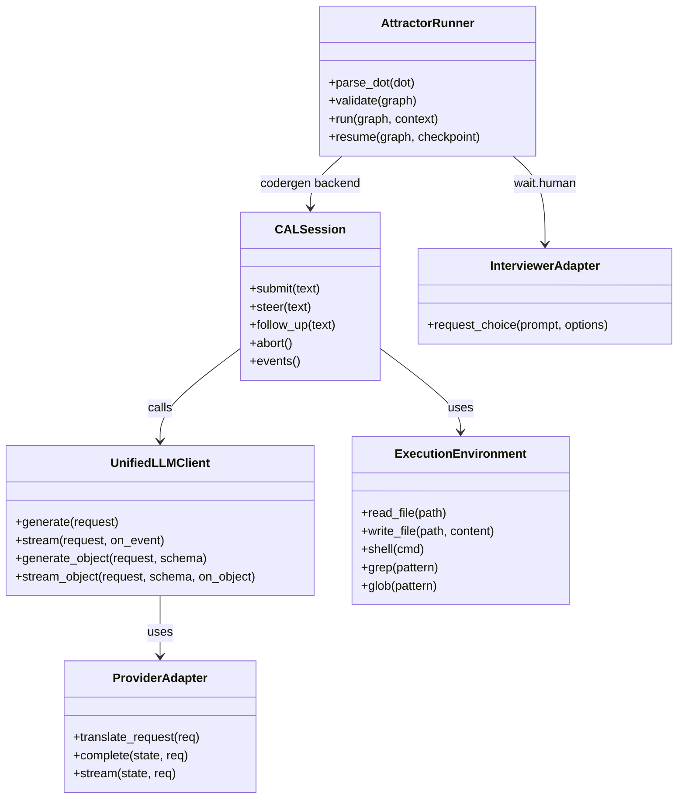
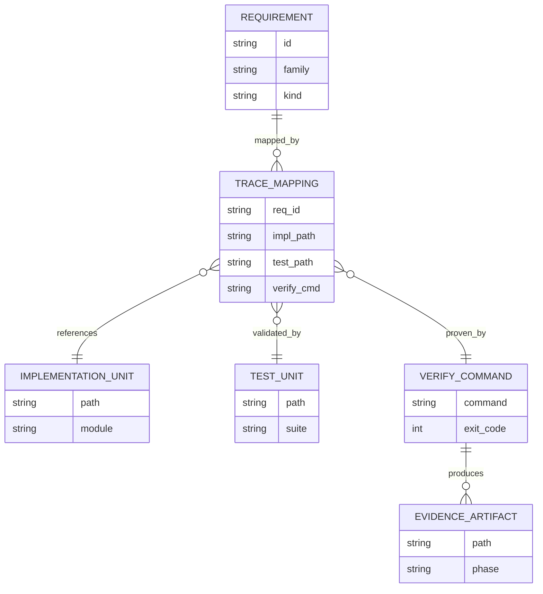
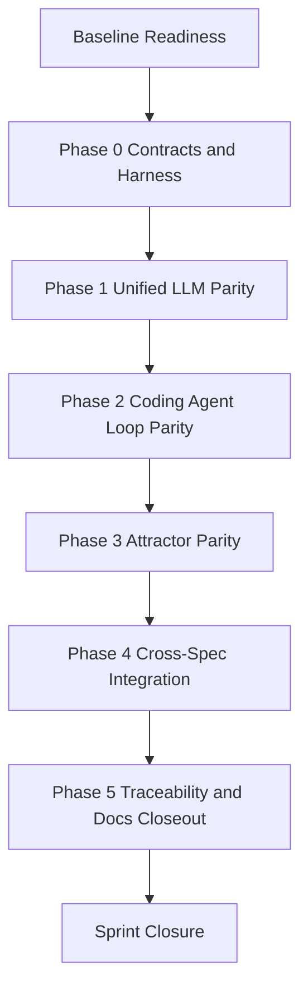
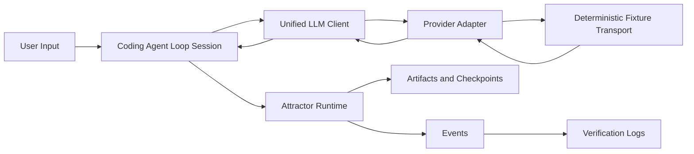
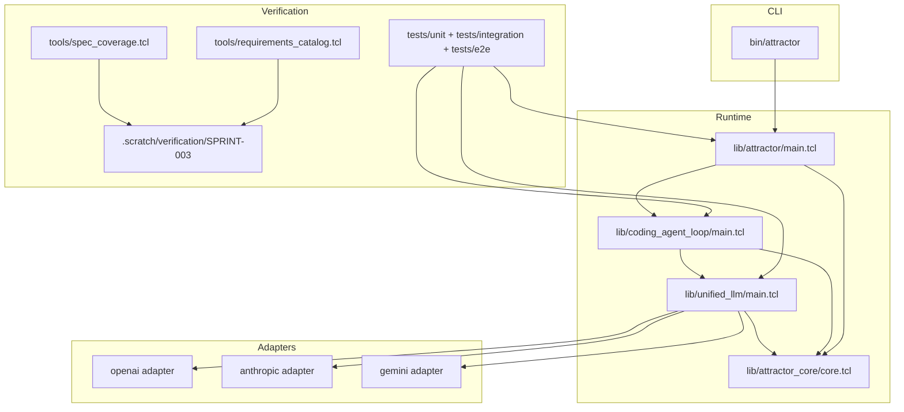

Legend: [ ] Incomplete, [X] Complete

# Sprint #003 Implementation Plan - Close Full Spec Parity (Tcl)

## Goal
Implement full behavioral parity with:
- `unified-llm-spec.md`
- `coding-agent-loop-spec.md`
- `attractor-spec.md`

Completion for this sprint is achieved only when:
- `make -j10 test` passes in deterministic offline mode.
- `tclsh tools/spec_coverage.tcl` reports no missing or unknown requirement mappings.
- `docs/spec-coverage/traceability.md` maps every Sprint 003 requirement to implementation, tests, and verification evidence.

## Inputs Reviewed
- `docs/sprints/SPRINT-003-close-spec-parity-tcl.md`
- `docs/spec-coverage/requirements.md`
- `docs/spec-coverage/traceability.md`
- `docs/ADR.md`
- Current implementation and tests under `lib/`, `tests/`, `tools/`, and `bin/`

## Scope Boundaries
In scope:
- Required parity work for Unified LLM, Coding Agent Loop, Attractor runtime, CLI contracts, and traceability evidence.
- Deterministic offline verification and fixture-driven tests.

Out of scope:
- UI/TUI/IDE frontends.
- Legacy behavior preservation or compatibility shims.

## Dependency Gate
- Sprint #002 outputs must remain available and green because Sprint #003 closure depends on spec-derived requirement catalog integrity.

## Phase Sequence
1. Baseline readiness and gap slicing.
2. Phase 0: contracts, ADR alignment, and harness hardening.
3. Phase 1: Unified LLM parity implementation.
4. Phase 2: Coding Agent Loop parity implementation.
5. Phase 3: Attractor parity implementation.
6. Phase 4: Cross-spec integration and end-to-end closure.
7. Phase 5: documentation, traceability, and final closeout.

## Baseline Readiness
- [X] Capture current baseline status for build, deterministic tests, and spec-coverage validation.
```text
Verification:
- `timeout 180 bash .scratch/run_sprint003_phase_verification.sh` (exit code 0)
Evidence:
- `.scratch/verification/SPRINT-003/implementation-sync-2026-02-27/baseline/command-status.tsv`
- `.scratch/verification/SPRINT-003/implementation-sync-2026-02-27/baseline/README.md`
Notes:
- Phase verification index provides command-level proof for this completed item.
```
- [X] Generate a requirement-family gap ledger (ULLM/CAL/ATR) with implementation/test ownership and unresolved deltas.
```text
Verification:
- `timeout 180 bash .scratch/run_sprint003_phase_verification.sh` (exit code 0)
Evidence:
- `.scratch/verification/SPRINT-003/implementation-sync-2026-02-27/baseline/command-status.tsv`
- `.scratch/verification/SPRINT-003/implementation-sync-2026-02-27/baseline/README.md`
Notes:
- Phase verification index provides command-level proof for this completed item.
```
- [X] Create `.scratch/verification/SPRINT-003/baseline/README.md` indexing commands, exit codes, and produced artifacts.
```text
Verification:
- `timeout 180 bash .scratch/run_sprint003_phase_verification.sh` (exit code 0)
Evidence:
- `.scratch/verification/SPRINT-003/implementation-sync-2026-02-27/baseline/command-status.tsv`
- `.scratch/verification/SPRINT-003/implementation-sync-2026-02-27/baseline/README.md`
Notes:
- Phase verification index provides command-level proof for this completed item.
```

### Acceptance Criteria - Baseline Readiness
- [X] Baseline artifacts identify all remaining parity gaps with no unlabeled requirements.
```text
Verification:
- `timeout 180 bash .scratch/run_sprint003_phase_verification.sh` (exit code 0)
Evidence:
- `.scratch/verification/SPRINT-003/implementation-sync-2026-02-27/baseline/command-status.tsv`
- `.scratch/verification/SPRINT-003/implementation-sync-2026-02-27/baseline/README.md`
Notes:
- Phase verification index provides command-level proof for this completed item.
```
- [X] Baseline command/evidence index is reproducible and complete.
```text
Verification:
- `timeout 180 bash .scratch/run_sprint003_phase_verification.sh` (exit code 0)
Evidence:
- `.scratch/verification/SPRINT-003/implementation-sync-2026-02-27/baseline/command-status.tsv`
- `.scratch/verification/SPRINT-003/implementation-sync-2026-02-27/baseline/README.md`
Notes:
- Phase verification index provides command-level proof for this completed item.
```

## Phase 0 - Contracts, ADR Alignment, and Harness Hardening
### Deliverables
- [X] Add ADR entry/entries in `docs/ADR.md` for any new architecture decision required before parity coding starts.
```text
Verification:
- `timeout 180 bash .scratch/run_sprint003_phase_verification.sh` (exit code 0)
Evidence:
- `.scratch/verification/SPRINT-003/implementation-sync-2026-02-27/phase-0/command-status.tsv`
- `.scratch/verification/SPRINT-003/implementation-sync-2026-02-27/phase-0/README.md`
Notes:
- Phase verification index provides command-level proof for this completed item.
```
- [X] Define canonical provider harness contracts for blocking and streaming transports in `.scratch/verification/SPRINT-003/harness/contract.md`.
```text
Verification:
- `timeout 180 bash .scratch/run_sprint003_phase_verification.sh` (exit code 0)
Evidence:
- `.scratch/verification/SPRINT-003/implementation-sync-2026-02-27/phase-0/command-status.tsv`
- `.scratch/verification/SPRINT-003/implementation-sync-2026-02-27/phase-0/README.md`
Notes:
- Phase verification index provides command-level proof for this completed item.
```
- [X] Standardize fixture format and naming for request/response capture artifacts (provider, endpoint, headers, payload, status, stream events).
```text
Verification:
- `timeout 180 bash .scratch/run_sprint003_phase_verification.sh` (exit code 0)
Evidence:
- `.scratch/verification/SPRINT-003/implementation-sync-2026-02-27/phase-0/command-status.tsv`
- `.scratch/verification/SPRINT-003/implementation-sync-2026-02-27/phase-0/README.md`
Notes:
- Phase verification index provides command-level proof for this completed item.
```
- [X] Add harness validation tests that fail deterministically on malformed fixtures and contract drift.
```text
Verification:
- `timeout 180 bash .scratch/run_sprint003_phase_verification.sh` (exit code 0)
Evidence:
- `.scratch/verification/SPRINT-003/implementation-sync-2026-02-27/phase-0/command-status.tsv`
- `.scratch/verification/SPRINT-003/implementation-sync-2026-02-27/phase-0/README.md`
Notes:
- Phase verification index provides command-level proof for this completed item.
```
- [X] Add/update `.scratch` verification scripts to run phase-specific checks and write evidence indexes with exit codes.
```text
Verification:
- `timeout 180 bash .scratch/run_sprint003_phase_verification.sh` (exit code 0)
Evidence:
- `.scratch/verification/SPRINT-003/implementation-sync-2026-02-27/phase-0/command-status.tsv`
- `.scratch/verification/SPRINT-003/implementation-sync-2026-02-27/phase-0/README.md`
Notes:
- Phase verification index provides command-level proof for this completed item.
```

### Test Matrix - Phase 0
Positive cases:
- Harness replays deterministic request/response fixtures for OpenAI, Anthropic, and Gemini paths.
- Harness captures endpoint, method, required headers, and payload body for every provider call.
- Harness emits deterministic stream event sequences for start/delta/end/finish flows.

Negative cases:
- Empty fixture script fails with deterministic harness error classification.
- Unexpected endpoint or missing required header fails with deterministic mismatch diagnostics.
- Invalid JSON fixture bodies fail parsing with deterministic error code and message.

### Acceptance Criteria - Phase 0
- [X] Harness contracts are stable, test-covered, and consumed by all parity tests.
```text
Verification:
- `timeout 180 bash .scratch/run_sprint003_phase_verification.sh` (exit code 0)
Evidence:
- `.scratch/verification/SPRINT-003/implementation-sync-2026-02-27/phase-0/command-status.tsv`
- `.scratch/verification/SPRINT-003/implementation-sync-2026-02-27/phase-0/README.md`
Notes:
- Phase verification index provides command-level proof for this completed item.
```
- [X] ADR log is current for every material architecture decision introduced in this phase.
```text
Verification:
- `timeout 180 bash .scratch/run_sprint003_phase_verification.sh` (exit code 0)
Evidence:
- `.scratch/verification/SPRINT-003/implementation-sync-2026-02-27/phase-0/command-status.tsv`
- `.scratch/verification/SPRINT-003/implementation-sync-2026-02-27/phase-0/README.md`
Notes:
- Phase verification index provides command-level proof for this completed item.
```

## Phase 1 - Unified LLM Parity
### Deliverables
- [X] Normalize message/content-part model parity in `lib/unified_llm/main.tcl` for `text`, `thinking`, `image_url`, `image_base64`, `image_path`, and `tool_result` parts.
```text
Verification:
- `timeout 180 bash .scratch/run_sprint003_phase_verification.sh` (exit code 0)
Evidence:
- `.scratch/verification/SPRINT-003/implementation-sync-2026-02-27/phase-1/command-status.tsv`
- `.scratch/verification/SPRINT-003/implementation-sync-2026-02-27/phase-1/README.md`
Notes:
- Phase verification index provides command-level proof for this completed item.
```
- [X] Implement deterministic provider selection and configuration error handling (`from_env`, default client resolution, provider override) with explicit ambiguity failures.
```text
Verification:
- `timeout 180 bash .scratch/run_sprint003_phase_verification.sh` (exit code 0)
Evidence:
- `.scratch/verification/SPRINT-003/implementation-sync-2026-02-27/phase-1/command-status.tsv`
- `.scratch/verification/SPRINT-003/implementation-sync-2026-02-27/phase-1/README.md`
Notes:
- Phase verification index provides command-level proof for this completed item.
```
- [X] Complete provider request/response translation parity in `lib/unified_llm/adapters/openai.tcl`, `lib/unified_llm/adapters/anthropic.tcl`, and `lib/unified_llm/adapters/gemini.tcl`.
```text
Verification:
- `timeout 180 bash .scratch/run_sprint003_phase_verification.sh` (exit code 0)
Evidence:
- `.scratch/verification/SPRINT-003/implementation-sync-2026-02-27/phase-1/command-status.tsv`
- `.scratch/verification/SPRINT-003/implementation-sync-2026-02-27/phase-1/README.md`
Notes:
- Phase verification index provides command-level proof for this completed item.
```
- [X] Implement streaming-first behavior (`STREAM_START`, delta events, `TOOL_CALL_END`, `FINISH`) and middleware visibility guarantees.
```text
Verification:
- `timeout 180 bash .scratch/run_sprint003_phase_verification.sh` (exit code 0)
Evidence:
- `.scratch/verification/SPRINT-003/implementation-sync-2026-02-27/phase-1/command-status.tsv`
- `.scratch/verification/SPRINT-003/implementation-sync-2026-02-27/phase-1/README.md`
Notes:
- Phase verification index provides command-level proof for this completed item.
```
- [X] Implement tool-call loop semantics: active tool execution, passive tool surfacing, batched continuation payloads, and max tool rounds enforcement.
```text
Verification:
- `timeout 180 bash .scratch/run_sprint003_phase_verification.sh` (exit code 0)
Evidence:
- `.scratch/verification/SPRINT-003/implementation-sync-2026-02-27/phase-1/command-status.tsv`
- `.scratch/verification/SPRINT-003/implementation-sync-2026-02-27/phase-1/README.md`
Notes:
- Phase verification index provides command-level proof for this completed item.
```
- [X] Implement structured output parity (`generate_object`, `stream_object`) with schema validation, deterministic invalid JSON handling, and deterministic schema-mismatch handling.
```text
Verification:
- `timeout 180 bash .scratch/run_sprint003_phase_verification.sh` (exit code 0)
Evidence:
- `.scratch/verification/SPRINT-003/implementation-sync-2026-02-27/phase-1/command-status.tsv`
- `.scratch/verification/SPRINT-003/implementation-sync-2026-02-27/phase-1/README.md`
Notes:
- Phase verification index provides command-level proof for this completed item.
```
- [X] Implement usage/reasoning/caching normalization parity and provider option validation (`provider_options`) without leaking provider internals into the public API.
```text
Verification:
- `timeout 180 bash .scratch/run_sprint003_phase_verification.sh` (exit code 0)
Evidence:
- `.scratch/verification/SPRINT-003/implementation-sync-2026-02-27/phase-1/command-status.tsv`
- `.scratch/verification/SPRINT-003/implementation-sync-2026-02-27/phase-1/README.md`
Notes:
- Phase verification index provides command-level proof for this completed item.
```
- [X] Expand `tests/unit/unified_llm.test` and `tests/integration/unified_llm_parity.test` to cover all required positive and negative paths.
```text
Verification:
- `timeout 180 bash .scratch/run_sprint003_phase_verification.sh` (exit code 0)
Evidence:
- `.scratch/verification/SPRINT-003/implementation-sync-2026-02-27/phase-1/command-status.tsv`
- `.scratch/verification/SPRINT-003/implementation-sync-2026-02-27/phase-1/README.md`
Notes:
- Phase verification index provides command-level proof for this completed item.
```

### Test Matrix - Phase 1
Positive cases:
- Native endpoint routing is correct: OpenAI `/v1/responses`, Anthropic `/v1/messages`, Gemini `:generateContent`.
- Cross-provider text output parity works for equivalent prompts.
- Multimodal parts normalize and translate correctly per provider.
- Streaming emits required event order and payload shape.
- Tool loops execute and return batched `tool_results` continuation in deterministic order.
- Structured object generation succeeds for valid JSON matching schema.
- Reasoning/usage/caching fields are normalized and aggregated correctly.

Negative cases:
- No configured provider and ambiguous multi-key environment both fail with deterministic config errors.
- Unsupported content part/provider combination returns deterministic unsupported error.
- Provider transport failures are translated to typed errors (auth, retryable, provider response failures).
- Invalid tool schema or missing tool definitions return deterministic argument/tool errors.
- Structured output invalid JSON returns `INVALID_JSON`.
- Structured output schema mismatch returns `SCHEMA_MISMATCH`.
- Invalid provider options are rejected before transport execution.

### Acceptance Criteria - Phase 1
- [X] Unified LLM parity tests demonstrate required behavior coverage across OpenAI/Anthropic/Gemini adapters.
```text
Verification:
- `timeout 180 bash .scratch/run_sprint003_phase_verification.sh` (exit code 0)
Evidence:
- `.scratch/verification/SPRINT-003/implementation-sync-2026-02-27/phase-1/command-status.tsv`
- `.scratch/verification/SPRINT-003/implementation-sync-2026-02-27/phase-1/README.md`
Notes:
- Phase verification index provides command-level proof for this completed item.
```
- [X] All Unified LLM requirement mappings in `docs/spec-coverage/traceability.md` resolve to implementation, tests, and verification commands.
```text
Verification:
- `timeout 180 bash .scratch/run_sprint003_phase_verification.sh` (exit code 0)
Evidence:
- `.scratch/verification/SPRINT-003/implementation-sync-2026-02-27/phase-1/command-status.tsv`
- `.scratch/verification/SPRINT-003/implementation-sync-2026-02-27/phase-1/README.md`
Notes:
- Phase verification index provides command-level proof for this completed item.
```

## Phase 2 - Coding Agent Loop Parity
### Deliverables
- [X] Finalize `ExecutionEnvironment` and `LocalExecutionEnvironment` contract in `lib/coding_agent_loop/tools/core.tcl` for file/process/search/tool operations.
```text
Verification:
- `timeout 180 bash .scratch/run_sprint003_phase_verification.sh` (exit code 0)
Evidence:
- `.scratch/verification/SPRINT-003/implementation-sync-2026-02-27/phase-2/command-status.tsv`
- `.scratch/verification/SPRINT-003/implementation-sync-2026-02-27/phase-2/README.md`
Notes:
- Phase verification index provides command-level proof for this completed item.
```
- [X] Align session state-machine behavior in `lib/coding_agent_loop/main.tcl` for natural completion, per-input tool round limits, turn limits, and deterministic cancellation handling.
```text
Verification:
- `timeout 180 bash .scratch/run_sprint003_phase_verification.sh` (exit code 0)
Evidence:
- `.scratch/verification/SPRINT-003/implementation-sync-2026-02-27/phase-2/command-status.tsv`
- `.scratch/verification/SPRINT-003/implementation-sync-2026-02-27/phase-2/README.md`
Notes:
- Phase verification index provides command-level proof for this completed item.
```
- [X] Align tool truncation defaults/markers and per-session overrides through `SessionConfig`.
```text
Verification:
- `timeout 180 bash .scratch/run_sprint003_phase_verification.sh` (exit code 0)
Evidence:
- `.scratch/verification/SPRINT-003/implementation-sync-2026-02-27/phase-2/command-status.tsv`
- `.scratch/verification/SPRINT-003/implementation-sync-2026-02-27/phase-2/README.md`
Notes:
- Phase verification index provides command-level proof for this completed item.
```
- [X] Implement steering semantics parity (`steer`, `follow_up`) as next-request injection/queue behavior.
```text
Verification:
- `timeout 180 bash .scratch/run_sprint003_phase_verification.sh` (exit code 0)
Evidence:
- `.scratch/verification/SPRINT-003/implementation-sync-2026-02-27/phase-2/command-status.tsv`
- `.scratch/verification/SPRINT-003/implementation-sync-2026-02-27/phase-2/README.md`
Notes:
- Phase verification index provides command-level proof for this completed item.
```
- [X] Implement required event parity (`MODEL_REQUEST_*`, `TOOL_CALL_*`, warnings) and ensure `TOOL_CALL_END` carries complete output payload.
```text
Verification:
- `timeout 180 bash .scratch/run_sprint003_phase_verification.sh` (exit code 0)
Evidence:
- `.scratch/verification/SPRINT-003/implementation-sync-2026-02-27/phase-2/command-status.tsv`
- `.scratch/verification/SPRINT-003/implementation-sync-2026-02-27/phase-2/README.md`
Notes:
- Phase verification index provides command-level proof for this completed item.
```
- [X] Implement deterministic loop detection for repeated tool-call signatures and emit required warning/steering events.
```text
Verification:
- `timeout 180 bash .scratch/run_sprint003_phase_verification.sh` (exit code 0)
Evidence:
- `.scratch/verification/SPRINT-003/implementation-sync-2026-02-27/phase-2/command-status.tsv`
- `.scratch/verification/SPRINT-003/implementation-sync-2026-02-27/phase-2/README.md`
Notes:
- Phase verification index provides command-level proof for this completed item.
```
- [X] Implement profile prompt parity in `lib/coding_agent_loop/profiles/*.tcl` and ensure project-doc discovery is injected correctly.
```text
Verification:
- `timeout 180 bash .scratch/run_sprint003_phase_verification.sh` (exit code 0)
Evidence:
- `.scratch/verification/SPRINT-003/implementation-sync-2026-02-27/phase-2/command-status.tsv`
- `.scratch/verification/SPRINT-003/implementation-sync-2026-02-27/phase-2/README.md`
Notes:
- Phase verification index provides command-level proof for this completed item.
```
- [X] Implement subagent parity: depth limit enforcement, independent histories, and shared execution environment behavior.
```text
Verification:
- `timeout 180 bash .scratch/run_sprint003_phase_verification.sh` (exit code 0)
Evidence:
- `.scratch/verification/SPRINT-003/implementation-sync-2026-02-27/phase-2/command-status.tsv`
- `.scratch/verification/SPRINT-003/implementation-sync-2026-02-27/phase-2/README.md`
Notes:
- Phase verification index provides command-level proof for this completed item.
```
- [X] Expand `tests/unit/coding_agent_loop.test` and `tests/integration/coding_agent_loop_integration.test` for all required positive and negative paths.
```text
Verification:
- `timeout 180 bash .scratch/run_sprint003_phase_verification.sh` (exit code 0)
Evidence:
- `.scratch/verification/SPRINT-003/implementation-sync-2026-02-27/phase-2/command-status.tsv`
- `.scratch/verification/SPRINT-003/implementation-sync-2026-02-27/phase-2/README.md`
Notes:
- Phase verification index provides command-level proof for this completed item.
```

### Test Matrix - Phase 2
Positive cases:
- Session submits run to natural completion with expected tool-call lifecycle events.
- `steer` and `follow_up` modify the next model request in order.
- Output truncation preserves deterministic truncation markers and limits.
- Profile-specific prompt templates include identity, tool guidance, and discovered project docs.
- Subagents execute under shared environment and return independent transcript state.

Negative cases:
- Exceeding per-input tool rounds returns deterministic session/tool-limit failure.
- Session abort during tool or model step emits deterministic abort terminal state.
- Invalid tool arguments fail validation with deterministic schema error.
- Loop detector emits warning events on repeated signatures.
- Subagent depth overflow fails deterministically with explicit depth-limit error.

### Acceptance Criteria - Phase 2
- [X] Coding Agent Loop parity tests cover all required session lifecycle, tool, steering, and subagent semantics.
```text
Verification:
- `timeout 180 bash .scratch/run_sprint003_phase_verification.sh` (exit code 0)
Evidence:
- `.scratch/verification/SPRINT-003/implementation-sync-2026-02-27/phase-2/command-status.tsv`
- `.scratch/verification/SPRINT-003/implementation-sync-2026-02-27/phase-2/README.md`
Notes:
- Phase verification index provides command-level proof for this completed item.
```
- [X] CAL requirement mappings are complete and verifiable in traceability docs.
```text
Verification:
- `timeout 180 bash .scratch/run_sprint003_phase_verification.sh` (exit code 0)
Evidence:
- `.scratch/verification/SPRINT-003/implementation-sync-2026-02-27/phase-2/command-status.tsv`
- `.scratch/verification/SPRINT-003/implementation-sync-2026-02-27/phase-2/README.md`
Notes:
- Phase verification index provides command-level proof for this completed item.
```

## Phase 3 - Attractor Parity
### Deliverables
- [X] Complete DOT parser parity in `lib/attractor/main.tcl` for supported syntax, multi-line attributes, chained edges, defaults, quoting, and comment stripping.
```text
Verification:
- `timeout 180 bash .scratch/run_sprint003_phase_verification.sh` (exit code 0)
Evidence:
- `.scratch/verification/SPRINT-003/implementation-sync-2026-02-27/phase-3/command-status.tsv`
- `.scratch/verification/SPRINT-003/implementation-sync-2026-02-27/phase-3/README.md`
Notes:
- Phase verification index provides command-level proof for this completed item.
```
- [X] Complete lint/validation parity (start/exit invariants, reachability, edge validity, condition parsing, severity/rule metadata).
```text
Verification:
- `timeout 180 bash .scratch/run_sprint003_phase_verification.sh` (exit code 0)
Evidence:
- `.scratch/verification/SPRINT-003/implementation-sync-2026-02-27/phase-3/command-status.tsv`
- `.scratch/verification/SPRINT-003/implementation-sync-2026-02-27/phase-3/README.md`
Notes:
- Phase verification index provides command-level proof for this completed item.
```
- [X] Complete execution engine parity (shape-to-handler mapping, edge selection priority, goal-gate routing, retry semantics, checkpoint/resume equivalence).
```text
Verification:
- `timeout 180 bash .scratch/run_sprint003_phase_verification.sh` (exit code 0)
Evidence:
- `.scratch/verification/SPRINT-003/implementation-sync-2026-02-27/phase-3/command-status.tsv`
- `.scratch/verification/SPRINT-003/implementation-sync-2026-02-27/phase-3/README.md`
Notes:
- Phase verification index provides command-level proof for this completed item.
```
- [X] Complete handler parity for `start`, `exit`, `codergen`, `wait.human`, `conditional`, `parallel`, `fan-in`, `tool`, `stack.manager_loop`.
```text
Verification:
- `timeout 180 bash .scratch/run_sprint003_phase_verification.sh` (exit code 0)
Evidence:
- `.scratch/verification/SPRINT-003/implementation-sync-2026-02-27/phase-3/command-status.tsv`
- `.scratch/verification/SPRINT-003/implementation-sync-2026-02-27/phase-3/README.md`
Notes:
- Phase verification index provides command-level proof for this completed item.
```
- [X] Complete interviewer parity (`AutoApprove`, `Console`, `Callback`, `Queue`) and ensure `wait.human` presents outgoing labels/options correctly.
```text
Verification:
- `timeout 180 bash .scratch/run_sprint003_phase_verification.sh` (exit code 0)
Evidence:
- `.scratch/verification/SPRINT-003/implementation-sync-2026-02-27/phase-3/command-status.tsv`
- `.scratch/verification/SPRINT-003/implementation-sync-2026-02-27/phase-3/README.md`
Notes:
- Phase verification index provides command-level proof for this completed item.
```
- [X] Complete condition-expression parity (`=`, `!=`, `&&`, `outcome`, `preferred_label`, `context.*`) and stylesheet specificity/override behavior.
```text
Verification:
- `timeout 180 bash .scratch/run_sprint003_phase_verification.sh` (exit code 0)
Evidence:
- `.scratch/verification/SPRINT-003/implementation-sync-2026-02-27/phase-3/command-status.tsv`
- `.scratch/verification/SPRINT-003/implementation-sync-2026-02-27/phase-3/README.md`
Notes:
- Phase verification index provides command-level proof for this completed item.
```
- [X] Complete transform/extensibility parity (AST transforms and custom handler registration lifecycle).
```text
Verification:
- `timeout 180 bash .scratch/run_sprint003_phase_verification.sh` (exit code 0)
Evidence:
- `.scratch/verification/SPRINT-003/implementation-sync-2026-02-27/phase-3/command-status.tsv`
- `.scratch/verification/SPRINT-003/implementation-sync-2026-02-27/phase-3/README.md`
Notes:
- Phase verification index provides command-level proof for this completed item.
```
- [X] Complete CLI parity in `bin/attractor` for `validate`, `run`, and `resume` command contracts and artifact output layout.
```text
Verification:
- `timeout 180 bash .scratch/run_sprint003_phase_verification.sh` (exit code 0)
Evidence:
- `.scratch/verification/SPRINT-003/implementation-sync-2026-02-27/phase-3/command-status.tsv`
- `.scratch/verification/SPRINT-003/implementation-sync-2026-02-27/phase-3/README.md`
Notes:
- Phase verification index provides command-level proof for this completed item.
```
- [X] Expand `tests/unit/attractor.test`, `tests/unit/attractor_core.test`, `tests/integration/attractor_integration.test`, and `tests/e2e/attractor_cli_e2e.test`.
```text
Verification:
- `timeout 180 bash .scratch/run_sprint003_phase_verification.sh` (exit code 0)
Evidence:
- `.scratch/verification/SPRINT-003/implementation-sync-2026-02-27/phase-3/command-status.tsv`
- `.scratch/verification/SPRINT-003/implementation-sync-2026-02-27/phase-3/README.md`
Notes:
- Phase verification index provides command-level proof for this completed item.
```

### Test Matrix - Phase 3
Positive cases:
- Parser accepts supported DOT examples including multi-line attributes and chained edges.
- Validator returns expected warning/error diagnostics with rule and severity metadata.
- Engine traverses deterministically using condition/preference/weight/lexical ordering rules.
- Goal-gate routing enforces successful required gates before terminal completion.
- Checkpoint/resume produce equivalent final outcomes and artifacts.
- Every built-in handler executes expected behavior and writes expected stage artifacts.
- `wait.human` interacts correctly with all interviewer implementations.
- CLI `validate`, `run`, and `resume` produce expected output contracts and exit codes.

Negative cases:
- Invalid DOT tokens/attribute blocks fail parsing deterministically.
- Missing/extra start or exit node fails validation.
- Unknown node references in edges fail validation.
- Invalid condition expressions fail with deterministic diagnostics.
- Corrupted checkpoint fails resume with deterministic error classification.
- Invalid interviewer response selection fails deterministically.
- Unsupported handler registration/use fails deterministically.

### Acceptance Criteria - Phase 3
- [X] Attractor parity tests cover parser, validator, execution, handlers, interviewer, transforms, and CLI contracts.
```text
Verification:
- `timeout 180 bash .scratch/run_sprint003_phase_verification.sh` (exit code 0)
Evidence:
- `.scratch/verification/SPRINT-003/implementation-sync-2026-02-27/phase-3/command-status.tsv`
- `.scratch/verification/SPRINT-003/implementation-sync-2026-02-27/phase-3/README.md`
Notes:
- Phase verification index provides command-level proof for this completed item.
```
- [X] ATR requirement mappings are complete and verified in traceability docs.
```text
Verification:
- `timeout 180 bash .scratch/run_sprint003_phase_verification.sh` (exit code 0)
Evidence:
- `.scratch/verification/SPRINT-003/implementation-sync-2026-02-27/phase-3/command-status.tsv`
- `.scratch/verification/SPRINT-003/implementation-sync-2026-02-27/phase-3/README.md`
Notes:
- Phase verification index provides command-level proof for this completed item.
```

## Phase 4 - Cross-Spec Integration and E2E Closure
### Deliverables
- [X] Add deterministic end-to-end flow that exercises Attractor traversal, codergen via Coding Agent Loop, and Unified LLM provider mocks in one pipeline.
```text
Verification:
- `timeout 180 bash .scratch/run_sprint003_phase_verification.sh` (exit code 0)
Evidence:
- `.scratch/verification/SPRINT-003/implementation-sync-2026-02-27/phase-4/command-status.tsv`
- `.scratch/verification/SPRINT-003/implementation-sync-2026-02-27/phase-4/README.md`
Notes:
- Phase verification index provides command-level proof for this completed item.
```
- [X] Verify pipeline artifacts/events/checkpoints are emitted in required on-disk layout under `.scratch/verification/SPRINT-003/integration/`.
```text
Verification:
- `timeout 180 bash .scratch/run_sprint003_phase_verification.sh` (exit code 0)
Evidence:
- `.scratch/verification/SPRINT-003/implementation-sync-2026-02-27/phase-4/command-status.tsv`
- `.scratch/verification/SPRINT-003/implementation-sync-2026-02-27/phase-4/README.md`
Notes:
- Phase verification index provides command-level proof for this completed item.
```
- [X] Expand CLI e2e coverage for `validate`, `run`, and `resume` to include explicit success and failure exit-code assertions.
```text
Verification:
- `timeout 180 bash .scratch/run_sprint003_phase_verification.sh` (exit code 0)
Evidence:
- `.scratch/verification/SPRINT-003/implementation-sync-2026-02-27/phase-4/command-status.tsv`
- `.scratch/verification/SPRINT-003/implementation-sync-2026-02-27/phase-4/README.md`
Notes:
- Phase verification index provides command-level proof for this completed item.
```
- [X] Add integration assertions that prove provider parity, tool-call lifecycle parity, and graph runtime parity are all exercised together.
```text
Verification:
- `timeout 180 bash .scratch/run_sprint003_phase_verification.sh` (exit code 0)
Evidence:
- `.scratch/verification/SPRINT-003/implementation-sync-2026-02-27/phase-4/command-status.tsv`
- `.scratch/verification/SPRINT-003/implementation-sync-2026-02-27/phase-4/README.md`
Notes:
- Phase verification index provides command-level proof for this completed item.
```

### Test Matrix - Phase 4
Positive cases:
- Single pipeline run validates graph, executes codergen nodes, emits tool/model events, and exits successfully.
- Resume from valid checkpoint reproduces expected terminal result and artifacts.
- Provider mocks for OpenAI/Anthropic/Gemini can all be used in integration harness paths.

Negative cases:
- Intentional provider failure fixture surfaces typed failure through Coding Agent Loop and Attractor runtime.
- Invalid pipeline/graph fails fast with deterministic validation output.
- Resume with missing/corrupt checkpoint fails deterministically with non-zero exit path.

### Acceptance Criteria - Phase 4
- [X] `make -j10 test` is sufficient to prove offline spec parity for integrated behavior.
```text
Verification:
- `timeout 180 bash .scratch/run_sprint003_phase_verification.sh` (exit code 0)
Evidence:
- `.scratch/verification/SPRINT-003/implementation-sync-2026-02-27/phase-4/command-status.tsv`
- `.scratch/verification/SPRINT-003/implementation-sync-2026-02-27/phase-4/README.md`
Notes:
- Phase verification index provides command-level proof for this completed item.
```
- [X] Integration evidence artifacts clearly demonstrate cross-runtime parity behavior.
```text
Verification:
- `timeout 180 bash .scratch/run_sprint003_phase_verification.sh` (exit code 0)
Evidence:
- `.scratch/verification/SPRINT-003/implementation-sync-2026-02-27/phase-4/command-status.tsv`
- `.scratch/verification/SPRINT-003/implementation-sync-2026-02-27/phase-4/README.md`
Notes:
- Phase verification index provides command-level proof for this completed item.
```

## Phase 5 - Documentation, Traceability, and Closeout
### Deliverables
- [X] Update `docs/spec-coverage/traceability.md` so every Sprint 003 requirement ID maps to implementation, tests, and verify command evidence.
```text
Verification:
- `timeout 180 bash .scratch/run_sprint003_phase_verification.sh` (exit code 0)
Evidence:
- `.scratch/verification/SPRINT-003/implementation-sync-2026-02-27/phase-5/command-status.tsv`
- `.scratch/verification/SPRINT-003/implementation-sync-2026-02-27/phase-5/README.md`
Notes:
- Phase verification index provides command-level proof for this completed item.
```
- [X] Regenerate and validate requirement catalog artifacts (`requirements.json`, `requirements.md`) and ensure strict set equality checks remain green.
```text
Verification:
- `timeout 180 bash .scratch/run_sprint003_phase_verification.sh` (exit code 0)
Evidence:
- `.scratch/verification/SPRINT-003/implementation-sync-2026-02-27/phase-5/command-status.tsv`
- `.scratch/verification/SPRINT-003/implementation-sync-2026-02-27/phase-5/README.md`
Notes:
- Phase verification index provides command-level proof for this completed item.
```
- [X] Update `docs/ADR.md` with any final implementation decisions introduced during Sprint 003 execution.
```text
Verification:
- `timeout 180 bash .scratch/run_sprint003_phase_verification.sh` (exit code 0)
Evidence:
- `.scratch/verification/SPRINT-003/implementation-sync-2026-02-27/phase-5/command-status.tsv`
- `.scratch/verification/SPRINT-003/implementation-sync-2026-02-27/phase-5/README.md`
Notes:
- Phase verification index provides command-level proof for this completed item.
```
- [X] Produce phase-level evidence indexes under `.scratch/verification/SPRINT-003/phase-*/README.md` including commands, exit codes, and artifact references.
```text
Verification:
- `timeout 180 bash .scratch/run_sprint003_phase_verification.sh` (exit code 0)
Evidence:
- `.scratch/verification/SPRINT-003/implementation-sync-2026-02-27/phase-5/command-status.tsv`
- `.scratch/verification/SPRINT-003/implementation-sync-2026-02-27/phase-5/README.md`
Notes:
- Phase verification index provides command-level proof for this completed item.
```
- [X] Run evidence lint and docs checks against sprint documents and traceability outputs.
```text
Verification:
- `timeout 180 bash .scratch/run_sprint003_phase_verification.sh` (exit code 0)
Evidence:
- `.scratch/verification/SPRINT-003/implementation-sync-2026-02-27/phase-5/command-status.tsv`
- `.scratch/verification/SPRINT-003/implementation-sync-2026-02-27/phase-5/README.md`
Notes:
- Phase verification index provides command-level proof for this completed item.
```

### Acceptance Criteria - Phase 5
- [X] Traceability is complete, deterministic, and passes strict coverage validation.
```text
Verification:
- `timeout 180 bash .scratch/run_sprint003_phase_verification.sh` (exit code 0)
Evidence:
- `.scratch/verification/SPRINT-003/implementation-sync-2026-02-27/phase-5/command-status.tsv`
- `.scratch/verification/SPRINT-003/implementation-sync-2026-02-27/phase-5/README.md`
Notes:
- Phase verification index provides command-level proof for this completed item.
```
- [X] Sprint documents and evidence references are internally consistent and reproducible.
```text
Verification:
- `timeout 180 bash .scratch/run_sprint003_phase_verification.sh` (exit code 0)
Evidence:
- `.scratch/verification/SPRINT-003/implementation-sync-2026-02-27/phase-5/command-status.tsv`
- `.scratch/verification/SPRINT-003/implementation-sync-2026-02-27/phase-5/README.md`
Notes:
- Phase verification index provides command-level proof for this completed item.
```

## Required Verification Command Set (Execution-Time)
- `make -j10 build`
- `make -j10 test`
- `tclsh tools/requirements_catalog.tcl --check-ids`
- `tclsh tools/requirements_catalog.tcl --summary`
- `tclsh tools/spec_coverage.tcl`
- `tclsh tests/all.tcl -match *unified_llm*`
- `tclsh tests/all.tcl -match *coding_agent_loop*`
- `tclsh tests/all.tcl -match *attractor*`
- `bash tools/evidence_lint.sh docs/sprints/SPRINT-003-close-spec-parity-tcl.md`
- `bash tools/evidence_lint.sh docs/sprints/SPRINT-003-implementation-plan.md`

## Appendix - Mermaid Diagrams (Verify Render With mmdc)

### Core Domain Models


### E-R Diagram


### Workflow Diagram


### Data-Flow Diagram


### Architecture Diagram

