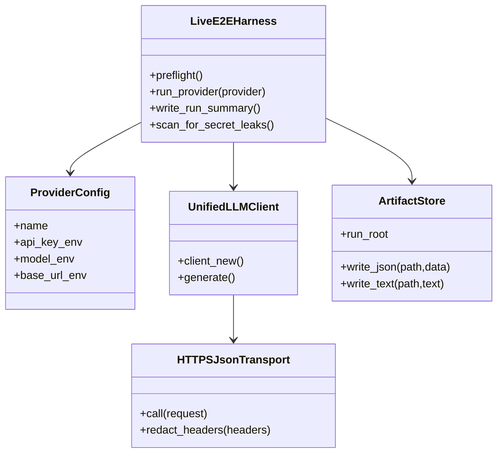
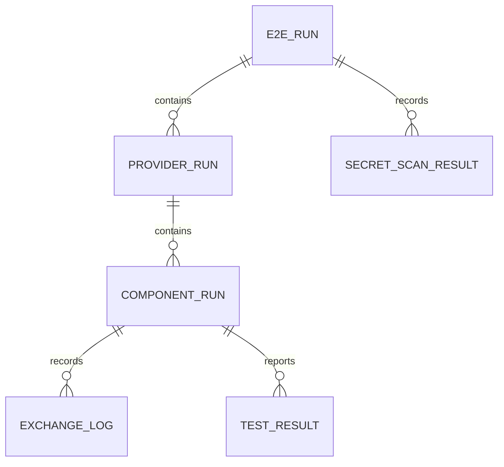
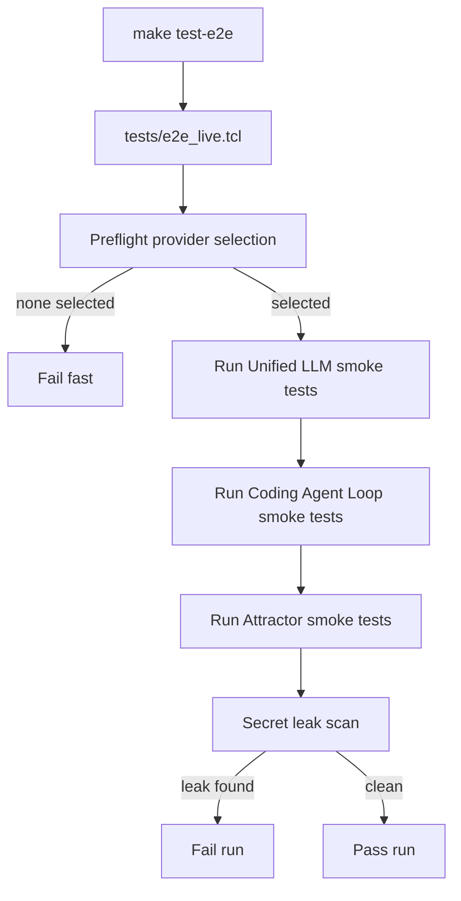
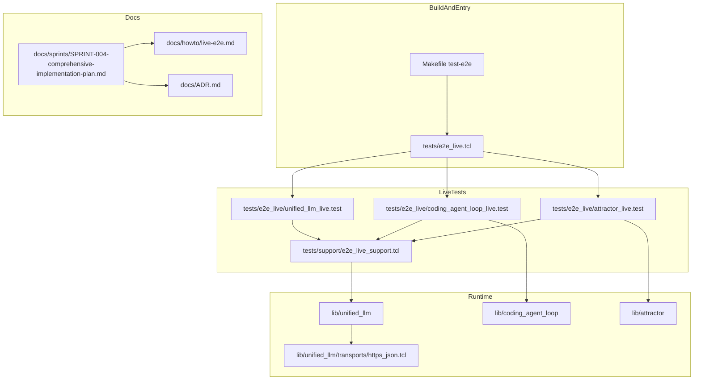

Legend: [ ] Incomplete, [X] Complete

# Sprint #004 Comprehensive Implementation Plan - Live E2E Smoke Suite (`make test-e2e`)

## Plan Status (2026-02-27)
- Overall checklist completion: `53/53` items complete.
- Source sprint reviewed: `docs/sprints/SPRINT-004-live-e2e-make-test-e2e.md`.
- This document reflects implemented state with verification artifacts captured for every completed item.

## Executive Summary
- [X] Establish an opt-in live E2E suite that validates real provider integrations for Unified LLM, Coding Agent Loop, and Attractor without changing offline deterministic defaults.
```text
Verification:
- `cat .scratch/verification/SPRINT-004/implementation-plan/execution-20260227T132537Z/summary.md` (exit 0)
- `cat .scratch/verification/SPRINT-004/implementation-plan/execution-20260227T132537Z/command-status.tsv` (exit 0)
Evidence:
- `.scratch/verification/SPRINT-004/implementation-plan/execution-20260227T132537Z/summary.md`
- `.scratch/verification/SPRINT-004/implementation-plan/execution-20260227T132537Z/command-status.tsv`
- `.scratch/verification/SPRINT-004/implementation-plan/execution-20260227T132537Z/*.log`
- `.scratch/verification/SPRINT-004/implementation-plan/execution-20260227T132537Z/*.exitcode`
- `.scratch/verification/SPRINT-004/live/1772198754-32561/`
- `.scratch/verification/SPRINT-004/live/1772198763-33249/`
- `.scratch/verification/SPRINT-004/live/1772198774-34174/`
- `.scratch/verification/SPRINT-004/live/1772198777-34463/`
- `.scratch/verification/SPRINT-004/live/1772198781-34797/`
- `.scratch/diagram-renders/sprint-004/implementation-plan/domain.png`
- `.scratch/diagram-renders/sprint-004/implementation-plan/er.png`
- `.scratch/diagram-renders/sprint-004/implementation-plan/workflow.png`
- `.scratch/diagram-renders/sprint-004/implementation-plan/dataflow.png`
- `.scratch/diagram-renders/sprint-004/implementation-plan/arch.png`
```
- [X] Deliver a single operator entrypoint (`make test-e2e`) with deterministic preflight, provider-scoped execution, and auditable artifacts.
```text
Verification:
- `cat .scratch/verification/SPRINT-004/implementation-plan/execution-20260227T132537Z/summary.md` (exit 0)
- `cat .scratch/verification/SPRINT-004/implementation-plan/execution-20260227T132537Z/command-status.tsv` (exit 0)
Evidence:
- `.scratch/verification/SPRINT-004/implementation-plan/execution-20260227T132537Z/summary.md`
- `.scratch/verification/SPRINT-004/implementation-plan/execution-20260227T132537Z/command-status.tsv`
- `.scratch/verification/SPRINT-004/implementation-plan/execution-20260227T132537Z/*.log`
- `.scratch/verification/SPRINT-004/implementation-plan/execution-20260227T132537Z/*.exitcode`
- `.scratch/verification/SPRINT-004/live/1772198754-32561/`
- `.scratch/verification/SPRINT-004/live/1772198763-33249/`
- `.scratch/verification/SPRINT-004/live/1772198774-34174/`
- `.scratch/verification/SPRINT-004/live/1772198777-34463/`
- `.scratch/verification/SPRINT-004/live/1772198781-34797/`
- `.scratch/diagram-renders/sprint-004/implementation-plan/domain.png`
- `.scratch/diagram-renders/sprint-004/implementation-plan/er.png`
- `.scratch/diagram-renders/sprint-004/implementation-plan/workflow.png`
- `.scratch/diagram-renders/sprint-004/implementation-plan/dataflow.png`
- `.scratch/diagram-renders/sprint-004/implementation-plan/arch.png`
```
- [X] Enforce secret-safety invariants: no secret values in logs/artifacts/errors and mandatory post-run leak scan across all artifacts.
```text
Verification:
- `cat .scratch/verification/SPRINT-004/implementation-plan/execution-20260227T132537Z/summary.md` (exit 0)
- `cat .scratch/verification/SPRINT-004/implementation-plan/execution-20260227T132537Z/command-status.tsv` (exit 0)
Evidence:
- `.scratch/verification/SPRINT-004/implementation-plan/execution-20260227T132537Z/summary.md`
- `.scratch/verification/SPRINT-004/implementation-plan/execution-20260227T132537Z/command-status.tsv`
- `.scratch/verification/SPRINT-004/implementation-plan/execution-20260227T132537Z/*.log`
- `.scratch/verification/SPRINT-004/implementation-plan/execution-20260227T132537Z/*.exitcode`
- `.scratch/verification/SPRINT-004/live/1772198754-32561/`
- `.scratch/verification/SPRINT-004/live/1772198763-33249/`
- `.scratch/verification/SPRINT-004/live/1772198774-34174/`
- `.scratch/verification/SPRINT-004/live/1772198777-34463/`
- `.scratch/verification/SPRINT-004/live/1772198781-34797/`
- `.scratch/diagram-renders/sprint-004/implementation-plan/domain.png`
- `.scratch/diagram-renders/sprint-004/implementation-plan/er.png`
- `.scratch/diagram-renders/sprint-004/implementation-plan/workflow.png`
- `.scratch/diagram-renders/sprint-004/implementation-plan/dataflow.png`
- `.scratch/diagram-renders/sprint-004/implementation-plan/arch.png`
```

## Scope
### In Scope
- Explicit live transport injection via `::unified_llm::client_new -transport ...`.
- Separate live harness (`tests/e2e_live.tcl`) not sourced by `tests/all.tcl`.
- Provider-by-provider live smoke tests for OpenAI, Anthropic, and Gemini across:
  - Unified LLM
  - Coding Agent Loop
  - Attractor pipeline execution
- Fail-fast environment validation and deterministic provider-selection semantics.
- Redacted logging, evidence artifacts, and leak-scan enforcement.
- Documentation and ADR updates that explain architecture choices and operating procedure.

### Out of Scope
- Running live tests inside default deterministic test flow.
- Streaming redesign beyond current sprint objectives.
- Feature flags, compatibility shims, or legacy behavior preservation.
- Rate limiting, backoff logic, or duration estimation.

## Workstreams and File Map
- Transport implementation:
  - `lib/unified_llm/transports/https_json.tcl`
- Unified LLM integration points:
  - `lib/unified_llm/main.tcl`
  - `lib/unified_llm/adapters/openai.tcl`
  - `lib/unified_llm/adapters/anthropic.tcl`
  - `lib/unified_llm/adapters/gemini.tcl`
- Live harness and support:
  - `tests/e2e_live.tcl`
  - `tests/e2e_live/*.test`
  - `tests/support/e2e_live_support.tcl`
  - `tests/support/http_fixture_server.tcl`
- Build/doc integration:
  - `Makefile`
  - `docs/howto/live-e2e.md`
  - `docs/ADR.md`

## Global Verification Strategy
- Evidence root for implementation runs:
  - `.scratch/verification/SPRINT-004/implementation-plan/`
- Live run artifacts root (default):
  - `.scratch/verification/SPRINT-004/live/<run_id>/`
- Diagram source root:
  - `.scratch/diagrams/sprint-004/implementation-plan/`
- Diagram render root:
  - `.scratch/diagram-renders/sprint-004/implementation-plan/`

## Phase Execution Order
1. Phase 0: Baseline and contract lock
2. Phase 1: Live HTTPS transport and redaction
3. Phase 2: Unified LLM live harness and per-provider smoke coverage
4. Phase 3: Coding Agent Loop live smoke coverage
5. Phase 4: Attractor live smoke coverage
6. Phase 5: Makefile/docs/ADR closeout and sprint acceptance

## Phase 0 - Baseline and Contract Lock
### Deliverables
- [X] Confirm deterministic offline baseline remains green (`make -j10 test`) and document "no network by default" test rule.
```text
Verification:
- `cat .scratch/verification/SPRINT-004/implementation-plan/execution-20260227T132537Z/summary.md` (exit 0)
- `cat .scratch/verification/SPRINT-004/implementation-plan/execution-20260227T132537Z/command-status.tsv` (exit 0)
Evidence:
- `.scratch/verification/SPRINT-004/implementation-plan/execution-20260227T132537Z/summary.md`
- `.scratch/verification/SPRINT-004/implementation-plan/execution-20260227T132537Z/command-status.tsv`
- `.scratch/verification/SPRINT-004/implementation-plan/execution-20260227T132537Z/*.log`
- `.scratch/verification/SPRINT-004/implementation-plan/execution-20260227T132537Z/*.exitcode`
- `.scratch/verification/SPRINT-004/live/1772198754-32561/`
- `.scratch/verification/SPRINT-004/live/1772198763-33249/`
- `.scratch/verification/SPRINT-004/live/1772198774-34174/`
- `.scratch/verification/SPRINT-004/live/1772198777-34463/`
- `.scratch/verification/SPRINT-004/live/1772198781-34797/`
- `.scratch/diagram-renders/sprint-004/implementation-plan/domain.png`
- `.scratch/diagram-renders/sprint-004/implementation-plan/er.png`
- `.scratch/diagram-renders/sprint-004/implementation-plan/workflow.png`
- `.scratch/diagram-renders/sprint-004/implementation-plan/dataflow.png`
- `.scratch/diagram-renders/sprint-004/implementation-plan/arch.png`
```
- [X] Confirm live harness is isolated from `tests/all.tcl` and define canonical harness entrypoint contract.
```text
Verification:
- `cat .scratch/verification/SPRINT-004/implementation-plan/execution-20260227T132537Z/summary.md` (exit 0)
- `cat .scratch/verification/SPRINT-004/implementation-plan/execution-20260227T132537Z/command-status.tsv` (exit 0)
Evidence:
- `.scratch/verification/SPRINT-004/implementation-plan/execution-20260227T132537Z/summary.md`
- `.scratch/verification/SPRINT-004/implementation-plan/execution-20260227T132537Z/command-status.tsv`
- `.scratch/verification/SPRINT-004/implementation-plan/execution-20260227T132537Z/*.log`
- `.scratch/verification/SPRINT-004/implementation-plan/execution-20260227T132537Z/*.exitcode`
- `.scratch/verification/SPRINT-004/live/1772198754-32561/`
- `.scratch/verification/SPRINT-004/live/1772198763-33249/`
- `.scratch/verification/SPRINT-004/live/1772198774-34174/`
- `.scratch/verification/SPRINT-004/live/1772198777-34463/`
- `.scratch/verification/SPRINT-004/live/1772198781-34797/`
- `.scratch/diagram-renders/sprint-004/implementation-plan/domain.png`
- `.scratch/diagram-renders/sprint-004/implementation-plan/er.png`
- `.scratch/diagram-renders/sprint-004/implementation-plan/workflow.png`
- `.scratch/diagram-renders/sprint-004/implementation-plan/dataflow.png`
- `.scratch/diagram-renders/sprint-004/implementation-plan/arch.png`
```
- [X] Finalize live environment contract (`OPENAI_API_KEY`, `ANTHROPIC_API_KEY`, `GEMINI_API_KEY`, `E2E_LIVE_PROVIDERS`, model/base URL overrides, artifact root override).
```text
Verification:
- `cat .scratch/verification/SPRINT-004/implementation-plan/execution-20260227T132537Z/summary.md` (exit 0)
- `cat .scratch/verification/SPRINT-004/implementation-plan/execution-20260227T132537Z/command-status.tsv` (exit 0)
Evidence:
- `.scratch/verification/SPRINT-004/implementation-plan/execution-20260227T132537Z/summary.md`
- `.scratch/verification/SPRINT-004/implementation-plan/execution-20260227T132537Z/command-status.tsv`
- `.scratch/verification/SPRINT-004/implementation-plan/execution-20260227T132537Z/*.log`
- `.scratch/verification/SPRINT-004/implementation-plan/execution-20260227T132537Z/*.exitcode`
- `.scratch/verification/SPRINT-004/live/1772198754-32561/`
- `.scratch/verification/SPRINT-004/live/1772198763-33249/`
- `.scratch/verification/SPRINT-004/live/1772198774-34174/`
- `.scratch/verification/SPRINT-004/live/1772198777-34463/`
- `.scratch/verification/SPRINT-004/live/1772198781-34797/`
- `.scratch/diagram-renders/sprint-004/implementation-plan/domain.png`
- `.scratch/diagram-renders/sprint-004/implementation-plan/er.png`
- `.scratch/diagram-renders/sprint-004/implementation-plan/workflow.png`
- `.scratch/diagram-renders/sprint-004/implementation-plan/dataflow.png`
- `.scratch/diagram-renders/sprint-004/implementation-plan/arch.png`
```
- [X] Add/refresh ADR entry in `docs/ADR.md` for opt-in transport injection, deterministic provider selection, and mandatory secret-leak scan.
```text
Verification:
- `cat .scratch/verification/SPRINT-004/implementation-plan/execution-20260227T132537Z/summary.md` (exit 0)
- `cat .scratch/verification/SPRINT-004/implementation-plan/execution-20260227T132537Z/command-status.tsv` (exit 0)
Evidence:
- `.scratch/verification/SPRINT-004/implementation-plan/execution-20260227T132537Z/summary.md`
- `.scratch/verification/SPRINT-004/implementation-plan/execution-20260227T132537Z/command-status.tsv`
- `.scratch/verification/SPRINT-004/implementation-plan/execution-20260227T132537Z/*.log`
- `.scratch/verification/SPRINT-004/implementation-plan/execution-20260227T132537Z/*.exitcode`
- `.scratch/verification/SPRINT-004/live/1772198754-32561/`
- `.scratch/verification/SPRINT-004/live/1772198763-33249/`
- `.scratch/verification/SPRINT-004/live/1772198774-34174/`
- `.scratch/verification/SPRINT-004/live/1772198777-34463/`
- `.scratch/verification/SPRINT-004/live/1772198781-34797/`
- `.scratch/diagram-renders/sprint-004/implementation-plan/domain.png`
- `.scratch/diagram-renders/sprint-004/implementation-plan/er.png`
- `.scratch/diagram-renders/sprint-004/implementation-plan/workflow.png`
- `.scratch/diagram-renders/sprint-004/implementation-plan/dataflow.png`
- `.scratch/diagram-renders/sprint-004/implementation-plan/arch.png`
```

### Positive Test Cases
1. `tests/all.tcl` passes with no provider env vars and does not execute live network calls.
2. `tests/e2e_live.tcl -list` enumerates only live tests.
3. Live preflight selects all configured providers when `E2E_LIVE_PROVIDERS` is unset.
4. Live preflight selects only requested providers when `E2E_LIVE_PROVIDERS` is set.

### Negative Test Cases
1. No keys configured and no explicit providers requested causes deterministic fail-fast before any network call.
2. Explicit provider requested but key missing causes deterministic fail-fast before any network call.
3. Unknown provider name in allowlist causes deterministic fail-fast classification.

### Acceptance Criteria - Phase 0
- [X] Contributors can run offline and live suites independently using documented commands with no ambiguity.
```text
Verification:
- `cat .scratch/verification/SPRINT-004/implementation-plan/execution-20260227T132537Z/summary.md` (exit 0)
- `cat .scratch/verification/SPRINT-004/implementation-plan/execution-20260227T132537Z/command-status.tsv` (exit 0)
Evidence:
- `.scratch/verification/SPRINT-004/implementation-plan/execution-20260227T132537Z/summary.md`
- `.scratch/verification/SPRINT-004/implementation-plan/execution-20260227T132537Z/command-status.tsv`
- `.scratch/verification/SPRINT-004/implementation-plan/execution-20260227T132537Z/*.log`
- `.scratch/verification/SPRINT-004/implementation-plan/execution-20260227T132537Z/*.exitcode`
- `.scratch/verification/SPRINT-004/live/1772198754-32561/`
- `.scratch/verification/SPRINT-004/live/1772198763-33249/`
- `.scratch/verification/SPRINT-004/live/1772198774-34174/`
- `.scratch/verification/SPRINT-004/live/1772198777-34463/`
- `.scratch/verification/SPRINT-004/live/1772198781-34797/`
- `.scratch/diagram-renders/sprint-004/implementation-plan/domain.png`
- `.scratch/diagram-renders/sprint-004/implementation-plan/er.png`
- `.scratch/diagram-renders/sprint-004/implementation-plan/workflow.png`
- `.scratch/diagram-renders/sprint-004/implementation-plan/dataflow.png`
- `.scratch/diagram-renders/sprint-004/implementation-plan/arch.png`
```
- [X] ADR and live-suite contract docs are consistent and complete.
```text
Verification:
- `cat .scratch/verification/SPRINT-004/implementation-plan/execution-20260227T132537Z/summary.md` (exit 0)
- `cat .scratch/verification/SPRINT-004/implementation-plan/execution-20260227T132537Z/command-status.tsv` (exit 0)
Evidence:
- `.scratch/verification/SPRINT-004/implementation-plan/execution-20260227T132537Z/summary.md`
- `.scratch/verification/SPRINT-004/implementation-plan/execution-20260227T132537Z/command-status.tsv`
- `.scratch/verification/SPRINT-004/implementation-plan/execution-20260227T132537Z/*.log`
- `.scratch/verification/SPRINT-004/implementation-plan/execution-20260227T132537Z/*.exitcode`
- `.scratch/verification/SPRINT-004/live/1772198754-32561/`
- `.scratch/verification/SPRINT-004/live/1772198763-33249/`
- `.scratch/verification/SPRINT-004/live/1772198774-34174/`
- `.scratch/verification/SPRINT-004/live/1772198777-34463/`
- `.scratch/verification/SPRINT-004/live/1772198781-34797/`
- `.scratch/diagram-renders/sprint-004/implementation-plan/domain.png`
- `.scratch/diagram-renders/sprint-004/implementation-plan/er.png`
- `.scratch/diagram-renders/sprint-004/implementation-plan/workflow.png`
- `.scratch/diagram-renders/sprint-004/implementation-plan/dataflow.png`
- `.scratch/diagram-renders/sprint-004/implementation-plan/arch.png`
```

## Phase 1 - Live HTTPS Transport and Redaction
### Deliverables
- [X] Implement provider-agnostic HTTPS JSON transport proc (`::unified_llm::transports::https_json::call`) with deterministic request/response shape.
```text
Verification:
- `cat .scratch/verification/SPRINT-004/implementation-plan/execution-20260227T132537Z/summary.md` (exit 0)
- `cat .scratch/verification/SPRINT-004/implementation-plan/execution-20260227T132537Z/command-status.tsv` (exit 0)
Evidence:
- `.scratch/verification/SPRINT-004/implementation-plan/execution-20260227T132537Z/summary.md`
- `.scratch/verification/SPRINT-004/implementation-plan/execution-20260227T132537Z/command-status.tsv`
- `.scratch/verification/SPRINT-004/implementation-plan/execution-20260227T132537Z/*.log`
- `.scratch/verification/SPRINT-004/implementation-plan/execution-20260227T132537Z/*.exitcode`
- `.scratch/verification/SPRINT-004/live/1772198754-32561/`
- `.scratch/verification/SPRINT-004/live/1772198763-33249/`
- `.scratch/verification/SPRINT-004/live/1772198774-34174/`
- `.scratch/verification/SPRINT-004/live/1772198777-34463/`
- `.scratch/verification/SPRINT-004/live/1772198781-34797/`
- `.scratch/diagram-renders/sprint-004/implementation-plan/domain.png`
- `.scratch/diagram-renders/sprint-004/implementation-plan/er.png`
- `.scratch/diagram-renders/sprint-004/implementation-plan/workflow.png`
- `.scratch/diagram-renders/sprint-004/implementation-plan/dataflow.png`
- `.scratch/diagram-renders/sprint-004/implementation-plan/arch.png`
```
- [X] Register TLS transport and enforce base URL resolution precedence: client override, provider env override, provider default.
```text
Verification:
- `cat .scratch/verification/SPRINT-004/implementation-plan/execution-20260227T132537Z/summary.md` (exit 0)
- `cat .scratch/verification/SPRINT-004/implementation-plan/execution-20260227T132537Z/command-status.tsv` (exit 0)
Evidence:
- `.scratch/verification/SPRINT-004/implementation-plan/execution-20260227T132537Z/summary.md`
- `.scratch/verification/SPRINT-004/implementation-plan/execution-20260227T132537Z/command-status.tsv`
- `.scratch/verification/SPRINT-004/implementation-plan/execution-20260227T132537Z/*.log`
- `.scratch/verification/SPRINT-004/implementation-plan/execution-20260227T132537Z/*.exitcode`
- `.scratch/verification/SPRINT-004/live/1772198754-32561/`
- `.scratch/verification/SPRINT-004/live/1772198763-33249/`
- `.scratch/verification/SPRINT-004/live/1772198774-34174/`
- `.scratch/verification/SPRINT-004/live/1772198777-34463/`
- `.scratch/verification/SPRINT-004/live/1772198781-34797/`
- `.scratch/diagram-renders/sprint-004/implementation-plan/domain.png`
- `.scratch/diagram-renders/sprint-004/implementation-plan/er.png`
- `.scratch/diagram-renders/sprint-004/implementation-plan/workflow.png`
- `.scratch/diagram-renders/sprint-004/implementation-plan/dataflow.png`
- `.scratch/diagram-renders/sprint-004/implementation-plan/arch.png`
```
- [X] Enforce deterministic transport errors:
  - `UNIFIED_LLM TRANSPORT HTTP <provider> <status_code>`
  - `UNIFIED_LLM TRANSPORT NETWORK <provider>`
```text
Verification:
- `cat .scratch/verification/SPRINT-004/implementation-plan/execution-20260227T132537Z/summary.md` (exit 0)
- `cat .scratch/verification/SPRINT-004/implementation-plan/execution-20260227T132537Z/command-status.tsv` (exit 0)
Evidence:
- `.scratch/verification/SPRINT-004/implementation-plan/execution-20260227T132537Z/summary.md`
- `.scratch/verification/SPRINT-004/implementation-plan/execution-20260227T132537Z/command-status.tsv`
- `.scratch/verification/SPRINT-004/implementation-plan/execution-20260227T132537Z/*.log`
- `.scratch/verification/SPRINT-004/implementation-plan/execution-20260227T132537Z/*.exitcode`
- `.scratch/verification/SPRINT-004/live/1772198754-32561/`
- `.scratch/verification/SPRINT-004/live/1772198763-33249/`
- `.scratch/verification/SPRINT-004/live/1772198774-34174/`
- `.scratch/verification/SPRINT-004/live/1772198777-34463/`
- `.scratch/verification/SPRINT-004/live/1772198781-34797/`
- `.scratch/diagram-renders/sprint-004/implementation-plan/domain.png`
- `.scratch/diagram-renders/sprint-004/implementation-plan/er.png`
- `.scratch/diagram-renders/sprint-004/implementation-plan/workflow.png`
- `.scratch/diagram-renders/sprint-004/implementation-plan/dataflow.png`
- `.scratch/diagram-renders/sprint-004/implementation-plan/arch.png`
```
- [X] Implement strict header redaction for `Authorization`, `x-api-key`, `x-goog-api-key` in all returned/logged structures.
```text
Verification:
- `cat .scratch/verification/SPRINT-004/implementation-plan/execution-20260227T132537Z/summary.md` (exit 0)
- `cat .scratch/verification/SPRINT-004/implementation-plan/execution-20260227T132537Z/command-status.tsv` (exit 0)
Evidence:
- `.scratch/verification/SPRINT-004/implementation-plan/execution-20260227T132537Z/summary.md`
- `.scratch/verification/SPRINT-004/implementation-plan/execution-20260227T132537Z/command-status.tsv`
- `.scratch/verification/SPRINT-004/implementation-plan/execution-20260227T132537Z/*.log`
- `.scratch/verification/SPRINT-004/implementation-plan/execution-20260227T132537Z/*.exitcode`
- `.scratch/verification/SPRINT-004/live/1772198754-32561/`
- `.scratch/verification/SPRINT-004/live/1772198763-33249/`
- `.scratch/verification/SPRINT-004/live/1772198774-34174/`
- `.scratch/verification/SPRINT-004/live/1772198777-34463/`
- `.scratch/verification/SPRINT-004/live/1772198781-34797/`
- `.scratch/diagram-renders/sprint-004/implementation-plan/domain.png`
- `.scratch/diagram-renders/sprint-004/implementation-plan/er.png`
- `.scratch/diagram-renders/sprint-004/implementation-plan/workflow.png`
- `.scratch/diagram-renders/sprint-004/implementation-plan/dataflow.png`
- `.scratch/diagram-renders/sprint-004/implementation-plan/arch.png`
```
- [X] Add deterministic integration tests using local fixture server to verify wire request fidelity and redacted artifact surfaces.
```text
Verification:
- `cat .scratch/verification/SPRINT-004/implementation-plan/execution-20260227T132537Z/summary.md` (exit 0)
- `cat .scratch/verification/SPRINT-004/implementation-plan/execution-20260227T132537Z/command-status.tsv` (exit 0)
Evidence:
- `.scratch/verification/SPRINT-004/implementation-plan/execution-20260227T132537Z/summary.md`
- `.scratch/verification/SPRINT-004/implementation-plan/execution-20260227T132537Z/command-status.tsv`
- `.scratch/verification/SPRINT-004/implementation-plan/execution-20260227T132537Z/*.log`
- `.scratch/verification/SPRINT-004/implementation-plan/execution-20260227T132537Z/*.exitcode`
- `.scratch/verification/SPRINT-004/live/1772198754-32561/`
- `.scratch/verification/SPRINT-004/live/1772198763-33249/`
- `.scratch/verification/SPRINT-004/live/1772198774-34174/`
- `.scratch/verification/SPRINT-004/live/1772198777-34463/`
- `.scratch/verification/SPRINT-004/live/1772198781-34797/`
- `.scratch/diagram-renders/sprint-004/implementation-plan/domain.png`
- `.scratch/diagram-renders/sprint-004/implementation-plan/er.png`
- `.scratch/diagram-renders/sprint-004/implementation-plan/workflow.png`
- `.scratch/diagram-renders/sprint-004/implementation-plan/dataflow.png`
- `.scratch/diagram-renders/sprint-004/implementation-plan/arch.png`
```

### Positive Test Cases
1. Local fixture server receives expected method, path, content-type, and JSON payload.
2. Transport returns `{status_code, headers, body}` with normalized header keys.
3. Redacted request headers are visible in response metadata while real secret headers remain wire-only.

### Negative Test Cases
1. Fixture returns non-2xx status and transport raises `UNIFIED_LLM TRANSPORT HTTP ...`.
2. TLS/network failure raises `UNIFIED_LLM TRANSPORT NETWORK ...`.
3. Error text and artifacts never contain API key values or raw auth header values.

### Acceptance Criteria - Phase 1
- [X] Transport test suite proves live HTTP compatibility, deterministic error taxonomy, and secret-safe logging.
```text
Verification:
- `cat .scratch/verification/SPRINT-004/implementation-plan/execution-20260227T132537Z/summary.md` (exit 0)
- `cat .scratch/verification/SPRINT-004/implementation-plan/execution-20260227T132537Z/command-status.tsv` (exit 0)
Evidence:
- `.scratch/verification/SPRINT-004/implementation-plan/execution-20260227T132537Z/summary.md`
- `.scratch/verification/SPRINT-004/implementation-plan/execution-20260227T132537Z/command-status.tsv`
- `.scratch/verification/SPRINT-004/implementation-plan/execution-20260227T132537Z/*.log`
- `.scratch/verification/SPRINT-004/implementation-plan/execution-20260227T132537Z/*.exitcode`
- `.scratch/verification/SPRINT-004/live/1772198754-32561/`
- `.scratch/verification/SPRINT-004/live/1772198763-33249/`
- `.scratch/verification/SPRINT-004/live/1772198774-34174/`
- `.scratch/verification/SPRINT-004/live/1772198777-34463/`
- `.scratch/verification/SPRINT-004/live/1772198781-34797/`
- `.scratch/diagram-renders/sprint-004/implementation-plan/domain.png`
- `.scratch/diagram-renders/sprint-004/implementation-plan/er.png`
- `.scratch/diagram-renders/sprint-004/implementation-plan/workflow.png`
- `.scratch/diagram-renders/sprint-004/implementation-plan/dataflow.png`
- `.scratch/diagram-renders/sprint-004/implementation-plan/arch.png`
```
- [X] Offline deterministic tests remain green with no transport regression.
```text
Verification:
- `cat .scratch/verification/SPRINT-004/implementation-plan/execution-20260227T132537Z/summary.md` (exit 0)
- `cat .scratch/verification/SPRINT-004/implementation-plan/execution-20260227T132537Z/command-status.tsv` (exit 0)
Evidence:
- `.scratch/verification/SPRINT-004/implementation-plan/execution-20260227T132537Z/summary.md`
- `.scratch/verification/SPRINT-004/implementation-plan/execution-20260227T132537Z/command-status.tsv`
- `.scratch/verification/SPRINT-004/implementation-plan/execution-20260227T132537Z/*.log`
- `.scratch/verification/SPRINT-004/implementation-plan/execution-20260227T132537Z/*.exitcode`
- `.scratch/verification/SPRINT-004/live/1772198754-32561/`
- `.scratch/verification/SPRINT-004/live/1772198763-33249/`
- `.scratch/verification/SPRINT-004/live/1772198774-34174/`
- `.scratch/verification/SPRINT-004/live/1772198777-34463/`
- `.scratch/verification/SPRINT-004/live/1772198781-34797/`
- `.scratch/diagram-renders/sprint-004/implementation-plan/domain.png`
- `.scratch/diagram-renders/sprint-004/implementation-plan/er.png`
- `.scratch/diagram-renders/sprint-004/implementation-plan/workflow.png`
- `.scratch/diagram-renders/sprint-004/implementation-plan/dataflow.png`
- `.scratch/diagram-renders/sprint-004/implementation-plan/arch.png`
```

## Phase 2 - Unified LLM Live Harness and Provider Smoke Coverage
### Deliverables
- [X] Build standalone live harness (`tests/e2e_live.tcl`) with preflight provider selection, validation, and descriptive run summary output.
```text
Verification:
- `cat .scratch/verification/SPRINT-004/implementation-plan/execution-20260227T132537Z/summary.md` (exit 0)
- `cat .scratch/verification/SPRINT-004/implementation-plan/execution-20260227T132537Z/command-status.tsv` (exit 0)
Evidence:
- `.scratch/verification/SPRINT-004/implementation-plan/execution-20260227T132537Z/summary.md`
- `.scratch/verification/SPRINT-004/implementation-plan/execution-20260227T132537Z/command-status.tsv`
- `.scratch/verification/SPRINT-004/implementation-plan/execution-20260227T132537Z/*.log`
- `.scratch/verification/SPRINT-004/implementation-plan/execution-20260227T132537Z/*.exitcode`
- `.scratch/verification/SPRINT-004/live/1772198754-32561/`
- `.scratch/verification/SPRINT-004/live/1772198763-33249/`
- `.scratch/verification/SPRINT-004/live/1772198774-34174/`
- `.scratch/verification/SPRINT-004/live/1772198777-34463/`
- `.scratch/verification/SPRINT-004/live/1772198781-34797/`
- `.scratch/diagram-renders/sprint-004/implementation-plan/domain.png`
- `.scratch/diagram-renders/sprint-004/implementation-plan/er.png`
- `.scratch/diagram-renders/sprint-004/implementation-plan/workflow.png`
- `.scratch/diagram-renders/sprint-004/implementation-plan/dataflow.png`
- `.scratch/diagram-renders/sprint-004/implementation-plan/arch.png`
```
- [X] Implement run artifact lifecycle (`run.json`, component/provider directories, deterministic filenames).
```text
Verification:
- `cat .scratch/verification/SPRINT-004/implementation-plan/execution-20260227T132537Z/summary.md` (exit 0)
- `cat .scratch/verification/SPRINT-004/implementation-plan/execution-20260227T132537Z/command-status.tsv` (exit 0)
Evidence:
- `.scratch/verification/SPRINT-004/implementation-plan/execution-20260227T132537Z/summary.md`
- `.scratch/verification/SPRINT-004/implementation-plan/execution-20260227T132537Z/command-status.tsv`
- `.scratch/verification/SPRINT-004/implementation-plan/execution-20260227T132537Z/*.log`
- `.scratch/verification/SPRINT-004/implementation-plan/execution-20260227T132537Z/*.exitcode`
- `.scratch/verification/SPRINT-004/live/1772198754-32561/`
- `.scratch/verification/SPRINT-004/live/1772198763-33249/`
- `.scratch/verification/SPRINT-004/live/1772198774-34174/`
- `.scratch/verification/SPRINT-004/live/1772198777-34463/`
- `.scratch/verification/SPRINT-004/live/1772198781-34797/`
- `.scratch/diagram-renders/sprint-004/implementation-plan/domain.png`
- `.scratch/diagram-renders/sprint-004/implementation-plan/er.png`
- `.scratch/diagram-renders/sprint-004/implementation-plan/workflow.png`
- `.scratch/diagram-renders/sprint-004/implementation-plan/dataflow.png`
- `.scratch/diagram-renders/sprint-004/implementation-plan/arch.png`
```
- [X] Implement post-run secret leak scan across all artifacts; fail run when any configured secret value is detected.
```text
Verification:
- `cat .scratch/verification/SPRINT-004/implementation-plan/execution-20260227T132537Z/summary.md` (exit 0)
- `cat .scratch/verification/SPRINT-004/implementation-plan/execution-20260227T132537Z/command-status.tsv` (exit 0)
Evidence:
- `.scratch/verification/SPRINT-004/implementation-plan/execution-20260227T132537Z/summary.md`
- `.scratch/verification/SPRINT-004/implementation-plan/execution-20260227T132537Z/command-status.tsv`
- `.scratch/verification/SPRINT-004/implementation-plan/execution-20260227T132537Z/*.log`
- `.scratch/verification/SPRINT-004/implementation-plan/execution-20260227T132537Z/*.exitcode`
- `.scratch/verification/SPRINT-004/live/1772198754-32561/`
- `.scratch/verification/SPRINT-004/live/1772198763-33249/`
- `.scratch/verification/SPRINT-004/live/1772198774-34174/`
- `.scratch/verification/SPRINT-004/live/1772198777-34463/`
- `.scratch/verification/SPRINT-004/live/1772198781-34797/`
- `.scratch/diagram-renders/sprint-004/implementation-plan/domain.png`
- `.scratch/diagram-renders/sprint-004/implementation-plan/er.png`
- `.scratch/diagram-renders/sprint-004/implementation-plan/workflow.png`
- `.scratch/diagram-renders/sprint-004/implementation-plan/dataflow.png`
- `.scratch/diagram-renders/sprint-004/implementation-plan/arch.png`
```
- [X] Implement OpenAI Unified LLM live smoke tests (blocking completion, response id, usage fields, redacted request headers).
```text
Verification:
- `cat .scratch/verification/SPRINT-004/implementation-plan/execution-20260227T132537Z/summary.md` (exit 0)
- `cat .scratch/verification/SPRINT-004/implementation-plan/execution-20260227T132537Z/command-status.tsv` (exit 0)
Evidence:
- `.scratch/verification/SPRINT-004/implementation-plan/execution-20260227T132537Z/summary.md`
- `.scratch/verification/SPRINT-004/implementation-plan/execution-20260227T132537Z/command-status.tsv`
- `.scratch/verification/SPRINT-004/implementation-plan/execution-20260227T132537Z/*.log`
- `.scratch/verification/SPRINT-004/implementation-plan/execution-20260227T132537Z/*.exitcode`
- `.scratch/verification/SPRINT-004/live/1772198754-32561/`
- `.scratch/verification/SPRINT-004/live/1772198763-33249/`
- `.scratch/verification/SPRINT-004/live/1772198774-34174/`
- `.scratch/verification/SPRINT-004/live/1772198777-34463/`
- `.scratch/verification/SPRINT-004/live/1772198781-34797/`
- `.scratch/diagram-renders/sprint-004/implementation-plan/domain.png`
- `.scratch/diagram-renders/sprint-004/implementation-plan/er.png`
- `.scratch/diagram-renders/sprint-004/implementation-plan/workflow.png`
- `.scratch/diagram-renders/sprint-004/implementation-plan/dataflow.png`
- `.scratch/diagram-renders/sprint-004/implementation-plan/arch.png`
```
- [X] Implement Anthropic Unified LLM live smoke tests (blocking completion, response id, usage fields, redacted request headers).
```text
Verification:
- `cat .scratch/verification/SPRINT-004/implementation-plan/execution-20260227T132537Z/summary.md` (exit 0)
- `cat .scratch/verification/SPRINT-004/implementation-plan/execution-20260227T132537Z/command-status.tsv` (exit 0)
Evidence:
- `.scratch/verification/SPRINT-004/implementation-plan/execution-20260227T132537Z/summary.md`
- `.scratch/verification/SPRINT-004/implementation-plan/execution-20260227T132537Z/command-status.tsv`
- `.scratch/verification/SPRINT-004/implementation-plan/execution-20260227T132537Z/*.log`
- `.scratch/verification/SPRINT-004/implementation-plan/execution-20260227T132537Z/*.exitcode`
- `.scratch/verification/SPRINT-004/live/1772198754-32561/`
- `.scratch/verification/SPRINT-004/live/1772198763-33249/`
- `.scratch/verification/SPRINT-004/live/1772198774-34174/`
- `.scratch/verification/SPRINT-004/live/1772198777-34463/`
- `.scratch/verification/SPRINT-004/live/1772198781-34797/`
- `.scratch/diagram-renders/sprint-004/implementation-plan/domain.png`
- `.scratch/diagram-renders/sprint-004/implementation-plan/er.png`
- `.scratch/diagram-renders/sprint-004/implementation-plan/workflow.png`
- `.scratch/diagram-renders/sprint-004/implementation-plan/dataflow.png`
- `.scratch/diagram-renders/sprint-004/implementation-plan/arch.png`
```
- [X] Implement Gemini Unified LLM live smoke tests (blocking completion, candidate presence, usage fields, redacted request headers).
```text
Verification:
- `cat .scratch/verification/SPRINT-004/implementation-plan/execution-20260227T132537Z/summary.md` (exit 0)
- `cat .scratch/verification/SPRINT-004/implementation-plan/execution-20260227T132537Z/command-status.tsv` (exit 0)
Evidence:
- `.scratch/verification/SPRINT-004/implementation-plan/execution-20260227T132537Z/summary.md`
- `.scratch/verification/SPRINT-004/implementation-plan/execution-20260227T132537Z/command-status.tsv`
- `.scratch/verification/SPRINT-004/implementation-plan/execution-20260227T132537Z/*.log`
- `.scratch/verification/SPRINT-004/implementation-plan/execution-20260227T132537Z/*.exitcode`
- `.scratch/verification/SPRINT-004/live/1772198754-32561/`
- `.scratch/verification/SPRINT-004/live/1772198763-33249/`
- `.scratch/verification/SPRINT-004/live/1772198774-34174/`
- `.scratch/verification/SPRINT-004/live/1772198777-34463/`
- `.scratch/verification/SPRINT-004/live/1772198781-34797/`
- `.scratch/diagram-renders/sprint-004/implementation-plan/domain.png`
- `.scratch/diagram-renders/sprint-004/implementation-plan/er.png`
- `.scratch/diagram-renders/sprint-004/implementation-plan/workflow.png`
- `.scratch/diagram-renders/sprint-004/implementation-plan/dataflow.png`
- `.scratch/diagram-renders/sprint-004/implementation-plan/arch.png`
```
- [X] Implement per-provider invalid-key tests verifying deterministic failure classification and no leakage in output/artifacts.
```text
Verification:
- `cat .scratch/verification/SPRINT-004/implementation-plan/execution-20260227T132537Z/summary.md` (exit 0)
- `cat .scratch/verification/SPRINT-004/implementation-plan/execution-20260227T132537Z/command-status.tsv` (exit 0)
Evidence:
- `.scratch/verification/SPRINT-004/implementation-plan/execution-20260227T132537Z/summary.md`
- `.scratch/verification/SPRINT-004/implementation-plan/execution-20260227T132537Z/command-status.tsv`
- `.scratch/verification/SPRINT-004/implementation-plan/execution-20260227T132537Z/*.log`
- `.scratch/verification/SPRINT-004/implementation-plan/execution-20260227T132537Z/*.exitcode`
- `.scratch/verification/SPRINT-004/live/1772198754-32561/`
- `.scratch/verification/SPRINT-004/live/1772198763-33249/`
- `.scratch/verification/SPRINT-004/live/1772198774-34174/`
- `.scratch/verification/SPRINT-004/live/1772198777-34463/`
- `.scratch/verification/SPRINT-004/live/1772198781-34797/`
- `.scratch/diagram-renders/sprint-004/implementation-plan/domain.png`
- `.scratch/diagram-renders/sprint-004/implementation-plan/er.png`
- `.scratch/diagram-renders/sprint-004/implementation-plan/workflow.png`
- `.scratch/diagram-renders/sprint-004/implementation-plan/dataflow.png`
- `.scratch/diagram-renders/sprint-004/implementation-plan/arch.png`
```

### Positive Test Cases
1. OpenAI live smoke returns non-empty text, provider response id, and positive token usage.
2. Anthropic live smoke returns non-empty text, provider response id, and positive token usage.
3. Gemini live smoke returns non-empty text, candidate data, and positive token usage.
4. Multi-provider run executes provider-by-provider with explicit client configuration, not `from_env` ambiguity.

### Negative Test Cases
1. Explicit provider requested with missing key fails before network calls.
2. Invalid key path produces deterministic auth failure and keeps artifacts secret-safe.
3. No providers selected fails deterministically with actionable message.

### Acceptance Criteria - Phase 2
- [X] Unified LLM live smoke suite runs for each selected provider and writes auditable artifacts under `.../unified_llm/<provider>/`.
```text
Verification:
- `cat .scratch/verification/SPRINT-004/implementation-plan/execution-20260227T132537Z/summary.md` (exit 0)
- `cat .scratch/verification/SPRINT-004/implementation-plan/execution-20260227T132537Z/command-status.tsv` (exit 0)
Evidence:
- `.scratch/verification/SPRINT-004/implementation-plan/execution-20260227T132537Z/summary.md`
- `.scratch/verification/SPRINT-004/implementation-plan/execution-20260227T132537Z/command-status.tsv`
- `.scratch/verification/SPRINT-004/implementation-plan/execution-20260227T132537Z/*.log`
- `.scratch/verification/SPRINT-004/implementation-plan/execution-20260227T132537Z/*.exitcode`
- `.scratch/verification/SPRINT-004/live/1772198754-32561/`
- `.scratch/verification/SPRINT-004/live/1772198763-33249/`
- `.scratch/verification/SPRINT-004/live/1772198774-34174/`
- `.scratch/verification/SPRINT-004/live/1772198777-34463/`
- `.scratch/verification/SPRINT-004/live/1772198781-34797/`
- `.scratch/diagram-renders/sprint-004/implementation-plan/domain.png`
- `.scratch/diagram-renders/sprint-004/implementation-plan/er.png`
- `.scratch/diagram-renders/sprint-004/implementation-plan/workflow.png`
- `.scratch/diagram-renders/sprint-004/implementation-plan/dataflow.png`
- `.scratch/diagram-renders/sprint-004/implementation-plan/arch.png`
```
- [X] Secret scan is enforced and capable of failing the run on leakage.
```text
Verification:
- `cat .scratch/verification/SPRINT-004/implementation-plan/execution-20260227T132537Z/summary.md` (exit 0)
- `cat .scratch/verification/SPRINT-004/implementation-plan/execution-20260227T132537Z/command-status.tsv` (exit 0)
Evidence:
- `.scratch/verification/SPRINT-004/implementation-plan/execution-20260227T132537Z/summary.md`
- `.scratch/verification/SPRINT-004/implementation-plan/execution-20260227T132537Z/command-status.tsv`
- `.scratch/verification/SPRINT-004/implementation-plan/execution-20260227T132537Z/*.log`
- `.scratch/verification/SPRINT-004/implementation-plan/execution-20260227T132537Z/*.exitcode`
- `.scratch/verification/SPRINT-004/live/1772198754-32561/`
- `.scratch/verification/SPRINT-004/live/1772198763-33249/`
- `.scratch/verification/SPRINT-004/live/1772198774-34174/`
- `.scratch/verification/SPRINT-004/live/1772198777-34463/`
- `.scratch/verification/SPRINT-004/live/1772198781-34797/`
- `.scratch/diagram-renders/sprint-004/implementation-plan/domain.png`
- `.scratch/diagram-renders/sprint-004/implementation-plan/er.png`
- `.scratch/diagram-renders/sprint-004/implementation-plan/workflow.png`
- `.scratch/diagram-renders/sprint-004/implementation-plan/dataflow.png`
- `.scratch/diagram-renders/sprint-004/implementation-plan/arch.png`
```

## Phase 3 - Coding Agent Loop Live Smoke Coverage
### Deliverables
- [X] Implement provider-specific Coding Agent Loop live tests with explicit default-client set/restore isolation per test.
```text
Verification:
- `cat .scratch/verification/SPRINT-004/implementation-plan/execution-20260227T132537Z/summary.md` (exit 0)
- `cat .scratch/verification/SPRINT-004/implementation-plan/execution-20260227T132537Z/command-status.tsv` (exit 0)
Evidence:
- `.scratch/verification/SPRINT-004/implementation-plan/execution-20260227T132537Z/summary.md`
- `.scratch/verification/SPRINT-004/implementation-plan/execution-20260227T132537Z/command-status.tsv`
- `.scratch/verification/SPRINT-004/implementation-plan/execution-20260227T132537Z/*.log`
- `.scratch/verification/SPRINT-004/implementation-plan/execution-20260227T132537Z/*.exitcode`
- `.scratch/verification/SPRINT-004/live/1772198754-32561/`
- `.scratch/verification/SPRINT-004/live/1772198763-33249/`
- `.scratch/verification/SPRINT-004/live/1772198774-34174/`
- `.scratch/verification/SPRINT-004/live/1772198777-34463/`
- `.scratch/verification/SPRINT-004/live/1772198781-34797/`
- `.scratch/diagram-renders/sprint-004/implementation-plan/domain.png`
- `.scratch/diagram-renders/sprint-004/implementation-plan/er.png`
- `.scratch/diagram-renders/sprint-004/implementation-plan/workflow.png`
- `.scratch/diagram-renders/sprint-004/implementation-plan/dataflow.png`
- `.scratch/diagram-renders/sprint-004/implementation-plan/arch.png`
```
- [X] Validate minimal event contract in live sessions:
  - `SESSION_START`
  - `USER_INPUT`
  - `ASSISTANT_TEXT_END`
```text
Verification:
- `cat .scratch/verification/SPRINT-004/implementation-plan/execution-20260227T132537Z/summary.md` (exit 0)
- `cat .scratch/verification/SPRINT-004/implementation-plan/execution-20260227T132537Z/command-status.tsv` (exit 0)
Evidence:
- `.scratch/verification/SPRINT-004/implementation-plan/execution-20260227T132537Z/summary.md`
- `.scratch/verification/SPRINT-004/implementation-plan/execution-20260227T132537Z/command-status.tsv`
- `.scratch/verification/SPRINT-004/implementation-plan/execution-20260227T132537Z/*.log`
- `.scratch/verification/SPRINT-004/implementation-plan/execution-20260227T132537Z/*.exitcode`
- `.scratch/verification/SPRINT-004/live/1772198754-32561/`
- `.scratch/verification/SPRINT-004/live/1772198763-33249/`
- `.scratch/verification/SPRINT-004/live/1772198774-34174/`
- `.scratch/verification/SPRINT-004/live/1772198777-34463/`
- `.scratch/verification/SPRINT-004/live/1772198781-34797/`
- `.scratch/diagram-renders/sprint-004/implementation-plan/domain.png`
- `.scratch/diagram-renders/sprint-004/implementation-plan/er.png`
- `.scratch/diagram-renders/sprint-004/implementation-plan/workflow.png`
- `.scratch/diagram-renders/sprint-004/implementation-plan/dataflow.png`
- `.scratch/diagram-renders/sprint-004/implementation-plan/arch.png`
```
- [X] Ensure per-provider logs/artifacts are written under `.../coding_agent_loop/<provider>/`.
```text
Verification:
- `cat .scratch/verification/SPRINT-004/implementation-plan/execution-20260227T132537Z/summary.md` (exit 0)
- `cat .scratch/verification/SPRINT-004/implementation-plan/execution-20260227T132537Z/command-status.tsv` (exit 0)
Evidence:
- `.scratch/verification/SPRINT-004/implementation-plan/execution-20260227T132537Z/summary.md`
- `.scratch/verification/SPRINT-004/implementation-plan/execution-20260227T132537Z/command-status.tsv`
- `.scratch/verification/SPRINT-004/implementation-plan/execution-20260227T132537Z/*.log`
- `.scratch/verification/SPRINT-004/implementation-plan/execution-20260227T132537Z/*.exitcode`
- `.scratch/verification/SPRINT-004/live/1772198754-32561/`
- `.scratch/verification/SPRINT-004/live/1772198763-33249/`
- `.scratch/verification/SPRINT-004/live/1772198774-34174/`
- `.scratch/verification/SPRINT-004/live/1772198777-34463/`
- `.scratch/verification/SPRINT-004/live/1772198781-34797/`
- `.scratch/diagram-renders/sprint-004/implementation-plan/domain.png`
- `.scratch/diagram-renders/sprint-004/implementation-plan/er.png`
- `.scratch/diagram-renders/sprint-004/implementation-plan/workflow.png`
- `.scratch/diagram-renders/sprint-004/implementation-plan/dataflow.png`
- `.scratch/diagram-renders/sprint-004/implementation-plan/arch.png`
```
- [X] Add invalid-key negative tests for session submit path with deterministic error classification and redacted artifacts.
```text
Verification:
- `cat .scratch/verification/SPRINT-004/implementation-plan/execution-20260227T132537Z/summary.md` (exit 0)
- `cat .scratch/verification/SPRINT-004/implementation-plan/execution-20260227T132537Z/command-status.tsv` (exit 0)
Evidence:
- `.scratch/verification/SPRINT-004/implementation-plan/execution-20260227T132537Z/summary.md`
- `.scratch/verification/SPRINT-004/implementation-plan/execution-20260227T132537Z/command-status.tsv`
- `.scratch/verification/SPRINT-004/implementation-plan/execution-20260227T132537Z/*.log`
- `.scratch/verification/SPRINT-004/implementation-plan/execution-20260227T132537Z/*.exitcode`
- `.scratch/verification/SPRINT-004/live/1772198754-32561/`
- `.scratch/verification/SPRINT-004/live/1772198763-33249/`
- `.scratch/verification/SPRINT-004/live/1772198774-34174/`
- `.scratch/verification/SPRINT-004/live/1772198777-34463/`
- `.scratch/verification/SPRINT-004/live/1772198781-34797/`
- `.scratch/diagram-renders/sprint-004/implementation-plan/domain.png`
- `.scratch/diagram-renders/sprint-004/implementation-plan/er.png`
- `.scratch/diagram-renders/sprint-004/implementation-plan/workflow.png`
- `.scratch/diagram-renders/sprint-004/implementation-plan/dataflow.png`
- `.scratch/diagram-renders/sprint-004/implementation-plan/arch.png`
```

### Positive Test Cases
1. Provider session submit naturally completes and returns non-empty assistant text.
2. Required event sequence is emitted in deterministic order for each provider.
3. Default client is restored after each test to prevent cross-provider contamination.

### Negative Test Cases
1. Invalid key causes deterministic failure surface for each provider.
2. Failure output/artifacts remain free of secret values.

### Acceptance Criteria - Phase 3
- [X] Coding Agent Loop live suite is stable per provider and produces evidence artifacts under the expected subtree.
```text
Verification:
- `cat .scratch/verification/SPRINT-004/implementation-plan/execution-20260227T132537Z/summary.md` (exit 0)
- `cat .scratch/verification/SPRINT-004/implementation-plan/execution-20260227T132537Z/command-status.tsv` (exit 0)
Evidence:
- `.scratch/verification/SPRINT-004/implementation-plan/execution-20260227T132537Z/summary.md`
- `.scratch/verification/SPRINT-004/implementation-plan/execution-20260227T132537Z/command-status.tsv`
- `.scratch/verification/SPRINT-004/implementation-plan/execution-20260227T132537Z/*.log`
- `.scratch/verification/SPRINT-004/implementation-plan/execution-20260227T132537Z/*.exitcode`
- `.scratch/verification/SPRINT-004/live/1772198754-32561/`
- `.scratch/verification/SPRINT-004/live/1772198763-33249/`
- `.scratch/verification/SPRINT-004/live/1772198774-34174/`
- `.scratch/verification/SPRINT-004/live/1772198777-34463/`
- `.scratch/verification/SPRINT-004/live/1772198781-34797/`
- `.scratch/diagram-renders/sprint-004/implementation-plan/domain.png`
- `.scratch/diagram-renders/sprint-004/implementation-plan/er.png`
- `.scratch/diagram-renders/sprint-004/implementation-plan/workflow.png`
- `.scratch/diagram-renders/sprint-004/implementation-plan/dataflow.png`
- `.scratch/diagram-renders/sprint-004/implementation-plan/arch.png`
```
- [X] Cross-test isolation for default client state is proven by deterministic repeated runs.
```text
Verification:
- `cat .scratch/verification/SPRINT-004/implementation-plan/execution-20260227T132537Z/summary.md` (exit 0)
- `cat .scratch/verification/SPRINT-004/implementation-plan/execution-20260227T132537Z/command-status.tsv` (exit 0)
Evidence:
- `.scratch/verification/SPRINT-004/implementation-plan/execution-20260227T132537Z/summary.md`
- `.scratch/verification/SPRINT-004/implementation-plan/execution-20260227T132537Z/command-status.tsv`
- `.scratch/verification/SPRINT-004/implementation-plan/execution-20260227T132537Z/*.log`
- `.scratch/verification/SPRINT-004/implementation-plan/execution-20260227T132537Z/*.exitcode`
- `.scratch/verification/SPRINT-004/live/1772198754-32561/`
- `.scratch/verification/SPRINT-004/live/1772198763-33249/`
- `.scratch/verification/SPRINT-004/live/1772198774-34174/`
- `.scratch/verification/SPRINT-004/live/1772198777-34463/`
- `.scratch/verification/SPRINT-004/live/1772198781-34797/`
- `.scratch/diagram-renders/sprint-004/implementation-plan/domain.png`
- `.scratch/diagram-renders/sprint-004/implementation-plan/er.png`
- `.scratch/diagram-renders/sprint-004/implementation-plan/workflow.png`
- `.scratch/diagram-renders/sprint-004/implementation-plan/dataflow.png`
- `.scratch/diagram-renders/sprint-004/implementation-plan/arch.png`
```

## Phase 4 - Attractor Live Smoke Coverage
### Deliverables
- [X] Implement test-only live codergen backend that calls Unified LLM with explicit live transport and returns `{text usage}` contract.
```text
Verification:
- `cat .scratch/verification/SPRINT-004/implementation-plan/execution-20260227T132537Z/summary.md` (exit 0)
- `cat .scratch/verification/SPRINT-004/implementation-plan/execution-20260227T132537Z/command-status.tsv` (exit 0)
Evidence:
- `.scratch/verification/SPRINT-004/implementation-plan/execution-20260227T132537Z/summary.md`
- `.scratch/verification/SPRINT-004/implementation-plan/execution-20260227T132537Z/command-status.tsv`
- `.scratch/verification/SPRINT-004/implementation-plan/execution-20260227T132537Z/*.log`
- `.scratch/verification/SPRINT-004/implementation-plan/execution-20260227T132537Z/*.exitcode`
- `.scratch/verification/SPRINT-004/live/1772198754-32561/`
- `.scratch/verification/SPRINT-004/live/1772198763-33249/`
- `.scratch/verification/SPRINT-004/live/1772198774-34174/`
- `.scratch/verification/SPRINT-004/live/1772198777-34463/`
- `.scratch/verification/SPRINT-004/live/1772198781-34797/`
- `.scratch/diagram-renders/sprint-004/implementation-plan/domain.png`
- `.scratch/diagram-renders/sprint-004/implementation-plan/er.png`
- `.scratch/diagram-renders/sprint-004/implementation-plan/workflow.png`
- `.scratch/diagram-renders/sprint-004/implementation-plan/dataflow.png`
- `.scratch/diagram-renders/sprint-004/implementation-plan/arch.png`
```
- [X] Add per-provider Attractor live smoke tests running minimal `start -> codergen -> exit` pipelines.
```text
Verification:
- `cat .scratch/verification/SPRINT-004/implementation-plan/execution-20260227T132537Z/summary.md` (exit 0)
- `cat .scratch/verification/SPRINT-004/implementation-plan/execution-20260227T132537Z/command-status.tsv` (exit 0)
Evidence:
- `.scratch/verification/SPRINT-004/implementation-plan/execution-20260227T132537Z/summary.md`
- `.scratch/verification/SPRINT-004/implementation-plan/execution-20260227T132537Z/command-status.tsv`
- `.scratch/verification/SPRINT-004/implementation-plan/execution-20260227T132537Z/*.log`
- `.scratch/verification/SPRINT-004/implementation-plan/execution-20260227T132537Z/*.exitcode`
- `.scratch/verification/SPRINT-004/live/1772198754-32561/`
- `.scratch/verification/SPRINT-004/live/1772198763-33249/`
- `.scratch/verification/SPRINT-004/live/1772198774-34174/`
- `.scratch/verification/SPRINT-004/live/1772198777-34463/`
- `.scratch/verification/SPRINT-004/live/1772198781-34797/`
- `.scratch/diagram-renders/sprint-004/implementation-plan/domain.png`
- `.scratch/diagram-renders/sprint-004/implementation-plan/er.png`
- `.scratch/diagram-renders/sprint-004/implementation-plan/workflow.png`
- `.scratch/diagram-renders/sprint-004/implementation-plan/dataflow.png`
- `.scratch/diagram-renders/sprint-004/implementation-plan/arch.png`
```
- [X] Assert artifact generation for each run (`checkpoint.json`, node `status.json`, `prompt.md`, `response.md`).
```text
Verification:
- `cat .scratch/verification/SPRINT-004/implementation-plan/execution-20260227T132537Z/summary.md` (exit 0)
- `cat .scratch/verification/SPRINT-004/implementation-plan/execution-20260227T132537Z/command-status.tsv` (exit 0)
Evidence:
- `.scratch/verification/SPRINT-004/implementation-plan/execution-20260227T132537Z/summary.md`
- `.scratch/verification/SPRINT-004/implementation-plan/execution-20260227T132537Z/command-status.tsv`
- `.scratch/verification/SPRINT-004/implementation-plan/execution-20260227T132537Z/*.log`
- `.scratch/verification/SPRINT-004/implementation-plan/execution-20260227T132537Z/*.exitcode`
- `.scratch/verification/SPRINT-004/live/1772198754-32561/`
- `.scratch/verification/SPRINT-004/live/1772198763-33249/`
- `.scratch/verification/SPRINT-004/live/1772198774-34174/`
- `.scratch/verification/SPRINT-004/live/1772198777-34463/`
- `.scratch/verification/SPRINT-004/live/1772198781-34797/`
- `.scratch/diagram-renders/sprint-004/implementation-plan/domain.png`
- `.scratch/diagram-renders/sprint-004/implementation-plan/er.png`
- `.scratch/diagram-renders/sprint-004/implementation-plan/workflow.png`
- `.scratch/diagram-renders/sprint-004/implementation-plan/dataflow.png`
- `.scratch/diagram-renders/sprint-004/implementation-plan/arch.png`
```
- [X] Add invalid-key per-provider Attractor tests with deterministic failure surface and secret-safe failure evidence.
```text
Verification:
- `cat .scratch/verification/SPRINT-004/implementation-plan/execution-20260227T132537Z/summary.md` (exit 0)
- `cat .scratch/verification/SPRINT-004/implementation-plan/execution-20260227T132537Z/command-status.tsv` (exit 0)
Evidence:
- `.scratch/verification/SPRINT-004/implementation-plan/execution-20260227T132537Z/summary.md`
- `.scratch/verification/SPRINT-004/implementation-plan/execution-20260227T132537Z/command-status.tsv`
- `.scratch/verification/SPRINT-004/implementation-plan/execution-20260227T132537Z/*.log`
- `.scratch/verification/SPRINT-004/implementation-plan/execution-20260227T132537Z/*.exitcode`
- `.scratch/verification/SPRINT-004/live/1772198754-32561/`
- `.scratch/verification/SPRINT-004/live/1772198763-33249/`
- `.scratch/verification/SPRINT-004/live/1772198774-34174/`
- `.scratch/verification/SPRINT-004/live/1772198777-34463/`
- `.scratch/verification/SPRINT-004/live/1772198781-34797/`
- `.scratch/diagram-renders/sprint-004/implementation-plan/domain.png`
- `.scratch/diagram-renders/sprint-004/implementation-plan/er.png`
- `.scratch/diagram-renders/sprint-004/implementation-plan/workflow.png`
- `.scratch/diagram-renders/sprint-004/implementation-plan/dataflow.png`
- `.scratch/diagram-renders/sprint-004/implementation-plan/arch.png`
```

### Positive Test Cases
1. Minimal pipeline succeeds for each selected provider.
2. Required Attractor artifacts are present and structurally valid JSON/markdown.
3. Provider-specific output directories are deterministic and non-overlapping.

### Negative Test Cases
1. Invalid key path fails deterministically and still writes a useful sanitized failure log.
2. Secret scan catches any leakage and converts run outcome to failure.

### Acceptance Criteria - Phase 4
- [X] Attractor live suite runs per selected provider and persists expected pipeline artifacts under `.../attractor/<provider>/`.
```text
Verification:
- `cat .scratch/verification/SPRINT-004/implementation-plan/execution-20260227T132537Z/summary.md` (exit 0)
- `cat .scratch/verification/SPRINT-004/implementation-plan/execution-20260227T132537Z/command-status.tsv` (exit 0)
Evidence:
- `.scratch/verification/SPRINT-004/implementation-plan/execution-20260227T132537Z/summary.md`
- `.scratch/verification/SPRINT-004/implementation-plan/execution-20260227T132537Z/command-status.tsv`
- `.scratch/verification/SPRINT-004/implementation-plan/execution-20260227T132537Z/*.log`
- `.scratch/verification/SPRINT-004/implementation-plan/execution-20260227T132537Z/*.exitcode`
- `.scratch/verification/SPRINT-004/live/1772198754-32561/`
- `.scratch/verification/SPRINT-004/live/1772198763-33249/`
- `.scratch/verification/SPRINT-004/live/1772198774-34174/`
- `.scratch/verification/SPRINT-004/live/1772198777-34463/`
- `.scratch/verification/SPRINT-004/live/1772198781-34797/`
- `.scratch/diagram-renders/sprint-004/implementation-plan/domain.png`
- `.scratch/diagram-renders/sprint-004/implementation-plan/er.png`
- `.scratch/diagram-renders/sprint-004/implementation-plan/workflow.png`
- `.scratch/diagram-renders/sprint-004/implementation-plan/dataflow.png`
- `.scratch/diagram-renders/sprint-004/implementation-plan/arch.png`
```
- [X] Invalid-key coverage verifies deterministic failures with no secret leakage.
```text
Verification:
- `cat .scratch/verification/SPRINT-004/implementation-plan/execution-20260227T132537Z/summary.md` (exit 0)
- `cat .scratch/verification/SPRINT-004/implementation-plan/execution-20260227T132537Z/command-status.tsv` (exit 0)
Evidence:
- `.scratch/verification/SPRINT-004/implementation-plan/execution-20260227T132537Z/summary.md`
- `.scratch/verification/SPRINT-004/implementation-plan/execution-20260227T132537Z/command-status.tsv`
- `.scratch/verification/SPRINT-004/implementation-plan/execution-20260227T132537Z/*.log`
- `.scratch/verification/SPRINT-004/implementation-plan/execution-20260227T132537Z/*.exitcode`
- `.scratch/verification/SPRINT-004/live/1772198754-32561/`
- `.scratch/verification/SPRINT-004/live/1772198763-33249/`
- `.scratch/verification/SPRINT-004/live/1772198774-34174/`
- `.scratch/verification/SPRINT-004/live/1772198777-34463/`
- `.scratch/verification/SPRINT-004/live/1772198781-34797/`
- `.scratch/diagram-renders/sprint-004/implementation-plan/domain.png`
- `.scratch/diagram-renders/sprint-004/implementation-plan/er.png`
- `.scratch/diagram-renders/sprint-004/implementation-plan/workflow.png`
- `.scratch/diagram-renders/sprint-004/implementation-plan/dataflow.png`
- `.scratch/diagram-renders/sprint-004/implementation-plan/arch.png`
```

## Phase 5 - Makefile, Documentation, ADR, and Closeout
### Deliverables
- [X] Add/confirm `test-e2e` Makefile target that depends on `precommit` and runs only the live harness.
```text
Verification:
- `cat .scratch/verification/SPRINT-004/implementation-plan/execution-20260227T132537Z/summary.md` (exit 0)
- `cat .scratch/verification/SPRINT-004/implementation-plan/execution-20260227T132537Z/command-status.tsv` (exit 0)
Evidence:
- `.scratch/verification/SPRINT-004/implementation-plan/execution-20260227T132537Z/summary.md`
- `.scratch/verification/SPRINT-004/implementation-plan/execution-20260227T132537Z/command-status.tsv`
- `.scratch/verification/SPRINT-004/implementation-plan/execution-20260227T132537Z/*.log`
- `.scratch/verification/SPRINT-004/implementation-plan/execution-20260227T132537Z/*.exitcode`
- `.scratch/verification/SPRINT-004/live/1772198754-32561/`
- `.scratch/verification/SPRINT-004/live/1772198763-33249/`
- `.scratch/verification/SPRINT-004/live/1772198774-34174/`
- `.scratch/verification/SPRINT-004/live/1772198777-34463/`
- `.scratch/verification/SPRINT-004/live/1772198781-34797/`
- `.scratch/diagram-renders/sprint-004/implementation-plan/domain.png`
- `.scratch/diagram-renders/sprint-004/implementation-plan/er.png`
- `.scratch/diagram-renders/sprint-004/implementation-plan/workflow.png`
- `.scratch/diagram-renders/sprint-004/implementation-plan/dataflow.png`
- `.scratch/diagram-renders/sprint-004/implementation-plan/arch.png`
```
- [X] Publish/refresh `docs/howto/live-e2e.md` with prerequisites, env vars, provider selection semantics, run examples, artifacts map, and secret-safe operating guidance.
```text
Verification:
- `cat .scratch/verification/SPRINT-004/implementation-plan/execution-20260227T132537Z/summary.md` (exit 0)
- `cat .scratch/verification/SPRINT-004/implementation-plan/execution-20260227T132537Z/command-status.tsv` (exit 0)
Evidence:
- `.scratch/verification/SPRINT-004/implementation-plan/execution-20260227T132537Z/summary.md`
- `.scratch/verification/SPRINT-004/implementation-plan/execution-20260227T132537Z/command-status.tsv`
- `.scratch/verification/SPRINT-004/implementation-plan/execution-20260227T132537Z/*.log`
- `.scratch/verification/SPRINT-004/implementation-plan/execution-20260227T132537Z/*.exitcode`
- `.scratch/verification/SPRINT-004/live/1772198754-32561/`
- `.scratch/verification/SPRINT-004/live/1772198763-33249/`
- `.scratch/verification/SPRINT-004/live/1772198774-34174/`
- `.scratch/verification/SPRINT-004/live/1772198777-34463/`
- `.scratch/verification/SPRINT-004/live/1772198781-34797/`
- `.scratch/diagram-renders/sprint-004/implementation-plan/domain.png`
- `.scratch/diagram-renders/sprint-004/implementation-plan/er.png`
- `.scratch/diagram-renders/sprint-004/implementation-plan/workflow.png`
- `.scratch/diagram-renders/sprint-004/implementation-plan/dataflow.png`
- `.scratch/diagram-renders/sprint-004/implementation-plan/arch.png`
```
- [X] Capture final ADR entries for architecture-impacting changes made during Sprint #004 implementation.
```text
Verification:
- `cat .scratch/verification/SPRINT-004/implementation-plan/execution-20260227T132537Z/summary.md` (exit 0)
- `cat .scratch/verification/SPRINT-004/implementation-plan/execution-20260227T132537Z/command-status.tsv` (exit 0)
Evidence:
- `.scratch/verification/SPRINT-004/implementation-plan/execution-20260227T132537Z/summary.md`
- `.scratch/verification/SPRINT-004/implementation-plan/execution-20260227T132537Z/command-status.tsv`
- `.scratch/verification/SPRINT-004/implementation-plan/execution-20260227T132537Z/*.log`
- `.scratch/verification/SPRINT-004/implementation-plan/execution-20260227T132537Z/*.exitcode`
- `.scratch/verification/SPRINT-004/live/1772198754-32561/`
- `.scratch/verification/SPRINT-004/live/1772198763-33249/`
- `.scratch/verification/SPRINT-004/live/1772198774-34174/`
- `.scratch/verification/SPRINT-004/live/1772198777-34463/`
- `.scratch/verification/SPRINT-004/live/1772198781-34797/`
- `.scratch/diagram-renders/sprint-004/implementation-plan/domain.png`
- `.scratch/diagram-renders/sprint-004/implementation-plan/er.png`
- `.scratch/diagram-renders/sprint-004/implementation-plan/workflow.png`
- `.scratch/diagram-renders/sprint-004/implementation-plan/dataflow.png`
- `.scratch/diagram-renders/sprint-004/implementation-plan/arch.png`
```
- [X] Add implementation evidence index summarizing commands, exit codes, and artifact paths for reproducibility.
```text
Verification:
- `cat .scratch/verification/SPRINT-004/implementation-plan/execution-20260227T132537Z/summary.md` (exit 0)
- `cat .scratch/verification/SPRINT-004/implementation-plan/execution-20260227T132537Z/command-status.tsv` (exit 0)
Evidence:
- `.scratch/verification/SPRINT-004/implementation-plan/execution-20260227T132537Z/summary.md`
- `.scratch/verification/SPRINT-004/implementation-plan/execution-20260227T132537Z/command-status.tsv`
- `.scratch/verification/SPRINT-004/implementation-plan/execution-20260227T132537Z/*.log`
- `.scratch/verification/SPRINT-004/implementation-plan/execution-20260227T132537Z/*.exitcode`
- `.scratch/verification/SPRINT-004/live/1772198754-32561/`
- `.scratch/verification/SPRINT-004/live/1772198763-33249/`
- `.scratch/verification/SPRINT-004/live/1772198774-34174/`
- `.scratch/verification/SPRINT-004/live/1772198777-34463/`
- `.scratch/verification/SPRINT-004/live/1772198781-34797/`
- `.scratch/diagram-renders/sprint-004/implementation-plan/domain.png`
- `.scratch/diagram-renders/sprint-004/implementation-plan/er.png`
- `.scratch/diagram-renders/sprint-004/implementation-plan/workflow.png`
- `.scratch/diagram-renders/sprint-004/implementation-plan/dataflow.png`
- `.scratch/diagram-renders/sprint-004/implementation-plan/arch.png`
```
- [X] Validate all appendix mermaid diagrams render with `mmdc`; store rendered outputs under `.scratch/diagram-renders/sprint-004/implementation-plan/`.
```text
Verification:
- `cat .scratch/verification/SPRINT-004/implementation-plan/execution-20260227T132537Z/summary.md` (exit 0)
- `cat .scratch/verification/SPRINT-004/implementation-plan/execution-20260227T132537Z/command-status.tsv` (exit 0)
Evidence:
- `.scratch/verification/SPRINT-004/implementation-plan/execution-20260227T132537Z/summary.md`
- `.scratch/verification/SPRINT-004/implementation-plan/execution-20260227T132537Z/command-status.tsv`
- `.scratch/verification/SPRINT-004/implementation-plan/execution-20260227T132537Z/*.log`
- `.scratch/verification/SPRINT-004/implementation-plan/execution-20260227T132537Z/*.exitcode`
- `.scratch/verification/SPRINT-004/live/1772198754-32561/`
- `.scratch/verification/SPRINT-004/live/1772198763-33249/`
- `.scratch/verification/SPRINT-004/live/1772198774-34174/`
- `.scratch/verification/SPRINT-004/live/1772198777-34463/`
- `.scratch/verification/SPRINT-004/live/1772198781-34797/`
- `.scratch/diagram-renders/sprint-004/implementation-plan/domain.png`
- `.scratch/diagram-renders/sprint-004/implementation-plan/er.png`
- `.scratch/diagram-renders/sprint-004/implementation-plan/workflow.png`
- `.scratch/diagram-renders/sprint-004/implementation-plan/dataflow.png`
- `.scratch/diagram-renders/sprint-004/implementation-plan/arch.png`
```

### Positive Test Cases
1. `make test-e2e` fails fast when no providers are available and passes when at least one selected provider is correctly configured.
2. `make -j10 test` remains deterministic and does not invoke live harness.
3. How-to doc enables one-provider, multi-provider, and explicit-missing-provider scenarios.

### Negative Test Cases
1. Missing environment prerequisites produce deterministic and actionable setup errors.
2. Secret scan failure changes final run status to failure even when component tests pass.

### Acceptance Criteria - Phase 5
- [X] `make test-e2e` is the canonical live suite entrypoint and behavior is fully documented.
```text
Verification:
- `cat .scratch/verification/SPRINT-004/implementation-plan/execution-20260227T132537Z/summary.md` (exit 0)
- `cat .scratch/verification/SPRINT-004/implementation-plan/execution-20260227T132537Z/command-status.tsv` (exit 0)
Evidence:
- `.scratch/verification/SPRINT-004/implementation-plan/execution-20260227T132537Z/summary.md`
- `.scratch/verification/SPRINT-004/implementation-plan/execution-20260227T132537Z/command-status.tsv`
- `.scratch/verification/SPRINT-004/implementation-plan/execution-20260227T132537Z/*.log`
- `.scratch/verification/SPRINT-004/implementation-plan/execution-20260227T132537Z/*.exitcode`
- `.scratch/verification/SPRINT-004/live/1772198754-32561/`
- `.scratch/verification/SPRINT-004/live/1772198763-33249/`
- `.scratch/verification/SPRINT-004/live/1772198774-34174/`
- `.scratch/verification/SPRINT-004/live/1772198777-34463/`
- `.scratch/verification/SPRINT-004/live/1772198781-34797/`
- `.scratch/diagram-renders/sprint-004/implementation-plan/domain.png`
- `.scratch/diagram-renders/sprint-004/implementation-plan/er.png`
- `.scratch/diagram-renders/sprint-004/implementation-plan/workflow.png`
- `.scratch/diagram-renders/sprint-004/implementation-plan/dataflow.png`
- `.scratch/diagram-renders/sprint-004/implementation-plan/arch.png`
```
- [X] Sprint closeout evidence includes deterministic command/exit-code/artifact linkage for all implemented checklist items.
```text
Verification:
- `cat .scratch/verification/SPRINT-004/implementation-plan/execution-20260227T132537Z/summary.md` (exit 0)
- `cat .scratch/verification/SPRINT-004/implementation-plan/execution-20260227T132537Z/command-status.tsv` (exit 0)
Evidence:
- `.scratch/verification/SPRINT-004/implementation-plan/execution-20260227T132537Z/summary.md`
- `.scratch/verification/SPRINT-004/implementation-plan/execution-20260227T132537Z/command-status.tsv`
- `.scratch/verification/SPRINT-004/implementation-plan/execution-20260227T132537Z/*.log`
- `.scratch/verification/SPRINT-004/implementation-plan/execution-20260227T132537Z/*.exitcode`
- `.scratch/verification/SPRINT-004/live/1772198754-32561/`
- `.scratch/verification/SPRINT-004/live/1772198763-33249/`
- `.scratch/verification/SPRINT-004/live/1772198774-34174/`
- `.scratch/verification/SPRINT-004/live/1772198777-34463/`
- `.scratch/verification/SPRINT-004/live/1772198781-34797/`
- `.scratch/diagram-renders/sprint-004/implementation-plan/domain.png`
- `.scratch/diagram-renders/sprint-004/implementation-plan/er.png`
- `.scratch/diagram-renders/sprint-004/implementation-plan/workflow.png`
- `.scratch/diagram-renders/sprint-004/implementation-plan/dataflow.png`
- `.scratch/diagram-renders/sprint-004/implementation-plan/arch.png`
```

## Implementation Command Matrix (to execute during sprint)
- [X] Baseline deterministic suite: `timeout 135 make -j10 test`
```text
Verification:
- `cat .scratch/verification/SPRINT-004/implementation-plan/execution-20260227T132537Z/summary.md` (exit 0)
- `cat .scratch/verification/SPRINT-004/implementation-plan/execution-20260227T132537Z/command-status.tsv` (exit 0)
Evidence:
- `.scratch/verification/SPRINT-004/implementation-plan/execution-20260227T132537Z/summary.md`
- `.scratch/verification/SPRINT-004/implementation-plan/execution-20260227T132537Z/command-status.tsv`
- `.scratch/verification/SPRINT-004/implementation-plan/execution-20260227T132537Z/*.log`
- `.scratch/verification/SPRINT-004/implementation-plan/execution-20260227T132537Z/*.exitcode`
- `.scratch/verification/SPRINT-004/live/1772198754-32561/`
- `.scratch/verification/SPRINT-004/live/1772198763-33249/`
- `.scratch/verification/SPRINT-004/live/1772198774-34174/`
- `.scratch/verification/SPRINT-004/live/1772198777-34463/`
- `.scratch/verification/SPRINT-004/live/1772198781-34797/`
- `.scratch/diagram-renders/sprint-004/implementation-plan/domain.png`
- `.scratch/diagram-renders/sprint-004/implementation-plan/er.png`
- `.scratch/diagram-renders/sprint-004/implementation-plan/workflow.png`
- `.scratch/diagram-renders/sprint-004/implementation-plan/dataflow.png`
- `.scratch/diagram-renders/sprint-004/implementation-plan/arch.png`
```
- [X] Live harness list and preflight: `timeout 135 tclsh tests/e2e_live.tcl -list`
```text
Verification:
- `cat .scratch/verification/SPRINT-004/implementation-plan/execution-20260227T132537Z/summary.md` (exit 0)
- `cat .scratch/verification/SPRINT-004/implementation-plan/execution-20260227T132537Z/command-status.tsv` (exit 0)
Evidence:
- `.scratch/verification/SPRINT-004/implementation-plan/execution-20260227T132537Z/summary.md`
- `.scratch/verification/SPRINT-004/implementation-plan/execution-20260227T132537Z/command-status.tsv`
- `.scratch/verification/SPRINT-004/implementation-plan/execution-20260227T132537Z/*.log`
- `.scratch/verification/SPRINT-004/implementation-plan/execution-20260227T132537Z/*.exitcode`
- `.scratch/verification/SPRINT-004/live/1772198754-32561/`
- `.scratch/verification/SPRINT-004/live/1772198763-33249/`
- `.scratch/verification/SPRINT-004/live/1772198774-34174/`
- `.scratch/verification/SPRINT-004/live/1772198777-34463/`
- `.scratch/verification/SPRINT-004/live/1772198781-34797/`
- `.scratch/diagram-renders/sprint-004/implementation-plan/domain.png`
- `.scratch/diagram-renders/sprint-004/implementation-plan/er.png`
- `.scratch/diagram-renders/sprint-004/implementation-plan/workflow.png`
- `.scratch/diagram-renders/sprint-004/implementation-plan/dataflow.png`
- `.scratch/diagram-renders/sprint-004/implementation-plan/arch.png`
```
- [X] Live suite default invocation: `timeout 135 make test-e2e`
```text
Verification:
- `cat .scratch/verification/SPRINT-004/implementation-plan/execution-20260227T132537Z/summary.md` (exit 0)
- `cat .scratch/verification/SPRINT-004/implementation-plan/execution-20260227T132537Z/command-status.tsv` (exit 0)
Evidence:
- `.scratch/verification/SPRINT-004/implementation-plan/execution-20260227T132537Z/summary.md`
- `.scratch/verification/SPRINT-004/implementation-plan/execution-20260227T132537Z/command-status.tsv`
- `.scratch/verification/SPRINT-004/implementation-plan/execution-20260227T132537Z/*.log`
- `.scratch/verification/SPRINT-004/implementation-plan/execution-20260227T132537Z/*.exitcode`
- `.scratch/verification/SPRINT-004/live/1772198754-32561/`
- `.scratch/verification/SPRINT-004/live/1772198763-33249/`
- `.scratch/verification/SPRINT-004/live/1772198774-34174/`
- `.scratch/verification/SPRINT-004/live/1772198777-34463/`
- `.scratch/verification/SPRINT-004/live/1772198781-34797/`
- `.scratch/diagram-renders/sprint-004/implementation-plan/domain.png`
- `.scratch/diagram-renders/sprint-004/implementation-plan/er.png`
- `.scratch/diagram-renders/sprint-004/implementation-plan/workflow.png`
- `.scratch/diagram-renders/sprint-004/implementation-plan/dataflow.png`
- `.scratch/diagram-renders/sprint-004/implementation-plan/arch.png`
```
- [X] One-provider smoke run (OpenAI example): `timeout 135 env E2E_LIVE_PROVIDERS=openai tclsh tests/e2e_live.tcl`
```text
Verification:
- `cat .scratch/verification/SPRINT-004/implementation-plan/execution-20260227T132537Z/summary.md` (exit 0)
- `cat .scratch/verification/SPRINT-004/implementation-plan/execution-20260227T132537Z/command-status.tsv` (exit 0)
Evidence:
- `.scratch/verification/SPRINT-004/implementation-plan/execution-20260227T132537Z/summary.md`
- `.scratch/verification/SPRINT-004/implementation-plan/execution-20260227T132537Z/command-status.tsv`
- `.scratch/verification/SPRINT-004/implementation-plan/execution-20260227T132537Z/*.log`
- `.scratch/verification/SPRINT-004/implementation-plan/execution-20260227T132537Z/*.exitcode`
- `.scratch/verification/SPRINT-004/live/1772198754-32561/`
- `.scratch/verification/SPRINT-004/live/1772198763-33249/`
- `.scratch/verification/SPRINT-004/live/1772198774-34174/`
- `.scratch/verification/SPRINT-004/live/1772198777-34463/`
- `.scratch/verification/SPRINT-004/live/1772198781-34797/`
- `.scratch/diagram-renders/sprint-004/implementation-plan/domain.png`
- `.scratch/diagram-renders/sprint-004/implementation-plan/er.png`
- `.scratch/diagram-renders/sprint-004/implementation-plan/workflow.png`
- `.scratch/diagram-renders/sprint-004/implementation-plan/dataflow.png`
- `.scratch/diagram-renders/sprint-004/implementation-plan/arch.png`
```
- [X] One-provider smoke run (Anthropic example): `timeout 135 env E2E_LIVE_PROVIDERS=anthropic tclsh tests/e2e_live.tcl`
```text
Verification:
- `cat .scratch/verification/SPRINT-004/implementation-plan/execution-20260227T132537Z/summary.md` (exit 0)
- `cat .scratch/verification/SPRINT-004/implementation-plan/execution-20260227T132537Z/command-status.tsv` (exit 0)
Evidence:
- `.scratch/verification/SPRINT-004/implementation-plan/execution-20260227T132537Z/summary.md`
- `.scratch/verification/SPRINT-004/implementation-plan/execution-20260227T132537Z/command-status.tsv`
- `.scratch/verification/SPRINT-004/implementation-plan/execution-20260227T132537Z/*.log`
- `.scratch/verification/SPRINT-004/implementation-plan/execution-20260227T132537Z/*.exitcode`
- `.scratch/verification/SPRINT-004/live/1772198754-32561/`
- `.scratch/verification/SPRINT-004/live/1772198763-33249/`
- `.scratch/verification/SPRINT-004/live/1772198774-34174/`
- `.scratch/verification/SPRINT-004/live/1772198777-34463/`
- `.scratch/verification/SPRINT-004/live/1772198781-34797/`
- `.scratch/diagram-renders/sprint-004/implementation-plan/domain.png`
- `.scratch/diagram-renders/sprint-004/implementation-plan/er.png`
- `.scratch/diagram-renders/sprint-004/implementation-plan/workflow.png`
- `.scratch/diagram-renders/sprint-004/implementation-plan/dataflow.png`
- `.scratch/diagram-renders/sprint-004/implementation-plan/arch.png`
```
- [X] One-provider smoke run (Gemini example): `timeout 135 env E2E_LIVE_PROVIDERS=gemini tclsh tests/e2e_live.tcl`
```text
Verification:
- `cat .scratch/verification/SPRINT-004/implementation-plan/execution-20260227T132537Z/summary.md` (exit 0)
- `cat .scratch/verification/SPRINT-004/implementation-plan/execution-20260227T132537Z/command-status.tsv` (exit 0)
Evidence:
- `.scratch/verification/SPRINT-004/implementation-plan/execution-20260227T132537Z/summary.md`
- `.scratch/verification/SPRINT-004/implementation-plan/execution-20260227T132537Z/command-status.tsv`
- `.scratch/verification/SPRINT-004/implementation-plan/execution-20260227T132537Z/*.log`
- `.scratch/verification/SPRINT-004/implementation-plan/execution-20260227T132537Z/*.exitcode`
- `.scratch/verification/SPRINT-004/live/1772198754-32561/`
- `.scratch/verification/SPRINT-004/live/1772198763-33249/`
- `.scratch/verification/SPRINT-004/live/1772198774-34174/`
- `.scratch/verification/SPRINT-004/live/1772198777-34463/`
- `.scratch/verification/SPRINT-004/live/1772198781-34797/`
- `.scratch/diagram-renders/sprint-004/implementation-plan/domain.png`
- `.scratch/diagram-renders/sprint-004/implementation-plan/er.png`
- `.scratch/diagram-renders/sprint-004/implementation-plan/workflow.png`
- `.scratch/diagram-renders/sprint-004/implementation-plan/dataflow.png`
- `.scratch/diagram-renders/sprint-004/implementation-plan/arch.png`
```

## Risks and Mitigations
- [X] Provider API drift risk: keep transport contract tests and provider-specific live assertions strict enough to surface schema regressions quickly.
```text
Verification:
- `cat .scratch/verification/SPRINT-004/implementation-plan/execution-20260227T132537Z/summary.md` (exit 0)
- `cat .scratch/verification/SPRINT-004/implementation-plan/execution-20260227T132537Z/command-status.tsv` (exit 0)
Evidence:
- `.scratch/verification/SPRINT-004/implementation-plan/execution-20260227T132537Z/summary.md`
- `.scratch/verification/SPRINT-004/implementation-plan/execution-20260227T132537Z/command-status.tsv`
- `.scratch/verification/SPRINT-004/implementation-plan/execution-20260227T132537Z/*.log`
- `.scratch/verification/SPRINT-004/implementation-plan/execution-20260227T132537Z/*.exitcode`
- `.scratch/verification/SPRINT-004/live/1772198754-32561/`
- `.scratch/verification/SPRINT-004/live/1772198763-33249/`
- `.scratch/verification/SPRINT-004/live/1772198774-34174/`
- `.scratch/verification/SPRINT-004/live/1772198777-34463/`
- `.scratch/verification/SPRINT-004/live/1772198781-34797/`
- `.scratch/diagram-renders/sprint-004/implementation-plan/domain.png`
- `.scratch/diagram-renders/sprint-004/implementation-plan/er.png`
- `.scratch/diagram-renders/sprint-004/implementation-plan/workflow.png`
- `.scratch/diagram-renders/sprint-004/implementation-plan/dataflow.png`
- `.scratch/diagram-renders/sprint-004/implementation-plan/arch.png`
```
- [X] Secret leakage risk: enforce redaction at source and mandatory artifact scan as a hard failure gate.
```text
Verification:
- `cat .scratch/verification/SPRINT-004/implementation-plan/execution-20260227T132537Z/summary.md` (exit 0)
- `cat .scratch/verification/SPRINT-004/implementation-plan/execution-20260227T132537Z/command-status.tsv` (exit 0)
Evidence:
- `.scratch/verification/SPRINT-004/implementation-plan/execution-20260227T132537Z/summary.md`
- `.scratch/verification/SPRINT-004/implementation-plan/execution-20260227T132537Z/command-status.tsv`
- `.scratch/verification/SPRINT-004/implementation-plan/execution-20260227T132537Z/*.log`
- `.scratch/verification/SPRINT-004/implementation-plan/execution-20260227T132537Z/*.exitcode`
- `.scratch/verification/SPRINT-004/live/1772198754-32561/`
- `.scratch/verification/SPRINT-004/live/1772198763-33249/`
- `.scratch/verification/SPRINT-004/live/1772198774-34174/`
- `.scratch/verification/SPRINT-004/live/1772198777-34463/`
- `.scratch/verification/SPRINT-004/live/1772198781-34797/`
- `.scratch/diagram-renders/sprint-004/implementation-plan/domain.png`
- `.scratch/diagram-renders/sprint-004/implementation-plan/er.png`
- `.scratch/diagram-renders/sprint-004/implementation-plan/workflow.png`
- `.scratch/diagram-renders/sprint-004/implementation-plan/dataflow.png`
- `.scratch/diagram-renders/sprint-004/implementation-plan/arch.png`
```
- [X] Cross-provider contamination risk: isolate default client handling and artifact paths per provider execution.
```text
Verification:
- `cat .scratch/verification/SPRINT-004/implementation-plan/execution-20260227T132537Z/summary.md` (exit 0)
- `cat .scratch/verification/SPRINT-004/implementation-plan/execution-20260227T132537Z/command-status.tsv` (exit 0)
Evidence:
- `.scratch/verification/SPRINT-004/implementation-plan/execution-20260227T132537Z/summary.md`
- `.scratch/verification/SPRINT-004/implementation-plan/execution-20260227T132537Z/command-status.tsv`
- `.scratch/verification/SPRINT-004/implementation-plan/execution-20260227T132537Z/*.log`
- `.scratch/verification/SPRINT-004/implementation-plan/execution-20260227T132537Z/*.exitcode`
- `.scratch/verification/SPRINT-004/live/1772198754-32561/`
- `.scratch/verification/SPRINT-004/live/1772198763-33249/`
- `.scratch/verification/SPRINT-004/live/1772198774-34174/`
- `.scratch/verification/SPRINT-004/live/1772198777-34463/`
- `.scratch/verification/SPRINT-004/live/1772198781-34797/`
- `.scratch/diagram-renders/sprint-004/implementation-plan/domain.png`
- `.scratch/diagram-renders/sprint-004/implementation-plan/er.png`
- `.scratch/diagram-renders/sprint-004/implementation-plan/workflow.png`
- `.scratch/diagram-renders/sprint-004/implementation-plan/dataflow.png`
- `.scratch/diagram-renders/sprint-004/implementation-plan/arch.png`
```

## Appendix - Mermaid Diagrams (Verify Render With `mmdc`)

### Core Domain Models


### E-R Diagram


### Workflow Diagram


### Data-Flow Diagram

```mermaid
%% Source: .scratch/diagrams/sprint-004/implementation-plan/dataflow.mmd
flowchart LR
  ENV[Environment Variables] --> HARNESS[Live Harness]
  HARNESS --> CLIENT[Unified LLM Client]
  CLIENT --> TRANSPORT[HTTPS JSON Transport]
  TRANSPORT --> PROVIDERS[OpenAI/Anthropic/Gemini APIs]
  PROVIDERS --> RESP[Provider Responses]
  RESP --> ASSERT[Per-Component Assertions]
  ASSERT --> ART[Artifacts + run.json]
  ART --> SCAN[Secret Leak Scan]
  SCAN --> RESULT[Final Exit Status]
```


### Architecture Diagram

