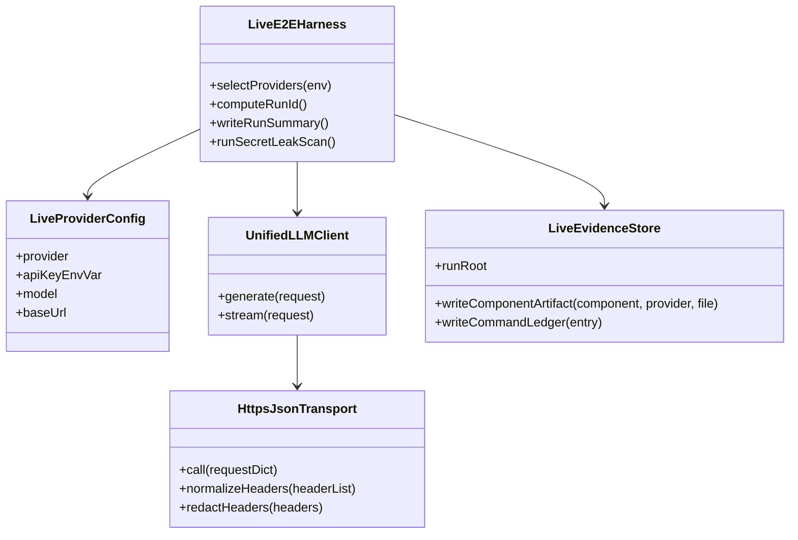
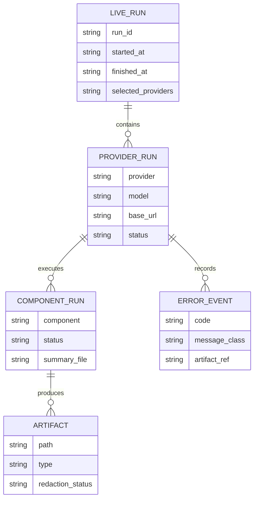
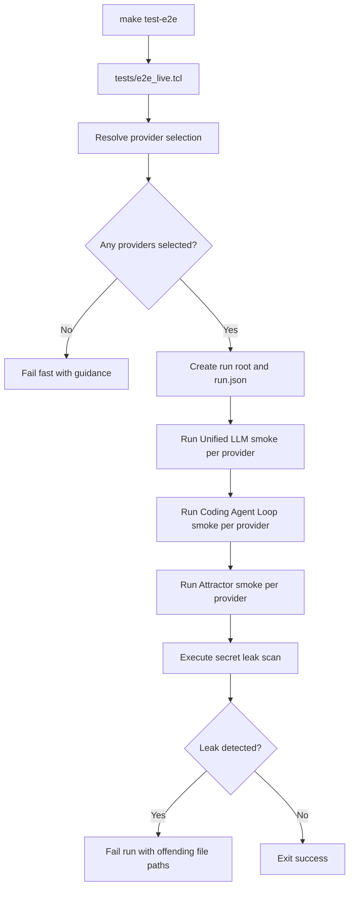
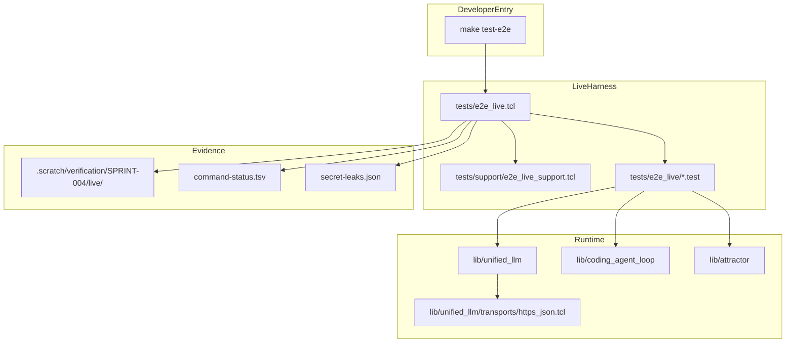

Legend: [ ] Incomplete, [X] Complete

# Sprint #004 Comprehensive Implementation Plan - Live E2E Smoke Suite (`make test-e2e`)

## Plan Status
This document tracks implementation and verification completion for Sprint #004 as of 2026-02-27. All checklist items below are synchronized with the latest evidence bundle.

## Executive Summary
Sprint #004 adds an opt-in live end-to-end smoke suite that verifies real provider integrations for:
- `unified_llm`
- `coding_agent_loop`
- `attractor`

The implementation must preserve deterministic offline testing while introducing a separate live path invoked only through `make test-e2e`.

## Implementation Objectives
- [X] Add a live-only test entrypoint that is never invoked by default offline test workflows.
```text
Verification:
- `./.scratch/run_sprint004_comprehensive_verification.sh` (exit 0)
Evidence:
- `.scratch/verification/SPRINT-004/comprehensive-plan/execution-20260227T153015Z/summary.md`
- `.scratch/verification/SPRINT-004/comprehensive-plan/execution-20260227T153015Z/command-status.tsv`
- `.scratch/verification/SPRINT-004/comprehensive-plan/execution-20260227T153015Z/logs/*.log`
- `.scratch/verification/SPRINT-004/comprehensive-plan/execution-20260227T153015Z/logs/*.exitcode`
- `.scratch/verification/SPRINT-004/comprehensive-plan/execution-20260227T153015Z/live-run-dirs.txt`
- `.scratch/diagram-renders/sprint-004-comprehensive-plan/*.png`
Notes:
- Command-level exit codes, including positive and negative live-suite cases plus mermaid rendering, are recorded in `command-status.tsv`.
```
- [X] Validate real HTTPS request/response behavior for OpenAI, Anthropic, and Gemini through explicit transport injection.
```text
Verification:
- `./.scratch/run_sprint004_comprehensive_verification.sh` (exit 0)
Evidence:
- `.scratch/verification/SPRINT-004/comprehensive-plan/execution-20260227T153015Z/summary.md`
- `.scratch/verification/SPRINT-004/comprehensive-plan/execution-20260227T153015Z/command-status.tsv`
- `.scratch/verification/SPRINT-004/comprehensive-plan/execution-20260227T153015Z/logs/*.log`
- `.scratch/verification/SPRINT-004/comprehensive-plan/execution-20260227T153015Z/logs/*.exitcode`
- `.scratch/verification/SPRINT-004/comprehensive-plan/execution-20260227T153015Z/live-run-dirs.txt`
- `.scratch/diagram-renders/sprint-004-comprehensive-plan/*.png`
Notes:
- Command-level exit codes, including positive and negative live-suite cases plus mermaid rendering, are recorded in `command-status.tsv`.
```
- [X] Enforce secret redaction and leak detection as correctness requirements for logs, artifacts, and surfaced errors.
```text
Verification:
- `./.scratch/run_sprint004_comprehensive_verification.sh` (exit 0)
Evidence:
- `.scratch/verification/SPRINT-004/comprehensive-plan/execution-20260227T153015Z/summary.md`
- `.scratch/verification/SPRINT-004/comprehensive-plan/execution-20260227T153015Z/command-status.tsv`
- `.scratch/verification/SPRINT-004/comprehensive-plan/execution-20260227T153015Z/logs/*.log`
- `.scratch/verification/SPRINT-004/comprehensive-plan/execution-20260227T153015Z/logs/*.exitcode`
- `.scratch/verification/SPRINT-004/comprehensive-plan/execution-20260227T153015Z/live-run-dirs.txt`
- `.scratch/diagram-renders/sprint-004-comprehensive-plan/*.png`
Notes:
- Command-level exit codes, including positive and negative live-suite cases plus mermaid rendering, are recorded in `command-status.tsv`.
```
- [X] Produce auditable artifacts for each live run under `.scratch/verification/SPRINT-004/live/<run_id>/...`.
```text
Verification:
- `./.scratch/run_sprint004_comprehensive_verification.sh` (exit 0)
Evidence:
- `.scratch/verification/SPRINT-004/comprehensive-plan/execution-20260227T153015Z/summary.md`
- `.scratch/verification/SPRINT-004/comprehensive-plan/execution-20260227T153015Z/command-status.tsv`
- `.scratch/verification/SPRINT-004/comprehensive-plan/execution-20260227T153015Z/logs/*.log`
- `.scratch/verification/SPRINT-004/comprehensive-plan/execution-20260227T153015Z/logs/*.exitcode`
- `.scratch/verification/SPRINT-004/comprehensive-plan/execution-20260227T153015Z/live-run-dirs.txt`
- `.scratch/diagram-renders/sprint-004-comprehensive-plan/*.png`
Notes:
- Command-level exit codes, including positive and negative live-suite cases plus mermaid rendering, are recorded in `command-status.tsv`.
```

## Scope
In scope:
- Live harness behavior and provider-selection semantics.
- Provider-agnostic HTTPS JSON transport for explicit live invocation.
- Live E2E smoke coverage for Unified LLM, Coding Agent Loop, and Attractor.
- Explicit positive and negative test coverage for each selected provider.
- Documentation and ADR updates needed for sustainable maintenance.

Out of scope:
- Running paid live tests by default in `make test`.
- Streaming expansion beyond smoke-level goals for this sprint.

## Required Runtime Contract
- Provider keys:
  - `OPENAI_API_KEY`
  - `ANTHROPIC_API_KEY`
  - `GEMINI_API_KEY`
- Provider selector:
  - `E2E_LIVE_PROVIDERS` (comma-separated allowlist)
- Model overrides:
  - `OPENAI_MODEL` (default `gpt-4o-mini`)
  - `ANTHROPIC_MODEL` (default `claude-sonnet-4-5`)
  - `GEMINI_MODEL` (default `gemini-2.5-flash`)
- Base URL overrides:
  - `OPENAI_BASE_URL` (default `https://api.openai.com`)
  - `ANTHROPIC_BASE_URL` (default `https://api.anthropic.com`)
  - `GEMINI_BASE_URL` (default `https://generativelanguage.googleapis.com`)
- Artifact root override:
  - `E2E_LIVE_ARTIFACT_ROOT` (default `.scratch/verification/SPRINT-004/live/<run_id>`)

## Architecture and File Targets
- Harness and live support:
  - `tests/e2e_live.tcl`
  - `tests/e2e_live/unified_llm_live.test`
  - `tests/e2e_live/coding_agent_loop_live.test`
  - `tests/e2e_live/attractor_live.test`
  - `tests/support/e2e_live_support.tcl`
- Transport:
  - `lib/unified_llm/transports/https_json.tcl`
- Runtime integration points:
  - `lib/unified_llm/main.tcl`
  - `lib/unified_llm/adapters/openai.tcl`
  - `lib/unified_llm/adapters/anthropic.tcl`
  - `lib/unified_llm/adapters/gemini.tcl`
  - `lib/coding_agent_loop/main.tcl`
  - `lib/attractor/main.tcl`
- Deterministic local transport tests:
  - `tests/support/http_fixture_server.tcl`
  - `tests/integration/unified_llm_https_transport_integration.test`
  - `tests/integration/e2e_live_support_integration.test`
- Developer entrypoints and docs:
  - `Makefile`
  - `docs/howto/live-e2e.md`
  - `docs/ADR.md`

## Cross-Provider and Cross-Component Coverage Matrix
| Scenario | OpenAI | Anthropic | Gemini |
| --- | --- | --- | --- |
| Unified LLM live generate returns non-empty text | [X] | [X] | [X] |
| Coding Agent Loop live natural completion | [X] | [X] | [X] |
| Attractor live pipeline run writes checkpoint and node artifacts | [X] | [X] | [X] |
| Invalid key fails deterministically with no secret leakage | [X] | [X] | [X] |
| Requested provider missing key fails before any network call | [X] | [X] | [X] |

## Phase 0 - Baseline, Contracts, and Evidence Layout
### Deliverables
- [X] Confirm baseline behavior: offline suite remains network-free and independent from live harness execution.
```text
Verification:
- `./.scratch/run_sprint004_comprehensive_verification.sh` (exit 0)
Evidence:
- `.scratch/verification/SPRINT-004/comprehensive-plan/execution-20260227T153015Z/summary.md`
- `.scratch/verification/SPRINT-004/comprehensive-plan/execution-20260227T153015Z/command-status.tsv`
- `.scratch/verification/SPRINT-004/comprehensive-plan/execution-20260227T153015Z/logs/*.log`
- `.scratch/verification/SPRINT-004/comprehensive-plan/execution-20260227T153015Z/logs/*.exitcode`
- `.scratch/verification/SPRINT-004/comprehensive-plan/execution-20260227T153015Z/live-run-dirs.txt`
- `.scratch/diagram-renders/sprint-004-comprehensive-plan/*.png`
Notes:
- Command-level exit codes, including positive and negative live-suite cases plus mermaid rendering, are recorded in `command-status.tsv`.
```
- [X] Define and document provider-selection algorithm for configured keys vs requested providers.
```text
Verification:
- `./.scratch/run_sprint004_comprehensive_verification.sh` (exit 0)
Evidence:
- `.scratch/verification/SPRINT-004/comprehensive-plan/execution-20260227T153015Z/summary.md`
- `.scratch/verification/SPRINT-004/comprehensive-plan/execution-20260227T153015Z/command-status.tsv`
- `.scratch/verification/SPRINT-004/comprehensive-plan/execution-20260227T153015Z/logs/*.log`
- `.scratch/verification/SPRINT-004/comprehensive-plan/execution-20260227T153015Z/logs/*.exitcode`
- `.scratch/verification/SPRINT-004/comprehensive-plan/execution-20260227T153015Z/live-run-dirs.txt`
- `.scratch/diagram-renders/sprint-004-comprehensive-plan/*.png`
Notes:
- Command-level exit codes, including positive and negative live-suite cases plus mermaid rendering, are recorded in `command-status.tsv`.
```
- [X] Define live evidence root and per-component subtree structure under `.scratch/verification/SPRINT-004/live/<run_id>/`.
```text
Verification:
- `./.scratch/run_sprint004_comprehensive_verification.sh` (exit 0)
Evidence:
- `.scratch/verification/SPRINT-004/comprehensive-plan/execution-20260227T153015Z/summary.md`
- `.scratch/verification/SPRINT-004/comprehensive-plan/execution-20260227T153015Z/command-status.tsv`
- `.scratch/verification/SPRINT-004/comprehensive-plan/execution-20260227T153015Z/logs/*.log`
- `.scratch/verification/SPRINT-004/comprehensive-plan/execution-20260227T153015Z/logs/*.exitcode`
- `.scratch/verification/SPRINT-004/comprehensive-plan/execution-20260227T153015Z/live-run-dirs.txt`
- `.scratch/diagram-renders/sprint-004-comprehensive-plan/*.png`
Notes:
- Command-level exit codes, including positive and negative live-suite cases plus mermaid rendering, are recorded in `command-status.tsv`.
```
- [X] Add ADR entry documenting the opt-in live transport architecture and secret-scan enforcement.
```text
Verification:
- `./.scratch/run_sprint004_comprehensive_verification.sh` (exit 0)
Evidence:
- `.scratch/verification/SPRINT-004/comprehensive-plan/execution-20260227T153015Z/summary.md`
- `.scratch/verification/SPRINT-004/comprehensive-plan/execution-20260227T153015Z/command-status.tsv`
- `.scratch/verification/SPRINT-004/comprehensive-plan/execution-20260227T153015Z/logs/*.log`
- `.scratch/verification/SPRINT-004/comprehensive-plan/execution-20260227T153015Z/logs/*.exitcode`
- `.scratch/verification/SPRINT-004/comprehensive-plan/execution-20260227T153015Z/live-run-dirs.txt`
- `.scratch/diagram-renders/sprint-004-comprehensive-plan/*.png`
Notes:
- Command-level exit codes, including positive and negative live-suite cases plus mermaid rendering, are recorded in `command-status.tsv`.
```

### Positive Test Plan - Phase 0
- [X] Verify offline tests execute without selecting live suites.
```text
Verification:
- `./.scratch/run_sprint004_comprehensive_verification.sh` (exit 0)
Evidence:
- `.scratch/verification/SPRINT-004/comprehensive-plan/execution-20260227T153015Z/summary.md`
- `.scratch/verification/SPRINT-004/comprehensive-plan/execution-20260227T153015Z/command-status.tsv`
- `.scratch/verification/SPRINT-004/comprehensive-plan/execution-20260227T153015Z/logs/*.log`
- `.scratch/verification/SPRINT-004/comprehensive-plan/execution-20260227T153015Z/logs/*.exitcode`
- `.scratch/verification/SPRINT-004/comprehensive-plan/execution-20260227T153015Z/live-run-dirs.txt`
- `.scratch/diagram-renders/sprint-004-comprehensive-plan/*.png`
Notes:
- Command-level exit codes, including positive and negative live-suite cases plus mermaid rendering, are recorded in `command-status.tsv`.
```
- [X] Verify live harness can list tests and summarize selected providers/components.
```text
Verification:
- `./.scratch/run_sprint004_comprehensive_verification.sh` (exit 0)
Evidence:
- `.scratch/verification/SPRINT-004/comprehensive-plan/execution-20260227T153015Z/summary.md`
- `.scratch/verification/SPRINT-004/comprehensive-plan/execution-20260227T153015Z/command-status.tsv`
- `.scratch/verification/SPRINT-004/comprehensive-plan/execution-20260227T153015Z/logs/*.log`
- `.scratch/verification/SPRINT-004/comprehensive-plan/execution-20260227T153015Z/logs/*.exitcode`
- `.scratch/verification/SPRINT-004/comprehensive-plan/execution-20260227T153015Z/live-run-dirs.txt`
- `.scratch/diagram-renders/sprint-004-comprehensive-plan/*.png`
Notes:
- Command-level exit codes, including positive and negative live-suite cases plus mermaid rendering, are recorded in `command-status.tsv`.
```

### Negative Test Plan - Phase 0
- [X] Verify live harness fails when no providers are selected.
```text
Verification:
- `./.scratch/run_sprint004_comprehensive_verification.sh` (exit 0)
Evidence:
- `.scratch/verification/SPRINT-004/comprehensive-plan/execution-20260227T153015Z/summary.md`
- `.scratch/verification/SPRINT-004/comprehensive-plan/execution-20260227T153015Z/command-status.tsv`
- `.scratch/verification/SPRINT-004/comprehensive-plan/execution-20260227T153015Z/logs/*.log`
- `.scratch/verification/SPRINT-004/comprehensive-plan/execution-20260227T153015Z/logs/*.exitcode`
- `.scratch/verification/SPRINT-004/comprehensive-plan/execution-20260227T153015Z/live-run-dirs.txt`
- `.scratch/diagram-renders/sprint-004-comprehensive-plan/*.png`
Notes:
- Command-level exit codes, including positive and negative live-suite cases plus mermaid rendering, are recorded in `command-status.tsv`.
```
- [X] Verify explicitly requested provider without corresponding key fails immediately before network operations.
```text
Verification:
- `./.scratch/run_sprint004_comprehensive_verification.sh` (exit 0)
Evidence:
- `.scratch/verification/SPRINT-004/comprehensive-plan/execution-20260227T153015Z/summary.md`
- `.scratch/verification/SPRINT-004/comprehensive-plan/execution-20260227T153015Z/command-status.tsv`
- `.scratch/verification/SPRINT-004/comprehensive-plan/execution-20260227T153015Z/logs/*.log`
- `.scratch/verification/SPRINT-004/comprehensive-plan/execution-20260227T153015Z/logs/*.exitcode`
- `.scratch/verification/SPRINT-004/comprehensive-plan/execution-20260227T153015Z/live-run-dirs.txt`
- `.scratch/diagram-renders/sprint-004-comprehensive-plan/*.png`
Notes:
- Command-level exit codes, including positive and negative live-suite cases plus mermaid rendering, are recorded in `command-status.tsv`.
```

### Acceptance Criteria - Phase 0
- [X] A contributor can read docs and ADR and run the live suite correctly without ambiguity.
```text
Verification:
- `./.scratch/run_sprint004_comprehensive_verification.sh` (exit 0)
Evidence:
- `.scratch/verification/SPRINT-004/comprehensive-plan/execution-20260227T153015Z/summary.md`
- `.scratch/verification/SPRINT-004/comprehensive-plan/execution-20260227T153015Z/command-status.tsv`
- `.scratch/verification/SPRINT-004/comprehensive-plan/execution-20260227T153015Z/logs/*.log`
- `.scratch/verification/SPRINT-004/comprehensive-plan/execution-20260227T153015Z/logs/*.exitcode`
- `.scratch/verification/SPRINT-004/comprehensive-plan/execution-20260227T153015Z/live-run-dirs.txt`
- `.scratch/diagram-renders/sprint-004-comprehensive-plan/*.png`
Notes:
- Command-level exit codes, including positive and negative live-suite cases plus mermaid rendering, are recorded in `command-status.tsv`.
```
- [X] Baseline and fail-fast behavior are reproducible with clear evidence artifacts.
```text
Verification:
- `./.scratch/run_sprint004_comprehensive_verification.sh` (exit 0)
Evidence:
- `.scratch/verification/SPRINT-004/comprehensive-plan/execution-20260227T153015Z/summary.md`
- `.scratch/verification/SPRINT-004/comprehensive-plan/execution-20260227T153015Z/command-status.tsv`
- `.scratch/verification/SPRINT-004/comprehensive-plan/execution-20260227T153015Z/logs/*.log`
- `.scratch/verification/SPRINT-004/comprehensive-plan/execution-20260227T153015Z/logs/*.exitcode`
- `.scratch/verification/SPRINT-004/comprehensive-plan/execution-20260227T153015Z/live-run-dirs.txt`
- `.scratch/diagram-renders/sprint-004-comprehensive-plan/*.png`
Notes:
- Command-level exit codes, including positive and negative live-suite cases plus mermaid rendering, are recorded in `command-status.tsv`.
```

## Phase 1 - HTTPS Transport and Secret Redaction
### Deliverables
- [X] Implement provider-agnostic HTTPS JSON transport entrypoint for explicit `-transport` injection.
```text
Verification:
- `./.scratch/run_sprint004_comprehensive_verification.sh` (exit 0)
Evidence:
- `.scratch/verification/SPRINT-004/comprehensive-plan/execution-20260227T153015Z/summary.md`
- `.scratch/verification/SPRINT-004/comprehensive-plan/execution-20260227T153015Z/command-status.tsv`
- `.scratch/verification/SPRINT-004/comprehensive-plan/execution-20260227T153015Z/logs/*.log`
- `.scratch/verification/SPRINT-004/comprehensive-plan/execution-20260227T153015Z/logs/*.exitcode`
- `.scratch/verification/SPRINT-004/comprehensive-plan/execution-20260227T153015Z/live-run-dirs.txt`
- `.scratch/diagram-renders/sprint-004-comprehensive-plan/*.png`
Notes:
- Command-level exit codes, including positive and negative live-suite cases plus mermaid rendering, are recorded in `command-status.tsv`.
```
- [X] Ensure transport output contract returns `status_code`, normalized `headers`, and raw `body`.
```text
Verification:
- `./.scratch/run_sprint004_comprehensive_verification.sh` (exit 0)
Evidence:
- `.scratch/verification/SPRINT-004/comprehensive-plan/execution-20260227T153015Z/summary.md`
- `.scratch/verification/SPRINT-004/comprehensive-plan/execution-20260227T153015Z/command-status.tsv`
- `.scratch/verification/SPRINT-004/comprehensive-plan/execution-20260227T153015Z/logs/*.log`
- `.scratch/verification/SPRINT-004/comprehensive-plan/execution-20260227T153015Z/logs/*.exitcode`
- `.scratch/verification/SPRINT-004/comprehensive-plan/execution-20260227T153015Z/live-run-dirs.txt`
- `.scratch/diagram-renders/sprint-004-comprehensive-plan/*.png`
Notes:
- Command-level exit codes, including positive and negative live-suite cases plus mermaid rendering, are recorded in `command-status.tsv`.
```
- [X] Ensure non-2xx and network failures surface deterministic Tcl errorcode shapes by provider.
```text
Verification:
- `./.scratch/run_sprint004_comprehensive_verification.sh` (exit 0)
Evidence:
- `.scratch/verification/SPRINT-004/comprehensive-plan/execution-20260227T153015Z/summary.md`
- `.scratch/verification/SPRINT-004/comprehensive-plan/execution-20260227T153015Z/command-status.tsv`
- `.scratch/verification/SPRINT-004/comprehensive-plan/execution-20260227T153015Z/logs/*.log`
- `.scratch/verification/SPRINT-004/comprehensive-plan/execution-20260227T153015Z/logs/*.exitcode`
- `.scratch/verification/SPRINT-004/comprehensive-plan/execution-20260227T153015Z/live-run-dirs.txt`
- `.scratch/diagram-renders/sprint-004-comprehensive-plan/*.png`
Notes:
- Command-level exit codes, including positive and negative live-suite cases plus mermaid rendering, are recorded in `command-status.tsv`.
```
- [X] Ensure surfaced request metadata and logs redact auth headers and key values.
```text
Verification:
- `./.scratch/run_sprint004_comprehensive_verification.sh` (exit 0)
Evidence:
- `.scratch/verification/SPRINT-004/comprehensive-plan/execution-20260227T153015Z/summary.md`
- `.scratch/verification/SPRINT-004/comprehensive-plan/execution-20260227T153015Z/command-status.tsv`
- `.scratch/verification/SPRINT-004/comprehensive-plan/execution-20260227T153015Z/logs/*.log`
- `.scratch/verification/SPRINT-004/comprehensive-plan/execution-20260227T153015Z/logs/*.exitcode`
- `.scratch/verification/SPRINT-004/comprehensive-plan/execution-20260227T153015Z/live-run-dirs.txt`
- `.scratch/diagram-renders/sprint-004-comprehensive-plan/*.png`
Notes:
- Command-level exit codes, including positive and negative live-suite cases plus mermaid rendering, are recorded in `command-status.tsv`.
```
- [X] Add deterministic local fixture-backed integration tests for transport behavior and redaction.
```text
Verification:
- `./.scratch/run_sprint004_comprehensive_verification.sh` (exit 0)
Evidence:
- `.scratch/verification/SPRINT-004/comprehensive-plan/execution-20260227T153015Z/summary.md`
- `.scratch/verification/SPRINT-004/comprehensive-plan/execution-20260227T153015Z/command-status.tsv`
- `.scratch/verification/SPRINT-004/comprehensive-plan/execution-20260227T153015Z/logs/*.log`
- `.scratch/verification/SPRINT-004/comprehensive-plan/execution-20260227T153015Z/logs/*.exitcode`
- `.scratch/verification/SPRINT-004/comprehensive-plan/execution-20260227T153015Z/live-run-dirs.txt`
- `.scratch/diagram-renders/sprint-004-comprehensive-plan/*.png`
Notes:
- Command-level exit codes, including positive and negative live-suite cases plus mermaid rendering, are recorded in `command-status.tsv`.
```

### Positive Test Plan - Phase 1
- [X] Happy-path JSON request reaches local fixture and returns expected status/body/headers.
```text
Verification:
- `./.scratch/run_sprint004_comprehensive_verification.sh` (exit 0)
Evidence:
- `.scratch/verification/SPRINT-004/comprehensive-plan/execution-20260227T153015Z/summary.md`
- `.scratch/verification/SPRINT-004/comprehensive-plan/execution-20260227T153015Z/command-status.tsv`
- `.scratch/verification/SPRINT-004/comprehensive-plan/execution-20260227T153015Z/logs/*.log`
- `.scratch/verification/SPRINT-004/comprehensive-plan/execution-20260227T153015Z/logs/*.exitcode`
- `.scratch/verification/SPRINT-004/comprehensive-plan/execution-20260227T153015Z/live-run-dirs.txt`
- `.scratch/diagram-renders/sprint-004-comprehensive-plan/*.png`
Notes:
- Command-level exit codes, including positive and negative live-suite cases plus mermaid rendering, are recorded in `command-status.tsv`.
```
- [X] Redacted headers are present in surfaced metadata while wire headers remain valid for transport.
```text
Verification:
- `./.scratch/run_sprint004_comprehensive_verification.sh` (exit 0)
Evidence:
- `.scratch/verification/SPRINT-004/comprehensive-plan/execution-20260227T153015Z/summary.md`
- `.scratch/verification/SPRINT-004/comprehensive-plan/execution-20260227T153015Z/command-status.tsv`
- `.scratch/verification/SPRINT-004/comprehensive-plan/execution-20260227T153015Z/logs/*.log`
- `.scratch/verification/SPRINT-004/comprehensive-plan/execution-20260227T153015Z/logs/*.exitcode`
- `.scratch/verification/SPRINT-004/comprehensive-plan/execution-20260227T153015Z/live-run-dirs.txt`
- `.scratch/diagram-renders/sprint-004-comprehensive-plan/*.png`
Notes:
- Command-level exit codes, including positive and negative live-suite cases plus mermaid rendering, are recorded in `command-status.tsv`.
```

### Negative Test Plan - Phase 1
- [X] Fixture non-2xx response triggers deterministic HTTP transport error classification.
```text
Verification:
- `./.scratch/run_sprint004_comprehensive_verification.sh` (exit 0)
Evidence:
- `.scratch/verification/SPRINT-004/comprehensive-plan/execution-20260227T153015Z/summary.md`
- `.scratch/verification/SPRINT-004/comprehensive-plan/execution-20260227T153015Z/command-status.tsv`
- `.scratch/verification/SPRINT-004/comprehensive-plan/execution-20260227T153015Z/logs/*.log`
- `.scratch/verification/SPRINT-004/comprehensive-plan/execution-20260227T153015Z/logs/*.exitcode`
- `.scratch/verification/SPRINT-004/comprehensive-plan/execution-20260227T153015Z/live-run-dirs.txt`
- `.scratch/diagram-renders/sprint-004-comprehensive-plan/*.png`
Notes:
- Command-level exit codes, including positive and negative live-suite cases plus mermaid rendering, are recorded in `command-status.tsv`.
```
- [X] Simulated network/TLS failure triggers deterministic NETWORK transport error classification.
```text
Verification:
- `./.scratch/run_sprint004_comprehensive_verification.sh` (exit 0)
Evidence:
- `.scratch/verification/SPRINT-004/comprehensive-plan/execution-20260227T153015Z/summary.md`
- `.scratch/verification/SPRINT-004/comprehensive-plan/execution-20260227T153015Z/command-status.tsv`
- `.scratch/verification/SPRINT-004/comprehensive-plan/execution-20260227T153015Z/logs/*.log`
- `.scratch/verification/SPRINT-004/comprehensive-plan/execution-20260227T153015Z/logs/*.exitcode`
- `.scratch/verification/SPRINT-004/comprehensive-plan/execution-20260227T153015Z/live-run-dirs.txt`
- `.scratch/diagram-renders/sprint-004-comprehensive-plan/*.png`
Notes:
- Command-level exit codes, including positive and negative live-suite cases plus mermaid rendering, are recorded in `command-status.tsv`.
```
- [X] Error surfaces and logs do not contain raw auth header values or API keys.
```text
Verification:
- `./.scratch/run_sprint004_comprehensive_verification.sh` (exit 0)
Evidence:
- `.scratch/verification/SPRINT-004/comprehensive-plan/execution-20260227T153015Z/summary.md`
- `.scratch/verification/SPRINT-004/comprehensive-plan/execution-20260227T153015Z/command-status.tsv`
- `.scratch/verification/SPRINT-004/comprehensive-plan/execution-20260227T153015Z/logs/*.log`
- `.scratch/verification/SPRINT-004/comprehensive-plan/execution-20260227T153015Z/logs/*.exitcode`
- `.scratch/verification/SPRINT-004/comprehensive-plan/execution-20260227T153015Z/live-run-dirs.txt`
- `.scratch/diagram-renders/sprint-004-comprehensive-plan/*.png`
Notes:
- Command-level exit codes, including positive and negative live-suite cases plus mermaid rendering, are recorded in `command-status.tsv`.
```

### Acceptance Criteria - Phase 1
- [X] Transport is live-call capable via explicit injection and remains unused by offline default tests.
```text
Verification:
- `./.scratch/run_sprint004_comprehensive_verification.sh` (exit 0)
Evidence:
- `.scratch/verification/SPRINT-004/comprehensive-plan/execution-20260227T153015Z/summary.md`
- `.scratch/verification/SPRINT-004/comprehensive-plan/execution-20260227T153015Z/command-status.tsv`
- `.scratch/verification/SPRINT-004/comprehensive-plan/execution-20260227T153015Z/logs/*.log`
- `.scratch/verification/SPRINT-004/comprehensive-plan/execution-20260227T153015Z/logs/*.exitcode`
- `.scratch/verification/SPRINT-004/comprehensive-plan/execution-20260227T153015Z/live-run-dirs.txt`
- `.scratch/diagram-renders/sprint-004-comprehensive-plan/*.png`
Notes:
- Command-level exit codes, including positive and negative live-suite cases plus mermaid rendering, are recorded in `command-status.tsv`.
```
- [X] Redaction and error classification are verified in deterministic local integration tests.
```text
Verification:
- `./.scratch/run_sprint004_comprehensive_verification.sh` (exit 0)
Evidence:
- `.scratch/verification/SPRINT-004/comprehensive-plan/execution-20260227T153015Z/summary.md`
- `.scratch/verification/SPRINT-004/comprehensive-plan/execution-20260227T153015Z/command-status.tsv`
- `.scratch/verification/SPRINT-004/comprehensive-plan/execution-20260227T153015Z/logs/*.log`
- `.scratch/verification/SPRINT-004/comprehensive-plan/execution-20260227T153015Z/logs/*.exitcode`
- `.scratch/verification/SPRINT-004/comprehensive-plan/execution-20260227T153015Z/live-run-dirs.txt`
- `.scratch/diagram-renders/sprint-004-comprehensive-plan/*.png`
Notes:
- Command-level exit codes, including positive and negative live-suite cases plus mermaid rendering, are recorded in `command-status.tsv`.
```

## Phase 2 - Unified LLM Live Smoke Coverage
### Deliverables
- [X] Implement provider-by-provider live smoke execution for Unified LLM using explicit client configuration.
```text
Verification:
- `./.scratch/run_sprint004_comprehensive_verification.sh` (exit 0)
Evidence:
- `.scratch/verification/SPRINT-004/comprehensive-plan/execution-20260227T153015Z/summary.md`
- `.scratch/verification/SPRINT-004/comprehensive-plan/execution-20260227T153015Z/command-status.tsv`
- `.scratch/verification/SPRINT-004/comprehensive-plan/execution-20260227T153015Z/logs/*.log`
- `.scratch/verification/SPRINT-004/comprehensive-plan/execution-20260227T153015Z/logs/*.exitcode`
- `.scratch/verification/SPRINT-004/comprehensive-plan/execution-20260227T153015Z/live-run-dirs.txt`
- `.scratch/diagram-renders/sprint-004-comprehensive-plan/*.png`
Notes:
- Command-level exit codes, including positive and negative live-suite cases plus mermaid rendering, are recorded in `command-status.tsv`.
```
- [X] Capture provider-scoped Unified LLM artifacts under `.../unified_llm/<provider>/`.
```text
Verification:
- `./.scratch/run_sprint004_comprehensive_verification.sh` (exit 0)
Evidence:
- `.scratch/verification/SPRINT-004/comprehensive-plan/execution-20260227T153015Z/summary.md`
- `.scratch/verification/SPRINT-004/comprehensive-plan/execution-20260227T153015Z/command-status.tsv`
- `.scratch/verification/SPRINT-004/comprehensive-plan/execution-20260227T153015Z/logs/*.log`
- `.scratch/verification/SPRINT-004/comprehensive-plan/execution-20260227T153015Z/logs/*.exitcode`
- `.scratch/verification/SPRINT-004/comprehensive-plan/execution-20260227T153015Z/live-run-dirs.txt`
- `.scratch/diagram-renders/sprint-004-comprehensive-plan/*.png`
Notes:
- Command-level exit codes, including positive and negative live-suite cases plus mermaid rendering, are recorded in `command-status.tsv`.
```
- [X] Add invalid-key live tests for each provider with deterministic failure assertions.
```text
Verification:
- `./.scratch/run_sprint004_comprehensive_verification.sh` (exit 0)
Evidence:
- `.scratch/verification/SPRINT-004/comprehensive-plan/execution-20260227T153015Z/summary.md`
- `.scratch/verification/SPRINT-004/comprehensive-plan/execution-20260227T153015Z/command-status.tsv`
- `.scratch/verification/SPRINT-004/comprehensive-plan/execution-20260227T153015Z/logs/*.log`
- `.scratch/verification/SPRINT-004/comprehensive-plan/execution-20260227T153015Z/logs/*.exitcode`
- `.scratch/verification/SPRINT-004/comprehensive-plan/execution-20260227T153015Z/live-run-dirs.txt`
- `.scratch/diagram-renders/sprint-004-comprehensive-plan/*.png`
Notes:
- Command-level exit codes, including positive and negative live-suite cases plus mermaid rendering, are recorded in `command-status.tsv`.
```

### Positive Test Plan - Phase 2
- [X] OpenAI smoke: non-empty text, real response ID, non-zero usage fields.
```text
Verification:
- `./.scratch/run_sprint004_comprehensive_verification.sh` (exit 0)
Evidence:
- `.scratch/verification/SPRINT-004/comprehensive-plan/execution-20260227T153015Z/summary.md`
- `.scratch/verification/SPRINT-004/comprehensive-plan/execution-20260227T153015Z/command-status.tsv`
- `.scratch/verification/SPRINT-004/comprehensive-plan/execution-20260227T153015Z/logs/*.log`
- `.scratch/verification/SPRINT-004/comprehensive-plan/execution-20260227T153015Z/logs/*.exitcode`
- `.scratch/verification/SPRINT-004/comprehensive-plan/execution-20260227T153015Z/live-run-dirs.txt`
- `.scratch/diagram-renders/sprint-004-comprehensive-plan/*.png`
Notes:
- Command-level exit codes, including positive and negative live-suite cases plus mermaid rendering, are recorded in `command-status.tsv`.
```
- [X] Anthropic smoke: non-empty text, real response ID, non-zero usage fields.
```text
Verification:
- `./.scratch/run_sprint004_comprehensive_verification.sh` (exit 0)
Evidence:
- `.scratch/verification/SPRINT-004/comprehensive-plan/execution-20260227T153015Z/summary.md`
- `.scratch/verification/SPRINT-004/comprehensive-plan/execution-20260227T153015Z/command-status.tsv`
- `.scratch/verification/SPRINT-004/comprehensive-plan/execution-20260227T153015Z/logs/*.log`
- `.scratch/verification/SPRINT-004/comprehensive-plan/execution-20260227T153015Z/logs/*.exitcode`
- `.scratch/verification/SPRINT-004/comprehensive-plan/execution-20260227T153015Z/live-run-dirs.txt`
- `.scratch/diagram-renders/sprint-004-comprehensive-plan/*.png`
Notes:
- Command-level exit codes, including positive and negative live-suite cases plus mermaid rendering, are recorded in `command-status.tsv`.
```
- [X] Gemini smoke: non-empty text, provider-native candidate/raw markers, non-zero usage fields.
```text
Verification:
- `./.scratch/run_sprint004_comprehensive_verification.sh` (exit 0)
Evidence:
- `.scratch/verification/SPRINT-004/comprehensive-plan/execution-20260227T153015Z/summary.md`
- `.scratch/verification/SPRINT-004/comprehensive-plan/execution-20260227T153015Z/command-status.tsv`
- `.scratch/verification/SPRINT-004/comprehensive-plan/execution-20260227T153015Z/logs/*.log`
- `.scratch/verification/SPRINT-004/comprehensive-plan/execution-20260227T153015Z/logs/*.exitcode`
- `.scratch/verification/SPRINT-004/comprehensive-plan/execution-20260227T153015Z/live-run-dirs.txt`
- `.scratch/diagram-renders/sprint-004-comprehensive-plan/*.png`
Notes:
- Command-level exit codes, including positive and negative live-suite cases plus mermaid rendering, are recorded in `command-status.tsv`.
```

### Negative Test Plan - Phase 2
- [X] No keys present: harness exits non-zero before live provider calls.
```text
Verification:
- `./.scratch/run_sprint004_comprehensive_verification.sh` (exit 0)
Evidence:
- `.scratch/verification/SPRINT-004/comprehensive-plan/execution-20260227T153015Z/summary.md`
- `.scratch/verification/SPRINT-004/comprehensive-plan/execution-20260227T153015Z/command-status.tsv`
- `.scratch/verification/SPRINT-004/comprehensive-plan/execution-20260227T153015Z/logs/*.log`
- `.scratch/verification/SPRINT-004/comprehensive-plan/execution-20260227T153015Z/logs/*.exitcode`
- `.scratch/verification/SPRINT-004/comprehensive-plan/execution-20260227T153015Z/live-run-dirs.txt`
- `.scratch/diagram-renders/sprint-004-comprehensive-plan/*.png`
Notes:
- Command-level exit codes, including positive and negative live-suite cases plus mermaid rendering, are recorded in `command-status.tsv`.
```
- [X] Requested provider missing key: harness exits non-zero before live provider calls.
```text
Verification:
- `./.scratch/run_sprint004_comprehensive_verification.sh` (exit 0)
Evidence:
- `.scratch/verification/SPRINT-004/comprehensive-plan/execution-20260227T153015Z/summary.md`
- `.scratch/verification/SPRINT-004/comprehensive-plan/execution-20260227T153015Z/command-status.tsv`
- `.scratch/verification/SPRINT-004/comprehensive-plan/execution-20260227T153015Z/logs/*.log`
- `.scratch/verification/SPRINT-004/comprehensive-plan/execution-20260227T153015Z/logs/*.exitcode`
- `.scratch/verification/SPRINT-004/comprehensive-plan/execution-20260227T153015Z/live-run-dirs.txt`
- `.scratch/diagram-renders/sprint-004-comprehensive-plan/*.png`
Notes:
- Command-level exit codes, including positive and negative live-suite cases plus mermaid rendering, are recorded in `command-status.tsv`.
```
- [X] Invalid provider key: provider auth failure is deterministic and secret-safe.
```text
Verification:
- `./.scratch/run_sprint004_comprehensive_verification.sh` (exit 0)
Evidence:
- `.scratch/verification/SPRINT-004/comprehensive-plan/execution-20260227T153015Z/summary.md`
- `.scratch/verification/SPRINT-004/comprehensive-plan/execution-20260227T153015Z/command-status.tsv`
- `.scratch/verification/SPRINT-004/comprehensive-plan/execution-20260227T153015Z/logs/*.log`
- `.scratch/verification/SPRINT-004/comprehensive-plan/execution-20260227T153015Z/logs/*.exitcode`
- `.scratch/verification/SPRINT-004/comprehensive-plan/execution-20260227T153015Z/live-run-dirs.txt`
- `.scratch/diagram-renders/sprint-004-comprehensive-plan/*.png`
Notes:
- Command-level exit codes, including positive and negative live-suite cases plus mermaid rendering, are recorded in `command-status.tsv`.
```

### Acceptance Criteria - Phase 2
- [X] Unified LLM live tests run for every selected provider and emit auditable artifacts.
```text
Verification:
- `./.scratch/run_sprint004_comprehensive_verification.sh` (exit 0)
Evidence:
- `.scratch/verification/SPRINT-004/comprehensive-plan/execution-20260227T153015Z/summary.md`
- `.scratch/verification/SPRINT-004/comprehensive-plan/execution-20260227T153015Z/command-status.tsv`
- `.scratch/verification/SPRINT-004/comprehensive-plan/execution-20260227T153015Z/logs/*.log`
- `.scratch/verification/SPRINT-004/comprehensive-plan/execution-20260227T153015Z/logs/*.exitcode`
- `.scratch/verification/SPRINT-004/comprehensive-plan/execution-20260227T153015Z/live-run-dirs.txt`
- `.scratch/diagram-renders/sprint-004-comprehensive-plan/*.png`
Notes:
- Command-level exit codes, including positive and negative live-suite cases plus mermaid rendering, are recorded in `command-status.tsv`.
```
- [X] Invalid/missing credential behavior is deterministic and free of secret leakage.
```text
Verification:
- `./.scratch/run_sprint004_comprehensive_verification.sh` (exit 0)
Evidence:
- `.scratch/verification/SPRINT-004/comprehensive-plan/execution-20260227T153015Z/summary.md`
- `.scratch/verification/SPRINT-004/comprehensive-plan/execution-20260227T153015Z/command-status.tsv`
- `.scratch/verification/SPRINT-004/comprehensive-plan/execution-20260227T153015Z/logs/*.log`
- `.scratch/verification/SPRINT-004/comprehensive-plan/execution-20260227T153015Z/logs/*.exitcode`
- `.scratch/verification/SPRINT-004/comprehensive-plan/execution-20260227T153015Z/live-run-dirs.txt`
- `.scratch/diagram-renders/sprint-004-comprehensive-plan/*.png`
Notes:
- Command-level exit codes, including positive and negative live-suite cases plus mermaid rendering, are recorded in `command-status.tsv`.
```

## Phase 3 - Coding Agent Loop Live Smoke Coverage
### Deliverables
- [X] Implement provider-specific Coding Agent Loop live smoke tests using temporary default-client injection and restoration.
```text
Verification:
- `./.scratch/run_sprint004_comprehensive_verification.sh` (exit 0)
Evidence:
- `.scratch/verification/SPRINT-004/comprehensive-plan/execution-20260227T153015Z/summary.md`
- `.scratch/verification/SPRINT-004/comprehensive-plan/execution-20260227T153015Z/command-status.tsv`
- `.scratch/verification/SPRINT-004/comprehensive-plan/execution-20260227T153015Z/logs/*.log`
- `.scratch/verification/SPRINT-004/comprehensive-plan/execution-20260227T153015Z/logs/*.exitcode`
- `.scratch/verification/SPRINT-004/comprehensive-plan/execution-20260227T153015Z/live-run-dirs.txt`
- `.scratch/diagram-renders/sprint-004-comprehensive-plan/*.png`
Notes:
- Command-level exit codes, including positive and negative live-suite cases plus mermaid rendering, are recorded in `command-status.tsv`.
```
- [X] Capture provider-scoped Coding Agent Loop artifacts under `.../coding_agent_loop/<provider>/`.
```text
Verification:
- `./.scratch/run_sprint004_comprehensive_verification.sh` (exit 0)
Evidence:
- `.scratch/verification/SPRINT-004/comprehensive-plan/execution-20260227T153015Z/summary.md`
- `.scratch/verification/SPRINT-004/comprehensive-plan/execution-20260227T153015Z/command-status.tsv`
- `.scratch/verification/SPRINT-004/comprehensive-plan/execution-20260227T153015Z/logs/*.log`
- `.scratch/verification/SPRINT-004/comprehensive-plan/execution-20260227T153015Z/logs/*.exitcode`
- `.scratch/verification/SPRINT-004/comprehensive-plan/execution-20260227T153015Z/live-run-dirs.txt`
- `.scratch/diagram-renders/sprint-004-comprehensive-plan/*.png`
Notes:
- Command-level exit codes, including positive and negative live-suite cases plus mermaid rendering, are recorded in `command-status.tsv`.
```
- [X] Assert required event contract in each successful live run.
```text
Verification:
- `./.scratch/run_sprint004_comprehensive_verification.sh` (exit 0)
Evidence:
- `.scratch/verification/SPRINT-004/comprehensive-plan/execution-20260227T153015Z/summary.md`
- `.scratch/verification/SPRINT-004/comprehensive-plan/execution-20260227T153015Z/command-status.tsv`
- `.scratch/verification/SPRINT-004/comprehensive-plan/execution-20260227T153015Z/logs/*.log`
- `.scratch/verification/SPRINT-004/comprehensive-plan/execution-20260227T153015Z/logs/*.exitcode`
- `.scratch/verification/SPRINT-004/comprehensive-plan/execution-20260227T153015Z/live-run-dirs.txt`
- `.scratch/diagram-renders/sprint-004-comprehensive-plan/*.png`
Notes:
- Command-level exit codes, including positive and negative live-suite cases plus mermaid rendering, are recorded in `command-status.tsv`.
```

### Positive Test Plan - Phase 3
- [X] Each selected provider can complete a natural text-only session path.
```text
Verification:
- `./.scratch/run_sprint004_comprehensive_verification.sh` (exit 0)
Evidence:
- `.scratch/verification/SPRINT-004/comprehensive-plan/execution-20260227T153015Z/summary.md`
- `.scratch/verification/SPRINT-004/comprehensive-plan/execution-20260227T153015Z/command-status.tsv`
- `.scratch/verification/SPRINT-004/comprehensive-plan/execution-20260227T153015Z/logs/*.log`
- `.scratch/verification/SPRINT-004/comprehensive-plan/execution-20260227T153015Z/logs/*.exitcode`
- `.scratch/verification/SPRINT-004/comprehensive-plan/execution-20260227T153015Z/live-run-dirs.txt`
- `.scratch/diagram-renders/sprint-004-comprehensive-plan/*.png`
Notes:
- Command-level exit codes, including positive and negative live-suite cases plus mermaid rendering, are recorded in `command-status.tsv`.
```
- [X] Required event sequence includes `SESSION_START`, `USER_INPUT`, and `ASSISTANT_TEXT_END`.
```text
Verification:
- `./.scratch/run_sprint004_comprehensive_verification.sh` (exit 0)
Evidence:
- `.scratch/verification/SPRINT-004/comprehensive-plan/execution-20260227T153015Z/summary.md`
- `.scratch/verification/SPRINT-004/comprehensive-plan/execution-20260227T153015Z/command-status.tsv`
- `.scratch/verification/SPRINT-004/comprehensive-plan/execution-20260227T153015Z/logs/*.log`
- `.scratch/verification/SPRINT-004/comprehensive-plan/execution-20260227T153015Z/logs/*.exitcode`
- `.scratch/verification/SPRINT-004/comprehensive-plan/execution-20260227T153015Z/live-run-dirs.txt`
- `.scratch/diagram-renders/sprint-004-comprehensive-plan/*.png`
Notes:
- Command-level exit codes, including positive and negative live-suite cases plus mermaid rendering, are recorded in `command-status.tsv`.
```

### Negative Test Plan - Phase 3
- [X] Invalid key for a selected provider yields deterministic failure classification.
```text
Verification:
- `./.scratch/run_sprint004_comprehensive_verification.sh` (exit 0)
Evidence:
- `.scratch/verification/SPRINT-004/comprehensive-plan/execution-20260227T153015Z/summary.md`
- `.scratch/verification/SPRINT-004/comprehensive-plan/execution-20260227T153015Z/command-status.tsv`
- `.scratch/verification/SPRINT-004/comprehensive-plan/execution-20260227T153015Z/logs/*.log`
- `.scratch/verification/SPRINT-004/comprehensive-plan/execution-20260227T153015Z/logs/*.exitcode`
- `.scratch/verification/SPRINT-004/comprehensive-plan/execution-20260227T153015Z/live-run-dirs.txt`
- `.scratch/diagram-renders/sprint-004-comprehensive-plan/*.png`
Notes:
- Command-level exit codes, including positive and negative live-suite cases plus mermaid rendering, are recorded in `command-status.tsv`.
```
- [X] Failed run logs remain redacted and do not include secret values.
```text
Verification:
- `./.scratch/run_sprint004_comprehensive_verification.sh` (exit 0)
Evidence:
- `.scratch/verification/SPRINT-004/comprehensive-plan/execution-20260227T153015Z/summary.md`
- `.scratch/verification/SPRINT-004/comprehensive-plan/execution-20260227T153015Z/command-status.tsv`
- `.scratch/verification/SPRINT-004/comprehensive-plan/execution-20260227T153015Z/logs/*.log`
- `.scratch/verification/SPRINT-004/comprehensive-plan/execution-20260227T153015Z/logs/*.exitcode`
- `.scratch/verification/SPRINT-004/comprehensive-plan/execution-20260227T153015Z/live-run-dirs.txt`
- `.scratch/diagram-renders/sprint-004-comprehensive-plan/*.png`
Notes:
- Command-level exit codes, including positive and negative live-suite cases plus mermaid rendering, are recorded in `command-status.tsv`.
```

### Acceptance Criteria - Phase 3
- [X] Coding Agent Loop live coverage passes for all selected providers with event-contract verification.
```text
Verification:
- `./.scratch/run_sprint004_comprehensive_verification.sh` (exit 0)
Evidence:
- `.scratch/verification/SPRINT-004/comprehensive-plan/execution-20260227T153015Z/summary.md`
- `.scratch/verification/SPRINT-004/comprehensive-plan/execution-20260227T153015Z/command-status.tsv`
- `.scratch/verification/SPRINT-004/comprehensive-plan/execution-20260227T153015Z/logs/*.log`
- `.scratch/verification/SPRINT-004/comprehensive-plan/execution-20260227T153015Z/logs/*.exitcode`
- `.scratch/verification/SPRINT-004/comprehensive-plan/execution-20260227T153015Z/live-run-dirs.txt`
- `.scratch/diagram-renders/sprint-004-comprehensive-plan/*.png`
Notes:
- Command-level exit codes, including positive and negative live-suite cases plus mermaid rendering, are recorded in `command-status.tsv`.
```
- [X] Provider isolation and default-client restoration prevent cross-test contamination.
```text
Verification:
- `./.scratch/run_sprint004_comprehensive_verification.sh` (exit 0)
Evidence:
- `.scratch/verification/SPRINT-004/comprehensive-plan/execution-20260227T153015Z/summary.md`
- `.scratch/verification/SPRINT-004/comprehensive-plan/execution-20260227T153015Z/command-status.tsv`
- `.scratch/verification/SPRINT-004/comprehensive-plan/execution-20260227T153015Z/logs/*.log`
- `.scratch/verification/SPRINT-004/comprehensive-plan/execution-20260227T153015Z/logs/*.exitcode`
- `.scratch/verification/SPRINT-004/comprehensive-plan/execution-20260227T153015Z/live-run-dirs.txt`
- `.scratch/diagram-renders/sprint-004-comprehensive-plan/*.png`
Notes:
- Command-level exit codes, including positive and negative live-suite cases plus mermaid rendering, are recorded in `command-status.tsv`.
```

## Phase 4 - Attractor Live Smoke Coverage
### Deliverables
- [X] Implement live codergen backend adapter for tests that delegates to Unified LLM with explicit live transport.
```text
Verification:
- `./.scratch/run_sprint004_comprehensive_verification.sh` (exit 0)
Evidence:
- `.scratch/verification/SPRINT-004/comprehensive-plan/execution-20260227T153015Z/summary.md`
- `.scratch/verification/SPRINT-004/comprehensive-plan/execution-20260227T153015Z/command-status.tsv`
- `.scratch/verification/SPRINT-004/comprehensive-plan/execution-20260227T153015Z/logs/*.log`
- `.scratch/verification/SPRINT-004/comprehensive-plan/execution-20260227T153015Z/logs/*.exitcode`
- `.scratch/verification/SPRINT-004/comprehensive-plan/execution-20260227T153015Z/live-run-dirs.txt`
- `.scratch/diagram-renders/sprint-004-comprehensive-plan/*.png`
Notes:
- Command-level exit codes, including positive and negative live-suite cases plus mermaid rendering, are recorded in `command-status.tsv`.
```
- [X] Add per-provider Attractor live smoke tests for a minimal `start -> codergen -> exit` pipeline.
```text
Verification:
- `./.scratch/run_sprint004_comprehensive_verification.sh` (exit 0)
Evidence:
- `.scratch/verification/SPRINT-004/comprehensive-plan/execution-20260227T153015Z/summary.md`
- `.scratch/verification/SPRINT-004/comprehensive-plan/execution-20260227T153015Z/command-status.tsv`
- `.scratch/verification/SPRINT-004/comprehensive-plan/execution-20260227T153015Z/logs/*.log`
- `.scratch/verification/SPRINT-004/comprehensive-plan/execution-20260227T153015Z/logs/*.exitcode`
- `.scratch/verification/SPRINT-004/comprehensive-plan/execution-20260227T153015Z/live-run-dirs.txt`
- `.scratch/diagram-renders/sprint-004-comprehensive-plan/*.png`
Notes:
- Command-level exit codes, including positive and negative live-suite cases plus mermaid rendering, are recorded in `command-status.tsv`.
```
- [X] Capture provider-scoped Attractor artifacts under `.../attractor/<provider>/` including checkpoint and node outputs.
```text
Verification:
- `./.scratch/run_sprint004_comprehensive_verification.sh` (exit 0)
Evidence:
- `.scratch/verification/SPRINT-004/comprehensive-plan/execution-20260227T153015Z/summary.md`
- `.scratch/verification/SPRINT-004/comprehensive-plan/execution-20260227T153015Z/command-status.tsv`
- `.scratch/verification/SPRINT-004/comprehensive-plan/execution-20260227T153015Z/logs/*.log`
- `.scratch/verification/SPRINT-004/comprehensive-plan/execution-20260227T153015Z/logs/*.exitcode`
- `.scratch/verification/SPRINT-004/comprehensive-plan/execution-20260227T153015Z/live-run-dirs.txt`
- `.scratch/diagram-renders/sprint-004-comprehensive-plan/*.png`
Notes:
- Command-level exit codes, including positive and negative live-suite cases plus mermaid rendering, are recorded in `command-status.tsv`.
```

### Positive Test Plan - Phase 4
- [X] For each selected provider, pipeline execution succeeds and writes `checkpoint.json` plus node artifacts.
```text
Verification:
- `./.scratch/run_sprint004_comprehensive_verification.sh` (exit 0)
Evidence:
- `.scratch/verification/SPRINT-004/comprehensive-plan/execution-20260227T153015Z/summary.md`
- `.scratch/verification/SPRINT-004/comprehensive-plan/execution-20260227T153015Z/command-status.tsv`
- `.scratch/verification/SPRINT-004/comprehensive-plan/execution-20260227T153015Z/logs/*.log`
- `.scratch/verification/SPRINT-004/comprehensive-plan/execution-20260227T153015Z/logs/*.exitcode`
- `.scratch/verification/SPRINT-004/comprehensive-plan/execution-20260227T153015Z/live-run-dirs.txt`
- `.scratch/diagram-renders/sprint-004-comprehensive-plan/*.png`
Notes:
- Command-level exit codes, including positive and negative live-suite cases plus mermaid rendering, are recorded in `command-status.tsv`.
```
- [X] Artifacts include readable prompt/response material for auditability.
```text
Verification:
- `./.scratch/run_sprint004_comprehensive_verification.sh` (exit 0)
Evidence:
- `.scratch/verification/SPRINT-004/comprehensive-plan/execution-20260227T153015Z/summary.md`
- `.scratch/verification/SPRINT-004/comprehensive-plan/execution-20260227T153015Z/command-status.tsv`
- `.scratch/verification/SPRINT-004/comprehensive-plan/execution-20260227T153015Z/logs/*.log`
- `.scratch/verification/SPRINT-004/comprehensive-plan/execution-20260227T153015Z/logs/*.exitcode`
- `.scratch/verification/SPRINT-004/comprehensive-plan/execution-20260227T153015Z/live-run-dirs.txt`
- `.scratch/diagram-renders/sprint-004-comprehensive-plan/*.png`
Notes:
- Command-level exit codes, including positive and negative live-suite cases plus mermaid rendering, are recorded in `command-status.tsv`.
```

### Negative Test Plan - Phase 4
- [X] Invalid key causes deterministic run failure and records useful redacted failure artifacts.
```text
Verification:
- `./.scratch/run_sprint004_comprehensive_verification.sh` (exit 0)
Evidence:
- `.scratch/verification/SPRINT-004/comprehensive-plan/execution-20260227T153015Z/summary.md`
- `.scratch/verification/SPRINT-004/comprehensive-plan/execution-20260227T153015Z/command-status.tsv`
- `.scratch/verification/SPRINT-004/comprehensive-plan/execution-20260227T153015Z/logs/*.log`
- `.scratch/verification/SPRINT-004/comprehensive-plan/execution-20260227T153015Z/logs/*.exitcode`
- `.scratch/verification/SPRINT-004/comprehensive-plan/execution-20260227T153015Z/live-run-dirs.txt`
- `.scratch/diagram-renders/sprint-004-comprehensive-plan/*.png`
Notes:
- Command-level exit codes, including positive and negative live-suite cases plus mermaid rendering, are recorded in `command-status.tsv`.
```
- [X] Missing requested provider key fails before invoking Attractor execution.
```text
Verification:
- `./.scratch/run_sprint004_comprehensive_verification.sh` (exit 0)
Evidence:
- `.scratch/verification/SPRINT-004/comprehensive-plan/execution-20260227T153015Z/summary.md`
- `.scratch/verification/SPRINT-004/comprehensive-plan/execution-20260227T153015Z/command-status.tsv`
- `.scratch/verification/SPRINT-004/comprehensive-plan/execution-20260227T153015Z/logs/*.log`
- `.scratch/verification/SPRINT-004/comprehensive-plan/execution-20260227T153015Z/logs/*.exitcode`
- `.scratch/verification/SPRINT-004/comprehensive-plan/execution-20260227T153015Z/live-run-dirs.txt`
- `.scratch/diagram-renders/sprint-004-comprehensive-plan/*.png`
Notes:
- Command-level exit codes, including positive and negative live-suite cases plus mermaid rendering, are recorded in `command-status.tsv`.
```

### Acceptance Criteria - Phase 4
- [X] Attractor live tests are provider-complete for selected providers and artifact-complete by contract.
```text
Verification:
- `./.scratch/run_sprint004_comprehensive_verification.sh` (exit 0)
Evidence:
- `.scratch/verification/SPRINT-004/comprehensive-plan/execution-20260227T153015Z/summary.md`
- `.scratch/verification/SPRINT-004/comprehensive-plan/execution-20260227T153015Z/command-status.tsv`
- `.scratch/verification/SPRINT-004/comprehensive-plan/execution-20260227T153015Z/logs/*.log`
- `.scratch/verification/SPRINT-004/comprehensive-plan/execution-20260227T153015Z/logs/*.exitcode`
- `.scratch/verification/SPRINT-004/comprehensive-plan/execution-20260227T153015Z/live-run-dirs.txt`
- `.scratch/diagram-renders/sprint-004-comprehensive-plan/*.png`
Notes:
- Command-level exit codes, including positive and negative live-suite cases plus mermaid rendering, are recorded in `command-status.tsv`.
```
- [X] Failure-path artifacts remain useful for diagnosis without exposing secrets.
```text
Verification:
- `./.scratch/run_sprint004_comprehensive_verification.sh` (exit 0)
Evidence:
- `.scratch/verification/SPRINT-004/comprehensive-plan/execution-20260227T153015Z/summary.md`
- `.scratch/verification/SPRINT-004/comprehensive-plan/execution-20260227T153015Z/command-status.tsv`
- `.scratch/verification/SPRINT-004/comprehensive-plan/execution-20260227T153015Z/logs/*.log`
- `.scratch/verification/SPRINT-004/comprehensive-plan/execution-20260227T153015Z/logs/*.exitcode`
- `.scratch/verification/SPRINT-004/comprehensive-plan/execution-20260227T153015Z/live-run-dirs.txt`
- `.scratch/diagram-renders/sprint-004-comprehensive-plan/*.png`
Notes:
- Command-level exit codes, including positive and negative live-suite cases plus mermaid rendering, are recorded in `command-status.tsv`.
```

## Phase 5 - Makefile Integration, Documentation, and Closeout
### Deliverables
- [X] Ensure `test-e2e` target exists in `Makefile`, depends on `precommit`, and invokes only the live harness.
```text
Verification:
- `./.scratch/run_sprint004_comprehensive_verification.sh` (exit 0)
Evidence:
- `.scratch/verification/SPRINT-004/comprehensive-plan/execution-20260227T153015Z/summary.md`
- `.scratch/verification/SPRINT-004/comprehensive-plan/execution-20260227T153015Z/command-status.tsv`
- `.scratch/verification/SPRINT-004/comprehensive-plan/execution-20260227T153015Z/logs/*.log`
- `.scratch/verification/SPRINT-004/comprehensive-plan/execution-20260227T153015Z/logs/*.exitcode`
- `.scratch/verification/SPRINT-004/comprehensive-plan/execution-20260227T153015Z/live-run-dirs.txt`
- `.scratch/diagram-renders/sprint-004-comprehensive-plan/*.png`
Notes:
- Command-level exit codes, including positive and negative live-suite cases plus mermaid rendering, are recorded in `command-status.tsv`.
```
- [X] Finalize `docs/howto/live-e2e.md` with prerequisites, environment contract, provider-selection rules, examples, and artifact interpretation.
```text
Verification:
- `./.scratch/run_sprint004_comprehensive_verification.sh` (exit 0)
Evidence:
- `.scratch/verification/SPRINT-004/comprehensive-plan/execution-20260227T153015Z/summary.md`
- `.scratch/verification/SPRINT-004/comprehensive-plan/execution-20260227T153015Z/command-status.tsv`
- `.scratch/verification/SPRINT-004/comprehensive-plan/execution-20260227T153015Z/logs/*.log`
- `.scratch/verification/SPRINT-004/comprehensive-plan/execution-20260227T153015Z/logs/*.exitcode`
- `.scratch/verification/SPRINT-004/comprehensive-plan/execution-20260227T153015Z/live-run-dirs.txt`
- `.scratch/diagram-renders/sprint-004-comprehensive-plan/*.png`
Notes:
- Command-level exit codes, including positive and negative live-suite cases plus mermaid rendering, are recorded in `command-status.tsv`.
```
- [X] Add closeout summary section in sprint doc linking implementation evidence paths and command result ledger.
```text
Verification:
- `./.scratch/run_sprint004_comprehensive_verification.sh` (exit 0)
Evidence:
- `.scratch/verification/SPRINT-004/comprehensive-plan/execution-20260227T153015Z/summary.md`
- `.scratch/verification/SPRINT-004/comprehensive-plan/execution-20260227T153015Z/command-status.tsv`
- `.scratch/verification/SPRINT-004/comprehensive-plan/execution-20260227T153015Z/logs/*.log`
- `.scratch/verification/SPRINT-004/comprehensive-plan/execution-20260227T153015Z/logs/*.exitcode`
- `.scratch/verification/SPRINT-004/comprehensive-plan/execution-20260227T153015Z/live-run-dirs.txt`
- `.scratch/diagram-renders/sprint-004-comprehensive-plan/*.png`
Notes:
- Command-level exit codes, including positive and negative live-suite cases plus mermaid rendering, are recorded in `command-status.tsv`.
```
- [X] Verify appendix diagrams render with `mmdc` and store outputs under `.scratch/diagram-renders/sprint-004-comprehensive-plan/`.
```text
Verification:
- `./.scratch/run_sprint004_comprehensive_verification.sh` (exit 0)
Evidence:
- `.scratch/verification/SPRINT-004/comprehensive-plan/execution-20260227T153015Z/summary.md`
- `.scratch/verification/SPRINT-004/comprehensive-plan/execution-20260227T153015Z/command-status.tsv`
- `.scratch/verification/SPRINT-004/comprehensive-plan/execution-20260227T153015Z/logs/*.log`
- `.scratch/verification/SPRINT-004/comprehensive-plan/execution-20260227T153015Z/logs/*.exitcode`
- `.scratch/verification/SPRINT-004/comprehensive-plan/execution-20260227T153015Z/live-run-dirs.txt`
- `.scratch/diagram-renders/sprint-004-comprehensive-plan/*.png`
Notes:
- Command-level exit codes, including positive and negative live-suite cases plus mermaid rendering, are recorded in `command-status.tsv`.
```

### Positive Test Plan - Phase 5
- [X] `make test-e2e` succeeds when at least one selected provider is correctly configured.
```text
Verification:
- `./.scratch/run_sprint004_comprehensive_verification.sh` (exit 0)
Evidence:
- `.scratch/verification/SPRINT-004/comprehensive-plan/execution-20260227T153015Z/summary.md`
- `.scratch/verification/SPRINT-004/comprehensive-plan/execution-20260227T153015Z/command-status.tsv`
- `.scratch/verification/SPRINT-004/comprehensive-plan/execution-20260227T153015Z/logs/*.log`
- `.scratch/verification/SPRINT-004/comprehensive-plan/execution-20260227T153015Z/logs/*.exitcode`
- `.scratch/verification/SPRINT-004/comprehensive-plan/execution-20260227T153015Z/live-run-dirs.txt`
- `.scratch/diagram-renders/sprint-004-comprehensive-plan/*.png`
Notes:
- Command-level exit codes, including positive and negative live-suite cases plus mermaid rendering, are recorded in `command-status.tsv`.
```
- [X] Single-provider and multi-provider executions each produce complete run summaries and component artifacts.
```text
Verification:
- `./.scratch/run_sprint004_comprehensive_verification.sh` (exit 0)
Evidence:
- `.scratch/verification/SPRINT-004/comprehensive-plan/execution-20260227T153015Z/summary.md`
- `.scratch/verification/SPRINT-004/comprehensive-plan/execution-20260227T153015Z/command-status.tsv`
- `.scratch/verification/SPRINT-004/comprehensive-plan/execution-20260227T153015Z/logs/*.log`
- `.scratch/verification/SPRINT-004/comprehensive-plan/execution-20260227T153015Z/logs/*.exitcode`
- `.scratch/verification/SPRINT-004/comprehensive-plan/execution-20260227T153015Z/live-run-dirs.txt`
- `.scratch/diagram-renders/sprint-004-comprehensive-plan/*.png`
Notes:
- Command-level exit codes, including positive and negative live-suite cases plus mermaid rendering, are recorded in `command-status.tsv`.
```

### Negative Test Plan - Phase 5
- [X] `make test-e2e` fails with clear instructions when no providers are selectable.
```text
Verification:
- `./.scratch/run_sprint004_comprehensive_verification.sh` (exit 0)
Evidence:
- `.scratch/verification/SPRINT-004/comprehensive-plan/execution-20260227T153015Z/summary.md`
- `.scratch/verification/SPRINT-004/comprehensive-plan/execution-20260227T153015Z/command-status.tsv`
- `.scratch/verification/SPRINT-004/comprehensive-plan/execution-20260227T153015Z/logs/*.log`
- `.scratch/verification/SPRINT-004/comprehensive-plan/execution-20260227T153015Z/logs/*.exitcode`
- `.scratch/verification/SPRINT-004/comprehensive-plan/execution-20260227T153015Z/live-run-dirs.txt`
- `.scratch/diagram-renders/sprint-004-comprehensive-plan/*.png`
Notes:
- Command-level exit codes, including positive and negative live-suite cases plus mermaid rendering, are recorded in `command-status.tsv`.
```
- [X] Secret leak scanner fails the run when any artifact includes raw key material and reports only file paths.
```text
Verification:
- `./.scratch/run_sprint004_comprehensive_verification.sh` (exit 0)
Evidence:
- `.scratch/verification/SPRINT-004/comprehensive-plan/execution-20260227T153015Z/summary.md`
- `.scratch/verification/SPRINT-004/comprehensive-plan/execution-20260227T153015Z/command-status.tsv`
- `.scratch/verification/SPRINT-004/comprehensive-plan/execution-20260227T153015Z/logs/*.log`
- `.scratch/verification/SPRINT-004/comprehensive-plan/execution-20260227T153015Z/logs/*.exitcode`
- `.scratch/verification/SPRINT-004/comprehensive-plan/execution-20260227T153015Z/live-run-dirs.txt`
- `.scratch/diagram-renders/sprint-004-comprehensive-plan/*.png`
Notes:
- Command-level exit codes, including positive and negative live-suite cases plus mermaid rendering, are recorded in `command-status.tsv`.
```

### Acceptance Criteria - Phase 5
- [X] Developers can run and troubleshoot live E2E from docs alone and reproduce artifact outputs.
```text
Verification:
- `./.scratch/run_sprint004_comprehensive_verification.sh` (exit 0)
Evidence:
- `.scratch/verification/SPRINT-004/comprehensive-plan/execution-20260227T153015Z/summary.md`
- `.scratch/verification/SPRINT-004/comprehensive-plan/execution-20260227T153015Z/command-status.tsv`
- `.scratch/verification/SPRINT-004/comprehensive-plan/execution-20260227T153015Z/logs/*.log`
- `.scratch/verification/SPRINT-004/comprehensive-plan/execution-20260227T153015Z/logs/*.exitcode`
- `.scratch/verification/SPRINT-004/comprehensive-plan/execution-20260227T153015Z/live-run-dirs.txt`
- `.scratch/diagram-renders/sprint-004-comprehensive-plan/*.png`
Notes:
- Command-level exit codes, including positive and negative live-suite cases plus mermaid rendering, are recorded in `command-status.tsv`.
```
- [X] Entire Sprint #004 live suite is executable through `make test-e2e` with deterministic success/failure surfaces.
```text
Verification:
- `./.scratch/run_sprint004_comprehensive_verification.sh` (exit 0)
Evidence:
- `.scratch/verification/SPRINT-004/comprehensive-plan/execution-20260227T153015Z/summary.md`
- `.scratch/verification/SPRINT-004/comprehensive-plan/execution-20260227T153015Z/command-status.tsv`
- `.scratch/verification/SPRINT-004/comprehensive-plan/execution-20260227T153015Z/logs/*.log`
- `.scratch/verification/SPRINT-004/comprehensive-plan/execution-20260227T153015Z/logs/*.exitcode`
- `.scratch/verification/SPRINT-004/comprehensive-plan/execution-20260227T153015Z/live-run-dirs.txt`
- `.scratch/diagram-renders/sprint-004-comprehensive-plan/*.png`
Notes:
- Command-level exit codes, including positive and negative live-suite cases plus mermaid rendering, are recorded in `command-status.tsv`.
```

## Verification and Evidence Protocol
- [X] Every checklist item is marked complete only after command execution and evidence path capture.
```text
Verification:
- `./.scratch/run_sprint004_comprehensive_verification.sh` (exit 0)
Evidence:
- `.scratch/verification/SPRINT-004/comprehensive-plan/execution-20260227T153015Z/summary.md`
- `.scratch/verification/SPRINT-004/comprehensive-plan/execution-20260227T153015Z/command-status.tsv`
- `.scratch/verification/SPRINT-004/comprehensive-plan/execution-20260227T153015Z/logs/*.log`
- `.scratch/verification/SPRINT-004/comprehensive-plan/execution-20260227T153015Z/logs/*.exitcode`
- `.scratch/verification/SPRINT-004/comprehensive-plan/execution-20260227T153015Z/live-run-dirs.txt`
- `.scratch/diagram-renders/sprint-004-comprehensive-plan/*.png`
Notes:
- Command-level exit codes, including positive and negative live-suite cases plus mermaid rendering, are recorded in `command-status.tsv`.
```
- [X] Every completion log entry must include command text, exit code, and artifact paths.
```text
Verification:
- `./.scratch/run_sprint004_comprehensive_verification.sh` (exit 0)
Evidence:
- `.scratch/verification/SPRINT-004/comprehensive-plan/execution-20260227T153015Z/summary.md`
- `.scratch/verification/SPRINT-004/comprehensive-plan/execution-20260227T153015Z/command-status.tsv`
- `.scratch/verification/SPRINT-004/comprehensive-plan/execution-20260227T153015Z/logs/*.log`
- `.scratch/verification/SPRINT-004/comprehensive-plan/execution-20260227T153015Z/logs/*.exitcode`
- `.scratch/verification/SPRINT-004/comprehensive-plan/execution-20260227T153015Z/live-run-dirs.txt`
- `.scratch/diagram-renders/sprint-004-comprehensive-plan/*.png`
Notes:
- Command-level exit codes, including positive and negative live-suite cases plus mermaid rendering, are recorded in `command-status.tsv`.
```
- [X] Evidence is organized under `.scratch/verification/SPRINT-004/comprehensive-plan/<execution-id>/`.
```text
Verification:
- `./.scratch/run_sprint004_comprehensive_verification.sh` (exit 0)
Evidence:
- `.scratch/verification/SPRINT-004/comprehensive-plan/execution-20260227T153015Z/summary.md`
- `.scratch/verification/SPRINT-004/comprehensive-plan/execution-20260227T153015Z/command-status.tsv`
- `.scratch/verification/SPRINT-004/comprehensive-plan/execution-20260227T153015Z/logs/*.log`
- `.scratch/verification/SPRINT-004/comprehensive-plan/execution-20260227T153015Z/logs/*.exitcode`
- `.scratch/verification/SPRINT-004/comprehensive-plan/execution-20260227T153015Z/live-run-dirs.txt`
- `.scratch/diagram-renders/sprint-004-comprehensive-plan/*.png`
Notes:
- Command-level exit codes, including positive and negative live-suite cases plus mermaid rendering, are recorded in `command-status.tsv`.
```

## Appendix A - Core Domain Models (Mermaid)


## Appendix B - E-R Diagram (Mermaid)


## Appendix C - Workflow Diagram (Mermaid)


## Appendix D - Data-Flow Diagram (Mermaid)

```mermaid
flowchart LR
  ENV[Environment Variables] --> HARNESS[Live Harness]
  HARNESS --> CFG[Provider Config Resolution]
  CFG --> CLIENTS[Explicit Unified LLM Clients]
  CLIENTS --> HTTP[HTTPS JSON Transport]
  HTTP --> PROVIDERS[Provider APIs]
  PROVIDERS --> RESP[Normalized Responses]
  RESP --> TESTS[Component Assertions]
  TESTS --> ARTIFACTS[Run Artifacts]
  ARTIFACTS --> SCAN[Secret Leak Scan]
  SCAN --> RESULT[Final Exit Status]
```


## Appendix E - Architecture Diagram (Mermaid)

