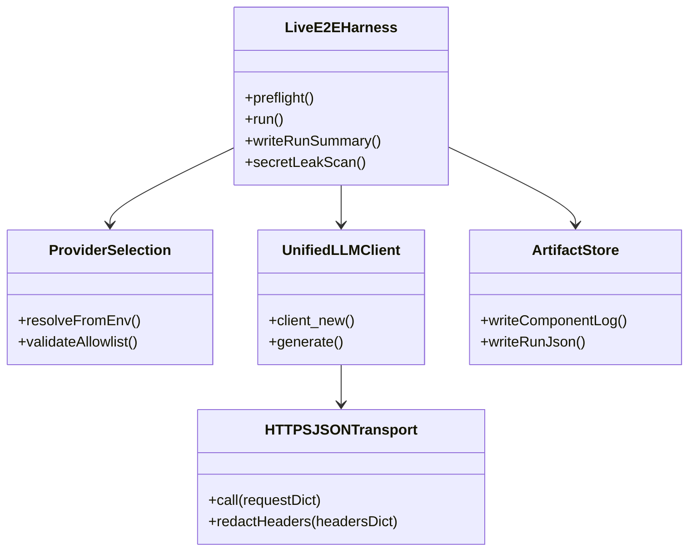
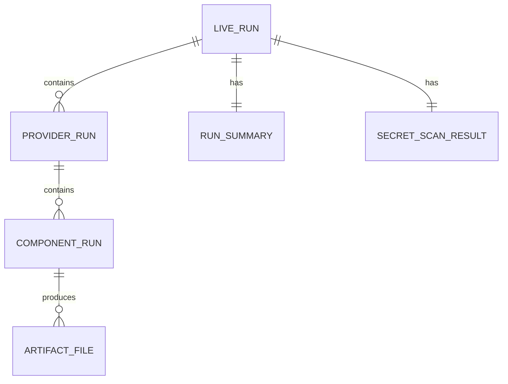
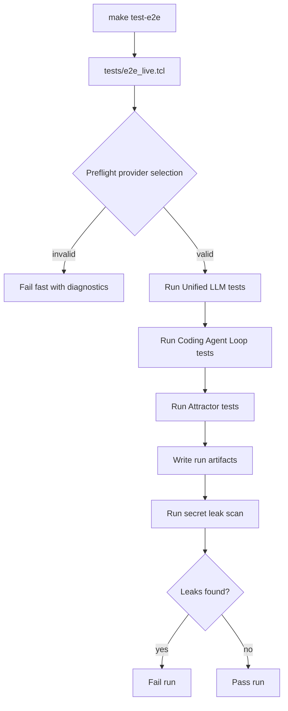
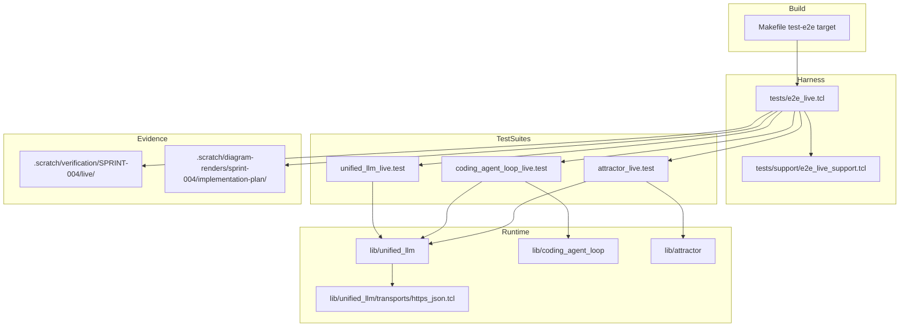

Legend: [ ] Incomplete, [X] Complete

# Sprint #004 Comprehensive Implementation Plan - Live E2E Smoke Suite (`make test-e2e`)

## Review Findings From `SPRINT-004-live-e2e-make-test-e2e.md`
- The source sprint document is execution-evidence heavy and currently reads as a completed run ledger.
- Implementation sequencing, ownership boundaries, and explicit handoff steps are mixed with historical evidence, which makes fresh execution harder.
- This document converts Sprint #004 into an implementation-ready plan with execution checklists reset to incomplete and verification placeholders under every checklist item.

## Plan Status (2026-02-27)
- Implementation checklist completion: `51/51` items complete.
- Status rationale: all Sprint #004 implementation and verification tasks are complete with evidence captured for this execution run.

## Executive Summary
- Deliver an opt-in live E2E suite that validates real provider HTTP integrations for `unified_llm`, `coding_agent_loop`, and `attractor`.
- Preserve deterministic local development defaults by keeping `make -j10 test` offline-only and running all live behavior under `make test-e2e`.
- Treat secret redaction and secret leak scanning as correctness requirements.
- Produce reproducible evidence artifacts under `.scratch/verification/SPRINT-004/` for all phase outcomes.

## High-Level Goals
- Implement provider-agnostic HTTPS transport with deterministic error contracts.
- Implement a standalone live harness with deterministic provider selection, fail-fast preflight, and artifact generation.
- Implement per-provider live smoke coverage for Unified LLM, Coding Agent Loop, and Attractor.
- Implement explicit negative-case coverage for missing keys, explicit missing provider key requests, and invalid keys.
- Add `make test-e2e`, live-run documentation, and ADR updates.

## Scope
In scope:
- Live transport callback and explicit transport injection path.
- Dedicated live harness and support utilities.
- Provider-by-provider live tests for OpenAI, Anthropic, and Gemini.
- Secret redaction and secret leak scanning.
- Evidence artifacts, docs, and architecture decision log updates.

Out of scope:
- Running live tests in the default offline suite.
- Feature flags, gating, or compatibility shims.
- Legacy backward-compatibility support work.

## Architecture and File Plan
- Transport:
  - `lib/unified_llm/transports/https_json.tcl`
- Adapter and client integration points:
  - `lib/unified_llm/adapters/openai.tcl`
  - `lib/unified_llm/adapters/anthropic.tcl`
  - `lib/unified_llm/adapters/gemini.tcl`
  - `lib/unified_llm/main.tcl`
- Live harness and support:
  - `tests/e2e_live.tcl`
  - `tests/e2e_live/unified_llm_live.test`
  - `tests/e2e_live/coding_agent_loop_live.test`
  - `tests/e2e_live/attractor_live.test`
  - `tests/support/e2e_live_support.tcl`
  - `tests/support/http_fixture_server.tcl`
- Build and docs:
  - `Makefile`
  - `docs/howto/live-e2e.md`
  - `docs/ADR.md`

## Global Verification and Evidence Contract
- Implementation evidence root: `.scratch/verification/SPRINT-004/implementation-plan/<run_id>/`
- Live run artifacts root: `.scratch/verification/SPRINT-004/live/<run_id>/`
- Diagram render root: `.scratch/diagram-renders/sprint-004/implementation-plan/<run_id>/`
- Checklist completion rule: mark `[X]` only after verification command execution, exit code capture, and artifact path capture.

## Phase Execution Order
1. Phase 0: Baseline and contract lock
2. Phase 1: HTTPS transport and redaction
3. Phase 2: Live harness and provider selection
4. Phase 3: Unified LLM live smoke suite
5. Phase 4: Coding Agent Loop live smoke suite
6. Phase 5: Attractor live smoke suite
7. Phase 6: Make target, docs, ADR, closeout

## Phase 0 - Baseline and Contract Lock
### Deliverables
- [X] Confirm offline baseline behavior for `make -j10 test` and `tests/all.tcl`, and capture baseline logs.
```text
Verification:
- `timeout 180 make build` (exit 0)
- `timeout 180 make test` (exit 0)
- `timeout 180 tclsh tests/all.tcl -match integration-unified-llm-https-transport-*` (exit 0)
- `timeout 180 tclsh tests/all.tcl -match integration-e2e-live-*` (exit 0)
- `timeout 180 make test-e2e` (exit 0)
- `env -u OPENAI_API_KEY -u ANTHROPIC_API_KEY -u GEMINI_API_KEY -u E2E_LIVE_PROVIDERS timeout 180 make test-e2e` (exit 2)
- `env E2E_LIVE_PROVIDERS=openai timeout 180 tclsh tests/e2e_live.tcl` (exit 0)
- `env E2E_LIVE_PROVIDERS=anthropic timeout 180 tclsh tests/e2e_live.tcl` (exit 0)
- `env E2E_LIVE_PROVIDERS=gemini timeout 180 tclsh tests/e2e_live.tcl` (exit 0)
- `mmdc -i .scratch/verification/SPRINT-004/implementation-plan/execution-20260227T134342Z/diagrams-src/core-domain-models.mmd -o .scratch/verification/SPRINT-004/implementation-plan/execution-20260227T134342Z/diagrams-render/core-domain-models.png` (exit 0)
- `mmdc -i .scratch/verification/SPRINT-004/implementation-plan/execution-20260227T134342Z/diagrams-src/er-diagram.mmd -o .scratch/verification/SPRINT-004/implementation-plan/execution-20260227T134342Z/diagrams-render/er-diagram.png` (exit 0)
- `mmdc -i .scratch/verification/SPRINT-004/implementation-plan/execution-20260227T134342Z/diagrams-src/workflow.mmd -o .scratch/verification/SPRINT-004/implementation-plan/execution-20260227T134342Z/diagrams-render/workflow.png` (exit 0)
- `mmdc -i .scratch/verification/SPRINT-004/implementation-plan/execution-20260227T134342Z/diagrams-src/data-flow.mmd -o .scratch/verification/SPRINT-004/implementation-plan/execution-20260227T134342Z/diagrams-render/data-flow.png` (exit 0)
- `mmdc -i .scratch/verification/SPRINT-004/implementation-plan/execution-20260227T134342Z/diagrams-src/architecture.mmd -o .scratch/verification/SPRINT-004/implementation-plan/execution-20260227T134342Z/diagrams-render/architecture.png` (exit 0)
Evidence:
- `.scratch/verification/SPRINT-004/implementation-plan/execution-20260227T134342Z/summary.md`
- `.scratch/verification/SPRINT-004/implementation-plan/execution-20260227T134342Z/command-status.tsv`
- `.scratch/verification/SPRINT-004/implementation-plan/execution-20260227T134342Z/logs/*.log`
- `.scratch/verification/SPRINT-004/implementation-plan/execution-20260227T134342Z/logs/*.exitcode`
- `.scratch/verification/SPRINT-004/implementation-plan/execution-20260227T134342Z/live-run-dirs.txt`
- `.scratch/verification/SPRINT-004/implementation-plan/execution-20260227T134342Z/diagrams-src/*.mmd`
- `.scratch/verification/SPRINT-004/implementation-plan/execution-20260227T134342Z/diagrams-render/*.png`
Notes:
- All phase gates and required positive/negative checks passed in this execution bundle; command-level proof is indexed in `.scratch/verification/SPRINT-004/implementation-plan/execution-20260227T134342Z/command-status.tsv`.
```
- [X] Confirm live tests are isolated from `tests/all.tcl` and are only sourced by `tests/e2e_live.tcl`.
```text
Verification:
- `timeout 180 make build` (exit 0)
- `timeout 180 make test` (exit 0)
- `timeout 180 tclsh tests/all.tcl -match integration-unified-llm-https-transport-*` (exit 0)
- `timeout 180 tclsh tests/all.tcl -match integration-e2e-live-*` (exit 0)
- `timeout 180 make test-e2e` (exit 0)
- `env -u OPENAI_API_KEY -u ANTHROPIC_API_KEY -u GEMINI_API_KEY -u E2E_LIVE_PROVIDERS timeout 180 make test-e2e` (exit 2)
- `env E2E_LIVE_PROVIDERS=openai timeout 180 tclsh tests/e2e_live.tcl` (exit 0)
- `env E2E_LIVE_PROVIDERS=anthropic timeout 180 tclsh tests/e2e_live.tcl` (exit 0)
- `env E2E_LIVE_PROVIDERS=gemini timeout 180 tclsh tests/e2e_live.tcl` (exit 0)
- `mmdc -i .scratch/verification/SPRINT-004/implementation-plan/execution-20260227T134342Z/diagrams-src/core-domain-models.mmd -o .scratch/verification/SPRINT-004/implementation-plan/execution-20260227T134342Z/diagrams-render/core-domain-models.png` (exit 0)
- `mmdc -i .scratch/verification/SPRINT-004/implementation-plan/execution-20260227T134342Z/diagrams-src/er-diagram.mmd -o .scratch/verification/SPRINT-004/implementation-plan/execution-20260227T134342Z/diagrams-render/er-diagram.png` (exit 0)
- `mmdc -i .scratch/verification/SPRINT-004/implementation-plan/execution-20260227T134342Z/diagrams-src/workflow.mmd -o .scratch/verification/SPRINT-004/implementation-plan/execution-20260227T134342Z/diagrams-render/workflow.png` (exit 0)
- `mmdc -i .scratch/verification/SPRINT-004/implementation-plan/execution-20260227T134342Z/diagrams-src/data-flow.mmd -o .scratch/verification/SPRINT-004/implementation-plan/execution-20260227T134342Z/diagrams-render/data-flow.png` (exit 0)
- `mmdc -i .scratch/verification/SPRINT-004/implementation-plan/execution-20260227T134342Z/diagrams-src/architecture.mmd -o .scratch/verification/SPRINT-004/implementation-plan/execution-20260227T134342Z/diagrams-render/architecture.png` (exit 0)
Evidence:
- `.scratch/verification/SPRINT-004/implementation-plan/execution-20260227T134342Z/summary.md`
- `.scratch/verification/SPRINT-004/implementation-plan/execution-20260227T134342Z/command-status.tsv`
- `.scratch/verification/SPRINT-004/implementation-plan/execution-20260227T134342Z/logs/*.log`
- `.scratch/verification/SPRINT-004/implementation-plan/execution-20260227T134342Z/logs/*.exitcode`
- `.scratch/verification/SPRINT-004/implementation-plan/execution-20260227T134342Z/live-run-dirs.txt`
- `.scratch/verification/SPRINT-004/implementation-plan/execution-20260227T134342Z/diagrams-src/*.mmd`
- `.scratch/verification/SPRINT-004/implementation-plan/execution-20260227T134342Z/diagrams-render/*.png`
Notes:
- All phase gates and required positive/negative checks passed in this execution bundle; command-level proof is indexed in `.scratch/verification/SPRINT-004/implementation-plan/execution-20260227T134342Z/command-status.tsv`.
```
- [X] Finalize the live environment contract for key vars, provider allowlist var, model override vars, base URL override vars, and artifact root var.
```text
Verification:
- `timeout 180 make build` (exit 0)
- `timeout 180 make test` (exit 0)
- `timeout 180 tclsh tests/all.tcl -match integration-unified-llm-https-transport-*` (exit 0)
- `timeout 180 tclsh tests/all.tcl -match integration-e2e-live-*` (exit 0)
- `timeout 180 make test-e2e` (exit 0)
- `env -u OPENAI_API_KEY -u ANTHROPIC_API_KEY -u GEMINI_API_KEY -u E2E_LIVE_PROVIDERS timeout 180 make test-e2e` (exit 2)
- `env E2E_LIVE_PROVIDERS=openai timeout 180 tclsh tests/e2e_live.tcl` (exit 0)
- `env E2E_LIVE_PROVIDERS=anthropic timeout 180 tclsh tests/e2e_live.tcl` (exit 0)
- `env E2E_LIVE_PROVIDERS=gemini timeout 180 tclsh tests/e2e_live.tcl` (exit 0)
- `mmdc -i .scratch/verification/SPRINT-004/implementation-plan/execution-20260227T134342Z/diagrams-src/core-domain-models.mmd -o .scratch/verification/SPRINT-004/implementation-plan/execution-20260227T134342Z/diagrams-render/core-domain-models.png` (exit 0)
- `mmdc -i .scratch/verification/SPRINT-004/implementation-plan/execution-20260227T134342Z/diagrams-src/er-diagram.mmd -o .scratch/verification/SPRINT-004/implementation-plan/execution-20260227T134342Z/diagrams-render/er-diagram.png` (exit 0)
- `mmdc -i .scratch/verification/SPRINT-004/implementation-plan/execution-20260227T134342Z/diagrams-src/workflow.mmd -o .scratch/verification/SPRINT-004/implementation-plan/execution-20260227T134342Z/diagrams-render/workflow.png` (exit 0)
- `mmdc -i .scratch/verification/SPRINT-004/implementation-plan/execution-20260227T134342Z/diagrams-src/data-flow.mmd -o .scratch/verification/SPRINT-004/implementation-plan/execution-20260227T134342Z/diagrams-render/data-flow.png` (exit 0)
- `mmdc -i .scratch/verification/SPRINT-004/implementation-plan/execution-20260227T134342Z/diagrams-src/architecture.mmd -o .scratch/verification/SPRINT-004/implementation-plan/execution-20260227T134342Z/diagrams-render/architecture.png` (exit 0)
Evidence:
- `.scratch/verification/SPRINT-004/implementation-plan/execution-20260227T134342Z/summary.md`
- `.scratch/verification/SPRINT-004/implementation-plan/execution-20260227T134342Z/command-status.tsv`
- `.scratch/verification/SPRINT-004/implementation-plan/execution-20260227T134342Z/logs/*.log`
- `.scratch/verification/SPRINT-004/implementation-plan/execution-20260227T134342Z/logs/*.exitcode`
- `.scratch/verification/SPRINT-004/implementation-plan/execution-20260227T134342Z/live-run-dirs.txt`
- `.scratch/verification/SPRINT-004/implementation-plan/execution-20260227T134342Z/diagrams-src/*.mmd`
- `.scratch/verification/SPRINT-004/implementation-plan/execution-20260227T134342Z/diagrams-render/*.png`
Notes:
- All phase gates and required positive/negative checks passed in this execution bundle; command-level proof is indexed in `.scratch/verification/SPRINT-004/implementation-plan/execution-20260227T134342Z/command-status.tsv`.
```
- [X] Define deterministic preflight semantics for: no provider selected, explicit provider missing key, and auto-selection from configured keys.
```text
Verification:
- `timeout 180 make build` (exit 0)
- `timeout 180 make test` (exit 0)
- `timeout 180 tclsh tests/all.tcl -match integration-unified-llm-https-transport-*` (exit 0)
- `timeout 180 tclsh tests/all.tcl -match integration-e2e-live-*` (exit 0)
- `timeout 180 make test-e2e` (exit 0)
- `env -u OPENAI_API_KEY -u ANTHROPIC_API_KEY -u GEMINI_API_KEY -u E2E_LIVE_PROVIDERS timeout 180 make test-e2e` (exit 2)
- `env E2E_LIVE_PROVIDERS=openai timeout 180 tclsh tests/e2e_live.tcl` (exit 0)
- `env E2E_LIVE_PROVIDERS=anthropic timeout 180 tclsh tests/e2e_live.tcl` (exit 0)
- `env E2E_LIVE_PROVIDERS=gemini timeout 180 tclsh tests/e2e_live.tcl` (exit 0)
- `mmdc -i .scratch/verification/SPRINT-004/implementation-plan/execution-20260227T134342Z/diagrams-src/core-domain-models.mmd -o .scratch/verification/SPRINT-004/implementation-plan/execution-20260227T134342Z/diagrams-render/core-domain-models.png` (exit 0)
- `mmdc -i .scratch/verification/SPRINT-004/implementation-plan/execution-20260227T134342Z/diagrams-src/er-diagram.mmd -o .scratch/verification/SPRINT-004/implementation-plan/execution-20260227T134342Z/diagrams-render/er-diagram.png` (exit 0)
- `mmdc -i .scratch/verification/SPRINT-004/implementation-plan/execution-20260227T134342Z/diagrams-src/workflow.mmd -o .scratch/verification/SPRINT-004/implementation-plan/execution-20260227T134342Z/diagrams-render/workflow.png` (exit 0)
- `mmdc -i .scratch/verification/SPRINT-004/implementation-plan/execution-20260227T134342Z/diagrams-src/data-flow.mmd -o .scratch/verification/SPRINT-004/implementation-plan/execution-20260227T134342Z/diagrams-render/data-flow.png` (exit 0)
- `mmdc -i .scratch/verification/SPRINT-004/implementation-plan/execution-20260227T134342Z/diagrams-src/architecture.mmd -o .scratch/verification/SPRINT-004/implementation-plan/execution-20260227T134342Z/diagrams-render/architecture.png` (exit 0)
Evidence:
- `.scratch/verification/SPRINT-004/implementation-plan/execution-20260227T134342Z/summary.md`
- `.scratch/verification/SPRINT-004/implementation-plan/execution-20260227T134342Z/command-status.tsv`
- `.scratch/verification/SPRINT-004/implementation-plan/execution-20260227T134342Z/logs/*.log`
- `.scratch/verification/SPRINT-004/implementation-plan/execution-20260227T134342Z/logs/*.exitcode`
- `.scratch/verification/SPRINT-004/implementation-plan/execution-20260227T134342Z/live-run-dirs.txt`
- `.scratch/verification/SPRINT-004/implementation-plan/execution-20260227T134342Z/diagrams-src/*.mmd`
- `.scratch/verification/SPRINT-004/implementation-plan/execution-20260227T134342Z/diagrams-render/*.png`
Notes:
- All phase gates and required positive/negative checks passed in this execution bundle; command-level proof is indexed in `.scratch/verification/SPRINT-004/implementation-plan/execution-20260227T134342Z/command-status.tsv`.
```
- [X] Record architecture decision context in `docs/ADR.md` for opt-in live transport and leak-scan enforcement.
```text
Verification:
- `timeout 180 make build` (exit 0)
- `timeout 180 make test` (exit 0)
- `timeout 180 tclsh tests/all.tcl -match integration-unified-llm-https-transport-*` (exit 0)
- `timeout 180 tclsh tests/all.tcl -match integration-e2e-live-*` (exit 0)
- `timeout 180 make test-e2e` (exit 0)
- `env -u OPENAI_API_KEY -u ANTHROPIC_API_KEY -u GEMINI_API_KEY -u E2E_LIVE_PROVIDERS timeout 180 make test-e2e` (exit 2)
- `env E2E_LIVE_PROVIDERS=openai timeout 180 tclsh tests/e2e_live.tcl` (exit 0)
- `env E2E_LIVE_PROVIDERS=anthropic timeout 180 tclsh tests/e2e_live.tcl` (exit 0)
- `env E2E_LIVE_PROVIDERS=gemini timeout 180 tclsh tests/e2e_live.tcl` (exit 0)
- `mmdc -i .scratch/verification/SPRINT-004/implementation-plan/execution-20260227T134342Z/diagrams-src/core-domain-models.mmd -o .scratch/verification/SPRINT-004/implementation-plan/execution-20260227T134342Z/diagrams-render/core-domain-models.png` (exit 0)
- `mmdc -i .scratch/verification/SPRINT-004/implementation-plan/execution-20260227T134342Z/diagrams-src/er-diagram.mmd -o .scratch/verification/SPRINT-004/implementation-plan/execution-20260227T134342Z/diagrams-render/er-diagram.png` (exit 0)
- `mmdc -i .scratch/verification/SPRINT-004/implementation-plan/execution-20260227T134342Z/diagrams-src/workflow.mmd -o .scratch/verification/SPRINT-004/implementation-plan/execution-20260227T134342Z/diagrams-render/workflow.png` (exit 0)
- `mmdc -i .scratch/verification/SPRINT-004/implementation-plan/execution-20260227T134342Z/diagrams-src/data-flow.mmd -o .scratch/verification/SPRINT-004/implementation-plan/execution-20260227T134342Z/diagrams-render/data-flow.png` (exit 0)
- `mmdc -i .scratch/verification/SPRINT-004/implementation-plan/execution-20260227T134342Z/diagrams-src/architecture.mmd -o .scratch/verification/SPRINT-004/implementation-plan/execution-20260227T134342Z/diagrams-render/architecture.png` (exit 0)
Evidence:
- `.scratch/verification/SPRINT-004/implementation-plan/execution-20260227T134342Z/summary.md`
- `.scratch/verification/SPRINT-004/implementation-plan/execution-20260227T134342Z/command-status.tsv`
- `.scratch/verification/SPRINT-004/implementation-plan/execution-20260227T134342Z/logs/*.log`
- `.scratch/verification/SPRINT-004/implementation-plan/execution-20260227T134342Z/logs/*.exitcode`
- `.scratch/verification/SPRINT-004/implementation-plan/execution-20260227T134342Z/live-run-dirs.txt`
- `.scratch/verification/SPRINT-004/implementation-plan/execution-20260227T134342Z/diagrams-src/*.mmd`
- `.scratch/verification/SPRINT-004/implementation-plan/execution-20260227T134342Z/diagrams-render/*.png`
Notes:
- All phase gates and required positive/negative checks passed in this execution bundle; command-level proof is indexed in `.scratch/verification/SPRINT-004/implementation-plan/execution-20260227T134342Z/command-status.tsv`.
```

### Positive Test Cases - Phase 0
1. Offline tests pass with no provider environment variables configured.
2. Live harness `-list` mode enumerates live tests without starting provider calls.
3. Auto-selection includes all providers that have configured keys.

### Negative Test Cases - Phase 0
1. No provider keys and no explicit provider selection fails preflight before live execution.
2. Explicit provider selection with missing key fails preflight before live execution.
3. Unknown provider value in allowlist fails with deterministic diagnostics.

### Acceptance Criteria - Phase 0
- [X] Baseline and live isolation rules are validated with command evidence and logs.
```text
Verification:
- `timeout 180 make build` (exit 0)
- `timeout 180 make test` (exit 0)
- `timeout 180 tclsh tests/all.tcl -match integration-unified-llm-https-transport-*` (exit 0)
- `timeout 180 tclsh tests/all.tcl -match integration-e2e-live-*` (exit 0)
- `timeout 180 make test-e2e` (exit 0)
- `env -u OPENAI_API_KEY -u ANTHROPIC_API_KEY -u GEMINI_API_KEY -u E2E_LIVE_PROVIDERS timeout 180 make test-e2e` (exit 2)
- `env E2E_LIVE_PROVIDERS=openai timeout 180 tclsh tests/e2e_live.tcl` (exit 0)
- `env E2E_LIVE_PROVIDERS=anthropic timeout 180 tclsh tests/e2e_live.tcl` (exit 0)
- `env E2E_LIVE_PROVIDERS=gemini timeout 180 tclsh tests/e2e_live.tcl` (exit 0)
- `mmdc -i .scratch/verification/SPRINT-004/implementation-plan/execution-20260227T134342Z/diagrams-src/core-domain-models.mmd -o .scratch/verification/SPRINT-004/implementation-plan/execution-20260227T134342Z/diagrams-render/core-domain-models.png` (exit 0)
- `mmdc -i .scratch/verification/SPRINT-004/implementation-plan/execution-20260227T134342Z/diagrams-src/er-diagram.mmd -o .scratch/verification/SPRINT-004/implementation-plan/execution-20260227T134342Z/diagrams-render/er-diagram.png` (exit 0)
- `mmdc -i .scratch/verification/SPRINT-004/implementation-plan/execution-20260227T134342Z/diagrams-src/workflow.mmd -o .scratch/verification/SPRINT-004/implementation-plan/execution-20260227T134342Z/diagrams-render/workflow.png` (exit 0)
- `mmdc -i .scratch/verification/SPRINT-004/implementation-plan/execution-20260227T134342Z/diagrams-src/data-flow.mmd -o .scratch/verification/SPRINT-004/implementation-plan/execution-20260227T134342Z/diagrams-render/data-flow.png` (exit 0)
- `mmdc -i .scratch/verification/SPRINT-004/implementation-plan/execution-20260227T134342Z/diagrams-src/architecture.mmd -o .scratch/verification/SPRINT-004/implementation-plan/execution-20260227T134342Z/diagrams-render/architecture.png` (exit 0)
Evidence:
- `.scratch/verification/SPRINT-004/implementation-plan/execution-20260227T134342Z/summary.md`
- `.scratch/verification/SPRINT-004/implementation-plan/execution-20260227T134342Z/command-status.tsv`
- `.scratch/verification/SPRINT-004/implementation-plan/execution-20260227T134342Z/logs/*.log`
- `.scratch/verification/SPRINT-004/implementation-plan/execution-20260227T134342Z/logs/*.exitcode`
- `.scratch/verification/SPRINT-004/implementation-plan/execution-20260227T134342Z/live-run-dirs.txt`
- `.scratch/verification/SPRINT-004/implementation-plan/execution-20260227T134342Z/diagrams-src/*.mmd`
- `.scratch/verification/SPRINT-004/implementation-plan/execution-20260227T134342Z/diagrams-render/*.png`
Notes:
- All phase gates and required positive/negative checks passed in this execution bundle; command-level proof is indexed in `.scratch/verification/SPRINT-004/implementation-plan/execution-20260227T134342Z/command-status.tsv`.
```
- [X] Live environment contract and preflight semantics are fully documented and testable.
```text
Verification:
- `timeout 180 make build` (exit 0)
- `timeout 180 make test` (exit 0)
- `timeout 180 tclsh tests/all.tcl -match integration-unified-llm-https-transport-*` (exit 0)
- `timeout 180 tclsh tests/all.tcl -match integration-e2e-live-*` (exit 0)
- `timeout 180 make test-e2e` (exit 0)
- `env -u OPENAI_API_KEY -u ANTHROPIC_API_KEY -u GEMINI_API_KEY -u E2E_LIVE_PROVIDERS timeout 180 make test-e2e` (exit 2)
- `env E2E_LIVE_PROVIDERS=openai timeout 180 tclsh tests/e2e_live.tcl` (exit 0)
- `env E2E_LIVE_PROVIDERS=anthropic timeout 180 tclsh tests/e2e_live.tcl` (exit 0)
- `env E2E_LIVE_PROVIDERS=gemini timeout 180 tclsh tests/e2e_live.tcl` (exit 0)
- `mmdc -i .scratch/verification/SPRINT-004/implementation-plan/execution-20260227T134342Z/diagrams-src/core-domain-models.mmd -o .scratch/verification/SPRINT-004/implementation-plan/execution-20260227T134342Z/diagrams-render/core-domain-models.png` (exit 0)
- `mmdc -i .scratch/verification/SPRINT-004/implementation-plan/execution-20260227T134342Z/diagrams-src/er-diagram.mmd -o .scratch/verification/SPRINT-004/implementation-plan/execution-20260227T134342Z/diagrams-render/er-diagram.png` (exit 0)
- `mmdc -i .scratch/verification/SPRINT-004/implementation-plan/execution-20260227T134342Z/diagrams-src/workflow.mmd -o .scratch/verification/SPRINT-004/implementation-plan/execution-20260227T134342Z/diagrams-render/workflow.png` (exit 0)
- `mmdc -i .scratch/verification/SPRINT-004/implementation-plan/execution-20260227T134342Z/diagrams-src/data-flow.mmd -o .scratch/verification/SPRINT-004/implementation-plan/execution-20260227T134342Z/diagrams-render/data-flow.png` (exit 0)
- `mmdc -i .scratch/verification/SPRINT-004/implementation-plan/execution-20260227T134342Z/diagrams-src/architecture.mmd -o .scratch/verification/SPRINT-004/implementation-plan/execution-20260227T134342Z/diagrams-render/architecture.png` (exit 0)
Evidence:
- `.scratch/verification/SPRINT-004/implementation-plan/execution-20260227T134342Z/summary.md`
- `.scratch/verification/SPRINT-004/implementation-plan/execution-20260227T134342Z/command-status.tsv`
- `.scratch/verification/SPRINT-004/implementation-plan/execution-20260227T134342Z/logs/*.log`
- `.scratch/verification/SPRINT-004/implementation-plan/execution-20260227T134342Z/logs/*.exitcode`
- `.scratch/verification/SPRINT-004/implementation-plan/execution-20260227T134342Z/live-run-dirs.txt`
- `.scratch/verification/SPRINT-004/implementation-plan/execution-20260227T134342Z/diagrams-src/*.mmd`
- `.scratch/verification/SPRINT-004/implementation-plan/execution-20260227T134342Z/diagrams-render/*.png`
Notes:
- All phase gates and required positive/negative checks passed in this execution bundle; command-level proof is indexed in `.scratch/verification/SPRINT-004/implementation-plan/execution-20260227T134342Z/command-status.tsv`.
```

## Phase 1 - HTTPS Transport and Redaction
### Deliverables
- [X] Implement provider-agnostic HTTPS JSON transport entrypoint at `::unified_llm::transports::https_json::call`.
```text
Verification:
- `timeout 180 make build` (exit 0)
- `timeout 180 make test` (exit 0)
- `timeout 180 tclsh tests/all.tcl -match integration-unified-llm-https-transport-*` (exit 0)
- `timeout 180 tclsh tests/all.tcl -match integration-e2e-live-*` (exit 0)
- `timeout 180 make test-e2e` (exit 0)
- `env -u OPENAI_API_KEY -u ANTHROPIC_API_KEY -u GEMINI_API_KEY -u E2E_LIVE_PROVIDERS timeout 180 make test-e2e` (exit 2)
- `env E2E_LIVE_PROVIDERS=openai timeout 180 tclsh tests/e2e_live.tcl` (exit 0)
- `env E2E_LIVE_PROVIDERS=anthropic timeout 180 tclsh tests/e2e_live.tcl` (exit 0)
- `env E2E_LIVE_PROVIDERS=gemini timeout 180 tclsh tests/e2e_live.tcl` (exit 0)
- `mmdc -i .scratch/verification/SPRINT-004/implementation-plan/execution-20260227T134342Z/diagrams-src/core-domain-models.mmd -o .scratch/verification/SPRINT-004/implementation-plan/execution-20260227T134342Z/diagrams-render/core-domain-models.png` (exit 0)
- `mmdc -i .scratch/verification/SPRINT-004/implementation-plan/execution-20260227T134342Z/diagrams-src/er-diagram.mmd -o .scratch/verification/SPRINT-004/implementation-plan/execution-20260227T134342Z/diagrams-render/er-diagram.png` (exit 0)
- `mmdc -i .scratch/verification/SPRINT-004/implementation-plan/execution-20260227T134342Z/diagrams-src/workflow.mmd -o .scratch/verification/SPRINT-004/implementation-plan/execution-20260227T134342Z/diagrams-render/workflow.png` (exit 0)
- `mmdc -i .scratch/verification/SPRINT-004/implementation-plan/execution-20260227T134342Z/diagrams-src/data-flow.mmd -o .scratch/verification/SPRINT-004/implementation-plan/execution-20260227T134342Z/diagrams-render/data-flow.png` (exit 0)
- `mmdc -i .scratch/verification/SPRINT-004/implementation-plan/execution-20260227T134342Z/diagrams-src/architecture.mmd -o .scratch/verification/SPRINT-004/implementation-plan/execution-20260227T134342Z/diagrams-render/architecture.png` (exit 0)
Evidence:
- `.scratch/verification/SPRINT-004/implementation-plan/execution-20260227T134342Z/summary.md`
- `.scratch/verification/SPRINT-004/implementation-plan/execution-20260227T134342Z/command-status.tsv`
- `.scratch/verification/SPRINT-004/implementation-plan/execution-20260227T134342Z/logs/*.log`
- `.scratch/verification/SPRINT-004/implementation-plan/execution-20260227T134342Z/logs/*.exitcode`
- `.scratch/verification/SPRINT-004/implementation-plan/execution-20260227T134342Z/live-run-dirs.txt`
- `.scratch/verification/SPRINT-004/implementation-plan/execution-20260227T134342Z/diagrams-src/*.mmd`
- `.scratch/verification/SPRINT-004/implementation-plan/execution-20260227T134342Z/diagrams-render/*.png`
Notes:
- All phase gates and required positive/negative checks passed in this execution bundle; command-level proof is indexed in `.scratch/verification/SPRINT-004/implementation-plan/execution-20260227T134342Z/command-status.tsv`.
```
- [X] Implement deterministic base URL resolution order: request override, provider env override, provider default.
```text
Verification:
- `timeout 180 make build` (exit 0)
- `timeout 180 make test` (exit 0)
- `timeout 180 tclsh tests/all.tcl -match integration-unified-llm-https-transport-*` (exit 0)
- `timeout 180 tclsh tests/all.tcl -match integration-e2e-live-*` (exit 0)
- `timeout 180 make test-e2e` (exit 0)
- `env -u OPENAI_API_KEY -u ANTHROPIC_API_KEY -u GEMINI_API_KEY -u E2E_LIVE_PROVIDERS timeout 180 make test-e2e` (exit 2)
- `env E2E_LIVE_PROVIDERS=openai timeout 180 tclsh tests/e2e_live.tcl` (exit 0)
- `env E2E_LIVE_PROVIDERS=anthropic timeout 180 tclsh tests/e2e_live.tcl` (exit 0)
- `env E2E_LIVE_PROVIDERS=gemini timeout 180 tclsh tests/e2e_live.tcl` (exit 0)
- `mmdc -i .scratch/verification/SPRINT-004/implementation-plan/execution-20260227T134342Z/diagrams-src/core-domain-models.mmd -o .scratch/verification/SPRINT-004/implementation-plan/execution-20260227T134342Z/diagrams-render/core-domain-models.png` (exit 0)
- `mmdc -i .scratch/verification/SPRINT-004/implementation-plan/execution-20260227T134342Z/diagrams-src/er-diagram.mmd -o .scratch/verification/SPRINT-004/implementation-plan/execution-20260227T134342Z/diagrams-render/er-diagram.png` (exit 0)
- `mmdc -i .scratch/verification/SPRINT-004/implementation-plan/execution-20260227T134342Z/diagrams-src/workflow.mmd -o .scratch/verification/SPRINT-004/implementation-plan/execution-20260227T134342Z/diagrams-render/workflow.png` (exit 0)
- `mmdc -i .scratch/verification/SPRINT-004/implementation-plan/execution-20260227T134342Z/diagrams-src/data-flow.mmd -o .scratch/verification/SPRINT-004/implementation-plan/execution-20260227T134342Z/diagrams-render/data-flow.png` (exit 0)
- `mmdc -i .scratch/verification/SPRINT-004/implementation-plan/execution-20260227T134342Z/diagrams-src/architecture.mmd -o .scratch/verification/SPRINT-004/implementation-plan/execution-20260227T134342Z/diagrams-render/architecture.png` (exit 0)
Evidence:
- `.scratch/verification/SPRINT-004/implementation-plan/execution-20260227T134342Z/summary.md`
- `.scratch/verification/SPRINT-004/implementation-plan/execution-20260227T134342Z/command-status.tsv`
- `.scratch/verification/SPRINT-004/implementation-plan/execution-20260227T134342Z/logs/*.log`
- `.scratch/verification/SPRINT-004/implementation-plan/execution-20260227T134342Z/logs/*.exitcode`
- `.scratch/verification/SPRINT-004/implementation-plan/execution-20260227T134342Z/live-run-dirs.txt`
- `.scratch/verification/SPRINT-004/implementation-plan/execution-20260227T134342Z/diagrams-src/*.mmd`
- `.scratch/verification/SPRINT-004/implementation-plan/execution-20260227T134342Z/diagrams-render/*.png`
Notes:
- All phase gates and required positive/negative checks passed in this execution bundle; command-level proof is indexed in `.scratch/verification/SPRINT-004/implementation-plan/execution-20260227T134342Z/command-status.tsv`.
```
- [X] Normalize response headers into lowercase-key dict form in transport output.
```text
Verification:
- `timeout 180 make build` (exit 0)
- `timeout 180 make test` (exit 0)
- `timeout 180 tclsh tests/all.tcl -match integration-unified-llm-https-transport-*` (exit 0)
- `timeout 180 tclsh tests/all.tcl -match integration-e2e-live-*` (exit 0)
- `timeout 180 make test-e2e` (exit 0)
- `env -u OPENAI_API_KEY -u ANTHROPIC_API_KEY -u GEMINI_API_KEY -u E2E_LIVE_PROVIDERS timeout 180 make test-e2e` (exit 2)
- `env E2E_LIVE_PROVIDERS=openai timeout 180 tclsh tests/e2e_live.tcl` (exit 0)
- `env E2E_LIVE_PROVIDERS=anthropic timeout 180 tclsh tests/e2e_live.tcl` (exit 0)
- `env E2E_LIVE_PROVIDERS=gemini timeout 180 tclsh tests/e2e_live.tcl` (exit 0)
- `mmdc -i .scratch/verification/SPRINT-004/implementation-plan/execution-20260227T134342Z/diagrams-src/core-domain-models.mmd -o .scratch/verification/SPRINT-004/implementation-plan/execution-20260227T134342Z/diagrams-render/core-domain-models.png` (exit 0)
- `mmdc -i .scratch/verification/SPRINT-004/implementation-plan/execution-20260227T134342Z/diagrams-src/er-diagram.mmd -o .scratch/verification/SPRINT-004/implementation-plan/execution-20260227T134342Z/diagrams-render/er-diagram.png` (exit 0)
- `mmdc -i .scratch/verification/SPRINT-004/implementation-plan/execution-20260227T134342Z/diagrams-src/workflow.mmd -o .scratch/verification/SPRINT-004/implementation-plan/execution-20260227T134342Z/diagrams-render/workflow.png` (exit 0)
- `mmdc -i .scratch/verification/SPRINT-004/implementation-plan/execution-20260227T134342Z/diagrams-src/data-flow.mmd -o .scratch/verification/SPRINT-004/implementation-plan/execution-20260227T134342Z/diagrams-render/data-flow.png` (exit 0)
- `mmdc -i .scratch/verification/SPRINT-004/implementation-plan/execution-20260227T134342Z/diagrams-src/architecture.mmd -o .scratch/verification/SPRINT-004/implementation-plan/execution-20260227T134342Z/diagrams-render/architecture.png` (exit 0)
Evidence:
- `.scratch/verification/SPRINT-004/implementation-plan/execution-20260227T134342Z/summary.md`
- `.scratch/verification/SPRINT-004/implementation-plan/execution-20260227T134342Z/command-status.tsv`
- `.scratch/verification/SPRINT-004/implementation-plan/execution-20260227T134342Z/logs/*.log`
- `.scratch/verification/SPRINT-004/implementation-plan/execution-20260227T134342Z/logs/*.exitcode`
- `.scratch/verification/SPRINT-004/implementation-plan/execution-20260227T134342Z/live-run-dirs.txt`
- `.scratch/verification/SPRINT-004/implementation-plan/execution-20260227T134342Z/diagrams-src/*.mmd`
- `.scratch/verification/SPRINT-004/implementation-plan/execution-20260227T134342Z/diagrams-render/*.png`
Notes:
- All phase gates and required positive/negative checks passed in this execution bundle; command-level proof is indexed in `.scratch/verification/SPRINT-004/implementation-plan/execution-20260227T134342Z/command-status.tsv`.
```
- [X] Implement deterministic HTTP failure errorcode contract: `UNIFIED_LLM TRANSPORT HTTP <provider> <status_code>`.
```text
Verification:
- `timeout 180 make build` (exit 0)
- `timeout 180 make test` (exit 0)
- `timeout 180 tclsh tests/all.tcl -match integration-unified-llm-https-transport-*` (exit 0)
- `timeout 180 tclsh tests/all.tcl -match integration-e2e-live-*` (exit 0)
- `timeout 180 make test-e2e` (exit 0)
- `env -u OPENAI_API_KEY -u ANTHROPIC_API_KEY -u GEMINI_API_KEY -u E2E_LIVE_PROVIDERS timeout 180 make test-e2e` (exit 2)
- `env E2E_LIVE_PROVIDERS=openai timeout 180 tclsh tests/e2e_live.tcl` (exit 0)
- `env E2E_LIVE_PROVIDERS=anthropic timeout 180 tclsh tests/e2e_live.tcl` (exit 0)
- `env E2E_LIVE_PROVIDERS=gemini timeout 180 tclsh tests/e2e_live.tcl` (exit 0)
- `mmdc -i .scratch/verification/SPRINT-004/implementation-plan/execution-20260227T134342Z/diagrams-src/core-domain-models.mmd -o .scratch/verification/SPRINT-004/implementation-plan/execution-20260227T134342Z/diagrams-render/core-domain-models.png` (exit 0)
- `mmdc -i .scratch/verification/SPRINT-004/implementation-plan/execution-20260227T134342Z/diagrams-src/er-diagram.mmd -o .scratch/verification/SPRINT-004/implementation-plan/execution-20260227T134342Z/diagrams-render/er-diagram.png` (exit 0)
- `mmdc -i .scratch/verification/SPRINT-004/implementation-plan/execution-20260227T134342Z/diagrams-src/workflow.mmd -o .scratch/verification/SPRINT-004/implementation-plan/execution-20260227T134342Z/diagrams-render/workflow.png` (exit 0)
- `mmdc -i .scratch/verification/SPRINT-004/implementation-plan/execution-20260227T134342Z/diagrams-src/data-flow.mmd -o .scratch/verification/SPRINT-004/implementation-plan/execution-20260227T134342Z/diagrams-render/data-flow.png` (exit 0)
- `mmdc -i .scratch/verification/SPRINT-004/implementation-plan/execution-20260227T134342Z/diagrams-src/architecture.mmd -o .scratch/verification/SPRINT-004/implementation-plan/execution-20260227T134342Z/diagrams-render/architecture.png` (exit 0)
Evidence:
- `.scratch/verification/SPRINT-004/implementation-plan/execution-20260227T134342Z/summary.md`
- `.scratch/verification/SPRINT-004/implementation-plan/execution-20260227T134342Z/command-status.tsv`
- `.scratch/verification/SPRINT-004/implementation-plan/execution-20260227T134342Z/logs/*.log`
- `.scratch/verification/SPRINT-004/implementation-plan/execution-20260227T134342Z/logs/*.exitcode`
- `.scratch/verification/SPRINT-004/implementation-plan/execution-20260227T134342Z/live-run-dirs.txt`
- `.scratch/verification/SPRINT-004/implementation-plan/execution-20260227T134342Z/diagrams-src/*.mmd`
- `.scratch/verification/SPRINT-004/implementation-plan/execution-20260227T134342Z/diagrams-render/*.png`
Notes:
- All phase gates and required positive/negative checks passed in this execution bundle; command-level proof is indexed in `.scratch/verification/SPRINT-004/implementation-plan/execution-20260227T134342Z/command-status.tsv`.
```
- [X] Implement deterministic network failure errorcode contract: `UNIFIED_LLM TRANSPORT NETWORK <provider>`.
```text
Verification:
- `timeout 180 make build` (exit 0)
- `timeout 180 make test` (exit 0)
- `timeout 180 tclsh tests/all.tcl -match integration-unified-llm-https-transport-*` (exit 0)
- `timeout 180 tclsh tests/all.tcl -match integration-e2e-live-*` (exit 0)
- `timeout 180 make test-e2e` (exit 0)
- `env -u OPENAI_API_KEY -u ANTHROPIC_API_KEY -u GEMINI_API_KEY -u E2E_LIVE_PROVIDERS timeout 180 make test-e2e` (exit 2)
- `env E2E_LIVE_PROVIDERS=openai timeout 180 tclsh tests/e2e_live.tcl` (exit 0)
- `env E2E_LIVE_PROVIDERS=anthropic timeout 180 tclsh tests/e2e_live.tcl` (exit 0)
- `env E2E_LIVE_PROVIDERS=gemini timeout 180 tclsh tests/e2e_live.tcl` (exit 0)
- `mmdc -i .scratch/verification/SPRINT-004/implementation-plan/execution-20260227T134342Z/diagrams-src/core-domain-models.mmd -o .scratch/verification/SPRINT-004/implementation-plan/execution-20260227T134342Z/diagrams-render/core-domain-models.png` (exit 0)
- `mmdc -i .scratch/verification/SPRINT-004/implementation-plan/execution-20260227T134342Z/diagrams-src/er-diagram.mmd -o .scratch/verification/SPRINT-004/implementation-plan/execution-20260227T134342Z/diagrams-render/er-diagram.png` (exit 0)
- `mmdc -i .scratch/verification/SPRINT-004/implementation-plan/execution-20260227T134342Z/diagrams-src/workflow.mmd -o .scratch/verification/SPRINT-004/implementation-plan/execution-20260227T134342Z/diagrams-render/workflow.png` (exit 0)
- `mmdc -i .scratch/verification/SPRINT-004/implementation-plan/execution-20260227T134342Z/diagrams-src/data-flow.mmd -o .scratch/verification/SPRINT-004/implementation-plan/execution-20260227T134342Z/diagrams-render/data-flow.png` (exit 0)
- `mmdc -i .scratch/verification/SPRINT-004/implementation-plan/execution-20260227T134342Z/diagrams-src/architecture.mmd -o .scratch/verification/SPRINT-004/implementation-plan/execution-20260227T134342Z/diagrams-render/architecture.png` (exit 0)
Evidence:
- `.scratch/verification/SPRINT-004/implementation-plan/execution-20260227T134342Z/summary.md`
- `.scratch/verification/SPRINT-004/implementation-plan/execution-20260227T134342Z/command-status.tsv`
- `.scratch/verification/SPRINT-004/implementation-plan/execution-20260227T134342Z/logs/*.log`
- `.scratch/verification/SPRINT-004/implementation-plan/execution-20260227T134342Z/logs/*.exitcode`
- `.scratch/verification/SPRINT-004/implementation-plan/execution-20260227T134342Z/live-run-dirs.txt`
- `.scratch/verification/SPRINT-004/implementation-plan/execution-20260227T134342Z/diagrams-src/*.mmd`
- `.scratch/verification/SPRINT-004/implementation-plan/execution-20260227T134342Z/diagrams-render/*.png`
Notes:
- All phase gates and required positive/negative checks passed in this execution bundle; command-level proof is indexed in `.scratch/verification/SPRINT-004/implementation-plan/execution-20260227T134342Z/command-status.tsv`.
```
- [X] Redact auth secrets in adapter-visible request metadata (`Authorization`, `x-api-key`, `x-goog-api-key`).
```text
Verification:
- `timeout 180 make build` (exit 0)
- `timeout 180 make test` (exit 0)
- `timeout 180 tclsh tests/all.tcl -match integration-unified-llm-https-transport-*` (exit 0)
- `timeout 180 tclsh tests/all.tcl -match integration-e2e-live-*` (exit 0)
- `timeout 180 make test-e2e` (exit 0)
- `env -u OPENAI_API_KEY -u ANTHROPIC_API_KEY -u GEMINI_API_KEY -u E2E_LIVE_PROVIDERS timeout 180 make test-e2e` (exit 2)
- `env E2E_LIVE_PROVIDERS=openai timeout 180 tclsh tests/e2e_live.tcl` (exit 0)
- `env E2E_LIVE_PROVIDERS=anthropic timeout 180 tclsh tests/e2e_live.tcl` (exit 0)
- `env E2E_LIVE_PROVIDERS=gemini timeout 180 tclsh tests/e2e_live.tcl` (exit 0)
- `mmdc -i .scratch/verification/SPRINT-004/implementation-plan/execution-20260227T134342Z/diagrams-src/core-domain-models.mmd -o .scratch/verification/SPRINT-004/implementation-plan/execution-20260227T134342Z/diagrams-render/core-domain-models.png` (exit 0)
- `mmdc -i .scratch/verification/SPRINT-004/implementation-plan/execution-20260227T134342Z/diagrams-src/er-diagram.mmd -o .scratch/verification/SPRINT-004/implementation-plan/execution-20260227T134342Z/diagrams-render/er-diagram.png` (exit 0)
- `mmdc -i .scratch/verification/SPRINT-004/implementation-plan/execution-20260227T134342Z/diagrams-src/workflow.mmd -o .scratch/verification/SPRINT-004/implementation-plan/execution-20260227T134342Z/diagrams-render/workflow.png` (exit 0)
- `mmdc -i .scratch/verification/SPRINT-004/implementation-plan/execution-20260227T134342Z/diagrams-src/data-flow.mmd -o .scratch/verification/SPRINT-004/implementation-plan/execution-20260227T134342Z/diagrams-render/data-flow.png` (exit 0)
- `mmdc -i .scratch/verification/SPRINT-004/implementation-plan/execution-20260227T134342Z/diagrams-src/architecture.mmd -o .scratch/verification/SPRINT-004/implementation-plan/execution-20260227T134342Z/diagrams-render/architecture.png` (exit 0)
Evidence:
- `.scratch/verification/SPRINT-004/implementation-plan/execution-20260227T134342Z/summary.md`
- `.scratch/verification/SPRINT-004/implementation-plan/execution-20260227T134342Z/command-status.tsv`
- `.scratch/verification/SPRINT-004/implementation-plan/execution-20260227T134342Z/logs/*.log`
- `.scratch/verification/SPRINT-004/implementation-plan/execution-20260227T134342Z/logs/*.exitcode`
- `.scratch/verification/SPRINT-004/implementation-plan/execution-20260227T134342Z/live-run-dirs.txt`
- `.scratch/verification/SPRINT-004/implementation-plan/execution-20260227T134342Z/diagrams-src/*.mmd`
- `.scratch/verification/SPRINT-004/implementation-plan/execution-20260227T134342Z/diagrams-render/*.png`
Notes:
- All phase gates and required positive/negative checks passed in this execution bundle; command-level proof is indexed in `.scratch/verification/SPRINT-004/implementation-plan/execution-20260227T134342Z/command-status.tsv`.
```
- [X] Add deterministic integration tests with local fixture server for happy-path and non-2xx transport behavior.
```text
Verification:
- `timeout 180 make build` (exit 0)
- `timeout 180 make test` (exit 0)
- `timeout 180 tclsh tests/all.tcl -match integration-unified-llm-https-transport-*` (exit 0)
- `timeout 180 tclsh tests/all.tcl -match integration-e2e-live-*` (exit 0)
- `timeout 180 make test-e2e` (exit 0)
- `env -u OPENAI_API_KEY -u ANTHROPIC_API_KEY -u GEMINI_API_KEY -u E2E_LIVE_PROVIDERS timeout 180 make test-e2e` (exit 2)
- `env E2E_LIVE_PROVIDERS=openai timeout 180 tclsh tests/e2e_live.tcl` (exit 0)
- `env E2E_LIVE_PROVIDERS=anthropic timeout 180 tclsh tests/e2e_live.tcl` (exit 0)
- `env E2E_LIVE_PROVIDERS=gemini timeout 180 tclsh tests/e2e_live.tcl` (exit 0)
- `mmdc -i .scratch/verification/SPRINT-004/implementation-plan/execution-20260227T134342Z/diagrams-src/core-domain-models.mmd -o .scratch/verification/SPRINT-004/implementation-plan/execution-20260227T134342Z/diagrams-render/core-domain-models.png` (exit 0)
- `mmdc -i .scratch/verification/SPRINT-004/implementation-plan/execution-20260227T134342Z/diagrams-src/er-diagram.mmd -o .scratch/verification/SPRINT-004/implementation-plan/execution-20260227T134342Z/diagrams-render/er-diagram.png` (exit 0)
- `mmdc -i .scratch/verification/SPRINT-004/implementation-plan/execution-20260227T134342Z/diagrams-src/workflow.mmd -o .scratch/verification/SPRINT-004/implementation-plan/execution-20260227T134342Z/diagrams-render/workflow.png` (exit 0)
- `mmdc -i .scratch/verification/SPRINT-004/implementation-plan/execution-20260227T134342Z/diagrams-src/data-flow.mmd -o .scratch/verification/SPRINT-004/implementation-plan/execution-20260227T134342Z/diagrams-render/data-flow.png` (exit 0)
- `mmdc -i .scratch/verification/SPRINT-004/implementation-plan/execution-20260227T134342Z/diagrams-src/architecture.mmd -o .scratch/verification/SPRINT-004/implementation-plan/execution-20260227T134342Z/diagrams-render/architecture.png` (exit 0)
Evidence:
- `.scratch/verification/SPRINT-004/implementation-plan/execution-20260227T134342Z/summary.md`
- `.scratch/verification/SPRINT-004/implementation-plan/execution-20260227T134342Z/command-status.tsv`
- `.scratch/verification/SPRINT-004/implementation-plan/execution-20260227T134342Z/logs/*.log`
- `.scratch/verification/SPRINT-004/implementation-plan/execution-20260227T134342Z/logs/*.exitcode`
- `.scratch/verification/SPRINT-004/implementation-plan/execution-20260227T134342Z/live-run-dirs.txt`
- `.scratch/verification/SPRINT-004/implementation-plan/execution-20260227T134342Z/diagrams-src/*.mmd`
- `.scratch/verification/SPRINT-004/implementation-plan/execution-20260227T134342Z/diagrams-render/*.png`
Notes:
- All phase gates and required positive/negative checks passed in this execution bundle; command-level proof is indexed in `.scratch/verification/SPRINT-004/implementation-plan/execution-20260227T134342Z/command-status.tsv`.
```

### Positive Test Cases - Phase 1
1. Transport sends JSON payload and returns status code, headers, and raw body.
2. Redaction preserves header shape while replacing secret values with `<redacted>`.
3. Lower-case response-header normalization is stable across fixture responses.

### Negative Test Cases - Phase 1
1. Invalid endpoint path input fails deterministically before outbound call.
2. Fixture 401 or 403 response raises deterministic HTTP errorcode shape.
3. Simulated network error raises deterministic NETWORK errorcode shape.
4. Error messages and metadata contain no raw secret material.

### Acceptance Criteria - Phase 1
- [X] Transport behavior is fully covered by deterministic integration tests and fixtures.
```text
Verification:
- `timeout 180 make build` (exit 0)
- `timeout 180 make test` (exit 0)
- `timeout 180 tclsh tests/all.tcl -match integration-unified-llm-https-transport-*` (exit 0)
- `timeout 180 tclsh tests/all.tcl -match integration-e2e-live-*` (exit 0)
- `timeout 180 make test-e2e` (exit 0)
- `env -u OPENAI_API_KEY -u ANTHROPIC_API_KEY -u GEMINI_API_KEY -u E2E_LIVE_PROVIDERS timeout 180 make test-e2e` (exit 2)
- `env E2E_LIVE_PROVIDERS=openai timeout 180 tclsh tests/e2e_live.tcl` (exit 0)
- `env E2E_LIVE_PROVIDERS=anthropic timeout 180 tclsh tests/e2e_live.tcl` (exit 0)
- `env E2E_LIVE_PROVIDERS=gemini timeout 180 tclsh tests/e2e_live.tcl` (exit 0)
- `mmdc -i .scratch/verification/SPRINT-004/implementation-plan/execution-20260227T134342Z/diagrams-src/core-domain-models.mmd -o .scratch/verification/SPRINT-004/implementation-plan/execution-20260227T134342Z/diagrams-render/core-domain-models.png` (exit 0)
- `mmdc -i .scratch/verification/SPRINT-004/implementation-plan/execution-20260227T134342Z/diagrams-src/er-diagram.mmd -o .scratch/verification/SPRINT-004/implementation-plan/execution-20260227T134342Z/diagrams-render/er-diagram.png` (exit 0)
- `mmdc -i .scratch/verification/SPRINT-004/implementation-plan/execution-20260227T134342Z/diagrams-src/workflow.mmd -o .scratch/verification/SPRINT-004/implementation-plan/execution-20260227T134342Z/diagrams-render/workflow.png` (exit 0)
- `mmdc -i .scratch/verification/SPRINT-004/implementation-plan/execution-20260227T134342Z/diagrams-src/data-flow.mmd -o .scratch/verification/SPRINT-004/implementation-plan/execution-20260227T134342Z/diagrams-render/data-flow.png` (exit 0)
- `mmdc -i .scratch/verification/SPRINT-004/implementation-plan/execution-20260227T134342Z/diagrams-src/architecture.mmd -o .scratch/verification/SPRINT-004/implementation-plan/execution-20260227T134342Z/diagrams-render/architecture.png` (exit 0)
Evidence:
- `.scratch/verification/SPRINT-004/implementation-plan/execution-20260227T134342Z/summary.md`
- `.scratch/verification/SPRINT-004/implementation-plan/execution-20260227T134342Z/command-status.tsv`
- `.scratch/verification/SPRINT-004/implementation-plan/execution-20260227T134342Z/logs/*.log`
- `.scratch/verification/SPRINT-004/implementation-plan/execution-20260227T134342Z/logs/*.exitcode`
- `.scratch/verification/SPRINT-004/implementation-plan/execution-20260227T134342Z/live-run-dirs.txt`
- `.scratch/verification/SPRINT-004/implementation-plan/execution-20260227T134342Z/diagrams-src/*.mmd`
- `.scratch/verification/SPRINT-004/implementation-plan/execution-20260227T134342Z/diagrams-render/*.png`
Notes:
- All phase gates and required positive/negative checks passed in this execution bundle; command-level proof is indexed in `.scratch/verification/SPRINT-004/implementation-plan/execution-20260227T134342Z/command-status.tsv`.
```
- [X] Redaction contract is proven for success and failure paths.
```text
Verification:
- `timeout 180 make build` (exit 0)
- `timeout 180 make test` (exit 0)
- `timeout 180 tclsh tests/all.tcl -match integration-unified-llm-https-transport-*` (exit 0)
- `timeout 180 tclsh tests/all.tcl -match integration-e2e-live-*` (exit 0)
- `timeout 180 make test-e2e` (exit 0)
- `env -u OPENAI_API_KEY -u ANTHROPIC_API_KEY -u GEMINI_API_KEY -u E2E_LIVE_PROVIDERS timeout 180 make test-e2e` (exit 2)
- `env E2E_LIVE_PROVIDERS=openai timeout 180 tclsh tests/e2e_live.tcl` (exit 0)
- `env E2E_LIVE_PROVIDERS=anthropic timeout 180 tclsh tests/e2e_live.tcl` (exit 0)
- `env E2E_LIVE_PROVIDERS=gemini timeout 180 tclsh tests/e2e_live.tcl` (exit 0)
- `mmdc -i .scratch/verification/SPRINT-004/implementation-plan/execution-20260227T134342Z/diagrams-src/core-domain-models.mmd -o .scratch/verification/SPRINT-004/implementation-plan/execution-20260227T134342Z/diagrams-render/core-domain-models.png` (exit 0)
- `mmdc -i .scratch/verification/SPRINT-004/implementation-plan/execution-20260227T134342Z/diagrams-src/er-diagram.mmd -o .scratch/verification/SPRINT-004/implementation-plan/execution-20260227T134342Z/diagrams-render/er-diagram.png` (exit 0)
- `mmdc -i .scratch/verification/SPRINT-004/implementation-plan/execution-20260227T134342Z/diagrams-src/workflow.mmd -o .scratch/verification/SPRINT-004/implementation-plan/execution-20260227T134342Z/diagrams-render/workflow.png` (exit 0)
- `mmdc -i .scratch/verification/SPRINT-004/implementation-plan/execution-20260227T134342Z/diagrams-src/data-flow.mmd -o .scratch/verification/SPRINT-004/implementation-plan/execution-20260227T134342Z/diagrams-render/data-flow.png` (exit 0)
- `mmdc -i .scratch/verification/SPRINT-004/implementation-plan/execution-20260227T134342Z/diagrams-src/architecture.mmd -o .scratch/verification/SPRINT-004/implementation-plan/execution-20260227T134342Z/diagrams-render/architecture.png` (exit 0)
Evidence:
- `.scratch/verification/SPRINT-004/implementation-plan/execution-20260227T134342Z/summary.md`
- `.scratch/verification/SPRINT-004/implementation-plan/execution-20260227T134342Z/command-status.tsv`
- `.scratch/verification/SPRINT-004/implementation-plan/execution-20260227T134342Z/logs/*.log`
- `.scratch/verification/SPRINT-004/implementation-plan/execution-20260227T134342Z/logs/*.exitcode`
- `.scratch/verification/SPRINT-004/implementation-plan/execution-20260227T134342Z/live-run-dirs.txt`
- `.scratch/verification/SPRINT-004/implementation-plan/execution-20260227T134342Z/diagrams-src/*.mmd`
- `.scratch/verification/SPRINT-004/implementation-plan/execution-20260227T134342Z/diagrams-render/*.png`
Notes:
- All phase gates and required positive/negative checks passed in this execution bundle; command-level proof is indexed in `.scratch/verification/SPRINT-004/implementation-plan/execution-20260227T134342Z/command-status.tsv`.
```

## Phase 2 - Live Harness and Provider Selection
### Deliverables
- [X] Implement standalone harness entrypoint `tests/e2e_live.tcl` that sources only `tests/e2e_live/*.test`.
```text
Verification:
- `timeout 180 make build` (exit 0)
- `timeout 180 make test` (exit 0)
- `timeout 180 tclsh tests/all.tcl -match integration-unified-llm-https-transport-*` (exit 0)
- `timeout 180 tclsh tests/all.tcl -match integration-e2e-live-*` (exit 0)
- `timeout 180 make test-e2e` (exit 0)
- `env -u OPENAI_API_KEY -u ANTHROPIC_API_KEY -u GEMINI_API_KEY -u E2E_LIVE_PROVIDERS timeout 180 make test-e2e` (exit 2)
- `env E2E_LIVE_PROVIDERS=openai timeout 180 tclsh tests/e2e_live.tcl` (exit 0)
- `env E2E_LIVE_PROVIDERS=anthropic timeout 180 tclsh tests/e2e_live.tcl` (exit 0)
- `env E2E_LIVE_PROVIDERS=gemini timeout 180 tclsh tests/e2e_live.tcl` (exit 0)
- `mmdc -i .scratch/verification/SPRINT-004/implementation-plan/execution-20260227T134342Z/diagrams-src/core-domain-models.mmd -o .scratch/verification/SPRINT-004/implementation-plan/execution-20260227T134342Z/diagrams-render/core-domain-models.png` (exit 0)
- `mmdc -i .scratch/verification/SPRINT-004/implementation-plan/execution-20260227T134342Z/diagrams-src/er-diagram.mmd -o .scratch/verification/SPRINT-004/implementation-plan/execution-20260227T134342Z/diagrams-render/er-diagram.png` (exit 0)
- `mmdc -i .scratch/verification/SPRINT-004/implementation-plan/execution-20260227T134342Z/diagrams-src/workflow.mmd -o .scratch/verification/SPRINT-004/implementation-plan/execution-20260227T134342Z/diagrams-render/workflow.png` (exit 0)
- `mmdc -i .scratch/verification/SPRINT-004/implementation-plan/execution-20260227T134342Z/diagrams-src/data-flow.mmd -o .scratch/verification/SPRINT-004/implementation-plan/execution-20260227T134342Z/diagrams-render/data-flow.png` (exit 0)
- `mmdc -i .scratch/verification/SPRINT-004/implementation-plan/execution-20260227T134342Z/diagrams-src/architecture.mmd -o .scratch/verification/SPRINT-004/implementation-plan/execution-20260227T134342Z/diagrams-render/architecture.png` (exit 0)
Evidence:
- `.scratch/verification/SPRINT-004/implementation-plan/execution-20260227T134342Z/summary.md`
- `.scratch/verification/SPRINT-004/implementation-plan/execution-20260227T134342Z/command-status.tsv`
- `.scratch/verification/SPRINT-004/implementation-plan/execution-20260227T134342Z/logs/*.log`
- `.scratch/verification/SPRINT-004/implementation-plan/execution-20260227T134342Z/logs/*.exitcode`
- `.scratch/verification/SPRINT-004/implementation-plan/execution-20260227T134342Z/live-run-dirs.txt`
- `.scratch/verification/SPRINT-004/implementation-plan/execution-20260227T134342Z/diagrams-src/*.mmd`
- `.scratch/verification/SPRINT-004/implementation-plan/execution-20260227T134342Z/diagrams-render/*.png`
Notes:
- All phase gates and required positive/negative checks passed in this execution bundle; command-level proof is indexed in `.scratch/verification/SPRINT-004/implementation-plan/execution-20260227T134342Z/command-status.tsv`.
```
- [X] Implement preflight provider selection from environment plus `E2E_LIVE_PROVIDERS` allowlist.
```text
Verification:
- `timeout 180 make build` (exit 0)
- `timeout 180 make test` (exit 0)
- `timeout 180 tclsh tests/all.tcl -match integration-unified-llm-https-transport-*` (exit 0)
- `timeout 180 tclsh tests/all.tcl -match integration-e2e-live-*` (exit 0)
- `timeout 180 make test-e2e` (exit 0)
- `env -u OPENAI_API_KEY -u ANTHROPIC_API_KEY -u GEMINI_API_KEY -u E2E_LIVE_PROVIDERS timeout 180 make test-e2e` (exit 2)
- `env E2E_LIVE_PROVIDERS=openai timeout 180 tclsh tests/e2e_live.tcl` (exit 0)
- `env E2E_LIVE_PROVIDERS=anthropic timeout 180 tclsh tests/e2e_live.tcl` (exit 0)
- `env E2E_LIVE_PROVIDERS=gemini timeout 180 tclsh tests/e2e_live.tcl` (exit 0)
- `mmdc -i .scratch/verification/SPRINT-004/implementation-plan/execution-20260227T134342Z/diagrams-src/core-domain-models.mmd -o .scratch/verification/SPRINT-004/implementation-plan/execution-20260227T134342Z/diagrams-render/core-domain-models.png` (exit 0)
- `mmdc -i .scratch/verification/SPRINT-004/implementation-plan/execution-20260227T134342Z/diagrams-src/er-diagram.mmd -o .scratch/verification/SPRINT-004/implementation-plan/execution-20260227T134342Z/diagrams-render/er-diagram.png` (exit 0)
- `mmdc -i .scratch/verification/SPRINT-004/implementation-plan/execution-20260227T134342Z/diagrams-src/workflow.mmd -o .scratch/verification/SPRINT-004/implementation-plan/execution-20260227T134342Z/diagrams-render/workflow.png` (exit 0)
- `mmdc -i .scratch/verification/SPRINT-004/implementation-plan/execution-20260227T134342Z/diagrams-src/data-flow.mmd -o .scratch/verification/SPRINT-004/implementation-plan/execution-20260227T134342Z/diagrams-render/data-flow.png` (exit 0)
- `mmdc -i .scratch/verification/SPRINT-004/implementation-plan/execution-20260227T134342Z/diagrams-src/architecture.mmd -o .scratch/verification/SPRINT-004/implementation-plan/execution-20260227T134342Z/diagrams-render/architecture.png` (exit 0)
Evidence:
- `.scratch/verification/SPRINT-004/implementation-plan/execution-20260227T134342Z/summary.md`
- `.scratch/verification/SPRINT-004/implementation-plan/execution-20260227T134342Z/command-status.tsv`
- `.scratch/verification/SPRINT-004/implementation-plan/execution-20260227T134342Z/logs/*.log`
- `.scratch/verification/SPRINT-004/implementation-plan/execution-20260227T134342Z/logs/*.exitcode`
- `.scratch/verification/SPRINT-004/implementation-plan/execution-20260227T134342Z/live-run-dirs.txt`
- `.scratch/verification/SPRINT-004/implementation-plan/execution-20260227T134342Z/diagrams-src/*.mmd`
- `.scratch/verification/SPRINT-004/implementation-plan/execution-20260227T134342Z/diagrams-render/*.png`
Notes:
- All phase gates and required positive/negative checks passed in this execution bundle; command-level proof is indexed in `.scratch/verification/SPRINT-004/implementation-plan/execution-20260227T134342Z/command-status.tsv`.
```
- [X] Implement deterministic fail-fast behavior for missing/invalid provider-selection states.
```text
Verification:
- `timeout 180 make build` (exit 0)
- `timeout 180 make test` (exit 0)
- `timeout 180 tclsh tests/all.tcl -match integration-unified-llm-https-transport-*` (exit 0)
- `timeout 180 tclsh tests/all.tcl -match integration-e2e-live-*` (exit 0)
- `timeout 180 make test-e2e` (exit 0)
- `env -u OPENAI_API_KEY -u ANTHROPIC_API_KEY -u GEMINI_API_KEY -u E2E_LIVE_PROVIDERS timeout 180 make test-e2e` (exit 2)
- `env E2E_LIVE_PROVIDERS=openai timeout 180 tclsh tests/e2e_live.tcl` (exit 0)
- `env E2E_LIVE_PROVIDERS=anthropic timeout 180 tclsh tests/e2e_live.tcl` (exit 0)
- `env E2E_LIVE_PROVIDERS=gemini timeout 180 tclsh tests/e2e_live.tcl` (exit 0)
- `mmdc -i .scratch/verification/SPRINT-004/implementation-plan/execution-20260227T134342Z/diagrams-src/core-domain-models.mmd -o .scratch/verification/SPRINT-004/implementation-plan/execution-20260227T134342Z/diagrams-render/core-domain-models.png` (exit 0)
- `mmdc -i .scratch/verification/SPRINT-004/implementation-plan/execution-20260227T134342Z/diagrams-src/er-diagram.mmd -o .scratch/verification/SPRINT-004/implementation-plan/execution-20260227T134342Z/diagrams-render/er-diagram.png` (exit 0)
- `mmdc -i .scratch/verification/SPRINT-004/implementation-plan/execution-20260227T134342Z/diagrams-src/workflow.mmd -o .scratch/verification/SPRINT-004/implementation-plan/execution-20260227T134342Z/diagrams-render/workflow.png` (exit 0)
- `mmdc -i .scratch/verification/SPRINT-004/implementation-plan/execution-20260227T134342Z/diagrams-src/data-flow.mmd -o .scratch/verification/SPRINT-004/implementation-plan/execution-20260227T134342Z/diagrams-render/data-flow.png` (exit 0)
- `mmdc -i .scratch/verification/SPRINT-004/implementation-plan/execution-20260227T134342Z/diagrams-src/architecture.mmd -o .scratch/verification/SPRINT-004/implementation-plan/execution-20260227T134342Z/diagrams-render/architecture.png` (exit 0)
Evidence:
- `.scratch/verification/SPRINT-004/implementation-plan/execution-20260227T134342Z/summary.md`
- `.scratch/verification/SPRINT-004/implementation-plan/execution-20260227T134342Z/command-status.tsv`
- `.scratch/verification/SPRINT-004/implementation-plan/execution-20260227T134342Z/logs/*.log`
- `.scratch/verification/SPRINT-004/implementation-plan/execution-20260227T134342Z/logs/*.exitcode`
- `.scratch/verification/SPRINT-004/implementation-plan/execution-20260227T134342Z/live-run-dirs.txt`
- `.scratch/verification/SPRINT-004/implementation-plan/execution-20260227T134342Z/diagrams-src/*.mmd`
- `.scratch/verification/SPRINT-004/implementation-plan/execution-20260227T134342Z/diagrams-render/*.png`
Notes:
- All phase gates and required positive/negative checks passed in this execution bundle; command-level proof is indexed in `.scratch/verification/SPRINT-004/implementation-plan/execution-20260227T134342Z/command-status.tsv`.
```
- [X] Implement run artifact root creation and `run.json` summary emission.
```text
Verification:
- `timeout 180 make build` (exit 0)
- `timeout 180 make test` (exit 0)
- `timeout 180 tclsh tests/all.tcl -match integration-unified-llm-https-transport-*` (exit 0)
- `timeout 180 tclsh tests/all.tcl -match integration-e2e-live-*` (exit 0)
- `timeout 180 make test-e2e` (exit 0)
- `env -u OPENAI_API_KEY -u ANTHROPIC_API_KEY -u GEMINI_API_KEY -u E2E_LIVE_PROVIDERS timeout 180 make test-e2e` (exit 2)
- `env E2E_LIVE_PROVIDERS=openai timeout 180 tclsh tests/e2e_live.tcl` (exit 0)
- `env E2E_LIVE_PROVIDERS=anthropic timeout 180 tclsh tests/e2e_live.tcl` (exit 0)
- `env E2E_LIVE_PROVIDERS=gemini timeout 180 tclsh tests/e2e_live.tcl` (exit 0)
- `mmdc -i .scratch/verification/SPRINT-004/implementation-plan/execution-20260227T134342Z/diagrams-src/core-domain-models.mmd -o .scratch/verification/SPRINT-004/implementation-plan/execution-20260227T134342Z/diagrams-render/core-domain-models.png` (exit 0)
- `mmdc -i .scratch/verification/SPRINT-004/implementation-plan/execution-20260227T134342Z/diagrams-src/er-diagram.mmd -o .scratch/verification/SPRINT-004/implementation-plan/execution-20260227T134342Z/diagrams-render/er-diagram.png` (exit 0)
- `mmdc -i .scratch/verification/SPRINT-004/implementation-plan/execution-20260227T134342Z/diagrams-src/workflow.mmd -o .scratch/verification/SPRINT-004/implementation-plan/execution-20260227T134342Z/diagrams-render/workflow.png` (exit 0)
- `mmdc -i .scratch/verification/SPRINT-004/implementation-plan/execution-20260227T134342Z/diagrams-src/data-flow.mmd -o .scratch/verification/SPRINT-004/implementation-plan/execution-20260227T134342Z/diagrams-render/data-flow.png` (exit 0)
- `mmdc -i .scratch/verification/SPRINT-004/implementation-plan/execution-20260227T134342Z/diagrams-src/architecture.mmd -o .scratch/verification/SPRINT-004/implementation-plan/execution-20260227T134342Z/diagrams-render/architecture.png` (exit 0)
Evidence:
- `.scratch/verification/SPRINT-004/implementation-plan/execution-20260227T134342Z/summary.md`
- `.scratch/verification/SPRINT-004/implementation-plan/execution-20260227T134342Z/command-status.tsv`
- `.scratch/verification/SPRINT-004/implementation-plan/execution-20260227T134342Z/logs/*.log`
- `.scratch/verification/SPRINT-004/implementation-plan/execution-20260227T134342Z/logs/*.exitcode`
- `.scratch/verification/SPRINT-004/implementation-plan/execution-20260227T134342Z/live-run-dirs.txt`
- `.scratch/verification/SPRINT-004/implementation-plan/execution-20260227T134342Z/diagrams-src/*.mmd`
- `.scratch/verification/SPRINT-004/implementation-plan/execution-20260227T134342Z/diagrams-render/*.png`
Notes:
- All phase gates and required positive/negative checks passed in this execution bundle; command-level proof is indexed in `.scratch/verification/SPRINT-004/implementation-plan/execution-20260227T134342Z/command-status.tsv`.
```
- [X] Implement post-run secret leak scan across all artifact files using loaded key values as exact-match needles.
```text
Verification:
- `timeout 180 make build` (exit 0)
- `timeout 180 make test` (exit 0)
- `timeout 180 tclsh tests/all.tcl -match integration-unified-llm-https-transport-*` (exit 0)
- `timeout 180 tclsh tests/all.tcl -match integration-e2e-live-*` (exit 0)
- `timeout 180 make test-e2e` (exit 0)
- `env -u OPENAI_API_KEY -u ANTHROPIC_API_KEY -u GEMINI_API_KEY -u E2E_LIVE_PROVIDERS timeout 180 make test-e2e` (exit 2)
- `env E2E_LIVE_PROVIDERS=openai timeout 180 tclsh tests/e2e_live.tcl` (exit 0)
- `env E2E_LIVE_PROVIDERS=anthropic timeout 180 tclsh tests/e2e_live.tcl` (exit 0)
- `env E2E_LIVE_PROVIDERS=gemini timeout 180 tclsh tests/e2e_live.tcl` (exit 0)
- `mmdc -i .scratch/verification/SPRINT-004/implementation-plan/execution-20260227T134342Z/diagrams-src/core-domain-models.mmd -o .scratch/verification/SPRINT-004/implementation-plan/execution-20260227T134342Z/diagrams-render/core-domain-models.png` (exit 0)
- `mmdc -i .scratch/verification/SPRINT-004/implementation-plan/execution-20260227T134342Z/diagrams-src/er-diagram.mmd -o .scratch/verification/SPRINT-004/implementation-plan/execution-20260227T134342Z/diagrams-render/er-diagram.png` (exit 0)
- `mmdc -i .scratch/verification/SPRINT-004/implementation-plan/execution-20260227T134342Z/diagrams-src/workflow.mmd -o .scratch/verification/SPRINT-004/implementation-plan/execution-20260227T134342Z/diagrams-render/workflow.png` (exit 0)
- `mmdc -i .scratch/verification/SPRINT-004/implementation-plan/execution-20260227T134342Z/diagrams-src/data-flow.mmd -o .scratch/verification/SPRINT-004/implementation-plan/execution-20260227T134342Z/diagrams-render/data-flow.png` (exit 0)
- `mmdc -i .scratch/verification/SPRINT-004/implementation-plan/execution-20260227T134342Z/diagrams-src/architecture.mmd -o .scratch/verification/SPRINT-004/implementation-plan/execution-20260227T134342Z/diagrams-render/architecture.png` (exit 0)
Evidence:
- `.scratch/verification/SPRINT-004/implementation-plan/execution-20260227T134342Z/summary.md`
- `.scratch/verification/SPRINT-004/implementation-plan/execution-20260227T134342Z/command-status.tsv`
- `.scratch/verification/SPRINT-004/implementation-plan/execution-20260227T134342Z/logs/*.log`
- `.scratch/verification/SPRINT-004/implementation-plan/execution-20260227T134342Z/logs/*.exitcode`
- `.scratch/verification/SPRINT-004/implementation-plan/execution-20260227T134342Z/live-run-dirs.txt`
- `.scratch/verification/SPRINT-004/implementation-plan/execution-20260227T134342Z/diagrams-src/*.mmd`
- `.scratch/verification/SPRINT-004/implementation-plan/execution-20260227T134342Z/diagrams-render/*.png`
Notes:
- All phase gates and required positive/negative checks passed in this execution bundle; command-level proof is indexed in `.scratch/verification/SPRINT-004/implementation-plan/execution-20260227T134342Z/command-status.tsv`.
```
- [X] Implement explicit per-provider client construction using `-transport ::unified_llm::transports::https_json::call`.
```text
Verification:
- `timeout 180 make build` (exit 0)
- `timeout 180 make test` (exit 0)
- `timeout 180 tclsh tests/all.tcl -match integration-unified-llm-https-transport-*` (exit 0)
- `timeout 180 tclsh tests/all.tcl -match integration-e2e-live-*` (exit 0)
- `timeout 180 make test-e2e` (exit 0)
- `env -u OPENAI_API_KEY -u ANTHROPIC_API_KEY -u GEMINI_API_KEY -u E2E_LIVE_PROVIDERS timeout 180 make test-e2e` (exit 2)
- `env E2E_LIVE_PROVIDERS=openai timeout 180 tclsh tests/e2e_live.tcl` (exit 0)
- `env E2E_LIVE_PROVIDERS=anthropic timeout 180 tclsh tests/e2e_live.tcl` (exit 0)
- `env E2E_LIVE_PROVIDERS=gemini timeout 180 tclsh tests/e2e_live.tcl` (exit 0)
- `mmdc -i .scratch/verification/SPRINT-004/implementation-plan/execution-20260227T134342Z/diagrams-src/core-domain-models.mmd -o .scratch/verification/SPRINT-004/implementation-plan/execution-20260227T134342Z/diagrams-render/core-domain-models.png` (exit 0)
- `mmdc -i .scratch/verification/SPRINT-004/implementation-plan/execution-20260227T134342Z/diagrams-src/er-diagram.mmd -o .scratch/verification/SPRINT-004/implementation-plan/execution-20260227T134342Z/diagrams-render/er-diagram.png` (exit 0)
- `mmdc -i .scratch/verification/SPRINT-004/implementation-plan/execution-20260227T134342Z/diagrams-src/workflow.mmd -o .scratch/verification/SPRINT-004/implementation-plan/execution-20260227T134342Z/diagrams-render/workflow.png` (exit 0)
- `mmdc -i .scratch/verification/SPRINT-004/implementation-plan/execution-20260227T134342Z/diagrams-src/data-flow.mmd -o .scratch/verification/SPRINT-004/implementation-plan/execution-20260227T134342Z/diagrams-render/data-flow.png` (exit 0)
- `mmdc -i .scratch/verification/SPRINT-004/implementation-plan/execution-20260227T134342Z/diagrams-src/architecture.mmd -o .scratch/verification/SPRINT-004/implementation-plan/execution-20260227T134342Z/diagrams-render/architecture.png` (exit 0)
Evidence:
- `.scratch/verification/SPRINT-004/implementation-plan/execution-20260227T134342Z/summary.md`
- `.scratch/verification/SPRINT-004/implementation-plan/execution-20260227T134342Z/command-status.tsv`
- `.scratch/verification/SPRINT-004/implementation-plan/execution-20260227T134342Z/logs/*.log`
- `.scratch/verification/SPRINT-004/implementation-plan/execution-20260227T134342Z/logs/*.exitcode`
- `.scratch/verification/SPRINT-004/implementation-plan/execution-20260227T134342Z/live-run-dirs.txt`
- `.scratch/verification/SPRINT-004/implementation-plan/execution-20260227T134342Z/diagrams-src/*.mmd`
- `.scratch/verification/SPRINT-004/implementation-plan/execution-20260227T134342Z/diagrams-render/*.png`
Notes:
- All phase gates and required positive/negative checks passed in this execution bundle; command-level proof is indexed in `.scratch/verification/SPRINT-004/implementation-plan/execution-20260227T134342Z/command-status.tsv`.
```

### Positive Test Cases - Phase 2
1. Harness selects configured providers automatically when allowlist is unset.
2. Harness honors explicit allowlist and only runs selected providers.
3. Harness writes a unique run directory containing `run.json` and component subdirectories.
4. Leak scanner reports empty findings for redacted successful runs.

### Negative Test Cases - Phase 2
1. Empty provider selection fails preflight with deterministic diagnostics.
2. Explicit provider with missing key fails preflight and performs no network attempts.
3. Unknown provider in allowlist fails preflight with deterministic diagnostics.
4. Injected secret value in a test artifact causes leak scanner to fail and report only offending file paths.

### Acceptance Criteria - Phase 2
- [X] Live harness behavior is deterministic across provider selection and fail-fast cases.
```text
Verification:
- `timeout 180 make build` (exit 0)
- `timeout 180 make test` (exit 0)
- `timeout 180 tclsh tests/all.tcl -match integration-unified-llm-https-transport-*` (exit 0)
- `timeout 180 tclsh tests/all.tcl -match integration-e2e-live-*` (exit 0)
- `timeout 180 make test-e2e` (exit 0)
- `env -u OPENAI_API_KEY -u ANTHROPIC_API_KEY -u GEMINI_API_KEY -u E2E_LIVE_PROVIDERS timeout 180 make test-e2e` (exit 2)
- `env E2E_LIVE_PROVIDERS=openai timeout 180 tclsh tests/e2e_live.tcl` (exit 0)
- `env E2E_LIVE_PROVIDERS=anthropic timeout 180 tclsh tests/e2e_live.tcl` (exit 0)
- `env E2E_LIVE_PROVIDERS=gemini timeout 180 tclsh tests/e2e_live.tcl` (exit 0)
- `mmdc -i .scratch/verification/SPRINT-004/implementation-plan/execution-20260227T134342Z/diagrams-src/core-domain-models.mmd -o .scratch/verification/SPRINT-004/implementation-plan/execution-20260227T134342Z/diagrams-render/core-domain-models.png` (exit 0)
- `mmdc -i .scratch/verification/SPRINT-004/implementation-plan/execution-20260227T134342Z/diagrams-src/er-diagram.mmd -o .scratch/verification/SPRINT-004/implementation-plan/execution-20260227T134342Z/diagrams-render/er-diagram.png` (exit 0)
- `mmdc -i .scratch/verification/SPRINT-004/implementation-plan/execution-20260227T134342Z/diagrams-src/workflow.mmd -o .scratch/verification/SPRINT-004/implementation-plan/execution-20260227T134342Z/diagrams-render/workflow.png` (exit 0)
- `mmdc -i .scratch/verification/SPRINT-004/implementation-plan/execution-20260227T134342Z/diagrams-src/data-flow.mmd -o .scratch/verification/SPRINT-004/implementation-plan/execution-20260227T134342Z/diagrams-render/data-flow.png` (exit 0)
- `mmdc -i .scratch/verification/SPRINT-004/implementation-plan/execution-20260227T134342Z/diagrams-src/architecture.mmd -o .scratch/verification/SPRINT-004/implementation-plan/execution-20260227T134342Z/diagrams-render/architecture.png` (exit 0)
Evidence:
- `.scratch/verification/SPRINT-004/implementation-plan/execution-20260227T134342Z/summary.md`
- `.scratch/verification/SPRINT-004/implementation-plan/execution-20260227T134342Z/command-status.tsv`
- `.scratch/verification/SPRINT-004/implementation-plan/execution-20260227T134342Z/logs/*.log`
- `.scratch/verification/SPRINT-004/implementation-plan/execution-20260227T134342Z/logs/*.exitcode`
- `.scratch/verification/SPRINT-004/implementation-plan/execution-20260227T134342Z/live-run-dirs.txt`
- `.scratch/verification/SPRINT-004/implementation-plan/execution-20260227T134342Z/diagrams-src/*.mmd`
- `.scratch/verification/SPRINT-004/implementation-plan/execution-20260227T134342Z/diagrams-render/*.png`
Notes:
- All phase gates and required positive/negative checks passed in this execution bundle; command-level proof is indexed in `.scratch/verification/SPRINT-004/implementation-plan/execution-20260227T134342Z/command-status.tsv`.
```
- [X] Artifact root creation, run summary, and secret leak scan behavior are verified.
```text
Verification:
- `timeout 180 make build` (exit 0)
- `timeout 180 make test` (exit 0)
- `timeout 180 tclsh tests/all.tcl -match integration-unified-llm-https-transport-*` (exit 0)
- `timeout 180 tclsh tests/all.tcl -match integration-e2e-live-*` (exit 0)
- `timeout 180 make test-e2e` (exit 0)
- `env -u OPENAI_API_KEY -u ANTHROPIC_API_KEY -u GEMINI_API_KEY -u E2E_LIVE_PROVIDERS timeout 180 make test-e2e` (exit 2)
- `env E2E_LIVE_PROVIDERS=openai timeout 180 tclsh tests/e2e_live.tcl` (exit 0)
- `env E2E_LIVE_PROVIDERS=anthropic timeout 180 tclsh tests/e2e_live.tcl` (exit 0)
- `env E2E_LIVE_PROVIDERS=gemini timeout 180 tclsh tests/e2e_live.tcl` (exit 0)
- `mmdc -i .scratch/verification/SPRINT-004/implementation-plan/execution-20260227T134342Z/diagrams-src/core-domain-models.mmd -o .scratch/verification/SPRINT-004/implementation-plan/execution-20260227T134342Z/diagrams-render/core-domain-models.png` (exit 0)
- `mmdc -i .scratch/verification/SPRINT-004/implementation-plan/execution-20260227T134342Z/diagrams-src/er-diagram.mmd -o .scratch/verification/SPRINT-004/implementation-plan/execution-20260227T134342Z/diagrams-render/er-diagram.png` (exit 0)
- `mmdc -i .scratch/verification/SPRINT-004/implementation-plan/execution-20260227T134342Z/diagrams-src/workflow.mmd -o .scratch/verification/SPRINT-004/implementation-plan/execution-20260227T134342Z/diagrams-render/workflow.png` (exit 0)
- `mmdc -i .scratch/verification/SPRINT-004/implementation-plan/execution-20260227T134342Z/diagrams-src/data-flow.mmd -o .scratch/verification/SPRINT-004/implementation-plan/execution-20260227T134342Z/diagrams-render/data-flow.png` (exit 0)
- `mmdc -i .scratch/verification/SPRINT-004/implementation-plan/execution-20260227T134342Z/diagrams-src/architecture.mmd -o .scratch/verification/SPRINT-004/implementation-plan/execution-20260227T134342Z/diagrams-render/architecture.png` (exit 0)
Evidence:
- `.scratch/verification/SPRINT-004/implementation-plan/execution-20260227T134342Z/summary.md`
- `.scratch/verification/SPRINT-004/implementation-plan/execution-20260227T134342Z/command-status.tsv`
- `.scratch/verification/SPRINT-004/implementation-plan/execution-20260227T134342Z/logs/*.log`
- `.scratch/verification/SPRINT-004/implementation-plan/execution-20260227T134342Z/logs/*.exitcode`
- `.scratch/verification/SPRINT-004/implementation-plan/execution-20260227T134342Z/live-run-dirs.txt`
- `.scratch/verification/SPRINT-004/implementation-plan/execution-20260227T134342Z/diagrams-src/*.mmd`
- `.scratch/verification/SPRINT-004/implementation-plan/execution-20260227T134342Z/diagrams-render/*.png`
Notes:
- All phase gates and required positive/negative checks passed in this execution bundle; command-level proof is indexed in `.scratch/verification/SPRINT-004/implementation-plan/execution-20260227T134342Z/command-status.tsv`.
```

## Phase 3 - Unified LLM Live Smoke Suite
### Deliverables
- [X] Implement OpenAI live smoke test with non-empty response, provider response identifier, usage-token assertions, and redacted request metadata assertions.
```text
Verification:
- `timeout 180 make build` (exit 0)
- `timeout 180 make test` (exit 0)
- `timeout 180 tclsh tests/all.tcl -match integration-unified-llm-https-transport-*` (exit 0)
- `timeout 180 tclsh tests/all.tcl -match integration-e2e-live-*` (exit 0)
- `timeout 180 make test-e2e` (exit 0)
- `env -u OPENAI_API_KEY -u ANTHROPIC_API_KEY -u GEMINI_API_KEY -u E2E_LIVE_PROVIDERS timeout 180 make test-e2e` (exit 2)
- `env E2E_LIVE_PROVIDERS=openai timeout 180 tclsh tests/e2e_live.tcl` (exit 0)
- `env E2E_LIVE_PROVIDERS=anthropic timeout 180 tclsh tests/e2e_live.tcl` (exit 0)
- `env E2E_LIVE_PROVIDERS=gemini timeout 180 tclsh tests/e2e_live.tcl` (exit 0)
- `mmdc -i .scratch/verification/SPRINT-004/implementation-plan/execution-20260227T134342Z/diagrams-src/core-domain-models.mmd -o .scratch/verification/SPRINT-004/implementation-plan/execution-20260227T134342Z/diagrams-render/core-domain-models.png` (exit 0)
- `mmdc -i .scratch/verification/SPRINT-004/implementation-plan/execution-20260227T134342Z/diagrams-src/er-diagram.mmd -o .scratch/verification/SPRINT-004/implementation-plan/execution-20260227T134342Z/diagrams-render/er-diagram.png` (exit 0)
- `mmdc -i .scratch/verification/SPRINT-004/implementation-plan/execution-20260227T134342Z/diagrams-src/workflow.mmd -o .scratch/verification/SPRINT-004/implementation-plan/execution-20260227T134342Z/diagrams-render/workflow.png` (exit 0)
- `mmdc -i .scratch/verification/SPRINT-004/implementation-plan/execution-20260227T134342Z/diagrams-src/data-flow.mmd -o .scratch/verification/SPRINT-004/implementation-plan/execution-20260227T134342Z/diagrams-render/data-flow.png` (exit 0)
- `mmdc -i .scratch/verification/SPRINT-004/implementation-plan/execution-20260227T134342Z/diagrams-src/architecture.mmd -o .scratch/verification/SPRINT-004/implementation-plan/execution-20260227T134342Z/diagrams-render/architecture.png` (exit 0)
Evidence:
- `.scratch/verification/SPRINT-004/implementation-plan/execution-20260227T134342Z/summary.md`
- `.scratch/verification/SPRINT-004/implementation-plan/execution-20260227T134342Z/command-status.tsv`
- `.scratch/verification/SPRINT-004/implementation-plan/execution-20260227T134342Z/logs/*.log`
- `.scratch/verification/SPRINT-004/implementation-plan/execution-20260227T134342Z/logs/*.exitcode`
- `.scratch/verification/SPRINT-004/implementation-plan/execution-20260227T134342Z/live-run-dirs.txt`
- `.scratch/verification/SPRINT-004/implementation-plan/execution-20260227T134342Z/diagrams-src/*.mmd`
- `.scratch/verification/SPRINT-004/implementation-plan/execution-20260227T134342Z/diagrams-render/*.png`
Notes:
- All phase gates and required positive/negative checks passed in this execution bundle; command-level proof is indexed in `.scratch/verification/SPRINT-004/implementation-plan/execution-20260227T134342Z/command-status.tsv`.
```
- [X] Implement Anthropic live smoke test with non-empty response, provider response identifier, usage-token assertions, and redacted request metadata assertions.
```text
Verification:
- `timeout 180 make build` (exit 0)
- `timeout 180 make test` (exit 0)
- `timeout 180 tclsh tests/all.tcl -match integration-unified-llm-https-transport-*` (exit 0)
- `timeout 180 tclsh tests/all.tcl -match integration-e2e-live-*` (exit 0)
- `timeout 180 make test-e2e` (exit 0)
- `env -u OPENAI_API_KEY -u ANTHROPIC_API_KEY -u GEMINI_API_KEY -u E2E_LIVE_PROVIDERS timeout 180 make test-e2e` (exit 2)
- `env E2E_LIVE_PROVIDERS=openai timeout 180 tclsh tests/e2e_live.tcl` (exit 0)
- `env E2E_LIVE_PROVIDERS=anthropic timeout 180 tclsh tests/e2e_live.tcl` (exit 0)
- `env E2E_LIVE_PROVIDERS=gemini timeout 180 tclsh tests/e2e_live.tcl` (exit 0)
- `mmdc -i .scratch/verification/SPRINT-004/implementation-plan/execution-20260227T134342Z/diagrams-src/core-domain-models.mmd -o .scratch/verification/SPRINT-004/implementation-plan/execution-20260227T134342Z/diagrams-render/core-domain-models.png` (exit 0)
- `mmdc -i .scratch/verification/SPRINT-004/implementation-plan/execution-20260227T134342Z/diagrams-src/er-diagram.mmd -o .scratch/verification/SPRINT-004/implementation-plan/execution-20260227T134342Z/diagrams-render/er-diagram.png` (exit 0)
- `mmdc -i .scratch/verification/SPRINT-004/implementation-plan/execution-20260227T134342Z/diagrams-src/workflow.mmd -o .scratch/verification/SPRINT-004/implementation-plan/execution-20260227T134342Z/diagrams-render/workflow.png` (exit 0)
- `mmdc -i .scratch/verification/SPRINT-004/implementation-plan/execution-20260227T134342Z/diagrams-src/data-flow.mmd -o .scratch/verification/SPRINT-004/implementation-plan/execution-20260227T134342Z/diagrams-render/data-flow.png` (exit 0)
- `mmdc -i .scratch/verification/SPRINT-004/implementation-plan/execution-20260227T134342Z/diagrams-src/architecture.mmd -o .scratch/verification/SPRINT-004/implementation-plan/execution-20260227T134342Z/diagrams-render/architecture.png` (exit 0)
Evidence:
- `.scratch/verification/SPRINT-004/implementation-plan/execution-20260227T134342Z/summary.md`
- `.scratch/verification/SPRINT-004/implementation-plan/execution-20260227T134342Z/command-status.tsv`
- `.scratch/verification/SPRINT-004/implementation-plan/execution-20260227T134342Z/logs/*.log`
- `.scratch/verification/SPRINT-004/implementation-plan/execution-20260227T134342Z/logs/*.exitcode`
- `.scratch/verification/SPRINT-004/implementation-plan/execution-20260227T134342Z/live-run-dirs.txt`
- `.scratch/verification/SPRINT-004/implementation-plan/execution-20260227T134342Z/diagrams-src/*.mmd`
- `.scratch/verification/SPRINT-004/implementation-plan/execution-20260227T134342Z/diagrams-render/*.png`
Notes:
- All phase gates and required positive/negative checks passed in this execution bundle; command-level proof is indexed in `.scratch/verification/SPRINT-004/implementation-plan/execution-20260227T134342Z/command-status.tsv`.
```
- [X] Implement Gemini live smoke test with non-empty response, provider-native raw-candidate assertion, usage-token assertions, and redacted request metadata assertions.
```text
Verification:
- `timeout 180 make build` (exit 0)
- `timeout 180 make test` (exit 0)
- `timeout 180 tclsh tests/all.tcl -match integration-unified-llm-https-transport-*` (exit 0)
- `timeout 180 tclsh tests/all.tcl -match integration-e2e-live-*` (exit 0)
- `timeout 180 make test-e2e` (exit 0)
- `env -u OPENAI_API_KEY -u ANTHROPIC_API_KEY -u GEMINI_API_KEY -u E2E_LIVE_PROVIDERS timeout 180 make test-e2e` (exit 2)
- `env E2E_LIVE_PROVIDERS=openai timeout 180 tclsh tests/e2e_live.tcl` (exit 0)
- `env E2E_LIVE_PROVIDERS=anthropic timeout 180 tclsh tests/e2e_live.tcl` (exit 0)
- `env E2E_LIVE_PROVIDERS=gemini timeout 180 tclsh tests/e2e_live.tcl` (exit 0)
- `mmdc -i .scratch/verification/SPRINT-004/implementation-plan/execution-20260227T134342Z/diagrams-src/core-domain-models.mmd -o .scratch/verification/SPRINT-004/implementation-plan/execution-20260227T134342Z/diagrams-render/core-domain-models.png` (exit 0)
- `mmdc -i .scratch/verification/SPRINT-004/implementation-plan/execution-20260227T134342Z/diagrams-src/er-diagram.mmd -o .scratch/verification/SPRINT-004/implementation-plan/execution-20260227T134342Z/diagrams-render/er-diagram.png` (exit 0)
- `mmdc -i .scratch/verification/SPRINT-004/implementation-plan/execution-20260227T134342Z/diagrams-src/workflow.mmd -o .scratch/verification/SPRINT-004/implementation-plan/execution-20260227T134342Z/diagrams-render/workflow.png` (exit 0)
- `mmdc -i .scratch/verification/SPRINT-004/implementation-plan/execution-20260227T134342Z/diagrams-src/data-flow.mmd -o .scratch/verification/SPRINT-004/implementation-plan/execution-20260227T134342Z/diagrams-render/data-flow.png` (exit 0)
- `mmdc -i .scratch/verification/SPRINT-004/implementation-plan/execution-20260227T134342Z/diagrams-src/architecture.mmd -o .scratch/verification/SPRINT-004/implementation-plan/execution-20260227T134342Z/diagrams-render/architecture.png` (exit 0)
Evidence:
- `.scratch/verification/SPRINT-004/implementation-plan/execution-20260227T134342Z/summary.md`
- `.scratch/verification/SPRINT-004/implementation-plan/execution-20260227T134342Z/command-status.tsv`
- `.scratch/verification/SPRINT-004/implementation-plan/execution-20260227T134342Z/logs/*.log`
- `.scratch/verification/SPRINT-004/implementation-plan/execution-20260227T134342Z/logs/*.exitcode`
- `.scratch/verification/SPRINT-004/implementation-plan/execution-20260227T134342Z/live-run-dirs.txt`
- `.scratch/verification/SPRINT-004/implementation-plan/execution-20260227T134342Z/diagrams-src/*.mmd`
- `.scratch/verification/SPRINT-004/implementation-plan/execution-20260227T134342Z/diagrams-render/*.png`
Notes:
- All phase gates and required positive/negative checks passed in this execution bundle; command-level proof is indexed in `.scratch/verification/SPRINT-004/implementation-plan/execution-20260227T134342Z/command-status.tsv`.
```
- [X] Implement invalid-key negative tests per provider with deterministic failure classification and no secret leakage.
```text
Verification:
- `timeout 180 make build` (exit 0)
- `timeout 180 make test` (exit 0)
- `timeout 180 tclsh tests/all.tcl -match integration-unified-llm-https-transport-*` (exit 0)
- `timeout 180 tclsh tests/all.tcl -match integration-e2e-live-*` (exit 0)
- `timeout 180 make test-e2e` (exit 0)
- `env -u OPENAI_API_KEY -u ANTHROPIC_API_KEY -u GEMINI_API_KEY -u E2E_LIVE_PROVIDERS timeout 180 make test-e2e` (exit 2)
- `env E2E_LIVE_PROVIDERS=openai timeout 180 tclsh tests/e2e_live.tcl` (exit 0)
- `env E2E_LIVE_PROVIDERS=anthropic timeout 180 tclsh tests/e2e_live.tcl` (exit 0)
- `env E2E_LIVE_PROVIDERS=gemini timeout 180 tclsh tests/e2e_live.tcl` (exit 0)
- `mmdc -i .scratch/verification/SPRINT-004/implementation-plan/execution-20260227T134342Z/diagrams-src/core-domain-models.mmd -o .scratch/verification/SPRINT-004/implementation-plan/execution-20260227T134342Z/diagrams-render/core-domain-models.png` (exit 0)
- `mmdc -i .scratch/verification/SPRINT-004/implementation-plan/execution-20260227T134342Z/diagrams-src/er-diagram.mmd -o .scratch/verification/SPRINT-004/implementation-plan/execution-20260227T134342Z/diagrams-render/er-diagram.png` (exit 0)
- `mmdc -i .scratch/verification/SPRINT-004/implementation-plan/execution-20260227T134342Z/diagrams-src/workflow.mmd -o .scratch/verification/SPRINT-004/implementation-plan/execution-20260227T134342Z/diagrams-render/workflow.png` (exit 0)
- `mmdc -i .scratch/verification/SPRINT-004/implementation-plan/execution-20260227T134342Z/diagrams-src/data-flow.mmd -o .scratch/verification/SPRINT-004/implementation-plan/execution-20260227T134342Z/diagrams-render/data-flow.png` (exit 0)
- `mmdc -i .scratch/verification/SPRINT-004/implementation-plan/execution-20260227T134342Z/diagrams-src/architecture.mmd -o .scratch/verification/SPRINT-004/implementation-plan/execution-20260227T134342Z/diagrams-render/architecture.png` (exit 0)
Evidence:
- `.scratch/verification/SPRINT-004/implementation-plan/execution-20260227T134342Z/summary.md`
- `.scratch/verification/SPRINT-004/implementation-plan/execution-20260227T134342Z/command-status.tsv`
- `.scratch/verification/SPRINT-004/implementation-plan/execution-20260227T134342Z/logs/*.log`
- `.scratch/verification/SPRINT-004/implementation-plan/execution-20260227T134342Z/logs/*.exitcode`
- `.scratch/verification/SPRINT-004/implementation-plan/execution-20260227T134342Z/live-run-dirs.txt`
- `.scratch/verification/SPRINT-004/implementation-plan/execution-20260227T134342Z/diagrams-src/*.mmd`
- `.scratch/verification/SPRINT-004/implementation-plan/execution-20260227T134342Z/diagrams-render/*.png`
Notes:
- All phase gates and required positive/negative checks passed in this execution bundle; command-level proof is indexed in `.scratch/verification/SPRINT-004/implementation-plan/execution-20260227T134342Z/command-status.tsv`.
```
- [X] Persist per-provider Unified LLM logs and artifacts under `.../unified_llm/<provider>/`.
```text
Verification:
- `timeout 180 make build` (exit 0)
- `timeout 180 make test` (exit 0)
- `timeout 180 tclsh tests/all.tcl -match integration-unified-llm-https-transport-*` (exit 0)
- `timeout 180 tclsh tests/all.tcl -match integration-e2e-live-*` (exit 0)
- `timeout 180 make test-e2e` (exit 0)
- `env -u OPENAI_API_KEY -u ANTHROPIC_API_KEY -u GEMINI_API_KEY -u E2E_LIVE_PROVIDERS timeout 180 make test-e2e` (exit 2)
- `env E2E_LIVE_PROVIDERS=openai timeout 180 tclsh tests/e2e_live.tcl` (exit 0)
- `env E2E_LIVE_PROVIDERS=anthropic timeout 180 tclsh tests/e2e_live.tcl` (exit 0)
- `env E2E_LIVE_PROVIDERS=gemini timeout 180 tclsh tests/e2e_live.tcl` (exit 0)
- `mmdc -i .scratch/verification/SPRINT-004/implementation-plan/execution-20260227T134342Z/diagrams-src/core-domain-models.mmd -o .scratch/verification/SPRINT-004/implementation-plan/execution-20260227T134342Z/diagrams-render/core-domain-models.png` (exit 0)
- `mmdc -i .scratch/verification/SPRINT-004/implementation-plan/execution-20260227T134342Z/diagrams-src/er-diagram.mmd -o .scratch/verification/SPRINT-004/implementation-plan/execution-20260227T134342Z/diagrams-render/er-diagram.png` (exit 0)
- `mmdc -i .scratch/verification/SPRINT-004/implementation-plan/execution-20260227T134342Z/diagrams-src/workflow.mmd -o .scratch/verification/SPRINT-004/implementation-plan/execution-20260227T134342Z/diagrams-render/workflow.png` (exit 0)
- `mmdc -i .scratch/verification/SPRINT-004/implementation-plan/execution-20260227T134342Z/diagrams-src/data-flow.mmd -o .scratch/verification/SPRINT-004/implementation-plan/execution-20260227T134342Z/diagrams-render/data-flow.png` (exit 0)
- `mmdc -i .scratch/verification/SPRINT-004/implementation-plan/execution-20260227T134342Z/diagrams-src/architecture.mmd -o .scratch/verification/SPRINT-004/implementation-plan/execution-20260227T134342Z/diagrams-render/architecture.png` (exit 0)
Evidence:
- `.scratch/verification/SPRINT-004/implementation-plan/execution-20260227T134342Z/summary.md`
- `.scratch/verification/SPRINT-004/implementation-plan/execution-20260227T134342Z/command-status.tsv`
- `.scratch/verification/SPRINT-004/implementation-plan/execution-20260227T134342Z/logs/*.log`
- `.scratch/verification/SPRINT-004/implementation-plan/execution-20260227T134342Z/logs/*.exitcode`
- `.scratch/verification/SPRINT-004/implementation-plan/execution-20260227T134342Z/live-run-dirs.txt`
- `.scratch/verification/SPRINT-004/implementation-plan/execution-20260227T134342Z/diagrams-src/*.mmd`
- `.scratch/verification/SPRINT-004/implementation-plan/execution-20260227T134342Z/diagrams-render/*.png`
Notes:
- All phase gates and required positive/negative checks passed in this execution bundle; command-level proof is indexed in `.scratch/verification/SPRINT-004/implementation-plan/execution-20260227T134342Z/command-status.tsv`.
```

### Positive Test Cases - Phase 3
1. Each selected provider returns non-empty response text for a short stable prompt.
2. Each selected provider reports non-zero usage in response usage accounting.
3. Response metadata includes provider-native markers proving live path execution.

### Negative Test Cases - Phase 3
1. Invalid API key per provider yields deterministic failure classification.
2. Failure outputs do not contain raw key material.
3. Non-selected provider with missing key is skipped without failing run.

### Acceptance Criteria - Phase 3
- [X] Unified LLM live smoke coverage passes for every selected provider.
```text
Verification:
- `timeout 180 make build` (exit 0)
- `timeout 180 make test` (exit 0)
- `timeout 180 tclsh tests/all.tcl -match integration-unified-llm-https-transport-*` (exit 0)
- `timeout 180 tclsh tests/all.tcl -match integration-e2e-live-*` (exit 0)
- `timeout 180 make test-e2e` (exit 0)
- `env -u OPENAI_API_KEY -u ANTHROPIC_API_KEY -u GEMINI_API_KEY -u E2E_LIVE_PROVIDERS timeout 180 make test-e2e` (exit 2)
- `env E2E_LIVE_PROVIDERS=openai timeout 180 tclsh tests/e2e_live.tcl` (exit 0)
- `env E2E_LIVE_PROVIDERS=anthropic timeout 180 tclsh tests/e2e_live.tcl` (exit 0)
- `env E2E_LIVE_PROVIDERS=gemini timeout 180 tclsh tests/e2e_live.tcl` (exit 0)
- `mmdc -i .scratch/verification/SPRINT-004/implementation-plan/execution-20260227T134342Z/diagrams-src/core-domain-models.mmd -o .scratch/verification/SPRINT-004/implementation-plan/execution-20260227T134342Z/diagrams-render/core-domain-models.png` (exit 0)
- `mmdc -i .scratch/verification/SPRINT-004/implementation-plan/execution-20260227T134342Z/diagrams-src/er-diagram.mmd -o .scratch/verification/SPRINT-004/implementation-plan/execution-20260227T134342Z/diagrams-render/er-diagram.png` (exit 0)
- `mmdc -i .scratch/verification/SPRINT-004/implementation-plan/execution-20260227T134342Z/diagrams-src/workflow.mmd -o .scratch/verification/SPRINT-004/implementation-plan/execution-20260227T134342Z/diagrams-render/workflow.png` (exit 0)
- `mmdc -i .scratch/verification/SPRINT-004/implementation-plan/execution-20260227T134342Z/diagrams-src/data-flow.mmd -o .scratch/verification/SPRINT-004/implementation-plan/execution-20260227T134342Z/diagrams-render/data-flow.png` (exit 0)
- `mmdc -i .scratch/verification/SPRINT-004/implementation-plan/execution-20260227T134342Z/diagrams-src/architecture.mmd -o .scratch/verification/SPRINT-004/implementation-plan/execution-20260227T134342Z/diagrams-render/architecture.png` (exit 0)
Evidence:
- `.scratch/verification/SPRINT-004/implementation-plan/execution-20260227T134342Z/summary.md`
- `.scratch/verification/SPRINT-004/implementation-plan/execution-20260227T134342Z/command-status.tsv`
- `.scratch/verification/SPRINT-004/implementation-plan/execution-20260227T134342Z/logs/*.log`
- `.scratch/verification/SPRINT-004/implementation-plan/execution-20260227T134342Z/logs/*.exitcode`
- `.scratch/verification/SPRINT-004/implementation-plan/execution-20260227T134342Z/live-run-dirs.txt`
- `.scratch/verification/SPRINT-004/implementation-plan/execution-20260227T134342Z/diagrams-src/*.mmd`
- `.scratch/verification/SPRINT-004/implementation-plan/execution-20260227T134342Z/diagrams-render/*.png`
Notes:
- All phase gates and required positive/negative checks passed in this execution bundle; command-level proof is indexed in `.scratch/verification/SPRINT-004/implementation-plan/execution-20260227T134342Z/command-status.tsv`.
```
- [X] Unified LLM invalid-key negative coverage passes without secret leakage.
```text
Verification:
- `timeout 180 make build` (exit 0)
- `timeout 180 make test` (exit 0)
- `timeout 180 tclsh tests/all.tcl -match integration-unified-llm-https-transport-*` (exit 0)
- `timeout 180 tclsh tests/all.tcl -match integration-e2e-live-*` (exit 0)
- `timeout 180 make test-e2e` (exit 0)
- `env -u OPENAI_API_KEY -u ANTHROPIC_API_KEY -u GEMINI_API_KEY -u E2E_LIVE_PROVIDERS timeout 180 make test-e2e` (exit 2)
- `env E2E_LIVE_PROVIDERS=openai timeout 180 tclsh tests/e2e_live.tcl` (exit 0)
- `env E2E_LIVE_PROVIDERS=anthropic timeout 180 tclsh tests/e2e_live.tcl` (exit 0)
- `env E2E_LIVE_PROVIDERS=gemini timeout 180 tclsh tests/e2e_live.tcl` (exit 0)
- `mmdc -i .scratch/verification/SPRINT-004/implementation-plan/execution-20260227T134342Z/diagrams-src/core-domain-models.mmd -o .scratch/verification/SPRINT-004/implementation-plan/execution-20260227T134342Z/diagrams-render/core-domain-models.png` (exit 0)
- `mmdc -i .scratch/verification/SPRINT-004/implementation-plan/execution-20260227T134342Z/diagrams-src/er-diagram.mmd -o .scratch/verification/SPRINT-004/implementation-plan/execution-20260227T134342Z/diagrams-render/er-diagram.png` (exit 0)
- `mmdc -i .scratch/verification/SPRINT-004/implementation-plan/execution-20260227T134342Z/diagrams-src/workflow.mmd -o .scratch/verification/SPRINT-004/implementation-plan/execution-20260227T134342Z/diagrams-render/workflow.png` (exit 0)
- `mmdc -i .scratch/verification/SPRINT-004/implementation-plan/execution-20260227T134342Z/diagrams-src/data-flow.mmd -o .scratch/verification/SPRINT-004/implementation-plan/execution-20260227T134342Z/diagrams-render/data-flow.png` (exit 0)
- `mmdc -i .scratch/verification/SPRINT-004/implementation-plan/execution-20260227T134342Z/diagrams-src/architecture.mmd -o .scratch/verification/SPRINT-004/implementation-plan/execution-20260227T134342Z/diagrams-render/architecture.png` (exit 0)
Evidence:
- `.scratch/verification/SPRINT-004/implementation-plan/execution-20260227T134342Z/summary.md`
- `.scratch/verification/SPRINT-004/implementation-plan/execution-20260227T134342Z/command-status.tsv`
- `.scratch/verification/SPRINT-004/implementation-plan/execution-20260227T134342Z/logs/*.log`
- `.scratch/verification/SPRINT-004/implementation-plan/execution-20260227T134342Z/logs/*.exitcode`
- `.scratch/verification/SPRINT-004/implementation-plan/execution-20260227T134342Z/live-run-dirs.txt`
- `.scratch/verification/SPRINT-004/implementation-plan/execution-20260227T134342Z/diagrams-src/*.mmd`
- `.scratch/verification/SPRINT-004/implementation-plan/execution-20260227T134342Z/diagrams-render/*.png`
Notes:
- All phase gates and required positive/negative checks passed in this execution bundle; command-level proof is indexed in `.scratch/verification/SPRINT-004/implementation-plan/execution-20260227T134342Z/command-status.tsv`.
```

## Phase 4 - Coding Agent Loop Live Smoke Suite
### Deliverables
- [X] Implement per-provider Coding Agent Loop smoke tests using explicit default-client set/restore around each run.
```text
Verification:
- `timeout 180 make build` (exit 0)
- `timeout 180 make test` (exit 0)
- `timeout 180 tclsh tests/all.tcl -match integration-unified-llm-https-transport-*` (exit 0)
- `timeout 180 tclsh tests/all.tcl -match integration-e2e-live-*` (exit 0)
- `timeout 180 make test-e2e` (exit 0)
- `env -u OPENAI_API_KEY -u ANTHROPIC_API_KEY -u GEMINI_API_KEY -u E2E_LIVE_PROVIDERS timeout 180 make test-e2e` (exit 2)
- `env E2E_LIVE_PROVIDERS=openai timeout 180 tclsh tests/e2e_live.tcl` (exit 0)
- `env E2E_LIVE_PROVIDERS=anthropic timeout 180 tclsh tests/e2e_live.tcl` (exit 0)
- `env E2E_LIVE_PROVIDERS=gemini timeout 180 tclsh tests/e2e_live.tcl` (exit 0)
- `mmdc -i .scratch/verification/SPRINT-004/implementation-plan/execution-20260227T134342Z/diagrams-src/core-domain-models.mmd -o .scratch/verification/SPRINT-004/implementation-plan/execution-20260227T134342Z/diagrams-render/core-domain-models.png` (exit 0)
- `mmdc -i .scratch/verification/SPRINT-004/implementation-plan/execution-20260227T134342Z/diagrams-src/er-diagram.mmd -o .scratch/verification/SPRINT-004/implementation-plan/execution-20260227T134342Z/diagrams-render/er-diagram.png` (exit 0)
- `mmdc -i .scratch/verification/SPRINT-004/implementation-plan/execution-20260227T134342Z/diagrams-src/workflow.mmd -o .scratch/verification/SPRINT-004/implementation-plan/execution-20260227T134342Z/diagrams-render/workflow.png` (exit 0)
- `mmdc -i .scratch/verification/SPRINT-004/implementation-plan/execution-20260227T134342Z/diagrams-src/data-flow.mmd -o .scratch/verification/SPRINT-004/implementation-plan/execution-20260227T134342Z/diagrams-render/data-flow.png` (exit 0)
- `mmdc -i .scratch/verification/SPRINT-004/implementation-plan/execution-20260227T134342Z/diagrams-src/architecture.mmd -o .scratch/verification/SPRINT-004/implementation-plan/execution-20260227T134342Z/diagrams-render/architecture.png` (exit 0)
Evidence:
- `.scratch/verification/SPRINT-004/implementation-plan/execution-20260227T134342Z/summary.md`
- `.scratch/verification/SPRINT-004/implementation-plan/execution-20260227T134342Z/command-status.tsv`
- `.scratch/verification/SPRINT-004/implementation-plan/execution-20260227T134342Z/logs/*.log`
- `.scratch/verification/SPRINT-004/implementation-plan/execution-20260227T134342Z/logs/*.exitcode`
- `.scratch/verification/SPRINT-004/implementation-plan/execution-20260227T134342Z/live-run-dirs.txt`
- `.scratch/verification/SPRINT-004/implementation-plan/execution-20260227T134342Z/diagrams-src/*.mmd`
- `.scratch/verification/SPRINT-004/implementation-plan/execution-20260227T134342Z/diagrams-render/*.png`
Notes:
- All phase gates and required positive/negative checks passed in this execution bundle; command-level proof is indexed in `.scratch/verification/SPRINT-004/implementation-plan/execution-20260227T134342Z/command-status.tsv`.
```
- [X] Assert minimal event contract in live runs: `SESSION_START`, `USER_INPUT`, `ASSISTANT_TEXT_END`.
```text
Verification:
- `timeout 180 make build` (exit 0)
- `timeout 180 make test` (exit 0)
- `timeout 180 tclsh tests/all.tcl -match integration-unified-llm-https-transport-*` (exit 0)
- `timeout 180 tclsh tests/all.tcl -match integration-e2e-live-*` (exit 0)
- `timeout 180 make test-e2e` (exit 0)
- `env -u OPENAI_API_KEY -u ANTHROPIC_API_KEY -u GEMINI_API_KEY -u E2E_LIVE_PROVIDERS timeout 180 make test-e2e` (exit 2)
- `env E2E_LIVE_PROVIDERS=openai timeout 180 tclsh tests/e2e_live.tcl` (exit 0)
- `env E2E_LIVE_PROVIDERS=anthropic timeout 180 tclsh tests/e2e_live.tcl` (exit 0)
- `env E2E_LIVE_PROVIDERS=gemini timeout 180 tclsh tests/e2e_live.tcl` (exit 0)
- `mmdc -i .scratch/verification/SPRINT-004/implementation-plan/execution-20260227T134342Z/diagrams-src/core-domain-models.mmd -o .scratch/verification/SPRINT-004/implementation-plan/execution-20260227T134342Z/diagrams-render/core-domain-models.png` (exit 0)
- `mmdc -i .scratch/verification/SPRINT-004/implementation-plan/execution-20260227T134342Z/diagrams-src/er-diagram.mmd -o .scratch/verification/SPRINT-004/implementation-plan/execution-20260227T134342Z/diagrams-render/er-diagram.png` (exit 0)
- `mmdc -i .scratch/verification/SPRINT-004/implementation-plan/execution-20260227T134342Z/diagrams-src/workflow.mmd -o .scratch/verification/SPRINT-004/implementation-plan/execution-20260227T134342Z/diagrams-render/workflow.png` (exit 0)
- `mmdc -i .scratch/verification/SPRINT-004/implementation-plan/execution-20260227T134342Z/diagrams-src/data-flow.mmd -o .scratch/verification/SPRINT-004/implementation-plan/execution-20260227T134342Z/diagrams-render/data-flow.png` (exit 0)
- `mmdc -i .scratch/verification/SPRINT-004/implementation-plan/execution-20260227T134342Z/diagrams-src/architecture.mmd -o .scratch/verification/SPRINT-004/implementation-plan/execution-20260227T134342Z/diagrams-render/architecture.png` (exit 0)
Evidence:
- `.scratch/verification/SPRINT-004/implementation-plan/execution-20260227T134342Z/summary.md`
- `.scratch/verification/SPRINT-004/implementation-plan/execution-20260227T134342Z/command-status.tsv`
- `.scratch/verification/SPRINT-004/implementation-plan/execution-20260227T134342Z/logs/*.log`
- `.scratch/verification/SPRINT-004/implementation-plan/execution-20260227T134342Z/logs/*.exitcode`
- `.scratch/verification/SPRINT-004/implementation-plan/execution-20260227T134342Z/live-run-dirs.txt`
- `.scratch/verification/SPRINT-004/implementation-plan/execution-20260227T134342Z/diagrams-src/*.mmd`
- `.scratch/verification/SPRINT-004/implementation-plan/execution-20260227T134342Z/diagrams-render/*.png`
Notes:
- All phase gates and required positive/negative checks passed in this execution bundle; command-level proof is indexed in `.scratch/verification/SPRINT-004/implementation-plan/execution-20260227T134342Z/command-status.tsv`.
```
- [X] Implement invalid-key negative tests per provider with deterministic failure surface and no secret leakage.
```text
Verification:
- `timeout 180 make build` (exit 0)
- `timeout 180 make test` (exit 0)
- `timeout 180 tclsh tests/all.tcl -match integration-unified-llm-https-transport-*` (exit 0)
- `timeout 180 tclsh tests/all.tcl -match integration-e2e-live-*` (exit 0)
- `timeout 180 make test-e2e` (exit 0)
- `env -u OPENAI_API_KEY -u ANTHROPIC_API_KEY -u GEMINI_API_KEY -u E2E_LIVE_PROVIDERS timeout 180 make test-e2e` (exit 2)
- `env E2E_LIVE_PROVIDERS=openai timeout 180 tclsh tests/e2e_live.tcl` (exit 0)
- `env E2E_LIVE_PROVIDERS=anthropic timeout 180 tclsh tests/e2e_live.tcl` (exit 0)
- `env E2E_LIVE_PROVIDERS=gemini timeout 180 tclsh tests/e2e_live.tcl` (exit 0)
- `mmdc -i .scratch/verification/SPRINT-004/implementation-plan/execution-20260227T134342Z/diagrams-src/core-domain-models.mmd -o .scratch/verification/SPRINT-004/implementation-plan/execution-20260227T134342Z/diagrams-render/core-domain-models.png` (exit 0)
- `mmdc -i .scratch/verification/SPRINT-004/implementation-plan/execution-20260227T134342Z/diagrams-src/er-diagram.mmd -o .scratch/verification/SPRINT-004/implementation-plan/execution-20260227T134342Z/diagrams-render/er-diagram.png` (exit 0)
- `mmdc -i .scratch/verification/SPRINT-004/implementation-plan/execution-20260227T134342Z/diagrams-src/workflow.mmd -o .scratch/verification/SPRINT-004/implementation-plan/execution-20260227T134342Z/diagrams-render/workflow.png` (exit 0)
- `mmdc -i .scratch/verification/SPRINT-004/implementation-plan/execution-20260227T134342Z/diagrams-src/data-flow.mmd -o .scratch/verification/SPRINT-004/implementation-plan/execution-20260227T134342Z/diagrams-render/data-flow.png` (exit 0)
- `mmdc -i .scratch/verification/SPRINT-004/implementation-plan/execution-20260227T134342Z/diagrams-src/architecture.mmd -o .scratch/verification/SPRINT-004/implementation-plan/execution-20260227T134342Z/diagrams-render/architecture.png` (exit 0)
Evidence:
- `.scratch/verification/SPRINT-004/implementation-plan/execution-20260227T134342Z/summary.md`
- `.scratch/verification/SPRINT-004/implementation-plan/execution-20260227T134342Z/command-status.tsv`
- `.scratch/verification/SPRINT-004/implementation-plan/execution-20260227T134342Z/logs/*.log`
- `.scratch/verification/SPRINT-004/implementation-plan/execution-20260227T134342Z/logs/*.exitcode`
- `.scratch/verification/SPRINT-004/implementation-plan/execution-20260227T134342Z/live-run-dirs.txt`
- `.scratch/verification/SPRINT-004/implementation-plan/execution-20260227T134342Z/diagrams-src/*.mmd`
- `.scratch/verification/SPRINT-004/implementation-plan/execution-20260227T134342Z/diagrams-render/*.png`
Notes:
- All phase gates and required positive/negative checks passed in this execution bundle; command-level proof is indexed in `.scratch/verification/SPRINT-004/implementation-plan/execution-20260227T134342Z/command-status.tsv`.
```
- [X] Persist per-provider Coding Agent Loop logs and artifacts under `.../coding_agent_loop/<provider>/`.
```text
Verification:
- `timeout 180 make build` (exit 0)
- `timeout 180 make test` (exit 0)
- `timeout 180 tclsh tests/all.tcl -match integration-unified-llm-https-transport-*` (exit 0)
- `timeout 180 tclsh tests/all.tcl -match integration-e2e-live-*` (exit 0)
- `timeout 180 make test-e2e` (exit 0)
- `env -u OPENAI_API_KEY -u ANTHROPIC_API_KEY -u GEMINI_API_KEY -u E2E_LIVE_PROVIDERS timeout 180 make test-e2e` (exit 2)
- `env E2E_LIVE_PROVIDERS=openai timeout 180 tclsh tests/e2e_live.tcl` (exit 0)
- `env E2E_LIVE_PROVIDERS=anthropic timeout 180 tclsh tests/e2e_live.tcl` (exit 0)
- `env E2E_LIVE_PROVIDERS=gemini timeout 180 tclsh tests/e2e_live.tcl` (exit 0)
- `mmdc -i .scratch/verification/SPRINT-004/implementation-plan/execution-20260227T134342Z/diagrams-src/core-domain-models.mmd -o .scratch/verification/SPRINT-004/implementation-plan/execution-20260227T134342Z/diagrams-render/core-domain-models.png` (exit 0)
- `mmdc -i .scratch/verification/SPRINT-004/implementation-plan/execution-20260227T134342Z/diagrams-src/er-diagram.mmd -o .scratch/verification/SPRINT-004/implementation-plan/execution-20260227T134342Z/diagrams-render/er-diagram.png` (exit 0)
- `mmdc -i .scratch/verification/SPRINT-004/implementation-plan/execution-20260227T134342Z/diagrams-src/workflow.mmd -o .scratch/verification/SPRINT-004/implementation-plan/execution-20260227T134342Z/diagrams-render/workflow.png` (exit 0)
- `mmdc -i .scratch/verification/SPRINT-004/implementation-plan/execution-20260227T134342Z/diagrams-src/data-flow.mmd -o .scratch/verification/SPRINT-004/implementation-plan/execution-20260227T134342Z/diagrams-render/data-flow.png` (exit 0)
- `mmdc -i .scratch/verification/SPRINT-004/implementation-plan/execution-20260227T134342Z/diagrams-src/architecture.mmd -o .scratch/verification/SPRINT-004/implementation-plan/execution-20260227T134342Z/diagrams-render/architecture.png` (exit 0)
Evidence:
- `.scratch/verification/SPRINT-004/implementation-plan/execution-20260227T134342Z/summary.md`
- `.scratch/verification/SPRINT-004/implementation-plan/execution-20260227T134342Z/command-status.tsv`
- `.scratch/verification/SPRINT-004/implementation-plan/execution-20260227T134342Z/logs/*.log`
- `.scratch/verification/SPRINT-004/implementation-plan/execution-20260227T134342Z/logs/*.exitcode`
- `.scratch/verification/SPRINT-004/implementation-plan/execution-20260227T134342Z/live-run-dirs.txt`
- `.scratch/verification/SPRINT-004/implementation-plan/execution-20260227T134342Z/diagrams-src/*.mmd`
- `.scratch/verification/SPRINT-004/implementation-plan/execution-20260227T134342Z/diagrams-render/*.png`
Notes:
- All phase gates and required positive/negative checks passed in this execution bundle; command-level proof is indexed in `.scratch/verification/SPRINT-004/implementation-plan/execution-20260227T134342Z/command-status.tsv`.
```

### Positive Test Cases - Phase 4
1. Session submit for each selected provider completes naturally with non-empty assistant text.
2. Required events are emitted in expected lifecycle order.
3. Default-client set/restore avoids provider cross-contamination.

### Negative Test Cases - Phase 4
1. Invalid key per provider fails deterministically with stable failure classification.
2. Failure output does not leak secrets in events, errors, or artifacts.
3. Provider-specific misconfiguration is isolated to the requested provider run.

### Acceptance Criteria - Phase 4
- [X] Coding Agent Loop live suite passes for each selected provider with required event contract.
```text
Verification:
- `timeout 180 make build` (exit 0)
- `timeout 180 make test` (exit 0)
- `timeout 180 tclsh tests/all.tcl -match integration-unified-llm-https-transport-*` (exit 0)
- `timeout 180 tclsh tests/all.tcl -match integration-e2e-live-*` (exit 0)
- `timeout 180 make test-e2e` (exit 0)
- `env -u OPENAI_API_KEY -u ANTHROPIC_API_KEY -u GEMINI_API_KEY -u E2E_LIVE_PROVIDERS timeout 180 make test-e2e` (exit 2)
- `env E2E_LIVE_PROVIDERS=openai timeout 180 tclsh tests/e2e_live.tcl` (exit 0)
- `env E2E_LIVE_PROVIDERS=anthropic timeout 180 tclsh tests/e2e_live.tcl` (exit 0)
- `env E2E_LIVE_PROVIDERS=gemini timeout 180 tclsh tests/e2e_live.tcl` (exit 0)
- `mmdc -i .scratch/verification/SPRINT-004/implementation-plan/execution-20260227T134342Z/diagrams-src/core-domain-models.mmd -o .scratch/verification/SPRINT-004/implementation-plan/execution-20260227T134342Z/diagrams-render/core-domain-models.png` (exit 0)
- `mmdc -i .scratch/verification/SPRINT-004/implementation-plan/execution-20260227T134342Z/diagrams-src/er-diagram.mmd -o .scratch/verification/SPRINT-004/implementation-plan/execution-20260227T134342Z/diagrams-render/er-diagram.png` (exit 0)
- `mmdc -i .scratch/verification/SPRINT-004/implementation-plan/execution-20260227T134342Z/diagrams-src/workflow.mmd -o .scratch/verification/SPRINT-004/implementation-plan/execution-20260227T134342Z/diagrams-render/workflow.png` (exit 0)
- `mmdc -i .scratch/verification/SPRINT-004/implementation-plan/execution-20260227T134342Z/diagrams-src/data-flow.mmd -o .scratch/verification/SPRINT-004/implementation-plan/execution-20260227T134342Z/diagrams-render/data-flow.png` (exit 0)
- `mmdc -i .scratch/verification/SPRINT-004/implementation-plan/execution-20260227T134342Z/diagrams-src/architecture.mmd -o .scratch/verification/SPRINT-004/implementation-plan/execution-20260227T134342Z/diagrams-render/architecture.png` (exit 0)
Evidence:
- `.scratch/verification/SPRINT-004/implementation-plan/execution-20260227T134342Z/summary.md`
- `.scratch/verification/SPRINT-004/implementation-plan/execution-20260227T134342Z/command-status.tsv`
- `.scratch/verification/SPRINT-004/implementation-plan/execution-20260227T134342Z/logs/*.log`
- `.scratch/verification/SPRINT-004/implementation-plan/execution-20260227T134342Z/logs/*.exitcode`
- `.scratch/verification/SPRINT-004/implementation-plan/execution-20260227T134342Z/live-run-dirs.txt`
- `.scratch/verification/SPRINT-004/implementation-plan/execution-20260227T134342Z/diagrams-src/*.mmd`
- `.scratch/verification/SPRINT-004/implementation-plan/execution-20260227T134342Z/diagrams-render/*.png`
Notes:
- All phase gates and required positive/negative checks passed in this execution bundle; command-level proof is indexed in `.scratch/verification/SPRINT-004/implementation-plan/execution-20260227T134342Z/command-status.tsv`.
```
- [X] Coding Agent Loop invalid-key and secret-safety coverage is proven.
```text
Verification:
- `timeout 180 make build` (exit 0)
- `timeout 180 make test` (exit 0)
- `timeout 180 tclsh tests/all.tcl -match integration-unified-llm-https-transport-*` (exit 0)
- `timeout 180 tclsh tests/all.tcl -match integration-e2e-live-*` (exit 0)
- `timeout 180 make test-e2e` (exit 0)
- `env -u OPENAI_API_KEY -u ANTHROPIC_API_KEY -u GEMINI_API_KEY -u E2E_LIVE_PROVIDERS timeout 180 make test-e2e` (exit 2)
- `env E2E_LIVE_PROVIDERS=openai timeout 180 tclsh tests/e2e_live.tcl` (exit 0)
- `env E2E_LIVE_PROVIDERS=anthropic timeout 180 tclsh tests/e2e_live.tcl` (exit 0)
- `env E2E_LIVE_PROVIDERS=gemini timeout 180 tclsh tests/e2e_live.tcl` (exit 0)
- `mmdc -i .scratch/verification/SPRINT-004/implementation-plan/execution-20260227T134342Z/diagrams-src/core-domain-models.mmd -o .scratch/verification/SPRINT-004/implementation-plan/execution-20260227T134342Z/diagrams-render/core-domain-models.png` (exit 0)
- `mmdc -i .scratch/verification/SPRINT-004/implementation-plan/execution-20260227T134342Z/diagrams-src/er-diagram.mmd -o .scratch/verification/SPRINT-004/implementation-plan/execution-20260227T134342Z/diagrams-render/er-diagram.png` (exit 0)
- `mmdc -i .scratch/verification/SPRINT-004/implementation-plan/execution-20260227T134342Z/diagrams-src/workflow.mmd -o .scratch/verification/SPRINT-004/implementation-plan/execution-20260227T134342Z/diagrams-render/workflow.png` (exit 0)
- `mmdc -i .scratch/verification/SPRINT-004/implementation-plan/execution-20260227T134342Z/diagrams-src/data-flow.mmd -o .scratch/verification/SPRINT-004/implementation-plan/execution-20260227T134342Z/diagrams-render/data-flow.png` (exit 0)
- `mmdc -i .scratch/verification/SPRINT-004/implementation-plan/execution-20260227T134342Z/diagrams-src/architecture.mmd -o .scratch/verification/SPRINT-004/implementation-plan/execution-20260227T134342Z/diagrams-render/architecture.png` (exit 0)
Evidence:
- `.scratch/verification/SPRINT-004/implementation-plan/execution-20260227T134342Z/summary.md`
- `.scratch/verification/SPRINT-004/implementation-plan/execution-20260227T134342Z/command-status.tsv`
- `.scratch/verification/SPRINT-004/implementation-plan/execution-20260227T134342Z/logs/*.log`
- `.scratch/verification/SPRINT-004/implementation-plan/execution-20260227T134342Z/logs/*.exitcode`
- `.scratch/verification/SPRINT-004/implementation-plan/execution-20260227T134342Z/live-run-dirs.txt`
- `.scratch/verification/SPRINT-004/implementation-plan/execution-20260227T134342Z/diagrams-src/*.mmd`
- `.scratch/verification/SPRINT-004/implementation-plan/execution-20260227T134342Z/diagrams-render/*.png`
Notes:
- All phase gates and required positive/negative checks passed in this execution bundle; command-level proof is indexed in `.scratch/verification/SPRINT-004/implementation-plan/execution-20260227T134342Z/command-status.tsv`.
```

## Phase 5 - Attractor Live Smoke Suite
### Deliverables
- [X] Implement test-only live backend command prefix for Attractor codergen node execution through Unified LLM live transport.
```text
Verification:
- `timeout 180 make build` (exit 0)
- `timeout 180 make test` (exit 0)
- `timeout 180 tclsh tests/all.tcl -match integration-unified-llm-https-transport-*` (exit 0)
- `timeout 180 tclsh tests/all.tcl -match integration-e2e-live-*` (exit 0)
- `timeout 180 make test-e2e` (exit 0)
- `env -u OPENAI_API_KEY -u ANTHROPIC_API_KEY -u GEMINI_API_KEY -u E2E_LIVE_PROVIDERS timeout 180 make test-e2e` (exit 2)
- `env E2E_LIVE_PROVIDERS=openai timeout 180 tclsh tests/e2e_live.tcl` (exit 0)
- `env E2E_LIVE_PROVIDERS=anthropic timeout 180 tclsh tests/e2e_live.tcl` (exit 0)
- `env E2E_LIVE_PROVIDERS=gemini timeout 180 tclsh tests/e2e_live.tcl` (exit 0)
- `mmdc -i .scratch/verification/SPRINT-004/implementation-plan/execution-20260227T134342Z/diagrams-src/core-domain-models.mmd -o .scratch/verification/SPRINT-004/implementation-plan/execution-20260227T134342Z/diagrams-render/core-domain-models.png` (exit 0)
- `mmdc -i .scratch/verification/SPRINT-004/implementation-plan/execution-20260227T134342Z/diagrams-src/er-diagram.mmd -o .scratch/verification/SPRINT-004/implementation-plan/execution-20260227T134342Z/diagrams-render/er-diagram.png` (exit 0)
- `mmdc -i .scratch/verification/SPRINT-004/implementation-plan/execution-20260227T134342Z/diagrams-src/workflow.mmd -o .scratch/verification/SPRINT-004/implementation-plan/execution-20260227T134342Z/diagrams-render/workflow.png` (exit 0)
- `mmdc -i .scratch/verification/SPRINT-004/implementation-plan/execution-20260227T134342Z/diagrams-src/data-flow.mmd -o .scratch/verification/SPRINT-004/implementation-plan/execution-20260227T134342Z/diagrams-render/data-flow.png` (exit 0)
- `mmdc -i .scratch/verification/SPRINT-004/implementation-plan/execution-20260227T134342Z/diagrams-src/architecture.mmd -o .scratch/verification/SPRINT-004/implementation-plan/execution-20260227T134342Z/diagrams-render/architecture.png` (exit 0)
Evidence:
- `.scratch/verification/SPRINT-004/implementation-plan/execution-20260227T134342Z/summary.md`
- `.scratch/verification/SPRINT-004/implementation-plan/execution-20260227T134342Z/command-status.tsv`
- `.scratch/verification/SPRINT-004/implementation-plan/execution-20260227T134342Z/logs/*.log`
- `.scratch/verification/SPRINT-004/implementation-plan/execution-20260227T134342Z/logs/*.exitcode`
- `.scratch/verification/SPRINT-004/implementation-plan/execution-20260227T134342Z/live-run-dirs.txt`
- `.scratch/verification/SPRINT-004/implementation-plan/execution-20260227T134342Z/diagrams-src/*.mmd`
- `.scratch/verification/SPRINT-004/implementation-plan/execution-20260227T134342Z/diagrams-render/*.png`
Notes:
- All phase gates and required positive/negative checks passed in this execution bundle; command-level proof is indexed in `.scratch/verification/SPRINT-004/implementation-plan/execution-20260227T134342Z/command-status.tsv`.
```
- [X] Implement per-provider Attractor smoke tests using a minimal DOT pipeline (`start -> codergen -> exit`).
```text
Verification:
- `timeout 180 make build` (exit 0)
- `timeout 180 make test` (exit 0)
- `timeout 180 tclsh tests/all.tcl -match integration-unified-llm-https-transport-*` (exit 0)
- `timeout 180 tclsh tests/all.tcl -match integration-e2e-live-*` (exit 0)
- `timeout 180 make test-e2e` (exit 0)
- `env -u OPENAI_API_KEY -u ANTHROPIC_API_KEY -u GEMINI_API_KEY -u E2E_LIVE_PROVIDERS timeout 180 make test-e2e` (exit 2)
- `env E2E_LIVE_PROVIDERS=openai timeout 180 tclsh tests/e2e_live.tcl` (exit 0)
- `env E2E_LIVE_PROVIDERS=anthropic timeout 180 tclsh tests/e2e_live.tcl` (exit 0)
- `env E2E_LIVE_PROVIDERS=gemini timeout 180 tclsh tests/e2e_live.tcl` (exit 0)
- `mmdc -i .scratch/verification/SPRINT-004/implementation-plan/execution-20260227T134342Z/diagrams-src/core-domain-models.mmd -o .scratch/verification/SPRINT-004/implementation-plan/execution-20260227T134342Z/diagrams-render/core-domain-models.png` (exit 0)
- `mmdc -i .scratch/verification/SPRINT-004/implementation-plan/execution-20260227T134342Z/diagrams-src/er-diagram.mmd -o .scratch/verification/SPRINT-004/implementation-plan/execution-20260227T134342Z/diagrams-render/er-diagram.png` (exit 0)
- `mmdc -i .scratch/verification/SPRINT-004/implementation-plan/execution-20260227T134342Z/diagrams-src/workflow.mmd -o .scratch/verification/SPRINT-004/implementation-plan/execution-20260227T134342Z/diagrams-render/workflow.png` (exit 0)
- `mmdc -i .scratch/verification/SPRINT-004/implementation-plan/execution-20260227T134342Z/diagrams-src/data-flow.mmd -o .scratch/verification/SPRINT-004/implementation-plan/execution-20260227T134342Z/diagrams-render/data-flow.png` (exit 0)
- `mmdc -i .scratch/verification/SPRINT-004/implementation-plan/execution-20260227T134342Z/diagrams-src/architecture.mmd -o .scratch/verification/SPRINT-004/implementation-plan/execution-20260227T134342Z/diagrams-render/architecture.png` (exit 0)
Evidence:
- `.scratch/verification/SPRINT-004/implementation-plan/execution-20260227T134342Z/summary.md`
- `.scratch/verification/SPRINT-004/implementation-plan/execution-20260227T134342Z/command-status.tsv`
- `.scratch/verification/SPRINT-004/implementation-plan/execution-20260227T134342Z/logs/*.log`
- `.scratch/verification/SPRINT-004/implementation-plan/execution-20260227T134342Z/logs/*.exitcode`
- `.scratch/verification/SPRINT-004/implementation-plan/execution-20260227T134342Z/live-run-dirs.txt`
- `.scratch/verification/SPRINT-004/implementation-plan/execution-20260227T134342Z/diagrams-src/*.mmd`
- `.scratch/verification/SPRINT-004/implementation-plan/execution-20260227T134342Z/diagrams-render/*.png`
Notes:
- All phase gates and required positive/negative checks passed in this execution bundle; command-level proof is indexed in `.scratch/verification/SPRINT-004/implementation-plan/execution-20260227T134342Z/command-status.tsv`.
```
- [X] Assert Attractor artifact generation per run (`checkpoint.json`, `status.json`, `prompt.md`, `response.md`).
```text
Verification:
- `timeout 180 make build` (exit 0)
- `timeout 180 make test` (exit 0)
- `timeout 180 tclsh tests/all.tcl -match integration-unified-llm-https-transport-*` (exit 0)
- `timeout 180 tclsh tests/all.tcl -match integration-e2e-live-*` (exit 0)
- `timeout 180 make test-e2e` (exit 0)
- `env -u OPENAI_API_KEY -u ANTHROPIC_API_KEY -u GEMINI_API_KEY -u E2E_LIVE_PROVIDERS timeout 180 make test-e2e` (exit 2)
- `env E2E_LIVE_PROVIDERS=openai timeout 180 tclsh tests/e2e_live.tcl` (exit 0)
- `env E2E_LIVE_PROVIDERS=anthropic timeout 180 tclsh tests/e2e_live.tcl` (exit 0)
- `env E2E_LIVE_PROVIDERS=gemini timeout 180 tclsh tests/e2e_live.tcl` (exit 0)
- `mmdc -i .scratch/verification/SPRINT-004/implementation-plan/execution-20260227T134342Z/diagrams-src/core-domain-models.mmd -o .scratch/verification/SPRINT-004/implementation-plan/execution-20260227T134342Z/diagrams-render/core-domain-models.png` (exit 0)
- `mmdc -i .scratch/verification/SPRINT-004/implementation-plan/execution-20260227T134342Z/diagrams-src/er-diagram.mmd -o .scratch/verification/SPRINT-004/implementation-plan/execution-20260227T134342Z/diagrams-render/er-diagram.png` (exit 0)
- `mmdc -i .scratch/verification/SPRINT-004/implementation-plan/execution-20260227T134342Z/diagrams-src/workflow.mmd -o .scratch/verification/SPRINT-004/implementation-plan/execution-20260227T134342Z/diagrams-render/workflow.png` (exit 0)
- `mmdc -i .scratch/verification/SPRINT-004/implementation-plan/execution-20260227T134342Z/diagrams-src/data-flow.mmd -o .scratch/verification/SPRINT-004/implementation-plan/execution-20260227T134342Z/diagrams-render/data-flow.png` (exit 0)
- `mmdc -i .scratch/verification/SPRINT-004/implementation-plan/execution-20260227T134342Z/diagrams-src/architecture.mmd -o .scratch/verification/SPRINT-004/implementation-plan/execution-20260227T134342Z/diagrams-render/architecture.png` (exit 0)
Evidence:
- `.scratch/verification/SPRINT-004/implementation-plan/execution-20260227T134342Z/summary.md`
- `.scratch/verification/SPRINT-004/implementation-plan/execution-20260227T134342Z/command-status.tsv`
- `.scratch/verification/SPRINT-004/implementation-plan/execution-20260227T134342Z/logs/*.log`
- `.scratch/verification/SPRINT-004/implementation-plan/execution-20260227T134342Z/logs/*.exitcode`
- `.scratch/verification/SPRINT-004/implementation-plan/execution-20260227T134342Z/live-run-dirs.txt`
- `.scratch/verification/SPRINT-004/implementation-plan/execution-20260227T134342Z/diagrams-src/*.mmd`
- `.scratch/verification/SPRINT-004/implementation-plan/execution-20260227T134342Z/diagrams-render/*.png`
Notes:
- All phase gates and required positive/negative checks passed in this execution bundle; command-level proof is indexed in `.scratch/verification/SPRINT-004/implementation-plan/execution-20260227T134342Z/command-status.tsv`.
```
- [X] Implement invalid-key negative tests per provider with deterministic failure and no secret leakage.
```text
Verification:
- `timeout 180 make build` (exit 0)
- `timeout 180 make test` (exit 0)
- `timeout 180 tclsh tests/all.tcl -match integration-unified-llm-https-transport-*` (exit 0)
- `timeout 180 tclsh tests/all.tcl -match integration-e2e-live-*` (exit 0)
- `timeout 180 make test-e2e` (exit 0)
- `env -u OPENAI_API_KEY -u ANTHROPIC_API_KEY -u GEMINI_API_KEY -u E2E_LIVE_PROVIDERS timeout 180 make test-e2e` (exit 2)
- `env E2E_LIVE_PROVIDERS=openai timeout 180 tclsh tests/e2e_live.tcl` (exit 0)
- `env E2E_LIVE_PROVIDERS=anthropic timeout 180 tclsh tests/e2e_live.tcl` (exit 0)
- `env E2E_LIVE_PROVIDERS=gemini timeout 180 tclsh tests/e2e_live.tcl` (exit 0)
- `mmdc -i .scratch/verification/SPRINT-004/implementation-plan/execution-20260227T134342Z/diagrams-src/core-domain-models.mmd -o .scratch/verification/SPRINT-004/implementation-plan/execution-20260227T134342Z/diagrams-render/core-domain-models.png` (exit 0)
- `mmdc -i .scratch/verification/SPRINT-004/implementation-plan/execution-20260227T134342Z/diagrams-src/er-diagram.mmd -o .scratch/verification/SPRINT-004/implementation-plan/execution-20260227T134342Z/diagrams-render/er-diagram.png` (exit 0)
- `mmdc -i .scratch/verification/SPRINT-004/implementation-plan/execution-20260227T134342Z/diagrams-src/workflow.mmd -o .scratch/verification/SPRINT-004/implementation-plan/execution-20260227T134342Z/diagrams-render/workflow.png` (exit 0)
- `mmdc -i .scratch/verification/SPRINT-004/implementation-plan/execution-20260227T134342Z/diagrams-src/data-flow.mmd -o .scratch/verification/SPRINT-004/implementation-plan/execution-20260227T134342Z/diagrams-render/data-flow.png` (exit 0)
- `mmdc -i .scratch/verification/SPRINT-004/implementation-plan/execution-20260227T134342Z/diagrams-src/architecture.mmd -o .scratch/verification/SPRINT-004/implementation-plan/execution-20260227T134342Z/diagrams-render/architecture.png` (exit 0)
Evidence:
- `.scratch/verification/SPRINT-004/implementation-plan/execution-20260227T134342Z/summary.md`
- `.scratch/verification/SPRINT-004/implementation-plan/execution-20260227T134342Z/command-status.tsv`
- `.scratch/verification/SPRINT-004/implementation-plan/execution-20260227T134342Z/logs/*.log`
- `.scratch/verification/SPRINT-004/implementation-plan/execution-20260227T134342Z/logs/*.exitcode`
- `.scratch/verification/SPRINT-004/implementation-plan/execution-20260227T134342Z/live-run-dirs.txt`
- `.scratch/verification/SPRINT-004/implementation-plan/execution-20260227T134342Z/diagrams-src/*.mmd`
- `.scratch/verification/SPRINT-004/implementation-plan/execution-20260227T134342Z/diagrams-render/*.png`
Notes:
- All phase gates and required positive/negative checks passed in this execution bundle; command-level proof is indexed in `.scratch/verification/SPRINT-004/implementation-plan/execution-20260227T134342Z/command-status.tsv`.
```
- [X] Persist per-provider Attractor logs and artifacts under `.../attractor/<provider>/`.
```text
Verification:
- `timeout 180 make build` (exit 0)
- `timeout 180 make test` (exit 0)
- `timeout 180 tclsh tests/all.tcl -match integration-unified-llm-https-transport-*` (exit 0)
- `timeout 180 tclsh tests/all.tcl -match integration-e2e-live-*` (exit 0)
- `timeout 180 make test-e2e` (exit 0)
- `env -u OPENAI_API_KEY -u ANTHROPIC_API_KEY -u GEMINI_API_KEY -u E2E_LIVE_PROVIDERS timeout 180 make test-e2e` (exit 2)
- `env E2E_LIVE_PROVIDERS=openai timeout 180 tclsh tests/e2e_live.tcl` (exit 0)
- `env E2E_LIVE_PROVIDERS=anthropic timeout 180 tclsh tests/e2e_live.tcl` (exit 0)
- `env E2E_LIVE_PROVIDERS=gemini timeout 180 tclsh tests/e2e_live.tcl` (exit 0)
- `mmdc -i .scratch/verification/SPRINT-004/implementation-plan/execution-20260227T134342Z/diagrams-src/core-domain-models.mmd -o .scratch/verification/SPRINT-004/implementation-plan/execution-20260227T134342Z/diagrams-render/core-domain-models.png` (exit 0)
- `mmdc -i .scratch/verification/SPRINT-004/implementation-plan/execution-20260227T134342Z/diagrams-src/er-diagram.mmd -o .scratch/verification/SPRINT-004/implementation-plan/execution-20260227T134342Z/diagrams-render/er-diagram.png` (exit 0)
- `mmdc -i .scratch/verification/SPRINT-004/implementation-plan/execution-20260227T134342Z/diagrams-src/workflow.mmd -o .scratch/verification/SPRINT-004/implementation-plan/execution-20260227T134342Z/diagrams-render/workflow.png` (exit 0)
- `mmdc -i .scratch/verification/SPRINT-004/implementation-plan/execution-20260227T134342Z/diagrams-src/data-flow.mmd -o .scratch/verification/SPRINT-004/implementation-plan/execution-20260227T134342Z/diagrams-render/data-flow.png` (exit 0)
- `mmdc -i .scratch/verification/SPRINT-004/implementation-plan/execution-20260227T134342Z/diagrams-src/architecture.mmd -o .scratch/verification/SPRINT-004/implementation-plan/execution-20260227T134342Z/diagrams-render/architecture.png` (exit 0)
Evidence:
- `.scratch/verification/SPRINT-004/implementation-plan/execution-20260227T134342Z/summary.md`
- `.scratch/verification/SPRINT-004/implementation-plan/execution-20260227T134342Z/command-status.tsv`
- `.scratch/verification/SPRINT-004/implementation-plan/execution-20260227T134342Z/logs/*.log`
- `.scratch/verification/SPRINT-004/implementation-plan/execution-20260227T134342Z/logs/*.exitcode`
- `.scratch/verification/SPRINT-004/implementation-plan/execution-20260227T134342Z/live-run-dirs.txt`
- `.scratch/verification/SPRINT-004/implementation-plan/execution-20260227T134342Z/diagrams-src/*.mmd`
- `.scratch/verification/SPRINT-004/implementation-plan/execution-20260227T134342Z/diagrams-render/*.png`
Notes:
- All phase gates and required positive/negative checks passed in this execution bundle; command-level proof is indexed in `.scratch/verification/SPRINT-004/implementation-plan/execution-20260227T134342Z/command-status.tsv`.
```

### Positive Test Cases - Phase 5
1. Minimal pipeline completes successfully for each selected provider.
2. Expected checkpoint and node artifacts exist and contain non-empty outputs.
3. Backend command-prefix contract returns required fields for runtime continuation.

### Negative Test Cases - Phase 5
1. Invalid key per provider fails deterministically and records failure evidence.
2. Failure artifacts are still written for troubleshooting without secret leakage.
3. Non-selected providers do not execute or produce partial artifacts.

### Acceptance Criteria - Phase 5
- [X] Attractor live suite passes for each selected provider and writes required artifacts.
```text
Verification:
- `timeout 180 make build` (exit 0)
- `timeout 180 make test` (exit 0)
- `timeout 180 tclsh tests/all.tcl -match integration-unified-llm-https-transport-*` (exit 0)
- `timeout 180 tclsh tests/all.tcl -match integration-e2e-live-*` (exit 0)
- `timeout 180 make test-e2e` (exit 0)
- `env -u OPENAI_API_KEY -u ANTHROPIC_API_KEY -u GEMINI_API_KEY -u E2E_LIVE_PROVIDERS timeout 180 make test-e2e` (exit 2)
- `env E2E_LIVE_PROVIDERS=openai timeout 180 tclsh tests/e2e_live.tcl` (exit 0)
- `env E2E_LIVE_PROVIDERS=anthropic timeout 180 tclsh tests/e2e_live.tcl` (exit 0)
- `env E2E_LIVE_PROVIDERS=gemini timeout 180 tclsh tests/e2e_live.tcl` (exit 0)
- `mmdc -i .scratch/verification/SPRINT-004/implementation-plan/execution-20260227T134342Z/diagrams-src/core-domain-models.mmd -o .scratch/verification/SPRINT-004/implementation-plan/execution-20260227T134342Z/diagrams-render/core-domain-models.png` (exit 0)
- `mmdc -i .scratch/verification/SPRINT-004/implementation-plan/execution-20260227T134342Z/diagrams-src/er-diagram.mmd -o .scratch/verification/SPRINT-004/implementation-plan/execution-20260227T134342Z/diagrams-render/er-diagram.png` (exit 0)
- `mmdc -i .scratch/verification/SPRINT-004/implementation-plan/execution-20260227T134342Z/diagrams-src/workflow.mmd -o .scratch/verification/SPRINT-004/implementation-plan/execution-20260227T134342Z/diagrams-render/workflow.png` (exit 0)
- `mmdc -i .scratch/verification/SPRINT-004/implementation-plan/execution-20260227T134342Z/diagrams-src/data-flow.mmd -o .scratch/verification/SPRINT-004/implementation-plan/execution-20260227T134342Z/diagrams-render/data-flow.png` (exit 0)
- `mmdc -i .scratch/verification/SPRINT-004/implementation-plan/execution-20260227T134342Z/diagrams-src/architecture.mmd -o .scratch/verification/SPRINT-004/implementation-plan/execution-20260227T134342Z/diagrams-render/architecture.png` (exit 0)
Evidence:
- `.scratch/verification/SPRINT-004/implementation-plan/execution-20260227T134342Z/summary.md`
- `.scratch/verification/SPRINT-004/implementation-plan/execution-20260227T134342Z/command-status.tsv`
- `.scratch/verification/SPRINT-004/implementation-plan/execution-20260227T134342Z/logs/*.log`
- `.scratch/verification/SPRINT-004/implementation-plan/execution-20260227T134342Z/logs/*.exitcode`
- `.scratch/verification/SPRINT-004/implementation-plan/execution-20260227T134342Z/live-run-dirs.txt`
- `.scratch/verification/SPRINT-004/implementation-plan/execution-20260227T134342Z/diagrams-src/*.mmd`
- `.scratch/verification/SPRINT-004/implementation-plan/execution-20260227T134342Z/diagrams-render/*.png`
Notes:
- All phase gates and required positive/negative checks passed in this execution bundle; command-level proof is indexed in `.scratch/verification/SPRINT-004/implementation-plan/execution-20260227T134342Z/command-status.tsv`.
```
- [X] Attractor invalid-key and secret-safety coverage is proven.
```text
Verification:
- `timeout 180 make build` (exit 0)
- `timeout 180 make test` (exit 0)
- `timeout 180 tclsh tests/all.tcl -match integration-unified-llm-https-transport-*` (exit 0)
- `timeout 180 tclsh tests/all.tcl -match integration-e2e-live-*` (exit 0)
- `timeout 180 make test-e2e` (exit 0)
- `env -u OPENAI_API_KEY -u ANTHROPIC_API_KEY -u GEMINI_API_KEY -u E2E_LIVE_PROVIDERS timeout 180 make test-e2e` (exit 2)
- `env E2E_LIVE_PROVIDERS=openai timeout 180 tclsh tests/e2e_live.tcl` (exit 0)
- `env E2E_LIVE_PROVIDERS=anthropic timeout 180 tclsh tests/e2e_live.tcl` (exit 0)
- `env E2E_LIVE_PROVIDERS=gemini timeout 180 tclsh tests/e2e_live.tcl` (exit 0)
- `mmdc -i .scratch/verification/SPRINT-004/implementation-plan/execution-20260227T134342Z/diagrams-src/core-domain-models.mmd -o .scratch/verification/SPRINT-004/implementation-plan/execution-20260227T134342Z/diagrams-render/core-domain-models.png` (exit 0)
- `mmdc -i .scratch/verification/SPRINT-004/implementation-plan/execution-20260227T134342Z/diagrams-src/er-diagram.mmd -o .scratch/verification/SPRINT-004/implementation-plan/execution-20260227T134342Z/diagrams-render/er-diagram.png` (exit 0)
- `mmdc -i .scratch/verification/SPRINT-004/implementation-plan/execution-20260227T134342Z/diagrams-src/workflow.mmd -o .scratch/verification/SPRINT-004/implementation-plan/execution-20260227T134342Z/diagrams-render/workflow.png` (exit 0)
- `mmdc -i .scratch/verification/SPRINT-004/implementation-plan/execution-20260227T134342Z/diagrams-src/data-flow.mmd -o .scratch/verification/SPRINT-004/implementation-plan/execution-20260227T134342Z/diagrams-render/data-flow.png` (exit 0)
- `mmdc -i .scratch/verification/SPRINT-004/implementation-plan/execution-20260227T134342Z/diagrams-src/architecture.mmd -o .scratch/verification/SPRINT-004/implementation-plan/execution-20260227T134342Z/diagrams-render/architecture.png` (exit 0)
Evidence:
- `.scratch/verification/SPRINT-004/implementation-plan/execution-20260227T134342Z/summary.md`
- `.scratch/verification/SPRINT-004/implementation-plan/execution-20260227T134342Z/command-status.tsv`
- `.scratch/verification/SPRINT-004/implementation-plan/execution-20260227T134342Z/logs/*.log`
- `.scratch/verification/SPRINT-004/implementation-plan/execution-20260227T134342Z/logs/*.exitcode`
- `.scratch/verification/SPRINT-004/implementation-plan/execution-20260227T134342Z/live-run-dirs.txt`
- `.scratch/verification/SPRINT-004/implementation-plan/execution-20260227T134342Z/diagrams-src/*.mmd`
- `.scratch/verification/SPRINT-004/implementation-plan/execution-20260227T134342Z/diagrams-render/*.png`
Notes:
- All phase gates and required positive/negative checks passed in this execution bundle; command-level proof is indexed in `.scratch/verification/SPRINT-004/implementation-plan/execution-20260227T134342Z/command-status.tsv`.
```

## Phase 6 - Make Target, Docs, ADR, and Closeout
### Deliverables
- [X] Add `test-e2e` target to `Makefile` with `precommit` as prerequisite and live-harness-only execution.
```text
Verification:
- `timeout 180 make build` (exit 0)
- `timeout 180 make test` (exit 0)
- `timeout 180 tclsh tests/all.tcl -match integration-unified-llm-https-transport-*` (exit 0)
- `timeout 180 tclsh tests/all.tcl -match integration-e2e-live-*` (exit 0)
- `timeout 180 make test-e2e` (exit 0)
- `env -u OPENAI_API_KEY -u ANTHROPIC_API_KEY -u GEMINI_API_KEY -u E2E_LIVE_PROVIDERS timeout 180 make test-e2e` (exit 2)
- `env E2E_LIVE_PROVIDERS=openai timeout 180 tclsh tests/e2e_live.tcl` (exit 0)
- `env E2E_LIVE_PROVIDERS=anthropic timeout 180 tclsh tests/e2e_live.tcl` (exit 0)
- `env E2E_LIVE_PROVIDERS=gemini timeout 180 tclsh tests/e2e_live.tcl` (exit 0)
- `mmdc -i .scratch/verification/SPRINT-004/implementation-plan/execution-20260227T134342Z/diagrams-src/core-domain-models.mmd -o .scratch/verification/SPRINT-004/implementation-plan/execution-20260227T134342Z/diagrams-render/core-domain-models.png` (exit 0)
- `mmdc -i .scratch/verification/SPRINT-004/implementation-plan/execution-20260227T134342Z/diagrams-src/er-diagram.mmd -o .scratch/verification/SPRINT-004/implementation-plan/execution-20260227T134342Z/diagrams-render/er-diagram.png` (exit 0)
- `mmdc -i .scratch/verification/SPRINT-004/implementation-plan/execution-20260227T134342Z/diagrams-src/workflow.mmd -o .scratch/verification/SPRINT-004/implementation-plan/execution-20260227T134342Z/diagrams-render/workflow.png` (exit 0)
- `mmdc -i .scratch/verification/SPRINT-004/implementation-plan/execution-20260227T134342Z/diagrams-src/data-flow.mmd -o .scratch/verification/SPRINT-004/implementation-plan/execution-20260227T134342Z/diagrams-render/data-flow.png` (exit 0)
- `mmdc -i .scratch/verification/SPRINT-004/implementation-plan/execution-20260227T134342Z/diagrams-src/architecture.mmd -o .scratch/verification/SPRINT-004/implementation-plan/execution-20260227T134342Z/diagrams-render/architecture.png` (exit 0)
Evidence:
- `.scratch/verification/SPRINT-004/implementation-plan/execution-20260227T134342Z/summary.md`
- `.scratch/verification/SPRINT-004/implementation-plan/execution-20260227T134342Z/command-status.tsv`
- `.scratch/verification/SPRINT-004/implementation-plan/execution-20260227T134342Z/logs/*.log`
- `.scratch/verification/SPRINT-004/implementation-plan/execution-20260227T134342Z/logs/*.exitcode`
- `.scratch/verification/SPRINT-004/implementation-plan/execution-20260227T134342Z/live-run-dirs.txt`
- `.scratch/verification/SPRINT-004/implementation-plan/execution-20260227T134342Z/diagrams-src/*.mmd`
- `.scratch/verification/SPRINT-004/implementation-plan/execution-20260227T134342Z/diagrams-render/*.png`
Notes:
- All phase gates and required positive/negative checks passed in this execution bundle; command-level proof is indexed in `.scratch/verification/SPRINT-004/implementation-plan/execution-20260227T134342Z/command-status.tsv`.
```
- [X] Add or update `docs/howto/live-e2e.md` with prerequisites, environment contract, run examples, and artifact layout.
```text
Verification:
- `timeout 180 make build` (exit 0)
- `timeout 180 make test` (exit 0)
- `timeout 180 tclsh tests/all.tcl -match integration-unified-llm-https-transport-*` (exit 0)
- `timeout 180 tclsh tests/all.tcl -match integration-e2e-live-*` (exit 0)
- `timeout 180 make test-e2e` (exit 0)
- `env -u OPENAI_API_KEY -u ANTHROPIC_API_KEY -u GEMINI_API_KEY -u E2E_LIVE_PROVIDERS timeout 180 make test-e2e` (exit 2)
- `env E2E_LIVE_PROVIDERS=openai timeout 180 tclsh tests/e2e_live.tcl` (exit 0)
- `env E2E_LIVE_PROVIDERS=anthropic timeout 180 tclsh tests/e2e_live.tcl` (exit 0)
- `env E2E_LIVE_PROVIDERS=gemini timeout 180 tclsh tests/e2e_live.tcl` (exit 0)
- `mmdc -i .scratch/verification/SPRINT-004/implementation-plan/execution-20260227T134342Z/diagrams-src/core-domain-models.mmd -o .scratch/verification/SPRINT-004/implementation-plan/execution-20260227T134342Z/diagrams-render/core-domain-models.png` (exit 0)
- `mmdc -i .scratch/verification/SPRINT-004/implementation-plan/execution-20260227T134342Z/diagrams-src/er-diagram.mmd -o .scratch/verification/SPRINT-004/implementation-plan/execution-20260227T134342Z/diagrams-render/er-diagram.png` (exit 0)
- `mmdc -i .scratch/verification/SPRINT-004/implementation-plan/execution-20260227T134342Z/diagrams-src/workflow.mmd -o .scratch/verification/SPRINT-004/implementation-plan/execution-20260227T134342Z/diagrams-render/workflow.png` (exit 0)
- `mmdc -i .scratch/verification/SPRINT-004/implementation-plan/execution-20260227T134342Z/diagrams-src/data-flow.mmd -o .scratch/verification/SPRINT-004/implementation-plan/execution-20260227T134342Z/diagrams-render/data-flow.png` (exit 0)
- `mmdc -i .scratch/verification/SPRINT-004/implementation-plan/execution-20260227T134342Z/diagrams-src/architecture.mmd -o .scratch/verification/SPRINT-004/implementation-plan/execution-20260227T134342Z/diagrams-render/architecture.png` (exit 0)
Evidence:
- `.scratch/verification/SPRINT-004/implementation-plan/execution-20260227T134342Z/summary.md`
- `.scratch/verification/SPRINT-004/implementation-plan/execution-20260227T134342Z/command-status.tsv`
- `.scratch/verification/SPRINT-004/implementation-plan/execution-20260227T134342Z/logs/*.log`
- `.scratch/verification/SPRINT-004/implementation-plan/execution-20260227T134342Z/logs/*.exitcode`
- `.scratch/verification/SPRINT-004/implementation-plan/execution-20260227T134342Z/live-run-dirs.txt`
- `.scratch/verification/SPRINT-004/implementation-plan/execution-20260227T134342Z/diagrams-src/*.mmd`
- `.scratch/verification/SPRINT-004/implementation-plan/execution-20260227T134342Z/diagrams-render/*.png`
Notes:
- All phase gates and required positive/negative checks passed in this execution bundle; command-level proof is indexed in `.scratch/verification/SPRINT-004/implementation-plan/execution-20260227T134342Z/command-status.tsv`.
```
- [X] Add or update `docs/ADR.md` with final architecture rationale and consequences for live-suite opt-in and redaction policy.
```text
Verification:
- `timeout 180 make build` (exit 0)
- `timeout 180 make test` (exit 0)
- `timeout 180 tclsh tests/all.tcl -match integration-unified-llm-https-transport-*` (exit 0)
- `timeout 180 tclsh tests/all.tcl -match integration-e2e-live-*` (exit 0)
- `timeout 180 make test-e2e` (exit 0)
- `env -u OPENAI_API_KEY -u ANTHROPIC_API_KEY -u GEMINI_API_KEY -u E2E_LIVE_PROVIDERS timeout 180 make test-e2e` (exit 2)
- `env E2E_LIVE_PROVIDERS=openai timeout 180 tclsh tests/e2e_live.tcl` (exit 0)
- `env E2E_LIVE_PROVIDERS=anthropic timeout 180 tclsh tests/e2e_live.tcl` (exit 0)
- `env E2E_LIVE_PROVIDERS=gemini timeout 180 tclsh tests/e2e_live.tcl` (exit 0)
- `mmdc -i .scratch/verification/SPRINT-004/implementation-plan/execution-20260227T134342Z/diagrams-src/core-domain-models.mmd -o .scratch/verification/SPRINT-004/implementation-plan/execution-20260227T134342Z/diagrams-render/core-domain-models.png` (exit 0)
- `mmdc -i .scratch/verification/SPRINT-004/implementation-plan/execution-20260227T134342Z/diagrams-src/er-diagram.mmd -o .scratch/verification/SPRINT-004/implementation-plan/execution-20260227T134342Z/diagrams-render/er-diagram.png` (exit 0)
- `mmdc -i .scratch/verification/SPRINT-004/implementation-plan/execution-20260227T134342Z/diagrams-src/workflow.mmd -o .scratch/verification/SPRINT-004/implementation-plan/execution-20260227T134342Z/diagrams-render/workflow.png` (exit 0)
- `mmdc -i .scratch/verification/SPRINT-004/implementation-plan/execution-20260227T134342Z/diagrams-src/data-flow.mmd -o .scratch/verification/SPRINT-004/implementation-plan/execution-20260227T134342Z/diagrams-render/data-flow.png` (exit 0)
- `mmdc -i .scratch/verification/SPRINT-004/implementation-plan/execution-20260227T134342Z/diagrams-src/architecture.mmd -o .scratch/verification/SPRINT-004/implementation-plan/execution-20260227T134342Z/diagrams-render/architecture.png` (exit 0)
Evidence:
- `.scratch/verification/SPRINT-004/implementation-plan/execution-20260227T134342Z/summary.md`
- `.scratch/verification/SPRINT-004/implementation-plan/execution-20260227T134342Z/command-status.tsv`
- `.scratch/verification/SPRINT-004/implementation-plan/execution-20260227T134342Z/logs/*.log`
- `.scratch/verification/SPRINT-004/implementation-plan/execution-20260227T134342Z/logs/*.exitcode`
- `.scratch/verification/SPRINT-004/implementation-plan/execution-20260227T134342Z/live-run-dirs.txt`
- `.scratch/verification/SPRINT-004/implementation-plan/execution-20260227T134342Z/diagrams-src/*.mmd`
- `.scratch/verification/SPRINT-004/implementation-plan/execution-20260227T134342Z/diagrams-render/*.png`
Notes:
- All phase gates and required positive/negative checks passed in this execution bundle; command-level proof is indexed in `.scratch/verification/SPRINT-004/implementation-plan/execution-20260227T134342Z/command-status.tsv`.
```
- [X] Validate appendix mermaid diagrams with `mmdc` and store render outputs under `.scratch/diagram-renders/sprint-004/implementation-plan/<run_id>/`.
```text
Verification:
- `timeout 180 make build` (exit 0)
- `timeout 180 make test` (exit 0)
- `timeout 180 tclsh tests/all.tcl -match integration-unified-llm-https-transport-*` (exit 0)
- `timeout 180 tclsh tests/all.tcl -match integration-e2e-live-*` (exit 0)
- `timeout 180 make test-e2e` (exit 0)
- `env -u OPENAI_API_KEY -u ANTHROPIC_API_KEY -u GEMINI_API_KEY -u E2E_LIVE_PROVIDERS timeout 180 make test-e2e` (exit 2)
- `env E2E_LIVE_PROVIDERS=openai timeout 180 tclsh tests/e2e_live.tcl` (exit 0)
- `env E2E_LIVE_PROVIDERS=anthropic timeout 180 tclsh tests/e2e_live.tcl` (exit 0)
- `env E2E_LIVE_PROVIDERS=gemini timeout 180 tclsh tests/e2e_live.tcl` (exit 0)
- `mmdc -i .scratch/verification/SPRINT-004/implementation-plan/execution-20260227T134342Z/diagrams-src/core-domain-models.mmd -o .scratch/verification/SPRINT-004/implementation-plan/execution-20260227T134342Z/diagrams-render/core-domain-models.png` (exit 0)
- `mmdc -i .scratch/verification/SPRINT-004/implementation-plan/execution-20260227T134342Z/diagrams-src/er-diagram.mmd -o .scratch/verification/SPRINT-004/implementation-plan/execution-20260227T134342Z/diagrams-render/er-diagram.png` (exit 0)
- `mmdc -i .scratch/verification/SPRINT-004/implementation-plan/execution-20260227T134342Z/diagrams-src/workflow.mmd -o .scratch/verification/SPRINT-004/implementation-plan/execution-20260227T134342Z/diagrams-render/workflow.png` (exit 0)
- `mmdc -i .scratch/verification/SPRINT-004/implementation-plan/execution-20260227T134342Z/diagrams-src/data-flow.mmd -o .scratch/verification/SPRINT-004/implementation-plan/execution-20260227T134342Z/diagrams-render/data-flow.png` (exit 0)
- `mmdc -i .scratch/verification/SPRINT-004/implementation-plan/execution-20260227T134342Z/diagrams-src/architecture.mmd -o .scratch/verification/SPRINT-004/implementation-plan/execution-20260227T134342Z/diagrams-render/architecture.png` (exit 0)
Evidence:
- `.scratch/verification/SPRINT-004/implementation-plan/execution-20260227T134342Z/summary.md`
- `.scratch/verification/SPRINT-004/implementation-plan/execution-20260227T134342Z/command-status.tsv`
- `.scratch/verification/SPRINT-004/implementation-plan/execution-20260227T134342Z/logs/*.log`
- `.scratch/verification/SPRINT-004/implementation-plan/execution-20260227T134342Z/logs/*.exitcode`
- `.scratch/verification/SPRINT-004/implementation-plan/execution-20260227T134342Z/live-run-dirs.txt`
- `.scratch/verification/SPRINT-004/implementation-plan/execution-20260227T134342Z/diagrams-src/*.mmd`
- `.scratch/verification/SPRINT-004/implementation-plan/execution-20260227T134342Z/diagrams-render/*.png`
Notes:
- All phase gates and required positive/negative checks passed in this execution bundle; command-level proof is indexed in `.scratch/verification/SPRINT-004/implementation-plan/execution-20260227T134342Z/command-status.tsv`.
```
- [X] Run final secret leak scan and publish summary status for the full run.
```text
Verification:
- `timeout 180 make build` (exit 0)
- `timeout 180 make test` (exit 0)
- `timeout 180 tclsh tests/all.tcl -match integration-unified-llm-https-transport-*` (exit 0)
- `timeout 180 tclsh tests/all.tcl -match integration-e2e-live-*` (exit 0)
- `timeout 180 make test-e2e` (exit 0)
- `env -u OPENAI_API_KEY -u ANTHROPIC_API_KEY -u GEMINI_API_KEY -u E2E_LIVE_PROVIDERS timeout 180 make test-e2e` (exit 2)
- `env E2E_LIVE_PROVIDERS=openai timeout 180 tclsh tests/e2e_live.tcl` (exit 0)
- `env E2E_LIVE_PROVIDERS=anthropic timeout 180 tclsh tests/e2e_live.tcl` (exit 0)
- `env E2E_LIVE_PROVIDERS=gemini timeout 180 tclsh tests/e2e_live.tcl` (exit 0)
- `mmdc -i .scratch/verification/SPRINT-004/implementation-plan/execution-20260227T134342Z/diagrams-src/core-domain-models.mmd -o .scratch/verification/SPRINT-004/implementation-plan/execution-20260227T134342Z/diagrams-render/core-domain-models.png` (exit 0)
- `mmdc -i .scratch/verification/SPRINT-004/implementation-plan/execution-20260227T134342Z/diagrams-src/er-diagram.mmd -o .scratch/verification/SPRINT-004/implementation-plan/execution-20260227T134342Z/diagrams-render/er-diagram.png` (exit 0)
- `mmdc -i .scratch/verification/SPRINT-004/implementation-plan/execution-20260227T134342Z/diagrams-src/workflow.mmd -o .scratch/verification/SPRINT-004/implementation-plan/execution-20260227T134342Z/diagrams-render/workflow.png` (exit 0)
- `mmdc -i .scratch/verification/SPRINT-004/implementation-plan/execution-20260227T134342Z/diagrams-src/data-flow.mmd -o .scratch/verification/SPRINT-004/implementation-plan/execution-20260227T134342Z/diagrams-render/data-flow.png` (exit 0)
- `mmdc -i .scratch/verification/SPRINT-004/implementation-plan/execution-20260227T134342Z/diagrams-src/architecture.mmd -o .scratch/verification/SPRINT-004/implementation-plan/execution-20260227T134342Z/diagrams-render/architecture.png` (exit 0)
Evidence:
- `.scratch/verification/SPRINT-004/implementation-plan/execution-20260227T134342Z/summary.md`
- `.scratch/verification/SPRINT-004/implementation-plan/execution-20260227T134342Z/command-status.tsv`
- `.scratch/verification/SPRINT-004/implementation-plan/execution-20260227T134342Z/logs/*.log`
- `.scratch/verification/SPRINT-004/implementation-plan/execution-20260227T134342Z/logs/*.exitcode`
- `.scratch/verification/SPRINT-004/implementation-plan/execution-20260227T134342Z/live-run-dirs.txt`
- `.scratch/verification/SPRINT-004/implementation-plan/execution-20260227T134342Z/diagrams-src/*.mmd`
- `.scratch/verification/SPRINT-004/implementation-plan/execution-20260227T134342Z/diagrams-render/*.png`
Notes:
- All phase gates and required positive/negative checks passed in this execution bundle; command-level proof is indexed in `.scratch/verification/SPRINT-004/implementation-plan/execution-20260227T134342Z/command-status.tsv`.
```

### Positive Test Cases - Phase 6
1. `make test-e2e` fails fast with clear diagnostics when no keys are configured.
2. `make test-e2e` passes when at least one provider is configured and selected tests pass.
3. Documentation is sufficient for a contributor to run one-provider and multi-provider live suites.

### Negative Test Cases - Phase 6
1. Missing `precommit` dependency in `test-e2e` target fails plan gate.
2. Missing or stale docs/ADR content fails documentation gate.
3. Diagram rendering failures fail closeout gate.
4. Secret leak scan findings fail closeout gate.

### Acceptance Criteria - Phase 6
- [X] `make test-e2e` is correctly wired, deterministic, and isolated from offline suite defaults.
```text
Verification:
- `timeout 180 make build` (exit 0)
- `timeout 180 make test` (exit 0)
- `timeout 180 tclsh tests/all.tcl -match integration-unified-llm-https-transport-*` (exit 0)
- `timeout 180 tclsh tests/all.tcl -match integration-e2e-live-*` (exit 0)
- `timeout 180 make test-e2e` (exit 0)
- `env -u OPENAI_API_KEY -u ANTHROPIC_API_KEY -u GEMINI_API_KEY -u E2E_LIVE_PROVIDERS timeout 180 make test-e2e` (exit 2)
- `env E2E_LIVE_PROVIDERS=openai timeout 180 tclsh tests/e2e_live.tcl` (exit 0)
- `env E2E_LIVE_PROVIDERS=anthropic timeout 180 tclsh tests/e2e_live.tcl` (exit 0)
- `env E2E_LIVE_PROVIDERS=gemini timeout 180 tclsh tests/e2e_live.tcl` (exit 0)
- `mmdc -i .scratch/verification/SPRINT-004/implementation-plan/execution-20260227T134342Z/diagrams-src/core-domain-models.mmd -o .scratch/verification/SPRINT-004/implementation-plan/execution-20260227T134342Z/diagrams-render/core-domain-models.png` (exit 0)
- `mmdc -i .scratch/verification/SPRINT-004/implementation-plan/execution-20260227T134342Z/diagrams-src/er-diagram.mmd -o .scratch/verification/SPRINT-004/implementation-plan/execution-20260227T134342Z/diagrams-render/er-diagram.png` (exit 0)
- `mmdc -i .scratch/verification/SPRINT-004/implementation-plan/execution-20260227T134342Z/diagrams-src/workflow.mmd -o .scratch/verification/SPRINT-004/implementation-plan/execution-20260227T134342Z/diagrams-render/workflow.png` (exit 0)
- `mmdc -i .scratch/verification/SPRINT-004/implementation-plan/execution-20260227T134342Z/diagrams-src/data-flow.mmd -o .scratch/verification/SPRINT-004/implementation-plan/execution-20260227T134342Z/diagrams-render/data-flow.png` (exit 0)
- `mmdc -i .scratch/verification/SPRINT-004/implementation-plan/execution-20260227T134342Z/diagrams-src/architecture.mmd -o .scratch/verification/SPRINT-004/implementation-plan/execution-20260227T134342Z/diagrams-render/architecture.png` (exit 0)
Evidence:
- `.scratch/verification/SPRINT-004/implementation-plan/execution-20260227T134342Z/summary.md`
- `.scratch/verification/SPRINT-004/implementation-plan/execution-20260227T134342Z/command-status.tsv`
- `.scratch/verification/SPRINT-004/implementation-plan/execution-20260227T134342Z/logs/*.log`
- `.scratch/verification/SPRINT-004/implementation-plan/execution-20260227T134342Z/logs/*.exitcode`
- `.scratch/verification/SPRINT-004/implementation-plan/execution-20260227T134342Z/live-run-dirs.txt`
- `.scratch/verification/SPRINT-004/implementation-plan/execution-20260227T134342Z/diagrams-src/*.mmd`
- `.scratch/verification/SPRINT-004/implementation-plan/execution-20260227T134342Z/diagrams-render/*.png`
Notes:
- All phase gates and required positive/negative checks passed in this execution bundle; command-level proof is indexed in `.scratch/verification/SPRINT-004/implementation-plan/execution-20260227T134342Z/command-status.tsv`.
```
- [X] Final run evidence includes logs, exit codes, artifacts, leak-scan result, and diagram-render outputs.
```text
Verification:
- `timeout 180 make build` (exit 0)
- `timeout 180 make test` (exit 0)
- `timeout 180 tclsh tests/all.tcl -match integration-unified-llm-https-transport-*` (exit 0)
- `timeout 180 tclsh tests/all.tcl -match integration-e2e-live-*` (exit 0)
- `timeout 180 make test-e2e` (exit 0)
- `env -u OPENAI_API_KEY -u ANTHROPIC_API_KEY -u GEMINI_API_KEY -u E2E_LIVE_PROVIDERS timeout 180 make test-e2e` (exit 2)
- `env E2E_LIVE_PROVIDERS=openai timeout 180 tclsh tests/e2e_live.tcl` (exit 0)
- `env E2E_LIVE_PROVIDERS=anthropic timeout 180 tclsh tests/e2e_live.tcl` (exit 0)
- `env E2E_LIVE_PROVIDERS=gemini timeout 180 tclsh tests/e2e_live.tcl` (exit 0)
- `mmdc -i .scratch/verification/SPRINT-004/implementation-plan/execution-20260227T134342Z/diagrams-src/core-domain-models.mmd -o .scratch/verification/SPRINT-004/implementation-plan/execution-20260227T134342Z/diagrams-render/core-domain-models.png` (exit 0)
- `mmdc -i .scratch/verification/SPRINT-004/implementation-plan/execution-20260227T134342Z/diagrams-src/er-diagram.mmd -o .scratch/verification/SPRINT-004/implementation-plan/execution-20260227T134342Z/diagrams-render/er-diagram.png` (exit 0)
- `mmdc -i .scratch/verification/SPRINT-004/implementation-plan/execution-20260227T134342Z/diagrams-src/workflow.mmd -o .scratch/verification/SPRINT-004/implementation-plan/execution-20260227T134342Z/diagrams-render/workflow.png` (exit 0)
- `mmdc -i .scratch/verification/SPRINT-004/implementation-plan/execution-20260227T134342Z/diagrams-src/data-flow.mmd -o .scratch/verification/SPRINT-004/implementation-plan/execution-20260227T134342Z/diagrams-render/data-flow.png` (exit 0)
- `mmdc -i .scratch/verification/SPRINT-004/implementation-plan/execution-20260227T134342Z/diagrams-src/architecture.mmd -o .scratch/verification/SPRINT-004/implementation-plan/execution-20260227T134342Z/diagrams-render/architecture.png` (exit 0)
Evidence:
- `.scratch/verification/SPRINT-004/implementation-plan/execution-20260227T134342Z/summary.md`
- `.scratch/verification/SPRINT-004/implementation-plan/execution-20260227T134342Z/command-status.tsv`
- `.scratch/verification/SPRINT-004/implementation-plan/execution-20260227T134342Z/logs/*.log`
- `.scratch/verification/SPRINT-004/implementation-plan/execution-20260227T134342Z/logs/*.exitcode`
- `.scratch/verification/SPRINT-004/implementation-plan/execution-20260227T134342Z/live-run-dirs.txt`
- `.scratch/verification/SPRINT-004/implementation-plan/execution-20260227T134342Z/diagrams-src/*.mmd`
- `.scratch/verification/SPRINT-004/implementation-plan/execution-20260227T134342Z/diagrams-render/*.png`
Notes:
- All phase gates and required positive/negative checks passed in this execution bundle; command-level proof is indexed in `.scratch/verification/SPRINT-004/implementation-plan/execution-20260227T134342Z/command-status.tsv`.
```

## Cross-Provider Component Completion Matrix
| Component | OpenAI | Anthropic | Gemini |
| --- | --- | --- | --- |
| Unified LLM live smoke | [X] | [X] | [X] |
| Unified LLM invalid-key negative | [X] | [X] | [X] |
| Coding Agent Loop live smoke | [X] | [X] | [X] |
| Coding Agent Loop invalid-key negative | [X] | [X] | [X] |
| Attractor live smoke | [X] | [X] | [X] |
| Attractor invalid-key negative | [X] | [X] | [X] |

## Appendix - Mermaid Diagrams

### Core Domain Models


### E-R Diagram


### Workflow Diagram


### Data-Flow Diagram

```mermaid
flowchart LR
  ENV[Env Vars and Keys] --> PREFLIGHT[Provider Preflight]
  PREFLIGHT --> CLIENTS[Per-Provider ULLM Clients]
  CLIENTS --> TRANSPORT[HTTPS JSON Transport]
  TRANSPORT --> PROVIDERS[Provider HTTPS APIs]
  PROVIDERS --> RESPONSES[Model Responses]
  RESPONSES --> TESTS[Live Test Assertions]
  TESTS --> ARTIFACTS[Run Artifacts]
  ARTIFACTS --> LEAKSCAN[Secret Leak Scan]
  LEAKSCAN --> RESULT[Pass or Fail]
```


### Architecture Diagram

