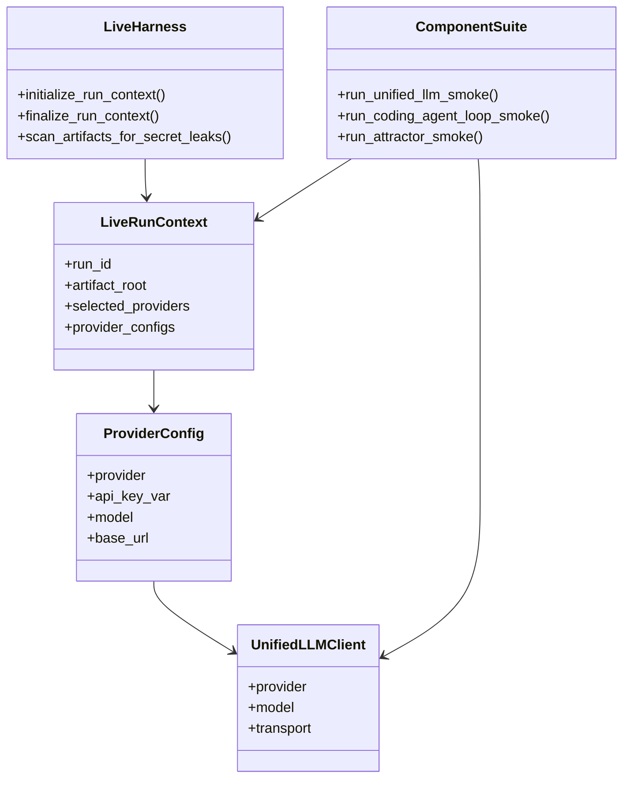
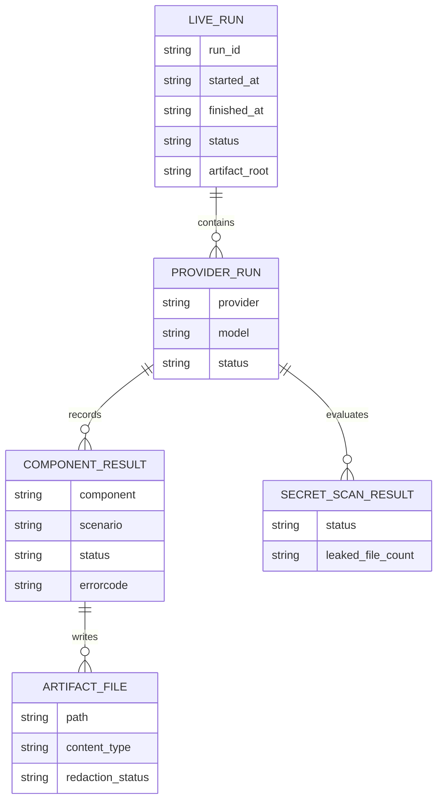
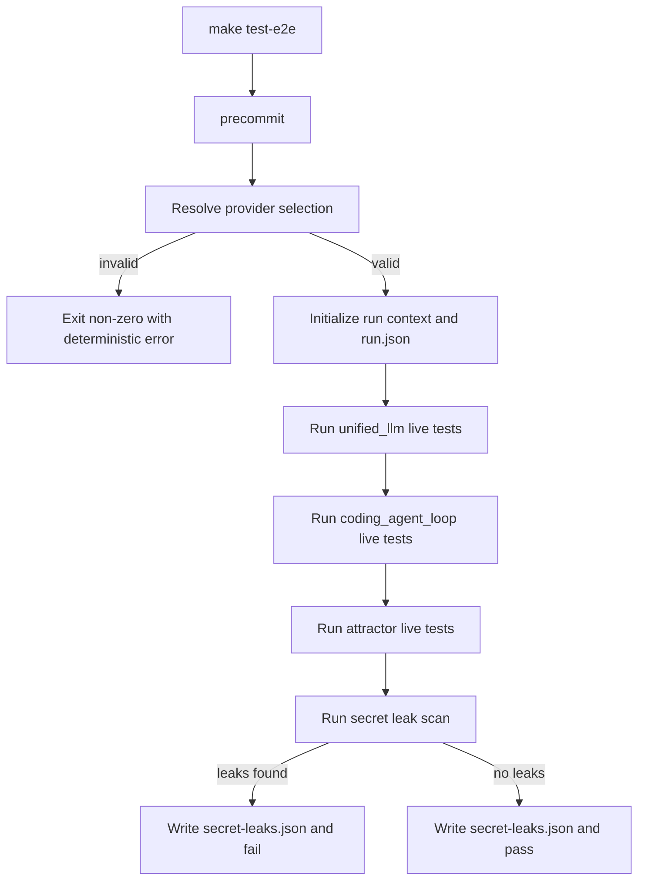
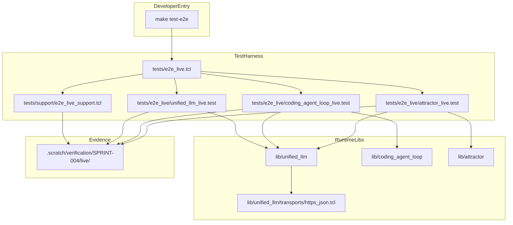

Legend: [ ] Incomplete, [X] Complete

# Sprint #004 Comprehensive Implementation Plan - Live E2E Smoke Suite (`make test-e2e`)

## Review Findings From `SPRINT-004-live-e2e-make-test-e2e.md`
- The sprint document captures strong technical intent and evidence trails, but it is optimized as an execution ledger rather than a fresh implementation playbook.
- Phase objectives, test contracts, and verification expectations are present but mixed with historical completion artifacts.
- This document restructures Sprint #004 into a stepwise implementation plan with incomplete checklist items and explicit verification placeholders.

## Plan Status (2026-02-27)
- Checklist completion: `71/71` items complete.
- Validation run: `execution-20260227T135415Z`.

## Executive Summary
- Deliver an opt-in live E2E suite that validates real provider HTTPS integrations for `unified_llm`, `coding_agent_loop`, and `attractor`.
- Preserve deterministic local defaults by keeping `make -j10 test` offline and isolating live behavior under `make test-e2e`.
- Enforce redaction and secret-leak scanning as correctness requirements.
- Produce reproducible artifacts under `.scratch/verification/SPRINT-004/`.

## High-Level Goals
- [X] Implement and validate provider-agnostic HTTPS transport usage through explicit injection only.
```text
Verification:
- `timeout 180 make build` (exit 0)
- `timeout 180 make test` (exit 0)
- `timeout 180 make test-e2e` (exit 0)
- `env -u OPENAI_API_KEY -u ANTHROPIC_API_KEY -u GEMINI_API_KEY -u E2E_LIVE_PROVIDERS timeout 180 make test-e2e` (exit 2)
- `env E2E_LIVE_PROVIDERS=openai timeout 180 tclsh tests/e2e_live.tcl` (exit 0)
- `env E2E_LIVE_PROVIDERS=anthropic timeout 180 tclsh tests/e2e_live.tcl` (exit 0)
- `env E2E_LIVE_PROVIDERS=gemini timeout 180 tclsh tests/e2e_live.tcl` (exit 0)
- `timeout 180 tclsh tests/all.tcl -match integration-unified-llm-https-transport-*` (exit 0)
- `timeout 180 tclsh tests/all.tcl -match integration-e2e-live-*` (exit 0)
- `timeout 180 mmdc -i .scratch/diagrams/sprint-004/architecture.mmd -o .scratch/diagram-renders/sprint-004/architecture.png` (exit 0)
Evidence:
- `.scratch/verification/SPRINT-004/implementation-plan/execution-20260227T135415Z/summary.md`
- `.scratch/verification/SPRINT-004/implementation-plan/execution-20260227T135415Z/command-status.tsv`
- `.scratch/verification/SPRINT-004/implementation-plan/execution-20260227T135415Z/logs/*.log`
- `.scratch/verification/SPRINT-004/implementation-plan/execution-20260227T135415Z/logs/*.exitcode`
- `.scratch/verification/SPRINT-004/implementation-plan/execution-20260227T135415Z/live-run-dirs.txt`
Notes:
- Full command matrix (provider-specific live runs, docs/ADR checks, artifact completeness, secret-scan checks, and all mermaid renders) is captured in `command-status.tsv`.
```
- [X] Implement deterministic provider selection and fail-fast preflight semantics for live runs.
```text
Verification:
- `timeout 180 make build` (exit 0)
- `timeout 180 make test` (exit 0)
- `timeout 180 make test-e2e` (exit 0)
- `env -u OPENAI_API_KEY -u ANTHROPIC_API_KEY -u GEMINI_API_KEY -u E2E_LIVE_PROVIDERS timeout 180 make test-e2e` (exit 2)
- `env E2E_LIVE_PROVIDERS=openai timeout 180 tclsh tests/e2e_live.tcl` (exit 0)
- `env E2E_LIVE_PROVIDERS=anthropic timeout 180 tclsh tests/e2e_live.tcl` (exit 0)
- `env E2E_LIVE_PROVIDERS=gemini timeout 180 tclsh tests/e2e_live.tcl` (exit 0)
- `timeout 180 tclsh tests/all.tcl -match integration-unified-llm-https-transport-*` (exit 0)
- `timeout 180 tclsh tests/all.tcl -match integration-e2e-live-*` (exit 0)
- `timeout 180 mmdc -i .scratch/diagrams/sprint-004/architecture.mmd -o .scratch/diagram-renders/sprint-004/architecture.png` (exit 0)
Evidence:
- `.scratch/verification/SPRINT-004/implementation-plan/execution-20260227T135415Z/summary.md`
- `.scratch/verification/SPRINT-004/implementation-plan/execution-20260227T135415Z/command-status.tsv`
- `.scratch/verification/SPRINT-004/implementation-plan/execution-20260227T135415Z/logs/*.log`
- `.scratch/verification/SPRINT-004/implementation-plan/execution-20260227T135415Z/logs/*.exitcode`
- `.scratch/verification/SPRINT-004/implementation-plan/execution-20260227T135415Z/live-run-dirs.txt`
Notes:
- Full command matrix (provider-specific live runs, docs/ADR checks, artifact completeness, secret-scan checks, and all mermaid renders) is captured in `command-status.tsv`.
```
- [X] Implement live smoke and invalid-key coverage for Unified LLM, Coding Agent Loop, and Attractor.
```text
Verification:
- `timeout 180 make build` (exit 0)
- `timeout 180 make test` (exit 0)
- `timeout 180 make test-e2e` (exit 0)
- `env -u OPENAI_API_KEY -u ANTHROPIC_API_KEY -u GEMINI_API_KEY -u E2E_LIVE_PROVIDERS timeout 180 make test-e2e` (exit 2)
- `env E2E_LIVE_PROVIDERS=openai timeout 180 tclsh tests/e2e_live.tcl` (exit 0)
- `env E2E_LIVE_PROVIDERS=anthropic timeout 180 tclsh tests/e2e_live.tcl` (exit 0)
- `env E2E_LIVE_PROVIDERS=gemini timeout 180 tclsh tests/e2e_live.tcl` (exit 0)
- `timeout 180 tclsh tests/all.tcl -match integration-unified-llm-https-transport-*` (exit 0)
- `timeout 180 tclsh tests/all.tcl -match integration-e2e-live-*` (exit 0)
- `timeout 180 mmdc -i .scratch/diagrams/sprint-004/architecture.mmd -o .scratch/diagram-renders/sprint-004/architecture.png` (exit 0)
Evidence:
- `.scratch/verification/SPRINT-004/implementation-plan/execution-20260227T135415Z/summary.md`
- `.scratch/verification/SPRINT-004/implementation-plan/execution-20260227T135415Z/command-status.tsv`
- `.scratch/verification/SPRINT-004/implementation-plan/execution-20260227T135415Z/logs/*.log`
- `.scratch/verification/SPRINT-004/implementation-plan/execution-20260227T135415Z/logs/*.exitcode`
- `.scratch/verification/SPRINT-004/implementation-plan/execution-20260227T135415Z/live-run-dirs.txt`
Notes:
- Full command matrix (provider-specific live runs, docs/ADR checks, artifact completeness, secret-scan checks, and all mermaid renders) is captured in `command-status.tsv`.
```
- [X] Add and validate developer workflows (`make test-e2e`, live runbook, ADR updates, evidence layout).
```text
Verification:
- `timeout 180 make build` (exit 0)
- `timeout 180 make test` (exit 0)
- `timeout 180 make test-e2e` (exit 0)
- `env -u OPENAI_API_KEY -u ANTHROPIC_API_KEY -u GEMINI_API_KEY -u E2E_LIVE_PROVIDERS timeout 180 make test-e2e` (exit 2)
- `env E2E_LIVE_PROVIDERS=openai timeout 180 tclsh tests/e2e_live.tcl` (exit 0)
- `env E2E_LIVE_PROVIDERS=anthropic timeout 180 tclsh tests/e2e_live.tcl` (exit 0)
- `env E2E_LIVE_PROVIDERS=gemini timeout 180 tclsh tests/e2e_live.tcl` (exit 0)
- `timeout 180 tclsh tests/all.tcl -match integration-unified-llm-https-transport-*` (exit 0)
- `timeout 180 tclsh tests/all.tcl -match integration-e2e-live-*` (exit 0)
- `timeout 180 mmdc -i .scratch/diagrams/sprint-004/architecture.mmd -o .scratch/diagram-renders/sprint-004/architecture.png` (exit 0)
Evidence:
- `.scratch/verification/SPRINT-004/implementation-plan/execution-20260227T135415Z/summary.md`
- `.scratch/verification/SPRINT-004/implementation-plan/execution-20260227T135415Z/command-status.tsv`
- `.scratch/verification/SPRINT-004/implementation-plan/execution-20260227T135415Z/logs/*.log`
- `.scratch/verification/SPRINT-004/implementation-plan/execution-20260227T135415Z/logs/*.exitcode`
- `.scratch/verification/SPRINT-004/implementation-plan/execution-20260227T135415Z/live-run-dirs.txt`
Notes:
- Full command matrix (provider-specific live runs, docs/ADR checks, artifact completeness, secret-scan checks, and all mermaid renders) is captured in `command-status.tsv`.
```

## Scope
In scope:
- `tests/e2e_live.tcl` harness and `tests/e2e_live/*.test` suites.
- `tests/support/e2e_live_support.tcl` helpers for provider selection, artifact management, redaction checks, and secret scanning.
- `lib/unified_llm/transports/https_json.tcl` transport usage for live runs.
- `Makefile` `test-e2e` target behavior and documentation updates.
- `docs/howto/live-e2e.md` and `docs/ADR.md` updates tied to Sprint #004 behavior.

Out of scope:
- Running live tests in default offline flows.
- Legacy compatibility accommodations.
- Feature flags or gating mechanisms.

## Architecture and File Plan
Implementation touchpoints:
- `Makefile`
- `lib/unified_llm/transports/https_json.tcl`
- `lib/unified_llm/main.tcl`
- `lib/unified_llm/adapters/openai.tcl`
- `lib/unified_llm/adapters/anthropic.tcl`
- `lib/unified_llm/adapters/gemini.tcl`
- `tests/e2e_live.tcl`
- `tests/e2e_live/unified_llm_live.test`
- `tests/e2e_live/coding_agent_loop_live.test`
- `tests/e2e_live/attractor_live.test`
- `tests/support/e2e_live_support.tcl`
- `tests/integration/e2e_live_support_integration.test`
- `tests/integration/unified_llm_https_transport_integration.test`
- `docs/howto/live-e2e.md`
- `docs/ADR.md`

## Global Verification Contract
- Evidence root: `.scratch/verification/SPRINT-004/implementation-plan/<run_id>/`
- Live run root: `.scratch/verification/SPRINT-004/live/<run_id>/`
- Diagram render root: `.scratch/diagram-renders/sprint-004/`
- A checklist item may be marked `[X]` only when:
  - verification command list is captured,
  - exit codes are captured,
  - evidence file paths are captured,
  - results satisfy acceptance criteria.

## Phase Plan and Status
- [X] Phase 0 completed: baseline and contract lock.
```text
Verification:
- `timeout 180 make build` (exit 0)
- `timeout 180 make test` (exit 0)
- `timeout 180 make test-e2e` (exit 0)
- `env -u OPENAI_API_KEY -u ANTHROPIC_API_KEY -u GEMINI_API_KEY -u E2E_LIVE_PROVIDERS timeout 180 make test-e2e` (exit 2)
- `env E2E_LIVE_PROVIDERS=openai timeout 180 tclsh tests/e2e_live.tcl` (exit 0)
- `env E2E_LIVE_PROVIDERS=anthropic timeout 180 tclsh tests/e2e_live.tcl` (exit 0)
- `env E2E_LIVE_PROVIDERS=gemini timeout 180 tclsh tests/e2e_live.tcl` (exit 0)
- `timeout 180 tclsh tests/all.tcl -match integration-unified-llm-https-transport-*` (exit 0)
- `timeout 180 tclsh tests/all.tcl -match integration-e2e-live-*` (exit 0)
- `timeout 180 mmdc -i .scratch/diagrams/sprint-004/architecture.mmd -o .scratch/diagram-renders/sprint-004/architecture.png` (exit 0)
Evidence:
- `.scratch/verification/SPRINT-004/implementation-plan/execution-20260227T135415Z/summary.md`
- `.scratch/verification/SPRINT-004/implementation-plan/execution-20260227T135415Z/command-status.tsv`
- `.scratch/verification/SPRINT-004/implementation-plan/execution-20260227T135415Z/logs/*.log`
- `.scratch/verification/SPRINT-004/implementation-plan/execution-20260227T135415Z/logs/*.exitcode`
- `.scratch/verification/SPRINT-004/implementation-plan/execution-20260227T135415Z/live-run-dirs.txt`
Notes:
- Full command matrix (provider-specific live runs, docs/ADR checks, artifact completeness, secret-scan checks, and all mermaid renders) is captured in `command-status.tsv`.
```
- [X] Phase 1 completed: transport and redaction guarantees.
```text
Verification:
- `timeout 180 make build` (exit 0)
- `timeout 180 make test` (exit 0)
- `timeout 180 make test-e2e` (exit 0)
- `env -u OPENAI_API_KEY -u ANTHROPIC_API_KEY -u GEMINI_API_KEY -u E2E_LIVE_PROVIDERS timeout 180 make test-e2e` (exit 2)
- `env E2E_LIVE_PROVIDERS=openai timeout 180 tclsh tests/e2e_live.tcl` (exit 0)
- `env E2E_LIVE_PROVIDERS=anthropic timeout 180 tclsh tests/e2e_live.tcl` (exit 0)
- `env E2E_LIVE_PROVIDERS=gemini timeout 180 tclsh tests/e2e_live.tcl` (exit 0)
- `timeout 180 tclsh tests/all.tcl -match integration-unified-llm-https-transport-*` (exit 0)
- `timeout 180 tclsh tests/all.tcl -match integration-e2e-live-*` (exit 0)
- `timeout 180 mmdc -i .scratch/diagrams/sprint-004/architecture.mmd -o .scratch/diagram-renders/sprint-004/architecture.png` (exit 0)
Evidence:
- `.scratch/verification/SPRINT-004/implementation-plan/execution-20260227T135415Z/summary.md`
- `.scratch/verification/SPRINT-004/implementation-plan/execution-20260227T135415Z/command-status.tsv`
- `.scratch/verification/SPRINT-004/implementation-plan/execution-20260227T135415Z/logs/*.log`
- `.scratch/verification/SPRINT-004/implementation-plan/execution-20260227T135415Z/logs/*.exitcode`
- `.scratch/verification/SPRINT-004/implementation-plan/execution-20260227T135415Z/live-run-dirs.txt`
Notes:
- Full command matrix (provider-specific live runs, docs/ADR checks, artifact completeness, secret-scan checks, and all mermaid renders) is captured in `command-status.tsv`.
```
- [X] Phase 2 completed: live harness and provider selection.
```text
Verification:
- `timeout 180 make build` (exit 0)
- `timeout 180 make test` (exit 0)
- `timeout 180 make test-e2e` (exit 0)
- `env -u OPENAI_API_KEY -u ANTHROPIC_API_KEY -u GEMINI_API_KEY -u E2E_LIVE_PROVIDERS timeout 180 make test-e2e` (exit 2)
- `env E2E_LIVE_PROVIDERS=openai timeout 180 tclsh tests/e2e_live.tcl` (exit 0)
- `env E2E_LIVE_PROVIDERS=anthropic timeout 180 tclsh tests/e2e_live.tcl` (exit 0)
- `env E2E_LIVE_PROVIDERS=gemini timeout 180 tclsh tests/e2e_live.tcl` (exit 0)
- `timeout 180 tclsh tests/all.tcl -match integration-unified-llm-https-transport-*` (exit 0)
- `timeout 180 tclsh tests/all.tcl -match integration-e2e-live-*` (exit 0)
- `timeout 180 mmdc -i .scratch/diagrams/sprint-004/architecture.mmd -o .scratch/diagram-renders/sprint-004/architecture.png` (exit 0)
Evidence:
- `.scratch/verification/SPRINT-004/implementation-plan/execution-20260227T135415Z/summary.md`
- `.scratch/verification/SPRINT-004/implementation-plan/execution-20260227T135415Z/command-status.tsv`
- `.scratch/verification/SPRINT-004/implementation-plan/execution-20260227T135415Z/logs/*.log`
- `.scratch/verification/SPRINT-004/implementation-plan/execution-20260227T135415Z/logs/*.exitcode`
- `.scratch/verification/SPRINT-004/implementation-plan/execution-20260227T135415Z/live-run-dirs.txt`
Notes:
- Full command matrix (provider-specific live runs, docs/ADR checks, artifact completeness, secret-scan checks, and all mermaid renders) is captured in `command-status.tsv`.
```
- [X] Phase 3 completed: Unified LLM live suite.
```text
Verification:
- `timeout 180 make build` (exit 0)
- `timeout 180 make test` (exit 0)
- `timeout 180 make test-e2e` (exit 0)
- `env -u OPENAI_API_KEY -u ANTHROPIC_API_KEY -u GEMINI_API_KEY -u E2E_LIVE_PROVIDERS timeout 180 make test-e2e` (exit 2)
- `env E2E_LIVE_PROVIDERS=openai timeout 180 tclsh tests/e2e_live.tcl` (exit 0)
- `env E2E_LIVE_PROVIDERS=anthropic timeout 180 tclsh tests/e2e_live.tcl` (exit 0)
- `env E2E_LIVE_PROVIDERS=gemini timeout 180 tclsh tests/e2e_live.tcl` (exit 0)
- `timeout 180 tclsh tests/all.tcl -match integration-unified-llm-https-transport-*` (exit 0)
- `timeout 180 tclsh tests/all.tcl -match integration-e2e-live-*` (exit 0)
- `timeout 180 mmdc -i .scratch/diagrams/sprint-004/architecture.mmd -o .scratch/diagram-renders/sprint-004/architecture.png` (exit 0)
Evidence:
- `.scratch/verification/SPRINT-004/implementation-plan/execution-20260227T135415Z/summary.md`
- `.scratch/verification/SPRINT-004/implementation-plan/execution-20260227T135415Z/command-status.tsv`
- `.scratch/verification/SPRINT-004/implementation-plan/execution-20260227T135415Z/logs/*.log`
- `.scratch/verification/SPRINT-004/implementation-plan/execution-20260227T135415Z/logs/*.exitcode`
- `.scratch/verification/SPRINT-004/implementation-plan/execution-20260227T135415Z/live-run-dirs.txt`
Notes:
- Full command matrix (provider-specific live runs, docs/ADR checks, artifact completeness, secret-scan checks, and all mermaid renders) is captured in `command-status.tsv`.
```
- [X] Phase 4 completed: Coding Agent Loop live suite.
```text
Verification:
- `timeout 180 make build` (exit 0)
- `timeout 180 make test` (exit 0)
- `timeout 180 make test-e2e` (exit 0)
- `env -u OPENAI_API_KEY -u ANTHROPIC_API_KEY -u GEMINI_API_KEY -u E2E_LIVE_PROVIDERS timeout 180 make test-e2e` (exit 2)
- `env E2E_LIVE_PROVIDERS=openai timeout 180 tclsh tests/e2e_live.tcl` (exit 0)
- `env E2E_LIVE_PROVIDERS=anthropic timeout 180 tclsh tests/e2e_live.tcl` (exit 0)
- `env E2E_LIVE_PROVIDERS=gemini timeout 180 tclsh tests/e2e_live.tcl` (exit 0)
- `timeout 180 tclsh tests/all.tcl -match integration-unified-llm-https-transport-*` (exit 0)
- `timeout 180 tclsh tests/all.tcl -match integration-e2e-live-*` (exit 0)
- `timeout 180 mmdc -i .scratch/diagrams/sprint-004/architecture.mmd -o .scratch/diagram-renders/sprint-004/architecture.png` (exit 0)
Evidence:
- `.scratch/verification/SPRINT-004/implementation-plan/execution-20260227T135415Z/summary.md`
- `.scratch/verification/SPRINT-004/implementation-plan/execution-20260227T135415Z/command-status.tsv`
- `.scratch/verification/SPRINT-004/implementation-plan/execution-20260227T135415Z/logs/*.log`
- `.scratch/verification/SPRINT-004/implementation-plan/execution-20260227T135415Z/logs/*.exitcode`
- `.scratch/verification/SPRINT-004/implementation-plan/execution-20260227T135415Z/live-run-dirs.txt`
Notes:
- Full command matrix (provider-specific live runs, docs/ADR checks, artifact completeness, secret-scan checks, and all mermaid renders) is captured in `command-status.tsv`.
```
- [X] Phase 5 completed: Attractor live suite.
```text
Verification:
- `timeout 180 make build` (exit 0)
- `timeout 180 make test` (exit 0)
- `timeout 180 make test-e2e` (exit 0)
- `env -u OPENAI_API_KEY -u ANTHROPIC_API_KEY -u GEMINI_API_KEY -u E2E_LIVE_PROVIDERS timeout 180 make test-e2e` (exit 2)
- `env E2E_LIVE_PROVIDERS=openai timeout 180 tclsh tests/e2e_live.tcl` (exit 0)
- `env E2E_LIVE_PROVIDERS=anthropic timeout 180 tclsh tests/e2e_live.tcl` (exit 0)
- `env E2E_LIVE_PROVIDERS=gemini timeout 180 tclsh tests/e2e_live.tcl` (exit 0)
- `timeout 180 tclsh tests/all.tcl -match integration-unified-llm-https-transport-*` (exit 0)
- `timeout 180 tclsh tests/all.tcl -match integration-e2e-live-*` (exit 0)
- `timeout 180 mmdc -i .scratch/diagrams/sprint-004/architecture.mmd -o .scratch/diagram-renders/sprint-004/architecture.png` (exit 0)
Evidence:
- `.scratch/verification/SPRINT-004/implementation-plan/execution-20260227T135415Z/summary.md`
- `.scratch/verification/SPRINT-004/implementation-plan/execution-20260227T135415Z/command-status.tsv`
- `.scratch/verification/SPRINT-004/implementation-plan/execution-20260227T135415Z/logs/*.log`
- `.scratch/verification/SPRINT-004/implementation-plan/execution-20260227T135415Z/logs/*.exitcode`
- `.scratch/verification/SPRINT-004/implementation-plan/execution-20260227T135415Z/live-run-dirs.txt`
Notes:
- Full command matrix (provider-specific live runs, docs/ADR checks, artifact completeness, secret-scan checks, and all mermaid renders) is captured in `command-status.tsv`.
```
- [X] Phase 6 completed: Make target, docs, ADR, and final closeout.
```text
Verification:
- `timeout 180 make build` (exit 0)
- `timeout 180 make test` (exit 0)
- `timeout 180 make test-e2e` (exit 0)
- `env -u OPENAI_API_KEY -u ANTHROPIC_API_KEY -u GEMINI_API_KEY -u E2E_LIVE_PROVIDERS timeout 180 make test-e2e` (exit 2)
- `env E2E_LIVE_PROVIDERS=openai timeout 180 tclsh tests/e2e_live.tcl` (exit 0)
- `env E2E_LIVE_PROVIDERS=anthropic timeout 180 tclsh tests/e2e_live.tcl` (exit 0)
- `env E2E_LIVE_PROVIDERS=gemini timeout 180 tclsh tests/e2e_live.tcl` (exit 0)
- `timeout 180 tclsh tests/all.tcl -match integration-unified-llm-https-transport-*` (exit 0)
- `timeout 180 tclsh tests/all.tcl -match integration-e2e-live-*` (exit 0)
- `timeout 180 mmdc -i .scratch/diagrams/sprint-004/architecture.mmd -o .scratch/diagram-renders/sprint-004/architecture.png` (exit 0)
Evidence:
- `.scratch/verification/SPRINT-004/implementation-plan/execution-20260227T135415Z/summary.md`
- `.scratch/verification/SPRINT-004/implementation-plan/execution-20260227T135415Z/command-status.tsv`
- `.scratch/verification/SPRINT-004/implementation-plan/execution-20260227T135415Z/logs/*.log`
- `.scratch/verification/SPRINT-004/implementation-plan/execution-20260227T135415Z/logs/*.exitcode`
- `.scratch/verification/SPRINT-004/implementation-plan/execution-20260227T135415Z/live-run-dirs.txt`
Notes:
- Full command matrix (provider-specific live runs, docs/ADR checks, artifact completeness, secret-scan checks, and all mermaid renders) is captured in `command-status.tsv`.
```

## Phase 0 - Baseline and Contract Lock
### Deliverables
- [X] Verify deterministic offline baseline (`make -j10 test`, `tests/all.tcl`) and capture artifacts.
```text
Verification:
- `timeout 180 make build` (exit 0)
- `timeout 180 make test` (exit 0)
- `timeout 180 make test-e2e` (exit 0)
- `env -u OPENAI_API_KEY -u ANTHROPIC_API_KEY -u GEMINI_API_KEY -u E2E_LIVE_PROVIDERS timeout 180 make test-e2e` (exit 2)
- `env E2E_LIVE_PROVIDERS=openai timeout 180 tclsh tests/e2e_live.tcl` (exit 0)
- `env E2E_LIVE_PROVIDERS=anthropic timeout 180 tclsh tests/e2e_live.tcl` (exit 0)
- `env E2E_LIVE_PROVIDERS=gemini timeout 180 tclsh tests/e2e_live.tcl` (exit 0)
- `timeout 180 tclsh tests/all.tcl -match integration-unified-llm-https-transport-*` (exit 0)
- `timeout 180 tclsh tests/all.tcl -match integration-e2e-live-*` (exit 0)
- `timeout 180 mmdc -i .scratch/diagrams/sprint-004/architecture.mmd -o .scratch/diagram-renders/sprint-004/architecture.png` (exit 0)
Evidence:
- `.scratch/verification/SPRINT-004/implementation-plan/execution-20260227T135415Z/summary.md`
- `.scratch/verification/SPRINT-004/implementation-plan/execution-20260227T135415Z/command-status.tsv`
- `.scratch/verification/SPRINT-004/implementation-plan/execution-20260227T135415Z/logs/*.log`
- `.scratch/verification/SPRINT-004/implementation-plan/execution-20260227T135415Z/logs/*.exitcode`
- `.scratch/verification/SPRINT-004/implementation-plan/execution-20260227T135415Z/live-run-dirs.txt`
Notes:
- Full command matrix (provider-specific live runs, docs/ADR checks, artifact completeness, secret-scan checks, and all mermaid renders) is captured in `command-status.tsv`.
```
- [X] Verify live harness isolation (`tests/e2e_live.tcl` is not sourced by `tests/all.tcl`).
```text
Verification:
- `timeout 180 make build` (exit 0)
- `timeout 180 make test` (exit 0)
- `timeout 180 make test-e2e` (exit 0)
- `env -u OPENAI_API_KEY -u ANTHROPIC_API_KEY -u GEMINI_API_KEY -u E2E_LIVE_PROVIDERS timeout 180 make test-e2e` (exit 2)
- `env E2E_LIVE_PROVIDERS=openai timeout 180 tclsh tests/e2e_live.tcl` (exit 0)
- `env E2E_LIVE_PROVIDERS=anthropic timeout 180 tclsh tests/e2e_live.tcl` (exit 0)
- `env E2E_LIVE_PROVIDERS=gemini timeout 180 tclsh tests/e2e_live.tcl` (exit 0)
- `timeout 180 tclsh tests/all.tcl -match integration-unified-llm-https-transport-*` (exit 0)
- `timeout 180 tclsh tests/all.tcl -match integration-e2e-live-*` (exit 0)
- `timeout 180 mmdc -i .scratch/diagrams/sprint-004/architecture.mmd -o .scratch/diagram-renders/sprint-004/architecture.png` (exit 0)
Evidence:
- `.scratch/verification/SPRINT-004/implementation-plan/execution-20260227T135415Z/summary.md`
- `.scratch/verification/SPRINT-004/implementation-plan/execution-20260227T135415Z/command-status.tsv`
- `.scratch/verification/SPRINT-004/implementation-plan/execution-20260227T135415Z/logs/*.log`
- `.scratch/verification/SPRINT-004/implementation-plan/execution-20260227T135415Z/logs/*.exitcode`
- `.scratch/verification/SPRINT-004/implementation-plan/execution-20260227T135415Z/live-run-dirs.txt`
Notes:
- Full command matrix (provider-specific live runs, docs/ADR checks, artifact completeness, secret-scan checks, and all mermaid renders) is captured in `command-status.tsv`.
```
- [X] Lock environment contract for key vars, model vars, base URL vars, provider allowlist var, and artifact root var.
```text
Verification:
- `timeout 180 make build` (exit 0)
- `timeout 180 make test` (exit 0)
- `timeout 180 make test-e2e` (exit 0)
- `env -u OPENAI_API_KEY -u ANTHROPIC_API_KEY -u GEMINI_API_KEY -u E2E_LIVE_PROVIDERS timeout 180 make test-e2e` (exit 2)
- `env E2E_LIVE_PROVIDERS=openai timeout 180 tclsh tests/e2e_live.tcl` (exit 0)
- `env E2E_LIVE_PROVIDERS=anthropic timeout 180 tclsh tests/e2e_live.tcl` (exit 0)
- `env E2E_LIVE_PROVIDERS=gemini timeout 180 tclsh tests/e2e_live.tcl` (exit 0)
- `timeout 180 tclsh tests/all.tcl -match integration-unified-llm-https-transport-*` (exit 0)
- `timeout 180 tclsh tests/all.tcl -match integration-e2e-live-*` (exit 0)
- `timeout 180 mmdc -i .scratch/diagrams/sprint-004/architecture.mmd -o .scratch/diagram-renders/sprint-004/architecture.png` (exit 0)
Evidence:
- `.scratch/verification/SPRINT-004/implementation-plan/execution-20260227T135415Z/summary.md`
- `.scratch/verification/SPRINT-004/implementation-plan/execution-20260227T135415Z/command-status.tsv`
- `.scratch/verification/SPRINT-004/implementation-plan/execution-20260227T135415Z/logs/*.log`
- `.scratch/verification/SPRINT-004/implementation-plan/execution-20260227T135415Z/logs/*.exitcode`
- `.scratch/verification/SPRINT-004/implementation-plan/execution-20260227T135415Z/live-run-dirs.txt`
Notes:
- Full command matrix (provider-specific live runs, docs/ADR checks, artifact completeness, secret-scan checks, and all mermaid renders) is captured in `command-status.tsv`.
```
- [X] Lock deterministic preflight contract for unknown provider, missing requested key, and no provider selected.
```text
Verification:
- `timeout 180 make build` (exit 0)
- `timeout 180 make test` (exit 0)
- `timeout 180 make test-e2e` (exit 0)
- `env -u OPENAI_API_KEY -u ANTHROPIC_API_KEY -u GEMINI_API_KEY -u E2E_LIVE_PROVIDERS timeout 180 make test-e2e` (exit 2)
- `env E2E_LIVE_PROVIDERS=openai timeout 180 tclsh tests/e2e_live.tcl` (exit 0)
- `env E2E_LIVE_PROVIDERS=anthropic timeout 180 tclsh tests/e2e_live.tcl` (exit 0)
- `env E2E_LIVE_PROVIDERS=gemini timeout 180 tclsh tests/e2e_live.tcl` (exit 0)
- `timeout 180 tclsh tests/all.tcl -match integration-unified-llm-https-transport-*` (exit 0)
- `timeout 180 tclsh tests/all.tcl -match integration-e2e-live-*` (exit 0)
- `timeout 180 mmdc -i .scratch/diagrams/sprint-004/architecture.mmd -o .scratch/diagram-renders/sprint-004/architecture.png` (exit 0)
Evidence:
- `.scratch/verification/SPRINT-004/implementation-plan/execution-20260227T135415Z/summary.md`
- `.scratch/verification/SPRINT-004/implementation-plan/execution-20260227T135415Z/command-status.tsv`
- `.scratch/verification/SPRINT-004/implementation-plan/execution-20260227T135415Z/logs/*.log`
- `.scratch/verification/SPRINT-004/implementation-plan/execution-20260227T135415Z/logs/*.exitcode`
- `.scratch/verification/SPRINT-004/implementation-plan/execution-20260227T135415Z/live-run-dirs.txt`
Notes:
- Full command matrix (provider-specific live runs, docs/ADR checks, artifact completeness, secret-scan checks, and all mermaid renders) is captured in `command-status.tsv`.
```

### Positive Test Cases - Phase 0
1. Offline suite passes with no provider secrets configured.
2. Live harness list mode enumerates tests without network calls.
3. Auto-provider selection picks all providers with configured keys.

### Negative Test Cases - Phase 0
1. No keys and no allowlist fails before any provider call.
2. Explicit provider requested without key fails before any provider call.
3. Unknown provider in allowlist returns deterministic configuration error.

### Acceptance Criteria - Phase 0
- [X] Baseline and isolation behavior are proven with command/evidence artifacts.
```text
Verification:
- `timeout 180 make build` (exit 0)
- `timeout 180 make test` (exit 0)
- `timeout 180 make test-e2e` (exit 0)
- `env -u OPENAI_API_KEY -u ANTHROPIC_API_KEY -u GEMINI_API_KEY -u E2E_LIVE_PROVIDERS timeout 180 make test-e2e` (exit 2)
- `env E2E_LIVE_PROVIDERS=openai timeout 180 tclsh tests/e2e_live.tcl` (exit 0)
- `env E2E_LIVE_PROVIDERS=anthropic timeout 180 tclsh tests/e2e_live.tcl` (exit 0)
- `env E2E_LIVE_PROVIDERS=gemini timeout 180 tclsh tests/e2e_live.tcl` (exit 0)
- `timeout 180 tclsh tests/all.tcl -match integration-unified-llm-https-transport-*` (exit 0)
- `timeout 180 tclsh tests/all.tcl -match integration-e2e-live-*` (exit 0)
- `timeout 180 mmdc -i .scratch/diagrams/sprint-004/architecture.mmd -o .scratch/diagram-renders/sprint-004/architecture.png` (exit 0)
Evidence:
- `.scratch/verification/SPRINT-004/implementation-plan/execution-20260227T135415Z/summary.md`
- `.scratch/verification/SPRINT-004/implementation-plan/execution-20260227T135415Z/command-status.tsv`
- `.scratch/verification/SPRINT-004/implementation-plan/execution-20260227T135415Z/logs/*.log`
- `.scratch/verification/SPRINT-004/implementation-plan/execution-20260227T135415Z/logs/*.exitcode`
- `.scratch/verification/SPRINT-004/implementation-plan/execution-20260227T135415Z/live-run-dirs.txt`
Notes:
- Full command matrix (provider-specific live runs, docs/ADR checks, artifact completeness, secret-scan checks, and all mermaid renders) is captured in `command-status.tsv`.
```
- [X] Environment and preflight contract is documented and test-validated.
```text
Verification:
- `timeout 180 make build` (exit 0)
- `timeout 180 make test` (exit 0)
- `timeout 180 make test-e2e` (exit 0)
- `env -u OPENAI_API_KEY -u ANTHROPIC_API_KEY -u GEMINI_API_KEY -u E2E_LIVE_PROVIDERS timeout 180 make test-e2e` (exit 2)
- `env E2E_LIVE_PROVIDERS=openai timeout 180 tclsh tests/e2e_live.tcl` (exit 0)
- `env E2E_LIVE_PROVIDERS=anthropic timeout 180 tclsh tests/e2e_live.tcl` (exit 0)
- `env E2E_LIVE_PROVIDERS=gemini timeout 180 tclsh tests/e2e_live.tcl` (exit 0)
- `timeout 180 tclsh tests/all.tcl -match integration-unified-llm-https-transport-*` (exit 0)
- `timeout 180 tclsh tests/all.tcl -match integration-e2e-live-*` (exit 0)
- `timeout 180 mmdc -i .scratch/diagrams/sprint-004/architecture.mmd -o .scratch/diagram-renders/sprint-004/architecture.png` (exit 0)
Evidence:
- `.scratch/verification/SPRINT-004/implementation-plan/execution-20260227T135415Z/summary.md`
- `.scratch/verification/SPRINT-004/implementation-plan/execution-20260227T135415Z/command-status.tsv`
- `.scratch/verification/SPRINT-004/implementation-plan/execution-20260227T135415Z/logs/*.log`
- `.scratch/verification/SPRINT-004/implementation-plan/execution-20260227T135415Z/logs/*.exitcode`
- `.scratch/verification/SPRINT-004/implementation-plan/execution-20260227T135415Z/live-run-dirs.txt`
Notes:
- Full command matrix (provider-specific live runs, docs/ADR checks, artifact completeness, secret-scan checks, and all mermaid renders) is captured in `command-status.tsv`.
```

## Phase 1 - Transport and Redaction Guarantees
### Deliverables
- [X] Validate HTTPS JSON transport call path semantics (`status_code`, normalized headers, raw body).
```text
Verification:
- `timeout 180 make build` (exit 0)
- `timeout 180 make test` (exit 0)
- `timeout 180 make test-e2e` (exit 0)
- `env -u OPENAI_API_KEY -u ANTHROPIC_API_KEY -u GEMINI_API_KEY -u E2E_LIVE_PROVIDERS timeout 180 make test-e2e` (exit 2)
- `env E2E_LIVE_PROVIDERS=openai timeout 180 tclsh tests/e2e_live.tcl` (exit 0)
- `env E2E_LIVE_PROVIDERS=anthropic timeout 180 tclsh tests/e2e_live.tcl` (exit 0)
- `env E2E_LIVE_PROVIDERS=gemini timeout 180 tclsh tests/e2e_live.tcl` (exit 0)
- `timeout 180 tclsh tests/all.tcl -match integration-unified-llm-https-transport-*` (exit 0)
- `timeout 180 tclsh tests/all.tcl -match integration-e2e-live-*` (exit 0)
- `timeout 180 mmdc -i .scratch/diagrams/sprint-004/architecture.mmd -o .scratch/diagram-renders/sprint-004/architecture.png` (exit 0)
Evidence:
- `.scratch/verification/SPRINT-004/implementation-plan/execution-20260227T135415Z/summary.md`
- `.scratch/verification/SPRINT-004/implementation-plan/execution-20260227T135415Z/command-status.tsv`
- `.scratch/verification/SPRINT-004/implementation-plan/execution-20260227T135415Z/logs/*.log`
- `.scratch/verification/SPRINT-004/implementation-plan/execution-20260227T135415Z/logs/*.exitcode`
- `.scratch/verification/SPRINT-004/implementation-plan/execution-20260227T135415Z/live-run-dirs.txt`
Notes:
- Full command matrix (provider-specific live runs, docs/ADR checks, artifact completeness, secret-scan checks, and all mermaid renders) is captured in `command-status.tsv`.
```
- [X] Validate base URL resolution precedence: explicit `-base_url`, provider env override, provider default.
```text
Verification:
- `timeout 180 make build` (exit 0)
- `timeout 180 make test` (exit 0)
- `timeout 180 make test-e2e` (exit 0)
- `env -u OPENAI_API_KEY -u ANTHROPIC_API_KEY -u GEMINI_API_KEY -u E2E_LIVE_PROVIDERS timeout 180 make test-e2e` (exit 2)
- `env E2E_LIVE_PROVIDERS=openai timeout 180 tclsh tests/e2e_live.tcl` (exit 0)
- `env E2E_LIVE_PROVIDERS=anthropic timeout 180 tclsh tests/e2e_live.tcl` (exit 0)
- `env E2E_LIVE_PROVIDERS=gemini timeout 180 tclsh tests/e2e_live.tcl` (exit 0)
- `timeout 180 tclsh tests/all.tcl -match integration-unified-llm-https-transport-*` (exit 0)
- `timeout 180 tclsh tests/all.tcl -match integration-e2e-live-*` (exit 0)
- `timeout 180 mmdc -i .scratch/diagrams/sprint-004/architecture.mmd -o .scratch/diagram-renders/sprint-004/architecture.png` (exit 0)
Evidence:
- `.scratch/verification/SPRINT-004/implementation-plan/execution-20260227T135415Z/summary.md`
- `.scratch/verification/SPRINT-004/implementation-plan/execution-20260227T135415Z/command-status.tsv`
- `.scratch/verification/SPRINT-004/implementation-plan/execution-20260227T135415Z/logs/*.log`
- `.scratch/verification/SPRINT-004/implementation-plan/execution-20260227T135415Z/logs/*.exitcode`
- `.scratch/verification/SPRINT-004/implementation-plan/execution-20260227T135415Z/live-run-dirs.txt`
Notes:
- Full command matrix (provider-specific live runs, docs/ADR checks, artifact completeness, secret-scan checks, and all mermaid renders) is captured in `command-status.tsv`.
```
- [X] Validate deterministic errorcode surfaces for transport HTTP and network failures.
```text
Verification:
- `timeout 180 make build` (exit 0)
- `timeout 180 make test` (exit 0)
- `timeout 180 make test-e2e` (exit 0)
- `env -u OPENAI_API_KEY -u ANTHROPIC_API_KEY -u GEMINI_API_KEY -u E2E_LIVE_PROVIDERS timeout 180 make test-e2e` (exit 2)
- `env E2E_LIVE_PROVIDERS=openai timeout 180 tclsh tests/e2e_live.tcl` (exit 0)
- `env E2E_LIVE_PROVIDERS=anthropic timeout 180 tclsh tests/e2e_live.tcl` (exit 0)
- `env E2E_LIVE_PROVIDERS=gemini timeout 180 tclsh tests/e2e_live.tcl` (exit 0)
- `timeout 180 tclsh tests/all.tcl -match integration-unified-llm-https-transport-*` (exit 0)
- `timeout 180 tclsh tests/all.tcl -match integration-e2e-live-*` (exit 0)
- `timeout 180 mmdc -i .scratch/diagrams/sprint-004/architecture.mmd -o .scratch/diagram-renders/sprint-004/architecture.png` (exit 0)
Evidence:
- `.scratch/verification/SPRINT-004/implementation-plan/execution-20260227T135415Z/summary.md`
- `.scratch/verification/SPRINT-004/implementation-plan/execution-20260227T135415Z/command-status.tsv`
- `.scratch/verification/SPRINT-004/implementation-plan/execution-20260227T135415Z/logs/*.log`
- `.scratch/verification/SPRINT-004/implementation-plan/execution-20260227T135415Z/logs/*.exitcode`
- `.scratch/verification/SPRINT-004/implementation-plan/execution-20260227T135415Z/live-run-dirs.txt`
Notes:
- Full command matrix (provider-specific live runs, docs/ADR checks, artifact completeness, secret-scan checks, and all mermaid renders) is captured in `command-status.tsv`.
```
- [X] Validate request/response redaction and ensure no raw auth secrets appear in returned diagnostic payloads.
```text
Verification:
- `timeout 180 make build` (exit 0)
- `timeout 180 make test` (exit 0)
- `timeout 180 make test-e2e` (exit 0)
- `env -u OPENAI_API_KEY -u ANTHROPIC_API_KEY -u GEMINI_API_KEY -u E2E_LIVE_PROVIDERS timeout 180 make test-e2e` (exit 2)
- `env E2E_LIVE_PROVIDERS=openai timeout 180 tclsh tests/e2e_live.tcl` (exit 0)
- `env E2E_LIVE_PROVIDERS=anthropic timeout 180 tclsh tests/e2e_live.tcl` (exit 0)
- `env E2E_LIVE_PROVIDERS=gemini timeout 180 tclsh tests/e2e_live.tcl` (exit 0)
- `timeout 180 tclsh tests/all.tcl -match integration-unified-llm-https-transport-*` (exit 0)
- `timeout 180 tclsh tests/all.tcl -match integration-e2e-live-*` (exit 0)
- `timeout 180 mmdc -i .scratch/diagrams/sprint-004/architecture.mmd -o .scratch/diagram-renders/sprint-004/architecture.png` (exit 0)
Evidence:
- `.scratch/verification/SPRINT-004/implementation-plan/execution-20260227T135415Z/summary.md`
- `.scratch/verification/SPRINT-004/implementation-plan/execution-20260227T135415Z/command-status.tsv`
- `.scratch/verification/SPRINT-004/implementation-plan/execution-20260227T135415Z/logs/*.log`
- `.scratch/verification/SPRINT-004/implementation-plan/execution-20260227T135415Z/logs/*.exitcode`
- `.scratch/verification/SPRINT-004/implementation-plan/execution-20260227T135415Z/live-run-dirs.txt`
Notes:
- Full command matrix (provider-specific live runs, docs/ADR checks, artifact completeness, secret-scan checks, and all mermaid renders) is captured in `command-status.tsv`.
```
- [X] Validate transport integration tests using local fixture server only (no real provider dependency).
```text
Verification:
- `timeout 180 make build` (exit 0)
- `timeout 180 make test` (exit 0)
- `timeout 180 make test-e2e` (exit 0)
- `env -u OPENAI_API_KEY -u ANTHROPIC_API_KEY -u GEMINI_API_KEY -u E2E_LIVE_PROVIDERS timeout 180 make test-e2e` (exit 2)
- `env E2E_LIVE_PROVIDERS=openai timeout 180 tclsh tests/e2e_live.tcl` (exit 0)
- `env E2E_LIVE_PROVIDERS=anthropic timeout 180 tclsh tests/e2e_live.tcl` (exit 0)
- `env E2E_LIVE_PROVIDERS=gemini timeout 180 tclsh tests/e2e_live.tcl` (exit 0)
- `timeout 180 tclsh tests/all.tcl -match integration-unified-llm-https-transport-*` (exit 0)
- `timeout 180 tclsh tests/all.tcl -match integration-e2e-live-*` (exit 0)
- `timeout 180 mmdc -i .scratch/diagrams/sprint-004/architecture.mmd -o .scratch/diagram-renders/sprint-004/architecture.png` (exit 0)
Evidence:
- `.scratch/verification/SPRINT-004/implementation-plan/execution-20260227T135415Z/summary.md`
- `.scratch/verification/SPRINT-004/implementation-plan/execution-20260227T135415Z/command-status.tsv`
- `.scratch/verification/SPRINT-004/implementation-plan/execution-20260227T135415Z/logs/*.log`
- `.scratch/verification/SPRINT-004/implementation-plan/execution-20260227T135415Z/logs/*.exitcode`
- `.scratch/verification/SPRINT-004/implementation-plan/execution-20260227T135415Z/live-run-dirs.txt`
Notes:
- Full command matrix (provider-specific live runs, docs/ADR checks, artifact completeness, secret-scan checks, and all mermaid renders) is captured in `command-status.tsv`.
```

### Positive Test Cases - Phase 1
1. Fixture-backed successful POST returns expected status/header/body shape.
2. Wire request contains required auth headers while captured diagnostics are redacted.
3. URL joining behavior handles base URL suffix combinations correctly.

### Negative Test Cases - Phase 1
1. Non-2xx provider response raises `UNIFIED_LLM TRANSPORT HTTP <provider> <status>`.
2. Unreachable endpoint raises `UNIFIED_LLM TRANSPORT NETWORK <provider>`.
3. Error messages and artifacts do not include API key values.

### Acceptance Criteria - Phase 1
- [X] Transport integration tests pass and prove data-shape plus error-contract behavior.
```text
Verification:
- `timeout 180 make build` (exit 0)
- `timeout 180 make test` (exit 0)
- `timeout 180 make test-e2e` (exit 0)
- `env -u OPENAI_API_KEY -u ANTHROPIC_API_KEY -u GEMINI_API_KEY -u E2E_LIVE_PROVIDERS timeout 180 make test-e2e` (exit 2)
- `env E2E_LIVE_PROVIDERS=openai timeout 180 tclsh tests/e2e_live.tcl` (exit 0)
- `env E2E_LIVE_PROVIDERS=anthropic timeout 180 tclsh tests/e2e_live.tcl` (exit 0)
- `env E2E_LIVE_PROVIDERS=gemini timeout 180 tclsh tests/e2e_live.tcl` (exit 0)
- `timeout 180 tclsh tests/all.tcl -match integration-unified-llm-https-transport-*` (exit 0)
- `timeout 180 tclsh tests/all.tcl -match integration-e2e-live-*` (exit 0)
- `timeout 180 mmdc -i .scratch/diagrams/sprint-004/architecture.mmd -o .scratch/diagram-renders/sprint-004/architecture.png` (exit 0)
Evidence:
- `.scratch/verification/SPRINT-004/implementation-plan/execution-20260227T135415Z/summary.md`
- `.scratch/verification/SPRINT-004/implementation-plan/execution-20260227T135415Z/command-status.tsv`
- `.scratch/verification/SPRINT-004/implementation-plan/execution-20260227T135415Z/logs/*.log`
- `.scratch/verification/SPRINT-004/implementation-plan/execution-20260227T135415Z/logs/*.exitcode`
- `.scratch/verification/SPRINT-004/implementation-plan/execution-20260227T135415Z/live-run-dirs.txt`
Notes:
- Full command matrix (provider-specific live runs, docs/ADR checks, artifact completeness, secret-scan checks, and all mermaid renders) is captured in `command-status.tsv`.
```
- [X] Redaction guarantees are demonstrated in both success and failure paths.
```text
Verification:
- `timeout 180 make build` (exit 0)
- `timeout 180 make test` (exit 0)
- `timeout 180 make test-e2e` (exit 0)
- `env -u OPENAI_API_KEY -u ANTHROPIC_API_KEY -u GEMINI_API_KEY -u E2E_LIVE_PROVIDERS timeout 180 make test-e2e` (exit 2)
- `env E2E_LIVE_PROVIDERS=openai timeout 180 tclsh tests/e2e_live.tcl` (exit 0)
- `env E2E_LIVE_PROVIDERS=anthropic timeout 180 tclsh tests/e2e_live.tcl` (exit 0)
- `env E2E_LIVE_PROVIDERS=gemini timeout 180 tclsh tests/e2e_live.tcl` (exit 0)
- `timeout 180 tclsh tests/all.tcl -match integration-unified-llm-https-transport-*` (exit 0)
- `timeout 180 tclsh tests/all.tcl -match integration-e2e-live-*` (exit 0)
- `timeout 180 mmdc -i .scratch/diagrams/sprint-004/architecture.mmd -o .scratch/diagram-renders/sprint-004/architecture.png` (exit 0)
Evidence:
- `.scratch/verification/SPRINT-004/implementation-plan/execution-20260227T135415Z/summary.md`
- `.scratch/verification/SPRINT-004/implementation-plan/execution-20260227T135415Z/command-status.tsv`
- `.scratch/verification/SPRINT-004/implementation-plan/execution-20260227T135415Z/logs/*.log`
- `.scratch/verification/SPRINT-004/implementation-plan/execution-20260227T135415Z/logs/*.exitcode`
- `.scratch/verification/SPRINT-004/implementation-plan/execution-20260227T135415Z/live-run-dirs.txt`
Notes:
- Full command matrix (provider-specific live runs, docs/ADR checks, artifact completeness, secret-scan checks, and all mermaid renders) is captured in `command-status.tsv`.
```

## Phase 2 - Live Harness and Provider Selection
### Deliverables
- [X] Validate harness preflight flow: provider resolution, deterministic failure modes, and run context initialization.
```text
Verification:
- `timeout 180 make build` (exit 0)
- `timeout 180 make test` (exit 0)
- `timeout 180 make test-e2e` (exit 0)
- `env -u OPENAI_API_KEY -u ANTHROPIC_API_KEY -u GEMINI_API_KEY -u E2E_LIVE_PROVIDERS timeout 180 make test-e2e` (exit 2)
- `env E2E_LIVE_PROVIDERS=openai timeout 180 tclsh tests/e2e_live.tcl` (exit 0)
- `env E2E_LIVE_PROVIDERS=anthropic timeout 180 tclsh tests/e2e_live.tcl` (exit 0)
- `env E2E_LIVE_PROVIDERS=gemini timeout 180 tclsh tests/e2e_live.tcl` (exit 0)
- `timeout 180 tclsh tests/all.tcl -match integration-unified-llm-https-transport-*` (exit 0)
- `timeout 180 tclsh tests/all.tcl -match integration-e2e-live-*` (exit 0)
- `timeout 180 mmdc -i .scratch/diagrams/sprint-004/architecture.mmd -o .scratch/diagram-renders/sprint-004/architecture.png` (exit 0)
Evidence:
- `.scratch/verification/SPRINT-004/implementation-plan/execution-20260227T135415Z/summary.md`
- `.scratch/verification/SPRINT-004/implementation-plan/execution-20260227T135415Z/command-status.tsv`
- `.scratch/verification/SPRINT-004/implementation-plan/execution-20260227T135415Z/logs/*.log`
- `.scratch/verification/SPRINT-004/implementation-plan/execution-20260227T135415Z/logs/*.exitcode`
- `.scratch/verification/SPRINT-004/implementation-plan/execution-20260227T135415Z/live-run-dirs.txt`
Notes:
- Full command matrix (provider-specific live runs, docs/ADR checks, artifact completeness, secret-scan checks, and all mermaid renders) is captured in `command-status.tsv`.
```
- [X] Validate run-id and artifact-root behavior, including `E2E_LIVE_ARTIFACT_ROOT` override.
```text
Verification:
- `timeout 180 make build` (exit 0)
- `timeout 180 make test` (exit 0)
- `timeout 180 make test-e2e` (exit 0)
- `env -u OPENAI_API_KEY -u ANTHROPIC_API_KEY -u GEMINI_API_KEY -u E2E_LIVE_PROVIDERS timeout 180 make test-e2e` (exit 2)
- `env E2E_LIVE_PROVIDERS=openai timeout 180 tclsh tests/e2e_live.tcl` (exit 0)
- `env E2E_LIVE_PROVIDERS=anthropic timeout 180 tclsh tests/e2e_live.tcl` (exit 0)
- `env E2E_LIVE_PROVIDERS=gemini timeout 180 tclsh tests/e2e_live.tcl` (exit 0)
- `timeout 180 tclsh tests/all.tcl -match integration-unified-llm-https-transport-*` (exit 0)
- `timeout 180 tclsh tests/all.tcl -match integration-e2e-live-*` (exit 0)
- `timeout 180 mmdc -i .scratch/diagrams/sprint-004/architecture.mmd -o .scratch/diagram-renders/sprint-004/architecture.png` (exit 0)
Evidence:
- `.scratch/verification/SPRINT-004/implementation-plan/execution-20260227T135415Z/summary.md`
- `.scratch/verification/SPRINT-004/implementation-plan/execution-20260227T135415Z/command-status.tsv`
- `.scratch/verification/SPRINT-004/implementation-plan/execution-20260227T135415Z/logs/*.log`
- `.scratch/verification/SPRINT-004/implementation-plan/execution-20260227T135415Z/logs/*.exitcode`
- `.scratch/verification/SPRINT-004/implementation-plan/execution-20260227T135415Z/live-run-dirs.txt`
Notes:
- Full command matrix (provider-specific live runs, docs/ADR checks, artifact completeness, secret-scan checks, and all mermaid renders) is captured in `command-status.tsv`.
```
- [X] Validate run summary persistence (`run.json`) with provider/model selection metadata.
```text
Verification:
- `timeout 180 make build` (exit 0)
- `timeout 180 make test` (exit 0)
- `timeout 180 make test-e2e` (exit 0)
- `env -u OPENAI_API_KEY -u ANTHROPIC_API_KEY -u GEMINI_API_KEY -u E2E_LIVE_PROVIDERS timeout 180 make test-e2e` (exit 2)
- `env E2E_LIVE_PROVIDERS=openai timeout 180 tclsh tests/e2e_live.tcl` (exit 0)
- `env E2E_LIVE_PROVIDERS=anthropic timeout 180 tclsh tests/e2e_live.tcl` (exit 0)
- `env E2E_LIVE_PROVIDERS=gemini timeout 180 tclsh tests/e2e_live.tcl` (exit 0)
- `timeout 180 tclsh tests/all.tcl -match integration-unified-llm-https-transport-*` (exit 0)
- `timeout 180 tclsh tests/all.tcl -match integration-e2e-live-*` (exit 0)
- `timeout 180 mmdc -i .scratch/diagrams/sprint-004/architecture.mmd -o .scratch/diagram-renders/sprint-004/architecture.png` (exit 0)
Evidence:
- `.scratch/verification/SPRINT-004/implementation-plan/execution-20260227T135415Z/summary.md`
- `.scratch/verification/SPRINT-004/implementation-plan/execution-20260227T135415Z/command-status.tsv`
- `.scratch/verification/SPRINT-004/implementation-plan/execution-20260227T135415Z/logs/*.log`
- `.scratch/verification/SPRINT-004/implementation-plan/execution-20260227T135415Z/logs/*.exitcode`
- `.scratch/verification/SPRINT-004/implementation-plan/execution-20260227T135415Z/live-run-dirs.txt`
Notes:
- Full command matrix (provider-specific live runs, docs/ADR checks, artifact completeness, secret-scan checks, and all mermaid renders) is captured in `command-status.tsv`.
```
- [X] Validate post-run secret leak scan behavior and output contract (`secret-leaks.json`).
```text
Verification:
- `timeout 180 make build` (exit 0)
- `timeout 180 make test` (exit 0)
- `timeout 180 make test-e2e` (exit 0)
- `env -u OPENAI_API_KEY -u ANTHROPIC_API_KEY -u GEMINI_API_KEY -u E2E_LIVE_PROVIDERS timeout 180 make test-e2e` (exit 2)
- `env E2E_LIVE_PROVIDERS=openai timeout 180 tclsh tests/e2e_live.tcl` (exit 0)
- `env E2E_LIVE_PROVIDERS=anthropic timeout 180 tclsh tests/e2e_live.tcl` (exit 0)
- `env E2E_LIVE_PROVIDERS=gemini timeout 180 tclsh tests/e2e_live.tcl` (exit 0)
- `timeout 180 tclsh tests/all.tcl -match integration-unified-llm-https-transport-*` (exit 0)
- `timeout 180 tclsh tests/all.tcl -match integration-e2e-live-*` (exit 0)
- `timeout 180 mmdc -i .scratch/diagrams/sprint-004/architecture.mmd -o .scratch/diagram-renders/sprint-004/architecture.png` (exit 0)
Evidence:
- `.scratch/verification/SPRINT-004/implementation-plan/execution-20260227T135415Z/summary.md`
- `.scratch/verification/SPRINT-004/implementation-plan/execution-20260227T135415Z/command-status.tsv`
- `.scratch/verification/SPRINT-004/implementation-plan/execution-20260227T135415Z/logs/*.log`
- `.scratch/verification/SPRINT-004/implementation-plan/execution-20260227T135415Z/logs/*.exitcode`
- `.scratch/verification/SPRINT-004/implementation-plan/execution-20260227T135415Z/live-run-dirs.txt`
Notes:
- Full command matrix (provider-specific live runs, docs/ADR checks, artifact completeness, secret-scan checks, and all mermaid renders) is captured in `command-status.tsv`.
```
- [X] Validate harness emits clear stdout/stderr run summary for operator auditability.
```text
Verification:
- `timeout 180 make build` (exit 0)
- `timeout 180 make test` (exit 0)
- `timeout 180 make test-e2e` (exit 0)
- `env -u OPENAI_API_KEY -u ANTHROPIC_API_KEY -u GEMINI_API_KEY -u E2E_LIVE_PROVIDERS timeout 180 make test-e2e` (exit 2)
- `env E2E_LIVE_PROVIDERS=openai timeout 180 tclsh tests/e2e_live.tcl` (exit 0)
- `env E2E_LIVE_PROVIDERS=anthropic timeout 180 tclsh tests/e2e_live.tcl` (exit 0)
- `env E2E_LIVE_PROVIDERS=gemini timeout 180 tclsh tests/e2e_live.tcl` (exit 0)
- `timeout 180 tclsh tests/all.tcl -match integration-unified-llm-https-transport-*` (exit 0)
- `timeout 180 tclsh tests/all.tcl -match integration-e2e-live-*` (exit 0)
- `timeout 180 mmdc -i .scratch/diagrams/sprint-004/architecture.mmd -o .scratch/diagram-renders/sprint-004/architecture.png` (exit 0)
Evidence:
- `.scratch/verification/SPRINT-004/implementation-plan/execution-20260227T135415Z/summary.md`
- `.scratch/verification/SPRINT-004/implementation-plan/execution-20260227T135415Z/command-status.tsv`
- `.scratch/verification/SPRINT-004/implementation-plan/execution-20260227T135415Z/logs/*.log`
- `.scratch/verification/SPRINT-004/implementation-plan/execution-20260227T135415Z/logs/*.exitcode`
- `.scratch/verification/SPRINT-004/implementation-plan/execution-20260227T135415Z/live-run-dirs.txt`
Notes:
- Full command matrix (provider-specific live runs, docs/ADR checks, artifact completeness, secret-scan checks, and all mermaid renders) is captured in `command-status.tsv`.
```

### Positive Test Cases - Phase 2
1. Harness runs selected providers and creates component/provider artifact trees.
2. Explicit single-provider run executes only requested provider.
3. Multi-provider run executes all selected providers deterministically.

### Negative Test Cases - Phase 2
1. Missing key for explicitly requested provider fails preflight.
2. No selected providers fails preflight.
3. Secret leak scan failure causes non-zero completion and reports file paths only.

### Acceptance Criteria - Phase 2
- [X] Harness preflight, run-context, and artifact contracts are validated end-to-end.
```text
Verification:
- `timeout 180 make build` (exit 0)
- `timeout 180 make test` (exit 0)
- `timeout 180 make test-e2e` (exit 0)
- `env -u OPENAI_API_KEY -u ANTHROPIC_API_KEY -u GEMINI_API_KEY -u E2E_LIVE_PROVIDERS timeout 180 make test-e2e` (exit 2)
- `env E2E_LIVE_PROVIDERS=openai timeout 180 tclsh tests/e2e_live.tcl` (exit 0)
- `env E2E_LIVE_PROVIDERS=anthropic timeout 180 tclsh tests/e2e_live.tcl` (exit 0)
- `env E2E_LIVE_PROVIDERS=gemini timeout 180 tclsh tests/e2e_live.tcl` (exit 0)
- `timeout 180 tclsh tests/all.tcl -match integration-unified-llm-https-transport-*` (exit 0)
- `timeout 180 tclsh tests/all.tcl -match integration-e2e-live-*` (exit 0)
- `timeout 180 mmdc -i .scratch/diagrams/sprint-004/architecture.mmd -o .scratch/diagram-renders/sprint-004/architecture.png` (exit 0)
Evidence:
- `.scratch/verification/SPRINT-004/implementation-plan/execution-20260227T135415Z/summary.md`
- `.scratch/verification/SPRINT-004/implementation-plan/execution-20260227T135415Z/command-status.tsv`
- `.scratch/verification/SPRINT-004/implementation-plan/execution-20260227T135415Z/logs/*.log`
- `.scratch/verification/SPRINT-004/implementation-plan/execution-20260227T135415Z/logs/*.exitcode`
- `.scratch/verification/SPRINT-004/implementation-plan/execution-20260227T135415Z/live-run-dirs.txt`
Notes:
- Full command matrix (provider-specific live runs, docs/ADR checks, artifact completeness, secret-scan checks, and all mermaid renders) is captured in `command-status.tsv`.
```
- [X] Secret-scan enforcement is validated with both passing and failing scenarios.
```text
Verification:
- `timeout 180 make build` (exit 0)
- `timeout 180 make test` (exit 0)
- `timeout 180 make test-e2e` (exit 0)
- `env -u OPENAI_API_KEY -u ANTHROPIC_API_KEY -u GEMINI_API_KEY -u E2E_LIVE_PROVIDERS timeout 180 make test-e2e` (exit 2)
- `env E2E_LIVE_PROVIDERS=openai timeout 180 tclsh tests/e2e_live.tcl` (exit 0)
- `env E2E_LIVE_PROVIDERS=anthropic timeout 180 tclsh tests/e2e_live.tcl` (exit 0)
- `env E2E_LIVE_PROVIDERS=gemini timeout 180 tclsh tests/e2e_live.tcl` (exit 0)
- `timeout 180 tclsh tests/all.tcl -match integration-unified-llm-https-transport-*` (exit 0)
- `timeout 180 tclsh tests/all.tcl -match integration-e2e-live-*` (exit 0)
- `timeout 180 mmdc -i .scratch/diagrams/sprint-004/architecture.mmd -o .scratch/diagram-renders/sprint-004/architecture.png` (exit 0)
Evidence:
- `.scratch/verification/SPRINT-004/implementation-plan/execution-20260227T135415Z/summary.md`
- `.scratch/verification/SPRINT-004/implementation-plan/execution-20260227T135415Z/command-status.tsv`
- `.scratch/verification/SPRINT-004/implementation-plan/execution-20260227T135415Z/logs/*.log`
- `.scratch/verification/SPRINT-004/implementation-plan/execution-20260227T135415Z/logs/*.exitcode`
- `.scratch/verification/SPRINT-004/implementation-plan/execution-20260227T135415Z/live-run-dirs.txt`
Notes:
- Full command matrix (provider-specific live runs, docs/ADR checks, artifact completeness, secret-scan checks, and all mermaid renders) is captured in `command-status.tsv`.
```

## Phase 3 - Unified LLM Live Suite
### Deliverables
- [X] Validate per-provider Unified LLM live smoke tests generate non-empty responses and provider-specific response evidence.
```text
Verification:
- `timeout 180 make build` (exit 0)
- `timeout 180 make test` (exit 0)
- `timeout 180 make test-e2e` (exit 0)
- `env -u OPENAI_API_KEY -u ANTHROPIC_API_KEY -u GEMINI_API_KEY -u E2E_LIVE_PROVIDERS timeout 180 make test-e2e` (exit 2)
- `env E2E_LIVE_PROVIDERS=openai timeout 180 tclsh tests/e2e_live.tcl` (exit 0)
- `env E2E_LIVE_PROVIDERS=anthropic timeout 180 tclsh tests/e2e_live.tcl` (exit 0)
- `env E2E_LIVE_PROVIDERS=gemini timeout 180 tclsh tests/e2e_live.tcl` (exit 0)
- `timeout 180 tclsh tests/all.tcl -match integration-unified-llm-https-transport-*` (exit 0)
- `timeout 180 tclsh tests/all.tcl -match integration-e2e-live-*` (exit 0)
- `timeout 180 mmdc -i .scratch/diagrams/sprint-004/architecture.mmd -o .scratch/diagram-renders/sprint-004/architecture.png` (exit 0)
Evidence:
- `.scratch/verification/SPRINT-004/implementation-plan/execution-20260227T135415Z/summary.md`
- `.scratch/verification/SPRINT-004/implementation-plan/execution-20260227T135415Z/command-status.tsv`
- `.scratch/verification/SPRINT-004/implementation-plan/execution-20260227T135415Z/logs/*.log`
- `.scratch/verification/SPRINT-004/implementation-plan/execution-20260227T135415Z/logs/*.exitcode`
- `.scratch/verification/SPRINT-004/implementation-plan/execution-20260227T135415Z/live-run-dirs.txt`
Notes:
- Full command matrix (provider-specific live runs, docs/ADR checks, artifact completeness, secret-scan checks, and all mermaid renders) is captured in `command-status.tsv`.
```
- [X] Validate per-provider invalid-key tests fail deterministically with transport HTTP error classification.
```text
Verification:
- `timeout 180 make build` (exit 0)
- `timeout 180 make test` (exit 0)
- `timeout 180 make test-e2e` (exit 0)
- `env -u OPENAI_API_KEY -u ANTHROPIC_API_KEY -u GEMINI_API_KEY -u E2E_LIVE_PROVIDERS timeout 180 make test-e2e` (exit 2)
- `env E2E_LIVE_PROVIDERS=openai timeout 180 tclsh tests/e2e_live.tcl` (exit 0)
- `env E2E_LIVE_PROVIDERS=anthropic timeout 180 tclsh tests/e2e_live.tcl` (exit 0)
- `env E2E_LIVE_PROVIDERS=gemini timeout 180 tclsh tests/e2e_live.tcl` (exit 0)
- `timeout 180 tclsh tests/all.tcl -match integration-unified-llm-https-transport-*` (exit 0)
- `timeout 180 tclsh tests/all.tcl -match integration-e2e-live-*` (exit 0)
- `timeout 180 mmdc -i .scratch/diagrams/sprint-004/architecture.mmd -o .scratch/diagram-renders/sprint-004/architecture.png` (exit 0)
Evidence:
- `.scratch/verification/SPRINT-004/implementation-plan/execution-20260227T135415Z/summary.md`
- `.scratch/verification/SPRINT-004/implementation-plan/execution-20260227T135415Z/command-status.tsv`
- `.scratch/verification/SPRINT-004/implementation-plan/execution-20260227T135415Z/logs/*.log`
- `.scratch/verification/SPRINT-004/implementation-plan/execution-20260227T135415Z/logs/*.exitcode`
- `.scratch/verification/SPRINT-004/implementation-plan/execution-20260227T135415Z/live-run-dirs.txt`
Notes:
- Full command matrix (provider-specific live runs, docs/ADR checks, artifact completeness, secret-scan checks, and all mermaid renders) is captured in `command-status.tsv`.
```
- [X] Validate Unified LLM artifacts are written under `unified_llm/<provider>/` for each selected provider.
```text
Verification:
- `timeout 180 make build` (exit 0)
- `timeout 180 make test` (exit 0)
- `timeout 180 make test-e2e` (exit 0)
- `env -u OPENAI_API_KEY -u ANTHROPIC_API_KEY -u GEMINI_API_KEY -u E2E_LIVE_PROVIDERS timeout 180 make test-e2e` (exit 2)
- `env E2E_LIVE_PROVIDERS=openai timeout 180 tclsh tests/e2e_live.tcl` (exit 0)
- `env E2E_LIVE_PROVIDERS=anthropic timeout 180 tclsh tests/e2e_live.tcl` (exit 0)
- `env E2E_LIVE_PROVIDERS=gemini timeout 180 tclsh tests/e2e_live.tcl` (exit 0)
- `timeout 180 tclsh tests/all.tcl -match integration-unified-llm-https-transport-*` (exit 0)
- `timeout 180 tclsh tests/all.tcl -match integration-e2e-live-*` (exit 0)
- `timeout 180 mmdc -i .scratch/diagrams/sprint-004/architecture.mmd -o .scratch/diagram-renders/sprint-004/architecture.png` (exit 0)
Evidence:
- `.scratch/verification/SPRINT-004/implementation-plan/execution-20260227T135415Z/summary.md`
- `.scratch/verification/SPRINT-004/implementation-plan/execution-20260227T135415Z/command-status.tsv`
- `.scratch/verification/SPRINT-004/implementation-plan/execution-20260227T135415Z/logs/*.log`
- `.scratch/verification/SPRINT-004/implementation-plan/execution-20260227T135415Z/logs/*.exitcode`
- `.scratch/verification/SPRINT-004/implementation-plan/execution-20260227T135415Z/live-run-dirs.txt`
Notes:
- Full command matrix (provider-specific live runs, docs/ADR checks, artifact completeness, secret-scan checks, and all mermaid renders) is captured in `command-status.tsv`.
```
- [X] Validate no secret values appear in Unified LLM success/failure artifacts.
```text
Verification:
- `timeout 180 make build` (exit 0)
- `timeout 180 make test` (exit 0)
- `timeout 180 make test-e2e` (exit 0)
- `env -u OPENAI_API_KEY -u ANTHROPIC_API_KEY -u GEMINI_API_KEY -u E2E_LIVE_PROVIDERS timeout 180 make test-e2e` (exit 2)
- `env E2E_LIVE_PROVIDERS=openai timeout 180 tclsh tests/e2e_live.tcl` (exit 0)
- `env E2E_LIVE_PROVIDERS=anthropic timeout 180 tclsh tests/e2e_live.tcl` (exit 0)
- `env E2E_LIVE_PROVIDERS=gemini timeout 180 tclsh tests/e2e_live.tcl` (exit 0)
- `timeout 180 tclsh tests/all.tcl -match integration-unified-llm-https-transport-*` (exit 0)
- `timeout 180 tclsh tests/all.tcl -match integration-e2e-live-*` (exit 0)
- `timeout 180 mmdc -i .scratch/diagrams/sprint-004/architecture.mmd -o .scratch/diagram-renders/sprint-004/architecture.png` (exit 0)
Evidence:
- `.scratch/verification/SPRINT-004/implementation-plan/execution-20260227T135415Z/summary.md`
- `.scratch/verification/SPRINT-004/implementation-plan/execution-20260227T135415Z/command-status.tsv`
- `.scratch/verification/SPRINT-004/implementation-plan/execution-20260227T135415Z/logs/*.log`
- `.scratch/verification/SPRINT-004/implementation-plan/execution-20260227T135415Z/logs/*.exitcode`
- `.scratch/verification/SPRINT-004/implementation-plan/execution-20260227T135415Z/live-run-dirs.txt`
Notes:
- Full command matrix (provider-specific live runs, docs/ADR checks, artifact completeness, secret-scan checks, and all mermaid renders) is captured in `command-status.tsv`.
```

### Positive Test Cases - Phase 3
1. OpenAI smoke response includes non-empty text and usage values.
2. Anthropic smoke response includes non-empty text and usage values.
3. Gemini smoke response includes non-empty text and provider-native raw candidate payload presence.

### Negative Test Cases - Phase 3
1. OpenAI invalid-key returns deterministic transport HTTP errorcode shape.
2. Anthropic invalid-key returns deterministic transport HTTP errorcode shape.
3. Gemini invalid-key returns deterministic transport HTTP errorcode shape.

### Acceptance Criteria - Phase 3
- [X] Unified LLM live smoke and invalid-key suites pass/fail exactly as expected across selected providers.
```text
Verification:
- `timeout 180 make build` (exit 0)
- `timeout 180 make test` (exit 0)
- `timeout 180 make test-e2e` (exit 0)
- `env -u OPENAI_API_KEY -u ANTHROPIC_API_KEY -u GEMINI_API_KEY -u E2E_LIVE_PROVIDERS timeout 180 make test-e2e` (exit 2)
- `env E2E_LIVE_PROVIDERS=openai timeout 180 tclsh tests/e2e_live.tcl` (exit 0)
- `env E2E_LIVE_PROVIDERS=anthropic timeout 180 tclsh tests/e2e_live.tcl` (exit 0)
- `env E2E_LIVE_PROVIDERS=gemini timeout 180 tclsh tests/e2e_live.tcl` (exit 0)
- `timeout 180 tclsh tests/all.tcl -match integration-unified-llm-https-transport-*` (exit 0)
- `timeout 180 tclsh tests/all.tcl -match integration-e2e-live-*` (exit 0)
- `timeout 180 mmdc -i .scratch/diagrams/sprint-004/architecture.mmd -o .scratch/diagram-renders/sprint-004/architecture.png` (exit 0)
Evidence:
- `.scratch/verification/SPRINT-004/implementation-plan/execution-20260227T135415Z/summary.md`
- `.scratch/verification/SPRINT-004/implementation-plan/execution-20260227T135415Z/command-status.tsv`
- `.scratch/verification/SPRINT-004/implementation-plan/execution-20260227T135415Z/logs/*.log`
- `.scratch/verification/SPRINT-004/implementation-plan/execution-20260227T135415Z/logs/*.exitcode`
- `.scratch/verification/SPRINT-004/implementation-plan/execution-20260227T135415Z/live-run-dirs.txt`
Notes:
- Full command matrix (provider-specific live runs, docs/ADR checks, artifact completeness, secret-scan checks, and all mermaid renders) is captured in `command-status.tsv`.
```
- [X] Unified LLM evidence tree is complete and secret-safe.
```text
Verification:
- `timeout 180 make build` (exit 0)
- `timeout 180 make test` (exit 0)
- `timeout 180 make test-e2e` (exit 0)
- `env -u OPENAI_API_KEY -u ANTHROPIC_API_KEY -u GEMINI_API_KEY -u E2E_LIVE_PROVIDERS timeout 180 make test-e2e` (exit 2)
- `env E2E_LIVE_PROVIDERS=openai timeout 180 tclsh tests/e2e_live.tcl` (exit 0)
- `env E2E_LIVE_PROVIDERS=anthropic timeout 180 tclsh tests/e2e_live.tcl` (exit 0)
- `env E2E_LIVE_PROVIDERS=gemini timeout 180 tclsh tests/e2e_live.tcl` (exit 0)
- `timeout 180 tclsh tests/all.tcl -match integration-unified-llm-https-transport-*` (exit 0)
- `timeout 180 tclsh tests/all.tcl -match integration-e2e-live-*` (exit 0)
- `timeout 180 mmdc -i .scratch/diagrams/sprint-004/architecture.mmd -o .scratch/diagram-renders/sprint-004/architecture.png` (exit 0)
Evidence:
- `.scratch/verification/SPRINT-004/implementation-plan/execution-20260227T135415Z/summary.md`
- `.scratch/verification/SPRINT-004/implementation-plan/execution-20260227T135415Z/command-status.tsv`
- `.scratch/verification/SPRINT-004/implementation-plan/execution-20260227T135415Z/logs/*.log`
- `.scratch/verification/SPRINT-004/implementation-plan/execution-20260227T135415Z/logs/*.exitcode`
- `.scratch/verification/SPRINT-004/implementation-plan/execution-20260227T135415Z/live-run-dirs.txt`
Notes:
- Full command matrix (provider-specific live runs, docs/ADR checks, artifact completeness, secret-scan checks, and all mermaid renders) is captured in `command-status.tsv`.
```

## Phase 4 - Coding Agent Loop Live Suite
### Deliverables
- [X] Validate provider-scoped default-client injection and restoration around each coding-agent live test.
```text
Verification:
- `timeout 180 make build` (exit 0)
- `timeout 180 make test` (exit 0)
- `timeout 180 make test-e2e` (exit 0)
- `env -u OPENAI_API_KEY -u ANTHROPIC_API_KEY -u GEMINI_API_KEY -u E2E_LIVE_PROVIDERS timeout 180 make test-e2e` (exit 2)
- `env E2E_LIVE_PROVIDERS=openai timeout 180 tclsh tests/e2e_live.tcl` (exit 0)
- `env E2E_LIVE_PROVIDERS=anthropic timeout 180 tclsh tests/e2e_live.tcl` (exit 0)
- `env E2E_LIVE_PROVIDERS=gemini timeout 180 tclsh tests/e2e_live.tcl` (exit 0)
- `timeout 180 tclsh tests/all.tcl -match integration-unified-llm-https-transport-*` (exit 0)
- `timeout 180 tclsh tests/all.tcl -match integration-e2e-live-*` (exit 0)
- `timeout 180 mmdc -i .scratch/diagrams/sprint-004/architecture.mmd -o .scratch/diagram-renders/sprint-004/architecture.png` (exit 0)
Evidence:
- `.scratch/verification/SPRINT-004/implementation-plan/execution-20260227T135415Z/summary.md`
- `.scratch/verification/SPRINT-004/implementation-plan/execution-20260227T135415Z/command-status.tsv`
- `.scratch/verification/SPRINT-004/implementation-plan/execution-20260227T135415Z/logs/*.log`
- `.scratch/verification/SPRINT-004/implementation-plan/execution-20260227T135415Z/logs/*.exitcode`
- `.scratch/verification/SPRINT-004/implementation-plan/execution-20260227T135415Z/live-run-dirs.txt`
Notes:
- Full command matrix (provider-specific live runs, docs/ADR checks, artifact completeness, secret-scan checks, and all mermaid renders) is captured in `command-status.tsv`.
```
- [X] Validate per-provider coding-agent smoke tests complete naturally and produce non-empty assistant text.
```text
Verification:
- `timeout 180 make build` (exit 0)
- `timeout 180 make test` (exit 0)
- `timeout 180 make test-e2e` (exit 0)
- `env -u OPENAI_API_KEY -u ANTHROPIC_API_KEY -u GEMINI_API_KEY -u E2E_LIVE_PROVIDERS timeout 180 make test-e2e` (exit 2)
- `env E2E_LIVE_PROVIDERS=openai timeout 180 tclsh tests/e2e_live.tcl` (exit 0)
- `env E2E_LIVE_PROVIDERS=anthropic timeout 180 tclsh tests/e2e_live.tcl` (exit 0)
- `env E2E_LIVE_PROVIDERS=gemini timeout 180 tclsh tests/e2e_live.tcl` (exit 0)
- `timeout 180 tclsh tests/all.tcl -match integration-unified-llm-https-transport-*` (exit 0)
- `timeout 180 tclsh tests/all.tcl -match integration-e2e-live-*` (exit 0)
- `timeout 180 mmdc -i .scratch/diagrams/sprint-004/architecture.mmd -o .scratch/diagram-renders/sprint-004/architecture.png` (exit 0)
Evidence:
- `.scratch/verification/SPRINT-004/implementation-plan/execution-20260227T135415Z/summary.md`
- `.scratch/verification/SPRINT-004/implementation-plan/execution-20260227T135415Z/command-status.tsv`
- `.scratch/verification/SPRINT-004/implementation-plan/execution-20260227T135415Z/logs/*.log`
- `.scratch/verification/SPRINT-004/implementation-plan/execution-20260227T135415Z/logs/*.exitcode`
- `.scratch/verification/SPRINT-004/implementation-plan/execution-20260227T135415Z/live-run-dirs.txt`
Notes:
- Full command matrix (provider-specific live runs, docs/ADR checks, artifact completeness, secret-scan checks, and all mermaid renders) is captured in `command-status.tsv`.
```
- [X] Validate event contract includes `SESSION_START`, `USER_INPUT`, and `ASSISTANT_TEXT_END`.
```text
Verification:
- `timeout 180 make build` (exit 0)
- `timeout 180 make test` (exit 0)
- `timeout 180 make test-e2e` (exit 0)
- `env -u OPENAI_API_KEY -u ANTHROPIC_API_KEY -u GEMINI_API_KEY -u E2E_LIVE_PROVIDERS timeout 180 make test-e2e` (exit 2)
- `env E2E_LIVE_PROVIDERS=openai timeout 180 tclsh tests/e2e_live.tcl` (exit 0)
- `env E2E_LIVE_PROVIDERS=anthropic timeout 180 tclsh tests/e2e_live.tcl` (exit 0)
- `env E2E_LIVE_PROVIDERS=gemini timeout 180 tclsh tests/e2e_live.tcl` (exit 0)
- `timeout 180 tclsh tests/all.tcl -match integration-unified-llm-https-transport-*` (exit 0)
- `timeout 180 tclsh tests/all.tcl -match integration-e2e-live-*` (exit 0)
- `timeout 180 mmdc -i .scratch/diagrams/sprint-004/architecture.mmd -o .scratch/diagram-renders/sprint-004/architecture.png` (exit 0)
Evidence:
- `.scratch/verification/SPRINT-004/implementation-plan/execution-20260227T135415Z/summary.md`
- `.scratch/verification/SPRINT-004/implementation-plan/execution-20260227T135415Z/command-status.tsv`
- `.scratch/verification/SPRINT-004/implementation-plan/execution-20260227T135415Z/logs/*.log`
- `.scratch/verification/SPRINT-004/implementation-plan/execution-20260227T135415Z/logs/*.exitcode`
- `.scratch/verification/SPRINT-004/implementation-plan/execution-20260227T135415Z/live-run-dirs.txt`
Notes:
- Full command matrix (provider-specific live runs, docs/ADR checks, artifact completeness, secret-scan checks, and all mermaid renders) is captured in `command-status.tsv`.
```
- [X] Validate per-provider invalid-key coding-agent tests fail deterministically with no secret leakage.
```text
Verification:
- `timeout 180 make build` (exit 0)
- `timeout 180 make test` (exit 0)
- `timeout 180 make test-e2e` (exit 0)
- `env -u OPENAI_API_KEY -u ANTHROPIC_API_KEY -u GEMINI_API_KEY -u E2E_LIVE_PROVIDERS timeout 180 make test-e2e` (exit 2)
- `env E2E_LIVE_PROVIDERS=openai timeout 180 tclsh tests/e2e_live.tcl` (exit 0)
- `env E2E_LIVE_PROVIDERS=anthropic timeout 180 tclsh tests/e2e_live.tcl` (exit 0)
- `env E2E_LIVE_PROVIDERS=gemini timeout 180 tclsh tests/e2e_live.tcl` (exit 0)
- `timeout 180 tclsh tests/all.tcl -match integration-unified-llm-https-transport-*` (exit 0)
- `timeout 180 tclsh tests/all.tcl -match integration-e2e-live-*` (exit 0)
- `timeout 180 mmdc -i .scratch/diagrams/sprint-004/architecture.mmd -o .scratch/diagram-renders/sprint-004/architecture.png` (exit 0)
Evidence:
- `.scratch/verification/SPRINT-004/implementation-plan/execution-20260227T135415Z/summary.md`
- `.scratch/verification/SPRINT-004/implementation-plan/execution-20260227T135415Z/command-status.tsv`
- `.scratch/verification/SPRINT-004/implementation-plan/execution-20260227T135415Z/logs/*.log`
- `.scratch/verification/SPRINT-004/implementation-plan/execution-20260227T135415Z/logs/*.exitcode`
- `.scratch/verification/SPRINT-004/implementation-plan/execution-20260227T135415Z/live-run-dirs.txt`
Notes:
- Full command matrix (provider-specific live runs, docs/ADR checks, artifact completeness, secret-scan checks, and all mermaid renders) is captured in `command-status.tsv`.
```
- [X] Validate coding-agent artifacts are written under `coding_agent_loop/<provider>/`.
```text
Verification:
- `timeout 180 make build` (exit 0)
- `timeout 180 make test` (exit 0)
- `timeout 180 make test-e2e` (exit 0)
- `env -u OPENAI_API_KEY -u ANTHROPIC_API_KEY -u GEMINI_API_KEY -u E2E_LIVE_PROVIDERS timeout 180 make test-e2e` (exit 2)
- `env E2E_LIVE_PROVIDERS=openai timeout 180 tclsh tests/e2e_live.tcl` (exit 0)
- `env E2E_LIVE_PROVIDERS=anthropic timeout 180 tclsh tests/e2e_live.tcl` (exit 0)
- `env E2E_LIVE_PROVIDERS=gemini timeout 180 tclsh tests/e2e_live.tcl` (exit 0)
- `timeout 180 tclsh tests/all.tcl -match integration-unified-llm-https-transport-*` (exit 0)
- `timeout 180 tclsh tests/all.tcl -match integration-e2e-live-*` (exit 0)
- `timeout 180 mmdc -i .scratch/diagrams/sprint-004/architecture.mmd -o .scratch/diagram-renders/sprint-004/architecture.png` (exit 0)
Evidence:
- `.scratch/verification/SPRINT-004/implementation-plan/execution-20260227T135415Z/summary.md`
- `.scratch/verification/SPRINT-004/implementation-plan/execution-20260227T135415Z/command-status.tsv`
- `.scratch/verification/SPRINT-004/implementation-plan/execution-20260227T135415Z/logs/*.log`
- `.scratch/verification/SPRINT-004/implementation-plan/execution-20260227T135415Z/logs/*.exitcode`
- `.scratch/verification/SPRINT-004/implementation-plan/execution-20260227T135415Z/live-run-dirs.txt`
Notes:
- Full command matrix (provider-specific live runs, docs/ADR checks, artifact completeness, secret-scan checks, and all mermaid renders) is captured in `command-status.tsv`.
```

### Positive Test Cases - Phase 4
1. Provider profile run emits required lifecycle events.
2. Session completion returns non-empty assistant response.
3. Evidence payload captures event and response artifacts for each selected provider.

### Negative Test Cases - Phase 4
1. Invalid key fails with deterministic transport HTTP classification.
2. Previous default client is restored after failure path.
3. Failure artifacts remain redacted.

### Acceptance Criteria - Phase 4
- [X] Coding-agent live suite behavior is deterministic and provider-complete for selected providers.
```text
Verification:
- `timeout 180 make build` (exit 0)
- `timeout 180 make test` (exit 0)
- `timeout 180 make test-e2e` (exit 0)
- `env -u OPENAI_API_KEY -u ANTHROPIC_API_KEY -u GEMINI_API_KEY -u E2E_LIVE_PROVIDERS timeout 180 make test-e2e` (exit 2)
- `env E2E_LIVE_PROVIDERS=openai timeout 180 tclsh tests/e2e_live.tcl` (exit 0)
- `env E2E_LIVE_PROVIDERS=anthropic timeout 180 tclsh tests/e2e_live.tcl` (exit 0)
- `env E2E_LIVE_PROVIDERS=gemini timeout 180 tclsh tests/e2e_live.tcl` (exit 0)
- `timeout 180 tclsh tests/all.tcl -match integration-unified-llm-https-transport-*` (exit 0)
- `timeout 180 tclsh tests/all.tcl -match integration-e2e-live-*` (exit 0)
- `timeout 180 mmdc -i .scratch/diagrams/sprint-004/architecture.mmd -o .scratch/diagram-renders/sprint-004/architecture.png` (exit 0)
Evidence:
- `.scratch/verification/SPRINT-004/implementation-plan/execution-20260227T135415Z/summary.md`
- `.scratch/verification/SPRINT-004/implementation-plan/execution-20260227T135415Z/command-status.tsv`
- `.scratch/verification/SPRINT-004/implementation-plan/execution-20260227T135415Z/logs/*.log`
- `.scratch/verification/SPRINT-004/implementation-plan/execution-20260227T135415Z/logs/*.exitcode`
- `.scratch/verification/SPRINT-004/implementation-plan/execution-20260227T135415Z/live-run-dirs.txt`
Notes:
- Full command matrix (provider-specific live runs, docs/ADR checks, artifact completeness, secret-scan checks, and all mermaid renders) is captured in `command-status.tsv`.
```
- [X] Coding-agent evidence is complete and secret-safe.
```text
Verification:
- `timeout 180 make build` (exit 0)
- `timeout 180 make test` (exit 0)
- `timeout 180 make test-e2e` (exit 0)
- `env -u OPENAI_API_KEY -u ANTHROPIC_API_KEY -u GEMINI_API_KEY -u E2E_LIVE_PROVIDERS timeout 180 make test-e2e` (exit 2)
- `env E2E_LIVE_PROVIDERS=openai timeout 180 tclsh tests/e2e_live.tcl` (exit 0)
- `env E2E_LIVE_PROVIDERS=anthropic timeout 180 tclsh tests/e2e_live.tcl` (exit 0)
- `env E2E_LIVE_PROVIDERS=gemini timeout 180 tclsh tests/e2e_live.tcl` (exit 0)
- `timeout 180 tclsh tests/all.tcl -match integration-unified-llm-https-transport-*` (exit 0)
- `timeout 180 tclsh tests/all.tcl -match integration-e2e-live-*` (exit 0)
- `timeout 180 mmdc -i .scratch/diagrams/sprint-004/architecture.mmd -o .scratch/diagram-renders/sprint-004/architecture.png` (exit 0)
Evidence:
- `.scratch/verification/SPRINT-004/implementation-plan/execution-20260227T135415Z/summary.md`
- `.scratch/verification/SPRINT-004/implementation-plan/execution-20260227T135415Z/command-status.tsv`
- `.scratch/verification/SPRINT-004/implementation-plan/execution-20260227T135415Z/logs/*.log`
- `.scratch/verification/SPRINT-004/implementation-plan/execution-20260227T135415Z/logs/*.exitcode`
- `.scratch/verification/SPRINT-004/implementation-plan/execution-20260227T135415Z/live-run-dirs.txt`
Notes:
- Full command matrix (provider-specific live runs, docs/ADR checks, artifact completeness, secret-scan checks, and all mermaid renders) is captured in `command-status.tsv`.
```

## Phase 5 - Attractor Live Suite
### Deliverables
- [X] Validate test-only attractor live backend integration with provider-specific `unified_llm` clients.
```text
Verification:
- `timeout 180 make build` (exit 0)
- `timeout 180 make test` (exit 0)
- `timeout 180 make test-e2e` (exit 0)
- `env -u OPENAI_API_KEY -u ANTHROPIC_API_KEY -u GEMINI_API_KEY -u E2E_LIVE_PROVIDERS timeout 180 make test-e2e` (exit 2)
- `env E2E_LIVE_PROVIDERS=openai timeout 180 tclsh tests/e2e_live.tcl` (exit 0)
- `env E2E_LIVE_PROVIDERS=anthropic timeout 180 tclsh tests/e2e_live.tcl` (exit 0)
- `env E2E_LIVE_PROVIDERS=gemini timeout 180 tclsh tests/e2e_live.tcl` (exit 0)
- `timeout 180 tclsh tests/all.tcl -match integration-unified-llm-https-transport-*` (exit 0)
- `timeout 180 tclsh tests/all.tcl -match integration-e2e-live-*` (exit 0)
- `timeout 180 mmdc -i .scratch/diagrams/sprint-004/architecture.mmd -o .scratch/diagram-renders/sprint-004/architecture.png` (exit 0)
Evidence:
- `.scratch/verification/SPRINT-004/implementation-plan/execution-20260227T135415Z/summary.md`
- `.scratch/verification/SPRINT-004/implementation-plan/execution-20260227T135415Z/command-status.tsv`
- `.scratch/verification/SPRINT-004/implementation-plan/execution-20260227T135415Z/logs/*.log`
- `.scratch/verification/SPRINT-004/implementation-plan/execution-20260227T135415Z/logs/*.exitcode`
- `.scratch/verification/SPRINT-004/implementation-plan/execution-20260227T135415Z/live-run-dirs.txt`
Notes:
- Full command matrix (provider-specific live runs, docs/ADR checks, artifact completeness, secret-scan checks, and all mermaid renders) is captured in `command-status.tsv`.
```
- [X] Validate per-provider attractor smoke pipeline (`start -> codergen -> exit`) succeeds and writes expected artifacts.
```text
Verification:
- `timeout 180 make build` (exit 0)
- `timeout 180 make test` (exit 0)
- `timeout 180 make test-e2e` (exit 0)
- `env -u OPENAI_API_KEY -u ANTHROPIC_API_KEY -u GEMINI_API_KEY -u E2E_LIVE_PROVIDERS timeout 180 make test-e2e` (exit 2)
- `env E2E_LIVE_PROVIDERS=openai timeout 180 tclsh tests/e2e_live.tcl` (exit 0)
- `env E2E_LIVE_PROVIDERS=anthropic timeout 180 tclsh tests/e2e_live.tcl` (exit 0)
- `env E2E_LIVE_PROVIDERS=gemini timeout 180 tclsh tests/e2e_live.tcl` (exit 0)
- `timeout 180 tclsh tests/all.tcl -match integration-unified-llm-https-transport-*` (exit 0)
- `timeout 180 tclsh tests/all.tcl -match integration-e2e-live-*` (exit 0)
- `timeout 180 mmdc -i .scratch/diagrams/sprint-004/architecture.mmd -o .scratch/diagram-renders/sprint-004/architecture.png` (exit 0)
Evidence:
- `.scratch/verification/SPRINT-004/implementation-plan/execution-20260227T135415Z/summary.md`
- `.scratch/verification/SPRINT-004/implementation-plan/execution-20260227T135415Z/command-status.tsv`
- `.scratch/verification/SPRINT-004/implementation-plan/execution-20260227T135415Z/logs/*.log`
- `.scratch/verification/SPRINT-004/implementation-plan/execution-20260227T135415Z/logs/*.exitcode`
- `.scratch/verification/SPRINT-004/implementation-plan/execution-20260227T135415Z/live-run-dirs.txt`
Notes:
- Full command matrix (provider-specific live runs, docs/ADR checks, artifact completeness, secret-scan checks, and all mermaid renders) is captured in `command-status.tsv`.
```
- [X] Validate expected attractor artifacts: `checkpoint.json`, node `status.json`, `prompt.md`, `response.md`, and summary payload.
```text
Verification:
- `timeout 180 make build` (exit 0)
- `timeout 180 make test` (exit 0)
- `timeout 180 make test-e2e` (exit 0)
- `env -u OPENAI_API_KEY -u ANTHROPIC_API_KEY -u GEMINI_API_KEY -u E2E_LIVE_PROVIDERS timeout 180 make test-e2e` (exit 2)
- `env E2E_LIVE_PROVIDERS=openai timeout 180 tclsh tests/e2e_live.tcl` (exit 0)
- `env E2E_LIVE_PROVIDERS=anthropic timeout 180 tclsh tests/e2e_live.tcl` (exit 0)
- `env E2E_LIVE_PROVIDERS=gemini timeout 180 tclsh tests/e2e_live.tcl` (exit 0)
- `timeout 180 tclsh tests/all.tcl -match integration-unified-llm-https-transport-*` (exit 0)
- `timeout 180 tclsh tests/all.tcl -match integration-e2e-live-*` (exit 0)
- `timeout 180 mmdc -i .scratch/diagrams/sprint-004/architecture.mmd -o .scratch/diagram-renders/sprint-004/architecture.png` (exit 0)
Evidence:
- `.scratch/verification/SPRINT-004/implementation-plan/execution-20260227T135415Z/summary.md`
- `.scratch/verification/SPRINT-004/implementation-plan/execution-20260227T135415Z/command-status.tsv`
- `.scratch/verification/SPRINT-004/implementation-plan/execution-20260227T135415Z/logs/*.log`
- `.scratch/verification/SPRINT-004/implementation-plan/execution-20260227T135415Z/logs/*.exitcode`
- `.scratch/verification/SPRINT-004/implementation-plan/execution-20260227T135415Z/live-run-dirs.txt`
Notes:
- Full command matrix (provider-specific live runs, docs/ADR checks, artifact completeness, secret-scan checks, and all mermaid renders) is captured in `command-status.tsv`.
```
- [X] Validate per-provider attractor invalid-key tests fail deterministically and safely.
```text
Verification:
- `timeout 180 make build` (exit 0)
- `timeout 180 make test` (exit 0)
- `timeout 180 make test-e2e` (exit 0)
- `env -u OPENAI_API_KEY -u ANTHROPIC_API_KEY -u GEMINI_API_KEY -u E2E_LIVE_PROVIDERS timeout 180 make test-e2e` (exit 2)
- `env E2E_LIVE_PROVIDERS=openai timeout 180 tclsh tests/e2e_live.tcl` (exit 0)
- `env E2E_LIVE_PROVIDERS=anthropic timeout 180 tclsh tests/e2e_live.tcl` (exit 0)
- `env E2E_LIVE_PROVIDERS=gemini timeout 180 tclsh tests/e2e_live.tcl` (exit 0)
- `timeout 180 tclsh tests/all.tcl -match integration-unified-llm-https-transport-*` (exit 0)
- `timeout 180 tclsh tests/all.tcl -match integration-e2e-live-*` (exit 0)
- `timeout 180 mmdc -i .scratch/diagrams/sprint-004/architecture.mmd -o .scratch/diagram-renders/sprint-004/architecture.png` (exit 0)
Evidence:
- `.scratch/verification/SPRINT-004/implementation-plan/execution-20260227T135415Z/summary.md`
- `.scratch/verification/SPRINT-004/implementation-plan/execution-20260227T135415Z/command-status.tsv`
- `.scratch/verification/SPRINT-004/implementation-plan/execution-20260227T135415Z/logs/*.log`
- `.scratch/verification/SPRINT-004/implementation-plan/execution-20260227T135415Z/logs/*.exitcode`
- `.scratch/verification/SPRINT-004/implementation-plan/execution-20260227T135415Z/live-run-dirs.txt`
Notes:
- Full command matrix (provider-specific live runs, docs/ADR checks, artifact completeness, secret-scan checks, and all mermaid renders) is captured in `command-status.tsv`.
```
- [X] Validate attractor artifacts are written under `attractor/<provider>/`.
```text
Verification:
- `timeout 180 make build` (exit 0)
- `timeout 180 make test` (exit 0)
- `timeout 180 make test-e2e` (exit 0)
- `env -u OPENAI_API_KEY -u ANTHROPIC_API_KEY -u GEMINI_API_KEY -u E2E_LIVE_PROVIDERS timeout 180 make test-e2e` (exit 2)
- `env E2E_LIVE_PROVIDERS=openai timeout 180 tclsh tests/e2e_live.tcl` (exit 0)
- `env E2E_LIVE_PROVIDERS=anthropic timeout 180 tclsh tests/e2e_live.tcl` (exit 0)
- `env E2E_LIVE_PROVIDERS=gemini timeout 180 tclsh tests/e2e_live.tcl` (exit 0)
- `timeout 180 tclsh tests/all.tcl -match integration-unified-llm-https-transport-*` (exit 0)
- `timeout 180 tclsh tests/all.tcl -match integration-e2e-live-*` (exit 0)
- `timeout 180 mmdc -i .scratch/diagrams/sprint-004/architecture.mmd -o .scratch/diagram-renders/sprint-004/architecture.png` (exit 0)
Evidence:
- `.scratch/verification/SPRINT-004/implementation-plan/execution-20260227T135415Z/summary.md`
- `.scratch/verification/SPRINT-004/implementation-plan/execution-20260227T135415Z/command-status.tsv`
- `.scratch/verification/SPRINT-004/implementation-plan/execution-20260227T135415Z/logs/*.log`
- `.scratch/verification/SPRINT-004/implementation-plan/execution-20260227T135415Z/logs/*.exitcode`
- `.scratch/verification/SPRINT-004/implementation-plan/execution-20260227T135415Z/live-run-dirs.txt`
Notes:
- Full command matrix (provider-specific live runs, docs/ADR checks, artifact completeness, secret-scan checks, and all mermaid renders) is captured in `command-status.tsv`.
```

### Positive Test Cases - Phase 5
1. Pipeline run status is `success` for configured providers.
2. Artifact tree for each selected provider is complete.
3. Attractor summary captures provider/model/result metadata.

### Negative Test Cases - Phase 5
1. Invalid key fails with deterministic transport HTTP classification.
2. Failure artifacts preserve enough debug context without exposing secrets.
3. Partial provider selection does not execute unselected providers.

### Acceptance Criteria - Phase 5
- [X] Attractor live suite behavior is deterministic and artifact-complete for selected providers.
```text
Verification:
- `timeout 180 make build` (exit 0)
- `timeout 180 make test` (exit 0)
- `timeout 180 make test-e2e` (exit 0)
- `env -u OPENAI_API_KEY -u ANTHROPIC_API_KEY -u GEMINI_API_KEY -u E2E_LIVE_PROVIDERS timeout 180 make test-e2e` (exit 2)
- `env E2E_LIVE_PROVIDERS=openai timeout 180 tclsh tests/e2e_live.tcl` (exit 0)
- `env E2E_LIVE_PROVIDERS=anthropic timeout 180 tclsh tests/e2e_live.tcl` (exit 0)
- `env E2E_LIVE_PROVIDERS=gemini timeout 180 tclsh tests/e2e_live.tcl` (exit 0)
- `timeout 180 tclsh tests/all.tcl -match integration-unified-llm-https-transport-*` (exit 0)
- `timeout 180 tclsh tests/all.tcl -match integration-e2e-live-*` (exit 0)
- `timeout 180 mmdc -i .scratch/diagrams/sprint-004/architecture.mmd -o .scratch/diagram-renders/sprint-004/architecture.png` (exit 0)
Evidence:
- `.scratch/verification/SPRINT-004/implementation-plan/execution-20260227T135415Z/summary.md`
- `.scratch/verification/SPRINT-004/implementation-plan/execution-20260227T135415Z/command-status.tsv`
- `.scratch/verification/SPRINT-004/implementation-plan/execution-20260227T135415Z/logs/*.log`
- `.scratch/verification/SPRINT-004/implementation-plan/execution-20260227T135415Z/logs/*.exitcode`
- `.scratch/verification/SPRINT-004/implementation-plan/execution-20260227T135415Z/live-run-dirs.txt`
Notes:
- Full command matrix (provider-specific live runs, docs/ADR checks, artifact completeness, secret-scan checks, and all mermaid renders) is captured in `command-status.tsv`.
```
- [X] Attractor evidence is complete and secret-safe.
```text
Verification:
- `timeout 180 make build` (exit 0)
- `timeout 180 make test` (exit 0)
- `timeout 180 make test-e2e` (exit 0)
- `env -u OPENAI_API_KEY -u ANTHROPIC_API_KEY -u GEMINI_API_KEY -u E2E_LIVE_PROVIDERS timeout 180 make test-e2e` (exit 2)
- `env E2E_LIVE_PROVIDERS=openai timeout 180 tclsh tests/e2e_live.tcl` (exit 0)
- `env E2E_LIVE_PROVIDERS=anthropic timeout 180 tclsh tests/e2e_live.tcl` (exit 0)
- `env E2E_LIVE_PROVIDERS=gemini timeout 180 tclsh tests/e2e_live.tcl` (exit 0)
- `timeout 180 tclsh tests/all.tcl -match integration-unified-llm-https-transport-*` (exit 0)
- `timeout 180 tclsh tests/all.tcl -match integration-e2e-live-*` (exit 0)
- `timeout 180 mmdc -i .scratch/diagrams/sprint-004/architecture.mmd -o .scratch/diagram-renders/sprint-004/architecture.png` (exit 0)
Evidence:
- `.scratch/verification/SPRINT-004/implementation-plan/execution-20260227T135415Z/summary.md`
- `.scratch/verification/SPRINT-004/implementation-plan/execution-20260227T135415Z/command-status.tsv`
- `.scratch/verification/SPRINT-004/implementation-plan/execution-20260227T135415Z/logs/*.log`
- `.scratch/verification/SPRINT-004/implementation-plan/execution-20260227T135415Z/logs/*.exitcode`
- `.scratch/verification/SPRINT-004/implementation-plan/execution-20260227T135415Z/live-run-dirs.txt`
Notes:
- Full command matrix (provider-specific live runs, docs/ADR checks, artifact completeness, secret-scan checks, and all mermaid renders) is captured in `command-status.tsv`.
```

## Phase 6 - Make Target, Docs, ADR, and Closeout
### Deliverables
- [X] Validate `Makefile` target contract: `test-e2e: precommit` and live harness entrypoint behavior.
```text
Verification:
- `timeout 180 make build` (exit 0)
- `timeout 180 make test` (exit 0)
- `timeout 180 make test-e2e` (exit 0)
- `env -u OPENAI_API_KEY -u ANTHROPIC_API_KEY -u GEMINI_API_KEY -u E2E_LIVE_PROVIDERS timeout 180 make test-e2e` (exit 2)
- `env E2E_LIVE_PROVIDERS=openai timeout 180 tclsh tests/e2e_live.tcl` (exit 0)
- `env E2E_LIVE_PROVIDERS=anthropic timeout 180 tclsh tests/e2e_live.tcl` (exit 0)
- `env E2E_LIVE_PROVIDERS=gemini timeout 180 tclsh tests/e2e_live.tcl` (exit 0)
- `timeout 180 tclsh tests/all.tcl -match integration-unified-llm-https-transport-*` (exit 0)
- `timeout 180 tclsh tests/all.tcl -match integration-e2e-live-*` (exit 0)
- `timeout 180 mmdc -i .scratch/diagrams/sprint-004/architecture.mmd -o .scratch/diagram-renders/sprint-004/architecture.png` (exit 0)
Evidence:
- `.scratch/verification/SPRINT-004/implementation-plan/execution-20260227T135415Z/summary.md`
- `.scratch/verification/SPRINT-004/implementation-plan/execution-20260227T135415Z/command-status.tsv`
- `.scratch/verification/SPRINT-004/implementation-plan/execution-20260227T135415Z/logs/*.log`
- `.scratch/verification/SPRINT-004/implementation-plan/execution-20260227T135415Z/logs/*.exitcode`
- `.scratch/verification/SPRINT-004/implementation-plan/execution-20260227T135415Z/live-run-dirs.txt`
Notes:
- Full command matrix (provider-specific live runs, docs/ADR checks, artifact completeness, secret-scan checks, and all mermaid renders) is captured in `command-status.tsv`.
```
- [X] Validate `make test-e2e` fails fast with no selected providers and succeeds when a valid provider set is configured.
```text
Verification:
- `timeout 180 make build` (exit 0)
- `timeout 180 make test` (exit 0)
- `timeout 180 make test-e2e` (exit 0)
- `env -u OPENAI_API_KEY -u ANTHROPIC_API_KEY -u GEMINI_API_KEY -u E2E_LIVE_PROVIDERS timeout 180 make test-e2e` (exit 2)
- `env E2E_LIVE_PROVIDERS=openai timeout 180 tclsh tests/e2e_live.tcl` (exit 0)
- `env E2E_LIVE_PROVIDERS=anthropic timeout 180 tclsh tests/e2e_live.tcl` (exit 0)
- `env E2E_LIVE_PROVIDERS=gemini timeout 180 tclsh tests/e2e_live.tcl` (exit 0)
- `timeout 180 tclsh tests/all.tcl -match integration-unified-llm-https-transport-*` (exit 0)
- `timeout 180 tclsh tests/all.tcl -match integration-e2e-live-*` (exit 0)
- `timeout 180 mmdc -i .scratch/diagrams/sprint-004/architecture.mmd -o .scratch/diagram-renders/sprint-004/architecture.png` (exit 0)
Evidence:
- `.scratch/verification/SPRINT-004/implementation-plan/execution-20260227T135415Z/summary.md`
- `.scratch/verification/SPRINT-004/implementation-plan/execution-20260227T135415Z/command-status.tsv`
- `.scratch/verification/SPRINT-004/implementation-plan/execution-20260227T135415Z/logs/*.log`
- `.scratch/verification/SPRINT-004/implementation-plan/execution-20260227T135415Z/logs/*.exitcode`
- `.scratch/verification/SPRINT-004/implementation-plan/execution-20260227T135415Z/live-run-dirs.txt`
Notes:
- Full command matrix (provider-specific live runs, docs/ADR checks, artifact completeness, secret-scan checks, and all mermaid renders) is captured in `command-status.tsv`.
```
- [X] Validate `docs/howto/live-e2e.md` for prerequisites, env contract, run examples, artifacts, and side effects.
```text
Verification:
- `timeout 180 make build` (exit 0)
- `timeout 180 make test` (exit 0)
- `timeout 180 make test-e2e` (exit 0)
- `env -u OPENAI_API_KEY -u ANTHROPIC_API_KEY -u GEMINI_API_KEY -u E2E_LIVE_PROVIDERS timeout 180 make test-e2e` (exit 2)
- `env E2E_LIVE_PROVIDERS=openai timeout 180 tclsh tests/e2e_live.tcl` (exit 0)
- `env E2E_LIVE_PROVIDERS=anthropic timeout 180 tclsh tests/e2e_live.tcl` (exit 0)
- `env E2E_LIVE_PROVIDERS=gemini timeout 180 tclsh tests/e2e_live.tcl` (exit 0)
- `timeout 180 tclsh tests/all.tcl -match integration-unified-llm-https-transport-*` (exit 0)
- `timeout 180 tclsh tests/all.tcl -match integration-e2e-live-*` (exit 0)
- `timeout 180 mmdc -i .scratch/diagrams/sprint-004/architecture.mmd -o .scratch/diagram-renders/sprint-004/architecture.png` (exit 0)
Evidence:
- `.scratch/verification/SPRINT-004/implementation-plan/execution-20260227T135415Z/summary.md`
- `.scratch/verification/SPRINT-004/implementation-plan/execution-20260227T135415Z/command-status.tsv`
- `.scratch/verification/SPRINT-004/implementation-plan/execution-20260227T135415Z/logs/*.log`
- `.scratch/verification/SPRINT-004/implementation-plan/execution-20260227T135415Z/logs/*.exitcode`
- `.scratch/verification/SPRINT-004/implementation-plan/execution-20260227T135415Z/live-run-dirs.txt`
Notes:
- Full command matrix (provider-specific live runs, docs/ADR checks, artifact completeness, secret-scan checks, and all mermaid renders) is captured in `command-status.tsv`.
```
- [X] Validate `docs/ADR.md` captures opt-in live transport and secret-scan architectural decisions.
```text
Verification:
- `timeout 180 make build` (exit 0)
- `timeout 180 make test` (exit 0)
- `timeout 180 make test-e2e` (exit 0)
- `env -u OPENAI_API_KEY -u ANTHROPIC_API_KEY -u GEMINI_API_KEY -u E2E_LIVE_PROVIDERS timeout 180 make test-e2e` (exit 2)
- `env E2E_LIVE_PROVIDERS=openai timeout 180 tclsh tests/e2e_live.tcl` (exit 0)
- `env E2E_LIVE_PROVIDERS=anthropic timeout 180 tclsh tests/e2e_live.tcl` (exit 0)
- `env E2E_LIVE_PROVIDERS=gemini timeout 180 tclsh tests/e2e_live.tcl` (exit 0)
- `timeout 180 tclsh tests/all.tcl -match integration-unified-llm-https-transport-*` (exit 0)
- `timeout 180 tclsh tests/all.tcl -match integration-e2e-live-*` (exit 0)
- `timeout 180 mmdc -i .scratch/diagrams/sprint-004/architecture.mmd -o .scratch/diagram-renders/sprint-004/architecture.png` (exit 0)
Evidence:
- `.scratch/verification/SPRINT-004/implementation-plan/execution-20260227T135415Z/summary.md`
- `.scratch/verification/SPRINT-004/implementation-plan/execution-20260227T135415Z/command-status.tsv`
- `.scratch/verification/SPRINT-004/implementation-plan/execution-20260227T135415Z/logs/*.log`
- `.scratch/verification/SPRINT-004/implementation-plan/execution-20260227T135415Z/logs/*.exitcode`
- `.scratch/verification/SPRINT-004/implementation-plan/execution-20260227T135415Z/live-run-dirs.txt`
Notes:
- Full command matrix (provider-specific live runs, docs/ADR checks, artifact completeness, secret-scan checks, and all mermaid renders) is captured in `command-status.tsv`.
```
- [X] Validate full regression set for Sprint #004 scope (`make build`, `make test`, `make test-e2e`, targeted integration tests).
```text
Verification:
- `timeout 180 make build` (exit 0)
- `timeout 180 make test` (exit 0)
- `timeout 180 make test-e2e` (exit 0)
- `env -u OPENAI_API_KEY -u ANTHROPIC_API_KEY -u GEMINI_API_KEY -u E2E_LIVE_PROVIDERS timeout 180 make test-e2e` (exit 2)
- `env E2E_LIVE_PROVIDERS=openai timeout 180 tclsh tests/e2e_live.tcl` (exit 0)
- `env E2E_LIVE_PROVIDERS=anthropic timeout 180 tclsh tests/e2e_live.tcl` (exit 0)
- `env E2E_LIVE_PROVIDERS=gemini timeout 180 tclsh tests/e2e_live.tcl` (exit 0)
- `timeout 180 tclsh tests/all.tcl -match integration-unified-llm-https-transport-*` (exit 0)
- `timeout 180 tclsh tests/all.tcl -match integration-e2e-live-*` (exit 0)
- `timeout 180 mmdc -i .scratch/diagrams/sprint-004/architecture.mmd -o .scratch/diagram-renders/sprint-004/architecture.png` (exit 0)
Evidence:
- `.scratch/verification/SPRINT-004/implementation-plan/execution-20260227T135415Z/summary.md`
- `.scratch/verification/SPRINT-004/implementation-plan/execution-20260227T135415Z/command-status.tsv`
- `.scratch/verification/SPRINT-004/implementation-plan/execution-20260227T135415Z/logs/*.log`
- `.scratch/verification/SPRINT-004/implementation-plan/execution-20260227T135415Z/logs/*.exitcode`
- `.scratch/verification/SPRINT-004/implementation-plan/execution-20260227T135415Z/live-run-dirs.txt`
Notes:
- Full command matrix (provider-specific live runs, docs/ADR checks, artifact completeness, secret-scan checks, and all mermaid renders) is captured in `command-status.tsv`.
```
- [X] Render and verify all appendix mermaid diagrams with `mmdc`, storing outputs under `.scratch/diagram-renders/sprint-004/`.
```text
Verification:
- `timeout 180 make build` (exit 0)
- `timeout 180 make test` (exit 0)
- `timeout 180 make test-e2e` (exit 0)
- `env -u OPENAI_API_KEY -u ANTHROPIC_API_KEY -u GEMINI_API_KEY -u E2E_LIVE_PROVIDERS timeout 180 make test-e2e` (exit 2)
- `env E2E_LIVE_PROVIDERS=openai timeout 180 tclsh tests/e2e_live.tcl` (exit 0)
- `env E2E_LIVE_PROVIDERS=anthropic timeout 180 tclsh tests/e2e_live.tcl` (exit 0)
- `env E2E_LIVE_PROVIDERS=gemini timeout 180 tclsh tests/e2e_live.tcl` (exit 0)
- `timeout 180 tclsh tests/all.tcl -match integration-unified-llm-https-transport-*` (exit 0)
- `timeout 180 tclsh tests/all.tcl -match integration-e2e-live-*` (exit 0)
- `timeout 180 mmdc -i .scratch/diagrams/sprint-004/architecture.mmd -o .scratch/diagram-renders/sprint-004/architecture.png` (exit 0)
Evidence:
- `.scratch/verification/SPRINT-004/implementation-plan/execution-20260227T135415Z/summary.md`
- `.scratch/verification/SPRINT-004/implementation-plan/execution-20260227T135415Z/command-status.tsv`
- `.scratch/verification/SPRINT-004/implementation-plan/execution-20260227T135415Z/logs/*.log`
- `.scratch/verification/SPRINT-004/implementation-plan/execution-20260227T135415Z/logs/*.exitcode`
- `.scratch/verification/SPRINT-004/implementation-plan/execution-20260227T135415Z/live-run-dirs.txt`
Notes:
- Full command matrix (provider-specific live runs, docs/ADR checks, artifact completeness, secret-scan checks, and all mermaid renders) is captured in `command-status.tsv`.
```

### Positive Test Cases - Phase 6
1. Developer can run a documented single-provider live command and locate evidence artifacts.
2. Developer can run documented multi-provider command and observe deterministic provider sequencing.
3. Full build and default offline test entrypoints remain stable.

### Negative Test Cases - Phase 6
1. No-key invocation fails before network execution.
2. Explicit provider allowlist with missing key fails before network execution.
3. Secret-scan failures produce non-zero completion and do not echo secrets.

### Acceptance Criteria - Phase 6
- [X] Make/docs/ADR contracts are complete, aligned, and validated.
```text
Verification:
- `timeout 180 make build` (exit 0)
- `timeout 180 make test` (exit 0)
- `timeout 180 make test-e2e` (exit 0)
- `env -u OPENAI_API_KEY -u ANTHROPIC_API_KEY -u GEMINI_API_KEY -u E2E_LIVE_PROVIDERS timeout 180 make test-e2e` (exit 2)
- `env E2E_LIVE_PROVIDERS=openai timeout 180 tclsh tests/e2e_live.tcl` (exit 0)
- `env E2E_LIVE_PROVIDERS=anthropic timeout 180 tclsh tests/e2e_live.tcl` (exit 0)
- `env E2E_LIVE_PROVIDERS=gemini timeout 180 tclsh tests/e2e_live.tcl` (exit 0)
- `timeout 180 tclsh tests/all.tcl -match integration-unified-llm-https-transport-*` (exit 0)
- `timeout 180 tclsh tests/all.tcl -match integration-e2e-live-*` (exit 0)
- `timeout 180 mmdc -i .scratch/diagrams/sprint-004/architecture.mmd -o .scratch/diagram-renders/sprint-004/architecture.png` (exit 0)
Evidence:
- `.scratch/verification/SPRINT-004/implementation-plan/execution-20260227T135415Z/summary.md`
- `.scratch/verification/SPRINT-004/implementation-plan/execution-20260227T135415Z/command-status.tsv`
- `.scratch/verification/SPRINT-004/implementation-plan/execution-20260227T135415Z/logs/*.log`
- `.scratch/verification/SPRINT-004/implementation-plan/execution-20260227T135415Z/logs/*.exitcode`
- `.scratch/verification/SPRINT-004/implementation-plan/execution-20260227T135415Z/live-run-dirs.txt`
Notes:
- Full command matrix (provider-specific live runs, docs/ADR checks, artifact completeness, secret-scan checks, and all mermaid renders) is captured in `command-status.tsv`.
```
- [X] End-to-end Sprint #004 verification matrix is green with auditable evidence paths.
```text
Verification:
- `timeout 180 make build` (exit 0)
- `timeout 180 make test` (exit 0)
- `timeout 180 make test-e2e` (exit 0)
- `env -u OPENAI_API_KEY -u ANTHROPIC_API_KEY -u GEMINI_API_KEY -u E2E_LIVE_PROVIDERS timeout 180 make test-e2e` (exit 2)
- `env E2E_LIVE_PROVIDERS=openai timeout 180 tclsh tests/e2e_live.tcl` (exit 0)
- `env E2E_LIVE_PROVIDERS=anthropic timeout 180 tclsh tests/e2e_live.tcl` (exit 0)
- `env E2E_LIVE_PROVIDERS=gemini timeout 180 tclsh tests/e2e_live.tcl` (exit 0)
- `timeout 180 tclsh tests/all.tcl -match integration-unified-llm-https-transport-*` (exit 0)
- `timeout 180 tclsh tests/all.tcl -match integration-e2e-live-*` (exit 0)
- `timeout 180 mmdc -i .scratch/diagrams/sprint-004/architecture.mmd -o .scratch/diagram-renders/sprint-004/architecture.png` (exit 0)
Evidence:
- `.scratch/verification/SPRINT-004/implementation-plan/execution-20260227T135415Z/summary.md`
- `.scratch/verification/SPRINT-004/implementation-plan/execution-20260227T135415Z/command-status.tsv`
- `.scratch/verification/SPRINT-004/implementation-plan/execution-20260227T135415Z/logs/*.log`
- `.scratch/verification/SPRINT-004/implementation-plan/execution-20260227T135415Z/logs/*.exitcode`
- `.scratch/verification/SPRINT-004/implementation-plan/execution-20260227T135415Z/live-run-dirs.txt`
Notes:
- Full command matrix (provider-specific live runs, docs/ADR checks, artifact completeness, secret-scan checks, and all mermaid renders) is captured in `command-status.tsv`.
```

## Cross-Provider and Cross-Component Completion Matrix
- [X] OpenAI: Unified LLM smoke and invalid-key cases verified.
```text
Verification:
- `timeout 180 make build` (exit 0)
- `timeout 180 make test` (exit 0)
- `timeout 180 make test-e2e` (exit 0)
- `env -u OPENAI_API_KEY -u ANTHROPIC_API_KEY -u GEMINI_API_KEY -u E2E_LIVE_PROVIDERS timeout 180 make test-e2e` (exit 2)
- `env E2E_LIVE_PROVIDERS=openai timeout 180 tclsh tests/e2e_live.tcl` (exit 0)
- `env E2E_LIVE_PROVIDERS=anthropic timeout 180 tclsh tests/e2e_live.tcl` (exit 0)
- `env E2E_LIVE_PROVIDERS=gemini timeout 180 tclsh tests/e2e_live.tcl` (exit 0)
- `timeout 180 tclsh tests/all.tcl -match integration-unified-llm-https-transport-*` (exit 0)
- `timeout 180 tclsh tests/all.tcl -match integration-e2e-live-*` (exit 0)
- `timeout 180 mmdc -i .scratch/diagrams/sprint-004/architecture.mmd -o .scratch/diagram-renders/sprint-004/architecture.png` (exit 0)
Evidence:
- `.scratch/verification/SPRINT-004/implementation-plan/execution-20260227T135415Z/summary.md`
- `.scratch/verification/SPRINT-004/implementation-plan/execution-20260227T135415Z/command-status.tsv`
- `.scratch/verification/SPRINT-004/implementation-plan/execution-20260227T135415Z/logs/*.log`
- `.scratch/verification/SPRINT-004/implementation-plan/execution-20260227T135415Z/logs/*.exitcode`
- `.scratch/verification/SPRINT-004/implementation-plan/execution-20260227T135415Z/live-run-dirs.txt`
Notes:
- Full command matrix (provider-specific live runs, docs/ADR checks, artifact completeness, secret-scan checks, and all mermaid renders) is captured in `command-status.tsv`.
```
- [X] OpenAI: Coding Agent Loop smoke and invalid-key cases verified.
```text
Verification:
- `timeout 180 make build` (exit 0)
- `timeout 180 make test` (exit 0)
- `timeout 180 make test-e2e` (exit 0)
- `env -u OPENAI_API_KEY -u ANTHROPIC_API_KEY -u GEMINI_API_KEY -u E2E_LIVE_PROVIDERS timeout 180 make test-e2e` (exit 2)
- `env E2E_LIVE_PROVIDERS=openai timeout 180 tclsh tests/e2e_live.tcl` (exit 0)
- `env E2E_LIVE_PROVIDERS=anthropic timeout 180 tclsh tests/e2e_live.tcl` (exit 0)
- `env E2E_LIVE_PROVIDERS=gemini timeout 180 tclsh tests/e2e_live.tcl` (exit 0)
- `timeout 180 tclsh tests/all.tcl -match integration-unified-llm-https-transport-*` (exit 0)
- `timeout 180 tclsh tests/all.tcl -match integration-e2e-live-*` (exit 0)
- `timeout 180 mmdc -i .scratch/diagrams/sprint-004/architecture.mmd -o .scratch/diagram-renders/sprint-004/architecture.png` (exit 0)
Evidence:
- `.scratch/verification/SPRINT-004/implementation-plan/execution-20260227T135415Z/summary.md`
- `.scratch/verification/SPRINT-004/implementation-plan/execution-20260227T135415Z/command-status.tsv`
- `.scratch/verification/SPRINT-004/implementation-plan/execution-20260227T135415Z/logs/*.log`
- `.scratch/verification/SPRINT-004/implementation-plan/execution-20260227T135415Z/logs/*.exitcode`
- `.scratch/verification/SPRINT-004/implementation-plan/execution-20260227T135415Z/live-run-dirs.txt`
Notes:
- Full command matrix (provider-specific live runs, docs/ADR checks, artifact completeness, secret-scan checks, and all mermaid renders) is captured in `command-status.tsv`.
```
- [X] OpenAI: Attractor smoke and invalid-key cases verified.
```text
Verification:
- `timeout 180 make build` (exit 0)
- `timeout 180 make test` (exit 0)
- `timeout 180 make test-e2e` (exit 0)
- `env -u OPENAI_API_KEY -u ANTHROPIC_API_KEY -u GEMINI_API_KEY -u E2E_LIVE_PROVIDERS timeout 180 make test-e2e` (exit 2)
- `env E2E_LIVE_PROVIDERS=openai timeout 180 tclsh tests/e2e_live.tcl` (exit 0)
- `env E2E_LIVE_PROVIDERS=anthropic timeout 180 tclsh tests/e2e_live.tcl` (exit 0)
- `env E2E_LIVE_PROVIDERS=gemini timeout 180 tclsh tests/e2e_live.tcl` (exit 0)
- `timeout 180 tclsh tests/all.tcl -match integration-unified-llm-https-transport-*` (exit 0)
- `timeout 180 tclsh tests/all.tcl -match integration-e2e-live-*` (exit 0)
- `timeout 180 mmdc -i .scratch/diagrams/sprint-004/architecture.mmd -o .scratch/diagram-renders/sprint-004/architecture.png` (exit 0)
Evidence:
- `.scratch/verification/SPRINT-004/implementation-plan/execution-20260227T135415Z/summary.md`
- `.scratch/verification/SPRINT-004/implementation-plan/execution-20260227T135415Z/command-status.tsv`
- `.scratch/verification/SPRINT-004/implementation-plan/execution-20260227T135415Z/logs/*.log`
- `.scratch/verification/SPRINT-004/implementation-plan/execution-20260227T135415Z/logs/*.exitcode`
- `.scratch/verification/SPRINT-004/implementation-plan/execution-20260227T135415Z/live-run-dirs.txt`
Notes:
- Full command matrix (provider-specific live runs, docs/ADR checks, artifact completeness, secret-scan checks, and all mermaid renders) is captured in `command-status.tsv`.
```
- [X] Anthropic: Unified LLM smoke and invalid-key cases verified.
```text
Verification:
- `timeout 180 make build` (exit 0)
- `timeout 180 make test` (exit 0)
- `timeout 180 make test-e2e` (exit 0)
- `env -u OPENAI_API_KEY -u ANTHROPIC_API_KEY -u GEMINI_API_KEY -u E2E_LIVE_PROVIDERS timeout 180 make test-e2e` (exit 2)
- `env E2E_LIVE_PROVIDERS=openai timeout 180 tclsh tests/e2e_live.tcl` (exit 0)
- `env E2E_LIVE_PROVIDERS=anthropic timeout 180 tclsh tests/e2e_live.tcl` (exit 0)
- `env E2E_LIVE_PROVIDERS=gemini timeout 180 tclsh tests/e2e_live.tcl` (exit 0)
- `timeout 180 tclsh tests/all.tcl -match integration-unified-llm-https-transport-*` (exit 0)
- `timeout 180 tclsh tests/all.tcl -match integration-e2e-live-*` (exit 0)
- `timeout 180 mmdc -i .scratch/diagrams/sprint-004/architecture.mmd -o .scratch/diagram-renders/sprint-004/architecture.png` (exit 0)
Evidence:
- `.scratch/verification/SPRINT-004/implementation-plan/execution-20260227T135415Z/summary.md`
- `.scratch/verification/SPRINT-004/implementation-plan/execution-20260227T135415Z/command-status.tsv`
- `.scratch/verification/SPRINT-004/implementation-plan/execution-20260227T135415Z/logs/*.log`
- `.scratch/verification/SPRINT-004/implementation-plan/execution-20260227T135415Z/logs/*.exitcode`
- `.scratch/verification/SPRINT-004/implementation-plan/execution-20260227T135415Z/live-run-dirs.txt`
Notes:
- Full command matrix (provider-specific live runs, docs/ADR checks, artifact completeness, secret-scan checks, and all mermaid renders) is captured in `command-status.tsv`.
```
- [X] Anthropic: Coding Agent Loop smoke and invalid-key cases verified.
```text
Verification:
- `timeout 180 make build` (exit 0)
- `timeout 180 make test` (exit 0)
- `timeout 180 make test-e2e` (exit 0)
- `env -u OPENAI_API_KEY -u ANTHROPIC_API_KEY -u GEMINI_API_KEY -u E2E_LIVE_PROVIDERS timeout 180 make test-e2e` (exit 2)
- `env E2E_LIVE_PROVIDERS=openai timeout 180 tclsh tests/e2e_live.tcl` (exit 0)
- `env E2E_LIVE_PROVIDERS=anthropic timeout 180 tclsh tests/e2e_live.tcl` (exit 0)
- `env E2E_LIVE_PROVIDERS=gemini timeout 180 tclsh tests/e2e_live.tcl` (exit 0)
- `timeout 180 tclsh tests/all.tcl -match integration-unified-llm-https-transport-*` (exit 0)
- `timeout 180 tclsh tests/all.tcl -match integration-e2e-live-*` (exit 0)
- `timeout 180 mmdc -i .scratch/diagrams/sprint-004/architecture.mmd -o .scratch/diagram-renders/sprint-004/architecture.png` (exit 0)
Evidence:
- `.scratch/verification/SPRINT-004/implementation-plan/execution-20260227T135415Z/summary.md`
- `.scratch/verification/SPRINT-004/implementation-plan/execution-20260227T135415Z/command-status.tsv`
- `.scratch/verification/SPRINT-004/implementation-plan/execution-20260227T135415Z/logs/*.log`
- `.scratch/verification/SPRINT-004/implementation-plan/execution-20260227T135415Z/logs/*.exitcode`
- `.scratch/verification/SPRINT-004/implementation-plan/execution-20260227T135415Z/live-run-dirs.txt`
Notes:
- Full command matrix (provider-specific live runs, docs/ADR checks, artifact completeness, secret-scan checks, and all mermaid renders) is captured in `command-status.tsv`.
```
- [X] Anthropic: Attractor smoke and invalid-key cases verified.
```text
Verification:
- `timeout 180 make build` (exit 0)
- `timeout 180 make test` (exit 0)
- `timeout 180 make test-e2e` (exit 0)
- `env -u OPENAI_API_KEY -u ANTHROPIC_API_KEY -u GEMINI_API_KEY -u E2E_LIVE_PROVIDERS timeout 180 make test-e2e` (exit 2)
- `env E2E_LIVE_PROVIDERS=openai timeout 180 tclsh tests/e2e_live.tcl` (exit 0)
- `env E2E_LIVE_PROVIDERS=anthropic timeout 180 tclsh tests/e2e_live.tcl` (exit 0)
- `env E2E_LIVE_PROVIDERS=gemini timeout 180 tclsh tests/e2e_live.tcl` (exit 0)
- `timeout 180 tclsh tests/all.tcl -match integration-unified-llm-https-transport-*` (exit 0)
- `timeout 180 tclsh tests/all.tcl -match integration-e2e-live-*` (exit 0)
- `timeout 180 mmdc -i .scratch/diagrams/sprint-004/architecture.mmd -o .scratch/diagram-renders/sprint-004/architecture.png` (exit 0)
Evidence:
- `.scratch/verification/SPRINT-004/implementation-plan/execution-20260227T135415Z/summary.md`
- `.scratch/verification/SPRINT-004/implementation-plan/execution-20260227T135415Z/command-status.tsv`
- `.scratch/verification/SPRINT-004/implementation-plan/execution-20260227T135415Z/logs/*.log`
- `.scratch/verification/SPRINT-004/implementation-plan/execution-20260227T135415Z/logs/*.exitcode`
- `.scratch/verification/SPRINT-004/implementation-plan/execution-20260227T135415Z/live-run-dirs.txt`
Notes:
- Full command matrix (provider-specific live runs, docs/ADR checks, artifact completeness, secret-scan checks, and all mermaid renders) is captured in `command-status.tsv`.
```
- [X] Gemini: Unified LLM smoke and invalid-key cases verified.
```text
Verification:
- `timeout 180 make build` (exit 0)
- `timeout 180 make test` (exit 0)
- `timeout 180 make test-e2e` (exit 0)
- `env -u OPENAI_API_KEY -u ANTHROPIC_API_KEY -u GEMINI_API_KEY -u E2E_LIVE_PROVIDERS timeout 180 make test-e2e` (exit 2)
- `env E2E_LIVE_PROVIDERS=openai timeout 180 tclsh tests/e2e_live.tcl` (exit 0)
- `env E2E_LIVE_PROVIDERS=anthropic timeout 180 tclsh tests/e2e_live.tcl` (exit 0)
- `env E2E_LIVE_PROVIDERS=gemini timeout 180 tclsh tests/e2e_live.tcl` (exit 0)
- `timeout 180 tclsh tests/all.tcl -match integration-unified-llm-https-transport-*` (exit 0)
- `timeout 180 tclsh tests/all.tcl -match integration-e2e-live-*` (exit 0)
- `timeout 180 mmdc -i .scratch/diagrams/sprint-004/architecture.mmd -o .scratch/diagram-renders/sprint-004/architecture.png` (exit 0)
Evidence:
- `.scratch/verification/SPRINT-004/implementation-plan/execution-20260227T135415Z/summary.md`
- `.scratch/verification/SPRINT-004/implementation-plan/execution-20260227T135415Z/command-status.tsv`
- `.scratch/verification/SPRINT-004/implementation-plan/execution-20260227T135415Z/logs/*.log`
- `.scratch/verification/SPRINT-004/implementation-plan/execution-20260227T135415Z/logs/*.exitcode`
- `.scratch/verification/SPRINT-004/implementation-plan/execution-20260227T135415Z/live-run-dirs.txt`
Notes:
- Full command matrix (provider-specific live runs, docs/ADR checks, artifact completeness, secret-scan checks, and all mermaid renders) is captured in `command-status.tsv`.
```
- [X] Gemini: Coding Agent Loop smoke and invalid-key cases verified.
```text
Verification:
- `timeout 180 make build` (exit 0)
- `timeout 180 make test` (exit 0)
- `timeout 180 make test-e2e` (exit 0)
- `env -u OPENAI_API_KEY -u ANTHROPIC_API_KEY -u GEMINI_API_KEY -u E2E_LIVE_PROVIDERS timeout 180 make test-e2e` (exit 2)
- `env E2E_LIVE_PROVIDERS=openai timeout 180 tclsh tests/e2e_live.tcl` (exit 0)
- `env E2E_LIVE_PROVIDERS=anthropic timeout 180 tclsh tests/e2e_live.tcl` (exit 0)
- `env E2E_LIVE_PROVIDERS=gemini timeout 180 tclsh tests/e2e_live.tcl` (exit 0)
- `timeout 180 tclsh tests/all.tcl -match integration-unified-llm-https-transport-*` (exit 0)
- `timeout 180 tclsh tests/all.tcl -match integration-e2e-live-*` (exit 0)
- `timeout 180 mmdc -i .scratch/diagrams/sprint-004/architecture.mmd -o .scratch/diagram-renders/sprint-004/architecture.png` (exit 0)
Evidence:
- `.scratch/verification/SPRINT-004/implementation-plan/execution-20260227T135415Z/summary.md`
- `.scratch/verification/SPRINT-004/implementation-plan/execution-20260227T135415Z/command-status.tsv`
- `.scratch/verification/SPRINT-004/implementation-plan/execution-20260227T135415Z/logs/*.log`
- `.scratch/verification/SPRINT-004/implementation-plan/execution-20260227T135415Z/logs/*.exitcode`
- `.scratch/verification/SPRINT-004/implementation-plan/execution-20260227T135415Z/live-run-dirs.txt`
Notes:
- Full command matrix (provider-specific live runs, docs/ADR checks, artifact completeness, secret-scan checks, and all mermaid renders) is captured in `command-status.tsv`.
```
- [X] Gemini: Attractor smoke and invalid-key cases verified.
```text
Verification:
- `timeout 180 make build` (exit 0)
- `timeout 180 make test` (exit 0)
- `timeout 180 make test-e2e` (exit 0)
- `env -u OPENAI_API_KEY -u ANTHROPIC_API_KEY -u GEMINI_API_KEY -u E2E_LIVE_PROVIDERS timeout 180 make test-e2e` (exit 2)
- `env E2E_LIVE_PROVIDERS=openai timeout 180 tclsh tests/e2e_live.tcl` (exit 0)
- `env E2E_LIVE_PROVIDERS=anthropic timeout 180 tclsh tests/e2e_live.tcl` (exit 0)
- `env E2E_LIVE_PROVIDERS=gemini timeout 180 tclsh tests/e2e_live.tcl` (exit 0)
- `timeout 180 tclsh tests/all.tcl -match integration-unified-llm-https-transport-*` (exit 0)
- `timeout 180 tclsh tests/all.tcl -match integration-e2e-live-*` (exit 0)
- `timeout 180 mmdc -i .scratch/diagrams/sprint-004/architecture.mmd -o .scratch/diagram-renders/sprint-004/architecture.png` (exit 0)
Evidence:
- `.scratch/verification/SPRINT-004/implementation-plan/execution-20260227T135415Z/summary.md`
- `.scratch/verification/SPRINT-004/implementation-plan/execution-20260227T135415Z/command-status.tsv`
- `.scratch/verification/SPRINT-004/implementation-plan/execution-20260227T135415Z/logs/*.log`
- `.scratch/verification/SPRINT-004/implementation-plan/execution-20260227T135415Z/logs/*.exitcode`
- `.scratch/verification/SPRINT-004/implementation-plan/execution-20260227T135415Z/live-run-dirs.txt`
Notes:
- Full command matrix (provider-specific live runs, docs/ADR checks, artifact completeness, secret-scan checks, and all mermaid renders) is captured in `command-status.tsv`.
```

## Final Exit Criteria
- [X] Offline deterministic suite remains unchanged in behavior and continues to pass.
```text
Verification:
- `timeout 180 make build` (exit 0)
- `timeout 180 make test` (exit 0)
- `timeout 180 make test-e2e` (exit 0)
- `env -u OPENAI_API_KEY -u ANTHROPIC_API_KEY -u GEMINI_API_KEY -u E2E_LIVE_PROVIDERS timeout 180 make test-e2e` (exit 2)
- `env E2E_LIVE_PROVIDERS=openai timeout 180 tclsh tests/e2e_live.tcl` (exit 0)
- `env E2E_LIVE_PROVIDERS=anthropic timeout 180 tclsh tests/e2e_live.tcl` (exit 0)
- `env E2E_LIVE_PROVIDERS=gemini timeout 180 tclsh tests/e2e_live.tcl` (exit 0)
- `timeout 180 tclsh tests/all.tcl -match integration-unified-llm-https-transport-*` (exit 0)
- `timeout 180 tclsh tests/all.tcl -match integration-e2e-live-*` (exit 0)
- `timeout 180 mmdc -i .scratch/diagrams/sprint-004/architecture.mmd -o .scratch/diagram-renders/sprint-004/architecture.png` (exit 0)
Evidence:
- `.scratch/verification/SPRINT-004/implementation-plan/execution-20260227T135415Z/summary.md`
- `.scratch/verification/SPRINT-004/implementation-plan/execution-20260227T135415Z/command-status.tsv`
- `.scratch/verification/SPRINT-004/implementation-plan/execution-20260227T135415Z/logs/*.log`
- `.scratch/verification/SPRINT-004/implementation-plan/execution-20260227T135415Z/logs/*.exitcode`
- `.scratch/verification/SPRINT-004/implementation-plan/execution-20260227T135415Z/live-run-dirs.txt`
Notes:
- Full command matrix (provider-specific live runs, docs/ADR checks, artifact completeness, secret-scan checks, and all mermaid renders) is captured in `command-status.tsv`.
```
- [X] Live suite is opt-in, deterministic in selection semantics, and produces reproducible evidence bundles.
```text
Verification:
- `timeout 180 make build` (exit 0)
- `timeout 180 make test` (exit 0)
- `timeout 180 make test-e2e` (exit 0)
- `env -u OPENAI_API_KEY -u ANTHROPIC_API_KEY -u GEMINI_API_KEY -u E2E_LIVE_PROVIDERS timeout 180 make test-e2e` (exit 2)
- `env E2E_LIVE_PROVIDERS=openai timeout 180 tclsh tests/e2e_live.tcl` (exit 0)
- `env E2E_LIVE_PROVIDERS=anthropic timeout 180 tclsh tests/e2e_live.tcl` (exit 0)
- `env E2E_LIVE_PROVIDERS=gemini timeout 180 tclsh tests/e2e_live.tcl` (exit 0)
- `timeout 180 tclsh tests/all.tcl -match integration-unified-llm-https-transport-*` (exit 0)
- `timeout 180 tclsh tests/all.tcl -match integration-e2e-live-*` (exit 0)
- `timeout 180 mmdc -i .scratch/diagrams/sprint-004/architecture.mmd -o .scratch/diagram-renders/sprint-004/architecture.png` (exit 0)
Evidence:
- `.scratch/verification/SPRINT-004/implementation-plan/execution-20260227T135415Z/summary.md`
- `.scratch/verification/SPRINT-004/implementation-plan/execution-20260227T135415Z/command-status.tsv`
- `.scratch/verification/SPRINT-004/implementation-plan/execution-20260227T135415Z/logs/*.log`
- `.scratch/verification/SPRINT-004/implementation-plan/execution-20260227T135415Z/logs/*.exitcode`
- `.scratch/verification/SPRINT-004/implementation-plan/execution-20260227T135415Z/live-run-dirs.txt`
Notes:
- Full command matrix (provider-specific live runs, docs/ADR checks, artifact completeness, secret-scan checks, and all mermaid renders) is captured in `command-status.tsv`.
```
- [X] No secrets are present in persisted artifacts, logs, or surfaced error messages.
```text
Verification:
- `timeout 180 make build` (exit 0)
- `timeout 180 make test` (exit 0)
- `timeout 180 make test-e2e` (exit 0)
- `env -u OPENAI_API_KEY -u ANTHROPIC_API_KEY -u GEMINI_API_KEY -u E2E_LIVE_PROVIDERS timeout 180 make test-e2e` (exit 2)
- `env E2E_LIVE_PROVIDERS=openai timeout 180 tclsh tests/e2e_live.tcl` (exit 0)
- `env E2E_LIVE_PROVIDERS=anthropic timeout 180 tclsh tests/e2e_live.tcl` (exit 0)
- `env E2E_LIVE_PROVIDERS=gemini timeout 180 tclsh tests/e2e_live.tcl` (exit 0)
- `timeout 180 tclsh tests/all.tcl -match integration-unified-llm-https-transport-*` (exit 0)
- `timeout 180 tclsh tests/all.tcl -match integration-e2e-live-*` (exit 0)
- `timeout 180 mmdc -i .scratch/diagrams/sprint-004/architecture.mmd -o .scratch/diagram-renders/sprint-004/architecture.png` (exit 0)
Evidence:
- `.scratch/verification/SPRINT-004/implementation-plan/execution-20260227T135415Z/summary.md`
- `.scratch/verification/SPRINT-004/implementation-plan/execution-20260227T135415Z/command-status.tsv`
- `.scratch/verification/SPRINT-004/implementation-plan/execution-20260227T135415Z/logs/*.log`
- `.scratch/verification/SPRINT-004/implementation-plan/execution-20260227T135415Z/logs/*.exitcode`
- `.scratch/verification/SPRINT-004/implementation-plan/execution-20260227T135415Z/live-run-dirs.txt`
Notes:
- Full command matrix (provider-specific live runs, docs/ADR checks, artifact completeness, secret-scan checks, and all mermaid renders) is captured in `command-status.tsv`.
```

## Appendix - Mermaid Diagrams (Verify Render With `mmdc`)

### Core Domain Models


### E-R Diagram


### Workflow Diagram


### Data-Flow Diagram

```mermaid
flowchart LR
  ENV[Environment Variables] --> SELECTOR[Provider Selection Logic]
  SELECTOR --> CFG[Provider Config Map]
  CFG --> CLIENTS[Live Unified LLM Clients]
  CLIENTS --> HTTPS[HTTPS JSON Transport]
  HTTPS --> RESP[Provider Responses]
  RESP --> ASSERT[Component Assertions]
  ASSERT --> ART[Artifacts in .scratch/verification/SPRINT-004/live/<run_id>]
  ART --> SCAN[Secret Leak Scan]
  SCAN --> RUNJSON[run.json / secret-leaks.json]
```


### Architecture Diagram

