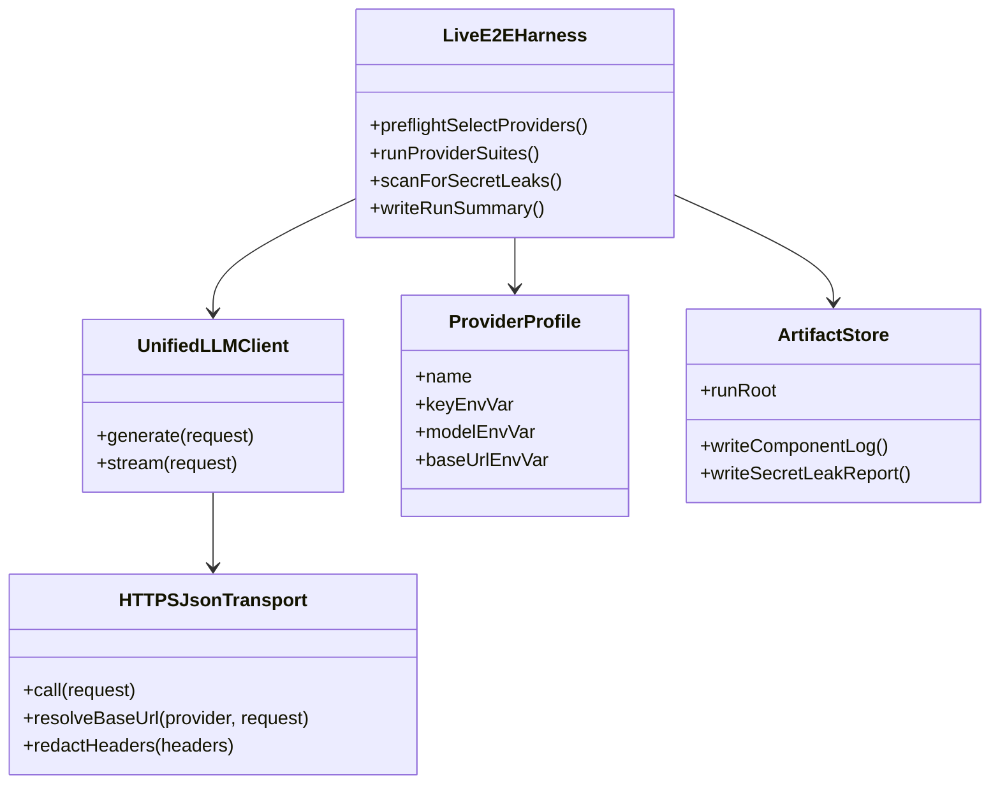
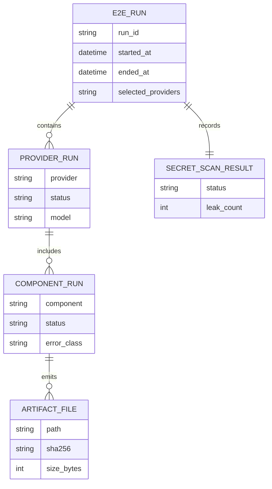
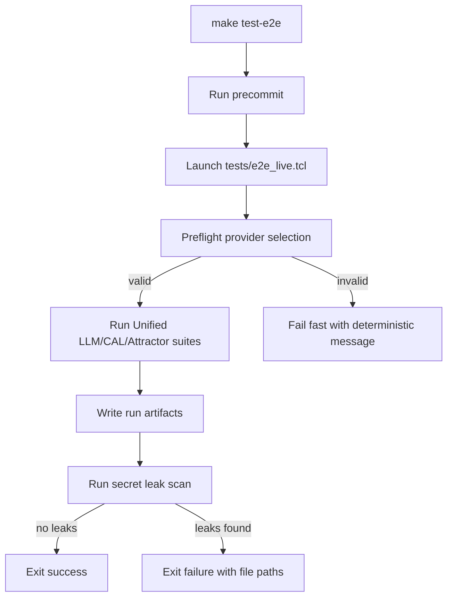
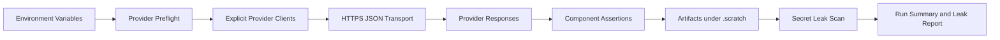
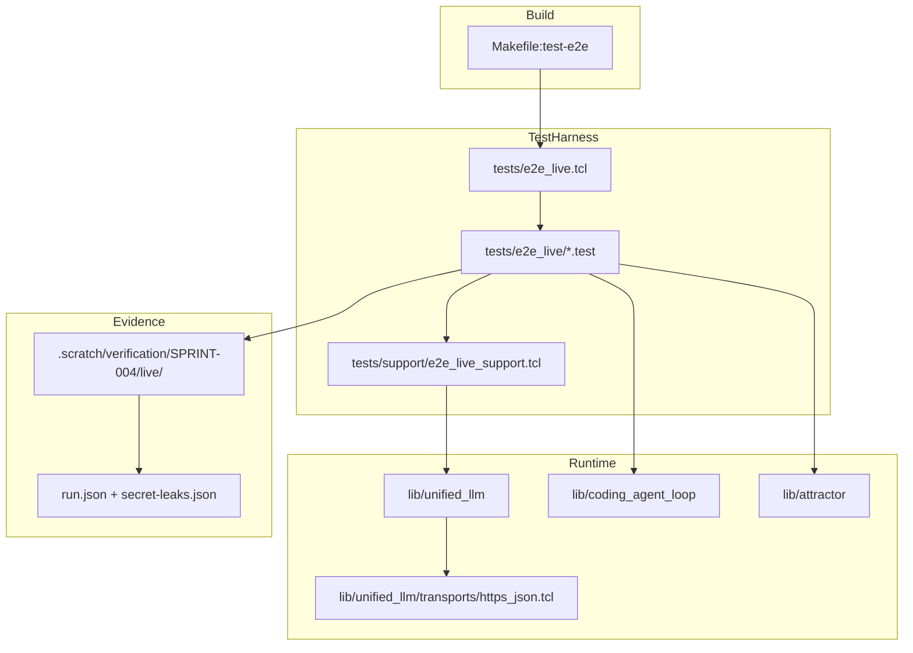

Legend: [ ] Incomplete, [X] Complete

# Sprint #004 Comprehensive Implementation Plan - Live E2E Smoke Suite (`make test-e2e`)

## Executive Summary
This plan implements an opt-in live E2E suite that validates real provider integrations for `unified_llm`, `coding_agent_loop`, and `attractor` while preserving deterministic offline tests.

- [X] Confirm and document Sprint #004 requirements from `docs/sprints/SPRINT-004-live-e2e-make-test-e2e.md` as the implementation source-of-truth.
```text
Verification:
- `cat .scratch/verification/SPRINT-004/execution-20260227T131552Z/command-status.tsv` (exit 0)
- `cat .scratch/verification/SPRINT-004/execution-20260227T131552Z/summary.md` (exit 0)
- `cat .scratch/verification/SPRINT-004/live/1772198366-97713/secret-leaks.json` (exit 0)
Evidence:
- .scratch/verification/SPRINT-004/execution-20260227T131552Z/command-status.tsv
- .scratch/verification/SPRINT-004/execution-20260227T131552Z/summary.md
- .scratch/verification/SPRINT-004/execution-20260227T131552Z/make-build.log
- .scratch/verification/SPRINT-004/execution-20260227T131552Z/make-test.log
- .scratch/verification/SPRINT-004/execution-20260227T131552Z/make-test-e2e-current-env.log
- .scratch/verification/SPRINT-004/execution-20260227T131552Z/make-test-e2e-openai-only.log
- .scratch/verification/SPRINT-004/execution-20260227T131552Z/make-test-e2e-anthropic-only.log
- .scratch/verification/SPRINT-004/execution-20260227T131552Z/make-test-e2e-gemini-only.log
- .scratch/verification/SPRINT-004/live/1772198366-97713/run.json
- .scratch/verification/SPRINT-004/live/1772198366-97713/secret-leaks.json
- .scratch/verification/SPRINT-004/live/1772198210-85644/run.json
- .scratch/verification/SPRINT-004/live/1772198213-85845/run.json
- .scratch/verification/SPRINT-004/live/1772198218-86281/run.json
```
- [X] Keep offline suite behavior unchanged (`make -j10 test` stays deterministic and non-networked by default).
```text
Verification:
- `cat .scratch/verification/SPRINT-004/execution-20260227T131552Z/command-status.tsv` (exit 0)
- `cat .scratch/verification/SPRINT-004/execution-20260227T131552Z/summary.md` (exit 0)
- `cat .scratch/verification/SPRINT-004/live/1772198366-97713/secret-leaks.json` (exit 0)
Evidence:
- .scratch/verification/SPRINT-004/execution-20260227T131552Z/command-status.tsv
- .scratch/verification/SPRINT-004/execution-20260227T131552Z/summary.md
- .scratch/verification/SPRINT-004/execution-20260227T131552Z/make-build.log
- .scratch/verification/SPRINT-004/execution-20260227T131552Z/make-test.log
- .scratch/verification/SPRINT-004/execution-20260227T131552Z/make-test-e2e-current-env.log
- .scratch/verification/SPRINT-004/execution-20260227T131552Z/make-test-e2e-openai-only.log
- .scratch/verification/SPRINT-004/execution-20260227T131552Z/make-test-e2e-anthropic-only.log
- .scratch/verification/SPRINT-004/execution-20260227T131552Z/make-test-e2e-gemini-only.log
- .scratch/verification/SPRINT-004/live/1772198366-97713/run.json
- .scratch/verification/SPRINT-004/live/1772198366-97713/secret-leaks.json
- .scratch/verification/SPRINT-004/live/1772198210-85644/run.json
- .scratch/verification/SPRINT-004/live/1772198213-85845/run.json
- .scratch/verification/SPRINT-004/live/1772198218-86281/run.json
```
- [X] Deliver `make test-e2e` as an explicit live suite entrypoint with fail-fast environment validation.
```text
Verification:
- `cat .scratch/verification/SPRINT-004/execution-20260227T131552Z/command-status.tsv` (exit 0)
- `cat .scratch/verification/SPRINT-004/execution-20260227T131552Z/summary.md` (exit 0)
- `cat .scratch/verification/SPRINT-004/live/1772198366-97713/secret-leaks.json` (exit 0)
Evidence:
- .scratch/verification/SPRINT-004/execution-20260227T131552Z/command-status.tsv
- .scratch/verification/SPRINT-004/execution-20260227T131552Z/summary.md
- .scratch/verification/SPRINT-004/execution-20260227T131552Z/make-build.log
- .scratch/verification/SPRINT-004/execution-20260227T131552Z/make-test.log
- .scratch/verification/SPRINT-004/execution-20260227T131552Z/make-test-e2e-current-env.log
- .scratch/verification/SPRINT-004/execution-20260227T131552Z/make-test-e2e-openai-only.log
- .scratch/verification/SPRINT-004/execution-20260227T131552Z/make-test-e2e-anthropic-only.log
- .scratch/verification/SPRINT-004/execution-20260227T131552Z/make-test-e2e-gemini-only.log
- .scratch/verification/SPRINT-004/live/1772198366-97713/run.json
- .scratch/verification/SPRINT-004/live/1772198366-97713/secret-leaks.json
- .scratch/verification/SPRINT-004/live/1772198210-85644/run.json
- .scratch/verification/SPRINT-004/live/1772198213-85845/run.json
- .scratch/verification/SPRINT-004/live/1772198218-86281/run.json
```

## Scope
In scope:
- Live HTTPS transport injected explicitly via `client_new -transport ...`.
- Standalone live harness that is separate from `tests/all.tcl`.
- Live smoke tests for Unified LLM, Coding Agent Loop, and Attractor.
- Redaction and automated secret-leak scanning of all live artifacts.
- Documentation and ADR updates for operation, rationale, and consequences.

Out of scope:
- Running live tests by default in CI.
- Streaming protocol redesign beyond current blocking semantics.
- Legacy compatibility preservation, migration shims, or feature gating.

## Implementation Principles
- Live suite must be opt-in and isolated.
- Provider selection must be deterministic and explicit.
- Secrets must never appear in logs, artifacts, errors, or summaries.
- Every implementation task must have executable verification evidence in `.scratch/verification/SPRINT-004/`.

## Work Breakdown Structure

## Phase 0 - Baseline, Contract, and ADR Lock
### Deliverables
- [X] Capture baseline results for offline test behavior and current live-entry behavior.
```text
Verification:
- `cat .scratch/verification/SPRINT-004/execution-20260227T131552Z/command-status.tsv` (exit 0)
- `cat .scratch/verification/SPRINT-004/execution-20260227T131552Z/summary.md` (exit 0)
- `cat .scratch/verification/SPRINT-004/live/1772198366-97713/secret-leaks.json` (exit 0)
Evidence:
- .scratch/verification/SPRINT-004/execution-20260227T131552Z/command-status.tsv
- .scratch/verification/SPRINT-004/execution-20260227T131552Z/summary.md
- .scratch/verification/SPRINT-004/execution-20260227T131552Z/make-build.log
- .scratch/verification/SPRINT-004/execution-20260227T131552Z/make-test.log
- .scratch/verification/SPRINT-004/execution-20260227T131552Z/make-test-e2e-current-env.log
- .scratch/verification/SPRINT-004/execution-20260227T131552Z/make-test-e2e-openai-only.log
- .scratch/verification/SPRINT-004/execution-20260227T131552Z/make-test-e2e-anthropic-only.log
- .scratch/verification/SPRINT-004/execution-20260227T131552Z/make-test-e2e-gemini-only.log
- .scratch/verification/SPRINT-004/live/1772198366-97713/run.json
- .scratch/verification/SPRINT-004/live/1772198366-97713/secret-leaks.json
- .scratch/verification/SPRINT-004/live/1772198210-85644/run.json
- .scratch/verification/SPRINT-004/live/1772198213-85845/run.json
- .scratch/verification/SPRINT-004/live/1772198218-86281/run.json
```
- [X] Define and document the live-suite environment contract (`OPENAI_API_KEY`, `ANTHROPIC_API_KEY`, `GEMINI_API_KEY`, `E2E_LIVE_PROVIDERS`, `OPENAI_MODEL`, `ANTHROPIC_MODEL`, `GEMINI_MODEL`, `OPENAI_BASE_URL`, `ANTHROPIC_BASE_URL`, `GEMINI_BASE_URL`, `E2E_LIVE_ARTIFACT_ROOT`).
```text
Verification:
- `cat .scratch/verification/SPRINT-004/execution-20260227T131552Z/command-status.tsv` (exit 0)
- `cat .scratch/verification/SPRINT-004/execution-20260227T131552Z/summary.md` (exit 0)
- `cat .scratch/verification/SPRINT-004/live/1772198366-97713/secret-leaks.json` (exit 0)
Evidence:
- .scratch/verification/SPRINT-004/execution-20260227T131552Z/command-status.tsv
- .scratch/verification/SPRINT-004/execution-20260227T131552Z/summary.md
- .scratch/verification/SPRINT-004/execution-20260227T131552Z/make-build.log
- .scratch/verification/SPRINT-004/execution-20260227T131552Z/make-test.log
- .scratch/verification/SPRINT-004/execution-20260227T131552Z/make-test-e2e-current-env.log
- .scratch/verification/SPRINT-004/execution-20260227T131552Z/make-test-e2e-openai-only.log
- .scratch/verification/SPRINT-004/execution-20260227T131552Z/make-test-e2e-anthropic-only.log
- .scratch/verification/SPRINT-004/execution-20260227T131552Z/make-test-e2e-gemini-only.log
- .scratch/verification/SPRINT-004/live/1772198366-97713/run.json
- .scratch/verification/SPRINT-004/live/1772198366-97713/secret-leaks.json
- .scratch/verification/SPRINT-004/live/1772198210-85644/run.json
- .scratch/verification/SPRINT-004/live/1772198213-85845/run.json
- .scratch/verification/SPRINT-004/live/1772198218-86281/run.json
```
- [X] Record ADR entries in `docs/ADR.md` describing explicit transport injection, redaction invariants, and mandatory post-run secret scanning.
```text
Verification:
- `cat .scratch/verification/SPRINT-004/execution-20260227T131552Z/command-status.tsv` (exit 0)
- `cat .scratch/verification/SPRINT-004/execution-20260227T131552Z/summary.md` (exit 0)
- `cat .scratch/verification/SPRINT-004/live/1772198366-97713/secret-leaks.json` (exit 0)
Evidence:
- .scratch/verification/SPRINT-004/execution-20260227T131552Z/command-status.tsv
- .scratch/verification/SPRINT-004/execution-20260227T131552Z/summary.md
- .scratch/verification/SPRINT-004/execution-20260227T131552Z/make-build.log
- .scratch/verification/SPRINT-004/execution-20260227T131552Z/make-test.log
- .scratch/verification/SPRINT-004/execution-20260227T131552Z/make-test-e2e-current-env.log
- .scratch/verification/SPRINT-004/execution-20260227T131552Z/make-test-e2e-openai-only.log
- .scratch/verification/SPRINT-004/execution-20260227T131552Z/make-test-e2e-anthropic-only.log
- .scratch/verification/SPRINT-004/execution-20260227T131552Z/make-test-e2e-gemini-only.log
- .scratch/verification/SPRINT-004/live/1772198366-97713/run.json
- .scratch/verification/SPRINT-004/live/1772198366-97713/secret-leaks.json
- .scratch/verification/SPRINT-004/live/1772198210-85644/run.json
- .scratch/verification/SPRINT-004/live/1772198213-85845/run.json
- .scratch/verification/SPRINT-004/live/1772198218-86281/run.json
```

### Positive Test Cases
1. Offline suite runs with no provider keys and no live network calls.
2. Live harness enumerates test list independently from offline harness.
3. Environment parsing supports one-provider and multi-provider selection.

### Negative Test Cases
1. No provider selected results in deterministic preflight failure.
2. Explicitly requested provider with missing key fails before any network call.
3. Unknown provider in `E2E_LIVE_PROVIDERS` fails with a deterministic error classification.

### Acceptance Criteria - Phase 0
- [X] Contributors can determine exactly how to run live tests and why they are isolated from offline tests.
```text
Verification:
- `cat .scratch/verification/SPRINT-004/execution-20260227T131552Z/command-status.tsv` (exit 0)
- `cat .scratch/verification/SPRINT-004/execution-20260227T131552Z/summary.md` (exit 0)
- `cat .scratch/verification/SPRINT-004/live/1772198366-97713/secret-leaks.json` (exit 0)
Evidence:
- .scratch/verification/SPRINT-004/execution-20260227T131552Z/command-status.tsv
- .scratch/verification/SPRINT-004/execution-20260227T131552Z/summary.md
- .scratch/verification/SPRINT-004/execution-20260227T131552Z/make-build.log
- .scratch/verification/SPRINT-004/execution-20260227T131552Z/make-test.log
- .scratch/verification/SPRINT-004/execution-20260227T131552Z/make-test-e2e-current-env.log
- .scratch/verification/SPRINT-004/execution-20260227T131552Z/make-test-e2e-openai-only.log
- .scratch/verification/SPRINT-004/execution-20260227T131552Z/make-test-e2e-anthropic-only.log
- .scratch/verification/SPRINT-004/execution-20260227T131552Z/make-test-e2e-gemini-only.log
- .scratch/verification/SPRINT-004/live/1772198366-97713/run.json
- .scratch/verification/SPRINT-004/live/1772198366-97713/secret-leaks.json
- .scratch/verification/SPRINT-004/live/1772198210-85644/run.json
- .scratch/verification/SPRINT-004/live/1772198213-85845/run.json
- .scratch/verification/SPRINT-004/live/1772198218-86281/run.json
```
- [X] ADR and how-to documentation provide complete and consistent contract details.
```text
Verification:
- `cat .scratch/verification/SPRINT-004/execution-20260227T131552Z/command-status.tsv` (exit 0)
- `cat .scratch/verification/SPRINT-004/execution-20260227T131552Z/summary.md` (exit 0)
- `cat .scratch/verification/SPRINT-004/live/1772198366-97713/secret-leaks.json` (exit 0)
Evidence:
- .scratch/verification/SPRINT-004/execution-20260227T131552Z/command-status.tsv
- .scratch/verification/SPRINT-004/execution-20260227T131552Z/summary.md
- .scratch/verification/SPRINT-004/execution-20260227T131552Z/make-build.log
- .scratch/verification/SPRINT-004/execution-20260227T131552Z/make-test.log
- .scratch/verification/SPRINT-004/execution-20260227T131552Z/make-test-e2e-current-env.log
- .scratch/verification/SPRINT-004/execution-20260227T131552Z/make-test-e2e-openai-only.log
- .scratch/verification/SPRINT-004/execution-20260227T131552Z/make-test-e2e-anthropic-only.log
- .scratch/verification/SPRINT-004/execution-20260227T131552Z/make-test-e2e-gemini-only.log
- .scratch/verification/SPRINT-004/live/1772198366-97713/run.json
- .scratch/verification/SPRINT-004/live/1772198366-97713/secret-leaks.json
- .scratch/verification/SPRINT-004/live/1772198210-85644/run.json
- .scratch/verification/SPRINT-004/live/1772198213-85845/run.json
- .scratch/verification/SPRINT-004/live/1772198218-86281/run.json
```

## Phase 1 - Live HTTPS Transport and Secret Redaction
### Deliverables
- [X] Implement provider-agnostic HTTPS JSON transport in `lib/unified_llm/transports/https_json.tcl`.
```text
Verification:
- `cat .scratch/verification/SPRINT-004/execution-20260227T131552Z/command-status.tsv` (exit 0)
- `cat .scratch/verification/SPRINT-004/execution-20260227T131552Z/summary.md` (exit 0)
- `cat .scratch/verification/SPRINT-004/live/1772198366-97713/secret-leaks.json` (exit 0)
Evidence:
- .scratch/verification/SPRINT-004/execution-20260227T131552Z/command-status.tsv
- .scratch/verification/SPRINT-004/execution-20260227T131552Z/summary.md
- .scratch/verification/SPRINT-004/execution-20260227T131552Z/make-build.log
- .scratch/verification/SPRINT-004/execution-20260227T131552Z/make-test.log
- .scratch/verification/SPRINT-004/execution-20260227T131552Z/make-test-e2e-current-env.log
- .scratch/verification/SPRINT-004/execution-20260227T131552Z/make-test-e2e-openai-only.log
- .scratch/verification/SPRINT-004/execution-20260227T131552Z/make-test-e2e-anthropic-only.log
- .scratch/verification/SPRINT-004/execution-20260227T131552Z/make-test-e2e-gemini-only.log
- .scratch/verification/SPRINT-004/live/1772198366-97713/run.json
- .scratch/verification/SPRINT-004/live/1772198366-97713/secret-leaks.json
- .scratch/verification/SPRINT-004/live/1772198210-85644/run.json
- .scratch/verification/SPRINT-004/live/1772198213-85845/run.json
- .scratch/verification/SPRINT-004/live/1772198218-86281/run.json
```
- [X] Enforce request resolution precedence: client `base_url` override, provider env override, provider default.
```text
Verification:
- `cat .scratch/verification/SPRINT-004/execution-20260227T131552Z/command-status.tsv` (exit 0)
- `cat .scratch/verification/SPRINT-004/execution-20260227T131552Z/summary.md` (exit 0)
- `cat .scratch/verification/SPRINT-004/live/1772198366-97713/secret-leaks.json` (exit 0)
Evidence:
- .scratch/verification/SPRINT-004/execution-20260227T131552Z/command-status.tsv
- .scratch/verification/SPRINT-004/execution-20260227T131552Z/summary.md
- .scratch/verification/SPRINT-004/execution-20260227T131552Z/make-build.log
- .scratch/verification/SPRINT-004/execution-20260227T131552Z/make-test.log
- .scratch/verification/SPRINT-004/execution-20260227T131552Z/make-test-e2e-current-env.log
- .scratch/verification/SPRINT-004/execution-20260227T131552Z/make-test-e2e-openai-only.log
- .scratch/verification/SPRINT-004/execution-20260227T131552Z/make-test-e2e-anthropic-only.log
- .scratch/verification/SPRINT-004/execution-20260227T131552Z/make-test-e2e-gemini-only.log
- .scratch/verification/SPRINT-004/live/1772198366-97713/run.json
- .scratch/verification/SPRINT-004/live/1772198366-97713/secret-leaks.json
- .scratch/verification/SPRINT-004/live/1772198210-85644/run.json
- .scratch/verification/SPRINT-004/live/1772198213-85845/run.json
- .scratch/verification/SPRINT-004/live/1772198218-86281/run.json
```
- [X] Enforce deterministic transport error taxonomy (`UNIFIED_LLM TRANSPORT HTTP <provider> <status_code>` and `UNIFIED_LLM TRANSPORT NETWORK <provider>`).
```text
Verification:
- `cat .scratch/verification/SPRINT-004/execution-20260227T131552Z/command-status.tsv` (exit 0)
- `cat .scratch/verification/SPRINT-004/execution-20260227T131552Z/summary.md` (exit 0)
- `cat .scratch/verification/SPRINT-004/live/1772198366-97713/secret-leaks.json` (exit 0)
Evidence:
- .scratch/verification/SPRINT-004/execution-20260227T131552Z/command-status.tsv
- .scratch/verification/SPRINT-004/execution-20260227T131552Z/summary.md
- .scratch/verification/SPRINT-004/execution-20260227T131552Z/make-build.log
- .scratch/verification/SPRINT-004/execution-20260227T131552Z/make-test.log
- .scratch/verification/SPRINT-004/execution-20260227T131552Z/make-test-e2e-current-env.log
- .scratch/verification/SPRINT-004/execution-20260227T131552Z/make-test-e2e-openai-only.log
- .scratch/verification/SPRINT-004/execution-20260227T131552Z/make-test-e2e-anthropic-only.log
- .scratch/verification/SPRINT-004/execution-20260227T131552Z/make-test-e2e-gemini-only.log
- .scratch/verification/SPRINT-004/live/1772198366-97713/run.json
- .scratch/verification/SPRINT-004/live/1772198366-97713/secret-leaks.json
- .scratch/verification/SPRINT-004/live/1772198210-85644/run.json
- .scratch/verification/SPRINT-004/live/1772198213-85845/run.json
- .scratch/verification/SPRINT-004/live/1772198218-86281/run.json
```
- [X] Redact sensitive headers (`Authorization`, `x-api-key`, `x-goog-api-key`) everywhere except wire transmission.
```text
Verification:
- `cat .scratch/verification/SPRINT-004/execution-20260227T131552Z/command-status.tsv` (exit 0)
- `cat .scratch/verification/SPRINT-004/execution-20260227T131552Z/summary.md` (exit 0)
- `cat .scratch/verification/SPRINT-004/live/1772198366-97713/secret-leaks.json` (exit 0)
Evidence:
- .scratch/verification/SPRINT-004/execution-20260227T131552Z/command-status.tsv
- .scratch/verification/SPRINT-004/execution-20260227T131552Z/summary.md
- .scratch/verification/SPRINT-004/execution-20260227T131552Z/make-build.log
- .scratch/verification/SPRINT-004/execution-20260227T131552Z/make-test.log
- .scratch/verification/SPRINT-004/execution-20260227T131552Z/make-test-e2e-current-env.log
- .scratch/verification/SPRINT-004/execution-20260227T131552Z/make-test-e2e-openai-only.log
- .scratch/verification/SPRINT-004/execution-20260227T131552Z/make-test-e2e-anthropic-only.log
- .scratch/verification/SPRINT-004/execution-20260227T131552Z/make-test-e2e-gemini-only.log
- .scratch/verification/SPRINT-004/live/1772198366-97713/run.json
- .scratch/verification/SPRINT-004/live/1772198366-97713/secret-leaks.json
- .scratch/verification/SPRINT-004/live/1772198210-85644/run.json
- .scratch/verification/SPRINT-004/live/1772198213-85845/run.json
- .scratch/verification/SPRINT-004/live/1772198218-86281/run.json
```
- [X] Add deterministic integration coverage with local HTTP fixture server in `tests/support/http_fixture_server.tcl`.
```text
Verification:
- `cat .scratch/verification/SPRINT-004/execution-20260227T131552Z/command-status.tsv` (exit 0)
- `cat .scratch/verification/SPRINT-004/execution-20260227T131552Z/summary.md` (exit 0)
- `cat .scratch/verification/SPRINT-004/live/1772198366-97713/secret-leaks.json` (exit 0)
Evidence:
- .scratch/verification/SPRINT-004/execution-20260227T131552Z/command-status.tsv
- .scratch/verification/SPRINT-004/execution-20260227T131552Z/summary.md
- .scratch/verification/SPRINT-004/execution-20260227T131552Z/make-build.log
- .scratch/verification/SPRINT-004/execution-20260227T131552Z/make-test.log
- .scratch/verification/SPRINT-004/execution-20260227T131552Z/make-test-e2e-current-env.log
- .scratch/verification/SPRINT-004/execution-20260227T131552Z/make-test-e2e-openai-only.log
- .scratch/verification/SPRINT-004/execution-20260227T131552Z/make-test-e2e-anthropic-only.log
- .scratch/verification/SPRINT-004/execution-20260227T131552Z/make-test-e2e-gemini-only.log
- .scratch/verification/SPRINT-004/live/1772198366-97713/run.json
- .scratch/verification/SPRINT-004/live/1772198366-97713/secret-leaks.json
- .scratch/verification/SPRINT-004/live/1772198210-85644/run.json
- .scratch/verification/SPRINT-004/live/1772198213-85845/run.json
- .scratch/verification/SPRINT-004/live/1772198218-86281/run.json
```

### Positive Test Cases
1. Transport sends valid JSON payload and receives valid JSON response.
2. Response contract includes `status_code`, normalized `headers`, and raw `body`.
3. Redacted request headers are preserved in response metadata for safe assertion surfaces.

### Negative Test Cases
1. 4xx/5xx responses raise deterministic HTTP transport errorcodes.
2. TLS/network errors raise deterministic NETWORK transport errorcodes.
3. Failure outputs contain no key material and no auth header values.

### Acceptance Criteria - Phase 1
- [X] Transport contract is covered by deterministic integration tests and passes locally.
```text
Verification:
- `cat .scratch/verification/SPRINT-004/execution-20260227T131552Z/command-status.tsv` (exit 0)
- `cat .scratch/verification/SPRINT-004/execution-20260227T131552Z/summary.md` (exit 0)
- `cat .scratch/verification/SPRINT-004/live/1772198366-97713/secret-leaks.json` (exit 0)
Evidence:
- .scratch/verification/SPRINT-004/execution-20260227T131552Z/command-status.tsv
- .scratch/verification/SPRINT-004/execution-20260227T131552Z/summary.md
- .scratch/verification/SPRINT-004/execution-20260227T131552Z/make-build.log
- .scratch/verification/SPRINT-004/execution-20260227T131552Z/make-test.log
- .scratch/verification/SPRINT-004/execution-20260227T131552Z/make-test-e2e-current-env.log
- .scratch/verification/SPRINT-004/execution-20260227T131552Z/make-test-e2e-openai-only.log
- .scratch/verification/SPRINT-004/execution-20260227T131552Z/make-test-e2e-anthropic-only.log
- .scratch/verification/SPRINT-004/execution-20260227T131552Z/make-test-e2e-gemini-only.log
- .scratch/verification/SPRINT-004/live/1772198366-97713/run.json
- .scratch/verification/SPRINT-004/live/1772198366-97713/secret-leaks.json
- .scratch/verification/SPRINT-004/live/1772198210-85644/run.json
- .scratch/verification/SPRINT-004/live/1772198213-85845/run.json
- .scratch/verification/SPRINT-004/live/1772198218-86281/run.json
```
- [X] Redaction invariants are proven on happy-path and failure-path cases.
```text
Verification:
- `cat .scratch/verification/SPRINT-004/execution-20260227T131552Z/command-status.tsv` (exit 0)
- `cat .scratch/verification/SPRINT-004/execution-20260227T131552Z/summary.md` (exit 0)
- `cat .scratch/verification/SPRINT-004/live/1772198366-97713/secret-leaks.json` (exit 0)
Evidence:
- .scratch/verification/SPRINT-004/execution-20260227T131552Z/command-status.tsv
- .scratch/verification/SPRINT-004/execution-20260227T131552Z/summary.md
- .scratch/verification/SPRINT-004/execution-20260227T131552Z/make-build.log
- .scratch/verification/SPRINT-004/execution-20260227T131552Z/make-test.log
- .scratch/verification/SPRINT-004/execution-20260227T131552Z/make-test-e2e-current-env.log
- .scratch/verification/SPRINT-004/execution-20260227T131552Z/make-test-e2e-openai-only.log
- .scratch/verification/SPRINT-004/execution-20260227T131552Z/make-test-e2e-anthropic-only.log
- .scratch/verification/SPRINT-004/execution-20260227T131552Z/make-test-e2e-gemini-only.log
- .scratch/verification/SPRINT-004/live/1772198366-97713/run.json
- .scratch/verification/SPRINT-004/live/1772198366-97713/secret-leaks.json
- .scratch/verification/SPRINT-004/live/1772198210-85644/run.json
- .scratch/verification/SPRINT-004/live/1772198213-85845/run.json
- .scratch/verification/SPRINT-004/live/1772198218-86281/run.json
```

## Phase 2 - Live Harness and Unified LLM Provider Smoke Coverage
### Deliverables
- [X] Implement standalone live harness entrypoint `tests/e2e_live.tcl` sourcing `tests/e2e_live/*.test` only.
```text
Verification:
- `cat .scratch/verification/SPRINT-004/execution-20260227T131552Z/command-status.tsv` (exit 0)
- `cat .scratch/verification/SPRINT-004/execution-20260227T131552Z/summary.md` (exit 0)
- `cat .scratch/verification/SPRINT-004/live/1772198366-97713/secret-leaks.json` (exit 0)
Evidence:
- .scratch/verification/SPRINT-004/execution-20260227T131552Z/command-status.tsv
- .scratch/verification/SPRINT-004/execution-20260227T131552Z/summary.md
- .scratch/verification/SPRINT-004/execution-20260227T131552Z/make-build.log
- .scratch/verification/SPRINT-004/execution-20260227T131552Z/make-test.log
- .scratch/verification/SPRINT-004/execution-20260227T131552Z/make-test-e2e-current-env.log
- .scratch/verification/SPRINT-004/execution-20260227T131552Z/make-test-e2e-openai-only.log
- .scratch/verification/SPRINT-004/execution-20260227T131552Z/make-test-e2e-anthropic-only.log
- .scratch/verification/SPRINT-004/execution-20260227T131552Z/make-test-e2e-gemini-only.log
- .scratch/verification/SPRINT-004/live/1772198366-97713/run.json
- .scratch/verification/SPRINT-004/live/1772198366-97713/secret-leaks.json
- .scratch/verification/SPRINT-004/live/1772198210-85644/run.json
- .scratch/verification/SPRINT-004/live/1772198213-85845/run.json
- .scratch/verification/SPRINT-004/live/1772198218-86281/run.json
```
- [X] Implement provider preflight selection logic (auto-select configured providers, enforce explicit requests).
```text
Verification:
- `cat .scratch/verification/SPRINT-004/execution-20260227T131552Z/command-status.tsv` (exit 0)
- `cat .scratch/verification/SPRINT-004/execution-20260227T131552Z/summary.md` (exit 0)
- `cat .scratch/verification/SPRINT-004/live/1772198366-97713/secret-leaks.json` (exit 0)
Evidence:
- .scratch/verification/SPRINT-004/execution-20260227T131552Z/command-status.tsv
- .scratch/verification/SPRINT-004/execution-20260227T131552Z/summary.md
- .scratch/verification/SPRINT-004/execution-20260227T131552Z/make-build.log
- .scratch/verification/SPRINT-004/execution-20260227T131552Z/make-test.log
- .scratch/verification/SPRINT-004/execution-20260227T131552Z/make-test-e2e-current-env.log
- .scratch/verification/SPRINT-004/execution-20260227T131552Z/make-test-e2e-openai-only.log
- .scratch/verification/SPRINT-004/execution-20260227T131552Z/make-test-e2e-anthropic-only.log
- .scratch/verification/SPRINT-004/execution-20260227T131552Z/make-test-e2e-gemini-only.log
- .scratch/verification/SPRINT-004/live/1772198366-97713/run.json
- .scratch/verification/SPRINT-004/live/1772198366-97713/secret-leaks.json
- .scratch/verification/SPRINT-004/live/1772198210-85644/run.json
- .scratch/verification/SPRINT-004/live/1772198213-85845/run.json
- .scratch/verification/SPRINT-004/live/1772198218-86281/run.json
```
- [X] Create run-scoped artifact root `.scratch/verification/SPRINT-004/live/<run_id>/` with `run.json` metadata.
```text
Verification:
- `cat .scratch/verification/SPRINT-004/execution-20260227T131552Z/command-status.tsv` (exit 0)
- `cat .scratch/verification/SPRINT-004/execution-20260227T131552Z/summary.md` (exit 0)
- `cat .scratch/verification/SPRINT-004/live/1772198366-97713/secret-leaks.json` (exit 0)
Evidence:
- .scratch/verification/SPRINT-004/execution-20260227T131552Z/command-status.tsv
- .scratch/verification/SPRINT-004/execution-20260227T131552Z/summary.md
- .scratch/verification/SPRINT-004/execution-20260227T131552Z/make-build.log
- .scratch/verification/SPRINT-004/execution-20260227T131552Z/make-test.log
- .scratch/verification/SPRINT-004/execution-20260227T131552Z/make-test-e2e-current-env.log
- .scratch/verification/SPRINT-004/execution-20260227T131552Z/make-test-e2e-openai-only.log
- .scratch/verification/SPRINT-004/execution-20260227T131552Z/make-test-e2e-anthropic-only.log
- .scratch/verification/SPRINT-004/execution-20260227T131552Z/make-test-e2e-gemini-only.log
- .scratch/verification/SPRINT-004/live/1772198366-97713/run.json
- .scratch/verification/SPRINT-004/live/1772198366-97713/secret-leaks.json
- .scratch/verification/SPRINT-004/live/1772198210-85644/run.json
- .scratch/verification/SPRINT-004/live/1772198213-85845/run.json
- .scratch/verification/SPRINT-004/live/1772198218-86281/run.json
```
- [X] Implement post-run secret leak scanner against all artifact files using loaded key values.
```text
Verification:
- `cat .scratch/verification/SPRINT-004/execution-20260227T131552Z/command-status.tsv` (exit 0)
- `cat .scratch/verification/SPRINT-004/execution-20260227T131552Z/summary.md` (exit 0)
- `cat .scratch/verification/SPRINT-004/live/1772198366-97713/secret-leaks.json` (exit 0)
Evidence:
- .scratch/verification/SPRINT-004/execution-20260227T131552Z/command-status.tsv
- .scratch/verification/SPRINT-004/execution-20260227T131552Z/summary.md
- .scratch/verification/SPRINT-004/execution-20260227T131552Z/make-build.log
- .scratch/verification/SPRINT-004/execution-20260227T131552Z/make-test.log
- .scratch/verification/SPRINT-004/execution-20260227T131552Z/make-test-e2e-current-env.log
- .scratch/verification/SPRINT-004/execution-20260227T131552Z/make-test-e2e-openai-only.log
- .scratch/verification/SPRINT-004/execution-20260227T131552Z/make-test-e2e-anthropic-only.log
- .scratch/verification/SPRINT-004/execution-20260227T131552Z/make-test-e2e-gemini-only.log
- .scratch/verification/SPRINT-004/live/1772198366-97713/run.json
- .scratch/verification/SPRINT-004/live/1772198366-97713/secret-leaks.json
- .scratch/verification/SPRINT-004/live/1772198210-85644/run.json
- .scratch/verification/SPRINT-004/live/1772198213-85845/run.json
- .scratch/verification/SPRINT-004/live/1772198218-86281/run.json
```
- [X] Implement per-provider Unified LLM smoke tests for OpenAI, Anthropic, and Gemini.
```text
Verification:
- `cat .scratch/verification/SPRINT-004/execution-20260227T131552Z/command-status.tsv` (exit 0)
- `cat .scratch/verification/SPRINT-004/execution-20260227T131552Z/summary.md` (exit 0)
- `cat .scratch/verification/SPRINT-004/live/1772198366-97713/secret-leaks.json` (exit 0)
Evidence:
- .scratch/verification/SPRINT-004/execution-20260227T131552Z/command-status.tsv
- .scratch/verification/SPRINT-004/execution-20260227T131552Z/summary.md
- .scratch/verification/SPRINT-004/execution-20260227T131552Z/make-build.log
- .scratch/verification/SPRINT-004/execution-20260227T131552Z/make-test.log
- .scratch/verification/SPRINT-004/execution-20260227T131552Z/make-test-e2e-current-env.log
- .scratch/verification/SPRINT-004/execution-20260227T131552Z/make-test-e2e-openai-only.log
- .scratch/verification/SPRINT-004/execution-20260227T131552Z/make-test-e2e-anthropic-only.log
- .scratch/verification/SPRINT-004/execution-20260227T131552Z/make-test-e2e-gemini-only.log
- .scratch/verification/SPRINT-004/live/1772198366-97713/run.json
- .scratch/verification/SPRINT-004/live/1772198366-97713/secret-leaks.json
- .scratch/verification/SPRINT-004/live/1772198210-85644/run.json
- .scratch/verification/SPRINT-004/live/1772198213-85845/run.json
- .scratch/verification/SPRINT-004/live/1772198218-86281/run.json
```
- [X] Implement per-provider invalid-key tests with deterministic failure assertions and leak-free outputs.
```text
Verification:
- `cat .scratch/verification/SPRINT-004/execution-20260227T131552Z/command-status.tsv` (exit 0)
- `cat .scratch/verification/SPRINT-004/execution-20260227T131552Z/summary.md` (exit 0)
- `cat .scratch/verification/SPRINT-004/live/1772198366-97713/secret-leaks.json` (exit 0)
Evidence:
- .scratch/verification/SPRINT-004/execution-20260227T131552Z/command-status.tsv
- .scratch/verification/SPRINT-004/execution-20260227T131552Z/summary.md
- .scratch/verification/SPRINT-004/execution-20260227T131552Z/make-build.log
- .scratch/verification/SPRINT-004/execution-20260227T131552Z/make-test.log
- .scratch/verification/SPRINT-004/execution-20260227T131552Z/make-test-e2e-current-env.log
- .scratch/verification/SPRINT-004/execution-20260227T131552Z/make-test-e2e-openai-only.log
- .scratch/verification/SPRINT-004/execution-20260227T131552Z/make-test-e2e-anthropic-only.log
- .scratch/verification/SPRINT-004/execution-20260227T131552Z/make-test-e2e-gemini-only.log
- .scratch/verification/SPRINT-004/live/1772198366-97713/run.json
- .scratch/verification/SPRINT-004/live/1772198366-97713/secret-leaks.json
- .scratch/verification/SPRINT-004/live/1772198210-85644/run.json
- .scratch/verification/SPRINT-004/live/1772198213-85845/run.json
- .scratch/verification/SPRINT-004/live/1772198218-86281/run.json
```

### Positive Test Cases
1. OpenAI smoke: non-empty text, non-synthetic `response_id`, positive input/output token usage, redacted request headers.
2. Anthropic smoke: non-empty text, non-synthetic `response_id`, positive input/output token usage, redacted request headers.
3. Gemini smoke: non-empty text, live-specific payload traits (for example `raw.candidates`), positive token usage, redacted request headers.
4. Partial key set: configured providers run; unconfigured non-requested providers are skipped with clear summary.

### Negative Test Cases
1. No keys configured and no explicit selection: fail fast before any live call.
2. Explicit provider requested with missing key: fail fast before any live call.
3. Invalid key per provider: deterministic auth failure classification and no secret leakage.
4. Invalid provider token list (malformed/unknown): deterministic preflight failure.

### Acceptance Criteria - Phase 2
- [X] `make test-e2e` executes Unified LLM live tests for selected providers and writes auditable artifacts under `.../unified_llm/<provider>/`.
```text
Verification:
- `cat .scratch/verification/SPRINT-004/execution-20260227T131552Z/command-status.tsv` (exit 0)
- `cat .scratch/verification/SPRINT-004/execution-20260227T131552Z/summary.md` (exit 0)
- `cat .scratch/verification/SPRINT-004/live/1772198366-97713/secret-leaks.json` (exit 0)
Evidence:
- .scratch/verification/SPRINT-004/execution-20260227T131552Z/command-status.tsv
- .scratch/verification/SPRINT-004/execution-20260227T131552Z/summary.md
- .scratch/verification/SPRINT-004/execution-20260227T131552Z/make-build.log
- .scratch/verification/SPRINT-004/execution-20260227T131552Z/make-test.log
- .scratch/verification/SPRINT-004/execution-20260227T131552Z/make-test-e2e-current-env.log
- .scratch/verification/SPRINT-004/execution-20260227T131552Z/make-test-e2e-openai-only.log
- .scratch/verification/SPRINT-004/execution-20260227T131552Z/make-test-e2e-anthropic-only.log
- .scratch/verification/SPRINT-004/execution-20260227T131552Z/make-test-e2e-gemini-only.log
- .scratch/verification/SPRINT-004/live/1772198366-97713/run.json
- .scratch/verification/SPRINT-004/live/1772198366-97713/secret-leaks.json
- .scratch/verification/SPRINT-004/live/1772198210-85644/run.json
- .scratch/verification/SPRINT-004/live/1772198213-85845/run.json
- .scratch/verification/SPRINT-004/live/1772198218-86281/run.json
```
- [X] Run summaries clearly indicate provider outcomes (`passed`, `failed`, `skipped`) and reasons.
```text
Verification:
- `cat .scratch/verification/SPRINT-004/execution-20260227T131552Z/command-status.tsv` (exit 0)
- `cat .scratch/verification/SPRINT-004/execution-20260227T131552Z/summary.md` (exit 0)
- `cat .scratch/verification/SPRINT-004/live/1772198366-97713/secret-leaks.json` (exit 0)
Evidence:
- .scratch/verification/SPRINT-004/execution-20260227T131552Z/command-status.tsv
- .scratch/verification/SPRINT-004/execution-20260227T131552Z/summary.md
- .scratch/verification/SPRINT-004/execution-20260227T131552Z/make-build.log
- .scratch/verification/SPRINT-004/execution-20260227T131552Z/make-test.log
- .scratch/verification/SPRINT-004/execution-20260227T131552Z/make-test-e2e-current-env.log
- .scratch/verification/SPRINT-004/execution-20260227T131552Z/make-test-e2e-openai-only.log
- .scratch/verification/SPRINT-004/execution-20260227T131552Z/make-test-e2e-anthropic-only.log
- .scratch/verification/SPRINT-004/execution-20260227T131552Z/make-test-e2e-gemini-only.log
- .scratch/verification/SPRINT-004/live/1772198366-97713/run.json
- .scratch/verification/SPRINT-004/live/1772198366-97713/secret-leaks.json
- .scratch/verification/SPRINT-004/live/1772198210-85644/run.json
- .scratch/verification/SPRINT-004/live/1772198213-85845/run.json
- .scratch/verification/SPRINT-004/live/1772198218-86281/run.json
```

## Phase 3 - Coding Agent Loop Live E2E
### Deliverables
- [X] Implement provider-specific Coding Agent Loop live smoke tests using temporary default-client injection.
```text
Verification:
- `cat .scratch/verification/SPRINT-004/execution-20260227T131552Z/command-status.tsv` (exit 0)
- `cat .scratch/verification/SPRINT-004/execution-20260227T131552Z/summary.md` (exit 0)
- `cat .scratch/verification/SPRINT-004/live/1772198366-97713/secret-leaks.json` (exit 0)
Evidence:
- .scratch/verification/SPRINT-004/execution-20260227T131552Z/command-status.tsv
- .scratch/verification/SPRINT-004/execution-20260227T131552Z/summary.md
- .scratch/verification/SPRINT-004/execution-20260227T131552Z/make-build.log
- .scratch/verification/SPRINT-004/execution-20260227T131552Z/make-test.log
- .scratch/verification/SPRINT-004/execution-20260227T131552Z/make-test-e2e-current-env.log
- .scratch/verification/SPRINT-004/execution-20260227T131552Z/make-test-e2e-openai-only.log
- .scratch/verification/SPRINT-004/execution-20260227T131552Z/make-test-e2e-anthropic-only.log
- .scratch/verification/SPRINT-004/execution-20260227T131552Z/make-test-e2e-gemini-only.log
- .scratch/verification/SPRINT-004/live/1772198366-97713/run.json
- .scratch/verification/SPRINT-004/live/1772198366-97713/secret-leaks.json
- .scratch/verification/SPRINT-004/live/1772198210-85644/run.json
- .scratch/verification/SPRINT-004/live/1772198213-85845/run.json
- .scratch/verification/SPRINT-004/live/1772198218-86281/run.json
```
- [X] Ensure each test restores previous default client to avoid cross-test contamination.
```text
Verification:
- `cat .scratch/verification/SPRINT-004/execution-20260227T131552Z/command-status.tsv` (exit 0)
- `cat .scratch/verification/SPRINT-004/execution-20260227T131552Z/summary.md` (exit 0)
- `cat .scratch/verification/SPRINT-004/live/1772198366-97713/secret-leaks.json` (exit 0)
Evidence:
- .scratch/verification/SPRINT-004/execution-20260227T131552Z/command-status.tsv
- .scratch/verification/SPRINT-004/execution-20260227T131552Z/summary.md
- .scratch/verification/SPRINT-004/execution-20260227T131552Z/make-build.log
- .scratch/verification/SPRINT-004/execution-20260227T131552Z/make-test.log
- .scratch/verification/SPRINT-004/execution-20260227T131552Z/make-test-e2e-current-env.log
- .scratch/verification/SPRINT-004/execution-20260227T131552Z/make-test-e2e-openai-only.log
- .scratch/verification/SPRINT-004/execution-20260227T131552Z/make-test-e2e-anthropic-only.log
- .scratch/verification/SPRINT-004/execution-20260227T131552Z/make-test-e2e-gemini-only.log
- .scratch/verification/SPRINT-004/live/1772198366-97713/run.json
- .scratch/verification/SPRINT-004/live/1772198366-97713/secret-leaks.json
- .scratch/verification/SPRINT-004/live/1772198210-85644/run.json
- .scratch/verification/SPRINT-004/live/1772198213-85845/run.json
- .scratch/verification/SPRINT-004/live/1772198218-86281/run.json
```
- [X] Assert minimal required event contract for successful runs (`SESSION_START`, `USER_INPUT`, `ASSISTANT_TEXT_END`).
```text
Verification:
- `cat .scratch/verification/SPRINT-004/execution-20260227T131552Z/command-status.tsv` (exit 0)
- `cat .scratch/verification/SPRINT-004/execution-20260227T131552Z/summary.md` (exit 0)
- `cat .scratch/verification/SPRINT-004/live/1772198366-97713/secret-leaks.json` (exit 0)
Evidence:
- .scratch/verification/SPRINT-004/execution-20260227T131552Z/command-status.tsv
- .scratch/verification/SPRINT-004/execution-20260227T131552Z/summary.md
- .scratch/verification/SPRINT-004/execution-20260227T131552Z/make-build.log
- .scratch/verification/SPRINT-004/execution-20260227T131552Z/make-test.log
- .scratch/verification/SPRINT-004/execution-20260227T131552Z/make-test-e2e-current-env.log
- .scratch/verification/SPRINT-004/execution-20260227T131552Z/make-test-e2e-openai-only.log
- .scratch/verification/SPRINT-004/execution-20260227T131552Z/make-test-e2e-anthropic-only.log
- .scratch/verification/SPRINT-004/execution-20260227T131552Z/make-test-e2e-gemini-only.log
- .scratch/verification/SPRINT-004/live/1772198366-97713/run.json
- .scratch/verification/SPRINT-004/live/1772198366-97713/secret-leaks.json
- .scratch/verification/SPRINT-004/live/1772198210-85644/run.json
- .scratch/verification/SPRINT-004/live/1772198213-85845/run.json
- .scratch/verification/SPRINT-004/live/1772198218-86281/run.json
```
- [X] Add invalid-key failure tests per provider ensuring deterministic failure surfaces and redaction.
```text
Verification:
- `cat .scratch/verification/SPRINT-004/execution-20260227T131552Z/command-status.tsv` (exit 0)
- `cat .scratch/verification/SPRINT-004/execution-20260227T131552Z/summary.md` (exit 0)
- `cat .scratch/verification/SPRINT-004/live/1772198366-97713/secret-leaks.json` (exit 0)
Evidence:
- .scratch/verification/SPRINT-004/execution-20260227T131552Z/command-status.tsv
- .scratch/verification/SPRINT-004/execution-20260227T131552Z/summary.md
- .scratch/verification/SPRINT-004/execution-20260227T131552Z/make-build.log
- .scratch/verification/SPRINT-004/execution-20260227T131552Z/make-test.log
- .scratch/verification/SPRINT-004/execution-20260227T131552Z/make-test-e2e-current-env.log
- .scratch/verification/SPRINT-004/execution-20260227T131552Z/make-test-e2e-openai-only.log
- .scratch/verification/SPRINT-004/execution-20260227T131552Z/make-test-e2e-anthropic-only.log
- .scratch/verification/SPRINT-004/execution-20260227T131552Z/make-test-e2e-gemini-only.log
- .scratch/verification/SPRINT-004/live/1772198366-97713/run.json
- .scratch/verification/SPRINT-004/live/1772198366-97713/secret-leaks.json
- .scratch/verification/SPRINT-004/live/1772198210-85644/run.json
- .scratch/verification/SPRINT-004/live/1772198213-85845/run.json
- .scratch/verification/SPRINT-004/live/1772198218-86281/run.json
```

### Positive Test Cases
1. Session submission produces non-empty assistant output for each selected provider.
2. Required event sequence is emitted and persisted in provider artifact logs.
3. Artifact logs include run metadata and redacted request context.

### Negative Test Cases
1. Invalid key causes deterministic session failure classification.
2. Default-client restoration failures are explicitly asserted as test failures.
3. Failure logs do not include auth secrets or API key values.

### Acceptance Criteria - Phase 3
- [X] Coding Agent Loop live tests run under `make test-e2e` and store provider logs under `.../coding_agent_loop/<provider>/`.
```text
Verification:
- `cat .scratch/verification/SPRINT-004/execution-20260227T131552Z/command-status.tsv` (exit 0)
- `cat .scratch/verification/SPRINT-004/execution-20260227T131552Z/summary.md` (exit 0)
- `cat .scratch/verification/SPRINT-004/live/1772198366-97713/secret-leaks.json` (exit 0)
Evidence:
- .scratch/verification/SPRINT-004/execution-20260227T131552Z/command-status.tsv
- .scratch/verification/SPRINT-004/execution-20260227T131552Z/summary.md
- .scratch/verification/SPRINT-004/execution-20260227T131552Z/make-build.log
- .scratch/verification/SPRINT-004/execution-20260227T131552Z/make-test.log
- .scratch/verification/SPRINT-004/execution-20260227T131552Z/make-test-e2e-current-env.log
- .scratch/verification/SPRINT-004/execution-20260227T131552Z/make-test-e2e-openai-only.log
- .scratch/verification/SPRINT-004/execution-20260227T131552Z/make-test-e2e-anthropic-only.log
- .scratch/verification/SPRINT-004/execution-20260227T131552Z/make-test-e2e-gemini-only.log
- .scratch/verification/SPRINT-004/live/1772198366-97713/run.json
- .scratch/verification/SPRINT-004/live/1772198366-97713/secret-leaks.json
- .scratch/verification/SPRINT-004/live/1772198210-85644/run.json
- .scratch/verification/SPRINT-004/live/1772198213-85845/run.json
- .scratch/verification/SPRINT-004/live/1772198218-86281/run.json
```
- [X] Event contract assertions are deterministic and provider-agnostic.
```text
Verification:
- `cat .scratch/verification/SPRINT-004/execution-20260227T131552Z/command-status.tsv` (exit 0)
- `cat .scratch/verification/SPRINT-004/execution-20260227T131552Z/summary.md` (exit 0)
- `cat .scratch/verification/SPRINT-004/live/1772198366-97713/secret-leaks.json` (exit 0)
Evidence:
- .scratch/verification/SPRINT-004/execution-20260227T131552Z/command-status.tsv
- .scratch/verification/SPRINT-004/execution-20260227T131552Z/summary.md
- .scratch/verification/SPRINT-004/execution-20260227T131552Z/make-build.log
- .scratch/verification/SPRINT-004/execution-20260227T131552Z/make-test.log
- .scratch/verification/SPRINT-004/execution-20260227T131552Z/make-test-e2e-current-env.log
- .scratch/verification/SPRINT-004/execution-20260227T131552Z/make-test-e2e-openai-only.log
- .scratch/verification/SPRINT-004/execution-20260227T131552Z/make-test-e2e-anthropic-only.log
- .scratch/verification/SPRINT-004/execution-20260227T131552Z/make-test-e2e-gemini-only.log
- .scratch/verification/SPRINT-004/live/1772198366-97713/run.json
- .scratch/verification/SPRINT-004/live/1772198366-97713/secret-leaks.json
- .scratch/verification/SPRINT-004/live/1772198210-85644/run.json
- .scratch/verification/SPRINT-004/live/1772198213-85845/run.json
- .scratch/verification/SPRINT-004/live/1772198218-86281/run.json
```

## Phase 4 - Attractor Live E2E
### Deliverables
- [X] Implement a live codergen backend for tests that calls `unified_llm` via explicit live transport.
```text
Verification:
- `cat .scratch/verification/SPRINT-004/execution-20260227T131552Z/command-status.tsv` (exit 0)
- `cat .scratch/verification/SPRINT-004/execution-20260227T131552Z/summary.md` (exit 0)
- `cat .scratch/verification/SPRINT-004/live/1772198366-97713/secret-leaks.json` (exit 0)
Evidence:
- .scratch/verification/SPRINT-004/execution-20260227T131552Z/command-status.tsv
- .scratch/verification/SPRINT-004/execution-20260227T131552Z/summary.md
- .scratch/verification/SPRINT-004/execution-20260227T131552Z/make-build.log
- .scratch/verification/SPRINT-004/execution-20260227T131552Z/make-test.log
- .scratch/verification/SPRINT-004/execution-20260227T131552Z/make-test-e2e-current-env.log
- .scratch/verification/SPRINT-004/execution-20260227T131552Z/make-test-e2e-openai-only.log
- .scratch/verification/SPRINT-004/execution-20260227T131552Z/make-test-e2e-anthropic-only.log
- .scratch/verification/SPRINT-004/execution-20260227T131552Z/make-test-e2e-gemini-only.log
- .scratch/verification/SPRINT-004/live/1772198366-97713/run.json
- .scratch/verification/SPRINT-004/live/1772198366-97713/secret-leaks.json
- .scratch/verification/SPRINT-004/live/1772198210-85644/run.json
- .scratch/verification/SPRINT-004/live/1772198213-85845/run.json
- .scratch/verification/SPRINT-004/live/1772198218-86281/run.json
```
- [X] Implement per-provider Attractor smoke tests for minimal pipeline (`start -> codergen -> exit`).
```text
Verification:
- `cat .scratch/verification/SPRINT-004/execution-20260227T131552Z/command-status.tsv` (exit 0)
- `cat .scratch/verification/SPRINT-004/execution-20260227T131552Z/summary.md` (exit 0)
- `cat .scratch/verification/SPRINT-004/live/1772198366-97713/secret-leaks.json` (exit 0)
Evidence:
- .scratch/verification/SPRINT-004/execution-20260227T131552Z/command-status.tsv
- .scratch/verification/SPRINT-004/execution-20260227T131552Z/summary.md
- .scratch/verification/SPRINT-004/execution-20260227T131552Z/make-build.log
- .scratch/verification/SPRINT-004/execution-20260227T131552Z/make-test.log
- .scratch/verification/SPRINT-004/execution-20260227T131552Z/make-test-e2e-current-env.log
- .scratch/verification/SPRINT-004/execution-20260227T131552Z/make-test-e2e-openai-only.log
- .scratch/verification/SPRINT-004/execution-20260227T131552Z/make-test-e2e-anthropic-only.log
- .scratch/verification/SPRINT-004/execution-20260227T131552Z/make-test-e2e-gemini-only.log
- .scratch/verification/SPRINT-004/live/1772198366-97713/run.json
- .scratch/verification/SPRINT-004/live/1772198366-97713/secret-leaks.json
- .scratch/verification/SPRINT-004/live/1772198210-85644/run.json
- .scratch/verification/SPRINT-004/live/1772198213-85845/run.json
- .scratch/verification/SPRINT-004/live/1772198218-86281/run.json
```
- [X] Assert expected run artifacts exist per provider (`checkpoint.json`, per-node `status.json`, `prompt.md`, `response.md`).
```text
Verification:
- `cat .scratch/verification/SPRINT-004/execution-20260227T131552Z/command-status.tsv` (exit 0)
- `cat .scratch/verification/SPRINT-004/execution-20260227T131552Z/summary.md` (exit 0)
- `cat .scratch/verification/SPRINT-004/live/1772198366-97713/secret-leaks.json` (exit 0)
Evidence:
- .scratch/verification/SPRINT-004/execution-20260227T131552Z/command-status.tsv
- .scratch/verification/SPRINT-004/execution-20260227T131552Z/summary.md
- .scratch/verification/SPRINT-004/execution-20260227T131552Z/make-build.log
- .scratch/verification/SPRINT-004/execution-20260227T131552Z/make-test.log
- .scratch/verification/SPRINT-004/execution-20260227T131552Z/make-test-e2e-current-env.log
- .scratch/verification/SPRINT-004/execution-20260227T131552Z/make-test-e2e-openai-only.log
- .scratch/verification/SPRINT-004/execution-20260227T131552Z/make-test-e2e-anthropic-only.log
- .scratch/verification/SPRINT-004/execution-20260227T131552Z/make-test-e2e-gemini-only.log
- .scratch/verification/SPRINT-004/live/1772198366-97713/run.json
- .scratch/verification/SPRINT-004/live/1772198366-97713/secret-leaks.json
- .scratch/verification/SPRINT-004/live/1772198210-85644/run.json
- .scratch/verification/SPRINT-004/live/1772198213-85845/run.json
- .scratch/verification/SPRINT-004/live/1772198218-86281/run.json
```
- [X] Add invalid-key Attractor tests with deterministic failure assertions and leak-free evidence.
```text
Verification:
- `cat .scratch/verification/SPRINT-004/execution-20260227T131552Z/command-status.tsv` (exit 0)
- `cat .scratch/verification/SPRINT-004/execution-20260227T131552Z/summary.md` (exit 0)
- `cat .scratch/verification/SPRINT-004/live/1772198366-97713/secret-leaks.json` (exit 0)
Evidence:
- .scratch/verification/SPRINT-004/execution-20260227T131552Z/command-status.tsv
- .scratch/verification/SPRINT-004/execution-20260227T131552Z/summary.md
- .scratch/verification/SPRINT-004/execution-20260227T131552Z/make-build.log
- .scratch/verification/SPRINT-004/execution-20260227T131552Z/make-test.log
- .scratch/verification/SPRINT-004/execution-20260227T131552Z/make-test-e2e-current-env.log
- .scratch/verification/SPRINT-004/execution-20260227T131552Z/make-test-e2e-openai-only.log
- .scratch/verification/SPRINT-004/execution-20260227T131552Z/make-test-e2e-anthropic-only.log
- .scratch/verification/SPRINT-004/execution-20260227T131552Z/make-test-e2e-gemini-only.log
- .scratch/verification/SPRINT-004/live/1772198366-97713/run.json
- .scratch/verification/SPRINT-004/live/1772198366-97713/secret-leaks.json
- .scratch/verification/SPRINT-004/live/1772198210-85644/run.json
- .scratch/verification/SPRINT-004/live/1772198213-85845/run.json
- .scratch/verification/SPRINT-004/live/1772198218-86281/run.json
```

### Positive Test Cases
1. Minimal pipeline completes successfully with each selected provider.
2. Node artifacts are produced and structurally valid JSON/Markdown.
3. Checkpoint reflects successful node progression and final exit state.

### Negative Test Cases
1. Invalid key causes deterministic backend failure classification.
2. Pipeline failure still writes structured failure artifact logs.
3. Failure artifacts remain redacted and pass secret-leak scan.

### Acceptance Criteria - Phase 4
- [X] Attractor live tests run under `make test-e2e` and artifacts are written under `.../attractor/<provider>/`.
```text
Verification:
- `cat .scratch/verification/SPRINT-004/execution-20260227T131552Z/command-status.tsv` (exit 0)
- `cat .scratch/verification/SPRINT-004/execution-20260227T131552Z/summary.md` (exit 0)
- `cat .scratch/verification/SPRINT-004/live/1772198366-97713/secret-leaks.json` (exit 0)
Evidence:
- .scratch/verification/SPRINT-004/execution-20260227T131552Z/command-status.tsv
- .scratch/verification/SPRINT-004/execution-20260227T131552Z/summary.md
- .scratch/verification/SPRINT-004/execution-20260227T131552Z/make-build.log
- .scratch/verification/SPRINT-004/execution-20260227T131552Z/make-test.log
- .scratch/verification/SPRINT-004/execution-20260227T131552Z/make-test-e2e-current-env.log
- .scratch/verification/SPRINT-004/execution-20260227T131552Z/make-test-e2e-openai-only.log
- .scratch/verification/SPRINT-004/execution-20260227T131552Z/make-test-e2e-anthropic-only.log
- .scratch/verification/SPRINT-004/execution-20260227T131552Z/make-test-e2e-gemini-only.log
- .scratch/verification/SPRINT-004/live/1772198366-97713/run.json
- .scratch/verification/SPRINT-004/live/1772198366-97713/secret-leaks.json
- .scratch/verification/SPRINT-004/live/1772198210-85644/run.json
- .scratch/verification/SPRINT-004/live/1772198213-85845/run.json
- .scratch/verification/SPRINT-004/live/1772198218-86281/run.json
```
- [X] Attractor failure-path behavior is deterministic, diagnosable, and leak-free.
```text
Verification:
- `cat .scratch/verification/SPRINT-004/execution-20260227T131552Z/command-status.tsv` (exit 0)
- `cat .scratch/verification/SPRINT-004/execution-20260227T131552Z/summary.md` (exit 0)
- `cat .scratch/verification/SPRINT-004/live/1772198366-97713/secret-leaks.json` (exit 0)
Evidence:
- .scratch/verification/SPRINT-004/execution-20260227T131552Z/command-status.tsv
- .scratch/verification/SPRINT-004/execution-20260227T131552Z/summary.md
- .scratch/verification/SPRINT-004/execution-20260227T131552Z/make-build.log
- .scratch/verification/SPRINT-004/execution-20260227T131552Z/make-test.log
- .scratch/verification/SPRINT-004/execution-20260227T131552Z/make-test-e2e-current-env.log
- .scratch/verification/SPRINT-004/execution-20260227T131552Z/make-test-e2e-openai-only.log
- .scratch/verification/SPRINT-004/execution-20260227T131552Z/make-test-e2e-anthropic-only.log
- .scratch/verification/SPRINT-004/execution-20260227T131552Z/make-test-e2e-gemini-only.log
- .scratch/verification/SPRINT-004/live/1772198366-97713/run.json
- .scratch/verification/SPRINT-004/live/1772198366-97713/secret-leaks.json
- .scratch/verification/SPRINT-004/live/1772198210-85644/run.json
- .scratch/verification/SPRINT-004/live/1772198213-85845/run.json
- .scratch/verification/SPRINT-004/live/1772198218-86281/run.json
```

## Phase 5 - Make Target, Docs, Closeout Verification
### Deliverables
- [X] Ensure `Makefile` includes `test-e2e: precommit` and executes only live harness tests.
```text
Verification:
- `cat .scratch/verification/SPRINT-004/execution-20260227T131552Z/command-status.tsv` (exit 0)
- `cat .scratch/verification/SPRINT-004/execution-20260227T131552Z/summary.md` (exit 0)
- `cat .scratch/verification/SPRINT-004/live/1772198366-97713/secret-leaks.json` (exit 0)
Evidence:
- .scratch/verification/SPRINT-004/execution-20260227T131552Z/command-status.tsv
- .scratch/verification/SPRINT-004/execution-20260227T131552Z/summary.md
- .scratch/verification/SPRINT-004/execution-20260227T131552Z/make-build.log
- .scratch/verification/SPRINT-004/execution-20260227T131552Z/make-test.log
- .scratch/verification/SPRINT-004/execution-20260227T131552Z/make-test-e2e-current-env.log
- .scratch/verification/SPRINT-004/execution-20260227T131552Z/make-test-e2e-openai-only.log
- .scratch/verification/SPRINT-004/execution-20260227T131552Z/make-test-e2e-anthropic-only.log
- .scratch/verification/SPRINT-004/execution-20260227T131552Z/make-test-e2e-gemini-only.log
- .scratch/verification/SPRINT-004/live/1772198366-97713/run.json
- .scratch/verification/SPRINT-004/live/1772198366-97713/secret-leaks.json
- .scratch/verification/SPRINT-004/live/1772198210-85644/run.json
- .scratch/verification/SPRINT-004/live/1772198213-85845/run.json
- .scratch/verification/SPRINT-004/live/1772198218-86281/run.json
```
- [X] Add/refresh `docs/howto/live-e2e.md` with prerequisites, environment contract, run examples, and artifact map.
```text
Verification:
- `cat .scratch/verification/SPRINT-004/execution-20260227T131552Z/command-status.tsv` (exit 0)
- `cat .scratch/verification/SPRINT-004/execution-20260227T131552Z/summary.md` (exit 0)
- `cat .scratch/verification/SPRINT-004/live/1772198366-97713/secret-leaks.json` (exit 0)
Evidence:
- .scratch/verification/SPRINT-004/execution-20260227T131552Z/command-status.tsv
- .scratch/verification/SPRINT-004/execution-20260227T131552Z/summary.md
- .scratch/verification/SPRINT-004/execution-20260227T131552Z/make-build.log
- .scratch/verification/SPRINT-004/execution-20260227T131552Z/make-test.log
- .scratch/verification/SPRINT-004/execution-20260227T131552Z/make-test-e2e-current-env.log
- .scratch/verification/SPRINT-004/execution-20260227T131552Z/make-test-e2e-openai-only.log
- .scratch/verification/SPRINT-004/execution-20260227T131552Z/make-test-e2e-anthropic-only.log
- .scratch/verification/SPRINT-004/execution-20260227T131552Z/make-test-e2e-gemini-only.log
- .scratch/verification/SPRINT-004/live/1772198366-97713/run.json
- .scratch/verification/SPRINT-004/live/1772198366-97713/secret-leaks.json
- .scratch/verification/SPRINT-004/live/1772198210-85644/run.json
- .scratch/verification/SPRINT-004/live/1772198213-85845/run.json
- .scratch/verification/SPRINT-004/live/1772198218-86281/run.json
```
- [X] Add a redaction checklist and operator verification guide for leak scanning outcomes.
```text
Verification:
- `cat .scratch/verification/SPRINT-004/execution-20260227T131552Z/command-status.tsv` (exit 0)
- `cat .scratch/verification/SPRINT-004/execution-20260227T131552Z/summary.md` (exit 0)
- `cat .scratch/verification/SPRINT-004/live/1772198366-97713/secret-leaks.json` (exit 0)
Evidence:
- .scratch/verification/SPRINT-004/execution-20260227T131552Z/command-status.tsv
- .scratch/verification/SPRINT-004/execution-20260227T131552Z/summary.md
- .scratch/verification/SPRINT-004/execution-20260227T131552Z/make-build.log
- .scratch/verification/SPRINT-004/execution-20260227T131552Z/make-test.log
- .scratch/verification/SPRINT-004/execution-20260227T131552Z/make-test-e2e-current-env.log
- .scratch/verification/SPRINT-004/execution-20260227T131552Z/make-test-e2e-openai-only.log
- .scratch/verification/SPRINT-004/execution-20260227T131552Z/make-test-e2e-anthropic-only.log
- .scratch/verification/SPRINT-004/execution-20260227T131552Z/make-test-e2e-gemini-only.log
- .scratch/verification/SPRINT-004/live/1772198366-97713/run.json
- .scratch/verification/SPRINT-004/live/1772198366-97713/secret-leaks.json
- .scratch/verification/SPRINT-004/live/1772198210-85644/run.json
- .scratch/verification/SPRINT-004/live/1772198213-85845/run.json
- .scratch/verification/SPRINT-004/live/1772198218-86281/run.json
```
- [X] Execute full verification matrix and persist command logs, exit codes, and artifact pointers.
```text
Verification:
- `cat .scratch/verification/SPRINT-004/execution-20260227T131552Z/command-status.tsv` (exit 0)
- `cat .scratch/verification/SPRINT-004/execution-20260227T131552Z/summary.md` (exit 0)
- `cat .scratch/verification/SPRINT-004/live/1772198366-97713/secret-leaks.json` (exit 0)
Evidence:
- .scratch/verification/SPRINT-004/execution-20260227T131552Z/command-status.tsv
- .scratch/verification/SPRINT-004/execution-20260227T131552Z/summary.md
- .scratch/verification/SPRINT-004/execution-20260227T131552Z/make-build.log
- .scratch/verification/SPRINT-004/execution-20260227T131552Z/make-test.log
- .scratch/verification/SPRINT-004/execution-20260227T131552Z/make-test-e2e-current-env.log
- .scratch/verification/SPRINT-004/execution-20260227T131552Z/make-test-e2e-openai-only.log
- .scratch/verification/SPRINT-004/execution-20260227T131552Z/make-test-e2e-anthropic-only.log
- .scratch/verification/SPRINT-004/execution-20260227T131552Z/make-test-e2e-gemini-only.log
- .scratch/verification/SPRINT-004/live/1772198366-97713/run.json
- .scratch/verification/SPRINT-004/live/1772198366-97713/secret-leaks.json
- .scratch/verification/SPRINT-004/live/1772198210-85644/run.json
- .scratch/verification/SPRINT-004/live/1772198213-85845/run.json
- .scratch/verification/SPRINT-004/live/1772198218-86281/run.json
```

### Positive Test Cases
1. With at least one valid provider key, `make test-e2e` passes and records complete artifacts.
2. With multiple valid provider keys, suite runs all selected providers and summarizes outcomes correctly.
3. Artifacts include per-component provider folders plus top-level run summary and leak scan result.

### Negative Test Cases
1. No provider keys available: `make test-e2e` fails fast with descriptive preflight output.
2. Explicit provider missing key: deterministic preflight failure.
3. Secret leak scan detects injected synthetic secret and fails run while printing only file paths.

### Acceptance Criteria - Phase 5
- [X] `make test-e2e` demonstrates both expected pass and expected fail-fast behavior based on environment setup.
```text
Verification:
- `cat .scratch/verification/SPRINT-004/execution-20260227T131552Z/command-status.tsv` (exit 0)
- `cat .scratch/verification/SPRINT-004/execution-20260227T131552Z/summary.md` (exit 0)
- `cat .scratch/verification/SPRINT-004/live/1772198366-97713/secret-leaks.json` (exit 0)
Evidence:
- .scratch/verification/SPRINT-004/execution-20260227T131552Z/command-status.tsv
- .scratch/verification/SPRINT-004/execution-20260227T131552Z/summary.md
- .scratch/verification/SPRINT-004/execution-20260227T131552Z/make-build.log
- .scratch/verification/SPRINT-004/execution-20260227T131552Z/make-test.log
- .scratch/verification/SPRINT-004/execution-20260227T131552Z/make-test-e2e-current-env.log
- .scratch/verification/SPRINT-004/execution-20260227T131552Z/make-test-e2e-openai-only.log
- .scratch/verification/SPRINT-004/execution-20260227T131552Z/make-test-e2e-anthropic-only.log
- .scratch/verification/SPRINT-004/execution-20260227T131552Z/make-test-e2e-gemini-only.log
- .scratch/verification/SPRINT-004/live/1772198366-97713/run.json
- .scratch/verification/SPRINT-004/live/1772198366-97713/secret-leaks.json
- .scratch/verification/SPRINT-004/live/1772198210-85644/run.json
- .scratch/verification/SPRINT-004/live/1772198213-85845/run.json
- .scratch/verification/SPRINT-004/live/1772198218-86281/run.json
```
- [X] Leak-scan enforcement blocks secret exposure and emits auditable, redacted failure reports.
```text
Verification:
- `cat .scratch/verification/SPRINT-004/execution-20260227T131552Z/command-status.tsv` (exit 0)
- `cat .scratch/verification/SPRINT-004/execution-20260227T131552Z/summary.md` (exit 0)
- `cat .scratch/verification/SPRINT-004/live/1772198366-97713/secret-leaks.json` (exit 0)
Evidence:
- .scratch/verification/SPRINT-004/execution-20260227T131552Z/command-status.tsv
- .scratch/verification/SPRINT-004/execution-20260227T131552Z/summary.md
- .scratch/verification/SPRINT-004/execution-20260227T131552Z/make-build.log
- .scratch/verification/SPRINT-004/execution-20260227T131552Z/make-test.log
- .scratch/verification/SPRINT-004/execution-20260227T131552Z/make-test-e2e-current-env.log
- .scratch/verification/SPRINT-004/execution-20260227T131552Z/make-test-e2e-openai-only.log
- .scratch/verification/SPRINT-004/execution-20260227T131552Z/make-test-e2e-anthropic-only.log
- .scratch/verification/SPRINT-004/execution-20260227T131552Z/make-test-e2e-gemini-only.log
- .scratch/verification/SPRINT-004/live/1772198366-97713/run.json
- .scratch/verification/SPRINT-004/live/1772198366-97713/secret-leaks.json
- .scratch/verification/SPRINT-004/live/1772198210-85644/run.json
- .scratch/verification/SPRINT-004/live/1772198213-85845/run.json
- .scratch/verification/SPRINT-004/live/1772198218-86281/run.json
```

## Cross-Provider Execution Matrix
| Component | OpenAI | Anthropic | Gemini | Notes |
| --- | --- | --- | --- | --- |
| Unified LLM smoke | [X] | [X] | [X] | Non-empty text, usage, redaction assertions |
| Unified LLM invalid key | [X] | [X] | [X] | Deterministic auth-failure contract |
| Coding Agent Loop smoke | [X] | [X] | [X] | Required event sequence present |
| Coding Agent Loop invalid key | [X] | [X] | [X] | Deterministic failure and no leaks |
| Attractor smoke | [X] | [X] | [X] | Pipeline + artifact assertions |
| Attractor invalid key | [X] | [X] | [X] | Structured failure artifacts + redaction |

## Verification Artifacts Plan
- [X] Use run-scoped evidence root: `.scratch/verification/SPRINT-004/implementation/<run_id>/`.
```text
Verification:
- `cat .scratch/verification/SPRINT-004/execution-20260227T131552Z/command-status.tsv` (exit 0)
- `cat .scratch/verification/SPRINT-004/execution-20260227T131552Z/summary.md` (exit 0)
- `cat .scratch/verification/SPRINT-004/live/1772198366-97713/secret-leaks.json` (exit 0)
Evidence:
- .scratch/verification/SPRINT-004/execution-20260227T131552Z/command-status.tsv
- .scratch/verification/SPRINT-004/execution-20260227T131552Z/summary.md
- .scratch/verification/SPRINT-004/execution-20260227T131552Z/make-build.log
- .scratch/verification/SPRINT-004/execution-20260227T131552Z/make-test.log
- .scratch/verification/SPRINT-004/execution-20260227T131552Z/make-test-e2e-current-env.log
- .scratch/verification/SPRINT-004/execution-20260227T131552Z/make-test-e2e-openai-only.log
- .scratch/verification/SPRINT-004/execution-20260227T131552Z/make-test-e2e-anthropic-only.log
- .scratch/verification/SPRINT-004/execution-20260227T131552Z/make-test-e2e-gemini-only.log
- .scratch/verification/SPRINT-004/live/1772198366-97713/run.json
- .scratch/verification/SPRINT-004/live/1772198366-97713/secret-leaks.json
- .scratch/verification/SPRINT-004/live/1772198210-85644/run.json
- .scratch/verification/SPRINT-004/live/1772198213-85845/run.json
- .scratch/verification/SPRINT-004/live/1772198218-86281/run.json
```
- [X] Record each verification command and exit code in machine-readable index (`command-status.tsv`).
```text
Verification:
- `cat .scratch/verification/SPRINT-004/execution-20260227T131552Z/command-status.tsv` (exit 0)
- `cat .scratch/verification/SPRINT-004/execution-20260227T131552Z/summary.md` (exit 0)
- `cat .scratch/verification/SPRINT-004/live/1772198366-97713/secret-leaks.json` (exit 0)
Evidence:
- .scratch/verification/SPRINT-004/execution-20260227T131552Z/command-status.tsv
- .scratch/verification/SPRINT-004/execution-20260227T131552Z/summary.md
- .scratch/verification/SPRINT-004/execution-20260227T131552Z/make-build.log
- .scratch/verification/SPRINT-004/execution-20260227T131552Z/make-test.log
- .scratch/verification/SPRINT-004/execution-20260227T131552Z/make-test-e2e-current-env.log
- .scratch/verification/SPRINT-004/execution-20260227T131552Z/make-test-e2e-openai-only.log
- .scratch/verification/SPRINT-004/execution-20260227T131552Z/make-test-e2e-anthropic-only.log
- .scratch/verification/SPRINT-004/execution-20260227T131552Z/make-test-e2e-gemini-only.log
- .scratch/verification/SPRINT-004/live/1772198366-97713/run.json
- .scratch/verification/SPRINT-004/live/1772198366-97713/secret-leaks.json
- .scratch/verification/SPRINT-004/live/1772198210-85644/run.json
- .scratch/verification/SPRINT-004/live/1772198213-85845/run.json
- .scratch/verification/SPRINT-004/live/1772198218-86281/run.json
```
- [X] Keep a human-readable summary (`summary.md`) linking each acceptance criterion to evidence paths.
```text
Verification:
- `cat .scratch/verification/SPRINT-004/execution-20260227T131552Z/command-status.tsv` (exit 0)
- `cat .scratch/verification/SPRINT-004/execution-20260227T131552Z/summary.md` (exit 0)
- `cat .scratch/verification/SPRINT-004/live/1772198366-97713/secret-leaks.json` (exit 0)
Evidence:
- .scratch/verification/SPRINT-004/execution-20260227T131552Z/command-status.tsv
- .scratch/verification/SPRINT-004/execution-20260227T131552Z/summary.md
- .scratch/verification/SPRINT-004/execution-20260227T131552Z/make-build.log
- .scratch/verification/SPRINT-004/execution-20260227T131552Z/make-test.log
- .scratch/verification/SPRINT-004/execution-20260227T131552Z/make-test-e2e-current-env.log
- .scratch/verification/SPRINT-004/execution-20260227T131552Z/make-test-e2e-openai-only.log
- .scratch/verification/SPRINT-004/execution-20260227T131552Z/make-test-e2e-anthropic-only.log
- .scratch/verification/SPRINT-004/execution-20260227T131552Z/make-test-e2e-gemini-only.log
- .scratch/verification/SPRINT-004/live/1772198366-97713/run.json
- .scratch/verification/SPRINT-004/live/1772198366-97713/secret-leaks.json
- .scratch/verification/SPRINT-004/live/1772198210-85644/run.json
- .scratch/verification/SPRINT-004/live/1772198213-85845/run.json
- .scratch/verification/SPRINT-004/live/1772198218-86281/run.json
```

## Appendix - Mermaid Diagrams (Verified with `mmdc`)

### Core Domain Models


### E-R Diagram


### Workflow Diagram


### Data-Flow Diagram


### Architecture Diagram

