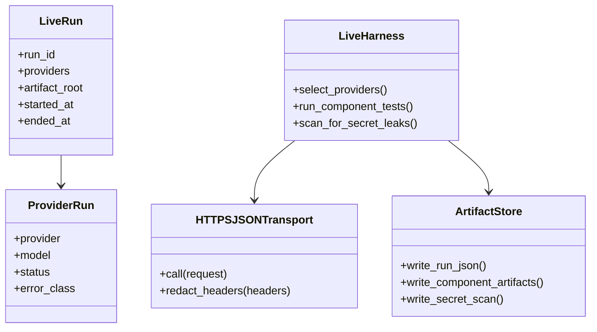
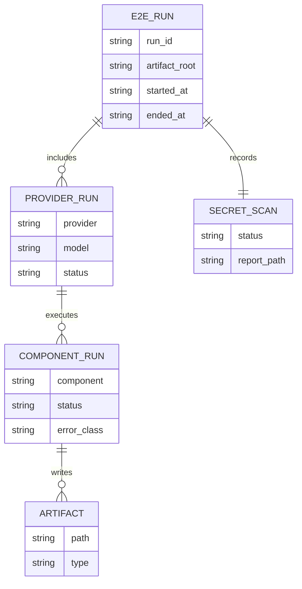
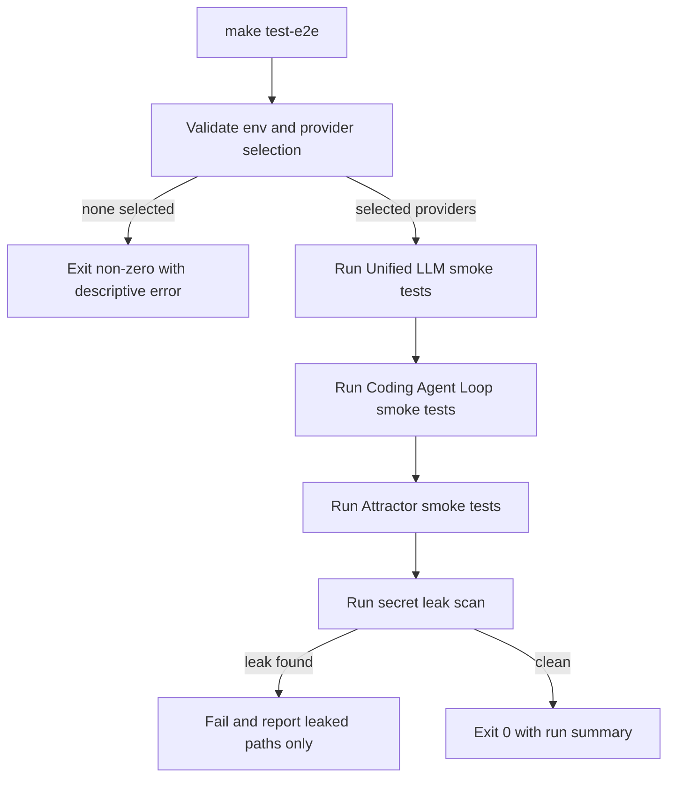
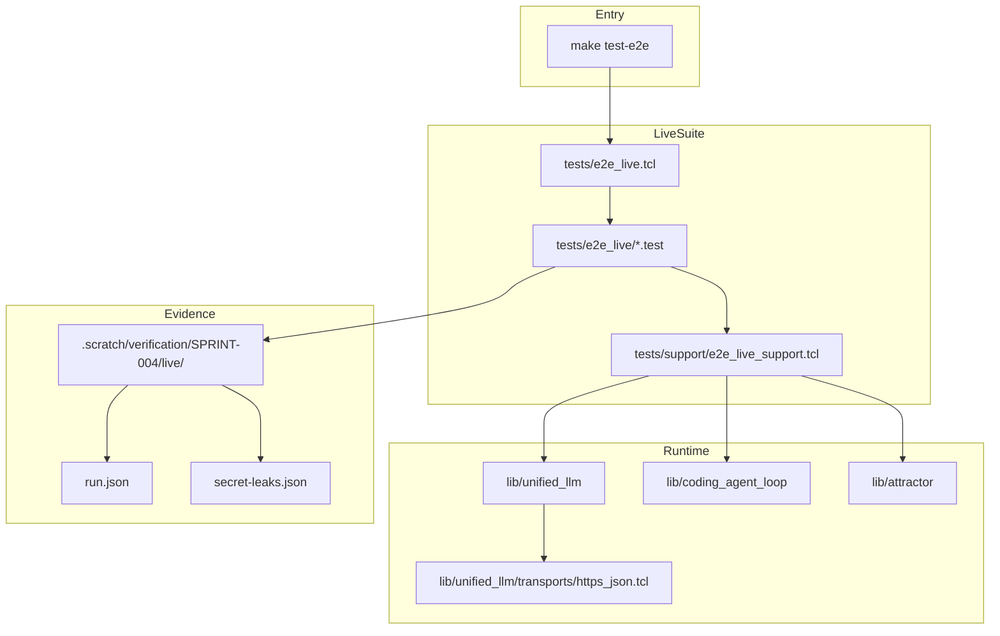

Legend: [ ] Incomplete, [X] Complete

# Sprint #004 Comprehensive Implementation Plan - Live E2E Smoke Suite (`make test-e2e`)

## Executive Summary
- Deliver an opt-in live E2E suite that validates real provider integrations for Unified LLM, Coding Agent Loop, and Attractor.
- Keep offline test behavior unchanged (`make -j10 test` remains deterministic and network-free).
- Enforce strict secret redaction and artifact scanning so live evidence is auditable and safe.

## Sprint Objective
- Add and operationalize `make test-e2e` as the single entrypoint for live smoke validation.
- Prove success and failure-path behavior per selected provider (`openai`, `anthropic`, `gemini`).
- Produce reproducible evidence under `.scratch/verification/SPRINT-004/live/<run_id>/` for every run.

## Scope
In scope:
- Live HTTPS transport injection for Unified LLM.
- Live harness (`tests/e2e_live.tcl` and `tests/e2e_live/*.test`) with deterministic provider selection and preflight validation.
- Live smoke suites for Unified LLM, Coding Agent Loop, and Attractor.
- Secret redaction enforcement and post-run secret leak scan.
- `make test-e2e` target, runbook documentation, ADR entry, and completion evidence.

Out of scope:
- Running live tests by default in CI.
- Streaming parity changes beyond current sprint requirements.
- New providers beyond OpenAI, Anthropic, and Gemini.
- Legacy compatibility shims or feature-gated rollout paths.

## Constraints and Guardrails
- Live tests must never auto-run under `make -j10 test`.
- Live HTTP calls must occur only through explicit transport injection.
- If zero providers are selected, fail fast before any network call.
- If an explicitly requested provider key is missing, fail fast before any network call.
- If a provider key is missing and the provider was not explicitly requested, mark provider as skipped.
- Secrets must not appear in console output, structured artifacts, or error surfaces.

## Evidence Contract
- Evidence root: `.scratch/verification/SPRINT-004/implementation-plan/<execution_id>/`.
- Live run root: `.scratch/verification/SPRINT-004/live/<run_id>/`.
- Required per-run evidence:
  - `run.json`
  - `secret-leaks.json`
  - `unified_llm/<provider>/...`
  - `coding_agent_loop/<provider>/...`
  - `attractor/<provider>/...`
- Checklist items are marked complete only after command output, exit code, and artifact paths are captured.

## Implementation Workstreams
- Unified LLM runtime: `lib/unified_llm/main.tcl`, `lib/unified_llm/adapters/*.tcl`, `lib/unified_llm/transports/https_json.tcl`
- Live harness and support: `tests/e2e_live.tcl`, `tests/e2e_live/*.test`, `tests/support/e2e_live_support.tcl`
- Transport fixtures: `tests/support/http_fixture_server.tcl`, `tests/integration/unified_llm_https_transport_integration.test`
- Attractor runtime integration points: `lib/attractor/main.tcl`, `lib/attractor_core/core.tcl`
- Build entrypoint: `Makefile`
- Documentation and architecture decisions: `docs/howto/live-e2e.md`, `docs/ADR.md`

## Phase Execution Order
1. Phase 0: Baseline and Evidence Scaffolding
2. Phase 1: Live HTTPS Transport and Redaction
3. Phase 2: Live Harness and Unified LLM Provider Smokes
4. Phase 3: Coding Agent Loop Live Smokes
5. Phase 4: Attractor Live Smokes
6. Phase 5: Make Target, Documentation, ADR, and Closeout

## Phase 0 - Baseline and Evidence Scaffolding
### Deliverables
- [ ] Confirm offline baseline remains deterministic and isolated from live suites.
```text
{placeholder for verification justification/reasoning and evidence log}
Command(s):
Exit code(s):
Evidence path(s):
Notes:
```
- [ ] Confirm live harness is independently invocable and not sourced by `tests/all.tcl`.
```text
{placeholder for verification justification/reasoning and evidence log}
Command(s):
Exit code(s):
Evidence path(s):
Notes:
```
- [ ] Establish implementation-plan evidence folders and command status ledgers.
```text
{placeholder for verification justification/reasoning and evidence log}
Command(s):
Exit code(s):
Evidence path(s):
Notes:
```
- [ ] Record baseline assumptions and sprint-specific architecture decisions in `docs/ADR.md`.
```text
{placeholder for verification justification/reasoning and evidence log}
Command(s):
Exit code(s):
Evidence path(s):
Notes:
```

### Positive Test Cases
- Offline test suite passes with no live dependencies.
- Live harness can enumerate tests and selected providers in dry/list mode.
- Evidence tree and status ledgers are created at expected paths.

### Negative Test Cases
- Missing evidence root permissions fail with actionable diagnostics.
- Live harness invocation with no providers selected fails before network usage.

### Acceptance Criteria - Phase 0
- [ ] Baseline isolation is proven and reproducible from evidence artifacts.
```text
{placeholder for verification justification/reasoning and evidence log}
Command(s):
Exit code(s):
Evidence path(s):
Notes:
```
- [ ] Evidence scaffolding exists and is ready for phased execution logs.
```text
{placeholder for verification justification/reasoning and evidence log}
Command(s):
Exit code(s):
Evidence path(s):
Notes:
```

## Phase 1 - Live HTTPS Transport and Redaction
### Deliverables
- [ ] Implement provider-agnostic HTTPS JSON transport callable through `client_new -transport`.
```text
{placeholder for verification justification/reasoning and evidence log}
Command(s):
Exit code(s):
Evidence path(s):
Notes:
```
- [ ] Enforce base URL resolution precedence (request override, provider env override, provider default).
```text
{placeholder for verification justification/reasoning and evidence log}
Command(s):
Exit code(s):
Evidence path(s):
Notes:
```
- [ ] Implement deterministic errorcode shapes for HTTP and network failures.
```text
{placeholder for verification justification/reasoning and evidence log}
Command(s):
Exit code(s):
Evidence path(s):
Notes:
```
- [ ] Redact sensitive headers (`Authorization`, `x-api-key`, `x-goog-api-key`) in all logs and structured responses.
```text
{placeholder for verification justification/reasoning and evidence log}
Command(s):
Exit code(s):
Evidence path(s):
Notes:
```
- [ ] Add deterministic transport integration tests with local HTTP fixture coverage for happy and failure paths.
```text
{placeholder for verification justification/reasoning and evidence log}
Command(s):
Exit code(s):
Evidence path(s):
Notes:
```

### Positive Test Cases
- JSON payload and headers are sent correctly to local fixture.
- Response headers are normalized and returned with expected structure.
- Redacted request header copies are present in response metadata.

### Negative Test Cases
- Non-2xx provider responses produce deterministic transport HTTP errorcodes.
- Network/TLS failures produce deterministic transport network errorcodes.
- Error messages and artifacts never include raw key material.

### Acceptance Criteria - Phase 1
- [ ] Transport contract passes deterministic integration tests.
```text
{placeholder for verification justification/reasoning and evidence log}
Command(s):
Exit code(s):
Evidence path(s):
Notes:
```
- [ ] Redaction behavior is proven in happy-path and error-path evidence.
```text
{placeholder for verification justification/reasoning and evidence log}
Command(s):
Exit code(s):
Evidence path(s):
Notes:
```

## Phase 2 - Live Harness and Unified LLM Provider Smokes
### Deliverables
- [ ] Implement/validate live harness preflight for provider selection and fail-fast semantics.
```text
{placeholder for verification justification/reasoning and evidence log}
Command(s):
Exit code(s):
Evidence path(s):
Notes:
```
- [ ] Create per-run artifacts root with unique run IDs and write `run.json` metadata.
```text
{placeholder for verification justification/reasoning and evidence log}
Command(s):
Exit code(s):
Evidence path(s):
Notes:
```
- [ ] Implement post-run secret leak scan and path-only leak reporting.
```text
{placeholder for verification justification/reasoning and evidence log}
Command(s):
Exit code(s):
Evidence path(s):
Notes:
```
- [ ] Add OpenAI live smoke and invalid-key tests with deterministic assertions.
```text
{placeholder for verification justification/reasoning and evidence log}
Command(s):
Exit code(s):
Evidence path(s):
Notes:
```
- [ ] Add Anthropic live smoke and invalid-key tests with deterministic assertions.
```text
{placeholder for verification justification/reasoning and evidence log}
Command(s):
Exit code(s):
Evidence path(s):
Notes:
```
- [ ] Add Gemini live smoke and invalid-key tests with deterministic assertions.
```text
{placeholder for verification justification/reasoning and evidence log}
Command(s):
Exit code(s):
Evidence path(s):
Notes:
```

### Positive Test Cases
- OpenAI smoke: non-empty text, provider response ID, token usage populated, redacted headers.
- Anthropic smoke: non-empty text, provider response ID, token usage populated, redacted headers.
- Gemini smoke: non-empty text, `raw.candidates` present, token usage populated, redacted headers.
- Default selection runs all configured providers.

### Negative Test Cases
- No keys configured: harness exits non-zero before network calls.
- Explicit provider requested without key: harness exits non-zero before network calls.
- Invalid key per provider: deterministic auth failure classification with no secret leakage.
- Unknown provider in allowlist: deterministic validation failure.

### Acceptance Criteria - Phase 2
- [ ] Unified LLM live smokes pass for at least one configured provider and generate auditable artifacts.
```text
{placeholder for verification justification/reasoning and evidence log}
Command(s):
Exit code(s):
Evidence path(s):
Notes:
```
- [ ] All negative-path provider-selection and invalid-key tests pass deterministically.
```text
{placeholder for verification justification/reasoning and evidence log}
Command(s):
Exit code(s):
Evidence path(s):
Notes:
```

## Phase 3 - Coding Agent Loop Live Smokes
### Deliverables
- [ ] Add/validate per-provider Coding Agent Loop live smoke coverage using explicit default client injection.
```text
{placeholder for verification justification/reasoning and evidence log}
Command(s):
Exit code(s):
Evidence path(s):
Notes:
```
- [ ] Enforce default client set/restore around each provider test to prevent cross-provider contamination.
```text
{placeholder for verification justification/reasoning and evidence log}
Command(s):
Exit code(s):
Evidence path(s):
Notes:
```
- [ ] Assert required live event contract (`SESSION_START`, `USER_INPUT`, `ASSISTANT_TEXT_END`).
```text
{placeholder for verification justification/reasoning and evidence log}
Command(s):
Exit code(s):
Evidence path(s):
Notes:
```
- [ ] Add invalid-key tests that prove deterministic failure and no secret leakage.
```text
{placeholder for verification justification/reasoning and evidence log}
Command(s):
Exit code(s):
Evidence path(s):
Notes:
```

### Positive Test Cases
- For each selected provider, session submit completes naturally with non-empty assistant text.
- Required event kinds are emitted in expected order.
- Provider artifacts are written under `coding_agent_loop/<provider>/`.

### Negative Test Cases
- Invalid key causes deterministic failure surface and preserved redaction invariants.
- Provider failure does not impact subsequent provider runs.

### Acceptance Criteria - Phase 3
- [ ] Coding Agent Loop live tests pass for at least one configured provider and emit required events.
```text
{placeholder for verification justification/reasoning and evidence log}
Command(s):
Exit code(s):
Evidence path(s):
Notes:
```
- [ ] Per-provider Coding Agent Loop artifacts are present and auditable.
```text
{placeholder for verification justification/reasoning and evidence log}
Command(s):
Exit code(s):
Evidence path(s):
Notes:
```

## Phase 4 - Attractor Live Smokes
### Deliverables
- [ ] Implement/validate live codergen backend fixture for Attractor that delegates to Unified LLM live transport.
```text
{placeholder for verification justification/reasoning and evidence log}
Command(s):
Exit code(s):
Evidence path(s):
Notes:
```
- [ ] Add per-provider Attractor smoke tests for minimal pipeline (`start -> codergen -> exit`).
```text
{placeholder for verification justification/reasoning and evidence log}
Command(s):
Exit code(s):
Evidence path(s):
Notes:
```
- [ ] Assert artifact contract for each run (`checkpoint.json`, node `status.json`, `prompt.md`, `response.md`).
```text
{placeholder for verification justification/reasoning and evidence log}
Command(s):
Exit code(s):
Evidence path(s):
Notes:
```
- [ ] Add invalid-key negative coverage ensuring deterministic failure and retained failure artifacts.
```text
{placeholder for verification justification/reasoning and evidence log}
Command(s):
Exit code(s):
Evidence path(s):
Notes:
```

### Positive Test Cases
- Per selected provider, minimal Attractor pipeline completes with expected filesystem artifacts.
- Attractor outputs include deterministic status and checkpoint records.

### Negative Test Cases
- Invalid key fails deterministically and writes useful failure artifacts.
- Failure artifacts remain redacted and pass leak scan.

### Acceptance Criteria - Phase 4
- [ ] Attractor live smokes pass for at least one configured provider.
```text
{placeholder for verification justification/reasoning and evidence log}
Command(s):
Exit code(s):
Evidence path(s):
Notes:
```
- [ ] Attractor artifacts exist under `attractor/<provider>/` for all executed providers.
```text
{placeholder for verification justification/reasoning and evidence log}
Command(s):
Exit code(s):
Evidence path(s):
Notes:
```

## Phase 5 - Make Target, Documentation, ADR, and Closeout
### Deliverables
- [ ] Ensure `Makefile` contains `test-e2e: precommit` and runs only the live harness entrypoint.
```text
{placeholder for verification justification/reasoning and evidence log}
Command(s):
Exit code(s):
Evidence path(s):
Notes:
```
- [ ] Finalize `docs/howto/live-e2e.md` with prerequisites, env vars, examples, artifact map, and secret-safety guidance.
```text
{placeholder for verification justification/reasoning and evidence log}
Command(s):
Exit code(s):
Evidence path(s):
Notes:
```
- [ ] Update `docs/ADR.md` with final architecture decisions and consequences from Sprint #004 execution.
```text
{placeholder for verification justification/reasoning and evidence log}
Command(s):
Exit code(s):
Evidence path(s):
Notes:
```
- [ ] Render and validate appendix Mermaid diagrams with `mmdc`, storing outputs under `.scratch/diagram-renders/sprint-004/`.
```text
{placeholder for verification justification/reasoning and evidence log}
Command(s):
Exit code(s):
Evidence path(s):
Notes:
```
- [ ] Execute final closeout matrix: no-key fail-fast, single-provider pass, multi-provider pass, secret-leak scan pass.
```text
{placeholder for verification justification/reasoning and evidence log}
Command(s):
Exit code(s):
Evidence path(s):
Notes:
```

### Positive Test Cases
- `make test-e2e` passes when at least one valid provider is configured.
- One-provider and multi-provider runs both generate complete artifact trees.
- Documentation steps are sufficient for a new contributor to run live tests successfully.

### Negative Test Cases
- `make test-e2e` fails fast with descriptive message when no keys are configured.
- Explicit provider missing required key fails fast without network calls.
- Injected synthetic leak triggers scanner failure with path-only reporting.

### Acceptance Criteria - Phase 5
- [ ] `make test-e2e` behavior is deterministic for both fail-fast and successful provider-selected runs.
```text
{placeholder for verification justification/reasoning and evidence log}
Command(s):
Exit code(s):
Evidence path(s):
Notes:
```
- [ ] Secret redaction and leak-scan controls are proven by reproducible evidence.
```text
{placeholder for verification justification/reasoning and evidence log}
Command(s):
Exit code(s):
Evidence path(s):
Notes:
```
- [ ] Sprint document status, evidence references, and closeout notes are synchronized with observed results.
```text
{placeholder for verification justification/reasoning and evidence log}
Command(s):
Exit code(s):
Evidence path(s):
Notes:
```

## Cross-Provider and Cross-Component Verification Matrix
| Case | OpenAI | Anthropic | Gemini |
| --- | --- | --- | --- |
| Unified LLM live smoke (non-empty response and usage) | [ ] | [ ] | [ ] |
| Coding Agent Loop live smoke (required event contract) | [ ] | [ ] | [ ] |
| Attractor live smoke (pipeline artifacts + checkpoint) | [ ] | [ ] | [ ] |
| Invalid key deterministic failure + no secret leak | [ ] | [ ] | [ ] |

## Appendix - Mermaid Diagrams

### Core Domain Models


### E-R Diagram


### Workflow Diagram


### Data-Flow Diagram

```mermaid
flowchart LR
  ENV[Environment variables] --> HARNESS[Live harness]
  HARNESS --> CLIENTS[Explicit Unified LLM clients]
  CLIENTS --> HTTPS[HTTPS JSON transport]
  HTTPS --> PROVIDERS[Provider APIs]
  PROVIDERS --> RESPONSES[Normalized responses]
  RESPONSES --> ASSERTIONS[Test assertions]
  ASSERTIONS --> ARTIFACTS[Artifacts under .scratch]
  ARTIFACTS --> SCAN[Secret leak scanner]
  SCAN --> SUMMARY[run.json and secret-leaks.json]
```


### Architecture Diagram

