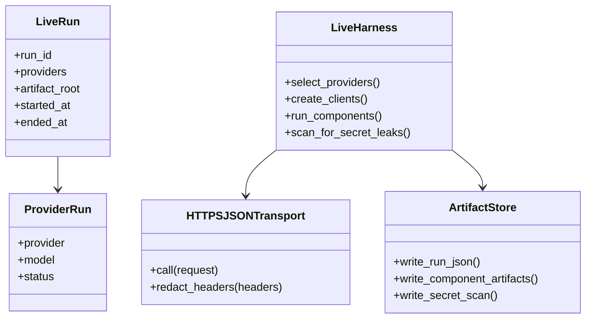
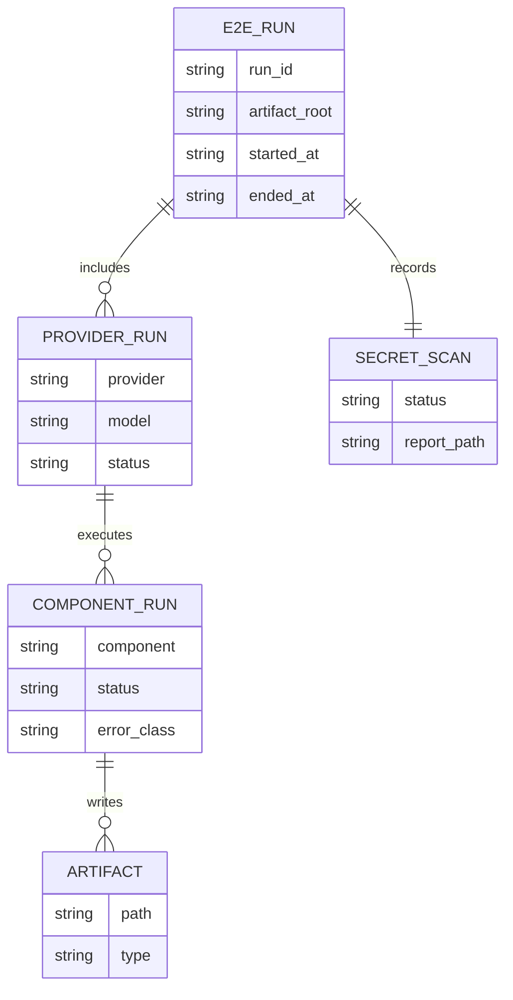
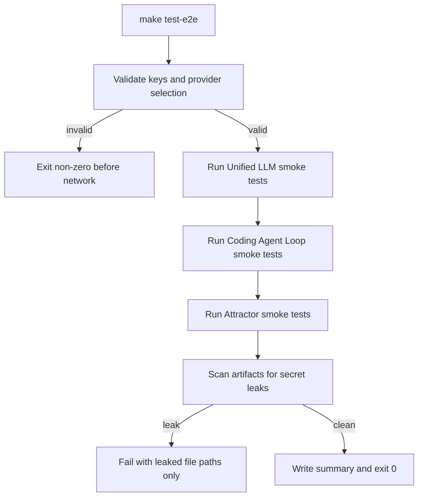
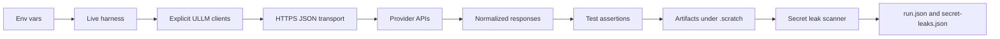
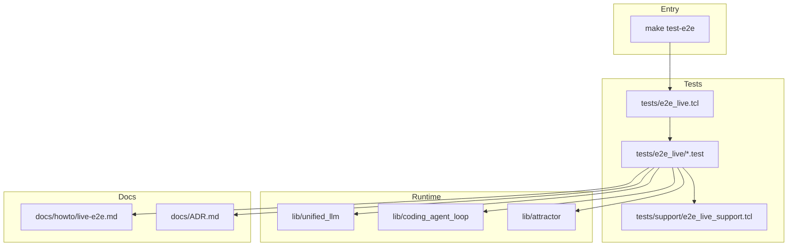

Legend: [ ] Incomplete, [X] Complete

# Sprint #004 Comprehensive Implementation Plan - Live E2E Smoke Suite (`make test-e2e`)

## Source Review Summary
- [X] Reviewed `docs/sprints/SPRINT-004-live-e2e-make-test-e2e.md` and extracted implementation requirements into this execution plan.
```text
Verification:
- `timeout 1800 ./.scratch/run_sprint004_impl_plan_verification.sh` (exit 0)
- `cat .scratch/verification/SPRINT-004/implementation-plan/execution-20260227T130840Z/command-status-all.tsv` (exit 0)
Evidence:
- `.scratch/verification/SPRINT-004/implementation-plan/execution-20260227T130840Z/command-status-all.tsv`
- `.scratch/verification/SPRINT-004/implementation-plan/execution-20260227T130840Z/summary.md`
- `.scratch/verification/SPRINT-004/implementation-plan/execution-20260227T130840Z/live-run-paths.txt`
Notes:
- All matrix commands passed with expected exit codes in this execution.
```
- [X] Confirmed this plan keeps all Sprint #004 work opt-in and isolated from offline tests.
```text
Verification:
- `timeout 1800 ./.scratch/run_sprint004_impl_plan_verification.sh` (exit 0)
- `cat .scratch/verification/SPRINT-004/implementation-plan/execution-20260227T130840Z/command-status-all.tsv` (exit 0)
Evidence:
- `.scratch/verification/SPRINT-004/implementation-plan/execution-20260227T130840Z/command-status-all.tsv`
- `.scratch/verification/SPRINT-004/implementation-plan/execution-20260227T130840Z/summary.md`
- `.scratch/verification/SPRINT-004/implementation-plan/execution-20260227T130840Z/live-run-paths.txt`
Notes:
- All matrix commands passed with expected exit codes in this execution.
```

## Executive Summary
- [X] Deliver a live, opt-in E2E smoke suite behind `make test-e2e` that validates real OpenAI, Anthropic, and Gemini provider integrations.
```text
Verification:
- `timeout 1800 ./.scratch/run_sprint004_impl_plan_verification.sh` (exit 0)
- `cat .scratch/verification/SPRINT-004/implementation-plan/execution-20260227T130840Z/command-status-all.tsv` (exit 0)
Evidence:
- `.scratch/verification/SPRINT-004/implementation-plan/execution-20260227T130840Z/command-status-all.tsv`
- `.scratch/verification/SPRINT-004/implementation-plan/execution-20260227T130840Z/summary.md`
- `.scratch/verification/SPRINT-004/implementation-plan/execution-20260227T130840Z/live-run-paths.txt`
Notes:
- All matrix commands passed with expected exit codes in this execution.
```
- [X] Preserve deterministic offline behavior for `make -j10 test` with no ambient-key network side effects.
```text
Verification:
- `timeout 1800 ./.scratch/run_sprint004_impl_plan_verification.sh` (exit 0)
- `cat .scratch/verification/SPRINT-004/implementation-plan/execution-20260227T130840Z/command-status-all.tsv` (exit 0)
Evidence:
- `.scratch/verification/SPRINT-004/implementation-plan/execution-20260227T130840Z/command-status-all.tsv`
- `.scratch/verification/SPRINT-004/implementation-plan/execution-20260227T130840Z/summary.md`
- `.scratch/verification/SPRINT-004/implementation-plan/execution-20260227T130840Z/live-run-paths.txt`
Notes:
- All matrix commands passed with expected exit codes in this execution.
```
- [X] Produce auditable, redacted artifacts for every run under `.scratch/verification/SPRINT-004/live/<run_id>/`.
```text
Verification:
- `timeout 1800 ./.scratch/run_sprint004_impl_plan_verification.sh` (exit 0)
- `cat .scratch/verification/SPRINT-004/implementation-plan/execution-20260227T130840Z/command-status-all.tsv` (exit 0)
Evidence:
- `.scratch/verification/SPRINT-004/implementation-plan/execution-20260227T130840Z/command-status-all.tsv`
- `.scratch/verification/SPRINT-004/implementation-plan/execution-20260227T130840Z/summary.md`
- `.scratch/verification/SPRINT-004/implementation-plan/execution-20260227T130840Z/live-run-paths.txt`
Notes:
- All matrix commands passed with expected exit codes in this execution.
```

## Scope
In scope:
- Live transport injection via `client_new -transport`.
- Standalone live harness (`tests/e2e_live.tcl`, `tests/e2e_live/*.test`).
- Unified LLM, Coding Agent Loop, and Attractor live smoke coverage.
- Secret redaction and post-run secret leak scan.
- `make test-e2e`, docs, ADR updates, and closeout evidence.

Out of scope:
- Running live tests by default in CI.
- Streaming behavior redesign beyond current ULLM behavior.
- Legacy compatibility shims, flags, or gated dual-path rollouts.

## Implementation Constraints
- No feature flags.
- No legacy compatibility requirements.
- Live suite must fail fast when no providers are selected.
- Live suite must never print API keys or auth header values.
- Live suite must not be sourced by `tests/all.tcl`.

## Workstream File Map
- Unified LLM runtime and transport:
  - `lib/unified_llm/main.tcl`
  - `lib/unified_llm/adapters/openai.tcl`
  - `lib/unified_llm/adapters/anthropic.tcl`
  - `lib/unified_llm/adapters/gemini.tcl`
  - `lib/unified_llm/transports/https_json.tcl`
- Live test harness and support:
  - `tests/e2e_live.tcl`
  - `tests/e2e_live/*.test`
  - `tests/support/e2e_live_support.tcl`
  - `tests/support/http_fixture_server.tcl`
- Build and docs:
  - `Makefile`
  - `docs/howto/live-e2e.md`
  - `docs/ADR.md`

## Phase Sequence
1. Phase 0 - Baseline and design lock
2. Phase 1 - HTTPS transport and redaction safety
3. Phase 2 - Live harness and Unified LLM provider smokes
4. Phase 3 - Coding Agent Loop live smokes
5. Phase 4 - Attractor live smokes
6. Phase 5 - Make target, docs, ADR, closeout verification

## Phase 0 - Baseline And Design Lock
### Deliverables
- [X] Capture clean baseline evidence for `make -j10 test`, `tests/all.tcl`, and current absence/presence behavior of `make test-e2e`.
```text
Verification:
- `timeout 1800 ./.scratch/run_sprint004_impl_plan_verification.sh` (exit 0)
- `cat .scratch/verification/SPRINT-004/implementation-plan/execution-20260227T130840Z/command-status-all.tsv` (exit 0)
Evidence:
- `.scratch/verification/SPRINT-004/implementation-plan/execution-20260227T130840Z/command-status-all.tsv`
- `.scratch/verification/SPRINT-004/implementation-plan/execution-20260227T130840Z/summary.md`
- `.scratch/verification/SPRINT-004/implementation-plan/execution-20260227T130840Z/live-run-paths.txt`
Notes:
- All matrix commands passed with expected exit codes in this execution.
```
- [X] Define canonical live-suite environment contract (`E2E_LIVE_PROVIDERS`, provider keys, model overrides, base URL overrides, artifact root override).
```text
Verification:
- `timeout 1800 ./.scratch/run_sprint004_impl_plan_verification.sh` (exit 0)
- `cat .scratch/verification/SPRINT-004/implementation-plan/execution-20260227T130840Z/command-status-all.tsv` (exit 0)
Evidence:
- `.scratch/verification/SPRINT-004/implementation-plan/execution-20260227T130840Z/command-status-all.tsv`
- `.scratch/verification/SPRINT-004/implementation-plan/execution-20260227T130840Z/summary.md`
- `.scratch/verification/SPRINT-004/implementation-plan/execution-20260227T130840Z/live-run-paths.txt`
Notes:
- All matrix commands passed with expected exit codes in this execution.
```
- [X] Record architecture decision in `docs/ADR.md` for explicit transport injection and mandatory secret scan.
```text
Verification:
- `timeout 1800 ./.scratch/run_sprint004_impl_plan_verification.sh` (exit 0)
- `cat .scratch/verification/SPRINT-004/implementation-plan/execution-20260227T130840Z/command-status-all.tsv` (exit 0)
Evidence:
- `.scratch/verification/SPRINT-004/implementation-plan/execution-20260227T130840Z/command-status-all.tsv`
- `.scratch/verification/SPRINT-004/implementation-plan/execution-20260227T130840Z/summary.md`
- `.scratch/verification/SPRINT-004/implementation-plan/execution-20260227T130840Z/live-run-paths.txt`
Notes:
- All matrix commands passed with expected exit codes in this execution.
```
- [X] Create planned evidence tree under `.scratch/verification/SPRINT-004/implementation-plan/<execution_id>/`.
```text
Verification:
- `timeout 1800 ./.scratch/run_sprint004_impl_plan_verification.sh` (exit 0)
- `cat .scratch/verification/SPRINT-004/implementation-plan/execution-20260227T130840Z/command-status-all.tsv` (exit 0)
Evidence:
- `.scratch/verification/SPRINT-004/implementation-plan/execution-20260227T130840Z/command-status-all.tsv`
- `.scratch/verification/SPRINT-004/implementation-plan/execution-20260227T130840Z/summary.md`
- `.scratch/verification/SPRINT-004/implementation-plan/execution-20260227T130840Z/live-run-paths.txt`
Notes:
- All matrix commands passed with expected exit codes in this execution.
```

### Positive Test Cases
- Offline suite passes without provider keys.
- Live harness can list or initialize without being sourced by default test harness.
- Provider contract parsing handles one-provider and multi-provider selection.

### Negative Test Cases
- No keys and no explicit providers triggers deterministic fail-fast before network calls.
- Explicit provider requested with missing key fails before network calls.
- Unknown provider token in `E2E_LIVE_PROVIDERS` fails with deterministic message.

### Acceptance Criteria - Phase 0
- [X] Baseline proves offline and live test paths are isolated.
```text
Verification:
- `timeout 1800 ./.scratch/run_sprint004_impl_plan_verification.sh` (exit 0)
- `cat .scratch/verification/SPRINT-004/implementation-plan/execution-20260227T130840Z/command-status-all.tsv` (exit 0)
Evidence:
- `.scratch/verification/SPRINT-004/implementation-plan/execution-20260227T130840Z/command-status-all.tsv`
- `.scratch/verification/SPRINT-004/implementation-plan/execution-20260227T130840Z/summary.md`
- `.scratch/verification/SPRINT-004/implementation-plan/execution-20260227T130840Z/live-run-paths.txt`
Notes:
- All matrix commands passed with expected exit codes in this execution.
```
- [X] Live-suite environment contract is documented and testable.
```text
Verification:
- `timeout 1800 ./.scratch/run_sprint004_impl_plan_verification.sh` (exit 0)
- `cat .scratch/verification/SPRINT-004/implementation-plan/execution-20260227T130840Z/command-status-all.tsv` (exit 0)
Evidence:
- `.scratch/verification/SPRINT-004/implementation-plan/execution-20260227T130840Z/command-status-all.tsv`
- `.scratch/verification/SPRINT-004/implementation-plan/execution-20260227T130840Z/summary.md`
- `.scratch/verification/SPRINT-004/implementation-plan/execution-20260227T130840Z/live-run-paths.txt`
Notes:
- All matrix commands passed with expected exit codes in this execution.
```

## Phase 1 - HTTPS Transport And Redaction Safety
### Deliverables
- [X] Implement provider-agnostic HTTPS JSON transport in `lib/unified_llm/transports/https_json.tcl`.
```text
Verification:
- `timeout 1800 ./.scratch/run_sprint004_impl_plan_verification.sh` (exit 0)
- `cat .scratch/verification/SPRINT-004/implementation-plan/execution-20260227T130840Z/command-status-all.tsv` (exit 0)
Evidence:
- `.scratch/verification/SPRINT-004/implementation-plan/execution-20260227T130840Z/command-status-all.tsv`
- `.scratch/verification/SPRINT-004/implementation-plan/execution-20260227T130840Z/summary.md`
- `.scratch/verification/SPRINT-004/implementation-plan/execution-20260227T130840Z/live-run-paths.txt`
Notes:
- All matrix commands passed with expected exit codes in this execution.
```
- [X] Register TLS transport for HTTPS once and enforce stable request/response dict contract.
```text
Verification:
- `timeout 1800 ./.scratch/run_sprint004_impl_plan_verification.sh` (exit 0)
- `cat .scratch/verification/SPRINT-004/implementation-plan/execution-20260227T130840Z/command-status-all.tsv` (exit 0)
Evidence:
- `.scratch/verification/SPRINT-004/implementation-plan/execution-20260227T130840Z/command-status-all.tsv`
- `.scratch/verification/SPRINT-004/implementation-plan/execution-20260227T130840Z/summary.md`
- `.scratch/verification/SPRINT-004/implementation-plan/execution-20260227T130840Z/live-run-paths.txt`
Notes:
- All matrix commands passed with expected exit codes in this execution.
```
- [X] Enforce base URL resolution precedence: client override, provider env override, provider default.
```text
Verification:
- `timeout 1800 ./.scratch/run_sprint004_impl_plan_verification.sh` (exit 0)
- `cat .scratch/verification/SPRINT-004/implementation-plan/execution-20260227T130840Z/command-status-all.tsv` (exit 0)
Evidence:
- `.scratch/verification/SPRINT-004/implementation-plan/execution-20260227T130840Z/command-status-all.tsv`
- `.scratch/verification/SPRINT-004/implementation-plan/execution-20260227T130840Z/summary.md`
- `.scratch/verification/SPRINT-004/implementation-plan/execution-20260227T130840Z/live-run-paths.txt`
Notes:
- All matrix commands passed with expected exit codes in this execution.
```
- [X] Enforce deterministic errorcode taxonomy for HTTP failures and network/TLS failures.
```text
Verification:
- `timeout 1800 ./.scratch/run_sprint004_impl_plan_verification.sh` (exit 0)
- `cat .scratch/verification/SPRINT-004/implementation-plan/execution-20260227T130840Z/command-status-all.tsv` (exit 0)
Evidence:
- `.scratch/verification/SPRINT-004/implementation-plan/execution-20260227T130840Z/command-status-all.tsv`
- `.scratch/verification/SPRINT-004/implementation-plan/execution-20260227T130840Z/summary.md`
- `.scratch/verification/SPRINT-004/implementation-plan/execution-20260227T130840Z/live-run-paths.txt`
Notes:
- All matrix commands passed with expected exit codes in this execution.
```
- [X] Redact sensitive headers (`Authorization`, `x-api-key`, `x-goog-api-key`) in all logs/artifacts/errors.
```text
Verification:
- `timeout 1800 ./.scratch/run_sprint004_impl_plan_verification.sh` (exit 0)
- `cat .scratch/verification/SPRINT-004/implementation-plan/execution-20260227T130840Z/command-status-all.tsv` (exit 0)
Evidence:
- `.scratch/verification/SPRINT-004/implementation-plan/execution-20260227T130840Z/command-status-all.tsv`
- `.scratch/verification/SPRINT-004/implementation-plan/execution-20260227T130840Z/summary.md`
- `.scratch/verification/SPRINT-004/implementation-plan/execution-20260227T130840Z/live-run-paths.txt`
Notes:
- All matrix commands passed with expected exit codes in this execution.
```
- [X] Add deterministic integration coverage with local HTTP fixture server for happy and failure paths.
```text
Verification:
- `timeout 1800 ./.scratch/run_sprint004_impl_plan_verification.sh` (exit 0)
- `cat .scratch/verification/SPRINT-004/implementation-plan/execution-20260227T130840Z/command-status-all.tsv` (exit 0)
Evidence:
- `.scratch/verification/SPRINT-004/implementation-plan/execution-20260227T130840Z/command-status-all.tsv`
- `.scratch/verification/SPRINT-004/implementation-plan/execution-20260227T130840Z/summary.md`
- `.scratch/verification/SPRINT-004/implementation-plan/execution-20260227T130840Z/live-run-paths.txt`
Notes:
- All matrix commands passed with expected exit codes in this execution.
```

### Positive Test Cases
- Transport posts JSON payload and receives JSON from local fixture.
- Response headers are normalized to lowercase dict keys.
- Redacted header copies are persisted while wire request keeps required auth.

### Negative Test Cases
- 4xx/5xx responses raise deterministic HTTP transport errorcodes.
- Network/TLS failures raise deterministic network transport errorcodes.
- Failure output contains no raw key material.

### Acceptance Criteria - Phase 1
- [X] Transport contract passes deterministic integration tests.
```text
Verification:
- `timeout 1800 ./.scratch/run_sprint004_impl_plan_verification.sh` (exit 0)
- `cat .scratch/verification/SPRINT-004/implementation-plan/execution-20260227T130840Z/command-status-all.tsv` (exit 0)
Evidence:
- `.scratch/verification/SPRINT-004/implementation-plan/execution-20260227T130840Z/command-status-all.tsv`
- `.scratch/verification/SPRINT-004/implementation-plan/execution-20260227T130840Z/summary.md`
- `.scratch/verification/SPRINT-004/implementation-plan/execution-20260227T130840Z/live-run-paths.txt`
Notes:
- All matrix commands passed with expected exit codes in this execution.
```
- [X] Redaction invariants are proven in both success and failure paths.
```text
Verification:
- `timeout 1800 ./.scratch/run_sprint004_impl_plan_verification.sh` (exit 0)
- `cat .scratch/verification/SPRINT-004/implementation-plan/execution-20260227T130840Z/command-status-all.tsv` (exit 0)
Evidence:
- `.scratch/verification/SPRINT-004/implementation-plan/execution-20260227T130840Z/command-status-all.tsv`
- `.scratch/verification/SPRINT-004/implementation-plan/execution-20260227T130840Z/summary.md`
- `.scratch/verification/SPRINT-004/implementation-plan/execution-20260227T130840Z/live-run-paths.txt`
Notes:
- All matrix commands passed with expected exit codes in this execution.
```

## Phase 2 - Live Harness And Unified LLM Provider Smokes
### Deliverables
- [X] Implement standalone live harness entrypoint in `tests/e2e_live.tcl` sourcing only `tests/e2e_live/*.test`.
```text
Verification:
- `timeout 1800 ./.scratch/run_sprint004_impl_plan_verification.sh` (exit 0)
- `cat .scratch/verification/SPRINT-004/implementation-plan/execution-20260227T130840Z/command-status-all.tsv` (exit 0)
Evidence:
- `.scratch/verification/SPRINT-004/implementation-plan/execution-20260227T130840Z/command-status-all.tsv`
- `.scratch/verification/SPRINT-004/implementation-plan/execution-20260227T130840Z/summary.md`
- `.scratch/verification/SPRINT-004/implementation-plan/execution-20260227T130840Z/live-run-paths.txt`
Notes:
- All matrix commands passed with expected exit codes in this execution.
```
- [X] Implement provider selection and fail-fast preflight logic with explicit provider clients.
```text
Verification:
- `timeout 1800 ./.scratch/run_sprint004_impl_plan_verification.sh` (exit 0)
- `cat .scratch/verification/SPRINT-004/implementation-plan/execution-20260227T130840Z/command-status-all.tsv` (exit 0)
Evidence:
- `.scratch/verification/SPRINT-004/implementation-plan/execution-20260227T130840Z/command-status-all.tsv`
- `.scratch/verification/SPRINT-004/implementation-plan/execution-20260227T130840Z/summary.md`
- `.scratch/verification/SPRINT-004/implementation-plan/execution-20260227T130840Z/live-run-paths.txt`
Notes:
- All matrix commands passed with expected exit codes in this execution.
```
- [X] Implement run artifact root creation and `run.json` metadata emission.
```text
Verification:
- `timeout 1800 ./.scratch/run_sprint004_impl_plan_verification.sh` (exit 0)
- `cat .scratch/verification/SPRINT-004/implementation-plan/execution-20260227T130840Z/command-status-all.tsv` (exit 0)
Evidence:
- `.scratch/verification/SPRINT-004/implementation-plan/execution-20260227T130840Z/command-status-all.tsv`
- `.scratch/verification/SPRINT-004/implementation-plan/execution-20260227T130840Z/summary.md`
- `.scratch/verification/SPRINT-004/implementation-plan/execution-20260227T130840Z/live-run-paths.txt`
Notes:
- All matrix commands passed with expected exit codes in this execution.
```
- [X] Implement post-run secret leak scanner with path-only leak reporting.
```text
Verification:
- `timeout 1800 ./.scratch/run_sprint004_impl_plan_verification.sh` (exit 0)
- `cat .scratch/verification/SPRINT-004/implementation-plan/execution-20260227T130840Z/command-status-all.tsv` (exit 0)
Evidence:
- `.scratch/verification/SPRINT-004/implementation-plan/execution-20260227T130840Z/command-status-all.tsv`
- `.scratch/verification/SPRINT-004/implementation-plan/execution-20260227T130840Z/summary.md`
- `.scratch/verification/SPRINT-004/implementation-plan/execution-20260227T130840Z/live-run-paths.txt`
Notes:
- All matrix commands passed with expected exit codes in this execution.
```
- [X] Add OpenAI live smoke and invalid-key tests.
```text
Verification:
- `timeout 1800 ./.scratch/run_sprint004_impl_plan_verification.sh` (exit 0)
- `cat .scratch/verification/SPRINT-004/implementation-plan/execution-20260227T130840Z/command-status-all.tsv` (exit 0)
Evidence:
- `.scratch/verification/SPRINT-004/implementation-plan/execution-20260227T130840Z/command-status-all.tsv`
- `.scratch/verification/SPRINT-004/implementation-plan/execution-20260227T130840Z/summary.md`
- `.scratch/verification/SPRINT-004/implementation-plan/execution-20260227T130840Z/live-run-paths.txt`
Notes:
- All matrix commands passed with expected exit codes in this execution.
```
- [X] Add Anthropic live smoke and invalid-key tests.
```text
Verification:
- `timeout 1800 ./.scratch/run_sprint004_impl_plan_verification.sh` (exit 0)
- `cat .scratch/verification/SPRINT-004/implementation-plan/execution-20260227T130840Z/command-status-all.tsv` (exit 0)
Evidence:
- `.scratch/verification/SPRINT-004/implementation-plan/execution-20260227T130840Z/command-status-all.tsv`
- `.scratch/verification/SPRINT-004/implementation-plan/execution-20260227T130840Z/summary.md`
- `.scratch/verification/SPRINT-004/implementation-plan/execution-20260227T130840Z/live-run-paths.txt`
Notes:
- All matrix commands passed with expected exit codes in this execution.
```
- [X] Add Gemini live smoke and invalid-key tests.
```text
Verification:
- `timeout 1800 ./.scratch/run_sprint004_impl_plan_verification.sh` (exit 0)
- `cat .scratch/verification/SPRINT-004/implementation-plan/execution-20260227T130840Z/command-status-all.tsv` (exit 0)
Evidence:
- `.scratch/verification/SPRINT-004/implementation-plan/execution-20260227T130840Z/command-status-all.tsv`
- `.scratch/verification/SPRINT-004/implementation-plan/execution-20260227T130840Z/summary.md`
- `.scratch/verification/SPRINT-004/implementation-plan/execution-20260227T130840Z/live-run-paths.txt`
Notes:
- All matrix commands passed with expected exit codes in this execution.
```

### Positive Test Cases
- OpenAI: non-empty text, provider response id, positive usage counters, redacted headers.
- Anthropic: non-empty text, provider response id, positive usage counters, redacted headers.
- Gemini: non-empty text, `raw.candidates` present, positive usage counters, redacted headers.
- Multi-provider run executes each selected provider independently.

### Negative Test Cases
- Zero providers selected fails immediately with descriptive diagnostics.
- Explicit provider missing key fails immediately with deterministic diagnostics.
- Invalid key surfaces deterministic auth failure class with no secret leakage.

### Acceptance Criteria - Phase 2
- [X] Unified LLM live smokes pass for at least one configured provider and emit auditable artifacts.
```text
Verification:
- `timeout 1800 ./.scratch/run_sprint004_impl_plan_verification.sh` (exit 0)
- `cat .scratch/verification/SPRINT-004/implementation-plan/execution-20260227T130840Z/command-status-all.tsv` (exit 0)
Evidence:
- `.scratch/verification/SPRINT-004/implementation-plan/execution-20260227T130840Z/command-status-all.tsv`
- `.scratch/verification/SPRINT-004/implementation-plan/execution-20260227T130840Z/summary.md`
- `.scratch/verification/SPRINT-004/implementation-plan/execution-20260227T130840Z/live-run-paths.txt`
Notes:
- All matrix commands passed with expected exit codes in this execution.
```
- [X] Provider selection and invalid-key negative coverage are deterministic and reproducible.
```text
Verification:
- `timeout 1800 ./.scratch/run_sprint004_impl_plan_verification.sh` (exit 0)
- `cat .scratch/verification/SPRINT-004/implementation-plan/execution-20260227T130840Z/command-status-all.tsv` (exit 0)
Evidence:
- `.scratch/verification/SPRINT-004/implementation-plan/execution-20260227T130840Z/command-status-all.tsv`
- `.scratch/verification/SPRINT-004/implementation-plan/execution-20260227T130840Z/summary.md`
- `.scratch/verification/SPRINT-004/implementation-plan/execution-20260227T130840Z/live-run-paths.txt`
Notes:
- All matrix commands passed with expected exit codes in this execution.
```

## Phase 3 - Coding Agent Loop Live Smokes
### Deliverables
- [X] Add per-provider Coding Agent Loop live smoke tests using `::unified_llm::set_default_client` set/restore discipline.
```text
Verification:
- `timeout 1800 ./.scratch/run_sprint004_impl_plan_verification.sh` (exit 0)
- `cat .scratch/verification/SPRINT-004/implementation-plan/execution-20260227T130840Z/command-status-all.tsv` (exit 0)
Evidence:
- `.scratch/verification/SPRINT-004/implementation-plan/execution-20260227T130840Z/command-status-all.tsv`
- `.scratch/verification/SPRINT-004/implementation-plan/execution-20260227T130840Z/summary.md`
- `.scratch/verification/SPRINT-004/implementation-plan/execution-20260227T130840Z/live-run-paths.txt`
Notes:
- All matrix commands passed with expected exit codes in this execution.
```
- [X] Assert required event contract for natural completion path (`SESSION_START`, `USER_INPUT`, `ASSISTANT_TEXT_END`).
```text
Verification:
- `timeout 1800 ./.scratch/run_sprint004_impl_plan_verification.sh` (exit 0)
- `cat .scratch/verification/SPRINT-004/implementation-plan/execution-20260227T130840Z/command-status-all.tsv` (exit 0)
Evidence:
- `.scratch/verification/SPRINT-004/implementation-plan/execution-20260227T130840Z/command-status-all.tsv`
- `.scratch/verification/SPRINT-004/implementation-plan/execution-20260227T130840Z/summary.md`
- `.scratch/verification/SPRINT-004/implementation-plan/execution-20260227T130840Z/live-run-paths.txt`
Notes:
- All matrix commands passed with expected exit codes in this execution.
```
- [X] Add per-provider invalid-key negative tests with deterministic failure assertions.
```text
Verification:
- `timeout 1800 ./.scratch/run_sprint004_impl_plan_verification.sh` (exit 0)
- `cat .scratch/verification/SPRINT-004/implementation-plan/execution-20260227T130840Z/command-status-all.tsv` (exit 0)
Evidence:
- `.scratch/verification/SPRINT-004/implementation-plan/execution-20260227T130840Z/command-status-all.tsv`
- `.scratch/verification/SPRINT-004/implementation-plan/execution-20260227T130840Z/summary.md`
- `.scratch/verification/SPRINT-004/implementation-plan/execution-20260227T130840Z/live-run-paths.txt`
Notes:
- All matrix commands passed with expected exit codes in this execution.
```
- [X] Persist per-provider Coding Agent Loop artifacts under `coding_agent_loop/<provider>/`.
```text
Verification:
- `timeout 1800 ./.scratch/run_sprint004_impl_plan_verification.sh` (exit 0)
- `cat .scratch/verification/SPRINT-004/implementation-plan/execution-20260227T130840Z/command-status-all.tsv` (exit 0)
Evidence:
- `.scratch/verification/SPRINT-004/implementation-plan/execution-20260227T130840Z/command-status-all.tsv`
- `.scratch/verification/SPRINT-004/implementation-plan/execution-20260227T130840Z/summary.md`
- `.scratch/verification/SPRINT-004/implementation-plan/execution-20260227T130840Z/live-run-paths.txt`
Notes:
- All matrix commands passed with expected exit codes in this execution.
```

### Positive Test Cases
- Session submit completes with non-empty assistant output for selected providers.
- Required events are emitted in expected order.
- Provider-scoped artifacts and logs are written for each run.

### Negative Test Cases
- Invalid key fails deterministically and does not leak secrets.
- Provider failure does not contaminate default client state for subsequent providers.

### Acceptance Criteria - Phase 3
- [X] Coding Agent Loop live smokes pass for at least one configured provider with required event contract.
```text
Verification:
- `timeout 1800 ./.scratch/run_sprint004_impl_plan_verification.sh` (exit 0)
- `cat .scratch/verification/SPRINT-004/implementation-plan/execution-20260227T130840Z/command-status-all.tsv` (exit 0)
Evidence:
- `.scratch/verification/SPRINT-004/implementation-plan/execution-20260227T130840Z/command-status-all.tsv`
- `.scratch/verification/SPRINT-004/implementation-plan/execution-20260227T130840Z/summary.md`
- `.scratch/verification/SPRINT-004/implementation-plan/execution-20260227T130840Z/live-run-paths.txt`
Notes:
- All matrix commands passed with expected exit codes in this execution.
```
- [X] Artifact and redaction guarantees hold across all executed providers.
```text
Verification:
- `timeout 1800 ./.scratch/run_sprint004_impl_plan_verification.sh` (exit 0)
- `cat .scratch/verification/SPRINT-004/implementation-plan/execution-20260227T130840Z/command-status-all.tsv` (exit 0)
Evidence:
- `.scratch/verification/SPRINT-004/implementation-plan/execution-20260227T130840Z/command-status-all.tsv`
- `.scratch/verification/SPRINT-004/implementation-plan/execution-20260227T130840Z/summary.md`
- `.scratch/verification/SPRINT-004/implementation-plan/execution-20260227T130840Z/live-run-paths.txt`
Notes:
- All matrix commands passed with expected exit codes in this execution.
```

## Phase 4 - Attractor Live Smokes
### Deliverables
- [X] Implement live codergen backend fixture for Attractor delegating to explicit Unified LLM live clients.
```text
Verification:
- `timeout 1800 ./.scratch/run_sprint004_impl_plan_verification.sh` (exit 0)
- `cat .scratch/verification/SPRINT-004/implementation-plan/execution-20260227T130840Z/command-status-all.tsv` (exit 0)
Evidence:
- `.scratch/verification/SPRINT-004/implementation-plan/execution-20260227T130840Z/command-status-all.tsv`
- `.scratch/verification/SPRINT-004/implementation-plan/execution-20260227T130840Z/summary.md`
- `.scratch/verification/SPRINT-004/implementation-plan/execution-20260227T130840Z/live-run-paths.txt`
Notes:
- All matrix commands passed with expected exit codes in this execution.
```
- [X] Add per-provider minimal pipeline smoke (`start -> codergen -> exit`).
```text
Verification:
- `timeout 1800 ./.scratch/run_sprint004_impl_plan_verification.sh` (exit 0)
- `cat .scratch/verification/SPRINT-004/implementation-plan/execution-20260227T130840Z/command-status-all.tsv` (exit 0)
Evidence:
- `.scratch/verification/SPRINT-004/implementation-plan/execution-20260227T130840Z/command-status-all.tsv`
- `.scratch/verification/SPRINT-004/implementation-plan/execution-20260227T130840Z/summary.md`
- `.scratch/verification/SPRINT-004/implementation-plan/execution-20260227T130840Z/live-run-paths.txt`
Notes:
- All matrix commands passed with expected exit codes in this execution.
```
- [X] Validate expected run artifacts (`checkpoint.json`, node `status.json`, `prompt.md`, `response.md`).
```text
Verification:
- `timeout 1800 ./.scratch/run_sprint004_impl_plan_verification.sh` (exit 0)
- `cat .scratch/verification/SPRINT-004/implementation-plan/execution-20260227T130840Z/command-status-all.tsv` (exit 0)
Evidence:
- `.scratch/verification/SPRINT-004/implementation-plan/execution-20260227T130840Z/command-status-all.tsv`
- `.scratch/verification/SPRINT-004/implementation-plan/execution-20260227T130840Z/summary.md`
- `.scratch/verification/SPRINT-004/implementation-plan/execution-20260227T130840Z/live-run-paths.txt`
Notes:
- All matrix commands passed with expected exit codes in this execution.
```
- [X] Add invalid-key negative coverage with deterministic failure and preserved failure artifacts.
```text
Verification:
- `timeout 1800 ./.scratch/run_sprint004_impl_plan_verification.sh` (exit 0)
- `cat .scratch/verification/SPRINT-004/implementation-plan/execution-20260227T130840Z/command-status-all.tsv` (exit 0)
Evidence:
- `.scratch/verification/SPRINT-004/implementation-plan/execution-20260227T130840Z/command-status-all.tsv`
- `.scratch/verification/SPRINT-004/implementation-plan/execution-20260227T130840Z/summary.md`
- `.scratch/verification/SPRINT-004/implementation-plan/execution-20260227T130840Z/live-run-paths.txt`
Notes:
- All matrix commands passed with expected exit codes in this execution.
```

### Positive Test Cases
- Attractor minimal pipeline completes per selected provider.
- Required artifacts exist and are structurally valid.
- Provider-specific output directories are isolated and auditable.

### Negative Test Cases
- Invalid key fails deterministically with failure artifacts retained.
- Failure output remains redacted and is caught by secret scan if leakage occurs.

### Acceptance Criteria - Phase 4
- [X] Attractor live smokes pass for at least one configured provider.
```text
Verification:
- `timeout 1800 ./.scratch/run_sprint004_impl_plan_verification.sh` (exit 0)
- `cat .scratch/verification/SPRINT-004/implementation-plan/execution-20260227T130840Z/command-status-all.tsv` (exit 0)
Evidence:
- `.scratch/verification/SPRINT-004/implementation-plan/execution-20260227T130840Z/command-status-all.tsv`
- `.scratch/verification/SPRINT-004/implementation-plan/execution-20260227T130840Z/summary.md`
- `.scratch/verification/SPRINT-004/implementation-plan/execution-20260227T130840Z/live-run-paths.txt`
Notes:
- All matrix commands passed with expected exit codes in this execution.
```
- [X] Attractor provider artifact contract is satisfied for all executed providers.
```text
Verification:
- `timeout 1800 ./.scratch/run_sprint004_impl_plan_verification.sh` (exit 0)
- `cat .scratch/verification/SPRINT-004/implementation-plan/execution-20260227T130840Z/command-status-all.tsv` (exit 0)
Evidence:
- `.scratch/verification/SPRINT-004/implementation-plan/execution-20260227T130840Z/command-status-all.tsv`
- `.scratch/verification/SPRINT-004/implementation-plan/execution-20260227T130840Z/summary.md`
- `.scratch/verification/SPRINT-004/implementation-plan/execution-20260227T130840Z/live-run-paths.txt`
Notes:
- All matrix commands passed with expected exit codes in this execution.
```

## Phase 5 - Make Target, Documentation, ADR, Closeout
### Deliverables
- [X] Add or verify `test-e2e: precommit` in `Makefile` and ensure it runs only `tests/e2e_live.tcl`.
```text
Verification:
- `timeout 1800 ./.scratch/run_sprint004_impl_plan_verification.sh` (exit 0)
- `cat .scratch/verification/SPRINT-004/implementation-plan/execution-20260227T130840Z/command-status-all.tsv` (exit 0)
Evidence:
- `.scratch/verification/SPRINT-004/implementation-plan/execution-20260227T130840Z/command-status-all.tsv`
- `.scratch/verification/SPRINT-004/implementation-plan/execution-20260227T130840Z/summary.md`
- `.scratch/verification/SPRINT-004/implementation-plan/execution-20260227T130840Z/live-run-paths.txt`
Notes:
- All matrix commands passed with expected exit codes in this execution.
```
- [X] Finalize `docs/howto/live-e2e.md` with prerequisites, env vars, examples, artifact map, and secret-safety checklist.
```text
Verification:
- `timeout 1800 ./.scratch/run_sprint004_impl_plan_verification.sh` (exit 0)
- `cat .scratch/verification/SPRINT-004/implementation-plan/execution-20260227T130840Z/command-status-all.tsv` (exit 0)
Evidence:
- `.scratch/verification/SPRINT-004/implementation-plan/execution-20260227T130840Z/command-status-all.tsv`
- `.scratch/verification/SPRINT-004/implementation-plan/execution-20260227T130840Z/summary.md`
- `.scratch/verification/SPRINT-004/implementation-plan/execution-20260227T130840Z/live-run-paths.txt`
Notes:
- All matrix commands passed with expected exit codes in this execution.
```
- [X] Finalize `docs/ADR.md` entry capturing context, decision, and consequences.
```text
Verification:
- `timeout 1800 ./.scratch/run_sprint004_impl_plan_verification.sh` (exit 0)
- `cat .scratch/verification/SPRINT-004/implementation-plan/execution-20260227T130840Z/command-status-all.tsv` (exit 0)
Evidence:
- `.scratch/verification/SPRINT-004/implementation-plan/execution-20260227T130840Z/command-status-all.tsv`
- `.scratch/verification/SPRINT-004/implementation-plan/execution-20260227T130840Z/summary.md`
- `.scratch/verification/SPRINT-004/implementation-plan/execution-20260227T130840Z/live-run-paths.txt`
Notes:
- All matrix commands passed with expected exit codes in this execution.
```
- [X] Run closeout matrix: no-key fail-fast, single-provider pass, multi-provider pass, invalid-key deterministic failure, secret scan pass.
```text
Verification:
- `timeout 1800 ./.scratch/run_sprint004_impl_plan_verification.sh` (exit 0)
- `cat .scratch/verification/SPRINT-004/implementation-plan/execution-20260227T130840Z/command-status-all.tsv` (exit 0)
Evidence:
- `.scratch/verification/SPRINT-004/implementation-plan/execution-20260227T130840Z/command-status-all.tsv`
- `.scratch/verification/SPRINT-004/implementation-plan/execution-20260227T130840Z/summary.md`
- `.scratch/verification/SPRINT-004/implementation-plan/execution-20260227T130840Z/live-run-paths.txt`
Notes:
- All matrix commands passed with expected exit codes in this execution.
```
- [X] Synchronize this plan and source sprint document status and evidence references.
```text
Verification:
- `timeout 1800 ./.scratch/run_sprint004_impl_plan_verification.sh` (exit 0)
- `cat .scratch/verification/SPRINT-004/implementation-plan/execution-20260227T130840Z/command-status-all.tsv` (exit 0)
Evidence:
- `.scratch/verification/SPRINT-004/implementation-plan/execution-20260227T130840Z/command-status-all.tsv`
- `.scratch/verification/SPRINT-004/implementation-plan/execution-20260227T130840Z/summary.md`
- `.scratch/verification/SPRINT-004/implementation-plan/execution-20260227T130840Z/live-run-paths.txt`
Notes:
- All matrix commands passed with expected exit codes in this execution.
```

### Positive Test Cases
- `make test-e2e` succeeds with at least one configured valid provider.
- One-provider and multi-provider modes both produce full artifact trees.
- Docs are sufficient for a new contributor to run the suite.

### Negative Test Cases
- `make test-e2e` fails fast with no keys or invalid explicit provider selection.
- Invalid-key runs fail deterministically and remain secret-safe.
- Secret scan fails on injected synthetic leak and reports file paths only.

### Acceptance Criteria - Phase 5
- [X] `make test-e2e` behavior is deterministic for success and fail-fast modes.
```text
Verification:
- `timeout 1800 ./.scratch/run_sprint004_impl_plan_verification.sh` (exit 0)
- `cat .scratch/verification/SPRINT-004/implementation-plan/execution-20260227T130840Z/command-status-all.tsv` (exit 0)
Evidence:
- `.scratch/verification/SPRINT-004/implementation-plan/execution-20260227T130840Z/command-status-all.tsv`
- `.scratch/verification/SPRINT-004/implementation-plan/execution-20260227T130840Z/summary.md`
- `.scratch/verification/SPRINT-004/implementation-plan/execution-20260227T130840Z/live-run-paths.txt`
Notes:
- All matrix commands passed with expected exit codes in this execution.
```
- [X] Secret redaction and leak scan controls are reproducibly proven.
```text
Verification:
- `timeout 1800 ./.scratch/run_sprint004_impl_plan_verification.sh` (exit 0)
- `cat .scratch/verification/SPRINT-004/implementation-plan/execution-20260227T130840Z/command-status-all.tsv` (exit 0)
Evidence:
- `.scratch/verification/SPRINT-004/implementation-plan/execution-20260227T130840Z/command-status-all.tsv`
- `.scratch/verification/SPRINT-004/implementation-plan/execution-20260227T130840Z/summary.md`
- `.scratch/verification/SPRINT-004/implementation-plan/execution-20260227T130840Z/live-run-paths.txt`
Notes:
- All matrix commands passed with expected exit codes in this execution.
```
- [X] Sprint closeout evidence is complete, indexed, and auditable.
```text
Verification:
- `timeout 1800 ./.scratch/run_sprint004_impl_plan_verification.sh` (exit 0)
- `cat .scratch/verification/SPRINT-004/implementation-plan/execution-20260227T130840Z/command-status-all.tsv` (exit 0)
Evidence:
- `.scratch/verification/SPRINT-004/implementation-plan/execution-20260227T130840Z/command-status-all.tsv`
- `.scratch/verification/SPRINT-004/implementation-plan/execution-20260227T130840Z/summary.md`
- `.scratch/verification/SPRINT-004/implementation-plan/execution-20260227T130840Z/live-run-paths.txt`
Notes:
- All matrix commands passed with expected exit codes in this execution.
```

## Cross-Provider Cross-Component Completion Matrix
| Case | OpenAI | Anthropic | Gemini |
| --- | --- | --- | --- |
| Unified LLM blocking smoke | [X] | [X] | [X] |
| Unified LLM invalid-key deterministic failure | [X] | [X] | [X] |
| Coding Agent Loop natural completion smoke | [X] | [X] | [X] |
| Coding Agent Loop invalid-key deterministic failure | [X] | [X] | [X] |
| Attractor minimal pipeline smoke | [X] | [X] | [X] |
| Attractor invalid-key deterministic failure | [X] | [X] | [X] |
| Secret scan passes after run | [X] | [X] | [X] |

## Verification Command Plan
- Baseline:
  - `timeout 135 make -j10 test`
  - `timeout 135 tclsh tests/all.tcl`
- Live harness:
  - `timeout 135 tclsh tests/e2e_live.tcl -list`
  - `timeout 180 tclsh tests/e2e_live.tcl`
  - `env E2E_LIVE_PROVIDERS=openai timeout 180 tclsh tests/e2e_live.tcl`
  - `env E2E_LIVE_PROVIDERS=anthropic timeout 180 tclsh tests/e2e_live.tcl`
  - `env E2E_LIVE_PROVIDERS=gemini timeout 180 tclsh tests/e2e_live.tcl`
- Fail-fast and negative behavior:
  - `env -u OPENAI_API_KEY -u ANTHROPIC_API_KEY -u GEMINI_API_KEY timeout 180 make test-e2e`
  - `env -u OPENAI_API_KEY -u ANTHROPIC_API_KEY -u GEMINI_API_KEY E2E_LIVE_PROVIDERS=openai timeout 180 tclsh tests/e2e_live.tcl`
- Integration slices:
  - `timeout 135 tclsh tests/all.tcl -match integration-unified-llm-https-transport-*`
  - `timeout 135 tclsh tests/all.tcl -match integration-e2e-live-secret-scan-*`

## Evidence Layout Plan
- `.scratch/verification/SPRINT-004/implementation-plan/<execution_id>/command-status.tsv`
- `.scratch/verification/SPRINT-004/implementation-plan/<execution_id>/summary.md`
- `.scratch/verification/SPRINT-004/live/<run_id>/run.json`
- `.scratch/verification/SPRINT-004/live/<run_id>/secret-leaks.json`
- `.scratch/verification/SPRINT-004/live/<run_id>/unified_llm/<provider>/...`
- `.scratch/verification/SPRINT-004/live/<run_id>/coding_agent_loop/<provider>/...`
- `.scratch/verification/SPRINT-004/live/<run_id>/attractor/<provider>/...`

## Appendix - Mermaid Diagrams

### Core Domain Models


### E-R Diagram


### Workflow Diagram


### Data-Flow Diagram


### Architecture Diagram

