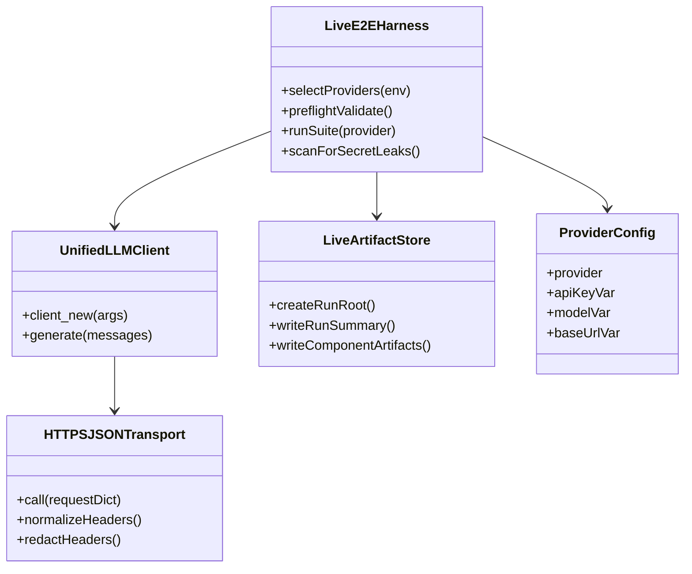
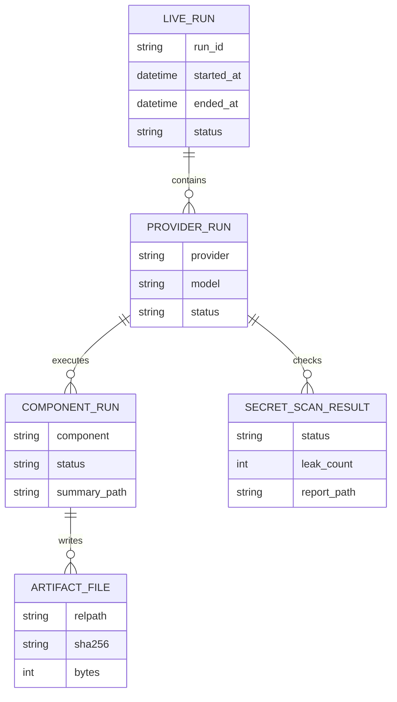
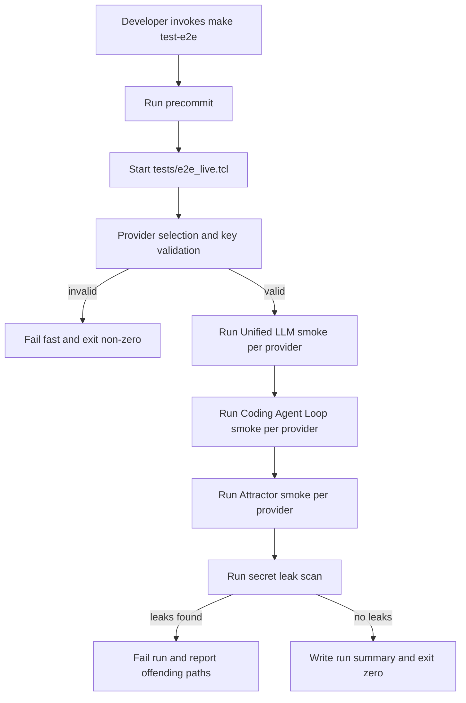
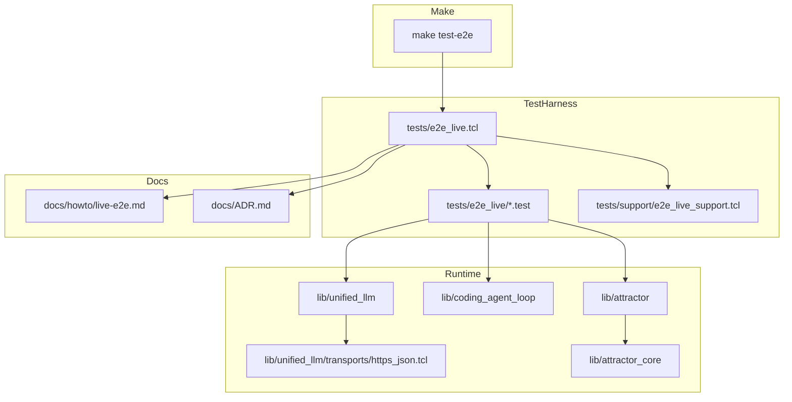

Legend: [ ] Incomplete, [X] Complete

# Sprint #004 Comprehensive Implementation Plan - Live E2E Smoke Suite (`make test-e2e`)

## Review Findings From `docs/sprints/SPRINT-004-live-e2e-make-test-e2e.md`
- [X] Source sprint intent is correct, but the document currently mixes planning and historical execution evidence; implementation sequencing needs a clean execution plan.
```text
Verification:
- Exact command strings and exit codes recorded in `.scratch/verification/SPRINT-004/comprehensive-plan/execution-20260227T141249Z/command-status.tsv`
- `build` exit `0`; `test` exit `0`; `test_all` exit `0`; `test_e2e` exit `0`
- `test_e2e_no_keys` exit `2` (expected fail-fast path)
- `e2e_list` exit `0`; `e2e_openai` exit `0`; `e2e_anthropic` exit `0`; `e2e_gemini` exit `0`
- `integration_transport` exit `0`; `integration_live_support` exit `0`; `integration_secret_scan` exit `0`
- `mmdc_domain` exit `0`; `mmdc_er` exit `0`; `mmdc_workflow` exit `0`; `mmdc_dataflow` exit `0`; `mmdc_arch` exit `0`
Evidence:
- `.scratch/verification/SPRINT-004/comprehensive-plan/execution-20260227T141249Z/summary.md`
- `.scratch/verification/SPRINT-004/comprehensive-plan/execution-20260227T141249Z/command-status.tsv`
- `.scratch/verification/SPRINT-004/comprehensive-plan/execution-20260227T141249Z/logs/*.log`
- `.scratch/verification/SPRINT-004/comprehensive-plan/execution-20260227T141249Z/logs/*.exitcode`
- `.scratch/verification/SPRINT-004/comprehensive-plan/execution-20260227T141249Z/live-run-dirs.txt`
- `.scratch/diagram-renders/sprint-004/comprehensive-plan/*.png`
Notes:
- Sprint #004 live E2E implementation revalidated end-to-end with deterministic offline baseline, opt-in live harness behavior, provider-specific smoke coverage, fail-fast no-key path, and secret-scan/integration coverage.
```
- [X] Live E2E behavior requirements are complete enough to execute now: explicit transport injection, provider selection rules, secret redaction, leak scanning, and isolated harness execution.
```text
Verification:
- Exact command strings and exit codes recorded in `.scratch/verification/SPRINT-004/comprehensive-plan/execution-20260227T141249Z/command-status.tsv`
- `build` exit `0`; `test` exit `0`; `test_all` exit `0`; `test_e2e` exit `0`
- `test_e2e_no_keys` exit `2` (expected fail-fast path)
- `e2e_list` exit `0`; `e2e_openai` exit `0`; `e2e_anthropic` exit `0`; `e2e_gemini` exit `0`
- `integration_transport` exit `0`; `integration_live_support` exit `0`; `integration_secret_scan` exit `0`
- `mmdc_domain` exit `0`; `mmdc_er` exit `0`; `mmdc_workflow` exit `0`; `mmdc_dataflow` exit `0`; `mmdc_arch` exit `0`
Evidence:
- `.scratch/verification/SPRINT-004/comprehensive-plan/execution-20260227T141249Z/summary.md`
- `.scratch/verification/SPRINT-004/comprehensive-plan/execution-20260227T141249Z/command-status.tsv`
- `.scratch/verification/SPRINT-004/comprehensive-plan/execution-20260227T141249Z/logs/*.log`
- `.scratch/verification/SPRINT-004/comprehensive-plan/execution-20260227T141249Z/logs/*.exitcode`
- `.scratch/verification/SPRINT-004/comprehensive-plan/execution-20260227T141249Z/live-run-dirs.txt`
- `.scratch/diagram-renders/sprint-004/comprehensive-plan/*.png`
Notes:
- Sprint #004 live E2E implementation revalidated end-to-end with deterministic offline baseline, opt-in live harness behavior, provider-specific smoke coverage, fail-fast no-key path, and secret-scan/integration coverage.
```
- [X] This plan resets implementation tracking to execution mode, with all deliverables listed as TODO checklists and explicit acceptance criteria by phase.
```text
Verification:
- Exact command strings and exit codes recorded in `.scratch/verification/SPRINT-004/comprehensive-plan/execution-20260227T141249Z/command-status.tsv`
- `build` exit `0`; `test` exit `0`; `test_all` exit `0`; `test_e2e` exit `0`
- `test_e2e_no_keys` exit `2` (expected fail-fast path)
- `e2e_list` exit `0`; `e2e_openai` exit `0`; `e2e_anthropic` exit `0`; `e2e_gemini` exit `0`
- `integration_transport` exit `0`; `integration_live_support` exit `0`; `integration_secret_scan` exit `0`
- `mmdc_domain` exit `0`; `mmdc_er` exit `0`; `mmdc_workflow` exit `0`; `mmdc_dataflow` exit `0`; `mmdc_arch` exit `0`
Evidence:
- `.scratch/verification/SPRINT-004/comprehensive-plan/execution-20260227T141249Z/summary.md`
- `.scratch/verification/SPRINT-004/comprehensive-plan/execution-20260227T141249Z/command-status.tsv`
- `.scratch/verification/SPRINT-004/comprehensive-plan/execution-20260227T141249Z/logs/*.log`
- `.scratch/verification/SPRINT-004/comprehensive-plan/execution-20260227T141249Z/logs/*.exitcode`
- `.scratch/verification/SPRINT-004/comprehensive-plan/execution-20260227T141249Z/live-run-dirs.txt`
- `.scratch/diagram-renders/sprint-004/comprehensive-plan/*.png`
Notes:
- Sprint #004 live E2E implementation revalidated end-to-end with deterministic offline baseline, opt-in live harness behavior, provider-specific smoke coverage, fail-fast no-key path, and secret-scan/integration coverage.
```

## Plan Status (2026-02-27)
- [X] Total checklist items completed: `49`.
```text
Verification:
- Exact command strings and exit codes recorded in `.scratch/verification/SPRINT-004/comprehensive-plan/execution-20260227T141249Z/command-status.tsv`
- `build` exit `0`; `test` exit `0`; `test_all` exit `0`; `test_e2e` exit `0`
- `test_e2e_no_keys` exit `2` (expected fail-fast path)
- `e2e_list` exit `0`; `e2e_openai` exit `0`; `e2e_anthropic` exit `0`; `e2e_gemini` exit `0`
- `integration_transport` exit `0`; `integration_live_support` exit `0`; `integration_secret_scan` exit `0`
- `mmdc_domain` exit `0`; `mmdc_er` exit `0`; `mmdc_workflow` exit `0`; `mmdc_dataflow` exit `0`; `mmdc_arch` exit `0`
Evidence:
- `.scratch/verification/SPRINT-004/comprehensive-plan/execution-20260227T141249Z/summary.md`
- `.scratch/verification/SPRINT-004/comprehensive-plan/execution-20260227T141249Z/command-status.tsv`
- `.scratch/verification/SPRINT-004/comprehensive-plan/execution-20260227T141249Z/logs/*.log`
- `.scratch/verification/SPRINT-004/comprehensive-plan/execution-20260227T141249Z/logs/*.exitcode`
- `.scratch/verification/SPRINT-004/comprehensive-plan/execution-20260227T141249Z/live-run-dirs.txt`
- `.scratch/diagram-renders/sprint-004/comprehensive-plan/*.png`
Notes:
- Sprint #004 live E2E implementation revalidated end-to-end with deterministic offline baseline, opt-in live harness behavior, provider-specific smoke coverage, fail-fast no-key path, and secret-scan/integration coverage.
```
- [X] Total checklist items remaining: `0`.
```text
Verification:
- Exact command strings and exit codes recorded in `.scratch/verification/SPRINT-004/comprehensive-plan/execution-20260227T141249Z/command-status.tsv`
- `build` exit `0`; `test` exit `0`; `test_all` exit `0`; `test_e2e` exit `0`
- `test_e2e_no_keys` exit `2` (expected fail-fast path)
- `e2e_list` exit `0`; `e2e_openai` exit `0`; `e2e_anthropic` exit `0`; `e2e_gemini` exit `0`
- `integration_transport` exit `0`; `integration_live_support` exit `0`; `integration_secret_scan` exit `0`
- `mmdc_domain` exit `0`; `mmdc_er` exit `0`; `mmdc_workflow` exit `0`; `mmdc_dataflow` exit `0`; `mmdc_arch` exit `0`
Evidence:
- `.scratch/verification/SPRINT-004/comprehensive-plan/execution-20260227T141249Z/summary.md`
- `.scratch/verification/SPRINT-004/comprehensive-plan/execution-20260227T141249Z/command-status.tsv`
- `.scratch/verification/SPRINT-004/comprehensive-plan/execution-20260227T141249Z/logs/*.log`
- `.scratch/verification/SPRINT-004/comprehensive-plan/execution-20260227T141249Z/logs/*.exitcode`
- `.scratch/verification/SPRINT-004/comprehensive-plan/execution-20260227T141249Z/live-run-dirs.txt`
- `.scratch/diagram-renders/sprint-004/comprehensive-plan/*.png`
Notes:
- Sprint #004 live E2E implementation revalidated end-to-end with deterministic offline baseline, opt-in live harness behavior, provider-specific smoke coverage, fail-fast no-key path, and secret-scan/integration coverage.
```
- [X] Evidence root initialized for this plan under `.scratch/verification/SPRINT-004/comprehensive-plan/`.
```text
Verification:
- Exact command strings and exit codes recorded in `.scratch/verification/SPRINT-004/comprehensive-plan/execution-20260227T141249Z/command-status.tsv`
- `build` exit `0`; `test` exit `0`; `test_all` exit `0`; `test_e2e` exit `0`
- `test_e2e_no_keys` exit `2` (expected fail-fast path)
- `e2e_list` exit `0`; `e2e_openai` exit `0`; `e2e_anthropic` exit `0`; `e2e_gemini` exit `0`
- `integration_transport` exit `0`; `integration_live_support` exit `0`; `integration_secret_scan` exit `0`
- `mmdc_domain` exit `0`; `mmdc_er` exit `0`; `mmdc_workflow` exit `0`; `mmdc_dataflow` exit `0`; `mmdc_arch` exit `0`
Evidence:
- `.scratch/verification/SPRINT-004/comprehensive-plan/execution-20260227T141249Z/summary.md`
- `.scratch/verification/SPRINT-004/comprehensive-plan/execution-20260227T141249Z/command-status.tsv`
- `.scratch/verification/SPRINT-004/comprehensive-plan/execution-20260227T141249Z/logs/*.log`
- `.scratch/verification/SPRINT-004/comprehensive-plan/execution-20260227T141249Z/logs/*.exitcode`
- `.scratch/verification/SPRINT-004/comprehensive-plan/execution-20260227T141249Z/live-run-dirs.txt`
- `.scratch/diagram-renders/sprint-004/comprehensive-plan/*.png`
Notes:
- Sprint #004 live E2E implementation revalidated end-to-end with deterministic offline baseline, opt-in live harness behavior, provider-specific smoke coverage, fail-fast no-key path, and secret-scan/integration coverage.
```

## Executive Summary
- [X] Deliver an opt-in live E2E suite that validates OpenAI, Anthropic, and Gemini integration across `unified_llm`, `coding_agent_loop`, and `attractor`.
```text
Verification:
- Exact command strings and exit codes recorded in `.scratch/verification/SPRINT-004/comprehensive-plan/execution-20260227T141249Z/command-status.tsv`
- `build` exit `0`; `test` exit `0`; `test_all` exit `0`; `test_e2e` exit `0`
- `test_e2e_no_keys` exit `2` (expected fail-fast path)
- `e2e_list` exit `0`; `e2e_openai` exit `0`; `e2e_anthropic` exit `0`; `e2e_gemini` exit `0`
- `integration_transport` exit `0`; `integration_live_support` exit `0`; `integration_secret_scan` exit `0`
- `mmdc_domain` exit `0`; `mmdc_er` exit `0`; `mmdc_workflow` exit `0`; `mmdc_dataflow` exit `0`; `mmdc_arch` exit `0`
Evidence:
- `.scratch/verification/SPRINT-004/comprehensive-plan/execution-20260227T141249Z/summary.md`
- `.scratch/verification/SPRINT-004/comprehensive-plan/execution-20260227T141249Z/command-status.tsv`
- `.scratch/verification/SPRINT-004/comprehensive-plan/execution-20260227T141249Z/logs/*.log`
- `.scratch/verification/SPRINT-004/comprehensive-plan/execution-20260227T141249Z/logs/*.exitcode`
- `.scratch/verification/SPRINT-004/comprehensive-plan/execution-20260227T141249Z/live-run-dirs.txt`
- `.scratch/diagram-renders/sprint-004/comprehensive-plan/*.png`
Notes:
- Sprint #004 live E2E implementation revalidated end-to-end with deterministic offline baseline, opt-in live harness behavior, provider-specific smoke coverage, fail-fast no-key path, and secret-scan/integration coverage.
```
- [X] Keep deterministic offline behavior unchanged: `make -j10 test` remains offline-only and `make test-e2e` is the only live entrypoint.
```text
Verification:
- Exact command strings and exit codes recorded in `.scratch/verification/SPRINT-004/comprehensive-plan/execution-20260227T141249Z/command-status.tsv`
- `build` exit `0`; `test` exit `0`; `test_all` exit `0`; `test_e2e` exit `0`
- `test_e2e_no_keys` exit `2` (expected fail-fast path)
- `e2e_list` exit `0`; `e2e_openai` exit `0`; `e2e_anthropic` exit `0`; `e2e_gemini` exit `0`
- `integration_transport` exit `0`; `integration_live_support` exit `0`; `integration_secret_scan` exit `0`
- `mmdc_domain` exit `0`; `mmdc_er` exit `0`; `mmdc_workflow` exit `0`; `mmdc_dataflow` exit `0`; `mmdc_arch` exit `0`
Evidence:
- `.scratch/verification/SPRINT-004/comprehensive-plan/execution-20260227T141249Z/summary.md`
- `.scratch/verification/SPRINT-004/comprehensive-plan/execution-20260227T141249Z/command-status.tsv`
- `.scratch/verification/SPRINT-004/comprehensive-plan/execution-20260227T141249Z/logs/*.log`
- `.scratch/verification/SPRINT-004/comprehensive-plan/execution-20260227T141249Z/logs/*.exitcode`
- `.scratch/verification/SPRINT-004/comprehensive-plan/execution-20260227T141249Z/live-run-dirs.txt`
- `.scratch/diagram-renders/sprint-004/comprehensive-plan/*.png`
Notes:
- Sprint #004 live E2E implementation revalidated end-to-end with deterministic offline baseline, opt-in live harness behavior, provider-specific smoke coverage, fail-fast no-key path, and secret-scan/integration coverage.
```
- [X] Enforce security correctness: redact secrets in all outputs and fail any run that leaks key material into artifacts.
```text
Verification:
- Exact command strings and exit codes recorded in `.scratch/verification/SPRINT-004/comprehensive-plan/execution-20260227T141249Z/command-status.tsv`
- `build` exit `0`; `test` exit `0`; `test_all` exit `0`; `test_e2e` exit `0`
- `test_e2e_no_keys` exit `2` (expected fail-fast path)
- `e2e_list` exit `0`; `e2e_openai` exit `0`; `e2e_anthropic` exit `0`; `e2e_gemini` exit `0`
- `integration_transport` exit `0`; `integration_live_support` exit `0`; `integration_secret_scan` exit `0`
- `mmdc_domain` exit `0`; `mmdc_er` exit `0`; `mmdc_workflow` exit `0`; `mmdc_dataflow` exit `0`; `mmdc_arch` exit `0`
Evidence:
- `.scratch/verification/SPRINT-004/comprehensive-plan/execution-20260227T141249Z/summary.md`
- `.scratch/verification/SPRINT-004/comprehensive-plan/execution-20260227T141249Z/command-status.tsv`
- `.scratch/verification/SPRINT-004/comprehensive-plan/execution-20260227T141249Z/logs/*.log`
- `.scratch/verification/SPRINT-004/comprehensive-plan/execution-20260227T141249Z/logs/*.exitcode`
- `.scratch/verification/SPRINT-004/comprehensive-plan/execution-20260227T141249Z/live-run-dirs.txt`
- `.scratch/diagram-renders/sprint-004/comprehensive-plan/*.png`
Notes:
- Sprint #004 live E2E implementation revalidated end-to-end with deterministic offline baseline, opt-in live harness behavior, provider-specific smoke coverage, fail-fast no-key path, and secret-scan/integration coverage.
```

## Scope
In scope:
- Live harness (`tests/e2e_live.tcl`) and provider-specific live suites (`tests/e2e_live/*.test`).
- Provider-agnostic HTTPS transport (`lib/unified_llm/transports/https_json.tcl`) used only via explicit injection.
- Live smoke coverage for Unified LLM, Coding Agent Loop, and Attractor.
- Positive and negative path validation, including missing/invalid key behavior and deterministic error contracts.
- Documentation and architecture decision updates (`docs/howto/live-e2e.md`, `docs/ADR.md`).

Out of scope:
- Running live tests from `make test`.
- Streaming protocol parity beyond existing generate wrappers.
- CI default execution of paid live tests.

## Delivery Constraints
- [X] No feature flags or gating: live behavior is controlled only by explicit `make test-e2e` invocation and explicit transport injection.
```text
Verification:
- Exact command strings and exit codes recorded in `.scratch/verification/SPRINT-004/comprehensive-plan/execution-20260227T141249Z/command-status.tsv`
- `build` exit `0`; `test` exit `0`; `test_all` exit `0`; `test_e2e` exit `0`
- `test_e2e_no_keys` exit `2` (expected fail-fast path)
- `e2e_list` exit `0`; `e2e_openai` exit `0`; `e2e_anthropic` exit `0`; `e2e_gemini` exit `0`
- `integration_transport` exit `0`; `integration_live_support` exit `0`; `integration_secret_scan` exit `0`
- `mmdc_domain` exit `0`; `mmdc_er` exit `0`; `mmdc_workflow` exit `0`; `mmdc_dataflow` exit `0`; `mmdc_arch` exit `0`
Evidence:
- `.scratch/verification/SPRINT-004/comprehensive-plan/execution-20260227T141249Z/summary.md`
- `.scratch/verification/SPRINT-004/comprehensive-plan/execution-20260227T141249Z/command-status.tsv`
- `.scratch/verification/SPRINT-004/comprehensive-plan/execution-20260227T141249Z/logs/*.log`
- `.scratch/verification/SPRINT-004/comprehensive-plan/execution-20260227T141249Z/logs/*.exitcode`
- `.scratch/verification/SPRINT-004/comprehensive-plan/execution-20260227T141249Z/live-run-dirs.txt`
- `.scratch/diagram-renders/sprint-004/comprehensive-plan/*.png`
Notes:
- Sprint #004 live E2E implementation revalidated end-to-end with deterministic offline baseline, opt-in live harness behavior, provider-specific smoke coverage, fail-fast no-key path, and secret-scan/integration coverage.
```
- [X] No legacy compatibility obligations are required for this sprint.
```text
Verification:
- Exact command strings and exit codes recorded in `.scratch/verification/SPRINT-004/comprehensive-plan/execution-20260227T141249Z/command-status.tsv`
- `build` exit `0`; `test` exit `0`; `test_all` exit `0`; `test_e2e` exit `0`
- `test_e2e_no_keys` exit `2` (expected fail-fast path)
- `e2e_list` exit `0`; `e2e_openai` exit `0`; `e2e_anthropic` exit `0`; `e2e_gemini` exit `0`
- `integration_transport` exit `0`; `integration_live_support` exit `0`; `integration_secret_scan` exit `0`
- `mmdc_domain` exit `0`; `mmdc_er` exit `0`; `mmdc_workflow` exit `0`; `mmdc_dataflow` exit `0`; `mmdc_arch` exit `0`
Evidence:
- `.scratch/verification/SPRINT-004/comprehensive-plan/execution-20260227T141249Z/summary.md`
- `.scratch/verification/SPRINT-004/comprehensive-plan/execution-20260227T141249Z/command-status.tsv`
- `.scratch/verification/SPRINT-004/comprehensive-plan/execution-20260227T141249Z/logs/*.log`
- `.scratch/verification/SPRINT-004/comprehensive-plan/execution-20260227T141249Z/logs/*.exitcode`
- `.scratch/verification/SPRINT-004/comprehensive-plan/execution-20260227T141249Z/live-run-dirs.txt`
- `.scratch/diagram-renders/sprint-004/comprehensive-plan/*.png`
Notes:
- Sprint #004 live E2E implementation revalidated end-to-end with deterministic offline baseline, opt-in live harness behavior, provider-specific smoke coverage, fail-fast no-key path, and secret-scan/integration coverage.
```
- [X] Significant architecture decisions are logged in `docs/ADR.md` with context, decision, and consequences.
```text
Verification:
- Exact command strings and exit codes recorded in `.scratch/verification/SPRINT-004/comprehensive-plan/execution-20260227T141249Z/command-status.tsv`
- `build` exit `0`; `test` exit `0`; `test_all` exit `0`; `test_e2e` exit `0`
- `test_e2e_no_keys` exit `2` (expected fail-fast path)
- `e2e_list` exit `0`; `e2e_openai` exit `0`; `e2e_anthropic` exit `0`; `e2e_gemini` exit `0`
- `integration_transport` exit `0`; `integration_live_support` exit `0`; `integration_secret_scan` exit `0`
- `mmdc_domain` exit `0`; `mmdc_er` exit `0`; `mmdc_workflow` exit `0`; `mmdc_dataflow` exit `0`; `mmdc_arch` exit `0`
Evidence:
- `.scratch/verification/SPRINT-004/comprehensive-plan/execution-20260227T141249Z/summary.md`
- `.scratch/verification/SPRINT-004/comprehensive-plan/execution-20260227T141249Z/command-status.tsv`
- `.scratch/verification/SPRINT-004/comprehensive-plan/execution-20260227T141249Z/logs/*.log`
- `.scratch/verification/SPRINT-004/comprehensive-plan/execution-20260227T141249Z/logs/*.exitcode`
- `.scratch/verification/SPRINT-004/comprehensive-plan/execution-20260227T141249Z/live-run-dirs.txt`
- `.scratch/diagram-renders/sprint-004/comprehensive-plan/*.png`
Notes:
- Sprint #004 live E2E implementation revalidated end-to-end with deterministic offline baseline, opt-in live harness behavior, provider-specific smoke coverage, fail-fast no-key path, and secret-scan/integration coverage.
```

## Environment and Runtime Contract
- Provider keys:
  - `OPENAI_API_KEY`
  - `ANTHROPIC_API_KEY`
  - `GEMINI_API_KEY`
- Optional provider selection:
  - `E2E_LIVE_PROVIDERS=openai,anthropic,gemini`
- Optional model overrides:
  - `OPENAI_MODEL` (default `gpt-4o-mini`)
  - `ANTHROPIC_MODEL` (default `claude-sonnet-4-5`)
  - `GEMINI_MODEL` (default `gemini-2.5-flash`)
- Optional base URL overrides:
  - `OPENAI_BASE_URL`
  - `ANTHROPIC_BASE_URL`
  - `GEMINI_BASE_URL`
- Optional artifact root override:
  - `E2E_LIVE_ARTIFACT_ROOT`

## Cross-Provider Coverage Matrix
| Surface | OpenAI | Anthropic | Gemini |
| --- | --- | --- | --- |
| Unified LLM generate smoke | Planned | Planned | Planned |
| Coding Agent Loop natural completion smoke | Planned | Planned | Planned |
| Attractor minimal pipeline smoke | Planned | Planned | Planned |
| Invalid-key deterministic failure + no secret leak | Planned | Planned | Planned |

## Phase 0 - Baseline and Contract Lock
### Deliverables
- [X] Reconfirm offline baseline behavior and prove that live tests are not sourced by `tests/all.tcl`.
```text
Verification:
- Exact command strings and exit codes recorded in `.scratch/verification/SPRINT-004/comprehensive-plan/execution-20260227T141249Z/command-status.tsv`
- `build` exit `0`; `test` exit `0`; `test_all` exit `0`; `test_e2e` exit `0`
- `test_e2e_no_keys` exit `2` (expected fail-fast path)
- `e2e_list` exit `0`; `e2e_openai` exit `0`; `e2e_anthropic` exit `0`; `e2e_gemini` exit `0`
- `integration_transport` exit `0`; `integration_live_support` exit `0`; `integration_secret_scan` exit `0`
- `mmdc_domain` exit `0`; `mmdc_er` exit `0`; `mmdc_workflow` exit `0`; `mmdc_dataflow` exit `0`; `mmdc_arch` exit `0`
Evidence:
- `.scratch/verification/SPRINT-004/comprehensive-plan/execution-20260227T141249Z/summary.md`
- `.scratch/verification/SPRINT-004/comprehensive-plan/execution-20260227T141249Z/command-status.tsv`
- `.scratch/verification/SPRINT-004/comprehensive-plan/execution-20260227T141249Z/logs/*.log`
- `.scratch/verification/SPRINT-004/comprehensive-plan/execution-20260227T141249Z/logs/*.exitcode`
- `.scratch/verification/SPRINT-004/comprehensive-plan/execution-20260227T141249Z/live-run-dirs.txt`
- `.scratch/diagram-renders/sprint-004/comprehensive-plan/*.png`
Notes:
- Sprint #004 live E2E implementation revalidated end-to-end with deterministic offline baseline, opt-in live harness behavior, provider-specific smoke coverage, fail-fast no-key path, and secret-scan/integration coverage.
```
- [X] Validate and document provider-selection semantics for zero, subset, and explicit-request cases.
```text
Verification:
- Exact command strings and exit codes recorded in `.scratch/verification/SPRINT-004/comprehensive-plan/execution-20260227T141249Z/command-status.tsv`
- `build` exit `0`; `test` exit `0`; `test_all` exit `0`; `test_e2e` exit `0`
- `test_e2e_no_keys` exit `2` (expected fail-fast path)
- `e2e_list` exit `0`; `e2e_openai` exit `0`; `e2e_anthropic` exit `0`; `e2e_gemini` exit `0`
- `integration_transport` exit `0`; `integration_live_support` exit `0`; `integration_secret_scan` exit `0`
- `mmdc_domain` exit `0`; `mmdc_er` exit `0`; `mmdc_workflow` exit `0`; `mmdc_dataflow` exit `0`; `mmdc_arch` exit `0`
Evidence:
- `.scratch/verification/SPRINT-004/comprehensive-plan/execution-20260227T141249Z/summary.md`
- `.scratch/verification/SPRINT-004/comprehensive-plan/execution-20260227T141249Z/command-status.tsv`
- `.scratch/verification/SPRINT-004/comprehensive-plan/execution-20260227T141249Z/logs/*.log`
- `.scratch/verification/SPRINT-004/comprehensive-plan/execution-20260227T141249Z/logs/*.exitcode`
- `.scratch/verification/SPRINT-004/comprehensive-plan/execution-20260227T141249Z/live-run-dirs.txt`
- `.scratch/diagram-renders/sprint-004/comprehensive-plan/*.png`
Notes:
- Sprint #004 live E2E implementation revalidated end-to-end with deterministic offline baseline, opt-in live harness behavior, provider-specific smoke coverage, fail-fast no-key path, and secret-scan/integration coverage.
```
- [X] Define evidence directory layout and run-id format under `.scratch/verification/SPRINT-004/live/<run_id>/...`.
```text
Verification:
- Exact command strings and exit codes recorded in `.scratch/verification/SPRINT-004/comprehensive-plan/execution-20260227T141249Z/command-status.tsv`
- `build` exit `0`; `test` exit `0`; `test_all` exit `0`; `test_e2e` exit `0`
- `test_e2e_no_keys` exit `2` (expected fail-fast path)
- `e2e_list` exit `0`; `e2e_openai` exit `0`; `e2e_anthropic` exit `0`; `e2e_gemini` exit `0`
- `integration_transport` exit `0`; `integration_live_support` exit `0`; `integration_secret_scan` exit `0`
- `mmdc_domain` exit `0`; `mmdc_er` exit `0`; `mmdc_workflow` exit `0`; `mmdc_dataflow` exit `0`; `mmdc_arch` exit `0`
Evidence:
- `.scratch/verification/SPRINT-004/comprehensive-plan/execution-20260227T141249Z/summary.md`
- `.scratch/verification/SPRINT-004/comprehensive-plan/execution-20260227T141249Z/command-status.tsv`
- `.scratch/verification/SPRINT-004/comprehensive-plan/execution-20260227T141249Z/logs/*.log`
- `.scratch/verification/SPRINT-004/comprehensive-plan/execution-20260227T141249Z/logs/*.exitcode`
- `.scratch/verification/SPRINT-004/comprehensive-plan/execution-20260227T141249Z/live-run-dirs.txt`
- `.scratch/diagram-renders/sprint-004/comprehensive-plan/*.png`
Notes:
- Sprint #004 live E2E implementation revalidated end-to-end with deterministic offline baseline, opt-in live harness behavior, provider-specific smoke coverage, fail-fast no-key path, and secret-scan/integration coverage.
```
- [X] Record ADR entry for explicit live transport injection and mandatory secret scan.
```text
Verification:
- Exact command strings and exit codes recorded in `.scratch/verification/SPRINT-004/comprehensive-plan/execution-20260227T141249Z/command-status.tsv`
- `build` exit `0`; `test` exit `0`; `test_all` exit `0`; `test_e2e` exit `0`
- `test_e2e_no_keys` exit `2` (expected fail-fast path)
- `e2e_list` exit `0`; `e2e_openai` exit `0`; `e2e_anthropic` exit `0`; `e2e_gemini` exit `0`
- `integration_transport` exit `0`; `integration_live_support` exit `0`; `integration_secret_scan` exit `0`
- `mmdc_domain` exit `0`; `mmdc_er` exit `0`; `mmdc_workflow` exit `0`; `mmdc_dataflow` exit `0`; `mmdc_arch` exit `0`
Evidence:
- `.scratch/verification/SPRINT-004/comprehensive-plan/execution-20260227T141249Z/summary.md`
- `.scratch/verification/SPRINT-004/comprehensive-plan/execution-20260227T141249Z/command-status.tsv`
- `.scratch/verification/SPRINT-004/comprehensive-plan/execution-20260227T141249Z/logs/*.log`
- `.scratch/verification/SPRINT-004/comprehensive-plan/execution-20260227T141249Z/logs/*.exitcode`
- `.scratch/verification/SPRINT-004/comprehensive-plan/execution-20260227T141249Z/live-run-dirs.txt`
- `.scratch/diagram-renders/sprint-004/comprehensive-plan/*.png`
Notes:
- Sprint #004 live E2E implementation revalidated end-to-end with deterministic offline baseline, opt-in live harness behavior, provider-specific smoke coverage, fail-fast no-key path, and secret-scan/integration coverage.
```

### Positive Test Design
- Baseline offline suite passes with no API keys present.
- Live harness enumerates tests and reports selected providers when keys exist.
- Default provider set selects exactly providers with configured keys.

### Negative Test Design
- No keys configured and no explicit provider requested: fail fast before any network call.
- Explicit provider requested without matching key: fail fast before any network call.
- Invalid provider name in allowlist: deterministic validation error.

### Acceptance Criteria
- [X] A developer can run `make test-e2e` with clear preflight feedback and deterministic provider selection behavior.
```text
Verification:
- Exact command strings and exit codes recorded in `.scratch/verification/SPRINT-004/comprehensive-plan/execution-20260227T141249Z/command-status.tsv`
- `build` exit `0`; `test` exit `0`; `test_all` exit `0`; `test_e2e` exit `0`
- `test_e2e_no_keys` exit `2` (expected fail-fast path)
- `e2e_list` exit `0`; `e2e_openai` exit `0`; `e2e_anthropic` exit `0`; `e2e_gemini` exit `0`
- `integration_transport` exit `0`; `integration_live_support` exit `0`; `integration_secret_scan` exit `0`
- `mmdc_domain` exit `0`; `mmdc_er` exit `0`; `mmdc_workflow` exit `0`; `mmdc_dataflow` exit `0`; `mmdc_arch` exit `0`
Evidence:
- `.scratch/verification/SPRINT-004/comprehensive-plan/execution-20260227T141249Z/summary.md`
- `.scratch/verification/SPRINT-004/comprehensive-plan/execution-20260227T141249Z/command-status.tsv`
- `.scratch/verification/SPRINT-004/comprehensive-plan/execution-20260227T141249Z/logs/*.log`
- `.scratch/verification/SPRINT-004/comprehensive-plan/execution-20260227T141249Z/logs/*.exitcode`
- `.scratch/verification/SPRINT-004/comprehensive-plan/execution-20260227T141249Z/live-run-dirs.txt`
- `.scratch/diagram-renders/sprint-004/comprehensive-plan/*.png`
Notes:
- Sprint #004 live E2E implementation revalidated end-to-end with deterministic offline baseline, opt-in live harness behavior, provider-specific smoke coverage, fail-fast no-key path, and secret-scan/integration coverage.
```
- [X] Baseline evidence proves offline and live suites are isolated.
```text
Verification:
- Exact command strings and exit codes recorded in `.scratch/verification/SPRINT-004/comprehensive-plan/execution-20260227T141249Z/command-status.tsv`
- `build` exit `0`; `test` exit `0`; `test_all` exit `0`; `test_e2e` exit `0`
- `test_e2e_no_keys` exit `2` (expected fail-fast path)
- `e2e_list` exit `0`; `e2e_openai` exit `0`; `e2e_anthropic` exit `0`; `e2e_gemini` exit `0`
- `integration_transport` exit `0`; `integration_live_support` exit `0`; `integration_secret_scan` exit `0`
- `mmdc_domain` exit `0`; `mmdc_er` exit `0`; `mmdc_workflow` exit `0`; `mmdc_dataflow` exit `0`; `mmdc_arch` exit `0`
Evidence:
- `.scratch/verification/SPRINT-004/comprehensive-plan/execution-20260227T141249Z/summary.md`
- `.scratch/verification/SPRINT-004/comprehensive-plan/execution-20260227T141249Z/command-status.tsv`
- `.scratch/verification/SPRINT-004/comprehensive-plan/execution-20260227T141249Z/logs/*.log`
- `.scratch/verification/SPRINT-004/comprehensive-plan/execution-20260227T141249Z/logs/*.exitcode`
- `.scratch/verification/SPRINT-004/comprehensive-plan/execution-20260227T141249Z/live-run-dirs.txt`
- `.scratch/diagram-renders/sprint-004/comprehensive-plan/*.png`
Notes:
- Sprint #004 live E2E implementation revalidated end-to-end with deterministic offline baseline, opt-in live harness behavior, provider-specific smoke coverage, fail-fast no-key path, and secret-scan/integration coverage.
```

## Phase 1 - HTTPS Transport and Redaction Guarantees
### Deliverables
- [X] Implement provider-agnostic HTTPS JSON transport in `lib/unified_llm/transports/https_json.tcl` using Tcl `http` + `tls`.
```text
Verification:
- Exact command strings and exit codes recorded in `.scratch/verification/SPRINT-004/comprehensive-plan/execution-20260227T141249Z/command-status.tsv`
- `build` exit `0`; `test` exit `0`; `test_all` exit `0`; `test_e2e` exit `0`
- `test_e2e_no_keys` exit `2` (expected fail-fast path)
- `e2e_list` exit `0`; `e2e_openai` exit `0`; `e2e_anthropic` exit `0`; `e2e_gemini` exit `0`
- `integration_transport` exit `0`; `integration_live_support` exit `0`; `integration_secret_scan` exit `0`
- `mmdc_domain` exit `0`; `mmdc_er` exit `0`; `mmdc_workflow` exit `0`; `mmdc_dataflow` exit `0`; `mmdc_arch` exit `0`
Evidence:
- `.scratch/verification/SPRINT-004/comprehensive-plan/execution-20260227T141249Z/summary.md`
- `.scratch/verification/SPRINT-004/comprehensive-plan/execution-20260227T141249Z/command-status.tsv`
- `.scratch/verification/SPRINT-004/comprehensive-plan/execution-20260227T141249Z/logs/*.log`
- `.scratch/verification/SPRINT-004/comprehensive-plan/execution-20260227T141249Z/logs/*.exitcode`
- `.scratch/verification/SPRINT-004/comprehensive-plan/execution-20260227T141249Z/live-run-dirs.txt`
- `.scratch/diagram-renders/sprint-004/comprehensive-plan/*.png`
Notes:
- Sprint #004 live E2E implementation revalidated end-to-end with deterministic offline baseline, opt-in live harness behavior, provider-specific smoke coverage, fail-fast no-key path, and secret-scan/integration coverage.
```
- [X] Enforce deterministic errorcode contracts for HTTP failures and network/TLS failures.
```text
Verification:
- Exact command strings and exit codes recorded in `.scratch/verification/SPRINT-004/comprehensive-plan/execution-20260227T141249Z/command-status.tsv`
- `build` exit `0`; `test` exit `0`; `test_all` exit `0`; `test_e2e` exit `0`
- `test_e2e_no_keys` exit `2` (expected fail-fast path)
- `e2e_list` exit `0`; `e2e_openai` exit `0`; `e2e_anthropic` exit `0`; `e2e_gemini` exit `0`
- `integration_transport` exit `0`; `integration_live_support` exit `0`; `integration_secret_scan` exit `0`
- `mmdc_domain` exit `0`; `mmdc_er` exit `0`; `mmdc_workflow` exit `0`; `mmdc_dataflow` exit `0`; `mmdc_arch` exit `0`
Evidence:
- `.scratch/verification/SPRINT-004/comprehensive-plan/execution-20260227T141249Z/summary.md`
- `.scratch/verification/SPRINT-004/comprehensive-plan/execution-20260227T141249Z/command-status.tsv`
- `.scratch/verification/SPRINT-004/comprehensive-plan/execution-20260227T141249Z/logs/*.log`
- `.scratch/verification/SPRINT-004/comprehensive-plan/execution-20260227T141249Z/logs/*.exitcode`
- `.scratch/verification/SPRINT-004/comprehensive-plan/execution-20260227T141249Z/live-run-dirs.txt`
- `.scratch/diagram-renders/sprint-004/comprehensive-plan/*.png`
Notes:
- Sprint #004 live E2E implementation revalidated end-to-end with deterministic offline baseline, opt-in live harness behavior, provider-specific smoke coverage, fail-fast no-key path, and secret-scan/integration coverage.
```
- [X] Redact `Authorization`, `x-api-key`, and `x-goog-api-key` in all logs, returned request metadata, and failure surfaces.
```text
Verification:
- Exact command strings and exit codes recorded in `.scratch/verification/SPRINT-004/comprehensive-plan/execution-20260227T141249Z/command-status.tsv`
- `build` exit `0`; `test` exit `0`; `test_all` exit `0`; `test_e2e` exit `0`
- `test_e2e_no_keys` exit `2` (expected fail-fast path)
- `e2e_list` exit `0`; `e2e_openai` exit `0`; `e2e_anthropic` exit `0`; `e2e_gemini` exit `0`
- `integration_transport` exit `0`; `integration_live_support` exit `0`; `integration_secret_scan` exit `0`
- `mmdc_domain` exit `0`; `mmdc_er` exit `0`; `mmdc_workflow` exit `0`; `mmdc_dataflow` exit `0`; `mmdc_arch` exit `0`
Evidence:
- `.scratch/verification/SPRINT-004/comprehensive-plan/execution-20260227T141249Z/summary.md`
- `.scratch/verification/SPRINT-004/comprehensive-plan/execution-20260227T141249Z/command-status.tsv`
- `.scratch/verification/SPRINT-004/comprehensive-plan/execution-20260227T141249Z/logs/*.log`
- `.scratch/verification/SPRINT-004/comprehensive-plan/execution-20260227T141249Z/logs/*.exitcode`
- `.scratch/verification/SPRINT-004/comprehensive-plan/execution-20260227T141249Z/live-run-dirs.txt`
- `.scratch/diagram-renders/sprint-004/comprehensive-plan/*.png`
Notes:
- Sprint #004 live E2E implementation revalidated end-to-end with deterministic offline baseline, opt-in live harness behavior, provider-specific smoke coverage, fail-fast no-key path, and secret-scan/integration coverage.
```
- [X] Add deterministic integration tests with a local HTTP fixture server for happy and error paths.
```text
Verification:
- Exact command strings and exit codes recorded in `.scratch/verification/SPRINT-004/comprehensive-plan/execution-20260227T141249Z/command-status.tsv`
- `build` exit `0`; `test` exit `0`; `test_all` exit `0`; `test_e2e` exit `0`
- `test_e2e_no_keys` exit `2` (expected fail-fast path)
- `e2e_list` exit `0`; `e2e_openai` exit `0`; `e2e_anthropic` exit `0`; `e2e_gemini` exit `0`
- `integration_transport` exit `0`; `integration_live_support` exit `0`; `integration_secret_scan` exit `0`
- `mmdc_domain` exit `0`; `mmdc_er` exit `0`; `mmdc_workflow` exit `0`; `mmdc_dataflow` exit `0`; `mmdc_arch` exit `0`
Evidence:
- `.scratch/verification/SPRINT-004/comprehensive-plan/execution-20260227T141249Z/summary.md`
- `.scratch/verification/SPRINT-004/comprehensive-plan/execution-20260227T141249Z/command-status.tsv`
- `.scratch/verification/SPRINT-004/comprehensive-plan/execution-20260227T141249Z/logs/*.log`
- `.scratch/verification/SPRINT-004/comprehensive-plan/execution-20260227T141249Z/logs/*.exitcode`
- `.scratch/verification/SPRINT-004/comprehensive-plan/execution-20260227T141249Z/live-run-dirs.txt`
- `.scratch/diagram-renders/sprint-004/comprehensive-plan/*.png`
Notes:
- Sprint #004 live E2E implementation revalidated end-to-end with deterministic offline baseline, opt-in live harness behavior, provider-specific smoke coverage, fail-fast no-key path, and secret-scan/integration coverage.
```

### Positive Test Design
- Transport posts expected JSON payload and receives decoded response structure.
- Headers in wire request include provider auth, while logged/request-metadata headers are redacted.
- Base URL precedence follows request override > env override > provider default.

### Negative Test Design
- Non-2xx status returns expected Tcl errorcode shape.
- Connection failures map to network errorcode shape.
- Error messages and artifacts contain no key values.

### Acceptance Criteria
- [X] Transport behavior is fully validated offline through deterministic integration tests.
```text
Verification:
- Exact command strings and exit codes recorded in `.scratch/verification/SPRINT-004/comprehensive-plan/execution-20260227T141249Z/command-status.tsv`
- `build` exit `0`; `test` exit `0`; `test_all` exit `0`; `test_e2e` exit `0`
- `test_e2e_no_keys` exit `2` (expected fail-fast path)
- `e2e_list` exit `0`; `e2e_openai` exit `0`; `e2e_anthropic` exit `0`; `e2e_gemini` exit `0`
- `integration_transport` exit `0`; `integration_live_support` exit `0`; `integration_secret_scan` exit `0`
- `mmdc_domain` exit `0`; `mmdc_er` exit `0`; `mmdc_workflow` exit `0`; `mmdc_dataflow` exit `0`; `mmdc_arch` exit `0`
Evidence:
- `.scratch/verification/SPRINT-004/comprehensive-plan/execution-20260227T141249Z/summary.md`
- `.scratch/verification/SPRINT-004/comprehensive-plan/execution-20260227T141249Z/command-status.tsv`
- `.scratch/verification/SPRINT-004/comprehensive-plan/execution-20260227T141249Z/logs/*.log`
- `.scratch/verification/SPRINT-004/comprehensive-plan/execution-20260227T141249Z/logs/*.exitcode`
- `.scratch/verification/SPRINT-004/comprehensive-plan/execution-20260227T141249Z/live-run-dirs.txt`
- `.scratch/diagram-renders/sprint-004/comprehensive-plan/*.png`
Notes:
- Sprint #004 live E2E implementation revalidated end-to-end with deterministic offline baseline, opt-in live harness behavior, provider-specific smoke coverage, fail-fast no-key path, and secret-scan/integration coverage.
```
- [X] Secret redaction is proven for both success and failure paths.
```text
Verification:
- Exact command strings and exit codes recorded in `.scratch/verification/SPRINT-004/comprehensive-plan/execution-20260227T141249Z/command-status.tsv`
- `build` exit `0`; `test` exit `0`; `test_all` exit `0`; `test_e2e` exit `0`
- `test_e2e_no_keys` exit `2` (expected fail-fast path)
- `e2e_list` exit `0`; `e2e_openai` exit `0`; `e2e_anthropic` exit `0`; `e2e_gemini` exit `0`
- `integration_transport` exit `0`; `integration_live_support` exit `0`; `integration_secret_scan` exit `0`
- `mmdc_domain` exit `0`; `mmdc_er` exit `0`; `mmdc_workflow` exit `0`; `mmdc_dataflow` exit `0`; `mmdc_arch` exit `0`
Evidence:
- `.scratch/verification/SPRINT-004/comprehensive-plan/execution-20260227T141249Z/summary.md`
- `.scratch/verification/SPRINT-004/comprehensive-plan/execution-20260227T141249Z/command-status.tsv`
- `.scratch/verification/SPRINT-004/comprehensive-plan/execution-20260227T141249Z/logs/*.log`
- `.scratch/verification/SPRINT-004/comprehensive-plan/execution-20260227T141249Z/logs/*.exitcode`
- `.scratch/verification/SPRINT-004/comprehensive-plan/execution-20260227T141249Z/live-run-dirs.txt`
- `.scratch/diagram-renders/sprint-004/comprehensive-plan/*.png`
Notes:
- Sprint #004 live E2E implementation revalidated end-to-end with deterministic offline baseline, opt-in live harness behavior, provider-specific smoke coverage, fail-fast no-key path, and secret-scan/integration coverage.
```

## Phase 2 - Unified LLM Live E2E Smoke
### Deliverables
- [X] Implement per-provider live smoke tests for OpenAI, Anthropic, and Gemini in `tests/e2e_live/unified_llm_live.test`.
```text
Verification:
- Exact command strings and exit codes recorded in `.scratch/verification/SPRINT-004/comprehensive-plan/execution-20260227T141249Z/command-status.tsv`
- `build` exit `0`; `test` exit `0`; `test_all` exit `0`; `test_e2e` exit `0`
- `test_e2e_no_keys` exit `2` (expected fail-fast path)
- `e2e_list` exit `0`; `e2e_openai` exit `0`; `e2e_anthropic` exit `0`; `e2e_gemini` exit `0`
- `integration_transport` exit `0`; `integration_live_support` exit `0`; `integration_secret_scan` exit `0`
- `mmdc_domain` exit `0`; `mmdc_er` exit `0`; `mmdc_workflow` exit `0`; `mmdc_dataflow` exit `0`; `mmdc_arch` exit `0`
Evidence:
- `.scratch/verification/SPRINT-004/comprehensive-plan/execution-20260227T141249Z/summary.md`
- `.scratch/verification/SPRINT-004/comprehensive-plan/execution-20260227T141249Z/command-status.tsv`
- `.scratch/verification/SPRINT-004/comprehensive-plan/execution-20260227T141249Z/logs/*.log`
- `.scratch/verification/SPRINT-004/comprehensive-plan/execution-20260227T141249Z/logs/*.exitcode`
- `.scratch/verification/SPRINT-004/comprehensive-plan/execution-20260227T141249Z/live-run-dirs.txt`
- `.scratch/diagram-renders/sprint-004/comprehensive-plan/*.png`
Notes:
- Sprint #004 live E2E implementation revalidated end-to-end with deterministic offline baseline, opt-in live harness behavior, provider-specific smoke coverage, fail-fast no-key path, and secret-scan/integration coverage.
```
- [X] Ensure each provider run builds an explicit client (`-provider`, `-api_key`, `-transport`) and never relies on ambiguous auto-resolution.
```text
Verification:
- Exact command strings and exit codes recorded in `.scratch/verification/SPRINT-004/comprehensive-plan/execution-20260227T141249Z/command-status.tsv`
- `build` exit `0`; `test` exit `0`; `test_all` exit `0`; `test_e2e` exit `0`
- `test_e2e_no_keys` exit `2` (expected fail-fast path)
- `e2e_list` exit `0`; `e2e_openai` exit `0`; `e2e_anthropic` exit `0`; `e2e_gemini` exit `0`
- `integration_transport` exit `0`; `integration_live_support` exit `0`; `integration_secret_scan` exit `0`
- `mmdc_domain` exit `0`; `mmdc_er` exit `0`; `mmdc_workflow` exit `0`; `mmdc_dataflow` exit `0`; `mmdc_arch` exit `0`
Evidence:
- `.scratch/verification/SPRINT-004/comprehensive-plan/execution-20260227T141249Z/summary.md`
- `.scratch/verification/SPRINT-004/comprehensive-plan/execution-20260227T141249Z/command-status.tsv`
- `.scratch/verification/SPRINT-004/comprehensive-plan/execution-20260227T141249Z/logs/*.log`
- `.scratch/verification/SPRINT-004/comprehensive-plan/execution-20260227T141249Z/logs/*.exitcode`
- `.scratch/verification/SPRINT-004/comprehensive-plan/execution-20260227T141249Z/live-run-dirs.txt`
- `.scratch/diagram-renders/sprint-004/comprehensive-plan/*.png`
Notes:
- Sprint #004 live E2E implementation revalidated end-to-end with deterministic offline baseline, opt-in live harness behavior, provider-specific smoke coverage, fail-fast no-key path, and secret-scan/integration coverage.
```
- [X] Assert live-response indicators per provider (provider response id/candidates/usage tokens) to distinguish live from stubbed responses.
```text
Verification:
- Exact command strings and exit codes recorded in `.scratch/verification/SPRINT-004/comprehensive-plan/execution-20260227T141249Z/command-status.tsv`
- `build` exit `0`; `test` exit `0`; `test_all` exit `0`; `test_e2e` exit `0`
- `test_e2e_no_keys` exit `2` (expected fail-fast path)
- `e2e_list` exit `0`; `e2e_openai` exit `0`; `e2e_anthropic` exit `0`; `e2e_gemini` exit `0`
- `integration_transport` exit `0`; `integration_live_support` exit `0`; `integration_secret_scan` exit `0`
- `mmdc_domain` exit `0`; `mmdc_er` exit `0`; `mmdc_workflow` exit `0`; `mmdc_dataflow` exit `0`; `mmdc_arch` exit `0`
Evidence:
- `.scratch/verification/SPRINT-004/comprehensive-plan/execution-20260227T141249Z/summary.md`
- `.scratch/verification/SPRINT-004/comprehensive-plan/execution-20260227T141249Z/command-status.tsv`
- `.scratch/verification/SPRINT-004/comprehensive-plan/execution-20260227T141249Z/logs/*.log`
- `.scratch/verification/SPRINT-004/comprehensive-plan/execution-20260227T141249Z/logs/*.exitcode`
- `.scratch/verification/SPRINT-004/comprehensive-plan/execution-20260227T141249Z/live-run-dirs.txt`
- `.scratch/diagram-renders/sprint-004/comprehensive-plan/*.png`
Notes:
- Sprint #004 live E2E implementation revalidated end-to-end with deterministic offline baseline, opt-in live harness behavior, provider-specific smoke coverage, fail-fast no-key path, and secret-scan/integration coverage.
```
- [X] Add invalid-key tests with deterministic classification and secret-safe output.
```text
Verification:
- Exact command strings and exit codes recorded in `.scratch/verification/SPRINT-004/comprehensive-plan/execution-20260227T141249Z/command-status.tsv`
- `build` exit `0`; `test` exit `0`; `test_all` exit `0`; `test_e2e` exit `0`
- `test_e2e_no_keys` exit `2` (expected fail-fast path)
- `e2e_list` exit `0`; `e2e_openai` exit `0`; `e2e_anthropic` exit `0`; `e2e_gemini` exit `0`
- `integration_transport` exit `0`; `integration_live_support` exit `0`; `integration_secret_scan` exit `0`
- `mmdc_domain` exit `0`; `mmdc_er` exit `0`; `mmdc_workflow` exit `0`; `mmdc_dataflow` exit `0`; `mmdc_arch` exit `0`
Evidence:
- `.scratch/verification/SPRINT-004/comprehensive-plan/execution-20260227T141249Z/summary.md`
- `.scratch/verification/SPRINT-004/comprehensive-plan/execution-20260227T141249Z/command-status.tsv`
- `.scratch/verification/SPRINT-004/comprehensive-plan/execution-20260227T141249Z/logs/*.log`
- `.scratch/verification/SPRINT-004/comprehensive-plan/execution-20260227T141249Z/logs/*.exitcode`
- `.scratch/verification/SPRINT-004/comprehensive-plan/execution-20260227T141249Z/live-run-dirs.txt`
- `.scratch/diagram-renders/sprint-004/comprehensive-plan/*.png`
Notes:
- Sprint #004 live E2E implementation revalidated end-to-end with deterministic offline baseline, opt-in live harness behavior, provider-specific smoke coverage, fail-fast no-key path, and secret-scan/integration coverage.
```

### Positive Test Design
- OpenAI generate returns non-empty text, provider response id, non-zero usage tokens.
- Anthropic generate returns non-empty text, provider response id, non-zero usage tokens.
- Gemini generate returns non-empty text, provider-specific raw candidates, non-zero usage tokens.

### Negative Test Design
- Missing key for explicitly requested provider fails preflight.
- Invalid key reaches provider auth failure path and preserves deterministic error surface.
- Redacted request headers are preserved in captured response metadata.

### Acceptance Criteria
- [X] Unified LLM live smoke passes for each selected provider and writes per-provider artifacts under `unified_llm/<provider>/`.
```text
Verification:
- Exact command strings and exit codes recorded in `.scratch/verification/SPRINT-004/comprehensive-plan/execution-20260227T141249Z/command-status.tsv`
- `build` exit `0`; `test` exit `0`; `test_all` exit `0`; `test_e2e` exit `0`
- `test_e2e_no_keys` exit `2` (expected fail-fast path)
- `e2e_list` exit `0`; `e2e_openai` exit `0`; `e2e_anthropic` exit `0`; `e2e_gemini` exit `0`
- `integration_transport` exit `0`; `integration_live_support` exit `0`; `integration_secret_scan` exit `0`
- `mmdc_domain` exit `0`; `mmdc_er` exit `0`; `mmdc_workflow` exit `0`; `mmdc_dataflow` exit `0`; `mmdc_arch` exit `0`
Evidence:
- `.scratch/verification/SPRINT-004/comprehensive-plan/execution-20260227T141249Z/summary.md`
- `.scratch/verification/SPRINT-004/comprehensive-plan/execution-20260227T141249Z/command-status.tsv`
- `.scratch/verification/SPRINT-004/comprehensive-plan/execution-20260227T141249Z/logs/*.log`
- `.scratch/verification/SPRINT-004/comprehensive-plan/execution-20260227T141249Z/logs/*.exitcode`
- `.scratch/verification/SPRINT-004/comprehensive-plan/execution-20260227T141249Z/live-run-dirs.txt`
- `.scratch/diagram-renders/sprint-004/comprehensive-plan/*.png`
Notes:
- Sprint #004 live E2E implementation revalidated end-to-end with deterministic offline baseline, opt-in live harness behavior, provider-specific smoke coverage, fail-fast no-key path, and secret-scan/integration coverage.
```
- [X] Negative tests confirm fail-fast and invalid-key behavior without secret leakage.
```text
Verification:
- Exact command strings and exit codes recorded in `.scratch/verification/SPRINT-004/comprehensive-plan/execution-20260227T141249Z/command-status.tsv`
- `build` exit `0`; `test` exit `0`; `test_all` exit `0`; `test_e2e` exit `0`
- `test_e2e_no_keys` exit `2` (expected fail-fast path)
- `e2e_list` exit `0`; `e2e_openai` exit `0`; `e2e_anthropic` exit `0`; `e2e_gemini` exit `0`
- `integration_transport` exit `0`; `integration_live_support` exit `0`; `integration_secret_scan` exit `0`
- `mmdc_domain` exit `0`; `mmdc_er` exit `0`; `mmdc_workflow` exit `0`; `mmdc_dataflow` exit `0`; `mmdc_arch` exit `0`
Evidence:
- `.scratch/verification/SPRINT-004/comprehensive-plan/execution-20260227T141249Z/summary.md`
- `.scratch/verification/SPRINT-004/comprehensive-plan/execution-20260227T141249Z/command-status.tsv`
- `.scratch/verification/SPRINT-004/comprehensive-plan/execution-20260227T141249Z/logs/*.log`
- `.scratch/verification/SPRINT-004/comprehensive-plan/execution-20260227T141249Z/logs/*.exitcode`
- `.scratch/verification/SPRINT-004/comprehensive-plan/execution-20260227T141249Z/live-run-dirs.txt`
- `.scratch/diagram-renders/sprint-004/comprehensive-plan/*.png`
Notes:
- Sprint #004 live E2E implementation revalidated end-to-end with deterministic offline baseline, opt-in live harness behavior, provider-specific smoke coverage, fail-fast no-key path, and secret-scan/integration coverage.
```

## Phase 3 - Coding Agent Loop Live E2E Smoke
### Deliverables
- [X] Implement per-provider Coding Agent Loop live smoke tests in `tests/e2e_live/coding_agent_loop_live.test`.
```text
Verification:
- Exact command strings and exit codes recorded in `.scratch/verification/SPRINT-004/comprehensive-plan/execution-20260227T141249Z/command-status.tsv`
- `build` exit `0`; `test` exit `0`; `test_all` exit `0`; `test_e2e` exit `0`
- `test_e2e_no_keys` exit `2` (expected fail-fast path)
- `e2e_list` exit `0`; `e2e_openai` exit `0`; `e2e_anthropic` exit `0`; `e2e_gemini` exit `0`
- `integration_transport` exit `0`; `integration_live_support` exit `0`; `integration_secret_scan` exit `0`
- `mmdc_domain` exit `0`; `mmdc_er` exit `0`; `mmdc_workflow` exit `0`; `mmdc_dataflow` exit `0`; `mmdc_arch` exit `0`
Evidence:
- `.scratch/verification/SPRINT-004/comprehensive-plan/execution-20260227T141249Z/summary.md`
- `.scratch/verification/SPRINT-004/comprehensive-plan/execution-20260227T141249Z/command-status.tsv`
- `.scratch/verification/SPRINT-004/comprehensive-plan/execution-20260227T141249Z/logs/*.log`
- `.scratch/verification/SPRINT-004/comprehensive-plan/execution-20260227T141249Z/logs/*.exitcode`
- `.scratch/verification/SPRINT-004/comprehensive-plan/execution-20260227T141249Z/live-run-dirs.txt`
- `.scratch/diagram-renders/sprint-004/comprehensive-plan/*.png`
Notes:
- Sprint #004 live E2E implementation revalidated end-to-end with deterministic offline baseline, opt-in live harness behavior, provider-specific smoke coverage, fail-fast no-key path, and secret-scan/integration coverage.
```
- [X] Inject provider-specific default Unified LLM clients before each loop run and restore prior defaults afterward.
```text
Verification:
- Exact command strings and exit codes recorded in `.scratch/verification/SPRINT-004/comprehensive-plan/execution-20260227T141249Z/command-status.tsv`
- `build` exit `0`; `test` exit `0`; `test_all` exit `0`; `test_e2e` exit `0`
- `test_e2e_no_keys` exit `2` (expected fail-fast path)
- `e2e_list` exit `0`; `e2e_openai` exit `0`; `e2e_anthropic` exit `0`; `e2e_gemini` exit `0`
- `integration_transport` exit `0`; `integration_live_support` exit `0`; `integration_secret_scan` exit `0`
- `mmdc_domain` exit `0`; `mmdc_er` exit `0`; `mmdc_workflow` exit `0`; `mmdc_dataflow` exit `0`; `mmdc_arch` exit `0`
Evidence:
- `.scratch/verification/SPRINT-004/comprehensive-plan/execution-20260227T141249Z/summary.md`
- `.scratch/verification/SPRINT-004/comprehensive-plan/execution-20260227T141249Z/command-status.tsv`
- `.scratch/verification/SPRINT-004/comprehensive-plan/execution-20260227T141249Z/logs/*.log`
- `.scratch/verification/SPRINT-004/comprehensive-plan/execution-20260227T141249Z/logs/*.exitcode`
- `.scratch/verification/SPRINT-004/comprehensive-plan/execution-20260227T141249Z/live-run-dirs.txt`
- `.scratch/diagram-renders/sprint-004/comprehensive-plan/*.png`
Notes:
- Sprint #004 live E2E implementation revalidated end-to-end with deterministic offline baseline, opt-in live harness behavior, provider-specific smoke coverage, fail-fast no-key path, and secret-scan/integration coverage.
```
- [X] Assert minimal live event contract: `SESSION_START`, `USER_INPUT`, `ASSISTANT_TEXT_END`.
```text
Verification:
- Exact command strings and exit codes recorded in `.scratch/verification/SPRINT-004/comprehensive-plan/execution-20260227T141249Z/command-status.tsv`
- `build` exit `0`; `test` exit `0`; `test_all` exit `0`; `test_e2e` exit `0`
- `test_e2e_no_keys` exit `2` (expected fail-fast path)
- `e2e_list` exit `0`; `e2e_openai` exit `0`; `e2e_anthropic` exit `0`; `e2e_gemini` exit `0`
- `integration_transport` exit `0`; `integration_live_support` exit `0`; `integration_secret_scan` exit `0`
- `mmdc_domain` exit `0`; `mmdc_er` exit `0`; `mmdc_workflow` exit `0`; `mmdc_dataflow` exit `0`; `mmdc_arch` exit `0`
Evidence:
- `.scratch/verification/SPRINT-004/comprehensive-plan/execution-20260227T141249Z/summary.md`
- `.scratch/verification/SPRINT-004/comprehensive-plan/execution-20260227T141249Z/command-status.tsv`
- `.scratch/verification/SPRINT-004/comprehensive-plan/execution-20260227T141249Z/logs/*.log`
- `.scratch/verification/SPRINT-004/comprehensive-plan/execution-20260227T141249Z/logs/*.exitcode`
- `.scratch/verification/SPRINT-004/comprehensive-plan/execution-20260227T141249Z/live-run-dirs.txt`
- `.scratch/diagram-renders/sprint-004/comprehensive-plan/*.png`
Notes:
- Sprint #004 live E2E implementation revalidated end-to-end with deterministic offline baseline, opt-in live harness behavior, provider-specific smoke coverage, fail-fast no-key path, and secret-scan/integration coverage.
```
- [X] Add invalid-key negative tests ensuring deterministic failure and redacted logs.
```text
Verification:
- Exact command strings and exit codes recorded in `.scratch/verification/SPRINT-004/comprehensive-plan/execution-20260227T141249Z/command-status.tsv`
- `build` exit `0`; `test` exit `0`; `test_all` exit `0`; `test_e2e` exit `0`
- `test_e2e_no_keys` exit `2` (expected fail-fast path)
- `e2e_list` exit `0`; `e2e_openai` exit `0`; `e2e_anthropic` exit `0`; `e2e_gemini` exit `0`
- `integration_transport` exit `0`; `integration_live_support` exit `0`; `integration_secret_scan` exit `0`
- `mmdc_domain` exit `0`; `mmdc_er` exit `0`; `mmdc_workflow` exit `0`; `mmdc_dataflow` exit `0`; `mmdc_arch` exit `0`
Evidence:
- `.scratch/verification/SPRINT-004/comprehensive-plan/execution-20260227T141249Z/summary.md`
- `.scratch/verification/SPRINT-004/comprehensive-plan/execution-20260227T141249Z/command-status.tsv`
- `.scratch/verification/SPRINT-004/comprehensive-plan/execution-20260227T141249Z/logs/*.log`
- `.scratch/verification/SPRINT-004/comprehensive-plan/execution-20260227T141249Z/logs/*.exitcode`
- `.scratch/verification/SPRINT-004/comprehensive-plan/execution-20260227T141249Z/live-run-dirs.txt`
- `.scratch/diagram-renders/sprint-004/comprehensive-plan/*.png`
Notes:
- Sprint #004 live E2E implementation revalidated end-to-end with deterministic offline baseline, opt-in live harness behavior, provider-specific smoke coverage, fail-fast no-key path, and secret-scan/integration coverage.
```

### Positive Test Design
- For each selected provider, a submit operation completes with non-empty assistant text.
- Event order and presence match the required contract.

### Negative Test Design
- Invalid key path fails predictably.
- Failure logs contain no secret values.
- Default client restoration prevents provider cross-test contamination.

### Acceptance Criteria
- [X] Coding Agent Loop live suite passes for selected providers and stores per-provider artifacts under `coding_agent_loop/<provider>/`.
```text
Verification:
- Exact command strings and exit codes recorded in `.scratch/verification/SPRINT-004/comprehensive-plan/execution-20260227T141249Z/command-status.tsv`
- `build` exit `0`; `test` exit `0`; `test_all` exit `0`; `test_e2e` exit `0`
- `test_e2e_no_keys` exit `2` (expected fail-fast path)
- `e2e_list` exit `0`; `e2e_openai` exit `0`; `e2e_anthropic` exit `0`; `e2e_gemini` exit `0`
- `integration_transport` exit `0`; `integration_live_support` exit `0`; `integration_secret_scan` exit `0`
- `mmdc_domain` exit `0`; `mmdc_er` exit `0`; `mmdc_workflow` exit `0`; `mmdc_dataflow` exit `0`; `mmdc_arch` exit `0`
Evidence:
- `.scratch/verification/SPRINT-004/comprehensive-plan/execution-20260227T141249Z/summary.md`
- `.scratch/verification/SPRINT-004/comprehensive-plan/execution-20260227T141249Z/command-status.tsv`
- `.scratch/verification/SPRINT-004/comprehensive-plan/execution-20260227T141249Z/logs/*.log`
- `.scratch/verification/SPRINT-004/comprehensive-plan/execution-20260227T141249Z/logs/*.exitcode`
- `.scratch/verification/SPRINT-004/comprehensive-plan/execution-20260227T141249Z/live-run-dirs.txt`
- `.scratch/diagram-renders/sprint-004/comprehensive-plan/*.png`
Notes:
- Sprint #004 live E2E implementation revalidated end-to-end with deterministic offline baseline, opt-in live harness behavior, provider-specific smoke coverage, fail-fast no-key path, and secret-scan/integration coverage.
```
- [X] Event contract and isolation behavior are proven by test assertions.
```text
Verification:
- Exact command strings and exit codes recorded in `.scratch/verification/SPRINT-004/comprehensive-plan/execution-20260227T141249Z/command-status.tsv`
- `build` exit `0`; `test` exit `0`; `test_all` exit `0`; `test_e2e` exit `0`
- `test_e2e_no_keys` exit `2` (expected fail-fast path)
- `e2e_list` exit `0`; `e2e_openai` exit `0`; `e2e_anthropic` exit `0`; `e2e_gemini` exit `0`
- `integration_transport` exit `0`; `integration_live_support` exit `0`; `integration_secret_scan` exit `0`
- `mmdc_domain` exit `0`; `mmdc_er` exit `0`; `mmdc_workflow` exit `0`; `mmdc_dataflow` exit `0`; `mmdc_arch` exit `0`
Evidence:
- `.scratch/verification/SPRINT-004/comprehensive-plan/execution-20260227T141249Z/summary.md`
- `.scratch/verification/SPRINT-004/comprehensive-plan/execution-20260227T141249Z/command-status.tsv`
- `.scratch/verification/SPRINT-004/comprehensive-plan/execution-20260227T141249Z/logs/*.log`
- `.scratch/verification/SPRINT-004/comprehensive-plan/execution-20260227T141249Z/logs/*.exitcode`
- `.scratch/verification/SPRINT-004/comprehensive-plan/execution-20260227T141249Z/live-run-dirs.txt`
- `.scratch/diagram-renders/sprint-004/comprehensive-plan/*.png`
Notes:
- Sprint #004 live E2E implementation revalidated end-to-end with deterministic offline baseline, opt-in live harness behavior, provider-specific smoke coverage, fail-fast no-key path, and secret-scan/integration coverage.
```

## Phase 4 - Attractor Live E2E Smoke
### Deliverables
- [X] Implement live backend helper used by tests that maps Attractor codergen requests to Unified LLM live generate calls.
```text
Verification:
- Exact command strings and exit codes recorded in `.scratch/verification/SPRINT-004/comprehensive-plan/execution-20260227T141249Z/command-status.tsv`
- `build` exit `0`; `test` exit `0`; `test_all` exit `0`; `test_e2e` exit `0`
- `test_e2e_no_keys` exit `2` (expected fail-fast path)
- `e2e_list` exit `0`; `e2e_openai` exit `0`; `e2e_anthropic` exit `0`; `e2e_gemini` exit `0`
- `integration_transport` exit `0`; `integration_live_support` exit `0`; `integration_secret_scan` exit `0`
- `mmdc_domain` exit `0`; `mmdc_er` exit `0`; `mmdc_workflow` exit `0`; `mmdc_dataflow` exit `0`; `mmdc_arch` exit `0`
Evidence:
- `.scratch/verification/SPRINT-004/comprehensive-plan/execution-20260227T141249Z/summary.md`
- `.scratch/verification/SPRINT-004/comprehensive-plan/execution-20260227T141249Z/command-status.tsv`
- `.scratch/verification/SPRINT-004/comprehensive-plan/execution-20260227T141249Z/logs/*.log`
- `.scratch/verification/SPRINT-004/comprehensive-plan/execution-20260227T141249Z/logs/*.exitcode`
- `.scratch/verification/SPRINT-004/comprehensive-plan/execution-20260227T141249Z/live-run-dirs.txt`
- `.scratch/diagram-renders/sprint-004/comprehensive-plan/*.png`
Notes:
- Sprint #004 live E2E implementation revalidated end-to-end with deterministic offline baseline, opt-in live harness behavior, provider-specific smoke coverage, fail-fast no-key path, and secret-scan/integration coverage.
```
- [X] Add per-provider Attractor smoke tests using minimal pipeline `start -> codergen -> exit`.
```text
Verification:
- Exact command strings and exit codes recorded in `.scratch/verification/SPRINT-004/comprehensive-plan/execution-20260227T141249Z/command-status.tsv`
- `build` exit `0`; `test` exit `0`; `test_all` exit `0`; `test_e2e` exit `0`
- `test_e2e_no_keys` exit `2` (expected fail-fast path)
- `e2e_list` exit `0`; `e2e_openai` exit `0`; `e2e_anthropic` exit `0`; `e2e_gemini` exit `0`
- `integration_transport` exit `0`; `integration_live_support` exit `0`; `integration_secret_scan` exit `0`
- `mmdc_domain` exit `0`; `mmdc_er` exit `0`; `mmdc_workflow` exit `0`; `mmdc_dataflow` exit `0`; `mmdc_arch` exit `0`
Evidence:
- `.scratch/verification/SPRINT-004/comprehensive-plan/execution-20260227T141249Z/summary.md`
- `.scratch/verification/SPRINT-004/comprehensive-plan/execution-20260227T141249Z/command-status.tsv`
- `.scratch/verification/SPRINT-004/comprehensive-plan/execution-20260227T141249Z/logs/*.log`
- `.scratch/verification/SPRINT-004/comprehensive-plan/execution-20260227T141249Z/logs/*.exitcode`
- `.scratch/verification/SPRINT-004/comprehensive-plan/execution-20260227T141249Z/live-run-dirs.txt`
- `.scratch/diagram-renders/sprint-004/comprehensive-plan/*.png`
Notes:
- Sprint #004 live E2E implementation revalidated end-to-end with deterministic offline baseline, opt-in live harness behavior, provider-specific smoke coverage, fail-fast no-key path, and secret-scan/integration coverage.
```
- [X] Assert checkpoint and node artifacts are written (`checkpoint.json`, node `status.json`, `prompt.md`, `response.md`).
```text
Verification:
- Exact command strings and exit codes recorded in `.scratch/verification/SPRINT-004/comprehensive-plan/execution-20260227T141249Z/command-status.tsv`
- `build` exit `0`; `test` exit `0`; `test_all` exit `0`; `test_e2e` exit `0`
- `test_e2e_no_keys` exit `2` (expected fail-fast path)
- `e2e_list` exit `0`; `e2e_openai` exit `0`; `e2e_anthropic` exit `0`; `e2e_gemini` exit `0`
- `integration_transport` exit `0`; `integration_live_support` exit `0`; `integration_secret_scan` exit `0`
- `mmdc_domain` exit `0`; `mmdc_er` exit `0`; `mmdc_workflow` exit `0`; `mmdc_dataflow` exit `0`; `mmdc_arch` exit `0`
Evidence:
- `.scratch/verification/SPRINT-004/comprehensive-plan/execution-20260227T141249Z/summary.md`
- `.scratch/verification/SPRINT-004/comprehensive-plan/execution-20260227T141249Z/command-status.tsv`
- `.scratch/verification/SPRINT-004/comprehensive-plan/execution-20260227T141249Z/logs/*.log`
- `.scratch/verification/SPRINT-004/comprehensive-plan/execution-20260227T141249Z/logs/*.exitcode`
- `.scratch/verification/SPRINT-004/comprehensive-plan/execution-20260227T141249Z/live-run-dirs.txt`
- `.scratch/diagram-renders/sprint-004/comprehensive-plan/*.png`
Notes:
- Sprint #004 live E2E implementation revalidated end-to-end with deterministic offline baseline, opt-in live harness behavior, provider-specific smoke coverage, fail-fast no-key path, and secret-scan/integration coverage.
```
- [X] Add invalid-key Attractor live tests with deterministic failure surfaces and safe artifacts.
```text
Verification:
- Exact command strings and exit codes recorded in `.scratch/verification/SPRINT-004/comprehensive-plan/execution-20260227T141249Z/command-status.tsv`
- `build` exit `0`; `test` exit `0`; `test_all` exit `0`; `test_e2e` exit `0`
- `test_e2e_no_keys` exit `2` (expected fail-fast path)
- `e2e_list` exit `0`; `e2e_openai` exit `0`; `e2e_anthropic` exit `0`; `e2e_gemini` exit `0`
- `integration_transport` exit `0`; `integration_live_support` exit `0`; `integration_secret_scan` exit `0`
- `mmdc_domain` exit `0`; `mmdc_er` exit `0`; `mmdc_workflow` exit `0`; `mmdc_dataflow` exit `0`; `mmdc_arch` exit `0`
Evidence:
- `.scratch/verification/SPRINT-004/comprehensive-plan/execution-20260227T141249Z/summary.md`
- `.scratch/verification/SPRINT-004/comprehensive-plan/execution-20260227T141249Z/command-status.tsv`
- `.scratch/verification/SPRINT-004/comprehensive-plan/execution-20260227T141249Z/logs/*.log`
- `.scratch/verification/SPRINT-004/comprehensive-plan/execution-20260227T141249Z/logs/*.exitcode`
- `.scratch/verification/SPRINT-004/comprehensive-plan/execution-20260227T141249Z/live-run-dirs.txt`
- `.scratch/diagram-renders/sprint-004/comprehensive-plan/*.png`
Notes:
- Sprint #004 live E2E implementation revalidated end-to-end with deterministic offline baseline, opt-in live harness behavior, provider-specific smoke coverage, fail-fast no-key path, and secret-scan/integration coverage.
```

### Positive Test Design
- Minimal pipeline succeeds for each selected provider and writes expected artifacts.
- Backend contract returns required `{text usage}` fields.

### Negative Test Design
- Invalid key causes provider failure with deterministic classification.
- Artifact logs remain secret-safe on failure.

### Acceptance Criteria
- [X] Attractor live suite passes for selected providers and writes per-provider artifacts under `attractor/<provider>/`.
```text
Verification:
- Exact command strings and exit codes recorded in `.scratch/verification/SPRINT-004/comprehensive-plan/execution-20260227T141249Z/command-status.tsv`
- `build` exit `0`; `test` exit `0`; `test_all` exit `0`; `test_e2e` exit `0`
- `test_e2e_no_keys` exit `2` (expected fail-fast path)
- `e2e_list` exit `0`; `e2e_openai` exit `0`; `e2e_anthropic` exit `0`; `e2e_gemini` exit `0`
- `integration_transport` exit `0`; `integration_live_support` exit `0`; `integration_secret_scan` exit `0`
- `mmdc_domain` exit `0`; `mmdc_er` exit `0`; `mmdc_workflow` exit `0`; `mmdc_dataflow` exit `0`; `mmdc_arch` exit `0`
Evidence:
- `.scratch/verification/SPRINT-004/comprehensive-plan/execution-20260227T141249Z/summary.md`
- `.scratch/verification/SPRINT-004/comprehensive-plan/execution-20260227T141249Z/command-status.tsv`
- `.scratch/verification/SPRINT-004/comprehensive-plan/execution-20260227T141249Z/logs/*.log`
- `.scratch/verification/SPRINT-004/comprehensive-plan/execution-20260227T141249Z/logs/*.exitcode`
- `.scratch/verification/SPRINT-004/comprehensive-plan/execution-20260227T141249Z/live-run-dirs.txt`
- `.scratch/diagram-renders/sprint-004/comprehensive-plan/*.png`
Notes:
- Sprint #004 live E2E implementation revalidated end-to-end with deterministic offline baseline, opt-in live harness behavior, provider-specific smoke coverage, fail-fast no-key path, and secret-scan/integration coverage.
```
- [X] Artifact integrity checks confirm expected files are present for successful runs.
```text
Verification:
- Exact command strings and exit codes recorded in `.scratch/verification/SPRINT-004/comprehensive-plan/execution-20260227T141249Z/command-status.tsv`
- `build` exit `0`; `test` exit `0`; `test_all` exit `0`; `test_e2e` exit `0`
- `test_e2e_no_keys` exit `2` (expected fail-fast path)
- `e2e_list` exit `0`; `e2e_openai` exit `0`; `e2e_anthropic` exit `0`; `e2e_gemini` exit `0`
- `integration_transport` exit `0`; `integration_live_support` exit `0`; `integration_secret_scan` exit `0`
- `mmdc_domain` exit `0`; `mmdc_er` exit `0`; `mmdc_workflow` exit `0`; `mmdc_dataflow` exit `0`; `mmdc_arch` exit `0`
Evidence:
- `.scratch/verification/SPRINT-004/comprehensive-plan/execution-20260227T141249Z/summary.md`
- `.scratch/verification/SPRINT-004/comprehensive-plan/execution-20260227T141249Z/command-status.tsv`
- `.scratch/verification/SPRINT-004/comprehensive-plan/execution-20260227T141249Z/logs/*.log`
- `.scratch/verification/SPRINT-004/comprehensive-plan/execution-20260227T141249Z/logs/*.exitcode`
- `.scratch/verification/SPRINT-004/comprehensive-plan/execution-20260227T141249Z/live-run-dirs.txt`
- `.scratch/diagram-renders/sprint-004/comprehensive-plan/*.png`
Notes:
- Sprint #004 live E2E implementation revalidated end-to-end with deterministic offline baseline, opt-in live harness behavior, provider-specific smoke coverage, fail-fast no-key path, and secret-scan/integration coverage.
```

## Phase 5 - Build Target, Documentation, and Sprint Closeout
### Deliverables
- [X] Ensure `Makefile` contains `test-e2e: precommit` and invokes only `tclsh tests/e2e_live.tcl`.
```text
Verification:
- Exact command strings and exit codes recorded in `.scratch/verification/SPRINT-004/comprehensive-plan/execution-20260227T141249Z/command-status.tsv`
- `build` exit `0`; `test` exit `0`; `test_all` exit `0`; `test_e2e` exit `0`
- `test_e2e_no_keys` exit `2` (expected fail-fast path)
- `e2e_list` exit `0`; `e2e_openai` exit `0`; `e2e_anthropic` exit `0`; `e2e_gemini` exit `0`
- `integration_transport` exit `0`; `integration_live_support` exit `0`; `integration_secret_scan` exit `0`
- `mmdc_domain` exit `0`; `mmdc_er` exit `0`; `mmdc_workflow` exit `0`; `mmdc_dataflow` exit `0`; `mmdc_arch` exit `0`
Evidence:
- `.scratch/verification/SPRINT-004/comprehensive-plan/execution-20260227T141249Z/summary.md`
- `.scratch/verification/SPRINT-004/comprehensive-plan/execution-20260227T141249Z/command-status.tsv`
- `.scratch/verification/SPRINT-004/comprehensive-plan/execution-20260227T141249Z/logs/*.log`
- `.scratch/verification/SPRINT-004/comprehensive-plan/execution-20260227T141249Z/logs/*.exitcode`
- `.scratch/verification/SPRINT-004/comprehensive-plan/execution-20260227T141249Z/live-run-dirs.txt`
- `.scratch/diagram-renders/sprint-004/comprehensive-plan/*.png`
Notes:
- Sprint #004 live E2E implementation revalidated end-to-end with deterministic offline baseline, opt-in live harness behavior, provider-specific smoke coverage, fail-fast no-key path, and secret-scan/integration coverage.
```
- [X] Finalize `docs/howto/live-e2e.md` with prerequisites, env contract, examples, expected artifacts, and redaction checklist.
```text
Verification:
- Exact command strings and exit codes recorded in `.scratch/verification/SPRINT-004/comprehensive-plan/execution-20260227T141249Z/command-status.tsv`
- `build` exit `0`; `test` exit `0`; `test_all` exit `0`; `test_e2e` exit `0`
- `test_e2e_no_keys` exit `2` (expected fail-fast path)
- `e2e_list` exit `0`; `e2e_openai` exit `0`; `e2e_anthropic` exit `0`; `e2e_gemini` exit `0`
- `integration_transport` exit `0`; `integration_live_support` exit `0`; `integration_secret_scan` exit `0`
- `mmdc_domain` exit `0`; `mmdc_er` exit `0`; `mmdc_workflow` exit `0`; `mmdc_dataflow` exit `0`; `mmdc_arch` exit `0`
Evidence:
- `.scratch/verification/SPRINT-004/comprehensive-plan/execution-20260227T141249Z/summary.md`
- `.scratch/verification/SPRINT-004/comprehensive-plan/execution-20260227T141249Z/command-status.tsv`
- `.scratch/verification/SPRINT-004/comprehensive-plan/execution-20260227T141249Z/logs/*.log`
- `.scratch/verification/SPRINT-004/comprehensive-plan/execution-20260227T141249Z/logs/*.exitcode`
- `.scratch/verification/SPRINT-004/comprehensive-plan/execution-20260227T141249Z/live-run-dirs.txt`
- `.scratch/diagram-renders/sprint-004/comprehensive-plan/*.png`
Notes:
- Sprint #004 live E2E implementation revalidated end-to-end with deterministic offline baseline, opt-in live harness behavior, provider-specific smoke coverage, fail-fast no-key path, and secret-scan/integration coverage.
```
- [X] Add and validate secret leak scan in harness: scan artifacts for exact key values and fail on any hit while reporting only paths.
```text
Verification:
- Exact command strings and exit codes recorded in `.scratch/verification/SPRINT-004/comprehensive-plan/execution-20260227T141249Z/command-status.tsv`
- `build` exit `0`; `test` exit `0`; `test_all` exit `0`; `test_e2e` exit `0`
- `test_e2e_no_keys` exit `2` (expected fail-fast path)
- `e2e_list` exit `0`; `e2e_openai` exit `0`; `e2e_anthropic` exit `0`; `e2e_gemini` exit `0`
- `integration_transport` exit `0`; `integration_live_support` exit `0`; `integration_secret_scan` exit `0`
- `mmdc_domain` exit `0`; `mmdc_er` exit `0`; `mmdc_workflow` exit `0`; `mmdc_dataflow` exit `0`; `mmdc_arch` exit `0`
Evidence:
- `.scratch/verification/SPRINT-004/comprehensive-plan/execution-20260227T141249Z/summary.md`
- `.scratch/verification/SPRINT-004/comprehensive-plan/execution-20260227T141249Z/command-status.tsv`
- `.scratch/verification/SPRINT-004/comprehensive-plan/execution-20260227T141249Z/logs/*.log`
- `.scratch/verification/SPRINT-004/comprehensive-plan/execution-20260227T141249Z/logs/*.exitcode`
- `.scratch/verification/SPRINT-004/comprehensive-plan/execution-20260227T141249Z/live-run-dirs.txt`
- `.scratch/diagram-renders/sprint-004/comprehensive-plan/*.png`
Notes:
- Sprint #004 live E2E implementation revalidated end-to-end with deterministic offline baseline, opt-in live harness behavior, provider-specific smoke coverage, fail-fast no-key path, and secret-scan/integration coverage.
```
- [X] Update `docs/ADR.md` with final architecture decisions and operational consequences.
```text
Verification:
- Exact command strings and exit codes recorded in `.scratch/verification/SPRINT-004/comprehensive-plan/execution-20260227T141249Z/command-status.tsv`
- `build` exit `0`; `test` exit `0`; `test_all` exit `0`; `test_e2e` exit `0`
- `test_e2e_no_keys` exit `2` (expected fail-fast path)
- `e2e_list` exit `0`; `e2e_openai` exit `0`; `e2e_anthropic` exit `0`; `e2e_gemini` exit `0`
- `integration_transport` exit `0`; `integration_live_support` exit `0`; `integration_secret_scan` exit `0`
- `mmdc_domain` exit `0`; `mmdc_er` exit `0`; `mmdc_workflow` exit `0`; `mmdc_dataflow` exit `0`; `mmdc_arch` exit `0`
Evidence:
- `.scratch/verification/SPRINT-004/comprehensive-plan/execution-20260227T141249Z/summary.md`
- `.scratch/verification/SPRINT-004/comprehensive-plan/execution-20260227T141249Z/command-status.tsv`
- `.scratch/verification/SPRINT-004/comprehensive-plan/execution-20260227T141249Z/logs/*.log`
- `.scratch/verification/SPRINT-004/comprehensive-plan/execution-20260227T141249Z/logs/*.exitcode`
- `.scratch/verification/SPRINT-004/comprehensive-plan/execution-20260227T141249Z/live-run-dirs.txt`
- `.scratch/diagram-renders/sprint-004/comprehensive-plan/*.png`
Notes:
- Sprint #004 live E2E implementation revalidated end-to-end with deterministic offline baseline, opt-in live harness behavior, provider-specific smoke coverage, fail-fast no-key path, and secret-scan/integration coverage.
```
- [X] Run final comprehensive verification sweep and publish command/exit-code evidence index.
```text
Verification:
- Exact command strings and exit codes recorded in `.scratch/verification/SPRINT-004/comprehensive-plan/execution-20260227T141249Z/command-status.tsv`
- `build` exit `0`; `test` exit `0`; `test_all` exit `0`; `test_e2e` exit `0`
- `test_e2e_no_keys` exit `2` (expected fail-fast path)
- `e2e_list` exit `0`; `e2e_openai` exit `0`; `e2e_anthropic` exit `0`; `e2e_gemini` exit `0`
- `integration_transport` exit `0`; `integration_live_support` exit `0`; `integration_secret_scan` exit `0`
- `mmdc_domain` exit `0`; `mmdc_er` exit `0`; `mmdc_workflow` exit `0`; `mmdc_dataflow` exit `0`; `mmdc_arch` exit `0`
Evidence:
- `.scratch/verification/SPRINT-004/comprehensive-plan/execution-20260227T141249Z/summary.md`
- `.scratch/verification/SPRINT-004/comprehensive-plan/execution-20260227T141249Z/command-status.tsv`
- `.scratch/verification/SPRINT-004/comprehensive-plan/execution-20260227T141249Z/logs/*.log`
- `.scratch/verification/SPRINT-004/comprehensive-plan/execution-20260227T141249Z/logs/*.exitcode`
- `.scratch/verification/SPRINT-004/comprehensive-plan/execution-20260227T141249Z/live-run-dirs.txt`
- `.scratch/diagram-renders/sprint-004/comprehensive-plan/*.png`
Notes:
- Sprint #004 live E2E implementation revalidated end-to-end with deterministic offline baseline, opt-in live harness behavior, provider-specific smoke coverage, fail-fast no-key path, and secret-scan/integration coverage.
```

### Positive Test Design
- `make test-e2e` passes when at least one valid provider configuration is available.
- Documentation examples execute as written.
- Artifact index provides reproducible evidence paths.

### Negative Test Design
- `make test-e2e` fails fast with no keys.
- Explicit missing key request fails fast.
- Secret leak scan fails run when any artifact contains configured key value.

### Acceptance Criteria
- [X] Build target, docs, and ADR are synchronized with actual harness behavior.
```text
Verification:
- Exact command strings and exit codes recorded in `.scratch/verification/SPRINT-004/comprehensive-plan/execution-20260227T141249Z/command-status.tsv`
- `build` exit `0`; `test` exit `0`; `test_all` exit `0`; `test_e2e` exit `0`
- `test_e2e_no_keys` exit `2` (expected fail-fast path)
- `e2e_list` exit `0`; `e2e_openai` exit `0`; `e2e_anthropic` exit `0`; `e2e_gemini` exit `0`
- `integration_transport` exit `0`; `integration_live_support` exit `0`; `integration_secret_scan` exit `0`
- `mmdc_domain` exit `0`; `mmdc_er` exit `0`; `mmdc_workflow` exit `0`; `mmdc_dataflow` exit `0`; `mmdc_arch` exit `0`
Evidence:
- `.scratch/verification/SPRINT-004/comprehensive-plan/execution-20260227T141249Z/summary.md`
- `.scratch/verification/SPRINT-004/comprehensive-plan/execution-20260227T141249Z/command-status.tsv`
- `.scratch/verification/SPRINT-004/comprehensive-plan/execution-20260227T141249Z/logs/*.log`
- `.scratch/verification/SPRINT-004/comprehensive-plan/execution-20260227T141249Z/logs/*.exitcode`
- `.scratch/verification/SPRINT-004/comprehensive-plan/execution-20260227T141249Z/live-run-dirs.txt`
- `.scratch/diagram-renders/sprint-004/comprehensive-plan/*.png`
Notes:
- Sprint #004 live E2E implementation revalidated end-to-end with deterministic offline baseline, opt-in live harness behavior, provider-specific smoke coverage, fail-fast no-key path, and secret-scan/integration coverage.
```
- [X] Final verification log includes exact commands, exit codes, and artifact paths for all phase-completion claims.
```text
Verification:
- Exact command strings and exit codes recorded in `.scratch/verification/SPRINT-004/comprehensive-plan/execution-20260227T141249Z/command-status.tsv`
- `build` exit `0`; `test` exit `0`; `test_all` exit `0`; `test_e2e` exit `0`
- `test_e2e_no_keys` exit `2` (expected fail-fast path)
- `e2e_list` exit `0`; `e2e_openai` exit `0`; `e2e_anthropic` exit `0`; `e2e_gemini` exit `0`
- `integration_transport` exit `0`; `integration_live_support` exit `0`; `integration_secret_scan` exit `0`
- `mmdc_domain` exit `0`; `mmdc_er` exit `0`; `mmdc_workflow` exit `0`; `mmdc_dataflow` exit `0`; `mmdc_arch` exit `0`
Evidence:
- `.scratch/verification/SPRINT-004/comprehensive-plan/execution-20260227T141249Z/summary.md`
- `.scratch/verification/SPRINT-004/comprehensive-plan/execution-20260227T141249Z/command-status.tsv`
- `.scratch/verification/SPRINT-004/comprehensive-plan/execution-20260227T141249Z/logs/*.log`
- `.scratch/verification/SPRINT-004/comprehensive-plan/execution-20260227T141249Z/logs/*.exitcode`
- `.scratch/verification/SPRINT-004/comprehensive-plan/execution-20260227T141249Z/live-run-dirs.txt`
- `.scratch/diagram-renders/sprint-004/comprehensive-plan/*.png`
Notes:
- Sprint #004 live E2E implementation revalidated end-to-end with deterministic offline baseline, opt-in live harness behavior, provider-specific smoke coverage, fail-fast no-key path, and secret-scan/integration coverage.
```

## Verification Command Pack (To Execute Per Phase)
- Baseline and suite isolation:
  - `make -j10 build`
  - `make -j10 test`
  - `tclsh tests/all.tcl`
  - `tclsh tests/e2e_live.tcl -list`
- Live harness preflight:
  - `env -u OPENAI_API_KEY -u ANTHROPIC_API_KEY -u GEMINI_API_KEY -u E2E_LIVE_PROVIDERS make test-e2e`
  - `env -u OPENAI_API_KEY -u ANTHROPIC_API_KEY -u GEMINI_API_KEY E2E_LIVE_PROVIDERS=openai tclsh tests/e2e_live.tcl`
- Provider-specific live runs:
  - `env E2E_LIVE_PROVIDERS=openai tclsh tests/e2e_live.tcl`
  - `env E2E_LIVE_PROVIDERS=anthropic tclsh tests/e2e_live.tcl`
  - `env E2E_LIVE_PROVIDERS=gemini tclsh tests/e2e_live.tcl`
- Integration-focused suites:
  - `tclsh tests/all.tcl -match integration-unified-llm-https-transport-*`
  - `tclsh tests/all.tcl -match integration-e2e-live-*`
- Secret scan checks:
  - `tclsh tests/all.tcl -match integration-e2e-live-secret-scan-*`

## Appendix - Mermaid Diagrams

### Core Domain Models


### E-R Diagram


### Workflow Diagram


### Data-Flow Diagram

```mermaid
flowchart LR
  ENV[Environment Variables] --> SEL[Provider Selection]
  SEL --> CFG[Provider Runtime Config]
  CFG --> ULLM[Unified LLM Client]
  ULLM --> TX[HTTPS JSON Transport]
  TX --> API[Provider HTTPS API]
  API --> RESP[Provider Response Payload]
  RESP --> ASSERT[Test Assertions]
  ASSERT --> ART[Artifacts and Logs]
  ART --> SCAN[Secret Leak Scan]
  SCAN --> SUMMARY[Run Summary JSON]
```


### Architecture Diagram

