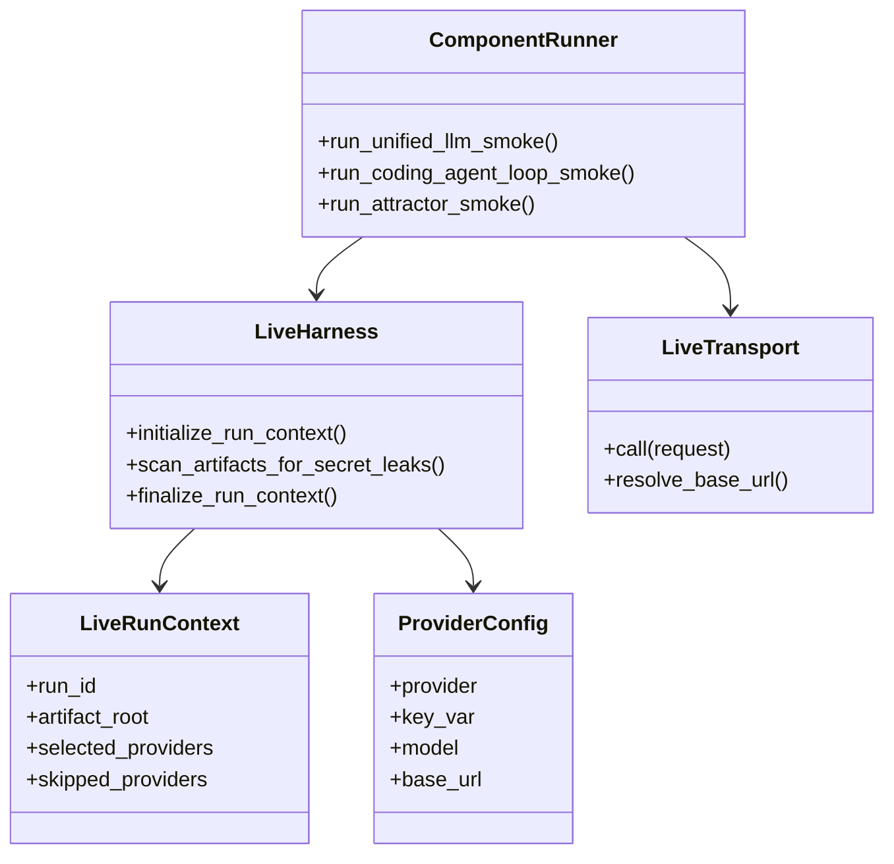
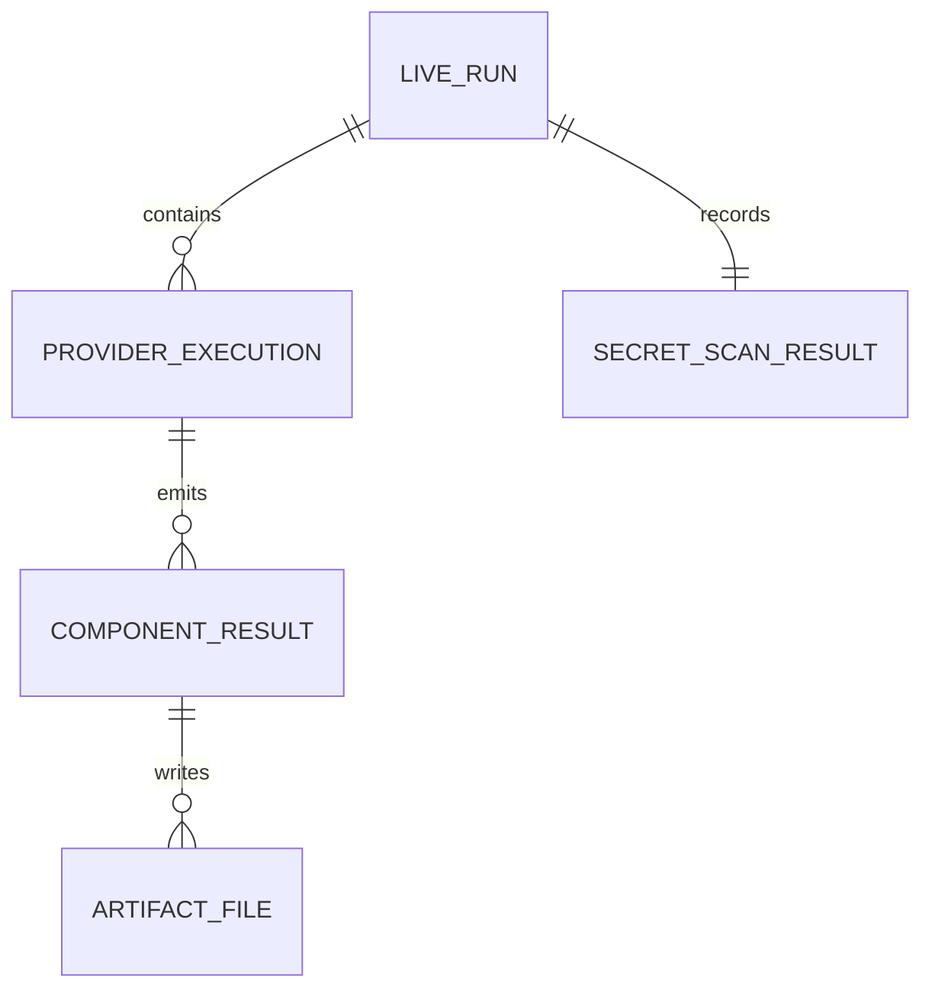
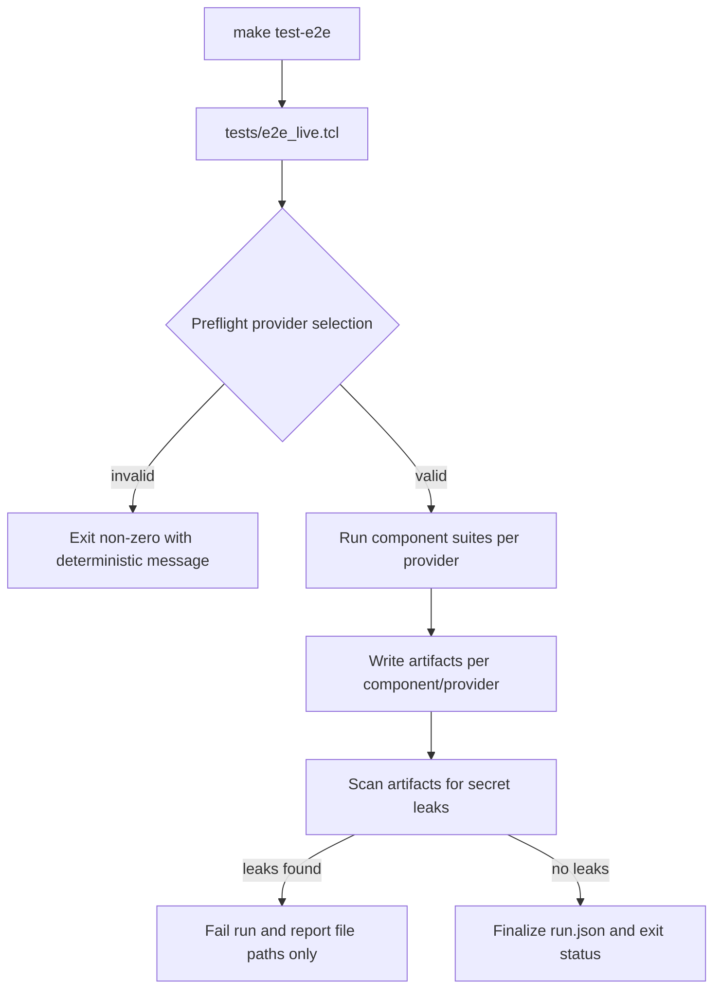
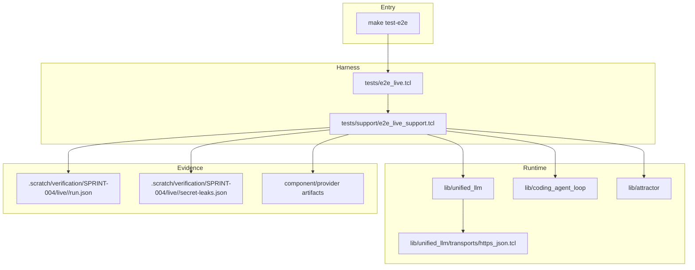

Legend: [ ] Incomplete, [X] Complete

# Sprint #004 Comprehensive Implementation Plan - Live E2E Smoke Suite (`make test-e2e`)

## Review Findings From `SPRINT-004-live-e2e-make-test-e2e.md`
- The sprint intent, scope, and architecture decisions are already defined and mostly implemented in code.
- The remaining completion gap is not feature design; it is execution closure for credentialed live-provider passes and evidence capture for open acceptance criteria.
- The source sprint document currently mixes planning and execution evidence; this plan separates implementation sequencing and closeout responsibilities.

## Objective
Close Sprint #004 end-to-end by delivering a reproducible, auditable live E2E execution program that:
- passes `make test-e2e` for at least one configured provider
- preserves deterministic fail-fast behavior when provider selection or credentials are invalid
- proves zero secret leakage across logs/artifacts
- leaves sprint completion state and evidence synchronized with reality

## Scope
In scope:
- Live E2E harness execution closure for Unified LLM, Coding Agent Loop, and Attractor.
- Provider-by-provider credentialed run orchestration and artifact verification.
- Negative-path verification for missing keys, explicit missing-provider requests, and invalid-key failures.
- Documentation and sprint closeout updates with exact evidence links.

Out of scope:
- CI-default execution for live tests.
- New provider integrations beyond `openai`, `anthropic`, and `gemini`.
- Any changes unrelated to Sprint #004 live smoke validation.

## Current Baseline and Open Gaps
- Completed in source sprint: transport injection, redaction behavior, live harness scaffolding, provider-specific live test definitions, `make test-e2e` target, and run artifacts.
- Open in source sprint:
  - Phase 2 acceptance: credentialed positive live Unified LLM pass evidence.
  - Phase 3 acceptance: credentialed positive live Coding Agent Loop pass evidence.
  - Phase 4 acceptance: credentialed positive live Attractor pass evidence.
  - Phase 5 acceptance: full `make test-e2e` pass with at least one valid provider.

## Evidence Contract
- Evidence root: `.scratch/verification/SPRINT-004/implementation-plan/<execution_id>/`
- Required index files:
  - `command-status-all.tsv`
  - `phase-*/command-status.tsv`
  - `phase-*/summary.md`
- Live run artifacts:
  - `.scratch/verification/SPRINT-004/live/<run_id>/run.json`
  - `.scratch/verification/SPRINT-004/live/<run_id>/secret-leaks.json`
  - component/provider artifacts under `unified_llm/`, `coding_agent_loop/`, `attractor/`

## Execution Order
1. Phase 0: Baseline Reconciliation and Evidence Scaffolding
2. Phase 1: Live Harness and Provider-Selection Closure
3. Phase 2: Unified LLM Credentialed Live Validation
4. Phase 3: Coding Agent Loop Credentialed Live Validation
5. Phase 4: Attractor Credentialed Live Validation
6. Phase 5: Make Target, Documentation, ADR, and Sprint Closeout

## Phase 0 - Baseline Reconciliation and Evidence Scaffolding
### Deliverables
- [ ] Re-verify baseline deterministic suite isolation from live execution (`make -j10 test` excludes live tests).
```text
{placeholder for verification justification/reasoning and evidence log}
```
- [ ] Create implementation-plan evidence directory tree and command status ledgers for all phases.
```text
{placeholder for verification justification/reasoning and evidence log}
```
- [ ] Capture current open acceptance criteria from `SPRINT-004-live-e2e-make-test-e2e.md` into a closure tracker table in this plan.
```text
{placeholder for verification justification/reasoning and evidence log}
```

### Positive Test Plan - Phase 0
- `make -j10 test` passes and does not source any `tests/e2e_live/*.test` files.
- `tclsh tests/e2e_live.tcl -list` lists live suites separately from offline suite.
- Evidence index files are created and writable.

### Negative Test Plan - Phase 0
- Invoking live harness with no keys exits non-zero before any network call.
- Invoking live harness with explicit provider allowlist and missing key exits non-zero before any network call.

### Acceptance Criteria - Phase 0
- [ ] Baseline and evidence scaffolding are reproducible from command logs and phase summaries.
```text
{placeholder for verification justification/reasoning and evidence log}
```
- [ ] Closure tracker identifies each open sprint acceptance item with a mapped execution owner and verification command.
```text
{placeholder for verification justification/reasoning and evidence log}
```

## Phase 1 - Live Harness and Provider-Selection Closure
### Deliverables
- [ ] Validate provider-selection semantics across all combinations of environment inputs (`E2E_LIVE_PROVIDERS`, present/missing key vars).
```text
{placeholder for verification justification/reasoning and evidence log}
```
- [ ] Verify run metadata output (`run.json`) includes selected providers, skipped providers, selected components, and timestamps.
```text
{placeholder for verification justification/reasoning and evidence log}
```
- [ ] Verify per-component artifact path construction for each selected provider.
```text
{placeholder for verification justification/reasoning and evidence log}
```
- [ ] Verify secret-leak post-scan behavior for pass and fail states, including path-only leak reporting.
```text
{placeholder for verification justification/reasoning and evidence log}
```

### Positive Test Plan - Phase 1
- Default selection picks all providers with configured keys.
- Explicit allowlist runs only requested providers with configured keys.
- `run.json` and `secret-leaks.json` are created for every run.

### Negative Test Plan - Phase 1
- Unknown provider in `E2E_LIVE_PROVIDERS` fails deterministically.
- Requested provider missing key fails deterministically.
- Synthetic leak fixture triggers leak scanner failure and path-only report.

### Acceptance Criteria - Phase 1
- [ ] Harness preflight behavior is deterministic across provider-selection edge cases.
```text
{placeholder for verification justification/reasoning and evidence log}
```
- [ ] Artifact root and summary metadata are complete and auditable for each run.
```text
{placeholder for verification justification/reasoning and evidence log}
```

## Phase 2 - Unified LLM Credentialed Live Validation
### Deliverables
- [ ] Execute credentialed OpenAI live smoke and invalid-key tests, capture pass/fail artifacts and response evidence.
```text
{placeholder for verification justification/reasoning and evidence log}
```
- [ ] Execute credentialed Anthropic live smoke and invalid-key tests, capture pass/fail artifacts and response evidence.
```text
{placeholder for verification justification/reasoning and evidence log}
```
- [ ] Execute credentialed Gemini live smoke and invalid-key tests, capture pass/fail artifacts and response evidence.
```text
{placeholder for verification justification/reasoning and evidence log}
```
- [ ] Verify redaction invariants in persisted response metadata (`response.request.headers`) for each provider.
```text
{placeholder for verification justification/reasoning and evidence log}
```

### Positive Test Plan - Phase 2
- For each selected provider: non-empty response text (or provider-expected live signal), provider usage tokens populated, and response artifact written.
- Provider-specific live markers validate real transport path:
  - OpenAI/Anthropic provider-generated response ID.
  - Gemini `raw.candidates` presence.

### Negative Test Plan - Phase 2
- Invalid-key requests fail with `UNIFIED_LLM TRANSPORT HTTP <provider> <status>` errorcode shape.
- Failure surfaces contain no real key value.
- Unselected providers with missing keys are skipped, not failed.

### Acceptance Criteria - Phase 2
- [ ] At least one configured provider passes Unified LLM live smoke under `make test-e2e`.
```text
{placeholder for verification justification/reasoning and evidence log}
```
- [ ] Unified LLM artifacts for each selected provider are present under `.scratch/verification/SPRINT-004/live/<run_id>/unified_llm/`.
```text
{placeholder for verification justification/reasoning and evidence log}
```

## Phase 3 - Coding Agent Loop Credentialed Live Validation
### Deliverables
- [ ] Execute live smoke and invalid-key tests for Coding Agent Loop on each selected provider.
```text
{placeholder for verification justification/reasoning and evidence log}
```
- [ ] Verify required event contract (`SESSION_START`, `USER_INPUT`, `ASSISTANT_TEXT_END`) across selected providers.
```text
{placeholder for verification justification/reasoning and evidence log}
```
- [ ] Verify default-client set/restore isolation during per-provider test execution.
```text
{placeholder for verification justification/reasoning and evidence log}
```

### Positive Test Plan - Phase 3
- For each selected provider: session submit returns non-empty assistant text.
- Required event types are present in emitted event stream.
- Per-provider artifacts are written to `coding_agent_loop/<provider>/response.json`.

### Negative Test Plan - Phase 3
- Invalid-key submit fails with deterministic transport HTTP errorcode shape.
- No secret values appear in failure artifacts.
- A provider failure does not corrupt subsequent provider default-client behavior.

### Acceptance Criteria - Phase 3
- [ ] At least one configured provider passes Coding Agent Loop live smoke under `make test-e2e`.
```text
{placeholder for verification justification/reasoning and evidence log}
```
- [ ] Coding Agent Loop artifacts for each selected provider are present under `.scratch/verification/SPRINT-004/live/<run_id>/coding_agent_loop/`.
```text
{placeholder for verification justification/reasoning and evidence log}
```

## Phase 4 - Attractor Credentialed Live Validation
### Deliverables
- [ ] Execute live smoke and invalid-key tests for Attractor on each selected provider using the live backend.
```text
{placeholder for verification justification/reasoning and evidence log}
```
- [ ] Verify minimal pipeline success path (`start -> build/codergen -> exit`) and required artifacts (`checkpoint.json`, node status/prompt/response files).
```text
{placeholder for verification justification/reasoning and evidence log}
```
- [ ] Verify deterministic invalid-key failure capture in `invalid-key-failure.json` with redaction guarantees.
```text
{placeholder for verification justification/reasoning and evidence log}
```

### Positive Test Plan - Phase 4
- For each selected provider: `attractor::run` returns success status on smoke graph.
- `checkpoint.json`, `status.json`, `prompt.md`, and `response.md` exist per run.
- `summary.json` captures result and provider metadata.

### Negative Test Plan - Phase 4
- Invalid-key backend run fails with deterministic transport HTTP errorcode shape.
- Failure artifacts are generated even on runtime failure.
- Secret leak scan remains clean after failed run artifacts are written.

### Acceptance Criteria - Phase 4
- [ ] At least one configured provider passes Attractor live smoke under `make test-e2e`.
```text
{placeholder for verification justification/reasoning and evidence log}
```
- [ ] Attractor artifacts for each selected provider are present under `.scratch/verification/SPRINT-004/live/<run_id>/attractor/`.
```text
{placeholder for verification justification/reasoning and evidence log}
```

## Phase 5 - Make Target, Documentation, ADR, and Sprint Closeout
### Deliverables
- [ ] Re-verify `make test-e2e` orchestration: fail-fast without keys, pass with at least one valid provider configuration.
```text
{placeholder for verification justification/reasoning and evidence log}
```
- [ ] Update `docs/sprints/SPRINT-004-live-e2e-make-test-e2e.md` completion checkboxes and evidence blocks to reflect verified final state.
```text
{placeholder for verification justification/reasoning and evidence log}
```
- [ ] Update `docs/howto/live-e2e.md` with any provider/model compatibility findings discovered during credentialed validation.
```text
{placeholder for verification justification/reasoning and evidence log}
```
- [ ] Append ADR follow-up entry in `docs/ADR.md` if provider-execution findings introduce architecture-impacting decisions.
```text
{placeholder for verification justification/reasoning and evidence log}
```
- [ ] Render and verify all appendix mermaid diagrams with `mmdc` into `.scratch/diagram-renders/sprint-004/implementation-plan/`.
```text
{placeholder for verification justification/reasoning and evidence log}
```

### Positive Test Plan - Phase 5
- `make test-e2e` returns zero exit status with at least one valid configured provider.
- Sprint and how-to docs contain accurate commands, expected outputs, and evidence paths.
- Diagram renders exist and are inspectable.

### Negative Test Plan - Phase 5
- Empty credential environment continues to fail fast with clear diagnostic.
- Invalid-provider request path remains deterministic and preflight-only.
- Secret-scan failure blocks closeout status updates.

### Acceptance Criteria - Phase 5
- [ ] All open acceptance criteria from `SPRINT-004-live-e2e-make-test-e2e.md` are closed with verified evidence references.
```text
{placeholder for verification justification/reasoning and evidence log}
```
- [ ] Final closeout run includes command list with exit codes and artifact paths proving pass/fail behavior and secret-scan status.
```text
{placeholder for verification justification/reasoning and evidence log}
```

## Cross-Component Explicit Test Matrix
### Positive Cases
- Provider selection defaults to configured keys and executes all three components.
- Unified LLM live generation returns provider-valid payload shape and non-empty output.
- Coding Agent Loop session completes naturally with required event types.
- Attractor minimal graph run succeeds and writes checkpoint plus node artifacts.

### Negative Cases
- No keys configured: deterministic preflight failure with non-zero exit.
- Explicit requested provider missing key: deterministic preflight failure with non-zero exit.
- Invalid key per provider: deterministic HTTP transport errorcode shape in each component.
- Secret leakage attempt: scan detects exact key material in artifacts and fails run while reporting only file paths.

## Appendix - Mermaid Diagrams (Render-Verified via `mmdc`)

### Core Domain Models


### E-R Diagram


### Workflow Diagram


### Data-Flow Diagram

```mermaid
%% Source: .scratch/diagrams/sprint-004/implementation-plan/dataflow.mmd
flowchart LR
  ENV[Environment Variables] --> PRE[Preflight Resolver]
  PRE --> CFG[Provider Config Map]
  CFG --> EXEC[Live Component Execution]
  EXEC --> RESP[Provider HTTP Responses]
  RESP --> ART[Redacted Artifacts]
  ART --> SCAN[Secret Leak Scanner]
  SCAN --> SUM[run.json + secret-leaks.json]
```


### Architecture Diagram

