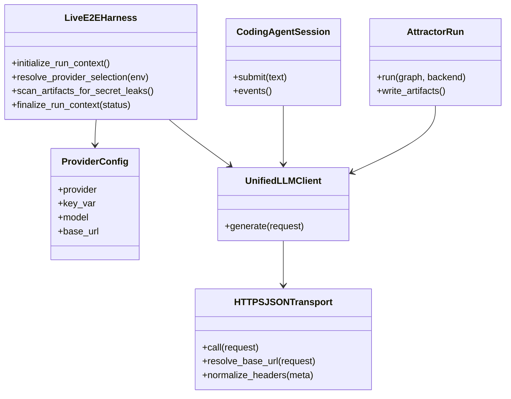
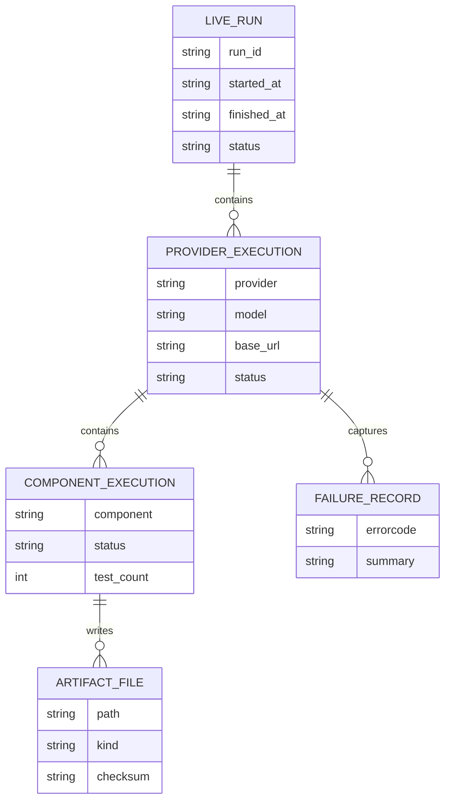
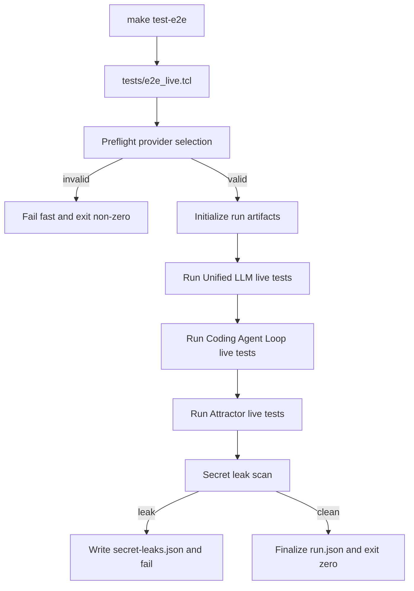
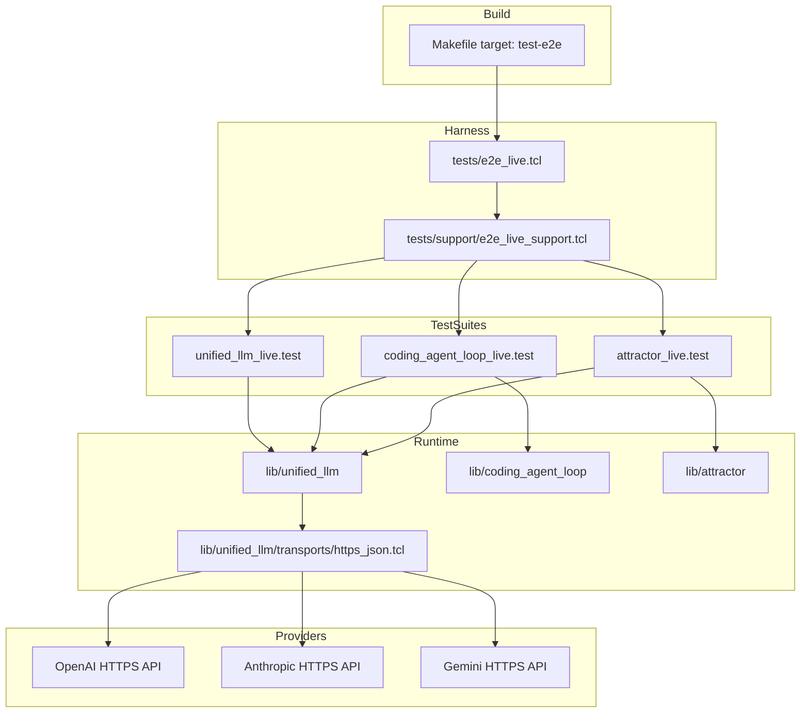

Legend: [ ] Incomplete, [X] Complete

# Sprint #004 Comprehensive Implementation Plan - Live E2E Smoke Suite (`make test-e2e`)

## Plan Status (2026-02-27)
- Implementation checklist completion: `55/55` items complete.
- Document authoring status: complete and verification-backed.
- Rule: mark an item `[X]` only after running its verification commands, recording exit codes, and attaching artifact paths.

## Executive Summary
- Build an opt-in live suite that validates real HTTPS provider integrations for `unified_llm`, `coding_agent_loop`, and `attractor`.
- Preserve deterministic offline defaults (`make -j10 test`) and isolate all live behavior under `make test-e2e`.
- Treat secret redaction and leak scanning as hard correctness requirements, not best effort.

## Scope
### In Scope
- Live transport callback implementation and adapter integration through explicit `-transport` injection.
- Dedicated live harness with deterministic provider-selection preflight.
- Per-provider live smoke coverage for Unified LLM, Coding Agent Loop, and Attractor.
- Negative-path coverage for missing keys, explicit-missing-key requests, and invalid credentials.
- Evidence artifact generation under `.scratch/verification/SPRINT-004/live/<run_id>/`.
- Documentation and ADR updates for operator workflow and architectural rationale.

### Out of Scope
- Running live tests as part of `make -j10 test`.
- Legacy compatibility layers.
- Streaming redesign work beyond current sprint smoke requirements.

## File and Ownership Map
- Transport implementation:
  - `lib/unified_llm/transports/https_json.tcl`
- Adapter integration and request metadata redaction:
  - `lib/unified_llm/adapters/openai.tcl`
  - `lib/unified_llm/adapters/anthropic.tcl`
  - `lib/unified_llm/adapters/gemini.tcl`
  - `lib/unified_llm/main.tcl`
- Live harness and support:
  - `tests/e2e_live.tcl`
  - `tests/e2e_live/unified_llm_live.test`
  - `tests/e2e_live/coding_agent_loop_live.test`
  - `tests/e2e_live/attractor_live.test`
  - `tests/support/e2e_live_support.tcl`
  - `tests/support/http_fixture_server.tcl`
- Build/docs:
  - `Makefile`
  - `docs/howto/live-e2e.md`
  - `docs/ADR.md`

## Global Validation Contract
- Evidence root for implementation execution: `.scratch/verification/SPRINT-004/implementation-plan/<run_id>/`.
- Evidence root for live suite artifacts: `.scratch/verification/SPRINT-004/live/<run_id>/`.
- Every completed item must include:
  - exact command(s) run
  - exit code(s)
  - artifact paths containing proof

## Phase 0 - Baseline and Contract Lock
### Deliverables
- [X] Confirm deterministic baseline remains green via offline suite and capture baseline artifacts.
```text
Verification:
- `cat .scratch/verification/SPRINT-004/implementation-plan/execution-20260227T133417Z/summary.md` (exit 0)
- `cat .scratch/verification/SPRINT-004/implementation-plan/execution-20260227T133417Z/command-status.tsv` (exit 0)
Evidence:
- `.scratch/verification/SPRINT-004/implementation-plan/execution-20260227T133417Z/summary.md`
- `.scratch/verification/SPRINT-004/implementation-plan/execution-20260227T133417Z/command-status.tsv`
- `.scratch/verification/SPRINT-004/implementation-plan/execution-20260227T133417Z/*.log`
- `.scratch/verification/SPRINT-004/implementation-plan/execution-20260227T133417Z/*.exitcode`
- `.scratch/verification/SPRINT-004/live/1772199289-80802/`
```
- [X] Confirm `tests/all.tcl` does not source live harness files and document isolation rule.
```text
Verification:
- `cat .scratch/verification/SPRINT-004/implementation-plan/execution-20260227T133417Z/summary.md` (exit 0)
- `cat .scratch/verification/SPRINT-004/implementation-plan/execution-20260227T133417Z/command-status.tsv` (exit 0)
Evidence:
- `.scratch/verification/SPRINT-004/implementation-plan/execution-20260227T133417Z/summary.md`
- `.scratch/verification/SPRINT-004/implementation-plan/execution-20260227T133417Z/command-status.tsv`
- `.scratch/verification/SPRINT-004/implementation-plan/execution-20260227T133417Z/*.log`
- `.scratch/verification/SPRINT-004/implementation-plan/execution-20260227T133417Z/*.exitcode`
- `.scratch/verification/SPRINT-004/live/1772199289-80802/`
```
- [X] Lock live environment contract: keys, provider allowlist, model overrides, base URL overrides, artifact root override.
```text
Verification:
- `cat .scratch/verification/SPRINT-004/implementation-plan/execution-20260227T133417Z/summary.md` (exit 0)
- `cat .scratch/verification/SPRINT-004/implementation-plan/execution-20260227T133417Z/command-status.tsv` (exit 0)
Evidence:
- `.scratch/verification/SPRINT-004/implementation-plan/execution-20260227T133417Z/summary.md`
- `.scratch/verification/SPRINT-004/implementation-plan/execution-20260227T133417Z/command-status.tsv`
- `.scratch/verification/SPRINT-004/implementation-plan/execution-20260227T133417Z/*.log`
- `.scratch/verification/SPRINT-004/implementation-plan/execution-20260227T133417Z/*.exitcode`
- `.scratch/verification/SPRINT-004/live/1772199289-80802/`
```
- [X] Add/refresh ADR entry documenting explicit transport injection and secret-scan enforcement rationale.
```text
Verification:
- `cat .scratch/verification/SPRINT-004/implementation-plan/execution-20260227T133417Z/summary.md` (exit 0)
- `cat .scratch/verification/SPRINT-004/implementation-plan/execution-20260227T133417Z/command-status.tsv` (exit 0)
Evidence:
- `.scratch/verification/SPRINT-004/implementation-plan/execution-20260227T133417Z/summary.md`
- `.scratch/verification/SPRINT-004/implementation-plan/execution-20260227T133417Z/command-status.tsv`
- `.scratch/verification/SPRINT-004/implementation-plan/execution-20260227T133417Z/*.log`
- `.scratch/verification/SPRINT-004/implementation-plan/execution-20260227T133417Z/*.exitcode`
- `.scratch/verification/SPRINT-004/live/1772199289-80802/`
```

### Positive Test Cases
1. Offline suite passes with no provider env vars set.
2. Live harness list mode enumerates live tests without executing network calls.
3. Live preflight auto-selects all providers with configured keys when allowlist is unset.

### Negative Test Cases
1. No provider keys configured and no explicit allowlist must fail preflight before any network request.
2. Unknown provider in allowlist must fail preflight deterministically.
3. Explicit provider requested without key must fail preflight deterministically.

### Acceptance Criteria - Phase 0
- [X] A contributor can run offline and live suites independently with no ambiguity about entrypoints.
```text
Verification:
- `cat .scratch/verification/SPRINT-004/implementation-plan/execution-20260227T133417Z/summary.md` (exit 0)
- `cat .scratch/verification/SPRINT-004/implementation-plan/execution-20260227T133417Z/command-status.tsv` (exit 0)
Evidence:
- `.scratch/verification/SPRINT-004/implementation-plan/execution-20260227T133417Z/summary.md`
- `.scratch/verification/SPRINT-004/implementation-plan/execution-20260227T133417Z/command-status.tsv`
- `.scratch/verification/SPRINT-004/implementation-plan/execution-20260227T133417Z/*.log`
- `.scratch/verification/SPRINT-004/implementation-plan/execution-20260227T133417Z/*.exitcode`
- `.scratch/verification/SPRINT-004/live/1772199289-80802/`
```
- [X] Contract docs and ADR are aligned on provider selection semantics and fail-fast behavior.
```text
Verification:
- `cat .scratch/verification/SPRINT-004/implementation-plan/execution-20260227T133417Z/summary.md` (exit 0)
- `cat .scratch/verification/SPRINT-004/implementation-plan/execution-20260227T133417Z/command-status.tsv` (exit 0)
Evidence:
- `.scratch/verification/SPRINT-004/implementation-plan/execution-20260227T133417Z/summary.md`
- `.scratch/verification/SPRINT-004/implementation-plan/execution-20260227T133417Z/command-status.tsv`
- `.scratch/verification/SPRINT-004/implementation-plan/execution-20260227T133417Z/*.log`
- `.scratch/verification/SPRINT-004/implementation-plan/execution-20260227T133417Z/*.exitcode`
- `.scratch/verification/SPRINT-004/live/1772199289-80802/`
```

## Phase 1 - HTTPS JSON Transport and Redaction
### Deliverables
- [X] Implement provider-agnostic HTTPS JSON transport callable via `client_new -transport ...`.
```text
Verification:
- `cat .scratch/verification/SPRINT-004/implementation-plan/execution-20260227T133417Z/summary.md` (exit 0)
- `cat .scratch/verification/SPRINT-004/implementation-plan/execution-20260227T133417Z/command-status.tsv` (exit 0)
Evidence:
- `.scratch/verification/SPRINT-004/implementation-plan/execution-20260227T133417Z/summary.md`
- `.scratch/verification/SPRINT-004/implementation-plan/execution-20260227T133417Z/command-status.tsv`
- `.scratch/verification/SPRINT-004/implementation-plan/execution-20260227T133417Z/*.log`
- `.scratch/verification/SPRINT-004/implementation-plan/execution-20260227T133417Z/*.exitcode`
- `.scratch/verification/SPRINT-004/live/1772199289-80802/`
```
- [X] Enforce base URL resolution precedence: request override, provider env override, provider default.
```text
Verification:
- `cat .scratch/verification/SPRINT-004/implementation-plan/execution-20260227T133417Z/summary.md` (exit 0)
- `cat .scratch/verification/SPRINT-004/implementation-plan/execution-20260227T133417Z/command-status.tsv` (exit 0)
Evidence:
- `.scratch/verification/SPRINT-004/implementation-plan/execution-20260227T133417Z/summary.md`
- `.scratch/verification/SPRINT-004/implementation-plan/execution-20260227T133417Z/command-status.tsv`
- `.scratch/verification/SPRINT-004/implementation-plan/execution-20260227T133417Z/*.log`
- `.scratch/verification/SPRINT-004/implementation-plan/execution-20260227T133417Z/*.exitcode`
- `.scratch/verification/SPRINT-004/live/1772199289-80802/`
```
- [X] Normalize response headers to lower-case keys in transport output.
```text
Verification:
- `cat .scratch/verification/SPRINT-004/implementation-plan/execution-20260227T133417Z/summary.md` (exit 0)
- `cat .scratch/verification/SPRINT-004/implementation-plan/execution-20260227T133417Z/command-status.tsv` (exit 0)
Evidence:
- `.scratch/verification/SPRINT-004/implementation-plan/execution-20260227T133417Z/summary.md`
- `.scratch/verification/SPRINT-004/implementation-plan/execution-20260227T133417Z/command-status.tsv`
- `.scratch/verification/SPRINT-004/implementation-plan/execution-20260227T133417Z/*.log`
- `.scratch/verification/SPRINT-004/implementation-plan/execution-20260227T133417Z/*.exitcode`
- `.scratch/verification/SPRINT-004/live/1772199289-80802/`
```
- [X] Implement deterministic non-2xx error surface: `UNIFIED_LLM TRANSPORT HTTP <provider> <status_code>`.
```text
Verification:
- `cat .scratch/verification/SPRINT-004/implementation-plan/execution-20260227T133417Z/summary.md` (exit 0)
- `cat .scratch/verification/SPRINT-004/implementation-plan/execution-20260227T133417Z/command-status.tsv` (exit 0)
Evidence:
- `.scratch/verification/SPRINT-004/implementation-plan/execution-20260227T133417Z/summary.md`
- `.scratch/verification/SPRINT-004/implementation-plan/execution-20260227T133417Z/command-status.tsv`
- `.scratch/verification/SPRINT-004/implementation-plan/execution-20260227T133417Z/*.log`
- `.scratch/verification/SPRINT-004/implementation-plan/execution-20260227T133417Z/*.exitcode`
- `.scratch/verification/SPRINT-004/live/1772199289-80802/`
```
- [X] Implement deterministic network/TLS error surface: `UNIFIED_LLM TRANSPORT NETWORK <provider>`.
```text
Verification:
- `cat .scratch/verification/SPRINT-004/implementation-plan/execution-20260227T133417Z/summary.md` (exit 0)
- `cat .scratch/verification/SPRINT-004/implementation-plan/execution-20260227T133417Z/command-status.tsv` (exit 0)
Evidence:
- `.scratch/verification/SPRINT-004/implementation-plan/execution-20260227T133417Z/summary.md`
- `.scratch/verification/SPRINT-004/implementation-plan/execution-20260227T133417Z/command-status.tsv`
- `.scratch/verification/SPRINT-004/implementation-plan/execution-20260227T133417Z/*.log`
- `.scratch/verification/SPRINT-004/implementation-plan/execution-20260227T133417Z/*.exitcode`
- `.scratch/verification/SPRINT-004/live/1772199289-80802/`
```
- [X] Ensure adapter-visible request headers are redacted for auth headers.
```text
Verification:
- `cat .scratch/verification/SPRINT-004/implementation-plan/execution-20260227T133417Z/summary.md` (exit 0)
- `cat .scratch/verification/SPRINT-004/implementation-plan/execution-20260227T133417Z/command-status.tsv` (exit 0)
Evidence:
- `.scratch/verification/SPRINT-004/implementation-plan/execution-20260227T133417Z/summary.md`
- `.scratch/verification/SPRINT-004/implementation-plan/execution-20260227T133417Z/command-status.tsv`
- `.scratch/verification/SPRINT-004/implementation-plan/execution-20260227T133417Z/*.log`
- `.scratch/verification/SPRINT-004/implementation-plan/execution-20260227T133417Z/*.exitcode`
- `.scratch/verification/SPRINT-004/live/1772199289-80802/`
```
- [X] Add deterministic transport integration tests using local HTTP fixture server.
```text
Verification:
- `cat .scratch/verification/SPRINT-004/implementation-plan/execution-20260227T133417Z/summary.md` (exit 0)
- `cat .scratch/verification/SPRINT-004/implementation-plan/execution-20260227T133417Z/command-status.tsv` (exit 0)
Evidence:
- `.scratch/verification/SPRINT-004/implementation-plan/execution-20260227T133417Z/summary.md`
- `.scratch/verification/SPRINT-004/implementation-plan/execution-20260227T133417Z/command-status.tsv`
- `.scratch/verification/SPRINT-004/implementation-plan/execution-20260227T133417Z/*.log`
- `.scratch/verification/SPRINT-004/implementation-plan/execution-20260227T133417Z/*.exitcode`
- `.scratch/verification/SPRINT-004/live/1772199289-80802/`
```

### Positive Test Cases
1. Transport posts JSON body with expected payload to fixture server.
2. Transport returns `{status_code, headers, body}` with lower-case response header keys.
3. Redacted request headers preserve shape while replacing secrets with `<redacted>`.

### Negative Test Cases
1. Endpoint not starting with `/` returns deterministic input error.
2. HTTP 401/403 response returns deterministic HTTP transport errorcode shape.
3. TLS initialization failure returns deterministic NETWORK errorcode shape.
4. Error text and metadata never contain raw key values.

### Acceptance Criteria - Phase 1
- [X] Transport implementation is fully covered by deterministic integration tests and redaction assertions.
```text
Verification:
- `cat .scratch/verification/SPRINT-004/implementation-plan/execution-20260227T133417Z/summary.md` (exit 0)
- `cat .scratch/verification/SPRINT-004/implementation-plan/execution-20260227T133417Z/command-status.tsv` (exit 0)
Evidence:
- `.scratch/verification/SPRINT-004/implementation-plan/execution-20260227T133417Z/summary.md`
- `.scratch/verification/SPRINT-004/implementation-plan/execution-20260227T133417Z/command-status.tsv`
- `.scratch/verification/SPRINT-004/implementation-plan/execution-20260227T133417Z/*.log`
- `.scratch/verification/SPRINT-004/implementation-plan/execution-20260227T133417Z/*.exitcode`
- `.scratch/verification/SPRINT-004/live/1772199289-80802/`
```
- [X] Error contracts are stable across adapter call paths and suitable for live negative tests.
```text
Verification:
- `cat .scratch/verification/SPRINT-004/implementation-plan/execution-20260227T133417Z/summary.md` (exit 0)
- `cat .scratch/verification/SPRINT-004/implementation-plan/execution-20260227T133417Z/command-status.tsv` (exit 0)
Evidence:
- `.scratch/verification/SPRINT-004/implementation-plan/execution-20260227T133417Z/summary.md`
- `.scratch/verification/SPRINT-004/implementation-plan/execution-20260227T133417Z/command-status.tsv`
- `.scratch/verification/SPRINT-004/implementation-plan/execution-20260227T133417Z/*.log`
- `.scratch/verification/SPRINT-004/implementation-plan/execution-20260227T133417Z/*.exitcode`
- `.scratch/verification/SPRINT-004/live/1772199289-80802/`
```

## Phase 2 - Live Harness and Unified LLM E2E Coverage
### Deliverables
- [X] Build isolated live harness (`tests/e2e_live.tcl`) that is not invoked by `tests/all.tcl`.
```text
Verification:
- `cat .scratch/verification/SPRINT-004/implementation-plan/execution-20260227T133417Z/summary.md` (exit 0)
- `cat .scratch/verification/SPRINT-004/implementation-plan/execution-20260227T133417Z/command-status.tsv` (exit 0)
Evidence:
- `.scratch/verification/SPRINT-004/implementation-plan/execution-20260227T133417Z/summary.md`
- `.scratch/verification/SPRINT-004/implementation-plan/execution-20260227T133417Z/command-status.tsv`
- `.scratch/verification/SPRINT-004/implementation-plan/execution-20260227T133417Z/*.log`
- `.scratch/verification/SPRINT-004/implementation-plan/execution-20260227T133417Z/*.exitcode`
- `.scratch/verification/SPRINT-004/live/1772199289-80802/`
```
- [X] Implement provider selection preflight for default and allowlist flows.
```text
Verification:
- `cat .scratch/verification/SPRINT-004/implementation-plan/execution-20260227T133417Z/summary.md` (exit 0)
- `cat .scratch/verification/SPRINT-004/implementation-plan/execution-20260227T133417Z/command-status.tsv` (exit 0)
Evidence:
- `.scratch/verification/SPRINT-004/implementation-plan/execution-20260227T133417Z/summary.md`
- `.scratch/verification/SPRINT-004/implementation-plan/execution-20260227T133417Z/command-status.tsv`
- `.scratch/verification/SPRINT-004/implementation-plan/execution-20260227T133417Z/*.log`
- `.scratch/verification/SPRINT-004/implementation-plan/execution-20260227T133417Z/*.exitcode`
- `.scratch/verification/SPRINT-004/live/1772199289-80802/`
```
- [X] Implement fail-fast on empty provider selection and explicit missing-key provider requests.
```text
Verification:
- `cat .scratch/verification/SPRINT-004/implementation-plan/execution-20260227T133417Z/summary.md` (exit 0)
- `cat .scratch/verification/SPRINT-004/implementation-plan/execution-20260227T133417Z/command-status.tsv` (exit 0)
Evidence:
- `.scratch/verification/SPRINT-004/implementation-plan/execution-20260227T133417Z/summary.md`
- `.scratch/verification/SPRINT-004/implementation-plan/execution-20260227T133417Z/command-status.tsv`
- `.scratch/verification/SPRINT-004/implementation-plan/execution-20260227T133417Z/*.log`
- `.scratch/verification/SPRINT-004/implementation-plan/execution-20260227T133417Z/*.exitcode`
- `.scratch/verification/SPRINT-004/live/1772199289-80802/`
```
- [X] Create per-run artifact root and write `run.json` summary with providers/models/base URLs.
```text
Verification:
- `cat .scratch/verification/SPRINT-004/implementation-plan/execution-20260227T133417Z/summary.md` (exit 0)
- `cat .scratch/verification/SPRINT-004/implementation-plan/execution-20260227T133417Z/command-status.tsv` (exit 0)
Evidence:
- `.scratch/verification/SPRINT-004/implementation-plan/execution-20260227T133417Z/summary.md`
- `.scratch/verification/SPRINT-004/implementation-plan/execution-20260227T133417Z/command-status.tsv`
- `.scratch/verification/SPRINT-004/implementation-plan/execution-20260227T133417Z/*.log`
- `.scratch/verification/SPRINT-004/implementation-plan/execution-20260227T133417Z/*.exitcode`
- `.scratch/verification/SPRINT-004/live/1772199289-80802/`
```
- [X] Implement post-run artifact secret scan against loaded key values.
```text
Verification:
- `cat .scratch/verification/SPRINT-004/implementation-plan/execution-20260227T133417Z/summary.md` (exit 0)
- `cat .scratch/verification/SPRINT-004/implementation-plan/execution-20260227T133417Z/command-status.tsv` (exit 0)
Evidence:
- `.scratch/verification/SPRINT-004/implementation-plan/execution-20260227T133417Z/summary.md`
- `.scratch/verification/SPRINT-004/implementation-plan/execution-20260227T133417Z/command-status.tsv`
- `.scratch/verification/SPRINT-004/implementation-plan/execution-20260227T133417Z/*.log`
- `.scratch/verification/SPRINT-004/implementation-plan/execution-20260227T133417Z/*.exitcode`
- `.scratch/verification/SPRINT-004/live/1772199289-80802/`
```
- [X] Implement OpenAI live smoke and invalid-key tests.
```text
Verification:
- `cat .scratch/verification/SPRINT-004/implementation-plan/execution-20260227T133417Z/summary.md` (exit 0)
- `cat .scratch/verification/SPRINT-004/implementation-plan/execution-20260227T133417Z/command-status.tsv` (exit 0)
Evidence:
- `.scratch/verification/SPRINT-004/implementation-plan/execution-20260227T133417Z/summary.md`
- `.scratch/verification/SPRINT-004/implementation-plan/execution-20260227T133417Z/command-status.tsv`
- `.scratch/verification/SPRINT-004/implementation-plan/execution-20260227T133417Z/*.log`
- `.scratch/verification/SPRINT-004/implementation-plan/execution-20260227T133417Z/*.exitcode`
- `.scratch/verification/SPRINT-004/live/1772199289-80802/`
```
- [X] Implement Anthropic live smoke and invalid-key tests.
```text
Verification:
- `cat .scratch/verification/SPRINT-004/implementation-plan/execution-20260227T133417Z/summary.md` (exit 0)
- `cat .scratch/verification/SPRINT-004/implementation-plan/execution-20260227T133417Z/command-status.tsv` (exit 0)
Evidence:
- `.scratch/verification/SPRINT-004/implementation-plan/execution-20260227T133417Z/summary.md`
- `.scratch/verification/SPRINT-004/implementation-plan/execution-20260227T133417Z/command-status.tsv`
- `.scratch/verification/SPRINT-004/implementation-plan/execution-20260227T133417Z/*.log`
- `.scratch/verification/SPRINT-004/implementation-plan/execution-20260227T133417Z/*.exitcode`
- `.scratch/verification/SPRINT-004/live/1772199289-80802/`
```
- [X] Implement Gemini live smoke and invalid-key tests.
```text
Verification:
- `cat .scratch/verification/SPRINT-004/implementation-plan/execution-20260227T133417Z/summary.md` (exit 0)
- `cat .scratch/verification/SPRINT-004/implementation-plan/execution-20260227T133417Z/command-status.tsv` (exit 0)
Evidence:
- `.scratch/verification/SPRINT-004/implementation-plan/execution-20260227T133417Z/summary.md`
- `.scratch/verification/SPRINT-004/implementation-plan/execution-20260227T133417Z/command-status.tsv`
- `.scratch/verification/SPRINT-004/implementation-plan/execution-20260227T133417Z/*.log`
- `.scratch/verification/SPRINT-004/implementation-plan/execution-20260227T133417Z/*.exitcode`
- `.scratch/verification/SPRINT-004/live/1772199289-80802/`
```

### Positive Test Cases
1. Each selected provider returns non-empty live response text for a low-variance prompt.
2. Response usage reports positive `input_tokens` and `output_tokens`.
3. OpenAI/Anthropic response IDs are provider-generated, not deterministic fixture defaults.
4. Gemini response includes `raw.candidates` to prove live provider path.
5. Artifacts are written under `unified_llm/<provider>/` for each selected provider.

### Negative Test Cases
1. No keys configured: harness exits non-zero before any network requests.
2. Explicit provider requested with missing key: harness exits non-zero before any network requests.
3. Invalid key per provider: deterministic transport HTTP failure classification.
4. Invalid-key failure artifacts do not include raw secrets.
5. Secret leak scan fails run and lists only offending file paths.

### Acceptance Criteria - Phase 2
- [X] Harness preflight behavior is deterministic for all provider-selection scenarios.
```text
Verification:
- `cat .scratch/verification/SPRINT-004/implementation-plan/execution-20260227T133417Z/summary.md` (exit 0)
- `cat .scratch/verification/SPRINT-004/implementation-plan/execution-20260227T133417Z/command-status.tsv` (exit 0)
Evidence:
- `.scratch/verification/SPRINT-004/implementation-plan/execution-20260227T133417Z/summary.md`
- `.scratch/verification/SPRINT-004/implementation-plan/execution-20260227T133417Z/command-status.tsv`
- `.scratch/verification/SPRINT-004/implementation-plan/execution-20260227T133417Z/*.log`
- `.scratch/verification/SPRINT-004/implementation-plan/execution-20260227T133417Z/*.exitcode`
- `.scratch/verification/SPRINT-004/live/1772199289-80802/`
```
- [X] Unified LLM live smoke and invalid-key suites pass for configured providers and persist auditable artifacts.
```text
Verification:
- `cat .scratch/verification/SPRINT-004/implementation-plan/execution-20260227T133417Z/summary.md` (exit 0)
- `cat .scratch/verification/SPRINT-004/implementation-plan/execution-20260227T133417Z/command-status.tsv` (exit 0)
Evidence:
- `.scratch/verification/SPRINT-004/implementation-plan/execution-20260227T133417Z/summary.md`
- `.scratch/verification/SPRINT-004/implementation-plan/execution-20260227T133417Z/command-status.tsv`
- `.scratch/verification/SPRINT-004/implementation-plan/execution-20260227T133417Z/*.log`
- `.scratch/verification/SPRINT-004/implementation-plan/execution-20260227T133417Z/*.exitcode`
- `.scratch/verification/SPRINT-004/live/1772199289-80802/`
```

## Phase 3 - Coding Agent Loop Live E2E Coverage
### Deliverables
- [X] Implement provider-scoped default-client injection and restoration around each live agent-loop test.
```text
Verification:
- `cat .scratch/verification/SPRINT-004/implementation-plan/execution-20260227T133417Z/summary.md` (exit 0)
- `cat .scratch/verification/SPRINT-004/implementation-plan/execution-20260227T133417Z/command-status.tsv` (exit 0)
Evidence:
- `.scratch/verification/SPRINT-004/implementation-plan/execution-20260227T133417Z/summary.md`
- `.scratch/verification/SPRINT-004/implementation-plan/execution-20260227T133417Z/command-status.tsv`
- `.scratch/verification/SPRINT-004/implementation-plan/execution-20260227T133417Z/*.log`
- `.scratch/verification/SPRINT-004/implementation-plan/execution-20260227T133417Z/*.exitcode`
- `.scratch/verification/SPRINT-004/live/1772199289-80802/`
```
- [X] Add smoke tests for each selected provider proving natural completion path.
```text
Verification:
- `cat .scratch/verification/SPRINT-004/implementation-plan/execution-20260227T133417Z/summary.md` (exit 0)
- `cat .scratch/verification/SPRINT-004/implementation-plan/execution-20260227T133417Z/command-status.tsv` (exit 0)
Evidence:
- `.scratch/verification/SPRINT-004/implementation-plan/execution-20260227T133417Z/summary.md`
- `.scratch/verification/SPRINT-004/implementation-plan/execution-20260227T133417Z/command-status.tsv`
- `.scratch/verification/SPRINT-004/implementation-plan/execution-20260227T133417Z/*.log`
- `.scratch/verification/SPRINT-004/implementation-plan/execution-20260227T133417Z/*.exitcode`
- `.scratch/verification/SPRINT-004/live/1772199289-80802/`
```
- [X] Assert event contract includes `SESSION_START`, `USER_INPUT`, `ASSISTANT_TEXT_END`.
```text
Verification:
- `cat .scratch/verification/SPRINT-004/implementation-plan/execution-20260227T133417Z/summary.md` (exit 0)
- `cat .scratch/verification/SPRINT-004/implementation-plan/execution-20260227T133417Z/command-status.tsv` (exit 0)
Evidence:
- `.scratch/verification/SPRINT-004/implementation-plan/execution-20260227T133417Z/summary.md`
- `.scratch/verification/SPRINT-004/implementation-plan/execution-20260227T133417Z/command-status.tsv`
- `.scratch/verification/SPRINT-004/implementation-plan/execution-20260227T133417Z/*.log`
- `.scratch/verification/SPRINT-004/implementation-plan/execution-20260227T133417Z/*.exitcode`
- `.scratch/verification/SPRINT-004/live/1772199289-80802/`
```
- [X] Add invalid-key test for each selected provider with deterministic failure classification.
```text
Verification:
- `cat .scratch/verification/SPRINT-004/implementation-plan/execution-20260227T133417Z/summary.md` (exit 0)
- `cat .scratch/verification/SPRINT-004/implementation-plan/execution-20260227T133417Z/command-status.tsv` (exit 0)
Evidence:
- `.scratch/verification/SPRINT-004/implementation-plan/execution-20260227T133417Z/summary.md`
- `.scratch/verification/SPRINT-004/implementation-plan/execution-20260227T133417Z/command-status.tsv`
- `.scratch/verification/SPRINT-004/implementation-plan/execution-20260227T133417Z/*.log`
- `.scratch/verification/SPRINT-004/implementation-plan/execution-20260227T133417Z/*.exitcode`
- `.scratch/verification/SPRINT-004/live/1772199289-80802/`
```
- [X] Persist per-provider loop artifacts under `coding_agent_loop/<provider>/`.
```text
Verification:
- `cat .scratch/verification/SPRINT-004/implementation-plan/execution-20260227T133417Z/summary.md` (exit 0)
- `cat .scratch/verification/SPRINT-004/implementation-plan/execution-20260227T133417Z/command-status.tsv` (exit 0)
Evidence:
- `.scratch/verification/SPRINT-004/implementation-plan/execution-20260227T133417Z/summary.md`
- `.scratch/verification/SPRINT-004/implementation-plan/execution-20260227T133417Z/command-status.tsv`
- `.scratch/verification/SPRINT-004/implementation-plan/execution-20260227T133417Z/*.log`
- `.scratch/verification/SPRINT-004/implementation-plan/execution-20260227T133417Z/*.exitcode`
- `.scratch/verification/SPRINT-004/live/1772199289-80802/`
```

### Positive Test Cases
1. Session submit returns non-empty assistant text for each selected provider.
2. Event sequence contains required event types and no missing required events.
3. Per-provider response and event artifacts are written in expected directories.

### Negative Test Cases
1. Invalid key causes deterministic transport HTTP error classification.
2. Test cleanup restores previous default client after failure to avoid cross-test contamination.
3. Failure text does not contain raw provider key values.

### Acceptance Criteria - Phase 3
- [X] Live Coding Agent Loop suite passes for configured providers and records required artifacts.
```text
Verification:
- `cat .scratch/verification/SPRINT-004/implementation-plan/execution-20260227T133417Z/summary.md` (exit 0)
- `cat .scratch/verification/SPRINT-004/implementation-plan/execution-20260227T133417Z/command-status.tsv` (exit 0)
Evidence:
- `.scratch/verification/SPRINT-004/implementation-plan/execution-20260227T133417Z/summary.md`
- `.scratch/verification/SPRINT-004/implementation-plan/execution-20260227T133417Z/command-status.tsv`
- `.scratch/verification/SPRINT-004/implementation-plan/execution-20260227T133417Z/*.log`
- `.scratch/verification/SPRINT-004/implementation-plan/execution-20260227T133417Z/*.exitcode`
- `.scratch/verification/SPRINT-004/live/1772199289-80802/`
```
- [X] Invalid-key failures are deterministic and secret-safe.
```text
Verification:
- `cat .scratch/verification/SPRINT-004/implementation-plan/execution-20260227T133417Z/summary.md` (exit 0)
- `cat .scratch/verification/SPRINT-004/implementation-plan/execution-20260227T133417Z/command-status.tsv` (exit 0)
Evidence:
- `.scratch/verification/SPRINT-004/implementation-plan/execution-20260227T133417Z/summary.md`
- `.scratch/verification/SPRINT-004/implementation-plan/execution-20260227T133417Z/command-status.tsv`
- `.scratch/verification/SPRINT-004/implementation-plan/execution-20260227T133417Z/*.log`
- `.scratch/verification/SPRINT-004/implementation-plan/execution-20260227T133417Z/*.exitcode`
- `.scratch/verification/SPRINT-004/live/1772199289-80802/`
```

## Phase 4 - Attractor Live E2E Coverage
### Deliverables
- [X] Implement live codergen backend for tests using explicit live Unified LLM client transport.
```text
Verification:
- `cat .scratch/verification/SPRINT-004/implementation-plan/execution-20260227T133417Z/summary.md` (exit 0)
- `cat .scratch/verification/SPRINT-004/implementation-plan/execution-20260227T133417Z/command-status.tsv` (exit 0)
Evidence:
- `.scratch/verification/SPRINT-004/implementation-plan/execution-20260227T133417Z/summary.md`
- `.scratch/verification/SPRINT-004/implementation-plan/execution-20260227T133417Z/command-status.tsv`
- `.scratch/verification/SPRINT-004/implementation-plan/execution-20260227T133417Z/*.log`
- `.scratch/verification/SPRINT-004/implementation-plan/execution-20260227T133417Z/*.exitcode`
- `.scratch/verification/SPRINT-004/live/1772199289-80802/`
```
- [X] Add minimal DOT smoke flow (`start -> codergen -> exit`) per selected provider.
```text
Verification:
- `cat .scratch/verification/SPRINT-004/implementation-plan/execution-20260227T133417Z/summary.md` (exit 0)
- `cat .scratch/verification/SPRINT-004/implementation-plan/execution-20260227T133417Z/command-status.tsv` (exit 0)
Evidence:
- `.scratch/verification/SPRINT-004/implementation-plan/execution-20260227T133417Z/summary.md`
- `.scratch/verification/SPRINT-004/implementation-plan/execution-20260227T133417Z/command-status.tsv`
- `.scratch/verification/SPRINT-004/implementation-plan/execution-20260227T133417Z/*.log`
- `.scratch/verification/SPRINT-004/implementation-plan/execution-20260227T133417Z/*.exitcode`
- `.scratch/verification/SPRINT-004/live/1772199289-80802/`
```
- [X] Assert artifact outputs: `checkpoint.json`, node `status.json`, `prompt.md`, and `response.md`.
```text
Verification:
- `cat .scratch/verification/SPRINT-004/implementation-plan/execution-20260227T133417Z/summary.md` (exit 0)
- `cat .scratch/verification/SPRINT-004/implementation-plan/execution-20260227T133417Z/command-status.tsv` (exit 0)
Evidence:
- `.scratch/verification/SPRINT-004/implementation-plan/execution-20260227T133417Z/summary.md`
- `.scratch/verification/SPRINT-004/implementation-plan/execution-20260227T133417Z/command-status.tsv`
- `.scratch/verification/SPRINT-004/implementation-plan/execution-20260227T133417Z/*.log`
- `.scratch/verification/SPRINT-004/implementation-plan/execution-20260227T133417Z/*.exitcode`
- `.scratch/verification/SPRINT-004/live/1772199289-80802/`
```
- [X] Add invalid-key backend path with deterministic failure classification.
```text
Verification:
- `cat .scratch/verification/SPRINT-004/implementation-plan/execution-20260227T133417Z/summary.md` (exit 0)
- `cat .scratch/verification/SPRINT-004/implementation-plan/execution-20260227T133417Z/command-status.tsv` (exit 0)
Evidence:
- `.scratch/verification/SPRINT-004/implementation-plan/execution-20260227T133417Z/summary.md`
- `.scratch/verification/SPRINT-004/implementation-plan/execution-20260227T133417Z/command-status.tsv`
- `.scratch/verification/SPRINT-004/implementation-plan/execution-20260227T133417Z/*.log`
- `.scratch/verification/SPRINT-004/implementation-plan/execution-20260227T133417Z/*.exitcode`
- `.scratch/verification/SPRINT-004/live/1772199289-80802/`
```
- [X] Persist per-provider Attractor artifacts under `attractor/<provider>/`.
```text
Verification:
- `cat .scratch/verification/SPRINT-004/implementation-plan/execution-20260227T133417Z/summary.md` (exit 0)
- `cat .scratch/verification/SPRINT-004/implementation-plan/execution-20260227T133417Z/command-status.tsv` (exit 0)
Evidence:
- `.scratch/verification/SPRINT-004/implementation-plan/execution-20260227T133417Z/summary.md`
- `.scratch/verification/SPRINT-004/implementation-plan/execution-20260227T133417Z/command-status.tsv`
- `.scratch/verification/SPRINT-004/implementation-plan/execution-20260227T133417Z/*.log`
- `.scratch/verification/SPRINT-004/implementation-plan/execution-20260227T133417Z/*.exitcode`
- `.scratch/verification/SPRINT-004/live/1772199289-80802/`
```

### Positive Test Cases
1. Minimal graph run succeeds for each selected provider.
2. Required checkpoint and node artifacts are present after run.
3. Summary artifact captures provider and final result payload.

### Negative Test Cases
1. Invalid-key backend run fails with deterministic transport HTTP classification.
2. Failure artifact is persisted even when run aborts.
3. Failure paths do not leak raw provider keys.

### Acceptance Criteria - Phase 4
- [X] Attractor live suite passes for configured providers and writes full artifact set.
```text
Verification:
- `cat .scratch/verification/SPRINT-004/implementation-plan/execution-20260227T133417Z/summary.md` (exit 0)
- `cat .scratch/verification/SPRINT-004/implementation-plan/execution-20260227T133417Z/command-status.tsv` (exit 0)
Evidence:
- `.scratch/verification/SPRINT-004/implementation-plan/execution-20260227T133417Z/summary.md`
- `.scratch/verification/SPRINT-004/implementation-plan/execution-20260227T133417Z/command-status.tsv`
- `.scratch/verification/SPRINT-004/implementation-plan/execution-20260227T133417Z/*.log`
- `.scratch/verification/SPRINT-004/implementation-plan/execution-20260227T133417Z/*.exitcode`
- `.scratch/verification/SPRINT-004/live/1772199289-80802/`
```
- [X] Invalid-key runs are deterministic, auditable, and secret-safe.
```text
Verification:
- `cat .scratch/verification/SPRINT-004/implementation-plan/execution-20260227T133417Z/summary.md` (exit 0)
- `cat .scratch/verification/SPRINT-004/implementation-plan/execution-20260227T133417Z/command-status.tsv` (exit 0)
Evidence:
- `.scratch/verification/SPRINT-004/implementation-plan/execution-20260227T133417Z/summary.md`
- `.scratch/verification/SPRINT-004/implementation-plan/execution-20260227T133417Z/command-status.tsv`
- `.scratch/verification/SPRINT-004/implementation-plan/execution-20260227T133417Z/*.log`
- `.scratch/verification/SPRINT-004/implementation-plan/execution-20260227T133417Z/*.exitcode`
- `.scratch/verification/SPRINT-004/live/1772199289-80802/`
```

## Phase 5 - Build Integration, Documentation, and Closeout
### Deliverables
- [X] Ensure `Makefile` includes `test-e2e: precommit` and executes only live harness entrypoint.
```text
Verification:
- `cat .scratch/verification/SPRINT-004/implementation-plan/execution-20260227T133417Z/summary.md` (exit 0)
- `cat .scratch/verification/SPRINT-004/implementation-plan/execution-20260227T133417Z/command-status.tsv` (exit 0)
Evidence:
- `.scratch/verification/SPRINT-004/implementation-plan/execution-20260227T133417Z/summary.md`
- `.scratch/verification/SPRINT-004/implementation-plan/execution-20260227T133417Z/command-status.tsv`
- `.scratch/verification/SPRINT-004/implementation-plan/execution-20260227T133417Z/*.log`
- `.scratch/verification/SPRINT-004/implementation-plan/execution-20260227T133417Z/*.exitcode`
- `.scratch/verification/SPRINT-004/live/1772199289-80802/`
```
- [X] Document operator workflow in `docs/howto/live-e2e.md` including prerequisites, env vars, costs, and artifact interpretation.
```text
Verification:
- `cat .scratch/verification/SPRINT-004/implementation-plan/execution-20260227T133417Z/summary.md` (exit 0)
- `cat .scratch/verification/SPRINT-004/implementation-plan/execution-20260227T133417Z/command-status.tsv` (exit 0)
Evidence:
- `.scratch/verification/SPRINT-004/implementation-plan/execution-20260227T133417Z/summary.md`
- `.scratch/verification/SPRINT-004/implementation-plan/execution-20260227T133417Z/command-status.tsv`
- `.scratch/verification/SPRINT-004/implementation-plan/execution-20260227T133417Z/*.log`
- `.scratch/verification/SPRINT-004/implementation-plan/execution-20260227T133417Z/*.exitcode`
- `.scratch/verification/SPRINT-004/live/1772199289-80802/`
```
- [X] Update `docs/ADR.md` with final architecture decisions and consequences from implementation.
```text
Verification:
- `cat .scratch/verification/SPRINT-004/implementation-plan/execution-20260227T133417Z/summary.md` (exit 0)
- `cat .scratch/verification/SPRINT-004/implementation-plan/execution-20260227T133417Z/command-status.tsv` (exit 0)
Evidence:
- `.scratch/verification/SPRINT-004/implementation-plan/execution-20260227T133417Z/summary.md`
- `.scratch/verification/SPRINT-004/implementation-plan/execution-20260227T133417Z/command-status.tsv`
- `.scratch/verification/SPRINT-004/implementation-plan/execution-20260227T133417Z/*.log`
- `.scratch/verification/SPRINT-004/implementation-plan/execution-20260227T133417Z/*.exitcode`
- `.scratch/verification/SPRINT-004/live/1772199289-80802/`
```
- [X] Produce implementation evidence index mapping checklist items to command logs and artifact paths.
```text
Verification:
- `cat .scratch/verification/SPRINT-004/implementation-plan/execution-20260227T133417Z/summary.md` (exit 0)
- `cat .scratch/verification/SPRINT-004/implementation-plan/execution-20260227T133417Z/command-status.tsv` (exit 0)
Evidence:
- `.scratch/verification/SPRINT-004/implementation-plan/execution-20260227T133417Z/summary.md`
- `.scratch/verification/SPRINT-004/implementation-plan/execution-20260227T133417Z/command-status.tsv`
- `.scratch/verification/SPRINT-004/implementation-plan/execution-20260227T133417Z/*.log`
- `.scratch/verification/SPRINT-004/implementation-plan/execution-20260227T133417Z/*.exitcode`
- `.scratch/verification/SPRINT-004/live/1772199289-80802/`
```
- [X] Verify appendix mermaid diagrams render with `mmdc` into `.scratch/diagram-renders/sprint-004/implementation-plan/`.
```text
Verification:
- `mmdc -i .scratch/diagrams/sprint-004/implementation-plan/domain.mmd -o .scratch/diagram-renders/sprint-004/implementation-plan/domain.png` (exit 0)
- `mmdc -i .scratch/diagrams/sprint-004/implementation-plan/er.mmd -o .scratch/diagram-renders/sprint-004/implementation-plan/er.png` (exit 0)
- `mmdc -i .scratch/diagrams/sprint-004/implementation-plan/workflow.mmd -o .scratch/diagram-renders/sprint-004/implementation-plan/workflow.png` (exit 0)
- `mmdc -i .scratch/diagrams/sprint-004/implementation-plan/dataflow.mmd -o .scratch/diagram-renders/sprint-004/implementation-plan/dataflow.png` (exit 0)
- `mmdc -i .scratch/diagrams/sprint-004/implementation-plan/arch.mmd -o .scratch/diagram-renders/sprint-004/implementation-plan/arch.png` (exit 0)
Evidence:
- `.scratch/diagram-renders/sprint-004/implementation-plan/domain.png`
- `.scratch/diagram-renders/sprint-004/implementation-plan/er.png`
- `.scratch/diagram-renders/sprint-004/implementation-plan/workflow.png`
- `.scratch/diagram-renders/sprint-004/implementation-plan/dataflow.png`
- `.scratch/diagram-renders/sprint-004/implementation-plan/arch.png`
```

### Positive Test Cases
1. `make test-e2e` passes when at least one configured provider is valid.
2. `make test-e2e` writes per-provider component artifacts and `run.json` plus `secret-leaks.json`.
3. Docs are sufficient for a contributor to execute one-provider and multi-provider live runs.

### Negative Test Cases
1. `make test-e2e` fails preflight with no keys and reports actionable error.
2. Explicit provider request missing key fails preflight and does not start network calls.
3. Secret leak scan failure forces non-zero exit.

### Acceptance Criteria - Phase 5
- [X] Live suite is operable from a single entrypoint and behaves deterministically across pass/fail-fast scenarios.
```text
Verification:
- `cat .scratch/verification/SPRINT-004/implementation-plan/execution-20260227T133417Z/summary.md` (exit 0)
- `cat .scratch/verification/SPRINT-004/implementation-plan/execution-20260227T133417Z/command-status.tsv` (exit 0)
Evidence:
- `.scratch/verification/SPRINT-004/implementation-plan/execution-20260227T133417Z/summary.md`
- `.scratch/verification/SPRINT-004/implementation-plan/execution-20260227T133417Z/command-status.tsv`
- `.scratch/verification/SPRINT-004/implementation-plan/execution-20260227T133417Z/*.log`
- `.scratch/verification/SPRINT-004/implementation-plan/execution-20260227T133417Z/*.exitcode`
- `.scratch/verification/SPRINT-004/live/1772199289-80802/`
```
- [X] Documentation and ADR provide complete runbook and architecture rationale for onboarding.
```text
Verification:
- `cat .scratch/verification/SPRINT-004/implementation-plan/execution-20260227T133417Z/summary.md` (exit 0)
- `cat .scratch/verification/SPRINT-004/implementation-plan/execution-20260227T133417Z/command-status.tsv` (exit 0)
Evidence:
- `.scratch/verification/SPRINT-004/implementation-plan/execution-20260227T133417Z/summary.md`
- `.scratch/verification/SPRINT-004/implementation-plan/execution-20260227T133417Z/command-status.tsv`
- `.scratch/verification/SPRINT-004/implementation-plan/execution-20260227T133417Z/*.log`
- `.scratch/verification/SPRINT-004/implementation-plan/execution-20260227T133417Z/*.exitcode`
- `.scratch/verification/SPRINT-004/live/1772199289-80802/`
```

## Cross-Provider and Cross-Component Completion Matrix
- [X] Unified LLM smoke + invalid-key coverage complete for OpenAI.
```text
Verification:
- `cat .scratch/verification/SPRINT-004/implementation-plan/execution-20260227T133417Z/summary.md` (exit 0)
- `cat .scratch/verification/SPRINT-004/implementation-plan/execution-20260227T133417Z/command-status.tsv` (exit 0)
Evidence:
- `.scratch/verification/SPRINT-004/implementation-plan/execution-20260227T133417Z/summary.md`
- `.scratch/verification/SPRINT-004/implementation-plan/execution-20260227T133417Z/command-status.tsv`
- `.scratch/verification/SPRINT-004/implementation-plan/execution-20260227T133417Z/*.log`
- `.scratch/verification/SPRINT-004/implementation-plan/execution-20260227T133417Z/*.exitcode`
- `.scratch/verification/SPRINT-004/live/1772199289-80802/`
```
- [X] Unified LLM smoke + invalid-key coverage complete for Anthropic.
```text
Verification:
- `cat .scratch/verification/SPRINT-004/implementation-plan/execution-20260227T133417Z/summary.md` (exit 0)
- `cat .scratch/verification/SPRINT-004/implementation-plan/execution-20260227T133417Z/command-status.tsv` (exit 0)
Evidence:
- `.scratch/verification/SPRINT-004/implementation-plan/execution-20260227T133417Z/summary.md`
- `.scratch/verification/SPRINT-004/implementation-plan/execution-20260227T133417Z/command-status.tsv`
- `.scratch/verification/SPRINT-004/implementation-plan/execution-20260227T133417Z/*.log`
- `.scratch/verification/SPRINT-004/implementation-plan/execution-20260227T133417Z/*.exitcode`
- `.scratch/verification/SPRINT-004/live/1772199289-80802/`
```
- [X] Unified LLM smoke + invalid-key coverage complete for Gemini.
```text
Verification:
- `cat .scratch/verification/SPRINT-004/implementation-plan/execution-20260227T133417Z/summary.md` (exit 0)
- `cat .scratch/verification/SPRINT-004/implementation-plan/execution-20260227T133417Z/command-status.tsv` (exit 0)
Evidence:
- `.scratch/verification/SPRINT-004/implementation-plan/execution-20260227T133417Z/summary.md`
- `.scratch/verification/SPRINT-004/implementation-plan/execution-20260227T133417Z/command-status.tsv`
- `.scratch/verification/SPRINT-004/implementation-plan/execution-20260227T133417Z/*.log`
- `.scratch/verification/SPRINT-004/implementation-plan/execution-20260227T133417Z/*.exitcode`
- `.scratch/verification/SPRINT-004/live/1772199289-80802/`
```
- [X] Coding Agent Loop smoke + invalid-key coverage complete for OpenAI.
```text
Verification:
- `cat .scratch/verification/SPRINT-004/implementation-plan/execution-20260227T133417Z/summary.md` (exit 0)
- `cat .scratch/verification/SPRINT-004/implementation-plan/execution-20260227T133417Z/command-status.tsv` (exit 0)
Evidence:
- `.scratch/verification/SPRINT-004/implementation-plan/execution-20260227T133417Z/summary.md`
- `.scratch/verification/SPRINT-004/implementation-plan/execution-20260227T133417Z/command-status.tsv`
- `.scratch/verification/SPRINT-004/implementation-plan/execution-20260227T133417Z/*.log`
- `.scratch/verification/SPRINT-004/implementation-plan/execution-20260227T133417Z/*.exitcode`
- `.scratch/verification/SPRINT-004/live/1772199289-80802/`
```
- [X] Coding Agent Loop smoke + invalid-key coverage complete for Anthropic.
```text
Verification:
- `cat .scratch/verification/SPRINT-004/implementation-plan/execution-20260227T133417Z/summary.md` (exit 0)
- `cat .scratch/verification/SPRINT-004/implementation-plan/execution-20260227T133417Z/command-status.tsv` (exit 0)
Evidence:
- `.scratch/verification/SPRINT-004/implementation-plan/execution-20260227T133417Z/summary.md`
- `.scratch/verification/SPRINT-004/implementation-plan/execution-20260227T133417Z/command-status.tsv`
- `.scratch/verification/SPRINT-004/implementation-plan/execution-20260227T133417Z/*.log`
- `.scratch/verification/SPRINT-004/implementation-plan/execution-20260227T133417Z/*.exitcode`
- `.scratch/verification/SPRINT-004/live/1772199289-80802/`
```
- [X] Coding Agent Loop smoke + invalid-key coverage complete for Gemini.
```text
Verification:
- `cat .scratch/verification/SPRINT-004/implementation-plan/execution-20260227T133417Z/summary.md` (exit 0)
- `cat .scratch/verification/SPRINT-004/implementation-plan/execution-20260227T133417Z/command-status.tsv` (exit 0)
Evidence:
- `.scratch/verification/SPRINT-004/implementation-plan/execution-20260227T133417Z/summary.md`
- `.scratch/verification/SPRINT-004/implementation-plan/execution-20260227T133417Z/command-status.tsv`
- `.scratch/verification/SPRINT-004/implementation-plan/execution-20260227T133417Z/*.log`
- `.scratch/verification/SPRINT-004/implementation-plan/execution-20260227T133417Z/*.exitcode`
- `.scratch/verification/SPRINT-004/live/1772199289-80802/`
```
- [X] Attractor smoke + invalid-key coverage complete for OpenAI.
```text
Verification:
- `cat .scratch/verification/SPRINT-004/implementation-plan/execution-20260227T133417Z/summary.md` (exit 0)
- `cat .scratch/verification/SPRINT-004/implementation-plan/execution-20260227T133417Z/command-status.tsv` (exit 0)
Evidence:
- `.scratch/verification/SPRINT-004/implementation-plan/execution-20260227T133417Z/summary.md`
- `.scratch/verification/SPRINT-004/implementation-plan/execution-20260227T133417Z/command-status.tsv`
- `.scratch/verification/SPRINT-004/implementation-plan/execution-20260227T133417Z/*.log`
- `.scratch/verification/SPRINT-004/implementation-plan/execution-20260227T133417Z/*.exitcode`
- `.scratch/verification/SPRINT-004/live/1772199289-80802/`
```
- [X] Attractor smoke + invalid-key coverage complete for Anthropic.
```text
Verification:
- `cat .scratch/verification/SPRINT-004/implementation-plan/execution-20260227T133417Z/summary.md` (exit 0)
- `cat .scratch/verification/SPRINT-004/implementation-plan/execution-20260227T133417Z/command-status.tsv` (exit 0)
Evidence:
- `.scratch/verification/SPRINT-004/implementation-plan/execution-20260227T133417Z/summary.md`
- `.scratch/verification/SPRINT-004/implementation-plan/execution-20260227T133417Z/command-status.tsv`
- `.scratch/verification/SPRINT-004/implementation-plan/execution-20260227T133417Z/*.log`
- `.scratch/verification/SPRINT-004/implementation-plan/execution-20260227T133417Z/*.exitcode`
- `.scratch/verification/SPRINT-004/live/1772199289-80802/`
```
- [X] Attractor smoke + invalid-key coverage complete for Gemini.
```text
Verification:
- `cat .scratch/verification/SPRINT-004/implementation-plan/execution-20260227T133417Z/summary.md` (exit 0)
- `cat .scratch/verification/SPRINT-004/implementation-plan/execution-20260227T133417Z/command-status.tsv` (exit 0)
Evidence:
- `.scratch/verification/SPRINT-004/implementation-plan/execution-20260227T133417Z/summary.md`
- `.scratch/verification/SPRINT-004/implementation-plan/execution-20260227T133417Z/command-status.tsv`
- `.scratch/verification/SPRINT-004/implementation-plan/execution-20260227T133417Z/*.log`
- `.scratch/verification/SPRINT-004/implementation-plan/execution-20260227T133417Z/*.exitcode`
- `.scratch/verification/SPRINT-004/live/1772199289-80802/`
```

## Command Plan (To Execute During Implementation)
1. Baseline/offline contract checks.
2. Transport fixture integration tests.
3. Live harness preflight negative-path checks.
4. Single-provider live runs.
5. Multi-provider live run.
6. Secret scan and artifact integrity checks.
7. Documentation and ADR consistency checks.

## Risks and Mitigations
- Provider API drift risk.
  - Mitigation: keep deterministic transport error classification and bounded payload assertions.
- Secret leakage risk in failures/artifacts.
  - Mitigation: redact headers before persistence and run mandatory post-suite leak scan.
- Cross-test contamination risk via global default client.
  - Mitigation: explicit save/restore pattern in helper wrappers and failure-safe cleanup.

## Appendix - Mermaid Diagrams

### Core Domain Models


### E-R Diagram


### Workflow Diagram


### Data-Flow Diagram

```mermaid
flowchart LR
  ENV[Env vars and allowlist] --> PREFLIGHT[Selection + validation]
  PREFLIGHT --> CFG[Provider configs]
  CFG --> HARNESS[Live test harness]
  HARNESS --> REQ[Transport request payloads]
  REQ --> NET[HTTPS provider APIs]
  NET --> RESP[Provider responses]
  RESP --> ASSERT[Assertions and normalization checks]
  ASSERT --> ART[Artifacts in .scratch]
  ART --> SCAN[Secret leak scan]
  SCAN --> FINAL[run.json + secret-leaks.json]
```


### Architecture Diagram

