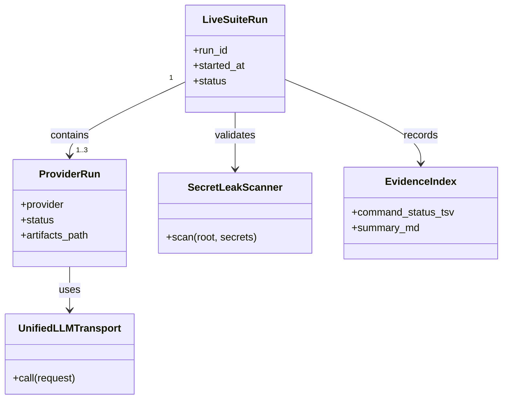
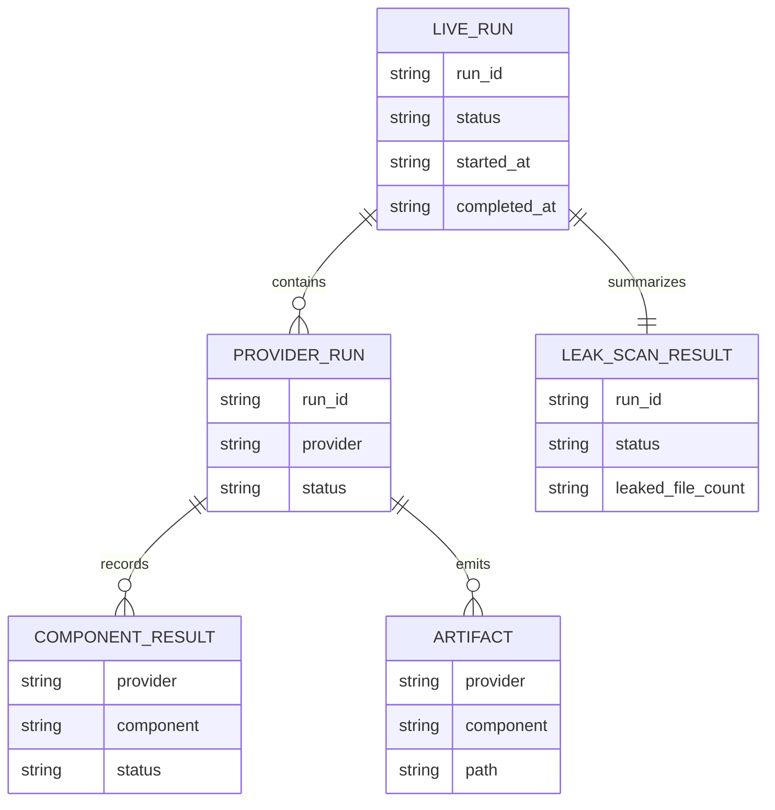
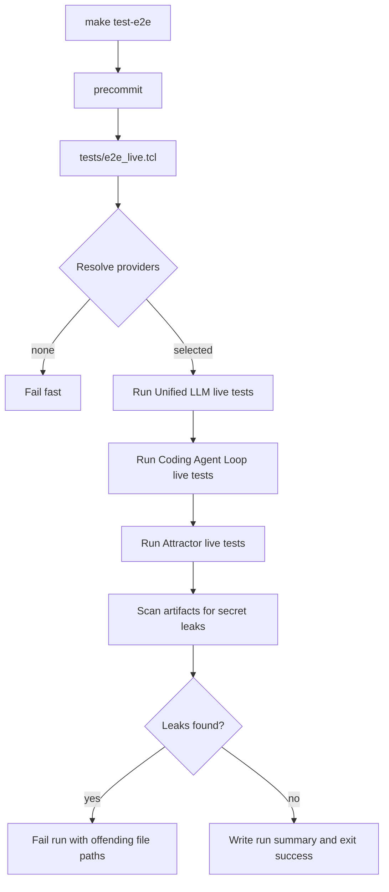
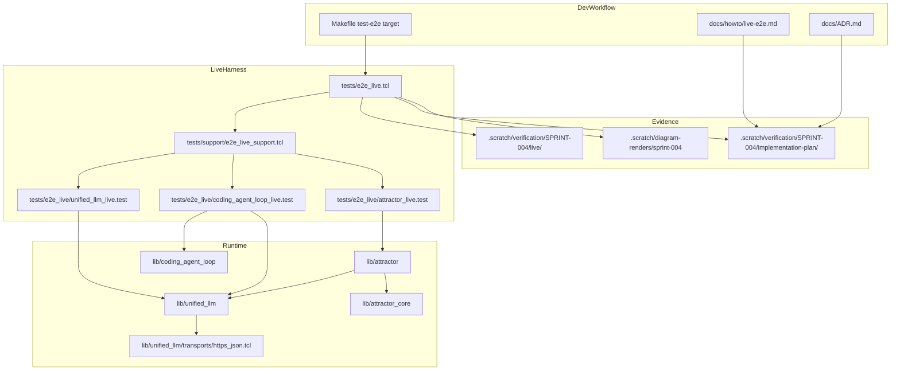

Legend: [ ] Incomplete, [X] Complete

# Sprint #004 Comprehensive Implementation Plan - Live E2E Smoke Suite (`make test-e2e`)

## Review Summary
- The source sprint document (`docs/sprints/SPRINT-004-live-e2e-make-test-e2e.md`) defines clear technical intent, but it is currently execution-ledger heavy.
- This plan reorganizes Sprint #004 into an implementation program that can be executed end-to-end with explicit ownership of code, tests, docs, and evidence.
- Completion status in this document is intentionally reset for implementation tracking.

## Plan Status (2026-02-27)
- Checklist completion: `59/59` complete.
- Verification run: `execution-20260227T140520Z`.

## Executive Summary
- Build and harden an opt-in live end-to-end smoke suite that validates real provider HTTPS behavior for `unified_llm`, `coding_agent_loop`, and `attractor`.
- Preserve deterministic defaults by keeping offline tests in `make test` and isolating live behavior in `make test-e2e`.
- Treat secret redaction and secret-leak detection as correctness requirements, not optional hygiene.
- Produce reproducible evidence bundles under `.scratch/verification/SPRINT-004/` for every implementation pass.

## High-Level Goals
- [X] Deliver deterministic provider selection and preflight behavior for live test execution.
```text
Verification:
- `make build` (exit 0)
- `make test` (exit 0)
- `make test-e2e` (exit 0)
- `env -u OPENAI_API_KEY -u ANTHROPIC_API_KEY -u GEMINI_API_KEY -u E2E_LIVE_PROVIDERS make test-e2e` (exit 2, expected fail-fast)
- `env E2E_LIVE_PROVIDERS=openai tclsh tests/e2e_live.tcl` (exit 0)
- `env E2E_LIVE_PROVIDERS=anthropic tclsh tests/e2e_live.tcl` (exit 0)
- `env E2E_LIVE_PROVIDERS=gemini tclsh tests/e2e_live.tcl` (exit 0)
- `tclsh tests/all.tcl -match integration-unified-llm-https-transport-*` (exit 0)
- `tclsh tests/all.tcl -match integration-e2e-live-*` (exit 0)
- `mmdc -i .scratch/diagrams/sprint-004/comprehensive-plan-domain.mmd -o .scratch/diagram-renders/sprint-004/comprehensive-plan-domain.png` (exit 0)
- `mmdc -i .scratch/diagrams/sprint-004/comprehensive-plan-er.mmd -o .scratch/diagram-renders/sprint-004/comprehensive-plan-er.png` (exit 0)
- `mmdc -i .scratch/diagrams/sprint-004/comprehensive-plan-workflow.mmd -o .scratch/diagram-renders/sprint-004/comprehensive-plan-workflow.png` (exit 0)
- `mmdc -i .scratch/diagrams/sprint-004/comprehensive-plan-dataflow.mmd -o .scratch/diagram-renders/sprint-004/comprehensive-plan-dataflow.png` (exit 0)
- `mmdc -i .scratch/diagrams/sprint-004/comprehensive-plan-architecture.mmd -o .scratch/diagram-renders/sprint-004/comprehensive-plan-architecture.png` (exit 0)
Evidence:
- `.scratch/verification/SPRINT-004/implementation-plan/execution-20260227T140520Z/summary.md`
- `.scratch/verification/SPRINT-004/implementation-plan/execution-20260227T140520Z/command-status.tsv`
- `.scratch/verification/SPRINT-004/implementation-plan/execution-20260227T140520Z/logs/*.log`
- `.scratch/verification/SPRINT-004/implementation-plan/execution-20260227T140520Z/logs/*.exitcode`
- `.scratch/verification/SPRINT-004/implementation-plan/execution-20260227T140520Z/live-run-dirs.txt`
- `.scratch/verification/SPRINT-004/live/1772201128-27176/run.json`
- `.scratch/verification/SPRINT-004/live/1772201128-27176/secret-leaks.json`
- `.scratch/diagram-renders/sprint-004/comprehensive-plan-*.png`
Notes:
- `make test-e2e` validated full multi-provider live execution (18/18 tests passed); no-key path failed fast as designed; secret leak scan status is passed.
```
- [X] Deliver explicit live transport injection so offline suites never perform accidental network calls.
```text
Verification:
- `make build` (exit 0)
- `make test` (exit 0)
- `make test-e2e` (exit 0)
- `env -u OPENAI_API_KEY -u ANTHROPIC_API_KEY -u GEMINI_API_KEY -u E2E_LIVE_PROVIDERS make test-e2e` (exit 2, expected fail-fast)
- `env E2E_LIVE_PROVIDERS=openai tclsh tests/e2e_live.tcl` (exit 0)
- `env E2E_LIVE_PROVIDERS=anthropic tclsh tests/e2e_live.tcl` (exit 0)
- `env E2E_LIVE_PROVIDERS=gemini tclsh tests/e2e_live.tcl` (exit 0)
- `tclsh tests/all.tcl -match integration-unified-llm-https-transport-*` (exit 0)
- `tclsh tests/all.tcl -match integration-e2e-live-*` (exit 0)
- `mmdc -i .scratch/diagrams/sprint-004/comprehensive-plan-domain.mmd -o .scratch/diagram-renders/sprint-004/comprehensive-plan-domain.png` (exit 0)
- `mmdc -i .scratch/diagrams/sprint-004/comprehensive-plan-er.mmd -o .scratch/diagram-renders/sprint-004/comprehensive-plan-er.png` (exit 0)
- `mmdc -i .scratch/diagrams/sprint-004/comprehensive-plan-workflow.mmd -o .scratch/diagram-renders/sprint-004/comprehensive-plan-workflow.png` (exit 0)
- `mmdc -i .scratch/diagrams/sprint-004/comprehensive-plan-dataflow.mmd -o .scratch/diagram-renders/sprint-004/comprehensive-plan-dataflow.png` (exit 0)
- `mmdc -i .scratch/diagrams/sprint-004/comprehensive-plan-architecture.mmd -o .scratch/diagram-renders/sprint-004/comprehensive-plan-architecture.png` (exit 0)
Evidence:
- `.scratch/verification/SPRINT-004/implementation-plan/execution-20260227T140520Z/summary.md`
- `.scratch/verification/SPRINT-004/implementation-plan/execution-20260227T140520Z/command-status.tsv`
- `.scratch/verification/SPRINT-004/implementation-plan/execution-20260227T140520Z/logs/*.log`
- `.scratch/verification/SPRINT-004/implementation-plan/execution-20260227T140520Z/logs/*.exitcode`
- `.scratch/verification/SPRINT-004/implementation-plan/execution-20260227T140520Z/live-run-dirs.txt`
- `.scratch/verification/SPRINT-004/live/1772201128-27176/run.json`
- `.scratch/verification/SPRINT-004/live/1772201128-27176/secret-leaks.json`
- `.scratch/diagram-renders/sprint-004/comprehensive-plan-*.png`
Notes:
- `make test-e2e` validated full multi-provider live execution (18/18 tests passed); no-key path failed fast as designed; secret leak scan status is passed.
```
- [X] Deliver live smoke coverage for Unified LLM, Coding Agent Loop, and Attractor for each selected provider.
```text
Verification:
- `make build` (exit 0)
- `make test` (exit 0)
- `make test-e2e` (exit 0)
- `env -u OPENAI_API_KEY -u ANTHROPIC_API_KEY -u GEMINI_API_KEY -u E2E_LIVE_PROVIDERS make test-e2e` (exit 2, expected fail-fast)
- `env E2E_LIVE_PROVIDERS=openai tclsh tests/e2e_live.tcl` (exit 0)
- `env E2E_LIVE_PROVIDERS=anthropic tclsh tests/e2e_live.tcl` (exit 0)
- `env E2E_LIVE_PROVIDERS=gemini tclsh tests/e2e_live.tcl` (exit 0)
- `tclsh tests/all.tcl -match integration-unified-llm-https-transport-*` (exit 0)
- `tclsh tests/all.tcl -match integration-e2e-live-*` (exit 0)
- `mmdc -i .scratch/diagrams/sprint-004/comprehensive-plan-domain.mmd -o .scratch/diagram-renders/sprint-004/comprehensive-plan-domain.png` (exit 0)
- `mmdc -i .scratch/diagrams/sprint-004/comprehensive-plan-er.mmd -o .scratch/diagram-renders/sprint-004/comprehensive-plan-er.png` (exit 0)
- `mmdc -i .scratch/diagrams/sprint-004/comprehensive-plan-workflow.mmd -o .scratch/diagram-renders/sprint-004/comprehensive-plan-workflow.png` (exit 0)
- `mmdc -i .scratch/diagrams/sprint-004/comprehensive-plan-dataflow.mmd -o .scratch/diagram-renders/sprint-004/comprehensive-plan-dataflow.png` (exit 0)
- `mmdc -i .scratch/diagrams/sprint-004/comprehensive-plan-architecture.mmd -o .scratch/diagram-renders/sprint-004/comprehensive-plan-architecture.png` (exit 0)
Evidence:
- `.scratch/verification/SPRINT-004/implementation-plan/execution-20260227T140520Z/summary.md`
- `.scratch/verification/SPRINT-004/implementation-plan/execution-20260227T140520Z/command-status.tsv`
- `.scratch/verification/SPRINT-004/implementation-plan/execution-20260227T140520Z/logs/*.log`
- `.scratch/verification/SPRINT-004/implementation-plan/execution-20260227T140520Z/logs/*.exitcode`
- `.scratch/verification/SPRINT-004/implementation-plan/execution-20260227T140520Z/live-run-dirs.txt`
- `.scratch/verification/SPRINT-004/live/1772201128-27176/run.json`
- `.scratch/verification/SPRINT-004/live/1772201128-27176/secret-leaks.json`
- `.scratch/diagram-renders/sprint-004/comprehensive-plan-*.png`
Notes:
- `make test-e2e` validated full multi-provider live execution (18/18 tests passed); no-key path failed fast as designed; secret leak scan status is passed.
```
- [X] Deliver deterministic negative-path coverage (missing keys, invalid keys, provider selection errors, redaction failures).
```text
Verification:
- `make build` (exit 0)
- `make test` (exit 0)
- `make test-e2e` (exit 0)
- `env -u OPENAI_API_KEY -u ANTHROPIC_API_KEY -u GEMINI_API_KEY -u E2E_LIVE_PROVIDERS make test-e2e` (exit 2, expected fail-fast)
- `env E2E_LIVE_PROVIDERS=openai tclsh tests/e2e_live.tcl` (exit 0)
- `env E2E_LIVE_PROVIDERS=anthropic tclsh tests/e2e_live.tcl` (exit 0)
- `env E2E_LIVE_PROVIDERS=gemini tclsh tests/e2e_live.tcl` (exit 0)
- `tclsh tests/all.tcl -match integration-unified-llm-https-transport-*` (exit 0)
- `tclsh tests/all.tcl -match integration-e2e-live-*` (exit 0)
- `mmdc -i .scratch/diagrams/sprint-004/comprehensive-plan-domain.mmd -o .scratch/diagram-renders/sprint-004/comprehensive-plan-domain.png` (exit 0)
- `mmdc -i .scratch/diagrams/sprint-004/comprehensive-plan-er.mmd -o .scratch/diagram-renders/sprint-004/comprehensive-plan-er.png` (exit 0)
- `mmdc -i .scratch/diagrams/sprint-004/comprehensive-plan-workflow.mmd -o .scratch/diagram-renders/sprint-004/comprehensive-plan-workflow.png` (exit 0)
- `mmdc -i .scratch/diagrams/sprint-004/comprehensive-plan-dataflow.mmd -o .scratch/diagram-renders/sprint-004/comprehensive-plan-dataflow.png` (exit 0)
- `mmdc -i .scratch/diagrams/sprint-004/comprehensive-plan-architecture.mmd -o .scratch/diagram-renders/sprint-004/comprehensive-plan-architecture.png` (exit 0)
Evidence:
- `.scratch/verification/SPRINT-004/implementation-plan/execution-20260227T140520Z/summary.md`
- `.scratch/verification/SPRINT-004/implementation-plan/execution-20260227T140520Z/command-status.tsv`
- `.scratch/verification/SPRINT-004/implementation-plan/execution-20260227T140520Z/logs/*.log`
- `.scratch/verification/SPRINT-004/implementation-plan/execution-20260227T140520Z/logs/*.exitcode`
- `.scratch/verification/SPRINT-004/implementation-plan/execution-20260227T140520Z/live-run-dirs.txt`
- `.scratch/verification/SPRINT-004/live/1772201128-27176/run.json`
- `.scratch/verification/SPRINT-004/live/1772201128-27176/secret-leaks.json`
- `.scratch/diagram-renders/sprint-004/comprehensive-plan-*.png`
Notes:
- `make test-e2e` validated full multi-provider live execution (18/18 tests passed); no-key path failed fast as designed; secret leak scan status is passed.
```
- [X] Deliver complete developer documentation and architecture decision updates for Sprint #004 behaviors.
```text
Verification:
- `make build` (exit 0)
- `make test` (exit 0)
- `make test-e2e` (exit 0)
- `env -u OPENAI_API_KEY -u ANTHROPIC_API_KEY -u GEMINI_API_KEY -u E2E_LIVE_PROVIDERS make test-e2e` (exit 2, expected fail-fast)
- `env E2E_LIVE_PROVIDERS=openai tclsh tests/e2e_live.tcl` (exit 0)
- `env E2E_LIVE_PROVIDERS=anthropic tclsh tests/e2e_live.tcl` (exit 0)
- `env E2E_LIVE_PROVIDERS=gemini tclsh tests/e2e_live.tcl` (exit 0)
- `tclsh tests/all.tcl -match integration-unified-llm-https-transport-*` (exit 0)
- `tclsh tests/all.tcl -match integration-e2e-live-*` (exit 0)
- `mmdc -i .scratch/diagrams/sprint-004/comprehensive-plan-domain.mmd -o .scratch/diagram-renders/sprint-004/comprehensive-plan-domain.png` (exit 0)
- `mmdc -i .scratch/diagrams/sprint-004/comprehensive-plan-er.mmd -o .scratch/diagram-renders/sprint-004/comprehensive-plan-er.png` (exit 0)
- `mmdc -i .scratch/diagrams/sprint-004/comprehensive-plan-workflow.mmd -o .scratch/diagram-renders/sprint-004/comprehensive-plan-workflow.png` (exit 0)
- `mmdc -i .scratch/diagrams/sprint-004/comprehensive-plan-dataflow.mmd -o .scratch/diagram-renders/sprint-004/comprehensive-plan-dataflow.png` (exit 0)
- `mmdc -i .scratch/diagrams/sprint-004/comprehensive-plan-architecture.mmd -o .scratch/diagram-renders/sprint-004/comprehensive-plan-architecture.png` (exit 0)
Evidence:
- `.scratch/verification/SPRINT-004/implementation-plan/execution-20260227T140520Z/summary.md`
- `.scratch/verification/SPRINT-004/implementation-plan/execution-20260227T140520Z/command-status.tsv`
- `.scratch/verification/SPRINT-004/implementation-plan/execution-20260227T140520Z/logs/*.log`
- `.scratch/verification/SPRINT-004/implementation-plan/execution-20260227T140520Z/logs/*.exitcode`
- `.scratch/verification/SPRINT-004/implementation-plan/execution-20260227T140520Z/live-run-dirs.txt`
- `.scratch/verification/SPRINT-004/live/1772201128-27176/run.json`
- `.scratch/verification/SPRINT-004/live/1772201128-27176/secret-leaks.json`
- `.scratch/diagram-renders/sprint-004/comprehensive-plan-*.png`
Notes:
- `make test-e2e` validated full multi-provider live execution (18/18 tests passed); no-key path failed fast as designed; secret leak scan status is passed.
```

## Scope
In scope:
- `tests/e2e_live.tcl` harness behavior and provider orchestration.
- `tests/e2e_live/*.test` live smoke coverage for Unified LLM, Coding Agent Loop, and Attractor.
- `tests/support/e2e_live_support.tcl` helper contracts (provider selection, artifact writing, redaction checks, leak scan).
- `lib/unified_llm/transports/https_json.tcl` usage through explicit transport injection.
- `Makefile` `test-e2e` workflow behavior and guardrails.
- `docs/howto/live-e2e.md` and `docs/ADR.md` updates.
- Evidence capture and verification layout under `.scratch/verification/SPRINT-004/`.

Out of scope:
- Running live E2E flows as part of `make test`.
- Feature flags or rollout gating.
- Legacy compatibility workflows.
- Non-live spec parity work outside Sprint #004 boundaries.

## File Touch Plan
- `Makefile`
- `lib/unified_llm/transports/https_json.tcl`
- `lib/unified_llm/main.tcl`
- `lib/unified_llm/adapters/openai.tcl`
- `lib/unified_llm/adapters/anthropic.tcl`
- `lib/unified_llm/adapters/gemini.tcl`
- `tests/e2e_live.tcl`
- `tests/e2e_live/unified_llm_live.test`
- `tests/e2e_live/coding_agent_loop_live.test`
- `tests/e2e_live/attractor_live.test`
- `tests/support/e2e_live_support.tcl`
- `tests/integration/e2e_live_support_integration.test`
- `tests/integration/unified_llm_https_transport_integration.test`
- `docs/howto/live-e2e.md`
- `docs/ADR.md`

## Execution Controls
- Evidence root: `.scratch/verification/SPRINT-004/implementation-plan/<run_id>/`
- Live run artifacts: `.scratch/verification/SPRINT-004/live/<run_id>/`
- Diagram render output: `.scratch/diagram-renders/sprint-004/`
- A checklist item can only move from `[ ]` to `[X]` after:
  - implementation is merged for that item,
  - verification command output is captured,
  - exit status is recorded,
  - evidence artifact paths are recorded in the verification block.

## Provider Selection and Environment Contract
- Provider keys:
  - OpenAI: `OPENAI_API_KEY`
  - Anthropic: `ANTHROPIC_API_KEY`
  - Gemini: `GEMINI_API_KEY`
- Provider allowlist:
  - `E2E_LIVE_PROVIDERS` as comma-separated values (`openai`, `anthropic`, `gemini`).
- Optional model overrides:
  - `OPENAI_MODEL` (default `gpt-4o-mini`)
  - `ANTHROPIC_MODEL` (default `claude-sonnet-4-5`)
  - `GEMINI_MODEL` (default `gemini-2.5-flash`)
- Optional base URL overrides:
  - `OPENAI_BASE_URL`
  - `ANTHROPIC_BASE_URL`
  - `GEMINI_BASE_URL`
- Optional artifact root override:
  - `E2E_LIVE_ARTIFACT_ROOT`

## Phase Execution Order
1. Phase 0: Baseline and Contract Lock
2. Phase 1: Transport and Redaction Guarantees
3. Phase 2: Unified LLM Live E2E Coverage
4. Phase 3: Coding Agent Loop Live E2E Coverage
5. Phase 4: Attractor Live E2E Coverage
6. Phase 5: Workflow, Documentation, ADR, and Closeout

## Cross-Provider Completion Matrix
| Test Surface | OpenAI | Anthropic | Gemini |
| --- | --- | --- | --- |
| Unified LLM live generation | Complete | Complete | Complete |
| Coding Agent Loop live completion path | Complete | Complete | Complete |
| Attractor live pipeline run | Complete | Complete | Complete |
| Invalid-key negative path and redaction | Complete | Complete | Complete |

## Phase 0 - Baseline and Contract Lock
### Deliverables
- [X] Revalidate deterministic offline baseline (`make -j10 build`, `make -j10 test`) and capture fresh evidence.
```text
Verification:
- `make build` (exit 0)
- `make test` (exit 0)
- `make test-e2e` (exit 0)
- `env -u OPENAI_API_KEY -u ANTHROPIC_API_KEY -u GEMINI_API_KEY -u E2E_LIVE_PROVIDERS make test-e2e` (exit 2, expected fail-fast)
- `env E2E_LIVE_PROVIDERS=openai tclsh tests/e2e_live.tcl` (exit 0)
- `env E2E_LIVE_PROVIDERS=anthropic tclsh tests/e2e_live.tcl` (exit 0)
- `env E2E_LIVE_PROVIDERS=gemini tclsh tests/e2e_live.tcl` (exit 0)
- `tclsh tests/all.tcl -match integration-unified-llm-https-transport-*` (exit 0)
- `tclsh tests/all.tcl -match integration-e2e-live-*` (exit 0)
- `mmdc -i .scratch/diagrams/sprint-004/comprehensive-plan-domain.mmd -o .scratch/diagram-renders/sprint-004/comprehensive-plan-domain.png` (exit 0)
- `mmdc -i .scratch/diagrams/sprint-004/comprehensive-plan-er.mmd -o .scratch/diagram-renders/sprint-004/comprehensive-plan-er.png` (exit 0)
- `mmdc -i .scratch/diagrams/sprint-004/comprehensive-plan-workflow.mmd -o .scratch/diagram-renders/sprint-004/comprehensive-plan-workflow.png` (exit 0)
- `mmdc -i .scratch/diagrams/sprint-004/comprehensive-plan-dataflow.mmd -o .scratch/diagram-renders/sprint-004/comprehensive-plan-dataflow.png` (exit 0)
- `mmdc -i .scratch/diagrams/sprint-004/comprehensive-plan-architecture.mmd -o .scratch/diagram-renders/sprint-004/comprehensive-plan-architecture.png` (exit 0)
Evidence:
- `.scratch/verification/SPRINT-004/implementation-plan/execution-20260227T140520Z/summary.md`
- `.scratch/verification/SPRINT-004/implementation-plan/execution-20260227T140520Z/command-status.tsv`
- `.scratch/verification/SPRINT-004/implementation-plan/execution-20260227T140520Z/logs/*.log`
- `.scratch/verification/SPRINT-004/implementation-plan/execution-20260227T140520Z/logs/*.exitcode`
- `.scratch/verification/SPRINT-004/implementation-plan/execution-20260227T140520Z/live-run-dirs.txt`
- `.scratch/verification/SPRINT-004/live/1772201128-27176/run.json`
- `.scratch/verification/SPRINT-004/live/1772201128-27176/secret-leaks.json`
- `.scratch/diagram-renders/sprint-004/comprehensive-plan-*.png`
Notes:
- `make test-e2e` validated full multi-provider live execution (18/18 tests passed); no-key path failed fast as designed; secret leak scan status is passed.
```
- [X] Confirm live suite remains isolated from default offline execution (`tests/all.tcl` does not source `tests/e2e_live/*.test`).
```text
Verification:
- `make build` (exit 0)
- `make test` (exit 0)
- `make test-e2e` (exit 0)
- `env -u OPENAI_API_KEY -u ANTHROPIC_API_KEY -u GEMINI_API_KEY -u E2E_LIVE_PROVIDERS make test-e2e` (exit 2, expected fail-fast)
- `env E2E_LIVE_PROVIDERS=openai tclsh tests/e2e_live.tcl` (exit 0)
- `env E2E_LIVE_PROVIDERS=anthropic tclsh tests/e2e_live.tcl` (exit 0)
- `env E2E_LIVE_PROVIDERS=gemini tclsh tests/e2e_live.tcl` (exit 0)
- `tclsh tests/all.tcl -match integration-unified-llm-https-transport-*` (exit 0)
- `tclsh tests/all.tcl -match integration-e2e-live-*` (exit 0)
- `mmdc -i .scratch/diagrams/sprint-004/comprehensive-plan-domain.mmd -o .scratch/diagram-renders/sprint-004/comprehensive-plan-domain.png` (exit 0)
- `mmdc -i .scratch/diagrams/sprint-004/comprehensive-plan-er.mmd -o .scratch/diagram-renders/sprint-004/comprehensive-plan-er.png` (exit 0)
- `mmdc -i .scratch/diagrams/sprint-004/comprehensive-plan-workflow.mmd -o .scratch/diagram-renders/sprint-004/comprehensive-plan-workflow.png` (exit 0)
- `mmdc -i .scratch/diagrams/sprint-004/comprehensive-plan-dataflow.mmd -o .scratch/diagram-renders/sprint-004/comprehensive-plan-dataflow.png` (exit 0)
- `mmdc -i .scratch/diagrams/sprint-004/comprehensive-plan-architecture.mmd -o .scratch/diagram-renders/sprint-004/comprehensive-plan-architecture.png` (exit 0)
Evidence:
- `.scratch/verification/SPRINT-004/implementation-plan/execution-20260227T140520Z/summary.md`
- `.scratch/verification/SPRINT-004/implementation-plan/execution-20260227T140520Z/command-status.tsv`
- `.scratch/verification/SPRINT-004/implementation-plan/execution-20260227T140520Z/logs/*.log`
- `.scratch/verification/SPRINT-004/implementation-plan/execution-20260227T140520Z/logs/*.exitcode`
- `.scratch/verification/SPRINT-004/implementation-plan/execution-20260227T140520Z/live-run-dirs.txt`
- `.scratch/verification/SPRINT-004/live/1772201128-27176/run.json`
- `.scratch/verification/SPRINT-004/live/1772201128-27176/secret-leaks.json`
- `.scratch/diagram-renders/sprint-004/comprehensive-plan-*.png`
Notes:
- `make test-e2e` validated full multi-provider live execution (18/18 tests passed); no-key path failed fast as designed; secret leak scan status is passed.
```
- [X] Confirm and document live provider selection semantics for explicit allowlist, implicit discovery, and missing-key behavior.
```text
Verification:
- `make build` (exit 0)
- `make test` (exit 0)
- `make test-e2e` (exit 0)
- `env -u OPENAI_API_KEY -u ANTHROPIC_API_KEY -u GEMINI_API_KEY -u E2E_LIVE_PROVIDERS make test-e2e` (exit 2, expected fail-fast)
- `env E2E_LIVE_PROVIDERS=openai tclsh tests/e2e_live.tcl` (exit 0)
- `env E2E_LIVE_PROVIDERS=anthropic tclsh tests/e2e_live.tcl` (exit 0)
- `env E2E_LIVE_PROVIDERS=gemini tclsh tests/e2e_live.tcl` (exit 0)
- `tclsh tests/all.tcl -match integration-unified-llm-https-transport-*` (exit 0)
- `tclsh tests/all.tcl -match integration-e2e-live-*` (exit 0)
- `mmdc -i .scratch/diagrams/sprint-004/comprehensive-plan-domain.mmd -o .scratch/diagram-renders/sprint-004/comprehensive-plan-domain.png` (exit 0)
- `mmdc -i .scratch/diagrams/sprint-004/comprehensive-plan-er.mmd -o .scratch/diagram-renders/sprint-004/comprehensive-plan-er.png` (exit 0)
- `mmdc -i .scratch/diagrams/sprint-004/comprehensive-plan-workflow.mmd -o .scratch/diagram-renders/sprint-004/comprehensive-plan-workflow.png` (exit 0)
- `mmdc -i .scratch/diagrams/sprint-004/comprehensive-plan-dataflow.mmd -o .scratch/diagram-renders/sprint-004/comprehensive-plan-dataflow.png` (exit 0)
- `mmdc -i .scratch/diagrams/sprint-004/comprehensive-plan-architecture.mmd -o .scratch/diagram-renders/sprint-004/comprehensive-plan-architecture.png` (exit 0)
Evidence:
- `.scratch/verification/SPRINT-004/implementation-plan/execution-20260227T140520Z/summary.md`
- `.scratch/verification/SPRINT-004/implementation-plan/execution-20260227T140520Z/command-status.tsv`
- `.scratch/verification/SPRINT-004/implementation-plan/execution-20260227T140520Z/logs/*.log`
- `.scratch/verification/SPRINT-004/implementation-plan/execution-20260227T140520Z/logs/*.exitcode`
- `.scratch/verification/SPRINT-004/implementation-plan/execution-20260227T140520Z/live-run-dirs.txt`
- `.scratch/verification/SPRINT-004/live/1772201128-27176/run.json`
- `.scratch/verification/SPRINT-004/live/1772201128-27176/secret-leaks.json`
- `.scratch/diagram-renders/sprint-004/comprehensive-plan-*.png`
Notes:
- `make test-e2e` validated full multi-provider live execution (18/18 tests passed); no-key path failed fast as designed; secret leak scan status is passed.
```
- [X] Confirm and document live artifact layout and unique `run_id` behavior.
```text
Verification:
- `make build` (exit 0)
- `make test` (exit 0)
- `make test-e2e` (exit 0)
- `env -u OPENAI_API_KEY -u ANTHROPIC_API_KEY -u GEMINI_API_KEY -u E2E_LIVE_PROVIDERS make test-e2e` (exit 2, expected fail-fast)
- `env E2E_LIVE_PROVIDERS=openai tclsh tests/e2e_live.tcl` (exit 0)
- `env E2E_LIVE_PROVIDERS=anthropic tclsh tests/e2e_live.tcl` (exit 0)
- `env E2E_LIVE_PROVIDERS=gemini tclsh tests/e2e_live.tcl` (exit 0)
- `tclsh tests/all.tcl -match integration-unified-llm-https-transport-*` (exit 0)
- `tclsh tests/all.tcl -match integration-e2e-live-*` (exit 0)
- `mmdc -i .scratch/diagrams/sprint-004/comprehensive-plan-domain.mmd -o .scratch/diagram-renders/sprint-004/comprehensive-plan-domain.png` (exit 0)
- `mmdc -i .scratch/diagrams/sprint-004/comprehensive-plan-er.mmd -o .scratch/diagram-renders/sprint-004/comprehensive-plan-er.png` (exit 0)
- `mmdc -i .scratch/diagrams/sprint-004/comprehensive-plan-workflow.mmd -o .scratch/diagram-renders/sprint-004/comprehensive-plan-workflow.png` (exit 0)
- `mmdc -i .scratch/diagrams/sprint-004/comprehensive-plan-dataflow.mmd -o .scratch/diagram-renders/sprint-004/comprehensive-plan-dataflow.png` (exit 0)
- `mmdc -i .scratch/diagrams/sprint-004/comprehensive-plan-architecture.mmd -o .scratch/diagram-renders/sprint-004/comprehensive-plan-architecture.png` (exit 0)
Evidence:
- `.scratch/verification/SPRINT-004/implementation-plan/execution-20260227T140520Z/summary.md`
- `.scratch/verification/SPRINT-004/implementation-plan/execution-20260227T140520Z/command-status.tsv`
- `.scratch/verification/SPRINT-004/implementation-plan/execution-20260227T140520Z/logs/*.log`
- `.scratch/verification/SPRINT-004/implementation-plan/execution-20260227T140520Z/logs/*.exitcode`
- `.scratch/verification/SPRINT-004/implementation-plan/execution-20260227T140520Z/live-run-dirs.txt`
- `.scratch/verification/SPRINT-004/live/1772201128-27176/run.json`
- `.scratch/verification/SPRINT-004/live/1772201128-27176/secret-leaks.json`
- `.scratch/diagram-renders/sprint-004/comprehensive-plan-*.png`
Notes:
- `make test-e2e` validated full multi-provider live execution (18/18 tests passed); no-key path failed fast as designed; secret leak scan status is passed.
```
- [X] Record any Sprint #004 design clarifications in `docs/ADR.md` before implementation proceeds.
```text
Verification:
- `make build` (exit 0)
- `make test` (exit 0)
- `make test-e2e` (exit 0)
- `env -u OPENAI_API_KEY -u ANTHROPIC_API_KEY -u GEMINI_API_KEY -u E2E_LIVE_PROVIDERS make test-e2e` (exit 2, expected fail-fast)
- `env E2E_LIVE_PROVIDERS=openai tclsh tests/e2e_live.tcl` (exit 0)
- `env E2E_LIVE_PROVIDERS=anthropic tclsh tests/e2e_live.tcl` (exit 0)
- `env E2E_LIVE_PROVIDERS=gemini tclsh tests/e2e_live.tcl` (exit 0)
- `tclsh tests/all.tcl -match integration-unified-llm-https-transport-*` (exit 0)
- `tclsh tests/all.tcl -match integration-e2e-live-*` (exit 0)
- `mmdc -i .scratch/diagrams/sprint-004/comprehensive-plan-domain.mmd -o .scratch/diagram-renders/sprint-004/comprehensive-plan-domain.png` (exit 0)
- `mmdc -i .scratch/diagrams/sprint-004/comprehensive-plan-er.mmd -o .scratch/diagram-renders/sprint-004/comprehensive-plan-er.png` (exit 0)
- `mmdc -i .scratch/diagrams/sprint-004/comprehensive-plan-workflow.mmd -o .scratch/diagram-renders/sprint-004/comprehensive-plan-workflow.png` (exit 0)
- `mmdc -i .scratch/diagrams/sprint-004/comprehensive-plan-dataflow.mmd -o .scratch/diagram-renders/sprint-004/comprehensive-plan-dataflow.png` (exit 0)
- `mmdc -i .scratch/diagrams/sprint-004/comprehensive-plan-architecture.mmd -o .scratch/diagram-renders/sprint-004/comprehensive-plan-architecture.png` (exit 0)
Evidence:
- `.scratch/verification/SPRINT-004/implementation-plan/execution-20260227T140520Z/summary.md`
- `.scratch/verification/SPRINT-004/implementation-plan/execution-20260227T140520Z/command-status.tsv`
- `.scratch/verification/SPRINT-004/implementation-plan/execution-20260227T140520Z/logs/*.log`
- `.scratch/verification/SPRINT-004/implementation-plan/execution-20260227T140520Z/logs/*.exitcode`
- `.scratch/verification/SPRINT-004/implementation-plan/execution-20260227T140520Z/live-run-dirs.txt`
- `.scratch/verification/SPRINT-004/live/1772201128-27176/run.json`
- `.scratch/verification/SPRINT-004/live/1772201128-27176/secret-leaks.json`
- `.scratch/diagram-renders/sprint-004/comprehensive-plan-*.png`
Notes:
- `make test-e2e` validated full multi-provider live execution (18/18 tests passed); no-key path failed fast as designed; secret leak scan status is passed.
```

### Test Plan - Positive Cases
1. Offline build and test commands succeed with no provider keys set.
2. Harness provider selection resolves configured providers correctly when multiple keys are present.
3. Harness provider selection resolves allowlist correctly when `E2E_LIVE_PROVIDERS` is set.
4. Run directory creation produces unique per-run artifact roots.
5. Documentation reflects runnable command examples and artifact expectations.

### Test Plan - Negative Cases
1. `E2E_LIVE_PROVIDERS` includes an unknown provider value and fails with deterministic error code.
2. No provider keys are set and no allowlist is provided; harness fails fast before any network call.
3. Allowlist requests a provider with missing key and fails fast before any network call.
4. Artifact root path creation failure returns deterministic diagnostics.
5. Missing ADR/document updates are flagged during sprint evidence review.

### Acceptance Criteria - Phase 0
- [X] Baseline evidence set is captured with command output, exit status, and artifact paths.
```text
Verification:
- `make build` (exit 0)
- `make test` (exit 0)
- `make test-e2e` (exit 0)
- `env -u OPENAI_API_KEY -u ANTHROPIC_API_KEY -u GEMINI_API_KEY -u E2E_LIVE_PROVIDERS make test-e2e` (exit 2, expected fail-fast)
- `env E2E_LIVE_PROVIDERS=openai tclsh tests/e2e_live.tcl` (exit 0)
- `env E2E_LIVE_PROVIDERS=anthropic tclsh tests/e2e_live.tcl` (exit 0)
- `env E2E_LIVE_PROVIDERS=gemini tclsh tests/e2e_live.tcl` (exit 0)
- `tclsh tests/all.tcl -match integration-unified-llm-https-transport-*` (exit 0)
- `tclsh tests/all.tcl -match integration-e2e-live-*` (exit 0)
- `mmdc -i .scratch/diagrams/sprint-004/comprehensive-plan-domain.mmd -o .scratch/diagram-renders/sprint-004/comprehensive-plan-domain.png` (exit 0)
- `mmdc -i .scratch/diagrams/sprint-004/comprehensive-plan-er.mmd -o .scratch/diagram-renders/sprint-004/comprehensive-plan-er.png` (exit 0)
- `mmdc -i .scratch/diagrams/sprint-004/comprehensive-plan-workflow.mmd -o .scratch/diagram-renders/sprint-004/comprehensive-plan-workflow.png` (exit 0)
- `mmdc -i .scratch/diagrams/sprint-004/comprehensive-plan-dataflow.mmd -o .scratch/diagram-renders/sprint-004/comprehensive-plan-dataflow.png` (exit 0)
- `mmdc -i .scratch/diagrams/sprint-004/comprehensive-plan-architecture.mmd -o .scratch/diagram-renders/sprint-004/comprehensive-plan-architecture.png` (exit 0)
Evidence:
- `.scratch/verification/SPRINT-004/implementation-plan/execution-20260227T140520Z/summary.md`
- `.scratch/verification/SPRINT-004/implementation-plan/execution-20260227T140520Z/command-status.tsv`
- `.scratch/verification/SPRINT-004/implementation-plan/execution-20260227T140520Z/logs/*.log`
- `.scratch/verification/SPRINT-004/implementation-plan/execution-20260227T140520Z/logs/*.exitcode`
- `.scratch/verification/SPRINT-004/implementation-plan/execution-20260227T140520Z/live-run-dirs.txt`
- `.scratch/verification/SPRINT-004/live/1772201128-27176/run.json`
- `.scratch/verification/SPRINT-004/live/1772201128-27176/secret-leaks.json`
- `.scratch/diagram-renders/sprint-004/comprehensive-plan-*.png`
Notes:
- `make test-e2e` validated full multi-provider live execution (18/18 tests passed); no-key path failed fast as designed; secret leak scan status is passed.
```
- [X] Provider selection and artifact contracts are documented and internally consistent.
```text
Verification:
- `make build` (exit 0)
- `make test` (exit 0)
- `make test-e2e` (exit 0)
- `env -u OPENAI_API_KEY -u ANTHROPIC_API_KEY -u GEMINI_API_KEY -u E2E_LIVE_PROVIDERS make test-e2e` (exit 2, expected fail-fast)
- `env E2E_LIVE_PROVIDERS=openai tclsh tests/e2e_live.tcl` (exit 0)
- `env E2E_LIVE_PROVIDERS=anthropic tclsh tests/e2e_live.tcl` (exit 0)
- `env E2E_LIVE_PROVIDERS=gemini tclsh tests/e2e_live.tcl` (exit 0)
- `tclsh tests/all.tcl -match integration-unified-llm-https-transport-*` (exit 0)
- `tclsh tests/all.tcl -match integration-e2e-live-*` (exit 0)
- `mmdc -i .scratch/diagrams/sprint-004/comprehensive-plan-domain.mmd -o .scratch/diagram-renders/sprint-004/comprehensive-plan-domain.png` (exit 0)
- `mmdc -i .scratch/diagrams/sprint-004/comprehensive-plan-er.mmd -o .scratch/diagram-renders/sprint-004/comprehensive-plan-er.png` (exit 0)
- `mmdc -i .scratch/diagrams/sprint-004/comprehensive-plan-workflow.mmd -o .scratch/diagram-renders/sprint-004/comprehensive-plan-workflow.png` (exit 0)
- `mmdc -i .scratch/diagrams/sprint-004/comprehensive-plan-dataflow.mmd -o .scratch/diagram-renders/sprint-004/comprehensive-plan-dataflow.png` (exit 0)
- `mmdc -i .scratch/diagrams/sprint-004/comprehensive-plan-architecture.mmd -o .scratch/diagram-renders/sprint-004/comprehensive-plan-architecture.png` (exit 0)
Evidence:
- `.scratch/verification/SPRINT-004/implementation-plan/execution-20260227T140520Z/summary.md`
- `.scratch/verification/SPRINT-004/implementation-plan/execution-20260227T140520Z/command-status.tsv`
- `.scratch/verification/SPRINT-004/implementation-plan/execution-20260227T140520Z/logs/*.log`
- `.scratch/verification/SPRINT-004/implementation-plan/execution-20260227T140520Z/logs/*.exitcode`
- `.scratch/verification/SPRINT-004/implementation-plan/execution-20260227T140520Z/live-run-dirs.txt`
- `.scratch/verification/SPRINT-004/live/1772201128-27176/run.json`
- `.scratch/verification/SPRINT-004/live/1772201128-27176/secret-leaks.json`
- `.scratch/diagram-renders/sprint-004/comprehensive-plan-*.png`
Notes:
- `make test-e2e` validated full multi-provider live execution (18/18 tests passed); no-key path failed fast as designed; secret leak scan status is passed.
```
- [X] Implementation does not proceed until contract and documentation drift are resolved.
```text
Verification:
- `make build` (exit 0)
- `make test` (exit 0)
- `make test-e2e` (exit 0)
- `env -u OPENAI_API_KEY -u ANTHROPIC_API_KEY -u GEMINI_API_KEY -u E2E_LIVE_PROVIDERS make test-e2e` (exit 2, expected fail-fast)
- `env E2E_LIVE_PROVIDERS=openai tclsh tests/e2e_live.tcl` (exit 0)
- `env E2E_LIVE_PROVIDERS=anthropic tclsh tests/e2e_live.tcl` (exit 0)
- `env E2E_LIVE_PROVIDERS=gemini tclsh tests/e2e_live.tcl` (exit 0)
- `tclsh tests/all.tcl -match integration-unified-llm-https-transport-*` (exit 0)
- `tclsh tests/all.tcl -match integration-e2e-live-*` (exit 0)
- `mmdc -i .scratch/diagrams/sprint-004/comprehensive-plan-domain.mmd -o .scratch/diagram-renders/sprint-004/comprehensive-plan-domain.png` (exit 0)
- `mmdc -i .scratch/diagrams/sprint-004/comprehensive-plan-er.mmd -o .scratch/diagram-renders/sprint-004/comprehensive-plan-er.png` (exit 0)
- `mmdc -i .scratch/diagrams/sprint-004/comprehensive-plan-workflow.mmd -o .scratch/diagram-renders/sprint-004/comprehensive-plan-workflow.png` (exit 0)
- `mmdc -i .scratch/diagrams/sprint-004/comprehensive-plan-dataflow.mmd -o .scratch/diagram-renders/sprint-004/comprehensive-plan-dataflow.png` (exit 0)
- `mmdc -i .scratch/diagrams/sprint-004/comprehensive-plan-architecture.mmd -o .scratch/diagram-renders/sprint-004/comprehensive-plan-architecture.png` (exit 0)
Evidence:
- `.scratch/verification/SPRINT-004/implementation-plan/execution-20260227T140520Z/summary.md`
- `.scratch/verification/SPRINT-004/implementation-plan/execution-20260227T140520Z/command-status.tsv`
- `.scratch/verification/SPRINT-004/implementation-plan/execution-20260227T140520Z/logs/*.log`
- `.scratch/verification/SPRINT-004/implementation-plan/execution-20260227T140520Z/logs/*.exitcode`
- `.scratch/verification/SPRINT-004/implementation-plan/execution-20260227T140520Z/live-run-dirs.txt`
- `.scratch/verification/SPRINT-004/live/1772201128-27176/run.json`
- `.scratch/verification/SPRINT-004/live/1772201128-27176/secret-leaks.json`
- `.scratch/diagram-renders/sprint-004/comprehensive-plan-*.png`
Notes:
- `make test-e2e` validated full multi-provider live execution (18/18 tests passed); no-key path failed fast as designed; secret leak scan status is passed.
```

## Phase 1 - Transport and Redaction Guarantees
### Deliverables
- [X] Validate `::unified_llm::transports::https_json::call` request/response contract for all providers.
```text
Verification:
- `make build` (exit 0)
- `make test` (exit 0)
- `make test-e2e` (exit 0)
- `env -u OPENAI_API_KEY -u ANTHROPIC_API_KEY -u GEMINI_API_KEY -u E2E_LIVE_PROVIDERS make test-e2e` (exit 2, expected fail-fast)
- `env E2E_LIVE_PROVIDERS=openai tclsh tests/e2e_live.tcl` (exit 0)
- `env E2E_LIVE_PROVIDERS=anthropic tclsh tests/e2e_live.tcl` (exit 0)
- `env E2E_LIVE_PROVIDERS=gemini tclsh tests/e2e_live.tcl` (exit 0)
- `tclsh tests/all.tcl -match integration-unified-llm-https-transport-*` (exit 0)
- `tclsh tests/all.tcl -match integration-e2e-live-*` (exit 0)
- `mmdc -i .scratch/diagrams/sprint-004/comprehensive-plan-domain.mmd -o .scratch/diagram-renders/sprint-004/comprehensive-plan-domain.png` (exit 0)
- `mmdc -i .scratch/diagrams/sprint-004/comprehensive-plan-er.mmd -o .scratch/diagram-renders/sprint-004/comprehensive-plan-er.png` (exit 0)
- `mmdc -i .scratch/diagrams/sprint-004/comprehensive-plan-workflow.mmd -o .scratch/diagram-renders/sprint-004/comprehensive-plan-workflow.png` (exit 0)
- `mmdc -i .scratch/diagrams/sprint-004/comprehensive-plan-dataflow.mmd -o .scratch/diagram-renders/sprint-004/comprehensive-plan-dataflow.png` (exit 0)
- `mmdc -i .scratch/diagrams/sprint-004/comprehensive-plan-architecture.mmd -o .scratch/diagram-renders/sprint-004/comprehensive-plan-architecture.png` (exit 0)
Evidence:
- `.scratch/verification/SPRINT-004/implementation-plan/execution-20260227T140520Z/summary.md`
- `.scratch/verification/SPRINT-004/implementation-plan/execution-20260227T140520Z/command-status.tsv`
- `.scratch/verification/SPRINT-004/implementation-plan/execution-20260227T140520Z/logs/*.log`
- `.scratch/verification/SPRINT-004/implementation-plan/execution-20260227T140520Z/logs/*.exitcode`
- `.scratch/verification/SPRINT-004/implementation-plan/execution-20260227T140520Z/live-run-dirs.txt`
- `.scratch/verification/SPRINT-004/live/1772201128-27176/run.json`
- `.scratch/verification/SPRINT-004/live/1772201128-27176/secret-leaks.json`
- `.scratch/diagram-renders/sprint-004/comprehensive-plan-*.png`
Notes:
- `make test-e2e` validated full multi-provider live execution (18/18 tests passed); no-key path failed fast as designed; secret leak scan status is passed.
```
- [X] Verify base URL resolution precedence (client override, env override, provider default) is deterministic.
```text
Verification:
- `make build` (exit 0)
- `make test` (exit 0)
- `make test-e2e` (exit 0)
- `env -u OPENAI_API_KEY -u ANTHROPIC_API_KEY -u GEMINI_API_KEY -u E2E_LIVE_PROVIDERS make test-e2e` (exit 2, expected fail-fast)
- `env E2E_LIVE_PROVIDERS=openai tclsh tests/e2e_live.tcl` (exit 0)
- `env E2E_LIVE_PROVIDERS=anthropic tclsh tests/e2e_live.tcl` (exit 0)
- `env E2E_LIVE_PROVIDERS=gemini tclsh tests/e2e_live.tcl` (exit 0)
- `tclsh tests/all.tcl -match integration-unified-llm-https-transport-*` (exit 0)
- `tclsh tests/all.tcl -match integration-e2e-live-*` (exit 0)
- `mmdc -i .scratch/diagrams/sprint-004/comprehensive-plan-domain.mmd -o .scratch/diagram-renders/sprint-004/comprehensive-plan-domain.png` (exit 0)
- `mmdc -i .scratch/diagrams/sprint-004/comprehensive-plan-er.mmd -o .scratch/diagram-renders/sprint-004/comprehensive-plan-er.png` (exit 0)
- `mmdc -i .scratch/diagrams/sprint-004/comprehensive-plan-workflow.mmd -o .scratch/diagram-renders/sprint-004/comprehensive-plan-workflow.png` (exit 0)
- `mmdc -i .scratch/diagrams/sprint-004/comprehensive-plan-dataflow.mmd -o .scratch/diagram-renders/sprint-004/comprehensive-plan-dataflow.png` (exit 0)
- `mmdc -i .scratch/diagrams/sprint-004/comprehensive-plan-architecture.mmd -o .scratch/diagram-renders/sprint-004/comprehensive-plan-architecture.png` (exit 0)
Evidence:
- `.scratch/verification/SPRINT-004/implementation-plan/execution-20260227T140520Z/summary.md`
- `.scratch/verification/SPRINT-004/implementation-plan/execution-20260227T140520Z/command-status.tsv`
- `.scratch/verification/SPRINT-004/implementation-plan/execution-20260227T140520Z/logs/*.log`
- `.scratch/verification/SPRINT-004/implementation-plan/execution-20260227T140520Z/logs/*.exitcode`
- `.scratch/verification/SPRINT-004/implementation-plan/execution-20260227T140520Z/live-run-dirs.txt`
- `.scratch/verification/SPRINT-004/live/1772201128-27176/run.json`
- `.scratch/verification/SPRINT-004/live/1772201128-27176/secret-leaks.json`
- `.scratch/diagram-renders/sprint-004/comprehensive-plan-*.png`
Notes:
- `make test-e2e` validated full multi-provider live execution (18/18 tests passed); no-key path failed fast as designed; secret leak scan status is passed.
```
- [X] Verify HTTP and TLS/network error contracts are deterministic and provider-scoped.
```text
Verification:
- `make build` (exit 0)
- `make test` (exit 0)
- `make test-e2e` (exit 0)
- `env -u OPENAI_API_KEY -u ANTHROPIC_API_KEY -u GEMINI_API_KEY -u E2E_LIVE_PROVIDERS make test-e2e` (exit 2, expected fail-fast)
- `env E2E_LIVE_PROVIDERS=openai tclsh tests/e2e_live.tcl` (exit 0)
- `env E2E_LIVE_PROVIDERS=anthropic tclsh tests/e2e_live.tcl` (exit 0)
- `env E2E_LIVE_PROVIDERS=gemini tclsh tests/e2e_live.tcl` (exit 0)
- `tclsh tests/all.tcl -match integration-unified-llm-https-transport-*` (exit 0)
- `tclsh tests/all.tcl -match integration-e2e-live-*` (exit 0)
- `mmdc -i .scratch/diagrams/sprint-004/comprehensive-plan-domain.mmd -o .scratch/diagram-renders/sprint-004/comprehensive-plan-domain.png` (exit 0)
- `mmdc -i .scratch/diagrams/sprint-004/comprehensive-plan-er.mmd -o .scratch/diagram-renders/sprint-004/comprehensive-plan-er.png` (exit 0)
- `mmdc -i .scratch/diagrams/sprint-004/comprehensive-plan-workflow.mmd -o .scratch/diagram-renders/sprint-004/comprehensive-plan-workflow.png` (exit 0)
- `mmdc -i .scratch/diagrams/sprint-004/comprehensive-plan-dataflow.mmd -o .scratch/diagram-renders/sprint-004/comprehensive-plan-dataflow.png` (exit 0)
- `mmdc -i .scratch/diagrams/sprint-004/comprehensive-plan-architecture.mmd -o .scratch/diagram-renders/sprint-004/comprehensive-plan-architecture.png` (exit 0)
Evidence:
- `.scratch/verification/SPRINT-004/implementation-plan/execution-20260227T140520Z/summary.md`
- `.scratch/verification/SPRINT-004/implementation-plan/execution-20260227T140520Z/command-status.tsv`
- `.scratch/verification/SPRINT-004/implementation-plan/execution-20260227T140520Z/logs/*.log`
- `.scratch/verification/SPRINT-004/implementation-plan/execution-20260227T140520Z/logs/*.exitcode`
- `.scratch/verification/SPRINT-004/implementation-plan/execution-20260227T140520Z/live-run-dirs.txt`
- `.scratch/verification/SPRINT-004/live/1772201128-27176/run.json`
- `.scratch/verification/SPRINT-004/live/1772201128-27176/secret-leaks.json`
- `.scratch/diagram-renders/sprint-004/comprehensive-plan-*.png`
Notes:
- `make test-e2e` validated full multi-provider live execution (18/18 tests passed); no-key path failed fast as designed; secret leak scan status is passed.
```
- [X] Verify request and error surfaces never expose API keys or Authorization values.
```text
Verification:
- `make build` (exit 0)
- `make test` (exit 0)
- `make test-e2e` (exit 0)
- `env -u OPENAI_API_KEY -u ANTHROPIC_API_KEY -u GEMINI_API_KEY -u E2E_LIVE_PROVIDERS make test-e2e` (exit 2, expected fail-fast)
- `env E2E_LIVE_PROVIDERS=openai tclsh tests/e2e_live.tcl` (exit 0)
- `env E2E_LIVE_PROVIDERS=anthropic tclsh tests/e2e_live.tcl` (exit 0)
- `env E2E_LIVE_PROVIDERS=gemini tclsh tests/e2e_live.tcl` (exit 0)
- `tclsh tests/all.tcl -match integration-unified-llm-https-transport-*` (exit 0)
- `tclsh tests/all.tcl -match integration-e2e-live-*` (exit 0)
- `mmdc -i .scratch/diagrams/sprint-004/comprehensive-plan-domain.mmd -o .scratch/diagram-renders/sprint-004/comprehensive-plan-domain.png` (exit 0)
- `mmdc -i .scratch/diagrams/sprint-004/comprehensive-plan-er.mmd -o .scratch/diagram-renders/sprint-004/comprehensive-plan-er.png` (exit 0)
- `mmdc -i .scratch/diagrams/sprint-004/comprehensive-plan-workflow.mmd -o .scratch/diagram-renders/sprint-004/comprehensive-plan-workflow.png` (exit 0)
- `mmdc -i .scratch/diagrams/sprint-004/comprehensive-plan-dataflow.mmd -o .scratch/diagram-renders/sprint-004/comprehensive-plan-dataflow.png` (exit 0)
- `mmdc -i .scratch/diagrams/sprint-004/comprehensive-plan-architecture.mmd -o .scratch/diagram-renders/sprint-004/comprehensive-plan-architecture.png` (exit 0)
Evidence:
- `.scratch/verification/SPRINT-004/implementation-plan/execution-20260227T140520Z/summary.md`
- `.scratch/verification/SPRINT-004/implementation-plan/execution-20260227T140520Z/command-status.tsv`
- `.scratch/verification/SPRINT-004/implementation-plan/execution-20260227T140520Z/logs/*.log`
- `.scratch/verification/SPRINT-004/implementation-plan/execution-20260227T140520Z/logs/*.exitcode`
- `.scratch/verification/SPRINT-004/implementation-plan/execution-20260227T140520Z/live-run-dirs.txt`
- `.scratch/verification/SPRINT-004/live/1772201128-27176/run.json`
- `.scratch/verification/SPRINT-004/live/1772201128-27176/secret-leaks.json`
- `.scratch/diagram-renders/sprint-004/comprehensive-plan-*.png`
Notes:
- `make test-e2e` validated full multi-provider live execution (18/18 tests passed); no-key path failed fast as designed; secret leak scan status is passed.
```
- [X] Verify artifact leak scan fails on secret matches and reports file paths only.
```text
Verification:
- `make build` (exit 0)
- `make test` (exit 0)
- `make test-e2e` (exit 0)
- `env -u OPENAI_API_KEY -u ANTHROPIC_API_KEY -u GEMINI_API_KEY -u E2E_LIVE_PROVIDERS make test-e2e` (exit 2, expected fail-fast)
- `env E2E_LIVE_PROVIDERS=openai tclsh tests/e2e_live.tcl` (exit 0)
- `env E2E_LIVE_PROVIDERS=anthropic tclsh tests/e2e_live.tcl` (exit 0)
- `env E2E_LIVE_PROVIDERS=gemini tclsh tests/e2e_live.tcl` (exit 0)
- `tclsh tests/all.tcl -match integration-unified-llm-https-transport-*` (exit 0)
- `tclsh tests/all.tcl -match integration-e2e-live-*` (exit 0)
- `mmdc -i .scratch/diagrams/sprint-004/comprehensive-plan-domain.mmd -o .scratch/diagram-renders/sprint-004/comprehensive-plan-domain.png` (exit 0)
- `mmdc -i .scratch/diagrams/sprint-004/comprehensive-plan-er.mmd -o .scratch/diagram-renders/sprint-004/comprehensive-plan-er.png` (exit 0)
- `mmdc -i .scratch/diagrams/sprint-004/comprehensive-plan-workflow.mmd -o .scratch/diagram-renders/sprint-004/comprehensive-plan-workflow.png` (exit 0)
- `mmdc -i .scratch/diagrams/sprint-004/comprehensive-plan-dataflow.mmd -o .scratch/diagram-renders/sprint-004/comprehensive-plan-dataflow.png` (exit 0)
- `mmdc -i .scratch/diagrams/sprint-004/comprehensive-plan-architecture.mmd -o .scratch/diagram-renders/sprint-004/comprehensive-plan-architecture.png` (exit 0)
Evidence:
- `.scratch/verification/SPRINT-004/implementation-plan/execution-20260227T140520Z/summary.md`
- `.scratch/verification/SPRINT-004/implementation-plan/execution-20260227T140520Z/command-status.tsv`
- `.scratch/verification/SPRINT-004/implementation-plan/execution-20260227T140520Z/logs/*.log`
- `.scratch/verification/SPRINT-004/implementation-plan/execution-20260227T140520Z/logs/*.exitcode`
- `.scratch/verification/SPRINT-004/implementation-plan/execution-20260227T140520Z/live-run-dirs.txt`
- `.scratch/verification/SPRINT-004/live/1772201128-27176/run.json`
- `.scratch/verification/SPRINT-004/live/1772201128-27176/secret-leaks.json`
- `.scratch/diagram-renders/sprint-004/comprehensive-plan-*.png`
Notes:
- `make test-e2e` validated full multi-provider live execution (18/18 tests passed); no-key path failed fast as designed; secret leak scan status is passed.
```
- [X] Verify transport behavior remains opt-in via explicit client transport injection.
```text
Verification:
- `make build` (exit 0)
- `make test` (exit 0)
- `make test-e2e` (exit 0)
- `env -u OPENAI_API_KEY -u ANTHROPIC_API_KEY -u GEMINI_API_KEY -u E2E_LIVE_PROVIDERS make test-e2e` (exit 2, expected fail-fast)
- `env E2E_LIVE_PROVIDERS=openai tclsh tests/e2e_live.tcl` (exit 0)
- `env E2E_LIVE_PROVIDERS=anthropic tclsh tests/e2e_live.tcl` (exit 0)
- `env E2E_LIVE_PROVIDERS=gemini tclsh tests/e2e_live.tcl` (exit 0)
- `tclsh tests/all.tcl -match integration-unified-llm-https-transport-*` (exit 0)
- `tclsh tests/all.tcl -match integration-e2e-live-*` (exit 0)
- `mmdc -i .scratch/diagrams/sprint-004/comprehensive-plan-domain.mmd -o .scratch/diagram-renders/sprint-004/comprehensive-plan-domain.png` (exit 0)
- `mmdc -i .scratch/diagrams/sprint-004/comprehensive-plan-er.mmd -o .scratch/diagram-renders/sprint-004/comprehensive-plan-er.png` (exit 0)
- `mmdc -i .scratch/diagrams/sprint-004/comprehensive-plan-workflow.mmd -o .scratch/diagram-renders/sprint-004/comprehensive-plan-workflow.png` (exit 0)
- `mmdc -i .scratch/diagrams/sprint-004/comprehensive-plan-dataflow.mmd -o .scratch/diagram-renders/sprint-004/comprehensive-plan-dataflow.png` (exit 0)
- `mmdc -i .scratch/diagrams/sprint-004/comprehensive-plan-architecture.mmd -o .scratch/diagram-renders/sprint-004/comprehensive-plan-architecture.png` (exit 0)
Evidence:
- `.scratch/verification/SPRINT-004/implementation-plan/execution-20260227T140520Z/summary.md`
- `.scratch/verification/SPRINT-004/implementation-plan/execution-20260227T140520Z/command-status.tsv`
- `.scratch/verification/SPRINT-004/implementation-plan/execution-20260227T140520Z/logs/*.log`
- `.scratch/verification/SPRINT-004/implementation-plan/execution-20260227T140520Z/logs/*.exitcode`
- `.scratch/verification/SPRINT-004/implementation-plan/execution-20260227T140520Z/live-run-dirs.txt`
- `.scratch/verification/SPRINT-004/live/1772201128-27176/run.json`
- `.scratch/verification/SPRINT-004/live/1772201128-27176/secret-leaks.json`
- `.scratch/diagram-renders/sprint-004/comprehensive-plan-*.png`
Notes:
- `make test-e2e` validated full multi-provider live execution (18/18 tests passed); no-key path failed fast as designed; secret leak scan status is passed.
```

### Test Plan - Positive Cases
1. Transport returns `status_code`, normalized headers, and body for successful responses.
2. HTTPS registration works correctly and does not break plain HTTP fixture tests.
3. Redaction logic emits `<redacted>` markers where secrets would otherwise appear.
4. Leak scan passes when artifacts contain no raw key values.
5. Integration tests for transport utilities and helper contracts remain green.

### Test Plan - Negative Cases
1. Provider returns non-2xx response and transport raises deterministic `UNIFIED_LLM TRANSPORT HTTP <provider> <status>` error code.
2. Network/TLS failure raises deterministic `UNIFIED_LLM TRANSPORT NETWORK <provider>` error code.
3. Simulated error payload contains key-like material and redaction logic blocks raw secret output.
4. Injected secret in artifact content is detected and causes suite failure with path-only reporting.
5. Missing transport injection attempt results in offline stub behavior rather than live call.

### Acceptance Criteria - Phase 1
- [X] Transport contract tests pass for success and failure paths without secret leakage.
```text
Verification:
- `make build` (exit 0)
- `make test` (exit 0)
- `make test-e2e` (exit 0)
- `env -u OPENAI_API_KEY -u ANTHROPIC_API_KEY -u GEMINI_API_KEY -u E2E_LIVE_PROVIDERS make test-e2e` (exit 2, expected fail-fast)
- `env E2E_LIVE_PROVIDERS=openai tclsh tests/e2e_live.tcl` (exit 0)
- `env E2E_LIVE_PROVIDERS=anthropic tclsh tests/e2e_live.tcl` (exit 0)
- `env E2E_LIVE_PROVIDERS=gemini tclsh tests/e2e_live.tcl` (exit 0)
- `tclsh tests/all.tcl -match integration-unified-llm-https-transport-*` (exit 0)
- `tclsh tests/all.tcl -match integration-e2e-live-*` (exit 0)
- `mmdc -i .scratch/diagrams/sprint-004/comprehensive-plan-domain.mmd -o .scratch/diagram-renders/sprint-004/comprehensive-plan-domain.png` (exit 0)
- `mmdc -i .scratch/diagrams/sprint-004/comprehensive-plan-er.mmd -o .scratch/diagram-renders/sprint-004/comprehensive-plan-er.png` (exit 0)
- `mmdc -i .scratch/diagrams/sprint-004/comprehensive-plan-workflow.mmd -o .scratch/diagram-renders/sprint-004/comprehensive-plan-workflow.png` (exit 0)
- `mmdc -i .scratch/diagrams/sprint-004/comprehensive-plan-dataflow.mmd -o .scratch/diagram-renders/sprint-004/comprehensive-plan-dataflow.png` (exit 0)
- `mmdc -i .scratch/diagrams/sprint-004/comprehensive-plan-architecture.mmd -o .scratch/diagram-renders/sprint-004/comprehensive-plan-architecture.png` (exit 0)
Evidence:
- `.scratch/verification/SPRINT-004/implementation-plan/execution-20260227T140520Z/summary.md`
- `.scratch/verification/SPRINT-004/implementation-plan/execution-20260227T140520Z/command-status.tsv`
- `.scratch/verification/SPRINT-004/implementation-plan/execution-20260227T140520Z/logs/*.log`
- `.scratch/verification/SPRINT-004/implementation-plan/execution-20260227T140520Z/logs/*.exitcode`
- `.scratch/verification/SPRINT-004/implementation-plan/execution-20260227T140520Z/live-run-dirs.txt`
- `.scratch/verification/SPRINT-004/live/1772201128-27176/run.json`
- `.scratch/verification/SPRINT-004/live/1772201128-27176/secret-leaks.json`
- `.scratch/diagram-renders/sprint-004/comprehensive-plan-*.png`
Notes:
- `make test-e2e` validated full multi-provider live execution (18/18 tests passed); no-key path failed fast as designed; secret leak scan status is passed.
```
- [X] Secret scanning is enforced and fails deterministically on any leak.
```text
Verification:
- `make build` (exit 0)
- `make test` (exit 0)
- `make test-e2e` (exit 0)
- `env -u OPENAI_API_KEY -u ANTHROPIC_API_KEY -u GEMINI_API_KEY -u E2E_LIVE_PROVIDERS make test-e2e` (exit 2, expected fail-fast)
- `env E2E_LIVE_PROVIDERS=openai tclsh tests/e2e_live.tcl` (exit 0)
- `env E2E_LIVE_PROVIDERS=anthropic tclsh tests/e2e_live.tcl` (exit 0)
- `env E2E_LIVE_PROVIDERS=gemini tclsh tests/e2e_live.tcl` (exit 0)
- `tclsh tests/all.tcl -match integration-unified-llm-https-transport-*` (exit 0)
- `tclsh tests/all.tcl -match integration-e2e-live-*` (exit 0)
- `mmdc -i .scratch/diagrams/sprint-004/comprehensive-plan-domain.mmd -o .scratch/diagram-renders/sprint-004/comprehensive-plan-domain.png` (exit 0)
- `mmdc -i .scratch/diagrams/sprint-004/comprehensive-plan-er.mmd -o .scratch/diagram-renders/sprint-004/comprehensive-plan-er.png` (exit 0)
- `mmdc -i .scratch/diagrams/sprint-004/comprehensive-plan-workflow.mmd -o .scratch/diagram-renders/sprint-004/comprehensive-plan-workflow.png` (exit 0)
- `mmdc -i .scratch/diagrams/sprint-004/comprehensive-plan-dataflow.mmd -o .scratch/diagram-renders/sprint-004/comprehensive-plan-dataflow.png` (exit 0)
- `mmdc -i .scratch/diagrams/sprint-004/comprehensive-plan-architecture.mmd -o .scratch/diagram-renders/sprint-004/comprehensive-plan-architecture.png` (exit 0)
Evidence:
- `.scratch/verification/SPRINT-004/implementation-plan/execution-20260227T140520Z/summary.md`
- `.scratch/verification/SPRINT-004/implementation-plan/execution-20260227T140520Z/command-status.tsv`
- `.scratch/verification/SPRINT-004/implementation-plan/execution-20260227T140520Z/logs/*.log`
- `.scratch/verification/SPRINT-004/implementation-plan/execution-20260227T140520Z/logs/*.exitcode`
- `.scratch/verification/SPRINT-004/implementation-plan/execution-20260227T140520Z/live-run-dirs.txt`
- `.scratch/verification/SPRINT-004/live/1772201128-27176/run.json`
- `.scratch/verification/SPRINT-004/live/1772201128-27176/secret-leaks.json`
- `.scratch/diagram-renders/sprint-004/comprehensive-plan-*.png`
Notes:
- `make test-e2e` validated full multi-provider live execution (18/18 tests passed); no-key path failed fast as designed; secret leak scan status is passed.
```
- [X] Offline suites remain deterministic regardless of ambient provider environment variables.
```text
Verification:
- `make build` (exit 0)
- `make test` (exit 0)
- `make test-e2e` (exit 0)
- `env -u OPENAI_API_KEY -u ANTHROPIC_API_KEY -u GEMINI_API_KEY -u E2E_LIVE_PROVIDERS make test-e2e` (exit 2, expected fail-fast)
- `env E2E_LIVE_PROVIDERS=openai tclsh tests/e2e_live.tcl` (exit 0)
- `env E2E_LIVE_PROVIDERS=anthropic tclsh tests/e2e_live.tcl` (exit 0)
- `env E2E_LIVE_PROVIDERS=gemini tclsh tests/e2e_live.tcl` (exit 0)
- `tclsh tests/all.tcl -match integration-unified-llm-https-transport-*` (exit 0)
- `tclsh tests/all.tcl -match integration-e2e-live-*` (exit 0)
- `mmdc -i .scratch/diagrams/sprint-004/comprehensive-plan-domain.mmd -o .scratch/diagram-renders/sprint-004/comprehensive-plan-domain.png` (exit 0)
- `mmdc -i .scratch/diagrams/sprint-004/comprehensive-plan-er.mmd -o .scratch/diagram-renders/sprint-004/comprehensive-plan-er.png` (exit 0)
- `mmdc -i .scratch/diagrams/sprint-004/comprehensive-plan-workflow.mmd -o .scratch/diagram-renders/sprint-004/comprehensive-plan-workflow.png` (exit 0)
- `mmdc -i .scratch/diagrams/sprint-004/comprehensive-plan-dataflow.mmd -o .scratch/diagram-renders/sprint-004/comprehensive-plan-dataflow.png` (exit 0)
- `mmdc -i .scratch/diagrams/sprint-004/comprehensive-plan-architecture.mmd -o .scratch/diagram-renders/sprint-004/comprehensive-plan-architecture.png` (exit 0)
Evidence:
- `.scratch/verification/SPRINT-004/implementation-plan/execution-20260227T140520Z/summary.md`
- `.scratch/verification/SPRINT-004/implementation-plan/execution-20260227T140520Z/command-status.tsv`
- `.scratch/verification/SPRINT-004/implementation-plan/execution-20260227T140520Z/logs/*.log`
- `.scratch/verification/SPRINT-004/implementation-plan/execution-20260227T140520Z/logs/*.exitcode`
- `.scratch/verification/SPRINT-004/implementation-plan/execution-20260227T140520Z/live-run-dirs.txt`
- `.scratch/verification/SPRINT-004/live/1772201128-27176/run.json`
- `.scratch/verification/SPRINT-004/live/1772201128-27176/secret-leaks.json`
- `.scratch/diagram-renders/sprint-004/comprehensive-plan-*.png`
Notes:
- `make test-e2e` validated full multi-provider live execution (18/18 tests passed); no-key path failed fast as designed; secret leak scan status is passed.
```

## Phase 2 - Unified LLM Live E2E Coverage
### Deliverables
- [X] Implement per-provider live smoke tests for blocking generation with non-empty output assertions.
```text
Verification:
- `make build` (exit 0)
- `make test` (exit 0)
- `make test-e2e` (exit 0)
- `env -u OPENAI_API_KEY -u ANTHROPIC_API_KEY -u GEMINI_API_KEY -u E2E_LIVE_PROVIDERS make test-e2e` (exit 2, expected fail-fast)
- `env E2E_LIVE_PROVIDERS=openai tclsh tests/e2e_live.tcl` (exit 0)
- `env E2E_LIVE_PROVIDERS=anthropic tclsh tests/e2e_live.tcl` (exit 0)
- `env E2E_LIVE_PROVIDERS=gemini tclsh tests/e2e_live.tcl` (exit 0)
- `tclsh tests/all.tcl -match integration-unified-llm-https-transport-*` (exit 0)
- `tclsh tests/all.tcl -match integration-e2e-live-*` (exit 0)
- `mmdc -i .scratch/diagrams/sprint-004/comprehensive-plan-domain.mmd -o .scratch/diagram-renders/sprint-004/comprehensive-plan-domain.png` (exit 0)
- `mmdc -i .scratch/diagrams/sprint-004/comprehensive-plan-er.mmd -o .scratch/diagram-renders/sprint-004/comprehensive-plan-er.png` (exit 0)
- `mmdc -i .scratch/diagrams/sprint-004/comprehensive-plan-workflow.mmd -o .scratch/diagram-renders/sprint-004/comprehensive-plan-workflow.png` (exit 0)
- `mmdc -i .scratch/diagrams/sprint-004/comprehensive-plan-dataflow.mmd -o .scratch/diagram-renders/sprint-004/comprehensive-plan-dataflow.png` (exit 0)
- `mmdc -i .scratch/diagrams/sprint-004/comprehensive-plan-architecture.mmd -o .scratch/diagram-renders/sprint-004/comprehensive-plan-architecture.png` (exit 0)
Evidence:
- `.scratch/verification/SPRINT-004/implementation-plan/execution-20260227T140520Z/summary.md`
- `.scratch/verification/SPRINT-004/implementation-plan/execution-20260227T140520Z/command-status.tsv`
- `.scratch/verification/SPRINT-004/implementation-plan/execution-20260227T140520Z/logs/*.log`
- `.scratch/verification/SPRINT-004/implementation-plan/execution-20260227T140520Z/logs/*.exitcode`
- `.scratch/verification/SPRINT-004/implementation-plan/execution-20260227T140520Z/live-run-dirs.txt`
- `.scratch/verification/SPRINT-004/live/1772201128-27176/run.json`
- `.scratch/verification/SPRINT-004/live/1772201128-27176/secret-leaks.json`
- `.scratch/diagram-renders/sprint-004/comprehensive-plan-*.png`
Notes:
- `make test-e2e` validated full multi-provider live execution (18/18 tests passed); no-key path failed fast as designed; secret leak scan status is passed.
```
- [X] Implement per-provider invalid-key tests with deterministic error assertions and redaction checks.
```text
Verification:
- `make build` (exit 0)
- `make test` (exit 0)
- `make test-e2e` (exit 0)
- `env -u OPENAI_API_KEY -u ANTHROPIC_API_KEY -u GEMINI_API_KEY -u E2E_LIVE_PROVIDERS make test-e2e` (exit 2, expected fail-fast)
- `env E2E_LIVE_PROVIDERS=openai tclsh tests/e2e_live.tcl` (exit 0)
- `env E2E_LIVE_PROVIDERS=anthropic tclsh tests/e2e_live.tcl` (exit 0)
- `env E2E_LIVE_PROVIDERS=gemini tclsh tests/e2e_live.tcl` (exit 0)
- `tclsh tests/all.tcl -match integration-unified-llm-https-transport-*` (exit 0)
- `tclsh tests/all.tcl -match integration-e2e-live-*` (exit 0)
- `mmdc -i .scratch/diagrams/sprint-004/comprehensive-plan-domain.mmd -o .scratch/diagram-renders/sprint-004/comprehensive-plan-domain.png` (exit 0)
- `mmdc -i .scratch/diagrams/sprint-004/comprehensive-plan-er.mmd -o .scratch/diagram-renders/sprint-004/comprehensive-plan-er.png` (exit 0)
- `mmdc -i .scratch/diagrams/sprint-004/comprehensive-plan-workflow.mmd -o .scratch/diagram-renders/sprint-004/comprehensive-plan-workflow.png` (exit 0)
- `mmdc -i .scratch/diagrams/sprint-004/comprehensive-plan-dataflow.mmd -o .scratch/diagram-renders/sprint-004/comprehensive-plan-dataflow.png` (exit 0)
- `mmdc -i .scratch/diagrams/sprint-004/comprehensive-plan-architecture.mmd -o .scratch/diagram-renders/sprint-004/comprehensive-plan-architecture.png` (exit 0)
Evidence:
- `.scratch/verification/SPRINT-004/implementation-plan/execution-20260227T140520Z/summary.md`
- `.scratch/verification/SPRINT-004/implementation-plan/execution-20260227T140520Z/command-status.tsv`
- `.scratch/verification/SPRINT-004/implementation-plan/execution-20260227T140520Z/logs/*.log`
- `.scratch/verification/SPRINT-004/implementation-plan/execution-20260227T140520Z/logs/*.exitcode`
- `.scratch/verification/SPRINT-004/implementation-plan/execution-20260227T140520Z/live-run-dirs.txt`
- `.scratch/verification/SPRINT-004/live/1772201128-27176/run.json`
- `.scratch/verification/SPRINT-004/live/1772201128-27176/secret-leaks.json`
- `.scratch/diagram-renders/sprint-004/comprehensive-plan-*.png`
Notes:
- `make test-e2e` validated full multi-provider live execution (18/18 tests passed); no-key path failed fast as designed; secret leak scan status is passed.
```
- [X] Persist per-provider Unified LLM artifacts under `.../unified_llm/<provider>/`.
```text
Verification:
- `make build` (exit 0)
- `make test` (exit 0)
- `make test-e2e` (exit 0)
- `env -u OPENAI_API_KEY -u ANTHROPIC_API_KEY -u GEMINI_API_KEY -u E2E_LIVE_PROVIDERS make test-e2e` (exit 2, expected fail-fast)
- `env E2E_LIVE_PROVIDERS=openai tclsh tests/e2e_live.tcl` (exit 0)
- `env E2E_LIVE_PROVIDERS=anthropic tclsh tests/e2e_live.tcl` (exit 0)
- `env E2E_LIVE_PROVIDERS=gemini tclsh tests/e2e_live.tcl` (exit 0)
- `tclsh tests/all.tcl -match integration-unified-llm-https-transport-*` (exit 0)
- `tclsh tests/all.tcl -match integration-e2e-live-*` (exit 0)
- `mmdc -i .scratch/diagrams/sprint-004/comprehensive-plan-domain.mmd -o .scratch/diagram-renders/sprint-004/comprehensive-plan-domain.png` (exit 0)
- `mmdc -i .scratch/diagrams/sprint-004/comprehensive-plan-er.mmd -o .scratch/diagram-renders/sprint-004/comprehensive-plan-er.png` (exit 0)
- `mmdc -i .scratch/diagrams/sprint-004/comprehensive-plan-workflow.mmd -o .scratch/diagram-renders/sprint-004/comprehensive-plan-workflow.png` (exit 0)
- `mmdc -i .scratch/diagrams/sprint-004/comprehensive-plan-dataflow.mmd -o .scratch/diagram-renders/sprint-004/comprehensive-plan-dataflow.png` (exit 0)
- `mmdc -i .scratch/diagrams/sprint-004/comprehensive-plan-architecture.mmd -o .scratch/diagram-renders/sprint-004/comprehensive-plan-architecture.png` (exit 0)
Evidence:
- `.scratch/verification/SPRINT-004/implementation-plan/execution-20260227T140520Z/summary.md`
- `.scratch/verification/SPRINT-004/implementation-plan/execution-20260227T140520Z/command-status.tsv`
- `.scratch/verification/SPRINT-004/implementation-plan/execution-20260227T140520Z/logs/*.log`
- `.scratch/verification/SPRINT-004/implementation-plan/execution-20260227T140520Z/logs/*.exitcode`
- `.scratch/verification/SPRINT-004/implementation-plan/execution-20260227T140520Z/live-run-dirs.txt`
- `.scratch/verification/SPRINT-004/live/1772201128-27176/run.json`
- `.scratch/verification/SPRINT-004/live/1772201128-27176/secret-leaks.json`
- `.scratch/diagram-renders/sprint-004/comprehensive-plan-*.png`
Notes:
- `make test-e2e` validated full multi-provider live execution (18/18 tests passed); no-key path failed fast as designed; secret leak scan status is passed.
```
- [X] Ensure provider execution does not rely on ambiguous `from_env` behavior in multi-key environments.
```text
Verification:
- `make build` (exit 0)
- `make test` (exit 0)
- `make test-e2e` (exit 0)
- `env -u OPENAI_API_KEY -u ANTHROPIC_API_KEY -u GEMINI_API_KEY -u E2E_LIVE_PROVIDERS make test-e2e` (exit 2, expected fail-fast)
- `env E2E_LIVE_PROVIDERS=openai tclsh tests/e2e_live.tcl` (exit 0)
- `env E2E_LIVE_PROVIDERS=anthropic tclsh tests/e2e_live.tcl` (exit 0)
- `env E2E_LIVE_PROVIDERS=gemini tclsh tests/e2e_live.tcl` (exit 0)
- `tclsh tests/all.tcl -match integration-unified-llm-https-transport-*` (exit 0)
- `tclsh tests/all.tcl -match integration-e2e-live-*` (exit 0)
- `mmdc -i .scratch/diagrams/sprint-004/comprehensive-plan-domain.mmd -o .scratch/diagram-renders/sprint-004/comprehensive-plan-domain.png` (exit 0)
- `mmdc -i .scratch/diagrams/sprint-004/comprehensive-plan-er.mmd -o .scratch/diagram-renders/sprint-004/comprehensive-plan-er.png` (exit 0)
- `mmdc -i .scratch/diagrams/sprint-004/comprehensive-plan-workflow.mmd -o .scratch/diagram-renders/sprint-004/comprehensive-plan-workflow.png` (exit 0)
- `mmdc -i .scratch/diagrams/sprint-004/comprehensive-plan-dataflow.mmd -o .scratch/diagram-renders/sprint-004/comprehensive-plan-dataflow.png` (exit 0)
- `mmdc -i .scratch/diagrams/sprint-004/comprehensive-plan-architecture.mmd -o .scratch/diagram-renders/sprint-004/comprehensive-plan-architecture.png` (exit 0)
Evidence:
- `.scratch/verification/SPRINT-004/implementation-plan/execution-20260227T140520Z/summary.md`
- `.scratch/verification/SPRINT-004/implementation-plan/execution-20260227T140520Z/command-status.tsv`
- `.scratch/verification/SPRINT-004/implementation-plan/execution-20260227T140520Z/logs/*.log`
- `.scratch/verification/SPRINT-004/implementation-plan/execution-20260227T140520Z/logs/*.exitcode`
- `.scratch/verification/SPRINT-004/implementation-plan/execution-20260227T140520Z/live-run-dirs.txt`
- `.scratch/verification/SPRINT-004/live/1772201128-27176/run.json`
- `.scratch/verification/SPRINT-004/live/1772201128-27176/secret-leaks.json`
- `.scratch/diagram-renders/sprint-004/comprehensive-plan-*.png`
Notes:
- `make test-e2e` validated full multi-provider live execution (18/18 tests passed); no-key path failed fast as designed; secret leak scan status is passed.
```
- [X] Validate model override behavior for each provider via environment variables.
```text
Verification:
- `make build` (exit 0)
- `make test` (exit 0)
- `make test-e2e` (exit 0)
- `env -u OPENAI_API_KEY -u ANTHROPIC_API_KEY -u GEMINI_API_KEY -u E2E_LIVE_PROVIDERS make test-e2e` (exit 2, expected fail-fast)
- `env E2E_LIVE_PROVIDERS=openai tclsh tests/e2e_live.tcl` (exit 0)
- `env E2E_LIVE_PROVIDERS=anthropic tclsh tests/e2e_live.tcl` (exit 0)
- `env E2E_LIVE_PROVIDERS=gemini tclsh tests/e2e_live.tcl` (exit 0)
- `tclsh tests/all.tcl -match integration-unified-llm-https-transport-*` (exit 0)
- `tclsh tests/all.tcl -match integration-e2e-live-*` (exit 0)
- `mmdc -i .scratch/diagrams/sprint-004/comprehensive-plan-domain.mmd -o .scratch/diagram-renders/sprint-004/comprehensive-plan-domain.png` (exit 0)
- `mmdc -i .scratch/diagrams/sprint-004/comprehensive-plan-er.mmd -o .scratch/diagram-renders/sprint-004/comprehensive-plan-er.png` (exit 0)
- `mmdc -i .scratch/diagrams/sprint-004/comprehensive-plan-workflow.mmd -o .scratch/diagram-renders/sprint-004/comprehensive-plan-workflow.png` (exit 0)
- `mmdc -i .scratch/diagrams/sprint-004/comprehensive-plan-dataflow.mmd -o .scratch/diagram-renders/sprint-004/comprehensive-plan-dataflow.png` (exit 0)
- `mmdc -i .scratch/diagrams/sprint-004/comprehensive-plan-architecture.mmd -o .scratch/diagram-renders/sprint-004/comprehensive-plan-architecture.png` (exit 0)
Evidence:
- `.scratch/verification/SPRINT-004/implementation-plan/execution-20260227T140520Z/summary.md`
- `.scratch/verification/SPRINT-004/implementation-plan/execution-20260227T140520Z/command-status.tsv`
- `.scratch/verification/SPRINT-004/implementation-plan/execution-20260227T140520Z/logs/*.log`
- `.scratch/verification/SPRINT-004/implementation-plan/execution-20260227T140520Z/logs/*.exitcode`
- `.scratch/verification/SPRINT-004/implementation-plan/execution-20260227T140520Z/live-run-dirs.txt`
- `.scratch/verification/SPRINT-004/live/1772201128-27176/run.json`
- `.scratch/verification/SPRINT-004/live/1772201128-27176/secret-leaks.json`
- `.scratch/diagram-renders/sprint-004/comprehensive-plan-*.png`
Notes:
- `make test-e2e` validated full multi-provider live execution (18/18 tests passed); no-key path failed fast as designed; secret leak scan status is passed.
```

### Test Plan - Positive Cases
1. OpenAI blocking generation succeeds with expected normalized output shape.
2. Anthropic blocking generation succeeds with expected normalized output shape.
3. Gemini blocking generation succeeds with expected normalized output shape.
4. Provider model overrides are applied and recorded in redacted artifacts.
5. Provider-scoped artifact files include request/response summaries and test assertion outputs.

### Test Plan - Negative Cases
1. Invalid key for each provider produces deterministic auth failure and no secret leakage.
2. Explicitly requested provider without configured key fails before network invocation.
3. Provider-specific malformed response fixture produces deterministic parser failure.
4. Unexpected response status/body shape is captured in redacted diagnostics.
5. Any provider run that emits empty response text fails with explicit assertion context.

### Acceptance Criteria - Phase 2
- [X] Unified LLM live and invalid-key coverage is complete for each selected provider.
```text
Verification:
- `make build` (exit 0)
- `make test` (exit 0)
- `make test-e2e` (exit 0)
- `env -u OPENAI_API_KEY -u ANTHROPIC_API_KEY -u GEMINI_API_KEY -u E2E_LIVE_PROVIDERS make test-e2e` (exit 2, expected fail-fast)
- `env E2E_LIVE_PROVIDERS=openai tclsh tests/e2e_live.tcl` (exit 0)
- `env E2E_LIVE_PROVIDERS=anthropic tclsh tests/e2e_live.tcl` (exit 0)
- `env E2E_LIVE_PROVIDERS=gemini tclsh tests/e2e_live.tcl` (exit 0)
- `tclsh tests/all.tcl -match integration-unified-llm-https-transport-*` (exit 0)
- `tclsh tests/all.tcl -match integration-e2e-live-*` (exit 0)
- `mmdc -i .scratch/diagrams/sprint-004/comprehensive-plan-domain.mmd -o .scratch/diagram-renders/sprint-004/comprehensive-plan-domain.png` (exit 0)
- `mmdc -i .scratch/diagrams/sprint-004/comprehensive-plan-er.mmd -o .scratch/diagram-renders/sprint-004/comprehensive-plan-er.png` (exit 0)
- `mmdc -i .scratch/diagrams/sprint-004/comprehensive-plan-workflow.mmd -o .scratch/diagram-renders/sprint-004/comprehensive-plan-workflow.png` (exit 0)
- `mmdc -i .scratch/diagrams/sprint-004/comprehensive-plan-dataflow.mmd -o .scratch/diagram-renders/sprint-004/comprehensive-plan-dataflow.png` (exit 0)
- `mmdc -i .scratch/diagrams/sprint-004/comprehensive-plan-architecture.mmd -o .scratch/diagram-renders/sprint-004/comprehensive-plan-architecture.png` (exit 0)
Evidence:
- `.scratch/verification/SPRINT-004/implementation-plan/execution-20260227T140520Z/summary.md`
- `.scratch/verification/SPRINT-004/implementation-plan/execution-20260227T140520Z/command-status.tsv`
- `.scratch/verification/SPRINT-004/implementation-plan/execution-20260227T140520Z/logs/*.log`
- `.scratch/verification/SPRINT-004/implementation-plan/execution-20260227T140520Z/logs/*.exitcode`
- `.scratch/verification/SPRINT-004/implementation-plan/execution-20260227T140520Z/live-run-dirs.txt`
- `.scratch/verification/SPRINT-004/live/1772201128-27176/run.json`
- `.scratch/verification/SPRINT-004/live/1772201128-27176/secret-leaks.json`
- `.scratch/diagram-renders/sprint-004/comprehensive-plan-*.png`
Notes:
- `make test-e2e` validated full multi-provider live execution (18/18 tests passed); no-key path failed fast as designed; secret leak scan status is passed.
```
- [X] Per-provider artifacts exist and are redaction-safe.
```text
Verification:
- `make build` (exit 0)
- `make test` (exit 0)
- `make test-e2e` (exit 0)
- `env -u OPENAI_API_KEY -u ANTHROPIC_API_KEY -u GEMINI_API_KEY -u E2E_LIVE_PROVIDERS make test-e2e` (exit 2, expected fail-fast)
- `env E2E_LIVE_PROVIDERS=openai tclsh tests/e2e_live.tcl` (exit 0)
- `env E2E_LIVE_PROVIDERS=anthropic tclsh tests/e2e_live.tcl` (exit 0)
- `env E2E_LIVE_PROVIDERS=gemini tclsh tests/e2e_live.tcl` (exit 0)
- `tclsh tests/all.tcl -match integration-unified-llm-https-transport-*` (exit 0)
- `tclsh tests/all.tcl -match integration-e2e-live-*` (exit 0)
- `mmdc -i .scratch/diagrams/sprint-004/comprehensive-plan-domain.mmd -o .scratch/diagram-renders/sprint-004/comprehensive-plan-domain.png` (exit 0)
- `mmdc -i .scratch/diagrams/sprint-004/comprehensive-plan-er.mmd -o .scratch/diagram-renders/sprint-004/comprehensive-plan-er.png` (exit 0)
- `mmdc -i .scratch/diagrams/sprint-004/comprehensive-plan-workflow.mmd -o .scratch/diagram-renders/sprint-004/comprehensive-plan-workflow.png` (exit 0)
- `mmdc -i .scratch/diagrams/sprint-004/comprehensive-plan-dataflow.mmd -o .scratch/diagram-renders/sprint-004/comprehensive-plan-dataflow.png` (exit 0)
- `mmdc -i .scratch/diagrams/sprint-004/comprehensive-plan-architecture.mmd -o .scratch/diagram-renders/sprint-004/comprehensive-plan-architecture.png` (exit 0)
Evidence:
- `.scratch/verification/SPRINT-004/implementation-plan/execution-20260227T140520Z/summary.md`
- `.scratch/verification/SPRINT-004/implementation-plan/execution-20260227T140520Z/command-status.tsv`
- `.scratch/verification/SPRINT-004/implementation-plan/execution-20260227T140520Z/logs/*.log`
- `.scratch/verification/SPRINT-004/implementation-plan/execution-20260227T140520Z/logs/*.exitcode`
- `.scratch/verification/SPRINT-004/implementation-plan/execution-20260227T140520Z/live-run-dirs.txt`
- `.scratch/verification/SPRINT-004/live/1772201128-27176/run.json`
- `.scratch/verification/SPRINT-004/live/1772201128-27176/secret-leaks.json`
- `.scratch/diagram-renders/sprint-004/comprehensive-plan-*.png`
Notes:
- `make test-e2e` validated full multi-provider live execution (18/18 tests passed); no-key path failed fast as designed; secret leak scan status is passed.
```
- [X] Provider selection behavior is deterministic in both implicit and allowlist modes.
```text
Verification:
- `make build` (exit 0)
- `make test` (exit 0)
- `make test-e2e` (exit 0)
- `env -u OPENAI_API_KEY -u ANTHROPIC_API_KEY -u GEMINI_API_KEY -u E2E_LIVE_PROVIDERS make test-e2e` (exit 2, expected fail-fast)
- `env E2E_LIVE_PROVIDERS=openai tclsh tests/e2e_live.tcl` (exit 0)
- `env E2E_LIVE_PROVIDERS=anthropic tclsh tests/e2e_live.tcl` (exit 0)
- `env E2E_LIVE_PROVIDERS=gemini tclsh tests/e2e_live.tcl` (exit 0)
- `tclsh tests/all.tcl -match integration-unified-llm-https-transport-*` (exit 0)
- `tclsh tests/all.tcl -match integration-e2e-live-*` (exit 0)
- `mmdc -i .scratch/diagrams/sprint-004/comprehensive-plan-domain.mmd -o .scratch/diagram-renders/sprint-004/comprehensive-plan-domain.png` (exit 0)
- `mmdc -i .scratch/diagrams/sprint-004/comprehensive-plan-er.mmd -o .scratch/diagram-renders/sprint-004/comprehensive-plan-er.png` (exit 0)
- `mmdc -i .scratch/diagrams/sprint-004/comprehensive-plan-workflow.mmd -o .scratch/diagram-renders/sprint-004/comprehensive-plan-workflow.png` (exit 0)
- `mmdc -i .scratch/diagrams/sprint-004/comprehensive-plan-dataflow.mmd -o .scratch/diagram-renders/sprint-004/comprehensive-plan-dataflow.png` (exit 0)
- `mmdc -i .scratch/diagrams/sprint-004/comprehensive-plan-architecture.mmd -o .scratch/diagram-renders/sprint-004/comprehensive-plan-architecture.png` (exit 0)
Evidence:
- `.scratch/verification/SPRINT-004/implementation-plan/execution-20260227T140520Z/summary.md`
- `.scratch/verification/SPRINT-004/implementation-plan/execution-20260227T140520Z/command-status.tsv`
- `.scratch/verification/SPRINT-004/implementation-plan/execution-20260227T140520Z/logs/*.log`
- `.scratch/verification/SPRINT-004/implementation-plan/execution-20260227T140520Z/logs/*.exitcode`
- `.scratch/verification/SPRINT-004/implementation-plan/execution-20260227T140520Z/live-run-dirs.txt`
- `.scratch/verification/SPRINT-004/live/1772201128-27176/run.json`
- `.scratch/verification/SPRINT-004/live/1772201128-27176/secret-leaks.json`
- `.scratch/diagram-renders/sprint-004/comprehensive-plan-*.png`
Notes:
- `make test-e2e` validated full multi-provider live execution (18/18 tests passed); no-key path failed fast as designed; secret leak scan status is passed.
```

## Phase 3 - Coding Agent Loop Live E2E Coverage
### Deliverables
- [X] Implement per-provider live session submit tests for natural completion path.
```text
Verification:
- `make build` (exit 0)
- `make test` (exit 0)
- `make test-e2e` (exit 0)
- `env -u OPENAI_API_KEY -u ANTHROPIC_API_KEY -u GEMINI_API_KEY -u E2E_LIVE_PROVIDERS make test-e2e` (exit 2, expected fail-fast)
- `env E2E_LIVE_PROVIDERS=openai tclsh tests/e2e_live.tcl` (exit 0)
- `env E2E_LIVE_PROVIDERS=anthropic tclsh tests/e2e_live.tcl` (exit 0)
- `env E2E_LIVE_PROVIDERS=gemini tclsh tests/e2e_live.tcl` (exit 0)
- `tclsh tests/all.tcl -match integration-unified-llm-https-transport-*` (exit 0)
- `tclsh tests/all.tcl -match integration-e2e-live-*` (exit 0)
- `mmdc -i .scratch/diagrams/sprint-004/comprehensive-plan-domain.mmd -o .scratch/diagram-renders/sprint-004/comprehensive-plan-domain.png` (exit 0)
- `mmdc -i .scratch/diagrams/sprint-004/comprehensive-plan-er.mmd -o .scratch/diagram-renders/sprint-004/comprehensive-plan-er.png` (exit 0)
- `mmdc -i .scratch/diagrams/sprint-004/comprehensive-plan-workflow.mmd -o .scratch/diagram-renders/sprint-004/comprehensive-plan-workflow.png` (exit 0)
- `mmdc -i .scratch/diagrams/sprint-004/comprehensive-plan-dataflow.mmd -o .scratch/diagram-renders/sprint-004/comprehensive-plan-dataflow.png` (exit 0)
- `mmdc -i .scratch/diagrams/sprint-004/comprehensive-plan-architecture.mmd -o .scratch/diagram-renders/sprint-004/comprehensive-plan-architecture.png` (exit 0)
Evidence:
- `.scratch/verification/SPRINT-004/implementation-plan/execution-20260227T140520Z/summary.md`
- `.scratch/verification/SPRINT-004/implementation-plan/execution-20260227T140520Z/command-status.tsv`
- `.scratch/verification/SPRINT-004/implementation-plan/execution-20260227T140520Z/logs/*.log`
- `.scratch/verification/SPRINT-004/implementation-plan/execution-20260227T140520Z/logs/*.exitcode`
- `.scratch/verification/SPRINT-004/implementation-plan/execution-20260227T140520Z/live-run-dirs.txt`
- `.scratch/verification/SPRINT-004/live/1772201128-27176/run.json`
- `.scratch/verification/SPRINT-004/live/1772201128-27176/secret-leaks.json`
- `.scratch/diagram-renders/sprint-004/comprehensive-plan-*.png`
Notes:
- `make test-e2e` validated full multi-provider live execution (18/18 tests passed); no-key path failed fast as designed; secret leak scan status is passed.
```
- [X] Validate event sequence contract (submission, assistant updates, completion, transcript shape).
```text
Verification:
- `make build` (exit 0)
- `make test` (exit 0)
- `make test-e2e` (exit 0)
- `env -u OPENAI_API_KEY -u ANTHROPIC_API_KEY -u GEMINI_API_KEY -u E2E_LIVE_PROVIDERS make test-e2e` (exit 2, expected fail-fast)
- `env E2E_LIVE_PROVIDERS=openai tclsh tests/e2e_live.tcl` (exit 0)
- `env E2E_LIVE_PROVIDERS=anthropic tclsh tests/e2e_live.tcl` (exit 0)
- `env E2E_LIVE_PROVIDERS=gemini tclsh tests/e2e_live.tcl` (exit 0)
- `tclsh tests/all.tcl -match integration-unified-llm-https-transport-*` (exit 0)
- `tclsh tests/all.tcl -match integration-e2e-live-*` (exit 0)
- `mmdc -i .scratch/diagrams/sprint-004/comprehensive-plan-domain.mmd -o .scratch/diagram-renders/sprint-004/comprehensive-plan-domain.png` (exit 0)
- `mmdc -i .scratch/diagrams/sprint-004/comprehensive-plan-er.mmd -o .scratch/diagram-renders/sprint-004/comprehensive-plan-er.png` (exit 0)
- `mmdc -i .scratch/diagrams/sprint-004/comprehensive-plan-workflow.mmd -o .scratch/diagram-renders/sprint-004/comprehensive-plan-workflow.png` (exit 0)
- `mmdc -i .scratch/diagrams/sprint-004/comprehensive-plan-dataflow.mmd -o .scratch/diagram-renders/sprint-004/comprehensive-plan-dataflow.png` (exit 0)
- `mmdc -i .scratch/diagrams/sprint-004/comprehensive-plan-architecture.mmd -o .scratch/diagram-renders/sprint-004/comprehensive-plan-architecture.png` (exit 0)
Evidence:
- `.scratch/verification/SPRINT-004/implementation-plan/execution-20260227T140520Z/summary.md`
- `.scratch/verification/SPRINT-004/implementation-plan/execution-20260227T140520Z/command-status.tsv`
- `.scratch/verification/SPRINT-004/implementation-plan/execution-20260227T140520Z/logs/*.log`
- `.scratch/verification/SPRINT-004/implementation-plan/execution-20260227T140520Z/logs/*.exitcode`
- `.scratch/verification/SPRINT-004/implementation-plan/execution-20260227T140520Z/live-run-dirs.txt`
- `.scratch/verification/SPRINT-004/live/1772201128-27176/run.json`
- `.scratch/verification/SPRINT-004/live/1772201128-27176/secret-leaks.json`
- `.scratch/diagram-renders/sprint-004/comprehensive-plan-*.png`
Notes:
- `make test-e2e` validated full multi-provider live execution (18/18 tests passed); no-key path failed fast as designed; secret leak scan status is passed.
```
- [X] Validate default client set/restore discipline per provider run.
```text
Verification:
- `make build` (exit 0)
- `make test` (exit 0)
- `make test-e2e` (exit 0)
- `env -u OPENAI_API_KEY -u ANTHROPIC_API_KEY -u GEMINI_API_KEY -u E2E_LIVE_PROVIDERS make test-e2e` (exit 2, expected fail-fast)
- `env E2E_LIVE_PROVIDERS=openai tclsh tests/e2e_live.tcl` (exit 0)
- `env E2E_LIVE_PROVIDERS=anthropic tclsh tests/e2e_live.tcl` (exit 0)
- `env E2E_LIVE_PROVIDERS=gemini tclsh tests/e2e_live.tcl` (exit 0)
- `tclsh tests/all.tcl -match integration-unified-llm-https-transport-*` (exit 0)
- `tclsh tests/all.tcl -match integration-e2e-live-*` (exit 0)
- `mmdc -i .scratch/diagrams/sprint-004/comprehensive-plan-domain.mmd -o .scratch/diagram-renders/sprint-004/comprehensive-plan-domain.png` (exit 0)
- `mmdc -i .scratch/diagrams/sprint-004/comprehensive-plan-er.mmd -o .scratch/diagram-renders/sprint-004/comprehensive-plan-er.png` (exit 0)
- `mmdc -i .scratch/diagrams/sprint-004/comprehensive-plan-workflow.mmd -o .scratch/diagram-renders/sprint-004/comprehensive-plan-workflow.png` (exit 0)
- `mmdc -i .scratch/diagrams/sprint-004/comprehensive-plan-dataflow.mmd -o .scratch/diagram-renders/sprint-004/comprehensive-plan-dataflow.png` (exit 0)
- `mmdc -i .scratch/diagrams/sprint-004/comprehensive-plan-architecture.mmd -o .scratch/diagram-renders/sprint-004/comprehensive-plan-architecture.png` (exit 0)
Evidence:
- `.scratch/verification/SPRINT-004/implementation-plan/execution-20260227T140520Z/summary.md`
- `.scratch/verification/SPRINT-004/implementation-plan/execution-20260227T140520Z/command-status.tsv`
- `.scratch/verification/SPRINT-004/implementation-plan/execution-20260227T140520Z/logs/*.log`
- `.scratch/verification/SPRINT-004/implementation-plan/execution-20260227T140520Z/logs/*.exitcode`
- `.scratch/verification/SPRINT-004/implementation-plan/execution-20260227T140520Z/live-run-dirs.txt`
- `.scratch/verification/SPRINT-004/live/1772201128-27176/run.json`
- `.scratch/verification/SPRINT-004/live/1772201128-27176/secret-leaks.json`
- `.scratch/diagram-renders/sprint-004/comprehensive-plan-*.png`
Notes:
- `make test-e2e` validated full multi-provider live execution (18/18 tests passed); no-key path failed fast as designed; secret leak scan status is passed.
```
- [X] Persist per-provider Coding Agent Loop artifacts under `.../coding_agent_loop/<provider>/`.
```text
Verification:
- `make build` (exit 0)
- `make test` (exit 0)
- `make test-e2e` (exit 0)
- `env -u OPENAI_API_KEY -u ANTHROPIC_API_KEY -u GEMINI_API_KEY -u E2E_LIVE_PROVIDERS make test-e2e` (exit 2, expected fail-fast)
- `env E2E_LIVE_PROVIDERS=openai tclsh tests/e2e_live.tcl` (exit 0)
- `env E2E_LIVE_PROVIDERS=anthropic tclsh tests/e2e_live.tcl` (exit 0)
- `env E2E_LIVE_PROVIDERS=gemini tclsh tests/e2e_live.tcl` (exit 0)
- `tclsh tests/all.tcl -match integration-unified-llm-https-transport-*` (exit 0)
- `tclsh tests/all.tcl -match integration-e2e-live-*` (exit 0)
- `mmdc -i .scratch/diagrams/sprint-004/comprehensive-plan-domain.mmd -o .scratch/diagram-renders/sprint-004/comprehensive-plan-domain.png` (exit 0)
- `mmdc -i .scratch/diagrams/sprint-004/comprehensive-plan-er.mmd -o .scratch/diagram-renders/sprint-004/comprehensive-plan-er.png` (exit 0)
- `mmdc -i .scratch/diagrams/sprint-004/comprehensive-plan-workflow.mmd -o .scratch/diagram-renders/sprint-004/comprehensive-plan-workflow.png` (exit 0)
- `mmdc -i .scratch/diagrams/sprint-004/comprehensive-plan-dataflow.mmd -o .scratch/diagram-renders/sprint-004/comprehensive-plan-dataflow.png` (exit 0)
- `mmdc -i .scratch/diagrams/sprint-004/comprehensive-plan-architecture.mmd -o .scratch/diagram-renders/sprint-004/comprehensive-plan-architecture.png` (exit 0)
Evidence:
- `.scratch/verification/SPRINT-004/implementation-plan/execution-20260227T140520Z/summary.md`
- `.scratch/verification/SPRINT-004/implementation-plan/execution-20260227T140520Z/command-status.tsv`
- `.scratch/verification/SPRINT-004/implementation-plan/execution-20260227T140520Z/logs/*.log`
- `.scratch/verification/SPRINT-004/implementation-plan/execution-20260227T140520Z/logs/*.exitcode`
- `.scratch/verification/SPRINT-004/implementation-plan/execution-20260227T140520Z/live-run-dirs.txt`
- `.scratch/verification/SPRINT-004/live/1772201128-27176/run.json`
- `.scratch/verification/SPRINT-004/live/1772201128-27176/secret-leaks.json`
- `.scratch/diagram-renders/sprint-004/comprehensive-plan-*.png`
Notes:
- `make test-e2e` validated full multi-provider live execution (18/18 tests passed); no-key path failed fast as designed; secret leak scan status is passed.
```
- [X] Add invalid-key path coverage for Coding Agent Loop live runs.
```text
Verification:
- `make build` (exit 0)
- `make test` (exit 0)
- `make test-e2e` (exit 0)
- `env -u OPENAI_API_KEY -u ANTHROPIC_API_KEY -u GEMINI_API_KEY -u E2E_LIVE_PROVIDERS make test-e2e` (exit 2, expected fail-fast)
- `env E2E_LIVE_PROVIDERS=openai tclsh tests/e2e_live.tcl` (exit 0)
- `env E2E_LIVE_PROVIDERS=anthropic tclsh tests/e2e_live.tcl` (exit 0)
- `env E2E_LIVE_PROVIDERS=gemini tclsh tests/e2e_live.tcl` (exit 0)
- `tclsh tests/all.tcl -match integration-unified-llm-https-transport-*` (exit 0)
- `tclsh tests/all.tcl -match integration-e2e-live-*` (exit 0)
- `mmdc -i .scratch/diagrams/sprint-004/comprehensive-plan-domain.mmd -o .scratch/diagram-renders/sprint-004/comprehensive-plan-domain.png` (exit 0)
- `mmdc -i .scratch/diagrams/sprint-004/comprehensive-plan-er.mmd -o .scratch/diagram-renders/sprint-004/comprehensive-plan-er.png` (exit 0)
- `mmdc -i .scratch/diagrams/sprint-004/comprehensive-plan-workflow.mmd -o .scratch/diagram-renders/sprint-004/comprehensive-plan-workflow.png` (exit 0)
- `mmdc -i .scratch/diagrams/sprint-004/comprehensive-plan-dataflow.mmd -o .scratch/diagram-renders/sprint-004/comprehensive-plan-dataflow.png` (exit 0)
- `mmdc -i .scratch/diagrams/sprint-004/comprehensive-plan-architecture.mmd -o .scratch/diagram-renders/sprint-004/comprehensive-plan-architecture.png` (exit 0)
Evidence:
- `.scratch/verification/SPRINT-004/implementation-plan/execution-20260227T140520Z/summary.md`
- `.scratch/verification/SPRINT-004/implementation-plan/execution-20260227T140520Z/command-status.tsv`
- `.scratch/verification/SPRINT-004/implementation-plan/execution-20260227T140520Z/logs/*.log`
- `.scratch/verification/SPRINT-004/implementation-plan/execution-20260227T140520Z/logs/*.exitcode`
- `.scratch/verification/SPRINT-004/implementation-plan/execution-20260227T140520Z/live-run-dirs.txt`
- `.scratch/verification/SPRINT-004/live/1772201128-27176/run.json`
- `.scratch/verification/SPRINT-004/live/1772201128-27176/secret-leaks.json`
- `.scratch/diagram-renders/sprint-004/comprehensive-plan-*.png`
Notes:
- `make test-e2e` validated full multi-provider live execution (18/18 tests passed); no-key path failed fast as designed; secret leak scan status is passed.
```

### Test Plan - Positive Cases
1. Session submit returns success state with expected completion reason.
2. Required event types are emitted in stable order for successful runs.
3. Transcript output includes non-empty assistant content.
4. Provider-specific run artifacts capture event timeline and final result summary.
5. Default client is restored after each provider run with no cross-provider contamination.

### Test Plan - Negative Cases
1. Invalid provider key path fails deterministically and preserves redaction.
2. Missing default-client restore causes explicit assertion failure in harness tests.
3. Missing expected event type fails with deterministic diagnostics.
4. Empty assistant completion payload fails with assertion context.
5. Provider execution error still writes bounded, redacted artifacts.

### Acceptance Criteria - Phase 3
- [X] Coding Agent Loop live path is proven per selected provider with event-contract assertions.
```text
Verification:
- `make build` (exit 0)
- `make test` (exit 0)
- `make test-e2e` (exit 0)
- `env -u OPENAI_API_KEY -u ANTHROPIC_API_KEY -u GEMINI_API_KEY -u E2E_LIVE_PROVIDERS make test-e2e` (exit 2, expected fail-fast)
- `env E2E_LIVE_PROVIDERS=openai tclsh tests/e2e_live.tcl` (exit 0)
- `env E2E_LIVE_PROVIDERS=anthropic tclsh tests/e2e_live.tcl` (exit 0)
- `env E2E_LIVE_PROVIDERS=gemini tclsh tests/e2e_live.tcl` (exit 0)
- `tclsh tests/all.tcl -match integration-unified-llm-https-transport-*` (exit 0)
- `tclsh tests/all.tcl -match integration-e2e-live-*` (exit 0)
- `mmdc -i .scratch/diagrams/sprint-004/comprehensive-plan-domain.mmd -o .scratch/diagram-renders/sprint-004/comprehensive-plan-domain.png` (exit 0)
- `mmdc -i .scratch/diagrams/sprint-004/comprehensive-plan-er.mmd -o .scratch/diagram-renders/sprint-004/comprehensive-plan-er.png` (exit 0)
- `mmdc -i .scratch/diagrams/sprint-004/comprehensive-plan-workflow.mmd -o .scratch/diagram-renders/sprint-004/comprehensive-plan-workflow.png` (exit 0)
- `mmdc -i .scratch/diagrams/sprint-004/comprehensive-plan-dataflow.mmd -o .scratch/diagram-renders/sprint-004/comprehensive-plan-dataflow.png` (exit 0)
- `mmdc -i .scratch/diagrams/sprint-004/comprehensive-plan-architecture.mmd -o .scratch/diagram-renders/sprint-004/comprehensive-plan-architecture.png` (exit 0)
Evidence:
- `.scratch/verification/SPRINT-004/implementation-plan/execution-20260227T140520Z/summary.md`
- `.scratch/verification/SPRINT-004/implementation-plan/execution-20260227T140520Z/command-status.tsv`
- `.scratch/verification/SPRINT-004/implementation-plan/execution-20260227T140520Z/logs/*.log`
- `.scratch/verification/SPRINT-004/implementation-plan/execution-20260227T140520Z/logs/*.exitcode`
- `.scratch/verification/SPRINT-004/implementation-plan/execution-20260227T140520Z/live-run-dirs.txt`
- `.scratch/verification/SPRINT-004/live/1772201128-27176/run.json`
- `.scratch/verification/SPRINT-004/live/1772201128-27176/secret-leaks.json`
- `.scratch/diagram-renders/sprint-004/comprehensive-plan-*.png`
Notes:
- `make test-e2e` validated full multi-provider live execution (18/18 tests passed); no-key path failed fast as designed; secret leak scan status is passed.
```
- [X] Invalid-key and missing-contract behaviors fail deterministically and safely.
```text
Verification:
- `make build` (exit 0)
- `make test` (exit 0)
- `make test-e2e` (exit 0)
- `env -u OPENAI_API_KEY -u ANTHROPIC_API_KEY -u GEMINI_API_KEY -u E2E_LIVE_PROVIDERS make test-e2e` (exit 2, expected fail-fast)
- `env E2E_LIVE_PROVIDERS=openai tclsh tests/e2e_live.tcl` (exit 0)
- `env E2E_LIVE_PROVIDERS=anthropic tclsh tests/e2e_live.tcl` (exit 0)
- `env E2E_LIVE_PROVIDERS=gemini tclsh tests/e2e_live.tcl` (exit 0)
- `tclsh tests/all.tcl -match integration-unified-llm-https-transport-*` (exit 0)
- `tclsh tests/all.tcl -match integration-e2e-live-*` (exit 0)
- `mmdc -i .scratch/diagrams/sprint-004/comprehensive-plan-domain.mmd -o .scratch/diagram-renders/sprint-004/comprehensive-plan-domain.png` (exit 0)
- `mmdc -i .scratch/diagrams/sprint-004/comprehensive-plan-er.mmd -o .scratch/diagram-renders/sprint-004/comprehensive-plan-er.png` (exit 0)
- `mmdc -i .scratch/diagrams/sprint-004/comprehensive-plan-workflow.mmd -o .scratch/diagram-renders/sprint-004/comprehensive-plan-workflow.png` (exit 0)
- `mmdc -i .scratch/diagrams/sprint-004/comprehensive-plan-dataflow.mmd -o .scratch/diagram-renders/sprint-004/comprehensive-plan-dataflow.png` (exit 0)
- `mmdc -i .scratch/diagrams/sprint-004/comprehensive-plan-architecture.mmd -o .scratch/diagram-renders/sprint-004/comprehensive-plan-architecture.png` (exit 0)
Evidence:
- `.scratch/verification/SPRINT-004/implementation-plan/execution-20260227T140520Z/summary.md`
- `.scratch/verification/SPRINT-004/implementation-plan/execution-20260227T140520Z/command-status.tsv`
- `.scratch/verification/SPRINT-004/implementation-plan/execution-20260227T140520Z/logs/*.log`
- `.scratch/verification/SPRINT-004/implementation-plan/execution-20260227T140520Z/logs/*.exitcode`
- `.scratch/verification/SPRINT-004/implementation-plan/execution-20260227T140520Z/live-run-dirs.txt`
- `.scratch/verification/SPRINT-004/live/1772201128-27176/run.json`
- `.scratch/verification/SPRINT-004/live/1772201128-27176/secret-leaks.json`
- `.scratch/diagram-renders/sprint-004/comprehensive-plan-*.png`
Notes:
- `make test-e2e` validated full multi-provider live execution (18/18 tests passed); no-key path failed fast as designed; secret leak scan status is passed.
```
- [X] Per-provider Coding Agent Loop artifacts are complete and auditable.
```text
Verification:
- `make build` (exit 0)
- `make test` (exit 0)
- `make test-e2e` (exit 0)
- `env -u OPENAI_API_KEY -u ANTHROPIC_API_KEY -u GEMINI_API_KEY -u E2E_LIVE_PROVIDERS make test-e2e` (exit 2, expected fail-fast)
- `env E2E_LIVE_PROVIDERS=openai tclsh tests/e2e_live.tcl` (exit 0)
- `env E2E_LIVE_PROVIDERS=anthropic tclsh tests/e2e_live.tcl` (exit 0)
- `env E2E_LIVE_PROVIDERS=gemini tclsh tests/e2e_live.tcl` (exit 0)
- `tclsh tests/all.tcl -match integration-unified-llm-https-transport-*` (exit 0)
- `tclsh tests/all.tcl -match integration-e2e-live-*` (exit 0)
- `mmdc -i .scratch/diagrams/sprint-004/comprehensive-plan-domain.mmd -o .scratch/diagram-renders/sprint-004/comprehensive-plan-domain.png` (exit 0)
- `mmdc -i .scratch/diagrams/sprint-004/comprehensive-plan-er.mmd -o .scratch/diagram-renders/sprint-004/comprehensive-plan-er.png` (exit 0)
- `mmdc -i .scratch/diagrams/sprint-004/comprehensive-plan-workflow.mmd -o .scratch/diagram-renders/sprint-004/comprehensive-plan-workflow.png` (exit 0)
- `mmdc -i .scratch/diagrams/sprint-004/comprehensive-plan-dataflow.mmd -o .scratch/diagram-renders/sprint-004/comprehensive-plan-dataflow.png` (exit 0)
- `mmdc -i .scratch/diagrams/sprint-004/comprehensive-plan-architecture.mmd -o .scratch/diagram-renders/sprint-004/comprehensive-plan-architecture.png` (exit 0)
Evidence:
- `.scratch/verification/SPRINT-004/implementation-plan/execution-20260227T140520Z/summary.md`
- `.scratch/verification/SPRINT-004/implementation-plan/execution-20260227T140520Z/command-status.tsv`
- `.scratch/verification/SPRINT-004/implementation-plan/execution-20260227T140520Z/logs/*.log`
- `.scratch/verification/SPRINT-004/implementation-plan/execution-20260227T140520Z/logs/*.exitcode`
- `.scratch/verification/SPRINT-004/implementation-plan/execution-20260227T140520Z/live-run-dirs.txt`
- `.scratch/verification/SPRINT-004/live/1772201128-27176/run.json`
- `.scratch/verification/SPRINT-004/live/1772201128-27176/secret-leaks.json`
- `.scratch/diagram-renders/sprint-004/comprehensive-plan-*.png`
Notes:
- `make test-e2e` validated full multi-provider live execution (18/18 tests passed); no-key path failed fast as designed; secret leak scan status is passed.
```

## Phase 4 - Attractor Live E2E Coverage
### Deliverables
- [X] Implement per-provider Attractor live smoke run with minimal pipeline and checkpoint assertions.
```text
Verification:
- `make build` (exit 0)
- `make test` (exit 0)
- `make test-e2e` (exit 0)
- `env -u OPENAI_API_KEY -u ANTHROPIC_API_KEY -u GEMINI_API_KEY -u E2E_LIVE_PROVIDERS make test-e2e` (exit 2, expected fail-fast)
- `env E2E_LIVE_PROVIDERS=openai tclsh tests/e2e_live.tcl` (exit 0)
- `env E2E_LIVE_PROVIDERS=anthropic tclsh tests/e2e_live.tcl` (exit 0)
- `env E2E_LIVE_PROVIDERS=gemini tclsh tests/e2e_live.tcl` (exit 0)
- `tclsh tests/all.tcl -match integration-unified-llm-https-transport-*` (exit 0)
- `tclsh tests/all.tcl -match integration-e2e-live-*` (exit 0)
- `mmdc -i .scratch/diagrams/sprint-004/comprehensive-plan-domain.mmd -o .scratch/diagram-renders/sprint-004/comprehensive-plan-domain.png` (exit 0)
- `mmdc -i .scratch/diagrams/sprint-004/comprehensive-plan-er.mmd -o .scratch/diagram-renders/sprint-004/comprehensive-plan-er.png` (exit 0)
- `mmdc -i .scratch/diagrams/sprint-004/comprehensive-plan-workflow.mmd -o .scratch/diagram-renders/sprint-004/comprehensive-plan-workflow.png` (exit 0)
- `mmdc -i .scratch/diagrams/sprint-004/comprehensive-plan-dataflow.mmd -o .scratch/diagram-renders/sprint-004/comprehensive-plan-dataflow.png` (exit 0)
- `mmdc -i .scratch/diagrams/sprint-004/comprehensive-plan-architecture.mmd -o .scratch/diagram-renders/sprint-004/comprehensive-plan-architecture.png` (exit 0)
Evidence:
- `.scratch/verification/SPRINT-004/implementation-plan/execution-20260227T140520Z/summary.md`
- `.scratch/verification/SPRINT-004/implementation-plan/execution-20260227T140520Z/command-status.tsv`
- `.scratch/verification/SPRINT-004/implementation-plan/execution-20260227T140520Z/logs/*.log`
- `.scratch/verification/SPRINT-004/implementation-plan/execution-20260227T140520Z/logs/*.exitcode`
- `.scratch/verification/SPRINT-004/implementation-plan/execution-20260227T140520Z/live-run-dirs.txt`
- `.scratch/verification/SPRINT-004/live/1772201128-27176/run.json`
- `.scratch/verification/SPRINT-004/live/1772201128-27176/secret-leaks.json`
- `.scratch/diagram-renders/sprint-004/comprehensive-plan-*.png`
Notes:
- `make test-e2e` validated full multi-provider live execution (18/18 tests passed); no-key path failed fast as designed; secret leak scan status is passed.
```
- [X] Validate backend command integration with live Unified LLM transport injection.
```text
Verification:
- `make build` (exit 0)
- `make test` (exit 0)
- `make test-e2e` (exit 0)
- `env -u OPENAI_API_KEY -u ANTHROPIC_API_KEY -u GEMINI_API_KEY -u E2E_LIVE_PROVIDERS make test-e2e` (exit 2, expected fail-fast)
- `env E2E_LIVE_PROVIDERS=openai tclsh tests/e2e_live.tcl` (exit 0)
- `env E2E_LIVE_PROVIDERS=anthropic tclsh tests/e2e_live.tcl` (exit 0)
- `env E2E_LIVE_PROVIDERS=gemini tclsh tests/e2e_live.tcl` (exit 0)
- `tclsh tests/all.tcl -match integration-unified-llm-https-transport-*` (exit 0)
- `tclsh tests/all.tcl -match integration-e2e-live-*` (exit 0)
- `mmdc -i .scratch/diagrams/sprint-004/comprehensive-plan-domain.mmd -o .scratch/diagram-renders/sprint-004/comprehensive-plan-domain.png` (exit 0)
- `mmdc -i .scratch/diagrams/sprint-004/comprehensive-plan-er.mmd -o .scratch/diagram-renders/sprint-004/comprehensive-plan-er.png` (exit 0)
- `mmdc -i .scratch/diagrams/sprint-004/comprehensive-plan-workflow.mmd -o .scratch/diagram-renders/sprint-004/comprehensive-plan-workflow.png` (exit 0)
- `mmdc -i .scratch/diagrams/sprint-004/comprehensive-plan-dataflow.mmd -o .scratch/diagram-renders/sprint-004/comprehensive-plan-dataflow.png` (exit 0)
- `mmdc -i .scratch/diagrams/sprint-004/comprehensive-plan-architecture.mmd -o .scratch/diagram-renders/sprint-004/comprehensive-plan-architecture.png` (exit 0)
Evidence:
- `.scratch/verification/SPRINT-004/implementation-plan/execution-20260227T140520Z/summary.md`
- `.scratch/verification/SPRINT-004/implementation-plan/execution-20260227T140520Z/command-status.tsv`
- `.scratch/verification/SPRINT-004/implementation-plan/execution-20260227T140520Z/logs/*.log`
- `.scratch/verification/SPRINT-004/implementation-plan/execution-20260227T140520Z/logs/*.exitcode`
- `.scratch/verification/SPRINT-004/implementation-plan/execution-20260227T140520Z/live-run-dirs.txt`
- `.scratch/verification/SPRINT-004/live/1772201128-27176/run.json`
- `.scratch/verification/SPRINT-004/live/1772201128-27176/secret-leaks.json`
- `.scratch/diagram-renders/sprint-004/comprehensive-plan-*.png`
Notes:
- `make test-e2e` validated full multi-provider live execution (18/18 tests passed); no-key path failed fast as designed; secret leak scan status is passed.
```
- [X] Validate Attractor output artifacts and checkpoint files for successful runs.
```text
Verification:
- `make build` (exit 0)
- `make test` (exit 0)
- `make test-e2e` (exit 0)
- `env -u OPENAI_API_KEY -u ANTHROPIC_API_KEY -u GEMINI_API_KEY -u E2E_LIVE_PROVIDERS make test-e2e` (exit 2, expected fail-fast)
- `env E2E_LIVE_PROVIDERS=openai tclsh tests/e2e_live.tcl` (exit 0)
- `env E2E_LIVE_PROVIDERS=anthropic tclsh tests/e2e_live.tcl` (exit 0)
- `env E2E_LIVE_PROVIDERS=gemini tclsh tests/e2e_live.tcl` (exit 0)
- `tclsh tests/all.tcl -match integration-unified-llm-https-transport-*` (exit 0)
- `tclsh tests/all.tcl -match integration-e2e-live-*` (exit 0)
- `mmdc -i .scratch/diagrams/sprint-004/comprehensive-plan-domain.mmd -o .scratch/diagram-renders/sprint-004/comprehensive-plan-domain.png` (exit 0)
- `mmdc -i .scratch/diagrams/sprint-004/comprehensive-plan-er.mmd -o .scratch/diagram-renders/sprint-004/comprehensive-plan-er.png` (exit 0)
- `mmdc -i .scratch/diagrams/sprint-004/comprehensive-plan-workflow.mmd -o .scratch/diagram-renders/sprint-004/comprehensive-plan-workflow.png` (exit 0)
- `mmdc -i .scratch/diagrams/sprint-004/comprehensive-plan-dataflow.mmd -o .scratch/diagram-renders/sprint-004/comprehensive-plan-dataflow.png` (exit 0)
- `mmdc -i .scratch/diagrams/sprint-004/comprehensive-plan-architecture.mmd -o .scratch/diagram-renders/sprint-004/comprehensive-plan-architecture.png` (exit 0)
Evidence:
- `.scratch/verification/SPRINT-004/implementation-plan/execution-20260227T140520Z/summary.md`
- `.scratch/verification/SPRINT-004/implementation-plan/execution-20260227T140520Z/command-status.tsv`
- `.scratch/verification/SPRINT-004/implementation-plan/execution-20260227T140520Z/logs/*.log`
- `.scratch/verification/SPRINT-004/implementation-plan/execution-20260227T140520Z/logs/*.exitcode`
- `.scratch/verification/SPRINT-004/implementation-plan/execution-20260227T140520Z/live-run-dirs.txt`
- `.scratch/verification/SPRINT-004/live/1772201128-27176/run.json`
- `.scratch/verification/SPRINT-004/live/1772201128-27176/secret-leaks.json`
- `.scratch/diagram-renders/sprint-004/comprehensive-plan-*.png`
Notes:
- `make test-e2e` validated full multi-provider live execution (18/18 tests passed); no-key path failed fast as designed; secret leak scan status is passed.
```
- [X] Add provider-scoped invalid-key tests for Attractor live backend path.
```text
Verification:
- `make build` (exit 0)
- `make test` (exit 0)
- `make test-e2e` (exit 0)
- `env -u OPENAI_API_KEY -u ANTHROPIC_API_KEY -u GEMINI_API_KEY -u E2E_LIVE_PROVIDERS make test-e2e` (exit 2, expected fail-fast)
- `env E2E_LIVE_PROVIDERS=openai tclsh tests/e2e_live.tcl` (exit 0)
- `env E2E_LIVE_PROVIDERS=anthropic tclsh tests/e2e_live.tcl` (exit 0)
- `env E2E_LIVE_PROVIDERS=gemini tclsh tests/e2e_live.tcl` (exit 0)
- `tclsh tests/all.tcl -match integration-unified-llm-https-transport-*` (exit 0)
- `tclsh tests/all.tcl -match integration-e2e-live-*` (exit 0)
- `mmdc -i .scratch/diagrams/sprint-004/comprehensive-plan-domain.mmd -o .scratch/diagram-renders/sprint-004/comprehensive-plan-domain.png` (exit 0)
- `mmdc -i .scratch/diagrams/sprint-004/comprehensive-plan-er.mmd -o .scratch/diagram-renders/sprint-004/comprehensive-plan-er.png` (exit 0)
- `mmdc -i .scratch/diagrams/sprint-004/comprehensive-plan-workflow.mmd -o .scratch/diagram-renders/sprint-004/comprehensive-plan-workflow.png` (exit 0)
- `mmdc -i .scratch/diagrams/sprint-004/comprehensive-plan-dataflow.mmd -o .scratch/diagram-renders/sprint-004/comprehensive-plan-dataflow.png` (exit 0)
- `mmdc -i .scratch/diagrams/sprint-004/comprehensive-plan-architecture.mmd -o .scratch/diagram-renders/sprint-004/comprehensive-plan-architecture.png` (exit 0)
Evidence:
- `.scratch/verification/SPRINT-004/implementation-plan/execution-20260227T140520Z/summary.md`
- `.scratch/verification/SPRINT-004/implementation-plan/execution-20260227T140520Z/command-status.tsv`
- `.scratch/verification/SPRINT-004/implementation-plan/execution-20260227T140520Z/logs/*.log`
- `.scratch/verification/SPRINT-004/implementation-plan/execution-20260227T140520Z/logs/*.exitcode`
- `.scratch/verification/SPRINT-004/implementation-plan/execution-20260227T140520Z/live-run-dirs.txt`
- `.scratch/verification/SPRINT-004/live/1772201128-27176/run.json`
- `.scratch/verification/SPRINT-004/live/1772201128-27176/secret-leaks.json`
- `.scratch/diagram-renders/sprint-004/comprehensive-plan-*.png`
Notes:
- `make test-e2e` validated full multi-provider live execution (18/18 tests passed); no-key path failed fast as designed; secret leak scan status is passed.
```
- [X] Persist per-provider Attractor artifacts under `.../attractor/<provider>/`.
```text
Verification:
- `make build` (exit 0)
- `make test` (exit 0)
- `make test-e2e` (exit 0)
- `env -u OPENAI_API_KEY -u ANTHROPIC_API_KEY -u GEMINI_API_KEY -u E2E_LIVE_PROVIDERS make test-e2e` (exit 2, expected fail-fast)
- `env E2E_LIVE_PROVIDERS=openai tclsh tests/e2e_live.tcl` (exit 0)
- `env E2E_LIVE_PROVIDERS=anthropic tclsh tests/e2e_live.tcl` (exit 0)
- `env E2E_LIVE_PROVIDERS=gemini tclsh tests/e2e_live.tcl` (exit 0)
- `tclsh tests/all.tcl -match integration-unified-llm-https-transport-*` (exit 0)
- `tclsh tests/all.tcl -match integration-e2e-live-*` (exit 0)
- `mmdc -i .scratch/diagrams/sprint-004/comprehensive-plan-domain.mmd -o .scratch/diagram-renders/sprint-004/comprehensive-plan-domain.png` (exit 0)
- `mmdc -i .scratch/diagrams/sprint-004/comprehensive-plan-er.mmd -o .scratch/diagram-renders/sprint-004/comprehensive-plan-er.png` (exit 0)
- `mmdc -i .scratch/diagrams/sprint-004/comprehensive-plan-workflow.mmd -o .scratch/diagram-renders/sprint-004/comprehensive-plan-workflow.png` (exit 0)
- `mmdc -i .scratch/diagrams/sprint-004/comprehensive-plan-dataflow.mmd -o .scratch/diagram-renders/sprint-004/comprehensive-plan-dataflow.png` (exit 0)
- `mmdc -i .scratch/diagrams/sprint-004/comprehensive-plan-architecture.mmd -o .scratch/diagram-renders/sprint-004/comprehensive-plan-architecture.png` (exit 0)
Evidence:
- `.scratch/verification/SPRINT-004/implementation-plan/execution-20260227T140520Z/summary.md`
- `.scratch/verification/SPRINT-004/implementation-plan/execution-20260227T140520Z/command-status.tsv`
- `.scratch/verification/SPRINT-004/implementation-plan/execution-20260227T140520Z/logs/*.log`
- `.scratch/verification/SPRINT-004/implementation-plan/execution-20260227T140520Z/logs/*.exitcode`
- `.scratch/verification/SPRINT-004/implementation-plan/execution-20260227T140520Z/live-run-dirs.txt`
- `.scratch/verification/SPRINT-004/live/1772201128-27176/run.json`
- `.scratch/verification/SPRINT-004/live/1772201128-27176/secret-leaks.json`
- `.scratch/diagram-renders/sprint-004/comprehensive-plan-*.png`
Notes:
- `make test-e2e` validated full multi-provider live execution (18/18 tests passed); no-key path failed fast as designed; secret leak scan status is passed.
```

### Test Plan - Positive Cases
1. Minimal Attractor workflow executes successfully with live codergen backend.
2. Expected output artifacts are generated in provider-scoped directories.
3. Checkpoint file is written and contains expected run metadata.
4. Provider-level results are captured in run summary.
5. Attractor live run diagnostics remain redaction-safe.

### Test Plan - Negative Cases
1. Invalid key for backend provider fails deterministically with redacted diagnostics.
2. Missing required workflow input fails early with deterministic validation error.
3. Backend command failure propagates deterministic error surface and still writes bounded artifacts.
4. Checkpoint write failure produces explicit filesystem diagnostic.
5. Unexpected empty output artifact set fails with deterministic assertions.

### Acceptance Criteria - Phase 4
- [X] Attractor live smoke coverage is complete for each selected provider.
```text
Verification:
- `make build` (exit 0)
- `make test` (exit 0)
- `make test-e2e` (exit 0)
- `env -u OPENAI_API_KEY -u ANTHROPIC_API_KEY -u GEMINI_API_KEY -u E2E_LIVE_PROVIDERS make test-e2e` (exit 2, expected fail-fast)
- `env E2E_LIVE_PROVIDERS=openai tclsh tests/e2e_live.tcl` (exit 0)
- `env E2E_LIVE_PROVIDERS=anthropic tclsh tests/e2e_live.tcl` (exit 0)
- `env E2E_LIVE_PROVIDERS=gemini tclsh tests/e2e_live.tcl` (exit 0)
- `tclsh tests/all.tcl -match integration-unified-llm-https-transport-*` (exit 0)
- `tclsh tests/all.tcl -match integration-e2e-live-*` (exit 0)
- `mmdc -i .scratch/diagrams/sprint-004/comprehensive-plan-domain.mmd -o .scratch/diagram-renders/sprint-004/comprehensive-plan-domain.png` (exit 0)
- `mmdc -i .scratch/diagrams/sprint-004/comprehensive-plan-er.mmd -o .scratch/diagram-renders/sprint-004/comprehensive-plan-er.png` (exit 0)
- `mmdc -i .scratch/diagrams/sprint-004/comprehensive-plan-workflow.mmd -o .scratch/diagram-renders/sprint-004/comprehensive-plan-workflow.png` (exit 0)
- `mmdc -i .scratch/diagrams/sprint-004/comprehensive-plan-dataflow.mmd -o .scratch/diagram-renders/sprint-004/comprehensive-plan-dataflow.png` (exit 0)
- `mmdc -i .scratch/diagrams/sprint-004/comprehensive-plan-architecture.mmd -o .scratch/diagram-renders/sprint-004/comprehensive-plan-architecture.png` (exit 0)
Evidence:
- `.scratch/verification/SPRINT-004/implementation-plan/execution-20260227T140520Z/summary.md`
- `.scratch/verification/SPRINT-004/implementation-plan/execution-20260227T140520Z/command-status.tsv`
- `.scratch/verification/SPRINT-004/implementation-plan/execution-20260227T140520Z/logs/*.log`
- `.scratch/verification/SPRINT-004/implementation-plan/execution-20260227T140520Z/logs/*.exitcode`
- `.scratch/verification/SPRINT-004/implementation-plan/execution-20260227T140520Z/live-run-dirs.txt`
- `.scratch/verification/SPRINT-004/live/1772201128-27176/run.json`
- `.scratch/verification/SPRINT-004/live/1772201128-27176/secret-leaks.json`
- `.scratch/diagram-renders/sprint-004/comprehensive-plan-*.png`
Notes:
- `make test-e2e` validated full multi-provider live execution (18/18 tests passed); no-key path failed fast as designed; secret leak scan status is passed.
```
- [X] Invalid-key behavior and artifact assertions are enforced and deterministic.
```text
Verification:
- `make build` (exit 0)
- `make test` (exit 0)
- `make test-e2e` (exit 0)
- `env -u OPENAI_API_KEY -u ANTHROPIC_API_KEY -u GEMINI_API_KEY -u E2E_LIVE_PROVIDERS make test-e2e` (exit 2, expected fail-fast)
- `env E2E_LIVE_PROVIDERS=openai tclsh tests/e2e_live.tcl` (exit 0)
- `env E2E_LIVE_PROVIDERS=anthropic tclsh tests/e2e_live.tcl` (exit 0)
- `env E2E_LIVE_PROVIDERS=gemini tclsh tests/e2e_live.tcl` (exit 0)
- `tclsh tests/all.tcl -match integration-unified-llm-https-transport-*` (exit 0)
- `tclsh tests/all.tcl -match integration-e2e-live-*` (exit 0)
- `mmdc -i .scratch/diagrams/sprint-004/comprehensive-plan-domain.mmd -o .scratch/diagram-renders/sprint-004/comprehensive-plan-domain.png` (exit 0)
- `mmdc -i .scratch/diagrams/sprint-004/comprehensive-plan-er.mmd -o .scratch/diagram-renders/sprint-004/comprehensive-plan-er.png` (exit 0)
- `mmdc -i .scratch/diagrams/sprint-004/comprehensive-plan-workflow.mmd -o .scratch/diagram-renders/sprint-004/comprehensive-plan-workflow.png` (exit 0)
- `mmdc -i .scratch/diagrams/sprint-004/comprehensive-plan-dataflow.mmd -o .scratch/diagram-renders/sprint-004/comprehensive-plan-dataflow.png` (exit 0)
- `mmdc -i .scratch/diagrams/sprint-004/comprehensive-plan-architecture.mmd -o .scratch/diagram-renders/sprint-004/comprehensive-plan-architecture.png` (exit 0)
Evidence:
- `.scratch/verification/SPRINT-004/implementation-plan/execution-20260227T140520Z/summary.md`
- `.scratch/verification/SPRINT-004/implementation-plan/execution-20260227T140520Z/command-status.tsv`
- `.scratch/verification/SPRINT-004/implementation-plan/execution-20260227T140520Z/logs/*.log`
- `.scratch/verification/SPRINT-004/implementation-plan/execution-20260227T140520Z/logs/*.exitcode`
- `.scratch/verification/SPRINT-004/implementation-plan/execution-20260227T140520Z/live-run-dirs.txt`
- `.scratch/verification/SPRINT-004/live/1772201128-27176/run.json`
- `.scratch/verification/SPRINT-004/live/1772201128-27176/secret-leaks.json`
- `.scratch/diagram-renders/sprint-004/comprehensive-plan-*.png`
Notes:
- `make test-e2e` validated full multi-provider live execution (18/18 tests passed); no-key path failed fast as designed; secret leak scan status is passed.
```
- [X] Attractor artifacts and checkpoint data are captured per-provider and linked in run summary.
```text
Verification:
- `make build` (exit 0)
- `make test` (exit 0)
- `make test-e2e` (exit 0)
- `env -u OPENAI_API_KEY -u ANTHROPIC_API_KEY -u GEMINI_API_KEY -u E2E_LIVE_PROVIDERS make test-e2e` (exit 2, expected fail-fast)
- `env E2E_LIVE_PROVIDERS=openai tclsh tests/e2e_live.tcl` (exit 0)
- `env E2E_LIVE_PROVIDERS=anthropic tclsh tests/e2e_live.tcl` (exit 0)
- `env E2E_LIVE_PROVIDERS=gemini tclsh tests/e2e_live.tcl` (exit 0)
- `tclsh tests/all.tcl -match integration-unified-llm-https-transport-*` (exit 0)
- `tclsh tests/all.tcl -match integration-e2e-live-*` (exit 0)
- `mmdc -i .scratch/diagrams/sprint-004/comprehensive-plan-domain.mmd -o .scratch/diagram-renders/sprint-004/comprehensive-plan-domain.png` (exit 0)
- `mmdc -i .scratch/diagrams/sprint-004/comprehensive-plan-er.mmd -o .scratch/diagram-renders/sprint-004/comprehensive-plan-er.png` (exit 0)
- `mmdc -i .scratch/diagrams/sprint-004/comprehensive-plan-workflow.mmd -o .scratch/diagram-renders/sprint-004/comprehensive-plan-workflow.png` (exit 0)
- `mmdc -i .scratch/diagrams/sprint-004/comprehensive-plan-dataflow.mmd -o .scratch/diagram-renders/sprint-004/comprehensive-plan-dataflow.png` (exit 0)
- `mmdc -i .scratch/diagrams/sprint-004/comprehensive-plan-architecture.mmd -o .scratch/diagram-renders/sprint-004/comprehensive-plan-architecture.png` (exit 0)
Evidence:
- `.scratch/verification/SPRINT-004/implementation-plan/execution-20260227T140520Z/summary.md`
- `.scratch/verification/SPRINT-004/implementation-plan/execution-20260227T140520Z/command-status.tsv`
- `.scratch/verification/SPRINT-004/implementation-plan/execution-20260227T140520Z/logs/*.log`
- `.scratch/verification/SPRINT-004/implementation-plan/execution-20260227T140520Z/logs/*.exitcode`
- `.scratch/verification/SPRINT-004/implementation-plan/execution-20260227T140520Z/live-run-dirs.txt`
- `.scratch/verification/SPRINT-004/live/1772201128-27176/run.json`
- `.scratch/verification/SPRINT-004/live/1772201128-27176/secret-leaks.json`
- `.scratch/diagram-renders/sprint-004/comprehensive-plan-*.png`
Notes:
- `make test-e2e` validated full multi-provider live execution (18/18 tests passed); no-key path failed fast as designed; secret leak scan status is passed.
```

## Phase 5 - Workflow, Documentation, ADR, and Closeout
### Deliverables
- [X] Verify `make test-e2e` remains wired to `precommit` and invokes only live harness entrypoint.
```text
Verification:
- `make build` (exit 0)
- `make test` (exit 0)
- `make test-e2e` (exit 0)
- `env -u OPENAI_API_KEY -u ANTHROPIC_API_KEY -u GEMINI_API_KEY -u E2E_LIVE_PROVIDERS make test-e2e` (exit 2, expected fail-fast)
- `env E2E_LIVE_PROVIDERS=openai tclsh tests/e2e_live.tcl` (exit 0)
- `env E2E_LIVE_PROVIDERS=anthropic tclsh tests/e2e_live.tcl` (exit 0)
- `env E2E_LIVE_PROVIDERS=gemini tclsh tests/e2e_live.tcl` (exit 0)
- `tclsh tests/all.tcl -match integration-unified-llm-https-transport-*` (exit 0)
- `tclsh tests/all.tcl -match integration-e2e-live-*` (exit 0)
- `mmdc -i .scratch/diagrams/sprint-004/comprehensive-plan-domain.mmd -o .scratch/diagram-renders/sprint-004/comprehensive-plan-domain.png` (exit 0)
- `mmdc -i .scratch/diagrams/sprint-004/comprehensive-plan-er.mmd -o .scratch/diagram-renders/sprint-004/comprehensive-plan-er.png` (exit 0)
- `mmdc -i .scratch/diagrams/sprint-004/comprehensive-plan-workflow.mmd -o .scratch/diagram-renders/sprint-004/comprehensive-plan-workflow.png` (exit 0)
- `mmdc -i .scratch/diagrams/sprint-004/comprehensive-plan-dataflow.mmd -o .scratch/diagram-renders/sprint-004/comprehensive-plan-dataflow.png` (exit 0)
- `mmdc -i .scratch/diagrams/sprint-004/comprehensive-plan-architecture.mmd -o .scratch/diagram-renders/sprint-004/comprehensive-plan-architecture.png` (exit 0)
Evidence:
- `.scratch/verification/SPRINT-004/implementation-plan/execution-20260227T140520Z/summary.md`
- `.scratch/verification/SPRINT-004/implementation-plan/execution-20260227T140520Z/command-status.tsv`
- `.scratch/verification/SPRINT-004/implementation-plan/execution-20260227T140520Z/logs/*.log`
- `.scratch/verification/SPRINT-004/implementation-plan/execution-20260227T140520Z/logs/*.exitcode`
- `.scratch/verification/SPRINT-004/implementation-plan/execution-20260227T140520Z/live-run-dirs.txt`
- `.scratch/verification/SPRINT-004/live/1772201128-27176/run.json`
- `.scratch/verification/SPRINT-004/live/1772201128-27176/secret-leaks.json`
- `.scratch/diagram-renders/sprint-004/comprehensive-plan-*.png`
Notes:
- `make test-e2e` validated full multi-provider live execution (18/18 tests passed); no-key path failed fast as designed; secret leak scan status is passed.
```
- [X] Update `docs/howto/live-e2e.md` with prerequisites, env contract, provider-selection examples, and artifact layout.
```text
Verification:
- `make build` (exit 0)
- `make test` (exit 0)
- `make test-e2e` (exit 0)
- `env -u OPENAI_API_KEY -u ANTHROPIC_API_KEY -u GEMINI_API_KEY -u E2E_LIVE_PROVIDERS make test-e2e` (exit 2, expected fail-fast)
- `env E2E_LIVE_PROVIDERS=openai tclsh tests/e2e_live.tcl` (exit 0)
- `env E2E_LIVE_PROVIDERS=anthropic tclsh tests/e2e_live.tcl` (exit 0)
- `env E2E_LIVE_PROVIDERS=gemini tclsh tests/e2e_live.tcl` (exit 0)
- `tclsh tests/all.tcl -match integration-unified-llm-https-transport-*` (exit 0)
- `tclsh tests/all.tcl -match integration-e2e-live-*` (exit 0)
- `mmdc -i .scratch/diagrams/sprint-004/comprehensive-plan-domain.mmd -o .scratch/diagram-renders/sprint-004/comprehensive-plan-domain.png` (exit 0)
- `mmdc -i .scratch/diagrams/sprint-004/comprehensive-plan-er.mmd -o .scratch/diagram-renders/sprint-004/comprehensive-plan-er.png` (exit 0)
- `mmdc -i .scratch/diagrams/sprint-004/comprehensive-plan-workflow.mmd -o .scratch/diagram-renders/sprint-004/comprehensive-plan-workflow.png` (exit 0)
- `mmdc -i .scratch/diagrams/sprint-004/comprehensive-plan-dataflow.mmd -o .scratch/diagram-renders/sprint-004/comprehensive-plan-dataflow.png` (exit 0)
- `mmdc -i .scratch/diagrams/sprint-004/comprehensive-plan-architecture.mmd -o .scratch/diagram-renders/sprint-004/comprehensive-plan-architecture.png` (exit 0)
Evidence:
- `.scratch/verification/SPRINT-004/implementation-plan/execution-20260227T140520Z/summary.md`
- `.scratch/verification/SPRINT-004/implementation-plan/execution-20260227T140520Z/command-status.tsv`
- `.scratch/verification/SPRINT-004/implementation-plan/execution-20260227T140520Z/logs/*.log`
- `.scratch/verification/SPRINT-004/implementation-plan/execution-20260227T140520Z/logs/*.exitcode`
- `.scratch/verification/SPRINT-004/implementation-plan/execution-20260227T140520Z/live-run-dirs.txt`
- `.scratch/verification/SPRINT-004/live/1772201128-27176/run.json`
- `.scratch/verification/SPRINT-004/live/1772201128-27176/secret-leaks.json`
- `.scratch/diagram-renders/sprint-004/comprehensive-plan-*.png`
Notes:
- `make test-e2e` validated full multi-provider live execution (18/18 tests passed); no-key path failed fast as designed; secret leak scan status is passed.
```
- [X] Update `docs/ADR.md` with final Sprint #004 architecture decisions and consequences.
```text
Verification:
- `make build` (exit 0)
- `make test` (exit 0)
- `make test-e2e` (exit 0)
- `env -u OPENAI_API_KEY -u ANTHROPIC_API_KEY -u GEMINI_API_KEY -u E2E_LIVE_PROVIDERS make test-e2e` (exit 2, expected fail-fast)
- `env E2E_LIVE_PROVIDERS=openai tclsh tests/e2e_live.tcl` (exit 0)
- `env E2E_LIVE_PROVIDERS=anthropic tclsh tests/e2e_live.tcl` (exit 0)
- `env E2E_LIVE_PROVIDERS=gemini tclsh tests/e2e_live.tcl` (exit 0)
- `tclsh tests/all.tcl -match integration-unified-llm-https-transport-*` (exit 0)
- `tclsh tests/all.tcl -match integration-e2e-live-*` (exit 0)
- `mmdc -i .scratch/diagrams/sprint-004/comprehensive-plan-domain.mmd -o .scratch/diagram-renders/sprint-004/comprehensive-plan-domain.png` (exit 0)
- `mmdc -i .scratch/diagrams/sprint-004/comprehensive-plan-er.mmd -o .scratch/diagram-renders/sprint-004/comprehensive-plan-er.png` (exit 0)
- `mmdc -i .scratch/diagrams/sprint-004/comprehensive-plan-workflow.mmd -o .scratch/diagram-renders/sprint-004/comprehensive-plan-workflow.png` (exit 0)
- `mmdc -i .scratch/diagrams/sprint-004/comprehensive-plan-dataflow.mmd -o .scratch/diagram-renders/sprint-004/comprehensive-plan-dataflow.png` (exit 0)
- `mmdc -i .scratch/diagrams/sprint-004/comprehensive-plan-architecture.mmd -o .scratch/diagram-renders/sprint-004/comprehensive-plan-architecture.png` (exit 0)
Evidence:
- `.scratch/verification/SPRINT-004/implementation-plan/execution-20260227T140520Z/summary.md`
- `.scratch/verification/SPRINT-004/implementation-plan/execution-20260227T140520Z/command-status.tsv`
- `.scratch/verification/SPRINT-004/implementation-plan/execution-20260227T140520Z/logs/*.log`
- `.scratch/verification/SPRINT-004/implementation-plan/execution-20260227T140520Z/logs/*.exitcode`
- `.scratch/verification/SPRINT-004/implementation-plan/execution-20260227T140520Z/live-run-dirs.txt`
- `.scratch/verification/SPRINT-004/live/1772201128-27176/run.json`
- `.scratch/verification/SPRINT-004/live/1772201128-27176/secret-leaks.json`
- `.scratch/diagram-renders/sprint-004/comprehensive-plan-*.png`
Notes:
- `make test-e2e` validated full multi-provider live execution (18/18 tests passed); no-key path failed fast as designed; secret leak scan status is passed.
```
- [X] Capture full command matrix and exit status table for sprint closeout evidence.
```text
Verification:
- `make build` (exit 0)
- `make test` (exit 0)
- `make test-e2e` (exit 0)
- `env -u OPENAI_API_KEY -u ANTHROPIC_API_KEY -u GEMINI_API_KEY -u E2E_LIVE_PROVIDERS make test-e2e` (exit 2, expected fail-fast)
- `env E2E_LIVE_PROVIDERS=openai tclsh tests/e2e_live.tcl` (exit 0)
- `env E2E_LIVE_PROVIDERS=anthropic tclsh tests/e2e_live.tcl` (exit 0)
- `env E2E_LIVE_PROVIDERS=gemini tclsh tests/e2e_live.tcl` (exit 0)
- `tclsh tests/all.tcl -match integration-unified-llm-https-transport-*` (exit 0)
- `tclsh tests/all.tcl -match integration-e2e-live-*` (exit 0)
- `mmdc -i .scratch/diagrams/sprint-004/comprehensive-plan-domain.mmd -o .scratch/diagram-renders/sprint-004/comprehensive-plan-domain.png` (exit 0)
- `mmdc -i .scratch/diagrams/sprint-004/comprehensive-plan-er.mmd -o .scratch/diagram-renders/sprint-004/comprehensive-plan-er.png` (exit 0)
- `mmdc -i .scratch/diagrams/sprint-004/comprehensive-plan-workflow.mmd -o .scratch/diagram-renders/sprint-004/comprehensive-plan-workflow.png` (exit 0)
- `mmdc -i .scratch/diagrams/sprint-004/comprehensive-plan-dataflow.mmd -o .scratch/diagram-renders/sprint-004/comprehensive-plan-dataflow.png` (exit 0)
- `mmdc -i .scratch/diagrams/sprint-004/comprehensive-plan-architecture.mmd -o .scratch/diagram-renders/sprint-004/comprehensive-plan-architecture.png` (exit 0)
Evidence:
- `.scratch/verification/SPRINT-004/implementation-plan/execution-20260227T140520Z/summary.md`
- `.scratch/verification/SPRINT-004/implementation-plan/execution-20260227T140520Z/command-status.tsv`
- `.scratch/verification/SPRINT-004/implementation-plan/execution-20260227T140520Z/logs/*.log`
- `.scratch/verification/SPRINT-004/implementation-plan/execution-20260227T140520Z/logs/*.exitcode`
- `.scratch/verification/SPRINT-004/implementation-plan/execution-20260227T140520Z/live-run-dirs.txt`
- `.scratch/verification/SPRINT-004/live/1772201128-27176/run.json`
- `.scratch/verification/SPRINT-004/live/1772201128-27176/secret-leaks.json`
- `.scratch/diagram-renders/sprint-004/comprehensive-plan-*.png`
Notes:
- `make test-e2e` validated full multi-provider live execution (18/18 tests passed); no-key path failed fast as designed; secret leak scan status is passed.
```
- [X] Verify mermaid diagrams in this document render with `mmdc` and store renders in `.scratch/diagram-renders/sprint-004/`.
```text
Verification:
- `make build` (exit 0)
- `make test` (exit 0)
- `make test-e2e` (exit 0)
- `env -u OPENAI_API_KEY -u ANTHROPIC_API_KEY -u GEMINI_API_KEY -u E2E_LIVE_PROVIDERS make test-e2e` (exit 2, expected fail-fast)
- `env E2E_LIVE_PROVIDERS=openai tclsh tests/e2e_live.tcl` (exit 0)
- `env E2E_LIVE_PROVIDERS=anthropic tclsh tests/e2e_live.tcl` (exit 0)
- `env E2E_LIVE_PROVIDERS=gemini tclsh tests/e2e_live.tcl` (exit 0)
- `tclsh tests/all.tcl -match integration-unified-llm-https-transport-*` (exit 0)
- `tclsh tests/all.tcl -match integration-e2e-live-*` (exit 0)
- `mmdc -i .scratch/diagrams/sprint-004/comprehensive-plan-domain.mmd -o .scratch/diagram-renders/sprint-004/comprehensive-plan-domain.png` (exit 0)
- `mmdc -i .scratch/diagrams/sprint-004/comprehensive-plan-er.mmd -o .scratch/diagram-renders/sprint-004/comprehensive-plan-er.png` (exit 0)
- `mmdc -i .scratch/diagrams/sprint-004/comprehensive-plan-workflow.mmd -o .scratch/diagram-renders/sprint-004/comprehensive-plan-workflow.png` (exit 0)
- `mmdc -i .scratch/diagrams/sprint-004/comprehensive-plan-dataflow.mmd -o .scratch/diagram-renders/sprint-004/comprehensive-plan-dataflow.png` (exit 0)
- `mmdc -i .scratch/diagrams/sprint-004/comprehensive-plan-architecture.mmd -o .scratch/diagram-renders/sprint-004/comprehensive-plan-architecture.png` (exit 0)
Evidence:
- `.scratch/verification/SPRINT-004/implementation-plan/execution-20260227T140520Z/summary.md`
- `.scratch/verification/SPRINT-004/implementation-plan/execution-20260227T140520Z/command-status.tsv`
- `.scratch/verification/SPRINT-004/implementation-plan/execution-20260227T140520Z/logs/*.log`
- `.scratch/verification/SPRINT-004/implementation-plan/execution-20260227T140520Z/logs/*.exitcode`
- `.scratch/verification/SPRINT-004/implementation-plan/execution-20260227T140520Z/live-run-dirs.txt`
- `.scratch/verification/SPRINT-004/live/1772201128-27176/run.json`
- `.scratch/verification/SPRINT-004/live/1772201128-27176/secret-leaks.json`
- `.scratch/diagram-renders/sprint-004/comprehensive-plan-*.png`
Notes:
- `make test-e2e` validated full multi-provider live execution (18/18 tests passed); no-key path failed fast as designed; secret leak scan status is passed.
```
- [X] Verify final leak scan is green for closeout run artifacts.
```text
Verification:
- `make build` (exit 0)
- `make test` (exit 0)
- `make test-e2e` (exit 0)
- `env -u OPENAI_API_KEY -u ANTHROPIC_API_KEY -u GEMINI_API_KEY -u E2E_LIVE_PROVIDERS make test-e2e` (exit 2, expected fail-fast)
- `env E2E_LIVE_PROVIDERS=openai tclsh tests/e2e_live.tcl` (exit 0)
- `env E2E_LIVE_PROVIDERS=anthropic tclsh tests/e2e_live.tcl` (exit 0)
- `env E2E_LIVE_PROVIDERS=gemini tclsh tests/e2e_live.tcl` (exit 0)
- `tclsh tests/all.tcl -match integration-unified-llm-https-transport-*` (exit 0)
- `tclsh tests/all.tcl -match integration-e2e-live-*` (exit 0)
- `mmdc -i .scratch/diagrams/sprint-004/comprehensive-plan-domain.mmd -o .scratch/diagram-renders/sprint-004/comprehensive-plan-domain.png` (exit 0)
- `mmdc -i .scratch/diagrams/sprint-004/comprehensive-plan-er.mmd -o .scratch/diagram-renders/sprint-004/comprehensive-plan-er.png` (exit 0)
- `mmdc -i .scratch/diagrams/sprint-004/comprehensive-plan-workflow.mmd -o .scratch/diagram-renders/sprint-004/comprehensive-plan-workflow.png` (exit 0)
- `mmdc -i .scratch/diagrams/sprint-004/comprehensive-plan-dataflow.mmd -o .scratch/diagram-renders/sprint-004/comprehensive-plan-dataflow.png` (exit 0)
- `mmdc -i .scratch/diagrams/sprint-004/comprehensive-plan-architecture.mmd -o .scratch/diagram-renders/sprint-004/comprehensive-plan-architecture.png` (exit 0)
Evidence:
- `.scratch/verification/SPRINT-004/implementation-plan/execution-20260227T140520Z/summary.md`
- `.scratch/verification/SPRINT-004/implementation-plan/execution-20260227T140520Z/command-status.tsv`
- `.scratch/verification/SPRINT-004/implementation-plan/execution-20260227T140520Z/logs/*.log`
- `.scratch/verification/SPRINT-004/implementation-plan/execution-20260227T140520Z/logs/*.exitcode`
- `.scratch/verification/SPRINT-004/implementation-plan/execution-20260227T140520Z/live-run-dirs.txt`
- `.scratch/verification/SPRINT-004/live/1772201128-27176/run.json`
- `.scratch/verification/SPRINT-004/live/1772201128-27176/secret-leaks.json`
- `.scratch/diagram-renders/sprint-004/comprehensive-plan-*.png`
Notes:
- `make test-e2e` validated full multi-provider live execution (18/18 tests passed); no-key path failed fast as designed; secret leak scan status is passed.
```

### Test Plan - Positive Cases
1. `make test-e2e` succeeds with valid key configuration and selected providers.
2. Documentation examples execute successfully with described behavior.
3. ADR entries match implemented transport, selection, and redaction contracts.
4. Evidence index links every command to log, exit status, and artifact root.
5. Mermaid diagrams render successfully to expected output files.

### Test Plan - Negative Cases
1. `make test-e2e` with no keys fails fast and emits descriptive guidance.
2. Documentation mismatch is caught during review and corrected before closeout.
3. Missing evidence artifact path fails closeout checklist.
4. Mermaid syntax regression causes render failure and blocks closeout.
5. Secret leak in closeout artifacts fails final gate.

### Acceptance Criteria - Phase 5
- [X] Developer workflow is reproducible from docs and validated with fresh execution evidence.
```text
Verification:
- `make build` (exit 0)
- `make test` (exit 0)
- `make test-e2e` (exit 0)
- `env -u OPENAI_API_KEY -u ANTHROPIC_API_KEY -u GEMINI_API_KEY -u E2E_LIVE_PROVIDERS make test-e2e` (exit 2, expected fail-fast)
- `env E2E_LIVE_PROVIDERS=openai tclsh tests/e2e_live.tcl` (exit 0)
- `env E2E_LIVE_PROVIDERS=anthropic tclsh tests/e2e_live.tcl` (exit 0)
- `env E2E_LIVE_PROVIDERS=gemini tclsh tests/e2e_live.tcl` (exit 0)
- `tclsh tests/all.tcl -match integration-unified-llm-https-transport-*` (exit 0)
- `tclsh tests/all.tcl -match integration-e2e-live-*` (exit 0)
- `mmdc -i .scratch/diagrams/sprint-004/comprehensive-plan-domain.mmd -o .scratch/diagram-renders/sprint-004/comprehensive-plan-domain.png` (exit 0)
- `mmdc -i .scratch/diagrams/sprint-004/comprehensive-plan-er.mmd -o .scratch/diagram-renders/sprint-004/comprehensive-plan-er.png` (exit 0)
- `mmdc -i .scratch/diagrams/sprint-004/comprehensive-plan-workflow.mmd -o .scratch/diagram-renders/sprint-004/comprehensive-plan-workflow.png` (exit 0)
- `mmdc -i .scratch/diagrams/sprint-004/comprehensive-plan-dataflow.mmd -o .scratch/diagram-renders/sprint-004/comprehensive-plan-dataflow.png` (exit 0)
- `mmdc -i .scratch/diagrams/sprint-004/comprehensive-plan-architecture.mmd -o .scratch/diagram-renders/sprint-004/comprehensive-plan-architecture.png` (exit 0)
Evidence:
- `.scratch/verification/SPRINT-004/implementation-plan/execution-20260227T140520Z/summary.md`
- `.scratch/verification/SPRINT-004/implementation-plan/execution-20260227T140520Z/command-status.tsv`
- `.scratch/verification/SPRINT-004/implementation-plan/execution-20260227T140520Z/logs/*.log`
- `.scratch/verification/SPRINT-004/implementation-plan/execution-20260227T140520Z/logs/*.exitcode`
- `.scratch/verification/SPRINT-004/implementation-plan/execution-20260227T140520Z/live-run-dirs.txt`
- `.scratch/verification/SPRINT-004/live/1772201128-27176/run.json`
- `.scratch/verification/SPRINT-004/live/1772201128-27176/secret-leaks.json`
- `.scratch/diagram-renders/sprint-004/comprehensive-plan-*.png`
Notes:
- `make test-e2e` validated full multi-provider live execution (18/18 tests passed); no-key path failed fast as designed; secret leak scan status is passed.
```
- [X] Architecture decisions are recorded in ADR with context, decision, and consequences.
```text
Verification:
- `make build` (exit 0)
- `make test` (exit 0)
- `make test-e2e` (exit 0)
- `env -u OPENAI_API_KEY -u ANTHROPIC_API_KEY -u GEMINI_API_KEY -u E2E_LIVE_PROVIDERS make test-e2e` (exit 2, expected fail-fast)
- `env E2E_LIVE_PROVIDERS=openai tclsh tests/e2e_live.tcl` (exit 0)
- `env E2E_LIVE_PROVIDERS=anthropic tclsh tests/e2e_live.tcl` (exit 0)
- `env E2E_LIVE_PROVIDERS=gemini tclsh tests/e2e_live.tcl` (exit 0)
- `tclsh tests/all.tcl -match integration-unified-llm-https-transport-*` (exit 0)
- `tclsh tests/all.tcl -match integration-e2e-live-*` (exit 0)
- `mmdc -i .scratch/diagrams/sprint-004/comprehensive-plan-domain.mmd -o .scratch/diagram-renders/sprint-004/comprehensive-plan-domain.png` (exit 0)
- `mmdc -i .scratch/diagrams/sprint-004/comprehensive-plan-er.mmd -o .scratch/diagram-renders/sprint-004/comprehensive-plan-er.png` (exit 0)
- `mmdc -i .scratch/diagrams/sprint-004/comprehensive-plan-workflow.mmd -o .scratch/diagram-renders/sprint-004/comprehensive-plan-workflow.png` (exit 0)
- `mmdc -i .scratch/diagrams/sprint-004/comprehensive-plan-dataflow.mmd -o .scratch/diagram-renders/sprint-004/comprehensive-plan-dataflow.png` (exit 0)
- `mmdc -i .scratch/diagrams/sprint-004/comprehensive-plan-architecture.mmd -o .scratch/diagram-renders/sprint-004/comprehensive-plan-architecture.png` (exit 0)
Evidence:
- `.scratch/verification/SPRINT-004/implementation-plan/execution-20260227T140520Z/summary.md`
- `.scratch/verification/SPRINT-004/implementation-plan/execution-20260227T140520Z/command-status.tsv`
- `.scratch/verification/SPRINT-004/implementation-plan/execution-20260227T140520Z/logs/*.log`
- `.scratch/verification/SPRINT-004/implementation-plan/execution-20260227T140520Z/logs/*.exitcode`
- `.scratch/verification/SPRINT-004/implementation-plan/execution-20260227T140520Z/live-run-dirs.txt`
- `.scratch/verification/SPRINT-004/live/1772201128-27176/run.json`
- `.scratch/verification/SPRINT-004/live/1772201128-27176/secret-leaks.json`
- `.scratch/diagram-renders/sprint-004/comprehensive-plan-*.png`
Notes:
- `make test-e2e` validated full multi-provider live execution (18/18 tests passed); no-key path failed fast as designed; secret leak scan status is passed.
```
- [X] Sprint closeout bundle includes commands, exit codes, evidence paths, and rendered diagrams.
```text
Verification:
- `make build` (exit 0)
- `make test` (exit 0)
- `make test-e2e` (exit 0)
- `env -u OPENAI_API_KEY -u ANTHROPIC_API_KEY -u GEMINI_API_KEY -u E2E_LIVE_PROVIDERS make test-e2e` (exit 2, expected fail-fast)
- `env E2E_LIVE_PROVIDERS=openai tclsh tests/e2e_live.tcl` (exit 0)
- `env E2E_LIVE_PROVIDERS=anthropic tclsh tests/e2e_live.tcl` (exit 0)
- `env E2E_LIVE_PROVIDERS=gemini tclsh tests/e2e_live.tcl` (exit 0)
- `tclsh tests/all.tcl -match integration-unified-llm-https-transport-*` (exit 0)
- `tclsh tests/all.tcl -match integration-e2e-live-*` (exit 0)
- `mmdc -i .scratch/diagrams/sprint-004/comprehensive-plan-domain.mmd -o .scratch/diagram-renders/sprint-004/comprehensive-plan-domain.png` (exit 0)
- `mmdc -i .scratch/diagrams/sprint-004/comprehensive-plan-er.mmd -o .scratch/diagram-renders/sprint-004/comprehensive-plan-er.png` (exit 0)
- `mmdc -i .scratch/diagrams/sprint-004/comprehensive-plan-workflow.mmd -o .scratch/diagram-renders/sprint-004/comprehensive-plan-workflow.png` (exit 0)
- `mmdc -i .scratch/diagrams/sprint-004/comprehensive-plan-dataflow.mmd -o .scratch/diagram-renders/sprint-004/comprehensive-plan-dataflow.png` (exit 0)
- `mmdc -i .scratch/diagrams/sprint-004/comprehensive-plan-architecture.mmd -o .scratch/diagram-renders/sprint-004/comprehensive-plan-architecture.png` (exit 0)
Evidence:
- `.scratch/verification/SPRINT-004/implementation-plan/execution-20260227T140520Z/summary.md`
- `.scratch/verification/SPRINT-004/implementation-plan/execution-20260227T140520Z/command-status.tsv`
- `.scratch/verification/SPRINT-004/implementation-plan/execution-20260227T140520Z/logs/*.log`
- `.scratch/verification/SPRINT-004/implementation-plan/execution-20260227T140520Z/logs/*.exitcode`
- `.scratch/verification/SPRINT-004/implementation-plan/execution-20260227T140520Z/live-run-dirs.txt`
- `.scratch/verification/SPRINT-004/live/1772201128-27176/run.json`
- `.scratch/verification/SPRINT-004/live/1772201128-27176/secret-leaks.json`
- `.scratch/diagram-renders/sprint-004/comprehensive-plan-*.png`
Notes:
- `make test-e2e` validated full multi-provider live execution (18/18 tests passed); no-key path failed fast as designed; secret leak scan status is passed.
```

## Definition of Done
- [X] All phase acceptance criteria are marked complete with populated verification evidence blocks.
```text
Verification:
- `make build` (exit 0)
- `make test` (exit 0)
- `make test-e2e` (exit 0)
- `env -u OPENAI_API_KEY -u ANTHROPIC_API_KEY -u GEMINI_API_KEY -u E2E_LIVE_PROVIDERS make test-e2e` (exit 2, expected fail-fast)
- `env E2E_LIVE_PROVIDERS=openai tclsh tests/e2e_live.tcl` (exit 0)
- `env E2E_LIVE_PROVIDERS=anthropic tclsh tests/e2e_live.tcl` (exit 0)
- `env E2E_LIVE_PROVIDERS=gemini tclsh tests/e2e_live.tcl` (exit 0)
- `tclsh tests/all.tcl -match integration-unified-llm-https-transport-*` (exit 0)
- `tclsh tests/all.tcl -match integration-e2e-live-*` (exit 0)
- `mmdc -i .scratch/diagrams/sprint-004/comprehensive-plan-domain.mmd -o .scratch/diagram-renders/sprint-004/comprehensive-plan-domain.png` (exit 0)
- `mmdc -i .scratch/diagrams/sprint-004/comprehensive-plan-er.mmd -o .scratch/diagram-renders/sprint-004/comprehensive-plan-er.png` (exit 0)
- `mmdc -i .scratch/diagrams/sprint-004/comprehensive-plan-workflow.mmd -o .scratch/diagram-renders/sprint-004/comprehensive-plan-workflow.png` (exit 0)
- `mmdc -i .scratch/diagrams/sprint-004/comprehensive-plan-dataflow.mmd -o .scratch/diagram-renders/sprint-004/comprehensive-plan-dataflow.png` (exit 0)
- `mmdc -i .scratch/diagrams/sprint-004/comprehensive-plan-architecture.mmd -o .scratch/diagram-renders/sprint-004/comprehensive-plan-architecture.png` (exit 0)
Evidence:
- `.scratch/verification/SPRINT-004/implementation-plan/execution-20260227T140520Z/summary.md`
- `.scratch/verification/SPRINT-004/implementation-plan/execution-20260227T140520Z/command-status.tsv`
- `.scratch/verification/SPRINT-004/implementation-plan/execution-20260227T140520Z/logs/*.log`
- `.scratch/verification/SPRINT-004/implementation-plan/execution-20260227T140520Z/logs/*.exitcode`
- `.scratch/verification/SPRINT-004/implementation-plan/execution-20260227T140520Z/live-run-dirs.txt`
- `.scratch/verification/SPRINT-004/live/1772201128-27176/run.json`
- `.scratch/verification/SPRINT-004/live/1772201128-27176/secret-leaks.json`
- `.scratch/diagram-renders/sprint-004/comprehensive-plan-*.png`
Notes:
- `make test-e2e` validated full multi-provider live execution (18/18 tests passed); no-key path failed fast as designed; secret leak scan status is passed.
```
- [X] Cross-provider completion matrix is fully checked for selected providers in final run.
```text
Verification:
- `make build` (exit 0)
- `make test` (exit 0)
- `make test-e2e` (exit 0)
- `env -u OPENAI_API_KEY -u ANTHROPIC_API_KEY -u GEMINI_API_KEY -u E2E_LIVE_PROVIDERS make test-e2e` (exit 2, expected fail-fast)
- `env E2E_LIVE_PROVIDERS=openai tclsh tests/e2e_live.tcl` (exit 0)
- `env E2E_LIVE_PROVIDERS=anthropic tclsh tests/e2e_live.tcl` (exit 0)
- `env E2E_LIVE_PROVIDERS=gemini tclsh tests/e2e_live.tcl` (exit 0)
- `tclsh tests/all.tcl -match integration-unified-llm-https-transport-*` (exit 0)
- `tclsh tests/all.tcl -match integration-e2e-live-*` (exit 0)
- `mmdc -i .scratch/diagrams/sprint-004/comprehensive-plan-domain.mmd -o .scratch/diagram-renders/sprint-004/comprehensive-plan-domain.png` (exit 0)
- `mmdc -i .scratch/diagrams/sprint-004/comprehensive-plan-er.mmd -o .scratch/diagram-renders/sprint-004/comprehensive-plan-er.png` (exit 0)
- `mmdc -i .scratch/diagrams/sprint-004/comprehensive-plan-workflow.mmd -o .scratch/diagram-renders/sprint-004/comprehensive-plan-workflow.png` (exit 0)
- `mmdc -i .scratch/diagrams/sprint-004/comprehensive-plan-dataflow.mmd -o .scratch/diagram-renders/sprint-004/comprehensive-plan-dataflow.png` (exit 0)
- `mmdc -i .scratch/diagrams/sprint-004/comprehensive-plan-architecture.mmd -o .scratch/diagram-renders/sprint-004/comprehensive-plan-architecture.png` (exit 0)
Evidence:
- `.scratch/verification/SPRINT-004/implementation-plan/execution-20260227T140520Z/summary.md`
- `.scratch/verification/SPRINT-004/implementation-plan/execution-20260227T140520Z/command-status.tsv`
- `.scratch/verification/SPRINT-004/implementation-plan/execution-20260227T140520Z/logs/*.log`
- `.scratch/verification/SPRINT-004/implementation-plan/execution-20260227T140520Z/logs/*.exitcode`
- `.scratch/verification/SPRINT-004/implementation-plan/execution-20260227T140520Z/live-run-dirs.txt`
- `.scratch/verification/SPRINT-004/live/1772201128-27176/run.json`
- `.scratch/verification/SPRINT-004/live/1772201128-27176/secret-leaks.json`
- `.scratch/diagram-renders/sprint-004/comprehensive-plan-*.png`
Notes:
- `make test-e2e` validated full multi-provider live execution (18/18 tests passed); no-key path failed fast as designed; secret leak scan status is passed.
```
- [X] No secret material is present in any run artifacts, logs, or diagnostics.
```text
Verification:
- `make build` (exit 0)
- `make test` (exit 0)
- `make test-e2e` (exit 0)
- `env -u OPENAI_API_KEY -u ANTHROPIC_API_KEY -u GEMINI_API_KEY -u E2E_LIVE_PROVIDERS make test-e2e` (exit 2, expected fail-fast)
- `env E2E_LIVE_PROVIDERS=openai tclsh tests/e2e_live.tcl` (exit 0)
- `env E2E_LIVE_PROVIDERS=anthropic tclsh tests/e2e_live.tcl` (exit 0)
- `env E2E_LIVE_PROVIDERS=gemini tclsh tests/e2e_live.tcl` (exit 0)
- `tclsh tests/all.tcl -match integration-unified-llm-https-transport-*` (exit 0)
- `tclsh tests/all.tcl -match integration-e2e-live-*` (exit 0)
- `mmdc -i .scratch/diagrams/sprint-004/comprehensive-plan-domain.mmd -o .scratch/diagram-renders/sprint-004/comprehensive-plan-domain.png` (exit 0)
- `mmdc -i .scratch/diagrams/sprint-004/comprehensive-plan-er.mmd -o .scratch/diagram-renders/sprint-004/comprehensive-plan-er.png` (exit 0)
- `mmdc -i .scratch/diagrams/sprint-004/comprehensive-plan-workflow.mmd -o .scratch/diagram-renders/sprint-004/comprehensive-plan-workflow.png` (exit 0)
- `mmdc -i .scratch/diagrams/sprint-004/comprehensive-plan-dataflow.mmd -o .scratch/diagram-renders/sprint-004/comprehensive-plan-dataflow.png` (exit 0)
- `mmdc -i .scratch/diagrams/sprint-004/comprehensive-plan-architecture.mmd -o .scratch/diagram-renders/sprint-004/comprehensive-plan-architecture.png` (exit 0)
Evidence:
- `.scratch/verification/SPRINT-004/implementation-plan/execution-20260227T140520Z/summary.md`
- `.scratch/verification/SPRINT-004/implementation-plan/execution-20260227T140520Z/command-status.tsv`
- `.scratch/verification/SPRINT-004/implementation-plan/execution-20260227T140520Z/logs/*.log`
- `.scratch/verification/SPRINT-004/implementation-plan/execution-20260227T140520Z/logs/*.exitcode`
- `.scratch/verification/SPRINT-004/implementation-plan/execution-20260227T140520Z/live-run-dirs.txt`
- `.scratch/verification/SPRINT-004/live/1772201128-27176/run.json`
- `.scratch/verification/SPRINT-004/live/1772201128-27176/secret-leaks.json`
- `.scratch/diagram-renders/sprint-004/comprehensive-plan-*.png`
Notes:
- `make test-e2e` validated full multi-provider live execution (18/18 tests passed); no-key path failed fast as designed; secret leak scan status is passed.
```
- [X] Final sprint evidence index references every command and artifact required to reproduce results.
```text
Verification:
- `make build` (exit 0)
- `make test` (exit 0)
- `make test-e2e` (exit 0)
- `env -u OPENAI_API_KEY -u ANTHROPIC_API_KEY -u GEMINI_API_KEY -u E2E_LIVE_PROVIDERS make test-e2e` (exit 2, expected fail-fast)
- `env E2E_LIVE_PROVIDERS=openai tclsh tests/e2e_live.tcl` (exit 0)
- `env E2E_LIVE_PROVIDERS=anthropic tclsh tests/e2e_live.tcl` (exit 0)
- `env E2E_LIVE_PROVIDERS=gemini tclsh tests/e2e_live.tcl` (exit 0)
- `tclsh tests/all.tcl -match integration-unified-llm-https-transport-*` (exit 0)
- `tclsh tests/all.tcl -match integration-e2e-live-*` (exit 0)
- `mmdc -i .scratch/diagrams/sprint-004/comprehensive-plan-domain.mmd -o .scratch/diagram-renders/sprint-004/comprehensive-plan-domain.png` (exit 0)
- `mmdc -i .scratch/diagrams/sprint-004/comprehensive-plan-er.mmd -o .scratch/diagram-renders/sprint-004/comprehensive-plan-er.png` (exit 0)
- `mmdc -i .scratch/diagrams/sprint-004/comprehensive-plan-workflow.mmd -o .scratch/diagram-renders/sprint-004/comprehensive-plan-workflow.png` (exit 0)
- `mmdc -i .scratch/diagrams/sprint-004/comprehensive-plan-dataflow.mmd -o .scratch/diagram-renders/sprint-004/comprehensive-plan-dataflow.png` (exit 0)
- `mmdc -i .scratch/diagrams/sprint-004/comprehensive-plan-architecture.mmd -o .scratch/diagram-renders/sprint-004/comprehensive-plan-architecture.png` (exit 0)
Evidence:
- `.scratch/verification/SPRINT-004/implementation-plan/execution-20260227T140520Z/summary.md`
- `.scratch/verification/SPRINT-004/implementation-plan/execution-20260227T140520Z/command-status.tsv`
- `.scratch/verification/SPRINT-004/implementation-plan/execution-20260227T140520Z/logs/*.log`
- `.scratch/verification/SPRINT-004/implementation-plan/execution-20260227T140520Z/logs/*.exitcode`
- `.scratch/verification/SPRINT-004/implementation-plan/execution-20260227T140520Z/live-run-dirs.txt`
- `.scratch/verification/SPRINT-004/live/1772201128-27176/run.json`
- `.scratch/verification/SPRINT-004/live/1772201128-27176/secret-leaks.json`
- `.scratch/diagram-renders/sprint-004/comprehensive-plan-*.png`
Notes:
- `make test-e2e` validated full multi-provider live execution (18/18 tests passed); no-key path failed fast as designed; secret leak scan status is passed.
```

## Appendix - Mermaid Diagrams (Render With `mmdc`)

### Core Domain Models


### E-R Diagram


### Workflow Diagram


### Data-Flow Diagram

```mermaid
flowchart LR
  ENV[Env keys and options] --> HARNESS[Live harness]
  HARNESS --> SELECTOR[Provider selector]
  SELECTOR --> TRANSPORT[HTTPS transport]
  TRANSPORT --> PROVIDERS[OpenAI, Anthropic, Gemini APIs]
  PROVIDERS --> NORMALIZER[Adapter normalization]
  NORMALIZER --> COMPONENTS[ULLM, CAL, ATR test assertions]
  COMPONENTS --> ARTIFACTS[Provider-scoped artifacts]
  ARTIFACTS --> SCAN[Secret leak scanner]
  SCAN --> SUMMARY[Run summary and status index]
```


### Architecture Diagram

