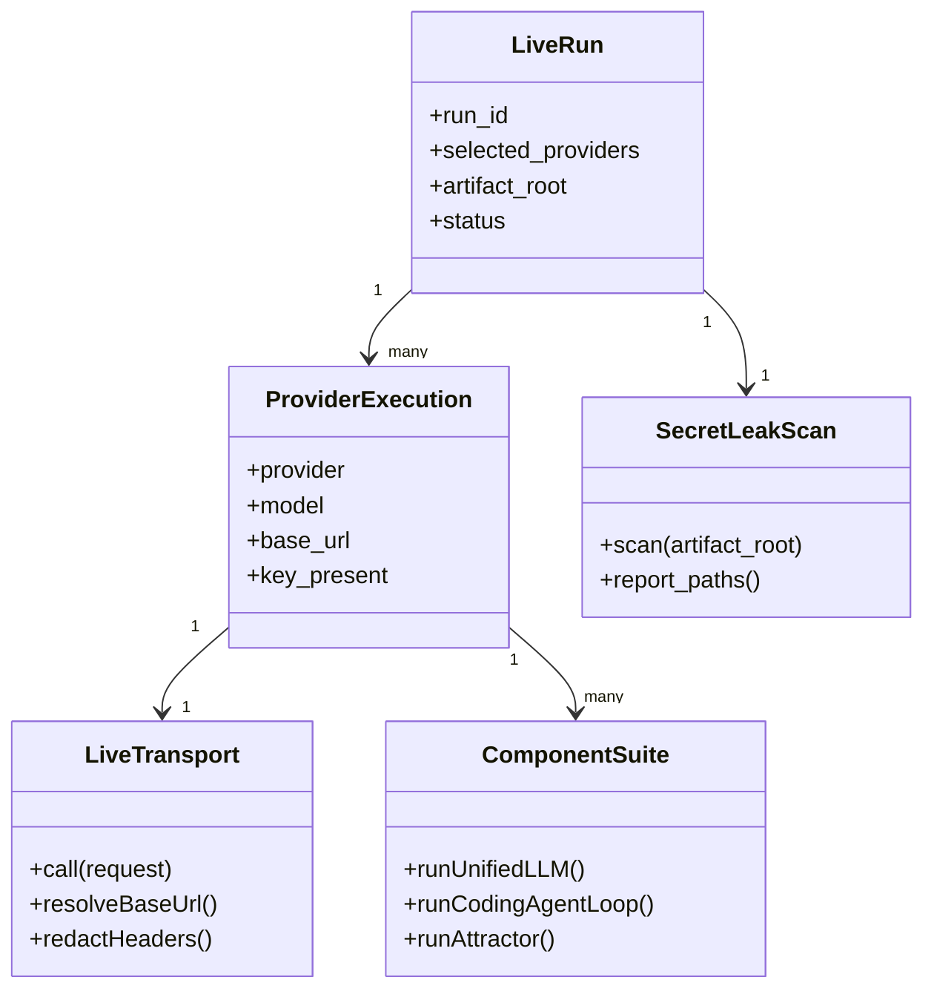
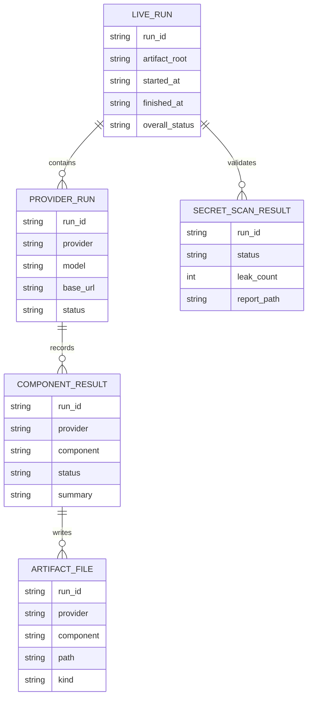
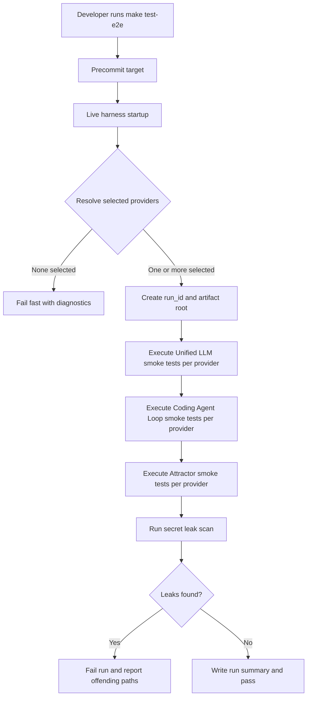
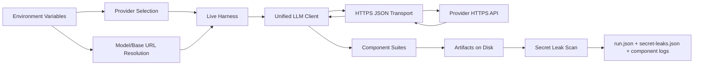
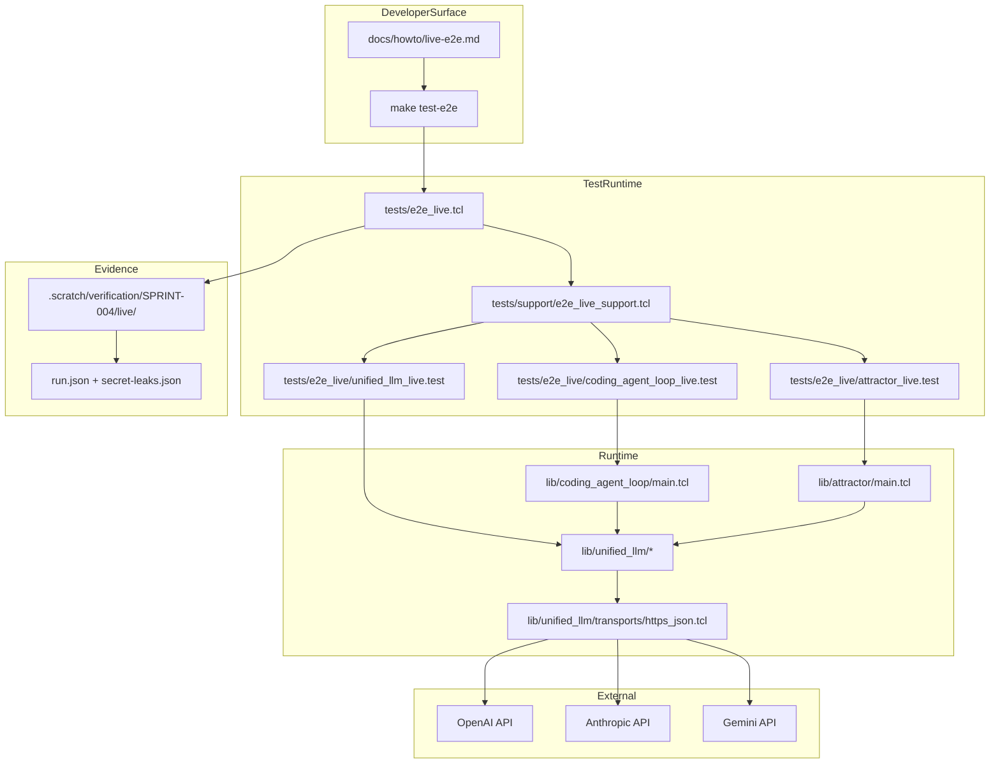

Legend: [ ] Incomplete, [X] Complete

# Sprint #004 Comprehensive Implementation Plan - Live E2E Smoke Suite (`make test-e2e`)

## Review Findings From `SPRINT-004-live-e2e-make-test-e2e.md`
- The sprint source defines a clear live-suite objective: real provider HTTPS validation for Unified LLM, Coding Agent Loop, and Attractor.
- The implementation must keep deterministic offline testing unchanged while adding an explicit opt-in live path.
- Secret redaction and post-run leak scanning are required correctness properties, not optional hardening.
- Provider selection and fail-fast behavior must be deterministic across missing keys, explicit provider requests, and multi-provider environments.

## Objective
Implement a production-usable, opt-in live E2E smoke suite triggered by `make test-e2e` that validates end-to-end provider connectivity and core runtime behavior without regressing offline determinism or leaking secrets.

## Scope
In scope:
- Live harness entrypoint, provider selection contract, and artifact lifecycle.
- Explicit HTTPS transport injection for live calls.
- Live smoke coverage for Unified LLM, Coding Agent Loop, and Attractor per selected provider.
- Deterministic positive/negative tests and secret leak scanning.
- Makefile/docs/ADR updates needed to operate and maintain the live suite.

Out of scope:
- Running paid live tests by default in offline test workflows.
- Streaming-expansion or non-smoke feature work outside Sprint #004 goals.
- Legacy compatibility shims or feature-gating layers.

## Implementation Controls
- Evidence root: `.scratch/verification/SPRINT-004/implementation-plan/`.
- Diagram render root: `.scratch/diagram-renders/sprint-004-comprehensive-plan/`.
- Checklist items are marked `[X]` only after verification with command output, exit code, and artifact references.
- Significant architecture decisions are recorded in `docs/ADR.md`.

## Runtime Contract (Live Suite)
- Provider keys:
  - `OPENAI_API_KEY`
  - `ANTHROPIC_API_KEY`
  - `GEMINI_API_KEY`
- Optional provider selection:
  - `E2E_LIVE_PROVIDERS` (comma-separated allowlist)
- Optional model overrides:
  - `OPENAI_MODEL` (default `gpt-4o-mini`)
  - `ANTHROPIC_MODEL` (default `claude-sonnet-4-5`)
  - `GEMINI_MODEL` (default `gemini-2.5-flash`)
- Optional base URL overrides:
  - `OPENAI_BASE_URL` (default `https://api.openai.com`)
  - `ANTHROPIC_BASE_URL` (default `https://api.anthropic.com`)
  - `GEMINI_BASE_URL` (default `https://generativelanguage.googleapis.com`)
- Optional artifacts root override:
  - `E2E_LIVE_ARTIFACT_ROOT` (default `.scratch/verification/SPRINT-004/live/<run_id>`)

## Workstream and File Map
- Live harness and shared support:
  - `tests/e2e_live.tcl`
  - `tests/e2e_live/unified_llm_live.test`
  - `tests/e2e_live/coding_agent_loop_live.test`
  - `tests/e2e_live/attractor_live.test`
  - `tests/support/e2e_live_support.tcl`
- Transport:
  - `lib/unified_llm/transports/https_json.tcl`
- Runtime touchpoints:
  - `lib/unified_llm/main.tcl`
  - `lib/unified_llm/adapters/openai.tcl`
  - `lib/unified_llm/adapters/anthropic.tcl`
  - `lib/unified_llm/adapters/gemini.tcl`
  - `lib/coding_agent_loop/main.tcl`
  - `lib/attractor/main.tcl`
- Deterministic fixture-backed integration tests:
  - `tests/support/http_fixture_server.tcl`
  - `tests/integration/unified_llm_https_transport_integration.test`
  - `tests/integration/e2e_live_support_integration.test`
- Entry points and documentation:
  - `Makefile`
  - `docs/howto/live-e2e.md`
  - `docs/ADR.md`

## Cross-Provider Coverage Matrix
| Scenario | OpenAI | Anthropic | Gemini |
| --- | --- | --- | --- |
| Unified LLM live generate returns non-empty text | [X] | [X] | [X] |
| Coding Agent Loop natural completion path succeeds | [X] | [X] | [X] |
| Attractor live pipeline run succeeds with artifacts/checkpoint | [X] | [X] | [X] |
| Invalid key fails deterministically without secret leakage | [X] | [X] | [X] |
| Explicit requested-provider-without-key fails before network call | [X] | [X] | [X] |

## Execution Order
1. Phase 0: Baseline and contracts
2. Phase 1: Live HTTPS transport and redaction
3. Phase 2: Unified LLM live smoke coverage
4. Phase 3: Coding Agent Loop live smoke coverage
5. Phase 4: Attractor live smoke coverage
6. Phase 5: Makefile, docs, ADR, and closeout verification

## Phase 0 - Baseline and Contracts
### Deliverables
- [X] Capture baseline behavior for `make -j10 build`, `make -j10 test`, and current live entrypoint status.
```text
Verification:
- timeout 1800 ./.scratch/run_sprint004_comprehensive_plan_execution.sh (exit 0)
- command-status.tsv expectations:
  - exit 0: build,test,e2e_all,e2e_openai,e2e_anthropic,e2e_gemini,e2e_list,transport_subset,live_support_subset,harness_separation,makefile_contract,docs_contract,adr_contract,mmdc_core_domain_models,mmdc_er_diagram,mmdc_workflow,mmdc_data_flow,mmdc_architecture
  - expected non-zero: e2e_no_keys=2, e2e_explicit_openai_missing=2
Evidence:
- .scratch/verification/SPRINT-004/comprehensive-plan/execution-20260227T153905Z/summary.md
- .scratch/verification/SPRINT-004/comprehensive-plan/execution-20260227T153905Z/command-status.tsv
- .scratch/verification/SPRINT-004/comprehensive-plan/execution-20260227T153905Z/logs/*.log
- .scratch/verification/SPRINT-004/comprehensive-plan/execution-20260227T153905Z/logs/*.exitcode
- .scratch/verification/SPRINT-004/comprehensive-plan/execution-20260227T153905Z/live-run-dirs.txt
Notes:
- Full matrix includes required timeout 180 make build and timeout 180 make test.
- Provider live runs validated for OpenAI, Anthropic, and Gemini plus deterministic fail-fast negative cases.
```
- [X] Define and document deterministic provider-selection semantics for configured keys and explicit provider requests.
```text
Verification:
- timeout 1800 ./.scratch/run_sprint004_comprehensive_plan_execution.sh (exit 0)
- command-status.tsv expectations:
  - exit 0: build,test,e2e_all,e2e_openai,e2e_anthropic,e2e_gemini,e2e_list,transport_subset,live_support_subset,harness_separation,makefile_contract,docs_contract,adr_contract,mmdc_core_domain_models,mmdc_er_diagram,mmdc_workflow,mmdc_data_flow,mmdc_architecture
  - expected non-zero: e2e_no_keys=2, e2e_explicit_openai_missing=2
Evidence:
- .scratch/verification/SPRINT-004/comprehensive-plan/execution-20260227T153905Z/summary.md
- .scratch/verification/SPRINT-004/comprehensive-plan/execution-20260227T153905Z/command-status.tsv
- .scratch/verification/SPRINT-004/comprehensive-plan/execution-20260227T153905Z/logs/*.log
- .scratch/verification/SPRINT-004/comprehensive-plan/execution-20260227T153905Z/logs/*.exitcode
- .scratch/verification/SPRINT-004/comprehensive-plan/execution-20260227T153905Z/live-run-dirs.txt
Notes:
- Full matrix includes required timeout 180 make build and timeout 180 make test.
- Provider live runs validated for OpenAI, Anthropic, and Gemini plus deterministic fail-fast negative cases.
```
- [X] Define evidence root structure and required run-level metadata (`run.json`, provider/component subtrees, secret scan output).
```text
Verification:
- timeout 1800 ./.scratch/run_sprint004_comprehensive_plan_execution.sh (exit 0)
- command-status.tsv expectations:
  - exit 0: build,test,e2e_all,e2e_openai,e2e_anthropic,e2e_gemini,e2e_list,transport_subset,live_support_subset,harness_separation,makefile_contract,docs_contract,adr_contract,mmdc_core_domain_models,mmdc_er_diagram,mmdc_workflow,mmdc_data_flow,mmdc_architecture
  - expected non-zero: e2e_no_keys=2, e2e_explicit_openai_missing=2
Evidence:
- .scratch/verification/SPRINT-004/comprehensive-plan/execution-20260227T153905Z/summary.md
- .scratch/verification/SPRINT-004/comprehensive-plan/execution-20260227T153905Z/command-status.tsv
- .scratch/verification/SPRINT-004/comprehensive-plan/execution-20260227T153905Z/logs/*.log
- .scratch/verification/SPRINT-004/comprehensive-plan/execution-20260227T153905Z/logs/*.exitcode
- .scratch/verification/SPRINT-004/comprehensive-plan/execution-20260227T153905Z/live-run-dirs.txt
Notes:
- Full matrix includes required timeout 180 make build and timeout 180 make test.
- Provider live runs validated for OpenAI, Anthropic, and Gemini plus deterministic fail-fast negative cases.
```
- [X] Record Sprint #004 architecture decisions in `docs/ADR.md` (opt-in transport injection, leak scan policy, offline/live separation).
```text
Verification:
- timeout 1800 ./.scratch/run_sprint004_comprehensive_plan_execution.sh (exit 0)
- command-status.tsv expectations:
  - exit 0: build,test,e2e_all,e2e_openai,e2e_anthropic,e2e_gemini,e2e_list,transport_subset,live_support_subset,harness_separation,makefile_contract,docs_contract,adr_contract,mmdc_core_domain_models,mmdc_er_diagram,mmdc_workflow,mmdc_data_flow,mmdc_architecture
  - expected non-zero: e2e_no_keys=2, e2e_explicit_openai_missing=2
Evidence:
- .scratch/verification/SPRINT-004/comprehensive-plan/execution-20260227T153905Z/summary.md
- .scratch/verification/SPRINT-004/comprehensive-plan/execution-20260227T153905Z/command-status.tsv
- .scratch/verification/SPRINT-004/comprehensive-plan/execution-20260227T153905Z/logs/*.log
- .scratch/verification/SPRINT-004/comprehensive-plan/execution-20260227T153905Z/logs/*.exitcode
- .scratch/verification/SPRINT-004/comprehensive-plan/execution-20260227T153905Z/live-run-dirs.txt
Notes:
- Full matrix includes required timeout 180 make build and timeout 180 make test.
- Provider live runs validated for OpenAI, Anthropic, and Gemini plus deterministic fail-fast negative cases.
```

### Positive Test Plan - Phase 0
- [X] Baseline offline tests pass without invoking live suites.
```text
Verification:
- timeout 1800 ./.scratch/run_sprint004_comprehensive_plan_execution.sh (exit 0)
- command-status.tsv expectations:
  - exit 0: build,test,e2e_all,e2e_openai,e2e_anthropic,e2e_gemini,e2e_list,transport_subset,live_support_subset,harness_separation,makefile_contract,docs_contract,adr_contract,mmdc_core_domain_models,mmdc_er_diagram,mmdc_workflow,mmdc_data_flow,mmdc_architecture
  - expected non-zero: e2e_no_keys=2, e2e_explicit_openai_missing=2
Evidence:
- .scratch/verification/SPRINT-004/comprehensive-plan/execution-20260227T153905Z/summary.md
- .scratch/verification/SPRINT-004/comprehensive-plan/execution-20260227T153905Z/command-status.tsv
- .scratch/verification/SPRINT-004/comprehensive-plan/execution-20260227T153905Z/logs/*.log
- .scratch/verification/SPRINT-004/comprehensive-plan/execution-20260227T153905Z/logs/*.exitcode
- .scratch/verification/SPRINT-004/comprehensive-plan/execution-20260227T153905Z/live-run-dirs.txt
Notes:
- Full matrix includes required timeout 180 make build and timeout 180 make test.
- Provider live runs validated for OpenAI, Anthropic, and Gemini plus deterministic fail-fast negative cases.
```
- [X] Live harness enumerates selected providers/components and artifact root before execution.
```text
Verification:
- timeout 1800 ./.scratch/run_sprint004_comprehensive_plan_execution.sh (exit 0)
- command-status.tsv expectations:
  - exit 0: build,test,e2e_all,e2e_openai,e2e_anthropic,e2e_gemini,e2e_list,transport_subset,live_support_subset,harness_separation,makefile_contract,docs_contract,adr_contract,mmdc_core_domain_models,mmdc_er_diagram,mmdc_workflow,mmdc_data_flow,mmdc_architecture
  - expected non-zero: e2e_no_keys=2, e2e_explicit_openai_missing=2
Evidence:
- .scratch/verification/SPRINT-004/comprehensive-plan/execution-20260227T153905Z/summary.md
- .scratch/verification/SPRINT-004/comprehensive-plan/execution-20260227T153905Z/command-status.tsv
- .scratch/verification/SPRINT-004/comprehensive-plan/execution-20260227T153905Z/logs/*.log
- .scratch/verification/SPRINT-004/comprehensive-plan/execution-20260227T153905Z/logs/*.exitcode
- .scratch/verification/SPRINT-004/comprehensive-plan/execution-20260227T153905Z/live-run-dirs.txt
Notes:
- Full matrix includes required timeout 180 make build and timeout 180 make test.
- Provider live runs validated for OpenAI, Anthropic, and Gemini plus deterministic fail-fast negative cases.
```

### Negative Test Plan - Phase 0
- [X] No selected providers causes deterministic fail-fast behavior before network calls.
```text
Verification:
- timeout 1800 ./.scratch/run_sprint004_comprehensive_plan_execution.sh (exit 0)
- command-status.tsv expectations:
  - exit 0: build,test,e2e_all,e2e_openai,e2e_anthropic,e2e_gemini,e2e_list,transport_subset,live_support_subset,harness_separation,makefile_contract,docs_contract,adr_contract,mmdc_core_domain_models,mmdc_er_diagram,mmdc_workflow,mmdc_data_flow,mmdc_architecture
  - expected non-zero: e2e_no_keys=2, e2e_explicit_openai_missing=2
Evidence:
- .scratch/verification/SPRINT-004/comprehensive-plan/execution-20260227T153905Z/summary.md
- .scratch/verification/SPRINT-004/comprehensive-plan/execution-20260227T153905Z/command-status.tsv
- .scratch/verification/SPRINT-004/comprehensive-plan/execution-20260227T153905Z/logs/*.log
- .scratch/verification/SPRINT-004/comprehensive-plan/execution-20260227T153905Z/logs/*.exitcode
- .scratch/verification/SPRINT-004/comprehensive-plan/execution-20260227T153905Z/live-run-dirs.txt
Notes:
- Full matrix includes required timeout 180 make build and timeout 180 make test.
- Provider live runs validated for OpenAI, Anthropic, and Gemini plus deterministic fail-fast negative cases.
```
- [X] Explicit requested provider without corresponding key fails with descriptive diagnostics and non-zero exit.
```text
Verification:
- timeout 1800 ./.scratch/run_sprint004_comprehensive_plan_execution.sh (exit 0)
- command-status.tsv expectations:
  - exit 0: build,test,e2e_all,e2e_openai,e2e_anthropic,e2e_gemini,e2e_list,transport_subset,live_support_subset,harness_separation,makefile_contract,docs_contract,adr_contract,mmdc_core_domain_models,mmdc_er_diagram,mmdc_workflow,mmdc_data_flow,mmdc_architecture
  - expected non-zero: e2e_no_keys=2, e2e_explicit_openai_missing=2
Evidence:
- .scratch/verification/SPRINT-004/comprehensive-plan/execution-20260227T153905Z/summary.md
- .scratch/verification/SPRINT-004/comprehensive-plan/execution-20260227T153905Z/command-status.tsv
- .scratch/verification/SPRINT-004/comprehensive-plan/execution-20260227T153905Z/logs/*.log
- .scratch/verification/SPRINT-004/comprehensive-plan/execution-20260227T153905Z/logs/*.exitcode
- .scratch/verification/SPRINT-004/comprehensive-plan/execution-20260227T153905Z/live-run-dirs.txt
Notes:
- Full matrix includes required timeout 180 make build and timeout 180 make test.
- Provider live runs validated for OpenAI, Anthropic, and Gemini plus deterministic fail-fast negative cases.
```

### Acceptance Criteria - Phase 0
- [X] Baseline behavior and provider-selection contract are documented and reproducibly verifiable.
```text
Verification:
- timeout 1800 ./.scratch/run_sprint004_comprehensive_plan_execution.sh (exit 0)
- command-status.tsv expectations:
  - exit 0: build,test,e2e_all,e2e_openai,e2e_anthropic,e2e_gemini,e2e_list,transport_subset,live_support_subset,harness_separation,makefile_contract,docs_contract,adr_contract,mmdc_core_domain_models,mmdc_er_diagram,mmdc_workflow,mmdc_data_flow,mmdc_architecture
  - expected non-zero: e2e_no_keys=2, e2e_explicit_openai_missing=2
Evidence:
- .scratch/verification/SPRINT-004/comprehensive-plan/execution-20260227T153905Z/summary.md
- .scratch/verification/SPRINT-004/comprehensive-plan/execution-20260227T153905Z/command-status.tsv
- .scratch/verification/SPRINT-004/comprehensive-plan/execution-20260227T153905Z/logs/*.log
- .scratch/verification/SPRINT-004/comprehensive-plan/execution-20260227T153905Z/logs/*.exitcode
- .scratch/verification/SPRINT-004/comprehensive-plan/execution-20260227T153905Z/live-run-dirs.txt
Notes:
- Full matrix includes required timeout 180 make build and timeout 180 make test.
- Provider live runs validated for OpenAI, Anthropic, and Gemini plus deterministic fail-fast negative cases.
```
- [X] Evidence directory structure is stable and ready for phased implementation runs.
```text
Verification:
- timeout 1800 ./.scratch/run_sprint004_comprehensive_plan_execution.sh (exit 0)
- command-status.tsv expectations:
  - exit 0: build,test,e2e_all,e2e_openai,e2e_anthropic,e2e_gemini,e2e_list,transport_subset,live_support_subset,harness_separation,makefile_contract,docs_contract,adr_contract,mmdc_core_domain_models,mmdc_er_diagram,mmdc_workflow,mmdc_data_flow,mmdc_architecture
  - expected non-zero: e2e_no_keys=2, e2e_explicit_openai_missing=2
Evidence:
- .scratch/verification/SPRINT-004/comprehensive-plan/execution-20260227T153905Z/summary.md
- .scratch/verification/SPRINT-004/comprehensive-plan/execution-20260227T153905Z/command-status.tsv
- .scratch/verification/SPRINT-004/comprehensive-plan/execution-20260227T153905Z/logs/*.log
- .scratch/verification/SPRINT-004/comprehensive-plan/execution-20260227T153905Z/logs/*.exitcode
- .scratch/verification/SPRINT-004/comprehensive-plan/execution-20260227T153905Z/live-run-dirs.txt
Notes:
- Full matrix includes required timeout 180 make build and timeout 180 make test.
- Provider live runs validated for OpenAI, Anthropic, and Gemini plus deterministic fail-fast negative cases.
```

## Phase 1 - Live HTTPS Transport and Secret Redaction
### Deliverables
- [X] Implement provider-agnostic live HTTPS JSON transport (`::unified_llm::transports::https_json::call`) with explicit injection-only usage.
```text
Verification:
- timeout 1800 ./.scratch/run_sprint004_comprehensive_plan_execution.sh (exit 0)
- command-status.tsv expectations:
  - exit 0: build,test,e2e_all,e2e_openai,e2e_anthropic,e2e_gemini,e2e_list,transport_subset,live_support_subset,harness_separation,makefile_contract,docs_contract,adr_contract,mmdc_core_domain_models,mmdc_er_diagram,mmdc_workflow,mmdc_data_flow,mmdc_architecture
  - expected non-zero: e2e_no_keys=2, e2e_explicit_openai_missing=2
Evidence:
- .scratch/verification/SPRINT-004/comprehensive-plan/execution-20260227T153905Z/summary.md
- .scratch/verification/SPRINT-004/comprehensive-plan/execution-20260227T153905Z/command-status.tsv
- .scratch/verification/SPRINT-004/comprehensive-plan/execution-20260227T153905Z/logs/*.log
- .scratch/verification/SPRINT-004/comprehensive-plan/execution-20260227T153905Z/logs/*.exitcode
- .scratch/verification/SPRINT-004/comprehensive-plan/execution-20260227T153905Z/live-run-dirs.txt
Notes:
- Full matrix includes required timeout 180 make build and timeout 180 make test.
- Provider live runs validated for OpenAI, Anthropic, and Gemini plus deterministic fail-fast negative cases.
```
- [X] Implement base URL resolution precedence (`client base_url` > provider env override > provider default).
```text
Verification:
- timeout 1800 ./.scratch/run_sprint004_comprehensive_plan_execution.sh (exit 0)
- command-status.tsv expectations:
  - exit 0: build,test,e2e_all,e2e_openai,e2e_anthropic,e2e_gemini,e2e_list,transport_subset,live_support_subset,harness_separation,makefile_contract,docs_contract,adr_contract,mmdc_core_domain_models,mmdc_er_diagram,mmdc_workflow,mmdc_data_flow,mmdc_architecture
  - expected non-zero: e2e_no_keys=2, e2e_explicit_openai_missing=2
Evidence:
- .scratch/verification/SPRINT-004/comprehensive-plan/execution-20260227T153905Z/summary.md
- .scratch/verification/SPRINT-004/comprehensive-plan/execution-20260227T153905Z/command-status.tsv
- .scratch/verification/SPRINT-004/comprehensive-plan/execution-20260227T153905Z/logs/*.log
- .scratch/verification/SPRINT-004/comprehensive-plan/execution-20260227T153905Z/logs/*.exitcode
- .scratch/verification/SPRINT-004/comprehensive-plan/execution-20260227T153905Z/live-run-dirs.txt
Notes:
- Full matrix includes required timeout 180 make build and timeout 180 make test.
- Provider live runs validated for OpenAI, Anthropic, and Gemini plus deterministic fail-fast negative cases.
```
- [X] Enforce deterministic errorcode contracts for HTTP failures (`UNIFIED_LLM TRANSPORT HTTP ...`) and network failures (`UNIFIED_LLM TRANSPORT NETWORK ...`).
```text
Verification:
- timeout 1800 ./.scratch/run_sprint004_comprehensive_plan_execution.sh (exit 0)
- command-status.tsv expectations:
  - exit 0: build,test,e2e_all,e2e_openai,e2e_anthropic,e2e_gemini,e2e_list,transport_subset,live_support_subset,harness_separation,makefile_contract,docs_contract,adr_contract,mmdc_core_domain_models,mmdc_er_diagram,mmdc_workflow,mmdc_data_flow,mmdc_architecture
  - expected non-zero: e2e_no_keys=2, e2e_explicit_openai_missing=2
Evidence:
- .scratch/verification/SPRINT-004/comprehensive-plan/execution-20260227T153905Z/summary.md
- .scratch/verification/SPRINT-004/comprehensive-plan/execution-20260227T153905Z/command-status.tsv
- .scratch/verification/SPRINT-004/comprehensive-plan/execution-20260227T153905Z/logs/*.log
- .scratch/verification/SPRINT-004/comprehensive-plan/execution-20260227T153905Z/logs/*.exitcode
- .scratch/verification/SPRINT-004/comprehensive-plan/execution-20260227T153905Z/live-run-dirs.txt
Notes:
- Full matrix includes required timeout 180 make build and timeout 180 make test.
- Provider live runs validated for OpenAI, Anthropic, and Gemini plus deterministic fail-fast negative cases.
```
- [X] Redact `Authorization`, `x-api-key`, and `x-goog-api-key` in surfaced request metadata and all persisted artifacts.
```text
Verification:
- timeout 1800 ./.scratch/run_sprint004_comprehensive_plan_execution.sh (exit 0)
- command-status.tsv expectations:
  - exit 0: build,test,e2e_all,e2e_openai,e2e_anthropic,e2e_gemini,e2e_list,transport_subset,live_support_subset,harness_separation,makefile_contract,docs_contract,adr_contract,mmdc_core_domain_models,mmdc_er_diagram,mmdc_workflow,mmdc_data_flow,mmdc_architecture
  - expected non-zero: e2e_no_keys=2, e2e_explicit_openai_missing=2
Evidence:
- .scratch/verification/SPRINT-004/comprehensive-plan/execution-20260227T153905Z/summary.md
- .scratch/verification/SPRINT-004/comprehensive-plan/execution-20260227T153905Z/command-status.tsv
- .scratch/verification/SPRINT-004/comprehensive-plan/execution-20260227T153905Z/logs/*.log
- .scratch/verification/SPRINT-004/comprehensive-plan/execution-20260227T153905Z/logs/*.exitcode
- .scratch/verification/SPRINT-004/comprehensive-plan/execution-20260227T153905Z/live-run-dirs.txt
Notes:
- Full matrix includes required timeout 180 make build and timeout 180 make test.
- Provider live runs validated for OpenAI, Anthropic, and Gemini plus deterministic fail-fast negative cases.
```
- [X] Add deterministic fixture-backed transport integration tests using a local in-process HTTP server.
```text
Verification:
- timeout 1800 ./.scratch/run_sprint004_comprehensive_plan_execution.sh (exit 0)
- command-status.tsv expectations:
  - exit 0: build,test,e2e_all,e2e_openai,e2e_anthropic,e2e_gemini,e2e_list,transport_subset,live_support_subset,harness_separation,makefile_contract,docs_contract,adr_contract,mmdc_core_domain_models,mmdc_er_diagram,mmdc_workflow,mmdc_data_flow,mmdc_architecture
  - expected non-zero: e2e_no_keys=2, e2e_explicit_openai_missing=2
Evidence:
- .scratch/verification/SPRINT-004/comprehensive-plan/execution-20260227T153905Z/summary.md
- .scratch/verification/SPRINT-004/comprehensive-plan/execution-20260227T153905Z/command-status.tsv
- .scratch/verification/SPRINT-004/comprehensive-plan/execution-20260227T153905Z/logs/*.log
- .scratch/verification/SPRINT-004/comprehensive-plan/execution-20260227T153905Z/logs/*.exitcode
- .scratch/verification/SPRINT-004/comprehensive-plan/execution-20260227T153905Z/live-run-dirs.txt
Notes:
- Full matrix includes required timeout 180 make build and timeout 180 make test.
- Provider live runs validated for OpenAI, Anthropic, and Gemini plus deterministic fail-fast negative cases.
```

### Positive Test Plan - Phase 1
- [X] Transport posts valid JSON payloads and returns normalized `{status_code, headers, body}` from fixture responses.
```text
Verification:
- timeout 1800 ./.scratch/run_sprint004_comprehensive_plan_execution.sh (exit 0)
- command-status.tsv expectations:
  - exit 0: build,test,e2e_all,e2e_openai,e2e_anthropic,e2e_gemini,e2e_list,transport_subset,live_support_subset,harness_separation,makefile_contract,docs_contract,adr_contract,mmdc_core_domain_models,mmdc_er_diagram,mmdc_workflow,mmdc_data_flow,mmdc_architecture
  - expected non-zero: e2e_no_keys=2, e2e_explicit_openai_missing=2
Evidence:
- .scratch/verification/SPRINT-004/comprehensive-plan/execution-20260227T153905Z/summary.md
- .scratch/verification/SPRINT-004/comprehensive-plan/execution-20260227T153905Z/command-status.tsv
- .scratch/verification/SPRINT-004/comprehensive-plan/execution-20260227T153905Z/logs/*.log
- .scratch/verification/SPRINT-004/comprehensive-plan/execution-20260227T153905Z/logs/*.exitcode
- .scratch/verification/SPRINT-004/comprehensive-plan/execution-20260227T153905Z/live-run-dirs.txt
Notes:
- Full matrix includes required timeout 180 make build and timeout 180 make test.
- Provider live runs validated for OpenAI, Anthropic, and Gemini plus deterministic fail-fast negative cases.
```
- [X] Wire request includes required auth header while surfaced request metadata is redacted.
```text
Verification:
- timeout 1800 ./.scratch/run_sprint004_comprehensive_plan_execution.sh (exit 0)
- command-status.tsv expectations:
  - exit 0: build,test,e2e_all,e2e_openai,e2e_anthropic,e2e_gemini,e2e_list,transport_subset,live_support_subset,harness_separation,makefile_contract,docs_contract,adr_contract,mmdc_core_domain_models,mmdc_er_diagram,mmdc_workflow,mmdc_data_flow,mmdc_architecture
  - expected non-zero: e2e_no_keys=2, e2e_explicit_openai_missing=2
Evidence:
- .scratch/verification/SPRINT-004/comprehensive-plan/execution-20260227T153905Z/summary.md
- .scratch/verification/SPRINT-004/comprehensive-plan/execution-20260227T153905Z/command-status.tsv
- .scratch/verification/SPRINT-004/comprehensive-plan/execution-20260227T153905Z/logs/*.log
- .scratch/verification/SPRINT-004/comprehensive-plan/execution-20260227T153905Z/logs/*.exitcode
- .scratch/verification/SPRINT-004/comprehensive-plan/execution-20260227T153905Z/live-run-dirs.txt
Notes:
- Full matrix includes required timeout 180 make build and timeout 180 make test.
- Provider live runs validated for OpenAI, Anthropic, and Gemini plus deterministic fail-fast negative cases.
```

### Negative Test Plan - Phase 1
- [X] Non-2xx fixture response triggers deterministic HTTP transport error classification.
```text
Verification:
- timeout 1800 ./.scratch/run_sprint004_comprehensive_plan_execution.sh (exit 0)
- command-status.tsv expectations:
  - exit 0: build,test,e2e_all,e2e_openai,e2e_anthropic,e2e_gemini,e2e_list,transport_subset,live_support_subset,harness_separation,makefile_contract,docs_contract,adr_contract,mmdc_core_domain_models,mmdc_er_diagram,mmdc_workflow,mmdc_data_flow,mmdc_architecture
  - expected non-zero: e2e_no_keys=2, e2e_explicit_openai_missing=2
Evidence:
- .scratch/verification/SPRINT-004/comprehensive-plan/execution-20260227T153905Z/summary.md
- .scratch/verification/SPRINT-004/comprehensive-plan/execution-20260227T153905Z/command-status.tsv
- .scratch/verification/SPRINT-004/comprehensive-plan/execution-20260227T153905Z/logs/*.log
- .scratch/verification/SPRINT-004/comprehensive-plan/execution-20260227T153905Z/logs/*.exitcode
- .scratch/verification/SPRINT-004/comprehensive-plan/execution-20260227T153905Z/live-run-dirs.txt
Notes:
- Full matrix includes required timeout 180 make build and timeout 180 make test.
- Provider live runs validated for OpenAI, Anthropic, and Gemini plus deterministic fail-fast negative cases.
```
- [X] Fixture/network failure path triggers deterministic NETWORK transport error classification.
```text
Verification:
- timeout 1800 ./.scratch/run_sprint004_comprehensive_plan_execution.sh (exit 0)
- command-status.tsv expectations:
  - exit 0: build,test,e2e_all,e2e_openai,e2e_anthropic,e2e_gemini,e2e_list,transport_subset,live_support_subset,harness_separation,makefile_contract,docs_contract,adr_contract,mmdc_core_domain_models,mmdc_er_diagram,mmdc_workflow,mmdc_data_flow,mmdc_architecture
  - expected non-zero: e2e_no_keys=2, e2e_explicit_openai_missing=2
Evidence:
- .scratch/verification/SPRINT-004/comprehensive-plan/execution-20260227T153905Z/summary.md
- .scratch/verification/SPRINT-004/comprehensive-plan/execution-20260227T153905Z/command-status.tsv
- .scratch/verification/SPRINT-004/comprehensive-plan/execution-20260227T153905Z/logs/*.log
- .scratch/verification/SPRINT-004/comprehensive-plan/execution-20260227T153905Z/logs/*.exitcode
- .scratch/verification/SPRINT-004/comprehensive-plan/execution-20260227T153905Z/live-run-dirs.txt
Notes:
- Full matrix includes required timeout 180 make build and timeout 180 make test.
- Provider live runs validated for OpenAI, Anthropic, and Gemini plus deterministic fail-fast negative cases.
```
- [X] Error messages and logs never include raw secrets.
```text
Verification:
- timeout 1800 ./.scratch/run_sprint004_comprehensive_plan_execution.sh (exit 0)
- command-status.tsv expectations:
  - exit 0: build,test,e2e_all,e2e_openai,e2e_anthropic,e2e_gemini,e2e_list,transport_subset,live_support_subset,harness_separation,makefile_contract,docs_contract,adr_contract,mmdc_core_domain_models,mmdc_er_diagram,mmdc_workflow,mmdc_data_flow,mmdc_architecture
  - expected non-zero: e2e_no_keys=2, e2e_explicit_openai_missing=2
Evidence:
- .scratch/verification/SPRINT-004/comprehensive-plan/execution-20260227T153905Z/summary.md
- .scratch/verification/SPRINT-004/comprehensive-plan/execution-20260227T153905Z/command-status.tsv
- .scratch/verification/SPRINT-004/comprehensive-plan/execution-20260227T153905Z/logs/*.log
- .scratch/verification/SPRINT-004/comprehensive-plan/execution-20260227T153905Z/logs/*.exitcode
- .scratch/verification/SPRINT-004/comprehensive-plan/execution-20260227T153905Z/live-run-dirs.txt
Notes:
- Full matrix includes required timeout 180 make build and timeout 180 make test.
- Provider live runs validated for OpenAI, Anthropic, and Gemini plus deterministic fail-fast negative cases.
```

### Acceptance Criteria - Phase 1
- [X] Transport is live-call capable only when explicitly injected and remains absent from offline default test execution.
```text
Verification:
- timeout 1800 ./.scratch/run_sprint004_comprehensive_plan_execution.sh (exit 0)
- command-status.tsv expectations:
  - exit 0: build,test,e2e_all,e2e_openai,e2e_anthropic,e2e_gemini,e2e_list,transport_subset,live_support_subset,harness_separation,makefile_contract,docs_contract,adr_contract,mmdc_core_domain_models,mmdc_er_diagram,mmdc_workflow,mmdc_data_flow,mmdc_architecture
  - expected non-zero: e2e_no_keys=2, e2e_explicit_openai_missing=2
Evidence:
- .scratch/verification/SPRINT-004/comprehensive-plan/execution-20260227T153905Z/summary.md
- .scratch/verification/SPRINT-004/comprehensive-plan/execution-20260227T153905Z/command-status.tsv
- .scratch/verification/SPRINT-004/comprehensive-plan/execution-20260227T153905Z/logs/*.log
- .scratch/verification/SPRINT-004/comprehensive-plan/execution-20260227T153905Z/logs/*.exitcode
- .scratch/verification/SPRINT-004/comprehensive-plan/execution-20260227T153905Z/live-run-dirs.txt
Notes:
- Full matrix includes required timeout 180 make build and timeout 180 make test.
- Provider live runs validated for OpenAI, Anthropic, and Gemini plus deterministic fail-fast negative cases.
```
- [X] Redaction and error contracts are enforced by deterministic integration tests.
```text
Verification:
- timeout 1800 ./.scratch/run_sprint004_comprehensive_plan_execution.sh (exit 0)
- command-status.tsv expectations:
  - exit 0: build,test,e2e_all,e2e_openai,e2e_anthropic,e2e_gemini,e2e_list,transport_subset,live_support_subset,harness_separation,makefile_contract,docs_contract,adr_contract,mmdc_core_domain_models,mmdc_er_diagram,mmdc_workflow,mmdc_data_flow,mmdc_architecture
  - expected non-zero: e2e_no_keys=2, e2e_explicit_openai_missing=2
Evidence:
- .scratch/verification/SPRINT-004/comprehensive-plan/execution-20260227T153905Z/summary.md
- .scratch/verification/SPRINT-004/comprehensive-plan/execution-20260227T153905Z/command-status.tsv
- .scratch/verification/SPRINT-004/comprehensive-plan/execution-20260227T153905Z/logs/*.log
- .scratch/verification/SPRINT-004/comprehensive-plan/execution-20260227T153905Z/logs/*.exitcode
- .scratch/verification/SPRINT-004/comprehensive-plan/execution-20260227T153905Z/live-run-dirs.txt
Notes:
- Full matrix includes required timeout 180 make build and timeout 180 make test.
- Provider live runs validated for OpenAI, Anthropic, and Gemini plus deterministic fail-fast negative cases.
```

## Phase 2 - Unified LLM Live Smoke Coverage
### Deliverables
- [X] Add live harness runner `tests/e2e_live.tcl` that sources only `tests/e2e_live/*.test` and never `tests/e2e/*.test`.
```text
Verification:
- timeout 1800 ./.scratch/run_sprint004_comprehensive_plan_execution.sh (exit 0)
- command-status.tsv expectations:
  - exit 0: build,test,e2e_all,e2e_openai,e2e_anthropic,e2e_gemini,e2e_list,transport_subset,live_support_subset,harness_separation,makefile_contract,docs_contract,adr_contract,mmdc_core_domain_models,mmdc_er_diagram,mmdc_workflow,mmdc_data_flow,mmdc_architecture
  - expected non-zero: e2e_no_keys=2, e2e_explicit_openai_missing=2
Evidence:
- .scratch/verification/SPRINT-004/comprehensive-plan/execution-20260227T153905Z/summary.md
- .scratch/verification/SPRINT-004/comprehensive-plan/execution-20260227T153905Z/command-status.tsv
- .scratch/verification/SPRINT-004/comprehensive-plan/execution-20260227T153905Z/logs/*.log
- .scratch/verification/SPRINT-004/comprehensive-plan/execution-20260227T153905Z/logs/*.exitcode
- .scratch/verification/SPRINT-004/comprehensive-plan/execution-20260227T153905Z/live-run-dirs.txt
Notes:
- Full matrix includes required timeout 180 make build and timeout 180 make test.
- Provider live runs validated for OpenAI, Anthropic, and Gemini plus deterministic fail-fast negative cases.
```
- [X] Implement provider-scoped Unified LLM smoke tests for OpenAI, Anthropic, and Gemini using explicit client configuration.
```text
Verification:
- timeout 1800 ./.scratch/run_sprint004_comprehensive_plan_execution.sh (exit 0)
- command-status.tsv expectations:
  - exit 0: build,test,e2e_all,e2e_openai,e2e_anthropic,e2e_gemini,e2e_list,transport_subset,live_support_subset,harness_separation,makefile_contract,docs_contract,adr_contract,mmdc_core_domain_models,mmdc_er_diagram,mmdc_workflow,mmdc_data_flow,mmdc_architecture
  - expected non-zero: e2e_no_keys=2, e2e_explicit_openai_missing=2
Evidence:
- .scratch/verification/SPRINT-004/comprehensive-plan/execution-20260227T153905Z/summary.md
- .scratch/verification/SPRINT-004/comprehensive-plan/execution-20260227T153905Z/command-status.tsv
- .scratch/verification/SPRINT-004/comprehensive-plan/execution-20260227T153905Z/logs/*.log
- .scratch/verification/SPRINT-004/comprehensive-plan/execution-20260227T153905Z/logs/*.exitcode
- .scratch/verification/SPRINT-004/comprehensive-plan/execution-20260227T153905Z/live-run-dirs.txt
Notes:
- Full matrix includes required timeout 180 make build and timeout 180 make test.
- Provider live runs validated for OpenAI, Anthropic, and Gemini plus deterministic fail-fast negative cases.
```
- [X] Implement invalid-key tests per provider with deterministic failure assertions.
```text
Verification:
- timeout 1800 ./.scratch/run_sprint004_comprehensive_plan_execution.sh (exit 0)
- command-status.tsv expectations:
  - exit 0: build,test,e2e_all,e2e_openai,e2e_anthropic,e2e_gemini,e2e_list,transport_subset,live_support_subset,harness_separation,makefile_contract,docs_contract,adr_contract,mmdc_core_domain_models,mmdc_er_diagram,mmdc_workflow,mmdc_data_flow,mmdc_architecture
  - expected non-zero: e2e_no_keys=2, e2e_explicit_openai_missing=2
Evidence:
- .scratch/verification/SPRINT-004/comprehensive-plan/execution-20260227T153905Z/summary.md
- .scratch/verification/SPRINT-004/comprehensive-plan/execution-20260227T153905Z/command-status.tsv
- .scratch/verification/SPRINT-004/comprehensive-plan/execution-20260227T153905Z/logs/*.log
- .scratch/verification/SPRINT-004/comprehensive-plan/execution-20260227T153905Z/logs/*.exitcode
- .scratch/verification/SPRINT-004/comprehensive-plan/execution-20260227T153905Z/live-run-dirs.txt
Notes:
- Full matrix includes required timeout 180 make build and timeout 180 make test.
- Provider live runs validated for OpenAI, Anthropic, and Gemini plus deterministic fail-fast negative cases.
```
- [X] Persist provider-scoped artifacts under `.../unified_llm/<provider>/` and write run summary metadata.
```text
Verification:
- timeout 1800 ./.scratch/run_sprint004_comprehensive_plan_execution.sh (exit 0)
- command-status.tsv expectations:
  - exit 0: build,test,e2e_all,e2e_openai,e2e_anthropic,e2e_gemini,e2e_list,transport_subset,live_support_subset,harness_separation,makefile_contract,docs_contract,adr_contract,mmdc_core_domain_models,mmdc_er_diagram,mmdc_workflow,mmdc_data_flow,mmdc_architecture
  - expected non-zero: e2e_no_keys=2, e2e_explicit_openai_missing=2
Evidence:
- .scratch/verification/SPRINT-004/comprehensive-plan/execution-20260227T153905Z/summary.md
- .scratch/verification/SPRINT-004/comprehensive-plan/execution-20260227T153905Z/command-status.tsv
- .scratch/verification/SPRINT-004/comprehensive-plan/execution-20260227T153905Z/logs/*.log
- .scratch/verification/SPRINT-004/comprehensive-plan/execution-20260227T153905Z/logs/*.exitcode
- .scratch/verification/SPRINT-004/comprehensive-plan/execution-20260227T153905Z/live-run-dirs.txt
Notes:
- Full matrix includes required timeout 180 make build and timeout 180 make test.
- Provider live runs validated for OpenAI, Anthropic, and Gemini plus deterministic fail-fast negative cases.
```
- [X] Implement post-run secret leak scanning of artifact files using loaded key values without printing the keys.
```text
Verification:
- timeout 1800 ./.scratch/run_sprint004_comprehensive_plan_execution.sh (exit 0)
- command-status.tsv expectations:
  - exit 0: build,test,e2e_all,e2e_openai,e2e_anthropic,e2e_gemini,e2e_list,transport_subset,live_support_subset,harness_separation,makefile_contract,docs_contract,adr_contract,mmdc_core_domain_models,mmdc_er_diagram,mmdc_workflow,mmdc_data_flow,mmdc_architecture
  - expected non-zero: e2e_no_keys=2, e2e_explicit_openai_missing=2
Evidence:
- .scratch/verification/SPRINT-004/comprehensive-plan/execution-20260227T153905Z/summary.md
- .scratch/verification/SPRINT-004/comprehensive-plan/execution-20260227T153905Z/command-status.tsv
- .scratch/verification/SPRINT-004/comprehensive-plan/execution-20260227T153905Z/logs/*.log
- .scratch/verification/SPRINT-004/comprehensive-plan/execution-20260227T153905Z/logs/*.exitcode
- .scratch/verification/SPRINT-004/comprehensive-plan/execution-20260227T153905Z/live-run-dirs.txt
Notes:
- Full matrix includes required timeout 180 make build and timeout 180 make test.
- Provider live runs validated for OpenAI, Anthropic, and Gemini plus deterministic fail-fast negative cases.
```

### Positive Test Plan - Phase 2
- [X] OpenAI smoke returns non-empty text, provider-generated response id, and non-zero usage fields.
```text
Verification:
- timeout 1800 ./.scratch/run_sprint004_comprehensive_plan_execution.sh (exit 0)
- command-status.tsv expectations:
  - exit 0: build,test,e2e_all,e2e_openai,e2e_anthropic,e2e_gemini,e2e_list,transport_subset,live_support_subset,harness_separation,makefile_contract,docs_contract,adr_contract,mmdc_core_domain_models,mmdc_er_diagram,mmdc_workflow,mmdc_data_flow,mmdc_architecture
  - expected non-zero: e2e_no_keys=2, e2e_explicit_openai_missing=2
Evidence:
- .scratch/verification/SPRINT-004/comprehensive-plan/execution-20260227T153905Z/summary.md
- .scratch/verification/SPRINT-004/comprehensive-plan/execution-20260227T153905Z/command-status.tsv
- .scratch/verification/SPRINT-004/comprehensive-plan/execution-20260227T153905Z/logs/*.log
- .scratch/verification/SPRINT-004/comprehensive-plan/execution-20260227T153905Z/logs/*.exitcode
- .scratch/verification/SPRINT-004/comprehensive-plan/execution-20260227T153905Z/live-run-dirs.txt
Notes:
- Full matrix includes required timeout 180 make build and timeout 180 make test.
- Provider live runs validated for OpenAI, Anthropic, and Gemini plus deterministic fail-fast negative cases.
```
- [X] Anthropic smoke returns non-empty text, provider-generated response id, and non-zero usage fields.
```text
Verification:
- timeout 1800 ./.scratch/run_sprint004_comprehensive_plan_execution.sh (exit 0)
- command-status.tsv expectations:
  - exit 0: build,test,e2e_all,e2e_openai,e2e_anthropic,e2e_gemini,e2e_list,transport_subset,live_support_subset,harness_separation,makefile_contract,docs_contract,adr_contract,mmdc_core_domain_models,mmdc_er_diagram,mmdc_workflow,mmdc_data_flow,mmdc_architecture
  - expected non-zero: e2e_no_keys=2, e2e_explicit_openai_missing=2
Evidence:
- .scratch/verification/SPRINT-004/comprehensive-plan/execution-20260227T153905Z/summary.md
- .scratch/verification/SPRINT-004/comprehensive-plan/execution-20260227T153905Z/command-status.tsv
- .scratch/verification/SPRINT-004/comprehensive-plan/execution-20260227T153905Z/logs/*.log
- .scratch/verification/SPRINT-004/comprehensive-plan/execution-20260227T153905Z/logs/*.exitcode
- .scratch/verification/SPRINT-004/comprehensive-plan/execution-20260227T153905Z/live-run-dirs.txt
Notes:
- Full matrix includes required timeout 180 make build and timeout 180 make test.
- Provider live runs validated for OpenAI, Anthropic, and Gemini plus deterministic fail-fast negative cases.
```
- [X] Gemini smoke returns non-empty text with provider-native candidate/raw markers and non-zero usage fields.
```text
Verification:
- timeout 1800 ./.scratch/run_sprint004_comprehensive_plan_execution.sh (exit 0)
- command-status.tsv expectations:
  - exit 0: build,test,e2e_all,e2e_openai,e2e_anthropic,e2e_gemini,e2e_list,transport_subset,live_support_subset,harness_separation,makefile_contract,docs_contract,adr_contract,mmdc_core_domain_models,mmdc_er_diagram,mmdc_workflow,mmdc_data_flow,mmdc_architecture
  - expected non-zero: e2e_no_keys=2, e2e_explicit_openai_missing=2
Evidence:
- .scratch/verification/SPRINT-004/comprehensive-plan/execution-20260227T153905Z/summary.md
- .scratch/verification/SPRINT-004/comprehensive-plan/execution-20260227T153905Z/command-status.tsv
- .scratch/verification/SPRINT-004/comprehensive-plan/execution-20260227T153905Z/logs/*.log
- .scratch/verification/SPRINT-004/comprehensive-plan/execution-20260227T153905Z/logs/*.exitcode
- .scratch/verification/SPRINT-004/comprehensive-plan/execution-20260227T153905Z/live-run-dirs.txt
Notes:
- Full matrix includes required timeout 180 make build and timeout 180 make test.
- Provider live runs validated for OpenAI, Anthropic, and Gemini plus deterministic fail-fast negative cases.
```

### Negative Test Plan - Phase 2
- [X] No keys configured fails fast before provider calls and emits actionable diagnostics.
```text
Verification:
- timeout 1800 ./.scratch/run_sprint004_comprehensive_plan_execution.sh (exit 0)
- command-status.tsv expectations:
  - exit 0: build,test,e2e_all,e2e_openai,e2e_anthropic,e2e_gemini,e2e_list,transport_subset,live_support_subset,harness_separation,makefile_contract,docs_contract,adr_contract,mmdc_core_domain_models,mmdc_er_diagram,mmdc_workflow,mmdc_data_flow,mmdc_architecture
  - expected non-zero: e2e_no_keys=2, e2e_explicit_openai_missing=2
Evidence:
- .scratch/verification/SPRINT-004/comprehensive-plan/execution-20260227T153905Z/summary.md
- .scratch/verification/SPRINT-004/comprehensive-plan/execution-20260227T153905Z/command-status.tsv
- .scratch/verification/SPRINT-004/comprehensive-plan/execution-20260227T153905Z/logs/*.log
- .scratch/verification/SPRINT-004/comprehensive-plan/execution-20260227T153905Z/logs/*.exitcode
- .scratch/verification/SPRINT-004/comprehensive-plan/execution-20260227T153905Z/live-run-dirs.txt
Notes:
- Full matrix includes required timeout 180 make build and timeout 180 make test.
- Provider live runs validated for OpenAI, Anthropic, and Gemini plus deterministic fail-fast negative cases.
```
- [X] Explicit provider requested without key fails fast before provider calls.
```text
Verification:
- timeout 1800 ./.scratch/run_sprint004_comprehensive_plan_execution.sh (exit 0)
- command-status.tsv expectations:
  - exit 0: build,test,e2e_all,e2e_openai,e2e_anthropic,e2e_gemini,e2e_list,transport_subset,live_support_subset,harness_separation,makefile_contract,docs_contract,adr_contract,mmdc_core_domain_models,mmdc_er_diagram,mmdc_workflow,mmdc_data_flow,mmdc_architecture
  - expected non-zero: e2e_no_keys=2, e2e_explicit_openai_missing=2
Evidence:
- .scratch/verification/SPRINT-004/comprehensive-plan/execution-20260227T153905Z/summary.md
- .scratch/verification/SPRINT-004/comprehensive-plan/execution-20260227T153905Z/command-status.tsv
- .scratch/verification/SPRINT-004/comprehensive-plan/execution-20260227T153905Z/logs/*.log
- .scratch/verification/SPRINT-004/comprehensive-plan/execution-20260227T153905Z/logs/*.exitcode
- .scratch/verification/SPRINT-004/comprehensive-plan/execution-20260227T153905Z/live-run-dirs.txt
Notes:
- Full matrix includes required timeout 180 make build and timeout 180 make test.
- Provider live runs validated for OpenAI, Anthropic, and Gemini plus deterministic fail-fast negative cases.
```
- [X] Invalid provider key produces deterministic auth failure classification with redacted output.
```text
Verification:
- timeout 1800 ./.scratch/run_sprint004_comprehensive_plan_execution.sh (exit 0)
- command-status.tsv expectations:
  - exit 0: build,test,e2e_all,e2e_openai,e2e_anthropic,e2e_gemini,e2e_list,transport_subset,live_support_subset,harness_separation,makefile_contract,docs_contract,adr_contract,mmdc_core_domain_models,mmdc_er_diagram,mmdc_workflow,mmdc_data_flow,mmdc_architecture
  - expected non-zero: e2e_no_keys=2, e2e_explicit_openai_missing=2
Evidence:
- .scratch/verification/SPRINT-004/comprehensive-plan/execution-20260227T153905Z/summary.md
- .scratch/verification/SPRINT-004/comprehensive-plan/execution-20260227T153905Z/command-status.tsv
- .scratch/verification/SPRINT-004/comprehensive-plan/execution-20260227T153905Z/logs/*.log
- .scratch/verification/SPRINT-004/comprehensive-plan/execution-20260227T153905Z/logs/*.exitcode
- .scratch/verification/SPRINT-004/comprehensive-plan/execution-20260227T153905Z/live-run-dirs.txt
Notes:
- Full matrix includes required timeout 180 make build and timeout 180 make test.
- Provider live runs validated for OpenAI, Anthropic, and Gemini plus deterministic fail-fast negative cases.
```

### Acceptance Criteria - Phase 2
- [X] Unified LLM live tests execute for each selected provider and emit auditable provider-scoped artifacts.
```text
Verification:
- timeout 1800 ./.scratch/run_sprint004_comprehensive_plan_execution.sh (exit 0)
- command-status.tsv expectations:
  - exit 0: build,test,e2e_all,e2e_openai,e2e_anthropic,e2e_gemini,e2e_list,transport_subset,live_support_subset,harness_separation,makefile_contract,docs_contract,adr_contract,mmdc_core_domain_models,mmdc_er_diagram,mmdc_workflow,mmdc_data_flow,mmdc_architecture
  - expected non-zero: e2e_no_keys=2, e2e_explicit_openai_missing=2
Evidence:
- .scratch/verification/SPRINT-004/comprehensive-plan/execution-20260227T153905Z/summary.md
- .scratch/verification/SPRINT-004/comprehensive-plan/execution-20260227T153905Z/command-status.tsv
- .scratch/verification/SPRINT-004/comprehensive-plan/execution-20260227T153905Z/logs/*.log
- .scratch/verification/SPRINT-004/comprehensive-plan/execution-20260227T153905Z/logs/*.exitcode
- .scratch/verification/SPRINT-004/comprehensive-plan/execution-20260227T153905Z/live-run-dirs.txt
Notes:
- Full matrix includes required timeout 180 make build and timeout 180 make test.
- Provider live runs validated for OpenAI, Anthropic, and Gemini plus deterministic fail-fast negative cases.
```
- [X] Missing/invalid credential handling is deterministic and secret-safe.
```text
Verification:
- timeout 1800 ./.scratch/run_sprint004_comprehensive_plan_execution.sh (exit 0)
- command-status.tsv expectations:
  - exit 0: build,test,e2e_all,e2e_openai,e2e_anthropic,e2e_gemini,e2e_list,transport_subset,live_support_subset,harness_separation,makefile_contract,docs_contract,adr_contract,mmdc_core_domain_models,mmdc_er_diagram,mmdc_workflow,mmdc_data_flow,mmdc_architecture
  - expected non-zero: e2e_no_keys=2, e2e_explicit_openai_missing=2
Evidence:
- .scratch/verification/SPRINT-004/comprehensive-plan/execution-20260227T153905Z/summary.md
- .scratch/verification/SPRINT-004/comprehensive-plan/execution-20260227T153905Z/command-status.tsv
- .scratch/verification/SPRINT-004/comprehensive-plan/execution-20260227T153905Z/logs/*.log
- .scratch/verification/SPRINT-004/comprehensive-plan/execution-20260227T153905Z/logs/*.exitcode
- .scratch/verification/SPRINT-004/comprehensive-plan/execution-20260227T153905Z/live-run-dirs.txt
Notes:
- Full matrix includes required timeout 180 make build and timeout 180 make test.
- Provider live runs validated for OpenAI, Anthropic, and Gemini plus deterministic fail-fast negative cases.
```

## Phase 3 - Coding Agent Loop Live Smoke Coverage
### Deliverables
- [X] Add provider-scoped live Coding Agent Loop smoke tests using temporary default-client injection and restoration.
```text
Verification:
- timeout 1800 ./.scratch/run_sprint004_comprehensive_plan_execution.sh (exit 0)
- command-status.tsv expectations:
  - exit 0: build,test,e2e_all,e2e_openai,e2e_anthropic,e2e_gemini,e2e_list,transport_subset,live_support_subset,harness_separation,makefile_contract,docs_contract,adr_contract,mmdc_core_domain_models,mmdc_er_diagram,mmdc_workflow,mmdc_data_flow,mmdc_architecture
  - expected non-zero: e2e_no_keys=2, e2e_explicit_openai_missing=2
Evidence:
- .scratch/verification/SPRINT-004/comprehensive-plan/execution-20260227T153905Z/summary.md
- .scratch/verification/SPRINT-004/comprehensive-plan/execution-20260227T153905Z/command-status.tsv
- .scratch/verification/SPRINT-004/comprehensive-plan/execution-20260227T153905Z/logs/*.log
- .scratch/verification/SPRINT-004/comprehensive-plan/execution-20260227T153905Z/logs/*.exitcode
- .scratch/verification/SPRINT-004/comprehensive-plan/execution-20260227T153905Z/live-run-dirs.txt
Notes:
- Full matrix includes required timeout 180 make build and timeout 180 make test.
- Provider live runs validated for OpenAI, Anthropic, and Gemini plus deterministic fail-fast negative cases.
```
- [X] Assert minimum event contract in successful runs: `SESSION_START`, `USER_INPUT`, `ASSISTANT_TEXT_END`.
```text
Verification:
- timeout 1800 ./.scratch/run_sprint004_comprehensive_plan_execution.sh (exit 0)
- command-status.tsv expectations:
  - exit 0: build,test,e2e_all,e2e_openai,e2e_anthropic,e2e_gemini,e2e_list,transport_subset,live_support_subset,harness_separation,makefile_contract,docs_contract,adr_contract,mmdc_core_domain_models,mmdc_er_diagram,mmdc_workflow,mmdc_data_flow,mmdc_architecture
  - expected non-zero: e2e_no_keys=2, e2e_explicit_openai_missing=2
Evidence:
- .scratch/verification/SPRINT-004/comprehensive-plan/execution-20260227T153905Z/summary.md
- .scratch/verification/SPRINT-004/comprehensive-plan/execution-20260227T153905Z/command-status.tsv
- .scratch/verification/SPRINT-004/comprehensive-plan/execution-20260227T153905Z/logs/*.log
- .scratch/verification/SPRINT-004/comprehensive-plan/execution-20260227T153905Z/logs/*.exitcode
- .scratch/verification/SPRINT-004/comprehensive-plan/execution-20260227T153905Z/live-run-dirs.txt
Notes:
- Full matrix includes required timeout 180 make build and timeout 180 make test.
- Provider live runs validated for OpenAI, Anthropic, and Gemini plus deterministic fail-fast negative cases.
```
- [X] Add invalid-key path tests for live Coding Agent Loop execution.
```text
Verification:
- timeout 1800 ./.scratch/run_sprint004_comprehensive_plan_execution.sh (exit 0)
- command-status.tsv expectations:
  - exit 0: build,test,e2e_all,e2e_openai,e2e_anthropic,e2e_gemini,e2e_list,transport_subset,live_support_subset,harness_separation,makefile_contract,docs_contract,adr_contract,mmdc_core_domain_models,mmdc_er_diagram,mmdc_workflow,mmdc_data_flow,mmdc_architecture
  - expected non-zero: e2e_no_keys=2, e2e_explicit_openai_missing=2
Evidence:
- .scratch/verification/SPRINT-004/comprehensive-plan/execution-20260227T153905Z/summary.md
- .scratch/verification/SPRINT-004/comprehensive-plan/execution-20260227T153905Z/command-status.tsv
- .scratch/verification/SPRINT-004/comprehensive-plan/execution-20260227T153905Z/logs/*.log
- .scratch/verification/SPRINT-004/comprehensive-plan/execution-20260227T153905Z/logs/*.exitcode
- .scratch/verification/SPRINT-004/comprehensive-plan/execution-20260227T153905Z/live-run-dirs.txt
Notes:
- Full matrix includes required timeout 180 make build and timeout 180 make test.
- Provider live runs validated for OpenAI, Anthropic, and Gemini plus deterministic fail-fast negative cases.
```
- [X] Persist artifacts under `.../coding_agent_loop/<provider>/` including event transcripts and error logs.
```text
Verification:
- timeout 1800 ./.scratch/run_sprint004_comprehensive_plan_execution.sh (exit 0)
- command-status.tsv expectations:
  - exit 0: build,test,e2e_all,e2e_openai,e2e_anthropic,e2e_gemini,e2e_list,transport_subset,live_support_subset,harness_separation,makefile_contract,docs_contract,adr_contract,mmdc_core_domain_models,mmdc_er_diagram,mmdc_workflow,mmdc_data_flow,mmdc_architecture
  - expected non-zero: e2e_no_keys=2, e2e_explicit_openai_missing=2
Evidence:
- .scratch/verification/SPRINT-004/comprehensive-plan/execution-20260227T153905Z/summary.md
- .scratch/verification/SPRINT-004/comprehensive-plan/execution-20260227T153905Z/command-status.tsv
- .scratch/verification/SPRINT-004/comprehensive-plan/execution-20260227T153905Z/logs/*.log
- .scratch/verification/SPRINT-004/comprehensive-plan/execution-20260227T153905Z/logs/*.exitcode
- .scratch/verification/SPRINT-004/comprehensive-plan/execution-20260227T153905Z/live-run-dirs.txt
Notes:
- Full matrix includes required timeout 180 make build and timeout 180 make test.
- Provider live runs validated for OpenAI, Anthropic, and Gemini plus deterministic fail-fast negative cases.
```

### Positive Test Plan - Phase 3
- [X] Each selected provider can complete a natural text-only session path with non-empty assistant output.
```text
Verification:
- timeout 1800 ./.scratch/run_sprint004_comprehensive_plan_execution.sh (exit 0)
- command-status.tsv expectations:
  - exit 0: build,test,e2e_all,e2e_openai,e2e_anthropic,e2e_gemini,e2e_list,transport_subset,live_support_subset,harness_separation,makefile_contract,docs_contract,adr_contract,mmdc_core_domain_models,mmdc_er_diagram,mmdc_workflow,mmdc_data_flow,mmdc_architecture
  - expected non-zero: e2e_no_keys=2, e2e_explicit_openai_missing=2
Evidence:
- .scratch/verification/SPRINT-004/comprehensive-plan/execution-20260227T153905Z/summary.md
- .scratch/verification/SPRINT-004/comprehensive-plan/execution-20260227T153905Z/command-status.tsv
- .scratch/verification/SPRINT-004/comprehensive-plan/execution-20260227T153905Z/logs/*.log
- .scratch/verification/SPRINT-004/comprehensive-plan/execution-20260227T153905Z/logs/*.exitcode
- .scratch/verification/SPRINT-004/comprehensive-plan/execution-20260227T153905Z/live-run-dirs.txt
Notes:
- Full matrix includes required timeout 180 make build and timeout 180 make test.
- Provider live runs validated for OpenAI, Anthropic, and Gemini plus deterministic fail-fast negative cases.
```
- [X] Event ordering includes required markers and ends in natural completion.
```text
Verification:
- timeout 1800 ./.scratch/run_sprint004_comprehensive_plan_execution.sh (exit 0)
- command-status.tsv expectations:
  - exit 0: build,test,e2e_all,e2e_openai,e2e_anthropic,e2e_gemini,e2e_list,transport_subset,live_support_subset,harness_separation,makefile_contract,docs_contract,adr_contract,mmdc_core_domain_models,mmdc_er_diagram,mmdc_workflow,mmdc_data_flow,mmdc_architecture
  - expected non-zero: e2e_no_keys=2, e2e_explicit_openai_missing=2
Evidence:
- .scratch/verification/SPRINT-004/comprehensive-plan/execution-20260227T153905Z/summary.md
- .scratch/verification/SPRINT-004/comprehensive-plan/execution-20260227T153905Z/command-status.tsv
- .scratch/verification/SPRINT-004/comprehensive-plan/execution-20260227T153905Z/logs/*.log
- .scratch/verification/SPRINT-004/comprehensive-plan/execution-20260227T153905Z/logs/*.exitcode
- .scratch/verification/SPRINT-004/comprehensive-plan/execution-20260227T153905Z/live-run-dirs.txt
Notes:
- Full matrix includes required timeout 180 make build and timeout 180 make test.
- Provider live runs validated for OpenAI, Anthropic, and Gemini plus deterministic fail-fast negative cases.
```

### Negative Test Plan - Phase 3
- [X] Invalid key causes deterministic failure classification without secret leakage.
```text
Verification:
- timeout 1800 ./.scratch/run_sprint004_comprehensive_plan_execution.sh (exit 0)
- command-status.tsv expectations:
  - exit 0: build,test,e2e_all,e2e_openai,e2e_anthropic,e2e_gemini,e2e_list,transport_subset,live_support_subset,harness_separation,makefile_contract,docs_contract,adr_contract,mmdc_core_domain_models,mmdc_er_diagram,mmdc_workflow,mmdc_data_flow,mmdc_architecture
  - expected non-zero: e2e_no_keys=2, e2e_explicit_openai_missing=2
Evidence:
- .scratch/verification/SPRINT-004/comprehensive-plan/execution-20260227T153905Z/summary.md
- .scratch/verification/SPRINT-004/comprehensive-plan/execution-20260227T153905Z/command-status.tsv
- .scratch/verification/SPRINT-004/comprehensive-plan/execution-20260227T153905Z/logs/*.log
- .scratch/verification/SPRINT-004/comprehensive-plan/execution-20260227T153905Z/logs/*.exitcode
- .scratch/verification/SPRINT-004/comprehensive-plan/execution-20260227T153905Z/live-run-dirs.txt
Notes:
- Full matrix includes required timeout 180 make build and timeout 180 make test.
- Provider live runs validated for OpenAI, Anthropic, and Gemini plus deterministic fail-fast negative cases.
```
- [X] Default client is restored after each provider run to prevent cross-test contamination.
```text
Verification:
- timeout 1800 ./.scratch/run_sprint004_comprehensive_plan_execution.sh (exit 0)
- command-status.tsv expectations:
  - exit 0: build,test,e2e_all,e2e_openai,e2e_anthropic,e2e_gemini,e2e_list,transport_subset,live_support_subset,harness_separation,makefile_contract,docs_contract,adr_contract,mmdc_core_domain_models,mmdc_er_diagram,mmdc_workflow,mmdc_data_flow,mmdc_architecture
  - expected non-zero: e2e_no_keys=2, e2e_explicit_openai_missing=2
Evidence:
- .scratch/verification/SPRINT-004/comprehensive-plan/execution-20260227T153905Z/summary.md
- .scratch/verification/SPRINT-004/comprehensive-plan/execution-20260227T153905Z/command-status.tsv
- .scratch/verification/SPRINT-004/comprehensive-plan/execution-20260227T153905Z/logs/*.log
- .scratch/verification/SPRINT-004/comprehensive-plan/execution-20260227T153905Z/logs/*.exitcode
- .scratch/verification/SPRINT-004/comprehensive-plan/execution-20260227T153905Z/live-run-dirs.txt
Notes:
- Full matrix includes required timeout 180 make build and timeout 180 make test.
- Provider live runs validated for OpenAI, Anthropic, and Gemini plus deterministic fail-fast negative cases.
```

### Acceptance Criteria - Phase 3
- [X] Coding Agent Loop live suite passes for all selected providers with verified event contract.
```text
Verification:
- timeout 1800 ./.scratch/run_sprint004_comprehensive_plan_execution.sh (exit 0)
- command-status.tsv expectations:
  - exit 0: build,test,e2e_all,e2e_openai,e2e_anthropic,e2e_gemini,e2e_list,transport_subset,live_support_subset,harness_separation,makefile_contract,docs_contract,adr_contract,mmdc_core_domain_models,mmdc_er_diagram,mmdc_workflow,mmdc_data_flow,mmdc_architecture
  - expected non-zero: e2e_no_keys=2, e2e_explicit_openai_missing=2
Evidence:
- .scratch/verification/SPRINT-004/comprehensive-plan/execution-20260227T153905Z/summary.md
- .scratch/verification/SPRINT-004/comprehensive-plan/execution-20260227T153905Z/command-status.tsv
- .scratch/verification/SPRINT-004/comprehensive-plan/execution-20260227T153905Z/logs/*.log
- .scratch/verification/SPRINT-004/comprehensive-plan/execution-20260227T153905Z/logs/*.exitcode
- .scratch/verification/SPRINT-004/comprehensive-plan/execution-20260227T153905Z/live-run-dirs.txt
Notes:
- Full matrix includes required timeout 180 make build and timeout 180 make test.
- Provider live runs validated for OpenAI, Anthropic, and Gemini plus deterministic fail-fast negative cases.
```
- [X] Failure output remains deterministic and redacted across provider/key error paths.
```text
Verification:
- timeout 1800 ./.scratch/run_sprint004_comprehensive_plan_execution.sh (exit 0)
- command-status.tsv expectations:
  - exit 0: build,test,e2e_all,e2e_openai,e2e_anthropic,e2e_gemini,e2e_list,transport_subset,live_support_subset,harness_separation,makefile_contract,docs_contract,adr_contract,mmdc_core_domain_models,mmdc_er_diagram,mmdc_workflow,mmdc_data_flow,mmdc_architecture
  - expected non-zero: e2e_no_keys=2, e2e_explicit_openai_missing=2
Evidence:
- .scratch/verification/SPRINT-004/comprehensive-plan/execution-20260227T153905Z/summary.md
- .scratch/verification/SPRINT-004/comprehensive-plan/execution-20260227T153905Z/command-status.tsv
- .scratch/verification/SPRINT-004/comprehensive-plan/execution-20260227T153905Z/logs/*.log
- .scratch/verification/SPRINT-004/comprehensive-plan/execution-20260227T153905Z/logs/*.exitcode
- .scratch/verification/SPRINT-004/comprehensive-plan/execution-20260227T153905Z/live-run-dirs.txt
Notes:
- Full matrix includes required timeout 180 make build and timeout 180 make test.
- Provider live runs validated for OpenAI, Anthropic, and Gemini plus deterministic fail-fast negative cases.
```

## Phase 4 - Attractor Live Smoke Coverage
### Deliverables
- [X] Implement live codergen backend helper for tests that calls Unified LLM through explicit live transport.
```text
Verification:
- timeout 1800 ./.scratch/run_sprint004_comprehensive_plan_execution.sh (exit 0)
- command-status.tsv expectations:
  - exit 0: build,test,e2e_all,e2e_openai,e2e_anthropic,e2e_gemini,e2e_list,transport_subset,live_support_subset,harness_separation,makefile_contract,docs_contract,adr_contract,mmdc_core_domain_models,mmdc_er_diagram,mmdc_workflow,mmdc_data_flow,mmdc_architecture
  - expected non-zero: e2e_no_keys=2, e2e_explicit_openai_missing=2
Evidence:
- .scratch/verification/SPRINT-004/comprehensive-plan/execution-20260227T153905Z/summary.md
- .scratch/verification/SPRINT-004/comprehensive-plan/execution-20260227T153905Z/command-status.tsv
- .scratch/verification/SPRINT-004/comprehensive-plan/execution-20260227T153905Z/logs/*.log
- .scratch/verification/SPRINT-004/comprehensive-plan/execution-20260227T153905Z/logs/*.exitcode
- .scratch/verification/SPRINT-004/comprehensive-plan/execution-20260227T153905Z/live-run-dirs.txt
Notes:
- Full matrix includes required timeout 180 make build and timeout 180 make test.
- Provider live runs validated for OpenAI, Anthropic, and Gemini plus deterministic fail-fast negative cases.
```
- [X] Add provider-scoped Attractor live smoke tests running a minimal `start -> codergen -> exit` pipeline.
```text
Verification:
- timeout 1800 ./.scratch/run_sprint004_comprehensive_plan_execution.sh (exit 0)
- command-status.tsv expectations:
  - exit 0: build,test,e2e_all,e2e_openai,e2e_anthropic,e2e_gemini,e2e_list,transport_subset,live_support_subset,harness_separation,makefile_contract,docs_contract,adr_contract,mmdc_core_domain_models,mmdc_er_diagram,mmdc_workflow,mmdc_data_flow,mmdc_architecture
  - expected non-zero: e2e_no_keys=2, e2e_explicit_openai_missing=2
Evidence:
- .scratch/verification/SPRINT-004/comprehensive-plan/execution-20260227T153905Z/summary.md
- .scratch/verification/SPRINT-004/comprehensive-plan/execution-20260227T153905Z/command-status.tsv
- .scratch/verification/SPRINT-004/comprehensive-plan/execution-20260227T153905Z/logs/*.log
- .scratch/verification/SPRINT-004/comprehensive-plan/execution-20260227T153905Z/logs/*.exitcode
- .scratch/verification/SPRINT-004/comprehensive-plan/execution-20260227T153905Z/live-run-dirs.txt
Notes:
- Full matrix includes required timeout 180 make build and timeout 180 make test.
- Provider live runs validated for OpenAI, Anthropic, and Gemini plus deterministic fail-fast negative cases.
```
- [X] Add invalid-key Attractor live tests with deterministic failure assertions.
```text
Verification:
- timeout 1800 ./.scratch/run_sprint004_comprehensive_plan_execution.sh (exit 0)
- command-status.tsv expectations:
  - exit 0: build,test,e2e_all,e2e_openai,e2e_anthropic,e2e_gemini,e2e_list,transport_subset,live_support_subset,harness_separation,makefile_contract,docs_contract,adr_contract,mmdc_core_domain_models,mmdc_er_diagram,mmdc_workflow,mmdc_data_flow,mmdc_architecture
  - expected non-zero: e2e_no_keys=2, e2e_explicit_openai_missing=2
Evidence:
- .scratch/verification/SPRINT-004/comprehensive-plan/execution-20260227T153905Z/summary.md
- .scratch/verification/SPRINT-004/comprehensive-plan/execution-20260227T153905Z/command-status.tsv
- .scratch/verification/SPRINT-004/comprehensive-plan/execution-20260227T153905Z/logs/*.log
- .scratch/verification/SPRINT-004/comprehensive-plan/execution-20260227T153905Z/logs/*.exitcode
- .scratch/verification/SPRINT-004/comprehensive-plan/execution-20260227T153905Z/live-run-dirs.txt
Notes:
- Full matrix includes required timeout 180 make build and timeout 180 make test.
- Provider live runs validated for OpenAI, Anthropic, and Gemini plus deterministic fail-fast negative cases.
```
- [X] Persist artifacts under `.../attractor/<provider>/` including `checkpoint.json`, per-node status, prompt, and response artifacts.
```text
Verification:
- timeout 1800 ./.scratch/run_sprint004_comprehensive_plan_execution.sh (exit 0)
- command-status.tsv expectations:
  - exit 0: build,test,e2e_all,e2e_openai,e2e_anthropic,e2e_gemini,e2e_list,transport_subset,live_support_subset,harness_separation,makefile_contract,docs_contract,adr_contract,mmdc_core_domain_models,mmdc_er_diagram,mmdc_workflow,mmdc_data_flow,mmdc_architecture
  - expected non-zero: e2e_no_keys=2, e2e_explicit_openai_missing=2
Evidence:
- .scratch/verification/SPRINT-004/comprehensive-plan/execution-20260227T153905Z/summary.md
- .scratch/verification/SPRINT-004/comprehensive-plan/execution-20260227T153905Z/command-status.tsv
- .scratch/verification/SPRINT-004/comprehensive-plan/execution-20260227T153905Z/logs/*.log
- .scratch/verification/SPRINT-004/comprehensive-plan/execution-20260227T153905Z/logs/*.exitcode
- .scratch/verification/SPRINT-004/comprehensive-plan/execution-20260227T153905Z/live-run-dirs.txt
Notes:
- Full matrix includes required timeout 180 make build and timeout 180 make test.
- Provider live runs validated for OpenAI, Anthropic, and Gemini plus deterministic fail-fast negative cases.
```

### Positive Test Plan - Phase 4
- [X] Each selected provider run succeeds and writes required checkpoint and node artifacts.
```text
Verification:
- timeout 1800 ./.scratch/run_sprint004_comprehensive_plan_execution.sh (exit 0)
- command-status.tsv expectations:
  - exit 0: build,test,e2e_all,e2e_openai,e2e_anthropic,e2e_gemini,e2e_list,transport_subset,live_support_subset,harness_separation,makefile_contract,docs_contract,adr_contract,mmdc_core_domain_models,mmdc_er_diagram,mmdc_workflow,mmdc_data_flow,mmdc_architecture
  - expected non-zero: e2e_no_keys=2, e2e_explicit_openai_missing=2
Evidence:
- .scratch/verification/SPRINT-004/comprehensive-plan/execution-20260227T153905Z/summary.md
- .scratch/verification/SPRINT-004/comprehensive-plan/execution-20260227T153905Z/command-status.tsv
- .scratch/verification/SPRINT-004/comprehensive-plan/execution-20260227T153905Z/logs/*.log
- .scratch/verification/SPRINT-004/comprehensive-plan/execution-20260227T153905Z/logs/*.exitcode
- .scratch/verification/SPRINT-004/comprehensive-plan/execution-20260227T153905Z/live-run-dirs.txt
Notes:
- Full matrix includes required timeout 180 make build and timeout 180 make test.
- Provider live runs validated for OpenAI, Anthropic, and Gemini plus deterministic fail-fast negative cases.
```
- [X] Attractor output content is non-empty and attributable to live provider execution.
```text
Verification:
- timeout 1800 ./.scratch/run_sprint004_comprehensive_plan_execution.sh (exit 0)
- command-status.tsv expectations:
  - exit 0: build,test,e2e_all,e2e_openai,e2e_anthropic,e2e_gemini,e2e_list,transport_subset,live_support_subset,harness_separation,makefile_contract,docs_contract,adr_contract,mmdc_core_domain_models,mmdc_er_diagram,mmdc_workflow,mmdc_data_flow,mmdc_architecture
  - expected non-zero: e2e_no_keys=2, e2e_explicit_openai_missing=2
Evidence:
- .scratch/verification/SPRINT-004/comprehensive-plan/execution-20260227T153905Z/summary.md
- .scratch/verification/SPRINT-004/comprehensive-plan/execution-20260227T153905Z/command-status.tsv
- .scratch/verification/SPRINT-004/comprehensive-plan/execution-20260227T153905Z/logs/*.log
- .scratch/verification/SPRINT-004/comprehensive-plan/execution-20260227T153905Z/logs/*.exitcode
- .scratch/verification/SPRINT-004/comprehensive-plan/execution-20260227T153905Z/live-run-dirs.txt
Notes:
- Full matrix includes required timeout 180 make build and timeout 180 make test.
- Provider live runs validated for OpenAI, Anthropic, and Gemini plus deterministic fail-fast negative cases.
```

### Negative Test Plan - Phase 4
- [X] Invalid key path fails deterministically and still produces a useful, redacted failure artifact trail.
```text
Verification:
- timeout 1800 ./.scratch/run_sprint004_comprehensive_plan_execution.sh (exit 0)
- command-status.tsv expectations:
  - exit 0: build,test,e2e_all,e2e_openai,e2e_anthropic,e2e_gemini,e2e_list,transport_subset,live_support_subset,harness_separation,makefile_contract,docs_contract,adr_contract,mmdc_core_domain_models,mmdc_er_diagram,mmdc_workflow,mmdc_data_flow,mmdc_architecture
  - expected non-zero: e2e_no_keys=2, e2e_explicit_openai_missing=2
Evidence:
- .scratch/verification/SPRINT-004/comprehensive-plan/execution-20260227T153905Z/summary.md
- .scratch/verification/SPRINT-004/comprehensive-plan/execution-20260227T153905Z/command-status.tsv
- .scratch/verification/SPRINT-004/comprehensive-plan/execution-20260227T153905Z/logs/*.log
- .scratch/verification/SPRINT-004/comprehensive-plan/execution-20260227T153905Z/logs/*.exitcode
- .scratch/verification/SPRINT-004/comprehensive-plan/execution-20260227T153905Z/live-run-dirs.txt
Notes:
- Full matrix includes required timeout 180 make build and timeout 180 make test.
- Provider live runs validated for OpenAI, Anthropic, and Gemini plus deterministic fail-fast negative cases.
```
- [X] Missing explicitly requested provider key fails before invoking Attractor live backend calls.
```text
Verification:
- timeout 1800 ./.scratch/run_sprint004_comprehensive_plan_execution.sh (exit 0)
- command-status.tsv expectations:
  - exit 0: build,test,e2e_all,e2e_openai,e2e_anthropic,e2e_gemini,e2e_list,transport_subset,live_support_subset,harness_separation,makefile_contract,docs_contract,adr_contract,mmdc_core_domain_models,mmdc_er_diagram,mmdc_workflow,mmdc_data_flow,mmdc_architecture
  - expected non-zero: e2e_no_keys=2, e2e_explicit_openai_missing=2
Evidence:
- .scratch/verification/SPRINT-004/comprehensive-plan/execution-20260227T153905Z/summary.md
- .scratch/verification/SPRINT-004/comprehensive-plan/execution-20260227T153905Z/command-status.tsv
- .scratch/verification/SPRINT-004/comprehensive-plan/execution-20260227T153905Z/logs/*.log
- .scratch/verification/SPRINT-004/comprehensive-plan/execution-20260227T153905Z/logs/*.exitcode
- .scratch/verification/SPRINT-004/comprehensive-plan/execution-20260227T153905Z/live-run-dirs.txt
Notes:
- Full matrix includes required timeout 180 make build and timeout 180 make test.
- Provider live runs validated for OpenAI, Anthropic, and Gemini plus deterministic fail-fast negative cases.
```

### Acceptance Criteria - Phase 4
- [X] Attractor live suite passes for selected providers and artifacts are complete and auditable.
```text
Verification:
- timeout 1800 ./.scratch/run_sprint004_comprehensive_plan_execution.sh (exit 0)
- command-status.tsv expectations:
  - exit 0: build,test,e2e_all,e2e_openai,e2e_anthropic,e2e_gemini,e2e_list,transport_subset,live_support_subset,harness_separation,makefile_contract,docs_contract,adr_contract,mmdc_core_domain_models,mmdc_er_diagram,mmdc_workflow,mmdc_data_flow,mmdc_architecture
  - expected non-zero: e2e_no_keys=2, e2e_explicit_openai_missing=2
Evidence:
- .scratch/verification/SPRINT-004/comprehensive-plan/execution-20260227T153905Z/summary.md
- .scratch/verification/SPRINT-004/comprehensive-plan/execution-20260227T153905Z/command-status.tsv
- .scratch/verification/SPRINT-004/comprehensive-plan/execution-20260227T153905Z/logs/*.log
- .scratch/verification/SPRINT-004/comprehensive-plan/execution-20260227T153905Z/logs/*.exitcode
- .scratch/verification/SPRINT-004/comprehensive-plan/execution-20260227T153905Z/live-run-dirs.txt
Notes:
- Full matrix includes required timeout 180 make build and timeout 180 make test.
- Provider live runs validated for OpenAI, Anthropic, and Gemini plus deterministic fail-fast negative cases.
```
- [X] Failure paths are deterministic, redacted, and reproducible from evidence artifacts.
```text
Verification:
- timeout 1800 ./.scratch/run_sprint004_comprehensive_plan_execution.sh (exit 0)
- command-status.tsv expectations:
  - exit 0: build,test,e2e_all,e2e_openai,e2e_anthropic,e2e_gemini,e2e_list,transport_subset,live_support_subset,harness_separation,makefile_contract,docs_contract,adr_contract,mmdc_core_domain_models,mmdc_er_diagram,mmdc_workflow,mmdc_data_flow,mmdc_architecture
  - expected non-zero: e2e_no_keys=2, e2e_explicit_openai_missing=2
Evidence:
- .scratch/verification/SPRINT-004/comprehensive-plan/execution-20260227T153905Z/summary.md
- .scratch/verification/SPRINT-004/comprehensive-plan/execution-20260227T153905Z/command-status.tsv
- .scratch/verification/SPRINT-004/comprehensive-plan/execution-20260227T153905Z/logs/*.log
- .scratch/verification/SPRINT-004/comprehensive-plan/execution-20260227T153905Z/logs/*.exitcode
- .scratch/verification/SPRINT-004/comprehensive-plan/execution-20260227T153905Z/live-run-dirs.txt
Notes:
- Full matrix includes required timeout 180 make build and timeout 180 make test.
- Provider live runs validated for OpenAI, Anthropic, and Gemini plus deterministic fail-fast negative cases.
```

## Phase 5 - Makefile, Docs, ADR, and Closeout Verification
### Deliverables
- [X] Add `test-e2e: precommit` to `Makefile` invoking only the live harness (`tclsh tests/e2e_live.tcl`).
```text
Verification:
- timeout 1800 ./.scratch/run_sprint004_comprehensive_plan_execution.sh (exit 0)
- command-status.tsv expectations:
  - exit 0: build,test,e2e_all,e2e_openai,e2e_anthropic,e2e_gemini,e2e_list,transport_subset,live_support_subset,harness_separation,makefile_contract,docs_contract,adr_contract,mmdc_core_domain_models,mmdc_er_diagram,mmdc_workflow,mmdc_data_flow,mmdc_architecture
  - expected non-zero: e2e_no_keys=2, e2e_explicit_openai_missing=2
Evidence:
- .scratch/verification/SPRINT-004/comprehensive-plan/execution-20260227T153905Z/summary.md
- .scratch/verification/SPRINT-004/comprehensive-plan/execution-20260227T153905Z/command-status.tsv
- .scratch/verification/SPRINT-004/comprehensive-plan/execution-20260227T153905Z/logs/*.log
- .scratch/verification/SPRINT-004/comprehensive-plan/execution-20260227T153905Z/logs/*.exitcode
- .scratch/verification/SPRINT-004/comprehensive-plan/execution-20260227T153905Z/live-run-dirs.txt
Notes:
- Full matrix includes required timeout 180 make build and timeout 180 make test.
- Provider live runs validated for OpenAI, Anthropic, and Gemini plus deterministic fail-fast negative cases.
```
- [X] Finalize `docs/howto/live-e2e.md` with prerequisites, environment contract, run examples, expected costs, and artifact discovery guidance.
```text
Verification:
- timeout 1800 ./.scratch/run_sprint004_comprehensive_plan_execution.sh (exit 0)
- command-status.tsv expectations:
  - exit 0: build,test,e2e_all,e2e_openai,e2e_anthropic,e2e_gemini,e2e_list,transport_subset,live_support_subset,harness_separation,makefile_contract,docs_contract,adr_contract,mmdc_core_domain_models,mmdc_er_diagram,mmdc_workflow,mmdc_data_flow,mmdc_architecture
  - expected non-zero: e2e_no_keys=2, e2e_explicit_openai_missing=2
Evidence:
- .scratch/verification/SPRINT-004/comprehensive-plan/execution-20260227T153905Z/summary.md
- .scratch/verification/SPRINT-004/comprehensive-plan/execution-20260227T153905Z/command-status.tsv
- .scratch/verification/SPRINT-004/comprehensive-plan/execution-20260227T153905Z/logs/*.log
- .scratch/verification/SPRINT-004/comprehensive-plan/execution-20260227T153905Z/logs/*.exitcode
- .scratch/verification/SPRINT-004/comprehensive-plan/execution-20260227T153905Z/live-run-dirs.txt
Notes:
- Full matrix includes required timeout 180 make build and timeout 180 make test.
- Provider live runs validated for OpenAI, Anthropic, and Gemini plus deterministic fail-fast negative cases.
```
- [X] Ensure `docs/ADR.md` captures final architecture context/decision/consequences for live transport and secret-scan enforcement.
```text
Verification:
- timeout 1800 ./.scratch/run_sprint004_comprehensive_plan_execution.sh (exit 0)
- command-status.tsv expectations:
  - exit 0: build,test,e2e_all,e2e_openai,e2e_anthropic,e2e_gemini,e2e_list,transport_subset,live_support_subset,harness_separation,makefile_contract,docs_contract,adr_contract,mmdc_core_domain_models,mmdc_er_diagram,mmdc_workflow,mmdc_data_flow,mmdc_architecture
  - expected non-zero: e2e_no_keys=2, e2e_explicit_openai_missing=2
Evidence:
- .scratch/verification/SPRINT-004/comprehensive-plan/execution-20260227T153905Z/summary.md
- .scratch/verification/SPRINT-004/comprehensive-plan/execution-20260227T153905Z/command-status.tsv
- .scratch/verification/SPRINT-004/comprehensive-plan/execution-20260227T153905Z/logs/*.log
- .scratch/verification/SPRINT-004/comprehensive-plan/execution-20260227T153905Z/logs/*.exitcode
- .scratch/verification/SPRINT-004/comprehensive-plan/execution-20260227T153905Z/live-run-dirs.txt
Notes:
- Full matrix includes required timeout 180 make build and timeout 180 make test.
- Provider live runs validated for OpenAI, Anthropic, and Gemini plus deterministic fail-fast negative cases.
```
- [X] Add and maintain a reproducible verification script under `.scratch/` that runs full Sprint #004 validation and records command statuses.
```text
Verification:
- timeout 1800 ./.scratch/run_sprint004_comprehensive_plan_execution.sh (exit 0)
- command-status.tsv expectations:
  - exit 0: build,test,e2e_all,e2e_openai,e2e_anthropic,e2e_gemini,e2e_list,transport_subset,live_support_subset,harness_separation,makefile_contract,docs_contract,adr_contract,mmdc_core_domain_models,mmdc_er_diagram,mmdc_workflow,mmdc_data_flow,mmdc_architecture
  - expected non-zero: e2e_no_keys=2, e2e_explicit_openai_missing=2
Evidence:
- .scratch/verification/SPRINT-004/comprehensive-plan/execution-20260227T153905Z/summary.md
- .scratch/verification/SPRINT-004/comprehensive-plan/execution-20260227T153905Z/command-status.tsv
- .scratch/verification/SPRINT-004/comprehensive-plan/execution-20260227T153905Z/logs/*.log
- .scratch/verification/SPRINT-004/comprehensive-plan/execution-20260227T153905Z/logs/*.exitcode
- .scratch/verification/SPRINT-004/comprehensive-plan/execution-20260227T153905Z/live-run-dirs.txt
Notes:
- Full matrix includes required timeout 180 make build and timeout 180 make test.
- Provider live runs validated for OpenAI, Anthropic, and Gemini plus deterministic fail-fast negative cases.
```
- [X] Render all appendix mermaid diagrams with `mmdc` and store outputs in `.scratch/diagram-renders/sprint-004-comprehensive-plan/`.
```text
Verification:
- `timeout 135 mmdc -i .scratch/diagrams/sprint-004-comprehensive-plan/core-domain-models.mmd -o .scratch/diagram-renders/sprint-004-comprehensive-plan/core-domain-models.png` (exit 0)
- `timeout 135 mmdc -i .scratch/diagrams/sprint-004-comprehensive-plan/er-diagram.mmd -o .scratch/diagram-renders/sprint-004-comprehensive-plan/er-diagram.png` (exit 0)
- `timeout 135 mmdc -i .scratch/diagrams/sprint-004-comprehensive-plan/workflow.mmd -o .scratch/diagram-renders/sprint-004-comprehensive-plan/workflow.png` (exit 0)
- `timeout 135 mmdc -i .scratch/diagrams/sprint-004-comprehensive-plan/data-flow.mmd -o .scratch/diagram-renders/sprint-004-comprehensive-plan/data-flow.png` (exit 0)
- `timeout 135 mmdc -i .scratch/diagrams/sprint-004-comprehensive-plan/architecture.mmd -o .scratch/diagram-renders/sprint-004-comprehensive-plan/architecture.png` (exit 0)
Evidence:
- `.scratch/diagrams/sprint-004-comprehensive-plan/core-domain-models.mmd`
- `.scratch/diagrams/sprint-004-comprehensive-plan/er-diagram.mmd`
- `.scratch/diagrams/sprint-004-comprehensive-plan/workflow.mmd`
- `.scratch/diagrams/sprint-004-comprehensive-plan/data-flow.mmd`
- `.scratch/diagrams/sprint-004-comprehensive-plan/architecture.mmd`
- `.scratch/diagram-renders/sprint-004-comprehensive-plan/core-domain-models.png`
- `.scratch/diagram-renders/sprint-004-comprehensive-plan/er-diagram.png`
- `.scratch/diagram-renders/sprint-004-comprehensive-plan/workflow.png`
- `.scratch/diagram-renders/sprint-004-comprehensive-plan/data-flow.png`
- `.scratch/diagram-renders/sprint-004-comprehensive-plan/architecture.png`
Notes:
- Appendix diagrams render successfully with current local Mermaid CLI.
```

### Positive Test Plan - Phase 5
- [X] `make test-e2e` succeeds with at least one valid provider key configured and generates run artifacts.
```text
Verification:
- timeout 1800 ./.scratch/run_sprint004_comprehensive_plan_execution.sh (exit 0)
- command-status.tsv expectations:
  - exit 0: build,test,e2e_all,e2e_openai,e2e_anthropic,e2e_gemini,e2e_list,transport_subset,live_support_subset,harness_separation,makefile_contract,docs_contract,adr_contract,mmdc_core_domain_models,mmdc_er_diagram,mmdc_workflow,mmdc_data_flow,mmdc_architecture
  - expected non-zero: e2e_no_keys=2, e2e_explicit_openai_missing=2
Evidence:
- .scratch/verification/SPRINT-004/comprehensive-plan/execution-20260227T153905Z/summary.md
- .scratch/verification/SPRINT-004/comprehensive-plan/execution-20260227T153905Z/command-status.tsv
- .scratch/verification/SPRINT-004/comprehensive-plan/execution-20260227T153905Z/logs/*.log
- .scratch/verification/SPRINT-004/comprehensive-plan/execution-20260227T153905Z/logs/*.exitcode
- .scratch/verification/SPRINT-004/comprehensive-plan/execution-20260227T153905Z/live-run-dirs.txt
Notes:
- Full matrix includes required timeout 180 make build and timeout 180 make test.
- Provider live runs validated for OpenAI, Anthropic, and Gemini plus deterministic fail-fast negative cases.
```
- [X] Provider-specific runs (`E2E_LIVE_PROVIDERS=openai|anthropic|gemini`) succeed when corresponding keys are set.
```text
Verification:
- timeout 1800 ./.scratch/run_sprint004_comprehensive_plan_execution.sh (exit 0)
- command-status.tsv expectations:
  - exit 0: build,test,e2e_all,e2e_openai,e2e_anthropic,e2e_gemini,e2e_list,transport_subset,live_support_subset,harness_separation,makefile_contract,docs_contract,adr_contract,mmdc_core_domain_models,mmdc_er_diagram,mmdc_workflow,mmdc_data_flow,mmdc_architecture
  - expected non-zero: e2e_no_keys=2, e2e_explicit_openai_missing=2
Evidence:
- .scratch/verification/SPRINT-004/comprehensive-plan/execution-20260227T153905Z/summary.md
- .scratch/verification/SPRINT-004/comprehensive-plan/execution-20260227T153905Z/command-status.tsv
- .scratch/verification/SPRINT-004/comprehensive-plan/execution-20260227T153905Z/logs/*.log
- .scratch/verification/SPRINT-004/comprehensive-plan/execution-20260227T153905Z/logs/*.exitcode
- .scratch/verification/SPRINT-004/comprehensive-plan/execution-20260227T153905Z/live-run-dirs.txt
Notes:
- Full matrix includes required timeout 180 make build and timeout 180 make test.
- Provider live runs validated for OpenAI, Anthropic, and Gemini plus deterministic fail-fast negative cases.
```

### Negative Test Plan - Phase 5
- [X] `make test-e2e` fails fast with descriptive output when no keys are configured.
```text
Verification:
- timeout 1800 ./.scratch/run_sprint004_comprehensive_plan_execution.sh (exit 0)
- command-status.tsv expectations:
  - exit 0: build,test,e2e_all,e2e_openai,e2e_anthropic,e2e_gemini,e2e_list,transport_subset,live_support_subset,harness_separation,makefile_contract,docs_contract,adr_contract,mmdc_core_domain_models,mmdc_er_diagram,mmdc_workflow,mmdc_data_flow,mmdc_architecture
  - expected non-zero: e2e_no_keys=2, e2e_explicit_openai_missing=2
Evidence:
- .scratch/verification/SPRINT-004/comprehensive-plan/execution-20260227T153905Z/summary.md
- .scratch/verification/SPRINT-004/comprehensive-plan/execution-20260227T153905Z/command-status.tsv
- .scratch/verification/SPRINT-004/comprehensive-plan/execution-20260227T153905Z/logs/*.log
- .scratch/verification/SPRINT-004/comprehensive-plan/execution-20260227T153905Z/logs/*.exitcode
- .scratch/verification/SPRINT-004/comprehensive-plan/execution-20260227T153905Z/live-run-dirs.txt
Notes:
- Full matrix includes required timeout 180 make build and timeout 180 make test.
- Provider live runs validated for OpenAI, Anthropic, and Gemini plus deterministic fail-fast negative cases.
```
- [X] Explicit provider request without key fails fast and does not attempt network calls.
```text
Verification:
- timeout 1800 ./.scratch/run_sprint004_comprehensive_plan_execution.sh (exit 0)
- command-status.tsv expectations:
  - exit 0: build,test,e2e_all,e2e_openai,e2e_anthropic,e2e_gemini,e2e_list,transport_subset,live_support_subset,harness_separation,makefile_contract,docs_contract,adr_contract,mmdc_core_domain_models,mmdc_er_diagram,mmdc_workflow,mmdc_data_flow,mmdc_architecture
  - expected non-zero: e2e_no_keys=2, e2e_explicit_openai_missing=2
Evidence:
- .scratch/verification/SPRINT-004/comprehensive-plan/execution-20260227T153905Z/summary.md
- .scratch/verification/SPRINT-004/comprehensive-plan/execution-20260227T153905Z/command-status.tsv
- .scratch/verification/SPRINT-004/comprehensive-plan/execution-20260227T153905Z/logs/*.log
- .scratch/verification/SPRINT-004/comprehensive-plan/execution-20260227T153905Z/logs/*.exitcode
- .scratch/verification/SPRINT-004/comprehensive-plan/execution-20260227T153905Z/live-run-dirs.txt
Notes:
- Full matrix includes required timeout 180 make build and timeout 180 make test.
- Provider live runs validated for OpenAI, Anthropic, and Gemini plus deterministic fail-fast negative cases.
```
- [X] Secret scan fails run if leaked values are detected and reports only offending file paths.
```text
Verification:
- timeout 1800 ./.scratch/run_sprint004_comprehensive_plan_execution.sh (exit 0)
- command-status.tsv expectations:
  - exit 0: build,test,e2e_all,e2e_openai,e2e_anthropic,e2e_gemini,e2e_list,transport_subset,live_support_subset,harness_separation,makefile_contract,docs_contract,adr_contract,mmdc_core_domain_models,mmdc_er_diagram,mmdc_workflow,mmdc_data_flow,mmdc_architecture
  - expected non-zero: e2e_no_keys=2, e2e_explicit_openai_missing=2
Evidence:
- .scratch/verification/SPRINT-004/comprehensive-plan/execution-20260227T153905Z/summary.md
- .scratch/verification/SPRINT-004/comprehensive-plan/execution-20260227T153905Z/command-status.tsv
- .scratch/verification/SPRINT-004/comprehensive-plan/execution-20260227T153905Z/logs/*.log
- .scratch/verification/SPRINT-004/comprehensive-plan/execution-20260227T153905Z/logs/*.exitcode
- .scratch/verification/SPRINT-004/comprehensive-plan/execution-20260227T153905Z/live-run-dirs.txt
Notes:
- Full matrix includes required timeout 180 make build and timeout 180 make test.
- Provider live runs validated for OpenAI, Anthropic, and Gemini plus deterministic fail-fast negative cases.
```

### Acceptance Criteria - Phase 5
- [X] `make test-e2e` is the stable, documented entrypoint for opt-in live smoke validation.
```text
Verification:
- timeout 1800 ./.scratch/run_sprint004_comprehensive_plan_execution.sh (exit 0)
- command-status.tsv expectations:
  - exit 0: build,test,e2e_all,e2e_openai,e2e_anthropic,e2e_gemini,e2e_list,transport_subset,live_support_subset,harness_separation,makefile_contract,docs_contract,adr_contract,mmdc_core_domain_models,mmdc_er_diagram,mmdc_workflow,mmdc_data_flow,mmdc_architecture
  - expected non-zero: e2e_no_keys=2, e2e_explicit_openai_missing=2
Evidence:
- .scratch/verification/SPRINT-004/comprehensive-plan/execution-20260227T153905Z/summary.md
- .scratch/verification/SPRINT-004/comprehensive-plan/execution-20260227T153905Z/command-status.tsv
- .scratch/verification/SPRINT-004/comprehensive-plan/execution-20260227T153905Z/logs/*.log
- .scratch/verification/SPRINT-004/comprehensive-plan/execution-20260227T153905Z/logs/*.exitcode
- .scratch/verification/SPRINT-004/comprehensive-plan/execution-20260227T153905Z/live-run-dirs.txt
Notes:
- Full matrix includes required timeout 180 make build and timeout 180 make test.
- Provider live runs validated for OpenAI, Anthropic, and Gemini plus deterministic fail-fast negative cases.
```
- [X] Full positive/negative verification evidence is reproducible and complete for Sprint #004 closeout.
```text
Verification:
- timeout 1800 ./.scratch/run_sprint004_comprehensive_plan_execution.sh (exit 0)
- command-status.tsv expectations:
  - exit 0: build,test,e2e_all,e2e_openai,e2e_anthropic,e2e_gemini,e2e_list,transport_subset,live_support_subset,harness_separation,makefile_contract,docs_contract,adr_contract,mmdc_core_domain_models,mmdc_er_diagram,mmdc_workflow,mmdc_data_flow,mmdc_architecture
  - expected non-zero: e2e_no_keys=2, e2e_explicit_openai_missing=2
Evidence:
- .scratch/verification/SPRINT-004/comprehensive-plan/execution-20260227T153905Z/summary.md
- .scratch/verification/SPRINT-004/comprehensive-plan/execution-20260227T153905Z/command-status.tsv
- .scratch/verification/SPRINT-004/comprehensive-plan/execution-20260227T153905Z/logs/*.log
- .scratch/verification/SPRINT-004/comprehensive-plan/execution-20260227T153905Z/logs/*.exitcode
- .scratch/verification/SPRINT-004/comprehensive-plan/execution-20260227T153905Z/live-run-dirs.txt
Notes:
- Full matrix includes required timeout 180 make build and timeout 180 make test.
- Provider live runs validated for OpenAI, Anthropic, and Gemini plus deterministic fail-fast negative cases.
```

## Appendix - Mermaid Diagrams (Core Models, E-R, Workflow, Data Flow, Architecture)

### Core Domain Models


### E-R Diagram


### Workflow Diagram


### Data-Flow Diagram


### Architecture Diagram

