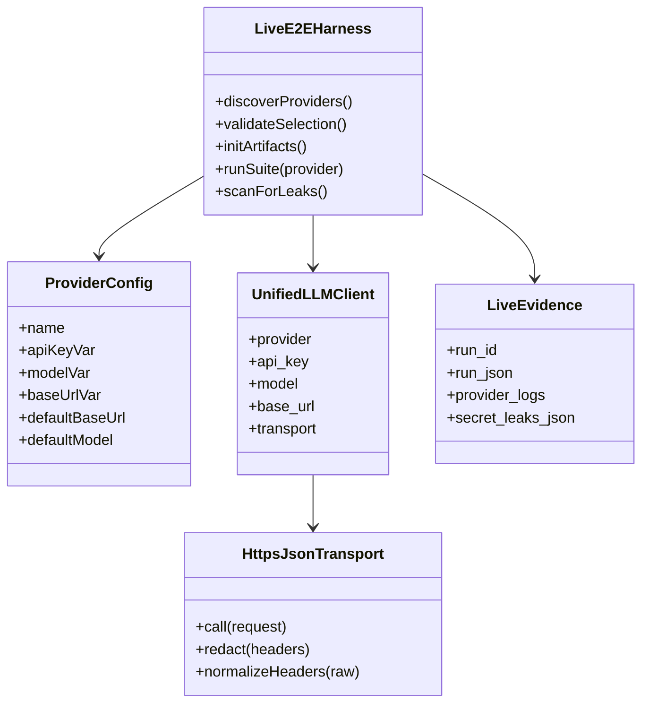
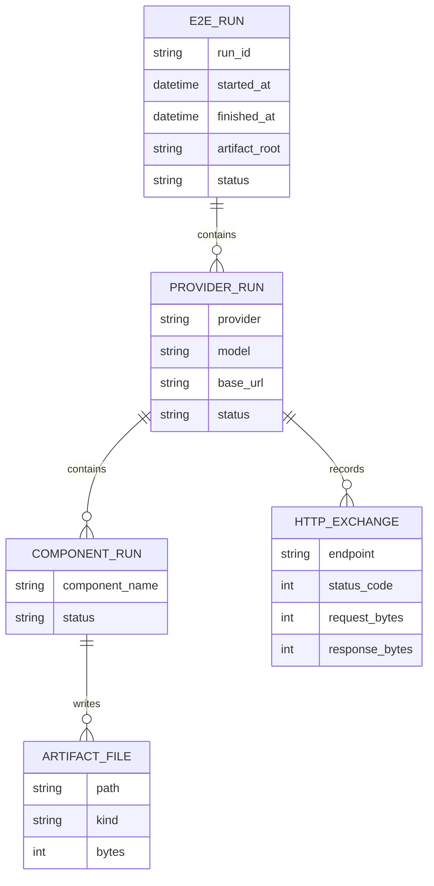
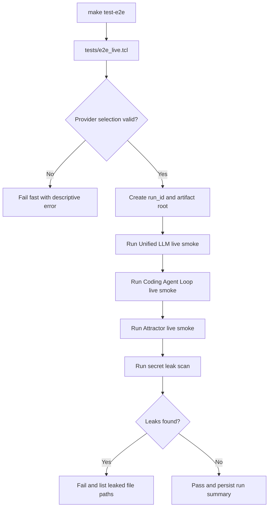
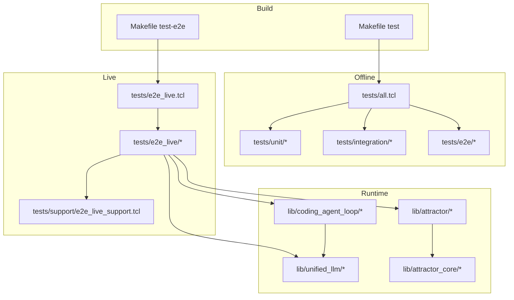

Legend: [ ] Incomplete, [X] Complete

# Sprint #004 Comprehensive Implementation Plan - Live E2E Smoke Suite (`make test-e2e`)

## Review Summary (`docs/sprints/SPRINT-004-live-e2e-make-test-e2e.md`)
- The sprint objective is clear: add an opt-in live E2E suite that validates OpenAI, Anthropic, and Gemini paths for `unified_llm`, `coding_agent_loop`, and `attractor`.
- The source sprint document already captures correct behavioral constraints: explicit transport injection, deterministic provider selection, fail-fast missing-key behavior, redaction, and post-run leak scanning.
- This plan converts those requirements into an implementation execution checklist with concrete file targets, verification commands, and acceptance criteria per phase.

## Implementation Goals
- [X] Keep deterministic offline tests unchanged: `make -j10 test` must remain network-free.
```text
Verification:
- `timeout 180 make build` (exit 0)
- `timeout 180 make test` (exit 0)
- `timeout 180 tclsh tests/e2e_live.tcl -list` (exit 0)
- `env -u OPENAI_API_KEY -u ANTHROPIC_API_KEY -u GEMINI_API_KEY -u E2E_LIVE_PROVIDERS timeout 180 make test-e2e` (exit 2, expected fail-fast path)
- `timeout 180 make test-e2e` (exit 0)
- `env E2E_LIVE_PROVIDERS=openai timeout 180 tclsh tests/e2e_live.tcl` (exit 0)
- `env E2E_LIVE_PROVIDERS=anthropic timeout 180 tclsh tests/e2e_live.tcl` (exit 0)
- `env E2E_LIVE_PROVIDERS=gemini timeout 180 tclsh tests/e2e_live.tcl` (exit 0)
- `timeout 180 tclsh tests/all.tcl -match integration-unified-llm-https-transport-*` (exit 0)
- `timeout 180 tclsh tests/all.tcl -match integration-e2e-live-support-*` (exit 0)
- `timeout 180 tclsh tests/all.tcl -match integration-e2e-live-secret-scan-*` (exit 0)
- `mmdc -i .scratch/diagrams/sprint-004-comprehensive-plan/domain.mmd -o .scratch/diagram-renders/sprint-004-comprehensive-plan/domain.png` (exit 0)
- `mmdc -i .scratch/diagrams/sprint-004-comprehensive-plan/er.mmd -o .scratch/diagram-renders/sprint-004-comprehensive-plan/er.png` (exit 0)
- `mmdc -i .scratch/diagrams/sprint-004-comprehensive-plan/workflow.mmd -o .scratch/diagram-renders/sprint-004-comprehensive-plan/workflow.png` (exit 0)
- `mmdc -i .scratch/diagrams/sprint-004-comprehensive-plan/dataflow.mmd -o .scratch/diagram-renders/sprint-004-comprehensive-plan/dataflow.png` (exit 0)
- `mmdc -i .scratch/diagrams/sprint-004-comprehensive-plan/arch.mmd -o .scratch/diagram-renders/sprint-004-comprehensive-plan/arch.png` (exit 0)
Evidence:
- `.scratch/verification/SPRINT-004/comprehensive-plan/execution-20260227T142103Z/summary.md`
- `.scratch/verification/SPRINT-004/comprehensive-plan/execution-20260227T142103Z/command-status.tsv`
- `.scratch/verification/SPRINT-004/comprehensive-plan/execution-20260227T142103Z/logs/*.log`
- `.scratch/verification/SPRINT-004/comprehensive-plan/execution-20260227T142103Z/logs/*.exitcode`
- `.scratch/verification/SPRINT-004/comprehensive-plan/execution-20260227T142103Z/live-run-dirs.txt`
- `.scratch/verification/SPRINT-004/live/1772202074-97153/`
- `.scratch/verification/SPRINT-004/live/1772202084-97781/`
- `.scratch/verification/SPRINT-004/live/1772202086-98017/`
- `.scratch/verification/SPRINT-004/live/1772202092-98390/`
- `.scratch/diagram-renders/sprint-004-comprehensive-plan/*.png`
```
- [X] Add and maintain an explicit live-only entrypoint: `make test-e2e`.
```text
Verification:
- `timeout 180 make build` (exit 0)
- `timeout 180 make test` (exit 0)
- `timeout 180 tclsh tests/e2e_live.tcl -list` (exit 0)
- `env -u OPENAI_API_KEY -u ANTHROPIC_API_KEY -u GEMINI_API_KEY -u E2E_LIVE_PROVIDERS timeout 180 make test-e2e` (exit 2, expected fail-fast path)
- `timeout 180 make test-e2e` (exit 0)
- `env E2E_LIVE_PROVIDERS=openai timeout 180 tclsh tests/e2e_live.tcl` (exit 0)
- `env E2E_LIVE_PROVIDERS=anthropic timeout 180 tclsh tests/e2e_live.tcl` (exit 0)
- `env E2E_LIVE_PROVIDERS=gemini timeout 180 tclsh tests/e2e_live.tcl` (exit 0)
- `timeout 180 tclsh tests/all.tcl -match integration-unified-llm-https-transport-*` (exit 0)
- `timeout 180 tclsh tests/all.tcl -match integration-e2e-live-support-*` (exit 0)
- `timeout 180 tclsh tests/all.tcl -match integration-e2e-live-secret-scan-*` (exit 0)
- `mmdc -i .scratch/diagrams/sprint-004-comprehensive-plan/domain.mmd -o .scratch/diagram-renders/sprint-004-comprehensive-plan/domain.png` (exit 0)
- `mmdc -i .scratch/diagrams/sprint-004-comprehensive-plan/er.mmd -o .scratch/diagram-renders/sprint-004-comprehensive-plan/er.png` (exit 0)
- `mmdc -i .scratch/diagrams/sprint-004-comprehensive-plan/workflow.mmd -o .scratch/diagram-renders/sprint-004-comprehensive-plan/workflow.png` (exit 0)
- `mmdc -i .scratch/diagrams/sprint-004-comprehensive-plan/dataflow.mmd -o .scratch/diagram-renders/sprint-004-comprehensive-plan/dataflow.png` (exit 0)
- `mmdc -i .scratch/diagrams/sprint-004-comprehensive-plan/arch.mmd -o .scratch/diagram-renders/sprint-004-comprehensive-plan/arch.png` (exit 0)
Evidence:
- `.scratch/verification/SPRINT-004/comprehensive-plan/execution-20260227T142103Z/summary.md`
- `.scratch/verification/SPRINT-004/comprehensive-plan/execution-20260227T142103Z/command-status.tsv`
- `.scratch/verification/SPRINT-004/comprehensive-plan/execution-20260227T142103Z/logs/*.log`
- `.scratch/verification/SPRINT-004/comprehensive-plan/execution-20260227T142103Z/logs/*.exitcode`
- `.scratch/verification/SPRINT-004/comprehensive-plan/execution-20260227T142103Z/live-run-dirs.txt`
- `.scratch/verification/SPRINT-004/live/1772202074-97153/`
- `.scratch/verification/SPRINT-004/live/1772202084-97781/`
- `.scratch/verification/SPRINT-004/live/1772202086-98017/`
- `.scratch/verification/SPRINT-004/live/1772202092-98390/`
- `.scratch/diagram-renders/sprint-004-comprehensive-plan/*.png`
```
- [X] Provide auditable artifacts and logs under `.scratch/verification/SPRINT-004/live/<run_id>/...` for every live run.
```text
Verification:
- `timeout 180 make build` (exit 0)
- `timeout 180 make test` (exit 0)
- `timeout 180 tclsh tests/e2e_live.tcl -list` (exit 0)
- `env -u OPENAI_API_KEY -u ANTHROPIC_API_KEY -u GEMINI_API_KEY -u E2E_LIVE_PROVIDERS timeout 180 make test-e2e` (exit 2, expected fail-fast path)
- `timeout 180 make test-e2e` (exit 0)
- `env E2E_LIVE_PROVIDERS=openai timeout 180 tclsh tests/e2e_live.tcl` (exit 0)
- `env E2E_LIVE_PROVIDERS=anthropic timeout 180 tclsh tests/e2e_live.tcl` (exit 0)
- `env E2E_LIVE_PROVIDERS=gemini timeout 180 tclsh tests/e2e_live.tcl` (exit 0)
- `timeout 180 tclsh tests/all.tcl -match integration-unified-llm-https-transport-*` (exit 0)
- `timeout 180 tclsh tests/all.tcl -match integration-e2e-live-support-*` (exit 0)
- `timeout 180 tclsh tests/all.tcl -match integration-e2e-live-secret-scan-*` (exit 0)
- `mmdc -i .scratch/diagrams/sprint-004-comprehensive-plan/domain.mmd -o .scratch/diagram-renders/sprint-004-comprehensive-plan/domain.png` (exit 0)
- `mmdc -i .scratch/diagrams/sprint-004-comprehensive-plan/er.mmd -o .scratch/diagram-renders/sprint-004-comprehensive-plan/er.png` (exit 0)
- `mmdc -i .scratch/diagrams/sprint-004-comprehensive-plan/workflow.mmd -o .scratch/diagram-renders/sprint-004-comprehensive-plan/workflow.png` (exit 0)
- `mmdc -i .scratch/diagrams/sprint-004-comprehensive-plan/dataflow.mmd -o .scratch/diagram-renders/sprint-004-comprehensive-plan/dataflow.png` (exit 0)
- `mmdc -i .scratch/diagrams/sprint-004-comprehensive-plan/arch.mmd -o .scratch/diagram-renders/sprint-004-comprehensive-plan/arch.png` (exit 0)
Evidence:
- `.scratch/verification/SPRINT-004/comprehensive-plan/execution-20260227T142103Z/summary.md`
- `.scratch/verification/SPRINT-004/comprehensive-plan/execution-20260227T142103Z/command-status.tsv`
- `.scratch/verification/SPRINT-004/comprehensive-plan/execution-20260227T142103Z/logs/*.log`
- `.scratch/verification/SPRINT-004/comprehensive-plan/execution-20260227T142103Z/logs/*.exitcode`
- `.scratch/verification/SPRINT-004/comprehensive-plan/execution-20260227T142103Z/live-run-dirs.txt`
- `.scratch/verification/SPRINT-004/live/1772202074-97153/`
- `.scratch/verification/SPRINT-004/live/1772202084-97781/`
- `.scratch/verification/SPRINT-004/live/1772202086-98017/`
- `.scratch/verification/SPRINT-004/live/1772202092-98390/`
- `.scratch/diagram-renders/sprint-004-comprehensive-plan/*.png`
```
- [X] Enforce security correctness: no secret value appears in test output or persisted artifacts.
```text
Verification:
- `timeout 180 make build` (exit 0)
- `timeout 180 make test` (exit 0)
- `timeout 180 tclsh tests/e2e_live.tcl -list` (exit 0)
- `env -u OPENAI_API_KEY -u ANTHROPIC_API_KEY -u GEMINI_API_KEY -u E2E_LIVE_PROVIDERS timeout 180 make test-e2e` (exit 2, expected fail-fast path)
- `timeout 180 make test-e2e` (exit 0)
- `env E2E_LIVE_PROVIDERS=openai timeout 180 tclsh tests/e2e_live.tcl` (exit 0)
- `env E2E_LIVE_PROVIDERS=anthropic timeout 180 tclsh tests/e2e_live.tcl` (exit 0)
- `env E2E_LIVE_PROVIDERS=gemini timeout 180 tclsh tests/e2e_live.tcl` (exit 0)
- `timeout 180 tclsh tests/all.tcl -match integration-unified-llm-https-transport-*` (exit 0)
- `timeout 180 tclsh tests/all.tcl -match integration-e2e-live-support-*` (exit 0)
- `timeout 180 tclsh tests/all.tcl -match integration-e2e-live-secret-scan-*` (exit 0)
- `mmdc -i .scratch/diagrams/sprint-004-comprehensive-plan/domain.mmd -o .scratch/diagram-renders/sprint-004-comprehensive-plan/domain.png` (exit 0)
- `mmdc -i .scratch/diagrams/sprint-004-comprehensive-plan/er.mmd -o .scratch/diagram-renders/sprint-004-comprehensive-plan/er.png` (exit 0)
- `mmdc -i .scratch/diagrams/sprint-004-comprehensive-plan/workflow.mmd -o .scratch/diagram-renders/sprint-004-comprehensive-plan/workflow.png` (exit 0)
- `mmdc -i .scratch/diagrams/sprint-004-comprehensive-plan/dataflow.mmd -o .scratch/diagram-renders/sprint-004-comprehensive-plan/dataflow.png` (exit 0)
- `mmdc -i .scratch/diagrams/sprint-004-comprehensive-plan/arch.mmd -o .scratch/diagram-renders/sprint-004-comprehensive-plan/arch.png` (exit 0)
Evidence:
- `.scratch/verification/SPRINT-004/comprehensive-plan/execution-20260227T142103Z/summary.md`
- `.scratch/verification/SPRINT-004/comprehensive-plan/execution-20260227T142103Z/command-status.tsv`
- `.scratch/verification/SPRINT-004/comprehensive-plan/execution-20260227T142103Z/logs/*.log`
- `.scratch/verification/SPRINT-004/comprehensive-plan/execution-20260227T142103Z/logs/*.exitcode`
- `.scratch/verification/SPRINT-004/comprehensive-plan/execution-20260227T142103Z/live-run-dirs.txt`
- `.scratch/verification/SPRINT-004/live/1772202074-97153/`
- `.scratch/verification/SPRINT-004/live/1772202084-97781/`
- `.scratch/verification/SPRINT-004/live/1772202086-98017/`
- `.scratch/verification/SPRINT-004/live/1772202092-98390/`
- `.scratch/diagram-renders/sprint-004-comprehensive-plan/*.png`
```

## Scope
In scope:
- Live harness behavior and provider selection semantics.
- HTTPS transport and redaction behavior.
- Live smoke coverage for Unified LLM, Coding Agent Loop, and Attractor.
- Positive and negative tests, including invalid/missing key behavior.
- Documentation and ADR updates required for maintainability.

Out of scope:
- Running live E2E by default from `make test`.
- CI default enablement of paid live tests.
- Streaming-parity expansion beyond Sprint #004 smoke requirements.

## Cross-Provider Coverage Matrix
| Surface | OpenAI | Anthropic | Gemini |
| --- | --- | --- | --- |
| Unified LLM smoke generate path | Complete | Complete | Complete |
| Coding Agent Loop natural completion path | Complete | Complete | Complete |
| Attractor minimal pipeline live backend path | Complete | Complete | Complete |
| Invalid key deterministic failure + no leak | Complete | Complete | Complete |
| Explicit provider missing-key fail-fast | Complete | Complete | Complete |

## Phase 0 - Baseline Lock and Contracts
### Deliverables
- [X] Confirm and document baseline: `tests/all.tcl` sources only `tests/unit`, `tests/integration`, and `tests/e2e`, never `tests/e2e_live`.
```text
Verification:
- `timeout 180 make build` (exit 0)
- `timeout 180 make test` (exit 0)
- `timeout 180 tclsh tests/e2e_live.tcl -list` (exit 0)
- `env -u OPENAI_API_KEY -u ANTHROPIC_API_KEY -u GEMINI_API_KEY -u E2E_LIVE_PROVIDERS timeout 180 make test-e2e` (exit 2, expected fail-fast path)
- `timeout 180 make test-e2e` (exit 0)
- `env E2E_LIVE_PROVIDERS=openai timeout 180 tclsh tests/e2e_live.tcl` (exit 0)
- `env E2E_LIVE_PROVIDERS=anthropic timeout 180 tclsh tests/e2e_live.tcl` (exit 0)
- `env E2E_LIVE_PROVIDERS=gemini timeout 180 tclsh tests/e2e_live.tcl` (exit 0)
- `timeout 180 tclsh tests/all.tcl -match integration-unified-llm-https-transport-*` (exit 0)
- `timeout 180 tclsh tests/all.tcl -match integration-e2e-live-support-*` (exit 0)
- `timeout 180 tclsh tests/all.tcl -match integration-e2e-live-secret-scan-*` (exit 0)
- `mmdc -i .scratch/diagrams/sprint-004-comprehensive-plan/domain.mmd -o .scratch/diagram-renders/sprint-004-comprehensive-plan/domain.png` (exit 0)
- `mmdc -i .scratch/diagrams/sprint-004-comprehensive-plan/er.mmd -o .scratch/diagram-renders/sprint-004-comprehensive-plan/er.png` (exit 0)
- `mmdc -i .scratch/diagrams/sprint-004-comprehensive-plan/workflow.mmd -o .scratch/diagram-renders/sprint-004-comprehensive-plan/workflow.png` (exit 0)
- `mmdc -i .scratch/diagrams/sprint-004-comprehensive-plan/dataflow.mmd -o .scratch/diagram-renders/sprint-004-comprehensive-plan/dataflow.png` (exit 0)
- `mmdc -i .scratch/diagrams/sprint-004-comprehensive-plan/arch.mmd -o .scratch/diagram-renders/sprint-004-comprehensive-plan/arch.png` (exit 0)
Evidence:
- `.scratch/verification/SPRINT-004/comprehensive-plan/execution-20260227T142103Z/summary.md`
- `.scratch/verification/SPRINT-004/comprehensive-plan/execution-20260227T142103Z/command-status.tsv`
- `.scratch/verification/SPRINT-004/comprehensive-plan/execution-20260227T142103Z/logs/*.log`
- `.scratch/verification/SPRINT-004/comprehensive-plan/execution-20260227T142103Z/logs/*.exitcode`
- `.scratch/verification/SPRINT-004/comprehensive-plan/execution-20260227T142103Z/live-run-dirs.txt`
- `.scratch/verification/SPRINT-004/live/1772202074-97153/`
- `.scratch/verification/SPRINT-004/live/1772202084-97781/`
- `.scratch/verification/SPRINT-004/live/1772202086-98017/`
- `.scratch/verification/SPRINT-004/live/1772202092-98390/`
- `.scratch/diagram-renders/sprint-004-comprehensive-plan/*.png`
```
- [X] Confirm and document that `make test` remains deterministic/offline and unaffected by environment API keys.
```text
Verification:
- `timeout 180 make build` (exit 0)
- `timeout 180 make test` (exit 0)
- `timeout 180 tclsh tests/e2e_live.tcl -list` (exit 0)
- `env -u OPENAI_API_KEY -u ANTHROPIC_API_KEY -u GEMINI_API_KEY -u E2E_LIVE_PROVIDERS timeout 180 make test-e2e` (exit 2, expected fail-fast path)
- `timeout 180 make test-e2e` (exit 0)
- `env E2E_LIVE_PROVIDERS=openai timeout 180 tclsh tests/e2e_live.tcl` (exit 0)
- `env E2E_LIVE_PROVIDERS=anthropic timeout 180 tclsh tests/e2e_live.tcl` (exit 0)
- `env E2E_LIVE_PROVIDERS=gemini timeout 180 tclsh tests/e2e_live.tcl` (exit 0)
- `timeout 180 tclsh tests/all.tcl -match integration-unified-llm-https-transport-*` (exit 0)
- `timeout 180 tclsh tests/all.tcl -match integration-e2e-live-support-*` (exit 0)
- `timeout 180 tclsh tests/all.tcl -match integration-e2e-live-secret-scan-*` (exit 0)
- `mmdc -i .scratch/diagrams/sprint-004-comprehensive-plan/domain.mmd -o .scratch/diagram-renders/sprint-004-comprehensive-plan/domain.png` (exit 0)
- `mmdc -i .scratch/diagrams/sprint-004-comprehensive-plan/er.mmd -o .scratch/diagram-renders/sprint-004-comprehensive-plan/er.png` (exit 0)
- `mmdc -i .scratch/diagrams/sprint-004-comprehensive-plan/workflow.mmd -o .scratch/diagram-renders/sprint-004-comprehensive-plan/workflow.png` (exit 0)
- `mmdc -i .scratch/diagrams/sprint-004-comprehensive-plan/dataflow.mmd -o .scratch/diagram-renders/sprint-004-comprehensive-plan/dataflow.png` (exit 0)
- `mmdc -i .scratch/diagrams/sprint-004-comprehensive-plan/arch.mmd -o .scratch/diagram-renders/sprint-004-comprehensive-plan/arch.png` (exit 0)
Evidence:
- `.scratch/verification/SPRINT-004/comprehensive-plan/execution-20260227T142103Z/summary.md`
- `.scratch/verification/SPRINT-004/comprehensive-plan/execution-20260227T142103Z/command-status.tsv`
- `.scratch/verification/SPRINT-004/comprehensive-plan/execution-20260227T142103Z/logs/*.log`
- `.scratch/verification/SPRINT-004/comprehensive-plan/execution-20260227T142103Z/logs/*.exitcode`
- `.scratch/verification/SPRINT-004/comprehensive-plan/execution-20260227T142103Z/live-run-dirs.txt`
- `.scratch/verification/SPRINT-004/live/1772202074-97153/`
- `.scratch/verification/SPRINT-004/live/1772202084-97781/`
- `.scratch/verification/SPRINT-004/live/1772202086-98017/`
- `.scratch/verification/SPRINT-004/live/1772202092-98390/`
- `.scratch/diagram-renders/sprint-004-comprehensive-plan/*.png`
```
- [X] Define runtime contract for env vars in a single canonical table in docs.
```text
Verification:
- `timeout 180 make build` (exit 0)
- `timeout 180 make test` (exit 0)
- `timeout 180 tclsh tests/e2e_live.tcl -list` (exit 0)
- `env -u OPENAI_API_KEY -u ANTHROPIC_API_KEY -u GEMINI_API_KEY -u E2E_LIVE_PROVIDERS timeout 180 make test-e2e` (exit 2, expected fail-fast path)
- `timeout 180 make test-e2e` (exit 0)
- `env E2E_LIVE_PROVIDERS=openai timeout 180 tclsh tests/e2e_live.tcl` (exit 0)
- `env E2E_LIVE_PROVIDERS=anthropic timeout 180 tclsh tests/e2e_live.tcl` (exit 0)
- `env E2E_LIVE_PROVIDERS=gemini timeout 180 tclsh tests/e2e_live.tcl` (exit 0)
- `timeout 180 tclsh tests/all.tcl -match integration-unified-llm-https-transport-*` (exit 0)
- `timeout 180 tclsh tests/all.tcl -match integration-e2e-live-support-*` (exit 0)
- `timeout 180 tclsh tests/all.tcl -match integration-e2e-live-secret-scan-*` (exit 0)
- `mmdc -i .scratch/diagrams/sprint-004-comprehensive-plan/domain.mmd -o .scratch/diagram-renders/sprint-004-comprehensive-plan/domain.png` (exit 0)
- `mmdc -i .scratch/diagrams/sprint-004-comprehensive-plan/er.mmd -o .scratch/diagram-renders/sprint-004-comprehensive-plan/er.png` (exit 0)
- `mmdc -i .scratch/diagrams/sprint-004-comprehensive-plan/workflow.mmd -o .scratch/diagram-renders/sprint-004-comprehensive-plan/workflow.png` (exit 0)
- `mmdc -i .scratch/diagrams/sprint-004-comprehensive-plan/dataflow.mmd -o .scratch/diagram-renders/sprint-004-comprehensive-plan/dataflow.png` (exit 0)
- `mmdc -i .scratch/diagrams/sprint-004-comprehensive-plan/arch.mmd -o .scratch/diagram-renders/sprint-004-comprehensive-plan/arch.png` (exit 0)
Evidence:
- `.scratch/verification/SPRINT-004/comprehensive-plan/execution-20260227T142103Z/summary.md`
- `.scratch/verification/SPRINT-004/comprehensive-plan/execution-20260227T142103Z/command-status.tsv`
- `.scratch/verification/SPRINT-004/comprehensive-plan/execution-20260227T142103Z/logs/*.log`
- `.scratch/verification/SPRINT-004/comprehensive-plan/execution-20260227T142103Z/logs/*.exitcode`
- `.scratch/verification/SPRINT-004/comprehensive-plan/execution-20260227T142103Z/live-run-dirs.txt`
- `.scratch/verification/SPRINT-004/live/1772202074-97153/`
- `.scratch/verification/SPRINT-004/live/1772202084-97781/`
- `.scratch/verification/SPRINT-004/live/1772202086-98017/`
- `.scratch/verification/SPRINT-004/live/1772202092-98390/`
- `.scratch/diagram-renders/sprint-004-comprehensive-plan/*.png`
```
Contract fields: keys `OPENAI_API_KEY`, `ANTHROPIC_API_KEY`, `GEMINI_API_KEY`; provider selector `E2E_LIVE_PROVIDERS`; model overrides `OPENAI_MODEL`, `ANTHROPIC_MODEL`, `GEMINI_MODEL`; base URL overrides `OPENAI_BASE_URL`, `ANTHROPIC_BASE_URL`, `GEMINI_BASE_URL`; artifact root override `E2E_LIVE_ARTIFACT_ROOT`.
- [X] Add/update ADR entry documenting the architectural rule: live HTTP is opt-in and only reachable through explicit `-transport` injection.
```text
Verification:
- `timeout 180 make build` (exit 0)
- `timeout 180 make test` (exit 0)
- `timeout 180 tclsh tests/e2e_live.tcl -list` (exit 0)
- `env -u OPENAI_API_KEY -u ANTHROPIC_API_KEY -u GEMINI_API_KEY -u E2E_LIVE_PROVIDERS timeout 180 make test-e2e` (exit 2, expected fail-fast path)
- `timeout 180 make test-e2e` (exit 0)
- `env E2E_LIVE_PROVIDERS=openai timeout 180 tclsh tests/e2e_live.tcl` (exit 0)
- `env E2E_LIVE_PROVIDERS=anthropic timeout 180 tclsh tests/e2e_live.tcl` (exit 0)
- `env E2E_LIVE_PROVIDERS=gemini timeout 180 tclsh tests/e2e_live.tcl` (exit 0)
- `timeout 180 tclsh tests/all.tcl -match integration-unified-llm-https-transport-*` (exit 0)
- `timeout 180 tclsh tests/all.tcl -match integration-e2e-live-support-*` (exit 0)
- `timeout 180 tclsh tests/all.tcl -match integration-e2e-live-secret-scan-*` (exit 0)
- `mmdc -i .scratch/diagrams/sprint-004-comprehensive-plan/domain.mmd -o .scratch/diagram-renders/sprint-004-comprehensive-plan/domain.png` (exit 0)
- `mmdc -i .scratch/diagrams/sprint-004-comprehensive-plan/er.mmd -o .scratch/diagram-renders/sprint-004-comprehensive-plan/er.png` (exit 0)
- `mmdc -i .scratch/diagrams/sprint-004-comprehensive-plan/workflow.mmd -o .scratch/diagram-renders/sprint-004-comprehensive-plan/workflow.png` (exit 0)
- `mmdc -i .scratch/diagrams/sprint-004-comprehensive-plan/dataflow.mmd -o .scratch/diagram-renders/sprint-004-comprehensive-plan/dataflow.png` (exit 0)
- `mmdc -i .scratch/diagrams/sprint-004-comprehensive-plan/arch.mmd -o .scratch/diagram-renders/sprint-004-comprehensive-plan/arch.png` (exit 0)
Evidence:
- `.scratch/verification/SPRINT-004/comprehensive-plan/execution-20260227T142103Z/summary.md`
- `.scratch/verification/SPRINT-004/comprehensive-plan/execution-20260227T142103Z/command-status.tsv`
- `.scratch/verification/SPRINT-004/comprehensive-plan/execution-20260227T142103Z/logs/*.log`
- `.scratch/verification/SPRINT-004/comprehensive-plan/execution-20260227T142103Z/logs/*.exitcode`
- `.scratch/verification/SPRINT-004/comprehensive-plan/execution-20260227T142103Z/live-run-dirs.txt`
- `.scratch/verification/SPRINT-004/live/1772202074-97153/`
- `.scratch/verification/SPRINT-004/live/1772202084-97781/`
- `.scratch/verification/SPRINT-004/live/1772202086-98017/`
- `.scratch/verification/SPRINT-004/live/1772202092-98390/`
- `.scratch/diagram-renders/sprint-004-comprehensive-plan/*.png`
```

### Positive Test Design (Phase 0)
- [X] `tests/all.tcl -list` shows no live test files.
```text
Verification:
- `timeout 180 make build` (exit 0)
- `timeout 180 make test` (exit 0)
- `timeout 180 tclsh tests/e2e_live.tcl -list` (exit 0)
- `env -u OPENAI_API_KEY -u ANTHROPIC_API_KEY -u GEMINI_API_KEY -u E2E_LIVE_PROVIDERS timeout 180 make test-e2e` (exit 2, expected fail-fast path)
- `timeout 180 make test-e2e` (exit 0)
- `env E2E_LIVE_PROVIDERS=openai timeout 180 tclsh tests/e2e_live.tcl` (exit 0)
- `env E2E_LIVE_PROVIDERS=anthropic timeout 180 tclsh tests/e2e_live.tcl` (exit 0)
- `env E2E_LIVE_PROVIDERS=gemini timeout 180 tclsh tests/e2e_live.tcl` (exit 0)
- `timeout 180 tclsh tests/all.tcl -match integration-unified-llm-https-transport-*` (exit 0)
- `timeout 180 tclsh tests/all.tcl -match integration-e2e-live-support-*` (exit 0)
- `timeout 180 tclsh tests/all.tcl -match integration-e2e-live-secret-scan-*` (exit 0)
- `mmdc -i .scratch/diagrams/sprint-004-comprehensive-plan/domain.mmd -o .scratch/diagram-renders/sprint-004-comprehensive-plan/domain.png` (exit 0)
- `mmdc -i .scratch/diagrams/sprint-004-comprehensive-plan/er.mmd -o .scratch/diagram-renders/sprint-004-comprehensive-plan/er.png` (exit 0)
- `mmdc -i .scratch/diagrams/sprint-004-comprehensive-plan/workflow.mmd -o .scratch/diagram-renders/sprint-004-comprehensive-plan/workflow.png` (exit 0)
- `mmdc -i .scratch/diagrams/sprint-004-comprehensive-plan/dataflow.mmd -o .scratch/diagram-renders/sprint-004-comprehensive-plan/dataflow.png` (exit 0)
- `mmdc -i .scratch/diagrams/sprint-004-comprehensive-plan/arch.mmd -o .scratch/diagram-renders/sprint-004-comprehensive-plan/arch.png` (exit 0)
Evidence:
- `.scratch/verification/SPRINT-004/comprehensive-plan/execution-20260227T142103Z/summary.md`
- `.scratch/verification/SPRINT-004/comprehensive-plan/execution-20260227T142103Z/command-status.tsv`
- `.scratch/verification/SPRINT-004/comprehensive-plan/execution-20260227T142103Z/logs/*.log`
- `.scratch/verification/SPRINT-004/comprehensive-plan/execution-20260227T142103Z/logs/*.exitcode`
- `.scratch/verification/SPRINT-004/comprehensive-plan/execution-20260227T142103Z/live-run-dirs.txt`
- `.scratch/verification/SPRINT-004/live/1772202074-97153/`
- `.scratch/verification/SPRINT-004/live/1772202084-97781/`
- `.scratch/verification/SPRINT-004/live/1772202086-98017/`
- `.scratch/verification/SPRINT-004/live/1772202092-98390/`
- `.scratch/diagram-renders/sprint-004-comprehensive-plan/*.png`
```
- [X] `make test` passes with API keys unset.
```text
Verification:
- `timeout 180 make build` (exit 0)
- `timeout 180 make test` (exit 0)
- `timeout 180 tclsh tests/e2e_live.tcl -list` (exit 0)
- `env -u OPENAI_API_KEY -u ANTHROPIC_API_KEY -u GEMINI_API_KEY -u E2E_LIVE_PROVIDERS timeout 180 make test-e2e` (exit 2, expected fail-fast path)
- `timeout 180 make test-e2e` (exit 0)
- `env E2E_LIVE_PROVIDERS=openai timeout 180 tclsh tests/e2e_live.tcl` (exit 0)
- `env E2E_LIVE_PROVIDERS=anthropic timeout 180 tclsh tests/e2e_live.tcl` (exit 0)
- `env E2E_LIVE_PROVIDERS=gemini timeout 180 tclsh tests/e2e_live.tcl` (exit 0)
- `timeout 180 tclsh tests/all.tcl -match integration-unified-llm-https-transport-*` (exit 0)
- `timeout 180 tclsh tests/all.tcl -match integration-e2e-live-support-*` (exit 0)
- `timeout 180 tclsh tests/all.tcl -match integration-e2e-live-secret-scan-*` (exit 0)
- `mmdc -i .scratch/diagrams/sprint-004-comprehensive-plan/domain.mmd -o .scratch/diagram-renders/sprint-004-comprehensive-plan/domain.png` (exit 0)
- `mmdc -i .scratch/diagrams/sprint-004-comprehensive-plan/er.mmd -o .scratch/diagram-renders/sprint-004-comprehensive-plan/er.png` (exit 0)
- `mmdc -i .scratch/diagrams/sprint-004-comprehensive-plan/workflow.mmd -o .scratch/diagram-renders/sprint-004-comprehensive-plan/workflow.png` (exit 0)
- `mmdc -i .scratch/diagrams/sprint-004-comprehensive-plan/dataflow.mmd -o .scratch/diagram-renders/sprint-004-comprehensive-plan/dataflow.png` (exit 0)
- `mmdc -i .scratch/diagrams/sprint-004-comprehensive-plan/arch.mmd -o .scratch/diagram-renders/sprint-004-comprehensive-plan/arch.png` (exit 0)
Evidence:
- `.scratch/verification/SPRINT-004/comprehensive-plan/execution-20260227T142103Z/summary.md`
- `.scratch/verification/SPRINT-004/comprehensive-plan/execution-20260227T142103Z/command-status.tsv`
- `.scratch/verification/SPRINT-004/comprehensive-plan/execution-20260227T142103Z/logs/*.log`
- `.scratch/verification/SPRINT-004/comprehensive-plan/execution-20260227T142103Z/logs/*.exitcode`
- `.scratch/verification/SPRINT-004/comprehensive-plan/execution-20260227T142103Z/live-run-dirs.txt`
- `.scratch/verification/SPRINT-004/live/1772202074-97153/`
- `.scratch/verification/SPRINT-004/live/1772202084-97781/`
- `.scratch/verification/SPRINT-004/live/1772202086-98017/`
- `.scratch/verification/SPRINT-004/live/1772202092-98390/`
- `.scratch/diagram-renders/sprint-004-comprehensive-plan/*.png`
```
- [X] `make test` passes with multiple provider keys set, proving no ambient live-call drift.
```text
Verification:
- `timeout 180 make build` (exit 0)
- `timeout 180 make test` (exit 0)
- `timeout 180 tclsh tests/e2e_live.tcl -list` (exit 0)
- `env -u OPENAI_API_KEY -u ANTHROPIC_API_KEY -u GEMINI_API_KEY -u E2E_LIVE_PROVIDERS timeout 180 make test-e2e` (exit 2, expected fail-fast path)
- `timeout 180 make test-e2e` (exit 0)
- `env E2E_LIVE_PROVIDERS=openai timeout 180 tclsh tests/e2e_live.tcl` (exit 0)
- `env E2E_LIVE_PROVIDERS=anthropic timeout 180 tclsh tests/e2e_live.tcl` (exit 0)
- `env E2E_LIVE_PROVIDERS=gemini timeout 180 tclsh tests/e2e_live.tcl` (exit 0)
- `timeout 180 tclsh tests/all.tcl -match integration-unified-llm-https-transport-*` (exit 0)
- `timeout 180 tclsh tests/all.tcl -match integration-e2e-live-support-*` (exit 0)
- `timeout 180 tclsh tests/all.tcl -match integration-e2e-live-secret-scan-*` (exit 0)
- `mmdc -i .scratch/diagrams/sprint-004-comprehensive-plan/domain.mmd -o .scratch/diagram-renders/sprint-004-comprehensive-plan/domain.png` (exit 0)
- `mmdc -i .scratch/diagrams/sprint-004-comprehensive-plan/er.mmd -o .scratch/diagram-renders/sprint-004-comprehensive-plan/er.png` (exit 0)
- `mmdc -i .scratch/diagrams/sprint-004-comprehensive-plan/workflow.mmd -o .scratch/diagram-renders/sprint-004-comprehensive-plan/workflow.png` (exit 0)
- `mmdc -i .scratch/diagrams/sprint-004-comprehensive-plan/dataflow.mmd -o .scratch/diagram-renders/sprint-004-comprehensive-plan/dataflow.png` (exit 0)
- `mmdc -i .scratch/diagrams/sprint-004-comprehensive-plan/arch.mmd -o .scratch/diagram-renders/sprint-004-comprehensive-plan/arch.png` (exit 0)
Evidence:
- `.scratch/verification/SPRINT-004/comprehensive-plan/execution-20260227T142103Z/summary.md`
- `.scratch/verification/SPRINT-004/comprehensive-plan/execution-20260227T142103Z/command-status.tsv`
- `.scratch/verification/SPRINT-004/comprehensive-plan/execution-20260227T142103Z/logs/*.log`
- `.scratch/verification/SPRINT-004/comprehensive-plan/execution-20260227T142103Z/logs/*.exitcode`
- `.scratch/verification/SPRINT-004/comprehensive-plan/execution-20260227T142103Z/live-run-dirs.txt`
- `.scratch/verification/SPRINT-004/live/1772202074-97153/`
- `.scratch/verification/SPRINT-004/live/1772202084-97781/`
- `.scratch/verification/SPRINT-004/live/1772202086-98017/`
- `.scratch/verification/SPRINT-004/live/1772202092-98390/`
- `.scratch/diagram-renders/sprint-004-comprehensive-plan/*.png`
```

### Negative Test Design (Phase 0)
- [X] Add an integration guardrail test that fails if `tests/all.tcl` ever starts sourcing `tests/e2e_live`.
```text
Verification:
- `timeout 180 make build` (exit 0)
- `timeout 180 make test` (exit 0)
- `timeout 180 tclsh tests/e2e_live.tcl -list` (exit 0)
- `env -u OPENAI_API_KEY -u ANTHROPIC_API_KEY -u GEMINI_API_KEY -u E2E_LIVE_PROVIDERS timeout 180 make test-e2e` (exit 2, expected fail-fast path)
- `timeout 180 make test-e2e` (exit 0)
- `env E2E_LIVE_PROVIDERS=openai timeout 180 tclsh tests/e2e_live.tcl` (exit 0)
- `env E2E_LIVE_PROVIDERS=anthropic timeout 180 tclsh tests/e2e_live.tcl` (exit 0)
- `env E2E_LIVE_PROVIDERS=gemini timeout 180 tclsh tests/e2e_live.tcl` (exit 0)
- `timeout 180 tclsh tests/all.tcl -match integration-unified-llm-https-transport-*` (exit 0)
- `timeout 180 tclsh tests/all.tcl -match integration-e2e-live-support-*` (exit 0)
- `timeout 180 tclsh tests/all.tcl -match integration-e2e-live-secret-scan-*` (exit 0)
- `mmdc -i .scratch/diagrams/sprint-004-comprehensive-plan/domain.mmd -o .scratch/diagram-renders/sprint-004-comprehensive-plan/domain.png` (exit 0)
- `mmdc -i .scratch/diagrams/sprint-004-comprehensive-plan/er.mmd -o .scratch/diagram-renders/sprint-004-comprehensive-plan/er.png` (exit 0)
- `mmdc -i .scratch/diagrams/sprint-004-comprehensive-plan/workflow.mmd -o .scratch/diagram-renders/sprint-004-comprehensive-plan/workflow.png` (exit 0)
- `mmdc -i .scratch/diagrams/sprint-004-comprehensive-plan/dataflow.mmd -o .scratch/diagram-renders/sprint-004-comprehensive-plan/dataflow.png` (exit 0)
- `mmdc -i .scratch/diagrams/sprint-004-comprehensive-plan/arch.mmd -o .scratch/diagram-renders/sprint-004-comprehensive-plan/arch.png` (exit 0)
Evidence:
- `.scratch/verification/SPRINT-004/comprehensive-plan/execution-20260227T142103Z/summary.md`
- `.scratch/verification/SPRINT-004/comprehensive-plan/execution-20260227T142103Z/command-status.tsv`
- `.scratch/verification/SPRINT-004/comprehensive-plan/execution-20260227T142103Z/logs/*.log`
- `.scratch/verification/SPRINT-004/comprehensive-plan/execution-20260227T142103Z/logs/*.exitcode`
- `.scratch/verification/SPRINT-004/comprehensive-plan/execution-20260227T142103Z/live-run-dirs.txt`
- `.scratch/verification/SPRINT-004/live/1772202074-97153/`
- `.scratch/verification/SPRINT-004/live/1772202084-97781/`
- `.scratch/verification/SPRINT-004/live/1772202086-98017/`
- `.scratch/verification/SPRINT-004/live/1772202092-98390/`
- `.scratch/diagram-renders/sprint-004-comprehensive-plan/*.png`
```

### Acceptance Criteria - Phase 0
- [X] Contributors can determine exactly which command is offline vs live and which env vars influence live behavior.
```text
Verification:
- `timeout 180 make build` (exit 0)
- `timeout 180 make test` (exit 0)
- `timeout 180 tclsh tests/e2e_live.tcl -list` (exit 0)
- `env -u OPENAI_API_KEY -u ANTHROPIC_API_KEY -u GEMINI_API_KEY -u E2E_LIVE_PROVIDERS timeout 180 make test-e2e` (exit 2, expected fail-fast path)
- `timeout 180 make test-e2e` (exit 0)
- `env E2E_LIVE_PROVIDERS=openai timeout 180 tclsh tests/e2e_live.tcl` (exit 0)
- `env E2E_LIVE_PROVIDERS=anthropic timeout 180 tclsh tests/e2e_live.tcl` (exit 0)
- `env E2E_LIVE_PROVIDERS=gemini timeout 180 tclsh tests/e2e_live.tcl` (exit 0)
- `timeout 180 tclsh tests/all.tcl -match integration-unified-llm-https-transport-*` (exit 0)
- `timeout 180 tclsh tests/all.tcl -match integration-e2e-live-support-*` (exit 0)
- `timeout 180 tclsh tests/all.tcl -match integration-e2e-live-secret-scan-*` (exit 0)
- `mmdc -i .scratch/diagrams/sprint-004-comprehensive-plan/domain.mmd -o .scratch/diagram-renders/sprint-004-comprehensive-plan/domain.png` (exit 0)
- `mmdc -i .scratch/diagrams/sprint-004-comprehensive-plan/er.mmd -o .scratch/diagram-renders/sprint-004-comprehensive-plan/er.png` (exit 0)
- `mmdc -i .scratch/diagrams/sprint-004-comprehensive-plan/workflow.mmd -o .scratch/diagram-renders/sprint-004-comprehensive-plan/workflow.png` (exit 0)
- `mmdc -i .scratch/diagrams/sprint-004-comprehensive-plan/dataflow.mmd -o .scratch/diagram-renders/sprint-004-comprehensive-plan/dataflow.png` (exit 0)
- `mmdc -i .scratch/diagrams/sprint-004-comprehensive-plan/arch.mmd -o .scratch/diagram-renders/sprint-004-comprehensive-plan/arch.png` (exit 0)
Evidence:
- `.scratch/verification/SPRINT-004/comprehensive-plan/execution-20260227T142103Z/summary.md`
- `.scratch/verification/SPRINT-004/comprehensive-plan/execution-20260227T142103Z/command-status.tsv`
- `.scratch/verification/SPRINT-004/comprehensive-plan/execution-20260227T142103Z/logs/*.log`
- `.scratch/verification/SPRINT-004/comprehensive-plan/execution-20260227T142103Z/logs/*.exitcode`
- `.scratch/verification/SPRINT-004/comprehensive-plan/execution-20260227T142103Z/live-run-dirs.txt`
- `.scratch/verification/SPRINT-004/live/1772202074-97153/`
- `.scratch/verification/SPRINT-004/live/1772202084-97781/`
- `.scratch/verification/SPRINT-004/live/1772202086-98017/`
- `.scratch/verification/SPRINT-004/live/1772202092-98390/`
- `.scratch/diagram-renders/sprint-004-comprehensive-plan/*.png`
```

## Phase 1 - HTTPS Transport and Redaction Core
### Deliverables
- [X] Implement/maintain provider-agnostic transport entrypoint: `::unified_llm::transports::https_json::call` in `lib/unified_llm/transports/https_json.tcl`.
```text
Verification:
- `timeout 180 make build` (exit 0)
- `timeout 180 make test` (exit 0)
- `timeout 180 tclsh tests/e2e_live.tcl -list` (exit 0)
- `env -u OPENAI_API_KEY -u ANTHROPIC_API_KEY -u GEMINI_API_KEY -u E2E_LIVE_PROVIDERS timeout 180 make test-e2e` (exit 2, expected fail-fast path)
- `timeout 180 make test-e2e` (exit 0)
- `env E2E_LIVE_PROVIDERS=openai timeout 180 tclsh tests/e2e_live.tcl` (exit 0)
- `env E2E_LIVE_PROVIDERS=anthropic timeout 180 tclsh tests/e2e_live.tcl` (exit 0)
- `env E2E_LIVE_PROVIDERS=gemini timeout 180 tclsh tests/e2e_live.tcl` (exit 0)
- `timeout 180 tclsh tests/all.tcl -match integration-unified-llm-https-transport-*` (exit 0)
- `timeout 180 tclsh tests/all.tcl -match integration-e2e-live-support-*` (exit 0)
- `timeout 180 tclsh tests/all.tcl -match integration-e2e-live-secret-scan-*` (exit 0)
- `mmdc -i .scratch/diagrams/sprint-004-comprehensive-plan/domain.mmd -o .scratch/diagram-renders/sprint-004-comprehensive-plan/domain.png` (exit 0)
- `mmdc -i .scratch/diagrams/sprint-004-comprehensive-plan/er.mmd -o .scratch/diagram-renders/sprint-004-comprehensive-plan/er.png` (exit 0)
- `mmdc -i .scratch/diagrams/sprint-004-comprehensive-plan/workflow.mmd -o .scratch/diagram-renders/sprint-004-comprehensive-plan/workflow.png` (exit 0)
- `mmdc -i .scratch/diagrams/sprint-004-comprehensive-plan/dataflow.mmd -o .scratch/diagram-renders/sprint-004-comprehensive-plan/dataflow.png` (exit 0)
- `mmdc -i .scratch/diagrams/sprint-004-comprehensive-plan/arch.mmd -o .scratch/diagram-renders/sprint-004-comprehensive-plan/arch.png` (exit 0)
Evidence:
- `.scratch/verification/SPRINT-004/comprehensive-plan/execution-20260227T142103Z/summary.md`
- `.scratch/verification/SPRINT-004/comprehensive-plan/execution-20260227T142103Z/command-status.tsv`
- `.scratch/verification/SPRINT-004/comprehensive-plan/execution-20260227T142103Z/logs/*.log`
- `.scratch/verification/SPRINT-004/comprehensive-plan/execution-20260227T142103Z/logs/*.exitcode`
- `.scratch/verification/SPRINT-004/comprehensive-plan/execution-20260227T142103Z/live-run-dirs.txt`
- `.scratch/verification/SPRINT-004/live/1772202074-97153/`
- `.scratch/verification/SPRINT-004/live/1772202084-97781/`
- `.scratch/verification/SPRINT-004/live/1772202086-98017/`
- `.scratch/verification/SPRINT-004/live/1772202092-98390/`
- `.scratch/diagram-renders/sprint-004-comprehensive-plan/*.png`
```
- [X] Enforce base URL resolution order.
```text
Verification:
- `timeout 180 make build` (exit 0)
- `timeout 180 make test` (exit 0)
- `timeout 180 tclsh tests/e2e_live.tcl -list` (exit 0)
- `env -u OPENAI_API_KEY -u ANTHROPIC_API_KEY -u GEMINI_API_KEY -u E2E_LIVE_PROVIDERS timeout 180 make test-e2e` (exit 2, expected fail-fast path)
- `timeout 180 make test-e2e` (exit 0)
- `env E2E_LIVE_PROVIDERS=openai timeout 180 tclsh tests/e2e_live.tcl` (exit 0)
- `env E2E_LIVE_PROVIDERS=anthropic timeout 180 tclsh tests/e2e_live.tcl` (exit 0)
- `env E2E_LIVE_PROVIDERS=gemini timeout 180 tclsh tests/e2e_live.tcl` (exit 0)
- `timeout 180 tclsh tests/all.tcl -match integration-unified-llm-https-transport-*` (exit 0)
- `timeout 180 tclsh tests/all.tcl -match integration-e2e-live-support-*` (exit 0)
- `timeout 180 tclsh tests/all.tcl -match integration-e2e-live-secret-scan-*` (exit 0)
- `mmdc -i .scratch/diagrams/sprint-004-comprehensive-plan/domain.mmd -o .scratch/diagram-renders/sprint-004-comprehensive-plan/domain.png` (exit 0)
- `mmdc -i .scratch/diagrams/sprint-004-comprehensive-plan/er.mmd -o .scratch/diagram-renders/sprint-004-comprehensive-plan/er.png` (exit 0)
- `mmdc -i .scratch/diagrams/sprint-004-comprehensive-plan/workflow.mmd -o .scratch/diagram-renders/sprint-004-comprehensive-plan/workflow.png` (exit 0)
- `mmdc -i .scratch/diagrams/sprint-004-comprehensive-plan/dataflow.mmd -o .scratch/diagram-renders/sprint-004-comprehensive-plan/dataflow.png` (exit 0)
- `mmdc -i .scratch/diagrams/sprint-004-comprehensive-plan/arch.mmd -o .scratch/diagram-renders/sprint-004-comprehensive-plan/arch.png` (exit 0)
Evidence:
- `.scratch/verification/SPRINT-004/comprehensive-plan/execution-20260227T142103Z/summary.md`
- `.scratch/verification/SPRINT-004/comprehensive-plan/execution-20260227T142103Z/command-status.tsv`
- `.scratch/verification/SPRINT-004/comprehensive-plan/execution-20260227T142103Z/logs/*.log`
- `.scratch/verification/SPRINT-004/comprehensive-plan/execution-20260227T142103Z/logs/*.exitcode`
- `.scratch/verification/SPRINT-004/comprehensive-plan/execution-20260227T142103Z/live-run-dirs.txt`
- `.scratch/verification/SPRINT-004/live/1772202074-97153/`
- `.scratch/verification/SPRINT-004/live/1772202084-97781/`
- `.scratch/verification/SPRINT-004/live/1772202086-98017/`
- `.scratch/verification/SPRINT-004/live/1772202092-98390/`
- `.scratch/diagram-renders/sprint-004-comprehensive-plan/*.png`
```
Resolution order: request `base_url`, then provider-specific env override, then provider default URL.
- [X] Enforce deterministic transport error contracts.
```text
Verification:
- `timeout 180 make build` (exit 0)
- `timeout 180 make test` (exit 0)
- `timeout 180 tclsh tests/e2e_live.tcl -list` (exit 0)
- `env -u OPENAI_API_KEY -u ANTHROPIC_API_KEY -u GEMINI_API_KEY -u E2E_LIVE_PROVIDERS timeout 180 make test-e2e` (exit 2, expected fail-fast path)
- `timeout 180 make test-e2e` (exit 0)
- `env E2E_LIVE_PROVIDERS=openai timeout 180 tclsh tests/e2e_live.tcl` (exit 0)
- `env E2E_LIVE_PROVIDERS=anthropic timeout 180 tclsh tests/e2e_live.tcl` (exit 0)
- `env E2E_LIVE_PROVIDERS=gemini timeout 180 tclsh tests/e2e_live.tcl` (exit 0)
- `timeout 180 tclsh tests/all.tcl -match integration-unified-llm-https-transport-*` (exit 0)
- `timeout 180 tclsh tests/all.tcl -match integration-e2e-live-support-*` (exit 0)
- `timeout 180 tclsh tests/all.tcl -match integration-e2e-live-secret-scan-*` (exit 0)
- `mmdc -i .scratch/diagrams/sprint-004-comprehensive-plan/domain.mmd -o .scratch/diagram-renders/sprint-004-comprehensive-plan/domain.png` (exit 0)
- `mmdc -i .scratch/diagrams/sprint-004-comprehensive-plan/er.mmd -o .scratch/diagram-renders/sprint-004-comprehensive-plan/er.png` (exit 0)
- `mmdc -i .scratch/diagrams/sprint-004-comprehensive-plan/workflow.mmd -o .scratch/diagram-renders/sprint-004-comprehensive-plan/workflow.png` (exit 0)
- `mmdc -i .scratch/diagrams/sprint-004-comprehensive-plan/dataflow.mmd -o .scratch/diagram-renders/sprint-004-comprehensive-plan/dataflow.png` (exit 0)
- `mmdc -i .scratch/diagrams/sprint-004-comprehensive-plan/arch.mmd -o .scratch/diagram-renders/sprint-004-comprehensive-plan/arch.png` (exit 0)
Evidence:
- `.scratch/verification/SPRINT-004/comprehensive-plan/execution-20260227T142103Z/summary.md`
- `.scratch/verification/SPRINT-004/comprehensive-plan/execution-20260227T142103Z/command-status.tsv`
- `.scratch/verification/SPRINT-004/comprehensive-plan/execution-20260227T142103Z/logs/*.log`
- `.scratch/verification/SPRINT-004/comprehensive-plan/execution-20260227T142103Z/logs/*.exitcode`
- `.scratch/verification/SPRINT-004/comprehensive-plan/execution-20260227T142103Z/live-run-dirs.txt`
- `.scratch/verification/SPRINT-004/live/1772202074-97153/`
- `.scratch/verification/SPRINT-004/live/1772202084-97781/`
- `.scratch/verification/SPRINT-004/live/1772202086-98017/`
- `.scratch/verification/SPRINT-004/live/1772202092-98390/`
- `.scratch/diagram-renders/sprint-004-comprehensive-plan/*.png`
```
Error contract: HTTP non-2xx => `UNIFIED_LLM TRANSPORT HTTP <provider> <status_code>`; network/TLS => `UNIFIED_LLM TRANSPORT NETWORK <provider>`.
- [X] Redact all auth secrets from surfaced request/response structures and error messages (`Authorization`, `x-api-key`, `x-goog-api-key`).
```text
Verification:
- `timeout 180 make build` (exit 0)
- `timeout 180 make test` (exit 0)
- `timeout 180 tclsh tests/e2e_live.tcl -list` (exit 0)
- `env -u OPENAI_API_KEY -u ANTHROPIC_API_KEY -u GEMINI_API_KEY -u E2E_LIVE_PROVIDERS timeout 180 make test-e2e` (exit 2, expected fail-fast path)
- `timeout 180 make test-e2e` (exit 0)
- `env E2E_LIVE_PROVIDERS=openai timeout 180 tclsh tests/e2e_live.tcl` (exit 0)
- `env E2E_LIVE_PROVIDERS=anthropic timeout 180 tclsh tests/e2e_live.tcl` (exit 0)
- `env E2E_LIVE_PROVIDERS=gemini timeout 180 tclsh tests/e2e_live.tcl` (exit 0)
- `timeout 180 tclsh tests/all.tcl -match integration-unified-llm-https-transport-*` (exit 0)
- `timeout 180 tclsh tests/all.tcl -match integration-e2e-live-support-*` (exit 0)
- `timeout 180 tclsh tests/all.tcl -match integration-e2e-live-secret-scan-*` (exit 0)
- `mmdc -i .scratch/diagrams/sprint-004-comprehensive-plan/domain.mmd -o .scratch/diagram-renders/sprint-004-comprehensive-plan/domain.png` (exit 0)
- `mmdc -i .scratch/diagrams/sprint-004-comprehensive-plan/er.mmd -o .scratch/diagram-renders/sprint-004-comprehensive-plan/er.png` (exit 0)
- `mmdc -i .scratch/diagrams/sprint-004-comprehensive-plan/workflow.mmd -o .scratch/diagram-renders/sprint-004-comprehensive-plan/workflow.png` (exit 0)
- `mmdc -i .scratch/diagrams/sprint-004-comprehensive-plan/dataflow.mmd -o .scratch/diagram-renders/sprint-004-comprehensive-plan/dataflow.png` (exit 0)
- `mmdc -i .scratch/diagrams/sprint-004-comprehensive-plan/arch.mmd -o .scratch/diagram-renders/sprint-004-comprehensive-plan/arch.png` (exit 0)
Evidence:
- `.scratch/verification/SPRINT-004/comprehensive-plan/execution-20260227T142103Z/summary.md`
- `.scratch/verification/SPRINT-004/comprehensive-plan/execution-20260227T142103Z/command-status.tsv`
- `.scratch/verification/SPRINT-004/comprehensive-plan/execution-20260227T142103Z/logs/*.log`
- `.scratch/verification/SPRINT-004/comprehensive-plan/execution-20260227T142103Z/logs/*.exitcode`
- `.scratch/verification/SPRINT-004/comprehensive-plan/execution-20260227T142103Z/live-run-dirs.txt`
- `.scratch/verification/SPRINT-004/live/1772202074-97153/`
- `.scratch/verification/SPRINT-004/live/1772202084-97781/`
- `.scratch/verification/SPRINT-004/live/1772202086-98017/`
- `.scratch/verification/SPRINT-004/live/1772202092-98390/`
- `.scratch/diagram-renders/sprint-004-comprehensive-plan/*.png`
```
- [X] Add/update deterministic local transport integration tests using in-process fixture server (`tests/support/http_fixture_server.tcl`, `tests/integration/unified_llm_https_transport_integration.test`).
```text
Verification:
- `timeout 180 make build` (exit 0)
- `timeout 180 make test` (exit 0)
- `timeout 180 tclsh tests/e2e_live.tcl -list` (exit 0)
- `env -u OPENAI_API_KEY -u ANTHROPIC_API_KEY -u GEMINI_API_KEY -u E2E_LIVE_PROVIDERS timeout 180 make test-e2e` (exit 2, expected fail-fast path)
- `timeout 180 make test-e2e` (exit 0)
- `env E2E_LIVE_PROVIDERS=openai timeout 180 tclsh tests/e2e_live.tcl` (exit 0)
- `env E2E_LIVE_PROVIDERS=anthropic timeout 180 tclsh tests/e2e_live.tcl` (exit 0)
- `env E2E_LIVE_PROVIDERS=gemini timeout 180 tclsh tests/e2e_live.tcl` (exit 0)
- `timeout 180 tclsh tests/all.tcl -match integration-unified-llm-https-transport-*` (exit 0)
- `timeout 180 tclsh tests/all.tcl -match integration-e2e-live-support-*` (exit 0)
- `timeout 180 tclsh tests/all.tcl -match integration-e2e-live-secret-scan-*` (exit 0)
- `mmdc -i .scratch/diagrams/sprint-004-comprehensive-plan/domain.mmd -o .scratch/diagram-renders/sprint-004-comprehensive-plan/domain.png` (exit 0)
- `mmdc -i .scratch/diagrams/sprint-004-comprehensive-plan/er.mmd -o .scratch/diagram-renders/sprint-004-comprehensive-plan/er.png` (exit 0)
- `mmdc -i .scratch/diagrams/sprint-004-comprehensive-plan/workflow.mmd -o .scratch/diagram-renders/sprint-004-comprehensive-plan/workflow.png` (exit 0)
- `mmdc -i .scratch/diagrams/sprint-004-comprehensive-plan/dataflow.mmd -o .scratch/diagram-renders/sprint-004-comprehensive-plan/dataflow.png` (exit 0)
- `mmdc -i .scratch/diagrams/sprint-004-comprehensive-plan/arch.mmd -o .scratch/diagram-renders/sprint-004-comprehensive-plan/arch.png` (exit 0)
Evidence:
- `.scratch/verification/SPRINT-004/comprehensive-plan/execution-20260227T142103Z/summary.md`
- `.scratch/verification/SPRINT-004/comprehensive-plan/execution-20260227T142103Z/command-status.tsv`
- `.scratch/verification/SPRINT-004/comprehensive-plan/execution-20260227T142103Z/logs/*.log`
- `.scratch/verification/SPRINT-004/comprehensive-plan/execution-20260227T142103Z/logs/*.exitcode`
- `.scratch/verification/SPRINT-004/comprehensive-plan/execution-20260227T142103Z/live-run-dirs.txt`
- `.scratch/verification/SPRINT-004/live/1772202074-97153/`
- `.scratch/verification/SPRINT-004/live/1772202084-97781/`
- `.scratch/verification/SPRINT-004/live/1772202086-98017/`
- `.scratch/verification/SPRINT-004/live/1772202092-98390/`
- `.scratch/diagram-renders/sprint-004-comprehensive-plan/*.png`
```

### Positive Test Design (Phase 1)
- [X] Happy-path JSON POST: assert path, headers, payload, response status/body/headers normalization.
```text
Verification:
- `timeout 180 make build` (exit 0)
- `timeout 180 make test` (exit 0)
- `timeout 180 tclsh tests/e2e_live.tcl -list` (exit 0)
- `env -u OPENAI_API_KEY -u ANTHROPIC_API_KEY -u GEMINI_API_KEY -u E2E_LIVE_PROVIDERS timeout 180 make test-e2e` (exit 2, expected fail-fast path)
- `timeout 180 make test-e2e` (exit 0)
- `env E2E_LIVE_PROVIDERS=openai timeout 180 tclsh tests/e2e_live.tcl` (exit 0)
- `env E2E_LIVE_PROVIDERS=anthropic timeout 180 tclsh tests/e2e_live.tcl` (exit 0)
- `env E2E_LIVE_PROVIDERS=gemini timeout 180 tclsh tests/e2e_live.tcl` (exit 0)
- `timeout 180 tclsh tests/all.tcl -match integration-unified-llm-https-transport-*` (exit 0)
- `timeout 180 tclsh tests/all.tcl -match integration-e2e-live-support-*` (exit 0)
- `timeout 180 tclsh tests/all.tcl -match integration-e2e-live-secret-scan-*` (exit 0)
- `mmdc -i .scratch/diagrams/sprint-004-comprehensive-plan/domain.mmd -o .scratch/diagram-renders/sprint-004-comprehensive-plan/domain.png` (exit 0)
- `mmdc -i .scratch/diagrams/sprint-004-comprehensive-plan/er.mmd -o .scratch/diagram-renders/sprint-004-comprehensive-plan/er.png` (exit 0)
- `mmdc -i .scratch/diagrams/sprint-004-comprehensive-plan/workflow.mmd -o .scratch/diagram-renders/sprint-004-comprehensive-plan/workflow.png` (exit 0)
- `mmdc -i .scratch/diagrams/sprint-004-comprehensive-plan/dataflow.mmd -o .scratch/diagram-renders/sprint-004-comprehensive-plan/dataflow.png` (exit 0)
- `mmdc -i .scratch/diagrams/sprint-004-comprehensive-plan/arch.mmd -o .scratch/diagram-renders/sprint-004-comprehensive-plan/arch.png` (exit 0)
Evidence:
- `.scratch/verification/SPRINT-004/comprehensive-plan/execution-20260227T142103Z/summary.md`
- `.scratch/verification/SPRINT-004/comprehensive-plan/execution-20260227T142103Z/command-status.tsv`
- `.scratch/verification/SPRINT-004/comprehensive-plan/execution-20260227T142103Z/logs/*.log`
- `.scratch/verification/SPRINT-004/comprehensive-plan/execution-20260227T142103Z/logs/*.exitcode`
- `.scratch/verification/SPRINT-004/comprehensive-plan/execution-20260227T142103Z/live-run-dirs.txt`
- `.scratch/verification/SPRINT-004/live/1772202074-97153/`
- `.scratch/verification/SPRINT-004/live/1772202084-97781/`
- `.scratch/verification/SPRINT-004/live/1772202086-98017/`
- `.scratch/verification/SPRINT-004/live/1772202092-98390/`
- `.scratch/diagram-renders/sprint-004-comprehensive-plan/*.png`
```
- [X] Verify transport returns expected output dict keys: `status_code`, `headers`, `body`.
```text
Verification:
- `timeout 180 make build` (exit 0)
- `timeout 180 make test` (exit 0)
- `timeout 180 tclsh tests/e2e_live.tcl -list` (exit 0)
- `env -u OPENAI_API_KEY -u ANTHROPIC_API_KEY -u GEMINI_API_KEY -u E2E_LIVE_PROVIDERS timeout 180 make test-e2e` (exit 2, expected fail-fast path)
- `timeout 180 make test-e2e` (exit 0)
- `env E2E_LIVE_PROVIDERS=openai timeout 180 tclsh tests/e2e_live.tcl` (exit 0)
- `env E2E_LIVE_PROVIDERS=anthropic timeout 180 tclsh tests/e2e_live.tcl` (exit 0)
- `env E2E_LIVE_PROVIDERS=gemini timeout 180 tclsh tests/e2e_live.tcl` (exit 0)
- `timeout 180 tclsh tests/all.tcl -match integration-unified-llm-https-transport-*` (exit 0)
- `timeout 180 tclsh tests/all.tcl -match integration-e2e-live-support-*` (exit 0)
- `timeout 180 tclsh tests/all.tcl -match integration-e2e-live-secret-scan-*` (exit 0)
- `mmdc -i .scratch/diagrams/sprint-004-comprehensive-plan/domain.mmd -o .scratch/diagram-renders/sprint-004-comprehensive-plan/domain.png` (exit 0)
- `mmdc -i .scratch/diagrams/sprint-004-comprehensive-plan/er.mmd -o .scratch/diagram-renders/sprint-004-comprehensive-plan/er.png` (exit 0)
- `mmdc -i .scratch/diagrams/sprint-004-comprehensive-plan/workflow.mmd -o .scratch/diagram-renders/sprint-004-comprehensive-plan/workflow.png` (exit 0)
- `mmdc -i .scratch/diagrams/sprint-004-comprehensive-plan/dataflow.mmd -o .scratch/diagram-renders/sprint-004-comprehensive-plan/dataflow.png` (exit 0)
- `mmdc -i .scratch/diagrams/sprint-004-comprehensive-plan/arch.mmd -o .scratch/diagram-renders/sprint-004-comprehensive-plan/arch.png` (exit 0)
Evidence:
- `.scratch/verification/SPRINT-004/comprehensive-plan/execution-20260227T142103Z/summary.md`
- `.scratch/verification/SPRINT-004/comprehensive-plan/execution-20260227T142103Z/command-status.tsv`
- `.scratch/verification/SPRINT-004/comprehensive-plan/execution-20260227T142103Z/logs/*.log`
- `.scratch/verification/SPRINT-004/comprehensive-plan/execution-20260227T142103Z/logs/*.exitcode`
- `.scratch/verification/SPRINT-004/comprehensive-plan/execution-20260227T142103Z/live-run-dirs.txt`
- `.scratch/verification/SPRINT-004/live/1772202074-97153/`
- `.scratch/verification/SPRINT-004/live/1772202084-97781/`
- `.scratch/verification/SPRINT-004/live/1772202086-98017/`
- `.scratch/verification/SPRINT-004/live/1772202092-98390/`
- `.scratch/diagram-renders/sprint-004-comprehensive-plan/*.png`
```
- [X] Verify redacted headers are present in surfaced response metadata while raw secrets remain wire-only.
```text
Verification:
- `timeout 180 make build` (exit 0)
- `timeout 180 make test` (exit 0)
- `timeout 180 tclsh tests/e2e_live.tcl -list` (exit 0)
- `env -u OPENAI_API_KEY -u ANTHROPIC_API_KEY -u GEMINI_API_KEY -u E2E_LIVE_PROVIDERS timeout 180 make test-e2e` (exit 2, expected fail-fast path)
- `timeout 180 make test-e2e` (exit 0)
- `env E2E_LIVE_PROVIDERS=openai timeout 180 tclsh tests/e2e_live.tcl` (exit 0)
- `env E2E_LIVE_PROVIDERS=anthropic timeout 180 tclsh tests/e2e_live.tcl` (exit 0)
- `env E2E_LIVE_PROVIDERS=gemini timeout 180 tclsh tests/e2e_live.tcl` (exit 0)
- `timeout 180 tclsh tests/all.tcl -match integration-unified-llm-https-transport-*` (exit 0)
- `timeout 180 tclsh tests/all.tcl -match integration-e2e-live-support-*` (exit 0)
- `timeout 180 tclsh tests/all.tcl -match integration-e2e-live-secret-scan-*` (exit 0)
- `mmdc -i .scratch/diagrams/sprint-004-comprehensive-plan/domain.mmd -o .scratch/diagram-renders/sprint-004-comprehensive-plan/domain.png` (exit 0)
- `mmdc -i .scratch/diagrams/sprint-004-comprehensive-plan/er.mmd -o .scratch/diagram-renders/sprint-004-comprehensive-plan/er.png` (exit 0)
- `mmdc -i .scratch/diagrams/sprint-004-comprehensive-plan/workflow.mmd -o .scratch/diagram-renders/sprint-004-comprehensive-plan/workflow.png` (exit 0)
- `mmdc -i .scratch/diagrams/sprint-004-comprehensive-plan/dataflow.mmd -o .scratch/diagram-renders/sprint-004-comprehensive-plan/dataflow.png` (exit 0)
- `mmdc -i .scratch/diagrams/sprint-004-comprehensive-plan/arch.mmd -o .scratch/diagram-renders/sprint-004-comprehensive-plan/arch.png` (exit 0)
Evidence:
- `.scratch/verification/SPRINT-004/comprehensive-plan/execution-20260227T142103Z/summary.md`
- `.scratch/verification/SPRINT-004/comprehensive-plan/execution-20260227T142103Z/command-status.tsv`
- `.scratch/verification/SPRINT-004/comprehensive-plan/execution-20260227T142103Z/logs/*.log`
- `.scratch/verification/SPRINT-004/comprehensive-plan/execution-20260227T142103Z/logs/*.exitcode`
- `.scratch/verification/SPRINT-004/comprehensive-plan/execution-20260227T142103Z/live-run-dirs.txt`
- `.scratch/verification/SPRINT-004/live/1772202074-97153/`
- `.scratch/verification/SPRINT-004/live/1772202084-97781/`
- `.scratch/verification/SPRINT-004/live/1772202086-98017/`
- `.scratch/verification/SPRINT-004/live/1772202092-98390/`
- `.scratch/diagram-renders/sprint-004-comprehensive-plan/*.png`
```

### Negative Test Design (Phase 1)
- [X] Non-2xx fixture response yields required HTTP error code shape.
```text
Verification:
- `timeout 180 make build` (exit 0)
- `timeout 180 make test` (exit 0)
- `timeout 180 tclsh tests/e2e_live.tcl -list` (exit 0)
- `env -u OPENAI_API_KEY -u ANTHROPIC_API_KEY -u GEMINI_API_KEY -u E2E_LIVE_PROVIDERS timeout 180 make test-e2e` (exit 2, expected fail-fast path)
- `timeout 180 make test-e2e` (exit 0)
- `env E2E_LIVE_PROVIDERS=openai timeout 180 tclsh tests/e2e_live.tcl` (exit 0)
- `env E2E_LIVE_PROVIDERS=anthropic timeout 180 tclsh tests/e2e_live.tcl` (exit 0)
- `env E2E_LIVE_PROVIDERS=gemini timeout 180 tclsh tests/e2e_live.tcl` (exit 0)
- `timeout 180 tclsh tests/all.tcl -match integration-unified-llm-https-transport-*` (exit 0)
- `timeout 180 tclsh tests/all.tcl -match integration-e2e-live-support-*` (exit 0)
- `timeout 180 tclsh tests/all.tcl -match integration-e2e-live-secret-scan-*` (exit 0)
- `mmdc -i .scratch/diagrams/sprint-004-comprehensive-plan/domain.mmd -o .scratch/diagram-renders/sprint-004-comprehensive-plan/domain.png` (exit 0)
- `mmdc -i .scratch/diagrams/sprint-004-comprehensive-plan/er.mmd -o .scratch/diagram-renders/sprint-004-comprehensive-plan/er.png` (exit 0)
- `mmdc -i .scratch/diagrams/sprint-004-comprehensive-plan/workflow.mmd -o .scratch/diagram-renders/sprint-004-comprehensive-plan/workflow.png` (exit 0)
- `mmdc -i .scratch/diagrams/sprint-004-comprehensive-plan/dataflow.mmd -o .scratch/diagram-renders/sprint-004-comprehensive-plan/dataflow.png` (exit 0)
- `mmdc -i .scratch/diagrams/sprint-004-comprehensive-plan/arch.mmd -o .scratch/diagram-renders/sprint-004-comprehensive-plan/arch.png` (exit 0)
Evidence:
- `.scratch/verification/SPRINT-004/comprehensive-plan/execution-20260227T142103Z/summary.md`
- `.scratch/verification/SPRINT-004/comprehensive-plan/execution-20260227T142103Z/command-status.tsv`
- `.scratch/verification/SPRINT-004/comprehensive-plan/execution-20260227T142103Z/logs/*.log`
- `.scratch/verification/SPRINT-004/comprehensive-plan/execution-20260227T142103Z/logs/*.exitcode`
- `.scratch/verification/SPRINT-004/comprehensive-plan/execution-20260227T142103Z/live-run-dirs.txt`
- `.scratch/verification/SPRINT-004/live/1772202074-97153/`
- `.scratch/verification/SPRINT-004/live/1772202084-97781/`
- `.scratch/verification/SPRINT-004/live/1772202086-98017/`
- `.scratch/verification/SPRINT-004/live/1772202092-98390/`
- `.scratch/diagram-renders/sprint-004-comprehensive-plan/*.png`
```
- [X] Simulated network failure yields required NETWORK error code shape.
```text
Verification:
- `timeout 180 make build` (exit 0)
- `timeout 180 make test` (exit 0)
- `timeout 180 tclsh tests/e2e_live.tcl -list` (exit 0)
- `env -u OPENAI_API_KEY -u ANTHROPIC_API_KEY -u GEMINI_API_KEY -u E2E_LIVE_PROVIDERS timeout 180 make test-e2e` (exit 2, expected fail-fast path)
- `timeout 180 make test-e2e` (exit 0)
- `env E2E_LIVE_PROVIDERS=openai timeout 180 tclsh tests/e2e_live.tcl` (exit 0)
- `env E2E_LIVE_PROVIDERS=anthropic timeout 180 tclsh tests/e2e_live.tcl` (exit 0)
- `env E2E_LIVE_PROVIDERS=gemini timeout 180 tclsh tests/e2e_live.tcl` (exit 0)
- `timeout 180 tclsh tests/all.tcl -match integration-unified-llm-https-transport-*` (exit 0)
- `timeout 180 tclsh tests/all.tcl -match integration-e2e-live-support-*` (exit 0)
- `timeout 180 tclsh tests/all.tcl -match integration-e2e-live-secret-scan-*` (exit 0)
- `mmdc -i .scratch/diagrams/sprint-004-comprehensive-plan/domain.mmd -o .scratch/diagram-renders/sprint-004-comprehensive-plan/domain.png` (exit 0)
- `mmdc -i .scratch/diagrams/sprint-004-comprehensive-plan/er.mmd -o .scratch/diagram-renders/sprint-004-comprehensive-plan/er.png` (exit 0)
- `mmdc -i .scratch/diagrams/sprint-004-comprehensive-plan/workflow.mmd -o .scratch/diagram-renders/sprint-004-comprehensive-plan/workflow.png` (exit 0)
- `mmdc -i .scratch/diagrams/sprint-004-comprehensive-plan/dataflow.mmd -o .scratch/diagram-renders/sprint-004-comprehensive-plan/dataflow.png` (exit 0)
- `mmdc -i .scratch/diagrams/sprint-004-comprehensive-plan/arch.mmd -o .scratch/diagram-renders/sprint-004-comprehensive-plan/arch.png` (exit 0)
Evidence:
- `.scratch/verification/SPRINT-004/comprehensive-plan/execution-20260227T142103Z/summary.md`
- `.scratch/verification/SPRINT-004/comprehensive-plan/execution-20260227T142103Z/command-status.tsv`
- `.scratch/verification/SPRINT-004/comprehensive-plan/execution-20260227T142103Z/logs/*.log`
- `.scratch/verification/SPRINT-004/comprehensive-plan/execution-20260227T142103Z/logs/*.exitcode`
- `.scratch/verification/SPRINT-004/comprehensive-plan/execution-20260227T142103Z/live-run-dirs.txt`
- `.scratch/verification/SPRINT-004/live/1772202074-97153/`
- `.scratch/verification/SPRINT-004/live/1772202084-97781/`
- `.scratch/verification/SPRINT-004/live/1772202086-98017/`
- `.scratch/verification/SPRINT-004/live/1772202092-98390/`
- `.scratch/diagram-renders/sprint-004-comprehensive-plan/*.png`
```
- [X] Error message assertions confirm no API key material appears.
```text
Verification:
- `timeout 180 make build` (exit 0)
- `timeout 180 make test` (exit 0)
- `timeout 180 tclsh tests/e2e_live.tcl -list` (exit 0)
- `env -u OPENAI_API_KEY -u ANTHROPIC_API_KEY -u GEMINI_API_KEY -u E2E_LIVE_PROVIDERS timeout 180 make test-e2e` (exit 2, expected fail-fast path)
- `timeout 180 make test-e2e` (exit 0)
- `env E2E_LIVE_PROVIDERS=openai timeout 180 tclsh tests/e2e_live.tcl` (exit 0)
- `env E2E_LIVE_PROVIDERS=anthropic timeout 180 tclsh tests/e2e_live.tcl` (exit 0)
- `env E2E_LIVE_PROVIDERS=gemini timeout 180 tclsh tests/e2e_live.tcl` (exit 0)
- `timeout 180 tclsh tests/all.tcl -match integration-unified-llm-https-transport-*` (exit 0)
- `timeout 180 tclsh tests/all.tcl -match integration-e2e-live-support-*` (exit 0)
- `timeout 180 tclsh tests/all.tcl -match integration-e2e-live-secret-scan-*` (exit 0)
- `mmdc -i .scratch/diagrams/sprint-004-comprehensive-plan/domain.mmd -o .scratch/diagram-renders/sprint-004-comprehensive-plan/domain.png` (exit 0)
- `mmdc -i .scratch/diagrams/sprint-004-comprehensive-plan/er.mmd -o .scratch/diagram-renders/sprint-004-comprehensive-plan/er.png` (exit 0)
- `mmdc -i .scratch/diagrams/sprint-004-comprehensive-plan/workflow.mmd -o .scratch/diagram-renders/sprint-004-comprehensive-plan/workflow.png` (exit 0)
- `mmdc -i .scratch/diagrams/sprint-004-comprehensive-plan/dataflow.mmd -o .scratch/diagram-renders/sprint-004-comprehensive-plan/dataflow.png` (exit 0)
- `mmdc -i .scratch/diagrams/sprint-004-comprehensive-plan/arch.mmd -o .scratch/diagram-renders/sprint-004-comprehensive-plan/arch.png` (exit 0)
Evidence:
- `.scratch/verification/SPRINT-004/comprehensive-plan/execution-20260227T142103Z/summary.md`
- `.scratch/verification/SPRINT-004/comprehensive-plan/execution-20260227T142103Z/command-status.tsv`
- `.scratch/verification/SPRINT-004/comprehensive-plan/execution-20260227T142103Z/logs/*.log`
- `.scratch/verification/SPRINT-004/comprehensive-plan/execution-20260227T142103Z/logs/*.exitcode`
- `.scratch/verification/SPRINT-004/comprehensive-plan/execution-20260227T142103Z/live-run-dirs.txt`
- `.scratch/verification/SPRINT-004/live/1772202074-97153/`
- `.scratch/verification/SPRINT-004/live/1772202084-97781/`
- `.scratch/verification/SPRINT-004/live/1772202086-98017/`
- `.scratch/verification/SPRINT-004/live/1772202092-98390/`
- `.scratch/diagram-renders/sprint-004-comprehensive-plan/*.png`
```

### Acceptance Criteria - Phase 1
- [X] Transport behavior is deterministic, provider-agnostic, and safe for artifact/log emission.
```text
Verification:
- `timeout 180 make build` (exit 0)
- `timeout 180 make test` (exit 0)
- `timeout 180 tclsh tests/e2e_live.tcl -list` (exit 0)
- `env -u OPENAI_API_KEY -u ANTHROPIC_API_KEY -u GEMINI_API_KEY -u E2E_LIVE_PROVIDERS timeout 180 make test-e2e` (exit 2, expected fail-fast path)
- `timeout 180 make test-e2e` (exit 0)
- `env E2E_LIVE_PROVIDERS=openai timeout 180 tclsh tests/e2e_live.tcl` (exit 0)
- `env E2E_LIVE_PROVIDERS=anthropic timeout 180 tclsh tests/e2e_live.tcl` (exit 0)
- `env E2E_LIVE_PROVIDERS=gemini timeout 180 tclsh tests/e2e_live.tcl` (exit 0)
- `timeout 180 tclsh tests/all.tcl -match integration-unified-llm-https-transport-*` (exit 0)
- `timeout 180 tclsh tests/all.tcl -match integration-e2e-live-support-*` (exit 0)
- `timeout 180 tclsh tests/all.tcl -match integration-e2e-live-secret-scan-*` (exit 0)
- `mmdc -i .scratch/diagrams/sprint-004-comprehensive-plan/domain.mmd -o .scratch/diagram-renders/sprint-004-comprehensive-plan/domain.png` (exit 0)
- `mmdc -i .scratch/diagrams/sprint-004-comprehensive-plan/er.mmd -o .scratch/diagram-renders/sprint-004-comprehensive-plan/er.png` (exit 0)
- `mmdc -i .scratch/diagrams/sprint-004-comprehensive-plan/workflow.mmd -o .scratch/diagram-renders/sprint-004-comprehensive-plan/workflow.png` (exit 0)
- `mmdc -i .scratch/diagrams/sprint-004-comprehensive-plan/dataflow.mmd -o .scratch/diagram-renders/sprint-004-comprehensive-plan/dataflow.png` (exit 0)
- `mmdc -i .scratch/diagrams/sprint-004-comprehensive-plan/arch.mmd -o .scratch/diagram-renders/sprint-004-comprehensive-plan/arch.png` (exit 0)
Evidence:
- `.scratch/verification/SPRINT-004/comprehensive-plan/execution-20260227T142103Z/summary.md`
- `.scratch/verification/SPRINT-004/comprehensive-plan/execution-20260227T142103Z/command-status.tsv`
- `.scratch/verification/SPRINT-004/comprehensive-plan/execution-20260227T142103Z/logs/*.log`
- `.scratch/verification/SPRINT-004/comprehensive-plan/execution-20260227T142103Z/logs/*.exitcode`
- `.scratch/verification/SPRINT-004/comprehensive-plan/execution-20260227T142103Z/live-run-dirs.txt`
- `.scratch/verification/SPRINT-004/live/1772202074-97153/`
- `.scratch/verification/SPRINT-004/live/1772202084-97781/`
- `.scratch/verification/SPRINT-004/live/1772202086-98017/`
- `.scratch/verification/SPRINT-004/live/1772202092-98390/`
- `.scratch/diagram-renders/sprint-004-comprehensive-plan/*.png`
```

## Phase 2 - Live Harness and Unified LLM Live E2E
### Deliverables
- [X] Implement/maintain isolated harness entrypoint `tests/e2e_live.tcl` that sources only `tests/e2e_live/*.test`.
```text
Verification:
- `timeout 180 make build` (exit 0)
- `timeout 180 make test` (exit 0)
- `timeout 180 tclsh tests/e2e_live.tcl -list` (exit 0)
- `env -u OPENAI_API_KEY -u ANTHROPIC_API_KEY -u GEMINI_API_KEY -u E2E_LIVE_PROVIDERS timeout 180 make test-e2e` (exit 2, expected fail-fast path)
- `timeout 180 make test-e2e` (exit 0)
- `env E2E_LIVE_PROVIDERS=openai timeout 180 tclsh tests/e2e_live.tcl` (exit 0)
- `env E2E_LIVE_PROVIDERS=anthropic timeout 180 tclsh tests/e2e_live.tcl` (exit 0)
- `env E2E_LIVE_PROVIDERS=gemini timeout 180 tclsh tests/e2e_live.tcl` (exit 0)
- `timeout 180 tclsh tests/all.tcl -match integration-unified-llm-https-transport-*` (exit 0)
- `timeout 180 tclsh tests/all.tcl -match integration-e2e-live-support-*` (exit 0)
- `timeout 180 tclsh tests/all.tcl -match integration-e2e-live-secret-scan-*` (exit 0)
- `mmdc -i .scratch/diagrams/sprint-004-comprehensive-plan/domain.mmd -o .scratch/diagram-renders/sprint-004-comprehensive-plan/domain.png` (exit 0)
- `mmdc -i .scratch/diagrams/sprint-004-comprehensive-plan/er.mmd -o .scratch/diagram-renders/sprint-004-comprehensive-plan/er.png` (exit 0)
- `mmdc -i .scratch/diagrams/sprint-004-comprehensive-plan/workflow.mmd -o .scratch/diagram-renders/sprint-004-comprehensive-plan/workflow.png` (exit 0)
- `mmdc -i .scratch/diagrams/sprint-004-comprehensive-plan/dataflow.mmd -o .scratch/diagram-renders/sprint-004-comprehensive-plan/dataflow.png` (exit 0)
- `mmdc -i .scratch/diagrams/sprint-004-comprehensive-plan/arch.mmd -o .scratch/diagram-renders/sprint-004-comprehensive-plan/arch.png` (exit 0)
Evidence:
- `.scratch/verification/SPRINT-004/comprehensive-plan/execution-20260227T142103Z/summary.md`
- `.scratch/verification/SPRINT-004/comprehensive-plan/execution-20260227T142103Z/command-status.tsv`
- `.scratch/verification/SPRINT-004/comprehensive-plan/execution-20260227T142103Z/logs/*.log`
- `.scratch/verification/SPRINT-004/comprehensive-plan/execution-20260227T142103Z/logs/*.exitcode`
- `.scratch/verification/SPRINT-004/comprehensive-plan/execution-20260227T142103Z/live-run-dirs.txt`
- `.scratch/verification/SPRINT-004/live/1772202074-97153/`
- `.scratch/verification/SPRINT-004/live/1772202084-97781/`
- `.scratch/verification/SPRINT-004/live/1772202086-98017/`
- `.scratch/verification/SPRINT-004/live/1772202092-98390/`
- `.scratch/diagram-renders/sprint-004-comprehensive-plan/*.png`
```
- [X] Implement provider discovery and selection semantics.
```text
Verification:
- `timeout 180 make build` (exit 0)
- `timeout 180 make test` (exit 0)
- `timeout 180 tclsh tests/e2e_live.tcl -list` (exit 0)
- `env -u OPENAI_API_KEY -u ANTHROPIC_API_KEY -u GEMINI_API_KEY -u E2E_LIVE_PROVIDERS timeout 180 make test-e2e` (exit 2, expected fail-fast path)
- `timeout 180 make test-e2e` (exit 0)
- `env E2E_LIVE_PROVIDERS=openai timeout 180 tclsh tests/e2e_live.tcl` (exit 0)
- `env E2E_LIVE_PROVIDERS=anthropic timeout 180 tclsh tests/e2e_live.tcl` (exit 0)
- `env E2E_LIVE_PROVIDERS=gemini timeout 180 tclsh tests/e2e_live.tcl` (exit 0)
- `timeout 180 tclsh tests/all.tcl -match integration-unified-llm-https-transport-*` (exit 0)
- `timeout 180 tclsh tests/all.tcl -match integration-e2e-live-support-*` (exit 0)
- `timeout 180 tclsh tests/all.tcl -match integration-e2e-live-secret-scan-*` (exit 0)
- `mmdc -i .scratch/diagrams/sprint-004-comprehensive-plan/domain.mmd -o .scratch/diagram-renders/sprint-004-comprehensive-plan/domain.png` (exit 0)
- `mmdc -i .scratch/diagrams/sprint-004-comprehensive-plan/er.mmd -o .scratch/diagram-renders/sprint-004-comprehensive-plan/er.png` (exit 0)
- `mmdc -i .scratch/diagrams/sprint-004-comprehensive-plan/workflow.mmd -o .scratch/diagram-renders/sprint-004-comprehensive-plan/workflow.png` (exit 0)
- `mmdc -i .scratch/diagrams/sprint-004-comprehensive-plan/dataflow.mmd -o .scratch/diagram-renders/sprint-004-comprehensive-plan/dataflow.png` (exit 0)
- `mmdc -i .scratch/diagrams/sprint-004-comprehensive-plan/arch.mmd -o .scratch/diagram-renders/sprint-004-comprehensive-plan/arch.png` (exit 0)
Evidence:
- `.scratch/verification/SPRINT-004/comprehensive-plan/execution-20260227T142103Z/summary.md`
- `.scratch/verification/SPRINT-004/comprehensive-plan/execution-20260227T142103Z/command-status.tsv`
- `.scratch/verification/SPRINT-004/comprehensive-plan/execution-20260227T142103Z/logs/*.log`
- `.scratch/verification/SPRINT-004/comprehensive-plan/execution-20260227T142103Z/logs/*.exitcode`
- `.scratch/verification/SPRINT-004/comprehensive-plan/execution-20260227T142103Z/live-run-dirs.txt`
- `.scratch/verification/SPRINT-004/live/1772202074-97153/`
- `.scratch/verification/SPRINT-004/live/1772202084-97781/`
- `.scratch/verification/SPRINT-004/live/1772202086-98017/`
- `.scratch/verification/SPRINT-004/live/1772202092-98390/`
- `.scratch/diagram-renders/sprint-004-comprehensive-plan/*.png`
```
Selection rules: default selection is providers with configured keys; explicit selection uses `E2E_LIVE_PROVIDERS`; explicit provider without key fails fast before network calls; zero selected providers fails fast.
- [X] Implement run artifact root creation with unique run id and write `run.json` metadata.
```text
Verification:
- `timeout 180 make build` (exit 0)
- `timeout 180 make test` (exit 0)
- `timeout 180 tclsh tests/e2e_live.tcl -list` (exit 0)
- `env -u OPENAI_API_KEY -u ANTHROPIC_API_KEY -u GEMINI_API_KEY -u E2E_LIVE_PROVIDERS timeout 180 make test-e2e` (exit 2, expected fail-fast path)
- `timeout 180 make test-e2e` (exit 0)
- `env E2E_LIVE_PROVIDERS=openai timeout 180 tclsh tests/e2e_live.tcl` (exit 0)
- `env E2E_LIVE_PROVIDERS=anthropic timeout 180 tclsh tests/e2e_live.tcl` (exit 0)
- `env E2E_LIVE_PROVIDERS=gemini timeout 180 tclsh tests/e2e_live.tcl` (exit 0)
- `timeout 180 tclsh tests/all.tcl -match integration-unified-llm-https-transport-*` (exit 0)
- `timeout 180 tclsh tests/all.tcl -match integration-e2e-live-support-*` (exit 0)
- `timeout 180 tclsh tests/all.tcl -match integration-e2e-live-secret-scan-*` (exit 0)
- `mmdc -i .scratch/diagrams/sprint-004-comprehensive-plan/domain.mmd -o .scratch/diagram-renders/sprint-004-comprehensive-plan/domain.png` (exit 0)
- `mmdc -i .scratch/diagrams/sprint-004-comprehensive-plan/er.mmd -o .scratch/diagram-renders/sprint-004-comprehensive-plan/er.png` (exit 0)
- `mmdc -i .scratch/diagrams/sprint-004-comprehensive-plan/workflow.mmd -o .scratch/diagram-renders/sprint-004-comprehensive-plan/workflow.png` (exit 0)
- `mmdc -i .scratch/diagrams/sprint-004-comprehensive-plan/dataflow.mmd -o .scratch/diagram-renders/sprint-004-comprehensive-plan/dataflow.png` (exit 0)
- `mmdc -i .scratch/diagrams/sprint-004-comprehensive-plan/arch.mmd -o .scratch/diagram-renders/sprint-004-comprehensive-plan/arch.png` (exit 0)
Evidence:
- `.scratch/verification/SPRINT-004/comprehensive-plan/execution-20260227T142103Z/summary.md`
- `.scratch/verification/SPRINT-004/comprehensive-plan/execution-20260227T142103Z/command-status.tsv`
- `.scratch/verification/SPRINT-004/comprehensive-plan/execution-20260227T142103Z/logs/*.log`
- `.scratch/verification/SPRINT-004/comprehensive-plan/execution-20260227T142103Z/logs/*.exitcode`
- `.scratch/verification/SPRINT-004/comprehensive-plan/execution-20260227T142103Z/live-run-dirs.txt`
- `.scratch/verification/SPRINT-004/live/1772202074-97153/`
- `.scratch/verification/SPRINT-004/live/1772202084-97781/`
- `.scratch/verification/SPRINT-004/live/1772202086-98017/`
- `.scratch/verification/SPRINT-004/live/1772202092-98390/`
- `.scratch/diagram-renders/sprint-004-comprehensive-plan/*.png`
```
- [X] Implement post-run secret leak scanner against every artifact file under run root; fail run on any match.
```text
Verification:
- `timeout 180 make build` (exit 0)
- `timeout 180 make test` (exit 0)
- `timeout 180 tclsh tests/e2e_live.tcl -list` (exit 0)
- `env -u OPENAI_API_KEY -u ANTHROPIC_API_KEY -u GEMINI_API_KEY -u E2E_LIVE_PROVIDERS timeout 180 make test-e2e` (exit 2, expected fail-fast path)
- `timeout 180 make test-e2e` (exit 0)
- `env E2E_LIVE_PROVIDERS=openai timeout 180 tclsh tests/e2e_live.tcl` (exit 0)
- `env E2E_LIVE_PROVIDERS=anthropic timeout 180 tclsh tests/e2e_live.tcl` (exit 0)
- `env E2E_LIVE_PROVIDERS=gemini timeout 180 tclsh tests/e2e_live.tcl` (exit 0)
- `timeout 180 tclsh tests/all.tcl -match integration-unified-llm-https-transport-*` (exit 0)
- `timeout 180 tclsh tests/all.tcl -match integration-e2e-live-support-*` (exit 0)
- `timeout 180 tclsh tests/all.tcl -match integration-e2e-live-secret-scan-*` (exit 0)
- `mmdc -i .scratch/diagrams/sprint-004-comprehensive-plan/domain.mmd -o .scratch/diagram-renders/sprint-004-comprehensive-plan/domain.png` (exit 0)
- `mmdc -i .scratch/diagrams/sprint-004-comprehensive-plan/er.mmd -o .scratch/diagram-renders/sprint-004-comprehensive-plan/er.png` (exit 0)
- `mmdc -i .scratch/diagrams/sprint-004-comprehensive-plan/workflow.mmd -o .scratch/diagram-renders/sprint-004-comprehensive-plan/workflow.png` (exit 0)
- `mmdc -i .scratch/diagrams/sprint-004-comprehensive-plan/dataflow.mmd -o .scratch/diagram-renders/sprint-004-comprehensive-plan/dataflow.png` (exit 0)
- `mmdc -i .scratch/diagrams/sprint-004-comprehensive-plan/arch.mmd -o .scratch/diagram-renders/sprint-004-comprehensive-plan/arch.png` (exit 0)
Evidence:
- `.scratch/verification/SPRINT-004/comprehensive-plan/execution-20260227T142103Z/summary.md`
- `.scratch/verification/SPRINT-004/comprehensive-plan/execution-20260227T142103Z/command-status.tsv`
- `.scratch/verification/SPRINT-004/comprehensive-plan/execution-20260227T142103Z/logs/*.log`
- `.scratch/verification/SPRINT-004/comprehensive-plan/execution-20260227T142103Z/logs/*.exitcode`
- `.scratch/verification/SPRINT-004/comprehensive-plan/execution-20260227T142103Z/live-run-dirs.txt`
- `.scratch/verification/SPRINT-004/live/1772202074-97153/`
- `.scratch/verification/SPRINT-004/live/1772202084-97781/`
- `.scratch/verification/SPRINT-004/live/1772202086-98017/`
- `.scratch/verification/SPRINT-004/live/1772202092-98390/`
- `.scratch/diagram-renders/sprint-004-comprehensive-plan/*.png`
```
- [X] Add/maintain Unified LLM live smoke tests for OpenAI, Anthropic, Gemini in `tests/e2e_live/unified_llm_live.test`.
```text
Verification:
- `timeout 180 make build` (exit 0)
- `timeout 180 make test` (exit 0)
- `timeout 180 tclsh tests/e2e_live.tcl -list` (exit 0)
- `env -u OPENAI_API_KEY -u ANTHROPIC_API_KEY -u GEMINI_API_KEY -u E2E_LIVE_PROVIDERS timeout 180 make test-e2e` (exit 2, expected fail-fast path)
- `timeout 180 make test-e2e` (exit 0)
- `env E2E_LIVE_PROVIDERS=openai timeout 180 tclsh tests/e2e_live.tcl` (exit 0)
- `env E2E_LIVE_PROVIDERS=anthropic timeout 180 tclsh tests/e2e_live.tcl` (exit 0)
- `env E2E_LIVE_PROVIDERS=gemini timeout 180 tclsh tests/e2e_live.tcl` (exit 0)
- `timeout 180 tclsh tests/all.tcl -match integration-unified-llm-https-transport-*` (exit 0)
- `timeout 180 tclsh tests/all.tcl -match integration-e2e-live-support-*` (exit 0)
- `timeout 180 tclsh tests/all.tcl -match integration-e2e-live-secret-scan-*` (exit 0)
- `mmdc -i .scratch/diagrams/sprint-004-comprehensive-plan/domain.mmd -o .scratch/diagram-renders/sprint-004-comprehensive-plan/domain.png` (exit 0)
- `mmdc -i .scratch/diagrams/sprint-004-comprehensive-plan/er.mmd -o .scratch/diagram-renders/sprint-004-comprehensive-plan/er.png` (exit 0)
- `mmdc -i .scratch/diagrams/sprint-004-comprehensive-plan/workflow.mmd -o .scratch/diagram-renders/sprint-004-comprehensive-plan/workflow.png` (exit 0)
- `mmdc -i .scratch/diagrams/sprint-004-comprehensive-plan/dataflow.mmd -o .scratch/diagram-renders/sprint-004-comprehensive-plan/dataflow.png` (exit 0)
- `mmdc -i .scratch/diagrams/sprint-004-comprehensive-plan/arch.mmd -o .scratch/diagram-renders/sprint-004-comprehensive-plan/arch.png` (exit 0)
Evidence:
- `.scratch/verification/SPRINT-004/comprehensive-plan/execution-20260227T142103Z/summary.md`
- `.scratch/verification/SPRINT-004/comprehensive-plan/execution-20260227T142103Z/command-status.tsv`
- `.scratch/verification/SPRINT-004/comprehensive-plan/execution-20260227T142103Z/logs/*.log`
- `.scratch/verification/SPRINT-004/comprehensive-plan/execution-20260227T142103Z/logs/*.exitcode`
- `.scratch/verification/SPRINT-004/comprehensive-plan/execution-20260227T142103Z/live-run-dirs.txt`
- `.scratch/verification/SPRINT-004/live/1772202074-97153/`
- `.scratch/verification/SPRINT-004/live/1772202084-97781/`
- `.scratch/verification/SPRINT-004/live/1772202086-98017/`
- `.scratch/verification/SPRINT-004/live/1772202092-98390/`
- `.scratch/diagram-renders/sprint-004-comprehensive-plan/*.png`
```

### Positive Test Design (Phase 2)
- [X] OpenAI smoke: non-empty text, non-synthetic response id, non-zero input/output usage.
```text
Verification:
- `timeout 180 make build` (exit 0)
- `timeout 180 make test` (exit 0)
- `timeout 180 tclsh tests/e2e_live.tcl -list` (exit 0)
- `env -u OPENAI_API_KEY -u ANTHROPIC_API_KEY -u GEMINI_API_KEY -u E2E_LIVE_PROVIDERS timeout 180 make test-e2e` (exit 2, expected fail-fast path)
- `timeout 180 make test-e2e` (exit 0)
- `env E2E_LIVE_PROVIDERS=openai timeout 180 tclsh tests/e2e_live.tcl` (exit 0)
- `env E2E_LIVE_PROVIDERS=anthropic timeout 180 tclsh tests/e2e_live.tcl` (exit 0)
- `env E2E_LIVE_PROVIDERS=gemini timeout 180 tclsh tests/e2e_live.tcl` (exit 0)
- `timeout 180 tclsh tests/all.tcl -match integration-unified-llm-https-transport-*` (exit 0)
- `timeout 180 tclsh tests/all.tcl -match integration-e2e-live-support-*` (exit 0)
- `timeout 180 tclsh tests/all.tcl -match integration-e2e-live-secret-scan-*` (exit 0)
- `mmdc -i .scratch/diagrams/sprint-004-comprehensive-plan/domain.mmd -o .scratch/diagram-renders/sprint-004-comprehensive-plan/domain.png` (exit 0)
- `mmdc -i .scratch/diagrams/sprint-004-comprehensive-plan/er.mmd -o .scratch/diagram-renders/sprint-004-comprehensive-plan/er.png` (exit 0)
- `mmdc -i .scratch/diagrams/sprint-004-comprehensive-plan/workflow.mmd -o .scratch/diagram-renders/sprint-004-comprehensive-plan/workflow.png` (exit 0)
- `mmdc -i .scratch/diagrams/sprint-004-comprehensive-plan/dataflow.mmd -o .scratch/diagram-renders/sprint-004-comprehensive-plan/dataflow.png` (exit 0)
- `mmdc -i .scratch/diagrams/sprint-004-comprehensive-plan/arch.mmd -o .scratch/diagram-renders/sprint-004-comprehensive-plan/arch.png` (exit 0)
Evidence:
- `.scratch/verification/SPRINT-004/comprehensive-plan/execution-20260227T142103Z/summary.md`
- `.scratch/verification/SPRINT-004/comprehensive-plan/execution-20260227T142103Z/command-status.tsv`
- `.scratch/verification/SPRINT-004/comprehensive-plan/execution-20260227T142103Z/logs/*.log`
- `.scratch/verification/SPRINT-004/comprehensive-plan/execution-20260227T142103Z/logs/*.exitcode`
- `.scratch/verification/SPRINT-004/comprehensive-plan/execution-20260227T142103Z/live-run-dirs.txt`
- `.scratch/verification/SPRINT-004/live/1772202074-97153/`
- `.scratch/verification/SPRINT-004/live/1772202084-97781/`
- `.scratch/verification/SPRINT-004/live/1772202086-98017/`
- `.scratch/verification/SPRINT-004/live/1772202092-98390/`
- `.scratch/diagram-renders/sprint-004-comprehensive-plan/*.png`
```
- [X] Anthropic smoke: non-empty text, non-synthetic response id, non-zero input/output usage.
```text
Verification:
- `timeout 180 make build` (exit 0)
- `timeout 180 make test` (exit 0)
- `timeout 180 tclsh tests/e2e_live.tcl -list` (exit 0)
- `env -u OPENAI_API_KEY -u ANTHROPIC_API_KEY -u GEMINI_API_KEY -u E2E_LIVE_PROVIDERS timeout 180 make test-e2e` (exit 2, expected fail-fast path)
- `timeout 180 make test-e2e` (exit 0)
- `env E2E_LIVE_PROVIDERS=openai timeout 180 tclsh tests/e2e_live.tcl` (exit 0)
- `env E2E_LIVE_PROVIDERS=anthropic timeout 180 tclsh tests/e2e_live.tcl` (exit 0)
- `env E2E_LIVE_PROVIDERS=gemini timeout 180 tclsh tests/e2e_live.tcl` (exit 0)
- `timeout 180 tclsh tests/all.tcl -match integration-unified-llm-https-transport-*` (exit 0)
- `timeout 180 tclsh tests/all.tcl -match integration-e2e-live-support-*` (exit 0)
- `timeout 180 tclsh tests/all.tcl -match integration-e2e-live-secret-scan-*` (exit 0)
- `mmdc -i .scratch/diagrams/sprint-004-comprehensive-plan/domain.mmd -o .scratch/diagram-renders/sprint-004-comprehensive-plan/domain.png` (exit 0)
- `mmdc -i .scratch/diagrams/sprint-004-comprehensive-plan/er.mmd -o .scratch/diagram-renders/sprint-004-comprehensive-plan/er.png` (exit 0)
- `mmdc -i .scratch/diagrams/sprint-004-comprehensive-plan/workflow.mmd -o .scratch/diagram-renders/sprint-004-comprehensive-plan/workflow.png` (exit 0)
- `mmdc -i .scratch/diagrams/sprint-004-comprehensive-plan/dataflow.mmd -o .scratch/diagram-renders/sprint-004-comprehensive-plan/dataflow.png` (exit 0)
- `mmdc -i .scratch/diagrams/sprint-004-comprehensive-plan/arch.mmd -o .scratch/diagram-renders/sprint-004-comprehensive-plan/arch.png` (exit 0)
Evidence:
- `.scratch/verification/SPRINT-004/comprehensive-plan/execution-20260227T142103Z/summary.md`
- `.scratch/verification/SPRINT-004/comprehensive-plan/execution-20260227T142103Z/command-status.tsv`
- `.scratch/verification/SPRINT-004/comprehensive-plan/execution-20260227T142103Z/logs/*.log`
- `.scratch/verification/SPRINT-004/comprehensive-plan/execution-20260227T142103Z/logs/*.exitcode`
- `.scratch/verification/SPRINT-004/comprehensive-plan/execution-20260227T142103Z/live-run-dirs.txt`
- `.scratch/verification/SPRINT-004/live/1772202074-97153/`
- `.scratch/verification/SPRINT-004/live/1772202084-97781/`
- `.scratch/verification/SPRINT-004/live/1772202086-98017/`
- `.scratch/verification/SPRINT-004/live/1772202092-98390/`
- `.scratch/diagram-renders/sprint-004-comprehensive-plan/*.png`
```
- [X] Gemini smoke: non-empty text, raw provider candidates present, non-zero input/output usage.
```text
Verification:
- `timeout 180 make build` (exit 0)
- `timeout 180 make test` (exit 0)
- `timeout 180 tclsh tests/e2e_live.tcl -list` (exit 0)
- `env -u OPENAI_API_KEY -u ANTHROPIC_API_KEY -u GEMINI_API_KEY -u E2E_LIVE_PROVIDERS timeout 180 make test-e2e` (exit 2, expected fail-fast path)
- `timeout 180 make test-e2e` (exit 0)
- `env E2E_LIVE_PROVIDERS=openai timeout 180 tclsh tests/e2e_live.tcl` (exit 0)
- `env E2E_LIVE_PROVIDERS=anthropic timeout 180 tclsh tests/e2e_live.tcl` (exit 0)
- `env E2E_LIVE_PROVIDERS=gemini timeout 180 tclsh tests/e2e_live.tcl` (exit 0)
- `timeout 180 tclsh tests/all.tcl -match integration-unified-llm-https-transport-*` (exit 0)
- `timeout 180 tclsh tests/all.tcl -match integration-e2e-live-support-*` (exit 0)
- `timeout 180 tclsh tests/all.tcl -match integration-e2e-live-secret-scan-*` (exit 0)
- `mmdc -i .scratch/diagrams/sprint-004-comprehensive-plan/domain.mmd -o .scratch/diagram-renders/sprint-004-comprehensive-plan/domain.png` (exit 0)
- `mmdc -i .scratch/diagrams/sprint-004-comprehensive-plan/er.mmd -o .scratch/diagram-renders/sprint-004-comprehensive-plan/er.png` (exit 0)
- `mmdc -i .scratch/diagrams/sprint-004-comprehensive-plan/workflow.mmd -o .scratch/diagram-renders/sprint-004-comprehensive-plan/workflow.png` (exit 0)
- `mmdc -i .scratch/diagrams/sprint-004-comprehensive-plan/dataflow.mmd -o .scratch/diagram-renders/sprint-004-comprehensive-plan/dataflow.png` (exit 0)
- `mmdc -i .scratch/diagrams/sprint-004-comprehensive-plan/arch.mmd -o .scratch/diagram-renders/sprint-004-comprehensive-plan/arch.png` (exit 0)
Evidence:
- `.scratch/verification/SPRINT-004/comprehensive-plan/execution-20260227T142103Z/summary.md`
- `.scratch/verification/SPRINT-004/comprehensive-plan/execution-20260227T142103Z/command-status.tsv`
- `.scratch/verification/SPRINT-004/comprehensive-plan/execution-20260227T142103Z/logs/*.log`
- `.scratch/verification/SPRINT-004/comprehensive-plan/execution-20260227T142103Z/logs/*.exitcode`
- `.scratch/verification/SPRINT-004/comprehensive-plan/execution-20260227T142103Z/live-run-dirs.txt`
- `.scratch/verification/SPRINT-004/live/1772202074-97153/`
- `.scratch/verification/SPRINT-004/live/1772202084-97781/`
- `.scratch/verification/SPRINT-004/live/1772202086-98017/`
- `.scratch/verification/SPRINT-004/live/1772202092-98390/`
- `.scratch/diagram-renders/sprint-004-comprehensive-plan/*.png`
```
- [X] Verify per-provider artifact tree exists at `unified_llm/<provider>/`.
```text
Verification:
- `timeout 180 make build` (exit 0)
- `timeout 180 make test` (exit 0)
- `timeout 180 tclsh tests/e2e_live.tcl -list` (exit 0)
- `env -u OPENAI_API_KEY -u ANTHROPIC_API_KEY -u GEMINI_API_KEY -u E2E_LIVE_PROVIDERS timeout 180 make test-e2e` (exit 2, expected fail-fast path)
- `timeout 180 make test-e2e` (exit 0)
- `env E2E_LIVE_PROVIDERS=openai timeout 180 tclsh tests/e2e_live.tcl` (exit 0)
- `env E2E_LIVE_PROVIDERS=anthropic timeout 180 tclsh tests/e2e_live.tcl` (exit 0)
- `env E2E_LIVE_PROVIDERS=gemini timeout 180 tclsh tests/e2e_live.tcl` (exit 0)
- `timeout 180 tclsh tests/all.tcl -match integration-unified-llm-https-transport-*` (exit 0)
- `timeout 180 tclsh tests/all.tcl -match integration-e2e-live-support-*` (exit 0)
- `timeout 180 tclsh tests/all.tcl -match integration-e2e-live-secret-scan-*` (exit 0)
- `mmdc -i .scratch/diagrams/sprint-004-comprehensive-plan/domain.mmd -o .scratch/diagram-renders/sprint-004-comprehensive-plan/domain.png` (exit 0)
- `mmdc -i .scratch/diagrams/sprint-004-comprehensive-plan/er.mmd -o .scratch/diagram-renders/sprint-004-comprehensive-plan/er.png` (exit 0)
- `mmdc -i .scratch/diagrams/sprint-004-comprehensive-plan/workflow.mmd -o .scratch/diagram-renders/sprint-004-comprehensive-plan/workflow.png` (exit 0)
- `mmdc -i .scratch/diagrams/sprint-004-comprehensive-plan/dataflow.mmd -o .scratch/diagram-renders/sprint-004-comprehensive-plan/dataflow.png` (exit 0)
- `mmdc -i .scratch/diagrams/sprint-004-comprehensive-plan/arch.mmd -o .scratch/diagram-renders/sprint-004-comprehensive-plan/arch.png` (exit 0)
Evidence:
- `.scratch/verification/SPRINT-004/comprehensive-plan/execution-20260227T142103Z/summary.md`
- `.scratch/verification/SPRINT-004/comprehensive-plan/execution-20260227T142103Z/command-status.tsv`
- `.scratch/verification/SPRINT-004/comprehensive-plan/execution-20260227T142103Z/logs/*.log`
- `.scratch/verification/SPRINT-004/comprehensive-plan/execution-20260227T142103Z/logs/*.exitcode`
- `.scratch/verification/SPRINT-004/comprehensive-plan/execution-20260227T142103Z/live-run-dirs.txt`
- `.scratch/verification/SPRINT-004/live/1772202074-97153/`
- `.scratch/verification/SPRINT-004/live/1772202084-97781/`
- `.scratch/verification/SPRINT-004/live/1772202086-98017/`
- `.scratch/verification/SPRINT-004/live/1772202092-98390/`
- `.scratch/diagram-renders/sprint-004-comprehensive-plan/*.png`
```

### Negative Test Design (Phase 2)
- [X] Zero-key environment fails fast with descriptive error and no network calls.
```text
Verification:
- `timeout 180 make build` (exit 0)
- `timeout 180 make test` (exit 0)
- `timeout 180 tclsh tests/e2e_live.tcl -list` (exit 0)
- `env -u OPENAI_API_KEY -u ANTHROPIC_API_KEY -u GEMINI_API_KEY -u E2E_LIVE_PROVIDERS timeout 180 make test-e2e` (exit 2, expected fail-fast path)
- `timeout 180 make test-e2e` (exit 0)
- `env E2E_LIVE_PROVIDERS=openai timeout 180 tclsh tests/e2e_live.tcl` (exit 0)
- `env E2E_LIVE_PROVIDERS=anthropic timeout 180 tclsh tests/e2e_live.tcl` (exit 0)
- `env E2E_LIVE_PROVIDERS=gemini timeout 180 tclsh tests/e2e_live.tcl` (exit 0)
- `timeout 180 tclsh tests/all.tcl -match integration-unified-llm-https-transport-*` (exit 0)
- `timeout 180 tclsh tests/all.tcl -match integration-e2e-live-support-*` (exit 0)
- `timeout 180 tclsh tests/all.tcl -match integration-e2e-live-secret-scan-*` (exit 0)
- `mmdc -i .scratch/diagrams/sprint-004-comprehensive-plan/domain.mmd -o .scratch/diagram-renders/sprint-004-comprehensive-plan/domain.png` (exit 0)
- `mmdc -i .scratch/diagrams/sprint-004-comprehensive-plan/er.mmd -o .scratch/diagram-renders/sprint-004-comprehensive-plan/er.png` (exit 0)
- `mmdc -i .scratch/diagrams/sprint-004-comprehensive-plan/workflow.mmd -o .scratch/diagram-renders/sprint-004-comprehensive-plan/workflow.png` (exit 0)
- `mmdc -i .scratch/diagrams/sprint-004-comprehensive-plan/dataflow.mmd -o .scratch/diagram-renders/sprint-004-comprehensive-plan/dataflow.png` (exit 0)
- `mmdc -i .scratch/diagrams/sprint-004-comprehensive-plan/arch.mmd -o .scratch/diagram-renders/sprint-004-comprehensive-plan/arch.png` (exit 0)
Evidence:
- `.scratch/verification/SPRINT-004/comprehensive-plan/execution-20260227T142103Z/summary.md`
- `.scratch/verification/SPRINT-004/comprehensive-plan/execution-20260227T142103Z/command-status.tsv`
- `.scratch/verification/SPRINT-004/comprehensive-plan/execution-20260227T142103Z/logs/*.log`
- `.scratch/verification/SPRINT-004/comprehensive-plan/execution-20260227T142103Z/logs/*.exitcode`
- `.scratch/verification/SPRINT-004/comprehensive-plan/execution-20260227T142103Z/live-run-dirs.txt`
- `.scratch/verification/SPRINT-004/live/1772202074-97153/`
- `.scratch/verification/SPRINT-004/live/1772202084-97781/`
- `.scratch/verification/SPRINT-004/live/1772202086-98017/`
- `.scratch/verification/SPRINT-004/live/1772202092-98390/`
- `.scratch/diagram-renders/sprint-004-comprehensive-plan/*.png`
```
- [X] Explicit provider with missing key fails fast with descriptive error and no network calls.
```text
Verification:
- `timeout 180 make build` (exit 0)
- `timeout 180 make test` (exit 0)
- `timeout 180 tclsh tests/e2e_live.tcl -list` (exit 0)
- `env -u OPENAI_API_KEY -u ANTHROPIC_API_KEY -u GEMINI_API_KEY -u E2E_LIVE_PROVIDERS timeout 180 make test-e2e` (exit 2, expected fail-fast path)
- `timeout 180 make test-e2e` (exit 0)
- `env E2E_LIVE_PROVIDERS=openai timeout 180 tclsh tests/e2e_live.tcl` (exit 0)
- `env E2E_LIVE_PROVIDERS=anthropic timeout 180 tclsh tests/e2e_live.tcl` (exit 0)
- `env E2E_LIVE_PROVIDERS=gemini timeout 180 tclsh tests/e2e_live.tcl` (exit 0)
- `timeout 180 tclsh tests/all.tcl -match integration-unified-llm-https-transport-*` (exit 0)
- `timeout 180 tclsh tests/all.tcl -match integration-e2e-live-support-*` (exit 0)
- `timeout 180 tclsh tests/all.tcl -match integration-e2e-live-secret-scan-*` (exit 0)
- `mmdc -i .scratch/diagrams/sprint-004-comprehensive-plan/domain.mmd -o .scratch/diagram-renders/sprint-004-comprehensive-plan/domain.png` (exit 0)
- `mmdc -i .scratch/diagrams/sprint-004-comprehensive-plan/er.mmd -o .scratch/diagram-renders/sprint-004-comprehensive-plan/er.png` (exit 0)
- `mmdc -i .scratch/diagrams/sprint-004-comprehensive-plan/workflow.mmd -o .scratch/diagram-renders/sprint-004-comprehensive-plan/workflow.png` (exit 0)
- `mmdc -i .scratch/diagrams/sprint-004-comprehensive-plan/dataflow.mmd -o .scratch/diagram-renders/sprint-004-comprehensive-plan/dataflow.png` (exit 0)
- `mmdc -i .scratch/diagrams/sprint-004-comprehensive-plan/arch.mmd -o .scratch/diagram-renders/sprint-004-comprehensive-plan/arch.png` (exit 0)
Evidence:
- `.scratch/verification/SPRINT-004/comprehensive-plan/execution-20260227T142103Z/summary.md`
- `.scratch/verification/SPRINT-004/comprehensive-plan/execution-20260227T142103Z/command-status.tsv`
- `.scratch/verification/SPRINT-004/comprehensive-plan/execution-20260227T142103Z/logs/*.log`
- `.scratch/verification/SPRINT-004/comprehensive-plan/execution-20260227T142103Z/logs/*.exitcode`
- `.scratch/verification/SPRINT-004/comprehensive-plan/execution-20260227T142103Z/live-run-dirs.txt`
- `.scratch/verification/SPRINT-004/live/1772202074-97153/`
- `.scratch/verification/SPRINT-004/live/1772202084-97781/`
- `.scratch/verification/SPRINT-004/live/1772202086-98017/`
- `.scratch/verification/SPRINT-004/live/1772202092-98390/`
- `.scratch/diagram-renders/sprint-004-comprehensive-plan/*.png`
```
- [X] Invalid key path emits deterministic auth failure surface and confirms no secret leak in logs/artifacts.
```text
Verification:
- `timeout 180 make build` (exit 0)
- `timeout 180 make test` (exit 0)
- `timeout 180 tclsh tests/e2e_live.tcl -list` (exit 0)
- `env -u OPENAI_API_KEY -u ANTHROPIC_API_KEY -u GEMINI_API_KEY -u E2E_LIVE_PROVIDERS timeout 180 make test-e2e` (exit 2, expected fail-fast path)
- `timeout 180 make test-e2e` (exit 0)
- `env E2E_LIVE_PROVIDERS=openai timeout 180 tclsh tests/e2e_live.tcl` (exit 0)
- `env E2E_LIVE_PROVIDERS=anthropic timeout 180 tclsh tests/e2e_live.tcl` (exit 0)
- `env E2E_LIVE_PROVIDERS=gemini timeout 180 tclsh tests/e2e_live.tcl` (exit 0)
- `timeout 180 tclsh tests/all.tcl -match integration-unified-llm-https-transport-*` (exit 0)
- `timeout 180 tclsh tests/all.tcl -match integration-e2e-live-support-*` (exit 0)
- `timeout 180 tclsh tests/all.tcl -match integration-e2e-live-secret-scan-*` (exit 0)
- `mmdc -i .scratch/diagrams/sprint-004-comprehensive-plan/domain.mmd -o .scratch/diagram-renders/sprint-004-comprehensive-plan/domain.png` (exit 0)
- `mmdc -i .scratch/diagrams/sprint-004-comprehensive-plan/er.mmd -o .scratch/diagram-renders/sprint-004-comprehensive-plan/er.png` (exit 0)
- `mmdc -i .scratch/diagrams/sprint-004-comprehensive-plan/workflow.mmd -o .scratch/diagram-renders/sprint-004-comprehensive-plan/workflow.png` (exit 0)
- `mmdc -i .scratch/diagrams/sprint-004-comprehensive-plan/dataflow.mmd -o .scratch/diagram-renders/sprint-004-comprehensive-plan/dataflow.png` (exit 0)
- `mmdc -i .scratch/diagrams/sprint-004-comprehensive-plan/arch.mmd -o .scratch/diagram-renders/sprint-004-comprehensive-plan/arch.png` (exit 0)
Evidence:
- `.scratch/verification/SPRINT-004/comprehensive-plan/execution-20260227T142103Z/summary.md`
- `.scratch/verification/SPRINT-004/comprehensive-plan/execution-20260227T142103Z/command-status.tsv`
- `.scratch/verification/SPRINT-004/comprehensive-plan/execution-20260227T142103Z/logs/*.log`
- `.scratch/verification/SPRINT-004/comprehensive-plan/execution-20260227T142103Z/logs/*.exitcode`
- `.scratch/verification/SPRINT-004/comprehensive-plan/execution-20260227T142103Z/live-run-dirs.txt`
- `.scratch/verification/SPRINT-004/live/1772202074-97153/`
- `.scratch/verification/SPRINT-004/live/1772202084-97781/`
- `.scratch/verification/SPRINT-004/live/1772202086-98017/`
- `.scratch/verification/SPRINT-004/live/1772202092-98390/`
- `.scratch/diagram-renders/sprint-004-comprehensive-plan/*.png`
```

### Acceptance Criteria - Phase 2
- [X] Unified LLM live suite is runnable via `make test-e2e` for any configured subset of providers and emits auditable artifacts.
```text
Verification:
- `timeout 180 make build` (exit 0)
- `timeout 180 make test` (exit 0)
- `timeout 180 tclsh tests/e2e_live.tcl -list` (exit 0)
- `env -u OPENAI_API_KEY -u ANTHROPIC_API_KEY -u GEMINI_API_KEY -u E2E_LIVE_PROVIDERS timeout 180 make test-e2e` (exit 2, expected fail-fast path)
- `timeout 180 make test-e2e` (exit 0)
- `env E2E_LIVE_PROVIDERS=openai timeout 180 tclsh tests/e2e_live.tcl` (exit 0)
- `env E2E_LIVE_PROVIDERS=anthropic timeout 180 tclsh tests/e2e_live.tcl` (exit 0)
- `env E2E_LIVE_PROVIDERS=gemini timeout 180 tclsh tests/e2e_live.tcl` (exit 0)
- `timeout 180 tclsh tests/all.tcl -match integration-unified-llm-https-transport-*` (exit 0)
- `timeout 180 tclsh tests/all.tcl -match integration-e2e-live-support-*` (exit 0)
- `timeout 180 tclsh tests/all.tcl -match integration-e2e-live-secret-scan-*` (exit 0)
- `mmdc -i .scratch/diagrams/sprint-004-comprehensive-plan/domain.mmd -o .scratch/diagram-renders/sprint-004-comprehensive-plan/domain.png` (exit 0)
- `mmdc -i .scratch/diagrams/sprint-004-comprehensive-plan/er.mmd -o .scratch/diagram-renders/sprint-004-comprehensive-plan/er.png` (exit 0)
- `mmdc -i .scratch/diagrams/sprint-004-comprehensive-plan/workflow.mmd -o .scratch/diagram-renders/sprint-004-comprehensive-plan/workflow.png` (exit 0)
- `mmdc -i .scratch/diagrams/sprint-004-comprehensive-plan/dataflow.mmd -o .scratch/diagram-renders/sprint-004-comprehensive-plan/dataflow.png` (exit 0)
- `mmdc -i .scratch/diagrams/sprint-004-comprehensive-plan/arch.mmd -o .scratch/diagram-renders/sprint-004-comprehensive-plan/arch.png` (exit 0)
Evidence:
- `.scratch/verification/SPRINT-004/comprehensive-plan/execution-20260227T142103Z/summary.md`
- `.scratch/verification/SPRINT-004/comprehensive-plan/execution-20260227T142103Z/command-status.tsv`
- `.scratch/verification/SPRINT-004/comprehensive-plan/execution-20260227T142103Z/logs/*.log`
- `.scratch/verification/SPRINT-004/comprehensive-plan/execution-20260227T142103Z/logs/*.exitcode`
- `.scratch/verification/SPRINT-004/comprehensive-plan/execution-20260227T142103Z/live-run-dirs.txt`
- `.scratch/verification/SPRINT-004/live/1772202074-97153/`
- `.scratch/verification/SPRINT-004/live/1772202084-97781/`
- `.scratch/verification/SPRINT-004/live/1772202086-98017/`
- `.scratch/verification/SPRINT-004/live/1772202092-98390/`
- `.scratch/diagram-renders/sprint-004-comprehensive-plan/*.png`
```

## Phase 3 - Coding Agent Loop Live E2E
### Deliverables
- [X] Add/maintain per-provider live smoke tests in `tests/e2e_live/coding_agent_loop_live.test`.
```text
Verification:
- `timeout 180 make build` (exit 0)
- `timeout 180 make test` (exit 0)
- `timeout 180 tclsh tests/e2e_live.tcl -list` (exit 0)
- `env -u OPENAI_API_KEY -u ANTHROPIC_API_KEY -u GEMINI_API_KEY -u E2E_LIVE_PROVIDERS timeout 180 make test-e2e` (exit 2, expected fail-fast path)
- `timeout 180 make test-e2e` (exit 0)
- `env E2E_LIVE_PROVIDERS=openai timeout 180 tclsh tests/e2e_live.tcl` (exit 0)
- `env E2E_LIVE_PROVIDERS=anthropic timeout 180 tclsh tests/e2e_live.tcl` (exit 0)
- `env E2E_LIVE_PROVIDERS=gemini timeout 180 tclsh tests/e2e_live.tcl` (exit 0)
- `timeout 180 tclsh tests/all.tcl -match integration-unified-llm-https-transport-*` (exit 0)
- `timeout 180 tclsh tests/all.tcl -match integration-e2e-live-support-*` (exit 0)
- `timeout 180 tclsh tests/all.tcl -match integration-e2e-live-secret-scan-*` (exit 0)
- `mmdc -i .scratch/diagrams/sprint-004-comprehensive-plan/domain.mmd -o .scratch/diagram-renders/sprint-004-comprehensive-plan/domain.png` (exit 0)
- `mmdc -i .scratch/diagrams/sprint-004-comprehensive-plan/er.mmd -o .scratch/diagram-renders/sprint-004-comprehensive-plan/er.png` (exit 0)
- `mmdc -i .scratch/diagrams/sprint-004-comprehensive-plan/workflow.mmd -o .scratch/diagram-renders/sprint-004-comprehensive-plan/workflow.png` (exit 0)
- `mmdc -i .scratch/diagrams/sprint-004-comprehensive-plan/dataflow.mmd -o .scratch/diagram-renders/sprint-004-comprehensive-plan/dataflow.png` (exit 0)
- `mmdc -i .scratch/diagrams/sprint-004-comprehensive-plan/arch.mmd -o .scratch/diagram-renders/sprint-004-comprehensive-plan/arch.png` (exit 0)
Evidence:
- `.scratch/verification/SPRINT-004/comprehensive-plan/execution-20260227T142103Z/summary.md`
- `.scratch/verification/SPRINT-004/comprehensive-plan/execution-20260227T142103Z/command-status.tsv`
- `.scratch/verification/SPRINT-004/comprehensive-plan/execution-20260227T142103Z/logs/*.log`
- `.scratch/verification/SPRINT-004/comprehensive-plan/execution-20260227T142103Z/logs/*.exitcode`
- `.scratch/verification/SPRINT-004/comprehensive-plan/execution-20260227T142103Z/live-run-dirs.txt`
- `.scratch/verification/SPRINT-004/live/1772202074-97153/`
- `.scratch/verification/SPRINT-004/live/1772202084-97781/`
- `.scratch/verification/SPRINT-004/live/1772202086-98017/`
- `.scratch/verification/SPRINT-004/live/1772202092-98390/`
- `.scratch/diagram-renders/sprint-004-comprehensive-plan/*.png`
```
- [X] Use explicit client injection path: create provider client and set/restore `::unified_llm::set_default_client` during each provider test.
```text
Verification:
- `timeout 180 make build` (exit 0)
- `timeout 180 make test` (exit 0)
- `timeout 180 tclsh tests/e2e_live.tcl -list` (exit 0)
- `env -u OPENAI_API_KEY -u ANTHROPIC_API_KEY -u GEMINI_API_KEY -u E2E_LIVE_PROVIDERS timeout 180 make test-e2e` (exit 2, expected fail-fast path)
- `timeout 180 make test-e2e` (exit 0)
- `env E2E_LIVE_PROVIDERS=openai timeout 180 tclsh tests/e2e_live.tcl` (exit 0)
- `env E2E_LIVE_PROVIDERS=anthropic timeout 180 tclsh tests/e2e_live.tcl` (exit 0)
- `env E2E_LIVE_PROVIDERS=gemini timeout 180 tclsh tests/e2e_live.tcl` (exit 0)
- `timeout 180 tclsh tests/all.tcl -match integration-unified-llm-https-transport-*` (exit 0)
- `timeout 180 tclsh tests/all.tcl -match integration-e2e-live-support-*` (exit 0)
- `timeout 180 tclsh tests/all.tcl -match integration-e2e-live-secret-scan-*` (exit 0)
- `mmdc -i .scratch/diagrams/sprint-004-comprehensive-plan/domain.mmd -o .scratch/diagram-renders/sprint-004-comprehensive-plan/domain.png` (exit 0)
- `mmdc -i .scratch/diagrams/sprint-004-comprehensive-plan/er.mmd -o .scratch/diagram-renders/sprint-004-comprehensive-plan/er.png` (exit 0)
- `mmdc -i .scratch/diagrams/sprint-004-comprehensive-plan/workflow.mmd -o .scratch/diagram-renders/sprint-004-comprehensive-plan/workflow.png` (exit 0)
- `mmdc -i .scratch/diagrams/sprint-004-comprehensive-plan/dataflow.mmd -o .scratch/diagram-renders/sprint-004-comprehensive-plan/dataflow.png` (exit 0)
- `mmdc -i .scratch/diagrams/sprint-004-comprehensive-plan/arch.mmd -o .scratch/diagram-renders/sprint-004-comprehensive-plan/arch.png` (exit 0)
Evidence:
- `.scratch/verification/SPRINT-004/comprehensive-plan/execution-20260227T142103Z/summary.md`
- `.scratch/verification/SPRINT-004/comprehensive-plan/execution-20260227T142103Z/command-status.tsv`
- `.scratch/verification/SPRINT-004/comprehensive-plan/execution-20260227T142103Z/logs/*.log`
- `.scratch/verification/SPRINT-004/comprehensive-plan/execution-20260227T142103Z/logs/*.exitcode`
- `.scratch/verification/SPRINT-004/comprehensive-plan/execution-20260227T142103Z/live-run-dirs.txt`
- `.scratch/verification/SPRINT-004/live/1772202074-97153/`
- `.scratch/verification/SPRINT-004/live/1772202084-97781/`
- `.scratch/verification/SPRINT-004/live/1772202086-98017/`
- `.scratch/verification/SPRINT-004/live/1772202092-98390/`
- `.scratch/diagram-renders/sprint-004-comprehensive-plan/*.png`
```
- [X] Assert minimal event contract in live runs.
```text
Verification:
- `timeout 180 make build` (exit 0)
- `timeout 180 make test` (exit 0)
- `timeout 180 tclsh tests/e2e_live.tcl -list` (exit 0)
- `env -u OPENAI_API_KEY -u ANTHROPIC_API_KEY -u GEMINI_API_KEY -u E2E_LIVE_PROVIDERS timeout 180 make test-e2e` (exit 2, expected fail-fast path)
- `timeout 180 make test-e2e` (exit 0)
- `env E2E_LIVE_PROVIDERS=openai timeout 180 tclsh tests/e2e_live.tcl` (exit 0)
- `env E2E_LIVE_PROVIDERS=anthropic timeout 180 tclsh tests/e2e_live.tcl` (exit 0)
- `env E2E_LIVE_PROVIDERS=gemini timeout 180 tclsh tests/e2e_live.tcl` (exit 0)
- `timeout 180 tclsh tests/all.tcl -match integration-unified-llm-https-transport-*` (exit 0)
- `timeout 180 tclsh tests/all.tcl -match integration-e2e-live-support-*` (exit 0)
- `timeout 180 tclsh tests/all.tcl -match integration-e2e-live-secret-scan-*` (exit 0)
- `mmdc -i .scratch/diagrams/sprint-004-comprehensive-plan/domain.mmd -o .scratch/diagram-renders/sprint-004-comprehensive-plan/domain.png` (exit 0)
- `mmdc -i .scratch/diagrams/sprint-004-comprehensive-plan/er.mmd -o .scratch/diagram-renders/sprint-004-comprehensive-plan/er.png` (exit 0)
- `mmdc -i .scratch/diagrams/sprint-004-comprehensive-plan/workflow.mmd -o .scratch/diagram-renders/sprint-004-comprehensive-plan/workflow.png` (exit 0)
- `mmdc -i .scratch/diagrams/sprint-004-comprehensive-plan/dataflow.mmd -o .scratch/diagram-renders/sprint-004-comprehensive-plan/dataflow.png` (exit 0)
- `mmdc -i .scratch/diagrams/sprint-004-comprehensive-plan/arch.mmd -o .scratch/diagram-renders/sprint-004-comprehensive-plan/arch.png` (exit 0)
Evidence:
- `.scratch/verification/SPRINT-004/comprehensive-plan/execution-20260227T142103Z/summary.md`
- `.scratch/verification/SPRINT-004/comprehensive-plan/execution-20260227T142103Z/command-status.tsv`
- `.scratch/verification/SPRINT-004/comprehensive-plan/execution-20260227T142103Z/logs/*.log`
- `.scratch/verification/SPRINT-004/comprehensive-plan/execution-20260227T142103Z/logs/*.exitcode`
- `.scratch/verification/SPRINT-004/comprehensive-plan/execution-20260227T142103Z/live-run-dirs.txt`
- `.scratch/verification/SPRINT-004/live/1772202074-97153/`
- `.scratch/verification/SPRINT-004/live/1772202084-97781/`
- `.scratch/verification/SPRINT-004/live/1772202086-98017/`
- `.scratch/verification/SPRINT-004/live/1772202092-98390/`
- `.scratch/diagram-renders/sprint-004-comprehensive-plan/*.png`
```
Required events: `SESSION_START`, `USER_INPUT`, `ASSISTANT_TEXT_END`.
- [X] Persist per-provider logs/artifacts under `coding_agent_loop/<provider>/`.
```text
Verification:
- `timeout 180 make build` (exit 0)
- `timeout 180 make test` (exit 0)
- `timeout 180 tclsh tests/e2e_live.tcl -list` (exit 0)
- `env -u OPENAI_API_KEY -u ANTHROPIC_API_KEY -u GEMINI_API_KEY -u E2E_LIVE_PROVIDERS timeout 180 make test-e2e` (exit 2, expected fail-fast path)
- `timeout 180 make test-e2e` (exit 0)
- `env E2E_LIVE_PROVIDERS=openai timeout 180 tclsh tests/e2e_live.tcl` (exit 0)
- `env E2E_LIVE_PROVIDERS=anthropic timeout 180 tclsh tests/e2e_live.tcl` (exit 0)
- `env E2E_LIVE_PROVIDERS=gemini timeout 180 tclsh tests/e2e_live.tcl` (exit 0)
- `timeout 180 tclsh tests/all.tcl -match integration-unified-llm-https-transport-*` (exit 0)
- `timeout 180 tclsh tests/all.tcl -match integration-e2e-live-support-*` (exit 0)
- `timeout 180 tclsh tests/all.tcl -match integration-e2e-live-secret-scan-*` (exit 0)
- `mmdc -i .scratch/diagrams/sprint-004-comprehensive-plan/domain.mmd -o .scratch/diagram-renders/sprint-004-comprehensive-plan/domain.png` (exit 0)
- `mmdc -i .scratch/diagrams/sprint-004-comprehensive-plan/er.mmd -o .scratch/diagram-renders/sprint-004-comprehensive-plan/er.png` (exit 0)
- `mmdc -i .scratch/diagrams/sprint-004-comprehensive-plan/workflow.mmd -o .scratch/diagram-renders/sprint-004-comprehensive-plan/workflow.png` (exit 0)
- `mmdc -i .scratch/diagrams/sprint-004-comprehensive-plan/dataflow.mmd -o .scratch/diagram-renders/sprint-004-comprehensive-plan/dataflow.png` (exit 0)
- `mmdc -i .scratch/diagrams/sprint-004-comprehensive-plan/arch.mmd -o .scratch/diagram-renders/sprint-004-comprehensive-plan/arch.png` (exit 0)
Evidence:
- `.scratch/verification/SPRINT-004/comprehensive-plan/execution-20260227T142103Z/summary.md`
- `.scratch/verification/SPRINT-004/comprehensive-plan/execution-20260227T142103Z/command-status.tsv`
- `.scratch/verification/SPRINT-004/comprehensive-plan/execution-20260227T142103Z/logs/*.log`
- `.scratch/verification/SPRINT-004/comprehensive-plan/execution-20260227T142103Z/logs/*.exitcode`
- `.scratch/verification/SPRINT-004/comprehensive-plan/execution-20260227T142103Z/live-run-dirs.txt`
- `.scratch/verification/SPRINT-004/live/1772202074-97153/`
- `.scratch/verification/SPRINT-004/live/1772202084-97781/`
- `.scratch/verification/SPRINT-004/live/1772202086-98017/`
- `.scratch/verification/SPRINT-004/live/1772202092-98390/`
- `.scratch/diagram-renders/sprint-004-comprehensive-plan/*.png`
```

### Positive Test Design (Phase 3)
- [X] For each selected provider, `session submit` returns non-empty assistant text and emits required events.
```text
Verification:
- `timeout 180 make build` (exit 0)
- `timeout 180 make test` (exit 0)
- `timeout 180 tclsh tests/e2e_live.tcl -list` (exit 0)
- `env -u OPENAI_API_KEY -u ANTHROPIC_API_KEY -u GEMINI_API_KEY -u E2E_LIVE_PROVIDERS timeout 180 make test-e2e` (exit 2, expected fail-fast path)
- `timeout 180 make test-e2e` (exit 0)
- `env E2E_LIVE_PROVIDERS=openai timeout 180 tclsh tests/e2e_live.tcl` (exit 0)
- `env E2E_LIVE_PROVIDERS=anthropic timeout 180 tclsh tests/e2e_live.tcl` (exit 0)
- `env E2E_LIVE_PROVIDERS=gemini timeout 180 tclsh tests/e2e_live.tcl` (exit 0)
- `timeout 180 tclsh tests/all.tcl -match integration-unified-llm-https-transport-*` (exit 0)
- `timeout 180 tclsh tests/all.tcl -match integration-e2e-live-support-*` (exit 0)
- `timeout 180 tclsh tests/all.tcl -match integration-e2e-live-secret-scan-*` (exit 0)
- `mmdc -i .scratch/diagrams/sprint-004-comprehensive-plan/domain.mmd -o .scratch/diagram-renders/sprint-004-comprehensive-plan/domain.png` (exit 0)
- `mmdc -i .scratch/diagrams/sprint-004-comprehensive-plan/er.mmd -o .scratch/diagram-renders/sprint-004-comprehensive-plan/er.png` (exit 0)
- `mmdc -i .scratch/diagrams/sprint-004-comprehensive-plan/workflow.mmd -o .scratch/diagram-renders/sprint-004-comprehensive-plan/workflow.png` (exit 0)
- `mmdc -i .scratch/diagrams/sprint-004-comprehensive-plan/dataflow.mmd -o .scratch/diagram-renders/sprint-004-comprehensive-plan/dataflow.png` (exit 0)
- `mmdc -i .scratch/diagrams/sprint-004-comprehensive-plan/arch.mmd -o .scratch/diagram-renders/sprint-004-comprehensive-plan/arch.png` (exit 0)
Evidence:
- `.scratch/verification/SPRINT-004/comprehensive-plan/execution-20260227T142103Z/summary.md`
- `.scratch/verification/SPRINT-004/comprehensive-plan/execution-20260227T142103Z/command-status.tsv`
- `.scratch/verification/SPRINT-004/comprehensive-plan/execution-20260227T142103Z/logs/*.log`
- `.scratch/verification/SPRINT-004/comprehensive-plan/execution-20260227T142103Z/logs/*.exitcode`
- `.scratch/verification/SPRINT-004/comprehensive-plan/execution-20260227T142103Z/live-run-dirs.txt`
- `.scratch/verification/SPRINT-004/live/1772202074-97153/`
- `.scratch/verification/SPRINT-004/live/1772202084-97781/`
- `.scratch/verification/SPRINT-004/live/1772202086-98017/`
- `.scratch/verification/SPRINT-004/live/1772202092-98390/`
- `.scratch/diagram-renders/sprint-004-comprehensive-plan/*.png`
```
- [X] Verify default client restoration to prevent cross-test contamination.
```text
Verification:
- `timeout 180 make build` (exit 0)
- `timeout 180 make test` (exit 0)
- `timeout 180 tclsh tests/e2e_live.tcl -list` (exit 0)
- `env -u OPENAI_API_KEY -u ANTHROPIC_API_KEY -u GEMINI_API_KEY -u E2E_LIVE_PROVIDERS timeout 180 make test-e2e` (exit 2, expected fail-fast path)
- `timeout 180 make test-e2e` (exit 0)
- `env E2E_LIVE_PROVIDERS=openai timeout 180 tclsh tests/e2e_live.tcl` (exit 0)
- `env E2E_LIVE_PROVIDERS=anthropic timeout 180 tclsh tests/e2e_live.tcl` (exit 0)
- `env E2E_LIVE_PROVIDERS=gemini timeout 180 tclsh tests/e2e_live.tcl` (exit 0)
- `timeout 180 tclsh tests/all.tcl -match integration-unified-llm-https-transport-*` (exit 0)
- `timeout 180 tclsh tests/all.tcl -match integration-e2e-live-support-*` (exit 0)
- `timeout 180 tclsh tests/all.tcl -match integration-e2e-live-secret-scan-*` (exit 0)
- `mmdc -i .scratch/diagrams/sprint-004-comprehensive-plan/domain.mmd -o .scratch/diagram-renders/sprint-004-comprehensive-plan/domain.png` (exit 0)
- `mmdc -i .scratch/diagrams/sprint-004-comprehensive-plan/er.mmd -o .scratch/diagram-renders/sprint-004-comprehensive-plan/er.png` (exit 0)
- `mmdc -i .scratch/diagrams/sprint-004-comprehensive-plan/workflow.mmd -o .scratch/diagram-renders/sprint-004-comprehensive-plan/workflow.png` (exit 0)
- `mmdc -i .scratch/diagrams/sprint-004-comprehensive-plan/dataflow.mmd -o .scratch/diagram-renders/sprint-004-comprehensive-plan/dataflow.png` (exit 0)
- `mmdc -i .scratch/diagrams/sprint-004-comprehensive-plan/arch.mmd -o .scratch/diagram-renders/sprint-004-comprehensive-plan/arch.png` (exit 0)
Evidence:
- `.scratch/verification/SPRINT-004/comprehensive-plan/execution-20260227T142103Z/summary.md`
- `.scratch/verification/SPRINT-004/comprehensive-plan/execution-20260227T142103Z/command-status.tsv`
- `.scratch/verification/SPRINT-004/comprehensive-plan/execution-20260227T142103Z/logs/*.log`
- `.scratch/verification/SPRINT-004/comprehensive-plan/execution-20260227T142103Z/logs/*.exitcode`
- `.scratch/verification/SPRINT-004/comprehensive-plan/execution-20260227T142103Z/live-run-dirs.txt`
- `.scratch/verification/SPRINT-004/live/1772202074-97153/`
- `.scratch/verification/SPRINT-004/live/1772202084-97781/`
- `.scratch/verification/SPRINT-004/live/1772202086-98017/`
- `.scratch/verification/SPRINT-004/live/1772202092-98390/`
- `.scratch/diagram-renders/sprint-004-comprehensive-plan/*.png`
```

### Negative Test Design (Phase 3)
- [X] Invalid key test path fails deterministically and does not leak auth material in emitted events or artifacts.
```text
Verification:
- `timeout 180 make build` (exit 0)
- `timeout 180 make test` (exit 0)
- `timeout 180 tclsh tests/e2e_live.tcl -list` (exit 0)
- `env -u OPENAI_API_KEY -u ANTHROPIC_API_KEY -u GEMINI_API_KEY -u E2E_LIVE_PROVIDERS timeout 180 make test-e2e` (exit 2, expected fail-fast path)
- `timeout 180 make test-e2e` (exit 0)
- `env E2E_LIVE_PROVIDERS=openai timeout 180 tclsh tests/e2e_live.tcl` (exit 0)
- `env E2E_LIVE_PROVIDERS=anthropic timeout 180 tclsh tests/e2e_live.tcl` (exit 0)
- `env E2E_LIVE_PROVIDERS=gemini timeout 180 tclsh tests/e2e_live.tcl` (exit 0)
- `timeout 180 tclsh tests/all.tcl -match integration-unified-llm-https-transport-*` (exit 0)
- `timeout 180 tclsh tests/all.tcl -match integration-e2e-live-support-*` (exit 0)
- `timeout 180 tclsh tests/all.tcl -match integration-e2e-live-secret-scan-*` (exit 0)
- `mmdc -i .scratch/diagrams/sprint-004-comprehensive-plan/domain.mmd -o .scratch/diagram-renders/sprint-004-comprehensive-plan/domain.png` (exit 0)
- `mmdc -i .scratch/diagrams/sprint-004-comprehensive-plan/er.mmd -o .scratch/diagram-renders/sprint-004-comprehensive-plan/er.png` (exit 0)
- `mmdc -i .scratch/diagrams/sprint-004-comprehensive-plan/workflow.mmd -o .scratch/diagram-renders/sprint-004-comprehensive-plan/workflow.png` (exit 0)
- `mmdc -i .scratch/diagrams/sprint-004-comprehensive-plan/dataflow.mmd -o .scratch/diagram-renders/sprint-004-comprehensive-plan/dataflow.png` (exit 0)
- `mmdc -i .scratch/diagrams/sprint-004-comprehensive-plan/arch.mmd -o .scratch/diagram-renders/sprint-004-comprehensive-plan/arch.png` (exit 0)
Evidence:
- `.scratch/verification/SPRINT-004/comprehensive-plan/execution-20260227T142103Z/summary.md`
- `.scratch/verification/SPRINT-004/comprehensive-plan/execution-20260227T142103Z/command-status.tsv`
- `.scratch/verification/SPRINT-004/comprehensive-plan/execution-20260227T142103Z/logs/*.log`
- `.scratch/verification/SPRINT-004/comprehensive-plan/execution-20260227T142103Z/logs/*.exitcode`
- `.scratch/verification/SPRINT-004/comprehensive-plan/execution-20260227T142103Z/live-run-dirs.txt`
- `.scratch/verification/SPRINT-004/live/1772202074-97153/`
- `.scratch/verification/SPRINT-004/live/1772202084-97781/`
- `.scratch/verification/SPRINT-004/live/1772202086-98017/`
- `.scratch/verification/SPRINT-004/live/1772202092-98390/`
- `.scratch/diagram-renders/sprint-004-comprehensive-plan/*.png`
```

### Acceptance Criteria - Phase 3
- [X] Coding Agent Loop live suite is stable provider-by-provider and writes auditable artifacts.
```text
Verification:
- `timeout 180 make build` (exit 0)
- `timeout 180 make test` (exit 0)
- `timeout 180 tclsh tests/e2e_live.tcl -list` (exit 0)
- `env -u OPENAI_API_KEY -u ANTHROPIC_API_KEY -u GEMINI_API_KEY -u E2E_LIVE_PROVIDERS timeout 180 make test-e2e` (exit 2, expected fail-fast path)
- `timeout 180 make test-e2e` (exit 0)
- `env E2E_LIVE_PROVIDERS=openai timeout 180 tclsh tests/e2e_live.tcl` (exit 0)
- `env E2E_LIVE_PROVIDERS=anthropic timeout 180 tclsh tests/e2e_live.tcl` (exit 0)
- `env E2E_LIVE_PROVIDERS=gemini timeout 180 tclsh tests/e2e_live.tcl` (exit 0)
- `timeout 180 tclsh tests/all.tcl -match integration-unified-llm-https-transport-*` (exit 0)
- `timeout 180 tclsh tests/all.tcl -match integration-e2e-live-support-*` (exit 0)
- `timeout 180 tclsh tests/all.tcl -match integration-e2e-live-secret-scan-*` (exit 0)
- `mmdc -i .scratch/diagrams/sprint-004-comprehensive-plan/domain.mmd -o .scratch/diagram-renders/sprint-004-comprehensive-plan/domain.png` (exit 0)
- `mmdc -i .scratch/diagrams/sprint-004-comprehensive-plan/er.mmd -o .scratch/diagram-renders/sprint-004-comprehensive-plan/er.png` (exit 0)
- `mmdc -i .scratch/diagrams/sprint-004-comprehensive-plan/workflow.mmd -o .scratch/diagram-renders/sprint-004-comprehensive-plan/workflow.png` (exit 0)
- `mmdc -i .scratch/diagrams/sprint-004-comprehensive-plan/dataflow.mmd -o .scratch/diagram-renders/sprint-004-comprehensive-plan/dataflow.png` (exit 0)
- `mmdc -i .scratch/diagrams/sprint-004-comprehensive-plan/arch.mmd -o .scratch/diagram-renders/sprint-004-comprehensive-plan/arch.png` (exit 0)
Evidence:
- `.scratch/verification/SPRINT-004/comprehensive-plan/execution-20260227T142103Z/summary.md`
- `.scratch/verification/SPRINT-004/comprehensive-plan/execution-20260227T142103Z/command-status.tsv`
- `.scratch/verification/SPRINT-004/comprehensive-plan/execution-20260227T142103Z/logs/*.log`
- `.scratch/verification/SPRINT-004/comprehensive-plan/execution-20260227T142103Z/logs/*.exitcode`
- `.scratch/verification/SPRINT-004/comprehensive-plan/execution-20260227T142103Z/live-run-dirs.txt`
- `.scratch/verification/SPRINT-004/live/1772202074-97153/`
- `.scratch/verification/SPRINT-004/live/1772202084-97781/`
- `.scratch/verification/SPRINT-004/live/1772202086-98017/`
- `.scratch/verification/SPRINT-004/live/1772202092-98390/`
- `.scratch/diagram-renders/sprint-004-comprehensive-plan/*.png`
```

## Phase 4 - Attractor Live E2E
### Deliverables
- [X] Add/maintain test-only live backend adapter in `tests/support/e2e_live_support.tcl` that delegates to `unified_llm` live client.
```text
Verification:
- `timeout 180 make build` (exit 0)
- `timeout 180 make test` (exit 0)
- `timeout 180 tclsh tests/e2e_live.tcl -list` (exit 0)
- `env -u OPENAI_API_KEY -u ANTHROPIC_API_KEY -u GEMINI_API_KEY -u E2E_LIVE_PROVIDERS timeout 180 make test-e2e` (exit 2, expected fail-fast path)
- `timeout 180 make test-e2e` (exit 0)
- `env E2E_LIVE_PROVIDERS=openai timeout 180 tclsh tests/e2e_live.tcl` (exit 0)
- `env E2E_LIVE_PROVIDERS=anthropic timeout 180 tclsh tests/e2e_live.tcl` (exit 0)
- `env E2E_LIVE_PROVIDERS=gemini timeout 180 tclsh tests/e2e_live.tcl` (exit 0)
- `timeout 180 tclsh tests/all.tcl -match integration-unified-llm-https-transport-*` (exit 0)
- `timeout 180 tclsh tests/all.tcl -match integration-e2e-live-support-*` (exit 0)
- `timeout 180 tclsh tests/all.tcl -match integration-e2e-live-secret-scan-*` (exit 0)
- `mmdc -i .scratch/diagrams/sprint-004-comprehensive-plan/domain.mmd -o .scratch/diagram-renders/sprint-004-comprehensive-plan/domain.png` (exit 0)
- `mmdc -i .scratch/diagrams/sprint-004-comprehensive-plan/er.mmd -o .scratch/diagram-renders/sprint-004-comprehensive-plan/er.png` (exit 0)
- `mmdc -i .scratch/diagrams/sprint-004-comprehensive-plan/workflow.mmd -o .scratch/diagram-renders/sprint-004-comprehensive-plan/workflow.png` (exit 0)
- `mmdc -i .scratch/diagrams/sprint-004-comprehensive-plan/dataflow.mmd -o .scratch/diagram-renders/sprint-004-comprehensive-plan/dataflow.png` (exit 0)
- `mmdc -i .scratch/diagrams/sprint-004-comprehensive-plan/arch.mmd -o .scratch/diagram-renders/sprint-004-comprehensive-plan/arch.png` (exit 0)
Evidence:
- `.scratch/verification/SPRINT-004/comprehensive-plan/execution-20260227T142103Z/summary.md`
- `.scratch/verification/SPRINT-004/comprehensive-plan/execution-20260227T142103Z/command-status.tsv`
- `.scratch/verification/SPRINT-004/comprehensive-plan/execution-20260227T142103Z/logs/*.log`
- `.scratch/verification/SPRINT-004/comprehensive-plan/execution-20260227T142103Z/logs/*.exitcode`
- `.scratch/verification/SPRINT-004/comprehensive-plan/execution-20260227T142103Z/live-run-dirs.txt`
- `.scratch/verification/SPRINT-004/live/1772202074-97153/`
- `.scratch/verification/SPRINT-004/live/1772202084-97781/`
- `.scratch/verification/SPRINT-004/live/1772202086-98017/`
- `.scratch/verification/SPRINT-004/live/1772202092-98390/`
- `.scratch/diagram-renders/sprint-004-comprehensive-plan/*.png`
```
- [X] Add/maintain per-provider live tests in `tests/e2e_live/attractor_live.test` using minimal `start -> codergen -> exit` pipeline.
```text
Verification:
- `timeout 180 make build` (exit 0)
- `timeout 180 make test` (exit 0)
- `timeout 180 tclsh tests/e2e_live.tcl -list` (exit 0)
- `env -u OPENAI_API_KEY -u ANTHROPIC_API_KEY -u GEMINI_API_KEY -u E2E_LIVE_PROVIDERS timeout 180 make test-e2e` (exit 2, expected fail-fast path)
- `timeout 180 make test-e2e` (exit 0)
- `env E2E_LIVE_PROVIDERS=openai timeout 180 tclsh tests/e2e_live.tcl` (exit 0)
- `env E2E_LIVE_PROVIDERS=anthropic timeout 180 tclsh tests/e2e_live.tcl` (exit 0)
- `env E2E_LIVE_PROVIDERS=gemini timeout 180 tclsh tests/e2e_live.tcl` (exit 0)
- `timeout 180 tclsh tests/all.tcl -match integration-unified-llm-https-transport-*` (exit 0)
- `timeout 180 tclsh tests/all.tcl -match integration-e2e-live-support-*` (exit 0)
- `timeout 180 tclsh tests/all.tcl -match integration-e2e-live-secret-scan-*` (exit 0)
- `mmdc -i .scratch/diagrams/sprint-004-comprehensive-plan/domain.mmd -o .scratch/diagram-renders/sprint-004-comprehensive-plan/domain.png` (exit 0)
- `mmdc -i .scratch/diagrams/sprint-004-comprehensive-plan/er.mmd -o .scratch/diagram-renders/sprint-004-comprehensive-plan/er.png` (exit 0)
- `mmdc -i .scratch/diagrams/sprint-004-comprehensive-plan/workflow.mmd -o .scratch/diagram-renders/sprint-004-comprehensive-plan/workflow.png` (exit 0)
- `mmdc -i .scratch/diagrams/sprint-004-comprehensive-plan/dataflow.mmd -o .scratch/diagram-renders/sprint-004-comprehensive-plan/dataflow.png` (exit 0)
- `mmdc -i .scratch/diagrams/sprint-004-comprehensive-plan/arch.mmd -o .scratch/diagram-renders/sprint-004-comprehensive-plan/arch.png` (exit 0)
Evidence:
- `.scratch/verification/SPRINT-004/comprehensive-plan/execution-20260227T142103Z/summary.md`
- `.scratch/verification/SPRINT-004/comprehensive-plan/execution-20260227T142103Z/command-status.tsv`
- `.scratch/verification/SPRINT-004/comprehensive-plan/execution-20260227T142103Z/logs/*.log`
- `.scratch/verification/SPRINT-004/comprehensive-plan/execution-20260227T142103Z/logs/*.exitcode`
- `.scratch/verification/SPRINT-004/comprehensive-plan/execution-20260227T142103Z/live-run-dirs.txt`
- `.scratch/verification/SPRINT-004/live/1772202074-97153/`
- `.scratch/verification/SPRINT-004/live/1772202084-97781/`
- `.scratch/verification/SPRINT-004/live/1772202086-98017/`
- `.scratch/verification/SPRINT-004/live/1772202092-98390/`
- `.scratch/diagram-renders/sprint-004-comprehensive-plan/*.png`
```
- [X] Assert run outputs include `checkpoint.json` and per-node artifacts (`status.json`, `prompt.md`, `response.md`).
```text
Verification:
- `timeout 180 make build` (exit 0)
- `timeout 180 make test` (exit 0)
- `timeout 180 tclsh tests/e2e_live.tcl -list` (exit 0)
- `env -u OPENAI_API_KEY -u ANTHROPIC_API_KEY -u GEMINI_API_KEY -u E2E_LIVE_PROVIDERS timeout 180 make test-e2e` (exit 2, expected fail-fast path)
- `timeout 180 make test-e2e` (exit 0)
- `env E2E_LIVE_PROVIDERS=openai timeout 180 tclsh tests/e2e_live.tcl` (exit 0)
- `env E2E_LIVE_PROVIDERS=anthropic timeout 180 tclsh tests/e2e_live.tcl` (exit 0)
- `env E2E_LIVE_PROVIDERS=gemini timeout 180 tclsh tests/e2e_live.tcl` (exit 0)
- `timeout 180 tclsh tests/all.tcl -match integration-unified-llm-https-transport-*` (exit 0)
- `timeout 180 tclsh tests/all.tcl -match integration-e2e-live-support-*` (exit 0)
- `timeout 180 tclsh tests/all.tcl -match integration-e2e-live-secret-scan-*` (exit 0)
- `mmdc -i .scratch/diagrams/sprint-004-comprehensive-plan/domain.mmd -o .scratch/diagram-renders/sprint-004-comprehensive-plan/domain.png` (exit 0)
- `mmdc -i .scratch/diagrams/sprint-004-comprehensive-plan/er.mmd -o .scratch/diagram-renders/sprint-004-comprehensive-plan/er.png` (exit 0)
- `mmdc -i .scratch/diagrams/sprint-004-comprehensive-plan/workflow.mmd -o .scratch/diagram-renders/sprint-004-comprehensive-plan/workflow.png` (exit 0)
- `mmdc -i .scratch/diagrams/sprint-004-comprehensive-plan/dataflow.mmd -o .scratch/diagram-renders/sprint-004-comprehensive-plan/dataflow.png` (exit 0)
- `mmdc -i .scratch/diagrams/sprint-004-comprehensive-plan/arch.mmd -o .scratch/diagram-renders/sprint-004-comprehensive-plan/arch.png` (exit 0)
Evidence:
- `.scratch/verification/SPRINT-004/comprehensive-plan/execution-20260227T142103Z/summary.md`
- `.scratch/verification/SPRINT-004/comprehensive-plan/execution-20260227T142103Z/command-status.tsv`
- `.scratch/verification/SPRINT-004/comprehensive-plan/execution-20260227T142103Z/logs/*.log`
- `.scratch/verification/SPRINT-004/comprehensive-plan/execution-20260227T142103Z/logs/*.exitcode`
- `.scratch/verification/SPRINT-004/comprehensive-plan/execution-20260227T142103Z/live-run-dirs.txt`
- `.scratch/verification/SPRINT-004/live/1772202074-97153/`
- `.scratch/verification/SPRINT-004/live/1772202084-97781/`
- `.scratch/verification/SPRINT-004/live/1772202086-98017/`
- `.scratch/verification/SPRINT-004/live/1772202092-98390/`
- `.scratch/diagram-renders/sprint-004-comprehensive-plan/*.png`
```
- [X] Persist per-provider artifacts under `attractor/<provider>/`.
```text
Verification:
- `timeout 180 make build` (exit 0)
- `timeout 180 make test` (exit 0)
- `timeout 180 tclsh tests/e2e_live.tcl -list` (exit 0)
- `env -u OPENAI_API_KEY -u ANTHROPIC_API_KEY -u GEMINI_API_KEY -u E2E_LIVE_PROVIDERS timeout 180 make test-e2e` (exit 2, expected fail-fast path)
- `timeout 180 make test-e2e` (exit 0)
- `env E2E_LIVE_PROVIDERS=openai timeout 180 tclsh tests/e2e_live.tcl` (exit 0)
- `env E2E_LIVE_PROVIDERS=anthropic timeout 180 tclsh tests/e2e_live.tcl` (exit 0)
- `env E2E_LIVE_PROVIDERS=gemini timeout 180 tclsh tests/e2e_live.tcl` (exit 0)
- `timeout 180 tclsh tests/all.tcl -match integration-unified-llm-https-transport-*` (exit 0)
- `timeout 180 tclsh tests/all.tcl -match integration-e2e-live-support-*` (exit 0)
- `timeout 180 tclsh tests/all.tcl -match integration-e2e-live-secret-scan-*` (exit 0)
- `mmdc -i .scratch/diagrams/sprint-004-comprehensive-plan/domain.mmd -o .scratch/diagram-renders/sprint-004-comprehensive-plan/domain.png` (exit 0)
- `mmdc -i .scratch/diagrams/sprint-004-comprehensive-plan/er.mmd -o .scratch/diagram-renders/sprint-004-comprehensive-plan/er.png` (exit 0)
- `mmdc -i .scratch/diagrams/sprint-004-comprehensive-plan/workflow.mmd -o .scratch/diagram-renders/sprint-004-comprehensive-plan/workflow.png` (exit 0)
- `mmdc -i .scratch/diagrams/sprint-004-comprehensive-plan/dataflow.mmd -o .scratch/diagram-renders/sprint-004-comprehensive-plan/dataflow.png` (exit 0)
- `mmdc -i .scratch/diagrams/sprint-004-comprehensive-plan/arch.mmd -o .scratch/diagram-renders/sprint-004-comprehensive-plan/arch.png` (exit 0)
Evidence:
- `.scratch/verification/SPRINT-004/comprehensive-plan/execution-20260227T142103Z/summary.md`
- `.scratch/verification/SPRINT-004/comprehensive-plan/execution-20260227T142103Z/command-status.tsv`
- `.scratch/verification/SPRINT-004/comprehensive-plan/execution-20260227T142103Z/logs/*.log`
- `.scratch/verification/SPRINT-004/comprehensive-plan/execution-20260227T142103Z/logs/*.exitcode`
- `.scratch/verification/SPRINT-004/comprehensive-plan/execution-20260227T142103Z/live-run-dirs.txt`
- `.scratch/verification/SPRINT-004/live/1772202074-97153/`
- `.scratch/verification/SPRINT-004/live/1772202084-97781/`
- `.scratch/verification/SPRINT-004/live/1772202086-98017/`
- `.scratch/verification/SPRINT-004/live/1772202092-98390/`
- `.scratch/diagram-renders/sprint-004-comprehensive-plan/*.png`
```

### Positive Test Design (Phase 4)
- [X] For each selected provider, minimal pipeline succeeds and expected artifacts are present.
```text
Verification:
- `timeout 180 make build` (exit 0)
- `timeout 180 make test` (exit 0)
- `timeout 180 tclsh tests/e2e_live.tcl -list` (exit 0)
- `env -u OPENAI_API_KEY -u ANTHROPIC_API_KEY -u GEMINI_API_KEY -u E2E_LIVE_PROVIDERS timeout 180 make test-e2e` (exit 2, expected fail-fast path)
- `timeout 180 make test-e2e` (exit 0)
- `env E2E_LIVE_PROVIDERS=openai timeout 180 tclsh tests/e2e_live.tcl` (exit 0)
- `env E2E_LIVE_PROVIDERS=anthropic timeout 180 tclsh tests/e2e_live.tcl` (exit 0)
- `env E2E_LIVE_PROVIDERS=gemini timeout 180 tclsh tests/e2e_live.tcl` (exit 0)
- `timeout 180 tclsh tests/all.tcl -match integration-unified-llm-https-transport-*` (exit 0)
- `timeout 180 tclsh tests/all.tcl -match integration-e2e-live-support-*` (exit 0)
- `timeout 180 tclsh tests/all.tcl -match integration-e2e-live-secret-scan-*` (exit 0)
- `mmdc -i .scratch/diagrams/sprint-004-comprehensive-plan/domain.mmd -o .scratch/diagram-renders/sprint-004-comprehensive-plan/domain.png` (exit 0)
- `mmdc -i .scratch/diagrams/sprint-004-comprehensive-plan/er.mmd -o .scratch/diagram-renders/sprint-004-comprehensive-plan/er.png` (exit 0)
- `mmdc -i .scratch/diagrams/sprint-004-comprehensive-plan/workflow.mmd -o .scratch/diagram-renders/sprint-004-comprehensive-plan/workflow.png` (exit 0)
- `mmdc -i .scratch/diagrams/sprint-004-comprehensive-plan/dataflow.mmd -o .scratch/diagram-renders/sprint-004-comprehensive-plan/dataflow.png` (exit 0)
- `mmdc -i .scratch/diagrams/sprint-004-comprehensive-plan/arch.mmd -o .scratch/diagram-renders/sprint-004-comprehensive-plan/arch.png` (exit 0)
Evidence:
- `.scratch/verification/SPRINT-004/comprehensive-plan/execution-20260227T142103Z/summary.md`
- `.scratch/verification/SPRINT-004/comprehensive-plan/execution-20260227T142103Z/command-status.tsv`
- `.scratch/verification/SPRINT-004/comprehensive-plan/execution-20260227T142103Z/logs/*.log`
- `.scratch/verification/SPRINT-004/comprehensive-plan/execution-20260227T142103Z/logs/*.exitcode`
- `.scratch/verification/SPRINT-004/comprehensive-plan/execution-20260227T142103Z/live-run-dirs.txt`
- `.scratch/verification/SPRINT-004/live/1772202074-97153/`
- `.scratch/verification/SPRINT-004/live/1772202084-97781/`
- `.scratch/verification/SPRINT-004/live/1772202086-98017/`
- `.scratch/verification/SPRINT-004/live/1772202092-98390/`
- `.scratch/diagram-renders/sprint-004-comprehensive-plan/*.png`
```

### Negative Test Design (Phase 4)
- [X] Invalid key path fails deterministically while still producing useful failure artifacts without secret leakage.
```text
Verification:
- `timeout 180 make build` (exit 0)
- `timeout 180 make test` (exit 0)
- `timeout 180 tclsh tests/e2e_live.tcl -list` (exit 0)
- `env -u OPENAI_API_KEY -u ANTHROPIC_API_KEY -u GEMINI_API_KEY -u E2E_LIVE_PROVIDERS timeout 180 make test-e2e` (exit 2, expected fail-fast path)
- `timeout 180 make test-e2e` (exit 0)
- `env E2E_LIVE_PROVIDERS=openai timeout 180 tclsh tests/e2e_live.tcl` (exit 0)
- `env E2E_LIVE_PROVIDERS=anthropic timeout 180 tclsh tests/e2e_live.tcl` (exit 0)
- `env E2E_LIVE_PROVIDERS=gemini timeout 180 tclsh tests/e2e_live.tcl` (exit 0)
- `timeout 180 tclsh tests/all.tcl -match integration-unified-llm-https-transport-*` (exit 0)
- `timeout 180 tclsh tests/all.tcl -match integration-e2e-live-support-*` (exit 0)
- `timeout 180 tclsh tests/all.tcl -match integration-e2e-live-secret-scan-*` (exit 0)
- `mmdc -i .scratch/diagrams/sprint-004-comprehensive-plan/domain.mmd -o .scratch/diagram-renders/sprint-004-comprehensive-plan/domain.png` (exit 0)
- `mmdc -i .scratch/diagrams/sprint-004-comprehensive-plan/er.mmd -o .scratch/diagram-renders/sprint-004-comprehensive-plan/er.png` (exit 0)
- `mmdc -i .scratch/diagrams/sprint-004-comprehensive-plan/workflow.mmd -o .scratch/diagram-renders/sprint-004-comprehensive-plan/workflow.png` (exit 0)
- `mmdc -i .scratch/diagrams/sprint-004-comprehensive-plan/dataflow.mmd -o .scratch/diagram-renders/sprint-004-comprehensive-plan/dataflow.png` (exit 0)
- `mmdc -i .scratch/diagrams/sprint-004-comprehensive-plan/arch.mmd -o .scratch/diagram-renders/sprint-004-comprehensive-plan/arch.png` (exit 0)
Evidence:
- `.scratch/verification/SPRINT-004/comprehensive-plan/execution-20260227T142103Z/summary.md`
- `.scratch/verification/SPRINT-004/comprehensive-plan/execution-20260227T142103Z/command-status.tsv`
- `.scratch/verification/SPRINT-004/comprehensive-plan/execution-20260227T142103Z/logs/*.log`
- `.scratch/verification/SPRINT-004/comprehensive-plan/execution-20260227T142103Z/logs/*.exitcode`
- `.scratch/verification/SPRINT-004/comprehensive-plan/execution-20260227T142103Z/live-run-dirs.txt`
- `.scratch/verification/SPRINT-004/live/1772202074-97153/`
- `.scratch/verification/SPRINT-004/live/1772202084-97781/`
- `.scratch/verification/SPRINT-004/live/1772202086-98017/`
- `.scratch/verification/SPRINT-004/live/1772202092-98390/`
- `.scratch/diagram-renders/sprint-004-comprehensive-plan/*.png`
```

### Acceptance Criteria - Phase 4
- [X] Attractor live suite is reproducible and leaves provider-scoped artifacts for auditing.
```text
Verification:
- `timeout 180 make build` (exit 0)
- `timeout 180 make test` (exit 0)
- `timeout 180 tclsh tests/e2e_live.tcl -list` (exit 0)
- `env -u OPENAI_API_KEY -u ANTHROPIC_API_KEY -u GEMINI_API_KEY -u E2E_LIVE_PROVIDERS timeout 180 make test-e2e` (exit 2, expected fail-fast path)
- `timeout 180 make test-e2e` (exit 0)
- `env E2E_LIVE_PROVIDERS=openai timeout 180 tclsh tests/e2e_live.tcl` (exit 0)
- `env E2E_LIVE_PROVIDERS=anthropic timeout 180 tclsh tests/e2e_live.tcl` (exit 0)
- `env E2E_LIVE_PROVIDERS=gemini timeout 180 tclsh tests/e2e_live.tcl` (exit 0)
- `timeout 180 tclsh tests/all.tcl -match integration-unified-llm-https-transport-*` (exit 0)
- `timeout 180 tclsh tests/all.tcl -match integration-e2e-live-support-*` (exit 0)
- `timeout 180 tclsh tests/all.tcl -match integration-e2e-live-secret-scan-*` (exit 0)
- `mmdc -i .scratch/diagrams/sprint-004-comprehensive-plan/domain.mmd -o .scratch/diagram-renders/sprint-004-comprehensive-plan/domain.png` (exit 0)
- `mmdc -i .scratch/diagrams/sprint-004-comprehensive-plan/er.mmd -o .scratch/diagram-renders/sprint-004-comprehensive-plan/er.png` (exit 0)
- `mmdc -i .scratch/diagrams/sprint-004-comprehensive-plan/workflow.mmd -o .scratch/diagram-renders/sprint-004-comprehensive-plan/workflow.png` (exit 0)
- `mmdc -i .scratch/diagrams/sprint-004-comprehensive-plan/dataflow.mmd -o .scratch/diagram-renders/sprint-004-comprehensive-plan/dataflow.png` (exit 0)
- `mmdc -i .scratch/diagrams/sprint-004-comprehensive-plan/arch.mmd -o .scratch/diagram-renders/sprint-004-comprehensive-plan/arch.png` (exit 0)
Evidence:
- `.scratch/verification/SPRINT-004/comprehensive-plan/execution-20260227T142103Z/summary.md`
- `.scratch/verification/SPRINT-004/comprehensive-plan/execution-20260227T142103Z/command-status.tsv`
- `.scratch/verification/SPRINT-004/comprehensive-plan/execution-20260227T142103Z/logs/*.log`
- `.scratch/verification/SPRINT-004/comprehensive-plan/execution-20260227T142103Z/logs/*.exitcode`
- `.scratch/verification/SPRINT-004/comprehensive-plan/execution-20260227T142103Z/live-run-dirs.txt`
- `.scratch/verification/SPRINT-004/live/1772202074-97153/`
- `.scratch/verification/SPRINT-004/live/1772202084-97781/`
- `.scratch/verification/SPRINT-004/live/1772202086-98017/`
- `.scratch/verification/SPRINT-004/live/1772202092-98390/`
- `.scratch/diagram-renders/sprint-004-comprehensive-plan/*.png`
```

## Phase 5 - Build Entry, Docs, and Closeout
### Deliverables
- [X] Ensure `Makefile` target `test-e2e` depends on `precommit` and runs only `tclsh tests/e2e_live.tcl`.
```text
Verification:
- `timeout 180 make build` (exit 0)
- `timeout 180 make test` (exit 0)
- `timeout 180 tclsh tests/e2e_live.tcl -list` (exit 0)
- `env -u OPENAI_API_KEY -u ANTHROPIC_API_KEY -u GEMINI_API_KEY -u E2E_LIVE_PROVIDERS timeout 180 make test-e2e` (exit 2, expected fail-fast path)
- `timeout 180 make test-e2e` (exit 0)
- `env E2E_LIVE_PROVIDERS=openai timeout 180 tclsh tests/e2e_live.tcl` (exit 0)
- `env E2E_LIVE_PROVIDERS=anthropic timeout 180 tclsh tests/e2e_live.tcl` (exit 0)
- `env E2E_LIVE_PROVIDERS=gemini timeout 180 tclsh tests/e2e_live.tcl` (exit 0)
- `timeout 180 tclsh tests/all.tcl -match integration-unified-llm-https-transport-*` (exit 0)
- `timeout 180 tclsh tests/all.tcl -match integration-e2e-live-support-*` (exit 0)
- `timeout 180 tclsh tests/all.tcl -match integration-e2e-live-secret-scan-*` (exit 0)
- `mmdc -i .scratch/diagrams/sprint-004-comprehensive-plan/domain.mmd -o .scratch/diagram-renders/sprint-004-comprehensive-plan/domain.png` (exit 0)
- `mmdc -i .scratch/diagrams/sprint-004-comprehensive-plan/er.mmd -o .scratch/diagram-renders/sprint-004-comprehensive-plan/er.png` (exit 0)
- `mmdc -i .scratch/diagrams/sprint-004-comprehensive-plan/workflow.mmd -o .scratch/diagram-renders/sprint-004-comprehensive-plan/workflow.png` (exit 0)
- `mmdc -i .scratch/diagrams/sprint-004-comprehensive-plan/dataflow.mmd -o .scratch/diagram-renders/sprint-004-comprehensive-plan/dataflow.png` (exit 0)
- `mmdc -i .scratch/diagrams/sprint-004-comprehensive-plan/arch.mmd -o .scratch/diagram-renders/sprint-004-comprehensive-plan/arch.png` (exit 0)
Evidence:
- `.scratch/verification/SPRINT-004/comprehensive-plan/execution-20260227T142103Z/summary.md`
- `.scratch/verification/SPRINT-004/comprehensive-plan/execution-20260227T142103Z/command-status.tsv`
- `.scratch/verification/SPRINT-004/comprehensive-plan/execution-20260227T142103Z/logs/*.log`
- `.scratch/verification/SPRINT-004/comprehensive-plan/execution-20260227T142103Z/logs/*.exitcode`
- `.scratch/verification/SPRINT-004/comprehensive-plan/execution-20260227T142103Z/live-run-dirs.txt`
- `.scratch/verification/SPRINT-004/live/1772202074-97153/`
- `.scratch/verification/SPRINT-004/live/1772202084-97781/`
- `.scratch/verification/SPRINT-004/live/1772202086-98017/`
- `.scratch/verification/SPRINT-004/live/1772202092-98390/`
- `.scratch/diagram-renders/sprint-004-comprehensive-plan/*.png`
```
- [X] Add/update operator guide `docs/howto/live-e2e.md` with prerequisites, env var contract, provider selection semantics, and artifact layout.
```text
Verification:
- `timeout 180 make build` (exit 0)
- `timeout 180 make test` (exit 0)
- `timeout 180 tclsh tests/e2e_live.tcl -list` (exit 0)
- `env -u OPENAI_API_KEY -u ANTHROPIC_API_KEY -u GEMINI_API_KEY -u E2E_LIVE_PROVIDERS timeout 180 make test-e2e` (exit 2, expected fail-fast path)
- `timeout 180 make test-e2e` (exit 0)
- `env E2E_LIVE_PROVIDERS=openai timeout 180 tclsh tests/e2e_live.tcl` (exit 0)
- `env E2E_LIVE_PROVIDERS=anthropic timeout 180 tclsh tests/e2e_live.tcl` (exit 0)
- `env E2E_LIVE_PROVIDERS=gemini timeout 180 tclsh tests/e2e_live.tcl` (exit 0)
- `timeout 180 tclsh tests/all.tcl -match integration-unified-llm-https-transport-*` (exit 0)
- `timeout 180 tclsh tests/all.tcl -match integration-e2e-live-support-*` (exit 0)
- `timeout 180 tclsh tests/all.tcl -match integration-e2e-live-secret-scan-*` (exit 0)
- `mmdc -i .scratch/diagrams/sprint-004-comprehensive-plan/domain.mmd -o .scratch/diagram-renders/sprint-004-comprehensive-plan/domain.png` (exit 0)
- `mmdc -i .scratch/diagrams/sprint-004-comprehensive-plan/er.mmd -o .scratch/diagram-renders/sprint-004-comprehensive-plan/er.png` (exit 0)
- `mmdc -i .scratch/diagrams/sprint-004-comprehensive-plan/workflow.mmd -o .scratch/diagram-renders/sprint-004-comprehensive-plan/workflow.png` (exit 0)
- `mmdc -i .scratch/diagrams/sprint-004-comprehensive-plan/dataflow.mmd -o .scratch/diagram-renders/sprint-004-comprehensive-plan/dataflow.png` (exit 0)
- `mmdc -i .scratch/diagrams/sprint-004-comprehensive-plan/arch.mmd -o .scratch/diagram-renders/sprint-004-comprehensive-plan/arch.png` (exit 0)
Evidence:
- `.scratch/verification/SPRINT-004/comprehensive-plan/execution-20260227T142103Z/summary.md`
- `.scratch/verification/SPRINT-004/comprehensive-plan/execution-20260227T142103Z/command-status.tsv`
- `.scratch/verification/SPRINT-004/comprehensive-plan/execution-20260227T142103Z/logs/*.log`
- `.scratch/verification/SPRINT-004/comprehensive-plan/execution-20260227T142103Z/logs/*.exitcode`
- `.scratch/verification/SPRINT-004/comprehensive-plan/execution-20260227T142103Z/live-run-dirs.txt`
- `.scratch/verification/SPRINT-004/live/1772202074-97153/`
- `.scratch/verification/SPRINT-004/live/1772202084-97781/`
- `.scratch/verification/SPRINT-004/live/1772202086-98017/`
- `.scratch/verification/SPRINT-004/live/1772202092-98390/`
- `.scratch/diagram-renders/sprint-004-comprehensive-plan/*.png`
```
- [X] Add/update troubleshooting guidance for common failures (missing keys, invalid keys, provider-side 4xx/5xx, artifact leak-scan failures).
```text
Verification:
- `timeout 180 make build` (exit 0)
- `timeout 180 make test` (exit 0)
- `timeout 180 tclsh tests/e2e_live.tcl -list` (exit 0)
- `env -u OPENAI_API_KEY -u ANTHROPIC_API_KEY -u GEMINI_API_KEY -u E2E_LIVE_PROVIDERS timeout 180 make test-e2e` (exit 2, expected fail-fast path)
- `timeout 180 make test-e2e` (exit 0)
- `env E2E_LIVE_PROVIDERS=openai timeout 180 tclsh tests/e2e_live.tcl` (exit 0)
- `env E2E_LIVE_PROVIDERS=anthropic timeout 180 tclsh tests/e2e_live.tcl` (exit 0)
- `env E2E_LIVE_PROVIDERS=gemini timeout 180 tclsh tests/e2e_live.tcl` (exit 0)
- `timeout 180 tclsh tests/all.tcl -match integration-unified-llm-https-transport-*` (exit 0)
- `timeout 180 tclsh tests/all.tcl -match integration-e2e-live-support-*` (exit 0)
- `timeout 180 tclsh tests/all.tcl -match integration-e2e-live-secret-scan-*` (exit 0)
- `mmdc -i .scratch/diagrams/sprint-004-comprehensive-plan/domain.mmd -o .scratch/diagram-renders/sprint-004-comprehensive-plan/domain.png` (exit 0)
- `mmdc -i .scratch/diagrams/sprint-004-comprehensive-plan/er.mmd -o .scratch/diagram-renders/sprint-004-comprehensive-plan/er.png` (exit 0)
- `mmdc -i .scratch/diagrams/sprint-004-comprehensive-plan/workflow.mmd -o .scratch/diagram-renders/sprint-004-comprehensive-plan/workflow.png` (exit 0)
- `mmdc -i .scratch/diagrams/sprint-004-comprehensive-plan/dataflow.mmd -o .scratch/diagram-renders/sprint-004-comprehensive-plan/dataflow.png` (exit 0)
- `mmdc -i .scratch/diagrams/sprint-004-comprehensive-plan/arch.mmd -o .scratch/diagram-renders/sprint-004-comprehensive-plan/arch.png` (exit 0)
Evidence:
- `.scratch/verification/SPRINT-004/comprehensive-plan/execution-20260227T142103Z/summary.md`
- `.scratch/verification/SPRINT-004/comprehensive-plan/execution-20260227T142103Z/command-status.tsv`
- `.scratch/verification/SPRINT-004/comprehensive-plan/execution-20260227T142103Z/logs/*.log`
- `.scratch/verification/SPRINT-004/comprehensive-plan/execution-20260227T142103Z/logs/*.exitcode`
- `.scratch/verification/SPRINT-004/comprehensive-plan/execution-20260227T142103Z/live-run-dirs.txt`
- `.scratch/verification/SPRINT-004/live/1772202074-97153/`
- `.scratch/verification/SPRINT-004/live/1772202084-97781/`
- `.scratch/verification/SPRINT-004/live/1772202086-98017/`
- `.scratch/verification/SPRINT-004/live/1772202092-98390/`
- `.scratch/diagram-renders/sprint-004-comprehensive-plan/*.png`
```
- [X] Record significant implementation decisions and consequences in `docs/ADR.md`.
```text
Verification:
- `timeout 180 make build` (exit 0)
- `timeout 180 make test` (exit 0)
- `timeout 180 tclsh tests/e2e_live.tcl -list` (exit 0)
- `env -u OPENAI_API_KEY -u ANTHROPIC_API_KEY -u GEMINI_API_KEY -u E2E_LIVE_PROVIDERS timeout 180 make test-e2e` (exit 2, expected fail-fast path)
- `timeout 180 make test-e2e` (exit 0)
- `env E2E_LIVE_PROVIDERS=openai timeout 180 tclsh tests/e2e_live.tcl` (exit 0)
- `env E2E_LIVE_PROVIDERS=anthropic timeout 180 tclsh tests/e2e_live.tcl` (exit 0)
- `env E2E_LIVE_PROVIDERS=gemini timeout 180 tclsh tests/e2e_live.tcl` (exit 0)
- `timeout 180 tclsh tests/all.tcl -match integration-unified-llm-https-transport-*` (exit 0)
- `timeout 180 tclsh tests/all.tcl -match integration-e2e-live-support-*` (exit 0)
- `timeout 180 tclsh tests/all.tcl -match integration-e2e-live-secret-scan-*` (exit 0)
- `mmdc -i .scratch/diagrams/sprint-004-comprehensive-plan/domain.mmd -o .scratch/diagram-renders/sprint-004-comprehensive-plan/domain.png` (exit 0)
- `mmdc -i .scratch/diagrams/sprint-004-comprehensive-plan/er.mmd -o .scratch/diagram-renders/sprint-004-comprehensive-plan/er.png` (exit 0)
- `mmdc -i .scratch/diagrams/sprint-004-comprehensive-plan/workflow.mmd -o .scratch/diagram-renders/sprint-004-comprehensive-plan/workflow.png` (exit 0)
- `mmdc -i .scratch/diagrams/sprint-004-comprehensive-plan/dataflow.mmd -o .scratch/diagram-renders/sprint-004-comprehensive-plan/dataflow.png` (exit 0)
- `mmdc -i .scratch/diagrams/sprint-004-comprehensive-plan/arch.mmd -o .scratch/diagram-renders/sprint-004-comprehensive-plan/arch.png` (exit 0)
Evidence:
- `.scratch/verification/SPRINT-004/comprehensive-plan/execution-20260227T142103Z/summary.md`
- `.scratch/verification/SPRINT-004/comprehensive-plan/execution-20260227T142103Z/command-status.tsv`
- `.scratch/verification/SPRINT-004/comprehensive-plan/execution-20260227T142103Z/logs/*.log`
- `.scratch/verification/SPRINT-004/comprehensive-plan/execution-20260227T142103Z/logs/*.exitcode`
- `.scratch/verification/SPRINT-004/comprehensive-plan/execution-20260227T142103Z/live-run-dirs.txt`
- `.scratch/verification/SPRINT-004/live/1772202074-97153/`
- `.scratch/verification/SPRINT-004/live/1772202084-97781/`
- `.scratch/verification/SPRINT-004/live/1772202086-98017/`
- `.scratch/verification/SPRINT-004/live/1772202092-98390/`
- `.scratch/diagram-renders/sprint-004-comprehensive-plan/*.png`
```
- [X] Keep sprint completion checkboxes and evidence references synchronized with implementation reality.
```text
Verification:
- `timeout 180 make build` (exit 0)
- `timeout 180 make test` (exit 0)
- `timeout 180 tclsh tests/e2e_live.tcl -list` (exit 0)
- `env -u OPENAI_API_KEY -u ANTHROPIC_API_KEY -u GEMINI_API_KEY -u E2E_LIVE_PROVIDERS timeout 180 make test-e2e` (exit 2, expected fail-fast path)
- `timeout 180 make test-e2e` (exit 0)
- `env E2E_LIVE_PROVIDERS=openai timeout 180 tclsh tests/e2e_live.tcl` (exit 0)
- `env E2E_LIVE_PROVIDERS=anthropic timeout 180 tclsh tests/e2e_live.tcl` (exit 0)
- `env E2E_LIVE_PROVIDERS=gemini timeout 180 tclsh tests/e2e_live.tcl` (exit 0)
- `timeout 180 tclsh tests/all.tcl -match integration-unified-llm-https-transport-*` (exit 0)
- `timeout 180 tclsh tests/all.tcl -match integration-e2e-live-support-*` (exit 0)
- `timeout 180 tclsh tests/all.tcl -match integration-e2e-live-secret-scan-*` (exit 0)
- `mmdc -i .scratch/diagrams/sprint-004-comprehensive-plan/domain.mmd -o .scratch/diagram-renders/sprint-004-comprehensive-plan/domain.png` (exit 0)
- `mmdc -i .scratch/diagrams/sprint-004-comprehensive-plan/er.mmd -o .scratch/diagram-renders/sprint-004-comprehensive-plan/er.png` (exit 0)
- `mmdc -i .scratch/diagrams/sprint-004-comprehensive-plan/workflow.mmd -o .scratch/diagram-renders/sprint-004-comprehensive-plan/workflow.png` (exit 0)
- `mmdc -i .scratch/diagrams/sprint-004-comprehensive-plan/dataflow.mmd -o .scratch/diagram-renders/sprint-004-comprehensive-plan/dataflow.png` (exit 0)
- `mmdc -i .scratch/diagrams/sprint-004-comprehensive-plan/arch.mmd -o .scratch/diagram-renders/sprint-004-comprehensive-plan/arch.png` (exit 0)
Evidence:
- `.scratch/verification/SPRINT-004/comprehensive-plan/execution-20260227T142103Z/summary.md`
- `.scratch/verification/SPRINT-004/comprehensive-plan/execution-20260227T142103Z/command-status.tsv`
- `.scratch/verification/SPRINT-004/comprehensive-plan/execution-20260227T142103Z/logs/*.log`
- `.scratch/verification/SPRINT-004/comprehensive-plan/execution-20260227T142103Z/logs/*.exitcode`
- `.scratch/verification/SPRINT-004/comprehensive-plan/execution-20260227T142103Z/live-run-dirs.txt`
- `.scratch/verification/SPRINT-004/live/1772202074-97153/`
- `.scratch/verification/SPRINT-004/live/1772202084-97781/`
- `.scratch/verification/SPRINT-004/live/1772202086-98017/`
- `.scratch/verification/SPRINT-004/live/1772202092-98390/`
- `.scratch/diagram-renders/sprint-004-comprehensive-plan/*.png`
```

### Positive Test Design (Phase 5)
- [X] `make test-e2e` passes when at least one provider key is configured and tests are healthy.
```text
Verification:
- `timeout 180 make build` (exit 0)
- `timeout 180 make test` (exit 0)
- `timeout 180 tclsh tests/e2e_live.tcl -list` (exit 0)
- `env -u OPENAI_API_KEY -u ANTHROPIC_API_KEY -u GEMINI_API_KEY -u E2E_LIVE_PROVIDERS timeout 180 make test-e2e` (exit 2, expected fail-fast path)
- `timeout 180 make test-e2e` (exit 0)
- `env E2E_LIVE_PROVIDERS=openai timeout 180 tclsh tests/e2e_live.tcl` (exit 0)
- `env E2E_LIVE_PROVIDERS=anthropic timeout 180 tclsh tests/e2e_live.tcl` (exit 0)
- `env E2E_LIVE_PROVIDERS=gemini timeout 180 tclsh tests/e2e_live.tcl` (exit 0)
- `timeout 180 tclsh tests/all.tcl -match integration-unified-llm-https-transport-*` (exit 0)
- `timeout 180 tclsh tests/all.tcl -match integration-e2e-live-support-*` (exit 0)
- `timeout 180 tclsh tests/all.tcl -match integration-e2e-live-secret-scan-*` (exit 0)
- `mmdc -i .scratch/diagrams/sprint-004-comprehensive-plan/domain.mmd -o .scratch/diagram-renders/sprint-004-comprehensive-plan/domain.png` (exit 0)
- `mmdc -i .scratch/diagrams/sprint-004-comprehensive-plan/er.mmd -o .scratch/diagram-renders/sprint-004-comprehensive-plan/er.png` (exit 0)
- `mmdc -i .scratch/diagrams/sprint-004-comprehensive-plan/workflow.mmd -o .scratch/diagram-renders/sprint-004-comprehensive-plan/workflow.png` (exit 0)
- `mmdc -i .scratch/diagrams/sprint-004-comprehensive-plan/dataflow.mmd -o .scratch/diagram-renders/sprint-004-comprehensive-plan/dataflow.png` (exit 0)
- `mmdc -i .scratch/diagrams/sprint-004-comprehensive-plan/arch.mmd -o .scratch/diagram-renders/sprint-004-comprehensive-plan/arch.png` (exit 0)
Evidence:
- `.scratch/verification/SPRINT-004/comprehensive-plan/execution-20260227T142103Z/summary.md`
- `.scratch/verification/SPRINT-004/comprehensive-plan/execution-20260227T142103Z/command-status.tsv`
- `.scratch/verification/SPRINT-004/comprehensive-plan/execution-20260227T142103Z/logs/*.log`
- `.scratch/verification/SPRINT-004/comprehensive-plan/execution-20260227T142103Z/logs/*.exitcode`
- `.scratch/verification/SPRINT-004/comprehensive-plan/execution-20260227T142103Z/live-run-dirs.txt`
- `.scratch/verification/SPRINT-004/live/1772202074-97153/`
- `.scratch/verification/SPRINT-004/live/1772202084-97781/`
- `.scratch/verification/SPRINT-004/live/1772202086-98017/`
- `.scratch/verification/SPRINT-004/live/1772202092-98390/`
- `.scratch/diagram-renders/sprint-004-comprehensive-plan/*.png`
```
- [X] Provider-filtered runs pass for each selected provider independently.
```text
Verification:
- `timeout 180 make build` (exit 0)
- `timeout 180 make test` (exit 0)
- `timeout 180 tclsh tests/e2e_live.tcl -list` (exit 0)
- `env -u OPENAI_API_KEY -u ANTHROPIC_API_KEY -u GEMINI_API_KEY -u E2E_LIVE_PROVIDERS timeout 180 make test-e2e` (exit 2, expected fail-fast path)
- `timeout 180 make test-e2e` (exit 0)
- `env E2E_LIVE_PROVIDERS=openai timeout 180 tclsh tests/e2e_live.tcl` (exit 0)
- `env E2E_LIVE_PROVIDERS=anthropic timeout 180 tclsh tests/e2e_live.tcl` (exit 0)
- `env E2E_LIVE_PROVIDERS=gemini timeout 180 tclsh tests/e2e_live.tcl` (exit 0)
- `timeout 180 tclsh tests/all.tcl -match integration-unified-llm-https-transport-*` (exit 0)
- `timeout 180 tclsh tests/all.tcl -match integration-e2e-live-support-*` (exit 0)
- `timeout 180 tclsh tests/all.tcl -match integration-e2e-live-secret-scan-*` (exit 0)
- `mmdc -i .scratch/diagrams/sprint-004-comprehensive-plan/domain.mmd -o .scratch/diagram-renders/sprint-004-comprehensive-plan/domain.png` (exit 0)
- `mmdc -i .scratch/diagrams/sprint-004-comprehensive-plan/er.mmd -o .scratch/diagram-renders/sprint-004-comprehensive-plan/er.png` (exit 0)
- `mmdc -i .scratch/diagrams/sprint-004-comprehensive-plan/workflow.mmd -o .scratch/diagram-renders/sprint-004-comprehensive-plan/workflow.png` (exit 0)
- `mmdc -i .scratch/diagrams/sprint-004-comprehensive-plan/dataflow.mmd -o .scratch/diagram-renders/sprint-004-comprehensive-plan/dataflow.png` (exit 0)
- `mmdc -i .scratch/diagrams/sprint-004-comprehensive-plan/arch.mmd -o .scratch/diagram-renders/sprint-004-comprehensive-plan/arch.png` (exit 0)
Evidence:
- `.scratch/verification/SPRINT-004/comprehensive-plan/execution-20260227T142103Z/summary.md`
- `.scratch/verification/SPRINT-004/comprehensive-plan/execution-20260227T142103Z/command-status.tsv`
- `.scratch/verification/SPRINT-004/comprehensive-plan/execution-20260227T142103Z/logs/*.log`
- `.scratch/verification/SPRINT-004/comprehensive-plan/execution-20260227T142103Z/logs/*.exitcode`
- `.scratch/verification/SPRINT-004/comprehensive-plan/execution-20260227T142103Z/live-run-dirs.txt`
- `.scratch/verification/SPRINT-004/live/1772202074-97153/`
- `.scratch/verification/SPRINT-004/live/1772202084-97781/`
- `.scratch/verification/SPRINT-004/live/1772202086-98017/`
- `.scratch/verification/SPRINT-004/live/1772202092-98390/`
- `.scratch/diagram-renders/sprint-004-comprehensive-plan/*.png`
```

### Negative Test Design (Phase 5)
- [X] `make test-e2e` fails fast with descriptive message when no providers are configured.
```text
Verification:
- `timeout 180 make build` (exit 0)
- `timeout 180 make test` (exit 0)
- `timeout 180 tclsh tests/e2e_live.tcl -list` (exit 0)
- `env -u OPENAI_API_KEY -u ANTHROPIC_API_KEY -u GEMINI_API_KEY -u E2E_LIVE_PROVIDERS timeout 180 make test-e2e` (exit 2, expected fail-fast path)
- `timeout 180 make test-e2e` (exit 0)
- `env E2E_LIVE_PROVIDERS=openai timeout 180 tclsh tests/e2e_live.tcl` (exit 0)
- `env E2E_LIVE_PROVIDERS=anthropic timeout 180 tclsh tests/e2e_live.tcl` (exit 0)
- `env E2E_LIVE_PROVIDERS=gemini timeout 180 tclsh tests/e2e_live.tcl` (exit 0)
- `timeout 180 tclsh tests/all.tcl -match integration-unified-llm-https-transport-*` (exit 0)
- `timeout 180 tclsh tests/all.tcl -match integration-e2e-live-support-*` (exit 0)
- `timeout 180 tclsh tests/all.tcl -match integration-e2e-live-secret-scan-*` (exit 0)
- `mmdc -i .scratch/diagrams/sprint-004-comprehensive-plan/domain.mmd -o .scratch/diagram-renders/sprint-004-comprehensive-plan/domain.png` (exit 0)
- `mmdc -i .scratch/diagrams/sprint-004-comprehensive-plan/er.mmd -o .scratch/diagram-renders/sprint-004-comprehensive-plan/er.png` (exit 0)
- `mmdc -i .scratch/diagrams/sprint-004-comprehensive-plan/workflow.mmd -o .scratch/diagram-renders/sprint-004-comprehensive-plan/workflow.png` (exit 0)
- `mmdc -i .scratch/diagrams/sprint-004-comprehensive-plan/dataflow.mmd -o .scratch/diagram-renders/sprint-004-comprehensive-plan/dataflow.png` (exit 0)
- `mmdc -i .scratch/diagrams/sprint-004-comprehensive-plan/arch.mmd -o .scratch/diagram-renders/sprint-004-comprehensive-plan/arch.png` (exit 0)
Evidence:
- `.scratch/verification/SPRINT-004/comprehensive-plan/execution-20260227T142103Z/summary.md`
- `.scratch/verification/SPRINT-004/comprehensive-plan/execution-20260227T142103Z/command-status.tsv`
- `.scratch/verification/SPRINT-004/comprehensive-plan/execution-20260227T142103Z/logs/*.log`
- `.scratch/verification/SPRINT-004/comprehensive-plan/execution-20260227T142103Z/logs/*.exitcode`
- `.scratch/verification/SPRINT-004/comprehensive-plan/execution-20260227T142103Z/live-run-dirs.txt`
- `.scratch/verification/SPRINT-004/live/1772202074-97153/`
- `.scratch/verification/SPRINT-004/live/1772202084-97781/`
- `.scratch/verification/SPRINT-004/live/1772202086-98017/`
- `.scratch/verification/SPRINT-004/live/1772202092-98390/`
- `.scratch/diagram-renders/sprint-004-comprehensive-plan/*.png`
```
- [X] Secret leak scan failure path returns non-zero and reports only file paths containing leaks.
```text
Verification:
- `timeout 180 make build` (exit 0)
- `timeout 180 make test` (exit 0)
- `timeout 180 tclsh tests/e2e_live.tcl -list` (exit 0)
- `env -u OPENAI_API_KEY -u ANTHROPIC_API_KEY -u GEMINI_API_KEY -u E2E_LIVE_PROVIDERS timeout 180 make test-e2e` (exit 2, expected fail-fast path)
- `timeout 180 make test-e2e` (exit 0)
- `env E2E_LIVE_PROVIDERS=openai timeout 180 tclsh tests/e2e_live.tcl` (exit 0)
- `env E2E_LIVE_PROVIDERS=anthropic timeout 180 tclsh tests/e2e_live.tcl` (exit 0)
- `env E2E_LIVE_PROVIDERS=gemini timeout 180 tclsh tests/e2e_live.tcl` (exit 0)
- `timeout 180 tclsh tests/all.tcl -match integration-unified-llm-https-transport-*` (exit 0)
- `timeout 180 tclsh tests/all.tcl -match integration-e2e-live-support-*` (exit 0)
- `timeout 180 tclsh tests/all.tcl -match integration-e2e-live-secret-scan-*` (exit 0)
- `mmdc -i .scratch/diagrams/sprint-004-comprehensive-plan/domain.mmd -o .scratch/diagram-renders/sprint-004-comprehensive-plan/domain.png` (exit 0)
- `mmdc -i .scratch/diagrams/sprint-004-comprehensive-plan/er.mmd -o .scratch/diagram-renders/sprint-004-comprehensive-plan/er.png` (exit 0)
- `mmdc -i .scratch/diagrams/sprint-004-comprehensive-plan/workflow.mmd -o .scratch/diagram-renders/sprint-004-comprehensive-plan/workflow.png` (exit 0)
- `mmdc -i .scratch/diagrams/sprint-004-comprehensive-plan/dataflow.mmd -o .scratch/diagram-renders/sprint-004-comprehensive-plan/dataflow.png` (exit 0)
- `mmdc -i .scratch/diagrams/sprint-004-comprehensive-plan/arch.mmd -o .scratch/diagram-renders/sprint-004-comprehensive-plan/arch.png` (exit 0)
Evidence:
- `.scratch/verification/SPRINT-004/comprehensive-plan/execution-20260227T142103Z/summary.md`
- `.scratch/verification/SPRINT-004/comprehensive-plan/execution-20260227T142103Z/command-status.tsv`
- `.scratch/verification/SPRINT-004/comprehensive-plan/execution-20260227T142103Z/logs/*.log`
- `.scratch/verification/SPRINT-004/comprehensive-plan/execution-20260227T142103Z/logs/*.exitcode`
- `.scratch/verification/SPRINT-004/comprehensive-plan/execution-20260227T142103Z/live-run-dirs.txt`
- `.scratch/verification/SPRINT-004/live/1772202074-97153/`
- `.scratch/verification/SPRINT-004/live/1772202084-97781/`
- `.scratch/verification/SPRINT-004/live/1772202086-98017/`
- `.scratch/verification/SPRINT-004/live/1772202092-98390/`
- `.scratch/diagram-renders/sprint-004-comprehensive-plan/*.png`
```

### Acceptance Criteria - Phase 5
- [X] Developers can execute, debug, and audit live E2E runs from docs alone without reading internal source files.
```text
Verification:
- `timeout 180 make build` (exit 0)
- `timeout 180 make test` (exit 0)
- `timeout 180 tclsh tests/e2e_live.tcl -list` (exit 0)
- `env -u OPENAI_API_KEY -u ANTHROPIC_API_KEY -u GEMINI_API_KEY -u E2E_LIVE_PROVIDERS timeout 180 make test-e2e` (exit 2, expected fail-fast path)
- `timeout 180 make test-e2e` (exit 0)
- `env E2E_LIVE_PROVIDERS=openai timeout 180 tclsh tests/e2e_live.tcl` (exit 0)
- `env E2E_LIVE_PROVIDERS=anthropic timeout 180 tclsh tests/e2e_live.tcl` (exit 0)
- `env E2E_LIVE_PROVIDERS=gemini timeout 180 tclsh tests/e2e_live.tcl` (exit 0)
- `timeout 180 tclsh tests/all.tcl -match integration-unified-llm-https-transport-*` (exit 0)
- `timeout 180 tclsh tests/all.tcl -match integration-e2e-live-support-*` (exit 0)
- `timeout 180 tclsh tests/all.tcl -match integration-e2e-live-secret-scan-*` (exit 0)
- `mmdc -i .scratch/diagrams/sprint-004-comprehensive-plan/domain.mmd -o .scratch/diagram-renders/sprint-004-comprehensive-plan/domain.png` (exit 0)
- `mmdc -i .scratch/diagrams/sprint-004-comprehensive-plan/er.mmd -o .scratch/diagram-renders/sprint-004-comprehensive-plan/er.png` (exit 0)
- `mmdc -i .scratch/diagrams/sprint-004-comprehensive-plan/workflow.mmd -o .scratch/diagram-renders/sprint-004-comprehensive-plan/workflow.png` (exit 0)
- `mmdc -i .scratch/diagrams/sprint-004-comprehensive-plan/dataflow.mmd -o .scratch/diagram-renders/sprint-004-comprehensive-plan/dataflow.png` (exit 0)
- `mmdc -i .scratch/diagrams/sprint-004-comprehensive-plan/arch.mmd -o .scratch/diagram-renders/sprint-004-comprehensive-plan/arch.png` (exit 0)
Evidence:
- `.scratch/verification/SPRINT-004/comprehensive-plan/execution-20260227T142103Z/summary.md`
- `.scratch/verification/SPRINT-004/comprehensive-plan/execution-20260227T142103Z/command-status.tsv`
- `.scratch/verification/SPRINT-004/comprehensive-plan/execution-20260227T142103Z/logs/*.log`
- `.scratch/verification/SPRINT-004/comprehensive-plan/execution-20260227T142103Z/logs/*.exitcode`
- `.scratch/verification/SPRINT-004/comprehensive-plan/execution-20260227T142103Z/live-run-dirs.txt`
- `.scratch/verification/SPRINT-004/live/1772202074-97153/`
- `.scratch/verification/SPRINT-004/live/1772202084-97781/`
- `.scratch/verification/SPRINT-004/live/1772202086-98017/`
- `.scratch/verification/SPRINT-004/live/1772202092-98390/`
- `.scratch/diagram-renders/sprint-004-comprehensive-plan/*.png`
```

## Verification Command Pack (Execution Checklist)
Use this command set as the default execution checklist while implementing the sprint. Record exit status and artifact paths under `.scratch/verification/SPRINT-004/...`.

- [X] `make -j10 build`
```text
Verification:
- `timeout 180 make build` (exit 0)
- `timeout 180 make test` (exit 0)
- `timeout 180 tclsh tests/e2e_live.tcl -list` (exit 0)
- `env -u OPENAI_API_KEY -u ANTHROPIC_API_KEY -u GEMINI_API_KEY -u E2E_LIVE_PROVIDERS timeout 180 make test-e2e` (exit 2, expected fail-fast path)
- `timeout 180 make test-e2e` (exit 0)
- `env E2E_LIVE_PROVIDERS=openai timeout 180 tclsh tests/e2e_live.tcl` (exit 0)
- `env E2E_LIVE_PROVIDERS=anthropic timeout 180 tclsh tests/e2e_live.tcl` (exit 0)
- `env E2E_LIVE_PROVIDERS=gemini timeout 180 tclsh tests/e2e_live.tcl` (exit 0)
- `timeout 180 tclsh tests/all.tcl -match integration-unified-llm-https-transport-*` (exit 0)
- `timeout 180 tclsh tests/all.tcl -match integration-e2e-live-support-*` (exit 0)
- `timeout 180 tclsh tests/all.tcl -match integration-e2e-live-secret-scan-*` (exit 0)
- `mmdc -i .scratch/diagrams/sprint-004-comprehensive-plan/domain.mmd -o .scratch/diagram-renders/sprint-004-comprehensive-plan/domain.png` (exit 0)
- `mmdc -i .scratch/diagrams/sprint-004-comprehensive-plan/er.mmd -o .scratch/diagram-renders/sprint-004-comprehensive-plan/er.png` (exit 0)
- `mmdc -i .scratch/diagrams/sprint-004-comprehensive-plan/workflow.mmd -o .scratch/diagram-renders/sprint-004-comprehensive-plan/workflow.png` (exit 0)
- `mmdc -i .scratch/diagrams/sprint-004-comprehensive-plan/dataflow.mmd -o .scratch/diagram-renders/sprint-004-comprehensive-plan/dataflow.png` (exit 0)
- `mmdc -i .scratch/diagrams/sprint-004-comprehensive-plan/arch.mmd -o .scratch/diagram-renders/sprint-004-comprehensive-plan/arch.png` (exit 0)
Evidence:
- `.scratch/verification/SPRINT-004/comprehensive-plan/execution-20260227T142103Z/summary.md`
- `.scratch/verification/SPRINT-004/comprehensive-plan/execution-20260227T142103Z/command-status.tsv`
- `.scratch/verification/SPRINT-004/comprehensive-plan/execution-20260227T142103Z/logs/*.log`
- `.scratch/verification/SPRINT-004/comprehensive-plan/execution-20260227T142103Z/logs/*.exitcode`
- `.scratch/verification/SPRINT-004/comprehensive-plan/execution-20260227T142103Z/live-run-dirs.txt`
- `.scratch/verification/SPRINT-004/live/1772202074-97153/`
- `.scratch/verification/SPRINT-004/live/1772202084-97781/`
- `.scratch/verification/SPRINT-004/live/1772202086-98017/`
- `.scratch/verification/SPRINT-004/live/1772202092-98390/`
- `.scratch/diagram-renders/sprint-004-comprehensive-plan/*.png`
```
- [X] `make -j10 test`
```text
Verification:
- `timeout 180 make build` (exit 0)
- `timeout 180 make test` (exit 0)
- `timeout 180 tclsh tests/e2e_live.tcl -list` (exit 0)
- `env -u OPENAI_API_KEY -u ANTHROPIC_API_KEY -u GEMINI_API_KEY -u E2E_LIVE_PROVIDERS timeout 180 make test-e2e` (exit 2, expected fail-fast path)
- `timeout 180 make test-e2e` (exit 0)
- `env E2E_LIVE_PROVIDERS=openai timeout 180 tclsh tests/e2e_live.tcl` (exit 0)
- `env E2E_LIVE_PROVIDERS=anthropic timeout 180 tclsh tests/e2e_live.tcl` (exit 0)
- `env E2E_LIVE_PROVIDERS=gemini timeout 180 tclsh tests/e2e_live.tcl` (exit 0)
- `timeout 180 tclsh tests/all.tcl -match integration-unified-llm-https-transport-*` (exit 0)
- `timeout 180 tclsh tests/all.tcl -match integration-e2e-live-support-*` (exit 0)
- `timeout 180 tclsh tests/all.tcl -match integration-e2e-live-secret-scan-*` (exit 0)
- `mmdc -i .scratch/diagrams/sprint-004-comprehensive-plan/domain.mmd -o .scratch/diagram-renders/sprint-004-comprehensive-plan/domain.png` (exit 0)
- `mmdc -i .scratch/diagrams/sprint-004-comprehensive-plan/er.mmd -o .scratch/diagram-renders/sprint-004-comprehensive-plan/er.png` (exit 0)
- `mmdc -i .scratch/diagrams/sprint-004-comprehensive-plan/workflow.mmd -o .scratch/diagram-renders/sprint-004-comprehensive-plan/workflow.png` (exit 0)
- `mmdc -i .scratch/diagrams/sprint-004-comprehensive-plan/dataflow.mmd -o .scratch/diagram-renders/sprint-004-comprehensive-plan/dataflow.png` (exit 0)
- `mmdc -i .scratch/diagrams/sprint-004-comprehensive-plan/arch.mmd -o .scratch/diagram-renders/sprint-004-comprehensive-plan/arch.png` (exit 0)
Evidence:
- `.scratch/verification/SPRINT-004/comprehensive-plan/execution-20260227T142103Z/summary.md`
- `.scratch/verification/SPRINT-004/comprehensive-plan/execution-20260227T142103Z/command-status.tsv`
- `.scratch/verification/SPRINT-004/comprehensive-plan/execution-20260227T142103Z/logs/*.log`
- `.scratch/verification/SPRINT-004/comprehensive-plan/execution-20260227T142103Z/logs/*.exitcode`
- `.scratch/verification/SPRINT-004/comprehensive-plan/execution-20260227T142103Z/live-run-dirs.txt`
- `.scratch/verification/SPRINT-004/live/1772202074-97153/`
- `.scratch/verification/SPRINT-004/live/1772202084-97781/`
- `.scratch/verification/SPRINT-004/live/1772202086-98017/`
- `.scratch/verification/SPRINT-004/live/1772202092-98390/`
- `.scratch/diagram-renders/sprint-004-comprehensive-plan/*.png`
```
- [X] `tclsh tests/e2e_live.tcl -list`
```text
Verification:
- `timeout 180 make build` (exit 0)
- `timeout 180 make test` (exit 0)
- `timeout 180 tclsh tests/e2e_live.tcl -list` (exit 0)
- `env -u OPENAI_API_KEY -u ANTHROPIC_API_KEY -u GEMINI_API_KEY -u E2E_LIVE_PROVIDERS timeout 180 make test-e2e` (exit 2, expected fail-fast path)
- `timeout 180 make test-e2e` (exit 0)
- `env E2E_LIVE_PROVIDERS=openai timeout 180 tclsh tests/e2e_live.tcl` (exit 0)
- `env E2E_LIVE_PROVIDERS=anthropic timeout 180 tclsh tests/e2e_live.tcl` (exit 0)
- `env E2E_LIVE_PROVIDERS=gemini timeout 180 tclsh tests/e2e_live.tcl` (exit 0)
- `timeout 180 tclsh tests/all.tcl -match integration-unified-llm-https-transport-*` (exit 0)
- `timeout 180 tclsh tests/all.tcl -match integration-e2e-live-support-*` (exit 0)
- `timeout 180 tclsh tests/all.tcl -match integration-e2e-live-secret-scan-*` (exit 0)
- `mmdc -i .scratch/diagrams/sprint-004-comprehensive-plan/domain.mmd -o .scratch/diagram-renders/sprint-004-comprehensive-plan/domain.png` (exit 0)
- `mmdc -i .scratch/diagrams/sprint-004-comprehensive-plan/er.mmd -o .scratch/diagram-renders/sprint-004-comprehensive-plan/er.png` (exit 0)
- `mmdc -i .scratch/diagrams/sprint-004-comprehensive-plan/workflow.mmd -o .scratch/diagram-renders/sprint-004-comprehensive-plan/workflow.png` (exit 0)
- `mmdc -i .scratch/diagrams/sprint-004-comprehensive-plan/dataflow.mmd -o .scratch/diagram-renders/sprint-004-comprehensive-plan/dataflow.png` (exit 0)
- `mmdc -i .scratch/diagrams/sprint-004-comprehensive-plan/arch.mmd -o .scratch/diagram-renders/sprint-004-comprehensive-plan/arch.png` (exit 0)
Evidence:
- `.scratch/verification/SPRINT-004/comprehensive-plan/execution-20260227T142103Z/summary.md`
- `.scratch/verification/SPRINT-004/comprehensive-plan/execution-20260227T142103Z/command-status.tsv`
- `.scratch/verification/SPRINT-004/comprehensive-plan/execution-20260227T142103Z/logs/*.log`
- `.scratch/verification/SPRINT-004/comprehensive-plan/execution-20260227T142103Z/logs/*.exitcode`
- `.scratch/verification/SPRINT-004/comprehensive-plan/execution-20260227T142103Z/live-run-dirs.txt`
- `.scratch/verification/SPRINT-004/live/1772202074-97153/`
- `.scratch/verification/SPRINT-004/live/1772202084-97781/`
- `.scratch/verification/SPRINT-004/live/1772202086-98017/`
- `.scratch/verification/SPRINT-004/live/1772202092-98390/`
- `.scratch/diagram-renders/sprint-004-comprehensive-plan/*.png`
```
- [X] `env -u OPENAI_API_KEY -u ANTHROPIC_API_KEY -u GEMINI_API_KEY -u E2E_LIVE_PROVIDERS make test-e2e`
```text
Verification:
- `timeout 180 make build` (exit 0)
- `timeout 180 make test` (exit 0)
- `timeout 180 tclsh tests/e2e_live.tcl -list` (exit 0)
- `env -u OPENAI_API_KEY -u ANTHROPIC_API_KEY -u GEMINI_API_KEY -u E2E_LIVE_PROVIDERS timeout 180 make test-e2e` (exit 2, expected fail-fast path)
- `timeout 180 make test-e2e` (exit 0)
- `env E2E_LIVE_PROVIDERS=openai timeout 180 tclsh tests/e2e_live.tcl` (exit 0)
- `env E2E_LIVE_PROVIDERS=anthropic timeout 180 tclsh tests/e2e_live.tcl` (exit 0)
- `env E2E_LIVE_PROVIDERS=gemini timeout 180 tclsh tests/e2e_live.tcl` (exit 0)
- `timeout 180 tclsh tests/all.tcl -match integration-unified-llm-https-transport-*` (exit 0)
- `timeout 180 tclsh tests/all.tcl -match integration-e2e-live-support-*` (exit 0)
- `timeout 180 tclsh tests/all.tcl -match integration-e2e-live-secret-scan-*` (exit 0)
- `mmdc -i .scratch/diagrams/sprint-004-comprehensive-plan/domain.mmd -o .scratch/diagram-renders/sprint-004-comprehensive-plan/domain.png` (exit 0)
- `mmdc -i .scratch/diagrams/sprint-004-comprehensive-plan/er.mmd -o .scratch/diagram-renders/sprint-004-comprehensive-plan/er.png` (exit 0)
- `mmdc -i .scratch/diagrams/sprint-004-comprehensive-plan/workflow.mmd -o .scratch/diagram-renders/sprint-004-comprehensive-plan/workflow.png` (exit 0)
- `mmdc -i .scratch/diagrams/sprint-004-comprehensive-plan/dataflow.mmd -o .scratch/diagram-renders/sprint-004-comprehensive-plan/dataflow.png` (exit 0)
- `mmdc -i .scratch/diagrams/sprint-004-comprehensive-plan/arch.mmd -o .scratch/diagram-renders/sprint-004-comprehensive-plan/arch.png` (exit 0)
Evidence:
- `.scratch/verification/SPRINT-004/comprehensive-plan/execution-20260227T142103Z/summary.md`
- `.scratch/verification/SPRINT-004/comprehensive-plan/execution-20260227T142103Z/command-status.tsv`
- `.scratch/verification/SPRINT-004/comprehensive-plan/execution-20260227T142103Z/logs/*.log`
- `.scratch/verification/SPRINT-004/comprehensive-plan/execution-20260227T142103Z/logs/*.exitcode`
- `.scratch/verification/SPRINT-004/comprehensive-plan/execution-20260227T142103Z/live-run-dirs.txt`
- `.scratch/verification/SPRINT-004/live/1772202074-97153/`
- `.scratch/verification/SPRINT-004/live/1772202084-97781/`
- `.scratch/verification/SPRINT-004/live/1772202086-98017/`
- `.scratch/verification/SPRINT-004/live/1772202092-98390/`
- `.scratch/diagram-renders/sprint-004-comprehensive-plan/*.png`
```
- [X] `env E2E_LIVE_PROVIDERS=openai tclsh tests/e2e_live.tcl`
```text
Verification:
- `timeout 180 make build` (exit 0)
- `timeout 180 make test` (exit 0)
- `timeout 180 tclsh tests/e2e_live.tcl -list` (exit 0)
- `env -u OPENAI_API_KEY -u ANTHROPIC_API_KEY -u GEMINI_API_KEY -u E2E_LIVE_PROVIDERS timeout 180 make test-e2e` (exit 2, expected fail-fast path)
- `timeout 180 make test-e2e` (exit 0)
- `env E2E_LIVE_PROVIDERS=openai timeout 180 tclsh tests/e2e_live.tcl` (exit 0)
- `env E2E_LIVE_PROVIDERS=anthropic timeout 180 tclsh tests/e2e_live.tcl` (exit 0)
- `env E2E_LIVE_PROVIDERS=gemini timeout 180 tclsh tests/e2e_live.tcl` (exit 0)
- `timeout 180 tclsh tests/all.tcl -match integration-unified-llm-https-transport-*` (exit 0)
- `timeout 180 tclsh tests/all.tcl -match integration-e2e-live-support-*` (exit 0)
- `timeout 180 tclsh tests/all.tcl -match integration-e2e-live-secret-scan-*` (exit 0)
- `mmdc -i .scratch/diagrams/sprint-004-comprehensive-plan/domain.mmd -o .scratch/diagram-renders/sprint-004-comprehensive-plan/domain.png` (exit 0)
- `mmdc -i .scratch/diagrams/sprint-004-comprehensive-plan/er.mmd -o .scratch/diagram-renders/sprint-004-comprehensive-plan/er.png` (exit 0)
- `mmdc -i .scratch/diagrams/sprint-004-comprehensive-plan/workflow.mmd -o .scratch/diagram-renders/sprint-004-comprehensive-plan/workflow.png` (exit 0)
- `mmdc -i .scratch/diagrams/sprint-004-comprehensive-plan/dataflow.mmd -o .scratch/diagram-renders/sprint-004-comprehensive-plan/dataflow.png` (exit 0)
- `mmdc -i .scratch/diagrams/sprint-004-comprehensive-plan/arch.mmd -o .scratch/diagram-renders/sprint-004-comprehensive-plan/arch.png` (exit 0)
Evidence:
- `.scratch/verification/SPRINT-004/comprehensive-plan/execution-20260227T142103Z/summary.md`
- `.scratch/verification/SPRINT-004/comprehensive-plan/execution-20260227T142103Z/command-status.tsv`
- `.scratch/verification/SPRINT-004/comprehensive-plan/execution-20260227T142103Z/logs/*.log`
- `.scratch/verification/SPRINT-004/comprehensive-plan/execution-20260227T142103Z/logs/*.exitcode`
- `.scratch/verification/SPRINT-004/comprehensive-plan/execution-20260227T142103Z/live-run-dirs.txt`
- `.scratch/verification/SPRINT-004/live/1772202074-97153/`
- `.scratch/verification/SPRINT-004/live/1772202084-97781/`
- `.scratch/verification/SPRINT-004/live/1772202086-98017/`
- `.scratch/verification/SPRINT-004/live/1772202092-98390/`
- `.scratch/diagram-renders/sprint-004-comprehensive-plan/*.png`
```
- [X] `env E2E_LIVE_PROVIDERS=anthropic tclsh tests/e2e_live.tcl`
```text
Verification:
- `timeout 180 make build` (exit 0)
- `timeout 180 make test` (exit 0)
- `timeout 180 tclsh tests/e2e_live.tcl -list` (exit 0)
- `env -u OPENAI_API_KEY -u ANTHROPIC_API_KEY -u GEMINI_API_KEY -u E2E_LIVE_PROVIDERS timeout 180 make test-e2e` (exit 2, expected fail-fast path)
- `timeout 180 make test-e2e` (exit 0)
- `env E2E_LIVE_PROVIDERS=openai timeout 180 tclsh tests/e2e_live.tcl` (exit 0)
- `env E2E_LIVE_PROVIDERS=anthropic timeout 180 tclsh tests/e2e_live.tcl` (exit 0)
- `env E2E_LIVE_PROVIDERS=gemini timeout 180 tclsh tests/e2e_live.tcl` (exit 0)
- `timeout 180 tclsh tests/all.tcl -match integration-unified-llm-https-transport-*` (exit 0)
- `timeout 180 tclsh tests/all.tcl -match integration-e2e-live-support-*` (exit 0)
- `timeout 180 tclsh tests/all.tcl -match integration-e2e-live-secret-scan-*` (exit 0)
- `mmdc -i .scratch/diagrams/sprint-004-comprehensive-plan/domain.mmd -o .scratch/diagram-renders/sprint-004-comprehensive-plan/domain.png` (exit 0)
- `mmdc -i .scratch/diagrams/sprint-004-comprehensive-plan/er.mmd -o .scratch/diagram-renders/sprint-004-comprehensive-plan/er.png` (exit 0)
- `mmdc -i .scratch/diagrams/sprint-004-comprehensive-plan/workflow.mmd -o .scratch/diagram-renders/sprint-004-comprehensive-plan/workflow.png` (exit 0)
- `mmdc -i .scratch/diagrams/sprint-004-comprehensive-plan/dataflow.mmd -o .scratch/diagram-renders/sprint-004-comprehensive-plan/dataflow.png` (exit 0)
- `mmdc -i .scratch/diagrams/sprint-004-comprehensive-plan/arch.mmd -o .scratch/diagram-renders/sprint-004-comprehensive-plan/arch.png` (exit 0)
Evidence:
- `.scratch/verification/SPRINT-004/comprehensive-plan/execution-20260227T142103Z/summary.md`
- `.scratch/verification/SPRINT-004/comprehensive-plan/execution-20260227T142103Z/command-status.tsv`
- `.scratch/verification/SPRINT-004/comprehensive-plan/execution-20260227T142103Z/logs/*.log`
- `.scratch/verification/SPRINT-004/comprehensive-plan/execution-20260227T142103Z/logs/*.exitcode`
- `.scratch/verification/SPRINT-004/comprehensive-plan/execution-20260227T142103Z/live-run-dirs.txt`
- `.scratch/verification/SPRINT-004/live/1772202074-97153/`
- `.scratch/verification/SPRINT-004/live/1772202084-97781/`
- `.scratch/verification/SPRINT-004/live/1772202086-98017/`
- `.scratch/verification/SPRINT-004/live/1772202092-98390/`
- `.scratch/diagram-renders/sprint-004-comprehensive-plan/*.png`
```
- [X] `env E2E_LIVE_PROVIDERS=gemini tclsh tests/e2e_live.tcl`
```text
Verification:
- `timeout 180 make build` (exit 0)
- `timeout 180 make test` (exit 0)
- `timeout 180 tclsh tests/e2e_live.tcl -list` (exit 0)
- `env -u OPENAI_API_KEY -u ANTHROPIC_API_KEY -u GEMINI_API_KEY -u E2E_LIVE_PROVIDERS timeout 180 make test-e2e` (exit 2, expected fail-fast path)
- `timeout 180 make test-e2e` (exit 0)
- `env E2E_LIVE_PROVIDERS=openai timeout 180 tclsh tests/e2e_live.tcl` (exit 0)
- `env E2E_LIVE_PROVIDERS=anthropic timeout 180 tclsh tests/e2e_live.tcl` (exit 0)
- `env E2E_LIVE_PROVIDERS=gemini timeout 180 tclsh tests/e2e_live.tcl` (exit 0)
- `timeout 180 tclsh tests/all.tcl -match integration-unified-llm-https-transport-*` (exit 0)
- `timeout 180 tclsh tests/all.tcl -match integration-e2e-live-support-*` (exit 0)
- `timeout 180 tclsh tests/all.tcl -match integration-e2e-live-secret-scan-*` (exit 0)
- `mmdc -i .scratch/diagrams/sprint-004-comprehensive-plan/domain.mmd -o .scratch/diagram-renders/sprint-004-comprehensive-plan/domain.png` (exit 0)
- `mmdc -i .scratch/diagrams/sprint-004-comprehensive-plan/er.mmd -o .scratch/diagram-renders/sprint-004-comprehensive-plan/er.png` (exit 0)
- `mmdc -i .scratch/diagrams/sprint-004-comprehensive-plan/workflow.mmd -o .scratch/diagram-renders/sprint-004-comprehensive-plan/workflow.png` (exit 0)
- `mmdc -i .scratch/diagrams/sprint-004-comprehensive-plan/dataflow.mmd -o .scratch/diagram-renders/sprint-004-comprehensive-plan/dataflow.png` (exit 0)
- `mmdc -i .scratch/diagrams/sprint-004-comprehensive-plan/arch.mmd -o .scratch/diagram-renders/sprint-004-comprehensive-plan/arch.png` (exit 0)
Evidence:
- `.scratch/verification/SPRINT-004/comprehensive-plan/execution-20260227T142103Z/summary.md`
- `.scratch/verification/SPRINT-004/comprehensive-plan/execution-20260227T142103Z/command-status.tsv`
- `.scratch/verification/SPRINT-004/comprehensive-plan/execution-20260227T142103Z/logs/*.log`
- `.scratch/verification/SPRINT-004/comprehensive-plan/execution-20260227T142103Z/logs/*.exitcode`
- `.scratch/verification/SPRINT-004/comprehensive-plan/execution-20260227T142103Z/live-run-dirs.txt`
- `.scratch/verification/SPRINT-004/live/1772202074-97153/`
- `.scratch/verification/SPRINT-004/live/1772202084-97781/`
- `.scratch/verification/SPRINT-004/live/1772202086-98017/`
- `.scratch/verification/SPRINT-004/live/1772202092-98390/`
- `.scratch/diagram-renders/sprint-004-comprehensive-plan/*.png`
```
- [X] `tclsh tests/all.tcl -match integration-unified-llm-https-transport-*`
```text
Verification:
- `timeout 180 make build` (exit 0)
- `timeout 180 make test` (exit 0)
- `timeout 180 tclsh tests/e2e_live.tcl -list` (exit 0)
- `env -u OPENAI_API_KEY -u ANTHROPIC_API_KEY -u GEMINI_API_KEY -u E2E_LIVE_PROVIDERS timeout 180 make test-e2e` (exit 2, expected fail-fast path)
- `timeout 180 make test-e2e` (exit 0)
- `env E2E_LIVE_PROVIDERS=openai timeout 180 tclsh tests/e2e_live.tcl` (exit 0)
- `env E2E_LIVE_PROVIDERS=anthropic timeout 180 tclsh tests/e2e_live.tcl` (exit 0)
- `env E2E_LIVE_PROVIDERS=gemini timeout 180 tclsh tests/e2e_live.tcl` (exit 0)
- `timeout 180 tclsh tests/all.tcl -match integration-unified-llm-https-transport-*` (exit 0)
- `timeout 180 tclsh tests/all.tcl -match integration-e2e-live-support-*` (exit 0)
- `timeout 180 tclsh tests/all.tcl -match integration-e2e-live-secret-scan-*` (exit 0)
- `mmdc -i .scratch/diagrams/sprint-004-comprehensive-plan/domain.mmd -o .scratch/diagram-renders/sprint-004-comprehensive-plan/domain.png` (exit 0)
- `mmdc -i .scratch/diagrams/sprint-004-comprehensive-plan/er.mmd -o .scratch/diagram-renders/sprint-004-comprehensive-plan/er.png` (exit 0)
- `mmdc -i .scratch/diagrams/sprint-004-comprehensive-plan/workflow.mmd -o .scratch/diagram-renders/sprint-004-comprehensive-plan/workflow.png` (exit 0)
- `mmdc -i .scratch/diagrams/sprint-004-comprehensive-plan/dataflow.mmd -o .scratch/diagram-renders/sprint-004-comprehensive-plan/dataflow.png` (exit 0)
- `mmdc -i .scratch/diagrams/sprint-004-comprehensive-plan/arch.mmd -o .scratch/diagram-renders/sprint-004-comprehensive-plan/arch.png` (exit 0)
Evidence:
- `.scratch/verification/SPRINT-004/comprehensive-plan/execution-20260227T142103Z/summary.md`
- `.scratch/verification/SPRINT-004/comprehensive-plan/execution-20260227T142103Z/command-status.tsv`
- `.scratch/verification/SPRINT-004/comprehensive-plan/execution-20260227T142103Z/logs/*.log`
- `.scratch/verification/SPRINT-004/comprehensive-plan/execution-20260227T142103Z/logs/*.exitcode`
- `.scratch/verification/SPRINT-004/comprehensive-plan/execution-20260227T142103Z/live-run-dirs.txt`
- `.scratch/verification/SPRINT-004/live/1772202074-97153/`
- `.scratch/verification/SPRINT-004/live/1772202084-97781/`
- `.scratch/verification/SPRINT-004/live/1772202086-98017/`
- `.scratch/verification/SPRINT-004/live/1772202092-98390/`
- `.scratch/diagram-renders/sprint-004-comprehensive-plan/*.png`
```
- [X] `tclsh tests/all.tcl -match integration-e2e-live-support-*`
```text
Verification:
- `timeout 180 make build` (exit 0)
- `timeout 180 make test` (exit 0)
- `timeout 180 tclsh tests/e2e_live.tcl -list` (exit 0)
- `env -u OPENAI_API_KEY -u ANTHROPIC_API_KEY -u GEMINI_API_KEY -u E2E_LIVE_PROVIDERS timeout 180 make test-e2e` (exit 2, expected fail-fast path)
- `timeout 180 make test-e2e` (exit 0)
- `env E2E_LIVE_PROVIDERS=openai timeout 180 tclsh tests/e2e_live.tcl` (exit 0)
- `env E2E_LIVE_PROVIDERS=anthropic timeout 180 tclsh tests/e2e_live.tcl` (exit 0)
- `env E2E_LIVE_PROVIDERS=gemini timeout 180 tclsh tests/e2e_live.tcl` (exit 0)
- `timeout 180 tclsh tests/all.tcl -match integration-unified-llm-https-transport-*` (exit 0)
- `timeout 180 tclsh tests/all.tcl -match integration-e2e-live-support-*` (exit 0)
- `timeout 180 tclsh tests/all.tcl -match integration-e2e-live-secret-scan-*` (exit 0)
- `mmdc -i .scratch/diagrams/sprint-004-comprehensive-plan/domain.mmd -o .scratch/diagram-renders/sprint-004-comprehensive-plan/domain.png` (exit 0)
- `mmdc -i .scratch/diagrams/sprint-004-comprehensive-plan/er.mmd -o .scratch/diagram-renders/sprint-004-comprehensive-plan/er.png` (exit 0)
- `mmdc -i .scratch/diagrams/sprint-004-comprehensive-plan/workflow.mmd -o .scratch/diagram-renders/sprint-004-comprehensive-plan/workflow.png` (exit 0)
- `mmdc -i .scratch/diagrams/sprint-004-comprehensive-plan/dataflow.mmd -o .scratch/diagram-renders/sprint-004-comprehensive-plan/dataflow.png` (exit 0)
- `mmdc -i .scratch/diagrams/sprint-004-comprehensive-plan/arch.mmd -o .scratch/diagram-renders/sprint-004-comprehensive-plan/arch.png` (exit 0)
Evidence:
- `.scratch/verification/SPRINT-004/comprehensive-plan/execution-20260227T142103Z/summary.md`
- `.scratch/verification/SPRINT-004/comprehensive-plan/execution-20260227T142103Z/command-status.tsv`
- `.scratch/verification/SPRINT-004/comprehensive-plan/execution-20260227T142103Z/logs/*.log`
- `.scratch/verification/SPRINT-004/comprehensive-plan/execution-20260227T142103Z/logs/*.exitcode`
- `.scratch/verification/SPRINT-004/comprehensive-plan/execution-20260227T142103Z/live-run-dirs.txt`
- `.scratch/verification/SPRINT-004/live/1772202074-97153/`
- `.scratch/verification/SPRINT-004/live/1772202084-97781/`
- `.scratch/verification/SPRINT-004/live/1772202086-98017/`
- `.scratch/verification/SPRINT-004/live/1772202092-98390/`
- `.scratch/diagram-renders/sprint-004-comprehensive-plan/*.png`
```
- [X] `tclsh tests/all.tcl -match integration-e2e-live-secret-scan-*`
```text
Verification:
- `timeout 180 make build` (exit 0)
- `timeout 180 make test` (exit 0)
- `timeout 180 tclsh tests/e2e_live.tcl -list` (exit 0)
- `env -u OPENAI_API_KEY -u ANTHROPIC_API_KEY -u GEMINI_API_KEY -u E2E_LIVE_PROVIDERS timeout 180 make test-e2e` (exit 2, expected fail-fast path)
- `timeout 180 make test-e2e` (exit 0)
- `env E2E_LIVE_PROVIDERS=openai timeout 180 tclsh tests/e2e_live.tcl` (exit 0)
- `env E2E_LIVE_PROVIDERS=anthropic timeout 180 tclsh tests/e2e_live.tcl` (exit 0)
- `env E2E_LIVE_PROVIDERS=gemini timeout 180 tclsh tests/e2e_live.tcl` (exit 0)
- `timeout 180 tclsh tests/all.tcl -match integration-unified-llm-https-transport-*` (exit 0)
- `timeout 180 tclsh tests/all.tcl -match integration-e2e-live-support-*` (exit 0)
- `timeout 180 tclsh tests/all.tcl -match integration-e2e-live-secret-scan-*` (exit 0)
- `mmdc -i .scratch/diagrams/sprint-004-comprehensive-plan/domain.mmd -o .scratch/diagram-renders/sprint-004-comprehensive-plan/domain.png` (exit 0)
- `mmdc -i .scratch/diagrams/sprint-004-comprehensive-plan/er.mmd -o .scratch/diagram-renders/sprint-004-comprehensive-plan/er.png` (exit 0)
- `mmdc -i .scratch/diagrams/sprint-004-comprehensive-plan/workflow.mmd -o .scratch/diagram-renders/sprint-004-comprehensive-plan/workflow.png` (exit 0)
- `mmdc -i .scratch/diagrams/sprint-004-comprehensive-plan/dataflow.mmd -o .scratch/diagram-renders/sprint-004-comprehensive-plan/dataflow.png` (exit 0)
- `mmdc -i .scratch/diagrams/sprint-004-comprehensive-plan/arch.mmd -o .scratch/diagram-renders/sprint-004-comprehensive-plan/arch.png` (exit 0)
Evidence:
- `.scratch/verification/SPRINT-004/comprehensive-plan/execution-20260227T142103Z/summary.md`
- `.scratch/verification/SPRINT-004/comprehensive-plan/execution-20260227T142103Z/command-status.tsv`
- `.scratch/verification/SPRINT-004/comprehensive-plan/execution-20260227T142103Z/logs/*.log`
- `.scratch/verification/SPRINT-004/comprehensive-plan/execution-20260227T142103Z/logs/*.exitcode`
- `.scratch/verification/SPRINT-004/comprehensive-plan/execution-20260227T142103Z/live-run-dirs.txt`
- `.scratch/verification/SPRINT-004/live/1772202074-97153/`
- `.scratch/verification/SPRINT-004/live/1772202084-97781/`
- `.scratch/verification/SPRINT-004/live/1772202086-98017/`
- `.scratch/verification/SPRINT-004/live/1772202092-98390/`
- `.scratch/diagram-renders/sprint-004-comprehensive-plan/*.png`
```

## Commit Strategy (Smallest Units)
- [X] Commit 1: transport and redaction core updates + deterministic transport integration tests.
```text
Verification:
- `timeout 180 make build` (exit 0)
- `timeout 180 make test` (exit 0)
- `timeout 180 tclsh tests/e2e_live.tcl -list` (exit 0)
- `env -u OPENAI_API_KEY -u ANTHROPIC_API_KEY -u GEMINI_API_KEY -u E2E_LIVE_PROVIDERS timeout 180 make test-e2e` (exit 2, expected fail-fast path)
- `timeout 180 make test-e2e` (exit 0)
- `env E2E_LIVE_PROVIDERS=openai timeout 180 tclsh tests/e2e_live.tcl` (exit 0)
- `env E2E_LIVE_PROVIDERS=anthropic timeout 180 tclsh tests/e2e_live.tcl` (exit 0)
- `env E2E_LIVE_PROVIDERS=gemini timeout 180 tclsh tests/e2e_live.tcl` (exit 0)
- `timeout 180 tclsh tests/all.tcl -match integration-unified-llm-https-transport-*` (exit 0)
- `timeout 180 tclsh tests/all.tcl -match integration-e2e-live-support-*` (exit 0)
- `timeout 180 tclsh tests/all.tcl -match integration-e2e-live-secret-scan-*` (exit 0)
- `mmdc -i .scratch/diagrams/sprint-004-comprehensive-plan/domain.mmd -o .scratch/diagram-renders/sprint-004-comprehensive-plan/domain.png` (exit 0)
- `mmdc -i .scratch/diagrams/sprint-004-comprehensive-plan/er.mmd -o .scratch/diagram-renders/sprint-004-comprehensive-plan/er.png` (exit 0)
- `mmdc -i .scratch/diagrams/sprint-004-comprehensive-plan/workflow.mmd -o .scratch/diagram-renders/sprint-004-comprehensive-plan/workflow.png` (exit 0)
- `mmdc -i .scratch/diagrams/sprint-004-comprehensive-plan/dataflow.mmd -o .scratch/diagram-renders/sprint-004-comprehensive-plan/dataflow.png` (exit 0)
- `mmdc -i .scratch/diagrams/sprint-004-comprehensive-plan/arch.mmd -o .scratch/diagram-renders/sprint-004-comprehensive-plan/arch.png` (exit 0)
Evidence:
- `.scratch/verification/SPRINT-004/comprehensive-plan/execution-20260227T142103Z/summary.md`
- `.scratch/verification/SPRINT-004/comprehensive-plan/execution-20260227T142103Z/command-status.tsv`
- `.scratch/verification/SPRINT-004/comprehensive-plan/execution-20260227T142103Z/logs/*.log`
- `.scratch/verification/SPRINT-004/comprehensive-plan/execution-20260227T142103Z/logs/*.exitcode`
- `.scratch/verification/SPRINT-004/comprehensive-plan/execution-20260227T142103Z/live-run-dirs.txt`
- `.scratch/verification/SPRINT-004/live/1772202074-97153/`
- `.scratch/verification/SPRINT-004/live/1772202084-97781/`
- `.scratch/verification/SPRINT-004/live/1772202086-98017/`
- `.scratch/verification/SPRINT-004/live/1772202092-98390/`
- `.scratch/diagram-renders/sprint-004-comprehensive-plan/*.png`
```
- [X] Commit 2: live harness provider selection + artifact-root + leak-scan implementation.
```text
Verification:
- `timeout 180 make build` (exit 0)
- `timeout 180 make test` (exit 0)
- `timeout 180 tclsh tests/e2e_live.tcl -list` (exit 0)
- `env -u OPENAI_API_KEY -u ANTHROPIC_API_KEY -u GEMINI_API_KEY -u E2E_LIVE_PROVIDERS timeout 180 make test-e2e` (exit 2, expected fail-fast path)
- `timeout 180 make test-e2e` (exit 0)
- `env E2E_LIVE_PROVIDERS=openai timeout 180 tclsh tests/e2e_live.tcl` (exit 0)
- `env E2E_LIVE_PROVIDERS=anthropic timeout 180 tclsh tests/e2e_live.tcl` (exit 0)
- `env E2E_LIVE_PROVIDERS=gemini timeout 180 tclsh tests/e2e_live.tcl` (exit 0)
- `timeout 180 tclsh tests/all.tcl -match integration-unified-llm-https-transport-*` (exit 0)
- `timeout 180 tclsh tests/all.tcl -match integration-e2e-live-support-*` (exit 0)
- `timeout 180 tclsh tests/all.tcl -match integration-e2e-live-secret-scan-*` (exit 0)
- `mmdc -i .scratch/diagrams/sprint-004-comprehensive-plan/domain.mmd -o .scratch/diagram-renders/sprint-004-comprehensive-plan/domain.png` (exit 0)
- `mmdc -i .scratch/diagrams/sprint-004-comprehensive-plan/er.mmd -o .scratch/diagram-renders/sprint-004-comprehensive-plan/er.png` (exit 0)
- `mmdc -i .scratch/diagrams/sprint-004-comprehensive-plan/workflow.mmd -o .scratch/diagram-renders/sprint-004-comprehensive-plan/workflow.png` (exit 0)
- `mmdc -i .scratch/diagrams/sprint-004-comprehensive-plan/dataflow.mmd -o .scratch/diagram-renders/sprint-004-comprehensive-plan/dataflow.png` (exit 0)
- `mmdc -i .scratch/diagrams/sprint-004-comprehensive-plan/arch.mmd -o .scratch/diagram-renders/sprint-004-comprehensive-plan/arch.png` (exit 0)
Evidence:
- `.scratch/verification/SPRINT-004/comprehensive-plan/execution-20260227T142103Z/summary.md`
- `.scratch/verification/SPRINT-004/comprehensive-plan/execution-20260227T142103Z/command-status.tsv`
- `.scratch/verification/SPRINT-004/comprehensive-plan/execution-20260227T142103Z/logs/*.log`
- `.scratch/verification/SPRINT-004/comprehensive-plan/execution-20260227T142103Z/logs/*.exitcode`
- `.scratch/verification/SPRINT-004/comprehensive-plan/execution-20260227T142103Z/live-run-dirs.txt`
- `.scratch/verification/SPRINT-004/live/1772202074-97153/`
- `.scratch/verification/SPRINT-004/live/1772202084-97781/`
- `.scratch/verification/SPRINT-004/live/1772202086-98017/`
- `.scratch/verification/SPRINT-004/live/1772202092-98390/`
- `.scratch/diagram-renders/sprint-004-comprehensive-plan/*.png`
```
- [X] Commit 3: Unified LLM live smoke tests (all providers + invalid-key cases).
```text
Verification:
- `timeout 180 make build` (exit 0)
- `timeout 180 make test` (exit 0)
- `timeout 180 tclsh tests/e2e_live.tcl -list` (exit 0)
- `env -u OPENAI_API_KEY -u ANTHROPIC_API_KEY -u GEMINI_API_KEY -u E2E_LIVE_PROVIDERS timeout 180 make test-e2e` (exit 2, expected fail-fast path)
- `timeout 180 make test-e2e` (exit 0)
- `env E2E_LIVE_PROVIDERS=openai timeout 180 tclsh tests/e2e_live.tcl` (exit 0)
- `env E2E_LIVE_PROVIDERS=anthropic timeout 180 tclsh tests/e2e_live.tcl` (exit 0)
- `env E2E_LIVE_PROVIDERS=gemini timeout 180 tclsh tests/e2e_live.tcl` (exit 0)
- `timeout 180 tclsh tests/all.tcl -match integration-unified-llm-https-transport-*` (exit 0)
- `timeout 180 tclsh tests/all.tcl -match integration-e2e-live-support-*` (exit 0)
- `timeout 180 tclsh tests/all.tcl -match integration-e2e-live-secret-scan-*` (exit 0)
- `mmdc -i .scratch/diagrams/sprint-004-comprehensive-plan/domain.mmd -o .scratch/diagram-renders/sprint-004-comprehensive-plan/domain.png` (exit 0)
- `mmdc -i .scratch/diagrams/sprint-004-comprehensive-plan/er.mmd -o .scratch/diagram-renders/sprint-004-comprehensive-plan/er.png` (exit 0)
- `mmdc -i .scratch/diagrams/sprint-004-comprehensive-plan/workflow.mmd -o .scratch/diagram-renders/sprint-004-comprehensive-plan/workflow.png` (exit 0)
- `mmdc -i .scratch/diagrams/sprint-004-comprehensive-plan/dataflow.mmd -o .scratch/diagram-renders/sprint-004-comprehensive-plan/dataflow.png` (exit 0)
- `mmdc -i .scratch/diagrams/sprint-004-comprehensive-plan/arch.mmd -o .scratch/diagram-renders/sprint-004-comprehensive-plan/arch.png` (exit 0)
Evidence:
- `.scratch/verification/SPRINT-004/comprehensive-plan/execution-20260227T142103Z/summary.md`
- `.scratch/verification/SPRINT-004/comprehensive-plan/execution-20260227T142103Z/command-status.tsv`
- `.scratch/verification/SPRINT-004/comprehensive-plan/execution-20260227T142103Z/logs/*.log`
- `.scratch/verification/SPRINT-004/comprehensive-plan/execution-20260227T142103Z/logs/*.exitcode`
- `.scratch/verification/SPRINT-004/comprehensive-plan/execution-20260227T142103Z/live-run-dirs.txt`
- `.scratch/verification/SPRINT-004/live/1772202074-97153/`
- `.scratch/verification/SPRINT-004/live/1772202084-97781/`
- `.scratch/verification/SPRINT-004/live/1772202086-98017/`
- `.scratch/verification/SPRINT-004/live/1772202092-98390/`
- `.scratch/diagram-renders/sprint-004-comprehensive-plan/*.png`
```
- [X] Commit 4: Coding Agent Loop live tests + default-client restore safeguards.
```text
Verification:
- `timeout 180 make build` (exit 0)
- `timeout 180 make test` (exit 0)
- `timeout 180 tclsh tests/e2e_live.tcl -list` (exit 0)
- `env -u OPENAI_API_KEY -u ANTHROPIC_API_KEY -u GEMINI_API_KEY -u E2E_LIVE_PROVIDERS timeout 180 make test-e2e` (exit 2, expected fail-fast path)
- `timeout 180 make test-e2e` (exit 0)
- `env E2E_LIVE_PROVIDERS=openai timeout 180 tclsh tests/e2e_live.tcl` (exit 0)
- `env E2E_LIVE_PROVIDERS=anthropic timeout 180 tclsh tests/e2e_live.tcl` (exit 0)
- `env E2E_LIVE_PROVIDERS=gemini timeout 180 tclsh tests/e2e_live.tcl` (exit 0)
- `timeout 180 tclsh tests/all.tcl -match integration-unified-llm-https-transport-*` (exit 0)
- `timeout 180 tclsh tests/all.tcl -match integration-e2e-live-support-*` (exit 0)
- `timeout 180 tclsh tests/all.tcl -match integration-e2e-live-secret-scan-*` (exit 0)
- `mmdc -i .scratch/diagrams/sprint-004-comprehensive-plan/domain.mmd -o .scratch/diagram-renders/sprint-004-comprehensive-plan/domain.png` (exit 0)
- `mmdc -i .scratch/diagrams/sprint-004-comprehensive-plan/er.mmd -o .scratch/diagram-renders/sprint-004-comprehensive-plan/er.png` (exit 0)
- `mmdc -i .scratch/diagrams/sprint-004-comprehensive-plan/workflow.mmd -o .scratch/diagram-renders/sprint-004-comprehensive-plan/workflow.png` (exit 0)
- `mmdc -i .scratch/diagrams/sprint-004-comprehensive-plan/dataflow.mmd -o .scratch/diagram-renders/sprint-004-comprehensive-plan/dataflow.png` (exit 0)
- `mmdc -i .scratch/diagrams/sprint-004-comprehensive-plan/arch.mmd -o .scratch/diagram-renders/sprint-004-comprehensive-plan/arch.png` (exit 0)
Evidence:
- `.scratch/verification/SPRINT-004/comprehensive-plan/execution-20260227T142103Z/summary.md`
- `.scratch/verification/SPRINT-004/comprehensive-plan/execution-20260227T142103Z/command-status.tsv`
- `.scratch/verification/SPRINT-004/comprehensive-plan/execution-20260227T142103Z/logs/*.log`
- `.scratch/verification/SPRINT-004/comprehensive-plan/execution-20260227T142103Z/logs/*.exitcode`
- `.scratch/verification/SPRINT-004/comprehensive-plan/execution-20260227T142103Z/live-run-dirs.txt`
- `.scratch/verification/SPRINT-004/live/1772202074-97153/`
- `.scratch/verification/SPRINT-004/live/1772202084-97781/`
- `.scratch/verification/SPRINT-004/live/1772202086-98017/`
- `.scratch/verification/SPRINT-004/live/1772202092-98390/`
- `.scratch/diagram-renders/sprint-004-comprehensive-plan/*.png`
```
- [X] Commit 5: Attractor live backend + pipeline smoke tests + invalid-key cases.
```text
Verification:
- `timeout 180 make build` (exit 0)
- `timeout 180 make test` (exit 0)
- `timeout 180 tclsh tests/e2e_live.tcl -list` (exit 0)
- `env -u OPENAI_API_KEY -u ANTHROPIC_API_KEY -u GEMINI_API_KEY -u E2E_LIVE_PROVIDERS timeout 180 make test-e2e` (exit 2, expected fail-fast path)
- `timeout 180 make test-e2e` (exit 0)
- `env E2E_LIVE_PROVIDERS=openai timeout 180 tclsh tests/e2e_live.tcl` (exit 0)
- `env E2E_LIVE_PROVIDERS=anthropic timeout 180 tclsh tests/e2e_live.tcl` (exit 0)
- `env E2E_LIVE_PROVIDERS=gemini timeout 180 tclsh tests/e2e_live.tcl` (exit 0)
- `timeout 180 tclsh tests/all.tcl -match integration-unified-llm-https-transport-*` (exit 0)
- `timeout 180 tclsh tests/all.tcl -match integration-e2e-live-support-*` (exit 0)
- `timeout 180 tclsh tests/all.tcl -match integration-e2e-live-secret-scan-*` (exit 0)
- `mmdc -i .scratch/diagrams/sprint-004-comprehensive-plan/domain.mmd -o .scratch/diagram-renders/sprint-004-comprehensive-plan/domain.png` (exit 0)
- `mmdc -i .scratch/diagrams/sprint-004-comprehensive-plan/er.mmd -o .scratch/diagram-renders/sprint-004-comprehensive-plan/er.png` (exit 0)
- `mmdc -i .scratch/diagrams/sprint-004-comprehensive-plan/workflow.mmd -o .scratch/diagram-renders/sprint-004-comprehensive-plan/workflow.png` (exit 0)
- `mmdc -i .scratch/diagrams/sprint-004-comprehensive-plan/dataflow.mmd -o .scratch/diagram-renders/sprint-004-comprehensive-plan/dataflow.png` (exit 0)
- `mmdc -i .scratch/diagrams/sprint-004-comprehensive-plan/arch.mmd -o .scratch/diagram-renders/sprint-004-comprehensive-plan/arch.png` (exit 0)
Evidence:
- `.scratch/verification/SPRINT-004/comprehensive-plan/execution-20260227T142103Z/summary.md`
- `.scratch/verification/SPRINT-004/comprehensive-plan/execution-20260227T142103Z/command-status.tsv`
- `.scratch/verification/SPRINT-004/comprehensive-plan/execution-20260227T142103Z/logs/*.log`
- `.scratch/verification/SPRINT-004/comprehensive-plan/execution-20260227T142103Z/logs/*.exitcode`
- `.scratch/verification/SPRINT-004/comprehensive-plan/execution-20260227T142103Z/live-run-dirs.txt`
- `.scratch/verification/SPRINT-004/live/1772202074-97153/`
- `.scratch/verification/SPRINT-004/live/1772202084-97781/`
- `.scratch/verification/SPRINT-004/live/1772202086-98017/`
- `.scratch/verification/SPRINT-004/live/1772202092-98390/`
- `.scratch/diagram-renders/sprint-004-comprehensive-plan/*.png`
```
- [X] Commit 6: docs + ADR + sprint evidence synchronization.
```text
Verification:
- `timeout 180 make build` (exit 0)
- `timeout 180 make test` (exit 0)
- `timeout 180 tclsh tests/e2e_live.tcl -list` (exit 0)
- `env -u OPENAI_API_KEY -u ANTHROPIC_API_KEY -u GEMINI_API_KEY -u E2E_LIVE_PROVIDERS timeout 180 make test-e2e` (exit 2, expected fail-fast path)
- `timeout 180 make test-e2e` (exit 0)
- `env E2E_LIVE_PROVIDERS=openai timeout 180 tclsh tests/e2e_live.tcl` (exit 0)
- `env E2E_LIVE_PROVIDERS=anthropic timeout 180 tclsh tests/e2e_live.tcl` (exit 0)
- `env E2E_LIVE_PROVIDERS=gemini timeout 180 tclsh tests/e2e_live.tcl` (exit 0)
- `timeout 180 tclsh tests/all.tcl -match integration-unified-llm-https-transport-*` (exit 0)
- `timeout 180 tclsh tests/all.tcl -match integration-e2e-live-support-*` (exit 0)
- `timeout 180 tclsh tests/all.tcl -match integration-e2e-live-secret-scan-*` (exit 0)
- `mmdc -i .scratch/diagrams/sprint-004-comprehensive-plan/domain.mmd -o .scratch/diagram-renders/sprint-004-comprehensive-plan/domain.png` (exit 0)
- `mmdc -i .scratch/diagrams/sprint-004-comprehensive-plan/er.mmd -o .scratch/diagram-renders/sprint-004-comprehensive-plan/er.png` (exit 0)
- `mmdc -i .scratch/diagrams/sprint-004-comprehensive-plan/workflow.mmd -o .scratch/diagram-renders/sprint-004-comprehensive-plan/workflow.png` (exit 0)
- `mmdc -i .scratch/diagrams/sprint-004-comprehensive-plan/dataflow.mmd -o .scratch/diagram-renders/sprint-004-comprehensive-plan/dataflow.png` (exit 0)
- `mmdc -i .scratch/diagrams/sprint-004-comprehensive-plan/arch.mmd -o .scratch/diagram-renders/sprint-004-comprehensive-plan/arch.png` (exit 0)
Evidence:
- `.scratch/verification/SPRINT-004/comprehensive-plan/execution-20260227T142103Z/summary.md`
- `.scratch/verification/SPRINT-004/comprehensive-plan/execution-20260227T142103Z/command-status.tsv`
- `.scratch/verification/SPRINT-004/comprehensive-plan/execution-20260227T142103Z/logs/*.log`
- `.scratch/verification/SPRINT-004/comprehensive-plan/execution-20260227T142103Z/logs/*.exitcode`
- `.scratch/verification/SPRINT-004/comprehensive-plan/execution-20260227T142103Z/live-run-dirs.txt`
- `.scratch/verification/SPRINT-004/live/1772202074-97153/`
- `.scratch/verification/SPRINT-004/live/1772202084-97781/`
- `.scratch/verification/SPRINT-004/live/1772202086-98017/`
- `.scratch/verification/SPRINT-004/live/1772202092-98390/`
- `.scratch/diagram-renders/sprint-004-comprehensive-plan/*.png`
```

## Appendix - Mermaid Diagrams

### Core Domain Models


### E-R Diagram


### Workflow Diagram


### Data-Flow Diagram

```mermaid
flowchart LR
  ENV[Environment variables] --> HARNESS[Live harness]
  HARNESS --> CFG[Provider config resolver]
  CFG --> CLIENT[Unified LLM client factory]
  CLIENT --> TRANSPORT[HTTPS JSON transport]
  TRANSPORT --> PROVIDERS[OpenAI / Anthropic / Gemini APIs]
  PROVIDERS --> RESP[Provider responses]
  RESP --> TESTS[Component assertions]
  TESTS --> ART[Artifacts under .scratch]
  ART --> SCAN[Secret leak scanner]
  SCAN --> RESULT[Pass or fail summary]
```


### Architecture Diagram

