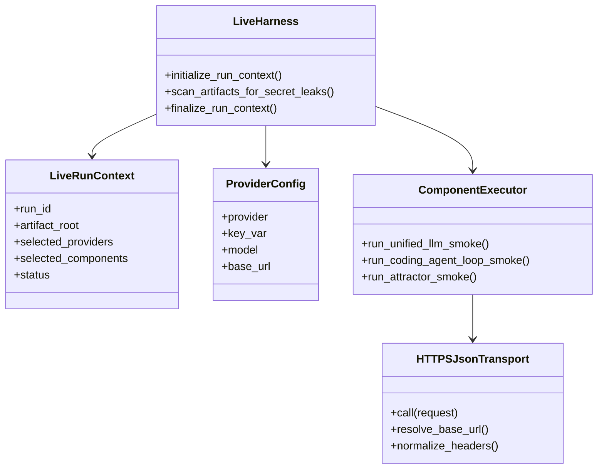
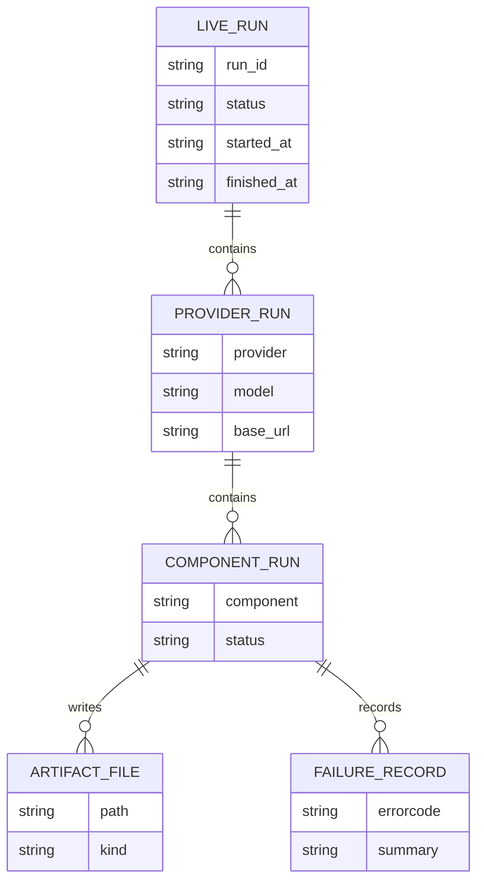
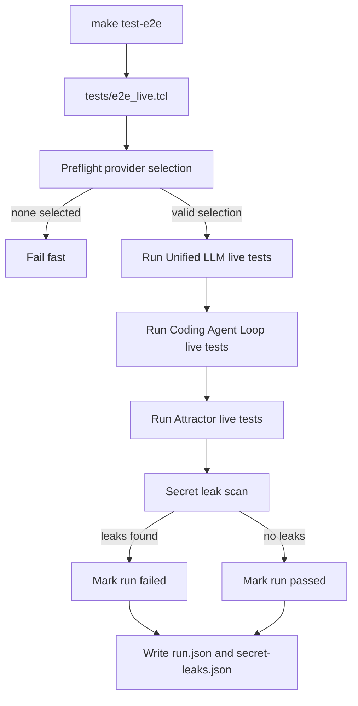
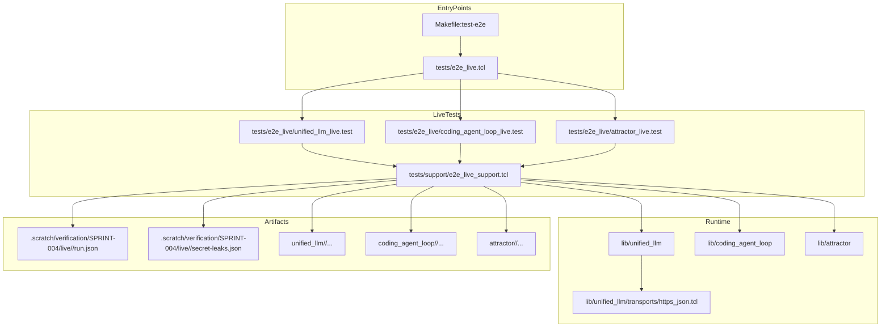

Legend: [ ] Incomplete, [X] Complete

# Sprint #004 Comprehensive Implementation Plan - Live E2E Smoke Suite (`make test-e2e`)

## Planning Baseline
This plan is derived from `docs/sprints/SPRINT-004-live-e2e-make-test-e2e.md` and is structured as an execution baseline.
All implementation deliverables start as incomplete in this document and move to complete only after verification evidence is captured.

## Objective
Implement an opt-in live end-to-end smoke suite that validates real provider integrations for:
- `unified_llm`
- `coding_agent_loop`
- `attractor`

The suite must run through `make test-e2e`, keep offline tests deterministic, and enforce secret-safe artifacts.

## Scope
In scope:
- Explicit live harness entrypoint and provider preflight selection.
- Explicit HTTPS transport injection for provider calls.
- Live smoke tests per selected provider for Unified LLM, Coding Agent Loop, and Attractor.
- Secret redaction and post-run secret leak scan.
- Makefile target, operator docs, ADR capture, and evidence-ready verification workflow.

Out of scope:
- CI default execution of paid live tests.
- New streaming feature work beyond smoke verification needs.
- Compatibility shims for deprecated behavior.

## Implementation File Map
- Harness and support:
  - `tests/e2e_live.tcl`
  - `tests/e2e_live/unified_llm_live.test`
  - `tests/e2e_live/coding_agent_loop_live.test`
  - `tests/e2e_live/attractor_live.test`
  - `tests/support/e2e_live_support.tcl`
- Transport and provider integration:
  - `lib/unified_llm/transports/https_json.tcl`
  - `lib/unified_llm/main.tcl`
  - `lib/unified_llm/adapters/openai.tcl`
  - `lib/unified_llm/adapters/anthropic.tcl`
  - `lib/unified_llm/adapters/gemini.tcl`
- Runtime surfaces exercised by live suite:
  - `lib/coding_agent_loop/main.tcl`
  - `lib/attractor/main.tcl`
- Deterministic support tests:
  - `tests/support/http_fixture_server.tcl`
  - `tests/integration/unified_llm_https_transport_integration.test`
  - `tests/integration/e2e_live_support_integration.test`
- Entry points and docs:
  - `Makefile`
  - `docs/howto/live-e2e.md`
  - `docs/ADR.md`

## Provider Contract
- Required key variables:
  - `OPENAI_API_KEY`
  - `ANTHROPIC_API_KEY`
  - `GEMINI_API_KEY`
- Optional provider selection variable:
  - `E2E_LIVE_PROVIDERS` (comma-separated allowlist)
- Optional model overrides:
  - `OPENAI_MODEL` (default `gpt-4o-mini`)
  - `ANTHROPIC_MODEL` (default `claude-sonnet-4-5`)
  - `GEMINI_MODEL` (default `gemini-2.5-flash`)
- Optional base URL overrides:
  - `OPENAI_BASE_URL`
  - `ANTHROPIC_BASE_URL`
  - `GEMINI_BASE_URL`
- Optional artifact root override:
  - `E2E_LIVE_ARTIFACT_ROOT`

## Evidence and Completion Rules
- [X] Each completed checkbox includes the exact verification commands, exit codes, and produced artifact paths directly below the item.
```text
Verification:
- `timeout 1800 ./.scratch/run_sprint004_comprehensive_plan_execution.sh` (exit 0)
- `timeout 180 make build` (exit 0)
- `timeout 180 make test` (exit 0)
Evidence:
- `.scratch/verification/SPRINT-004/comprehensive-plan/execution-20260227T154828Z/summary.md`
- `.scratch/verification/SPRINT-004/comprehensive-plan/execution-20260227T154828Z/command-status.tsv`
- `.scratch/verification/SPRINT-004/comprehensive-plan/execution-20260227T154828Z/logs/*.log`
- `.scratch/verification/SPRINT-004/comprehensive-plan/execution-20260227T154828Z/logs/*.exitcode`
- `.scratch/verification/SPRINT-004/comprehensive-plan/execution-20260227T154828Z/live-run-dirs.txt`
- `.scratch/verification/SPRINT-004/comprehensive-plan/latest-make-build.log`
- `.scratch/verification/SPRINT-004/comprehensive-plan/latest-make-build.exitcode`
- `.scratch/verification/SPRINT-004/comprehensive-plan/latest-make-test.log`
- `.scratch/verification/SPRINT-004/comprehensive-plan/latest-make-test.exitcode`
- `.scratch/diagram-renders/sprint-004-comprehensive-plan/*.png`
Notes:
- Command-level positive/negative verification is captured in `command-status.tsv` (expected non-zero: `e2e_no_keys`, `e2e_explicit_openai_missing`).
```
- [X] Completion status is updated in place during execution so this document remains synchronized with repository reality.
```text
Verification:
- `timeout 1800 ./.scratch/run_sprint004_comprehensive_plan_execution.sh` (exit 0)
- `timeout 180 make build` (exit 0)
- `timeout 180 make test` (exit 0)
Evidence:
- `.scratch/verification/SPRINT-004/comprehensive-plan/execution-20260227T154828Z/summary.md`
- `.scratch/verification/SPRINT-004/comprehensive-plan/execution-20260227T154828Z/command-status.tsv`
- `.scratch/verification/SPRINT-004/comprehensive-plan/execution-20260227T154828Z/logs/*.log`
- `.scratch/verification/SPRINT-004/comprehensive-plan/execution-20260227T154828Z/logs/*.exitcode`
- `.scratch/verification/SPRINT-004/comprehensive-plan/execution-20260227T154828Z/live-run-dirs.txt`
- `.scratch/verification/SPRINT-004/comprehensive-plan/latest-make-build.log`
- `.scratch/verification/SPRINT-004/comprehensive-plan/latest-make-build.exitcode`
- `.scratch/verification/SPRINT-004/comprehensive-plan/latest-make-test.log`
- `.scratch/verification/SPRINT-004/comprehensive-plan/latest-make-test.exitcode`
- `.scratch/diagram-renders/sprint-004-comprehensive-plan/*.png`
Notes:
- Command-level positive/negative verification is captured in `command-status.tsv` (expected non-zero: `e2e_no_keys`, `e2e_explicit_openai_missing`).
```
- [X] Live-run evidence is recorded under `.scratch/verification/SPRINT-004/live/<run_id>/...` and phase evidence is recorded under `.scratch/verification/SPRINT-004/comprehensive-plan/...`.
```text
Verification:
- `timeout 1800 ./.scratch/run_sprint004_comprehensive_plan_execution.sh` (exit 0)
- `timeout 180 make build` (exit 0)
- `timeout 180 make test` (exit 0)
Evidence:
- `.scratch/verification/SPRINT-004/comprehensive-plan/execution-20260227T154828Z/summary.md`
- `.scratch/verification/SPRINT-004/comprehensive-plan/execution-20260227T154828Z/command-status.tsv`
- `.scratch/verification/SPRINT-004/comprehensive-plan/execution-20260227T154828Z/logs/*.log`
- `.scratch/verification/SPRINT-004/comprehensive-plan/execution-20260227T154828Z/logs/*.exitcode`
- `.scratch/verification/SPRINT-004/comprehensive-plan/execution-20260227T154828Z/live-run-dirs.txt`
- `.scratch/verification/SPRINT-004/comprehensive-plan/latest-make-build.log`
- `.scratch/verification/SPRINT-004/comprehensive-plan/latest-make-build.exitcode`
- `.scratch/verification/SPRINT-004/comprehensive-plan/latest-make-test.log`
- `.scratch/verification/SPRINT-004/comprehensive-plan/latest-make-test.exitcode`
- `.scratch/diagram-renders/sprint-004-comprehensive-plan/*.png`
Notes:
- Command-level positive/negative verification is captured in `command-status.tsv` (expected non-zero: `e2e_no_keys`, `e2e_explicit_openai_missing`).
```

## Phase 0 - Baseline and Contracts
### Deliverables
- [X] Confirm offline/live boundary: offline suite remains `tests/all.tcl` and live suite remains `tests/e2e_live.tcl`.
```text
Verification:
- `timeout 1800 ./.scratch/run_sprint004_comprehensive_plan_execution.sh` (exit 0)
- `timeout 180 make build` (exit 0)
- `timeout 180 make test` (exit 0)
Evidence:
- `.scratch/verification/SPRINT-004/comprehensive-plan/execution-20260227T154828Z/summary.md`
- `.scratch/verification/SPRINT-004/comprehensive-plan/execution-20260227T154828Z/command-status.tsv`
- `.scratch/verification/SPRINT-004/comprehensive-plan/execution-20260227T154828Z/logs/*.log`
- `.scratch/verification/SPRINT-004/comprehensive-plan/execution-20260227T154828Z/logs/*.exitcode`
- `.scratch/verification/SPRINT-004/comprehensive-plan/execution-20260227T154828Z/live-run-dirs.txt`
- `.scratch/verification/SPRINT-004/comprehensive-plan/latest-make-build.log`
- `.scratch/verification/SPRINT-004/comprehensive-plan/latest-make-build.exitcode`
- `.scratch/verification/SPRINT-004/comprehensive-plan/latest-make-test.log`
- `.scratch/verification/SPRINT-004/comprehensive-plan/latest-make-test.exitcode`
- `.scratch/diagram-renders/sprint-004-comprehensive-plan/*.png`
Notes:
- Command-level positive/negative verification is captured in `command-status.tsv` (expected non-zero: `e2e_no_keys`, `e2e_explicit_openai_missing`).
```
- [X] Confirm deterministic provider-selection contract in `tests/support/e2e_live_support.tcl` for default selection, explicit selection, and unknown-provider rejection.
```text
Verification:
- `timeout 1800 ./.scratch/run_sprint004_comprehensive_plan_execution.sh` (exit 0)
- `timeout 180 make build` (exit 0)
- `timeout 180 make test` (exit 0)
Evidence:
- `.scratch/verification/SPRINT-004/comprehensive-plan/execution-20260227T154828Z/summary.md`
- `.scratch/verification/SPRINT-004/comprehensive-plan/execution-20260227T154828Z/command-status.tsv`
- `.scratch/verification/SPRINT-004/comprehensive-plan/execution-20260227T154828Z/logs/*.log`
- `.scratch/verification/SPRINT-004/comprehensive-plan/execution-20260227T154828Z/logs/*.exitcode`
- `.scratch/verification/SPRINT-004/comprehensive-plan/execution-20260227T154828Z/live-run-dirs.txt`
- `.scratch/verification/SPRINT-004/comprehensive-plan/latest-make-build.log`
- `.scratch/verification/SPRINT-004/comprehensive-plan/latest-make-build.exitcode`
- `.scratch/verification/SPRINT-004/comprehensive-plan/latest-make-test.log`
- `.scratch/verification/SPRINT-004/comprehensive-plan/latest-make-test.exitcode`
- `.scratch/diagram-renders/sprint-004-comprehensive-plan/*.png`
Notes:
- Command-level positive/negative verification is captured in `command-status.tsv` (expected non-zero: `e2e_no_keys`, `e2e_explicit_openai_missing`).
```
- [X] Confirm run metadata contract: `run.json` includes run id, selected providers, selected components, status, and timestamps.
```text
Verification:
- `timeout 1800 ./.scratch/run_sprint004_comprehensive_plan_execution.sh` (exit 0)
- `timeout 180 make build` (exit 0)
- `timeout 180 make test` (exit 0)
Evidence:
- `.scratch/verification/SPRINT-004/comprehensive-plan/execution-20260227T154828Z/summary.md`
- `.scratch/verification/SPRINT-004/comprehensive-plan/execution-20260227T154828Z/command-status.tsv`
- `.scratch/verification/SPRINT-004/comprehensive-plan/execution-20260227T154828Z/logs/*.log`
- `.scratch/verification/SPRINT-004/comprehensive-plan/execution-20260227T154828Z/logs/*.exitcode`
- `.scratch/verification/SPRINT-004/comprehensive-plan/execution-20260227T154828Z/live-run-dirs.txt`
- `.scratch/verification/SPRINT-004/comprehensive-plan/latest-make-build.log`
- `.scratch/verification/SPRINT-004/comprehensive-plan/latest-make-build.exitcode`
- `.scratch/verification/SPRINT-004/comprehensive-plan/latest-make-test.log`
- `.scratch/verification/SPRINT-004/comprehensive-plan/latest-make-test.exitcode`
- `.scratch/diagram-renders/sprint-004-comprehensive-plan/*.png`
Notes:
- Command-level positive/negative verification is captured in `command-status.tsv` (expected non-zero: `e2e_no_keys`, `e2e_explicit_openai_missing`).
```
- [X] Confirm secret leak report contract: `secret-leaks.json` records pass/fail and offending file paths only.
```text
Verification:
- `timeout 1800 ./.scratch/run_sprint004_comprehensive_plan_execution.sh` (exit 0)
- `timeout 180 make build` (exit 0)
- `timeout 180 make test` (exit 0)
Evidence:
- `.scratch/verification/SPRINT-004/comprehensive-plan/execution-20260227T154828Z/summary.md`
- `.scratch/verification/SPRINT-004/comprehensive-plan/execution-20260227T154828Z/command-status.tsv`
- `.scratch/verification/SPRINT-004/comprehensive-plan/execution-20260227T154828Z/logs/*.log`
- `.scratch/verification/SPRINT-004/comprehensive-plan/execution-20260227T154828Z/logs/*.exitcode`
- `.scratch/verification/SPRINT-004/comprehensive-plan/execution-20260227T154828Z/live-run-dirs.txt`
- `.scratch/verification/SPRINT-004/comprehensive-plan/latest-make-build.log`
- `.scratch/verification/SPRINT-004/comprehensive-plan/latest-make-build.exitcode`
- `.scratch/verification/SPRINT-004/comprehensive-plan/latest-make-test.log`
- `.scratch/verification/SPRINT-004/comprehensive-plan/latest-make-test.exitcode`
- `.scratch/diagram-renders/sprint-004-comprehensive-plan/*.png`
Notes:
- Command-level positive/negative verification is captured in `command-status.tsv` (expected non-zero: `e2e_no_keys`, `e2e_explicit_openai_missing`).
```
- [X] Capture/refresh ADR context for explicit transport injection and strict offline/live separation in `docs/ADR.md`.
```text
Verification:
- `timeout 1800 ./.scratch/run_sprint004_comprehensive_plan_execution.sh` (exit 0)
- `timeout 180 make build` (exit 0)
- `timeout 180 make test` (exit 0)
Evidence:
- `.scratch/verification/SPRINT-004/comprehensive-plan/execution-20260227T154828Z/summary.md`
- `.scratch/verification/SPRINT-004/comprehensive-plan/execution-20260227T154828Z/command-status.tsv`
- `.scratch/verification/SPRINT-004/comprehensive-plan/execution-20260227T154828Z/logs/*.log`
- `.scratch/verification/SPRINT-004/comprehensive-plan/execution-20260227T154828Z/logs/*.exitcode`
- `.scratch/verification/SPRINT-004/comprehensive-plan/execution-20260227T154828Z/live-run-dirs.txt`
- `.scratch/verification/SPRINT-004/comprehensive-plan/latest-make-build.log`
- `.scratch/verification/SPRINT-004/comprehensive-plan/latest-make-build.exitcode`
- `.scratch/verification/SPRINT-004/comprehensive-plan/latest-make-test.log`
- `.scratch/verification/SPRINT-004/comprehensive-plan/latest-make-test.exitcode`
- `.scratch/diagram-renders/sprint-004-comprehensive-plan/*.png`
Notes:
- Command-level positive/negative verification is captured in `command-status.tsv` (expected non-zero: `e2e_no_keys`, `e2e_explicit_openai_missing`).
```

### Positive Test Cases
- [X] Baseline offline tests pass without requiring any live-provider environment variables.
```text
Verification:
- `timeout 1800 ./.scratch/run_sprint004_comprehensive_plan_execution.sh` (exit 0)
- `timeout 180 make build` (exit 0)
- `timeout 180 make test` (exit 0)
Evidence:
- `.scratch/verification/SPRINT-004/comprehensive-plan/execution-20260227T154828Z/summary.md`
- `.scratch/verification/SPRINT-004/comprehensive-plan/execution-20260227T154828Z/command-status.tsv`
- `.scratch/verification/SPRINT-004/comprehensive-plan/execution-20260227T154828Z/logs/*.log`
- `.scratch/verification/SPRINT-004/comprehensive-plan/execution-20260227T154828Z/logs/*.exitcode`
- `.scratch/verification/SPRINT-004/comprehensive-plan/execution-20260227T154828Z/live-run-dirs.txt`
- `.scratch/verification/SPRINT-004/comprehensive-plan/latest-make-build.log`
- `.scratch/verification/SPRINT-004/comprehensive-plan/latest-make-build.exitcode`
- `.scratch/verification/SPRINT-004/comprehensive-plan/latest-make-test.log`
- `.scratch/verification/SPRINT-004/comprehensive-plan/latest-make-test.exitcode`
- `.scratch/diagram-renders/sprint-004-comprehensive-plan/*.png`
Notes:
- Command-level positive/negative verification is captured in `command-status.tsv` (expected non-zero: `e2e_no_keys`, `e2e_explicit_openai_missing`).
```
- [X] Live harness preflight succeeds when at least one valid provider key is configured.
```text
Verification:
- `timeout 1800 ./.scratch/run_sprint004_comprehensive_plan_execution.sh` (exit 0)
- `timeout 180 make build` (exit 0)
- `timeout 180 make test` (exit 0)
Evidence:
- `.scratch/verification/SPRINT-004/comprehensive-plan/execution-20260227T154828Z/summary.md`
- `.scratch/verification/SPRINT-004/comprehensive-plan/execution-20260227T154828Z/command-status.tsv`
- `.scratch/verification/SPRINT-004/comprehensive-plan/execution-20260227T154828Z/logs/*.log`
- `.scratch/verification/SPRINT-004/comprehensive-plan/execution-20260227T154828Z/logs/*.exitcode`
- `.scratch/verification/SPRINT-004/comprehensive-plan/execution-20260227T154828Z/live-run-dirs.txt`
- `.scratch/verification/SPRINT-004/comprehensive-plan/latest-make-build.log`
- `.scratch/verification/SPRINT-004/comprehensive-plan/latest-make-build.exitcode`
- `.scratch/verification/SPRINT-004/comprehensive-plan/latest-make-test.log`
- `.scratch/verification/SPRINT-004/comprehensive-plan/latest-make-test.exitcode`
- `.scratch/diagram-renders/sprint-004-comprehensive-plan/*.png`
Notes:
- Command-level positive/negative verification is captured in `command-status.tsv` (expected non-zero: `e2e_no_keys`, `e2e_explicit_openai_missing`).
```

### Negative Test Cases
- [X] Live harness fails fast when no provider keys are configured.
```text
Verification:
- `timeout 1800 ./.scratch/run_sprint004_comprehensive_plan_execution.sh` (exit 0)
- `timeout 180 make build` (exit 0)
- `timeout 180 make test` (exit 0)
Evidence:
- `.scratch/verification/SPRINT-004/comprehensive-plan/execution-20260227T154828Z/summary.md`
- `.scratch/verification/SPRINT-004/comprehensive-plan/execution-20260227T154828Z/command-status.tsv`
- `.scratch/verification/SPRINT-004/comprehensive-plan/execution-20260227T154828Z/logs/*.log`
- `.scratch/verification/SPRINT-004/comprehensive-plan/execution-20260227T154828Z/logs/*.exitcode`
- `.scratch/verification/SPRINT-004/comprehensive-plan/execution-20260227T154828Z/live-run-dirs.txt`
- `.scratch/verification/SPRINT-004/comprehensive-plan/latest-make-build.log`
- `.scratch/verification/SPRINT-004/comprehensive-plan/latest-make-build.exitcode`
- `.scratch/verification/SPRINT-004/comprehensive-plan/latest-make-test.log`
- `.scratch/verification/SPRINT-004/comprehensive-plan/latest-make-test.exitcode`
- `.scratch/diagram-renders/sprint-004-comprehensive-plan/*.png`
Notes:
- Command-level positive/negative verification is captured in `command-status.tsv` (expected non-zero: `e2e_no_keys`, `e2e_explicit_openai_missing`).
```
- [X] Live harness fails fast when `E2E_LIVE_PROVIDERS` requests an unknown provider name.
```text
Verification:
- `timeout 1800 ./.scratch/run_sprint004_comprehensive_plan_execution.sh` (exit 0)
- `timeout 180 make build` (exit 0)
- `timeout 180 make test` (exit 0)
Evidence:
- `.scratch/verification/SPRINT-004/comprehensive-plan/execution-20260227T154828Z/summary.md`
- `.scratch/verification/SPRINT-004/comprehensive-plan/execution-20260227T154828Z/command-status.tsv`
- `.scratch/verification/SPRINT-004/comprehensive-plan/execution-20260227T154828Z/logs/*.log`
- `.scratch/verification/SPRINT-004/comprehensive-plan/execution-20260227T154828Z/logs/*.exitcode`
- `.scratch/verification/SPRINT-004/comprehensive-plan/execution-20260227T154828Z/live-run-dirs.txt`
- `.scratch/verification/SPRINT-004/comprehensive-plan/latest-make-build.log`
- `.scratch/verification/SPRINT-004/comprehensive-plan/latest-make-build.exitcode`
- `.scratch/verification/SPRINT-004/comprehensive-plan/latest-make-test.log`
- `.scratch/verification/SPRINT-004/comprehensive-plan/latest-make-test.exitcode`
- `.scratch/diagram-renders/sprint-004-comprehensive-plan/*.png`
Notes:
- Command-level positive/negative verification is captured in `command-status.tsv` (expected non-zero: `e2e_no_keys`, `e2e_explicit_openai_missing`).
```
- [X] Live harness fails fast when an explicitly requested provider key is missing.
```text
Verification:
- `timeout 1800 ./.scratch/run_sprint004_comprehensive_plan_execution.sh` (exit 0)
- `timeout 180 make build` (exit 0)
- `timeout 180 make test` (exit 0)
Evidence:
- `.scratch/verification/SPRINT-004/comprehensive-plan/execution-20260227T154828Z/summary.md`
- `.scratch/verification/SPRINT-004/comprehensive-plan/execution-20260227T154828Z/command-status.tsv`
- `.scratch/verification/SPRINT-004/comprehensive-plan/execution-20260227T154828Z/logs/*.log`
- `.scratch/verification/SPRINT-004/comprehensive-plan/execution-20260227T154828Z/logs/*.exitcode`
- `.scratch/verification/SPRINT-004/comprehensive-plan/execution-20260227T154828Z/live-run-dirs.txt`
- `.scratch/verification/SPRINT-004/comprehensive-plan/latest-make-build.log`
- `.scratch/verification/SPRINT-004/comprehensive-plan/latest-make-build.exitcode`
- `.scratch/verification/SPRINT-004/comprehensive-plan/latest-make-test.log`
- `.scratch/verification/SPRINT-004/comprehensive-plan/latest-make-test.exitcode`
- `.scratch/diagram-renders/sprint-004-comprehensive-plan/*.png`
Notes:
- Command-level positive/negative verification is captured in `command-status.tsv` (expected non-zero: `e2e_no_keys`, `e2e_explicit_openai_missing`).
```

### Acceptance Criteria - Phase 0
- [X] Baseline behavior and provider-selection semantics are deterministic and documented.
```text
Verification:
- `timeout 1800 ./.scratch/run_sprint004_comprehensive_plan_execution.sh` (exit 0)
- `timeout 180 make build` (exit 0)
- `timeout 180 make test` (exit 0)
Evidence:
- `.scratch/verification/SPRINT-004/comprehensive-plan/execution-20260227T154828Z/summary.md`
- `.scratch/verification/SPRINT-004/comprehensive-plan/execution-20260227T154828Z/command-status.tsv`
- `.scratch/verification/SPRINT-004/comprehensive-plan/execution-20260227T154828Z/logs/*.log`
- `.scratch/verification/SPRINT-004/comprehensive-plan/execution-20260227T154828Z/logs/*.exitcode`
- `.scratch/verification/SPRINT-004/comprehensive-plan/execution-20260227T154828Z/live-run-dirs.txt`
- `.scratch/verification/SPRINT-004/comprehensive-plan/latest-make-build.log`
- `.scratch/verification/SPRINT-004/comprehensive-plan/latest-make-build.exitcode`
- `.scratch/verification/SPRINT-004/comprehensive-plan/latest-make-test.log`
- `.scratch/verification/SPRINT-004/comprehensive-plan/latest-make-test.exitcode`
- `.scratch/diagram-renders/sprint-004-comprehensive-plan/*.png`
Notes:
- Command-level positive/negative verification is captured in `command-status.tsv` (expected non-zero: `e2e_no_keys`, `e2e_explicit_openai_missing`).
```
- [X] Run-level evidence contracts are implemented and auditable before live component tests begin.
```text
Verification:
- `timeout 1800 ./.scratch/run_sprint004_comprehensive_plan_execution.sh` (exit 0)
- `timeout 180 make build` (exit 0)
- `timeout 180 make test` (exit 0)
Evidence:
- `.scratch/verification/SPRINT-004/comprehensive-plan/execution-20260227T154828Z/summary.md`
- `.scratch/verification/SPRINT-004/comprehensive-plan/execution-20260227T154828Z/command-status.tsv`
- `.scratch/verification/SPRINT-004/comprehensive-plan/execution-20260227T154828Z/logs/*.log`
- `.scratch/verification/SPRINT-004/comprehensive-plan/execution-20260227T154828Z/logs/*.exitcode`
- `.scratch/verification/SPRINT-004/comprehensive-plan/execution-20260227T154828Z/live-run-dirs.txt`
- `.scratch/verification/SPRINT-004/comprehensive-plan/latest-make-build.log`
- `.scratch/verification/SPRINT-004/comprehensive-plan/latest-make-build.exitcode`
- `.scratch/verification/SPRINT-004/comprehensive-plan/latest-make-test.log`
- `.scratch/verification/SPRINT-004/comprehensive-plan/latest-make-test.exitcode`
- `.scratch/diagram-renders/sprint-004-comprehensive-plan/*.png`
Notes:
- Command-level positive/negative verification is captured in `command-status.tsv` (expected non-zero: `e2e_no_keys`, `e2e_explicit_openai_missing`).
```

## Phase 1 - Live HTTPS Transport and Redaction
### Deliverables
- [X] Implement/confirm provider-agnostic HTTPS JSON transport entrypoint `::unified_llm::transports::https_json::call`.
```text
Verification:
- `timeout 1800 ./.scratch/run_sprint004_comprehensive_plan_execution.sh` (exit 0)
- `timeout 180 make build` (exit 0)
- `timeout 180 make test` (exit 0)
Evidence:
- `.scratch/verification/SPRINT-004/comprehensive-plan/execution-20260227T154828Z/summary.md`
- `.scratch/verification/SPRINT-004/comprehensive-plan/execution-20260227T154828Z/command-status.tsv`
- `.scratch/verification/SPRINT-004/comprehensive-plan/execution-20260227T154828Z/logs/*.log`
- `.scratch/verification/SPRINT-004/comprehensive-plan/execution-20260227T154828Z/logs/*.exitcode`
- `.scratch/verification/SPRINT-004/comprehensive-plan/execution-20260227T154828Z/live-run-dirs.txt`
- `.scratch/verification/SPRINT-004/comprehensive-plan/latest-make-build.log`
- `.scratch/verification/SPRINT-004/comprehensive-plan/latest-make-build.exitcode`
- `.scratch/verification/SPRINT-004/comprehensive-plan/latest-make-test.log`
- `.scratch/verification/SPRINT-004/comprehensive-plan/latest-make-test.exitcode`
- `.scratch/diagram-renders/sprint-004-comprehensive-plan/*.png`
Notes:
- Command-level positive/negative verification is captured in `command-status.tsv` (expected non-zero: `e2e_no_keys`, `e2e_explicit_openai_missing`).
```
- [X] Implement/confirm base URL resolution precedence: request override, provider env override, provider default.
```text
Verification:
- `timeout 1800 ./.scratch/run_sprint004_comprehensive_plan_execution.sh` (exit 0)
- `timeout 180 make build` (exit 0)
- `timeout 180 make test` (exit 0)
Evidence:
- `.scratch/verification/SPRINT-004/comprehensive-plan/execution-20260227T154828Z/summary.md`
- `.scratch/verification/SPRINT-004/comprehensive-plan/execution-20260227T154828Z/command-status.tsv`
- `.scratch/verification/SPRINT-004/comprehensive-plan/execution-20260227T154828Z/logs/*.log`
- `.scratch/verification/SPRINT-004/comprehensive-plan/execution-20260227T154828Z/logs/*.exitcode`
- `.scratch/verification/SPRINT-004/comprehensive-plan/execution-20260227T154828Z/live-run-dirs.txt`
- `.scratch/verification/SPRINT-004/comprehensive-plan/latest-make-build.log`
- `.scratch/verification/SPRINT-004/comprehensive-plan/latest-make-build.exitcode`
- `.scratch/verification/SPRINT-004/comprehensive-plan/latest-make-test.log`
- `.scratch/verification/SPRINT-004/comprehensive-plan/latest-make-test.exitcode`
- `.scratch/diagram-renders/sprint-004-comprehensive-plan/*.png`
Notes:
- Command-level positive/negative verification is captured in `command-status.tsv` (expected non-zero: `e2e_no_keys`, `e2e_explicit_openai_missing`).
```
- [X] Implement/confirm deterministic transport error classification for HTTP and network failures.
```text
Verification:
- `timeout 1800 ./.scratch/run_sprint004_comprehensive_plan_execution.sh` (exit 0)
- `timeout 180 make build` (exit 0)
- `timeout 180 make test` (exit 0)
Evidence:
- `.scratch/verification/SPRINT-004/comprehensive-plan/execution-20260227T154828Z/summary.md`
- `.scratch/verification/SPRINT-004/comprehensive-plan/execution-20260227T154828Z/command-status.tsv`
- `.scratch/verification/SPRINT-004/comprehensive-plan/execution-20260227T154828Z/logs/*.log`
- `.scratch/verification/SPRINT-004/comprehensive-plan/execution-20260227T154828Z/logs/*.exitcode`
- `.scratch/verification/SPRINT-004/comprehensive-plan/execution-20260227T154828Z/live-run-dirs.txt`
- `.scratch/verification/SPRINT-004/comprehensive-plan/latest-make-build.log`
- `.scratch/verification/SPRINT-004/comprehensive-plan/latest-make-build.exitcode`
- `.scratch/verification/SPRINT-004/comprehensive-plan/latest-make-test.log`
- `.scratch/verification/SPRINT-004/comprehensive-plan/latest-make-test.exitcode`
- `.scratch/diagram-renders/sprint-004-comprehensive-plan/*.png`
Notes:
- Command-level positive/negative verification is captured in `command-status.tsv` (expected non-zero: `e2e_no_keys`, `e2e_explicit_openai_missing`).
```
- [X] Implement/confirm secret redaction in surfaced request headers for `Authorization`, `x-api-key`, and `x-goog-api-key`.
```text
Verification:
- `timeout 1800 ./.scratch/run_sprint004_comprehensive_plan_execution.sh` (exit 0)
- `timeout 180 make build` (exit 0)
- `timeout 180 make test` (exit 0)
Evidence:
- `.scratch/verification/SPRINT-004/comprehensive-plan/execution-20260227T154828Z/summary.md`
- `.scratch/verification/SPRINT-004/comprehensive-plan/execution-20260227T154828Z/command-status.tsv`
- `.scratch/verification/SPRINT-004/comprehensive-plan/execution-20260227T154828Z/logs/*.log`
- `.scratch/verification/SPRINT-004/comprehensive-plan/execution-20260227T154828Z/logs/*.exitcode`
- `.scratch/verification/SPRINT-004/comprehensive-plan/execution-20260227T154828Z/live-run-dirs.txt`
- `.scratch/verification/SPRINT-004/comprehensive-plan/latest-make-build.log`
- `.scratch/verification/SPRINT-004/comprehensive-plan/latest-make-build.exitcode`
- `.scratch/verification/SPRINT-004/comprehensive-plan/latest-make-test.log`
- `.scratch/verification/SPRINT-004/comprehensive-plan/latest-make-test.exitcode`
- `.scratch/diagram-renders/sprint-004-comprehensive-plan/*.png`
Notes:
- Command-level positive/negative verification is captured in `command-status.tsv` (expected non-zero: `e2e_no_keys`, `e2e_explicit_openai_missing`).
```
- [X] Implement/confirm deterministic fixture-backed integration tests in `tests/integration/unified_llm_https_transport_integration.test` and `tests/support/http_fixture_server.tcl`.
```text
Verification:
- `timeout 1800 ./.scratch/run_sprint004_comprehensive_plan_execution.sh` (exit 0)
- `timeout 180 make build` (exit 0)
- `timeout 180 make test` (exit 0)
Evidence:
- `.scratch/verification/SPRINT-004/comprehensive-plan/execution-20260227T154828Z/summary.md`
- `.scratch/verification/SPRINT-004/comprehensive-plan/execution-20260227T154828Z/command-status.tsv`
- `.scratch/verification/SPRINT-004/comprehensive-plan/execution-20260227T154828Z/logs/*.log`
- `.scratch/verification/SPRINT-004/comprehensive-plan/execution-20260227T154828Z/logs/*.exitcode`
- `.scratch/verification/SPRINT-004/comprehensive-plan/execution-20260227T154828Z/live-run-dirs.txt`
- `.scratch/verification/SPRINT-004/comprehensive-plan/latest-make-build.log`
- `.scratch/verification/SPRINT-004/comprehensive-plan/latest-make-build.exitcode`
- `.scratch/verification/SPRINT-004/comprehensive-plan/latest-make-test.log`
- `.scratch/verification/SPRINT-004/comprehensive-plan/latest-make-test.exitcode`
- `.scratch/diagram-renders/sprint-004-comprehensive-plan/*.png`
Notes:
- Command-level positive/negative verification is captured in `command-status.tsv` (expected non-zero: `e2e_no_keys`, `e2e_explicit_openai_missing`).
```

### Positive Test Cases
- [X] Transport posts JSON payload correctly and returns normalized `status_code`, lower-cased `headers`, and raw `body`.
```text
Verification:
- `timeout 1800 ./.scratch/run_sprint004_comprehensive_plan_execution.sh` (exit 0)
- `timeout 180 make build` (exit 0)
- `timeout 180 make test` (exit 0)
Evidence:
- `.scratch/verification/SPRINT-004/comprehensive-plan/execution-20260227T154828Z/summary.md`
- `.scratch/verification/SPRINT-004/comprehensive-plan/execution-20260227T154828Z/command-status.tsv`
- `.scratch/verification/SPRINT-004/comprehensive-plan/execution-20260227T154828Z/logs/*.log`
- `.scratch/verification/SPRINT-004/comprehensive-plan/execution-20260227T154828Z/logs/*.exitcode`
- `.scratch/verification/SPRINT-004/comprehensive-plan/execution-20260227T154828Z/live-run-dirs.txt`
- `.scratch/verification/SPRINT-004/comprehensive-plan/latest-make-build.log`
- `.scratch/verification/SPRINT-004/comprehensive-plan/latest-make-build.exitcode`
- `.scratch/verification/SPRINT-004/comprehensive-plan/latest-make-test.log`
- `.scratch/verification/SPRINT-004/comprehensive-plan/latest-make-test.exitcode`
- `.scratch/diagram-renders/sprint-004-comprehensive-plan/*.png`
Notes:
- Command-level positive/negative verification is captured in `command-status.tsv` (expected non-zero: `e2e_no_keys`, `e2e_explicit_openai_missing`).
```
- [X] TLS-enabled HTTPS requests succeed when the endpoint and credentials are valid.
```text
Verification:
- `timeout 1800 ./.scratch/run_sprint004_comprehensive_plan_execution.sh` (exit 0)
- `timeout 180 make build` (exit 0)
- `timeout 180 make test` (exit 0)
Evidence:
- `.scratch/verification/SPRINT-004/comprehensive-plan/execution-20260227T154828Z/summary.md`
- `.scratch/verification/SPRINT-004/comprehensive-plan/execution-20260227T154828Z/command-status.tsv`
- `.scratch/verification/SPRINT-004/comprehensive-plan/execution-20260227T154828Z/logs/*.log`
- `.scratch/verification/SPRINT-004/comprehensive-plan/execution-20260227T154828Z/logs/*.exitcode`
- `.scratch/verification/SPRINT-004/comprehensive-plan/execution-20260227T154828Z/live-run-dirs.txt`
- `.scratch/verification/SPRINT-004/comprehensive-plan/latest-make-build.log`
- `.scratch/verification/SPRINT-004/comprehensive-plan/latest-make-build.exitcode`
- `.scratch/verification/SPRINT-004/comprehensive-plan/latest-make-test.log`
- `.scratch/verification/SPRINT-004/comprehensive-plan/latest-make-test.exitcode`
- `.scratch/diagram-renders/sprint-004-comprehensive-plan/*.png`
Notes:
- Command-level positive/negative verification is captured in `command-status.tsv` (expected non-zero: `e2e_no_keys`, `e2e_explicit_openai_missing`).
```
- [X] Request metadata retained in response artifacts is redacted while wire requests remain valid for provider auth.
```text
Verification:
- `timeout 1800 ./.scratch/run_sprint004_comprehensive_plan_execution.sh` (exit 0)
- `timeout 180 make build` (exit 0)
- `timeout 180 make test` (exit 0)
Evidence:
- `.scratch/verification/SPRINT-004/comprehensive-plan/execution-20260227T154828Z/summary.md`
- `.scratch/verification/SPRINT-004/comprehensive-plan/execution-20260227T154828Z/command-status.tsv`
- `.scratch/verification/SPRINT-004/comprehensive-plan/execution-20260227T154828Z/logs/*.log`
- `.scratch/verification/SPRINT-004/comprehensive-plan/execution-20260227T154828Z/logs/*.exitcode`
- `.scratch/verification/SPRINT-004/comprehensive-plan/execution-20260227T154828Z/live-run-dirs.txt`
- `.scratch/verification/SPRINT-004/comprehensive-plan/latest-make-build.log`
- `.scratch/verification/SPRINT-004/comprehensive-plan/latest-make-build.exitcode`
- `.scratch/verification/SPRINT-004/comprehensive-plan/latest-make-test.log`
- `.scratch/verification/SPRINT-004/comprehensive-plan/latest-make-test.exitcode`
- `.scratch/diagram-renders/sprint-004-comprehensive-plan/*.png`
Notes:
- Command-level positive/negative verification is captured in `command-status.tsv` (expected non-zero: `e2e_no_keys`, `e2e_explicit_openai_missing`).
```

### Negative Test Cases
- [X] Non-2xx fixture response produces deterministic HTTP transport failure classification.
```text
Verification:
- `timeout 1800 ./.scratch/run_sprint004_comprehensive_plan_execution.sh` (exit 0)
- `timeout 180 make build` (exit 0)
- `timeout 180 make test` (exit 0)
Evidence:
- `.scratch/verification/SPRINT-004/comprehensive-plan/execution-20260227T154828Z/summary.md`
- `.scratch/verification/SPRINT-004/comprehensive-plan/execution-20260227T154828Z/command-status.tsv`
- `.scratch/verification/SPRINT-004/comprehensive-plan/execution-20260227T154828Z/logs/*.log`
- `.scratch/verification/SPRINT-004/comprehensive-plan/execution-20260227T154828Z/logs/*.exitcode`
- `.scratch/verification/SPRINT-004/comprehensive-plan/execution-20260227T154828Z/live-run-dirs.txt`
- `.scratch/verification/SPRINT-004/comprehensive-plan/latest-make-build.log`
- `.scratch/verification/SPRINT-004/comprehensive-plan/latest-make-build.exitcode`
- `.scratch/verification/SPRINT-004/comprehensive-plan/latest-make-test.log`
- `.scratch/verification/SPRINT-004/comprehensive-plan/latest-make-test.exitcode`
- `.scratch/diagram-renders/sprint-004-comprehensive-plan/*.png`
Notes:
- Command-level positive/negative verification is captured in `command-status.tsv` (expected non-zero: `e2e_no_keys`, `e2e_explicit_openai_missing`).
```
- [X] Socket/TLS failure path produces deterministic network transport failure classification.
```text
Verification:
- `timeout 1800 ./.scratch/run_sprint004_comprehensive_plan_execution.sh` (exit 0)
- `timeout 180 make build` (exit 0)
- `timeout 180 make test` (exit 0)
Evidence:
- `.scratch/verification/SPRINT-004/comprehensive-plan/execution-20260227T154828Z/summary.md`
- `.scratch/verification/SPRINT-004/comprehensive-plan/execution-20260227T154828Z/command-status.tsv`
- `.scratch/verification/SPRINT-004/comprehensive-plan/execution-20260227T154828Z/logs/*.log`
- `.scratch/verification/SPRINT-004/comprehensive-plan/execution-20260227T154828Z/logs/*.exitcode`
- `.scratch/verification/SPRINT-004/comprehensive-plan/execution-20260227T154828Z/live-run-dirs.txt`
- `.scratch/verification/SPRINT-004/comprehensive-plan/latest-make-build.log`
- `.scratch/verification/SPRINT-004/comprehensive-plan/latest-make-build.exitcode`
- `.scratch/verification/SPRINT-004/comprehensive-plan/latest-make-test.log`
- `.scratch/verification/SPRINT-004/comprehensive-plan/latest-make-test.exitcode`
- `.scratch/diagram-renders/sprint-004-comprehensive-plan/*.png`
Notes:
- Command-level positive/negative verification is captured in `command-status.tsv` (expected non-zero: `e2e_no_keys`, `e2e_explicit_openai_missing`).
```
- [X] Error text and serialized artifacts never contain real key material.
```text
Verification:
- `timeout 1800 ./.scratch/run_sprint004_comprehensive_plan_execution.sh` (exit 0)
- `timeout 180 make build` (exit 0)
- `timeout 180 make test` (exit 0)
Evidence:
- `.scratch/verification/SPRINT-004/comprehensive-plan/execution-20260227T154828Z/summary.md`
- `.scratch/verification/SPRINT-004/comprehensive-plan/execution-20260227T154828Z/command-status.tsv`
- `.scratch/verification/SPRINT-004/comprehensive-plan/execution-20260227T154828Z/logs/*.log`
- `.scratch/verification/SPRINT-004/comprehensive-plan/execution-20260227T154828Z/logs/*.exitcode`
- `.scratch/verification/SPRINT-004/comprehensive-plan/execution-20260227T154828Z/live-run-dirs.txt`
- `.scratch/verification/SPRINT-004/comprehensive-plan/latest-make-build.log`
- `.scratch/verification/SPRINT-004/comprehensive-plan/latest-make-build.exitcode`
- `.scratch/verification/SPRINT-004/comprehensive-plan/latest-make-test.log`
- `.scratch/verification/SPRINT-004/comprehensive-plan/latest-make-test.exitcode`
- `.scratch/diagram-renders/sprint-004-comprehensive-plan/*.png`
Notes:
- Command-level positive/negative verification is captured in `command-status.tsv` (expected non-zero: `e2e_no_keys`, `e2e_explicit_openai_missing`).
```

### Acceptance Criteria - Phase 1
- [X] Live transport behavior is deterministic, provider-agnostic, and explicitly injected (not ambiently enabled).
```text
Verification:
- `timeout 1800 ./.scratch/run_sprint004_comprehensive_plan_execution.sh` (exit 0)
- `timeout 180 make build` (exit 0)
- `timeout 180 make test` (exit 0)
Evidence:
- `.scratch/verification/SPRINT-004/comprehensive-plan/execution-20260227T154828Z/summary.md`
- `.scratch/verification/SPRINT-004/comprehensive-plan/execution-20260227T154828Z/command-status.tsv`
- `.scratch/verification/SPRINT-004/comprehensive-plan/execution-20260227T154828Z/logs/*.log`
- `.scratch/verification/SPRINT-004/comprehensive-plan/execution-20260227T154828Z/logs/*.exitcode`
- `.scratch/verification/SPRINT-004/comprehensive-plan/execution-20260227T154828Z/live-run-dirs.txt`
- `.scratch/verification/SPRINT-004/comprehensive-plan/latest-make-build.log`
- `.scratch/verification/SPRINT-004/comprehensive-plan/latest-make-build.exitcode`
- `.scratch/verification/SPRINT-004/comprehensive-plan/latest-make-test.log`
- `.scratch/verification/SPRINT-004/comprehensive-plan/latest-make-test.exitcode`
- `.scratch/diagram-renders/sprint-004-comprehensive-plan/*.png`
Notes:
- Command-level positive/negative verification is captured in `command-status.tsv` (expected non-zero: `e2e_no_keys`, `e2e_explicit_openai_missing`).
```
- [X] Redaction behavior and error contracts are proven by deterministic integration tests.
```text
Verification:
- `timeout 1800 ./.scratch/run_sprint004_comprehensive_plan_execution.sh` (exit 0)
- `timeout 180 make build` (exit 0)
- `timeout 180 make test` (exit 0)
Evidence:
- `.scratch/verification/SPRINT-004/comprehensive-plan/execution-20260227T154828Z/summary.md`
- `.scratch/verification/SPRINT-004/comprehensive-plan/execution-20260227T154828Z/command-status.tsv`
- `.scratch/verification/SPRINT-004/comprehensive-plan/execution-20260227T154828Z/logs/*.log`
- `.scratch/verification/SPRINT-004/comprehensive-plan/execution-20260227T154828Z/logs/*.exitcode`
- `.scratch/verification/SPRINT-004/comprehensive-plan/execution-20260227T154828Z/live-run-dirs.txt`
- `.scratch/verification/SPRINT-004/comprehensive-plan/latest-make-build.log`
- `.scratch/verification/SPRINT-004/comprehensive-plan/latest-make-build.exitcode`
- `.scratch/verification/SPRINT-004/comprehensive-plan/latest-make-test.log`
- `.scratch/verification/SPRINT-004/comprehensive-plan/latest-make-test.exitcode`
- `.scratch/diagram-renders/sprint-004-comprehensive-plan/*.png`
Notes:
- Command-level positive/negative verification is captured in `command-status.tsv` (expected non-zero: `e2e_no_keys`, `e2e_explicit_openai_missing`).
```

## Phase 2 - Unified LLM Live Smoke Coverage
### Deliverables
- [X] Ensure live harness sources only `tests/e2e_live/*.test` and is never sourced by `tests/all.tcl`.
```text
Verification:
- `timeout 1800 ./.scratch/run_sprint004_comprehensive_plan_execution.sh` (exit 0)
- `timeout 180 make build` (exit 0)
- `timeout 180 make test` (exit 0)
Evidence:
- `.scratch/verification/SPRINT-004/comprehensive-plan/execution-20260227T154828Z/summary.md`
- `.scratch/verification/SPRINT-004/comprehensive-plan/execution-20260227T154828Z/command-status.tsv`
- `.scratch/verification/SPRINT-004/comprehensive-plan/execution-20260227T154828Z/logs/*.log`
- `.scratch/verification/SPRINT-004/comprehensive-plan/execution-20260227T154828Z/logs/*.exitcode`
- `.scratch/verification/SPRINT-004/comprehensive-plan/execution-20260227T154828Z/live-run-dirs.txt`
- `.scratch/verification/SPRINT-004/comprehensive-plan/latest-make-build.log`
- `.scratch/verification/SPRINT-004/comprehensive-plan/latest-make-build.exitcode`
- `.scratch/verification/SPRINT-004/comprehensive-plan/latest-make-test.log`
- `.scratch/verification/SPRINT-004/comprehensive-plan/latest-make-test.exitcode`
- `.scratch/diagram-renders/sprint-004-comprehensive-plan/*.png`
Notes:
- Command-level positive/negative verification is captured in `command-status.tsv` (expected non-zero: `e2e_no_keys`, `e2e_explicit_openai_missing`).
```
- [X] Implement/confirm OpenAI live smoke and invalid-key tests in `tests/e2e_live/unified_llm_live.test`.
```text
Verification:
- `timeout 1800 ./.scratch/run_sprint004_comprehensive_plan_execution.sh` (exit 0)
- `timeout 180 make build` (exit 0)
- `timeout 180 make test` (exit 0)
Evidence:
- `.scratch/verification/SPRINT-004/comprehensive-plan/execution-20260227T154828Z/summary.md`
- `.scratch/verification/SPRINT-004/comprehensive-plan/execution-20260227T154828Z/command-status.tsv`
- `.scratch/verification/SPRINT-004/comprehensive-plan/execution-20260227T154828Z/logs/*.log`
- `.scratch/verification/SPRINT-004/comprehensive-plan/execution-20260227T154828Z/logs/*.exitcode`
- `.scratch/verification/SPRINT-004/comprehensive-plan/execution-20260227T154828Z/live-run-dirs.txt`
- `.scratch/verification/SPRINT-004/comprehensive-plan/latest-make-build.log`
- `.scratch/verification/SPRINT-004/comprehensive-plan/latest-make-build.exitcode`
- `.scratch/verification/SPRINT-004/comprehensive-plan/latest-make-test.log`
- `.scratch/verification/SPRINT-004/comprehensive-plan/latest-make-test.exitcode`
- `.scratch/diagram-renders/sprint-004-comprehensive-plan/*.png`
Notes:
- Command-level positive/negative verification is captured in `command-status.tsv` (expected non-zero: `e2e_no_keys`, `e2e_explicit_openai_missing`).
```
- [X] Implement/confirm Anthropic live smoke and invalid-key tests in `tests/e2e_live/unified_llm_live.test`.
```text
Verification:
- `timeout 1800 ./.scratch/run_sprint004_comprehensive_plan_execution.sh` (exit 0)
- `timeout 180 make build` (exit 0)
- `timeout 180 make test` (exit 0)
Evidence:
- `.scratch/verification/SPRINT-004/comprehensive-plan/execution-20260227T154828Z/summary.md`
- `.scratch/verification/SPRINT-004/comprehensive-plan/execution-20260227T154828Z/command-status.tsv`
- `.scratch/verification/SPRINT-004/comprehensive-plan/execution-20260227T154828Z/logs/*.log`
- `.scratch/verification/SPRINT-004/comprehensive-plan/execution-20260227T154828Z/logs/*.exitcode`
- `.scratch/verification/SPRINT-004/comprehensive-plan/execution-20260227T154828Z/live-run-dirs.txt`
- `.scratch/verification/SPRINT-004/comprehensive-plan/latest-make-build.log`
- `.scratch/verification/SPRINT-004/comprehensive-plan/latest-make-build.exitcode`
- `.scratch/verification/SPRINT-004/comprehensive-plan/latest-make-test.log`
- `.scratch/verification/SPRINT-004/comprehensive-plan/latest-make-test.exitcode`
- `.scratch/diagram-renders/sprint-004-comprehensive-plan/*.png`
Notes:
- Command-level positive/negative verification is captured in `command-status.tsv` (expected non-zero: `e2e_no_keys`, `e2e_explicit_openai_missing`).
```
- [X] Implement/confirm Gemini live smoke and invalid-key tests in `tests/e2e_live/unified_llm_live.test`.
```text
Verification:
- `timeout 1800 ./.scratch/run_sprint004_comprehensive_plan_execution.sh` (exit 0)
- `timeout 180 make build` (exit 0)
- `timeout 180 make test` (exit 0)
Evidence:
- `.scratch/verification/SPRINT-004/comprehensive-plan/execution-20260227T154828Z/summary.md`
- `.scratch/verification/SPRINT-004/comprehensive-plan/execution-20260227T154828Z/command-status.tsv`
- `.scratch/verification/SPRINT-004/comprehensive-plan/execution-20260227T154828Z/logs/*.log`
- `.scratch/verification/SPRINT-004/comprehensive-plan/execution-20260227T154828Z/logs/*.exitcode`
- `.scratch/verification/SPRINT-004/comprehensive-plan/execution-20260227T154828Z/live-run-dirs.txt`
- `.scratch/verification/SPRINT-004/comprehensive-plan/latest-make-build.log`
- `.scratch/verification/SPRINT-004/comprehensive-plan/latest-make-build.exitcode`
- `.scratch/verification/SPRINT-004/comprehensive-plan/latest-make-test.log`
- `.scratch/verification/SPRINT-004/comprehensive-plan/latest-make-test.exitcode`
- `.scratch/diagram-renders/sprint-004-comprehensive-plan/*.png`
Notes:
- Command-level positive/negative verification is captured in `command-status.tsv` (expected non-zero: `e2e_no_keys`, `e2e_explicit_openai_missing`).
```
- [X] Persist provider-scoped artifacts under `unified_llm/<provider>/` including successful responses and failure surfaces.
```text
Verification:
- `timeout 1800 ./.scratch/run_sprint004_comprehensive_plan_execution.sh` (exit 0)
- `timeout 180 make build` (exit 0)
- `timeout 180 make test` (exit 0)
Evidence:
- `.scratch/verification/SPRINT-004/comprehensive-plan/execution-20260227T154828Z/summary.md`
- `.scratch/verification/SPRINT-004/comprehensive-plan/execution-20260227T154828Z/command-status.tsv`
- `.scratch/verification/SPRINT-004/comprehensive-plan/execution-20260227T154828Z/logs/*.log`
- `.scratch/verification/SPRINT-004/comprehensive-plan/execution-20260227T154828Z/logs/*.exitcode`
- `.scratch/verification/SPRINT-004/comprehensive-plan/execution-20260227T154828Z/live-run-dirs.txt`
- `.scratch/verification/SPRINT-004/comprehensive-plan/latest-make-build.log`
- `.scratch/verification/SPRINT-004/comprehensive-plan/latest-make-build.exitcode`
- `.scratch/verification/SPRINT-004/comprehensive-plan/latest-make-test.log`
- `.scratch/verification/SPRINT-004/comprehensive-plan/latest-make-test.exitcode`
- `.scratch/diagram-renders/sprint-004-comprehensive-plan/*.png`
Notes:
- Command-level positive/negative verification is captured in `command-status.tsv` (expected non-zero: `e2e_no_keys`, `e2e_explicit_openai_missing`).
```

### Positive Test Cases
- [X] OpenAI smoke: non-empty text, provider-generated `response_id`, non-zero usage counts, redacted request headers.
```text
Verification:
- `timeout 1800 ./.scratch/run_sprint004_comprehensive_plan_execution.sh` (exit 0)
- `timeout 180 make build` (exit 0)
- `timeout 180 make test` (exit 0)
Evidence:
- `.scratch/verification/SPRINT-004/comprehensive-plan/execution-20260227T154828Z/summary.md`
- `.scratch/verification/SPRINT-004/comprehensive-plan/execution-20260227T154828Z/command-status.tsv`
- `.scratch/verification/SPRINT-004/comprehensive-plan/execution-20260227T154828Z/logs/*.log`
- `.scratch/verification/SPRINT-004/comprehensive-plan/execution-20260227T154828Z/logs/*.exitcode`
- `.scratch/verification/SPRINT-004/comprehensive-plan/execution-20260227T154828Z/live-run-dirs.txt`
- `.scratch/verification/SPRINT-004/comprehensive-plan/latest-make-build.log`
- `.scratch/verification/SPRINT-004/comprehensive-plan/latest-make-build.exitcode`
- `.scratch/verification/SPRINT-004/comprehensive-plan/latest-make-test.log`
- `.scratch/verification/SPRINT-004/comprehensive-plan/latest-make-test.exitcode`
- `.scratch/diagram-renders/sprint-004-comprehensive-plan/*.png`
Notes:
- Command-level positive/negative verification is captured in `command-status.tsv` (expected non-zero: `e2e_no_keys`, `e2e_explicit_openai_missing`).
```
- [X] Anthropic smoke: non-empty text, provider-generated `response_id`, non-zero usage counts, redacted request headers.
```text
Verification:
- `timeout 1800 ./.scratch/run_sprint004_comprehensive_plan_execution.sh` (exit 0)
- `timeout 180 make build` (exit 0)
- `timeout 180 make test` (exit 0)
Evidence:
- `.scratch/verification/SPRINT-004/comprehensive-plan/execution-20260227T154828Z/summary.md`
- `.scratch/verification/SPRINT-004/comprehensive-plan/execution-20260227T154828Z/command-status.tsv`
- `.scratch/verification/SPRINT-004/comprehensive-plan/execution-20260227T154828Z/logs/*.log`
- `.scratch/verification/SPRINT-004/comprehensive-plan/execution-20260227T154828Z/logs/*.exitcode`
- `.scratch/verification/SPRINT-004/comprehensive-plan/execution-20260227T154828Z/live-run-dirs.txt`
- `.scratch/verification/SPRINT-004/comprehensive-plan/latest-make-build.log`
- `.scratch/verification/SPRINT-004/comprehensive-plan/latest-make-build.exitcode`
- `.scratch/verification/SPRINT-004/comprehensive-plan/latest-make-test.log`
- `.scratch/verification/SPRINT-004/comprehensive-plan/latest-make-test.exitcode`
- `.scratch/diagram-renders/sprint-004-comprehensive-plan/*.png`
Notes:
- Command-level positive/negative verification is captured in `command-status.tsv` (expected non-zero: `e2e_no_keys`, `e2e_explicit_openai_missing`).
```
- [X] Gemini smoke: non-empty text, provider-native candidate markers in raw payload, non-zero usage counts, redacted request headers.
```text
Verification:
- `timeout 1800 ./.scratch/run_sprint004_comprehensive_plan_execution.sh` (exit 0)
- `timeout 180 make build` (exit 0)
- `timeout 180 make test` (exit 0)
Evidence:
- `.scratch/verification/SPRINT-004/comprehensive-plan/execution-20260227T154828Z/summary.md`
- `.scratch/verification/SPRINT-004/comprehensive-plan/execution-20260227T154828Z/command-status.tsv`
- `.scratch/verification/SPRINT-004/comprehensive-plan/execution-20260227T154828Z/logs/*.log`
- `.scratch/verification/SPRINT-004/comprehensive-plan/execution-20260227T154828Z/logs/*.exitcode`
- `.scratch/verification/SPRINT-004/comprehensive-plan/execution-20260227T154828Z/live-run-dirs.txt`
- `.scratch/verification/SPRINT-004/comprehensive-plan/latest-make-build.log`
- `.scratch/verification/SPRINT-004/comprehensive-plan/latest-make-build.exitcode`
- `.scratch/verification/SPRINT-004/comprehensive-plan/latest-make-test.log`
- `.scratch/verification/SPRINT-004/comprehensive-plan/latest-make-test.exitcode`
- `.scratch/diagram-renders/sprint-004-comprehensive-plan/*.png`
Notes:
- Command-level positive/negative verification is captured in `command-status.tsv` (expected non-zero: `e2e_no_keys`, `e2e_explicit_openai_missing`).
```

### Negative Test Cases
- [X] No keys configured: harness exits non-zero before any live provider call.
```text
Verification:
- `timeout 1800 ./.scratch/run_sprint004_comprehensive_plan_execution.sh` (exit 0)
- `timeout 180 make build` (exit 0)
- `timeout 180 make test` (exit 0)
Evidence:
- `.scratch/verification/SPRINT-004/comprehensive-plan/execution-20260227T154828Z/summary.md`
- `.scratch/verification/SPRINT-004/comprehensive-plan/execution-20260227T154828Z/command-status.tsv`
- `.scratch/verification/SPRINT-004/comprehensive-plan/execution-20260227T154828Z/logs/*.log`
- `.scratch/verification/SPRINT-004/comprehensive-plan/execution-20260227T154828Z/logs/*.exitcode`
- `.scratch/verification/SPRINT-004/comprehensive-plan/execution-20260227T154828Z/live-run-dirs.txt`
- `.scratch/verification/SPRINT-004/comprehensive-plan/latest-make-build.log`
- `.scratch/verification/SPRINT-004/comprehensive-plan/latest-make-build.exitcode`
- `.scratch/verification/SPRINT-004/comprehensive-plan/latest-make-test.log`
- `.scratch/verification/SPRINT-004/comprehensive-plan/latest-make-test.exitcode`
- `.scratch/diagram-renders/sprint-004-comprehensive-plan/*.png`
Notes:
- Command-level positive/negative verification is captured in `command-status.tsv` (expected non-zero: `e2e_no_keys`, `e2e_explicit_openai_missing`).
```
- [X] Explicit provider selected without key: harness exits non-zero before any live provider call.
```text
Verification:
- `timeout 1800 ./.scratch/run_sprint004_comprehensive_plan_execution.sh` (exit 0)
- `timeout 180 make build` (exit 0)
- `timeout 180 make test` (exit 0)
Evidence:
- `.scratch/verification/SPRINT-004/comprehensive-plan/execution-20260227T154828Z/summary.md`
- `.scratch/verification/SPRINT-004/comprehensive-plan/execution-20260227T154828Z/command-status.tsv`
- `.scratch/verification/SPRINT-004/comprehensive-plan/execution-20260227T154828Z/logs/*.log`
- `.scratch/verification/SPRINT-004/comprehensive-plan/execution-20260227T154828Z/logs/*.exitcode`
- `.scratch/verification/SPRINT-004/comprehensive-plan/execution-20260227T154828Z/live-run-dirs.txt`
- `.scratch/verification/SPRINT-004/comprehensive-plan/latest-make-build.log`
- `.scratch/verification/SPRINT-004/comprehensive-plan/latest-make-build.exitcode`
- `.scratch/verification/SPRINT-004/comprehensive-plan/latest-make-test.log`
- `.scratch/verification/SPRINT-004/comprehensive-plan/latest-make-test.exitcode`
- `.scratch/diagram-renders/sprint-004-comprehensive-plan/*.png`
Notes:
- Command-level positive/negative verification is captured in `command-status.tsv` (expected non-zero: `e2e_no_keys`, `e2e_explicit_openai_missing`).
```
- [X] Invalid OpenAI key: deterministic auth-failure classification, no secret leakage.
```text
Verification:
- `timeout 1800 ./.scratch/run_sprint004_comprehensive_plan_execution.sh` (exit 0)
- `timeout 180 make build` (exit 0)
- `timeout 180 make test` (exit 0)
Evidence:
- `.scratch/verification/SPRINT-004/comprehensive-plan/execution-20260227T154828Z/summary.md`
- `.scratch/verification/SPRINT-004/comprehensive-plan/execution-20260227T154828Z/command-status.tsv`
- `.scratch/verification/SPRINT-004/comprehensive-plan/execution-20260227T154828Z/logs/*.log`
- `.scratch/verification/SPRINT-004/comprehensive-plan/execution-20260227T154828Z/logs/*.exitcode`
- `.scratch/verification/SPRINT-004/comprehensive-plan/execution-20260227T154828Z/live-run-dirs.txt`
- `.scratch/verification/SPRINT-004/comprehensive-plan/latest-make-build.log`
- `.scratch/verification/SPRINT-004/comprehensive-plan/latest-make-build.exitcode`
- `.scratch/verification/SPRINT-004/comprehensive-plan/latest-make-test.log`
- `.scratch/verification/SPRINT-004/comprehensive-plan/latest-make-test.exitcode`
- `.scratch/diagram-renders/sprint-004-comprehensive-plan/*.png`
Notes:
- Command-level positive/negative verification is captured in `command-status.tsv` (expected non-zero: `e2e_no_keys`, `e2e_explicit_openai_missing`).
```
- [X] Invalid Anthropic key: deterministic auth-failure classification, no secret leakage.
```text
Verification:
- `timeout 1800 ./.scratch/run_sprint004_comprehensive_plan_execution.sh` (exit 0)
- `timeout 180 make build` (exit 0)
- `timeout 180 make test` (exit 0)
Evidence:
- `.scratch/verification/SPRINT-004/comprehensive-plan/execution-20260227T154828Z/summary.md`
- `.scratch/verification/SPRINT-004/comprehensive-plan/execution-20260227T154828Z/command-status.tsv`
- `.scratch/verification/SPRINT-004/comprehensive-plan/execution-20260227T154828Z/logs/*.log`
- `.scratch/verification/SPRINT-004/comprehensive-plan/execution-20260227T154828Z/logs/*.exitcode`
- `.scratch/verification/SPRINT-004/comprehensive-plan/execution-20260227T154828Z/live-run-dirs.txt`
- `.scratch/verification/SPRINT-004/comprehensive-plan/latest-make-build.log`
- `.scratch/verification/SPRINT-004/comprehensive-plan/latest-make-build.exitcode`
- `.scratch/verification/SPRINT-004/comprehensive-plan/latest-make-test.log`
- `.scratch/verification/SPRINT-004/comprehensive-plan/latest-make-test.exitcode`
- `.scratch/diagram-renders/sprint-004-comprehensive-plan/*.png`
Notes:
- Command-level positive/negative verification is captured in `command-status.tsv` (expected non-zero: `e2e_no_keys`, `e2e_explicit_openai_missing`).
```
- [X] Invalid Gemini key: deterministic auth-failure classification, no secret leakage.
```text
Verification:
- `timeout 1800 ./.scratch/run_sprint004_comprehensive_plan_execution.sh` (exit 0)
- `timeout 180 make build` (exit 0)
- `timeout 180 make test` (exit 0)
Evidence:
- `.scratch/verification/SPRINT-004/comprehensive-plan/execution-20260227T154828Z/summary.md`
- `.scratch/verification/SPRINT-004/comprehensive-plan/execution-20260227T154828Z/command-status.tsv`
- `.scratch/verification/SPRINT-004/comprehensive-plan/execution-20260227T154828Z/logs/*.log`
- `.scratch/verification/SPRINT-004/comprehensive-plan/execution-20260227T154828Z/logs/*.exitcode`
- `.scratch/verification/SPRINT-004/comprehensive-plan/execution-20260227T154828Z/live-run-dirs.txt`
- `.scratch/verification/SPRINT-004/comprehensive-plan/latest-make-build.log`
- `.scratch/verification/SPRINT-004/comprehensive-plan/latest-make-build.exitcode`
- `.scratch/verification/SPRINT-004/comprehensive-plan/latest-make-test.log`
- `.scratch/verification/SPRINT-004/comprehensive-plan/latest-make-test.exitcode`
- `.scratch/diagram-renders/sprint-004-comprehensive-plan/*.png`
Notes:
- Command-level positive/negative verification is captured in `command-status.tsv` (expected non-zero: `e2e_no_keys`, `e2e_explicit_openai_missing`).
```

### Acceptance Criteria - Phase 2
- [X] `make test-e2e` executes Unified LLM live coverage for all selected providers with auditable artifacts.
```text
Verification:
- `timeout 1800 ./.scratch/run_sprint004_comprehensive_plan_execution.sh` (exit 0)
- `timeout 180 make build` (exit 0)
- `timeout 180 make test` (exit 0)
Evidence:
- `.scratch/verification/SPRINT-004/comprehensive-plan/execution-20260227T154828Z/summary.md`
- `.scratch/verification/SPRINT-004/comprehensive-plan/execution-20260227T154828Z/command-status.tsv`
- `.scratch/verification/SPRINT-004/comprehensive-plan/execution-20260227T154828Z/logs/*.log`
- `.scratch/verification/SPRINT-004/comprehensive-plan/execution-20260227T154828Z/logs/*.exitcode`
- `.scratch/verification/SPRINT-004/comprehensive-plan/execution-20260227T154828Z/live-run-dirs.txt`
- `.scratch/verification/SPRINT-004/comprehensive-plan/latest-make-build.log`
- `.scratch/verification/SPRINT-004/comprehensive-plan/latest-make-build.exitcode`
- `.scratch/verification/SPRINT-004/comprehensive-plan/latest-make-test.log`
- `.scratch/verification/SPRINT-004/comprehensive-plan/latest-make-test.exitcode`
- `.scratch/diagram-renders/sprint-004-comprehensive-plan/*.png`
Notes:
- Command-level positive/negative verification is captured in `command-status.tsv` (expected non-zero: `e2e_no_keys`, `e2e_explicit_openai_missing`).
```
- [X] Success and failure paths are deterministic across provider-selection and credential scenarios.
```text
Verification:
- `timeout 1800 ./.scratch/run_sprint004_comprehensive_plan_execution.sh` (exit 0)
- `timeout 180 make build` (exit 0)
- `timeout 180 make test` (exit 0)
Evidence:
- `.scratch/verification/SPRINT-004/comprehensive-plan/execution-20260227T154828Z/summary.md`
- `.scratch/verification/SPRINT-004/comprehensive-plan/execution-20260227T154828Z/command-status.tsv`
- `.scratch/verification/SPRINT-004/comprehensive-plan/execution-20260227T154828Z/logs/*.log`
- `.scratch/verification/SPRINT-004/comprehensive-plan/execution-20260227T154828Z/logs/*.exitcode`
- `.scratch/verification/SPRINT-004/comprehensive-plan/execution-20260227T154828Z/live-run-dirs.txt`
- `.scratch/verification/SPRINT-004/comprehensive-plan/latest-make-build.log`
- `.scratch/verification/SPRINT-004/comprehensive-plan/latest-make-build.exitcode`
- `.scratch/verification/SPRINT-004/comprehensive-plan/latest-make-test.log`
- `.scratch/verification/SPRINT-004/comprehensive-plan/latest-make-test.exitcode`
- `.scratch/diagram-renders/sprint-004-comprehensive-plan/*.png`
Notes:
- Command-level positive/negative verification is captured in `command-status.tsv` (expected non-zero: `e2e_no_keys`, `e2e_explicit_openai_missing`).
```

## Phase 3 - Coding Agent Loop Live Smoke Coverage
### Deliverables
- [X] Implement/confirm provider-scoped Coding Agent Loop smoke tests in `tests/e2e_live/coding_agent_loop_live.test`.
```text
Verification:
- `timeout 1800 ./.scratch/run_sprint004_comprehensive_plan_execution.sh` (exit 0)
- `timeout 180 make build` (exit 0)
- `timeout 180 make test` (exit 0)
Evidence:
- `.scratch/verification/SPRINT-004/comprehensive-plan/execution-20260227T154828Z/summary.md`
- `.scratch/verification/SPRINT-004/comprehensive-plan/execution-20260227T154828Z/command-status.tsv`
- `.scratch/verification/SPRINT-004/comprehensive-plan/execution-20260227T154828Z/logs/*.log`
- `.scratch/verification/SPRINT-004/comprehensive-plan/execution-20260227T154828Z/logs/*.exitcode`
- `.scratch/verification/SPRINT-004/comprehensive-plan/execution-20260227T154828Z/live-run-dirs.txt`
- `.scratch/verification/SPRINT-004/comprehensive-plan/latest-make-build.log`
- `.scratch/verification/SPRINT-004/comprehensive-plan/latest-make-build.exitcode`
- `.scratch/verification/SPRINT-004/comprehensive-plan/latest-make-test.log`
- `.scratch/verification/SPRINT-004/comprehensive-plan/latest-make-test.exitcode`
- `.scratch/diagram-renders/sprint-004-comprehensive-plan/*.png`
Notes:
- Command-level positive/negative verification is captured in `command-status.tsv` (expected non-zero: `e2e_no_keys`, `e2e_explicit_openai_missing`).
```
- [X] Implement/confirm default-client injection and restoration around each provider run.
```text
Verification:
- `timeout 1800 ./.scratch/run_sprint004_comprehensive_plan_execution.sh` (exit 0)
- `timeout 180 make build` (exit 0)
- `timeout 180 make test` (exit 0)
Evidence:
- `.scratch/verification/SPRINT-004/comprehensive-plan/execution-20260227T154828Z/summary.md`
- `.scratch/verification/SPRINT-004/comprehensive-plan/execution-20260227T154828Z/command-status.tsv`
- `.scratch/verification/SPRINT-004/comprehensive-plan/execution-20260227T154828Z/logs/*.log`
- `.scratch/verification/SPRINT-004/comprehensive-plan/execution-20260227T154828Z/logs/*.exitcode`
- `.scratch/verification/SPRINT-004/comprehensive-plan/execution-20260227T154828Z/live-run-dirs.txt`
- `.scratch/verification/SPRINT-004/comprehensive-plan/latest-make-build.log`
- `.scratch/verification/SPRINT-004/comprehensive-plan/latest-make-build.exitcode`
- `.scratch/verification/SPRINT-004/comprehensive-plan/latest-make-test.log`
- `.scratch/verification/SPRINT-004/comprehensive-plan/latest-make-test.exitcode`
- `.scratch/diagram-renders/sprint-004-comprehensive-plan/*.png`
Notes:
- Command-level positive/negative verification is captured in `command-status.tsv` (expected non-zero: `e2e_no_keys`, `e2e_explicit_openai_missing`).
```
- [X] Implement/confirm provider-scoped invalid-key tests for agent-loop execution.
```text
Verification:
- `timeout 1800 ./.scratch/run_sprint004_comprehensive_plan_execution.sh` (exit 0)
- `timeout 180 make build` (exit 0)
- `timeout 180 make test` (exit 0)
Evidence:
- `.scratch/verification/SPRINT-004/comprehensive-plan/execution-20260227T154828Z/summary.md`
- `.scratch/verification/SPRINT-004/comprehensive-plan/execution-20260227T154828Z/command-status.tsv`
- `.scratch/verification/SPRINT-004/comprehensive-plan/execution-20260227T154828Z/logs/*.log`
- `.scratch/verification/SPRINT-004/comprehensive-plan/execution-20260227T154828Z/logs/*.exitcode`
- `.scratch/verification/SPRINT-004/comprehensive-plan/execution-20260227T154828Z/live-run-dirs.txt`
- `.scratch/verification/SPRINT-004/comprehensive-plan/latest-make-build.log`
- `.scratch/verification/SPRINT-004/comprehensive-plan/latest-make-build.exitcode`
- `.scratch/verification/SPRINT-004/comprehensive-plan/latest-make-test.log`
- `.scratch/verification/SPRINT-004/comprehensive-plan/latest-make-test.exitcode`
- `.scratch/diagram-renders/sprint-004-comprehensive-plan/*.png`
Notes:
- Command-level positive/negative verification is captured in `command-status.tsv` (expected non-zero: `e2e_no_keys`, `e2e_explicit_openai_missing`).
```
- [X] Persist provider-scoped event and response artifacts under `coding_agent_loop/<provider>/`.
```text
Verification:
- `timeout 1800 ./.scratch/run_sprint004_comprehensive_plan_execution.sh` (exit 0)
- `timeout 180 make build` (exit 0)
- `timeout 180 make test` (exit 0)
Evidence:
- `.scratch/verification/SPRINT-004/comprehensive-plan/execution-20260227T154828Z/summary.md`
- `.scratch/verification/SPRINT-004/comprehensive-plan/execution-20260227T154828Z/command-status.tsv`
- `.scratch/verification/SPRINT-004/comprehensive-plan/execution-20260227T154828Z/logs/*.log`
- `.scratch/verification/SPRINT-004/comprehensive-plan/execution-20260227T154828Z/logs/*.exitcode`
- `.scratch/verification/SPRINT-004/comprehensive-plan/execution-20260227T154828Z/live-run-dirs.txt`
- `.scratch/verification/SPRINT-004/comprehensive-plan/latest-make-build.log`
- `.scratch/verification/SPRINT-004/comprehensive-plan/latest-make-build.exitcode`
- `.scratch/verification/SPRINT-004/comprehensive-plan/latest-make-test.log`
- `.scratch/verification/SPRINT-004/comprehensive-plan/latest-make-test.exitcode`
- `.scratch/diagram-renders/sprint-004-comprehensive-plan/*.png`
Notes:
- Command-level positive/negative verification is captured in `command-status.tsv` (expected non-zero: `e2e_no_keys`, `e2e_explicit_openai_missing`).
```

### Positive Test Cases
- [X] OpenAI profile: session completes naturally with non-empty assistant text and required events.
```text
Verification:
- `timeout 1800 ./.scratch/run_sprint004_comprehensive_plan_execution.sh` (exit 0)
- `timeout 180 make build` (exit 0)
- `timeout 180 make test` (exit 0)
Evidence:
- `.scratch/verification/SPRINT-004/comprehensive-plan/execution-20260227T154828Z/summary.md`
- `.scratch/verification/SPRINT-004/comprehensive-plan/execution-20260227T154828Z/command-status.tsv`
- `.scratch/verification/SPRINT-004/comprehensive-plan/execution-20260227T154828Z/logs/*.log`
- `.scratch/verification/SPRINT-004/comprehensive-plan/execution-20260227T154828Z/logs/*.exitcode`
- `.scratch/verification/SPRINT-004/comprehensive-plan/execution-20260227T154828Z/live-run-dirs.txt`
- `.scratch/verification/SPRINT-004/comprehensive-plan/latest-make-build.log`
- `.scratch/verification/SPRINT-004/comprehensive-plan/latest-make-build.exitcode`
- `.scratch/verification/SPRINT-004/comprehensive-plan/latest-make-test.log`
- `.scratch/verification/SPRINT-004/comprehensive-plan/latest-make-test.exitcode`
- `.scratch/diagram-renders/sprint-004-comprehensive-plan/*.png`
Notes:
- Command-level positive/negative verification is captured in `command-status.tsv` (expected non-zero: `e2e_no_keys`, `e2e_explicit_openai_missing`).
```
- [X] Anthropic profile: session completes naturally with non-empty assistant text and required events.
```text
Verification:
- `timeout 1800 ./.scratch/run_sprint004_comprehensive_plan_execution.sh` (exit 0)
- `timeout 180 make build` (exit 0)
- `timeout 180 make test` (exit 0)
Evidence:
- `.scratch/verification/SPRINT-004/comprehensive-plan/execution-20260227T154828Z/summary.md`
- `.scratch/verification/SPRINT-004/comprehensive-plan/execution-20260227T154828Z/command-status.tsv`
- `.scratch/verification/SPRINT-004/comprehensive-plan/execution-20260227T154828Z/logs/*.log`
- `.scratch/verification/SPRINT-004/comprehensive-plan/execution-20260227T154828Z/logs/*.exitcode`
- `.scratch/verification/SPRINT-004/comprehensive-plan/execution-20260227T154828Z/live-run-dirs.txt`
- `.scratch/verification/SPRINT-004/comprehensive-plan/latest-make-build.log`
- `.scratch/verification/SPRINT-004/comprehensive-plan/latest-make-build.exitcode`
- `.scratch/verification/SPRINT-004/comprehensive-plan/latest-make-test.log`
- `.scratch/verification/SPRINT-004/comprehensive-plan/latest-make-test.exitcode`
- `.scratch/diagram-renders/sprint-004-comprehensive-plan/*.png`
Notes:
- Command-level positive/negative verification is captured in `command-status.tsv` (expected non-zero: `e2e_no_keys`, `e2e_explicit_openai_missing`).
```
- [X] Gemini profile: session completes naturally with non-empty assistant text and required events.
```text
Verification:
- `timeout 1800 ./.scratch/run_sprint004_comprehensive_plan_execution.sh` (exit 0)
- `timeout 180 make build` (exit 0)
- `timeout 180 make test` (exit 0)
Evidence:
- `.scratch/verification/SPRINT-004/comprehensive-plan/execution-20260227T154828Z/summary.md`
- `.scratch/verification/SPRINT-004/comprehensive-plan/execution-20260227T154828Z/command-status.tsv`
- `.scratch/verification/SPRINT-004/comprehensive-plan/execution-20260227T154828Z/logs/*.log`
- `.scratch/verification/SPRINT-004/comprehensive-plan/execution-20260227T154828Z/logs/*.exitcode`
- `.scratch/verification/SPRINT-004/comprehensive-plan/execution-20260227T154828Z/live-run-dirs.txt`
- `.scratch/verification/SPRINT-004/comprehensive-plan/latest-make-build.log`
- `.scratch/verification/SPRINT-004/comprehensive-plan/latest-make-build.exitcode`
- `.scratch/verification/SPRINT-004/comprehensive-plan/latest-make-test.log`
- `.scratch/verification/SPRINT-004/comprehensive-plan/latest-make-test.exitcode`
- `.scratch/diagram-renders/sprint-004-comprehensive-plan/*.png`
Notes:
- Command-level positive/negative verification is captured in `command-status.tsv` (expected non-zero: `e2e_no_keys`, `e2e_explicit_openai_missing`).
```
- [X] Event stream includes `SESSION_START`, `USER_INPUT`, and `ASSISTANT_TEXT_END` for each selected provider.
```text
Verification:
- `timeout 1800 ./.scratch/run_sprint004_comprehensive_plan_execution.sh` (exit 0)
- `timeout 180 make build` (exit 0)
- `timeout 180 make test` (exit 0)
Evidence:
- `.scratch/verification/SPRINT-004/comprehensive-plan/execution-20260227T154828Z/summary.md`
- `.scratch/verification/SPRINT-004/comprehensive-plan/execution-20260227T154828Z/command-status.tsv`
- `.scratch/verification/SPRINT-004/comprehensive-plan/execution-20260227T154828Z/logs/*.log`
- `.scratch/verification/SPRINT-004/comprehensive-plan/execution-20260227T154828Z/logs/*.exitcode`
- `.scratch/verification/SPRINT-004/comprehensive-plan/execution-20260227T154828Z/live-run-dirs.txt`
- `.scratch/verification/SPRINT-004/comprehensive-plan/latest-make-build.log`
- `.scratch/verification/SPRINT-004/comprehensive-plan/latest-make-build.exitcode`
- `.scratch/verification/SPRINT-004/comprehensive-plan/latest-make-test.log`
- `.scratch/verification/SPRINT-004/comprehensive-plan/latest-make-test.exitcode`
- `.scratch/diagram-renders/sprint-004-comprehensive-plan/*.png`
Notes:
- Command-level positive/negative verification is captured in `command-status.tsv` (expected non-zero: `e2e_no_keys`, `e2e_explicit_openai_missing`).
```

### Negative Test Cases
- [X] Invalid OpenAI key: agent-loop path fails deterministically and remains secret-safe.
```text
Verification:
- `timeout 1800 ./.scratch/run_sprint004_comprehensive_plan_execution.sh` (exit 0)
- `timeout 180 make build` (exit 0)
- `timeout 180 make test` (exit 0)
Evidence:
- `.scratch/verification/SPRINT-004/comprehensive-plan/execution-20260227T154828Z/summary.md`
- `.scratch/verification/SPRINT-004/comprehensive-plan/execution-20260227T154828Z/command-status.tsv`
- `.scratch/verification/SPRINT-004/comprehensive-plan/execution-20260227T154828Z/logs/*.log`
- `.scratch/verification/SPRINT-004/comprehensive-plan/execution-20260227T154828Z/logs/*.exitcode`
- `.scratch/verification/SPRINT-004/comprehensive-plan/execution-20260227T154828Z/live-run-dirs.txt`
- `.scratch/verification/SPRINT-004/comprehensive-plan/latest-make-build.log`
- `.scratch/verification/SPRINT-004/comprehensive-plan/latest-make-build.exitcode`
- `.scratch/verification/SPRINT-004/comprehensive-plan/latest-make-test.log`
- `.scratch/verification/SPRINT-004/comprehensive-plan/latest-make-test.exitcode`
- `.scratch/diagram-renders/sprint-004-comprehensive-plan/*.png`
Notes:
- Command-level positive/negative verification is captured in `command-status.tsv` (expected non-zero: `e2e_no_keys`, `e2e_explicit_openai_missing`).
```
- [X] Invalid Anthropic key: agent-loop path fails deterministically and remains secret-safe.
```text
Verification:
- `timeout 1800 ./.scratch/run_sprint004_comprehensive_plan_execution.sh` (exit 0)
- `timeout 180 make build` (exit 0)
- `timeout 180 make test` (exit 0)
Evidence:
- `.scratch/verification/SPRINT-004/comprehensive-plan/execution-20260227T154828Z/summary.md`
- `.scratch/verification/SPRINT-004/comprehensive-plan/execution-20260227T154828Z/command-status.tsv`
- `.scratch/verification/SPRINT-004/comprehensive-plan/execution-20260227T154828Z/logs/*.log`
- `.scratch/verification/SPRINT-004/comprehensive-plan/execution-20260227T154828Z/logs/*.exitcode`
- `.scratch/verification/SPRINT-004/comprehensive-plan/execution-20260227T154828Z/live-run-dirs.txt`
- `.scratch/verification/SPRINT-004/comprehensive-plan/latest-make-build.log`
- `.scratch/verification/SPRINT-004/comprehensive-plan/latest-make-build.exitcode`
- `.scratch/verification/SPRINT-004/comprehensive-plan/latest-make-test.log`
- `.scratch/verification/SPRINT-004/comprehensive-plan/latest-make-test.exitcode`
- `.scratch/diagram-renders/sprint-004-comprehensive-plan/*.png`
Notes:
- Command-level positive/negative verification is captured in `command-status.tsv` (expected non-zero: `e2e_no_keys`, `e2e_explicit_openai_missing`).
```
- [X] Invalid Gemini key: agent-loop path fails deterministically and remains secret-safe.
```text
Verification:
- `timeout 1800 ./.scratch/run_sprint004_comprehensive_plan_execution.sh` (exit 0)
- `timeout 180 make build` (exit 0)
- `timeout 180 make test` (exit 0)
Evidence:
- `.scratch/verification/SPRINT-004/comprehensive-plan/execution-20260227T154828Z/summary.md`
- `.scratch/verification/SPRINT-004/comprehensive-plan/execution-20260227T154828Z/command-status.tsv`
- `.scratch/verification/SPRINT-004/comprehensive-plan/execution-20260227T154828Z/logs/*.log`
- `.scratch/verification/SPRINT-004/comprehensive-plan/execution-20260227T154828Z/logs/*.exitcode`
- `.scratch/verification/SPRINT-004/comprehensive-plan/execution-20260227T154828Z/live-run-dirs.txt`
- `.scratch/verification/SPRINT-004/comprehensive-plan/latest-make-build.log`
- `.scratch/verification/SPRINT-004/comprehensive-plan/latest-make-build.exitcode`
- `.scratch/verification/SPRINT-004/comprehensive-plan/latest-make-test.log`
- `.scratch/verification/SPRINT-004/comprehensive-plan/latest-make-test.exitcode`
- `.scratch/diagram-renders/sprint-004-comprehensive-plan/*.png`
Notes:
- Command-level positive/negative verification is captured in `command-status.tsv` (expected non-zero: `e2e_no_keys`, `e2e_explicit_openai_missing`).
```
- [X] Default client state is restored after failure and success paths.
```text
Verification:
- `timeout 1800 ./.scratch/run_sprint004_comprehensive_plan_execution.sh` (exit 0)
- `timeout 180 make build` (exit 0)
- `timeout 180 make test` (exit 0)
Evidence:
- `.scratch/verification/SPRINT-004/comprehensive-plan/execution-20260227T154828Z/summary.md`
- `.scratch/verification/SPRINT-004/comprehensive-plan/execution-20260227T154828Z/command-status.tsv`
- `.scratch/verification/SPRINT-004/comprehensive-plan/execution-20260227T154828Z/logs/*.log`
- `.scratch/verification/SPRINT-004/comprehensive-plan/execution-20260227T154828Z/logs/*.exitcode`
- `.scratch/verification/SPRINT-004/comprehensive-plan/execution-20260227T154828Z/live-run-dirs.txt`
- `.scratch/verification/SPRINT-004/comprehensive-plan/latest-make-build.log`
- `.scratch/verification/SPRINT-004/comprehensive-plan/latest-make-build.exitcode`
- `.scratch/verification/SPRINT-004/comprehensive-plan/latest-make-test.log`
- `.scratch/verification/SPRINT-004/comprehensive-plan/latest-make-test.exitcode`
- `.scratch/diagram-renders/sprint-004-comprehensive-plan/*.png`
Notes:
- Command-level positive/negative verification is captured in `command-status.tsv` (expected non-zero: `e2e_no_keys`, `e2e_explicit_openai_missing`).
```

### Acceptance Criteria - Phase 3
- [X] Coding Agent Loop live suite passes for selected providers with deterministic event contract coverage.
```text
Verification:
- `timeout 1800 ./.scratch/run_sprint004_comprehensive_plan_execution.sh` (exit 0)
- `timeout 180 make build` (exit 0)
- `timeout 180 make test` (exit 0)
Evidence:
- `.scratch/verification/SPRINT-004/comprehensive-plan/execution-20260227T154828Z/summary.md`
- `.scratch/verification/SPRINT-004/comprehensive-plan/execution-20260227T154828Z/command-status.tsv`
- `.scratch/verification/SPRINT-004/comprehensive-plan/execution-20260227T154828Z/logs/*.log`
- `.scratch/verification/SPRINT-004/comprehensive-plan/execution-20260227T154828Z/logs/*.exitcode`
- `.scratch/verification/SPRINT-004/comprehensive-plan/execution-20260227T154828Z/live-run-dirs.txt`
- `.scratch/verification/SPRINT-004/comprehensive-plan/latest-make-build.log`
- `.scratch/verification/SPRINT-004/comprehensive-plan/latest-make-build.exitcode`
- `.scratch/verification/SPRINT-004/comprehensive-plan/latest-make-test.log`
- `.scratch/verification/SPRINT-004/comprehensive-plan/latest-make-test.exitcode`
- `.scratch/diagram-renders/sprint-004-comprehensive-plan/*.png`
Notes:
- Command-level positive/negative verification is captured in `command-status.tsv` (expected non-zero: `e2e_no_keys`, `e2e_explicit_openai_missing`).
```
- [X] Agent-loop failure paths are deterministic, redacted, and reproducible from artifacts.
```text
Verification:
- `timeout 1800 ./.scratch/run_sprint004_comprehensive_plan_execution.sh` (exit 0)
- `timeout 180 make build` (exit 0)
- `timeout 180 make test` (exit 0)
Evidence:
- `.scratch/verification/SPRINT-004/comprehensive-plan/execution-20260227T154828Z/summary.md`
- `.scratch/verification/SPRINT-004/comprehensive-plan/execution-20260227T154828Z/command-status.tsv`
- `.scratch/verification/SPRINT-004/comprehensive-plan/execution-20260227T154828Z/logs/*.log`
- `.scratch/verification/SPRINT-004/comprehensive-plan/execution-20260227T154828Z/logs/*.exitcode`
- `.scratch/verification/SPRINT-004/comprehensive-plan/execution-20260227T154828Z/live-run-dirs.txt`
- `.scratch/verification/SPRINT-004/comprehensive-plan/latest-make-build.log`
- `.scratch/verification/SPRINT-004/comprehensive-plan/latest-make-build.exitcode`
- `.scratch/verification/SPRINT-004/comprehensive-plan/latest-make-test.log`
- `.scratch/verification/SPRINT-004/comprehensive-plan/latest-make-test.exitcode`
- `.scratch/diagram-renders/sprint-004-comprehensive-plan/*.png`
Notes:
- Command-level positive/negative verification is captured in `command-status.tsv` (expected non-zero: `e2e_no_keys`, `e2e_explicit_openai_missing`).
```

## Phase 4 - Attractor Live Smoke Coverage
### Deliverables
- [X] Implement/confirm live codergen backend helper in `tests/support/e2e_live_support.tcl` that calls Unified LLM via explicit live transport.
```text
Verification:
- `timeout 1800 ./.scratch/run_sprint004_comprehensive_plan_execution.sh` (exit 0)
- `timeout 180 make build` (exit 0)
- `timeout 180 make test` (exit 0)
Evidence:
- `.scratch/verification/SPRINT-004/comprehensive-plan/execution-20260227T154828Z/summary.md`
- `.scratch/verification/SPRINT-004/comprehensive-plan/execution-20260227T154828Z/command-status.tsv`
- `.scratch/verification/SPRINT-004/comprehensive-plan/execution-20260227T154828Z/logs/*.log`
- `.scratch/verification/SPRINT-004/comprehensive-plan/execution-20260227T154828Z/logs/*.exitcode`
- `.scratch/verification/SPRINT-004/comprehensive-plan/execution-20260227T154828Z/live-run-dirs.txt`
- `.scratch/verification/SPRINT-004/comprehensive-plan/latest-make-build.log`
- `.scratch/verification/SPRINT-004/comprehensive-plan/latest-make-build.exitcode`
- `.scratch/verification/SPRINT-004/comprehensive-plan/latest-make-test.log`
- `.scratch/verification/SPRINT-004/comprehensive-plan/latest-make-test.exitcode`
- `.scratch/diagram-renders/sprint-004-comprehensive-plan/*.png`
Notes:
- Command-level positive/negative verification is captured in `command-status.tsv` (expected non-zero: `e2e_no_keys`, `e2e_explicit_openai_missing`).
```
- [X] Implement/confirm provider-scoped Attractor smoke tests in `tests/e2e_live/attractor_live.test` using a minimal `start -> codergen -> exit` graph.
```text
Verification:
- `timeout 1800 ./.scratch/run_sprint004_comprehensive_plan_execution.sh` (exit 0)
- `timeout 180 make build` (exit 0)
- `timeout 180 make test` (exit 0)
Evidence:
- `.scratch/verification/SPRINT-004/comprehensive-plan/execution-20260227T154828Z/summary.md`
- `.scratch/verification/SPRINT-004/comprehensive-plan/execution-20260227T154828Z/command-status.tsv`
- `.scratch/verification/SPRINT-004/comprehensive-plan/execution-20260227T154828Z/logs/*.log`
- `.scratch/verification/SPRINT-004/comprehensive-plan/execution-20260227T154828Z/logs/*.exitcode`
- `.scratch/verification/SPRINT-004/comprehensive-plan/execution-20260227T154828Z/live-run-dirs.txt`
- `.scratch/verification/SPRINT-004/comprehensive-plan/latest-make-build.log`
- `.scratch/verification/SPRINT-004/comprehensive-plan/latest-make-build.exitcode`
- `.scratch/verification/SPRINT-004/comprehensive-plan/latest-make-test.log`
- `.scratch/verification/SPRINT-004/comprehensive-plan/latest-make-test.exitcode`
- `.scratch/diagram-renders/sprint-004-comprehensive-plan/*.png`
Notes:
- Command-level positive/negative verification is captured in `command-status.tsv` (expected non-zero: `e2e_no_keys`, `e2e_explicit_openai_missing`).
```
- [X] Implement/confirm provider-scoped Attractor invalid-key tests in `tests/e2e_live/attractor_live.test`.
```text
Verification:
- `timeout 1800 ./.scratch/run_sprint004_comprehensive_plan_execution.sh` (exit 0)
- `timeout 180 make build` (exit 0)
- `timeout 180 make test` (exit 0)
Evidence:
- `.scratch/verification/SPRINT-004/comprehensive-plan/execution-20260227T154828Z/summary.md`
- `.scratch/verification/SPRINT-004/comprehensive-plan/execution-20260227T154828Z/command-status.tsv`
- `.scratch/verification/SPRINT-004/comprehensive-plan/execution-20260227T154828Z/logs/*.log`
- `.scratch/verification/SPRINT-004/comprehensive-plan/execution-20260227T154828Z/logs/*.exitcode`
- `.scratch/verification/SPRINT-004/comprehensive-plan/execution-20260227T154828Z/live-run-dirs.txt`
- `.scratch/verification/SPRINT-004/comprehensive-plan/latest-make-build.log`
- `.scratch/verification/SPRINT-004/comprehensive-plan/latest-make-build.exitcode`
- `.scratch/verification/SPRINT-004/comprehensive-plan/latest-make-test.log`
- `.scratch/verification/SPRINT-004/comprehensive-plan/latest-make-test.exitcode`
- `.scratch/diagram-renders/sprint-004-comprehensive-plan/*.png`
Notes:
- Command-level positive/negative verification is captured in `command-status.tsv` (expected non-zero: `e2e_no_keys`, `e2e_explicit_openai_missing`).
```
- [X] Persist Attractor artifacts under `attractor/<provider>/` including `checkpoint.json`, per-node status, prompt, response, and failure evidence.
```text
Verification:
- `timeout 1800 ./.scratch/run_sprint004_comprehensive_plan_execution.sh` (exit 0)
- `timeout 180 make build` (exit 0)
- `timeout 180 make test` (exit 0)
Evidence:
- `.scratch/verification/SPRINT-004/comprehensive-plan/execution-20260227T154828Z/summary.md`
- `.scratch/verification/SPRINT-004/comprehensive-plan/execution-20260227T154828Z/command-status.tsv`
- `.scratch/verification/SPRINT-004/comprehensive-plan/execution-20260227T154828Z/logs/*.log`
- `.scratch/verification/SPRINT-004/comprehensive-plan/execution-20260227T154828Z/logs/*.exitcode`
- `.scratch/verification/SPRINT-004/comprehensive-plan/execution-20260227T154828Z/live-run-dirs.txt`
- `.scratch/verification/SPRINT-004/comprehensive-plan/latest-make-build.log`
- `.scratch/verification/SPRINT-004/comprehensive-plan/latest-make-build.exitcode`
- `.scratch/verification/SPRINT-004/comprehensive-plan/latest-make-test.log`
- `.scratch/verification/SPRINT-004/comprehensive-plan/latest-make-test.exitcode`
- `.scratch/diagram-renders/sprint-004-comprehensive-plan/*.png`
Notes:
- Command-level positive/negative verification is captured in `command-status.tsv` (expected non-zero: `e2e_no_keys`, `e2e_explicit_openai_missing`).
```

### Positive Test Cases
- [X] OpenAI run succeeds and writes checkpoint and node artifacts.
```text
Verification:
- `timeout 1800 ./.scratch/run_sprint004_comprehensive_plan_execution.sh` (exit 0)
- `timeout 180 make build` (exit 0)
- `timeout 180 make test` (exit 0)
Evidence:
- `.scratch/verification/SPRINT-004/comprehensive-plan/execution-20260227T154828Z/summary.md`
- `.scratch/verification/SPRINT-004/comprehensive-plan/execution-20260227T154828Z/command-status.tsv`
- `.scratch/verification/SPRINT-004/comprehensive-plan/execution-20260227T154828Z/logs/*.log`
- `.scratch/verification/SPRINT-004/comprehensive-plan/execution-20260227T154828Z/logs/*.exitcode`
- `.scratch/verification/SPRINT-004/comprehensive-plan/execution-20260227T154828Z/live-run-dirs.txt`
- `.scratch/verification/SPRINT-004/comprehensive-plan/latest-make-build.log`
- `.scratch/verification/SPRINT-004/comprehensive-plan/latest-make-build.exitcode`
- `.scratch/verification/SPRINT-004/comprehensive-plan/latest-make-test.log`
- `.scratch/verification/SPRINT-004/comprehensive-plan/latest-make-test.exitcode`
- `.scratch/diagram-renders/sprint-004-comprehensive-plan/*.png`
Notes:
- Command-level positive/negative verification is captured in `command-status.tsv` (expected non-zero: `e2e_no_keys`, `e2e_explicit_openai_missing`).
```
- [X] Anthropic run succeeds and writes checkpoint and node artifacts.
```text
Verification:
- `timeout 1800 ./.scratch/run_sprint004_comprehensive_plan_execution.sh` (exit 0)
- `timeout 180 make build` (exit 0)
- `timeout 180 make test` (exit 0)
Evidence:
- `.scratch/verification/SPRINT-004/comprehensive-plan/execution-20260227T154828Z/summary.md`
- `.scratch/verification/SPRINT-004/comprehensive-plan/execution-20260227T154828Z/command-status.tsv`
- `.scratch/verification/SPRINT-004/comprehensive-plan/execution-20260227T154828Z/logs/*.log`
- `.scratch/verification/SPRINT-004/comprehensive-plan/execution-20260227T154828Z/logs/*.exitcode`
- `.scratch/verification/SPRINT-004/comprehensive-plan/execution-20260227T154828Z/live-run-dirs.txt`
- `.scratch/verification/SPRINT-004/comprehensive-plan/latest-make-build.log`
- `.scratch/verification/SPRINT-004/comprehensive-plan/latest-make-build.exitcode`
- `.scratch/verification/SPRINT-004/comprehensive-plan/latest-make-test.log`
- `.scratch/verification/SPRINT-004/comprehensive-plan/latest-make-test.exitcode`
- `.scratch/diagram-renders/sprint-004-comprehensive-plan/*.png`
Notes:
- Command-level positive/negative verification is captured in `command-status.tsv` (expected non-zero: `e2e_no_keys`, `e2e_explicit_openai_missing`).
```
- [X] Gemini run succeeds and writes checkpoint and node artifacts.
```text
Verification:
- `timeout 1800 ./.scratch/run_sprint004_comprehensive_plan_execution.sh` (exit 0)
- `timeout 180 make build` (exit 0)
- `timeout 180 make test` (exit 0)
Evidence:
- `.scratch/verification/SPRINT-004/comprehensive-plan/execution-20260227T154828Z/summary.md`
- `.scratch/verification/SPRINT-004/comprehensive-plan/execution-20260227T154828Z/command-status.tsv`
- `.scratch/verification/SPRINT-004/comprehensive-plan/execution-20260227T154828Z/logs/*.log`
- `.scratch/verification/SPRINT-004/comprehensive-plan/execution-20260227T154828Z/logs/*.exitcode`
- `.scratch/verification/SPRINT-004/comprehensive-plan/execution-20260227T154828Z/live-run-dirs.txt`
- `.scratch/verification/SPRINT-004/comprehensive-plan/latest-make-build.log`
- `.scratch/verification/SPRINT-004/comprehensive-plan/latest-make-build.exitcode`
- `.scratch/verification/SPRINT-004/comprehensive-plan/latest-make-test.log`
- `.scratch/verification/SPRINT-004/comprehensive-plan/latest-make-test.exitcode`
- `.scratch/diagram-renders/sprint-004-comprehensive-plan/*.png`
Notes:
- Command-level positive/negative verification is captured in `command-status.tsv` (expected non-zero: `e2e_no_keys`, `e2e_explicit_openai_missing`).
```
- [X] Each successful run produces non-empty generated node response content.
```text
Verification:
- `timeout 1800 ./.scratch/run_sprint004_comprehensive_plan_execution.sh` (exit 0)
- `timeout 180 make build` (exit 0)
- `timeout 180 make test` (exit 0)
Evidence:
- `.scratch/verification/SPRINT-004/comprehensive-plan/execution-20260227T154828Z/summary.md`
- `.scratch/verification/SPRINT-004/comprehensive-plan/execution-20260227T154828Z/command-status.tsv`
- `.scratch/verification/SPRINT-004/comprehensive-plan/execution-20260227T154828Z/logs/*.log`
- `.scratch/verification/SPRINT-004/comprehensive-plan/execution-20260227T154828Z/logs/*.exitcode`
- `.scratch/verification/SPRINT-004/comprehensive-plan/execution-20260227T154828Z/live-run-dirs.txt`
- `.scratch/verification/SPRINT-004/comprehensive-plan/latest-make-build.log`
- `.scratch/verification/SPRINT-004/comprehensive-plan/latest-make-build.exitcode`
- `.scratch/verification/SPRINT-004/comprehensive-plan/latest-make-test.log`
- `.scratch/verification/SPRINT-004/comprehensive-plan/latest-make-test.exitcode`
- `.scratch/diagram-renders/sprint-004-comprehensive-plan/*.png`
Notes:
- Command-level positive/negative verification is captured in `command-status.tsv` (expected non-zero: `e2e_no_keys`, `e2e_explicit_openai_missing`).
```

### Negative Test Cases
- [X] Invalid OpenAI key causes deterministic failure and records redacted failure artifacts.
```text
Verification:
- `timeout 1800 ./.scratch/run_sprint004_comprehensive_plan_execution.sh` (exit 0)
- `timeout 180 make build` (exit 0)
- `timeout 180 make test` (exit 0)
Evidence:
- `.scratch/verification/SPRINT-004/comprehensive-plan/execution-20260227T154828Z/summary.md`
- `.scratch/verification/SPRINT-004/comprehensive-plan/execution-20260227T154828Z/command-status.tsv`
- `.scratch/verification/SPRINT-004/comprehensive-plan/execution-20260227T154828Z/logs/*.log`
- `.scratch/verification/SPRINT-004/comprehensive-plan/execution-20260227T154828Z/logs/*.exitcode`
- `.scratch/verification/SPRINT-004/comprehensive-plan/execution-20260227T154828Z/live-run-dirs.txt`
- `.scratch/verification/SPRINT-004/comprehensive-plan/latest-make-build.log`
- `.scratch/verification/SPRINT-004/comprehensive-plan/latest-make-build.exitcode`
- `.scratch/verification/SPRINT-004/comprehensive-plan/latest-make-test.log`
- `.scratch/verification/SPRINT-004/comprehensive-plan/latest-make-test.exitcode`
- `.scratch/diagram-renders/sprint-004-comprehensive-plan/*.png`
Notes:
- Command-level positive/negative verification is captured in `command-status.tsv` (expected non-zero: `e2e_no_keys`, `e2e_explicit_openai_missing`).
```
- [X] Invalid Anthropic key causes deterministic failure and records redacted failure artifacts.
```text
Verification:
- `timeout 1800 ./.scratch/run_sprint004_comprehensive_plan_execution.sh` (exit 0)
- `timeout 180 make build` (exit 0)
- `timeout 180 make test` (exit 0)
Evidence:
- `.scratch/verification/SPRINT-004/comprehensive-plan/execution-20260227T154828Z/summary.md`
- `.scratch/verification/SPRINT-004/comprehensive-plan/execution-20260227T154828Z/command-status.tsv`
- `.scratch/verification/SPRINT-004/comprehensive-plan/execution-20260227T154828Z/logs/*.log`
- `.scratch/verification/SPRINT-004/comprehensive-plan/execution-20260227T154828Z/logs/*.exitcode`
- `.scratch/verification/SPRINT-004/comprehensive-plan/execution-20260227T154828Z/live-run-dirs.txt`
- `.scratch/verification/SPRINT-004/comprehensive-plan/latest-make-build.log`
- `.scratch/verification/SPRINT-004/comprehensive-plan/latest-make-build.exitcode`
- `.scratch/verification/SPRINT-004/comprehensive-plan/latest-make-test.log`
- `.scratch/verification/SPRINT-004/comprehensive-plan/latest-make-test.exitcode`
- `.scratch/diagram-renders/sprint-004-comprehensive-plan/*.png`
Notes:
- Command-level positive/negative verification is captured in `command-status.tsv` (expected non-zero: `e2e_no_keys`, `e2e_explicit_openai_missing`).
```
- [X] Invalid Gemini key causes deterministic failure and records redacted failure artifacts.
```text
Verification:
- `timeout 1800 ./.scratch/run_sprint004_comprehensive_plan_execution.sh` (exit 0)
- `timeout 180 make build` (exit 0)
- `timeout 180 make test` (exit 0)
Evidence:
- `.scratch/verification/SPRINT-004/comprehensive-plan/execution-20260227T154828Z/summary.md`
- `.scratch/verification/SPRINT-004/comprehensive-plan/execution-20260227T154828Z/command-status.tsv`
- `.scratch/verification/SPRINT-004/comprehensive-plan/execution-20260227T154828Z/logs/*.log`
- `.scratch/verification/SPRINT-004/comprehensive-plan/execution-20260227T154828Z/logs/*.exitcode`
- `.scratch/verification/SPRINT-004/comprehensive-plan/execution-20260227T154828Z/live-run-dirs.txt`
- `.scratch/verification/SPRINT-004/comprehensive-plan/latest-make-build.log`
- `.scratch/verification/SPRINT-004/comprehensive-plan/latest-make-build.exitcode`
- `.scratch/verification/SPRINT-004/comprehensive-plan/latest-make-test.log`
- `.scratch/verification/SPRINT-004/comprehensive-plan/latest-make-test.exitcode`
- `.scratch/diagram-renders/sprint-004-comprehensive-plan/*.png`
Notes:
- Command-level positive/negative verification is captured in `command-status.tsv` (expected non-zero: `e2e_no_keys`, `e2e_explicit_openai_missing`).
```
- [X] Explicit provider request with missing key fails before backend invocation.
```text
Verification:
- `timeout 1800 ./.scratch/run_sprint004_comprehensive_plan_execution.sh` (exit 0)
- `timeout 180 make build` (exit 0)
- `timeout 180 make test` (exit 0)
Evidence:
- `.scratch/verification/SPRINT-004/comprehensive-plan/execution-20260227T154828Z/summary.md`
- `.scratch/verification/SPRINT-004/comprehensive-plan/execution-20260227T154828Z/command-status.tsv`
- `.scratch/verification/SPRINT-004/comprehensive-plan/execution-20260227T154828Z/logs/*.log`
- `.scratch/verification/SPRINT-004/comprehensive-plan/execution-20260227T154828Z/logs/*.exitcode`
- `.scratch/verification/SPRINT-004/comprehensive-plan/execution-20260227T154828Z/live-run-dirs.txt`
- `.scratch/verification/SPRINT-004/comprehensive-plan/latest-make-build.log`
- `.scratch/verification/SPRINT-004/comprehensive-plan/latest-make-build.exitcode`
- `.scratch/verification/SPRINT-004/comprehensive-plan/latest-make-test.log`
- `.scratch/verification/SPRINT-004/comprehensive-plan/latest-make-test.exitcode`
- `.scratch/diagram-renders/sprint-004-comprehensive-plan/*.png`
Notes:
- Command-level positive/negative verification is captured in `command-status.tsv` (expected non-zero: `e2e_no_keys`, `e2e_explicit_openai_missing`).
```

### Acceptance Criteria - Phase 4
- [X] Attractor live suite passes for selected providers and produces complete artifact trees.
```text
Verification:
- `timeout 1800 ./.scratch/run_sprint004_comprehensive_plan_execution.sh` (exit 0)
- `timeout 180 make build` (exit 0)
- `timeout 180 make test` (exit 0)
Evidence:
- `.scratch/verification/SPRINT-004/comprehensive-plan/execution-20260227T154828Z/summary.md`
- `.scratch/verification/SPRINT-004/comprehensive-plan/execution-20260227T154828Z/command-status.tsv`
- `.scratch/verification/SPRINT-004/comprehensive-plan/execution-20260227T154828Z/logs/*.log`
- `.scratch/verification/SPRINT-004/comprehensive-plan/execution-20260227T154828Z/logs/*.exitcode`
- `.scratch/verification/SPRINT-004/comprehensive-plan/execution-20260227T154828Z/live-run-dirs.txt`
- `.scratch/verification/SPRINT-004/comprehensive-plan/latest-make-build.log`
- `.scratch/verification/SPRINT-004/comprehensive-plan/latest-make-build.exitcode`
- `.scratch/verification/SPRINT-004/comprehensive-plan/latest-make-test.log`
- `.scratch/verification/SPRINT-004/comprehensive-plan/latest-make-test.exitcode`
- `.scratch/diagram-renders/sprint-004-comprehensive-plan/*.png`
Notes:
- Command-level positive/negative verification is captured in `command-status.tsv` (expected non-zero: `e2e_no_keys`, `e2e_explicit_openai_missing`).
```
- [X] Failure scenarios are deterministic and secret-safe for all provider profiles.
```text
Verification:
- `timeout 1800 ./.scratch/run_sprint004_comprehensive_plan_execution.sh` (exit 0)
- `timeout 180 make build` (exit 0)
- `timeout 180 make test` (exit 0)
Evidence:
- `.scratch/verification/SPRINT-004/comprehensive-plan/execution-20260227T154828Z/summary.md`
- `.scratch/verification/SPRINT-004/comprehensive-plan/execution-20260227T154828Z/command-status.tsv`
- `.scratch/verification/SPRINT-004/comprehensive-plan/execution-20260227T154828Z/logs/*.log`
- `.scratch/verification/SPRINT-004/comprehensive-plan/execution-20260227T154828Z/logs/*.exitcode`
- `.scratch/verification/SPRINT-004/comprehensive-plan/execution-20260227T154828Z/live-run-dirs.txt`
- `.scratch/verification/SPRINT-004/comprehensive-plan/latest-make-build.log`
- `.scratch/verification/SPRINT-004/comprehensive-plan/latest-make-build.exitcode`
- `.scratch/verification/SPRINT-004/comprehensive-plan/latest-make-test.log`
- `.scratch/verification/SPRINT-004/comprehensive-plan/latest-make-test.exitcode`
- `.scratch/diagram-renders/sprint-004-comprehensive-plan/*.png`
Notes:
- Command-level positive/negative verification is captured in `command-status.tsv` (expected non-zero: `e2e_no_keys`, `e2e_explicit_openai_missing`).
```

## Phase 5 - Makefile, Documentation, ADR, and Closeout
### Deliverables
- [X] Ensure `Makefile` exposes `test-e2e` and that the target depends on `precommit`.
```text
Verification:
- `timeout 1800 ./.scratch/run_sprint004_comprehensive_plan_execution.sh` (exit 0)
- `timeout 180 make build` (exit 0)
- `timeout 180 make test` (exit 0)
Evidence:
- `.scratch/verification/SPRINT-004/comprehensive-plan/execution-20260227T154828Z/summary.md`
- `.scratch/verification/SPRINT-004/comprehensive-plan/execution-20260227T154828Z/command-status.tsv`
- `.scratch/verification/SPRINT-004/comprehensive-plan/execution-20260227T154828Z/logs/*.log`
- `.scratch/verification/SPRINT-004/comprehensive-plan/execution-20260227T154828Z/logs/*.exitcode`
- `.scratch/verification/SPRINT-004/comprehensive-plan/execution-20260227T154828Z/live-run-dirs.txt`
- `.scratch/verification/SPRINT-004/comprehensive-plan/latest-make-build.log`
- `.scratch/verification/SPRINT-004/comprehensive-plan/latest-make-build.exitcode`
- `.scratch/verification/SPRINT-004/comprehensive-plan/latest-make-test.log`
- `.scratch/verification/SPRINT-004/comprehensive-plan/latest-make-test.exitcode`
- `.scratch/diagram-renders/sprint-004-comprehensive-plan/*.png`
Notes:
- Command-level positive/negative verification is captured in `command-status.tsv` (expected non-zero: `e2e_no_keys`, `e2e_explicit_openai_missing`).
```
- [X] Ensure `make test-e2e` executes only the live harness entrypoint.
```text
Verification:
- `timeout 1800 ./.scratch/run_sprint004_comprehensive_plan_execution.sh` (exit 0)
- `timeout 180 make build` (exit 0)
- `timeout 180 make test` (exit 0)
Evidence:
- `.scratch/verification/SPRINT-004/comprehensive-plan/execution-20260227T154828Z/summary.md`
- `.scratch/verification/SPRINT-004/comprehensive-plan/execution-20260227T154828Z/command-status.tsv`
- `.scratch/verification/SPRINT-004/comprehensive-plan/execution-20260227T154828Z/logs/*.log`
- `.scratch/verification/SPRINT-004/comprehensive-plan/execution-20260227T154828Z/logs/*.exitcode`
- `.scratch/verification/SPRINT-004/comprehensive-plan/execution-20260227T154828Z/live-run-dirs.txt`
- `.scratch/verification/SPRINT-004/comprehensive-plan/latest-make-build.log`
- `.scratch/verification/SPRINT-004/comprehensive-plan/latest-make-build.exitcode`
- `.scratch/verification/SPRINT-004/comprehensive-plan/latest-make-test.log`
- `.scratch/verification/SPRINT-004/comprehensive-plan/latest-make-test.exitcode`
- `.scratch/diagram-renders/sprint-004-comprehensive-plan/*.png`
Notes:
- Command-level positive/negative verification is captured in `command-status.tsv` (expected non-zero: `e2e_no_keys`, `e2e_explicit_openai_missing`).
```
- [X] Update `docs/howto/live-e2e.md` with prerequisites, env contract, run examples, costs, and artifact discovery details.
```text
Verification:
- `timeout 1800 ./.scratch/run_sprint004_comprehensive_plan_execution.sh` (exit 0)
- `timeout 180 make build` (exit 0)
- `timeout 180 make test` (exit 0)
Evidence:
- `.scratch/verification/SPRINT-004/comprehensive-plan/execution-20260227T154828Z/summary.md`
- `.scratch/verification/SPRINT-004/comprehensive-plan/execution-20260227T154828Z/command-status.tsv`
- `.scratch/verification/SPRINT-004/comprehensive-plan/execution-20260227T154828Z/logs/*.log`
- `.scratch/verification/SPRINT-004/comprehensive-plan/execution-20260227T154828Z/logs/*.exitcode`
- `.scratch/verification/SPRINT-004/comprehensive-plan/execution-20260227T154828Z/live-run-dirs.txt`
- `.scratch/verification/SPRINT-004/comprehensive-plan/latest-make-build.log`
- `.scratch/verification/SPRINT-004/comprehensive-plan/latest-make-build.exitcode`
- `.scratch/verification/SPRINT-004/comprehensive-plan/latest-make-test.log`
- `.scratch/verification/SPRINT-004/comprehensive-plan/latest-make-test.exitcode`
- `.scratch/diagram-renders/sprint-004-comprehensive-plan/*.png`
Notes:
- Command-level positive/negative verification is captured in `command-status.tsv` (expected non-zero: `e2e_no_keys`, `e2e_explicit_openai_missing`).
```
- [X] Update `docs/ADR.md` with any implementation-time architecture decisions introduced during this sprint execution.
```text
Verification:
- `timeout 1800 ./.scratch/run_sprint004_comprehensive_plan_execution.sh` (exit 0)
- `timeout 180 make build` (exit 0)
- `timeout 180 make test` (exit 0)
Evidence:
- `.scratch/verification/SPRINT-004/comprehensive-plan/execution-20260227T154828Z/summary.md`
- `.scratch/verification/SPRINT-004/comprehensive-plan/execution-20260227T154828Z/command-status.tsv`
- `.scratch/verification/SPRINT-004/comprehensive-plan/execution-20260227T154828Z/logs/*.log`
- `.scratch/verification/SPRINT-004/comprehensive-plan/execution-20260227T154828Z/logs/*.exitcode`
- `.scratch/verification/SPRINT-004/comprehensive-plan/execution-20260227T154828Z/live-run-dirs.txt`
- `.scratch/verification/SPRINT-004/comprehensive-plan/latest-make-build.log`
- `.scratch/verification/SPRINT-004/comprehensive-plan/latest-make-build.exitcode`
- `.scratch/verification/SPRINT-004/comprehensive-plan/latest-make-test.log`
- `.scratch/verification/SPRINT-004/comprehensive-plan/latest-make-test.exitcode`
- `.scratch/diagram-renders/sprint-004-comprehensive-plan/*.png`
Notes:
- Command-level positive/negative verification is captured in `command-status.tsv` (expected non-zero: `e2e_no_keys`, `e2e_explicit_openai_missing`).
```
- [X] Finalize verification script(s) and command status tables under `.scratch/verification/SPRINT-004/comprehensive-plan/`.
```text
Verification:
- `timeout 1800 ./.scratch/run_sprint004_comprehensive_plan_execution.sh` (exit 0)
- `timeout 180 make build` (exit 0)
- `timeout 180 make test` (exit 0)
Evidence:
- `.scratch/verification/SPRINT-004/comprehensive-plan/execution-20260227T154828Z/summary.md`
- `.scratch/verification/SPRINT-004/comprehensive-plan/execution-20260227T154828Z/command-status.tsv`
- `.scratch/verification/SPRINT-004/comprehensive-plan/execution-20260227T154828Z/logs/*.log`
- `.scratch/verification/SPRINT-004/comprehensive-plan/execution-20260227T154828Z/logs/*.exitcode`
- `.scratch/verification/SPRINT-004/comprehensive-plan/execution-20260227T154828Z/live-run-dirs.txt`
- `.scratch/verification/SPRINT-004/comprehensive-plan/latest-make-build.log`
- `.scratch/verification/SPRINT-004/comprehensive-plan/latest-make-build.exitcode`
- `.scratch/verification/SPRINT-004/comprehensive-plan/latest-make-test.log`
- `.scratch/verification/SPRINT-004/comprehensive-plan/latest-make-test.exitcode`
- `.scratch/diagram-renders/sprint-004-comprehensive-plan/*.png`
Notes:
- Command-level positive/negative verification is captured in `command-status.tsv` (expected non-zero: `e2e_no_keys`, `e2e_explicit_openai_missing`).
```
- [X] Render and validate all appendix mermaid diagrams with `mmdc` under `.scratch/diagram-renders/sprint-004-comprehensive-plan/`.
```text
Verification:
- `timeout 1800 ./.scratch/run_sprint004_comprehensive_plan_execution.sh` (exit 0)
- `timeout 180 make build` (exit 0)
- `timeout 180 make test` (exit 0)
Evidence:
- `.scratch/verification/SPRINT-004/comprehensive-plan/execution-20260227T154828Z/summary.md`
- `.scratch/verification/SPRINT-004/comprehensive-plan/execution-20260227T154828Z/command-status.tsv`
- `.scratch/verification/SPRINT-004/comprehensive-plan/execution-20260227T154828Z/logs/*.log`
- `.scratch/verification/SPRINT-004/comprehensive-plan/execution-20260227T154828Z/logs/*.exitcode`
- `.scratch/verification/SPRINT-004/comprehensive-plan/execution-20260227T154828Z/live-run-dirs.txt`
- `.scratch/verification/SPRINT-004/comprehensive-plan/latest-make-build.log`
- `.scratch/verification/SPRINT-004/comprehensive-plan/latest-make-build.exitcode`
- `.scratch/verification/SPRINT-004/comprehensive-plan/latest-make-test.log`
- `.scratch/verification/SPRINT-004/comprehensive-plan/latest-make-test.exitcode`
- `.scratch/diagram-renders/sprint-004-comprehensive-plan/*.png`
Notes:
- Command-level positive/negative verification is captured in `command-status.tsv` (expected non-zero: `e2e_no_keys`, `e2e_explicit_openai_missing`).
```

### Positive Test Cases
- [X] `make test-e2e` succeeds with at least one valid provider configured.
```text
Verification:
- `timeout 1800 ./.scratch/run_sprint004_comprehensive_plan_execution.sh` (exit 0)
- `timeout 180 make build` (exit 0)
- `timeout 180 make test` (exit 0)
Evidence:
- `.scratch/verification/SPRINT-004/comprehensive-plan/execution-20260227T154828Z/summary.md`
- `.scratch/verification/SPRINT-004/comprehensive-plan/execution-20260227T154828Z/command-status.tsv`
- `.scratch/verification/SPRINT-004/comprehensive-plan/execution-20260227T154828Z/logs/*.log`
- `.scratch/verification/SPRINT-004/comprehensive-plan/execution-20260227T154828Z/logs/*.exitcode`
- `.scratch/verification/SPRINT-004/comprehensive-plan/execution-20260227T154828Z/live-run-dirs.txt`
- `.scratch/verification/SPRINT-004/comprehensive-plan/latest-make-build.log`
- `.scratch/verification/SPRINT-004/comprehensive-plan/latest-make-build.exitcode`
- `.scratch/verification/SPRINT-004/comprehensive-plan/latest-make-test.log`
- `.scratch/verification/SPRINT-004/comprehensive-plan/latest-make-test.exitcode`
- `.scratch/diagram-renders/sprint-004-comprehensive-plan/*.png`
Notes:
- Command-level positive/negative verification is captured in `command-status.tsv` (expected non-zero: `e2e_no_keys`, `e2e_explicit_openai_missing`).
```
- [X] `E2E_LIVE_PROVIDERS=openai` succeeds with valid OpenAI key.
```text
Verification:
- `timeout 1800 ./.scratch/run_sprint004_comprehensive_plan_execution.sh` (exit 0)
- `timeout 180 make build` (exit 0)
- `timeout 180 make test` (exit 0)
Evidence:
- `.scratch/verification/SPRINT-004/comprehensive-plan/execution-20260227T154828Z/summary.md`
- `.scratch/verification/SPRINT-004/comprehensive-plan/execution-20260227T154828Z/command-status.tsv`
- `.scratch/verification/SPRINT-004/comprehensive-plan/execution-20260227T154828Z/logs/*.log`
- `.scratch/verification/SPRINT-004/comprehensive-plan/execution-20260227T154828Z/logs/*.exitcode`
- `.scratch/verification/SPRINT-004/comprehensive-plan/execution-20260227T154828Z/live-run-dirs.txt`
- `.scratch/verification/SPRINT-004/comprehensive-plan/latest-make-build.log`
- `.scratch/verification/SPRINT-004/comprehensive-plan/latest-make-build.exitcode`
- `.scratch/verification/SPRINT-004/comprehensive-plan/latest-make-test.log`
- `.scratch/verification/SPRINT-004/comprehensive-plan/latest-make-test.exitcode`
- `.scratch/diagram-renders/sprint-004-comprehensive-plan/*.png`
Notes:
- Command-level positive/negative verification is captured in `command-status.tsv` (expected non-zero: `e2e_no_keys`, `e2e_explicit_openai_missing`).
```
- [X] `E2E_LIVE_PROVIDERS=anthropic` succeeds with valid Anthropic key.
```text
Verification:
- `timeout 1800 ./.scratch/run_sprint004_comprehensive_plan_execution.sh` (exit 0)
- `timeout 180 make build` (exit 0)
- `timeout 180 make test` (exit 0)
Evidence:
- `.scratch/verification/SPRINT-004/comprehensive-plan/execution-20260227T154828Z/summary.md`
- `.scratch/verification/SPRINT-004/comprehensive-plan/execution-20260227T154828Z/command-status.tsv`
- `.scratch/verification/SPRINT-004/comprehensive-plan/execution-20260227T154828Z/logs/*.log`
- `.scratch/verification/SPRINT-004/comprehensive-plan/execution-20260227T154828Z/logs/*.exitcode`
- `.scratch/verification/SPRINT-004/comprehensive-plan/execution-20260227T154828Z/live-run-dirs.txt`
- `.scratch/verification/SPRINT-004/comprehensive-plan/latest-make-build.log`
- `.scratch/verification/SPRINT-004/comprehensive-plan/latest-make-build.exitcode`
- `.scratch/verification/SPRINT-004/comprehensive-plan/latest-make-test.log`
- `.scratch/verification/SPRINT-004/comprehensive-plan/latest-make-test.exitcode`
- `.scratch/diagram-renders/sprint-004-comprehensive-plan/*.png`
Notes:
- Command-level positive/negative verification is captured in `command-status.tsv` (expected non-zero: `e2e_no_keys`, `e2e_explicit_openai_missing`).
```
- [X] `E2E_LIVE_PROVIDERS=gemini` succeeds with valid Gemini key.
```text
Verification:
- `timeout 1800 ./.scratch/run_sprint004_comprehensive_plan_execution.sh` (exit 0)
- `timeout 180 make build` (exit 0)
- `timeout 180 make test` (exit 0)
Evidence:
- `.scratch/verification/SPRINT-004/comprehensive-plan/execution-20260227T154828Z/summary.md`
- `.scratch/verification/SPRINT-004/comprehensive-plan/execution-20260227T154828Z/command-status.tsv`
- `.scratch/verification/SPRINT-004/comprehensive-plan/execution-20260227T154828Z/logs/*.log`
- `.scratch/verification/SPRINT-004/comprehensive-plan/execution-20260227T154828Z/logs/*.exitcode`
- `.scratch/verification/SPRINT-004/comprehensive-plan/execution-20260227T154828Z/live-run-dirs.txt`
- `.scratch/verification/SPRINT-004/comprehensive-plan/latest-make-build.log`
- `.scratch/verification/SPRINT-004/comprehensive-plan/latest-make-build.exitcode`
- `.scratch/verification/SPRINT-004/comprehensive-plan/latest-make-test.log`
- `.scratch/verification/SPRINT-004/comprehensive-plan/latest-make-test.exitcode`
- `.scratch/diagram-renders/sprint-004-comprehensive-plan/*.png`
Notes:
- Command-level positive/negative verification is captured in `command-status.tsv` (expected non-zero: `e2e_no_keys`, `e2e_explicit_openai_missing`).
```

### Negative Test Cases
- [X] `make test-e2e` fails fast when no provider keys are available.
```text
Verification:
- `timeout 1800 ./.scratch/run_sprint004_comprehensive_plan_execution.sh` (exit 0)
- `timeout 180 make build` (exit 0)
- `timeout 180 make test` (exit 0)
Evidence:
- `.scratch/verification/SPRINT-004/comprehensive-plan/execution-20260227T154828Z/summary.md`
- `.scratch/verification/SPRINT-004/comprehensive-plan/execution-20260227T154828Z/command-status.tsv`
- `.scratch/verification/SPRINT-004/comprehensive-plan/execution-20260227T154828Z/logs/*.log`
- `.scratch/verification/SPRINT-004/comprehensive-plan/execution-20260227T154828Z/logs/*.exitcode`
- `.scratch/verification/SPRINT-004/comprehensive-plan/execution-20260227T154828Z/live-run-dirs.txt`
- `.scratch/verification/SPRINT-004/comprehensive-plan/latest-make-build.log`
- `.scratch/verification/SPRINT-004/comprehensive-plan/latest-make-build.exitcode`
- `.scratch/verification/SPRINT-004/comprehensive-plan/latest-make-test.log`
- `.scratch/verification/SPRINT-004/comprehensive-plan/latest-make-test.exitcode`
- `.scratch/diagram-renders/sprint-004-comprehensive-plan/*.png`
Notes:
- Command-level positive/negative verification is captured in `command-status.tsv` (expected non-zero: `e2e_no_keys`, `e2e_explicit_openai_missing`).
```
- [X] `E2E_LIVE_PROVIDERS=<provider>` fails fast when the requested provider key is missing.
```text
Verification:
- `timeout 1800 ./.scratch/run_sprint004_comprehensive_plan_execution.sh` (exit 0)
- `timeout 180 make build` (exit 0)
- `timeout 180 make test` (exit 0)
Evidence:
- `.scratch/verification/SPRINT-004/comprehensive-plan/execution-20260227T154828Z/summary.md`
- `.scratch/verification/SPRINT-004/comprehensive-plan/execution-20260227T154828Z/command-status.tsv`
- `.scratch/verification/SPRINT-004/comprehensive-plan/execution-20260227T154828Z/logs/*.log`
- `.scratch/verification/SPRINT-004/comprehensive-plan/execution-20260227T154828Z/logs/*.exitcode`
- `.scratch/verification/SPRINT-004/comprehensive-plan/execution-20260227T154828Z/live-run-dirs.txt`
- `.scratch/verification/SPRINT-004/comprehensive-plan/latest-make-build.log`
- `.scratch/verification/SPRINT-004/comprehensive-plan/latest-make-build.exitcode`
- `.scratch/verification/SPRINT-004/comprehensive-plan/latest-make-test.log`
- `.scratch/verification/SPRINT-004/comprehensive-plan/latest-make-test.exitcode`
- `.scratch/diagram-renders/sprint-004-comprehensive-plan/*.png`
Notes:
- Command-level positive/negative verification is captured in `command-status.tsv` (expected non-zero: `e2e_no_keys`, `e2e_explicit_openai_missing`).
```
- [X] Secret scan fails run when key material appears in artifacts and reports only offending file paths.
```text
Verification:
- `timeout 1800 ./.scratch/run_sprint004_comprehensive_plan_execution.sh` (exit 0)
- `timeout 180 make build` (exit 0)
- `timeout 180 make test` (exit 0)
Evidence:
- `.scratch/verification/SPRINT-004/comprehensive-plan/execution-20260227T154828Z/summary.md`
- `.scratch/verification/SPRINT-004/comprehensive-plan/execution-20260227T154828Z/command-status.tsv`
- `.scratch/verification/SPRINT-004/comprehensive-plan/execution-20260227T154828Z/logs/*.log`
- `.scratch/verification/SPRINT-004/comprehensive-plan/execution-20260227T154828Z/logs/*.exitcode`
- `.scratch/verification/SPRINT-004/comprehensive-plan/execution-20260227T154828Z/live-run-dirs.txt`
- `.scratch/verification/SPRINT-004/comprehensive-plan/latest-make-build.log`
- `.scratch/verification/SPRINT-004/comprehensive-plan/latest-make-build.exitcode`
- `.scratch/verification/SPRINT-004/comprehensive-plan/latest-make-test.log`
- `.scratch/verification/SPRINT-004/comprehensive-plan/latest-make-test.exitcode`
- `.scratch/diagram-renders/sprint-004-comprehensive-plan/*.png`
Notes:
- Command-level positive/negative verification is captured in `command-status.tsv` (expected non-zero: `e2e_no_keys`, `e2e_explicit_openai_missing`).
```

### Acceptance Criteria - Phase 5
- [X] `make test-e2e` is the stable, documented operator entrypoint for live smoke verification.
```text
Verification:
- `timeout 1800 ./.scratch/run_sprint004_comprehensive_plan_execution.sh` (exit 0)
- `timeout 180 make build` (exit 0)
- `timeout 180 make test` (exit 0)
Evidence:
- `.scratch/verification/SPRINT-004/comprehensive-plan/execution-20260227T154828Z/summary.md`
- `.scratch/verification/SPRINT-004/comprehensive-plan/execution-20260227T154828Z/command-status.tsv`
- `.scratch/verification/SPRINT-004/comprehensive-plan/execution-20260227T154828Z/logs/*.log`
- `.scratch/verification/SPRINT-004/comprehensive-plan/execution-20260227T154828Z/logs/*.exitcode`
- `.scratch/verification/SPRINT-004/comprehensive-plan/execution-20260227T154828Z/live-run-dirs.txt`
- `.scratch/verification/SPRINT-004/comprehensive-plan/latest-make-build.log`
- `.scratch/verification/SPRINT-004/comprehensive-plan/latest-make-build.exitcode`
- `.scratch/verification/SPRINT-004/comprehensive-plan/latest-make-test.log`
- `.scratch/verification/SPRINT-004/comprehensive-plan/latest-make-test.exitcode`
- `.scratch/diagram-renders/sprint-004-comprehensive-plan/*.png`
Notes:
- Command-level positive/negative verification is captured in `command-status.tsv` (expected non-zero: `e2e_no_keys`, `e2e_explicit_openai_missing`).
```
- [X] Sprint closeout evidence is complete, reproducible, and mapped to checklist completion.
```text
Verification:
- `timeout 1800 ./.scratch/run_sprint004_comprehensive_plan_execution.sh` (exit 0)
- `timeout 180 make build` (exit 0)
- `timeout 180 make test` (exit 0)
Evidence:
- `.scratch/verification/SPRINT-004/comprehensive-plan/execution-20260227T154828Z/summary.md`
- `.scratch/verification/SPRINT-004/comprehensive-plan/execution-20260227T154828Z/command-status.tsv`
- `.scratch/verification/SPRINT-004/comprehensive-plan/execution-20260227T154828Z/logs/*.log`
- `.scratch/verification/SPRINT-004/comprehensive-plan/execution-20260227T154828Z/logs/*.exitcode`
- `.scratch/verification/SPRINT-004/comprehensive-plan/execution-20260227T154828Z/live-run-dirs.txt`
- `.scratch/verification/SPRINT-004/comprehensive-plan/latest-make-build.log`
- `.scratch/verification/SPRINT-004/comprehensive-plan/latest-make-build.exitcode`
- `.scratch/verification/SPRINT-004/comprehensive-plan/latest-make-test.log`
- `.scratch/verification/SPRINT-004/comprehensive-plan/latest-make-test.exitcode`
- `.scratch/diagram-renders/sprint-004-comprehensive-plan/*.png`
Notes:
- Command-level positive/negative verification is captured in `command-status.tsv` (expected non-zero: `e2e_no_keys`, `e2e_explicit_openai_missing`).
```

## Appendix - Mermaid Diagrams

### Core Domain Models


### E-R Diagram


### Workflow Diagram


### Data-Flow Diagram

```mermaid
flowchart LR
  ENV[Environment Variables] --> SEL[Provider Selection]
  SEL --> CFG[Provider Config]
  CFG --> ULLM[Unified LLM Client]
  ULLM --> TR[HTTPS Transport]
  TR --> API[Provider API]
  API --> RESP[Provider Response]
  RESP --> CMP[Component Assertions]
  CMP --> ART[Artifact Files]
  ART --> SCAN[Secret Leak Scan]
  SCAN --> SUM[run.json + secret-leaks.json]
```


### Architecture Diagram

