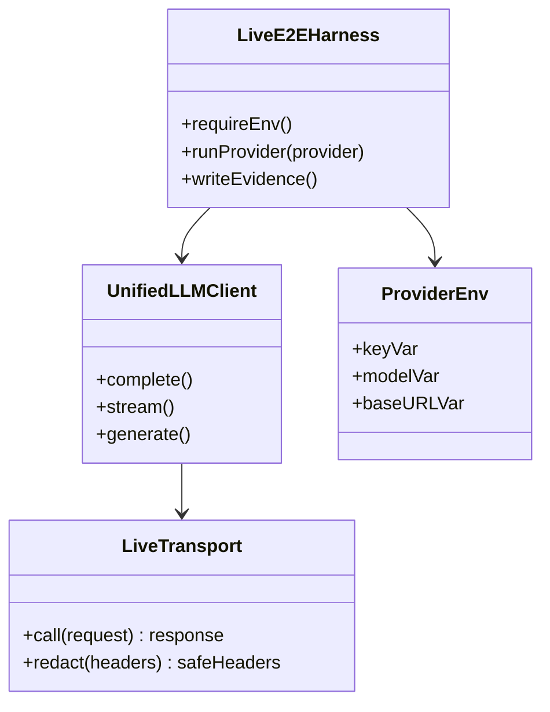
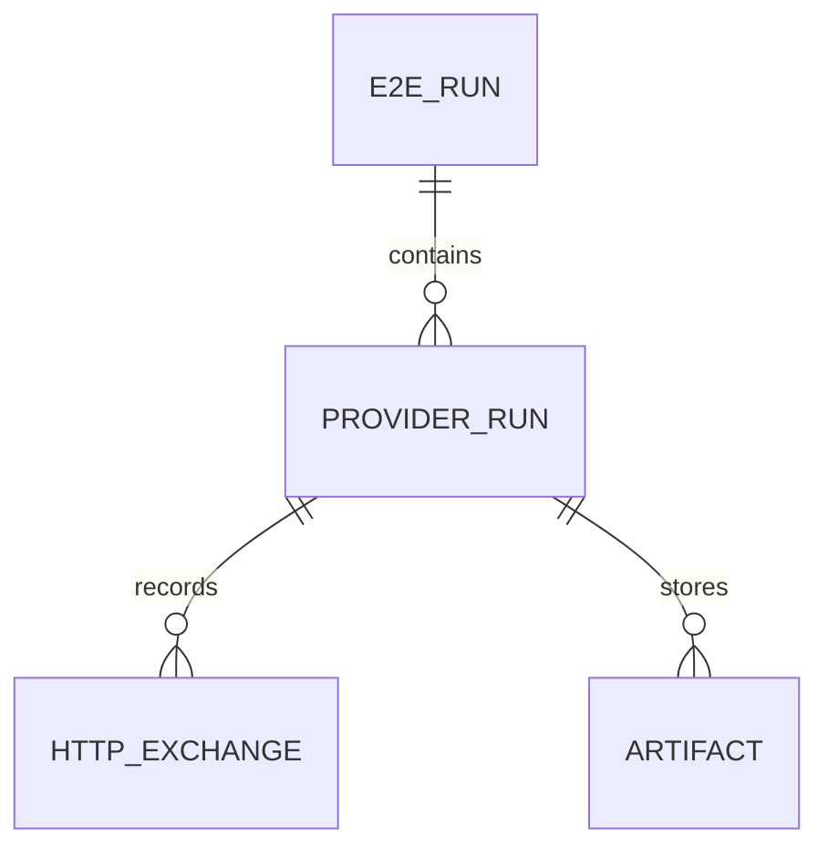
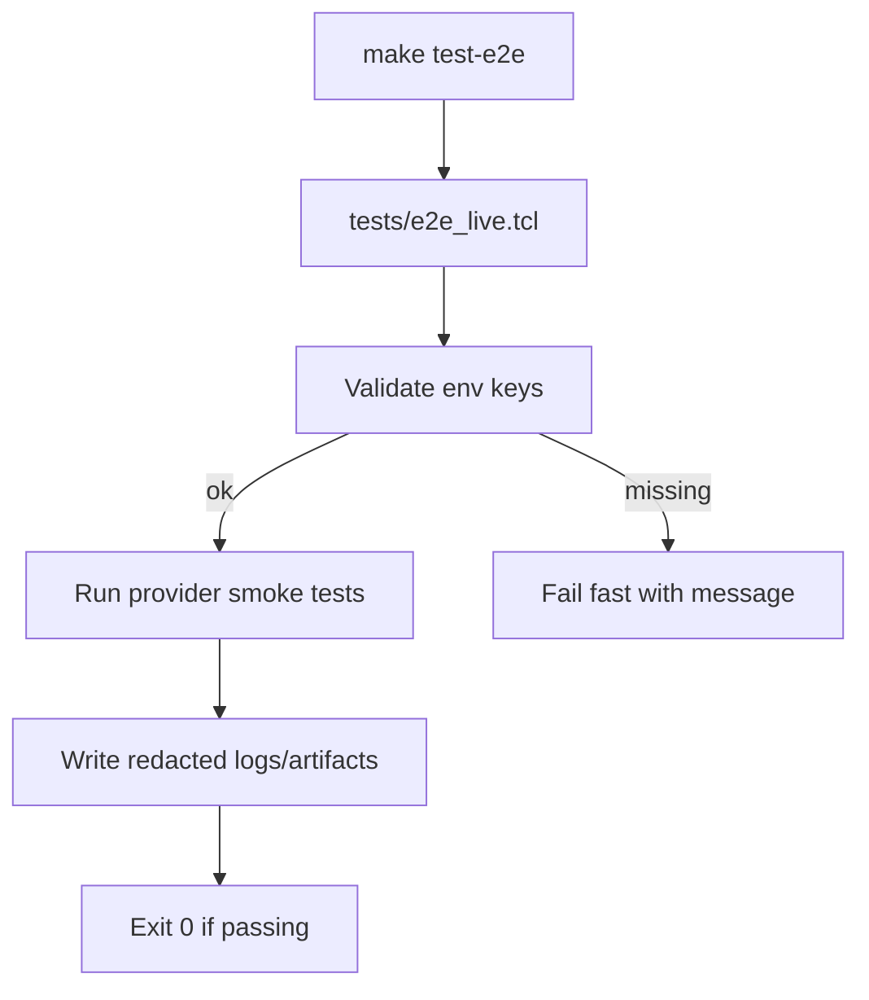
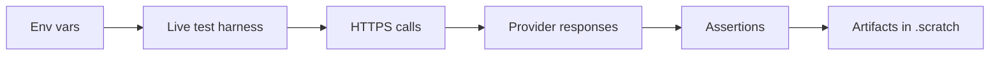
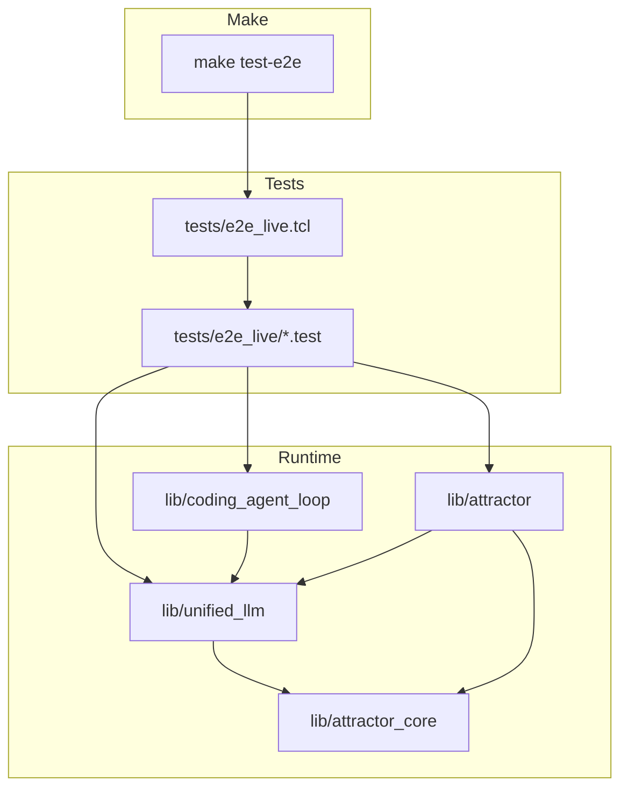

Legend: [ ] Incomplete, [X] Complete

# Sprint #004 - Live E2E Smoke Suite (`make test-e2e`)

## Objective
Add a live end-to-end smoke test suite that exercises real provider APIs (requires API keys) to prove that:
- `unified_llm` can successfully call OpenAI/Anthropic/Gemini over HTTPS
- `coding_agent_loop` can drive a live LLM session end-to-end (natural completion path)
- `attractor` can run a small pipeline using a live codergen backend and produce artifacts/checkpoints

The suite must run via:
- `make test-e2e`

## Context & Problem
Today the repo’s tests are deterministic and offline. This is good for correctness and CI stability, but it does not prove that the real provider HTTP integrations work in practice (keys, HTTPS, headers, payload shapes, response decoding).

We need an explicit, opt-in live suite that developers can run intentionally to validate real-world integration.

## Current State Snapshot (Verified 2026-02-27)
- [ ] `make -j10 test` passes offline.
```text
{placeholder for verification justification/reasoning and evidence log}
```
- [ ] There is no `make test-e2e` target.
```text
{placeholder for verification justification/reasoning and evidence log}
```
- [ ] `tests/all.tcl` currently sources `tests/e2e/*.test`, so “live tests” must not be placed there.
```text
{placeholder for verification justification/reasoning and evidence log}
```

## Scope
In scope:
- A new live test harness that is not executed by `make test`
- A `make test-e2e` Makefile target that:
  - depends on `precommit`
  - fails fast with a descriptive error if no provider API keys are configured
- A real HTTPS transport implementation used only when explicitly injected (so offline tests never start calling the network just because keys exist in the shell environment)
- Live E2E tests for Unified LLM, Coding Agent Loop, and Attractor
- Safe logging: never print API keys or Authorization headers into test output or artifacts

Out of scope:
- Making live tests run in CI by default
- Full NLSpec parity (handled by Sprint #003)
- Any rate-limit/retry/backoff policy work

## Evidence Rules
- Every checklist item includes a verification/evidence block directly beneath it.
- Evidence artifacts live under `.scratch/verification/SPRINT-004/...` and are referenced by exact path.
- Mark an item `[X]` only once the verification commands have been run and evidence artifacts exist.

## Execution Order
1. Phase 0: Baseline + design decisions
2. Phase 1: Live HTTPS transport + redaction
3. Phase 2: Unified LLM live E2E tests (per provider)
4. Phase 3: Coding Agent Loop live E2E tests (per provider)
5. Phase 4: Attractor live E2E tests (per provider)
6. Phase 5: Makefile target + documentation + closeout

## Phase 0 - Baseline + Design Decisions
- [ ] Confirm baseline offline behavior and document the “no network by default” rule for tests.
```text
{placeholder for verification justification/reasoning and evidence log}
```
- [ ] Add an ADR describing why live HTTP transport is opt-in via explicit `-transport` injection (prevents ambient environment secrets from changing offline test behavior).
```text
{placeholder for verification justification/reasoning and evidence log}
```
- [ ] Define required environment variables and defaults for live tests (keys, optional model overrides, optional base URL overrides).
```text
{placeholder for verification justification/reasoning and evidence log}
```

### Acceptance Criteria - Phase 0
- [ ] A contributor can read the ADR + docs and understand exactly how to run live tests and why they are not part of the offline suite.
```text
{placeholder for verification justification/reasoning and evidence log}
```

## Phase 1 - Live HTTPS Transport + Redaction
- [ ] Implement a provider-agnostic HTTPS JSON transport callable via `client_new -transport ...`.
```text
{placeholder for verification justification/reasoning and evidence log}
```
Details to cover:
- POST JSON requests
- returning `{status_code, headers, body}` in the same shape tests already expect
- base URL selection per provider (with override support)

- [ ] Ensure request/response logging redacts secrets.
```text
{placeholder for verification justification/reasoning and evidence log}
```
Details to cover:
- never log `Authorization`, `x-api-key`, `x-goog-api-key`
- never log raw env var values for API keys

- [ ] Add deterministic unit/integration tests for the transport layer using a local in-process HTTP server fixture (no real provider calls).
```text
{placeholder for verification justification/reasoning and evidence log}
```

### Acceptance Criteria - Phase 1
- [ ] The live transport can successfully reach a local server, send JSON, and receive JSON, with redaction proven by tests.
```text
{placeholder for verification justification/reasoning and evidence log}
```

## Phase 2 - Unified LLM Live E2E Tests
- [ ] Add a new live test harness that is not executed by `tests/all.tcl` (example: `tests/e2e_live.tcl` sourcing `tests/e2e_live/*.test`).
```text
{placeholder for verification justification/reasoning and evidence log}
```
- [ ] Implement OpenAI live smoke tests (requires `OPENAI_API_KEY`).
```text
{placeholder for verification justification/reasoning and evidence log}
```
Details to cover:
- blocking generation returns non-empty text
- streaming path (if implemented) emits start/delta/finish and produces non-empty text

- [ ] Implement Anthropic live smoke tests (requires `ANTHROPIC_API_KEY`).
```text
{placeholder for verification justification/reasoning and evidence log}
```
Details to cover:
- blocking generation returns non-empty text
- streaming path (if implemented) emits start/delta/finish and produces non-empty text

- [ ] Implement Gemini live smoke tests (requires `GEMINI_API_KEY`).
```text
{placeholder for verification justification/reasoning and evidence log}
```
Details to cover:
- blocking generation returns non-empty text
- streaming path (if implemented) emits start/delta/finish and produces non-empty text

### Test Matrix - Phase 2 (Explicit)
Positive cases (must be implemented):
- OpenAI: simple prompt -> non-empty response
- Anthropic: simple prompt -> non-empty response
- Gemini: simple prompt -> non-empty response
- If streaming is supported: at least one delta event occurs and the concatenation is non-empty

Negative cases (must be implemented):
- Missing key: the harness fails fast with a descriptive error message (and does not attempt any network calls)
- Invalid key: provider returns an auth error; test asserts a deterministic failure surface (exit code + error classification or message pattern)

### Acceptance Criteria - Phase 2
- [ ] `make test-e2e` can run the Unified LLM live suite for at least one configured provider and produces an auditable log under `.scratch/verification/SPRINT-004/unified_llm/`.
```text
{placeholder for verification justification/reasoning and evidence log}
```

## Phase 3 - Coding Agent Loop Live E2E Tests
- [ ] Add live tests proving `coding_agent_loop` can complete a session with natural completion (text-only response) for each configured provider profile.
```text
{placeholder for verification justification/reasoning and evidence log}
```
- [ ] Assert the minimal event contract is emitted in live runs.
```text
{placeholder for verification justification/reasoning and evidence log}
```
Details to cover:
- SESSION_START
- USER_INPUT
- ASSISTANT_TEXT_END

### Test Matrix - Phase 3 (Explicit)
Positive cases:
- For each configured provider profile: `session submit` returns non-empty text and emits required events

Negative cases:
- Invalid key: session submit fails deterministically and does not leak secrets

### Acceptance Criteria - Phase 3
- [ ] Live agent loop tests run under `make test-e2e` and store logs under `.scratch/verification/SPRINT-004/coding_agent_loop/`.
```text
{placeholder for verification justification/reasoning and evidence log}
```

## Phase 4 - Attractor Live E2E Tests
- [ ] Add a live codergen backend used only by tests that calls `unified_llm` with the live transport and returns the response text.
```text
{placeholder for verification justification/reasoning and evidence log}
```
- [ ] Add a live Attractor run test per configured provider.
```text
{placeholder for verification justification/reasoning and evidence log}
```
Details to cover:
- runs a minimal pipeline (start -> codergen -> exit)
- writes `checkpoint.json` and per-node artifacts (`status.json`, `prompt.md`, `response.md`)

### Test Matrix - Phase 4 (Explicit)
Positive cases:
- For each configured provider: run succeeds and artifacts exist on disk

Negative cases:
- Invalid key: run fails deterministically and still writes a useful failure artifact/log (no secret leakage)

### Acceptance Criteria - Phase 4
- [ ] Attractor live tests run under `make test-e2e` and store artifacts under `.scratch/verification/SPRINT-004/attractor/`.
```text
{placeholder for verification justification/reasoning and evidence log}
```

## Phase 5 - Makefile Target + Docs + Closeout
- [ ] Add `test-e2e` target to `Makefile`.
```text
{placeholder for verification justification/reasoning and evidence log}
```
Details to cover:
- `test-e2e: precommit`
- runs only the live harness (not `tests/all.tcl`)

- [ ] Add `docs/howto/live-e2e.md` documenting required env vars, expected costs/side-effects, and where logs/artifacts are written.
```text
{placeholder for verification justification/reasoning and evidence log}
```
- [ ] Ensure mermaid diagrams in this sprint render correctly via `mmdc` and store render artifacts under `.scratch/diagram-renders/sprint-004/`.
```text
{placeholder for verification justification/reasoning and evidence log}
```

### Acceptance Criteria - Phase 5
- [ ] `make test-e2e` fails fast and descriptively when no keys are configured, and passes when at least one provider is configured and all its tests pass.
```text
{placeholder for verification justification/reasoning and evidence log}
```
- [ ] No secrets appear in any captured logs or artifacts.
```text
{placeholder for verification justification/reasoning and evidence log}
```

## Appendix - Mermaid Diagrams (Verify Render With mmdc)

### Core Domain Models


### E-R Diagram


### Workflow Diagram


### Data-Flow Diagram


### Architecture Diagram

