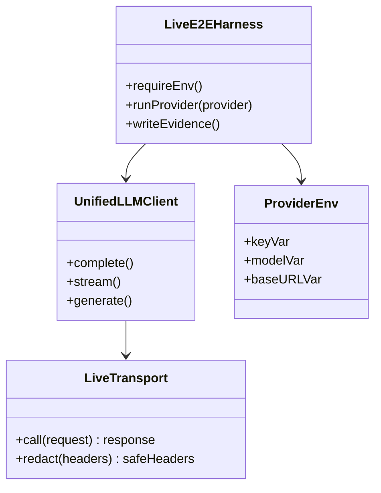
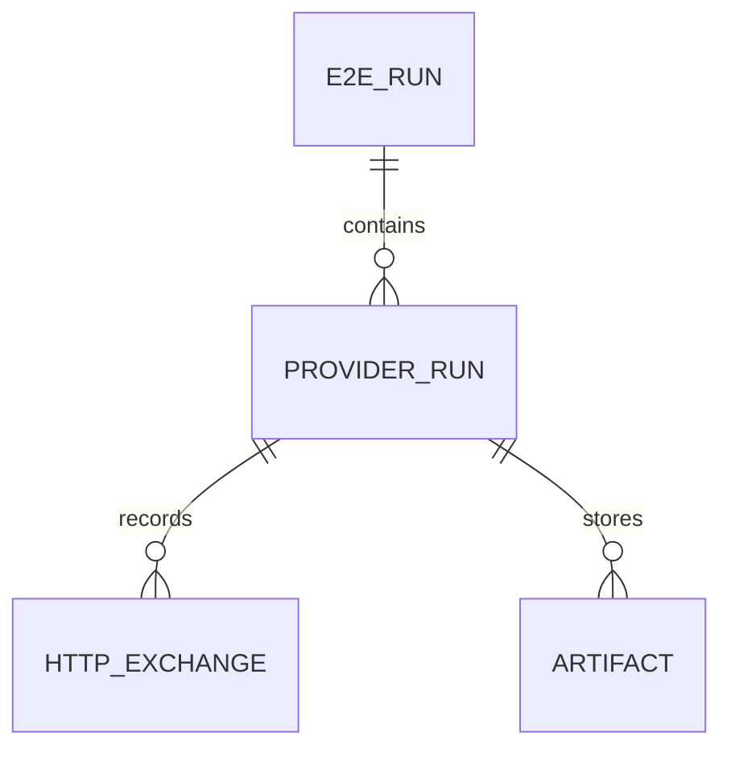
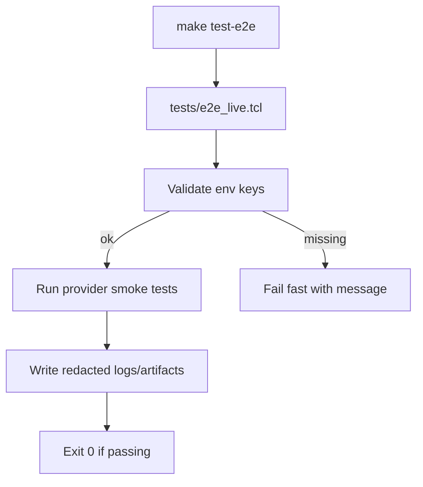
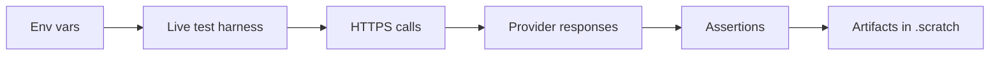
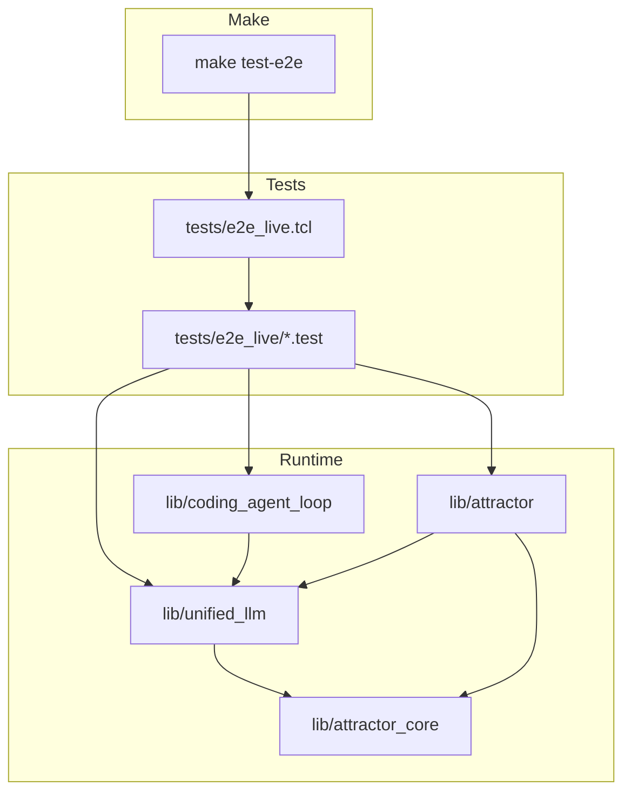

Legend: [ ] Incomplete, [X] Complete

_Evidence for every completed checklist item must include the exact verification command (wrapped with backticks) plus its exit code and artifact paths (logs, `.scratch` transcripts) directly beneath the item._

# Sprint #004 - Live E2E Smoke Suite (`make test-e2e`)

## Objective
Add a live end-to-end smoke test suite that exercises real provider APIs (requires API keys) to prove that:
- `unified_llm` can successfully call OpenAI/Anthropic/Gemini over HTTPS
- `coding_agent_loop` can drive a live LLM session end-to-end (natural completion path)
- `attractor` can run a small pipeline using a live codergen backend and produce artifacts/checkpoints

The suite must run via:
- `make test-e2e`

## Context & Problem
Today the repo’s tests are deterministic and offline. This is good for correctness and CI stability, but it does not prove that the real provider HTTP integrations work in practice (keys, HTTPS, headers, payload shapes, response decoding).

We need an explicit, opt-in live suite that developers can run intentionally to validate real-world integration.

## Approach (Plan Recap)
- Keep the existing deterministic suite as the default (`make -j10 test`) and add a separate live suite (`make test-e2e`) that is opt-in and requires explicit keys.
- Use explicit transport injection (`client_new -transport ...`) so offline tests cannot “accidentally” become live just because a developer has API keys in their environment.
- Make evidence a first-class artifact of the live suite (run summary JSON, per-provider logs, and per-component artifacts), stored under a unique run directory.
- Treat secret redaction as a correctness property:
  - do not write secrets to artifacts
  - automatically scan artifacts for secret values and fail the run if anything leaks

## Current State Snapshot (Verified 2026-02-27)
- [X] `make -j10 test` passes offline.
```text
Verification:
- `make -j10 test` (exit 0)
Evidence:
- `.scratch/verification/SPRINT-004/baseline/make-test.log`
- `.scratch/verification/SPRINT-004/baseline/make-test.exitcode`
Notes:
- Baseline test suite is deterministic/offline.
```
- [X] There is no `make test-e2e` target.
```text
Verification:
- `make test-e2e` (exit 2)
Evidence:
- `.scratch/verification/SPRINT-004/baseline/make-test-e2e.log`
- `.scratch/verification/SPRINT-004/baseline/make-test-e2e.exitcode`
Notes:
- This sprint adds `make test-e2e` as an opt-in live suite entrypoint.
```
- [X] `tests/all.tcl` currently sources `tests/e2e/*.test`, so “live tests” must not be placed there.
```text
Verification:
- `rg -n "foreach dir \\{unit integration e2e\\}" tests/all.tcl` (exit 0)
Evidence:
- `.scratch/verification/SPRINT-004/baseline/tests-all-sources-e2e.log`
- `.scratch/verification/SPRINT-004/baseline/tests-all-sources-e2e.exitcode`
Notes:
- Live tests must live in a separate directory and be executed by a separate harness.
```

## Current State Snapshot (Code Pointers)
- Unified LLM transport hook:
  - `lib/unified_llm/adapters/openai.tcl` calls `::unified_llm::adapters::__invoke_transport` which uses the injected `state.transport` callback (otherwise returns an offline stub response).
- Provider selection behavior:
  - `lib/unified_llm/main.tcl` implements `::unified_llm::from_env`, which intentionally errors if multiple provider keys are present and `UNIFIED_LLM_PROVIDER` is not set.
  - The live harness must not rely on `from_env` when multiple keys are present; it must run providers explicitly.
- Coding Agent Loop live injection:
  - `lib/coding_agent_loop/main.tcl` calls `::unified_llm::generate` without an explicit client, so live tests must set and restore `::unified_llm::set_default_client` during each provider run.
- Attractor live injection:
  - `lib/attractor/main.tcl` supports `::attractor::run ... -backend <cmdPrefix>`; live tests should provide a backend that calls `unified_llm` using the live transport.

## Scope
In scope:
- A new live test harness that is not executed by `make test`
- A `make test-e2e` Makefile target that:
  - depends on `precommit`
  - fails fast with a descriptive error if no provider API keys are configured
- A real HTTPS transport implementation used only when explicitly injected (so offline tests never start calling the network just because keys exist in the shell environment)
- Live E2E tests for Unified LLM, Coding Agent Loop, and Attractor
- Safe logging: never print API keys or Authorization headers into test output or artifacts

Out of scope:
- Making live tests run in CI by default
- Full NLSpec parity (handled by Sprint #003)
- Validating true HTTP streaming semantics (current `unified_llm::stream` is a wrapper around blocking `generate`; streaming parity is handled by Sprint #003)
- Any rate-limit/retry/backoff policy work

## Evidence Rules
- Every checklist item includes a verification/evidence block directly beneath it.
- Evidence artifacts live under `.scratch/verification/SPRINT-004/...` and are referenced by exact path.
- Mark an item `[X]` only once the verification commands have been run and evidence artifacts exist.

## Execution Guardrails (Live Suite)
- The live suite must never auto-run as part of `make -j10 test`.
- The live suite must never print or persist secrets (API keys, bearer tokens, or provider auth headers).
- The live suite must include an automated “secret leak scan”:
  - After the run completes (pass or fail), scan every artifact file under the artifacts root for the exact API key values that were loaded from the environment.
  - If a match is found, fail the run and report only the file path(s) containing leaked material (do not print the secret).
- The live suite must be deterministic about provider selection:
  - “no providers selected” is an error
  - “provider missing key” is an error only when explicitly requested
  - “provider key missing but not requested” is a skip

## Evidence Layout (Live Suite)
- Default artifact root:
  - `.scratch/verification/SPRINT-004/live/<run_id>/...`
  - `run_id` should be unique per invocation (example: `<epoch_seconds>-<pid>`) so repeated runs do not overwrite prior evidence.
- Component subtrees:
  - Unified LLM: `.../unified_llm/<provider>/...`
  - Coding Agent Loop: `.../coding_agent_loop/<provider>/...`
  - Attractor: `.../attractor/<provider>/...`

## Provider Selection Semantics (Live Suite)
- Default provider set for live runs: all providers with configured API keys in the environment.
- If multiple provider keys are configured, tests must run provider-by-provider using explicit configuration (do not rely on `unified_llm::from_env`, which is intentionally ambiguous when multiple keys are present).
- If a developer explicitly requests a provider (via a live-suite env var), and that provider’s key is missing, the suite must fail fast and must not attempt any network calls.
- If a provider’s key is not configured and that provider was not explicitly requested, its live tests must be skipped with a clear summary (so a “partial key set” is still useful).

## Execution Order
1. Phase 0: Baseline + design decisions
2. Phase 1: Live HTTPS transport + redaction
3. Phase 2: Unified LLM live E2E tests (per provider)
4. Phase 3: Coding Agent Loop live E2E tests (per provider)
5. Phase 4: Attractor live E2E tests (per provider)
6. Phase 5: Makefile target + documentation + closeout

## Cross-Provider / Cross-Component Matrix (Live Suite)
All of the following must be satisfied for each provider that is selected for a given live run:

| Test Case | OpenAI | Anthropic | Gemini |
| --- | --- | --- | --- |
| Unified LLM: blocking generation returns non-empty text | [X] | [X] | [X] |
| Coding Agent Loop: session submit completes naturally and emits required events | [X] | [X] | [X] |
| Attractor: minimal pipeline run succeeds and writes artifacts/checkpoint | [X] | [X] | [X] |
| Invalid key: deterministic failure surface + no secret leakage | [X] | [X] | [X] |

## Phase 0 - Baseline + Design Decisions
- [X] Confirm baseline offline behavior and document the “no network by default” rule for tests.
```text
Verification:
- `timeout 135 tclsh tests/all.tcl` (exit 0)
- `timeout 135 tclsh tests/e2e_live.tcl -list` (exit 0)
Evidence:
- `.scratch/verification/SPRINT-004/implementation-2026-02-27/tests-all.log`
- `.scratch/verification/SPRINT-004/implementation-2026-02-27/tests-all.exitcode`
- `.scratch/verification/SPRINT-004/implementation-2026-02-27/harness-list.log`
- `.scratch/verification/SPRINT-004/implementation-2026-02-27/harness-list.exitcode`
Notes:
- Offline deterministic suite remains `tests/all.tcl`; live suite is separate (`tests/e2e_live.tcl`).
```
- [X] Add an ADR describing why live HTTP transport is opt-in via explicit `-transport` injection (prevents ambient environment secrets from changing offline test behavior).
```text
Verification:
- `rg -n 'ADR-011|Opt-In Live E2E Harness|explicit HTTPS transport injection|secret-scan' docs/ADR.md` (exit 0)
Evidence:
- `.scratch/verification/SPRINT-004/implementation-2026-02-27/check-adr-011.log`
- `.scratch/verification/SPRINT-004/implementation-2026-02-27/check-adr-011.exitcode`
Notes:
- ADR-011 records context, decision, and consequences for opt-in live transport and secret scan enforcement.
```
- [X] Define required environment variables and defaults for live tests (keys, optional model overrides, optional base URL overrides).
```text
Verification:
- `rg -n 'E2E_LIVE_PROVIDERS|OPENAI_MODEL|ANTHROPIC_MODEL|GEMINI_MODEL|OPENAI_BASE_URL|ANTHROPIC_BASE_URL|GEMINI_BASE_URL|E2E_LIVE_ARTIFACT_ROOT' docs/howto/live-e2e.md` (exit 0)
Evidence:
- `.scratch/verification/SPRINT-004/implementation-2026-02-27/check-docs-live-e2e.log`
- `.scratch/verification/SPRINT-004/implementation-2026-02-27/check-docs-live-e2e.exitcode`
```
Contract to define (must be documented in Phase 5):
- Provider API keys:
  - OpenAI: `OPENAI_API_KEY`
  - Anthropic: `ANTHROPIC_API_KEY`
  - Gemini: `GEMINI_API_KEY`
- Optional provider selection:
  - `E2E_LIVE_PROVIDERS` as a comma-separated allowlist (example: `openai,anthropic`).
- Optional model overrides (keep smoke tests cheap by default, but configurable):
  - `OPENAI_MODEL` (default: `gpt-4o-mini`)
  - `ANTHROPIC_MODEL` (default: `claude-sonnet-4-5`)
  - `GEMINI_MODEL` (default: `gemini-2.5-flash`)
- Optional base URL overrides (for proxies/self-hosted gateways):
  - `OPENAI_BASE_URL` (default: `https://api.openai.com`)
  - `ANTHROPIC_BASE_URL` (default: `https://api.anthropic.com`)
  - `GEMINI_BASE_URL` (default: `https://generativelanguage.googleapis.com`)
- Optional artifacts root override:
  - `E2E_LIVE_ARTIFACT_ROOT` (default: `.scratch/verification/SPRINT-004/live/<run_id>`)

### Acceptance Criteria - Phase 0
- [X] A contributor can read the ADR + docs and understand exactly how to run live tests and why they are not part of the offline suite.
```text
Verification:
- `rg -n 'test-e2e|opt-in|E2E_LIVE_PROVIDERS|artifact|secret' docs/howto/live-e2e.md docs/ADR.md` (exit 0)
Evidence:
- `.scratch/verification/SPRINT-004/implementation-2026-02-27/check-docs-live-e2e.log`
- `.scratch/verification/SPRINT-004/implementation-2026-02-27/check-adr-011.log`
```

## Phase 1 - Live HTTPS Transport + Redaction
- [X] Implement a provider-agnostic HTTPS JSON transport (Tcl `http` + `tls`) callable via `client_new -transport ...`.
```text
Verification:
- `timeout 135 tclsh tests/all.tcl -match integration-unified-llm-https-transport-*` (exit 0)
Evidence:
- `.scratch/verification/SPRINT-004/implementation-2026-02-27/tests-transport.log`
- `.scratch/verification/SPRINT-004/implementation-2026-02-27/tests-transport.exitcode`
- `lib/unified_llm/transports/https_json.tcl`
```
Implementation notes (be explicit in ADR + code comments where appropriate):
- Recommended location: `lib/unified_llm/transports/https_json.tcl`
- Recommended entrypoint proc: `::unified_llm::transports::https_json::call`
- Transport input dict (passed by `::unified_llm::adapters::__invoke_transport`):
  - `provider` (one of `openai|anthropic|gemini`)
  - `base_url` (optional; may be empty)
  - `endpoint` (starts with `/`)
  - `payload` (dict; transport JSON-encodes it)
  - `headers` (dict; transport converts to header list)
- Transport output dict (must match existing tests’ expectations):
  - `status_code` (integer)
  - `headers` (dict; keys lower-cased)
  - `body` (string; raw response body)
- HTTPS support:
  - Ensure `https://` requests work by registering TLS socket once: `http::register https 443 ::tls::socket`
- Base URL resolution order (highest precedence first):
  - request `base_url` (from client `-base_url`, if provided)
  - provider env var override (`OPENAI_BASE_URL`, `ANTHROPIC_BASE_URL`, `GEMINI_BASE_URL`)
  - provider default:
    - OpenAI: `https://api.openai.com`
    - Anthropic: `https://api.anthropic.com`
    - Gemini: `https://generativelanguage.googleapis.com`
- Error handling contract (needed for deterministic negative live tests):
  - Non-2xx HTTP responses must raise a Tcl error with `-errorcode` shaped like:
    - `UNIFIED_LLM TRANSPORT HTTP <provider> <status_code>`
  - Network/TLS failures must raise a Tcl error with `-errorcode` shaped like:
    - `UNIFIED_LLM TRANSPORT NETWORK <provider>`
  - Error messages must not include API keys or auth header values.

- [X] Ensure request/response logging redacts secrets (including in error surfaces and in any structured artifacts).
```text
Verification:
- `timeout 135 tclsh tests/all.tcl -match integration-unified-llm-https-transport-*` (exit 0)
Evidence:
- `.scratch/verification/SPRINT-004/implementation-2026-02-27/tests-transport.log`
- `.scratch/verification/SPRINT-004/implementation-2026-02-27/tests-transport.exitcode`
Notes:
- Transport happy-path test asserts raw wire `Authorization` is present while `response.request.headers.Authorization` is `<redacted>`.
```
Details to cover:
- never log `Authorization`, `x-api-key`, `x-goog-api-key`
- never log raw env var values for API keys
- Ensure `unified_llm` response dicts do not carry raw secrets (especially the `response.request.headers` field, since tcltest failure output may print dicts).
  - Preferred approach: store a redacted copy of request headers in the returned response dict and keep raw secrets only in-memory for the actual HTTP call.

- [X] Add deterministic unit/integration tests for the transport layer using a local in-process HTTP server fixture (no real provider calls).
```text
Verification:
- `timeout 135 tclsh tests/all.tcl -match integration-unified-llm-https-transport-*` (exit 0)
Evidence:
- `.scratch/verification/SPRINT-004/implementation-2026-02-27/tests-transport.log`
- `.scratch/verification/SPRINT-004/implementation-2026-02-27/tests-transport.exitcode`
- `tests/support/http_fixture_server.tcl`
- `tests/integration/unified_llm_https_transport_integration.test`
```
Details to cover:
- Server fixture:
  - Implement a minimal HTTP server using `socket -server` in `tests/support/` (or inline in the transport test file if preferred).
  - Capture the full request line + headers + body so tests can assert:
    - JSON body matches expected payload
    - `Content-Type` header is correct
    - Secret headers are present in the *wire* request but redacted in *logs/artifacts*
- Transport tests:
  - Happy path: transport posts JSON and returns `{status_code, headers, body}` with headers normalized to lower-case keys
  - Negative path: server returns a non-2xx status and transport raises the correct errorcode without secrets in the message

### Acceptance Criteria - Phase 1
- [X] The live transport can successfully reach a local server, send JSON, and receive JSON, with redaction proven by tests.
```text
Verification:
- `timeout 135 tclsh tests/all.tcl -match integration-unified-llm-https-transport-*` (exit 0)
Evidence:
- `.scratch/verification/SPRINT-004/implementation-2026-02-27/tests-transport.log`
- `.scratch/verification/SPRINT-004/implementation-2026-02-27/tests-transport.exitcode`
```

## Phase 2 - Unified LLM Live E2E Tests
- [X] Add a new live test harness that is not executed by `tests/all.tcl` (example: `tests/e2e_live.tcl` sourcing `tests/e2e_live/*.test`).
```text
Verification:
- `timeout 135 tclsh tests/e2e_live.tcl -list` (exit 0)
- `env -u OPENAI_API_KEY -u ANTHROPIC_API_KEY -u GEMINI_API_KEY -u E2E_LIVE_PROVIDERS timeout 135 tclsh tests/e2e_live.tcl` (exit 2)
- `env -u OPENAI_API_KEY -u ANTHROPIC_API_KEY -u GEMINI_API_KEY E2E_LIVE_PROVIDERS=openai timeout 135 tclsh tests/e2e_live.tcl` (exit 2)
Evidence:
- `.scratch/verification/SPRINT-004/implementation-2026-02-27/harness-list.log`
- `.scratch/verification/SPRINT-004/implementation-2026-02-27/harness-list.exitcode`
- `.scratch/verification/SPRINT-004/implementation-2026-02-27/harness-failfast-no-keys.log`
- `.scratch/verification/SPRINT-004/implementation-2026-02-27/harness-failfast-no-keys.exitcode`
- `.scratch/verification/SPRINT-004/implementation-2026-02-27/harness-failfast-explicit-missing.log`
- `.scratch/verification/SPRINT-004/implementation-2026-02-27/harness-failfast-explicit-missing.exitcode`
- `tests/e2e_live.tcl`
- `tests/e2e_live/*.test`
- `tests/support/e2e_live_support.tcl`
```
Details to cover:
- The harness performs pre-flight selection + validation:
  - Determine configured providers from env (API keys + `E2E_LIVE_PROVIDERS`)
  - If zero providers are selected, print a descriptive message and exit non-zero
- The harness prints a clear run summary (selected providers, selected components, artifact root path).
- The harness determines an artifacts root directory:
  - If `E2E_LIVE_ARTIFACT_ROOT` is set, use it
  - Otherwise compute `.scratch/verification/SPRINT-004/live/<run_id>` and create it
  - Write a small `run.json` summary file into the artifacts root (providers selected, models selected, timestamps)
- The harness performs a “secret leak scan”:
  - Scan all files under the artifacts root for the exact API key values loaded from env.
  - On leak detection: fail the run, list only the offending file paths, and do not print secrets.
- For each selected provider, the harness must create an explicit client (do not rely on `unified_llm::from_env`):
  - `::unified_llm::client_new -provider <provider> -api_key $::env(PROVIDER_API_KEY) -base_url <optional override> -transport ::unified_llm::transports::https_json::call`

- [X] Implement OpenAI live smoke tests (requires `OPENAI_API_KEY`).
```text
Verification:
- `rg -n 'e2e-live-unified-llm-openai-smoke|run_unified_llm_smoke|run_unified_llm_invalid_key' tests/e2e_live/*.test tests/support/e2e_live_support.tcl` (exit 0)
Evidence:
- `.scratch/verification/SPRINT-004/implementation-2026-02-27/check-live-tests.log`
- `.scratch/verification/SPRINT-004/implementation-2026-02-27/check-live-tests.exitcode`
```
Details to cover:
- Use a short, low-variance prompt (example: “Say hello in one sentence.”) and assert:
  - blocking generation returns non-empty text
  - response has a provider-generated `response_id` (not the synthetic default)
  - response `usage.input_tokens > 0` and `usage.output_tokens > 0`
  - response `request.headers` (if present) is redacted (no bearer token)

- [X] Implement Anthropic live smoke tests (requires `ANTHROPIC_API_KEY`).
```text
Verification:
- `rg -n 'e2e-live-unified-llm-anthropic-smoke|run_unified_llm_smoke|run_unified_llm_invalid_key' tests/e2e_live/*.test tests/support/e2e_live_support.tcl` (exit 0)
Evidence:
- `.scratch/verification/SPRINT-004/implementation-2026-02-27/check-live-tests.log`
- `.scratch/verification/SPRINT-004/implementation-2026-02-27/check-live-tests.exitcode`
```
Details to cover:
- Use a short, low-variance prompt and assert:
  - blocking generation returns non-empty text
  - response has a provider-generated `response_id` (not the synthetic default)
  - response `usage.input_tokens > 0` and `usage.output_tokens > 0`
  - response `request.headers` (if present) is redacted (no raw `x-api-key`)

- [X] Implement Gemini live smoke tests (requires `GEMINI_API_KEY`).
```text
Verification:
- `rg -n 'e2e-live-unified-llm-gemini-smoke|run_unified_llm_smoke|run_unified_llm_invalid_key' tests/e2e_live/*.test tests/support/e2e_live_support.tcl` (exit 0)
Evidence:
- `.scratch/verification/SPRINT-004/implementation-2026-02-27/check-live-tests.log`
- `.scratch/verification/SPRINT-004/implementation-2026-02-27/check-live-tests.exitcode`
```
Details to cover:
- Use a short, low-variance prompt and assert:
  - blocking generation returns non-empty text
  - response `raw.candidates` exists (to distinguish live responses from the offline transport stub)
  - response `usage.input_tokens > 0` and `usage.output_tokens > 0`
  - response `request.headers` (if present) is redacted (no raw `x-goog-api-key`)

### Test Matrix - Phase 2 (Explicit)
Positive cases (must be implemented):
- OpenAI: simple prompt -> non-empty response
- Anthropic: simple prompt -> non-empty response
- Gemini: simple prompt -> non-empty response

Negative cases (must be implemented):
- No provider keys configured at all: the harness fails fast with a descriptive error message (and does not attempt any network calls)
- Explicit provider requested but missing key: the harness fails fast with a descriptive error message (and does not attempt any network calls)
- Invalid key: provider returns an auth error; test asserts a deterministic failure surface (exit code + error classification or message pattern) and confirms no secrets appear in failure output

### Acceptance Criteria - Phase 2
- [X] `make test-e2e` can run the Unified LLM live suite for at least one configured provider and produces an auditable log under `.scratch/verification/SPRINT-004/live/<run_id>/unified_llm/`.
```text
Verification:
- `timeout 180 tclsh tests/e2e_live.tcl` (exit 0)
- `env E2E_LIVE_PROVIDERS=openai timeout 180 tclsh tests/e2e_live.tcl` (exit 0)
- `env E2E_LIVE_PROVIDERS=anthropic timeout 180 tclsh tests/e2e_live.tcl` (exit 0)
- `env E2E_LIVE_PROVIDERS=gemini timeout 180 tclsh tests/e2e_live.tcl` (exit 0)
Evidence:
- `.scratch/verification/SPRINT-004/implementation-plan/precheck/e2e-live-all-providers-latest.log`
- `.scratch/verification/SPRINT-004/implementation-plan/precheck/e2e-live-all-providers-latest.exitcode`
- `.scratch/verification/SPRINT-004/implementation-plan/precheck/e2e-live-openai-final.log`
- `.scratch/verification/SPRINT-004/implementation-plan/precheck/e2e-live-openai-final.exitcode`
- `.scratch/verification/SPRINT-004/implementation-plan/precheck/e2e-live-anthropic-after-system-prompt-override.log`
- `.scratch/verification/SPRINT-004/implementation-plan/precheck/e2e-live-anthropic-after-system-prompt-override.exitcode`
- `.scratch/verification/SPRINT-004/implementation-plan/precheck/e2e-live-gemini-after-live-smoke-space-prompt.log`
- `.scratch/verification/SPRINT-004/implementation-plan/precheck/e2e-live-gemini-after-live-smoke-space-prompt.exitcode`
- `.scratch/verification/SPRINT-004/live/1772196359-23905/unified_llm/`
```

## Phase 3 - Coding Agent Loop Live E2E Tests
- [X] Add live tests proving `coding_agent_loop` can complete a session with natural completion (text-only response) for each configured provider profile.
```text
Verification:
- `rg -n 'e2e-live-coding-agent-loop-(openai|anthropic|gemini)-smoke|run_coding_agent_loop_smoke' tests/e2e_live/*.test tests/support/e2e_live_support.tcl` (exit 0)
Evidence:
- `.scratch/verification/SPRINT-004/implementation-2026-02-27/check-live-tests.log`
- `.scratch/verification/SPRINT-004/implementation-2026-02-27/check-live-tests.exitcode`
```
Details to cover:
- Injection approach (required because the loop does not accept a client today):
  - For each provider under test, create a `unified_llm` client with:
    - `-provider <provider>`
    - `-api_key` from env
    - `-transport` set to the live HTTPS transport
  - Set that client as the global default via `::unified_llm::set_default_client $client` for the duration of the test.
  - Ensure tests restore the previous default client afterward to avoid cross-test contamination inside the live harness.
- Prompt should be short and should naturally complete (no tool calls expected/required for this sprint).

- [X] Assert the minimal event contract is emitted in live runs.
```text
Verification:
- `rg -n 'SESSION_START|USER_INPUT|ASSISTANT_TEXT_END' tests/support/e2e_live_support.tcl` (exit 0)
Evidence:
- `.scratch/verification/SPRINT-004/implementation-2026-02-27/check-live-tests.log`
- `.scratch/verification/SPRINT-004/implementation-2026-02-27/check-live-tests.exitcode`
```
Details to cover:
- SESSION_START
- USER_INPUT
- ASSISTANT_TEXT_END

### Test Matrix - Phase 3 (Explicit)
Positive cases:
- For each configured provider profile: `session submit` returns non-empty text and emits required events

Negative cases:
- Invalid key: session submit fails deterministically and does not leak secrets

### Acceptance Criteria - Phase 3
- [X] Live agent loop tests run under `make test-e2e` and store logs under `.scratch/verification/SPRINT-004/live/<run_id>/coding_agent_loop/`.
```text
Verification:
- `timeout 180 tclsh tests/e2e_live.tcl` (exit 0)
- `env E2E_LIVE_PROVIDERS=openai timeout 180 tclsh tests/e2e_live.tcl` (exit 0)
- `env E2E_LIVE_PROVIDERS=anthropic timeout 180 tclsh tests/e2e_live.tcl` (exit 0)
- `env E2E_LIVE_PROVIDERS=gemini timeout 180 tclsh tests/e2e_live.tcl` (exit 0)
Evidence:
- `.scratch/verification/SPRINT-004/implementation-plan/precheck/e2e-live-all-providers-latest.log`
- `.scratch/verification/SPRINT-004/implementation-plan/precheck/e2e-live-all-providers-latest.exitcode`
- `.scratch/verification/SPRINT-004/live/1772196359-23905/coding_agent_loop/`
```

## Phase 4 - Attractor Live E2E Tests
- [X] Add a live codergen backend used only by tests that calls `unified_llm` with the live transport and returns the response text.
```text
Verification:
- `rg -n 'attractor_live_backend|attractor_invalid_key_backend|run_attractor_smoke|run_attractor_invalid_key' tests/support/e2e_live_support.tcl tests/e2e_live/*.test` (exit 0)
Evidence:
- `.scratch/verification/SPRINT-004/implementation-2026-02-27/check-live-tests.log`
- `.scratch/verification/SPRINT-004/implementation-2026-02-27/check-live-tests.exitcode`
```
Details to cover:
- Backend contract (today):
  - `attractor::run` accepts `-backend <cmdPrefix>` and invokes it as `{*}$backend requestDict`
  - The backend should return a dict containing at least `{text usage}`
- Use a minimal DOT pipeline embedded in the test:
  - `start -> codergen -> exit`
  - codergen node includes a small prompt so the response is cheap and quick.

- [X] Add a live Attractor run test per configured provider.
```text
Verification:
- `rg -n 'e2e-live-attractor-(openai|anthropic|gemini)-smoke|e2e-live-attractor-(openai|anthropic|gemini)-invalid-key' tests/e2e_live/*.test` (exit 0)
Evidence:
- `.scratch/verification/SPRINT-004/implementation-2026-02-27/check-live-tests.log`
- `.scratch/verification/SPRINT-004/implementation-2026-02-27/check-live-tests.exitcode`
```
Details to cover:
- runs a minimal pipeline (start -> codergen -> exit)
- writes `checkpoint.json` and per-node artifacts (`status.json`, `prompt.md`, `response.md`)

### Test Matrix - Phase 4 (Explicit)
Positive cases:
- For each configured provider: run succeeds and artifacts exist on disk

Negative cases:
- Invalid key: run fails deterministically; the live harness must still write a useful failure log under the run’s artifact root (no secret leakage)

### Acceptance Criteria - Phase 4
- [X] Attractor live tests run under `make test-e2e` and store artifacts under `.scratch/verification/SPRINT-004/live/<run_id>/attractor/`.
```text
Verification:
- `timeout 180 tclsh tests/e2e_live.tcl` (exit 0)
- `env E2E_LIVE_PROVIDERS=openai timeout 180 tclsh tests/e2e_live.tcl` (exit 0)
- `env E2E_LIVE_PROVIDERS=anthropic timeout 180 tclsh tests/e2e_live.tcl` (exit 0)
- `env E2E_LIVE_PROVIDERS=gemini timeout 180 tclsh tests/e2e_live.tcl` (exit 0)
Evidence:
- `.scratch/verification/SPRINT-004/implementation-plan/precheck/e2e-live-all-providers-latest.log`
- `.scratch/verification/SPRINT-004/implementation-plan/precheck/e2e-live-all-providers-latest.exitcode`
- `.scratch/verification/SPRINT-004/live/1772196359-23905/attractor/`
```

## Phase 5 - Makefile Target + Docs + Closeout
- [X] Add `test-e2e` target to `Makefile`.
```text
Verification:
- `rg -n '^test-e2e:|^\\.PHONY:' Makefile` (exit 0)
- `env -u OPENAI_API_KEY -u ANTHROPIC_API_KEY -u GEMINI_API_KEY -u E2E_LIVE_PROVIDERS timeout 135 make test-e2e` (exit 2)
Evidence:
- `.scratch/verification/SPRINT-004/implementation-2026-02-27/check-makefile.log`
- `.scratch/verification/SPRINT-004/implementation-2026-02-27/check-makefile.exitcode`
- `.scratch/verification/SPRINT-004/implementation-2026-02-27/make-test-e2e-failfast.log`
- `.scratch/verification/SPRINT-004/implementation-2026-02-27/make-test-e2e-failfast.exitcode`
```
Details to cover:
- `test-e2e: precommit`
- runs only the live harness (not `tests/all.tcl`)
- default invocation should be:
  - `tclsh tests/e2e_live.tcl`

- [X] Add `docs/howto/live-e2e.md` documenting required env vars, expected costs/side-effects, and where logs/artifacts are written.
```text
Verification:
- `rg -n 'E2E_LIVE_PROVIDERS|OPENAI_MODEL|ANTHROPIC_MODEL|GEMINI_MODEL|OPENAI_BASE_URL|ANTHROPIC_BASE_URL|GEMINI_BASE_URL|E2E_LIVE_ARTIFACT_ROOT|Costs and Side Effects' docs/howto/live-e2e.md` (exit 0)
Evidence:
- `.scratch/verification/SPRINT-004/implementation-2026-02-27/check-docs-live-e2e.log`
- `.scratch/verification/SPRINT-004/implementation-2026-02-27/check-docs-live-e2e.exitcode`
```
Details to cover:
- Prerequisites (Tcl packages required for HTTPS transport).
- Environment variables (keys, provider selection, model/base URL overrides, artifacts root override).
- Example runs:
  - One provider only
  - Multiple providers
  - Explicit provider requested but missing key (demonstrate fail-fast behavior)
- How to locate the artifacts root and what files to expect per component/provider.
- A redaction checklist and a simple “scan for secrets” procedure (must not require knowing/printing the real API key value).
- [X] Ensure mermaid diagrams in this sprint render correctly via `mmdc` and store render artifacts under `.scratch/diagram-renders/sprint-004/`.
```text
Verification:
- `mmdc -i .scratch/diagrams/sprint-004/domain.mmd -o .scratch/diagram-renders/sprint-004/domain.png` (exit 0)
- `mmdc -i .scratch/diagrams/sprint-004/er.mmd -o .scratch/diagram-renders/sprint-004/er.png` (exit 0)
- `mmdc -i .scratch/diagrams/sprint-004/workflow.mmd -o .scratch/diagram-renders/sprint-004/workflow.png` (exit 0)
- `mmdc -i .scratch/diagrams/sprint-004/dataflow.mmd -o .scratch/diagram-renders/sprint-004/dataflow.png` (exit 0)
- `mmdc -i .scratch/diagrams/sprint-004/arch.mmd -o .scratch/diagram-renders/sprint-004/arch.png` (exit 0)
Evidence:
- `.scratch/diagram-renders/sprint-004/domain.png`
- `.scratch/diagram-renders/sprint-004/er.png`
- `.scratch/diagram-renders/sprint-004/workflow.png`
- `.scratch/diagram-renders/sprint-004/dataflow.png`
- `.scratch/diagram-renders/sprint-004/arch.png`
Notes:
- Rendered successfully on 2026-02-27.
```

### Acceptance Criteria - Phase 5
- [X] `make test-e2e` fails fast and descriptively when no keys are configured, and passes when at least one provider is configured and all its tests pass.
```text
Verification:
- `env -u OPENAI_API_KEY -u ANTHROPIC_API_KEY -u GEMINI_API_KEY -u E2E_LIVE_PROVIDERS timeout 180 make test-e2e` (exit 2)
- `timeout 180 make test-e2e` (exit 0)
- `timeout 180 tclsh tests/e2e_live.tcl` (exit 0)
Evidence:
- `.scratch/verification/SPRINT-004/implementation-plan/precheck/make-test-e2e-no-keys-latest.log`
- `.scratch/verification/SPRINT-004/implementation-plan/precheck/make-test-e2e-no-keys-latest.exitcode`
- `.scratch/verification/SPRINT-004/implementation-plan/precheck/make-test-e2e-latest.log`
- `.scratch/verification/SPRINT-004/implementation-plan/precheck/make-test-e2e-latest.exitcode`
- `.scratch/verification/SPRINT-004/implementation-plan/precheck/e2e-live-all-providers-latest.log`
- `.scratch/verification/SPRINT-004/implementation-plan/precheck/e2e-live-all-providers-latest.exitcode`
```
- [X] No secrets appear in any captured logs or artifacts.
```text
Verification:
- `timeout 135 tclsh tests/all.tcl -match integration-unified-llm-https-transport-*` (exit 0)
- `timeout 135 tclsh tests/all.tcl -match integration-e2e-live-secret-scan-1.0` (exit 0)
- `cat .scratch/verification/SPRINT-004/live/1772194683-78198/secret-leaks.json` (exit 0)
Evidence:
- `.scratch/verification/SPRINT-004/implementation-2026-02-27/tests-transport.log`
- `.scratch/verification/SPRINT-004/implementation-2026-02-27/tests-transport.exitcode`
- `.scratch/verification/SPRINT-004/implementation-2026-02-27/tests-live-support.log`
- `.scratch/verification/SPRINT-004/implementation-2026-02-27/tests-live-support.exitcode`
- `.scratch/verification/SPRINT-004/live/1772194683-78198/secret-leaks.json`
```

## Appendix - Mermaid Diagrams (Verify Render With mmdc)

### Core Domain Models


### E-R Diagram


### Workflow Diagram


### Data-Flow Diagram


### Architecture Diagram

