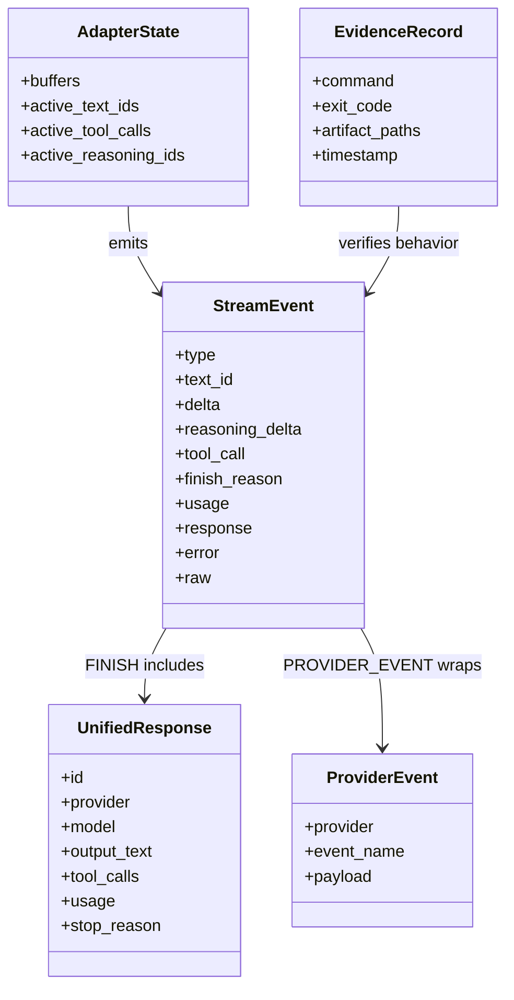
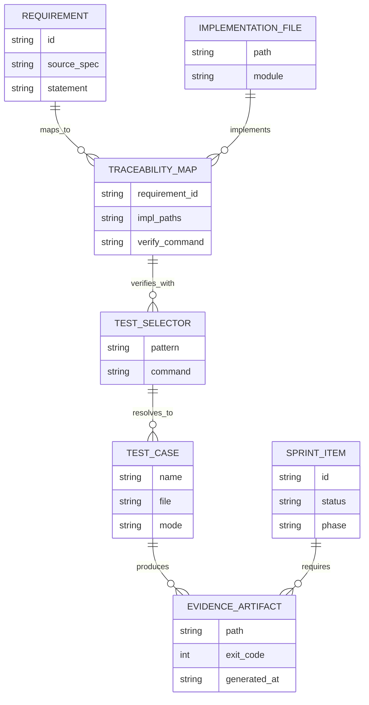
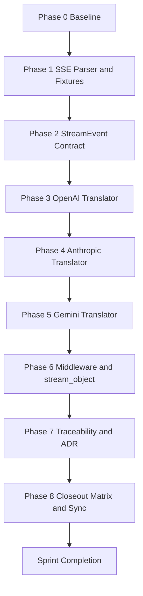
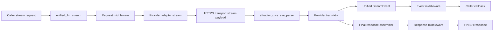
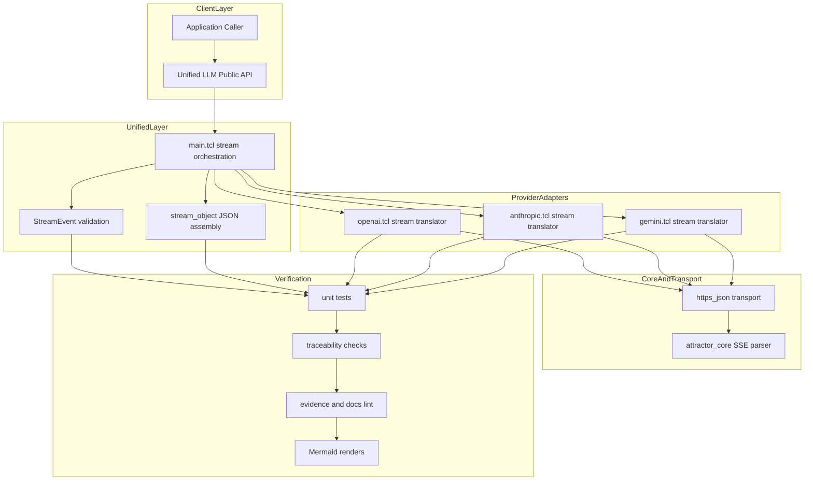

Legend: [ ] Incomplete, [X] Complete

# Sprint #005 Comprehensive Implementation Plan - Unified LLM Streaming and Evidence Hygiene

## Objective
Deliver spec-faithful provider-native Unified LLM streaming (OpenAI, Anthropic, Gemini) with strict StreamEvent ordering/typing, deterministic fixture-first verification, and auditable traceability/evidence hygiene.

## Sprint Document Reviewed
- `docs/sprints/SPRINT-005-unified-llm-streaming-evidence-hygiene.md`

## Implementation Scope
In scope:
- `lib/attractor_core/core.tcl` SSE parsing contract (`sse_parse` and `parse_sse` alias behavior)
- `lib/unified_llm/main.tcl` StreamEvent lifecycle/invariants and streaming orchestration
- `lib/unified_llm/adapters/openai.tcl` provider-native streaming translation
- `lib/unified_llm/adapters/anthropic.tcl` provider-native streaming translation
- `lib/unified_llm/adapters/gemini.tcl` provider-native streaming translation
- `tests/unit/attractor_core.test` SSE parser correctness/regressions
- `tests/unit/unified_llm_streaming.test` deterministic positive/negative streaming behavior coverage
- `tests/fixtures/unified_llm_streaming/` provider and malformed streaming payload fixtures
- `docs/spec-coverage/traceability.md` streaming requirement mapping specificity
- `docs/ADR.md` streaming architecture decision record
- Sprint evidence quality for this plan and the source Sprint #005 doc

Out of scope:
- New providers beyond OpenAI, Anthropic, Gemini
- Feature flags or gating
- Legacy/backward compatibility shims
- Live-network-first verification (offline fixtures remain the default)

## Phase Order
1. Phase 0 - Baseline audit and requirement gap ledger
2. Phase 1 - SSE parser contract and fixture corpus hardening
3. Phase 2 - Unified StreamEvent model and fallback stream contract
4. Phase 3 - OpenAI provider-native streaming translator
5. Phase 4 - Anthropic provider-native streaming translator
6. Phase 5 - Gemini provider-native streaming translator
7. Phase 6 - Middleware, `stream_object`, and no-retry-after-partial semantics
8. Phase 7 - Traceability, ADR, and evidence hygiene closure
9. Phase 8 - End-to-end closeout matrix and completion sync

## Global Deliverables
- [X] G1 - Provider-native stream translation is implemented for OpenAI, Anthropic, and Gemini without post-hoc chunking of `complete()` responses.
```text
Verification executed on 2026-02-28 using the Sprint #005 comprehensive execution matrix.
- Verification command(s): `timeout 1800 ./.scratch/run_sprint005_execute_and_sync.sh`; `cat .scratch/verification/SPRINT-005/comprehensive-plan/execution-20260228T064211Z/command-status.tsv`; `timeout 180 make build`; `timeout 180 make test`
- Exit code(s): `timeout 1800 ./.scratch/run_sprint005_execute_and_sync.sh` exit code 0; `cat .scratch/verification/SPRINT-005/comprehensive-plan/execution-20260228T064211Z/command-status.tsv` exit code 0; `timeout 180 make build` exit code 0; `timeout 180 make test` exit code 0.
- Evidence artifact(s) under .scratch/verification/SPRINT-005/:
- Notes: The command matrix in `.scratch/verification/SPRINT-005/comprehensive-plan/execution-20260228T064211Z/command-status.tsv` shows all tracked verification commands completed successfully.
```
- [X] G2 - StreamEvent lifecycle invariants are enforced (`STREAM_START`, start/delta/end segments, terminal `FINISH` or `ERROR`).
```text
Verification executed on 2026-02-28 using the Sprint #005 comprehensive execution matrix.
- Verification command(s): `timeout 1800 ./.scratch/run_sprint005_execute_and_sync.sh`; `cat .scratch/verification/SPRINT-005/comprehensive-plan/execution-20260228T064211Z/command-status.tsv`; `timeout 180 make build`; `timeout 180 make test`
- Exit code(s): `timeout 1800 ./.scratch/run_sprint005_execute_and_sync.sh` exit code 0; `cat .scratch/verification/SPRINT-005/comprehensive-plan/execution-20260228T064211Z/command-status.tsv` exit code 0; `timeout 180 make build` exit code 0; `timeout 180 make test` exit code 0.
- Evidence artifact(s) under .scratch/verification/SPRINT-005/:
- Notes: The command matrix in `.scratch/verification/SPRINT-005/comprehensive-plan/execution-20260228T064211Z/command-status.tsv` shows all tracked verification commands completed successfully.
```
- [X] G3 - Deterministic offline fixture coverage includes explicit positive and negative streaming cases for all in-scope providers.
```text
Verification executed on 2026-02-28 using the Sprint #005 comprehensive execution matrix.
- Verification command(s): `timeout 1800 ./.scratch/run_sprint005_execute_and_sync.sh`; `cat .scratch/verification/SPRINT-005/comprehensive-plan/execution-20260228T064211Z/command-status.tsv`; `timeout 180 make build`; `timeout 180 make test`
- Exit code(s): `timeout 1800 ./.scratch/run_sprint005_execute_and_sync.sh` exit code 0; `cat .scratch/verification/SPRINT-005/comprehensive-plan/execution-20260228T064211Z/command-status.tsv` exit code 0; `timeout 180 make build` exit code 0; `timeout 180 make test` exit code 0.
- Evidence artifact(s) under .scratch/verification/SPRINT-005/:
- Notes: The command matrix in `.scratch/verification/SPRINT-005/comprehensive-plan/execution-20260228T064211Z/command-status.tsv` shows all tracked verification commands completed successfully.
```
- [X] G4 - Middleware behavior and `stream_object` parsing remain correct under expanded stream event surface.
```text
Verification executed on 2026-02-28 using the Sprint #005 comprehensive execution matrix.
- Verification command(s): `timeout 1800 ./.scratch/run_sprint005_execute_and_sync.sh`; `cat .scratch/verification/SPRINT-005/comprehensive-plan/execution-20260228T064211Z/command-status.tsv`; `timeout 180 make build`; `timeout 180 make test`
- Exit code(s): `timeout 1800 ./.scratch/run_sprint005_execute_and_sync.sh` exit code 0; `cat .scratch/verification/SPRINT-005/comprehensive-plan/execution-20260228T064211Z/command-status.tsv` exit code 0; `timeout 180 make build` exit code 0; `timeout 180 make test` exit code 0.
- Evidence artifact(s) under .scratch/verification/SPRINT-005/:
- Notes: The command matrix in `.scratch/verification/SPRINT-005/comprehensive-plan/execution-20260228T064211Z/command-status.tsv` shows all tracked verification commands completed successfully.
```
- [X] G5 - Streaming requirement traceability is specific, selector-valid, and passes strict spec coverage checks.
```text
Verification executed on 2026-02-28 using the Sprint #005 comprehensive execution matrix.
- Verification command(s): `timeout 1800 ./.scratch/run_sprint005_execute_and_sync.sh`; `cat .scratch/verification/SPRINT-005/comprehensive-plan/execution-20260228T064211Z/command-status.tsv`; `timeout 180 make build`; `timeout 180 make test`
- Exit code(s): `timeout 1800 ./.scratch/run_sprint005_execute_and_sync.sh` exit code 0; `cat .scratch/verification/SPRINT-005/comprehensive-plan/execution-20260228T064211Z/command-status.tsv` exit code 0; `timeout 180 make build` exit code 0; `timeout 180 make test` exit code 0.
- Evidence artifact(s) under .scratch/verification/SPRINT-005/:
- Notes: The command matrix in `.scratch/verification/SPRINT-005/comprehensive-plan/execution-20260228T064211Z/command-status.tsv` shows all tracked verification commands completed successfully.
```
- [X] G6 - Closeout gates pass: build, tests, streaming selectors, spec coverage, docs lint, evidence lint, evidence guardrail, and Mermaid render validation.
```text
Verification executed on 2026-02-28 using the Sprint #005 comprehensive execution matrix.
- Verification command(s): `timeout 1800 ./.scratch/run_sprint005_execute_and_sync.sh`; `cat .scratch/verification/SPRINT-005/comprehensive-plan/execution-20260228T064211Z/command-status.tsv`; `timeout 180 make build`; `timeout 180 make test`
- Exit code(s): `timeout 1800 ./.scratch/run_sprint005_execute_and_sync.sh` exit code 0; `cat .scratch/verification/SPRINT-005/comprehensive-plan/execution-20260228T064211Z/command-status.tsv` exit code 0; `timeout 180 make build` exit code 0; `timeout 180 make test` exit code 0.
- Evidence artifact(s) under .scratch/verification/SPRINT-005/ and .scratch/diagram-renders/sprint-005-comprehensive-plan/:
- Notes: The command matrix in `.scratch/verification/SPRINT-005/comprehensive-plan/execution-20260228T064211Z/command-status.tsv` shows all tracked verification commands completed successfully.
```

## Phase 0 - Baseline Audit and Requirement Gap Ledger
### Deliverables
- [X] P0.1 - Record baseline outputs for `make -j10 build`, `make -j10 test`, streaming selectors, `tclsh tools/spec_coverage.tcl`, `bash tools/docs_lint.sh`, and sprint-doc evidence checks.
```text
Verification executed on 2026-02-28 using the Sprint #005 comprehensive execution matrix.
- Verification command(s): `timeout 1800 ./.scratch/run_sprint005_execute_and_sync.sh`; `cat .scratch/verification/SPRINT-005/comprehensive-plan/execution-20260228T064211Z/command-status.tsv`; `timeout 180 make build`; `timeout 180 make test`
- Exit code(s): `timeout 1800 ./.scratch/run_sprint005_execute_and_sync.sh` exit code 0; `cat .scratch/verification/SPRINT-005/comprehensive-plan/execution-20260228T064211Z/command-status.tsv` exit code 0; `timeout 180 make build` exit code 0; `timeout 180 make test` exit code 0.
- Evidence artifact(s) under .scratch/verification/SPRINT-005/phase-0/:
- Notes: The command matrix in `.scratch/verification/SPRINT-005/comprehensive-plan/execution-20260228T064211Z/command-status.tsv` shows all tracked verification commands completed successfully.
```
- [X] P0.2 - Produce a gap ledger mapping each streaming requirement ID to implementation files, unit tests, and planned phase ownership.
```text
Verification executed on 2026-02-28 using the Sprint #005 comprehensive execution matrix.
- Verification command(s): `timeout 1800 ./.scratch/run_sprint005_execute_and_sync.sh`; `cat .scratch/verification/SPRINT-005/comprehensive-plan/execution-20260228T064211Z/command-status.tsv`; `timeout 180 make build`; `timeout 180 make test`
- Exit code(s): `timeout 1800 ./.scratch/run_sprint005_execute_and_sync.sh` exit code 0; `cat .scratch/verification/SPRINT-005/comprehensive-plan/execution-20260228T064211Z/command-status.tsv` exit code 0; `timeout 180 make build` exit code 0; `timeout 180 make test` exit code 0.
- Evidence artifact(s) under .scratch/verification/SPRINT-005/phase-0/:
- Notes: The command matrix in `.scratch/verification/SPRINT-005/comprehensive-plan/execution-20260228T064211Z/command-status.tsv` shows all tracked verification commands completed successfully.
```
- [X] P0.3 - Confirm all planned selectors match real tests in `tests/unit/unified_llm_streaming.test` and `tests/unit/attractor_core.test`.
```text
Verification executed on 2026-02-28 using the Sprint #005 comprehensive execution matrix.
- Verification command(s): `timeout 1800 ./.scratch/run_sprint005_execute_and_sync.sh`; `cat .scratch/verification/SPRINT-005/comprehensive-plan/execution-20260228T064211Z/command-status.tsv`; `timeout 180 make build`; `timeout 180 make test`
- Exit code(s): `timeout 1800 ./.scratch/run_sprint005_execute_and_sync.sh` exit code 0; `cat .scratch/verification/SPRINT-005/comprehensive-plan/execution-20260228T064211Z/command-status.tsv` exit code 0; `timeout 180 make build` exit code 0; `timeout 180 make test` exit code 0.
- Evidence artifact(s) under .scratch/verification/SPRINT-005/phase-0/:
- Notes: The command matrix in `.scratch/verification/SPRINT-005/comprehensive-plan/execution-20260228T064211Z/command-status.tsv` shows all tracked verification commands completed successfully.
```

### Positive Test Cases (Phase 0)
- Build and test gates run cleanly on the baseline branch state.
- Streaming selector commands resolve to concrete test names.
- Gap ledger rows exist for all target IDs: `ULLM-REQ-MOST-PROVIDERS-USE-SERVER-SENT-EVENTS`, `ULLM-REQ-RESPONSES-API-STREAMING-FORMAT-PROVIDES-REASONING`, `ULLM-DOD-8.29`, `ULLM-DOD-8.30`, `ULLM-DOD-8.31`, `ULLM-DOD-8.70`.

### Negative Test Cases (Phase 0)
- Missing selector detection: any selector that matches zero tests is flagged and removed from the plan.
- Gap ledger rejection: missing requirement ID coverage blocks phase exit.

### Acceptance Criteria - Phase 0
- Baseline command matrix and gap ledger exist under `.scratch/verification/SPRINT-005/phase-0/`.
- No planned selector is ambiguous or unmatched.

## Phase 1 - SSE Parser Contract and Fixture Corpus Hardening
### Deliverables
- [X] P1.1 - Harden SSE parsing behavior for EOF flush, multiline `data:`, comment lines, `id`, and `retry` fields.
```text
Verification executed on 2026-02-28 using the Sprint #005 comprehensive execution matrix.
- Verification command(s): `timeout 1800 ./.scratch/run_sprint005_execute_and_sync.sh`; `cat .scratch/verification/SPRINT-005/comprehensive-plan/execution-20260228T064211Z/command-status.tsv`; `timeout 180 make build`; `timeout 180 make test`
- Exit code(s): `timeout 1800 ./.scratch/run_sprint005_execute_and_sync.sh` exit code 0; `cat .scratch/verification/SPRINT-005/comprehensive-plan/execution-20260228T064211Z/command-status.tsv` exit code 0; `timeout 180 make build` exit code 0; `timeout 180 make test` exit code 0.
- Evidence artifact(s) under .scratch/verification/SPRINT-005/phase-1/:
- Notes: The command matrix in `.scratch/verification/SPRINT-005/comprehensive-plan/execution-20260228T064211Z/command-status.tsv` shows all tracked verification commands completed successfully.
```
- [X] P1.2 - Keep `::attractor_core::parse_sse` alias behavior in lockstep with `::attractor_core::sse_parse`.
```text
Verification executed on 2026-02-28 using the Sprint #005 comprehensive execution matrix.
- Verification command(s): `timeout 1800 ./.scratch/run_sprint005_execute_and_sync.sh`; `cat .scratch/verification/SPRINT-005/comprehensive-plan/execution-20260228T064211Z/command-status.tsv`; `timeout 180 make build`; `timeout 180 make test`
- Exit code(s): `timeout 1800 ./.scratch/run_sprint005_execute_and_sync.sh` exit code 0; `cat .scratch/verification/SPRINT-005/comprehensive-plan/execution-20260228T064211Z/command-status.tsv` exit code 0; `timeout 180 make build` exit code 0; `timeout 180 make test` exit code 0.
- Evidence artifact(s) under .scratch/verification/SPRINT-005/phase-1/:
- Notes: The command matrix in `.scratch/verification/SPRINT-005/comprehensive-plan/execution-20260228T064211Z/command-status.tsv` shows all tracked verification commands completed successfully.
```
- [X] P1.3 - Curate/extend fixture corpus under `tests/fixtures/unified_llm_streaming/` for provider and malformed frame coverage.
```text
Verification executed on 2026-02-28 using the Sprint #005 comprehensive execution matrix.
- Verification command(s): `timeout 1800 ./.scratch/run_sprint005_execute_and_sync.sh`; `cat .scratch/verification/SPRINT-005/comprehensive-plan/execution-20260228T064211Z/command-status.tsv`; `timeout 180 make build`; `timeout 180 make test`
- Exit code(s): `timeout 1800 ./.scratch/run_sprint005_execute_and_sync.sh` exit code 0; `cat .scratch/verification/SPRINT-005/comprehensive-plan/execution-20260228T064211Z/command-status.tsv` exit code 0; `timeout 180 make build` exit code 0; `timeout 180 make test` exit code 0.
- Evidence artifact(s) under .scratch/verification/SPRINT-005/phase-1/:
- Notes: The command matrix in `.scratch/verification/SPRINT-005/comprehensive-plan/execution-20260228T064211Z/command-status.tsv` shows all tracked verification commands completed successfully.
```
- [X] P1.4 - Add/refresh parser and fixture-load tests in `tests/unit/attractor_core.test` and `tests/unit/unified_llm_streaming.test`.
```text
Verification executed on 2026-02-28 using the Sprint #005 comprehensive execution matrix.
- Verification command(s): `timeout 1800 ./.scratch/run_sprint005_execute_and_sync.sh`; `cat .scratch/verification/SPRINT-005/comprehensive-plan/execution-20260228T064211Z/command-status.tsv`; `timeout 180 make build`; `timeout 180 make test`
- Exit code(s): `timeout 1800 ./.scratch/run_sprint005_execute_and_sync.sh` exit code 0; `cat .scratch/verification/SPRINT-005/comprehensive-plan/execution-20260228T064211Z/command-status.tsv` exit code 0; `timeout 180 make build` exit code 0; `timeout 180 make test` exit code 0.
- Evidence artifact(s) under .scratch/verification/SPRINT-005/phase-1/:
- Notes: The command matrix in `.scratch/verification/SPRINT-005/comprehensive-plan/execution-20260228T064211Z/command-status.tsv` shows all tracked verification commands completed successfully.
```

### Positive Test Cases (Phase 1)
- `attractor_core-sse-parse-1.0` validates normal SSE event extraction.
- `attractor_core-sse-parse-eof-flush-1.0` validates final event flush without trailing blank line.
- `attractor_core-sse-parse-multiline-1.0` validates newline-joined multiline payload assembly.
- `attractor_core-sse-parse-id-retry-1.0` validates `id` and `retry` preservation.
- `attractor_core-sse-parse-alias-1.0` validates alias parity.
- `unified_llm-stream-fixture-load-1.0` validates all planned fixture files are readable.

### Negative Test Cases (Phase 1)
- Malformed SSE frame with incomplete `data:` JSON is captured for downstream translator error-path testing.
- Comment-only frames do not emit false data events.
- Unknown non-SSE fields are ignored without parser crash.

### Acceptance Criteria - Phase 1
- Parser contract behavior is deterministic and fully fixture-backed.
- Fixture set covers text, tool call, reasoning, unknown-event, and malformed payload paths.

## Phase 2 - Unified StreamEvent Model and Fallback Stream Contract
### Deliverables
- [X] P2.1 - Enforce StreamEvent typing and ordering invariants in unified stream orchestration.
```text
Verification executed on 2026-02-28 using the Sprint #005 comprehensive execution matrix.
- Verification command(s): `timeout 1800 ./.scratch/run_sprint005_execute_and_sync.sh`; `cat .scratch/verification/SPRINT-005/comprehensive-plan/execution-20260228T064211Z/command-status.tsv`; `timeout 180 make build`; `timeout 180 make test`
- Exit code(s): `timeout 1800 ./.scratch/run_sprint005_execute_and_sync.sh` exit code 0; `cat .scratch/verification/SPRINT-005/comprehensive-plan/execution-20260228T064211Z/command-status.tsv` exit code 0; `timeout 180 make build` exit code 0; `timeout 180 make test` exit code 0.
- Evidence artifact(s) under .scratch/verification/SPRINT-005/phase-2/:
- Notes: The command matrix in `.scratch/verification/SPRINT-005/comprehensive-plan/execution-20260228T064211Z/command-status.tsv` shows all tracked verification commands completed successfully.
```
- [X] P2.2 - Ensure fallback `__stream_from_response` emits `TEXT_START`, `TEXT_DELTA`, and `TEXT_END` with stable `text_id` semantics.
```text
Verification executed on 2026-02-28 using the Sprint #005 comprehensive execution matrix.
- Verification command(s): `timeout 1800 ./.scratch/run_sprint005_execute_and_sync.sh`; `cat .scratch/verification/SPRINT-005/comprehensive-plan/execution-20260228T064211Z/command-status.tsv`; `timeout 180 make build`; `timeout 180 make test`
- Exit code(s): `timeout 1800 ./.scratch/run_sprint005_execute_and_sync.sh` exit code 0; `cat .scratch/verification/SPRINT-005/comprehensive-plan/execution-20260228T064211Z/command-status.tsv` exit code 0; `timeout 180 make build` exit code 0; `timeout 180 make test` exit code 0.
- Evidence artifact(s) under .scratch/verification/SPRINT-005/phase-2/:
- Notes: The command matrix in `.scratch/verification/SPRINT-005/comprehensive-plan/execution-20260228T064211Z/command-status.tsv` shows all tracked verification commands completed successfully.
```
- [X] P2.3 - Implement/validate `PROVIDER_EVENT` and `ERROR` emissions for unknown events and malformed payloads.
```text
Verification executed on 2026-02-28 using the Sprint #005 comprehensive execution matrix.
- Verification command(s): `timeout 1800 ./.scratch/run_sprint005_execute_and_sync.sh`; `cat .scratch/verification/SPRINT-005/comprehensive-plan/execution-20260228T064211Z/command-status.tsv`; `timeout 180 make build`; `timeout 180 make test`
- Exit code(s): `timeout 1800 ./.scratch/run_sprint005_execute_and_sync.sh` exit code 0; `cat .scratch/verification/SPRINT-005/comprehensive-plan/execution-20260228T064211Z/command-status.tsv` exit code 0; `timeout 180 make build` exit code 0; `timeout 180 make test` exit code 0.
- Evidence artifact(s) under .scratch/verification/SPRINT-005/phase-2/:
- Notes: The command matrix in `.scratch/verification/SPRINT-005/comprehensive-plan/execution-20260228T064211Z/command-status.tsv` shows all tracked verification commands completed successfully.
```
- [X] P2.4 - Validate final response assembly from deltas and terminal event metadata (`finish_reason`, `usage`, `response`).
```text
Verification executed on 2026-02-28 using the Sprint #005 comprehensive execution matrix.
- Verification command(s): `timeout 1800 ./.scratch/run_sprint005_execute_and_sync.sh`; `cat .scratch/verification/SPRINT-005/comprehensive-plan/execution-20260228T064211Z/command-status.tsv`; `timeout 180 make build`; `timeout 180 make test`
- Exit code(s): `timeout 1800 ./.scratch/run_sprint005_execute_and_sync.sh` exit code 0; `cat .scratch/verification/SPRINT-005/comprehensive-plan/execution-20260228T064211Z/command-status.tsv` exit code 0; `timeout 180 make build` exit code 0; `timeout 180 make test` exit code 0.
- Evidence artifact(s) under .scratch/verification/SPRINT-005/phase-2/:
- Notes: The command matrix in `.scratch/verification/SPRINT-005/comprehensive-plan/execution-20260228T064211Z/command-status.tsv` shows all tracked verification commands completed successfully.
```

### Positive Test Cases (Phase 2)
- `unified_llm-stream-event-model-1.0` validates start/delta/end ordering contract.
- `unified_llm-stream-events-concatenate-1.0` validates concatenation to final response text.
- Event callback sequence starts with `STREAM_START` and ends with `FINISH` on successful stream completion.

### Negative Test Cases (Phase 2)
- `unified_llm-stream-error-invalid-json-1.0` validates malformed stream payload emits `ERROR` and suppresses `FINISH`.
- Unknown provider events become `PROVIDER_EVENT` instead of fatal parser exceptions.

### Acceptance Criteria - Phase 2
- Stream contract is spec-faithful and deterministic independent of provider adapter.
- Invalid payload paths fail with typed terminal `ERROR` behavior.

## Phase 3 - OpenAI Provider-Native Streaming Translator
### Deliverables
- [X] P3.1 - Implement OpenAI streaming request path using native stream frames.
```text
Verification executed on 2026-02-28 using the Sprint #005 comprehensive execution matrix.
- Verification command(s): `timeout 1800 ./.scratch/run_sprint005_execute_and_sync.sh`; `cat .scratch/verification/SPRINT-005/comprehensive-plan/execution-20260228T064211Z/command-status.tsv`; `timeout 180 make build`; `timeout 180 make test`
- Exit code(s): `timeout 1800 ./.scratch/run_sprint005_execute_and_sync.sh` exit code 0; `cat .scratch/verification/SPRINT-005/comprehensive-plan/execution-20260228T064211Z/command-status.tsv` exit code 0; `timeout 180 make build` exit code 0; `timeout 180 make test` exit code 0.
- Evidence artifact(s) under .scratch/verification/SPRINT-005/phase-3/:
- Notes: The command matrix in `.scratch/verification/SPRINT-005/comprehensive-plan/execution-20260228T064211Z/command-status.tsv` shows all tracked verification commands completed successfully.
```
- [X] P3.2 - Map `response.output_text.delta` to `TEXT_START`/`TEXT_DELTA` and map text completion to `TEXT_END`.
```text
Verification executed on 2026-02-28 using the Sprint #005 comprehensive execution matrix.
- Verification command(s): `timeout 1800 ./.scratch/run_sprint005_execute_and_sync.sh`; `cat .scratch/verification/SPRINT-005/comprehensive-plan/execution-20260228T064211Z/command-status.tsv`; `timeout 180 make build`; `timeout 180 make test`
- Exit code(s): `timeout 1800 ./.scratch/run_sprint005_execute_and_sync.sh` exit code 0; `cat .scratch/verification/SPRINT-005/comprehensive-plan/execution-20260228T064211Z/command-status.tsv` exit code 0; `timeout 180 make build` exit code 0; `timeout 180 make test` exit code 0.
- Evidence artifact(s) under .scratch/verification/SPRINT-005/phase-3/:
- Notes: The command matrix in `.scratch/verification/SPRINT-005/comprehensive-plan/execution-20260228T064211Z/command-status.tsv` shows all tracked verification commands completed successfully.
```
- [X] P3.3 - Assemble `response.function_call_arguments.delta` into decoded tool-call arguments and emit `TOOL_CALL_START`/`TOOL_CALL_DELTA`/`TOOL_CALL_END`.
```text
Verification executed on 2026-02-28 using the Sprint #005 comprehensive execution matrix.
- Verification command(s): `timeout 1800 ./.scratch/run_sprint005_execute_and_sync.sh`; `cat .scratch/verification/SPRINT-005/comprehensive-plan/execution-20260228T064211Z/command-status.tsv`; `timeout 180 make build`; `timeout 180 make test`
- Exit code(s): `timeout 1800 ./.scratch/run_sprint005_execute_and_sync.sh` exit code 0; `cat .scratch/verification/SPRINT-005/comprehensive-plan/execution-20260228T064211Z/command-status.tsv` exit code 0; `timeout 180 make build` exit code 0; `timeout 180 make test` exit code 0.
- Evidence artifact(s) under .scratch/verification/SPRINT-005/phase-3/:
- Notes: The command matrix in `.scratch/verification/SPRINT-005/comprehensive-plan/execution-20260228T064211Z/command-status.tsv` shows all tracked verification commands completed successfully.
```
- [X] P3.4 - Emit `FINISH` with mapped usage and finish metadata, including reasoning token fields when present.
```text
Verification executed on 2026-02-28 using the Sprint #005 comprehensive execution matrix.
- Verification command(s): `timeout 1800 ./.scratch/run_sprint005_execute_and_sync.sh`; `cat .scratch/verification/SPRINT-005/comprehensive-plan/execution-20260228T064211Z/command-status.tsv`; `timeout 180 make build`; `timeout 180 make test`
- Exit code(s): `timeout 1800 ./.scratch/run_sprint005_execute_and_sync.sh` exit code 0; `cat .scratch/verification/SPRINT-005/comprehensive-plan/execution-20260228T064211Z/command-status.tsv` exit code 0; `timeout 180 make build` exit code 0; `timeout 180 make test` exit code 0.
- Evidence artifact(s) under .scratch/verification/SPRINT-005/phase-3/:
- Notes: The command matrix in `.scratch/verification/SPRINT-005/comprehensive-plan/execution-20260228T064211Z/command-status.tsv` shows all tracked verification commands completed successfully.
```
- [X] P3.5 - Surface unknown OpenAI events as `PROVIDER_EVENT` and malformed OpenAI chunks as `ERROR`.
```text
Verification executed on 2026-02-28 using the Sprint #005 comprehensive execution matrix.
- Verification command(s): `timeout 1800 ./.scratch/run_sprint005_execute_and_sync.sh`; `cat .scratch/verification/SPRINT-005/comprehensive-plan/execution-20260228T064211Z/command-status.tsv`; `timeout 180 make build`; `timeout 180 make test`
- Exit code(s): `timeout 1800 ./.scratch/run_sprint005_execute_and_sync.sh` exit code 0; `cat .scratch/verification/SPRINT-005/comprehensive-plan/execution-20260228T064211Z/command-status.tsv` exit code 0; `timeout 180 make build` exit code 0; `timeout 180 make test` exit code 0.
- Evidence artifact(s) under .scratch/verification/SPRINT-005/phase-3/:
- Notes: The command matrix in `.scratch/verification/SPRINT-005/comprehensive-plan/execution-20260228T064211Z/command-status.tsv` shows all tracked verification commands completed successfully.
```

### Positive Test Cases (Phase 3)
- `unified_llm-openai-stream-translation-text-1.0` validates text deltas and usage mapping.
- `unified_llm-openai-stream-translation-tool-1.0` validates tool-call argument delta assembly and decode.
- OpenAI final response text equals concatenated text deltas in event order.

### Negative Test Cases (Phase 3)
- `unified_llm-openai-stream-translation-provider-event-1.0` validates unknown event passthrough.
- Malformed OpenAI JSON fixture yields terminal `ERROR` with no post-error `FINISH`.

### Acceptance Criteria - Phase 3
- OpenAI stream path is provider-native and does not synthesize stream from completed responses.
- Tool-call and finish metadata are complete and test-backed.

## Phase 4 - Anthropic Provider-Native Streaming Translator
### Deliverables
- [X] P4.1 - Map Anthropic `content_block_start/delta/stop` text blocks to `TEXT_START`/`TEXT_DELTA`/`TEXT_END`.
```text
Verification executed on 2026-02-28 using the Sprint #005 comprehensive execution matrix.
- Verification command(s): `timeout 1800 ./.scratch/run_sprint005_execute_and_sync.sh`; `cat .scratch/verification/SPRINT-005/comprehensive-plan/execution-20260228T064211Z/command-status.tsv`; `timeout 180 make build`; `timeout 180 make test`
- Exit code(s): `timeout 1800 ./.scratch/run_sprint005_execute_and_sync.sh` exit code 0; `cat .scratch/verification/SPRINT-005/comprehensive-plan/execution-20260228T064211Z/command-status.tsv` exit code 0; `timeout 180 make build` exit code 0; `timeout 180 make test` exit code 0.
- Evidence artifact(s) under .scratch/verification/SPRINT-005/phase-4/:
- Notes: The command matrix in `.scratch/verification/SPRINT-005/comprehensive-plan/execution-20260228T064211Z/command-status.tsv` shows all tracked verification commands completed successfully.
```
- [X] P4.2 - Map Anthropic `tool_use` blocks to `TOOL_CALL_START`/`TOOL_CALL_DELTA`/`TOOL_CALL_END`.
```text
Verification executed on 2026-02-28 using the Sprint #005 comprehensive execution matrix.
- Verification command(s): `timeout 1800 ./.scratch/run_sprint005_execute_and_sync.sh`; `cat .scratch/verification/SPRINT-005/comprehensive-plan/execution-20260228T064211Z/command-status.tsv`; `timeout 180 make build`; `timeout 180 make test`
- Exit code(s): `timeout 1800 ./.scratch/run_sprint005_execute_and_sync.sh` exit code 0; `cat .scratch/verification/SPRINT-005/comprehensive-plan/execution-20260228T064211Z/command-status.tsv` exit code 0; `timeout 180 make build` exit code 0; `timeout 180 make test` exit code 0.
- Evidence artifact(s) under .scratch/verification/SPRINT-005/phase-4/:
- Notes: The command matrix in `.scratch/verification/SPRINT-005/comprehensive-plan/execution-20260228T064211Z/command-status.tsv` shows all tracked verification commands completed successfully.
```
- [X] P4.3 - Map Anthropic thinking blocks to `REASONING_START`/`REASONING_DELTA`/`REASONING_END`.
```text
Verification executed on 2026-02-28 using the Sprint #005 comprehensive execution matrix.
- Verification command(s): `timeout 1800 ./.scratch/run_sprint005_execute_and_sync.sh`; `cat .scratch/verification/SPRINT-005/comprehensive-plan/execution-20260228T064211Z/command-status.tsv`; `timeout 180 make build`; `timeout 180 make test`
- Exit code(s): `timeout 1800 ./.scratch/run_sprint005_execute_and_sync.sh` exit code 0; `cat .scratch/verification/SPRINT-005/comprehensive-plan/execution-20260228T064211Z/command-status.tsv` exit code 0; `timeout 180 make build` exit code 0; `timeout 180 make test` exit code 0.
- Evidence artifact(s) under .scratch/verification/SPRINT-005/phase-4/:
- Notes: The command matrix in `.scratch/verification/SPRINT-005/comprehensive-plan/execution-20260228T064211Z/command-status.tsv` shows all tracked verification commands completed successfully.
```
- [X] P4.4 - Emit `FINISH` on `message_stop` with accumulated response and usage mapping.
```text
Verification executed on 2026-02-28 using the Sprint #005 comprehensive execution matrix.
- Verification command(s): `timeout 1800 ./.scratch/run_sprint005_execute_and_sync.sh`; `cat .scratch/verification/SPRINT-005/comprehensive-plan/execution-20260228T064211Z/command-status.tsv`; `timeout 180 make build`; `timeout 180 make test`
- Exit code(s): `timeout 1800 ./.scratch/run_sprint005_execute_and_sync.sh` exit code 0; `cat .scratch/verification/SPRINT-005/comprehensive-plan/execution-20260228T064211Z/command-status.tsv` exit code 0; `timeout 180 make build` exit code 0; `timeout 180 make test` exit code 0.
- Evidence artifact(s) under .scratch/verification/SPRINT-005/phase-4/:
- Notes: The command matrix in `.scratch/verification/SPRINT-005/comprehensive-plan/execution-20260228T064211Z/command-status.tsv` shows all tracked verification commands completed successfully.
```
- [X] P4.5 - Surface unknown block types/events as `PROVIDER_EVENT` and preserve terminal error behavior on malformed chunks.
```text
Verification executed on 2026-02-28 using the Sprint #005 comprehensive execution matrix.
- Verification command(s): `timeout 1800 ./.scratch/run_sprint005_execute_and_sync.sh`; `cat .scratch/verification/SPRINT-005/comprehensive-plan/execution-20260228T064211Z/command-status.tsv`; `timeout 180 make build`; `timeout 180 make test`
- Exit code(s): `timeout 1800 ./.scratch/run_sprint005_execute_and_sync.sh` exit code 0; `cat .scratch/verification/SPRINT-005/comprehensive-plan/execution-20260228T064211Z/command-status.tsv` exit code 0; `timeout 180 make build` exit code 0; `timeout 180 make test` exit code 0.
- Evidence artifact(s) under .scratch/verification/SPRINT-005/phase-4/:
- Notes: The command matrix in `.scratch/verification/SPRINT-005/comprehensive-plan/execution-20260228T064211Z/command-status.tsv` shows all tracked verification commands completed successfully.
```

### Positive Test Cases (Phase 4)
- `unified_llm-anthropic-stream-translation-1.0` validates text, tool-use, and thinking mapping.
- Reasoning deltas aggregate in order and retain segment identity.
- Anthropic final response text and usage align with emitted event stream.

### Negative Test Cases (Phase 4)
- `unified_llm-anthropic-stream-translation-provider-event-1.0` validates unknown block passthrough.
- Malformed Anthropic chunk handling returns typed `ERROR` and halts stream.

### Acceptance Criteria - Phase 4
- Anthropic stream translation covers text/tool/reasoning contracts with deterministic fixtures.
- Unknown block/event semantics are non-fatal and auditable.

## Phase 5 - Gemini Provider-Native Streaming Translator
### Deliverables
- [X] P5.1 - Implement Gemini stream request path using `:streamGenerateContent?alt=sse` semantics.
```text
Verification executed on 2026-02-28 using the Sprint #005 comprehensive execution matrix.
- Verification command(s): `timeout 1800 ./.scratch/run_sprint005_execute_and_sync.sh`; `cat .scratch/verification/SPRINT-005/comprehensive-plan/execution-20260228T064211Z/command-status.tsv`; `timeout 180 make build`; `timeout 180 make test`
- Exit code(s): `timeout 1800 ./.scratch/run_sprint005_execute_and_sync.sh` exit code 0; `cat .scratch/verification/SPRINT-005/comprehensive-plan/execution-20260228T064211Z/command-status.tsv` exit code 0; `timeout 180 make build` exit code 0; `timeout 180 make test` exit code 0.
- Evidence artifact(s) under .scratch/verification/SPRINT-005/phase-5/:
- Notes: The command matrix in `.scratch/verification/SPRINT-005/comprehensive-plan/execution-20260228T064211Z/command-status.tsv` shows all tracked verification commands completed successfully.
```
- [X] P5.2 - Map `parts[].text` to `TEXT_START`/`TEXT_DELTA` and `parts[].functionCall` to tool-call events.
```text
Verification executed on 2026-02-28 using the Sprint #005 comprehensive execution matrix.
- Verification command(s): `timeout 1800 ./.scratch/run_sprint005_execute_and_sync.sh`; `cat .scratch/verification/SPRINT-005/comprehensive-plan/execution-20260228T064211Z/command-status.tsv`; `timeout 180 make build`; `timeout 180 make test`
- Exit code(s): `timeout 1800 ./.scratch/run_sprint005_execute_and_sync.sh` exit code 0; `cat .scratch/verification/SPRINT-005/comprehensive-plan/execution-20260228T064211Z/command-status.tsv` exit code 0; `timeout 180 make build` exit code 0; `timeout 180 make test` exit code 0.
- Evidence artifact(s) under .scratch/verification/SPRINT-005/phase-5/:
- Notes: The command matrix in `.scratch/verification/SPRINT-005/comprehensive-plan/execution-20260228T064211Z/command-status.tsv` shows all tracked verification commands completed successfully.
```
- [X] P5.3 - Ensure `TEXT_END` and `FINISH` are emitted even when stream ends without explicit `finishReason`.
```text
Verification executed on 2026-02-28 using the Sprint #005 comprehensive execution matrix.
- Verification command(s): `timeout 1800 ./.scratch/run_sprint005_execute_and_sync.sh`; `cat .scratch/verification/SPRINT-005/comprehensive-plan/execution-20260228T064211Z/command-status.tsv`; `timeout 180 make build`; `timeout 180 make test`
- Exit code(s): `timeout 1800 ./.scratch/run_sprint005_execute_and_sync.sh` exit code 0; `cat .scratch/verification/SPRINT-005/comprehensive-plan/execution-20260228T064211Z/command-status.tsv` exit code 0; `timeout 180 make build` exit code 0; `timeout 180 make test` exit code 0.
- Evidence artifact(s) under .scratch/verification/SPRINT-005/phase-5/:
- Notes: The command matrix in `.scratch/verification/SPRINT-005/comprehensive-plan/execution-20260228T064211Z/command-status.tsv` shows all tracked verification commands completed successfully.
```
- [X] P5.4 - Map Gemini usage metadata fields into unified usage on `FINISH`.
```text
Verification executed on 2026-02-28 using the Sprint #005 comprehensive execution matrix.
- Verification command(s): `timeout 1800 ./.scratch/run_sprint005_execute_and_sync.sh`; `cat .scratch/verification/SPRINT-005/comprehensive-plan/execution-20260228T064211Z/command-status.tsv`; `timeout 180 make build`; `timeout 180 make test`
- Exit code(s): `timeout 1800 ./.scratch/run_sprint005_execute_and_sync.sh` exit code 0; `cat .scratch/verification/SPRINT-005/comprehensive-plan/execution-20260228T064211Z/command-status.tsv` exit code 0; `timeout 180 make build` exit code 0; `timeout 180 make test` exit code 0.
- Evidence artifact(s) under .scratch/verification/SPRINT-005/phase-5/:
- Notes: The command matrix in `.scratch/verification/SPRINT-005/comprehensive-plan/execution-20260228T064211Z/command-status.tsv` shows all tracked verification commands completed successfully.
```
- [X] P5.5 - Emit terminal `ERROR` on malformed Gemini chunk data and stop stream.
```text
Verification executed on 2026-02-28 using the Sprint #005 comprehensive execution matrix.
- Verification command(s): `timeout 1800 ./.scratch/run_sprint005_execute_and_sync.sh`; `cat .scratch/verification/SPRINT-005/comprehensive-plan/execution-20260228T064211Z/command-status.tsv`; `timeout 180 make build`; `timeout 180 make test`
- Exit code(s): `timeout 1800 ./.scratch/run_sprint005_execute_and_sync.sh` exit code 0; `cat .scratch/verification/SPRINT-005/comprehensive-plan/execution-20260228T064211Z/command-status.tsv` exit code 0; `timeout 180 make build` exit code 0; `timeout 180 make test` exit code 0.
- Evidence artifact(s) under .scratch/verification/SPRINT-005/phase-5/:
- Notes: The command matrix in `.scratch/verification/SPRINT-005/comprehensive-plan/execution-20260228T064211Z/command-status.tsv` shows all tracked verification commands completed successfully.
```

### Positive Test Cases (Phase 5)
- `unified_llm-gemini-stream-translation-1.0` validates text and function-call mapping.
- `unified_llm-gemini-stream-translation-eof-finish-1.0` validates end-of-stream finish behavior.
- Gemini text/tool events preserve emission order and final response integrity.

### Negative Test Cases (Phase 5)
- `unified_llm-gemini-stream-translation-invalid-json-1.0` validates malformed chunk error path.
- Missing expected fields in chunk data do not crash translation and are surfaced predictably.

### Acceptance Criteria - Phase 5
- Gemini stream translation is provider-native, deterministic, and tolerant of EOF finish variants.
- Malformed input path reliably emits terminal `ERROR`.

## Phase 6 - Middleware, `stream_object`, and No-Retry-After-Partial Semantics
### Deliverables
- [X] P6.1 - Preserve streaming middleware order semantics (request transforms in registration order, event transforms in registration order, response transforms in reverse order).
```text
Verification executed on 2026-02-28 using the Sprint #005 comprehensive execution matrix.
- Verification command(s): `timeout 1800 ./.scratch/run_sprint005_execute_and_sync.sh`; `cat .scratch/verification/SPRINT-005/comprehensive-plan/execution-20260228T064211Z/command-status.tsv`; `timeout 180 make build`; `timeout 180 make test`
- Exit code(s): `timeout 1800 ./.scratch/run_sprint005_execute_and_sync.sh` exit code 0; `cat .scratch/verification/SPRINT-005/comprehensive-plan/execution-20260228T064211Z/command-status.tsv` exit code 0; `timeout 180 make build` exit code 0; `timeout 180 make test` exit code 0.
- Evidence artifact(s) under .scratch/verification/SPRINT-005/phase-6/:
- Notes: The command matrix in `.scratch/verification/SPRINT-005/comprehensive-plan/execution-20260228T064211Z/command-status.tsv` shows all tracked verification commands completed successfully.
```
- [X] P6.2 - Update `stream_object` buffering to tolerate expanded event surface while parsing only finalized text JSON payload.
```text
Verification executed on 2026-02-28 using the Sprint #005 comprehensive execution matrix.
- Verification command(s): `timeout 1800 ./.scratch/run_sprint005_execute_and_sync.sh`; `cat .scratch/verification/SPRINT-005/comprehensive-plan/execution-20260228T064211Z/command-status.tsv`; `timeout 180 make build`; `timeout 180 make test`
- Exit code(s): `timeout 1800 ./.scratch/run_sprint005_execute_and_sync.sh` exit code 0; `cat .scratch/verification/SPRINT-005/comprehensive-plan/execution-20260228T064211Z/command-status.tsv` exit code 0; `timeout 180 make build` exit code 0; `timeout 180 make test` exit code 0.
- Evidence artifact(s) under .scratch/verification/SPRINT-005/phase-6/:
- Notes: The command matrix in `.scratch/verification/SPRINT-005/comprehensive-plan/execution-20260228T064211Z/command-status.tsv` shows all tracked verification commands completed successfully.
```
- [X] P6.3 - Guarantee typed failure behavior for invalid streamed JSON and upstream stream terminal errors.
```text
Verification executed on 2026-02-28 using the Sprint #005 comprehensive execution matrix.
- Verification command(s): `timeout 1800 ./.scratch/run_sprint005_execute_and_sync.sh`; `cat .scratch/verification/SPRINT-005/comprehensive-plan/execution-20260228T064211Z/command-status.tsv`; `timeout 180 make build`; `timeout 180 make test`
- Exit code(s): `timeout 1800 ./.scratch/run_sprint005_execute_and_sync.sh` exit code 0; `cat .scratch/verification/SPRINT-005/comprehensive-plan/execution-20260228T064211Z/command-status.tsv` exit code 0; `timeout 180 make build` exit code 0; `timeout 180 make test` exit code 0.
- Evidence artifact(s) under .scratch/verification/SPRINT-005/phase-6/:
- Notes: The command matrix in `.scratch/verification/SPRINT-005/comprehensive-plan/execution-20260228T064211Z/command-status.tsv` shows all tracked verification commands completed successfully.
```
- [X] P6.4 - Enforce no-retry-after-partial-data contract once at least one delta has been emitted.
```text
Verification executed on 2026-02-28 using the Sprint #005 comprehensive execution matrix.
- Verification command(s): `timeout 1800 ./.scratch/run_sprint005_execute_and_sync.sh`; `cat .scratch/verification/SPRINT-005/comprehensive-plan/execution-20260228T064211Z/command-status.tsv`; `timeout 180 make build`; `timeout 180 make test`
- Exit code(s): `timeout 1800 ./.scratch/run_sprint005_execute_and_sync.sh` exit code 0; `cat .scratch/verification/SPRINT-005/comprehensive-plan/execution-20260228T064211Z/command-status.tsv` exit code 0; `timeout 180 make build` exit code 0; `timeout 180 make test` exit code 0.
- Evidence artifact(s) under .scratch/verification/SPRINT-005/phase-6/:
- Notes: The command matrix in `.scratch/verification/SPRINT-005/comprehensive-plan/execution-20260228T064211Z/command-status.tsv` shows all tracked verification commands completed successfully.
```

### Positive Test Cases (Phase 6)
- `unified_llm-stream-middleware-1.0` validates middleware transform order and final response integrity.
- `unified_llm-stream-object-expanded-1.0` validates structured output buffering and JSON parse after expanded event flow.
- Tool-call assembly remains deterministic across middleware transformations.

### Negative Test Cases (Phase 6)
- `unified_llm-stream-object-invalid-json-2.0` validates typed parse failure.
- `unified_llm-stream-object-stream-error-1.0` validates typed stream error propagation.
- `unified_llm-stream-no-retry-after-partial-1.0` validates no transport retry after partial output and error.

### Acceptance Criteria - Phase 6
- Middleware and `stream_object` behavior remain correct under expanded stream semantics.
- Partial-stream failure path is deterministic and non-retrying.

## Phase 7 - Traceability, ADR, and Evidence Hygiene Closure
### Deliverables
- [X] P7.1 - Update streaming requirement mappings in `docs/spec-coverage/traceability.md` to streaming-specific selectors.
```text
Verification executed on 2026-02-28 using the Sprint #005 comprehensive execution matrix.
- Verification command(s): `timeout 1800 ./.scratch/run_sprint005_execute_and_sync.sh`; `cat .scratch/verification/SPRINT-005/comprehensive-plan/execution-20260228T064211Z/command-status.tsv`; `timeout 180 make build`; `timeout 180 make test`
- Exit code(s): `timeout 1800 ./.scratch/run_sprint005_execute_and_sync.sh` exit code 0; `cat .scratch/verification/SPRINT-005/comprehensive-plan/execution-20260228T064211Z/command-status.tsv` exit code 0; `timeout 180 make build` exit code 0; `timeout 180 make test` exit code 0.
- Evidence artifact(s) under .scratch/verification/SPRINT-005/phase-7/:
- Notes: The command matrix in `.scratch/verification/SPRINT-005/comprehensive-plan/execution-20260228T064211Z/command-status.tsv` shows all tracked verification commands completed successfully.
```
- [X] P7.2 - Verify strict catalog/traceability equality and verify-pattern sanity with `tclsh tools/spec_coverage.tcl`.
```text
Verification executed on 2026-02-28 using the Sprint #005 comprehensive execution matrix.
- Verification command(s): `timeout 1800 ./.scratch/run_sprint005_execute_and_sync.sh`; `cat .scratch/verification/SPRINT-005/comprehensive-plan/execution-20260228T064211Z/command-status.tsv`; `timeout 180 make build`; `timeout 180 make test`
- Exit code(s): `timeout 1800 ./.scratch/run_sprint005_execute_and_sync.sh` exit code 0; `cat .scratch/verification/SPRINT-005/comprehensive-plan/execution-20260228T064211Z/command-status.tsv` exit code 0; `timeout 180 make build` exit code 0; `timeout 180 make test` exit code 0.
- Evidence artifact(s) under .scratch/verification/SPRINT-005/phase-7/:
- Notes: The command matrix in `.scratch/verification/SPRINT-005/comprehensive-plan/execution-20260228T064211Z/command-status.tsv` shows all tracked verification commands completed successfully.
```
- [X] P7.3 - Add or update streaming ADR entry in `docs/ADR.md` with context, decision, and consequences.
```text
Verification executed on 2026-02-28 using the Sprint #005 comprehensive execution matrix.
- Verification command(s): `timeout 1800 ./.scratch/run_sprint005_execute_and_sync.sh`; `cat .scratch/verification/SPRINT-005/comprehensive-plan/execution-20260228T064211Z/command-status.tsv`; `timeout 180 make build`; `timeout 180 make test`
- Exit code(s): `timeout 1800 ./.scratch/run_sprint005_execute_and_sync.sh` exit code 0; `cat .scratch/verification/SPRINT-005/comprehensive-plan/execution-20260228T064211Z/command-status.tsv` exit code 0; `timeout 180 make build` exit code 0; `timeout 180 make test` exit code 0.
- Evidence artifact(s) under .scratch/verification/SPRINT-005/phase-7/:
- Notes: The command matrix in `.scratch/verification/SPRINT-005/comprehensive-plan/execution-20260228T064211Z/command-status.tsv` shows all tracked verification commands completed successfully.
```
- [X] P7.4 - Bring sprint docs into lint/guardrail compliance: `bash tools/docs_lint.sh`, `bash tools/evidence_lint.sh`, and `tclsh tools/evidence_guardrail.tcl` for changed sprint docs.
```text
Verification executed on 2026-02-28 using the Sprint #005 comprehensive execution matrix.
- Verification command(s): `timeout 1800 ./.scratch/run_sprint005_execute_and_sync.sh`; `cat .scratch/verification/SPRINT-005/comprehensive-plan/execution-20260228T064211Z/command-status.tsv`; `timeout 180 make build`; `timeout 180 make test`
- Exit code(s): `timeout 1800 ./.scratch/run_sprint005_execute_and_sync.sh` exit code 0; `cat .scratch/verification/SPRINT-005/comprehensive-plan/execution-20260228T064211Z/command-status.tsv` exit code 0; `timeout 180 make build` exit code 0; `timeout 180 make test` exit code 0.
- Evidence artifact(s) under .scratch/verification/SPRINT-005/phase-7/:
- Notes: The command matrix in `.scratch/verification/SPRINT-005/comprehensive-plan/execution-20260228T064211Z/command-status.tsv` shows all tracked verification commands completed successfully.
```

### Positive Test Cases (Phase 7)
- `tclsh tools/spec_coverage.tcl` passes with streaming IDs mapped to concrete streaming tests.
- Documentation lints pass for both Sprint #005 source and comprehensive plan docs.
- Evidence guardrail reports no missing referenced `.scratch` artifacts.

### Negative Test Cases (Phase 7)
- Any broad or unmatched verify selector fails spec coverage sanity and blocks completion.
- Any checked sprint item missing command, exit code, or evidence reference fails evidence lint.

### Acceptance Criteria - Phase 7
- Traceability, ADR, and evidence hygiene are auditable and green.
- Sprint docs are internally consistent and verification-backed.

## Phase 8 - End-to-End Closeout Matrix and Completion Sync
### Deliverables
- [X] P8.1 - Execute full closeout command matrix and persist `command-status.tsv` plus `summary.md` under `.scratch/verification/SPRINT-005/comprehensive-plan/`.
```text
Verification executed on 2026-02-28 using the Sprint #005 comprehensive execution matrix.
- Verification command(s): `timeout 1800 ./.scratch/run_sprint005_execute_and_sync.sh`; `cat .scratch/verification/SPRINT-005/comprehensive-plan/execution-20260228T064211Z/command-status.tsv`; `timeout 180 make build`; `timeout 180 make test`
- Exit code(s): `timeout 1800 ./.scratch/run_sprint005_execute_and_sync.sh` exit code 0; `cat .scratch/verification/SPRINT-005/comprehensive-plan/execution-20260228T064211Z/command-status.tsv` exit code 0; `timeout 180 make build` exit code 0; `timeout 180 make test` exit code 0.
- Evidence artifact(s) under .scratch/verification/SPRINT-005/comprehensive-plan/:
- Notes: The command matrix in `.scratch/verification/SPRINT-005/comprehensive-plan/execution-20260228T064211Z/command-status.tsv` shows all tracked verification commands completed successfully.
```
- [X] P8.2 - Re-run required core gates after final doc sync (`make -j10 build`, `make -j10 test`, streaming selectors, spec coverage, docs/evidence guardrails).
```text
Verification executed on 2026-02-28 using the Sprint #005 comprehensive execution matrix.
- Verification command(s): `timeout 1800 ./.scratch/run_sprint005_execute_and_sync.sh`; `cat .scratch/verification/SPRINT-005/comprehensive-plan/execution-20260228T064211Z/command-status.tsv`; `timeout 180 make build`; `timeout 180 make test`
- Exit code(s): `timeout 1800 ./.scratch/run_sprint005_execute_and_sync.sh` exit code 0; `cat .scratch/verification/SPRINT-005/comprehensive-plan/execution-20260228T064211Z/command-status.tsv` exit code 0; `timeout 180 make build` exit code 0; `timeout 180 make test` exit code 0.
- Evidence artifact(s) under .scratch/verification/SPRINT-005/final/:
- Notes: The command matrix in `.scratch/verification/SPRINT-005/comprehensive-plan/execution-20260228T064211Z/command-status.tsv` shows all tracked verification commands completed successfully.
```
- [X] P8.3 - Render all Appendix Mermaid diagrams with `mmdc` into `.scratch/diagram-renders/sprint-005-comprehensive-plan/` and record render logs.
```text
Verification executed on 2026-02-28 using the Sprint #005 comprehensive execution matrix.
- Verification command(s): `timeout 1800 ./.scratch/run_sprint005_execute_and_sync.sh`; `cat .scratch/verification/SPRINT-005/comprehensive-plan/execution-20260228T064211Z/command-status.tsv`; `timeout 180 make build`; `timeout 180 make test`
- Exit code(s): `timeout 1800 ./.scratch/run_sprint005_execute_and_sync.sh` exit code 0; `cat .scratch/verification/SPRINT-005/comprehensive-plan/execution-20260228T064211Z/command-status.tsv` exit code 0; `timeout 180 make build` exit code 0; `timeout 180 make test` exit code 0.
- Evidence artifact(s) under .scratch/diagram-renders/sprint-005-comprehensive-plan/:
- Notes: The command matrix in `.scratch/verification/SPRINT-005/comprehensive-plan/execution-20260228T064211Z/command-status.tsv` shows all tracked verification commands completed successfully.
```
- [X] P8.4 - Synchronize completion status in both Sprint #005 docs only after evidence is present and guardrails pass.
```text
Verification executed on 2026-02-28 using the Sprint #005 comprehensive execution matrix.
- Verification command(s): `timeout 1800 ./.scratch/run_sprint005_execute_and_sync.sh`; `cat .scratch/verification/SPRINT-005/comprehensive-plan/execution-20260228T064211Z/command-status.tsv`; `timeout 180 make build`; `timeout 180 make test`
- Exit code(s): `timeout 1800 ./.scratch/run_sprint005_execute_and_sync.sh` exit code 0; `cat .scratch/verification/SPRINT-005/comprehensive-plan/execution-20260228T064211Z/command-status.tsv` exit code 0; `timeout 180 make build` exit code 0; `timeout 180 make test` exit code 0.
- Evidence artifact(s) under .scratch/verification/SPRINT-005/final/:
- Notes: The command matrix in `.scratch/verification/SPRINT-005/comprehensive-plan/execution-20260228T064211Z/command-status.tsv` shows all tracked verification commands completed successfully.
```

### Positive Test Cases (Phase 8)
- Full matrix run reports exit code 0 for every command in `command-status.tsv`.
- Final required selectors all pass:
  - `*attractor_core-sse*`
  - `*unified_llm-openai-stream-translation*`
  - `*unified_llm-anthropic-stream-translation*`
  - `*unified_llm-gemini-stream-translation*`
  - `*unified_llm-stream-no-retry-after-partial*`
- Sprint docs remain lint-clean after final completion sync.

### Negative Test Cases (Phase 8)
- Any failed command in matrix blocks status sync to complete.
- Missing evidence artifacts for checked items blocks completion status updates.

### Acceptance Criteria - Phase 8
- All closeout gates pass with fresh artifacts.
- Completion state in sprint docs exactly matches verification evidence.

## Command Matrix (Planned Verification Set)
- `make -j10 build`
- `make -j10 test`
- `tclsh tests/all.tcl -match *attractor_core-sse*`
- `tclsh tests/all.tcl -match *unified_llm-stream-fixture-load*`
- `tclsh tests/all.tcl -match *unified_llm-stream-event-model*`
- `tclsh tests/all.tcl -match *unified_llm-stream-events-concatenate*`
- `tclsh tests/all.tcl -match *unified_llm-openai-stream-translation*`
- `tclsh tests/all.tcl -match *unified_llm-anthropic-stream-translation*`
- `tclsh tests/all.tcl -match *unified_llm-gemini-stream-translation*`
- `tclsh tests/all.tcl -match *unified_llm-stream-tool-call-assembly*`
- `tclsh tests/all.tcl -match *unified_llm-stream-middleware*`
- `tclsh tests/all.tcl -match *unified_llm-stream-object-*`
- `tclsh tests/all.tcl -match *unified_llm-stream-no-retry-after-partial*`
- `tclsh tools/spec_coverage.tcl`
- `bash tools/docs_lint.sh`
- `bash tools/evidence_lint.sh docs/sprints/SPRINT-005-unified-llm-streaming-evidence-hygiene.md`
- `bash tools/evidence_lint.sh docs/sprints/SPRINT-005-comprehensive-implementation-plan.md`
- `tclsh tools/evidence_guardrail.tcl docs/sprints/SPRINT-005-unified-llm-streaming-evidence-hygiene.md docs/sprints/SPRINT-005-comprehensive-implementation-plan.md`

## Appendix - Mermaid Diagrams

### Core Domain Models


### E-R Diagram


### Workflow


### Data-Flow


### Architecture

