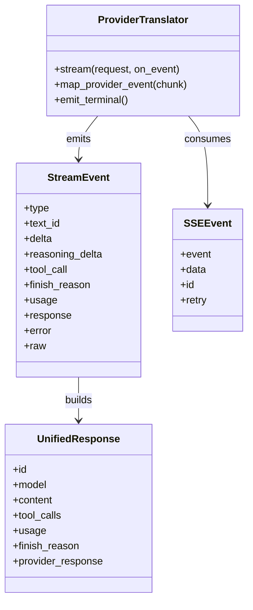
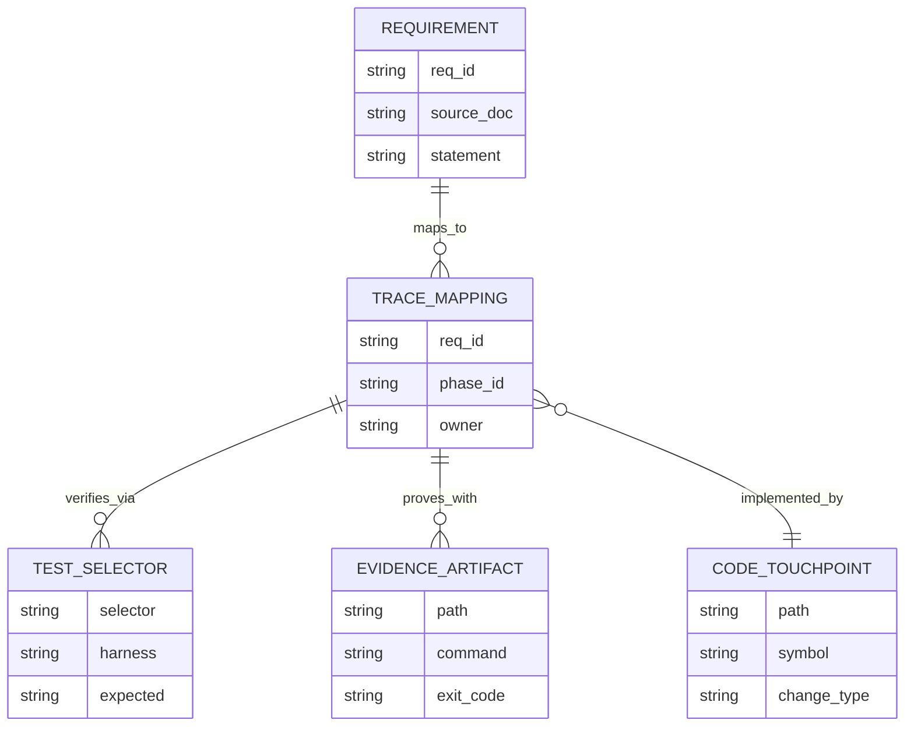
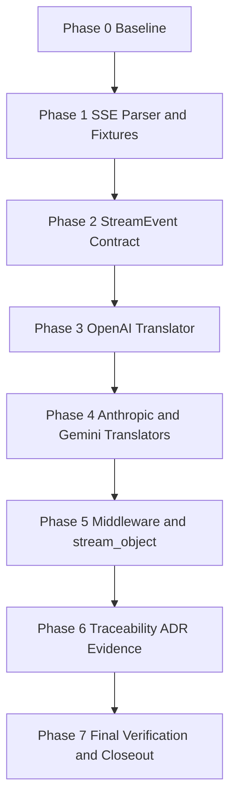

Legend: [ ] Incomplete, [X] Complete

# Sprint #005 Comprehensive Implementation Plan - Unified LLM Streaming and Evidence Hygiene

## Objective
Create an execution-ready plan for `docs/sprints/SPRINT-005-unified-llm-streaming-evidence-hygiene.md` that delivers provider-native streaming translation, StreamEvent spec parity, and strict evidence/traceability hygiene.

## Sprint Outcomes
- [ ] O1 - Provider-native streaming is implemented for OpenAI, Anthropic, and Gemini without post-hoc chunking of blocking responses.
```text
{placeholder for verification justification/reasoning and evidence log}
```
- [ ] O2 - StreamEvent lifecycle and field invariants are enforced across native and fallback streaming paths.
```text
{placeholder for verification justification/reasoning and evidence log}
```
- [ ] O3 - Traceability and evidence artifacts prove compliance for streaming-specific requirements.
```text
{placeholder for verification justification/reasoning and evidence log}
```

## Source Sprint Review Summary
The source sprint defines five execution tracks and one cross-cutting evidence contract:
1. SSE parser contract hardening and compatibility alias.
2. StreamEvent model parity and fallback-path correctness.
3. Provider-native stream translation for OpenAI, Anthropic, Gemini.
4. Middleware and `stream_object` correctness with partial-stream failure semantics.
5. Traceability specificity, ADR capture, and evidence hygiene closeout.

## Requirement Coverage Targets
The implementation must close these requirement IDs with streaming-specific tests and truthful mappings:
- `ULLM-REQ-MOST-PROVIDERS-USE-SERVER-SENT-EVENTS`
- `ULLM-REQ-RESPONSES-API-STREAMING-FORMAT-PROVIDES-REASONING`
- `ULLM-DOD-8.29-YIELDS-EVENTS-CONCATENATE-FULL-RESPONSE-TEXT`
- `ULLM-DOD-8.30-YIELDS-EVENTS-CORRECT-METADATA`
- `ULLM-DOD-8.31-STREAMING-FOLLOWS-START-DELTA-END-PATTERN`
- `ULLM-DOD-8.70-STREAMING-DOES-RETRY-AFTER-PARTIAL-DATA`

## Scope
In scope:
- `lib/attractor_core/core.tcl` SSE parser contract and `parse_sse` alias.
- `lib/unified_llm/main.tcl` StreamEvent invariants, fallback path, middleware ordering, `stream_object` behavior.
- `lib/unified_llm/adapters/openai.tcl`
- `lib/unified_llm/adapters/anthropic.tcl`
- `lib/unified_llm/adapters/gemini.tcl`
- `tests/fixtures/unified_llm_streaming/` and `tests/unit/` streaming coverage.
- `docs/spec-coverage/traceability.md`
- `docs/ADR.md`
- Sprint #005 source + comprehensive plan docs.

Out of scope:
- New providers beyond OpenAI/Anthropic/Gemini.
- Feature flags or rollout gating.
- Backwards-compatibility shims for superseded streaming behavior.

## Evidence and Verification Plan
Evidence roots:
- `.scratch/verification/SPRINT-005/comprehensive-plan/`
- `.scratch/diagram-renders/sprint-005-comprehensive-plan/`

Evidence rules for completion updates:
- Mark checklist items `[X]` only after verification completes.
- Record exact command(s), exit code(s), and artifact path(s) below each completed item.
- Keep completion sync and phase status aligned with actual implementation state.

## Execution Order
1. Phase 0 - Baseline audit and gap ledger.
2. Phase 1 - SSE parser contract and fixture corpus.
3. Phase 2 - Unified StreamEvent model and fallback parity.
4. Phase 3 - OpenAI provider-native stream translator.
5. Phase 4 - Anthropic and Gemini provider-native translators.
6. Phase 5 - Middleware and `stream_object` behavioral parity.
7. Phase 6 - Traceability, ADR, and evidence hygiene closure.
8. Phase 7 - Final verification and sprint closeout.

## Completion Sync (2026-02-28)
- [ ] C0.1 - Phase status markers are updated immediately after each phase acceptance criterion is verified.
```text
{placeholder for verification justification/reasoning and evidence log}
```
- [ ] C0.2 - No item is marked complete without explicit commands, exit codes, and evidence artifacts.
```text
{placeholder for verification justification/reasoning and evidence log}
```

## Phase 0 - Baseline Audit and Gap Ledger
### Deliverables
- [ ] P0.1 - Capture baseline status for build/test, streaming-focused test selectors, docs lint, evidence lint, evidence guardrail, and spec coverage.
```text
{placeholder for verification justification/reasoning and evidence log}
```
- [ ] P0.2 - Create a requirement-to-implementation gap ledger mapping each target ID to file touchpoints, tests, and unresolved gaps.
```text
{placeholder for verification justification/reasoning and evidence log}
```
- [ ] P0.3 - Initialize sprint-scoped evidence directories and command-status index under `.scratch/verification/SPRINT-005/comprehensive-plan/`.
```text
{placeholder for verification justification/reasoning and evidence log}
```

### Positive Test Cases
1. Build and full test suite run clean before streaming changes begin.
2. Streaming selectors resolve to concrete tests for SSE parser and provider translation suites.
3. Spec coverage passes with no missing or unknown requirement IDs.
4. Docs lint and evidence lint run clean on Sprint #005 documents.

### Negative Test Cases
1. Remove one target requirement from the gap ledger and confirm ledger validation reports it missing.
2. Corrupt one traceability mapping block in scratch and confirm spec coverage fails deterministically.
3. Remove one evidence directory and confirm automation reports missing path/artifact.

### Acceptance Criteria - Phase 0
- [ ] P0.A1 - Every target requirement ID has one owning phase deliverable and one concrete verification selector.
```text
{placeholder for verification justification/reasoning and evidence log}
```
- [ ] P0.A2 - Baseline and gap artifacts are reproducible from commands recorded in sprint-scoped evidence.
```text
{placeholder for verification justification/reasoning and evidence log}
```

## Phase 1 - SSE Parser Contract and Fixture Corpus
### Deliverables
- [ ] P1.1 - Harden `::attractor_core::sse_parse` for EOF flush, multiline `data:` join behavior, comments, and `event`/`id`/`retry` field handling.
```text
{placeholder for verification justification/reasoning and evidence log}
```
- [ ] P1.2 - Add `::attractor_core::parse_sse` compatibility alias with behavior parity to `sse_parse`.
```text
{placeholder for verification justification/reasoning and evidence log}
```
- [ ] P1.3 - Add offline fixture corpus for OpenAI/Anthropic/Gemini streaming payloads covering text, tool-call, reasoning, terminal, unknown, and malformed frames.
```text
{placeholder for verification justification/reasoning and evidence log}
```
- [ ] P1.4 - Add parser regressions for EOF-without-blank-line, ignored fields, comment-only input, and malformed frame boundaries.
```text
{placeholder for verification justification/reasoning and evidence log}
```

### Positive Test Cases
1. Parser emits final event at EOF without requiring trailing blank separator.
2. Multiline `data:` fields preserve ordering and newline semantics.
3. Alias `parse_sse` returns equivalent parsed events for identical payloads.
4. Fixture payloads parse deterministically without live network dependency.

### Negative Test Cases
1. Invalid `retry:` values are ignored or normalized without parser crash.
2. Unsupported SSE fields do not break parsing and do not leak into event dict.
3. Malformed frame boundaries produce deterministic translator-facing failures.
4. Empty/comment-only streams do not create phantom events.

### Acceptance Criteria - Phase 1
- [ ] P1.A1 - SSE parsing behavior is deterministic and regression-covered for required edge cases.
```text
{placeholder for verification justification/reasoning and evidence log}
```
- [ ] P1.A2 - Fixture corpus is sufficient to drive provider translator tests offline.
```text
{placeholder for verification justification/reasoning and evidence log}
```

## Phase 2 - Unified StreamEvent Model and Fallback Parity
### Deliverables
- [ ] P2.1 - Implement StreamEvent validation helpers for required keys, optional keys, and type-specific field rules.
```text
{placeholder for verification justification/reasoning and evidence log}
```
- [ ] P2.2 - Enforce ordering invariants (`STREAM_START` first, `FINISH` last, valid `TEXT_START`/`TEXT_DELTA`/`TEXT_END` lifecycle, deterministic terminal `ERROR`).
```text
{placeholder for verification justification/reasoning and evidence log}
```
- [ ] P2.3 - Update fallback synthetic streaming path to emit `TEXT_START` + `TEXT_DELTA*` + `TEXT_END` while preserving tool-call boundaries.
```text
{placeholder for verification justification/reasoning and evidence log}
```
- [ ] P2.4 - Ensure unknown provider payloads emit `PROVIDER_EVENT` and malformed payload paths emit normalized `ERROR` events.
```text
{placeholder for verification justification/reasoning and evidence log}
```

### Positive Test Cases
1. Ordered lifecycle test verifies `STREAM_START -> TEXT_START -> TEXT_DELTA* -> TEXT_END -> FINISH`.
2. Concatenation test verifies all `TEXT_DELTA` values exactly reconstruct final response text.
3. Metadata test verifies `FINISH` includes finish reason and normalized usage.
4. Fallback test verifies tool-call events preserve start/delta/end boundaries.

### Negative Test Cases
1. Emit `TEXT_DELTA` before `TEXT_START` and assert deterministic validation failure.
2. Omit `FINISH` and assert incomplete stream failure is typed and deterministic.
3. Feed malformed JSON payload and assert terminal `ERROR` event with structured error dict.
4. Emit unknown provider event type and assert `PROVIDER_EVENT` passthrough without crash.

### Acceptance Criteria - Phase 2
- [ ] P2.A1 - StreamEvent ordering/lifecycle invariants are enforced and covered by deterministic tests.
```text
{placeholder for verification justification/reasoning and evidence log}
```
- [ ] P2.A2 - Fallback stream behavior matches target contract for text/tool boundaries and terminal states.
```text
{placeholder for verification justification/reasoning and evidence log}
```

## Phase 3 - OpenAI Provider-Native Streaming Translator
### Deliverables
- [ ] P3.1 - Replace OpenAI stream chunking-from-complete behavior with provider-native SSE translation.
```text
{placeholder for verification justification/reasoning and evidence log}
```
- [ ] P3.2 - Map OpenAI stream events to StreamEvent contract for text lifecycle, tool-call lifecycle, and finish metadata.
```text
{placeholder for verification justification/reasoning and evidence log}
```
- [ ] P3.3 - Assemble partial OpenAI function-call argument deltas into decoded argument dicts at `TOOL_CALL_END`.
```text
{placeholder for verification justification/reasoning and evidence log}
```
- [ ] P3.4 - Enforce no-retry-after-partial-data behavior when malformed JSON or transport errors occur after emitted deltas.
```text
{placeholder for verification justification/reasoning and evidence log}
```

### Positive Test Cases
1. Text fixture emits `TEXT_START`, one-or-more `TEXT_DELTA`, `TEXT_END`, and terminal `FINISH`.
2. Tool-call fixture emits `TOOL_CALL_START`, `TOOL_CALL_DELTA*`, and `TOOL_CALL_END` with decoded args dict.
3. Finish fixture maps normalized usage and finish reason correctly.
4. Response item IDs are used as stable `text_id` where provided.

### Negative Test Cases
1. Unknown OpenAI event type emits `PROVIDER_EVENT` with raw payload.
2. Invalid JSON frame after at least one delta emits terminal `ERROR` and suppresses `FINISH`.
3. Transport fault after partial output confirms single transport invocation only.
4. Tool-call argument JSON fragment mismatch yields typed `ERROR` and no crash.

### Acceptance Criteria - Phase 3
- [ ] P3.A1 - OpenAI adapter is provider-native and does not synthesize stream events from blocking output.
```text
{placeholder for verification justification/reasoning and evidence log}
```
- [ ] P3.A2 - OpenAI mapping, tool assembly, and failure semantics are fixture-verified and deterministic.
```text
{placeholder for verification justification/reasoning and evidence log}
```

## Phase 4 - Anthropic and Gemini Provider-Native Streaming Translators
### Deliverables
- [ ] P4.1 - Implement Anthropic streaming translation for text/tool_use/thinking blocks into `TEXT_*`, `TOOL_CALL_*`, and `REASONING_*` events.
```text
{placeholder for verification justification/reasoning and evidence log}
```
- [ ] P4.2 - Implement Gemini `:streamGenerateContent?alt=sse` translation for text and function-call parts into StreamEvent contract.
```text
{placeholder for verification justification/reasoning and evidence log}
```
- [ ] P4.3 - Emit deterministic terminal `FINISH` events with normalized response + usage mapping for Anthropic and Gemini.
```text
{placeholder for verification justification/reasoning and evidence log}
```
- [ ] P4.4 - Surface unmapped provider payloads as `PROVIDER_EVENT` without data loss.
```text
{placeholder for verification justification/reasoning and evidence log}
```

### Positive Test Cases
1. Anthropic fixture with text + tool_use + thinking blocks emits full lifecycle events including reasoning boundaries.
2. Gemini fixture with text + functionCall parts emits text lifecycle and tool-call lifecycle events.
3. Provider terminal metadata is normalized into `FINISH` with unified response and usage.
4. Cross-provider concatenation check confirms emitted deltas reconstruct final text.

### Negative Test Cases
1. Anthropic unknown content block emits `PROVIDER_EVENT` and stream continues deterministically.
2. Gemini malformed JSON frame emits terminal `ERROR` and stream stops.
3. Anthropic malformed tool payload emits typed `ERROR` without translator crash.
4. Unexpected provider terminal sequencing is normalized or fails deterministically with typed error.

### Acceptance Criteria - Phase 4
- [ ] P4.A1 - Anthropic and Gemini adapters are provider-native and spec-faithful for text/tool/reasoning mappings.
```text
{placeholder for verification justification/reasoning and evidence log}
```
- [ ] P4.A2 - Cross-provider negative paths emit consistent `ERROR`/`PROVIDER_EVENT` semantics with no retry after partial data.
```text
{placeholder for verification justification/reasoning and evidence log}
```

## Phase 5 - Middleware, stream_object, and Partial-Stream Failure Semantics
### Deliverables
- [ ] P5.1 - Ensure request/event/response middleware ordering for streaming matches the sprint contract.
```text
{placeholder for verification justification/reasoning and evidence log}
```
- [ ] P5.2 - Update `stream_object` to tolerate expanded StreamEvent types while buffering only text deltas for schema validation.
```text
{placeholder for verification justification/reasoning and evidence log}
```
- [ ] P5.3 - Add tests for invalid JSON object streams, schema mismatches, and missing terminal events in `stream_object` flows.
```text
{placeholder for verification justification/reasoning and evidence log}
```
- [ ] P5.4 - Verify no-retry-after-partial-data behavior via transport call-count assertions.
```text
{placeholder for verification justification/reasoning and evidence log}
```

### Positive Test Cases
1. Middleware-order test confirms request middleware precedes transport, event middleware applies in registration order, response middleware applies at final response.
2. Valid object stream emits exactly one object callback with schema-valid dict.
3. Structured streaming pass case preserves text reconstruction and terminal metadata.
4. Partial-transport failure case emits terminal `ERROR` and leaves call-count at one.

### Negative Test Cases
1. Invalid JSON object payload yields typed parse error and no object callback.
2. Schema mismatch yields typed validation error with deterministic diagnostics.
3. Missing `FINISH` yields incomplete stream error and no object callback.
4. Middleware-raised exception yields terminal `ERROR` and deterministic teardown.

### Acceptance Criteria - Phase 5
- [ ] P5.A1 - Middleware and `stream_object` behavior is contract-compliant and deterministic in success/failure paths.
```text
{placeholder for verification justification/reasoning and evidence log}
```
- [ ] P5.A2 - Partial-stream failures never trigger retries and always terminate with `ERROR`.
```text
{placeholder for verification justification/reasoning and evidence log}
```

## Phase 6 - Traceability, ADR, and Evidence Hygiene Closure
### Deliverables
- [ ] P6.1 - Tighten streaming requirement mappings in `docs/spec-coverage/traceability.md` to streaming-specific tests/selectors.
```text
{placeholder for verification justification/reasoning and evidence log}
```
- [ ] P6.2 - Add ADR entry in `docs/ADR.md` documenting StreamEvent expansion and provider-native translation decisions plus consequences.
```text
{placeholder for verification justification/reasoning and evidence log}
```
- [ ] P6.3 - Ensure Sprint #005 docs pass docs lint, evidence lint, and evidence guardrail with truthful evidence annotations.
```text
{placeholder for verification justification/reasoning and evidence log}
```
- [ ] P6.4 - Produce phase-complete evidence index linking requirement IDs to code paths, tests, commands, exit codes, and artifacts.
```text
{placeholder for verification justification/reasoning and evidence log}
```

### Positive Test Cases
1. Spec coverage confirms all target IDs are present with valid selectors.
2. Traceability mappings resolve to streaming-specific tests, not broad wildcard catch-alls.
3. ADR entry captures context, decision, and consequences for streaming contract changes.
4. Docs/evidence lint and guardrail pass with all referenced artifacts present.

### Negative Test Cases
1. Introduce unknown requirement ID in traceability scratch copy and verify spec coverage fails.
2. Remove evidence path referenced by doc and verify guardrail fails.
3. Replace streaming selector with overly broad pattern and verify lint/test coverage gate catches drift.
4. Duplicate traceability ID and verify coverage validation fails deterministically.

### Acceptance Criteria - Phase 6
- [ ] P6.A1 - Target streaming IDs are mapped to precise tests and coverage gates remain clean.
```text
{placeholder for verification justification/reasoning and evidence log}
```
- [ ] P6.A2 - ADR and evidence artifacts are complete, auditable, and guardrail/lint compliant.
```text
{placeholder for verification justification/reasoning and evidence log}
```

## Phase 7 - Final Verification and Sprint Closeout
### Deliverables
- [ ] P7.1 - Run final verification suite: build, full test, streaming selectors, spec coverage, docs lint, evidence lint, evidence guardrail.
```text
{placeholder for verification justification/reasoning and evidence log}
```
- [ ] P7.2 - Record final command status matrix with explicit exit codes and artifact paths in sprint evidence root.
```text
{placeholder for verification justification/reasoning and evidence log}
```
- [ ] P7.3 - Sync source sprint completion status to match verified implementation reality.
```text
{placeholder for verification justification/reasoning and evidence log}
```
- [ ] P7.4 - Re-render appendix mermaid diagrams via `mmdc` and store outputs in sprint diagram evidence directory.
```text
{placeholder for verification justification/reasoning and evidence log}
```

### Positive Test Cases
1. End-to-end verification run produces all expected passing command statuses.
2. Streaming selectors pass for core SSE parser and each provider translator.
3. Spec coverage and docs/evidence guardrails pass in same closeout run.
4. Diagram renders exist for all appendix mermaid sources.

### Negative Test Cases
1. Force one streaming selector failure and verify closeout run fails fast.
2. Remove one final evidence artifact and verify guardrail failure.
3. Introduce docs lint violation and verify closeout gate blocks completion.
4. Corrupt one mermaid source and verify `mmdc` render fails deterministically.

### Acceptance Criteria - Phase 7
- [ ] P7.A1 - Sprint closes only when all phase acceptance criteria are complete with linked evidence.
```text
{placeholder for verification justification/reasoning and evidence log}
```
- [ ] P7.A2 - Final verification matrix is reproducible and auditable from requirements through artifacts.
```text
{placeholder for verification justification/reasoning and evidence log}
```

## Verification Command Matrix (Run When Marking Items Complete)
Build and test gates:
- `make -j10 build`
- `make -j10 test`
- `tclsh tests/all.tcl -match *attractor_core-sse*`
- `tclsh tests/all.tcl -match *unified_llm-openai-stream-translation*`
- `tclsh tests/all.tcl -match *unified_llm-anthropic-stream-translation*`
- `tclsh tests/all.tcl -match *unified_llm-gemini-stream-translation*`
- `tclsh tests/all.tcl -match *unified_llm-stream-no-retry-after-partial*`

Spec and docs gates:
- `tclsh tools/spec_coverage.tcl`
- `bash tools/docs_lint.sh`
- `bash tools/evidence_lint.sh docs/sprints/SPRINT-005-unified-llm-streaming-evidence-hygiene.md`
- `bash tools/evidence_lint.sh docs/sprints/SPRINT-005-comprehensive-implementation-plan.md`
- `tclsh tools/evidence_guardrail.tcl docs/sprints/SPRINT-005-unified-llm-streaming-evidence-hygiene.md docs/sprints/SPRINT-005-comprehensive-implementation-plan.md`

Diagram gates:
- `mmdc -i .scratch/diagram-renders/sprint-005-comprehensive-plan/core-domain-models.mmd -o .scratch/diagram-renders/sprint-005-comprehensive-plan/core-domain-models.svg`
- `mmdc -i .scratch/diagram-renders/sprint-005-comprehensive-plan/er-diagram.mmd -o .scratch/diagram-renders/sprint-005-comprehensive-plan/er-diagram.svg`
- `mmdc -i .scratch/diagram-renders/sprint-005-comprehensive-plan/workflow.mmd -o .scratch/diagram-renders/sprint-005-comprehensive-plan/workflow.svg`
- `mmdc -i .scratch/diagram-renders/sprint-005-comprehensive-plan/data-flow.mmd -o .scratch/diagram-renders/sprint-005-comprehensive-plan/data-flow.svg`
- `mmdc -i .scratch/diagram-renders/sprint-005-comprehensive-plan/architecture.mmd -o .scratch/diagram-renders/sprint-005-comprehensive-plan/architecture.svg`

## Appendix - Mermaid Diagrams

### Core Domain Models


### E-R Diagram


### Workflow Diagram


### Data-Flow Diagram

```mermaid
flowchart LR
    Req[Unified LLM Stream Request] --> Adapter[Provider Adapter]
    Adapter --> Transport[HTTPS Transport SSE]
    Transport --> SSE[SSE Parser]
    SSE --> Translator[Provider Event Translator]
    Translator --> Events[Unified StreamEvent Emission]
    Events --> Middleware[Event Middleware Chain]
    Middleware --> Buffer[Response and Object Buffer]
    Buffer --> Finish[FINISH or ERROR Event]
    Finish --> Consumer[Client Callback]
```


### Architecture Diagram

