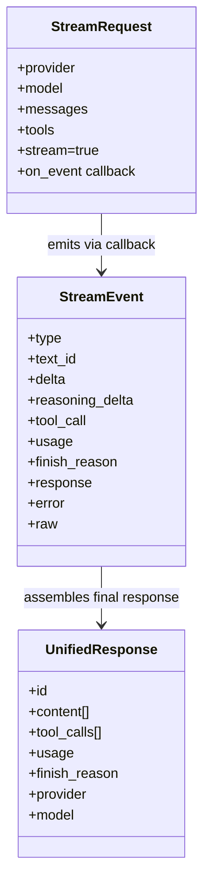
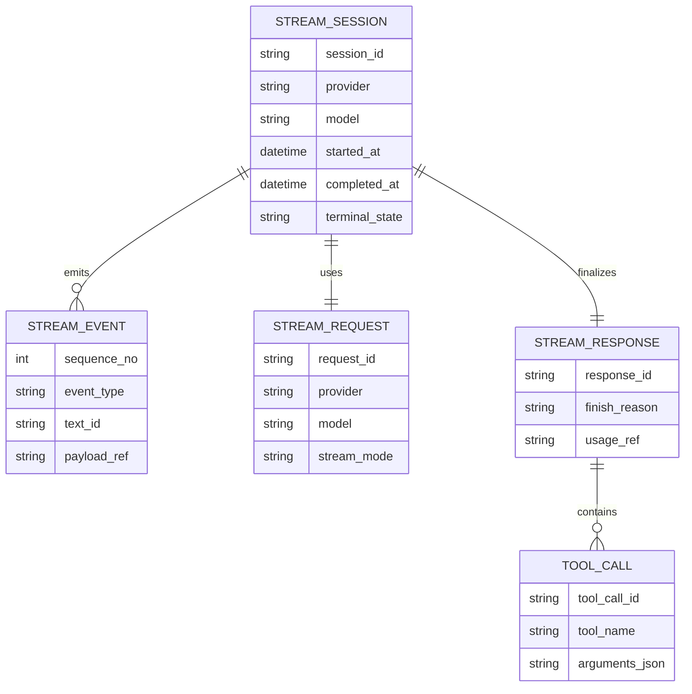
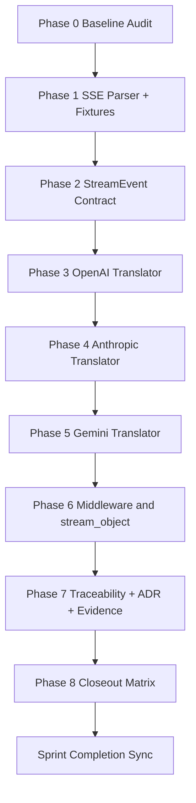
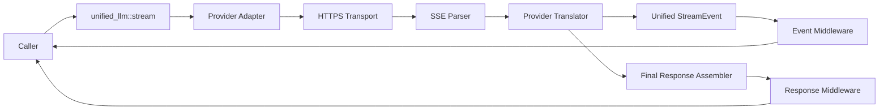
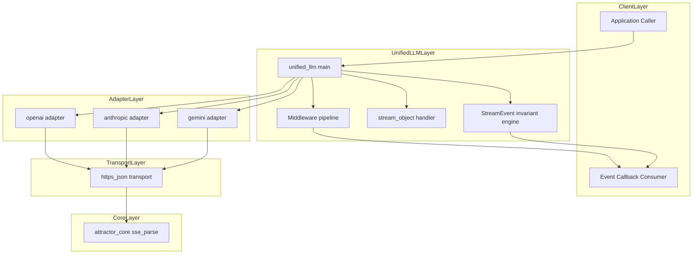

Legend: [ ] Incomplete, [X] Complete

# Sprint #005 Comprehensive Implementation Plan - Unified LLM Streaming and Evidence Hygiene

## Plan Status
- [ ] Planning baseline reviewed against `docs/sprints/SPRINT-005-unified-llm-streaming-evidence-hygiene.md`.
```text
{placeholder for verification justification/reasoning and evidence log}
```
- [ ] Sprint implementation tasks remain incomplete until code, tests, docs, and evidence are verified.
```text
{placeholder for verification justification/reasoning and evidence log}
```

## Objective
Implement spec-faithful provider-native streaming for Unified LLM (OpenAI, Anthropic, Gemini), enforce strict StreamEvent ordering/typing semantics, and restore evidence/traceability hygiene so streaming compliance is provable from deterministic tests.

## High-Level Goals
- [ ] Replace synthetic post-hoc chunking with provider-native streaming translation in all in-scope adapters.
```text
{placeholder for verification justification/reasoning and evidence log}
```
- [ ] Enforce unified StreamEvent lifecycle contracts (`STREAM_START`, start/delta/end segments, terminal `FINISH` or `ERROR`).
```text
{placeholder for verification justification/reasoning and evidence log}
```
- [ ] Expand deterministic fixture-first test coverage for positive and negative streaming behavior.
```text
{placeholder for verification justification/reasoning and evidence log}
```
- [ ] Tighten traceability mappings and evidence lint/guardrail conformance for sprint artifacts.
```text
{placeholder for verification justification/reasoning and evidence log}
```

## Scope
In scope:
- `lib/attractor_core/core.tcl` SSE parser contract and alias compatibility.
- `lib/unified_llm/main.tcl` streaming orchestration, event invariants, middleware/event flow, and fallback stream contract.
- `lib/unified_llm/adapters/openai.tcl` provider-native OpenAI stream translation.
- `lib/unified_llm/adapters/anthropic.tcl` provider-native Anthropic stream translation.
- `lib/unified_llm/adapters/gemini.tcl` provider-native Gemini stream translation.
- `tests/unit/attractor_core.test` and `tests/unit/unified_llm_streaming.test` streaming-focused deterministic tests.
- `tests/fixtures/unified_llm_streaming/` fixture corpus for per-provider positive and malformed cases.
- `docs/spec-coverage/traceability.md` streaming-specific requirement mappings.
- `docs/ADR.md` architecture decisions for stream event model and translator policy.

Out of scope:
- New providers beyond OpenAI, Anthropic, Gemini.
- Feature flags or gated rollouts.
- Backward compatibility shims for legacy streaming behavior.

## Phase Sequence
1. Phase 0 - Baseline audit and gap ledger.
2. Phase 1 - SSE parser and fixture corpus hardening.
3. Phase 2 - Unified StreamEvent contract and fallback stream path.
4. Phase 3 - OpenAI streaming translator.
5. Phase 4 - Anthropic streaming translator.
6. Phase 5 - Gemini streaming translator.
7. Phase 6 - Middleware, `stream_object`, and no-retry-after-partial behavior.
8. Phase 7 - Traceability, ADR, and evidence hygiene closure.
9. Phase 8 - End-to-end closeout matrix and completion sync.

## Phase 0 - Baseline Audit and Gap Ledger
### Deliverables
- [ ] Capture baseline command outputs for build/test/spec coverage/docs lint/evidence lint/evidence guardrail.
```text
{placeholder for verification justification/reasoning and evidence log}
```
- [ ] Produce requirement-to-implementation gap ledger for all streaming requirements and DoD IDs.
```text
{placeholder for verification justification/reasoning and evidence log}
```
- [ ] Validate that all planned streaming test selectors resolve to concrete tests before implementation work begins.
```text
{placeholder for verification justification/reasoning and evidence log}
```

### Positive Test Cases
- [ ] Baseline `make -j10 build` succeeds on current branch state.
```text
{placeholder for verification justification/reasoning and evidence log}
```
- [ ] Baseline `make -j10 test` succeeds on current branch state.
```text
{placeholder for verification justification/reasoning and evidence log}
```
- [ ] Streaming selectors map to existing tests (no ambiguous/empty matches).
```text
{placeholder for verification justification/reasoning and evidence log}
```

### Negative Test Cases
- [ ] Any selector with zero matches fails phase exit and is corrected before implementation continues.
```text
{placeholder for verification justification/reasoning and evidence log}
```
- [ ] Any requirement ID missing a mapped implementation/test row fails phase exit.
```text
{placeholder for verification justification/reasoning and evidence log}
```

### Acceptance Criteria - Phase 0
- [ ] Baseline matrix and gap ledger are recorded under `.scratch/verification/SPRINT-005/phase-0/`.
```text
{placeholder for verification justification/reasoning and evidence log}
```
- [ ] Planned verification selectors are concrete, specific, and executable.
```text
{placeholder for verification justification/reasoning and evidence log}
```

## Phase 1 - SSE Parser and Fixture Corpus Hardening
### Deliverables
- [ ] Harden SSE parser behavior for EOF flush, multiline data assembly, comments, `id`, and `retry` preservation.
```text
{placeholder for verification justification/reasoning and evidence log}
```
- [ ] Keep `::attractor_core::parse_sse` and `::attractor_core::sse_parse` behavior in lockstep.
```text
{placeholder for verification justification/reasoning and evidence log}
```
- [ ] Build fixture corpus for OpenAI/Anthropic/Gemini text/tool/reasoning/terminal/malformed streaming frames.
```text
{placeholder for verification justification/reasoning and evidence log}
```
- [ ] Add parser and fixture-load regression tests covering edge conditions and malformed inputs.
```text
{placeholder for verification justification/reasoning and evidence log}
```

### Positive Test Cases
- [ ] Parser emits deterministic event boundaries for single and multiline `data:` frames.
```text
{placeholder for verification justification/reasoning and evidence log}
```
- [ ] EOF without trailing blank line still flushes the final event.
```text
{placeholder for verification justification/reasoning and evidence log}
```
- [ ] Fixture loader validates all provider fixture files are readable and parseable.
```text
{placeholder for verification justification/reasoning and evidence log}
```

### Negative Test Cases
- [ ] Comment-only frames do not emit false events.
```text
{placeholder for verification justification/reasoning and evidence log}
```
- [ ] Unknown/unused SSE fields are ignored without parser crashes.
```text
{placeholder for verification justification/reasoning and evidence log}
```
- [ ] Malformed frame payloads are surfaced for downstream translator error tests.
```text
{placeholder for verification justification/reasoning and evidence log}
```

### Acceptance Criteria - Phase 1
- [ ] SSE parser behavior is deterministic and aligned with streaming translator needs.
```text
{placeholder for verification justification/reasoning and evidence log}
```
- [ ] Fixture corpus covers all in-scope providers and explicit malformed cases.
```text
{placeholder for verification justification/reasoning and evidence log}
```

## Phase 2 - Unified StreamEvent Contract and Fallback Stream Path
### Deliverables
- [ ] Enforce StreamEvent ordering and typing invariants in Unified LLM stream orchestration.
```text
{placeholder for verification justification/reasoning and evidence log}
```
- [ ] Update fallback `__stream_from_response` to emit `TEXT_START`, `TEXT_DELTA`, and `TEXT_END` with stable `text_id`.
```text
{placeholder for verification justification/reasoning and evidence log}
```
- [ ] Implement robust `PROVIDER_EVENT` and `ERROR` emissions for unknown events and malformed payloads.
```text
{placeholder for verification justification/reasoning and evidence log}
```
- [ ] Validate final response assembly (`finish_reason`, `usage`, and `response`) from streamed deltas.
```text
{placeholder for verification justification/reasoning and evidence log}
```

### Positive Test Cases
- [ ] Event sequence starts with `STREAM_START`, emits ordered segment events, and ends with terminal `FINISH` on success.
```text
{placeholder for verification justification/reasoning and evidence log}
```
- [ ] Concatenated `TEXT_DELTA` content equals final response text.
```text
{placeholder for verification justification/reasoning and evidence log}
```
- [ ] Metadata (`finish_reason`, `usage`) is present and normalized on `FINISH`.
```text
{placeholder for verification justification/reasoning and evidence log}
```

### Negative Test Cases
- [ ] Malformed JSON streaming payload emits terminal `ERROR` and suppresses `FINISH`.
```text
{placeholder for verification justification/reasoning and evidence log}
```
- [ ] Unknown provider event types are surfaced as `PROVIDER_EVENT`, not hard failures.
```text
{placeholder for verification justification/reasoning and evidence log}
```

### Acceptance Criteria - Phase 2
- [ ] Unified stream contract is deterministic and provider-agnostic.
```text
{placeholder for verification justification/reasoning and evidence log}
```
- [ ] Invalid payload paths terminate with typed `ERROR` behavior.
```text
{placeholder for verification justification/reasoning and evidence log}
```

## Phase 3 - OpenAI Provider-Native Streaming Translator
### Deliverables
- [ ] Implement OpenAI Responses API native streaming path (no `complete()` chunk fallback).
```text
{placeholder for verification justification/reasoning and evidence log}
```
- [ ] Map text delta frames to `TEXT_START`/`TEXT_DELTA` and text completion to `TEXT_END`.
```text
{placeholder for verification justification/reasoning and evidence log}
```
- [ ] Assemble function-call argument deltas into decoded arguments and emit `TOOL_CALL_START`/`TOOL_CALL_DELTA`/`TOOL_CALL_END`.
```text
{placeholder for verification justification/reasoning and evidence log}
```
- [ ] Emit terminal `FINISH` with normalized usage and finish metadata (including reasoning tokens when available).
```text
{placeholder for verification justification/reasoning and evidence log}
```

### Positive Test Cases
- [ ] OpenAI text-only fixture emits correct ordered text events and final response text.
```text
{placeholder for verification justification/reasoning and evidence log}
```
- [ ] OpenAI tool-call fixture emits complete decoded tool arguments at `TOOL_CALL_END`.
```text
{placeholder for verification justification/reasoning and evidence log}
```
- [ ] OpenAI finish fixture maps usage/metadata onto `FINISH` event consistently.
```text
{placeholder for verification justification/reasoning and evidence log}
```

### Negative Test Cases
- [ ] Malformed OpenAI frame payload produces `ERROR` event with normalized error object.
```text
{placeholder for verification justification/reasoning and evidence log}
```
- [ ] Unknown OpenAI event types produce `PROVIDER_EVENT` passthrough.
```text
{placeholder for verification justification/reasoning and evidence log}
```

### Acceptance Criteria - Phase 3
- [ ] OpenAI translator is provider-native and spec-faithful for text, tool calls, and finish metadata.
```text
{placeholder for verification justification/reasoning and evidence log}
```
- [ ] OpenAI streaming coverage includes deterministic positive and negative fixtures.
```text
{placeholder for verification justification/reasoning and evidence log}
```

## Phase 4 - Anthropic Provider-Native Streaming Translator
### Deliverables
- [ ] Implement Anthropic native SSE streaming translation path.
```text
{placeholder for verification justification/reasoning and evidence log}
```
- [ ] Map text blocks to `TEXT_START`/`TEXT_DELTA`/`TEXT_END`.
```text
{placeholder for verification justification/reasoning and evidence log}
```
- [ ] Map tool-use blocks to `TOOL_CALL_START`/`TOOL_CALL_DELTA`/`TOOL_CALL_END` with decoded args.
```text
{placeholder for verification justification/reasoning and evidence log}
```
- [ ] Map thinking/reasoning blocks to `REASONING_START`/`REASONING_DELTA`/`REASONING_END`.
```text
{placeholder for verification justification/reasoning and evidence log}
```
- [ ] Emit terminal `FINISH` with normalized response and usage metadata.
```text
{placeholder for verification justification/reasoning and evidence log}
```

### Positive Test Cases
- [ ] Anthropic text fixtures validate ordered text segment lifecycle.
```text
{placeholder for verification justification/reasoning and evidence log}
```
- [ ] Anthropic tool-use fixtures validate deterministic tool event lifecycle and decoded args.
```text
{placeholder for verification justification/reasoning and evidence log}
```
- [ ] Anthropic thinking fixtures validate deterministic reasoning event lifecycle.
```text
{placeholder for verification justification/reasoning and evidence log}
```

### Negative Test Cases
- [ ] Malformed Anthropic frame payloads terminate with `ERROR`.
```text
{placeholder for verification justification/reasoning and evidence log}
```
- [ ] Unsupported/unknown Anthropic event types surface as `PROVIDER_EVENT`.
```text
{placeholder for verification justification/reasoning and evidence log}
```

### Acceptance Criteria - Phase 4
- [ ] Anthropic translator correctly emits text, tool, reasoning, and terminal events.
```text
{placeholder for verification justification/reasoning and evidence log}
```
- [ ] Anthropic stream tests are deterministic and fixture-backed.
```text
{placeholder for verification justification/reasoning and evidence log}
```

## Phase 5 - Gemini Provider-Native Streaming Translator
### Deliverables
- [ ] Implement Gemini `:streamGenerateContent?alt=sse` translation path.
```text
{placeholder for verification justification/reasoning and evidence log}
```
- [ ] Map text parts to `TEXT_START`/`TEXT_DELTA`/`TEXT_END`.
```text
{placeholder for verification justification/reasoning and evidence log}
```
- [ ] Map functionCall parts to tool-call lifecycle events with decoded args.
```text
{placeholder for verification justification/reasoning and evidence log}
```
- [ ] Emit terminal `FINISH` with normalized response and usage metadata.
```text
{placeholder for verification justification/reasoning and evidence log}
```

### Positive Test Cases
- [ ] Gemini text fixtures validate text event ordering and final response assembly.
```text
{placeholder for verification justification/reasoning and evidence log}
```
- [ ] Gemini function call fixtures validate complete tool event emission.
```text
{placeholder for verification justification/reasoning and evidence log}
```
- [ ] Gemini finish fixtures validate finish reason and usage normalization.
```text
{placeholder for verification justification/reasoning and evidence log}
```

### Negative Test Cases
- [ ] Malformed Gemini frame payloads emit `ERROR` and terminate stream.
```text
{placeholder for verification justification/reasoning and evidence log}
```
- [ ] Unknown Gemini parts/events are preserved as `PROVIDER_EVENT`.
```text
{placeholder for verification justification/reasoning and evidence log}
```

### Acceptance Criteria - Phase 5
- [ ] Gemini translator is provider-native and emits unified events for text/tool/finish flows.
```text
{placeholder for verification justification/reasoning and evidence log}
```
- [ ] Gemini streaming coverage is complete across positive and negative deterministic fixtures.
```text
{placeholder for verification justification/reasoning and evidence log}
```

## Phase 6 - Middleware, stream_object, and Partial-Data Error Semantics
### Deliverables
- [ ] Ensure request/event/response middleware ordering is identical between blocking and streaming flows.
```text
{placeholder for verification justification/reasoning and evidence log}
```
- [ ] Make `stream_object` robust to expanded event surface while preserving schema validation on terminal output.
```text
{placeholder for verification justification/reasoning and evidence log}
```
- [ ] Enforce no-retry-after-partial-data rule: after any emitted content delta, transport failure yields `ERROR` and immediate stop.
```text
{placeholder for verification justification/reasoning and evidence log}
```

### Positive Test Cases
- [ ] Middleware transforms stream events in registration order without corrupting final response assembly.
```text
{placeholder for verification justification/reasoning and evidence log}
```
- [ ] `stream_object` consumes text deltas correctly and validates final JSON against schema.
```text
{placeholder for verification justification/reasoning and evidence log}
```

### Negative Test Cases
- [ ] `stream_object` rejects invalid final JSON and reports typed error.
```text
{placeholder for verification justification/reasoning and evidence log}
```
- [ ] Post-partial transport failure does not invoke retry path and terminates with `ERROR`.
```text
{placeholder for verification justification/reasoning and evidence log}
```

### Acceptance Criteria - Phase 6
- [ ] Streaming middleware and structured-output behavior remain deterministic and spec-aligned.
```text
{placeholder for verification justification/reasoning and evidence log}
```
- [ ] Partial-data failure semantics are proven by targeted negative tests.
```text
{placeholder for verification justification/reasoning and evidence log}
```

## Phase 7 - Traceability, ADR, and Evidence Hygiene
### Deliverables
- [ ] Update `docs/spec-coverage/traceability.md` to map streaming IDs to specific streaming tests.
```text
{placeholder for verification justification/reasoning and evidence log}
```
- [ ] Record architecture decisions and consequences in `docs/ADR.md` for stream event model and translator policy.
```text
{placeholder for verification justification/reasoning and evidence log}
```
- [ ] Bring sprint docs into evidence hygiene compliance and pass docs/evidence guardrails.
```text
{placeholder for verification justification/reasoning and evidence log}
```

### Positive Test Cases
- [ ] `tclsh tools/spec_coverage.tcl` passes with explicit streaming selector mappings.
```text
{placeholder for verification justification/reasoning and evidence log}
```
- [ ] `bash tools/docs_lint.sh` passes for sprint and spec docs touched by this work.
```text
{placeholder for verification justification/reasoning and evidence log}
```
- [ ] `bash tools/evidence_lint.sh` and `tclsh tools/evidence_guardrail.tcl` pass for sprint docs.
```text
{placeholder for verification justification/reasoning and evidence log}
```

### Negative Test Cases
- [ ] Broad catch-all streaming traceability selectors are rejected and replaced with specific selectors.
```text
{placeholder for verification justification/reasoning and evidence log}
```
- [ ] Missing verification command/exit code/evidence artifact references block completion of checklist items.
```text
{placeholder for verification justification/reasoning and evidence log}
```

### Acceptance Criteria - Phase 7
- [ ] Traceability, ADR, and sprint evidence hygiene are complete and auditable.
```text
{placeholder for verification justification/reasoning and evidence log}
```
- [ ] Docs and guardrail checks pass with no exemptions.
```text
{placeholder for verification justification/reasoning and evidence log}
```

## Phase 8 - End-to-End Closeout Matrix and Completion Sync
### Deliverables
- [ ] Run full verification matrix and capture command-status ledger with explicit exit codes.
```text
{placeholder for verification justification/reasoning and evidence log}
```
- [ ] Synchronize completion status in this plan only after phase evidence is validated.
```text
{placeholder for verification justification/reasoning and evidence log}
```
- [ ] Produce closeout summary linking each completed deliverable to concrete evidence artifacts.
```text
{placeholder for verification justification/reasoning and evidence log}
```

### Positive Test Cases
- [ ] `make -j10 build`, `make -j10 test`, provider streaming selectors, spec coverage, docs lint, evidence lint, and evidence guardrail all succeed.
```text
{placeholder for verification justification/reasoning and evidence log}
```
- [ ] Mermaid appendix diagrams render successfully with `mmdc` and artifacts are stored under `.scratch/diagram-renders/sprint-005-comprehensive-plan/`.
```text
{placeholder for verification justification/reasoning and evidence log}
```

### Negative Test Cases
- [ ] Any failing gate blocks sprint completion and leaves corresponding checklist items as incomplete.
```text
{placeholder for verification justification/reasoning and evidence log}
```
- [ ] Missing evidence artifacts block conversion of checklist items to complete.
```text
{placeholder for verification justification/reasoning and evidence log}
```

### Acceptance Criteria - Phase 8
- [ ] End-to-end matrix passes with reproducible logs and explicit command status tracking.
```text
{placeholder for verification justification/reasoning and evidence log}
```
- [ ] Plan completion status is synchronized to verified implementation reality.
```text
{placeholder for verification justification/reasoning and evidence log}
```

## Execution Task Matrix
- [ ] Implement Phase 1 parser + fixtures before any adapter translation changes.
```text
{placeholder for verification justification/reasoning and evidence log}
```
- [ ] Implement Phase 2 StreamEvent invariants before provider-specific translators.
```text
{placeholder for verification justification/reasoning and evidence log}
```
- [ ] Implement OpenAI, Anthropic, and Gemini translators in separate incremental units with targeted tests.
```text
{placeholder for verification justification/reasoning and evidence log}
```
- [ ] Complete middleware/stream_object/no-retry semantics before traceability closure.
```text
{placeholder for verification justification/reasoning and evidence log}
```
- [ ] Finish traceability + ADR + evidence hygiene updates before closeout matrix execution.
```text
{placeholder for verification justification/reasoning and evidence log}
```

## Verification Command Template (To Fill During Execution)
- [ ] Capture each command exactly as executed, with exit code and artifact references.
```text
{placeholder for verification justification/reasoning and evidence log}
```

Planned verification command set:
- `make -j10 build`
- `make -j10 test`
- `tclsh tests/all.tcl -match *attractor_core-sse*`
- `tclsh tests/all.tcl -match *unified_llm-openai-stream-translation*`
- `tclsh tests/all.tcl -match *unified_llm-anthropic-stream-translation*`
- `tclsh tests/all.tcl -match *unified_llm-gemini-stream-translation*`
- `tclsh tests/all.tcl -match *unified_llm-stream-no-retry-after-partial*`
- `tclsh tools/spec_coverage.tcl`
- `bash tools/docs_lint.sh`
- `bash tools/evidence_lint.sh docs/sprints/SPRINT-005-unified-llm-streaming-evidence-hygiene.md`
- `bash tools/evidence_lint.sh docs/sprints/SPRINT-005-comprehensive-implementation-plan.md`
- `tclsh tools/evidence_guardrail.tcl docs/sprints/SPRINT-005-unified-llm-streaming-evidence-hygiene.md docs/sprints/SPRINT-005-comprehensive-implementation-plan.md`

## Appendix - Mermaid Diagrams

### Core Domain Models


### E-R Diagram


### Workflow


### Data-Flow Diagram


### Architecture Diagram

