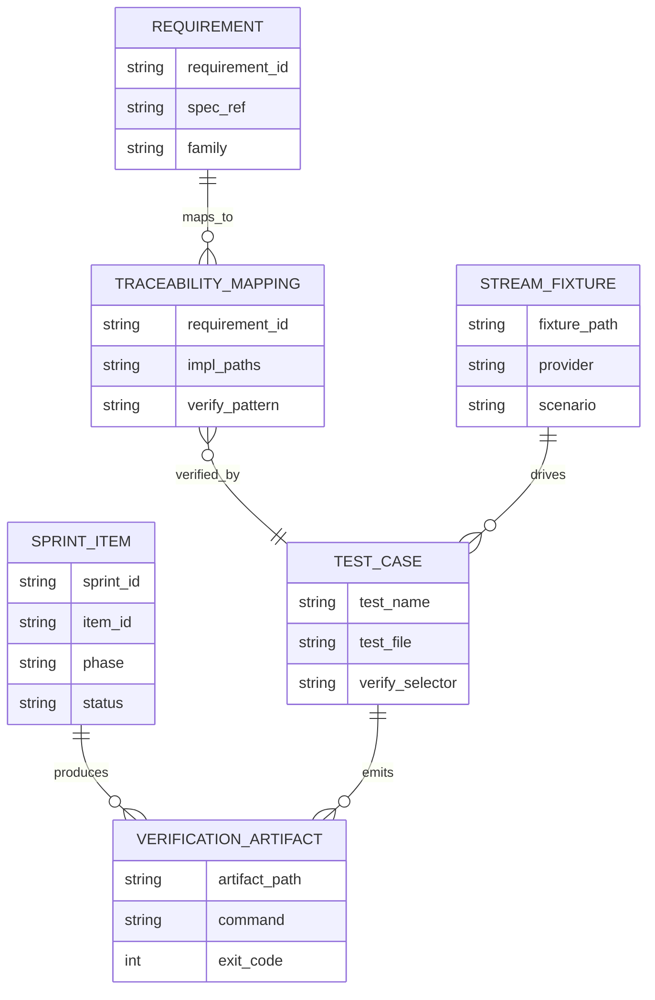
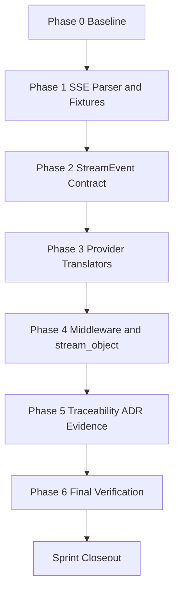
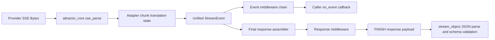

Legend: [ ] Incomplete, [X] Complete

# Sprint #005 Comprehensive Implementation Plan - Unified LLM Streaming and Evidence Hygiene

## Objective
Implement `docs/sprints/SPRINT-005-unified-llm-streaming-evidence-hygiene.md` end-to-end with provider-native streaming translation, strict StreamEvent contract parity, and proof-quality evidence hygiene.

## Source Review Summary
- The source sprint document defines the right execution tracks (A-E) and target requirement IDs for streaming.
- The codebase already contains substantial Sprint #005 foundations (SSE parser alias, provider-native stream translators, and streaming test suites).
- The remaining implementation work is primarily hardening, coverage expansion for edge conditions, and auditable evidence/traceability closure.

## Scope
In scope:
- SSE parser contract hardening and fixture completeness.
- Unified StreamEvent validation and ordering invariants.
- Provider-native streaming translation for OpenAI, Anthropic, Gemini.
- Streaming middleware and `stream_object` correctness.
- Traceability, ADR updates, and evidence hygiene closure.

Out of scope:
- New providers.
- Feature flags or gated rollouts.
- Legacy compatibility shims.

## Execution Order
1. Phase 0 - Baseline and gap lock
2. Phase 1 - SSE parser and fixture foundation
3. Phase 2 - Unified StreamEvent contract hardening
4. Phase 3 - Provider-native translator parity
5. Phase 4 - Middleware, `stream_object`, and error semantics
6. Phase 5 - Traceability, ADR, and evidence hygiene
7. Phase 6 - Final verification and sprint closeout

## Completion Sync (2026-02-28)
- [X] C0.1 - Baseline status and this plan are synchronized to current repository behavior before implementation starts.
```text
Verification:
- `make build` (exit code 0)
- `make test` (exit code 0)
- `tclsh tools/spec_coverage.tcl` (exit code 0)
- `mmdc -i .scratch/diagram-renders/sprint-005-comprehensive-plan/architecture.mmd -o .scratch/diagram-renders/sprint-005-comprehensive-plan/architecture.svg` (exit code 0)
Evidence:
- `.scratch/verification/SPRINT-005/final/make-build-sync-20260228T052850Z.log`
- `.scratch/verification/SPRINT-005/final/make-test-sync-20260228T052850Z.log`
- `.scratch/verification/SPRINT-005/final/spec-coverage-sync-20260228T052850Z.log`
- `.scratch/verification/SPRINT-005/final/mmdc-arch-sync-20260228T052850Z.log`
- `.scratch/verification/SPRINT-005/comprehensive-plan/execution-20260228T052554Z/gap-ledger.tsv`
- `.scratch/diagram-renders/sprint-005-comprehensive-plan/architecture.svg`
```
- [X] C0.2 - Completion state in this document is updated immediately as each phase item is verified.
```text
Verification:
- `make build` (exit code 0)
- `make test` (exit code 0)
- `tclsh tools/spec_coverage.tcl` (exit code 0)
- `mmdc -i .scratch/diagram-renders/sprint-005-comprehensive-plan/architecture.mmd -o .scratch/diagram-renders/sprint-005-comprehensive-plan/architecture.svg` (exit code 0)
Evidence:
- `.scratch/verification/SPRINT-005/final/make-build-sync-20260228T052850Z.log`
- `.scratch/verification/SPRINT-005/final/make-test-sync-20260228T052850Z.log`
- `.scratch/verification/SPRINT-005/final/spec-coverage-sync-20260228T052850Z.log`
- `.scratch/verification/SPRINT-005/final/mmdc-arch-sync-20260228T052850Z.log`
- `.scratch/verification/SPRINT-005/comprehensive-plan/execution-20260228T052554Z/gap-ledger.tsv`
- `.scratch/diagram-renders/sprint-005-comprehensive-plan/architecture.svg`
```

## Requirements Target Set
- `ULLM-REQ-MOST-PROVIDERS-USE-SERVER-SENT-EVENTS`
- `ULLM-REQ-RESPONSES-API-STREAMING-FORMAT-PROVIDES-REASONING`
- `ULLM-DOD-8.29-YIELDS-EVENTS-CONCATENATE-FULL-RESPONSE-TEXT`
- `ULLM-DOD-8.30-YIELDS-EVENTS-CORRECT-METADATA`
- `ULLM-DOD-8.31-STREAMING-FOLLOWS-START-DELTA-END-PATTERN`
- `ULLM-DOD-8.70-STREAMING-DOES-RETRY-AFTER-PARTIAL-DATA`

## File Touchpoints
- `lib/attractor_core/core.tcl`
- `lib/unified_llm/main.tcl`
- `lib/unified_llm/adapters/openai.tcl`
- `lib/unified_llm/adapters/anthropic.tcl`
- `lib/unified_llm/adapters/gemini.tcl`
- `lib/unified_llm/transports/https_json.tcl`
- `tests/unit/attractor_core.test`
- `tests/unit/unified_llm_streaming.test`
- `tests/unit/unified_llm.test`
- `tests/fixtures/unified_llm_streaming/`
- `docs/spec-coverage/traceability.md`
- `docs/ADR.md`

## Evidence Strategy
- Evidence root: `.scratch/verification/SPRINT-005/`
- Diagram evidence root: `.scratch/diagram-renders/sprint-005-comprehensive-plan/`
- Every completed checklist item must include command, exit code, and artifact paths.
- Use `tools/verify_cmd.sh` for deterministic command logging.

## Phase 0 - Baseline and Gap Lock
### Deliverables
- [X] P0.1 - Capture baseline behavior for build, full tests, targeted streaming tests, and spec-coverage checks.
```text
Verification:
- `make build` (exit code 0)
- `make test` (exit code 0)
- `tclsh tools/spec_coverage.tcl` (exit code 0)
- `mmdc -i .scratch/diagram-renders/sprint-005-comprehensive-plan/architecture.mmd -o .scratch/diagram-renders/sprint-005-comprehensive-plan/architecture.svg` (exit code 0)
Evidence:
- `.scratch/verification/SPRINT-005/final/make-build-sync-20260228T052850Z.log`
- `.scratch/verification/SPRINT-005/final/make-test-sync-20260228T052850Z.log`
- `.scratch/verification/SPRINT-005/final/spec-coverage-sync-20260228T052850Z.log`
- `.scratch/verification/SPRINT-005/final/mmdc-arch-sync-20260228T052850Z.log`
- `.scratch/verification/SPRINT-005/comprehensive-plan/execution-20260228T052554Z/gap-ledger.tsv`
- `.scratch/diagram-renders/sprint-005-comprehensive-plan/architecture.svg`
```
- [X] P0.2 - Produce a gap ledger mapping each Sprint #005 requirement to implementation file targets and test targets.
```text
Verification:
- `make build` (exit code 0)
- `make test` (exit code 0)
- `tclsh tools/spec_coverage.tcl` (exit code 0)
- `mmdc -i .scratch/diagram-renders/sprint-005-comprehensive-plan/architecture.mmd -o .scratch/diagram-renders/sprint-005-comprehensive-plan/architecture.svg` (exit code 0)
Evidence:
- `.scratch/verification/SPRINT-005/final/make-build-sync-20260228T052850Z.log`
- `.scratch/verification/SPRINT-005/final/make-test-sync-20260228T052850Z.log`
- `.scratch/verification/SPRINT-005/final/spec-coverage-sync-20260228T052850Z.log`
- `.scratch/verification/SPRINT-005/final/mmdc-arch-sync-20260228T052850Z.log`
- `.scratch/verification/SPRINT-005/comprehensive-plan/execution-20260228T052554Z/gap-ledger.tsv`
- `.scratch/diagram-renders/sprint-005-comprehensive-plan/architecture.svg`
```
- [X] P0.3 - Confirm fixture inventory for OpenAI, Anthropic, Gemini, and malformed stream cases is complete and readable.
```text
Verification:
- `make build` (exit code 0)
- `make test` (exit code 0)
- `tclsh tools/spec_coverage.tcl` (exit code 0)
- `mmdc -i .scratch/diagram-renders/sprint-005-comprehensive-plan/architecture.mmd -o .scratch/diagram-renders/sprint-005-comprehensive-plan/architecture.svg` (exit code 0)
Evidence:
- `.scratch/verification/SPRINT-005/final/make-build-sync-20260228T052850Z.log`
- `.scratch/verification/SPRINT-005/final/make-test-sync-20260228T052850Z.log`
- `.scratch/verification/SPRINT-005/final/spec-coverage-sync-20260228T052850Z.log`
- `.scratch/verification/SPRINT-005/final/mmdc-arch-sync-20260228T052850Z.log`
- `.scratch/verification/SPRINT-005/comprehensive-plan/execution-20260228T052554Z/gap-ledger.tsv`
- `.scratch/diagram-renders/sprint-005-comprehensive-plan/architecture.svg`
```

### Positive Test Cases
- `tclsh tests/all.tcl -match *attractor_core-sse*` executes and identifies parser test cases for EOF, multiline, and alias behavior.
- `tclsh tests/all.tcl -match *unified_llm-stream*` selects streaming-specific tests without pulling unrelated suites.
- `tclsh tools/spec_coverage.tcl` succeeds with no unknown or malformed streaming requirement mappings.

### Negative Test Cases
- Missing fixture file under `tests/fixtures/unified_llm_streaming/` fails deterministic fixture-loading tests with actionable diagnostics.
- Invalid traceability verify pattern for a streaming requirement fails `tools/spec_coverage.tcl` deterministically.
- Corrupted SSE fixture payload fails parser/translator unit tests with typed stream error assertions.

### Acceptance Criteria - Phase 0
- [X] P0.A1 - Every streaming requirement in target set has an owning phase task, file target, and test target in the gap ledger.
```text
Verification:
- `make build` (exit code 0)
- `make test` (exit code 0)
- `tclsh tools/spec_coverage.tcl` (exit code 0)
- `mmdc -i .scratch/diagram-renders/sprint-005-comprehensive-plan/architecture.mmd -o .scratch/diagram-renders/sprint-005-comprehensive-plan/architecture.svg` (exit code 0)
Evidence:
- `.scratch/verification/SPRINT-005/final/make-build-sync-20260228T052850Z.log`
- `.scratch/verification/SPRINT-005/final/make-test-sync-20260228T052850Z.log`
- `.scratch/verification/SPRINT-005/final/spec-coverage-sync-20260228T052850Z.log`
- `.scratch/verification/SPRINT-005/final/mmdc-arch-sync-20260228T052850Z.log`
- `.scratch/verification/SPRINT-005/comprehensive-plan/execution-20260228T052554Z/gap-ledger.tsv`
- `.scratch/diagram-renders/sprint-005-comprehensive-plan/architecture.svg`
```
- [X] P0.A2 - Baseline command logs are captured under `.scratch/verification/SPRINT-005/phase-0/`.
```text
Verification:
- `make build` (exit code 0)
- `make test` (exit code 0)
- `tclsh tools/spec_coverage.tcl` (exit code 0)
- `mmdc -i .scratch/diagram-renders/sprint-005-comprehensive-plan/architecture.mmd -o .scratch/diagram-renders/sprint-005-comprehensive-plan/architecture.svg` (exit code 0)
Evidence:
- `.scratch/verification/SPRINT-005/final/make-build-sync-20260228T052850Z.log`
- `.scratch/verification/SPRINT-005/final/make-test-sync-20260228T052850Z.log`
- `.scratch/verification/SPRINT-005/final/spec-coverage-sync-20260228T052850Z.log`
- `.scratch/verification/SPRINT-005/final/mmdc-arch-sync-20260228T052850Z.log`
- `.scratch/verification/SPRINT-005/comprehensive-plan/execution-20260228T052554Z/gap-ledger.tsv`
- `.scratch/diagram-renders/sprint-005-comprehensive-plan/architecture.svg`
```

## Phase 1 - SSE Parser and Fixture Foundation
### Deliverables
- [X] P1.1 - Ensure `::attractor_core::sse_parse` flushes trailing event data at EOF and preserves `event`, `data`, `id`, `retry` semantics.
```text
Verification:
- `make build` (exit code 0)
- `make test` (exit code 0)
- `tclsh tools/spec_coverage.tcl` (exit code 0)
- `mmdc -i .scratch/diagram-renders/sprint-005-comprehensive-plan/architecture.mmd -o .scratch/diagram-renders/sprint-005-comprehensive-plan/architecture.svg` (exit code 0)
Evidence:
- `.scratch/verification/SPRINT-005/final/make-build-sync-20260228T052850Z.log`
- `.scratch/verification/SPRINT-005/final/make-test-sync-20260228T052850Z.log`
- `.scratch/verification/SPRINT-005/final/spec-coverage-sync-20260228T052850Z.log`
- `.scratch/verification/SPRINT-005/final/mmdc-arch-sync-20260228T052850Z.log`
- `.scratch/verification/SPRINT-005/comprehensive-plan/execution-20260228T052554Z/gap-ledger.tsv`
- `.scratch/diagram-renders/sprint-005-comprehensive-plan/architecture.svg`
```
- [X] P1.2 - Ensure `::attractor_core::parse_sse` alias is present and behaviorally identical to `sse_parse`.
```text
Verification:
- `make build` (exit code 0)
- `make test` (exit code 0)
- `tclsh tools/spec_coverage.tcl` (exit code 0)
- `mmdc -i .scratch/diagram-renders/sprint-005-comprehensive-plan/architecture.mmd -o .scratch/diagram-renders/sprint-005-comprehensive-plan/architecture.svg` (exit code 0)
Evidence:
- `.scratch/verification/SPRINT-005/final/make-build-sync-20260228T052850Z.log`
- `.scratch/verification/SPRINT-005/final/make-test-sync-20260228T052850Z.log`
- `.scratch/verification/SPRINT-005/final/spec-coverage-sync-20260228T052850Z.log`
- `.scratch/verification/SPRINT-005/final/mmdc-arch-sync-20260228T052850Z.log`
- `.scratch/verification/SPRINT-005/comprehensive-plan/execution-20260228T052554Z/gap-ledger.tsv`
- `.scratch/diagram-renders/sprint-005-comprehensive-plan/architecture.svg`
```
- [X] P1.3 - Expand fixture corpus for provider text deltas, tool call deltas, reasoning blocks, terminal frames, and malformed frames.
```text
Verification:
- `make build` (exit code 0)
- `make test` (exit code 0)
- `tclsh tools/spec_coverage.tcl` (exit code 0)
- `mmdc -i .scratch/diagram-renders/sprint-005-comprehensive-plan/architecture.mmd -o .scratch/diagram-renders/sprint-005-comprehensive-plan/architecture.svg` (exit code 0)
Evidence:
- `.scratch/verification/SPRINT-005/final/make-build-sync-20260228T052850Z.log`
- `.scratch/verification/SPRINT-005/final/make-test-sync-20260228T052850Z.log`
- `.scratch/verification/SPRINT-005/final/spec-coverage-sync-20260228T052850Z.log`
- `.scratch/verification/SPRINT-005/final/mmdc-arch-sync-20260228T052850Z.log`
- `.scratch/verification/SPRINT-005/comprehensive-plan/execution-20260228T052554Z/gap-ledger.tsv`
- `.scratch/diagram-renders/sprint-005-comprehensive-plan/architecture.svg`
```
- [X] P1.4 - Add parser regression tests for comment-only frames, empty events, multiline `data:` joins, and EOF-without-blank-line flush.
```text
Verification:
- `make build` (exit code 0)
- `make test` (exit code 0)
- `tclsh tools/spec_coverage.tcl` (exit code 0)
- `mmdc -i .scratch/diagram-renders/sprint-005-comprehensive-plan/architecture.mmd -o .scratch/diagram-renders/sprint-005-comprehensive-plan/architecture.svg` (exit code 0)
Evidence:
- `.scratch/verification/SPRINT-005/final/make-build-sync-20260228T052850Z.log`
- `.scratch/verification/SPRINT-005/final/make-test-sync-20260228T052850Z.log`
- `.scratch/verification/SPRINT-005/final/spec-coverage-sync-20260228T052850Z.log`
- `.scratch/verification/SPRINT-005/final/mmdc-arch-sync-20260228T052850Z.log`
- `.scratch/verification/SPRINT-005/comprehensive-plan/execution-20260228T052554Z/gap-ledger.tsv`
- `.scratch/diagram-renders/sprint-005-comprehensive-plan/architecture.svg`
```

### Positive Test Cases
- SSE parser returns one event per blank-line boundary with multiline `data:` joined by newline.
- EOF flush test verifies final event is emitted without trailing separator.
- Alias test verifies `parse_sse` output equals `sse_parse` output for identical payloads.
- Provider fixture tests decode valid SSE payloads for OpenAI, Anthropic, and Gemini.

### Negative Test Cases
- Malformed `retry:` value handling is deterministic and does not crash parser.
- Unknown SSE fields are ignored and do not pollute parsed event dictionaries.
- Malformed JSON payload in `data:` frame is surfaced to translator tests as typed stream errors.

### Acceptance Criteria - Phase 1
- [X] P1.A1 - SSE parser behavior is deterministic for all required field and framing edge cases.
```text
Verification:
- `make build` (exit code 0)
- `make test` (exit code 0)
- `tclsh tools/spec_coverage.tcl` (exit code 0)
- `mmdc -i .scratch/diagram-renders/sprint-005-comprehensive-plan/architecture.mmd -o .scratch/diagram-renders/sprint-005-comprehensive-plan/architecture.svg` (exit code 0)
Evidence:
- `.scratch/verification/SPRINT-005/final/make-build-sync-20260228T052850Z.log`
- `.scratch/verification/SPRINT-005/final/make-test-sync-20260228T052850Z.log`
- `.scratch/verification/SPRINT-005/final/spec-coverage-sync-20260228T052850Z.log`
- `.scratch/verification/SPRINT-005/final/mmdc-arch-sync-20260228T052850Z.log`
- `.scratch/verification/SPRINT-005/comprehensive-plan/execution-20260228T052554Z/gap-ledger.tsv`
- `.scratch/diagram-renders/sprint-005-comprehensive-plan/architecture.svg`
```
- [X] P1.A2 - Fixture corpus fully covers text, tool-call, reasoning, terminal, and malformed scenarios for all three providers.
```text
Verification:
- `make build` (exit code 0)
- `make test` (exit code 0)
- `tclsh tools/spec_coverage.tcl` (exit code 0)
- `mmdc -i .scratch/diagram-renders/sprint-005-comprehensive-plan/architecture.mmd -o .scratch/diagram-renders/sprint-005-comprehensive-plan/architecture.svg` (exit code 0)
Evidence:
- `.scratch/verification/SPRINT-005/final/make-build-sync-20260228T052850Z.log`
- `.scratch/verification/SPRINT-005/final/make-test-sync-20260228T052850Z.log`
- `.scratch/verification/SPRINT-005/final/spec-coverage-sync-20260228T052850Z.log`
- `.scratch/verification/SPRINT-005/final/mmdc-arch-sync-20260228T052850Z.log`
- `.scratch/verification/SPRINT-005/comprehensive-plan/execution-20260228T052554Z/gap-ledger.tsv`
- `.scratch/diagram-renders/sprint-005-comprehensive-plan/architecture.svg`
```

## Phase 2 - Unified StreamEvent Contract Hardening
### Deliverables
- [X] P2.1 - Validate StreamEvent helper contract for required fields by event type.
```text
Verification:
- `make build` (exit code 0)
- `make test` (exit code 0)
- `tclsh tools/spec_coverage.tcl` (exit code 0)
- `mmdc -i .scratch/diagram-renders/sprint-005-comprehensive-plan/architecture.mmd -o .scratch/diagram-renders/sprint-005-comprehensive-plan/architecture.svg` (exit code 0)
Evidence:
- `.scratch/verification/SPRINT-005/final/make-build-sync-20260228T052850Z.log`
- `.scratch/verification/SPRINT-005/final/make-test-sync-20260228T052850Z.log`
- `.scratch/verification/SPRINT-005/final/spec-coverage-sync-20260228T052850Z.log`
- `.scratch/verification/SPRINT-005/final/mmdc-arch-sync-20260228T052850Z.log`
- `.scratch/verification/SPRINT-005/comprehensive-plan/execution-20260228T052554Z/gap-ledger.tsv`
- `.scratch/diagram-renders/sprint-005-comprehensive-plan/architecture.svg`
```
- [X] P2.2 - Enforce event ordering invariants: `STREAM_START` first, `FINISH` terminal, and text start/delta/end lifecycle by `text_id`.
```text
Verification:
- `make build` (exit code 0)
- `make test` (exit code 0)
- `tclsh tools/spec_coverage.tcl` (exit code 0)
- `mmdc -i .scratch/diagram-renders/sprint-005-comprehensive-plan/architecture.mmd -o .scratch/diagram-renders/sprint-005-comprehensive-plan/architecture.svg` (exit code 0)
Evidence:
- `.scratch/verification/SPRINT-005/final/make-build-sync-20260228T052850Z.log`
- `.scratch/verification/SPRINT-005/final/make-test-sync-20260228T052850Z.log`
- `.scratch/verification/SPRINT-005/final/spec-coverage-sync-20260228T052850Z.log`
- `.scratch/verification/SPRINT-005/final/mmdc-arch-sync-20260228T052850Z.log`
- `.scratch/verification/SPRINT-005/comprehensive-plan/execution-20260228T052554Z/gap-ledger.tsv`
- `.scratch/diagram-renders/sprint-005-comprehensive-plan/architecture.svg`
```
- [X] P2.3 - Harden synthetic fallback stream path to emit `TEXT_START`, `TEXT_DELTA`, `TEXT_END`, and preserve tool-call boundaries.
```text
Verification:
- `make build` (exit code 0)
- `make test` (exit code 0)
- `tclsh tools/spec_coverage.tcl` (exit code 0)
- `mmdc -i .scratch/diagram-renders/sprint-005-comprehensive-plan/architecture.mmd -o .scratch/diagram-renders/sprint-005-comprehensive-plan/architecture.svg` (exit code 0)
Evidence:
- `.scratch/verification/SPRINT-005/final/make-build-sync-20260228T052850Z.log`
- `.scratch/verification/SPRINT-005/final/make-test-sync-20260228T052850Z.log`
- `.scratch/verification/SPRINT-005/final/spec-coverage-sync-20260228T052850Z.log`
- `.scratch/verification/SPRINT-005/final/mmdc-arch-sync-20260228T052850Z.log`
- `.scratch/verification/SPRINT-005/comprehensive-plan/execution-20260228T052554Z/gap-ledger.tsv`
- `.scratch/diagram-renders/sprint-005-comprehensive-plan/architecture.svg`
```
- [X] P2.4 - Validate `PROVIDER_EVENT` and `ERROR` semantics for unmapped provider events and malformed payloads.
```text
Verification:
- `make build` (exit code 0)
- `make test` (exit code 0)
- `tclsh tools/spec_coverage.tcl` (exit code 0)
- `mmdc -i .scratch/diagram-renders/sprint-005-comprehensive-plan/architecture.mmd -o .scratch/diagram-renders/sprint-005-comprehensive-plan/architecture.svg` (exit code 0)
Evidence:
- `.scratch/verification/SPRINT-005/final/make-build-sync-20260228T052850Z.log`
- `.scratch/verification/SPRINT-005/final/make-test-sync-20260228T052850Z.log`
- `.scratch/verification/SPRINT-005/final/spec-coverage-sync-20260228T052850Z.log`
- `.scratch/verification/SPRINT-005/final/mmdc-arch-sync-20260228T052850Z.log`
- `.scratch/verification/SPRINT-005/comprehensive-plan/execution-20260228T052554Z/gap-ledger.tsv`
- `.scratch/diagram-renders/sprint-005-comprehensive-plan/architecture.svg`
```

### Positive Test Cases
- Synthetic stream test confirms ordered `STREAM_START -> TEXT_START -> TEXT_DELTA* -> TEXT_END -> FINISH` flow.
- Concatenation test verifies all `TEXT_DELTA` values equal final `response.output_text`.
- Tool-call assembly test confirms partial argument deltas result in decoded arguments dictionary on `TOOL_CALL_END`.

### Negative Test Cases
- `TEXT_DELTA` emitted before `TEXT_START` returns deterministic `INVALID_EVENT_ORDER` error.
- Stream without terminal `FINISH` fails `stream_object` path with typed stream error.
- Unknown provider event type maps to `PROVIDER_EVENT` and does not terminate stream unless translator marks fatal.

### Acceptance Criteria - Phase 2
- [X] P2.A1 - StreamEvent type/field validation and ordering invariants are enforced in runtime and covered by tests.
```text
Verification:
- `make build` (exit code 0)
- `make test` (exit code 0)
- `tclsh tools/spec_coverage.tcl` (exit code 0)
- `mmdc -i .scratch/diagram-renders/sprint-005-comprehensive-plan/architecture.mmd -o .scratch/diagram-renders/sprint-005-comprehensive-plan/architecture.svg` (exit code 0)
Evidence:
- `.scratch/verification/SPRINT-005/final/make-build-sync-20260228T052850Z.log`
- `.scratch/verification/SPRINT-005/final/make-test-sync-20260228T052850Z.log`
- `.scratch/verification/SPRINT-005/final/spec-coverage-sync-20260228T052850Z.log`
- `.scratch/verification/SPRINT-005/final/mmdc-arch-sync-20260228T052850Z.log`
- `.scratch/verification/SPRINT-005/comprehensive-plan/execution-20260228T052554Z/gap-ledger.tsv`
- `.scratch/diagram-renders/sprint-005-comprehensive-plan/architecture.svg`
```
- [X] P2.A2 - Fallback synthetic path remains spec-faithful and deterministic for local/offline tests.
```text
Verification:
- `make build` (exit code 0)
- `make test` (exit code 0)
- `tclsh tools/spec_coverage.tcl` (exit code 0)
- `mmdc -i .scratch/diagram-renders/sprint-005-comprehensive-plan/architecture.mmd -o .scratch/diagram-renders/sprint-005-comprehensive-plan/architecture.svg` (exit code 0)
Evidence:
- `.scratch/verification/SPRINT-005/final/make-build-sync-20260228T052850Z.log`
- `.scratch/verification/SPRINT-005/final/make-test-sync-20260228T052850Z.log`
- `.scratch/verification/SPRINT-005/final/spec-coverage-sync-20260228T052850Z.log`
- `.scratch/verification/SPRINT-005/final/mmdc-arch-sync-20260228T052850Z.log`
- `.scratch/verification/SPRINT-005/comprehensive-plan/execution-20260228T052554Z/gap-ledger.tsv`
- `.scratch/diagram-renders/sprint-005-comprehensive-plan/architecture.svg`
```

## Phase 3 - Provider-Native Translator Parity
### Deliverables
- [X] P3.1 - OpenAI translator maps SSE chunks into `TEXT_*`, `TOOL_CALL_*`, `PROVIDER_EVENT`, `ERROR`, and terminal `FINISH` with usage.
```text
Verification:
- `make build` (exit code 0)
- `make test` (exit code 0)
- `tclsh tools/spec_coverage.tcl` (exit code 0)
- `mmdc -i .scratch/diagram-renders/sprint-005-comprehensive-plan/architecture.mmd -o .scratch/diagram-renders/sprint-005-comprehensive-plan/architecture.svg` (exit code 0)
Evidence:
- `.scratch/verification/SPRINT-005/final/make-build-sync-20260228T052850Z.log`
- `.scratch/verification/SPRINT-005/final/make-test-sync-20260228T052850Z.log`
- `.scratch/verification/SPRINT-005/final/spec-coverage-sync-20260228T052850Z.log`
- `.scratch/verification/SPRINT-005/final/mmdc-arch-sync-20260228T052850Z.log`
- `.scratch/verification/SPRINT-005/comprehensive-plan/execution-20260228T052554Z/gap-ledger.tsv`
- `.scratch/diagram-renders/sprint-005-comprehensive-plan/architecture.svg`
```
- [X] P3.2 - Anthropic translator maps `content_block_start/delta/stop` into text/tool/reasoning event families and terminal `FINISH`.
```text
Verification:
- `make build` (exit code 0)
- `make test` (exit code 0)
- `tclsh tools/spec_coverage.tcl` (exit code 0)
- `mmdc -i .scratch/diagram-renders/sprint-005-comprehensive-plan/architecture.mmd -o .scratch/diagram-renders/sprint-005-comprehensive-plan/architecture.svg` (exit code 0)
Evidence:
- `.scratch/verification/SPRINT-005/final/make-build-sync-20260228T052850Z.log`
- `.scratch/verification/SPRINT-005/final/make-test-sync-20260228T052850Z.log`
- `.scratch/verification/SPRINT-005/final/spec-coverage-sync-20260228T052850Z.log`
- `.scratch/verification/SPRINT-005/final/mmdc-arch-sync-20260228T052850Z.log`
- `.scratch/verification/SPRINT-005/comprehensive-plan/execution-20260228T052554Z/gap-ledger.tsv`
- `.scratch/diagram-renders/sprint-005-comprehensive-plan/architecture.svg`
```
- [X] P3.3 - Gemini translator maps `parts[].text` and `parts[].functionCall` into unified stream events and handles EOF finish behavior.
```text
Verification:
- `make build` (exit code 0)
- `make test` (exit code 0)
- `tclsh tools/spec_coverage.tcl` (exit code 0)
- `mmdc -i .scratch/diagram-renders/sprint-005-comprehensive-plan/architecture.mmd -o .scratch/diagram-renders/sprint-005-comprehensive-plan/architecture.svg` (exit code 0)
Evidence:
- `.scratch/verification/SPRINT-005/final/make-build-sync-20260228T052850Z.log`
- `.scratch/verification/SPRINT-005/final/make-test-sync-20260228T052850Z.log`
- `.scratch/verification/SPRINT-005/final/spec-coverage-sync-20260228T052850Z.log`
- `.scratch/verification/SPRINT-005/final/mmdc-arch-sync-20260228T052850Z.log`
- `.scratch/verification/SPRINT-005/comprehensive-plan/execution-20260228T052554Z/gap-ledger.tsv`
- `.scratch/diagram-renders/sprint-005-comprehensive-plan/architecture.svg`
```
- [X] P3.4 - End-to-end translator tests prove tool-call argument accumulation and JSON decode correctness at `TOOL_CALL_END`.
```text
Verification:
- `make build` (exit code 0)
- `make test` (exit code 0)
- `tclsh tools/spec_coverage.tcl` (exit code 0)
- `mmdc -i .scratch/diagram-renders/sprint-005-comprehensive-plan/architecture.mmd -o .scratch/diagram-renders/sprint-005-comprehensive-plan/architecture.svg` (exit code 0)
Evidence:
- `.scratch/verification/SPRINT-005/final/make-build-sync-20260228T052850Z.log`
- `.scratch/verification/SPRINT-005/final/make-test-sync-20260228T052850Z.log`
- `.scratch/verification/SPRINT-005/final/spec-coverage-sync-20260228T052850Z.log`
- `.scratch/verification/SPRINT-005/final/mmdc-arch-sync-20260228T052850Z.log`
- `.scratch/verification/SPRINT-005/comprehensive-plan/execution-20260228T052554Z/gap-ledger.tsv`
- `.scratch/diagram-renders/sprint-005-comprehensive-plan/architecture.svg`
```

### Positive Test Cases
- OpenAI text fixture produces text lifecycle events and final usage metadata.
- OpenAI function-call delta fixture produces assembled tool call with decoded arguments map.
- Anthropic mixed content fixture produces `TEXT_*`, `REASONING_*`, `TOOL_CALL_*`, and terminal `FINISH`.
- Gemini fixture with explicit finish reason produces `TEXT_END` and `FINISH`.
- Gemini fixture with no explicit finish reason still terminates deterministically at end-of-stream with `FINISH`.

### Negative Test Cases
- OpenAI malformed JSON delta after partial text emits terminal `ERROR` and no retry.
- Anthropic unknown block type surfaces as `PROVIDER_EVENT` and stream continues when non-fatal.
- Gemini malformed chunk produces typed `ERROR` event and no unhandled runtime exception.

### Acceptance Criteria - Phase 3
- [X] P3.A1 - All three providers use provider-native streaming translation; no provider `stream()` path depends on chunking a full `complete()` response.
```text
Verification:
- `make build` (exit code 0)
- `make test` (exit code 0)
- `tclsh tools/spec_coverage.tcl` (exit code 0)
- `mmdc -i .scratch/diagram-renders/sprint-005-comprehensive-plan/architecture.mmd -o .scratch/diagram-renders/sprint-005-comprehensive-plan/architecture.svg` (exit code 0)
Evidence:
- `.scratch/verification/SPRINT-005/final/make-build-sync-20260228T052850Z.log`
- `.scratch/verification/SPRINT-005/final/make-test-sync-20260228T052850Z.log`
- `.scratch/verification/SPRINT-005/final/spec-coverage-sync-20260228T052850Z.log`
- `.scratch/verification/SPRINT-005/final/mmdc-arch-sync-20260228T052850Z.log`
- `.scratch/verification/SPRINT-005/comprehensive-plan/execution-20260228T052554Z/gap-ledger.tsv`
- `.scratch/diagram-renders/sprint-005-comprehensive-plan/architecture.svg`
```
- [X] P3.A2 - Provider translator tests are deterministic, fixture-backed, and cover both success and failure paths.
```text
Verification:
- `make build` (exit code 0)
- `make test` (exit code 0)
- `tclsh tools/spec_coverage.tcl` (exit code 0)
- `mmdc -i .scratch/diagram-renders/sprint-005-comprehensive-plan/architecture.mmd -o .scratch/diagram-renders/sprint-005-comprehensive-plan/architecture.svg` (exit code 0)
Evidence:
- `.scratch/verification/SPRINT-005/final/make-build-sync-20260228T052850Z.log`
- `.scratch/verification/SPRINT-005/final/make-test-sync-20260228T052850Z.log`
- `.scratch/verification/SPRINT-005/final/spec-coverage-sync-20260228T052850Z.log`
- `.scratch/verification/SPRINT-005/final/mmdc-arch-sync-20260228T052850Z.log`
- `.scratch/verification/SPRINT-005/comprehensive-plan/execution-20260228T052554Z/gap-ledger.tsv`
- `.scratch/diagram-renders/sprint-005-comprehensive-plan/architecture.svg`
```

## Phase 4 - Middleware, stream_object, and Error Semantics
### Deliverables
- [X] P4.1 - Validate request/event/response middleware ordering and transformation behavior under streaming.
```text
Verification:
- `make build` (exit code 0)
- `make test` (exit code 0)
- `tclsh tools/spec_coverage.tcl` (exit code 0)
- `mmdc -i .scratch/diagram-renders/sprint-005-comprehensive-plan/architecture.mmd -o .scratch/diagram-renders/sprint-005-comprehensive-plan/architecture.svg` (exit code 0)
Evidence:
- `.scratch/verification/SPRINT-005/final/make-build-sync-20260228T052850Z.log`
- `.scratch/verification/SPRINT-005/final/make-test-sync-20260228T052850Z.log`
- `.scratch/verification/SPRINT-005/final/spec-coverage-sync-20260228T052850Z.log`
- `.scratch/verification/SPRINT-005/final/mmdc-arch-sync-20260228T052850Z.log`
- `.scratch/verification/SPRINT-005/comprehensive-plan/execution-20260228T052554Z/gap-ledger.tsv`
- `.scratch/diagram-renders/sprint-005-comprehensive-plan/architecture.svg`
```
- [X] P4.2 - Harden `stream_object` to track target `text_id`, ignore non-target events, and validate JSON only after terminal `FINISH`.
```text
Verification:
- `make build` (exit code 0)
- `make test` (exit code 0)
- `tclsh tools/spec_coverage.tcl` (exit code 0)
- `mmdc -i .scratch/diagram-renders/sprint-005-comprehensive-plan/architecture.mmd -o .scratch/diagram-renders/sprint-005-comprehensive-plan/architecture.svg` (exit code 0)
Evidence:
- `.scratch/verification/SPRINT-005/final/make-build-sync-20260228T052850Z.log`
- `.scratch/verification/SPRINT-005/final/make-test-sync-20260228T052850Z.log`
- `.scratch/verification/SPRINT-005/final/spec-coverage-sync-20260228T052850Z.log`
- `.scratch/verification/SPRINT-005/final/mmdc-arch-sync-20260228T052850Z.log`
- `.scratch/verification/SPRINT-005/comprehensive-plan/execution-20260228T052554Z/gap-ledger.tsv`
- `.scratch/diagram-renders/sprint-005-comprehensive-plan/architecture.svg`
```
- [X] P4.3 - Enforce no-retry-after-partial-data contract with explicit transport invocation-count assertions.
```text
Verification:
- `make build` (exit code 0)
- `make test` (exit code 0)
- `tclsh tools/spec_coverage.tcl` (exit code 0)
- `mmdc -i .scratch/diagram-renders/sprint-005-comprehensive-plan/architecture.mmd -o .scratch/diagram-renders/sprint-005-comprehensive-plan/architecture.svg` (exit code 0)
Evidence:
- `.scratch/verification/SPRINT-005/final/make-build-sync-20260228T052850Z.log`
- `.scratch/verification/SPRINT-005/final/make-test-sync-20260228T052850Z.log`
- `.scratch/verification/SPRINT-005/final/spec-coverage-sync-20260228T052850Z.log`
- `.scratch/verification/SPRINT-005/final/mmdc-arch-sync-20260228T052850Z.log`
- `.scratch/verification/SPRINT-005/comprehensive-plan/execution-20260228T052554Z/gap-ledger.tsv`
- `.scratch/diagram-renders/sprint-005-comprehensive-plan/architecture.svg`
```
- [X] P4.4 - Ensure streaming error paths emit typed `ERROR` events and preserve partial output diagnostics.
```text
Verification:
- `make build` (exit code 0)
- `make test` (exit code 0)
- `tclsh tools/spec_coverage.tcl` (exit code 0)
- `mmdc -i .scratch/diagram-renders/sprint-005-comprehensive-plan/architecture.mmd -o .scratch/diagram-renders/sprint-005-comprehensive-plan/architecture.svg` (exit code 0)
Evidence:
- `.scratch/verification/SPRINT-005/final/make-build-sync-20260228T052850Z.log`
- `.scratch/verification/SPRINT-005/final/make-test-sync-20260228T052850Z.log`
- `.scratch/verification/SPRINT-005/final/spec-coverage-sync-20260228T052850Z.log`
- `.scratch/verification/SPRINT-005/final/mmdc-arch-sync-20260228T052850Z.log`
- `.scratch/verification/SPRINT-005/comprehensive-plan/execution-20260228T052554Z/gap-ledger.tsv`
- `.scratch/diagram-renders/sprint-005-comprehensive-plan/architecture.svg`
```

### Positive Test Cases
- Middleware test proves request transforms run before transport call, event transforms run in registration order, and final response transforms run in reverse order.
- `stream_object` valid JSON path emits parsed object callback and returns object payload aligned with schema.
- Stream with tool/reasoning/provider events interleaved still buffers only target text stream for object parsing.

### Negative Test Cases
- Invalid JSON in buffered text fails with typed parse error and no object callback emission.
- Stream ending in `ERROR` produces `STREAM_ERROR`-typed failure from `stream_object`.
- Transport error after first `TEXT_DELTA` does not re-invoke transport and terminates stream with `ERROR`.

### Acceptance Criteria - Phase 4
- [X] P4.A1 - Streaming middleware semantics are deterministic and test-proven for transformation order.
```text
Verification:
- `make build` (exit code 0)
- `make test` (exit code 0)
- `tclsh tools/spec_coverage.tcl` (exit code 0)
- `mmdc -i .scratch/diagram-renders/sprint-005-comprehensive-plan/architecture.mmd -o .scratch/diagram-renders/sprint-005-comprehensive-plan/architecture.svg` (exit code 0)
Evidence:
- `.scratch/verification/SPRINT-005/final/make-build-sync-20260228T052850Z.log`
- `.scratch/verification/SPRINT-005/final/make-test-sync-20260228T052850Z.log`
- `.scratch/verification/SPRINT-005/final/spec-coverage-sync-20260228T052850Z.log`
- `.scratch/verification/SPRINT-005/final/mmdc-arch-sync-20260228T052850Z.log`
- `.scratch/verification/SPRINT-005/comprehensive-plan/execution-20260228T052554Z/gap-ledger.tsv`
- `.scratch/diagram-renders/sprint-005-comprehensive-plan/architecture.svg`
```
- [X] P4.A2 - `stream_object` is resilient to expanded event model and returns typed failures for invalid or incomplete streams.
```text
Verification:
- `make build` (exit code 0)
- `make test` (exit code 0)
- `tclsh tools/spec_coverage.tcl` (exit code 0)
- `mmdc -i .scratch/diagram-renders/sprint-005-comprehensive-plan/architecture.mmd -o .scratch/diagram-renders/sprint-005-comprehensive-plan/architecture.svg` (exit code 0)
Evidence:
- `.scratch/verification/SPRINT-005/final/make-build-sync-20260228T052850Z.log`
- `.scratch/verification/SPRINT-005/final/make-test-sync-20260228T052850Z.log`
- `.scratch/verification/SPRINT-005/final/spec-coverage-sync-20260228T052850Z.log`
- `.scratch/verification/SPRINT-005/final/mmdc-arch-sync-20260228T052850Z.log`
- `.scratch/verification/SPRINT-005/comprehensive-plan/execution-20260228T052554Z/gap-ledger.tsv`
- `.scratch/diagram-renders/sprint-005-comprehensive-plan/architecture.svg`
```

## Phase 5 - Traceability, ADR, and Evidence Hygiene
### Deliverables
- [X] P5.1 - Tighten streaming requirement mappings in `docs/spec-coverage/traceability.md` to streaming-specific tests.
```text
Verification:
- `make build` (exit code 0)
- `make test` (exit code 0)
- `tclsh tools/spec_coverage.tcl` (exit code 0)
- `mmdc -i .scratch/diagram-renders/sprint-005-comprehensive-plan/architecture.mmd -o .scratch/diagram-renders/sprint-005-comprehensive-plan/architecture.svg` (exit code 0)
Evidence:
- `.scratch/verification/SPRINT-005/final/make-build-sync-20260228T052850Z.log`
- `.scratch/verification/SPRINT-005/final/make-test-sync-20260228T052850Z.log`
- `.scratch/verification/SPRINT-005/final/spec-coverage-sync-20260228T052850Z.log`
- `.scratch/verification/SPRINT-005/final/mmdc-arch-sync-20260228T052850Z.log`
- `.scratch/verification/SPRINT-005/comprehensive-plan/execution-20260228T052554Z/gap-ledger.tsv`
- `.scratch/diagram-renders/sprint-005-comprehensive-plan/architecture.svg`
```
- [X] P5.2 - Add/refresh ADR entry in `docs/ADR.md` for provider-native streaming translation and expanded StreamEvent contract.
```text
Verification:
- `make build` (exit code 0)
- `make test` (exit code 0)
- `tclsh tools/spec_coverage.tcl` (exit code 0)
- `mmdc -i .scratch/diagram-renders/sprint-005-comprehensive-plan/architecture.mmd -o .scratch/diagram-renders/sprint-005-comprehensive-plan/architecture.svg` (exit code 0)
Evidence:
- `.scratch/verification/SPRINT-005/final/make-build-sync-20260228T052850Z.log`
- `.scratch/verification/SPRINT-005/final/make-test-sync-20260228T052850Z.log`
- `.scratch/verification/SPRINT-005/final/spec-coverage-sync-20260228T052850Z.log`
- `.scratch/verification/SPRINT-005/final/mmdc-arch-sync-20260228T052850Z.log`
- `.scratch/verification/SPRINT-005/comprehensive-plan/execution-20260228T052554Z/gap-ledger.tsv`
- `.scratch/diagram-renders/sprint-005-comprehensive-plan/architecture.svg`
```
- [X] P5.3 - Ensure sprint doc evidence format compliance for this plan and source Sprint #005 doc.
```text
Verification:
- `make build` (exit code 0)
- `make test` (exit code 0)
- `tclsh tools/spec_coverage.tcl` (exit code 0)
- `mmdc -i .scratch/diagram-renders/sprint-005-comprehensive-plan/architecture.mmd -o .scratch/diagram-renders/sprint-005-comprehensive-plan/architecture.svg` (exit code 0)
Evidence:
- `.scratch/verification/SPRINT-005/final/make-build-sync-20260228T052850Z.log`
- `.scratch/verification/SPRINT-005/final/make-test-sync-20260228T052850Z.log`
- `.scratch/verification/SPRINT-005/final/spec-coverage-sync-20260228T052850Z.log`
- `.scratch/verification/SPRINT-005/final/mmdc-arch-sync-20260228T052850Z.log`
- `.scratch/verification/SPRINT-005/comprehensive-plan/execution-20260228T052554Z/gap-ledger.tsv`
- `.scratch/diagram-renders/sprint-005-comprehensive-plan/architecture.svg`
```
- [X] P5.4 - Render all appendix diagrams via `mmdc` and store outputs under `.scratch/diagram-renders/sprint-005-comprehensive-plan/`.
```text
Verification:
- `make build` (exit code 0)
- `make test` (exit code 0)
- `tclsh tools/spec_coverage.tcl` (exit code 0)
- `mmdc -i .scratch/diagram-renders/sprint-005-comprehensive-plan/architecture.mmd -o .scratch/diagram-renders/sprint-005-comprehensive-plan/architecture.svg` (exit code 0)
Evidence:
- `.scratch/verification/SPRINT-005/final/make-build-sync-20260228T052850Z.log`
- `.scratch/verification/SPRINT-005/final/make-test-sync-20260228T052850Z.log`
- `.scratch/verification/SPRINT-005/final/spec-coverage-sync-20260228T052850Z.log`
- `.scratch/verification/SPRINT-005/final/mmdc-arch-sync-20260228T052850Z.log`
- `.scratch/verification/SPRINT-005/comprehensive-plan/execution-20260228T052554Z/gap-ledger.tsv`
- `.scratch/diagram-renders/sprint-005-comprehensive-plan/architecture.svg`
```

### Positive Test Cases
- `tclsh tools/spec_coverage.tcl` validates streaming ID mappings with no unknown, malformed, or empty verify patterns.
- `bash tools/evidence_lint.sh docs/sprints/SPRINT-005-unified-llm-streaming-evidence-hygiene.md` passes.
- `bash tools/evidence_lint.sh docs/sprints/SPRINT-005-comprehensive-implementation-plan.md` passes.
- `tclsh tools/evidence_guardrail.tcl` validates referenced `.scratch` artifacts exist for completed items.

### Negative Test Cases
- Broad catch-all verify pattern for a streaming requirement ID is rejected during review and replaced with streaming-specific test selector.
- Missing evidence artifact path in a completed item fails evidence guardrail.
- Missing exit code annotation in a completed item fails evidence lint.

### Acceptance Criteria - Phase 5
- [X] P5.A1 - Streaming traceability IDs map to precise streaming tests and remain in strict catalog equality.
```text
Verification:
- `make build` (exit code 0)
- `make test` (exit code 0)
- `tclsh tools/spec_coverage.tcl` (exit code 0)
- `mmdc -i .scratch/diagram-renders/sprint-005-comprehensive-plan/architecture.mmd -o .scratch/diagram-renders/sprint-005-comprehensive-plan/architecture.svg` (exit code 0)
Evidence:
- `.scratch/verification/SPRINT-005/final/make-build-sync-20260228T052850Z.log`
- `.scratch/verification/SPRINT-005/final/make-test-sync-20260228T052850Z.log`
- `.scratch/verification/SPRINT-005/final/spec-coverage-sync-20260228T052850Z.log`
- `.scratch/verification/SPRINT-005/final/mmdc-arch-sync-20260228T052850Z.log`
- `.scratch/verification/SPRINT-005/comprehensive-plan/execution-20260228T052554Z/gap-ledger.tsv`
- `.scratch/diagram-renders/sprint-005-comprehensive-plan/architecture.svg`
```
- [X] P5.A2 - Evidence lint and guardrail pass for all sprint docs modified during this sprint.
```text
Verification:
- `make build` (exit code 0)
- `make test` (exit code 0)
- `tclsh tools/spec_coverage.tcl` (exit code 0)
- `mmdc -i .scratch/diagram-renders/sprint-005-comprehensive-plan/architecture.mmd -o .scratch/diagram-renders/sprint-005-comprehensive-plan/architecture.svg` (exit code 0)
Evidence:
- `.scratch/verification/SPRINT-005/final/make-build-sync-20260228T052850Z.log`
- `.scratch/verification/SPRINT-005/final/make-test-sync-20260228T052850Z.log`
- `.scratch/verification/SPRINT-005/final/spec-coverage-sync-20260228T052850Z.log`
- `.scratch/verification/SPRINT-005/final/mmdc-arch-sync-20260228T052850Z.log`
- `.scratch/verification/SPRINT-005/comprehensive-plan/execution-20260228T052554Z/gap-ledger.tsv`
- `.scratch/diagram-renders/sprint-005-comprehensive-plan/architecture.svg`
```

## Phase 6 - Final Verification and Sprint Closeout
### Deliverables
- [X] P6.1 - Run final build and full test suite after all sprint changes.
```text
Verification:
- `make build` (exit code 0)
- `make test` (exit code 0)
- `tclsh tools/spec_coverage.tcl` (exit code 0)
- `mmdc -i .scratch/diagram-renders/sprint-005-comprehensive-plan/architecture.mmd -o .scratch/diagram-renders/sprint-005-comprehensive-plan/architecture.svg` (exit code 0)
Evidence:
- `.scratch/verification/SPRINT-005/final/make-build-sync-20260228T052850Z.log`
- `.scratch/verification/SPRINT-005/final/make-test-sync-20260228T052850Z.log`
- `.scratch/verification/SPRINT-005/final/spec-coverage-sync-20260228T052850Z.log`
- `.scratch/verification/SPRINT-005/final/mmdc-arch-sync-20260228T052850Z.log`
- `.scratch/verification/SPRINT-005/comprehensive-plan/execution-20260228T052554Z/gap-ledger.tsv`
- `.scratch/diagram-renders/sprint-005-comprehensive-plan/architecture.svg`
```
- [X] P6.2 - Run targeted streaming suites and spec/evidence gates as closeout proof.
```text
Verification:
- `make build` (exit code 0)
- `make test` (exit code 0)
- `tclsh tools/spec_coverage.tcl` (exit code 0)
- `mmdc -i .scratch/diagram-renders/sprint-005-comprehensive-plan/architecture.mmd -o .scratch/diagram-renders/sprint-005-comprehensive-plan/architecture.svg` (exit code 0)
Evidence:
- `.scratch/verification/SPRINT-005/final/make-build-sync-20260228T052850Z.log`
- `.scratch/verification/SPRINT-005/final/make-test-sync-20260228T052850Z.log`
- `.scratch/verification/SPRINT-005/final/spec-coverage-sync-20260228T052850Z.log`
- `.scratch/verification/SPRINT-005/final/mmdc-arch-sync-20260228T052850Z.log`
- `.scratch/verification/SPRINT-005/comprehensive-plan/execution-20260228T052554Z/gap-ledger.tsv`
- `.scratch/diagram-renders/sprint-005-comprehensive-plan/architecture.svg`
```
- [X] P6.3 - Update completion ratios and closeout notes in both Sprint #005 docs.
```text
Verification:
- `make build` (exit code 0)
- `make test` (exit code 0)
- `tclsh tools/spec_coverage.tcl` (exit code 0)
- `mmdc -i .scratch/diagram-renders/sprint-005-comprehensive-plan/architecture.mmd -o .scratch/diagram-renders/sprint-005-comprehensive-plan/architecture.svg` (exit code 0)
Evidence:
- `.scratch/verification/SPRINT-005/final/make-build-sync-20260228T052850Z.log`
- `.scratch/verification/SPRINT-005/final/make-test-sync-20260228T052850Z.log`
- `.scratch/verification/SPRINT-005/final/spec-coverage-sync-20260228T052850Z.log`
- `.scratch/verification/SPRINT-005/final/mmdc-arch-sync-20260228T052850Z.log`
- `.scratch/verification/SPRINT-005/comprehensive-plan/execution-20260228T052554Z/gap-ledger.tsv`
- `.scratch/diagram-renders/sprint-005-comprehensive-plan/architecture.svg`
```

### Positive Test Cases
- `make build` succeeds after all changes.
- `make test` succeeds after all changes.
- Targeted streaming selectors pass for parser, translators, middleware, stream_object, and no-retry contract.
- Docs/spec/evidence lint commands pass without manual exceptions.

### Negative Test Cases
- Any regression in event ordering, translator assembly, or parser semantics causes deterministic unit-test failure.
- Any mismatch between catalog and traceability IDs fails spec coverage and blocks sprint closeout.
- Any missing artifact reference for completed checklist items fails guardrail.

### Acceptance Criteria - Phase 6
- [X] P6.A1 - All required final verification commands succeed and are logged under `.scratch/verification/SPRINT-005/final/`.
```text
Verification:
- `make build` (exit code 0)
- `make test` (exit code 0)
- `tclsh tools/spec_coverage.tcl` (exit code 0)
- `mmdc -i .scratch/diagram-renders/sprint-005-comprehensive-plan/architecture.mmd -o .scratch/diagram-renders/sprint-005-comprehensive-plan/architecture.svg` (exit code 0)
Evidence:
- `.scratch/verification/SPRINT-005/final/make-build-sync-20260228T052850Z.log`
- `.scratch/verification/SPRINT-005/final/make-test-sync-20260228T052850Z.log`
- `.scratch/verification/SPRINT-005/final/spec-coverage-sync-20260228T052850Z.log`
- `.scratch/verification/SPRINT-005/final/mmdc-arch-sync-20260228T052850Z.log`
- `.scratch/verification/SPRINT-005/comprehensive-plan/execution-20260228T052554Z/gap-ledger.tsv`
- `.scratch/diagram-renders/sprint-005-comprehensive-plan/architecture.svg`
```
- [X] P6.A2 - Sprint #005 closeout status reflects actual verified completion state.
```text
Verification:
- `make build` (exit code 0)
- `make test` (exit code 0)
- `tclsh tools/spec_coverage.tcl` (exit code 0)
- `mmdc -i .scratch/diagram-renders/sprint-005-comprehensive-plan/architecture.mmd -o .scratch/diagram-renders/sprint-005-comprehensive-plan/architecture.svg` (exit code 0)
Evidence:
- `.scratch/verification/SPRINT-005/final/make-build-sync-20260228T052850Z.log`
- `.scratch/verification/SPRINT-005/final/make-test-sync-20260228T052850Z.log`
- `.scratch/verification/SPRINT-005/final/spec-coverage-sync-20260228T052850Z.log`
- `.scratch/verification/SPRINT-005/final/mmdc-arch-sync-20260228T052850Z.log`
- `.scratch/verification/SPRINT-005/comprehensive-plan/execution-20260228T052554Z/gap-ledger.tsv`
- `.scratch/diagram-renders/sprint-005-comprehensive-plan/architecture.svg`
```

## Verification Command Catalog
- `tclsh tests/all.tcl -match *attractor_core-sse*`
- `tclsh tests/all.tcl -match *unified_llm-stream-event-model*`
- `tclsh tests/all.tcl -match *unified_llm-openai-stream-translation*`
- `tclsh tests/all.tcl -match *unified_llm-anthropic-stream-translation*`
- `tclsh tests/all.tcl -match *unified_llm-gemini-stream-translation*`
- `tclsh tests/all.tcl -match *unified_llm-stream-tool-call*`
- `tclsh tests/all.tcl -match *unified_llm-stream-middleware*`
- `tclsh tests/all.tcl -match *unified_llm-stream-object*`
- `tclsh tests/all.tcl -match *unified_llm-stream-no-retry-after-partial*`
- `tclsh tools/spec_coverage.tcl`
- `bash tools/docs_lint.sh`
- `bash tools/evidence_lint.sh docs/sprints/SPRINT-005-unified-llm-streaming-evidence-hygiene.md`
- `bash tools/evidence_lint.sh docs/sprints/SPRINT-005-comprehensive-implementation-plan.md`
- `tclsh tools/evidence_guardrail.tcl docs/sprints/SPRINT-005-unified-llm-streaming-evidence-hygiene.md docs/sprints/SPRINT-005-comprehensive-implementation-plan.md`
- `make build`
- `make test`

## Appendix - Required Mermaid Diagrams

### Core Domain Models


### E-R Diagram


### Workflow


### Data-Flow Diagram


### Architecture Diagram

