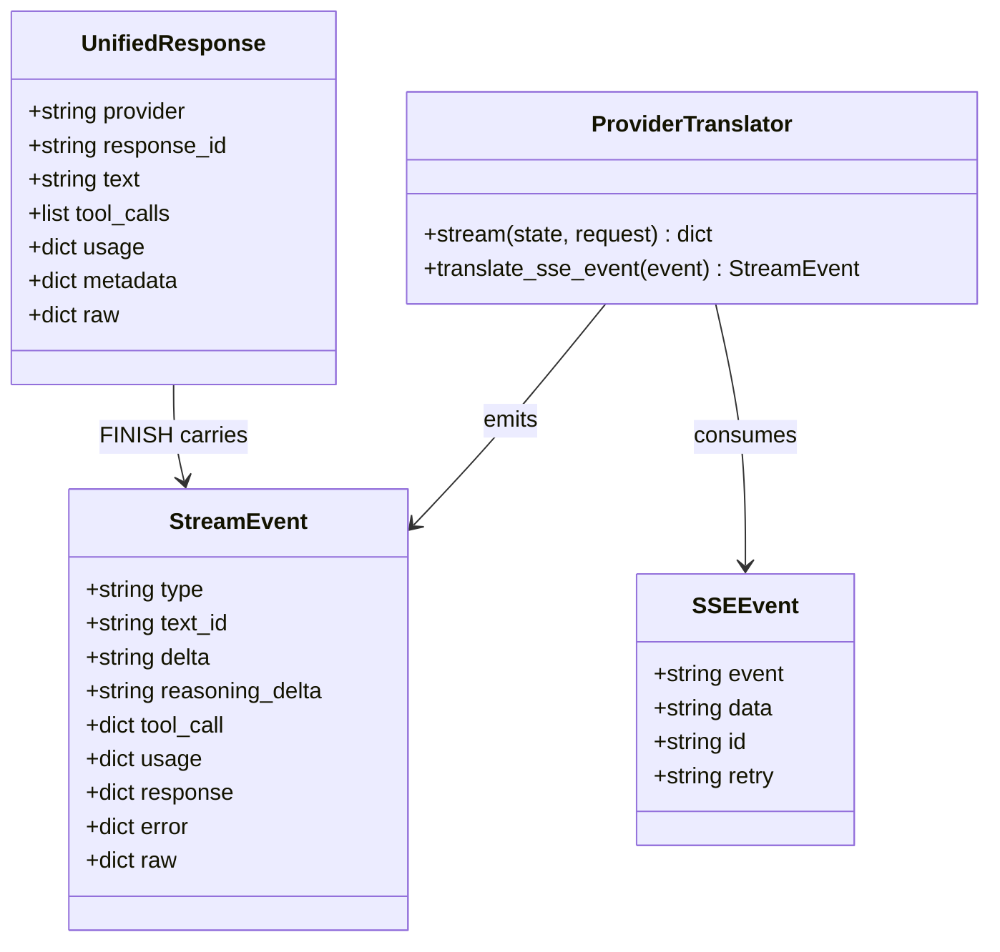
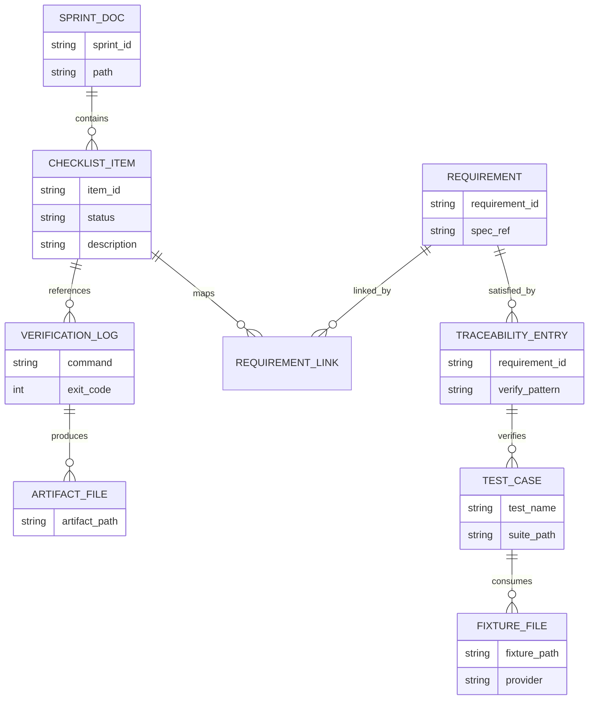
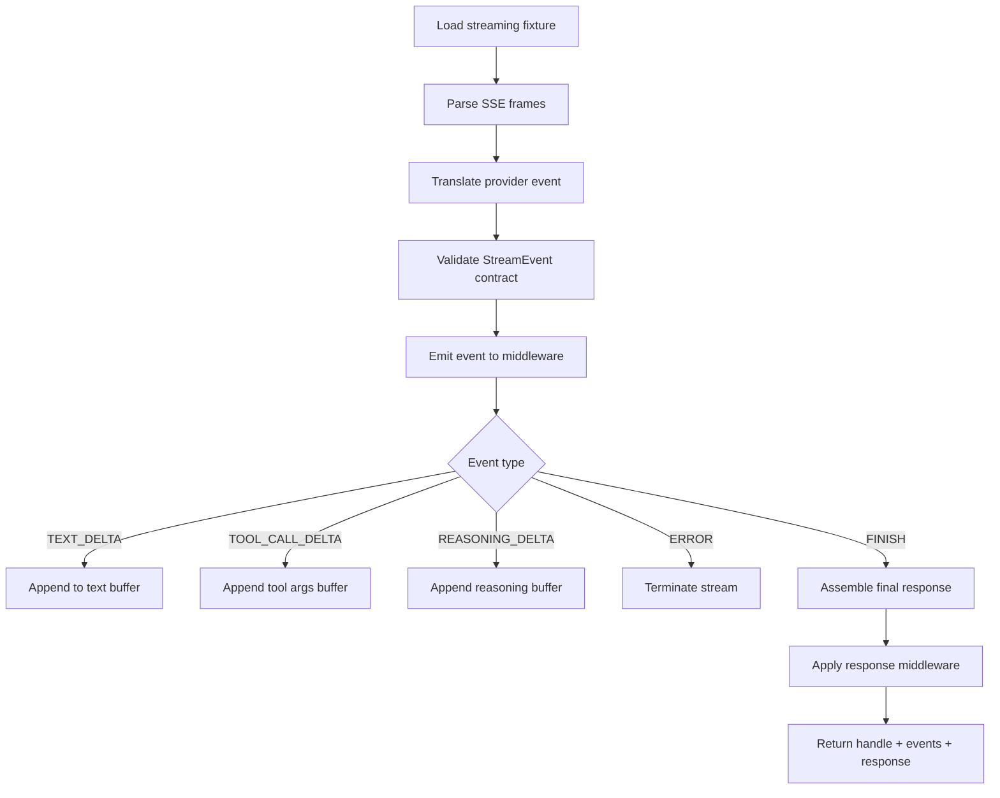
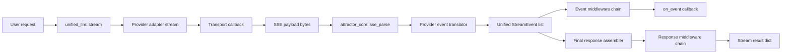
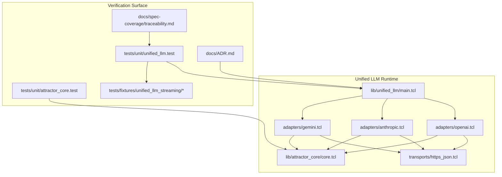

Legend: [ ] Incomplete, [X] Complete

# Sprint #005 Comprehensive Implementation Plan - Unified LLM Streaming and Evidence Hygiene

## Objective
Implement provider-native Unified LLM streaming with spec-faithful StreamEvent semantics and close the traceability/evidence hygiene gaps so streaming compliance is auditable from requirements to tests to artifacts.

## Source Sprint Review Summary
- `docs/sprints/SPRINT-005-unified-llm-streaming-evidence-hygiene.md` defines the right tracks and acceptance intent, but the implementation pass must be execution-ordered with explicit ownership and evidence capture at each phase.
- Current code audit (this worktree) shows provider-native streaming adapters and `parse_sse` alias already exist in:
  - `lib/unified_llm/adapters/openai.tcl`
  - `lib/unified_llm/adapters/anthropic.tcl`
  - `lib/unified_llm/adapters/gemini.tcl`
  - `lib/attractor_core/core.tcl`
- Stream event validation/order checking is present in `lib/unified_llm/main.tcl`; remaining risk is not baseline functionality but proof quality (traceability precision, deterministic evidence, and closeout consistency).
- Existing sprint execution documentation uses checked items that must be reconciled against fresh, reproducible evidence artifacts before closeout is considered complete.

## Scope
In scope:
- SSE parser parity for real streaming payload boundaries and fields.
- StreamEvent model expansion and ordering invariants.
- Provider-native streaming translators for OpenAI, Anthropic, and Gemini.
- Robust streaming middleware, structured streaming object assembly, and no-retry-after-partial contract.
- Streaming-specific traceability mappings, ADR logging, and evidence hygiene closure.

Out of scope:
- New providers beyond OpenAI, Anthropic, and Gemini.
- Feature flags or gating.
- Legacy compatibility behavior preservation.

## Completion Status
- [ ] Overall sprint implementation status is tracked in this document and updated as items move from incomplete to complete.
```text
{placeholder for verification justification/reasoning and evidence log}
```

- [ ] Completion ratio is updated in-place whenever a phase item changes state (current baseline: 0 completed / 89 total).
```text
{placeholder for verification justification/reasoning and evidence log}
```

## Requirements Baseline (Streaming-Critical IDs)
- `ULLM-REQ-MOST-PROVIDERS-USE-SERVER-SENT-EVENTS`
- `ULLM-REQ-RESPONSES-API-STREAMING-FORMAT-PROVIDES-REASONING`
- `ULLM-DOD-8.29-YIELDS-EVENTS-CONCATENATE-FULL-RESPONSE-TEXT`
- `ULLM-DOD-8.30-YIELDS-EVENTS-CORRECT-METADATA`
- `ULLM-DOD-8.31-STREAMING-FOLLOWS-START-DELTA-END-PATTERN`
- `ULLM-DOD-8.70-STREAMING-DOES-RETRY-AFTER-PARTIAL-DATA`

## Implementation File Map
- Core parser and utilities:
  - `lib/attractor_core/core.tcl`
- Unified runtime:
  - `lib/unified_llm/main.tcl`
- Provider adapters:
  - `lib/unified_llm/adapters/openai.tcl`
  - `lib/unified_llm/adapters/anthropic.tcl`
  - `lib/unified_llm/adapters/gemini.tcl`
- Transport surface (if stream transport shape requires extension):
  - `lib/unified_llm/transports/https_json.tcl`
- Tests:
  - `tests/unit/attractor_core.test`
  - `tests/unit/unified_llm.test`
  - `tests/integration/unified_llm_parity.test` (only if needed for cross-adapter invariants)
  - `tests/e2e_live/unified_llm_live.test` (optional live smoke for stream translators)
- Fixtures and test support:
  - `tests/fixtures/unified_llm_streaming/...` (new)
  - `tests/support/mock_http_server.tcl` (if fixture replay helpers are required)
- Documentation and governance:
  - `docs/spec-coverage/traceability.md`
  - `docs/ADR.md`
  - `docs/sprints/SPRINT-005-unified-llm-streaming-evidence-hygiene.md`

## Phase Execution Order
1. Phase 0 - Baseline, Harness, and Fixture Foundation
2. Phase 1 - SSE Parser Contract Closure
3. Phase 2 - Unified StreamEvent Contract and Runtime Invariants
4. Phase 3 - OpenAI Provider-Native Streaming Translation
5. Phase 4 - Anthropic and Gemini Provider-Native Streaming Translation
6. Phase 5 - Middleware, `stream_object`, and Error/Termination Semantics
7. Phase 6 - Traceability, ADR, Evidence Hygiene, and Final Verification

## Track-to-Phase Mapping
- Track A (SSE parser contract): Phase 1.
- Track B (unified StreamEvent model): Phase 2.
- Track C (provider-native translation): Phases 3 and 4.
- Track D (middleware, stream_object, no-retry): Phase 5.
- Track E (traceability + evidence closure): Phase 6.

## Phase 0 - Baseline, Harness, and Fixture Foundation
### Deliverables
- [ ] P0.1 - Create fixture root `tests/fixtures/unified_llm_streaming/` with provider subdirectories for `openai`, `anthropic`, `gemini`, and `malformed`.
```text
{placeholder for verification justification/reasoning and evidence log}
```

- [ ] P0.2 - Add fixture naming contract for deterministic replay (`<provider>-<scenario>-<variant>.sse` and companion expected events fixture).
```text
{placeholder for verification justification/reasoning and evidence log}
```

- [ ] P0.3 - Add stream-translation test helper procedures in unit tests to load fixtures and compare normalized StreamEvent sequences.
```text
{placeholder for verification justification/reasoning and evidence log}
```

- [ ] P0.4 - Add baseline audit notes in sprint evidence path for current failing/parity-missing streaming requirements.
```text
{placeholder for verification justification/reasoning and evidence log}
```

### Positive Test Cases
- [ ] P0.TP1 - Fixture loader reads provider fixture payloads and returns deterministic payload text for replay.
```text
{placeholder for verification justification/reasoning and evidence log}
```

- [ ] P0.TP2 - Fixture helper supports scenarios for text deltas, tool calls, reasoning deltas, and terminal events for each provider.
```text
{placeholder for verification justification/reasoning and evidence log}
```

### Negative Test Cases
- [ ] P0.TN1 - Missing fixture file path fails with deterministic error message and test fails early.
```text
{placeholder for verification justification/reasoning and evidence log}
```

- [ ] P0.TN2 - Malformed expected-event fixture format is rejected before adapter assertions execute.
```text
{placeholder for verification justification/reasoning and evidence log}
```

### Acceptance Criteria - Phase 0
- [ ] Fixture corpus and helpers are available so all later streaming translator tests run offline and deterministically.
```text
{placeholder for verification justification/reasoning and evidence log}
```

- [ ] Baseline gap list exists and maps each missing requirement behavior to a concrete upcoming phase item.
```text
{placeholder for verification justification/reasoning and evidence log}
```

## Phase 1 - SSE Parser Contract Closure
### Deliverables
- [ ] P1.1 - Update `::attractor_core::sse_parse` to flush trailing event data at EOF when stream terminates without trailing blank separator.
```text
{placeholder for verification justification/reasoning and evidence log}
```

- [ ] P1.2 - Preserve `event`, multi-line `data`, `id`, and `retry` semantics exactly once per emitted frame and ignore comment lines beginning with `:`.
```text
{placeholder for verification justification/reasoning and evidence log}
```

- [ ] P1.3 - Add `::attractor_core::parse_sse` alias/wrapper for compatibility and test both names against identical outputs.
```text
{placeholder for verification justification/reasoning and evidence log}
```

- [ ] P1.4 - Expand `tests/unit/attractor_core.test` with focused SSE regression tests:
  - EOF flush
  - multi-line data join
  - id/retry passthrough
  - ignored field handling
```text
{placeholder for verification justification/reasoning and evidence log}
```

### Positive Test Cases
- [ ] P1.TP1 - `attractor_core-sse-parse` emits expected event count and data fields for canonical frames.
```text
{placeholder for verification justification/reasoning and evidence log}
```

- [ ] P1.TP2 - EOF without trailing blank line still emits final event with joined data payload.
```text
{placeholder for verification justification/reasoning and evidence log}
```

- [ ] P1.TP3 - `parse_sse` alias returns exact event list parity with `sse_parse`.
```text
{placeholder for verification justification/reasoning and evidence log}
```

### Negative Test Cases
- [ ] P1.TN1 - Empty/comment-only payload emits zero events.
```text
{placeholder for verification justification/reasoning and evidence log}
```

- [ ] P1.TN2 - Unknown SSE fields do not mutate output structure or crash parser.
```text
{placeholder for verification justification/reasoning and evidence log}
```

- [ ] P1.TN3 - Invalid `retry` field content is preserved as raw field value without parser failure.
```text
{placeholder for verification justification/reasoning and evidence log}
```

### Acceptance Criteria - Phase 1
- [ ] SSE parser behavior matches unified streaming requirements for event boundaries and field semantics.
```text
{placeholder for verification justification/reasoning and evidence log}
```

- [ ] Parser regression tests uniquely cover EOF flush and multi-line data handling.
```text
{placeholder for verification justification/reasoning and evidence log}
```

## Phase 2 - Unified StreamEvent Contract and Runtime Invariants
### Deliverables
- [ ] P2.1 - Add StreamEvent helper constructors/validators in `lib/unified_llm/main.tcl` for required and optional fields by event type.
```text
{placeholder for verification justification/reasoning and evidence log}
```

- [ ] P2.2 - Extend synthetic stream fallback (`__stream_from_response`) to emit `TEXT_START`, `TEXT_DELTA`, `TEXT_END` with stable `text_id`.
```text
{placeholder for verification justification/reasoning and evidence log}
```

- [ ] P2.3 - Enforce ordering invariants in stream runtime:
  - `STREAM_START` emitted first
  - segment start before delta and delta before segment end
  - `FINISH` terminal event emitted once
```text
{placeholder for verification justification/reasoning and evidence log}
```

- [ ] P2.4 - Add `PROVIDER_EVENT` and `ERROR` event handling path and ensure unknown provider chunks surface via `PROVIDER_EVENT` instead of silent drops.
```text
{placeholder for verification justification/reasoning and evidence log}
```

- [ ] P2.5 - Add deterministic unit tests for StreamEvent field-level invariants and event ordering assertions.
```text
{placeholder for verification justification/reasoning and evidence log}
```

### Positive Test Cases
- [ ] P2.TP1 - Mock/synthetic streaming emits `STREAM_START -> TEXT_START -> TEXT_DELTA* -> TEXT_END -> FINISH` in strict order.
```text
{placeholder for verification justification/reasoning and evidence log}
```

- [ ] P2.TP2 - Concatenated `TEXT_DELTA.delta` values equal `FINISH.response.text`.
```text
{placeholder for verification justification/reasoning and evidence log}
```

- [ ] P2.TP3 - Tool-call events preserve boundaries (`TOOL_CALL_START/DELTA/END`) and include assembled call dict at end.
```text
{placeholder for verification justification/reasoning and evidence log}
```

### Negative Test Cases
- [ ] P2.TN1 - Invalid event dict missing required keys fails fast with typed error.
```text
{placeholder for verification justification/reasoning and evidence log}
```

- [ ] P2.TN2 - Unknown event type produced by translator is converted to `PROVIDER_EVENT` with `raw` preserved.
```text
{placeholder for verification justification/reasoning and evidence log}
```

- [ ] P2.TN3 - `FINISH` without response payload fails stream contract validation.
```text
{placeholder for verification justification/reasoning and evidence log}
```

### Acceptance Criteria - Phase 2
- [ ] Unified StreamEvent model supports required event types and field invariants from streaming spec sections.
```text
{placeholder for verification justification/reasoning and evidence log}
```

- [ ] Existing stream call sites continue to function with expanded event model.
```text
{placeholder for verification justification/reasoning and evidence log}
```

## Phase 3 - OpenAI Provider-Native Streaming Translation
### Deliverables
- [ ] P3.1 - Implement OpenAI `stream` adapter path using provider-native SSE frames instead of calling `complete`.
```text
{placeholder for verification justification/reasoning and evidence log}
```

- [ ] P3.2 - Map OpenAI streaming events:
  - `response.output_text.delta` to `TEXT_START`/`TEXT_DELTA`
  - `response.output_item.done` (text) to `TEXT_END`
  - `response.function_call_arguments.delta` to `TOOL_CALL_DELTA`
  - `response.output_item.done` (function_call) to `TOOL_CALL_END`
  - `response.completed` to `FINISH` with normalized usage
```text
{placeholder for verification justification/reasoning and evidence log}
```

- [ ] P3.3 - Preserve raw unmapped OpenAI event chunks as `PROVIDER_EVENT` for diagnosability and forward compatibility.
```text
{placeholder for verification justification/reasoning and evidence log}
```

- [ ] P3.4 - Ensure OpenAI tool argument fragment accumulation produces decoded argument dict at `TOOL_CALL_END`.
```text
{placeholder for verification justification/reasoning and evidence log}
```

- [ ] P3.5 - Add fixture-driven unit tests for text-only, tool-call, reasoning-token, and malformed-chunk OpenAI scenarios.
```text
{placeholder for verification justification/reasoning and evidence log}
```

### Positive Test Cases
- [ ] P3.TP1 - Text streaming fixture yields exact ordered event sequence with stable `text_id`.
```text
{placeholder for verification justification/reasoning and evidence log}
```

- [ ] P3.TP2 - Function-call argument delta fixture assembles complete tool args and emits decoded arguments on `TOOL_CALL_END`.
```text
{placeholder for verification justification/reasoning and evidence log}
```

- [ ] P3.TP3 - Completion fixture maps final usage including reasoning token fields into unified usage struct.
```text
{placeholder for verification justification/reasoning and evidence log}
```

### Negative Test Cases
- [ ] P3.TN1 - Malformed JSON in `data:` frame emits `ERROR` and terminates stream.
```text
{placeholder for verification justification/reasoning and evidence log}
```

- [ ] P3.TN2 - Unknown OpenAI event type is emitted as `PROVIDER_EVENT`, stream remains valid and continues.
```text
{placeholder for verification justification/reasoning and evidence log}
```

- [ ] P3.TN3 - Transport failure after at least one text delta emits `ERROR` and does not re-invoke transport.
```text
{placeholder for verification justification/reasoning and evidence log}
```

### Acceptance Criteria - Phase 3
- [ ] OpenAI stream adapter is provider-native and no longer synthesizes from blocking response.
```text
{placeholder for verification justification/reasoning and evidence log}
```

- [ ] OpenAI streaming translation proves conformance for text, tool-calls, usage metadata, and error handling.
```text
{placeholder for verification justification/reasoning and evidence log}
```

## Phase 4 - Anthropic and Gemini Provider-Native Streaming Translation
### Deliverables
- [ ] P4.1 - Implement Anthropic `stream` adapter using provider-native SSE with mappings for text, tool_use, and thinking blocks.
```text
{placeholder for verification justification/reasoning and evidence log}
```

- [ ] P4.2 - Implement Gemini `stream` adapter for `:streamGenerateContent?alt=sse` and map `parts[].text` and `parts[].functionCall`.
```text
{placeholder for verification justification/reasoning and evidence log}
```

- [ ] P4.3 - Ensure Gemini end-of-stream semantics emit `FINISH` even when explicit finish signal is absent but stream completed cleanly.
```text
{placeholder for verification justification/reasoning and evidence log}
```

- [ ] P4.4 - Add fixture-driven translator tests for Anthropic and Gemini text/tool/reasoning pathways with strict sequence assertions.
```text
{placeholder for verification justification/reasoning and evidence log}
```

- [ ] P4.5 - Add cross-provider translator parity test asserting shared StreamEvent invariants and provider-specific raw passthrough coverage.
```text
{placeholder for verification justification/reasoning and evidence log}
```

### Positive Test Cases
- [ ] P4.TP1 - Anthropic `content_block_start/delta/stop` for text maps to `TEXT_START/DELTA/END`.
```text
{placeholder for verification justification/reasoning and evidence log}
```

- [ ] P4.TP2 - Anthropic thinking blocks map to `REASONING_START/DELTA/END`.
```text
{placeholder for verification justification/reasoning and evidence log}
```

- [ ] P4.TP3 - Gemini text parts emit expected text segment sequence and final response assembly.
```text
{placeholder for verification justification/reasoning and evidence log}
```

- [ ] P4.TP4 - Gemini functionCall part maps to `TOOL_CALL_START/TOOL_CALL_END` with normalized tool call payload.
```text
{placeholder for verification justification/reasoning and evidence log}
```

### Negative Test Cases
- [ ] P4.TN1 - Anthropic unknown block type surfaces as `PROVIDER_EVENT` and does not corrupt stream ordering.
```text
{placeholder for verification justification/reasoning and evidence log}
```

- [ ] P4.TN2 - Gemini malformed candidate payload emits `ERROR` and stream stops deterministically.
```text
{placeholder for verification justification/reasoning and evidence log}
```

- [ ] P4.TN3 - Partial provider payload lacking required tool fields is surfaced as `ERROR` with normalized error dict.
```text
{placeholder for verification justification/reasoning and evidence log}
```

### Acceptance Criteria - Phase 4
- [ ] Anthropic and Gemini adapters stream using provider-native payloads and produce spec-conformant StreamEvents.
```text
{placeholder for verification justification/reasoning and evidence log}
```

- [ ] Cross-provider parity tests confirm shared stream invariants and provider-specific extensions.
```text
{placeholder for verification justification/reasoning and evidence log}
```

## Phase 5 - Middleware, `stream_object`, and Error/Termination Semantics
### Deliverables
- [ ] P5.1 - Ensure stream middleware semantics follow request/event/response order exactly as in blocking mode.
```text
{placeholder for verification justification/reasoning and evidence log}
```

- [ ] P5.2 - Update `stream_object` collector to handle expanded event model:
  - collect only target text deltas
  - ignore non-text events safely
  - require terminal `FINISH` before schema validation
```text
{placeholder for verification justification/reasoning and evidence log}
```

- [ ] P5.3 - Add typed error paths for stream object invalid JSON, missing finish, and schema mismatch.
```text
{placeholder for verification justification/reasoning and evidence log}
```

- [ ] P5.4 - Add no-retry-after-partial-data tests that assert exactly one transport invocation once partial data has been emitted.
```text
{placeholder for verification justification/reasoning and evidence log}
```

- [ ] P5.5 - Ensure final `FINISH.response` reflects response middleware transformations while preserving event ordering.
```text
{placeholder for verification justification/reasoning and evidence log}
```

### Positive Test Cases
- [ ] P5.TP1 - Event middleware transforms deltas and transformed output still reconstructs final response text correctly.
```text
{placeholder for verification justification/reasoning and evidence log}
```

- [ ] P5.TP2 - Response middleware applies in reverse order and FINISH contains transformed response.
```text
{placeholder for verification justification/reasoning and evidence log}
```

- [ ] P5.TP3 - `stream_object` returns parsed object and response payload when streamed JSON and schema are valid.
```text
{placeholder for verification justification/reasoning and evidence log}
```

### Negative Test Cases
- [ ] P5.TN1 - `stream_object` fails with `UNIFIED_LLM OBJECT INVALID_STREAM` when no FINISH is observed.
```text
{placeholder for verification justification/reasoning and evidence log}
```

- [ ] P5.TN2 - `stream_object` fails with `UNIFIED_LLM OBJECT INVALID_JSON` when accumulated text is not valid JSON.
```text
{placeholder for verification justification/reasoning and evidence log}
```

- [ ] P5.TN3 - Transport error after first text delta emits one `ERROR` event and stream stops without second transport call.
```text
{placeholder for verification justification/reasoning and evidence log}
```

### Acceptance Criteria - Phase 5
- [ ] Middleware and structured streaming object behavior remain deterministic under expanded StreamEvent model.
```text
{placeholder for verification justification/reasoning and evidence log}
```

- [ ] Error and termination semantics satisfy no-retry-after-partial-data requirement with explicit tests.
```text
{placeholder for verification justification/reasoning and evidence log}
```

## Phase 6 - Traceability, ADR, Evidence Hygiene, and Final Verification
### Deliverables
- [ ] P6.1 - Update `docs/spec-coverage/traceability.md` so streaming IDs reference streaming-specific test names and focused verify patterns.
```text
{placeholder for verification justification/reasoning and evidence log}
```

- [ ] P6.2 - Add ADR entry in `docs/ADR.md` documenting streaming architecture decisions:
  - expanded StreamEvent contract
  - provider-native SSE translation strategy
  - runtime invariants and error semantics
```text
{placeholder for verification justification/reasoning and evidence log}
```

- [ ] P6.3 - Update `docs/sprints/SPRINT-005-unified-llm-streaming-evidence-hygiene.md` completion markers only after evidence for each checked item exists and is validated.
```text
{placeholder for verification justification/reasoning and evidence log}
```

- [ ] P6.4 - Run full verification matrix and record command outputs and exit codes under sprint evidence root:
  - build checks
  - targeted stream test groups
  - full offline tests
  - docs and evidence lint
  - optional live stream smoke tests when provider credentials are configured
```text
{placeholder for verification justification/reasoning and evidence log}
```

- [ ] P6.5 - Render and archive all appendix mermaid diagrams under `.scratch/diagram-renders/sprint-005-comprehensive-plan/`.
```text
{placeholder for verification justification/reasoning and evidence log}
```

### Positive Test Cases
- [ ] P6.TP1 - `tools/spec_coverage.tcl` passes with strict catalog/traceability equality and streaming IDs mapped to streaming tests.
```text
{placeholder for verification justification/reasoning and evidence log}
```

- [ ] P6.TP2 - Docs lint and evidence lint pass for Sprint 005 documents after updates.
```text
{placeholder for verification justification/reasoning and evidence log}
```

- [ ] P6.TP3 - Mermaid diagrams render successfully and artifacts are present in the sprint diagram evidence path.
```text
{placeholder for verification justification/reasoning and evidence log}
```

### Negative Test Cases
- [ ] P6.TN1 - Intentional broad verify pattern in streaming traceability fails validation and is corrected.
```text
{placeholder for verification justification/reasoning and evidence log}
```

- [ ] P6.TN2 - Missing evidence artifact referenced by a completed checklist item fails evidence guardrail.
```text
{placeholder for verification justification/reasoning and evidence log}
```

### Acceptance Criteria - Phase 6
- [ ] Streaming traceability is specific, truthful, and validation-clean.
```text
{placeholder for verification justification/reasoning and evidence log}
```

- [ ] ADR and sprint evidence artifacts provide a reproducible audit trail for implementation and verification.
```text
{placeholder for verification justification/reasoning and evidence log}
```

## Verification Matrix (Execution-Time Commands)
- `tools/verify_cmd.sh .scratch/verification/SPRINT-005/final/build-check.log tclsh tools/build_check.tcl`
- `tools/verify_cmd.sh .scratch/verification/SPRINT-005/final/tests-attractor-core-sse.log tclsh tests/all.tcl -match *attractor_core-sse*`
- `tools/verify_cmd.sh .scratch/verification/SPRINT-005/final/tests-stream-event-model.log tclsh tests/all.tcl -match *unified_llm-stream-event-model*`
- `tools/verify_cmd.sh .scratch/verification/SPRINT-005/final/tests-openai-stream-translation.log tclsh tests/all.tcl -match *unified_llm-openai-stream-translation*`
- `tools/verify_cmd.sh .scratch/verification/SPRINT-005/final/tests-anthropic-stream-translation.log tclsh tests/all.tcl -match *unified_llm-anthropic-stream-translation*`
- `tools/verify_cmd.sh .scratch/verification/SPRINT-005/final/tests-gemini-stream-translation.log tclsh tests/all.tcl -match *unified_llm-gemini-stream-translation*`
- `tools/verify_cmd.sh .scratch/verification/SPRINT-005/final/tests-stream-tool-call.log tclsh tests/all.tcl -match *unified_llm-stream-tool-call*`
- `tools/verify_cmd.sh .scratch/verification/SPRINT-005/final/tests-stream-middleware.log tclsh tests/all.tcl -match *unified_llm-stream-middleware*`
- `tools/verify_cmd.sh .scratch/verification/SPRINT-005/final/tests-stream-object.log tclsh tests/all.tcl -match *unified_llm-stream-object*`
- `tools/verify_cmd.sh .scratch/verification/SPRINT-005/final/tests-no-retry-after-partial.log tclsh tests/all.tcl -match *unified_llm-stream-no-retry-after-partial*`
- `tools/verify_cmd.sh .scratch/verification/SPRINT-005/final/spec-coverage.log tclsh tools/spec_coverage.tcl`
- `tools/verify_cmd.sh .scratch/verification/SPRINT-005/final/docs-lint.log bash tools/docs_lint.sh`
- `tools/verify_cmd.sh .scratch/verification/SPRINT-005/final/evidence-lint-sprint-005.log bash tools/evidence_lint.sh docs/sprints/SPRINT-005-unified-llm-streaming-evidence-hygiene.md`
- `tools/verify_cmd.sh .scratch/verification/SPRINT-005/final/evidence-guardrail-sprint-005.log tclsh tools/evidence_guardrail.tcl docs/sprints/SPRINT-005-unified-llm-streaming-evidence-hygiene.md`
- Optional live verification (when credentials are configured): `tools/verify_cmd.sh .scratch/verification/SPRINT-005/final/e2e-live-unified-llm.log tclsh tests/e2e_live.tcl -match *unified-llm*`

## Appendix - Required Mermaid Diagrams

### Core Domain Models


### E-R Diagram


### Workflow Diagram


### Data-Flow Diagram


### Architecture Diagram

