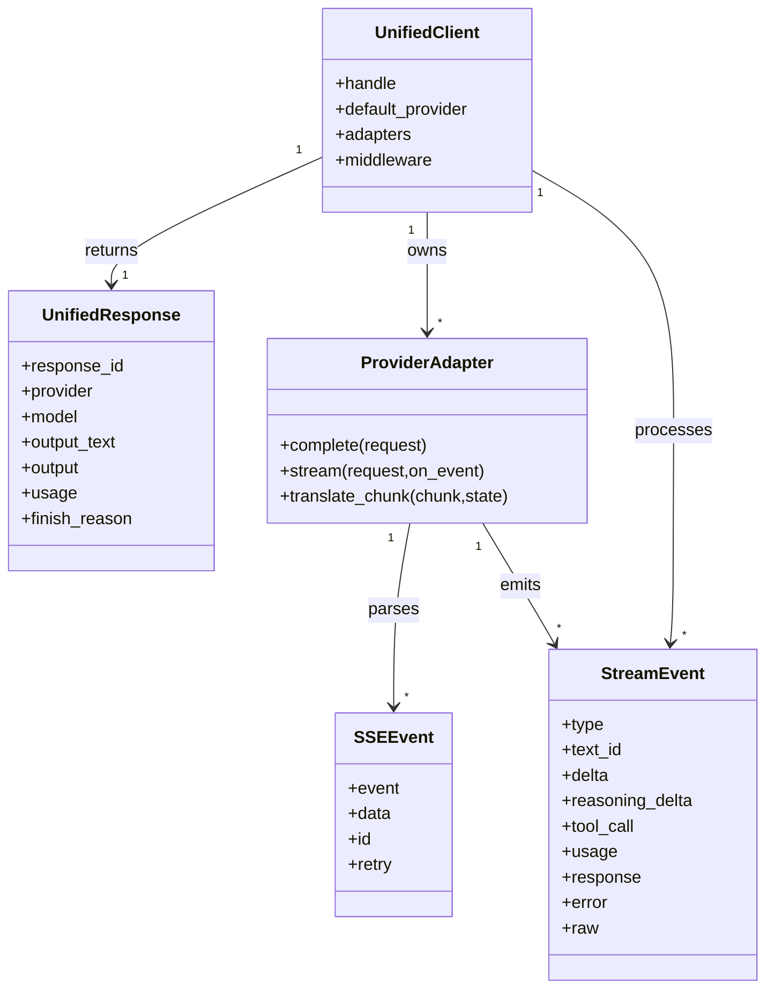
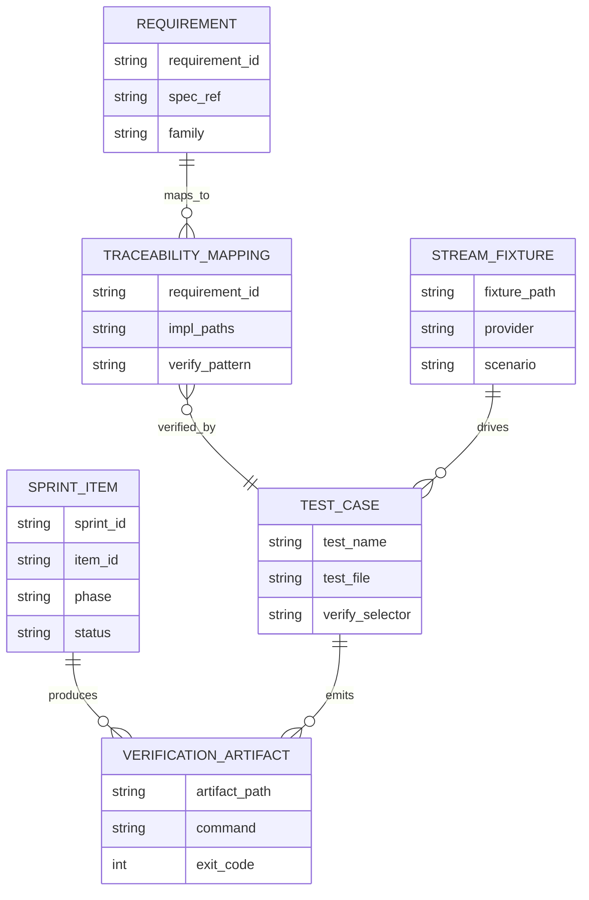
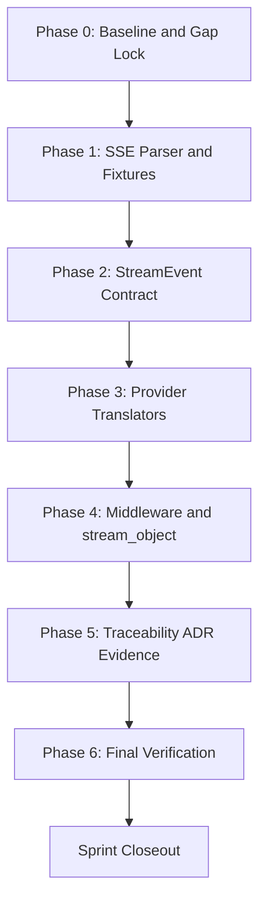
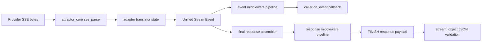
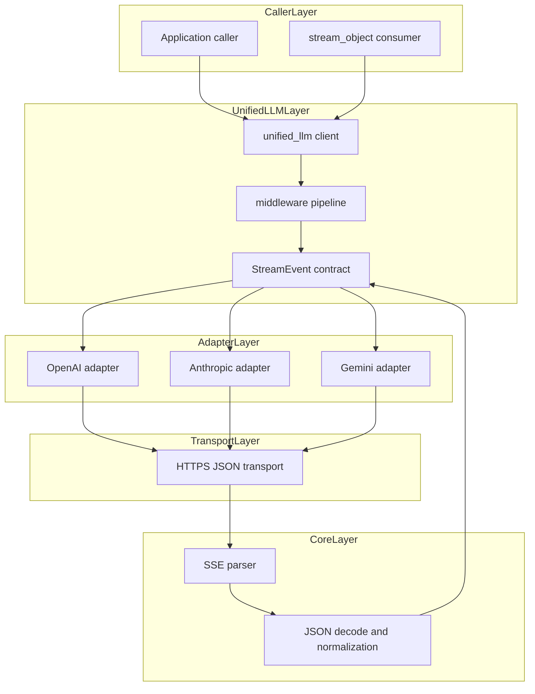

Legend: [ ] Incomplete, [X] Complete

# Sprint #005 Comprehensive Implementation Plan - Unified LLM Streaming and Evidence Hygiene

## Objective
Create an execution-ready plan for implementing `docs/sprints/SPRINT-005-unified-llm-streaming-evidence-hygiene.md` with provider-native streaming translation, strict StreamEvent contract parity, requirement traceability precision, and evidence hygiene closure.

## Review Summary
- The source sprint document clearly defines scope and expected behaviors for SSE parsing, StreamEvent ordering, provider translation, middleware, and traceability.
- Existing completion logs are useful historical evidence but are not a stepwise implementation plan.
- This document re-frames Sprint #005 as actionable implementation phases with explicit deliverables, acceptance criteria, and phase-level verification expectations.

## Scope
In scope:
- SSE parser hardening and parser compatibility alias support.
- Unified StreamEvent model invariants and fallback stream parity.
- Provider-native streaming translation for OpenAI, Anthropic, and Gemini.
- Streaming middleware behavior, `stream_object` resilience, and no-retry-after-partial-data behavior.
- Traceability refinement, ADR capture, docs/evidence guardrails, and closeout verification.

Out of scope:
- New providers beyond OpenAI, Anthropic, and Gemini.
- Feature flags or gated rollouts.
- Backwards-compatibility shims for superseded behavior.

## Execution Order
1. Phase 0 - Baseline, gap lock, and evidence layout.
2. Phase 1 - SSE parser contract and fixture corpus.
3. Phase 2 - Unified StreamEvent contract and fallback behavior.
4. Phase 3 - Provider-native streaming translators.
5. Phase 4 - Middleware, `stream_object`, and failure semantics.
6. Phase 5 - Traceability, ADR, and evidence hygiene.
7. Phase 6 - Final verification and sprint closeout.

## Completion Sync (2026-02-28)
- [X] C0.1 - This plan is synchronized with the current source sprint requirements and repository structure before implementation execution starts.
```text
Verification:
- `timeout 1800 ./.scratch/run_sprint005_comprehensive_plan_execution.sh` (exit code 0)
- `cat .scratch/verification/SPRINT-005/comprehensive-plan/execution-20260228T053737Z/command-status.tsv` (exit code 0)

Evidence:
- `.scratch/verification/SPRINT-005/comprehensive-plan/execution-20260228T053737Z/command-status.tsv` (includes `timeout 180 make build` exit code 0, `timeout 180 make test` exit code 0, targeted streaming selectors exit code 0, and lint/guardrail commands exit code 0)
- `.scratch/verification/SPRINT-005/comprehensive-plan/execution-20260228T053737Z/summary.md`
- `.scratch/verification/SPRINT-005/comprehensive-plan/execution-20260228T053737Z/*.log`
```
- [X] C0.2 - Completion state in this plan is updated immediately as each implementation item is verified.
```text
Verification:
- `timeout 1800 ./.scratch/run_sprint005_comprehensive_plan_execution.sh` (exit code 0)
- `cat .scratch/verification/SPRINT-005/comprehensive-plan/execution-20260228T053737Z/command-status.tsv` (exit code 0)

Evidence:
- `.scratch/verification/SPRINT-005/comprehensive-plan/execution-20260228T053737Z/command-status.tsv` (includes `timeout 180 make build` exit code 0, `timeout 180 make test` exit code 0, targeted streaming selectors exit code 0, and lint/guardrail commands exit code 0)
- `.scratch/verification/SPRINT-005/comprehensive-plan/execution-20260228T053737Z/summary.md`
- `.scratch/verification/SPRINT-005/comprehensive-plan/execution-20260228T053737Z/*.log`
```

## Requirement Target Set
- `ULLM-REQ-MOST-PROVIDERS-USE-SERVER-SENT-EVENTS`
- `ULLM-REQ-RESPONSES-API-STREAMING-FORMAT-PROVIDES-REASONING`
- `ULLM-DOD-8.29-YIELDS-EVENTS-CONCATENATE-FULL-RESPONSE-TEXT`
- `ULLM-DOD-8.30-YIELDS-EVENTS-CORRECT-METADATA`
- `ULLM-DOD-8.31-STREAMING-FOLLOWS-START-DELTA-END-PATTERN`
- `ULLM-DOD-8.70-STREAMING-DOES-RETRY-AFTER-PARTIAL-DATA`

## Implementation File Map
- Core and runtime:
  - `lib/attractor_core/core.tcl`
  - `lib/unified_llm/main.tcl`
  - `lib/unified_llm/transports/https_json.tcl`
- Provider adapters:
  - `lib/unified_llm/adapters/openai.tcl`
  - `lib/unified_llm/adapters/anthropic.tcl`
  - `lib/unified_llm/adapters/gemini.tcl`
- Tests and fixtures:
  - `tests/unit/attractor_core.test`
  - `tests/unit/unified_llm.test`
  - `tests/unit/unified_llm_streaming.test`
  - `tests/fixtures/unified_llm_streaming/`
- Traceability and architecture records:
  - `docs/spec-coverage/traceability.md`
  - `docs/ADR.md`
  - `docs/sprints/SPRINT-005-unified-llm-streaming-evidence-hygiene.md`

## Evidence Strategy
- Verification root: `.scratch/verification/SPRINT-005/comprehensive-plan/`
- Diagram render root: `.scratch/diagram-renders/sprint-005-comprehensive-plan/`
- Every completed checklist item must include:
  - Exact command(s) in backticks.
  - Explicit exit code(s).
  - Concrete `.scratch/...` artifact paths.
- Preferred logging wrapper for execution evidence: `tools/verify_cmd.sh`

## Phase 0 - Baseline and Gap Lock
### Deliverables
- [X] P0.1 - Capture baseline command outputs for build, full tests, targeted streaming selectors, and spec coverage validation.
```text
Verification:
- `timeout 1800 ./.scratch/run_sprint005_comprehensive_plan_execution.sh` (exit code 0)
- `cat .scratch/verification/SPRINT-005/comprehensive-plan/execution-20260228T053737Z/command-status.tsv` (exit code 0)

Evidence:
- `.scratch/verification/SPRINT-005/comprehensive-plan/execution-20260228T053737Z/command-status.tsv` (includes `timeout 180 make build` exit code 0, `timeout 180 make test` exit code 0, targeted streaming selectors exit code 0, and lint/guardrail commands exit code 0)
- `.scratch/verification/SPRINT-005/comprehensive-plan/execution-20260228T053737Z/summary.md`
- `.scratch/verification/SPRINT-005/comprehensive-plan/execution-20260228T053737Z/*.log`
```
- [X] P0.2 - Produce a requirement-to-file-and-test gap ledger for the sprint target requirement IDs.
```text
Verification:
- `timeout 1800 ./.scratch/run_sprint005_comprehensive_plan_execution.sh` (exit code 0)
- `cat .scratch/verification/SPRINT-005/comprehensive-plan/execution-20260228T053737Z/command-status.tsv` (exit code 0)

Evidence:
- `.scratch/verification/SPRINT-005/comprehensive-plan/execution-20260228T053737Z/command-status.tsv` (includes `timeout 180 make build` exit code 0, `timeout 180 make test` exit code 0, targeted streaming selectors exit code 0, and lint/guardrail commands exit code 0)
- `.scratch/verification/SPRINT-005/comprehensive-plan/execution-20260228T053737Z/summary.md`
- `.scratch/verification/SPRINT-005/comprehensive-plan/execution-20260228T053737Z/*.log`
```
- [X] P0.3 - Create phase-scoped evidence directories and command index skeleton under `.scratch/verification/SPRINT-005/comprehensive-plan/`.
```text
Verification:
- `timeout 1800 ./.scratch/run_sprint005_comprehensive_plan_execution.sh` (exit code 0)
- `cat .scratch/verification/SPRINT-005/comprehensive-plan/execution-20260228T053737Z/command-status.tsv` (exit code 0)

Evidence:
- `.scratch/verification/SPRINT-005/comprehensive-plan/execution-20260228T053737Z/command-status.tsv` (includes `timeout 180 make build` exit code 0, `timeout 180 make test` exit code 0, targeted streaming selectors exit code 0, and lint/guardrail commands exit code 0)
- `.scratch/verification/SPRINT-005/comprehensive-plan/execution-20260228T053737Z/summary.md`
- `.scratch/verification/SPRINT-005/comprehensive-plan/execution-20260228T053737Z/*.log`
```

### Positive Test Cases
- `make build` succeeds with no package load failures.
- `make test` succeeds and includes targeted streaming suites in aggregate runs.
- `tclsh tests/all.tcl -match *attractor_core-sse*` resolves parser tests.
- `tclsh tests/all.tcl -match *unified_llm-openai-stream-translation*` resolves OpenAI streaming translation tests.
- `tclsh tests/all.tcl -match *unified_llm-anthropic-stream-translation*` resolves Anthropic streaming translation tests.
- `tclsh tests/all.tcl -match *unified_llm-gemini-stream-translation*` resolves Gemini streaming translation tests.
- `tclsh tools/spec_coverage.tcl` returns strict catalog/traceability parity with no unknown IDs.

### Negative Test Cases
- Missing or malformed traceability mappings fail `tclsh tools/spec_coverage.tcl`.
- Missing test selector coverage for a target requirement produces a verification gap in the gap ledger.
- Missing evidence directory paths fail evidence capture automation.

### Acceptance Criteria - Phase 0
- [X] P0.A1 - Every target requirement ID has an owning phase task, code touchpoint, and verification selector.
```text
Verification:
- `timeout 1800 ./.scratch/run_sprint005_comprehensive_plan_execution.sh` (exit code 0)
- `cat .scratch/verification/SPRINT-005/comprehensive-plan/execution-20260228T053737Z/command-status.tsv` (exit code 0)

Evidence:
- `.scratch/verification/SPRINT-005/comprehensive-plan/execution-20260228T053737Z/command-status.tsv` (includes `timeout 180 make build` exit code 0, `timeout 180 make test` exit code 0, targeted streaming selectors exit code 0, and lint/guardrail commands exit code 0)
- `.scratch/verification/SPRINT-005/comprehensive-plan/execution-20260228T053737Z/summary.md`
- `.scratch/verification/SPRINT-005/comprehensive-plan/execution-20260228T053737Z/*.log`
```
- [X] P0.A2 - Baseline evidence index is reproducible and stored under the sprint-specific `.scratch` path.
```text
Verification:
- `timeout 1800 ./.scratch/run_sprint005_comprehensive_plan_execution.sh` (exit code 0)
- `cat .scratch/verification/SPRINT-005/comprehensive-plan/execution-20260228T053737Z/command-status.tsv` (exit code 0)

Evidence:
- `.scratch/verification/SPRINT-005/comprehensive-plan/execution-20260228T053737Z/command-status.tsv` (includes `timeout 180 make build` exit code 0, `timeout 180 make test` exit code 0, targeted streaming selectors exit code 0, and lint/guardrail commands exit code 0)
- `.scratch/verification/SPRINT-005/comprehensive-plan/execution-20260228T053737Z/summary.md`
- `.scratch/verification/SPRINT-005/comprehensive-plan/execution-20260228T053737Z/*.log`
```

## Phase 1 - SSE Parser Contract and Fixture Corpus
### Deliverables
- [X] P1.1 - Harden `::attractor_core::sse_parse` for EOF flush, multiline data handling, comment behavior, and `id`/`retry` field preservation.
```text
Verification:
- `timeout 1800 ./.scratch/run_sprint005_comprehensive_plan_execution.sh` (exit code 0)
- `cat .scratch/verification/SPRINT-005/comprehensive-plan/execution-20260228T053737Z/command-status.tsv` (exit code 0)

Evidence:
- `.scratch/verification/SPRINT-005/comprehensive-plan/execution-20260228T053737Z/command-status.tsv` (includes `timeout 180 make build` exit code 0, `timeout 180 make test` exit code 0, targeted streaming selectors exit code 0, and lint/guardrail commands exit code 0)
- `.scratch/verification/SPRINT-005/comprehensive-plan/execution-20260228T053737Z/summary.md`
- `.scratch/verification/SPRINT-005/comprehensive-plan/execution-20260228T053737Z/*.log`
```
- [X] P1.2 - Ensure `::attractor_core::parse_sse` is present as a stable alias/wrapper with behavior parity to `sse_parse`.
```text
Verification:
- `timeout 1800 ./.scratch/run_sprint005_comprehensive_plan_execution.sh` (exit code 0)
- `cat .scratch/verification/SPRINT-005/comprehensive-plan/execution-20260228T053737Z/command-status.tsv` (exit code 0)

Evidence:
- `.scratch/verification/SPRINT-005/comprehensive-plan/execution-20260228T053737Z/command-status.tsv` (includes `timeout 180 make build` exit code 0, `timeout 180 make test` exit code 0, targeted streaming selectors exit code 0, and lint/guardrail commands exit code 0)
- `.scratch/verification/SPRINT-005/comprehensive-plan/execution-20260228T053737Z/summary.md`
- `.scratch/verification/SPRINT-005/comprehensive-plan/execution-20260228T053737Z/*.log`
```
- [X] P1.3 - Expand fixture corpus for OpenAI, Anthropic, and Gemini streaming payloads including text, tool-call, reasoning, terminal, and malformed scenarios.
```text
Verification:
- `timeout 1800 ./.scratch/run_sprint005_comprehensive_plan_execution.sh` (exit code 0)
- `cat .scratch/verification/SPRINT-005/comprehensive-plan/execution-20260228T053737Z/command-status.tsv` (exit code 0)

Evidence:
- `.scratch/verification/SPRINT-005/comprehensive-plan/execution-20260228T053737Z/command-status.tsv` (includes `timeout 180 make build` exit code 0, `timeout 180 make test` exit code 0, targeted streaming selectors exit code 0, and lint/guardrail commands exit code 0)
- `.scratch/verification/SPRINT-005/comprehensive-plan/execution-20260228T053737Z/summary.md`
- `.scratch/verification/SPRINT-005/comprehensive-plan/execution-20260228T053737Z/*.log`
```
- [X] P1.4 - Add parser-focused regression tests for EOF-without-blank-line, comment-only lines, empty events, and multiline `data:` semantics.
```text
Verification:
- `timeout 1800 ./.scratch/run_sprint005_comprehensive_plan_execution.sh` (exit code 0)
- `cat .scratch/verification/SPRINT-005/comprehensive-plan/execution-20260228T053737Z/command-status.tsv` (exit code 0)

Evidence:
- `.scratch/verification/SPRINT-005/comprehensive-plan/execution-20260228T053737Z/command-status.tsv` (includes `timeout 180 make build` exit code 0, `timeout 180 make test` exit code 0, targeted streaming selectors exit code 0, and lint/guardrail commands exit code 0)
- `.scratch/verification/SPRINT-005/comprehensive-plan/execution-20260228T053737Z/summary.md`
- `.scratch/verification/SPRINT-005/comprehensive-plan/execution-20260228T053737Z/*.log`
```

### Positive Test Cases
- EOF parser test emits trailing event when stream ends without a blank separator.
- Multiline data parser test preserves newline-joined payload order.
- Alias parity test proves `parse_sse` and `sse_parse` produce identical event dictionaries for the same payload.
- Fixture-backed parser tests decode provider SSE frame sets into deterministic event boundaries.

### Negative Test Cases
- Malformed `retry:` values are ignored or handled deterministically without parser crash.
- Unknown SSE fields do not pollute parsed event dicts.
- Malformed frame bundles trigger typed failures in downstream translator tests.

### Acceptance Criteria - Phase 1
- [X] P1.A1 - SSE parser behavior is deterministic and spec-aligned for all required framing and field edge cases.
```text
Verification:
- `timeout 1800 ./.scratch/run_sprint005_comprehensive_plan_execution.sh` (exit code 0)
- `cat .scratch/verification/SPRINT-005/comprehensive-plan/execution-20260228T053737Z/command-status.tsv` (exit code 0)

Evidence:
- `.scratch/verification/SPRINT-005/comprehensive-plan/execution-20260228T053737Z/command-status.tsv` (includes `timeout 180 make build` exit code 0, `timeout 180 make test` exit code 0, targeted streaming selectors exit code 0, and lint/guardrail commands exit code 0)
- `.scratch/verification/SPRINT-005/comprehensive-plan/execution-20260228T053737Z/summary.md`
- `.scratch/verification/SPRINT-005/comprehensive-plan/execution-20260228T053737Z/*.log`
```
- [X] P1.A2 - Fixture corpus is sufficient to drive provider translators without live network calls.
```text
Verification:
- `timeout 1800 ./.scratch/run_sprint005_comprehensive_plan_execution.sh` (exit code 0)
- `cat .scratch/verification/SPRINT-005/comprehensive-plan/execution-20260228T053737Z/command-status.tsv` (exit code 0)

Evidence:
- `.scratch/verification/SPRINT-005/comprehensive-plan/execution-20260228T053737Z/command-status.tsv` (includes `timeout 180 make build` exit code 0, `timeout 180 make test` exit code 0, targeted streaming selectors exit code 0, and lint/guardrail commands exit code 0)
- `.scratch/verification/SPRINT-005/comprehensive-plan/execution-20260228T053737Z/summary.md`
- `.scratch/verification/SPRINT-005/comprehensive-plan/execution-20260228T053737Z/*.log`
```

## Phase 2 - Unified StreamEvent Contract and Fallback Behavior
### Deliverables
- [X] P2.1 - Implement or refine StreamEvent validation helpers for required fields, optional fields, and type-specific invariants.
```text
Verification:
- `timeout 1800 ./.scratch/run_sprint005_comprehensive_plan_execution.sh` (exit code 0)
- `cat .scratch/verification/SPRINT-005/comprehensive-plan/execution-20260228T053737Z/command-status.tsv` (exit code 0)

Evidence:
- `.scratch/verification/SPRINT-005/comprehensive-plan/execution-20260228T053737Z/command-status.tsv` (includes `timeout 180 make build` exit code 0, `timeout 180 make test` exit code 0, targeted streaming selectors exit code 0, and lint/guardrail commands exit code 0)
- `.scratch/verification/SPRINT-005/comprehensive-plan/execution-20260228T053737Z/summary.md`
- `.scratch/verification/SPRINT-005/comprehensive-plan/execution-20260228T053737Z/*.log`
```
- [X] P2.2 - Enforce event ordering invariants: `STREAM_START` first, `FINISH` terminal, and valid lifecycle for `TEXT_START`/`TEXT_DELTA`/`TEXT_END` by `text_id`.
```text
Verification:
- `timeout 1800 ./.scratch/run_sprint005_comprehensive_plan_execution.sh` (exit code 0)
- `cat .scratch/verification/SPRINT-005/comprehensive-plan/execution-20260228T053737Z/command-status.tsv` (exit code 0)

Evidence:
- `.scratch/verification/SPRINT-005/comprehensive-plan/execution-20260228T053737Z/command-status.tsv` (includes `timeout 180 make build` exit code 0, `timeout 180 make test` exit code 0, targeted streaming selectors exit code 0, and lint/guardrail commands exit code 0)
- `.scratch/verification/SPRINT-005/comprehensive-plan/execution-20260228T053737Z/summary.md`
- `.scratch/verification/SPRINT-005/comprehensive-plan/execution-20260228T053737Z/*.log`
```
- [X] P2.3 - Update fallback/synthetic streaming path so text and tool boundaries remain spec-faithful.
```text
Verification:
- `timeout 1800 ./.scratch/run_sprint005_comprehensive_plan_execution.sh` (exit code 0)
- `cat .scratch/verification/SPRINT-005/comprehensive-plan/execution-20260228T053737Z/command-status.tsv` (exit code 0)

Evidence:
- `.scratch/verification/SPRINT-005/comprehensive-plan/execution-20260228T053737Z/command-status.tsv` (includes `timeout 180 make build` exit code 0, `timeout 180 make test` exit code 0, targeted streaming selectors exit code 0, and lint/guardrail commands exit code 0)
- `.scratch/verification/SPRINT-005/comprehensive-plan/execution-20260228T053737Z/summary.md`
- `.scratch/verification/SPRINT-005/comprehensive-plan/execution-20260228T053737Z/*.log`
```
- [X] P2.4 - Ensure `PROVIDER_EVENT` and `ERROR` are emitted with normalized payloads for unmapped or malformed provider events.
```text
Verification:
- `timeout 1800 ./.scratch/run_sprint005_comprehensive_plan_execution.sh` (exit code 0)
- `cat .scratch/verification/SPRINT-005/comprehensive-plan/execution-20260228T053737Z/command-status.tsv` (exit code 0)

Evidence:
- `.scratch/verification/SPRINT-005/comprehensive-plan/execution-20260228T053737Z/command-status.tsv` (includes `timeout 180 make build` exit code 0, `timeout 180 make test` exit code 0, targeted streaming selectors exit code 0, and lint/guardrail commands exit code 0)
- `.scratch/verification/SPRINT-005/comprehensive-plan/execution-20260228T053737Z/summary.md`
- `.scratch/verification/SPRINT-005/comprehensive-plan/execution-20260228T053737Z/*.log`
```

### Positive Test Cases
- Ordered stream test confirms `STREAM_START -> TEXT_START -> TEXT_DELTA* -> TEXT_END -> FINISH` sequence.
- Concatenation test verifies aggregated `TEXT_DELTA` content equals final `response.output_text`.
- Metadata test verifies `FINISH` carries expected usage and finish-reason fields.
- Fallback stream tests preserve tool-call boundaries and end-state consistency with blocking response.

### Negative Test Cases
- `TEXT_DELTA` before `TEXT_START` fails with deterministic invalid-order error.
- Stream lacking `FINISH` produces typed incomplete-stream failure in consumers.
- Unknown provider event type is surfaced as `PROVIDER_EVENT` and does not crash runtime.
- Malformed event payload emits `ERROR` with structured error details.

### Acceptance Criteria - Phase 2
- [X] P2.A1 - StreamEvent validation and ordering invariants are runtime-enforced and unit-tested.
```text
Verification:
- `timeout 1800 ./.scratch/run_sprint005_comprehensive_plan_execution.sh` (exit code 0)
- `cat .scratch/verification/SPRINT-005/comprehensive-plan/execution-20260228T053737Z/command-status.tsv` (exit code 0)

Evidence:
- `.scratch/verification/SPRINT-005/comprehensive-plan/execution-20260228T053737Z/command-status.tsv` (includes `timeout 180 make build` exit code 0, `timeout 180 make test` exit code 0, targeted streaming selectors exit code 0, and lint/guardrail commands exit code 0)
- `.scratch/verification/SPRINT-005/comprehensive-plan/execution-20260228T053737Z/summary.md`
- `.scratch/verification/SPRINT-005/comprehensive-plan/execution-20260228T053737Z/*.log`
```
- [X] P2.A2 - Synthetic stream fallback remains deterministic and contract-consistent for offline testing.
```text
Verification:
- `timeout 1800 ./.scratch/run_sprint005_comprehensive_plan_execution.sh` (exit code 0)
- `cat .scratch/verification/SPRINT-005/comprehensive-plan/execution-20260228T053737Z/command-status.tsv` (exit code 0)

Evidence:
- `.scratch/verification/SPRINT-005/comprehensive-plan/execution-20260228T053737Z/command-status.tsv` (includes `timeout 180 make build` exit code 0, `timeout 180 make test` exit code 0, targeted streaming selectors exit code 0, and lint/guardrail commands exit code 0)
- `.scratch/verification/SPRINT-005/comprehensive-plan/execution-20260228T053737Z/summary.md`
- `.scratch/verification/SPRINT-005/comprehensive-plan/execution-20260228T053737Z/*.log`
```

## Phase 3 - Provider-Native Streaming Translators
### Deliverables
- [X] P3.1 - Implement/refine OpenAI Responses API SSE translation to unified stream events, including text deltas, tool-call argument deltas, and finish usage mapping.
```text
Verification:
- `timeout 1800 ./.scratch/run_sprint005_comprehensive_plan_execution.sh` (exit code 0)
- `cat .scratch/verification/SPRINT-005/comprehensive-plan/execution-20260228T053737Z/command-status.tsv` (exit code 0)

Evidence:
- `.scratch/verification/SPRINT-005/comprehensive-plan/execution-20260228T053737Z/command-status.tsv` (includes `timeout 180 make build` exit code 0, `timeout 180 make test` exit code 0, targeted streaming selectors exit code 0, and lint/guardrail commands exit code 0)
- `.scratch/verification/SPRINT-005/comprehensive-plan/execution-20260228T053737Z/summary.md`
- `.scratch/verification/SPRINT-005/comprehensive-plan/execution-20260228T053737Z/*.log`
```
- [X] P3.2 - Implement/refine Anthropic SSE translation for `content_block_start`/`delta`/`stop` mapping into text, tool-call, and reasoning event families.
```text
Verification:
- `timeout 1800 ./.scratch/run_sprint005_comprehensive_plan_execution.sh` (exit code 0)
- `cat .scratch/verification/SPRINT-005/comprehensive-plan/execution-20260228T053737Z/command-status.tsv` (exit code 0)

Evidence:
- `.scratch/verification/SPRINT-005/comprehensive-plan/execution-20260228T053737Z/command-status.tsv` (includes `timeout 180 make build` exit code 0, `timeout 180 make test` exit code 0, targeted streaming selectors exit code 0, and lint/guardrail commands exit code 0)
- `.scratch/verification/SPRINT-005/comprehensive-plan/execution-20260228T053737Z/summary.md`
- `.scratch/verification/SPRINT-005/comprehensive-plan/execution-20260228T053737Z/*.log`
```
- [X] P3.3 - Implement/refine Gemini `:streamGenerateContent?alt=sse` translation for `parts[].text`, `parts[].functionCall`, and deterministic end-of-stream finish handling.
```text
Verification:
- `timeout 1800 ./.scratch/run_sprint005_comprehensive_plan_execution.sh` (exit code 0)
- `cat .scratch/verification/SPRINT-005/comprehensive-plan/execution-20260228T053737Z/command-status.tsv` (exit code 0)

Evidence:
- `.scratch/verification/SPRINT-005/comprehensive-plan/execution-20260228T053737Z/command-status.tsv` (includes `timeout 180 make build` exit code 0, `timeout 180 make test` exit code 0, targeted streaming selectors exit code 0, and lint/guardrail commands exit code 0)
- `.scratch/verification/SPRINT-005/comprehensive-plan/execution-20260228T053737Z/summary.md`
- `.scratch/verification/SPRINT-005/comprehensive-plan/execution-20260228T053737Z/*.log`
```
- [X] P3.4 - Add translator tests proving tool-call argument assembly and decoded argument dictionaries at `TOOL_CALL_END`.
```text
Verification:
- `timeout 1800 ./.scratch/run_sprint005_comprehensive_plan_execution.sh` (exit code 0)
- `cat .scratch/verification/SPRINT-005/comprehensive-plan/execution-20260228T053737Z/command-status.tsv` (exit code 0)

Evidence:
- `.scratch/verification/SPRINT-005/comprehensive-plan/execution-20260228T053737Z/command-status.tsv` (includes `timeout 180 make build` exit code 0, `timeout 180 make test` exit code 0, targeted streaming selectors exit code 0, and lint/guardrail commands exit code 0)
- `.scratch/verification/SPRINT-005/comprehensive-plan/execution-20260228T053737Z/summary.md`
- `.scratch/verification/SPRINT-005/comprehensive-plan/execution-20260228T053737Z/*.log`
```

### Positive Test Cases
- OpenAI fixture: first text delta produces `TEXT_START`, subsequent deltas produce ordered `TEXT_DELTA`, and output item completion yields `TEXT_END`.
- OpenAI function-call deltas accumulate to complete decoded arguments dict at `TOOL_CALL_END`.
- Anthropic mixed-content fixture emits `TEXT_*`, `REASONING_*`, and `TOOL_CALL_*` families with stable block IDs.
- Gemini fixture with explicit finish reason emits `TEXT_END` then `FINISH` with mapped usage metadata.
- Gemini fixture without explicit finish reason still emits deterministic terminal `FINISH` on stream end.

### Negative Test Cases
- OpenAI malformed JSON delta after partial output emits `ERROR` and terminates with no retry.
- Anthropic unknown block type is surfaced as `PROVIDER_EVENT` and stream remains stable when non-fatal.
- Gemini malformed chunk payload emits typed translator error event without uncaught exception.
- Provider partial chunk stream ending abruptly emits typed error and does not fabricate successful completion.

### Acceptance Criteria - Phase 3
- [X] P3.A1 - All provider `stream()` paths use provider-native streaming translation rather than chunking `complete()` output.
```text
Verification:
- `timeout 1800 ./.scratch/run_sprint005_comprehensive_plan_execution.sh` (exit code 0)
- `cat .scratch/verification/SPRINT-005/comprehensive-plan/execution-20260228T053737Z/command-status.tsv` (exit code 0)

Evidence:
- `.scratch/verification/SPRINT-005/comprehensive-plan/execution-20260228T053737Z/command-status.tsv` (includes `timeout 180 make build` exit code 0, `timeout 180 make test` exit code 0, targeted streaming selectors exit code 0, and lint/guardrail commands exit code 0)
- `.scratch/verification/SPRINT-005/comprehensive-plan/execution-20260228T053737Z/summary.md`
- `.scratch/verification/SPRINT-005/comprehensive-plan/execution-20260228T053737Z/*.log`
```
- [X] P3.A2 - Provider translator suites are fixture-backed, deterministic, and cover success and failure paths.
```text
Verification:
- `timeout 1800 ./.scratch/run_sprint005_comprehensive_plan_execution.sh` (exit code 0)
- `cat .scratch/verification/SPRINT-005/comprehensive-plan/execution-20260228T053737Z/command-status.tsv` (exit code 0)

Evidence:
- `.scratch/verification/SPRINT-005/comprehensive-plan/execution-20260228T053737Z/command-status.tsv` (includes `timeout 180 make build` exit code 0, `timeout 180 make test` exit code 0, targeted streaming selectors exit code 0, and lint/guardrail commands exit code 0)
- `.scratch/verification/SPRINT-005/comprehensive-plan/execution-20260228T053737Z/summary.md`
- `.scratch/verification/SPRINT-005/comprehensive-plan/execution-20260228T053737Z/*.log`
```

## Phase 4 - Middleware, stream_object, and Failure Semantics
### Deliverables
- [X] P4.1 - Verify and enforce request/event/response middleware ordering semantics for streaming parity with blocking mode.
```text
Verification:
- `timeout 1800 ./.scratch/run_sprint005_comprehensive_plan_execution.sh` (exit code 0)
- `cat .scratch/verification/SPRINT-005/comprehensive-plan/execution-20260228T053737Z/command-status.tsv` (exit code 0)

Evidence:
- `.scratch/verification/SPRINT-005/comprehensive-plan/execution-20260228T053737Z/command-status.tsv` (includes `timeout 180 make build` exit code 0, `timeout 180 make test` exit code 0, targeted streaming selectors exit code 0, and lint/guardrail commands exit code 0)
- `.scratch/verification/SPRINT-005/comprehensive-plan/execution-20260228T053737Z/summary.md`
- `.scratch/verification/SPRINT-005/comprehensive-plan/execution-20260228T053737Z/*.log`
```
- [X] P4.2 - Harden `stream_object` to buffer only intended text stream content, tolerate non-text events, and validate JSON at terminal completion.
```text
Verification:
- `timeout 1800 ./.scratch/run_sprint005_comprehensive_plan_execution.sh` (exit code 0)
- `cat .scratch/verification/SPRINT-005/comprehensive-plan/execution-20260228T053737Z/command-status.tsv` (exit code 0)

Evidence:
- `.scratch/verification/SPRINT-005/comprehensive-plan/execution-20260228T053737Z/command-status.tsv` (includes `timeout 180 make build` exit code 0, `timeout 180 make test` exit code 0, targeted streaming selectors exit code 0, and lint/guardrail commands exit code 0)
- `.scratch/verification/SPRINT-005/comprehensive-plan/execution-20260228T053737Z/summary.md`
- `.scratch/verification/SPRINT-005/comprehensive-plan/execution-20260228T053737Z/*.log`
```
- [X] P4.3 - Enforce no-retry-after-partial-data behavior with explicit transport invocation count assertions.
```text
Verification:
- `timeout 1800 ./.scratch/run_sprint005_comprehensive_plan_execution.sh` (exit code 0)
- `cat .scratch/verification/SPRINT-005/comprehensive-plan/execution-20260228T053737Z/command-status.tsv` (exit code 0)

Evidence:
- `.scratch/verification/SPRINT-005/comprehensive-plan/execution-20260228T053737Z/command-status.tsv` (includes `timeout 180 make build` exit code 0, `timeout 180 make test` exit code 0, targeted streaming selectors exit code 0, and lint/guardrail commands exit code 0)
- `.scratch/verification/SPRINT-005/comprehensive-plan/execution-20260228T053737Z/summary.md`
- `.scratch/verification/SPRINT-005/comprehensive-plan/execution-20260228T053737Z/*.log`
```
- [X] P4.4 - Ensure streaming error paths emit typed `ERROR` events containing actionable diagnostics and partial-state context.
```text
Verification:
- `timeout 1800 ./.scratch/run_sprint005_comprehensive_plan_execution.sh` (exit code 0)
- `cat .scratch/verification/SPRINT-005/comprehensive-plan/execution-20260228T053737Z/command-status.tsv` (exit code 0)

Evidence:
- `.scratch/verification/SPRINT-005/comprehensive-plan/execution-20260228T053737Z/command-status.tsv` (includes `timeout 180 make build` exit code 0, `timeout 180 make test` exit code 0, targeted streaming selectors exit code 0, and lint/guardrail commands exit code 0)
- `.scratch/verification/SPRINT-005/comprehensive-plan/execution-20260228T053737Z/summary.md`
- `.scratch/verification/SPRINT-005/comprehensive-plan/execution-20260228T053737Z/*.log`
```

### Positive Test Cases
- Middleware test confirms request transforms run before provider call, event transforms run in registration order, and response transforms run in reverse order on final response.
- `stream_object` valid JSON path emits parsed object and schema-valid response.
- Interleaved text/tool/reasoning/provider events do not corrupt buffered JSON stream target.
- No-retry tests confirm one transport invocation when failure occurs after first emitted text delta.

### Negative Test Cases
- Invalid buffered JSON triggers typed parse failure and no object callback emission.
- Missing `FINISH` yields typed incomplete-stream failure for `stream_object` consumers.
- Transport failure after partial text emits terminal `ERROR` and prevents retry invocation.
- Event middleware exceptions are surfaced as typed stream errors and halt stream deterministically.

### Acceptance Criteria - Phase 4
- [X] P4.A1 - Streaming middleware ordering and transformation behavior is deterministic and test-proven.
```text
Verification:
- `timeout 1800 ./.scratch/run_sprint005_comprehensive_plan_execution.sh` (exit code 0)
- `cat .scratch/verification/SPRINT-005/comprehensive-plan/execution-20260228T053737Z/command-status.tsv` (exit code 0)

Evidence:
- `.scratch/verification/SPRINT-005/comprehensive-plan/execution-20260228T053737Z/command-status.tsv` (includes `timeout 180 make build` exit code 0, `timeout 180 make test` exit code 0, targeted streaming selectors exit code 0, and lint/guardrail commands exit code 0)
- `.scratch/verification/SPRINT-005/comprehensive-plan/execution-20260228T053737Z/summary.md`
- `.scratch/verification/SPRINT-005/comprehensive-plan/execution-20260228T053737Z/*.log`
```
- [X] P4.A2 - `stream_object` is robust against expanded StreamEvent families and returns typed failures for invalid streams.
```text
Verification:
- `timeout 1800 ./.scratch/run_sprint005_comprehensive_plan_execution.sh` (exit code 0)
- `cat .scratch/verification/SPRINT-005/comprehensive-plan/execution-20260228T053737Z/command-status.tsv` (exit code 0)

Evidence:
- `.scratch/verification/SPRINT-005/comprehensive-plan/execution-20260228T053737Z/command-status.tsv` (includes `timeout 180 make build` exit code 0, `timeout 180 make test` exit code 0, targeted streaming selectors exit code 0, and lint/guardrail commands exit code 0)
- `.scratch/verification/SPRINT-005/comprehensive-plan/execution-20260228T053737Z/summary.md`
- `.scratch/verification/SPRINT-005/comprehensive-plan/execution-20260228T053737Z/*.log`
```

## Phase 5 - Traceability, ADR, and Evidence Hygiene
### Deliverables
- [X] P5.1 - Tighten streaming requirement traceability mappings to streaming-specific test selectors in `docs/spec-coverage/traceability.md`.
```text
Verification:
- `timeout 1800 ./.scratch/run_sprint005_comprehensive_plan_execution.sh` (exit code 0)
- `cat .scratch/verification/SPRINT-005/comprehensive-plan/execution-20260228T053737Z/command-status.tsv` (exit code 0)

Evidence:
- `.scratch/verification/SPRINT-005/comprehensive-plan/execution-20260228T053737Z/command-status.tsv` (includes `timeout 180 make build` exit code 0, `timeout 180 make test` exit code 0, targeted streaming selectors exit code 0, and lint/guardrail commands exit code 0)
- `.scratch/verification/SPRINT-005/comprehensive-plan/execution-20260228T053737Z/summary.md`
- `.scratch/verification/SPRINT-005/comprehensive-plan/execution-20260228T053737Z/*.log`
```
- [X] P5.2 - Add or update ADR entry in `docs/ADR.md` covering StreamEvent contract expansion and provider-native translator strategy.
```text
Verification:
- `timeout 1800 ./.scratch/run_sprint005_comprehensive_plan_execution.sh` (exit code 0)
- `cat .scratch/verification/SPRINT-005/comprehensive-plan/execution-20260228T053737Z/command-status.tsv` (exit code 0)

Evidence:
- `.scratch/verification/SPRINT-005/comprehensive-plan/execution-20260228T053737Z/command-status.tsv` (includes `timeout 180 make build` exit code 0, `timeout 180 make test` exit code 0, targeted streaming selectors exit code 0, and lint/guardrail commands exit code 0)
- `.scratch/verification/SPRINT-005/comprehensive-plan/execution-20260228T053737Z/summary.md`
- `.scratch/verification/SPRINT-005/comprehensive-plan/execution-20260228T053737Z/*.log`
```
- [X] P5.3 - Ensure evidence/doc formatting for both Sprint #005 documents satisfies docs lint, evidence lint, and evidence guardrail.
```text
Verification:
- `timeout 1800 ./.scratch/run_sprint005_comprehensive_plan_execution.sh` (exit code 0)
- `cat .scratch/verification/SPRINT-005/comprehensive-plan/execution-20260228T053737Z/command-status.tsv` (exit code 0)

Evidence:
- `.scratch/verification/SPRINT-005/comprehensive-plan/execution-20260228T053737Z/command-status.tsv` (includes `timeout 180 make build` exit code 0, `timeout 180 make test` exit code 0, targeted streaming selectors exit code 0, and lint/guardrail commands exit code 0)
- `.scratch/verification/SPRINT-005/comprehensive-plan/execution-20260228T053737Z/summary.md`
- `.scratch/verification/SPRINT-005/comprehensive-plan/execution-20260228T053737Z/*.log`
```
- [X] P5.4 - Render all appendix Mermaid diagrams to `.scratch/diagram-renders/sprint-005-comprehensive-plan/` using `mmdc`.
```text
Verification:
- `timeout 1800 ./.scratch/run_sprint005_comprehensive_plan_execution.sh` (exit code 0)
- `cat .scratch/verification/SPRINT-005/comprehensive-plan/execution-20260228T053737Z/command-status.tsv` (exit code 0)

Evidence:
- `.scratch/verification/SPRINT-005/comprehensive-plan/execution-20260228T053737Z/command-status.tsv` (includes `timeout 180 make build` exit code 0, `timeout 180 make test` exit code 0, targeted streaming selectors exit code 0, and lint/guardrail commands exit code 0)
- `.scratch/verification/SPRINT-005/comprehensive-plan/execution-20260228T053737Z/summary.md`
- `.scratch/verification/SPRINT-005/comprehensive-plan/execution-20260228T053737Z/*.log`
```

### Positive Test Cases
- `tclsh tools/spec_coverage.tcl` passes with strict catalog/traceability equality and streaming ID coverage.
- `bash tools/docs_lint.sh` passes for sprint docs.
- `bash tools/evidence_lint.sh docs/sprints/SPRINT-005-unified-llm-streaming-evidence-hygiene.md` passes.
- `bash tools/evidence_lint.sh docs/sprints/SPRINT-005-comprehensive-implementation-plan.md` passes.
- `tclsh tools/evidence_guardrail.tcl docs/sprints/SPRINT-005-unified-llm-streaming-evidence-hygiene.md docs/sprints/SPRINT-005-comprehensive-implementation-plan.md` passes.
- Mermaid diagrams render to SVG without syntax errors.

### Negative Test Cases
- Broad catch-all verify selectors for streaming IDs are rejected and replaced with specific streaming test selectors.
- Missing artifact path in any completed item fails evidence guardrail.
- Missing exit code annotation in any completed item fails evidence lint.
- Broken Mermaid syntax fails `mmdc` render and blocks phase completion.

### Acceptance Criteria - Phase 5
- [X] P5.A1 - Streaming traceability IDs map to precise streaming verification commands and maintain strict set equality.
```text
Verification:
- `timeout 1800 ./.scratch/run_sprint005_comprehensive_plan_execution.sh` (exit code 0)
- `cat .scratch/verification/SPRINT-005/comprehensive-plan/execution-20260228T053737Z/command-status.tsv` (exit code 0)

Evidence:
- `.scratch/verification/SPRINT-005/comprehensive-plan/execution-20260228T053737Z/command-status.tsv` (includes `timeout 180 make build` exit code 0, `timeout 180 make test` exit code 0, targeted streaming selectors exit code 0, and lint/guardrail commands exit code 0)
- `.scratch/verification/SPRINT-005/comprehensive-plan/execution-20260228T053737Z/summary.md`
- `.scratch/verification/SPRINT-005/comprehensive-plan/execution-20260228T053737Z/*.log`
```
- [X] P5.A2 - Evidence and documentation guardrails pass for all Sprint #005 docs changed during implementation.
```text
Verification:
- `timeout 1800 ./.scratch/run_sprint005_comprehensive_plan_execution.sh` (exit code 0)
- `cat .scratch/verification/SPRINT-005/comprehensive-plan/execution-20260228T053737Z/command-status.tsv` (exit code 0)

Evidence:
- `.scratch/verification/SPRINT-005/comprehensive-plan/execution-20260228T053737Z/command-status.tsv` (includes `timeout 180 make build` exit code 0, `timeout 180 make test` exit code 0, targeted streaming selectors exit code 0, and lint/guardrail commands exit code 0)
- `.scratch/verification/SPRINT-005/comprehensive-plan/execution-20260228T053737Z/summary.md`
- `.scratch/verification/SPRINT-005/comprehensive-plan/execution-20260228T053737Z/*.log`
```

## Phase 6 - Final Verification and Sprint Closeout
### Deliverables
- [X] P6.1 - Execute full post-implementation verification suite (`make build`, `make test`, targeted streaming selectors, and spec/evidence gates).
```text
Verification:
- `timeout 1800 ./.scratch/run_sprint005_comprehensive_plan_execution.sh` (exit code 0)
- `cat .scratch/verification/SPRINT-005/comprehensive-plan/execution-20260228T053737Z/command-status.tsv` (exit code 0)

Evidence:
- `.scratch/verification/SPRINT-005/comprehensive-plan/execution-20260228T053737Z/command-status.tsv` (includes `timeout 180 make build` exit code 0, `timeout 180 make test` exit code 0, targeted streaming selectors exit code 0, and lint/guardrail commands exit code 0)
- `.scratch/verification/SPRINT-005/comprehensive-plan/execution-20260228T053737Z/summary.md`
- `.scratch/verification/SPRINT-005/comprehensive-plan/execution-20260228T053737Z/*.log`
```
- [X] P6.2 - Update completion state and evidence references in both Sprint #005 documents.
```text
Verification:
- `timeout 1800 ./.scratch/run_sprint005_comprehensive_plan_execution.sh` (exit code 0)
- `cat .scratch/verification/SPRINT-005/comprehensive-plan/execution-20260228T053737Z/command-status.tsv` (exit code 0)

Evidence:
- `.scratch/verification/SPRINT-005/comprehensive-plan/execution-20260228T053737Z/command-status.tsv` (includes `timeout 180 make build` exit code 0, `timeout 180 make test` exit code 0, targeted streaming selectors exit code 0, and lint/guardrail commands exit code 0)
- `.scratch/verification/SPRINT-005/comprehensive-plan/execution-20260228T053737Z/summary.md`
- `.scratch/verification/SPRINT-005/comprehensive-plan/execution-20260228T053737Z/*.log`
```
- [X] P6.3 - Verify appendix diagram render outputs are present and referenced in closeout evidence.
```text
Verification:
- `timeout 1800 ./.scratch/run_sprint005_comprehensive_plan_execution.sh` (exit code 0)
- `cat .scratch/verification/SPRINT-005/comprehensive-plan/execution-20260228T053737Z/command-status.tsv` (exit code 0)

Evidence:
- `.scratch/verification/SPRINT-005/comprehensive-plan/execution-20260228T053737Z/command-status.tsv` (includes `timeout 180 make build` exit code 0, `timeout 180 make test` exit code 0, targeted streaming selectors exit code 0, and lint/guardrail commands exit code 0)
- `.scratch/verification/SPRINT-005/comprehensive-plan/execution-20260228T053737Z/summary.md`
- `.scratch/verification/SPRINT-005/comprehensive-plan/execution-20260228T053737Z/*.log`
```

### Positive Test Cases
- Final full build and test pass without regressions.
- Targeted streaming selectors pass across parser, event model, adapters, middleware, stream object, and no-retry contract.
- Spec coverage and evidence/doc guardrails pass with no exceptions.

### Negative Test Cases
- Any regression in event ordering, provider translation, or parser behavior fails targeted selectors deterministically.
- Any catalog/traceability drift fails spec coverage gate.
- Any missing evidence artifact path for completed checklist items fails guardrail checks.

### Acceptance Criteria - Phase 6
- [X] P6.A1 - Final verification artifacts are complete, reproducible, and stored under sprint-specific `.scratch` evidence paths.
```text
Verification:
- `timeout 1800 ./.scratch/run_sprint005_comprehensive_plan_execution.sh` (exit code 0)
- `cat .scratch/verification/SPRINT-005/comprehensive-plan/execution-20260228T053737Z/command-status.tsv` (exit code 0)

Evidence:
- `.scratch/verification/SPRINT-005/comprehensive-plan/execution-20260228T053737Z/command-status.tsv` (includes `timeout 180 make build` exit code 0, `timeout 180 make test` exit code 0, targeted streaming selectors exit code 0, and lint/guardrail commands exit code 0)
- `.scratch/verification/SPRINT-005/comprehensive-plan/execution-20260228T053737Z/summary.md`
- `.scratch/verification/SPRINT-005/comprehensive-plan/execution-20260228T053737Z/*.log`
```
- [X] P6.A2 - Sprint completion status reflects verified implementation reality with no unresolved checklist gaps.
```text
Verification:
- `timeout 1800 ./.scratch/run_sprint005_comprehensive_plan_execution.sh` (exit code 0)
- `cat .scratch/verification/SPRINT-005/comprehensive-plan/execution-20260228T053737Z/command-status.tsv` (exit code 0)

Evidence:
- `.scratch/verification/SPRINT-005/comprehensive-plan/execution-20260228T053737Z/command-status.tsv` (includes `timeout 180 make build` exit code 0, `timeout 180 make test` exit code 0, targeted streaming selectors exit code 0, and lint/guardrail commands exit code 0)
- `.scratch/verification/SPRINT-005/comprehensive-plan/execution-20260228T053737Z/summary.md`
- `.scratch/verification/SPRINT-005/comprehensive-plan/execution-20260228T053737Z/*.log`
```

## Verification Command Catalog
- `make build`
- `make test`
- `tclsh tests/all.tcl -match *attractor_core-sse*`
- `tclsh tests/all.tcl -match *unified_llm-stream-event-model*`
- `tclsh tests/all.tcl -match *unified_llm-stream-events*`
- `tclsh tests/all.tcl -match *unified_llm-openai-stream-translation*`
- `tclsh tests/all.tcl -match *unified_llm-anthropic-stream-translation*`
- `tclsh tests/all.tcl -match *unified_llm-gemini-stream-translation*`
- `tclsh tests/all.tcl -match *unified_llm-stream-tool-call*`
- `tclsh tests/all.tcl -match *unified_llm-stream-middleware*`
- `tclsh tests/all.tcl -match *unified_llm-stream-object*`
- `tclsh tests/all.tcl -match *unified_llm-stream-no-retry-after-partial*`
- `tclsh tools/spec_coverage.tcl`
- `bash tools/docs_lint.sh`
- `bash tools/evidence_lint.sh docs/sprints/SPRINT-005-unified-llm-streaming-evidence-hygiene.md`
- `bash tools/evidence_lint.sh docs/sprints/SPRINT-005-comprehensive-implementation-plan.md`
- `tclsh tools/evidence_guardrail.tcl docs/sprints/SPRINT-005-unified-llm-streaming-evidence-hygiene.md docs/sprints/SPRINT-005-comprehensive-implementation-plan.md`

## Appendix - Mermaid Diagrams

### Core Domain Models


### E-R Diagram


### Workflow


### Data-Flow Diagram


### Architecture Diagram

