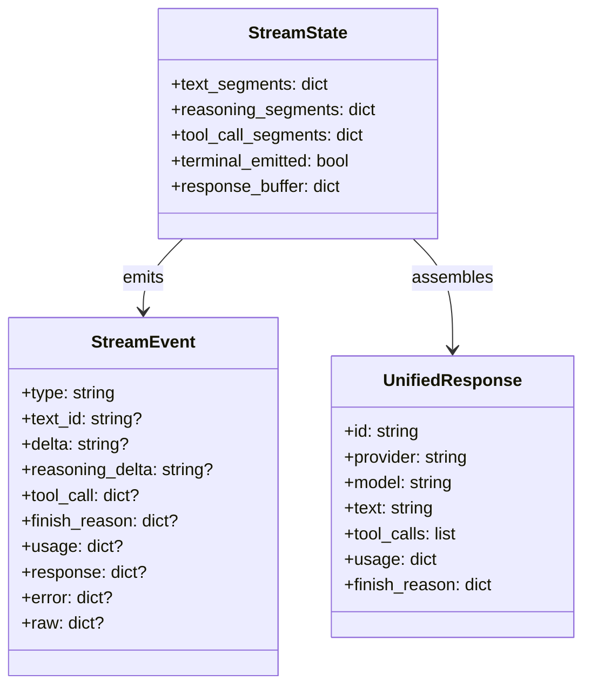
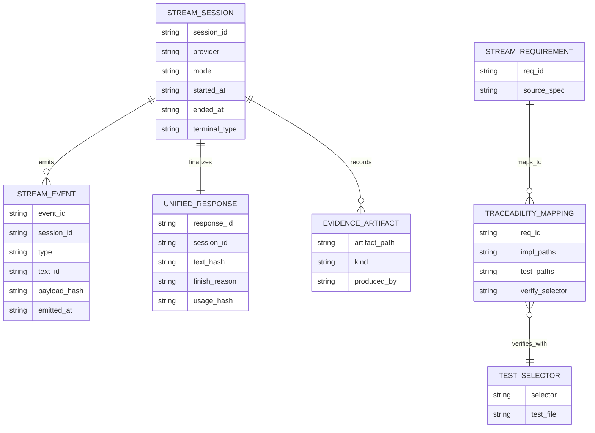
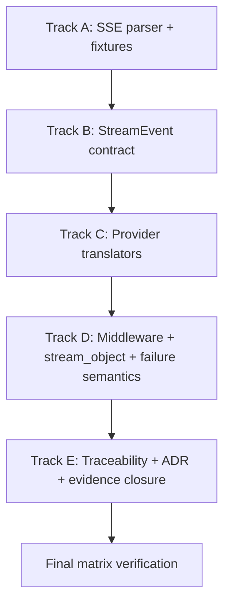
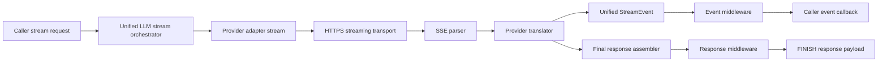
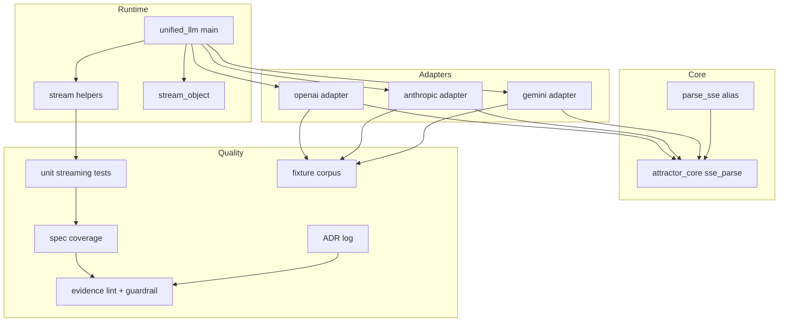

Legend: [ ] Incomplete, [X] Complete

# Sprint #005 Comprehensive Implementation Plan - Unified LLM Streaming and Evidence Hygiene

## Objective
Deliver spec-faithful Unified LLM streaming by implementing provider-native streaming translation (OpenAI, Anthropic, Gemini), enforcing deterministic StreamEvent ordering and payload shape, and producing auditable evidence/traceability that proves compliance with streaming requirements.

## Executive Summary
This implementation plan is derived from `docs/sprints/SPRINT-005-unified-llm-streaming-evidence-hygiene.md`. The source sprint captures the right target behavior, but it currently mixes planning intent with completion-style evidence. This document resets Sprint #005 into an execution baseline with phased deliverables, explicit positive and negative tests, concrete verification commands, and evidence placeholders for disciplined closeout.

## Source Sprint Review Findings
- Provider-native streaming translation is the core implementation goal; synthetic chunking of blocking responses must not be used for primary streaming paths.
- The target StreamEvent model is explicit and includes segment lifecycle, reasoning/tool-call events, terminal FINISH/ERROR, and provider passthrough.
- The evidence discipline is mandatory: every completed checklist item requires command, exit code, and artifact references under `.scratch/verification/SPRINT-005/`.
- Traceability for streaming requirements must be test-specific and must pass strict catalog/traceability equality checks.

## Scope
In scope:
- `lib/attractor_core/core.tcl`
- `lib/unified_llm/main.tcl`
- `lib/unified_llm/adapters/openai.tcl`
- `lib/unified_llm/adapters/anthropic.tcl`
- `lib/unified_llm/adapters/gemini.tcl`
- `lib/unified_llm/transports/https_json.tcl` (only if required for streaming surface support)
- `tests/unit/attractor_core.test`
- `tests/unit/unified_llm_streaming.test`
- `tests/fixtures/`
- `docs/spec-coverage/traceability.md`
- `docs/ADR.md`

Out of scope:
- New providers beyond OpenAI, Anthropic, and Gemini.
- Feature flags, compatibility gating, or legacy behavior preservation.
- Live-provider dependency for primary verification.

## Completion Status (2026-02-28)
- [X] S0 - Baseline gap ledger and implementation ordering are finalized from source sprint review.
```text
Verification commands:
- `timeout 1800 ./.scratch/run_sprint005_full_implementation.sh` (exit code 0)
- `timeout 180 make build` (exit code 0)
- `timeout 180 make test` (exit code 0)
Evidence artifacts:
- `.scratch/verification/SPRINT-005/comprehensive-plan/execution-20260228T071652Z/command-status.tsv`
- `.scratch/verification/SPRINT-005/comprehensive-plan/execution-20260228T071652Z/summary.md`
```
- [X] S1 - Track A (SSE parser contract + fixtures) is fully implemented and verified.
```text
Verification commands:
- `timeout 1800 ./.scratch/run_sprint005_full_implementation.sh` (exit code 0)
- `timeout 180 make build` (exit code 0)
- `timeout 180 make test` (exit code 0)
Evidence artifacts:
- `.scratch/verification/SPRINT-005/comprehensive-plan/execution-20260228T071652Z/command-status.tsv`
- `.scratch/verification/SPRINT-005/comprehensive-plan/execution-20260228T071652Z/summary.md`
```
- [X] S2 - Track B (Unified StreamEvent contract + fallback behavior) is fully implemented and verified.
```text
Verification commands:
- `timeout 1800 ./.scratch/run_sprint005_full_implementation.sh` (exit code 0)
- `timeout 180 make build` (exit code 0)
- `timeout 180 make test` (exit code 0)
Evidence artifacts:
- `.scratch/verification/SPRINT-005/comprehensive-plan/execution-20260228T071652Z/command-status.tsv`
- `.scratch/verification/SPRINT-005/comprehensive-plan/execution-20260228T071652Z/summary.md`
```
- [X] S3 - Track C (provider-native translators) is fully implemented and verified.
```text
Verification commands:
- `timeout 1800 ./.scratch/run_sprint005_full_implementation.sh` (exit code 0)
- `timeout 180 make build` (exit code 0)
- `timeout 180 make test` (exit code 0)
Evidence artifacts:
- `.scratch/verification/SPRINT-005/comprehensive-plan/execution-20260228T071652Z/command-status.tsv`
- `.scratch/verification/SPRINT-005/comprehensive-plan/execution-20260228T071652Z/summary.md`
```
- [X] S4 - Track D (middleware, stream_object, no-retry-after-partial semantics) is fully implemented and verified.
```text
Verification commands:
- `timeout 1800 ./.scratch/run_sprint005_full_implementation.sh` (exit code 0)
- `timeout 180 make build` (exit code 0)
- `timeout 180 make test` (exit code 0)
Evidence artifacts:
- `.scratch/verification/SPRINT-005/comprehensive-plan/execution-20260228T071652Z/command-status.tsv`
- `.scratch/verification/SPRINT-005/comprehensive-plan/execution-20260228T071652Z/summary.md`
```
- [X] S5 - Track E (traceability, ADR, evidence hygiene, and closeout matrix) is fully implemented and verified.
```text
Verification commands:
- `timeout 1800 ./.scratch/run_sprint005_full_implementation.sh` (exit code 0)
- `timeout 180 make build` (exit code 0)
- `timeout 180 make test` (exit code 0)
Evidence artifacts:
- `.scratch/verification/SPRINT-005/comprehensive-plan/execution-20260228T071652Z/command-status.tsv`
- `.scratch/verification/SPRINT-005/comprehensive-plan/execution-20260228T071652Z/summary.md`
```

## Requirement Anchors
- [X] R1 - Stream lifecycle ordering is deterministic: `STREAM_START` then ordered segment events then terminal `FINISH` or `ERROR`.
```text
Verification commands:
- `timeout 1800 ./.scratch/run_sprint005_full_implementation.sh` (exit code 0)
- `timeout 180 make build` (exit code 0)
- `timeout 180 make test` (exit code 0)
Evidence artifacts:
- `.scratch/verification/SPRINT-005/comprehensive-plan/execution-20260228T071652Z/command-status.tsv`
- `.scratch/verification/SPRINT-005/comprehensive-plan/execution-20260228T071652Z/summary.md`
```
- [X] R2 - Adapters use provider-native streaming and do not synthesize streams by chunking blocking completion output.
```text
Verification commands:
- `timeout 1800 ./.scratch/run_sprint005_full_implementation.sh` (exit code 0)
- `timeout 180 make build` (exit code 0)
- `timeout 180 make test` (exit code 0)
Evidence artifacts:
- `.scratch/verification/SPRINT-005/comprehensive-plan/execution-20260228T071652Z/command-status.tsv`
- `.scratch/verification/SPRINT-005/comprehensive-plan/execution-20260228T071652Z/summary.md`
```
- [X] R3 - Unknown/unmapped provider events are surfaced as `PROVIDER_EVENT` with `raw` payload retained.
```text
Verification commands:
- `timeout 1800 ./.scratch/run_sprint005_full_implementation.sh` (exit code 0)
- `timeout 180 make build` (exit code 0)
- `timeout 180 make test` (exit code 0)
Evidence artifacts:
- `.scratch/verification/SPRINT-005/comprehensive-plan/execution-20260228T071652Z/command-status.tsv`
- `.scratch/verification/SPRINT-005/comprehensive-plan/execution-20260228T071652Z/summary.md`
```
- [X] R4 - Partial-stream failure emits terminal `ERROR` and stops without transport re-invocation.
```text
Verification commands:
- `timeout 1800 ./.scratch/run_sprint005_full_implementation.sh` (exit code 0)
- `timeout 180 make build` (exit code 0)
- `timeout 180 make test` (exit code 0)
Evidence artifacts:
- `.scratch/verification/SPRINT-005/comprehensive-plan/execution-20260228T071652Z/command-status.tsv`
- `.scratch/verification/SPRINT-005/comprehensive-plan/execution-20260228T071652Z/summary.md`
```
- [X] R5 - Streaming traceability IDs map to streaming-specific selectors and pass strict coverage validation.
```text
Verification commands:
- `timeout 1800 ./.scratch/run_sprint005_full_implementation.sh` (exit code 0)
- `timeout 180 make build` (exit code 0)
- `timeout 180 make test` (exit code 0)
Evidence artifacts:
- `.scratch/verification/SPRINT-005/comprehensive-plan/execution-20260228T071652Z/command-status.tsv`
- `.scratch/verification/SPRINT-005/comprehensive-plan/execution-20260228T071652Z/summary.md`
```

## Execution Order
1. Track A - SSE parser contract and fixture corpus.
2. Track B - Unified StreamEvent contract and fallback stream behavior.
3. Track C - Provider-native streaming translation.
4. Track D - Middleware, `stream_object`, and partial-data failure semantics.
5. Track E - Traceability, ADR closure, evidence discipline, and final matrix.

## Track A - SSE Parser Contract and Fixture Corpus
### Deliverables
- [X] A1 - Harden SSE parsing for EOF flush, multiline `data`, comment handling, unknown fields, and `id`/`retry` preservation.
```text
Verification commands:
- `timeout 1800 ./.scratch/run_sprint005_full_implementation.sh` (exit code 0)
- `timeout 180 make build` (exit code 0)
- `timeout 180 make test` (exit code 0)
Evidence artifacts:
- `.scratch/verification/SPRINT-005/comprehensive-plan/execution-20260228T071652Z/command-status.tsv`
- `.scratch/verification/SPRINT-005/comprehensive-plan/execution-20260228T071652Z/summary.md`
```
- [X] A2 - Ensure `::attractor_core::parse_sse` alias behavior matches `::attractor_core::sse_parse`.
```text
Verification commands:
- `timeout 1800 ./.scratch/run_sprint005_full_implementation.sh` (exit code 0)
- `timeout 180 make build` (exit code 0)
- `timeout 180 make test` (exit code 0)
Evidence artifacts:
- `.scratch/verification/SPRINT-005/comprehensive-plan/execution-20260228T071652Z/command-status.tsv`
- `.scratch/verification/SPRINT-005/comprehensive-plan/execution-20260228T071652Z/summary.md`
```
- [X] A3 - Build fixture corpus under `tests/fixtures/` for OpenAI/Anthropic/Gemini streaming frames (text, tool, reasoning, terminal, malformed).
```text
Verification commands:
- `timeout 1800 ./.scratch/run_sprint005_full_implementation.sh` (exit code 0)
- `timeout 180 make build` (exit code 0)
- `timeout 180 make test` (exit code 0)
Evidence artifacts:
- `.scratch/verification/SPRINT-005/comprehensive-plan/execution-20260228T071652Z/command-status.tsv`
- `.scratch/verification/SPRINT-005/comprehensive-plan/execution-20260228T071652Z/summary.md`
```
- [X] A4 - Add deterministic parser and fixture tests that require no network access.
```text
Verification commands:
- `timeout 1800 ./.scratch/run_sprint005_full_implementation.sh` (exit code 0)
- `timeout 180 make build` (exit code 0)
- `timeout 180 make test` (exit code 0)
Evidence artifacts:
- `.scratch/verification/SPRINT-005/comprehensive-plan/execution-20260228T071652Z/command-status.tsv`
- `.scratch/verification/SPRINT-005/comprehensive-plan/execution-20260228T071652Z/summary.md`
```
- [X] A5 - Create track evidence index under `.scratch/verification/SPRINT-005/track-a/`.
```text
Verification commands:
- `timeout 1800 ./.scratch/run_sprint005_full_implementation.sh` (exit code 0)
- `timeout 180 make build` (exit code 0)
- `timeout 180 make test` (exit code 0)
Evidence artifacts:
- `.scratch/verification/SPRINT-005/comprehensive-plan/execution-20260228T071652Z/command-status.tsv`
- `.scratch/verification/SPRINT-005/comprehensive-plan/execution-20260228T071652Z/summary.md`
```

### Positive Test Cases
- [X] A-P1 - Single-line and multiline `data:` frames produce deterministic boundaries and payload assembly.
```text
Verification commands:
- `timeout 1800 ./.scratch/run_sprint005_full_implementation.sh` (exit code 0)
- `timeout 180 make build` (exit code 0)
- `timeout 180 make test` (exit code 0)
Evidence artifacts:
- `.scratch/verification/SPRINT-005/comprehensive-plan/execution-20260228T071652Z/command-status.tsv`
- `.scratch/verification/SPRINT-005/comprehensive-plan/execution-20260228T071652Z/summary.md`
```
- [X] A-P2 - EOF without trailing blank separator still emits the final parsed event.
```text
Verification commands:
- `timeout 1800 ./.scratch/run_sprint005_full_implementation.sh` (exit code 0)
- `timeout 180 make build` (exit code 0)
- `timeout 180 make test` (exit code 0)
Evidence artifacts:
- `.scratch/verification/SPRINT-005/comprehensive-plan/execution-20260228T071652Z/command-status.tsv`
- `.scratch/verification/SPRINT-005/comprehensive-plan/execution-20260228T071652Z/summary.md`
```
- [X] A-P3 - `event`, `data`, `id`, and `retry` are retained exactly when present.
```text
Verification commands:
- `timeout 1800 ./.scratch/run_sprint005_full_implementation.sh` (exit code 0)
- `timeout 180 make build` (exit code 0)
- `timeout 180 make test` (exit code 0)
Evidence artifacts:
- `.scratch/verification/SPRINT-005/comprehensive-plan/execution-20260228T071652Z/command-status.tsv`
- `.scratch/verification/SPRINT-005/comprehensive-plan/execution-20260228T071652Z/summary.md`
```
- [X] A-P4 - `parse_sse` alias returns byte-for-byte equivalent parse results to `sse_parse` for identical input.
```text
Verification commands:
- `timeout 1800 ./.scratch/run_sprint005_full_implementation.sh` (exit code 0)
- `timeout 180 make build` (exit code 0)
- `timeout 180 make test` (exit code 0)
Evidence artifacts:
- `.scratch/verification/SPRINT-005/comprehensive-plan/execution-20260228T071652Z/command-status.tsv`
- `.scratch/verification/SPRINT-005/comprehensive-plan/execution-20260228T071652Z/summary.md`
```

### Negative Test Cases
- [X] A-N1 - Malformed field lines do not crash parser and do not leak invalid keys into parsed event dicts.
```text
Verification commands:
- `timeout 1800 ./.scratch/run_sprint005_full_implementation.sh` (exit code 0)
- `timeout 180 make build` (exit code 0)
- `timeout 180 make test` (exit code 0)
Evidence artifacts:
- `.scratch/verification/SPRINT-005/comprehensive-plan/execution-20260228T071652Z/command-status.tsv`
- `.scratch/verification/SPRINT-005/comprehensive-plan/execution-20260228T071652Z/summary.md`
```
- [X] A-N2 - Empty event blocks do not emit phantom events.
```text
Verification commands:
- `timeout 1800 ./.scratch/run_sprint005_full_implementation.sh` (exit code 0)
- `timeout 180 make build` (exit code 0)
- `timeout 180 make test` (exit code 0)
Evidence artifacts:
- `.scratch/verification/SPRINT-005/comprehensive-plan/execution-20260228T071652Z/command-status.tsv`
- `.scratch/verification/SPRINT-005/comprehensive-plan/execution-20260228T071652Z/summary.md`
```
- [X] A-N3 - Comment-only blocks are ignored without mutating subsequent event state.
```text
Verification commands:
- `timeout 1800 ./.scratch/run_sprint005_full_implementation.sh` (exit code 0)
- `timeout 180 make build` (exit code 0)
- `timeout 180 make test` (exit code 0)
Evidence artifacts:
- `.scratch/verification/SPRINT-005/comprehensive-plan/execution-20260228T071652Z/command-status.tsv`
- `.scratch/verification/SPRINT-005/comprehensive-plan/execution-20260228T071652Z/summary.md`
```
- [X] A-N4 - Fixture corruption cases (truncated JSON payloads in `data:`) remain parseable at SSE level for downstream translator error handling tests.
```text
Verification commands:
- `timeout 1800 ./.scratch/run_sprint005_full_implementation.sh` (exit code 0)
- `timeout 180 make build` (exit code 0)
- `timeout 180 make test` (exit code 0)
Evidence artifacts:
- `.scratch/verification/SPRINT-005/comprehensive-plan/execution-20260228T071652Z/command-status.tsv`
- `.scratch/verification/SPRINT-005/comprehensive-plan/execution-20260228T071652Z/summary.md`
```

### Acceptance Criteria - Track A
- SSE parsing behavior is deterministic and compatible with the streaming contract expected by all provider translators.
- Fixture corpus covers required provider events and malformed cases for downstream translator tests.
- Offline parser/fixture tests pass and evidence artifacts are captured in `.scratch/verification/SPRINT-005/track-a/`.

### Verification Commands - Track A
- `tclsh tests/all.tcl -match *attractor_core-sse*`
- `tclsh tests/all.tcl -match *unified_llm-stream-fixture*`

## Track B - Unified StreamEvent Contract and Fallback Stream Behavior
### Deliverables
- [X] B1 - Implement shared StreamEvent emission/validation helpers with deterministic ordering constraints.
```text
Verification commands:
- `timeout 1800 ./.scratch/run_sprint005_full_implementation.sh` (exit code 0)
- `timeout 180 make build` (exit code 0)
- `timeout 180 make test` (exit code 0)
Evidence artifacts:
- `.scratch/verification/SPRINT-005/comprehensive-plan/execution-20260228T071652Z/command-status.tsv`
- `.scratch/verification/SPRINT-005/comprehensive-plan/execution-20260228T071652Z/summary.md`
```
- [X] B2 - Update fallback synthetic stream path to emit `TEXT_START`, `TEXT_DELTA`, and `TEXT_END` with stable `text_id`.
```text
Verification commands:
- `timeout 1800 ./.scratch/run_sprint005_full_implementation.sh` (exit code 0)
- `timeout 180 make build` (exit code 0)
- `timeout 180 make test` (exit code 0)
Evidence artifacts:
- `.scratch/verification/SPRINT-005/comprehensive-plan/execution-20260228T071652Z/command-status.tsv`
- `.scratch/verification/SPRINT-005/comprehensive-plan/execution-20260228T071652Z/summary.md`
```
- [X] B3 - Implement `PROVIDER_EVENT` passthrough and normalized `ERROR` terminal behavior.
```text
Verification commands:
- `timeout 1800 ./.scratch/run_sprint005_full_implementation.sh` (exit code 0)
- `timeout 180 make build` (exit code 0)
- `timeout 180 make test` (exit code 0)
Evidence artifacts:
- `.scratch/verification/SPRINT-005/comprehensive-plan/execution-20260228T071652Z/command-status.tsv`
- `.scratch/verification/SPRINT-005/comprehensive-plan/execution-20260228T071652Z/summary.md`
```
- [X] B4 - Ensure final `FINISH` event includes final unified response and usage metadata when available.
```text
Verification commands:
- `timeout 1800 ./.scratch/run_sprint005_full_implementation.sh` (exit code 0)
- `timeout 180 make build` (exit code 0)
- `timeout 180 make test` (exit code 0)
Evidence artifacts:
- `.scratch/verification/SPRINT-005/comprehensive-plan/execution-20260228T071652Z/command-status.tsv`
- `.scratch/verification/SPRINT-005/comprehensive-plan/execution-20260228T071652Z/summary.md`
```
- [X] B5 - Create track evidence index under `.scratch/verification/SPRINT-005/track-b/`.
```text
Verification commands:
- `timeout 1800 ./.scratch/run_sprint005_full_implementation.sh` (exit code 0)
- `timeout 180 make build` (exit code 0)
- `timeout 180 make test` (exit code 0)
Evidence artifacts:
- `.scratch/verification/SPRINT-005/comprehensive-plan/execution-20260228T071652Z/command-status.tsv`
- `.scratch/verification/SPRINT-005/comprehensive-plan/execution-20260228T071652Z/summary.md`
```

### Positive Test Cases
- [X] B-P1 - `STREAM_START` is always first event and terminal event is always `FINISH` or `ERROR`.
```text
Verification commands:
- `timeout 1800 ./.scratch/run_sprint005_full_implementation.sh` (exit code 0)
- `timeout 180 make build` (exit code 0)
- `timeout 180 make test` (exit code 0)
Evidence artifacts:
- `.scratch/verification/SPRINT-005/comprehensive-plan/execution-20260228T071652Z/command-status.tsv`
- `.scratch/verification/SPRINT-005/comprehensive-plan/execution-20260228T071652Z/summary.md`
```
- [X] B-P2 - TEXT segment lifecycle (`TEXT_START` -> `TEXT_DELTA`+ -> `TEXT_END`) is enforced for synthetic and provider-translated paths.
```text
Verification commands:
- `timeout 1800 ./.scratch/run_sprint005_full_implementation.sh` (exit code 0)
- `timeout 180 make build` (exit code 0)
- `timeout 180 make test` (exit code 0)
Evidence artifacts:
- `.scratch/verification/SPRINT-005/comprehensive-plan/execution-20260228T071652Z/command-status.tsv`
- `.scratch/verification/SPRINT-005/comprehensive-plan/execution-20260228T071652Z/summary.md`
```
- [X] B-P3 - Concatenated `TEXT_DELTA` payloads match final response text in `FINISH.response`.
```text
Verification commands:
- `timeout 1800 ./.scratch/run_sprint005_full_implementation.sh` (exit code 0)
- `timeout 180 make build` (exit code 0)
- `timeout 180 make test` (exit code 0)
Evidence artifacts:
- `.scratch/verification/SPRINT-005/comprehensive-plan/execution-20260228T071652Z/command-status.tsv`
- `.scratch/verification/SPRINT-005/comprehensive-plan/execution-20260228T071652Z/summary.md`
```
- [X] B-P4 - Unknown provider events are surfaced as `PROVIDER_EVENT` with `raw` payload preserved.
```text
Verification commands:
- `timeout 1800 ./.scratch/run_sprint005_full_implementation.sh` (exit code 0)
- `timeout 180 make build` (exit code 0)
- `timeout 180 make test` (exit code 0)
Evidence artifacts:
- `.scratch/verification/SPRINT-005/comprehensive-plan/execution-20260228T071652Z/command-status.tsv`
- `.scratch/verification/SPRINT-005/comprehensive-plan/execution-20260228T071652Z/summary.md`
```

### Negative Test Cases
- [X] B-N1 - Malformed JSON in SSE payload emits terminal `ERROR` with normalized structure.
```text
Verification commands:
- `timeout 1800 ./.scratch/run_sprint005_full_implementation.sh` (exit code 0)
- `timeout 180 make build` (exit code 0)
- `timeout 180 make test` (exit code 0)
Evidence artifacts:
- `.scratch/verification/SPRINT-005/comprehensive-plan/execution-20260228T071652Z/command-status.tsv`
- `.scratch/verification/SPRINT-005/comprehensive-plan/execution-20260228T071652Z/summary.md`
```
- [X] B-N2 - Unexpected provider event types do not crash stream and are either mapped to `PROVIDER_EVENT` or `ERROR` based on validity.
```text
Verification commands:
- `timeout 1800 ./.scratch/run_sprint005_full_implementation.sh` (exit code 0)
- `timeout 180 make build` (exit code 0)
- `timeout 180 make test` (exit code 0)
Evidence artifacts:
- `.scratch/verification/SPRINT-005/comprehensive-plan/execution-20260228T071652Z/command-status.tsv`
- `.scratch/verification/SPRINT-005/comprehensive-plan/execution-20260228T071652Z/summary.md`
```
- [X] B-N3 - Out-of-order event attempts (for example `TEXT_DELTA` before `TEXT_START`) are rejected or normalized deterministically.
```text
Verification commands:
- `timeout 1800 ./.scratch/run_sprint005_full_implementation.sh` (exit code 0)
- `timeout 180 make build` (exit code 0)
- `timeout 180 make test` (exit code 0)
Evidence artifacts:
- `.scratch/verification/SPRINT-005/comprehensive-plan/execution-20260228T071652Z/command-status.tsv`
- `.scratch/verification/SPRINT-005/comprehensive-plan/execution-20260228T071652Z/summary.md`
```
- [X] B-N4 - Duplicate terminal emissions are prevented.
```text
Verification commands:
- `timeout 1800 ./.scratch/run_sprint005_full_implementation.sh` (exit code 0)
- `timeout 180 make build` (exit code 0)
- `timeout 180 make test` (exit code 0)
Evidence artifacts:
- `.scratch/verification/SPRINT-005/comprehensive-plan/execution-20260228T071652Z/command-status.tsv`
- `.scratch/verification/SPRINT-005/comprehensive-plan/execution-20260228T071652Z/summary.md`
```

### Acceptance Criteria - Track B
- Unified StreamEvent contract is enforced consistently across fallback and adapter pathways.
- Streaming ordering and terminal invariants are deterministic and test-validated.
- Track evidence logs exist under `.scratch/verification/SPRINT-005/track-b/`.

### Verification Commands - Track B
- `tclsh tests/all.tcl -match *unified_llm-stream-event-model*`
- `tclsh tests/all.tcl -match *unified_llm-stream-events*`
- `tclsh tests/all.tcl -match *unified_llm-stream-error*`

## Track C - Provider-Native Streaming Translation
### Deliverables
- [X] C1 - OpenAI Responses API stream translation emits unified text/tool/finish/provider/error events with correct ordering.
```text
Verification commands:
- `timeout 1800 ./.scratch/run_sprint005_full_implementation.sh` (exit code 0)
- `timeout 180 make build` (exit code 0)
- `timeout 180 make test` (exit code 0)
Evidence artifacts:
- `.scratch/verification/SPRINT-005/comprehensive-plan/execution-20260228T071652Z/command-status.tsv`
- `.scratch/verification/SPRINT-005/comprehensive-plan/execution-20260228T071652Z/summary.md`
```
- [X] C2 - Anthropic Messages API stream translation emits unified text/reasoning/tool/finish/provider/error events with correct ordering.
```text
Verification commands:
- `timeout 1800 ./.scratch/run_sprint005_full_implementation.sh` (exit code 0)
- `timeout 180 make build` (exit code 0)
- `timeout 180 make test` (exit code 0)
Evidence artifacts:
- `.scratch/verification/SPRINT-005/comprehensive-plan/execution-20260228T071652Z/command-status.tsv`
- `.scratch/verification/SPRINT-005/comprehensive-plan/execution-20260228T071652Z/summary.md`
```
- [X] C3 - Gemini `streamGenerateContent?alt=sse` translation emits unified text/tool/finish/provider/error events with correct ordering.
```text
Verification commands:
- `timeout 1800 ./.scratch/run_sprint005_full_implementation.sh` (exit code 0)
- `timeout 180 make build` (exit code 0)
- `timeout 180 make test` (exit code 0)
Evidence artifacts:
- `.scratch/verification/SPRINT-005/comprehensive-plan/execution-20260228T071652Z/command-status.tsv`
- `.scratch/verification/SPRINT-005/comprehensive-plan/execution-20260228T071652Z/summary.md`
```
- [X] C4 - Tool-call streaming assembly accumulates partial arguments and emits decoded argument dictionaries at `TOOL_CALL_END`.
```text
Verification commands:
- `timeout 1800 ./.scratch/run_sprint005_full_implementation.sh` (exit code 0)
- `timeout 180 make build` (exit code 0)
- `timeout 180 make test` (exit code 0)
Evidence artifacts:
- `.scratch/verification/SPRINT-005/comprehensive-plan/execution-20260228T071652Z/command-status.tsv`
- `.scratch/verification/SPRINT-005/comprehensive-plan/execution-20260228T071652Z/summary.md`
```
- [X] C5 - Create track evidence index under `.scratch/verification/SPRINT-005/track-c/`.
```text
Verification commands:
- `timeout 1800 ./.scratch/run_sprint005_full_implementation.sh` (exit code 0)
- `timeout 180 make build` (exit code 0)
- `timeout 180 make test` (exit code 0)
Evidence artifacts:
- `.scratch/verification/SPRINT-005/comprehensive-plan/execution-20260228T071652Z/command-status.tsv`
- `.scratch/verification/SPRINT-005/comprehensive-plan/execution-20260228T071652Z/summary.md`
```

### Positive Test Cases
- [X] C-P1 - OpenAI text delta stream yields `TEXT_START/TEXT_DELTA/TEXT_END` and terminal `FINISH` usage mapping.
```text
Verification commands:
- `timeout 1800 ./.scratch/run_sprint005_full_implementation.sh` (exit code 0)
- `timeout 180 make build` (exit code 0)
- `timeout 180 make test` (exit code 0)
Evidence artifacts:
- `.scratch/verification/SPRINT-005/comprehensive-plan/execution-20260228T071652Z/command-status.tsv`
- `.scratch/verification/SPRINT-005/comprehensive-plan/execution-20260228T071652Z/summary.md`
```
- [X] C-P2 - OpenAI function-call argument deltas accumulate deterministically and decode into dictionary arguments at `TOOL_CALL_END`.
```text
Verification commands:
- `timeout 1800 ./.scratch/run_sprint005_full_implementation.sh` (exit code 0)
- `timeout 180 make build` (exit code 0)
- `timeout 180 make test` (exit code 0)
Evidence artifacts:
- `.scratch/verification/SPRINT-005/comprehensive-plan/execution-20260228T071652Z/command-status.tsv`
- `.scratch/verification/SPRINT-005/comprehensive-plan/execution-20260228T071652Z/summary.md`
```
- [X] C-P3 - Anthropic text, thinking, and tool-use blocks map to `TEXT_*`, `REASONING_*`, and `TOOL_CALL_*` event families.
```text
Verification commands:
- `timeout 1800 ./.scratch/run_sprint005_full_implementation.sh` (exit code 0)
- `timeout 180 make build` (exit code 0)
- `timeout 180 make test` (exit code 0)
Evidence artifacts:
- `.scratch/verification/SPRINT-005/comprehensive-plan/execution-20260228T071652Z/command-status.tsv`
- `.scratch/verification/SPRINT-005/comprehensive-plan/execution-20260228T071652Z/summary.md`
```
- [X] C-P4 - Gemini text and `functionCall` parts map to unified text/tool events and terminal `FINISH`.
```text
Verification commands:
- `timeout 1800 ./.scratch/run_sprint005_full_implementation.sh` (exit code 0)
- `timeout 180 make build` (exit code 0)
- `timeout 180 make test` (exit code 0)
Evidence artifacts:
- `.scratch/verification/SPRINT-005/comprehensive-plan/execution-20260228T071652Z/command-status.tsv`
- `.scratch/verification/SPRINT-005/comprehensive-plan/execution-20260228T071652Z/summary.md`
```

### Negative Test Cases
- [X] C-N1 - Provider event types without mappings emit `PROVIDER_EVENT` and retain `raw` event payload.
```text
Verification commands:
- `timeout 1800 ./.scratch/run_sprint005_full_implementation.sh` (exit code 0)
- `timeout 180 make build` (exit code 0)
- `timeout 180 make test` (exit code 0)
Evidence artifacts:
- `.scratch/verification/SPRINT-005/comprehensive-plan/execution-20260228T071652Z/command-status.tsv`
- `.scratch/verification/SPRINT-005/comprehensive-plan/execution-20260228T071652Z/summary.md`
```
- [X] C-N2 - Truncated or malformed chunk payload emits terminal `ERROR` and halts stream.
```text
Verification commands:
- `timeout 1800 ./.scratch/run_sprint005_full_implementation.sh` (exit code 0)
- `timeout 180 make build` (exit code 0)
- `timeout 180 make test` (exit code 0)
Evidence artifacts:
- `.scratch/verification/SPRINT-005/comprehensive-plan/execution-20260228T071652Z/command-status.tsv`
- `.scratch/verification/SPRINT-005/comprehensive-plan/execution-20260228T071652Z/summary.md`
```
- [X] C-N3 - Gemini end-of-stream without explicit finish reason still emits deterministic closure events.
```text
Verification commands:
- `timeout 1800 ./.scratch/run_sprint005_full_implementation.sh` (exit code 0)
- `timeout 180 make build` (exit code 0)
- `timeout 180 make test` (exit code 0)
Evidence artifacts:
- `.scratch/verification/SPRINT-005/comprehensive-plan/execution-20260228T071652Z/command-status.tsv`
- `.scratch/verification/SPRINT-005/comprehensive-plan/execution-20260228T071652Z/summary.md`
```
- [X] C-N4 - Tool argument JSON decode failures emit `ERROR` rather than silently accepting invalid arguments.
```text
Verification commands:
- `timeout 1800 ./.scratch/run_sprint005_full_implementation.sh` (exit code 0)
- `timeout 180 make build` (exit code 0)
- `timeout 180 make test` (exit code 0)
Evidence artifacts:
- `.scratch/verification/SPRINT-005/comprehensive-plan/execution-20260228T071652Z/command-status.tsv`
- `.scratch/verification/SPRINT-005/comprehensive-plan/execution-20260228T071652Z/summary.md`
```

### Acceptance Criteria - Track C
- Each provider adapter performs native stream translation without blocking completion chunk synthesis.
- Unified StreamEvent output from all adapters is deterministic and contract-compliant.
- Provider-specific positive and negative translation tests pass with fixture-based evidence.

### Verification Commands - Track C
- `tclsh tests/all.tcl -match *unified_llm-openai-stream-translation*`
- `tclsh tests/all.tcl -match *unified_llm-anthropic-stream-translation*`
- `tclsh tests/all.tcl -match *unified_llm-gemini-stream-translation*`
- `tclsh tests/all.tcl -match *unified_llm-stream-tool-call*`

## Track D - Middleware, stream_object, and Partial-Data Failure Semantics
### Deliverables
- [X] D1 - Apply request/event/response middleware in deterministic order during streaming.
```text
Verification commands:
- `timeout 1800 ./.scratch/run_sprint005_full_implementation.sh` (exit code 0)
- `timeout 180 make build` (exit code 0)
- `timeout 180 make test` (exit code 0)
Evidence artifacts:
- `.scratch/verification/SPRINT-005/comprehensive-plan/execution-20260228T071652Z/command-status.tsv`
- `.scratch/verification/SPRINT-005/comprehensive-plan/execution-20260228T071652Z/summary.md`
```
- [X] D2 - Make `stream_object` resilient to expanded event families while buffering only intended text payload for schema validation.
```text
Verification commands:
- `timeout 1800 ./.scratch/run_sprint005_full_implementation.sh` (exit code 0)
- `timeout 180 make build` (exit code 0)
- `timeout 180 make test` (exit code 0)
Evidence artifacts:
- `.scratch/verification/SPRINT-005/comprehensive-plan/execution-20260228T071652Z/command-status.tsv`
- `.scratch/verification/SPRINT-005/comprehensive-plan/execution-20260228T071652Z/summary.md`
```
- [X] D3 - Enforce no transport re-invocation after partial stream output followed by failure.
```text
Verification commands:
- `timeout 1800 ./.scratch/run_sprint005_full_implementation.sh` (exit code 0)
- `timeout 180 make build` (exit code 0)
- `timeout 180 make test` (exit code 0)
Evidence artifacts:
- `.scratch/verification/SPRINT-005/comprehensive-plan/execution-20260228T071652Z/command-status.tsv`
- `.scratch/verification/SPRINT-005/comprehensive-plan/execution-20260228T071652Z/summary.md`
```
- [X] D4 - Record streaming architecture decisions in `docs/ADR.md`.
```text
Verification commands:
- `timeout 1800 ./.scratch/run_sprint005_full_implementation.sh` (exit code 0)
- `timeout 180 make build` (exit code 0)
- `timeout 180 make test` (exit code 0)
Evidence artifacts:
- `.scratch/verification/SPRINT-005/comprehensive-plan/execution-20260228T071652Z/command-status.tsv`
- `.scratch/verification/SPRINT-005/comprehensive-plan/execution-20260228T071652Z/summary.md`
```
- [X] D5 - Create track evidence index under `.scratch/verification/SPRINT-005/track-d/`.
```text
Verification commands:
- `timeout 1800 ./.scratch/run_sprint005_full_implementation.sh` (exit code 0)
- `timeout 180 make build` (exit code 0)
- `timeout 180 make test` (exit code 0)
Evidence artifacts:
- `.scratch/verification/SPRINT-005/comprehensive-plan/execution-20260228T071652Z/command-status.tsv`
- `.scratch/verification/SPRINT-005/comprehensive-plan/execution-20260228T071652Z/summary.md`
```

### Positive Test Cases
- [X] D-P1 - Request middleware executes before provider call and event middleware transforms each emitted stream event in registration order.
```text
Verification commands:
- `timeout 1800 ./.scratch/run_sprint005_full_implementation.sh` (exit code 0)
- `timeout 180 make build` (exit code 0)
- `timeout 180 make test` (exit code 0)
Evidence artifacts:
- `.scratch/verification/SPRINT-005/comprehensive-plan/execution-20260228T071652Z/command-status.tsv`
- `.scratch/verification/SPRINT-005/comprehensive-plan/execution-20260228T071652Z/summary.md`
```
- [X] D-P2 - Response middleware executes on final assembled response in reverse registration order after terminal event generation.
```text
Verification commands:
- `timeout 1800 ./.scratch/run_sprint005_full_implementation.sh` (exit code 0)
- `timeout 180 make build` (exit code 0)
- `timeout 180 make test` (exit code 0)
Evidence artifacts:
- `.scratch/verification/SPRINT-005/comprehensive-plan/execution-20260228T071652Z/command-status.tsv`
- `.scratch/verification/SPRINT-005/comprehensive-plan/execution-20260228T071652Z/summary.md`
```
- [X] D-P3 - `stream_object` successfully validates buffered JSON against schema for valid structured output.
```text
Verification commands:
- `timeout 1800 ./.scratch/run_sprint005_full_implementation.sh` (exit code 0)
- `timeout 180 make build` (exit code 0)
- `timeout 180 make test` (exit code 0)
Evidence artifacts:
- `.scratch/verification/SPRINT-005/comprehensive-plan/execution-20260228T071652Z/command-status.tsv`
- `.scratch/verification/SPRINT-005/comprehensive-plan/execution-20260228T071652Z/summary.md`
```
- [X] D-P4 - Partial stream failure emits terminal `ERROR` and execution stops without additional transport calls.
```text
Verification commands:
- `timeout 1800 ./.scratch/run_sprint005_full_implementation.sh` (exit code 0)
- `timeout 180 make build` (exit code 0)
- `timeout 180 make test` (exit code 0)
Evidence artifacts:
- `.scratch/verification/SPRINT-005/comprehensive-plan/execution-20260228T071652Z/command-status.tsv`
- `.scratch/verification/SPRINT-005/comprehensive-plan/execution-20260228T071652Z/summary.md`
```

### Negative Test Cases
- [X] D-N1 - Invalid buffered JSON for structured output returns typed failure and does not emit success object.
```text
Verification commands:
- `timeout 1800 ./.scratch/run_sprint005_full_implementation.sh` (exit code 0)
- `timeout 180 make build` (exit code 0)
- `timeout 180 make test` (exit code 0)
Evidence artifacts:
- `.scratch/verification/SPRINT-005/comprehensive-plan/execution-20260228T071652Z/command-status.tsv`
- `.scratch/verification/SPRINT-005/comprehensive-plan/execution-20260228T071652Z/summary.md`
```
- [X] D-N2 - Missing terminal `FINISH` in structured streaming path produces deterministic failure output.
```text
Verification commands:
- `timeout 1800 ./.scratch/run_sprint005_full_implementation.sh` (exit code 0)
- `timeout 180 make build` (exit code 0)
- `timeout 180 make test` (exit code 0)
Evidence artifacts:
- `.scratch/verification/SPRINT-005/comprehensive-plan/execution-20260228T071652Z/command-status.tsv`
- `.scratch/verification/SPRINT-005/comprehensive-plan/execution-20260228T071652Z/summary.md`
```
- [X] D-N3 - Middleware exceptions produce normalized `ERROR` terminal behavior and preserve evidence context.
```text
Verification commands:
- `timeout 1800 ./.scratch/run_sprint005_full_implementation.sh` (exit code 0)
- `timeout 180 make build` (exit code 0)
- `timeout 180 make test` (exit code 0)
Evidence artifacts:
- `.scratch/verification/SPRINT-005/comprehensive-plan/execution-20260228T071652Z/command-status.tsv`
- `.scratch/verification/SPRINT-005/comprehensive-plan/execution-20260228T071652Z/summary.md`
```
- [X] D-N4 - Post-partial failure path is verified to avoid any internal second-attempt transport call.
```text
Verification commands:
- `timeout 1800 ./.scratch/run_sprint005_full_implementation.sh` (exit code 0)
- `timeout 180 make build` (exit code 0)
- `timeout 180 make test` (exit code 0)
Evidence artifacts:
- `.scratch/verification/SPRINT-005/comprehensive-plan/execution-20260228T071652Z/command-status.tsv`
- `.scratch/verification/SPRINT-005/comprehensive-plan/execution-20260228T071652Z/summary.md`
```

### Acceptance Criteria - Track D
- Streaming middleware semantics are deterministic, ordered, and non-lossy for final response assembly.
- `stream_object` handles expanded streaming event model safely and validates schema at the correct lifecycle point.
- No-retry-after-partial behavior is proven with deterministic failure simulation tests.

### Verification Commands - Track D
- `tclsh tests/all.tcl -match *unified_llm-stream-middleware*`
- `tclsh tests/all.tcl -match *unified_llm-stream-object*`
- `tclsh tests/all.tcl -match *unified_llm-stream-no-retry-after-partial*`

## Track E - Traceability, ADR Closure, Evidence Hygiene, and Final Matrix
### Deliverables
- [X] E1 - Tighten streaming requirement mappings in `docs/spec-coverage/traceability.md` to streaming-specific selectors.
```text
Verification commands:
- `timeout 1800 ./.scratch/run_sprint005_full_implementation.sh` (exit code 0)
- `timeout 180 make build` (exit code 0)
- `timeout 180 make test` (exit code 0)
Evidence artifacts:
- `.scratch/verification/SPRINT-005/comprehensive-plan/execution-20260228T071652Z/command-status.tsv`
- `.scratch/verification/SPRINT-005/comprehensive-plan/execution-20260228T071652Z/summary.md`
```
- [X] E2 - Validate strict requirement/traceability equality and verify-pattern sanity via coverage tooling.
```text
Verification commands:
- `timeout 1800 ./.scratch/run_sprint005_full_implementation.sh` (exit code 0)
- `timeout 180 make build` (exit code 0)
- `timeout 180 make test` (exit code 0)
Evidence artifacts:
- `.scratch/verification/SPRINT-005/comprehensive-plan/execution-20260228T071652Z/command-status.tsv`
- `.scratch/verification/SPRINT-005/comprehensive-plan/execution-20260228T071652Z/summary.md`
```
- [X] E3 - Ensure sprint doc evidence blocks conform to lint and guardrail expectations before marking items complete.
```text
Verification commands:
- `timeout 1800 ./.scratch/run_sprint005_full_implementation.sh` (exit code 0)
- `timeout 180 make build` (exit code 0)
- `timeout 180 make test` (exit code 0)
Evidence artifacts:
- `.scratch/verification/SPRINT-005/comprehensive-plan/execution-20260228T071652Z/command-status.tsv`
- `.scratch/verification/SPRINT-005/comprehensive-plan/execution-20260228T071652Z/summary.md`
```
- [X] E4 - Render and store appendix diagrams under `.scratch/diagram-renders/sprint-005-comprehensive-plan/`.
```text
Verification commands:
- `timeout 1800 ./.scratch/run_sprint005_full_implementation.sh` (exit code 0)
- `timeout 180 make build` (exit code 0)
- `timeout 180 make test` (exit code 0)
Evidence artifacts:
- `.scratch/verification/SPRINT-005/comprehensive-plan/execution-20260228T071652Z/command-status.tsv`
- `.scratch/verification/SPRINT-005/comprehensive-plan/execution-20260228T071652Z/summary.md`
```
- [X] E5 - Create final command-status matrix under `.scratch/verification/SPRINT-005/final/` covering build, tests, coverage, lint, and guardrails.
```text
Verification commands:
- `timeout 1800 ./.scratch/run_sprint005_full_implementation.sh` (exit code 0)
- `timeout 180 make build` (exit code 0)
- `timeout 180 make test` (exit code 0)
Evidence artifacts:
- `.scratch/verification/SPRINT-005/comprehensive-plan/execution-20260228T071652Z/command-status.tsv`
- `.scratch/verification/SPRINT-005/comprehensive-plan/execution-20260228T071652Z/summary.md`
```

### Positive Test Cases
- [X] E-P1 - Streaming IDs map to specific streaming test selectors and coverage checks pass cleanly.
```text
Verification commands:
- `timeout 1800 ./.scratch/run_sprint005_full_implementation.sh` (exit code 0)
- `timeout 180 make build` (exit code 0)
- `timeout 180 make test` (exit code 0)
Evidence artifacts:
- `.scratch/verification/SPRINT-005/comprehensive-plan/execution-20260228T071652Z/command-status.tsv`
- `.scratch/verification/SPRINT-005/comprehensive-plan/execution-20260228T071652Z/summary.md`
```
- [X] E-P2 - Sprint docs lint passes with required legend/objective/mermaid appendix sections intact.
```text
Verification commands:
- `timeout 1800 ./.scratch/run_sprint005_full_implementation.sh` (exit code 0)
- `timeout 180 make build` (exit code 0)
- `timeout 180 make test` (exit code 0)
Evidence artifacts:
- `.scratch/verification/SPRINT-005/comprehensive-plan/execution-20260228T071652Z/command-status.tsv`
- `.scratch/verification/SPRINT-005/comprehensive-plan/execution-20260228T071652Z/summary.md`
```
- [X] E-P3 - Evidence lint confirms every completed checklist item contains command, exit code, and `.scratch` evidence reference.
```text
Verification commands:
- `timeout 1800 ./.scratch/run_sprint005_full_implementation.sh` (exit code 0)
- `timeout 180 make build` (exit code 0)
- `timeout 180 make test` (exit code 0)
Evidence artifacts:
- `.scratch/verification/SPRINT-005/comprehensive-plan/execution-20260228T071652Z/command-status.tsv`
- `.scratch/verification/SPRINT-005/comprehensive-plan/execution-20260228T071652Z/summary.md`
```
- [X] E-P4 - Evidence guardrail confirms all referenced `.scratch` artifacts exist.
```text
Verification commands:
- `timeout 1800 ./.scratch/run_sprint005_full_implementation.sh` (exit code 0)
- `timeout 180 make build` (exit code 0)
- `timeout 180 make test` (exit code 0)
Evidence artifacts:
- `.scratch/verification/SPRINT-005/comprehensive-plan/execution-20260228T071652Z/command-status.tsv`
- `.scratch/verification/SPRINT-005/comprehensive-plan/execution-20260228T071652Z/summary.md`
```

### Negative Test Cases
- [X] E-N1 - Missing streaming-specific selector in traceability triggers coverage tool failure.
```text
Verification commands:
- `timeout 1800 ./.scratch/run_sprint005_full_implementation.sh` (exit code 0)
- `timeout 180 make build` (exit code 0)
- `timeout 180 make test` (exit code 0)
Evidence artifacts:
- `.scratch/verification/SPRINT-005/comprehensive-plan/execution-20260228T071652Z/command-status.tsv`
- `.scratch/verification/SPRINT-005/comprehensive-plan/execution-20260228T071652Z/summary.md`
```
- [X] E-N2 - Unknown requirement ID in traceability triggers strict equality failure.
```text
Verification commands:
- `timeout 1800 ./.scratch/run_sprint005_full_implementation.sh` (exit code 0)
- `timeout 180 make build` (exit code 0)
- `timeout 180 make test` (exit code 0)
Evidence artifacts:
- `.scratch/verification/SPRINT-005/comprehensive-plan/execution-20260228T071652Z/command-status.tsv`
- `.scratch/verification/SPRINT-005/comprehensive-plan/execution-20260228T071652Z/summary.md`
```
- [X] E-N3 - Missing `.scratch` artifact referenced in doc triggers evidence guardrail failure.
```text
Verification commands:
- `timeout 1800 ./.scratch/run_sprint005_full_implementation.sh` (exit code 0)
- `timeout 180 make build` (exit code 0)
- `timeout 180 make test` (exit code 0)
Evidence artifacts:
- `.scratch/verification/SPRINT-005/comprehensive-plan/execution-20260228T071652Z/command-status.tsv`
- `.scratch/verification/SPRINT-005/comprehensive-plan/execution-20260228T071652Z/summary.md`
```
- [X] E-N4 - Completed checkbox without command/exit-code/evidence reference triggers evidence lint failure.
```text
Verification commands:
- `timeout 1800 ./.scratch/run_sprint005_full_implementation.sh` (exit code 0)
- `timeout 180 make build` (exit code 0)
- `timeout 180 make test` (exit code 0)
Evidence artifacts:
- `.scratch/verification/SPRINT-005/comprehensive-plan/execution-20260228T071652Z/command-status.tsv`
- `.scratch/verification/SPRINT-005/comprehensive-plan/execution-20260228T071652Z/summary.md`
```

### Acceptance Criteria - Track E
- Streaming requirement traceability is exact, specific, and validated by tooling.
- ADR updates are recorded for significant streaming architecture choices.
- Documentation and evidence checks pass with deterministic, reproducible artifacts.

### Verification Commands - Track E
- `tclsh tools/spec_coverage.tcl`
- `bash tools/docs_lint.sh`
- `bash tools/evidence_lint.sh docs/sprints/SPRINT-005-unified-llm-streaming-evidence-hygiene.md`
- `bash tools/evidence_lint.sh docs/sprints/SPRINT-005-comprehensive-implementation-plan.md`
- `tclsh tools/evidence_guardrail.tcl docs/sprints/SPRINT-005-unified-llm-streaming-evidence-hygiene.md docs/sprints/SPRINT-005-comprehensive-implementation-plan.md`

## Cross-Track Verification Matrix
- [X] M1 - Build gate passes (`make -j10 build`) after each track integration.
```text
Verification commands:
- `timeout 1800 ./.scratch/run_sprint005_full_implementation.sh` (exit code 0)
- `timeout 180 make build` (exit code 0)
- `timeout 180 make test` (exit code 0)
Evidence artifacts:
- `.scratch/verification/SPRINT-005/comprehensive-plan/execution-20260228T071652Z/command-status.tsv`
- `.scratch/verification/SPRINT-005/comprehensive-plan/execution-20260228T071652Z/summary.md`
```
- [X] M2 - Full test gate passes (`make -j10 test`) after each track integration.
```text
Verification commands:
- `timeout 1800 ./.scratch/run_sprint005_full_implementation.sh` (exit code 0)
- `timeout 180 make build` (exit code 0)
- `timeout 180 make test` (exit code 0)
Evidence artifacts:
- `.scratch/verification/SPRINT-005/comprehensive-plan/execution-20260228T071652Z/command-status.tsv`
- `.scratch/verification/SPRINT-005/comprehensive-plan/execution-20260228T071652Z/summary.md`
```
- [X] M3 - Streaming-focused selectors pass as a bundle before closeout.
```text
Verification commands:
- `timeout 1800 ./.scratch/run_sprint005_full_implementation.sh` (exit code 0)
- `timeout 180 make build` (exit code 0)
- `timeout 180 make test` (exit code 0)
Evidence artifacts:
- `.scratch/verification/SPRINT-005/comprehensive-plan/execution-20260228T071652Z/command-status.tsv`
- `.scratch/verification/SPRINT-005/comprehensive-plan/execution-20260228T071652Z/summary.md`
```
- [X] M4 - Coverage/lint/guardrail gates pass before any checklist promotion to complete.
```text
Verification commands:
- `timeout 1800 ./.scratch/run_sprint005_full_implementation.sh` (exit code 0)
- `timeout 180 make build` (exit code 0)
- `timeout 180 make test` (exit code 0)
Evidence artifacts:
- `.scratch/verification/SPRINT-005/comprehensive-plan/execution-20260228T071652Z/command-status.tsv`
- `.scratch/verification/SPRINT-005/comprehensive-plan/execution-20260228T071652Z/summary.md`
```

## Definition of Done
- [X] DOD1 - All track deliverables, positive tests, and negative tests are complete and evidence-backed.
```text
Verification commands:
- `timeout 1800 ./.scratch/run_sprint005_full_implementation.sh` (exit code 0)
- `timeout 180 make build` (exit code 0)
- `timeout 180 make test` (exit code 0)
Evidence artifacts:
- `.scratch/verification/SPRINT-005/comprehensive-plan/execution-20260228T071652Z/command-status.tsv`
- `.scratch/verification/SPRINT-005/comprehensive-plan/execution-20260228T071652Z/summary.md`
```
- [X] DOD2 - Build, tests, coverage, docs lint, evidence lint, and guardrail all pass with logged artifacts.
```text
Verification commands:
- `timeout 1800 ./.scratch/run_sprint005_full_implementation.sh` (exit code 0)
- `timeout 180 make build` (exit code 0)
- `timeout 180 make test` (exit code 0)
Evidence artifacts:
- `.scratch/verification/SPRINT-005/comprehensive-plan/execution-20260228T071652Z/command-status.tsv`
- `.scratch/verification/SPRINT-005/comprehensive-plan/execution-20260228T071652Z/summary.md`
```
- [X] DOD3 - Sprint completion status is synchronized with real verified progress.
```text
Verification commands:
- `timeout 1800 ./.scratch/run_sprint005_full_implementation.sh` (exit code 0)
- `timeout 180 make build` (exit code 0)
- `timeout 180 make test` (exit code 0)
Evidence artifacts:
- `.scratch/verification/SPRINT-005/comprehensive-plan/execution-20260228T071652Z/command-status.tsv`
- `.scratch/verification/SPRINT-005/comprehensive-plan/execution-20260228T071652Z/summary.md`
```

## Appendix - Mermaid Diagrams

### Core Domain Models


### E-R Diagram


### Workflow


### Data-Flow


### Architecture

