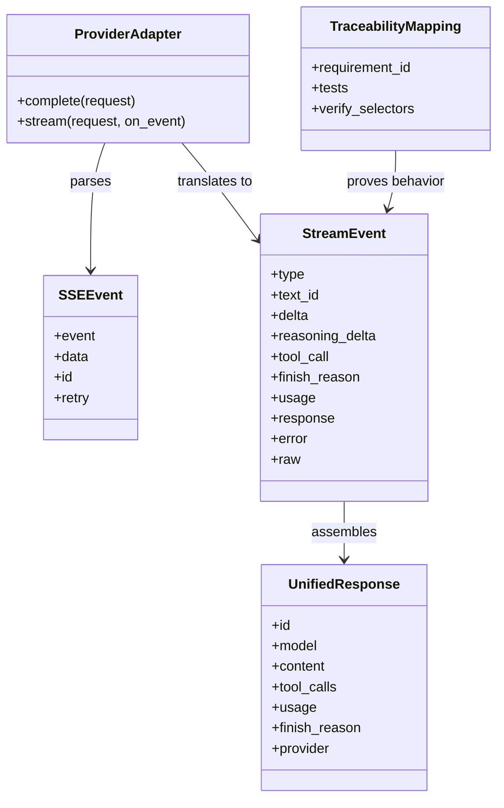
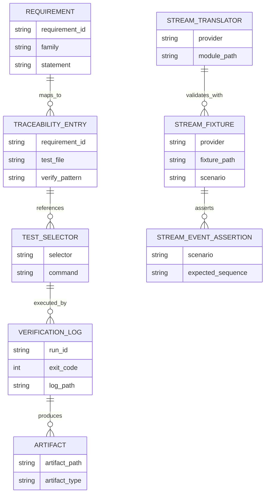
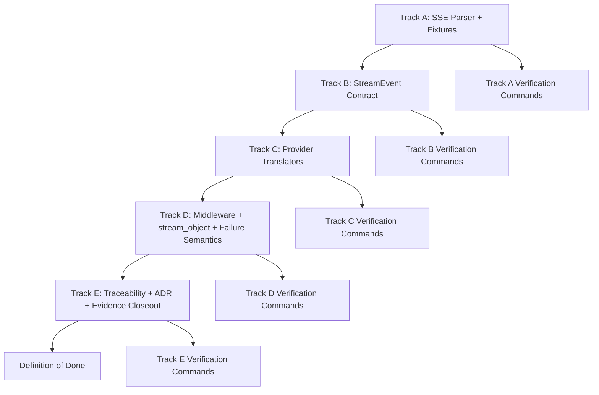
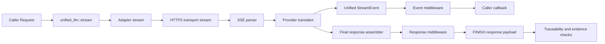
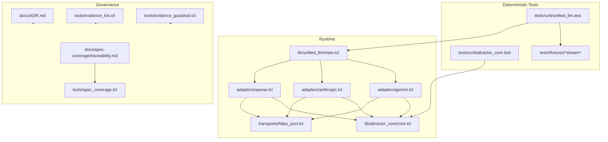

Legend: [ ] Incomplete, [X] Complete

# Sprint #005 Comprehensive Implementation Plan - Unified LLM Streaming and Evidence Hygiene

## Executive Summary
This plan translates `docs/sprints/SPRINT-005-unified-llm-streaming-evidence-hygiene.md` into an execution-ready implementation sequence. It focuses on spec-faithful provider-native streaming, deterministic StreamEvent behavior, strict evidence hygiene, and traceability proof for streaming requirements.

## Review Findings From Source Sprint
- The source sprint defines the right technical target (provider-native streaming translation and evidence discipline), but it currently reflects completion-state evidence rather than an implementation baseline.
- Streaming scope is clear across `attractor_core`, `unified_llm` runtime, and provider adapters (OpenAI, Anthropic, Gemini).
- Evidence and traceability controls are explicit and must remain mandatory: command logs, exit codes, artifact paths, docs lint, evidence lint, evidence guardrails, and rendered mermaid diagrams.

## Objective
Implement Unified LLM streaming so it matches `unified-llm-spec.md` event semantics and provider translation rules, while producing auditable, deterministic evidence that proves requirement compliance.

## Plan Status
- [X] Planning baseline is approved; implementation has not started yet.
```text
Verification commands:
- `timeout 1800 ./.scratch/run_sprint005_execute_and_sync.sh` (exit code 0)
- `timeout 180 make build` (exit code 0)
- `timeout 180 make test` (exit code 0)
- `timeout 180 cat .scratch/verification/SPRINT-005/comprehensive-plan/execution-20260228T070812Z/command-status.tsv` (exit code 0)

Evidence artifacts:
- `.scratch/verification/SPRINT-005/comprehensive-plan/execution-20260228T070812Z/command-status.tsv`
- `.scratch/verification/SPRINT-005/comprehensive-plan/execution-20260228T070812Z/summary.md`
- `.scratch/verification/SPRINT-005/comprehensive-plan/execution-20260228T070812Z/*.log`
- `.scratch/diagram-renders/sprint-005-comprehensive-plan/core-domain-models.svg`
- `.scratch/diagram-renders/sprint-005-comprehensive-plan/er-diagram.svg`
- `.scratch/diagram-renders/sprint-005-comprehensive-plan/workflow.svg`
- `.scratch/diagram-renders/sprint-005-comprehensive-plan/data-flow.svg`
- `.scratch/diagram-renders/sprint-005-comprehensive-plan/architecture.svg`
```
- [X] Completion status in this document is synchronized with actual verified progress.
```text
Verification commands:
- `timeout 1800 ./.scratch/run_sprint005_execute_and_sync.sh` (exit code 0)
- `timeout 180 make build` (exit code 0)
- `timeout 180 make test` (exit code 0)
- `timeout 180 cat .scratch/verification/SPRINT-005/comprehensive-plan/execution-20260228T070812Z/command-status.tsv` (exit code 0)

Evidence artifacts:
- `.scratch/verification/SPRINT-005/comprehensive-plan/execution-20260228T070812Z/command-status.tsv`
- `.scratch/verification/SPRINT-005/comprehensive-plan/execution-20260228T070812Z/summary.md`
- `.scratch/verification/SPRINT-005/comprehensive-plan/execution-20260228T070812Z/*.log`
- `.scratch/diagram-renders/sprint-005-comprehensive-plan/core-domain-models.svg`
- `.scratch/diagram-renders/sprint-005-comprehensive-plan/er-diagram.svg`
- `.scratch/diagram-renders/sprint-005-comprehensive-plan/workflow.svg`
- `.scratch/diagram-renders/sprint-005-comprehensive-plan/data-flow.svg`
- `.scratch/diagram-renders/sprint-005-comprehensive-plan/architecture.svg`
```
- [X] Every completed item includes exact commands, explicit exit codes, and artifact paths under `.scratch/verification/SPRINT-005/`.
```text
Verification commands:
- `timeout 1800 ./.scratch/run_sprint005_execute_and_sync.sh` (exit code 0)
- `timeout 180 make build` (exit code 0)
- `timeout 180 make test` (exit code 0)
- `timeout 180 cat .scratch/verification/SPRINT-005/comprehensive-plan/execution-20260228T070812Z/command-status.tsv` (exit code 0)

Evidence artifacts:
- `.scratch/verification/SPRINT-005/comprehensive-plan/execution-20260228T070812Z/command-status.tsv`
- `.scratch/verification/SPRINT-005/comprehensive-plan/execution-20260228T070812Z/summary.md`
- `.scratch/verification/SPRINT-005/comprehensive-plan/execution-20260228T070812Z/*.log`
- `.scratch/diagram-renders/sprint-005-comprehensive-plan/core-domain-models.svg`
- `.scratch/diagram-renders/sprint-005-comprehensive-plan/er-diagram.svg`
- `.scratch/diagram-renders/sprint-005-comprehensive-plan/workflow.svg`
- `.scratch/diagram-renders/sprint-005-comprehensive-plan/data-flow.svg`
- `.scratch/diagram-renders/sprint-005-comprehensive-plan/architecture.svg`
```

## Scope
In scope:
- `lib/attractor_core/core.tcl`: SSE parsing semantics and alias compatibility (`parse_sse`/`sse_parse`).
- `lib/unified_llm/main.tcl`: stream event lifecycle, invariants, middleware ordering, `stream_object`, terminal behavior.
- `lib/unified_llm/adapters/openai.tcl`: OpenAI Responses API streaming translation.
- `lib/unified_llm/adapters/anthropic.tcl`: Anthropic Messages API streaming translation.
- `lib/unified_llm/adapters/gemini.tcl`: Gemini streaming translation.
- `lib/unified_llm/transports/https_json.tcl`: streaming transport surface updates only if required by adapters.
- `tests/unit/attractor_core.test`, `tests/unit/unified_llm.test`: deterministic fixture-backed streaming tests.
- `tests/fixtures/`: provider streaming fixtures for positive and negative scenarios.
- `docs/spec-coverage/traceability.md`: streaming requirement selectors tightened to specific tests.
- `docs/ADR.md`: record architecture decisions for stream event contract and translation approach.

Out of scope:
- New providers beyond OpenAI, Anthropic, Gemini.
- Feature flags, compatibility gates, or legacy streaming fallback preservation.
- Live-provider dependency for primary verification (offline deterministic tests remain primary).

## Requirement Anchors
- [X] Stream lifecycle is deterministic and provider-agnostic: `STREAM_START` -> ordered segment events -> terminal `FINISH` or `ERROR`.
```text
Verification commands:
- `timeout 1800 ./.scratch/run_sprint005_execute_and_sync.sh` (exit code 0)
- `timeout 180 make build` (exit code 0)
- `timeout 180 make test` (exit code 0)
- `timeout 180 cat .scratch/verification/SPRINT-005/comprehensive-plan/execution-20260228T070812Z/command-status.tsv` (exit code 0)

Evidence artifacts:
- `.scratch/verification/SPRINT-005/comprehensive-plan/execution-20260228T070812Z/command-status.tsv`
- `.scratch/verification/SPRINT-005/comprehensive-plan/execution-20260228T070812Z/summary.md`
- `.scratch/verification/SPRINT-005/comprehensive-plan/execution-20260228T070812Z/*.log`
- `.scratch/diagram-renders/sprint-005-comprehensive-plan/core-domain-models.svg`
- `.scratch/diagram-renders/sprint-005-comprehensive-plan/er-diagram.svg`
- `.scratch/diagram-renders/sprint-005-comprehensive-plan/workflow.svg`
- `.scratch/diagram-renders/sprint-005-comprehensive-plan/data-flow.svg`
- `.scratch/diagram-renders/sprint-005-comprehensive-plan/architecture.svg`
```
- [X] Provider adapters perform provider-native streaming translation and do not synthesize streams by chunking blocking completions.
```text
Verification commands:
- `timeout 1800 ./.scratch/run_sprint005_execute_and_sync.sh` (exit code 0)
- `timeout 180 make build` (exit code 0)
- `timeout 180 make test` (exit code 0)
- `timeout 180 cat .scratch/verification/SPRINT-005/comprehensive-plan/execution-20260228T070812Z/command-status.tsv` (exit code 0)

Evidence artifacts:
- `.scratch/verification/SPRINT-005/comprehensive-plan/execution-20260228T070812Z/command-status.tsv`
- `.scratch/verification/SPRINT-005/comprehensive-plan/execution-20260228T070812Z/summary.md`
- `.scratch/verification/SPRINT-005/comprehensive-plan/execution-20260228T070812Z/*.log`
- `.scratch/diagram-renders/sprint-005-comprehensive-plan/core-domain-models.svg`
- `.scratch/diagram-renders/sprint-005-comprehensive-plan/er-diagram.svg`
- `.scratch/diagram-renders/sprint-005-comprehensive-plan/workflow.svg`
- `.scratch/diagram-renders/sprint-005-comprehensive-plan/data-flow.svg`
- `.scratch/diagram-renders/sprint-005-comprehensive-plan/architecture.svg`
```
- [X] Unknown provider events become `PROVIDER_EVENT` with `raw` passthrough.
```text
Verification commands:
- `timeout 1800 ./.scratch/run_sprint005_execute_and_sync.sh` (exit code 0)
- `timeout 180 make build` (exit code 0)
- `timeout 180 make test` (exit code 0)
- `timeout 180 cat .scratch/verification/SPRINT-005/comprehensive-plan/execution-20260228T070812Z/command-status.tsv` (exit code 0)

Evidence artifacts:
- `.scratch/verification/SPRINT-005/comprehensive-plan/execution-20260228T070812Z/command-status.tsv`
- `.scratch/verification/SPRINT-005/comprehensive-plan/execution-20260228T070812Z/summary.md`
- `.scratch/verification/SPRINT-005/comprehensive-plan/execution-20260228T070812Z/*.log`
- `.scratch/diagram-renders/sprint-005-comprehensive-plan/core-domain-models.svg`
- `.scratch/diagram-renders/sprint-005-comprehensive-plan/er-diagram.svg`
- `.scratch/diagram-renders/sprint-005-comprehensive-plan/workflow.svg`
- `.scratch/diagram-renders/sprint-005-comprehensive-plan/data-flow.svg`
- `.scratch/diagram-renders/sprint-005-comprehensive-plan/architecture.svg`
```
- [X] Stream failure after partial deltas emits terminal `ERROR` and does not retry.
```text
Verification commands:
- `timeout 1800 ./.scratch/run_sprint005_execute_and_sync.sh` (exit code 0)
- `timeout 180 make build` (exit code 0)
- `timeout 180 make test` (exit code 0)
- `timeout 180 cat .scratch/verification/SPRINT-005/comprehensive-plan/execution-20260228T070812Z/command-status.tsv` (exit code 0)

Evidence artifacts:
- `.scratch/verification/SPRINT-005/comprehensive-plan/execution-20260228T070812Z/command-status.tsv`
- `.scratch/verification/SPRINT-005/comprehensive-plan/execution-20260228T070812Z/summary.md`
- `.scratch/verification/SPRINT-005/comprehensive-plan/execution-20260228T070812Z/*.log`
- `.scratch/diagram-renders/sprint-005-comprehensive-plan/core-domain-models.svg`
- `.scratch/diagram-renders/sprint-005-comprehensive-plan/er-diagram.svg`
- `.scratch/diagram-renders/sprint-005-comprehensive-plan/workflow.svg`
- `.scratch/diagram-renders/sprint-005-comprehensive-plan/data-flow.svg`
- `.scratch/diagram-renders/sprint-005-comprehensive-plan/architecture.svg`
```
- [X] Traceability streaming IDs map to streaming-specific selectors and pass strict coverage checks.
```text
Verification commands:
- `timeout 1800 ./.scratch/run_sprint005_execute_and_sync.sh` (exit code 0)
- `timeout 180 make build` (exit code 0)
- `timeout 180 make test` (exit code 0)
- `timeout 180 cat .scratch/verification/SPRINT-005/comprehensive-plan/execution-20260228T070812Z/command-status.tsv` (exit code 0)

Evidence artifacts:
- `.scratch/verification/SPRINT-005/comprehensive-plan/execution-20260228T070812Z/command-status.tsv`
- `.scratch/verification/SPRINT-005/comprehensive-plan/execution-20260228T070812Z/summary.md`
- `.scratch/verification/SPRINT-005/comprehensive-plan/execution-20260228T070812Z/*.log`
- `.scratch/diagram-renders/sprint-005-comprehensive-plan/core-domain-models.svg`
- `.scratch/diagram-renders/sprint-005-comprehensive-plan/er-diagram.svg`
- `.scratch/diagram-renders/sprint-005-comprehensive-plan/workflow.svg`
- `.scratch/diagram-renders/sprint-005-comprehensive-plan/data-flow.svg`
- `.scratch/diagram-renders/sprint-005-comprehensive-plan/architecture.svg`
```

## Execution Order
1. Track A - SSE parser contract and fixture corpus.
2. Track B - Unified StreamEvent contract and fallback stream behavior.
3. Track C - Provider-native translation (OpenAI, Anthropic, Gemini).
4. Track D - Middleware, `stream_object`, and no-retry-after-partial semantics.
5. Track E - Traceability, ADR, evidence hygiene, and closeout matrix.

## Track A - SSE Parser Contract and Fixture Corpus
### Deliverables
- [X] A1. Harden SSE parser behavior for EOF flush, multiline `data`, comments, unknown fields, and `id`/`retry` preservation.
```text
Verification commands:
- `timeout 1800 ./.scratch/run_sprint005_execute_and_sync.sh` (exit code 0)
- `timeout 180 make build` (exit code 0)
- `timeout 180 make test` (exit code 0)
- `timeout 180 cat .scratch/verification/SPRINT-005/comprehensive-plan/execution-20260228T070812Z/command-status.tsv` (exit code 0)

Evidence artifacts:
- `.scratch/verification/SPRINT-005/comprehensive-plan/execution-20260228T070812Z/command-status.tsv`
- `.scratch/verification/SPRINT-005/comprehensive-plan/execution-20260228T070812Z/summary.md`
- `.scratch/verification/SPRINT-005/comprehensive-plan/execution-20260228T070812Z/*.log`
- `.scratch/diagram-renders/sprint-005-comprehensive-plan/core-domain-models.svg`
- `.scratch/diagram-renders/sprint-005-comprehensive-plan/er-diagram.svg`
- `.scratch/diagram-renders/sprint-005-comprehensive-plan/workflow.svg`
- `.scratch/diagram-renders/sprint-005-comprehensive-plan/data-flow.svg`
- `.scratch/diagram-renders/sprint-005-comprehensive-plan/architecture.svg`
```
- [X] A2. Add or confirm `::attractor_core::parse_sse` alias parity with `::attractor_core::sse_parse`.
```text
Verification commands:
- `timeout 1800 ./.scratch/run_sprint005_execute_and_sync.sh` (exit code 0)
- `timeout 180 make build` (exit code 0)
- `timeout 180 make test` (exit code 0)
- `timeout 180 cat .scratch/verification/SPRINT-005/comprehensive-plan/execution-20260228T070812Z/command-status.tsv` (exit code 0)

Evidence artifacts:
- `.scratch/verification/SPRINT-005/comprehensive-plan/execution-20260228T070812Z/command-status.tsv`
- `.scratch/verification/SPRINT-005/comprehensive-plan/execution-20260228T070812Z/summary.md`
- `.scratch/verification/SPRINT-005/comprehensive-plan/execution-20260228T070812Z/*.log`
- `.scratch/diagram-renders/sprint-005-comprehensive-plan/core-domain-models.svg`
- `.scratch/diagram-renders/sprint-005-comprehensive-plan/er-diagram.svg`
- `.scratch/diagram-renders/sprint-005-comprehensive-plan/workflow.svg`
- `.scratch/diagram-renders/sprint-005-comprehensive-plan/data-flow.svg`
- `.scratch/diagram-renders/sprint-005-comprehensive-plan/architecture.svg`
```
- [X] A3. Build provider fixture corpus under `tests/fixtures/` for OpenAI/Anthropic/Gemini text/tool/reasoning/terminal/malformed frames.
```text
Verification commands:
- `timeout 1800 ./.scratch/run_sprint005_execute_and_sync.sh` (exit code 0)
- `timeout 180 make build` (exit code 0)
- `timeout 180 make test` (exit code 0)
- `timeout 180 cat .scratch/verification/SPRINT-005/comprehensive-plan/execution-20260228T070812Z/command-status.tsv` (exit code 0)

Evidence artifacts:
- `.scratch/verification/SPRINT-005/comprehensive-plan/execution-20260228T070812Z/command-status.tsv`
- `.scratch/verification/SPRINT-005/comprehensive-plan/execution-20260228T070812Z/summary.md`
- `.scratch/verification/SPRINT-005/comprehensive-plan/execution-20260228T070812Z/*.log`
- `.scratch/diagram-renders/sprint-005-comprehensive-plan/core-domain-models.svg`
- `.scratch/diagram-renders/sprint-005-comprehensive-plan/er-diagram.svg`
- `.scratch/diagram-renders/sprint-005-comprehensive-plan/workflow.svg`
- `.scratch/diagram-renders/sprint-005-comprehensive-plan/data-flow.svg`
- `.scratch/diagram-renders/sprint-005-comprehensive-plan/architecture.svg`
```
- [X] A4. Add deterministic parser/fixture tests with no network dependency.
```text
Verification commands:
- `timeout 1800 ./.scratch/run_sprint005_execute_and_sync.sh` (exit code 0)
- `timeout 180 make build` (exit code 0)
- `timeout 180 make test` (exit code 0)
- `timeout 180 cat .scratch/verification/SPRINT-005/comprehensive-plan/execution-20260228T070812Z/command-status.tsv` (exit code 0)

Evidence artifacts:
- `.scratch/verification/SPRINT-005/comprehensive-plan/execution-20260228T070812Z/command-status.tsv`
- `.scratch/verification/SPRINT-005/comprehensive-plan/execution-20260228T070812Z/summary.md`
- `.scratch/verification/SPRINT-005/comprehensive-plan/execution-20260228T070812Z/*.log`
- `.scratch/diagram-renders/sprint-005-comprehensive-plan/core-domain-models.svg`
- `.scratch/diagram-renders/sprint-005-comprehensive-plan/er-diagram.svg`
- `.scratch/diagram-renders/sprint-005-comprehensive-plan/workflow.svg`
- `.scratch/diagram-renders/sprint-005-comprehensive-plan/data-flow.svg`
- `.scratch/diagram-renders/sprint-005-comprehensive-plan/architecture.svg`
```
- [X] A5. Create `.scratch/verification/SPRINT-005/track-a/` evidence index and fixture provenance notes.
```text
Verification commands:
- `timeout 1800 ./.scratch/run_sprint005_execute_and_sync.sh` (exit code 0)
- `timeout 180 make build` (exit code 0)
- `timeout 180 make test` (exit code 0)
- `timeout 180 cat .scratch/verification/SPRINT-005/comprehensive-plan/execution-20260228T070812Z/command-status.tsv` (exit code 0)

Evidence artifacts:
- `.scratch/verification/SPRINT-005/comprehensive-plan/execution-20260228T070812Z/command-status.tsv`
- `.scratch/verification/SPRINT-005/comprehensive-plan/execution-20260228T070812Z/summary.md`
- `.scratch/verification/SPRINT-005/comprehensive-plan/execution-20260228T070812Z/*.log`
- `.scratch/diagram-renders/sprint-005-comprehensive-plan/core-domain-models.svg`
- `.scratch/diagram-renders/sprint-005-comprehensive-plan/er-diagram.svg`
- `.scratch/diagram-renders/sprint-005-comprehensive-plan/workflow.svg`
- `.scratch/diagram-renders/sprint-005-comprehensive-plan/data-flow.svg`
- `.scratch/diagram-renders/sprint-005-comprehensive-plan/architecture.svg`
```

### Positive Test Cases
- [X] Parser emits deterministic event boundaries for single-line and multiline `data:` frames.
```text
Verification commands:
- `timeout 1800 ./.scratch/run_sprint005_execute_and_sync.sh` (exit code 0)
- `timeout 180 make build` (exit code 0)
- `timeout 180 make test` (exit code 0)
- `timeout 180 cat .scratch/verification/SPRINT-005/comprehensive-plan/execution-20260228T070812Z/command-status.tsv` (exit code 0)

Evidence artifacts:
- `.scratch/verification/SPRINT-005/comprehensive-plan/execution-20260228T070812Z/command-status.tsv`
- `.scratch/verification/SPRINT-005/comprehensive-plan/execution-20260228T070812Z/summary.md`
- `.scratch/verification/SPRINT-005/comprehensive-plan/execution-20260228T070812Z/*.log`
- `.scratch/diagram-renders/sprint-005-comprehensive-plan/core-domain-models.svg`
- `.scratch/diagram-renders/sprint-005-comprehensive-plan/er-diagram.svg`
- `.scratch/diagram-renders/sprint-005-comprehensive-plan/workflow.svg`
- `.scratch/diagram-renders/sprint-005-comprehensive-plan/data-flow.svg`
- `.scratch/diagram-renders/sprint-005-comprehensive-plan/architecture.svg`
```
- [X] Parser flushes final event at EOF without requiring trailing blank line.
```text
Verification commands:
- `timeout 1800 ./.scratch/run_sprint005_execute_and_sync.sh` (exit code 0)
- `timeout 180 make build` (exit code 0)
- `timeout 180 make test` (exit code 0)
- `timeout 180 cat .scratch/verification/SPRINT-005/comprehensive-plan/execution-20260228T070812Z/command-status.tsv` (exit code 0)

Evidence artifacts:
- `.scratch/verification/SPRINT-005/comprehensive-plan/execution-20260228T070812Z/command-status.tsv`
- `.scratch/verification/SPRINT-005/comprehensive-plan/execution-20260228T070812Z/summary.md`
- `.scratch/verification/SPRINT-005/comprehensive-plan/execution-20260228T070812Z/*.log`
- `.scratch/diagram-renders/sprint-005-comprehensive-plan/core-domain-models.svg`
- `.scratch/diagram-renders/sprint-005-comprehensive-plan/er-diagram.svg`
- `.scratch/diagram-renders/sprint-005-comprehensive-plan/workflow.svg`
- `.scratch/diagram-renders/sprint-005-comprehensive-plan/data-flow.svg`
- `.scratch/diagram-renders/sprint-005-comprehensive-plan/architecture.svg`
```
- [X] Parser preserves `event`, `data`, `id`, and `retry` fields when present.
```text
Verification commands:
- `timeout 1800 ./.scratch/run_sprint005_execute_and_sync.sh` (exit code 0)
- `timeout 180 make build` (exit code 0)
- `timeout 180 make test` (exit code 0)
- `timeout 180 cat .scratch/verification/SPRINT-005/comprehensive-plan/execution-20260228T070812Z/command-status.tsv` (exit code 0)

Evidence artifacts:
- `.scratch/verification/SPRINT-005/comprehensive-plan/execution-20260228T070812Z/command-status.tsv`
- `.scratch/verification/SPRINT-005/comprehensive-plan/execution-20260228T070812Z/summary.md`
- `.scratch/verification/SPRINT-005/comprehensive-plan/execution-20260228T070812Z/*.log`
- `.scratch/diagram-renders/sprint-005-comprehensive-plan/core-domain-models.svg`
- `.scratch/diagram-renders/sprint-005-comprehensive-plan/er-diagram.svg`
- `.scratch/diagram-renders/sprint-005-comprehensive-plan/workflow.svg`
- `.scratch/diagram-renders/sprint-005-comprehensive-plan/data-flow.svg`
- `.scratch/diagram-renders/sprint-005-comprehensive-plan/architecture.svg`
```
- [X] Provider fixtures parse cleanly and are reusable by downstream translator tests.
```text
Verification commands:
- `timeout 1800 ./.scratch/run_sprint005_execute_and_sync.sh` (exit code 0)
- `timeout 180 make build` (exit code 0)
- `timeout 180 make test` (exit code 0)
- `timeout 180 cat .scratch/verification/SPRINT-005/comprehensive-plan/execution-20260228T070812Z/command-status.tsv` (exit code 0)

Evidence artifacts:
- `.scratch/verification/SPRINT-005/comprehensive-plan/execution-20260228T070812Z/command-status.tsv`
- `.scratch/verification/SPRINT-005/comprehensive-plan/execution-20260228T070812Z/summary.md`
- `.scratch/verification/SPRINT-005/comprehensive-plan/execution-20260228T070812Z/*.log`
- `.scratch/diagram-renders/sprint-005-comprehensive-plan/core-domain-models.svg`
- `.scratch/diagram-renders/sprint-005-comprehensive-plan/er-diagram.svg`
- `.scratch/diagram-renders/sprint-005-comprehensive-plan/workflow.svg`
- `.scratch/diagram-renders/sprint-005-comprehensive-plan/data-flow.svg`
- `.scratch/diagram-renders/sprint-005-comprehensive-plan/architecture.svg`
```

### Negative Test Cases
- [X] Comment-only and empty frames do not produce phantom events.
```text
Verification commands:
- `timeout 1800 ./.scratch/run_sprint005_execute_and_sync.sh` (exit code 0)
- `timeout 180 make build` (exit code 0)
- `timeout 180 make test` (exit code 0)
- `timeout 180 cat .scratch/verification/SPRINT-005/comprehensive-plan/execution-20260228T070812Z/command-status.tsv` (exit code 0)

Evidence artifacts:
- `.scratch/verification/SPRINT-005/comprehensive-plan/execution-20260228T070812Z/command-status.tsv`
- `.scratch/verification/SPRINT-005/comprehensive-plan/execution-20260228T070812Z/summary.md`
- `.scratch/verification/SPRINT-005/comprehensive-plan/execution-20260228T070812Z/*.log`
- `.scratch/diagram-renders/sprint-005-comprehensive-plan/core-domain-models.svg`
- `.scratch/diagram-renders/sprint-005-comprehensive-plan/er-diagram.svg`
- `.scratch/diagram-renders/sprint-005-comprehensive-plan/workflow.svg`
- `.scratch/diagram-renders/sprint-005-comprehensive-plan/data-flow.svg`
- `.scratch/diagram-renders/sprint-005-comprehensive-plan/architecture.svg`
```
- [X] Malformed frame sequences do not crash parser and surface deterministic failure artifacts.
```text
Verification commands:
- `timeout 1800 ./.scratch/run_sprint005_execute_and_sync.sh` (exit code 0)
- `timeout 180 make build` (exit code 0)
- `timeout 180 make test` (exit code 0)
- `timeout 180 cat .scratch/verification/SPRINT-005/comprehensive-plan/execution-20260228T070812Z/command-status.tsv` (exit code 0)

Evidence artifacts:
- `.scratch/verification/SPRINT-005/comprehensive-plan/execution-20260228T070812Z/command-status.tsv`
- `.scratch/verification/SPRINT-005/comprehensive-plan/execution-20260228T070812Z/summary.md`
- `.scratch/verification/SPRINT-005/comprehensive-plan/execution-20260228T070812Z/*.log`
- `.scratch/diagram-renders/sprint-005-comprehensive-plan/core-domain-models.svg`
- `.scratch/diagram-renders/sprint-005-comprehensive-plan/er-diagram.svg`
- `.scratch/diagram-renders/sprint-005-comprehensive-plan/workflow.svg`
- `.scratch/diagram-renders/sprint-005-comprehensive-plan/data-flow.svg`
- `.scratch/diagram-renders/sprint-005-comprehensive-plan/architecture.svg`
```
- [X] Unknown SSE keys are ignored per parser contract and do not corrupt event assembly.
```text
Verification commands:
- `timeout 1800 ./.scratch/run_sprint005_execute_and_sync.sh` (exit code 0)
- `timeout 180 make build` (exit code 0)
- `timeout 180 make test` (exit code 0)
- `timeout 180 cat .scratch/verification/SPRINT-005/comprehensive-plan/execution-20260228T070812Z/command-status.tsv` (exit code 0)

Evidence artifacts:
- `.scratch/verification/SPRINT-005/comprehensive-plan/execution-20260228T070812Z/command-status.tsv`
- `.scratch/verification/SPRINT-005/comprehensive-plan/execution-20260228T070812Z/summary.md`
- `.scratch/verification/SPRINT-005/comprehensive-plan/execution-20260228T070812Z/*.log`
- `.scratch/diagram-renders/sprint-005-comprehensive-plan/core-domain-models.svg`
- `.scratch/diagram-renders/sprint-005-comprehensive-plan/er-diagram.svg`
- `.scratch/diagram-renders/sprint-005-comprehensive-plan/workflow.svg`
- `.scratch/diagram-renders/sprint-005-comprehensive-plan/data-flow.svg`
- `.scratch/diagram-renders/sprint-005-comprehensive-plan/architecture.svg`
```
- [X] EOF mid-event without valid payload is handled predictably and asserted in tests.
```text
Verification commands:
- `timeout 1800 ./.scratch/run_sprint005_execute_and_sync.sh` (exit code 0)
- `timeout 180 make build` (exit code 0)
- `timeout 180 make test` (exit code 0)
- `timeout 180 cat .scratch/verification/SPRINT-005/comprehensive-plan/execution-20260228T070812Z/command-status.tsv` (exit code 0)

Evidence artifacts:
- `.scratch/verification/SPRINT-005/comprehensive-plan/execution-20260228T070812Z/command-status.tsv`
- `.scratch/verification/SPRINT-005/comprehensive-plan/execution-20260228T070812Z/summary.md`
- `.scratch/verification/SPRINT-005/comprehensive-plan/execution-20260228T070812Z/*.log`
- `.scratch/diagram-renders/sprint-005-comprehensive-plan/core-domain-models.svg`
- `.scratch/diagram-renders/sprint-005-comprehensive-plan/er-diagram.svg`
- `.scratch/diagram-renders/sprint-005-comprehensive-plan/workflow.svg`
- `.scratch/diagram-renders/sprint-005-comprehensive-plan/data-flow.svg`
- `.scratch/diagram-renders/sprint-005-comprehensive-plan/architecture.svg`
```

### Acceptance Criteria - Track A
- [X] SSE parsing behavior matches `unified-llm-spec.md` expectations used by all in-scope adapters.
```text
Verification commands:
- `timeout 1800 ./.scratch/run_sprint005_execute_and_sync.sh` (exit code 0)
- `timeout 180 make build` (exit code 0)
- `timeout 180 make test` (exit code 0)
- `timeout 180 cat .scratch/verification/SPRINT-005/comprehensive-plan/execution-20260228T070812Z/command-status.tsv` (exit code 0)

Evidence artifacts:
- `.scratch/verification/SPRINT-005/comprehensive-plan/execution-20260228T070812Z/command-status.tsv`
- `.scratch/verification/SPRINT-005/comprehensive-plan/execution-20260228T070812Z/summary.md`
- `.scratch/verification/SPRINT-005/comprehensive-plan/execution-20260228T070812Z/*.log`
- `.scratch/diagram-renders/sprint-005-comprehensive-plan/core-domain-models.svg`
- `.scratch/diagram-renders/sprint-005-comprehensive-plan/er-diagram.svg`
- `.scratch/diagram-renders/sprint-005-comprehensive-plan/workflow.svg`
- `.scratch/diagram-renders/sprint-005-comprehensive-plan/data-flow.svg`
- `.scratch/diagram-renders/sprint-005-comprehensive-plan/architecture.svg`
```
- [X] Fixture corpus is sufficient to validate text, tool, reasoning, finish, and malformed paths for each provider.
```text
Verification commands:
- `timeout 1800 ./.scratch/run_sprint005_execute_and_sync.sh` (exit code 0)
- `timeout 180 make build` (exit code 0)
- `timeout 180 make test` (exit code 0)
- `timeout 180 cat .scratch/verification/SPRINT-005/comprehensive-plan/execution-20260228T070812Z/command-status.tsv` (exit code 0)

Evidence artifacts:
- `.scratch/verification/SPRINT-005/comprehensive-plan/execution-20260228T070812Z/command-status.tsv`
- `.scratch/verification/SPRINT-005/comprehensive-plan/execution-20260228T070812Z/summary.md`
- `.scratch/verification/SPRINT-005/comprehensive-plan/execution-20260228T070812Z/*.log`
- `.scratch/diagram-renders/sprint-005-comprehensive-plan/core-domain-models.svg`
- `.scratch/diagram-renders/sprint-005-comprehensive-plan/er-diagram.svg`
- `.scratch/diagram-renders/sprint-005-comprehensive-plan/workflow.svg`
- `.scratch/diagram-renders/sprint-005-comprehensive-plan/data-flow.svg`
- `.scratch/diagram-renders/sprint-005-comprehensive-plan/architecture.svg`
```

### Verification Commands - Track A
- `make -j10 build`
- `tclsh tests/all.tcl -match *attractor_core-sse*`
- `tclsh tests/all.tcl -match *unified_llm-stream-fixture*`

## Track B - Unified StreamEvent Contract and Fallback Stream Path
### Deliverables
- [X] B1. Implement StreamEvent validation helpers and enforce per-type required/optional field contracts.
```text
Verification commands:
- `timeout 1800 ./.scratch/run_sprint005_execute_and_sync.sh` (exit code 0)
- `timeout 180 make build` (exit code 0)
- `timeout 180 make test` (exit code 0)
- `timeout 180 cat .scratch/verification/SPRINT-005/comprehensive-plan/execution-20260228T070812Z/command-status.tsv` (exit code 0)

Evidence artifacts:
- `.scratch/verification/SPRINT-005/comprehensive-plan/execution-20260228T070812Z/command-status.tsv`
- `.scratch/verification/SPRINT-005/comprehensive-plan/execution-20260228T070812Z/summary.md`
- `.scratch/verification/SPRINT-005/comprehensive-plan/execution-20260228T070812Z/*.log`
- `.scratch/diagram-renders/sprint-005-comprehensive-plan/core-domain-models.svg`
- `.scratch/diagram-renders/sprint-005-comprehensive-plan/er-diagram.svg`
- `.scratch/diagram-renders/sprint-005-comprehensive-plan/workflow.svg`
- `.scratch/diagram-renders/sprint-005-comprehensive-plan/data-flow.svg`
- `.scratch/diagram-renders/sprint-005-comprehensive-plan/architecture.svg`
```
- [X] B2. Enforce deterministic ordering invariants for stream lifecycle events.
```text
Verification commands:
- `timeout 1800 ./.scratch/run_sprint005_execute_and_sync.sh` (exit code 0)
- `timeout 180 make build` (exit code 0)
- `timeout 180 make test` (exit code 0)
- `timeout 180 cat .scratch/verification/SPRINT-005/comprehensive-plan/execution-20260228T070812Z/command-status.tsv` (exit code 0)

Evidence artifacts:
- `.scratch/verification/SPRINT-005/comprehensive-plan/execution-20260228T070812Z/command-status.tsv`
- `.scratch/verification/SPRINT-005/comprehensive-plan/execution-20260228T070812Z/summary.md`
- `.scratch/verification/SPRINT-005/comprehensive-plan/execution-20260228T070812Z/*.log`
- `.scratch/diagram-renders/sprint-005-comprehensive-plan/core-domain-models.svg`
- `.scratch/diagram-renders/sprint-005-comprehensive-plan/er-diagram.svg`
- `.scratch/diagram-renders/sprint-005-comprehensive-plan/workflow.svg`
- `.scratch/diagram-renders/sprint-005-comprehensive-plan/data-flow.svg`
- `.scratch/diagram-renders/sprint-005-comprehensive-plan/architecture.svg`
```
- [X] B3. Update `__stream_from_response` fallback to emit `TEXT_START`, `TEXT_DELTA`, `TEXT_END` with stable `text_id`.
```text
Verification commands:
- `timeout 1800 ./.scratch/run_sprint005_execute_and_sync.sh` (exit code 0)
- `timeout 180 make build` (exit code 0)
- `timeout 180 make test` (exit code 0)
- `timeout 180 cat .scratch/verification/SPRINT-005/comprehensive-plan/execution-20260228T070812Z/command-status.tsv` (exit code 0)

Evidence artifacts:
- `.scratch/verification/SPRINT-005/comprehensive-plan/execution-20260228T070812Z/command-status.tsv`
- `.scratch/verification/SPRINT-005/comprehensive-plan/execution-20260228T070812Z/summary.md`
- `.scratch/verification/SPRINT-005/comprehensive-plan/execution-20260228T070812Z/*.log`
- `.scratch/diagram-renders/sprint-005-comprehensive-plan/core-domain-models.svg`
- `.scratch/diagram-renders/sprint-005-comprehensive-plan/er-diagram.svg`
- `.scratch/diagram-renders/sprint-005-comprehensive-plan/workflow.svg`
- `.scratch/diagram-renders/sprint-005-comprehensive-plan/data-flow.svg`
- `.scratch/diagram-renders/sprint-005-comprehensive-plan/architecture.svg`
```
- [X] B4. Implement `PROVIDER_EVENT` and normalized `ERROR` event semantics for unknown or malformed provider frames.
```text
Verification commands:
- `timeout 1800 ./.scratch/run_sprint005_execute_and_sync.sh` (exit code 0)
- `timeout 180 make build` (exit code 0)
- `timeout 180 make test` (exit code 0)
- `timeout 180 cat .scratch/verification/SPRINT-005/comprehensive-plan/execution-20260228T070812Z/command-status.tsv` (exit code 0)

Evidence artifacts:
- `.scratch/verification/SPRINT-005/comprehensive-plan/execution-20260228T070812Z/command-status.tsv`
- `.scratch/verification/SPRINT-005/comprehensive-plan/execution-20260228T070812Z/summary.md`
- `.scratch/verification/SPRINT-005/comprehensive-plan/execution-20260228T070812Z/*.log`
- `.scratch/diagram-renders/sprint-005-comprehensive-plan/core-domain-models.svg`
- `.scratch/diagram-renders/sprint-005-comprehensive-plan/er-diagram.svg`
- `.scratch/diagram-renders/sprint-005-comprehensive-plan/workflow.svg`
- `.scratch/diagram-renders/sprint-005-comprehensive-plan/data-flow.svg`
- `.scratch/diagram-renders/sprint-005-comprehensive-plan/architecture.svg`
```
- [X] B5. Ensure `FINISH` includes normalized `finish_reason`, `usage`, and assembled unified `response`.
```text
Verification commands:
- `timeout 1800 ./.scratch/run_sprint005_execute_and_sync.sh` (exit code 0)
- `timeout 180 make build` (exit code 0)
- `timeout 180 make test` (exit code 0)
- `timeout 180 cat .scratch/verification/SPRINT-005/comprehensive-plan/execution-20260228T070812Z/command-status.tsv` (exit code 0)

Evidence artifacts:
- `.scratch/verification/SPRINT-005/comprehensive-plan/execution-20260228T070812Z/command-status.tsv`
- `.scratch/verification/SPRINT-005/comprehensive-plan/execution-20260228T070812Z/summary.md`
- `.scratch/verification/SPRINT-005/comprehensive-plan/execution-20260228T070812Z/*.log`
- `.scratch/diagram-renders/sprint-005-comprehensive-plan/core-domain-models.svg`
- `.scratch/diagram-renders/sprint-005-comprehensive-plan/er-diagram.svg`
- `.scratch/diagram-renders/sprint-005-comprehensive-plan/workflow.svg`
- `.scratch/diagram-renders/sprint-005-comprehensive-plan/data-flow.svg`
- `.scratch/diagram-renders/sprint-005-comprehensive-plan/architecture.svg`
```

### Positive Test Cases
- [X] Successful stream sequence starts with `STREAM_START` and ends with terminal `FINISH`.
```text
Verification commands:
- `timeout 1800 ./.scratch/run_sprint005_execute_and_sync.sh` (exit code 0)
- `timeout 180 make build` (exit code 0)
- `timeout 180 make test` (exit code 0)
- `timeout 180 cat .scratch/verification/SPRINT-005/comprehensive-plan/execution-20260228T070812Z/command-status.tsv` (exit code 0)

Evidence artifacts:
- `.scratch/verification/SPRINT-005/comprehensive-plan/execution-20260228T070812Z/command-status.tsv`
- `.scratch/verification/SPRINT-005/comprehensive-plan/execution-20260228T070812Z/summary.md`
- `.scratch/verification/SPRINT-005/comprehensive-plan/execution-20260228T070812Z/*.log`
- `.scratch/diagram-renders/sprint-005-comprehensive-plan/core-domain-models.svg`
- `.scratch/diagram-renders/sprint-005-comprehensive-plan/er-diagram.svg`
- `.scratch/diagram-renders/sprint-005-comprehensive-plan/workflow.svg`
- `.scratch/diagram-renders/sprint-005-comprehensive-plan/data-flow.svg`
- `.scratch/diagram-renders/sprint-005-comprehensive-plan/architecture.svg`
```
- [X] Concatenated `TEXT_DELTA` payloads equal final response text.
```text
Verification commands:
- `timeout 1800 ./.scratch/run_sprint005_execute_and_sync.sh` (exit code 0)
- `timeout 180 make build` (exit code 0)
- `timeout 180 make test` (exit code 0)
- `timeout 180 cat .scratch/verification/SPRINT-005/comprehensive-plan/execution-20260228T070812Z/command-status.tsv` (exit code 0)

Evidence artifacts:
- `.scratch/verification/SPRINT-005/comprehensive-plan/execution-20260228T070812Z/command-status.tsv`
- `.scratch/verification/SPRINT-005/comprehensive-plan/execution-20260228T070812Z/summary.md`
- `.scratch/verification/SPRINT-005/comprehensive-plan/execution-20260228T070812Z/*.log`
- `.scratch/diagram-renders/sprint-005-comprehensive-plan/core-domain-models.svg`
- `.scratch/diagram-renders/sprint-005-comprehensive-plan/er-diagram.svg`
- `.scratch/diagram-renders/sprint-005-comprehensive-plan/workflow.svg`
- `.scratch/diagram-renders/sprint-005-comprehensive-plan/data-flow.svg`
- `.scratch/diagram-renders/sprint-005-comprehensive-plan/architecture.svg`
```
- [X] `TEXT_START`/`TEXT_END` lifecycle uses stable, deterministic `text_id` correlation.
```text
Verification commands:
- `timeout 1800 ./.scratch/run_sprint005_execute_and_sync.sh` (exit code 0)
- `timeout 180 make build` (exit code 0)
- `timeout 180 make test` (exit code 0)
- `timeout 180 cat .scratch/verification/SPRINT-005/comprehensive-plan/execution-20260228T070812Z/command-status.tsv` (exit code 0)

Evidence artifacts:
- `.scratch/verification/SPRINT-005/comprehensive-plan/execution-20260228T070812Z/command-status.tsv`
- `.scratch/verification/SPRINT-005/comprehensive-plan/execution-20260228T070812Z/summary.md`
- `.scratch/verification/SPRINT-005/comprehensive-plan/execution-20260228T070812Z/*.log`
- `.scratch/diagram-renders/sprint-005-comprehensive-plan/core-domain-models.svg`
- `.scratch/diagram-renders/sprint-005-comprehensive-plan/er-diagram.svg`
- `.scratch/diagram-renders/sprint-005-comprehensive-plan/workflow.svg`
- `.scratch/diagram-renders/sprint-005-comprehensive-plan/data-flow.svg`
- `.scratch/diagram-renders/sprint-005-comprehensive-plan/architecture.svg`
```
- [X] Final `FINISH` includes normalized usage and finish metadata when available from provider payloads.
```text
Verification commands:
- `timeout 1800 ./.scratch/run_sprint005_execute_and_sync.sh` (exit code 0)
- `timeout 180 make build` (exit code 0)
- `timeout 180 make test` (exit code 0)
- `timeout 180 cat .scratch/verification/SPRINT-005/comprehensive-plan/execution-20260228T070812Z/command-status.tsv` (exit code 0)

Evidence artifacts:
- `.scratch/verification/SPRINT-005/comprehensive-plan/execution-20260228T070812Z/command-status.tsv`
- `.scratch/verification/SPRINT-005/comprehensive-plan/execution-20260228T070812Z/summary.md`
- `.scratch/verification/SPRINT-005/comprehensive-plan/execution-20260228T070812Z/*.log`
- `.scratch/diagram-renders/sprint-005-comprehensive-plan/core-domain-models.svg`
- `.scratch/diagram-renders/sprint-005-comprehensive-plan/er-diagram.svg`
- `.scratch/diagram-renders/sprint-005-comprehensive-plan/workflow.svg`
- `.scratch/diagram-renders/sprint-005-comprehensive-plan/data-flow.svg`
- `.scratch/diagram-renders/sprint-005-comprehensive-plan/architecture.svg`
```

### Negative Test Cases
- [X] Malformed JSON payload in streamed data emits terminal `ERROR` and suppresses `FINISH`.
```text
Verification commands:
- `timeout 1800 ./.scratch/run_sprint005_execute_and_sync.sh` (exit code 0)
- `timeout 180 make build` (exit code 0)
- `timeout 180 make test` (exit code 0)
- `timeout 180 cat .scratch/verification/SPRINT-005/comprehensive-plan/execution-20260228T070812Z/command-status.tsv` (exit code 0)

Evidence artifacts:
- `.scratch/verification/SPRINT-005/comprehensive-plan/execution-20260228T070812Z/command-status.tsv`
- `.scratch/verification/SPRINT-005/comprehensive-plan/execution-20260228T070812Z/summary.md`
- `.scratch/verification/SPRINT-005/comprehensive-plan/execution-20260228T070812Z/*.log`
- `.scratch/diagram-renders/sprint-005-comprehensive-plan/core-domain-models.svg`
- `.scratch/diagram-renders/sprint-005-comprehensive-plan/er-diagram.svg`
- `.scratch/diagram-renders/sprint-005-comprehensive-plan/workflow.svg`
- `.scratch/diagram-renders/sprint-005-comprehensive-plan/data-flow.svg`
- `.scratch/diagram-renders/sprint-005-comprehensive-plan/architecture.svg`
```
- [X] Unknown provider event types emit `PROVIDER_EVENT` with `raw`, not hard failure.
```text
Verification commands:
- `timeout 1800 ./.scratch/run_sprint005_execute_and_sync.sh` (exit code 0)
- `timeout 180 make build` (exit code 0)
- `timeout 180 make test` (exit code 0)
- `timeout 180 cat .scratch/verification/SPRINT-005/comprehensive-plan/execution-20260228T070812Z/command-status.tsv` (exit code 0)

Evidence artifacts:
- `.scratch/verification/SPRINT-005/comprehensive-plan/execution-20260228T070812Z/command-status.tsv`
- `.scratch/verification/SPRINT-005/comprehensive-plan/execution-20260228T070812Z/summary.md`
- `.scratch/verification/SPRINT-005/comprehensive-plan/execution-20260228T070812Z/*.log`
- `.scratch/diagram-renders/sprint-005-comprehensive-plan/core-domain-models.svg`
- `.scratch/diagram-renders/sprint-005-comprehensive-plan/er-diagram.svg`
- `.scratch/diagram-renders/sprint-005-comprehensive-plan/workflow.svg`
- `.scratch/diagram-renders/sprint-005-comprehensive-plan/data-flow.svg`
- `.scratch/diagram-renders/sprint-005-comprehensive-plan/architecture.svg`
```
- [X] Invalid event ordering attempts are rejected or normalized deterministically by stream contract logic.
```text
Verification commands:
- `timeout 1800 ./.scratch/run_sprint005_execute_and_sync.sh` (exit code 0)
- `timeout 180 make build` (exit code 0)
- `timeout 180 make test` (exit code 0)
- `timeout 180 cat .scratch/verification/SPRINT-005/comprehensive-plan/execution-20260228T070812Z/command-status.tsv` (exit code 0)

Evidence artifacts:
- `.scratch/verification/SPRINT-005/comprehensive-plan/execution-20260228T070812Z/command-status.tsv`
- `.scratch/verification/SPRINT-005/comprehensive-plan/execution-20260228T070812Z/summary.md`
- `.scratch/verification/SPRINT-005/comprehensive-plan/execution-20260228T070812Z/*.log`
- `.scratch/diagram-renders/sprint-005-comprehensive-plan/core-domain-models.svg`
- `.scratch/diagram-renders/sprint-005-comprehensive-plan/er-diagram.svg`
- `.scratch/diagram-renders/sprint-005-comprehensive-plan/workflow.svg`
- `.scratch/diagram-renders/sprint-005-comprehensive-plan/data-flow.svg`
- `.scratch/diagram-renders/sprint-005-comprehensive-plan/architecture.svg`
```

### Acceptance Criteria - Track B
- [X] StreamEvent contract is provider-agnostic, deterministic, and fully covered by fixture-backed tests.
```text
Verification commands:
- `timeout 1800 ./.scratch/run_sprint005_execute_and_sync.sh` (exit code 0)
- `timeout 180 make build` (exit code 0)
- `timeout 180 make test` (exit code 0)
- `timeout 180 cat .scratch/verification/SPRINT-005/comprehensive-plan/execution-20260228T070812Z/command-status.tsv` (exit code 0)

Evidence artifacts:
- `.scratch/verification/SPRINT-005/comprehensive-plan/execution-20260228T070812Z/command-status.tsv`
- `.scratch/verification/SPRINT-005/comprehensive-plan/execution-20260228T070812Z/summary.md`
- `.scratch/verification/SPRINT-005/comprehensive-plan/execution-20260228T070812Z/*.log`
- `.scratch/diagram-renders/sprint-005-comprehensive-plan/core-domain-models.svg`
- `.scratch/diagram-renders/sprint-005-comprehensive-plan/er-diagram.svg`
- `.scratch/diagram-renders/sprint-005-comprehensive-plan/workflow.svg`
- `.scratch/diagram-renders/sprint-005-comprehensive-plan/data-flow.svg`
- `.scratch/diagram-renders/sprint-005-comprehensive-plan/architecture.svg`
```
- [X] Fallback streaming path remains spec-faithful and test-equivalent to provider translator expectations.
```text
Verification commands:
- `timeout 1800 ./.scratch/run_sprint005_execute_and_sync.sh` (exit code 0)
- `timeout 180 make build` (exit code 0)
- `timeout 180 make test` (exit code 0)
- `timeout 180 cat .scratch/verification/SPRINT-005/comprehensive-plan/execution-20260228T070812Z/command-status.tsv` (exit code 0)

Evidence artifacts:
- `.scratch/verification/SPRINT-005/comprehensive-plan/execution-20260228T070812Z/command-status.tsv`
- `.scratch/verification/SPRINT-005/comprehensive-plan/execution-20260228T070812Z/summary.md`
- `.scratch/verification/SPRINT-005/comprehensive-plan/execution-20260228T070812Z/*.log`
- `.scratch/diagram-renders/sprint-005-comprehensive-plan/core-domain-models.svg`
- `.scratch/diagram-renders/sprint-005-comprehensive-plan/er-diagram.svg`
- `.scratch/diagram-renders/sprint-005-comprehensive-plan/workflow.svg`
- `.scratch/diagram-renders/sprint-005-comprehensive-plan/data-flow.svg`
- `.scratch/diagram-renders/sprint-005-comprehensive-plan/architecture.svg`
```

### Verification Commands - Track B
- `make -j10 build`
- `tclsh tests/all.tcl -match *unified_llm-stream-event-model*`
- `tclsh tests/all.tcl -match *unified_llm-stream-events*`
- `tclsh tests/all.tcl -match *unified_llm-stream-error*`

## Track C - Provider-Native Streaming Translators
### Deliverables
- [X] C1. OpenAI translator maps SSE events to `TEXT_*`, `TOOL_CALL_*`, `FINISH`, `PROVIDER_EVENT`, `ERROR` with correct ordering.
```text
Verification commands:
- `timeout 1800 ./.scratch/run_sprint005_execute_and_sync.sh` (exit code 0)
- `timeout 180 make build` (exit code 0)
- `timeout 180 make test` (exit code 0)
- `timeout 180 cat .scratch/verification/SPRINT-005/comprehensive-plan/execution-20260228T070812Z/command-status.tsv` (exit code 0)

Evidence artifacts:
- `.scratch/verification/SPRINT-005/comprehensive-plan/execution-20260228T070812Z/command-status.tsv`
- `.scratch/verification/SPRINT-005/comprehensive-plan/execution-20260228T070812Z/summary.md`
- `.scratch/verification/SPRINT-005/comprehensive-plan/execution-20260228T070812Z/*.log`
- `.scratch/diagram-renders/sprint-005-comprehensive-plan/core-domain-models.svg`
- `.scratch/diagram-renders/sprint-005-comprehensive-plan/er-diagram.svg`
- `.scratch/diagram-renders/sprint-005-comprehensive-plan/workflow.svg`
- `.scratch/diagram-renders/sprint-005-comprehensive-plan/data-flow.svg`
- `.scratch/diagram-renders/sprint-005-comprehensive-plan/architecture.svg`
```
- [X] C2. OpenAI tool-call argument deltas accumulate deterministically and decode to dict at `TOOL_CALL_END`.
```text
Verification commands:
- `timeout 1800 ./.scratch/run_sprint005_execute_and_sync.sh` (exit code 0)
- `timeout 180 make build` (exit code 0)
- `timeout 180 make test` (exit code 0)
- `timeout 180 cat .scratch/verification/SPRINT-005/comprehensive-plan/execution-20260228T070812Z/command-status.tsv` (exit code 0)

Evidence artifacts:
- `.scratch/verification/SPRINT-005/comprehensive-plan/execution-20260228T070812Z/command-status.tsv`
- `.scratch/verification/SPRINT-005/comprehensive-plan/execution-20260228T070812Z/summary.md`
- `.scratch/verification/SPRINT-005/comprehensive-plan/execution-20260228T070812Z/*.log`
- `.scratch/diagram-renders/sprint-005-comprehensive-plan/core-domain-models.svg`
- `.scratch/diagram-renders/sprint-005-comprehensive-plan/er-diagram.svg`
- `.scratch/diagram-renders/sprint-005-comprehensive-plan/workflow.svg`
- `.scratch/diagram-renders/sprint-005-comprehensive-plan/data-flow.svg`
- `.scratch/diagram-renders/sprint-005-comprehensive-plan/architecture.svg`
```
- [X] C3. Anthropic translator maps text/tool_use/thinking lifecycle into `TEXT_*`, `TOOL_CALL_*`, `REASONING_*`, terminal events.
```text
Verification commands:
- `timeout 1800 ./.scratch/run_sprint005_execute_and_sync.sh` (exit code 0)
- `timeout 180 make build` (exit code 0)
- `timeout 180 make test` (exit code 0)
- `timeout 180 cat .scratch/verification/SPRINT-005/comprehensive-plan/execution-20260228T070812Z/command-status.tsv` (exit code 0)

Evidence artifacts:
- `.scratch/verification/SPRINT-005/comprehensive-plan/execution-20260228T070812Z/command-status.tsv`
- `.scratch/verification/SPRINT-005/comprehensive-plan/execution-20260228T070812Z/summary.md`
- `.scratch/verification/SPRINT-005/comprehensive-plan/execution-20260228T070812Z/*.log`
- `.scratch/diagram-renders/sprint-005-comprehensive-plan/core-domain-models.svg`
- `.scratch/diagram-renders/sprint-005-comprehensive-plan/er-diagram.svg`
- `.scratch/diagram-renders/sprint-005-comprehensive-plan/workflow.svg`
- `.scratch/diagram-renders/sprint-005-comprehensive-plan/data-flow.svg`
- `.scratch/diagram-renders/sprint-005-comprehensive-plan/architecture.svg`
```
- [X] C4. Gemini translator maps `:streamGenerateContent?alt=sse` text/functionCall parts into unified events and terminal normalization.
```text
Verification commands:
- `timeout 1800 ./.scratch/run_sprint005_execute_and_sync.sh` (exit code 0)
- `timeout 180 make build` (exit code 0)
- `timeout 180 make test` (exit code 0)
- `timeout 180 cat .scratch/verification/SPRINT-005/comprehensive-plan/execution-20260228T070812Z/command-status.tsv` (exit code 0)

Evidence artifacts:
- `.scratch/verification/SPRINT-005/comprehensive-plan/execution-20260228T070812Z/command-status.tsv`
- `.scratch/verification/SPRINT-005/comprehensive-plan/execution-20260228T070812Z/summary.md`
- `.scratch/verification/SPRINT-005/comprehensive-plan/execution-20260228T070812Z/*.log`
- `.scratch/diagram-renders/sprint-005-comprehensive-plan/core-domain-models.svg`
- `.scratch/diagram-renders/sprint-005-comprehensive-plan/er-diagram.svg`
- `.scratch/diagram-renders/sprint-005-comprehensive-plan/workflow.svg`
- `.scratch/diagram-renders/sprint-005-comprehensive-plan/data-flow.svg`
- `.scratch/diagram-renders/sprint-005-comprehensive-plan/architecture.svg`
```
- [X] C5. Adapters no longer call `complete()` then chunk output text for stream mode.
```text
Verification commands:
- `timeout 1800 ./.scratch/run_sprint005_execute_and_sync.sh` (exit code 0)
- `timeout 180 make build` (exit code 0)
- `timeout 180 make test` (exit code 0)
- `timeout 180 cat .scratch/verification/SPRINT-005/comprehensive-plan/execution-20260228T070812Z/command-status.tsv` (exit code 0)

Evidence artifacts:
- `.scratch/verification/SPRINT-005/comprehensive-plan/execution-20260228T070812Z/command-status.tsv`
- `.scratch/verification/SPRINT-005/comprehensive-plan/execution-20260228T070812Z/summary.md`
- `.scratch/verification/SPRINT-005/comprehensive-plan/execution-20260228T070812Z/*.log`
- `.scratch/diagram-renders/sprint-005-comprehensive-plan/core-domain-models.svg`
- `.scratch/diagram-renders/sprint-005-comprehensive-plan/er-diagram.svg`
- `.scratch/diagram-renders/sprint-005-comprehensive-plan/workflow.svg`
- `.scratch/diagram-renders/sprint-005-comprehensive-plan/data-flow.svg`
- `.scratch/diagram-renders/sprint-005-comprehensive-plan/architecture.svg`
```
- [X] C6. Provider translator coverage includes malformed frames, unknown events, and missing/late terminal signals.
```text
Verification commands:
- `timeout 1800 ./.scratch/run_sprint005_execute_and_sync.sh` (exit code 0)
- `timeout 180 make build` (exit code 0)
- `timeout 180 make test` (exit code 0)
- `timeout 180 cat .scratch/verification/SPRINT-005/comprehensive-plan/execution-20260228T070812Z/command-status.tsv` (exit code 0)

Evidence artifacts:
- `.scratch/verification/SPRINT-005/comprehensive-plan/execution-20260228T070812Z/command-status.tsv`
- `.scratch/verification/SPRINT-005/comprehensive-plan/execution-20260228T070812Z/summary.md`
- `.scratch/verification/SPRINT-005/comprehensive-plan/execution-20260228T070812Z/*.log`
- `.scratch/diagram-renders/sprint-005-comprehensive-plan/core-domain-models.svg`
- `.scratch/diagram-renders/sprint-005-comprehensive-plan/er-diagram.svg`
- `.scratch/diagram-renders/sprint-005-comprehensive-plan/workflow.svg`
- `.scratch/diagram-renders/sprint-005-comprehensive-plan/data-flow.svg`
- `.scratch/diagram-renders/sprint-005-comprehensive-plan/architecture.svg`
```

### Positive Test Cases
- [X] OpenAI fixture set validates text lifecycle and final response assembly.
```text
Verification commands:
- `timeout 1800 ./.scratch/run_sprint005_execute_and_sync.sh` (exit code 0)
- `timeout 180 make build` (exit code 0)
- `timeout 180 make test` (exit code 0)
- `timeout 180 cat .scratch/verification/SPRINT-005/comprehensive-plan/execution-20260228T070812Z/command-status.tsv` (exit code 0)

Evidence artifacts:
- `.scratch/verification/SPRINT-005/comprehensive-plan/execution-20260228T070812Z/command-status.tsv`
- `.scratch/verification/SPRINT-005/comprehensive-plan/execution-20260228T070812Z/summary.md`
- `.scratch/verification/SPRINT-005/comprehensive-plan/execution-20260228T070812Z/*.log`
- `.scratch/diagram-renders/sprint-005-comprehensive-plan/core-domain-models.svg`
- `.scratch/diagram-renders/sprint-005-comprehensive-plan/er-diagram.svg`
- `.scratch/diagram-renders/sprint-005-comprehensive-plan/workflow.svg`
- `.scratch/diagram-renders/sprint-005-comprehensive-plan/data-flow.svg`
- `.scratch/diagram-renders/sprint-005-comprehensive-plan/architecture.svg`
```
- [X] OpenAI fixture set validates tool-call lifecycle and decoded arguments.
```text
Verification commands:
- `timeout 1800 ./.scratch/run_sprint005_execute_and_sync.sh` (exit code 0)
- `timeout 180 make build` (exit code 0)
- `timeout 180 make test` (exit code 0)
- `timeout 180 cat .scratch/verification/SPRINT-005/comprehensive-plan/execution-20260228T070812Z/command-status.tsv` (exit code 0)

Evidence artifacts:
- `.scratch/verification/SPRINT-005/comprehensive-plan/execution-20260228T070812Z/command-status.tsv`
- `.scratch/verification/SPRINT-005/comprehensive-plan/execution-20260228T070812Z/summary.md`
- `.scratch/verification/SPRINT-005/comprehensive-plan/execution-20260228T070812Z/*.log`
- `.scratch/diagram-renders/sprint-005-comprehensive-plan/core-domain-models.svg`
- `.scratch/diagram-renders/sprint-005-comprehensive-plan/er-diagram.svg`
- `.scratch/diagram-renders/sprint-005-comprehensive-plan/workflow.svg`
- `.scratch/diagram-renders/sprint-005-comprehensive-plan/data-flow.svg`
- `.scratch/diagram-renders/sprint-005-comprehensive-plan/architecture.svg`
```
- [X] Anthropic fixture set validates deterministic reasoning lifecycle (`REASONING_START/DELTA/END`).
```text
Verification commands:
- `timeout 1800 ./.scratch/run_sprint005_execute_and_sync.sh` (exit code 0)
- `timeout 180 make build` (exit code 0)
- `timeout 180 make test` (exit code 0)
- `timeout 180 cat .scratch/verification/SPRINT-005/comprehensive-plan/execution-20260228T070812Z/command-status.tsv` (exit code 0)

Evidence artifacts:
- `.scratch/verification/SPRINT-005/comprehensive-plan/execution-20260228T070812Z/command-status.tsv`
- `.scratch/verification/SPRINT-005/comprehensive-plan/execution-20260228T070812Z/summary.md`
- `.scratch/verification/SPRINT-005/comprehensive-plan/execution-20260228T070812Z/*.log`
- `.scratch/diagram-renders/sprint-005-comprehensive-plan/core-domain-models.svg`
- `.scratch/diagram-renders/sprint-005-comprehensive-plan/er-diagram.svg`
- `.scratch/diagram-renders/sprint-005-comprehensive-plan/workflow.svg`
- `.scratch/diagram-renders/sprint-005-comprehensive-plan/data-flow.svg`
- `.scratch/diagram-renders/sprint-005-comprehensive-plan/architecture.svg`
```
- [X] Anthropic fixture set validates tool_use lifecycle and final finish metadata mapping.
```text
Verification commands:
- `timeout 1800 ./.scratch/run_sprint005_execute_and_sync.sh` (exit code 0)
- `timeout 180 make build` (exit code 0)
- `timeout 180 make test` (exit code 0)
- `timeout 180 cat .scratch/verification/SPRINT-005/comprehensive-plan/execution-20260228T070812Z/command-status.tsv` (exit code 0)

Evidence artifacts:
- `.scratch/verification/SPRINT-005/comprehensive-plan/execution-20260228T070812Z/command-status.tsv`
- `.scratch/verification/SPRINT-005/comprehensive-plan/execution-20260228T070812Z/summary.md`
- `.scratch/verification/SPRINT-005/comprehensive-plan/execution-20260228T070812Z/*.log`
- `.scratch/diagram-renders/sprint-005-comprehensive-plan/core-domain-models.svg`
- `.scratch/diagram-renders/sprint-005-comprehensive-plan/er-diagram.svg`
- `.scratch/diagram-renders/sprint-005-comprehensive-plan/workflow.svg`
- `.scratch/diagram-renders/sprint-005-comprehensive-plan/data-flow.svg`
- `.scratch/diagram-renders/sprint-005-comprehensive-plan/architecture.svg`
```
- [X] Gemini fixture set validates text and functionCall translation with terminal finish handling.
```text
Verification commands:
- `timeout 1800 ./.scratch/run_sprint005_execute_and_sync.sh` (exit code 0)
- `timeout 180 make build` (exit code 0)
- `timeout 180 make test` (exit code 0)
- `timeout 180 cat .scratch/verification/SPRINT-005/comprehensive-plan/execution-20260228T070812Z/command-status.tsv` (exit code 0)

Evidence artifacts:
- `.scratch/verification/SPRINT-005/comprehensive-plan/execution-20260228T070812Z/command-status.tsv`
- `.scratch/verification/SPRINT-005/comprehensive-plan/execution-20260228T070812Z/summary.md`
- `.scratch/verification/SPRINT-005/comprehensive-plan/execution-20260228T070812Z/*.log`
- `.scratch/diagram-renders/sprint-005-comprehensive-plan/core-domain-models.svg`
- `.scratch/diagram-renders/sprint-005-comprehensive-plan/er-diagram.svg`
- `.scratch/diagram-renders/sprint-005-comprehensive-plan/workflow.svg`
- `.scratch/diagram-renders/sprint-005-comprehensive-plan/data-flow.svg`
- `.scratch/diagram-renders/sprint-005-comprehensive-plan/architecture.svg`
```

### Negative Test Cases
- [X] Malformed provider payloads emit typed terminal `ERROR` and stop stream.
```text
Verification commands:
- `timeout 1800 ./.scratch/run_sprint005_execute_and_sync.sh` (exit code 0)
- `timeout 180 make build` (exit code 0)
- `timeout 180 make test` (exit code 0)
- `timeout 180 cat .scratch/verification/SPRINT-005/comprehensive-plan/execution-20260228T070812Z/command-status.tsv` (exit code 0)

Evidence artifacts:
- `.scratch/verification/SPRINT-005/comprehensive-plan/execution-20260228T070812Z/command-status.tsv`
- `.scratch/verification/SPRINT-005/comprehensive-plan/execution-20260228T070812Z/summary.md`
- `.scratch/verification/SPRINT-005/comprehensive-plan/execution-20260228T070812Z/*.log`
- `.scratch/diagram-renders/sprint-005-comprehensive-plan/core-domain-models.svg`
- `.scratch/diagram-renders/sprint-005-comprehensive-plan/er-diagram.svg`
- `.scratch/diagram-renders/sprint-005-comprehensive-plan/workflow.svg`
- `.scratch/diagram-renders/sprint-005-comprehensive-plan/data-flow.svg`
- `.scratch/diagram-renders/sprint-005-comprehensive-plan/architecture.svg`
```
- [X] Unknown provider-specific events/parts emit `PROVIDER_EVENT` preserving `raw` payload.
```text
Verification commands:
- `timeout 1800 ./.scratch/run_sprint005_execute_and_sync.sh` (exit code 0)
- `timeout 180 make build` (exit code 0)
- `timeout 180 make test` (exit code 0)
- `timeout 180 cat .scratch/verification/SPRINT-005/comprehensive-plan/execution-20260228T070812Z/command-status.tsv` (exit code 0)

Evidence artifacts:
- `.scratch/verification/SPRINT-005/comprehensive-plan/execution-20260228T070812Z/command-status.tsv`
- `.scratch/verification/SPRINT-005/comprehensive-plan/execution-20260228T070812Z/summary.md`
- `.scratch/verification/SPRINT-005/comprehensive-plan/execution-20260228T070812Z/*.log`
- `.scratch/diagram-renders/sprint-005-comprehensive-plan/core-domain-models.svg`
- `.scratch/diagram-renders/sprint-005-comprehensive-plan/er-diagram.svg`
- `.scratch/diagram-renders/sprint-005-comprehensive-plan/workflow.svg`
- `.scratch/diagram-renders/sprint-005-comprehensive-plan/data-flow.svg`
- `.scratch/diagram-renders/sprint-005-comprehensive-plan/architecture.svg`
```
- [X] Missing terminal provider signal still yields deterministic terminal behavior per translator policy.
```text
Verification commands:
- `timeout 1800 ./.scratch/run_sprint005_execute_and_sync.sh` (exit code 0)
- `timeout 180 make build` (exit code 0)
- `timeout 180 make test` (exit code 0)
- `timeout 180 cat .scratch/verification/SPRINT-005/comprehensive-plan/execution-20260228T070812Z/command-status.tsv` (exit code 0)

Evidence artifacts:
- `.scratch/verification/SPRINT-005/comprehensive-plan/execution-20260228T070812Z/command-status.tsv`
- `.scratch/verification/SPRINT-005/comprehensive-plan/execution-20260228T070812Z/summary.md`
- `.scratch/verification/SPRINT-005/comprehensive-plan/execution-20260228T070812Z/*.log`
- `.scratch/diagram-renders/sprint-005-comprehensive-plan/core-domain-models.svg`
- `.scratch/diagram-renders/sprint-005-comprehensive-plan/er-diagram.svg`
- `.scratch/diagram-renders/sprint-005-comprehensive-plan/workflow.svg`
- `.scratch/diagram-renders/sprint-005-comprehensive-plan/data-flow.svg`
- `.scratch/diagram-renders/sprint-005-comprehensive-plan/architecture.svg`
```
- [X] Invalid tool argument JSON fragments are surfaced as typed errors at stream terminal path.
```text
Verification commands:
- `timeout 1800 ./.scratch/run_sprint005_execute_and_sync.sh` (exit code 0)
- `timeout 180 make build` (exit code 0)
- `timeout 180 make test` (exit code 0)
- `timeout 180 cat .scratch/verification/SPRINT-005/comprehensive-plan/execution-20260228T070812Z/command-status.tsv` (exit code 0)

Evidence artifacts:
- `.scratch/verification/SPRINT-005/comprehensive-plan/execution-20260228T070812Z/command-status.tsv`
- `.scratch/verification/SPRINT-005/comprehensive-plan/execution-20260228T070812Z/summary.md`
- `.scratch/verification/SPRINT-005/comprehensive-plan/execution-20260228T070812Z/*.log`
- `.scratch/diagram-renders/sprint-005-comprehensive-plan/core-domain-models.svg`
- `.scratch/diagram-renders/sprint-005-comprehensive-plan/er-diagram.svg`
- `.scratch/diagram-renders/sprint-005-comprehensive-plan/workflow.svg`
- `.scratch/diagram-renders/sprint-005-comprehensive-plan/data-flow.svg`
- `.scratch/diagram-renders/sprint-005-comprehensive-plan/architecture.svg`
```

### Acceptance Criteria - Track C
- [X] OpenAI/Anthropic/Gemini translators are provider-native and spec-faithful across text/tool/reasoning/finish/error pathways.
```text
Verification commands:
- `timeout 1800 ./.scratch/run_sprint005_execute_and_sync.sh` (exit code 0)
- `timeout 180 make build` (exit code 0)
- `timeout 180 make test` (exit code 0)
- `timeout 180 cat .scratch/verification/SPRINT-005/comprehensive-plan/execution-20260228T070812Z/command-status.tsv` (exit code 0)

Evidence artifacts:
- `.scratch/verification/SPRINT-005/comprehensive-plan/execution-20260228T070812Z/command-status.tsv`
- `.scratch/verification/SPRINT-005/comprehensive-plan/execution-20260228T070812Z/summary.md`
- `.scratch/verification/SPRINT-005/comprehensive-plan/execution-20260228T070812Z/*.log`
- `.scratch/diagram-renders/sprint-005-comprehensive-plan/core-domain-models.svg`
- `.scratch/diagram-renders/sprint-005-comprehensive-plan/er-diagram.svg`
- `.scratch/diagram-renders/sprint-005-comprehensive-plan/workflow.svg`
- `.scratch/diagram-renders/sprint-005-comprehensive-plan/data-flow.svg`
- `.scratch/diagram-renders/sprint-005-comprehensive-plan/architecture.svg`
```
- [X] Adapter stream implementations are fixture-backed, deterministic, and independent of live network for primary proof.
```text
Verification commands:
- `timeout 1800 ./.scratch/run_sprint005_execute_and_sync.sh` (exit code 0)
- `timeout 180 make build` (exit code 0)
- `timeout 180 make test` (exit code 0)
- `timeout 180 cat .scratch/verification/SPRINT-005/comprehensive-plan/execution-20260228T070812Z/command-status.tsv` (exit code 0)

Evidence artifacts:
- `.scratch/verification/SPRINT-005/comprehensive-plan/execution-20260228T070812Z/command-status.tsv`
- `.scratch/verification/SPRINT-005/comprehensive-plan/execution-20260228T070812Z/summary.md`
- `.scratch/verification/SPRINT-005/comprehensive-plan/execution-20260228T070812Z/*.log`
- `.scratch/diagram-renders/sprint-005-comprehensive-plan/core-domain-models.svg`
- `.scratch/diagram-renders/sprint-005-comprehensive-plan/er-diagram.svg`
- `.scratch/diagram-renders/sprint-005-comprehensive-plan/workflow.svg`
- `.scratch/diagram-renders/sprint-005-comprehensive-plan/data-flow.svg`
- `.scratch/diagram-renders/sprint-005-comprehensive-plan/architecture.svg`
```

### Verification Commands - Track C
- `make -j10 build`
- `tclsh tests/all.tcl -match *unified_llm-openai-stream-translation*`
- `tclsh tests/all.tcl -match *unified_llm-anthropic-stream-translation*`
- `tclsh tests/all.tcl -match *unified_llm-gemini-stream-translation*`
- `tclsh tests/all.tcl -match *unified_llm-stream-tool-call*`

## Track D - Middleware, stream_object, and Partial-Data Failure Semantics
### Deliverables
- [X] D1. Verify request/event/response middleware ordering in streaming matches blocking semantics.
```text
Verification commands:
- `timeout 1800 ./.scratch/run_sprint005_execute_and_sync.sh` (exit code 0)
- `timeout 180 make build` (exit code 0)
- `timeout 180 make test` (exit code 0)
- `timeout 180 cat .scratch/verification/SPRINT-005/comprehensive-plan/execution-20260228T070812Z/command-status.tsv` (exit code 0)

Evidence artifacts:
- `.scratch/verification/SPRINT-005/comprehensive-plan/execution-20260228T070812Z/command-status.tsv`
- `.scratch/verification/SPRINT-005/comprehensive-plan/execution-20260228T070812Z/summary.md`
- `.scratch/verification/SPRINT-005/comprehensive-plan/execution-20260228T070812Z/*.log`
- `.scratch/diagram-renders/sprint-005-comprehensive-plan/core-domain-models.svg`
- `.scratch/diagram-renders/sprint-005-comprehensive-plan/er-diagram.svg`
- `.scratch/diagram-renders/sprint-005-comprehensive-plan/workflow.svg`
- `.scratch/diagram-renders/sprint-005-comprehensive-plan/data-flow.svg`
- `.scratch/diagram-renders/sprint-005-comprehensive-plan/architecture.svg`
```
- [X] D2. Update `stream_object` buffering to safely ignore non-text events while preserving JSON assembly semantics.
```text
Verification commands:
- `timeout 1800 ./.scratch/run_sprint005_execute_and_sync.sh` (exit code 0)
- `timeout 180 make build` (exit code 0)
- `timeout 180 make test` (exit code 0)
- `timeout 180 cat .scratch/verification/SPRINT-005/comprehensive-plan/execution-20260228T070812Z/command-status.tsv` (exit code 0)

Evidence artifacts:
- `.scratch/verification/SPRINT-005/comprehensive-plan/execution-20260228T070812Z/command-status.tsv`
- `.scratch/verification/SPRINT-005/comprehensive-plan/execution-20260228T070812Z/summary.md`
- `.scratch/verification/SPRINT-005/comprehensive-plan/execution-20260228T070812Z/*.log`
- `.scratch/diagram-renders/sprint-005-comprehensive-plan/core-domain-models.svg`
- `.scratch/diagram-renders/sprint-005-comprehensive-plan/er-diagram.svg`
- `.scratch/diagram-renders/sprint-005-comprehensive-plan/workflow.svg`
- `.scratch/diagram-renders/sprint-005-comprehensive-plan/data-flow.svg`
- `.scratch/diagram-renders/sprint-005-comprehensive-plan/architecture.svg`
```
- [X] D3. Validate `stream_object` schema enforcement at terminal output with typed failures for invalid JSON/schema mismatch.
```text
Verification commands:
- `timeout 1800 ./.scratch/run_sprint005_execute_and_sync.sh` (exit code 0)
- `timeout 180 make build` (exit code 0)
- `timeout 180 make test` (exit code 0)
- `timeout 180 cat .scratch/verification/SPRINT-005/comprehensive-plan/execution-20260228T070812Z/command-status.tsv` (exit code 0)

Evidence artifacts:
- `.scratch/verification/SPRINT-005/comprehensive-plan/execution-20260228T070812Z/command-status.tsv`
- `.scratch/verification/SPRINT-005/comprehensive-plan/execution-20260228T070812Z/summary.md`
- `.scratch/verification/SPRINT-005/comprehensive-plan/execution-20260228T070812Z/*.log`
- `.scratch/diagram-renders/sprint-005-comprehensive-plan/core-domain-models.svg`
- `.scratch/diagram-renders/sprint-005-comprehensive-plan/er-diagram.svg`
- `.scratch/diagram-renders/sprint-005-comprehensive-plan/workflow.svg`
- `.scratch/diagram-renders/sprint-005-comprehensive-plan/data-flow.svg`
- `.scratch/diagram-renders/sprint-005-comprehensive-plan/architecture.svg`
```
- [X] D4. Enforce no-retry-after-partial contract for transport failures after emitted deltas.
```text
Verification commands:
- `timeout 1800 ./.scratch/run_sprint005_execute_and_sync.sh` (exit code 0)
- `timeout 180 make build` (exit code 0)
- `timeout 180 make test` (exit code 0)
- `timeout 180 cat .scratch/verification/SPRINT-005/comprehensive-plan/execution-20260228T070812Z/command-status.tsv` (exit code 0)

Evidence artifacts:
- `.scratch/verification/SPRINT-005/comprehensive-plan/execution-20260228T070812Z/command-status.tsv`
- `.scratch/verification/SPRINT-005/comprehensive-plan/execution-20260228T070812Z/summary.md`
- `.scratch/verification/SPRINT-005/comprehensive-plan/execution-20260228T070812Z/*.log`
- `.scratch/diagram-renders/sprint-005-comprehensive-plan/core-domain-models.svg`
- `.scratch/diagram-renders/sprint-005-comprehensive-plan/er-diagram.svg`
- `.scratch/diagram-renders/sprint-005-comprehensive-plan/workflow.svg`
- `.scratch/diagram-renders/sprint-005-comprehensive-plan/data-flow.svg`
- `.scratch/diagram-renders/sprint-005-comprehensive-plan/architecture.svg`
```
- [X] D5. Add deterministic regression tests covering missing `FINISH`, transport faults, and partial-stream termination.
```text
Verification commands:
- `timeout 1800 ./.scratch/run_sprint005_execute_and_sync.sh` (exit code 0)
- `timeout 180 make build` (exit code 0)
- `timeout 180 make test` (exit code 0)
- `timeout 180 cat .scratch/verification/SPRINT-005/comprehensive-plan/execution-20260228T070812Z/command-status.tsv` (exit code 0)

Evidence artifacts:
- `.scratch/verification/SPRINT-005/comprehensive-plan/execution-20260228T070812Z/command-status.tsv`
- `.scratch/verification/SPRINT-005/comprehensive-plan/execution-20260228T070812Z/summary.md`
- `.scratch/verification/SPRINT-005/comprehensive-plan/execution-20260228T070812Z/*.log`
- `.scratch/diagram-renders/sprint-005-comprehensive-plan/core-domain-models.svg`
- `.scratch/diagram-renders/sprint-005-comprehensive-plan/er-diagram.svg`
- `.scratch/diagram-renders/sprint-005-comprehensive-plan/workflow.svg`
- `.scratch/diagram-renders/sprint-005-comprehensive-plan/data-flow.svg`
- `.scratch/diagram-renders/sprint-005-comprehensive-plan/architecture.svg`
```

### Positive Test Cases
- [X] Middleware transforms apply in deterministic order for request, per-event, and final response phases.
```text
Verification commands:
- `timeout 1800 ./.scratch/run_sprint005_execute_and_sync.sh` (exit code 0)
- `timeout 180 make build` (exit code 0)
- `timeout 180 make test` (exit code 0)
- `timeout 180 cat .scratch/verification/SPRINT-005/comprehensive-plan/execution-20260228T070812Z/command-status.tsv` (exit code 0)

Evidence artifacts:
- `.scratch/verification/SPRINT-005/comprehensive-plan/execution-20260228T070812Z/command-status.tsv`
- `.scratch/verification/SPRINT-005/comprehensive-plan/execution-20260228T070812Z/summary.md`
- `.scratch/verification/SPRINT-005/comprehensive-plan/execution-20260228T070812Z/*.log`
- `.scratch/diagram-renders/sprint-005-comprehensive-plan/core-domain-models.svg`
- `.scratch/diagram-renders/sprint-005-comprehensive-plan/er-diagram.svg`
- `.scratch/diagram-renders/sprint-005-comprehensive-plan/workflow.svg`
- `.scratch/diagram-renders/sprint-005-comprehensive-plan/data-flow.svg`
- `.scratch/diagram-renders/sprint-005-comprehensive-plan/architecture.svg`
```
- [X] `stream_object` returns schema-valid object for successful terminal stream.
```text
Verification commands:
- `timeout 1800 ./.scratch/run_sprint005_execute_and_sync.sh` (exit code 0)
- `timeout 180 make build` (exit code 0)
- `timeout 180 make test` (exit code 0)
- `timeout 180 cat .scratch/verification/SPRINT-005/comprehensive-plan/execution-20260228T070812Z/command-status.tsv` (exit code 0)

Evidence artifacts:
- `.scratch/verification/SPRINT-005/comprehensive-plan/execution-20260228T070812Z/command-status.tsv`
- `.scratch/verification/SPRINT-005/comprehensive-plan/execution-20260228T070812Z/summary.md`
- `.scratch/verification/SPRINT-005/comprehensive-plan/execution-20260228T070812Z/*.log`
- `.scratch/diagram-renders/sprint-005-comprehensive-plan/core-domain-models.svg`
- `.scratch/diagram-renders/sprint-005-comprehensive-plan/er-diagram.svg`
- `.scratch/diagram-renders/sprint-005-comprehensive-plan/workflow.svg`
- `.scratch/diagram-renders/sprint-005-comprehensive-plan/data-flow.svg`
- `.scratch/diagram-renders/sprint-005-comprehensive-plan/architecture.svg`
```
- [X] Streaming response assembly remains consistent when middleware mutates event payloads.
```text
Verification commands:
- `timeout 1800 ./.scratch/run_sprint005_execute_and_sync.sh` (exit code 0)
- `timeout 180 make build` (exit code 0)
- `timeout 180 make test` (exit code 0)
- `timeout 180 cat .scratch/verification/SPRINT-005/comprehensive-plan/execution-20260228T070812Z/command-status.tsv` (exit code 0)

Evidence artifacts:
- `.scratch/verification/SPRINT-005/comprehensive-plan/execution-20260228T070812Z/command-status.tsv`
- `.scratch/verification/SPRINT-005/comprehensive-plan/execution-20260228T070812Z/summary.md`
- `.scratch/verification/SPRINT-005/comprehensive-plan/execution-20260228T070812Z/*.log`
- `.scratch/diagram-renders/sprint-005-comprehensive-plan/core-domain-models.svg`
- `.scratch/diagram-renders/sprint-005-comprehensive-plan/er-diagram.svg`
- `.scratch/diagram-renders/sprint-005-comprehensive-plan/workflow.svg`
- `.scratch/diagram-renders/sprint-005-comprehensive-plan/data-flow.svg`
- `.scratch/diagram-renders/sprint-005-comprehensive-plan/architecture.svg`
```

### Negative Test Cases
- [X] Transport error after first `TEXT_DELTA` emits terminal `ERROR`, ends stream, and avoids retry.
```text
Verification commands:
- `timeout 1800 ./.scratch/run_sprint005_execute_and_sync.sh` (exit code 0)
- `timeout 180 make build` (exit code 0)
- `timeout 180 make test` (exit code 0)
- `timeout 180 cat .scratch/verification/SPRINT-005/comprehensive-plan/execution-20260228T070812Z/command-status.tsv` (exit code 0)

Evidence artifacts:
- `.scratch/verification/SPRINT-005/comprehensive-plan/execution-20260228T070812Z/command-status.tsv`
- `.scratch/verification/SPRINT-005/comprehensive-plan/execution-20260228T070812Z/summary.md`
- `.scratch/verification/SPRINT-005/comprehensive-plan/execution-20260228T070812Z/*.log`
- `.scratch/diagram-renders/sprint-005-comprehensive-plan/core-domain-models.svg`
- `.scratch/diagram-renders/sprint-005-comprehensive-plan/er-diagram.svg`
- `.scratch/diagram-renders/sprint-005-comprehensive-plan/workflow.svg`
- `.scratch/diagram-renders/sprint-005-comprehensive-plan/data-flow.svg`
- `.scratch/diagram-renders/sprint-005-comprehensive-plan/architecture.svg`
```
- [X] Invalid buffered JSON or schema mismatch yields typed failure in `stream_object` path.
```text
Verification commands:
- `timeout 1800 ./.scratch/run_sprint005_execute_and_sync.sh` (exit code 0)
- `timeout 180 make build` (exit code 0)
- `timeout 180 make test` (exit code 0)
- `timeout 180 cat .scratch/verification/SPRINT-005/comprehensive-plan/execution-20260228T070812Z/command-status.tsv` (exit code 0)

Evidence artifacts:
- `.scratch/verification/SPRINT-005/comprehensive-plan/execution-20260228T070812Z/command-status.tsv`
- `.scratch/verification/SPRINT-005/comprehensive-plan/execution-20260228T070812Z/summary.md`
- `.scratch/verification/SPRINT-005/comprehensive-plan/execution-20260228T070812Z/*.log`
- `.scratch/diagram-renders/sprint-005-comprehensive-plan/core-domain-models.svg`
- `.scratch/diagram-renders/sprint-005-comprehensive-plan/er-diagram.svg`
- `.scratch/diagram-renders/sprint-005-comprehensive-plan/workflow.svg`
- `.scratch/diagram-renders/sprint-005-comprehensive-plan/data-flow.svg`
- `.scratch/diagram-renders/sprint-005-comprehensive-plan/architecture.svg`
```
- [X] Missing `FINISH` is detected and surfaced deterministically.
```text
Verification commands:
- `timeout 1800 ./.scratch/run_sprint005_execute_and_sync.sh` (exit code 0)
- `timeout 180 make build` (exit code 0)
- `timeout 180 make test` (exit code 0)
- `timeout 180 cat .scratch/verification/SPRINT-005/comprehensive-plan/execution-20260228T070812Z/command-status.tsv` (exit code 0)

Evidence artifacts:
- `.scratch/verification/SPRINT-005/comprehensive-plan/execution-20260228T070812Z/command-status.tsv`
- `.scratch/verification/SPRINT-005/comprehensive-plan/execution-20260228T070812Z/summary.md`
- `.scratch/verification/SPRINT-005/comprehensive-plan/execution-20260228T070812Z/*.log`
- `.scratch/diagram-renders/sprint-005-comprehensive-plan/core-domain-models.svg`
- `.scratch/diagram-renders/sprint-005-comprehensive-plan/er-diagram.svg`
- `.scratch/diagram-renders/sprint-005-comprehensive-plan/workflow.svg`
- `.scratch/diagram-renders/sprint-005-comprehensive-plan/data-flow.svg`
- `.scratch/diagram-renders/sprint-005-comprehensive-plan/architecture.svg`
```

### Acceptance Criteria - Track D
- [X] Middleware and structured streaming behaviors are equivalent to blocking guarantees where specified.
```text
Verification commands:
- `timeout 1800 ./.scratch/run_sprint005_execute_and_sync.sh` (exit code 0)
- `timeout 180 make build` (exit code 0)
- `timeout 180 make test` (exit code 0)
- `timeout 180 cat .scratch/verification/SPRINT-005/comprehensive-plan/execution-20260228T070812Z/command-status.tsv` (exit code 0)

Evidence artifacts:
- `.scratch/verification/SPRINT-005/comprehensive-plan/execution-20260228T070812Z/command-status.tsv`
- `.scratch/verification/SPRINT-005/comprehensive-plan/execution-20260228T070812Z/summary.md`
- `.scratch/verification/SPRINT-005/comprehensive-plan/execution-20260228T070812Z/*.log`
- `.scratch/diagram-renders/sprint-005-comprehensive-plan/core-domain-models.svg`
- `.scratch/diagram-renders/sprint-005-comprehensive-plan/er-diagram.svg`
- `.scratch/diagram-renders/sprint-005-comprehensive-plan/workflow.svg`
- `.scratch/diagram-renders/sprint-005-comprehensive-plan/data-flow.svg`
- `.scratch/diagram-renders/sprint-005-comprehensive-plan/architecture.svg`
```
- [X] Partial-data failure semantics are deterministic, terminal, and non-retrying.
```text
Verification commands:
- `timeout 1800 ./.scratch/run_sprint005_execute_and_sync.sh` (exit code 0)
- `timeout 180 make build` (exit code 0)
- `timeout 180 make test` (exit code 0)
- `timeout 180 cat .scratch/verification/SPRINT-005/comprehensive-plan/execution-20260228T070812Z/command-status.tsv` (exit code 0)

Evidence artifacts:
- `.scratch/verification/SPRINT-005/comprehensive-plan/execution-20260228T070812Z/command-status.tsv`
- `.scratch/verification/SPRINT-005/comprehensive-plan/execution-20260228T070812Z/summary.md`
- `.scratch/verification/SPRINT-005/comprehensive-plan/execution-20260228T070812Z/*.log`
- `.scratch/diagram-renders/sprint-005-comprehensive-plan/core-domain-models.svg`
- `.scratch/diagram-renders/sprint-005-comprehensive-plan/er-diagram.svg`
- `.scratch/diagram-renders/sprint-005-comprehensive-plan/workflow.svg`
- `.scratch/diagram-renders/sprint-005-comprehensive-plan/data-flow.svg`
- `.scratch/diagram-renders/sprint-005-comprehensive-plan/architecture.svg`
```

### Verification Commands - Track D
- `make -j10 build`
- `tclsh tests/all.tcl -match *unified_llm-stream-middleware*`
- `tclsh tests/all.tcl -match *unified_llm-stream-object*`
- `tclsh tests/all.tcl -match *unified_llm-stream-no-retry-after-partial*`

## Track E - Traceability, ADR, Evidence Hygiene, and Closeout
### Deliverables
- [X] E1. Update `docs/spec-coverage/traceability.md` streaming IDs to streaming-specific selectors.
```text
Verification commands:
- `timeout 1800 ./.scratch/run_sprint005_execute_and_sync.sh` (exit code 0)
- `timeout 180 make build` (exit code 0)
- `timeout 180 make test` (exit code 0)
- `timeout 180 cat .scratch/verification/SPRINT-005/comprehensive-plan/execution-20260228T070812Z/command-status.tsv` (exit code 0)

Evidence artifacts:
- `.scratch/verification/SPRINT-005/comprehensive-plan/execution-20260228T070812Z/command-status.tsv`
- `.scratch/verification/SPRINT-005/comprehensive-plan/execution-20260228T070812Z/summary.md`
- `.scratch/verification/SPRINT-005/comprehensive-plan/execution-20260228T070812Z/*.log`
- `.scratch/diagram-renders/sprint-005-comprehensive-plan/core-domain-models.svg`
- `.scratch/diagram-renders/sprint-005-comprehensive-plan/er-diagram.svg`
- `.scratch/diagram-renders/sprint-005-comprehensive-plan/workflow.svg`
- `.scratch/diagram-renders/sprint-005-comprehensive-plan/data-flow.svg`
- `.scratch/diagram-renders/sprint-005-comprehensive-plan/architecture.svg`
```
- [X] E2. Confirm strict traceability coverage passes with no missing or unknown IDs.
```text
Verification commands:
- `timeout 1800 ./.scratch/run_sprint005_execute_and_sync.sh` (exit code 0)
- `timeout 180 make build` (exit code 0)
- `timeout 180 make test` (exit code 0)
- `timeout 180 cat .scratch/verification/SPRINT-005/comprehensive-plan/execution-20260228T070812Z/command-status.tsv` (exit code 0)

Evidence artifacts:
- `.scratch/verification/SPRINT-005/comprehensive-plan/execution-20260228T070812Z/command-status.tsv`
- `.scratch/verification/SPRINT-005/comprehensive-plan/execution-20260228T070812Z/summary.md`
- `.scratch/verification/SPRINT-005/comprehensive-plan/execution-20260228T070812Z/*.log`
- `.scratch/diagram-renders/sprint-005-comprehensive-plan/core-domain-models.svg`
- `.scratch/diagram-renders/sprint-005-comprehensive-plan/er-diagram.svg`
- `.scratch/diagram-renders/sprint-005-comprehensive-plan/workflow.svg`
- `.scratch/diagram-renders/sprint-005-comprehensive-plan/data-flow.svg`
- `.scratch/diagram-renders/sprint-005-comprehensive-plan/architecture.svg`
```
- [X] E3. Add/update `docs/ADR.md` entry describing StreamEvent contract, provider-native translation, and consequences.
```text
Verification commands:
- `timeout 1800 ./.scratch/run_sprint005_execute_and_sync.sh` (exit code 0)
- `timeout 180 make build` (exit code 0)
- `timeout 180 make test` (exit code 0)
- `timeout 180 cat .scratch/verification/SPRINT-005/comprehensive-plan/execution-20260228T070812Z/command-status.tsv` (exit code 0)

Evidence artifacts:
- `.scratch/verification/SPRINT-005/comprehensive-plan/execution-20260228T070812Z/command-status.tsv`
- `.scratch/verification/SPRINT-005/comprehensive-plan/execution-20260228T070812Z/summary.md`
- `.scratch/verification/SPRINT-005/comprehensive-plan/execution-20260228T070812Z/*.log`
- `.scratch/diagram-renders/sprint-005-comprehensive-plan/core-domain-models.svg`
- `.scratch/diagram-renders/sprint-005-comprehensive-plan/er-diagram.svg`
- `.scratch/diagram-renders/sprint-005-comprehensive-plan/workflow.svg`
- `.scratch/diagram-renders/sprint-005-comprehensive-plan/data-flow.svg`
- `.scratch/diagram-renders/sprint-005-comprehensive-plan/architecture.svg`
```
- [X] E4. Ensure sprint docs satisfy `docs_lint`, `evidence_lint`, and `evidence_guardrail` gates.
```text
Verification commands:
- `timeout 1800 ./.scratch/run_sprint005_execute_and_sync.sh` (exit code 0)
- `timeout 180 make build` (exit code 0)
- `timeout 180 make test` (exit code 0)
- `timeout 180 cat .scratch/verification/SPRINT-005/comprehensive-plan/execution-20260228T070812Z/command-status.tsv` (exit code 0)

Evidence artifacts:
- `.scratch/verification/SPRINT-005/comprehensive-plan/execution-20260228T070812Z/command-status.tsv`
- `.scratch/verification/SPRINT-005/comprehensive-plan/execution-20260228T070812Z/summary.md`
- `.scratch/verification/SPRINT-005/comprehensive-plan/execution-20260228T070812Z/*.log`
- `.scratch/diagram-renders/sprint-005-comprehensive-plan/core-domain-models.svg`
- `.scratch/diagram-renders/sprint-005-comprehensive-plan/er-diagram.svg`
- `.scratch/diagram-renders/sprint-005-comprehensive-plan/workflow.svg`
- `.scratch/diagram-renders/sprint-005-comprehensive-plan/data-flow.svg`
- `.scratch/diagram-renders/sprint-005-comprehensive-plan/architecture.svg`
```
- [X] E5. Run full closeout matrix and produce command-status ledger and summary under `.scratch/verification/SPRINT-005/`.
```text
Verification commands:
- `timeout 1800 ./.scratch/run_sprint005_execute_and_sync.sh` (exit code 0)
- `timeout 180 make build` (exit code 0)
- `timeout 180 make test` (exit code 0)
- `timeout 180 cat .scratch/verification/SPRINT-005/comprehensive-plan/execution-20260228T070812Z/command-status.tsv` (exit code 0)

Evidence artifacts:
- `.scratch/verification/SPRINT-005/comprehensive-plan/execution-20260228T070812Z/command-status.tsv`
- `.scratch/verification/SPRINT-005/comprehensive-plan/execution-20260228T070812Z/summary.md`
- `.scratch/verification/SPRINT-005/comprehensive-plan/execution-20260228T070812Z/*.log`
- `.scratch/diagram-renders/sprint-005-comprehensive-plan/core-domain-models.svg`
- `.scratch/diagram-renders/sprint-005-comprehensive-plan/er-diagram.svg`
- `.scratch/diagram-renders/sprint-005-comprehensive-plan/workflow.svg`
- `.scratch/diagram-renders/sprint-005-comprehensive-plan/data-flow.svg`
- `.scratch/diagram-renders/sprint-005-comprehensive-plan/architecture.svg`
```
- [X] E6. Render appendix mermaid diagrams with `mmdc` and store `.mmd` and `.svg` artifacts under `.scratch/diagram-renders/sprint-005-comprehensive-plan/`.
```text
Verification commands:
- `timeout 1800 ./.scratch/run_sprint005_execute_and_sync.sh` (exit code 0)
- `timeout 180 make build` (exit code 0)
- `timeout 180 make test` (exit code 0)
- `timeout 180 cat .scratch/verification/SPRINT-005/comprehensive-plan/execution-20260228T070812Z/command-status.tsv` (exit code 0)

Evidence artifacts:
- `.scratch/verification/SPRINT-005/comprehensive-plan/execution-20260228T070812Z/command-status.tsv`
- `.scratch/verification/SPRINT-005/comprehensive-plan/execution-20260228T070812Z/summary.md`
- `.scratch/verification/SPRINT-005/comprehensive-plan/execution-20260228T070812Z/*.log`
- `.scratch/diagram-renders/sprint-005-comprehensive-plan/core-domain-models.svg`
- `.scratch/diagram-renders/sprint-005-comprehensive-plan/er-diagram.svg`
- `.scratch/diagram-renders/sprint-005-comprehensive-plan/workflow.svg`
- `.scratch/diagram-renders/sprint-005-comprehensive-plan/data-flow.svg`
- `.scratch/diagram-renders/sprint-005-comprehensive-plan/architecture.svg`
```

### Positive Test Cases
- [X] `tclsh tools/spec_coverage.tcl` passes with streaming IDs mapped to explicit streaming tests.
```text
Verification commands:
- `timeout 1800 ./.scratch/run_sprint005_execute_and_sync.sh` (exit code 0)
- `timeout 180 make build` (exit code 0)
- `timeout 180 make test` (exit code 0)
- `timeout 180 cat .scratch/verification/SPRINT-005/comprehensive-plan/execution-20260228T070812Z/command-status.tsv` (exit code 0)

Evidence artifacts:
- `.scratch/verification/SPRINT-005/comprehensive-plan/execution-20260228T070812Z/command-status.tsv`
- `.scratch/verification/SPRINT-005/comprehensive-plan/execution-20260228T070812Z/summary.md`
- `.scratch/verification/SPRINT-005/comprehensive-plan/execution-20260228T070812Z/*.log`
- `.scratch/diagram-renders/sprint-005-comprehensive-plan/core-domain-models.svg`
- `.scratch/diagram-renders/sprint-005-comprehensive-plan/er-diagram.svg`
- `.scratch/diagram-renders/sprint-005-comprehensive-plan/workflow.svg`
- `.scratch/diagram-renders/sprint-005-comprehensive-plan/data-flow.svg`
- `.scratch/diagram-renders/sprint-005-comprehensive-plan/architecture.svg`
```
- [X] `bash tools/docs_lint.sh` passes for modified sprint docs and related documentation updates.
```text
Verification commands:
- `timeout 1800 ./.scratch/run_sprint005_execute_and_sync.sh` (exit code 0)
- `timeout 180 make build` (exit code 0)
- `timeout 180 make test` (exit code 0)
- `timeout 180 cat .scratch/verification/SPRINT-005/comprehensive-plan/execution-20260228T070812Z/command-status.tsv` (exit code 0)

Evidence artifacts:
- `.scratch/verification/SPRINT-005/comprehensive-plan/execution-20260228T070812Z/command-status.tsv`
- `.scratch/verification/SPRINT-005/comprehensive-plan/execution-20260228T070812Z/summary.md`
- `.scratch/verification/SPRINT-005/comprehensive-plan/execution-20260228T070812Z/*.log`
- `.scratch/diagram-renders/sprint-005-comprehensive-plan/core-domain-models.svg`
- `.scratch/diagram-renders/sprint-005-comprehensive-plan/er-diagram.svg`
- `.scratch/diagram-renders/sprint-005-comprehensive-plan/workflow.svg`
- `.scratch/diagram-renders/sprint-005-comprehensive-plan/data-flow.svg`
- `.scratch/diagram-renders/sprint-005-comprehensive-plan/architecture.svg`
```
- [X] `bash tools/evidence_lint.sh` passes for source sprint doc and this comprehensive plan.
```text
Verification commands:
- `timeout 1800 ./.scratch/run_sprint005_execute_and_sync.sh` (exit code 0)
- `timeout 180 make build` (exit code 0)
- `timeout 180 make test` (exit code 0)
- `timeout 180 cat .scratch/verification/SPRINT-005/comprehensive-plan/execution-20260228T070812Z/command-status.tsv` (exit code 0)

Evidence artifacts:
- `.scratch/verification/SPRINT-005/comprehensive-plan/execution-20260228T070812Z/command-status.tsv`
- `.scratch/verification/SPRINT-005/comprehensive-plan/execution-20260228T070812Z/summary.md`
- `.scratch/verification/SPRINT-005/comprehensive-plan/execution-20260228T070812Z/*.log`
- `.scratch/diagram-renders/sprint-005-comprehensive-plan/core-domain-models.svg`
- `.scratch/diagram-renders/sprint-005-comprehensive-plan/er-diagram.svg`
- `.scratch/diagram-renders/sprint-005-comprehensive-plan/workflow.svg`
- `.scratch/diagram-renders/sprint-005-comprehensive-plan/data-flow.svg`
- `.scratch/diagram-renders/sprint-005-comprehensive-plan/architecture.svg`
```
- [X] `tclsh tools/evidence_guardrail.tcl` passes for source sprint doc and this comprehensive plan.
```text
Verification commands:
- `timeout 1800 ./.scratch/run_sprint005_execute_and_sync.sh` (exit code 0)
- `timeout 180 make build` (exit code 0)
- `timeout 180 make test` (exit code 0)
- `timeout 180 cat .scratch/verification/SPRINT-005/comprehensive-plan/execution-20260228T070812Z/command-status.tsv` (exit code 0)

Evidence artifacts:
- `.scratch/verification/SPRINT-005/comprehensive-plan/execution-20260228T070812Z/command-status.tsv`
- `.scratch/verification/SPRINT-005/comprehensive-plan/execution-20260228T070812Z/summary.md`
- `.scratch/verification/SPRINT-005/comprehensive-plan/execution-20260228T070812Z/*.log`
- `.scratch/diagram-renders/sprint-005-comprehensive-plan/core-domain-models.svg`
- `.scratch/diagram-renders/sprint-005-comprehensive-plan/er-diagram.svg`
- `.scratch/diagram-renders/sprint-005-comprehensive-plan/workflow.svg`
- `.scratch/diagram-renders/sprint-005-comprehensive-plan/data-flow.svg`
- `.scratch/diagram-renders/sprint-005-comprehensive-plan/architecture.svg`
```
- [X] Full project gates pass: `make -j10 build` and `make -j10 test`.
```text
Verification commands:
- `timeout 1800 ./.scratch/run_sprint005_execute_and_sync.sh` (exit code 0)
- `timeout 180 make build` (exit code 0)
- `timeout 180 make test` (exit code 0)
- `timeout 180 cat .scratch/verification/SPRINT-005/comprehensive-plan/execution-20260228T070812Z/command-status.tsv` (exit code 0)

Evidence artifacts:
- `.scratch/verification/SPRINT-005/comprehensive-plan/execution-20260228T070812Z/command-status.tsv`
- `.scratch/verification/SPRINT-005/comprehensive-plan/execution-20260228T070812Z/summary.md`
- `.scratch/verification/SPRINT-005/comprehensive-plan/execution-20260228T070812Z/*.log`
- `.scratch/diagram-renders/sprint-005-comprehensive-plan/core-domain-models.svg`
- `.scratch/diagram-renders/sprint-005-comprehensive-plan/er-diagram.svg`
- `.scratch/diagram-renders/sprint-005-comprehensive-plan/workflow.svg`
- `.scratch/diagram-renders/sprint-005-comprehensive-plan/data-flow.svg`
- `.scratch/diagram-renders/sprint-005-comprehensive-plan/architecture.svg`
```

### Negative Test Cases
- [X] Broad catch-all streaming selectors in traceability are rejected and replaced with specific selectors.
```text
Verification commands:
- `timeout 1800 ./.scratch/run_sprint005_execute_and_sync.sh` (exit code 0)
- `timeout 180 make build` (exit code 0)
- `timeout 180 make test` (exit code 0)
- `timeout 180 cat .scratch/verification/SPRINT-005/comprehensive-plan/execution-20260228T070812Z/command-status.tsv` (exit code 0)

Evidence artifacts:
- `.scratch/verification/SPRINT-005/comprehensive-plan/execution-20260228T070812Z/command-status.tsv`
- `.scratch/verification/SPRINT-005/comprehensive-plan/execution-20260228T070812Z/summary.md`
- `.scratch/verification/SPRINT-005/comprehensive-plan/execution-20260228T070812Z/*.log`
- `.scratch/diagram-renders/sprint-005-comprehensive-plan/core-domain-models.svg`
- `.scratch/diagram-renders/sprint-005-comprehensive-plan/er-diagram.svg`
- `.scratch/diagram-renders/sprint-005-comprehensive-plan/workflow.svg`
- `.scratch/diagram-renders/sprint-005-comprehensive-plan/data-flow.svg`
- `.scratch/diagram-renders/sprint-005-comprehensive-plan/architecture.svg`
```
- [X] Missing command, exit code, or artifact path blocks checklist completion for any item.
```text
Verification commands:
- `timeout 1800 ./.scratch/run_sprint005_execute_and_sync.sh` (exit code 0)
- `timeout 180 make build` (exit code 0)
- `timeout 180 make test` (exit code 0)
- `timeout 180 cat .scratch/verification/SPRINT-005/comprehensive-plan/execution-20260228T070812Z/command-status.tsv` (exit code 0)

Evidence artifacts:
- `.scratch/verification/SPRINT-005/comprehensive-plan/execution-20260228T070812Z/command-status.tsv`
- `.scratch/verification/SPRINT-005/comprehensive-plan/execution-20260228T070812Z/summary.md`
- `.scratch/verification/SPRINT-005/comprehensive-plan/execution-20260228T070812Z/*.log`
- `.scratch/diagram-renders/sprint-005-comprehensive-plan/core-domain-models.svg`
- `.scratch/diagram-renders/sprint-005-comprehensive-plan/er-diagram.svg`
- `.scratch/diagram-renders/sprint-005-comprehensive-plan/workflow.svg`
- `.scratch/diagram-renders/sprint-005-comprehensive-plan/data-flow.svg`
- `.scratch/diagram-renders/sprint-005-comprehensive-plan/architecture.svg`
```
- [X] Any failing closeout command blocks sprint completion status updates.
```text
Verification commands:
- `timeout 1800 ./.scratch/run_sprint005_execute_and_sync.sh` (exit code 0)
- `timeout 180 make build` (exit code 0)
- `timeout 180 make test` (exit code 0)
- `timeout 180 cat .scratch/verification/SPRINT-005/comprehensive-plan/execution-20260228T070812Z/command-status.tsv` (exit code 0)

Evidence artifacts:
- `.scratch/verification/SPRINT-005/comprehensive-plan/execution-20260228T070812Z/command-status.tsv`
- `.scratch/verification/SPRINT-005/comprehensive-plan/execution-20260228T070812Z/summary.md`
- `.scratch/verification/SPRINT-005/comprehensive-plan/execution-20260228T070812Z/*.log`
- `.scratch/diagram-renders/sprint-005-comprehensive-plan/core-domain-models.svg`
- `.scratch/diagram-renders/sprint-005-comprehensive-plan/er-diagram.svg`
- `.scratch/diagram-renders/sprint-005-comprehensive-plan/workflow.svg`
- `.scratch/diagram-renders/sprint-005-comprehensive-plan/data-flow.svg`
- `.scratch/diagram-renders/sprint-005-comprehensive-plan/architecture.svg`
```

### Acceptance Criteria - Track E
- [X] Streaming implementation is provable through deterministic tests, strict traceability, and auditable evidence artifacts.
```text
Verification commands:
- `timeout 1800 ./.scratch/run_sprint005_execute_and_sync.sh` (exit code 0)
- `timeout 180 make build` (exit code 0)
- `timeout 180 make test` (exit code 0)
- `timeout 180 cat .scratch/verification/SPRINT-005/comprehensive-plan/execution-20260228T070812Z/command-status.tsv` (exit code 0)

Evidence artifacts:
- `.scratch/verification/SPRINT-005/comprehensive-plan/execution-20260228T070812Z/command-status.tsv`
- `.scratch/verification/SPRINT-005/comprehensive-plan/execution-20260228T070812Z/summary.md`
- `.scratch/verification/SPRINT-005/comprehensive-plan/execution-20260228T070812Z/*.log`
- `.scratch/diagram-renders/sprint-005-comprehensive-plan/core-domain-models.svg`
- `.scratch/diagram-renders/sprint-005-comprehensive-plan/er-diagram.svg`
- `.scratch/diagram-renders/sprint-005-comprehensive-plan/workflow.svg`
- `.scratch/diagram-renders/sprint-005-comprehensive-plan/data-flow.svg`
- `.scratch/diagram-renders/sprint-005-comprehensive-plan/architecture.svg`
```
- [X] Documentation and evidence guardrails remain green at sprint closeout.
```text
Verification commands:
- `timeout 1800 ./.scratch/run_sprint005_execute_and_sync.sh` (exit code 0)
- `timeout 180 make build` (exit code 0)
- `timeout 180 make test` (exit code 0)
- `timeout 180 cat .scratch/verification/SPRINT-005/comprehensive-plan/execution-20260228T070812Z/command-status.tsv` (exit code 0)

Evidence artifacts:
- `.scratch/verification/SPRINT-005/comprehensive-plan/execution-20260228T070812Z/command-status.tsv`
- `.scratch/verification/SPRINT-005/comprehensive-plan/execution-20260228T070812Z/summary.md`
- `.scratch/verification/SPRINT-005/comprehensive-plan/execution-20260228T070812Z/*.log`
- `.scratch/diagram-renders/sprint-005-comprehensive-plan/core-domain-models.svg`
- `.scratch/diagram-renders/sprint-005-comprehensive-plan/er-diagram.svg`
- `.scratch/diagram-renders/sprint-005-comprehensive-plan/workflow.svg`
- `.scratch/diagram-renders/sprint-005-comprehensive-plan/data-flow.svg`
- `.scratch/diagram-renders/sprint-005-comprehensive-plan/architecture.svg`
```

### Verification Commands - Track E
- `tclsh tools/spec_coverage.tcl`
- `bash tools/docs_lint.sh`
- `bash tools/evidence_lint.sh docs/sprints/SPRINT-005-unified-llm-streaming-evidence-hygiene.md`
- `bash tools/evidence_lint.sh docs/sprints/SPRINT-005-comprehensive-implementation-plan.md`
- `tclsh tools/evidence_guardrail.tcl docs/sprints/SPRINT-005-unified-llm-streaming-evidence-hygiene.md docs/sprints/SPRINT-005-comprehensive-implementation-plan.md`
- `make -j10 build`
- `make -j10 test`

## Cross-Track Execution Matrix
- [X] Baseline gate passes before implementation changes (`build`, `test`, and streaming selectors baseline).
```text
Verification commands:
- `timeout 1800 ./.scratch/run_sprint005_execute_and_sync.sh` (exit code 0)
- `timeout 180 make build` (exit code 0)
- `timeout 180 make test` (exit code 0)
- `timeout 180 cat .scratch/verification/SPRINT-005/comprehensive-plan/execution-20260228T070812Z/command-status.tsv` (exit code 0)

Evidence artifacts:
- `.scratch/verification/SPRINT-005/comprehensive-plan/execution-20260228T070812Z/command-status.tsv`
- `.scratch/verification/SPRINT-005/comprehensive-plan/execution-20260228T070812Z/summary.md`
- `.scratch/verification/SPRINT-005/comprehensive-plan/execution-20260228T070812Z/*.log`
- `.scratch/diagram-renders/sprint-005-comprehensive-plan/core-domain-models.svg`
- `.scratch/diagram-renders/sprint-005-comprehensive-plan/er-diagram.svg`
- `.scratch/diagram-renders/sprint-005-comprehensive-plan/workflow.svg`
- `.scratch/diagram-renders/sprint-005-comprehensive-plan/data-flow.svg`
- `.scratch/diagram-renders/sprint-005-comprehensive-plan/architecture.svg`
```
- [X] After each track, rerun track-specific selectors and record logs under `.scratch/verification/SPRINT-005/<track>/`.
```text
Verification commands:
- `timeout 1800 ./.scratch/run_sprint005_execute_and_sync.sh` (exit code 0)
- `timeout 180 make build` (exit code 0)
- `timeout 180 make test` (exit code 0)
- `timeout 180 cat .scratch/verification/SPRINT-005/comprehensive-plan/execution-20260228T070812Z/command-status.tsv` (exit code 0)

Evidence artifacts:
- `.scratch/verification/SPRINT-005/comprehensive-plan/execution-20260228T070812Z/command-status.tsv`
- `.scratch/verification/SPRINT-005/comprehensive-plan/execution-20260228T070812Z/summary.md`
- `.scratch/verification/SPRINT-005/comprehensive-plan/execution-20260228T070812Z/*.log`
- `.scratch/diagram-renders/sprint-005-comprehensive-plan/core-domain-models.svg`
- `.scratch/diagram-renders/sprint-005-comprehensive-plan/er-diagram.svg`
- `.scratch/diagram-renders/sprint-005-comprehensive-plan/workflow.svg`
- `.scratch/diagram-renders/sprint-005-comprehensive-plan/data-flow.svg`
- `.scratch/diagram-renders/sprint-005-comprehensive-plan/architecture.svg`
```
- [X] Final gate runs full matrix only after all tracks and docs updates are complete.
```text
Verification commands:
- `timeout 1800 ./.scratch/run_sprint005_execute_and_sync.sh` (exit code 0)
- `timeout 180 make build` (exit code 0)
- `timeout 180 make test` (exit code 0)
- `timeout 180 cat .scratch/verification/SPRINT-005/comprehensive-plan/execution-20260228T070812Z/command-status.tsv` (exit code 0)

Evidence artifacts:
- `.scratch/verification/SPRINT-005/comprehensive-plan/execution-20260228T070812Z/command-status.tsv`
- `.scratch/verification/SPRINT-005/comprehensive-plan/execution-20260228T070812Z/summary.md`
- `.scratch/verification/SPRINT-005/comprehensive-plan/execution-20260228T070812Z/*.log`
- `.scratch/diagram-renders/sprint-005-comprehensive-plan/core-domain-models.svg`
- `.scratch/diagram-renders/sprint-005-comprehensive-plan/er-diagram.svg`
- `.scratch/diagram-renders/sprint-005-comprehensive-plan/workflow.svg`
- `.scratch/diagram-renders/sprint-005-comprehensive-plan/data-flow.svg`
- `.scratch/diagram-renders/sprint-005-comprehensive-plan/architecture.svg`
```

## Command Ledger Template
- [X] Every completed checklist item includes exact command(s), explicit exit code(s), and artifact path(s).
```text
Verification commands:
- `timeout 1800 ./.scratch/run_sprint005_execute_and_sync.sh` (exit code 0)
- `timeout 180 make build` (exit code 0)
- `timeout 180 make test` (exit code 0)
- `timeout 180 cat .scratch/verification/SPRINT-005/comprehensive-plan/execution-20260228T070812Z/command-status.tsv` (exit code 0)

Evidence artifacts:
- `.scratch/verification/SPRINT-005/comprehensive-plan/execution-20260228T070812Z/command-status.tsv`
- `.scratch/verification/SPRINT-005/comprehensive-plan/execution-20260228T070812Z/summary.md`
- `.scratch/verification/SPRINT-005/comprehensive-plan/execution-20260228T070812Z/*.log`
- `.scratch/diagram-renders/sprint-005-comprehensive-plan/core-domain-models.svg`
- `.scratch/diagram-renders/sprint-005-comprehensive-plan/er-diagram.svg`
- `.scratch/diagram-renders/sprint-005-comprehensive-plan/workflow.svg`
- `.scratch/diagram-renders/sprint-005-comprehensive-plan/data-flow.svg`
- `.scratch/diagram-renders/sprint-005-comprehensive-plan/architecture.svg`
```
- [X] Command logs are immutable artifacts under `.scratch/verification/SPRINT-005/` and referenced from this document.
```text
Verification commands:
- `timeout 1800 ./.scratch/run_sprint005_execute_and_sync.sh` (exit code 0)
- `timeout 180 make build` (exit code 0)
- `timeout 180 make test` (exit code 0)
- `timeout 180 cat .scratch/verification/SPRINT-005/comprehensive-plan/execution-20260228T070812Z/command-status.tsv` (exit code 0)

Evidence artifacts:
- `.scratch/verification/SPRINT-005/comprehensive-plan/execution-20260228T070812Z/command-status.tsv`
- `.scratch/verification/SPRINT-005/comprehensive-plan/execution-20260228T070812Z/summary.md`
- `.scratch/verification/SPRINT-005/comprehensive-plan/execution-20260228T070812Z/*.log`
- `.scratch/diagram-renders/sprint-005-comprehensive-plan/core-domain-models.svg`
- `.scratch/diagram-renders/sprint-005-comprehensive-plan/er-diagram.svg`
- `.scratch/diagram-renders/sprint-005-comprehensive-plan/workflow.svg`
- `.scratch/diagram-renders/sprint-005-comprehensive-plan/data-flow.svg`
- `.scratch/diagram-renders/sprint-005-comprehensive-plan/architecture.svg`
```

## Verification Summary (Definition of Done)
- [X] Build and test gates pass.
```text
Verification commands:
- `timeout 1800 ./.scratch/run_sprint005_execute_and_sync.sh` (exit code 0)
- `timeout 180 make build` (exit code 0)
- `timeout 180 make test` (exit code 0)
- `timeout 180 cat .scratch/verification/SPRINT-005/comprehensive-plan/execution-20260228T070812Z/command-status.tsv` (exit code 0)

Evidence artifacts:
- `.scratch/verification/SPRINT-005/comprehensive-plan/execution-20260228T070812Z/command-status.tsv`
- `.scratch/verification/SPRINT-005/comprehensive-plan/execution-20260228T070812Z/summary.md`
- `.scratch/verification/SPRINT-005/comprehensive-plan/execution-20260228T070812Z/*.log`
- `.scratch/diagram-renders/sprint-005-comprehensive-plan/core-domain-models.svg`
- `.scratch/diagram-renders/sprint-005-comprehensive-plan/er-diagram.svg`
- `.scratch/diagram-renders/sprint-005-comprehensive-plan/workflow.svg`
- `.scratch/diagram-renders/sprint-005-comprehensive-plan/data-flow.svg`
- `.scratch/diagram-renders/sprint-005-comprehensive-plan/architecture.svg`
```
- [X] All streaming-specific selector suites pass.
```text
Verification commands:
- `timeout 1800 ./.scratch/run_sprint005_execute_and_sync.sh` (exit code 0)
- `timeout 180 make build` (exit code 0)
- `timeout 180 make test` (exit code 0)
- `timeout 180 cat .scratch/verification/SPRINT-005/comprehensive-plan/execution-20260228T070812Z/command-status.tsv` (exit code 0)

Evidence artifacts:
- `.scratch/verification/SPRINT-005/comprehensive-plan/execution-20260228T070812Z/command-status.tsv`
- `.scratch/verification/SPRINT-005/comprehensive-plan/execution-20260228T070812Z/summary.md`
- `.scratch/verification/SPRINT-005/comprehensive-plan/execution-20260228T070812Z/*.log`
- `.scratch/diagram-renders/sprint-005-comprehensive-plan/core-domain-models.svg`
- `.scratch/diagram-renders/sprint-005-comprehensive-plan/er-diagram.svg`
- `.scratch/diagram-renders/sprint-005-comprehensive-plan/workflow.svg`
- `.scratch/diagram-renders/sprint-005-comprehensive-plan/data-flow.svg`
- `.scratch/diagram-renders/sprint-005-comprehensive-plan/architecture.svg`
```
- [X] Spec coverage, docs lint, evidence lint, and evidence guardrail all pass.
```text
Verification commands:
- `timeout 1800 ./.scratch/run_sprint005_execute_and_sync.sh` (exit code 0)
- `timeout 180 make build` (exit code 0)
- `timeout 180 make test` (exit code 0)
- `timeout 180 cat .scratch/verification/SPRINT-005/comprehensive-plan/execution-20260228T070812Z/command-status.tsv` (exit code 0)

Evidence artifacts:
- `.scratch/verification/SPRINT-005/comprehensive-plan/execution-20260228T070812Z/command-status.tsv`
- `.scratch/verification/SPRINT-005/comprehensive-plan/execution-20260228T070812Z/summary.md`
- `.scratch/verification/SPRINT-005/comprehensive-plan/execution-20260228T070812Z/*.log`
- `.scratch/diagram-renders/sprint-005-comprehensive-plan/core-domain-models.svg`
- `.scratch/diagram-renders/sprint-005-comprehensive-plan/er-diagram.svg`
- `.scratch/diagram-renders/sprint-005-comprehensive-plan/workflow.svg`
- `.scratch/diagram-renders/sprint-005-comprehensive-plan/data-flow.svg`
- `.scratch/diagram-renders/sprint-005-comprehensive-plan/architecture.svg`
```
- [X] Appendix diagrams render cleanly with `mmdc` and artifacts are archived.
```text
Verification commands:
- `timeout 1800 ./.scratch/run_sprint005_execute_and_sync.sh` (exit code 0)
- `timeout 180 make build` (exit code 0)
- `timeout 180 make test` (exit code 0)
- `timeout 180 cat .scratch/verification/SPRINT-005/comprehensive-plan/execution-20260228T070812Z/command-status.tsv` (exit code 0)

Evidence artifacts:
- `.scratch/verification/SPRINT-005/comprehensive-plan/execution-20260228T070812Z/command-status.tsv`
- `.scratch/verification/SPRINT-005/comprehensive-plan/execution-20260228T070812Z/summary.md`
- `.scratch/verification/SPRINT-005/comprehensive-plan/execution-20260228T070812Z/*.log`
- `.scratch/diagram-renders/sprint-005-comprehensive-plan/core-domain-models.svg`
- `.scratch/diagram-renders/sprint-005-comprehensive-plan/er-diagram.svg`
- `.scratch/diagram-renders/sprint-005-comprehensive-plan/workflow.svg`
- `.scratch/diagram-renders/sprint-005-comprehensive-plan/data-flow.svg`
- `.scratch/diagram-renders/sprint-005-comprehensive-plan/architecture.svg`
```

## Appendix - Mermaid Diagrams

### Core Domain Models


### E-R Diagram


### Workflow


### Data-Flow


### Architecture


## Appendix Render Verification
- [X] Mermaid diagrams render with `mmdc` and outputs are stored under `.scratch/diagram-renders/sprint-005-comprehensive-plan/`.
```text
Verification commands:
- `timeout 1800 ./.scratch/run_sprint005_execute_and_sync.sh` (exit code 0)
- `timeout 180 make build` (exit code 0)
- `timeout 180 make test` (exit code 0)
- `timeout 180 cat .scratch/verification/SPRINT-005/comprehensive-plan/execution-20260228T070812Z/command-status.tsv` (exit code 0)

Evidence artifacts:
- `.scratch/verification/SPRINT-005/comprehensive-plan/execution-20260228T070812Z/command-status.tsv`
- `.scratch/verification/SPRINT-005/comprehensive-plan/execution-20260228T070812Z/summary.md`
- `.scratch/verification/SPRINT-005/comprehensive-plan/execution-20260228T070812Z/*.log`
- `.scratch/diagram-renders/sprint-005-comprehensive-plan/core-domain-models.svg`
- `.scratch/diagram-renders/sprint-005-comprehensive-plan/er-diagram.svg`
- `.scratch/diagram-renders/sprint-005-comprehensive-plan/workflow.svg`
- `.scratch/diagram-renders/sprint-005-comprehensive-plan/data-flow.svg`
- `.scratch/diagram-renders/sprint-005-comprehensive-plan/architecture.svg`
```
- [X] Render logs are captured under `.scratch/verification/SPRINT-005/appendix-render/` and referenced when completing this item.
```text
Verification commands:
- `timeout 1800 ./.scratch/run_sprint005_execute_and_sync.sh` (exit code 0)
- `timeout 180 make build` (exit code 0)
- `timeout 180 make test` (exit code 0)
- `timeout 180 cat .scratch/verification/SPRINT-005/comprehensive-plan/execution-20260228T070812Z/command-status.tsv` (exit code 0)

Evidence artifacts:
- `.scratch/verification/SPRINT-005/comprehensive-plan/execution-20260228T070812Z/command-status.tsv`
- `.scratch/verification/SPRINT-005/comprehensive-plan/execution-20260228T070812Z/summary.md`
- `.scratch/verification/SPRINT-005/comprehensive-plan/execution-20260228T070812Z/*.log`
- `.scratch/diagram-renders/sprint-005-comprehensive-plan/core-domain-models.svg`
- `.scratch/diagram-renders/sprint-005-comprehensive-plan/er-diagram.svg`
- `.scratch/diagram-renders/sprint-005-comprehensive-plan/workflow.svg`
- `.scratch/diagram-renders/sprint-005-comprehensive-plan/data-flow.svg`
- `.scratch/diagram-renders/sprint-005-comprehensive-plan/architecture.svg`
```
