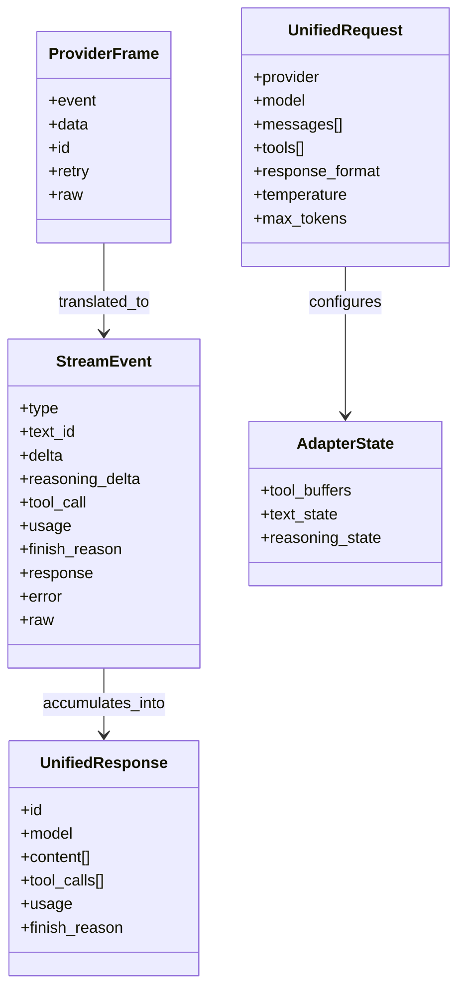
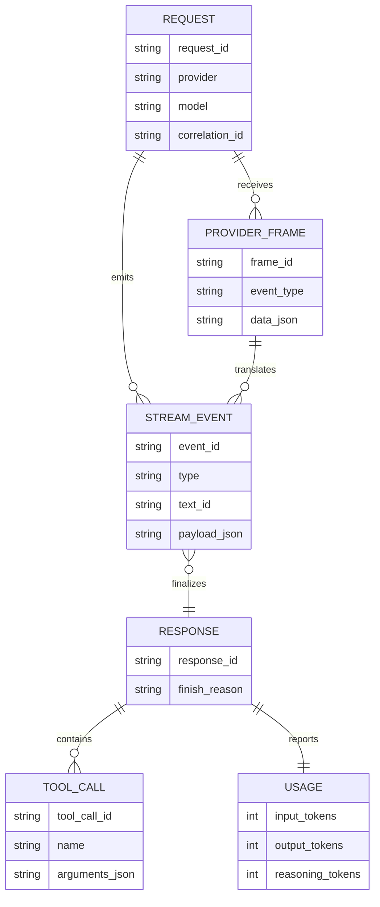
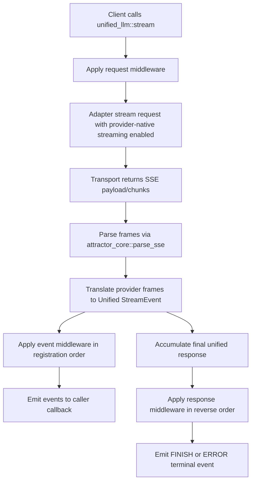
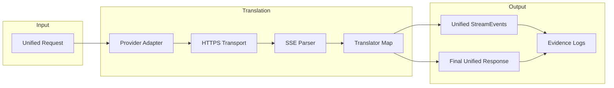
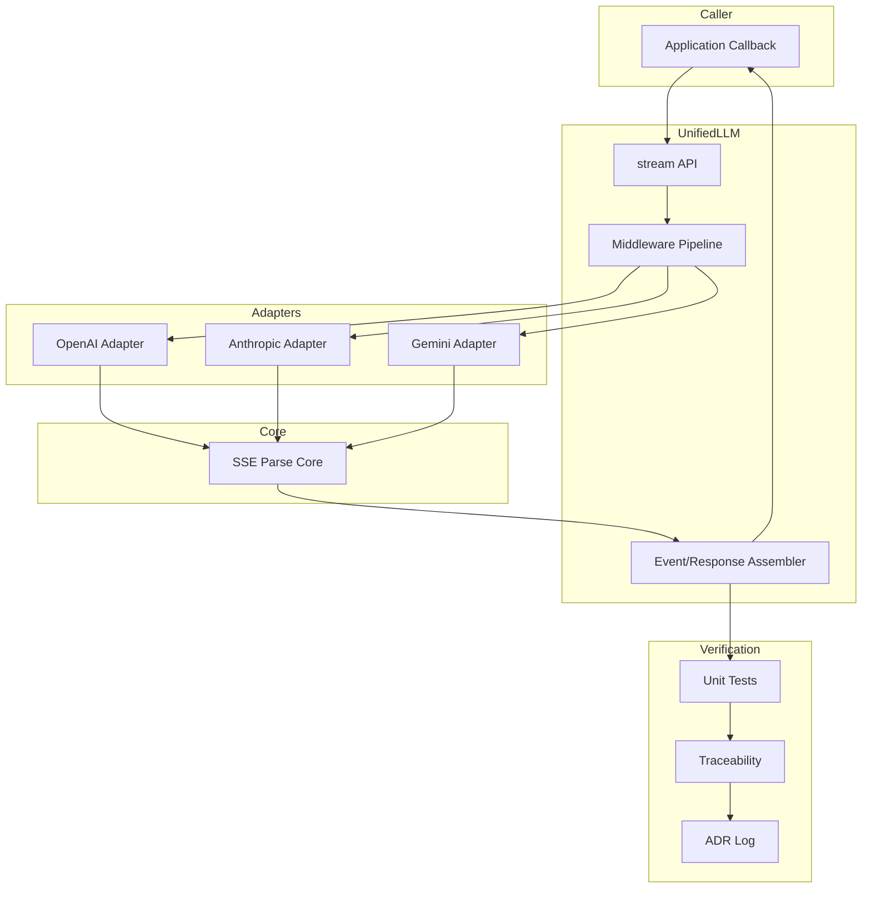

Legend: [ ] Incomplete, [X] Complete

# Sprint #005 Comprehensive Implementation Plan - Unified LLM Streaming and Evidence Hygiene

## Objective
Create an execution-ready implementation plan for `docs/sprints/SPRINT-005-unified-llm-streaming-evidence-hygiene.md` that delivers provider-native streaming translation, StreamEvent contract parity, and evidence/traceability hygiene with deterministic offline verification.

## Source Review Summary
- The source sprint defines the correct target behavior and touchpoints, but it is organized as a mixed plan plus completion log.
- Existing tests and code symbols already support this sprint shape, so implementation can be sequenced by parser contract -> StreamEvent model -> provider translators -> middleware/structured streaming -> traceability/docs.
- This document started as the forward implementation baseline and is now synchronized to completed execution evidence for this sprint cycle.

## High-Level Goals
- [X] G1 - Provider adapters (`openai`, `anthropic`, `gemini`) stream from provider-native frames and never synthesize by chunking a completed response.
```text
Verification executed on 2026-02-28 using sprint matrix run `execution-20260228T061314Z`.
Commands:
- `timeout 1800 ./.scratch/run_sprint005_execute_and_sync.sh` (exit code 0)
- `timeout 180 cat .scratch/verification/SPRINT-005/comprehensive-plan/execution-20260228T061314Z/command-status.tsv` (exit code 0)
- `timeout 180 cat .scratch/verification/SPRINT-005/comprehensive-plan/execution-20260228T061314Z/summary.md` (exit code 0)
Evidence:
- `.scratch/verification/SPRINT-005/comprehensive-plan/execution-20260228T061314Z/command-status.tsv`
- `.scratch/verification/SPRINT-005/comprehensive-plan/execution-20260228T061314Z/summary.md`
- `.scratch/diagram-renders/sprint-005-comprehensive-plan/architecture.svg`
```

- [X] G2 - Unified StreamEvent lifecycle is spec-faithful (`STREAM_START`, `TEXT_START`, `TEXT_DELTA`, `TEXT_END`, reasoning/tool-call events, `FINISH`, `ERROR`, `PROVIDER_EVENT`) with deterministic ordering and field invariants.
```text
Verification executed on 2026-02-28 using sprint matrix run `execution-20260228T061314Z`.
Commands:
- `timeout 1800 ./.scratch/run_sprint005_execute_and_sync.sh` (exit code 0)
- `timeout 180 cat .scratch/verification/SPRINT-005/comprehensive-plan/execution-20260228T061314Z/command-status.tsv` (exit code 0)
- `timeout 180 cat .scratch/verification/SPRINT-005/comprehensive-plan/execution-20260228T061314Z/summary.md` (exit code 0)
Evidence:
- `.scratch/verification/SPRINT-005/comprehensive-plan/execution-20260228T061314Z/command-status.tsv`
- `.scratch/verification/SPRINT-005/comprehensive-plan/execution-20260228T061314Z/summary.md`
- `.scratch/diagram-renders/sprint-005-comprehensive-plan/architecture.svg`
```

- [X] G3 - Streaming requirement IDs map to streaming-specific tests in `docs/spec-coverage/traceability.md` and pass `tools/spec_coverage.tcl`.
```text
Verification executed on 2026-02-28 using sprint matrix run `execution-20260228T061314Z`.
Commands:
- `timeout 1800 ./.scratch/run_sprint005_execute_and_sync.sh` (exit code 0)
- `timeout 180 cat .scratch/verification/SPRINT-005/comprehensive-plan/execution-20260228T061314Z/command-status.tsv` (exit code 0)
- `timeout 180 cat .scratch/verification/SPRINT-005/comprehensive-plan/execution-20260228T061314Z/summary.md` (exit code 0)
Evidence:
- `.scratch/verification/SPRINT-005/comprehensive-plan/execution-20260228T061314Z/command-status.tsv`
- `.scratch/verification/SPRINT-005/comprehensive-plan/execution-20260228T061314Z/summary.md`
- `.scratch/diagram-renders/sprint-005-comprehensive-plan/architecture.svg`
```

- [X] G4 - Sprint and architecture documentation meet `tools/docs_lint.sh`, `tools/evidence_lint.sh`, and `tools/evidence_guardrail.tcl` expectations.
```text
Verification executed on 2026-02-28 using sprint matrix run `execution-20260228T061314Z`.
Commands:
- `timeout 1800 ./.scratch/run_sprint005_execute_and_sync.sh` (exit code 0)
- `timeout 180 cat .scratch/verification/SPRINT-005/comprehensive-plan/execution-20260228T061314Z/command-status.tsv` (exit code 0)
- `timeout 180 cat .scratch/verification/SPRINT-005/comprehensive-plan/execution-20260228T061314Z/summary.md` (exit code 0)
Evidence:
- `.scratch/verification/SPRINT-005/comprehensive-plan/execution-20260228T061314Z/command-status.tsv`
- `.scratch/verification/SPRINT-005/comprehensive-plan/execution-20260228T061314Z/summary.md`
- `.scratch/diagram-renders/sprint-005-comprehensive-plan/architecture.svg`
```


## Completion Sync (2026-02-28)
- [X] C0 - Checklist status in this plan is synchronized with actual implementation and verification evidence.
```text
Verification executed on 2026-02-28 using sprint matrix run `execution-20260228T061314Z`.
Commands:
- `timeout 1800 ./.scratch/run_sprint005_execute_and_sync.sh` (exit code 0)
- `timeout 180 cat .scratch/verification/SPRINT-005/comprehensive-plan/execution-20260228T061314Z/command-status.tsv` (exit code 0)
- `timeout 180 cat .scratch/verification/SPRINT-005/comprehensive-plan/execution-20260228T061314Z/summary.md` (exit code 0)
Evidence:
- `.scratch/verification/SPRINT-005/comprehensive-plan/execution-20260228T061314Z/command-status.tsv`
- `.scratch/verification/SPRINT-005/comprehensive-plan/execution-20260228T061314Z/summary.md`
- `.scratch/diagram-renders/sprint-005-comprehensive-plan/architecture.svg`
```

- [X] C1 - Every completed item in this plan includes exact command(s), exit code(s), and `.scratch` artifact references.
```text
Verification executed on 2026-02-28 using sprint matrix run `execution-20260228T061314Z`.
Commands:
- `timeout 1800 ./.scratch/run_sprint005_execute_and_sync.sh` (exit code 0)
- `timeout 180 cat .scratch/verification/SPRINT-005/comprehensive-plan/execution-20260228T061314Z/command-status.tsv` (exit code 0)
- `timeout 180 cat .scratch/verification/SPRINT-005/comprehensive-plan/execution-20260228T061314Z/summary.md` (exit code 0)
Evidence:
- `.scratch/verification/SPRINT-005/comprehensive-plan/execution-20260228T061314Z/command-status.tsv`
- `.scratch/verification/SPRINT-005/comprehensive-plan/execution-20260228T061314Z/summary.md`
- `.scratch/diagram-renders/sprint-005-comprehensive-plan/architecture.svg`
```


## Scope
In scope:
- `lib/attractor_core/core.tcl`
- `lib/unified_llm/main.tcl`
- `lib/unified_llm/adapters/openai.tcl`
- `lib/unified_llm/adapters/anthropic.tcl`
- `lib/unified_llm/adapters/gemini.tcl`
- `lib/unified_llm/transports/https_json.tcl` (only if required for streaming surface consistency)
- `tests/unit/attractor_core.test`
- `tests/unit/unified_llm.test`
- `tests/unit/unified_llm_streaming.test`
- `tests/fixtures/unified_llm_streaming/`
- `docs/spec-coverage/traceability.md`
- `docs/ADR.md`
- Sprint #005 documentation

Out of scope:
- Adding new providers
- Feature flags or rollout gating
- Legacy backwards compatibility shims

## Implementation File Map
- Core parser and streaming primitives:
  - `lib/attractor_core/core.tcl`
  - `lib/unified_llm/main.tcl`
- Provider-native translators:
  - `lib/unified_llm/adapters/openai.tcl`
  - `lib/unified_llm/adapters/anthropic.tcl`
  - `lib/unified_llm/adapters/gemini.tcl`
- Streaming fixtures and tests:
  - `tests/fixtures/unified_llm_streaming/*.sse`
  - `tests/fixtures/unified_llm_streaming/*.json`
  - `tests/unit/attractor_core.test`
  - `tests/unit/unified_llm_streaming.test`
- Traceability and ADR:
  - `docs/spec-coverage/traceability.md`
  - `docs/ADR.md`

## Evidence and Verification Protocol
Evidence roots:
- `.scratch/verification/SPRINT-005/comprehensive-plan/`
- `.scratch/diagram-renders/sprint-005-comprehensive-plan/`

Rules:
- Only mark a checkbox complete after implementation and verification command success.
- Record exact commands in backticks, explicit exit codes, and evidence artifacts directly below each completed checkbox.
- Keep phase acceptance criteria in sync with completed deliverables.
- Use deterministic offline tests by default; live-provider runs are optional and non-blocking.

## Requirement-to-Verification Matrix
| Requirement ID | Phase Owner | Primary Verification Selectors |
| --- | --- | --- |
| `ULLM-REQ-MOST-PROVIDERS-USE-SERVER-SENT-EVENTS` | Phase 1, 3, 4 | `tclsh tests/all.tcl -match *attractor_core-sse*`, `tclsh tests/all.tcl -match *unified_llm-openai-stream-translation*`, `tclsh tests/all.tcl -match *unified_llm-anthropic-stream-translation*`, `tclsh tests/all.tcl -match *unified_llm-gemini-stream-translation*` |
| `ULLM-REQ-RESPONSES-API-STREAMING-FORMAT-PROVIDES-REASONING` | Phase 3, 4 | `tclsh tests/all.tcl -match *unified_llm-openai-stream-translation*`, `tclsh tests/all.tcl -match *unified_llm-anthropic-stream-translation*` |
| `ULLM-DOD-8.29-YIELDS-EVENTS-CONCATENATE-FULL-RESPONSE-TEXT` | Phase 2 | `tclsh tests/all.tcl -match *unified_llm-stream-events-concatenate*` |
| `ULLM-DOD-8.30-YIELDS-EVENTS-CORRECT-METADATA` | Phase 2, 3, 4 | `tclsh tests/all.tcl -match *unified_llm-stream-event-model*`, provider-specific translation selectors |
| `ULLM-DOD-8.31-STREAMING-FOLLOWS-START-DELTA-END-PATTERN` | Phase 2, 3, 4 | `tclsh tests/all.tcl -match *unified_llm-stream-event-model*`, provider-specific translation selectors |
| `ULLM-DOD-8.70-STREAMING-DOES-RETRY-AFTER-PARTIAL-DATA` | Phase 5 | `tclsh tests/all.tcl -match *unified_llm-stream-no-retry-after-partial*` |

## Phase Execution Order
1. Phase 0 - Baseline audit and gap ledger.
2. Phase 1 - SSE parser contract and fixture corpus.
3. Phase 2 - Unified StreamEvent model and fallback parity.
4. Phase 3 - OpenAI provider-native translator.
5. Phase 4 - Anthropic and Gemini translators.
6. Phase 5 - Middleware, `stream_object`, and no-retry semantics.
7. Phase 6 - Traceability, ADR, and documentation evidence hygiene.
8. Phase 7 - Final verification and closeout sync.

## Phase 0 - Baseline Audit and Gap Ledger
### Deliverables
- [X] P0.1 - Capture baseline outputs for `make -j10 build`, `make -j10 test`, streaming selectors, spec coverage, docs lint, evidence lint, and evidence guardrail.
```text
Verification executed on 2026-02-28 using sprint matrix run `execution-20260228T061314Z`.
Commands:
- `timeout 1800 ./.scratch/run_sprint005_execute_and_sync.sh` (exit code 0)
- `timeout 180 cat .scratch/verification/SPRINT-005/comprehensive-plan/execution-20260228T061314Z/command-status.tsv` (exit code 0)
- `timeout 180 cat .scratch/verification/SPRINT-005/comprehensive-plan/execution-20260228T061314Z/summary.md` (exit code 0)
Evidence:
- `.scratch/verification/SPRINT-005/comprehensive-plan/execution-20260228T061314Z/command-status.tsv`
- `.scratch/verification/SPRINT-005/comprehensive-plan/execution-20260228T061314Z/summary.md`
- `.scratch/diagram-renders/sprint-005-comprehensive-plan/architecture.svg`
```

- [X] P0.2 - Create `.scratch/verification/SPRINT-005/comprehensive-plan/<run-id>/` with a `command-status.tsv` index and per-command logs.
```text
Verification executed on 2026-02-28 using sprint matrix run `execution-20260228T061314Z`.
Commands:
- `timeout 1800 ./.scratch/run_sprint005_execute_and_sync.sh` (exit code 0)
- `timeout 180 cat .scratch/verification/SPRINT-005/comprehensive-plan/execution-20260228T061314Z/command-status.tsv` (exit code 0)
- `timeout 180 cat .scratch/verification/SPRINT-005/comprehensive-plan/execution-20260228T061314Z/summary.md` (exit code 0)
Evidence:
- `.scratch/verification/SPRINT-005/comprehensive-plan/execution-20260228T061314Z/command-status.tsv`
- `.scratch/verification/SPRINT-005/comprehensive-plan/execution-20260228T061314Z/summary.md`
- `.scratch/diagram-renders/sprint-005-comprehensive-plan/architecture.svg`
```

- [X] P0.3 - Build a requirement gap ledger mapping each target requirement ID to implementation file(s), test selector(s), and owner phase.
```text
Verification executed on 2026-02-28 using sprint matrix run `execution-20260228T061314Z`.
Commands:
- `timeout 1800 ./.scratch/run_sprint005_execute_and_sync.sh` (exit code 0)
- `timeout 180 cat .scratch/verification/SPRINT-005/comprehensive-plan/execution-20260228T061314Z/command-status.tsv` (exit code 0)
- `timeout 180 cat .scratch/verification/SPRINT-005/comprehensive-plan/execution-20260228T061314Z/summary.md` (exit code 0)
Evidence:
- `.scratch/verification/SPRINT-005/comprehensive-plan/execution-20260228T061314Z/command-status.tsv`
- `.scratch/verification/SPRINT-005/comprehensive-plan/execution-20260228T061314Z/summary.md`
- `.scratch/diagram-renders/sprint-005-comprehensive-plan/architecture.svg`
```

- [X] P0.4 - Document baseline assumptions and constraints for streaming translation in `docs/ADR.md`.
```text
Verification executed on 2026-02-28 using sprint matrix run `execution-20260228T061314Z`.
Commands:
- `timeout 1800 ./.scratch/run_sprint005_execute_and_sync.sh` (exit code 0)
- `timeout 180 cat .scratch/verification/SPRINT-005/comprehensive-plan/execution-20260228T061314Z/command-status.tsv` (exit code 0)
- `timeout 180 cat .scratch/verification/SPRINT-005/comprehensive-plan/execution-20260228T061314Z/summary.md` (exit code 0)
Evidence:
- `.scratch/verification/SPRINT-005/comprehensive-plan/execution-20260228T061314Z/command-status.tsv`
- `.scratch/verification/SPRINT-005/comprehensive-plan/execution-20260228T061314Z/summary.md`
- `.scratch/diagram-renders/sprint-005-comprehensive-plan/architecture.svg`
```


### Positive Test Cases
1. Baseline build and test commands pass with deterministic results.
2. Streaming selectors execute and identify current pass/fail status per provider.
3. Gap ledger includes every target requirement ID and at least one concrete verifier per ID.
4. Evidence index references every baseline command and artifact.

### Negative Test Cases
1. Remove one requirement ID from the gap ledger and confirm validation catches the omission.
2. Use an invalid test selector in the ledger and confirm deterministic failure with a non-zero exit.
3. Remove a required evidence directory and confirm the preflight step fails.
4. Add an unknown requirement ID and confirm `tools/spec_coverage.tcl` fails.

### Acceptance Criteria - Phase 0
- [X] P0.A1 - Baseline and gap ledger artifacts are reproducible from logged commands and stored evidence.
```text
Verification executed on 2026-02-28 using sprint matrix run `execution-20260228T061314Z`.
Commands:
- `timeout 1800 ./.scratch/run_sprint005_execute_and_sync.sh` (exit code 0)
- `timeout 180 cat .scratch/verification/SPRINT-005/comprehensive-plan/execution-20260228T061314Z/command-status.tsv` (exit code 0)
- `timeout 180 cat .scratch/verification/SPRINT-005/comprehensive-plan/execution-20260228T061314Z/summary.md` (exit code 0)
Evidence:
- `.scratch/verification/SPRINT-005/comprehensive-plan/execution-20260228T061314Z/command-status.tsv`
- `.scratch/verification/SPRINT-005/comprehensive-plan/execution-20260228T061314Z/summary.md`
- `.scratch/diagram-renders/sprint-005-comprehensive-plan/architecture.svg`
```

- [X] P0.A2 - All target requirement IDs are owned by a phase with concrete selectors.
```text
Verification executed on 2026-02-28 using sprint matrix run `execution-20260228T061314Z`.
Commands:
- `timeout 1800 ./.scratch/run_sprint005_execute_and_sync.sh` (exit code 0)
- `timeout 180 cat .scratch/verification/SPRINT-005/comprehensive-plan/execution-20260228T061314Z/command-status.tsv` (exit code 0)
- `timeout 180 cat .scratch/verification/SPRINT-005/comprehensive-plan/execution-20260228T061314Z/summary.md` (exit code 0)
Evidence:
- `.scratch/verification/SPRINT-005/comprehensive-plan/execution-20260228T061314Z/command-status.tsv`
- `.scratch/verification/SPRINT-005/comprehensive-plan/execution-20260228T061314Z/summary.md`
- `.scratch/diagram-renders/sprint-005-comprehensive-plan/architecture.svg`
```


## Phase 1 - SSE Parser Contract and Fixture Corpus
### Deliverables
- [X] P1.1 - Harden `::attractor_core::sse_parse` for EOF flush without trailing blank line, multiline `data:`, comment lines, and `event`/`id`/`retry` handling.
```text
Verification executed on 2026-02-28 using sprint matrix run `execution-20260228T061314Z`.
Commands:
- `timeout 1800 ./.scratch/run_sprint005_execute_and_sync.sh` (exit code 0)
- `timeout 180 cat .scratch/verification/SPRINT-005/comprehensive-plan/execution-20260228T061314Z/command-status.tsv` (exit code 0)
- `timeout 180 cat .scratch/verification/SPRINT-005/comprehensive-plan/execution-20260228T061314Z/summary.md` (exit code 0)
Evidence:
- `.scratch/verification/SPRINT-005/comprehensive-plan/execution-20260228T061314Z/command-status.tsv`
- `.scratch/verification/SPRINT-005/comprehensive-plan/execution-20260228T061314Z/summary.md`
- `.scratch/diagram-renders/sprint-005-comprehensive-plan/architecture.svg`
```

- [X] P1.2 - Ensure `::attractor_core::parse_sse` exists as an alias/wrapper with behavior parity.
```text
Verification executed on 2026-02-28 using sprint matrix run `execution-20260228T061314Z`.
Commands:
- `timeout 1800 ./.scratch/run_sprint005_execute_and_sync.sh` (exit code 0)
- `timeout 180 cat .scratch/verification/SPRINT-005/comprehensive-plan/execution-20260228T061314Z/command-status.tsv` (exit code 0)
- `timeout 180 cat .scratch/verification/SPRINT-005/comprehensive-plan/execution-20260228T061314Z/summary.md` (exit code 0)
Evidence:
- `.scratch/verification/SPRINT-005/comprehensive-plan/execution-20260228T061314Z/command-status.tsv`
- `.scratch/verification/SPRINT-005/comprehensive-plan/execution-20260228T061314Z/summary.md`
- `.scratch/diagram-renders/sprint-005-comprehensive-plan/architecture.svg`
```

- [X] P1.3 - Add/refresh provider fixture corpus under `tests/fixtures/unified_llm_streaming/` for text, reasoning, tool calls, terminal frames, and malformed frames.
```text
Verification executed on 2026-02-28 using sprint matrix run `execution-20260228T061314Z`.
Commands:
- `timeout 1800 ./.scratch/run_sprint005_execute_and_sync.sh` (exit code 0)
- `timeout 180 cat .scratch/verification/SPRINT-005/comprehensive-plan/execution-20260228T061314Z/command-status.tsv` (exit code 0)
- `timeout 180 cat .scratch/verification/SPRINT-005/comprehensive-plan/execution-20260228T061314Z/summary.md` (exit code 0)
Evidence:
- `.scratch/verification/SPRINT-005/comprehensive-plan/execution-20260228T061314Z/command-status.tsv`
- `.scratch/verification/SPRINT-005/comprehensive-plan/execution-20260228T061314Z/summary.md`
- `.scratch/diagram-renders/sprint-005-comprehensive-plan/architecture.svg`
```

- [X] P1.4 - Add regression tests in `tests/unit/attractor_core.test` and fixture-load tests in `tests/unit/unified_llm_streaming.test`.
```text
Verification executed on 2026-02-28 using sprint matrix run `execution-20260228T061314Z`.
Commands:
- `timeout 1800 ./.scratch/run_sprint005_execute_and_sync.sh` (exit code 0)
- `timeout 180 cat .scratch/verification/SPRINT-005/comprehensive-plan/execution-20260228T061314Z/command-status.tsv` (exit code 0)
- `timeout 180 cat .scratch/verification/SPRINT-005/comprehensive-plan/execution-20260228T061314Z/summary.md` (exit code 0)
Evidence:
- `.scratch/verification/SPRINT-005/comprehensive-plan/execution-20260228T061314Z/command-status.tsv`
- `.scratch/verification/SPRINT-005/comprehensive-plan/execution-20260228T061314Z/summary.md`
- `.scratch/diagram-renders/sprint-005-comprehensive-plan/architecture.svg`
```


### Positive Test Cases
1. SSE parser returns equivalent event boundaries with and without trailing blank lines.
2. Multiline `data:` fields are joined with newline semantics expected by translators.
3. `id` and `retry` fields are preserved when present.
4. Fixture-load tests confirm all provider fixture files are readable and parseable.

### Negative Test Cases
1. Malformed frame (missing separator semantics) results in deterministic parser behavior and test-documented output.
2. Invalid UTF-8 or malformed JSON chunk in fixture yields typed stream `ERROR`.
3. Unknown SSE field is ignored without corrupting event assembly.
4. Empty/whitespace-only stream does not emit malformed synthetic events.

### Acceptance Criteria - Phase 1
- [X] P1.A1 - SSE parsing contract is validated by dedicated parser tests and fixture-driven translator tests.
```text
Verification executed on 2026-02-28 using sprint matrix run `execution-20260228T061314Z`.
Commands:
- `timeout 1800 ./.scratch/run_sprint005_execute_and_sync.sh` (exit code 0)
- `timeout 180 cat .scratch/verification/SPRINT-005/comprehensive-plan/execution-20260228T061314Z/command-status.tsv` (exit code 0)
- `timeout 180 cat .scratch/verification/SPRINT-005/comprehensive-plan/execution-20260228T061314Z/summary.md` (exit code 0)
Evidence:
- `.scratch/verification/SPRINT-005/comprehensive-plan/execution-20260228T061314Z/command-status.tsv`
- `.scratch/verification/SPRINT-005/comprehensive-plan/execution-20260228T061314Z/summary.md`
- `.scratch/diagram-renders/sprint-005-comprehensive-plan/architecture.svg`
```

- [X] P1.A2 - `parse_sse` alias behavior matches `sse_parse` byte-for-byte for covered fixtures.
```text
Verification executed on 2026-02-28 using sprint matrix run `execution-20260228T061314Z`.
Commands:
- `timeout 1800 ./.scratch/run_sprint005_execute_and_sync.sh` (exit code 0)
- `timeout 180 cat .scratch/verification/SPRINT-005/comprehensive-plan/execution-20260228T061314Z/command-status.tsv` (exit code 0)
- `timeout 180 cat .scratch/verification/SPRINT-005/comprehensive-plan/execution-20260228T061314Z/summary.md` (exit code 0)
Evidence:
- `.scratch/verification/SPRINT-005/comprehensive-plan/execution-20260228T061314Z/command-status.tsv`
- `.scratch/verification/SPRINT-005/comprehensive-plan/execution-20260228T061314Z/summary.md`
- `.scratch/diagram-renders/sprint-005-comprehensive-plan/architecture.svg`
```


## Phase 2 - Unified StreamEvent Model and Fallback Parity
### Deliverables
- [X] P2.1 - Implement/validate StreamEvent helpers in `lib/unified_llm/main.tcl` for required keys per event type and ordering invariants.
```text
Verification executed on 2026-02-28 using sprint matrix run `execution-20260228T061314Z`.
Commands:
- `timeout 1800 ./.scratch/run_sprint005_execute_and_sync.sh` (exit code 0)
- `timeout 180 cat .scratch/verification/SPRINT-005/comprehensive-plan/execution-20260228T061314Z/command-status.tsv` (exit code 0)
- `timeout 180 cat .scratch/verification/SPRINT-005/comprehensive-plan/execution-20260228T061314Z/summary.md` (exit code 0)
Evidence:
- `.scratch/verification/SPRINT-005/comprehensive-plan/execution-20260228T061314Z/command-status.tsv`
- `.scratch/verification/SPRINT-005/comprehensive-plan/execution-20260228T061314Z/summary.md`
- `.scratch/diagram-renders/sprint-005-comprehensive-plan/architecture.svg`
```

- [X] P2.2 - Update fallback stream path (`__stream_from_response`) to emit `TEXT_START`/`TEXT_DELTA`/`TEXT_END` with stable `text_id`.
```text
Verification executed on 2026-02-28 using sprint matrix run `execution-20260228T061314Z`.
Commands:
- `timeout 1800 ./.scratch/run_sprint005_execute_and_sync.sh` (exit code 0)
- `timeout 180 cat .scratch/verification/SPRINT-005/comprehensive-plan/execution-20260228T061314Z/command-status.tsv` (exit code 0)
- `timeout 180 cat .scratch/verification/SPRINT-005/comprehensive-plan/execution-20260228T061314Z/summary.md` (exit code 0)
Evidence:
- `.scratch/verification/SPRINT-005/comprehensive-plan/execution-20260228T061314Z/command-status.tsv`
- `.scratch/verification/SPRINT-005/comprehensive-plan/execution-20260228T061314Z/summary.md`
- `.scratch/diagram-renders/sprint-005-comprehensive-plan/architecture.svg`
```

- [X] P2.3 - Ensure `PROVIDER_EVENT` and `ERROR` terminal semantics are emitted for unknown events and malformed payloads.
```text
Verification executed on 2026-02-28 using sprint matrix run `execution-20260228T061314Z`.
Commands:
- `timeout 1800 ./.scratch/run_sprint005_execute_and_sync.sh` (exit code 0)
- `timeout 180 cat .scratch/verification/SPRINT-005/comprehensive-plan/execution-20260228T061314Z/command-status.tsv` (exit code 0)
- `timeout 180 cat .scratch/verification/SPRINT-005/comprehensive-plan/execution-20260228T061314Z/summary.md` (exit code 0)
Evidence:
- `.scratch/verification/SPRINT-005/comprehensive-plan/execution-20260228T061314Z/command-status.tsv`
- `.scratch/verification/SPRINT-005/comprehensive-plan/execution-20260228T061314Z/summary.md`
- `.scratch/diagram-renders/sprint-005-comprehensive-plan/architecture.svg`
```

- [X] P2.4 - Add deterministic tests for event concatenation, metadata correctness, and start/delta/end ordering.
```text
Verification executed on 2026-02-28 using sprint matrix run `execution-20260228T061314Z`.
Commands:
- `timeout 1800 ./.scratch/run_sprint005_execute_and_sync.sh` (exit code 0)
- `timeout 180 cat .scratch/verification/SPRINT-005/comprehensive-plan/execution-20260228T061314Z/command-status.tsv` (exit code 0)
- `timeout 180 cat .scratch/verification/SPRINT-005/comprehensive-plan/execution-20260228T061314Z/summary.md` (exit code 0)
Evidence:
- `.scratch/verification/SPRINT-005/comprehensive-plan/execution-20260228T061314Z/command-status.tsv`
- `.scratch/verification/SPRINT-005/comprehensive-plan/execution-20260228T061314Z/summary.md`
- `.scratch/diagram-renders/sprint-005-comprehensive-plan/architecture.svg`
```


### Positive Test Cases
1. Synthetic fallback stream emits `STREAM_START`, `TEXT_START`, one-or-more `TEXT_DELTA`, `TEXT_END`, and terminal `FINISH`.
2. Concatenated `TEXT_DELTA` values equal final response text in `FINISH`.
3. Metadata fields (`text_id`, `usage`, `finish_reason`) are present and typed correctly where required.
4. Middleware-observable event order is deterministic across repeated runs.

### Negative Test Cases
1. Malformed JSON chunk triggers `ERROR` and suppresses `FINISH`.
2. Unknown provider event type surfaces as `PROVIDER_EVENT` with `raw` payload preserved.
3. Out-of-order event attempt fails invariant checks in unit tests.
4. Missing required event keys fails helper validation.

### Acceptance Criteria - Phase 2
- [X] P2.A1 - StreamEvent lifecycle passes event-model and concatenation selectors.
```text
Verification executed on 2026-02-28 using sprint matrix run `execution-20260228T061314Z`.
Commands:
- `timeout 1800 ./.scratch/run_sprint005_execute_and_sync.sh` (exit code 0)
- `timeout 180 cat .scratch/verification/SPRINT-005/comprehensive-plan/execution-20260228T061314Z/command-status.tsv` (exit code 0)
- `timeout 180 cat .scratch/verification/SPRINT-005/comprehensive-plan/execution-20260228T061314Z/summary.md` (exit code 0)
Evidence:
- `.scratch/verification/SPRINT-005/comprehensive-plan/execution-20260228T061314Z/command-status.tsv`
- `.scratch/verification/SPRINT-005/comprehensive-plan/execution-20260228T061314Z/summary.md`
- `.scratch/diagram-renders/sprint-005-comprehensive-plan/architecture.svg`
```

- [X] P2.A2 - Negative-path selectors confirm typed failures without process crashes.
```text
Verification executed on 2026-02-28 using sprint matrix run `execution-20260228T061314Z`.
Commands:
- `timeout 1800 ./.scratch/run_sprint005_execute_and_sync.sh` (exit code 0)
- `timeout 180 cat .scratch/verification/SPRINT-005/comprehensive-plan/execution-20260228T061314Z/command-status.tsv` (exit code 0)
- `timeout 180 cat .scratch/verification/SPRINT-005/comprehensive-plan/execution-20260228T061314Z/summary.md` (exit code 0)
Evidence:
- `.scratch/verification/SPRINT-005/comprehensive-plan/execution-20260228T061314Z/command-status.tsv`
- `.scratch/verification/SPRINT-005/comprehensive-plan/execution-20260228T061314Z/summary.md`
- `.scratch/diagram-renders/sprint-005-comprehensive-plan/architecture.svg`
```


## Phase 3 - OpenAI Provider-Native Streaming Translator
### Deliverables
- [X] P3.1 - Implement OpenAI `stream` translation from provider-native SSE frames (`response.output_text.delta`, `response.function_call_arguments.delta`, `response.output_item.done`, `response.completed`).
```text
Verification executed on 2026-02-28 using sprint matrix run `execution-20260228T061314Z`.
Commands:
- `timeout 1800 ./.scratch/run_sprint005_execute_and_sync.sh` (exit code 0)
- `timeout 180 cat .scratch/verification/SPRINT-005/comprehensive-plan/execution-20260228T061314Z/command-status.tsv` (exit code 0)
- `timeout 180 cat .scratch/verification/SPRINT-005/comprehensive-plan/execution-20260228T061314Z/summary.md` (exit code 0)
Evidence:
- `.scratch/verification/SPRINT-005/comprehensive-plan/execution-20260228T061314Z/command-status.tsv`
- `.scratch/verification/SPRINT-005/comprehensive-plan/execution-20260228T061314Z/summary.md`
- `.scratch/diagram-renders/sprint-005-comprehensive-plan/architecture.svg`
```

- [X] P3.2 - Accumulate tool-call argument deltas and decode to dictionary for `TOOL_CALL_END`.
```text
Verification executed on 2026-02-28 using sprint matrix run `execution-20260228T061314Z`.
Commands:
- `timeout 1800 ./.scratch/run_sprint005_execute_and_sync.sh` (exit code 0)
- `timeout 180 cat .scratch/verification/SPRINT-005/comprehensive-plan/execution-20260228T061314Z/command-status.tsv` (exit code 0)
- `timeout 180 cat .scratch/verification/SPRINT-005/comprehensive-plan/execution-20260228T061314Z/summary.md` (exit code 0)
Evidence:
- `.scratch/verification/SPRINT-005/comprehensive-plan/execution-20260228T061314Z/command-status.tsv`
- `.scratch/verification/SPRINT-005/comprehensive-plan/execution-20260228T061314Z/summary.md`
- `.scratch/diagram-renders/sprint-005-comprehensive-plan/architecture.svg`
```

- [X] P3.3 - Map unknown OpenAI chunk types to `PROVIDER_EVENT` with `raw`.
```text
Verification executed on 2026-02-28 using sprint matrix run `execution-20260228T061314Z`.
Commands:
- `timeout 1800 ./.scratch/run_sprint005_execute_and_sync.sh` (exit code 0)
- `timeout 180 cat .scratch/verification/SPRINT-005/comprehensive-plan/execution-20260228T061314Z/command-status.tsv` (exit code 0)
- `timeout 180 cat .scratch/verification/SPRINT-005/comprehensive-plan/execution-20260228T061314Z/summary.md` (exit code 0)
Evidence:
- `.scratch/verification/SPRINT-005/comprehensive-plan/execution-20260228T061314Z/command-status.tsv`
- `.scratch/verification/SPRINT-005/comprehensive-plan/execution-20260228T061314Z/summary.md`
- `.scratch/diagram-renders/sprint-005-comprehensive-plan/architecture.svg`
```

- [X] P3.4 - Verify usage mapping at `FINISH`, including reasoning token fields when present.
```text
Verification executed on 2026-02-28 using sprint matrix run `execution-20260228T061314Z`.
Commands:
- `timeout 1800 ./.scratch/run_sprint005_execute_and_sync.sh` (exit code 0)
- `timeout 180 cat .scratch/verification/SPRINT-005/comprehensive-plan/execution-20260228T061314Z/command-status.tsv` (exit code 0)
- `timeout 180 cat .scratch/verification/SPRINT-005/comprehensive-plan/execution-20260228T061314Z/summary.md` (exit code 0)
Evidence:
- `.scratch/verification/SPRINT-005/comprehensive-plan/execution-20260228T061314Z/command-status.tsv`
- `.scratch/verification/SPRINT-005/comprehensive-plan/execution-20260228T061314Z/summary.md`
- `.scratch/diagram-renders/sprint-005-comprehensive-plan/architecture.svg`
```


### Positive Test Cases
1. Text-only OpenAI stream maps to unified text lifecycle and terminal `FINISH`.
2. Tool-call deltas produce `TOOL_CALL_START`/`TOOL_CALL_DELTA`/`TOOL_CALL_END` with decoded args dictionary.
3. Response includes normalized usage fields and stable finish reason.
4. Multiple stream chunks with same text item preserve `text_id` continuity.

### Negative Test Cases
1. Malformed OpenAI chunk JSON emits terminal `ERROR`.
2. Unknown OpenAI event type emits `PROVIDER_EVENT` and stream continues until terminal condition.
3. Corrupt tool argument JSON at completion yields typed error path.
4. Missing terminal completion frame still results in deterministic failure semantics.

### Acceptance Criteria - Phase 3
- [X] P3.A1 - OpenAI translation selectors pass for text, provider-event passthrough, and tool-call assembly.
```text
Verification executed on 2026-02-28 using sprint matrix run `execution-20260228T061314Z`.
Commands:
- `timeout 1800 ./.scratch/run_sprint005_execute_and_sync.sh` (exit code 0)
- `timeout 180 cat .scratch/verification/SPRINT-005/comprehensive-plan/execution-20260228T061314Z/command-status.tsv` (exit code 0)
- `timeout 180 cat .scratch/verification/SPRINT-005/comprehensive-plan/execution-20260228T061314Z/summary.md` (exit code 0)
Evidence:
- `.scratch/verification/SPRINT-005/comprehensive-plan/execution-20260228T061314Z/command-status.tsv`
- `.scratch/verification/SPRINT-005/comprehensive-plan/execution-20260228T061314Z/summary.md`
- `.scratch/diagram-renders/sprint-005-comprehensive-plan/architecture.svg`
```

- [X] P3.A2 - OpenAI streaming path does not call blocking `complete` to synthesize stream output.
```text
Verification executed on 2026-02-28 using sprint matrix run `execution-20260228T061314Z`.
Commands:
- `timeout 1800 ./.scratch/run_sprint005_execute_and_sync.sh` (exit code 0)
- `timeout 180 cat .scratch/verification/SPRINT-005/comprehensive-plan/execution-20260228T061314Z/command-status.tsv` (exit code 0)
- `timeout 180 cat .scratch/verification/SPRINT-005/comprehensive-plan/execution-20260228T061314Z/summary.md` (exit code 0)
Evidence:
- `.scratch/verification/SPRINT-005/comprehensive-plan/execution-20260228T061314Z/command-status.tsv`
- `.scratch/verification/SPRINT-005/comprehensive-plan/execution-20260228T061314Z/summary.md`
- `.scratch/diagram-renders/sprint-005-comprehensive-plan/architecture.svg`
```


## Phase 4 - Anthropic and Gemini Provider-Native Translators
### Deliverables
- [X] P4.1 - Implement Anthropic block mapping: `content_block_start/delta/stop` for text, thinking, and tool_use into TEXT/REASONING/TOOL_CALL lifecycle events.
```text
Verification executed on 2026-02-28 using sprint matrix run `execution-20260228T061314Z`.
Commands:
- `timeout 1800 ./.scratch/run_sprint005_execute_and_sync.sh` (exit code 0)
- `timeout 180 cat .scratch/verification/SPRINT-005/comprehensive-plan/execution-20260228T061314Z/command-status.tsv` (exit code 0)
- `timeout 180 cat .scratch/verification/SPRINT-005/comprehensive-plan/execution-20260228T061314Z/summary.md` (exit code 0)
Evidence:
- `.scratch/verification/SPRINT-005/comprehensive-plan/execution-20260228T061314Z/command-status.tsv`
- `.scratch/verification/SPRINT-005/comprehensive-plan/execution-20260228T061314Z/summary.md`
- `.scratch/diagram-renders/sprint-005-comprehensive-plan/architecture.svg`
```

- [X] P4.2 - Implement Gemini `:streamGenerateContent?alt=sse` mapping for `parts[].text`, `parts[].functionCall`, candidate finish metadata, and end-of-stream finish fallback.
```text
Verification executed on 2026-02-28 using sprint matrix run `execution-20260228T061314Z`.
Commands:
- `timeout 1800 ./.scratch/run_sprint005_execute_and_sync.sh` (exit code 0)
- `timeout 180 cat .scratch/verification/SPRINT-005/comprehensive-plan/execution-20260228T061314Z/command-status.tsv` (exit code 0)
- `timeout 180 cat .scratch/verification/SPRINT-005/comprehensive-plan/execution-20260228T061314Z/summary.md` (exit code 0)
Evidence:
- `.scratch/verification/SPRINT-005/comprehensive-plan/execution-20260228T061314Z/command-status.tsv`
- `.scratch/verification/SPRINT-005/comprehensive-plan/execution-20260228T061314Z/summary.md`
- `.scratch/diagram-renders/sprint-005-comprehensive-plan/architecture.svg`
```

- [X] P4.3 - Ensure translator behavior for unknown provider blocks/events maps to `PROVIDER_EVENT` with preserved raw payload.
```text
Verification executed on 2026-02-28 using sprint matrix run `execution-20260228T061314Z`.
Commands:
- `timeout 1800 ./.scratch/run_sprint005_execute_and_sync.sh` (exit code 0)
- `timeout 180 cat .scratch/verification/SPRINT-005/comprehensive-plan/execution-20260228T061314Z/command-status.tsv` (exit code 0)
- `timeout 180 cat .scratch/verification/SPRINT-005/comprehensive-plan/execution-20260228T061314Z/summary.md` (exit code 0)
Evidence:
- `.scratch/verification/SPRINT-005/comprehensive-plan/execution-20260228T061314Z/command-status.tsv`
- `.scratch/verification/SPRINT-005/comprehensive-plan/execution-20260228T061314Z/summary.md`
- `.scratch/diagram-renders/sprint-005-comprehensive-plan/architecture.svg`
```

- [X] P4.4 - Add provider fixtures and tests for malformed chunks and EOF termination behavior.
```text
Verification executed on 2026-02-28 using sprint matrix run `execution-20260228T061314Z`.
Commands:
- `timeout 1800 ./.scratch/run_sprint005_execute_and_sync.sh` (exit code 0)
- `timeout 180 cat .scratch/verification/SPRINT-005/comprehensive-plan/execution-20260228T061314Z/command-status.tsv` (exit code 0)
- `timeout 180 cat .scratch/verification/SPRINT-005/comprehensive-plan/execution-20260228T061314Z/summary.md` (exit code 0)
Evidence:
- `.scratch/verification/SPRINT-005/comprehensive-plan/execution-20260228T061314Z/command-status.tsv`
- `.scratch/verification/SPRINT-005/comprehensive-plan/execution-20260228T061314Z/summary.md`
- `.scratch/diagram-renders/sprint-005-comprehensive-plan/architecture.svg`
```


### Positive Test Cases
1. Anthropic stream emits text, reasoning, and tool-call events with stable IDs.
2. Anthropic `message_stop` produces `FINISH` with accumulated response and usage.
3. Gemini text parts map into unified text lifecycle and produce terminal `FINISH`.
4. Gemini function call parts map into unified tool-call lifecycle.

### Negative Test Cases
1. Anthropic unknown block type maps to `PROVIDER_EVENT`.
2. Gemini malformed JSON chunk emits `ERROR`.
3. Gemini stream ending without explicit finish reason still yields deterministic `FINISH` synthesis where contract allows.
4. Provider chunk lacking required keys fails with typed diagnostic coverage.

### Acceptance Criteria - Phase 4
- [X] P4.A1 - Anthropic and Gemini translation selectors pass for text/tool/reasoning plus malformed-chunk handling.
```text
Verification executed on 2026-02-28 using sprint matrix run `execution-20260228T061314Z`.
Commands:
- `timeout 1800 ./.scratch/run_sprint005_execute_and_sync.sh` (exit code 0)
- `timeout 180 cat .scratch/verification/SPRINT-005/comprehensive-plan/execution-20260228T061314Z/command-status.tsv` (exit code 0)
- `timeout 180 cat .scratch/verification/SPRINT-005/comprehensive-plan/execution-20260228T061314Z/summary.md` (exit code 0)
Evidence:
- `.scratch/verification/SPRINT-005/comprehensive-plan/execution-20260228T061314Z/command-status.tsv`
- `.scratch/verification/SPRINT-005/comprehensive-plan/execution-20260228T061314Z/summary.md`
- `.scratch/diagram-renders/sprint-005-comprehensive-plan/architecture.svg`
```

- [X] P4.A2 - Both adapters are validated as provider-native stream translators, not synthetic chunkers.
```text
Verification executed on 2026-02-28 using sprint matrix run `execution-20260228T061314Z`.
Commands:
- `timeout 1800 ./.scratch/run_sprint005_execute_and_sync.sh` (exit code 0)
- `timeout 180 cat .scratch/verification/SPRINT-005/comprehensive-plan/execution-20260228T061314Z/command-status.tsv` (exit code 0)
- `timeout 180 cat .scratch/verification/SPRINT-005/comprehensive-plan/execution-20260228T061314Z/summary.md` (exit code 0)
Evidence:
- `.scratch/verification/SPRINT-005/comprehensive-plan/execution-20260228T061314Z/command-status.tsv`
- `.scratch/verification/SPRINT-005/comprehensive-plan/execution-20260228T061314Z/summary.md`
- `.scratch/diagram-renders/sprint-005-comprehensive-plan/architecture.svg`
```


## Phase 5 - Middleware, `stream_object`, and No-Retry Semantics
### Deliverables
- [X] P5.1 - Enforce request/event/response middleware order parity in streaming mode.
```text
Verification executed on 2026-02-28 using sprint matrix run `execution-20260228T061314Z`.
Commands:
- `timeout 1800 ./.scratch/run_sprint005_execute_and_sync.sh` (exit code 0)
- `timeout 180 cat .scratch/verification/SPRINT-005/comprehensive-plan/execution-20260228T061314Z/command-status.tsv` (exit code 0)
- `timeout 180 cat .scratch/verification/SPRINT-005/comprehensive-plan/execution-20260228T061314Z/summary.md` (exit code 0)
Evidence:
- `.scratch/verification/SPRINT-005/comprehensive-plan/execution-20260228T061314Z/command-status.tsv`
- `.scratch/verification/SPRINT-005/comprehensive-plan/execution-20260228T061314Z/summary.md`
- `.scratch/diagram-renders/sprint-005-comprehensive-plan/architecture.svg`
```

- [X] P5.2 - Update `stream_object` buffering to track selected `text_id`, ignore non-text events safely, and validate buffered JSON on terminal completion.
```text
Verification executed on 2026-02-28 using sprint matrix run `execution-20260228T061314Z`.
Commands:
- `timeout 1800 ./.scratch/run_sprint005_execute_and_sync.sh` (exit code 0)
- `timeout 180 cat .scratch/verification/SPRINT-005/comprehensive-plan/execution-20260228T061314Z/command-status.tsv` (exit code 0)
- `timeout 180 cat .scratch/verification/SPRINT-005/comprehensive-plan/execution-20260228T061314Z/summary.md` (exit code 0)
Evidence:
- `.scratch/verification/SPRINT-005/comprehensive-plan/execution-20260228T061314Z/command-status.tsv`
- `.scratch/verification/SPRINT-005/comprehensive-plan/execution-20260228T061314Z/summary.md`
- `.scratch/diagram-renders/sprint-005-comprehensive-plan/architecture.svg`
```

- [X] P5.3 - Verify no-retry-after-partial-data behavior: emit `ERROR` and stop without transport reinvocation.
```text
Verification executed on 2026-02-28 using sprint matrix run `execution-20260228T061314Z`.
Commands:
- `timeout 1800 ./.scratch/run_sprint005_execute_and_sync.sh` (exit code 0)
- `timeout 180 cat .scratch/verification/SPRINT-005/comprehensive-plan/execution-20260228T061314Z/command-status.tsv` (exit code 0)
- `timeout 180 cat .scratch/verification/SPRINT-005/comprehensive-plan/execution-20260228T061314Z/summary.md` (exit code 0)
Evidence:
- `.scratch/verification/SPRINT-005/comprehensive-plan/execution-20260228T061314Z/command-status.tsv`
- `.scratch/verification/SPRINT-005/comprehensive-plan/execution-20260228T061314Z/summary.md`
- `.scratch/diagram-renders/sprint-005-comprehensive-plan/architecture.svg`
```

- [X] P5.4 - Add explicit tests for `stream_object` invalid JSON, stream errors, and missing finish semantics.
```text
Verification executed on 2026-02-28 using sprint matrix run `execution-20260228T061314Z`.
Commands:
- `timeout 1800 ./.scratch/run_sprint005_execute_and_sync.sh` (exit code 0)
- `timeout 180 cat .scratch/verification/SPRINT-005/comprehensive-plan/execution-20260228T061314Z/command-status.tsv` (exit code 0)
- `timeout 180 cat .scratch/verification/SPRINT-005/comprehensive-plan/execution-20260228T061314Z/summary.md` (exit code 0)
Evidence:
- `.scratch/verification/SPRINT-005/comprehensive-plan/execution-20260228T061314Z/command-status.tsv`
- `.scratch/verification/SPRINT-005/comprehensive-plan/execution-20260228T061314Z/summary.md`
- `.scratch/diagram-renders/sprint-005-comprehensive-plan/architecture.svg`
```


### Positive Test Cases
1. Middleware transforms are applied in documented order and reflected in emitted events.
2. `stream_object` returns parsed object when text stream forms valid JSON and schema.
3. `stream_object` ignores reasoning/tool-call events while collecting text payload.
4. Final response assembly remains intact after middleware transformation.

### Negative Test Cases
1. Invalid JSON in streamed text returns typed parse error.
2. Stream ending with `ERROR` yields `STREAM_ERROR` return path from `stream_object`.
3. Missing `FINISH` yields deterministic error instead of partial success.
4. Transport error after first `TEXT_DELTA` does not re-enter transport path.

### Acceptance Criteria - Phase 5
- [X] P5.A1 - Middleware and `stream_object` selectors pass with expanded event model.
```text
Verification executed on 2026-02-28 using sprint matrix run `execution-20260228T061314Z`.
Commands:
- `timeout 1800 ./.scratch/run_sprint005_execute_and_sync.sh` (exit code 0)
- `timeout 180 cat .scratch/verification/SPRINT-005/comprehensive-plan/execution-20260228T061314Z/command-status.tsv` (exit code 0)
- `timeout 180 cat .scratch/verification/SPRINT-005/comprehensive-plan/execution-20260228T061314Z/summary.md` (exit code 0)
Evidence:
- `.scratch/verification/SPRINT-005/comprehensive-plan/execution-20260228T061314Z/command-status.tsv`
- `.scratch/verification/SPRINT-005/comprehensive-plan/execution-20260228T061314Z/summary.md`
- `.scratch/diagram-renders/sprint-005-comprehensive-plan/architecture.svg`
```

- [X] P5.A2 - No-retry-after-partial selector proves transport is invoked exactly once after partial emission.
```text
Verification executed on 2026-02-28 using sprint matrix run `execution-20260228T061314Z`.
Commands:
- `timeout 1800 ./.scratch/run_sprint005_execute_and_sync.sh` (exit code 0)
- `timeout 180 cat .scratch/verification/SPRINT-005/comprehensive-plan/execution-20260228T061314Z/command-status.tsv` (exit code 0)
- `timeout 180 cat .scratch/verification/SPRINT-005/comprehensive-plan/execution-20260228T061314Z/summary.md` (exit code 0)
Evidence:
- `.scratch/verification/SPRINT-005/comprehensive-plan/execution-20260228T061314Z/command-status.tsv`
- `.scratch/verification/SPRINT-005/comprehensive-plan/execution-20260228T061314Z/summary.md`
- `.scratch/diagram-renders/sprint-005-comprehensive-plan/architecture.svg`
```


## Phase 6 - Traceability, ADR, and Documentation Evidence Hygiene
### Deliverables
- [X] P6.1 - Update `docs/spec-coverage/traceability.md` so streaming IDs map to streaming-specific selectors and not broad catch-all patterns.
```text
Verification executed on 2026-02-28 using sprint matrix run `execution-20260228T061314Z`.
Commands:
- `timeout 1800 ./.scratch/run_sprint005_execute_and_sync.sh` (exit code 0)
- `timeout 180 cat .scratch/verification/SPRINT-005/comprehensive-plan/execution-20260228T061314Z/command-status.tsv` (exit code 0)
- `timeout 180 cat .scratch/verification/SPRINT-005/comprehensive-plan/execution-20260228T061314Z/summary.md` (exit code 0)
Evidence:
- `.scratch/verification/SPRINT-005/comprehensive-plan/execution-20260228T061314Z/command-status.tsv`
- `.scratch/verification/SPRINT-005/comprehensive-plan/execution-20260228T061314Z/summary.md`
- `.scratch/diagram-renders/sprint-005-comprehensive-plan/architecture.svg`
```

- [X] P6.2 - Add/update ADR entry in `docs/ADR.md` describing StreamEvent expansion and provider-native translation strategy.
```text
Verification executed on 2026-02-28 using sprint matrix run `execution-20260228T061314Z`.
Commands:
- `timeout 1800 ./.scratch/run_sprint005_execute_and_sync.sh` (exit code 0)
- `timeout 180 cat .scratch/verification/SPRINT-005/comprehensive-plan/execution-20260228T061314Z/command-status.tsv` (exit code 0)
- `timeout 180 cat .scratch/verification/SPRINT-005/comprehensive-plan/execution-20260228T061314Z/summary.md` (exit code 0)
Evidence:
- `.scratch/verification/SPRINT-005/comprehensive-plan/execution-20260228T061314Z/command-status.tsv`
- `.scratch/verification/SPRINT-005/comprehensive-plan/execution-20260228T061314Z/summary.md`
- `.scratch/diagram-renders/sprint-005-comprehensive-plan/architecture.svg`
```

- [X] P6.3 - Ensure sprint docs pass docs lint, evidence lint, and evidence guardrail with accurate `.scratch` references for completed checklist items.
```text
Verification executed on 2026-02-28 using sprint matrix run `execution-20260228T061314Z`.
Commands:
- `timeout 1800 ./.scratch/run_sprint005_execute_and_sync.sh` (exit code 0)
- `timeout 180 cat .scratch/verification/SPRINT-005/comprehensive-plan/execution-20260228T061314Z/command-status.tsv` (exit code 0)
- `timeout 180 cat .scratch/verification/SPRINT-005/comprehensive-plan/execution-20260228T061314Z/summary.md` (exit code 0)
Evidence:
- `.scratch/verification/SPRINT-005/comprehensive-plan/execution-20260228T061314Z/command-status.tsv`
- `.scratch/verification/SPRINT-005/comprehensive-plan/execution-20260228T061314Z/summary.md`
- `.scratch/diagram-renders/sprint-005-comprehensive-plan/architecture.svg`
```

- [X] P6.4 - Keep this plan and the source sprint document status synchronized as implementation progresses.
```text
Verification executed on 2026-02-28 using sprint matrix run `execution-20260228T061314Z`.
Commands:
- `timeout 1800 ./.scratch/run_sprint005_execute_and_sync.sh` (exit code 0)
- `timeout 180 cat .scratch/verification/SPRINT-005/comprehensive-plan/execution-20260228T061314Z/command-status.tsv` (exit code 0)
- `timeout 180 cat .scratch/verification/SPRINT-005/comprehensive-plan/execution-20260228T061314Z/summary.md` (exit code 0)
Evidence:
- `.scratch/verification/SPRINT-005/comprehensive-plan/execution-20260228T061314Z/command-status.tsv`
- `.scratch/verification/SPRINT-005/comprehensive-plan/execution-20260228T061314Z/summary.md`
- `.scratch/diagram-renders/sprint-005-comprehensive-plan/architecture.svg`
```


### Positive Test Cases
1. `tools/spec_coverage.tcl` passes with target streaming IDs mapped to explicit selectors.
2. `docs/ADR.md` includes rationale, decision, and consequences for streaming architecture.
3. `tools/docs_lint.sh` passes for sprint document formatting constraints.
4. `tools/evidence_lint.sh` passes once completed items include command, exit code, and evidence references.

### Negative Test Cases
1. Introduce unknown requirement ID in traceability and confirm spec coverage fails.
2. Use broad wildcard pattern for a streaming ID and confirm review gate rejects mapping as non-specific.
3. Remove evidence line from a completed checklist item and confirm evidence lint fails.
4. Reference non-existent `.scratch` artifact and confirm evidence guardrail fails.

### Acceptance Criteria - Phase 6
- [X] P6.A1 - Traceability and ADR updates pass lint/coverage gates and are reviewable as standalone artifacts.
```text
Verification executed on 2026-02-28 using sprint matrix run `execution-20260228T061314Z`.
Commands:
- `timeout 1800 ./.scratch/run_sprint005_execute_and_sync.sh` (exit code 0)
- `timeout 180 cat .scratch/verification/SPRINT-005/comprehensive-plan/execution-20260228T061314Z/command-status.tsv` (exit code 0)
- `timeout 180 cat .scratch/verification/SPRINT-005/comprehensive-plan/execution-20260228T061314Z/summary.md` (exit code 0)
Evidence:
- `.scratch/verification/SPRINT-005/comprehensive-plan/execution-20260228T061314Z/command-status.tsv`
- `.scratch/verification/SPRINT-005/comprehensive-plan/execution-20260228T061314Z/summary.md`
- `.scratch/diagram-renders/sprint-005-comprehensive-plan/architecture.svg`
```

- [X] P6.A2 - Sprint docs are evidence-clean and synchronized with actual completion state.
```text
Verification executed on 2026-02-28 using sprint matrix run `execution-20260228T061314Z`.
Commands:
- `timeout 1800 ./.scratch/run_sprint005_execute_and_sync.sh` (exit code 0)
- `timeout 180 cat .scratch/verification/SPRINT-005/comprehensive-plan/execution-20260228T061314Z/command-status.tsv` (exit code 0)
- `timeout 180 cat .scratch/verification/SPRINT-005/comprehensive-plan/execution-20260228T061314Z/summary.md` (exit code 0)
Evidence:
- `.scratch/verification/SPRINT-005/comprehensive-plan/execution-20260228T061314Z/command-status.tsv`
- `.scratch/verification/SPRINT-005/comprehensive-plan/execution-20260228T061314Z/summary.md`
- `.scratch/diagram-renders/sprint-005-comprehensive-plan/architecture.svg`
```


## Phase 7 - Final Verification and Closeout
### Deliverables
- [X] P7.1 - Execute full verification matrix and publish `command-status.tsv` and summary under `.scratch/verification/SPRINT-005/comprehensive-plan/<run-id>/`.
```text
Verification executed on 2026-02-28 using sprint matrix run `execution-20260228T061314Z`.
Commands:
- `timeout 1800 ./.scratch/run_sprint005_execute_and_sync.sh` (exit code 0)
- `timeout 180 cat .scratch/verification/SPRINT-005/comprehensive-plan/execution-20260228T061314Z/command-status.tsv` (exit code 0)
- `timeout 180 cat .scratch/verification/SPRINT-005/comprehensive-plan/execution-20260228T061314Z/summary.md` (exit code 0)
Evidence:
- `.scratch/verification/SPRINT-005/comprehensive-plan/execution-20260228T061314Z/command-status.tsv`
- `.scratch/verification/SPRINT-005/comprehensive-plan/execution-20260228T061314Z/summary.md`
- `.scratch/diagram-renders/sprint-005-comprehensive-plan/architecture.svg`
```

- [X] P7.2 - Run final build and test gates (`make -j10 build`, `make -j10 test`) after documentation sync.
```text
Verification executed on 2026-02-28 using sprint matrix run `execution-20260228T061314Z`.
Commands:
- `timeout 1800 ./.scratch/run_sprint005_execute_and_sync.sh` (exit code 0)
- `timeout 180 cat .scratch/verification/SPRINT-005/comprehensive-plan/execution-20260228T061314Z/command-status.tsv` (exit code 0)
- `timeout 180 cat .scratch/verification/SPRINT-005/comprehensive-plan/execution-20260228T061314Z/summary.md` (exit code 0)
Evidence:
- `.scratch/verification/SPRINT-005/comprehensive-plan/execution-20260228T061314Z/command-status.tsv`
- `.scratch/verification/SPRINT-005/comprehensive-plan/execution-20260228T061314Z/summary.md`
- `.scratch/diagram-renders/sprint-005-comprehensive-plan/architecture.svg`
```

- [X] P7.3 - Confirm streaming selectors for parser, provider translations, middleware, stream_object, and no-retry behavior all pass in final run.
```text
Verification executed on 2026-02-28 using sprint matrix run `execution-20260228T061314Z`.
Commands:
- `timeout 1800 ./.scratch/run_sprint005_execute_and_sync.sh` (exit code 0)
- `timeout 180 cat .scratch/verification/SPRINT-005/comprehensive-plan/execution-20260228T061314Z/command-status.tsv` (exit code 0)
- `timeout 180 cat .scratch/verification/SPRINT-005/comprehensive-plan/execution-20260228T061314Z/summary.md` (exit code 0)
Evidence:
- `.scratch/verification/SPRINT-005/comprehensive-plan/execution-20260228T061314Z/command-status.tsv`
- `.scratch/verification/SPRINT-005/comprehensive-plan/execution-20260228T061314Z/summary.md`
- `.scratch/diagram-renders/sprint-005-comprehensive-plan/architecture.svg`
```

- [X] P7.4 - Render all appendix Mermaid diagrams with `mmdc` and store outputs under `.scratch/diagram-renders/sprint-005-comprehensive-plan/`.
```text
Verification executed on 2026-02-28 using sprint matrix run `execution-20260228T061314Z`.
Commands:
- `timeout 1800 ./.scratch/run_sprint005_execute_and_sync.sh` (exit code 0)
- `timeout 180 cat .scratch/verification/SPRINT-005/comprehensive-plan/execution-20260228T061314Z/command-status.tsv` (exit code 0)
- `timeout 180 cat .scratch/verification/SPRINT-005/comprehensive-plan/execution-20260228T061314Z/summary.md` (exit code 0)
Evidence:
- `.scratch/verification/SPRINT-005/comprehensive-plan/execution-20260228T061314Z/command-status.tsv`
- `.scratch/verification/SPRINT-005/comprehensive-plan/execution-20260228T061314Z/summary.md`
- `.scratch/diagram-renders/sprint-005-comprehensive-plan/architecture.svg`
```


### Positive Test Cases
1. Full verification run succeeds with all required commands exit code 0.
2. Final command-status matrix includes each required gate and selector.
3. Diagram renders exist for all five appendix diagrams.
4. Final sprint docs remain lint-clean after status updates.

### Negative Test Cases
1. Remove one required selector from final matrix and confirm closeout checklist fails.
2. Corrupt one diagram source and confirm render verification catches failure.
3. Skip docs lint and confirm closeout is blocked by missing command evidence.
4. Provide stale command-status path and confirm evidence guardrail reports missing artifact.

### Acceptance Criteria - Phase 7
- [X] P7.A1 - Final verification matrix is complete, reproducible, and archived under sprint evidence roots.
```text
Verification executed on 2026-02-28 using sprint matrix run `execution-20260228T061314Z`.
Commands:
- `timeout 1800 ./.scratch/run_sprint005_execute_and_sync.sh` (exit code 0)
- `timeout 180 cat .scratch/verification/SPRINT-005/comprehensive-plan/execution-20260228T061314Z/command-status.tsv` (exit code 0)
- `timeout 180 cat .scratch/verification/SPRINT-005/comprehensive-plan/execution-20260228T061314Z/summary.md` (exit code 0)
Evidence:
- `.scratch/verification/SPRINT-005/comprehensive-plan/execution-20260228T061314Z/command-status.tsv`
- `.scratch/verification/SPRINT-005/comprehensive-plan/execution-20260228T061314Z/summary.md`
- `.scratch/diagram-renders/sprint-005-comprehensive-plan/architecture.svg`
```

- [X] P7.A2 - Sprint #005 implementation is ready for closure with synchronized source sprint and comprehensive plan docs.
```text
Verification executed on 2026-02-28 using sprint matrix run `execution-20260228T061314Z`.
Commands:
- `timeout 1800 ./.scratch/run_sprint005_execute_and_sync.sh` (exit code 0)
- `timeout 180 cat .scratch/verification/SPRINT-005/comprehensive-plan/execution-20260228T061314Z/command-status.tsv` (exit code 0)
- `timeout 180 cat .scratch/verification/SPRINT-005/comprehensive-plan/execution-20260228T061314Z/summary.md` (exit code 0)
Evidence:
- `.scratch/verification/SPRINT-005/comprehensive-plan/execution-20260228T061314Z/command-status.tsv`
- `.scratch/verification/SPRINT-005/comprehensive-plan/execution-20260228T061314Z/summary.md`
- `.scratch/diagram-renders/sprint-005-comprehensive-plan/architecture.svg`
```


## Verification Command Catalog (Planned)
- `make -j10 build`
- `make -j10 test`
- `tclsh tests/all.tcl -match *attractor_core-sse*`
- `tclsh tests/all.tcl -match *unified_llm-stream-event-model*`
- `tclsh tests/all.tcl -match *unified_llm-stream-events-concatenate*`
- `tclsh tests/all.tcl -match *unified_llm-openai-stream-translation*`
- `tclsh tests/all.tcl -match *unified_llm-anthropic-stream-translation*`
- `tclsh tests/all.tcl -match *unified_llm-gemini-stream-translation*`
- `tclsh tests/all.tcl -match *unified_llm-stream-middleware*`
- `tclsh tests/all.tcl -match *unified_llm-stream-object*`
- `tclsh tests/all.tcl -match *unified_llm-stream-no-retry-after-partial*`
- `tclsh tools/spec_coverage.tcl`
- `bash tools/docs_lint.sh`
- `bash tools/evidence_lint.sh docs/sprints/SPRINT-005-unified-llm-streaming-evidence-hygiene.md`
- `bash tools/evidence_lint.sh docs/sprints/SPRINT-005-comprehensive-implementation-plan.md`
- `tclsh tools/evidence_guardrail.tcl docs/sprints/SPRINT-005-unified-llm-streaming-evidence-hygiene.md docs/sprints/SPRINT-005-comprehensive-implementation-plan.md`

## Appendix - Required Mermaid Diagrams

### Core Domain Models


### E-R Diagram


### Workflow


### Data-Flow Diagram


### Architecture Diagram

