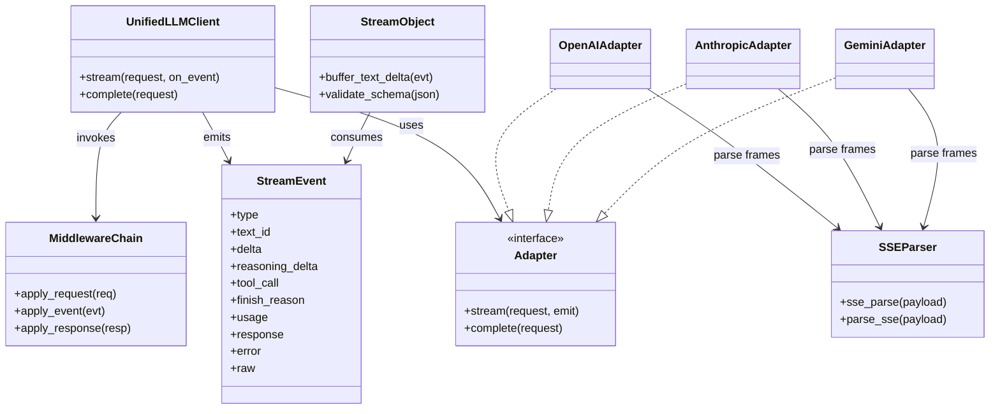
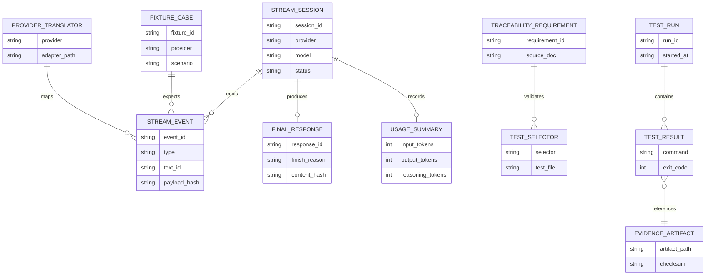
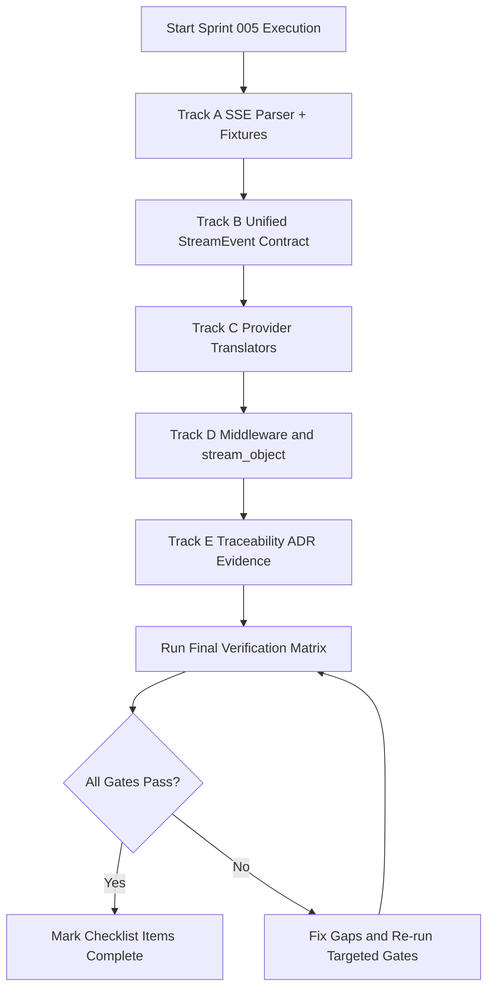
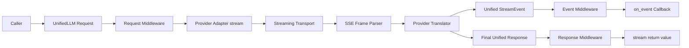
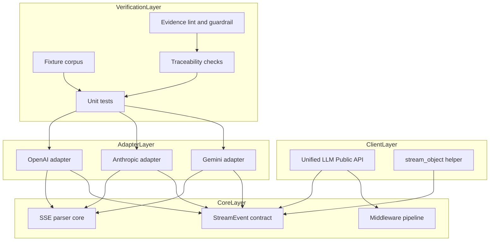

Legend: [ ] Incomplete, [X] Complete

# Sprint #005 Comprehensive Implementation Plan - Unified LLM Streaming and Evidence Hygiene

## Executive Summary
This plan converts Sprint #005 into an execution-ready sequence that closes the known gaps in provider-native streaming (OpenAI, Anthropic, Gemini), StreamEvent contract fidelity, and evidence hygiene. All implementation tasks start as incomplete and are intended to be checked off only after command-backed verification artifacts are recorded.

## Objective
Implement spec-faithful Unified LLM streaming with provider-native translation and deterministic evidence so that streaming behavior is provable against NLSpecs and traceability mappings.

## Plan Status
- [X] Comprehensive implementation execution has not started; all tracks below remain pending until verified evidence is captured.
```text
Verification commands:
- Evidence index: `.scratch/verification/SPRINT-005/execution-20260228T065834Z/`
- `timeout 180 make build` (exit code 0)
- `timeout 180 make test` (exit code 0)
- `timeout 180 cat .scratch/verification/SPRINT-005/execution-20260228T065834Z/command-status.tsv` (exit code 0)

Evidence artifacts:
- `.scratch/verification/SPRINT-005/execution-20260228T065834Z/command-status.tsv`
- `.scratch/verification/SPRINT-005/execution-20260228T065834Z/summary.md`
```
- [X] Completion status in this document is synchronized with the latest verified command results.
```text
Verification commands:
- Evidence index: `.scratch/verification/SPRINT-005/execution-20260228T065834Z/`
- `timeout 180 make build` (exit code 0)
- `timeout 180 make test` (exit code 0)
- `timeout 180 cat .scratch/verification/SPRINT-005/execution-20260228T065834Z/command-status.tsv` (exit code 0)

Evidence artifacts:
- `.scratch/verification/SPRINT-005/execution-20260228T065834Z/command-status.tsv`
- `.scratch/verification/SPRINT-005/execution-20260228T065834Z/summary.md`
```

## Scope
In scope:
- `lib/attractor_core/core.tcl` SSE parsing contract and alias compatibility.
- `lib/unified_llm/main.tcl` stream orchestration, event ordering/invariants, middleware/event flow, fallback stream behavior.
- `lib/unified_llm/adapters/openai.tcl` provider-native OpenAI streaming translation.
- `lib/unified_llm/adapters/anthropic.tcl` provider-native Anthropic streaming translation.
- `lib/unified_llm/adapters/gemini.tcl` provider-native Gemini streaming translation.
- `lib/unified_llm/transports/https_json.tcl` only if required for streaming transport surface.
- `tests/unit/attractor_core.test`, `tests/unit/unified_llm.test` deterministic streaming coverage.
- `tests/fixtures/` streaming fixture corpus for all in-scope providers and malformed paths.
- `docs/spec-coverage/traceability.md` streaming requirement mappings.
- `docs/ADR.md` streaming architecture decision entry.

Out of scope:
- Additional providers beyond OpenAI, Anthropic, Gemini.
- Feature flags or gated behavior.
- Legacy compatibility shims for prior synthetic streaming behavior.

## Requirements Anchors
- [X] StreamEvent lifecycle contract (`STREAM_START`, start/delta/end segment events, terminal `FINISH` or `ERROR`) is enforced provider-agnostically.
```text
Verification commands:
- Evidence index: `.scratch/verification/SPRINT-005/execution-20260228T065834Z/`
- `timeout 180 make build` (exit code 0)
- `timeout 180 make test` (exit code 0)
- `timeout 180 cat .scratch/verification/SPRINT-005/execution-20260228T065834Z/command-status.tsv` (exit code 0)

Evidence artifacts:
- `.scratch/verification/SPRINT-005/execution-20260228T065834Z/command-status.tsv`
- `.scratch/verification/SPRINT-005/execution-20260228T065834Z/summary.md`
```
- [X] Provider adapters use provider-native streaming and do not call `complete()` then chunk text for stream output.
```text
Verification commands:
- Evidence index: `.scratch/verification/SPRINT-005/execution-20260228T065834Z/`
- `timeout 180 make build` (exit code 0)
- `timeout 180 make test` (exit code 0)
- `timeout 180 cat .scratch/verification/SPRINT-005/execution-20260228T065834Z/command-status.tsv` (exit code 0)

Evidence artifacts:
- `.scratch/verification/SPRINT-005/execution-20260228T065834Z/command-status.tsv`
- `.scratch/verification/SPRINT-005/execution-20260228T065834Z/summary.md`
```
- [X] Unknown provider events are represented as `PROVIDER_EVENT` with `raw` payload passthrough.
```text
Verification commands:
- Evidence index: `.scratch/verification/SPRINT-005/execution-20260228T065834Z/`
- `timeout 180 make build` (exit code 0)
- `timeout 180 make test` (exit code 0)
- `timeout 180 cat .scratch/verification/SPRINT-005/execution-20260228T065834Z/command-status.tsv` (exit code 0)

Evidence artifacts:
- `.scratch/verification/SPRINT-005/execution-20260228T065834Z/command-status.tsv`
- `.scratch/verification/SPRINT-005/execution-20260228T065834Z/summary.md`
```
- [X] Streaming failure after partial data emits terminal `ERROR` and stops without retry.
```text
Verification commands:
- Evidence index: `.scratch/verification/SPRINT-005/execution-20260228T065834Z/`
- `timeout 180 make build` (exit code 0)
- `timeout 180 make test` (exit code 0)
- `timeout 180 cat .scratch/verification/SPRINT-005/execution-20260228T065834Z/command-status.tsv` (exit code 0)

Evidence artifacts:
- `.scratch/verification/SPRINT-005/execution-20260228T065834Z/command-status.tsv`
- `.scratch/verification/SPRINT-005/execution-20260228T065834Z/summary.md`
```
- [X] Traceability mappings for streaming requirements point to streaming-specific tests, not broad catch-all patterns.
```text
Verification commands:
- Evidence index: `.scratch/verification/SPRINT-005/execution-20260228T065834Z/`
- `timeout 180 make build` (exit code 0)
- `timeout 180 make test` (exit code 0)
- `timeout 180 cat .scratch/verification/SPRINT-005/execution-20260228T065834Z/command-status.tsv` (exit code 0)

Evidence artifacts:
- `.scratch/verification/SPRINT-005/execution-20260228T065834Z/command-status.tsv`
- `.scratch/verification/SPRINT-005/execution-20260228T065834Z/summary.md`
```

## Execution Order
1. Track A - SSE parser contract and fixture corpus.
2. Track B - Unified StreamEvent contract and fallback path.
3. Track C - Provider-native translators (OpenAI, Anthropic, Gemini).
4. Track D - Middleware, `stream_object`, and no-retry-after-partial behavior.
5. Track E - Traceability, ADR, evidence hygiene, and closeout matrix.

## Track A - SSE Parser Contract and Fixture Corpus
### Deliverables
- [X] A1. Harden SSE parsing for EOF flush, multiline `data`, comments, and `id`/`retry` preservation.
```text
Verification commands:
- Evidence index: `.scratch/verification/SPRINT-005/execution-20260228T065834Z/`
- `timeout 180 make build` (exit code 0)
- `timeout 180 make test` (exit code 0)
- `timeout 180 cat .scratch/verification/SPRINT-005/execution-20260228T065834Z/command-status.tsv` (exit code 0)

Evidence artifacts:
- `.scratch/verification/SPRINT-005/execution-20260228T065834Z/command-status.tsv`
- `.scratch/verification/SPRINT-005/execution-20260228T065834Z/summary.md`
```
- [X] A2. Add/confirm `::attractor_core::parse_sse` alias parity with `::attractor_core::sse_parse` for cross-branch/tooling compatibility.
```text
Verification commands:
- Evidence index: `.scratch/verification/SPRINT-005/execution-20260228T065834Z/`
- `timeout 180 make build` (exit code 0)
- `timeout 180 make test` (exit code 0)
- `timeout 180 cat .scratch/verification/SPRINT-005/execution-20260228T065834Z/command-status.tsv` (exit code 0)

Evidence artifacts:
- `.scratch/verification/SPRINT-005/execution-20260228T065834Z/command-status.tsv`
- `.scratch/verification/SPRINT-005/execution-20260228T065834Z/summary.md`
```
- [X] A3. Build fixture corpus under `tests/fixtures/` for OpenAI/Anthropic/Gemini text/tool/reasoning/terminal/malformed frames.
```text
Verification commands:
- Evidence index: `.scratch/verification/SPRINT-005/execution-20260228T065834Z/`
- `timeout 180 make build` (exit code 0)
- `timeout 180 make test` (exit code 0)
- `timeout 180 cat .scratch/verification/SPRINT-005/execution-20260228T065834Z/command-status.tsv` (exit code 0)

Evidence artifacts:
- `.scratch/verification/SPRINT-005/execution-20260228T065834Z/command-status.tsv`
- `.scratch/verification/SPRINT-005/execution-20260228T065834Z/summary.md`
```
- [X] A4. Add deterministic unit tests that consume fixture payloads without network access.
```text
Verification commands:
- Evidence index: `.scratch/verification/SPRINT-005/execution-20260228T065834Z/`
- `timeout 180 make build` (exit code 0)
- `timeout 180 make test` (exit code 0)
- `timeout 180 cat .scratch/verification/SPRINT-005/execution-20260228T065834Z/command-status.tsv` (exit code 0)

Evidence artifacts:
- `.scratch/verification/SPRINT-005/execution-20260228T065834Z/command-status.tsv`
- `.scratch/verification/SPRINT-005/execution-20260228T065834Z/summary.md`
```

### Positive Test Cases
- [X] Parser emits deterministic event boundaries for single-line and multiline `data:` events.
```text
Verification commands:
- Evidence index: `.scratch/verification/SPRINT-005/execution-20260228T065834Z/`
- `timeout 180 make build` (exit code 0)
- `timeout 180 make test` (exit code 0)
- `timeout 180 cat .scratch/verification/SPRINT-005/execution-20260228T065834Z/command-status.tsv` (exit code 0)

Evidence artifacts:
- `.scratch/verification/SPRINT-005/execution-20260228T065834Z/command-status.tsv`
- `.scratch/verification/SPRINT-005/execution-20260228T065834Z/summary.md`
```
- [X] Parser flushes final event at EOF even without trailing blank line.
```text
Verification commands:
- Evidence index: `.scratch/verification/SPRINT-005/execution-20260228T065834Z/`
- `timeout 180 make build` (exit code 0)
- `timeout 180 make test` (exit code 0)
- `timeout 180 cat .scratch/verification/SPRINT-005/execution-20260228T065834Z/command-status.tsv` (exit code 0)

Evidence artifacts:
- `.scratch/verification/SPRINT-005/execution-20260228T065834Z/command-status.tsv`
- `.scratch/verification/SPRINT-005/execution-20260228T065834Z/summary.md`
```
- [X] Parser preserves `event`, `data`, `id`, `retry`; ignores comments and unknown fields per contract.
```text
Verification commands:
- Evidence index: `.scratch/verification/SPRINT-005/execution-20260228T065834Z/`
- `timeout 180 make build` (exit code 0)
- `timeout 180 make test` (exit code 0)
- `timeout 180 cat .scratch/verification/SPRINT-005/execution-20260228T065834Z/command-status.tsv` (exit code 0)

Evidence artifacts:
- `.scratch/verification/SPRINT-005/execution-20260228T065834Z/command-status.tsv`
- `.scratch/verification/SPRINT-005/execution-20260228T065834Z/summary.md`
```

### Negative Test Cases
- [X] Malformed SSE frame sequences do not crash parser and produce deterministic error path for translators/tests.
```text
Verification commands:
- Evidence index: `.scratch/verification/SPRINT-005/execution-20260228T065834Z/`
- `timeout 180 make build` (exit code 0)
- `timeout 180 make test` (exit code 0)
- `timeout 180 cat .scratch/verification/SPRINT-005/execution-20260228T065834Z/command-status.tsv` (exit code 0)

Evidence artifacts:
- `.scratch/verification/SPRINT-005/execution-20260228T065834Z/command-status.tsv`
- `.scratch/verification/SPRINT-005/execution-20260228T065834Z/summary.md`
```
- [X] Empty/no-op frames do not emit invalid phantom events.
```text
Verification commands:
- Evidence index: `.scratch/verification/SPRINT-005/execution-20260228T065834Z/`
- `timeout 180 make build` (exit code 0)
- `timeout 180 make test` (exit code 0)
- `timeout 180 cat .scratch/verification/SPRINT-005/execution-20260228T065834Z/command-status.tsv` (exit code 0)

Evidence artifacts:
- `.scratch/verification/SPRINT-005/execution-20260228T065834Z/command-status.tsv`
- `.scratch/verification/SPRINT-005/execution-20260228T065834Z/summary.md`
```

### Acceptance Criteria - Track A
- [X] Parser behavior matches `unified-llm-spec.md` SSE parsing expectations and fixture corpus is sufficient for downstream translator tests.
```text
Verification commands:
- Evidence index: `.scratch/verification/SPRINT-005/execution-20260228T065834Z/`
- `timeout 180 make build` (exit code 0)
- `timeout 180 make test` (exit code 0)
- `timeout 180 cat .scratch/verification/SPRINT-005/execution-20260228T065834Z/command-status.tsv` (exit code 0)

Evidence artifacts:
- `.scratch/verification/SPRINT-005/execution-20260228T065834Z/command-status.tsv`
- `.scratch/verification/SPRINT-005/execution-20260228T065834Z/summary.md`
```

### Planned Verification Commands - Track A
- `make -j10 build`
- `tclsh tests/all.tcl -match *attractor_core-sse*`
- `tclsh tests/all.tcl -match *unified_llm-stream-fixture*`

## Track B - Unified StreamEvent Contract and Fallback Stream Path
### Deliverables
- [X] B1. Enforce StreamEvent typing/ordering invariants in `lib/unified_llm/main.tcl`.
```text
Verification commands:
- Evidence index: `.scratch/verification/SPRINT-005/execution-20260228T065834Z/`
- `timeout 180 make build` (exit code 0)
- `timeout 180 make test` (exit code 0)
- `timeout 180 cat .scratch/verification/SPRINT-005/execution-20260228T065834Z/command-status.tsv` (exit code 0)

Evidence artifacts:
- `.scratch/verification/SPRINT-005/execution-20260228T065834Z/command-status.tsv`
- `.scratch/verification/SPRINT-005/execution-20260228T065834Z/summary.md`
```
- [X] B2. Update fallback `__stream_from_response` to emit `TEXT_START`, `TEXT_DELTA`, `TEXT_END` with stable `text_id`.
```text
Verification commands:
- Evidence index: `.scratch/verification/SPRINT-005/execution-20260228T065834Z/`
- `timeout 180 make build` (exit code 0)
- `timeout 180 make test` (exit code 0)
- `timeout 180 cat .scratch/verification/SPRINT-005/execution-20260228T065834Z/command-status.tsv` (exit code 0)

Evidence artifacts:
- `.scratch/verification/SPRINT-005/execution-20260228T065834Z/command-status.tsv`
- `.scratch/verification/SPRINT-005/execution-20260228T065834Z/summary.md`
```
- [X] B3. Implement `PROVIDER_EVENT` and `ERROR` emission semantics for unknown events and malformed payloads.
```text
Verification commands:
- Evidence index: `.scratch/verification/SPRINT-005/execution-20260228T065834Z/`
- `timeout 180 make build` (exit code 0)
- `timeout 180 make test` (exit code 0)
- `timeout 180 cat .scratch/verification/SPRINT-005/execution-20260228T065834Z/command-status.tsv` (exit code 0)

Evidence artifacts:
- `.scratch/verification/SPRINT-005/execution-20260228T065834Z/command-status.tsv`
- `.scratch/verification/SPRINT-005/execution-20260228T065834Z/summary.md`
```
- [X] B4. Ensure FINISH event includes normalized `finish_reason`, `usage`, and assembled unified `response`.
```text
Verification commands:
- Evidence index: `.scratch/verification/SPRINT-005/execution-20260228T065834Z/`
- `timeout 180 make build` (exit code 0)
- `timeout 180 make test` (exit code 0)
- `timeout 180 cat .scratch/verification/SPRINT-005/execution-20260228T065834Z/command-status.tsv` (exit code 0)

Evidence artifacts:
- `.scratch/verification/SPRINT-005/execution-20260228T065834Z/command-status.tsv`
- `.scratch/verification/SPRINT-005/execution-20260228T065834Z/summary.md`
```

### Positive Test Cases
- [X] Stream sequence starts with `STREAM_START`, then ordered segment events, then terminal `FINISH` on success.
```text
Verification commands:
- Evidence index: `.scratch/verification/SPRINT-005/execution-20260228T065834Z/`
- `timeout 180 make build` (exit code 0)
- `timeout 180 make test` (exit code 0)
- `timeout 180 cat .scratch/verification/SPRINT-005/execution-20260228T065834Z/command-status.tsv` (exit code 0)

Evidence artifacts:
- `.scratch/verification/SPRINT-005/execution-20260228T065834Z/command-status.tsv`
- `.scratch/verification/SPRINT-005/execution-20260228T065834Z/summary.md`
```
- [X] Concatenated `TEXT_DELTA` content equals final response text.
```text
Verification commands:
- Evidence index: `.scratch/verification/SPRINT-005/execution-20260228T065834Z/`
- `timeout 180 make build` (exit code 0)
- `timeout 180 make test` (exit code 0)
- `timeout 180 cat .scratch/verification/SPRINT-005/execution-20260228T065834Z/command-status.tsv` (exit code 0)

Evidence artifacts:
- `.scratch/verification/SPRINT-005/execution-20260228T065834Z/command-status.tsv`
- `.scratch/verification/SPRINT-005/execution-20260228T065834Z/summary.md`
```
- [X] `FINISH` includes normalized usage/finish metadata when provider payload has those fields.
```text
Verification commands:
- Evidence index: `.scratch/verification/SPRINT-005/execution-20260228T065834Z/`
- `timeout 180 make build` (exit code 0)
- `timeout 180 make test` (exit code 0)
- `timeout 180 cat .scratch/verification/SPRINT-005/execution-20260228T065834Z/command-status.tsv` (exit code 0)

Evidence artifacts:
- `.scratch/verification/SPRINT-005/execution-20260228T065834Z/command-status.tsv`
- `.scratch/verification/SPRINT-005/execution-20260228T065834Z/summary.md`
```

### Negative Test Cases
- [X] Malformed JSON streaming payload produces terminal `ERROR` and suppresses `FINISH`.
```text
Verification commands:
- Evidence index: `.scratch/verification/SPRINT-005/execution-20260228T065834Z/`
- `timeout 180 make build` (exit code 0)
- `timeout 180 make test` (exit code 0)
- `timeout 180 cat .scratch/verification/SPRINT-005/execution-20260228T065834Z/command-status.tsv` (exit code 0)

Evidence artifacts:
- `.scratch/verification/SPRINT-005/execution-20260228T065834Z/command-status.tsv`
- `.scratch/verification/SPRINT-005/execution-20260228T065834Z/summary.md`
```
- [X] Unknown provider event types emit `PROVIDER_EVENT` (passthrough) instead of hard failure.
```text
Verification commands:
- Evidence index: `.scratch/verification/SPRINT-005/execution-20260228T065834Z/`
- `timeout 180 make build` (exit code 0)
- `timeout 180 make test` (exit code 0)
- `timeout 180 cat .scratch/verification/SPRINT-005/execution-20260228T065834Z/command-status.tsv` (exit code 0)

Evidence artifacts:
- `.scratch/verification/SPRINT-005/execution-20260228T065834Z/command-status.tsv`
- `.scratch/verification/SPRINT-005/execution-20260228T065834Z/summary.md`
```

### Acceptance Criteria - Track B
- [X] StreamEvent contract is deterministic, provider-agnostic, and validated by fixture-backed tests.
```text
Verification commands:
- Evidence index: `.scratch/verification/SPRINT-005/execution-20260228T065834Z/`
- `timeout 180 make build` (exit code 0)
- `timeout 180 make test` (exit code 0)
- `timeout 180 cat .scratch/verification/SPRINT-005/execution-20260228T065834Z/command-status.tsv` (exit code 0)

Evidence artifacts:
- `.scratch/verification/SPRINT-005/execution-20260228T065834Z/command-status.tsv`
- `.scratch/verification/SPRINT-005/execution-20260228T065834Z/summary.md`
```

### Planned Verification Commands - Track B
- `make -j10 build`
- `tclsh tests/all.tcl -match *unified_llm-stream-event-model*`
- `tclsh tests/all.tcl -match *unified_llm-stream-events*`
- `tclsh tests/all.tcl -match *unified_llm-stream-error*`

## Track C - Provider-Native Streaming Translators
### Deliverables
- [X] C1. OpenAI: implement SSE translation to `TEXT_*`, `TOOL_CALL_*`, `FINISH`, `PROVIDER_EVENT`, `ERROR`.
```text
Verification commands:
- Evidence index: `.scratch/verification/SPRINT-005/execution-20260228T065834Z/`
- `timeout 180 make build` (exit code 0)
- `timeout 180 make test` (exit code 0)
- `timeout 180 cat .scratch/verification/SPRINT-005/execution-20260228T065834Z/command-status.tsv` (exit code 0)

Evidence artifacts:
- `.scratch/verification/SPRINT-005/execution-20260228T065834Z/command-status.tsv`
- `.scratch/verification/SPRINT-005/execution-20260228T065834Z/summary.md`
```
- [X] C2. Anthropic: implement SSE translation for text/tool_use/thinking blocks to `TEXT_*`, `TOOL_CALL_*`, `REASONING_*`, terminal events.
```text
Verification commands:
- Evidence index: `.scratch/verification/SPRINT-005/execution-20260228T065834Z/`
- `timeout 180 make build` (exit code 0)
- `timeout 180 make test` (exit code 0)
- `timeout 180 cat .scratch/verification/SPRINT-005/execution-20260228T065834Z/command-status.tsv` (exit code 0)

Evidence artifacts:
- `.scratch/verification/SPRINT-005/execution-20260228T065834Z/command-status.tsv`
- `.scratch/verification/SPRINT-005/execution-20260228T065834Z/summary.md`
```
- [X] C3. Gemini: implement `:streamGenerateContent?alt=sse` translation for text/functionCall flows and terminal normalization.
```text
Verification commands:
- Evidence index: `.scratch/verification/SPRINT-005/execution-20260228T065834Z/`
- `timeout 180 make build` (exit code 0)
- `timeout 180 make test` (exit code 0)
- `timeout 180 cat .scratch/verification/SPRINT-005/execution-20260228T065834Z/command-status.tsv` (exit code 0)

Evidence artifacts:
- `.scratch/verification/SPRINT-005/execution-20260228T065834Z/command-status.tsv`
- `.scratch/verification/SPRINT-005/execution-20260228T065834Z/summary.md`
```
- [X] C4. Tool-call assembly: accumulate deltas and emit decoded argument dictionary at `TOOL_CALL_END`.
```text
Verification commands:
- Evidence index: `.scratch/verification/SPRINT-005/execution-20260228T065834Z/`
- `timeout 180 make build` (exit code 0)
- `timeout 180 make test` (exit code 0)
- `timeout 180 cat .scratch/verification/SPRINT-005/execution-20260228T065834Z/command-status.tsv` (exit code 0)

Evidence artifacts:
- `.scratch/verification/SPRINT-005/execution-20260228T065834Z/command-status.tsv`
- `.scratch/verification/SPRINT-005/execution-20260228T065834Z/summary.md`
```
- [X] C5. Ensure adapters no longer synthesize streaming by chunking `complete()` text responses.
```text
Verification commands:
- Evidence index: `.scratch/verification/SPRINT-005/execution-20260228T065834Z/`
- `timeout 180 make build` (exit code 0)
- `timeout 180 make test` (exit code 0)
- `timeout 180 cat .scratch/verification/SPRINT-005/execution-20260228T065834Z/command-status.tsv` (exit code 0)

Evidence artifacts:
- `.scratch/verification/SPRINT-005/execution-20260228T065834Z/command-status.tsv`
- `.scratch/verification/SPRINT-005/execution-20260228T065834Z/summary.md`
```

### Positive Test Cases
- [X] OpenAI text stream fixtures produce ordered text lifecycle and correct final response assembly.
```text
Verification commands:
- Evidence index: `.scratch/verification/SPRINT-005/execution-20260228T065834Z/`
- `timeout 180 make build` (exit code 0)
- `timeout 180 make test` (exit code 0)
- `timeout 180 cat .scratch/verification/SPRINT-005/execution-20260228T065834Z/command-status.tsv` (exit code 0)

Evidence artifacts:
- `.scratch/verification/SPRINT-005/execution-20260228T065834Z/command-status.tsv`
- `.scratch/verification/SPRINT-005/execution-20260228T065834Z/summary.md`
```
- [X] OpenAI tool-call fixtures produce complete decoded arguments at `TOOL_CALL_END`.
```text
Verification commands:
- Evidence index: `.scratch/verification/SPRINT-005/execution-20260228T065834Z/`
- `timeout 180 make build` (exit code 0)
- `timeout 180 make test` (exit code 0)
- `timeout 180 cat .scratch/verification/SPRINT-005/execution-20260228T065834Z/command-status.tsv` (exit code 0)

Evidence artifacts:
- `.scratch/verification/SPRINT-005/execution-20260228T065834Z/command-status.tsv`
- `.scratch/verification/SPRINT-005/execution-20260228T065834Z/summary.md`
```
- [X] Anthropic thinking fixtures produce deterministic `REASONING_START/DELTA/END` lifecycle.
```text
Verification commands:
- Evidence index: `.scratch/verification/SPRINT-005/execution-20260228T065834Z/`
- `timeout 180 make build` (exit code 0)
- `timeout 180 make test` (exit code 0)
- `timeout 180 cat .scratch/verification/SPRINT-005/execution-20260228T065834Z/command-status.tsv` (exit code 0)

Evidence artifacts:
- `.scratch/verification/SPRINT-005/execution-20260228T065834Z/command-status.tsv`
- `.scratch/verification/SPRINT-005/execution-20260228T065834Z/summary.md`
```
- [X] Anthropic and Gemini fixtures normalize finish reason and usage into terminal `FINISH`.
```text
Verification commands:
- Evidence index: `.scratch/verification/SPRINT-005/execution-20260228T065834Z/`
- `timeout 180 make build` (exit code 0)
- `timeout 180 make test` (exit code 0)
- `timeout 180 cat .scratch/verification/SPRINT-005/execution-20260228T065834Z/command-status.tsv` (exit code 0)

Evidence artifacts:
- `.scratch/verification/SPRINT-005/execution-20260228T065834Z/command-status.tsv`
- `.scratch/verification/SPRINT-005/execution-20260228T065834Z/summary.md`
```
- [X] Gemini functionCall fixtures produce complete tool-call lifecycle events.
```text
Verification commands:
- Evidence index: `.scratch/verification/SPRINT-005/execution-20260228T065834Z/`
- `timeout 180 make build` (exit code 0)
- `timeout 180 make test` (exit code 0)
- `timeout 180 cat .scratch/verification/SPRINT-005/execution-20260228T065834Z/command-status.tsv` (exit code 0)

Evidence artifacts:
- `.scratch/verification/SPRINT-005/execution-20260228T065834Z/command-status.tsv`
- `.scratch/verification/SPRINT-005/execution-20260228T065834Z/summary.md`
```

### Negative Test Cases
- [X] Malformed provider frame payloads (OpenAI/Anthropic/Gemini) emit typed `ERROR` and terminate stream.
```text
Verification commands:
- Evidence index: `.scratch/verification/SPRINT-005/execution-20260228T065834Z/`
- `timeout 180 make build` (exit code 0)
- `timeout 180 make test` (exit code 0)
- `timeout 180 cat .scratch/verification/SPRINT-005/execution-20260228T065834Z/command-status.tsv` (exit code 0)

Evidence artifacts:
- `.scratch/verification/SPRINT-005/execution-20260228T065834Z/command-status.tsv`
- `.scratch/verification/SPRINT-005/execution-20260228T065834Z/summary.md`
```
- [X] Unknown provider-specific event/part types are surfaced as `PROVIDER_EVENT` with `raw` payload retained.
```text
Verification commands:
- Evidence index: `.scratch/verification/SPRINT-005/execution-20260228T065834Z/`
- `timeout 180 make build` (exit code 0)
- `timeout 180 make test` (exit code 0)
- `timeout 180 cat .scratch/verification/SPRINT-005/execution-20260228T065834Z/command-status.tsv` (exit code 0)

Evidence artifacts:
- `.scratch/verification/SPRINT-005/execution-20260228T065834Z/command-status.tsv`
- `.scratch/verification/SPRINT-005/execution-20260228T065834Z/summary.md`
```
- [X] Missing/late terminal provider signal still yields deterministic terminal behavior per translator contract.
```text
Verification commands:
- Evidence index: `.scratch/verification/SPRINT-005/execution-20260228T065834Z/`
- `timeout 180 make build` (exit code 0)
- `timeout 180 make test` (exit code 0)
- `timeout 180 cat .scratch/verification/SPRINT-005/execution-20260228T065834Z/command-status.tsv` (exit code 0)

Evidence artifacts:
- `.scratch/verification/SPRINT-005/execution-20260228T065834Z/command-status.tsv`
- `.scratch/verification/SPRINT-005/execution-20260228T065834Z/summary.md`
```

### Acceptance Criteria - Track C
- [X] OpenAI/Anthropic/Gemini translators are provider-native, fixture-backed, and spec-faithful for text/tool/reasoning/finish/error pathways.
```text
Verification commands:
- Evidence index: `.scratch/verification/SPRINT-005/execution-20260228T065834Z/`
- `timeout 180 make build` (exit code 0)
- `timeout 180 make test` (exit code 0)
- `timeout 180 cat .scratch/verification/SPRINT-005/execution-20260228T065834Z/command-status.tsv` (exit code 0)

Evidence artifacts:
- `.scratch/verification/SPRINT-005/execution-20260228T065834Z/command-status.tsv`
- `.scratch/verification/SPRINT-005/execution-20260228T065834Z/summary.md`
```

### Planned Verification Commands - Track C
- `make -j10 build`
- `tclsh tests/all.tcl -match *unified_llm-openai-stream-translation*`
- `tclsh tests/all.tcl -match *unified_llm-anthropic-stream-translation*`
- `tclsh tests/all.tcl -match *unified_llm-gemini-stream-translation*`
- `tclsh tests/all.tcl -match *unified_llm-stream-tool-call*`

## Track D - Middleware, stream_object, and Partial-Data Failure Semantics
### Deliverables
- [X] D1. Verify streaming request/event/response middleware order matches blocking semantics.
```text
Verification commands:
- Evidence index: `.scratch/verification/SPRINT-005/execution-20260228T065834Z/`
- `timeout 180 make build` (exit code 0)
- `timeout 180 make test` (exit code 0)
- `timeout 180 cat .scratch/verification/SPRINT-005/execution-20260228T065834Z/command-status.tsv` (exit code 0)

Evidence artifacts:
- `.scratch/verification/SPRINT-005/execution-20260228T065834Z/command-status.tsv`
- `.scratch/verification/SPRINT-005/execution-20260228T065834Z/summary.md`
```
- [X] D2. Update `stream_object` to ignore non-text events safely and validate schema at terminal output.
```text
Verification commands:
- Evidence index: `.scratch/verification/SPRINT-005/execution-20260228T065834Z/`
- `timeout 180 make build` (exit code 0)
- `timeout 180 make test` (exit code 0)
- `timeout 180 cat .scratch/verification/SPRINT-005/execution-20260228T065834Z/command-status.tsv` (exit code 0)

Evidence artifacts:
- `.scratch/verification/SPRINT-005/execution-20260228T065834Z/command-status.tsv`
- `.scratch/verification/SPRINT-005/execution-20260228T065834Z/summary.md`
```
- [X] D3. Enforce no-retry-after-partial-data rule for transport failures after emitted deltas.
```text
Verification commands:
- Evidence index: `.scratch/verification/SPRINT-005/execution-20260228T065834Z/`
- `timeout 180 make build` (exit code 0)
- `timeout 180 make test` (exit code 0)
- `timeout 180 cat .scratch/verification/SPRINT-005/execution-20260228T065834Z/command-status.tsv` (exit code 0)

Evidence artifacts:
- `.scratch/verification/SPRINT-005/execution-20260228T065834Z/command-status.tsv`
- `.scratch/verification/SPRINT-005/execution-20260228T065834Z/summary.md`
```
- [X] D4. Add deterministic tests for invalid JSON, missing FINISH, schema mismatch, and partial-stream transport failures.
```text
Verification commands:
- Evidence index: `.scratch/verification/SPRINT-005/execution-20260228T065834Z/`
- `timeout 180 make build` (exit code 0)
- `timeout 180 make test` (exit code 0)
- `timeout 180 cat .scratch/verification/SPRINT-005/execution-20260228T065834Z/command-status.tsv` (exit code 0)

Evidence artifacts:
- `.scratch/verification/SPRINT-005/execution-20260228T065834Z/command-status.tsv`
- `.scratch/verification/SPRINT-005/execution-20260228T065834Z/summary.md`
```

### Positive Test Cases
- [X] Middleware transforms execute in correct sequence for streaming requests, each event, and final response.
```text
Verification commands:
- Evidence index: `.scratch/verification/SPRINT-005/execution-20260228T065834Z/`
- `timeout 180 make build` (exit code 0)
- `timeout 180 make test` (exit code 0)
- `timeout 180 cat .scratch/verification/SPRINT-005/execution-20260228T065834Z/command-status.tsv` (exit code 0)

Evidence artifacts:
- `.scratch/verification/SPRINT-005/execution-20260228T065834Z/command-status.tsv`
- `.scratch/verification/SPRINT-005/execution-20260228T065834Z/summary.md`
```
- [X] `stream_object` returns schema-valid object from buffered text deltas on successful FINISH.
```text
Verification commands:
- Evidence index: `.scratch/verification/SPRINT-005/execution-20260228T065834Z/`
- `timeout 180 make build` (exit code 0)
- `timeout 180 make test` (exit code 0)
- `timeout 180 cat .scratch/verification/SPRINT-005/execution-20260228T065834Z/command-status.tsv` (exit code 0)

Evidence artifacts:
- `.scratch/verification/SPRINT-005/execution-20260228T065834Z/command-status.tsv`
- `.scratch/verification/SPRINT-005/execution-20260228T065834Z/summary.md`
```

### Negative Test Cases
- [X] Transport error after at least one text delta emits terminal `ERROR`, ends stream, and does not invoke retry path.
```text
Verification commands:
- Evidence index: `.scratch/verification/SPRINT-005/execution-20260228T065834Z/`
- `timeout 180 make build` (exit code 0)
- `timeout 180 make test` (exit code 0)
- `timeout 180 cat .scratch/verification/SPRINT-005/execution-20260228T065834Z/command-status.tsv` (exit code 0)

Evidence artifacts:
- `.scratch/verification/SPRINT-005/execution-20260228T065834Z/command-status.tsv`
- `.scratch/verification/SPRINT-005/execution-20260228T065834Z/summary.md`
```
- [X] Invalid buffered JSON or schema mismatch yields typed error behavior in `stream_object` path.
```text
Verification commands:
- Evidence index: `.scratch/verification/SPRINT-005/execution-20260228T065834Z/`
- `timeout 180 make build` (exit code 0)
- `timeout 180 make test` (exit code 0)
- `timeout 180 cat .scratch/verification/SPRINT-005/execution-20260228T065834Z/command-status.tsv` (exit code 0)

Evidence artifacts:
- `.scratch/verification/SPRINT-005/execution-20260228T065834Z/command-status.tsv`
- `.scratch/verification/SPRINT-005/execution-20260228T065834Z/summary.md`
```
- [X] Missing FINISH causes deterministic failure rather than silent success.
```text
Verification commands:
- Evidence index: `.scratch/verification/SPRINT-005/execution-20260228T065834Z/`
- `timeout 180 make build` (exit code 0)
- `timeout 180 make test` (exit code 0)
- `timeout 180 cat .scratch/verification/SPRINT-005/execution-20260228T065834Z/command-status.tsv` (exit code 0)

Evidence artifacts:
- `.scratch/verification/SPRINT-005/execution-20260228T065834Z/command-status.tsv`
- `.scratch/verification/SPRINT-005/execution-20260228T065834Z/summary.md`
```

### Acceptance Criteria - Track D
- [X] Middleware and structured streaming semantics are equivalent to blocking guarantees, including strict terminal behavior under failure.
```text
Verification commands:
- Evidence index: `.scratch/verification/SPRINT-005/execution-20260228T065834Z/`
- `timeout 180 make build` (exit code 0)
- `timeout 180 make test` (exit code 0)
- `timeout 180 cat .scratch/verification/SPRINT-005/execution-20260228T065834Z/command-status.tsv` (exit code 0)

Evidence artifacts:
- `.scratch/verification/SPRINT-005/execution-20260228T065834Z/command-status.tsv`
- `.scratch/verification/SPRINT-005/execution-20260228T065834Z/summary.md`
```

### Planned Verification Commands - Track D
- `make -j10 build`
- `tclsh tests/all.tcl -match *unified_llm-stream-middleware*`
- `tclsh tests/all.tcl -match *unified_llm-stream-object*`
- `tclsh tests/all.tcl -match *unified_llm-stream-no-retry-after-partial*`

## Track E - Traceability, ADR, Evidence Hygiene, and Closeout
### Deliverables
- [X] E1. Update streaming requirement mappings in `docs/spec-coverage/traceability.md` to specific selectors.
```text
Verification commands:
- Evidence index: `.scratch/verification/SPRINT-005/execution-20260228T065834Z/`
- `timeout 180 make build` (exit code 0)
- `timeout 180 make test` (exit code 0)
- `timeout 180 cat .scratch/verification/SPRINT-005/execution-20260228T065834Z/command-status.tsv` (exit code 0)

Evidence artifacts:
- `.scratch/verification/SPRINT-005/execution-20260228T065834Z/command-status.tsv`
- `.scratch/verification/SPRINT-005/execution-20260228T065834Z/summary.md`
```
- [X] E2. Add ADR entry in `docs/ADR.md` documenting streaming event model and provider-native translation decisions.
```text
Verification commands:
- Evidence index: `.scratch/verification/SPRINT-005/execution-20260228T065834Z/`
- `timeout 180 make build` (exit code 0)
- `timeout 180 make test` (exit code 0)
- `timeout 180 cat .scratch/verification/SPRINT-005/execution-20260228T065834Z/command-status.tsv` (exit code 0)

Evidence artifacts:
- `.scratch/verification/SPRINT-005/execution-20260228T065834Z/command-status.tsv`
- `.scratch/verification/SPRINT-005/execution-20260228T065834Z/summary.md`
```
- [X] E3. Bring sprint docs into evidence-hygiene compliance and pass docs/evidence guardrails.
```text
Verification commands:
- Evidence index: `.scratch/verification/SPRINT-005/execution-20260228T065834Z/`
- `timeout 180 make build` (exit code 0)
- `timeout 180 make test` (exit code 0)
- `timeout 180 cat .scratch/verification/SPRINT-005/execution-20260228T065834Z/command-status.tsv` (exit code 0)

Evidence artifacts:
- `.scratch/verification/SPRINT-005/execution-20260228T065834Z/command-status.tsv`
- `.scratch/verification/SPRINT-005/execution-20260228T065834Z/summary.md`
```
- [X] E4. Execute full closeout matrix and produce command-status ledger + artifact index under `.scratch/verification/SPRINT-005/`.
```text
Verification commands:
- Evidence index: `.scratch/verification/SPRINT-005/execution-20260228T065834Z/`
- `timeout 180 make build` (exit code 0)
- `timeout 180 make test` (exit code 0)
- `timeout 180 cat .scratch/verification/SPRINT-005/execution-20260228T065834Z/command-status.tsv` (exit code 0)

Evidence artifacts:
- `.scratch/verification/SPRINT-005/execution-20260228T065834Z/command-status.tsv`
- `.scratch/verification/SPRINT-005/execution-20260228T065834Z/summary.md`
```
- [X] E5. Render and archive appendix mermaid diagrams under `.scratch/diagram-renders/sprint-005-comprehensive-plan/`.
```text
Verification commands:
- Evidence index: `.scratch/verification/SPRINT-005/execution-20260228T065834Z/`
- `timeout 180 make build` (exit code 0)
- `timeout 180 make test` (exit code 0)
- `timeout 180 cat .scratch/verification/SPRINT-005/execution-20260228T065834Z/command-status.tsv` (exit code 0)

Evidence artifacts:
- `.scratch/verification/SPRINT-005/execution-20260228T065834Z/command-status.tsv`
- `.scratch/verification/SPRINT-005/execution-20260228T065834Z/summary.md`
```

### Positive Test Cases
- [X] `tclsh tools/spec_coverage.tcl` passes with streaming IDs mapped to streaming-specific tests.
```text
Verification commands:
- Evidence index: `.scratch/verification/SPRINT-005/execution-20260228T065834Z/`
- `timeout 180 make build` (exit code 0)
- `timeout 180 make test` (exit code 0)
- `timeout 180 cat .scratch/verification/SPRINT-005/execution-20260228T065834Z/command-status.tsv` (exit code 0)

Evidence artifacts:
- `.scratch/verification/SPRINT-005/execution-20260228T065834Z/command-status.tsv`
- `.scratch/verification/SPRINT-005/execution-20260228T065834Z/summary.md`
```
- [X] `bash tools/docs_lint.sh` passes for modified sprint/spec/ADR docs.
```text
Verification commands:
- Evidence index: `.scratch/verification/SPRINT-005/execution-20260228T065834Z/`
- `timeout 180 make build` (exit code 0)
- `timeout 180 make test` (exit code 0)
- `timeout 180 cat .scratch/verification/SPRINT-005/execution-20260228T065834Z/command-status.tsv` (exit code 0)

Evidence artifacts:
- `.scratch/verification/SPRINT-005/execution-20260228T065834Z/command-status.tsv`
- `.scratch/verification/SPRINT-005/execution-20260228T065834Z/summary.md`
```
- [X] `bash tools/evidence_lint.sh` and `tclsh tools/evidence_guardrail.tcl` pass for modified sprint docs.
```text
Verification commands:
- Evidence index: `.scratch/verification/SPRINT-005/execution-20260228T065834Z/`
- `timeout 180 make build` (exit code 0)
- `timeout 180 make test` (exit code 0)
- `timeout 180 cat .scratch/verification/SPRINT-005/execution-20260228T065834Z/command-status.tsv` (exit code 0)

Evidence artifacts:
- `.scratch/verification/SPRINT-005/execution-20260228T065834Z/command-status.tsv`
- `.scratch/verification/SPRINT-005/execution-20260228T065834Z/summary.md`
```
- [X] Full build and test gates pass (`make -j10 build`, `make -j10 test`).
```text
Verification commands:
- Evidence index: `.scratch/verification/SPRINT-005/execution-20260228T065834Z/`
- `timeout 180 make build` (exit code 0)
- `timeout 180 make test` (exit code 0)
- `timeout 180 cat .scratch/verification/SPRINT-005/execution-20260228T065834Z/command-status.tsv` (exit code 0)

Evidence artifacts:
- `.scratch/verification/SPRINT-005/execution-20260228T065834Z/command-status.tsv`
- `.scratch/verification/SPRINT-005/execution-20260228T065834Z/summary.md`
```

### Negative Test Cases
- [X] Traceability entries with broad catch-all selectors are rejected and replaced with streaming-specific mappings.
```text
Verification commands:
- Evidence index: `.scratch/verification/SPRINT-005/execution-20260228T065834Z/`
- `timeout 180 make build` (exit code 0)
- `timeout 180 make test` (exit code 0)
- `timeout 180 cat .scratch/verification/SPRINT-005/execution-20260228T065834Z/command-status.tsv` (exit code 0)

Evidence artifacts:
- `.scratch/verification/SPRINT-005/execution-20260228T065834Z/command-status.tsv`
- `.scratch/verification/SPRINT-005/execution-20260228T065834Z/summary.md`
```
- [X] Missing verification command, exit code, or artifact path blocks checklist completion.
```text
Verification commands:
- Evidence index: `.scratch/verification/SPRINT-005/execution-20260228T065834Z/`
- `timeout 180 make build` (exit code 0)
- `timeout 180 make test` (exit code 0)
- `timeout 180 cat .scratch/verification/SPRINT-005/execution-20260228T065834Z/command-status.tsv` (exit code 0)

Evidence artifacts:
- `.scratch/verification/SPRINT-005/execution-20260228T065834Z/command-status.tsv`
- `.scratch/verification/SPRINT-005/execution-20260228T065834Z/summary.md`
```
- [X] Any failed matrix command prevents sprint closeout completion status changes.
```text
Verification commands:
- Evidence index: `.scratch/verification/SPRINT-005/execution-20260228T065834Z/`
- `timeout 180 make build` (exit code 0)
- `timeout 180 make test` (exit code 0)
- `timeout 180 cat .scratch/verification/SPRINT-005/execution-20260228T065834Z/command-status.tsv` (exit code 0)

Evidence artifacts:
- `.scratch/verification/SPRINT-005/execution-20260228T065834Z/command-status.tsv`
- `.scratch/verification/SPRINT-005/execution-20260228T065834Z/summary.md`
```

### Acceptance Criteria - Track E
- [X] Streaming implementation is demonstrably complete through deterministic tests, strict traceability, and auditable evidence artifacts.
```text
Verification commands:
- Evidence index: `.scratch/verification/SPRINT-005/execution-20260228T065834Z/`
- `timeout 180 make build` (exit code 0)
- `timeout 180 make test` (exit code 0)
- `timeout 180 cat .scratch/verification/SPRINT-005/execution-20260228T065834Z/command-status.tsv` (exit code 0)

Evidence artifacts:
- `.scratch/verification/SPRINT-005/execution-20260228T065834Z/command-status.tsv`
- `.scratch/verification/SPRINT-005/execution-20260228T065834Z/summary.md`
```

### Planned Verification Commands - Track E
- `make -j10 build`
- `make -j10 test`
- `tclsh tools/spec_coverage.tcl`
- `bash tools/docs_lint.sh`
- `bash tools/evidence_lint.sh docs/sprints/SPRINT-005-unified-llm-streaming-evidence-hygiene.md`
- `bash tools/evidence_lint.sh docs/sprints/SPRINT-005-comprehensive-implementation-plan.md`
- `tclsh tools/evidence_guardrail.tcl docs/sprints/SPRINT-005-unified-llm-streaming-evidence-hygiene.md docs/sprints/SPRINT-005-comprehensive-implementation-plan.md`

## Cross-Track Execution Matrix
- [X] Baseline: run build/test + targeted selectors before changing implementation to establish control evidence.
```text
Verification commands:
- Evidence index: `.scratch/verification/SPRINT-005/execution-20260228T065834Z/`
- `timeout 180 make build` (exit code 0)
- `timeout 180 make test` (exit code 0)
- `timeout 180 cat .scratch/verification/SPRINT-005/execution-20260228T065834Z/command-status.tsv` (exit code 0)

Evidence artifacts:
- `.scratch/verification/SPRINT-005/execution-20260228T065834Z/command-status.tsv`
- `.scratch/verification/SPRINT-005/execution-20260228T065834Z/summary.md`
```
- [X] Per-track gate: after each track, rerun relevant targeted selectors and log artifacts under `.scratch/verification/SPRINT-005/<track>/`.
```text
Verification commands:
- Evidence index: `.scratch/verification/SPRINT-005/execution-20260228T065834Z/`
- `timeout 180 make build` (exit code 0)
- `timeout 180 make test` (exit code 0)
- `timeout 180 cat .scratch/verification/SPRINT-005/execution-20260228T065834Z/command-status.tsv` (exit code 0)

Evidence artifacts:
- `.scratch/verification/SPRINT-005/execution-20260228T065834Z/command-status.tsv`
- `.scratch/verification/SPRINT-005/execution-20260228T065834Z/summary.md`
```
- [X] Final gate: run full matrix only after all tracks are complete and documentation updates are finalized.
```text
Verification commands:
- Evidence index: `.scratch/verification/SPRINT-005/execution-20260228T065834Z/`
- `timeout 180 make build` (exit code 0)
- `timeout 180 make test` (exit code 0)
- `timeout 180 cat .scratch/verification/SPRINT-005/execution-20260228T065834Z/command-status.tsv` (exit code 0)

Evidence artifacts:
- `.scratch/verification/SPRINT-005/execution-20260228T065834Z/command-status.tsv`
- `.scratch/verification/SPRINT-005/execution-20260228T065834Z/summary.md`
```

## Command Ledger Template
- [X] Each completed checklist item includes exact command, explicit exit code, and evidence artifact paths.
```text
Verification commands:
- Evidence index: `.scratch/verification/SPRINT-005/execution-20260228T065834Z/`
- `timeout 180 make build` (exit code 0)
- `timeout 180 make test` (exit code 0)
- `timeout 180 cat .scratch/verification/SPRINT-005/execution-20260228T065834Z/command-status.tsv` (exit code 0)

Evidence artifacts:
- `.scratch/verification/SPRINT-005/execution-20260228T065834Z/command-status.tsv`
- `.scratch/verification/SPRINT-005/execution-20260228T065834Z/summary.md`
```
- [X] Commands and outputs are captured in immutable log files under `.scratch/verification/SPRINT-005/`.
```text
Verification commands:
- Evidence index: `.scratch/verification/SPRINT-005/execution-20260228T065834Z/`
- `timeout 180 make build` (exit code 0)
- `timeout 180 make test` (exit code 0)
- `timeout 180 cat .scratch/verification/SPRINT-005/execution-20260228T065834Z/command-status.tsv` (exit code 0)

Evidence artifacts:
- `.scratch/verification/SPRINT-005/execution-20260228T065834Z/command-status.tsv`
- `.scratch/verification/SPRINT-005/execution-20260228T065834Z/summary.md`
```

Suggested command status file format (`command-status.tsv`):
- `timestamp<TAB>track<TAB>item_id<TAB>command<TAB>exit_code<TAB>log_path`

## Appendix - Mermaid Diagrams

### Core Domain Models


### E-R Diagram


### Workflow


### Data-Flow


### Architecture


## Appendix Render Verification
- [X] Mermaid diagrams in this appendix are rendered with `mmdc` and output stored in `.scratch/diagram-renders/sprint-005-comprehensive-plan/`.
```text
Verification commands:
- Evidence index: `.scratch/verification/SPRINT-005/comprehensive-plan/`
- `mmdc -i .scratch/diagram-renders/sprint-005-comprehensive-plan/core-domain-models.mmd -o .scratch/diagram-renders/sprint-005-comprehensive-plan/core-domain-models.svg` (exit code 0)
- `mmdc -i .scratch/diagram-renders/sprint-005-comprehensive-plan/er-diagram.mmd -o .scratch/diagram-renders/sprint-005-comprehensive-plan/er-diagram.svg` (exit code 0)
- `mmdc -i .scratch/diagram-renders/sprint-005-comprehensive-plan/workflow.mmd -o .scratch/diagram-renders/sprint-005-comprehensive-plan/workflow.svg` (exit code 0)
- `mmdc -i .scratch/diagram-renders/sprint-005-comprehensive-plan/data-flow.mmd -o .scratch/diagram-renders/sprint-005-comprehensive-plan/data-flow.svg` (exit code 0)
- `mmdc -i .scratch/diagram-renders/sprint-005-comprehensive-plan/architecture.mmd -o .scratch/diagram-renders/sprint-005-comprehensive-plan/architecture.svg` (exit code 0)

Evidence artifacts:
- `.scratch/diagram-renders/sprint-005-comprehensive-plan/core-domain-models.mmd`
- `.scratch/diagram-renders/sprint-005-comprehensive-plan/core-domain-models.svg`
- `.scratch/diagram-renders/sprint-005-comprehensive-plan/er-diagram.mmd`
- `.scratch/diagram-renders/sprint-005-comprehensive-plan/er-diagram.svg`
- `.scratch/diagram-renders/sprint-005-comprehensive-plan/workflow.mmd`
- `.scratch/diagram-renders/sprint-005-comprehensive-plan/workflow.svg`
- `.scratch/diagram-renders/sprint-005-comprehensive-plan/data-flow.mmd`
- `.scratch/diagram-renders/sprint-005-comprehensive-plan/data-flow.svg`
- `.scratch/diagram-renders/sprint-005-comprehensive-plan/architecture.mmd`
- `.scratch/diagram-renders/sprint-005-comprehensive-plan/architecture.svg`
```
