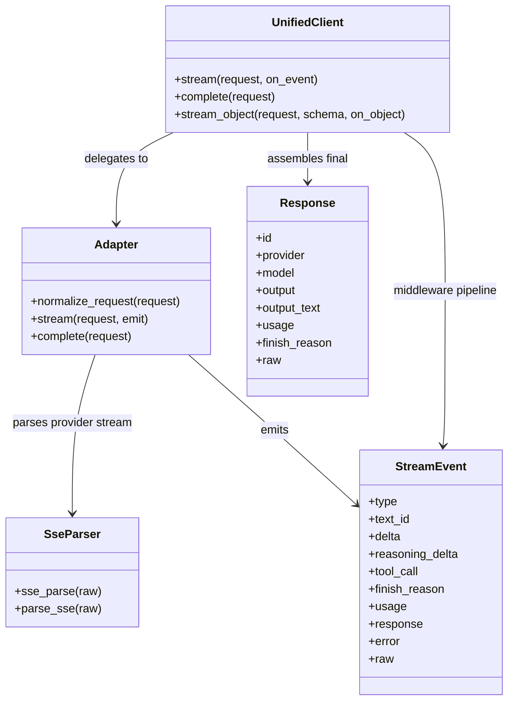
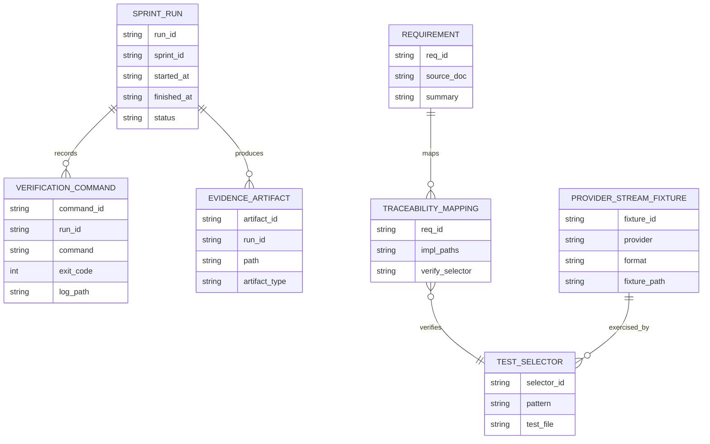
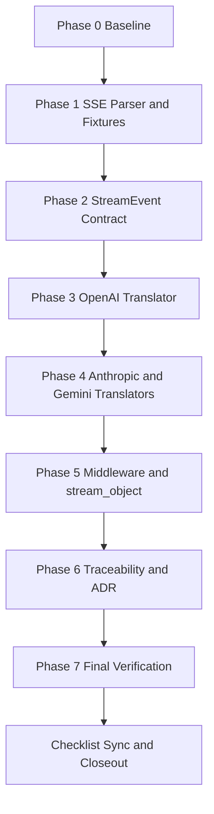
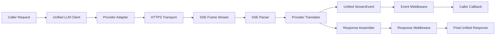
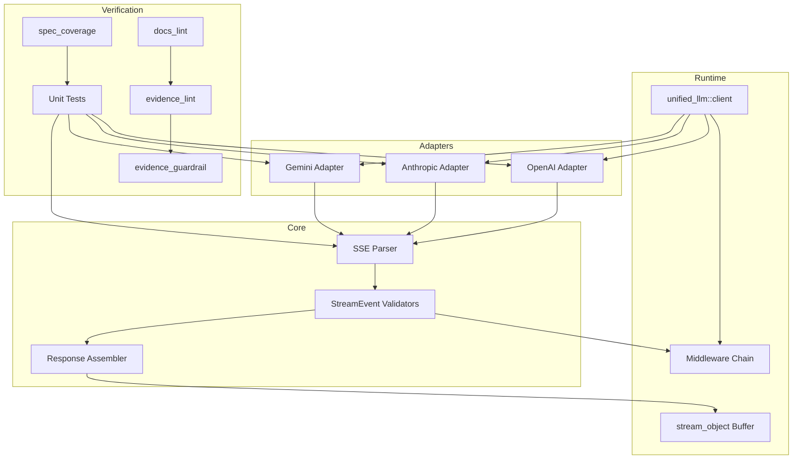

Legend: [ ] Incomplete, [X] Complete

# Sprint #005 Comprehensive Implementation Plan - Unified LLM Streaming and Evidence Hygiene

## Objective
Deliver provider-native Unified LLM streaming with spec-faithful StreamEvent ordering/types and restore evidence/traceability hygiene so streaming compliance is provable from deterministic offline tests.

## Source Sprint Reviewed
- `docs/sprints/SPRINT-005-unified-llm-streaming-evidence-hygiene.md`

## Executive Summary
- [ ] G1 - Replace synthetic provider streaming with provider-native OpenAI, Anthropic, and Gemini stream translation paths.
```text
{placeholder for verification justification/reasoning and evidence log}
```
- [ ] G2 - Enforce StreamEvent parity and ordering invariants (`STREAM_START`, `TEXT_START`, `TEXT_DELTA`, `TEXT_END`, reasoning/tool-call lifecycle, `FINISH`, `ERROR`, `PROVIDER_EVENT`).
```text
{placeholder for verification justification/reasoning and evidence log}
```
- [ ] G3 - Expand deterministic fixture-driven test coverage for streaming-positive and streaming-negative behavior.
```text
{placeholder for verification justification/reasoning and evidence log}
```
- [ ] G4 - Ensure middleware and `stream_object` remain correct under the expanded streaming model.
```text
{placeholder for verification justification/reasoning and evidence log}
```
- [ ] G5 - Tighten streaming requirement traceability mappings and document architecture decisions in `docs/ADR.md`.
```text
{placeholder for verification justification/reasoning and evidence log}
```
- [ ] G6 - Close sprint with passing build/test/spec/docs/evidence guardrails and synchronized completion state.
```text
{placeholder for verification justification/reasoning and evidence log}
```

## Scope
In scope:
- `lib/attractor_core/core.tcl`
- `lib/unified_llm/main.tcl`
- `lib/unified_llm/adapters/openai.tcl`
- `lib/unified_llm/adapters/anthropic.tcl`
- `lib/unified_llm/adapters/gemini.tcl`
- `lib/unified_llm/transports/https_json.tcl` (if streaming surface updates are required)
- `tests/unit/attractor_core.test`
- `tests/unit/unified_llm_streaming.test`
- `tests/fixtures/unified_llm_streaming/`
- `docs/spec-coverage/traceability.md`
- `docs/ADR.md`
- `docs/sprints/SPRINT-005-unified-llm-streaming-evidence-hygiene.md`
- `docs/sprints/SPRINT-005-comprehensive-implementation-plan.md`

Out of scope:
- New providers beyond OpenAI, Anthropic, and Gemini.
- Runtime feature gating.
- Legacy compatibility shims.

## Implementation Constraints
- Provider adapters must stream from provider-native payloads and must not call blocking `complete` then chunk text.
- Deterministic offline tests are the default acceptance mechanism.
- Streaming errors after partial output must emit `ERROR` and terminate without retrying transport.
- Every completion check must be backed by explicit verification commands and evidence references.

## Workstreams and Phase Order
1. Phase 0 - Baseline audit and requirement gap ledger.
2. Phase 1 - SSE parser contract and fixture corpus.
3. Phase 2 - Unified StreamEvent model and synthetic fallback parity.
4. Phase 3 - OpenAI provider-native translator.
5. Phase 4 - Anthropic and Gemini provider-native translators.
6. Phase 5 - Middleware, `stream_object`, and no-retry semantics.
7. Phase 6 - Traceability, ADR, and sprint evidence hygiene.
8. Phase 7 - End-to-end verification and closeout sync.

## Requirement-to-Verification Matrix
| Requirement ID | Planned Verification Selectors |
| --- | --- |
| `ULLM-REQ-MOST-PROVIDERS-USE-SERVER-SENT-EVENTS` | `tclsh tests/all.tcl -match *attractor_core-sse*`, `tclsh tests/all.tcl -match *unified_llm-openai-stream-translation*`, `tclsh tests/all.tcl -match *unified_llm-anthropic-stream-translation*`, `tclsh tests/all.tcl -match *unified_llm-gemini-stream-translation*` |
| `ULLM-REQ-RESPONSES-API-STREAMING-FORMAT-PROVIDES-REASONING` | `tclsh tests/all.tcl -match *unified_llm-openai-stream-translation*`, `tclsh tests/all.tcl -match *unified_llm-anthropic-stream-translation*` |
| `ULLM-DOD-8.29-YIELDS-EVENTS-CONCATENATE-FULL-RESPONSE-TEXT` | `tclsh tests/all.tcl -match *unified_llm-stream-events-concatenate*` |
| `ULLM-DOD-8.30-YIELDS-EVENTS-CORRECT-METADATA` | `tclsh tests/all.tcl -match *unified_llm-stream-event-model*`, provider translation selectors |
| `ULLM-DOD-8.31-STREAMING-FOLLOWS-START-DELTA-END-PATTERN` | `tclsh tests/all.tcl -match *unified_llm-stream-event-model*`, provider translation selectors |
| `ULLM-DOD-8.70-STREAMING-DOES-RETRY-AFTER-PARTIAL-DATA` | `tclsh tests/all.tcl -match *unified_llm-stream-no-retry-after-partial*` |

## Phase 0 - Baseline Audit and Gap Ledger
### Deliverables
- [ ] P0.1 - Capture baseline command outputs for build, tests, streaming selectors, spec coverage, docs lint, and evidence lint/guardrail.
```text
{placeholder for verification justification/reasoning and evidence log}
```
- [ ] P0.2 - Create a gap ledger mapping each target requirement ID to implementation files, tests, and owning phase.
```text
{placeholder for verification justification/reasoning and evidence log}
```
- [ ] P0.3 - Record baseline architecture assumptions and sprint constraints in `docs/ADR.md`.
```text
{placeholder for verification justification/reasoning and evidence log}
```
- [ ] P0.4 - Define evidence folder layout under `.scratch/verification/SPRINT-005/comprehensive-plan/` for consistent run indexing.
```text
{placeholder for verification justification/reasoning and evidence log}
```

### Positive Test Cases
1. Baseline `make -j10 build` passes from repository root.
2. Baseline `make -j10 test` passes from repository root.
3. Streaming selectors resolve to real tests and execute.
4. Requirement gap ledger contains every targeted streaming requirement ID.

### Negative Test Cases
1. Remove one requirement ID from the ledger and confirm validation catches the omission.
2. Add an invalid test selector and confirm selector verification fails.
3. Add an unknown requirement ID mapping and confirm `tools/spec_coverage.tcl` fails.
4. Remove evidence index file and confirm evidence checks fail.

### Verification Commands
- `make -j10 build`
- `make -j10 test`
- `tclsh tests/all.tcl -match *attractor_core-sse*`
- `tclsh tests/all.tcl -match *unified_llm-openai-stream-translation*`
- `tclsh tests/all.tcl -match *unified_llm-anthropic-stream-translation*`
- `tclsh tests/all.tcl -match *unified_llm-gemini-stream-translation*`
- `tclsh tools/spec_coverage.tcl`
- `bash tools/docs_lint.sh`

### Acceptance Criteria - Phase 0
- [ ] P0.A1 - Baseline evidence is reproducible from logged commands and indexed artifacts.
```text
{placeholder for verification justification/reasoning and evidence log}
```
- [ ] P0.A2 - Gap ledger fully maps target requirements to concrete implementations and verifiers.
```text
{placeholder for verification justification/reasoning and evidence log}
```

## Phase 1 - SSE Parser Contract and Fixture Corpus
### Deliverables
- [ ] P1.1 - Harden `::attractor_core::sse_parse` for EOF flush, comment lines, multiline `data`, and `event`/`id`/`retry` fields.
```text
{placeholder for verification justification/reasoning and evidence log}
```
- [ ] P1.2 - Provide `::attractor_core::parse_sse` alias/wrapper with output parity.
```text
{placeholder for verification justification/reasoning and evidence log}
```
- [ ] P1.3 - Add fixture corpus under `tests/fixtures/unified_llm_streaming/` for OpenAI, Anthropic, Gemini, and malformed frame cases.
```text
{placeholder for verification justification/reasoning and evidence log}
```
- [ ] P1.4 - Add parser and fixture regression tests in `tests/unit/attractor_core.test` and `tests/unit/unified_llm_streaming.test`.
```text
{placeholder for verification justification/reasoning and evidence log}
```

### Positive Test Cases
1. SSE parser returns expected event boundaries for valid provider fixture streams.
2. EOF without trailing blank line flushes final event correctly.
3. Multiline `data:` fields are joined with newline delimiters.
4. `id` and `retry` values are preserved.

### Negative Test Cases
1. Malformed frame with invalid field syntax is ignored or surfaced deterministically.
2. Empty events do not create malformed translation state.
3. Unknown non-standard fields do not crash parser.
4. Fixture file corruption is detected by fixture-load test.

### Verification Commands
- `tclsh tests/all.tcl -match *attractor_core-sse*`
- `tclsh tests/all.tcl -match *unified_llm-stream-fixture-load*`

### Acceptance Criteria - Phase 1
- [ ] P1.A1 - SSE parser behavior is deterministic and spec-aligned for required SSE semantics.
```text
{placeholder for verification justification/reasoning and evidence log}
```
- [ ] P1.A2 - Fixture corpus covers valid and invalid streaming payload categories for each provider.
```text
{placeholder for verification justification/reasoning and evidence log}
```

## Phase 2 - Unified StreamEvent Model and Synthetic Fallback Parity
### Deliverables
- [ ] P2.1 - Add/confirm StreamEvent constructors and validators enforcing required fields by event type.
```text
{placeholder for verification justification/reasoning and evidence log}
```
- [ ] P2.2 - Enforce lifecycle invariants for `text_id` and event ordering from `STREAM_START` through `FINISH`.
```text
{placeholder for verification justification/reasoning and evidence log}
```
- [ ] P2.3 - Update synthetic fallback stream path to emit `TEXT_START`, `TEXT_DELTA`, and `TEXT_END` with deterministic ordering.
```text
{placeholder for verification justification/reasoning and evidence log}
```
- [ ] P2.4 - Implement/verify `PROVIDER_EVENT` passthrough and typed `ERROR` semantics for malformed payloads.
```text
{placeholder for verification justification/reasoning and evidence log}
```

### Positive Test Cases
1. Synthetic path emits `STREAM_START`, text lifecycle events, and terminal `FINISH`.
2. Text deltas concatenate exactly to `FINISH.response.output_text`.
3. Unknown provider events are surfaced as `PROVIDER_EVENT` with raw payload.
4. Valid tool-call streaming events preserve boundaries.

### Negative Test Cases
1. Malformed JSON delta emits `ERROR` and no `FINISH`.
2. Event lifecycle violation triggers deterministic failure.
3. Missing terminal event path is surfaced as stream error in higher-level callers.
4. Unknown event type does not crash runtime.

### Verification Commands
- `tclsh tests/all.tcl -match *unified_llm-stream-event-model*`
- `tclsh tests/all.tcl -match *unified_llm-stream-events-concatenate*`
- `tclsh tests/all.tcl -match *unified_llm-stream-error-invalid-json*`

### Acceptance Criteria - Phase 2
- [ ] P2.A1 - StreamEvent model enforces ordering and field invariants consistently.
```text
{placeholder for verification justification/reasoning and evidence log}
```
- [ ] P2.A2 - Synthetic fallback produces the same lifecycle contract expected from provider-native streaming.
```text
{placeholder for verification justification/reasoning and evidence log}
```

## Phase 3 - OpenAI Provider-Native Streaming Translator
### Deliverables
- [ ] P3.1 - Implement OpenAI `stream` path using provider-native SSE frames and translate text deltas to unified events.
```text
{placeholder for verification justification/reasoning and evidence log}
```
- [ ] P3.2 - Assemble OpenAI tool-call argument deltas and emit complete decoded tool-call payload at `TOOL_CALL_END`.
```text
{placeholder for verification justification/reasoning and evidence log}
```
- [ ] P3.3 - Map OpenAI completion terminal frames to unified `FINISH` with usage metadata.
```text
{placeholder for verification justification/reasoning and evidence log}
```
- [ ] P3.4 - Preserve unmapped provider frames as `PROVIDER_EVENT`.
```text
{placeholder for verification justification/reasoning and evidence log}
```

### Positive Test Cases
1. Text-only stream maps to text lifecycle and `FINISH` events.
2. Tool-call delta sequence emits start/delta/end with decoded arguments dict.
3. Terminal usage includes expected token metadata.
4. Unmapped event type is surfaced as `PROVIDER_EVENT`.

### Negative Test Cases
1. Invalid JSON chunk yields terminal `ERROR`.
2. Tool-call args invalid JSON yields deterministic `ERROR` at assembly boundary.
3. Stream transport failure after partial text does not silently recover.
4. Out-of-order provider events do not violate unified event ordering contract.

### Verification Commands
- `tclsh tests/all.tcl -match *unified_llm-openai-stream-translation-text*`
- `tclsh tests/all.tcl -match *unified_llm-openai-stream-translation-tool*`
- `tclsh tests/all.tcl -match *unified_llm-openai-stream-translation-provider-event*`

### Acceptance Criteria - Phase 3
- [ ] P3.A1 - OpenAI translator emits spec-faithful unified stream event lifecycle.
```text
{placeholder for verification justification/reasoning and evidence log}
```
- [ ] P3.A2 - OpenAI tool-call streaming assembly produces decoded argument dictionaries at `TOOL_CALL_END`.
```text
{placeholder for verification justification/reasoning and evidence log}
```

## Phase 4 - Anthropic and Gemini Provider-Native Streaming Translators
### Deliverables
- [ ] P4.1 - Implement Anthropic streaming translation for text, tool_use, and thinking blocks.
```text
{placeholder for verification justification/reasoning and evidence log}
```
- [ ] P4.2 - Implement Gemini `streamGenerateContent?alt=sse` translation for text and functionCall parts.
```text
{placeholder for verification justification/reasoning and evidence log}
```
- [ ] P4.3 - Ensure both translators emit `FINISH` with accumulated response and usage metadata.
```text
{placeholder for verification justification/reasoning and evidence log}
```
- [ ] P4.4 - Ensure both translators preserve unmapped frames as `PROVIDER_EVENT` where applicable.
```text
{placeholder for verification justification/reasoning and evidence log}
```

### Positive Test Cases
1. Anthropic stream yields text, reasoning, and tool-call lifecycle events.
2. Gemini stream yields text and function-call events.
3. Gemini end-of-stream without explicit finish reason still emits terminal `FINISH` deterministically.
4. Provider metadata is preserved into `FINISH.usage`/response fields.

### Negative Test Cases
1. Anthropic unknown content block type maps to `PROVIDER_EVENT` instead of failure.
2. Gemini malformed chunk emits terminal `ERROR`.
3. Missing or incomplete tool-call payloads are handled deterministically.
4. Provider frame ordering anomalies do not corrupt unified event lifecycle.

### Verification Commands
- `tclsh tests/all.tcl -match *unified_llm-anthropic-stream-translation*`
- `tclsh tests/all.tcl -match *unified_llm-anthropic-stream-translation-provider-event*`
- `tclsh tests/all.tcl -match *unified_llm-gemini-stream-translation*`
- `tclsh tests/all.tcl -match *unified_llm-gemini-stream-translation-invalid-json*`

### Acceptance Criteria - Phase 4
- [ ] P4.A1 - Anthropic and Gemini translators are provider-native and lifecycle-correct.
```text
{placeholder for verification justification/reasoning and evidence log}
```
- [ ] P4.A2 - Terminal and error semantics are deterministic and match sprint contract.
```text
{placeholder for verification justification/reasoning and evidence log}
```

## Phase 5 - Middleware, stream_object, and No-Retry Semantics
### Deliverables
- [ ] P5.1 - Verify request/event/response middleware ordering and transform behavior for stream mode.
```text
{placeholder for verification justification/reasoning and evidence log}
```
- [ ] P5.2 - Update/verify `stream_object` buffering to tolerate expanded event types and validate JSON after stream completion.
```text
{placeholder for verification justification/reasoning and evidence log}
```
- [ ] P5.3 - Enforce no-retry-after-partial-output rule with explicit regression coverage.
```text
{placeholder for verification justification/reasoning and evidence log}
```
- [ ] P5.4 - Validate tool-call streaming assembly across providers to decoded argument dictionaries.
```text
{placeholder for verification justification/reasoning and evidence log}
```

### Positive Test Cases
1. Middleware executes request and event transforms in registration order.
2. Response middleware executes in reverse order on final response.
3. `stream_object` emits parsed object when streamed JSON is valid.
4. Tool-call assembly test validates decoded arguments dictionary output.

### Negative Test Cases
1. Invalid streamed JSON returns typed parse error.
2. Stream termination with `ERROR` returns `STREAM_ERROR` to `stream_object` callers.
3. Transport error after first delta emits `ERROR` and no transport retry.
4. Middleware transform error surfaces deterministically and terminates stream correctly.

### Verification Commands
- `tclsh tests/all.tcl -match *unified_llm-stream-middleware*`
- `tclsh tests/all.tcl -match *unified_llm-stream-object-expanded*`
- `tclsh tests/all.tcl -match *unified_llm-stream-object-invalid-json*`
- `tclsh tests/all.tcl -match *unified_llm-stream-object-stream-error*`
- `tclsh tests/all.tcl -match *unified_llm-stream-no-retry-after-partial*`
- `tclsh tests/all.tcl -match *unified_llm-stream-tool-call-assembly*`

### Acceptance Criteria - Phase 5
- [ ] P5.A1 - Middleware semantics and structured streaming remain correct under expanded event model.
```text
{placeholder for verification justification/reasoning and evidence log}
```
- [ ] P5.A2 - No-retry-after-partial-output behavior is proven by deterministic tests.
```text
{placeholder for verification justification/reasoning and evidence log}
```

## Phase 6 - Traceability, ADR, and Evidence Hygiene
### Deliverables
- [ ] P6.1 - Update `docs/spec-coverage/traceability.md` so streaming requirement IDs map to streaming-specific tests.
```text
{placeholder for verification justification/reasoning and evidence log}
```
- [ ] P6.2 - Add ADR entry documenting StreamEvent contract expansion and provider-native translation architecture.
```text
{placeholder for verification justification/reasoning and evidence log}
```
- [ ] P6.3 - Ensure sprint documentation satisfies docs lint, evidence lint, and evidence guardrail contracts.
```text
{placeholder for verification justification/reasoning and evidence log}
```
- [ ] P6.4 - Keep completion state in sync with verified implementation state.
```text
{placeholder for verification justification/reasoning and evidence log}
```

### Positive Test Cases
1. `tools/spec_coverage.tcl` passes with strict catalog/traceability ID equality.
2. Each streamed requirement has at least one specific test selector.
3. Sprint docs satisfy `docs_lint` and evidence checks.
4. Referenced evidence artifacts exist and are discoverable.

### Negative Test Cases
1. Broad wildcard selector substitution for streaming IDs is rejected by review.
2. Missing evidence command for a checked item fails evidence lint.
3. Missing evidence file path fails guardrail checks.
4. Unknown requirement ID in traceability mapping fails spec coverage.

### Verification Commands
- `tclsh tools/spec_coverage.tcl`
- `bash tools/docs_lint.sh`
- `bash tools/evidence_lint.sh docs/sprints/SPRINT-005-unified-llm-streaming-evidence-hygiene.md`
- `bash tools/evidence_lint.sh docs/sprints/SPRINT-005-comprehensive-implementation-plan.md`
- `tclsh tools/evidence_guardrail.tcl docs/sprints/SPRINT-005-unified-llm-streaming-evidence-hygiene.md docs/sprints/SPRINT-005-comprehensive-implementation-plan.md`

### Acceptance Criteria - Phase 6
- [ ] P6.A1 - Traceability, ADR, and sprint docs provide auditable evidence for streaming compliance.
```text
{placeholder for verification justification/reasoning and evidence log}
```
- [ ] P6.A2 - Documentation guardrails pass with no missing evidence references.
```text
{placeholder for verification justification/reasoning and evidence log}
```

## Phase 7 - Final Verification and Closeout Sync
### Deliverables
- [ ] P7.1 - Execute full build and test gates after all code and docs updates.
```text
{placeholder for verification justification/reasoning and evidence log}
```
- [ ] P7.2 - Execute full streaming selector matrix and capture command-status index.
```text
{placeholder for verification justification/reasoning and evidence log}
```
- [ ] P7.3 - Execute traceability/docs/evidence guardrails and capture closeout evidence artifacts.
```text
{placeholder for verification justification/reasoning and evidence log}
```
- [ ] P7.4 - Mark completed checklist items only after verification artifacts are present.
```text
{placeholder for verification justification/reasoning and evidence log}
```

### Positive Test Cases
1. Full build passes.
2. Full test suite passes.
3. Streaming selector matrix passes for parser, provider translators, middleware, stream object, and no-retry cases.
4. Docs/traceability/evidence guardrails pass.

### Negative Test Cases
1. Intentionally stale evidence link fails evidence guardrail.
2. Intentionally malformed traceability mapping fails spec coverage.
3. Intentionally broken streaming selector fails phase closeout.
4. Missing `FINISH` emission regression is caught by unit tests.

### Verification Commands
- `make -j10 build`
- `make -j10 test`
- `tclsh tests/all.tcl -match *attractor_core-sse*`
- `tclsh tests/all.tcl -match *unified_llm-openai-stream-translation*`
- `tclsh tests/all.tcl -match *unified_llm-anthropic-stream-translation*`
- `tclsh tests/all.tcl -match *unified_llm-gemini-stream-translation*`
- `tclsh tests/all.tcl -match *unified_llm-stream-tool-call-assembly*`
- `tclsh tests/all.tcl -match *unified_llm-stream-middleware*`
- `tclsh tests/all.tcl -match *unified_llm-stream-object*`
- `tclsh tests/all.tcl -match *unified_llm-stream-no-retry-after-partial*`
- `tclsh tools/spec_coverage.tcl`
- `bash tools/docs_lint.sh`
- `bash tools/evidence_lint.sh docs/sprints/SPRINT-005-unified-llm-streaming-evidence-hygiene.md`
- `bash tools/evidence_lint.sh docs/sprints/SPRINT-005-comprehensive-implementation-plan.md`
- `tclsh tools/evidence_guardrail.tcl docs/sprints/SPRINT-005-unified-llm-streaming-evidence-hygiene.md docs/sprints/SPRINT-005-comprehensive-implementation-plan.md`

### Acceptance Criteria - Phase 7
- [ ] P7.A1 - All required implementation, testing, and documentation verification commands pass.
```text
{placeholder for verification justification/reasoning and evidence log}
```
- [ ] P7.A2 - Sprint completion state is synchronized with verifiable evidence artifacts.
```text
{placeholder for verification justification/reasoning and evidence log}
```

## Appendix - Mermaid Diagrams

### Core Domain Models


### E-R Diagram


### Workflow Diagram


### Data-Flow Diagram


### Architecture Diagram

